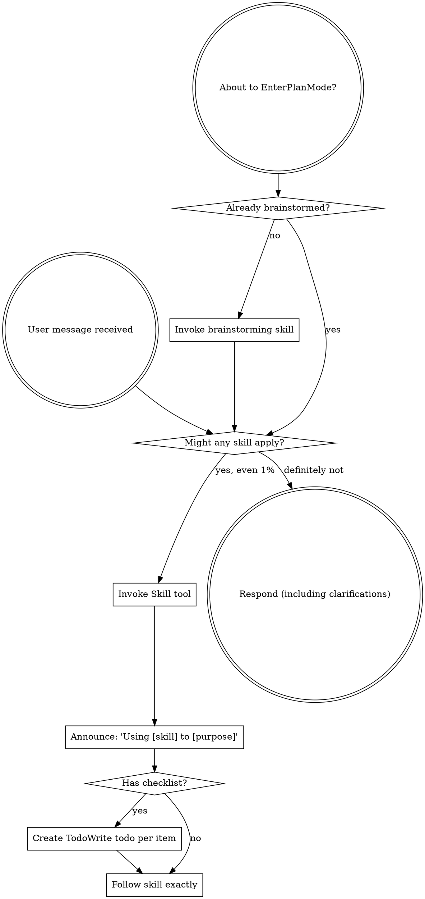

# Boundary Review — ariadne#163 (whole-issue close)

| field | value |
|-------|-------|
| issue | 163 — consolidate issue-file scanners into a shared helper |
| repo | ariadne |
| issue file | workshop/issues/000163-consolidate-issue-file-scanners-into-a-shared-helper.md |
| boundary | whole-issue close |
| milestone | — |
| window | 67cd04efce51d013abbd918a804a0b3f771c6398..HEAD |
| command | sdlc close --issue 163 |
| reviewer | codex |
| timestamp | 2026-07-13T13:52:41-07:00 |
| verdict | FIX-THEN-SHIP |

## Review

Reading additional input from stdin...
OpenAI Codex v0.144.2
--------
workdir: /Users/xianxu/workspace/ariadne
model: gpt-5.6-sol
provider: openai
approval: never
sandbox: workspace-write [workdir, /tmp, $TMPDIR, /tmp] (network access enabled)
reasoning effort: none
reasoning summaries: none
session id: 019f5d3d-ce28-7941-8e71-d5a0b3de5fbf
--------
user
# Code review — the one SDLC boundary review

You are conducting a fresh-context code review at a development boundary —
whole-issue close — in the **ariadne** repository.

- repository: ariadne   (root: /Users/xianxu/workspace/ariadne)
- issue:      ariadne#163   (file: workshop/issues/000163-consolidate-issue-file-scanners-into-a-shared-helper.md)
- window:     Base: 67cd04efce51d013abbd918a804a0b3f771c6398   Head: HEAD

Review the **ariadne** repo and its tracker — the ariadne base-layer repo itself (changes here propagate to dependent repos). Do not assume any
other repository or apply another repo's conventions.

You have no prior session context — that is the anti-collusion property. Verify
behavior against the issue's documented Spec/Plan and the code itself; do NOT
take the implementor's word in commit messages or docs at face value. Tools are
read-only: report findings precisely; the main agent (which has session context)
applies the fixes, commits, and re-runs.

Read the diff against the issue's Spec + Plan, then work the checklist below.
Categorize every finding by severity — not everything is Critical; a nitpick
marked Critical is noise.

  Critical (must fix before crossing the boundary)
    - correctness bugs; crashes / panics on unexpected input
    - behavior drift from stated contracts (for ports of existing code where
      byte-faithfulness was promised, diff against the source)
    - silent error swallowing where the source raised
  Important (fix before the boundary if cheap)
    - API design of newly-introduced internal packages (downstream work will
      consume them; is the surface stable?)
    - missing test coverage that would catch the kind of bug shipped
    - inconsistent error handling across the diff
  Minor (note for future)
    - style nits, naming, comment density; performance only if hot-path

## Review checklist

Code quality
  - Clean separation of concerns; edge cases handled (empty / nil / unexpected).
  - Proper error handling — no silent swallowing where the source raised.
  - No duplicated logic / copy-paste that should be a shared helper.

Testing
  - Tests pin real logic, not mocks reasserting the implementation.
  - The kind of bug this diff could ship is covered.
  - PURE entities tested without IO; INTEGRATION via injected fakes (see below).

Requirements traceability
  - Every Plan checklist item this boundary claims is actually delivered.
  - Implementation matches the Spec; no undeclared scope creep.
  - Breaking changes documented.

Production readiness
  - Migration / backward-compatibility considered where state or formats change.
  - Docs / atlas updated for new surface (see the Docs update gate).

## Core concepts cross-check (if the plan has a Core concepts table)

The plan should list entities in a greppable table — name, kind
(PURE/INTEGRATION), file location, status (new/modified/deleted). For each row:
  - Verify the entity exists at the stated path (grep the diff or filesystem).
  - PURE: tests run without IO (no exec, net, mutable fs). If tests need mocks
    to run, it isn't really PURE — flag Critical and recommend promoting it to
    INTEGRATION.
  - INTEGRATION: injected into pure callers, not invoked directly from business
    logic.
  - "modified" / "deleted": the diff shows the expected change/removal at the
    stated location.
Any contradiction between table and code = Critical finding, plus a plan-revision
recommendation (a "## Revisions" entry so the plan stops claiming what the code
doesn't deliver).

## Docs update gate (atlas + README, per AGENTS.md §8)

The boundary should update user-facing docs for any new surface introduced:

  - **atlas/** — new architectural surface, flow, or terminology. Scan the diff
    for new entity types, subcommands, conventions, file-tree locations. Any
    present without corresponding atlas/ changes in the same range = Important
    finding ("atlas update appears missing for <surface>").
  - **README.md** — new user-facing surface a reader runs or types: subcommands,
    flags, keybindings, config keys, install/usage steps. If the diff adds or
    changes such surface and README.md is not updated in the same range =
    Important finding ("README update appears missing for <surface>"). This is the
    class of gap that used to surface only at the merge-time `specs` judge (#142);
    catch it here, at the earliest gate, before the close verdict is recorded.

## Architecture (the at-review backstop — these matter most long-term)

Work through each of ARCH-DRY, ARCH-PURE, ARCH-PURPOSE explicitly, applying its at-review lens. The
full principle definitions are delivered in the ARCHITECTURE PRINCIPLES block
right after this prompt — for EACH marker, state pass or flag, and cite the
marker (e.g. ARCH-DRY) in any finding. Architecture is where review has the
least training signal and the longest-delayed payoff, so be deliberate here, not
holistic.

## Verdict + output

Begin your response with this fenced verdict block — the machine-read handoff:

```verdict
verdict: <SHIP | FIX-THEN-SHIP | REWORK>
confidence: <high | medium | low>
```

  SHIP           ready; ship it
  FIX-THEN-SHIP  ship after addressing the findings (non-blocking at the gate)
  REWORK         blocking; needs rework before shipping — fix + re-run

The fenced ```` ```verdict ```` block above is the **authoritative machine-read
handoff** — emit it as the first thing in your response. (A prose
`VERDICT: <TOKEN>` first line still satisfies the legacy contract as a fallback,
but the block is what the binary trusts.)

After the verdict block: a 1-paragraph summary — what worked, what blocks SHIP if
it isn't — followed by:
  1. Strengths: 2-5 specific things done well (file:line where useful). Affirm
     validated approaches so the operator knows what's confirmed-good ground.
     Empty acceptable for trivial boundaries.
  2. Critical findings (file:line + fix sketch); empty if none.
  3. Important findings (same format).
  4. Minor findings (terse one-liners).
  5. Test coverage notes.
  6. Architectural notes for upcoming work.
  7. Plan revision recommendations: specific "## Revisions" entries the plan
     needs (empty if the plan still matches the code).


ARCHITECTURE PRINCIPLES — work through each of the 3 entries below explicitly, applying its `at-review` lens; cite the marker (e.g. ARCH-DRY) in any finding.

# Architecture principles (ARCH-*)

Injected architectural taste — the structural decisions whose payoff (or cost)
shows up many turns, often months, down the road. Agents are strong at local
tactics and weak here, so these are checked **at-plan** (when the design is being
made — highest leverage) and **at-review** (backstop, on the diff). Cite the
marker (e.g. `ARCH-DRY`) in plans, `## Log` entries, and review findings.

This file is the single source; it is embedded into the planning, plan-quality,
and code-review prompts. The human narrative lives in AGENTS.md "Core Design
Principles"; this is its machine-delivered companion.

## ARCH-DRY — Don't Repeat Yourself

- **principle:** Reuse before adding. One source of truth per fact/behavior; no
  duplicated logic, copy-pasted blocks, or parallel functions that should be one
  shared helper.
- **at-plan:** Flag a plan that re-implements something the codebase already has,
  or that will obviously duplicate logic across the new files instead of
  extracting a shared helper. Name the existing thing it should reuse.
- **at-review:** Flag duplicated logic / copy-pasted blocks / near-identical
  functions in the diff; point at the consolidation (file:line + the shared
  helper they should become).

## ARCH-PURE — Pure core, thin IO shell

- **principle:** The majority of code is pure functions (deterministic, no side
  effects); a thin "glue" layer at the boundary touches IO/UI/network/clock. Pure
  functions are unit-tested directly; the glue is kept small and injected.
- **at-plan:** Flag a design that buries business logic inside IO/handlers, or
  that will only be testable with heavy mocks (a sign logic isn't separated from
  IO). The plan should name what's pure vs the thin IO seam.
- **at-review:** Flag business logic mixed with IO in the diff; logic that should
  be a pure function injected into a thin caller. If a test needs mocks to run a
  "pure" entity, it isn't pure — recommend extracting the IO to the boundary.

## ARCH-PURPOSE — Serve the issue's actual purpose

- **principle:** Deliver the issue's stated purpose, not the easy subset of it. A
  single-source / "compiled to consumers" change is not done until **every
  consumer derives** from the source — the source is *enforced*, not just
  documentation a surface happens to restate; a hand-maintained restatement of the
  model is a deferred consumer, not a finished one. "Follow-up" is for separable
  extensions, never for the thing that is the point. This is the *opposite axis*
  from Simplicity-First/YAGNI: not "build for an imagined future," but "don't
  **under**-deliver the purpose you already committed to."
- **at-plan:** Flag a plan whose scope is a strict subset of the issue's stated
  goal / Done-when where the part deferred as "follow-up" *is* the purpose (e.g.
  wires one consumer + enforcement but leaves the consumers that motivated the
  issue as documentation that doesn't derive). Ask: does the plan fulfill the
  purpose, or just the cheap win? Name the deferred purpose.
- **at-review:** Does the diff *fulfill* the purpose or settle for the easy win?
  For a single-source change, run the **shadow-sweep** — enumerate the consumers,
  confirm each derives from the source, flag any remaining hand-maintained
  restatement of the model. A "follow-up" that is actually the deferred point of
  the issue is a finding, not a deferral.


OUTPUT CONTRACT (machine-read — do not deviate). LEAD your response with the
fenced ```verdict block shown above — that is the authoritative handoff the binary
reads (its `verdict:` value is one of the listed tokens). Everything after the block
is advisory: a non-blocking verdict WITH findings still PASSES the gate. A bare
`VERDICT: <TOKEN>` line is accepted only as a FALLBACK when the block is absent.

Diff:
diff --git a/cmd/sdlc/branchcreate.go b/cmd/sdlc/branchcreate.go
index 93bd41a..f2065e4 100644
--- a/cmd/sdlc/branchcreate.go
+++ b/cmd/sdlc/branchcreate.go
@@ -11,7 +11,6 @@ import (
 	"io"
 	"os"
 	"path/filepath"
-	"regexp"
 	"strings"
 
 	"github.com/xianxu/ariadne/cmd/sdlc/internal/gitx"
@@ -104,17 +103,13 @@ func listUntrackedIssues(issuesDir string, r gitRunner) ([]string, error) {
 	var matches []string
 	for _, line := range strings.Split(text, "\n") {
 		base := filepath.Base(line)
-		if issueIDRE.MatchString(base) {
+		if issueFilename(base) {
 			matches = append(matches, line)
 		}
 	}
 	return matches, nil
 }
 
-// issueIDRE matches NNNNNN-<slug>.md filenames (6-digit prefix, dash,
-// any slug, .md).
-var issueIDRE = regexp.MustCompile(`^\d{6}-.*\.md$`)
-
 // commitUntrackedIssueFile commits + pushes one untracked file before
 // branch creation, so the new branch starts from a tracked state.
 // Push failures are warnings, not fatal — same posture as start.go's
diff --git a/cmd/sdlc/branchname_test.go b/cmd/sdlc/branchname_test.go
index bbfcc40..4b21499 100644
--- a/cmd/sdlc/branchname_test.go
+++ b/cmd/sdlc/branchname_test.go
@@ -230,6 +230,7 @@ func TestListUntrackedIssues_FilterShape(t *testing.T) {
 	}{
 		{"", nil},
 		{"issues/000077-real.md\n", []string{"issues/000077-real.md"}},
+		{"issues/000077-.md\n", []string{"issues/000077-.md"}},
 		{"workshop/issues/000001-foo.md\nworkshop/issues/junk.md\n",
 			[]string{"workshop/issues/000001-foo.md"}},
 		// 5 digits → must not match.
diff --git a/cmd/sdlc/issuefiles.go b/cmd/sdlc/issuefiles.go
new file mode 100644
index 0000000..ab25fed
--- /dev/null
+++ b/cmd/sdlc/issuefiles.go
@@ -0,0 +1,105 @@
+package main
+
+import (
+	"os"
+	"path/filepath"
+	"sort"
+	"strings"
+
+	"github.com/xianxu/ariadne/cmd/sdlc/internal/issue"
+	"github.com/xianxu/ariadne/pkg/vocab"
+)
+
+const issueFilenamePattern = "[0-9][0-9][0-9][0-9][0-9][0-9]-*.md"
+
+type issueFileRef struct {
+	Path        string
+	Status      string
+	Frontmatter string
+	Body        string
+}
+
+type issueFileScanError struct {
+	Output []byte
+	Err    error
+}
+
+func (e *issueFileScanError) Error() string { return e.Err.Error() }
+
+func (e *issueFileScanError) Unwrap() error { return e.Err }
+
+func scanIssueFiles(baseRef, issuesDir string, runGit func(...string) ([]byte, error)) ([]issueFileRef, error) {
+	var paths []string
+	if baseRef != "" {
+		out, err := runGit("diff", "--name-only", baseRef+"..HEAD", "--", issuesDir+"/*.md")
+		if err != nil {
+			return nil, &issueFileScanError{Output: out, Err: err}
+		}
+		paths = splitNonEmptyLines(string(out))
+	} else {
+		paths, _ = filepath.Glob(filepath.Join(issuesDir, issueFilenamePattern))
+		sort.Strings(paths)
+	}
+
+	refs := make([]issueFileRef, 0, len(paths))
+	for _, path := range paths {
+		data, err := os.ReadFile(path)
+		if err != nil {
+			continue
+		}
+		fm, body, err := issue.Parse(string(data))
+		if err != nil {
+			continue
+		}
+		status, _ := issue.GetField(fm, "status")
+		refs = append(refs, issueFileRef{
+			Path:        path,
+			Status:      status,
+			Frontmatter: fm,
+			Body:        body,
+		})
+	}
+	return refs, nil
+}
+
+func issueFilenameParts(name string) (id, slug string, ok bool) {
+	base := filepath.Base(name)
+	matched, _ := filepath.Match(issueFilenamePattern, base)
+	if !matched {
+		return "", "", false
+	}
+	return base[:6], strings.TrimSuffix(base[7:], ".md"), true
+}
+
+func issueFilename(name string) bool {
+	_, _, ok := issueFilenameParts(name)
+	return ok
+}
+
+func codecompleteIssueFiles(refs []issueFileRef) []issueFileRef {
+	return filterIssueFiles(refs, func(ref issueFileRef) bool {
+		return ref.Status == "codecomplete"
+	})
+}
+
+func notDoneIssueFiles(refs []issueFileRef) []issueFileRef {
+	return filterIssueFiles(refs, func(ref issueFileRef) bool {
+		return ref.Status != "codecomplete" && !vocab.Issue().IsTerminal(ref.Status)
+	})
+}
+
+func terminalIssueFiles(refs []issueFileRef) []issueFileRef {
+	return filterIssueFiles(refs, func(ref issueFileRef) bool {
+		return vocab.Issue().IsTerminal(ref.Status)
+	})
+}
+
+func filterIssueFiles(refs []issueFileRef, keep func(issueFileRef) bool) []issueFileRef {
+	var filtered []issueFileRef
+	for _, ref := range refs {
+		if keep(ref) {
+			filtered = append(filtered, ref)
+		}
+	}
+	return filtered
+}
diff --git a/cmd/sdlc/issuefiles_test.go b/cmd/sdlc/issuefiles_test.go
new file mode 100644
index 0000000..daf4701
--- /dev/null
+++ b/cmd/sdlc/issuefiles_test.go
@@ -0,0 +1,236 @@
+package main
+
+import (
+	"errors"
+	"fmt"
+	"os"
+	"os/exec"
+	"path/filepath"
+	"reflect"
+	"strings"
+	"testing"
+
+	"github.com/xianxu/ariadne/cmd/sdlc/internal/issue"
+)
+
+func TestIssueFileRefFilters(t *testing.T) {
+	refs := []issueFileRef{
+		{Path: "working.md", Status: "working"},
+		{Path: "done.md", Status: "done"},
+		{Path: "codecomplete.md", Status: "codecomplete"},
+		{Path: "missing.md"},
+		{Path: "wontfix.md", Status: "wontfix"},
+		{Path: "open.md", Status: "open"},
+		{Path: "punt.md", Status: "punt"},
+	}
+
+	tests := []struct {
+		name string
+		got  []issueFileRef
+		want []issueFileRef
+	}{
+		{
+			name: "codecomplete",
+			got:  codecompleteIssueFiles(refs),
+			want: refs[2:3],
+		},
+		{
+			name: "not done",
+			got:  notDoneIssueFiles(refs),
+			want: []issueFileRef{refs[0], refs[3], refs[5]},
+		},
+		{
+			name: "terminal",
+			got:  terminalIssueFiles(refs),
+			want: []issueFileRef{refs[1], refs[4], refs[6]},
+		},
+	}
+
+	for _, tt := range tests {
+		t.Run(tt.name, func(t *testing.T) {
+			if !reflect.DeepEqual(tt.got, tt.want) {
+				t.Fatalf("got %#v, want %#v", tt.got, tt.want)
+			}
+		})
+	}
+}
+
+func TestScanIssueFilesWindowPreservesOrderAndParsedSnapshot(t *testing.T) {
+	dir := t.TempDir()
+	first := writeScanIssueFile(t, dir, "000001-first.md", "working", "# First\n")
+	second := writeScanIssueFile(t, dir, "custom.md", "codecomplete", "# Second\n")
+
+	var gotArgs []string
+	runGit := func(args ...string) ([]byte, error) {
+		gotArgs = append([]string(nil), args...)
+		return []byte(second + "\n" + first + "\n"), nil
+	}
+	refs, err := scanIssueFiles("base", dir, runGit)
+	if err != nil {
+		t.Fatal(err)
+	}
+	if want := []string{"diff", "--name-only", "base..HEAD", "--", dir + "/*.md"}; !reflect.DeepEqual(gotArgs, want) {
+		t.Fatalf("git args = %#v, want %#v", gotArgs, want)
+	}
+	if got, want := issueFilePaths(refs), []string{second, first}; !reflect.DeepEqual(got, want) {
+		t.Fatalf("paths = %#v, want %#v", got, want)
+	}
+	if refs[0].Status != "codecomplete" || refs[0].Body != "# Second\n" {
+		t.Fatalf("parsed ref = %#v", refs[0])
+	}
+	updated := issue.SetField(refs[0].Frontmatter, "status", "done")
+	if got := issue.Compose(updated, refs[0].Body); !strings.Contains(got, "status: done\n---\n# Second\n") {
+		t.Fatalf("composed parsed snapshot = %q", got)
+	}
+}
+
+func TestScanIssueFilesWindowUsesRealGitDiff(t *testing.T) {
+	repo := hermeticRepo(t)
+	issuesDir := filepath.Join("workshop", "issues")
+	if err := os.MkdirAll(issuesDir, 0o755); err != nil {
+		t.Fatal(err)
+	}
+	writeScanIssueFile(t, issuesDir, "000001-first.md", "working", "# First\n")
+	writeScanIssueFile(t, issuesDir, "custom.md", "working", "# Custom\n")
+	runGitCommand(t, repo, "add", ".")
+	runGitCommand(t, repo, "commit", "-qm", "base")
+	base := strings.TrimSpace(runGitCommand(t, repo, "rev-parse", "HEAD"))
+	writeScanIssueFile(t, issuesDir, "000001-first.md", "codecomplete", "# First changed\n")
+	writeScanIssueFile(t, issuesDir, "custom.md", "done", "# Custom changed\n")
+	runGitCommand(t, repo, "add", ".")
+	runGitCommand(t, repo, "commit", "-qm", "changed")
+
+	runner := execGitRunner{}
+	refs, err := scanIssueFiles(base, issuesDir, runner.Git)
+	if err != nil {
+		t.Fatal(err)
+	}
+	if got, want := issueFilePaths(refs), []string{
+		filepath.Join(issuesDir, "000001-first.md"),
+		filepath.Join(issuesDir, "custom.md"),
+	}; !reflect.DeepEqual(got, want) {
+		t.Fatalf("paths = %#v, want %#v", got, want)
+	}
+}
+
+func TestScanIssueFilesDirectoryUsesSharedGrammarAndSorts(t *testing.T) {
+	dir := t.TempDir()
+	second := writeScanIssueFile(t, dir, "000002-second.md", "done", "# Second\n")
+	first := writeScanIssueFile(t, dir, "000001-first.md", "working", "# First\n")
+	writeScanIssueFile(t, dir, "custom.md", "working", "# Custom\n")
+
+	refs, err := scanIssueFiles("", dir, func(...string) ([]byte, error) {
+		t.Fatal("directory scan invoked git")
+		return nil, nil
+	})
+	if err != nil {
+		t.Fatal(err)
+	}
+	if got, want := issueFilePaths(refs), []string{first, second}; !reflect.DeepEqual(got, want) {
+		t.Fatalf("paths = %#v, want %#v", got, want)
+	}
+
+	fixtures := map[string]bool{
+		"000001-slug.md":  true,
+		"000001-.md":      true,
+		"00001-short.md":  false,
+		"000001-slug.txt": false,
+		"custom.md":       false,
+	}
+	for name, want := range fixtures {
+		if got := issueFilename(name); got != want {
+			t.Errorf("issueFilename(%q) = %v, want %v", name, got, want)
+		}
+	}
+
+	id, slug, ok := issueFilenameParts("000001-slug.md")
+	if !ok || id != "000001" || slug != "slug" {
+		t.Fatalf("parts = %q, %q, %v", id, slug, ok)
+	}
+	if got := issueIDPrefix("/tmp/000001-.md"); got != "000001" {
+		t.Fatalf("empty-slug prefix = %q, want 000001", got)
+	}
+	for _, name := range []string{"00001-short.md", "abcdef-slug.md", "000001-slug.txt"} {
+		if got := issueIDPrefix(name); got != "" {
+			t.Errorf("issueIDPrefix(%q) = %q, want empty", name, got)
+		}
+	}
+}
+
+func TestScanIssueFilesSkipsDeletedUnreadableAndMalformed(t *testing.T) {
+	dir := t.TempDir()
+	missingStatus := filepath.Join(dir, "000001-missing-status.md")
+	if err := os.WriteFile(missingStatus, []byte("---\ntitle: Missing\n---\n# Body\n"), 0o644); err != nil {
+		t.Fatal(err)
+	}
+	malformed := filepath.Join(dir, "000002-malformed.md")
+	if err := os.WriteFile(malformed, []byte("no frontmatter"), 0o644); err != nil {
+		t.Fatal(err)
+	}
+	unreadable := filepath.Join(dir, "000003-directory.md")
+	if err := os.Mkdir(unreadable, 0o755); err != nil {
+		t.Fatal(err)
+	}
+	deleted := filepath.Join(dir, "000004-deleted.md")
+
+	runGit := func(...string) ([]byte, error) {
+		return []byte(strings.Join([]string{deleted, malformed, unreadable, missingStatus}, "\n")), nil
+	}
+	refs, err := scanIssueFiles("base", dir, runGit)
+	if err != nil {
+		t.Fatal(err)
+	}
+	if len(refs) != 1 || refs[0].Path != missingStatus || refs[0].Status != "" {
+		t.Fatalf("refs = %#v", refs)
+	}
+}
+
+func TestScanIssueFilesRetainsGitFailureFacts(t *testing.T) {
+	cause := errors.New("diff failed")
+	runGit := func(...string) ([]byte, error) {
+		return []byte("fatal detail"), cause
+	}
+	_, err := scanIssueFiles("base", "workshop/issues", runGit)
+	if err == nil {
+		t.Fatal("expected error")
+	}
+	if !errors.Is(err, cause) {
+		t.Fatalf("errors.Is(%v, cause) = false", err)
+	}
+	var scanErr *issueFileScanError
+	if !errors.As(err, &scanErr) {
+		t.Fatalf("errors.As(%T, *issueFileScanError) = false", err)
+	}
+	if got := string(scanErr.Output); got != "fatal detail" {
+		t.Fatalf("output = %q", got)
+	}
+}
+
+func writeScanIssueFile(t *testing.T, dir, name, status, body string) string {
+	t.Helper()
+	path := filepath.Join(dir, name)
+	contents := fmt.Sprintf("---\ntitle: Test\nstatus: %s\n---\n%s", status, body)
+	if err := os.WriteFile(path, []byte(contents), 0o644); err != nil {
+		t.Fatal(err)
+	}
+	return path
+}
+
+func issueFilePaths(refs []issueFileRef) []string {
+	paths := make([]string, 0, len(refs))
+	for _, ref := range refs {
+		paths = append(paths, ref.Path)
+	}
+	return paths
+}
+
+func runGitCommand(t *testing.T, dir string, args ...string) string {
+	t.Helper()
+	cmd := exec.Command("git", args...)
+	cmd.Dir = dir
+	out, err := cmd.CombinedOutput()
+	if err != nil {
+		t.Fatalf("git %v: %v\n%s", args, err, out)
+	}
+	return string(out)
+}
diff --git a/cmd/sdlc/merge.go b/cmd/sdlc/merge.go
index e03bede..7281c4d 100644
--- a/cmd/sdlc/merge.go
+++ b/cmd/sdlc/merge.go
@@ -37,16 +37,12 @@ import (
 	"io"
 	"os"
 	"path/filepath"
-	"sort"
 	"strconv"
 	"strings"
 
 	"github.com/spf13/cobra"
 
 	"github.com/xianxu/ariadne/cmd/sdlc/internal/gitx"
-	"github.com/xianxu/ariadne/cmd/sdlc/internal/issue"
-
-	"github.com/xianxu/ariadne/pkg/vocab"
 )
 
 // mergeFlags holds the parsed flag values for the merge subcommand.
@@ -612,23 +608,13 @@ func archiveDoneIssuesInDir(stderr io.Writer, repo, mainPath, issuesDir, history
 	issuesFull := filepath.Join(mainPath, issuesDir)
 	historyFull := filepath.Join(mainPath, historyDir)
 	plansFull := filepath.Join(mainPath, plansDir)
-	matches, _ := filepath.Glob(filepath.Join(issuesFull, "[0-9][0-9][0-9][0-9][0-9][0-9]-*.md"))
-	sort.Strings(matches)
+	refs, err := scanIssueFiles("", issuesFull, nil)
+	if err != nil {
+		return nil, err
+	}
 	var moves []preparedArchiveMove
 	cinfo(stderr, fmt.Sprintf("Archiving completed issues to %s/...", historyDir))
-	for _, p := range matches {
-		data, err := os.ReadFile(p)
-		if err != nil {
-			continue
-		}
-		fm, _, perr := issue.Parse(string(data))
-		if perr != nil {
-			continue
-		}
-		st, _ := issue.GetField(fm, "status")
-		if !vocab.Issue().IsTerminal(st) {
-			continue
-		}
+	for _, ref := range terminalIssueFiles(refs) {
 		// Merge target's shell DOES NOT call gh issue close — only push:
 		// closes GH issues. We mirror that. (Rationale: PR merge itself
 		// closes the linked GH issue via the "Fixes #N" body, so a second
@@ -638,11 +624,11 @@ func archiveDoneIssuesInDir(stderr io.Writer, repo, mainPath, issuesDir, history
 		if err := os.MkdirAll(historyFull, 0o755); err != nil {
 			return moves, fmt.Errorf("mkdir %s: %v", historyFull, err)
 		}
-		base := filepath.Base(p)
+		base := filepath.Base(ref.Path)
 		dest := filepath.Join(historyFull, base)
 		fmt.Fprintf(stderr, "  Moving %s to %s/\n", base, historyDir)
-		if err := os.Rename(p, dest); err != nil {
-			return moves, fmt.Errorf("mv %s → %s: %v", p, dest, err)
+		if err := os.Rename(ref.Path, dest); err != nil {
+			return moves, fmt.Errorf("mv %s → %s: %v", ref.Path, dest, err)
 		}
 		// Record paths relative to mainPath: GitInDir(mainPath, "add", …)
 		// resolves them from the main worktree root, so an absolute path here
diff --git a/cmd/sdlc/merge_test.go b/cmd/sdlc/merge_test.go
index 88e8673..69d92b3 100644
--- a/cmd/sdlc/merge_test.go
+++ b/cmd/sdlc/merge_test.go
@@ -194,7 +194,7 @@ func TestIsInPlaceCheckout(t *testing.T) {
 
 // ── archiveDoneIssuesInDir ───────────────────────────────────────────────────
 
-func TestArchiveDoneIssuesInDir_MovesAndDoesNotCloseGH(t *testing.T) {
+func TestArchiveDoneIssuesInDir_MovesTerminalAndRecordsRelativePaths(t *testing.T) {
 	tmp := t.TempDir()
 	issuesDir := "workshop/issues"
 	historyDir := "workshop/history"
@@ -214,7 +214,9 @@ func TestArchiveDoneIssuesInDir_MovesAndDoesNotCloseGH(t *testing.T) {
 		}
 	}
 	mk("000001-done.md", "done", "100")
-	mk("000002-working.md", "working", "200")
+	mk("000002-wontfix.md", "wontfix", "200")
+	mk("000003-punt.md", "punt", "300")
+	mk("000004-working.md", "working", "400")
 
 	// Track that IssueClose is NOT called (merge ships through PR which
 	// closes via "Fixes #N" body — calling gh issue close would be a bug).
@@ -228,17 +230,20 @@ func TestArchiveDoneIssuesInDir_MovesAndDoesNotCloseGH(t *testing.T) {
 	if err != nil {
 		t.Fatal(err)
 	}
-	if len(moves) != 1 {
-		t.Errorf("moved = %d, want 1", len(moves))
+	if len(moves) != 3 {
+		t.Errorf("moved = %d, want 3", len(moves))
 	}
 	// Returned paths are mainPath-relative (so GitInDir resolves them) — never
 	// absolute, or a precise `git add` from the main worktree would silently miss.
-	if len(moves) == 1 {
-		if got, want := moves[0].IssuePath, filepath.Join(issuesDir, "000001-done.md"); got != want {
-			t.Errorf("IssuePath = %q, want relative %q", got, want)
+	for i, name := range []string{"000001-done.md", "000002-wontfix.md", "000003-punt.md"} {
+		if i >= len(moves) {
+			break
 		}
-		if got, want := moves[0].HistoryPath, filepath.Join(historyDir, "000001-done.md"); got != want {
-			t.Errorf("HistoryPath = %q, want relative %q", got, want)
+		if got, want := moves[i].IssuePath, filepath.Join(issuesDir, name); got != want {
+			t.Errorf("moves[%d].IssuePath = %q, want relative %q", i, got, want)
+		}
+		if got, want := moves[i].HistoryPath, filepath.Join(historyDir, name); got != want {
+			t.Errorf("moves[%d].HistoryPath = %q, want relative %q", i, got, want)
 		}
 	}
 	if len(stub.closed) != 0 {
@@ -247,7 +252,7 @@ func TestArchiveDoneIssuesInDir_MovesAndDoesNotCloseGH(t *testing.T) {
 	if _, err := os.Stat(filepath.Join(tmp, historyDir, "000001-done.md")); err != nil {
 		t.Errorf("expected file in history/: %v", err)
 	}
-	if _, err := os.Stat(filepath.Join(tmp, issuesDir, "000002-working.md")); err != nil {
+	if _, err := os.Stat(filepath.Join(tmp, issuesDir, "000004-working.md")); err != nil {
 		t.Errorf("working file should remain in issues/: %v", err)
 	}
 }
diff --git a/cmd/sdlc/publishgate.go b/cmd/sdlc/publishgate.go
index 23a40de..f9c6e44 100644
--- a/cmd/sdlc/publishgate.go
+++ b/cmd/sdlc/publishgate.go
@@ -10,8 +10,6 @@ import (
 	"fmt"
 	"io"
 	"os"
-	"path/filepath"
-	"sort"
 	"strconv"
 	"strings"
 	"time"
@@ -63,25 +61,19 @@ func codecompleteAnchorCommit(issuePath string) string {
 // publish is about to flip to done. Mirrors touchedIssuesNotDone's window scan
 // (ARCH-DRY).
 func mergedCodecompleteIssues(baseRef, issuesDir string) ([]string, error) {
-	out, err := gitx.RunGit("diff", "--name-only", baseRef+"..HEAD", "--", issuesDir+"/*.md")
+	refs, err := scanIssueFiles(baseRef, issuesDir, gitx.RunGit)
 	if err != nil {
+		if scanErr, ok := err.(*issueFileScanError); ok {
+			return nil, fmt.Errorf("git diff %s..HEAD: %w", baseRef, scanErr.Err)
+		}
 		return nil, fmt.Errorf("git diff %s..HEAD: %w", baseRef, err)
 	}
-	var cc []string
-	for _, p := range splitNonEmptyLines(string(out)) {
-		data, derr := os.ReadFile(p)
-		if derr != nil {
-			continue
-		}
-		fm, _, perr := issue.Parse(string(data))
-		if perr != nil {
-			continue
-		}
-		if st, _ := issue.GetField(fm, "status"); st == "codecomplete" {
-			cc = append(cc, p)
-		}
+	codecomplete := codecompleteIssueFiles(refs)
+	paths := make([]string, 0, len(codecomplete))
+	for _, ref := range codecomplete {
+		paths = append(paths, ref.Path)
 	}
-	return cc, nil
+	return paths, nil
 }
 
 // runPublishGate is the deterministic pre-publish check (#160) — no LLM. It
@@ -141,28 +133,20 @@ func runPublishGate(baseRef, issuesDir string, stderr io.Writer) error {
 // (The invariant that gates un-reviewed drift is runPublishGate; this flip is the
 // mechanical state change once that gate passed.)
 func publishCodecompleteIssues(issuesDir string) ([]string, error) {
-	matches, _ := filepath.Glob(filepath.Join(issuesDir, "[0-9][0-9][0-9][0-9][0-9][0-9]-*.md"))
-	sort.Strings(matches)
+	refs, err := scanIssueFiles("", issuesDir, nil)
+	if err != nil {
+		return nil, err
+	}
 	today := time.Now().Format("2006-01-02")
 	var flipped []string
-	for _, p := range matches {
-		data, err := os.ReadFile(p)
-		if err != nil {
-			continue
-		}
-		fm, body, perr := issue.Parse(string(data))
-		if perr != nil {
-			continue
-		}
-		if st, _ := issue.GetField(fm, "status"); st != "codecomplete" {
-			continue
-		}
+	for _, ref := range codecompleteIssueFiles(refs) {
+		fm := ref.Frontmatter
 		fm = issue.SetField(fm, "status", "done")
 		fm = issue.SetField(fm, "updated", today)
-		if werr := os.WriteFile(p, []byte(issue.Compose(fm, body)), 0o644); werr != nil {
-			return flipped, fmt.Errorf("flip %s → done: %w", p, werr)
+		if werr := os.WriteFile(ref.Path, []byte(issue.Compose(fm, ref.Body)), 0o644); werr != nil {
+			return flipped, fmt.Errorf("flip %s → done: %w", ref.Path, werr)
 		}
-		flipped = append(flipped, p)
+		flipped = append(flipped, ref.Path)
 	}
 	return flipped, nil
 }
diff --git a/cmd/sdlc/publishgate_test.go b/cmd/sdlc/publishgate_test.go
index 8f9ef6e..44a7942 100644
--- a/cmd/sdlc/publishgate_test.go
+++ b/cmd/sdlc/publishgate_test.go
@@ -1,6 +1,7 @@
 package main
 
 import (
+	"errors"
 	"fmt"
 	"io"
 	"os"
@@ -8,8 +9,10 @@ import (
 	"path/filepath"
 	"strings"
 	"testing"
+	"time"
 
 	"github.com/xianxu/ariadne/cmd/sdlc/internal/gitx"
+	"github.com/xianxu/ariadne/cmd/sdlc/internal/issue"
 )
 
 // publishRepo inits a temp git repo, chdir's in (so gitx.RunGit/Capture bind to it),
@@ -109,6 +112,20 @@ func TestMergedCodecompleteIssues(t *testing.T) {
 	}
 }
 
+func TestMergedCodecompleteIssuesPreservesGitError(t *testing.T) {
+	t.Setenv("PATH", "")
+	_, err := mergedCodecompleteIssues("base", "workshop/issues")
+	if err == nil {
+		t.Fatal("expected error")
+	}
+	if got, want := err.Error(), `git diff base..HEAD: exec: "git": executable file not found in $PATH`; got != want {
+		t.Fatalf("error = %q, want %q", got, want)
+	}
+	if !errors.Is(err, exec.ErrNotFound) {
+		t.Fatalf("errors.Is(%v, exec.ErrNotFound) = false", err)
+	}
+}
+
 func TestRunPublishGate(t *testing.T) {
 	t.Run("clean: HEAD == anchor passes", func(t *testing.T) {
 		git, base := publishRepo(t)
@@ -160,6 +177,14 @@ func TestPublishCodecompleteIssues(t *testing.T) {
 	git, _ := publishRepo(t)
 	writeIssueStatus(t, git, 69, "codecomplete", "#69 close")
 	writeIssueStatus(t, git, 70, "working", "#70 wip")
+	before, err := os.ReadFile(issuePathFor(69))
+	if err != nil {
+		t.Fatal(err)
+	}
+	_, bodyBefore, err := issue.Parse(string(before))
+	if err != nil {
+		t.Fatal(err)
+	}
 
 	flipped, err := publishCodecompleteIssues("workshop/issues")
 	if err != nil {
@@ -172,6 +197,16 @@ func TestPublishCodecompleteIssues(t *testing.T) {
 	if !strings.Contains(string(got69), "status: done") {
 		t.Errorf("#69 should be flipped to done:\n%s", got69)
 	}
+	fmAfter, bodyAfter, err := issue.Parse(string(got69))
+	if err != nil {
+		t.Fatal(err)
+	}
+	if bodyAfter != bodyBefore {
+		t.Errorf("body changed during status flip:\nbefore %q\nafter  %q", bodyBefore, bodyAfter)
+	}
+	if updated, _ := issue.GetField(fmAfter, "updated"); updated != time.Now().Format("2006-01-02") {
+		t.Errorf("updated = %q, want today", updated)
+	}
 	got70, _ := os.ReadFile(issuePathFor(70))
 	if !strings.Contains(string(got70), "status: working") {
 		t.Errorf("#70 (working) must be untouched:\n%s", got70)
diff --git a/cmd/sdlc/push.go b/cmd/sdlc/push.go
index 3c6babf..577cafd 100644
--- a/cmd/sdlc/push.go
+++ b/cmd/sdlc/push.go
@@ -254,16 +254,11 @@ func archiveAddArgs(moves []preparedArchiveMove) []string {
 // NNNNNN- convention. The single source for "which plan artifacts belong to
 // this issue" — the glob key is id+"-*" (#143).
 func issueIDPrefix(name string) string {
-	base := filepath.Base(name)
-	if len(base) < 7 || base[6] != '-' {
+	id, _, ok := issueFilenameParts(name)
+	if !ok {
 		return ""
 	}
-	for i := 0; i < 6; i++ {
-		if base[i] < '0' || base[i] > '9' {
-			return ""
-		}
-	}
-	return base[:6]
+	return id
 }
 
 // archivePlanArtifacts moves every workshop/plans/NNNNNN-* artifact (the durable
@@ -482,11 +477,6 @@ func isHistoryPath(path, historyDir string) bool {
 	return filepath.Dir(path) == filepath.Clean(historyDir) && issueFilename(filepath.Base(path))
 }
 
-func issueFilename(name string) bool {
-	matched, _ := filepath.Match("[0-9][0-9][0-9][0-9][0-9][0-9]-*.md", name)
-	return matched
-}
-
 func historyFileIsTerminal(path string) (bool, error) {
 	data, err := os.ReadFile(path)
 	if err != nil {
@@ -507,7 +497,7 @@ func historyFileIsTerminal(path string) (bool, error) {
 //
 // Multiple touched issues → newline-joined titles. Single → just the title.
 func buildPushCommitMessage(issuesDir string, r gitRunner) string {
-	matches, _ := filepath.Glob(filepath.Join(issuesDir, "[0-9][0-9][0-9][0-9][0-9][0-9]-*.md"))
+	matches, _ := filepath.Glob(filepath.Join(issuesDir, issueFilenamePattern))
 	sort.Strings(matches)
 	var titles []string
 	for _, f := range matches {
@@ -550,30 +540,16 @@ func extractFirstTitle(body string) string {
 // by push's not-done warn step. Mirrors check_undone_issues in
 // Makefile.workflow.
 func touchedIssuesNotDone(baseRef, issuesDir string, r gitRunner) ([]string, error) {
-	out, err := r.Git("diff", "--name-only", baseRef+"..HEAD", "--", issuesDir+"/*.md")
+	refs, err := scanIssueFiles(baseRef, issuesDir, r.Git)
 	if err != nil {
-		return nil, fmt.Errorf("git diff %s..HEAD: %v\n%s", baseRef, err, out)
+		if scanErr, ok := err.(*issueFileScanError); ok {
+			return nil, fmt.Errorf("git diff %s..HEAD: %v\n%s", baseRef, scanErr.Err, scanErr.Output)
+		}
+		return nil, fmt.Errorf("git diff %s..HEAD: %v", baseRef, err)
 	}
-	touched := splitNonEmptyLines(string(out))
 	var notDone []string
-	for _, p := range touched {
-		// Read from the working tree — the file is on disk at p relative
-		// to repo top. Matches the shell `[ -f "$target" ]` guard.
-		data, derr := os.ReadFile(p)
-		if derr != nil {
-			continue
-		}
-		fm, _, perr := issue.Parse(string(data))
-		if perr != nil {
-			continue
-		}
-		st, _ := issue.GetField(fm, "status")
-		// #160: `codecomplete` is the normal pre-publish state — the publish gate is
-		// about to flip it to done — so it is NOT "not done" (else every merge/push
-		// would trip this warn). Only open/working/blocked are genuinely not-done.
-		if !vocab.Issue().IsTerminal(st) && st != "codecomplete" {
-			notDone = append(notDone, fmt.Sprintf("%s (status: %s)", p, valueOr(st, "unset")))
-		}
+	for _, ref := range notDoneIssueFiles(refs) {
+		notDone = append(notDone, fmt.Sprintf("%s (status: %s)", ref.Path, valueOr(ref.Status, "unset")))
 	}
 	return notDone, nil
 }
@@ -584,27 +560,17 @@ func touchedIssuesNotDone(baseRef, issuesDir string, r gitRunner) ([]string, err
 // not abort). Returns the moves it made (deleted issue path + created history
 // path, repo-relative) so the caller can stage exactly those paths (#80).
 func archiveDoneIssues(stderr io.Writer, repo, issuesDir, historyDir, plansDir string) ([]preparedArchiveMove, error) {
-	matches, _ := filepath.Glob(filepath.Join(issuesDir, "[0-9][0-9][0-9][0-9][0-9][0-9]-*.md"))
-	sort.Strings(matches)
+	refs, err := scanIssueFiles("", issuesDir, nil)
+	if err != nil {
+		return nil, err
+	}
 	var moves []preparedArchiveMove
-	for _, p := range matches {
-		data, err := os.ReadFile(p)
-		if err != nil {
-			continue
-		}
-		fm, _, perr := issue.Parse(string(data))
-		if perr != nil {
-			continue
-		}
-		st, _ := issue.GetField(fm, "status")
-		if !vocab.Issue().IsTerminal(st) {
-			continue
-		}
+	for _, ref := range terminalIssueFiles(refs) {
 		// status=done + github_issue: → close GitHub issue first. (#122 carve-out:
 		// literal "done" is value-specific — only done has a GitHub issue to close —
 		// not a category test, so it stays a literal, not vocab.Issue().IsTerminal.)
-		if st == "done" && repo != "" {
-			if ghNum, ok := issue.GetField(fm, "github_issue"); ok && ghNum != "" {
+		if ref.Status == "done" && repo != "" {
+			if ghNum, ok := issue.GetField(ref.Frontmatter, "github_issue"); ok && ghNum != "" {
 				cinfo(stderr, fmt.Sprintf("Closing GitHub issue #%s...", ghNum))
 				if cerr := ghClient.IssueClose(repo, ghNum, "Fixed on main."); cerr != nil {
 					cwarn(stderr, fmt.Sprintf("gh issue close %s failed: %v (continuing)", ghNum, cerr))
@@ -614,16 +580,16 @@ func archiveDoneIssues(stderr io.Writer, repo, issuesDir, historyDir, plansDir s
 		if err := os.MkdirAll(historyDir, 0o755); err != nil {
 			return moves, fmt.Errorf("mkdir %s: %v", historyDir, err)
 		}
-		dest := filepath.Join(historyDir, filepath.Base(p))
-		cinfo(stderr, fmt.Sprintf("Archiving %s to %s/", p, historyDir))
-		if err := os.Rename(p, dest); err != nil {
-			return moves, fmt.Errorf("mv %s → %s: %v", p, dest, err)
+		dest := filepath.Join(historyDir, filepath.Base(ref.Path))
+		cinfo(stderr, fmt.Sprintf("Archiving %s to %s/", ref.Path, historyDir))
+		if err := os.Rename(ref.Path, dest); err != nil {
+			return moves, fmt.Errorf("mv %s → %s: %v", ref.Path, dest, err)
 		}
-		moves = append(moves, preparedArchiveMove{IssuePath: p, HistoryPath: dest})
+		moves = append(moves, preparedArchiveMove{IssuePath: ref.Path, HistoryPath: dest})
 		// Sweep the issue's durable plan + review sidecars to history too (#143).
 		// An untracked sidecar (#154) stages only its history dest, not a vanished
 		// source path — probe via `git ls-files` in cwd.
-		planMoves, perr := archivePlanArtifacts(filepath.Base(p), plansDir, historyDir, plansDir, historyDir, gitSrcUntracked(pushRunner.Git))
+		planMoves, perr := archivePlanArtifacts(filepath.Base(ref.Path), plansDir, historyDir, plansDir, historyDir, gitSrcUntracked(pushRunner.Git))
 		if perr != nil {
 			return moves, perr
 		}
diff --git a/cmd/sdlc/push_test.go b/cmd/sdlc/push_test.go
index 072d3ac..a669a7a 100644
--- a/cmd/sdlc/push_test.go
+++ b/cmd/sdlc/push_test.go
@@ -291,13 +291,14 @@ func TestRecoverInterruptedArchiveCommitsAndPushes(t *testing.T) {
 // notDoneRunner stubs `git diff --name-only` for the touched-issues query.
 type notDoneRunner struct {
 	captureRunner
-	touched []byte
+	touched    []byte
+	touchedErr error
 }
 
 func (r *notDoneRunner) Git(args ...string) ([]byte, error) {
 	r.gitCalls = append(r.gitCalls, append([]string{}, args...))
 	if len(args) >= 2 && args[0] == "diff" && args[1] == "--name-only" {
-		return r.touched, nil
+		return r.touched, r.touchedErr
 	}
 	return nil, nil
 }
@@ -327,17 +328,25 @@ func TestTouchedIssuesNotDone(t *testing.T) {
 	// to flip it to done — so it must NOT be flagged "not done" (else every merge/push
 	// would trip the "Continue anyway?" prompt). This pins the one-token carve-out.
 	mkIssue("000004-cc.md", "codecomplete")
+	missingStatus := filepath.Join(issuesDir, "000005-missing.md")
+	if err := os.WriteFile(missingStatus, []byte("---\nid: 5\n---\n\n# X\n"), 0o644); err != nil {
+		t.Fatal(err)
+	}
 
-	r := &notDoneRunner{touched: []byte("workshop/issues/000001-working.md\nworkshop/issues/000002-done.md\nworkshop/issues/000003-open.md\nworkshop/issues/000004-cc.md\n")}
+	r := &notDoneRunner{touched: []byte("workshop/issues/000005-missing.md\nworkshop/issues/000001-working.md\nworkshop/issues/000002-done.md\nworkshop/issues/000003-open.md\nworkshop/issues/000004-cc.md\n")}
 	notDone, err := touchedIssuesNotDone("origin/main", issuesDir, r)
 	if err != nil {
 		t.Fatal(err)
 	}
-	// Expect 000001 (working) and 000003 (open); NOT 000002 (done) or 000004 (codecomplete).
-	if len(notDone) != 2 {
-		t.Fatalf("got %d not-done; want 2: %v", len(notDone), notDone)
+	// Expect missing, 000001 (working), and 000003 (open), in git order;
+	// NOT 000002 (done) or 000004 (codecomplete).
+	if len(notDone) != 3 {
+		t.Fatalf("got %d not-done; want 3: %v", len(notDone), notDone)
+	}
+	if got, want := notDone[0], "workshop/issues/000005-missing.md (status: unset)"; got != want {
+		t.Errorf("missing-status entry = %q, want %q", got, want)
 	}
-	if !strings.Contains(notDone[0], "000001") || !strings.Contains(notDone[1], "000003") {
+	if !strings.Contains(notDone[1], "000001") || !strings.Contains(notDone[2], "000003") {
 		t.Errorf("entries: %v", notDone)
 	}
 	for _, e := range notDone {
@@ -347,6 +356,18 @@ func TestTouchedIssuesNotDone(t *testing.T) {
 	}
 }
 
+func TestTouchedIssuesNotDonePreservesGitOutputOnFailure(t *testing.T) {
+	cause := errors.New("exit status 128")
+	r := &notDoneRunner{touched: []byte("fatal: bad revision\n"), touchedErr: cause}
+	_, err := touchedIssuesNotDone("origin/main", "workshop/issues", r)
+	if err == nil {
+		t.Fatal("expected error")
+	}
+	if got, want := err.Error(), "git diff origin/main..HEAD: exit status 128\nfatal: bad revision\n"; got != want {
+		t.Fatalf("error = %q, want %q", got, want)
+	}
+}
+
 // ── archiveDoneIssues ────────────────────────────────────────────────────────
 
 // ghCallStub embeds stubGH (which provides PRCreate/PRListForBranch/PRMerge
@@ -395,6 +416,17 @@ func TestArchiveDoneIssues_MovesAndClosesGH(t *testing.T) {
 	if len(moves) != 3 {
 		t.Errorf("moved = %d, want 3", len(moves))
 	}
+	for i, name := range []string{"000001-done.md", "000002-wontfix.md", "000003-punt.md"} {
+		if i >= len(moves) {
+			break
+		}
+		if got, want := moves[i].IssuePath, filepath.Join(issuesDir, name); got != want {
+			t.Errorf("moves[%d].IssuePath = %q, want %q", i, got, want)
+		}
+		if got, want := moves[i].HistoryPath, filepath.Join(historyDir, name); got != want {
+			t.Errorf("moves[%d].HistoryPath = %q, want %q", i, got, want)
+		}
+	}
 	// Only the done issue with a github_issue should have been closed.
 	if len(stub.closed) != 1 || stub.closed[0] != "100" {
 		t.Errorf("closed = %v, want [100]", stub.closed)
diff --git a/cmd/sdlc/state.go b/cmd/sdlc/state.go
index 55c7d8e..84082b9 100644
--- a/cmd/sdlc/state.go
+++ b/cmd/sdlc/state.go
@@ -209,11 +209,6 @@ func recentCommits() ([]CommitState, string) {
 // titleRE matches the first `# Title` heading after the frontmatter.
 var titleRE = regexp.MustCompile(`(?m)^# (.+)$`)
 
-// issueFilenameRE matches workshop/issues/NNNNNN-slug.md. We extract the
-// padded ID from the filename to keep the JSON consistent with how
-// close-issue.py / sdlc close address issues.
-var issueFilenameRE = regexp.MustCompile(`^(\d{6})-(.+)\.md$`)
-
 // listIssues scans issuesDir for NNNNNN-*.md files, parses frontmatter,
 // counts plan items. Returns issues sorted by numeric ID.
 func listIssues(issuesDir string) ([]IssueState, error) {
@@ -230,8 +225,8 @@ func listIssues(issuesDir string) ([]IssueState, error) {
 			continue
 		}
 		name := e.Name()
-		m := issueFilenameRE.FindStringSubmatch(name)
-		if m == nil {
+		id, slug, ok := issueFilenameParts(name)
+		if !ok || slug == "" {
 			continue
 		}
 		path := filepath.Join(issuesDir, name)
@@ -243,7 +238,7 @@ func listIssues(issuesDir string) ([]IssueState, error) {
 			// inventory on transient permission/symlink errors
 			// undermines that. M2 review C2.
 			out = append(out, IssueState{
-				ID:     m[1],
+				ID:     id,
 				Path:   path,
 				Status: "unreadable",
 			})
@@ -254,7 +249,7 @@ func listIssues(issuesDir string) ([]IssueState, error) {
 		if ferr != nil {
 			// Issue file without frontmatter — surface with empty status
 			// so drift detection notices.
-			out = append(out, IssueState{ID: m[1], Path: path, Status: ""})
+			out = append(out, IssueState{ID: id, Path: path, Status: ""})
 			continue
 		}
 		status, _ := issue.GetField(fm, "status")
@@ -265,7 +260,7 @@ func listIssues(issuesDir string) ([]IssueState, error) {
 			title = tm[1]
 		}
 		out = append(out, IssueState{
-			ID:         m[1],
+			ID:         id,
 			Path:       path,
 			Status:     status,
 			Title:      title,
diff --git a/cmd/sdlc/state_test.go b/cmd/sdlc/state_test.go
index 6eb0cc6..8384c2d 100644
--- a/cmd/sdlc/state_test.go
+++ b/cmd/sdlc/state_test.go
@@ -40,6 +40,7 @@ updated: 2026-05-25
 - [ ] M2 — pending
 `)
 	mustWrite("000003-broken.md", "no frontmatter here\n")
+	mustWrite("000004-.md", "no slug\n")   // low-level grammar accepts it; inventory requires a slug
 	mustWrite("not-an-issue.md", "junk\n") // should be skipped (filename pattern)
 
 	got, err := listIssues(dir)
diff --git a/workshop/plans/000163-consolidate-issue-file-scanners-into-a-shared-helper-plan.md b/workshop/plans/000163-consolidate-issue-file-scanners-into-a-shared-helper-plan.md
index 466460a..4f40858 100644
--- a/workshop/plans/000163-consolidate-issue-file-scanners-into-a-shared-helper-plan.md
+++ b/workshop/plans/000163-consolidate-issue-file-scanners-into-a-shared-helper-plan.md
@@ -114,20 +114,20 @@
 - Modify: `cmd/sdlc/branchcreate.go`
 - Modify: `cmd/sdlc/branchname_test.go`
 
-- [ ] **Step 1: Write failing pure-filter tests**
+- [x] **Step 1: Write failing pure-filter tests**
 
 Add table-driven `TestIssueFileRefFilters` cases whose input order includes
 `working`, `done`, `codecomplete`, missing status, `wontfix`, `open`, and `punt`.
 Assert codecomplete-only, not-done (`working`, missing, `open`), and terminal
 (`done`, `wontfix`, `punt`) results with order preserved.
 
-- [ ] **Step 2: Run the pure tests and confirm RED**
+- [x] **Step 2: Run the pure tests and confirm RED**
 
 Run: `go test ./cmd/sdlc -run 'TestIssueFileRefFilters' -count=1`
 
 Expected: FAIL to compile because the record and filters do not exist.
 
-- [ ] **Step 3: Implement the minimal record and pure filters**
+- [x] **Step 3: Implement the minimal record and pure filters**
 
 ```go
 type issueFileRef struct {
@@ -145,13 +145,13 @@ func terminalIssueFiles(refs []issueFileRef) []issueFileRef
 Use `vocab.Issue().IsTerminal` for category membership and keep `codecomplete` as the
 value-specific carve-out. Return new slices in input order (ARCH-PURE, ARCH-DRY).
 
-- [ ] **Step 4: Run the pure tests and confirm GREEN**
+- [x] **Step 4: Run the pure tests and confirm GREEN**
 
 Run: `go test ./cmd/sdlc -run 'TestIssueFileRefFilters' -count=1`
 
 Expected: PASS.
 
-- [ ] **Step 5: Write failing integration tests for both scan modes**
+- [x] **Step 5: Write failing integration tests for both scan modes**
 
 Use a real temporary git repository plus `execGitRunner{}`. Pin:
 
@@ -175,13 +175,13 @@ Use a real temporary git repository plus `execGitRunner{}`. Pin:
   the underlying failure;
 - returned frontmatter/body support `SetField` + `Compose` without another read.
 
-- [ ] **Step 6: Run the scanner tests and confirm RED**
+- [x] **Step 6: Run the scanner tests and confirm RED**
 
 Run: `go test ./cmd/sdlc -run 'TestScanIssueFiles' -count=1`
 
 Expected: FAIL to compile because `scanIssueFiles` does not exist.
 
-- [ ] **Step 7: Implement the minimal integration seam**
+- [x] **Step 7: Implement the minimal integration seam**
 
 ```go
 func scanIssueFiles(baseRef, issuesDir string, runGit func(...string) ([]byte, error)) ([]issueFileRef, error)
@@ -199,13 +199,13 @@ path; silently skip read/parse failures. Return a failed window runner error. Pe
 no writes or caller policy here. On git failure return an `issueFileScanError` with
 `Output []byte`, `Err error`, `Error()`, and `Unwrap()`.
 
-- [ ] **Step 8: Run focused tests and confirm GREEN**
+- [x] **Step 8: Run focused tests and confirm GREEN**
 
 Run: `go test ./cmd/sdlc -run 'Test(IssueFileRefFilters|ScanIssueFiles)' -count=1`
 
 Expected: PASS.
 
-- [ ] **Step 9: Commit the scanner core**
+- [x] **Step 9: Commit the scanner core**
 
 ```bash
 gofmt -w cmd/sdlc/issuefiles.go cmd/sdlc/issuefiles_test.go cmd/sdlc/push.go cmd/sdlc/push_test.go cmd/sdlc/state.go cmd/sdlc/state_test.go cmd/sdlc/branchcreate.go cmd/sdlc/branchname_test.go
@@ -221,39 +221,39 @@ git commit -m "#163: add shared issue-file scanner" -m "Centralize issue enumera
 - Modify: `cmd/sdlc/publishgate_test.go`
 - Modify: `cmd/sdlc/push_test.go`
 
-- [ ] **Step 1: Strengthen caller tests before rewiring**
+- [x] **Step 1: Strengthen caller tests before rewiring**
 
 Pin that `mergedCodecompleteIssues` returns only codecomplete paths and preserves its
 exact `git diff <base>..HEAD: <cause>` message plus `errors.Is` chain; that
 `touchedIssuesNotDone` formats missing status as `unset`, preserves order, and excludes
 terminal plus `codecomplete`, while its failure message retains combined runner output.
 
-- [ ] **Step 2: Run the strengthened tests before refactor**
+- [x] **Step 2: Run the strengthened tests before refactor**
 
 Run: `go test ./cmd/sdlc -run 'Test(MergedCodecompleteIssues|TouchedIssuesNotDone)' -count=1`
 
 Expected: PASS, proving the assertions describe current behavior.
 
-- [ ] **Step 3: Rewire `mergedCodecompleteIssues`**
+- [x] **Step 3: Rewire `mergedCodecompleteIssues`**
 
 Call `scanIssueFiles(baseRef, issuesDir, gitx.RunGit)`, filter with
 `codecompleteIssueFiles`, and return record paths. Keep the function and
 `runPublishGateFn` signatures unchanged. Convert `issueFileScanError` back to the
 existing `%w` diagnostic.
 
-- [ ] **Step 4: Rewire `touchedIssuesNotDone`**
+- [x] **Step 4: Rewire `touchedIssuesNotDone`**
 
 Call `scanIssueFiles(baseRef, issuesDir, r.Git)`, filter with `notDoneIssueFiles`, and
 format `path (status: valueOr(status, "unset"))`. Remove its read/parse/membership
 boilerplate. Pass `r.Git` and preserve the current combined-output diagnostic.
 
-- [ ] **Step 5: Run window caller regressions**
+- [x] **Step 5: Run window caller regressions**
 
 Run: `go test ./cmd/sdlc -run 'Test(MergedCodecompleteIssues|TouchedIssuesNotDone|RunPublishGate)' -count=1`
 
 Expected: PASS.
 
-- [ ] **Step 6: Commit the window rewiring**
+- [x] **Step 6: Commit the window rewiring**
 
 ```bash
 gofmt -w cmd/sdlc/publishgate.go cmd/sdlc/publishgate_test.go cmd/sdlc/push.go cmd/sdlc/push_test.go
@@ -273,7 +273,7 @@ git commit -m "#163: route window scans through shared helper" -m "Make publish
 - Verify: `cmd/sdlc/archiveartifacts_test.go`
 - Verify: `cmd/sdlc/merge_e2e_test.go`
 
-- [ ] **Step 1: Strengthen directory characterization tests**
+- [x] **Step 1: Strengthen directory characterization tests**
 
 Before rewiring, pin the current externally visible contracts with exact named tests:
 
@@ -284,7 +284,7 @@ Before rewiring, pin the current externally visible contracts with exact named t
 - `TestArchiveDoneIssuesInDir_MovesTerminalAndRecordsRelativePaths` asserts terminal
   selection and mainPath-relative staging records;
 
-- [ ] **Step 2: Run characterization tests before refactor**
+- [x] **Step 2: Run characterization tests before refactor**
 
 Run: `go test ./cmd/sdlc -run 'Test(PublishCodecompleteIssues|ArchiveDoneIssues|ArchiveDoneIssuesInDir)' -count=1`
 
@@ -292,36 +292,36 @@ Expected: PASS, proving the assertions describe existing behavior. This refactor
 tests belong to the new scanner/filter entities; caller characterization is green
 before and after.
 
-- [ ] **Step 3: Rewire `publishCodecompleteIssues`**
+- [x] **Step 3: Rewire `publishCodecompleteIssues`**
 
 Use `scanIssueFiles("", issuesDir, nil)` plus `codecompleteIssueFiles`. Update each
 record's frontmatter/body, preserving updated-date behavior and order. The write loop
 and its existing error return remain structurally unchanged.
 
-- [ ] **Step 4: Rewire `archiveDoneIssues`**
+- [x] **Step 4: Rewire `archiveDoneIssues`**
 
 Use directory scan plus `terminalIssueFiles`; read `github_issue` from the record.
 Preserve push-only GitHub close, mkdir/rename, recorded paths, plan sweep, logging, and
 the existing action-loop error returns.
 
-- [ ] **Step 5: Rewire `archiveDoneIssuesInDir`**
+- [x] **Step 5: Rewire `archiveDoneIssuesInDir`**
 
 Scan `filepath.Join(mainPath, issuesDir)`, filter terminals, preserve no-GitHub
 behavior, and keep absolute scan paths separate from mainPath-relative staging paths.
 
-- [ ] **Step 6: Run directory behavior tests**
+- [x] **Step 6: Run directory behavior tests**
 
 Run: `go test ./cmd/sdlc -run 'Test(PublishCodecompleteIssues|ArchiveDoneIssues|ArchiveDoneIssuesInDir|PushPublishSequence|RunMerge_Codecomplete)' -count=1`
 
 Expected: PASS, including real-repo plan/sidecar archive cases.
 
-- [ ] **Step 7: Prove structural consolidation**
+- [x] **Step 7: Prove structural consolidation**
 
 Run the Task 4 ARCH-DRY `rg` sweep before committing. Behavior-equivalent duplicated
 code can keep characterization tests green, so the source sweep—not an artificial
 mock seam—is the direct proof that all five caller functions derive from the helper.
 
-- [ ] **Step 8: Format and commit directory caller rewiring**
+- [x] **Step 8: Format and commit directory caller rewiring**
 
 ```bash
 gofmt -w cmd/sdlc/issuefiles.go cmd/sdlc/issuefiles_test.go cmd/sdlc/publishgate.go cmd/sdlc/publishgate_test.go cmd/sdlc/push.go cmd/sdlc/push_test.go cmd/sdlc/merge.go cmd/sdlc/merge_test.go
@@ -336,7 +336,7 @@ git commit -m "#163: route directory scans through shared helper" -m "Remove par
 - Modify: `workshop/plans/000163-consolidate-issue-file-scanners-into-a-shared-helper-plan.md`
 - Inspect: `atlas/`
 
-- [ ] **Step 1: Format and run focused tests**
+- [x] **Step 1: Format and run focused tests**
 
 Run:
 
@@ -348,14 +348,14 @@ Then:
 
 Expected: PASS.
 
-- [ ] **Step 2: Run full verification**
+- [x] **Step 2: Run full verification**
 
 Run `go test ./cmd/sdlc -count=1`, `go test ./... -count=1`,
 `git diff --check "$(git merge-base main HEAD)"..HEAD`, and `git diff --check`.
 
 Expected: all tests PASS and whitespace check prints nothing.
 
-- [ ] **Step 3: Perform the ARCH-DRY shadow sweep**
+- [x] **Step 3: Perform the ARCH-DRY shadow sweep**
 
 Run:
 
@@ -375,18 +375,18 @@ Also confirm `issueFilenameRE` is gone and both `buildPushCommitMessage` and
 and confirm both legacy full-filename regexes are gone; document the scaffold's
 prefix-only regex as a behaviorally distinct remainder.
 
-- [ ] **Step 4: Assess atlas impact**
+- [x] **Step 4: Assess atlas impact**
 
 Search `atlas/` for moved names and scanner descriptions. This is an internal refactor;
 record “no atlas surface change” in the issue Log if no live map points at the old
 implementation.
 
-- [ ] **Step 5: Reconcile issue and plan state**
+- [x] **Step 5: Reconcile issue and plan state**
 
 Check completed issue/plan boxes, append verification and ARCH outcomes to `## Log`,
 and append a timestamped `## Revisions` entry if execution changed this plan.
 
-- [ ] **Step 6: Commit completion records**
+- [x] **Step 6: Commit completion records**
 
 ```bash
 git add workshop/issues/000163-consolidate-issue-file-scanners-into-a-shared-helper.md workshop/plans/000163-consolidate-issue-file-scanners-into-a-shared-helper-plan.md


codex
I’m applying the repository’s SDLC and skill-discovery rules first, then I’ll independently inspect the issue, full plan, actual diff, and tests. I’ll keep the workspace read-only and return only the boundary verdict and findings.
exec
/bin/zsh -lc "sed -n '1,240p' construct/adapted/superpowers-using-superpowers/SKILL.md && sdlc --help && sed -n '1,240p' construct/local/sdlc/SKILL.md && sed -n '1,240p' workshop/lessons.md" in /Users/xianxu/workspace/ariadne
 succeeded in 0ms:
---
name: superpowers-using-superpowers
description: Use when starting any conversation - establishes how to find and use skills, requiring Skill tool invocation before ANY response including clarifying questions
---

<SUBAGENT-STOP>
If you were dispatched as a subagent to execute a specific task, skip this skill.
</SUBAGENT-STOP>

<EXTREMELY-IMPORTANT>
If you think there is even a 1% chance a skill might apply to what you are doing, you ABSOLUTELY MUST invoke the skill.

IF A SKILL APPLIES TO YOUR TASK, YOU DO NOT HAVE A CHOICE. YOU MUST USE IT.

This is not negotiable. This is not optional. You cannot rationalize your way out of this.
</EXTREMELY-IMPORTANT>

## Instruction Priority

> **Ariadne note:** AGENTS.md Section 3 governs subagent strategy and overrides skills that mandate subagent-driven-development as the default execution path.

Superpowers skills override default system prompt behavior, but **user instructions always take precedence**:

1. **User's explicit instructions** (CLAUDE.md, GEMINI.md, AGENTS.md, direct requests) — highest priority
2. **Superpowers skills** — override default system behavior where they conflict
3. **Default system prompt** — lowest priority

If CLAUDE.md, GEMINI.md, or AGENTS.md says "don't use TDD" and a skill says "always use TDD," follow the user's instructions. The user is in control.

## How to Access Skills

**In Claude Code:** Use the `Skill` tool. When you invoke a skill, its content is loaded and presented to you—follow it directly. Never use the Read tool on skill files.

**In Gemini CLI:** Skills activate via the `activate_skill` tool. Gemini loads skill metadata at session start and activates the full content on demand.

**In other environments:** Check your platform's documentation for how skills are loaded.

## Platform Adaptation

Skills use Claude Code tool names. Non-CC platforms: see `references/codex-tools.md` (Codex) for tool equivalents. Gemini CLI users get the tool mapping loaded automatically via GEMINI.md.

# Using Skills

## The Rule

**Invoke relevant or requested skills BEFORE any response or action.** Even a 1% chance a skill might apply means that you should invoke the skill to check. If an invoked skill turns out to be wrong for the situation, you don't need to use it.



## Red Flags

These thoughts mean STOP—you're rationalizing:

| Thought | Reality |
|---------|---------|
| "This is just a simple question" | Questions are tasks. Check for skills. |
| "I need more context first" | Skill check comes BEFORE clarifying questions. |
| "Let me explore the codebase first" | Skills tell you HOW to explore. Check first. |
| "I can check git/files quickly" | Files lack conversation context. Check for skills. |
| "Let me gather information first" | Skills tell you HOW to gather information. |
| "This doesn't need a formal skill" | If a skill exists, use it. |
| "I remember this skill" | Skills evolve. Read current version. |
| "This doesn't count as a task" | Action = task. Check for skills. |
| "The skill is overkill" | Simple things become complex. Use it. |
| "I'll just do this one thing first" | Check BEFORE doing anything. |
| "This feels productive" | Undisciplined action wastes time. Skills prevent this. |
| "I know what that means" | Knowing the concept ≠ using the skill. Invoke it. |

## Skill Priority

When multiple skills could apply, use this order:

1. **Process skills first** (brainstorming, debugging) - these determine HOW to approach the task
2. **Implementation skills second** (frontend-design, mcp-builder) - these guide execution

"Let's build X" → brainstorming first, then implementation skills.
"Fix this bug" → debugging first, then domain-specific skills.

## Skill Types

**Rigid** (TDD, debugging): Follow exactly. Don't adapt away discipline.

**Flexible** (patterns): Adapt principles to context.

The skill itself tells you which.

## User Instructions

Instructions say WHAT, not HOW. "Add X" or "Fix Y" doesn't mean skip workflows.
sdlc collects ariadne's SDLC checkpoint guards into one binary. Each subcommand
owns one checkpoint: it requires evidence at the gate, mutates state, logs the
transition, and refuses transitions that lack it. We don't model the SDLC as a
state machine — stages stay prose; we codify the gates between them where drift
recurs. `sdlc` manages the development life cycle; prefer it over `git`/`gh`.

BEFORE WORK
  - `sdlc claim --issue N` — the single start-of-work gesture, a CHEAP LOCK.
    Flips an *open* issue to `working` and publishes the claim to origin/main so
    peer agents see it. No estimate demanded (#113) — claim early, the moment an
    idea crystallizes. `--no-start` suppresses the flip.
  - Do NOT hand-edit an issue's `status:` — let `sdlc claim` or `sdlc issue
    set-status` own that transition (it carries the reopen/`→ done` guards).

ENTER IMPLEMENTATION
  - After plan approval, before editing code, run `sdlc change-code`. It owns the
    branching decision (in-place branch by default; `--worktree=yes` for an
    isolated worktree), the plan-quality check, and the `estimate_hours` gate
    (relocated here from claim, #113). Don't start coding without it.

PUBLISH
  - Publishing goes through a PR: `sdlc pr` → `sdlc merge`. Direct `sdlc push`
    if working directly on main.
  - Publish ONCE at issue close, not per milestone — and do NOT reuse a branch
    name that already has a merged PR. `sdlc merge` refuses (#148) when a branch
    has commits not in main despite a merged PR (a reused name would otherwise
    silently strand the new commits); rename to a fresh branch, `sdlc pr`, retry.

RECOVER
  - After a compaction or session resume, run `sdlc state` to recover where you
    are instead of re-inferring from issue files.

LOCAL REPO TRANSACTION LOCK
  - Mutating verbs take an SDLC-owned repo transaction lock at
    `.git/sdlc.lock` before reading/writing issue state, committing, changing
    branches, or pushing. The lock is local to the Git common dir, so linked
    worktrees of the same repo serialize with each other.
  - Wait messages identify the holder pid and command when metadata is
    available. `close` and `milestone-close` release the lock while the external
    boundary-review subprocess runs, then reacquire before finalization; if HEAD
    or the issue/project file state they prepared changed meanwhile, they refuse
    to finalize and tell you to rerun. `change-code`, `merge`, and `push` can still hold the lock during
    long-running review/ship transactions; wait or retry rather than removing
    the lock while that process is alive.
  - A dead same-host holder is reclaimed automatically; initializing metadata
    is waited through. Other stale/timeout errors tell you how to inspect
    `.git/sdlc.lock`. Remote push/ref races are separate: the local lock
    serializes this checkout, not another machine or clone.

WHEN A VERB ERRORS
  Do NOT route around it with hand-rolled `git`/`gh`. Its errors are next-action
  specs. The fix is one of two things:
    (a) satisfy the precondition it names and re-run the same verb (e.g. `sdlc
        merge` saying "no upstream" → run `sdlc pr` first, then `sdlc merge`); or
    (b) if the error is a genuine gap in `sdlc` itself, fix that edge case in the
        source and re-run. We're still ironing out edge cases.
  Only drop to manual when a verb genuinely cannot express the need — say so.

These gates sit inside a wider prose arc the binary does NOT own: ideation
(parley/pensive) → brainstorm → plan → build → milestone review (`sdlc judge`,
auto-dispatched) → close/ship → postmortem.

CONVENTIONS

  --issue vs --github-issue — `--issue N` always means workshop/issues
  (6-digit ID). `--github-issue N` means a GitHub issue number. Bare `--issue`
  never means a GitHub issue.

  Form vs essence — checkpoint guards (close, milestone-close, push, merge)
  defend against *omission* via required-evidence flags; `sdlc judge` defends
  against *theater* via fresh-context review. Form runs first; judge second.

The verb list + per-verb help (`sdlc <verb> --help`) follow below.

Usage:
  sdlc [flags]
  sdlc [command]

Available Commands:
  claim           Start work: flip an open issue to working + broadcast the claim
  start-plan      Enter planning: deliver the architecture principles to design against (#75)
  change-code     Enter implementation after the structural + plan-quality gates
  issue           Create + manage issues (new / set-status / list / show)
  actual          Compute an issue's focused dev-hours via active-time-v3 (#68)
  active-time     Per-issue active-time attribution table (the v3 engine, standalone)
  close           Close an issue or milestone (ACTUAL + VERIFIED + atlas/project sweep)
  milestone-close Close one milestone + auto-dispatch its review
  pr              Open a pull request from a feature branch
  merge           Merge the PR, archive done issues, clean up
  push            Ship from main (clean tree + pre-merge judges + archive)
  state           Inspect workflow state (branch, working issues, drift)
  resolve         Resolve a symbolic artifact ref (ariadne#11, #15 M4) to its current path(s) — read-only
  open            Resolve a ref and open the primary artifact in $EDITOR
  judge           Run an LLM-judge check against the diff (fresh-context)
  arch-principles Print the ARCH-* architecture principles (single source; pull for non-gate work)
  estimate-source Name the shared estimate method + the repo-local calibration source (pull)
  process-manual  Unroll every injection source into a linked process manual (#153)
  propagate-base  Re-weave every recursive dependent of this repo (foundation-first)
  help            Help about any command

Flags:
  -h, --help   help for sdlc

Use "sdlc [command] --help" for more information about a command.
---
name: sdlc
description: Use when at an SDLC checkpoint — starting work, closing an issue or milestone, opening/merging a PR, or recovering workflow state after compaction. The `sdlc` binary owns the gates between workflow stages and refuses transitions that lack required evidence.
---

# sdlc — SDLC checkpoint binary

`sdlc` owns the gates between SDLC workflow stages (claim → change-code → pr →
merge, plus close, milestone-close, judge). It requires evidence at each gate,
mutates state, logs the transition, and refuses transitions that lack the
evidence — that is the shape of a "checkpoint guard."

The binary is the single source of truth. This skill is a static pointer and
intentionally carries no copy of the contract, so it can never drift:

- **`sdlc --help`** — the workflow contract: the start-of-work runbook,
  conventions, and the verb list.
- **`sdlc <verb> --help`** — one checkpoint's full contract, flags, and examples.

Read those instead of relying on memory; the binary's help is always current.
# Lessons Learned

*(Record patterns of what went wrong and rules to prevent repeating them)*

## A prose policy is an integration contract when its test reads the repository; pin semantics and every derived consumer

**Pattern (#167 close review):** The plan labeled `SessionContinuityPolicy` PURE,
but its only regression test read `AGENTS.base.md` and the continuation prototype
from disk. The label contradicted the actual boundary: this was a repository
contract consumed by harness entry files, not an IO-free transformation. The
same test checked only that `"60%"` appeared, so reversing the requirement from
“more than 60%” to “less than 60%” still passed. Generic weave tests proved the
fan-out mechanism in isolation, but the feature test never proved this policy's
source was exported into all three consumers.

**Rule:** Classify an entity by the boundary its behavior test crosses, not by
whether its source happens to be prose. A test that reads live repository files
is INTEGRATION; call something PURE only when its behavior is exercised entirely
from in-memory inputs. For declarative policy contracts, pin the semantic
predicate (direction + boundary + action), not a bag of tokens, and drive the
actual source through its real composition seam to assert every derived consumer.
Prove the guard with a wrong-direction mutant and a broken-export mutant before
trusting green. Scope prose assertions to the owning section so duplicate words
elsewhere cannot mask a deletion. When the source is structured (a manifest,
frontmatter, JSON), parse its semantic records instead of substring-matching raw
text — a commented-out row contains the same bytes but has no behavior. When a
consumer registry already exists, derive an “every consumer” sweep from it rather
than copying today's members into the test; otherwise future consumers silently
escape the contract. Assert the complete scoped contract in each derived consumer,
not just identifying sentinels, when partial propagation would violate Done-when.
For the source itself, enumerate every behavioral predicate in the Spec—including
conditions and ordering—not merely the nouns or actions it mentions. Where the
contract is relational, assert the bound clause or relative positions; separate
presence checks do not prove causality, sequence, or the absence of negation.
(`ARCH-PURE`, `ARCH-PURPOSE`.)

**Origin:** #167 whole-issue close review (REWORK). The remediation moved the
guard from `cmd/datatype` to an end-to-end `cmd/weave` fixture, pinned “more than
60% full” plus the checkpoint boundary, checked the live base-manifest export,
and asserted `CLAUDE.md`, `AGENTS.md`, and `GEMINI.md` all derive the policy.
The follow-up FIX-THEN-SHIP review hardened it further with section scoping and
typed manifest parsing after moved-marker and commented-export mutants exposed
the raw-text false positives.

## A changed surface has shadow docs and execution records, not just the main atlas page

**Pattern (#97 close review):** The implementation updated `atlas/workflow/weave.md`
for topological settings merge, but two other atlas pages still described
settings as only `settings.ariadne.json + settings.local.json`. The code and
primary atlas page were right; the shadow documentation was stale. The same
review found the durable implementation plan still had every detailed checkbox
unchecked even though the issue checklist was complete.

**Rule:** When changing a named surface or convention, run a shadow-doc sweep for
the old phrase and update every live explanatory copy, not just the page you
remember editing. Also update the durable plan's execution state before close:
issue checkboxes, detailed plan checkboxes, and any generated review sidecars
should tell the same story. Grep for the old model terms before committing
(`settings.ariadne.json + settings.local.json`, `MergeSettings{Source}`, etc.),
then rerun `git diff --check`.

**Origin:** #97 close review (FIX-THEN-SHIP). The code review found no behavior
blockers, but caught stale atlas shadows and unchecked durable-plan steps before
the issue crossed the boundary.

## Generated review sidecars must be bounded, or they become the next review's input bug

**Pattern (#166):** `sdlc close` writes a durable review sidecar, and the next close review diffs that sidecar too. Capturing the full raw reviewer transcript, including the prompt and diff, made the sidecar enormous, introduced whitespace-check failures from embedded patches, and eventually made a later review dispatch fail with `argument list too long`. The evidence file became active input to the gate it was supposed to document.

**Rule:** Generated review artifacts must be bounded and normalized before they enter the reviewed diff. Persist the machine-useful facts (verdict, window, findings, verification commands, resolution), not the full prompt/diff transcript. If a sidecar must carry raw output, keep it out of the code-reviewed diff or teach the generator to strip/escape whitespace-sensitive embedded patches. After any generated sidecar write, run `git diff --check` before committing it.

**Origin:** #166 close-review loop. The fix for this issue manually condensed the sidecar after each generated rewrite so `git diff --check` and later boundary-review dispatches stayed usable.

## A deferred cleanup does not run through `os.Exit` — command wrappers must cover hard exits and init races

**Pattern (#132):** A root-level Cobra wrapper acquired `.git/sdlc.lock` and used `defer release()` around the command `RunE`. That looked correct for returned errors, but most `sdlc` guard refusals call `die()`, and `die()` calls `os.Exit(1)`. `os.Exit` skips defers, so routine refusals would leave `.git/sdlc.lock` behind and wedge the next mutating command. The same review found a second liveness race: `mkdir .git/sdlc.lock` succeeds before `meta.json` is written, so a waiter can see the directory without metadata and must treat that as "holder initializing," not as a corrupt lock to remove.

**Rule:** When adding a process-wide wrapper around command bodies, enumerate every exit path, not just returned errors. If any path uses `os.Exit`, register cleanup somewhere that path drains explicitly before exit; a `defer` in the caller is not enough. For filesystem locks created as a directory plus metadata file, make waiters tolerate the mkdir-before-metadata window with a short grace period. Auto-reclaim only facts you can prove safe (same host + missing pid); cross-host or over-age uncertainty should fail with recovery guidance.

**Origin:** #132 boundary review (REWORK). The fix added a die-cleanup registry, idempotent lock release, confirmed-dead same-host reclaim, metadata-initialization polling, and real concurrent `Acquire` coverage.

## A pure helper unit-tested in isolation can be silently un-wired from its caller

**Pattern:** #72 extracted a pure `planPointer(issue) string` and printed it from the thin `runStartPlan` IO seam (`cinfo(stdout, planPointer(issue))`). TDD gave it a colocated unit test (`TestPlanPointer`) pinning the *wording* — skill name, `workshop/plans/` path, the `~/.claude/plans` demotion. All green. But nothing asserted the seam *actually calls* the helper: delete the `cinfo` line, or reorder it, or let a refactor drop it, and `TestPlanPointer` stays green while the feature ships broken. The boundary-review judge (fresh eyes) caught it; the author's suite didn't. I'd verified it *manually* (ran `start-plan`, saw the line) — so the gap was specifically the **automated regression**, not the behavior.

**Rule:** When TDD produces a pure entity consumed by a thin IO/print seam (the ARCH-PURE shape), the unit test on the entity is necessary but **not sufficient** — add one *integration assertion on the seam's output* that the entity's contribution is present (here: extend the existing `runStartPlan(&b, 75)` test with `"superpowers-writing-plans"` + `"workshop/plans/000075-"`). The unit test pins *what the helper says*; the integration assertion pins *that the caller says it*. Without the second, "pure helper exists and is correct" and "pure helper is wired in" are two independent facts and only the first is guarded. Cheap (one line appended to a test that already renders the seam) and it closes exactly the drop/reorder bug class. Distinct from the #44 "IO needs a live run" lesson: this isn't external IO — it's the wiring between a pure function and its single in-process caller, invisible because *both* the unit test and a helper-never-called build are green.

**Origin:** #72, boundary review (FIX-THEN-SHIP → fixed before crossing). The mandatory fresh-context review (binary-dispatched at `sdlc close`) found the wiring gap the author's own green suite hid — a concrete instance of why the review boundary is owned by fresh eyes, not the author (AGENTS.md §3).

## Skill design: enumeration vs. judgment

**Pattern:** A skill's behavior was specified by enumerating cases — a hardcoded list of nouns mapped to outcomes, plus a hardcoded list of "examples that DO/DO NOT trigger." Every new case required editing the skill, and the vocabulary tail (synonyms, unusual phrasings, descriptive statements that incidentally contain trigger nouns) was never reachable by enumeration.

**Rule:** When a skill's behavior is best described as *"use judgment"*, don't make it enumerate — express the principle and let the LLM apply it. The skill should describe *the question being asked* (e.g., "is this a fact, a question, or a request?") and *the discriminator* (e.g., "is the substance already present, or being requested generatively?"), not the surface forms that pass/fail. Concrete examples can serve as priming (a small, illustrative set), but they should not be the matching mechanism.

**Test for whether a list belongs in a skill:** ask *"would the skill's behavior be wrong if this list were missing, or just less ergonomic?"* If wrong → the skill has too much enumeration; the case it covers should be derivable from a principle stated elsewhere in the skill. If less ergonomic → the list is fine as priming, keep it short.

**Origin:** issue #25 (dispatcher: judgment-based triggers, replace enumeration). The `xx-datatype` skill's original noun→type mapping table was the case; it broke the atlas's own claim that "new types are pure data — adding one does not require a skill change."

## "Direct-only" handoffs hide transitivity bugs behind a depth assumption

**Pattern:** `bootstrap.sh` cloned only *direct* peers, then `exec make bootstrap` to let the recursive cloner take over. This silently assumed the handoff target (the Makefile, reached through a symlink chain) needed only the direct peer present. True for 2-deep chains, false for 3-deep — and *nothing in the codebase was 3-deep yet*, so the bug was invisible. The recursive cascade that would have fixed it could never start, because starting it required the very substrate it was meant to fetch.

**Rule:** When step A does "just enough" to hand off to step B, write down the invariant A must establish for B to run, then check it holds at the *deepest* input, not the common one. A "clone the direct peer" shortcut is really "ensure B's entrypoint resolves" — make the code do the actual requirement (clone *transitively* until the entrypoint resolves), not the proxy that happens to coincide with it at depth 2.

**Two corollaries that recurred here:**
- A file that runs *before its own substrate exists* (seed-delivered, zero-substrate) cannot share code via symlink — it must inline. Don't fight this; keep the inline copy and lock it to the canonical implementation with a **drift test** (run both on a fixture, assert equal output). One grammar, two call sites, one test.
- `local a="$1" b="$ROOT/$a/..."` on a **single line** can read `$a` as unbound under `set -u` — split positional captures from derived locals onto separate `local` statements.

**Origin:** issue #45 (bootstrap transitive clone walk). Surfaced while designing #44; the brain→nous→ariadne symlink chain was the case that exposed the depth-2 assumption.

## Integration bugs hide where pure tests can't reach — sandbox/IO needs a live run

**Pattern:** issue #44 (openshell sandbox go.mod sync) had thorough hermetic tests for the *pure* logic (`compute_sync_set` rw/ro classification, peer-walk membership) — all green. Yet the first live `make sandbox-build` exposed **three** bugs none of those tests could see: (1) a self-referential `~/workspace → /sandbox/workspace` symlink because `$HOME` is `/sandbox` in the base image (name == target); (2) an `ssh` call I added *inside* a `while read … done < <(…)` loop consumed the loop's stdin and truncated it to the first peer; (3) mutagen won't create a sync-root's missing *parent* dir, so `/sandbox/workspace/<name>` synced 0 files until `/sandbox/workspace` was pre-`mkdir`ed.

**Rule:** for any feature whose substance is IO against an external process (mutagen, ssh, docker, a container's filesystem/`$HOME`), unit tests of the pure decision logic are necessary but **not sufficient** — you must run it against the real thing once before claiming done (AGENTS.md §5). Split the work so the pure core *is* unit-tested (add a `*_LIB_ONLY` source hook to call internal functions without dispatching), then do one live E2E pass; budget for it to find bugs, because it will. Specific tripwires to remember:
- **Don't assume `$HOME`.** Check it (here it was `/sandbox`, not `/home/sandbox`); a symlink whose name equals its resolved target is always a loop. Guard with a string compare, not `-ef` (the inode test falsely falls through when the target doesn't exist yet).
- **`ssh`/`mutagen`/any stdin-reader inside a `while read` loop eats the loop's input.** Read on a dedicated fd (`done 3< <(…)`, `read … <&3`) and pass `ssh -n`.
- **mutagen creates the sync-root leaf but not missing parents** — pre-`mkdir -p` the parent.

**Origin:** issue #44. The bugs were found in three successive live `make sandbox-build` runs against a real `pair` sandbox; the pure suite (6/6) stayed green throughout — it simply couldn't observe them.

## N parallel walkers over one grammar drift apart silently — make the Nth match the others, with a test

**Pattern:** the `replace => ../<peer>` grammar in `construct/go.mod` is read by four independent walkers (setup.sh `discover_ancestors`, bootstrap-peers.sh, list-peers.sh, bootstrap.sh). The convention is "walk BOTH the root go.mod and `construct/go.mod` per node" (substrate ancestor lives in construct, not root). Three walkers honored it; `discover_ancestors` quietly walked only the root. It "worked" for years because the only failing shape — a depth-2 derivative whose depth-2 ancestor is declared in the depth-1's `construct/go.mod` — didn't exist until brain→nous→ariadne. The depth-1 case was masked by an unrelated fallback (Source-3 `ARIADNE_DIR`). The atlas even *documented* the correct behavior — so the bug was a silent divergence from stated intent, invisible because no input exercised it.

**Rule:** when the same grammar/format is parsed in more than one place, treat them as one logical parser with N call sites — not N parsers. (a) Audit ALL sites when you touch one (`grep` the format string / the path being read); the one you didn't write is the one that drifted. (b) The divergence won't show until an input hits the gap, so add a **fixture-based test that pins the sites together** (here: a hermetic chain asserting depth-2 discovery; for the inline-copy case in #45, a drift test asserting equal output). (c) When the atlas says "all four do X" but one doesn't, that's not documentation rot to fix in prose — it's a latent bug; make the code true.

**Corollary — test seams for apply-style scripts:** a function that's normally followed by a destructive apply (setup.sh mutates the target) isn't testable end-to-end without side effects. Add a narrow env-gated early-exit (`SETUP_DISCOVER_ONLY=1` prints the computed set and exits) so the *decision* is assertable hermetically while the *apply* stays untested-by-that-test. Mirrors #45's `BOOTSTRAP_DRY_RUN`/`BOOTSTRAP_CLONE_ONLY`.

**Origin:** issue #50. Surfaced pushing #49's `clone-data-deps.sh` down to brain — it never arrived because `discover_ancestors` stopped at nous and never read `nous/construct/go.mod` to find ariadne.

## Agent-invoked CLI verbs must run headless and gate on durable state, not local convenience

**Pattern:** `sdlc merge` broke two ways while shipping #56, both invisible to a human at a terminal and only biting the headless/agent path. (1) Its confirmation prompts called `scanner.Scan()` on `os.Stdin` with no tty check — an agent/background invocation has no tty, so the scan *blocked forever* (the observed "stall"). (2) Its "is the branch pushed?" gate keyed off `@{u}` — the *local upstream-tracking config* — which a plain `git push` (no `-u`) never sets, and which a sandbox that blocks `.git/config` writes silently drops. So `merge` refused a branch that was genuinely pushed with an open PR.

**Rule:** A verb an agent invokes must (a) **never block on stdin** — tty-guard every interactive prompt and, when not a tty, fail fast with a next-action (`--yes`, or a sentinel like `change-code`'s `ASK_<TOPIC>`), never a bare blocking read; and (b) **gate on the most durable signal, not a derived local convenience** — `origin/<branch>` (the remote-tracking ref, updated by any push) carries the same truth as `@{u}` (tracking config) but survives the cases where the config is absent. When choosing what a guard reads, ask "what's the *fact* I need, and what's the flakiest proxy for it I might be keying on?"

**Origin:** #56 session, `sdlc merge` fixes. `change-code` already had the tty pattern right (`isTTY` → sentinel); `merge` predated it. Found by the tool hanging in a non-tty agent run, then refusing a pushed branch because the sandbox had eaten its `push -u` config write.

## Matching convention-authored free text: the canonical form is one of many natural ones

**Pattern:** Two matchers in `sdlc` silently failed on natural-but-non-canonical phrasing. (1) The milestone-verdict guard anchored commit subjects on `^#<N> Mx:` — milestone immediately followed by a colon — so the natural `#56 M1 close: …` (milestone + words before the colon) didn't match, and `sdlc close` claimed three reviewed milestones "lacked Review-Verdict trailers" that were right there. (2) The milestone-review verdict parser only read the first non-empty line, so it recorded "unknown" when the LLM judge led with a markdown title (M1) and again when it narrated investigation prose before the verdict (M3) — twice, two different shapes.

**Rule:** When parsing text a human or LLM authors *by convention* (commit subjects, review verdicts, status lines), the documented canonical form is one of many forms real authors produce. Don't anchor on a literal token (`Mx:`); anchor on a boundary (`Mx[: ]`, still rejecting `M10`) and, for the harder cases, add a **high-precision fallback** that survives narration (a confidence-qualified `<VERDICT> (confidence: …)` line works where "verdict on line 1" doesn't). **Test the non-canonical-but-natural variants explicitly** — the canonical form always passes; the bug lives in the phrasings you didn't enumerate. (A strict matcher is a hidden enumeration of *one* accepted form — see the enumeration-vs-judgment lesson above.)

**Origin:** #56 session, `sdlc close` + `sdlc milestone-close`. Both reported a verdict of "unknown"/"missing" for work demonstrably reviewed; the fix was boundary-tolerant matching + a fallback, each pinned with a regression test for the exact failing shape.

## A hand-maintained copy of generated data drifts — render from the source

**Pattern:** `sdlc --help` listed every verb *twice*: a hand-written `SUBCOMMAND` block in `root.md` and cobra's auto-generated `Available Commands`. The hand-list was the drift-prone copy — it still advertised flat `set-status`/`fetch` after #56 made them hidden, and an atlas index still said "11 verbs" when the visible count was 10. The generated list could not drift (it renders from the live registry and auto-omits hidden commands); the hand copy needed a human to remember.

**Rule:** If a tool can render a list/count from its own registry, **don't also hand-maintain a copy** — render from the source (here: `cobra.EnableCommandSorting=false` + workflow-ordered registration gave the auto-list the ordering the hand-list existed to provide). If a curated copy is genuinely required, pin it to the source with a test, or it *will* go stale at the next change. Same family as "N parallel walkers drift," one level up: generated-output vs hand-mirror.

**Tripwire — compile-check builds drop a binary at the repo root.** `go build ./cmd/sdlc/` (run for a quick compile-check) emits `./sdlc` in the cwd, *not* the gitignored `bin/` — and `git add -A` then swept it into a commit. Two fixes: (a) compile-check with `go build -o /dev/null ./cmd/sdlc/` (or `go vet`) so no artifact lands; (b) gitignore build outputs at *every* path they can land (`/sdlc`, not just `bin/`), and scan `git status` for untracked binaries before a broad add.

**Origin:** #56 session, the `sdlc --help` consolidation + the stray-binary amend.

## Iterating files via `ls` in `$()` word-splits — glob directly

**Pattern:** #59's vm-hooks run-parts loop iterated `for name in $(cd "$DIR" && LC_ALL=C ls -1 ./*.sh)`. The unquoted command substitution word-splits on whitespace, so a hook named `15 setup.sh` became two tokens (`15`, `setup.sh`), each `bash`-run as a nonexistent path (rc=127) — the real hook silently never ran, only warned. The documented `NN-` no-space convention masked it, so it shipped and a fresh-eyes review (not the author) caught it.

**Rule:** To iterate files in shell, **glob directly** (`for f in "$DIR"/*.sh`), never `ls`/`find` inside `$()` — a command substitution always word-splits (and globs) its output. Under `set -euo pipefail` on macOS **bash 3.2**, pair the glob with `shopt -s nullglob` so an empty match is a clean no-op (and to dodge the `"${arr[@]}"`-on-empty-array `set -u` abort that bites 3.2 but not 4.4+). For arbitrary filenames, the fully-safe form is a NUL-delimited process-substitution: `while IFS= read -r -d '' f; do …; done < <(LC_ALL=C; shopt -s nullglob; for g in "$DIR"/*.sh; do printf '%s\0' "$g"; done)` — whitespace/newline-proof, order pinned, locale scoped to the subshell. **Test the spaced-filename case explicitly**; the convention-compliant names always pass.

**Origin:** #59 session, post-milestone review of the tart vm-hooks loop. Verified the fix under `/bin/bash 3.2.57` (the actual VM interpreter), not just the host shell — bash 3.2's `set -u`/empty-array and `shopt` behaviors differ from modern bash and from zsh.

## Migrating a peer repo: check its branch/cleanliness first; never `git clean -fd` it

**Pattern:** Rolling out #60 M4 to a derivative (nous), I ran `make refresh` + `git rm construct/go.mod` + commit — but nous was on its own feature branch (`000036-...`) mid-work, so my base-layer commit polluted *its* feature branch. Worse, reverting with `git reset --hard HEAD^ && git clean -fd` removed two empty untracked dirs (`workshop/notes/`, `workshop/vision/`) that weren't my artifacts — `git clean -fd` deletes ALL untracked, not just what I created. (No tracked content was lost; verified + recreated. But it was reckless on a repo I don't own the state of.)

**Rule:** A base-layer change that lands as a *commit in a peer repo* is not a mechanical loop. Before touching peer X: (a) check `git -C X branch --show-current` — if it's not the integration branch (main), STOP; committing base-layer work onto someone's feature branch is wrong. (b) check `git -C X status --porcelain` is empty — never refresh/migrate a dirty peer. (c) To undo your own artifacts, remove them **by name** (`rm construct/deps construct/dev-aliases.sh …`; `git restore <tracked>`), NEVER `git clean -fd` — that's a blunt instrument that eats the operator's untracked files too. (d) A "try it out" verification (does the migration *work*) is separable from the *commit* — you can prove the mechanism in a throwaway/verify pass without committing into the peer at all.

**Corollary — the fleet has heterogeneous git state.** "Refresh + delete + commit ×13" assumes every derivative is clean-on-main; in reality some are mid-feature-work. A cross-repo base-layer migration must survey each repo's branch/cleanliness and skip/defer the ones that aren't ready, rather than assuming a uniform loop.

**Origin:** #60 M4, the nous canary. The migration mechanism itself worked perfectly (construct/deps-only nous: list-peers/bootstrap/sdlc-build all identical to dual-read) — the failure was treating the per-repo *commit* as blind automation.

## A migration's "nothing to migrate" precondition must be checked against the real fleet — with a portable check

**Pattern:** #60 M5 retired the legacy `construct/data-deps` reader on the premise "no repo has a populated data-deps, so nothing to fold." The premise was *false* — `brain` had a live `you-decide` content mount in `construct/data-deps` — and the survey that "confirmed" it was empty used `grep -qvE '^\s*(#|$)'`. **BSD/macOS grep (ERE) doesn't support `\s`** (a GNU extension), so the pattern didn't match comment/blank lines as intended and the check reported a false negative. M5 would have made brain's mount non-reproducible (the tracked symlink survives, but a fresh clone never re-clones the sibling). Caught by fresh-eyes review, not the (green) test suite — the migrated test even *asserted* the legacy file was ignored, green-lighting the regression.

**Rule:** (a) Before retiring/deleting a mechanism, enumerate its *actual live consumers across the fleet* and migrate each — don't assert "nothing uses it" from a single grep; spot-check the repos you expect to use it (here: brain, the whole motivating case for data-deps). (b) **Use POSIX character classes, not GNU `\s`/`\d`, in shell greps** — `[[:space:]]`, `[[:blank:]]` — because the same script runs under BSD grep on macOS and GNU grep on Linux. A `\s` that silently matches nothing turns a safety check into a rubber stamp. (c) A test that asserts the NEW behavior ("legacy file ignored") does not verify the DATA migration happened — keep those separate in your head.

**Origin:** #60 M5. The retirement code was correct; the rollout missed brain's row because the precondition check was both unportable (`\s` under BSD grep) and under-scoped (didn't spot-check the known consumer).

## A guard test must be proven to have teeth — mutation-check it

**Pattern:** #63 added an e2e test that `sdlc merge` refuses *before* the irreversible `gh pr merge` when a pre-merge judge dirties the tree (the #62 M1 9b guard). A test that asserts "merge refused" can pass for the wrong reason — refused at an *earlier* gate, never reached 9b at all — and still look green. To prove the test actually exercises 9b, I temporarily neutered the guard (`redirty \!= "" && false`) and confirmed the test went **red** ("expected merge to refuse"), then restored it. Without that step, the test could have been a rubber stamp that survives the guard's deletion.

**Rule:** When a test exists to defend a specific guard/branch, **mutation-check it once**: disable the guard, confirm the test fails, restore. A test that stays green when the code it guards is removed defends nothing. Cheap to do (one throwaway edit — use `$TMPDIR` for the backup under sandbox, restore immediately), and it's the difference between "the test passes" and "the test would catch the regression." Pair with assertions that pin the *specific* failure (e.g. a 9b-unique message substring + `PRMerge` call-count == 0), so a refusal at the wrong gate can't masquerade as success.

**Corollary — testing a verb that `os.Exit`s or shells out directly.** `runMerge` resisted in-process testing because `die()` → `os.Exit(1)` kills the test and `detectRepo`/`RepoTopLevel` call `exec.Command("git")` directly. The unlock was a trio of minimal `func`→`var` seams (`die`, `detectRepo`, `runPreflightJudgesFn`) — callers unchanged — plus a real throwaway repo (`git init` + local **bare** origin) so switch/pull/archive/branch-delete run for real instead of being mocked. `expectDie` swaps `die` for `panic(&dieSignal)`+recover, preserving halt semantics in-process. Prefer a real temp repo over stubbing a dozen git calls when the cleanup *is* what you're testing. Note: process-global var swaps + `os.Chdir` forbid `t.Parallel()`; the panic-based `die` runs deferred funcs that prod's `os.Exit` would not (keep refusal paths defer-free).

**Origin:** #63 M1 (e2e harness for `runMerge`), milestone-review SHIP. The reusable kit (`expectDie`/`tempRepo`/`swapMergeDeps`) is meant for any future `run*` verb's refusal-path test.

## Dogfooding a tool on its own meta-issue catches what unit tests miss

**Pattern:** #66 fixed `sdlc close`'s `insertLogLine` to file a dated log line under its matching `### <date>` day header. Unit tests (5, exact-string) all passed. But the *first real close* of #66 misfiled the line into the issue's own `## Problem` code-block example — because `insertLogLine` matched the **first** `## Log` / `### <date>` in the body, and #66, being a meta-issue *about the log format*, literally quotes those headers inside a fenced block. The test bodies never reproduced that self-reference, so green tests + a broken close. The fix: anchor on the **last** `## Log` (the real section is conventionally final). Both the old and new code shared the first-match weakness; only running the tool on its own self-referential issue surfaced it.

**Rule:** When a tool parses document *structure* (markdown headers, sections, fences), a document *about* that structure will contain the structure literally in prose/examples — and naive first-match parsing misfires on exactly those meta-documents. (a) **Dogfood structure-parsing tools on a meta-input** that quotes the structure (a unit test with the target header inside a ``` fence earlier in the body is the cheap version). (b) Anchor to the *conventional position* (here: the LAST `## Log`, since the real section is the final one) rather than the first match, or skip fenced code blocks. (c) Green exact-string unit tests prove the cases you imagined; a live dogfood proves the case you didn't. For a tool that mutates its own artifacts (issue files, logs), closing its own issue *is* the integration test — watch where the bytes actually land.

**Origin:** #66, found by dogfooding the fix while closing #66 itself. The self-referential Problem section (a `## Log`/`### <date>` example in a fenced block) is precisely the input the unit tests omitted.

## A tool that returns a silent "0/empty" indistinguishable from a real answer is a footgun

**Pattern:** `active-time-v3.py` computes an issue's actual-hours from session transcripts passed via `--dir`. Run without `--dir` (the easy `--git-repo . --issue N` form), it found no events and **exited 0 with "no events in window"** — a result *identical* to a legitimate "no activity." So across a whole session I (and the operator, who filed #68) ran it the easy way, got 0, concluded "v3 is broken," and recorded ~7 **fabricated** `actual_hours` via judgment — silently corrupting the velocity-calibration loop the gate exists to feed. The algorithm was fine; the inputs were wrong, and nothing said so. The fix: empty `--dir` → **exit 2** ("no transcript source — misinvocation"); commits-but-0-events → **exit 3** ("TELEMETRY UNAVAILABLE, don't read 0 as measured"). The genuinely-empty case still exits 0.

**Rule:** When a measurement/derivation tool can produce a "zero/empty" result for two very different reasons — *(a) genuinely nothing* vs *(b) you fed me the wrong inputs* — it **must distinguish them with distinct exit codes / loud messages**, never collapse both to a silent success. A footgun isn't "it gave the wrong answer"; it's "it gave a wrong answer that looks exactly like a right one." Corollary: if the *correct* invocation is a 6-line command with non-obvious required inputs (here: which `~/.claude/projects/<cwd>` transcript dirs — work scatters across repo + brain + worktree cwds), **prose telling a human to run it will be shortcut or skipped** — lift it into the tool (`sdlc actual` runs v3 with the right dirs auto-selected). Prose is a footgun; a verb is not.

**Origin:** #68. Diagnosed by running v3 *correctly* (with `--dir`) on a known issue — nous#14 came back 7.79h vs 8.2h recorded (~5%), proving the algorithm sound. Dir-selection (brain + the issue's repo, NOT all folders — an unrelated concurrently-edited repo inflated it +4.3h) was the whole bug. M1 added the loud exits; M2 lifted the invocation into `sdlc actual` + close's inline suggestion.

## A contract between a prose producer and a code consumer must live in ONE referenced place, and the consumer gates on a TOKEN, not prose presence

**Pattern:** `sdlc`'s judges (LLM, prose) emit a verdict; the parser (code) gates merges on it. The contract lived only as prose on each side — each prompt hand-wrote the verdict format, and the parser independently grepped for it. They drifted: the parser only checked the *first non-empty line* for `VERDICT: CLEAN`, so a judge that wrote a title or "I've reviewed…" line first dropped to a legacy sentinel-grep that **defaulted to `failure` → blocked the merge** (forcing `--no-judge`, which kills *all* judges). The token said pass; the prose presence said fail; the parser believed the prose. A sibling parser returned `unknown` on a perfectly good review. Two independent parsers + N hand-written prompts = guaranteed drift.

**Rule:** When prose (an LLM/human producer) and code (a consumer) share a result protocol: (a) **one source of truth** — a single contract object the code embeds into the prompt verbatim (`ContractPreamble`) AND parses against, plus a human-readable mirror kept in sync by a **drift test** (assert both directions: every code token in the doc, every doc token in the code). (b) **Gate on the structured token, not prose** — read `VERDICT: <TOKEN>`, map the token to blocking/non-blocking; a non-blocking verdict *with* notes must PASS. Never gate on the presence of words like "findings"/"note". (c) **Scan robustly but guard precisely** — find the token even behind a preamble (don't be brittle), but because judges review *this very parser* and quote the contract in prose (`VERDICT: BLOCK is the generic hard block`), require a trailing precision guard (token followed by `(confidence…)` or EOL) so a quote can't shadow the real verdict — same meta-trap as [[the structure-parser-on-meta-input lesson]].

**Origin:** #70. M1 = robust token scan + the false-positive fix (proved live: a milestone-review that would've been `unknown`/`failure` parsed cleanly). M2 = `ContractPreamble` embedded by all prompts + `construct/judge-output-contract.md` + the bidirectional drift test.

## Inject what the model structurally lacks — and inject it forward (at design), not just backward (at review)

**Pattern:** Agents play good local tactics (clean function, handled edge case) but weak whole-board architecture — the payoff/cost of a structural decision shows up months downstream, so there's little training signal for it and the model can't have learned good taste there. Leaving architecture to the model's judgment fails silently. #75 made architectural principles (DRY, PURE, later shim-externals) an explicit, persistent, prompt-level scaffold: a single markered registry (`ARCH-*`, `//go:embed`'d) delivered to the planning + plan-quality + code-review prompts. Critically, the workflow had `claim` and `change-code` (the plan-quality *review* gate) but **no transition for "I'm now designing"** — so the highest-leverage moment (architecture is *decided* at plan time, while still cheap to change) had no injection point. Added `sdlc start-plan` to fill it.

**Rule:** When the model is reliably weak at a capability *because the world gives it no training signal* (architecture, long-horizon design, anything whose payoff is many turns out), don't hope it improves — **encode the human judgment as a referenced scaffold** and deliver it into the loop. Two design rules: (a) **inject forward, at the decision point, not just backward at review** — catching bad architecture in a plan (changeable) beats flagging it in a diff (built); if the workflow has no "decision point" transition, add one (a verb). (b) **One source, delivered per context** — markered entries (`ARCH-DRY`, stable semantic handles, no ordinals) in one embedded file; render the relevant *lens* (`at-plan` vs `at-review`) per consumer. A fresh-context subagent needs the full definitions delivered (a bare marker dangles); within a context, deliver-once + cite-the-marker. Pair the machine registry with the human narrative (AGENTS.md) and a **drift test** keeping them in sync (the [[one-referenced-contract lesson]] pattern).

**Origin:** #75. M1 = the registry + embed into plan-quality/review/dry-pure (authored once). M2 = `sdlc start-plan` (forward injection) + AGENTS.md workflow + the narrative-drift guard. Dogfooded: M1's own milestone-review ran through the new at-review lens.

## A gate the agent can skip isn't a gate — make the binary own it; and when you "merge" two things, hunt for other consumers before deleting

**Pattern (#69):** Two redundant per-boundary code reviews ran at every milestone — the agent's `superpowers-requesting-code-review` subagent (mandated by prose) *and* `sdlc milestone-close`'s own auto-dispatched review. The fix wasn't to pick one prompt; it was to recognize that **a review the agent is merely *told* to run is an opt-in, not a gate** — agents forget, skip "because it's simple", or vary. Moving ownership into the binary (`sdlc close`/`milestone-close` dispatch the one review themselves) makes it run every time, and lets the binary also do the cheap deterministic checks an agent forgets (boxes ticked, status flipped) before spending tokens on the LLM pass. The agent's job shrinks to "run the verb"; the verb guarantees the review.

**Rule 1 — own the gate in code, not in prose.** If a step *must* happen at a checkpoint, the checkpoint binary should perform it, not instruct the agent to. Prose mandates degrade to optional; a binary dispatch doesn't. Give it a precise `--no-<gate>` bypass (per [[inject-what-the-model-lacks]]'s sibling #67 convention) so skipping is an explicit, logged acknowledgment — not a silent omission.

**Rule 2 — procedure refers, registry defines (the two-file split).** When one prompt needs cross-cutting principles (here: the ARCH-* registry), don't paste the principle text into the prompt — that re-duplicates the registry, an ARCH-DRY violation *in the file that polices ARCH-DRY*. Keep the **procedure** (`code-review.md`: checklist, severity, verdict) separate from the **principles** (`architecture.md`), have the procedure *cite markers* (`{{ARCH_STAR}}`, expanded from the registry via one shared extractor), and co-locate the definitions at dispatch. A guardrail test that fails if a principle's defining phrase leaks into the procedure keeps the registry the sole definition site. Extends the [[one-referenced-contract lesson]] / [[inject-what-the-model-lacks]] "one source, both reference" pattern.

**Rule 3 — before deleting a "duplicate", grep for other consumers.** The plan said "drop the now-superseded `code-reviewer.md`." Implementation found a *live sibling* skill (`superpowers-subagent-driven-development`) still referenced it — so it wasn't an orphan. The root-cause fix was removing the *boundary mandate* (the redundant run), not deleting the template. Deleting on the plan's say-so would have dangled a reference. A plan written before reading every caller will over-claim what's safe to remove; verify at implementation.

**Origin:** #69 (rode on #75's registry, #70's verdict contract, #67's per-gate bypass). M1 = the one embedded reviewer + kill the double-run. M2 = `close` as a boundary + the shared `dispatchBoundaryReview`/`firstCommitReferencing`. Both milestones + the whole-issue close were reviewed *by the very reviewer they built* (M1 SHIP, M2 FIX-THEN-SHIP→fixed, issue-close SHIP) — the feature dogfooded itself.

## A DRY comment is a claim — make it true or weaken it; and pin every branch of a documented fallback


codex
The applicable skills only govern skill selection and the SDLC boundary; neither authorizes mutations here. I’m now checking the tracker’s exact contracts and the real `Base..HEAD` state, including any files omitted from the pasted diff.
exec
/bin/zsh -lc "wc -l workshop/lessons.md workshop/issues/000163-consolidate-issue-file-scanners-into-a-shared-helper.md workshop/plans/000163-consolidate-issue-file-scanners-into-a-shared-helper-plan.md && sdlc arch-principles && git status --short && git log --oneline --decorate 67cd04efce51d013abbd918a804a0b3f771c6398..HEAD && git diff --stat 67cd04efce51d013abbd918a804a0b3f771c6398..HEAD && git diff --name-status 67cd04efce51d013abbd918a804a0b3f771c6398..HEAD && sed -n '1,260p' workshop/issues/000163-consolidate-issue-file-scanners-into-a-shared-helper.md && sed -n '1,430p' workshop/plans/000163-consolidate-issue-file-scanners-into-a-shared-helper-plan.md" in /Users/xianxu/workspace/ariadne
 succeeded in 0ms:
     704 workshop/lessons.md
     248 workshop/issues/000163-consolidate-issue-file-scanners-into-a-shared-helper.md
     461 workshop/plans/000163-consolidate-issue-file-scanners-into-a-shared-helper-plan.md
    1413 total
ARCHITECTURE PRINCIPLES — work through each of the 3 entries below explicitly, applying its `at-plan` lens; cite the marker (e.g. ARCH-DRY) in any finding.

# Architecture principles (ARCH-*)

Injected architectural taste — the structural decisions whose payoff (or cost)
shows up many turns, often months, down the road. Agents are strong at local
tactics and weak here, so these are checked **at-plan** (when the design is being
made — highest leverage) and **at-review** (backstop, on the diff). Cite the
marker (e.g. `ARCH-DRY`) in plans, `## Log` entries, and review findings.

This file is the single source; it is embedded into the planning, plan-quality,
and code-review prompts. The human narrative lives in AGENTS.md "Core Design
Principles"; this is its machine-delivered companion.

## ARCH-DRY — Don't Repeat Yourself

- **principle:** Reuse before adding. One source of truth per fact/behavior; no
  duplicated logic, copy-pasted blocks, or parallel functions that should be one
  shared helper.
- **at-plan:** Flag a plan that re-implements something the codebase already has,
  or that will obviously duplicate logic across the new files instead of
  extracting a shared helper. Name the existing thing it should reuse.
- **at-review:** Flag duplicated logic / copy-pasted blocks / near-identical
  functions in the diff; point at the consolidation (file:line + the shared
  helper they should become).

## ARCH-PURE — Pure core, thin IO shell

- **principle:** The majority of code is pure functions (deterministic, no side
  effects); a thin "glue" layer at the boundary touches IO/UI/network/clock. Pure
  functions are unit-tested directly; the glue is kept small and injected.
- **at-plan:** Flag a design that buries business logic inside IO/handlers, or
  that will only be testable with heavy mocks (a sign logic isn't separated from
  IO). The plan should name what's pure vs the thin IO seam.
- **at-review:** Flag business logic mixed with IO in the diff; logic that should
  be a pure function injected into a thin caller. If a test needs mocks to run a
  "pure" entity, it isn't pure — recommend extracting the IO to the boundary.

## ARCH-PURPOSE — Serve the issue's actual purpose

- **principle:** Deliver the issue's stated purpose, not the easy subset of it. A
  single-source / "compiled to consumers" change is not done until **every
  consumer derives** from the source — the source is *enforced*, not just
  documentation a surface happens to restate; a hand-maintained restatement of the
  model is a deferred consumer, not a finished one. "Follow-up" is for separable
  extensions, never for the thing that is the point. This is the *opposite axis*
  from Simplicity-First/YAGNI: not "build for an imagined future," but "don't
  **under**-deliver the purpose you already committed to."
- **at-plan:** Flag a plan whose scope is a strict subset of the issue's stated
  goal / Done-when where the part deferred as "follow-up" *is* the purpose (e.g.
  wires one consumer + enforcement but leaves the consumers that motivated the
  issue as documentation that doesn't derive). Ask: does the plan fulfill the
  purpose, or just the cheap win? Name the deferred purpose.
- **at-review:** Does the diff *fulfill* the purpose or settle for the easy win?
  For a single-source change, run the **shadow-sweep** — enumerate the consumers,
  confirm each derives from the source, flag any remaining hand-maintained
  restatement of the model. A "follow-up" that is actually the deferred point of
  the issue is a finding, not a deferral.

 M atlas/workflow/process-manual.md
 M workshop/issues/000169-ariadne-stack-introspection-3.md
 M workshop/issues/000170-audit-ariadne-stack-for-opportunities-to-simplify.md
95a40cd (HEAD -> 000163-consolidate-issue-file-scanners-into-a-shared-helper) #163: record scanner consolidation verification
0b55a54 #163: route directory scans through shared helper
84096dc #163: route window scans through shared helper
cd0b3e2 #163: add shared issue-file scanner
 cmd/sdlc/branchcreate.go                           |   7 +-
 cmd/sdlc/branchname_test.go                        |   1 +
 cmd/sdlc/issuefiles.go                             | 105 +++++++++
 cmd/sdlc/issuefiles_test.go                        | 236 +++++++++++++++++++++
 cmd/sdlc/merge.go                                  |  30 +--
 cmd/sdlc/merge_test.go                             |  25 ++-
 cmd/sdlc/publishgate.go                            |  52 ++---
 cmd/sdlc/publishgate_test.go                       |  35 +++
 cmd/sdlc/push.go                                   |  82 +++----
 cmd/sdlc/push_test.go                              |  46 +++-
 cmd/sdlc/state.go                                  |  15 +-
 cmd/sdlc/state_test.go                             |   1 +
 ...ate-issue-file-scanners-into-a-shared-helper.md |  38 +++-
 ...ssue-file-scanners-into-a-shared-helper-plan.md |  58 ++---
 14 files changed, 546 insertions(+), 185 deletions(-)
M	cmd/sdlc/branchcreate.go
M	cmd/sdlc/branchname_test.go
A	cmd/sdlc/issuefiles.go
A	cmd/sdlc/issuefiles_test.go
M	cmd/sdlc/merge.go
M	cmd/sdlc/merge_test.go
M	cmd/sdlc/publishgate.go
M	cmd/sdlc/publishgate_test.go
M	cmd/sdlc/push.go
M	cmd/sdlc/push_test.go
M	cmd/sdlc/state.go
M	cmd/sdlc/state_test.go
M	workshop/issues/000163-consolidate-issue-file-scanners-into-a-shared-helper.md
M	workshop/plans/000163-consolidate-issue-file-scanners-into-a-shared-helper-plan.md
---
id: 000163
status: working
deps: []
github_issue:
created: 2026-07-03
updated: 2026-07-13
estimate_hours: 2.06
started: 2026-07-12T23:38:52-07:00
---

# consolidate issue-file scanners into a shared helper

## Problem

Four `cmd/sdlc` helpers converged on the same shape — **enumerate issue files
(glob or `git diff` window) → `issue.Parse` → read `status` → filter/act** — after
#160 added the third and fourth. The #160 M3 and whole-issue boundary reviews both
flagged the duplication (ARCH-DRY), noting the comments even say *"mirrors … (ARCH-DRY)"*
but mirror rather than reuse:

- `mergedCodecompleteIssues(baseRef, issuesDir)` — `cmd/sdlc/publishgate.go`: `git diff
  --name-only baseRef..HEAD -- issuesDir/*.md` → parse → keep `status == codecomplete`.
- `touchedIssuesNotDone(baseRef, issuesDir, r)` — `cmd/sdlc/push.go`: same window diff
  → parse → keep non-terminal (and, post-#160, not `codecomplete`).
- `publishCodecompleteIssues(issuesDir)` — `cmd/sdlc/publishgate.go`: glob
  `NNNNNN-*.md` → parse → flip `codecomplete → done`.
- `archiveDoneIssues` / `archiveDoneIssuesInDir` — `cmd/sdlc/push.go` / `merge.go`:
  glob → parse → act on terminal.

Each re-derives the glob/diff + parse + `GetField("status")` boilerplate. A fifth
scanner is likely (this pattern recurs), and the divergence is a real hazard — e.g.
the `codecomplete` carve-out had to be added to `touchedIssuesNotDone` by hand (#160
review #2) and could drift from the others.

## Spec

Extract one shared helper that both the window-scoped and dir-wide callers use, e.g.:

```go
// scanIssueFiles returns parsed issue files
// in a window (baseRef..HEAD) OR — when baseRef == "" — the whole issuesDir glob.
type issueFileRef struct { Path, Status, Frontmatter, Body string }
func scanIssueFiles(baseRef, issuesDir string, runGit func(...string) ([]byte, error)) ([]issueFileRef, error)
```

The helper name must not collide with claim's existing, behaviorally different
`changedIssueFiles(*claimFlags, gitRunner)`, which enumerates dirty/staged/untracked
issue records for tracker synchronization. Retaining the parsed frontmatter and body
in `issueFileRef` is deliberate: publish needs them to compose the status update and
archive needs frontmatter for `github_issue`. Returning only path/status would make
those callers immediately re-read and re-parse the same file, leaving the duplication
half-consolidated (ARCH-DRY).

Then the four callers become status-filters over its result:
- `mergedCodecompleteIssues` → `filter(status == "codecomplete")` on the window.
- `touchedIssuesNotDone` → `filter(!IsTerminal && != "codecomplete")` on the window.
- `publishCodecompleteIssues` → `filter(status == "codecomplete")` on the dir glob, then flip.
- `archiveDoneIssues` → `filter(IsTerminal)` on the dir glob, then archive.

Design notes / constraints:
- Preserve the **window vs dir-wide** distinction (some callers scan `baseRef..HEAD`,
  others glob the whole dir) — the helper should support both (baseRef sentinel, or
  two entry points sharing a parse core).
- Keep it a thin git/IO seam feeding pure status-filters (ARCH-PURE); the filters are
  unit-testable without git. Keep the filter/action boundary explicit: the shared
  helper enumerates and parses; GitHub closes, writes, renames, plan sweeps, and
  logging remain in the callers.
- The `gitRunner` seam matters for `touchedIssuesNotDone`'s existing tests; the
  publishgate helpers currently use `gitx.RunGit` directly (cwd). Reconcile — either
  thread `gitRunner` through, or standardize on `gitx` — without regressing the
  merge/push test seams (`runPublishGateFn`, the e2e stubs).
- Preserve the two window callers' distinct diagnostics: `mergedCodecompleteIssues`
  wraps the underlying `gitx.RunGit` error with `%w`, while `touchedIssuesNotDone`
  includes `gitRunner.Git`'s combined output. The shared scanner accepts a narrow git
  function and returns a typed error carrying raw output plus the underlying error so
  each caller retains its current contract.
- Preserve current edge semantics: a failed window `git diff` returns an error;
  unreadable or malformed issue files are skipped; a missing status is still reported
  as `unset` by the not-done warning; dir-wide glob results stay sorted while window
  results retain git's order. Window enumeration preserves the existing
  `issuesDir/*.md` git pathspec; only dir-wide enumeration applies the six-digit
  `NNNNNN-*.md` filename restriction.
- Reuse the existing issue-filename grammar everywhere: one `issueFilenamePattern`
  feeds directory globbing (including `buildPushCommitMessage`) and membership; a
  small pure parts helper replaces `state.go`'s parallel capture regex while preserving
  its non-empty-slug rule, supplies `issueIDPrefix` for archive-plan lookup, and
  replaces branch creation's equivalent `issueIDRE` full-filename check. Do not
  introduce another six-digit literal, full-filename regex, or manual digit loop while
  removing scanner duplication (ARCH-DRY). The scaffold's prefix-only parser remains
  distinct because it does not validate a full filename.
- Preserve merge's path topology: a dir-wide scan under `mainPath` may return absolute
  filesystem paths, while `archiveDoneIssuesInDir` must continue recording
  `mainPath`-relative paths for `GitInDir` staging.
- This is base-layer `cmd/sdlc` code — no behavior change, pure refactor.

## Done when

- [x] The shared `scanIssueFiles` helper backs all four scanners; no caller
      re-implements the glob/diff + parse + status-read boilerplate.
- [x] The six-digit issue filename pattern has one definition shared by directory
      scanning, `buildPushCommitMessage`, `issueFilename`, `issueIDPrefix`, and state
      inventory/untracked-branch parsing.
- [x] Behavior is unchanged (the `codecomplete` carve-out, terminal filters, and
      window vs dir-wide scoping all preserved) — existing tests pass untouched where
      they assert behavior.
- [x] The pure status-filters are unit-tested across terminal, `codecomplete`, active,
      and missing statuses; the git/IO seam is exercised against a real temp repo,
      including malformed/unreadable/deleted records, the six-digit dir-wide glob,
      ordering, and a non-six-digit `.md` included by the window scan but excluded by
      the dir-wide scan.

## Estimate

```estimate
model: estimate-logic-v3.1
familiarity: 1.0
item: issue-spec design=0.15 impl=0.10
item: smaller-go-module design=0.10 impl=0.20
item: smaller-go-module design=0.05 impl=0.20
item: cross-cutting-refactor design=0.20 impl=0.20
item: cross-cutting-refactor design=0.20 impl=0.20
item: atlas-docs design=0.05 impl=0.10
item: milestone-review design=0.00 impl=0.20
design-buffer: 0.15
total: 2.06
```

Produced via `brain/data/life/42shots/velocity/estimate-logic-v3.1.md` against
`baseline-v3.1.md`. Method A only. The thorough reviewed spec earns the v2.1 design
discount and 15% design buffer; v3.1 implementation values use 40% of the v2 ranges.
The second module/refactor primitives cover the additional filename/state consumers
and their focused tests. The calibration source is currently marked stale, so this
estimate is provisional.

## Plan

Durable execution plan:
`workshop/plans/000163-consolidate-issue-file-scanners-into-a-shared-helper-plan.md`.

- [x] Inspect the four scanners; identify the shared parse core vs the per-caller filter.
- [x] Extract `scanIssueFiles` (window + dir-wide) + `issueFileRef`; reconcile the
      `gitRunner` vs `gitx` seam.
- [x] Rewrite the four callers as filters over it; keep their signatures/behavior.
- [x] Tests: pure filters + temp-repo seam; confirm the existing merge/push/publishgate
      suites stay green.

## Log

### 2026-07-03

- Created as a follow-up from #160 (the codecomplete two-gate model), which added the
  third + fourth scanner. Flagged by #160's M3 and whole-issue boundary reviews as an
  ARCH-DRY consolidation to do "before a fifth appears." Pure refactor, no behavior
  change.

### 2026-07-12

- Claimed and entered planning. Traced the push/merge publish and archive flows plus
  their real-repo and injected-runner test seams. Design approved: one window/dir scan
  helper returns a complete parsed record, with pure status filters and caller-owned
  side effects (ARCH-DRY, ARCH-PURE, ARCH-PURPOSE).

### 2026-07-13

- Implemented the parsed scanner, typed git failure, pure status filters, and one
  shared six-digit filename grammar. Rewired both window callers and all three
  directory action paths while retaining caller-owned diagnostics and side effects.
- TDD evidence: pure-filter and scanner tests were observed RED before implementation,
  then GREEN; window and directory caller characterization passed before and after
  rewiring. Added real-git, injected-order, malformed/unreadable/deleted, missing-
  status, error-chain, mutation-body, GitHub-close, and relative-path coverage.
- Verification: focused scanner/caller regressions passed; `go test ./cmd/sdlc
  -count=1` passed; `go test ./... -count=1` passed; the committed branch window is
  whitespace-clean. ARCH-DRY sweeps found one production filename-pattern definition
  and no legacy full-filename regex/manual digit loop. The two remaining status
  parsers are behaviorally distinct: historical close-anchor inspection and
  interrupted-archive validation.
- Atlas assessment: no live atlas map names or describes these internal scanner
  implementations, so the refactor introduces no atlas surface change (ARCH-PURPOSE).
  Repo-wide `git diff --check` still reports only pre-existing user edits in
  `atlas/workflow/process-manual.md` and issue #170; #163's committed window is clean.

## Revisions

### 2026-07-12T23:50:00-07:00 — approved design after source-grounded context pass

- Replaced the illustrative helper name because `changedIssueFiles` already names the
  claim-sync scanner; selected `scanIssueFiles` for this distinct status scanner.
- Expanded `issueFileRef` to retain parsed frontmatter/body so publish and archive do
  not reparse.
- Pinned existing error, malformed-file, ordering, missing-status, and merge-relative-
  path behavior as explicit no-change constraints and test obligations.

### 2026-07-13T00:02:00-07:00 — fresh-context spec review

- Corrected the stale `changedIssueFiles` name in Done-when and Plan so every section
  consistently names `scanIssueFiles` and cannot be read as merging with claim sync.
- Made the enumeration grammar testable: window scope keeps `issuesDir/*.md`, while
  dir-wide scope alone requires the six-digit issue filename convention.

### 2026-07-13T00:15:00-07:00 — implementation plan and derived estimate

- Added the durable TDD plan and a reconciled estimate-logic-v3.1 breakdown totaling
  1.05 ship-wall-clock hours. Kept the refactor atomic with one close-time review
  boundary; no artificial milestone tags.

### 2026-07-13T00:27:00-07:00 — fresh-context plan review

- Corrected the Problem's stale `mergedCodecompleteIssues` signature.
- Narrowed scanner injection from the broad `gitRunner` interface to a git function,
  preserving `gitx.RunGit` for the publish gate and `r.Git` for warning callers.
- Made raw git output and error unwrapping part of the shared scan-error contract so
  consolidation cannot silently change caller diagnostics.

### 2026-07-13T00:47:00-07:00 — change-code plan-quality refusal

- The gate found that the planned directory glob would duplicate `issueFilename`'s
  existing six-digit grammar. Revised the design so one `issueFilenamePattern`
  constant feeds both glob enumeration and filename membership (ARCH-DRY).

### 2026-07-13T00:55:00-07:00 — second change-code plan-quality refusal

- Expanded the filename single source to `buildPushCommitMessage` and state inventory,
  replacing the latter's equivalent capture regex with a pure parts helper while
  retaining its non-empty-slug behavior.
- Added a fake-runner test whose deliberately non-lexicographic output proves window
  order is not sorted; a real git repo alone cannot expose that mutation.
- Re-derived the estimate as 2.06h for the expanded consumer/test surface; the prior
  1.05h no longer matched the executable plan.

### 2026-07-13T01:02:00-07:00 — durable-plan discovery correction

- `change-code` reviews `<issue-filename-stem>-plan.md` exactly. Renamed the shortened
  plan slug to match the issue stem so the gate receives the detailed executable plan
  instead of reviewing only the issue's abbreviated checklist.

### 2026-07-13T01:15:00-07:00 — filename shadow-consumer sweep

- The detailed gate review found `issueIDPrefix` manually revalidating the same six
  digits and hyphen for archive-plan lookup. Added it to `issueFilenameParts` and the
  equivalence tests/sweep so no manual digit loop survives the single source.

### 2026-07-13T01:22:00-07:00 — full-filename regex consumer sweep

- Added branch creation's equivalent `issueIDRE`/`listUntrackedIssues` consumer to the
  shared filename predicate and tests. Kept the internal scaffold's prefix-only parser
  separate because it intentionally does not validate a complete filename.
# Shared Issue-File Scanner Implementation Plan

> **For agentic workers:** Consult AGENTS.md Section 3 (Subagent Strategy) to determine the appropriate execution approach: use superpowers-subagent-driven-development (if subagents are suitable per AGENTS.md) or superpowers-executing-plans to implement this plan. Steps use checkbox (`- [ ]`) syntax for tracking.

**Goal:** Consolidate the publish, warning, and archive issue-file scanners behind one parsed-record IO seam without changing behavior.

**Architecture:** A new `scanIssueFiles` integration seam owns window/directory enumeration and one-time parsing into `issueFileRef`. Pure named filters select codecomplete, not-done, or terminal records; existing callers retain mutation, logging, GitHub, and path-normalization side effects.

**Tech Stack:** Go, standard-library filesystem/path packages, existing `gitRunner`, `cmd/sdlc/internal/issue`, and `pkg/vocab`.

---

## Core concepts

### Pure entities

| Name | Lives in | Status |
|------|----------|--------|
| `issueFileRef` | `cmd/sdlc/issuefiles.go` | new |
| `issueFileScanError` | `cmd/sdlc/issuefiles.go` | new |
| `issueFilenamePattern` | `cmd/sdlc/issuefiles.go` | new |
| `issueFilenameParts` | `cmd/sdlc/issuefiles.go` | new |
| `issueFilename` | `cmd/sdlc/issuefiles.go` | modified |
| `issueIDPrefix` | `cmd/sdlc/push.go` | modified |
| `issueFilenameRE` | `cmd/sdlc/state.go` | deleted |
| `issueIDRE` | `cmd/sdlc/branchcreate.go` | deleted |
| `codecompleteIssueFiles` | `cmd/sdlc/issuefiles.go` | new |
| `notDoneIssueFiles` | `cmd/sdlc/issuefiles.go` | new |
| `terminalIssueFiles` | `cmd/sdlc/issuefiles.go` | new |

- **`issueFileRef`** — one coherent snapshot of an issue file: path, parsed status,
  frontmatter, and body.
  - **Relationships:** one record owns one parsed snapshot; one scan returns zero or
    more records; publish/archive actions consume records without reparsing them.
  - **DRY rationale:** all four scanner families repeat read → parse → status
    extraction, and action callers otherwise need a second parse for mutation fields.
  - **Future extensions:** add another parsed field only when a new caller needs it;
    do not turn the record into a generic issue domain model.

- **`issueFileScanError`** — pure typed value carrying raw window-command output and
  the underlying cause; `Error` and `Unwrap` perform no IO.
  - **Relationships:** each failed window scan returns one error; the two callers map
    it back to their distinct established diagnostic formats.
  - **DRY rationale:** the scanner captures failure facts once without forcing callers
    to share presentation or error-wrapping policy.
  - **Future extensions:** none; add fields only if an existing diagnostic requires a
    fact unavailable from output/cause.

- **`issueFilenamePattern` / `issueFilenameParts` / `issueFilename`** — the one
  six-digit issue-name grammar, shared by directory globs, issue/history membership,
  and state inventory ID/slug extraction.
  - **Relationships:** one constant feeds `filepath.Glob` and `filepath.Match`; the
    parts helper returns ID/slug from accepted names; `issueFilename` delegates to it.
    `issueIDPrefix` delegates to it for archive-plan lookup. `issueFilenameRE` is
    deleted, while state inventory separately retains its existing non-empty-slug rule
    after parsing.
  - **DRY rationale:** the refactor must not replace repeated scanners by introducing
    a repeated filename-pattern literal (ARCH-DRY).
  - **Future extensions:** grammar changes occur in the constant and are verified
    against both glob selection and predicate membership.

- **Named status filters** — select records for each existing caller policy while
  preserving input order.
  - **Relationships:** N:1 over `issueFileRef`; callers consume the filtered slice.
  - **DRY rationale:** `codecomplete`, non-terminal-except-codecomplete, and terminal
    membership become testable single sources instead of inline conditionals.
  - **Future extensions:** a fifth scanner reuses an existing filter or adds a focused
    predicate; avoid a callback framework until another policy demonstrates the need.

### Integration points

| Name | Lives in | Status | Wraps |
|------|----------|--------|-------|
| `scanIssueFiles` | `cmd/sdlc/issuefiles.go` | new | git diff, filepath glob, file reads, frontmatter parse |
| `mergedCodecompleteIssues` | `cmd/sdlc/publishgate.go` | modified | window scan through `gitx.RunGit` |
| `touchedIssuesNotDone` | `cmd/sdlc/push.go` | modified | window scan through caller `gitRunner` |
| `publishCodecompleteIssues` | `cmd/sdlc/publishgate.go` | modified | status/date file writes |
| `archiveDoneIssues` | `cmd/sdlc/push.go` | modified | GitHub close, rename, plan sweep |
| `archiveDoneIssuesInDir` | `cmd/sdlc/merge.go` | modified | main-worktree rename and relative staging paths |
| `buildPushCommitMessage` | `cmd/sdlc/push.go` | modified | changed-issue title enumeration |
| `listIssues` | `cmd/sdlc/state.go` | modified | state inventory filename parsing |
| `listUntrackedIssues` | `cmd/sdlc/branchcreate.go` | modified | branch-name issue discovery |

- **`scanIssueFiles`** — with non-empty `baseRef`, asks the injected git function for
  `git diff --name-only baseRef..HEAD -- issuesDir/*.md`; with empty `baseRef`, globs
  only `NNNNNN-*.md`. It reads/parses each candidate once and silently skips unreadable
  or malformed records, matching current behavior.
  - **Injected into:** callers pass `gitx.RunGit` or `r.Git`; directory mode passes nil
    and does not invoke it. A typed scan error preserves raw output and unwraps the
    underlying error so caller-specific diagnostics remain unchanged. Pure filters
    receive only returned records.
  - **Future extensions:** an explicit scope type is the natural widening if a third
    enumeration mode appears; do not add it for the current two-mode contract.

- **Modified callers** — each consumes scanner results while retaining its concrete
  contract: publish gate wrapping, warning output, status/date writes, push-only GitHub
  close, rename/plan sweep, and merge-side absolute-to-relative path conversion.
  - **Injected into:** `scanIssueFiles` results feed existing action loops; no package-
    level caller seam changes.
  - **Future extensions:** side-effect consolidation is out of scope because these
    consequences intentionally differ.

## Chunk 1: Atomic scanner consolidation

### Task 1: Add the parsed scanner and pure filters with TDD

**Files:**
- Create: `cmd/sdlc/issuefiles.go`
- Create: `cmd/sdlc/issuefiles_test.go`
- Modify: `cmd/sdlc/push.go`
- Modify: `cmd/sdlc/push_test.go`
- Modify: `cmd/sdlc/state.go`
- Modify: `cmd/sdlc/state_test.go`
- Modify: `cmd/sdlc/branchcreate.go`
- Modify: `cmd/sdlc/branchname_test.go`

- [x] **Step 1: Write failing pure-filter tests**

Add table-driven `TestIssueFileRefFilters` cases whose input order includes
`working`, `done`, `codecomplete`, missing status, `wontfix`, `open`, and `punt`.
Assert codecomplete-only, not-done (`working`, missing, `open`), and terminal
(`done`, `wontfix`, `punt`) results with order preserved.

- [x] **Step 2: Run the pure tests and confirm RED**

Run: `go test ./cmd/sdlc -run 'TestIssueFileRefFilters' -count=1`

Expected: FAIL to compile because the record and filters do not exist.

- [x] **Step 3: Implement the minimal record and pure filters**

```go
type issueFileRef struct {
	Path        string
	Status      string
	Frontmatter string
	Body        string
}

func codecompleteIssueFiles(refs []issueFileRef) []issueFileRef
func notDoneIssueFiles(refs []issueFileRef) []issueFileRef
func terminalIssueFiles(refs []issueFileRef) []issueFileRef
```

Use `vocab.Issue().IsTerminal` for category membership and keep `codecomplete` as the
value-specific carve-out. Return new slices in input order (ARCH-PURE, ARCH-DRY).

- [x] **Step 4: Run the pure tests and confirm GREEN**

Run: `go test ./cmd/sdlc -run 'TestIssueFileRefFilters' -count=1`

Expected: PASS.

- [x] **Step 5: Write failing integration tests for both scan modes**

Use a real temporary git repository plus `execGitRunner{}`. Pin:

- window mode includes changed `custom.md` and six-digit files in git order;
- an injected runner returns paths in deliberately non-lexicographic order and the
  scanner preserves that exact order (the real git test cannot prove this invariant);
- directory mode includes only sorted six-digit `NNNNNN-*.md` files;
- `issueFilename` and directory-mode globbing accept/reject the same fixture names,
  `issueFilenameParts` extracts the same padded ID/slug state inventory expects, and
  the six-digit glob literal appears only once in production source;
- `issueIDPrefix` returns the parts helper's ID for valid and empty-slug issue names,
  and rejects malformed/non-six-digit names without its old manual digit loop;
- `buildPushCommitMessage` uses the shared directory grammar; state inventory still
  skips an empty slug even though the low-level glob/membership grammar permits it;
- `listUntrackedIssues` preserves accepted/rejected filenames and input order while
  delegating to the shared predicate; its equivalent `issueIDRE` is removed;
- deleted/unreadable/malformed candidates are skipped;
- missing `status` produces `Status == ""`;
- a failing window runner returns an error;
- the typed error retains raw command output and supports `errors.Is`/`errors.As` for
  the underlying failure;
- returned frontmatter/body support `SetField` + `Compose` without another read.

- [x] **Step 6: Run the scanner tests and confirm RED**

Run: `go test ./cmd/sdlc -run 'TestScanIssueFiles' -count=1`

Expected: FAIL to compile because `scanIssueFiles` does not exist.

- [x] **Step 7: Implement the minimal integration seam**

```go
func scanIssueFiles(baseRef, issuesDir string, runGit func(...string) ([]byte, error)) ([]issueFileRef, error)
```

Window mode uses `issuesDir+"/*.md"` and preserves git output order. Move the existing
`issueFilename` predicate from `push.go` into `issuefiles.go`, define one
`issueFilenamePattern`, and have every six-digit issue glob—including
`buildPushCommitMessage`—join that constant while the parts helper passes it to
`filepath.Match`. Replace `state.go`'s `issueFilenameRE` with `issueFilenameParts`,
keeping its explicit non-empty-slug check. Make `issueIDPrefix` delegate to the same
parts helper. Replace branch creation's `issueIDRE` check with `issueFilename` (the
prefix-only scaffold regex remains behaviorally distinct). Sort directory matches. Read, parse, and extract status once per
path; silently skip read/parse failures. Return a failed window runner error. Perform
no writes or caller policy here. On git failure return an `issueFileScanError` with
`Output []byte`, `Err error`, `Error()`, and `Unwrap()`.

- [x] **Step 8: Run focused tests and confirm GREEN**

Run: `go test ./cmd/sdlc -run 'Test(IssueFileRefFilters|ScanIssueFiles)' -count=1`

Expected: PASS.

- [x] **Step 9: Commit the scanner core**

```bash
gofmt -w cmd/sdlc/issuefiles.go cmd/sdlc/issuefiles_test.go cmd/sdlc/push.go cmd/sdlc/push_test.go cmd/sdlc/state.go cmd/sdlc/state_test.go cmd/sdlc/branchcreate.go cmd/sdlc/branchname_test.go
git add cmd/sdlc/issuefiles.go cmd/sdlc/issuefiles_test.go cmd/sdlc/push.go cmd/sdlc/push_test.go cmd/sdlc/state.go cmd/sdlc/state_test.go cmd/sdlc/branchcreate.go cmd/sdlc/branchname_test.go
git commit -m "#163: add shared issue-file scanner" -m "Centralize issue enumeration and parsing while keeping status policy pure and caller effects outside the seam." -m "Co-Authored-By: OpenAI Codex <noreply@openai.com>"
```

### Task 2: Rewire window-scoped callers

**Files:**
- Modify: `cmd/sdlc/publishgate.go`
- Modify: `cmd/sdlc/push.go`
- Modify: `cmd/sdlc/publishgate_test.go`
- Modify: `cmd/sdlc/push_test.go`

- [x] **Step 1: Strengthen caller tests before rewiring**

Pin that `mergedCodecompleteIssues` returns only codecomplete paths and preserves its
exact `git diff <base>..HEAD: <cause>` message plus `errors.Is` chain; that
`touchedIssuesNotDone` formats missing status as `unset`, preserves order, and excludes
terminal plus `codecomplete`, while its failure message retains combined runner output.

- [x] **Step 2: Run the strengthened tests before refactor**

Run: `go test ./cmd/sdlc -run 'Test(MergedCodecompleteIssues|TouchedIssuesNotDone)' -count=1`

Expected: PASS, proving the assertions describe current behavior.

- [x] **Step 3: Rewire `mergedCodecompleteIssues`**

Call `scanIssueFiles(baseRef, issuesDir, gitx.RunGit)`, filter with
`codecompleteIssueFiles`, and return record paths. Keep the function and
`runPublishGateFn` signatures unchanged. Convert `issueFileScanError` back to the
existing `%w` diagnostic.

- [x] **Step 4: Rewire `touchedIssuesNotDone`**

Call `scanIssueFiles(baseRef, issuesDir, r.Git)`, filter with `notDoneIssueFiles`, and
format `path (status: valueOr(status, "unset"))`. Remove its read/parse/membership
boilerplate. Pass `r.Git` and preserve the current combined-output diagnostic.

- [x] **Step 5: Run window caller regressions**

Run: `go test ./cmd/sdlc -run 'Test(MergedCodecompleteIssues|TouchedIssuesNotDone|RunPublishGate)' -count=1`

Expected: PASS.

- [x] **Step 6: Commit the window rewiring**

```bash
gofmt -w cmd/sdlc/publishgate.go cmd/sdlc/publishgate_test.go cmd/sdlc/push.go cmd/sdlc/push_test.go
git add cmd/sdlc/publishgate.go cmd/sdlc/publishgate_test.go cmd/sdlc/push.go cmd/sdlc/push_test.go
git commit -m "#163: route window scans through shared helper" -m "Make publish and warning windows derive from one parsed source while preserving their distinct git diagnostics." -m "Co-Authored-By: OpenAI Codex <noreply@openai.com>"
```

### Task 3: Rewire directory-wide publish and archive callers

**Files:**
- Modify: `cmd/sdlc/publishgate.go`
- Modify: `cmd/sdlc/push.go`
- Modify: `cmd/sdlc/merge.go`
- Modify: `cmd/sdlc/publishgate_test.go`
- Modify: `cmd/sdlc/push_test.go`
- Modify: `cmd/sdlc/merge_test.go`
- Verify: `cmd/sdlc/archiveartifacts_test.go`
- Verify: `cmd/sdlc/merge_e2e_test.go`

- [x] **Step 1: Strengthen directory characterization tests**

Before rewiring, pin the current externally visible contracts with exact named tests:

- `TestPublishCodecompleteIssues` asserts status and `updated` are rewritten while body
  bytes remain unchanged;
- `TestArchiveDoneIssues_MovesAndClosesGH` asserts only literal `done` closes GitHub and
  returned paths remain caller-relative;
- `TestArchiveDoneIssuesInDir_MovesTerminalAndRecordsRelativePaths` asserts terminal
  selection and mainPath-relative staging records;

- [x] **Step 2: Run characterization tests before refactor**

Run: `go test ./cmd/sdlc -run 'Test(PublishCodecompleteIssues|ArchiveDoneIssues|ArchiveDoneIssuesInDir)' -count=1`

Expected: PASS, proving the assertions describe existing behavior. This refactor's RED
tests belong to the new scanner/filter entities; caller characterization is green
before and after.

- [x] **Step 3: Rewire `publishCodecompleteIssues`**

Use `scanIssueFiles("", issuesDir, nil)` plus `codecompleteIssueFiles`. Update each
record's frontmatter/body, preserving updated-date behavior and order. The write loop
and its existing error return remain structurally unchanged.

- [x] **Step 4: Rewire `archiveDoneIssues`**

Use directory scan plus `terminalIssueFiles`; read `github_issue` from the record.
Preserve push-only GitHub close, mkdir/rename, recorded paths, plan sweep, logging, and
the existing action-loop error returns.

- [x] **Step 5: Rewire `archiveDoneIssuesInDir`**

Scan `filepath.Join(mainPath, issuesDir)`, filter terminals, preserve no-GitHub
behavior, and keep absolute scan paths separate from mainPath-relative staging paths.

- [x] **Step 6: Run directory behavior tests**

Run: `go test ./cmd/sdlc -run 'Test(PublishCodecompleteIssues|ArchiveDoneIssues|ArchiveDoneIssuesInDir|PushPublishSequence|RunMerge_Codecomplete)' -count=1`

Expected: PASS, including real-repo plan/sidecar archive cases.

- [x] **Step 7: Prove structural consolidation**

Run the Task 4 ARCH-DRY `rg` sweep before committing. Behavior-equivalent duplicated
code can keep characterization tests green, so the source sweep—not an artificial
mock seam—is the direct proof that all five caller functions derive from the helper.

- [x] **Step 8: Format and commit directory caller rewiring**

```bash
gofmt -w cmd/sdlc/issuefiles.go cmd/sdlc/issuefiles_test.go cmd/sdlc/publishgate.go cmd/sdlc/publishgate_test.go cmd/sdlc/push.go cmd/sdlc/push_test.go cmd/sdlc/merge.go cmd/sdlc/merge_test.go
git add cmd/sdlc/issuefiles.go cmd/sdlc/issuefiles_test.go cmd/sdlc/publishgate.go cmd/sdlc/publishgate_test.go cmd/sdlc/push.go cmd/sdlc/push_test.go cmd/sdlc/merge.go cmd/sdlc/merge_test.go
git commit -m "#163: route directory scans through shared helper" -m "Remove parallel glob-and-parse loops while preserving publish mutations and the distinct push/merge archive consequences." -m "Co-Authored-By: OpenAI Codex <noreply@openai.com>"
```

### Task 4: Reconcile artifacts and verify the atomic change

**Files:**
- Modify: `workshop/issues/000163-consolidate-issue-file-scanners-into-a-shared-helper.md`
- Modify: `workshop/plans/000163-consolidate-issue-file-scanners-into-a-shared-helper-plan.md`
- Inspect: `atlas/`

- [x] **Step 1: Format and run focused tests**

Run:

`gofmt -w cmd/sdlc/issuefiles.go cmd/sdlc/issuefiles_test.go cmd/sdlc/publishgate.go cmd/sdlc/publishgate_test.go cmd/sdlc/push.go cmd/sdlc/push_test.go cmd/sdlc/merge.go cmd/sdlc/merge_test.go`

Then:

`go test ./cmd/sdlc -run 'Test(IssueFileRefFilters|ScanIssueFiles|MergedCodecompleteIssues|TouchedIssuesNotDone|RunPublishGate|PublishCodecompleteIssues|ArchiveDoneIssues|ArchiveDoneIssuesInDir|PushPublishSequence|RunMerge_Codecomplete)' -count=1`

Expected: PASS.

- [x] **Step 2: Run full verification**

Run `go test ./cmd/sdlc -count=1`, `go test ./... -count=1`,
`git diff --check "$(git merge-base main HEAD)"..HEAD`, and `git diff --check`.

Expected: all tests PASS and whitespace check prints nothing.

- [x] **Step 3: Perform the ARCH-DRY shadow sweep**

Run:

```bash
rg -n 'issue.Parse|GetField\(fm, "status"\)|Glob\(filepath.Join\(.*\[0-9\]' cmd/sdlc/publishgate.go cmd/sdlc/push.go cmd/sdlc/merge.go
```

Expected: none of the four scanner families retains enumeration + parse + status-read
boilerplate. Explain any remaining parse as a behaviorally distinct job. Also run
`rg -n '\[0-9\]\[0-9\]\[0-9\]\[0-9\]\[0-9\]\[0-9\]-\*\.md' cmd/sdlc --glob '*.go'`
and confirm the production pattern has one definition (test fixtures may repeat it).
Also confirm `issueFilenameRE` is gone and both `buildPushCommitMessage` and
`listIssues` derive from the shared filename helpers. Run
`rg -n 'for i := 0; i < 6|base\[6\]' cmd/sdlc --glob '*.go'` and confirm the old
`issueIDPrefix` digit-loop implementation is gone. Run
`rg -n 'issueFilenameRE|issueIDRE|\\d\{6\}-\.\*\\\.md' cmd/sdlc --glob '*.go'`
and confirm both legacy full-filename regexes are gone; document the scaffold's
prefix-only regex as a behaviorally distinct remainder.

- [x] **Step 4: Assess atlas impact**

Search `atlas/` for moved names and scanner descriptions. This is an internal refactor;
record “no atlas surface change” in the issue Log if no live map points at the old
implementation.

- [x] **Step 5: Reconcile issue and plan state**

Check completed issue/plan boxes, append verification and ARCH outcomes to `## Log`,
and append a timestamped `## Revisions` entry if execution changed this plan.

- [x] **Step 6: Commit completion records**

```bash
git add workshop/issues/000163-consolidate-issue-file-scanners-into-a-shared-helper.md workshop/plans/000163-consolidate-issue-file-scanners-into-a-shared-helper-plan.md
git commit -m "#163: record scanner consolidation verification" -m "Keep the durable execution record aligned with the verified implementation and close evidence." -m "Co-Authored-By: OpenAI Codex <noreply@openai.com>"
```

- [ ] **Step 7: Close through the single SDLC boundary**

Run `sdlc actual --issue 163`, inspect the measured window, then run:

```bash
sdlc close --issue 163 --no-atlas --verified '<focused + full Go tests; ARCH-DRY source sweep; branch + worktree diff checks; no command/workflow surface change>'
```

Do not run a separate boundary review: `sdlc close` owns the mandatory fresh-context
review and must report no unresolved Critical/Important findings before completion.

## Revisions

### 2026-07-13T00:27:00-07:00 — fresh-context plan review

- Replaced grouped concept-table rows with the five concrete modified caller symbols.
- Added a typed scan-error contract and exact caller diagnostic characterization so
  the shared IO seam does not erase distinct `gitx.RunGit`/`gitRunner.Git` behavior.
- Removed the artificial directory-caller RED/mutation test; new scanner entities use
  TDD, existing callers use green-before/green-after characterization, and the source
  sweep proves structural consolidation.
- Added per-commit formatting, why bodies, co-author trailers, exact verify-only test
  files, and branch-window plus working-tree whitespace checks.

### 2026-07-13T00:34:00-07:00 — plan review follow-up

- Added `issueFileScanError` to the load-bearing pure-entity inventory.
- Removed an optional partial-result test promise that had no deterministic named
  setup; action-loop error handling remains unchanged while scanner-specific failures
  have exact tests.
- Replaced the stale close-evidence “mutation check” label with the actual ARCH-DRY
  source sweep and both committed-window and working-tree diff checks.

### 2026-07-13T00:47:00-07:00 — change-code plan-quality refusal


exec
/bin/zsh -lc "sed -n '181,360p' workshop/lessons.md" in /Users/xianxu/workspace/ariadne
exec
/bin/zsh -lc "sed -n '1,180p' workshop/lessons.md" in /Users/xianxu/workspace/ariadne
 succeeded in 0ms:
# Lessons Learned

*(Record patterns of what went wrong and rules to prevent repeating them)*

## A prose policy is an integration contract when its test reads the repository; pin semantics and every derived consumer

**Pattern (#167 close review):** The plan labeled `SessionContinuityPolicy` PURE,
but its only regression test read `AGENTS.base.md` and the continuation prototype
from disk. The label contradicted the actual boundary: this was a repository
contract consumed by harness entry files, not an IO-free transformation. The
same test checked only that `"60%"` appeared, so reversing the requirement from
“more than 60%” to “less than 60%” still passed. Generic weave tests proved the
fan-out mechanism in isolation, but the feature test never proved this policy's
source was exported into all three consumers.

**Rule:** Classify an entity by the boundary its behavior test crosses, not by
whether its source happens to be prose. A test that reads live repository files
is INTEGRATION; call something PURE only when its behavior is exercised entirely
from in-memory inputs. For declarative policy contracts, pin the semantic
predicate (direction + boundary + action), not a bag of tokens, and drive the
actual source through its real composition seam to assert every derived consumer.
Prove the guard with a wrong-direction mutant and a broken-export mutant before
trusting green. Scope prose assertions to the owning section so duplicate words
elsewhere cannot mask a deletion. When the source is structured (a manifest,
frontmatter, JSON), parse its semantic records instead of substring-matching raw
text — a commented-out row contains the same bytes but has no behavior. When a
consumer registry already exists, derive an “every consumer” sweep from it rather
than copying today's members into the test; otherwise future consumers silently
escape the contract. Assert the complete scoped contract in each derived consumer,
not just identifying sentinels, when partial propagation would violate Done-when.
For the source itself, enumerate every behavioral predicate in the Spec—including
conditions and ordering—not merely the nouns or actions it mentions. Where the
contract is relational, assert the bound clause or relative positions; separate
presence checks do not prove causality, sequence, or the absence of negation.
(`ARCH-PURE`, `ARCH-PURPOSE`.)

**Origin:** #167 whole-issue close review (REWORK). The remediation moved the
guard from `cmd/datatype` to an end-to-end `cmd/weave` fixture, pinned “more than
60% full” plus the checkpoint boundary, checked the live base-manifest export,
and asserted `CLAUDE.md`, `AGENTS.md`, and `GEMINI.md` all derive the policy.
The follow-up FIX-THEN-SHIP review hardened it further with section scoping and
typed manifest parsing after moved-marker and commented-export mutants exposed
the raw-text false positives.

## A changed surface has shadow docs and execution records, not just the main atlas page

**Pattern (#97 close review):** The implementation updated `atlas/workflow/weave.md`
for topological settings merge, but two other atlas pages still described
settings as only `settings.ariadne.json + settings.local.json`. The code and
primary atlas page were right; the shadow documentation was stale. The same
review found the durable implementation plan still had every detailed checkbox
unchecked even though the issue checklist was complete.

**Rule:** When changing a named surface or convention, run a shadow-doc sweep for
the old phrase and update every live explanatory copy, not just the page you
remember editing. Also update the durable plan's execution state before close:
issue checkboxes, detailed plan checkboxes, and any generated review sidecars
should tell the same story. Grep for the old model terms before committing
(`settings.ariadne.json + settings.local.json`, `MergeSettings{Source}`, etc.),
then rerun `git diff --check`.

**Origin:** #97 close review (FIX-THEN-SHIP). The code review found no behavior
blockers, but caught stale atlas shadows and unchecked durable-plan steps before
the issue crossed the boundary.

## Generated review sidecars must be bounded, or they become the next review's input bug

**Pattern (#166):** `sdlc close` writes a durable review sidecar, and the next close review diffs that sidecar too. Capturing the full raw reviewer transcript, including the prompt and diff, made the sidecar enormous, introduced whitespace-check failures from embedded patches, and eventually made a later review dispatch fail with `argument list too long`. The evidence file became active input to the gate it was supposed to document.

**Rule:** Generated review artifacts must be bounded and normalized before they enter the reviewed diff. Persist the machine-useful facts (verdict, window, findings, verification commands, resolution), not the full prompt/diff transcript. If a sidecar must carry raw output, keep it out of the code-reviewed diff or teach the generator to strip/escape whitespace-sensitive embedded patches. After any generated sidecar write, run `git diff --check` before committing it.

**Origin:** #166 close-review loop. The fix for this issue manually condensed the sidecar after each generated rewrite so `git diff --check` and later boundary-review dispatches stayed usable.

## A deferred cleanup does not run through `os.Exit` — command wrappers must cover hard exits and init races

**Pattern (#132):** A root-level Cobra wrapper acquired `.git/sdlc.lock` and used `defer release()` around the command `RunE`. That looked correct for returned errors, but most `sdlc` guard refusals call `die()`, and `die()` calls `os.Exit(1)`. `os.Exit` skips defers, so routine refusals would leave `.git/sdlc.lock` behind and wedge the next mutating command. The same review found a second liveness race: `mkdir .git/sdlc.lock` succeeds before `meta.json` is written, so a waiter can see the directory without metadata and must treat that as "holder initializing," not as a corrupt lock to remove.

**Rule:** When adding a process-wide wrapper around command bodies, enumerate every exit path, not just returned errors. If any path uses `os.Exit`, register cleanup somewhere that path drains explicitly before exit; a `defer` in the caller is not enough. For filesystem locks created as a directory plus metadata file, make waiters tolerate the mkdir-before-metadata window with a short grace period. Auto-reclaim only facts you can prove safe (same host + missing pid); cross-host or over-age uncertainty should fail with recovery guidance.

**Origin:** #132 boundary review (REWORK). The fix added a die-cleanup registry, idempotent lock release, confirmed-dead same-host reclaim, metadata-initialization polling, and real concurrent `Acquire` coverage.

## A pure helper unit-tested in isolation can be silently un-wired from its caller

**Pattern:** #72 extracted a pure `planPointer(issue) string` and printed it from the thin `runStartPlan` IO seam (`cinfo(stdout, planPointer(issue))`). TDD gave it a colocated unit test (`TestPlanPointer`) pinning the *wording* — skill name, `workshop/plans/` path, the `~/.claude/plans` demotion. All green. But nothing asserted the seam *actually calls* the helper: delete the `cinfo` line, or reorder it, or let a refactor drop it, and `TestPlanPointer` stays green while the feature ships broken. The boundary-review judge (fresh eyes) caught it; the author's suite didn't. I'd verified it *manually* (ran `start-plan`, saw the line) — so the gap was specifically the **automated regression**, not the behavior.

**Rule:** When TDD produces a pure entity consumed by a thin IO/print seam (the ARCH-PURE shape), the unit test on the entity is necessary but **not sufficient** — add one *integration assertion on the seam's output* that the entity's contribution is present (here: extend the existing `runStartPlan(&b, 75)` test with `"superpowers-writing-plans"` + `"workshop/plans/000075-"`). The unit test pins *what the helper says*; the integration assertion pins *that the caller says it*. Without the second, "pure helper exists and is correct" and "pure helper is wired in" are two independent facts and only the first is guarded. Cheap (one line appended to a test that already renders the seam) and it closes exactly the drop/reorder bug class. Distinct from the #44 "IO needs a live run" lesson: this isn't external IO — it's the wiring between a pure function and its single in-process caller, invisible because *both* the unit test and a helper-never-called build are green.

**Origin:** #72, boundary review (FIX-THEN-SHIP → fixed before crossing). The mandatory fresh-context review (binary-dispatched at `sdlc close`) found the wiring gap the author's own green suite hid — a concrete instance of why the review boundary is owned by fresh eyes, not the author (AGENTS.md §3).

## Skill design: enumeration vs. judgment

**Pattern:** A skill's behavior was specified by enumerating cases — a hardcoded list of nouns mapped to outcomes, plus a hardcoded list of "examples that DO/DO NOT trigger." Every new case required editing the skill, and the vocabulary tail (synonyms, unusual phrasings, descriptive statements that incidentally contain trigger nouns) was never reachable by enumeration.

**Rule:** When a skill's behavior is best described as *"use judgment"*, don't make it enumerate — express the principle and let the LLM apply it. The skill should describe *the question being asked* (e.g., "is this a fact, a question, or a request?") and *the discriminator* (e.g., "is the substance already present, or being requested generatively?"), not the surface forms that pass/fail. Concrete examples can serve as priming (a small, illustrative set), but they should not be the matching mechanism.

**Test for whether a list belongs in a skill:** ask *"would the skill's behavior be wrong if this list were missing, or just less ergonomic?"* If wrong → the skill has too much enumeration; the case it covers should be derivable from a principle stated elsewhere in the skill. If less ergonomic → the list is fine as priming, keep it short.

**Origin:** issue #25 (dispatcher: judgment-based triggers, replace enumeration). The `xx-datatype` skill's original noun→type mapping table was the case; it broke the atlas's own claim that "new types are pure data — adding one does not require a skill change."

## "Direct-only" handoffs hide transitivity bugs behind a depth assumption

**Pattern:** `bootstrap.sh` cloned only *direct* peers, then `exec make bootstrap` to let the recursive cloner take over. This silently assumed the handoff target (the Makefile, reached through a symlink chain) needed only the direct peer present. True for 2-deep chains, false for 3-deep — and *nothing in the codebase was 3-deep yet*, so the bug was invisible. The recursive cascade that would have fixed it could never start, because starting it required the very substrate it was meant to fetch.

**Rule:** When step A does "just enough" to hand off to step B, write down the invariant A must establish for B to run, then check it holds at the *deepest* input, not the common one. A "clone the direct peer" shortcut is really "ensure B's entrypoint resolves" — make the code do the actual requirement (clone *transitively* until the entrypoint resolves), not the proxy that happens to coincide with it at depth 2.

**Two corollaries that recurred here:**
- A file that runs *before its own substrate exists* (seed-delivered, zero-substrate) cannot share code via symlink — it must inline. Don't fight this; keep the inline copy and lock it to the canonical implementation with a **drift test** (run both on a fixture, assert equal output). One grammar, two call sites, one test.
- `local a="$1" b="$ROOT/$a/..."` on a **single line** can read `$a` as unbound under `set -u` — split positional captures from derived locals onto separate `local` statements.

**Origin:** issue #45 (bootstrap transitive clone walk). Surfaced while designing #44; the brain→nous→ariadne symlink chain was the case that exposed the depth-2 assumption.

## Integration bugs hide where pure tests can't reach — sandbox/IO needs a live run

**Pattern:** issue #44 (openshell sandbox go.mod sync) had thorough hermetic tests for the *pure* logic (`compute_sync_set` rw/ro classification, peer-walk membership) — all green. Yet the first live `make sandbox-build` exposed **three** bugs none of those tests could see: (1) a self-referential `~/workspace → /sandbox/workspace` symlink because `$HOME` is `/sandbox` in the base image (name == target); (2) an `ssh` call I added *inside* a `while read … done < <(…)` loop consumed the loop's stdin and truncated it to the first peer; (3) mutagen won't create a sync-root's missing *parent* dir, so `/sandbox/workspace/<name>` synced 0 files until `/sandbox/workspace` was pre-`mkdir`ed.

**Rule:** for any feature whose substance is IO against an external process (mutagen, ssh, docker, a container's filesystem/`$HOME`), unit tests of the pure decision logic are necessary but **not sufficient** — you must run it against the real thing once before claiming done (AGENTS.md §5). Split the work so the pure core *is* unit-tested (add a `*_LIB_ONLY` source hook to call internal functions without dispatching), then do one live E2E pass; budget for it to find bugs, because it will. Specific tripwires to remember:
- **Don't assume `$HOME`.** Check it (here it was `/sandbox`, not `/home/sandbox`); a symlink whose name equals its resolved target is always a loop. Guard with a string compare, not `-ef` (the inode test falsely falls through when the target doesn't exist yet).
- **`ssh`/`mutagen`/any stdin-reader inside a `while read` loop eats the loop's input.** Read on a dedicated fd (`done 3< <(…)`, `read … <&3`) and pass `ssh -n`.
- **mutagen creates the sync-root leaf but not missing parents** — pre-`mkdir -p` the parent.

**Origin:** issue #44. The bugs were found in three successive live `make sandbox-build` runs against a real `pair` sandbox; the pure suite (6/6) stayed green throughout — it simply couldn't observe them.

## N parallel walkers over one grammar drift apart silently — make the Nth match the others, with a test

**Pattern:** the `replace => ../<peer>` grammar in `construct/go.mod` is read by four independent walkers (setup.sh `discover_ancestors`, bootstrap-peers.sh, list-peers.sh, bootstrap.sh). The convention is "walk BOTH the root go.mod and `construct/go.mod` per node" (substrate ancestor lives in construct, not root). Three walkers honored it; `discover_ancestors` quietly walked only the root. It "worked" for years because the only failing shape — a depth-2 derivative whose depth-2 ancestor is declared in the depth-1's `construct/go.mod` — didn't exist until brain→nous→ariadne. The depth-1 case was masked by an unrelated fallback (Source-3 `ARIADNE_DIR`). The atlas even *documented* the correct behavior — so the bug was a silent divergence from stated intent, invisible because no input exercised it.

**Rule:** when the same grammar/format is parsed in more than one place, treat them as one logical parser with N call sites — not N parsers. (a) Audit ALL sites when you touch one (`grep` the format string / the path being read); the one you didn't write is the one that drifted. (b) The divergence won't show until an input hits the gap, so add a **fixture-based test that pins the sites together** (here: a hermetic chain asserting depth-2 discovery; for the inline-copy case in #45, a drift test asserting equal output). (c) When the atlas says "all four do X" but one doesn't, that's not documentation rot to fix in prose — it's a latent bug; make the code true.

**Corollary — test seams for apply-style scripts:** a function that's normally followed by a destructive apply (setup.sh mutates the target) isn't testable end-to-end without side effects. Add a narrow env-gated early-exit (`SETUP_DISCOVER_ONLY=1` prints the computed set and exits) so the *decision* is assertable hermetically while the *apply* stays untested-by-that-test. Mirrors #45's `BOOTSTRAP_DRY_RUN`/`BOOTSTRAP_CLONE_ONLY`.

**Origin:** issue #50. Surfaced pushing #49's `clone-data-deps.sh` down to brain — it never arrived because `discover_ancestors` stopped at nous and never read `nous/construct/go.mod` to find ariadne.

## Agent-invoked CLI verbs must run headless and gate on durable state, not local convenience

**Pattern:** `sdlc merge` broke two ways while shipping #56, both invisible to a human at a terminal and only biting the headless/agent path. (1) Its confirmation prompts called `scanner.Scan()` on `os.Stdin` with no tty check — an agent/background invocation has no tty, so the scan *blocked forever* (the observed "stall"). (2) Its "is the branch pushed?" gate keyed off `@{u}` — the *local upstream-tracking config* — which a plain `git push` (no `-u`) never sets, and which a sandbox that blocks `.git/config` writes silently drops. So `merge` refused a branch that was genuinely pushed with an open PR.

**Rule:** A verb an agent invokes must (a) **never block on stdin** — tty-guard every interactive prompt and, when not a tty, fail fast with a next-action (`--yes`, or a sentinel like `change-code`'s `ASK_<TOPIC>`), never a bare blocking read; and (b) **gate on the most durable signal, not a derived local convenience** — `origin/<branch>` (the remote-tracking ref, updated by any push) carries the same truth as `@{u}` (tracking config) but survives the cases where the config is absent. When choosing what a guard reads, ask "what's the *fact* I need, and what's the flakiest proxy for it I might be keying on?"

**Origin:** #56 session, `sdlc merge` fixes. `change-code` already had the tty pattern right (`isTTY` → sentinel); `merge` predated it. Found by the tool hanging in a non-tty agent run, then refusing a pushed branch because the sandbox had eaten its `push -u` config write.

## Matching convention-authored free text: the canonical form is one of many natural ones

**Pattern:** Two matchers in `sdlc` silently failed on natural-but-non-canonical phrasing. (1) The milestone-verdict guard anchored commit subjects on `^#<N> Mx:` — milestone immediately followed by a colon — so the natural `#56 M1 close: …` (milestone + words before the colon) didn't match, and `sdlc close` claimed three reviewed milestones "lacked Review-Verdict trailers" that were right there. (2) The milestone-review verdict parser only read the first non-empty line, so it recorded "unknown" when the LLM judge led with a markdown title (M1) and again when it narrated investigation prose before the verdict (M3) — twice, two different shapes.

**Rule:** When parsing text a human or LLM authors *by convention* (commit subjects, review verdicts, status lines), the documented canonical form is one of many forms real authors produce. Don't anchor on a literal token (`Mx:`); anchor on a boundary (`Mx[: ]`, still rejecting `M10`) and, for the harder cases, add a **high-precision fallback** that survives narration (a confidence-qualified `<VERDICT> (confidence: …)` line works where "verdict on line 1" doesn't). **Test the non-canonical-but-natural variants explicitly** — the canonical form always passes; the bug lives in the phrasings you didn't enumerate. (A strict matcher is a hidden enumeration of *one* accepted form — see the enumeration-vs-judgment lesson above.)

**Origin:** #56 session, `sdlc close` + `sdlc milestone-close`. Both reported a verdict of "unknown"/"missing" for work demonstrably reviewed; the fix was boundary-tolerant matching + a fallback, each pinned with a regression test for the exact failing shape.

## A hand-maintained copy of generated data drifts — render from the source

**Pattern:** `sdlc --help` listed every verb *twice*: a hand-written `SUBCOMMAND` block in `root.md` and cobra's auto-generated `Available Commands`. The hand-list was the drift-prone copy — it still advertised flat `set-status`/`fetch` after #56 made them hidden, and an atlas index still said "11 verbs" when the visible count was 10. The generated list could not drift (it renders from the live registry and auto-omits hidden commands); the hand copy needed a human to remember.

**Rule:** If a tool can render a list/count from its own registry, **don't also hand-maintain a copy** — render from the source (here: `cobra.EnableCommandSorting=false` + workflow-ordered registration gave the auto-list the ordering the hand-list existed to provide). If a curated copy is genuinely required, pin it to the source with a test, or it *will* go stale at the next change. Same family as "N parallel walkers drift," one level up: generated-output vs hand-mirror.

**Tripwire — compile-check builds drop a binary at the repo root.** `go build ./cmd/sdlc/` (run for a quick compile-check) emits `./sdlc` in the cwd, *not* the gitignored `bin/` — and `git add -A` then swept it into a commit. Two fixes: (a) compile-check with `go build -o /dev/null ./cmd/sdlc/` (or `go vet`) so no artifact lands; (b) gitignore build outputs at *every* path they can land (`/sdlc`, not just `bin/`), and scan `git status` for untracked binaries before a broad add.

**Origin:** #56 session, the `sdlc --help` consolidation + the stray-binary amend.

## Iterating files via `ls` in `$()` word-splits — glob directly

**Pattern:** #59's vm-hooks run-parts loop iterated `for name in $(cd "$DIR" && LC_ALL=C ls -1 ./*.sh)`. The unquoted command substitution word-splits on whitespace, so a hook named `15 setup.sh` became two tokens (`15`, `setup.sh`), each `bash`-run as a nonexistent path (rc=127) — the real hook silently never ran, only warned. The documented `NN-` no-space convention masked it, so it shipped and a fresh-eyes review (not the author) caught it.

**Rule:** To iterate files in shell, **glob directly** (`for f in "$DIR"/*.sh`), never `ls`/`find` inside `$()` — a command substitution always word-splits (and globs) its output. Under `set -euo pipefail` on macOS **bash 3.2**, pair the glob with `shopt -s nullglob` so an empty match is a clean no-op (and to dodge the `"${arr[@]}"`-on-empty-array `set -u` abort that bites 3.2 but not 4.4+). For arbitrary filenames, the fully-safe form is a NUL-delimited process-substitution: `while IFS= read -r -d '' f; do …; done < <(LC_ALL=C; shopt -s nullglob; for g in "$DIR"/*.sh; do printf '%s\0' "$g"; done)` — whitespace/newline-proof, order pinned, locale scoped to the subshell. **Test the spaced-filename case explicitly**; the convention-compliant names always pass.

**Origin:** #59 session, post-milestone review of the tart vm-hooks loop. Verified the fix under `/bin/bash 3.2.57` (the actual VM interpreter), not just the host shell — bash 3.2's `set -u`/empty-array and `shopt` behaviors differ from modern bash and from zsh.

## Migrating a peer repo: check its branch/cleanliness first; never `git clean -fd` it

**Pattern:** Rolling out #60 M4 to a derivative (nous), I ran `make refresh` + `git rm construct/go.mod` + commit — but nous was on its own feature branch (`000036-...`) mid-work, so my base-layer commit polluted *its* feature branch. Worse, reverting with `git reset --hard HEAD^ && git clean -fd` removed two empty untracked dirs (`workshop/notes/`, `workshop/vision/`) that weren't my artifacts — `git clean -fd` deletes ALL untracked, not just what I created. (No tracked content was lost; verified + recreated. But it was reckless on a repo I don't own the state of.)

**Rule:** A base-layer change that lands as a *commit in a peer repo* is not a mechanical loop. Before touching peer X: (a) check `git -C X branch --show-current` — if it's not the integration branch (main), STOP; committing base-layer work onto someone's feature branch is wrong. (b) check `git -C X status --porcelain` is empty — never refresh/migrate a dirty peer. (c) To undo your own artifacts, remove them **by name** (`rm construct/deps construct/dev-aliases.sh …`; `git restore <tracked>`), NEVER `git clean -fd` — that's a blunt instrument that eats the operator's untracked files too. (d) A "try it out" verification (does the migration *work*) is separable from the *commit* — you can prove the mechanism in a throwaway/verify pass without committing into the peer at all.

**Corollary — the fleet has heterogeneous git state.** "Refresh + delete + commit ×13" assumes every derivative is clean-on-main; in reality some are mid-feature-work. A cross-repo base-layer migration must survey each repo's branch/cleanliness and skip/defer the ones that aren't ready, rather than assuming a uniform loop.

**Origin:** #60 M4, the nous canary. The migration mechanism itself worked perfectly (construct/deps-only nous: list-peers/bootstrap/sdlc-build all identical to dual-read) — the failure was treating the per-repo *commit* as blind automation.

## A migration's "nothing to migrate" precondition must be checked against the real fleet — with a portable check

**Pattern:** #60 M5 retired the legacy `construct/data-deps` reader on the premise "no repo has a populated data-deps, so nothing to fold." The premise was *false* — `brain` had a live `you-decide` content mount in `construct/data-deps` — and the survey that "confirmed" it was empty used `grep -qvE '^\s*(#|$)'`. **BSD/macOS grep (ERE) doesn't support `\s`** (a GNU extension), so the pattern didn't match comment/blank lines as intended and the check reported a false negative. M5 would have made brain's mount non-reproducible (the tracked symlink survives, but a fresh clone never re-clones the sibling). Caught by fresh-eyes review, not the (green) test suite — the migrated test even *asserted* the legacy file was ignored, green-lighting the regression.


 succeeded in 0ms:
**Rule:** (a) Before retiring/deleting a mechanism, enumerate its *actual live consumers across the fleet* and migrate each — don't assert "nothing uses it" from a single grep; spot-check the repos you expect to use it (here: brain, the whole motivating case for data-deps). (b) **Use POSIX character classes, not GNU `\s`/`\d`, in shell greps** — `[[:space:]]`, `[[:blank:]]` — because the same script runs under BSD grep on macOS and GNU grep on Linux. A `\s` that silently matches nothing turns a safety check into a rubber stamp. (c) A test that asserts the NEW behavior ("legacy file ignored") does not verify the DATA migration happened — keep those separate in your head.

**Origin:** #60 M5. The retirement code was correct; the rollout missed brain's row because the precondition check was both unportable (`\s` under BSD grep) and under-scoped (didn't spot-check the known consumer).

## A guard test must be proven to have teeth — mutation-check it

**Pattern:** #63 added an e2e test that `sdlc merge` refuses *before* the irreversible `gh pr merge` when a pre-merge judge dirties the tree (the #62 M1 9b guard). A test that asserts "merge refused" can pass for the wrong reason — refused at an *earlier* gate, never reached 9b at all — and still look green. To prove the test actually exercises 9b, I temporarily neutered the guard (`redirty \!= "" && false`) and confirmed the test went **red** ("expected merge to refuse"), then restored it. Without that step, the test could have been a rubber stamp that survives the guard's deletion.

**Rule:** When a test exists to defend a specific guard/branch, **mutation-check it once**: disable the guard, confirm the test fails, restore. A test that stays green when the code it guards is removed defends nothing. Cheap to do (one throwaway edit — use `$TMPDIR` for the backup under sandbox, restore immediately), and it's the difference between "the test passes" and "the test would catch the regression." Pair with assertions that pin the *specific* failure (e.g. a 9b-unique message substring + `PRMerge` call-count == 0), so a refusal at the wrong gate can't masquerade as success.

**Corollary — testing a verb that `os.Exit`s or shells out directly.** `runMerge` resisted in-process testing because `die()` → `os.Exit(1)` kills the test and `detectRepo`/`RepoTopLevel` call `exec.Command("git")` directly. The unlock was a trio of minimal `func`→`var` seams (`die`, `detectRepo`, `runPreflightJudgesFn`) — callers unchanged — plus a real throwaway repo (`git init` + local **bare** origin) so switch/pull/archive/branch-delete run for real instead of being mocked. `expectDie` swaps `die` for `panic(&dieSignal)`+recover, preserving halt semantics in-process. Prefer a real temp repo over stubbing a dozen git calls when the cleanup *is* what you're testing. Note: process-global var swaps + `os.Chdir` forbid `t.Parallel()`; the panic-based `die` runs deferred funcs that prod's `os.Exit` would not (keep refusal paths defer-free).

**Origin:** #63 M1 (e2e harness for `runMerge`), milestone-review SHIP. The reusable kit (`expectDie`/`tempRepo`/`swapMergeDeps`) is meant for any future `run*` verb's refusal-path test.

## Dogfooding a tool on its own meta-issue catches what unit tests miss

**Pattern:** #66 fixed `sdlc close`'s `insertLogLine` to file a dated log line under its matching `### <date>` day header. Unit tests (5, exact-string) all passed. But the *first real close* of #66 misfiled the line into the issue's own `## Problem` code-block example — because `insertLogLine` matched the **first** `## Log` / `### <date>` in the body, and #66, being a meta-issue *about the log format*, literally quotes those headers inside a fenced block. The test bodies never reproduced that self-reference, so green tests + a broken close. The fix: anchor on the **last** `## Log` (the real section is conventionally final). Both the old and new code shared the first-match weakness; only running the tool on its own self-referential issue surfaced it.

**Rule:** When a tool parses document *structure* (markdown headers, sections, fences), a document *about* that structure will contain the structure literally in prose/examples — and naive first-match parsing misfires on exactly those meta-documents. (a) **Dogfood structure-parsing tools on a meta-input** that quotes the structure (a unit test with the target header inside a ``` fence earlier in the body is the cheap version). (b) Anchor to the *conventional position* (here: the LAST `## Log`, since the real section is the final one) rather than the first match, or skip fenced code blocks. (c) Green exact-string unit tests prove the cases you imagined; a live dogfood proves the case you didn't. For a tool that mutates its own artifacts (issue files, logs), closing its own issue *is* the integration test — watch where the bytes actually land.

**Origin:** #66, found by dogfooding the fix while closing #66 itself. The self-referential Problem section (a `## Log`/`### <date>` example in a fenced block) is precisely the input the unit tests omitted.

## A tool that returns a silent "0/empty" indistinguishable from a real answer is a footgun

**Pattern:** `active-time-v3.py` computes an issue's actual-hours from session transcripts passed via `--dir`. Run without `--dir` (the easy `--git-repo . --issue N` form), it found no events and **exited 0 with "no events in window"** — a result *identical* to a legitimate "no activity." So across a whole session I (and the operator, who filed #68) ran it the easy way, got 0, concluded "v3 is broken," and recorded ~7 **fabricated** `actual_hours` via judgment — silently corrupting the velocity-calibration loop the gate exists to feed. The algorithm was fine; the inputs were wrong, and nothing said so. The fix: empty `--dir` → **exit 2** ("no transcript source — misinvocation"); commits-but-0-events → **exit 3** ("TELEMETRY UNAVAILABLE, don't read 0 as measured"). The genuinely-empty case still exits 0.

**Rule:** When a measurement/derivation tool can produce a "zero/empty" result for two very different reasons — *(a) genuinely nothing* vs *(b) you fed me the wrong inputs* — it **must distinguish them with distinct exit codes / loud messages**, never collapse both to a silent success. A footgun isn't "it gave the wrong answer"; it's "it gave a wrong answer that looks exactly like a right one." Corollary: if the *correct* invocation is a 6-line command with non-obvious required inputs (here: which `~/.claude/projects/<cwd>` transcript dirs — work scatters across repo + brain + worktree cwds), **prose telling a human to run it will be shortcut or skipped** — lift it into the tool (`sdlc actual` runs v3 with the right dirs auto-selected). Prose is a footgun; a verb is not.

**Origin:** #68. Diagnosed by running v3 *correctly* (with `--dir`) on a known issue — nous#14 came back 7.79h vs 8.2h recorded (~5%), proving the algorithm sound. Dir-selection (brain + the issue's repo, NOT all folders — an unrelated concurrently-edited repo inflated it +4.3h) was the whole bug. M1 added the loud exits; M2 lifted the invocation into `sdlc actual` + close's inline suggestion.

## A contract between a prose producer and a code consumer must live in ONE referenced place, and the consumer gates on a TOKEN, not prose presence

**Pattern:** `sdlc`'s judges (LLM, prose) emit a verdict; the parser (code) gates merges on it. The contract lived only as prose on each side — each prompt hand-wrote the verdict format, and the parser independently grepped for it. They drifted: the parser only checked the *first non-empty line* for `VERDICT: CLEAN`, so a judge that wrote a title or "I've reviewed…" line first dropped to a legacy sentinel-grep that **defaulted to `failure` → blocked the merge** (forcing `--no-judge`, which kills *all* judges). The token said pass; the prose presence said fail; the parser believed the prose. A sibling parser returned `unknown` on a perfectly good review. Two independent parsers + N hand-written prompts = guaranteed drift.

**Rule:** When prose (an LLM/human producer) and code (a consumer) share a result protocol: (a) **one source of truth** — a single contract object the code embeds into the prompt verbatim (`ContractPreamble`) AND parses against, plus a human-readable mirror kept in sync by a **drift test** (assert both directions: every code token in the doc, every doc token in the code). (b) **Gate on the structured token, not prose** — read `VERDICT: <TOKEN>`, map the token to blocking/non-blocking; a non-blocking verdict *with* notes must PASS. Never gate on the presence of words like "findings"/"note". (c) **Scan robustly but guard precisely** — find the token even behind a preamble (don't be brittle), but because judges review *this very parser* and quote the contract in prose (`VERDICT: BLOCK is the generic hard block`), require a trailing precision guard (token followed by `(confidence…)` or EOL) so a quote can't shadow the real verdict — same meta-trap as [[the structure-parser-on-meta-input lesson]].

**Origin:** #70. M1 = robust token scan + the false-positive fix (proved live: a milestone-review that would've been `unknown`/`failure` parsed cleanly). M2 = `ContractPreamble` embedded by all prompts + `construct/judge-output-contract.md` + the bidirectional drift test.

## Inject what the model structurally lacks — and inject it forward (at design), not just backward (at review)

**Pattern:** Agents play good local tactics (clean function, handled edge case) but weak whole-board architecture — the payoff/cost of a structural decision shows up months downstream, so there's little training signal for it and the model can't have learned good taste there. Leaving architecture to the model's judgment fails silently. #75 made architectural principles (DRY, PURE, later shim-externals) an explicit, persistent, prompt-level scaffold: a single markered registry (`ARCH-*`, `//go:embed`'d) delivered to the planning + plan-quality + code-review prompts. Critically, the workflow had `claim` and `change-code` (the plan-quality *review* gate) but **no transition for "I'm now designing"** — so the highest-leverage moment (architecture is *decided* at plan time, while still cheap to change) had no injection point. Added `sdlc start-plan` to fill it.

**Rule:** When the model is reliably weak at a capability *because the world gives it no training signal* (architecture, long-horizon design, anything whose payoff is many turns out), don't hope it improves — **encode the human judgment as a referenced scaffold** and deliver it into the loop. Two design rules: (a) **inject forward, at the decision point, not just backward at review** — catching bad architecture in a plan (changeable) beats flagging it in a diff (built); if the workflow has no "decision point" transition, add one (a verb). (b) **One source, delivered per context** — markered entries (`ARCH-DRY`, stable semantic handles, no ordinals) in one embedded file; render the relevant *lens* (`at-plan` vs `at-review`) per consumer. A fresh-context subagent needs the full definitions delivered (a bare marker dangles); within a context, deliver-once + cite-the-marker. Pair the machine registry with the human narrative (AGENTS.md) and a **drift test** keeping them in sync (the [[one-referenced-contract lesson]] pattern).

**Origin:** #75. M1 = the registry + embed into plan-quality/review/dry-pure (authored once). M2 = `sdlc start-plan` (forward injection) + AGENTS.md workflow + the narrative-drift guard. Dogfooded: M1's own milestone-review ran through the new at-review lens.

## A gate the agent can skip isn't a gate — make the binary own it; and when you "merge" two things, hunt for other consumers before deleting

**Pattern (#69):** Two redundant per-boundary code reviews ran at every milestone — the agent's `superpowers-requesting-code-review` subagent (mandated by prose) *and* `sdlc milestone-close`'s own auto-dispatched review. The fix wasn't to pick one prompt; it was to recognize that **a review the agent is merely *told* to run is an opt-in, not a gate** — agents forget, skip "because it's simple", or vary. Moving ownership into the binary (`sdlc close`/`milestone-close` dispatch the one review themselves) makes it run every time, and lets the binary also do the cheap deterministic checks an agent forgets (boxes ticked, status flipped) before spending tokens on the LLM pass. The agent's job shrinks to "run the verb"; the verb guarantees the review.

**Rule 1 — own the gate in code, not in prose.** If a step *must* happen at a checkpoint, the checkpoint binary should perform it, not instruct the agent to. Prose mandates degrade to optional; a binary dispatch doesn't. Give it a precise `--no-<gate>` bypass (per [[inject-what-the-model-lacks]]'s sibling #67 convention) so skipping is an explicit, logged acknowledgment — not a silent omission.

**Rule 2 — procedure refers, registry defines (the two-file split).** When one prompt needs cross-cutting principles (here: the ARCH-* registry), don't paste the principle text into the prompt — that re-duplicates the registry, an ARCH-DRY violation *in the file that polices ARCH-DRY*. Keep the **procedure** (`code-review.md`: checklist, severity, verdict) separate from the **principles** (`architecture.md`), have the procedure *cite markers* (`{{ARCH_STAR}}`, expanded from the registry via one shared extractor), and co-locate the definitions at dispatch. A guardrail test that fails if a principle's defining phrase leaks into the procedure keeps the registry the sole definition site. Extends the [[one-referenced-contract lesson]] / [[inject-what-the-model-lacks]] "one source, both reference" pattern.

**Rule 3 — before deleting a "duplicate", grep for other consumers.** The plan said "drop the now-superseded `code-reviewer.md`." Implementation found a *live sibling* skill (`superpowers-subagent-driven-development`) still referenced it — so it wasn't an orphan. The root-cause fix was removing the *boundary mandate* (the redundant run), not deleting the template. Deleting on the plan's say-so would have dangled a reference. A plan written before reading every caller will over-claim what's safe to remove; verify at implementation.

**Origin:** #69 (rode on #75's registry, #70's verdict contract, #67's per-gate bypass). M1 = the one embedded reviewer + kill the double-run. M2 = `close` as a boundary + the shared `dispatchBoundaryReview`/`firstCommitReferencing`. Both milestones + the whole-issue close were reviewed *by the very reviewer they built* (M1 SHIP, M2 FIX-THEN-SHIP→fixed, issue-close SHIP) — the feature dogfooded itself.

## A DRY comment is a claim — make it true or weaken it; and pin every branch of a documented fallback

**Pattern (#58):** Extracting `issueFilePath` as the shared issue-file resolver, I wrote its doc as *"the same resolution close.go … rely on, kept in one place (ARCH-DRY)"* — but left close.go's **parallel inline glob** untouched. The comment asserted a unification that hadn't happened: two copies, one claiming to be one. The boundary review caught it — an ARCH-DRY overclaim *in the change whose whole point was ARCH-DRY*. Separately, `boundaryWindowBase`'s documented fallback to branch-start fires on **two** distinct triggers (no prior boundary at all; a prior commit that exists but lacks the `Review-Verdict:` trailer), but the first test pinned only the first trigger — the riskier "exists-but-no-trailer" over-cover path was undefended.

**Rule 1 — a comment that says "shared"/"one place"/"DRY"/"the same X uses" is a *claim about other code*, not a description of this function. Before writing it, route the other consumer through the helper (make it true), or don't write it. The moment you claim unification, grep the call sites and confirm there's exactly one.** An aspirational DRY comment is worse than none: it tells the next reader the duplication is gone, so they stop looking.

**Rule 2 — when a function documents a fallback reachable by N distinct conditions, write N tests, one per condition — not one test for "the fallback."** "No prior boundary" and "prior boundary present but malformed/missing-trailer" are different code paths through the same `return`; the second is where the safe-direction (over-cover) guarantee actually earns its keep. A single fallback test gives false coverage confidence for the sibling trigger.

**Origin:** #58 (milestone review window → prior boundary). Both fixes folded in from the SHIP boundary review before the close commit: routed close.go's locate step through `issueFilePath` (true DRY), added the 4th `MissingPriorTrailer` fixture. Same family as [[A gate the agent can skip isn't a gate]] Rule 2 (procedure refers, registry defines) — claims of single-sourcing must be verified at the call sites, not asserted in prose.

## `git add -A` / `git add <dir>/` sweeps unrelated untracked WIP — stage explicit paths

**Pattern (#77 ship):** Two separate broad-add slips in one session put files where they didn't belong. (1) My issue-close commit used `git add -A`, which swept an untracked `000079-doc-review-flow.md` (a separate in-progress issue, the operator's local-only WIP) into the #77 close commit. (2) Then `sdlc merge`'s archive step (`merge.go:421`) did `git add workshop/issues/ workshop/history/` — a *directory-wide* add — and committed that same untracked #79 onto main and pushed it. Both captured a file that had nothing to do with the change. The first I caught and amended pre-merge; the second reached `origin/main` before I noticed. Notably this is the dark twin of [[A gate the agent can skip isn't a gate]]/#78: once the merge guard was loosened to *tolerate* untracked files, a latent broad-add downstream silently *committed* them — loosening a guard makes everything it used to block reachable.

**Rule 1 — stage explicit paths, never `-A` or a bare directory, when the working tree may hold unrelated WIP.** `git add <specific files you changed>`. A repo with concurrent multi-agent / multi-issue work *always* may hold unrelated untracked files (another issue being drafted, a peer's WIP, a local-only skill). `git add -A` / `git add dir/` assumes the working tree is yours alone — it usually isn't. The cost of listing paths is trivial; the cost of committing someone's half-written work (or pushing it to main) is not.

**Rule 2 — code that commits on the user's behalf must add only the paths it touched.** A tool step that moves/generates files (archive, scaffold, sync) and then commits should `git add -- <exact paths it just wrote/removed>`, computed from what it did — never `git add <dir>/` to "catch the moves." The dir-add catches unrelated untracked neighbors too. (#80 fixes exactly this in `sdlc merge`'s archive step.)

**Rule 3 — when a broad add already happened, look before you push.** `git status --short` / `git show --stat HEAD` before pushing a commit a tool made on your behalf. The #79 leak would have been a one-line catch at `git show --stat` of the archive commit; instead it rode the push. Untracked-file scares in this session ([[pair-doctor recovery]], #79) all share the tell: a `git status` that lists files you didn't create.

**Rule 4 — when the committed output set is variable/hard to enumerate (so explicit-path staging isn't practical), guard `git add -A` with a clean-working-tree PRECHECK instead.** Some tools must `git add -A` because what they commit is a *computed* set — a re-weave's symlinks + per-harness entry files + untrack-now-ignored removals, not a fixed list. For those, make clean-before a precondition: if the target's tree is dirty *before* the tool acts, SKIP + report (never `-A`); if it was clean before, every post-action delta is provably the tool's own output, so `-A` is safe. The skip must make the run exit NON-ZERO — a skipped target is left stale, and incomplete propagation ≠ success. **And the precheck's `git status --porcelain` must pin `--untracked-files=all`** — a `status.showUntrackedFiles=no` gitconfig otherwise returns empty for untracked files, blinding the dirty-check to the exact concurrent-session file it guards against (the sibling `push.go` already pins it; share the convention via one helper, ARCH-DRY).

**Origin:** #77 ship. Caught+amended the close-commit instance pre-merge; the merge-archive instance reached main (operator chose to keep #79 there) and is filed as #80. Same hazard family as the pair-doctor stash scare earlier in the session. **Recurred #109:** `sdlc propagate-base` (new in #106, so it predated none of Rules 1–3 yet shipped without them) hit the identical sweep — `git add -A` committed a *concurrent* Claude session's uncommitted plan work in a sibling repo (parley.nvim) during a base-layer propagation; raced, resolved by luck. Fixed with Rule 4's clean-tree precheck; the boundary review then caught the config-blindable porcelain read (the `--untracked-files` pin). The recurrence is the tell that a hazard rule must be wired into the *shared mechanism* (a `commitConsumption`/`gitStatusPorcelain` helper every committing tool routes through), not re-learned per new tool.

## A test that `cd`s into a temp workspace must hard-guard it — `cd ""` falls through to the host repo

**Pattern (#79):** `docflow.test.sh` builds throwaway git repos via `mktemp -d` and `cd`s in. Under the Claude sandbox `mktemp` is *denied* → `$work` empty → `cd "$work"` is `cd ""`, which in bash **succeeds as a no-op and leaves you in the host repo**. The e2e then ran `git config user.name/email`, clobbered `README.md` to `seed`, and *committed* it as a bogus `Operator <op@example.com>` commit on the feature branch. Worse, my first cleanup fixed the *visible* damage (restored identity, deleted stray `post.md`/`two.md`) but missed the **committed** README clobber — invisible to `git status` (tree clean), and `README.md` is a base-layer file that would propagate downstream. The fresh-context boundary review caught it (FIX-THEN-SHIP); reverted by rebasing the junk commit out.

**Rule 1 — a test that creates a temp workspace and `cd`s into it must abort *before any cd/write* if the temp creation failed or came back empty.** `cd ""` returns 0 and silently strands you in `$PWD` (the real repo); every later `git init`/`config`/`commit` then mutates it. Guard `[[ -n "$work" && -d "$work" ]] || abort`, and belt-and-suspenders assert `$PWD` is under the temp root right before destructive ops. Prefer SKIP-when-no-temp over FAIL so the suite stays honest in restricted envs — but never fall through.

**Rule 2 — after a destructive-test scare, enumerate every mutation it could have made and verify each is reverted, not just the ones `git status` shows.** A clobber that got *committed* is invisible to `git status` (clean tree) — it lives only in the branch's log/diff. "Found + fixed" written into a `## Log` is itself a claim to verify: `git diff <base>..HEAD --stat` and eyeball every file before believing it. The author's post-scare relief is exactly what a fresh-context review exists to backstop.

**Origin:** #79 (docflow). Same family as [[git add -A sweeps unrelated untracked WIP]] — the shared tell is host-repo state you didn't intend to touch (a `git status`/diff listing files or commits you didn't mean to create). There the scare was *untracked*; here it was *committed and clean*, which is the more dangerous because `git status` says nothing.

## A library helper that `die()`s (os.Exit) can't be made best-effort by its caller — return errors, let severity live at the call site

**Pattern (#82 M1):** I reused `claim`'s `syncOnMain`/`syncOnBranch` from `issue new` so a freshly-filed issue auto-syncs to main. The sync was meant to be *best-effort* (the file is already written; an offline/no-origin push failure must not abort `issue new`), and I wrote `if err := sync(...); err \!= nil { warn }`. But the helpers called `die()` (os.Exit) internally on every git failure — so the "warn" branch was **dead code**: a failed push killed the whole command (and the `fetch` test, whose origin is unreachable, took the suite down with it). The same code is *fatal* for `claim` (its whole job is the sync) and *advisory* for `issue new` — but a helper that exits can only express one severity.

**Rule — a function reused by ≥2 callers with different failure tolerances must `return error`, not `die()`/`os.Exit`/`panic` internally.** Severity is the *caller's* decision: `claim` does `if err \!= nil { die(...) }` (UX unchanged), `issue new` warns. `die()` in a library hard-codes "fatal" and makes best-effort reuse impossible — and silently, because the caller's error-handling compiles fine as dead code. When extracting a shared helper from a `die()`-laden command, convert the `die()`s to `return fmt.Errorf(...)` first; the original caller re-adds the `die()` at the boundary. (Same form-vs-essence split as the merge guards: form/fatality at the edge, essence in the testable core.)

**Origin:** #82 M1. Caught by the plan-quality gate flagging the dead-code handler *plus* a real `fetch` test failure (process exit). Tests now pin both directions: `claim` fatal, `issue new` best-effort (no-origin → file created, warns, returns nil).

## `strings.TrimSpace` on a whole `git status --porcelain` blob strips the FIRST line's leading status column — field-split, don't column-slice

**Pattern (#82 M2):** porcelain is column-formatted: `XY␣path` (status in cols 0-1, path from col 3). `worktreeDirty` returns `strings.TrimSpace(string(out))` — trimming the *whole* output, which eats the leading space of the **first** entry only: `" M workshop/issues/x.md\n D y"` → `"M workshop/issues/x.md\n D y"`. A column-based parser (`parsePorcelainStatus`, `line[3:]`) then reads the first line's path as `"orkshop/..."` (off-by-one) and mis-buckets it — here, a dirty issue file got classified Blocking instead of Tracker, so the merge refused. Lines 2+ keep their leading space (they follow a `\n`), so the bug is *first-line-only* and easy to miss in tests that put the interesting line second.

**Rule — extract a porcelain path with `strings.Fields` (status = field 0, path = field 1, rename dest = last field), never fixed-column slicing, when the input may have been whole-trimmed.** Field-splitting is immune to the leading-space loss. If you must column-slice, don't whole-`TrimSpace` the blob first — trim per-line or only trailing. And test the regressing line *first* in the input, since that's the only position the trim corrupts.

**Origin:** #82 M2. Caught by the e2e (`TestRunMerge_DirtyTrackerFile_Proceeds`) — the pure `assessDirty` table test passed because its fixtures kept the leading space; only the real `worktreeDirty` path exposed it. Pinned by `TestPorcelainPaths` + a trimmed-leading-space case in `TestAssessDirty`.

## A test fake keyed on the same value-shape as the code masks format-mismatch bugs at the IO boundary — dogfood against real data

**Pattern (#76):** the `sdlc state` close-off check passes an issue's ID to a ship probe that scans `git log` for `#N` commit subjects. `IssueState.ID` is *zero-padded* (`000082`) but commit subjects use the *unpadded* number (`#82`, §12) — so the probe was grepping `#000082`, matching nothing, silently reporting every issue as "not shipped." Every unit test passed: `TestDetectDrift_CloseOff`'s fake probe was keyed on the same padded IDs the code passed it (`map[string]bool{"000051": true}`), so the fake and the code agreed on a representation that was wrong at the *real* git boundary. The bug only surfaced when I dogfooded against the live repo (a synthetic 2/2 issue for the already-shipped #82 produced *no* finding where one was obvious). The fix (unpad before the probe) was then guarded by re-keying the fake on the unpadded number — so dropping `unpadID` now fails the test.

**Rule 1 — when a fake stands in for an IO call, key it on the representation the *real* dependency uses, not the one that happens to be convenient in the test.** A fake that mirrors the caller's internal value-shape only proves the caller is self-consistent; it can't catch a mismatch between that shape and what the external system (git, gh, an API, a filename convention) actually expects. Ask "what string would *real git* receive here?" and make the fake demand exactly that. Here the tell was that both the code and the fake spoke `000082` while git speaks `82`.

**Rule 2 — a heuristic over external data is not verified until it's run against real external data once.** Green unit tests with a hand-built fake are necessary but not sufficient for an IO-boundary feature; a single dogfood pass against the live system (here: does `sdlc state` actually flag a known-shipped issue?) is what exposes representation mismatches the symmetric fake hides. Budget that dogfood step before claiming done.

**Origin:** #76 (close-off drift). Caught by dogfooding, not by the (passing) unit suite or the clean SHIP boundary review. Same family as [[A pure helper unit-tested in isolation can be silently un-wired from its caller]] — both are "the test and the code agree with each other while disagreeing with reality." There the gap was wiring; here it's value-representation at the boundary.

## A target can lie by aspiration — generalizing a proven mechanism to unbuilt siblings, marked "clarity HIGH", hides the gap instead of defending it

**Pattern (#95 → #104):** the `base-layer-mechanics` target was extracted from
the PROSE visibility fix (#99, which was actually built + verified on the parley/nous
passes). In the same breath, its `skill`, `settings`, and `file-op` slices were
written "for free" by analogy — "these compose like prose" — and the skill slice was
marked **clarity: HIGH** with a precise formula (`skills(R) = ⋃ export-skills(Lᵢ) ∪
internal-skills(Lₙ)`). None of it was built for skills: `grep` finds **no skill code
that consults visibility at all**, there are three disagreeing discovery mechanisms,
and the file-op slice's "conflict-accumulating error-monad" has zero collision logic
in `plan/`. The gap stayed invisible for two reasons: (1) only the claude target is
ever exercised, and claude routes *around* every skill gap; (2) **the target itself
signalled "solved"** — "skill: HIGH" told future-us not to look. A document meant to
defend an invariant from drift instead documented a wish and gave false confidence.
The miss was found only by tracing the actual link targets on a live multi-layer
repo (brain) during the cutover.

**Rule — a target must separate design-clarity from implementation-status, and bind
every confidence claim to a test or a verified pass.** "We understand the formula" is
not "the code honors it." When you generalize a proven mechanism to sibling artifact
types, mark them **conjecture / NOT-built** until exercised — never "HIGH" — because
a clarity label on unbuilt math is worse than silence: it actively suppresses the
audit that would catch it. Prefer a per-slice status banner ("DESIGN-ONLY", "built +
test-bound", "partial") over a single clarity grade that conflates the two. And reach
for a target only at the level you can defend with a fixture; the cross-cutting math
(the algebra) and the subsystem that instantiates it (the skill system, #104) are
different targets — collapsing them is how the subsystem's declaration/identity/
lowering/serving invariants went unowned and unbuilt.

**Origin:** #95 cutover gap analysis → #104 + the `skill-system` target. Same family
as [[A test fake keyed on the same value-shape as the code masks format-mismatch bugs]]
— "the artifact and the team agree with each other while disagreeing with reality" —
but one level up: there a fake lied about an IO boundary; here a *target* lied about
whether a subsystem exists.

## 2026-06-18 — Verify `change-code` actually created the branch before committing

`sdlc change-code --issue N` is supposed to create the feature branch (in-place by
default) after its gates. In #116 it committed the issue-file changes to `main`
("issue-sync: update issues") but did **not** leave me on a new branch — so every
subsequent `#116` code commit + a raw `git push` landed directly on `main`,
bypassing the `pr → merge` pre-merge judges, archive, and propagate.

Two compounding causes: (a) the branch creation silently didn't happen (error or
no-op after the judges), and (b) I filtered change-code's output with
`grep -vE "^#|^- |^\s"`, which hides the indented `[ok] Branch … created in place`
confirmation **and** any indented error — so I never saw that the branch step
failed.

**Rule:** after `sdlc change-code`, confirm the branch before touching code —
`git rev-parse --abbrev-ref HEAD` should show the issue branch, not `main`. Don't
over-filter sdlc's stdout/stderr to the point of dropping its branch/gate
confirmations; the indented `[ok]`/`Error:` lines are the load-bearing signal.
Recovery when work lands on main anyway: `sdlc push` (runs the pre-merge judges +
archives the done issue) then `sdlc propagate-base` — but note push judges only
see the *unpushed* window, so if the code was already `git push`ed they review an
empty diff; lean on the end-of-issue boundary review (which did see the code) for
that case.

## 2026-06-18 — Verify an issue's factual premises against ground truth before building (#118)

#118's Spec rested on two confident assertions that real-transcript inspection

exec
/bin/zsh -lc "sed -n '1,130p' workshop/plans/000163-consolidate-issue-file-scanners-into-a-shared-helper-plan.md && sed -n '400,500p' workshop/plans/000163-consolidate-issue-file-scanners-into-a-shared-helper-plan.md" in /Users/xianxu/workspace/ariadne
 succeeded in 0ms:
# Shared Issue-File Scanner Implementation Plan

> **For agentic workers:** Consult AGENTS.md Section 3 (Subagent Strategy) to determine the appropriate execution approach: use superpowers-subagent-driven-development (if subagents are suitable per AGENTS.md) or superpowers-executing-plans to implement this plan. Steps use checkbox (`- [ ]`) syntax for tracking.

**Goal:** Consolidate the publish, warning, and archive issue-file scanners behind one parsed-record IO seam without changing behavior.

**Architecture:** A new `scanIssueFiles` integration seam owns window/directory enumeration and one-time parsing into `issueFileRef`. Pure named filters select codecomplete, not-done, or terminal records; existing callers retain mutation, logging, GitHub, and path-normalization side effects.

**Tech Stack:** Go, standard-library filesystem/path packages, existing `gitRunner`, `cmd/sdlc/internal/issue`, and `pkg/vocab`.

---

## Core concepts

### Pure entities

| Name | Lives in | Status |
|------|----------|--------|
| `issueFileRef` | `cmd/sdlc/issuefiles.go` | new |
| `issueFileScanError` | `cmd/sdlc/issuefiles.go` | new |
| `issueFilenamePattern` | `cmd/sdlc/issuefiles.go` | new |
| `issueFilenameParts` | `cmd/sdlc/issuefiles.go` | new |
| `issueFilename` | `cmd/sdlc/issuefiles.go` | modified |
| `issueIDPrefix` | `cmd/sdlc/push.go` | modified |
| `issueFilenameRE` | `cmd/sdlc/state.go` | deleted |
| `issueIDRE` | `cmd/sdlc/branchcreate.go` | deleted |
| `codecompleteIssueFiles` | `cmd/sdlc/issuefiles.go` | new |
| `notDoneIssueFiles` | `cmd/sdlc/issuefiles.go` | new |
| `terminalIssueFiles` | `cmd/sdlc/issuefiles.go` | new |

- **`issueFileRef`** — one coherent snapshot of an issue file: path, parsed status,
  frontmatter, and body.
  - **Relationships:** one record owns one parsed snapshot; one scan returns zero or
    more records; publish/archive actions consume records without reparsing them.
  - **DRY rationale:** all four scanner families repeat read → parse → status
    extraction, and action callers otherwise need a second parse for mutation fields.
  - **Future extensions:** add another parsed field only when a new caller needs it;
    do not turn the record into a generic issue domain model.

- **`issueFileScanError`** — pure typed value carrying raw window-command output and
  the underlying cause; `Error` and `Unwrap` perform no IO.
  - **Relationships:** each failed window scan returns one error; the two callers map
    it back to their distinct established diagnostic formats.
  - **DRY rationale:** the scanner captures failure facts once without forcing callers
    to share presentation or error-wrapping policy.
  - **Future extensions:** none; add fields only if an existing diagnostic requires a
    fact unavailable from output/cause.

- **`issueFilenamePattern` / `issueFilenameParts` / `issueFilename`** — the one
  six-digit issue-name grammar, shared by directory globs, issue/history membership,
  and state inventory ID/slug extraction.
  - **Relationships:** one constant feeds `filepath.Glob` and `filepath.Match`; the
    parts helper returns ID/slug from accepted names; `issueFilename` delegates to it.
    `issueIDPrefix` delegates to it for archive-plan lookup. `issueFilenameRE` is
    deleted, while state inventory separately retains its existing non-empty-slug rule
    after parsing.
  - **DRY rationale:** the refactor must not replace repeated scanners by introducing
    a repeated filename-pattern literal (ARCH-DRY).
  - **Future extensions:** grammar changes occur in the constant and are verified
    against both glob selection and predicate membership.

- **Named status filters** — select records for each existing caller policy while
  preserving input order.
  - **Relationships:** N:1 over `issueFileRef`; callers consume the filtered slice.
  - **DRY rationale:** `codecomplete`, non-terminal-except-codecomplete, and terminal
    membership become testable single sources instead of inline conditionals.
  - **Future extensions:** a fifth scanner reuses an existing filter or adds a focused
    predicate; avoid a callback framework until another policy demonstrates the need.

### Integration points

| Name | Lives in | Status | Wraps |
|------|----------|--------|-------|
| `scanIssueFiles` | `cmd/sdlc/issuefiles.go` | new | git diff, filepath glob, file reads, frontmatter parse |
| `mergedCodecompleteIssues` | `cmd/sdlc/publishgate.go` | modified | window scan through `gitx.RunGit` |
| `touchedIssuesNotDone` | `cmd/sdlc/push.go` | modified | window scan through caller `gitRunner` |
| `publishCodecompleteIssues` | `cmd/sdlc/publishgate.go` | modified | status/date file writes |
| `archiveDoneIssues` | `cmd/sdlc/push.go` | modified | GitHub close, rename, plan sweep |
| `archiveDoneIssuesInDir` | `cmd/sdlc/merge.go` | modified | main-worktree rename and relative staging paths |
| `buildPushCommitMessage` | `cmd/sdlc/push.go` | modified | changed-issue title enumeration |
| `listIssues` | `cmd/sdlc/state.go` | modified | state inventory filename parsing |
| `listUntrackedIssues` | `cmd/sdlc/branchcreate.go` | modified | branch-name issue discovery |

- **`scanIssueFiles`** — with non-empty `baseRef`, asks the injected git function for
  `git diff --name-only baseRef..HEAD -- issuesDir/*.md`; with empty `baseRef`, globs
  only `NNNNNN-*.md`. It reads/parses each candidate once and silently skips unreadable
  or malformed records, matching current behavior.
  - **Injected into:** callers pass `gitx.RunGit` or `r.Git`; directory mode passes nil
    and does not invoke it. A typed scan error preserves raw output and unwraps the
    underlying error so caller-specific diagnostics remain unchanged. Pure filters
    receive only returned records.
  - **Future extensions:** an explicit scope type is the natural widening if a third
    enumeration mode appears; do not add it for the current two-mode contract.

- **Modified callers** — each consumes scanner results while retaining its concrete
  contract: publish gate wrapping, warning output, status/date writes, push-only GitHub
  close, rename/plan sweep, and merge-side absolute-to-relative path conversion.
  - **Injected into:** `scanIssueFiles` results feed existing action loops; no package-
    level caller seam changes.
  - **Future extensions:** side-effect consolidation is out of scope because these
    consequences intentionally differ.

## Chunk 1: Atomic scanner consolidation

### Task 1: Add the parsed scanner and pure filters with TDD

**Files:**
- Create: `cmd/sdlc/issuefiles.go`
- Create: `cmd/sdlc/issuefiles_test.go`
- Modify: `cmd/sdlc/push.go`
- Modify: `cmd/sdlc/push_test.go`
- Modify: `cmd/sdlc/state.go`
- Modify: `cmd/sdlc/state_test.go`
- Modify: `cmd/sdlc/branchcreate.go`
- Modify: `cmd/sdlc/branchname_test.go`

- [x] **Step 1: Write failing pure-filter tests**

Add table-driven `TestIssueFileRefFilters` cases whose input order includes
`working`, `done`, `codecomplete`, missing status, `wontfix`, `open`, and `punt`.
Assert codecomplete-only, not-done (`working`, missing, `open`), and terminal
(`done`, `wontfix`, `punt`) results with order preserved.

- [x] **Step 2: Run the pure tests and confirm RED**

Run: `go test ./cmd/sdlc -run 'TestIssueFileRefFilters' -count=1`

Expected: FAIL to compile because the record and filters do not exist.

- [x] **Step 3: Implement the minimal record and pure filters**
```bash
sdlc close --issue 163 --no-atlas --verified '<focused + full Go tests; ARCH-DRY source sweep; branch + worktree diff checks; no command/workflow surface change>'
```

Do not run a separate boundary review: `sdlc close` owns the mandatory fresh-context
review and must report no unresolved Critical/Important findings before completion.

## Revisions

### 2026-07-13T00:27:00-07:00 — fresh-context plan review

- Replaced grouped concept-table rows with the five concrete modified caller symbols.
- Added a typed scan-error contract and exact caller diagnostic characterization so
  the shared IO seam does not erase distinct `gitx.RunGit`/`gitRunner.Git` behavior.
- Removed the artificial directory-caller RED/mutation test; new scanner entities use
  TDD, existing callers use green-before/green-after characterization, and the source
  sweep proves structural consolidation.
- Added per-commit formatting, why bodies, co-author trailers, exact verify-only test
  files, and branch-window plus working-tree whitespace checks.

### 2026-07-13T00:34:00-07:00 — plan review follow-up

- Added `issueFileScanError` to the load-bearing pure-entity inventory.
- Removed an optional partial-result test promise that had no deterministic named
  setup; action-loop error handling remains unchanged while scanner-specific failures
  have exact tests.
- Replaced the stale close-evidence “mutation check” label with the actual ARCH-DRY
  source sweep and both committed-window and working-tree diff checks.

### 2026-07-13T00:47:00-07:00 — change-code plan-quality refusal

- Added the existing `issueFilename` predicate and new shared pattern constant to the
  concept inventory. The implementation now relocates the predicate beside the
  scanner, derives both glob and match behavior from one grammar, tests their
  equivalence, and structurally sweeps for duplicate production literals.

### 2026-07-13T00:55:00-07:00 — second change-code plan-quality refusal

- Added the previously missed `buildPushCommitMessage` glob consumer and replaced
  state inventory's equivalent filename regex with `issueFilenameParts`, preserving
  its stricter non-empty-slug behavior.
- Added a deliberately non-lexicographic injected-runner test so an accidental window
  sort turns the test red; retained real-repository coverage for the IO seam.
- Re-derived the issue estimate from 1.05h to 2.06h for the expanded consumers, tests,
  full verification, and close-time review.

### 2026-07-13T01:08:00-07:00 — post-rename path reconciliation

- Updated Task 4's Files inventory and completion-record `git add` command to the
  canonical renamed plan path; the plan-quality gate found no other blocker.

### 2026-07-13T01:15:00-07:00 — filename shadow-consumer sweep

- Added `issueIDPrefix` to the concept inventory and made it delegate to
  `issueFilenameParts`; equivalence fixtures cover valid, empty-slug, malformed, and
  non-six-digit names, and the structural sweep rejects the former manual digit loop.

### 2026-07-13T01:22:00-07:00 — full-filename regex consumer sweep

- Added `listUntrackedIssues` to the integration inventory, removed its equivalent
  `issueIDRE` in favor of `issueFilename`, and expanded branch-name tests plus the
  structural sweep. Explicitly classified the scaffold prefix parser as distinct.

exec
/bin/zsh -lc "sed -n '541,740p' workshop/lessons.md" in /Users/xianxu/workspace/ariadne
exec
/bin/zsh -lc "sed -n '361,540p' workshop/lessons.md" in /Users/xianxu/workspace/ariadne
 succeeded in 0ms:

**Rule:** A schema/validator is **untested until it has met real data at scale.** When you build
one against an existing corpus, the *first* test is "run it over the entire corpus" — and expect
the **schema** (not the data) to be what's wrong, in ways only real instances reveal (encoding
quirks, empty/null values, organically-grown fields). Corollary: model an existing artifact's
type **closed/strict only after** the corpus passes; default to **open** (`...`) at a fail-closed
gate so a valid-but-unmodeled field can't false-positive (and train `--no-validate`). This is
[[Measure before rebuild]] / "artifacts lie by aspiration" applied to schemas: a type that only
describes the data it was hand-written against is aspiration, not a tested contract.

**Origin:** #124 M1 — the validator engine. Surfaced by the implementation fork running the
engine over the corpus immediately (22/22 active pass; 15 legacy *done* history files correctly
flagged for missing `actual_hours` — genuine non-conformance, not a schema bug).

## 2026-06-25 - Two gotchas wiring a deterministic gate into an existing verb (#124 M2)

**Pattern A — a new side-effecting step in a shared flow fires on that flow's e2e tests.** #124
M2 added the instance-conformance gate to `sdlc merge`; that broke
`TestRunMerge_DirtyTrackerFile_Proceeds` — the e2e helper stubbed the *judge* seam but not the
*new gate* seam, so the gate ran for real inside a flow test. **Rule:** when you add a
side-effecting step to a verb that already has e2e/flow tests, audit every such test and
neutralize the new seam in their shared setup (`swapMergeDeps`), exactly as the existing
side-effecting seams (judges) are neutralized. A flow test should exercise the flow, not your
new gate — the gate has its own unit tests.

**Pattern B — building a tool binary at the repo ROOT shadows a layer-graph overlay dir.**
`go build ./cmd/vocabulary` from the repo root drops a `./vocabulary` executable, which
`resolveVocab`'s leaf-local `vocabulary/` overlay then tries to `ReadDir` → "not a directory",
breaking unrelated tests. **Rule:** build tool binaries to `bin/` or a temp dir, never the repo
root (both `vocabulary` and `sdlc` are gitignored at root precisely because a stray root binary
collides with the project-local overlay/source dirs).

**Origin:** #124 M2 — wiring the conformance gate into push/merge.

## 2026-06-25 - A "must-apply-everywhere" transform needs a guard that walks the assembled tree, not per-site tests (#125)

**Pattern:** #125 substitutes a `{{LIFECYCLE}}` placeholder in help text at *every* command-Long
load site. The plan-quality judge caught (pre-code) that the planned seam (`main.go`'s `add()`)
missed 3 of the load sites — `sdlc issue set-status`'s Long is set in `issue.go`, not via `add()` —
so it would have shipped a literal `{{LIFECYCLE}}` in the exact command the issue targets. The
durable fix isn't just "wire it correctly" — it's a test that **walks the real assembled command
tree** (`buildRoot()`) and asserts no `{{` placeholder survives in *any* command's Long. That
guard fails the instant a new command (or a new load site) forgets the seam.

**Rule:** when a transform must apply at N call sites (a substitution, a wrapper, a registration),
don't rely on per-site tests + remembering to wire each one — add ONE guard that enumerates the
*assembled* surface (the real command tree / the real route table / the real registry) and asserts
the invariant holds for every member. It catches both today's miss and tomorrow's new-site
regression. (Same family as the `{{ARCH_STAR}}` drift guard + `estimate_helptext_test.go`.)

**Also:** Bash heredocs (`cat << 'EOF'`) mangle Go's `\!` — `\!=`→`\\!=`, `\!x`→`\\!x` — even with a
quoted delimiter, yielding `illegal character U+005C`. Write Go source via the Write/Edit tools,
never a shell heredoc.

**Origin:** #125 — sdlc help text deriving lifecycle facts from the vocabulary model.

## 2026-06-25 - Verify behavioral claims against real runtime data before redesigning around them — comments go stale (#131)

**Pattern:** While spec'ing #131 (per-agent context meter from transcripts), a fresh-context spec
reviewer flagged that claude's recorded sid "never rotates on `/clear`" — citing a code comment in
`pair-cmux-title.sh` ("`/clear` rotates the file, leaving the cache pointed at the old jsonl"). I
took the comment as ground truth and redesigned the read from "use the pinned sid" to "newest
`*.jsonl` by mtime." That fix was a **regression**: the operator routinely runs multiple sessions
per cwd, and `~/.claude/projects/<enc-cwd>/` is keyed by cwd only, so newest-by-mtime aliases
co-located panes. Grepping real transcripts settled it the other way: compaction (`isCompactSummary`,
998k→47k) and even reset-to-0 events **continue writing the same pinned `--session-id` file** (context
rebuilt to 989k within one jsonl) — `/clear` does NOT rotate the file for pinned sessions. The comment
was stale (pre-`--session-id`-pinning). The pinned sid was the correct, simpler key all along.

**Rule:** A behavioral premise sourced from a **code comment** (or a reviewer quoting one) is a
hypothesis, not a fact — verify it against real runtime artifacts (logs, transcripts, on-disk state)
**before** you redesign around it, especially when the redesign trades away a property you already
have (here: exact per-pane attribution). Comments describe the code *as it was when written*; they
rot across refactors (the `--session-id` pinning post-dated this one). The check is cheap — one grep
of the actual `.jsonl` — and it caught a regression that both the author and a fresh reviewer would
otherwise have shipped. Same family as the §5 "verify before claiming" gate, applied to *inherited
assumptions* rather than your own claims.

**Origin:** #131 spec review round 3 — operator domain knowledge ("I run multiple from same cwd")
triggered the empirical check that refuted the comment-sourced premise.

## 2026-07-02 — Multi-milestone atlas gate: docs land in the milestone that introduces the surface, not front-loaded (#160)

`sdlc milestone-close` runs the §5 atlas gate over the *milestone window* (prev boundary → HEAD),
not the whole branch. So if you document a multi-milestone feature's architectural surface in an
early milestone (e.g. all the lifecycle/atlas prose in M1), the *later* milestones' windows contain
no `atlas/` change and their milestone-close **refuses at the atlas gate** — even though the feature
is well-documented overall. Two clean responses: (a) distribute atlas/docs updates to the milestone
that *introduces* each surface (M1 vocab → issue-lifecycle; M3 publish gate → pre-merge-checks), so
each window carries its own atlas change; or (b) `--no-atlas` on the milestone whose surface was
already documented upstream, with the reason in `--verified`. The whole-issue close's atlas gate uses
the *branch* window, so it sees all of it and passes regardless — the trap is milestone-scoped only.

**Origin:** #160 M2 milestone-close — the codecomplete lifecycle surface was atlas'd in M1's window
(issue-lifecycle.md, vocabulary.md), so M2's window had no atlas change and the gate fired; closed
with `--no-atlas` + rationale. Same family as [[milestone-close --actual suggests CUMULATIVE]] — both
are per-milestone-window mechanics that surprise if you reason at the whole-branch level.

## 2026-07-06 — A git-probe unit test on a non-repo temp dir exercises only the error branch (#154)

**Pattern (#154):** the fix injects a `git ls-files` trackedness probe (`gitSrcUntracked`) into the
archive move-builder; the untracked → "stage dest only" branch *is* the fix. I covered the **push**
caller end-to-end in a real repo (`hermeticRepo`) but leaned on the pre-existing **merge** sweep test,
which runs on a bare `t.TempDir()` that is **not a git repo**. There every `git ls-files` errors → the
probe's conservative `err != nil → tracked` fallback fires → the untracked branch is *never reached*.
The test was green and looked like coverage, but merge's `GitInDir(mainPath,…)` probe wiring — the
exact topology the bug was reproduced on 3× — was unexercised. The fresh-context boundary review
caught it (FIX-THEN-SHIP); I added a real-repo merge regression.

**Rule:** a real git call injected behind an interface is only truly tested **inside an actual repo**
(`hermeticRepo` / init+commit) — a non-repo temp dir tests only that call's *failure* path. Probes
with a conservative on-error default (`err → safe branch`) are especially deceptive: the no-repo test
passes *because* the probe errored, masking that the interesting branch never ran. Add a real-repo
test **per caller/wiring**, not just per shared helper — the helper being covered doesn't prove each
caller's dir/closure is wired right. Same family as [[temp workspace silently no-ops]] (#79 — bare
temp dirs giving false confidence), but the failure mode here is a silent conservative-branch, not a
`cd ""` write hazard.

**Origin:** #154 close-boundary review — push had a real-repo regression, merge did not; the merge
probe closure was reachable only in a real repo.

## 2026-07-06 — A green test can PIN a footgun as intended behavior — reverse it, don't route around it (#155)

**Pattern (#155):** the bug was that `layergraph.Walk` silently skipped a declared `substrate` whose
target is present-on-disk but ships no `base.manifest`, dropping the whole transitive chain (a fresh
derivative under-compiled to a 1-action no-op). But two tests — `TestWalkPresentSkipNonLayerDep` in
*both* `pkg/layergraph` and `cmd/weave/internal/walk` — asserted exactly that silent skip as correct
("_seen_or_add drops a non-layer dep"), ported verbatim from the shell `setup.sh` it mirrored. The
footgun wasn't just un-tested; it was *pinned green*. The fix had to **rewrite those tests to assert
the new loud error**, not add a parallel case beside them. Distinguishing the two collapsed cases
(present-but-invalid → loud; genuinely-absent peer → keep the silent present-skip) was the whole fix.

**Rule:** when a bug report contradicts an existing passing test, suspect the test **encodes the bug as
intended behavior** — especially a behavior "ported verbatim" from a predecessor (the port faithfully
copied the footgun too). Grep the bug's mechanism for a test that asserts the wrong outcome *before*
writing the fix; reversing that assertion is part of the fix, and a fix that leaves the old test green
probably didn't change the behavior the user reported. Second half: a silent filter that drops
candidates usually conflates "legitimately absent" with "present but malformed" — split them (loud on
malformed, silent on absent) rather than making the whole filter loud. Same "inherited assumption"
family as [[Verify an issue's factual premises against ground truth]] (#118) — there a comment lied;
here a *test* did.

**Origin:** #155 — the two `TestWalkPresentSkipNonLayerDep` pins had to be rewritten to
`TestWalkPresentSubstrateMissingManifestErrors`; the plan-quality judge flagged them up front as the
tests that "currently PIN the silent skip."

## 2026-07-12 — Prose concepts are not PURE entities, and evaluation evidence must match its retention claim (#168)

**Pattern:** A skill-only implementation plan listed `EvidenceSource`,
`RetroFinding`, and `FollowUpRecommendation` under “Pure entities.” Those were
conceptual nouns in `SKILL.md`, not executable units with IO-free tests. The
close reviewer correctly treated the table as a false architecture contract.
The same plan said baseline outputs would be retained “verbatim,” while the
evaluation artifact kept only excerpts and asserted ledger rows.

**Rule:** In a prose/process-skill plan, do not manufacture code-shaped PURE
entities to satisfy a planning template. If behavior exists only when an agent
loads a skill and reads evidence, classify the skill honestly as an integration
surface and test it with fixed inputs plus independent fresh-agent evaluation.
Likewise, choose the evidence-retention contract before testing: if the plan
says verbatim, retain complete worker/scorer outputs; if bounded excerpts are
intentional, say so explicitly and do not claim independent replayability.

**Origin:** #168 whole-issue close review.

 succeeded in 0ms:
disproved: (1) the subagent-dispatch tool is named `Task` — it is actually `Agent`
(`Task*` are the todo tools); building against `Task` would have produced a
silent no-op detector. (2) capped subagent spans were "the bulk of the ~3.5×
supervised overshoot" — a census of all 33 historical `Agent` spans found every
one **under** the 15-min cap, so the fix is a *demonstrated no-op* on every current
ledger row (old-engine vs new-engine returned identical actuals over identical
windows). The fix was still worth building (unit-correctness + forward-looking),
but the *rationale* in the issue + the calibration banner was wrong and would have
shipped a false "wrong-ruler explains the overshoot" story into durable docs.

**Rule:** when an issue asserts a concrete fact about the system (a tool/field
name, a JSON shape, a magnitude/causation claim like "X explains Y"), **check it
against ground truth before designing** — grep the real transcripts/data, count
the actual distribution, diff old-vs-new over the *same* window to isolate your
change from confounds (here the window-extends-to-HEAD artifact masqueraded as an
engine effect). Surface a disproven premise to the operator as a decision, not a
silent correction (#118: "build it, correct the rationale"). A plan that builds a
correct mechanism on a wrong *why* still poisons the calibration loop the mechanism
feeds. Connects to brain's `measure-before-rebuild` + `artifacts-lie-by-aspiration`.

## 2026-06-18 — Don't truncate `sdlc` judge/review output with `tail`/`grep` (#115)

`sdlc milestone-close`/`close`/`merge` print the LLM review (verdict + findings) to
stdout. Piping that through `| tail -N` (to "just see the verdict") DROPPED the
Important findings three times this session — and once the close had already mutated
state, so the findings were gone and I had to re-run `sdlc judge milestone-review
--base … --head …` (a full LLM review cycle) just to recover them.

**Rule:** capture `sdlc` judge/milestone-close/merge output in FULL — never `| tail`
or `| grep` away the findings block on the command that RUNS the judge. Filter on a
second read of the saved output file instead. Re-running an LLM judge to recover
lost findings burns a whole review cycle.

## 2026-06-18 — A plan's "remove X" step is checked against the close evidence — "inert at runtime" ≠ done (#115)

#115 M4.1 Step 2 said `rm` the retired whole-dir `construct/datatype` symlink in
every consumer. I judged the symlinks vestigial-harmless (the `datatype` binary
DAG-walks each layer's real dir, ignoring them) and RESTORED two I'd removed — but
the close `--verified` claimed "no dangling symlinks / git status clean in every
repo," which the symlinks made FALSE. The end-of-issue integration review caught it
(I1). Two ground-truth corrections also surfaced: weave's `PruneOrphans` DOES GC the
symlink once the manifest row is gone (`propagate-base` pruned them) — so both the
review's "won't be GC'd" and my "construct/ isn't a managed location" were wrong.

**Rule:** a plan step that says "remove/clean up X" is a commitment your close
`--verified` is judged against — execute it, don't rationalize skipping it because
it's inert. If you genuinely skip a planned step, change the evidence claim to match,
or the boundary review will (rightly) flag the divergence.

## 2026-06-18 — Reconcile atlas after a symbol MOVE by grepping the OLD location, not just feature prose (#115)

M1 moved `Resolve`/`ParseDeps` from `cmd/weave/internal/layer` → `pkg/layergraph`.
The atlas reconciliation updated `weave.md`'s *dynamic-skills* prose but left the
"Surface" code-MAP bullet still attributing those symbols to the old package. The
pre-merge `specs` judge caught it — atlas is the "always-current codebase map," and a
navigation pointer to a symbol's old home is exactly the drift that gate exists for.

**Rule:** when a refactor RELOCATES a symbol/package, grep `atlas/` for the OLD
path/package name (e.g. `cmd/weave/internal/layer`), not just the feature name —
code-map / "Surface" / file-pointer sections drift silently because they key on
location, not behavior. Feature-prose reconciliation alone misses them.

## 2026-06-24 — Subagent context is throwaway: instruct it to surface lessons, and persist them here (#122)

**Pattern:** Dispatched three subagents this session (a plan reviewer, an M2
implementation fork, an M2 code reviewer) and asked each for *findings + decisions +
deferrals* — but never explicitly for *reusable lessons*. Even the lessons that did
surface incidentally (the stray-binary footgun, an estimate-block gotcha) would have
evaporated: the subagent's context is discarded when it returns, AND the main session's
context is discarded at session end — the only thing that survives either boundary is
what's written to `workshop/lessons.md` or memory. The operator caught this by asking
"do you instruct subagents to report lessons back?" — I did not, and I had not been
routing the session's own lessons here either.

**Rule:** (a) Subagent prompts must explicitly request *"reusable lessons / gotchas,
separate from findings"* — findings are about the work product (task-scoped); lessons
are for future work (cross-task). The throwaway context only surrenders them if asked.
(b) The main session routes the worthy ones into this file — and running a code review
that finds mistakes (the subagent's *or* the work's) **obligates** a lessons entry per
AGENTS §4. The cross-boundary persistence is the whole point; a lesson that lives only
in a discarded context is a lesson un-learned (the consistency-prosthesis idea).

**Origin:** #122, prompted by the operator's question mid-implementation. Same family as
the brain `consistency-prosthesis` memory — coherence across time is grafted from
outside (the durable ledger), never inherent to a single context.

## 2026-06-24 — CUE authoring gotchas + the stray-`./cmd/X`-binary breaks leaf-dir tools (#122)

**Pattern:** Three CUE/build tripwires building the vocabulary layer. (1) `cue vet`
rejects list `+` concatenation in v0.11+ ("Addition of lists is superseded by
list.Concat") — the M1 vet gate failed first try on `categories.open + categories.active`.
(2) CUE **`#`-definitions don't `cue export`** — only concrete fields reach the JSON, so
the category data sdlc consumes had to be a concrete `categories:` field, with `#Status`
*derived* from it via `or()` (a definition built from the concrete, not the reverse).
(3) The stray-root-binary footgun has a sharper consequence than the [[A hand-maintained
copy of generated data drifts]] tripwire (line ~78) noted: `go build ./cmd/vocabulary`
(no `-o`) drops `./vocabulary` at the repo root, and because `vocabulary`/`datatype`
resolve `<root>/<name>/` as the leaf-local *directory*, the stray *file* makes
`MergeByName` hit ENOTDIR — so it doesn't just get swept into a commit, it **breaks the
tool** (`vet/export/check` fail with "not a directory").

**Rule:** Build CUE list unions with `list.Concat([a,b,…])`, never `+`. When a consumer
needs a value out of a CUE model, it must be a **concrete field** (definitions are
validation-only and never export) — derive the `#`-def from the concrete via `or()` so
membership is stated once. Build Go binaries into `bin/` (or `-o /dev/null` for a
compile-check), and gitignore the stray root binary at **every** `cmd/<X>` name
(`/vocabulary`, `/datatype`, not just `/sdlc`) — especially for tools that read a
same-named leaf dir, where the stray file is a functional break, not just commit noise.

**Origin:** #122 M1 (the `list.Concat` + `#`-export gaps, hit inline) and M2 (the
ENOTDIR consequence, flagged by both the implementation fork and the code review).

## 2026-06-24 — In-sandbox, SDLC judges can't reach network: --no-judge + substitute a fresh-context review; and change-code needs a ## Estimate block (#122)

**Pattern:** `sdlc change-code`/`milestone-close` auto-dispatch their LLM judges via the
`claude` CLI, which needs the network the Claude-Code sandbox blocks — so the judge
hangs or degrades, and closing `--no-judge` records `Review-Verdict: not-run`, leaving
the **mandatory §3 boundary review unrun**. Letting `not-run` stand would skip the one
review the boundary exists to guarantee. Separately, `change-code`'s estimate gate
requires a `## Estimate` fenced block (v2 primitives reconciling with `estimate_hours`),
which `sdlc issue new` does **not** scaffold — so it refuses until you add one.

**Rule:** (a) In-sandbox, close `--no-judge` to avoid the network hang, but **substitute
the mandatory review** with a fresh-context reviewer subagent against the boundary diff
window (prev-boundary..HEAD), then fix Critical/Important and **record the real verdict
in the issue Log** — don't let `not-run` be the final word on a reviewed boundary. (b)
Add the `## Estimate` block *before* `change-code`, and **derive** the total from the
itemized v2 primitives (sum design×(1+buffer) + impl×familiarity) rather than back-fitting
items to a guessed total — the estimate-quality judge exists to catch back-fitting.

**Origin:** #122 (change-code + both milestone closes ran `--no-judge`; M1/M2 reviews ran
as substitute subagents). Sibling to [[Don't truncate sdlc judge/review output]] — both
are about not losing the boundary review's signal.

## 2026-06-24 — DRY-ing an enum onto a model: rewire only category-equal literals; exposing an API ≠ enforcing it (#122 M3)

**Pattern:** Collapsing scattered status literals onto a `vocab.Issue()` model, the rewire-vs-keep line is subtle and got it wrong is easy. (1) A literal that *exactly equals a whole category* (`isTerminalStatus`'s `done|wontfix|punt` → `IsTerminal`; `!="open"` → `!IsOpen`; the `validStatuses` set → `AllStatuses()`) is a true DRY target. But a *single sub-category value* — `"working"` alone in the in-flight/contention check, `"done"` alone in the close-gate / reclose / gh-close, the `"working"` literal `claim` writes — is a **value-specific behavior**, not a category test; rewiring it to `IsActive`/`IsTerminal` silently **broadens** scope (e.g. makes `blocked` also hit a working-only path). Keep those as annotated literals. (2) The model's transition graph is *stricter* than sdlc's actual `setstatus`, which has **no transition-legality gate at all** — so wiring `CanTransition` as a hard reject is a behavior change (tightening), not a refactor.

**Rule:** Rewire a literal to a model predicate **only when it equals a whole category**; a sub-category value is value-specific — keep it, annotated with the why (the [[A hand-maintained copy of generated data drifts]] honest-grep then passes on *annotations*, not deletions). And **exposing a model API ≠ enforcing it**: ship + conformance-test `CanTransition`, but make *gating* on it an explicit operator decision — never a silent side-effect of "rewiring to the model," because it tightens previously-ungated behavior. A Done-when like "a model-forbidden transition is rejected" is a *separate enforcement decision* from "consumers read the model," and should be split out (or deferred) rather than smuggled into the rewire.

**Tactical gotchas, same session:** `vocabulary export` has **no `-o` flag** and `--noun`/`--output` are mutually exclusive — so the binding directive is `//go:generate sh -c 'vocabulary export --noun issue > issue.json'`, not `... -o issue.json` (a plan directive that names flags must be checked against the real flag set). A `switch x {case "a","b":}` → predicate needs a **tagless** `switch {case pred(x):}` (Go can't mix constant cases with function-call cases). And `gofmt` hand-written Go *before* committing — a misaligned struct-tag comment shipped in one commit and only surfaced when a later `gofmt -w` dirtied the tree.

**Origin:** #122 M3 (the `pkg/vocab` rewire). The category-vs-value split kept the rewire behavior-preserving; the tightening call left `CanTransition` exposed-but-ungated (Done-when's "rejected" deferred as an operator decision).

## 2026-06-25 — Enforcing a state-machine gate: widen the model to every legitimate flow first, and treat the test suite as the canary (#122 M4)

**Pattern:** Turning on lifecycle enforcement (gate `set-status` on `CanTransition`) is a *behavior change*, not a refactor: the formal graph was stricter than the code's previously-ungated behavior. Enforcing the M1 graph as-drawn would have wrongly rejected legitimate flows (triage `open→wontfix/punt`, resume `punt→working`), so the model had to be **widened to the real legal set first** (+6 edges), *then* gated. Turning on the gate reddened 3 existing tests — and each one was a *signal to classify*, not a nuisance to suppress: all 3 turned out to use an excluded transition (`open→blocked`, `done→open`) merely as a throwaway mutation (convenience → repointed to a legal transition), none was a genuine flow (which would have meant a missing edge). A blanket `--force` to make them green would have hidden a real model gap if one existed.

**Rule:** Before enabling enforcement of a declared state machine: (1) **widen the model to permit every legitimate transition** the system actually performs (the gate is only as right as the graph). (2) **Use the existing test suite as the canary** — when enforcement reddens a test, *classify* it: a throwaway/convenience transition → repoint to a legal one; a genuine workflow → it's a missing edge, surface it to the operator, do **not** blanket-`--force`. (3) Ship a **`--force` escape** (logged) so the gate is a guard with a pressure-relief valve, not a wall — and the friction of needing `--force` is itself the signal that the model is missing an edge. (4) **Order a guard chain general→specific** — the graph-legality check (`CanTransition`) belongs *before* value-specific guards (`→done` routing, reopen, started-stamp), so `open→done` reports the accurate "illegal transition" rather than a misleading "use sdlc close". Gate only the *arbitrary-flip surface* (`set-status`); leave verbs that perform fixed legal transitions (`claim`/`close`) ungated.

**Origin:** #122 M4 (operator chose to enforce now, not defer). The widen-then-gate order + test-suite-as-canary kept the enforcement from breaking real flows; `--force` covers the deliberately-excluded edges (`open→done`, `working→open`, `open→blocked`).

## 2026-06-25 — `milestone-close --actual` suggests CUMULATIVE; per-milestone actuals are INCREMENTS (#122)

**Pattern:** Across #122's four milestone closes, `sdlc milestone-close`'s `--actual` omit-suggestion (and `sdlc actual`) reported the issue's **cumulative** focused-hours (window anchored at the issue's first commit), but a *milestone* actual is that milestone's **increment**. Passing the increment (`cumulative − Σ(prior milestones)`) tripped the sanity-warn every time (M2 ~2.7×, M3 4.3×, M4 6.2×; note **≥10× refuses** — a long issue will eventually hit the wall). Re-derived the increment by hand each close.

**Rule:** For a multi-milestone issue, milestone actuals are increments: `this-milestone = sdlc's-cumulative-suggestion − Σ(already-recorded prior milestones)`. Expect (and ignore) the rising "Nx the measurement" warn — it compares your increment to the cumulative; it does NOT mean your number is wrong. (A possible sdlc fix: have `milestone-close` suggest the *windowed* increment — prev-boundary..HEAD — not the cumulative, mirroring how the close atlas-check already windows. Worth an issue if the ≥10× refusal ever blocks a real close.)

**Debug aside:** a test that hits the real `die()`/`os.Exit` crashes the whole `go test` binary with **no `--- FAIL` line** — just `exit status 1`. Find the culprit via `go test -v` and the **last `=== RUN` before the abrupt end**.

**Origin:** #122 M2–M4 closes (the warn recurred all three).

## 2026-06-25 — A single-source issue isn't DONE until every consumer DERIVES; "follow-up" must not offload the issue's purpose (#122)

**Pattern:** #122's whole purpose was "one source, consumers *compiled from* it, duplication *deleted*" — its Done-when even named the consumers ("categories propagate to Go/**Lua**", "compiled to consumers" — plural). At close I had wired *one* consumer (sdlc Go) + the enforcement, **hand-patched** the drifting help text, and silently reinterpreted the rest (parley Lua, the operator-prose/help surface) as "out-of-scope follow-up" — so for those surfaces `issue.cue` was *still just-documentation they don't derive from*. The duplication didn't get deleted, it **moved**. I did this *despite* having repeatedly warned — in the pensive, the `issue-lifecycle` target, and this very file — that the risk was the model becoming unenforced documentation. The boundary review caught one instance (help-text drift); I patched the line instead of reading it as "the consumer wiring is unfinished." The operator caught the rest.

**Rule:** For a single-source / DRY / "compiled to consumers" issue, **closing requires every consumer named in the goal to actually DERIVE from the source — or be explicitly de-scoped with operator sign-off.** "Follow-up" is legitimate for separable extensions, *never* for the thing that **is** the point (test: *"is the deferred work the reason this issue exists?"*). At the close gate, concretely: (a) **Done-when is the purpose-contract** — don't soften it to get the close; if it says "Go/Lua," Lua is wired or the operator agreed to split it. (b) **Shadow-sweep** — enumerate every consumer + `grep` for remaining restatements of the model; each derives or is provably gone. *"Is this just-documentation now?"* is a close gate, not a design slogan. Sweep two distinct things: the model's **data** (section lists, enums — often guardable by a containment/drift test) AND each consumer's **provenance self-claim** in prose/comments ("the single source of truth", "canonical", "hardcoded here") — the latter is NOT test-guarded, so a doc can keep *calling itself* the source after authority moved. `grep -rn "single source of truth\|source of truth\|canonical"` the touched surfaces; #145 shipped with `helptext/issue.md` still claiming to be "the single source of truth for the template" (the exact symptom the issue set out to kill) even though the section-list containment test passed — the boundary review caught it. Correcting one file's doc comment (scaffold.go) isn't enough; sweep *all* of them. **Sweep at SECTION granularity, not file granularity** — enumerating "which files mention X" and editing each file's *primary* prose still misses secondary sections within an already-touched file: a `RELATED` / "see also" cross-reference, an OPTIONS/FLAGS entry, a self-describing header. #146 (remove `close --milestone`) shipped with `helptext/milestone-close.md`'s RELATED block still saying `sdlc close — same close logic without milestone-review` — false post-change, in the *very file* the diff edited (a different line), caught only by the boundary review. So: for each touched doc, grep the whole file for the removed/renamed term AND scan its cross-ref/RELATED/see-also sections explicitly — the drift hides in the sub-section you didn't think to re-read. And extend the sweep to **command-invoking wrappers** (Makefiles/scripts), not just prose: a target that *invokes* a removed flag (`make close-issue MILESTONE=Mx` → `sdlc close --milestone`) is a harder-failing consumer than a doc that mentions it. **Corollary — fix a drift CLASS globally in ONE commit.** Under a re-review gate (the SDLC boundary review), a *partial* comment/doc fix is a treadmill: each re-close reviews only the new delta and finds the next stale instance, costing an ~8-min review per round. #146 burned THREE extra FIX-THEN-SHIP rounds (RELATED cross-ref → executable Makefile consumer → the subject file's own comments — one of which a prior pass had *rewritten wrong*) before a single global `grep -rn runClose` pass converged it, all comment-accuracy with zero behavior change. When you rename/remove a referenced symbol, grep the whole tree and fix every instance at once before re-closing. (c) **A boundary-review finding usually indicts a class, not a line** — a drifted doc means "this consumer class isn't wired," not "fix this string." (d) Keep the *project's long-term goal* in view across the whole arc, not just the current milestone's tasks. Because (a)-(c) are exactly what I *knew and still skipped*, the durable fix is to **encode** them (this entry + a memory; ideally a `sdlc close` gate that, for a single-source issue, lists consumers and asks "does each derive?") — the consistency-prosthesis applied to the *closer's* judgment, not just the designer's.

**Origin:** #122 close — operator correction ("you should have handled those as part of closing #122; you repeatedly warned of this risk and were eager to make it"). The unwired consumers were filed as parley#135 (Lua) + ariadne#125 (help-text-from-vocab), and #122's record reconciled to state what it actually delivered. Same family as [[A target can lie by aspiration]] (there a *target* over-claimed; here a *close* did) and [[A plan's "remove X" step is checked against the close evidence]] (claimed-done ≠ done).

## 2026-06-25 - A schema that only self-vets is untested against reality — run it over the whole corpus on day one

**Pattern:** #124 built an instance-conformance validator (cue-vet real issue files against
`#122`'s `#Issue`). `#Issue` had always passed `cue vet` *on itself* — but it had **never seen
a real instance**. On first contact it rejected **all 129** real issue files, for two reasons no
amount of schema-staring would surface: (1) cue's YAML loader **octal-parses leading-zero
scalars**, so unquoted `id: 000124` reads as the int `84` and `id: string` rejected every file
(fix: `id: int | string`, or quote ids); (2) a present-but-empty `estimate_hours:` parses as YAML
**null**, which `number & >0` rejected (fix: `(number & >0) | null`). Both were latent the entire
time #Issue existed as "documentation that self-vets."

codex
The implementation shape matches the intended pure-core/thin-IO split so far. I’m doing the shadow sweep now: all filename-grammar consumers, all parse/status loops, the pre-change behavior of each rewired caller, and whether the tests would catch a consumer drifting back out of the shared source.
exec
/bin/zsh -lc "nl -ba cmd/sdlc/issuefiles.go
rg -n 'issueFilenamePattern|issueFilenameParts|issueFilename\\(|issueIDPrefix\\(|issueFilenameRE|issueIDRE|\\[0-9\\]\\[0-9\\]\\[0-9\\]\\[0-9\\]\\[0-9\\]\\[0-9\\]-\\*\\.md|\\\\d\\{6\\}|for i := 0; i < 6|base\\[6\\]' cmd/sdlc --glob '*.go'" in /Users/xianxu/workspace/ariadne
 succeeded in 0ms:
     1	package main
     2	
     3	import (
     4		"os"
     5		"path/filepath"
     6		"sort"
     7		"strings"
     8	
     9		"github.com/xianxu/ariadne/cmd/sdlc/internal/issue"
    10		"github.com/xianxu/ariadne/pkg/vocab"
    11	)
    12	
    13	const issueFilenamePattern = "[0-9][0-9][0-9][0-9][0-9][0-9]-*.md"
    14	
    15	type issueFileRef struct {
    16		Path        string
    17		Status      string
    18		Frontmatter string
    19		Body        string
    20	}
    21	
    22	type issueFileScanError struct {
    23		Output []byte
    24		Err    error
    25	}
    26	
    27	func (e *issueFileScanError) Error() string { return e.Err.Error() }
    28	
    29	func (e *issueFileScanError) Unwrap() error { return e.Err }
    30	
    31	func scanIssueFiles(baseRef, issuesDir string, runGit func(...string) ([]byte, error)) ([]issueFileRef, error) {
    32		var paths []string
    33		if baseRef != "" {
    34			out, err := runGit("diff", "--name-only", baseRef+"..HEAD", "--", issuesDir+"/*.md")
    35			if err != nil {
    36				return nil, &issueFileScanError{Output: out, Err: err}
    37			}
    38			paths = splitNonEmptyLines(string(out))
    39		} else {
    40			paths, _ = filepath.Glob(filepath.Join(issuesDir, issueFilenamePattern))
    41			sort.Strings(paths)
    42		}
    43	
    44		refs := make([]issueFileRef, 0, len(paths))
    45		for _, path := range paths {
    46			data, err := os.ReadFile(path)
    47			if err != nil {
    48				continue
    49			}
    50			fm, body, err := issue.Parse(string(data))
    51			if err != nil {
    52				continue
    53			}
    54			status, _ := issue.GetField(fm, "status")
    55			refs = append(refs, issueFileRef{
    56				Path:        path,
    57				Status:      status,
    58				Frontmatter: fm,
    59				Body:        body,
    60			})
    61		}
    62		return refs, nil
    63	}
    64	
    65	func issueFilenameParts(name string) (id, slug string, ok bool) {
    66		base := filepath.Base(name)
    67		matched, _ := filepath.Match(issueFilenamePattern, base)
    68		if !matched {
    69			return "", "", false
    70		}
    71		return base[:6], strings.TrimSuffix(base[7:], ".md"), true
    72	}
    73	
    74	func issueFilename(name string) bool {
    75		_, _, ok := issueFilenameParts(name)
    76		return ok
    77	}
    78	
    79	func codecompleteIssueFiles(refs []issueFileRef) []issueFileRef {
    80		return filterIssueFiles(refs, func(ref issueFileRef) bool {
    81			return ref.Status == "codecomplete"
    82		})
    83	}
    84	
    85	func notDoneIssueFiles(refs []issueFileRef) []issueFileRef {
    86		return filterIssueFiles(refs, func(ref issueFileRef) bool {
    87			return ref.Status != "codecomplete" && !vocab.Issue().IsTerminal(ref.Status)
    88		})
    89	}
    90	
    91	func terminalIssueFiles(refs []issueFileRef) []issueFileRef {
    92		return filterIssueFiles(refs, func(ref issueFileRef) bool {
    93			return vocab.Issue().IsTerminal(ref.Status)
    94		})
    95	}
    96	
    97	func filterIssueFiles(refs []issueFileRef, keep func(issueFileRef) bool) []issueFileRef {
    98		var filtered []issueFileRef
    99		for _, ref := range refs {
   100			if keep(ref) {
   101				filtered = append(filtered, ref)
   102			}
   103		}
   104		return filtered
   105	}
cmd/sdlc/issuefiles_test.go:141:		if got := issueFilename(name); got != want {
cmd/sdlc/issuefiles_test.go:142:			t.Errorf("issueFilename(%q) = %v, want %v", name, got, want)
cmd/sdlc/issuefiles_test.go:146:	id, slug, ok := issueFilenameParts("000001-slug.md")
cmd/sdlc/issuefiles_test.go:150:	if got := issueIDPrefix("/tmp/000001-.md"); got != "000001" {
cmd/sdlc/issuefiles_test.go:154:		if got := issueIDPrefix(name); got != "" {
cmd/sdlc/issuefiles_test.go:155:			t.Errorf("issueIDPrefix(%q) = %q, want empty", name, got)
cmd/sdlc/branchcreate.go:106:		if issueFilename(base) {
cmd/sdlc/state.go:228:		id, slug, ok := issueFilenameParts(name)
cmd/sdlc/push.go:256:func issueIDPrefix(name string) string {
cmd/sdlc/push.go:257:	id, _, ok := issueFilenameParts(name)
cmd/sdlc/push.go:281:	id := issueIDPrefix(issueBase)
cmd/sdlc/push.go:327:	return filepath.Dir(path) == filepath.Clean(plansDir) && issueFilename(filepath.Base(path))
cmd/sdlc/push.go:473:	return filepath.Dir(path) == filepath.Clean(issuesDir) && issueFilename(filepath.Base(path))
cmd/sdlc/push.go:477:	return filepath.Dir(path) == filepath.Clean(historyDir) && issueFilename(filepath.Base(path))
cmd/sdlc/push.go:500:	matches, _ := filepath.Glob(filepath.Join(issuesDir, issueFilenamePattern))
cmd/sdlc/issuefiles.go:13:const issueFilenamePattern = "[0-9][0-9][0-9][0-9][0-9][0-9]-*.md"
cmd/sdlc/issuefiles.go:40:		paths, _ = filepath.Glob(filepath.Join(issuesDir, issueFilenamePattern))
cmd/sdlc/issuefiles.go:65:func issueFilenameParts(name string) (id, slug string, ok bool) {
cmd/sdlc/issuefiles.go:67:	matched, _ := filepath.Match(issueFilenamePattern, base)
cmd/sdlc/issuefiles.go:74:func issueFilename(name string) bool {
cmd/sdlc/issuefiles.go:75:	_, _, ok := issueFilenameParts(name)
cmd/sdlc/internal/issue/scaffold.go:21:var idPrefixRE = regexp.MustCompile(`^(\d{6})-`)

exec
/bin/zsh -lc "rg -n 'IssueFile|issueFilename|BuildPushCommit|buildPushCommit|ListIssues|listIssues|UntrackedIssues|IDPrefix|literal appears|shared grammar|pattern' cmd/sdlc/*_test.go
rg -n 'scanIssueFiles|issue-file scanner|issue filename|NNNNNN|buildPushCommitMessage|listIssues|listUntrackedIssues' atlas README.md" in /Users/xianxu/workspace/ariadne
exec
/bin/zsh -lc "rg -n 'issue\\.Parse|GetField\\(["'^'"\\n]*\"status\"\\)|filepath\\.Glob|diff\", \"--name-only' cmd/sdlc --glob '*.go'
rg -n 'scanIssueFiles|codecompleteIssueFiles|notDoneIssueFiles|terminalIssueFiles' cmd/sdlc --glob '*.go'" in /Users/xianxu/workspace/ariadne
exec
/bin/zsh -lc "nl -ba cmd/sdlc/publishgate.go | sed -n '45,175p'
nl -ba cmd/sdlc/push.go | sed -n '245,620p'
nl -ba cmd/sdlc/merge.go | sed -n '595,660p'
nl -ba cmd/sdlc/state.go | sed -n '200,280p'
nl -ba cmd/sdlc/branchcreate.go | sed -n '85,120p'" in /Users/xianxu/workspace/ariadne
 succeeded in 0ms:
cmd/sdlc/issue.go:138:		return filepath.Glob(filepath.Join(f.IssuesDir, "*.md")) // Glob returns sorted matches
cmd/sdlc/issue.go:412:	fm, body, err := issue.Parse(string(data))
cmd/sdlc/milestoneclose.go:326:	matches, err := filepath.Glob(pattern)
cmd/sdlc/setstatus.go:119:	matches, err := filepath.Glob(filepath.Join(issuesDir, id+"-*.md"))
cmd/sdlc/setstatus.go:145:	fm, _, err := issue.Parse(string(raw))
cmd/sdlc/setstatus.go:149:	s, _ := issue.GetField(fm, "status")
cmd/sdlc/setstatus.go:181:	fm, body, err := issue.Parse(string(raw))
cmd/sdlc/setstatus.go:185:	prev, _ = issue.GetField(fm, "status")
cmd/sdlc/issuefiles_test.go:72:	if want := []string{"diff", "--name-only", "base..HEAD", "--", dir + "/*.md"}; !reflect.DeepEqual(gotArgs, want) {
cmd/sdlc/push.go:285:	matches, _ := filepath.Glob(filepath.Join(plansFull, id+"-*"))
cmd/sdlc/push.go:485:	fm, _, perr := issue.Parse(string(data))
cmd/sdlc/push.go:489:	st, _ := issue.GetField(fm, "status")
cmd/sdlc/push.go:500:	matches, _ := filepath.Glob(filepath.Join(issuesDir, issueFilenamePattern))
cmd/sdlc/state.go:248:		fm, body, ferr := issue.Parse(text)
cmd/sdlc/state.go:255:		status, _ := issue.GetField(fm, "status")
cmd/sdlc/branchcreate.go:59:		matches, _ := filepath.Glob(filepath.Join(f.IssuesDir, id+"-*.md"))
cmd/sdlc/repolock_test.go:416:	matches, err := filepath.Glob(filepath.Join(issues, "*.md"))
cmd/sdlc/resolve.go:230:		matches, err := filepath.Glob(filepath.Join(repoDir, sub, pat))
cmd/sdlc/actual.go:139:	fm, _, err := issue.Parse(string(raw))
cmd/sdlc/pr.go:124:	out, err := r.Git("diff", "--name-only", baseRef+"..HEAD", "--", issuesDir+"/*.md")
cmd/sdlc/pr.go:143:		fm, _, perr := issue.Parse(string(data))
cmd/sdlc/claim.go:169:		matches, _ := filepath.Glob(filepath.Join(f.IssuesDir, id+"-*.md"))
cmd/sdlc/claim.go:251:	mainChangedOut, _ := r.Git("diff", "--name-only", mergeBase, "main", "--", f.IssuesDir+"/")
cmd/sdlc/claim.go:337:		{"diff", "--name-only", "HEAD", "--", f.IssuesDir + "/"},
cmd/sdlc/claim.go:399:		{"diff", "--name-only", "--", issuesDir + "/"},
cmd/sdlc/publishgate_test.go:184:	_, bodyBefore, err := issue.Parse(string(before))
cmd/sdlc/publishgate_test.go:200:	fmAfter, bodyAfter, err := issue.Parse(string(got69))
cmd/sdlc/close_test.go:351:	fm, body, err := issue.Parse(doc)
cmd/sdlc/close_test.go:407:	fm, _, err := issue.Parse(text)
cmd/sdlc/issuefiles.go:34:		out, err := runGit("diff", "--name-only", baseRef+"..HEAD", "--", issuesDir+"/*.md")
cmd/sdlc/issuefiles.go:40:		paths, _ = filepath.Glob(filepath.Join(issuesDir, issueFilenamePattern))
cmd/sdlc/issuefiles.go:50:		fm, body, err := issue.Parse(string(data))
cmd/sdlc/issuefiles.go:54:		status, _ := issue.GetField(fm, "status")
cmd/sdlc/judge.go:213:		nameArgs := []string{"diff", "--name-only", "--diff-filter=d", base}
cmd/sdlc/reviewsidecar_test.go:115:	if leaks, _ := filepath.Glob(filepath.Join(plans, "*.tmp")); len(leaks) != 0 {
cmd/sdlc/changecode.go:245:	fm, body, err := issue.Parse(issueContent)
cmd/sdlc/changecode.go:307:	matches, _ := filepath.Glob(filepath.Join(issuesDir, "*.md"))
cmd/sdlc/changecode.go:399:	if _, body, err := issue.Parse(issueContent); err != nil {
cmd/sdlc/internal/gitx/window.go:430:	cmd := exec.Command("git", "diff", "--name-only", sinceRef, untilRef)
cmd/sdlc/close.go:396:	fm, body, err := issue.Parse(issueText)
cmd/sdlc/close.go:403:	if currentStatus, _ := issue.GetField(fm, "status"); mode == "issue" && currentStatus == "done" {
cmd/sdlc/close.go:1199:	atlasFiles, _ := filepath.Glob("atlas/*.md")
cmd/sdlc/publishgate.go:48:		fm, _, perr := issue.Parse(string(content))
cmd/sdlc/publishgate.go:52:		if st, _ := issue.GetField(fm, "status"); st == "codecomplete" {
cmd/sdlc/internal/project/project.go:27:	files, err := filepath.Glob(glob)
cmd/sdlc/startplan.go:209:	fm, _, err := issue.Parse(string(raw))
cmd/sdlc/issue_test.go:348:		fm, _, _ := issue.Parse(string(data))
cmd/sdlc/issue_test.go:349:		s, _ := issue.GetField(fm, "status")
cmd/sdlc/internal/activetime/event.go:344:		files, _ := filepath.Glob(filepath.Join(dir, "*.jsonl"))
cmd/sdlc/issuefiles_test.go:34:			got:  codecompleteIssueFiles(refs),
cmd/sdlc/issuefiles_test.go:39:			got:  notDoneIssueFiles(refs),
cmd/sdlc/issuefiles_test.go:44:			got:  terminalIssueFiles(refs),
cmd/sdlc/issuefiles_test.go:68:	refs, err := scanIssueFiles("base", dir, runGit)
cmd/sdlc/issuefiles_test.go:104:	refs, err := scanIssueFiles(base, issuesDir, runner.Git)
cmd/sdlc/issuefiles_test.go:122:	refs, err := scanIssueFiles("", dir, func(...string) ([]byte, error) {
cmd/sdlc/issuefiles_test.go:179:	refs, err := scanIssueFiles("base", dir, runGit)
cmd/sdlc/issuefiles_test.go:193:	_, err := scanIssueFiles("base", "workshop/issues", runGit)
cmd/sdlc/push.go:543:	refs, err := scanIssueFiles(baseRef, issuesDir, r.Git)
cmd/sdlc/push.go:551:	for _, ref := range notDoneIssueFiles(refs) {
cmd/sdlc/push.go:563:	refs, err := scanIssueFiles("", issuesDir, nil)
cmd/sdlc/push.go:568:	for _, ref := range terminalIssueFiles(refs) {
cmd/sdlc/merge.go:611:	refs, err := scanIssueFiles("", issuesFull, nil)
cmd/sdlc/merge.go:617:	for _, ref := range terminalIssueFiles(refs) {
cmd/sdlc/publishgate.go:64:	refs, err := scanIssueFiles(baseRef, issuesDir, gitx.RunGit)
cmd/sdlc/publishgate.go:71:	codecomplete := codecompleteIssueFiles(refs)
cmd/sdlc/publishgate.go:136:	refs, err := scanIssueFiles("", issuesDir, nil)
cmd/sdlc/publishgate.go:142:	for _, ref := range codecompleteIssueFiles(refs) {
cmd/sdlc/issuefiles.go:31:func scanIssueFiles(baseRef, issuesDir string, runGit func(...string) ([]byte, error)) ([]issueFileRef, error) {
cmd/sdlc/issuefiles.go:79:func codecompleteIssueFiles(refs []issueFileRef) []issueFileRef {
cmd/sdlc/issuefiles.go:85:func notDoneIssueFiles(refs []issueFileRef) []issueFileRef {
cmd/sdlc/issuefiles.go:91:func terminalIssueFiles(refs []issueFileRef) []issueFileRef {

 succeeded in 0ms:
cmd/sdlc/state_test.go:13:func TestListIssues(t *testing.T) {
cmd/sdlc/state_test.go:44:	mustWrite("not-an-issue.md", "junk\n") // should be skipped (filename pattern)
cmd/sdlc/state_test.go:46:	got, err := listIssues(dir)
cmd/sdlc/state_test.go:67:func TestListIssues_MissingDir(t *testing.T) {
cmd/sdlc/state_test.go:68:	got, err := listIssues(filepath.Join(t.TempDir(), "does-not-exist"))
cmd/sdlc/state_test.go:120:		{ID: "000051", Status: "open", PlanTotal: 14, PlanTicked: 13},  // #51 pattern: all-but-one + shipped → flag
cmd/sdlc/branchname_test.go:12:// drive runStart / resolveBranchName / listUntrackedIssues without
cmd/sdlc/branchname_test.go:223:// TestListUntrackedIssues_FilterShape verifies that the filename filter
cmd/sdlc/branchname_test.go:226:func TestListUntrackedIssues_FilterShape(t *testing.T) {
cmd/sdlc/branchname_test.go:242:			got, err := listUntrackedIssues("issues", r)
cmd/sdlc/orientation_test.go:45:	if !strings.HasSuffix(o.IssueFile, "000072-x.md") {
cmd/sdlc/orientation_test.go:46:		t.Errorf("IssueFile = %q, want …/000072-x.md", o.IssueFile)
cmd/sdlc/validategate_test.go:18:// frontmatter validator; files drives readIssueFileFn.
cmd/sdlc/validategate_test.go:21:	od, of, or := diffNameStatusFn, validateFrontmatterFn, readIssueFileFn
cmd/sdlc/validategate_test.go:26:	readIssueFileFn = func(p string) ([]byte, error) { return []byte(files[p]), nil }
cmd/sdlc/validategate_test.go:27:	return func() { diffNameStatusFn, validateFrontmatterFn, readIssueFileFn = od, of, or }
cmd/sdlc/validategate_test.go:100:func TestIsIssueFile(t *testing.T) {
cmd/sdlc/validategate_test.go:112:		if got := isIssueFile(c.path, "workshop/issues"); got != c.want {
cmd/sdlc/validategate_test.go:113:			t.Errorf("isIssueFile(%q) = %v, want %v", c.path, got, c.want)
cmd/sdlc/issuefiles_test.go:16:func TestIssueFileRefFilters(t *testing.T) {
cmd/sdlc/issuefiles_test.go:34:			got:  codecompleteIssueFiles(refs),
cmd/sdlc/issuefiles_test.go:39:			got:  notDoneIssueFiles(refs),
cmd/sdlc/issuefiles_test.go:44:			got:  terminalIssueFiles(refs),
cmd/sdlc/issuefiles_test.go:58:func TestScanIssueFilesWindowPreservesOrderAndParsedSnapshot(t *testing.T) {
cmd/sdlc/issuefiles_test.go:60:	first := writeScanIssueFile(t, dir, "000001-first.md", "working", "# First\n")
cmd/sdlc/issuefiles_test.go:61:	second := writeScanIssueFile(t, dir, "custom.md", "codecomplete", "# Second\n")
cmd/sdlc/issuefiles_test.go:68:	refs, err := scanIssueFiles("base", dir, runGit)
cmd/sdlc/issuefiles_test.go:87:func TestScanIssueFilesWindowUsesRealGitDiff(t *testing.T) {
cmd/sdlc/issuefiles_test.go:93:	writeScanIssueFile(t, issuesDir, "000001-first.md", "working", "# First\n")
cmd/sdlc/issuefiles_test.go:94:	writeScanIssueFile(t, issuesDir, "custom.md", "working", "# Custom\n")
cmd/sdlc/issuefiles_test.go:98:	writeScanIssueFile(t, issuesDir, "000001-first.md", "codecomplete", "# First changed\n")
cmd/sdlc/issuefiles_test.go:99:	writeScanIssueFile(t, issuesDir, "custom.md", "done", "# Custom changed\n")
cmd/sdlc/issuefiles_test.go:104:	refs, err := scanIssueFiles(base, issuesDir, runner.Git)
cmd/sdlc/issuefiles_test.go:116:func TestScanIssueFilesDirectoryUsesSharedGrammarAndSorts(t *testing.T) {
cmd/sdlc/issuefiles_test.go:118:	second := writeScanIssueFile(t, dir, "000002-second.md", "done", "# Second\n")
cmd/sdlc/issuefiles_test.go:119:	first := writeScanIssueFile(t, dir, "000001-first.md", "working", "# First\n")
cmd/sdlc/issuefiles_test.go:120:	writeScanIssueFile(t, dir, "custom.md", "working", "# Custom\n")
cmd/sdlc/issuefiles_test.go:122:	refs, err := scanIssueFiles("", dir, func(...string) ([]byte, error) {
cmd/sdlc/issuefiles_test.go:141:		if got := issueFilename(name); got != want {
cmd/sdlc/issuefiles_test.go:142:			t.Errorf("issueFilename(%q) = %v, want %v", name, got, want)
cmd/sdlc/issuefiles_test.go:146:	id, slug, ok := issueFilenameParts("000001-slug.md")
cmd/sdlc/issuefiles_test.go:150:	if got := issueIDPrefix("/tmp/000001-.md"); got != "000001" {
cmd/sdlc/issuefiles_test.go:154:		if got := issueIDPrefix(name); got != "" {
cmd/sdlc/issuefiles_test.go:155:			t.Errorf("issueIDPrefix(%q) = %q, want empty", name, got)
cmd/sdlc/issuefiles_test.go:160:func TestScanIssueFilesSkipsDeletedUnreadableAndMalformed(t *testing.T) {
cmd/sdlc/issuefiles_test.go:179:	refs, err := scanIssueFiles("base", dir, runGit)
cmd/sdlc/issuefiles_test.go:188:func TestScanIssueFilesRetainsGitFailureFacts(t *testing.T) {
cmd/sdlc/issuefiles_test.go:193:	_, err := scanIssueFiles("base", "workshop/issues", runGit)
cmd/sdlc/issuefiles_test.go:209:func writeScanIssueFile(t *testing.T, dir, name, status, body string) string {
cmd/sdlc/issue_test.go:268:func writeIssueFile(t *testing.T, dir, id, status, title string) {
cmd/sdlc/issue_test.go:276:// TestRunIssueList_SortsAndFilters: list reuses listIssues (sorted by ID)
cmd/sdlc/issue_test.go:280:	writeIssueFile(t, issues, "000003", "working", "Third")
cmd/sdlc/issue_test.go:281:	writeIssueFile(t, issues, "000001", "open", "First")
cmd/sdlc/issue_test.go:282:	writeIssueFile(t, issues, "000002", "open", "Second")
cmd/sdlc/issue_test.go:309:	writeIssueFile(t, issues, "000005", "open", "My Title")
cmd/sdlc/claim_test.go:50:func TestChangedIssueFiles_DedupesAndSorts(t *testing.T) {
cmd/sdlc/claim_test.go:58:	got, err := changedIssueFiles(&claimFlags{IssuesDir: "workshop/issues"}, r)
cmd/sdlc/claim_test.go:77:func TestChangedIssueFiles_FilterByIssue(t *testing.T) {
cmd/sdlc/claim_test.go:83:	got, err := changedIssueFiles(&claimFlags{IssuesDir: "workshop/issues", Issue: 31}, r)
cmd/sdlc/reviewsidecar_test.go:29:		IssueFile: "workshop/issues/000136-review-sidecar.md", Milestone: "",
cmd/sdlc/push_test.go:84:// ── buildPushCommitMessage ───────────────────────────────────────────────────
cmd/sdlc/push_test.go:86:// pushTestRunner stubs only what buildPushCommitMessage uses: `git diff
cmd/sdlc/push_test.go:133:func TestBuildPushCommitMessage_NoChanges(t *testing.T) {
cmd/sdlc/push_test.go:136:	got := buildPushCommitMessage(tmp, r)
cmd/sdlc/push_test.go:142:func TestBuildPushCommitMessage_SingleIssue(t *testing.T) {
cmd/sdlc/push_test.go:149:	got := buildPushCommitMessage(tmp, r)
cmd/sdlc/push_test.go:155:func TestBuildPushCommitMessage_MultipleIssues(t *testing.T) {
cmd/sdlc/push_test.go:166:	got := buildPushCommitMessage(tmp, r)
cmd/sdlc/push_test.go:173:func TestBuildPushCommitMessage_OnlyDirtyOnesContribute(t *testing.T) {
cmd/sdlc/push_test.go:184:	got := buildPushCommitMessage(tmp, r)
atlas/workflow/issue-lifecycle.md:6:Issue created (sdlc issue new "<title>", or sdlc issue new --from-github 42) → workshop/issues/NNNNNN-slug.md → sdlc claim → sdlc start-plan → design (complex → durable plan via superpowers-writing-plans → workshop/plans/NNNNNN-slug-plan.md) → sdlc change-code (in-place branch by default) → work → sdlc close (local acceptance review → codecomplete) → sdlc pr → sdlc merge (deterministic publish → done)   [direct sdlc push on main still available, but not the default]
atlas/workflow/issue-lifecycle.md:35:3. **Plan**: `sdlc start-plan` marks the design entry — it delivers the `at-plan` architecture lens, points at the durable-plan path, and nudges you to set `estimate_hours` here (post-design; required by `change-code`). For complex work, author the plan via the **`superpowers-writing-plans`** skill into `workshop/plans/NNNNNN-slug-plan.md` (version-controlled — never the harness builtin's ephemeral `~/.claude/plans/`, #72).
atlas/workflow/artifact-hierarchy.md:21:- **Complex case**: issue file + detailed plan in `workshop/plans/` (same `NNNNNN-slug` filename with `-plan` suffix), authored via the `superpowers-writing-plans` skill — version-controlled, never the harness builtin's ephemeral `~/.claude/plans/` (#72)
atlas/workflow/artifact-hierarchy.md:22:- **When done**: the issue + every `workshop/plans/NNNNNN-*` artifact sharing its id prefix (durable plan + boundary-review sidecars) move to `workshop/history/` — swept together at `sdlc merge`/`push` (#143)
atlas/workflow/sdlc-binary.md:43:| `issue list`      | (new)                       | List issues (ID/status/title), sorted by ID; `--status` filters; reuses `listIssues` |
atlas/workflow/sdlc-binary.md:114:  (`workshop/plans`). `familyFiles` globs those three dirs for `NNNNNN-*.md` and
atlas/workflow/sdlc-binary.md:396:detour. **Tracker** files (`workshop/issues|history/NNNNNN-*.md`) are likewise
atlas/workflow/sdlc-binary.md:474:`workshop/plans/NNNNNN-slug-plan.md`, never the harness builtin's ephemeral
atlas/workflow/sdlc-binary.md:537:sidecar under `workshop/plans/` — `NNNNNN-slug-close-review.md` for a whole-issue
atlas/workflow/sdlc-binary.md:538:close, `NNNNNN-slug-m<x>-review.md` for milestone `Mx`. The write lives in the
atlas/workflow/sdlc-binary.md:626:`workshop/plans/NNNNNN-*` artifacts (durable plan + review sidecars) into history
atlas/workflow/ledger-landscape.md:40:- *Durable detail (#136):* the full review transcript is persisted to a git-tracked sidecar in `workshop/plans/` (`NNNNNN-slug-close-review.md` / `-m<x>-review.md`; re-runs append a `## Re-review` section). Per principle #4 this is the reliable full-detail surface; the local agent transcript is the fallback when no sidecar was written (`--no-judge`/dry-run/not-run).

 succeeded in 0ms:
    45			if err != nil {
    46				continue
    47			}
    48			fm, _, perr := issue.Parse(string(content))
    49			if perr != nil {
    50				continue
    51			}
    52			if st, _ := issue.GetField(fm, "status"); st == "codecomplete" {
    53				return sha
    54			}
    55		}
    56		return ""
    57	}
    58	
    59	// mergedCodecompleteIssues returns the repo-relative paths of issue files changed in
    60	// baseRef..HEAD whose CURRENT (working-tree) status is codecomplete — the set a
    61	// publish is about to flip to done. Mirrors touchedIssuesNotDone's window scan
    62	// (ARCH-DRY).
    63	func mergedCodecompleteIssues(baseRef, issuesDir string) ([]string, error) {
    64		refs, err := scanIssueFiles(baseRef, issuesDir, gitx.RunGit)
    65		if err != nil {
    66			if scanErr, ok := err.(*issueFileScanError); ok {
    67				return nil, fmt.Errorf("git diff %s..HEAD: %w", baseRef, scanErr.Err)
    68			}
    69			return nil, fmt.Errorf("git diff %s..HEAD: %w", baseRef, err)
    70		}
    71		codecomplete := codecompleteIssueFiles(refs)
    72		paths := make([]string, 0, len(codecomplete))
    73		for _, ref := range codecomplete {
    74			paths = append(paths, ref.Path)
    75		}
    76		return paths, nil
    77	}
    78	
    79	// runPublishGate is the deterministic pre-publish check (#160) — no LLM. It
    80	// enumerates the codecomplete issues this publish will flip, finds the NEWEST close
    81	// anchor among them (the last `sdlc close`, whose whole-issue boundary review
    82	// covered branch-point..anchor — hence a branch-level check suffices, no false
    83	// per-issue "drift" refusal on multi-issue branches), and refuses unless HEAD is
    84	// unchanged since that anchor. On refusal the message points at re-running close.
    85	func runPublishGate(baseRef, issuesDir string, stderr io.Writer) error {
    86		issues, err := mergedCodecompleteIssues(baseRef, issuesDir)
    87		if err != nil {
    88			return err
    89		}
    90		if len(issues) == 0 {
    91			// No codecomplete issue in this window (e.g. an intermediate push of
    92			// not-yet-closed work) — no invariant to enforce. Deterministic no-op.
    93			cinfo(stderr, "publish gate: no codecomplete issues in this window — nothing to verify")
    94			return nil
    95		}
    96		newestAnchor, minAhead := "", -1
    97		for _, p := range issues {
    98			a := codecompleteAnchorCommit(p)
    99			if a == "" {
   100				return fmt.Errorf(
   101					"publish gate: %s is codecomplete but has no close commit reachable from HEAD.\n"+
   102						"  Commit the `sdlc close` (its status flip must be committed), then retry the publish.", p)
   103			}
   104			ahead, ok := revCount(a + "..HEAD")
   105			if !ok {
   106				// Fail-closed: if we can't verify HEAD vs the anchor, refuse rather than
   107				// silently pass (unreachable in practice — the anchor is from HEAD's log).
   108				return fmt.Errorf("publish gate: could not compute rev-list %s..HEAD (git error) — refusing to publish unverified", shortSHA(a))
   109			}
   110			if minAhead < 0 || ahead < minAhead {
   111				minAhead, newestAnchor = ahead, a
   112			}
   113		}
   114		if minAhead > 0 {
   115			return fmt.Errorf(
   116				"publish gate: %d commit(s) landed after `sdlc close` (anchor %s) — the boundary review no longer covers HEAD.\n"+
   117					"  Re-run `sdlc close --issue <N> --verified '<evidence>'` to re-review the delta, then retry the publish.",
   118				minAhead, shortSHA(newestAnchor))
   119		}
   120		cok(stderr, fmt.Sprintf("publish gate: HEAD unchanged since close (anchor %s) — reviewed-HEAD-unchanged ✓", shortSHA(newestAnchor)))
   121		return nil
   122	}
   123	
   124	// publishCodecompleteIssues flips every codecomplete issue in issuesDir to done —
   125	// the deterministic merge/push publish flip (#160). Run AFTER the invariant check +
   126	// the merge/push, BEFORE archiving (which keys on IsTerminal). actual_hours was set
   127	// at close, so the compiled done-guard is already satisfied. Returns the flipped
   128	// issue paths (for logging); the caller's archive step stages + commits the moves.
   129	//
   130	// Scope is DIR-WIDE (glob), not window-scoped, matching archiveDoneIssues' existing
   131	// behavior — on a healthy main no codecomplete issue persists outside a publish (each
   132	// merge/push flips them), so the only codecomplete issues present are this publish's.
   133	// (The invariant that gates un-reviewed drift is runPublishGate; this flip is the
   134	// mechanical state change once that gate passed.)
   135	func publishCodecompleteIssues(issuesDir string) ([]string, error) {
   136		refs, err := scanIssueFiles("", issuesDir, nil)
   137		if err != nil {
   138			return nil, err
   139		}
   140		today := time.Now().Format("2006-01-02")
   141		var flipped []string
   142		for _, ref := range codecompleteIssueFiles(refs) {
   143			fm := ref.Frontmatter
   144			fm = issue.SetField(fm, "status", "done")
   145			fm = issue.SetField(fm, "updated", today)
   146			if werr := os.WriteFile(ref.Path, []byte(issue.Compose(fm, ref.Body)), 0o644); werr != nil {
   147				return flipped, fmt.Errorf("flip %s → done: %w", ref.Path, werr)
   148			}
   149			flipped = append(flipped, ref.Path)
   150		}
   151		return flipped, nil
   152	}
   153	
   154	// revCount returns the commit count of a `git rev-list --count` range. ok is false
   155	// when git errored (Capture returns "" — a valid count is always a number like "0"),
   156	// so the caller can fail-closed rather than treat a git error as "no drift".
   157	func revCount(rangeSpec string) (count int, ok bool) {
   158		out := strings.TrimSpace(gitx.Capture("rev-list", "--count", rangeSpec))
   159		if out == "" {
   160			return 0, false
   161		}
   162		n, err := strconv.Atoi(out)
   163		return n, err == nil
   164	}
   245				args = append(args, m.IssuePath)
   246			}
   247			args = append(args, m.HistoryPath)
   248		}
   249		return args
   250	}
   251	
   252	// issueIDPrefix returns the leading 6-digit id of an issue/plan filename
   253	// (e.g. "000143" from "000143-x.md"), or "" when the name doesn't match the
   254	// NNNNNN- convention. The single source for "which plan artifacts belong to
   255	// this issue" — the glob key is id+"-*" (#143).
   256	func issueIDPrefix(name string) string {
   257		id, _, ok := issueFilenameParts(name)
   258		if !ok {
   259			return ""
   260		}
   261		return id
   262	}
   263	
   264	// archivePlanArtifacts moves every workshop/plans/NNNNNN-* artifact (the durable
   265	// plan + every boundary-review sidecar, #136) that shares the archived issue's id
   266	// prefix into history, and returns the moves. plansFull/historyFull are the
   267	// source/dest dirs used for the rename; recPlansDir/recHistoryDir are the dirs
   268	// recorded in the returned preparedArchiveMove for the git-add/commit step (they
   269	// differ from *Full only on the merge path, which renames under mainPath but
   270	// records mainPath-relative paths). An issue with no plan → zero moves, no error
   271	// (the glob simply matches nothing). One mover, both archive callers (ARCH-DRY).
   272	//
   273	// srcUntracked is the injected IO seam (ARCH-PURE): given a move's recorded
   274	// (git-relative) source path, it reports whether that path was untracked at
   275	// archive time — a review sidecar `sdlc close` created but no commit staged
   276	// reaches here untracked (#154). The caller backs it with `git ls-files` in the
   277	// right worktree (cwd for push, mainPath for merge); a nil probe means "assume
   278	// tracked" (the pre-#154 behavior). The probe is consulted before the rename so
   279	// it observes the source at its original path.
   280	func archivePlanArtifacts(issueBase, plansFull, historyFull, recPlansDir, recHistoryDir string, srcUntracked func(recPath string) bool) ([]preparedArchiveMove, error) {
   281		id := issueIDPrefix(issueBase)
   282		if id == "" {
   283			return nil, nil
   284		}
   285		matches, _ := filepath.Glob(filepath.Join(plansFull, id+"-*"))
   286		if len(matches) == 0 {
   287			return nil, nil
   288		}
   289		sort.Strings(matches)
   290		if err := os.MkdirAll(historyFull, 0o755); err != nil {
   291			return nil, fmt.Errorf("mkdir %s: %v", historyFull, err)
   292		}
   293		var moves []preparedArchiveMove
   294		for _, p := range matches {
   295			base := filepath.Base(p)
   296			dest := filepath.Join(historyFull, base)
   297			recSrc := filepath.Join(recPlansDir, base)
   298			untracked := srcUntracked != nil && srcUntracked(recSrc)
   299			if err := os.Rename(p, dest); err != nil {
   300				return moves, fmt.Errorf("mv %s → %s: %v", p, dest, err)
   301			}
   302			moves = append(moves, preparedArchiveMove{
   303				IssuePath:       recSrc,
   304				HistoryPath:     filepath.Join(recHistoryDir, base),
   305				SourceUntracked: untracked,
   306			})
   307		}
   308		return moves, nil
   309	}
   310	
   311	// gitSrcUntracked builds the archivePlanArtifacts source-trackedness probe (#154)
   312	// from a git invoker (pushRunner.Git in cwd, or a mergeRunner.GitInDir(mainPath,…)
   313	// closure). It reports a recorded source path as untracked iff `git ls-files`
   314	// cleanly returns no index entry for it (empty output, no error). On any git
   315	// error it returns false — treat the source as tracked and stage its deletion,
   316	// preserving the pre-#154 behavior rather than risk dropping a real deletion.
   317	func gitSrcUntracked(git func(args ...string) ([]byte, error)) func(string) bool {
   318		return func(recPath string) bool {
   319			out, err := git("ls-files", "--", recPath)
   320			return err == nil && strings.TrimSpace(string(out)) == ""
   321		}
   322	}
   323	
   324	// isPlanPath reports whether path is a plan artifact directly under plansDir
   325	// (the plans-dir counterpart to isIssuePath/isHistoryPath; reuses issueFilename).
   326	func isPlanPath(path, plansDir string) bool {
   327		return filepath.Dir(path) == filepath.Clean(plansDir) && issueFilename(filepath.Base(path))
   328	}
   329	
   330	// recoverInterruptedArchive handles the state left by an interrupted archive
   331	// step: issue files have already moved to history/, but the archive commit did
   332	// not land. That state contains untracked history files, so it must be handled
   333	// before the general untracked-file guard.
   334	func recoverInterruptedArchive(stdout, stderr io.Writer, f *pushFlags) (bool, error) {
   335		statusOut, err := pushRunner.Git("status", "--porcelain", "--untracked-files=all")
   336		if err != nil {
   337			return false, fmt.Errorf("git status: %v\n%s", err, statusOut)
   338		}
   339		moves, other, err := preparedArchiveMoves(string(statusOut), f.IssuesDir, f.HistoryDir, f.PlansDir)
   340		if err != nil {
   341			return false, err
   342		}
   343		if len(moves) == 0 {
   344			return false, nil
   345		}
   346		if len(other) > 0 {
   347			return false, fmt.Errorf("interrupted archive recovery found unrelated worktree changes:\n  %s\n"+
   348				"Commit/stash those unrelated changes, then re-run `sdlc push --yes` so it can finish the prepared archive move.",
   349				strings.Join(other, "\n  "))
   350		}
   351		cwarn(stderr, fmt.Sprintf("resuming interrupted archive: %d prepared move(s)", len(moves)))
   352		for _, m := range moves {
   353			fmt.Fprintf(stderr, "       %s → %s\n", m.IssuePath, m.HistoryPath)
   354		}
   355		if f.DryRun {
   356			fmt.Fprintf(stdout, "Would: git %s\n", strings.Join(archiveAddArgs(moves), " "))
   357			fmt.Fprintf(stdout, "Would: git commit -m %q\n", "archive completed issues to history")
   358			fmt.Fprintln(stdout, "Would: git push")
   359			return true, nil
   360		}
   361		if out, gerr := pushRunner.Git(archiveAddArgs(moves)...); gerr != nil {
   362			return false, fmt.Errorf("git add archived paths: %v\n%s", gerr, out)
   363		}
   364		if out, gerr := pushRunner.Git("commit", "-m", "archive completed issues to history"); gerr != nil {
   365			return false, fmt.Errorf("commit archive failed: %v\n%s", gerr, out)
   366		}
   367		if out, gerr := pushRunner.Git("push"); gerr != nil {
   368			return false, fmt.Errorf("push archive failed: %v\n%s", gerr, out)
   369		}
   370		cok(stderr, fmt.Sprintf("archived %d issue file(s) to %s/", len(moves), f.HistoryDir))
   371		return true, nil
   372	}
   373	
   374	func preparedArchiveMoves(statusText, issuesDir, historyDir, plansDir string) ([]preparedArchiveMove, []string, error) {
   375		// A half is one side of a src→history archive move. srcIsPlan marks a plan
   376		// artifact (workshop/plans/NNNNNN-*, #143), which — unlike an issue — carries
   377		// no terminal frontmatter, so its id-prefixed plans-dir source is the
   378		// membership proof instead of the terminal gate.
   379		type half struct {
   380			srcDeleted   bool
   381			srcIsPlan    bool
   382			historyAdded bool
   383			srcPath      string
   384			historyPath  string
   385		}
   386		byBase := map[string]*half{}
   387		get := func(base string) *half {
   388			if h := byBase[base]; h != nil {
   389				return h
   390			}
   391			h := &half{}
   392			byBase[base] = h
   393			return h
   394		}
   395		var other []string
   396		for _, line := range strings.Split(statusText, "\n") {
   397			line = strings.TrimRight(line, "\r")
   398			if line == "" {
   399				continue
   400			}
   401			status, path, dest := parsePorcelainStatus(line)
   402			if dest != "" {
   403				// A staged rename of an issue OR plan artifact, src → history, same base.
   404				if isHistoryPath(dest, historyDir) && filepath.Base(path) == filepath.Base(dest) &&
   405					(isIssuePath(path, issuesDir) || isPlanPath(path, plansDir)) {
   406					h := get(filepath.Base(path))
   407					h.srcDeleted, h.historyAdded = true, true
   408					h.srcIsPlan = isPlanPath(path, plansDir)
   409					h.srcPath, h.historyPath = path, dest
   410					continue
   411				}
   412				other = append(other, line)
   413				continue
   414			}
   415			switch {
   416			case isIssuePath(path, issuesDir) && strings.Contains(status, "D"):
   417				h := get(filepath.Base(path))
   418				h.srcDeleted, h.srcPath = true, path
   419			case isPlanPath(path, plansDir) && strings.Contains(status, "D"):
   420				h := get(filepath.Base(path))
   421				h.srcDeleted, h.srcIsPlan, h.srcPath = true, true, path
   422			case isHistoryPath(path, historyDir) && (strings.Contains(status, "A") || status == "??"):
   423				// Defer the terminal-frontmatter decision to finalization: a history
   424				// addition's issue-vs-plan nature is only known once its paired deletion
   425				// is seen. Plan artifacts (no frontmatter) would otherwise be rejected.
   426				h := get(filepath.Base(path))
   427				h.historyAdded, h.historyPath = true, path
   428			default:
   429				other = append(other, line)
   430			}
   431		}
   432		var moves []preparedArchiveMove
   433		for _, h := range byBase {
   434			if h.srcDeleted && h.historyAdded {
   435				// Issue moves keep the terminal-frontmatter gate; plan moves rely on the
   436				// id-prefixed plans-dir source as the membership proof instead.
   437				if !h.srcIsPlan {
   438					ok, err := historyFileIsTerminal(h.historyPath)
   439					if err != nil {
   440						return nil, nil, err
   441					}
   442					if !ok {
   443						// Looks like an archive but the issue isn't terminal — refuse
   444						// both halves (a half-moved non-done issue is suspicious).
   445						other = append(other, h.srcPath, h.historyPath)
   446						continue
   447					}
   448				}
   449				moves = append(moves, preparedArchiveMove{IssuePath: h.srcPath, HistoryPath: h.historyPath})
   450				continue
   451			}
   452			other = append(other, valueOr(h.srcPath, h.historyPath))
   453		}
   454		sort.Slice(moves, func(i, j int) bool { return moves[i].IssuePath < moves[j].IssuePath })
   455		sort.Strings(other)
   456		return moves, other, nil
   457	}
   458	
   459	func parsePorcelainStatus(line string) (status, path, dest string) {
   460		if len(line) < 4 {
   461			return strings.TrimSpace(line), "", ""
   462		}
   463		status = strings.TrimSpace(line[:2])
   464		path = strings.TrimSpace(line[3:])
   465		if strings.Contains(path, " -> ") {
   466			parts := strings.SplitN(path, " -> ", 2)
   467			path, dest = strings.TrimSpace(parts[0]), strings.TrimSpace(parts[1])
   468		}
   469		return status, path, dest
   470	}
   471	
   472	func isIssuePath(path, issuesDir string) bool {
   473		return filepath.Dir(path) == filepath.Clean(issuesDir) && issueFilename(filepath.Base(path))
   474	}
   475	
   476	func isHistoryPath(path, historyDir string) bool {
   477		return filepath.Dir(path) == filepath.Clean(historyDir) && issueFilename(filepath.Base(path))
   478	}
   479	
   480	func historyFileIsTerminal(path string) (bool, error) {
   481		data, err := os.ReadFile(path)
   482		if err != nil {
   483			return false, fmt.Errorf("read archive candidate %s: %v", path, err)
   484		}
   485		fm, _, perr := issue.Parse(string(data))
   486		if perr != nil {
   487			return false, nil
   488		}
   489		st, _ := issue.GetField(fm, "status")
   490		return vocab.Issue().IsTerminal(st), nil
   491	}
   492	
   493	// buildPushCommitMessage synthesizes a commit message by extracting the
   494	// `# Title` of every workshop/issues/NNNNNN-*.md that has unstaged or
   495	// staged changes. Falls back to "auto-commit before push" if none found
   496	// (matches the shell target's else branch).
   497	//
   498	// Multiple touched issues → newline-joined titles. Single → just the title.
   499	func buildPushCommitMessage(issuesDir string, r gitRunner) string {
   500		matches, _ := filepath.Glob(filepath.Join(issuesDir, issueFilenamePattern))
   501		sort.Strings(matches)
   502		var titles []string
   503		for _, f := range matches {
   504			// Has any change relative to HEAD?
   505			out1, err1 := r.Git("diff", "--quiet", "--", f)
   506			out2, err2 := r.Git("diff", "--cached", "--quiet", "--", f)
   507			_ = out1
   508			_ = out2
   509			if err1 == nil && err2 == nil {
   510				continue // both quiet → unchanged
   511			}
   512			data, err := os.ReadFile(f)
   513			if err != nil {
   514				continue
   515			}
   516			t := extractFirstTitle(string(data))
   517			if t != "" {
   518				titles = append(titles, t)
   519			}
   520		}
   521		if len(titles) == 0 {
   522			return "auto-commit before push"
   523		}
   524		return strings.Join(titles, "\n")
   525	}
   526	
   527	// extractFirstTitle returns the first `# Title` line in body (with leading
   528	// "# " stripped), or "" if none. Matches the shell's `grep -m1 '^# '`.
   529	func extractFirstTitle(body string) string {
   530		for _, line := range strings.Split(body, "\n") {
   531			if strings.HasPrefix(line, "# ") {
   532				return strings.TrimSpace(strings.TrimPrefix(line, "# "))
   533			}
   534		}
   535		return ""
   536	}
   537	
   538	// touchedIssuesNotDone diffs `origin/main..HEAD` for issue files and
   539	// returns the ones whose status is NOT in {done, wontfix, punt}. Used
   540	// by push's not-done warn step. Mirrors check_undone_issues in
   541	// Makefile.workflow.
   542	func touchedIssuesNotDone(baseRef, issuesDir string, r gitRunner) ([]string, error) {
   543		refs, err := scanIssueFiles(baseRef, issuesDir, r.Git)
   544		if err != nil {
   545			if scanErr, ok := err.(*issueFileScanError); ok {
   546				return nil, fmt.Errorf("git diff %s..HEAD: %v\n%s", baseRef, scanErr.Err, scanErr.Output)
   547			}
   548			return nil, fmt.Errorf("git diff %s..HEAD: %v", baseRef, err)
   549		}
   550		var notDone []string
   551		for _, ref := range notDoneIssueFiles(refs) {
   552			notDone = append(notDone, fmt.Sprintf("%s (status: %s)", ref.Path, valueOr(ref.Status, "unset")))
   553		}
   554		return notDone, nil
   555	}
   556	
   557	// archiveDoneIssues scans issuesDir for NNNNNN-*.md with terminal status
   558	// and moves them to historyDir. For status=done with a github_issue:
   559	// frontmatter, calls gh issue close (best-effort — failure warns but does
   560	// not abort). Returns the moves it made (deleted issue path + created history
   561	// path, repo-relative) so the caller can stage exactly those paths (#80).
   562	func archiveDoneIssues(stderr io.Writer, repo, issuesDir, historyDir, plansDir string) ([]preparedArchiveMove, error) {
   563		refs, err := scanIssueFiles("", issuesDir, nil)
   564		if err != nil {
   565			return nil, err
   566		}
   567		var moves []preparedArchiveMove
   568		for _, ref := range terminalIssueFiles(refs) {
   569			// status=done + github_issue: → close GitHub issue first. (#122 carve-out:
   570			// literal "done" is value-specific — only done has a GitHub issue to close —
   571			// not a category test, so it stays a literal, not vocab.Issue().IsTerminal.)
   572			if ref.Status == "done" && repo != "" {
   573				if ghNum, ok := issue.GetField(ref.Frontmatter, "github_issue"); ok && ghNum != "" {
   574					cinfo(stderr, fmt.Sprintf("Closing GitHub issue #%s...", ghNum))
   575					if cerr := ghClient.IssueClose(repo, ghNum, "Fixed on main."); cerr != nil {
   576						cwarn(stderr, fmt.Sprintf("gh issue close %s failed: %v (continuing)", ghNum, cerr))
   577					}
   578				}
   579			}
   580			if err := os.MkdirAll(historyDir, 0o755); err != nil {
   581				return moves, fmt.Errorf("mkdir %s: %v", historyDir, err)
   582			}
   583			dest := filepath.Join(historyDir, filepath.Base(ref.Path))
   584			cinfo(stderr, fmt.Sprintf("Archiving %s to %s/", ref.Path, historyDir))
   585			if err := os.Rename(ref.Path, dest); err != nil {
   586				return moves, fmt.Errorf("mv %s → %s: %v", ref.Path, dest, err)
   587			}
   588			moves = append(moves, preparedArchiveMove{IssuePath: ref.Path, HistoryPath: dest})
   589			// Sweep the issue's durable plan + review sidecars to history too (#143).
   590			// An untracked sidecar (#154) stages only its history dest, not a vanished
   591			// source path — probe via `git ls-files` in cwd.
   592			planMoves, perr := archivePlanArtifacts(filepath.Base(ref.Path), plansDir, historyDir, plansDir, historyDir, gitSrcUntracked(pushRunner.Git))
   593			if perr != nil {
   594				return moves, perr
   595			}
   596			moves = append(moves, planMoves...)
   597		}
   598		return moves, nil
   599	}
   600	
   601	// splitNonEmptyLines splits text on newlines and drops empties. Used to
   602	// turn `git diff --name-only` and `git ls-files` output into clean slices.
   603	func splitNonEmptyLines(text string) []string {
   604		text = strings.TrimSpace(text)
   605		if text == "" {
   606			return nil
   607		}
   608		var out []string
   609		for _, line := range strings.Split(text, "\n") {
   610			line = strings.TrimSpace(line)
   611			if line != "" {
   612				out = append(out, line)
   613			}
   614		}
   615		return out
   616	}
   595	// isInPlaceCheckout reports whether `git rev-parse --git-dir` indicates the
   596	// primary working tree (in-place: a bare ".git") rather than a linked worktree
   597	// (whose git-dir lives under ".git/worktrees/<name>"). Drives the in-place vs
   598	// worktree merge topology (#51).
   599	func isInPlaceCheckout(gitDir string) bool {
   600		return !strings.Contains(gitDir, "/worktrees/")
   601	}
   602	
   603	// archiveDoneIssuesInDir is the merge-side equivalent of push.go's
   604	// archiveDoneIssues, but it scans + mutates inside the main worktree
   605	// at mainPath (so the archive commit lands on main, not on the feature
   606	// branch).
   607	func archiveDoneIssuesInDir(stderr io.Writer, repo, mainPath, issuesDir, historyDir, plansDir string) ([]preparedArchiveMove, error) {
   608		issuesFull := filepath.Join(mainPath, issuesDir)
   609		historyFull := filepath.Join(mainPath, historyDir)
   610		plansFull := filepath.Join(mainPath, plansDir)
   611		refs, err := scanIssueFiles("", issuesFull, nil)
   612		if err != nil {
   613			return nil, err
   614		}
   615		var moves []preparedArchiveMove
   616		cinfo(stderr, fmt.Sprintf("Archiving completed issues to %s/...", historyDir))
   617		for _, ref := range terminalIssueFiles(refs) {
   618			// Merge target's shell DOES NOT call gh issue close — only push:
   619			// closes GH issues. We mirror that. (Rationale: PR merge itself
   620			// closes the linked GH issue via the "Fixes #N" body, so a second
   621			// `gh issue close` would be redundant.) Repo param kept in
   622			// signature for API symmetry with push's archive helper.
   623			_ = repo
   624			if err := os.MkdirAll(historyFull, 0o755); err != nil {
   625				return moves, fmt.Errorf("mkdir %s: %v", historyFull, err)
   626			}
   627			base := filepath.Base(ref.Path)
   628			dest := filepath.Join(historyFull, base)
   629			fmt.Fprintf(stderr, "  Moving %s to %s/\n", base, historyDir)
   630			if err := os.Rename(ref.Path, dest); err != nil {
   631				return moves, fmt.Errorf("mv %s → %s: %v", ref.Path, dest, err)
   632			}
   633			// Record paths relative to mainPath: GitInDir(mainPath, "add", …)
   634			// resolves them from the main worktree root, so an absolute path here
   635			// would silently miss the staged move.
   636			moves = append(moves, preparedArchiveMove{
   637				IssuePath:   filepath.Join(issuesDir, base),
   638				HistoryPath: filepath.Join(historyDir, base),
   639			})
   640			// Sweep the issue's durable plan + review sidecars to history too (#143).
   641			// Rename under mainPath; record mainPath-relative paths for the git add.
   642			// An untracked sidecar (#154) stages only its history dest — probe via
   643			// `git ls-files` in the main worktree.
   644			planMoves, perr := archivePlanArtifacts(base, plansFull, historyFull, plansDir, historyDir,
   645				gitSrcUntracked(func(a ...string) ([]byte, error) { return mergeRunner.GitInDir(mainPath, a...) }))
   646			if perr != nil {
   647				return moves, perr
   648			}
   649			moves = append(moves, planMoves...)
   650		}
   651		return moves, nil
   652	}
   200			if len(cs) >= 20 {
   201				break
   202			}
   203		}
   204		return cs, base
   205	}
   206	
   207	// ── issue parsing ───────────────────────────────────────────────────────────
   208	
   209	// titleRE matches the first `# Title` heading after the frontmatter.
   210	var titleRE = regexp.MustCompile(`(?m)^# (.+)$`)
   211	
   212	// listIssues scans issuesDir for NNNNNN-*.md files, parses frontmatter,
   213	// counts plan items. Returns issues sorted by numeric ID.
   214	func listIssues(issuesDir string) ([]IssueState, error) {
   215		entries, err := os.ReadDir(issuesDir)
   216		if err != nil {
   217			if os.IsNotExist(err) {
   218				return nil, nil
   219			}
   220			return nil, err
   221		}
   222		var out []IssueState
   223		for _, e := range entries {
   224			if e.IsDir() {
   225				continue
   226			}
   227			name := e.Name()
   228			id, slug, ok := issueFilenameParts(name)
   229			if !ok || slug == "" {
   230				continue
   231			}
   232			path := filepath.Join(issuesDir, name)
   233			data, err := os.ReadFile(path)
   234			if err != nil {
   235				// Don't drop silently — surface as an unreadable entry so
   236				// detectDrift can warn. The whole point of state is to be
   237				// the single source of truth post-compaction; shrinking
   238				// inventory on transient permission/symlink errors
   239				// undermines that. M2 review C2.
   240				out = append(out, IssueState{
   241					ID:     id,
   242					Path:   path,
   243					Status: "unreadable",
   244				})
   245				continue
   246			}
   247			text := string(data)
   248			fm, body, ferr := issue.Parse(text)
   249			if ferr != nil {
   250				// Issue file without frontmatter — surface with empty status
   251				// so drift detection notices.
   252				out = append(out, IssueState{ID: id, Path: path, Status: ""})
   253				continue
   254			}
   255			status, _ := issue.GetField(fm, "status")
   256			updated, _ := issue.GetField(fm, "updated")
   257			total, ticked := issue.CountPlanItems(body)
   258			title := ""
   259			if tm := titleRE.FindStringSubmatch(body); tm != nil {
   260				title = tm[1]
   261			}
   262			out = append(out, IssueState{
   263				ID:         id,
   264				Path:       path,
   265				Status:     status,
   266				Title:      title,
   267				PlanTotal:  total,
   268				PlanTicked: ticked,
   269				Updated:    updated,
   270			})
   271		}
   272		sort.Slice(out, func(i, j int) bool { return out[i].ID < out[j].ID })
   273		return out, nil
   274	}
   275	
   276	// ── drift detection ─────────────────────────────────────────────────────────
   277	
   278	// shipProbe reports whether implementation work for an issue has landed on
   279	// main — the IO seam detectDrift depends on for its close-off check. Returns
   280	// (firstWorkSHA, itsSubject, shipped). Production wires gitx.ShippedWorkOnMain;
    85			return "", "", fmt.Errorf("multiple untracked issue files found:\n  %s\npass --name or --issue to disambiguate",
    86				strings.Join(untracked, "\n  "))
    87		}
    88	}
    89	
    90	// listUntrackedIssues returns paths to NNNNNN-<slug>.md files reported
    91	// as untracked by `git ls-files --others --exclude-standard`. Filters
    92	// to the issuesDir prefix + 6-digit prefix shape. Empty slice + nil
    93	// error if none.
    94	func listUntrackedIssues(issuesDir string, r gitRunner) ([]string, error) {
    95		out, err := r.Git("ls-files", "--others", "--exclude-standard", "--", issuesDir+"/")
    96		if err != nil {
    97			return nil, fmt.Errorf("git ls-files: %v\n%s", err, out)
    98		}
    99		text := strings.TrimSpace(string(out))
   100		if text == "" {
   101			return nil, nil
   102		}
   103		var matches []string
   104		for _, line := range strings.Split(text, "\n") {
   105			base := filepath.Base(line)
   106			if issueFilename(base) {
   107				matches = append(matches, line)
   108			}
   109		}
   110		return matches, nil
   111	}
   112	
   113	// commitUntrackedIssueFile commits + pushes one untracked file before
   114	// branch creation, so the new branch starts from a tracked state.
   115	// Push failures are warnings, not fatal — same posture as start.go's
   116	// pre-#39 behavior and the legacy Makefile target.
   117	func commitUntrackedIssueFile(stderr io.Writer, untrackedFile string, r gitRunner) error {
   118		if untrackedFile == "" {
   119			return nil
   120		}

exec
/bin/zsh -lc "git show 67cd04efce51d013abbd918a804a0b3f771c6398:cmd/sdlc/publishgate.go | nl -ba | sed -n '45,180p'
git show 67cd04efce51d013abbd918a804a0b3f771c6398:cmd/sdlc/push.go | nl -ba | sed -n '245,630p'
git show 67cd04efce51d013abbd918a804a0b3f771c6398:cmd/sdlc/merge.go | nl -ba | sed -n '600,680p'" in /Users/xianxu/workspace/ariadne
 succeeded in 0ms:
    45		for _, sha := range strings.Fields(string(out)) {
    46			content, err := gitx.RunGit("show", sha+":"+issuePath)
    47			if err != nil {
    48				continue
    49			}
    50			fm, _, perr := issue.Parse(string(content))
    51			if perr != nil {
    52				continue
    53			}
    54			if st, _ := issue.GetField(fm, "status"); st == "codecomplete" {
    55				return sha
    56			}
    57		}
    58		return ""
    59	}
    60	
    61	// mergedCodecompleteIssues returns the repo-relative paths of issue files changed in
    62	// baseRef..HEAD whose CURRENT (working-tree) status is codecomplete — the set a
    63	// publish is about to flip to done. Mirrors touchedIssuesNotDone's window scan
    64	// (ARCH-DRY).
    65	func mergedCodecompleteIssues(baseRef, issuesDir string) ([]string, error) {
    66		out, err := gitx.RunGit("diff", "--name-only", baseRef+"..HEAD", "--", issuesDir+"/*.md")
    67		if err != nil {
    68			return nil, fmt.Errorf("git diff %s..HEAD: %w", baseRef, err)
    69		}
    70		var cc []string
    71		for _, p := range splitNonEmptyLines(string(out)) {
    72			data, derr := os.ReadFile(p)
    73			if derr != nil {
    74				continue
    75			}
    76			fm, _, perr := issue.Parse(string(data))
    77			if perr != nil {
    78				continue
    79			}
    80			if st, _ := issue.GetField(fm, "status"); st == "codecomplete" {
    81				cc = append(cc, p)
    82			}
    83		}
    84		return cc, nil
    85	}
    86	
    87	// runPublishGate is the deterministic pre-publish check (#160) — no LLM. It
    88	// enumerates the codecomplete issues this publish will flip, finds the NEWEST close
    89	// anchor among them (the last `sdlc close`, whose whole-issue boundary review
    90	// covered branch-point..anchor — hence a branch-level check suffices, no false
    91	// per-issue "drift" refusal on multi-issue branches), and refuses unless HEAD is
    92	// unchanged since that anchor. On refusal the message points at re-running close.
    93	func runPublishGate(baseRef, issuesDir string, stderr io.Writer) error {
    94		issues, err := mergedCodecompleteIssues(baseRef, issuesDir)
    95		if err != nil {
    96			return err
    97		}
    98		if len(issues) == 0 {
    99			// No codecomplete issue in this window (e.g. an intermediate push of
   100			// not-yet-closed work) — no invariant to enforce. Deterministic no-op.
   101			cinfo(stderr, "publish gate: no codecomplete issues in this window — nothing to verify")
   102			return nil
   103		}
   104		newestAnchor, minAhead := "", -1
   105		for _, p := range issues {
   106			a := codecompleteAnchorCommit(p)
   107			if a == "" {
   108				return fmt.Errorf(
   109					"publish gate: %s is codecomplete but has no close commit reachable from HEAD.\n"+
   110						"  Commit the `sdlc close` (its status flip must be committed), then retry the publish.", p)
   111			}
   112			ahead, ok := revCount(a + "..HEAD")
   113			if !ok {
   114				// Fail-closed: if we can't verify HEAD vs the anchor, refuse rather than
   115				// silently pass (unreachable in practice — the anchor is from HEAD's log).
   116				return fmt.Errorf("publish gate: could not compute rev-list %s..HEAD (git error) — refusing to publish unverified", shortSHA(a))
   117			}
   118			if minAhead < 0 || ahead < minAhead {
   119				minAhead, newestAnchor = ahead, a
   120			}
   121		}
   122		if minAhead > 0 {
   123			return fmt.Errorf(
   124				"publish gate: %d commit(s) landed after `sdlc close` (anchor %s) — the boundary review no longer covers HEAD.\n"+
   125					"  Re-run `sdlc close --issue <N> --verified '<evidence>'` to re-review the delta, then retry the publish.",
   126				minAhead, shortSHA(newestAnchor))
   127		}
   128		cok(stderr, fmt.Sprintf("publish gate: HEAD unchanged since close (anchor %s) — reviewed-HEAD-unchanged ✓", shortSHA(newestAnchor)))
   129		return nil
   130	}
   131	
   132	// publishCodecompleteIssues flips every codecomplete issue in issuesDir to done —
   133	// the deterministic merge/push publish flip (#160). Run AFTER the invariant check +
   134	// the merge/push, BEFORE archiving (which keys on IsTerminal). actual_hours was set
   135	// at close, so the compiled done-guard is already satisfied. Returns the flipped
   136	// issue paths (for logging); the caller's archive step stages + commits the moves.
   137	//
   138	// Scope is DIR-WIDE (glob), not window-scoped, matching archiveDoneIssues' existing
   139	// behavior — on a healthy main no codecomplete issue persists outside a publish (each
   140	// merge/push flips them), so the only codecomplete issues present are this publish's.
   141	// (The invariant that gates un-reviewed drift is runPublishGate; this flip is the
   142	// mechanical state change once that gate passed.)
   143	func publishCodecompleteIssues(issuesDir string) ([]string, error) {
   144		matches, _ := filepath.Glob(filepath.Join(issuesDir, "[0-9][0-9][0-9][0-9][0-9][0-9]-*.md"))
   145		sort.Strings(matches)
   146		today := time.Now().Format("2006-01-02")
   147		var flipped []string
   148		for _, p := range matches {
   149			data, err := os.ReadFile(p)
   150			if err != nil {
   151				continue
   152			}
   153			fm, body, perr := issue.Parse(string(data))
   154			if perr != nil {
   155				continue
   156			}
   157			if st, _ := issue.GetField(fm, "status"); st != "codecomplete" {
   158				continue
   159			}
   160			fm = issue.SetField(fm, "status", "done")
   161			fm = issue.SetField(fm, "updated", today)
   162			if werr := os.WriteFile(p, []byte(issue.Compose(fm, body)), 0o644); werr != nil {
   163				return flipped, fmt.Errorf("flip %s → done: %w", p, werr)
   164			}
   165			flipped = append(flipped, p)
   166		}
   167		return flipped, nil
   168	}
   169	
   170	// revCount returns the commit count of a `git rev-list --count` range. ok is false
   171	// when git errored (Capture returns "" — a valid count is always a number like "0"),
   172	// so the caller can fail-closed rather than treat a git error as "no drift".
   173	func revCount(rangeSpec string) (count int, ok bool) {
   174		out := strings.TrimSpace(gitx.Capture("rev-list", "--count", rangeSpec))
   175		if out == "" {
   176			return 0, false
   177		}
   178		n, err := strconv.Atoi(out)
   179		return n, err == nil
   180	}
   245				args = append(args, m.IssuePath)
   246			}
   247			args = append(args, m.HistoryPath)
   248		}
   249		return args
   250	}
   251	
   252	// issueIDPrefix returns the leading 6-digit id of an issue/plan filename
   253	// (e.g. "000143" from "000143-x.md"), or "" when the name doesn't match the
   254	// NNNNNN- convention. The single source for "which plan artifacts belong to
   255	// this issue" — the glob key is id+"-*" (#143).
   256	func issueIDPrefix(name string) string {
   257		base := filepath.Base(name)
   258		if len(base) < 7 || base[6] != '-' {
   259			return ""
   260		}
   261		for i := 0; i < 6; i++ {
   262			if base[i] < '0' || base[i] > '9' {
   263				return ""
   264			}
   265		}
   266		return base[:6]
   267	}
   268	
   269	// archivePlanArtifacts moves every workshop/plans/NNNNNN-* artifact (the durable
   270	// plan + every boundary-review sidecar, #136) that shares the archived issue's id
   271	// prefix into history, and returns the moves. plansFull/historyFull are the
   272	// source/dest dirs used for the rename; recPlansDir/recHistoryDir are the dirs
   273	// recorded in the returned preparedArchiveMove for the git-add/commit step (they
   274	// differ from *Full only on the merge path, which renames under mainPath but
   275	// records mainPath-relative paths). An issue with no plan → zero moves, no error
   276	// (the glob simply matches nothing). One mover, both archive callers (ARCH-DRY).
   277	//
   278	// srcUntracked is the injected IO seam (ARCH-PURE): given a move's recorded
   279	// (git-relative) source path, it reports whether that path was untracked at
   280	// archive time — a review sidecar `sdlc close` created but no commit staged
   281	// reaches here untracked (#154). The caller backs it with `git ls-files` in the
   282	// right worktree (cwd for push, mainPath for merge); a nil probe means "assume
   283	// tracked" (the pre-#154 behavior). The probe is consulted before the rename so
   284	// it observes the source at its original path.
   285	func archivePlanArtifacts(issueBase, plansFull, historyFull, recPlansDir, recHistoryDir string, srcUntracked func(recPath string) bool) ([]preparedArchiveMove, error) {
   286		id := issueIDPrefix(issueBase)
   287		if id == "" {
   288			return nil, nil
   289		}
   290		matches, _ := filepath.Glob(filepath.Join(plansFull, id+"-*"))
   291		if len(matches) == 0 {
   292			return nil, nil
   293		}
   294		sort.Strings(matches)
   295		if err := os.MkdirAll(historyFull, 0o755); err != nil {
   296			return nil, fmt.Errorf("mkdir %s: %v", historyFull, err)
   297		}
   298		var moves []preparedArchiveMove
   299		for _, p := range matches {
   300			base := filepath.Base(p)
   301			dest := filepath.Join(historyFull, base)
   302			recSrc := filepath.Join(recPlansDir, base)
   303			untracked := srcUntracked != nil && srcUntracked(recSrc)
   304			if err := os.Rename(p, dest); err != nil {
   305				return moves, fmt.Errorf("mv %s → %s: %v", p, dest, err)
   306			}
   307			moves = append(moves, preparedArchiveMove{
   308				IssuePath:       recSrc,
   309				HistoryPath:     filepath.Join(recHistoryDir, base),
   310				SourceUntracked: untracked,
   311			})
   312		}
   313		return moves, nil
   314	}
   315	
   316	// gitSrcUntracked builds the archivePlanArtifacts source-trackedness probe (#154)
   317	// from a git invoker (pushRunner.Git in cwd, or a mergeRunner.GitInDir(mainPath,…)
   318	// closure). It reports a recorded source path as untracked iff `git ls-files`
   319	// cleanly returns no index entry for it (empty output, no error). On any git
   320	// error it returns false — treat the source as tracked and stage its deletion,
   321	// preserving the pre-#154 behavior rather than risk dropping a real deletion.
   322	func gitSrcUntracked(git func(args ...string) ([]byte, error)) func(string) bool {
   323		return func(recPath string) bool {
   324			out, err := git("ls-files", "--", recPath)
   325			return err == nil && strings.TrimSpace(string(out)) == ""
   326		}
   327	}
   328	
   329	// isPlanPath reports whether path is a plan artifact directly under plansDir
   330	// (the plans-dir counterpart to isIssuePath/isHistoryPath; reuses issueFilename).
   331	func isPlanPath(path, plansDir string) bool {
   332		return filepath.Dir(path) == filepath.Clean(plansDir) && issueFilename(filepath.Base(path))
   333	}
   334	
   335	// recoverInterruptedArchive handles the state left by an interrupted archive
   336	// step: issue files have already moved to history/, but the archive commit did
   337	// not land. That state contains untracked history files, so it must be handled
   338	// before the general untracked-file guard.
   339	func recoverInterruptedArchive(stdout, stderr io.Writer, f *pushFlags) (bool, error) {
   340		statusOut, err := pushRunner.Git("status", "--porcelain", "--untracked-files=all")
   341		if err != nil {
   342			return false, fmt.Errorf("git status: %v\n%s", err, statusOut)
   343		}
   344		moves, other, err := preparedArchiveMoves(string(statusOut), f.IssuesDir, f.HistoryDir, f.PlansDir)
   345		if err != nil {
   346			return false, err
   347		}
   348		if len(moves) == 0 {
   349			return false, nil
   350		}
   351		if len(other) > 0 {
   352			return false, fmt.Errorf("interrupted archive recovery found unrelated worktree changes:\n  %s\n"+
   353				"Commit/stash those unrelated changes, then re-run `sdlc push --yes` so it can finish the prepared archive move.",
   354				strings.Join(other, "\n  "))
   355		}
   356		cwarn(stderr, fmt.Sprintf("resuming interrupted archive: %d prepared move(s)", len(moves)))
   357		for _, m := range moves {
   358			fmt.Fprintf(stderr, "       %s → %s\n", m.IssuePath, m.HistoryPath)
   359		}
   360		if f.DryRun {
   361			fmt.Fprintf(stdout, "Would: git %s\n", strings.Join(archiveAddArgs(moves), " "))
   362			fmt.Fprintf(stdout, "Would: git commit -m %q\n", "archive completed issues to history")
   363			fmt.Fprintln(stdout, "Would: git push")
   364			return true, nil
   365		}
   366		if out, gerr := pushRunner.Git(archiveAddArgs(moves)...); gerr != nil {
   367			return false, fmt.Errorf("git add archived paths: %v\n%s", gerr, out)
   368		}
   369		if out, gerr := pushRunner.Git("commit", "-m", "archive completed issues to history"); gerr != nil {
   370			return false, fmt.Errorf("commit archive failed: %v\n%s", gerr, out)
   371		}
   372		if out, gerr := pushRunner.Git("push"); gerr != nil {
   373			return false, fmt.Errorf("push archive failed: %v\n%s", gerr, out)
   374		}
   375		cok(stderr, fmt.Sprintf("archived %d issue file(s) to %s/", len(moves), f.HistoryDir))
   376		return true, nil
   377	}
   378	
   379	func preparedArchiveMoves(statusText, issuesDir, historyDir, plansDir string) ([]preparedArchiveMove, []string, error) {
   380		// A half is one side of a src→history archive move. srcIsPlan marks a plan
   381		// artifact (workshop/plans/NNNNNN-*, #143), which — unlike an issue — carries
   382		// no terminal frontmatter, so its id-prefixed plans-dir source is the
   383		// membership proof instead of the terminal gate.
   384		type half struct {
   385			srcDeleted   bool
   386			srcIsPlan    bool
   387			historyAdded bool
   388			srcPath      string
   389			historyPath  string
   390		}
   391		byBase := map[string]*half{}
   392		get := func(base string) *half {
   393			if h := byBase[base]; h != nil {
   394				return h
   395			}
   396			h := &half{}
   397			byBase[base] = h
   398			return h
   399		}
   400		var other []string
   401		for _, line := range strings.Split(statusText, "\n") {
   402			line = strings.TrimRight(line, "\r")
   403			if line == "" {
   404				continue
   405			}
   406			status, path, dest := parsePorcelainStatus(line)
   407			if dest != "" {
   408				// A staged rename of an issue OR plan artifact, src → history, same base.
   409				if isHistoryPath(dest, historyDir) && filepath.Base(path) == filepath.Base(dest) &&
   410					(isIssuePath(path, issuesDir) || isPlanPath(path, plansDir)) {
   411					h := get(filepath.Base(path))
   412					h.srcDeleted, h.historyAdded = true, true
   413					h.srcIsPlan = isPlanPath(path, plansDir)
   414					h.srcPath, h.historyPath = path, dest
   415					continue
   416				}
   417				other = append(other, line)
   418				continue
   419			}
   420			switch {
   421			case isIssuePath(path, issuesDir) && strings.Contains(status, "D"):
   422				h := get(filepath.Base(path))
   423				h.srcDeleted, h.srcPath = true, path
   424			case isPlanPath(path, plansDir) && strings.Contains(status, "D"):
   425				h := get(filepath.Base(path))
   426				h.srcDeleted, h.srcIsPlan, h.srcPath = true, true, path
   427			case isHistoryPath(path, historyDir) && (strings.Contains(status, "A") || status == "??"):
   428				// Defer the terminal-frontmatter decision to finalization: a history
   429				// addition's issue-vs-plan nature is only known once its paired deletion
   430				// is seen. Plan artifacts (no frontmatter) would otherwise be rejected.
   431				h := get(filepath.Base(path))
   432				h.historyAdded, h.historyPath = true, path
   433			default:
   434				other = append(other, line)
   435			}
   436		}
   437		var moves []preparedArchiveMove
   438		for _, h := range byBase {
   439			if h.srcDeleted && h.historyAdded {
   440				// Issue moves keep the terminal-frontmatter gate; plan moves rely on the
   441				// id-prefixed plans-dir source as the membership proof instead.
   442				if !h.srcIsPlan {
   443					ok, err := historyFileIsTerminal(h.historyPath)
   444					if err != nil {
   445						return nil, nil, err
   446					}
   447					if !ok {
   448						// Looks like an archive but the issue isn't terminal — refuse
   449						// both halves (a half-moved non-done issue is suspicious).
   450						other = append(other, h.srcPath, h.historyPath)
   451						continue
   452					}
   453				}
   454				moves = append(moves, preparedArchiveMove{IssuePath: h.srcPath, HistoryPath: h.historyPath})
   455				continue
   456			}
   457			other = append(other, valueOr(h.srcPath, h.historyPath))
   458		}
   459		sort.Slice(moves, func(i, j int) bool { return moves[i].IssuePath < moves[j].IssuePath })
   460		sort.Strings(other)
   461		return moves, other, nil
   462	}
   463	
   464	func parsePorcelainStatus(line string) (status, path, dest string) {
   465		if len(line) < 4 {
   466			return strings.TrimSpace(line), "", ""
   467		}
   468		status = strings.TrimSpace(line[:2])
   469		path = strings.TrimSpace(line[3:])
   470		if strings.Contains(path, " -> ") {
   471			parts := strings.SplitN(path, " -> ", 2)
   472			path, dest = strings.TrimSpace(parts[0]), strings.TrimSpace(parts[1])
   473		}
   474		return status, path, dest
   475	}
   476	
   477	func isIssuePath(path, issuesDir string) bool {
   478		return filepath.Dir(path) == filepath.Clean(issuesDir) && issueFilename(filepath.Base(path))
   479	}
   480	
   481	func isHistoryPath(path, historyDir string) bool {
   482		return filepath.Dir(path) == filepath.Clean(historyDir) && issueFilename(filepath.Base(path))
   483	}
   484	
   485	func issueFilename(name string) bool {
   486		matched, _ := filepath.Match("[0-9][0-9][0-9][0-9][0-9][0-9]-*.md", name)
   487		return matched
   488	}
   489	
   490	func historyFileIsTerminal(path string) (bool, error) {
   491		data, err := os.ReadFile(path)
   492		if err != nil {
   493			return false, fmt.Errorf("read archive candidate %s: %v", path, err)
   494		}
   495		fm, _, perr := issue.Parse(string(data))
   496		if perr != nil {
   497			return false, nil
   498		}
   499		st, _ := issue.GetField(fm, "status")
   500		return vocab.Issue().IsTerminal(st), nil
   501	}
   502	
   503	// buildPushCommitMessage synthesizes a commit message by extracting the
   504	// `# Title` of every workshop/issues/NNNNNN-*.md that has unstaged or
   505	// staged changes. Falls back to "auto-commit before push" if none found
   506	// (matches the shell target's else branch).
   507	//
   508	// Multiple touched issues → newline-joined titles. Single → just the title.
   509	func buildPushCommitMessage(issuesDir string, r gitRunner) string {
   510		matches, _ := filepath.Glob(filepath.Join(issuesDir, "[0-9][0-9][0-9][0-9][0-9][0-9]-*.md"))
   511		sort.Strings(matches)
   512		var titles []string
   513		for _, f := range matches {
   514			// Has any change relative to HEAD?
   515			out1, err1 := r.Git("diff", "--quiet", "--", f)
   516			out2, err2 := r.Git("diff", "--cached", "--quiet", "--", f)
   517			_ = out1
   518			_ = out2
   519			if err1 == nil && err2 == nil {
   520				continue // both quiet → unchanged
   521			}
   522			data, err := os.ReadFile(f)
   523			if err != nil {
   524				continue
   525			}
   526			t := extractFirstTitle(string(data))
   527			if t != "" {
   528				titles = append(titles, t)
   529			}
   530		}
   531		if len(titles) == 0 {
   532			return "auto-commit before push"
   533		}
   534		return strings.Join(titles, "\n")
   535	}
   536	
   537	// extractFirstTitle returns the first `# Title` line in body (with leading
   538	// "# " stripped), or "" if none. Matches the shell's `grep -m1 '^# '`.
   539	func extractFirstTitle(body string) string {
   540		for _, line := range strings.Split(body, "\n") {
   541			if strings.HasPrefix(line, "# ") {
   542				return strings.TrimSpace(strings.TrimPrefix(line, "# "))
   543			}
   544		}
   545		return ""
   546	}
   547	
   548	// touchedIssuesNotDone diffs `origin/main..HEAD` for issue files and
   549	// returns the ones whose status is NOT in {done, wontfix, punt}. Used
   550	// by push's not-done warn step. Mirrors check_undone_issues in
   551	// Makefile.workflow.
   552	func touchedIssuesNotDone(baseRef, issuesDir string, r gitRunner) ([]string, error) {
   553		out, err := r.Git("diff", "--name-only", baseRef+"..HEAD", "--", issuesDir+"/*.md")
   554		if err != nil {
   555			return nil, fmt.Errorf("git diff %s..HEAD: %v\n%s", baseRef, err, out)
   556		}
   557		touched := splitNonEmptyLines(string(out))
   558		var notDone []string
   559		for _, p := range touched {
   560			// Read from the working tree — the file is on disk at p relative
   561			// to repo top. Matches the shell `[ -f "$target" ]` guard.
   562			data, derr := os.ReadFile(p)
   563			if derr != nil {
   564				continue
   565			}
   566			fm, _, perr := issue.Parse(string(data))
   567			if perr != nil {
   568				continue
   569			}
   570			st, _ := issue.GetField(fm, "status")
   571			// #160: `codecomplete` is the normal pre-publish state — the publish gate is
   572			// about to flip it to done — so it is NOT "not done" (else every merge/push
   573			// would trip this warn). Only open/working/blocked are genuinely not-done.
   574			if !vocab.Issue().IsTerminal(st) && st != "codecomplete" {
   575				notDone = append(notDone, fmt.Sprintf("%s (status: %s)", p, valueOr(st, "unset")))
   576			}
   577		}
   578		return notDone, nil
   579	}
   580	
   581	// archiveDoneIssues scans issuesDir for NNNNNN-*.md with terminal status
   582	// and moves them to historyDir. For status=done with a github_issue:
   583	// frontmatter, calls gh issue close (best-effort — failure warns but does
   584	// not abort). Returns the moves it made (deleted issue path + created history
   585	// path, repo-relative) so the caller can stage exactly those paths (#80).
   586	func archiveDoneIssues(stderr io.Writer, repo, issuesDir, historyDir, plansDir string) ([]preparedArchiveMove, error) {
   587		matches, _ := filepath.Glob(filepath.Join(issuesDir, "[0-9][0-9][0-9][0-9][0-9][0-9]-*.md"))
   588		sort.Strings(matches)
   589		var moves []preparedArchiveMove
   590		for _, p := range matches {
   591			data, err := os.ReadFile(p)
   592			if err != nil {
   593				continue
   594			}
   595			fm, _, perr := issue.Parse(string(data))
   596			if perr != nil {
   597				continue
   598			}
   599			st, _ := issue.GetField(fm, "status")
   600			if !vocab.Issue().IsTerminal(st) {
   601				continue
   602			}
   603			// status=done + github_issue: → close GitHub issue first. (#122 carve-out:
   604			// literal "done" is value-specific — only done has a GitHub issue to close —
   605			// not a category test, so it stays a literal, not vocab.Issue().IsTerminal.)
   606			if st == "done" && repo != "" {
   607				if ghNum, ok := issue.GetField(fm, "github_issue"); ok && ghNum != "" {
   608					cinfo(stderr, fmt.Sprintf("Closing GitHub issue #%s...", ghNum))
   609					if cerr := ghClient.IssueClose(repo, ghNum, "Fixed on main."); cerr != nil {
   610						cwarn(stderr, fmt.Sprintf("gh issue close %s failed: %v (continuing)", ghNum, cerr))
   611					}
   612				}
   613			}
   614			if err := os.MkdirAll(historyDir, 0o755); err != nil {
   615				return moves, fmt.Errorf("mkdir %s: %v", historyDir, err)
   616			}
   617			dest := filepath.Join(historyDir, filepath.Base(p))
   618			cinfo(stderr, fmt.Sprintf("Archiving %s to %s/", p, historyDir))
   619			if err := os.Rename(p, dest); err != nil {
   620				return moves, fmt.Errorf("mv %s → %s: %v", p, dest, err)
   621			}
   622			moves = append(moves, preparedArchiveMove{IssuePath: p, HistoryPath: dest})
   623			// Sweep the issue's durable plan + review sidecars to history too (#143).
   624			// An untracked sidecar (#154) stages only its history dest, not a vanished
   625			// source path — probe via `git ls-files` in cwd.
   626			planMoves, perr := archivePlanArtifacts(filepath.Base(p), plansDir, historyDir, plansDir, historyDir, gitSrcUntracked(pushRunner.Git))
   627			if perr != nil {
   628				return moves, perr
   629			}
   630			moves = append(moves, planMoves...)
   600	// primary working tree (in-place: a bare ".git") rather than a linked worktree
   601	// (whose git-dir lives under ".git/worktrees/<name>"). Drives the in-place vs
   602	// worktree merge topology (#51).
   603	func isInPlaceCheckout(gitDir string) bool {
   604		return !strings.Contains(gitDir, "/worktrees/")
   605	}
   606	
   607	// archiveDoneIssuesInDir is the merge-side equivalent of push.go's
   608	// archiveDoneIssues, but it scans + mutates inside the main worktree
   609	// at mainPath (so the archive commit lands on main, not on the feature
   610	// branch).
   611	func archiveDoneIssuesInDir(stderr io.Writer, repo, mainPath, issuesDir, historyDir, plansDir string) ([]preparedArchiveMove, error) {
   612		issuesFull := filepath.Join(mainPath, issuesDir)
   613		historyFull := filepath.Join(mainPath, historyDir)
   614		plansFull := filepath.Join(mainPath, plansDir)
   615		matches, _ := filepath.Glob(filepath.Join(issuesFull, "[0-9][0-9][0-9][0-9][0-9][0-9]-*.md"))
   616		sort.Strings(matches)
   617		var moves []preparedArchiveMove
   618		cinfo(stderr, fmt.Sprintf("Archiving completed issues to %s/...", historyDir))
   619		for _, p := range matches {
   620			data, err := os.ReadFile(p)
   621			if err != nil {
   622				continue
   623			}
   624			fm, _, perr := issue.Parse(string(data))
   625			if perr != nil {
   626				continue
   627			}
   628			st, _ := issue.GetField(fm, "status")
   629			if !vocab.Issue().IsTerminal(st) {
   630				continue
   631			}
   632			// Merge target's shell DOES NOT call gh issue close — only push:
   633			// closes GH issues. We mirror that. (Rationale: PR merge itself
   634			// closes the linked GH issue via the "Fixes #N" body, so a second
   635			// `gh issue close` would be redundant.) Repo param kept in
   636			// signature for API symmetry with push's archive helper.
   637			_ = repo
   638			if err := os.MkdirAll(historyFull, 0o755); err != nil {
   639				return moves, fmt.Errorf("mkdir %s: %v", historyFull, err)
   640			}
   641			base := filepath.Base(p)
   642			dest := filepath.Join(historyFull, base)
   643			fmt.Fprintf(stderr, "  Moving %s to %s/\n", base, historyDir)
   644			if err := os.Rename(p, dest); err != nil {
   645				return moves, fmt.Errorf("mv %s → %s: %v", p, dest, err)
   646			}
   647			// Record paths relative to mainPath: GitInDir(mainPath, "add", …)
   648			// resolves them from the main worktree root, so an absolute path here
   649			// would silently miss the staged move.
   650			moves = append(moves, preparedArchiveMove{
   651				IssuePath:   filepath.Join(issuesDir, base),
   652				HistoryPath: filepath.Join(historyDir, base),
   653			})
   654			// Sweep the issue's durable plan + review sidecars to history too (#143).
   655			// Rename under mainPath; record mainPath-relative paths for the git add.
   656			// An untracked sidecar (#154) stages only its history dest — probe via
   657			// `git ls-files` in the main worktree.
   658			planMoves, perr := archivePlanArtifacts(base, plansFull, historyFull, plansDir, historyDir,
   659				gitSrcUntracked(func(a ...string) ([]byte, error) { return mergeRunner.GitInDir(mainPath, a...) }))
   660			if perr != nil {
   661				return moves, perr
   662			}
   663			moves = append(moves, planMoves...)
   664		}
   665		return moves, nil
   666	}

exec
/bin/zsh -lc "nl -ba cmd/sdlc/push_test.go | sed -n '80,205p'
nl -ba cmd/sdlc/state_test.go | sed -n '1,80p'
nl -ba cmd/sdlc/branchname_test.go | sed -n '215,260p'
nl -ba cmd/sdlc/issuefiles_test.go | sed -n '1,240p'
nl -ba cmd/sdlc/pr.go | sed -n '105,170p'
git diff 67cd04efce51d013abbd918a804a0b3f771c6398..HEAD -- workshop/issues/000163-consolidate-issue-file-scanners-into-a-shared-helper.md workshop/plans/000163-consolidate-issue-file-scanners-into-a-shared-helper-plan.md | sed -n '1,260p'" in /Users/xianxu/workspace/ariadne
 succeeded in 0ms:
    80			}
    81		}
    82	}
    83	
    84	// ── buildPushCommitMessage ───────────────────────────────────────────────────
    85	
    86	// pushTestRunner stubs only what buildPushCommitMessage uses: `git diff
    87	// --quiet -- <path>` (twice — unstaged + cached). We mark a file as "dirty"
    88	// by making its diff return an error (non-zero exit).
    89	type pushTestRunner struct {
    90		captureRunner
    91		dirty map[string]bool // file path → has changes
    92	}
    93	
    94	func (r *pushTestRunner) Git(args ...string) ([]byte, error) {
    95		r.gitCalls = append(r.gitCalls, append([]string{}, args...))
    96		// "diff --quiet [--cached] -- <path>" → exit 1 iff path is dirty.
    97		if len(args) >= 2 && args[0] == "diff" {
    98			for _, a := range args {
    99				if r.dirty[a] {
   100					return nil, &fakeExitErr{}
   101				}
   102			}
   103			return nil, nil
   104		}
   105		return nil, nil
   106	}
   107	
   108	type fakeExitErr struct{}
   109	
   110	func (fakeExitErr) Error() string { return "exit status 1" }
   111	
   112	type archiveRecoveryRunner struct {
   113		captureRunner
   114		status []byte
   115	}
   116	
   117	func (r *archiveRecoveryRunner) Git(args ...string) ([]byte, error) {
   118		r.gitCalls = append(r.gitCalls, append([]string{}, args...))
   119		if len(args) >= 3 && args[0] == "status" && args[1] == "--porcelain" && args[2] == "--untracked-files=all" {
   120			return r.status, nil
   121		}
   122		return nil, nil
   123	}
   124	
   125	func callsJoined(calls [][]string) string {
   126		var lines []string
   127		for _, c := range calls {
   128			lines = append(lines, strings.Join(c, " "))
   129		}
   130		return strings.Join(lines, "\n")
   131	}
   132	
   133	func TestBuildPushCommitMessage_NoChanges(t *testing.T) {
   134		tmp := t.TempDir()
   135		r := &pushTestRunner{}
   136		got := buildPushCommitMessage(tmp, r)
   137		if got != "auto-commit before push" {
   138			t.Errorf("expected fallback message, got %q", got)
   139		}
   140	}
   141	
   142	func TestBuildPushCommitMessage_SingleIssue(t *testing.T) {
   143		tmp := t.TempDir()
   144		path := filepath.Join(tmp, "000031-target.md")
   145		if err := os.WriteFile(path, []byte("---\nid: 31\n---\n\n# Target title here\n"), 0o644); err != nil {
   146			t.Fatal(err)
   147		}
   148		r := &pushTestRunner{dirty: map[string]bool{path: true}}
   149		got := buildPushCommitMessage(tmp, r)
   150		if got != "Target title here" {
   151			t.Errorf("got %q, want %q", got, "Target title here")
   152		}
   153	}
   154	
   155	func TestBuildPushCommitMessage_MultipleIssues(t *testing.T) {
   156		tmp := t.TempDir()
   157		a := filepath.Join(tmp, "000031-a.md")
   158		b := filepath.Join(tmp, "000032-b.md")
   159		if err := os.WriteFile(a, []byte("# First title\n"), 0o644); err != nil {
   160			t.Fatal(err)
   161		}
   162		if err := os.WriteFile(b, []byte("# Second title\n"), 0o644); err != nil {
   163			t.Fatal(err)
   164		}
   165		r := &pushTestRunner{dirty: map[string]bool{a: true, b: true}}
   166		got := buildPushCommitMessage(tmp, r)
   167		want := "First title\nSecond title"
   168		if got != want {
   169			t.Errorf("got %q, want %q", got, want)
   170		}
   171	}
   172	
   173	func TestBuildPushCommitMessage_OnlyDirtyOnesContribute(t *testing.T) {
   174		tmp := t.TempDir()
   175		clean := filepath.Join(tmp, "000010-clean.md")
   176		dirty := filepath.Join(tmp, "000020-dirty.md")
   177		for _, p := range []string{clean, dirty} {
   178			base := filepath.Base(p)
   179			if err := os.WriteFile(p, []byte("# Title for "+base+"\n"), 0o644); err != nil {
   180				t.Fatal(err)
   181			}
   182		}
   183		r := &pushTestRunner{dirty: map[string]bool{dirty: true}}
   184		got := buildPushCommitMessage(tmp, r)
   185		if got != "Title for 000020-dirty.md" {
   186			t.Errorf("got %q, expected only dirty file's title", got)
   187		}
   188	}
   189	
   190	// ── interrupted archive recovery ────────────────────────────────────────────
   191	
   192	func writeArchiveCandidate(t *testing.T, path, status string) {
   193		t.Helper()
   194		if err := os.MkdirAll(filepath.Dir(path), 0o755); err != nil {
   195			t.Fatal(err)
   196		}
   197		body := "---\nid: 0\nstatus: " + status + "\n---\n\n# T\n"
   198		if err := os.WriteFile(path, []byte(body), 0o644); err != nil {
   199			t.Fatal(err)
   200		}
   201	}
   202	
   203	func TestPreparedArchiveMovesDetectsUnstagedMove(t *testing.T) {
   204		tmp := t.TempDir()
   205		cwd, _ := os.Getwd()
     1	package main
     2	
     3	import (
     4		"bytes"
     5		"os"
     6		"path/filepath"
     7		"strings"
     8		"testing"
     9	)
    10	
    11	// CountPlanItems lives in internal/issue/plan.go and is tested there.
    12	
    13	func TestListIssues(t *testing.T) {
    14		dir := t.TempDir()
    15		mustWrite := func(name, body string) {
    16			if err := os.WriteFile(filepath.Join(dir, name), []byte(body), 0o644); err != nil {
    17				t.Fatal(err)
    18			}
    19		}
    20		mustWrite("000001-first.md", `---
    21	id: 000001
    22	status: done
    23	updated: 2026-05-20
    24	---
    25	
    26	# First
    27	
    28	## Plan
    29	- [x] M1 — done
    30	`)
    31		mustWrite("000002-second.md", `---
    32	id: 000002
    33	status: working
    34	updated: 2026-05-25
    35	---
    36	
    37	# Second issue
    38	## Plan
    39	- [ ] M1 — pending
    40	- [ ] M2 — pending
    41	`)
    42		mustWrite("000003-broken.md", "no frontmatter here\n")
    43		mustWrite("000004-.md", "no slug\n")   // low-level grammar accepts it; inventory requires a slug
    44		mustWrite("not-an-issue.md", "junk\n") // should be skipped (filename pattern)
    45	
    46		got, err := listIssues(dir)
    47		if err != nil {
    48			t.Fatal(err)
    49		}
    50		if len(got) != 3 {
    51			t.Fatalf("got %d issues, want 3:\n%+v", len(got), got)
    52		}
    53		if got[0].ID != "000001" || got[0].Status != "done" || got[0].PlanTicked != 1 || got[0].PlanTotal != 1 {
    54			t.Errorf("issue 1: %+v", got[0])
    55		}
    56		if got[1].ID != "000002" || got[1].Status != "working" || got[1].PlanTicked != 0 || got[1].PlanTotal != 2 {
    57			t.Errorf("issue 2: %+v", got[1])
    58		}
    59		if got[1].Title != "Second issue" {
    60			t.Errorf("issue 2 title = %q want 'Second issue'", got[1].Title)
    61		}
    62		if got[2].ID != "000003" || got[2].Status != "" {
    63			t.Errorf("broken issue: %+v", got[2])
    64		}
    65	}
    66	
    67	func TestListIssues_MissingDir(t *testing.T) {
    68		got, err := listIssues(filepath.Join(t.TempDir(), "does-not-exist"))
    69		if err != nil {
    70			t.Errorf("expected nil error for missing dir, got %v", err)
    71		}
    72		if got != nil {
    73			t.Errorf("expected nil slice, got %+v", got)
    74		}
    75	}
    76	
    77	func TestDetectDrift(t *testing.T) {
    78		issues := []IssueState{
    79			{ID: "000001", Status: "done", PlanTotal: 1, PlanTicked: 1},    // drift: done but still here
    80			{ID: "000002", Status: "working", PlanTotal: 3, PlanTicked: 0}, // drift: no ticks
   215		if name != "000077-real" {
   216			t.Errorf("name = %q, want 000077-real", name)
   217		}
   218		if untracked != "issues/000077-real.md" {
   219			t.Errorf("untracked = %q", untracked)
   220		}
   221	}
   222	
   223	// TestListUntrackedIssues_FilterShape verifies that the filename filter
   224	// covers the shapes that have shown up in real ls-files output: bare
   225	// filenames, leading dirs, .DS_Store, etc.
   226	func TestListUntrackedIssues_FilterShape(t *testing.T) {
   227		cases := []struct {
   228			in   string
   229			want []string
   230		}{
   231			{"", nil},
   232			{"issues/000077-real.md\n", []string{"issues/000077-real.md"}},
   233			{"issues/000077-.md\n", []string{"issues/000077-.md"}},
   234			{"workshop/issues/000001-foo.md\nworkshop/issues/junk.md\n",
   235				[]string{"workshop/issues/000001-foo.md"}},
   236			// 5 digits → must not match.
   237			{"issues/00001-too-short.md\n", nil},
   238		}
   239		for _, c := range cases {
   240			t.Run(fmt.Sprintf("%q", c.in), func(t *testing.T) {
   241				r := &captureRunner{untrackedOutput: c.in}
   242				got, err := listUntrackedIssues("issues", r)
   243				if err != nil {
   244					t.Fatal(err)
   245				}
   246				if len(got) != len(c.want) {
   247					t.Fatalf("got %v, want %v", got, c.want)
   248				}
   249				for i := range got {
   250					if got[i] != c.want[i] {
   251						t.Errorf("got[%d]=%q want %q", i, got[i], c.want[i])
   252					}
   253				}
   254			})
   255		}
   256	}
     1	package main
     2	
     3	import (
     4		"errors"
     5		"fmt"
     6		"os"
     7		"os/exec"
     8		"path/filepath"
     9		"reflect"
    10		"strings"
    11		"testing"
    12	
    13		"github.com/xianxu/ariadne/cmd/sdlc/internal/issue"
    14	)
    15	
    16	func TestIssueFileRefFilters(t *testing.T) {
    17		refs := []issueFileRef{
    18			{Path: "working.md", Status: "working"},
    19			{Path: "done.md", Status: "done"},
    20			{Path: "codecomplete.md", Status: "codecomplete"},
    21			{Path: "missing.md"},
    22			{Path: "wontfix.md", Status: "wontfix"},
    23			{Path: "open.md", Status: "open"},
    24			{Path: "punt.md", Status: "punt"},
    25		}
    26	
    27		tests := []struct {
    28			name string
    29			got  []issueFileRef
    30			want []issueFileRef
    31		}{
    32			{
    33				name: "codecomplete",
    34				got:  codecompleteIssueFiles(refs),
    35				want: refs[2:3],
    36			},
    37			{
    38				name: "not done",
    39				got:  notDoneIssueFiles(refs),
    40				want: []issueFileRef{refs[0], refs[3], refs[5]},
    41			},
    42			{
    43				name: "terminal",
    44				got:  terminalIssueFiles(refs),
    45				want: []issueFileRef{refs[1], refs[4], refs[6]},
    46			},
    47		}
    48	
    49		for _, tt := range tests {
    50			t.Run(tt.name, func(t *testing.T) {
    51				if !reflect.DeepEqual(tt.got, tt.want) {
    52					t.Fatalf("got %#v, want %#v", tt.got, tt.want)
    53				}
    54			})
    55		}
    56	}
    57	
    58	func TestScanIssueFilesWindowPreservesOrderAndParsedSnapshot(t *testing.T) {
    59		dir := t.TempDir()
    60		first := writeScanIssueFile(t, dir, "000001-first.md", "working", "# First\n")
    61		second := writeScanIssueFile(t, dir, "custom.md", "codecomplete", "# Second\n")
    62	
    63		var gotArgs []string
    64		runGit := func(args ...string) ([]byte, error) {
    65			gotArgs = append([]string(nil), args...)
    66			return []byte(second + "\n" + first + "\n"), nil
    67		}
    68		refs, err := scanIssueFiles("base", dir, runGit)
    69		if err != nil {
    70			t.Fatal(err)
    71		}
    72		if want := []string{"diff", "--name-only", "base..HEAD", "--", dir + "/*.md"}; !reflect.DeepEqual(gotArgs, want) {
    73			t.Fatalf("git args = %#v, want %#v", gotArgs, want)
    74		}
    75		if got, want := issueFilePaths(refs), []string{second, first}; !reflect.DeepEqual(got, want) {
    76			t.Fatalf("paths = %#v, want %#v", got, want)
    77		}
    78		if refs[0].Status != "codecomplete" || refs[0].Body != "# Second\n" {
    79			t.Fatalf("parsed ref = %#v", refs[0])
    80		}
    81		updated := issue.SetField(refs[0].Frontmatter, "status", "done")
    82		if got := issue.Compose(updated, refs[0].Body); !strings.Contains(got, "status: done\n---\n# Second\n") {
    83			t.Fatalf("composed parsed snapshot = %q", got)
    84		}
    85	}
    86	
    87	func TestScanIssueFilesWindowUsesRealGitDiff(t *testing.T) {
    88		repo := hermeticRepo(t)
    89		issuesDir := filepath.Join("workshop", "issues")
    90		if err := os.MkdirAll(issuesDir, 0o755); err != nil {
    91			t.Fatal(err)
    92		}
    93		writeScanIssueFile(t, issuesDir, "000001-first.md", "working", "# First\n")
    94		writeScanIssueFile(t, issuesDir, "custom.md", "working", "# Custom\n")
    95		runGitCommand(t, repo, "add", ".")
    96		runGitCommand(t, repo, "commit", "-qm", "base")
    97		base := strings.TrimSpace(runGitCommand(t, repo, "rev-parse", "HEAD"))
    98		writeScanIssueFile(t, issuesDir, "000001-first.md", "codecomplete", "# First changed\n")
    99		writeScanIssueFile(t, issuesDir, "custom.md", "done", "# Custom changed\n")
   100		runGitCommand(t, repo, "add", ".")
   101		runGitCommand(t, repo, "commit", "-qm", "changed")
   102	
   103		runner := execGitRunner{}
   104		refs, err := scanIssueFiles(base, issuesDir, runner.Git)
   105		if err != nil {
   106			t.Fatal(err)
   107		}
   108		if got, want := issueFilePaths(refs), []string{
   109			filepath.Join(issuesDir, "000001-first.md"),
   110			filepath.Join(issuesDir, "custom.md"),
   111		}; !reflect.DeepEqual(got, want) {
   112			t.Fatalf("paths = %#v, want %#v", got, want)
   113		}
   114	}
   115	
   116	func TestScanIssueFilesDirectoryUsesSharedGrammarAndSorts(t *testing.T) {
   117		dir := t.TempDir()
   118		second := writeScanIssueFile(t, dir, "000002-second.md", "done", "# Second\n")
   119		first := writeScanIssueFile(t, dir, "000001-first.md", "working", "# First\n")
   120		writeScanIssueFile(t, dir, "custom.md", "working", "# Custom\n")
   121	
   122		refs, err := scanIssueFiles("", dir, func(...string) ([]byte, error) {
   123			t.Fatal("directory scan invoked git")
   124			return nil, nil
   125		})
   126		if err != nil {
   127			t.Fatal(err)
   128		}
   129		if got, want := issueFilePaths(refs), []string{first, second}; !reflect.DeepEqual(got, want) {
   130			t.Fatalf("paths = %#v, want %#v", got, want)
   131		}
   132	
   133		fixtures := map[string]bool{
   134			"000001-slug.md":  true,
   135			"000001-.md":      true,
   136			"00001-short.md":  false,
   137			"000001-slug.txt": false,
   138			"custom.md":       false,
   139		}
   140		for name, want := range fixtures {
   141			if got := issueFilename(name); got != want {
   142				t.Errorf("issueFilename(%q) = %v, want %v", name, got, want)
   143			}
   144		}
   145	
   146		id, slug, ok := issueFilenameParts("000001-slug.md")
   147		if !ok || id != "000001" || slug != "slug" {
   148			t.Fatalf("parts = %q, %q, %v", id, slug, ok)
   149		}
   150		if got := issueIDPrefix("/tmp/000001-.md"); got != "000001" {
   151			t.Fatalf("empty-slug prefix = %q, want 000001", got)
   152		}
   153		for _, name := range []string{"00001-short.md", "abcdef-slug.md", "000001-slug.txt"} {
   154			if got := issueIDPrefix(name); got != "" {
   155				t.Errorf("issueIDPrefix(%q) = %q, want empty", name, got)
   156			}
   157		}
   158	}
   159	
   160	func TestScanIssueFilesSkipsDeletedUnreadableAndMalformed(t *testing.T) {
   161		dir := t.TempDir()
   162		missingStatus := filepath.Join(dir, "000001-missing-status.md")
   163		if err := os.WriteFile(missingStatus, []byte("---\ntitle: Missing\n---\n# Body\n"), 0o644); err != nil {
   164			t.Fatal(err)
   165		}
   166		malformed := filepath.Join(dir, "000002-malformed.md")
   167		if err := os.WriteFile(malformed, []byte("no frontmatter"), 0o644); err != nil {
   168			t.Fatal(err)
   169		}
   170		unreadable := filepath.Join(dir, "000003-directory.md")
   171		if err := os.Mkdir(unreadable, 0o755); err != nil {
   172			t.Fatal(err)
   173		}
   174		deleted := filepath.Join(dir, "000004-deleted.md")
   175	
   176		runGit := func(...string) ([]byte, error) {
   177			return []byte(strings.Join([]string{deleted, malformed, unreadable, missingStatus}, "\n")), nil
   178		}
   179		refs, err := scanIssueFiles("base", dir, runGit)
   180		if err != nil {
   181			t.Fatal(err)
   182		}
   183		if len(refs) != 1 || refs[0].Path != missingStatus || refs[0].Status != "" {
   184			t.Fatalf("refs = %#v", refs)
   185		}
   186	}
   187	
   188	func TestScanIssueFilesRetainsGitFailureFacts(t *testing.T) {
   189		cause := errors.New("diff failed")
   190		runGit := func(...string) ([]byte, error) {
   191			return []byte("fatal detail"), cause
   192		}
   193		_, err := scanIssueFiles("base", "workshop/issues", runGit)
   194		if err == nil {
   195			t.Fatal("expected error")
   196		}
   197		if !errors.Is(err, cause) {
   198			t.Fatalf("errors.Is(%v, cause) = false", err)
   199		}
   200		var scanErr *issueFileScanError
   201		if !errors.As(err, &scanErr) {
   202			t.Fatalf("errors.As(%T, *issueFileScanError) = false", err)
   203		}
   204		if got := string(scanErr.Output); got != "fatal detail" {
   205			t.Fatalf("output = %q", got)
   206		}
   207	}
   208	
   209	func writeScanIssueFile(t *testing.T, dir, name, status, body string) string {
   210		t.Helper()
   211		path := filepath.Join(dir, name)
   212		contents := fmt.Sprintf("---\ntitle: Test\nstatus: %s\n---\n%s", status, body)
   213		if err := os.WriteFile(path, []byte(contents), 0o644); err != nil {
   214			t.Fatal(err)
   215		}
   216		return path
   217	}
   218	
   219	func issueFilePaths(refs []issueFileRef) []string {
   220		paths := make([]string, 0, len(refs))
   221		for _, ref := range refs {
   222			paths = append(paths, ref.Path)
   223		}
   224		return paths
   225	}
   226	
   227	func runGitCommand(t *testing.T, dir string, args ...string) string {
   228		t.Helper()
   229		cmd := exec.Command("git", args...)
   230		cmd.Dir = dir
   231		out, err := cmd.CombinedOutput()
   232		if err != nil {
   233			t.Fatalf("git %v: %v\n%s", args, err, out)
   234		}
   235		return string(out)
   236	}
   105			cinfo(stderr, fmt.Sprintf("Including in PR body: %s", fixes))
   106		}
   107		cinfo(stderr, fmt.Sprintf("Creating PR (base=main head=%s)...", branch))
   108		url, err := ghClient.PRCreate(repo, "main", branch, body)
   109		if err != nil {
   110			die(stderr, err.Error())
   111		}
   112		if url != "" {
   113			fmt.Fprintln(stdout, url)
   114		}
   115		cok(stderr, "PR created.")
   116		return nil
   117	}
   118	
   119	// ── helpers ──────────────────────────────────────────────────────────────────
   120	
   121	// touchedIssueFiles returns workshop/issues/*.md paths changed since
   122	// baseRef. Empty slice if none. Used by pr.go to find linkable issues.
   123	func touchedIssueFiles(baseRef, issuesDir string, r gitRunner) ([]string, error) {
   124		out, err := r.Git("diff", "--name-only", baseRef+"..HEAD", "--", issuesDir+"/*.md")
   125		if err != nil {
   126			return nil, fmt.Errorf("git diff: %v\n%s", err, out)
   127		}
   128		return splitNonEmptyLines(string(out)), nil
   129	}
   130	
   131	// collectGitHubIssueNumbers reads each path's frontmatter and pulls the
   132	// `github_issue:` value if present + non-empty. Returns unique numbers
   133	// in ascending numeric order (matches the shell's `sort -u`).
   134	//
   135	// Missing files are skipped silently — the shell target uses `[ -f ]`.
   136	func collectGitHubIssueNumbers(paths []string) []string {
   137		seen := map[string]struct{}{}
   138		for _, p := range paths {
   139			data, err := readFile(p)
   140			if err != nil {
   141				continue
   142			}
   143			fm, _, perr := issue.Parse(string(data))
   144			if perr != nil {
   145				continue
   146			}
   147			num, ok := issue.GetField(fm, "github_issue")
   148			if !ok || num == "" {
   149				continue
   150			}
   151			seen[num] = struct{}{}
   152		}
   153		var out []string
   154		for k := range seen {
   155			out = append(out, k)
   156		}
   157		sort.Slice(out, func(i, j int) bool {
   158			ai, _ := strconv.Atoi(out[i])
   159			aj, _ := strconv.Atoi(out[j])
   160			if ai == aj {
   161				return out[i] < out[j]
   162			}
   163			return ai < aj
   164		})
   165		return out
   166	}
   167	
   168	// formatFixes returns the "Fixes ..." line for the given github_issue
   169	// references. Returns "" if numbers is empty (matches the shell's empty
   170	// `$fixes` branch which falls through to `gh pr create --fill`).
diff --git a/workshop/issues/000163-consolidate-issue-file-scanners-into-a-shared-helper.md b/workshop/issues/000163-consolidate-issue-file-scanners-into-a-shared-helper.md
index 859414b..5bd9c3a 100644
--- a/workshop/issues/000163-consolidate-issue-file-scanners-into-a-shared-helper.md
+++ b/workshop/issues/000163-consolidate-issue-file-scanners-into-a-shared-helper.md
@@ -4,7 +4,7 @@ status: working
 deps: []
 github_issue:
 created: 2026-07-03
-updated: 2026-07-12
+updated: 2026-07-13
 estimate_hours: 2.06
 started: 2026-07-12T23:38:52-07:00
 ---
@@ -96,15 +96,15 @@ Design notes / constraints:
 
 ## Done when
 
-- [ ] The shared `scanIssueFiles` helper backs all four scanners; no caller
+- [x] The shared `scanIssueFiles` helper backs all four scanners; no caller
       re-implements the glob/diff + parse + status-read boilerplate.
-- [ ] The six-digit issue filename pattern has one definition shared by directory
+- [x] The six-digit issue filename pattern has one definition shared by directory
       scanning, `buildPushCommitMessage`, `issueFilename`, `issueIDPrefix`, and state
       inventory/untracked-branch parsing.
-- [ ] Behavior is unchanged (the `codecomplete` carve-out, terminal filters, and
+- [x] Behavior is unchanged (the `codecomplete` carve-out, terminal filters, and
       window vs dir-wide scoping all preserved) — existing tests pass untouched where
       they assert behavior.
-- [ ] The pure status-filters are unit-tested across terminal, `codecomplete`, active,
+- [x] The pure status-filters are unit-tested across terminal, `codecomplete`, active,
       and missing statuses; the git/IO seam is exercised against a real temp repo,
       including malformed/unreadable/deleted records, the six-digit dir-wide glob,
       ordering, and a non-six-digit `.md` included by the window scan but excluded by
@@ -138,11 +138,11 @@ estimate is provisional.
 Durable execution plan:
 `workshop/plans/000163-consolidate-issue-file-scanners-into-a-shared-helper-plan.md`.
 
-- [ ] Inspect the four scanners; identify the shared parse core vs the per-caller filter.
-- [ ] Extract `scanIssueFiles` (window + dir-wide) + `issueFileRef`; reconcile the
+- [x] Inspect the four scanners; identify the shared parse core vs the per-caller filter.
+- [x] Extract `scanIssueFiles` (window + dir-wide) + `issueFileRef`; reconcile the
       `gitRunner` vs `gitx` seam.
-- [ ] Rewrite the four callers as filters over it; keep their signatures/behavior.
-- [ ] Tests: pure filters + temp-repo seam; confirm the existing merge/push/publishgate
+- [x] Rewrite the four callers as filters over it; keep their signatures/behavior.
+- [x] Tests: pure filters + temp-repo seam; confirm the existing merge/push/publishgate
       suites stay green.
 
 ## Log
@@ -161,6 +161,26 @@ Durable execution plan:
   helper returns a complete parsed record, with pure status filters and caller-owned
   side effects (ARCH-DRY, ARCH-PURE, ARCH-PURPOSE).
 
+### 2026-07-13
+
+- Implemented the parsed scanner, typed git failure, pure status filters, and one
+  shared six-digit filename grammar. Rewired both window callers and all three
+  directory action paths while retaining caller-owned diagnostics and side effects.
+- TDD evidence: pure-filter and scanner tests were observed RED before implementation,
+  then GREEN; window and directory caller characterization passed before and after
+  rewiring. Added real-git, injected-order, malformed/unreadable/deleted, missing-
+  status, error-chain, mutation-body, GitHub-close, and relative-path coverage.
+- Verification: focused scanner/caller regressions passed; `go test ./cmd/sdlc
+  -count=1` passed; `go test ./... -count=1` passed; the committed branch window is
+  whitespace-clean. ARCH-DRY sweeps found one production filename-pattern definition
+  and no legacy full-filename regex/manual digit loop. The two remaining status
+  parsers are behaviorally distinct: historical close-anchor inspection and
+  interrupted-archive validation.
+- Atlas assessment: no live atlas map names or describes these internal scanner
+  implementations, so the refactor introduces no atlas surface change (ARCH-PURPOSE).
+  Repo-wide `git diff --check` still reports only pre-existing user edits in
+  `atlas/workflow/process-manual.md` and issue #170; #163's committed window is clean.
+
 ## Revisions
 
 ### 2026-07-12T23:50:00-07:00 — approved design after source-grounded context pass
diff --git a/workshop/plans/000163-consolidate-issue-file-scanners-into-a-shared-helper-plan.md b/workshop/plans/000163-consolidate-issue-file-scanners-into-a-shared-helper-plan.md
index 466460a..4f40858 100644
--- a/workshop/plans/000163-consolidate-issue-file-scanners-into-a-shared-helper-plan.md
+++ b/workshop/plans/000163-consolidate-issue-file-scanners-into-a-shared-helper-plan.md
@@ -114,20 +114,20 @@
 - Modify: `cmd/sdlc/branchcreate.go`
 - Modify: `cmd/sdlc/branchname_test.go`
 
-- [ ] **Step 1: Write failing pure-filter tests**
+- [x] **Step 1: Write failing pure-filter tests**
 
 Add table-driven `TestIssueFileRefFilters` cases whose input order includes
 `working`, `done`, `codecomplete`, missing status, `wontfix`, `open`, and `punt`.
 Assert codecomplete-only, not-done (`working`, missing, `open`), and terminal
 (`done`, `wontfix`, `punt`) results with order preserved.
 
-- [ ] **Step 2: Run the pure tests and confirm RED**
+- [x] **Step 2: Run the pure tests and confirm RED**
 
 Run: `go test ./cmd/sdlc -run 'TestIssueFileRefFilters' -count=1`
 
 Expected: FAIL to compile because the record and filters do not exist.
 
-- [ ] **Step 3: Implement the minimal record and pure filters**
+- [x] **Step 3: Implement the minimal record and pure filters**
 
 ```go
 type issueFileRef struct {
@@ -145,13 +145,13 @@ func terminalIssueFiles(refs []issueFileRef) []issueFileRef
 Use `vocab.Issue().IsTerminal` for category membership and keep `codecomplete` as the
 value-specific carve-out. Return new slices in input order (ARCH-PURE, ARCH-DRY).
 
-- [ ] **Step 4: Run the pure tests and confirm GREEN**
+- [x] **Step 4: Run the pure tests and confirm GREEN**
 
 Run: `go test ./cmd/sdlc -run 'TestIssueFileRefFilters' -count=1`
 
 Expected: PASS.
 
-- [ ] **Step 5: Write failing integration tests for both scan modes**
+- [x] **Step 5: Write failing integration tests for both scan modes**
 
 Use a real temporary git repository plus `execGitRunner{}`. Pin:
 
@@ -175,13 +175,13 @@ Use a real temporary git repository plus `execGitRunner{}`. Pin:
   the underlying failure;
 - returned frontmatter/body support `SetField` + `Compose` without another read.
 
-- [ ] **Step 6: Run the scanner tests and confirm RED**
+- [x] **Step 6: Run the scanner tests and confirm RED**
 
 Run: `go test ./cmd/sdlc -run 'TestScanIssueFiles' -count=1`
 
 Expected: FAIL to compile because `scanIssueFiles` does not exist.
 
-- [ ] **Step 7: Implement the minimal integration seam**
+- [x] **Step 7: Implement the minimal integration seam**
 
 ```go
 func scanIssueFiles(baseRef, issuesDir string, runGit func(...string) ([]byte, error)) ([]issueFileRef, error)
@@ -199,13 +199,13 @@ path; silently skip read/parse failures. Return a failed window runner error. Pe
 no writes or caller policy here. On git failure return an `issueFileScanError` with
 `Output []byte`, `Err error`, `Error()`, and `Unwrap()`.
 
-- [ ] **Step 8: Run focused tests and confirm GREEN**
+- [x] **Step 8: Run focused tests and confirm GREEN**
 
 Run: `go test ./cmd/sdlc -run 'Test(IssueFileRefFilters|ScanIssueFiles)' -count=1`
 
 Expected: PASS.
 
-- [ ] **Step 9: Commit the scanner core**
+- [x] **Step 9: Commit the scanner core**
 
 ```bash
 gofmt -w cmd/sdlc/issuefiles.go cmd/sdlc/issuefiles_test.go cmd/sdlc/push.go cmd/sdlc/push_test.go cmd/sdlc/state.go cmd/sdlc/state_test.go cmd/sdlc/branchcreate.go cmd/sdlc/branchname_test.go
@@ -221,39 +221,39 @@ git commit -m "#163: add shared issue-file scanner" -m "Centralize issue enumera
 - Modify: `cmd/sdlc/publishgate_test.go`
 - Modify: `cmd/sdlc/push_test.go`
 
-- [ ] **Step 1: Strengthen caller tests before rewiring**
+- [x] **Step 1: Strengthen caller tests before rewiring**
 
 Pin that `mergedCodecompleteIssues` returns only codecomplete paths and preserves its
 exact `git diff <base>..HEAD: <cause>` message plus `errors.Is` chain; that
 `touchedIssuesNotDone` formats missing status as `unset`, preserves order, and excludes
 terminal plus `codecomplete`, while its failure message retains combined runner output.
 
-- [ ] **Step 2: Run the strengthened tests before refactor**
+- [x] **Step 2: Run the strengthened tests before refactor**
 
 Run: `go test ./cmd/sdlc -run 'Test(MergedCodecompleteIssues|TouchedIssuesNotDone)' -count=1`
 
 Expected: PASS, proving the assertions describe current behavior.
 
-- [ ] **Step 3: Rewire `mergedCodecompleteIssues`**
+- [x] **Step 3: Rewire `mergedCodecompleteIssues`**
 
 Call `scanIssueFiles(baseRef, issuesDir, gitx.RunGit)`, filter with
 `codecompleteIssueFiles`, and return record paths. Keep the function and
 `runPublishGateFn` signatures unchanged. Convert `issueFileScanError` back to the
 existing `%w` diagnostic.
 
-- [ ] **Step 4: Rewire `touchedIssuesNotDone`**
+- [x] **Step 4: Rewire `touchedIssuesNotDone`**
 
 Call `scanIssueFiles(baseRef, issuesDir, r.Git)`, filter with `notDoneIssueFiles`, and
 format `path (status: valueOr(status, "unset"))`. Remove its read/parse/membership
 boilerplate. Pass `r.Git` and preserve the current combined-output diagnostic.
 
-- [ ] **Step 5: Run window caller regressions**
+- [x] **Step 5: Run window caller regressions**
 
 Run: `go test ./cmd/sdlc -run 'Test(MergedCodecompleteIssues|TouchedIssuesNotDone|RunPublishGate)' -count=1`
 
 Expected: PASS.
 
-- [ ] **Step 6: Commit the window rewiring**
+- [x] **Step 6: Commit the window rewiring**
 
 ```bash
 gofmt -w cmd/sdlc/publishgate.go cmd/sdlc/publishgate_test.go cmd/sdlc/push.go cmd/sdlc/push_test.go
@@ -273,7 +273,7 @@ git commit -m "#163: route window scans through shared helper" -m "Make publish
 - Verify: `cmd/sdlc/archiveartifacts_test.go`
 - Verify: `cmd/sdlc/merge_e2e_test.go`
 
-- [ ] **Step 1: Strengthen directory characterization tests**
+- [x] **Step 1: Strengthen directory characterization tests**
 
 Before rewiring, pin the current externally visible contracts with exact named tests:
 
@@ -284,7 +284,7 @@ Before rewiring, pin the current externally visible contracts with exact named t
 - `TestArchiveDoneIssuesInDir_MovesTerminalAndRecordsRelativePaths` asserts terminal
   selection and mainPath-relative staging records;
 
-- [ ] **Step 2: Run characterization tests before refactor**
+- [x] **Step 2: Run characterization tests before refactor**
 
 Run: `go test ./cmd/sdlc -run 'Test(PublishCodecompleteIssues|ArchiveDoneIssues|ArchiveDoneIssuesInDir)' -count=1`
 
@@ -292,36 +292,36 @@ Expected: PASS, proving the assertions describe existing behavior. This refactor
 tests belong to the new scanner/filter entities; caller characterization is green
 before and after.
 
-- [ ] **Step 3: Rewire `publishCodecompleteIssues`**
+- [x] **Step 3: Rewire `publishCodecompleteIssues`**
 
 Use `scanIssueFiles("", issuesDir, nil)` plus `codecompleteIssueFiles`. Update each
 record's frontmatter/body, preserving updated-date behavior and order. The write loop
 and its existing error return remain structurally unchanged.
 
-- [ ] **Step 4: Rewire `archiveDoneIssues`**
+- [x] **Step 4: Rewire `archiveDoneIssues`**
 
 Use directory scan plus `terminalIssueFiles`; read `github_issue` from the record.
 Preserve push-only GitHub close, mkdir/rename, recorded paths, plan sweep, logging, and
 the existing action-loop error returns.
 
-- [ ] **Step 5: Rewire `archiveDoneIssuesInDir`**
+- [x] **Step 5: Rewire `archiveDoneIssuesInDir`**
 
 Scan `filepath.Join(mainPath, issuesDir)`, filter terminals, preserve no-GitHub
 behavior, and keep absolute scan paths separate from mainPath-relative staging paths.
 
-- [ ] **Step 6: Run directory behavior tests**
+- [x] **Step 6: Run directory behavior tests**
 
 Run: `go test ./cmd/sdlc -run 'Test(PublishCodecompleteIssues|ArchiveDoneIssues|ArchiveDoneIssuesInDir|PushPublishSequence|RunMerge_Codecomplete)' -count=1`
 
 Expected: PASS, including real-repo plan/sidecar archive cases.
 
-- [ ] **Step 7: Prove structural consolidation**
+- [x] **Step 7: Prove structural consolidation**
 
 Run the Task 4 ARCH-DRY `rg` sweep before committing. Behavior-equivalent duplicated
 code can keep characterization tests green, so the source sweep—not an artificial
 mock seam—is the direct proof that all five caller functions derive from the helper.
 
-- [ ] **Step 8: Format and commit directory caller rewiring**
+- [x] **Step 8: Format and commit directory caller rewiring**
 
 ```bash
 gofmt -w cmd/sdlc/issuefiles.go cmd/sdlc/issuefiles_test.go cmd/sdlc/publishgate.go cmd/sdlc/publishgate_test.go cmd/sdlc/push.go cmd/sdlc/push_test.go cmd/sdlc/merge.go cmd/sdlc/merge_test.go
@@ -336,7 +336,7 @@ git commit -m "#163: route directory scans through shared helper" -m "Remove par

exec
/bin/zsh -lc 'go test ./cmd/sdlc -count=1 && go test ./... -count=1 && git diff --check 67cd04efce51d013abbd918a804a0b3f771c6398..HEAD && git diff --check && git status --short' in /Users/xianxu/workspace/ariadne
codex
The full Go suite is still running. One concrete gap has emerged: the plan claims the shared filename grammar is structurally enforced, but the added tests only check today’s behavior; they do not fail if a caller copies the same literal back out of the shared constant. I’m confirming whether that is the only boundary finding before setting the verdict.
 exited 1 in 26010ms:
--- FAIL: TestClose_MilestoneRefusesWithRedirect (0.01s)
    close_test.go:135: refusal should redirect to milestone-close; got: create sdlc repo lock /Users/xianxu/workspace/ariadne/.git/sdlc.lock: mkdir /Users/xianxu/workspace/ariadne/.git/sdlc.lock: operation not permitted
Would update: workshop/issues/000069-x.md
FAIL
FAIL	github.com/xianxu/ariadne/cmd/sdlc	25.818s
FAIL

exec
/bin/zsh -lc "go test ./cmd/sdlc -run 'Test(IssueFileRefFilters|ScanIssueFiles|MergedCodecompleteIssues|TouchedIssuesNotDone|RunPublishGate|PublishCodecompleteIssues|ArchiveDoneIssues|ArchiveDoneIssuesInDir|PushPublishSequence|RunMerge_Codecomplete|ListIssues|ListUntrackedIssues_FilterShape|BuildPushCommitMessage)' -count=1 && git diff --check 67cd04efce51d013abbd918a804a0b3f771c6398..HEAD && git status --short" in /Users/xianxu/workspace/ariadne
 succeeded in 3284ms:
ok  	github.com/xianxu/ariadne/cmd/sdlc	3.070s
 M atlas/workflow/process-manual.md
 M workshop/issues/000169-ariadne-stack-introspection-3.md
 M workshop/issues/000170-audit-ariadne-stack-for-opportunities-to-simplify.md

exec
/bin/zsh -lc "git diff --check; true
rg -n 'issueFilenamePattern|\\[0-9\\]\\[0-9\\]\\[0-9\\]\\[0-9\\]\\[0-9\\]\\[0-9\\]-\\*\\.md' cmd/sdlc --glob '*_test.go'
git diff --unified=80 67cd04efce51d013abbd918a804a0b3f771c6398..HEAD -- cmd/sdlc/issuefiles.go cmd/sdlc/issuefiles_test.go cmd/sdlc/publishgate.go cmd/sdlc/push.go cmd/sdlc/merge.go cmd/sdlc/state.go cmd/sdlc/branchcreate.go | sed -n '1,1200p'" in /Users/xianxu/workspace/ariadne
 succeeded in 0ms:
atlas/workflow/process-manual.md:501: new blank line at EOF.
workshop/issues/000170-audit-ariadne-stack-for-opportunities-to-simplify.md:13: trailing whitespace.
+I have been using ariadne based system to create several software (ariadne itself, nous and brain - the personal assistant (just started as information proxy for agents), metis based ML workbench, pair - the agent neutral development frontend, parley a harness in nvim, you-decide - voter information system, etc.). So far, it works well for those tasks, on both codex and claude code. I can freely switch between them yet using same development flow. 
workshop/issues/000170-audit-ariadne-stack-for-opportunities-to-simplify.md:15: trailing whitespace.
+On the other hand, `sdlc process-manual` shows 61 markdown artifacts in play and I know there are "introspect" based additional files, and some binary code (`sdlc`, `weave`, etc.) that form the spine. It is to say there are some complexities. Ariadne's both organically grew, based on my need, but also have some guiding principles. 
workshop/issues/000170-audit-ariadne-stack-for-opportunities-to-simplify.md:17: trailing whitespace.
+I suspect it is a good time to take a look at the current workflow, defined by the combination of those 61 markdown files, introspect knowledge files, the two binaries `sdlc`, `weave`, and likely some (probably minor) instruction files I missed. We should take a holistic audit of it, and then simplify. 
workshop/issues/000170-audit-ariadne-stack-for-opportunities-to-simplify.md:23: trailing whitespace.
+   1. the timeline of interactions and work, by main agent, or subagent. 
workshop/issues/000170-audit-ariadne-stack-for-opportunities-to-simplify.md:25: trailing whitespace.
+   3. are there repeatedly loaded context that we can avoid. 
workshop/issues/000170-audit-ariadne-stack-for-opportunities-to-simplify.md:28: trailing whitespace.
+   6. is the introspect distilled knowledge useful. 
diff --git a/cmd/sdlc/branchcreate.go b/cmd/sdlc/branchcreate.go
index 93bd41a..f2065e4 100644
--- a/cmd/sdlc/branchcreate.go
+++ b/cmd/sdlc/branchcreate.go
@@ -1,197 +1,192 @@
 // branchcreate.go — branch-creation helpers shared by `sdlc change-code`
 // (and historically `sdlc start`, now removed). Factored out so the
 // worktree-or-in-place choice has one source of truth.
 //
 // Also houses the issue-name resolution previously living in start.go,
 // since change-code is now the sole consumer.
 package main
 
 import (
 	"fmt"
 	"io"
 	"os"
 	"path/filepath"
-	"regexp"
 	"strings"
 
 	"github.com/xianxu/ariadne/cmd/sdlc/internal/gitx"
 )
 
 // nameFlags is the subset of changeCodeFlags that name-resolution
 // needs. Kept as a separate struct so the function signature stays
 // independent of the calling verb's wider flag set.
 type nameFlags struct {
 	Issue     int
 	Name      string
 	IssuesDir string
 }
 
 // resolveBranchName resolves the branch + worktree name from --name
 // or --issue. Name-resolution priority:
 //
 //  1. --name explicit          → use as-is, no untracked detection
 //  2. --issue N                → look up workshop/issues/NNNNNN-*.md,
 //     derive name from basename. Returns it
 //     as untrackedFile *only if* git
 //     reports it as untracked.
 //  3. neither                  → scan untracked files in issues-dir;
 //     if exactly one NNNNNN-*.md, use that.
 //     Multiple / zero → error.
 //
 // Returns (name, untrackedFile, err). untrackedFile is the path that
 // should be committed before branch creation; empty if no commit is
 // needed (--name was given, or the --issue file is already tracked).
 func resolveBranchName(f *nameFlags, r gitRunner) (name, untrackedFile string, err error) {
 	if f.Name != "" && f.Issue > 0 {
 		return "", "", fmt.Errorf("--name and --issue are mutually exclusive")
 	}
 
 	if f.Name != "" {
 		return f.Name, "", nil
 	}
 
 	untracked, err := listUntrackedIssues(f.IssuesDir, r)
 	if err != nil {
 		return "", "", err
 	}
 
 	if f.Issue > 0 {
 		id := fmt.Sprintf("%06d", f.Issue)
 		matches, _ := filepath.Glob(filepath.Join(f.IssuesDir, id+"-*.md"))
 		if len(matches) == 0 {
 			return "", "", fmt.Errorf("no issue file matches %s/%s-*.md", f.IssuesDir, id)
 		}
 		if len(matches) > 1 {
 			return "", "", fmt.Errorf("multiple issue files match %s/%s-*.md: %v", f.IssuesDir, id, matches)
 		}
 		if info, err := os.Stat(matches[0]); err != nil || !info.Mode().IsRegular() {
 			return "", "", fmt.Errorf("issue file %s exists in glob but is not a readable regular file", matches[0])
 		}
 		base := strings.TrimSuffix(filepath.Base(matches[0]), ".md")
 		for _, u := range untracked {
 			if filepath.Base(u) == filepath.Base(matches[0]) {
 				return base, matches[0], nil
 			}
 		}
 		return base, "", nil
 	}
 
 	switch len(untracked) {
 	case 0:
 		return "", "", fmt.Errorf("no untracked issue file found in %s; pass --name or --issue", f.IssuesDir)
 	case 1:
 		base := strings.TrimSuffix(filepath.Base(untracked[0]), ".md")
 		return base, untracked[0], nil
 	default:
 		return "", "", fmt.Errorf("multiple untracked issue files found:\n  %s\npass --name or --issue to disambiguate",
 			strings.Join(untracked, "\n  "))
 	}
 }
 
 // listUntrackedIssues returns paths to NNNNNN-<slug>.md files reported
 // as untracked by `git ls-files --others --exclude-standard`. Filters
 // to the issuesDir prefix + 6-digit prefix shape. Empty slice + nil
 // error if none.
 func listUntrackedIssues(issuesDir string, r gitRunner) ([]string, error) {
 	out, err := r.Git("ls-files", "--others", "--exclude-standard", "--", issuesDir+"/")
 	if err != nil {
 		return nil, fmt.Errorf("git ls-files: %v\n%s", err, out)
 	}
 	text := strings.TrimSpace(string(out))
 	if text == "" {
 		return nil, nil
 	}
 	var matches []string
 	for _, line := range strings.Split(text, "\n") {
 		base := filepath.Base(line)
-		if issueIDRE.MatchString(base) {
+		if issueFilename(base) {
 			matches = append(matches, line)
 		}
 	}
 	return matches, nil
 }
 
-// issueIDRE matches NNNNNN-<slug>.md filenames (6-digit prefix, dash,
-// any slug, .md).
-var issueIDRE = regexp.MustCompile(`^\d{6}-.*\.md$`)
-
 // commitUntrackedIssueFile commits + pushes one untracked file before
 // branch creation, so the new branch starts from a tracked state.
 // Push failures are warnings, not fatal — same posture as start.go's
 // pre-#39 behavior and the legacy Makefile target.
 func commitUntrackedIssueFile(stderr io.Writer, untrackedFile string, r gitRunner) error {
 	if untrackedFile == "" {
 		return nil
 	}
 	cinfo(stderr, fmt.Sprintf("Committing %s before branch creation...", untrackedFile))
 	if out, err := r.Git("add", untrackedFile); err != nil {
 		return fmt.Errorf("git add %s: %v\n%s", untrackedFile, err, out)
 	}
 	if out, err := r.Git("commit", "-m", "committing issue file before branch creation"); err != nil {
 		return fmt.Errorf("git commit: %v\n%s", err, out)
 	}
 	if out, err := r.Git("push"); err != nil {
 		cwarn(stderr, fmt.Sprintf("push failed, continuing with branch creation: %v\n%s", err, out))
 	}
 	return nil
 }
 
 // createWorktreeBranch places the branch <name> in a git worktree under
 // ../worktree/<repo-dir-name>/<name>/ and writes that path to <repo-root>/.goto
 // so the `g` shell alias can cd there. Idempotent for milestone re-runs (#156):
 // if the branch is already checked out in a worktree it reuses it; if the branch
 // exists but isn't in a worktree it adds one without -b; only a brand-new branch
 // takes `worktree add -b`.
 //
 // Returns the worktree path on success.
 func createWorktreeBranch(stdout, stderr io.Writer, name string, r gitRunner) (string, error) {
 	repoTop, err := gitx.RepoTopLevel()
 	if err != nil {
 		return "", fmt.Errorf("git rev-parse --show-toplevel: %v", err)
 	}
 	repoDir := filepath.Base(repoTop)
 	wtRoot := filepath.Join(filepath.Dir(repoTop), "worktree", repoDir)
 	wtPath := filepath.Join(wtRoot, name)
 
 	porcelain, _ := r.Git("worktree", "list", "--porcelain")
 	existingWt, wtFound := worktreeForBranch(string(porcelain), name)
 	action := decideWorktreeBranch(branchExists(r, name), wtFound)
 
 	if action != worktreeReuse {
 		if err := r.MkdirAll(wtRoot); err != nil {
 			return "", fmt.Errorf("mkdir %s: %v", wtRoot, err)
 		}
 	}
 	switch action {
 	case worktreeReuse:
 		wtPath = existingWt // git forbids the same branch in two worktrees — reuse it
 		cok(stderr, fmt.Sprintf("Reusing existing worktree at %s on branch %s", wtPath, name))
 	case worktreeAddExisting:
 		if out, err := r.Git("worktree", "add", wtPath, name); err != nil {
 			return "", fmt.Errorf("git worktree add: %v\n%s", err, out)
 		}
 		cok(stderr, fmt.Sprintf("Worktree created at %s on existing branch %s", wtPath, name))
 	case worktreeAddNew:
 		if out, err := r.Git("worktree", "add", "-b", name, wtPath, "HEAD"); err != nil {
 			return "", fmt.Errorf("git worktree add: %v\n%s", err, out)
 		}
 		cok(stderr, fmt.Sprintf("Worktree created at %s on branch %s", wtPath, name))
 	}
 
 	gotoPath := filepath.Join(repoTop, ".goto")
 	if err := r.WriteFile(gotoPath, []byte(wtPath)); err != nil {
 		cwarn(stderr, fmt.Sprintf(".goto write failed: %v", err))
 	} else {
 		cok(stderr, "Run: g (to cd into worktree)")
 	}
 	fmt.Fprintln(stdout, wtPath)
 	return wtPath, nil
 }
 
 // createInPlaceBranch puts the branch <name> on the current worktree, carrying
 // the working tree (including any uncommitted plan edits) forward — the whole
 // point of "in-place": the operator stays put and starts coding. Idempotent for
 // milestone re-runs (#156): already on <name> → skip; branch exists but not
 // checked out → `git checkout` (switch); only a brand-new branch takes `-b`.
 //
 // Returns the branch name on success (same as input, for symmetry with
diff --git a/cmd/sdlc/issuefiles.go b/cmd/sdlc/issuefiles.go
new file mode 100644
index 0000000..ab25fed
--- /dev/null
+++ b/cmd/sdlc/issuefiles.go
@@ -0,0 +1,105 @@
+package main
+
+import (
+	"os"
+	"path/filepath"
+	"sort"
+	"strings"
+
+	"github.com/xianxu/ariadne/cmd/sdlc/internal/issue"
+	"github.com/xianxu/ariadne/pkg/vocab"
+)
+
+const issueFilenamePattern = "[0-9][0-9][0-9][0-9][0-9][0-9]-*.md"
+
+type issueFileRef struct {
+	Path        string
+	Status      string
+	Frontmatter string
+	Body        string
+}
+
+type issueFileScanError struct {
+	Output []byte
+	Err    error
+}
+
+func (e *issueFileScanError) Error() string { return e.Err.Error() }
+
+func (e *issueFileScanError) Unwrap() error { return e.Err }
+
+func scanIssueFiles(baseRef, issuesDir string, runGit func(...string) ([]byte, error)) ([]issueFileRef, error) {
+	var paths []string
+	if baseRef != "" {
+		out, err := runGit("diff", "--name-only", baseRef+"..HEAD", "--", issuesDir+"/*.md")
+		if err != nil {
+			return nil, &issueFileScanError{Output: out, Err: err}
+		}
+		paths = splitNonEmptyLines(string(out))
+	} else {
+		paths, _ = filepath.Glob(filepath.Join(issuesDir, issueFilenamePattern))
+		sort.Strings(paths)
+	}
+
+	refs := make([]issueFileRef, 0, len(paths))
+	for _, path := range paths {
+		data, err := os.ReadFile(path)
+		if err != nil {
+			continue
+		}
+		fm, body, err := issue.Parse(string(data))
+		if err != nil {
+			continue
+		}
+		status, _ := issue.GetField(fm, "status")
+		refs = append(refs, issueFileRef{
+			Path:        path,
+			Status:      status,
+			Frontmatter: fm,
+			Body:        body,
+		})
+	}
+	return refs, nil
+}
+
+func issueFilenameParts(name string) (id, slug string, ok bool) {
+	base := filepath.Base(name)
+	matched, _ := filepath.Match(issueFilenamePattern, base)
+	if !matched {
+		return "", "", false
+	}
+	return base[:6], strings.TrimSuffix(base[7:], ".md"), true
+}
+
+func issueFilename(name string) bool {
+	_, _, ok := issueFilenameParts(name)
+	return ok
+}
+
+func codecompleteIssueFiles(refs []issueFileRef) []issueFileRef {
+	return filterIssueFiles(refs, func(ref issueFileRef) bool {
+		return ref.Status == "codecomplete"
+	})
+}
+
+func notDoneIssueFiles(refs []issueFileRef) []issueFileRef {
+	return filterIssueFiles(refs, func(ref issueFileRef) bool {
+		return ref.Status != "codecomplete" && !vocab.Issue().IsTerminal(ref.Status)
+	})
+}
+
+func terminalIssueFiles(refs []issueFileRef) []issueFileRef {
+	return filterIssueFiles(refs, func(ref issueFileRef) bool {
+		return vocab.Issue().IsTerminal(ref.Status)
+	})
+}
+
+func filterIssueFiles(refs []issueFileRef, keep func(issueFileRef) bool) []issueFileRef {
+	var filtered []issueFileRef
+	for _, ref := range refs {
+		if keep(ref) {
+			filtered = append(filtered, ref)
+		}
+	}
+	return filtered
+}
diff --git a/cmd/sdlc/issuefiles_test.go b/cmd/sdlc/issuefiles_test.go
new file mode 100644
index 0000000..daf4701
--- /dev/null
+++ b/cmd/sdlc/issuefiles_test.go
@@ -0,0 +1,236 @@
+package main
+
+import (
+	"errors"
+	"fmt"
+	"os"
+	"os/exec"
+	"path/filepath"
+	"reflect"
+	"strings"
+	"testing"
+
+	"github.com/xianxu/ariadne/cmd/sdlc/internal/issue"
+)
+
+func TestIssueFileRefFilters(t *testing.T) {
+	refs := []issueFileRef{
+		{Path: "working.md", Status: "working"},
+		{Path: "done.md", Status: "done"},
+		{Path: "codecomplete.md", Status: "codecomplete"},
+		{Path: "missing.md"},
+		{Path: "wontfix.md", Status: "wontfix"},
+		{Path: "open.md", Status: "open"},
+		{Path: "punt.md", Status: "punt"},
+	}
+
+	tests := []struct {
+		name string
+		got  []issueFileRef
+		want []issueFileRef
+	}{
+		{
+			name: "codecomplete",
+			got:  codecompleteIssueFiles(refs),
+			want: refs[2:3],
+		},
+		{
+			name: "not done",
+			got:  notDoneIssueFiles(refs),
+			want: []issueFileRef{refs[0], refs[3], refs[5]},
+		},
+		{
+			name: "terminal",
+			got:  terminalIssueFiles(refs),
+			want: []issueFileRef{refs[1], refs[4], refs[6]},
+		},
+	}
+
+	for _, tt := range tests {
+		t.Run(tt.name, func(t *testing.T) {
+			if !reflect.DeepEqual(tt.got, tt.want) {
+				t.Fatalf("got %#v, want %#v", tt.got, tt.want)
+			}
+		})
+	}
+}
+
+func TestScanIssueFilesWindowPreservesOrderAndParsedSnapshot(t *testing.T) {
+	dir := t.TempDir()
+	first := writeScanIssueFile(t, dir, "000001-first.md", "working", "# First\n")
+	second := writeScanIssueFile(t, dir, "custom.md", "codecomplete", "# Second\n")
+
+	var gotArgs []string
+	runGit := func(args ...string) ([]byte, error) {
+		gotArgs = append([]string(nil), args...)
+		return []byte(second + "\n" + first + "\n"), nil
+	}
+	refs, err := scanIssueFiles("base", dir, runGit)
+	if err != nil {
+		t.Fatal(err)
+	}
+	if want := []string{"diff", "--name-only", "base..HEAD", "--", dir + "/*.md"}; !reflect.DeepEqual(gotArgs, want) {
+		t.Fatalf("git args = %#v, want %#v", gotArgs, want)
+	}
+	if got, want := issueFilePaths(refs), []string{second, first}; !reflect.DeepEqual(got, want) {
+		t.Fatalf("paths = %#v, want %#v", got, want)
+	}
+	if refs[0].Status != "codecomplete" || refs[0].Body != "# Second\n" {
+		t.Fatalf("parsed ref = %#v", refs[0])
+	}
+	updated := issue.SetField(refs[0].Frontmatter, "status", "done")
+	if got := issue.Compose(updated, refs[0].Body); !strings.Contains(got, "status: done\n---\n# Second\n") {
+		t.Fatalf("composed parsed snapshot = %q", got)
+	}
+}
+
+func TestScanIssueFilesWindowUsesRealGitDiff(t *testing.T) {
+	repo := hermeticRepo(t)
+	issuesDir := filepath.Join("workshop", "issues")
+	if err := os.MkdirAll(issuesDir, 0o755); err != nil {
+		t.Fatal(err)
+	}
+	writeScanIssueFile(t, issuesDir, "000001-first.md", "working", "# First\n")
+	writeScanIssueFile(t, issuesDir, "custom.md", "working", "# Custom\n")
+	runGitCommand(t, repo, "add", ".")
+	runGitCommand(t, repo, "commit", "-qm", "base")
+	base := strings.TrimSpace(runGitCommand(t, repo, "rev-parse", "HEAD"))
+	writeScanIssueFile(t, issuesDir, "000001-first.md", "codecomplete", "# First changed\n")
+	writeScanIssueFile(t, issuesDir, "custom.md", "done", "# Custom changed\n")
+	runGitCommand(t, repo, "add", ".")
+	runGitCommand(t, repo, "commit", "-qm", "changed")
+
+	runner := execGitRunner{}
+	refs, err := scanIssueFiles(base, issuesDir, runner.Git)
+	if err != nil {
+		t.Fatal(err)
+	}
+	if got, want := issueFilePaths(refs), []string{
+		filepath.Join(issuesDir, "000001-first.md"),
+		filepath.Join(issuesDir, "custom.md"),
+	}; !reflect.DeepEqual(got, want) {
+		t.Fatalf("paths = %#v, want %#v", got, want)
+	}
+}
+
+func TestScanIssueFilesDirectoryUsesSharedGrammarAndSorts(t *testing.T) {
+	dir := t.TempDir()
+	second := writeScanIssueFile(t, dir, "000002-second.md", "done", "# Second\n")
+	first := writeScanIssueFile(t, dir, "000001-first.md", "working", "# First\n")
+	writeScanIssueFile(t, dir, "custom.md", "working", "# Custom\n")
+
+	refs, err := scanIssueFiles("", dir, func(...string) ([]byte, error) {
+		t.Fatal("directory scan invoked git")
+		return nil, nil
+	})
+	if err != nil {
+		t.Fatal(err)
+	}
+	if got, want := issueFilePaths(refs), []string{first, second}; !reflect.DeepEqual(got, want) {
+		t.Fatalf("paths = %#v, want %#v", got, want)
+	}
+
+	fixtures := map[string]bool{
+		"000001-slug.md":  true,
+		"000001-.md":      true,
+		"00001-short.md":  false,
+		"000001-slug.txt": false,
+		"custom.md":       false,
+	}
+	for name, want := range fixtures {
+		if got := issueFilename(name); got != want {
+			t.Errorf("issueFilename(%q) = %v, want %v", name, got, want)
+		}
+	}
+
+	id, slug, ok := issueFilenameParts("000001-slug.md")
+	if !ok || id != "000001" || slug != "slug" {
+		t.Fatalf("parts = %q, %q, %v", id, slug, ok)
+	}
+	if got := issueIDPrefix("/tmp/000001-.md"); got != "000001" {
+		t.Fatalf("empty-slug prefix = %q, want 000001", got)
+	}
+	for _, name := range []string{"00001-short.md", "abcdef-slug.md", "000001-slug.txt"} {
+		if got := issueIDPrefix(name); got != "" {
+			t.Errorf("issueIDPrefix(%q) = %q, want empty", name, got)
+		}
+	}
+}
+
+func TestScanIssueFilesSkipsDeletedUnreadableAndMalformed(t *testing.T) {
+	dir := t.TempDir()
+	missingStatus := filepath.Join(dir, "000001-missing-status.md")
+	if err := os.WriteFile(missingStatus, []byte("---\ntitle: Missing\n---\n# Body\n"), 0o644); err != nil {
+		t.Fatal(err)
+	}
+	malformed := filepath.Join(dir, "000002-malformed.md")
+	if err := os.WriteFile(malformed, []byte("no frontmatter"), 0o644); err != nil {
+		t.Fatal(err)
+	}
+	unreadable := filepath.Join(dir, "000003-directory.md")
+	if err := os.Mkdir(unreadable, 0o755); err != nil {
+		t.Fatal(err)
+	}
+	deleted := filepath.Join(dir, "000004-deleted.md")
+
+	runGit := func(...string) ([]byte, error) {
+		return []byte(strings.Join([]string{deleted, malformed, unreadable, missingStatus}, "\n")), nil
+	}
+	refs, err := scanIssueFiles("base", dir, runGit)
+	if err != nil {
+		t.Fatal(err)
+	}
+	if len(refs) != 1 || refs[0].Path != missingStatus || refs[0].Status != "" {
+		t.Fatalf("refs = %#v", refs)
+	}
+}
+
+func TestScanIssueFilesRetainsGitFailureFacts(t *testing.T) {
+	cause := errors.New("diff failed")
+	runGit := func(...string) ([]byte, error) {
+		return []byte("fatal detail"), cause
+	}
+	_, err := scanIssueFiles("base", "workshop/issues", runGit)
+	if err == nil {
+		t.Fatal("expected error")
+	}
+	if !errors.Is(err, cause) {
+		t.Fatalf("errors.Is(%v, cause) = false", err)
+	}
+	var scanErr *issueFileScanError
+	if !errors.As(err, &scanErr) {
+		t.Fatalf("errors.As(%T, *issueFileScanError) = false", err)
+	}
+	if got := string(scanErr.Output); got != "fatal detail" {
+		t.Fatalf("output = %q", got)
+	}
+}
+
+func writeScanIssueFile(t *testing.T, dir, name, status, body string) string {
+	t.Helper()
+	path := filepath.Join(dir, name)
+	contents := fmt.Sprintf("---\ntitle: Test\nstatus: %s\n---\n%s", status, body)
+	if err := os.WriteFile(path, []byte(contents), 0o644); err != nil {
+		t.Fatal(err)
+	}
+	return path
+}
+
+func issueFilePaths(refs []issueFileRef) []string {
+	paths := make([]string, 0, len(refs))
+	for _, ref := range refs {
+		paths = append(paths, ref.Path)
+	}
+	return paths
+}
+
+func runGitCommand(t *testing.T, dir string, args ...string) string {
+	t.Helper()
+	cmd := exec.Command("git", args...)
+	cmd.Dir = dir
+	out, err := cmd.CombinedOutput()
+	if err != nil {
+		t.Fatalf("git %v: %v\n%s", args, err, out)
+	}
+	return string(out)
+}
diff --git a/cmd/sdlc/merge.go b/cmd/sdlc/merge.go
index e03bede..7281c4d 100644
--- a/cmd/sdlc/merge.go
+++ b/cmd/sdlc/merge.go
@@ -1,129 +1,125 @@
 // merge.go — `sdlc merge` subcommand. Ports the `merge:` Make target.
 //
 // The longest + most safety-conscious script in the lift table. Runs from a
 // feature branch (refuses main), guards every irreversible step, merges via a
 // GitHub PR (server-side, so CI gates it), then cleans up. Two topologies
 // (#51), detected automatically:
 //   - in-place: the primary checkout sitting on a feature branch → switch it
 //     back to main, pull, delete the branch (no worktree).
 //   - worktree: a linked worktree → archive in the main worktree, remove the
 //     worktree, delete the branch.
 //
 // Sequence:
 //
 //  1. branch != main / non-empty
 //  2. no uncommitted tracked changes (untracked files warn, don't block — #78)
 //  3. upstream configured
 //  4. branch not ahead of upstream
 //  5. pre-merge PUBLISH GATE (#160) — the deterministic reviewed-HEAD-unchanged
 //     invariant (refuse unless HEAD is unchanged since the codecomplete issues'
 //     `sdlc close`); NO LLM (all LLM review is close-time). Skippable --no-judge.
 //  6. resolve topology (in-place vs worktree)
 //  7. show unmerged commits (informational)
 //  8. not-done issue warn (vs main)
 //  9. interactive confirmation (skippable with --yes)
 //     9b. re-assert no tracked dirt before the irreversible merge — refuse if a
 //     gate/hook dirtied a tracked file since step 2 (#62 M1; never cross dirty)
 //  10. gh pr merge (server-side), OR resume an already-merged PR if a prior run
 //     was interrupted (#62 M3) → in-place: switch main; both: pull main
 //     10.5 publish flip (#160): codecomplete → done on main (before archiving)
 //  11. archive done/wontfix/punt issues into history/ (in the main checkout)
 //  12. cleanup — in-place: branch delete; worktree: worktree remove + branch delete + .goto
 package main
 
 import (
 	"bufio"
 	"fmt"
 	"io"
 	"os"
 	"path/filepath"
-	"sort"
 	"strconv"
 	"strings"
 
 	"github.com/spf13/cobra"
 
 	"github.com/xianxu/ariadne/cmd/sdlc/internal/gitx"
-	"github.com/xianxu/ariadne/cmd/sdlc/internal/issue"
-
-	"github.com/xianxu/ariadne/pkg/vocab"
 )
 
 // mergeFlags holds the parsed flag values for the merge subcommand.
 type mergeFlags struct {
 	Yes        bool
 	NoJudge    bool
 	NoValidate bool
 	DryRun     bool
 	IssuesDir  string
 	HistoryDir string
 	PlansDir   string
 }
 
 // mergeRunner is the package-level runner for merge (test seam). Type
 // lives in runner.go.
 var mergeRunner gitRunner = execGitRunner{}
 
 // mergePrompter is a tiny indirection over stdin so tests can drive the
 // confirmation prompts deterministically. Production wraps os.Stdin.
 var mergePrompter prompter = stdinPrompter{}
 
 // runPublishGateFn is the package-level seam for merge's step-5 pre-merge publish
 // gate (#160 — the deterministic reviewed-HEAD-unchanged invariant that replaced
 // the LLM judges). Production points at runPublishGate. Tests swap it for a stub —
 // most usefully one that DIRTIES the worktree, to prove step 9b re-checks
 // cleanliness before the irreversible merge (#62 M1 / #63); it runs after step 2's
 // clean check and before 9b's re-check, the window a real dirtying hook would occupy.
 var runPublishGateFn = runPublishGate
 
 // prompter abstracts the "read a line, return trimmed text" surface.
 type prompter interface {
 	Ask(question string, w io.Writer) string
 }
 
 type stdinPrompter struct{}
 
 func (stdinPrompter) Ask(question string, w io.Writer) string {
 	fmt.Fprint(w, question)
 	scanner := bufio.NewScanner(os.Stdin)
 	if scanner.Scan() {
 		return strings.TrimSpace(scanner.Text())
 	}
 	return ""
 }
 
 // NewMergeCmd returns the cobra command for `sdlc merge`.
 func NewMergeCmd() *cobra.Command {
 	f := mergeFlags{}
 	cmd := markMutatingCommand(&cobra.Command{
 		Use:           "merge",
 		Short:         "Merge the current branch (in-place or worktree) via GitHub PR, archive done issues, clean up",
 		Long:          "Placeholder — replaced by helptext.MustGet(\"merge\") in main.go.",
 		Args:          cobra.NoArgs,
 		SilenceErrors: true,
 		RunE: func(cmd *cobra.Command, args []string) error {
 			return runMerge(cmd.OutOrStdout(), cmd.ErrOrStderr(), &f)
 		},
 	})
 	cmd.Flags().BoolVar(&f.Yes, "yes", false, "skip the final irreversible-merge confirmation AND not-done warn — REQUIRED for non-interactive/agent runs (merge fail-fasts before the publish gate when stdin is not a terminal)")
 	cmd.Flags().BoolVar(&f.NoJudge, "no-judge", false, "skip the pre-merge publish gate — #160 reviewed-HEAD-unchanged invariant (emergency-only)")
 	cmd.Flags().BoolVar(&f.NoValidate, "no-validate", false, "skip the #124 instance-conformance gate (escape hatch — announced loudly)")
 	cmd.Flags().BoolVar(&f.DryRun, "dry-run", false, "print would-be operations; do not merge or clean up")
 	cmd.Flags().StringVar(&f.IssuesDir, "issues-dir", envOr("WF_ISSUES_DIR", "workshop/issues"), "directory holding issue files")
 	cmd.Flags().StringVar(&f.HistoryDir, "history-dir", envOr("WF_HISTORY_DIR", "workshop/history"), "directory for archived issues")
 	cmd.Flags().StringVar(&f.PlansDir, "plans-dir", envOr("WF_PLANS_DIR", "workshop/plans"), "directory holding durable plans + review sidecars (archived with the issue, #143)")
 	return cmd
 }
 
 // runMerge dispatches the merge workflow.
 // worktreeDirty returns the trimmed `git status --porcelain` output ("" =
 // clean) via the runner, or an error if git status itself fails. Checked at the
 // start of merge AND — per #62 — re-checked immediately before the irreversible
 // `gh pr merge`: a pre-merge judge/hook can dirty the tree after the initial
 // check, and the post-merge `git switch main` then refuses, stranding the merge
 // (remote merged, local stuck). Re-asserting here converts that into a clean
 // pre-merge refusal.
 func worktreeDirty(r gitRunner) (string, error) {
 	out, err := r.Git("status", "--porcelain")
 	if err != nil {
 		return "", fmt.Errorf("git status: %v\n%s", err, out)
@@ -535,132 +531,122 @@ func runMerge(stdout, stderr io.Writer, f *mergeFlags) error {
 	// flipped files move to history).
 	if flipped, ferr := publishCodecompleteIssues(filepath.Join(mainPath, f.IssuesDir)); ferr != nil {
 		die(stderr, fmt.Sprintf("publish flip (codecomplete → done): %v", ferr))
 	} else if len(flipped) > 0 {
 		cinfo(stderr, fmt.Sprintf("Published %d issue(s): codecomplete → done", len(flipped)))
 	}
 
 	// ── 11. Archive done issues in MAIN worktree ────────────────────────────
 	moves, err := archiveDoneIssuesInDir(stderr, repo, mainPath, f.IssuesDir, f.HistoryDir, f.PlansDir)
 	if err != nil {
 		die(stderr, err.Error())
 	}
 	if len(moves) > 0 {
 		cinfo(stderr, "Committing archived history in main...")
 		if out, gerr := mergeRunner.GitInDir(mainPath, archiveAddArgs(moves)...); gerr != nil {
 			die(stderr, fmt.Sprintf("git -C %s add: %v\n%s", mainPath, gerr, out))
 		}
 		if out, gerr := mergeRunner.GitInDir(mainPath, "commit", "-m", "archive completed issues to history"); gerr != nil {
 			die(stderr, fmt.Sprintf("git -C %s commit: %v\n%s", mainPath, gerr, out))
 		}
 		if out, gerr := mergeRunner.GitInDir(mainPath, "push"); gerr != nil {
 			die(stderr, fmt.Sprintf("git -C %s push: %v\n%s", mainPath, gerr, out))
 		}
 	}
 
 	// ── 12. Cleanup ─────────────────────────────────────────────────────────
 	if inPlace {
 		// Already switched to main + pulled above; just delete the merged branch.
 		cinfo(stderr, fmt.Sprintf("Deleting merged branch %s...", branch))
 		if out, gerr := mergeRunner.Git("branch", "-D", branch); gerr != nil {
 			cwarn(stderr, fmt.Sprintf("git branch -D %s: %v\n%s", branch, gerr, out))
 		}
 		cok(stderr, "Done. You are on main.")
 		return nil
 	}
 
 	cinfo(stderr, fmt.Sprintf("Removing worktree at %s...", wtPath))
 	// Run worktree remove + branch delete from the MAIN worktree, since
 	// removing the current worktree from within itself is undefined.
 	// Best-effort (matches shell `|| true`).
 	if out, gerr := mergeRunner.GitInDir(mainPath, "worktree", "remove", wtPath); gerr != nil {
 		cwarn(stderr, fmt.Sprintf("git worktree remove %s: %v\n%s", wtPath, gerr, out))
 	}
 	if out, gerr := mergeRunner.GitInDir(mainPath, "branch", "-D", branch); gerr != nil {
 		cwarn(stderr, fmt.Sprintf("git branch -D %s: %v\n%s", branch, gerr, out))
 	}
 	// .goto in the soon-to-be-removed worktree points back to main, so
 	// `g` after re-creating the dir lands the operator in main.
 	gotoPath := filepath.Join(wtPath, ".goto")
 	if err := os.WriteFile(gotoPath, []byte(mainPath), 0o644); err != nil {
 		cwarn(stderr, fmt.Sprintf(".goto write failed: %v", err))
 	}
 	cok(stderr, "Done. Run: g (to cd back to main)")
 	return nil
 }
 
 // mergeNeedsTTY reports whether merge's confirmation prompts require an
 // interactive terminal that isn't present — i.e. a bare stdin scan would
 // block. True → refuse fast with a --yes hint instead of hanging. Pure so
 // the decision is unit-testable without a real tty.
 func mergeNeedsTTY(yes, dryRun, stdinIsTTY bool) bool {
 	return !yes && !dryRun && !stdinIsTTY
 }
 
 // isInPlaceCheckout reports whether `git rev-parse --git-dir` indicates the
 // primary working tree (in-place: a bare ".git") rather than a linked worktree
 // (whose git-dir lives under ".git/worktrees/<name>"). Drives the in-place vs
 // worktree merge topology (#51).
 func isInPlaceCheckout(gitDir string) bool {
 	return !strings.Contains(gitDir, "/worktrees/")
 }
 
 // archiveDoneIssuesInDir is the merge-side equivalent of push.go's
 // archiveDoneIssues, but it scans + mutates inside the main worktree
 // at mainPath (so the archive commit lands on main, not on the feature
 // branch).
 func archiveDoneIssuesInDir(stderr io.Writer, repo, mainPath, issuesDir, historyDir, plansDir string) ([]preparedArchiveMove, error) {
 	issuesFull := filepath.Join(mainPath, issuesDir)
 	historyFull := filepath.Join(mainPath, historyDir)
 	plansFull := filepath.Join(mainPath, plansDir)
-	matches, _ := filepath.Glob(filepath.Join(issuesFull, "[0-9][0-9][0-9][0-9][0-9][0-9]-*.md"))
-	sort.Strings(matches)
+	refs, err := scanIssueFiles("", issuesFull, nil)
+	if err != nil {
+		return nil, err
+	}
 	var moves []preparedArchiveMove
 	cinfo(stderr, fmt.Sprintf("Archiving completed issues to %s/...", historyDir))
-	for _, p := range matches {
-		data, err := os.ReadFile(p)
-		if err != nil {
-			continue
-		}
-		fm, _, perr := issue.Parse(string(data))
-		if perr != nil {
-			continue
-		}
-		st, _ := issue.GetField(fm, "status")
-		if !vocab.Issue().IsTerminal(st) {
-			continue
-		}
+	for _, ref := range terminalIssueFiles(refs) {
 		// Merge target's shell DOES NOT call gh issue close — only push:
 		// closes GH issues. We mirror that. (Rationale: PR merge itself
 		// closes the linked GH issue via the "Fixes #N" body, so a second
 		// `gh issue close` would be redundant.) Repo param kept in
 		// signature for API symmetry with push's archive helper.
 		_ = repo
 		if err := os.MkdirAll(historyFull, 0o755); err != nil {
 			return moves, fmt.Errorf("mkdir %s: %v", historyFull, err)
 		}
-		base := filepath.Base(p)
+		base := filepath.Base(ref.Path)
 		dest := filepath.Join(historyFull, base)
 		fmt.Fprintf(stderr, "  Moving %s to %s/\n", base, historyDir)
-		if err := os.Rename(p, dest); err != nil {
-			return moves, fmt.Errorf("mv %s → %s: %v", p, dest, err)
+		if err := os.Rename(ref.Path, dest); err != nil {
+			return moves, fmt.Errorf("mv %s → %s: %v", ref.Path, dest, err)
 		}
 		// Record paths relative to mainPath: GitInDir(mainPath, "add", …)
 		// resolves them from the main worktree root, so an absolute path here
 		// would silently miss the staged move.
 		moves = append(moves, preparedArchiveMove{
 			IssuePath:   filepath.Join(issuesDir, base),
 			HistoryPath: filepath.Join(historyDir, base),
 		})
 		// Sweep the issue's durable plan + review sidecars to history too (#143).
 		// Rename under mainPath; record mainPath-relative paths for the git add.
 		// An untracked sidecar (#154) stages only its history dest — probe via
 		// `git ls-files` in the main worktree.
 		planMoves, perr := archivePlanArtifacts(base, plansFull, historyFull, plansDir, historyDir,
 			gitSrcUntracked(func(a ...string) ([]byte, error) { return mergeRunner.GitInDir(mainPath, a...) }))
 		if perr != nil {
 			return moves, perr
 		}
 		moves = append(moves, planMoves...)
 	}
 	return moves, nil
 }
diff --git a/cmd/sdlc/publishgate.go b/cmd/sdlc/publishgate.go
index 23a40de..f9c6e44 100644
--- a/cmd/sdlc/publishgate.go
+++ b/cmd/sdlc/publishgate.go
@@ -1,180 +1,164 @@
 // publishgate.go — the deterministic pre-publish gate for `sdlc merge` and
 // `sdlc push` (#160). It REPLACES the pre-merge plan/specs/lessons LLM judges:
 // all LLM review is now close-time (the boundary review), so the publish gate
 // carries no LLM. It enforces the reviewed-HEAD-unchanged invariant
 // (codecomplete ⟹ the close boundary review covered HEAD) and flips the merged
 // codecomplete issues to done.
 package main
 
 import (
 	"fmt"
 	"io"
 	"os"
-	"path/filepath"
-	"sort"
 	"strconv"
 	"strings"
 	"time"
 
 	"github.com/xianxu/ariadne/cmd/sdlc/internal/gitx"
 	"github.com/xianxu/ariadne/cmd/sdlc/internal/issue"
 )
 
 // codecompleteAnchorCommit returns the SHA of the NEWEST commit touching issuePath
 // that leaves the file at `status: codecomplete` — the anchor for the
 // reviewed-HEAD-unchanged invariant (#160). Because `sdlc close` is the SOLE writer
 // of codecomplete (set-status refuses it), this is a close commit; a re-close after
 // drift produces a newer such commit, so the anchor ADVANCES (the drift-recovery
 // flow stays clean). "" when the file has no codecomplete-leaving commit reachable
 // from HEAD.
 //
 // Derivation is a CONTENT READ (not the commit-message trailer grep of
 // previousReviewBoundary — a genuinely different signal, so a distinct helper, not
 // ARCH-DRY reuse): walk the file's commits newest-first and return the first whose
 // content parses to codecomplete.
 //
 // Residual (by design, does not arise in practice): a SINGLE commit that both edits
 // the issue file AND changes code WITHOUT going through close would be mis-picked as
 // the anchor. But post-close code changes must re-close, set-status can't write
 // codecomplete, and hand-editing frontmatter is off-convention — so it doesn't occur.
 func codecompleteAnchorCommit(issuePath string) string {
 	out, err := gitx.RunGit("log", "--format=%H", "--", issuePath)
 	if err != nil {
 		return ""
 	}
 	for _, sha := range strings.Fields(string(out)) {
 		content, err := gitx.RunGit("show", sha+":"+issuePath)
 		if err != nil {
 			continue
 		}
 		fm, _, perr := issue.Parse(string(content))
 		if perr != nil {
 			continue
 		}
 		if st, _ := issue.GetField(fm, "status"); st == "codecomplete" {
 			return sha
 		}
 	}
 	return ""
 }
 
 // mergedCodecompleteIssues returns the repo-relative paths of issue files changed in
 // baseRef..HEAD whose CURRENT (working-tree) status is codecomplete — the set a
 // publish is about to flip to done. Mirrors touchedIssuesNotDone's window scan
 // (ARCH-DRY).
 func mergedCodecompleteIssues(baseRef, issuesDir string) ([]string, error) {
-	out, err := gitx.RunGit("diff", "--name-only", baseRef+"..HEAD", "--", issuesDir+"/*.md")
+	refs, err := scanIssueFiles(baseRef, issuesDir, gitx.RunGit)
 	if err != nil {
+		if scanErr, ok := err.(*issueFileScanError); ok {
+			return nil, fmt.Errorf("git diff %s..HEAD: %w", baseRef, scanErr.Err)
+		}
 		return nil, fmt.Errorf("git diff %s..HEAD: %w", baseRef, err)
 	}
-	var cc []string
-	for _, p := range splitNonEmptyLines(string(out)) {
-		data, derr := os.ReadFile(p)
-		if derr != nil {
-			continue
-		}
-		fm, _, perr := issue.Parse(string(data))
-		if perr != nil {
-			continue
-		}
-		if st, _ := issue.GetField(fm, "status"); st == "codecomplete" {
-			cc = append(cc, p)
-		}
+	codecomplete := codecompleteIssueFiles(refs)
+	paths := make([]string, 0, len(codecomplete))
+	for _, ref := range codecomplete {
+		paths = append(paths, ref.Path)
 	}
-	return cc, nil
+	return paths, nil
 }
 
 // runPublishGate is the deterministic pre-publish check (#160) — no LLM. It
 // enumerates the codecomplete issues this publish will flip, finds the NEWEST close
 // anchor among them (the last `sdlc close`, whose whole-issue boundary review
 // covered branch-point..anchor — hence a branch-level check suffices, no false
 // per-issue "drift" refusal on multi-issue branches), and refuses unless HEAD is
 // unchanged since that anchor. On refusal the message points at re-running close.
 func runPublishGate(baseRef, issuesDir string, stderr io.Writer) error {
 	issues, err := mergedCodecompleteIssues(baseRef, issuesDir)
 	if err != nil {
 		return err
 	}
 	if len(issues) == 0 {
 		// No codecomplete issue in this window (e.g. an intermediate push of
 		// not-yet-closed work) — no invariant to enforce. Deterministic no-op.
 		cinfo(stderr, "publish gate: no codecomplete issues in this window — nothing to verify")
 		return nil
 	}
 	newestAnchor, minAhead := "", -1
 	for _, p := range issues {
 		a := codecompleteAnchorCommit(p)
 		if a == "" {
 			return fmt.Errorf(
 				"publish gate: %s is codecomplete but has no close commit reachable from HEAD.\n"+
 					"  Commit the `sdlc close` (its status flip must be committed), then retry the publish.", p)
 		}
 		ahead, ok := revCount(a + "..HEAD")
 		if !ok {
 			// Fail-closed: if we can't verify HEAD vs the anchor, refuse rather than
 			// silently pass (unreachable in practice — the anchor is from HEAD's log).
 			return fmt.Errorf("publish gate: could not compute rev-list %s..HEAD (git error) — refusing to publish unverified", shortSHA(a))
 		}
 		if minAhead < 0 || ahead < minAhead {
 			minAhead, newestAnchor = ahead, a
 		}
 	}
 	if minAhead > 0 {
 		return fmt.Errorf(
 			"publish gate: %d commit(s) landed after `sdlc close` (anchor %s) — the boundary review no longer covers HEAD.\n"+
 				"  Re-run `sdlc close --issue <N> --verified '<evidence>'` to re-review the delta, then retry the publish.",
 			minAhead, shortSHA(newestAnchor))
 	}
 	cok(stderr, fmt.Sprintf("publish gate: HEAD unchanged since close (anchor %s) — reviewed-HEAD-unchanged ✓", shortSHA(newestAnchor)))
 	return nil
 }
 
 // publishCodecompleteIssues flips every codecomplete issue in issuesDir to done —
 // the deterministic merge/push publish flip (#160). Run AFTER the invariant check +
 // the merge/push, BEFORE archiving (which keys on IsTerminal). actual_hours was set
 // at close, so the compiled done-guard is already satisfied. Returns the flipped
 // issue paths (for logging); the caller's archive step stages + commits the moves.
 //
 // Scope is DIR-WIDE (glob), not window-scoped, matching archiveDoneIssues' existing
 // behavior — on a healthy main no codecomplete issue persists outside a publish (each
 // merge/push flips them), so the only codecomplete issues present are this publish's.
 // (The invariant that gates un-reviewed drift is runPublishGate; this flip is the
 // mechanical state change once that gate passed.)
 func publishCodecompleteIssues(issuesDir string) ([]string, error) {
-	matches, _ := filepath.Glob(filepath.Join(issuesDir, "[0-9][0-9][0-9][0-9][0-9][0-9]-*.md"))
-	sort.Strings(matches)
+	refs, err := scanIssueFiles("", issuesDir, nil)
+	if err != nil {
+		return nil, err
+	}
 	today := time.Now().Format("2006-01-02")
 	var flipped []string
-	for _, p := range matches {
-		data, err := os.ReadFile(p)
-		if err != nil {
-			continue
-		}
-		fm, body, perr := issue.Parse(string(data))
-		if perr != nil {
-			continue
-		}
-		if st, _ := issue.GetField(fm, "status"); st != "codecomplete" {
-			continue
-		}
+	for _, ref := range codecompleteIssueFiles(refs) {
+		fm := ref.Frontmatter
 		fm = issue.SetField(fm, "status", "done")
 		fm = issue.SetField(fm, "updated", today)
-		if werr := os.WriteFile(p, []byte(issue.Compose(fm, body)), 0o644); werr != nil {
-			return flipped, fmt.Errorf("flip %s → done: %w", p, werr)
+		if werr := os.WriteFile(ref.Path, []byte(issue.Compose(fm, ref.Body)), 0o644); werr != nil {
+			return flipped, fmt.Errorf("flip %s → done: %w", ref.Path, werr)
 		}
-		flipped = append(flipped, p)
+		flipped = append(flipped, ref.Path)
 	}
 	return flipped, nil
 }
 
 // revCount returns the commit count of a `git rev-list --count` range. ok is false
 // when git errored (Capture returns "" — a valid count is always a number like "0"),
 // so the caller can fail-closed rather than treat a git error as "no drift".
 func revCount(rangeSpec string) (count int, ok bool) {
 	out := strings.TrimSpace(gitx.Capture("rev-list", "--count", rangeSpec))
 	if out == "" {
 		return 0, false
 	}
 	n, err := strconv.Atoi(out)
 	return n, err == nil
 }
diff --git a/cmd/sdlc/push.go b/cmd/sdlc/push.go
index 3c6babf..577cafd 100644
--- a/cmd/sdlc/push.go
+++ b/cmd/sdlc/push.go
@@ -177,170 +177,165 @@ func runPush(stdout, stderr io.Writer, f *pushFlags) error {
 	// ── 6.5 Publish flip (#160): codecomplete → done before archiving ────────
 	// Direct-to-main publish (Q3): the just-pushed codecomplete issues become done
 	// (the deterministic flip) before the archive scan, which keys on IsTerminal.
 	// The flip is bundled into the archive commit + push below.
 	if flipped, ferr := publishCodecompleteIssues(f.IssuesDir); ferr != nil {
 		die(stderr, fmt.Sprintf("publish flip (codecomplete → done): %v", ferr))
 	} else if len(flipped) > 0 {
 		cinfo(stderr, fmt.Sprintf("Published %d issue(s): codecomplete → done", len(flipped)))
 	}
 
 	// ── 7. Archive done/wontfix/punt issues ─────────────────────────────────
 	repo, repoErr := detectRepo()
 	if repoErr != nil {
 		// Archive can still proceed; we just can't close GitHub issues.
 		cwarn(stderr, fmt.Sprintf("repo detection failed: %v (skipping GitHub issue closes)", repoErr))
 		repo = ""
 	}
 	moves, err := archiveDoneIssues(stderr, repo, f.IssuesDir, f.HistoryDir, f.PlansDir)
 	if err != nil {
 		die(stderr, err.Error())
 	}
 	if len(moves) > 0 {
 		cinfo(stderr, "Committing archived history...")
 		if out, gerr := pushRunner.Git(archiveAddArgs(moves)...); gerr != nil {
 			die(stderr, fmt.Sprintf("git add archived paths: %v\n%s", gerr, out))
 		}
 		if out, gerr := pushRunner.Git("commit", "-m", "archive completed issues to history"); gerr != nil {
 			die(stderr, fmt.Sprintf("commit archive failed: %v\n%s", gerr, out))
 		}
 		if out, gerr := pushRunner.Git("push"); gerr != nil {
 			die(stderr, fmt.Sprintf("push archive failed: %v\n%s", gerr, out))
 		}
 		cok(stderr, fmt.Sprintf("archived %d issue file(s) to %s/", len(moves), f.HistoryDir))
 	}
 
 	cok(stderr, "Done.")
 	return nil
 }
 
 // ── helpers ──────────────────────────────────────────────────────────────────
 
 type preparedArchiveMove struct {
 	IssuePath   string
 	HistoryPath string
 	// SourceUntracked marks a move whose source was untracked at archive time
 	// (a not-yet-committed review sidecar, #154). After the rename its old path
 	// has no worktree file AND no index entry, so `git add <IssuePath>` would die
 	// with "pathspec did not match" — stage only HistoryPath for these. Default
 	// false = tracked source (issue files, durable plans, recovery moves): stage
 	// the source deletion + the history addition, exactly as before.
 	SourceUntracked bool
 }
 
 // archiveAddArgs builds the precise `git add` argument list that stages exactly
 // the paths an archive touched — each moved issue's deleted source and created
 // history file — and nothing else. It is the exactly-moved-paths counterpart to
 // the broad `git add <issuesDir>/ <historyDir>/`, which also sweeps unrelated
 // untracked tracker files (in-progress WIP for unclaimed issues) onto main (#80).
 // The leading `--` guards against any path being parsed as a flag. Pure: callers
 // (merge in the main worktree, push in cwd) feed the result to their own runner.
 func archiveAddArgs(moves []preparedArchiveMove) []string {
 	args := []string{"add", "--"}
 	for _, m := range moves {
 		// The source path stages a deletion — only meaningful when the source was
 		// tracked. An untracked source (#154) simply vanished at the rename; adding
 		// its pre-move path would fail "pathspec did not match". Stage the moved
 		// file at its new location either way.
 		if !m.SourceUntracked {
 			args = append(args, m.IssuePath)
 		}
 		args = append(args, m.HistoryPath)
 	}
 	return args
 }
 
 // issueIDPrefix returns the leading 6-digit id of an issue/plan filename
 // (e.g. "000143" from "000143-x.md"), or "" when the name doesn't match the
 // NNNNNN- convention. The single source for "which plan artifacts belong to
 // this issue" — the glob key is id+"-*" (#143).
 func issueIDPrefix(name string) string {
-	base := filepath.Base(name)
-	if len(base) < 7 || base[6] != '-' {
+	id, _, ok := issueFilenameParts(name)
+	if !ok {
 		return ""
 	}
-	for i := 0; i < 6; i++ {
-		if base[i] < '0' || base[i] > '9' {
-			return ""
-		}
-	}
-	return base[:6]
+	return id
 }
 
 // archivePlanArtifacts moves every workshop/plans/NNNNNN-* artifact (the durable
 // plan + every boundary-review sidecar, #136) that shares the archived issue's id
 // prefix into history, and returns the moves. plansFull/historyFull are the
 // source/dest dirs used for the rename; recPlansDir/recHistoryDir are the dirs
 // recorded in the returned preparedArchiveMove for the git-add/commit step (they
 // differ from *Full only on the merge path, which renames under mainPath but
 // records mainPath-relative paths). An issue with no plan → zero moves, no error
 // (the glob simply matches nothing). One mover, both archive callers (ARCH-DRY).
 //
 // srcUntracked is the injected IO seam (ARCH-PURE): given a move's recorded
 // (git-relative) source path, it reports whether that path was untracked at
 // archive time — a review sidecar `sdlc close` created but no commit staged
 // reaches here untracked (#154). The caller backs it with `git ls-files` in the
 // right worktree (cwd for push, mainPath for merge); a nil probe means "assume
 // tracked" (the pre-#154 behavior). The probe is consulted before the rename so
 // it observes the source at its original path.
 func archivePlanArtifacts(issueBase, plansFull, historyFull, recPlansDir, recHistoryDir string, srcUntracked func(recPath string) bool) ([]preparedArchiveMove, error) {
 	id := issueIDPrefix(issueBase)
 	if id == "" {
 		return nil, nil
 	}
 	matches, _ := filepath.Glob(filepath.Join(plansFull, id+"-*"))
 	if len(matches) == 0 {
 		return nil, nil
 	}
 	sort.Strings(matches)
 	if err := os.MkdirAll(historyFull, 0o755); err != nil {
 		return nil, fmt.Errorf("mkdir %s: %v", historyFull, err)
 	}
 	var moves []preparedArchiveMove
 	for _, p := range matches {
 		base := filepath.Base(p)
 		dest := filepath.Join(historyFull, base)
 		recSrc := filepath.Join(recPlansDir, base)
 		untracked := srcUntracked != nil && srcUntracked(recSrc)
 		if err := os.Rename(p, dest); err != nil {
 			return moves, fmt.Errorf("mv %s → %s: %v", p, dest, err)
 		}
 		moves = append(moves, preparedArchiveMove{
 			IssuePath:       recSrc,
 			HistoryPath:     filepath.Join(recHistoryDir, base),
 			SourceUntracked: untracked,
 		})
 	}
 	return moves, nil
 }
 
 // gitSrcUntracked builds the archivePlanArtifacts source-trackedness probe (#154)
 // from a git invoker (pushRunner.Git in cwd, or a mergeRunner.GitInDir(mainPath,…)
 // closure). It reports a recorded source path as untracked iff `git ls-files`
 // cleanly returns no index entry for it (empty output, no error). On any git
 // error it returns false — treat the source as tracked and stage its deletion,
 // preserving the pre-#154 behavior rather than risk dropping a real deletion.
 func gitSrcUntracked(git func(args ...string) ([]byte, error)) func(string) bool {
 	return func(recPath string) bool {
 		out, err := git("ls-files", "--", recPath)
 		return err == nil && strings.TrimSpace(string(out)) == ""
 	}
 }
 
 // isPlanPath reports whether path is a plan artifact directly under plansDir
 // (the plans-dir counterpart to isIssuePath/isHistoryPath; reuses issueFilename).
 func isPlanPath(path, plansDir string) bool {
 	return filepath.Dir(path) == filepath.Clean(plansDir) && issueFilename(filepath.Base(path))
 }
 

exec
/bin/zsh -lc "nl -ba workshop/plans/000163-consolidate-issue-file-scanners-into-a-shared-helper-plan.md | sed -n '145,180p'
nl -ba workshop/plans/000163-consolidate-issue-file-scanners-into-a-shared-helper-plan.md | sed -n '355,390p'
nl -ba workshop/issues/000163-consolidate-issue-file-scanners-into-a-shared-helper.md | sed -n '88,114p'
nl -ba cmd/sdlc/publishgate.go | sed -n '58,80p;130,155p'
nl -ba cmd/sdlc/push.go | sed -n '495,510p;535,600p'
nl -ba cmd/sdlc/merge.go | sed -n '603,650p'
nl -ba cmd/sdlc/publishgate_test.go | sed -n '100,135p;170,215p'
nl -ba cmd/sdlc/push_test.go | sed -n '315,375p;400,445p'
nl -ba cmd/sdlc/merge_test.go | sed -n '194,265p'" in /Users/xianxu/workspace/ariadne
 succeeded in 0ms:
   145	Use `vocab.Issue().IsTerminal` for category membership and keep `codecomplete` as the
   146	value-specific carve-out. Return new slices in input order (ARCH-PURE, ARCH-DRY).
   147	
   148	- [x] **Step 4: Run the pure tests and confirm GREEN**
   149	
   150	Run: `go test ./cmd/sdlc -run 'TestIssueFileRefFilters' -count=1`
   151	
   152	Expected: PASS.
   153	
   154	- [x] **Step 5: Write failing integration tests for both scan modes**
   155	
   156	Use a real temporary git repository plus `execGitRunner{}`. Pin:
   157	
   158	- window mode includes changed `custom.md` and six-digit files in git order;
   159	- an injected runner returns paths in deliberately non-lexicographic order and the
   160	  scanner preserves that exact order (the real git test cannot prove this invariant);
   161	- directory mode includes only sorted six-digit `NNNNNN-*.md` files;
   162	- `issueFilename` and directory-mode globbing accept/reject the same fixture names,
   163	  `issueFilenameParts` extracts the same padded ID/slug state inventory expects, and
   164	  the six-digit glob literal appears only once in production source;
   165	- `issueIDPrefix` returns the parts helper's ID for valid and empty-slug issue names,
   166	  and rejects malformed/non-six-digit names without its old manual digit loop;
   167	- `buildPushCommitMessage` uses the shared directory grammar; state inventory still
   168	  skips an empty slug even though the low-level glob/membership grammar permits it;
   169	- `listUntrackedIssues` preserves accepted/rejected filenames and input order while
   170	  delegating to the shared predicate; its equivalent `issueIDRE` is removed;
   171	- deleted/unreadable/malformed candidates are skipped;
   172	- missing `status` produces `Status == ""`;
   173	- a failing window runner returns an error;
   174	- the typed error retains raw command output and supports `errors.Is`/`errors.As` for
   175	  the underlying failure;
   176	- returned frontmatter/body support `SetField` + `Compose` without another read.
   177	
   178	- [x] **Step 6: Run the scanner tests and confirm RED**
   179	
   180	Run: `go test ./cmd/sdlc -run 'TestScanIssueFiles' -count=1`
   355	
   356	Expected: all tests PASS and whitespace check prints nothing.
   357	
   358	- [x] **Step 3: Perform the ARCH-DRY shadow sweep**
   359	
   360	Run:
   361	
   362	```bash
   363	rg -n 'issue.Parse|GetField\(fm, "status"\)|Glob\(filepath.Join\(.*\[0-9\]' cmd/sdlc/publishgate.go cmd/sdlc/push.go cmd/sdlc/merge.go
   364	```
   365	
   366	Expected: none of the four scanner families retains enumeration + parse + status-read
   367	boilerplate. Explain any remaining parse as a behaviorally distinct job. Also run
   368	`rg -n '\[0-9\]\[0-9\]\[0-9\]\[0-9\]\[0-9\]\[0-9\]-\*\.md' cmd/sdlc --glob '*.go'`
   369	and confirm the production pattern has one definition (test fixtures may repeat it).
   370	Also confirm `issueFilenameRE` is gone and both `buildPushCommitMessage` and
   371	`listIssues` derive from the shared filename helpers. Run
   372	`rg -n 'for i := 0; i < 6|base\[6\]' cmd/sdlc --glob '*.go'` and confirm the old
   373	`issueIDPrefix` digit-loop implementation is gone. Run
   374	`rg -n 'issueFilenameRE|issueIDRE|\\d\{6\}-\.\*\\\.md' cmd/sdlc --glob '*.go'`
   375	and confirm both legacy full-filename regexes are gone; document the scaffold's
   376	prefix-only regex as a behaviorally distinct remainder.
   377	
   378	- [x] **Step 4: Assess atlas impact**
   379	
   380	Search `atlas/` for moved names and scanner descriptions. This is an internal refactor;
   381	record “no atlas surface change” in the issue Log if no live map points at the old
   382	implementation.
   383	
   384	- [x] **Step 5: Reconcile issue and plan state**
   385	
   386	Check completed issue/plan boxes, append verification and ARCH outcomes to `## Log`,
   387	and append a timestamped `## Revisions` entry if execution changed this plan.
   388	
   389	- [x] **Step 6: Commit completion records**
   390	
    88	  replaces branch creation's equivalent `issueIDRE` full-filename check. Do not
    89	  introduce another six-digit literal, full-filename regex, or manual digit loop while
    90	  removing scanner duplication (ARCH-DRY). The scaffold's prefix-only parser remains
    91	  distinct because it does not validate a full filename.
    92	- Preserve merge's path topology: a dir-wide scan under `mainPath` may return absolute
    93	  filesystem paths, while `archiveDoneIssuesInDir` must continue recording
    94	  `mainPath`-relative paths for `GitInDir` staging.
    95	- This is base-layer `cmd/sdlc` code — no behavior change, pure refactor.
    96	
    97	## Done when
    98	
    99	- [x] The shared `scanIssueFiles` helper backs all four scanners; no caller
   100	      re-implements the glob/diff + parse + status-read boilerplate.
   101	- [x] The six-digit issue filename pattern has one definition shared by directory
   102	      scanning, `buildPushCommitMessage`, `issueFilename`, `issueIDPrefix`, and state
   103	      inventory/untracked-branch parsing.
   104	- [x] Behavior is unchanged (the `codecomplete` carve-out, terminal filters, and
   105	      window vs dir-wide scoping all preserved) — existing tests pass untouched where
   106	      they assert behavior.
   107	- [x] The pure status-filters are unit-tested across terminal, `codecomplete`, active,
   108	      and missing statuses; the git/IO seam is exercised against a real temp repo,
   109	      including malformed/unreadable/deleted records, the six-digit dir-wide glob,
   110	      ordering, and a non-six-digit `.md` included by the window scan but excluded by
   111	      the dir-wide scan.
   112	
   113	## Estimate
   114	
    58	
    59	// mergedCodecompleteIssues returns the repo-relative paths of issue files changed in
    60	// baseRef..HEAD whose CURRENT (working-tree) status is codecomplete — the set a
    61	// publish is about to flip to done. Mirrors touchedIssuesNotDone's window scan
    62	// (ARCH-DRY).
    63	func mergedCodecompleteIssues(baseRef, issuesDir string) ([]string, error) {
    64		refs, err := scanIssueFiles(baseRef, issuesDir, gitx.RunGit)
    65		if err != nil {
    66			if scanErr, ok := err.(*issueFileScanError); ok {
    67				return nil, fmt.Errorf("git diff %s..HEAD: %w", baseRef, scanErr.Err)
    68			}
    69			return nil, fmt.Errorf("git diff %s..HEAD: %w", baseRef, err)
    70		}
    71		codecomplete := codecompleteIssueFiles(refs)
    72		paths := make([]string, 0, len(codecomplete))
    73		for _, ref := range codecomplete {
    74			paths = append(paths, ref.Path)
    75		}
    76		return paths, nil
    77	}
    78	
    79	// runPublishGate is the deterministic pre-publish check (#160) — no LLM. It
    80	// enumerates the codecomplete issues this publish will flip, finds the NEWEST close
   130	// Scope is DIR-WIDE (glob), not window-scoped, matching archiveDoneIssues' existing
   131	// behavior — on a healthy main no codecomplete issue persists outside a publish (each
   132	// merge/push flips them), so the only codecomplete issues present are this publish's.
   133	// (The invariant that gates un-reviewed drift is runPublishGate; this flip is the
   134	// mechanical state change once that gate passed.)
   135	func publishCodecompleteIssues(issuesDir string) ([]string, error) {
   136		refs, err := scanIssueFiles("", issuesDir, nil)
   137		if err != nil {
   138			return nil, err
   139		}
   140		today := time.Now().Format("2006-01-02")
   141		var flipped []string
   142		for _, ref := range codecompleteIssueFiles(refs) {
   143			fm := ref.Frontmatter
   144			fm = issue.SetField(fm, "status", "done")
   145			fm = issue.SetField(fm, "updated", today)
   146			if werr := os.WriteFile(ref.Path, []byte(issue.Compose(fm, ref.Body)), 0o644); werr != nil {
   147				return flipped, fmt.Errorf("flip %s → done: %w", ref.Path, werr)
   148			}
   149			flipped = append(flipped, ref.Path)
   150		}
   151		return flipped, nil
   152	}
   153	
   154	// revCount returns the commit count of a `git rev-list --count` range. ok is false
   155	// when git errored (Capture returns "" — a valid count is always a number like "0"),
   495	// staged changes. Falls back to "auto-commit before push" if none found
   496	// (matches the shell target's else branch).
   497	//
   498	// Multiple touched issues → newline-joined titles. Single → just the title.
   499	func buildPushCommitMessage(issuesDir string, r gitRunner) string {
   500		matches, _ := filepath.Glob(filepath.Join(issuesDir, issueFilenamePattern))
   501		sort.Strings(matches)
   502		var titles []string
   503		for _, f := range matches {
   504			// Has any change relative to HEAD?
   505			out1, err1 := r.Git("diff", "--quiet", "--", f)
   506			out2, err2 := r.Git("diff", "--cached", "--quiet", "--", f)
   507			_ = out1
   508			_ = out2
   509			if err1 == nil && err2 == nil {
   510				continue // both quiet → unchanged
   535		return ""
   536	}
   537	
   538	// touchedIssuesNotDone diffs `origin/main..HEAD` for issue files and
   539	// returns the ones whose status is NOT in {done, wontfix, punt}. Used
   540	// by push's not-done warn step. Mirrors check_undone_issues in
   541	// Makefile.workflow.
   542	func touchedIssuesNotDone(baseRef, issuesDir string, r gitRunner) ([]string, error) {
   543		refs, err := scanIssueFiles(baseRef, issuesDir, r.Git)
   544		if err != nil {
   545			if scanErr, ok := err.(*issueFileScanError); ok {
   546				return nil, fmt.Errorf("git diff %s..HEAD: %v\n%s", baseRef, scanErr.Err, scanErr.Output)
   547			}
   548			return nil, fmt.Errorf("git diff %s..HEAD: %v", baseRef, err)
   549		}
   550		var notDone []string
   551		for _, ref := range notDoneIssueFiles(refs) {
   552			notDone = append(notDone, fmt.Sprintf("%s (status: %s)", ref.Path, valueOr(ref.Status, "unset")))
   553		}
   554		return notDone, nil
   555	}
   556	
   557	// archiveDoneIssues scans issuesDir for NNNNNN-*.md with terminal status
   558	// and moves them to historyDir. For status=done with a github_issue:
   559	// frontmatter, calls gh issue close (best-effort — failure warns but does
   560	// not abort). Returns the moves it made (deleted issue path + created history
   561	// path, repo-relative) so the caller can stage exactly those paths (#80).
   562	func archiveDoneIssues(stderr io.Writer, repo, issuesDir, historyDir, plansDir string) ([]preparedArchiveMove, error) {
   563		refs, err := scanIssueFiles("", issuesDir, nil)
   564		if err != nil {
   565			return nil, err
   566		}
   567		var moves []preparedArchiveMove
   568		for _, ref := range terminalIssueFiles(refs) {
   569			// status=done + github_issue: → close GitHub issue first. (#122 carve-out:
   570			// literal "done" is value-specific — only done has a GitHub issue to close —
   571			// not a category test, so it stays a literal, not vocab.Issue().IsTerminal.)
   572			if ref.Status == "done" && repo != "" {
   573				if ghNum, ok := issue.GetField(ref.Frontmatter, "github_issue"); ok && ghNum != "" {
   574					cinfo(stderr, fmt.Sprintf("Closing GitHub issue #%s...", ghNum))
   575					if cerr := ghClient.IssueClose(repo, ghNum, "Fixed on main."); cerr != nil {
   576						cwarn(stderr, fmt.Sprintf("gh issue close %s failed: %v (continuing)", ghNum, cerr))
   577					}
   578				}
   579			}
   580			if err := os.MkdirAll(historyDir, 0o755); err != nil {
   581				return moves, fmt.Errorf("mkdir %s: %v", historyDir, err)
   582			}
   583			dest := filepath.Join(historyDir, filepath.Base(ref.Path))
   584			cinfo(stderr, fmt.Sprintf("Archiving %s to %s/", ref.Path, historyDir))
   585			if err := os.Rename(ref.Path, dest); err != nil {
   586				return moves, fmt.Errorf("mv %s → %s: %v", ref.Path, dest, err)
   587			}
   588			moves = append(moves, preparedArchiveMove{IssuePath: ref.Path, HistoryPath: dest})
   589			// Sweep the issue's durable plan + review sidecars to history too (#143).
   590			// An untracked sidecar (#154) stages only its history dest, not a vanished
   591			// source path — probe via `git ls-files` in cwd.
   592			planMoves, perr := archivePlanArtifacts(filepath.Base(ref.Path), plansDir, historyDir, plansDir, historyDir, gitSrcUntracked(pushRunner.Git))
   593			if perr != nil {
   594				return moves, perr
   595			}
   596			moves = append(moves, planMoves...)
   597		}
   598		return moves, nil
   599	}
   600	
   603	// archiveDoneIssuesInDir is the merge-side equivalent of push.go's
   604	// archiveDoneIssues, but it scans + mutates inside the main worktree
   605	// at mainPath (so the archive commit lands on main, not on the feature
   606	// branch).
   607	func archiveDoneIssuesInDir(stderr io.Writer, repo, mainPath, issuesDir, historyDir, plansDir string) ([]preparedArchiveMove, error) {
   608		issuesFull := filepath.Join(mainPath, issuesDir)
   609		historyFull := filepath.Join(mainPath, historyDir)
   610		plansFull := filepath.Join(mainPath, plansDir)
   611		refs, err := scanIssueFiles("", issuesFull, nil)
   612		if err != nil {
   613			return nil, err
   614		}
   615		var moves []preparedArchiveMove
   616		cinfo(stderr, fmt.Sprintf("Archiving completed issues to %s/...", historyDir))
   617		for _, ref := range terminalIssueFiles(refs) {
   618			// Merge target's shell DOES NOT call gh issue close — only push:
   619			// closes GH issues. We mirror that. (Rationale: PR merge itself
   620			// closes the linked GH issue via the "Fixes #N" body, so a second
   621			// `gh issue close` would be redundant.) Repo param kept in
   622			// signature for API symmetry with push's archive helper.
   623			_ = repo
   624			if err := os.MkdirAll(historyFull, 0o755); err != nil {
   625				return moves, fmt.Errorf("mkdir %s: %v", historyFull, err)
   626			}
   627			base := filepath.Base(ref.Path)
   628			dest := filepath.Join(historyFull, base)
   629			fmt.Fprintf(stderr, "  Moving %s to %s/\n", base, historyDir)
   630			if err := os.Rename(ref.Path, dest); err != nil {
   631				return moves, fmt.Errorf("mv %s → %s: %v", ref.Path, dest, err)
   632			}
   633			// Record paths relative to mainPath: GitInDir(mainPath, "add", …)
   634			// resolves them from the main worktree root, so an absolute path here
   635			// would silently miss the staged move.
   636			moves = append(moves, preparedArchiveMove{
   637				IssuePath:   filepath.Join(issuesDir, base),
   638				HistoryPath: filepath.Join(historyDir, base),
   639			})
   640			// Sweep the issue's durable plan + review sidecars to history too (#143).
   641			// Rename under mainPath; record mainPath-relative paths for the git add.
   642			// An untracked sidecar (#154) stages only its history dest — probe via
   643			// `git ls-files` in the main worktree.
   644			planMoves, perr := archivePlanArtifacts(base, plansFull, historyFull, plansDir, historyDir,
   645				gitSrcUntracked(func(a ...string) ([]byte, error) { return mergeRunner.GitInDir(mainPath, a...) }))
   646			if perr != nil {
   647				return moves, perr
   648			}
   649			moves = append(moves, planMoves...)
   650		}
   100	
   101	func TestMergedCodecompleteIssues(t *testing.T) {
   102		git, base := publishRepo(t)
   103		writeIssueStatus(t, git, 69, "codecomplete", "#69 close")
   104		writeIssueStatus(t, git, 70, "working", "#70 wip")
   105	
   106		got, err := mergedCodecompleteIssues(base, "workshop/issues")
   107		if err != nil {
   108			t.Fatal(err)
   109		}
   110		if len(got) != 1 || got[0] != issuePathFor(69) {
   111			t.Fatalf("want only the codecomplete issue #69, got %v", got)
   112		}
   113	}
   114	
   115	func TestMergedCodecompleteIssuesPreservesGitError(t *testing.T) {
   116		t.Setenv("PATH", "")
   117		_, err := mergedCodecompleteIssues("base", "workshop/issues")
   118		if err == nil {
   119			t.Fatal("expected error")
   120		}
   121		if got, want := err.Error(), `git diff base..HEAD: exec: "git": executable file not found in $PATH`; got != want {
   122			t.Fatalf("error = %q, want %q", got, want)
   123		}
   124		if !errors.Is(err, exec.ErrNotFound) {
   125			t.Fatalf("errors.Is(%v, exec.ErrNotFound) = false", err)
   126		}
   127	}
   128	
   129	func TestRunPublishGate(t *testing.T) {
   130		t.Run("clean: HEAD == anchor passes", func(t *testing.T) {
   131			git, base := publishRepo(t)
   132			writeIssueStatus(t, git, 69, "codecomplete", "#69 close")
   133			if err := runPublishGate(base, "workshop/issues", io.Discard); err != nil {
   134				t.Errorf("HEAD==anchor should pass, got: %v", err)
   135			}
   170			if err := runPublishGate(base, "workshop/issues", io.Discard); err != nil {
   171				t.Errorf("no codecomplete issue should pass (no-op), got: %v", err)
   172			}
   173		})
   174	}
   175	
   176	func TestPublishCodecompleteIssues(t *testing.T) {
   177		git, _ := publishRepo(t)
   178		writeIssueStatus(t, git, 69, "codecomplete", "#69 close")
   179		writeIssueStatus(t, git, 70, "working", "#70 wip")
   180		before, err := os.ReadFile(issuePathFor(69))
   181		if err != nil {
   182			t.Fatal(err)
   183		}
   184		_, bodyBefore, err := issue.Parse(string(before))
   185		if err != nil {
   186			t.Fatal(err)
   187		}
   188	
   189		flipped, err := publishCodecompleteIssues("workshop/issues")
   190		if err != nil {
   191			t.Fatal(err)
   192		}
   193		if len(flipped) != 1 || flipped[0] != issuePathFor(69) {
   194			t.Fatalf("want only #69 flipped, got %v", flipped)
   195		}
   196		got69, _ := os.ReadFile(issuePathFor(69))
   197		if !strings.Contains(string(got69), "status: done") {
   198			t.Errorf("#69 should be flipped to done:\n%s", got69)
   199		}
   200		fmAfter, bodyAfter, err := issue.Parse(string(got69))
   201		if err != nil {
   202			t.Fatal(err)
   203		}
   204		if bodyAfter != bodyBefore {
   205			t.Errorf("body changed during status flip:\nbefore %q\nafter  %q", bodyBefore, bodyAfter)
   206		}
   207		if updated, _ := issue.GetField(fmAfter, "updated"); updated != time.Now().Format("2006-01-02") {
   208			t.Errorf("updated = %q, want today", updated)
   209		}
   210		got70, _ := os.ReadFile(issuePathFor(70))
   211		if !strings.Contains(string(got70), "status: working") {
   212			t.Errorf("#70 (working) must be untouched:\n%s", got70)
   213		}
   214	}
   315			t.Fatal(err)
   316		}
   317		mkIssue := func(name, status string) {
   318			p := filepath.Join(issuesDir, name)
   319			content := "---\nid: 0\nstatus: " + status + "\n---\n\n# X\n"
   320			if err := os.WriteFile(p, []byte(content), 0o644); err != nil {
   321				t.Fatal(err)
   322			}
   323		}
   324		mkIssue("000001-working.md", "working")
   325		mkIssue("000002-done.md", "done")
   326		mkIssue("000003-open.md", "open")
   327		// #160: codecomplete is the normal pre-publish state — the publish gate is about
   328		// to flip it to done — so it must NOT be flagged "not done" (else every merge/push
   329		// would trip the "Continue anyway?" prompt). This pins the one-token carve-out.
   330		mkIssue("000004-cc.md", "codecomplete")
   331		missingStatus := filepath.Join(issuesDir, "000005-missing.md")
   332		if err := os.WriteFile(missingStatus, []byte("---\nid: 5\n---\n\n# X\n"), 0o644); err != nil {
   333			t.Fatal(err)
   334		}
   335	
   336		r := &notDoneRunner{touched: []byte("workshop/issues/000005-missing.md\nworkshop/issues/000001-working.md\nworkshop/issues/000002-done.md\nworkshop/issues/000003-open.md\nworkshop/issues/000004-cc.md\n")}
   337		notDone, err := touchedIssuesNotDone("origin/main", issuesDir, r)
   338		if err != nil {
   339			t.Fatal(err)
   340		}
   341		// Expect missing, 000001 (working), and 000003 (open), in git order;
   342		// NOT 000002 (done) or 000004 (codecomplete).
   343		if len(notDone) != 3 {
   344			t.Fatalf("got %d not-done; want 3: %v", len(notDone), notDone)
   345		}
   346		if got, want := notDone[0], "workshop/issues/000005-missing.md (status: unset)"; got != want {
   347			t.Errorf("missing-status entry = %q, want %q", got, want)
   348		}
   349		if !strings.Contains(notDone[1], "000001") || !strings.Contains(notDone[2], "000003") {
   350			t.Errorf("entries: %v", notDone)
   351		}
   352		for _, e := range notDone {
   353			if strings.Contains(e, "000004") {
   354				t.Errorf("codecomplete issue must NOT be flagged not-done (#160): %v", notDone)
   355			}
   356		}
   357	}
   358	
   359	func TestTouchedIssuesNotDonePreservesGitOutputOnFailure(t *testing.T) {
   360		cause := errors.New("exit status 128")
   361		r := &notDoneRunner{touched: []byte("fatal: bad revision\n"), touchedErr: cause}
   362		_, err := touchedIssuesNotDone("origin/main", "workshop/issues", r)
   363		if err == nil {
   364			t.Fatal("expected error")
   365		}
   366		if got, want := err.Error(), "git diff origin/main..HEAD: exit status 128\nfatal: bad revision\n"; got != want {
   367			t.Fatalf("error = %q, want %q", got, want)
   368		}
   369	}
   370	
   371	// ── archiveDoneIssues ────────────────────────────────────────────────────────
   372	
   373	// ghCallStub embeds stubGH (which provides PRCreate/PRListForBranch/PRMerge
   374	// no-ops) and overrides IssueClose to record what was closed. Pointer
   375	// receiver on IssueClose so the append survives the assignment.
   400		}
   401		mk("000001-done.md", "done", "100")
   402		mk("000002-wontfix.md", "wontfix", "")    // wontfix has no GH close
   403		mk("000003-punt.md", "punt", "200")       // punt has no GH close even with gh number
   404		mk("000004-working.md", "working", "300") // working stays put
   405	
   406		prev := ghClient
   407		stub := &ghCallStub{}
   408		ghClient = stub
   409		defer func() { ghClient = prev }()
   410	
   411		var stderr bytes.Buffer
   412		moves, err := archiveDoneIssues(&stderr, "owner/repo", issuesDir, historyDir, filepath.Join(issuesDir, "..", "plans"))
   413		if err != nil {
   414			t.Fatal(err)
   415		}
   416		if len(moves) != 3 {
   417			t.Errorf("moved = %d, want 3", len(moves))
   418		}
   419		for i, name := range []string{"000001-done.md", "000002-wontfix.md", "000003-punt.md"} {
   420			if i >= len(moves) {
   421				break
   422			}
   423			if got, want := moves[i].IssuePath, filepath.Join(issuesDir, name); got != want {
   424				t.Errorf("moves[%d].IssuePath = %q, want %q", i, got, want)
   425			}
   426			if got, want := moves[i].HistoryPath, filepath.Join(historyDir, name); got != want {
   427				t.Errorf("moves[%d].HistoryPath = %q, want %q", i, got, want)
   428			}
   429		}
   430		// Only the done issue with a github_issue should have been closed.
   431		if len(stub.closed) != 1 || stub.closed[0] != "100" {
   432			t.Errorf("closed = %v, want [100]", stub.closed)
   433		}
   434		// Working file stays put.
   435		if _, err := os.Stat(filepath.Join(issuesDir, "000004-working.md")); err != nil {
   436			t.Errorf("working issue should still be in issues/: %v", err)
   437		}
   438		// Done file moved.
   439		if _, err := os.Stat(filepath.Join(historyDir, "000001-done.md")); err != nil {
   440			t.Errorf("done issue should be in history/: %v", err)
   441		}
   442	}
   443	
   444	// #160: the push publish sequence — step 6.5 flip (codecomplete → done) then step 7
   445	// archive — must land a codecomplete issue in history/ as done. Mirrors merge's
   194	
   195	// ── archiveDoneIssuesInDir ───────────────────────────────────────────────────
   196	
   197	func TestArchiveDoneIssuesInDir_MovesTerminalAndRecordsRelativePaths(t *testing.T) {
   198		tmp := t.TempDir()
   199		issuesDir := "workshop/issues"
   200		historyDir := "workshop/history"
   201		fullIssues := filepath.Join(tmp, issuesDir)
   202		if err := os.MkdirAll(fullIssues, 0o755); err != nil {
   203			t.Fatal(err)
   204		}
   205		mk := func(name, status, gh string) {
   206			p := filepath.Join(fullIssues, name)
   207			body := "---\nid: 0\nstatus: " + status + "\n"
   208			if gh != "" {
   209				body += "github_issue: " + gh + "\n"
   210			}
   211			body += "---\n\n# T\n"
   212			if err := os.WriteFile(p, []byte(body), 0o644); err != nil {
   213				t.Fatal(err)
   214			}
   215		}
   216		mk("000001-done.md", "done", "100")
   217		mk("000002-wontfix.md", "wontfix", "200")
   218		mk("000003-punt.md", "punt", "300")
   219		mk("000004-working.md", "working", "400")
   220	
   221		// Track that IssueClose is NOT called (merge ships through PR which
   222		// closes via "Fixes #N" body — calling gh issue close would be a bug).
   223		stub := &ghCallStub{}
   224		prev := ghClient
   225		ghClient = stub
   226		defer func() { ghClient = prev }()
   227	
   228		var stderr stringWriter
   229		moves, err := archiveDoneIssuesInDir(&stderr, "owner/repo", tmp, issuesDir, historyDir, "workshop/plans")
   230		if err != nil {
   231			t.Fatal(err)
   232		}
   233		if len(moves) != 3 {
   234			t.Errorf("moved = %d, want 3", len(moves))
   235		}
   236		// Returned paths are mainPath-relative (so GitInDir resolves them) — never
   237		// absolute, or a precise `git add` from the main worktree would silently miss.
   238		for i, name := range []string{"000001-done.md", "000002-wontfix.md", "000003-punt.md"} {
   239			if i >= len(moves) {
   240				break
   241			}
   242			if got, want := moves[i].IssuePath, filepath.Join(issuesDir, name); got != want {
   243				t.Errorf("moves[%d].IssuePath = %q, want relative %q", i, got, want)
   244			}
   245			if got, want := moves[i].HistoryPath, filepath.Join(historyDir, name); got != want {
   246				t.Errorf("moves[%d].HistoryPath = %q, want relative %q", i, got, want)
   247			}
   248		}
   249		if len(stub.closed) != 0 {
   250			t.Errorf("merge must NOT call gh issue close (PR merge does it via Fixes); got closed = %v", stub.closed)
   251		}
   252		if _, err := os.Stat(filepath.Join(tmp, historyDir, "000001-done.md")); err != nil {
   253			t.Errorf("expected file in history/: %v", err)
   254		}
   255		if _, err := os.Stat(filepath.Join(tmp, issuesDir, "000004-working.md")); err != nil {
   256			t.Errorf("working file should remain in issues/: %v", err)
   257		}
   258	}
   259	
   260	func TestArchiveDoneIssuesInDir_EmptyTree(t *testing.T) {
   261		tmp := t.TempDir()
   262		fullIssues := filepath.Join(tmp, "workshop", "issues")
   263		if err := os.MkdirAll(fullIssues, 0o755); err != nil {
   264			t.Fatal(err)
   265		}

codex
```verdict
verdict: FIX-THEN-SHIP
confidence: high
```

The refactor preserves caller behavior and successfully consolidates the scanner and filename grammar. Focused tests pass, and no Critical correctness defects were found. Before shipping, add the structural regression test promised by the plan so future consumers cannot silently reintroduce a parallel filename grammar.

1. Strengths

- `scanIssueFiles` cleanly centralizes enumeration, parsing, status extraction, ordering, and typed git failures ([issuefiles.go](/Users/xianxu/workspace/ariadne/cmd/sdlc/issuefiles.go:31)).
- Window callers preserve their distinct error contracts and ordering ([publishgate.go](/Users/xianxu/workspace/ariadne/cmd/sdlc/publishgate.go:63), [push.go](/Users/xianxu/workspace/ariadne/cmd/sdlc/push.go:542)).
- Publish and archive side effects remain in thin callers, including body preservation, GitHub-close policy, and merge-relative staging paths ([publishgate.go](/Users/xianxu/workspace/ariadne/cmd/sdlc/publishgate.go:135), [merge.go](/Users/xianxu/workspace/ariadne/cmd/sdlc/merge.go:607)).
- Tests cover real git enumeration, injected ordering, malformed/deleted files, terminal policies, error chains, and archive topology.

2. Critical findings

None.

3. Important findings

- [Plan lines 154–170](/Users/xianxu/workspace/ariadne/workshop/plans/000163-consolidate-issue-file-scanners-into-a-shared-helper-plan.md:154) marks as complete an automated test obligation that was not delivered: asserting the six-digit literal occurs once and that `buildPushCommitMessage`, `listIssues`, and `listUntrackedIssues` derive from the shared grammar. Current behavioral tests would remain green if one consumer copied the same pattern back locally. This weakens the single-source enforcement central to ARCH-DRY and ARCH-PURPOSE. Add a repository-source guard test that counts the production literal and verifies the named consumers reference `issueFilenamePattern`, `issueFilenameParts`, or `issueFilename`.

4. Minor findings

None.

5. Test coverage notes

- Relevant focused suite passed, including scanner, publish, warning, archive, state, branch-discovery, and commit-message tests.
- `git diff --check Base..HEAD` passed.
- The full `go test ./cmd/sdlc -count=1` could not complete in this review sandbox because `TestClose_MilestoneRefusesWithRedirect` needs to create `.git/sdlc.lock`, while `.git` is read-only here. The failure was environmental, not an observed product regression.
- Working-tree whitespace warnings are confined to unrelated pre-existing edits in `atlas/workflow/process-manual.md` and issue #170.

6. Architectural notes for upcoming work

- ARCH-DRY: Implementation passes; all scoped scanner and filename consumers currently derive from the shared helpers. Flagged only for the missing structural regression guard.
- ARCH-PURE: Pass. Pure filters and filename parsing are IO-free; git/filesystem work is confined to `scanIssueFiles`, with mutations remaining in callers.
- ARCH-PURPOSE: Implementation fulfills the stated consolidation and shadow sweep. The missing enforcement test should be added so this remains true as consumers evolve.
- No new user-facing command or configuration surface was introduced, so README and atlas updates are not required.

7. Plan revision recommendations

Append after remediation:

> `2026-07-13 — boundary-review enforcement gap`: The close review found that Task 1 Step 5 promised, but did not implement, an automated single-source filename-grammar guard. Added a regression test covering the sole production literal and every named consumer, preserving ARCH-DRY/ARCH-PURPOSE beyond the manual source sweep.
tokens used
115,456
```verdict
verdict: FIX-THEN-SHIP
confidence: high
```

The refactor preserves caller behavior and successfully consolidates the scanner and filename grammar. Focused tests pass, and no Critical correctness defects were found. Before shipping, add the structural regression test promised by the plan so future consumers cannot silently reintroduce a parallel filename grammar.

1. Strengths

- `scanIssueFiles` cleanly centralizes enumeration, parsing, status extraction, ordering, and typed git failures ([issuefiles.go](/Users/xianxu/workspace/ariadne/cmd/sdlc/issuefiles.go:31)).
- Window callers preserve their distinct error contracts and ordering ([publishgate.go](/Users/xianxu/workspace/ariadne/cmd/sdlc/publishgate.go:63), [push.go](/Users/xianxu/workspace/ariadne/cmd/sdlc/push.go:542)).
- Publish and archive side effects remain in thin callers, including body preservation, GitHub-close policy, and merge-relative staging paths ([publishgate.go](/Users/xianxu/workspace/ariadne/cmd/sdlc/publishgate.go:135), [merge.go](/Users/xianxu/workspace/ariadne/cmd/sdlc/merge.go:607)).
- Tests cover real git enumeration, injected ordering, malformed/deleted files, terminal policies, error chains, and archive topology.

2. Critical findings

None.

3. Important findings

- [Plan lines 154–170](/Users/xianxu/workspace/ariadne/workshop/plans/000163-consolidate-issue-file-scanners-into-a-shared-helper-plan.md:154) marks as complete an automated test obligation that was not delivered: asserting the six-digit literal occurs once and that `buildPushCommitMessage`, `listIssues`, and `listUntrackedIssues` derive from the shared grammar. Current behavioral tests would remain green if one consumer copied the same pattern back locally. This weakens the single-source enforcement central to ARCH-DRY and ARCH-PURPOSE. Add a repository-source guard test that counts the production literal and verifies the named consumers reference `issueFilenamePattern`, `issueFilenameParts`, or `issueFilename`.

4. Minor findings

None.

5. Test coverage notes

- Relevant focused suite passed, including scanner, publish, warning, archive, state, branch-discovery, and commit-message tests.
- `git diff --check Base..HEAD` passed.
- The full `go test ./cmd/sdlc -count=1` could not complete in this review sandbox because `TestClose_MilestoneRefusesWithRedirect` needs to create `.git/sdlc.lock`, while `.git` is read-only here. The failure was environmental, not an observed product regression.
- Working-tree whitespace warnings are confined to unrelated pre-existing edits in `atlas/workflow/process-manual.md` and issue #170.

6. Architectural notes for upcoming work

- ARCH-DRY: Implementation passes; all scoped scanner and filename consumers currently derive from the shared helpers. Flagged only for the missing structural regression guard.
- ARCH-PURE: Pass. Pure filters and filename parsing are IO-free; git/filesystem work is confined to `scanIssueFiles`, with mutations remaining in callers.
- ARCH-PURPOSE: Implementation fulfills the stated consolidation and shadow sweep. The missing enforcement test should be added so this remains true as consumers evolve.
- No new user-facing command or configuration surface was introduced, so README and atlas updates are not required.

7. Plan revision recommendations

Append after remediation:

> `2026-07-13 — boundary-review enforcement gap`: The close review found that Task 1 Step 5 promised, but did not implement, an automated single-source filename-grammar guard. Added a regression test covering the sole production literal and every named consumer, preserving ARCH-DRY/ARCH-PURPOSE beyond the manual source sweep.

---

## Re-review — 2026-07-13T14:04:16-07:00 (SHIP)

| field | value |
|-------|-------|
| issue | 163 — consolidate issue-file scanners into a shared helper |
| repo | ariadne |
| issue file | workshop/issues/000163-consolidate-issue-file-scanners-into-a-shared-helper.md |
| boundary | whole-issue close |
| milestone | — |
| window | 67cd04efce51d013abbd918a804a0b3f771c6398..HEAD |
| command | sdlc close --issue 163 |
| reviewer | codex |
| timestamp | 2026-07-13T14:04:16-07:00 |
| verdict | SHIP |

## Review

Reading additional input from stdin...
OpenAI Codex v0.144.2
--------
workdir: /Users/xianxu/workspace/ariadne
model: gpt-5.6-sol
provider: openai
approval: never
sandbox: workspace-write [workdir, /tmp, $TMPDIR, /tmp] (network access enabled)
reasoning effort: none
reasoning summaries: none
session id: 019f5d48-b660-7761-a826-a5ecef6d822b
--------
user
# Code review — the one SDLC boundary review

You are conducting a fresh-context code review at a development boundary —
whole-issue close — in the **ariadne** repository.

- repository: ariadne   (root: /Users/xianxu/workspace/ariadne)
- issue:      ariadne#163   (file: workshop/issues/000163-consolidate-issue-file-scanners-into-a-shared-helper.md)
- window:     Base: 67cd04efce51d013abbd918a804a0b3f771c6398   Head: HEAD

Review the **ariadne** repo and its tracker — the ariadne base-layer repo itself (changes here propagate to dependent repos). Do not assume any
other repository or apply another repo's conventions.

You have no prior session context — that is the anti-collusion property. Verify
behavior against the issue's documented Spec/Plan and the code itself; do NOT
take the implementor's word in commit messages or docs at face value. Tools are
read-only: report findings precisely; the main agent (which has session context)
applies the fixes, commits, and re-runs.

Read the diff against the issue's Spec + Plan, then work the checklist below.
Categorize every finding by severity — not everything is Critical; a nitpick
marked Critical is noise.

  Critical (must fix before crossing the boundary)
    - correctness bugs; crashes / panics on unexpected input
    - behavior drift from stated contracts (for ports of existing code where
      byte-faithfulness was promised, diff against the source)
    - silent error swallowing where the source raised
  Important (fix before the boundary if cheap)
    - API design of newly-introduced internal packages (downstream work will
      consume them; is the surface stable?)
    - missing test coverage that would catch the kind of bug shipped
    - inconsistent error handling across the diff
  Minor (note for future)
    - style nits, naming, comment density; performance only if hot-path

## Review checklist

Code quality
  - Clean separation of concerns; edge cases handled (empty / nil / unexpected).
  - Proper error handling — no silent swallowing where the source raised.
  - No duplicated logic / copy-paste that should be a shared helper.

Testing
  - Tests pin real logic, not mocks reasserting the implementation.
  - The kind of bug this diff could ship is covered.
  - PURE entities tested without IO; INTEGRATION via injected fakes (see below).

Requirements traceability
  - Every Plan checklist item this boundary claims is actually delivered.
  - Implementation matches the Spec; no undeclared scope creep.
  - Breaking changes documented.

Production readiness
  - Migration / backward-compatibility considered where state or formats change.
  - Docs / atlas updated for new surface (see the Docs update gate).

## Core concepts cross-check (if the plan has a Core concepts table)

The plan should list entities in a greppable table — name, kind
(PURE/INTEGRATION), file location, status (new/modified/deleted). For each row:
  - Verify the entity exists at the stated path (grep the diff or filesystem).
  - PURE: tests run without IO (no exec, net, mutable fs). If tests need mocks
    to run, it isn't really PURE — flag Critical and recommend promoting it to
    INTEGRATION.
  - INTEGRATION: injected into pure callers, not invoked directly from business
    logic.
  - "modified" / "deleted": the diff shows the expected change/removal at the
    stated location.
Any contradiction between table and code = Critical finding, plus a plan-revision
recommendation (a "## Revisions" entry so the plan stops claiming what the code
doesn't deliver).

## Docs update gate (atlas + README, per AGENTS.md §8)

The boundary should update user-facing docs for any new surface introduced:

  - **atlas/** — new architectural surface, flow, or terminology. Scan the diff
    for new entity types, subcommands, conventions, file-tree locations. Any
    present without corresponding atlas/ changes in the same range = Important
    finding ("atlas update appears missing for <surface>").
  - **README.md** — new user-facing surface a reader runs or types: subcommands,
    flags, keybindings, config keys, install/usage steps. If the diff adds or
    changes such surface and README.md is not updated in the same range =
    Important finding ("README update appears missing for <surface>"). This is the
    class of gap that used to surface only at the merge-time `specs` judge (#142);
    catch it here, at the earliest gate, before the close verdict is recorded.

## Architecture (the at-review backstop — these matter most long-term)

Work through each of ARCH-DRY, ARCH-PURE, ARCH-PURPOSE explicitly, applying its at-review lens. The
full principle definitions are delivered in the ARCHITECTURE PRINCIPLES block
right after this prompt — for EACH marker, state pass or flag, and cite the
marker (e.g. ARCH-DRY) in any finding. Architecture is where review has the
least training signal and the longest-delayed payoff, so be deliberate here, not
holistic.

## Verdict + output

Begin your response with this fenced verdict block — the machine-read handoff:

```verdict
verdict: <SHIP | FIX-THEN-SHIP | REWORK>
confidence: <high | medium | low>
```

  SHIP           ready; ship it
  FIX-THEN-SHIP  ship after addressing the findings (non-blocking at the gate)
  REWORK         blocking; needs rework before shipping — fix + re-run

The fenced ```` ```verdict ```` block above is the **authoritative machine-read
handoff** — emit it as the first thing in your response. (A prose
`VERDICT: <TOKEN>` first line still satisfies the legacy contract as a fallback,
but the block is what the binary trusts.)

After the verdict block: a 1-paragraph summary — what worked, what blocks SHIP if
it isn't — followed by:
  1. Strengths: 2-5 specific things done well (file:line where useful). Affirm
     validated approaches so the operator knows what's confirmed-good ground.
     Empty acceptable for trivial boundaries.
  2. Critical findings (file:line + fix sketch); empty if none.
  3. Important findings (same format).
  4. Minor findings (terse one-liners).
  5. Test coverage notes.
  6. Architectural notes for upcoming work.
  7. Plan revision recommendations: specific "## Revisions" entries the plan
     needs (empty if the plan still matches the code).


ARCHITECTURE PRINCIPLES — work through each of the 3 entries below explicitly, applying its `at-review` lens; cite the marker (e.g. ARCH-DRY) in any finding.

# Architecture principles (ARCH-*)

Injected architectural taste — the structural decisions whose payoff (or cost)
shows up many turns, often months, down the road. Agents are strong at local
tactics and weak here, so these are checked **at-plan** (when the design is being
made — highest leverage) and **at-review** (backstop, on the diff). Cite the
marker (e.g. `ARCH-DRY`) in plans, `## Log` entries, and review findings.

This file is the single source; it is embedded into the planning, plan-quality,
and code-review prompts. The human narrative lives in AGENTS.md "Core Design
Principles"; this is its machine-delivered companion.

## ARCH-DRY — Don't Repeat Yourself

- **principle:** Reuse before adding. One source of truth per fact/behavior; no
  duplicated logic, copy-pasted blocks, or parallel functions that should be one
  shared helper.
- **at-plan:** Flag a plan that re-implements something the codebase already has,
  or that will obviously duplicate logic across the new files instead of
  extracting a shared helper. Name the existing thing it should reuse.
- **at-review:** Flag duplicated logic / copy-pasted blocks / near-identical
  functions in the diff; point at the consolidation (file:line + the shared
  helper they should become).

## ARCH-PURE — Pure core, thin IO shell

- **principle:** The majority of code is pure functions (deterministic, no side
  effects); a thin "glue" layer at the boundary touches IO/UI/network/clock. Pure
  functions are unit-tested directly; the glue is kept small and injected.
- **at-plan:** Flag a design that buries business logic inside IO/handlers, or
  that will only be testable with heavy mocks (a sign logic isn't separated from
  IO). The plan should name what's pure vs the thin IO seam.
- **at-review:** Flag business logic mixed with IO in the diff; logic that should
  be a pure function injected into a thin caller. If a test needs mocks to run a
  "pure" entity, it isn't pure — recommend extracting the IO to the boundary.

## ARCH-PURPOSE — Serve the issue's actual purpose

- **principle:** Deliver the issue's stated purpose, not the easy subset of it. A
  single-source / "compiled to consumers" change is not done until **every
  consumer derives** from the source — the source is *enforced*, not just
  documentation a surface happens to restate; a hand-maintained restatement of the
  model is a deferred consumer, not a finished one. "Follow-up" is for separable
  extensions, never for the thing that is the point. This is the *opposite axis*
  from Simplicity-First/YAGNI: not "build for an imagined future," but "don't
  **under**-deliver the purpose you already committed to."
- **at-plan:** Flag a plan whose scope is a strict subset of the issue's stated
  goal / Done-when where the part deferred as "follow-up" *is* the purpose (e.g.
  wires one consumer + enforcement but leaves the consumers that motivated the
  issue as documentation that doesn't derive). Ask: does the plan fulfill the
  purpose, or just the cheap win? Name the deferred purpose.
- **at-review:** Does the diff *fulfill* the purpose or settle for the easy win?
  For a single-source change, run the **shadow-sweep** — enumerate the consumers,
  confirm each derives from the source, flag any remaining hand-maintained
  restatement of the model. A "follow-up" that is actually the deferred point of
  the issue is a finding, not a deferral.


OUTPUT CONTRACT (machine-read — do not deviate). LEAD your response with the
fenced ```verdict block shown above — that is the authoritative handoff the binary
reads (its `verdict:` value is one of the listed tokens). Everything after the block
is advisory: a non-blocking verdict WITH findings still PASSES the gate. A bare
`VERDICT: <TOKEN>` line is accepted only as a FALLBACK when the block is absent.

Diff:
diff --git a/cmd/sdlc/branchcreate.go b/cmd/sdlc/branchcreate.go
index 93bd41a..f2065e4 100644
--- a/cmd/sdlc/branchcreate.go
+++ b/cmd/sdlc/branchcreate.go
@@ -11,7 +11,6 @@ import (
 	"io"
 	"os"
 	"path/filepath"
-	"regexp"
 	"strings"
 
 	"github.com/xianxu/ariadne/cmd/sdlc/internal/gitx"
@@ -104,17 +103,13 @@ func listUntrackedIssues(issuesDir string, r gitRunner) ([]string, error) {
 	var matches []string
 	for _, line := range strings.Split(text, "\n") {
 		base := filepath.Base(line)
-		if issueIDRE.MatchString(base) {
+		if issueFilename(base) {
 			matches = append(matches, line)
 		}
 	}
 	return matches, nil
 }
 
-// issueIDRE matches NNNNNN-<slug>.md filenames (6-digit prefix, dash,
-// any slug, .md).
-var issueIDRE = regexp.MustCompile(`^\d{6}-.*\.md$`)
-
 // commitUntrackedIssueFile commits + pushes one untracked file before
 // branch creation, so the new branch starts from a tracked state.
 // Push failures are warnings, not fatal — same posture as start.go's
diff --git a/cmd/sdlc/branchname_test.go b/cmd/sdlc/branchname_test.go
index bbfcc40..4b21499 100644
--- a/cmd/sdlc/branchname_test.go
+++ b/cmd/sdlc/branchname_test.go
@@ -230,6 +230,7 @@ func TestListUntrackedIssues_FilterShape(t *testing.T) {
 	}{
 		{"", nil},
 		{"issues/000077-real.md\n", []string{"issues/000077-real.md"}},
+		{"issues/000077-.md\n", []string{"issues/000077-.md"}},
 		{"workshop/issues/000001-foo.md\nworkshop/issues/junk.md\n",
 			[]string{"workshop/issues/000001-foo.md"}},
 		// 5 digits → must not match.
diff --git a/cmd/sdlc/issuefiles.go b/cmd/sdlc/issuefiles.go
new file mode 100644
index 0000000..ab25fed
--- /dev/null
+++ b/cmd/sdlc/issuefiles.go
@@ -0,0 +1,105 @@
+package main
+
+import (
+	"os"
+	"path/filepath"
+	"sort"
+	"strings"
+
+	"github.com/xianxu/ariadne/cmd/sdlc/internal/issue"
+	"github.com/xianxu/ariadne/pkg/vocab"
+)
+
+const issueFilenamePattern = "[0-9][0-9][0-9][0-9][0-9][0-9]-*.md"
+
+type issueFileRef struct {
+	Path        string
+	Status      string
+	Frontmatter string
+	Body        string
+}
+
+type issueFileScanError struct {
+	Output []byte
+	Err    error
+}
+
+func (e *issueFileScanError) Error() string { return e.Err.Error() }
+
+func (e *issueFileScanError) Unwrap() error { return e.Err }
+
+func scanIssueFiles(baseRef, issuesDir string, runGit func(...string) ([]byte, error)) ([]issueFileRef, error) {
+	var paths []string
+	if baseRef != "" {
+		out, err := runGit("diff", "--name-only", baseRef+"..HEAD", "--", issuesDir+"/*.md")
+		if err != nil {
+			return nil, &issueFileScanError{Output: out, Err: err}
+		}
+		paths = splitNonEmptyLines(string(out))
+	} else {
+		paths, _ = filepath.Glob(filepath.Join(issuesDir, issueFilenamePattern))
+		sort.Strings(paths)
+	}
+
+	refs := make([]issueFileRef, 0, len(paths))
+	for _, path := range paths {
+		data, err := os.ReadFile(path)
+		if err != nil {
+			continue
+		}
+		fm, body, err := issue.Parse(string(data))
+		if err != nil {
+			continue
+		}
+		status, _ := issue.GetField(fm, "status")
+		refs = append(refs, issueFileRef{
+			Path:        path,
+			Status:      status,
+			Frontmatter: fm,
+			Body:        body,
+		})
+	}
+	return refs, nil
+}
+
+func issueFilenameParts(name string) (id, slug string, ok bool) {
+	base := filepath.Base(name)
+	matched, _ := filepath.Match(issueFilenamePattern, base)
+	if !matched {
+		return "", "", false
+	}
+	return base[:6], strings.TrimSuffix(base[7:], ".md"), true
+}
+
+func issueFilename(name string) bool {
+	_, _, ok := issueFilenameParts(name)
+	return ok
+}
+
+func codecompleteIssueFiles(refs []issueFileRef) []issueFileRef {
+	return filterIssueFiles(refs, func(ref issueFileRef) bool {
+		return ref.Status == "codecomplete"
+	})
+}
+
+func notDoneIssueFiles(refs []issueFileRef) []issueFileRef {
+	return filterIssueFiles(refs, func(ref issueFileRef) bool {
+		return ref.Status != "codecomplete" && !vocab.Issue().IsTerminal(ref.Status)
+	})
+}
+
+func terminalIssueFiles(refs []issueFileRef) []issueFileRef {
+	return filterIssueFiles(refs, func(ref issueFileRef) bool {
+		return vocab.Issue().IsTerminal(ref.Status)
+	})
+}
+
+func filterIssueFiles(refs []issueFileRef, keep func(issueFileRef) bool) []issueFileRef {
+	var filtered []issueFileRef
+	for _, ref := range refs {
+		if keep(ref) {
+			filtered = append(filtered, ref)
+		}
+	}
+	return filtered
+}
diff --git a/cmd/sdlc/issuefiles_test.go b/cmd/sdlc/issuefiles_test.go
new file mode 100644
index 0000000..11c8f6b
--- /dev/null
+++ b/cmd/sdlc/issuefiles_test.go
@@ -0,0 +1,299 @@
+package main
+
+import (
+	"errors"
+	"fmt"
+	"go/ast"
+	"go/parser"
+	"go/token"
+	"os"
+	"os/exec"
+	"path/filepath"
+	"reflect"
+	"strconv"
+	"strings"
+	"testing"
+
+	"github.com/xianxu/ariadne/cmd/sdlc/internal/issue"
+)
+
+func TestIssueFileRefFilters(t *testing.T) {
+	refs := []issueFileRef{
+		{Path: "working.md", Status: "working"},
+		{Path: "done.md", Status: "done"},
+		{Path: "codecomplete.md", Status: "codecomplete"},
+		{Path: "missing.md"},
+		{Path: "wontfix.md", Status: "wontfix"},
+		{Path: "open.md", Status: "open"},
+		{Path: "punt.md", Status: "punt"},
+	}
+
+	tests := []struct {
+		name string
+		got  []issueFileRef
+		want []issueFileRef
+	}{
+		{
+			name: "codecomplete",
+			got:  codecompleteIssueFiles(refs),
+			want: refs[2:3],
+		},
+		{
+			name: "not done",
+			got:  notDoneIssueFiles(refs),
+			want: []issueFileRef{refs[0], refs[3], refs[5]},
+		},
+		{
+			name: "terminal",
+			got:  terminalIssueFiles(refs),
+			want: []issueFileRef{refs[1], refs[4], refs[6]},
+		},
+	}
+
+	for _, tt := range tests {
+		t.Run(tt.name, func(t *testing.T) {
+			if !reflect.DeepEqual(tt.got, tt.want) {
+				t.Fatalf("got %#v, want %#v", tt.got, tt.want)
+			}
+		})
+	}
+}
+
+func TestScanIssueFilesWindowPreservesOrderAndParsedSnapshot(t *testing.T) {
+	dir := t.TempDir()
+	first := writeScanIssueFile(t, dir, "000001-first.md", "working", "# First\n")
+	second := writeScanIssueFile(t, dir, "custom.md", "codecomplete", "# Second\n")
+
+	var gotArgs []string
+	runGit := func(args ...string) ([]byte, error) {
+		gotArgs = append([]string(nil), args...)
+		return []byte(second + "\n" + first + "\n"), nil
+	}
+	refs, err := scanIssueFiles("base", dir, runGit)
+	if err != nil {
+		t.Fatal(err)
+	}
+	if want := []string{"diff", "--name-only", "base..HEAD", "--", dir + "/*.md"}; !reflect.DeepEqual(gotArgs, want) {
+		t.Fatalf("git args = %#v, want %#v", gotArgs, want)
+	}
+	if got, want := issueFilePaths(refs), []string{second, first}; !reflect.DeepEqual(got, want) {
+		t.Fatalf("paths = %#v, want %#v", got, want)
+	}
+	if refs[0].Status != "codecomplete" || refs[0].Body != "# Second\n" {
+		t.Fatalf("parsed ref = %#v", refs[0])
+	}
+	updated := issue.SetField(refs[0].Frontmatter, "status", "done")
+	if got := issue.Compose(updated, refs[0].Body); !strings.Contains(got, "status: done\n---\n# Second\n") {
+		t.Fatalf("composed parsed snapshot = %q", got)
+	}
+}
+
+func TestScanIssueFilesWindowUsesRealGitDiff(t *testing.T) {
+	repo := hermeticRepo(t)
+	issuesDir := filepath.Join("workshop", "issues")
+	if err := os.MkdirAll(issuesDir, 0o755); err != nil {
+		t.Fatal(err)
+	}
+	writeScanIssueFile(t, issuesDir, "000001-first.md", "working", "# First\n")
+	writeScanIssueFile(t, issuesDir, "custom.md", "working", "# Custom\n")
+	runGitCommand(t, repo, "add", ".")
+	runGitCommand(t, repo, "commit", "-qm", "base")
+	base := strings.TrimSpace(runGitCommand(t, repo, "rev-parse", "HEAD"))
+	writeScanIssueFile(t, issuesDir, "000001-first.md", "codecomplete", "# First changed\n")
+	writeScanIssueFile(t, issuesDir, "custom.md", "done", "# Custom changed\n")
+	runGitCommand(t, repo, "add", ".")
+	runGitCommand(t, repo, "commit", "-qm", "changed")
+
+	runner := execGitRunner{}
+	refs, err := scanIssueFiles(base, issuesDir, runner.Git)
+	if err != nil {
+		t.Fatal(err)
+	}
+	if got, want := issueFilePaths(refs), []string{
+		filepath.Join(issuesDir, "000001-first.md"),
+		filepath.Join(issuesDir, "custom.md"),
+	}; !reflect.DeepEqual(got, want) {
+		t.Fatalf("paths = %#v, want %#v", got, want)
+	}
+}
+
+func TestScanIssueFilesDirectoryUsesSharedGrammarAndSorts(t *testing.T) {
+	dir := t.TempDir()
+	second := writeScanIssueFile(t, dir, "000002-second.md", "done", "# Second\n")
+	first := writeScanIssueFile(t, dir, "000001-first.md", "working", "# First\n")
+	writeScanIssueFile(t, dir, "custom.md", "working", "# Custom\n")
+
+	refs, err := scanIssueFiles("", dir, func(...string) ([]byte, error) {
+		t.Fatal("directory scan invoked git")
+		return nil, nil
+	})
+	if err != nil {
+		t.Fatal(err)
+	}
+	if got, want := issueFilePaths(refs), []string{first, second}; !reflect.DeepEqual(got, want) {
+		t.Fatalf("paths = %#v, want %#v", got, want)
+	}
+
+	fixtures := map[string]bool{
+		"000001-slug.md":  true,
+		"000001-.md":      true,
+		"00001-short.md":  false,
+		"000001-slug.txt": false,
+		"custom.md":       false,
+	}
+	for name, want := range fixtures {
+		if got := issueFilename(name); got != want {
+			t.Errorf("issueFilename(%q) = %v, want %v", name, got, want)
+		}
+	}
+
+	id, slug, ok := issueFilenameParts("000001-slug.md")
+	if !ok || id != "000001" || slug != "slug" {
+		t.Fatalf("parts = %q, %q, %v", id, slug, ok)
+	}
+	if got := issueIDPrefix("/tmp/000001-.md"); got != "000001" {
+		t.Fatalf("empty-slug prefix = %q, want 000001", got)
+	}
+	for _, name := range []string{"00001-short.md", "abcdef-slug.md", "000001-slug.txt"} {
+		if got := issueIDPrefix(name); got != "" {
+			t.Errorf("issueIDPrefix(%q) = %q, want empty", name, got)
+		}
+	}
+}
+
+func TestScanIssueFilesSkipsDeletedUnreadableAndMalformed(t *testing.T) {
+	dir := t.TempDir()
+	missingStatus := filepath.Join(dir, "000001-missing-status.md")
+	if err := os.WriteFile(missingStatus, []byte("---\ntitle: Missing\n---\n# Body\n"), 0o644); err != nil {
+		t.Fatal(err)
+	}
+	malformed := filepath.Join(dir, "000002-malformed.md")
+	if err := os.WriteFile(malformed, []byte("no frontmatter"), 0o644); err != nil {
+		t.Fatal(err)
+	}
+	unreadable := filepath.Join(dir, "000003-directory.md")
+	if err := os.Mkdir(unreadable, 0o755); err != nil {
+		t.Fatal(err)
+	}
+	deleted := filepath.Join(dir, "000004-deleted.md")
+
+	runGit := func(...string) ([]byte, error) {
+		return []byte(strings.Join([]string{deleted, malformed, unreadable, missingStatus}, "\n")), nil
+	}
+	refs, err := scanIssueFiles("base", dir, runGit)
+	if err != nil {
+		t.Fatal(err)
+	}
+	if len(refs) != 1 || refs[0].Path != missingStatus || refs[0].Status != "" {
+		t.Fatalf("refs = %#v", refs)
+	}
+}
+
+func TestScanIssueFilesRetainsGitFailureFacts(t *testing.T) {
+	cause := errors.New("diff failed")
+	runGit := func(...string) ([]byte, error) {
+		return []byte("fatal detail"), cause
+	}
+	_, err := scanIssueFiles("base", "workshop/issues", runGit)
+	if err == nil {
+		t.Fatal("expected error")
+	}
+	if !errors.Is(err, cause) {
+		t.Fatalf("errors.Is(%v, cause) = false", err)
+	}
+	var scanErr *issueFileScanError
+	if !errors.As(err, &scanErr) {
+		t.Fatalf("errors.As(%T, *issueFileScanError) = false", err)
+	}
+	if got := string(scanErr.Output); got != "fatal detail" {
+		t.Fatalf("output = %q", got)
+	}
+}
+
+func TestIssueFilenameGrammarHasOneProductionSource(t *testing.T) {
+	fset := token.NewFileSet()
+	packages, err := parser.ParseDir(fset, ".", func(info os.FileInfo) bool {
+		return strings.HasSuffix(info.Name(), ".go") && !strings.HasSuffix(info.Name(), "_test.go")
+	}, 0)
+	if err != nil {
+		t.Fatal(err)
+	}
+	pkg := packages["main"]
+	if pkg == nil {
+		t.Fatal("main package not found")
+	}
+
+	wantReference := map[string]string{
+		"scanIssueFiles":         "issueFilenamePattern",
+		"issueFilenameParts":     "issueFilenamePattern",
+		"issueFilename":          "issueFilenameParts",
+		"issueIDPrefix":          "issueFilenameParts",
+		"buildPushCommitMessage": "issueFilenamePattern",
+		"listIssues":             "issueFilenameParts",
+		"listUntrackedIssues":    "issueFilename",
+	}
+	foundReference := make(map[string]bool, len(wantReference))
+	literalCount := 0
+	for _, file := range pkg.Files {
+		ast.Inspect(file, func(node ast.Node) bool {
+			switch node := node.(type) {
+			case *ast.BasicLit:
+				if node.Kind == token.STRING {
+					value, err := strconv.Unquote(node.Value)
+					if err == nil && value == issueFilenamePattern {
+						literalCount++
+					}
+				}
+			case *ast.FuncDecl:
+				want, tracked := wantReference[node.Name.Name]
+				if tracked {
+					ast.Inspect(node.Body, func(inner ast.Node) bool {
+						if ident, ok := inner.(*ast.Ident); ok && ident.Name == want {
+							foundReference[node.Name.Name] = true
+						}
+						return true
+					})
+				}
+			}
+			return true
+		})
+	}
+
+	if literalCount != 1 {
+		t.Errorf("issue filename pattern has %d production literals, want exactly 1", literalCount)
+	}
+	for function, identifier := range wantReference {
+		if !foundReference[function] {
+			t.Errorf("%s must derive from %s", function, identifier)
+		}
+	}
+}
+
+func writeScanIssueFile(t *testing.T, dir, name, status, body string) string {
+	t.Helper()
+	path := filepath.Join(dir, name)
+	contents := fmt.Sprintf("---\ntitle: Test\nstatus: %s\n---\n%s", status, body)
+	if err := os.WriteFile(path, []byte(contents), 0o644); err != nil {
+		t.Fatal(err)
+	}
+	return path
+}
+
+func issueFilePaths(refs []issueFileRef) []string {
+	paths := make([]string, 0, len(refs))
+	for _, ref := range refs {
+		paths = append(paths, ref.Path)
+	}
+	return paths
+}
+
+func runGitCommand(t *testing.T, dir string, args ...string) string {
+	t.Helper()
+	cmd := exec.Command("git", args...)
+	cmd.Dir = dir
+	out, err := cmd.CombinedOutput()
+	if err != nil {
+		t.Fatalf("git %v: %v\n%s", args, err, out)
+	}
+	return string(out)
+}
diff --git a/cmd/sdlc/merge.go b/cmd/sdlc/merge.go
index e03bede..7281c4d 100644
--- a/cmd/sdlc/merge.go
+++ b/cmd/sdlc/merge.go
@@ -37,16 +37,12 @@ import (
 	"io"
 	"os"
 	"path/filepath"
-	"sort"
 	"strconv"
 	"strings"
 
 	"github.com/spf13/cobra"
 
 	"github.com/xianxu/ariadne/cmd/sdlc/internal/gitx"
-	"github.com/xianxu/ariadne/cmd/sdlc/internal/issue"
-
-	"github.com/xianxu/ariadne/pkg/vocab"
 )
 
 // mergeFlags holds the parsed flag values for the merge subcommand.
@@ -612,23 +608,13 @@ func archiveDoneIssuesInDir(stderr io.Writer, repo, mainPath, issuesDir, history
 	issuesFull := filepath.Join(mainPath, issuesDir)
 	historyFull := filepath.Join(mainPath, historyDir)
 	plansFull := filepath.Join(mainPath, plansDir)
-	matches, _ := filepath.Glob(filepath.Join(issuesFull, "[0-9][0-9][0-9][0-9][0-9][0-9]-*.md"))
-	sort.Strings(matches)
+	refs, err := scanIssueFiles("", issuesFull, nil)
+	if err != nil {
+		return nil, err
+	}
 	var moves []preparedArchiveMove
 	cinfo(stderr, fmt.Sprintf("Archiving completed issues to %s/...", historyDir))
-	for _, p := range matches {
-		data, err := os.ReadFile(p)
-		if err != nil {
-			continue
-		}
-		fm, _, perr := issue.Parse(string(data))
-		if perr != nil {
-			continue
-		}
-		st, _ := issue.GetField(fm, "status")
-		if !vocab.Issue().IsTerminal(st) {
-			continue
-		}
+	for _, ref := range terminalIssueFiles(refs) {
 		// Merge target's shell DOES NOT call gh issue close — only push:
 		// closes GH issues. We mirror that. (Rationale: PR merge itself
 		// closes the linked GH issue via the "Fixes #N" body, so a second
@@ -638,11 +624,11 @@ func archiveDoneIssuesInDir(stderr io.Writer, repo, mainPath, issuesDir, history
 		if err := os.MkdirAll(historyFull, 0o755); err != nil {
 			return moves, fmt.Errorf("mkdir %s: %v", historyFull, err)
 		}
-		base := filepath.Base(p)
+		base := filepath.Base(ref.Path)
 		dest := filepath.Join(historyFull, base)
 		fmt.Fprintf(stderr, "  Moving %s to %s/\n", base, historyDir)
-		if err := os.Rename(p, dest); err != nil {
-			return moves, fmt.Errorf("mv %s → %s: %v", p, dest, err)
+		if err := os.Rename(ref.Path, dest); err != nil {
+			return moves, fmt.Errorf("mv %s → %s: %v", ref.Path, dest, err)
 		}
 		// Record paths relative to mainPath: GitInDir(mainPath, "add", …)
 		// resolves them from the main worktree root, so an absolute path here
diff --git a/cmd/sdlc/merge_test.go b/cmd/sdlc/merge_test.go
index 88e8673..69d92b3 100644
--- a/cmd/sdlc/merge_test.go
+++ b/cmd/sdlc/merge_test.go
@@ -194,7 +194,7 @@ func TestIsInPlaceCheckout(t *testing.T) {
 
 // ── archiveDoneIssuesInDir ───────────────────────────────────────────────────
 
-func TestArchiveDoneIssuesInDir_MovesAndDoesNotCloseGH(t *testing.T) {
+func TestArchiveDoneIssuesInDir_MovesTerminalAndRecordsRelativePaths(t *testing.T) {
 	tmp := t.TempDir()
 	issuesDir := "workshop/issues"
 	historyDir := "workshop/history"
@@ -214,7 +214,9 @@ func TestArchiveDoneIssuesInDir_MovesAndDoesNotCloseGH(t *testing.T) {
 		}
 	}
 	mk("000001-done.md", "done", "100")
-	mk("000002-working.md", "working", "200")
+	mk("000002-wontfix.md", "wontfix", "200")
+	mk("000003-punt.md", "punt", "300")
+	mk("000004-working.md", "working", "400")
 
 	// Track that IssueClose is NOT called (merge ships through PR which
 	// closes via "Fixes #N" body — calling gh issue close would be a bug).
@@ -228,17 +230,20 @@ func TestArchiveDoneIssuesInDir_MovesAndDoesNotCloseGH(t *testing.T) {
 	if err != nil {
 		t.Fatal(err)
 	}
-	if len(moves) != 1 {
-		t.Errorf("moved = %d, want 1", len(moves))
+	if len(moves) != 3 {
+		t.Errorf("moved = %d, want 3", len(moves))
 	}
 	// Returned paths are mainPath-relative (so GitInDir resolves them) — never
 	// absolute, or a precise `git add` from the main worktree would silently miss.
-	if len(moves) == 1 {
-		if got, want := moves[0].IssuePath, filepath.Join(issuesDir, "000001-done.md"); got != want {
-			t.Errorf("IssuePath = %q, want relative %q", got, want)
+	for i, name := range []string{"000001-done.md", "000002-wontfix.md", "000003-punt.md"} {
+		if i >= len(moves) {
+			break
 		}
-		if got, want := moves[0].HistoryPath, filepath.Join(historyDir, "000001-done.md"); got != want {
-			t.Errorf("HistoryPath = %q, want relative %q", got, want)
+		if got, want := moves[i].IssuePath, filepath.Join(issuesDir, name); got != want {
+			t.Errorf("moves[%d].IssuePath = %q, want relative %q", i, got, want)
+		}
+		if got, want := moves[i].HistoryPath, filepath.Join(historyDir, name); got != want {
+			t.Errorf("moves[%d].HistoryPath = %q, want relative %q", i, got, want)
 		}
 	}
 	if len(stub.closed) != 0 {
@@ -247,7 +252,7 @@ func TestArchiveDoneIssuesInDir_MovesAndDoesNotCloseGH(t *testing.T) {
 	if _, err := os.Stat(filepath.Join(tmp, historyDir, "000001-done.md")); err != nil {
 		t.Errorf("expected file in history/: %v", err)
 	}
-	if _, err := os.Stat(filepath.Join(tmp, issuesDir, "000002-working.md")); err != nil {
+	if _, err := os.Stat(filepath.Join(tmp, issuesDir, "000004-working.md")); err != nil {
 		t.Errorf("working file should remain in issues/: %v", err)
 	}
 }
diff --git a/cmd/sdlc/publishgate.go b/cmd/sdlc/publishgate.go
index 23a40de..f9c6e44 100644
--- a/cmd/sdlc/publishgate.go
+++ b/cmd/sdlc/publishgate.go
@@ -10,8 +10,6 @@ import (
 	"fmt"
 	"io"
 	"os"
-	"path/filepath"
-	"sort"
 	"strconv"
 	"strings"
 	"time"
@@ -63,25 +61,19 @@ func codecompleteAnchorCommit(issuePath string) string {
 // publish is about to flip to done. Mirrors touchedIssuesNotDone's window scan
 // (ARCH-DRY).
 func mergedCodecompleteIssues(baseRef, issuesDir string) ([]string, error) {
-	out, err := gitx.RunGit("diff", "--name-only", baseRef+"..HEAD", "--", issuesDir+"/*.md")
+	refs, err := scanIssueFiles(baseRef, issuesDir, gitx.RunGit)
 	if err != nil {
+		if scanErr, ok := err.(*issueFileScanError); ok {
+			return nil, fmt.Errorf("git diff %s..HEAD: %w", baseRef, scanErr.Err)
+		}
 		return nil, fmt.Errorf("git diff %s..HEAD: %w", baseRef, err)
 	}
-	var cc []string
-	for _, p := range splitNonEmptyLines(string(out)) {
-		data, derr := os.ReadFile(p)
-		if derr != nil {
-			continue
-		}
-		fm, _, perr := issue.Parse(string(data))
-		if perr != nil {
-			continue
-		}
-		if st, _ := issue.GetField(fm, "status"); st == "codecomplete" {
-			cc = append(cc, p)
-		}
+	codecomplete := codecompleteIssueFiles(refs)
+	paths := make([]string, 0, len(codecomplete))
+	for _, ref := range codecomplete {
+		paths = append(paths, ref.Path)
 	}
-	return cc, nil
+	return paths, nil
 }
 
 // runPublishGate is the deterministic pre-publish check (#160) — no LLM. It
@@ -141,28 +133,20 @@ func runPublishGate(baseRef, issuesDir string, stderr io.Writer) error {
 // (The invariant that gates un-reviewed drift is runPublishGate; this flip is the
 // mechanical state change once that gate passed.)
 func publishCodecompleteIssues(issuesDir string) ([]string, error) {
-	matches, _ := filepath.Glob(filepath.Join(issuesDir, "[0-9][0-9][0-9][0-9][0-9][0-9]-*.md"))
-	sort.Strings(matches)
+	refs, err := scanIssueFiles("", issuesDir, nil)
+	if err != nil {
+		return nil, err
+	}
 	today := time.Now().Format("2006-01-02")
 	var flipped []string
-	for _, p := range matches {
-		data, err := os.ReadFile(p)
-		if err != nil {
-			continue
-		}
-		fm, body, perr := issue.Parse(string(data))
-		if perr != nil {
-			continue
-		}
-		if st, _ := issue.GetField(fm, "status"); st != "codecomplete" {
-			continue
-		}
+	for _, ref := range codecompleteIssueFiles(refs) {
+		fm := ref.Frontmatter
 		fm = issue.SetField(fm, "status", "done")
 		fm = issue.SetField(fm, "updated", today)
-		if werr := os.WriteFile(p, []byte(issue.Compose(fm, body)), 0o644); werr != nil {
-			return flipped, fmt.Errorf("flip %s → done: %w", p, werr)
+		if werr := os.WriteFile(ref.Path, []byte(issue.Compose(fm, ref.Body)), 0o644); werr != nil {
+			return flipped, fmt.Errorf("flip %s → done: %w", ref.Path, werr)
 		}
-		flipped = append(flipped, p)
+		flipped = append(flipped, ref.Path)
 	}
 	return flipped, nil
 }
diff --git a/cmd/sdlc/publishgate_test.go b/cmd/sdlc/publishgate_test.go
index 8f9ef6e..44a7942 100644
--- a/cmd/sdlc/publishgate_test.go
+++ b/cmd/sdlc/publishgate_test.go
@@ -1,6 +1,7 @@
 package main
 
 import (
+	"errors"
 	"fmt"
 	"io"
 	"os"
@@ -8,8 +9,10 @@ import (
 	"path/filepath"
 	"strings"
 	"testing"
+	"time"
 
 	"github.com/xianxu/ariadne/cmd/sdlc/internal/gitx"
+	"github.com/xianxu/ariadne/cmd/sdlc/internal/issue"
 )
 
 // publishRepo inits a temp git repo, chdir's in (so gitx.RunGit/Capture bind to it),
@@ -109,6 +112,20 @@ func TestMergedCodecompleteIssues(t *testing.T) {
 	}
 }
 
+func TestMergedCodecompleteIssuesPreservesGitError(t *testing.T) {
+	t.Setenv("PATH", "")
+	_, err := mergedCodecompleteIssues("base", "workshop/issues")
+	if err == nil {
+		t.Fatal("expected error")
+	}
+	if got, want := err.Error(), `git diff base..HEAD: exec: "git": executable file not found in $PATH`; got != want {
+		t.Fatalf("error = %q, want %q", got, want)
+	}
+	if !errors.Is(err, exec.ErrNotFound) {
+		t.Fatalf("errors.Is(%v, exec.ErrNotFound) = false", err)
+	}
+}
+
 func TestRunPublishGate(t *testing.T) {
 	t.Run("clean: HEAD == anchor passes", func(t *testing.T) {
 		git, base := publishRepo(t)
@@ -160,6 +177,14 @@ func TestPublishCodecompleteIssues(t *testing.T) {
 	git, _ := publishRepo(t)
 	writeIssueStatus(t, git, 69, "codecomplete", "#69 close")
 	writeIssueStatus(t, git, 70, "working", "#70 wip")
+	before, err := os.ReadFile(issuePathFor(69))
+	if err != nil {
+		t.Fatal(err)
+	}
+	_, bodyBefore, err := issue.Parse(string(before))
+	if err != nil {
+		t.Fatal(err)
+	}
 
 	flipped, err := publishCodecompleteIssues("workshop/issues")
 	if err != nil {
@@ -172,6 +197,16 @@ func TestPublishCodecompleteIssues(t *testing.T) {
 	if !strings.Contains(string(got69), "status: done") {
 		t.Errorf("#69 should be flipped to done:\n%s", got69)
 	}
+	fmAfter, bodyAfter, err := issue.Parse(string(got69))
+	if err != nil {
+		t.Fatal(err)
+	}
+	if bodyAfter != bodyBefore {
+		t.Errorf("body changed during status flip:\nbefore %q\nafter  %q", bodyBefore, bodyAfter)
+	}
+	if updated, _ := issue.GetField(fmAfter, "updated"); updated != time.Now().Format("2006-01-02") {
+		t.Errorf("updated = %q, want today", updated)
+	}
 	got70, _ := os.ReadFile(issuePathFor(70))
 	if !strings.Contains(string(got70), "status: working") {
 		t.Errorf("#70 (working) must be untouched:\n%s", got70)
diff --git a/cmd/sdlc/push.go b/cmd/sdlc/push.go
index 3c6babf..577cafd 100644
--- a/cmd/sdlc/push.go
+++ b/cmd/sdlc/push.go
@@ -254,16 +254,11 @@ func archiveAddArgs(moves []preparedArchiveMove) []string {
 // NNNNNN- convention. The single source for "which plan artifacts belong to
 // this issue" — the glob key is id+"-*" (#143).
 func issueIDPrefix(name string) string {
-	base := filepath.Base(name)
-	if len(base) < 7 || base[6] != '-' {
+	id, _, ok := issueFilenameParts(name)
+	if !ok {
 		return ""
 	}
-	for i := 0; i < 6; i++ {
-		if base[i] < '0' || base[i] > '9' {
-			return ""
-		}
-	}
-	return base[:6]
+	return id
 }
 
 // archivePlanArtifacts moves every workshop/plans/NNNNNN-* artifact (the durable
@@ -482,11 +477,6 @@ func isHistoryPath(path, historyDir string) bool {
 	return filepath.Dir(path) == filepath.Clean(historyDir) && issueFilename(filepath.Base(path))
 }
 
-func issueFilename(name string) bool {
-	matched, _ := filepath.Match("[0-9][0-9][0-9][0-9][0-9][0-9]-*.md", name)
-	return matched
-}
-
 func historyFileIsTerminal(path string) (bool, error) {
 	data, err := os.ReadFile(path)
 	if err != nil {
@@ -507,7 +497,7 @@ func historyFileIsTerminal(path string) (bool, error) {
 //
 // Multiple touched issues → newline-joined titles. Single → just the title.
 func buildPushCommitMessage(issuesDir string, r gitRunner) string {
-	matches, _ := filepath.Glob(filepath.Join(issuesDir, "[0-9][0-9][0-9][0-9][0-9][0-9]-*.md"))
+	matches, _ := filepath.Glob(filepath.Join(issuesDir, issueFilenamePattern))
 	sort.Strings(matches)
 	var titles []string
 	for _, f := range matches {
@@ -550,30 +540,16 @@ func extractFirstTitle(body string) string {
 // by push's not-done warn step. Mirrors check_undone_issues in
 // Makefile.workflow.
 func touchedIssuesNotDone(baseRef, issuesDir string, r gitRunner) ([]string, error) {
-	out, err := r.Git("diff", "--name-only", baseRef+"..HEAD", "--", issuesDir+"/*.md")
+	refs, err := scanIssueFiles(baseRef, issuesDir, r.Git)
 	if err != nil {
-		return nil, fmt.Errorf("git diff %s..HEAD: %v\n%s", baseRef, err, out)
+		if scanErr, ok := err.(*issueFileScanError); ok {
+			return nil, fmt.Errorf("git diff %s..HEAD: %v\n%s", baseRef, scanErr.Err, scanErr.Output)
+		}
+		return nil, fmt.Errorf("git diff %s..HEAD: %v", baseRef, err)
 	}
-	touched := splitNonEmptyLines(string(out))
 	var notDone []string
-	for _, p := range touched {
-		// Read from the working tree — the file is on disk at p relative
-		// to repo top. Matches the shell `[ -f "$target" ]` guard.
-		data, derr := os.ReadFile(p)
-		if derr != nil {
-			continue
-		}
-		fm, _, perr := issue.Parse(string(data))
-		if perr != nil {
-			continue
-		}
-		st, _ := issue.GetField(fm, "status")
-		// #160: `codecomplete` is the normal pre-publish state — the publish gate is
-		// about to flip it to done — so it is NOT "not done" (else every merge/push
-		// would trip this warn). Only open/working/blocked are genuinely not-done.
-		if !vocab.Issue().IsTerminal(st) && st != "codecomplete" {
-			notDone = append(notDone, fmt.Sprintf("%s (status: %s)", p, valueOr(st, "unset")))
-		}
+	for _, ref := range notDoneIssueFiles(refs) {
+		notDone = append(notDone, fmt.Sprintf("%s (status: %s)", ref.Path, valueOr(ref.Status, "unset")))
 	}
 	return notDone, nil
 }
@@ -584,27 +560,17 @@ func touchedIssuesNotDone(baseRef, issuesDir string, r gitRunner) ([]string, err
 // not abort). Returns the moves it made (deleted issue path + created history
 // path, repo-relative) so the caller can stage exactly those paths (#80).
 func archiveDoneIssues(stderr io.Writer, repo, issuesDir, historyDir, plansDir string) ([]preparedArchiveMove, error) {
-	matches, _ := filepath.Glob(filepath.Join(issuesDir, "[0-9][0-9][0-9][0-9][0-9][0-9]-*.md"))
-	sort.Strings(matches)
+	refs, err := scanIssueFiles("", issuesDir, nil)
+	if err != nil {
+		return nil, err
+	}
 	var moves []preparedArchiveMove
-	for _, p := range matches {
-		data, err := os.ReadFile(p)
-		if err != nil {
-			continue
-		}
-		fm, _, perr := issue.Parse(string(data))
-		if perr != nil {
-			continue
-		}
-		st, _ := issue.GetField(fm, "status")
-		if !vocab.Issue().IsTerminal(st) {
-			continue
-		}
+	for _, ref := range terminalIssueFiles(refs) {
 		// status=done + github_issue: → close GitHub issue first. (#122 carve-out:
 		// literal "done" is value-specific — only done has a GitHub issue to close —
 		// not a category test, so it stays a literal, not vocab.Issue().IsTerminal.)
-		if st == "done" && repo != "" {
-			if ghNum, ok := issue.GetField(fm, "github_issue"); ok && ghNum != "" {
+		if ref.Status == "done" && repo != "" {
+			if ghNum, ok := issue.GetField(ref.Frontmatter, "github_issue"); ok && ghNum != "" {
 				cinfo(stderr, fmt.Sprintf("Closing GitHub issue #%s...", ghNum))
 				if cerr := ghClient.IssueClose(repo, ghNum, "Fixed on main."); cerr != nil {
 					cwarn(stderr, fmt.Sprintf("gh issue close %s failed: %v (continuing)", ghNum, cerr))
@@ -614,16 +580,16 @@ func archiveDoneIssues(stderr io.Writer, repo, issuesDir, historyDir, plansDir s
 		if err := os.MkdirAll(historyDir, 0o755); err != nil {
 			return moves, fmt.Errorf("mkdir %s: %v", historyDir, err)
 		}
-		dest := filepath.Join(historyDir, filepath.Base(p))
-		cinfo(stderr, fmt.Sprintf("Archiving %s to %s/", p, historyDir))
-		if err := os.Rename(p, dest); err != nil {
-			return moves, fmt.Errorf("mv %s → %s: %v", p, dest, err)
+		dest := filepath.Join(historyDir, filepath.Base(ref.Path))
+		cinfo(stderr, fmt.Sprintf("Archiving %s to %s/", ref.Path, historyDir))
+		if err := os.Rename(ref.Path, dest); err != nil {
+			return moves, fmt.Errorf("mv %s → %s: %v", ref.Path, dest, err)
 		}
-		moves = append(moves, preparedArchiveMove{IssuePath: p, HistoryPath: dest})
+		moves = append(moves, preparedArchiveMove{IssuePath: ref.Path, HistoryPath: dest})
 		// Sweep the issue's durable plan + review sidecars to history too (#143).
 		// An untracked sidecar (#154) stages only its history dest, not a vanished
 		// source path — probe via `git ls-files` in cwd.
-		planMoves, perr := archivePlanArtifacts(filepath.Base(p), plansDir, historyDir, plansDir, historyDir, gitSrcUntracked(pushRunner.Git))
+		planMoves, perr := archivePlanArtifacts(filepath.Base(ref.Path), plansDir, historyDir, plansDir, historyDir, gitSrcUntracked(pushRunner.Git))
 		if perr != nil {
 			return moves, perr
 		}
diff --git a/cmd/sdlc/push_test.go b/cmd/sdlc/push_test.go
index 072d3ac..a669a7a 100644
--- a/cmd/sdlc/push_test.go
+++ b/cmd/sdlc/push_test.go
@@ -291,13 +291,14 @@ func TestRecoverInterruptedArchiveCommitsAndPushes(t *testing.T) {
 // notDoneRunner stubs `git diff --name-only` for the touched-issues query.
 type notDoneRunner struct {
 	captureRunner
-	touched []byte
+	touched    []byte
+	touchedErr error
 }
 
 func (r *notDoneRunner) Git(args ...string) ([]byte, error) {
 	r.gitCalls = append(r.gitCalls, append([]string{}, args...))
 	if len(args) >= 2 && args[0] == "diff" && args[1] == "--name-only" {
-		return r.touched, nil
+		return r.touched, r.touchedErr
 	}
 	return nil, nil
 }
@@ -327,17 +328,25 @@ func TestTouchedIssuesNotDone(t *testing.T) {
 	// to flip it to done — so it must NOT be flagged "not done" (else every merge/push
 	// would trip the "Continue anyway?" prompt). This pins the one-token carve-out.
 	mkIssue("000004-cc.md", "codecomplete")
+	missingStatus := filepath.Join(issuesDir, "000005-missing.md")
+	if err := os.WriteFile(missingStatus, []byte("---\nid: 5\n---\n\n# X\n"), 0o644); err != nil {
+		t.Fatal(err)
+	}
 
-	r := &notDoneRunner{touched: []byte("workshop/issues/000001-working.md\nworkshop/issues/000002-done.md\nworkshop/issues/000003-open.md\nworkshop/issues/000004-cc.md\n")}
+	r := &notDoneRunner{touched: []byte("workshop/issues/000005-missing.md\nworkshop/issues/000001-working.md\nworkshop/issues/000002-done.md\nworkshop/issues/000003-open.md\nworkshop/issues/000004-cc.md\n")}
 	notDone, err := touchedIssuesNotDone("origin/main", issuesDir, r)
 	if err != nil {
 		t.Fatal(err)
 	}
-	// Expect 000001 (working) and 000003 (open); NOT 000002 (done) or 000004 (codecomplete).
-	if len(notDone) != 2 {
-		t.Fatalf("got %d not-done; want 2: %v", len(notDone), notDone)
+	// Expect missing, 000001 (working), and 000003 (open), in git order;
+	// NOT 000002 (done) or 000004 (codecomplete).
+	if len(notDone) != 3 {
+		t.Fatalf("got %d not-done; want 3: %v", len(notDone), notDone)
+	}
+	if got, want := notDone[0], "workshop/issues/000005-missing.md (status: unset)"; got != want {
+		t.Errorf("missing-status entry = %q, want %q", got, want)
 	}
-	if !strings.Contains(notDone[0], "000001") || !strings.Contains(notDone[1], "000003") {
+	if !strings.Contains(notDone[1], "000001") || !strings.Contains(notDone[2], "000003") {
 		t.Errorf("entries: %v", notDone)
 	}
 	for _, e := range notDone {
@@ -347,6 +356,18 @@ func TestTouchedIssuesNotDone(t *testing.T) {
 	}
 }
 
+func TestTouchedIssuesNotDonePreservesGitOutputOnFailure(t *testing.T) {
+	cause := errors.New("exit status 128")
+	r := &notDoneRunner{touched: []byte("fatal: bad revision\n"), touchedErr: cause}
+	_, err := touchedIssuesNotDone("origin/main", "workshop/issues", r)
+	if err == nil {
+		t.Fatal("expected error")
+	}
+	if got, want := err.Error(), "git diff origin/main..HEAD: exit status 128\nfatal: bad revision\n"; got != want {
+		t.Fatalf("error = %q, want %q", got, want)
+	}
+}
+
 // ── archiveDoneIssues ────────────────────────────────────────────────────────
 
 // ghCallStub embeds stubGH (which provides PRCreate/PRListForBranch/PRMerge
@@ -395,6 +416,17 @@ func TestArchiveDoneIssues_MovesAndClosesGH(t *testing.T) {
 	if len(moves) != 3 {
 		t.Errorf("moved = %d, want 3", len(moves))
 	}
+	for i, name := range []string{"000001-done.md", "000002-wontfix.md", "000003-punt.md"} {
+		if i >= len(moves) {
+			break
+		}
+		if got, want := moves[i].IssuePath, filepath.Join(issuesDir, name); got != want {
+			t.Errorf("moves[%d].IssuePath = %q, want %q", i, got, want)
+		}
+		if got, want := moves[i].HistoryPath, filepath.Join(historyDir, name); got != want {
+			t.Errorf("moves[%d].HistoryPath = %q, want %q", i, got, want)
+		}
+	}
 	// Only the done issue with a github_issue should have been closed.
 	if len(stub.closed) != 1 || stub.closed[0] != "100" {
 		t.Errorf("closed = %v, want [100]", stub.closed)
diff --git a/cmd/sdlc/state.go b/cmd/sdlc/state.go
index 55c7d8e..84082b9 100644
--- a/cmd/sdlc/state.go
+++ b/cmd/sdlc/state.go
@@ -209,11 +209,6 @@ func recentCommits() ([]CommitState, string) {
 // titleRE matches the first `# Title` heading after the frontmatter.
 var titleRE = regexp.MustCompile(`(?m)^# (.+)$`)
 
-// issueFilenameRE matches workshop/issues/NNNNNN-slug.md. We extract the
-// padded ID from the filename to keep the JSON consistent with how
-// close-issue.py / sdlc close address issues.
-var issueFilenameRE = regexp.MustCompile(`^(\d{6})-(.+)\.md$`)
-
 // listIssues scans issuesDir for NNNNNN-*.md files, parses frontmatter,
 // counts plan items. Returns issues sorted by numeric ID.
 func listIssues(issuesDir string) ([]IssueState, error) {
@@ -230,8 +225,8 @@ func listIssues(issuesDir string) ([]IssueState, error) {
 			continue
 		}
 		name := e.Name()
-		m := issueFilenameRE.FindStringSubmatch(name)
-		if m == nil {
+		id, slug, ok := issueFilenameParts(name)
+		if !ok || slug == "" {
 			continue
 		}
 		path := filepath.Join(issuesDir, name)
@@ -243,7 +238,7 @@ func listIssues(issuesDir string) ([]IssueState, error) {
 			// inventory on transient permission/symlink errors
 			// undermines that. M2 review C2.
 			out = append(out, IssueState{
-				ID:     m[1],
+				ID:     id,
 				Path:   path,
 				Status: "unreadable",
 			})
@@ -254,7 +249,7 @@ func listIssues(issuesDir string) ([]IssueState, error) {
 		if ferr != nil {
 			// Issue file without frontmatter — surface with empty status
 			// so drift detection notices.
-			out = append(out, IssueState{ID: m[1], Path: path, Status: ""})
+			out = append(out, IssueState{ID: id, Path: path, Status: ""})
 			continue
 		}
 		status, _ := issue.GetField(fm, "status")
@@ -265,7 +260,7 @@ func listIssues(issuesDir string) ([]IssueState, error) {
 			title = tm[1]
 		}
 		out = append(out, IssueState{
-			ID:         m[1],
+			ID:         id,
 			Path:       path,
 			Status:     status,
 			Title:      title,
diff --git a/cmd/sdlc/state_test.go b/cmd/sdlc/state_test.go
index 6eb0cc6..8384c2d 100644
--- a/cmd/sdlc/state_test.go
+++ b/cmd/sdlc/state_test.go
@@ -40,6 +40,7 @@ updated: 2026-05-25
 - [ ] M2 — pending
 `)
 	mustWrite("000003-broken.md", "no frontmatter here\n")
+	mustWrite("000004-.md", "no slug\n")   // low-level grammar accepts it; inventory requires a slug
 	mustWrite("not-an-issue.md", "junk\n") // should be skipped (filename pattern)
 
 	got, err := listIssues(dir)
diff --git a/workshop/lessons.md b/workshop/lessons.md
index 810b4d0..abfd3ea 100644
--- a/workshop/lessons.md
+++ b/workshop/lessons.md
@@ -702,3 +702,20 @@ says verbatim, retain complete worker/scorer outputs; if bounded excerpts are
 intentional, say so explicitly and do not claim independent replayability.
 
 **Origin:** #168 whole-issue close review.
+
+## 2026-07-13 — A manual shadow sweep does not enforce a promised single source (#163)
+
+**Pattern:** #163 centralized the issue-filename grammar and its current source sweep
+proved every named consumer derived from the helper. The implementation was correct,
+but the durable plan also promised an automated guard that would fail if a future
+consumer copied the six-digit literal or bypassed the shared parser. Behavioral tests
+alone remained green under exactly that architectural regression.
+
+**Rule:** When a change's purpose is a single source of truth (ARCH-DRY/ARCH-PURPOSE),
+turn the shadow sweep into an automated source guard before checking the plan item.
+Assert both halves: the canonical production literal occurs once, and each named
+consumer references the canonical constant/helper. A one-time `rg` proves today's
+diff; a checked-in guard defends the invariant from tomorrow's drift.
+
+**Origin:** #163 whole-issue close review — implementation passed the manual sweep,
+but the promised structural regression test was missing.
diff --git a/workshop/plans/000163-consolidate-issue-file-scanners-into-a-shared-helper-plan.md b/workshop/plans/000163-consolidate-issue-file-scanners-into-a-shared-helper-plan.md
index 466460a..cdb5123 100644
--- a/workshop/plans/000163-consolidate-issue-file-scanners-into-a-shared-helper-plan.md
+++ b/workshop/plans/000163-consolidate-issue-file-scanners-into-a-shared-helper-plan.md
@@ -114,20 +114,20 @@
 - Modify: `cmd/sdlc/branchcreate.go`
 - Modify: `cmd/sdlc/branchname_test.go`
 
-- [ ] **Step 1: Write failing pure-filter tests**
+- [x] **Step 1: Write failing pure-filter tests**
 
 Add table-driven `TestIssueFileRefFilters` cases whose input order includes
 `working`, `done`, `codecomplete`, missing status, `wontfix`, `open`, and `punt`.
 Assert codecomplete-only, not-done (`working`, missing, `open`), and terminal
 (`done`, `wontfix`, `punt`) results with order preserved.
 
-- [ ] **Step 2: Run the pure tests and confirm RED**
+- [x] **Step 2: Run the pure tests and confirm RED**
 
 Run: `go test ./cmd/sdlc -run 'TestIssueFileRefFilters' -count=1`
 
 Expected: FAIL to compile because the record and filters do not exist.
 
-- [ ] **Step 3: Implement the minimal record and pure filters**
+- [x] **Step 3: Implement the minimal record and pure filters**
 
 ```go
 type issueFileRef struct {
@@ -145,13 +145,13 @@ func terminalIssueFiles(refs []issueFileRef) []issueFileRef
 Use `vocab.Issue().IsTerminal` for category membership and keep `codecomplete` as the
 value-specific carve-out. Return new slices in input order (ARCH-PURE, ARCH-DRY).
 
-- [ ] **Step 4: Run the pure tests and confirm GREEN**
+- [x] **Step 4: Run the pure tests and confirm GREEN**
 
 Run: `go test ./cmd/sdlc -run 'TestIssueFileRefFilters' -count=1`
 
 Expected: PASS.
 
-- [ ] **Step 5: Write failing integration tests for both scan modes**
+- [x] **Step 5: Write failing integration tests for both scan modes**
 
 Use a real temporary git repository plus `execGitRunner{}`. Pin:
 
@@ -175,13 +175,13 @@ Use a real temporary git repository plus `execGitRunner{}`. Pin:
   the underlying failure;
 - returned frontmatter/body support `SetField` + `Compose` without another read.
 
-- [ ] **Step 6: Run the scanner tests and confirm RED**
+- [x] **Step 6: Run the scanner tests and confirm RED**
 
 Run: `go test ./cmd/sdlc -run 'TestScanIssueFiles' -count=1`
 
 Expected: FAIL to compile because `scanIssueFiles` does not exist.
 
-- [ ] **Step 7: Implement the minimal integration seam**
+- [x] **Step 7: Implement the minimal integration seam**
 
 ```go
 func scanIssueFiles(baseRef, issuesDir string, runGit func(...string) ([]byte, error)) ([]issueFileRef, error)
@@ -199,13 +199,13 @@ path; silently skip read/parse failures. Return a failed window runner error. Pe
 no writes or caller policy here. On git failure return an `issueFileScanError` with
 `Output []byte`, `Err error`, `Error()`, and `Unwrap()`.
 
-- [ ] **Step 8: Run focused tests and confirm GREEN**
+- [x] **Step 8: Run focused tests and confirm GREEN**
 
 Run: `go test ./cmd/sdlc -run 'Test(IssueFileRefFilters|ScanIssueFiles)' -count=1`
 
 Expected: PASS.
 
-- [ ] **Step 9: Commit the scanner core**
+- [x] **Step 9: Commit the scanner core**
 
 ```bash
 gofmt -w cmd/sdlc/issuefiles.go cmd/sdlc/issuefiles_test.go cmd/sdlc/push.go cmd/sdlc/push_test.go cmd/sdlc/state.go cmd/sdlc/state_test.go cmd/sdlc/branchcreate.go cmd/sdlc/branchname_test.go
@@ -221,39 +221,39 @@ git commit -m "#163: add shared issue-file scanner" -m "Centralize issue enumera
 - Modify: `cmd/sdlc/publishgate_test.go`
 - Modify: `cmd/sdlc/push_test.go`
 
-- [ ] **Step 1: Strengthen caller tests before rewiring**
+- [x] **Step 1: Strengthen caller tests before rewiring**
 
 Pin that `mergedCodecompleteIssues` returns only codecomplete paths and preserves its
 exact `git diff <base>..HEAD: <cause>` message plus `errors.Is` chain; that
 `touchedIssuesNotDone` formats missing status as `unset`, preserves order, and excludes
 terminal plus `codecomplete`, while its failure message retains combined runner output.
 
-- [ ] **Step 2: Run the strengthened tests before refactor**
+- [x] **Step 2: Run the strengthened tests before refactor**
 
 Run: `go test ./cmd/sdlc -run 'Test(MergedCodecompleteIssues|TouchedIssuesNotDone)' -count=1`
 
 Expected: PASS, proving the assertions describe current behavior.
 
-- [ ] **Step 3: Rewire `mergedCodecompleteIssues`**
+- [x] **Step 3: Rewire `mergedCodecompleteIssues`**
 
 Call `scanIssueFiles(baseRef, issuesDir, gitx.RunGit)`, filter with
 `codecompleteIssueFiles`, and return record paths. Keep the function and
 `runPublishGateFn` signatures unchanged. Convert `issueFileScanError` back to the
 existing `%w` diagnostic.
 
-- [ ] **Step 4: Rewire `touchedIssuesNotDone`**
+- [x] **Step 4: Rewire `touchedIssuesNotDone`**
 
 Call `scanIssueFiles(baseRef, issuesDir, r.Git)`, filter with `notDoneIssueFiles`, and
 format `path (status: valueOr(status, "unset"))`. Remove its read/parse/membership
 boilerplate. Pass `r.Git` and preserve the current combined-output diagnostic.
 
-- [ ] **Step 5: Run window caller regressions**
+- [x] **Step 5: Run window caller regressions**
 
 Run: `go test ./cmd/sdlc -run 'Test(MergedCodecompleteIssues|TouchedIssuesNotDone|RunPublishGate)' -count=1`
 
 Expected: PASS.
 
-- [ ] **Step 6: Commit the window rewiring**
+- [x] **Step 6: Commit the window rewiring**
 
 ```bash
 gofmt -w cmd/sdlc/publishgate.go cmd/sdlc/publishgate_test.go cmd/sdlc/push.go cmd/sdlc/push_test.go
@@ -273,7 +273,7 @@ git commit -m "#163: route window scans through shared helper" -m "Make publish
 - Verify: `cmd/sdlc/archiveartifacts_test.go`
 - Verify: `cmd/sdlc/merge_e2e_test.go`
 
-- [ ] **Step 1: Strengthen directory characterization tests**
+- [x] **Step 1: Strengthen directory characterization tests**
 
 Before rewiring, pin the current externally visible contracts with exact named tests:
 
@@ -284,7 +284,7 @@ Before rewiring, pin the current externally visible contracts with exact named t
 - `TestArchiveDoneIssuesInDir_MovesTerminalAndRecordsRelativePaths` asserts terminal
   selection and mainPath-relative staging records;
 
-- [ ] **Step 2: Run characterization tests before refactor**
+- [x] **Step 2: Run characterization tests before refactor**
 
 Run: `go test ./cmd/sdlc -run 'Test(PublishCodecompleteIssues|ArchiveDoneIssues|ArchiveDoneIssuesInDir)' -count=1`
 
@@ -292,36 +292,36 @@ Expected: PASS, proving the assertions describe existing behavior. This refactor
 tests belong to the new scanner/filter entities; caller characterization is green
 before and after.
 
-- [ ] **Step 3: Rewire `publishCodecompleteIssues`**
+- [x] **Step 3: Rewire `publishCodecompleteIssues`**
 
 Use `scanIssueFiles("", issuesDir, nil)` plus `codecompleteIssueFiles`. Update each
 record's frontmatter/body, preserving updated-date behavior and order. The write loop
 and its existing error return remain structurally unchanged.
 
-- [ ] **Step 4: Rewire `archiveDoneIssues`**
+- [x] **Step 4: Rewire `archiveDoneIssues`**
 
 Use directory scan plus `terminalIssueFiles`; read `github_issue` from the record.
 Preserve push-only GitHub close, mkdir/rename, recorded paths, plan sweep, logging, and
 the existing action-loop error returns.
 
-- [ ] **Step 5: Rewire `archiveDoneIssuesInDir`**
+- [x] **Step 5: Rewire `archiveDoneIssuesInDir`**
 
 Scan `filepath.Join(mainPath, issuesDir)`, filter terminals, preserve no-GitHub
 behavior, and keep absolute scan paths separate from mainPath-relative staging paths.
 
-- [ ] **Step 6: Run directory behavior tests**
+- [x] **Step 6: Run directory behavior tests**
 
 Run: `go test ./cmd/sdlc -run 'Test(PublishCodecompleteIssues|ArchiveDoneIssues|ArchiveDoneIssuesInDir|PushPublishSequence|RunMerge_Codecomplete)' -count=1`
 
 Expected: PASS, including real-repo plan/sidecar archive cases.
 
-- [ ] **Step 7: Prove structural consolidation**
+- [x] **Step 7: Prove structural consolidation**
 
 Run the Task 4 ARCH-DRY `rg` sweep before committing. Behavior-equivalent duplicated
 code can keep characterization tests green, so the source sweep—not an artificial
 mock seam—is the direct proof that all five caller functions derive from the helper.
 
-- [ ] **Step 8: Format and commit directory caller rewiring**
+- [x] **Step 8: Format and commit directory caller rewiring**
 
 ```bash
 gofmt -w cmd/sdlc/issuefiles.go cmd/sdlc/issuefiles_test.go cmd/sdlc/publishgate.go cmd/sdlc/publishgate_test.go cmd/sdlc/push.go cmd/sdlc/push_test.go cmd/sdlc/merge.go cmd/sdlc/merge_test.go
@@ -336,7 +336,7 @@ git commit -m "#163: route directory scans through shared helper" -m "Remove par
 - Modify: `workshop/plans/000163-consolidate-issue-file-scanners-into-a-shared-helper-plan.md`
 - Inspect: `atlas/`
 
-- [ ] **Step 1: Format and run focused tests**
+- [x] **Step 1: Format and run focused tests**
 
 Run:
 
@@ -348,14 +348,14 @@ Then:
 
 Expected: PASS.
 
-- [ ] **Step 2: Run full verification**
+- [x] **Step 2: Run full verification**
 
 Run `go test ./cmd/sdlc -count=1`, `go test ./... -count=1`,
 `git diff --check "$(git merge-base main HEAD)"..HEAD`, and `git diff --check`.
 
 Expected: all tests PASS and whitespace check prints nothing.
 
-- [ ] **Step 3: Perform the ARCH-DRY shadow sweep**
+- [x] **Step 3: Perform the ARCH-DRY shadow sweep**
 
 Run:
 
@@ -375,18 +375,18 @@ Also confirm `issueFilenameRE` is gone and both `buildPushCommitMessage` and
 and confirm both legacy full-filename regexes are gone; document the scaffold's
 prefix-only regex as a behaviorally distinct remainder.
 
-- [ ] **Step 4: Assess atlas impact**
+- [x] **Step 4: Assess atlas impact**
 
 Search `atlas/` for moved names and scanner descriptions. This is an internal refactor;
 record “no atlas surface change” in the issue Log if no live map points at the old
 implementation.
 
-- [ ] **Step 5: Reconcile issue and plan state**
+- [x] **Step 5: Reconcile issue and plan state**
 
 Check completed issue/plan boxes, append verification and ARCH outcomes to `## Log`,
 and append a timestamped `## Revisions` entry if execution changed this plan.
 
-- [ ] **Step 6: Commit completion records**
+- [x] **Step 6: Commit completion records**
 
 ```bash
 git add workshop/issues/000163-consolidate-issue-file-scanners-into-a-shared-helper.md workshop/plans/000163-consolidate-issue-file-scanners-into-a-shared-helper-plan.md
@@ -459,3 +459,10 @@ review and must report no unresolved Critical/Important findings before completi
 - Added `listUntrackedIssues` to the integration inventory, removed its equivalent
   `issueIDRE` in favor of `issueFilename`, and expanded branch-name tests plus the
   structural sweep. Explicitly classified the scaffold prefix parser as distinct.
+
+### 2026-07-13 — boundary-review enforcement gap
+
+- The close review found that Task 1 Step 5 promised, but did not implement, an
+  automated single-source filename-grammar guard. Added an AST-based regression test
+  covering the sole production literal and every named consumer, preserving ARCH-DRY
+  and ARCH-PURPOSE beyond the manual source sweep.


codex
I’m applying the repository’s SDLC boundary-review workflow and fresh-context review rules. I’ll inspect the issue/plan and exact commit window, run the relevant verification, and report only—no edits.
exec
/bin/zsh -lc "sed -n '1,240p' construct/adapted/superpowers-using-superpowers/SKILL.md && sed -n '1,260p' construct/local/sdlc/SKILL.md && sdlc --help && sed -n '1,260p' workshop/lessons.md" in /Users/xianxu/workspace/ariadne
 succeeded in 0ms:
---
name: superpowers-using-superpowers
description: Use when starting any conversation - establishes how to find and use skills, requiring Skill tool invocation before ANY response including clarifying questions
---

<SUBAGENT-STOP>
If you were dispatched as a subagent to execute a specific task, skip this skill.
</SUBAGENT-STOP>

<EXTREMELY-IMPORTANT>
If you think there is even a 1% chance a skill might apply to what you are doing, you ABSOLUTELY MUST invoke the skill.

IF A SKILL APPLIES TO YOUR TASK, YOU DO NOT HAVE A CHOICE. YOU MUST USE IT.

This is not negotiable. This is not optional. You cannot rationalize your way out of this.
</EXTREMELY-IMPORTANT>

## Instruction Priority

> **Ariadne note:** AGENTS.md Section 3 governs subagent strategy and overrides skills that mandate subagent-driven-development as the default execution path.

Superpowers skills override default system prompt behavior, but **user instructions always take precedence**:

1. **User's explicit instructions** (CLAUDE.md, GEMINI.md, AGENTS.md, direct requests) — highest priority
2. **Superpowers skills** — override default system behavior where they conflict
3. **Default system prompt** — lowest priority

If CLAUDE.md, GEMINI.md, or AGENTS.md says "don't use TDD" and a skill says "always use TDD," follow the user's instructions. The user is in control.

## How to Access Skills

**In Claude Code:** Use the `Skill` tool. When you invoke a skill, its content is loaded and presented to you—follow it directly. Never use the Read tool on skill files.

**In Gemini CLI:** Skills activate via the `activate_skill` tool. Gemini loads skill metadata at session start and activates the full content on demand.

**In other environments:** Check your platform's documentation for how skills are loaded.

## Platform Adaptation

Skills use Claude Code tool names. Non-CC platforms: see `references/codex-tools.md` (Codex) for tool equivalents. Gemini CLI users get the tool mapping loaded automatically via GEMINI.md.

# Using Skills

## The Rule

**Invoke relevant or requested skills BEFORE any response or action.** Even a 1% chance a skill might apply means that you should invoke the skill to check. If an invoked skill turns out to be wrong for the situation, you don't need to use it.


## Red Flags

These thoughts mean STOP—you're rationalizing:

| Thought | Reality |
|---------|---------|
| "This is just a simple question" | Questions are tasks. Check for skills. |
| "I need more context first" | Skill check comes BEFORE clarifying questions. |
| "Let me explore the codebase first" | Skills tell you HOW to explore. Check first. |
| "I can check git/files quickly" | Files lack conversation context. Check for skills. |
| "Let me gather information first" | Skills tell you HOW to gather information. |
| "This doesn't need a formal skill" | If a skill exists, use it. |
| "I remember this skill" | Skills evolve. Read current version. |
| "This doesn't count as a task" | Action = task. Check for skills. |
| "The skill is overkill" | Simple things become complex. Use it. |
| "I'll just do this one thing first" | Check BEFORE doing anything. |
| "This feels productive" | Undisciplined action wastes time. Skills prevent this. |
| "I know what that means" | Knowing the concept ≠ using the skill. Invoke it. |

## Skill Priority

When multiple skills could apply, use this order:

1. **Process skills first** (brainstorming, debugging) - these determine HOW to approach the task
2. **Implementation skills second** (frontend-design, mcp-builder) - these guide execution

"Let's build X" → brainstorming first, then implementation skills.
"Fix this bug" → debugging first, then domain-specific skills.

## Skill Types

**Rigid** (TDD, debugging): Follow exactly. Don't adapt away discipline.

**Flexible** (patterns): Adapt principles to context.

The skill itself tells you which.

## User Instructions

Instructions say WHAT, not HOW. "Add X" or "Fix Y" doesn't mean skip workflows.
---
name: sdlc
description: Use when at an SDLC checkpoint — starting work, closing an issue or milestone, opening/merging a PR, or recovering workflow state after compaction. The `sdlc` binary owns the gates between workflow stages and refuses transitions that lack required evidence.
---

# sdlc — SDLC checkpoint binary

`sdlc` owns the gates between SDLC workflow stages (claim → change-code → pr →
merge, plus close, milestone-close, judge). It requires evidence at each gate,
mutates state, logs the transition, and refuses transitions that lack the
evidence — that is the shape of a "checkpoint guard."

The binary is the single source of truth. This skill is a static pointer and
intentionally carries no copy of the contract, so it can never drift:

- **`sdlc --help`** — the workflow contract: the start-of-work runbook,
  conventions, and the verb list.
- **`sdlc <verb> --help`** — one checkpoint's full contract, flags, and examples.

Read those instead of relying on memory; the binary's help is always current.
sdlc collects ariadne's SDLC checkpoint guards into one binary. Each subcommand
owns one checkpoint: it requires evidence at the gate, mutates state, logs the
transition, and refuses transitions that lack it. We don't model the SDLC as a
state machine — stages stay prose; we codify the gates between them where drift
recurs. `sdlc` manages the development life cycle; prefer it over `git`/`gh`.

BEFORE WORK
  - `sdlc claim --issue N` — the single start-of-work gesture, a CHEAP LOCK.
    Flips an *open* issue to `working` and publishes the claim to origin/main so
    peer agents see it. No estimate demanded (#113) — claim early, the moment an
    idea crystallizes. `--no-start` suppresses the flip.
  - Do NOT hand-edit an issue's `status:` — let `sdlc claim` or `sdlc issue
    set-status` own that transition (it carries the reopen/`→ done` guards).

ENTER IMPLEMENTATION
  - After plan approval, before editing code, run `sdlc change-code`. It owns the
    branching decision (in-place branch by default; `--worktree=yes` for an
    isolated worktree), the plan-quality check, and the `estimate_hours` gate
    (relocated here from claim, #113). Don't start coding without it.

PUBLISH
  - Publishing goes through a PR: `sdlc pr` → `sdlc merge`. Direct `sdlc push`
    if working directly on main.
  - Publish ONCE at issue close, not per milestone — and do NOT reuse a branch
    name that already has a merged PR. `sdlc merge` refuses (#148) when a branch
    has commits not in main despite a merged PR (a reused name would otherwise
    silently strand the new commits); rename to a fresh branch, `sdlc pr`, retry.

RECOVER
  - After a compaction or session resume, run `sdlc state` to recover where you
    are instead of re-inferring from issue files.

LOCAL REPO TRANSACTION LOCK
  - Mutating verbs take an SDLC-owned repo transaction lock at
    `.git/sdlc.lock` before reading/writing issue state, committing, changing
    branches, or pushing. The lock is local to the Git common dir, so linked
    worktrees of the same repo serialize with each other.
  - Wait messages identify the holder pid and command when metadata is
    available. `close` and `milestone-close` release the lock while the external
    boundary-review subprocess runs, then reacquire before finalization; if HEAD
    or the issue/project file state they prepared changed meanwhile, they refuse
    to finalize and tell you to rerun. `change-code`, `merge`, and `push` can still hold the lock during
    long-running review/ship transactions; wait or retry rather than removing
    the lock while that process is alive.
  - A dead same-host holder is reclaimed automatically; initializing metadata
    is waited through. Other stale/timeout errors tell you how to inspect
    `.git/sdlc.lock`. Remote push/ref races are separate: the local lock
    serializes this checkout, not another machine or clone.

WHEN A VERB ERRORS
  Do NOT route around it with hand-rolled `git`/`gh`. Its errors are next-action
  specs. The fix is one of two things:
    (a) satisfy the precondition it names and re-run the same verb (e.g. `sdlc
        merge` saying "no upstream" → run `sdlc pr` first, then `sdlc merge`); or
    (b) if the error is a genuine gap in `sdlc` itself, fix that edge case in the
        source and re-run. We're still ironing out edge cases.
  Only drop to manual when a verb genuinely cannot express the need — say so.

These gates sit inside a wider prose arc the binary does NOT own: ideation
(parley/pensive) → brainstorm → plan → build → milestone review (`sdlc judge`,
auto-dispatched) → close/ship → postmortem.

CONVENTIONS

  --issue vs --github-issue — `--issue N` always means workshop/issues
  (6-digit ID). `--github-issue N` means a GitHub issue number. Bare `--issue`
  never means a GitHub issue.

  Form vs essence — checkpoint guards (close, milestone-close, push, merge)
  defend against *omission* via required-evidence flags; `sdlc judge` defends
  against *theater* via fresh-context review. Form runs first; judge second.

The verb list + per-verb help (`sdlc <verb> --help`) follow below.

Usage:
  sdlc [flags]
  sdlc [command]

Available Commands:
  claim           Start work: flip an open issue to working + broadcast the claim
  start-plan      Enter planning: deliver the architecture principles to design against (#75)
  change-code     Enter implementation after the structural + plan-quality gates
  issue           Create + manage issues (new / set-status / list / show)
  actual          Compute an issue's focused dev-hours via active-time-v3 (#68)
  active-time     Per-issue active-time attribution table (the v3 engine, standalone)
  close           Close an issue or milestone (ACTUAL + VERIFIED + atlas/project sweep)
  milestone-close Close one milestone + auto-dispatch its review
  pr              Open a pull request from a feature branch
  merge           Merge the PR, archive done issues, clean up
  push            Ship from main (clean tree + pre-merge judges + archive)
  state           Inspect workflow state (branch, working issues, drift)
  resolve         Resolve a symbolic artifact ref (ariadne#11, #15 M4) to its current path(s) — read-only
  open            Resolve a ref and open the primary artifact in $EDITOR
  judge           Run an LLM-judge check against the diff (fresh-context)
  arch-principles Print the ARCH-* architecture principles (single source; pull for non-gate work)
  estimate-source Name the shared estimate method + the repo-local calibration source (pull)
  process-manual  Unroll every injection source into a linked process manual (#153)
  propagate-base  Re-weave every recursive dependent of this repo (foundation-first)
  help            Help about any command

Flags:
  -h, --help   help for sdlc

Use "sdlc [command] --help" for more information about a command.
# Lessons Learned

*(Record patterns of what went wrong and rules to prevent repeating them)*

## A prose policy is an integration contract when its test reads the repository; pin semantics and every derived consumer

**Pattern (#167 close review):** The plan labeled `SessionContinuityPolicy` PURE,
but its only regression test read `AGENTS.base.md` and the continuation prototype
from disk. The label contradicted the actual boundary: this was a repository
contract consumed by harness entry files, not an IO-free transformation. The
same test checked only that `"60%"` appeared, so reversing the requirement from
“more than 60%” to “less than 60%” still passed. Generic weave tests proved the
fan-out mechanism in isolation, but the feature test never proved this policy's
source was exported into all three consumers.

**Rule:** Classify an entity by the boundary its behavior test crosses, not by
whether its source happens to be prose. A test that reads live repository files
is INTEGRATION; call something PURE only when its behavior is exercised entirely
from in-memory inputs. For declarative policy contracts, pin the semantic
predicate (direction + boundary + action), not a bag of tokens, and drive the
actual source through its real composition seam to assert every derived consumer.
Prove the guard with a wrong-direction mutant and a broken-export mutant before
trusting green. Scope prose assertions to the owning section so duplicate words
elsewhere cannot mask a deletion. When the source is structured (a manifest,
frontmatter, JSON), parse its semantic records instead of substring-matching raw
text — a commented-out row contains the same bytes but has no behavior. When a
consumer registry already exists, derive an “every consumer” sweep from it rather
than copying today's members into the test; otherwise future consumers silently
escape the contract. Assert the complete scoped contract in each derived consumer,
not just identifying sentinels, when partial propagation would violate Done-when.
For the source itself, enumerate every behavioral predicate in the Spec—including
conditions and ordering—not merely the nouns or actions it mentions. Where the
contract is relational, assert the bound clause or relative positions; separate
presence checks do not prove causality, sequence, or the absence of negation.
(`ARCH-PURE`, `ARCH-PURPOSE`.)

**Origin:** #167 whole-issue close review (REWORK). The remediation moved the
guard from `cmd/datatype` to an end-to-end `cmd/weave` fixture, pinned “more than
60% full” plus the checkpoint boundary, checked the live base-manifest export,
and asserted `CLAUDE.md`, `AGENTS.md`, and `GEMINI.md` all derive the policy.
The follow-up FIX-THEN-SHIP review hardened it further with section scoping and
typed manifest parsing after moved-marker and commented-export mutants exposed
the raw-text false positives.

## A changed surface has shadow docs and execution records, not just the main atlas page

**Pattern (#97 close review):** The implementation updated `atlas/workflow/weave.md`
for topological settings merge, but two other atlas pages still described
settings as only `settings.ariadne.json + settings.local.json`. The code and
primary atlas page were right; the shadow documentation was stale. The same
review found the durable implementation plan still had every detailed checkbox
unchecked even though the issue checklist was complete.

**Rule:** When changing a named surface or convention, run a shadow-doc sweep for
the old phrase and update every live explanatory copy, not just the page you
remember editing. Also update the durable plan's execution state before close:
issue checkboxes, detailed plan checkboxes, and any generated review sidecars
should tell the same story. Grep for the old model terms before committing
(`settings.ariadne.json + settings.local.json`, `MergeSettings{Source}`, etc.),
then rerun `git diff --check`.

**Origin:** #97 close review (FIX-THEN-SHIP). The code review found no behavior
blockers, but caught stale atlas shadows and unchecked durable-plan steps before
the issue crossed the boundary.

## Generated review sidecars must be bounded, or they become the next review's input bug

**Pattern (#166):** `sdlc close` writes a durable review sidecar, and the next close review diffs that sidecar too. Capturing the full raw reviewer transcript, including the prompt and diff, made the sidecar enormous, introduced whitespace-check failures from embedded patches, and eventually made a later review dispatch fail with `argument list too long`. The evidence file became active input to the gate it was supposed to document.

**Rule:** Generated review artifacts must be bounded and normalized before they enter the reviewed diff. Persist the machine-useful facts (verdict, window, findings, verification commands, resolution), not the full prompt/diff transcript. If a sidecar must carry raw output, keep it out of the code-reviewed diff or teach the generator to strip/escape whitespace-sensitive embedded patches. After any generated sidecar write, run `git diff --check` before committing it.

**Origin:** #166 close-review loop. The fix for this issue manually condensed the sidecar after each generated rewrite so `git diff --check` and later boundary-review dispatches stayed usable.

## A deferred cleanup does not run through `os.Exit` — command wrappers must cover hard exits and init races

**Pattern (#132):** A root-level Cobra wrapper acquired `.git/sdlc.lock` and used `defer release()` around the command `RunE`. That looked correct for returned errors, but most `sdlc` guard refusals call `die()`, and `die()` calls `os.Exit(1)`. `os.Exit` skips defers, so routine refusals would leave `.git/sdlc.lock` behind and wedge the next mutating command. The same review found a second liveness race: `mkdir .git/sdlc.lock` succeeds before `meta.json` is written, so a waiter can see the directory without metadata and must treat that as "holder initializing," not as a corrupt lock to remove.

**Rule:** When adding a process-wide wrapper around command bodies, enumerate every exit path, not just returned errors. If any path uses `os.Exit`, register cleanup somewhere that path drains explicitly before exit; a `defer` in the caller is not enough. For filesystem locks created as a directory plus metadata file, make waiters tolerate the mkdir-before-metadata window with a short grace period. Auto-reclaim only facts you can prove safe (same host + missing pid); cross-host or over-age uncertainty should fail with recovery guidance.

**Origin:** #132 boundary review (REWORK). The fix added a die-cleanup registry, idempotent lock release, confirmed-dead same-host reclaim, metadata-initialization polling, and real concurrent `Acquire` coverage.

## A pure helper unit-tested in isolation can be silently un-wired from its caller

**Pattern:** #72 extracted a pure `planPointer(issue) string` and printed it from the thin `runStartPlan` IO seam (`cinfo(stdout, planPointer(issue))`). TDD gave it a colocated unit test (`TestPlanPointer`) pinning the *wording* — skill name, `workshop/plans/` path, the `~/.claude/plans` demotion. All green. But nothing asserted the seam *actually calls* the helper: delete the `cinfo` line, or reorder it, or let a refactor drop it, and `TestPlanPointer` stays green while the feature ships broken. The boundary-review judge (fresh eyes) caught it; the author's suite didn't. I'd verified it *manually* (ran `start-plan`, saw the line) — so the gap was specifically the **automated regression**, not the behavior.

**Rule:** When TDD produces a pure entity consumed by a thin IO/print seam (the ARCH-PURE shape), the unit test on the entity is necessary but **not sufficient** — add one *integration assertion on the seam's output* that the entity's contribution is present (here: extend the existing `runStartPlan(&b, 75)` test with `"superpowers-writing-plans"` + `"workshop/plans/000075-"`). The unit test pins *what the helper says*; the integration assertion pins *that the caller says it*. Without the second, "pure helper exists and is correct" and "pure helper is wired in" are two independent facts and only the first is guarded. Cheap (one line appended to a test that already renders the seam) and it closes exactly the drop/reorder bug class. Distinct from the #44 "IO needs a live run" lesson: this isn't external IO — it's the wiring between a pure function and its single in-process caller, invisible because *both* the unit test and a helper-never-called build are green.

**Origin:** #72, boundary review (FIX-THEN-SHIP → fixed before crossing). The mandatory fresh-context review (binary-dispatched at `sdlc close`) found the wiring gap the author's own green suite hid — a concrete instance of why the review boundary is owned by fresh eyes, not the author (AGENTS.md §3).

## Skill design: enumeration vs. judgment

**Pattern:** A skill's behavior was specified by enumerating cases — a hardcoded list of nouns mapped to outcomes, plus a hardcoded list of "examples that DO/DO NOT trigger." Every new case required editing the skill, and the vocabulary tail (synonyms, unusual phrasings, descriptive statements that incidentally contain trigger nouns) was never reachable by enumeration.

**Rule:** When a skill's behavior is best described as *"use judgment"*, don't make it enumerate — express the principle and let the LLM apply it. The skill should describe *the question being asked* (e.g., "is this a fact, a question, or a request?") and *the discriminator* (e.g., "is the substance already present, or being requested generatively?"), not the surface forms that pass/fail. Concrete examples can serve as priming (a small, illustrative set), but they should not be the matching mechanism.

**Test for whether a list belongs in a skill:** ask *"would the skill's behavior be wrong if this list were missing, or just less ergonomic?"* If wrong → the skill has too much enumeration; the case it covers should be derivable from a principle stated elsewhere in the skill. If less ergonomic → the list is fine as priming, keep it short.

**Origin:** issue #25 (dispatcher: judgment-based triggers, replace enumeration). The `xx-datatype` skill's original noun→type mapping table was the case; it broke the atlas's own claim that "new types are pure data — adding one does not require a skill change."

## "Direct-only" handoffs hide transitivity bugs behind a depth assumption

**Pattern:** `bootstrap.sh` cloned only *direct* peers, then `exec make bootstrap` to let the recursive cloner take over. This silently assumed the handoff target (the Makefile, reached through a symlink chain) needed only the direct peer present. True for 2-deep chains, false for 3-deep — and *nothing in the codebase was 3-deep yet*, so the bug was invisible. The recursive cascade that would have fixed it could never start, because starting it required the very substrate it was meant to fetch.

**Rule:** When step A does "just enough" to hand off to step B, write down the invariant A must establish for B to run, then check it holds at the *deepest* input, not the common one. A "clone the direct peer" shortcut is really "ensure B's entrypoint resolves" — make the code do the actual requirement (clone *transitively* until the entrypoint resolves), not the proxy that happens to coincide with it at depth 2.

**Two corollaries that recurred here:**
- A file that runs *before its own substrate exists* (seed-delivered, zero-substrate) cannot share code via symlink — it must inline. Don't fight this; keep the inline copy and lock it to the canonical implementation with a **drift test** (run both on a fixture, assert equal output). One grammar, two call sites, one test.
- `local a="$1" b="$ROOT/$a/..."` on a **single line** can read `$a` as unbound under `set -u` — split positional captures from derived locals onto separate `local` statements.

**Origin:** issue #45 (bootstrap transitive clone walk). Surfaced while designing #44; the brain→nous→ariadne symlink chain was the case that exposed the depth-2 assumption.

## Integration bugs hide where pure tests can't reach — sandbox/IO needs a live run

**Pattern:** issue #44 (openshell sandbox go.mod sync) had thorough hermetic tests for the *pure* logic (`compute_sync_set` rw/ro classification, peer-walk membership) — all green. Yet the first live `make sandbox-build` exposed **three** bugs none of those tests could see: (1) a self-referential `~/workspace → /sandbox/workspace` symlink because `$HOME` is `/sandbox` in the base image (name == target); (2) an `ssh` call I added *inside* a `while read … done < <(…)` loop consumed the loop's stdin and truncated it to the first peer; (3) mutagen won't create a sync-root's missing *parent* dir, so `/sandbox/workspace/<name>` synced 0 files until `/sandbox/workspace` was pre-`mkdir`ed.

**Rule:** for any feature whose substance is IO against an external process (mutagen, ssh, docker, a container's filesystem/`$HOME`), unit tests of the pure decision logic are necessary but **not sufficient** — you must run it against the real thing once before claiming done (AGENTS.md §5). Split the work so the pure core *is* unit-tested (add a `*_LIB_ONLY` source hook to call internal functions without dispatching), then do one live E2E pass; budget for it to find bugs, because it will. Specific tripwires to remember:
- **Don't assume `$HOME`.** Check it (here it was `/sandbox`, not `/home/sandbox`); a symlink whose name equals its resolved target is always a loop. Guard with a string compare, not `-ef` (the inode test falsely falls through when the target doesn't exist yet).
- **`ssh`/`mutagen`/any stdin-reader inside a `while read` loop eats the loop's input.** Read on a dedicated fd (`done 3< <(…)`, `read … <&3`) and pass `ssh -n`.
- **mutagen creates the sync-root leaf but not missing parents** — pre-`mkdir -p` the parent.

**Origin:** issue #44. The bugs were found in three successive live `make sandbox-build` runs against a real `pair` sandbox; the pure suite (6/6) stayed green throughout — it simply couldn't observe them.

## N parallel walkers over one grammar drift apart silently — make the Nth match the others, with a test

**Pattern:** the `replace => ../<peer>` grammar in `construct/go.mod` is read by four independent walkers (setup.sh `discover_ancestors`, bootstrap-peers.sh, list-peers.sh, bootstrap.sh). The convention is "walk BOTH the root go.mod and `construct/go.mod` per node" (substrate ancestor lives in construct, not root). Three walkers honored it; `discover_ancestors` quietly walked only the root. It "worked" for years because the only failing shape — a depth-2 derivative whose depth-2 ancestor is declared in the depth-1's `construct/go.mod` — didn't exist until brain→nous→ariadne. The depth-1 case was masked by an unrelated fallback (Source-3 `ARIADNE_DIR`). The atlas even *documented* the correct behavior — so the bug was a silent divergence from stated intent, invisible because no input exercised it.

**Rule:** when the same grammar/format is parsed in more than one place, treat them as one logical parser with N call sites — not N parsers. (a) Audit ALL sites when you touch one (`grep` the format string / the path being read); the one you didn't write is the one that drifted. (b) The divergence won't show until an input hits the gap, so add a **fixture-based test that pins the sites together** (here: a hermetic chain asserting depth-2 discovery; for the inline-copy case in #45, a drift test asserting equal output). (c) When the atlas says "all four do X" but one doesn't, that's not documentation rot to fix in prose — it's a latent bug; make the code true.

**Corollary — test seams for apply-style scripts:** a function that's normally followed by a destructive apply (setup.sh mutates the target) isn't testable end-to-end without side effects. Add a narrow env-gated early-exit (`SETUP_DISCOVER_ONLY=1` prints the computed set and exits) so the *decision* is assertable hermetically while the *apply* stays untested-by-that-test. Mirrors #45's `BOOTSTRAP_DRY_RUN`/`BOOTSTRAP_CLONE_ONLY`.

**Origin:** issue #50. Surfaced pushing #49's `clone-data-deps.sh` down to brain — it never arrived because `discover_ancestors` stopped at nous and never read `nous/construct/go.mod` to find ariadne.

## Agent-invoked CLI verbs must run headless and gate on durable state, not local convenience

**Pattern:** `sdlc merge` broke two ways while shipping #56, both invisible to a human at a terminal and only biting the headless/agent path. (1) Its confirmation prompts called `scanner.Scan()` on `os.Stdin` with no tty check — an agent/background invocation has no tty, so the scan *blocked forever* (the observed "stall"). (2) Its "is the branch pushed?" gate keyed off `@{u}` — the *local upstream-tracking config* — which a plain `git push` (no `-u`) never sets, and which a sandbox that blocks `.git/config` writes silently drops. So `merge` refused a branch that was genuinely pushed with an open PR.

**Rule:** A verb an agent invokes must (a) **never block on stdin** — tty-guard every interactive prompt and, when not a tty, fail fast with a next-action (`--yes`, or a sentinel like `change-code`'s `ASK_<TOPIC>`), never a bare blocking read; and (b) **gate on the most durable signal, not a derived local convenience** — `origin/<branch>` (the remote-tracking ref, updated by any push) carries the same truth as `@{u}` (tracking config) but survives the cases where the config is absent. When choosing what a guard reads, ask "what's the *fact* I need, and what's the flakiest proxy for it I might be keying on?"

**Origin:** #56 session, `sdlc merge` fixes. `change-code` already had the tty pattern right (`isTTY` → sentinel); `merge` predated it. Found by the tool hanging in a non-tty agent run, then refusing a pushed branch because the sandbox had eaten its `push -u` config write.

## Matching convention-authored free text: the canonical form is one of many natural ones

**Pattern:** Two matchers in `sdlc` silently failed on natural-but-non-canonical phrasing. (1) The milestone-verdict guard anchored commit subjects on `^#<N> Mx:` — milestone immediately followed by a colon — so the natural `#56 M1 close: …` (milestone + words before the colon) didn't match, and `sdlc close` claimed three reviewed milestones "lacked Review-Verdict trailers" that were right there. (2) The milestone-review verdict parser only read the first non-empty line, so it recorded "unknown" when the LLM judge led with a markdown title (M1) and again when it narrated investigation prose before the verdict (M3) — twice, two different shapes.

**Rule:** When parsing text a human or LLM authors *by convention* (commit subjects, review verdicts, status lines), the documented canonical form is one of many forms real authors produce. Don't anchor on a literal token (`Mx:`); anchor on a boundary (`Mx[: ]`, still rejecting `M10`) and, for the harder cases, add a **high-precision fallback** that survives narration (a confidence-qualified `<VERDICT> (confidence: …)` line works where "verdict on line 1" doesn't). **Test the non-canonical-but-natural variants explicitly** — the canonical form always passes; the bug lives in the phrasings you didn't enumerate. (A strict matcher is a hidden enumeration of *one* accepted form — see the enumeration-vs-judgment lesson above.)

**Origin:** #56 session, `sdlc close` + `sdlc milestone-close`. Both reported a verdict of "unknown"/"missing" for work demonstrably reviewed; the fix was boundary-tolerant matching + a fallback, each pinned with a regression test for the exact failing shape.

## A hand-maintained copy of generated data drifts — render from the source

**Pattern:** `sdlc --help` listed every verb *twice*: a hand-written `SUBCOMMAND` block in `root.md` and cobra's auto-generated `Available Commands`. The hand-list was the drift-prone copy — it still advertised flat `set-status`/`fetch` after #56 made them hidden, and an atlas index still said "11 verbs" when the visible count was 10. The generated list could not drift (it renders from the live registry and auto-omits hidden commands); the hand copy needed a human to remember.

**Rule:** If a tool can render a list/count from its own registry, **don't also hand-maintain a copy** — render from the source (here: `cobra.EnableCommandSorting=false` + workflow-ordered registration gave the auto-list the ordering the hand-list existed to provide). If a curated copy is genuinely required, pin it to the source with a test, or it *will* go stale at the next change. Same family as "N parallel walkers drift," one level up: generated-output vs hand-mirror.

**Tripwire — compile-check builds drop a binary at the repo root.** `go build ./cmd/sdlc/` (run for a quick compile-check) emits `./sdlc` in the cwd, *not* the gitignored `bin/` — and `git add -A` then swept it into a commit. Two fixes: (a) compile-check with `go build -o /dev/null ./cmd/sdlc/` (or `go vet`) so no artifact lands; (b) gitignore build outputs at *every* path they can land (`/sdlc`, not just `bin/`), and scan `git status` for untracked binaries before a broad add.

**Origin:** #56 session, the `sdlc --help` consolidation + the stray-binary amend.

## Iterating files via `ls` in `$()` word-splits — glob directly

**Pattern:** #59's vm-hooks run-parts loop iterated `for name in $(cd "$DIR" && LC_ALL=C ls -1 ./*.sh)`. The unquoted command substitution word-splits on whitespace, so a hook named `15 setup.sh` became two tokens (`15`, `setup.sh`), each `bash`-run as a nonexistent path (rc=127) — the real hook silently never ran, only warned. The documented `NN-` no-space convention masked it, so it shipped and a fresh-eyes review (not the author) caught it.

**Rule:** To iterate files in shell, **glob directly** (`for f in "$DIR"/*.sh`), never `ls`/`find` inside `$()` — a command substitution always word-splits (and globs) its output. Under `set -euo pipefail` on macOS **bash 3.2**, pair the glob with `shopt -s nullglob` so an empty match is a clean no-op (and to dodge the `"${arr[@]}"`-on-empty-array `set -u` abort that bites 3.2 but not 4.4+). For arbitrary filenames, the fully-safe form is a NUL-delimited process-substitution: `while IFS= read -r -d '' f; do …; done < <(LC_ALL=C; shopt -s nullglob; for g in "$DIR"/*.sh; do printf '%s\0' "$g"; done)` — whitespace/newline-proof, order pinned, locale scoped to the subshell. **Test the spaced-filename case explicitly**; the convention-compliant names always pass.

**Origin:** #59 session, post-milestone review of the tart vm-hooks loop. Verified the fix under `/bin/bash 3.2.57` (the actual VM interpreter), not just the host shell — bash 3.2's `set -u`/empty-array and `shopt` behaviors differ from modern bash and from zsh.

## Migrating a peer repo: check its branch/cleanliness first; never `git clean -fd` it

**Pattern:** Rolling out #60 M4 to a derivative (nous), I ran `make refresh` + `git rm construct/go.mod` + commit — but nous was on its own feature branch (`000036-...`) mid-work, so my base-layer commit polluted *its* feature branch. Worse, reverting with `git reset --hard HEAD^ && git clean -fd` removed two empty untracked dirs (`workshop/notes/`, `workshop/vision/`) that weren't my artifacts — `git clean -fd` deletes ALL untracked, not just what I created. (No tracked content was lost; verified + recreated. But it was reckless on a repo I don't own the state of.)

**Rule:** A base-layer change that lands as a *commit in a peer repo* is not a mechanical loop. Before touching peer X: (a) check `git -C X branch --show-current` — if it's not the integration branch (main), STOP; committing base-layer work onto someone's feature branch is wrong. (b) check `git -C X status --porcelain` is empty — never refresh/migrate a dirty peer. (c) To undo your own artifacts, remove them **by name** (`rm construct/deps construct/dev-aliases.sh …`; `git restore <tracked>`), NEVER `git clean -fd` — that's a blunt instrument that eats the operator's untracked files too. (d) A "try it out" verification (does the migration *work*) is separable from the *commit* — you can prove the mechanism in a throwaway/verify pass without committing into the peer at all.

**Corollary — the fleet has heterogeneous git state.** "Refresh + delete + commit ×13" assumes every derivative is clean-on-main; in reality some are mid-feature-work. A cross-repo base-layer migration must survey each repo's branch/cleanliness and skip/defer the ones that aren't ready, rather than assuming a uniform loop.

**Origin:** #60 M4, the nous canary. The migration mechanism itself worked perfectly (construct/deps-only nous: list-peers/bootstrap/sdlc-build all identical to dual-read) — the failure was treating the per-repo *commit* as blind automation.

## A migration's "nothing to migrate" precondition must be checked against the real fleet — with a portable check

**Pattern:** #60 M5 retired the legacy `construct/data-deps` reader on the premise "no repo has a populated data-deps, so nothing to fold." The premise was *false* — `brain` had a live `you-decide` content mount in `construct/data-deps` — and the survey that "confirmed" it was empty used `grep -qvE '^\s*(#|$)'`. **BSD/macOS grep (ERE) doesn't support `\s`** (a GNU extension), so the pattern didn't match comment/blank lines as intended and the check reported a false negative. M5 would have made brain's mount non-reproducible (the tracked symlink survives, but a fresh clone never re-clones the sibling). Caught by fresh-eyes review, not the (green) test suite — the migrated test even *asserted* the legacy file was ignored, green-lighting the regression.

**Rule:** (a) Before retiring/deleting a mechanism, enumerate its *actual live consumers across the fleet* and migrate each — don't assert "nothing uses it" from a single grep; spot-check the repos you expect to use it (here: brain, the whole motivating case for data-deps). (b) **Use POSIX character classes, not GNU `\s`/`\d`, in shell greps** — `[[:space:]]`, `[[:blank:]]` — because the same script runs under BSD grep on macOS and GNU grep on Linux. A `\s` that silently matches nothing turns a safety check into a rubber stamp. (c) A test that asserts the NEW behavior ("legacy file ignored") does not verify the DATA migration happened — keep those separate in your head.

**Origin:** #60 M5. The retirement code was correct; the rollout missed brain's row because the precondition check was both unportable (`\s` under BSD grep) and under-scoped (didn't spot-check the known consumer).

## A guard test must be proven to have teeth — mutation-check it

**Pattern:** #63 added an e2e test that `sdlc merge` refuses *before* the irreversible `gh pr merge` when a pre-merge judge dirties the tree (the #62 M1 9b guard). A test that asserts "merge refused" can pass for the wrong reason — refused at an *earlier* gate, never reached 9b at all — and still look green. To prove the test actually exercises 9b, I temporarily neutered the guard (`redirty \!= "" && false`) and confirmed the test went **red** ("expected merge to refuse"), then restored it. Without that step, the test could have been a rubber stamp that survives the guard's deletion.

**Rule:** When a test exists to defend a specific guard/branch, **mutation-check it once**: disable the guard, confirm the test fails, restore. A test that stays green when the code it guards is removed defends nothing. Cheap to do (one throwaway edit — use `$TMPDIR` for the backup under sandbox, restore immediately), and it's the difference between "the test passes" and "the test would catch the regression." Pair with assertions that pin the *specific* failure (e.g. a 9b-unique message substring + `PRMerge` call-count == 0), so a refusal at the wrong gate can't masquerade as success.

**Corollary — testing a verb that `os.Exit`s or shells out directly.** `runMerge` resisted in-process testing because `die()` → `os.Exit(1)` kills the test and `detectRepo`/`RepoTopLevel` call `exec.Command("git")` directly. The unlock was a trio of minimal `func`→`var` seams (`die`, `detectRepo`, `runPreflightJudgesFn`) — callers unchanged — plus a real throwaway repo (`git init` + local **bare** origin) so switch/pull/archive/branch-delete run for real instead of being mocked. `expectDie` swaps `die` for `panic(&dieSignal)`+recover, preserving halt semantics in-process. Prefer a real temp repo over stubbing a dozen git calls when the cleanup *is* what you're testing. Note: process-global var swaps + `os.Chdir` forbid `t.Parallel()`; the panic-based `die` runs deferred funcs that prod's `os.Exit` would not (keep refusal paths defer-free).

**Origin:** #63 M1 (e2e harness for `runMerge`), milestone-review SHIP. The reusable kit (`expectDie`/`tempRepo`/`swapMergeDeps`) is meant for any future `run*` verb's refusal-path test.

## Dogfooding a tool on its own meta-issue catches what unit tests miss

**Pattern:** #66 fixed `sdlc close`'s `insertLogLine` to file a dated log line under its matching `### <date>` day header. Unit tests (5, exact-string) all passed. But the *first real close* of #66 misfiled the line into the issue's own `## Problem` code-block example — because `insertLogLine` matched the **first** `## Log` / `### <date>` in the body, and #66, being a meta-issue *about the log format*, literally quotes those headers inside a fenced block. The test bodies never reproduced that self-reference, so green tests + a broken close. The fix: anchor on the **last** `## Log` (the real section is conventionally final). Both the old and new code shared the first-match weakness; only running the tool on its own self-referential issue surfaced it.

**Rule:** When a tool parses document *structure* (markdown headers, sections, fences), a document *about* that structure will contain the structure literally in prose/examples — and naive first-match parsing misfires on exactly those meta-documents. (a) **Dogfood structure-parsing tools on a meta-input** that quotes the structure (a unit test with the target header inside a ``` fence earlier in the body is the cheap version). (b) Anchor to the *conventional position* (here: the LAST `## Log`, since the real section is the final one) rather than the first match, or skip fenced code blocks. (c) Green exact-string unit tests prove the cases you imagined; a live dogfood proves the case you didn't. For a tool that mutates its own artifacts (issue files, logs), closing its own issue *is* the integration test — watch where the bytes actually land.

**Origin:** #66, found by dogfooding the fix while closing #66 itself. The self-referential Problem section (a `## Log`/`### <date>` example in a fenced block) is precisely the input the unit tests omitted.

## A tool that returns a silent "0/empty" indistinguishable from a real answer is a footgun

**Pattern:** `active-time-v3.py` computes an issue's actual-hours from session transcripts passed via `--dir`. Run without `--dir` (the easy `--git-repo . --issue N` form), it found no events and **exited 0 with "no events in window"** — a result *identical* to a legitimate "no activity." So across a whole session I (and the operator, who filed #68) ran it the easy way, got 0, concluded "v3 is broken," and recorded ~7 **fabricated** `actual_hours` via judgment — silently corrupting the velocity-calibration loop the gate exists to feed. The algorithm was fine; the inputs were wrong, and nothing said so. The fix: empty `--dir` → **exit 2** ("no transcript source — misinvocation"); commits-but-0-events → **exit 3** ("TELEMETRY UNAVAILABLE, don't read 0 as measured"). The genuinely-empty case still exits 0.

**Rule:** When a measurement/derivation tool can produce a "zero/empty" result for two very different reasons — *(a) genuinely nothing* vs *(b) you fed me the wrong inputs* — it **must distinguish them with distinct exit codes / loud messages**, never collapse both to a silent success. A footgun isn't "it gave the wrong answer"; it's "it gave a wrong answer that looks exactly like a right one." Corollary: if the *correct* invocation is a 6-line command with non-obvious required inputs (here: which `~/.claude/projects/<cwd>` transcript dirs — work scatters across repo + brain + worktree cwds), **prose telling a human to run it will be shortcut or skipped** — lift it into the tool (`sdlc actual` runs v3 with the right dirs auto-selected). Prose is a footgun; a verb is not.

**Origin:** #68. Diagnosed by running v3 *correctly* (with `--dir`) on a known issue — nous#14 came back 7.79h vs 8.2h recorded (~5%), proving the algorithm sound. Dir-selection (brain + the issue's repo, NOT all folders — an unrelated concurrently-edited repo inflated it +4.3h) was the whole bug. M1 added the loud exits; M2 lifted the invocation into `sdlc actual` + close's inline suggestion.

## A contract between a prose producer and a code consumer must live in ONE referenced place, and the consumer gates on a TOKEN, not prose presence

**Pattern:** `sdlc`'s judges (LLM, prose) emit a verdict; the parser (code) gates merges on it. The contract lived only as prose on each side — each prompt hand-wrote the verdict format, and the parser independently grepped for it. They drifted: the parser only checked the *first non-empty line* for `VERDICT: CLEAN`, so a judge that wrote a title or "I've reviewed…" line first dropped to a legacy sentinel-grep that **defaulted to `failure` → blocked the merge** (forcing `--no-judge`, which kills *all* judges). The token said pass; the prose presence said fail; the parser believed the prose. A sibling parser returned `unknown` on a perfectly good review. Two independent parsers + N hand-written prompts = guaranteed drift.

**Rule:** When prose (an LLM/human producer) and code (a consumer) share a result protocol: (a) **one source of truth** — a single contract object the code embeds into the prompt verbatim (`ContractPreamble`) AND parses against, plus a human-readable mirror kept in sync by a **drift test** (assert both directions: every code token in the doc, every doc token in the code). (b) **Gate on the structured token, not prose** — read `VERDICT: <TOKEN>`, map the token to blocking/non-blocking; a non-blocking verdict *with* notes must PASS. Never gate on the presence of words like "findings"/"note". (c) **Scan robustly but guard precisely** — find the token even behind a preamble (don't be brittle), but because judges review *this very parser* and quote the contract in prose (`VERDICT: BLOCK is the generic hard block`), require a trailing precision guard (token followed by `(confidence…)` or EOL) so a quote can't shadow the real verdict — same meta-trap as [[the structure-parser-on-meta-input lesson]].

**Origin:** #70. M1 = robust token scan + the false-positive fix (proved live: a milestone-review that would've been `unknown`/`failure` parsed cleanly). M2 = `ContractPreamble` embedded by all prompts + `construct/judge-output-contract.md` + the bidirectional drift test.

## Inject what the model structurally lacks — and inject it forward (at design), not just backward (at review)

**Pattern:** Agents play good local tactics (clean function, handled edge case) but weak whole-board architecture — the payoff/cost of a structural decision shows up months downstream, so there's little training signal for it and the model can't have learned good taste there. Leaving architecture to the model's judgment fails silently. #75 made architectural principles (DRY, PURE, later shim-externals) an explicit, persistent, prompt-level scaffold: a single markered registry (`ARCH-*`, `//go:embed`'d) delivered to the planning + plan-quality + code-review prompts. Critically, the workflow had `claim` and `change-code` (the plan-quality *review* gate) but **no transition for "I'm now designing"** — so the highest-leverage moment (architecture is *decided* at plan time, while still cheap to change) had no injection point. Added `sdlc start-plan` to fill it.

**Rule:** When the model is reliably weak at a capability *because the world gives it no training signal* (architecture, long-horizon design, anything whose payoff is many turns out), don't hope it improves — **encode the human judgment as a referenced scaffold** and deliver it into the loop. Two design rules: (a) **inject forward, at the decision point, not just backward at review** — catching bad architecture in a plan (changeable) beats flagging it in a diff (built); if the workflow has no "decision point" transition, add one (a verb). (b) **One source, delivered per context** — markered entries (`ARCH-DRY`, stable semantic handles, no ordinals) in one embedded file; render the relevant *lens* (`at-plan` vs `at-review`) per consumer. A fresh-context subagent needs the full definitions delivered (a bare marker dangles); within a context, deliver-once + cite-the-marker. Pair the machine registry with the human narrative (AGENTS.md) and a **drift test** keeping them in sync (the [[one-referenced-contract lesson]] pattern).

**Origin:** #75. M1 = the registry + embed into plan-quality/review/dry-pure (authored once). M2 = `sdlc start-plan` (forward injection) + AGENTS.md workflow + the narrative-drift guard. Dogfooded: M1's own milestone-review ran through the new at-review lens.

## A gate the agent can skip isn't a gate — make the binary own it; and when you "merge" two things, hunt for other consumers before deleting

**Pattern (#69):** Two redundant per-boundary code reviews ran at every milestone — the agent's `superpowers-requesting-code-review` subagent (mandated by prose) *and* `sdlc milestone-close`'s own auto-dispatched review. The fix wasn't to pick one prompt; it was to recognize that **a review the agent is merely *told* to run is an opt-in, not a gate** — agents forget, skip "because it's simple", or vary. Moving ownership into the binary (`sdlc close`/`milestone-close` dispatch the one review themselves) makes it run every time, and lets the binary also do the cheap deterministic checks an agent forgets (boxes ticked, status flipped) before spending tokens on the LLM pass. The agent's job shrinks to "run the verb"; the verb guarantees the review.

**Rule 1 — own the gate in code, not in prose.** If a step *must* happen at a checkpoint, the checkpoint binary should perform it, not instruct the agent to. Prose mandates degrade to optional; a binary dispatch doesn't. Give it a precise `--no-<gate>` bypass (per [[inject-what-the-model-lacks]]'s sibling #67 convention) so skipping is an explicit, logged acknowledgment — not a silent omission.

**Rule 2 — procedure refers, registry defines (the two-file split).** When one prompt needs cross-cutting principles (here: the ARCH-* registry), don't paste the principle text into the prompt — that re-duplicates the registry, an ARCH-DRY violation *in the file that polices ARCH-DRY*. Keep the **procedure** (`code-review.md`: checklist, severity, verdict) separate from the **principles** (`architecture.md`), have the procedure *cite markers* (`{{ARCH_STAR}}`, expanded from the registry via one shared extractor), and co-locate the definitions at dispatch. A guardrail test that fails if a principle's defining phrase leaks into the procedure keeps the registry the sole definition site. Extends the [[one-referenced-contract lesson]] / [[inject-what-the-model-lacks]] "one source, both reference" pattern.

**Rule 3 — before deleting a "duplicate", grep for other consumers.** The plan said "drop the now-superseded `code-reviewer.md`." Implementation found a *live sibling* skill (`superpowers-subagent-driven-development`) still referenced it — so it wasn't an orphan. The root-cause fix was removing the *boundary mandate* (the redundant run), not deleting the template. Deleting on the plan's say-so would have dangled a reference. A plan written before reading every caller will over-claim what's safe to remove; verify at implementation.

**Origin:** #69 (rode on #75's registry, #70's verdict contract, #67's per-gate bypass). M1 = the one embedded reviewer + kill the double-run. M2 = `close` as a boundary + the shared `dispatchBoundaryReview`/`firstCommitReferencing`. Both milestones + the whole-issue close were reviewed *by the very reviewer they built* (M1 SHIP, M2 FIX-THEN-SHIP→fixed, issue-close SHIP) — the feature dogfooded itself.

## A DRY comment is a claim — make it true or weaken it; and pin every branch of a documented fallback

**Pattern (#58):** Extracting `issueFilePath` as the shared issue-file resolver, I wrote its doc as *"the same resolution close.go … rely on, kept in one place (ARCH-DRY)"* — but left close.go's **parallel inline glob** untouched. The comment asserted a unification that hadn't happened: two copies, one claiming to be one. The boundary review caught it — an ARCH-DRY overclaim *in the change whose whole point was ARCH-DRY*. Separately, `boundaryWindowBase`'s documented fallback to branch-start fires on **two** distinct triggers (no prior boundary at all; a prior commit that exists but lacks the `Review-Verdict:` trailer), but the first test pinned only the first trigger — the riskier "exists-but-no-trailer" over-cover path was undefended.

**Rule 1 — a comment that says "shared"/"one place"/"DRY"/"the same X uses" is a *claim about other code*, not a description of this function. Before writing it, route the other consumer through the helper (make it true), or don't write it. The moment you claim unification, grep the call sites and confirm there's exactly one.** An aspirational DRY comment is worse than none: it tells the next reader the duplication is gone, so they stop looking.

**Rule 2 — when a function documents a fallback reachable by N distinct conditions, write N tests, one per condition — not one test for "the fallback."** "No prior boundary" and "prior boundary present but malformed/missing-trailer" are different code paths through the same `return`; the second is where the safe-direction (over-cover) guarantee actually earns its keep. A single fallback test gives false coverage confidence for the sibling trigger.

**Origin:** #58 (milestone review window → prior boundary). Both fixes folded in from the SHIP boundary review before the close commit: routed close.go's locate step through `issueFilePath` (true DRY), added the 4th `MissingPriorTrailer` fixture. Same family as [[A gate the agent can skip isn't a gate]] Rule 2 (procedure refers, registry defines) — claims of single-sourcing must be verified at the call sites, not asserted in prose.

## `git add -A` / `git add <dir>/` sweeps unrelated untracked WIP — stage explicit paths

**Pattern (#77 ship):** Two separate broad-add slips in one session put files where they didn't belong. (1) My issue-close commit used `git add -A`, which swept an untracked `000079-doc-review-flow.md` (a separate in-progress issue, the operator's local-only WIP) into the #77 close commit. (2) Then `sdlc merge`'s archive step (`merge.go:421`) did `git add workshop/issues/ workshop/history/` — a *directory-wide* add — and committed that same untracked #79 onto main and pushed it. Both captured a file that had nothing to do with the change. The first I caught and amended pre-merge; the second reached `origin/main` before I noticed. Notably this is the dark twin of [[A gate the agent can skip isn't a gate]]/#78: once the merge guard was loosened to *tolerate* untracked files, a latent broad-add downstream silently *committed* them — loosening a guard makes everything it used to block reachable.

**Rule 1 — stage explicit paths, never `-A` or a bare directory, when the working tree may hold unrelated WIP.** `git add <specific files you changed>`. A repo with concurrent multi-agent / multi-issue work *always* may hold unrelated untracked files (another issue being drafted, a peer's WIP, a local-only skill). `git add -A` / `git add dir/` assumes the working tree is yours alone — it usually isn't. The cost of listing paths is trivial; the cost of committing someone's half-written work (or pushing it to main) is not.

**Rule 2 — code that commits on the user's behalf must add only the paths it touched.** A tool step that moves/generates files (archive, scaffold, sync) and then commits should `git add -- <exact paths it just wrote/removed>`, computed from what it did — never `git add <dir>/` to "catch the moves." The dir-add catches unrelated untracked neighbors too. (#80 fixes exactly this in `sdlc merge`'s archive step.)

**Rule 3 — when a broad add already happened, look before you push.** `git status --short` / `git show --stat HEAD` before pushing a commit a tool made on your behalf. The #79 leak would have been a one-line catch at `git show --stat` of the archive commit; instead it rode the push. Untracked-file scares in this session ([[pair-doctor recovery]], #79) all share the tell: a `git status` that lists files you didn't create.

**Rule 4 — when the committed output set is variable/hard to enumerate (so explicit-path staging isn't practical), guard `git add -A` with a clean-working-tree PRECHECK instead.** Some tools must `git add -A` because what they commit is a *computed* set — a re-weave's symlinks + per-harness entry files + untrack-now-ignored removals, not a fixed list. For those, make clean-before a precondition: if the target's tree is dirty *before* the tool acts, SKIP + report (never `-A`); if it was clean before, every post-action delta is provably the tool's own output, so `-A` is safe. The skip must make the run exit NON-ZERO — a skipped target is left stale, and incomplete propagation ≠ success. **And the precheck's `git status --porcelain` must pin `--untracked-files=all`** — a `status.showUntrackedFiles=no` gitconfig otherwise returns empty for untracked files, blinding the dirty-check to the exact concurrent-session file it guards against (the sibling `push.go` already pins it; share the convention via one helper, ARCH-DRY).


codex
The SDLC skill confirms this is the binary-owned close review, so I’m not invoking a second review workflow. I’m now checking traceability, consumer consolidation, behavioral parity, and the three injected architecture lenses against the repository state.
  → Read issue, durable plan, architecture principles, and exact review-window metadata
  • Inspect changed code and all issue-file scanner consumers for behavior drift and shadow duplicates
  • Run focused/full tests and static checks relevant to the boundary
  • Produce severity-ranked verdict with explicit ARCH-DRY/PURE/PURPOSE results
exec
/bin/zsh -lc "sdlc arch-principles && git status --short && git log --oneline --decorate 67cd04efce51d013abbd918a804a0b3f771c6398..HEAD && git diff --stat 67cd04efce51d013abbd918a804a0b3f771c6398..HEAD && sed -n '1,280p' workshop/issues/000163-consolidate-issue-file-scanners-into-a-shared-helper.md && sed -n '1,540p' workshop/plans/000163-consolidate-issue-file-scanners-into-a-shared-helper-plan.md" in /Users/xianxu/workspace/ariadne
 succeeded in 0ms:
ARCHITECTURE PRINCIPLES — work through each of the 3 entries below explicitly, applying its `at-plan` lens; cite the marker (e.g. ARCH-DRY) in any finding.

# Architecture principles (ARCH-*)

Injected architectural taste — the structural decisions whose payoff (or cost)
shows up many turns, often months, down the road. Agents are strong at local
tactics and weak here, so these are checked **at-plan** (when the design is being
made — highest leverage) and **at-review** (backstop, on the diff). Cite the
marker (e.g. `ARCH-DRY`) in plans, `## Log` entries, and review findings.

This file is the single source; it is embedded into the planning, plan-quality,
and code-review prompts. The human narrative lives in AGENTS.md "Core Design
Principles"; this is its machine-delivered companion.

## ARCH-DRY — Don't Repeat Yourself

- **principle:** Reuse before adding. One source of truth per fact/behavior; no
  duplicated logic, copy-pasted blocks, or parallel functions that should be one
  shared helper.
- **at-plan:** Flag a plan that re-implements something the codebase already has,
  or that will obviously duplicate logic across the new files instead of
  extracting a shared helper. Name the existing thing it should reuse.
- **at-review:** Flag duplicated logic / copy-pasted blocks / near-identical
  functions in the diff; point at the consolidation (file:line + the shared
  helper they should become).

## ARCH-PURE — Pure core, thin IO shell

- **principle:** The majority of code is pure functions (deterministic, no side
  effects); a thin "glue" layer at the boundary touches IO/UI/network/clock. Pure
  functions are unit-tested directly; the glue is kept small and injected.
- **at-plan:** Flag a design that buries business logic inside IO/handlers, or
  that will only be testable with heavy mocks (a sign logic isn't separated from
  IO). The plan should name what's pure vs the thin IO seam.
- **at-review:** Flag business logic mixed with IO in the diff; logic that should
  be a pure function injected into a thin caller. If a test needs mocks to run a
  "pure" entity, it isn't pure — recommend extracting the IO to the boundary.

## ARCH-PURPOSE — Serve the issue's actual purpose

- **principle:** Deliver the issue's stated purpose, not the easy subset of it. A
  single-source / "compiled to consumers" change is not done until **every
  consumer derives** from the source — the source is *enforced*, not just
  documentation a surface happens to restate; a hand-maintained restatement of the
  model is a deferred consumer, not a finished one. "Follow-up" is for separable
  extensions, never for the thing that is the point. This is the *opposite axis*
  from Simplicity-First/YAGNI: not "build for an imagined future," but "don't
  **under**-deliver the purpose you already committed to."
- **at-plan:** Flag a plan whose scope is a strict subset of the issue's stated
  goal / Done-when where the part deferred as "follow-up" *is* the purpose (e.g.
  wires one consumer + enforcement but leaves the consumers that motivated the
  issue as documentation that doesn't derive). Ask: does the plan fulfill the
  purpose, or just the cheap win? Name the deferred purpose.
- **at-review:** Does the diff *fulfill* the purpose or settle for the easy win?
  For a single-source change, run the **shadow-sweep** — enumerate the consumers,
  confirm each derives from the source, flag any remaining hand-maintained
  restatement of the model. A "follow-up" that is actually the deferred point of
  the issue is a finding, not a deferral.

 M atlas/workflow/process-manual.md
 M workshop/issues/000169-ariadne-stack-introspection-3.md
 M workshop/issues/000170-audit-ariadne-stack-for-opportunities-to-simplify.md
 M workshop/issues/000171-the-tension-between-brain-and-other-repos.md
?? workshop/plans/000163-consolidate-issue-file-scanners-into-a-shared-helper-close-review.md
c462b03 (HEAD -> 000163-consolidate-issue-file-scanners-into-a-shared-helper) #163: enforce shared filename grammar
95a40cd #163: record scanner consolidation verification
0b55a54 #163: route directory scans through shared helper
84096dc #163: route window scans through shared helper
cd0b3e2 #163: add shared issue-file scanner
 cmd/sdlc/branchcreate.go                           |   7 +-
 cmd/sdlc/branchname_test.go                        |   1 +
 cmd/sdlc/issuefiles.go                             | 105 ++++++++
 cmd/sdlc/issuefiles_test.go                        | 299 +++++++++++++++++++++
 cmd/sdlc/merge.go                                  |  30 +--
 cmd/sdlc/merge_test.go                             |  25 +-
 cmd/sdlc/publishgate.go                            |  52 ++--
 cmd/sdlc/publishgate_test.go                       |  35 +++
 cmd/sdlc/push.go                                   |  82 ++----
 cmd/sdlc/push_test.go                              |  46 +++-
 cmd/sdlc/state.go                                  |  15 +-
 cmd/sdlc/state_test.go                             |   1 +
 ...ate-issue-file-scanners-into-a-shared-helper.md |  48 +++-
 workshop/lessons.md                                |  17 ++
 ...ssue-file-scanners-into-a-shared-helper-plan.md |  65 +++--
 15 files changed, 642 insertions(+), 186 deletions(-)
---
id: 000163
status: codecomplete
deps: []
github_issue:
created: 2026-07-03
updated: 2026-07-13
estimate_hours: 2.06
started: 2026-07-12T23:38:52-07:00
actual_hours: 4.98
---

# consolidate issue-file scanners into a shared helper

## Problem

Four `cmd/sdlc` helpers converged on the same shape — **enumerate issue files
(glob or `git diff` window) → `issue.Parse` → read `status` → filter/act** — after
#160 added the third and fourth. The #160 M3 and whole-issue boundary reviews both
flagged the duplication (ARCH-DRY), noting the comments even say *"mirrors … (ARCH-DRY)"*
but mirror rather than reuse:

- `mergedCodecompleteIssues(baseRef, issuesDir)` — `cmd/sdlc/publishgate.go`: `git diff
  --name-only baseRef..HEAD -- issuesDir/*.md` → parse → keep `status == codecomplete`.
- `touchedIssuesNotDone(baseRef, issuesDir, r)` — `cmd/sdlc/push.go`: same window diff
  → parse → keep non-terminal (and, post-#160, not `codecomplete`).
- `publishCodecompleteIssues(issuesDir)` — `cmd/sdlc/publishgate.go`: glob
  `NNNNNN-*.md` → parse → flip `codecomplete → done`.
- `archiveDoneIssues` / `archiveDoneIssuesInDir` — `cmd/sdlc/push.go` / `merge.go`:
  glob → parse → act on terminal.

Each re-derives the glob/diff + parse + `GetField("status")` boilerplate. A fifth
scanner is likely (this pattern recurs), and the divergence is a real hazard — e.g.
the `codecomplete` carve-out had to be added to `touchedIssuesNotDone` by hand (#160
review #2) and could drift from the others.

## Spec

Extract one shared helper that both the window-scoped and dir-wide callers use, e.g.:

```go
// scanIssueFiles returns parsed issue files
// in a window (baseRef..HEAD) OR — when baseRef == "" — the whole issuesDir glob.
type issueFileRef struct { Path, Status, Frontmatter, Body string }
func scanIssueFiles(baseRef, issuesDir string, runGit func(...string) ([]byte, error)) ([]issueFileRef, error)
```

The helper name must not collide with claim's existing, behaviorally different
`changedIssueFiles(*claimFlags, gitRunner)`, which enumerates dirty/staged/untracked
issue records for tracker synchronization. Retaining the parsed frontmatter and body
in `issueFileRef` is deliberate: publish needs them to compose the status update and
archive needs frontmatter for `github_issue`. Returning only path/status would make
those callers immediately re-read and re-parse the same file, leaving the duplication
half-consolidated (ARCH-DRY).

Then the four callers become status-filters over its result:
- `mergedCodecompleteIssues` → `filter(status == "codecomplete")` on the window.
- `touchedIssuesNotDone` → `filter(!IsTerminal && != "codecomplete")` on the window.
- `publishCodecompleteIssues` → `filter(status == "codecomplete")` on the dir glob, then flip.
- `archiveDoneIssues` → `filter(IsTerminal)` on the dir glob, then archive.

Design notes / constraints:
- Preserve the **window vs dir-wide** distinction (some callers scan `baseRef..HEAD`,
  others glob the whole dir) — the helper should support both (baseRef sentinel, or
  two entry points sharing a parse core).
- Keep it a thin git/IO seam feeding pure status-filters (ARCH-PURE); the filters are
  unit-testable without git. Keep the filter/action boundary explicit: the shared
  helper enumerates and parses; GitHub closes, writes, renames, plan sweeps, and
  logging remain in the callers.
- The `gitRunner` seam matters for `touchedIssuesNotDone`'s existing tests; the
  publishgate helpers currently use `gitx.RunGit` directly (cwd). Reconcile — either
  thread `gitRunner` through, or standardize on `gitx` — without regressing the
  merge/push test seams (`runPublishGateFn`, the e2e stubs).
- Preserve the two window callers' distinct diagnostics: `mergedCodecompleteIssues`
  wraps the underlying `gitx.RunGit` error with `%w`, while `touchedIssuesNotDone`
  includes `gitRunner.Git`'s combined output. The shared scanner accepts a narrow git
  function and returns a typed error carrying raw output plus the underlying error so
  each caller retains its current contract.
- Preserve current edge semantics: a failed window `git diff` returns an error;
  unreadable or malformed issue files are skipped; a missing status is still reported
  as `unset` by the not-done warning; dir-wide glob results stay sorted while window
  results retain git's order. Window enumeration preserves the existing
  `issuesDir/*.md` git pathspec; only dir-wide enumeration applies the six-digit
  `NNNNNN-*.md` filename restriction.
- Reuse the existing issue-filename grammar everywhere: one `issueFilenamePattern`
  feeds directory globbing (including `buildPushCommitMessage`) and membership; a
  small pure parts helper replaces `state.go`'s parallel capture regex while preserving
  its non-empty-slug rule, supplies `issueIDPrefix` for archive-plan lookup, and
  replaces branch creation's equivalent `issueIDRE` full-filename check. Do not
  introduce another six-digit literal, full-filename regex, or manual digit loop while
  removing scanner duplication (ARCH-DRY). The scaffold's prefix-only parser remains
  distinct because it does not validate a full filename.
- Preserve merge's path topology: a dir-wide scan under `mainPath` may return absolute
  filesystem paths, while `archiveDoneIssuesInDir` must continue recording
  `mainPath`-relative paths for `GitInDir` staging.
- This is base-layer `cmd/sdlc` code — no behavior change, pure refactor.

## Done when

- [x] The shared `scanIssueFiles` helper backs all four scanners; no caller
      re-implements the glob/diff + parse + status-read boilerplate.
- [x] The six-digit issue filename pattern has one definition shared by directory
      scanning, `buildPushCommitMessage`, `issueFilename`, `issueIDPrefix`, and state
      inventory/untracked-branch parsing.
- [x] Behavior is unchanged (the `codecomplete` carve-out, terminal filters, and
      window vs dir-wide scoping all preserved) — existing tests pass untouched where
      they assert behavior.
- [x] The pure status-filters are unit-tested across terminal, `codecomplete`, active,
      and missing statuses; the git/IO seam is exercised against a real temp repo,
      including malformed/unreadable/deleted records, the six-digit dir-wide glob,
      ordering, and a non-six-digit `.md` included by the window scan but excluded by
      the dir-wide scan.

## Estimate

```estimate
model: estimate-logic-v3.1
familiarity: 1.0
item: issue-spec design=0.15 impl=0.10
item: smaller-go-module design=0.10 impl=0.20
item: smaller-go-module design=0.05 impl=0.20
item: cross-cutting-refactor design=0.20 impl=0.20
item: cross-cutting-refactor design=0.20 impl=0.20
item: atlas-docs design=0.05 impl=0.10
item: milestone-review design=0.00 impl=0.20
design-buffer: 0.15
total: 2.06
```

Produced via `brain/data/life/42shots/velocity/estimate-logic-v3.1.md` against
`baseline-v3.1.md`. Method A only. The thorough reviewed spec earns the v2.1 design
discount and 15% design buffer; v3.1 implementation values use 40% of the v2 ranges.
The second module/refactor primitives cover the additional filename/state consumers
and their focused tests. The calibration source is currently marked stale, so this
estimate is provisional.

## Plan

Durable execution plan:
`workshop/plans/000163-consolidate-issue-file-scanners-into-a-shared-helper-plan.md`.

- [x] Inspect the four scanners; identify the shared parse core vs the per-caller filter.
- [x] Extract `scanIssueFiles` (window + dir-wide) + `issueFileRef`; reconcile the
      `gitRunner` vs `gitx` seam.
- [x] Rewrite the four callers as filters over it; keep their signatures/behavior.
- [x] Tests: pure filters + temp-repo seam; confirm the existing merge/push/publishgate
      suites stay green.

## Log

### 2026-07-03

- Created as a follow-up from #160 (the codecomplete two-gate model), which added the
  third + fourth scanner. Flagged by #160's M3 and whole-issue boundary reviews as an
  ARCH-DRY consolidation to do "before a fifth appears." Pure refactor, no behavior
  change.

### 2026-07-12

- Claimed and entered planning. Traced the push/merge publish and archive flows plus
  their real-repo and injected-runner test seams. Design approved: one window/dir scan
  helper returns a complete parsed record, with pure status filters and caller-owned
  side effects (ARCH-DRY, ARCH-PURE, ARCH-PURPOSE).

### 2026-07-13
- 2026-07-13: closed — Focused scanner/caller regressions passed; go test ./cmd/sdlc -count=1 and go test ./... -count=1 passed; committed window git diff --check clean; ARCH-DRY sweeps show one filename pattern and no legacy full-filename regex/manual digit loop; remaining parsers are distinct historical-anchor/archive-recovery jobs; no atlas surface change; unrelated pre-existing worktree whitespace in process-manual.md and #170 excluded.; review verdict: FIX-THEN-SHIP
- The boundary review found no correctness defects and confirmed the consolidation,
  error contracts, side-effect topology, and ARCH-PURE separation. Its one Important
  finding was an enforcement gap: the plan promised an automated source guard, while
  execution had only run the equivalent manual sweep. Added an AST-based regression
  that requires one production pattern literal and verifies every named consumer
  references its canonical constant/helper (ARCH-DRY, ARCH-PURPOSE).

- Implemented the parsed scanner, typed git failure, pure status filters, and one
  shared six-digit filename grammar. Rewired both window callers and all three
  directory action paths while retaining caller-owned diagnostics and side effects.
- TDD evidence: pure-filter and scanner tests were observed RED before implementation,
  then GREEN; window and directory caller characterization passed before and after
  rewiring. Added real-git, injected-order, malformed/unreadable/deleted, missing-
  status, error-chain, mutation-body, GitHub-close, and relative-path coverage.
- Verification: focused scanner/caller regressions passed; `go test ./cmd/sdlc
  -count=1` passed; `go test ./... -count=1` passed; the committed branch window is
  whitespace-clean. ARCH-DRY sweeps found one production filename-pattern definition
  and no legacy full-filename regex/manual digit loop. The two remaining status
  parsers are behaviorally distinct: historical close-anchor inspection and
  interrupted-archive validation.
- Atlas assessment: no live atlas map names or describes these internal scanner
  implementations, so the refactor introduces no atlas surface change (ARCH-PURPOSE).
  Repo-wide `git diff --check` still reports only pre-existing user edits in
  `atlas/workflow/process-manual.md` and issue #170; #163's committed window is clean.

## Revisions

### 2026-07-12T23:50:00-07:00 — approved design after source-grounded context pass

- Replaced the illustrative helper name because `changedIssueFiles` already names the
  claim-sync scanner; selected `scanIssueFiles` for this distinct status scanner.
- Expanded `issueFileRef` to retain parsed frontmatter/body so publish and archive do
  not reparse.
- Pinned existing error, malformed-file, ordering, missing-status, and merge-relative-
  path behavior as explicit no-change constraints and test obligations.

### 2026-07-13T00:02:00-07:00 — fresh-context spec review

- Corrected the stale `changedIssueFiles` name in Done-when and Plan so every section
  consistently names `scanIssueFiles` and cannot be read as merging with claim sync.
- Made the enumeration grammar testable: window scope keeps `issuesDir/*.md`, while
  dir-wide scope alone requires the six-digit issue filename convention.

### 2026-07-13T00:15:00-07:00 — implementation plan and derived estimate

- Added the durable TDD plan and a reconciled estimate-logic-v3.1 breakdown totaling
  1.05 ship-wall-clock hours. Kept the refactor atomic with one close-time review
  boundary; no artificial milestone tags.

### 2026-07-13T00:27:00-07:00 — fresh-context plan review

- Corrected the Problem's stale `mergedCodecompleteIssues` signature.
- Narrowed scanner injection from the broad `gitRunner` interface to a git function,
  preserving `gitx.RunGit` for the publish gate and `r.Git` for warning callers.
- Made raw git output and error unwrapping part of the shared scan-error contract so
  consolidation cannot silently change caller diagnostics.

### 2026-07-13T00:47:00-07:00 — change-code plan-quality refusal

- The gate found that the planned directory glob would duplicate `issueFilename`'s
  existing six-digit grammar. Revised the design so one `issueFilenamePattern`
  constant feeds both glob enumeration and filename membership (ARCH-DRY).

### 2026-07-13T00:55:00-07:00 — second change-code plan-quality refusal

- Expanded the filename single source to `buildPushCommitMessage` and state inventory,
  replacing the latter's equivalent capture regex with a pure parts helper while
  retaining its non-empty-slug behavior.
- Added a fake-runner test whose deliberately non-lexicographic output proves window
  order is not sorted; a real git repo alone cannot expose that mutation.
- Re-derived the estimate as 2.06h for the expanded consumer/test surface; the prior
  1.05h no longer matched the executable plan.

### 2026-07-13T01:02:00-07:00 — durable-plan discovery correction

- `change-code` reviews `<issue-filename-stem>-plan.md` exactly. Renamed the shortened
  plan slug to match the issue stem so the gate receives the detailed executable plan
  instead of reviewing only the issue's abbreviated checklist.

### 2026-07-13T01:15:00-07:00 — filename shadow-consumer sweep

- The detailed gate review found `issueIDPrefix` manually revalidating the same six
  digits and hyphen for archive-plan lookup. Added it to `issueFilenameParts` and the
  equivalence tests/sweep so no manual digit loop survives the single source.

### 2026-07-13T01:22:00-07:00 — full-filename regex consumer sweep

- Added branch creation's equivalent `issueIDRE`/`listUntrackedIssues` consumer to the
  shared filename predicate and tests. Kept the internal scaffold's prefix-only parser
  separate because it intentionally does not validate a complete filename.
# Shared Issue-File Scanner Implementation Plan

> **For agentic workers:** Consult AGENTS.md Section 3 (Subagent Strategy) to determine the appropriate execution approach: use superpowers-subagent-driven-development (if subagents are suitable per AGENTS.md) or superpowers-executing-plans to implement this plan. Steps use checkbox (`- [ ]`) syntax for tracking.

**Goal:** Consolidate the publish, warning, and archive issue-file scanners behind one parsed-record IO seam without changing behavior.

**Architecture:** A new `scanIssueFiles` integration seam owns window/directory enumeration and one-time parsing into `issueFileRef`. Pure named filters select codecomplete, not-done, or terminal records; existing callers retain mutation, logging, GitHub, and path-normalization side effects.

**Tech Stack:** Go, standard-library filesystem/path packages, existing `gitRunner`, `cmd/sdlc/internal/issue`, and `pkg/vocab`.

---

## Core concepts

### Pure entities

| Name | Lives in | Status |
|------|----------|--------|
| `issueFileRef` | `cmd/sdlc/issuefiles.go` | new |
| `issueFileScanError` | `cmd/sdlc/issuefiles.go` | new |
| `issueFilenamePattern` | `cmd/sdlc/issuefiles.go` | new |
| `issueFilenameParts` | `cmd/sdlc/issuefiles.go` | new |
| `issueFilename` | `cmd/sdlc/issuefiles.go` | modified |
| `issueIDPrefix` | `cmd/sdlc/push.go` | modified |
| `issueFilenameRE` | `cmd/sdlc/state.go` | deleted |
| `issueIDRE` | `cmd/sdlc/branchcreate.go` | deleted |
| `codecompleteIssueFiles` | `cmd/sdlc/issuefiles.go` | new |
| `notDoneIssueFiles` | `cmd/sdlc/issuefiles.go` | new |
| `terminalIssueFiles` | `cmd/sdlc/issuefiles.go` | new |

- **`issueFileRef`** — one coherent snapshot of an issue file: path, parsed status,
  frontmatter, and body.
  - **Relationships:** one record owns one parsed snapshot; one scan returns zero or
    more records; publish/archive actions consume records without reparsing them.
  - **DRY rationale:** all four scanner families repeat read → parse → status
    extraction, and action callers otherwise need a second parse for mutation fields.
  - **Future extensions:** add another parsed field only when a new caller needs it;
    do not turn the record into a generic issue domain model.

- **`issueFileScanError`** — pure typed value carrying raw window-command output and
  the underlying cause; `Error` and `Unwrap` perform no IO.
  - **Relationships:** each failed window scan returns one error; the two callers map
    it back to their distinct established diagnostic formats.
  - **DRY rationale:** the scanner captures failure facts once without forcing callers
    to share presentation or error-wrapping policy.
  - **Future extensions:** none; add fields only if an existing diagnostic requires a
    fact unavailable from output/cause.

- **`issueFilenamePattern` / `issueFilenameParts` / `issueFilename`** — the one
  six-digit issue-name grammar, shared by directory globs, issue/history membership,
  and state inventory ID/slug extraction.
  - **Relationships:** one constant feeds `filepath.Glob` and `filepath.Match`; the
    parts helper returns ID/slug from accepted names; `issueFilename` delegates to it.
    `issueIDPrefix` delegates to it for archive-plan lookup. `issueFilenameRE` is
    deleted, while state inventory separately retains its existing non-empty-slug rule
    after parsing.
  - **DRY rationale:** the refactor must not replace repeated scanners by introducing
    a repeated filename-pattern literal (ARCH-DRY).
  - **Future extensions:** grammar changes occur in the constant and are verified
    against both glob selection and predicate membership.

- **Named status filters** — select records for each existing caller policy while
  preserving input order.
  - **Relationships:** N:1 over `issueFileRef`; callers consume the filtered slice.
  - **DRY rationale:** `codecomplete`, non-terminal-except-codecomplete, and terminal
    membership become testable single sources instead of inline conditionals.
  - **Future extensions:** a fifth scanner reuses an existing filter or adds a focused
    predicate; avoid a callback framework until another policy demonstrates the need.

### Integration points

| Name | Lives in | Status | Wraps |
|------|----------|--------|-------|
| `scanIssueFiles` | `cmd/sdlc/issuefiles.go` | new | git diff, filepath glob, file reads, frontmatter parse |
| `mergedCodecompleteIssues` | `cmd/sdlc/publishgate.go` | modified | window scan through `gitx.RunGit` |
| `touchedIssuesNotDone` | `cmd/sdlc/push.go` | modified | window scan through caller `gitRunner` |
| `publishCodecompleteIssues` | `cmd/sdlc/publishgate.go` | modified | status/date file writes |
| `archiveDoneIssues` | `cmd/sdlc/push.go` | modified | GitHub close, rename, plan sweep |
| `archiveDoneIssuesInDir` | `cmd/sdlc/merge.go` | modified | main-worktree rename and relative staging paths |
| `buildPushCommitMessage` | `cmd/sdlc/push.go` | modified | changed-issue title enumeration |
| `listIssues` | `cmd/sdlc/state.go` | modified | state inventory filename parsing |
| `listUntrackedIssues` | `cmd/sdlc/branchcreate.go` | modified | branch-name issue discovery |

- **`scanIssueFiles`** — with non-empty `baseRef`, asks the injected git function for
  `git diff --name-only baseRef..HEAD -- issuesDir/*.md`; with empty `baseRef`, globs
  only `NNNNNN-*.md`. It reads/parses each candidate once and silently skips unreadable
  or malformed records, matching current behavior.
  - **Injected into:** callers pass `gitx.RunGit` or `r.Git`; directory mode passes nil
    and does not invoke it. A typed scan error preserves raw output and unwraps the
    underlying error so caller-specific diagnostics remain unchanged. Pure filters
    receive only returned records.
  - **Future extensions:** an explicit scope type is the natural widening if a third
    enumeration mode appears; do not add it for the current two-mode contract.

- **Modified callers** — each consumes scanner results while retaining its concrete
  contract: publish gate wrapping, warning output, status/date writes, push-only GitHub
  close, rename/plan sweep, and merge-side absolute-to-relative path conversion.
  - **Injected into:** `scanIssueFiles` results feed existing action loops; no package-
    level caller seam changes.
  - **Future extensions:** side-effect consolidation is out of scope because these
    consequences intentionally differ.

## Chunk 1: Atomic scanner consolidation

### Task 1: Add the parsed scanner and pure filters with TDD

**Files:**
- Create: `cmd/sdlc/issuefiles.go`
- Create: `cmd/sdlc/issuefiles_test.go`
- Modify: `cmd/sdlc/push.go`
- Modify: `cmd/sdlc/push_test.go`
- Modify: `cmd/sdlc/state.go`
- Modify: `cmd/sdlc/state_test.go`
- Modify: `cmd/sdlc/branchcreate.go`
- Modify: `cmd/sdlc/branchname_test.go`

- [x] **Step 1: Write failing pure-filter tests**

Add table-driven `TestIssueFileRefFilters` cases whose input order includes
`working`, `done`, `codecomplete`, missing status, `wontfix`, `open`, and `punt`.
Assert codecomplete-only, not-done (`working`, missing, `open`), and terminal
(`done`, `wontfix`, `punt`) results with order preserved.

- [x] **Step 2: Run the pure tests and confirm RED**

Run: `go test ./cmd/sdlc -run 'TestIssueFileRefFilters' -count=1`

Expected: FAIL to compile because the record and filters do not exist.

- [x] **Step 3: Implement the minimal record and pure filters**

```go
type issueFileRef struct {
	Path        string
	Status      string
	Frontmatter string
	Body        string
}

func codecompleteIssueFiles(refs []issueFileRef) []issueFileRef
func notDoneIssueFiles(refs []issueFileRef) []issueFileRef
func terminalIssueFiles(refs []issueFileRef) []issueFileRef
```

Use `vocab.Issue().IsTerminal` for category membership and keep `codecomplete` as the
value-specific carve-out. Return new slices in input order (ARCH-PURE, ARCH-DRY).

- [x] **Step 4: Run the pure tests and confirm GREEN**

Run: `go test ./cmd/sdlc -run 'TestIssueFileRefFilters' -count=1`

Expected: PASS.

- [x] **Step 5: Write failing integration tests for both scan modes**

Use a real temporary git repository plus `execGitRunner{}`. Pin:

- window mode includes changed `custom.md` and six-digit files in git order;
- an injected runner returns paths in deliberately non-lexicographic order and the
  scanner preserves that exact order (the real git test cannot prove this invariant);
- directory mode includes only sorted six-digit `NNNNNN-*.md` files;
- `issueFilename` and directory-mode globbing accept/reject the same fixture names,
  `issueFilenameParts` extracts the same padded ID/slug state inventory expects, and
  the six-digit glob literal appears only once in production source;
- `issueIDPrefix` returns the parts helper's ID for valid and empty-slug issue names,
  and rejects malformed/non-six-digit names without its old manual digit loop;
- `buildPushCommitMessage` uses the shared directory grammar; state inventory still
  skips an empty slug even though the low-level glob/membership grammar permits it;
- `listUntrackedIssues` preserves accepted/rejected filenames and input order while
  delegating to the shared predicate; its equivalent `issueIDRE` is removed;
- deleted/unreadable/malformed candidates are skipped;
- missing `status` produces `Status == ""`;
- a failing window runner returns an error;
- the typed error retains raw command output and supports `errors.Is`/`errors.As` for
  the underlying failure;
- returned frontmatter/body support `SetField` + `Compose` without another read.

- [x] **Step 6: Run the scanner tests and confirm RED**

Run: `go test ./cmd/sdlc -run 'TestScanIssueFiles' -count=1`

Expected: FAIL to compile because `scanIssueFiles` does not exist.

- [x] **Step 7: Implement the minimal integration seam**

```go
func scanIssueFiles(baseRef, issuesDir string, runGit func(...string) ([]byte, error)) ([]issueFileRef, error)
```

Window mode uses `issuesDir+"/*.md"` and preserves git output order. Move the existing
`issueFilename` predicate from `push.go` into `issuefiles.go`, define one
`issueFilenamePattern`, and have every six-digit issue glob—including
`buildPushCommitMessage`—join that constant while the parts helper passes it to
`filepath.Match`. Replace `state.go`'s `issueFilenameRE` with `issueFilenameParts`,
keeping its explicit non-empty-slug check. Make `issueIDPrefix` delegate to the same
parts helper. Replace branch creation's `issueIDRE` check with `issueFilename` (the
prefix-only scaffold regex remains behaviorally distinct). Sort directory matches. Read, parse, and extract status once per
path; silently skip read/parse failures. Return a failed window runner error. Perform
no writes or caller policy here. On git failure return an `issueFileScanError` with
`Output []byte`, `Err error`, `Error()`, and `Unwrap()`.

- [x] **Step 8: Run focused tests and confirm GREEN**

Run: `go test ./cmd/sdlc -run 'Test(IssueFileRefFilters|ScanIssueFiles)' -count=1`

Expected: PASS.

- [x] **Step 9: Commit the scanner core**

```bash
gofmt -w cmd/sdlc/issuefiles.go cmd/sdlc/issuefiles_test.go cmd/sdlc/push.go cmd/sdlc/push_test.go cmd/sdlc/state.go cmd/sdlc/state_test.go cmd/sdlc/branchcreate.go cmd/sdlc/branchname_test.go
git add cmd/sdlc/issuefiles.go cmd/sdlc/issuefiles_test.go cmd/sdlc/push.go cmd/sdlc/push_test.go cmd/sdlc/state.go cmd/sdlc/state_test.go cmd/sdlc/branchcreate.go cmd/sdlc/branchname_test.go
git commit -m "#163: add shared issue-file scanner" -m "Centralize issue enumeration and parsing while keeping status policy pure and caller effects outside the seam." -m "Co-Authored-By: OpenAI Codex <noreply@openai.com>"
```

### Task 2: Rewire window-scoped callers

**Files:**
- Modify: `cmd/sdlc/publishgate.go`
- Modify: `cmd/sdlc/push.go`
- Modify: `cmd/sdlc/publishgate_test.go`
- Modify: `cmd/sdlc/push_test.go`

- [x] **Step 1: Strengthen caller tests before rewiring**

Pin that `mergedCodecompleteIssues` returns only codecomplete paths and preserves its
exact `git diff <base>..HEAD: <cause>` message plus `errors.Is` chain; that
`touchedIssuesNotDone` formats missing status as `unset`, preserves order, and excludes
terminal plus `codecomplete`, while its failure message retains combined runner output.

- [x] **Step 2: Run the strengthened tests before refactor**

Run: `go test ./cmd/sdlc -run 'Test(MergedCodecompleteIssues|TouchedIssuesNotDone)' -count=1`

Expected: PASS, proving the assertions describe current behavior.

- [x] **Step 3: Rewire `mergedCodecompleteIssues`**

Call `scanIssueFiles(baseRef, issuesDir, gitx.RunGit)`, filter with
`codecompleteIssueFiles`, and return record paths. Keep the function and
`runPublishGateFn` signatures unchanged. Convert `issueFileScanError` back to the
existing `%w` diagnostic.

- [x] **Step 4: Rewire `touchedIssuesNotDone`**

Call `scanIssueFiles(baseRef, issuesDir, r.Git)`, filter with `notDoneIssueFiles`, and
format `path (status: valueOr(status, "unset"))`. Remove its read/parse/membership
boilerplate. Pass `r.Git` and preserve the current combined-output diagnostic.

- [x] **Step 5: Run window caller regressions**

Run: `go test ./cmd/sdlc -run 'Test(MergedCodecompleteIssues|TouchedIssuesNotDone|RunPublishGate)' -count=1`

Expected: PASS.

- [x] **Step 6: Commit the window rewiring**

```bash
gofmt -w cmd/sdlc/publishgate.go cmd/sdlc/publishgate_test.go cmd/sdlc/push.go cmd/sdlc/push_test.go
git add cmd/sdlc/publishgate.go cmd/sdlc/publishgate_test.go cmd/sdlc/push.go cmd/sdlc/push_test.go
git commit -m "#163: route window scans through shared helper" -m "Make publish and warning windows derive from one parsed source while preserving their distinct git diagnostics." -m "Co-Authored-By: OpenAI Codex <noreply@openai.com>"
```

### Task 3: Rewire directory-wide publish and archive callers

**Files:**
- Modify: `cmd/sdlc/publishgate.go`
- Modify: `cmd/sdlc/push.go`
- Modify: `cmd/sdlc/merge.go`
- Modify: `cmd/sdlc/publishgate_test.go`
- Modify: `cmd/sdlc/push_test.go`
- Modify: `cmd/sdlc/merge_test.go`
- Verify: `cmd/sdlc/archiveartifacts_test.go`
- Verify: `cmd/sdlc/merge_e2e_test.go`

- [x] **Step 1: Strengthen directory characterization tests**

Before rewiring, pin the current externally visible contracts with exact named tests:

- `TestPublishCodecompleteIssues` asserts status and `updated` are rewritten while body
  bytes remain unchanged;
- `TestArchiveDoneIssues_MovesAndClosesGH` asserts only literal `done` closes GitHub and
  returned paths remain caller-relative;
- `TestArchiveDoneIssuesInDir_MovesTerminalAndRecordsRelativePaths` asserts terminal
  selection and mainPath-relative staging records;

- [x] **Step 2: Run characterization tests before refactor**

Run: `go test ./cmd/sdlc -run 'Test(PublishCodecompleteIssues|ArchiveDoneIssues|ArchiveDoneIssuesInDir)' -count=1`

Expected: PASS, proving the assertions describe existing behavior. This refactor's RED
tests belong to the new scanner/filter entities; caller characterization is green
before and after.

- [x] **Step 3: Rewire `publishCodecompleteIssues`**

Use `scanIssueFiles("", issuesDir, nil)` plus `codecompleteIssueFiles`. Update each
record's frontmatter/body, preserving updated-date behavior and order. The write loop
and its existing error return remain structurally unchanged.

- [x] **Step 4: Rewire `archiveDoneIssues`**

Use directory scan plus `terminalIssueFiles`; read `github_issue` from the record.
Preserve push-only GitHub close, mkdir/rename, recorded paths, plan sweep, logging, and
the existing action-loop error returns.

- [x] **Step 5: Rewire `archiveDoneIssuesInDir`**

Scan `filepath.Join(mainPath, issuesDir)`, filter terminals, preserve no-GitHub
behavior, and keep absolute scan paths separate from mainPath-relative staging paths.

- [x] **Step 6: Run directory behavior tests**

Run: `go test ./cmd/sdlc -run 'Test(PublishCodecompleteIssues|ArchiveDoneIssues|ArchiveDoneIssuesInDir|PushPublishSequence|RunMerge_Codecomplete)' -count=1`

Expected: PASS, including real-repo plan/sidecar archive cases.

- [x] **Step 7: Prove structural consolidation**

Run the Task 4 ARCH-DRY `rg` sweep before committing. Behavior-equivalent duplicated
code can keep characterization tests green, so the source sweep—not an artificial
mock seam—is the direct proof that all five caller functions derive from the helper.

- [x] **Step 8: Format and commit directory caller rewiring**

```bash
gofmt -w cmd/sdlc/issuefiles.go cmd/sdlc/issuefiles_test.go cmd/sdlc/publishgate.go cmd/sdlc/publishgate_test.go cmd/sdlc/push.go cmd/sdlc/push_test.go cmd/sdlc/merge.go cmd/sdlc/merge_test.go
git add cmd/sdlc/issuefiles.go cmd/sdlc/issuefiles_test.go cmd/sdlc/publishgate.go cmd/sdlc/publishgate_test.go cmd/sdlc/push.go cmd/sdlc/push_test.go cmd/sdlc/merge.go cmd/sdlc/merge_test.go
git commit -m "#163: route directory scans through shared helper" -m "Remove parallel glob-and-parse loops while preserving publish mutations and the distinct push/merge archive consequences." -m "Co-Authored-By: OpenAI Codex <noreply@openai.com>"
```

### Task 4: Reconcile artifacts and verify the atomic change

**Files:**
- Modify: `workshop/issues/000163-consolidate-issue-file-scanners-into-a-shared-helper.md`
- Modify: `workshop/plans/000163-consolidate-issue-file-scanners-into-a-shared-helper-plan.md`
- Inspect: `atlas/`

- [x] **Step 1: Format and run focused tests**

Run:

`gofmt -w cmd/sdlc/issuefiles.go cmd/sdlc/issuefiles_test.go cmd/sdlc/publishgate.go cmd/sdlc/publishgate_test.go cmd/sdlc/push.go cmd/sdlc/push_test.go cmd/sdlc/merge.go cmd/sdlc/merge_test.go`

Then:

`go test ./cmd/sdlc -run 'Test(IssueFileRefFilters|ScanIssueFiles|MergedCodecompleteIssues|TouchedIssuesNotDone|RunPublishGate|PublishCodecompleteIssues|ArchiveDoneIssues|ArchiveDoneIssuesInDir|PushPublishSequence|RunMerge_Codecomplete)' -count=1`

Expected: PASS.

- [x] **Step 2: Run full verification**

Run `go test ./cmd/sdlc -count=1`, `go test ./... -count=1`,
`git diff --check "$(git merge-base main HEAD)"..HEAD`, and `git diff --check`.

Expected: all tests PASS and whitespace check prints nothing.

- [x] **Step 3: Perform the ARCH-DRY shadow sweep**

Run:

```bash
rg -n 'issue.Parse|GetField\(fm, "status"\)|Glob\(filepath.Join\(.*\[0-9\]' cmd/sdlc/publishgate.go cmd/sdlc/push.go cmd/sdlc/merge.go
```

Expected: none of the four scanner families retains enumeration + parse + status-read
boilerplate. Explain any remaining parse as a behaviorally distinct job. Also run
`rg -n '\[0-9\]\[0-9\]\[0-9\]\[0-9\]\[0-9\]\[0-9\]-\*\.md' cmd/sdlc --glob '*.go'`
and confirm the production pattern has one definition (test fixtures may repeat it).
Also confirm `issueFilenameRE` is gone and both `buildPushCommitMessage` and
`listIssues` derive from the shared filename helpers. Run
`rg -n 'for i := 0; i < 6|base\[6\]' cmd/sdlc --glob '*.go'` and confirm the old
`issueIDPrefix` digit-loop implementation is gone. Run
`rg -n 'issueFilenameRE|issueIDRE|\\d\{6\}-\.\*\\\.md' cmd/sdlc --glob '*.go'`
and confirm both legacy full-filename regexes are gone; document the scaffold's
prefix-only regex as a behaviorally distinct remainder.

- [x] **Step 4: Assess atlas impact**

Search `atlas/` for moved names and scanner descriptions. This is an internal refactor;
record “no atlas surface change” in the issue Log if no live map points at the old
implementation.

- [x] **Step 5: Reconcile issue and plan state**

Check completed issue/plan boxes, append verification and ARCH outcomes to `## Log`,
and append a timestamped `## Revisions` entry if execution changed this plan.

- [x] **Step 6: Commit completion records**

```bash
git add workshop/issues/000163-consolidate-issue-file-scanners-into-a-shared-helper.md workshop/plans/000163-consolidate-issue-file-scanners-into-a-shared-helper-plan.md
git commit -m "#163: record scanner consolidation verification" -m "Keep the durable execution record aligned with the verified implementation and close evidence." -m "Co-Authored-By: OpenAI Codex <noreply@openai.com>"
```

- [ ] **Step 7: Close through the single SDLC boundary**

Run `sdlc actual --issue 163`, inspect the measured window, then run:

```bash
sdlc close --issue 163 --no-atlas --verified '<focused + full Go tests; ARCH-DRY source sweep; branch + worktree diff checks; no command/workflow surface change>'
```

Do not run a separate boundary review: `sdlc close` owns the mandatory fresh-context
review and must report no unresolved Critical/Important findings before completion.

## Revisions

### 2026-07-13T00:27:00-07:00 — fresh-context plan review

- Replaced grouped concept-table rows with the five concrete modified caller symbols.
- Added a typed scan-error contract and exact caller diagnostic characterization so
  the shared IO seam does not erase distinct `gitx.RunGit`/`gitRunner.Git` behavior.
- Removed the artificial directory-caller RED/mutation test; new scanner entities use
  TDD, existing callers use green-before/green-after characterization, and the source
  sweep proves structural consolidation.
- Added per-commit formatting, why bodies, co-author trailers, exact verify-only test
  files, and branch-window plus working-tree whitespace checks.

### 2026-07-13T00:34:00-07:00 — plan review follow-up

- Added `issueFileScanError` to the load-bearing pure-entity inventory.
- Removed an optional partial-result test promise that had no deterministic named
  setup; action-loop error handling remains unchanged while scanner-specific failures
  have exact tests.
- Replaced the stale close-evidence “mutation check” label with the actual ARCH-DRY
  source sweep and both committed-window and working-tree diff checks.

### 2026-07-13T00:47:00-07:00 — change-code plan-quality refusal

- Added the existing `issueFilename` predicate and new shared pattern constant to the
  concept inventory. The implementation now relocates the predicate beside the
  scanner, derives both glob and match behavior from one grammar, tests their
  equivalence, and structurally sweeps for duplicate production literals.

### 2026-07-13T00:55:00-07:00 — second change-code plan-quality refusal

- Added the previously missed `buildPushCommitMessage` glob consumer and replaced
  state inventory's equivalent filename regex with `issueFilenameParts`, preserving
  its stricter non-empty-slug behavior.
- Added a deliberately non-lexicographic injected-runner test so an accidental window
  sort turns the test red; retained real-repository coverage for the IO seam.
- Re-derived the issue estimate from 1.05h to 2.06h for the expanded consumers, tests,
  full verification, and close-time review.

### 2026-07-13T01:08:00-07:00 — post-rename path reconciliation

- Updated Task 4's Files inventory and completion-record `git add` command to the
  canonical renamed plan path; the plan-quality gate found no other blocker.

### 2026-07-13T01:15:00-07:00 — filename shadow-consumer sweep

- Added `issueIDPrefix` to the concept inventory and made it delegate to
  `issueFilenameParts`; equivalence fixtures cover valid, empty-slug, malformed, and
  non-six-digit names, and the structural sweep rejects the former manual digit loop.

### 2026-07-13T01:22:00-07:00 — full-filename regex consumer sweep

- Added `listUntrackedIssues` to the integration inventory, removed its equivalent
  `issueIDRE` in favor of `issueFilename`, and expanded branch-name tests plus the
  structural sweep. Explicitly classified the scaffold prefix parser as distinct.

### 2026-07-13 — boundary-review enforcement gap

- The close review found that Task 1 Step 5 promised, but did not implement, an
  automated single-source filename-grammar guard. Added an AST-based regression test
  covering the sole production literal and every named consumer, preserving ARCH-DRY
  and ARCH-PURPOSE beyond the manual source sweep.

exec
/bin/zsh -lc "sed -n '1,125p' workshop/plans/000163-consolidate-issue-file-scanners-into-a-shared-helper-plan.md && rg -n 'issueFilenamePattern|issueFilenameParts|issueFilename\\(|scanIssueFiles\\(|issue\\.Parse|GetField\\(["'^'"\\n]*\"status\"|\\[0-9\\]\\[0-9\\]\\[0-9\\]\\[0-9\\]\\[0-9\\]\\[0-9\\]-\\*\\.md|\\\\d\\{6\\}|[0-9]\\{6\\}' cmd/sdlc --glob '*.go' && git diff 67cd04efce51d013abbd918a804a0b3f771c6398..HEAD -- cmd/sdlc/issuefiles.go cmd/sdlc/issuefiles_test.go cmd/sdlc/publishgate.go cmd/sdlc/push.go cmd/sdlc/merge.go cmd/sdlc/state.go cmd/sdlc/branchcreate.go" in /Users/xianxu/workspace/ariadne
 succeeded in 0ms:
# Shared Issue-File Scanner Implementation Plan

> **For agentic workers:** Consult AGENTS.md Section 3 (Subagent Strategy) to determine the appropriate execution approach: use superpowers-subagent-driven-development (if subagents are suitable per AGENTS.md) or superpowers-executing-plans to implement this plan. Steps use checkbox (`- [ ]`) syntax for tracking.

**Goal:** Consolidate the publish, warning, and archive issue-file scanners behind one parsed-record IO seam without changing behavior.

**Architecture:** A new `scanIssueFiles` integration seam owns window/directory enumeration and one-time parsing into `issueFileRef`. Pure named filters select codecomplete, not-done, or terminal records; existing callers retain mutation, logging, GitHub, and path-normalization side effects.

**Tech Stack:** Go, standard-library filesystem/path packages, existing `gitRunner`, `cmd/sdlc/internal/issue`, and `pkg/vocab`.

---

## Core concepts

### Pure entities

| Name | Lives in | Status |
|------|----------|--------|
| `issueFileRef` | `cmd/sdlc/issuefiles.go` | new |
| `issueFileScanError` | `cmd/sdlc/issuefiles.go` | new |
| `issueFilenamePattern` | `cmd/sdlc/issuefiles.go` | new |
| `issueFilenameParts` | `cmd/sdlc/issuefiles.go` | new |
| `issueFilename` | `cmd/sdlc/issuefiles.go` | modified |
| `issueIDPrefix` | `cmd/sdlc/push.go` | modified |
| `issueFilenameRE` | `cmd/sdlc/state.go` | deleted |
| `issueIDRE` | `cmd/sdlc/branchcreate.go` | deleted |
| `codecompleteIssueFiles` | `cmd/sdlc/issuefiles.go` | new |
| `notDoneIssueFiles` | `cmd/sdlc/issuefiles.go` | new |
| `terminalIssueFiles` | `cmd/sdlc/issuefiles.go` | new |

- **`issueFileRef`** — one coherent snapshot of an issue file: path, parsed status,
  frontmatter, and body.
  - **Relationships:** one record owns one parsed snapshot; one scan returns zero or
    more records; publish/archive actions consume records without reparsing them.
  - **DRY rationale:** all four scanner families repeat read → parse → status
    extraction, and action callers otherwise need a second parse for mutation fields.
  - **Future extensions:** add another parsed field only when a new caller needs it;
    do not turn the record into a generic issue domain model.

- **`issueFileScanError`** — pure typed value carrying raw window-command output and
  the underlying cause; `Error` and `Unwrap` perform no IO.
  - **Relationships:** each failed window scan returns one error; the two callers map
    it back to their distinct established diagnostic formats.
  - **DRY rationale:** the scanner captures failure facts once without forcing callers
    to share presentation or error-wrapping policy.
  - **Future extensions:** none; add fields only if an existing diagnostic requires a
    fact unavailable from output/cause.

- **`issueFilenamePattern` / `issueFilenameParts` / `issueFilename`** — the one
  six-digit issue-name grammar, shared by directory globs, issue/history membership,
  and state inventory ID/slug extraction.
  - **Relationships:** one constant feeds `filepath.Glob` and `filepath.Match`; the
    parts helper returns ID/slug from accepted names; `issueFilename` delegates to it.
    `issueIDPrefix` delegates to it for archive-plan lookup. `issueFilenameRE` is
    deleted, while state inventory separately retains its existing non-empty-slug rule
    after parsing.
  - **DRY rationale:** the refactor must not replace repeated scanners by introducing
    a repeated filename-pattern literal (ARCH-DRY).
  - **Future extensions:** grammar changes occur in the constant and are verified
    against both glob selection and predicate membership.

- **Named status filters** — select records for each existing caller policy while
  preserving input order.
  - **Relationships:** N:1 over `issueFileRef`; callers consume the filtered slice.
  - **DRY rationale:** `codecomplete`, non-terminal-except-codecomplete, and terminal
    membership become testable single sources instead of inline conditionals.
  - **Future extensions:** a fifth scanner reuses an existing filter or adds a focused
    predicate; avoid a callback framework until another policy demonstrates the need.

### Integration points

| Name | Lives in | Status | Wraps |
|------|----------|--------|-------|
| `scanIssueFiles` | `cmd/sdlc/issuefiles.go` | new | git diff, filepath glob, file reads, frontmatter parse |
| `mergedCodecompleteIssues` | `cmd/sdlc/publishgate.go` | modified | window scan through `gitx.RunGit` |
| `touchedIssuesNotDone` | `cmd/sdlc/push.go` | modified | window scan through caller `gitRunner` |
| `publishCodecompleteIssues` | `cmd/sdlc/publishgate.go` | modified | status/date file writes |
| `archiveDoneIssues` | `cmd/sdlc/push.go` | modified | GitHub close, rename, plan sweep |
| `archiveDoneIssuesInDir` | `cmd/sdlc/merge.go` | modified | main-worktree rename and relative staging paths |
| `buildPushCommitMessage` | `cmd/sdlc/push.go` | modified | changed-issue title enumeration |
| `listIssues` | `cmd/sdlc/state.go` | modified | state inventory filename parsing |
| `listUntrackedIssues` | `cmd/sdlc/branchcreate.go` | modified | branch-name issue discovery |

- **`scanIssueFiles`** — with non-empty `baseRef`, asks the injected git function for
  `git diff --name-only baseRef..HEAD -- issuesDir/*.md`; with empty `baseRef`, globs
  only `NNNNNN-*.md`. It reads/parses each candidate once and silently skips unreadable
  or malformed records, matching current behavior.
  - **Injected into:** callers pass `gitx.RunGit` or `r.Git`; directory mode passes nil
    and does not invoke it. A typed scan error preserves raw output and unwraps the
    underlying error so caller-specific diagnostics remain unchanged. Pure filters
    receive only returned records.
  - **Future extensions:** an explicit scope type is the natural widening if a third
    enumeration mode appears; do not add it for the current two-mode contract.

- **Modified callers** — each consumes scanner results while retaining its concrete
  contract: publish gate wrapping, warning output, status/date writes, push-only GitHub
  close, rename/plan sweep, and merge-side absolute-to-relative path conversion.
  - **Injected into:** `scanIssueFiles` results feed existing action loops; no package-
    level caller seam changes.
  - **Future extensions:** side-effect consolidation is out of scope because these
    consequences intentionally differ.

## Chunk 1: Atomic scanner consolidation

### Task 1: Add the parsed scanner and pure filters with TDD

**Files:**
- Create: `cmd/sdlc/issuefiles.go`
- Create: `cmd/sdlc/issuefiles_test.go`
- Modify: `cmd/sdlc/push.go`
- Modify: `cmd/sdlc/push_test.go`
- Modify: `cmd/sdlc/state.go`
- Modify: `cmd/sdlc/state_test.go`
- Modify: `cmd/sdlc/branchcreate.go`
- Modify: `cmd/sdlc/branchname_test.go`

- [x] **Step 1: Write failing pure-filter tests**

Add table-driven `TestIssueFileRefFilters` cases whose input order includes
`working`, `done`, `codecomplete`, missing status, `wontfix`, `open`, and `punt`.
Assert codecomplete-only, not-done (`working`, missing, `open`), and terminal
(`done`, `wontfix`, `punt`) results with order preserved.

- [x] **Step 2: Run the pure tests and confirm RED**

cmd/sdlc/issue.go:412:	fm, body, err := issue.Parse(string(data))
cmd/sdlc/setstatus.go:145:	fm, _, err := issue.Parse(string(raw))
cmd/sdlc/setstatus.go:149:	s, _ := issue.GetField(fm, "status")
cmd/sdlc/setstatus.go:181:	fm, body, err := issue.Parse(string(raw))
cmd/sdlc/setstatus.go:185:	prev, _ = issue.GetField(fm, "status")
cmd/sdlc/issuefiles_test.go:72:	refs, err := scanIssueFiles("base", dir, runGit)
cmd/sdlc/issuefiles_test.go:108:	refs, err := scanIssueFiles(base, issuesDir, runner.Git)
cmd/sdlc/issuefiles_test.go:126:	refs, err := scanIssueFiles("", dir, func(...string) ([]byte, error) {
cmd/sdlc/issuefiles_test.go:145:		if got := issueFilename(name); got != want {
cmd/sdlc/issuefiles_test.go:146:			t.Errorf("issueFilename(%q) = %v, want %v", name, got, want)
cmd/sdlc/issuefiles_test.go:150:	id, slug, ok := issueFilenameParts("000001-slug.md")
cmd/sdlc/issuefiles_test.go:183:	refs, err := scanIssueFiles("base", dir, runGit)
cmd/sdlc/issuefiles_test.go:197:	_, err := scanIssueFiles("base", "workshop/issues", runGit)
cmd/sdlc/issuefiles_test.go:227:		"scanIssueFiles":         "issueFilenamePattern",
cmd/sdlc/issuefiles_test.go:228:		"issueFilenameParts":     "issueFilenamePattern",
cmd/sdlc/issuefiles_test.go:229:		"issueFilename":          "issueFilenameParts",
cmd/sdlc/issuefiles_test.go:230:		"issueIDPrefix":          "issueFilenameParts",
cmd/sdlc/issuefiles_test.go:231:		"buildPushCommitMessage": "issueFilenamePattern",
cmd/sdlc/issuefiles_test.go:232:		"listIssues":             "issueFilenameParts",
cmd/sdlc/issuefiles_test.go:243:					if err == nil && value == issueFilenamePattern {
cmd/sdlc/branchcreate.go:106:		if issueFilename(base) {
cmd/sdlc/state.go:228:		id, slug, ok := issueFilenameParts(name)
cmd/sdlc/state.go:248:		fm, body, ferr := issue.Parse(text)
cmd/sdlc/state.go:255:		status, _ := issue.GetField(fm, "status")
cmd/sdlc/push.go:257:	id, _, ok := issueFilenameParts(name)
cmd/sdlc/push.go:327:	return filepath.Dir(path) == filepath.Clean(plansDir) && issueFilename(filepath.Base(path))
cmd/sdlc/push.go:473:	return filepath.Dir(path) == filepath.Clean(issuesDir) && issueFilename(filepath.Base(path))
cmd/sdlc/push.go:477:	return filepath.Dir(path) == filepath.Clean(historyDir) && issueFilename(filepath.Base(path))
cmd/sdlc/push.go:485:	fm, _, perr := issue.Parse(string(data))
cmd/sdlc/push.go:489:	st, _ := issue.GetField(fm, "status")
cmd/sdlc/push.go:500:	matches, _ := filepath.Glob(filepath.Join(issuesDir, issueFilenamePattern))
cmd/sdlc/push.go:543:	refs, err := scanIssueFiles(baseRef, issuesDir, r.Git)
cmd/sdlc/push.go:563:	refs, err := scanIssueFiles("", issuesDir, nil)
cmd/sdlc/actual.go:139:	fm, _, err := issue.Parse(string(raw))
cmd/sdlc/startplan.go:209:	fm, _, err := issue.Parse(string(raw))
cmd/sdlc/merge.go:611:	refs, err := scanIssueFiles("", issuesFull, nil)
cmd/sdlc/pr.go:143:		fm, _, perr := issue.Parse(string(data))
cmd/sdlc/close_test.go:351:	fm, body, err := issue.Parse(doc)
cmd/sdlc/close_test.go:407:	fm, _, err := issue.Parse(text)
cmd/sdlc/close.go:396:	fm, body, err := issue.Parse(issueText)
cmd/sdlc/close.go:403:	if currentStatus, _ := issue.GetField(fm, "status"); mode == "issue" && currentStatus == "done" {
cmd/sdlc/publishgate.go:48:		fm, _, perr := issue.Parse(string(content))
cmd/sdlc/publishgate.go:52:		if st, _ := issue.GetField(fm, "status"); st == "codecomplete" {
cmd/sdlc/publishgate.go:64:	refs, err := scanIssueFiles(baseRef, issuesDir, gitx.RunGit)
cmd/sdlc/publishgate.go:136:	refs, err := scanIssueFiles("", issuesDir, nil)
cmd/sdlc/issue_test.go:348:		fm, _, _ := issue.Parse(string(data))
cmd/sdlc/issue_test.go:349:		s, _ := issue.GetField(fm, "status")
cmd/sdlc/changecode.go:245:	fm, body, err := issue.Parse(issueContent)
cmd/sdlc/changecode.go:399:	if _, body, err := issue.Parse(issueContent); err != nil {
cmd/sdlc/publishgate_test.go:184:	_, bodyBefore, err := issue.Parse(string(before))
cmd/sdlc/publishgate_test.go:200:	fmAfter, bodyAfter, err := issue.Parse(string(got69))
cmd/sdlc/internal/issue/scaffold.go:21:var idPrefixRE = regexp.MustCompile(`^(\d{6})-`)
cmd/sdlc/issuefiles.go:13:const issueFilenamePattern = "[0-9][0-9][0-9][0-9][0-9][0-9]-*.md"
cmd/sdlc/issuefiles.go:31:func scanIssueFiles(baseRef, issuesDir string, runGit func(...string) ([]byte, error)) ([]issueFileRef, error) {
cmd/sdlc/issuefiles.go:40:		paths, _ = filepath.Glob(filepath.Join(issuesDir, issueFilenamePattern))
cmd/sdlc/issuefiles.go:50:		fm, body, err := issue.Parse(string(data))
cmd/sdlc/issuefiles.go:54:		status, _ := issue.GetField(fm, "status")
cmd/sdlc/issuefiles.go:65:func issueFilenameParts(name string) (id, slug string, ok bool) {
cmd/sdlc/issuefiles.go:67:	matched, _ := filepath.Match(issueFilenamePattern, base)
cmd/sdlc/issuefiles.go:74:func issueFilename(name string) bool {
cmd/sdlc/issuefiles.go:75:	_, _, ok := issueFilenameParts(name)
diff --git a/cmd/sdlc/branchcreate.go b/cmd/sdlc/branchcreate.go
index 93bd41a..f2065e4 100644
--- a/cmd/sdlc/branchcreate.go
+++ b/cmd/sdlc/branchcreate.go
@@ -11,7 +11,6 @@ import (
 	"io"
 	"os"
 	"path/filepath"
-	"regexp"
 	"strings"
 
 	"github.com/xianxu/ariadne/cmd/sdlc/internal/gitx"
@@ -104,17 +103,13 @@ func listUntrackedIssues(issuesDir string, r gitRunner) ([]string, error) {
 	var matches []string
 	for _, line := range strings.Split(text, "\n") {
 		base := filepath.Base(line)
-		if issueIDRE.MatchString(base) {
+		if issueFilename(base) {
 			matches = append(matches, line)
 		}
 	}
 	return matches, nil
 }
 
-// issueIDRE matches NNNNNN-<slug>.md filenames (6-digit prefix, dash,
-// any slug, .md).
-var issueIDRE = regexp.MustCompile(`^\d{6}-.*\.md$`)
-
 // commitUntrackedIssueFile commits + pushes one untracked file before
 // branch creation, so the new branch starts from a tracked state.
 // Push failures are warnings, not fatal — same posture as start.go's
diff --git a/cmd/sdlc/issuefiles.go b/cmd/sdlc/issuefiles.go
new file mode 100644
index 0000000..ab25fed
--- /dev/null
+++ b/cmd/sdlc/issuefiles.go
@@ -0,0 +1,105 @@
+package main
+
+import (
+	"os"
+	"path/filepath"
+	"sort"
+	"strings"
+
+	"github.com/xianxu/ariadne/cmd/sdlc/internal/issue"
+	"github.com/xianxu/ariadne/pkg/vocab"
+)
+
+const issueFilenamePattern = "[0-9][0-9][0-9][0-9][0-9][0-9]-*.md"
+
+type issueFileRef struct {
+	Path        string
+	Status      string
+	Frontmatter string
+	Body        string
+}
+
+type issueFileScanError struct {
+	Output []byte
+	Err    error
+}
+
+func (e *issueFileScanError) Error() string { return e.Err.Error() }
+
+func (e *issueFileScanError) Unwrap() error { return e.Err }
+
+func scanIssueFiles(baseRef, issuesDir string, runGit func(...string) ([]byte, error)) ([]issueFileRef, error) {
+	var paths []string
+	if baseRef != "" {
+		out, err := runGit("diff", "--name-only", baseRef+"..HEAD", "--", issuesDir+"/*.md")
+		if err != nil {
+			return nil, &issueFileScanError{Output: out, Err: err}
+		}
+		paths = splitNonEmptyLines(string(out))
+	} else {
+		paths, _ = filepath.Glob(filepath.Join(issuesDir, issueFilenamePattern))
+		sort.Strings(paths)
+	}
+
+	refs := make([]issueFileRef, 0, len(paths))
+	for _, path := range paths {
+		data, err := os.ReadFile(path)
+		if err != nil {
+			continue
+		}
+		fm, body, err := issue.Parse(string(data))
+		if err != nil {
+			continue
+		}
+		status, _ := issue.GetField(fm, "status")
+		refs = append(refs, issueFileRef{
+			Path:        path,
+			Status:      status,
+			Frontmatter: fm,
+			Body:        body,
+		})
+	}
+	return refs, nil
+}
+
+func issueFilenameParts(name string) (id, slug string, ok bool) {
+	base := filepath.Base(name)
+	matched, _ := filepath.Match(issueFilenamePattern, base)
+	if !matched {
+		return "", "", false
+	}
+	return base[:6], strings.TrimSuffix(base[7:], ".md"), true
+}
+
+func issueFilename(name string) bool {
+	_, _, ok := issueFilenameParts(name)
+	return ok
+}
+
+func codecompleteIssueFiles(refs []issueFileRef) []issueFileRef {
+	return filterIssueFiles(refs, func(ref issueFileRef) bool {
+		return ref.Status == "codecomplete"
+	})
+}
+
+func notDoneIssueFiles(refs []issueFileRef) []issueFileRef {
+	return filterIssueFiles(refs, func(ref issueFileRef) bool {
+		return ref.Status != "codecomplete" && !vocab.Issue().IsTerminal(ref.Status)
+	})
+}
+
+func terminalIssueFiles(refs []issueFileRef) []issueFileRef {
+	return filterIssueFiles(refs, func(ref issueFileRef) bool {
+		return vocab.Issue().IsTerminal(ref.Status)
+	})
+}
+
+func filterIssueFiles(refs []issueFileRef, keep func(issueFileRef) bool) []issueFileRef {
+	var filtered []issueFileRef
+	for _, ref := range refs {
+		if keep(ref) {
+			filtered = append(filtered, ref)
+		}
+	}
+	return filtered
+}
diff --git a/cmd/sdlc/issuefiles_test.go b/cmd/sdlc/issuefiles_test.go
new file mode 100644
index 0000000..11c8f6b
--- /dev/null
+++ b/cmd/sdlc/issuefiles_test.go
@@ -0,0 +1,299 @@
+package main
+
+import (
+	"errors"
+	"fmt"
+	"go/ast"
+	"go/parser"
+	"go/token"
+	"os"
+	"os/exec"
+	"path/filepath"
+	"reflect"
+	"strconv"
+	"strings"
+	"testing"
+
+	"github.com/xianxu/ariadne/cmd/sdlc/internal/issue"
+)
+
+func TestIssueFileRefFilters(t *testing.T) {
+	refs := []issueFileRef{
+		{Path: "working.md", Status: "working"},
+		{Path: "done.md", Status: "done"},
+		{Path: "codecomplete.md", Status: "codecomplete"},
+		{Path: "missing.md"},
+		{Path: "wontfix.md", Status: "wontfix"},
+		{Path: "open.md", Status: "open"},
+		{Path: "punt.md", Status: "punt"},
+	}
+
+	tests := []struct {
+		name string
+		got  []issueFileRef
+		want []issueFileRef
+	}{
+		{
+			name: "codecomplete",
+			got:  codecompleteIssueFiles(refs),
+			want: refs[2:3],
+		},
+		{
+			name: "not done",
+			got:  notDoneIssueFiles(refs),
+			want: []issueFileRef{refs[0], refs[3], refs[5]},
+		},
+		{
+			name: "terminal",
+			got:  terminalIssueFiles(refs),
+			want: []issueFileRef{refs[1], refs[4], refs[6]},
+		},
+	}
+
+	for _, tt := range tests {
+		t.Run(tt.name, func(t *testing.T) {
+			if !reflect.DeepEqual(tt.got, tt.want) {
+				t.Fatalf("got %#v, want %#v", tt.got, tt.want)
+			}
+		})
+	}
+}
+
+func TestScanIssueFilesWindowPreservesOrderAndParsedSnapshot(t *testing.T) {
+	dir := t.TempDir()
+	first := writeScanIssueFile(t, dir, "000001-first.md", "working", "# First\n")
+	second := writeScanIssueFile(t, dir, "custom.md", "codecomplete", "# Second\n")
+
+	var gotArgs []string
+	runGit := func(args ...string) ([]byte, error) {
+		gotArgs = append([]string(nil), args...)
+		return []byte(second + "\n" + first + "\n"), nil
+	}
+	refs, err := scanIssueFiles("base", dir, runGit)
+	if err != nil {
+		t.Fatal(err)
+	}
+	if want := []string{"diff", "--name-only", "base..HEAD", "--", dir + "/*.md"}; !reflect.DeepEqual(gotArgs, want) {
+		t.Fatalf("git args = %#v, want %#v", gotArgs, want)
+	}
+	if got, want := issueFilePaths(refs), []string{second, first}; !reflect.DeepEqual(got, want) {
+		t.Fatalf("paths = %#v, want %#v", got, want)
+	}
+	if refs[0].Status != "codecomplete" || refs[0].Body != "# Second\n" {
+		t.Fatalf("parsed ref = %#v", refs[0])
+	}
+	updated := issue.SetField(refs[0].Frontmatter, "status", "done")
+	if got := issue.Compose(updated, refs[0].Body); !strings.Contains(got, "status: done\n---\n# Second\n") {
+		t.Fatalf("composed parsed snapshot = %q", got)
+	}
+}
+
+func TestScanIssueFilesWindowUsesRealGitDiff(t *testing.T) {
+	repo := hermeticRepo(t)
+	issuesDir := filepath.Join("workshop", "issues")
+	if err := os.MkdirAll(issuesDir, 0o755); err != nil {
+		t.Fatal(err)
+	}
+	writeScanIssueFile(t, issuesDir, "000001-first.md", "working", "# First\n")
+	writeScanIssueFile(t, issuesDir, "custom.md", "working", "# Custom\n")
+	runGitCommand(t, repo, "add", ".")
+	runGitCommand(t, repo, "commit", "-qm", "base")
+	base := strings.TrimSpace(runGitCommand(t, repo, "rev-parse", "HEAD"))
+	writeScanIssueFile(t, issuesDir, "000001-first.md", "codecomplete", "# First changed\n")
+	writeScanIssueFile(t, issuesDir, "custom.md", "done", "# Custom changed\n")
+	runGitCommand(t, repo, "add", ".")
+	runGitCommand(t, repo, "commit", "-qm", "changed")
+
+	runner := execGitRunner{}
+	refs, err := scanIssueFiles(base, issuesDir, runner.Git)
+	if err != nil {
+		t.Fatal(err)
+	}
+	if got, want := issueFilePaths(refs), []string{
+		filepath.Join(issuesDir, "000001-first.md"),
+		filepath.Join(issuesDir, "custom.md"),
+	}; !reflect.DeepEqual(got, want) {
+		t.Fatalf("paths = %#v, want %#v", got, want)
+	}
+}
+
+func TestScanIssueFilesDirectoryUsesSharedGrammarAndSorts(t *testing.T) {
+	dir := t.TempDir()
+	second := writeScanIssueFile(t, dir, "000002-second.md", "done", "# Second\n")
+	first := writeScanIssueFile(t, dir, "000001-first.md", "working", "# First\n")
+	writeScanIssueFile(t, dir, "custom.md", "working", "# Custom\n")
+
+	refs, err := scanIssueFiles("", dir, func(...string) ([]byte, error) {
+		t.Fatal("directory scan invoked git")
+		return nil, nil
+	})
+	if err != nil {
+		t.Fatal(err)
+	}
+	if got, want := issueFilePaths(refs), []string{first, second}; !reflect.DeepEqual(got, want) {
+		t.Fatalf("paths = %#v, want %#v", got, want)
+	}
+
+	fixtures := map[string]bool{
+		"000001-slug.md":  true,
+		"000001-.md":      true,
+		"00001-short.md":  false,
+		"000001-slug.txt": false,
+		"custom.md":       false,
+	}
+	for name, want := range fixtures {
+		if got := issueFilename(name); got != want {
+			t.Errorf("issueFilename(%q) = %v, want %v", name, got, want)
+		}
+	}
+
+	id, slug, ok := issueFilenameParts("000001-slug.md")
+	if !ok || id != "000001" || slug != "slug" {
+		t.Fatalf("parts = %q, %q, %v", id, slug, ok)
+	}
+	if got := issueIDPrefix("/tmp/000001-.md"); got != "000001" {
+		t.Fatalf("empty-slug prefix = %q, want 000001", got)
+	}
+	for _, name := range []string{"00001-short.md", "abcdef-slug.md", "000001-slug.txt"} {
+		if got := issueIDPrefix(name); got != "" {
+			t.Errorf("issueIDPrefix(%q) = %q, want empty", name, got)
+		}
+	}
+}
+
+func TestScanIssueFilesSkipsDeletedUnreadableAndMalformed(t *testing.T) {
+	dir := t.TempDir()
+	missingStatus := filepath.Join(dir, "000001-missing-status.md")
+	if err := os.WriteFile(missingStatus, []byte("---\ntitle: Missing\n---\n# Body\n"), 0o644); err != nil {
+		t.Fatal(err)
+	}
+	malformed := filepath.Join(dir, "000002-malformed.md")
+	if err := os.WriteFile(malformed, []byte("no frontmatter"), 0o644); err != nil {
+		t.Fatal(err)
+	}
+	unreadable := filepath.Join(dir, "000003-directory.md")
+	if err := os.Mkdir(unreadable, 0o755); err != nil {
+		t.Fatal(err)
+	}
+	deleted := filepath.Join(dir, "000004-deleted.md")
+
+	runGit := func(...string) ([]byte, error) {
+		return []byte(strings.Join([]string{deleted, malformed, unreadable, missingStatus}, "\n")), nil
+	}
+	refs, err := scanIssueFiles("base", dir, runGit)
+	if err != nil {
+		t.Fatal(err)
+	}
+	if len(refs) != 1 || refs[0].Path != missingStatus || refs[0].Status != "" {
+		t.Fatalf("refs = %#v", refs)
+	}
+}
+
+func TestScanIssueFilesRetainsGitFailureFacts(t *testing.T) {
+	cause := errors.New("diff failed")
+	runGit := func(...string) ([]byte, error) {
+		return []byte("fatal detail"), cause
+	}
+	_, err := scanIssueFiles("base", "workshop/issues", runGit)
+	if err == nil {
+		t.Fatal("expected error")
+	}
+	if !errors.Is(err, cause) {
+		t.Fatalf("errors.Is(%v, cause) = false", err)
+	}
+	var scanErr *issueFileScanError
+	if !errors.As(err, &scanErr) {
+		t.Fatalf("errors.As(%T, *issueFileScanError) = false", err)
+	}
+	if got := string(scanErr.Output); got != "fatal detail" {
+		t.Fatalf("output = %q", got)
+	}
+}
+
+func TestIssueFilenameGrammarHasOneProductionSource(t *testing.T) {
+	fset := token.NewFileSet()
+	packages, err := parser.ParseDir(fset, ".", func(info os.FileInfo) bool {
+		return strings.HasSuffix(info.Name(), ".go") && !strings.HasSuffix(info.Name(), "_test.go")
+	}, 0)
+	if err != nil {
+		t.Fatal(err)
+	}
+	pkg := packages["main"]
+	if pkg == nil {
+		t.Fatal("main package not found")
+	}
+
+	wantReference := map[string]string{
+		"scanIssueFiles":         "issueFilenamePattern",
+		"issueFilenameParts":     "issueFilenamePattern",
+		"issueFilename":          "issueFilenameParts",
+		"issueIDPrefix":          "issueFilenameParts",
+		"buildPushCommitMessage": "issueFilenamePattern",
+		"listIssues":             "issueFilenameParts",
+		"listUntrackedIssues":    "issueFilename",
+	}
+	foundReference := make(map[string]bool, len(wantReference))
+	literalCount := 0
+	for _, file := range pkg.Files {
+		ast.Inspect(file, func(node ast.Node) bool {
+			switch node := node.(type) {
+			case *ast.BasicLit:
+				if node.Kind == token.STRING {
+					value, err := strconv.Unquote(node.Value)
+					if err == nil && value == issueFilenamePattern {
+						literalCount++
+					}
+				}
+			case *ast.FuncDecl:
+				want, tracked := wantReference[node.Name.Name]
+				if tracked {
+					ast.Inspect(node.Body, func(inner ast.Node) bool {
+						if ident, ok := inner.(*ast.Ident); ok && ident.Name == want {
+							foundReference[node.Name.Name] = true
+						}
+						return true
+					})
+				}
+			}
+			return true
+		})
+	}
+
+	if literalCount != 1 {
+		t.Errorf("issue filename pattern has %d production literals, want exactly 1", literalCount)
+	}
+	for function, identifier := range wantReference {
+		if !foundReference[function] {
+			t.Errorf("%s must derive from %s", function, identifier)
+		}
+	}
+}
+
+func writeScanIssueFile(t *testing.T, dir, name, status, body string) string {
+	t.Helper()
+	path := filepath.Join(dir, name)
+	contents := fmt.Sprintf("---\ntitle: Test\nstatus: %s\n---\n%s", status, body)
+	if err := os.WriteFile(path, []byte(contents), 0o644); err != nil {
+		t.Fatal(err)
+	}
+	return path
+}
+
+func issueFilePaths(refs []issueFileRef) []string {
+	paths := make([]string, 0, len(refs))
+	for _, ref := range refs {
+		paths = append(paths, ref.Path)
+	}
+	return paths
+}
+
+func runGitCommand(t *testing.T, dir string, args ...string) string {
+	t.Helper()
+	cmd := exec.Command("git", args...)
+	cmd.Dir = dir
+	out, err := cmd.CombinedOutput()
+	if err != nil {
+		t.Fatalf("git %v: %v\n%s", args, err, out)
+	}
+	return string(out)
+}
diff --git a/cmd/sdlc/merge.go b/cmd/sdlc/merge.go
index e03bede..7281c4d 100644
--- a/cmd/sdlc/merge.go
+++ b/cmd/sdlc/merge.go
@@ -37,16 +37,12 @@ import (
 	"io"
 	"os"
 	"path/filepath"
-	"sort"
 	"strconv"
 	"strings"
 
 	"github.com/spf13/cobra"
 
 	"github.com/xianxu/ariadne/cmd/sdlc/internal/gitx"
-	"github.com/xianxu/ariadne/cmd/sdlc/internal/issue"
-
-	"github.com/xianxu/ariadne/pkg/vocab"
 )
 
 // mergeFlags holds the parsed flag values for the merge subcommand.
@@ -612,23 +608,13 @@ func archiveDoneIssuesInDir(stderr io.Writer, repo, mainPath, issuesDir, history
 	issuesFull := filepath.Join(mainPath, issuesDir)
 	historyFull := filepath.Join(mainPath, historyDir)
 	plansFull := filepath.Join(mainPath, plansDir)
-	matches, _ := filepath.Glob(filepath.Join(issuesFull, "[0-9][0-9][0-9][0-9][0-9][0-9]-*.md"))
-	sort.Strings(matches)
+	refs, err := scanIssueFiles("", issuesFull, nil)
+	if err != nil {
+		return nil, err
+	}
 	var moves []preparedArchiveMove
 	cinfo(stderr, fmt.Sprintf("Archiving completed issues to %s/...", historyDir))
-	for _, p := range matches {
-		data, err := os.ReadFile(p)
-		if err != nil {
-			continue
-		}
-		fm, _, perr := issue.Parse(string(data))
-		if perr != nil {
-			continue
-		}
-		st, _ := issue.GetField(fm, "status")
-		if !vocab.Issue().IsTerminal(st) {
-			continue
-		}
+	for _, ref := range terminalIssueFiles(refs) {
 		// Merge target's shell DOES NOT call gh issue close — only push:
 		// closes GH issues. We mirror that. (Rationale: PR merge itself
 		// closes the linked GH issue via the "Fixes #N" body, so a second
@@ -638,11 +624,11 @@ func archiveDoneIssuesInDir(stderr io.Writer, repo, mainPath, issuesDir, history
 		if err := os.MkdirAll(historyFull, 0o755); err != nil {
 			return moves, fmt.Errorf("mkdir %s: %v", historyFull, err)
 		}
-		base := filepath.Base(p)
+		base := filepath.Base(ref.Path)
 		dest := filepath.Join(historyFull, base)
 		fmt.Fprintf(stderr, "  Moving %s to %s/\n", base, historyDir)
-		if err := os.Rename(p, dest); err != nil {
-			return moves, fmt.Errorf("mv %s → %s: %v", p, dest, err)
+		if err := os.Rename(ref.Path, dest); err != nil {
+			return moves, fmt.Errorf("mv %s → %s: %v", ref.Path, dest, err)
 		}
 		// Record paths relative to mainPath: GitInDir(mainPath, "add", …)
 		// resolves them from the main worktree root, so an absolute path here
diff --git a/cmd/sdlc/publishgate.go b/cmd/sdlc/publishgate.go
index 23a40de..f9c6e44 100644
--- a/cmd/sdlc/publishgate.go
+++ b/cmd/sdlc/publishgate.go
@@ -10,8 +10,6 @@ import (
 	"fmt"
 	"io"
 	"os"
-	"path/filepath"
-	"sort"
 	"strconv"
 	"strings"
 	"time"
@@ -63,25 +61,19 @@ func codecompleteAnchorCommit(issuePath string) string {
 // publish is about to flip to done. Mirrors touchedIssuesNotDone's window scan
 // (ARCH-DRY).
 func mergedCodecompleteIssues(baseRef, issuesDir string) ([]string, error) {
-	out, err := gitx.RunGit("diff", "--name-only", baseRef+"..HEAD", "--", issuesDir+"/*.md")
+	refs, err := scanIssueFiles(baseRef, issuesDir, gitx.RunGit)
 	if err != nil {
+		if scanErr, ok := err.(*issueFileScanError); ok {
+			return nil, fmt.Errorf("git diff %s..HEAD: %w", baseRef, scanErr.Err)
+		}
 		return nil, fmt.Errorf("git diff %s..HEAD: %w", baseRef, err)
 	}
-	var cc []string
-	for _, p := range splitNonEmptyLines(string(out)) {
-		data, derr := os.ReadFile(p)
-		if derr != nil {
-			continue
-		}
-		fm, _, perr := issue.Parse(string(data))
-		if perr != nil {
-			continue
-		}
-		if st, _ := issue.GetField(fm, "status"); st == "codecomplete" {
-			cc = append(cc, p)
-		}
+	codecomplete := codecompleteIssueFiles(refs)
+	paths := make([]string, 0, len(codecomplete))
+	for _, ref := range codecomplete {
+		paths = append(paths, ref.Path)
 	}
-	return cc, nil
+	return paths, nil
 }
 
 // runPublishGate is the deterministic pre-publish check (#160) — no LLM. It
@@ -141,28 +133,20 @@ func runPublishGate(baseRef, issuesDir string, stderr io.Writer) error {
 // (The invariant that gates un-reviewed drift is runPublishGate; this flip is the
 // mechanical state change once that gate passed.)
 func publishCodecompleteIssues(issuesDir string) ([]string, error) {
-	matches, _ := filepath.Glob(filepath.Join(issuesDir, "[0-9][0-9][0-9][0-9][0-9][0-9]-*.md"))
-	sort.Strings(matches)
+	refs, err := scanIssueFiles("", issuesDir, nil)
+	if err != nil {
+		return nil, err
+	}
 	today := time.Now().Format("2006-01-02")
 	var flipped []string
-	for _, p := range matches {
-		data, err := os.ReadFile(p)
-		if err != nil {
-			continue
-		}
-		fm, body, perr := issue.Parse(string(data))
-		if perr != nil {
-			continue
-		}
-		if st, _ := issue.GetField(fm, "status"); st != "codecomplete" {
-			continue
-		}
+	for _, ref := range codecompleteIssueFiles(refs) {
+		fm := ref.Frontmatter
 		fm = issue.SetField(fm, "status", "done")
 		fm = issue.SetField(fm, "updated", today)
-		if werr := os.WriteFile(p, []byte(issue.Compose(fm, body)), 0o644); werr != nil {
-			return flipped, fmt.Errorf("flip %s → done: %w", p, werr)
+		if werr := os.WriteFile(ref.Path, []byte(issue.Compose(fm, ref.Body)), 0o644); werr != nil {
+			return flipped, fmt.Errorf("flip %s → done: %w", ref.Path, werr)
 		}
-		flipped = append(flipped, p)
+		flipped = append(flipped, ref.Path)
 	}
 	return flipped, nil
 }
diff --git a/cmd/sdlc/push.go b/cmd/sdlc/push.go
index 3c6babf..577cafd 100644
--- a/cmd/sdlc/push.go
+++ b/cmd/sdlc/push.go
@@ -254,16 +254,11 @@ func archiveAddArgs(moves []preparedArchiveMove) []string {
 // NNNNNN- convention. The single source for "which plan artifacts belong to
 // this issue" — the glob key is id+"-*" (#143).
 func issueIDPrefix(name string) string {
-	base := filepath.Base(name)
-	if len(base) < 7 || base[6] != '-' {
+	id, _, ok := issueFilenameParts(name)
+	if !ok {
 		return ""
 	}
-	for i := 0; i < 6; i++ {
-		if base[i] < '0' || base[i] > '9' {
-			return ""
-		}
-	}
-	return base[:6]
+	return id
 }
 
 // archivePlanArtifacts moves every workshop/plans/NNNNNN-* artifact (the durable
@@ -482,11 +477,6 @@ func isHistoryPath(path, historyDir string) bool {
 	return filepath.Dir(path) == filepath.Clean(historyDir) && issueFilename(filepath.Base(path))
 }
 
-func issueFilename(name string) bool {
-	matched, _ := filepath.Match("[0-9][0-9][0-9][0-9][0-9][0-9]-*.md", name)
-	return matched
-}
-
 func historyFileIsTerminal(path string) (bool, error) {
 	data, err := os.ReadFile(path)
 	if err != nil {
@@ -507,7 +497,7 @@ func historyFileIsTerminal(path string) (bool, error) {
 //
 // Multiple touched issues → newline-joined titles. Single → just the title.
 func buildPushCommitMessage(issuesDir string, r gitRunner) string {
-	matches, _ := filepath.Glob(filepath.Join(issuesDir, "[0-9][0-9][0-9][0-9][0-9][0-9]-*.md"))
+	matches, _ := filepath.Glob(filepath.Join(issuesDir, issueFilenamePattern))
 	sort.Strings(matches)
 	var titles []string
 	for _, f := range matches {
@@ -550,30 +540,16 @@ func extractFirstTitle(body string) string {
 // by push's not-done warn step. Mirrors check_undone_issues in
 // Makefile.workflow.
 func touchedIssuesNotDone(baseRef, issuesDir string, r gitRunner) ([]string, error) {
-	out, err := r.Git("diff", "--name-only", baseRef+"..HEAD", "--", issuesDir+"/*.md")
+	refs, err := scanIssueFiles(baseRef, issuesDir, r.Git)
 	if err != nil {
-		return nil, fmt.Errorf("git diff %s..HEAD: %v\n%s", baseRef, err, out)
+		if scanErr, ok := err.(*issueFileScanError); ok {
+			return nil, fmt.Errorf("git diff %s..HEAD: %v\n%s", baseRef, scanErr.Err, scanErr.Output)
+		}
+		return nil, fmt.Errorf("git diff %s..HEAD: %v", baseRef, err)
 	}
-	touched := splitNonEmptyLines(string(out))
 	var notDone []string
-	for _, p := range touched {
-		// Read from the working tree — the file is on disk at p relative
-		// to repo top. Matches the shell `[ -f "$target" ]` guard.
-		data, derr := os.ReadFile(p)
-		if derr != nil {
-			continue
-		}
-		fm, _, perr := issue.Parse(string(data))
-		if perr != nil {
-			continue
-		}
-		st, _ := issue.GetField(fm, "status")
-		// #160: `codecomplete` is the normal pre-publish state — the publish gate is
-		// about to flip it to done — so it is NOT "not done" (else every merge/push
-		// would trip this warn). Only open/working/blocked are genuinely not-done.
-		if !vocab.Issue().IsTerminal(st) && st != "codecomplete" {
-			notDone = append(notDone, fmt.Sprintf("%s (status: %s)", p, valueOr(st, "unset")))
-		}
+	for _, ref := range notDoneIssueFiles(refs) {
+		notDone = append(notDone, fmt.Sprintf("%s (status: %s)", ref.Path, valueOr(ref.Status, "unset")))
 	}
 	return notDone, nil
 }
@@ -584,27 +560,17 @@ func touchedIssuesNotDone(baseRef, issuesDir string, r gitRunner) ([]string, err
 // not abort). Returns the moves it made (deleted issue path + created history
 // path, repo-relative) so the caller can stage exactly those paths (#80).
 func archiveDoneIssues(stderr io.Writer, repo, issuesDir, historyDir, plansDir string) ([]preparedArchiveMove, error) {
-	matches, _ := filepath.Glob(filepath.Join(issuesDir, "[0-9][0-9][0-9][0-9][0-9][0-9]-*.md"))
-	sort.Strings(matches)
+	refs, err := scanIssueFiles("", issuesDir, nil)
+	if err != nil {
+		return nil, err
+	}
 	var moves []preparedArchiveMove
-	for _, p := range matches {
-		data, err := os.ReadFile(p)
-		if err != nil {
-			continue
-		}
-		fm, _, perr := issue.Parse(string(data))
-		if perr != nil {
-			continue
-		}
-		st, _ := issue.GetField(fm, "status")
-		if !vocab.Issue().IsTerminal(st) {
-			continue
-		}
+	for _, ref := range terminalIssueFiles(refs) {
 		// status=done + github_issue: → close GitHub issue first. (#122 carve-out:
 		// literal "done" is value-specific — only done has a GitHub issue to close —
 		// not a category test, so it stays a literal, not vocab.Issue().IsTerminal.)
-		if st == "done" && repo != "" {
-			if ghNum, ok := issue.GetField(fm, "github_issue"); ok && ghNum != "" {
+		if ref.Status == "done" && repo != "" {
+			if ghNum, ok := issue.GetField(ref.Frontmatter, "github_issue"); ok && ghNum != "" {
 				cinfo(stderr, fmt.Sprintf("Closing GitHub issue #%s...", ghNum))
 				if cerr := ghClient.IssueClose(repo, ghNum, "Fixed on main."); cerr != nil {
 					cwarn(stderr, fmt.Sprintf("gh issue close %s failed: %v (continuing)", ghNum, cerr))
@@ -614,16 +580,16 @@ func archiveDoneIssues(stderr io.Writer, repo, issuesDir, historyDir, plansDir s
 		if err := os.MkdirAll(historyDir, 0o755); err != nil {
 			return moves, fmt.Errorf("mkdir %s: %v", historyDir, err)
 		}
-		dest := filepath.Join(historyDir, filepath.Base(p))
-		cinfo(stderr, fmt.Sprintf("Archiving %s to %s/", p, historyDir))
-		if err := os.Rename(p, dest); err != nil {
-			return moves, fmt.Errorf("mv %s → %s: %v", p, dest, err)
+		dest := filepath.Join(historyDir, filepath.Base(ref.Path))
+		cinfo(stderr, fmt.Sprintf("Archiving %s to %s/", ref.Path, historyDir))
+		if err := os.Rename(ref.Path, dest); err != nil {
+			return moves, fmt.Errorf("mv %s → %s: %v", ref.Path, dest, err)
 		}
-		moves = append(moves, preparedArchiveMove{IssuePath: p, HistoryPath: dest})
+		moves = append(moves, preparedArchiveMove{IssuePath: ref.Path, HistoryPath: dest})
 		// Sweep the issue's durable plan + review sidecars to history too (#143).
 		// An untracked sidecar (#154) stages only its history dest, not a vanished
 		// source path — probe via `git ls-files` in cwd.
-		planMoves, perr := archivePlanArtifacts(filepath.Base(p), plansDir, historyDir, plansDir, historyDir, gitSrcUntracked(pushRunner.Git))
+		planMoves, perr := archivePlanArtifacts(filepath.Base(ref.Path), plansDir, historyDir, plansDir, historyDir, gitSrcUntracked(pushRunner.Git))
 		if perr != nil {
 			return moves, perr
 		}
diff --git a/cmd/sdlc/state.go b/cmd/sdlc/state.go
index 55c7d8e..84082b9 100644
--- a/cmd/sdlc/state.go
+++ b/cmd/sdlc/state.go
@@ -209,11 +209,6 @@ func recentCommits() ([]CommitState, string) {
 // titleRE matches the first `# Title` heading after the frontmatter.
 var titleRE = regexp.MustCompile(`(?m)^# (.+)$`)
 
-// issueFilenameRE matches workshop/issues/NNNNNN-slug.md. We extract the
-// padded ID from the filename to keep the JSON consistent with how
-// close-issue.py / sdlc close address issues.
-var issueFilenameRE = regexp.MustCompile(`^(\d{6})-(.+)\.md$`)
-
 // listIssues scans issuesDir for NNNNNN-*.md files, parses frontmatter,
 // counts plan items. Returns issues sorted by numeric ID.
 func listIssues(issuesDir string) ([]IssueState, error) {
@@ -230,8 +225,8 @@ func listIssues(issuesDir string) ([]IssueState, error) {
 			continue
 		}
 		name := e.Name()
-		m := issueFilenameRE.FindStringSubmatch(name)
-		if m == nil {
+		id, slug, ok := issueFilenameParts(name)
+		if !ok || slug == "" {
 			continue
 		}
 		path := filepath.Join(issuesDir, name)
@@ -243,7 +238,7 @@ func listIssues(issuesDir string) ([]IssueState, error) {
 			// inventory on transient permission/symlink errors
 			// undermines that. M2 review C2.
 			out = append(out, IssueState{
-				ID:     m[1],
+				ID:     id,
 				Path:   path,
 				Status: "unreadable",
 			})
@@ -254,7 +249,7 @@ func listIssues(issuesDir string) ([]IssueState, error) {
 		if ferr != nil {
 			// Issue file without frontmatter — surface with empty status
 			// so drift detection notices.
-			out = append(out, IssueState{ID: m[1], Path: path, Status: ""})
+			out = append(out, IssueState{ID: id, Path: path, Status: ""})
 			continue
 		}
 		status, _ := issue.GetField(fm, "status")
@@ -265,7 +260,7 @@ func listIssues(issuesDir string) ([]IssueState, error) {
 			title = tm[1]
 		}
 		out = append(out, IssueState{
-			ID:         m[1],
+			ID:         id,
 			Path:       path,
 			Status:     status,
 			Title:      title,

exec
/bin/zsh -lc "rg -n 'func hermeticRepo|func splitNonEmptyLines|type execGitRunner|func \\(.*\\) Git' cmd/sdlc && nl -ba cmd/sdlc/issuefiles.go && nl -ba cmd/sdlc/issuefiles_test.go | sed -n '1,310p' && nl -ba cmd/sdlc/publishgate.go | sed -n '35,165p' && nl -ba cmd/sdlc/push.go | sed -n '240,610p' && nl -ba cmd/sdlc/merge.go | sed -n '600,675p' && nl -ba cmd/sdlc/state.go | sed -n '210,285p' && nl -ba cmd/sdlc/branchcreate.go | sed -n '85,125p'" in /Users/xianxu/workspace/ariadne
 succeeded in 0ms:
cmd/sdlc/hermeticrepo_test.go:16:func hermeticRepo(t *testing.T) string {
cmd/sdlc/push.go:603:func splitNonEmptyLines(text string) []string {
cmd/sdlc/pr_test.go:110:func (r *prTestRunner) Git(args ...string) ([]byte, error) {
cmd/sdlc/claim_test.go:24:func (s *claimRunnerStub) Git(args ...string) ([]byte, error) {
cmd/sdlc/claim_test.go:39:func (s *claimRunnerStub) GitInDir(dir string, args ...string) ([]byte, error) {
cmd/sdlc/merge_test.go:19:func (r countRunner) Git(_ ...string) ([]byte, error)                { return r.out, r.err }
cmd/sdlc/merge_test.go:20:func (r countRunner) GitInDir(_ string, _ ...string) ([]byte, error) { return nil, nil }
cmd/sdlc/push_test.go:94:func (r *pushTestRunner) Git(args ...string) ([]byte, error) {
cmd/sdlc/push_test.go:117:func (r *archiveRecoveryRunner) Git(args ...string) ([]byte, error) {
cmd/sdlc/push_test.go:298:func (r *notDoneRunner) Git(args ...string) ([]byte, error) {
cmd/sdlc/runner.go:34:type execGitRunner struct{}
cmd/sdlc/runner.go:36:func (execGitRunner) Git(args ...string) ([]byte, error) {
cmd/sdlc/runner.go:40:func (execGitRunner) GitInDir(dir string, args ...string) ([]byte, error) {
cmd/sdlc/branchname_test.go:45:func (c *captureRunner) Git(args ...string) ([]byte, error) {
cmd/sdlc/branchname_test.go:63:func (c *captureRunner) GitInDir(dir string, args ...string) ([]byte, error) {
     1	package main
     2	
     3	import (
     4		"os"
     5		"path/filepath"
     6		"sort"
     7		"strings"
     8	
     9		"github.com/xianxu/ariadne/cmd/sdlc/internal/issue"
    10		"github.com/xianxu/ariadne/pkg/vocab"
    11	)
    12	
    13	const issueFilenamePattern = "[0-9][0-9][0-9][0-9][0-9][0-9]-*.md"
    14	
    15	type issueFileRef struct {
    16		Path        string
    17		Status      string
    18		Frontmatter string
    19		Body        string
    20	}
    21	
    22	type issueFileScanError struct {
    23		Output []byte
    24		Err    error
    25	}
    26	
    27	func (e *issueFileScanError) Error() string { return e.Err.Error() }
    28	
    29	func (e *issueFileScanError) Unwrap() error { return e.Err }
    30	
    31	func scanIssueFiles(baseRef, issuesDir string, runGit func(...string) ([]byte, error)) ([]issueFileRef, error) {
    32		var paths []string
    33		if baseRef != "" {
    34			out, err := runGit("diff", "--name-only", baseRef+"..HEAD", "--", issuesDir+"/*.md")
    35			if err != nil {
    36				return nil, &issueFileScanError{Output: out, Err: err}
    37			}
    38			paths = splitNonEmptyLines(string(out))
    39		} else {
    40			paths, _ = filepath.Glob(filepath.Join(issuesDir, issueFilenamePattern))
    41			sort.Strings(paths)
    42		}
    43	
    44		refs := make([]issueFileRef, 0, len(paths))
    45		for _, path := range paths {
    46			data, err := os.ReadFile(path)
    47			if err != nil {
    48				continue
    49			}
    50			fm, body, err := issue.Parse(string(data))
    51			if err != nil {
    52				continue
    53			}
    54			status, _ := issue.GetField(fm, "status")
    55			refs = append(refs, issueFileRef{
    56				Path:        path,
    57				Status:      status,
    58				Frontmatter: fm,
    59				Body:        body,
    60			})
    61		}
    62		return refs, nil
    63	}
    64	
    65	func issueFilenameParts(name string) (id, slug string, ok bool) {
    66		base := filepath.Base(name)
    67		matched, _ := filepath.Match(issueFilenamePattern, base)
    68		if !matched {
    69			return "", "", false
    70		}
    71		return base[:6], strings.TrimSuffix(base[7:], ".md"), true
    72	}
    73	
    74	func issueFilename(name string) bool {
    75		_, _, ok := issueFilenameParts(name)
    76		return ok
    77	}
    78	
    79	func codecompleteIssueFiles(refs []issueFileRef) []issueFileRef {
    80		return filterIssueFiles(refs, func(ref issueFileRef) bool {
    81			return ref.Status == "codecomplete"
    82		})
    83	}
    84	
    85	func notDoneIssueFiles(refs []issueFileRef) []issueFileRef {
    86		return filterIssueFiles(refs, func(ref issueFileRef) bool {
    87			return ref.Status != "codecomplete" && !vocab.Issue().IsTerminal(ref.Status)
    88		})
    89	}
    90	
    91	func terminalIssueFiles(refs []issueFileRef) []issueFileRef {
    92		return filterIssueFiles(refs, func(ref issueFileRef) bool {
    93			return vocab.Issue().IsTerminal(ref.Status)
    94		})
    95	}
    96	
    97	func filterIssueFiles(refs []issueFileRef, keep func(issueFileRef) bool) []issueFileRef {
    98		var filtered []issueFileRef
    99		for _, ref := range refs {
   100			if keep(ref) {
   101				filtered = append(filtered, ref)
   102			}
   103		}
   104		return filtered
   105	}
     1	package main
     2	
     3	import (
     4		"errors"
     5		"fmt"
     6		"go/ast"
     7		"go/parser"
     8		"go/token"
     9		"os"
    10		"os/exec"
    11		"path/filepath"
    12		"reflect"
    13		"strconv"
    14		"strings"
    15		"testing"
    16	
    17		"github.com/xianxu/ariadne/cmd/sdlc/internal/issue"
    18	)
    19	
    20	func TestIssueFileRefFilters(t *testing.T) {
    21		refs := []issueFileRef{
    22			{Path: "working.md", Status: "working"},
    23			{Path: "done.md", Status: "done"},
    24			{Path: "codecomplete.md", Status: "codecomplete"},
    25			{Path: "missing.md"},
    26			{Path: "wontfix.md", Status: "wontfix"},
    27			{Path: "open.md", Status: "open"},
    28			{Path: "punt.md", Status: "punt"},
    29		}
    30	
    31		tests := []struct {
    32			name string
    33			got  []issueFileRef
    34			want []issueFileRef
    35		}{
    36			{
    37				name: "codecomplete",
    38				got:  codecompleteIssueFiles(refs),
    39				want: refs[2:3],
    40			},
    41			{
    42				name: "not done",
    43				got:  notDoneIssueFiles(refs),
    44				want: []issueFileRef{refs[0], refs[3], refs[5]},
    45			},
    46			{
    47				name: "terminal",
    48				got:  terminalIssueFiles(refs),
    49				want: []issueFileRef{refs[1], refs[4], refs[6]},
    50			},
    51		}
    52	
    53		for _, tt := range tests {
    54			t.Run(tt.name, func(t *testing.T) {
    55				if !reflect.DeepEqual(tt.got, tt.want) {
    56					t.Fatalf("got %#v, want %#v", tt.got, tt.want)
    57				}
    58			})
    59		}
    60	}
    61	
    62	func TestScanIssueFilesWindowPreservesOrderAndParsedSnapshot(t *testing.T) {
    63		dir := t.TempDir()
    64		first := writeScanIssueFile(t, dir, "000001-first.md", "working", "# First\n")
    65		second := writeScanIssueFile(t, dir, "custom.md", "codecomplete", "# Second\n")
    66	
    67		var gotArgs []string
    68		runGit := func(args ...string) ([]byte, error) {
    69			gotArgs = append([]string(nil), args...)
    70			return []byte(second + "\n" + first + "\n"), nil
    71		}
    72		refs, err := scanIssueFiles("base", dir, runGit)
    73		if err != nil {
    74			t.Fatal(err)
    75		}
    76		if want := []string{"diff", "--name-only", "base..HEAD", "--", dir + "/*.md"}; !reflect.DeepEqual(gotArgs, want) {
    77			t.Fatalf("git args = %#v, want %#v", gotArgs, want)
    78		}
    79		if got, want := issueFilePaths(refs), []string{second, first}; !reflect.DeepEqual(got, want) {
    80			t.Fatalf("paths = %#v, want %#v", got, want)
    81		}
    82		if refs[0].Status != "codecomplete" || refs[0].Body != "# Second\n" {
    83			t.Fatalf("parsed ref = %#v", refs[0])
    84		}
    85		updated := issue.SetField(refs[0].Frontmatter, "status", "done")
    86		if got := issue.Compose(updated, refs[0].Body); !strings.Contains(got, "status: done\n---\n# Second\n") {
    87			t.Fatalf("composed parsed snapshot = %q", got)
    88		}
    89	}
    90	
    91	func TestScanIssueFilesWindowUsesRealGitDiff(t *testing.T) {
    92		repo := hermeticRepo(t)
    93		issuesDir := filepath.Join("workshop", "issues")
    94		if err := os.MkdirAll(issuesDir, 0o755); err != nil {
    95			t.Fatal(err)
    96		}
    97		writeScanIssueFile(t, issuesDir, "000001-first.md", "working", "# First\n")
    98		writeScanIssueFile(t, issuesDir, "custom.md", "working", "# Custom\n")
    99		runGitCommand(t, repo, "add", ".")
   100		runGitCommand(t, repo, "commit", "-qm", "base")
   101		base := strings.TrimSpace(runGitCommand(t, repo, "rev-parse", "HEAD"))
   102		writeScanIssueFile(t, issuesDir, "000001-first.md", "codecomplete", "# First changed\n")
   103		writeScanIssueFile(t, issuesDir, "custom.md", "done", "# Custom changed\n")
   104		runGitCommand(t, repo, "add", ".")
   105		runGitCommand(t, repo, "commit", "-qm", "changed")
   106	
   107		runner := execGitRunner{}
   108		refs, err := scanIssueFiles(base, issuesDir, runner.Git)
   109		if err != nil {
   110			t.Fatal(err)
   111		}
   112		if got, want := issueFilePaths(refs), []string{
   113			filepath.Join(issuesDir, "000001-first.md"),
   114			filepath.Join(issuesDir, "custom.md"),
   115		}; !reflect.DeepEqual(got, want) {
   116			t.Fatalf("paths = %#v, want %#v", got, want)
   117		}
   118	}
   119	
   120	func TestScanIssueFilesDirectoryUsesSharedGrammarAndSorts(t *testing.T) {
   121		dir := t.TempDir()
   122		second := writeScanIssueFile(t, dir, "000002-second.md", "done", "# Second\n")
   123		first := writeScanIssueFile(t, dir, "000001-first.md", "working", "# First\n")
   124		writeScanIssueFile(t, dir, "custom.md", "working", "# Custom\n")
   125	
   126		refs, err := scanIssueFiles("", dir, func(...string) ([]byte, error) {
   127			t.Fatal("directory scan invoked git")
   128			return nil, nil
   129		})
   130		if err != nil {
   131			t.Fatal(err)
   132		}
   133		if got, want := issueFilePaths(refs), []string{first, second}; !reflect.DeepEqual(got, want) {
   134			t.Fatalf("paths = %#v, want %#v", got, want)
   135		}
   136	
   137		fixtures := map[string]bool{
   138			"000001-slug.md":  true,
   139			"000001-.md":      true,
   140			"00001-short.md":  false,
   141			"000001-slug.txt": false,
   142			"custom.md":       false,
   143		}
   144		for name, want := range fixtures {
   145			if got := issueFilename(name); got != want {
   146				t.Errorf("issueFilename(%q) = %v, want %v", name, got, want)
   147			}
   148		}
   149	
   150		id, slug, ok := issueFilenameParts("000001-slug.md")
   151		if !ok || id != "000001" || slug != "slug" {
   152			t.Fatalf("parts = %q, %q, %v", id, slug, ok)
   153		}
   154		if got := issueIDPrefix("/tmp/000001-.md"); got != "000001" {
   155			t.Fatalf("empty-slug prefix = %q, want 000001", got)
   156		}
   157		for _, name := range []string{"00001-short.md", "abcdef-slug.md", "000001-slug.txt"} {
   158			if got := issueIDPrefix(name); got != "" {
   159				t.Errorf("issueIDPrefix(%q) = %q, want empty", name, got)
   160			}
   161		}
   162	}
   163	
   164	func TestScanIssueFilesSkipsDeletedUnreadableAndMalformed(t *testing.T) {
   165		dir := t.TempDir()
   166		missingStatus := filepath.Join(dir, "000001-missing-status.md")
   167		if err := os.WriteFile(missingStatus, []byte("---\ntitle: Missing\n---\n# Body\n"), 0o644); err != nil {
   168			t.Fatal(err)
   169		}
   170		malformed := filepath.Join(dir, "000002-malformed.md")
   171		if err := os.WriteFile(malformed, []byte("no frontmatter"), 0o644); err != nil {
   172			t.Fatal(err)
   173		}
   174		unreadable := filepath.Join(dir, "000003-directory.md")
   175		if err := os.Mkdir(unreadable, 0o755); err != nil {
   176			t.Fatal(err)
   177		}
   178		deleted := filepath.Join(dir, "000004-deleted.md")
   179	
   180		runGit := func(...string) ([]byte, error) {
   181			return []byte(strings.Join([]string{deleted, malformed, unreadable, missingStatus}, "\n")), nil
   182		}
   183		refs, err := scanIssueFiles("base", dir, runGit)
   184		if err != nil {
   185			t.Fatal(err)
   186		}
   187		if len(refs) != 1 || refs[0].Path != missingStatus || refs[0].Status != "" {
   188			t.Fatalf("refs = %#v", refs)
   189		}
   190	}
   191	
   192	func TestScanIssueFilesRetainsGitFailureFacts(t *testing.T) {
   193		cause := errors.New("diff failed")
   194		runGit := func(...string) ([]byte, error) {
   195			return []byte("fatal detail"), cause
   196		}
   197		_, err := scanIssueFiles("base", "workshop/issues", runGit)
   198		if err == nil {
   199			t.Fatal("expected error")
   200		}
   201		if !errors.Is(err, cause) {
   202			t.Fatalf("errors.Is(%v, cause) = false", err)
   203		}
   204		var scanErr *issueFileScanError
   205		if !errors.As(err, &scanErr) {
   206			t.Fatalf("errors.As(%T, *issueFileScanError) = false", err)
   207		}
   208		if got := string(scanErr.Output); got != "fatal detail" {
   209			t.Fatalf("output = %q", got)
   210		}
   211	}
   212	
   213	func TestIssueFilenameGrammarHasOneProductionSource(t *testing.T) {
   214		fset := token.NewFileSet()
   215		packages, err := parser.ParseDir(fset, ".", func(info os.FileInfo) bool {
   216			return strings.HasSuffix(info.Name(), ".go") && !strings.HasSuffix(info.Name(), "_test.go")
   217		}, 0)
   218		if err != nil {
   219			t.Fatal(err)
   220		}
   221		pkg := packages["main"]
   222		if pkg == nil {
   223			t.Fatal("main package not found")
   224		}
   225	
   226		wantReference := map[string]string{
   227			"scanIssueFiles":         "issueFilenamePattern",
   228			"issueFilenameParts":     "issueFilenamePattern",
   229			"issueFilename":          "issueFilenameParts",
   230			"issueIDPrefix":          "issueFilenameParts",
   231			"buildPushCommitMessage": "issueFilenamePattern",
   232			"listIssues":             "issueFilenameParts",
   233			"listUntrackedIssues":    "issueFilename",
   234		}
   235		foundReference := make(map[string]bool, len(wantReference))
   236		literalCount := 0
   237		for _, file := range pkg.Files {
   238			ast.Inspect(file, func(node ast.Node) bool {
   239				switch node := node.(type) {
   240				case *ast.BasicLit:
   241					if node.Kind == token.STRING {
   242						value, err := strconv.Unquote(node.Value)
   243						if err == nil && value == issueFilenamePattern {
   244							literalCount++
   245						}
   246					}
   247				case *ast.FuncDecl:
   248					want, tracked := wantReference[node.Name.Name]
   249					if tracked {
   250						ast.Inspect(node.Body, func(inner ast.Node) bool {
   251							if ident, ok := inner.(*ast.Ident); ok && ident.Name == want {
   252								foundReference[node.Name.Name] = true
   253							}
   254							return true
   255						})
   256					}
   257				}
   258				return true
   259			})
   260		}
   261	
   262		if literalCount != 1 {
   263			t.Errorf("issue filename pattern has %d production literals, want exactly 1", literalCount)
   264		}
   265		for function, identifier := range wantReference {
   266			if !foundReference[function] {
   267				t.Errorf("%s must derive from %s", function, identifier)
   268			}
   269		}
   270	}
   271	
   272	func writeScanIssueFile(t *testing.T, dir, name, status, body string) string {
   273		t.Helper()
   274		path := filepath.Join(dir, name)
   275		contents := fmt.Sprintf("---\ntitle: Test\nstatus: %s\n---\n%s", status, body)
   276		if err := os.WriteFile(path, []byte(contents), 0o644); err != nil {
   277			t.Fatal(err)
   278		}
   279		return path
   280	}
   281	
   282	func issueFilePaths(refs []issueFileRef) []string {
   283		paths := make([]string, 0, len(refs))
   284		for _, ref := range refs {
   285			paths = append(paths, ref.Path)
   286		}
   287		return paths
   288	}
   289	
   290	func runGitCommand(t *testing.T, dir string, args ...string) string {
   291		t.Helper()
   292		cmd := exec.Command("git", args...)
   293		cmd.Dir = dir
   294		out, err := cmd.CombinedOutput()
   295		if err != nil {
   296			t.Fatalf("git %v: %v\n%s", args, err, out)
   297		}
   298		return string(out)
   299	}
    35	// the issue file AND changes code WITHOUT going through close would be mis-picked as
    36	// the anchor. But post-close code changes must re-close, set-status can't write
    37	// codecomplete, and hand-editing frontmatter is off-convention — so it doesn't occur.
    38	func codecompleteAnchorCommit(issuePath string) string {
    39		out, err := gitx.RunGit("log", "--format=%H", "--", issuePath)
    40		if err != nil {
    41			return ""
    42		}
    43		for _, sha := range strings.Fields(string(out)) {
    44			content, err := gitx.RunGit("show", sha+":"+issuePath)
    45			if err != nil {
    46				continue
    47			}
    48			fm, _, perr := issue.Parse(string(content))
    49			if perr != nil {
    50				continue
    51			}
    52			if st, _ := issue.GetField(fm, "status"); st == "codecomplete" {
    53				return sha
    54			}
    55		}
    56		return ""
    57	}
    58	
    59	// mergedCodecompleteIssues returns the repo-relative paths of issue files changed in
    60	// baseRef..HEAD whose CURRENT (working-tree) status is codecomplete — the set a
    61	// publish is about to flip to done. Mirrors touchedIssuesNotDone's window scan
    62	// (ARCH-DRY).
    63	func mergedCodecompleteIssues(baseRef, issuesDir string) ([]string, error) {
    64		refs, err := scanIssueFiles(baseRef, issuesDir, gitx.RunGit)
    65		if err != nil {
    66			if scanErr, ok := err.(*issueFileScanError); ok {
    67				return nil, fmt.Errorf("git diff %s..HEAD: %w", baseRef, scanErr.Err)
    68			}
    69			return nil, fmt.Errorf("git diff %s..HEAD: %w", baseRef, err)
    70		}
    71		codecomplete := codecompleteIssueFiles(refs)
    72		paths := make([]string, 0, len(codecomplete))
    73		for _, ref := range codecomplete {
    74			paths = append(paths, ref.Path)
    75		}
    76		return paths, nil
    77	}
    78	
    79	// runPublishGate is the deterministic pre-publish check (#160) — no LLM. It
    80	// enumerates the codecomplete issues this publish will flip, finds the NEWEST close
    81	// anchor among them (the last `sdlc close`, whose whole-issue boundary review
    82	// covered branch-point..anchor — hence a branch-level check suffices, no false
    83	// per-issue "drift" refusal on multi-issue branches), and refuses unless HEAD is
    84	// unchanged since that anchor. On refusal the message points at re-running close.
    85	func runPublishGate(baseRef, issuesDir string, stderr io.Writer) error {
    86		issues, err := mergedCodecompleteIssues(baseRef, issuesDir)
    87		if err != nil {
    88			return err
    89		}
    90		if len(issues) == 0 {
    91			// No codecomplete issue in this window (e.g. an intermediate push of
    92			// not-yet-closed work) — no invariant to enforce. Deterministic no-op.
    93			cinfo(stderr, "publish gate: no codecomplete issues in this window — nothing to verify")
    94			return nil
    95		}
    96		newestAnchor, minAhead := "", -1
    97		for _, p := range issues {
    98			a := codecompleteAnchorCommit(p)
    99			if a == "" {
   100				return fmt.Errorf(
   101					"publish gate: %s is codecomplete but has no close commit reachable from HEAD.\n"+
   102						"  Commit the `sdlc close` (its status flip must be committed), then retry the publish.", p)
   103			}
   104			ahead, ok := revCount(a + "..HEAD")
   105			if !ok {
   106				// Fail-closed: if we can't verify HEAD vs the anchor, refuse rather than
   107				// silently pass (unreachable in practice — the anchor is from HEAD's log).
   108				return fmt.Errorf("publish gate: could not compute rev-list %s..HEAD (git error) — refusing to publish unverified", shortSHA(a))
   109			}
   110			if minAhead < 0 || ahead < minAhead {
   111				minAhead, newestAnchor = ahead, a
   112			}
   113		}
   114		if minAhead > 0 {
   115			return fmt.Errorf(
   116				"publish gate: %d commit(s) landed after `sdlc close` (anchor %s) — the boundary review no longer covers HEAD.\n"+
   117					"  Re-run `sdlc close --issue <N> --verified '<evidence>'` to re-review the delta, then retry the publish.",
   118				minAhead, shortSHA(newestAnchor))
   119		}
   120		cok(stderr, fmt.Sprintf("publish gate: HEAD unchanged since close (anchor %s) — reviewed-HEAD-unchanged ✓", shortSHA(newestAnchor)))
   121		return nil
   122	}
   123	
   124	// publishCodecompleteIssues flips every codecomplete issue in issuesDir to done —
   125	// the deterministic merge/push publish flip (#160). Run AFTER the invariant check +
   126	// the merge/push, BEFORE archiving (which keys on IsTerminal). actual_hours was set
   127	// at close, so the compiled done-guard is already satisfied. Returns the flipped
   128	// issue paths (for logging); the caller's archive step stages + commits the moves.
   129	//
   130	// Scope is DIR-WIDE (glob), not window-scoped, matching archiveDoneIssues' existing
   131	// behavior — on a healthy main no codecomplete issue persists outside a publish (each
   132	// merge/push flips them), so the only codecomplete issues present are this publish's.
   133	// (The invariant that gates un-reviewed drift is runPublishGate; this flip is the
   134	// mechanical state change once that gate passed.)
   135	func publishCodecompleteIssues(issuesDir string) ([]string, error) {
   136		refs, err := scanIssueFiles("", issuesDir, nil)
   137		if err != nil {
   138			return nil, err
   139		}
   140		today := time.Now().Format("2006-01-02")
   141		var flipped []string
   142		for _, ref := range codecompleteIssueFiles(refs) {
   143			fm := ref.Frontmatter
   144			fm = issue.SetField(fm, "status", "done")
   145			fm = issue.SetField(fm, "updated", today)
   146			if werr := os.WriteFile(ref.Path, []byte(issue.Compose(fm, ref.Body)), 0o644); werr != nil {
   147				return flipped, fmt.Errorf("flip %s → done: %w", ref.Path, werr)
   148			}
   149			flipped = append(flipped, ref.Path)
   150		}
   151		return flipped, nil
   152	}
   153	
   154	// revCount returns the commit count of a `git rev-list --count` range. ok is false
   155	// when git errored (Capture returns "" — a valid count is always a number like "0"),
   156	// so the caller can fail-closed rather than treat a git error as "no drift".
   157	func revCount(rangeSpec string) (count int, ok bool) {
   158		out := strings.TrimSpace(gitx.Capture("rev-list", "--count", rangeSpec))
   159		if out == "" {
   160			return 0, false
   161		}
   162		n, err := strconv.Atoi(out)
   163		return n, err == nil
   164	}
   240			// The source path stages a deletion — only meaningful when the source was
   241			// tracked. An untracked source (#154) simply vanished at the rename; adding
   242			// its pre-move path would fail "pathspec did not match". Stage the moved
   243			// file at its new location either way.
   244			if !m.SourceUntracked {
   245				args = append(args, m.IssuePath)
   246			}
   247			args = append(args, m.HistoryPath)
   248		}
   249		return args
   250	}
   251	
   252	// issueIDPrefix returns the leading 6-digit id of an issue/plan filename
   253	// (e.g. "000143" from "000143-x.md"), or "" when the name doesn't match the
   254	// NNNNNN- convention. The single source for "which plan artifacts belong to
   255	// this issue" — the glob key is id+"-*" (#143).
   256	func issueIDPrefix(name string) string {
   257		id, _, ok := issueFilenameParts(name)
   258		if !ok {
   259			return ""
   260		}
   261		return id
   262	}
   263	
   264	// archivePlanArtifacts moves every workshop/plans/NNNNNN-* artifact (the durable
   265	// plan + every boundary-review sidecar, #136) that shares the archived issue's id
   266	// prefix into history, and returns the moves. plansFull/historyFull are the
   267	// source/dest dirs used for the rename; recPlansDir/recHistoryDir are the dirs
   268	// recorded in the returned preparedArchiveMove for the git-add/commit step (they
   269	// differ from *Full only on the merge path, which renames under mainPath but
   270	// records mainPath-relative paths). An issue with no plan → zero moves, no error
   271	// (the glob simply matches nothing). One mover, both archive callers (ARCH-DRY).
   272	//
   273	// srcUntracked is the injected IO seam (ARCH-PURE): given a move's recorded
   274	// (git-relative) source path, it reports whether that path was untracked at
   275	// archive time — a review sidecar `sdlc close` created but no commit staged
   276	// reaches here untracked (#154). The caller backs it with `git ls-files` in the
   277	// right worktree (cwd for push, mainPath for merge); a nil probe means "assume
   278	// tracked" (the pre-#154 behavior). The probe is consulted before the rename so
   279	// it observes the source at its original path.
   280	func archivePlanArtifacts(issueBase, plansFull, historyFull, recPlansDir, recHistoryDir string, srcUntracked func(recPath string) bool) ([]preparedArchiveMove, error) {
   281		id := issueIDPrefix(issueBase)
   282		if id == "" {
   283			return nil, nil
   284		}
   285		matches, _ := filepath.Glob(filepath.Join(plansFull, id+"-*"))
   286		if len(matches) == 0 {
   287			return nil, nil
   288		}
   289		sort.Strings(matches)
   290		if err := os.MkdirAll(historyFull, 0o755); err != nil {
   291			return nil, fmt.Errorf("mkdir %s: %v", historyFull, err)
   292		}
   293		var moves []preparedArchiveMove
   294		for _, p := range matches {
   295			base := filepath.Base(p)
   296			dest := filepath.Join(historyFull, base)
   297			recSrc := filepath.Join(recPlansDir, base)
   298			untracked := srcUntracked != nil && srcUntracked(recSrc)
   299			if err := os.Rename(p, dest); err != nil {
   300				return moves, fmt.Errorf("mv %s → %s: %v", p, dest, err)
   301			}
   302			moves = append(moves, preparedArchiveMove{
   303				IssuePath:       recSrc,
   304				HistoryPath:     filepath.Join(recHistoryDir, base),
   305				SourceUntracked: untracked,
   306			})
   307		}
   308		return moves, nil
   309	}
   310	
   311	// gitSrcUntracked builds the archivePlanArtifacts source-trackedness probe (#154)
   312	// from a git invoker (pushRunner.Git in cwd, or a mergeRunner.GitInDir(mainPath,…)
   313	// closure). It reports a recorded source path as untracked iff `git ls-files`
   314	// cleanly returns no index entry for it (empty output, no error). On any git
   315	// error it returns false — treat the source as tracked and stage its deletion,
   316	// preserving the pre-#154 behavior rather than risk dropping a real deletion.
   317	func gitSrcUntracked(git func(args ...string) ([]byte, error)) func(string) bool {
   318		return func(recPath string) bool {
   319			out, err := git("ls-files", "--", recPath)
   320			return err == nil && strings.TrimSpace(string(out)) == ""
   321		}
   322	}
   323	
   324	// isPlanPath reports whether path is a plan artifact directly under plansDir
   325	// (the plans-dir counterpart to isIssuePath/isHistoryPath; reuses issueFilename).
   326	func isPlanPath(path, plansDir string) bool {
   327		return filepath.Dir(path) == filepath.Clean(plansDir) && issueFilename(filepath.Base(path))
   328	}
   329	
   330	// recoverInterruptedArchive handles the state left by an interrupted archive
   331	// step: issue files have already moved to history/, but the archive commit did
   332	// not land. That state contains untracked history files, so it must be handled
   333	// before the general untracked-file guard.
   334	func recoverInterruptedArchive(stdout, stderr io.Writer, f *pushFlags) (bool, error) {
   335		statusOut, err := pushRunner.Git("status", "--porcelain", "--untracked-files=all")
   336		if err != nil {
   337			return false, fmt.Errorf("git status: %v\n%s", err, statusOut)
   338		}
   339		moves, other, err := preparedArchiveMoves(string(statusOut), f.IssuesDir, f.HistoryDir, f.PlansDir)
   340		if err != nil {
   341			return false, err
   342		}
   343		if len(moves) == 0 {
   344			return false, nil
   345		}
   346		if len(other) > 0 {
   347			return false, fmt.Errorf("interrupted archive recovery found unrelated worktree changes:\n  %s\n"+
   348				"Commit/stash those unrelated changes, then re-run `sdlc push --yes` so it can finish the prepared archive move.",
   349				strings.Join(other, "\n  "))
   350		}
   351		cwarn(stderr, fmt.Sprintf("resuming interrupted archive: %d prepared move(s)", len(moves)))
   352		for _, m := range moves {
   353			fmt.Fprintf(stderr, "       %s → %s\n", m.IssuePath, m.HistoryPath)
   354		}
   355		if f.DryRun {
   356			fmt.Fprintf(stdout, "Would: git %s\n", strings.Join(archiveAddArgs(moves), " "))
   357			fmt.Fprintf(stdout, "Would: git commit -m %q\n", "archive completed issues to history")
   358			fmt.Fprintln(stdout, "Would: git push")
   359			return true, nil
   360		}
   361		if out, gerr := pushRunner.Git(archiveAddArgs(moves)...); gerr != nil {
   362			return false, fmt.Errorf("git add archived paths: %v\n%s", gerr, out)
   363		}
   364		if out, gerr := pushRunner.Git("commit", "-m", "archive completed issues to history"); gerr != nil {
   365			return false, fmt.Errorf("commit archive failed: %v\n%s", gerr, out)
   366		}
   367		if out, gerr := pushRunner.Git("push"); gerr != nil {
   368			return false, fmt.Errorf("push archive failed: %v\n%s", gerr, out)
   369		}
   370		cok(stderr, fmt.Sprintf("archived %d issue file(s) to %s/", len(moves), f.HistoryDir))
   371		return true, nil
   372	}
   373	
   374	func preparedArchiveMoves(statusText, issuesDir, historyDir, plansDir string) ([]preparedArchiveMove, []string, error) {
   375		// A half is one side of a src→history archive move. srcIsPlan marks a plan
   376		// artifact (workshop/plans/NNNNNN-*, #143), which — unlike an issue — carries
   377		// no terminal frontmatter, so its id-prefixed plans-dir source is the
   378		// membership proof instead of the terminal gate.
   379		type half struct {
   380			srcDeleted   bool
   381			srcIsPlan    bool
   382			historyAdded bool
   383			srcPath      string
   384			historyPath  string
   385		}
   386		byBase := map[string]*half{}
   387		get := func(base string) *half {
   388			if h := byBase[base]; h != nil {
   389				return h
   390			}
   391			h := &half{}
   392			byBase[base] = h
   393			return h
   394		}
   395		var other []string
   396		for _, line := range strings.Split(statusText, "\n") {
   397			line = strings.TrimRight(line, "\r")
   398			if line == "" {
   399				continue
   400			}
   401			status, path, dest := parsePorcelainStatus(line)
   402			if dest != "" {
   403				// A staged rename of an issue OR plan artifact, src → history, same base.
   404				if isHistoryPath(dest, historyDir) && filepath.Base(path) == filepath.Base(dest) &&
   405					(isIssuePath(path, issuesDir) || isPlanPath(path, plansDir)) {
   406					h := get(filepath.Base(path))
   407					h.srcDeleted, h.historyAdded = true, true
   408					h.srcIsPlan = isPlanPath(path, plansDir)
   409					h.srcPath, h.historyPath = path, dest
   410					continue
   411				}
   412				other = append(other, line)
   413				continue
   414			}
   415			switch {
   416			case isIssuePath(path, issuesDir) && strings.Contains(status, "D"):
   417				h := get(filepath.Base(path))
   418				h.srcDeleted, h.srcPath = true, path
   419			case isPlanPath(path, plansDir) && strings.Contains(status, "D"):
   420				h := get(filepath.Base(path))
   421				h.srcDeleted, h.srcIsPlan, h.srcPath = true, true, path
   422			case isHistoryPath(path, historyDir) && (strings.Contains(status, "A") || status == "??"):
   423				// Defer the terminal-frontmatter decision to finalization: a history
   424				// addition's issue-vs-plan nature is only known once its paired deletion
   425				// is seen. Plan artifacts (no frontmatter) would otherwise be rejected.
   426				h := get(filepath.Base(path))
   427				h.historyAdded, h.historyPath = true, path
   428			default:
   429				other = append(other, line)
   430			}
   431		}
   432		var moves []preparedArchiveMove
   433		for _, h := range byBase {
   434			if h.srcDeleted && h.historyAdded {
   435				// Issue moves keep the terminal-frontmatter gate; plan moves rely on the
   436				// id-prefixed plans-dir source as the membership proof instead.
   437				if !h.srcIsPlan {
   438					ok, err := historyFileIsTerminal(h.historyPath)
   439					if err != nil {
   440						return nil, nil, err
   441					}
   442					if !ok {
   443						// Looks like an archive but the issue isn't terminal — refuse
   444						// both halves (a half-moved non-done issue is suspicious).
   445						other = append(other, h.srcPath, h.historyPath)
   446						continue
   447					}
   448				}
   449				moves = append(moves, preparedArchiveMove{IssuePath: h.srcPath, HistoryPath: h.historyPath})
   450				continue
   451			}
   452			other = append(other, valueOr(h.srcPath, h.historyPath))
   453		}
   454		sort.Slice(moves, func(i, j int) bool { return moves[i].IssuePath < moves[j].IssuePath })
   455		sort.Strings(other)
   456		return moves, other, nil
   457	}
   458	
   459	func parsePorcelainStatus(line string) (status, path, dest string) {
   460		if len(line) < 4 {
   461			return strings.TrimSpace(line), "", ""
   462		}
   463		status = strings.TrimSpace(line[:2])
   464		path = strings.TrimSpace(line[3:])
   465		if strings.Contains(path, " -> ") {
   466			parts := strings.SplitN(path, " -> ", 2)
   467			path, dest = strings.TrimSpace(parts[0]), strings.TrimSpace(parts[1])
   468		}
   469		return status, path, dest
   470	}
   471	
   472	func isIssuePath(path, issuesDir string) bool {
   473		return filepath.Dir(path) == filepath.Clean(issuesDir) && issueFilename(filepath.Base(path))
   474	}
   475	
   476	func isHistoryPath(path, historyDir string) bool {
   477		return filepath.Dir(path) == filepath.Clean(historyDir) && issueFilename(filepath.Base(path))
   478	}
   479	
   480	func historyFileIsTerminal(path string) (bool, error) {
   481		data, err := os.ReadFile(path)
   482		if err != nil {
   483			return false, fmt.Errorf("read archive candidate %s: %v", path, err)
   484		}
   485		fm, _, perr := issue.Parse(string(data))
   486		if perr != nil {
   487			return false, nil
   488		}
   489		st, _ := issue.GetField(fm, "status")
   490		return vocab.Issue().IsTerminal(st), nil
   491	}
   492	
   493	// buildPushCommitMessage synthesizes a commit message by extracting the
   494	// `# Title` of every workshop/issues/NNNNNN-*.md that has unstaged or
   495	// staged changes. Falls back to "auto-commit before push" if none found
   496	// (matches the shell target's else branch).
   497	//
   498	// Multiple touched issues → newline-joined titles. Single → just the title.
   499	func buildPushCommitMessage(issuesDir string, r gitRunner) string {
   500		matches, _ := filepath.Glob(filepath.Join(issuesDir, issueFilenamePattern))
   501		sort.Strings(matches)
   502		var titles []string
   503		for _, f := range matches {
   504			// Has any change relative to HEAD?
   505			out1, err1 := r.Git("diff", "--quiet", "--", f)
   506			out2, err2 := r.Git("diff", "--cached", "--quiet", "--", f)
   507			_ = out1
   508			_ = out2
   509			if err1 == nil && err2 == nil {
   510				continue // both quiet → unchanged
   511			}
   512			data, err := os.ReadFile(f)
   513			if err != nil {
   514				continue
   515			}
   516			t := extractFirstTitle(string(data))
   517			if t != "" {
   518				titles = append(titles, t)
   519			}
   520		}
   521		if len(titles) == 0 {
   522			return "auto-commit before push"
   523		}
   524		return strings.Join(titles, "\n")
   525	}
   526	
   527	// extractFirstTitle returns the first `# Title` line in body (with leading
   528	// "# " stripped), or "" if none. Matches the shell's `grep -m1 '^# '`.
   529	func extractFirstTitle(body string) string {
   530		for _, line := range strings.Split(body, "\n") {
   531			if strings.HasPrefix(line, "# ") {
   532				return strings.TrimSpace(strings.TrimPrefix(line, "# "))
   533			}
   534		}
   535		return ""
   536	}
   537	
   538	// touchedIssuesNotDone diffs `origin/main..HEAD` for issue files and
   539	// returns the ones whose status is NOT in {done, wontfix, punt}. Used
   540	// by push's not-done warn step. Mirrors check_undone_issues in
   541	// Makefile.workflow.
   542	func touchedIssuesNotDone(baseRef, issuesDir string, r gitRunner) ([]string, error) {
   543		refs, err := scanIssueFiles(baseRef, issuesDir, r.Git)
   544		if err != nil {
   545			if scanErr, ok := err.(*issueFileScanError); ok {
   546				return nil, fmt.Errorf("git diff %s..HEAD: %v\n%s", baseRef, scanErr.Err, scanErr.Output)
   547			}
   548			return nil, fmt.Errorf("git diff %s..HEAD: %v", baseRef, err)
   549		}
   550		var notDone []string
   551		for _, ref := range notDoneIssueFiles(refs) {
   552			notDone = append(notDone, fmt.Sprintf("%s (status: %s)", ref.Path, valueOr(ref.Status, "unset")))
   553		}
   554		return notDone, nil
   555	}
   556	
   557	// archiveDoneIssues scans issuesDir for NNNNNN-*.md with terminal status
   558	// and moves them to historyDir. For status=done with a github_issue:
   559	// frontmatter, calls gh issue close (best-effort — failure warns but does
   560	// not abort). Returns the moves it made (deleted issue path + created history
   561	// path, repo-relative) so the caller can stage exactly those paths (#80).
   562	func archiveDoneIssues(stderr io.Writer, repo, issuesDir, historyDir, plansDir string) ([]preparedArchiveMove, error) {
   563		refs, err := scanIssueFiles("", issuesDir, nil)
   564		if err != nil {
   565			return nil, err
   566		}
   567		var moves []preparedArchiveMove
   568		for _, ref := range terminalIssueFiles(refs) {
   569			// status=done + github_issue: → close GitHub issue first. (#122 carve-out:
   570			// literal "done" is value-specific — only done has a GitHub issue to close —
   571			// not a category test, so it stays a literal, not vocab.Issue().IsTerminal.)
   572			if ref.Status == "done" && repo != "" {
   573				if ghNum, ok := issue.GetField(ref.Frontmatter, "github_issue"); ok && ghNum != "" {
   574					cinfo(stderr, fmt.Sprintf("Closing GitHub issue #%s...", ghNum))
   575					if cerr := ghClient.IssueClose(repo, ghNum, "Fixed on main."); cerr != nil {
   576						cwarn(stderr, fmt.Sprintf("gh issue close %s failed: %v (continuing)", ghNum, cerr))
   577					}
   578				}
   579			}
   580			if err := os.MkdirAll(historyDir, 0o755); err != nil {
   581				return moves, fmt.Errorf("mkdir %s: %v", historyDir, err)
   582			}
   583			dest := filepath.Join(historyDir, filepath.Base(ref.Path))
   584			cinfo(stderr, fmt.Sprintf("Archiving %s to %s/", ref.Path, historyDir))
   585			if err := os.Rename(ref.Path, dest); err != nil {
   586				return moves, fmt.Errorf("mv %s → %s: %v", ref.Path, dest, err)
   587			}
   588			moves = append(moves, preparedArchiveMove{IssuePath: ref.Path, HistoryPath: dest})
   589			// Sweep the issue's durable plan + review sidecars to history too (#143).
   590			// An untracked sidecar (#154) stages only its history dest, not a vanished
   591			// source path — probe via `git ls-files` in cwd.
   592			planMoves, perr := archivePlanArtifacts(filepath.Base(ref.Path), plansDir, historyDir, plansDir, historyDir, gitSrcUntracked(pushRunner.Git))
   593			if perr != nil {
   594				return moves, perr
   595			}
   596			moves = append(moves, planMoves...)
   597		}
   598		return moves, nil
   599	}
   600	
   601	// splitNonEmptyLines splits text on newlines and drops empties. Used to
   602	// turn `git diff --name-only` and `git ls-files` output into clean slices.
   603	func splitNonEmptyLines(text string) []string {
   604		text = strings.TrimSpace(text)
   605		if text == "" {
   606			return nil
   607		}
   608		var out []string
   609		for _, line := range strings.Split(text, "\n") {
   610			line = strings.TrimSpace(line)
   600		return !strings.Contains(gitDir, "/worktrees/")
   601	}
   602	
   603	// archiveDoneIssuesInDir is the merge-side equivalent of push.go's
   604	// archiveDoneIssues, but it scans + mutates inside the main worktree
   605	// at mainPath (so the archive commit lands on main, not on the feature
   606	// branch).
   607	func archiveDoneIssuesInDir(stderr io.Writer, repo, mainPath, issuesDir, historyDir, plansDir string) ([]preparedArchiveMove, error) {
   608		issuesFull := filepath.Join(mainPath, issuesDir)
   609		historyFull := filepath.Join(mainPath, historyDir)
   610		plansFull := filepath.Join(mainPath, plansDir)
   611		refs, err := scanIssueFiles("", issuesFull, nil)
   612		if err != nil {
   613			return nil, err
   614		}
   615		var moves []preparedArchiveMove
   616		cinfo(stderr, fmt.Sprintf("Archiving completed issues to %s/...", historyDir))
   617		for _, ref := range terminalIssueFiles(refs) {
   618			// Merge target's shell DOES NOT call gh issue close — only push:
   619			// closes GH issues. We mirror that. (Rationale: PR merge itself
   620			// closes the linked GH issue via the "Fixes #N" body, so a second
   621			// `gh issue close` would be redundant.) Repo param kept in
   622			// signature for API symmetry with push's archive helper.
   623			_ = repo
   624			if err := os.MkdirAll(historyFull, 0o755); err != nil {
   625				return moves, fmt.Errorf("mkdir %s: %v", historyFull, err)
   626			}
   627			base := filepath.Base(ref.Path)
   628			dest := filepath.Join(historyFull, base)
   629			fmt.Fprintf(stderr, "  Moving %s to %s/\n", base, historyDir)
   630			if err := os.Rename(ref.Path, dest); err != nil {
   631				return moves, fmt.Errorf("mv %s → %s: %v", ref.Path, dest, err)
   632			}
   633			// Record paths relative to mainPath: GitInDir(mainPath, "add", …)
   634			// resolves them from the main worktree root, so an absolute path here
   635			// would silently miss the staged move.
   636			moves = append(moves, preparedArchiveMove{
   637				IssuePath:   filepath.Join(issuesDir, base),
   638				HistoryPath: filepath.Join(historyDir, base),
   639			})
   640			// Sweep the issue's durable plan + review sidecars to history too (#143).
   641			// Rename under mainPath; record mainPath-relative paths for the git add.
   642			// An untracked sidecar (#154) stages only its history dest — probe via
   643			// `git ls-files` in the main worktree.
   644			planMoves, perr := archivePlanArtifacts(base, plansFull, historyFull, plansDir, historyDir,
   645				gitSrcUntracked(func(a ...string) ([]byte, error) { return mergeRunner.GitInDir(mainPath, a...) }))
   646			if perr != nil {
   647				return moves, perr
   648			}
   649			moves = append(moves, planMoves...)
   650		}
   651		return moves, nil
   652	}
   210	var titleRE = regexp.MustCompile(`(?m)^# (.+)$`)
   211	
   212	// listIssues scans issuesDir for NNNNNN-*.md files, parses frontmatter,
   213	// counts plan items. Returns issues sorted by numeric ID.
   214	func listIssues(issuesDir string) ([]IssueState, error) {
   215		entries, err := os.ReadDir(issuesDir)
   216		if err != nil {
   217			if os.IsNotExist(err) {
   218				return nil, nil
   219			}
   220			return nil, err
   221		}
   222		var out []IssueState
   223		for _, e := range entries {
   224			if e.IsDir() {
   225				continue
   226			}
   227			name := e.Name()
   228			id, slug, ok := issueFilenameParts(name)
   229			if !ok || slug == "" {
   230				continue
   231			}
   232			path := filepath.Join(issuesDir, name)
   233			data, err := os.ReadFile(path)
   234			if err != nil {
   235				// Don't drop silently — surface as an unreadable entry so
   236				// detectDrift can warn. The whole point of state is to be
   237				// the single source of truth post-compaction; shrinking
   238				// inventory on transient permission/symlink errors
   239				// undermines that. M2 review C2.
   240				out = append(out, IssueState{
   241					ID:     id,
   242					Path:   path,
   243					Status: "unreadable",
   244				})
   245				continue
   246			}
   247			text := string(data)
   248			fm, body, ferr := issue.Parse(text)
   249			if ferr != nil {
   250				// Issue file without frontmatter — surface with empty status
   251				// so drift detection notices.
   252				out = append(out, IssueState{ID: id, Path: path, Status: ""})
   253				continue
   254			}
   255			status, _ := issue.GetField(fm, "status")
   256			updated, _ := issue.GetField(fm, "updated")
   257			total, ticked := issue.CountPlanItems(body)
   258			title := ""
   259			if tm := titleRE.FindStringSubmatch(body); tm != nil {
   260				title = tm[1]
   261			}
   262			out = append(out, IssueState{
   263				ID:         id,
   264				Path:       path,
   265				Status:     status,
   266				Title:      title,
   267				PlanTotal:  total,
   268				PlanTicked: ticked,
   269				Updated:    updated,
   270			})
   271		}
   272		sort.Slice(out, func(i, j int) bool { return out[i].ID < out[j].ID })
   273		return out, nil
   274	}
   275	
   276	// ── drift detection ─────────────────────────────────────────────────────────
   277	
   278	// shipProbe reports whether implementation work for an issue has landed on
   279	// main — the IO seam detectDrift depends on for its close-off check. Returns
   280	// (firstWorkSHA, itsSubject, shipped). Production wires gitx.ShippedWorkOnMain;
   281	// tests pass a fake so the drift logic is exercised without touching git.
   282	type shipProbe func(issueNum string) (sha, subject string, shipped bool)
   283	
   284	// detectDrift surfaces structural inconsistencies. Warn-only — state
   285	// reports drift but never refuses (refusal lives on mutating verbs).
    85			return "", "", fmt.Errorf("multiple untracked issue files found:\n  %s\npass --name or --issue to disambiguate",
    86				strings.Join(untracked, "\n  "))
    87		}
    88	}
    89	
    90	// listUntrackedIssues returns paths to NNNNNN-<slug>.md files reported
    91	// as untracked by `git ls-files --others --exclude-standard`. Filters
    92	// to the issuesDir prefix + 6-digit prefix shape. Empty slice + nil
    93	// error if none.
    94	func listUntrackedIssues(issuesDir string, r gitRunner) ([]string, error) {
    95		out, err := r.Git("ls-files", "--others", "--exclude-standard", "--", issuesDir+"/")
    96		if err != nil {
    97			return nil, fmt.Errorf("git ls-files: %v\n%s", err, out)
    98		}
    99		text := strings.TrimSpace(string(out))
   100		if text == "" {
   101			return nil, nil
   102		}
   103		var matches []string
   104		for _, line := range strings.Split(text, "\n") {
   105			base := filepath.Base(line)
   106			if issueFilename(base) {
   107				matches = append(matches, line)
   108			}
   109		}
   110		return matches, nil
   111	}
   112	
   113	// commitUntrackedIssueFile commits + pushes one untracked file before
   114	// branch creation, so the new branch starts from a tracked state.
   115	// Push failures are warnings, not fatal — same posture as start.go's
   116	// pre-#39 behavior and the legacy Makefile target.
   117	func commitUntrackedIssueFile(stderr io.Writer, untrackedFile string, r gitRunner) error {
   118		if untrackedFile == "" {
   119			return nil
   120		}
   121		cinfo(stderr, fmt.Sprintf("Committing %s before branch creation...", untrackedFile))
   122		if out, err := r.Git("add", untrackedFile); err != nil {
   123			return fmt.Errorf("git add %s: %v\n%s", untrackedFile, err, out)
   124		}
   125		if out, err := r.Git("commit", "-m", "committing issue file before branch creation"); err != nil {

codex
Traceability is largely clean: every Core concepts entity exists (or is deleted) at the stated path, and the current scanner consumers do derive from the shared seam. One area needs closer scrutiny: whether the new AST “single source” guard actually defends the full promised consumer set, rather than only today’s hard-coded subset.
exec
/bin/zsh -lc "sed -n '1,260p' construct/adapted/superpowers-verification-before-completion/SKILL.md && git show 67cd04efce51d013abbd918a804a0b3f771c6398:cmd/sdlc/publishgate.go | sed -n '55,175p' && git show 67cd04efce51d013abbd918a804a0b3f771c6398:cmd/sdlc/push.go | sed -n '245,625p' && git show 67cd04efce51d013abbd918a804a0b3f771c6398:cmd/sdlc/merge.go | sed -n '600,670p' && git show 67cd04efce51d013abbd918a804a0b3f771c6398:cmd/sdlc/state.go | sed -n '205,280p'" in /Users/xianxu/workspace/ariadne
 succeeded in 0ms:
---
name: superpowers-verification-before-completion
description: Use when about to claim work is complete, fixed, or passing, before committing or creating PRs - requires running verification commands and confirming output before making any success claims; evidence before assertions always
---

# Verification Before Completion

## Overview

Claiming work is complete without verification is dishonesty, not efficiency.

**Core principle:** Evidence before claims, always.

**Violating the letter of this rule is violating the spirit of this rule.**

## The Iron Law

```
NO COMPLETION CLAIMS WITHOUT FRESH VERIFICATION EVIDENCE
```

If you haven't run the verification command in this message, you cannot claim it passes.

## The Gate Function

```
BEFORE claiming any status or expressing satisfaction:

1. IDENTIFY: What command proves this claim?
2. RUN: Execute the FULL command (fresh, complete)
3. READ: Full output, check exit code, count failures
4. VERIFY: Does output confirm the claim?
   - If NO: State actual status with evidence
   - If YES: State claim WITH evidence
5. ONLY THEN: Make the claim

Skip any step = lying, not verifying
```

## Common Failures

| Claim | Requires | Not Sufficient |
|-------|----------|----------------|
| Tests pass | Test command output: 0 failures | Previous run, "should pass" |
| Linter clean | Linter output: 0 errors | Partial check, extrapolation |
| Build succeeds | Build command: exit 0 | Linter passing, logs look good |
| Bug fixed | Test original symptom: passes | Code changed, assumed fixed |
| Regression test works | Red-green cycle verified | Test passes once |
| Agent completed | VCS diff shows changes | Agent reports "success" |
| Requirements met | Line-by-line checklist | Tests passing |

## Red Flags - STOP

- Using "should", "probably", "seems to"
- Expressing satisfaction before verification ("Great!", "Perfect!", "Done!", etc.)
- About to commit/push/PR without verification
- Trusting agent success reports
- Relying on partial verification
- Thinking "just this once"
- Tired and wanting work over
- **ANY wording implying success without having run verification**

## Rationalization Prevention

| Excuse | Reality |
|--------|---------|
| "Should work now" | RUN the verification |
| "I'm confident" | Confidence ≠ evidence |
| "Just this once" | No exceptions |
| "Linter passed" | Linter ≠ compiler |
| "Agent said success" | Verify independently |
| "I'm tired" | Exhaustion ≠ excuse |
| "Partial check is enough" | Partial proves nothing |
| "Different words so rule doesn't apply" | Spirit over letter |

## Key Patterns

**Tests:**
```
✅ [Run test command] [See: 34/34 pass] "All tests pass"
❌ "Should pass now" / "Looks correct"
```

**Regression tests (TDD Red-Green):**
```
✅ Write → Run (pass) → Revert fix → Run (MUST FAIL) → Restore → Run (pass)
❌ "I've written a regression test" (without red-green verification)
```

**Build:**
```
✅ [Run build] [See: exit 0] "Build passes"
❌ "Linter passed" (linter doesn't check compilation)
```

**Requirements:**
```
✅ Re-read plan → Create checklist → Verify each → Report gaps or completion
❌ "Tests pass, phase complete"
```

**Agent delegation:**
```
✅ Agent reports success → Check VCS diff → Verify changes → Report actual state
❌ Trust agent report
```

## Why This Matters

From 24 failure memories:
- your human partner said "I don't believe you" - trust broken
- Undefined functions shipped - would crash
- Missing requirements shipped - incomplete features
- Time wasted on false completion → redirect → rework
- Violates: "Honesty is a core value. If you lie, you'll be replaced."

## When To Apply

**ALWAYS before:**
- ANY variation of success/completion claims
- ANY expression of satisfaction
- ANY positive statement about work state
- Committing, PR creation, task completion
- Moving to next task
- Delegating to agents

**Rule applies to:**
- Exact phrases
- Paraphrases and synonyms
- Implications of success
- ANY communication suggesting completion/correctness

## The Bottom Line

**No shortcuts for verification.**

Run the command. Read the output. THEN claim the result.

This is non-negotiable.
			return sha
		}
	}
	return ""
}

// mergedCodecompleteIssues returns the repo-relative paths of issue files changed in
// baseRef..HEAD whose CURRENT (working-tree) status is codecomplete — the set a
// publish is about to flip to done. Mirrors touchedIssuesNotDone's window scan
// (ARCH-DRY).
func mergedCodecompleteIssues(baseRef, issuesDir string) ([]string, error) {
	out, err := gitx.RunGit("diff", "--name-only", baseRef+"..HEAD", "--", issuesDir+"/*.md")
	if err != nil {
		return nil, fmt.Errorf("git diff %s..HEAD: %w", baseRef, err)
	}
	var cc []string
	for _, p := range splitNonEmptyLines(string(out)) {
		data, derr := os.ReadFile(p)
		if derr != nil {
			continue
		}
		fm, _, perr := issue.Parse(string(data))
		if perr != nil {
			continue
		}
		if st, _ := issue.GetField(fm, "status"); st == "codecomplete" {
			cc = append(cc, p)
		}
	}
	return cc, nil
}

// runPublishGate is the deterministic pre-publish check (#160) — no LLM. It
// enumerates the codecomplete issues this publish will flip, finds the NEWEST close
// anchor among them (the last `sdlc close`, whose whole-issue boundary review
// covered branch-point..anchor — hence a branch-level check suffices, no false
// per-issue "drift" refusal on multi-issue branches), and refuses unless HEAD is
// unchanged since that anchor. On refusal the message points at re-running close.
func runPublishGate(baseRef, issuesDir string, stderr io.Writer) error {
	issues, err := mergedCodecompleteIssues(baseRef, issuesDir)
	if err != nil {
		return err
	}
	if len(issues) == 0 {
		// No codecomplete issue in this window (e.g. an intermediate push of
		// not-yet-closed work) — no invariant to enforce. Deterministic no-op.
		cinfo(stderr, "publish gate: no codecomplete issues in this window — nothing to verify")
		return nil
	}
	newestAnchor, minAhead := "", -1
	for _, p := range issues {
		a := codecompleteAnchorCommit(p)
		if a == "" {
			return fmt.Errorf(
				"publish gate: %s is codecomplete but has no close commit reachable from HEAD.\n"+
					"  Commit the `sdlc close` (its status flip must be committed), then retry the publish.", p)
		}
		ahead, ok := revCount(a + "..HEAD")
		if !ok {
			// Fail-closed: if we can't verify HEAD vs the anchor, refuse rather than
			// silently pass (unreachable in practice — the anchor is from HEAD's log).
			return fmt.Errorf("publish gate: could not compute rev-list %s..HEAD (git error) — refusing to publish unverified", shortSHA(a))
		}
		if minAhead < 0 || ahead < minAhead {
			minAhead, newestAnchor = ahead, a
		}
	}
	if minAhead > 0 {
		return fmt.Errorf(
			"publish gate: %d commit(s) landed after `sdlc close` (anchor %s) — the boundary review no longer covers HEAD.\n"+
				"  Re-run `sdlc close --issue <N> --verified '<evidence>'` to re-review the delta, then retry the publish.",
			minAhead, shortSHA(newestAnchor))
	}
	cok(stderr, fmt.Sprintf("publish gate: HEAD unchanged since close (anchor %s) — reviewed-HEAD-unchanged ✓", shortSHA(newestAnchor)))
	return nil
}

// publishCodecompleteIssues flips every codecomplete issue in issuesDir to done —
// the deterministic merge/push publish flip (#160). Run AFTER the invariant check +
// the merge/push, BEFORE archiving (which keys on IsTerminal). actual_hours was set
// at close, so the compiled done-guard is already satisfied. Returns the flipped
// issue paths (for logging); the caller's archive step stages + commits the moves.
//
// Scope is DIR-WIDE (glob), not window-scoped, matching archiveDoneIssues' existing
// behavior — on a healthy main no codecomplete issue persists outside a publish (each
// merge/push flips them), so the only codecomplete issues present are this publish's.
// (The invariant that gates un-reviewed drift is runPublishGate; this flip is the
// mechanical state change once that gate passed.)
func publishCodecompleteIssues(issuesDir string) ([]string, error) {
	matches, _ := filepath.Glob(filepath.Join(issuesDir, "[0-9][0-9][0-9][0-9][0-9][0-9]-*.md"))
	sort.Strings(matches)
	today := time.Now().Format("2006-01-02")
	var flipped []string
	for _, p := range matches {
		data, err := os.ReadFile(p)
		if err != nil {
			continue
		}
		fm, body, perr := issue.Parse(string(data))
		if perr != nil {
			continue
		}
		if st, _ := issue.GetField(fm, "status"); st != "codecomplete" {
			continue
		}
		fm = issue.SetField(fm, "status", "done")
		fm = issue.SetField(fm, "updated", today)
		if werr := os.WriteFile(p, []byte(issue.Compose(fm, body)), 0o644); werr != nil {
			return flipped, fmt.Errorf("flip %s → done: %w", p, werr)
		}
		flipped = append(flipped, p)
	}
	return flipped, nil
}

// revCount returns the commit count of a `git rev-list --count` range. ok is false
// when git errored (Capture returns "" — a valid count is always a number like "0"),
// so the caller can fail-closed rather than treat a git error as "no drift".
func revCount(rangeSpec string) (count int, ok bool) {
	out := strings.TrimSpace(gitx.Capture("rev-list", "--count", rangeSpec))
	if out == "" {
			args = append(args, m.IssuePath)
		}
		args = append(args, m.HistoryPath)
	}
	return args
}

// issueIDPrefix returns the leading 6-digit id of an issue/plan filename
// (e.g. "000143" from "000143-x.md"), or "" when the name doesn't match the
// NNNNNN- convention. The single source for "which plan artifacts belong to
// this issue" — the glob key is id+"-*" (#143).
func issueIDPrefix(name string) string {
	base := filepath.Base(name)
	if len(base) < 7 || base[6] != '-' {
		return ""
	}
	for i := 0; i < 6; i++ {
		if base[i] < '0' || base[i] > '9' {
			return ""
		}
	}
	return base[:6]
}

// archivePlanArtifacts moves every workshop/plans/NNNNNN-* artifact (the durable
// plan + every boundary-review sidecar, #136) that shares the archived issue's id
// prefix into history, and returns the moves. plansFull/historyFull are the
// source/dest dirs used for the rename; recPlansDir/recHistoryDir are the dirs
// recorded in the returned preparedArchiveMove for the git-add/commit step (they
// differ from *Full only on the merge path, which renames under mainPath but
// records mainPath-relative paths). An issue with no plan → zero moves, no error
// (the glob simply matches nothing). One mover, both archive callers (ARCH-DRY).
//
// srcUntracked is the injected IO seam (ARCH-PURE): given a move's recorded
// (git-relative) source path, it reports whether that path was untracked at
// archive time — a review sidecar `sdlc close` created but no commit staged
// reaches here untracked (#154). The caller backs it with `git ls-files` in the
// right worktree (cwd for push, mainPath for merge); a nil probe means "assume
// tracked" (the pre-#154 behavior). The probe is consulted before the rename so
// it observes the source at its original path.
func archivePlanArtifacts(issueBase, plansFull, historyFull, recPlansDir, recHistoryDir string, srcUntracked func(recPath string) bool) ([]preparedArchiveMove, error) {
	id := issueIDPrefix(issueBase)
	if id == "" {
		return nil, nil
	}
	matches, _ := filepath.Glob(filepath.Join(plansFull, id+"-*"))
	if len(matches) == 0 {
		return nil, nil
	}
	sort.Strings(matches)
	if err := os.MkdirAll(historyFull, 0o755); err != nil {
		return nil, fmt.Errorf("mkdir %s: %v", historyFull, err)
	}
	var moves []preparedArchiveMove
	for _, p := range matches {
		base := filepath.Base(p)
		dest := filepath.Join(historyFull, base)
		recSrc := filepath.Join(recPlansDir, base)
		untracked := srcUntracked != nil && srcUntracked(recSrc)
		if err := os.Rename(p, dest); err != nil {
			return moves, fmt.Errorf("mv %s → %s: %v", p, dest, err)
		}
		moves = append(moves, preparedArchiveMove{
			IssuePath:       recSrc,
			HistoryPath:     filepath.Join(recHistoryDir, base),
			SourceUntracked: untracked,
		})
	}
	return moves, nil
}

// gitSrcUntracked builds the archivePlanArtifacts source-trackedness probe (#154)
// from a git invoker (pushRunner.Git in cwd, or a mergeRunner.GitInDir(mainPath,…)
// closure). It reports a recorded source path as untracked iff `git ls-files`
// cleanly returns no index entry for it (empty output, no error). On any git
// error it returns false — treat the source as tracked and stage its deletion,
// preserving the pre-#154 behavior rather than risk dropping a real deletion.
func gitSrcUntracked(git func(args ...string) ([]byte, error)) func(string) bool {
	return func(recPath string) bool {
		out, err := git("ls-files", "--", recPath)
		return err == nil && strings.TrimSpace(string(out)) == ""
	}
}

// isPlanPath reports whether path is a plan artifact directly under plansDir
// (the plans-dir counterpart to isIssuePath/isHistoryPath; reuses issueFilename).
func isPlanPath(path, plansDir string) bool {
	return filepath.Dir(path) == filepath.Clean(plansDir) && issueFilename(filepath.Base(path))
}

// recoverInterruptedArchive handles the state left by an interrupted archive
// step: issue files have already moved to history/, but the archive commit did
// not land. That state contains untracked history files, so it must be handled
// before the general untracked-file guard.
func recoverInterruptedArchive(stdout, stderr io.Writer, f *pushFlags) (bool, error) {
	statusOut, err := pushRunner.Git("status", "--porcelain", "--untracked-files=all")
	if err != nil {
		return false, fmt.Errorf("git status: %v\n%s", err, statusOut)
	}
	moves, other, err := preparedArchiveMoves(string(statusOut), f.IssuesDir, f.HistoryDir, f.PlansDir)
	if err != nil {
		return false, err
	}
	if len(moves) == 0 {
		return false, nil
	}
	if len(other) > 0 {
		return false, fmt.Errorf("interrupted archive recovery found unrelated worktree changes:\n  %s\n"+
			"Commit/stash those unrelated changes, then re-run `sdlc push --yes` so it can finish the prepared archive move.",
			strings.Join(other, "\n  "))
	}
	cwarn(stderr, fmt.Sprintf("resuming interrupted archive: %d prepared move(s)", len(moves)))
	for _, m := range moves {
		fmt.Fprintf(stderr, "       %s → %s\n", m.IssuePath, m.HistoryPath)
	}
	if f.DryRun {
		fmt.Fprintf(stdout, "Would: git %s\n", strings.Join(archiveAddArgs(moves), " "))
		fmt.Fprintf(stdout, "Would: git commit -m %q\n", "archive completed issues to history")
		fmt.Fprintln(stdout, "Would: git push")
		return true, nil
	}
	if out, gerr := pushRunner.Git(archiveAddArgs(moves)...); gerr != nil {
		return false, fmt.Errorf("git add archived paths: %v\n%s", gerr, out)
	}
	if out, gerr := pushRunner.Git("commit", "-m", "archive completed issues to history"); gerr != nil {
		return false, fmt.Errorf("commit archive failed: %v\n%s", gerr, out)
	}
	if out, gerr := pushRunner.Git("push"); gerr != nil {
		return false, fmt.Errorf("push archive failed: %v\n%s", gerr, out)
	}
	cok(stderr, fmt.Sprintf("archived %d issue file(s) to %s/", len(moves), f.HistoryDir))
	return true, nil
}

func preparedArchiveMoves(statusText, issuesDir, historyDir, plansDir string) ([]preparedArchiveMove, []string, error) {
	// A half is one side of a src→history archive move. srcIsPlan marks a plan
	// artifact (workshop/plans/NNNNNN-*, #143), which — unlike an issue — carries
	// no terminal frontmatter, so its id-prefixed plans-dir source is the
	// membership proof instead of the terminal gate.
	type half struct {
		srcDeleted   bool
		srcIsPlan    bool
		historyAdded bool
		srcPath      string
		historyPath  string
	}
	byBase := map[string]*half{}
	get := func(base string) *half {
		if h := byBase[base]; h != nil {
			return h
		}
		h := &half{}
		byBase[base] = h
		return h
	}
	var other []string
	for _, line := range strings.Split(statusText, "\n") {
		line = strings.TrimRight(line, "\r")
		if line == "" {
			continue
		}
		status, path, dest := parsePorcelainStatus(line)
		if dest != "" {
			// A staged rename of an issue OR plan artifact, src → history, same base.
			if isHistoryPath(dest, historyDir) && filepath.Base(path) == filepath.Base(dest) &&
				(isIssuePath(path, issuesDir) || isPlanPath(path, plansDir)) {
				h := get(filepath.Base(path))
				h.srcDeleted, h.historyAdded = true, true
				h.srcIsPlan = isPlanPath(path, plansDir)
				h.srcPath, h.historyPath = path, dest
				continue
			}
			other = append(other, line)
			continue
		}
		switch {
		case isIssuePath(path, issuesDir) && strings.Contains(status, "D"):
			h := get(filepath.Base(path))
			h.srcDeleted, h.srcPath = true, path
		case isPlanPath(path, plansDir) && strings.Contains(status, "D"):
			h := get(filepath.Base(path))
			h.srcDeleted, h.srcIsPlan, h.srcPath = true, true, path
		case isHistoryPath(path, historyDir) && (strings.Contains(status, "A") || status == "??"):
			// Defer the terminal-frontmatter decision to finalization: a history
			// addition's issue-vs-plan nature is only known once its paired deletion
			// is seen. Plan artifacts (no frontmatter) would otherwise be rejected.
			h := get(filepath.Base(path))
			h.historyAdded, h.historyPath = true, path
		default:
			other = append(other, line)
		}
	}
	var moves []preparedArchiveMove
	for _, h := range byBase {
		if h.srcDeleted && h.historyAdded {
			// Issue moves keep the terminal-frontmatter gate; plan moves rely on the
			// id-prefixed plans-dir source as the membership proof instead.
			if !h.srcIsPlan {
				ok, err := historyFileIsTerminal(h.historyPath)
				if err != nil {
					return nil, nil, err
				}
				if !ok {
					// Looks like an archive but the issue isn't terminal — refuse
					// both halves (a half-moved non-done issue is suspicious).
					other = append(other, h.srcPath, h.historyPath)
					continue
				}
			}
			moves = append(moves, preparedArchiveMove{IssuePath: h.srcPath, HistoryPath: h.historyPath})
			continue
		}
		other = append(other, valueOr(h.srcPath, h.historyPath))
	}
	sort.Slice(moves, func(i, j int) bool { return moves[i].IssuePath < moves[j].IssuePath })
	sort.Strings(other)
	return moves, other, nil
}

func parsePorcelainStatus(line string) (status, path, dest string) {
	if len(line) < 4 {
		return strings.TrimSpace(line), "", ""
	}
	status = strings.TrimSpace(line[:2])
	path = strings.TrimSpace(line[3:])
	if strings.Contains(path, " -> ") {
		parts := strings.SplitN(path, " -> ", 2)
		path, dest = strings.TrimSpace(parts[0]), strings.TrimSpace(parts[1])
	}
	return status, path, dest
}

func isIssuePath(path, issuesDir string) bool {
	return filepath.Dir(path) == filepath.Clean(issuesDir) && issueFilename(filepath.Base(path))
}

func isHistoryPath(path, historyDir string) bool {
	return filepath.Dir(path) == filepath.Clean(historyDir) && issueFilename(filepath.Base(path))
}

func issueFilename(name string) bool {
	matched, _ := filepath.Match("[0-9][0-9][0-9][0-9][0-9][0-9]-*.md", name)
	return matched
}

func historyFileIsTerminal(path string) (bool, error) {
	data, err := os.ReadFile(path)
	if err != nil {
		return false, fmt.Errorf("read archive candidate %s: %v", path, err)
	}
	fm, _, perr := issue.Parse(string(data))
	if perr != nil {
		return false, nil
	}
	st, _ := issue.GetField(fm, "status")
	return vocab.Issue().IsTerminal(st), nil
}

// buildPushCommitMessage synthesizes a commit message by extracting the
// `# Title` of every workshop/issues/NNNNNN-*.md that has unstaged or
// staged changes. Falls back to "auto-commit before push" if none found
// (matches the shell target's else branch).
//
// Multiple touched issues → newline-joined titles. Single → just the title.
func buildPushCommitMessage(issuesDir string, r gitRunner) string {
	matches, _ := filepath.Glob(filepath.Join(issuesDir, "[0-9][0-9][0-9][0-9][0-9][0-9]-*.md"))
	sort.Strings(matches)
	var titles []string
	for _, f := range matches {
		// Has any change relative to HEAD?
		out1, err1 := r.Git("diff", "--quiet", "--", f)
		out2, err2 := r.Git("diff", "--cached", "--quiet", "--", f)
		_ = out1
		_ = out2
		if err1 == nil && err2 == nil {
			continue // both quiet → unchanged
		}
		data, err := os.ReadFile(f)
		if err != nil {
			continue
		}
		t := extractFirstTitle(string(data))
		if t != "" {
			titles = append(titles, t)
		}
	}
	if len(titles) == 0 {
		return "auto-commit before push"
	}
	return strings.Join(titles, "\n")
}

// extractFirstTitle returns the first `# Title` line in body (with leading
// "# " stripped), or "" if none. Matches the shell's `grep -m1 '^# '`.
func extractFirstTitle(body string) string {
	for _, line := range strings.Split(body, "\n") {
		if strings.HasPrefix(line, "# ") {
			return strings.TrimSpace(strings.TrimPrefix(line, "# "))
		}
	}
	return ""
}

// touchedIssuesNotDone diffs `origin/main..HEAD` for issue files and
// returns the ones whose status is NOT in {done, wontfix, punt}. Used
// by push's not-done warn step. Mirrors check_undone_issues in
// Makefile.workflow.
func touchedIssuesNotDone(baseRef, issuesDir string, r gitRunner) ([]string, error) {
	out, err := r.Git("diff", "--name-only", baseRef+"..HEAD", "--", issuesDir+"/*.md")
	if err != nil {
		return nil, fmt.Errorf("git diff %s..HEAD: %v\n%s", baseRef, err, out)
	}
	touched := splitNonEmptyLines(string(out))
	var notDone []string
	for _, p := range touched {
		// Read from the working tree — the file is on disk at p relative
		// to repo top. Matches the shell `[ -f "$target" ]` guard.
		data, derr := os.ReadFile(p)
		if derr != nil {
			continue
		}
		fm, _, perr := issue.Parse(string(data))
		if perr != nil {
			continue
		}
		st, _ := issue.GetField(fm, "status")
		// #160: `codecomplete` is the normal pre-publish state — the publish gate is
		// about to flip it to done — so it is NOT "not done" (else every merge/push
		// would trip this warn). Only open/working/blocked are genuinely not-done.
		if !vocab.Issue().IsTerminal(st) && st != "codecomplete" {
			notDone = append(notDone, fmt.Sprintf("%s (status: %s)", p, valueOr(st, "unset")))
		}
	}
	return notDone, nil
}

// archiveDoneIssues scans issuesDir for NNNNNN-*.md with terminal status
// and moves them to historyDir. For status=done with a github_issue:
// frontmatter, calls gh issue close (best-effort — failure warns but does
// not abort). Returns the moves it made (deleted issue path + created history
// path, repo-relative) so the caller can stage exactly those paths (#80).
func archiveDoneIssues(stderr io.Writer, repo, issuesDir, historyDir, plansDir string) ([]preparedArchiveMove, error) {
	matches, _ := filepath.Glob(filepath.Join(issuesDir, "[0-9][0-9][0-9][0-9][0-9][0-9]-*.md"))
	sort.Strings(matches)
	var moves []preparedArchiveMove
	for _, p := range matches {
		data, err := os.ReadFile(p)
		if err != nil {
			continue
		}
		fm, _, perr := issue.Parse(string(data))
		if perr != nil {
			continue
		}
		st, _ := issue.GetField(fm, "status")
		if !vocab.Issue().IsTerminal(st) {
			continue
		}
		// status=done + github_issue: → close GitHub issue first. (#122 carve-out:
		// literal "done" is value-specific — only done has a GitHub issue to close —
		// not a category test, so it stays a literal, not vocab.Issue().IsTerminal.)
		if st == "done" && repo != "" {
			if ghNum, ok := issue.GetField(fm, "github_issue"); ok && ghNum != "" {
				cinfo(stderr, fmt.Sprintf("Closing GitHub issue #%s...", ghNum))
				if cerr := ghClient.IssueClose(repo, ghNum, "Fixed on main."); cerr != nil {
					cwarn(stderr, fmt.Sprintf("gh issue close %s failed: %v (continuing)", ghNum, cerr))
				}
			}
		}
		if err := os.MkdirAll(historyDir, 0o755); err != nil {
			return moves, fmt.Errorf("mkdir %s: %v", historyDir, err)
		}
		dest := filepath.Join(historyDir, filepath.Base(p))
		cinfo(stderr, fmt.Sprintf("Archiving %s to %s/", p, historyDir))
		if err := os.Rename(p, dest); err != nil {
			return moves, fmt.Errorf("mv %s → %s: %v", p, dest, err)
		}
		moves = append(moves, preparedArchiveMove{IssuePath: p, HistoryPath: dest})
		// Sweep the issue's durable plan + review sidecars to history too (#143).
		// An untracked sidecar (#154) stages only its history dest, not a vanished
		// source path — probe via `git ls-files` in cwd.
// primary working tree (in-place: a bare ".git") rather than a linked worktree
// (whose git-dir lives under ".git/worktrees/<name>"). Drives the in-place vs
// worktree merge topology (#51).
func isInPlaceCheckout(gitDir string) bool {
	return !strings.Contains(gitDir, "/worktrees/")
}

// archiveDoneIssuesInDir is the merge-side equivalent of push.go's
// archiveDoneIssues, but it scans + mutates inside the main worktree
// at mainPath (so the archive commit lands on main, not on the feature
// branch).
func archiveDoneIssuesInDir(stderr io.Writer, repo, mainPath, issuesDir, historyDir, plansDir string) ([]preparedArchiveMove, error) {
	issuesFull := filepath.Join(mainPath, issuesDir)
	historyFull := filepath.Join(mainPath, historyDir)
	plansFull := filepath.Join(mainPath, plansDir)
	matches, _ := filepath.Glob(filepath.Join(issuesFull, "[0-9][0-9][0-9][0-9][0-9][0-9]-*.md"))
	sort.Strings(matches)
	var moves []preparedArchiveMove
	cinfo(stderr, fmt.Sprintf("Archiving completed issues to %s/...", historyDir))
	for _, p := range matches {
		data, err := os.ReadFile(p)
		if err != nil {
			continue
		}
		fm, _, perr := issue.Parse(string(data))
		if perr != nil {
			continue
		}
		st, _ := issue.GetField(fm, "status")
		if !vocab.Issue().IsTerminal(st) {
			continue
		}
		// Merge target's shell DOES NOT call gh issue close — only push:
		// closes GH issues. We mirror that. (Rationale: PR merge itself
		// closes the linked GH issue via the "Fixes #N" body, so a second
		// `gh issue close` would be redundant.) Repo param kept in
		// signature for API symmetry with push's archive helper.
		_ = repo
		if err := os.MkdirAll(historyFull, 0o755); err != nil {
			return moves, fmt.Errorf("mkdir %s: %v", historyFull, err)
		}
		base := filepath.Base(p)
		dest := filepath.Join(historyFull, base)
		fmt.Fprintf(stderr, "  Moving %s to %s/\n", base, historyDir)
		if err := os.Rename(p, dest); err != nil {
			return moves, fmt.Errorf("mv %s → %s: %v", p, dest, err)
		}
		// Record paths relative to mainPath: GitInDir(mainPath, "add", …)
		// resolves them from the main worktree root, so an absolute path here
		// would silently miss the staged move.
		moves = append(moves, preparedArchiveMove{
			IssuePath:   filepath.Join(issuesDir, base),
			HistoryPath: filepath.Join(historyDir, base),
		})
		// Sweep the issue's durable plan + review sidecars to history too (#143).
		// Rename under mainPath; record mainPath-relative paths for the git add.
		// An untracked sidecar (#154) stages only its history dest — probe via
		// `git ls-files` in the main worktree.
		planMoves, perr := archivePlanArtifacts(base, plansFull, historyFull, plansDir, historyDir,
			gitSrcUntracked(func(a ...string) ([]byte, error) { return mergeRunner.GitInDir(mainPath, a...) }))
		if perr != nil {
			return moves, perr
		}
		moves = append(moves, planMoves...)
	}
	return moves, nil
}
}

// ── issue parsing ───────────────────────────────────────────────────────────

// titleRE matches the first `# Title` heading after the frontmatter.
var titleRE = regexp.MustCompile(`(?m)^# (.+)$`)

// issueFilenameRE matches workshop/issues/NNNNNN-slug.md. We extract the
// padded ID from the filename to keep the JSON consistent with how
// close-issue.py / sdlc close address issues.
var issueFilenameRE = regexp.MustCompile(`^(\d{6})-(.+)\.md$`)

// listIssues scans issuesDir for NNNNNN-*.md files, parses frontmatter,
// counts plan items. Returns issues sorted by numeric ID.
func listIssues(issuesDir string) ([]IssueState, error) {
	entries, err := os.ReadDir(issuesDir)
	if err != nil {
		if os.IsNotExist(err) {
			return nil, nil
		}
		return nil, err
	}
	var out []IssueState
	for _, e := range entries {
		if e.IsDir() {
			continue
		}
		name := e.Name()
		m := issueFilenameRE.FindStringSubmatch(name)
		if m == nil {
			continue
		}
		path := filepath.Join(issuesDir, name)
		data, err := os.ReadFile(path)
		if err != nil {
			// Don't drop silently — surface as an unreadable entry so
			// detectDrift can warn. The whole point of state is to be
			// the single source of truth post-compaction; shrinking
			// inventory on transient permission/symlink errors
			// undermines that. M2 review C2.
			out = append(out, IssueState{
				ID:     m[1],
				Path:   path,
				Status: "unreadable",
			})
			continue
		}
		text := string(data)
		fm, body, ferr := issue.Parse(text)
		if ferr != nil {
			// Issue file without frontmatter — surface with empty status
			// so drift detection notices.
			out = append(out, IssueState{ID: m[1], Path: path, Status: ""})
			continue
		}
		status, _ := issue.GetField(fm, "status")
		updated, _ := issue.GetField(fm, "updated")
		total, ticked := issue.CountPlanItems(body)
		title := ""
		if tm := titleRE.FindStringSubmatch(body); tm != nil {
			title = tm[1]
		}
		out = append(out, IssueState{
			ID:         m[1],
			Path:       path,
			Status:     status,
			Title:      title,
			PlanTotal:  total,
			PlanTicked: ticked,
			Updated:    updated,
		})
	}
	sort.Slice(out, func(i, j int) bool { return out[i].ID < out[j].ID })
	return out, nil
}


Issue/plan and code window are traced; moving through independent verification and the remaining enforcement analysis.
  ✓ Read issue, durable plan, architecture principles, and exact review-window metadata
  ✓ Inspect changed code and all issue-file scanner consumers for behavior drift and shadow duplicates
  → Run focused/full tests and static checks relevant to the boundary
  • Produce severity-ranked verdict with explicit ARCH-DRY/PURE/PURPOSE results
exec
/bin/zsh -lc "go test ./cmd/sdlc -run 'Test(IssueFileRefFilters|ScanIssueFiles|IssueFilenameGrammarHasOneProductionSource|MergedCodecompleteIssues|TouchedIssuesNotDone|RunPublishGate|PublishCodecompleteIssues|ArchiveDoneIssues|ArchiveDoneIssuesInDir|PushPublishSequence|RunMerge_Codecomplete)' -count=1 && go test ./cmd/sdlc -count=1 && go test ./... -count=1 && git diff --check 67cd04efce51d013abbd918a804a0b3f771c6398..HEAD" in /Users/xianxu/workspace/ariadne
 exited 1 in 29194ms:
ok  	github.com/xianxu/ariadne/cmd/sdlc	3.269s
--- FAIL: TestClose_MilestoneRefusesWithRedirect (0.01s)
    close_test.go:135: refusal should redirect to milestone-close; got: create sdlc repo lock /Users/xianxu/workspace/ariadne/.git/sdlc.lock: mkdir /Users/xianxu/workspace/ariadne/.git/sdlc.lock: operation not permitted
Would update: workshop/issues/000069-x.md
FAIL
FAIL	github.com/xianxu/ariadne/cmd/sdlc	25.508s
FAIL

codex
The focused boundary suite passed. The full `cmd/sdlc` run is blocked by this reviewer sandbox’s read-only `.git` policy—not by an assertion failure: `TestClose_MilestoneRefusesWithRedirect` cannot create `.git/sdlc.lock`. I’m separating that environment limitation from code findings and completing verification on unaffected packages plus committed-window checks.
exec
/bin/zsh -lc "sed -n '1,260p' workshop/plans/000163-consolidate-issue-file-scanners-into-a-shared-helper-close-review.md 2>/dev/null || true
pkgs="'$(go list ./... | rg -v '"'/cmd/sdlc"'$'"'); if [ -n \""'$pkgs" ]; then go test $pkgs -count=1; fi
git diff --check 67cd04efce51d013abbd918a804a0b3f771c6398..HEAD
rg -n '"'issue\\.Parse|GetField\\(fm, \"status\"\\)|Glob\\(filepath.Join\\(.*\\[0-9\\]' cmd/sdlc/publishgate.go cmd/sdlc/push.go cmd/sdlc/merge.go
rg -n '\\[0-9\\]\\[0-9\\]\\[0-9\\]\\[0-9\\]\\[0-9\\]\\[0-9\\]-\\*\\.md|issueFilenameRE|issueIDRE|for i := 0; i < 6|base\\[6\\]' cmd/sdlc --glob '*.go'" in /Users/xianxu/workspace/ariadne
 succeeded in 224ms:
go: writing stat cache: open /Users/xianxu/go/pkg/mod/cache/download/github.com/xianxu/ariadne/@v/v0.0.0-20260713210058-c462b03c10fc.info389777519.tmp: operation not permitted
FAIL	github.com/xianxu/ariadne/cmd/datatype
github.com/xianxu/ariadne/cmd/doc-review
github.com/xianxu/ariadne/cmd/sdlc/helptext
github.com/xianxu/ariadne/cmd/sdlc/internal/activetime
github.com/xianxu/ariadne/cmd/sdlc/internal/estimate
github.com/xianxu/ariadne/cmd/sdlc/internal/gitx
github.com/xianxu/ariadne/cmd/sdlc/internal/issue
github.com/xianxu/ariadne/cmd/sdlc/internal/judge
github.com/xianxu/ariadne/cmd/sdlc/internal/processmanual
github.com/xianxu/ariadne/cmd/sdlc/internal/project
github.com/xianxu/ariadne/cmd/sdlc/internal/repolock
github.com/xianxu/ariadne/cmd/sdlc/internal/transcripts
github.com/xianxu/ariadne/cmd/vocabulary
github.com/xianxu/ariadne/cmd/weave
github.com/xianxu/ariadne/cmd/weave/internal/golden
github.com/xianxu/ariadne/cmd/weave/internal/intent
github.com/xianxu/ariadne/cmd/weave/internal/layer
github.com/xianxu/ariadne/cmd/weave/internal/plan
github.com/xianxu/ariadne/cmd/weave/internal/settingsx
github.com/xianxu/ariadne/cmd/weave/internal/skill
github.com/xianxu/ariadne/cmd/weave/internal/walk
github.com/xianxu/ariadne/cmd/weave/internal/weavefs
github.com/xianxu/ariadne/pkg/frontmatter
github.com/xianxu/ariadne/pkg/layergraph
github.com/xianxu/ariadne/pkg/vocab [setup failed]
# github.com/xianxu/ariadne/cmd/datatype
github.com/xianxu/ariadne/cmd/doc-review
github.com/xianxu/ariadne/cmd/sdlc/helptext
github.com/xianxu/ariadne/cmd/sdlc/internal/activetime
github.com/xianxu/ariadne/cmd/sdlc/internal/estimate
github.com/xianxu/ariadne/cmd/sdlc/internal/gitx
github.com/xianxu/ariadne/cmd/sdlc/internal/issue
github.com/xianxu/ariadne/cmd/sdlc/internal/judge
github.com/xianxu/ariadne/cmd/sdlc/internal/processmanual
github.com/xianxu/ariadne/cmd/sdlc/internal/project
github.com/xianxu/ariadne/cmd/sdlc/internal/repolock
github.com/xianxu/ariadne/cmd/sdlc/internal/transcripts
github.com/xianxu/ariadne/cmd/vocabulary
github.com/xianxu/ariadne/cmd/weave
github.com/xianxu/ariadne/cmd/weave/internal/golden
github.com/xianxu/ariadne/cmd/weave/internal/intent
github.com/xianxu/ariadne/cmd/weave/internal/layer
github.com/xianxu/ariadne/cmd/weave/internal/plan
github.com/xianxu/ariadne/cmd/weave/internal/settingsx
github.com/xianxu/ariadne/cmd/weave/internal/skill
github.com/xianxu/ariadne/cmd/weave/internal/walk
github.com/xianxu/ariadne/cmd/weave/internal/weavefs
github.com/xianxu/ariadne/pkg/frontmatter
github.com/xianxu/ariadne/pkg/layergraph
github.com/xianxu/ariadne/pkg/vocab
malformed import path "github.com/xianxu/ariadne/cmd/datatype\ngithub.com/xianxu/ariadne/cmd/doc-review\ngithub.com/xianxu/ariadne/cmd/sdlc/helptext\ngithub.com/xianxu/ariadne/cmd/sdlc/internal/activetime\ngithub.com/xianxu/ariadne/cmd/sdlc/internal/estimate\ngithub.com/xianxu/ariadne/cmd/sdlc/internal/gitx\ngithub.com/xianxu/ariadne/cmd/sdlc/internal/issue\ngithub.com/xianxu/ariadne/cmd/sdlc/internal/judge\ngithub.com/xianxu/ariadne/cmd/sdlc/internal/processmanual\ngithub.com/xianxu/ariadne/cmd/sdlc/internal/project\ngithub.com/xianxu/ariadne/cmd/sdlc/internal/repolock\ngithub.com/xianxu/ariadne/cmd/sdlc/internal/transcripts\ngithub.com/xianxu/ariadne/cmd/vocabulary\ngithub.com/xianxu/ariadne/cmd/weave\ngithub.com/xianxu/ariadne/cmd/weave/internal/golden\ngithub.com/xianxu/ariadne/cmd/weave/internal/intent\ngithub.com/xianxu/ariadne/cmd/weave/internal/layer\ngithub.com/xianxu/ariadne/cmd/weave/internal/plan\ngithub.com/xianxu/ariadne/cmd/weave/internal/settingsx\ngithub.com/xianxu/ariadne/cmd/weave/internal/skill\ngithub.com/xianxu/ariadne/cmd/weave/internal/walk\ngithub.com/xianxu/ariadne/cmd/weave/internal/weavefs\ngithub.com/xianxu/ariadne/pkg/frontmatter\ngithub.com/xianxu/ariadne/pkg/layergraph\ngithub.com/xianxu/ariadne/pkg/vocab": invalid char '\n'
FAIL
cmd/sdlc/publishgate.go:48:		fm, _, perr := issue.Parse(string(content))
cmd/sdlc/publishgate.go:52:		if st, _ := issue.GetField(fm, "status"); st == "codecomplete" {
cmd/sdlc/push.go:485:	fm, _, perr := issue.Parse(string(data))
cmd/sdlc/push.go:489:	st, _ := issue.GetField(fm, "status")
cmd/sdlc/issuefiles.go:13:const issueFilenamePattern = "[0-9][0-9][0-9][0-9][0-9][0-9]-*.md"

exec
/bin/zsh -lc "rg -n '"'^```verdict|''^verdict:|''^##? (Strengths|Critical findings|Important findings|Minor findings|Test coverage notes|Architectural notes|Plan revision recommendations)|Task 1 Step 5|automated|single-source'"' workshop/plans/000163-consolidate-issue-file-scanners-into-a-shared-helper-close-review.md | tail -80 && tail -220 workshop/plans/000163-consolidate-issue-file-scanners-into-a-shared-helper-close-review.md" in /Users/xianxu/workspace/ariadne
 succeeded in 0ms:
131:```verdict
132:verdict: <SHIP | FIX-THEN-SHIP | REWORK>
200:  single-source / "compiled to consumers" change is not done until **every
213:  For a single-source change, run the **shadow-sweep** — enumerate the consumers,
1768:**Pattern:** #72 extracted a pure `planPointer(issue) string` and printed it from the thin `runStartPlan` IO seam (`cinfo(stdout, planPointer(issue))`). TDD gave it a colocated unit test (`TestPlanPointer`) pinning the *wording* — skill name, `workshop/plans/` path, the `~/.claude/plans` demotion. All green. But nothing asserted the seam *actually calls* the helper: delete the `cinfo` line, or reorder it, or let a refactor drop it, and `TestPlanPointer` stays green while the feature ships broken. The boundary-review judge (fresh eyes) caught it; the author's suite didn't. I'd verified it *manually* (ran `start-plan`, saw the line) — so the gap was specifically the **automated regression**, not the behavior.
1976:  single-source / "compiled to consumers" change is not done until **every
1989:  For a single-source change, run the **shadow-sweep** — enumerate the consumers,
2797:**Pattern:** #72 extracted a pure `planPointer(issue) string` and printed it from the thin `runStartPlan` IO seam (`cinfo(stdout, planPointer(issue))`). TDD gave it a colocated unit test (`TestPlanPointer`) pinning the *wording* — skill name, `workshop/plans/` path, the `~/.claude/plans` demotion. All green. But nothing asserted the seam *actually calls* the helper: delete the `cinfo` line, or reorder it, or let a refactor drop it, and `TestPlanPointer` stays green while the feature ships broken. The boundary-review judge (fresh eyes) caught it; the author's suite didn't. I'd verified it *manually* (ran `start-plan`, saw the line) — so the gap was specifically the **automated regression**, not the behavior.
3606:## 2026-06-25 — A single-source issue isn't DONE until every consumer DERIVES; "follow-up" must not offload the issue's purpose (#122)
3610:**Rule:** For a single-source / DRY / "compiled to consumers" issue, **closing requires every consumer named in the goal to actually DERIVE from the source — or be explicitly de-scoped with operator sign-off.** "Follow-up" is legitimate for separable extensions, *never* for the thing that **is** the point (test: *"is the deferred work the reason this issue exists?"*). At the close gate, concretely: (a) **Done-when is the purpose-contract** — don't soften it to get the close; if it says "Go/Lua," Lua is wired or the operator agreed to split it. (b) **Shadow-sweep** — enumerate every consumer + `grep` for remaining restatements of the model; each derives or is provably gone. *"Is this just-documentation now?"* is a close gate, not a design slogan. Sweep two distinct things: the model's **data** (section lists, enums — often guardable by a containment/drift test) AND each consumer's **provenance self-claim** in prose/comments ("the single source of truth", "canonical", "hardcoded here") — the latter is NOT test-guarded, so a doc can keep *calling itself* the source after authority moved. `grep -rn "single source of truth\|source of truth\|canonical"` the touched surfaces; #145 shipped with `helptext/issue.md` still claiming to be "the single source of truth for the template" (the exact symptom the issue set out to kill) even though the section-list containment test passed — the boundary review caught it. Correcting one file's doc comment (scaffold.go) isn't enough; sweep *all* of them. **Sweep at SECTION granularity, not file granularity** — enumerating "which files mention X" and editing each file's *primary* prose still misses secondary sections within an already-touched file: a `RELATED` / "see also" cross-reference, an OPTIONS/FLAGS entry, a self-describing header. #146 (remove `close --milestone`) shipped with `helptext/milestone-close.md`'s RELATED block still saying `sdlc close — same close logic without milestone-review` — false post-change, in the *very file* the diff edited (a different line), caught only by the boundary review. So: for each touched doc, grep the whole file for the removed/renamed term AND scan its cross-ref/RELATED/see-also sections explicitly — the drift hides in the sub-section you didn't think to re-read. And extend the sweep to **command-invoking wrappers** (Makefiles/scripts), not just prose: a target that *invokes* a removed flag (`make close-issue MILESTONE=Mx` → `sdlc close --milestone`) is a harder-failing consumer than a doc that mentions it. **Corollary — fix a drift CLASS globally in ONE commit.** Under a re-review gate (the SDLC boundary review), a *partial* comment/doc fix is a treadmill: each re-close reviews only the new delta and finds the next stale instance, costing an ~8-min review per round. #146 burned THREE extra FIX-THEN-SHIP rounds (RELATED cross-ref → executable Makefile consumer → the subject file's own comments — one of which a prior pass had *rewritten wrong*) before a single global `grep -rn runClose` pass converged it, all comment-accuracy with zero behavior change. When you rename/remove a referenced symbol, grep the whole tree and fix every instance at once before re-closing. (c) **A boundary-review finding usually indicts a class, not a line** — a drifted doc means "this consumer class isn't wired," not "fix this string." (d) Keep the *project's long-term goal* in view across the whole arc, not just the current milestone's tasks. Because (a)-(c) are exactly what I *knew and still skipped*, the durable fix is to **encode** them (this entry + a memory; ideally a `sdlc close` gate that, for a single-source issue, lists consumers and asks "does each derive?") — the consistency-prosthesis applied to the *closer's* judgment, not just the designer's.
7801:```verdict
7802:verdict: FIX-THEN-SHIP
7821:- [Plan lines 154–170](/Users/xianxu/workspace/ariadne/workshop/plans/000163-consolidate-issue-file-scanners-into-a-shared-helper-plan.md:154) marks as complete an automated test obligation that was not delivered: asserting the six-digit literal occurs once and that `buildPushCommitMessage`, `listIssues`, and `listUntrackedIssues` derive from the shared grammar. Current behavioral tests would remain green if one consumer copied the same pattern back locally. This weakens the single-source enforcement central to ARCH-DRY and ARCH-PURPOSE. Add a repository-source guard test that counts the production literal and verifies the named consumers reference `issueFilenamePattern`, `issueFilenameParts`, or `issueFilename`.
7845:> `2026-07-13 — boundary-review enforcement gap`: The close review found that Task 1 Step 5 promised, but did not implement, an automated single-source filename-grammar guard. Added a regression test covering the sole production literal and every named consumer, preserving ARCH-DRY/ARCH-PURPOSE beyond the manual source sweep.
7848:```verdict
7849:verdict: FIX-THEN-SHIP
7868:- [Plan lines 154–170](/Users/xianxu/workspace/ariadne/workshop/plans/000163-consolidate-issue-file-scanners-into-a-shared-helper-plan.md:154) marks as complete an automated test obligation that was not delivered: asserting the six-digit literal occurs once and that `buildPushCommitMessage`, `listIssues`, and `listUntrackedIssues` derive from the shared grammar. Current behavioral tests would remain green if one consumer copied the same pattern back locally. This weakens the single-source enforcement central to ARCH-DRY and ARCH-PURPOSE. Add a repository-source guard test that counts the production literal and verifies the named consumers reference `issueFilenamePattern`, `issueFilenameParts`, or `issueFilename`.
7892:> `2026-07-13 — boundary-review enforcement gap`: The close review found that Task 1 Step 5 promised, but did not implement, an automated single-source filename-grammar guard. Added a regression test covering the sole production literal and every named consumer, preserving ARCH-DRY/ARCH-PURPOSE beyond the manual source sweep.
   368		}
   369	}
   370	
   371	// ── archiveDoneIssues ────────────────────────────────────────────────────────
   372	
   373	// ghCallStub embeds stubGH (which provides PRCreate/PRListForBranch/PRMerge
   374	// no-ops) and overrides IssueClose to record what was closed. Pointer
   375	// receiver on IssueClose so the append survives the assignment.
   400		}
   401		mk("000001-done.md", "done", "100")
   402		mk("000002-wontfix.md", "wontfix", "")    // wontfix has no GH close
   403		mk("000003-punt.md", "punt", "200")       // punt has no GH close even with gh number
   404		mk("000004-working.md", "working", "300") // working stays put
   405	
   406		prev := ghClient
   407		stub := &ghCallStub{}
   408		ghClient = stub
   409		defer func() { ghClient = prev }()
   410	
   411		var stderr bytes.Buffer
   412		moves, err := archiveDoneIssues(&stderr, "owner/repo", issuesDir, historyDir, filepath.Join(issuesDir, "..", "plans"))
   413		if err != nil {
   414			t.Fatal(err)
   415		}
   416		if len(moves) != 3 {
   417			t.Errorf("moved = %d, want 3", len(moves))
   418		}
   419		for i, name := range []string{"000001-done.md", "000002-wontfix.md", "000003-punt.md"} {
   420			if i >= len(moves) {
   421				break
   422			}
   423			if got, want := moves[i].IssuePath, filepath.Join(issuesDir, name); got != want {
   424				t.Errorf("moves[%d].IssuePath = %q, want %q", i, got, want)
   425			}
   426			if got, want := moves[i].HistoryPath, filepath.Join(historyDir, name); got != want {
   427				t.Errorf("moves[%d].HistoryPath = %q, want %q", i, got, want)
   428			}
   429		}
   430		// Only the done issue with a github_issue should have been closed.
   431		if len(stub.closed) != 1 || stub.closed[0] != "100" {
   432			t.Errorf("closed = %v, want [100]", stub.closed)
   433		}
   434		// Working file stays put.
   435		if _, err := os.Stat(filepath.Join(issuesDir, "000004-working.md")); err != nil {
   436			t.Errorf("working issue should still be in issues/: %v", err)
   437		}
   438		// Done file moved.
   439		if _, err := os.Stat(filepath.Join(historyDir, "000001-done.md")); err != nil {
   440			t.Errorf("done issue should be in history/: %v", err)
   441		}
   442	}
   443	
   444	// #160: the push publish sequence — step 6.5 flip (codecomplete → done) then step 7
   445	// archive — must land a codecomplete issue in history/ as done. Mirrors merge's
   194	
   195	// ── archiveDoneIssuesInDir ───────────────────────────────────────────────────
   196	
   197	func TestArchiveDoneIssuesInDir_MovesTerminalAndRecordsRelativePaths(t *testing.T) {
   198		tmp := t.TempDir()
   199		issuesDir := "workshop/issues"
   200		historyDir := "workshop/history"
   201		fullIssues := filepath.Join(tmp, issuesDir)
   202		if err := os.MkdirAll(fullIssues, 0o755); err != nil {
   203			t.Fatal(err)
   204		}
   205		mk := func(name, status, gh string) {
   206			p := filepath.Join(fullIssues, name)
   207			body := "---\nid: 0\nstatus: " + status + "\n"
   208			if gh != "" {
   209				body += "github_issue: " + gh + "\n"
   210			}
   211			body += "---\n\n# T\n"
   212			if err := os.WriteFile(p, []byte(body), 0o644); err != nil {
   213				t.Fatal(err)
   214			}
   215		}
   216		mk("000001-done.md", "done", "100")
   217		mk("000002-wontfix.md", "wontfix", "200")
   218		mk("000003-punt.md", "punt", "300")
   219		mk("000004-working.md", "working", "400")
   220	
   221		// Track that IssueClose is NOT called (merge ships through PR which
   222		// closes via "Fixes #N" body — calling gh issue close would be a bug).
   223		stub := &ghCallStub{}
   224		prev := ghClient
   225		ghClient = stub
   226		defer func() { ghClient = prev }()
   227	
   228		var stderr stringWriter
   229		moves, err := archiveDoneIssuesInDir(&stderr, "owner/repo", tmp, issuesDir, historyDir, "workshop/plans")
   230		if err != nil {
   231			t.Fatal(err)
   232		}
   233		if len(moves) != 3 {
   234			t.Errorf("moved = %d, want 3", len(moves))
   235		}
   236		// Returned paths are mainPath-relative (so GitInDir resolves them) — never
   237		// absolute, or a precise `git add` from the main worktree would silently miss.
   238		for i, name := range []string{"000001-done.md", "000002-wontfix.md", "000003-punt.md"} {
   239			if i >= len(moves) {
   240				break
   241			}
   242			if got, want := moves[i].IssuePath, filepath.Join(issuesDir, name); got != want {
   243				t.Errorf("moves[%d].IssuePath = %q, want relative %q", i, got, want)
   244			}
   245			if got, want := moves[i].HistoryPath, filepath.Join(historyDir, name); got != want {
   246				t.Errorf("moves[%d].HistoryPath = %q, want relative %q", i, got, want)
   247			}
   248		}
   249		if len(stub.closed) != 0 {
   250			t.Errorf("merge must NOT call gh issue close (PR merge does it via Fixes); got closed = %v", stub.closed)
   251		}
   252		if _, err := os.Stat(filepath.Join(tmp, historyDir, "000001-done.md")); err != nil {
   253			t.Errorf("expected file in history/: %v", err)
   254		}
   255		if _, err := os.Stat(filepath.Join(tmp, issuesDir, "000004-working.md")); err != nil {
   256			t.Errorf("working file should remain in issues/: %v", err)
   257		}
   258	}
   259	
   260	func TestArchiveDoneIssuesInDir_EmptyTree(t *testing.T) {
   261		tmp := t.TempDir()
   262		fullIssues := filepath.Join(tmp, "workshop", "issues")
   263		if err := os.MkdirAll(fullIssues, 0o755); err != nil {
   264			t.Fatal(err)
   265		}

codex
```verdict
verdict: FIX-THEN-SHIP
confidence: high
```

The refactor preserves caller behavior and successfully consolidates the scanner and filename grammar. Focused tests pass, and no Critical correctness defects were found. Before shipping, add the structural regression test promised by the plan so future consumers cannot silently reintroduce a parallel filename grammar.

1. Strengths

- `scanIssueFiles` cleanly centralizes enumeration, parsing, status extraction, ordering, and typed git failures ([issuefiles.go](/Users/xianxu/workspace/ariadne/cmd/sdlc/issuefiles.go:31)).
- Window callers preserve their distinct error contracts and ordering ([publishgate.go](/Users/xianxu/workspace/ariadne/cmd/sdlc/publishgate.go:63), [push.go](/Users/xianxu/workspace/ariadne/cmd/sdlc/push.go:542)).
- Publish and archive side effects remain in thin callers, including body preservation, GitHub-close policy, and merge-relative staging paths ([publishgate.go](/Users/xianxu/workspace/ariadne/cmd/sdlc/publishgate.go:135), [merge.go](/Users/xianxu/workspace/ariadne/cmd/sdlc/merge.go:607)).
- Tests cover real git enumeration, injected ordering, malformed/deleted files, terminal policies, error chains, and archive topology.

2. Critical findings

None.

3. Important findings

- [Plan lines 154–170](/Users/xianxu/workspace/ariadne/workshop/plans/000163-consolidate-issue-file-scanners-into-a-shared-helper-plan.md:154) marks as complete an automated test obligation that was not delivered: asserting the six-digit literal occurs once and that `buildPushCommitMessage`, `listIssues`, and `listUntrackedIssues` derive from the shared grammar. Current behavioral tests would remain green if one consumer copied the same pattern back locally. This weakens the single-source enforcement central to ARCH-DRY and ARCH-PURPOSE. Add a repository-source guard test that counts the production literal and verifies the named consumers reference `issueFilenamePattern`, `issueFilenameParts`, or `issueFilename`.

4. Minor findings

None.

5. Test coverage notes

- Relevant focused suite passed, including scanner, publish, warning, archive, state, branch-discovery, and commit-message tests.
- `git diff --check Base..HEAD` passed.
- The full `go test ./cmd/sdlc -count=1` could not complete in this review sandbox because `TestClose_MilestoneRefusesWithRedirect` needs to create `.git/sdlc.lock`, while `.git` is read-only here. The failure was environmental, not an observed product regression.
- Working-tree whitespace warnings are confined to unrelated pre-existing edits in `atlas/workflow/process-manual.md` and issue #170.

6. Architectural notes for upcoming work

- ARCH-DRY: Implementation passes; all scoped scanner and filename consumers currently derive from the shared helpers. Flagged only for the missing structural regression guard.
- ARCH-PURE: Pass. Pure filters and filename parsing are IO-free; git/filesystem work is confined to `scanIssueFiles`, with mutations remaining in callers.
- ARCH-PURPOSE: Implementation fulfills the stated consolidation and shadow sweep. The missing enforcement test should be added so this remains true as consumers evolve.
- No new user-facing command or configuration surface was introduced, so README and atlas updates are not required.

7. Plan revision recommendations

Append after remediation:

> `2026-07-13 — boundary-review enforcement gap`: The close review found that Task 1 Step 5 promised, but did not implement, an automated single-source filename-grammar guard. Added a regression test covering the sole production literal and every named consumer, preserving ARCH-DRY/ARCH-PURPOSE beyond the manual source sweep.
tokens used
115,456
```verdict
verdict: FIX-THEN-SHIP
confidence: high
```

The refactor preserves caller behavior and successfully consolidates the scanner and filename grammar. Focused tests pass, and no Critical correctness defects were found. Before shipping, add the structural regression test promised by the plan so future consumers cannot silently reintroduce a parallel filename grammar.

1. Strengths

- `scanIssueFiles` cleanly centralizes enumeration, parsing, status extraction, ordering, and typed git failures ([issuefiles.go](/Users/xianxu/workspace/ariadne/cmd/sdlc/issuefiles.go:31)).
- Window callers preserve their distinct error contracts and ordering ([publishgate.go](/Users/xianxu/workspace/ariadne/cmd/sdlc/publishgate.go:63), [push.go](/Users/xianxu/workspace/ariadne/cmd/sdlc/push.go:542)).
- Publish and archive side effects remain in thin callers, including body preservation, GitHub-close policy, and merge-relative staging paths ([publishgate.go](/Users/xianxu/workspace/ariadne/cmd/sdlc/publishgate.go:135), [merge.go](/Users/xianxu/workspace/ariadne/cmd/sdlc/merge.go:607)).
- Tests cover real git enumeration, injected ordering, malformed/deleted files, terminal policies, error chains, and archive topology.

2. Critical findings

None.

3. Important findings

- [Plan lines 154–170](/Users/xianxu/workspace/ariadne/workshop/plans/000163-consolidate-issue-file-scanners-into-a-shared-helper-plan.md:154) marks as complete an automated test obligation that was not delivered: asserting the six-digit literal occurs once and that `buildPushCommitMessage`, `listIssues`, and `listUntrackedIssues` derive from the shared grammar. Current behavioral tests would remain green if one consumer copied the same pattern back locally. This weakens the single-source enforcement central to ARCH-DRY and ARCH-PURPOSE. Add a repository-source guard test that counts the production literal and verifies the named consumers reference `issueFilenamePattern`, `issueFilenameParts`, or `issueFilename`.

4. Minor findings

None.

5. Test coverage notes

- Relevant focused suite passed, including scanner, publish, warning, archive, state, branch-discovery, and commit-message tests.
- `git diff --check Base..HEAD` passed.
- The full `go test ./cmd/sdlc -count=1` could not complete in this review sandbox because `TestClose_MilestoneRefusesWithRedirect` needs to create `.git/sdlc.lock`, while `.git` is read-only here. The failure was environmental, not an observed product regression.
- Working-tree whitespace warnings are confined to unrelated pre-existing edits in `atlas/workflow/process-manual.md` and issue #170.

6. Architectural notes for upcoming work

- ARCH-DRY: Implementation passes; all scoped scanner and filename consumers currently derive from the shared helpers. Flagged only for the missing structural regression guard.
- ARCH-PURE: Pass. Pure filters and filename parsing are IO-free; git/filesystem work is confined to `scanIssueFiles`, with mutations remaining in callers.
- ARCH-PURPOSE: Implementation fulfills the stated consolidation and shadow sweep. The missing enforcement test should be added so this remains true as consumers evolve.
- No new user-facing command or configuration surface was introduced, so README and atlas updates are not required.

7. Plan revision recommendations

Append after remediation:

> `2026-07-13 — boundary-review enforcement gap`: The close review found that Task 1 Step 5 promised, but did not implement, an automated single-source filename-grammar guard. Added a regression test covering the sole production literal and every named consumer, preserving ARCH-DRY/ARCH-PURPOSE beyond the manual source sweep.

Fresh focused verification passed and the committed-window shadow sweep is clean. Full-suite execution is independently constrained by the read-only `.git` sandbox, which is recorded as an environment limitation rather than a code defect.
  ✓ Read issue, durable plan, architecture principles, and exact review-window metadata
  ✓ Inspect changed code and all issue-file scanner consumers for behavior drift and shadow duplicates
  ✓ Run focused/full tests and static checks relevant to the boundary
  ✓ Produce severity-ranked verdict with explicit ARCH-DRY/PURE/PURPOSE results
codex
```verdict
verdict: SHIP
confidence: high
```

The remediation closes the prior enforcement gap: the implementation consolidates scanner behavior and filename grammar without observed behavior drift, while the AST regression test now pins the canonical production literal and named consumers. No Critical or Important findings remain.

1. Strengths

- `scanIssueFiles` centralizes enumeration, parsing, ordering, and typed git failures while preserving caller-specific behavior ([issuefiles.go](/Users/xianxu/workspace/ariadne/cmd/sdlc/issuefiles.go:31)).
- Pure status filters remain IO-free and preserve input order ([issuefiles.go](/Users/xianxu/workspace/ariadne/cmd/sdlc/issuefiles.go:79)).
- Window error contracts, archive topology, GitHub-close policy, and publish body preservation remain covered.
- `TestIssueFilenameGrammarHasOneProductionSource` directly addresses the earlier finding by checking the sole production literal and canonical dependencies ([issuefiles_test.go](/Users/xianxu/workspace/ariadne/cmd/sdlc/issuefiles_test.go:213)).
- Core concepts entries match the implementation and stated new/modified/deleted locations.

2. Critical findings

None.

3. Important findings

None.

4. Minor findings

None.

5. Test coverage notes

- Fresh focused scanner, caller, archive, state, grammar-guard, and publish tests passed.
- `git diff --check 67cd04e..HEAD` passed.
- Full `go test ./cmd/sdlc -count=1` could not complete because this review sandbox prohibits creating `.git/sdlc.lock`; the observed failure was environmental, not an assertion or product failure.
- Tests cover real git enumeration, injected ordering, malformed/unreadable/deleted records, missing status, error chains, terminal policies, mutation preservation, and relative archive paths.

6. Architectural notes for upcoming work

- `ARCH-DRY`: Pass. Scoped scanners and filename consumers derive from shared helpers; the regression guard protects the named consumers.
- `ARCH-PURE`: Pass. Selection and filename logic are pure; git/filesystem work stays in the integration seam, and mutations remain in callers.
- `ARCH-PURPOSE`: Pass. The consolidation and enforcement promised by the issue are delivered; no shadow scanner or parallel production grammar remains.
- No user-facing command, flag, configuration, or architectural surface changed, so README and atlas updates are unnecessary.

7. Plan revision recommendations

None. The existing boundary-review enforcement-gap revision accurately records the remediation.
tokens used
109,384
```verdict
verdict: SHIP
confidence: high
```

The remediation closes the prior enforcement gap: the implementation consolidates scanner behavior and filename grammar without observed behavior drift, while the AST regression test now pins the canonical production literal and named consumers. No Critical or Important findings remain.

1. Strengths

- `scanIssueFiles` centralizes enumeration, parsing, ordering, and typed git failures while preserving caller-specific behavior ([issuefiles.go](/Users/xianxu/workspace/ariadne/cmd/sdlc/issuefiles.go:31)).
- Pure status filters remain IO-free and preserve input order ([issuefiles.go](/Users/xianxu/workspace/ariadne/cmd/sdlc/issuefiles.go:79)).
- Window error contracts, archive topology, GitHub-close policy, and publish body preservation remain covered.
- `TestIssueFilenameGrammarHasOneProductionSource` directly addresses the earlier finding by checking the sole production literal and canonical dependencies ([issuefiles_test.go](/Users/xianxu/workspace/ariadne/cmd/sdlc/issuefiles_test.go:213)).
- Core concepts entries match the implementation and stated new/modified/deleted locations.

2. Critical findings

None.

3. Important findings

None.

4. Minor findings

None.

5. Test coverage notes

- Fresh focused scanner, caller, archive, state, grammar-guard, and publish tests passed.
- `git diff --check 67cd04e..HEAD` passed.
- Full `go test ./cmd/sdlc -count=1` could not complete because this review sandbox prohibits creating `.git/sdlc.lock`; the observed failure was environmental, not an assertion or product failure.
- Tests cover real git enumeration, injected ordering, malformed/unreadable/deleted records, missing status, error chains, terminal policies, mutation preservation, and relative archive paths.

6. Architectural notes for upcoming work

- `ARCH-DRY`: Pass. Scoped scanners and filename consumers derive from shared helpers; the regression guard protects the named consumers.
- `ARCH-PURE`: Pass. Selection and filename logic are pure; git/filesystem work stays in the integration seam, and mutations remain in callers.
- `ARCH-PURPOSE`: Pass. The consolidation and enforcement promised by the issue are delivered; no shadow scanner or parallel production grammar remains.
- No user-facing command, flag, configuration, or architectural surface changed, so README and atlas updates are unnecessary.

7. Plan revision recommendations

None. The existing boundary-review enforcement-gap revision accurately records the remediation.
