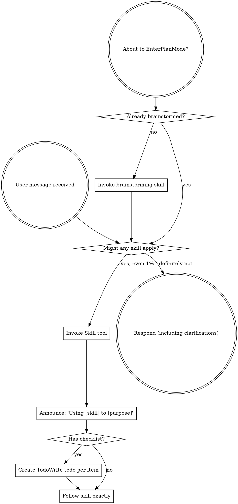

# Boundary Review — ariadne#167 (whole-issue close)

| field | value |
|-------|-------|
| issue | 167 — institutionalize using continuation for long running session |
| repo | ariadne |
| issue file | workshop/issues/000167-institutionalize-using-continuation-for-long-running-session.md |
| boundary | whole-issue close |
| milestone | — |
| window | 6eeb64d805d93651a2fa8b3e185e2ed7b7a37a1b..HEAD |
| command | sdlc close --issue 167 |
| reviewer | codex |
| timestamp | 2026-07-12T22:37:31-07:00 |
| verdict | REWORK |

## Review

Reading additional input from stdin...
OpenAI Codex v0.144.2
--------
workdir: /Users/xianxu/workspace/ariadne
model: gpt-5.6-sol
provider: openai
approval: never
sandbox: workspace-write [workdir, /tmp, $TMPDIR, /tmp] (network access enabled)
reasoning effort: none
reasoning summaries: none
session id: 019f59f7-aa28-7720-a9cb-63f0c6c5d208
--------
user
# Code review — the one SDLC boundary review

You are conducting a fresh-context code review at a development boundary —
whole-issue close — in the **ariadne** repository.

- repository: ariadne   (root: /Users/xianxu/workspace/ariadne)
- issue:      ariadne#167   (file: workshop/issues/000167-institutionalize-using-continuation-for-long-running-session.md)
- window:     Base: 6eeb64d805d93651a2fa8b3e185e2ed7b7a37a1b   Head: HEAD

Review the **ariadne** repo and its tracker — the ariadne base-layer repo itself (changes here propagate to dependent repos). Do not assume any
other repository or apply another repo's conventions.

You have no prior session context — that is the anti-collusion property. Verify
behavior against the issue's documented Spec/Plan and the code itself; do NOT
take the implementor's word in commit messages or docs at face value. Tools are
read-only: report findings precisely; the main agent (which has session context)
applies the fixes, commits, and re-runs.

Read the diff against the issue's Spec + Plan, then work the checklist below.
Categorize every finding by severity — not everything is Critical; a nitpick
marked Critical is noise.

  Critical (must fix before crossing the boundary)
    - correctness bugs; crashes / panics on unexpected input
    - behavior drift from stated contracts (for ports of existing code where
      byte-faithfulness was promised, diff against the source)
    - silent error swallowing where the source raised
  Important (fix before the boundary if cheap)
    - API design of newly-introduced internal packages (downstream work will
      consume them; is the surface stable?)
    - missing test coverage that would catch the kind of bug shipped
    - inconsistent error handling across the diff
  Minor (note for future)
    - style nits, naming, comment density; performance only if hot-path

## Review checklist

Code quality
  - Clean separation of concerns; edge cases handled (empty / nil / unexpected).
  - Proper error handling — no silent swallowing where the source raised.
  - No duplicated logic / copy-paste that should be a shared helper.

Testing
  - Tests pin real logic, not mocks reasserting the implementation.
  - The kind of bug this diff could ship is covered.
  - PURE entities tested without IO; INTEGRATION via injected fakes (see below).

Requirements traceability
  - Every Plan checklist item this boundary claims is actually delivered.
  - Implementation matches the Spec; no undeclared scope creep.
  - Breaking changes documented.

Production readiness
  - Migration / backward-compatibility considered where state or formats change.
  - Docs / atlas updated for new surface (see the Docs update gate).

## Core concepts cross-check (if the plan has a Core concepts table)

The plan should list entities in a greppable table — name, kind
(PURE/INTEGRATION), file location, status (new/modified/deleted). For each row:
  - Verify the entity exists at the stated path (grep the diff or filesystem).
  - PURE: tests run without IO (no exec, net, mutable fs). If tests need mocks
    to run, it isn't really PURE — flag Critical and recommend promoting it to
    INTEGRATION.
  - INTEGRATION: injected into pure callers, not invoked directly from business
    logic.
  - "modified" / "deleted": the diff shows the expected change/removal at the
    stated location.
Any contradiction between table and code = Critical finding, plus a plan-revision
recommendation (a "## Revisions" entry so the plan stops claiming what the code
doesn't deliver).

## Docs update gate (atlas + README, per AGENTS.md §8)

The boundary should update user-facing docs for any new surface introduced:

  - **atlas/** — new architectural surface, flow, or terminology. Scan the diff
    for new entity types, subcommands, conventions, file-tree locations. Any
    present without corresponding atlas/ changes in the same range = Important
    finding ("atlas update appears missing for <surface>").
  - **README.md** — new user-facing surface a reader runs or types: subcommands,
    flags, keybindings, config keys, install/usage steps. If the diff adds or
    changes such surface and README.md is not updated in the same range =
    Important finding ("README update appears missing for <surface>"). This is the
    class of gap that used to surface only at the merge-time `specs` judge (#142);
    catch it here, at the earliest gate, before the close verdict is recorded.

## Architecture (the at-review backstop — these matter most long-term)

Work through each of ARCH-DRY, ARCH-PURE, ARCH-PURPOSE explicitly, applying its at-review lens. The
full principle definitions are delivered in the ARCHITECTURE PRINCIPLES block
right after this prompt — for EACH marker, state pass or flag, and cite the
marker (e.g. ARCH-DRY) in any finding. Architecture is where review has the
least training signal and the longest-delayed payoff, so be deliberate here, not
holistic.

## Verdict + output

Begin your response with this fenced verdict block — the machine-read handoff:

```verdict
verdict: <SHIP | FIX-THEN-SHIP | REWORK>
confidence: <high | medium | low>
```

  SHIP           ready; ship it
  FIX-THEN-SHIP  ship after addressing the findings (non-blocking at the gate)
  REWORK         blocking; needs rework before shipping — fix + re-run

The fenced ```` ```verdict ```` block above is the **authoritative machine-read
handoff** — emit it as the first thing in your response. (A prose
`VERDICT: <TOKEN>` first line still satisfies the legacy contract as a fallback,
but the block is what the binary trusts.)

After the verdict block: a 1-paragraph summary — what worked, what blocks SHIP if
it isn't — followed by:
  1. Strengths: 2-5 specific things done well (file:line where useful). Affirm
     validated approaches so the operator knows what's confirmed-good ground.
     Empty acceptable for trivial boundaries.
  2. Critical findings (file:line + fix sketch); empty if none.
  3. Important findings (same format).
  4. Minor findings (terse one-liners).
  5. Test coverage notes.
  6. Architectural notes for upcoming work.
  7. Plan revision recommendations: specific "## Revisions" entries the plan
     needs (empty if the plan still matches the code).


ARCHITECTURE PRINCIPLES — work through each of the 3 entries below explicitly, applying its `at-review` lens; cite the marker (e.g. ARCH-DRY) in any finding.

# Architecture principles (ARCH-*)

Injected architectural taste — the structural decisions whose payoff (or cost)
shows up many turns, often months, down the road. Agents are strong at local
tactics and weak here, so these are checked **at-plan** (when the design is being
made — highest leverage) and **at-review** (backstop, on the diff). Cite the
marker (e.g. `ARCH-DRY`) in plans, `## Log` entries, and review findings.

This file is the single source; it is embedded into the planning, plan-quality,
and code-review prompts. The human narrative lives in AGENTS.md "Core Design
Principles"; this is its machine-delivered companion.

## ARCH-DRY — Don't Repeat Yourself

- **principle:** Reuse before adding. One source of truth per fact/behavior; no
  duplicated logic, copy-pasted blocks, or parallel functions that should be one
  shared helper.
- **at-plan:** Flag a plan that re-implements something the codebase already has,
  or that will obviously duplicate logic across the new files instead of
  extracting a shared helper. Name the existing thing it should reuse.
- **at-review:** Flag duplicated logic / copy-pasted blocks / near-identical
  functions in the diff; point at the consolidation (file:line + the shared
  helper they should become).

## ARCH-PURE — Pure core, thin IO shell

- **principle:** The majority of code is pure functions (deterministic, no side
  effects); a thin "glue" layer at the boundary touches IO/UI/network/clock. Pure
  functions are unit-tested directly; the glue is kept small and injected.
- **at-plan:** Flag a design that buries business logic inside IO/handlers, or
  that will only be testable with heavy mocks (a sign logic isn't separated from
  IO). The plan should name what's pure vs the thin IO seam.
- **at-review:** Flag business logic mixed with IO in the diff; logic that should
  be a pure function injected into a thin caller. If a test needs mocks to run a
  "pure" entity, it isn't pure — recommend extracting the IO to the boundary.

## ARCH-PURPOSE — Serve the issue's actual purpose

- **principle:** Deliver the issue's stated purpose, not the easy subset of it. A
  single-source / "compiled to consumers" change is not done until **every
  consumer derives** from the source — the source is *enforced*, not just
  documentation a surface happens to restate; a hand-maintained restatement of the
  model is a deferred consumer, not a finished one. "Follow-up" is for separable
  extensions, never for the thing that is the point. This is the *opposite axis*
  from Simplicity-First/YAGNI: not "build for an imagined future," but "don't
  **under**-deliver the purpose you already committed to."
- **at-plan:** Flag a plan whose scope is a strict subset of the issue's stated
  goal / Done-when where the part deferred as "follow-up" *is* the purpose (e.g.
  wires one consumer + enforcement but leaves the consumers that motivated the
  issue as documentation that doesn't derive). Ask: does the plan fulfill the
  purpose, or just the cheap win? Name the deferred purpose.
- **at-review:** Does the diff *fulfill* the purpose or settle for the easy win?
  For a single-source change, run the **shadow-sweep** — enumerate the consumers,
  confirm each derives from the source, flag any remaining hand-maintained
  restatement of the model. A "follow-up" that is actually the deferred point of
  the issue is a finding, not a deferral.


OUTPUT CONTRACT (machine-read — do not deviate). LEAD your response with the
fenced ```verdict block shown above — that is the authoritative handoff the binary
reads (its `verdict:` value is one of the listed tokens). Everything after the block
is advisory: a non-blocking verdict WITH findings still PASSES the gate. A bare
`VERDICT: <TOKEN>` line is accepted only as a FALLBACK when the block is absent.

Diff:
diff --git a/AGENTS.base.md b/AGENTS.base.md
index 58cb5a2..6bdfe19 100644
--- a/AGENTS.base.md
+++ b/AGENTS.base.md
@@ -79,6 +79,10 @@
 ### 13. Model User Intention
 - Hold a running hypothesis of the user's intent and update it **every turn** — each exchange moves the model positively or negatively. Keep it **self-consistent** and **fitting the observed interactions**; when a turn contradicts the model, revise the model — don't rationalize the observation away (a "that's not what I meant" is a model failure to fix, not noise). These two criteria are **canonical here**; the `continuation` datatype's `## Thread arc & user model` checkpoint and the per-session `pensive` flush persist the model but defer to this definition.
 
+### 14. Session Continuity
+- When the harness reports that the active context is more than 60% full, proactively checkpoint the session before starting another substantial unit of work. Finish the current atomic action and update its durable issue/plan/log state first. If an exact percentage is unavailable, treat a harness context-pressure or compaction warning as the trigger.
+- Apply the canonical **`continuation` datatype** for the checkpoint; it owns what to preserve and how to finalize the handoff. Use the available continuation writer. The writer owns the restart after a successful durable write, so don't separately restart the session. If no writer is available, follow the datatype's existing no-writer stop behavior.
+
 ## Core Design Principles
 The architectural taste — the `ARCH-*` principles — is single-sourced in a registry and
 delivered by **`sdlc arch-principles`**. It's also PUSHED at the gates: `sdlc start-plan`
diff --git a/atlas/workflow/data-artifacts.md b/atlas/workflow/data-artifacts.md
index 3483f0e..edabc7d 100644
--- a/atlas/workflow/data-artifacts.md
+++ b/atlas/workflow/data-artifacts.md
@@ -76,6 +76,8 @@ Heuristic: *session or ledger?* A fragment that grows past ~3 paragraphs and dev
 
 `continuation` is the human-understanding cousin of a native session **`resume`**: `resume` restores *machine state* (the agent's own transcript + session id, byte-faithful); a continuation restores *human understanding* (next action, the thread's arc + the user's intention, open questions, decisions + dead ends, lessons), distilled from the *rendered* session. You earn its terseness by **flushing** loose understanding into `pensive` first, then narrating over the artifacts rather than restating them. Use a continuation to park or hand off work across time, machines, people, or agent stacks; use `resume` to reattach to a still-live session. It's also the one datatype committed + pushed on creation — a deliberate exception to the dispatcher's "never auto-commit" default, because an unpushed recovery doc is useless.
 
+`AGENTS.base.md`'s **Session Continuity** policy is the canonical proactive trigger: under material context pressure, the agent finishes its current atomic action, updates durable work state, and routes into the continuation datatype before beginning another substantial unit. The datatype remains the procedure source; a producer-provided writer owns persistence and any automatic restart. This keeps the trigger visible to every harness without copying the continuation skeleton or Pair-specific mechanics into the constitution.
+
 ## Rules of thumb
 
 - **Frontmatter is for queryable, stable, externally-referenced fields.** Free-form prose stays in the body.
diff --git a/cmd/datatype/continuation_policy_test.go b/cmd/datatype/continuation_policy_test.go
new file mode 100644
index 0000000..f4b92c0
--- /dev/null
+++ b/cmd/datatype/continuation_policy_test.go
@@ -0,0 +1,46 @@
+package main
+
+import (
+	"os"
+	"path/filepath"
+	"strings"
+	"testing"
+)
+
+func TestSessionContinuityPolicyRoutesToDatatypeAndWriter(t *testing.T) {
+	root := filepath.Join("..", "..")
+	raw, err := os.ReadFile(filepath.Join(root, "AGENTS.base.md"))
+	if err != nil {
+		t.Fatal(err)
+	}
+	agents := string(raw)
+	start := strings.Index(agents, "### 14. Session Continuity")
+	if start < 0 {
+		t.Fatal("AGENTS.base.md missing Session Continuity policy")
+	}
+	policy := agents[start:]
+	if end := strings.Index(policy, "\n## Core Design Principles"); end >= 0 {
+		policy = policy[:end]
+	}
+
+	for name, marker := range map[string]string{
+		"threshold":          "60%",
+		"pressure fallback":  "context-pressure",
+		"warning fallback":   "compaction warning",
+		"canonical route":    "`continuation` datatype",
+		"writer boundary":    "writer owns the restart",
+		"no-writer behavior": "no writer",
+	} {
+		if !strings.Contains(policy, marker) {
+			t.Errorf("Session Continuity policy missing %s marker %q", name, marker)
+		}
+	}
+
+	proto, err := os.ReadFile(filepath.Join(root, "construct", "datatype", "continuation.md"))
+	if err != nil {
+		t.Fatal(err)
+	}
+	if strings.Contains(string(proto), "60%") {
+		t.Error("60% trigger belongs only in AGENTS.base.md, not the continuation procedure")
+	}
+}
diff --git a/workshop/plans/000167-institutionalize-using-continuation-for-long-running-session-plan.md b/workshop/plans/000167-institutionalize-using-continuation-for-long-running-session-plan.md
index 2121978..8e0479d 100644
--- a/workshop/plans/000167-institutionalize-using-continuation-for-long-running-session-plan.md
+++ b/workshop/plans/000167-institutionalize-using-continuation-for-long-running-session-plan.md
@@ -48,7 +48,7 @@ The policy is prose rather than executable Go, but its observable contract is pu
 - Read: `AGENTS.base.md`
 - Read: `construct/datatype/continuation.md`
 
-- [ ] **Step 1: Write the failing semantic contract test**
+- [x] **Step 1: Write the failing semantic contract test**
 
 Create `cmd/datatype/continuation_policy_test.go`:
 
@@ -100,7 +100,7 @@ func TestSessionContinuityPolicyRoutesToDatatypeAndWriter(t *testing.T) {
 }
 ```
 
-- [ ] **Step 2: Run the focused test and verify it fails**
+- [x] **Step 2: Run the focused test and verify it fails**
 
 Run: `go test ./cmd/datatype -run TestSessionContinuityPolicyRoutesToDatatypeAndWriter -count=1`
 
@@ -112,7 +112,7 @@ Expected: FAIL with `AGENTS.base.md missing Session Continuity policy`.
 - Modify: `AGENTS.base.md`
 - Test: `cmd/datatype/continuation_policy_test.go`
 
-- [ ] **Step 1: Add the policy after “Model User Intention”**
+- [x] **Step 1: Add the policy after “Model User Intention”**
 
 Add this section before `## Core Design Principles`:
 
@@ -124,19 +124,19 @@ Add this section before `## Core Design Principles`:
 
 This is intentionally a route, not a restatement of the continuation skeleton (`ARCH-DRY`). It is harness-neutral and does not name Pair commands (`ARCH-PURPOSE`). Restart remains an integration effect owned by the writer (`ARCH-PURE`).
 
-- [ ] **Step 2: Run the focused test and verify it passes**
+- [x] **Step 2: Run the focused test and verify it passes**
 
 Run: `go test ./cmd/datatype -run TestSessionContinuityPolicyRoutesToDatatypeAndWriter -count=1`
 
 Expected: PASS.
 
-- [ ] **Step 3: Run the datatype package tests**
+- [x] **Step 3: Run the datatype package tests**
 
 Run: `go test ./cmd/datatype -count=1`
 
 Expected: PASS.
 
-- [ ] **Step 4: Commit the constitution contract**
+- [x] **Step 4: Commit the constitution contract**
 
 ```bash
 git add AGENTS.base.md cmd/datatype/continuation_policy_test.go
@@ -153,7 +153,7 @@ git commit -m "#167: institutionalize proactive session continuity" \
 - Modify: `atlas/workflow/data-artifacts.md`
 - Verify: `atlas/index.md`
 
-- [ ] **Step 1: Extend the continuation lifecycle paragraph**
+- [x] **Step 1: Extend the continuation lifecycle paragraph**
 
 After the existing continuation paragraph, add a concise mapping such as:
 
@@ -163,19 +163,19 @@ After the existing continuation paragraph, add a concise mapping such as:
 
 Do not repeat the section skeleton or writer command. Confirm `atlas/index.md` already links `workflow/data-artifacts.md`; no index edit is expected.
 
-- [ ] **Step 2: Verify the atlas pointer exists**
+- [x] **Step 2: Verify the atlas pointer exists**
 
 Run: `rg -n 'workflow/data-artifacts\.md' atlas/index.md`
 
 Expected: at least one matching link.
 
-- [ ] **Step 3: Run the base-layer composition tests**
+- [x] **Step 3: Run the base-layer composition tests**
 
 Run: `go test ./cmd/weave/... -count=1`
 
 Expected: PASS, proving exported prose still fans out to the supported harness entry files.
 
-- [ ] **Step 4: Run repository verification**
+- [x] **Step 4: Run repository verification**
 
 Run: `go test ./... -count=1`
 
@@ -185,7 +185,7 @@ Run: `git diff --check`
 
 Expected: no output and exit 0.
 
-- [ ] **Step 5: Commit the lifecycle map**
+- [x] **Step 5: Commit the lifecycle map**
 
 ```bash
 git add atlas/workflow/data-artifacts.md
@@ -194,7 +194,7 @@ git commit -m "#167: map proactive continuation lifecycle" \
   -m "Co-Authored-By: OpenAI Codex <noreply@openai.com>"
 ```
 
-- [ ] **Step 6: Inspect the committed diff against the issue purpose**
+- [x] **Step 6: Inspect the committed diff against the issue purpose**
 
 Run: `git diff main...HEAD -- AGENTS.base.md cmd/datatype/continuation_policy_test.go atlas/workflow/data-artifacts.md`
 
@@ -210,11 +210,11 @@ Expected: exactly `AGENTS.base.md`, `atlas/workflow/data-artifacts.md`, and `cmd
 - Modify: `workshop/issues/000167-institutionalize-using-continuation-for-long-running-session.md`
 - Modify: `workshop/plans/000167-institutionalize-using-continuation-for-long-running-session-plan.md`
 
-- [ ] **Step 1: Tick the completed implementation checkboxes and record verification**
+- [x] **Step 1: Tick the completed implementation checkboxes and record verification**
 
 Update the issue and durable plan so every completed implementation/verification step is checked. Append the verification outcome to the issue's `## Log`; do not rewrite prior log entries. Before the record commit below, mark Steps 1–3 of this task complete as part of the same reconciliation change. The SDLC close itself is deliberately outside the checkbox list so the close gate never depends on a self-referential unchecked “close” step.
 
-- [ ] **Step 2: Validate records and working tree**
+- [x] **Step 2: Validate records and working tree**
 
 Run: `sdlc issue validate workshop/issues/000167-institutionalize-using-continuation-for-long-running-session.md`
 
@@ -224,7 +224,7 @@ Run: `git diff --check`
 
 Expected: no output and exit 0.
 
-- [ ] **Step 3: Commit the reconciled records**
+- [x] **Step 3: Commit the reconciled records**
 
 ```bash
 git add workshop/issues/000167-institutionalize-using-continuation-for-long-running-session.md workshop/plans/000167-institutionalize-using-continuation-for-long-running-session-plan.md


codex
I’m using the SDLC and superpowers session-start instructions to inspect this boundary in read-only mode. I’ll verify the actual range, tracker, tests, composition behavior, and all three architecture lenses; I won’t modify the workspace.
exec
/bin/zsh -lc "sed -n '1,240p' construct/adapted/superpowers-using-superpowers/SKILL.md && sed -n '1,280p' construct/local/sdlc/SKILL.md && sdlc --help" in /Users/xianxu/workspace/ariadne
 succeeded in 0ms:
---
name: superpowers-using-superpowers
description: Use when starting any conversation - establishes how to find and use skills, requiring Skill tool invocation before ANY response including clarifying questions
---

<SUBAGENT-STOP>
If you were dispatched as a subagent to execute a specific task, skip this skill.
</SUBAGENT-STOP>

<EXTREMELY-IMPORTANT>
If you think there is even a 1% chance a skill might apply to what you are doing, you ABSOLUTELY MUST invoke the skill.

IF A SKILL APPLIES TO YOUR TASK, YOU DO NOT HAVE A CHOICE. YOU MUST USE IT.

This is not negotiable. This is not optional. You cannot rationalize your way out of this.
</EXTREMELY-IMPORTANT>

## Instruction Priority

> **Ariadne note:** AGENTS.md Section 3 governs subagent strategy and overrides skills that mandate subagent-driven-development as the default execution path.

Superpowers skills override default system prompt behavior, but **user instructions always take precedence**:

1. **User's explicit instructions** (CLAUDE.md, GEMINI.md, AGENTS.md, direct requests) — highest priority
2. **Superpowers skills** — override default system behavior where they conflict
3. **Default system prompt** — lowest priority

If CLAUDE.md, GEMINI.md, or AGENTS.md says "don't use TDD" and a skill says "always use TDD," follow the user's instructions. The user is in control.

## How to Access Skills

**In Claude Code:** Use the `Skill` tool. When you invoke a skill, its content is loaded and presented to you—follow it directly. Never use the Read tool on skill files.

**In Gemini CLI:** Skills activate via the `activate_skill` tool. Gemini loads skill metadata at session start and activates the full content on demand.

**In other environments:** Check your platform's documentation for how skills are loaded.

## Platform Adaptation

Skills use Claude Code tool names. Non-CC platforms: see `references/codex-tools.md` (Codex) for tool equivalents. Gemini CLI users get the tool mapping loaded automatically via GEMINI.md.

# Using Skills

## The Rule

**Invoke relevant or requested skills BEFORE any response or action.** Even a 1% chance a skill might apply means that you should invoke the skill to check. If an invoked skill turns out to be wrong for the situation, you don't need to use it.



## Red Flags

These thoughts mean STOP—you're rationalizing:

| Thought | Reality |
|---------|---------|
| "This is just a simple question" | Questions are tasks. Check for skills. |
| "I need more context first" | Skill check comes BEFORE clarifying questions. |
| "Let me explore the codebase first" | Skills tell you HOW to explore. Check first. |
| "I can check git/files quickly" | Files lack conversation context. Check for skills. |
| "Let me gather information first" | Skills tell you HOW to gather information. |
| "This doesn't need a formal skill" | If a skill exists, use it. |
| "I remember this skill" | Skills evolve. Read current version. |
| "This doesn't count as a task" | Action = task. Check for skills. |
| "The skill is overkill" | Simple things become complex. Use it. |
| "I'll just do this one thing first" | Check BEFORE doing anything. |
| "This feels productive" | Undisciplined action wastes time. Skills prevent this. |
| "I know what that means" | Knowing the concept ≠ using the skill. Invoke it. |

## Skill Priority

When multiple skills could apply, use this order:

1. **Process skills first** (brainstorming, debugging) - these determine HOW to approach the task
2. **Implementation skills second** (frontend-design, mcp-builder) - these guide execution

"Let's build X" → brainstorming first, then implementation skills.
"Fix this bug" → debugging first, then domain-specific skills.

## Skill Types

**Rigid** (TDD, debugging): Follow exactly. Don't adapt away discipline.

**Flexible** (patterns): Adapt principles to context.

The skill itself tells you which.

## User Instructions

Instructions say WHAT, not HOW. "Add X" or "Fix Y" doesn't mean skip workflows.
---
name: sdlc
description: Use when at an SDLC checkpoint — starting work, closing an issue or milestone, opening/merging a PR, or recovering workflow state after compaction. The `sdlc` binary owns the gates between workflow stages and refuses transitions that lack required evidence.
---

# sdlc — SDLC checkpoint binary

`sdlc` owns the gates between SDLC workflow stages (claim → change-code → pr →
merge, plus close, milestone-close, judge). It requires evidence at each gate,
mutates state, logs the transition, and refuses transitions that lack the
evidence — that is the shape of a "checkpoint guard."

The binary is the single source of truth. This skill is a static pointer and
intentionally carries no copy of the contract, so it can never drift:

- **`sdlc --help`** — the workflow contract: the start-of-work runbook,
  conventions, and the verb list.
- **`sdlc <verb> --help`** — one checkpoint's full contract, flags, and examples.

Read those instead of relying on memory; the binary's help is always current.
sdlc collects ariadne's SDLC checkpoint guards into one binary. Each subcommand
owns one checkpoint: it requires evidence at the gate, mutates state, logs the
transition, and refuses transitions that lack it. We don't model the SDLC as a
state machine — stages stay prose; we codify the gates between them where drift
recurs. `sdlc` manages the development life cycle; prefer it over `git`/`gh`.

BEFORE WORK
  - `sdlc claim --issue N` — the single start-of-work gesture, a CHEAP LOCK.
    Flips an *open* issue to `working` and publishes the claim to origin/main so
    peer agents see it. No estimate demanded (#113) — claim early, the moment an
    idea crystallizes. `--no-start` suppresses the flip.
  - Do NOT hand-edit an issue's `status:` — let `sdlc claim` or `sdlc issue
    set-status` own that transition (it carries the reopen/`→ done` guards).

ENTER IMPLEMENTATION
  - After plan approval, before editing code, run `sdlc change-code`. It owns the
    branching decision (in-place branch by default; `--worktree=yes` for an
    isolated worktree), the plan-quality check, and the `estimate_hours` gate
    (relocated here from claim, #113). Don't start coding without it.

PUBLISH
  - Publishing goes through a PR: `sdlc pr` → `sdlc merge`. Direct `sdlc push`
    if working directly on main.
  - Publish ONCE at issue close, not per milestone — and do NOT reuse a branch
    name that already has a merged PR. `sdlc merge` refuses (#148) when a branch
    has commits not in main despite a merged PR (a reused name would otherwise
    silently strand the new commits); rename to a fresh branch, `sdlc pr`, retry.

RECOVER
  - After a compaction or session resume, run `sdlc state` to recover where you
    are instead of re-inferring from issue files.

LOCAL REPO TRANSACTION LOCK
  - Mutating verbs take an SDLC-owned repo transaction lock at
    `.git/sdlc.lock` before reading/writing issue state, committing, changing
    branches, or pushing. The lock is local to the Git common dir, so linked
    worktrees of the same repo serialize with each other.
  - Wait messages identify the holder pid and command when metadata is
    available. `close` and `milestone-close` release the lock while the external
    boundary-review subprocess runs, then reacquire before finalization; if HEAD
    or the issue/project file state they prepared changed meanwhile, they refuse
    to finalize and tell you to rerun. `change-code`, `merge`, and `push` can still hold the lock during
    long-running review/ship transactions; wait or retry rather than removing
    the lock while that process is alive.
  - A dead same-host holder is reclaimed automatically; initializing metadata
    is waited through. Other stale/timeout errors tell you how to inspect
    `.git/sdlc.lock`. Remote push/ref races are separate: the local lock
    serializes this checkout, not another machine or clone.

WHEN A VERB ERRORS
  Do NOT route around it with hand-rolled `git`/`gh`. Its errors are next-action
  specs. The fix is one of two things:
    (a) satisfy the precondition it names and re-run the same verb (e.g. `sdlc
        merge` saying "no upstream" → run `sdlc pr` first, then `sdlc merge`); or
    (b) if the error is a genuine gap in `sdlc` itself, fix that edge case in the
        source and re-run. We're still ironing out edge cases.
  Only drop to manual when a verb genuinely cannot express the need — say so.

These gates sit inside a wider prose arc the binary does NOT own: ideation
(parley/pensive) → brainstorm → plan → build → milestone review (`sdlc judge`,
auto-dispatched) → close/ship → postmortem.

CONVENTIONS

  --issue vs --github-issue — `--issue N` always means workshop/issues
  (6-digit ID). `--github-issue N` means a GitHub issue number. Bare `--issue`
  never means a GitHub issue.

  Form vs essence — checkpoint guards (close, milestone-close, push, merge)
  defend against *omission* via required-evidence flags; `sdlc judge` defends
  against *theater* via fresh-context review. Form runs first; judge second.

The verb list + per-verb help (`sdlc <verb> --help`) follow below.

Usage:
  sdlc [flags]
  sdlc [command]

Available Commands:
  claim           Start work: flip an open issue to working + broadcast the claim
  start-plan      Enter planning: deliver the architecture principles to design against (#75)
  change-code     Enter implementation after the structural + plan-quality gates
  issue           Create + manage issues (new / set-status / list / show)
  actual          Compute an issue's focused dev-hours via active-time-v3 (#68)
  active-time     Per-issue active-time attribution table (the v3 engine, standalone)
  close           Close an issue or milestone (ACTUAL + VERIFIED + atlas/project sweep)
  milestone-close Close one milestone + auto-dispatch its review
  pr              Open a pull request from a feature branch
  merge           Merge the PR, archive done issues, clean up
  push            Ship from main (clean tree + pre-merge judges + archive)
  state           Inspect workflow state (branch, working issues, drift)
  resolve         Resolve a symbolic artifact ref (ariadne#11, #15 M4) to its current path(s) — read-only
  open            Resolve a ref and open the primary artifact in $EDITOR
  judge           Run an LLM-judge check against the diff (fresh-context)
  arch-principles Print the ARCH-* architecture principles (single source; pull for non-gate work)
  estimate-source Name the shared estimate method + the repo-local calibration source (pull)
  process-manual  Unroll every injection source into a linked process manual (#153)
  propagate-base  Re-weave every recursive dependent of this repo (foundation-first)
  help            Help about any command

Flags:
  -h, --help   help for sdlc

Use "sdlc [command] --help" for more information about a command.

exec
/bin/zsh -lc "sed -n '1,320p' workshop/plans/000167-institutionalize-using-continuation-for-long-running-session-plan.md" in /Users/xianxu/workspace/ariadne
 succeeded in 0ms:
# Proactive Session Continuity Policy Implementation Plan

> **For agentic workers:** Consult AGENTS.md Section 3 (Subagent Strategy) to determine the appropriate execution approach: use superpowers-subagent-driven-development (if subagents are suitable per AGENTS.md) or superpowers-executing-plans to implement this plan. Steps use checkbox (`- [ ]`) syntax for tracking.

**Goal:** Make every Ariadne agent proactively checkpoint a long-running session through the canonical continuation flow when active context exceeds 60%.

**Architecture:** Add one declarative trigger policy to the exported base constitution. Route from that policy to the existing continuation datatype for handoff content and to the available writer for persistence/restart; do not duplicate either downstream contract. Guard the ownership boundaries with a focused semantic test and map the lifecycle in the atlas.

**Tech Stack:** Markdown constitution and atlas; Go standard-library contract test; existing `weave` base-layer composition.

---

## Core concepts

### Pure entities

| Name | Lives in | Status |
|------|----------|--------|
| `SessionContinuityPolicy` | `AGENTS.base.md` | new |

- **SessionContinuityPolicy** — declarative decision rule mapping observable context pressure to a continuation checkpoint.
  - **Relationships:** N:1 from every composed harness entry file to the one exported base policy; 1:1 route from the policy to the canonical continuation datatype procedure.
  - **DRY rationale:** `AGENTS.base.md` is the one always-loaded source for **when** to checkpoint; `construct/datatype/continuation.md` remains the one source for **how** to checkpoint (`ARCH-DRY`).
  - **Future extensions:** The trigger can gain additional harness-neutral pressure signals, but model-window catalogs and polling remain outside this policy.

The policy is prose rather than executable Go, but its observable contract is pure: given either utilization above 60% or a context-pressure/compaction warning when percentage is unavailable, it directs the agent to checkpoint before another substantial unit of work. `cmd/datatype/continuation_policy_test.go` guards those stable semantics without pinning the full wording.

### Integration points

| Name | Lives in | Status | Wraps |
|------|----------|--------|-------|
| `BaseConstitutionExport` | `AGENTS.base.md` | modified | existing `construct/base.manifest` prose fan-out to Claude, Codex, and Gemini entry files |
| `ContinuationWriterBoundary` | `AGENTS.base.md` | new | producer-provided continuation writer and its restart behavior |

- **BaseConstitutionExport** — delivers the policy to every supported agent through the existing weave composition path.
  - **Injected into:** Harness entry files generated from the base prose; no harness-specific copy is added.
  - **Future extensions:** New harness faces inherit the rule by joining the existing prose fan-out.
- **ContinuationWriterBoundary** — tells the agent to finalize through the available writer and not perform a second restart.
  - **Injected into:** The agent's checkpoint procedure after it selects the continuation datatype. If no writer exists, the datatype's existing stop behavior remains authoritative.
  - **Future extensions:** Additional producers may supply their own writer/restart implementation without changing the constitution.

## Chunk 1: Constitution contract

### Task 1: Add the failing session-continuity policy guard

**Files:**
- Create: `cmd/datatype/continuation_policy_test.go`
- Read: `AGENTS.base.md`
- Read: `construct/datatype/continuation.md`

- [x] **Step 1: Write the failing semantic contract test**

Create `cmd/datatype/continuation_policy_test.go`:

```go
package main

import (
	"os"
	"path/filepath"
	"strings"
	"testing"
)

func TestSessionContinuityPolicyRoutesToDatatypeAndWriter(t *testing.T) {
	root := filepath.Join("..", "..")
	raw, err := os.ReadFile(filepath.Join(root, "AGENTS.base.md"))
	if err != nil {
		t.Fatal(err)
	}
	agents := string(raw)
	start := strings.Index(agents, "### 14. Session Continuity")
	if start < 0 {
		t.Fatal("AGENTS.base.md missing Session Continuity policy")
	}
	policy := agents[start:]
	if end := strings.Index(policy, "\n## Core Design Principles"); end >= 0 {
		policy = policy[:end]
	}

	for name, marker := range map[string]string{
		"threshold":        "60%",
		"fallback signal":  "compaction warning",
		"canonical route":  "`continuation` datatype",
		"writer boundary":  "writer owns the restart",
		"no-writer behavior": "no writer",
	} {
		if !strings.Contains(policy, marker) {
			t.Errorf("Session Continuity policy missing %s marker %q", name, marker)
		}
	}

	proto, err := os.ReadFile(filepath.Join(root, "construct", "datatype", "continuation.md"))
	if err != nil {
		t.Fatal(err)
	}
	if strings.Contains(string(proto), "60%") {
		t.Error("60% trigger belongs only in AGENTS.base.md, not the continuation procedure")
	}
}
```

- [x] **Step 2: Run the focused test and verify it fails**

Run: `go test ./cmd/datatype -run TestSessionContinuityPolicyRoutesToDatatypeAndWriter -count=1`

Expected: FAIL with `AGENTS.base.md missing Session Continuity policy`.

### Task 2: Add the exported constitution policy

**Files:**
- Modify: `AGENTS.base.md`
- Test: `cmd/datatype/continuation_policy_test.go`

- [x] **Step 1: Add the policy after “Model User Intention”**

Add this section before `## Core Design Principles`:

```markdown
### 14. Session Continuity
- When the harness reports that the active context is more than 60% full, proactively checkpoint the session before starting another substantial unit of work. Finish the current atomic action and update its durable issue/plan/log state first. If an exact percentage is unavailable, treat a harness context-pressure or compaction warning as the trigger.
- Apply the canonical **`continuation` datatype** for the checkpoint; it owns what to preserve and how to finalize the handoff. Use the available continuation writer. The writer owns the restart after a successful durable write, so don't separately restart the session. If no writer is available, follow the datatype's existing no-writer stop behavior.
```

This is intentionally a route, not a restatement of the continuation skeleton (`ARCH-DRY`). It is harness-neutral and does not name Pair commands (`ARCH-PURPOSE`). Restart remains an integration effect owned by the writer (`ARCH-PURE`).

- [x] **Step 2: Run the focused test and verify it passes**

Run: `go test ./cmd/datatype -run TestSessionContinuityPolicyRoutesToDatatypeAndWriter -count=1`

Expected: PASS.

- [x] **Step 3: Run the datatype package tests**

Run: `go test ./cmd/datatype -count=1`

Expected: PASS.

- [x] **Step 4: Commit the constitution contract**

```bash
git add AGENTS.base.md cmd/datatype/continuation_policy_test.go
git commit -m "#167: institutionalize proactive session continuity" \
  -m "Route context pressure through the canonical continuation datatype while leaving durable restart mechanics with the writer." \
  -m "Co-Authored-By: OpenAI Codex <noreply@openai.com>"
```

## Chunk 2: Lifecycle map and verification

### Task 3: Map the proactive lifecycle without duplicating procedure

**Files:**
- Modify: `atlas/workflow/data-artifacts.md`
- Verify: `atlas/index.md`

- [x] **Step 1: Extend the continuation lifecycle paragraph**

After the existing continuation paragraph, add a concise mapping such as:

```markdown
`AGENTS.base.md`'s **Session Continuity** policy is the canonical proactive trigger: under material context pressure, the agent finishes its current atomic action, updates durable work state, and routes into the continuation datatype before beginning another substantial unit. The datatype remains the procedure source; a producer-provided writer owns persistence and any automatic restart. This keeps the trigger visible to every harness without copying the continuation skeleton or Pair-specific mechanics into the constitution.
```

Do not repeat the section skeleton or writer command. Confirm `atlas/index.md` already links `workflow/data-artifacts.md`; no index edit is expected.

- [x] **Step 2: Verify the atlas pointer exists**

Run: `rg -n 'workflow/data-artifacts\.md' atlas/index.md`

Expected: at least one matching link.

- [x] **Step 3: Run the base-layer composition tests**

Run: `go test ./cmd/weave/... -count=1`

Expected: PASS, proving exported prose still fans out to the supported harness entry files.

- [x] **Step 4: Run repository verification**

Run: `go test ./... -count=1`

Expected: PASS.

Run: `git diff --check`

Expected: no output and exit 0.

- [x] **Step 5: Commit the lifecycle map**

```bash
git add atlas/workflow/data-artifacts.md
git commit -m "#167: map proactive continuation lifecycle" \
  -m "Document the constitution-to-datatype-to-writer ownership chain without duplicating the procedure." \
  -m "Co-Authored-By: OpenAI Codex <noreply@openai.com>"
```

- [x] **Step 6: Inspect the committed diff against the issue purpose**

Run: `git diff main...HEAD -- AGENTS.base.md cmd/datatype/continuation_policy_test.go atlas/workflow/data-artifacts.md`

Expected: one trigger policy, one semantic guard, and one atlas mapping.

Run: `git diff --name-only main...HEAD`

Expected: exactly `AGENTS.base.md`, `atlas/workflow/data-artifacts.md`, and `cmd/datatype/continuation_policy_test.go`; no datatype-prototype, Pair, or harness-specific generated entry-file changes.

### Task 4: Reconcile execution records and close through SDLC

**Files:**
- Modify: `workshop/issues/000167-institutionalize-using-continuation-for-long-running-session.md`
- Modify: `workshop/plans/000167-institutionalize-using-continuation-for-long-running-session-plan.md`

- [x] **Step 1: Tick the completed implementation checkboxes and record verification**

Update the issue and durable plan so every completed implementation/verification step is checked. Append the verification outcome to the issue's `## Log`; do not rewrite prior log entries. Before the record commit below, mark Steps 1–3 of this task complete as part of the same reconciliation change. The SDLC close itself is deliberately outside the checkbox list so the close gate never depends on a self-referential unchecked “close” step.

- [x] **Step 2: Validate records and working tree**

Run: `sdlc issue validate workshop/issues/000167-institutionalize-using-continuation-for-long-running-session.md`

Expected: `[ok] ... conforms`.

Run: `git diff --check`

Expected: no output and exit 0.

- [x] **Step 3: Commit the reconciled records**

```bash
git add workshop/issues/000167-institutionalize-using-continuation-for-long-running-session.md workshop/plans/000167-institutionalize-using-continuation-for-long-running-session-plan.md
git commit -m "#167: record session continuity verification" \
  -m "Keep the issue and durable plan aligned with the verified implementation before the close boundary." \
  -m "Co-Authored-By: OpenAI Codex <noreply@openai.com>"
```

### Close the single atomic review boundary

After every checkbox above is committed, run `sdlc actual --issue 167`, inspect the measured value, and substitute it for `<measured-hours>` below:

```bash
sdlc close --issue 167 --actual <measured-hours> --verified 'Focused datatype and weave tests plus go test ./... passed; git diff --check clean; scoped diff confirms AGENTS.base is the sole trigger policy, continuation procedure unchanged, and atlas current.'
```

Expected: the deterministic gates pass, the binary-dispatched fresh-context review returns an acceptable verdict, and the issue closes. Use the precise `--no-atlas`/other bypass only if a named gate genuinely does not apply and record why in `--verified`; do not use `--force` for routine completion.

After a successful close, commit the close-generated issue state (the durable plan is already fully checked and committed):

```bash
git add workshop/issues/000167-institutionalize-using-continuation-for-long-running-session.md
git commit -m "#167: close proactive session continuity" \
  -m "Record the measured actual and successful boundary review." \
  -m "Co-Authored-By: OpenAI Codex <noreply@openai.com>"
```

## Revisions

### 2026-07-12T22:31:00-07:00 — align the durable-plan filename with SDLC discovery

`sdlc change-code` resolves a separate plan as
`workshop/plans/<issue-basename>-plan.md`. The original shorter filename was not
delivered to the plan-quality reviewer, so the plan moved to the issue-basename
form and its self-references were updated. Scope and implementation steps are
unchanged.

exec
/bin/zsh -lc "sed -n '1,260p' workshop/lessons.md" in /Users/xianxu/workspace/ariadne
exec
/bin/zsh -lc 'sdlc arch-principles' in /Users/xianxu/workspace/ariadne
 succeeded in 0ms:
ARCHITECTURE PRINCIPLES — work through each of the 3 entries below explicitly, applying its `at-plan` lens; cite the marker (e.g. ARCH-DRY) in any finding.

# Architecture principles (ARCH-*)

Injected architectural taste — the structural decisions whose payoff (or cost)
shows up many turns, often months, down the road. Agents are strong at local
tactics and weak here, so these are checked **at-plan** (when the design is being
made — highest leverage) and **at-review** (backstop, on the diff). Cite the
marker (e.g. `ARCH-DRY`) in plans, `## Log` entries, and review findings.

This file is the single source; it is embedded into the planning, plan-quality,
and code-review prompts. The human narrative lives in AGENTS.md "Core Design
Principles"; this is its machine-delivered companion.

## ARCH-DRY — Don't Repeat Yourself

- **principle:** Reuse before adding. One source of truth per fact/behavior; no
  duplicated logic, copy-pasted blocks, or parallel functions that should be one
  shared helper.
- **at-plan:** Flag a plan that re-implements something the codebase already has,
  or that will obviously duplicate logic across the new files instead of
  extracting a shared helper. Name the existing thing it should reuse.
- **at-review:** Flag duplicated logic / copy-pasted blocks / near-identical
  functions in the diff; point at the consolidation (file:line + the shared
  helper they should become).

## ARCH-PURE — Pure core, thin IO shell

- **principle:** The majority of code is pure functions (deterministic, no side
  effects); a thin "glue" layer at the boundary touches IO/UI/network/clock. Pure
  functions are unit-tested directly; the glue is kept small and injected.
- **at-plan:** Flag a design that buries business logic inside IO/handlers, or
  that will only be testable with heavy mocks (a sign logic isn't separated from
  IO). The plan should name what's pure vs the thin IO seam.
- **at-review:** Flag business logic mixed with IO in the diff; logic that should
  be a pure function injected into a thin caller. If a test needs mocks to run a
  "pure" entity, it isn't pure — recommend extracting the IO to the boundary.

## ARCH-PURPOSE — Serve the issue's actual purpose

- **principle:** Deliver the issue's stated purpose, not the easy subset of it. A
  single-source / "compiled to consumers" change is not done until **every
  consumer derives** from the source — the source is *enforced*, not just
  documentation a surface happens to restate; a hand-maintained restatement of the
  model is a deferred consumer, not a finished one. "Follow-up" is for separable
  extensions, never for the thing that is the point. This is the *opposite axis*
  from Simplicity-First/YAGNI: not "build for an imagined future," but "don't
  **under**-deliver the purpose you already committed to."
- **at-plan:** Flag a plan whose scope is a strict subset of the issue's stated
  goal / Done-when where the part deferred as "follow-up" *is* the purpose (e.g.
  wires one consumer + enforcement but leaves the consumers that motivated the
  issue as documentation that doesn't derive). Ask: does the plan fulfill the
  purpose, or just the cheap win? Name the deferred purpose.
- **at-review:** Does the diff *fulfill* the purpose or settle for the easy win?
  For a single-source change, run the **shadow-sweep** — enumerate the consumers,
  confirm each derives from the source, flag any remaining hand-maintained
  restatement of the model. A "follow-up" that is actually the deferred point of
  the issue is a finding, not a deferral.


 succeeded in 0ms:
# Lessons Learned

*(Record patterns of what went wrong and rules to prevent repeating them)*

## A changed surface has shadow docs and execution records, not just the main atlas page

**Pattern (#97 close review):** The implementation updated `atlas/workflow/weave.md`
for topological settings merge, but two other atlas pages still described
settings as only `settings.ariadne.json + settings.local.json`. The code and
primary atlas page were right; the shadow documentation was stale. The same
review found the durable implementation plan still had every detailed checkbox
unchecked even though the issue checklist was complete.

**Rule:** When changing a named surface or convention, run a shadow-doc sweep for
the old phrase and update every live explanatory copy, not just the page you
remember editing. Also update the durable plan's execution state before close:
issue checkboxes, detailed plan checkboxes, and any generated review sidecars
should tell the same story. Grep for the old model terms before committing
(`settings.ariadne.json + settings.local.json`, `MergeSettings{Source}`, etc.),
then rerun `git diff --check`.

**Origin:** #97 close review (FIX-THEN-SHIP). The code review found no behavior
blockers, but caught stale atlas shadows and unchecked durable-plan steps before
the issue crossed the boundary.

## Generated review sidecars must be bounded, or they become the next review's input bug

**Pattern (#166):** `sdlc close` writes a durable review sidecar, and the next close review diffs that sidecar too. Capturing the full raw reviewer transcript, including the prompt and diff, made the sidecar enormous, introduced whitespace-check failures from embedded patches, and eventually made a later review dispatch fail with `argument list too long`. The evidence file became active input to the gate it was supposed to document.

**Rule:** Generated review artifacts must be bounded and normalized before they enter the reviewed diff. Persist the machine-useful facts (verdict, window, findings, verification commands, resolution), not the full prompt/diff transcript. If a sidecar must carry raw output, keep it out of the code-reviewed diff or teach the generator to strip/escape whitespace-sensitive embedded patches. After any generated sidecar write, run `git diff --check` before committing it.

**Origin:** #166 close-review loop. The fix for this issue manually condensed the sidecar after each generated rewrite so `git diff --check` and later boundary-review dispatches stayed usable.

## A deferred cleanup does not run through `os.Exit` — command wrappers must cover hard exits and init races

**Pattern (#132):** A root-level Cobra wrapper acquired `.git/sdlc.lock` and used `defer release()` around the command `RunE`. That looked correct for returned errors, but most `sdlc` guard refusals call `die()`, and `die()` calls `os.Exit(1)`. `os.Exit` skips defers, so routine refusals would leave `.git/sdlc.lock` behind and wedge the next mutating command. The same review found a second liveness race: `mkdir .git/sdlc.lock` succeeds before `meta.json` is written, so a waiter can see the directory without metadata and must treat that as "holder initializing," not as a corrupt lock to remove.

**Rule:** When adding a process-wide wrapper around command bodies, enumerate every exit path, not just returned errors. If any path uses `os.Exit`, register cleanup somewhere that path drains explicitly before exit; a `defer` in the caller is not enough. For filesystem locks created as a directory plus metadata file, make waiters tolerate the mkdir-before-metadata window with a short grace period. Auto-reclaim only facts you can prove safe (same host + missing pid); cross-host or over-age uncertainty should fail with recovery guidance.

**Origin:** #132 boundary review (REWORK). The fix added a die-cleanup registry, idempotent lock release, confirmed-dead same-host reclaim, metadata-initialization polling, and real concurrent `Acquire` coverage.

## A pure helper unit-tested in isolation can be silently un-wired from its caller

**Pattern:** #72 extracted a pure `planPointer(issue) string` and printed it from the thin `runStartPlan` IO seam (`cinfo(stdout, planPointer(issue))`). TDD gave it a colocated unit test (`TestPlanPointer`) pinning the *wording* — skill name, `workshop/plans/` path, the `~/.claude/plans` demotion. All green. But nothing asserted the seam *actually calls* the helper: delete the `cinfo` line, or reorder it, or let a refactor drop it, and `TestPlanPointer` stays green while the feature ships broken. The boundary-review judge (fresh eyes) caught it; the author's suite didn't. I'd verified it *manually* (ran `start-plan`, saw the line) — so the gap was specifically the **automated regression**, not the behavior.

**Rule:** When TDD produces a pure entity consumed by a thin IO/print seam (the ARCH-PURE shape), the unit test on the entity is necessary but **not sufficient** — add one *integration assertion on the seam's output* that the entity's contribution is present (here: extend the existing `runStartPlan(&b, 75)` test with `"superpowers-writing-plans"` + `"workshop/plans/000075-"`). The unit test pins *what the helper says*; the integration assertion pins *that the caller says it*. Without the second, "pure helper exists and is correct" and "pure helper is wired in" are two independent facts and only the first is guarded. Cheap (one line appended to a test that already renders the seam) and it closes exactly the drop/reorder bug class. Distinct from the #44 "IO needs a live run" lesson: this isn't external IO — it's the wiring between a pure function and its single in-process caller, invisible because *both* the unit test and a helper-never-called build are green.

**Origin:** #72, boundary review (FIX-THEN-SHIP → fixed before crossing). The mandatory fresh-context review (binary-dispatched at `sdlc close`) found the wiring gap the author's own green suite hid — a concrete instance of why the review boundary is owned by fresh eyes, not the author (AGENTS.md §3).

## Skill design: enumeration vs. judgment

**Pattern:** A skill's behavior was specified by enumerating cases — a hardcoded list of nouns mapped to outcomes, plus a hardcoded list of "examples that DO/DO NOT trigger." Every new case required editing the skill, and the vocabulary tail (synonyms, unusual phrasings, descriptive statements that incidentally contain trigger nouns) was never reachable by enumeration.

**Rule:** When a skill's behavior is best described as *"use judgment"*, don't make it enumerate — express the principle and let the LLM apply it. The skill should describe *the question being asked* (e.g., "is this a fact, a question, or a request?") and *the discriminator* (e.g., "is the substance already present, or being requested generatively?"), not the surface forms that pass/fail. Concrete examples can serve as priming (a small, illustrative set), but they should not be the matching mechanism.

**Test for whether a list belongs in a skill:** ask *"would the skill's behavior be wrong if this list were missing, or just less ergonomic?"* If wrong → the skill has too much enumeration; the case it covers should be derivable from a principle stated elsewhere in the skill. If less ergonomic → the list is fine as priming, keep it short.

**Origin:** issue #25 (dispatcher: judgment-based triggers, replace enumeration). The `xx-datatype` skill's original noun→type mapping table was the case; it broke the atlas's own claim that "new types are pure data — adding one does not require a skill change."

## "Direct-only" handoffs hide transitivity bugs behind a depth assumption

**Pattern:** `bootstrap.sh` cloned only *direct* peers, then `exec make bootstrap` to let the recursive cloner take over. This silently assumed the handoff target (the Makefile, reached through a symlink chain) needed only the direct peer present. True for 2-deep chains, false for 3-deep — and *nothing in the codebase was 3-deep yet*, so the bug was invisible. The recursive cascade that would have fixed it could never start, because starting it required the very substrate it was meant to fetch.

**Rule:** When step A does "just enough" to hand off to step B, write down the invariant A must establish for B to run, then check it holds at the *deepest* input, not the common one. A "clone the direct peer" shortcut is really "ensure B's entrypoint resolves" — make the code do the actual requirement (clone *transitively* until the entrypoint resolves), not the proxy that happens to coincide with it at depth 2.

**Two corollaries that recurred here:**
- A file that runs *before its own substrate exists* (seed-delivered, zero-substrate) cannot share code via symlink — it must inline. Don't fight this; keep the inline copy and lock it to the canonical implementation with a **drift test** (run both on a fixture, assert equal output). One grammar, two call sites, one test.
- `local a="$1" b="$ROOT/$a/..."` on a **single line** can read `$a` as unbound under `set -u` — split positional captures from derived locals onto separate `local` statements.

**Origin:** issue #45 (bootstrap transitive clone walk). Surfaced while designing #44; the brain→nous→ariadne symlink chain was the case that exposed the depth-2 assumption.

## Integration bugs hide where pure tests can't reach — sandbox/IO needs a live run

**Pattern:** issue #44 (openshell sandbox go.mod sync) had thorough hermetic tests for the *pure* logic (`compute_sync_set` rw/ro classification, peer-walk membership) — all green. Yet the first live `make sandbox-build` exposed **three** bugs none of those tests could see: (1) a self-referential `~/workspace → /sandbox/workspace` symlink because `$HOME` is `/sandbox` in the base image (name == target); (2) an `ssh` call I added *inside* a `while read … done < <(…)` loop consumed the loop's stdin and truncated it to the first peer; (3) mutagen won't create a sync-root's missing *parent* dir, so `/sandbox/workspace/<name>` synced 0 files until `/sandbox/workspace` was pre-`mkdir`ed.

**Rule:** for any feature whose substance is IO against an external process (mutagen, ssh, docker, a container's filesystem/`$HOME`), unit tests of the pure decision logic are necessary but **not sufficient** — you must run it against the real thing once before claiming done (AGENTS.md §5). Split the work so the pure core *is* unit-tested (add a `*_LIB_ONLY` source hook to call internal functions without dispatching), then do one live E2E pass; budget for it to find bugs, because it will. Specific tripwires to remember:
- **Don't assume `$HOME`.** Check it (here it was `/sandbox`, not `/home/sandbox`); a symlink whose name equals its resolved target is always a loop. Guard with a string compare, not `-ef` (the inode test falsely falls through when the target doesn't exist yet).
- **`ssh`/`mutagen`/any stdin-reader inside a `while read` loop eats the loop's input.** Read on a dedicated fd (`done 3< <(…)`, `read … <&3`) and pass `ssh -n`.
- **mutagen creates the sync-root leaf but not missing parents** — pre-`mkdir -p` the parent.

**Origin:** issue #44. The bugs were found in three successive live `make sandbox-build` runs against a real `pair` sandbox; the pure suite (6/6) stayed green throughout — it simply couldn't observe them.

## N parallel walkers over one grammar drift apart silently — make the Nth match the others, with a test

**Pattern:** the `replace => ../<peer>` grammar in `construct/go.mod` is read by four independent walkers (setup.sh `discover_ancestors`, bootstrap-peers.sh, list-peers.sh, bootstrap.sh). The convention is "walk BOTH the root go.mod and `construct/go.mod` per node" (substrate ancestor lives in construct, not root). Three walkers honored it; `discover_ancestors` quietly walked only the root. It "worked" for years because the only failing shape — a depth-2 derivative whose depth-2 ancestor is declared in the depth-1's `construct/go.mod` — didn't exist until brain→nous→ariadne. The depth-1 case was masked by an unrelated fallback (Source-3 `ARIADNE_DIR`). The atlas even *documented* the correct behavior — so the bug was a silent divergence from stated intent, invisible because no input exercised it.

**Rule:** when the same grammar/format is parsed in more than one place, treat them as one logical parser with N call sites — not N parsers. (a) Audit ALL sites when you touch one (`grep` the format string / the path being read); the one you didn't write is the one that drifted. (b) The divergence won't show until an input hits the gap, so add a **fixture-based test that pins the sites together** (here: a hermetic chain asserting depth-2 discovery; for the inline-copy case in #45, a drift test asserting equal output). (c) When the atlas says "all four do X" but one doesn't, that's not documentation rot to fix in prose — it's a latent bug; make the code true.

**Corollary — test seams for apply-style scripts:** a function that's normally followed by a destructive apply (setup.sh mutates the target) isn't testable end-to-end without side effects. Add a narrow env-gated early-exit (`SETUP_DISCOVER_ONLY=1` prints the computed set and exits) so the *decision* is assertable hermetically while the *apply* stays untested-by-that-test. Mirrors #45's `BOOTSTRAP_DRY_RUN`/`BOOTSTRAP_CLONE_ONLY`.

**Origin:** issue #50. Surfaced pushing #49's `clone-data-deps.sh` down to brain — it never arrived because `discover_ancestors` stopped at nous and never read `nous/construct/go.mod` to find ariadne.

## Agent-invoked CLI verbs must run headless and gate on durable state, not local convenience

**Pattern:** `sdlc merge` broke two ways while shipping #56, both invisible to a human at a terminal and only biting the headless/agent path. (1) Its confirmation prompts called `scanner.Scan()` on `os.Stdin` with no tty check — an agent/background invocation has no tty, so the scan *blocked forever* (the observed "stall"). (2) Its "is the branch pushed?" gate keyed off `@{u}` — the *local upstream-tracking config* — which a plain `git push` (no `-u`) never sets, and which a sandbox that blocks `.git/config` writes silently drops. So `merge` refused a branch that was genuinely pushed with an open PR.

**Rule:** A verb an agent invokes must (a) **never block on stdin** — tty-guard every interactive prompt and, when not a tty, fail fast with a next-action (`--yes`, or a sentinel like `change-code`'s `ASK_<TOPIC>`), never a bare blocking read; and (b) **gate on the most durable signal, not a derived local convenience** — `origin/<branch>` (the remote-tracking ref, updated by any push) carries the same truth as `@{u}` (tracking config) but survives the cases where the config is absent. When choosing what a guard reads, ask "what's the *fact* I need, and what's the flakiest proxy for it I might be keying on?"

**Origin:** #56 session, `sdlc merge` fixes. `change-code` already had the tty pattern right (`isTTY` → sentinel); `merge` predated it. Found by the tool hanging in a non-tty agent run, then refusing a pushed branch because the sandbox had eaten its `push -u` config write.

## Matching convention-authored free text: the canonical form is one of many natural ones

**Pattern:** Two matchers in `sdlc` silently failed on natural-but-non-canonical phrasing. (1) The milestone-verdict guard anchored commit subjects on `^#<N> Mx:` — milestone immediately followed by a colon — so the natural `#56 M1 close: …` (milestone + words before the colon) didn't match, and `sdlc close` claimed three reviewed milestones "lacked Review-Verdict trailers" that were right there. (2) The milestone-review verdict parser only read the first non-empty line, so it recorded "unknown" when the LLM judge led with a markdown title (M1) and again when it narrated investigation prose before the verdict (M3) — twice, two different shapes.

**Rule:** When parsing text a human or LLM authors *by convention* (commit subjects, review verdicts, status lines), the documented canonical form is one of many forms real authors produce. Don't anchor on a literal token (`Mx:`); anchor on a boundary (`Mx[: ]`, still rejecting `M10`) and, for the harder cases, add a **high-precision fallback** that survives narration (a confidence-qualified `<VERDICT> (confidence: …)` line works where "verdict on line 1" doesn't). **Test the non-canonical-but-natural variants explicitly** — the canonical form always passes; the bug lives in the phrasings you didn't enumerate. (A strict matcher is a hidden enumeration of *one* accepted form — see the enumeration-vs-judgment lesson above.)

**Origin:** #56 session, `sdlc close` + `sdlc milestone-close`. Both reported a verdict of "unknown"/"missing" for work demonstrably reviewed; the fix was boundary-tolerant matching + a fallback, each pinned with a regression test for the exact failing shape.

## A hand-maintained copy of generated data drifts — render from the source

**Pattern:** `sdlc --help` listed every verb *twice*: a hand-written `SUBCOMMAND` block in `root.md` and cobra's auto-generated `Available Commands`. The hand-list was the drift-prone copy — it still advertised flat `set-status`/`fetch` after #56 made them hidden, and an atlas index still said "11 verbs" when the visible count was 10. The generated list could not drift (it renders from the live registry and auto-omits hidden commands); the hand copy needed a human to remember.

**Rule:** If a tool can render a list/count from its own registry, **don't also hand-maintain a copy** — render from the source (here: `cobra.EnableCommandSorting=false` + workflow-ordered registration gave the auto-list the ordering the hand-list existed to provide). If a curated copy is genuinely required, pin it to the source with a test, or it *will* go stale at the next change. Same family as "N parallel walkers drift," one level up: generated-output vs hand-mirror.

**Tripwire — compile-check builds drop a binary at the repo root.** `go build ./cmd/sdlc/` (run for a quick compile-check) emits `./sdlc` in the cwd, *not* the gitignored `bin/` — and `git add -A` then swept it into a commit. Two fixes: (a) compile-check with `go build -o /dev/null ./cmd/sdlc/` (or `go vet`) so no artifact lands; (b) gitignore build outputs at *every* path they can land (`/sdlc`, not just `bin/`), and scan `git status` for untracked binaries before a broad add.

**Origin:** #56 session, the `sdlc --help` consolidation + the stray-binary amend.

## Iterating files via `ls` in `$()` word-splits — glob directly

**Pattern:** #59's vm-hooks run-parts loop iterated `for name in $(cd "$DIR" && LC_ALL=C ls -1 ./*.sh)`. The unquoted command substitution word-splits on whitespace, so a hook named `15 setup.sh` became two tokens (`15`, `setup.sh`), each `bash`-run as a nonexistent path (rc=127) — the real hook silently never ran, only warned. The documented `NN-` no-space convention masked it, so it shipped and a fresh-eyes review (not the author) caught it.

**Rule:** To iterate files in shell, **glob directly** (`for f in "$DIR"/*.sh`), never `ls`/`find` inside `$()` — a command substitution always word-splits (and globs) its output. Under `set -euo pipefail` on macOS **bash 3.2**, pair the glob with `shopt -s nullglob` so an empty match is a clean no-op (and to dodge the `"${arr[@]}"`-on-empty-array `set -u` abort that bites 3.2 but not 4.4+). For arbitrary filenames, the fully-safe form is a NUL-delimited process-substitution: `while IFS= read -r -d '' f; do …; done < <(LC_ALL=C; shopt -s nullglob; for g in "$DIR"/*.sh; do printf '%s\0' "$g"; done)` — whitespace/newline-proof, order pinned, locale scoped to the subshell. **Test the spaced-filename case explicitly**; the convention-compliant names always pass.

**Origin:** #59 session, post-milestone review of the tart vm-hooks loop. Verified the fix under `/bin/bash 3.2.57` (the actual VM interpreter), not just the host shell — bash 3.2's `set -u`/empty-array and `shopt` behaviors differ from modern bash and from zsh.

## Migrating a peer repo: check its branch/cleanliness first; never `git clean -fd` it

**Pattern:** Rolling out #60 M4 to a derivative (nous), I ran `make refresh` + `git rm construct/go.mod` + commit — but nous was on its own feature branch (`000036-...`) mid-work, so my base-layer commit polluted *its* feature branch. Worse, reverting with `git reset --hard HEAD^ && git clean -fd` removed two empty untracked dirs (`workshop/notes/`, `workshop/vision/`) that weren't my artifacts — `git clean -fd` deletes ALL untracked, not just what I created. (No tracked content was lost; verified + recreated. But it was reckless on a repo I don't own the state of.)

**Rule:** A base-layer change that lands as a *commit in a peer repo* is not a mechanical loop. Before touching peer X: (a) check `git -C X branch --show-current` — if it's not the integration branch (main), STOP; committing base-layer work onto someone's feature branch is wrong. (b) check `git -C X status --porcelain` is empty — never refresh/migrate a dirty peer. (c) To undo your own artifacts, remove them **by name** (`rm construct/deps construct/dev-aliases.sh …`; `git restore <tracked>`), NEVER `git clean -fd` — that's a blunt instrument that eats the operator's untracked files too. (d) A "try it out" verification (does the migration *work*) is separable from the *commit* — you can prove the mechanism in a throwaway/verify pass without committing into the peer at all.

**Corollary — the fleet has heterogeneous git state.** "Refresh + delete + commit ×13" assumes every derivative is clean-on-main; in reality some are mid-feature-work. A cross-repo base-layer migration must survey each repo's branch/cleanliness and skip/defer the ones that aren't ready, rather than assuming a uniform loop.

**Origin:** #60 M4, the nous canary. The migration mechanism itself worked perfectly (construct/deps-only nous: list-peers/bootstrap/sdlc-build all identical to dual-read) — the failure was treating the per-repo *commit* as blind automation.

## A migration's "nothing to migrate" precondition must be checked against the real fleet — with a portable check

**Pattern:** #60 M5 retired the legacy `construct/data-deps` reader on the premise "no repo has a populated data-deps, so nothing to fold." The premise was *false* — `brain` had a live `you-decide` content mount in `construct/data-deps` — and the survey that "confirmed" it was empty used `grep -qvE '^\s*(#|$)'`. **BSD/macOS grep (ERE) doesn't support `\s`** (a GNU extension), so the pattern didn't match comment/blank lines as intended and the check reported a false negative. M5 would have made brain's mount non-reproducible (the tracked symlink survives, but a fresh clone never re-clones the sibling). Caught by fresh-eyes review, not the (green) test suite — the migrated test even *asserted* the legacy file was ignored, green-lighting the regression.

**Rule:** (a) Before retiring/deleting a mechanism, enumerate its *actual live consumers across the fleet* and migrate each — don't assert "nothing uses it" from a single grep; spot-check the repos you expect to use it (here: brain, the whole motivating case for data-deps). (b) **Use POSIX character classes, not GNU `\s`/`\d`, in shell greps** — `[[:space:]]`, `[[:blank:]]` — because the same script runs under BSD grep on macOS and GNU grep on Linux. A `\s` that silently matches nothing turns a safety check into a rubber stamp. (c) A test that asserts the NEW behavior ("legacy file ignored") does not verify the DATA migration happened — keep those separate in your head.

**Origin:** #60 M5. The retirement code was correct; the rollout missed brain's row because the precondition check was both unportable (`\s` under BSD grep) and under-scoped (didn't spot-check the known consumer).

## A guard test must be proven to have teeth — mutation-check it

**Pattern:** #63 added an e2e test that `sdlc merge` refuses *before* the irreversible `gh pr merge` when a pre-merge judge dirties the tree (the #62 M1 9b guard). A test that asserts "merge refused" can pass for the wrong reason — refused at an *earlier* gate, never reached 9b at all — and still look green. To prove the test actually exercises 9b, I temporarily neutered the guard (`redirty \!= "" && false`) and confirmed the test went **red** ("expected merge to refuse"), then restored it. Without that step, the test could have been a rubber stamp that survives the guard's deletion.

**Rule:** When a test exists to defend a specific guard/branch, **mutation-check it once**: disable the guard, confirm the test fails, restore. A test that stays green when the code it guards is removed defends nothing. Cheap to do (one throwaway edit — use `$TMPDIR` for the backup under sandbox, restore immediately), and it's the difference between "the test passes" and "the test would catch the regression." Pair with assertions that pin the *specific* failure (e.g. a 9b-unique message substring + `PRMerge` call-count == 0), so a refusal at the wrong gate can't masquerade as success.

**Corollary — testing a verb that `os.Exit`s or shells out directly.** `runMerge` resisted in-process testing because `die()` → `os.Exit(1)` kills the test and `detectRepo`/`RepoTopLevel` call `exec.Command("git")` directly. The unlock was a trio of minimal `func`→`var` seams (`die`, `detectRepo`, `runPreflightJudgesFn`) — callers unchanged — plus a real throwaway repo (`git init` + local **bare** origin) so switch/pull/archive/branch-delete run for real instead of being mocked. `expectDie` swaps `die` for `panic(&dieSignal)`+recover, preserving halt semantics in-process. Prefer a real temp repo over stubbing a dozen git calls when the cleanup *is* what you're testing. Note: process-global var swaps + `os.Chdir` forbid `t.Parallel()`; the panic-based `die` runs deferred funcs that prod's `os.Exit` would not (keep refusal paths defer-free).

**Origin:** #63 M1 (e2e harness for `runMerge`), milestone-review SHIP. The reusable kit (`expectDie`/`tempRepo`/`swapMergeDeps`) is meant for any future `run*` verb's refusal-path test.

## Dogfooding a tool on its own meta-issue catches what unit tests miss

**Pattern:** #66 fixed `sdlc close`'s `insertLogLine` to file a dated log line under its matching `### <date>` day header. Unit tests (5, exact-string) all passed. But the *first real close* of #66 misfiled the line into the issue's own `## Problem` code-block example — because `insertLogLine` matched the **first** `## Log` / `### <date>` in the body, and #66, being a meta-issue *about the log format*, literally quotes those headers inside a fenced block. The test bodies never reproduced that self-reference, so green tests + a broken close. The fix: anchor on the **last** `## Log` (the real section is conventionally final). Both the old and new code shared the first-match weakness; only running the tool on its own self-referential issue surfaced it.

**Rule:** When a tool parses document *structure* (markdown headers, sections, fences), a document *about* that structure will contain the structure literally in prose/examples — and naive first-match parsing misfires on exactly those meta-documents. (a) **Dogfood structure-parsing tools on a meta-input** that quotes the structure (a unit test with the target header inside a ``` fence earlier in the body is the cheap version). (b) Anchor to the *conventional position* (here: the LAST `## Log`, since the real section is the final one) rather than the first match, or skip fenced code blocks. (c) Green exact-string unit tests prove the cases you imagined; a live dogfood proves the case you didn't. For a tool that mutates its own artifacts (issue files, logs), closing its own issue *is* the integration test — watch where the bytes actually land.

**Origin:** #66, found by dogfooding the fix while closing #66 itself. The self-referential Problem section (a `## Log`/`### <date>` example in a fenced block) is precisely the input the unit tests omitted.

## A tool that returns a silent "0/empty" indistinguishable from a real answer is a footgun

**Pattern:** `active-time-v3.py` computes an issue's actual-hours from session transcripts passed via `--dir`. Run without `--dir` (the easy `--git-repo . --issue N` form), it found no events and **exited 0 with "no events in window"** — a result *identical* to a legitimate "no activity." So across a whole session I (and the operator, who filed #68) ran it the easy way, got 0, concluded "v3 is broken," and recorded ~7 **fabricated** `actual_hours` via judgment — silently corrupting the velocity-calibration loop the gate exists to feed. The algorithm was fine; the inputs were wrong, and nothing said so. The fix: empty `--dir` → **exit 2** ("no transcript source — misinvocation"); commits-but-0-events → **exit 3** ("TELEMETRY UNAVAILABLE, don't read 0 as measured"). The genuinely-empty case still exits 0.

**Rule:** When a measurement/derivation tool can produce a "zero/empty" result for two very different reasons — *(a) genuinely nothing* vs *(b) you fed me the wrong inputs* — it **must distinguish them with distinct exit codes / loud messages**, never collapse both to a silent success. A footgun isn't "it gave the wrong answer"; it's "it gave a wrong answer that looks exactly like a right one." Corollary: if the *correct* invocation is a 6-line command with non-obvious required inputs (here: which `~/.claude/projects/<cwd>` transcript dirs — work scatters across repo + brain + worktree cwds), **prose telling a human to run it will be shortcut or skipped** — lift it into the tool (`sdlc actual` runs v3 with the right dirs auto-selected). Prose is a footgun; a verb is not.

**Origin:** #68. Diagnosed by running v3 *correctly* (with `--dir`) on a known issue — nous#14 came back 7.79h vs 8.2h recorded (~5%), proving the algorithm sound. Dir-selection (brain + the issue's repo, NOT all folders — an unrelated concurrently-edited repo inflated it +4.3h) was the whole bug. M1 added the loud exits; M2 lifted the invocation into `sdlc actual` + close's inline suggestion.

## A contract between a prose producer and a code consumer must live in ONE referenced place, and the consumer gates on a TOKEN, not prose presence

**Pattern:** `sdlc`'s judges (LLM, prose) emit a verdict; the parser (code) gates merges on it. The contract lived only as prose on each side — each prompt hand-wrote the verdict format, and the parser independently grepped for it. They drifted: the parser only checked the *first non-empty line* for `VERDICT: CLEAN`, so a judge that wrote a title or "I've reviewed…" line first dropped to a legacy sentinel-grep that **defaulted to `failure` → blocked the merge** (forcing `--no-judge`, which kills *all* judges). The token said pass; the prose presence said fail; the parser believed the prose. A sibling parser returned `unknown` on a perfectly good review. Two independent parsers + N hand-written prompts = guaranteed drift.

**Rule:** When prose (an LLM/human producer) and code (a consumer) share a result protocol: (a) **one source of truth** — a single contract object the code embeds into the prompt verbatim (`ContractPreamble`) AND parses against, plus a human-readable mirror kept in sync by a **drift test** (assert both directions: every code token in the doc, every doc token in the code). (b) **Gate on the structured token, not prose** — read `VERDICT: <TOKEN>`, map the token to blocking/non-blocking; a non-blocking verdict *with* notes must PASS. Never gate on the presence of words like "findings"/"note". (c) **Scan robustly but guard precisely** — find the token even behind a preamble (don't be brittle), but because judges review *this very parser* and quote the contract in prose (`VERDICT: BLOCK is the generic hard block`), require a trailing precision guard (token followed by `(confidence…)` or EOL) so a quote can't shadow the real verdict — same meta-trap as [[the structure-parser-on-meta-input lesson]].

**Origin:** #70. M1 = robust token scan + the false-positive fix (proved live: a milestone-review that would've been `unknown`/`failure` parsed cleanly). M2 = `ContractPreamble` embedded by all prompts + `construct/judge-output-contract.md` + the bidirectional drift test.

## Inject what the model structurally lacks — and inject it forward (at design), not just backward (at review)

**Pattern:** Agents play good local tactics (clean function, handled edge case) but weak whole-board architecture — the payoff/cost of a structural decision shows up months downstream, so there's little training signal for it and the model can't have learned good taste there. Leaving architecture to the model's judgment fails silently. #75 made architectural principles (DRY, PURE, later shim-externals) an explicit, persistent, prompt-level scaffold: a single markered registry (`ARCH-*`, `//go:embed`'d) delivered to the planning + plan-quality + code-review prompts. Critically, the workflow had `claim` and `change-code` (the plan-quality *review* gate) but **no transition for "I'm now designing"** — so the highest-leverage moment (architecture is *decided* at plan time, while still cheap to change) had no injection point. Added `sdlc start-plan` to fill it.

**Rule:** When the model is reliably weak at a capability *because the world gives it no training signal* (architecture, long-horizon design, anything whose payoff is many turns out), don't hope it improves — **encode the human judgment as a referenced scaffold** and deliver it into the loop. Two design rules: (a) **inject forward, at the decision point, not just backward at review** — catching bad architecture in a plan (changeable) beats flagging it in a diff (built); if the workflow has no "decision point" transition, add one (a verb). (b) **One source, delivered per context** — markered entries (`ARCH-DRY`, stable semantic handles, no ordinals) in one embedded file; render the relevant *lens* (`at-plan` vs `at-review`) per consumer. A fresh-context subagent needs the full definitions delivered (a bare marker dangles); within a context, deliver-once + cite-the-marker. Pair the machine registry with the human narrative (AGENTS.md) and a **drift test** keeping them in sync (the [[one-referenced-contract lesson]] pattern).

**Origin:** #75. M1 = the registry + embed into plan-quality/review/dry-pure (authored once). M2 = `sdlc start-plan` (forward injection) + AGENTS.md workflow + the narrative-drift guard. Dogfooded: M1's own milestone-review ran through the new at-review lens.

## A gate the agent can skip isn't a gate — make the binary own it; and when you "merge" two things, hunt for other consumers before deleting

**Pattern (#69):** Two redundant per-boundary code reviews ran at every milestone — the agent's `superpowers-requesting-code-review` subagent (mandated by prose) *and* `sdlc milestone-close`'s own auto-dispatched review. The fix wasn't to pick one prompt; it was to recognize that **a review the agent is merely *told* to run is an opt-in, not a gate** — agents forget, skip "because it's simple", or vary. Moving ownership into the binary (`sdlc close`/`milestone-close` dispatch the one review themselves) makes it run every time, and lets the binary also do the cheap deterministic checks an agent forgets (boxes ticked, status flipped) before spending tokens on the LLM pass. The agent's job shrinks to "run the verb"; the verb guarantees the review.

**Rule 1 — own the gate in code, not in prose.** If a step *must* happen at a checkpoint, the checkpoint binary should perform it, not instruct the agent to. Prose mandates degrade to optional; a binary dispatch doesn't. Give it a precise `--no-<gate>` bypass (per [[inject-what-the-model-lacks]]'s sibling #67 convention) so skipping is an explicit, logged acknowledgment — not a silent omission.

**Rule 2 — procedure refers, registry defines (the two-file split).** When one prompt needs cross-cutting principles (here: the ARCH-* registry), don't paste the principle text into the prompt — that re-duplicates the registry, an ARCH-DRY violation *in the file that polices ARCH-DRY*. Keep the **procedure** (`code-review.md`: checklist, severity, verdict) separate from the **principles** (`architecture.md`), have the procedure *cite markers* (`{{ARCH_STAR}}`, expanded from the registry via one shared extractor), and co-locate the definitions at dispatch. A guardrail test that fails if a principle's defining phrase leaks into the procedure keeps the registry the sole definition site. Extends the [[one-referenced-contract lesson]] / [[inject-what-the-model-lacks]] "one source, both reference" pattern.

**Rule 3 — before deleting a "duplicate", grep for other consumers.** The plan said "drop the now-superseded `code-reviewer.md`." Implementation found a *live sibling* skill (`superpowers-subagent-driven-development`) still referenced it — so it wasn't an orphan. The root-cause fix was removing the *boundary mandate* (the redundant run), not deleting the template. Deleting on the plan's say-so would have dangled a reference. A plan written before reading every caller will over-claim what's safe to remove; verify at implementation.

**Origin:** #69 (rode on #75's registry, #70's verdict contract, #67's per-gate bypass). M1 = the one embedded reviewer + kill the double-run. M2 = `close` as a boundary + the shared `dispatchBoundaryReview`/`firstCommitReferencing`. Both milestones + the whole-issue close were reviewed *by the very reviewer they built* (M1 SHIP, M2 FIX-THEN-SHIP→fixed, issue-close SHIP) — the feature dogfooded itself.

## A DRY comment is a claim — make it true or weaken it; and pin every branch of a documented fallback

**Pattern (#58):** Extracting `issueFilePath` as the shared issue-file resolver, I wrote its doc as *"the same resolution close.go … rely on, kept in one place (ARCH-DRY)"* — but left close.go's **parallel inline glob** untouched. The comment asserted a unification that hadn't happened: two copies, one claiming to be one. The boundary review caught it — an ARCH-DRY overclaim *in the change whose whole point was ARCH-DRY*. Separately, `boundaryWindowBase`'s documented fallback to branch-start fires on **two** distinct triggers (no prior boundary at all; a prior commit that exists but lacks the `Review-Verdict:` trailer), but the first test pinned only the first trigger — the riskier "exists-but-no-trailer" over-cover path was undefended.

**Rule 1 — a comment that says "shared"/"one place"/"DRY"/"the same X uses" is a *claim about other code*, not a description of this function. Before writing it, route the other consumer through the helper (make it true), or don't write it. The moment you claim unification, grep the call sites and confirm there's exactly one.** An aspirational DRY comment is worse than none: it tells the next reader the duplication is gone, so they stop looking.

**Rule 2 — when a function documents a fallback reachable by N distinct conditions, write N tests, one per condition — not one test for "the fallback."** "No prior boundary" and "prior boundary present but malformed/missing-trailer" are different code paths through the same `return`; the second is where the safe-direction (over-cover) guarantee actually earns its keep. A single fallback test gives false coverage confidence for the sibling trigger.

**Origin:** #58 (milestone review window → prior boundary). Both fixes folded in from the SHIP boundary review before the close commit: routed close.go's locate step through `issueFilePath` (true DRY), added the 4th `MissingPriorTrailer` fixture. Same family as [[A gate the agent can skip isn't a gate]] Rule 2 (procedure refers, registry defines) — claims of single-sourcing must be verified at the call sites, not asserted in prose.

## `git add -A` / `git add <dir>/` sweeps unrelated untracked WIP — stage explicit paths

**Pattern (#77 ship):** Two separate broad-add slips in one session put files where they didn't belong. (1) My issue-close commit used `git add -A`, which swept an untracked `000079-doc-review-flow.md` (a separate in-progress issue, the operator's local-only WIP) into the #77 close commit. (2) Then `sdlc merge`'s archive step (`merge.go:421`) did `git add workshop/issues/ workshop/history/` — a *directory-wide* add — and committed that same untracked #79 onto main and pushed it. Both captured a file that had nothing to do with the change. The first I caught and amended pre-merge; the second reached `origin/main` before I noticed. Notably this is the dark twin of [[A gate the agent can skip isn't a gate]]/#78: once the merge guard was loosened to *tolerate* untracked files, a latent broad-add downstream silently *committed* them — loosening a guard makes everything it used to block reachable.

**Rule 1 — stage explicit paths, never `-A` or a bare directory, when the working tree may hold unrelated WIP.** `git add <specific files you changed>`. A repo with concurrent multi-agent / multi-issue work *always* may hold unrelated untracked files (another issue being drafted, a peer's WIP, a local-only skill). `git add -A` / `git add dir/` assumes the working tree is yours alone — it usually isn't. The cost of listing paths is trivial; the cost of committing someone's half-written work (or pushing it to main) is not.

**Rule 2 — code that commits on the user's behalf must add only the paths it touched.** A tool step that moves/generates files (archive, scaffold, sync) and then commits should `git add -- <exact paths it just wrote/removed>`, computed from what it did — never `git add <dir>/` to "catch the moves." The dir-add catches unrelated untracked neighbors too. (#80 fixes exactly this in `sdlc merge`'s archive step.)

**Rule 3 — when a broad add already happened, look before you push.** `git status --short` / `git show --stat HEAD` before pushing a commit a tool made on your behalf. The #79 leak would have been a one-line catch at `git show --stat` of the archive commit; instead it rode the push. Untracked-file scares in this session ([[pair-doctor recovery]], #79) all share the tell: a `git status` that lists files you didn't create.

**Rule 4 — when the committed output set is variable/hard to enumerate (so explicit-path staging isn't practical), guard `git add -A` with a clean-working-tree PRECHECK instead.** Some tools must `git add -A` because what they commit is a *computed* set — a re-weave's symlinks + per-harness entry files + untrack-now-ignored removals, not a fixed list. For those, make clean-before a precondition: if the target's tree is dirty *before* the tool acts, SKIP + report (never `-A`); if it was clean before, every post-action delta is provably the tool's own output, so `-A` is safe. The skip must make the run exit NON-ZERO — a skipped target is left stale, and incomplete propagation ≠ success. **And the precheck's `git status --porcelain` must pin `--untracked-files=all`** — a `status.showUntrackedFiles=no` gitconfig otherwise returns empty for untracked files, blinding the dirty-check to the exact concurrent-session file it guards against (the sibling `push.go` already pins it; share the convention via one helper, ARCH-DRY).

**Origin:** #77 ship. Caught+amended the close-commit instance pre-merge; the merge-archive instance reached main (operator chose to keep #79 there) and is filed as #80. Same hazard family as the pair-doctor stash scare earlier in the session. **Recurred #109:** `sdlc propagate-base` (new in #106, so it predated none of Rules 1–3 yet shipped without them) hit the identical sweep — `git add -A` committed a *concurrent* Claude session's uncommitted plan work in a sibling repo (parley.nvim) during a base-layer propagation; raced, resolved by luck. Fixed with Rule 4's clean-tree precheck; the boundary review then caught the config-blindable porcelain read (the `--untracked-files` pin). The recurrence is the tell that a hazard rule must be wired into the *shared mechanism* (a `commitConsumption`/`gitStatusPorcelain` helper every committing tool routes through), not re-learned per new tool.

## A test that `cd`s into a temp workspace must hard-guard it — `cd ""` falls through to the host repo

**Pattern (#79):** `docflow.test.sh` builds throwaway git repos via `mktemp -d` and `cd`s in. Under the Claude sandbox `mktemp` is *denied* → `$work` empty → `cd "$work"` is `cd ""`, which in bash **succeeds as a no-op and leaves you in the host repo**. The e2e then ran `git config user.name/email`, clobbered `README.md` to `seed`, and *committed* it as a bogus `Operator <op@example.com>` commit on the feature branch. Worse, my first cleanup fixed the *visible* damage (restored identity, deleted stray `post.md`/`two.md`) but missed the **committed** README clobber — invisible to `git status` (tree clean), and `README.md` is a base-layer file that would propagate downstream. The fresh-context boundary review caught it (FIX-THEN-SHIP); reverted by rebasing the junk commit out.

**Rule 1 — a test that creates a temp workspace and `cd`s into it must abort *before any cd/write* if the temp creation failed or came back empty.** `cd ""` returns 0 and silently strands you in `$PWD` (the real repo); every later `git init`/`config`/`commit` then mutates it. Guard `[[ -n "$work" && -d "$work" ]] || abort`, and belt-and-suspenders assert `$PWD` is under the temp root right before destructive ops. Prefer SKIP-when-no-temp over FAIL so the suite stays honest in restricted envs — but never fall through.

**Rule 2 — after a destructive-test scare, enumerate every mutation it could have made and verify each is reverted, not just the ones `git status` shows.** A clobber that got *committed* is invisible to `git status` (clean tree) — it lives only in the branch's log/diff. "Found + fixed" written into a `## Log` is itself a claim to verify: `git diff <base>..HEAD --stat` and eyeball every file before believing it. The author's post-scare relief is exactly what a fresh-context review exists to backstop.

**Origin:** #79 (docflow). Same family as [[git add -A sweeps unrelated untracked WIP]] — the shared tell is host-repo state you didn't intend to touch (a `git status`/diff listing files or commits you didn't mean to create). There the scare was *untracked*; here it was *committed and clean*, which is the more dangerous because `git status` says nothing.

## A library helper that `die()`s (os.Exit) can't be made best-effort by its caller — return errors, let severity live at the call site

**Pattern (#82 M1):** I reused `claim`'s `syncOnMain`/`syncOnBranch` from `issue new` so a freshly-filed issue auto-syncs to main. The sync was meant to be *best-effort* (the file is already written; an offline/no-origin push failure must not abort `issue new`), and I wrote `if err := sync(...); err \!= nil { warn }`. But the helpers called `die()` (os.Exit) internally on every git failure — so the "warn" branch was **dead code**: a failed push killed the whole command (and the `fetch` test, whose origin is unreachable, took the suite down with it). The same code is *fatal* for `claim` (its whole job is the sync) and *advisory* for `issue new` — but a helper that exits can only express one severity.

**Rule — a function reused by ≥2 callers with different failure tolerances must `return error`, not `die()`/`os.Exit`/`panic` internally.** Severity is the *caller's* decision: `claim` does `if err \!= nil { die(...) }` (UX unchanged), `issue new` warns. `die()` in a library hard-codes "fatal" and makes best-effort reuse impossible — and silently, because the caller's error-handling compiles fine as dead code. When extracting a shared helper from a `die()`-laden command, convert the `die()`s to `return fmt.Errorf(...)` first; the original caller re-adds the `die()` at the boundary. (Same form-vs-essence split as the merge guards: form/fatality at the edge, essence in the testable core.)

**Origin:** #82 M1. Caught by the plan-quality gate flagging the dead-code handler *plus* a real `fetch` test failure (process exit). Tests now pin both directions: `claim` fatal, `issue new` best-effort (no-origin → file created, warns, returns nil).

## `strings.TrimSpace` on a whole `git status --porcelain` blob strips the FIRST line's leading status column — field-split, don't column-slice

**Pattern (#82 M2):** porcelain is column-formatted: `XY␣path` (status in cols 0-1, path from col 3). `worktreeDirty` returns `strings.TrimSpace(string(out))` — trimming the *whole* output, which eats the leading space of the **first** entry only: `" M workshop/issues/x.md\n D y"` → `"M workshop/issues/x.md\n D y"`. A column-based parser (`parsePorcelainStatus`, `line[3:]`) then reads the first line's path as `"orkshop/..."` (off-by-one) and mis-buckets it — here, a dirty issue file got classified Blocking instead of Tracker, so the merge refused. Lines 2+ keep their leading space (they follow a `\n`), so the bug is *first-line-only* and easy to miss in tests that put the interesting line second.

**Rule — extract a porcelain path with `strings.Fields` (status = field 0, path = field 1, rename dest = last field), never fixed-column slicing, when the input may have been whole-trimmed.** Field-splitting is immune to the leading-space loss. If you must column-slice, don't whole-`TrimSpace` the blob first — trim per-line or only trailing. And test the regressing line *first* in the input, since that's the only position the trim corrupts.

**Origin:** #82 M2. Caught by the e2e (`TestRunMerge_DirtyTrackerFile_Proceeds`) — the pure `assessDirty` table test passed because its fixtures kept the leading space; only the real `worktreeDirty` path exposed it. Pinned by `TestPorcelainPaths` + a trimmed-leading-space case in `TestAssessDirty`.

## A test fake keyed on the same value-shape as the code masks format-mismatch bugs at the IO boundary — dogfood against real data

**Pattern (#76):** the `sdlc state` close-off check passes an issue's ID to a ship probe that scans `git log` for `#N` commit subjects. `IssueState.ID` is *zero-padded* (`000082`) but commit subjects use the *unpadded* number (`#82`, §12) — so the probe was grepping `#000082`, matching nothing, silently reporting every issue as "not shipped." Every unit test passed: `TestDetectDrift_CloseOff`'s fake probe was keyed on the same padded IDs the code passed it (`map[string]bool{"000051": true}`), so the fake and the code agreed on a representation that was wrong at the *real* git boundary. The bug only surfaced when I dogfooded against the live repo (a synthetic 2/2 issue for the already-shipped #82 produced *no* finding where one was obvious). The fix (unpad before the probe) was then guarded by re-keying the fake on the unpadded number — so dropping `unpadID` now fails the test.

**Rule 1 — when a fake stands in for an IO call, key it on the representation the *real* dependency uses, not the one that happens to be convenient in the test.** A fake that mirrors the caller's internal value-shape only proves the caller is self-consistent; it can't catch a mismatch between that shape and what the external system (git, gh, an API, a filename convention) actually expects. Ask "what string would *real git* receive here?" and make the fake demand exactly that. Here the tell was that both the code and the fake spoke `000082` while git speaks `82`.

**Rule 2 — a heuristic over external data is not verified until it's run against real external data once.** Green unit tests with a hand-built fake are necessary but not sufficient for an IO-boundary feature; a single dogfood pass against the live system (here: does `sdlc state` actually flag a known-shipped issue?) is what exposes representation mismatches the symmetric fake hides. Budget that dogfood step before claiming done.

**Origin:** #76 (close-off drift). Caught by dogfooding, not by the (passing) unit suite or the clean SHIP boundary review. Same family as [[A pure helper unit-tested in isolation can be silently un-wired from its caller]] — both are "the test and the code agree with each other while disagreeing with reality." There the gap was wiring; here it's value-representation at the boundary.

## A target can lie by aspiration — generalizing a proven mechanism to unbuilt siblings, marked "clarity HIGH", hides the gap instead of defending it


exec
/bin/zsh -lc "sed -n '1,280p' workshop/issues/000167-institutionalize-using-continuation-for-long-running-session.md" in /Users/xianxu/workspace/ariadne
 succeeded in 0ms:
---
id: 000167
status: working
deps: []
github_issue:
created: 2026-07-07
updated: 2026-07-12
estimate_hours: 1.08
started: 2026-07-12T22:02:15-07:00
---

# institutionalize using continuation for long running session

## Problem

Ariadne has an agent-neutral `continuation` datatype for preserving the human-
meaningful state of a long-running session, and Pair's continuation writer can
durably write it and restart the session from it. Agents currently initiate that
flow only after an explicit operator request. They are not told to use it
proactively as context fills, so long sessions can reach compaction with less
room to create a good handoff. In metis-v2, an agent learned this behavior after
the operator demonstrated it once; the behavior should be institutionalized for
every Ariadne consumer instead of relearned per project.

## Spec

Add the proactive context-pressure policy to `AGENTS.base.md`, the always-loaded,
agent-neutral constitution exported to every harness entry file.

- When the harness reports that the active context is more than 60% full, the
  agent proactively checkpoints the session before starting another substantial
  unit of work. If an exact percentage is unavailable, a harness context-pressure
  or compaction warning is the equivalent trigger.
- The checkpoint completes the current atomic action, updates relevant durable
  work records, and applies the canonical `continuation` datatype. The
  constitution owns **when** to checkpoint; `construct/datatype/continuation.md`
  remains the single source for **what** to preserve and **how** to finalize it
  (`ARCH-DRY`).
- The agent invokes the available continuation writer and does not separately
  perform a restart. In Pair, the existing writer owns write, commit, push, and
  automatic restart from the continuation. The policy must not duplicate that
  mechanism or add Pair-specific implementation to Ariadne (`ARCH-PURE`).
- Keep this policy in `AGENTS.base.md`, not the continuation prototype or a
  harness-specific entry file, so every derived repository and supported agent
  sees the trigger before it needs to discover the datatype (`ARCH-PURPOSE`).
- Update the workflow atlas to map the proactive trigger without duplicating the
  datatype's section-level procedure.
- Add a regression guard that pins the constitution's threshold, route to the
  continuation datatype, and writer-owned restart boundary.

Out of scope: context-meter/model-window catalogs, automatic threshold polling
inside Pair, changes to the continuation document shape, and new restart
machinery.

## Done when

- `AGENTS.base.md` tells agents to proactively create a continuation above 60%
  context utilization, with a warning-based fallback when percentage is unknown.
- The rule routes to the canonical continuation datatype and leaves restart to
  the writer.
- The rule propagates through the existing base-layer prose composition rather
  than being copied into individual harness files.
- Automated tests guard the policy boundary, and the atlas describes the
  resulting lifecycle.

## Estimate

```estimate
model: estimate-logic-v3.1
familiarity: 1.0
item: issue-spec design=0.50 impl=0.04
item: skill-or-dispatcher design=0.06 impl=0.12
item: atlas-docs design=0.05 impl=0.04
item: milestone-review design=0.05 impl=0.12
design-buffer: 0.15
total: 1.08
```

Produced via `brain/data/life/42shots/velocity/estimate-logic-v3.1.md`
against `baseline-v3.1.md`. Method A only. The source was marked stale by
`sdlc estimate-source` on 2026-07-12, so the calibration is provisional.

## Plan

- [x] Add the session-continuity policy to `AGENTS.base.md`.
- [x] Add a focused regression guard for the policy contract.
- [x] Update the workflow atlas and verify base-layer composition.

Detailed execution plan:
`workshop/plans/000167-institutionalize-using-continuation-for-long-running-session-plan.md`.

## Log

### 2026-07-07

### 2026-07-12

Claimed the issue and inspected the continuation datatype plus Pair's existing
writer/restart path. Design decision: `AGENTS.base.md` owns the proactive trigger;
the datatype continues to own the handoff procedure, and Pair's writer continues
to own restart. This avoids duplicating either contract (`ARCH-DRY`, `ARCH-PURE`)
while delivering the agent-neutral behavior the issue asks for (`ARCH-PURPOSE`).

The first `sdlc change-code` attempt correctly refused because the shorter plan
filename was invisible to its exact issue-basename resolver. Renamed the plan to
the canonical discoverable path and retained the same reviewed scope.

Implemented the constitution-owned trigger with TDD: the focused policy guard
failed on the missing section, then passed after `AGENTS.base.md` gained the 60%
trigger, both fallback signals, the datatype route, and writer-owned restart
boundary. Added the referential atlas mapping without changing the continuation
prototype or Pair. Verified with the focused datatype test, all datatype tests,
`go test ./cmd/weave/... -count=1`, `go test ./... -count=1`, `git diff --check`,
and a scoped diff/name-only audit showing exactly the three planned files.

exec
/bin/zsh -lc 'git status --short && git diff --stat 6eeb64d805d93651a2fa8b3e185e2ed7b7a37a1b..HEAD && git diff --find-renames 6eeb64d805d93651a2fa8b3e185e2ed7b7a37a1b..HEAD' in /Users/xianxu/workspace/ariadne
 succeeded in 0ms:
 AGENTS.base.md                                     |  4 ++
 atlas/workflow/data-artifacts.md                   |  2 +
 cmd/datatype/continuation_policy_test.go           | 46 ++++++++++++++++++++++
 ...-using-continuation-for-long-running-session.md | 14 +++++--
 ...g-continuation-for-long-running-session-plan.md | 30 +++++++-------
 5 files changed, 78 insertions(+), 18 deletions(-)
diff --git a/AGENTS.base.md b/AGENTS.base.md
index 58cb5a2..6bdfe19 100644
--- a/AGENTS.base.md
+++ b/AGENTS.base.md
@@ -79,6 +79,10 @@
 ### 13. Model User Intention
 - Hold a running hypothesis of the user's intent and update it **every turn** — each exchange moves the model positively or negatively. Keep it **self-consistent** and **fitting the observed interactions**; when a turn contradicts the model, revise the model — don't rationalize the observation away (a "that's not what I meant" is a model failure to fix, not noise). These two criteria are **canonical here**; the `continuation` datatype's `## Thread arc & user model` checkpoint and the per-session `pensive` flush persist the model but defer to this definition.
 
+### 14. Session Continuity
+- When the harness reports that the active context is more than 60% full, proactively checkpoint the session before starting another substantial unit of work. Finish the current atomic action and update its durable issue/plan/log state first. If an exact percentage is unavailable, treat a harness context-pressure or compaction warning as the trigger.
+- Apply the canonical **`continuation` datatype** for the checkpoint; it owns what to preserve and how to finalize the handoff. Use the available continuation writer. The writer owns the restart after a successful durable write, so don't separately restart the session. If no writer is available, follow the datatype's existing no-writer stop behavior.
+
 ## Core Design Principles
 The architectural taste — the `ARCH-*` principles — is single-sourced in a registry and
 delivered by **`sdlc arch-principles`**. It's also PUSHED at the gates: `sdlc start-plan`
diff --git a/atlas/workflow/data-artifacts.md b/atlas/workflow/data-artifacts.md
index 3483f0e..edabc7d 100644
--- a/atlas/workflow/data-artifacts.md
+++ b/atlas/workflow/data-artifacts.md
@@ -76,6 +76,8 @@ Heuristic: *session or ledger?* A fragment that grows past ~3 paragraphs and dev
 
 `continuation` is the human-understanding cousin of a native session **`resume`**: `resume` restores *machine state* (the agent's own transcript + session id, byte-faithful); a continuation restores *human understanding* (next action, the thread's arc + the user's intention, open questions, decisions + dead ends, lessons), distilled from the *rendered* session. You earn its terseness by **flushing** loose understanding into `pensive` first, then narrating over the artifacts rather than restating them. Use a continuation to park or hand off work across time, machines, people, or agent stacks; use `resume` to reattach to a still-live session. It's also the one datatype committed + pushed on creation — a deliberate exception to the dispatcher's "never auto-commit" default, because an unpushed recovery doc is useless.
 
+`AGENTS.base.md`'s **Session Continuity** policy is the canonical proactive trigger: under material context pressure, the agent finishes its current atomic action, updates durable work state, and routes into the continuation datatype before beginning another substantial unit. The datatype remains the procedure source; a producer-provided writer owns persistence and any automatic restart. This keeps the trigger visible to every harness without copying the continuation skeleton or Pair-specific mechanics into the constitution.
+
 ## Rules of thumb
 
 - **Frontmatter is for queryable, stable, externally-referenced fields.** Free-form prose stays in the body.
diff --git a/cmd/datatype/continuation_policy_test.go b/cmd/datatype/continuation_policy_test.go
new file mode 100644
index 0000000..f4b92c0
--- /dev/null
+++ b/cmd/datatype/continuation_policy_test.go
@@ -0,0 +1,46 @@
+package main
+
+import (
+	"os"
+	"path/filepath"
+	"strings"
+	"testing"
+)
+
+func TestSessionContinuityPolicyRoutesToDatatypeAndWriter(t *testing.T) {
+	root := filepath.Join("..", "..")
+	raw, err := os.ReadFile(filepath.Join(root, "AGENTS.base.md"))
+	if err != nil {
+		t.Fatal(err)
+	}
+	agents := string(raw)
+	start := strings.Index(agents, "### 14. Session Continuity")
+	if start < 0 {
+		t.Fatal("AGENTS.base.md missing Session Continuity policy")
+	}
+	policy := agents[start:]
+	if end := strings.Index(policy, "\n## Core Design Principles"); end >= 0 {
+		policy = policy[:end]
+	}
+
+	for name, marker := range map[string]string{
+		"threshold":          "60%",
+		"pressure fallback":  "context-pressure",
+		"warning fallback":   "compaction warning",
+		"canonical route":    "`continuation` datatype",
+		"writer boundary":    "writer owns the restart",
+		"no-writer behavior": "no writer",
+	} {
+		if !strings.Contains(policy, marker) {
+			t.Errorf("Session Continuity policy missing %s marker %q", name, marker)
+		}
+	}
+
+	proto, err := os.ReadFile(filepath.Join(root, "construct", "datatype", "continuation.md"))
+	if err != nil {
+		t.Fatal(err)
+	}
+	if strings.Contains(string(proto), "60%") {
+		t.Error("60% trigger belongs only in AGENTS.base.md, not the continuation procedure")
+	}
+}
diff --git a/workshop/issues/000167-institutionalize-using-continuation-for-long-running-session.md b/workshop/issues/000167-institutionalize-using-continuation-for-long-running-session.md
index 76bea47..a6b9849 100644
--- a/workshop/issues/000167-institutionalize-using-continuation-for-long-running-session.md
+++ b/workshop/issues/000167-institutionalize-using-continuation-for-long-running-session.md
@@ -82,9 +82,9 @@ against `baseline-v3.1.md`. Method A only. The source was marked stale by
 
 ## Plan
 
-- [ ] Add the session-continuity policy to `AGENTS.base.md`.
-- [ ] Add a focused regression guard for the policy contract.
-- [ ] Update the workflow atlas and verify base-layer composition.
+- [x] Add the session-continuity policy to `AGENTS.base.md`.
+- [x] Add a focused regression guard for the policy contract.
+- [x] Update the workflow atlas and verify base-layer composition.
 
 Detailed execution plan:
 `workshop/plans/000167-institutionalize-using-continuation-for-long-running-session-plan.md`.
@@ -104,3 +104,11 @@ while delivering the agent-neutral behavior the issue asks for (`ARCH-PURPOSE`).
 The first `sdlc change-code` attempt correctly refused because the shorter plan
 filename was invisible to its exact issue-basename resolver. Renamed the plan to
 the canonical discoverable path and retained the same reviewed scope.
+
+Implemented the constitution-owned trigger with TDD: the focused policy guard
+failed on the missing section, then passed after `AGENTS.base.md` gained the 60%
+trigger, both fallback signals, the datatype route, and writer-owned restart
+boundary. Added the referential atlas mapping without changing the continuation
+prototype or Pair. Verified with the focused datatype test, all datatype tests,
+`go test ./cmd/weave/... -count=1`, `go test ./... -count=1`, `git diff --check`,
+and a scoped diff/name-only audit showing exactly the three planned files.
diff --git a/workshop/plans/000167-institutionalize-using-continuation-for-long-running-session-plan.md b/workshop/plans/000167-institutionalize-using-continuation-for-long-running-session-plan.md
index 2121978..8e0479d 100644
--- a/workshop/plans/000167-institutionalize-using-continuation-for-long-running-session-plan.md
+++ b/workshop/plans/000167-institutionalize-using-continuation-for-long-running-session-plan.md
@@ -48,7 +48,7 @@ The policy is prose rather than executable Go, but its observable contract is pu
 - Read: `AGENTS.base.md`
 - Read: `construct/datatype/continuation.md`
 
-- [ ] **Step 1: Write the failing semantic contract test**
+- [x] **Step 1: Write the failing semantic contract test**
 
 Create `cmd/datatype/continuation_policy_test.go`:
 
@@ -100,7 +100,7 @@ func TestSessionContinuityPolicyRoutesToDatatypeAndWriter(t *testing.T) {
 }
 ```
 
-- [ ] **Step 2: Run the focused test and verify it fails**
+- [x] **Step 2: Run the focused test and verify it fails**
 
 Run: `go test ./cmd/datatype -run TestSessionContinuityPolicyRoutesToDatatypeAndWriter -count=1`
 
@@ -112,7 +112,7 @@ Expected: FAIL with `AGENTS.base.md missing Session Continuity policy`.
 - Modify: `AGENTS.base.md`
 - Test: `cmd/datatype/continuation_policy_test.go`
 
-- [ ] **Step 1: Add the policy after “Model User Intention”**
+- [x] **Step 1: Add the policy after “Model User Intention”**
 
 Add this section before `## Core Design Principles`:
 
@@ -124,19 +124,19 @@ Add this section before `## Core Design Principles`:
 
 This is intentionally a route, not a restatement of the continuation skeleton (`ARCH-DRY`). It is harness-neutral and does not name Pair commands (`ARCH-PURPOSE`). Restart remains an integration effect owned by the writer (`ARCH-PURE`).
 
-- [ ] **Step 2: Run the focused test and verify it passes**
+- [x] **Step 2: Run the focused test and verify it passes**
 
 Run: `go test ./cmd/datatype -run TestSessionContinuityPolicyRoutesToDatatypeAndWriter -count=1`
 
 Expected: PASS.
 
-- [ ] **Step 3: Run the datatype package tests**
+- [x] **Step 3: Run the datatype package tests**
 
 Run: `go test ./cmd/datatype -count=1`
 
 Expected: PASS.
 
-- [ ] **Step 4: Commit the constitution contract**
+- [x] **Step 4: Commit the constitution contract**
 
 ```bash
 git add AGENTS.base.md cmd/datatype/continuation_policy_test.go
@@ -153,7 +153,7 @@ git commit -m "#167: institutionalize proactive session continuity" \
 - Modify: `atlas/workflow/data-artifacts.md`
 - Verify: `atlas/index.md`
 
-- [ ] **Step 1: Extend the continuation lifecycle paragraph**
+- [x] **Step 1: Extend the continuation lifecycle paragraph**
 
 After the existing continuation paragraph, add a concise mapping such as:
 
@@ -163,19 +163,19 @@ After the existing continuation paragraph, add a concise mapping such as:
 
 Do not repeat the section skeleton or writer command. Confirm `atlas/index.md` already links `workflow/data-artifacts.md`; no index edit is expected.
 
-- [ ] **Step 2: Verify the atlas pointer exists**
+- [x] **Step 2: Verify the atlas pointer exists**
 
 Run: `rg -n 'workflow/data-artifacts\.md' atlas/index.md`
 
 Expected: at least one matching link.
 
-- [ ] **Step 3: Run the base-layer composition tests**
+- [x] **Step 3: Run the base-layer composition tests**
 
 Run: `go test ./cmd/weave/... -count=1`
 
 Expected: PASS, proving exported prose still fans out to the supported harness entry files.
 
-- [ ] **Step 4: Run repository verification**
+- [x] **Step 4: Run repository verification**
 
 Run: `go test ./... -count=1`
 
@@ -185,7 +185,7 @@ Run: `git diff --check`
 
 Expected: no output and exit 0.
 
-- [ ] **Step 5: Commit the lifecycle map**
+- [x] **Step 5: Commit the lifecycle map**
 
 ```bash
 git add atlas/workflow/data-artifacts.md
@@ -194,7 +194,7 @@ git commit -m "#167: map proactive continuation lifecycle" \
   -m "Co-Authored-By: OpenAI Codex <noreply@openai.com>"
 ```
 
-- [ ] **Step 6: Inspect the committed diff against the issue purpose**
+- [x] **Step 6: Inspect the committed diff against the issue purpose**
 
 Run: `git diff main...HEAD -- AGENTS.base.md cmd/datatype/continuation_policy_test.go atlas/workflow/data-artifacts.md`
 
@@ -210,11 +210,11 @@ Expected: exactly `AGENTS.base.md`, `atlas/workflow/data-artifacts.md`, and `cmd
 - Modify: `workshop/issues/000167-institutionalize-using-continuation-for-long-running-session.md`
 - Modify: `workshop/plans/000167-institutionalize-using-continuation-for-long-running-session-plan.md`
 
-- [ ] **Step 1: Tick the completed implementation checkboxes and record verification**
+- [x] **Step 1: Tick the completed implementation checkboxes and record verification**
 
 Update the issue and durable plan so every completed implementation/verification step is checked. Append the verification outcome to the issue's `## Log`; do not rewrite prior log entries. Before the record commit below, mark Steps 1–3 of this task complete as part of the same reconciliation change. The SDLC close itself is deliberately outside the checkbox list so the close gate never depends on a self-referential unchecked “close” step.
 
-- [ ] **Step 2: Validate records and working tree**
+- [x] **Step 2: Validate records and working tree**
 
 Run: `sdlc issue validate workshop/issues/000167-institutionalize-using-continuation-for-long-running-session.md`
 
@@ -224,7 +224,7 @@ Run: `git diff --check`
 
 Expected: no output and exit 0.
 
-- [ ] **Step 3: Commit the reconciled records**
+- [x] **Step 3: Commit the reconciled records**
 
 ```bash
 git add workshop/issues/000167-institutionalize-using-continuation-for-long-running-session.md workshop/plans/000167-institutionalize-using-continuation-for-long-running-session-plan.md

codex
The first sweep confirms the intended source/atlas/test shape, but the key risk is propagation: this is a base-layer constitution change, so I’m now checking whether every live harness consumer actually derives the new policy and whether the regression test proves that derivation rather than only checking source prose.
exec
/bin/zsh -lc "nl -ba workshop/issues/000167-institutionalize-using-continuation-for-long-running-session.md | sed -n '1,180p'" in /Users/xianxu/workspace/ariadne
 succeeded in 0ms:
     1	---
     2	id: 000167
     3	status: working
     4	deps: []
     5	github_issue:
     6	created: 2026-07-07
     7	updated: 2026-07-12
     8	estimate_hours: 1.08
     9	started: 2026-07-12T22:02:15-07:00
    10	---
    11	
    12	# institutionalize using continuation for long running session
    13	
    14	## Problem
    15	
    16	Ariadne has an agent-neutral `continuation` datatype for preserving the human-
    17	meaningful state of a long-running session, and Pair's continuation writer can
    18	durably write it and restart the session from it. Agents currently initiate that
    19	flow only after an explicit operator request. They are not told to use it
    20	proactively as context fills, so long sessions can reach compaction with less
    21	room to create a good handoff. In metis-v2, an agent learned this behavior after
    22	the operator demonstrated it once; the behavior should be institutionalized for
    23	every Ariadne consumer instead of relearned per project.
    24	
    25	## Spec
    26	
    27	Add the proactive context-pressure policy to `AGENTS.base.md`, the always-loaded,
    28	agent-neutral constitution exported to every harness entry file.
    29	
    30	- When the harness reports that the active context is more than 60% full, the
    31	  agent proactively checkpoints the session before starting another substantial
    32	  unit of work. If an exact percentage is unavailable, a harness context-pressure
    33	  or compaction warning is the equivalent trigger.
    34	- The checkpoint completes the current atomic action, updates relevant durable
    35	  work records, and applies the canonical `continuation` datatype. The
    36	  constitution owns **when** to checkpoint; `construct/datatype/continuation.md`
    37	  remains the single source for **what** to preserve and **how** to finalize it
    38	  (`ARCH-DRY`).
    39	- The agent invokes the available continuation writer and does not separately
    40	  perform a restart. In Pair, the existing writer owns write, commit, push, and
    41	  automatic restart from the continuation. The policy must not duplicate that
    42	  mechanism or add Pair-specific implementation to Ariadne (`ARCH-PURE`).
    43	- Keep this policy in `AGENTS.base.md`, not the continuation prototype or a
    44	  harness-specific entry file, so every derived repository and supported agent
    45	  sees the trigger before it needs to discover the datatype (`ARCH-PURPOSE`).
    46	- Update the workflow atlas to map the proactive trigger without duplicating the
    47	  datatype's section-level procedure.
    48	- Add a regression guard that pins the constitution's threshold, route to the
    49	  continuation datatype, and writer-owned restart boundary.
    50	
    51	Out of scope: context-meter/model-window catalogs, automatic threshold polling
    52	inside Pair, changes to the continuation document shape, and new restart
    53	machinery.
    54	
    55	## Done when
    56	
    57	- `AGENTS.base.md` tells agents to proactively create a continuation above 60%
    58	  context utilization, with a warning-based fallback when percentage is unknown.
    59	- The rule routes to the canonical continuation datatype and leaves restart to
    60	  the writer.
    61	- The rule propagates through the existing base-layer prose composition rather
    62	  than being copied into individual harness files.
    63	- Automated tests guard the policy boundary, and the atlas describes the
    64	  resulting lifecycle.
    65	
    66	## Estimate
    67	
    68	```estimate
    69	model: estimate-logic-v3.1
    70	familiarity: 1.0
    71	item: issue-spec design=0.50 impl=0.04
    72	item: skill-or-dispatcher design=0.06 impl=0.12
    73	item: atlas-docs design=0.05 impl=0.04
    74	item: milestone-review design=0.05 impl=0.12
    75	design-buffer: 0.15
    76	total: 1.08
    77	```
    78	
    79	Produced via `brain/data/life/42shots/velocity/estimate-logic-v3.1.md`
    80	against `baseline-v3.1.md`. Method A only. The source was marked stale by
    81	`sdlc estimate-source` on 2026-07-12, so the calibration is provisional.
    82	
    83	## Plan
    84	
    85	- [x] Add the session-continuity policy to `AGENTS.base.md`.
    86	- [x] Add a focused regression guard for the policy contract.
    87	- [x] Update the workflow atlas and verify base-layer composition.
    88	
    89	Detailed execution plan:
    90	`workshop/plans/000167-institutionalize-using-continuation-for-long-running-session-plan.md`.
    91	
    92	## Log
    93	
    94	### 2026-07-07
    95	
    96	### 2026-07-12
    97	
    98	Claimed the issue and inspected the continuation datatype plus Pair's existing
    99	writer/restart path. Design decision: `AGENTS.base.md` owns the proactive trigger;
   100	the datatype continues to own the handoff procedure, and Pair's writer continues
   101	to own restart. This avoids duplicating either contract (`ARCH-DRY`, `ARCH-PURE`)
   102	while delivering the agent-neutral behavior the issue asks for (`ARCH-PURPOSE`).
   103	
   104	The first `sdlc change-code` attempt correctly refused because the shorter plan
   105	filename was invisible to its exact issue-basename resolver. Renamed the plan to
   106	the canonical discoverable path and retained the same reviewed scope.
   107	
   108	Implemented the constitution-owned trigger with TDD: the focused policy guard
   109	failed on the missing section, then passed after `AGENTS.base.md` gained the 60%
   110	trigger, both fallback signals, the datatype route, and writer-owned restart
   111	boundary. Added the referential atlas mapping without changing the continuation
   112	prototype or Pair. Verified with the focused datatype test, all datatype tests,
   113	`go test ./cmd/weave/... -count=1`, `go test ./... -count=1`, `git diff --check`,
   114	and a scoped diff/name-only audit showing exactly the three planned files.

exec
/bin/zsh -lc "nl -ba construct/datatype/continuation.md | sed -n '1,280p'" in /Users/xianxu/workspace/ariadne
 succeeded in 0ms:
     1	---
     2	type: continuation
     3	name: continuation
     4	description: "Use when parking or handing off a live coding session — distilling its human-meaningful working state into a durable, portable doc so the work can resume later, on another machine, by another person, or under another agent. Built as the connective narrative over the session's durable artifacts (pensive/issues/targets): it carries the next action, the thread's arc, a model of the user's intention, the open questions to resolve on resume, decisions + dead ends, and lessons learned. Triggers on 'park this session', 'create a continuation', 'hand this off', `/xx-datatype continuation`, or pair's park/continue flow. Distinct from `pensive` (a single thought) and from a native session `resume` (machine state, not human understanding)."
     5	---
     6	
     7	# continuation
     8	
     9	A continuation captures the **human-meaningful projection** of a coding session — the "you are here, here's the next step, here's what's still open and why" that a flattened repo (even one with faithfully-updated issues) can't convey. It exists so work survives a gap in time (a break, a vacation), a change of hands (someone else picks it up), a change of machine, or a change of agent stack.
    10	
    11	Its organizing contrast: a native session **`resume`** restores *machine state* (the agent's own transcript + session id); a **continuation** restores *human understanding*. These are different *kinds* of state, not different fidelities — so a continuation is distilled from the session's **rendered** view (what a human actually read on screen) and deliberately drops verbatim tool I/O. The collapsed, human-readable projection is the right substrate, not a lossy fallback.
    12	
    13	A continuation is the **connective narrative over the session's durable artifacts.** The detail lives in the artifacts it points at — the `pensive` notes, the issue files, the `target`s, the code. The continuation's job is to explain *how they connect*, the *history and reasoning* that produced them, where the **user's head is**, and what comes **next**. This is what keeps it short while making it richer: you earn the right to be terse by first **flushing** loose understanding into durable artifacts (see Authoring step 1), then narrating over them rather than restating them.
    14	
    15	## Frontmatter shape
    16	
    17	| Field | Required | Notes |
    18	|---|---|---|
    19	| `type` | yes | `continuation` |
    20	| `slug` | yes | Short, typeable handle (3–5 words, kebab). Often the pair tag. Used in the filename and to resume (`pair continue <slug>`). |
    21	| `agent` | yes | The agent whose session this distills — the **original** (e.g. `claude`). Pairs with `session_id`. Not necessarily who *produced* the doc (a fresh agent may distill a dead one). |
    22	| `session_id` | no | Native session id of that original session. **Provenance only** — never a resume handle (byte-faithful resume is `resume`'s job). Empty if unknown. |
    23	| `created` | yes | ISO datetime (`YYYY-MM-DDTHH:MM:SS`) the continuation was written. Corresponds to the filename's timestamp prefix (same instant; the filename uses the compact `YYYYMMDDTHHMMSS` form). |
    24	| `supersedes` | no | Slug of the prior continuation this one continues from (the chain). Empty if first. |
    25	| `branch` | no | Git branch the work is on. |
    26	| `worktree` | no | Local worktree path — a hint for resuming on *this* machine; not portable. |
    27	| `issues` | yes | Inline list of issue IDs the session touched: `[000071, 000073]`. A session often spans several; this is what makes a continuation session-scoped rather than issue-scoped. |
    28	
    29	## Body skeleton
    30	
    31	An instance's body, in order (`*` = always present; `†` = include only when non-empty):
    32	
    33	1. `# Continuation: <slug>` — title.
    34	2. **## NEXT ACTION** `*` — front-loaded. The single concrete next step, specific enough that a fresh agent can start without guessing. The most load-bearing section; never empty. **Tie it to the arc/lessons** below — say *why* this is the next step, not just what it is.
    35	3. **## State of play** `*` — per-issue status (done / in-flight / blocked). Point at `sdlc state` and the issue files rather than duplicating them. Cross-issue links live here ("#71's decision Y constrains #73").
    36	4. **## Thread arc & user model** `†` — the session's arc and the model of the user behind it. Where the thread started, how it pivoted across topics, the **underlying connection** among those pivots, and the **latent intention** they reveal → a working model of the user's mental model, held to the two criteria the constitution defines (AGENTS.md *Model User Intention*, the canonical home). A few tight paragraphs, not a transcript. This section is the durable **checkpoint** of that live-maintained model — a session's persisted instance of the discipline AGENTS.md runs every turn.
    37	5. **## Open questions** `†` — internal inconsistencies in that user-model, or ambiguities the session left unresolved. **Lead this section with the resume directive, verbatim:** *"On resume, resolve these open questions with the user before continuing with the NEXT ACTION."* This is how "ask on resume" is delivered — embedded in the doc itself, so any resume path (a fresh `pair continue`, another agent, another machine) honors it without special tooling.
    38	6. **## Artifact map** `*` — the durable artifacts this session produced or leaned on, **with their history, reasoning, and connections** — a narrative, not a bare list. For each load-bearing artifact say *why it exists and what it connects to*: "pensive `<slug>` — written because …, constrains issue #NN, points toward target `<slug>`." Include read-first ordering (issues are NOT auto-loaded), key files, the branch/worktree. For cross-repo work, **pin the peer repo's path** — a bare slug or `repo#NN` is ambiguous when the next step lives in a sibling repo. (AGENTS.md *is* auto-loaded via `CLAUDE.md`, so don't instruct reading it.)
    39	7. **## Live deliberations** `†` — open threads not yet resolved into artifacts: options under consideration, the current leaning, and *why it isn't decided yet*. What's still in the air on the *work* (distinct from Open questions, which is about the *user-model*).
    40	8. **## Decisions & dead ends** `†` — decisions made + the reasoning, and roads not taken + why rejected. The "tried X, dropped it for Y" that the final repo state erases.
    41	9. **## Lessons learned** `†` — transferable lessons from the session: about the codebase, the process, the tooling, or working with this user. Distinct from Decisions & dead ends (which records *this work's* choices); Lessons is the **meta**, the thing worth carrying into the next session regardless of this issue.
    42	
    43	Skip a `†` section only when genuinely empty (a session with no dead ends omits that one). **NEXT ACTION** and **State of play** are always present; **Artifact map** is effectively always present too (a session with no artifacts to point at is a sign step 1's flush was skipped).
    44	
    45	## Authoring instructions
    46	
    47	When the dispatcher applies this prototype:
    48	
    49	1. **Flush first — capture key exchanges into durable artifacts.** Before distilling, scan the session for results of key exchanges that aren't yet captured durably, and **flush them to `pensive`** (the low-friction sink for not-yet-structured insight). The continuation is the checkpoint — this is a good time to do it, and the continuation is *built around* these artifacts (steps 4/6/9 narrate over them), so they must exist first.
    50	   - **Automated flush is `pensive`-only.** Do **not** auto-create `target`s — promoting an insight into a target is a human-review-gated act of committing to a goal, not something to mint while parking. `meeting-notes` is not the right fit here either. Issues *already in flight* may be updated as normal work (that's not speculative creation).
    51	   - If the key understanding is already captured in existing artifacts, say so and proceed — don't manufacture pensives for their own sake.
    52	2. **Substrate — what you distill from:**
    53	   - **Self-mode (the common, recommended park):** the current session. Distill from your own working understanding — it is a superset of what's on screen.
    54	   - **Dead-agent mode:** when parking a session you are *not* in (the original agent is rate-limited / down / wedged but the session hasn't exited), the producer supplies the path to a **rendered transcript** (pair's `pair-scrollback-render --plain` for that tag). Read it as your substrate. Do **not** parse native session stores — the rendered, human-projection view is the correct input; collapsed tool I/O is a feature, not a loss.
    55	3. **Gather the fields:** `slug` (default to the pair tag when available), `agent` + `session_id` (the *original* session's — from pair's `config-<tag>-<agent>.json` when present), `issues` (scan the session / `sdlc state` for touched issue IDs), `branch` / `worktree` (current git state), `supersedes` (the prior continuation for this slug, if any).
    56	4. **Draft → confirm:** draft the body, then show the user the **NEXT ACTION**, the **Thread arc & user model** summary, and the **Open questions** (these three are where you're most likely wrong about intent), plus the section outline; get approval (the dispatcher's normal confirm-before-write).
    57	5. **Finalize via the writer — do NOT write the file yourself.** Continuation is the **one datatype that does not** use the dispatcher's default "write the file and leave it uncommitted." Instead, hand the gathered fields + approved body to the **continuation writer** (the producer provides it; in a pair session the park/continue flow invokes it). The writer deterministically renders the frontmatter, allocates the timestamped collision-safe filename, writes the file, and **commits + pushes it** (a path-scoped commit, to origin on the current branch — it reaches `main` when that branch merges) — because a continuation is disaster-recovery and an unpushed one is useless. The writer's only structural guard is that the body contains a `## NEXT ACTION`; the rest of the skeleton is your authoring discipline, not a binary check. The dispatcher must not Write the instance itself, and must not apply the leave-uncommitted default. **If no writer is available** (e.g. a standalone `/xx-datatype continuation` outside a pair session — the writer ships with `pair#50`), do *not* fall back to hand-writing the file: tell the user this datatype is currently finalized only through pair's park/continue flow, and stop.
    58	6. **Default location (explicit):** `workshop/continuation/<YYYYMMDDTHHMMSS>-<slug>.md`. Do **not** run the usual `memory/`/`data/` location discovery — continuation instances live under `workshop/`, and the directory may not exist yet (the writer creates it).
    59	
    60	## Search recipes
    61	
    62	```sh
    63	# All continuations
    64	rg -l "^type: continuation" workshop/continuation/
    65	
    66	# The latest continuation for a slug (the resume target)
    67	ls workshop/continuation/*-<slug>.md | sort | tail -1
    68	
    69	# Continuations touching a given issue
    70	rg -l "^type: continuation" workshop/continuation/ | xargs rg -l "^issues:.*000071"
    71	
    72	# Continuations distilled from a given agent's session
    73	rg -l "^type: continuation" workshop/continuation/ | xargs rg -l "^agent: claude"
    74	
    75	# The next action across every continuation on disk
    76	rg -l "^type: continuation" workshop/continuation/ | xargs rg -A3 "^## NEXT ACTION"
    77	
    78	# Open questions still owed to the user (resolve these on resume)
    79	rg -A6 "^## Open questions" workshop/continuation/
    80	
    81	# Lessons learned across past sessions
    82	rg -A6 "^## Lessons learned" workshop/continuation/
    83	```
    84	
    85	## Rules
    86	
    87	- **NEXT ACTION is mandatory and concrete.** "Continue the refactor" is not an action; "run `make test-queue`, then fix the `push_front` index bug in `nvim/draft/init.lua`" is.
    88	- **Build around the artifacts, don't restate them.** The continuation narrates the connections among durable artifacts (the Artifact map) and the session's arc/lessons; the detail lives in the artifacts it points at. Flush first (Authoring step 1) so there's something to point at.
    89	- **Human understanding, not machine state.** Distill the rendered/understood session; never dump raw tool I/O or transcribe verbatim. If you want byte-faithful pickup, that's `resume`, not a continuation.
    90	- **The reflective sections are concise.** Thread arc & user model, Live deliberations, Lessons learned — each is a few high-signal lines that *reference* artifacts, not an essay. The flush-first step is what earns the terseness.
    91	- **Open questions get resolved on resume.** When the section is present it leads with the verbatim resume directive, so the next session asks the user before charging into the NEXT ACTION.
    92	- **Append-only chain.** A new continuation for the same work `supersedes:` the prior one; don't edit a shipped continuation to "update" it — write the next link.
    93	- **Auto-committed — unlike every other datatype.** A continuation is committed + pushed on creation (via the writer). It is a recovery artifact; leaving it uncommitted defeats the purpose. This is a deliberate exception to the dispatcher's "never auto-commit data artifacts" default.
    94	- **Resumable, not exhaustive.** Enough for a fresh agent to pick up confidently; not a transcript. If it reads like a log, it's too long.

exec
/bin/zsh -lc "nl -ba workshop/plans/000167-institutionalize-using-continuation-for-long-running-session-plan.md | sed -n '1,130p'" in /Users/xianxu/workspace/ariadne
 succeeded in 0ms:
     1	# Proactive Session Continuity Policy Implementation Plan
     2	
     3	> **For agentic workers:** Consult AGENTS.md Section 3 (Subagent Strategy) to determine the appropriate execution approach: use superpowers-subagent-driven-development (if subagents are suitable per AGENTS.md) or superpowers-executing-plans to implement this plan. Steps use checkbox (`- [ ]`) syntax for tracking.
     4	
     5	**Goal:** Make every Ariadne agent proactively checkpoint a long-running session through the canonical continuation flow when active context exceeds 60%.
     6	
     7	**Architecture:** Add one declarative trigger policy to the exported base constitution. Route from that policy to the existing continuation datatype for handoff content and to the available writer for persistence/restart; do not duplicate either downstream contract. Guard the ownership boundaries with a focused semantic test and map the lifecycle in the atlas.
     8	
     9	**Tech Stack:** Markdown constitution and atlas; Go standard-library contract test; existing `weave` base-layer composition.
    10	
    11	---
    12	
    13	## Core concepts
    14	
    15	### Pure entities
    16	
    17	| Name | Lives in | Status |
    18	|------|----------|--------|
    19	| `SessionContinuityPolicy` | `AGENTS.base.md` | new |
    20	
    21	- **SessionContinuityPolicy** — declarative decision rule mapping observable context pressure to a continuation checkpoint.
    22	  - **Relationships:** N:1 from every composed harness entry file to the one exported base policy; 1:1 route from the policy to the canonical continuation datatype procedure.
    23	  - **DRY rationale:** `AGENTS.base.md` is the one always-loaded source for **when** to checkpoint; `construct/datatype/continuation.md` remains the one source for **how** to checkpoint (`ARCH-DRY`).
    24	  - **Future extensions:** The trigger can gain additional harness-neutral pressure signals, but model-window catalogs and polling remain outside this policy.
    25	
    26	The policy is prose rather than executable Go, but its observable contract is pure: given either utilization above 60% or a context-pressure/compaction warning when percentage is unavailable, it directs the agent to checkpoint before another substantial unit of work. `cmd/datatype/continuation_policy_test.go` guards those stable semantics without pinning the full wording.
    27	
    28	### Integration points
    29	
    30	| Name | Lives in | Status | Wraps |
    31	|------|----------|--------|-------|
    32	| `BaseConstitutionExport` | `AGENTS.base.md` | modified | existing `construct/base.manifest` prose fan-out to Claude, Codex, and Gemini entry files |
    33	| `ContinuationWriterBoundary` | `AGENTS.base.md` | new | producer-provided continuation writer and its restart behavior |
    34	
    35	- **BaseConstitutionExport** — delivers the policy to every supported agent through the existing weave composition path.
    36	  - **Injected into:** Harness entry files generated from the base prose; no harness-specific copy is added.
    37	  - **Future extensions:** New harness faces inherit the rule by joining the existing prose fan-out.
    38	- **ContinuationWriterBoundary** — tells the agent to finalize through the available writer and not perform a second restart.
    39	  - **Injected into:** The agent's checkpoint procedure after it selects the continuation datatype. If no writer exists, the datatype's existing stop behavior remains authoritative.
    40	  - **Future extensions:** Additional producers may supply their own writer/restart implementation without changing the constitution.
    41	
    42	## Chunk 1: Constitution contract
    43	
    44	### Task 1: Add the failing session-continuity policy guard
    45	
    46	**Files:**
    47	- Create: `cmd/datatype/continuation_policy_test.go`
    48	- Read: `AGENTS.base.md`
    49	- Read: `construct/datatype/continuation.md`
    50	
    51	- [x] **Step 1: Write the failing semantic contract test**
    52	
    53	Create `cmd/datatype/continuation_policy_test.go`:
    54	
    55	```go
    56	package main
    57	
    58	import (
    59		"os"
    60		"path/filepath"
    61		"strings"
    62		"testing"
    63	)
    64	
    65	func TestSessionContinuityPolicyRoutesToDatatypeAndWriter(t *testing.T) {
    66		root := filepath.Join("..", "..")
    67		raw, err := os.ReadFile(filepath.Join(root, "AGENTS.base.md"))
    68		if err != nil {
    69			t.Fatal(err)
    70		}
    71		agents := string(raw)
    72		start := strings.Index(agents, "### 14. Session Continuity")
    73		if start < 0 {
    74			t.Fatal("AGENTS.base.md missing Session Continuity policy")
    75		}
    76		policy := agents[start:]
    77		if end := strings.Index(policy, "\n## Core Design Principles"); end >= 0 {
    78			policy = policy[:end]
    79		}
    80	
    81		for name, marker := range map[string]string{
    82			"threshold":        "60%",
    83			"fallback signal":  "compaction warning",
    84			"canonical route":  "`continuation` datatype",
    85			"writer boundary":  "writer owns the restart",
    86			"no-writer behavior": "no writer",
    87		} {
    88			if !strings.Contains(policy, marker) {
    89				t.Errorf("Session Continuity policy missing %s marker %q", name, marker)
    90			}
    91		}
    92	
    93		proto, err := os.ReadFile(filepath.Join(root, "construct", "datatype", "continuation.md"))
    94		if err != nil {
    95			t.Fatal(err)
    96		}
    97		if strings.Contains(string(proto), "60%") {
    98			t.Error("60% trigger belongs only in AGENTS.base.md, not the continuation procedure")
    99		}
   100	}
   101	```
   102	
   103	- [x] **Step 2: Run the focused test and verify it fails**
   104	
   105	Run: `go test ./cmd/datatype -run TestSessionContinuityPolicyRoutesToDatatypeAndWriter -count=1`
   106	
   107	Expected: FAIL with `AGENTS.base.md missing Session Continuity policy`.
   108	
   109	### Task 2: Add the exported constitution policy
   110	
   111	**Files:**
   112	- Modify: `AGENTS.base.md`
   113	- Test: `cmd/datatype/continuation_policy_test.go`
   114	
   115	- [x] **Step 1: Add the policy after “Model User Intention”**
   116	
   117	Add this section before `## Core Design Principles`:
   118	
   119	```markdown
   120	### 14. Session Continuity
   121	- When the harness reports that the active context is more than 60% full, proactively checkpoint the session before starting another substantial unit of work. Finish the current atomic action and update its durable issue/plan/log state first. If an exact percentage is unavailable, treat a harness context-pressure or compaction warning as the trigger.
   122	- Apply the canonical **`continuation` datatype** for the checkpoint; it owns what to preserve and how to finalize the handoff. Use the available continuation writer. The writer owns the restart after a successful durable write, so don't separately restart the session. If no writer is available, follow the datatype's existing no-writer stop behavior.
   123	```
   124	
   125	This is intentionally a route, not a restatement of the continuation skeleton (`ARCH-DRY`). It is harness-neutral and does not name Pair commands (`ARCH-PURPOSE`). Restart remains an integration effect owned by the writer (`ARCH-PURE`).
   126	
   127	- [x] **Step 2: Run the focused test and verify it passes**
   128	
   129	Run: `go test ./cmd/datatype -run TestSessionContinuityPolicyRoutesToDatatypeAndWriter -count=1`
   130	

exec
/bin/zsh -lc "rg -n 'AGENTS\\.base\\.md|AGENTS\\.md|CLAUDE\\.md|GEMINI\\.md' construct/base.manifest cmd/weave atlas/workflow/base-layer.md Makefile . --glob '"'!workshop/history/**'"' --glob '"'!workshop/plans/**'"' --glob '"'!workshop/issues/**'"' --glob '"'!vendor/**'"'" in /Users/xianxu/workspace/ariadne
exec
/bin/zsh -lc "rg -n -i 'Session Continuity|60%|context-pressure|compaction warning|writer owns the restart|continuation writer|no-writer' . --glob '"'!workshop/history/**'"' --glob '"'!workshop/plans/**'"' --glob '"'!workshop/issues/**'"' --glob '"'!cmd/datatype/continuation_policy_test.go'"' --glob '"'!*review*'"'" in /Users/xianxu/workspace/ariadne
 succeeded in 0ms:
./AGENTS.base.md:82:### 14. Session Continuity
./AGENTS.base.md:83:- When the harness reports that the active context is more than 60% full, proactively checkpoint the session before starting another substantial unit of work. Finish the current atomic action and update its durable issue/plan/log state first. If an exact percentage is unavailable, treat a harness context-pressure or compaction warning as the trigger.
./AGENTS.base.md:84:- Apply the canonical **`continuation` datatype** for the checkpoint; it owns what to preserve and how to finalize the handoff. Use the available continuation writer. The writer owns the restart after a successful durable write, so don't separately restart the session. If no writer is available, follow the datatype's existing no-writer stop behavior.
./construct/local/introspect/SKILL.md:81:Postmortem runs are infrequent (weekly/biweekly), so we classify with model judgment rather than rules. The previous rule-based pass added precision overhead without enough recall to justify the maintenance — the rules under-classified by ~60% on the dogfood corpus and missed systematic categories like "user laying out a product vision is brainstorming" and "first-message-is-an-error-trace is debugging."
./construct/adapted/superpowers-systematic-debugging/condition-based-waiting-example.ts:158:// Result: 60% pass rate → 100%, 40% faster execution
./construct/adapted/superpowers-systematic-debugging/condition-based-waiting.md:113:- Pass rate: 60% → 100%
./construct/datatype/continuation.md:57:5. **Finalize via the writer — do NOT write the file yourself.** Continuation is the **one datatype that does not** use the dispatcher's default "write the file and leave it uncommitted." Instead, hand the gathered fields + approved body to the **continuation writer** (the producer provides it; in a pair session the park/continue flow invokes it). The writer deterministically renders the frontmatter, allocates the timestamped collision-safe filename, writes the file, and **commits + pushes it** (a path-scoped commit, to origin on the current branch — it reaches `main` when that branch merges) — because a continuation is disaster-recovery and an unpushed one is useless. The writer's only structural guard is that the body contains a `## NEXT ACTION`; the rest of the skeleton is your authoring discipline, not a binary check. The dispatcher must not Write the instance itself, and must not apply the leave-uncommitted default. **If no writer is available** (e.g. a standalone `/xx-datatype continuation` outside a pair session — the writer ships with `pair#50`), do *not* fall back to hand-writing the file: tell the user this datatype is currently finalized only through pair's park/continue flow, and stop.
./atlas/workflow/data-artifacts.md:79:`AGENTS.base.md`'s **Session Continuity** policy is the canonical proactive trigger: under material context pressure, the agent finishes its current atomic action, updates durable work state, and routes into the continuation datatype before beginning another substantial unit. The datatype remains the procedure source; a producer-provided writer owns persistence and any automatic restart. This keeps the trigger visible to every harness without copying the continuation skeleton or Pair-specific mechanics into the constitution.
./construct/sources/superpowers/v5.0.2/skills/systematic-debugging/condition-based-waiting-example.ts:158:// Result: 60% pass rate → 100%, 40% faster execution
./construct/versions/0002/superpowers-systematic-debugging/condition-based-waiting-example.ts:158:// Result: 60% pass rate → 100%, 40% faster execution
./construct/versions/0004/superpowers-systematic-debugging/condition-based-waiting-example.ts:158:// Result: 60% pass rate → 100%, 40% faster execution
./construct/versions/0002/superpowers-systematic-debugging/condition-based-waiting.md:113:- Pass rate: 60% → 100%
./construct/versions/0004/superpowers-systematic-debugging/condition-based-waiting.md:113:- Pass rate: 60% → 100%
./construct/sources/superpowers/v5.0.2/skills/systematic-debugging/condition-based-waiting.md:113:- Pass rate: 60% → 100%

 succeeded in 0ms:
atlas/workflow/base-layer.md:32:- **Constitution**: `CLAUDE.md`, `AGENTS.md`, `GEMINI.md` — shared development rules (per-harness prose entry files, composed once + fanned; see [harness-integration.md](harness-integration.md))
atlas/workflow/base-layer.md:53:- `AGENTS.local.md` — repo-specific rules (merged with `AGENTS.md`)
construct/base.manifest:43:# AGENTS.md is now a weave-COMPOSED artifact (not a symlink): weave concatenates
construct/base.manifest:45:# AGENTS.md, then appends the always-on `## Skills` menu. This replaces the old
construct/base.manifest:46:# `symlink AGENTS.md` whose body @-imported AGENTS.local.md — which silently
construct/base.manifest:48:# constitution lives in AGENTS.base.md (a prose fragment); each repo adds its own
construct/base.manifest:51:# Visibility axis (ariadne#99, target base-layer-mechanics): AGENTS.base.md
construct/base.manifest:52:# is `export` — it flows down into every derivative's composed AGENTS.md;
construct/base.manifest:58:export    prose AGENTS.base.md
construct/base.manifest:60:# CLAUDE.md is NO LONGER a symlinked @AGENTS.md bridge (#107 Option B): weave
construct/base.manifest:61:# composes the prose ONCE and writes it to EACH per-harness ENTRY FILE — CLAUDE.md
construct/base.manifest:62:# (Claude Code), AGENTS.md (Codex), GEMINI.md (Gemini CLI) — so each harness reads
cmd/weave/main_test.go:21:// t.TempDir). Asserts the composed AGENTS.md ordering, the generic symlink, the
cmd/weave/main_test.go:39://   - symlink AGENTS.md       (a SELF-reference IN BASE? no — base's own; but on
cmd/weave/main_test.go:40://     the derived walk base/AGENTS.md != derived/AGENTS.md, so it's NOT a self-ref
cmd/weave/main_test.go:70:	// The Union (default) writes the composed prose to every entry file (incl. AGENTS.md).
cmd/weave/main_test.go:75:	// AGENTS.md = base prose THEN derived prose (foundation-first).
cmd/weave/main_test.go:76:	agents, err := os.ReadFile(filepath.Join(derived, "AGENTS.md"))
cmd/weave/main_test.go:78:		t.Fatalf("read AGENTS.md: %v", err)
cmd/weave/main_test.go:82:		t.Fatalf("AGENTS.md = %q, want %q", agents, want)
cmd/weave/main_test.go:84:	// Union: the SAME composed prose is fanned to CLAUDE.md + GEMINI.md, byte-identical.
cmd/weave/main_test.go:85:	for _, ef := range []string{"CLAUDE.md", "GEMINI.md"} {
cmd/weave/main_test.go:91:			t.Errorf("%s = %q, want %q (same prose as AGENTS.md)", ef, b, want)
cmd/weave/main_test.go:233:	// with `internal prose` — compiled at the LEAF. The composed AGENTS.md must be
cmd/weave/main_test.go:242:	// foundation: exports AGENTS.base.md, keeps AGENTS.local.md internal.
cmd/weave/main_test.go:244:		"export prose AGENTS.base.md\ninternal prose AGENTS.local.md\n")
cmd/weave/main_test.go:245:	mkfile(t, filepath.Join(foundation, "AGENTS.base.md"), "FOUNDATION-EXPORT")
cmd/weave/main_test.go:250:	mkfile(t, filepath.Join(middle, "construct", "base.manifest"), "export prose AGENTS.base.md\n")
cmd/weave/main_test.go:251:	mkfile(t, filepath.Join(middle, "AGENTS.base.md"), "MIDDLE-EXPORT")
cmd/weave/main_test.go:259:	if err := run(weavefs.OSFS{}, leaf, plan.TargetAll, false, &out); err != nil { // Union writes AGENTS.md
cmd/weave/main_test.go:263:	agents, err := os.ReadFile(filepath.Join(leaf, "AGENTS.md"))
cmd/weave/main_test.go:265:		t.Fatalf("read AGENTS.md: %v", err)
cmd/weave/main_test.go:269:		t.Fatalf("AGENTS.md = %q, want %q", agents, want)
cmd/weave/main_test.go:273:		t.Errorf("leaf AGENTS.md leaked the foundation's INTERNAL prose:\n%s", agents)
cmd/weave/main_test.go:336:	if err := run(weavefs.OSFS{}, derived, plan.TargetAll, true, &out); err != nil { // Union plans AGENTS.md
cmd/weave/main_test.go:342:	for _, want := range []string{"writefile AGENTS.md", "mkdir     .claude/skills", "symlink   shared.md"} {
cmd/weave/main_test.go:348:	if _, err := os.Stat(filepath.Join(derived, "AGENTS.md")); !os.IsNotExist(err) {
cmd/weave/main_test.go:349:		t.Fatalf("dry-run wrote AGENTS.md (err=%v), want no mutation", err)
cmd/weave/main_test.go:358:		plan.WriteFile{Path: "AGENTS.md", Content: "abc"},
cmd/weave/main_test.go:362:	want := "writefile AGENTS.md (3 bytes)\nsymlink   x.md -> /up/x.md\nmkdir     .claude/skills\n"
cmd/weave/main_test.go:456:// a PROSE-ONLY AGENTS.md (NO `## Skills` menu — Codex auto-composes its own from
cmd/weave/main_test.go:466:	agents, err := os.ReadFile(filepath.Join(derived, "AGENTS.md"))
cmd/weave/main_test.go:468:		t.Fatalf("read AGENTS.md: %v", err)
cmd/weave/main_test.go:472:		t.Errorf("codex AGENTS.md should be foundation-first prose:\n%s", body)
cmd/weave/main_test.go:475:		t.Errorf("codex AGENTS.md must NOT carry a `## Skills` menu (Option B):\n%s", body)
cmd/weave/main_test.go:509:	for _, ef := range []string{"CLAUDE.md", "AGENTS.md", "GEMINI.md"} {
cmd/weave/main_test.go:527:// PROSE-ONLY AGENTS.md — NO `## Skills` menu (the harness discovers skills from
cmd/weave/main_test.go:563:	// CLAUDE.md is the claude entry file — foundation-first prose, no menu. The
cmd/weave/main_test.go:564:	// claude target writes NO AGENTS.md and NO .agents/skills (other harnesses' faces).
cmd/weave/main_test.go:565:	claudeMD, err := os.ReadFile(filepath.Join(derived, "CLAUDE.md"))
cmd/weave/main_test.go:567:		t.Fatalf("read CLAUDE.md: %v", err)
cmd/weave/main_test.go:571:		t.Errorf("claude CLAUDE.md should be foundation-first prose:\n%s", body)
cmd/weave/main_test.go:574:		t.Errorf("claude CLAUDE.md should NOT carry a `## Skills` menu:\n%s", body)
cmd/weave/main_test.go:576:	if _, err := os.Stat(filepath.Join(derived, "AGENTS.md")); !os.IsNotExist(err) {
cmd/weave/main_test.go:577:		t.Errorf("claude target wrote AGENTS.md (err=%v), want only CLAUDE.md", err)
cmd/weave/main_test.go:613:// plan carries the AGENTS.md write (with the menu) but ZERO `.claude/skills`
cmd/weave/main_test.go:623:	if !strings.Contains(got, "writefile AGENTS.md") {
cmd/weave/main_test.go:624:		t.Fatalf("codex dry-run missing the AGENTS.md write (with menu):\n%s", got)
cmd/weave/main_test.go:649:	// No AGENTS.md, no .claude/skills — the bare command mutated nothing. (Run
cmd/weave/main_test.go:651:	if _, err := os.Stat(filepath.Join(derived, "AGENTS.md")); !os.IsNotExist(err) {
cmd/weave/main_test.go:652:		t.Errorf("bare `weave` wrote AGENTS.md (err=%v), want no mutation", err)
cmd/weave/main_test.go:661:// codex (the AGENTS.md menu) both report ZERO under-production on the fixture.
cmd/weave/main_test.go:802:	// CLAUDE.md: the claude target plans a composed WriteFile (base + derived prose);
cmd/weave/main_test.go:804:	if err := os.WriteFile(filepath.Join(derived, "CLAUDE.md"), []byte("BASE PROSE\n\nDERIVED PROSE\n"), 0o644); err != nil {
cmd/weave/main_test.go:830:	if err := os.WriteFile(filepath.Join(derived, "AGENTS.md"), []byte("BASE PROSE\n\nDERIVED PROSE\n"), 0o644); err != nil {
cmd/weave/main_test.go:958:	original := "# hand-authored\nexport  prose AGENTS.base.md\ninternal  prose AGENTS.local.md\n"
cmd/weave/main.go:15:// FACE — a prose entry file (CLAUDE.md/AGENTS.md/GEMINI.md) + a skill dir
cmd/weave/main.go:67:			"every harness FACE — CLAUDE.md/AGENTS.md/GEMINI.md (prose) + .claude/skills\n" +
cmd/weave/main.go:421:		// check. The entry-file WriteFiles (CLAUDE.md/AGENTS.md/GEMINI.md prose) are
cmd/weave/main.go:423:		// symlinked AGENTS.md (an expected, hand-checked M5/#107 divergence).
cmd/weave/main.go:646:// prose lowers as per-harness entry files — CLAUDE.md/AGENTS.md/GEMINI.md
cmd/weave/main.go:665:	// SKILL DIR. Faces() decides which: the Union (default) writes CLAUDE.md +
cmd/weave/main.go:666:	// AGENTS.md + GEMINI.md + .claude/skills + .agents/skills; a lean --target T
cmd/weave/main.go:679:	// composed AGENTS.md, the .claude/skills symlinks, the merged
cmd/weave/internal/intent/intent_test.go:15:	got, err := ParseManifest("symlink AGENTS.md\n")
cmd/weave/internal/intent/intent_test.go:19:	want := []Intent{{Kind: Symlink, Source: "AGENTS.md", Target: "AGENTS.md"}}
cmd/weave/internal/intent/intent_test.go:41:symlink   AGENTS.md
cmd/weave/internal/intent/intent_test.go:51:		{Kind: Symlink, Source: "AGENTS.md", Target: "AGENTS.md"},
cmd/weave/internal/intent/intent_test.go:65:	got, err := ParseManifest("tool cmd/sdlc\nsymlink AGENTS.md\n")
cmd/weave/internal/intent/intent_test.go:69:	want := []Intent{{Kind: Symlink, Source: "AGENTS.md", Target: "AGENTS.md"}}
cmd/weave/internal/intent/intent_test.go:101:symlink AGENTS.md
cmd/weave/internal/intent/intent_test.go:109:		{Kind: Symlink, Source: "AGENTS.md", Target: "AGENTS.md"},
cmd/weave/internal/intent/intent_test.go:120:	got, err := ParseManifest("prose AGENTS.base.md\n")
cmd/weave/internal/intent/intent_test.go:124:	want := []Intent{{Kind: Prose, Visibility: Export, Source: "AGENTS.base.md", Target: "AGENTS.base.md"}}
cmd/weave/internal/intent/intent_test.go:134:	got, err := ParseManifest("export prose AGENTS.base.md\n")
cmd/weave/internal/intent/intent_test.go:138:	want := []Intent{{Kind: Prose, Visibility: Export, Source: "AGENTS.base.md", Target: "AGENTS.base.md"}}
cmd/weave/internal/intent/intent_test.go:175:	got, err := ParseManifest("copy old.txt\nsymlink AGENTS.md\n")
cmd/weave/internal/intent/intent_test.go:179:	want := []Intent{{Kind: Symlink, Source: "AGENTS.md", Target: "AGENTS.md"}}
cmd/weave/internal/intent/intent.go:20:// compose across layers (e.g. all layers' Prose → one AGENTS.md).
cmd/weave/internal/intent/intent.go:37:	// foundation-first into the composed AGENTS.md. New in weave; replaces
cmd/weave/internal/golden/golden_test.go:123:	// A WriteFile (e.g. a future composed AGENTS.md) whose live content matches
cmd/weave/internal/golden/golden_test.go:127:		Actions:  []plan.Action{plan.WriteFile{Path: "AGENTS.md", Content: "BODY"}},
cmd/weave/internal/golden/golden_test.go:129:			"/ws/nous/AGENTS.md": {Exists: true, Content: "BODY"},
cmd/weave/internal/golden/golden_test.go:137:		Actions:  []plan.Action{plan.WriteFile{Path: "AGENTS.md", Content: "BODY"}},
cmd/weave/internal/golden/golden_test.go:139:			"/ws/nous/AGENTS.md": {Exists: true, Content: "OTHER"},
./construct/rollback.sh:116:    if [ -f "$version_dir/constitution/AGENTS.md" ]; then
./construct/rollback.sh:117:        echo "  Restoring AGENTS.md"
./construct/rollback.sh:118:        cp "$version_dir/constitution/AGENTS.md" "$REPO_ROOT/AGENTS.md"
./construct/rollback.sh:120:    if [ -f "$version_dir/constitution/CLAUDE.md" ]; then
./construct/rollback.sh:121:        echo "  Restoring CLAUDE.md"
./construct/rollback.sh:122:        cp "$version_dir/constitution/CLAUDE.md" "$REPO_ROOT/CLAUDE.md"
cmd/weave/internal/golden/completeness.go:64://     CLAUDE.md/AGENTS.md/GEMINI.md — idx.entryFile).
cmd/weave/internal/golden/completeness.go:134:	// them (CLAUDE.md / AGENTS.md / GEMINI.md). Reuse the face registry as the single
cmd/weave/internal/golden/completeness_test.go:37:		plan.WriteFile{Path: "AGENTS.md", Content: "composed prose"}, // prose body
cmd/weave/internal/golden/completeness_test.go:179:			{Kind: intent.Prose, Visibility: intent.Export, Source: "AGENTS.base.md", Target: "AGENTS.base.md"},
cmd/weave/internal/golden/completeness_test.go:189:	// The plan: ONE AGENTS.md (foundation-export + leaf-internal). No Action is
cmd/weave/internal/golden/completeness_test.go:192:		plan.WriteFile{Path: "AGENTS.md", Content: "FOUNDATION-EXPORT\n\nLEAF-INTERNAL\n"},
cmd/weave/internal/golden/completeness_test.go:202:	// AGENTS.md (the prose body) when the leaf declares an internal prose IS an
cmd/weave/internal/golden/completeness_test.go:210:	got := CheckCompleteness([]layer.Layer{leaf}, nil /* no AGENTS.md planned */)
cmd/weave/internal/golden/completeness_test.go:212:		t.Fatalf("leaf internal prose with no AGENTS.md must be under-produced, got %+v", got)
cmd/weave/internal/golden/golden.go:332:// (the composed AGENTS.md) — neither is "deferred". The function is retained so a
./construct/manifest.md:26:| AGENTS.md | yes |
./construct/manifest.md:27:| CLAUDE.md | yes |
cmd/weave/internal/plan/apply.go:32://   - WriteFile → AGENTS.md/touch: ensure parents, then write.
cmd/weave/internal/plan/apply.go:236:// applyWriteFile ensures parents then writes content (the composed AGENTS.md).
cmd/weave/internal/plan/apply.go:242:// cutover hazard: until a derivative's first weave, its AGENTS.md is a symlink
cmd/weave/internal/plan/apply.go:243:// into the ancestor (nous/AGENTS.md → ../ariadne/AGENTS.md), and fs.WriteFile
./construct/base.manifest:43:# AGENTS.md is now a weave-COMPOSED artifact (not a symlink): weave concatenates
./construct/base.manifest:45:# AGENTS.md, then appends the always-on `## Skills` menu. This replaces the old
./construct/base.manifest:46:# `symlink AGENTS.md` whose body @-imported AGENTS.local.md — which silently
./construct/base.manifest:48:# constitution lives in AGENTS.base.md (a prose fragment); each repo adds its own
./construct/base.manifest:51:# Visibility axis (ariadne#99, target base-layer-mechanics): AGENTS.base.md
./construct/base.manifest:52:# is `export` — it flows down into every derivative's composed AGENTS.md;
./construct/base.manifest:58:export    prose AGENTS.base.md
./construct/base.manifest:60:# CLAUDE.md is NO LONGER a symlinked @AGENTS.md bridge (#107 Option B): weave
./construct/base.manifest:61:# composes the prose ONCE and writes it to EACH per-harness ENTRY FILE — CLAUDE.md
./construct/base.manifest:62:# (Claude Code), AGENTS.md (Codex), GEMINI.md (Gemini CLI) — so each harness reads
cmd/weave/internal/plan/prose_test.go:6:// the AGENTS.md body. Pure. This is the structural fix for the @AGENTS.local.md
./construct/adapted/superpowers-receiving-code-review/SKILL.md:30:- "You're absolutely right!" (explicit CLAUDE.md violation)
./bootstrap.sh:6:# construct/, AGENTS.md, …) is a sibling-relative symlink into ../<upstream>, so
cmd/weave/internal/plan/gitignore.go:12:// fixed set of runtime artifacts (the composed AGENTS.md, the .claude/skills
cmd/weave/internal/plan/gitignore.go:17:// hand-added /AGENTS.md ignore (parley) was the symptom. The ensure runs on
cmd/weave/internal/plan/gitignore.go:38:// hand-added `/AGENTS.md` entry.
cmd/weave/internal/plan/gitignore.go:40:	"/AGENTS.md", // codex entry file (composed prose)
cmd/weave/internal/plan/gitignore.go:41:	"/CLAUDE.md", // claude entry file (composed prose) — Option B #107
cmd/weave/internal/plan/gitignore.go:42:	"/GEMINI.md", // gemini entry file (composed prose) — Option B #107
./construct/datatype/continuation.md:36:4. **## Thread arc & user model** `†` — the session's arc and the model of the user behind it. Where the thread started, how it pivoted across topics, the **underlying connection** among those pivots, and the **latent intention** they reveal → a working model of the user's mental model, held to the two criteria the constitution defines (AGENTS.md *Model User Intention*, the canonical home). A few tight paragraphs, not a transcript. This section is the durable **checkpoint** of that live-maintained model — a session's persisted instance of the discipline AGENTS.md runs every turn.
./construct/datatype/continuation.md:38:6. **## Artifact map** `*` — the durable artifacts this session produced or leaned on, **with their history, reasoning, and connections** — a narrative, not a bare list. For each load-bearing artifact say *why it exists and what it connects to*: "pensive `<slug>` — written because …, constrains issue #NN, points toward target `<slug>`." Include read-first ordering (issues are NOT auto-loaded), key files, the branch/worktree. For cross-repo work, **pin the peer repo's path** — a bare slug or `repo#NN` is ambiguous when the next step lives in a sibling repo. (AGENTS.md *is* auto-loaded via `CLAUDE.md`, so don't instruct reading it.)
./construct/skill/construct/SKILL.md:28:  intents/constitution/                       # evolution tracking for AGENTS.md, CLAUDE.md
./construct/skill/construct/SKILL.md:230:User: AGENTS.md now uses `workshop/plans/` instead of `docs/plans/`...
./construct/skill/construct/SKILL.md:281:| AGENTS.md |
./construct/skill/construct/SKILL.md:282:| CLAUDE.md |
cmd/weave/internal/plan/target.go:10://	claude → CLAUDE.md  + .claude/skills/   (Claude Code reads CLAUDE.md only)
cmd/weave/internal/plan/target.go:11://	codex  → AGENTS.md  + .agents/skills/   (OpenAI Codex reads AGENTS.md)
cmd/weave/internal/plan/target.go:12://	gemini → GEMINI.md  + .agents/skills/   (Gemini CLI reads GEMINI.md)
cmd/weave/internal/plan/target.go:29:	TargetClaude Target = "claude" // CLAUDE.md + .claude/skills
cmd/weave/internal/plan/target.go:30:	TargetCodex  Target = "codex"  // AGENTS.md + .agents/skills
cmd/weave/internal/plan/target.go:31:	TargetGemini Target = "gemini" // GEMINI.md + .agents/skills
cmd/weave/internal/plan/target.go:45:	{TargetClaude, "CLAUDE.md", ".claude/skills"},
cmd/weave/internal/plan/target.go:46:	{TargetCodex, "AGENTS.md", ".agents/skills"},
cmd/weave/internal/plan/target.go:47:	{TargetGemini, "GEMINI.md", ".agents/skills"},
./AGENTS.base.md:19:- Touching peer X: skip its `AGENTS.md` (near-duplicate of this); read its `AGENTS.local.md` + `MEMORY.md`. Its issues/atlas/tests live in its tree.
./AGENTS.base.md:72:- Any folder with a `SKILL.md` is an Agent Skill (per https://agentskills.io) — modularized prompting + deterministic code. This repo's skills live in `.claude/skills/` (the `xx-*` local skills + `construct/adapted/` superpowers); `claude` auto-discovers them by that path, and any agent can read a `SKILL.md` directly. Agent-agnosticism, though, doesn't rest on skill discovery: this file (`AGENTS.md`) is the shared constitution every agent reads, and the workflow itself lives in the shell-invokable `sdlc` binary — so following the SDLC never depends on a claude-specific skill path.
cmd/weave/internal/plan/prose.go:7:// per-harness entry file (CLAUDE.md/AGENTS.md/GEMINI.md). Pure. Fragments arrive
cmd/weave/internal/plan/prose.go:12:// single AGENTS.md whose body @-imports AGENTS.local.md, which silently resolves
cmd/weave/internal/plan/prose.go:15:// prose. The flip from symlinked AGENTS.md to a composed real file is the
cmd/weave/internal/plan/prose.go:20:// AGENTS.md WriteFile rather than an empty file).
cmd/weave/internal/plan/gitignore_test.go:18:	got, changed := ensureGitignoreText("", []string{"/AGENTS.md", "/.colima/"})
cmd/weave/internal/plan/gitignore_test.go:22:	want := "/AGENTS.md\n/.colima/\n"
cmd/weave/internal/plan/gitignore_test.go:31:	current := "# existing comment\n/AGENTS.md\nbin/\n"
cmd/weave/internal/plan/gitignore_test.go:32:	got, changed := ensureGitignoreText(current, []string{"/AGENTS.md", "/.claude/skills/"})
cmd/weave/internal/plan/gitignore_test.go:36:	want := "# existing comment\n/AGENTS.md\nbin/\n/.claude/skills/\n"
cmd/weave/internal/plan/gitignore_test.go:40:	if strings.Count(got, "/AGENTS.md") != 1 {
cmd/weave/internal/plan/gitignore_test.go:41:		t.Fatalf("/AGENTS.md duplicated:\n%s", got)
cmd/weave/internal/plan/gitignore_test.go:78:	got, changed := ensureGitignoreText("bin/", []string{"/AGENTS.md"})
cmd/weave/internal/plan/gitignore_test.go:82:	want := "bin/\n/AGENTS.md\n"
cmd/weave/internal/plan/gitignore_test.go:90:	got, _ := ensureGitignoreText("", []string{"/AGENTS.md", "/AGENTS.md"})
cmd/weave/internal/plan/gitignore_test.go:91:	if strings.Count(got, "/AGENTS.md") != 1 {
cmd/weave/internal/plan/gitignore_test.go:144:	if err := os.WriteFile(gi, []byte("# hand notes\nbin/\n/AGENTS.md\n"), 0o644); err != nil {
cmd/weave/internal/plan/gitignore_test.go:161:	if strings.Count(string(got), "/AGENTS.md") != 1 {
cmd/weave/internal/plan/gitignore_test.go:162:		t.Fatalf("/AGENTS.md duplicated:\n%s", got)
./construct/local/issues/SKILL.md:44:  verb (AGENTS.md §12); lets velocity calibration count effort that otherwise
./construct/datatype/project.md:116:When a task's scope changes mid-stream — broadens to absorb deferred work, demotes from MVP to a successor project, gets punted — record it in the detail block as an append, **not** as a rewrite. Same posture as plan-doc revisions in ariadne AGENTS.md §1: original intent stays visible.
cmd/weave/internal/plan/plan_test.go:18:	// All Prose intents lower to ONE WriteFile{AGENTS.md, composed body} with
cmd/weave/internal/plan/plan_test.go:31:	got, err := Plan(layers, []string{"AGENTS.md"}) // prose fanned to AGENTS.md (one entry file here)
cmd/weave/internal/plan/plan_test.go:36:		WriteFile{Path: "AGENTS.md", Content: "BASE\n\nLAYER\n\nLOCAL\n"},
cmd/weave/internal/plan/plan_test.go:52:			{Kind: intent.Prose, Visibility: intent.Export, Source: "AGENTS.base.md", Target: "AGENTS.base.md"},
cmd/weave/internal/plan/plan_test.go:59:			{Kind: intent.Prose, Visibility: intent.Export, Source: "AGENTS.base.md", Target: "AGENTS.base.md"},
cmd/weave/internal/plan/plan_test.go:69:	got, err := Plan(layers, []string{"AGENTS.md"})
cmd/weave/internal/plan/plan_test.go:75:		WriteFile{Path: "AGENTS.md", Content: "FOUNDATION-EXPORT\n\nMIDDLE-EXPORT\n\nLEAF-INTERNAL\n"},
cmd/weave/internal/plan/plan_test.go:97:	got, err := Plan(layers, []string{"AGENTS.md"})
cmd/weave/internal/plan/plan_test.go:103:	want := []Action{WriteFile{Path: "AGENTS.md", Content: "LEAF-EXPORT\n\nLEAF-INTERNAL\n"}}
cmd/weave/internal/plan/plan_test.go:124:	got, err := Plan(layers, []string{"AGENTS.md"})
cmd/weave/internal/plan/plan_test.go:144:			{Kind: intent.Symlink, Source: "AGENTS.md", Target: "AGENTS.md"},
cmd/weave/internal/plan/plan_test.go:149:	got, err := Plan(layers, []string{"AGENTS.md"})
cmd/weave/internal/plan/plan_test.go:154:		Symlink{Src: "/up/AGENTS.md", Dst: "AGENTS.md"},
cmd/weave/internal/plan/plan_test.go:174:	got, err := Plan(layers, []string{"AGENTS.md"})
cmd/weave/internal/plan/plan_test.go:196:	got, err := Plan(layers, []string{"AGENTS.md"})
cmd/weave/internal/plan/plan_test.go:216:	got, err := Plan(layers, []string{"AGENTS.md"})
cmd/weave/internal/plan/plan_test.go:241:	got, err := Plan(layers, []string{"AGENTS.md"})
cmd/weave/internal/plan/plan_test.go:265:	// No prose anywhere ⇒ no AGENTS.md WriteFile (don't emit an empty file).
cmd/weave/internal/plan/plan_test.go:268:			{Kind: intent.Symlink, Source: "CLAUDE.md", Target: "CLAUDE.md"},
cmd/weave/internal/plan/plan_test.go:271:	got, err := Plan(layers, []string{"AGENTS.md"})
cmd/weave/internal/plan/plan_test.go:275:	want := []Action{Symlink{Src: "/up/CLAUDE.md", Dst: "CLAUDE.md"}}
cmd/weave/internal/plan/plan_test.go:283:	// FILE (the Union: CLAUDE.md + AGENTS.md + GEMINI.md), byte-identical. There is
cmd/weave/internal/plan/plan_test.go:291:	got, err := Plan(layers, []string{"CLAUDE.md", "AGENTS.md", "GEMINI.md"})
cmd/weave/internal/plan/plan_test.go:296:		WriteFile{Path: "CLAUDE.md", Content: "BASE PROSE\n"},
cmd/weave/internal/plan/plan_test.go:297:		WriteFile{Path: "AGENTS.md", Content: "BASE PROSE\n"},
cmd/weave/internal/plan/plan_test.go:298:		WriteFile{Path: "GEMINI.md", Content: "BASE PROSE\n"},
./docs/vision/2026-05-22-01-pensive-durable-target-pattern.md:7:references: [/Users/xianxu/workspace/nous/AGENTS.md, /Users/xianxu/workspace/brain/memory/feedback_iterative_intent.md, /Users/xianxu/workspace/brain/memory/feedback_under_specify.md]
./docs/vision/2026-05-22-01-pensive-durable-target-pattern.md:107:**Where it lives.** In each project repo's `workshop/targets/` (mirroring the existing `workshop/issues/`, `workshop/plans/`, `workshop/parley/` layout). The *convention* (this pensive's claim) belongs in ariadne's AGENTS.md §1 artifact hierarchy.
cmd/weave/internal/walk/walk.go:86:		//     is only READ (composed into AGENTS.md / indexed), never written
./atlas/workflow/weave.md:25:  `scaffold`/`touch`/`merge`) + new semantic `prose` (composes `AGENTS.md`,
./atlas/workflow/weave.md:64:  prose into its `AGENTS.md` — the `@AGENTS.local.md` fix). **[M2]**
./atlas/workflow/weave.md:97:  ignoring its generated-runtime set: `/CLAUDE.md`, `/AGENTS.md`, `/GEMINI.md`,
./atlas/workflow/weave.md:104:  `AGENTS.md`→ancestor symlink is never written through). The `tool` intent + the
./atlas/workflow/weave.md:144:  "`.claude/skills` symlinks XOR an AGENTS.md `## Skills` menu". Each harness gets a
./atlas/workflow/weave.md:146:  `CLAUDE.md` + `.claude/skills`; codex → `AGENTS.md` + `.agents/skills`; gemini →
./atlas/workflow/weave.md:147:  `GEMINI.md` + `.agents/skills` (codex+gemini share the Agent Skills neutral
./atlas/workflow/weave.md:162:  CLAUDE.md` bridge + flipped the `Makefile.workflow` weave target to the Union
./atlas/workflow/weave.md:164:  foundation-first — each now carries `CLAUDE.md`/`AGENTS.md`/`GEMINI.md` (prose) +
./atlas/workflow/weave.md:165:  `.claude/skills` + `.agents/skills`, with the tracked `CLAUDE.md` bridge untracked
./docs/vision/2026-04-20-02-pensive-ariadne-exportable-fragments.md:3:description: Disentangling ariadne-the-workshop from ariadne-the-export. Inventorying what's portable as a base layer (AGENTS.md, .claude, Makefile fragments, setup.sh, generic skills) versus repo-specific content, and the layering mechanism that lets repos extend without forking.
./docs/vision/2026-04-20-02-pensive-ariadne-exportable-fragments.md:4:reference: [AGENTS.md, CLAUDE.md, construct/, construct/setup.sh, construct/base.manifest]
./docs/vision/2026-04-20-02-pensive-ariadne-exportable-fragments.md:27:| AGENTS.md | yes | The constitution — workflow orchestration, task management, design principles |
./docs/vision/2026-04-20-02-pensive-ariadne-exportable-fragments.md:28:| CLAUDE.md | yes | Entry point that references AGENTS.md |
./docs/vision/2026-04-20-02-pensive-ariadne-exportable-fragments.md:48:- `AGENTS.md` ends with `@AGENTS.local.md` — repos extend without forking
./docs/vision/2026-04-20-02-pensive-ariadne-exportable-fragments.md:58:  AGENTS.md -> ../ariadne/AGENTS.md   (symlink)
./atlas/workflow/data-artifacts.md:79:`AGENTS.base.md`'s **Session Continuity** policy is the canonical proactive trigger: under material context pressure, the agent finishes its current atomic action, updates durable work state, and routes into the continuation datatype before beginning another substantial unit. The datatype remains the procedure source; a producer-provided writer owns persistence and any automatic restart. This keeps the trigger visible to every harness without copying the continuation skeleton or Pair-specific mechanics into the constitution.
cmd/weave/internal/plan/prune_test.go:176:	// The #95 cutover edge: before Apply rewrites it, a derivative's AGENTS.md is
cmd/weave/internal/plan/prune_test.go:180:	// a dry-run preview does NOT falsely list `prune AGENTS.md`. (A real apply is
cmd/weave/internal/plan/prune_test.go:192:	// The ancestor's AGENTS.md (the symlink's target, under the source root).
cmd/weave/internal/plan/prune_test.go:193:	if err := os.WriteFile(filepath.Join(substrate, "AGENTS.md"), []byte("ANCESTOR"), 0o644); err != nil {
cmd/weave/internal/plan/prune_test.go:196:	// repo/AGENTS.md → ../substrate/AGENTS.md (the pre-cutover shape).
cmd/weave/internal/plan/prune_test.go:197:	if err := os.Symlink("../substrate/AGENTS.md", filepath.Join(repoRoot, "AGENTS.md")); err != nil {
cmd/weave/internal/plan/prune_test.go:200:	// weave produces AGENTS.md as a WriteFile this run, plus a sibling symlink at
cmd/weave/internal/plan/prune_test.go:203:		WriteFile{Path: "AGENTS.md", Content: "COMPOSED"},
cmd/weave/internal/plan/prune_test.go:204:		Symlink{Src: filepath.Join(substrate, "CLAUDE.md"), Dst: "CLAUDE.md"},
cmd/weave/internal/plan/prune_test.go:213:		if p == "AGENTS.md" {
cmd/weave/internal/plan/prune_test.go:214:			t.Fatalf("preview falsely prunes AGENTS.md (a WriteFile target): %v", preview)
cmd/weave/internal/plan/prune_test.go:226:		WriteFile{Path: "AGENTS.md"},   // not a symlink ⇒ not managed
cmd/weave/internal/walk/walk_test.go:116:		"export prose AGENTS.base.md\ninternal prose AGENTS.local.md\n")
cmd/weave/internal/walk/walk_test.go:117:	writeFile(t, filepath.Join(repo, "AGENTS.base.md"), "BASE EXPORT")
cmd/weave/internal/walk/walk_test.go:234:	// manifest declares `symlink AGENTS.md` — on a self-walk that resolves to
cmd/weave/internal/walk/walk_test.go:235:	// repoRoot/AGENTS.md == repoRoot/AGENTS.md, so it must be skipped, while a
cmd/weave/internal/walk/walk_test.go:241:		"symlink AGENTS.md\nprose AGENTS.local.md\n")
cmd/weave/internal/walk/walk_test.go:242:	writeFile(t, filepath.Join(repo, "AGENTS.md"), "SELF")
cmd/weave/internal/walk/walk_test.go:252:	// The `symlink AGENTS.md` self-reference is filtered; only `prose` remains.
cmd/weave/internal/walk/walk_test.go:255:			t.Fatalf("self-reference symlink AGENTS.md was not filtered: %+v", layers[0].Intents)
./construct/datatype/target.md:62:- `## Revisions` — when intent shifts mid-stream (the lede gets meaningfully edited), append a timestamped revision note. Same posture as `workshop/plans/*` revisions per `AGENTS.md` §1.
./construct/datatype/target.md:78:Targets are human-centric documents — the operator must fully understand and own the content. Agent contributions go in via inline `🤖{...}` / `🤖~X~` / `🤖<X>[H]` markers, never as direct edits to the operator's prose. The full grammar (markers, combinations, `Alt+q` / `Alt+a` / `Alt+r` resolution semantics, agentic resolution flow) is specified in [`.agents/skills/xx-fix/review-convention.md`](../../.agents/skills/xx-fix/review-convention.md) — the agent-agnostic path that resolves in every woven repo (mirrors the `AGENTS.base.md §1` reference). Direct overwrites of operator prose are a discipline failure.
./docs/vision/2026-04-14-01-pensive-ariadne-the-skill-workbench.md:34:This is vaguer. The idea: `/construct bootstrap nvim-plugin` and ariadne sets up a new repo with a working AI substrate — AGENTS.md, skills, issue tracking, specs folder, test harness conventions — all adapted for that repo type.
./docs/vision/2026-04-14-01-pensive-ariadne-the-skill-workbench.md:38:- `/construct bootstrap nvim-plugin` → AGENTS.md with lua/neovim conventions, adapted superpowers skills, workshop/ layout, make targets for testing
./docs/vision/2026-04-14-01-pensive-ariadne-the-skill-workbench.md:39:- `/construct bootstrap ruby-api` → AGENTS.md with Ruby/Rails conventions, different test harness setup, different spec conventions
./docs/vision/2026-04-14-01-pensive-ariadne-the-skill-workbench.md:40:- `/construct bootstrap python-ml` → AGENTS.md with Python conventions, notebook-aware workflows
./docs/vision/2026-04-14-01-pensive-ariadne-the-skill-workbench.md:43:1. A base AGENTS.md template
./docs/vision/2026-04-14-01-pensive-ariadne-the-skill-workbench.md:62:Parley becomes more purely an editor experience. The workflow orchestration (AGENTS.md, skills, issue management) increasingly comes from ariadne. In the fullness of time, parley's `workshop/` setup, its AGENTS.md conventions, its adapted skills — all managed and deployed by ariadne's Construct.
./construct/adapted/superpowers-using-superpowers/SKILL.md:20:> **Ariadne note:** AGENTS.md Section 3 governs subagent strategy and overrides skills that mandate subagent-driven-development as the default execution path.
./construct/adapted/superpowers-using-superpowers/SKILL.md:24:1. **User's explicit instructions** (CLAUDE.md, GEMINI.md, AGENTS.md, direct requests) — highest priority
./construct/adapted/superpowers-using-superpowers/SKILL.md:28:If CLAUDE.md, GEMINI.md, or AGENTS.md says "don't use TDD" and a skill says "always use TDD," follow the user's instructions. The user is in control.
./construct/adapted/superpowers-using-superpowers/SKILL.md:40:Skills use Claude Code tool names. Non-CC platforms: see `references/codex-tools.md` (Codex) for tool equivalents. Gemini CLI users get the tool mapping loaded automatically via GEMINI.md.
./atlas/workflow/issue-lifecycle.md:125:log) see **AGENTS.md §5 closing checklist**.
./atlas/workflow/issue-lifecycle.md:129:Each `sdlc push` / `sdlc merge` archives done issues into `history/`. Before that, run the **closing checklist** from AGENTS.md §5:
./atlas/workflow/issue-lifecycle.md:136:   boundaries you'll `milestone-close` individually (AGENTS.md §3 — an `Mx` tag is
cmd/weave/internal/plan/prune.go:58:// a REGULAR file (WriteFile AGENTS.md), seeds, touches, scaffolds, or merges is
cmd/weave/internal/plan/prune.go:62:// previews `prune AGENTS.md` (the AGENTS.md → ancestor symlink looks orphaned),
./construct/adapted/superpowers-using-superpowers/references/gemini-tools.md:30:| `save_memory` | Persist facts to GEMINI.md across sessions |
./construct/intents/superpowers.md:15:- **writing-plans**: Plan output → `docs/plans/<slug>-plan.md`. Execution handoff defers to AGENTS.md Section 3 instead of mandating subagent-driven-development.
./construct/intents/superpowers.md:16:- **subagent-driven-development**: Added IMPORTANT note to consult AGENTS.md Section 3 before using. Removed "REQUIRED" as default execution path.
./construct/intents/superpowers.md:17:- **executing-plans**: Changed unconditional subagent mandate to conditional guidance per AGENTS.md Section 3.
./construct/intents/superpowers.md:18:- **using-superpowers**: Added ariadne note that AGENTS.md Section 3 governs subagent strategy.
./construct/intents/superpowers.md:26:- subagent-driven-development defers to AGENTS.md Section 3, not mandated as default
./construct/intents/superpowers.md:28:- using-superpowers includes ariadne note about AGENTS.md Section 3
./construct/intents/superpowers.md:38:## Conversation 2 (2026-04-21): Align paths with updated AGENTS.md
./construct/intents/superpowers.md:40:User: AGENTS.md now uses `workshop/plans/` instead of `docs/plans/` for detailed designs. The directory structure section was updated — `workshop/` is the active workspace, `docs/` is for durable artifacts. All plan references in skills should use `workshop/plans/` consistently.
cmd/weave/internal/plan/plan.go:21://     FILE (Option B, #107): the caller passes entryFiles (CLAUDE.md / AGENTS.md /
cmd/weave/internal/plan/plan.go:22://     GEMINI.md for the Union; one for a lean --target). There is NO `## Skills`
cmd/weave/internal/plan/target_test.go:41:	if got, want := TargetAll.EntryFiles(), []string{"CLAUDE.md", "AGENTS.md", "GEMINI.md"}; !reflect.DeepEqual(got, want) {
cmd/weave/internal/plan/target_test.go:51:		{TargetClaude, "CLAUDE.md", ".claude/skills"},
cmd/weave/internal/plan/target_test.go:52:		{TargetCodex, "AGENTS.md", ".agents/skills"},
cmd/weave/internal/plan/target_test.go:53:		{TargetGemini, "GEMINI.md", ".agents/skills"},
./atlas/workflow/index.md:3:The ariadne workflow is an issue-based development loop designed for AI-assisted software engineering. It's codified in `AGENTS.md` (the "constitution") and guarded by the `sdlc` checkpoint binary. `Makefile.workflow` remains a compatibility wrapper for downstream repos that have not built `sdlc` yet.
./atlas/workflow/index.md:19:- [Harness Integration](harness-integration.md) — the Compile(C,T)/Union model, per-harness faces (claude→`CLAUDE.md`+`.claude/skills`; codex/gemini→`AGENTS.md`/`GEMINI.md`+`.agents/skills`), and the per-harness assumption ledger
./atlas/workflow/process-manual.md:27:| `AGENTS chain` | `AGENTS.md` + `.base`/`.local`, `CLAUDE.md`/`GEMINI.md` | `fileSources` |
./atlas/workflow/process-manual.md:78:(1) agents-chain (AGENTS/CLAUDE.md) + memory are session-start *system-prompt*
cmd/weave/internal/plan/apply_test.go:22:		WriteFile{Path: "AGENTS.md", Content: "BASE\n\nLOCAL\n"},
cmd/weave/internal/plan/apply_test.go:26:	got, err := os.ReadFile(filepath.Join(root, "AGENTS.md"))
cmd/weave/internal/plan/apply_test.go:28:		t.Fatalf("read AGENTS.md: %v", err)
cmd/weave/internal/plan/apply_test.go:31:		t.Fatalf("AGENTS.md = %q, want %q", got, "BASE\n\nLOCAL\n")
cmd/weave/internal/plan/apply_test.go:49:	// The #95 cutover hazard: until the first weave, a derivative's AGENTS.md is a
cmd/weave/internal/plan/apply_test.go:50:	// SYMLINK into its ancestor (nous/AGENTS.md → ../ariadne/AGENTS.md). The
cmd/weave/internal/plan/apply_test.go:51:	// composed AGENTS.md WriteFile lands at that slot — and os.WriteFile FOLLOWS a
cmd/weave/internal/plan/apply_test.go:57:	victim := filepath.Join(upstream, "AGENTS.md")
cmd/weave/internal/plan/apply_test.go:62:	// AGENTS.md → ancestor shape).
cmd/weave/internal/plan/apply_test.go:63:	dst := filepath.Join(root, "AGENTS.md")
cmd/weave/internal/plan/apply_test.go:73:		WriteFile{Path: "AGENTS.md", Content: "COMPOSED LEAF CONTENT\n"},
cmd/weave/internal/plan/apply_test.go:488:	srcAbs := filepath.Join(upstream, "AGENTS.md")
cmd/weave/internal/plan/apply_test.go:493:		Symlink{Src: srcAbs, Dst: "AGENTS.md"},
cmd/weave/internal/plan/apply_test.go:497:	dst := filepath.Join(root, "AGENTS.md")
./construct/adapted/superpowers-writing-skills/SKILL.md:58:- Project-specific conventions (put in CLAUDE.md)
cmd/weave/internal/plan/action.go:31:// composed prose (→ AGENTS.md) and from intent.Touch (empty Content), the
./atlas/workflow/sdlc-binary.md:452:work (autonomous fixes, quick edits, Q&A) that never hits start-plan. AGENTS.md's
./atlas/workflow/sdlc-binary.md:486:the single extraction site shared with the AGENTS.md drift test); the principle
./atlas/workflow/sdlc-binary.md:491:`superpowers-requesting-code-review` pass at a boundary (AGENTS.md §3); that skill
./construct/versions/0002/superpowers-executing-plans/SKILL.md:14:**Note:** If subagents are available and the tasks are bounded and well-specified (per AGENTS.md Section 3), consider using superpowers-subagent-driven-development instead for tasks that fit the subagent criteria. For tasks that rely on accumulated session context, this skill is the right choice.
./atlas/workflow/base-layer.md:32:- **Constitution**: `CLAUDE.md`, `AGENTS.md`, `GEMINI.md` — shared development rules (per-harness prose entry files, composed once + fanned; see [harness-integration.md](harness-integration.md))
./atlas/workflow/base-layer.md:53:- `AGENTS.local.md` — repo-specific rules (merged with `AGENTS.md`)
./workshop/pensive/2026-06-02-01-pensive-sdlc-tooling-retro.md:7:references: [AGENTS.md, workshop/issues/000064-sdlc-judge-reads-base.md]
./workshop/pensive/2026-06-02-01-pensive-sdlc-tooling-retro.md:108:ingest the plan-mode file into one. 🤖[is EnterPlanMode a claude builtin skill? superpowers has a planning skill as well we can use. Let's figure out if we can convince claude to use where we want the plan to be; or use superpowers version. maybe we need to promote the adapted superpowers version more in our AGENTS.md stack]
cmd/weave/internal/weavefs/fs.go:44:	// the composed AGENTS.md).
./workshop/pensive/claude-ecosystem-concepts.md:7:references: [AGENTS.md]
./workshop/pensive/claude-ecosystem-concepts.md:18:- **Attended/interactive harness** (Claude Code, Cowork): the hard part is the *steering UX* — diff review, plan mode, permission prompts, slash commands, multi-surface. That UX is **generic across domains** → winner-take-most. Building your own distinctive attended harness almost never pays; the rational move is to take the generic one and **customize it via skills/hooks/CLAUDE.md/brain**. That is ariadne — a customization layer, not a new harness.
./workshop/pensive/claude-ecosystem-concepts.md:44:- **Memory** — prose summary of what the user used the agent for. → Underspecified: it's a **writable external store** in three flavors — `CLAUDE.md` (human), **auto-memory** (harness-written), API **memory tool** (model-written). The property that matters is **persistence across context resets** — the antidote to compaction's amnesia. `brain/MEMORY.md` is this, by hand.
./construct/adapted/superpowers-executing-plans/SKILL.md:14:**Note:** Tell your human partner that Superpowers works much better with access to subagents. The quality of its work will be significantly higher if run on a platform with subagent support (such as Claude Code or Codex). If subagents are available and the task context is capturable as a prompt (see AGENTS.md Section 3), consider using superpowers-subagent-driven-development instead. The main session wins when the task relies on tacit accumulated context.
./atlas/workflow/directory-conventions.md:7:├── AGENTS.md              # Constitution (workflow rules, design principles)
./atlas/workflow/directory-conventions.md:8:├── CLAUDE.md              # Entry point, references AGENTS.md
./workshop/pensive/2026-05-28-pensive-filesystem-handoff-orchestration.md:7:references: [AGENTS.md]
./workshop/pensive/2026-05-28-pensive-filesystem-handoff-orchestration.md:31:- `AGENTS.md` §3 (subagent strategy) and §12 (commit conventions / signing) — the existing primitives this builds on.
./construct/versions/0002/superpowers-writing-plans/SKILL.md:52:> **For agentic workers:** Consult AGENTS.md Section 3 (Subagent Strategy) to decide whether to use superpowers-subagent-driven-development, superpowers-executing-plans, or main-session execution for each task. Steps use checkbox (`- [ ]`) syntax for tracking.
./construct/versions/0002/superpowers-writing-plans/SKILL.md:138:**Execution path depends on AGENTS.md Section 3 (Subagent Strategy):**
./construct/versions/0002/superpowers-writing-plans/SKILL.md:140:Consult the project's AGENTS.md to decide the execution approach per task:
./construct/versions/0002/superpowers-writing-plans/SKILL.md:145:Do NOT blindly default to subagent-driven-development for all tasks. The project's AGENTS.md governs this decision.
./atlas/workflow/setup-and-replication.md:107:construct/setup.sh, AGENTS.md, … all point at a not-yet-cloned upstream), so
./atlas/workflow/setup-and-replication.md:238:- `AGENTS.md`, `Makefile.workflow`, scripts, etc. are linked into the derivative.
./workshop/targets/skill-system.md:113:   (Codex/Gemini auto-compose their own). The per-harness ENTRY FILES (CLAUDE.md /
./workshop/targets/skill-system.md:114:   AGENTS.md / GEMINI.md) are pure prose. **The set is target-independent; only the
./atlas/workflow/ledger-landscape.md:29:1. **Append-only.** Logs accumulate; don't mutate old entries. Git enforces this for commits and committed files; convention enforces it for Log sections. When intent shifts mid-stream, add a `## Revisions` entry (per AGENTS.md §1) — don't rewrite history.
./atlas/workflow/ledger-landscape.md:51:- *Reference:* `AGENTS.base.md §1` points at that path; atlas may too.
./atlas/workflow/ledger-landscape.md:59:- *Authoritative:* atlas/. Updated at milestone close per AGENTS.md §8.
./atlas/workflow/ledger-landscape.md:64:- *Audit:* commit messages along the work (per AGENTS.md §12, commit body explains why).
./atlas/workflow/ledger-landscape.md:79:- [`AGENTS.md`](../../AGENTS.md) §1 — artifact hierarchy and revisions discipline.
./atlas/workflow/ledger-landscape.md:80:- [`AGENTS.md`](../../AGENTS.md) §5 — verification-before-done; testing threads through stages.
./atlas/workflow/ledger-landscape.md:81:- [`AGENTS.md`](../../AGENTS.md) §8 — atlas / project file maintenance discipline.
./atlas/workflow/ledger-landscape.md:82:- [`AGENTS.md`](../../AGENTS.md) §12 — commit conventions (subject shape, body for why).
./workshop/pensive/2026-06-24-01-pensive-cue-schema-layer-nouns-verbs.md:12:Trace the evolution of how we manage the `issue` noun and you can read the whole problem off it. GitHub (external model) → `make issue 42` mirroring it into the repo (Claude invents a sectional model, seeded by the external one) → parley's `<C-y>c` create mode + status-line frontmatter autocompletion (the internal model getting schematized, but split between the Makefile and parley.nvim) → the status enumeration written as prose in `AGENTS.md` with a described lifecycle → `sdlc` taking over the gates, with the issue model embedded *in Go itself*. The endpoint: the `issue` noun is defined implicitly in at least three places — base prose, sdlc's scattered Go string literals, parley's Lua status cycle — and none of them is the source. The state machine is real but smeared across string comparisons (`isTerminalStatus`, `prev != "open"`, `== "working"`); there's no `Issue` struct and no central status enum anywhere. The oldest noun is the most scattered.
./workshop/targets/issue-lifecycle.md:16:deterministic shell, parley, the prose in `AGENTS.md`, and the LLM that reasons
./construct/adapted/superpowers-writing-plans/SKILL.md:18:**Save plans to:** `workshop/plans/NNNNNN-<slug>-plan.md` (where `NNNNNN` is the issue's zero-padded id — matches AGENTS.md §1's convention)
./construct/adapted/superpowers-writing-plans/SKILL.md:117:> **For agentic workers:** Consult AGENTS.md Section 3 (Subagent Strategy) to determine the appropriate execution approach: use superpowers-subagent-driven-development (if subagents are suitable per AGENTS.md) or superpowers-executing-plans to implement this plan. Steps use checkbox (`- [ ]`) syntax for tracking.
./construct/adapted/superpowers-writing-plans/SKILL.md:203:**Execution path:** Defer to AGENTS.md Section 3 (Subagent Strategy) to determine the best approach:
./construct/adapted/superpowers-writing-plans/SKILL.md:205:- If subagents are appropriate per AGENTS.md and the harness supports them: use superpowers-subagent-driven-development
./workshop/targets/base-layer-mechanics.md:31:`setup.sh` carried prose via a *symlinked* `AGENTS.md` whose `@AGENTS.local.md` import silently resolved to **ariadne's** local file in every derivative — so a downstream repo never loaded its own local prose. weave was meant to fix that. But the first derivative tart pass (parley, ariadne#95 M5) showed weave **reproduced the same bug one level down**: it read each `prose` fragment from the *declaring layer's* directory, so `prose AGENTS.local.md` (declared in ariadne's manifest) always pulled ariadne's local, and a manifest-less leaf contributed nothing of its own. parley's composed `AGENTS.md` came out as ariadne-base + ariadne-local, with parley's own local missing.
./workshop/targets/base-layer-mechanics.md:56:Floor case (2 layers): `prose(parley) = AGENTS.base.md(ariadne, export) ∥ AGENTS.local.md(parley, internal)`. ariadne's own `AGENTS.local.md` is `internal` to ariadne, so it is never in a derivative.
./workshop/targets/base-layer-mechanics.md:67:> (Codex/Gemini) — and RETIRED the AGENTS.md `## Skills` menu (each harness discovers
./atlas/index.md:27:- [weave compiler](workflow/weave.md) — `cmd/weave`, the intent compiler **replacing `setup.sh`** (in progress, #95): layer DAG → composed `AGENTS.md` + served skills; pure core, `construct/deps`-only edges, hybrid intents, symlink-only
./atlas/index.md:36:The brain-manifest convention is defined in `AGENTS.md` §1 (lives here so it travels with the substrate). Detailed implementation pointers (nous#3, #4, #6, charon#21) and the lifecycle doc live downstream with the implementation — see [nous/atlas/nous/brain-manifest.md](../../nous/atlas/nous/brain-manifest.md).
./construct/local/fix/review-convention.md:97:One case *is* operator-initiated the moment it's written: a `🤖[H]` the operator authored **as a question or instruction directed at the agent** (per `AGENTS.base.md §1`). That marker is itself the operator's ask, so the agent answers it and resolves it in place *that same turn* — folding the answer into the prose and dropping the marker. This is not unilateral resolution of an unacknowledged marker; the operator's authored `[H]` *is* the acknowledgment.
./construct/versions/0002/manifest.md:34:| AGENTS.md |
./construct/versions/0002/manifest.md:35:| CLAUDE.md |
./atlas/process-manual.md:110:Close an issue or a milestone — perform AGENTS.md §5's mechanical closing
./atlas/process-manual.md:173:fresh-context code review (AGENTS.md §3). The canonical closing path
./atlas/process-manual.md:437:### [AGENTS.base.md](../AGENTS.base.md)
./atlas/process-manual.md:439:**When:** base-layer input merged into AGENTS.md
./atlas/process-manual.md:447:**When:** repo-local overrides merged into AGENTS.md
./atlas/process-manual.md:453:### [AGENTS.md](../AGENTS.md)
./atlas/process-manual.md:461:### [CLAUDE.md](../CLAUDE.md)
./atlas/process-manual.md:469:### [GEMINI.md](../GEMINI.md)
./workshop/lessons.md:48:**Origin:** #72, boundary review (FIX-THEN-SHIP → fixed before crossing). The mandatory fresh-context review (binary-dispatched at `sdlc close`) found the wiring gap the author's own green suite hid — a concrete instance of why the review boundary is owned by fresh eyes, not the author (AGENTS.md §3).
./workshop/lessons.md:76:**Rule:** for any feature whose substance is IO against an external process (mutagen, ssh, docker, a container's filesystem/`$HOME`), unit tests of the pure decision logic are necessary but **not sufficient** — you must run it against the real thing once before claiming done (AGENTS.md §5). Split the work so the pure core *is* unit-tested (add a `*_LIB_ONLY` source hook to call internal functions without dispatching), then do one live E2E pass; budget for it to find bugs, because it will. Specific tripwires to remember:
./workshop/lessons.md:183:**Rule:** When the model is reliably weak at a capability *because the world gives it no training signal* (architecture, long-horizon design, anything whose payoff is many turns out), don't hope it improves — **encode the human judgment as a referenced scaffold** and deliver it into the loop. Two design rules: (a) **inject forward, at the decision point, not just backward at review** — catching bad architecture in a plan (changeable) beats flagging it in a diff (built); if the workflow has no "decision point" transition, add one (a verb). (b) **One source, delivered per context** — markered entries (`ARCH-DRY`, stable semantic handles, no ordinals) in one embedded file; render the relevant *lens* (`at-plan` vs `at-review`) per consumer. A fresh-context subagent needs the full definitions delivered (a bare marker dangles); within a context, deliver-once + cite-the-marker. Pair the machine registry with the human narrative (AGENTS.md) and a **drift test** keeping them in sync (the [[one-referenced-contract lesson]] pattern).
./workshop/lessons.md:185:**Origin:** #75. M1 = the registry + embed into plan-quality/review/dry-pure (authored once). M2 = `sdlc start-plan` (forward injection) + AGENTS.md workflow + the narrative-drift guard. Dogfooded: M1's own milestone-review ran through the new at-review lens.
./Makefile.workflow:74:# Mechanical part of AGENTS.md §5: tick checkboxes, flip status, write
./Makefile.workflow:176:# + `.agents/skills` — each harness discovers its dir natively, no AGENTS.md menu;
./construct/adapted/superpowers-subagent-driven-development/SKILL.md:16:> **IMPORTANT:** Consult AGENTS.md Section 3 (Subagent Strategy) before using this workflow. The main session wins when the task relies on tacit accumulated context. Use subagent-driven-development when context is capturable as a prompt.
./atlas/workflow/harness-integration.md:40:| Claude Code | `CLAUDE.md` | `.claude/skills/<name>/` | on demand via the dir |
./atlas/workflow/harness-integration.md:41:| OpenAI Codex | `AGENTS.md` | `.agents/skills/<name>/` | auto-menu + on demand |
./atlas/workflow/harness-integration.md:42:| Gemini CLI | `GEMINI.md` | `.agents/skills/<name>/` | `gemini skills` + on demand |
./atlas/workflow/harness-integration.md:62:| Claude reads `CLAUDE.md`, NOT `AGENTS.md` (unless `@`-imported) | docs ([memory](https://code.claude.com/docs/en/memory)) | doc-asserted (no CLI hook) |
./construct/versions/0002/superpowers-subagent-driven-development/SKILL.md:14:**IMPORTANT:** Consult AGENTS.md Section 3 (Subagent Strategy) before using this skill. This skill is appropriate for bounded, well-specified tasks that can be fully described in a prompt. Do NOT default to this skill for whole milestones or for tasks that rely on accumulated session context. Use case-by-case judgment.
./construct/adapted/superpowers-writing-skills/examples/CLAUDE_MD_TESTING.md:1:# Testing CLAUDE.md Skills Documentation
./construct/adapted/superpowers-writing-skills/examples/CLAUDE_MD_TESTING.md:67:No mention of skills in CLAUDE.md at all.
./construct/versions/0003/manifest.md:28:| AGENTS.md |
./construct/versions/0003/manifest.md:29:| CLAUDE.md |
./construct/adapted/superpowers-writing-skills/testing-skills-with-subagents.md:15:**Complete worked example:** See examples/CLAUDE_MD_TESTING.md for a full test campaign testing CLAUDE.md documentation variants.
./construct/sources/superpowers/v5.0.2/skills/using-git-worktrees/SKILL.md:30:### 2. Check CLAUDE.md
./construct/sources/superpowers/v5.0.2/skills/using-git-worktrees/SKILL.md:33:grep -i "worktree.*director" CLAUDE.md 2>/dev/null
./construct/sources/superpowers/v5.0.2/skills/using-git-worktrees/SKILL.md:40:If no directory exists and no CLAUDE.md preference:
./construct/sources/superpowers/v5.0.2/skills/using-git-worktrees/SKILL.md:151:| Neither exists | Check CLAUDE.md → Ask user |
./construct/sources/superpowers/v5.0.2/skills/using-git-worktrees/SKILL.md:166:- **Fix:** Follow priority: existing > CLAUDE.md > ask
./construct/sources/superpowers/v5.0.2/skills/using-git-worktrees/SKILL.md:201:- Skip CLAUDE.md check
./construct/sources/superpowers/v5.0.2/skills/using-git-worktrees/SKILL.md:204:- Follow directory priority: existing > CLAUDE.md > ask
./construct/sources/superpowers/v5.0.2/skills/using-superpowers/SKILL.md:22:1. **User's explicit instructions** (CLAUDE.md, GEMINI.md, AGENTS.md, direct requests) — highest priority
./construct/sources/superpowers/v5.0.2/skills/using-superpowers/SKILL.md:26:If CLAUDE.md, GEMINI.md, or AGENTS.md says "don't use TDD" and a skill says "always use TDD," follow the user's instructions. The user is in control.
./construct/sources/superpowers/v5.0.2/skills/using-superpowers/SKILL.md:38:Skills use Claude Code tool names. Non-CC platforms: see `references/codex-tools.md` (Codex) for tool equivalents. Gemini CLI users get the tool mapping loaded automatically via GEMINI.md.
./scripts/close-issue.py:2:# close-issue.py — perform AGENTS.md §5's mechanical closing steps.
./scripts/close-issue.py:11:# Conventions assumed (see nous/AGENTS.md §5 + construct/datatype/project.md):
./scripts/close-issue.py:103:    msg.append(f"             'tests pass' beats 'code written'. See AGENTS.md §5.")
./scripts/harness-assumptions.test.sh:56:printf -- '# CLAUDE entry\nCLAUDE-MARKER\n' > "$FIX/CLAUDE.md"
./scripts/harness-assumptions.test.sh:57:printf -- '# AGENTS entry\nAGENTS-MARKER\n' > "$FIX/AGENTS.md"
./scripts/harness-assumptions.test.sh:85:  yellow "    - Claude reads CLAUDE.md (NOT AGENTS.md unless @-imported) + .claude/skills"
./construct/sources/superpowers/v5.0.2/skills/using-superpowers/references/gemini-tools.md:30:| `save_memory` | Persist facts to GEMINI.md across sessions |
./construct/adapted/superpowers-systematic-debugging/CREATION-LOG.md:7:Extracted debugging framework from `/Users/jesse/.claude/CLAUDE.md`:
./construct/versions/0004/superpowers-using-git-worktrees/SKILL.md:30:### 2. Check CLAUDE.md
./construct/versions/0004/superpowers-using-git-worktrees/SKILL.md:33:grep -i "worktree.*director" CLAUDE.md 2>/dev/null
./construct/versions/0004/superpowers-using-git-worktrees/SKILL.md:40:If no directory exists and no CLAUDE.md preference:
./construct/versions/0004/superpowers-using-git-worktrees/SKILL.md:147:| Neither exists | Check CLAUDE.md → Ask user |
./construct/versions/0004/superpowers-using-git-worktrees/SKILL.md:162:- **Fix:** Follow priority: existing > CLAUDE.md > ask
./construct/versions/0004/superpowers-using-git-worktrees/SKILL.md:197:- Skip CLAUDE.md check
./construct/versions/0004/superpowers-using-git-worktrees/SKILL.md:200:- Follow directory priority: existing > CLAUDE.md > ask
./construct/versions/0004/superpowers-executing-plans/SKILL.md:14:**Note:** Tell your human partner that Superpowers works much better with access to subagents. The quality of its work will be significantly higher if run on a platform with subagent support (such as Claude Code or Codex). If subagents are available and the task context is capturable as a prompt (see AGENTS.md Section 3), consider using superpowers-subagent-driven-development instead. The main session wins when the task relies on tacit accumulated context.
./construct/versions/0004/superpowers-receiving-code-review/SKILL.md:30:- "You're absolutely right!" (explicit CLAUDE.md violation)
./construct/versions/0004/superpowers-using-superpowers/SKILL.md:20:> **Ariadne note:** AGENTS.md Section 3 governs subagent strategy and overrides skills that mandate subagent-driven-development as the default execution path.
./construct/versions/0004/superpowers-using-superpowers/SKILL.md:24:1. **User's explicit instructions** (CLAUDE.md, GEMINI.md, AGENTS.md, direct requests) — highest priority
./construct/versions/0004/superpowers-using-superpowers/SKILL.md:28:If CLAUDE.md, GEMINI.md, or AGENTS.md says "don't use TDD" and a skill says "always use TDD," follow the user's instructions. The user is in control.
./construct/versions/0004/superpowers-using-superpowers/SKILL.md:40:Skills use Claude Code tool names. Non-CC platforms: see `references/codex-tools.md` (Codex) for tool equivalents. Gemini CLI users get the tool mapping loaded automatically via GEMINI.md.
./construct/versions/0002/superpowers-using-superpowers/SKILL.md:22:1. **User's explicit instructions** (CLAUDE.md, GEMINI.md, AGENTS.md, direct requests) — highest priority
./construct/versions/0002/superpowers-using-superpowers/SKILL.md:26:If CLAUDE.md, GEMINI.md, or AGENTS.md says "don't use TDD" and a skill says "always use TDD," follow the user's instructions. The user is in control.
./construct/versions/0002/superpowers-using-superpowers/SKILL.md:28:**parley.nvim note:** AGENTS.md Section 3 (Subagent Strategy) governs when to use subagents vs main session. Skills that suggest "REQUIRED: use subagent-driven-development" are overridden by AGENTS.md's case-by-case guidance.
./construct/versions/0002/superpowers-using-superpowers/SKILL.md:40:Skills use Claude Code tool names. Non-CC platforms: see `references/codex-tools.md` (Codex) for tool equivalents. Gemini CLI users get the tool mapping loaded automatically via GEMINI.md.
./construct/versions/0004/superpowers-systematic-debugging/CREATION-LOG.md:7:Extracted debugging framework from `/Users/jesse/.claude/CLAUDE.md`:
./construct/adapted/superpowers-using-git-worktrees/SKILL.md:30:### 2. Check CLAUDE.md
./construct/adapted/superpowers-using-git-worktrees/SKILL.md:33:grep -i "worktree.*director" CLAUDE.md 2>/dev/null
./construct/adapted/superpowers-using-git-worktrees/SKILL.md:40:If no directory exists and no CLAUDE.md preference:
./construct/adapted/superpowers-using-git-worktrees/SKILL.md:147:| Neither exists | Check CLAUDE.md → Ask user |
./construct/adapted/superpowers-using-git-worktrees/SKILL.md:162:- **Fix:** Follow priority: existing > CLAUDE.md > ask
./construct/adapted/superpowers-using-git-worktrees/SKILL.md:197:- Skip CLAUDE.md check
./construct/adapted/superpowers-using-git-worktrees/SKILL.md:200:- Follow directory priority: existing > CLAUDE.md > ask
./construct/versions/0004/superpowers-writing-plans/SKILL.md:52:> **For agentic workers:** Consult AGENTS.md Section 3 (Subagent Strategy) to determine the appropriate execution approach: use superpowers-subagent-driven-development (if subagents are suitable per AGENTS.md) or superpowers-executing-plans to implement this plan. Steps use checkbox (`- [ ]`) syntax for tracking.
./construct/versions/0004/superpowers-writing-plans/SKILL.md:138:**Execution path:** Defer to AGENTS.md Section 3 (Subagent Strategy) to determine the best approach:
./construct/versions/0004/superpowers-writing-plans/SKILL.md:140:- If subagents are appropriate per AGENTS.md and the harness supports them: use superpowers-subagent-driven-development
./construct/sources/superpowers/v5.0.2/skills/writing-skills/SKILL.md:58:- Project-specific conventions (put in CLAUDE.md)
./construct/versions/0002/superpowers-writing-skills/SKILL.md:56:- Project-specific conventions (put in CLAUDE.md)
./construct/versions/0004/superpowers-using-superpowers/references/gemini-tools.md:30:| `save_memory` | Persist facts to GEMINI.md across sessions |
./construct/versions/0004/superpowers-subagent-driven-development/SKILL.md:16:> **IMPORTANT:** Consult AGENTS.md Section 3 (Subagent Strategy) before using this workflow. The main session wins when the task relies on tacit accumulated context. Use subagent-driven-development when context is capturable as a prompt.
./cmd/datatype/SKILL.md.tmpl:176:- **Never auto-commit data artifacts.** Write the file and stop — leave it as an uncommitted change in the working tree so the user can `git status` / `git diff` and review what was captured. The user commits these on their own schedule. This is intentionally different from the coding/issue workflow in `AGENTS.md` (which has issue-sync auto-pushing): data artifacts are personal capture, not shared engineering state, and the user wants to eyeball them before they enter history. Same goes for updates to existing instances (Step 7) — modify in place and stop, do not commit.
./construct/versions/0004/manifest.md:28:- Aligned with updated AGENTS.md directory conventions
./construct/sources/superpowers/v5.0.2/skills/systematic-debugging/CREATION-LOG.md:7:Extracted debugging framework from `/Users/jesse/.claude/CLAUDE.md`:
./construct/versions/0002/superpowers-writing-skills/testing-skills-with-subagents.md:15:**Complete worked example:** See examples/CLAUDE_MD_TESTING.md for a full test campaign testing CLAUDE.md documentation variants.
./cmd/datatype/continuation_policy_test.go:12:	raw, err := os.ReadFile(filepath.Join(root, "AGENTS.base.md"))
./cmd/datatype/continuation_policy_test.go:19:		t.Fatal("AGENTS.base.md missing Session Continuity policy")
./cmd/datatype/continuation_policy_test.go:44:		t.Error("60% trigger belongs only in AGENTS.base.md, not the continuation procedure")
./construct/versions/0002/superpowers-using-git-worktrees/SKILL.md:30:### 2. Check CLAUDE.md
./construct/versions/0002/superpowers-using-git-worktrees/SKILL.md:33:grep -i "worktree.*director" CLAUDE.md 2>/dev/null
./construct/versions/0002/superpowers-using-git-worktrees/SKILL.md:40:If no directory exists and no CLAUDE.md preference:
./construct/versions/0002/superpowers-using-git-worktrees/SKILL.md:143:| Neither exists | Check CLAUDE.md -> Ask user |
./construct/versions/0002/superpowers-using-git-worktrees/SKILL.md:158:- **Fix:** Follow priority: existing > CLAUDE.md > ask
./construct/versions/0002/superpowers-using-git-worktrees/SKILL.md:193:- Skip CLAUDE.md check
./construct/versions/0002/superpowers-using-git-worktrees/SKILL.md:196:- Follow directory priority: existing > CLAUDE.md > ask
./construct/versions/0002/superpowers-receiving-code-review/SKILL.md:30:- "You're absolutely right!" (explicit CLAUDE.md violation)
./construct/sources/superpowers/v5.0.2/skills/writing-skills/testing-skills-with-subagents.md:15:**Complete worked example:** See examples/CLAUDE_MD_TESTING.md for a full test campaign testing CLAUDE.md documentation variants.
./construct/versions/0004/superpowers-writing-skills/SKILL.md:58:- Project-specific conventions (put in CLAUDE.md)
./cmd/weave/main_test.go:21:// t.TempDir). Asserts the composed AGENTS.md ordering, the generic symlink, the
./cmd/weave/main_test.go:39://   - symlink AGENTS.md       (a SELF-reference IN BASE? no — base's own; but on
./cmd/weave/main_test.go:40://     the derived walk base/AGENTS.md != derived/AGENTS.md, so it's NOT a self-ref
./cmd/weave/main_test.go:70:	// The Union (default) writes the composed prose to every entry file (incl. AGENTS.md).
./cmd/weave/main_test.go:75:	// AGENTS.md = base prose THEN derived prose (foundation-first).
./cmd/weave/main_test.go:76:	agents, err := os.ReadFile(filepath.Join(derived, "AGENTS.md"))
./cmd/weave/main_test.go:78:		t.Fatalf("read AGENTS.md: %v", err)
./cmd/weave/main_test.go:82:		t.Fatalf("AGENTS.md = %q, want %q", agents, want)
./cmd/weave/main_test.go:84:	// Union: the SAME composed prose is fanned to CLAUDE.md + GEMINI.md, byte-identical.
./cmd/weave/main_test.go:85:	for _, ef := range []string{"CLAUDE.md", "GEMINI.md"} {
./cmd/weave/main_test.go:91:			t.Errorf("%s = %q, want %q (same prose as AGENTS.md)", ef, b, want)
./cmd/weave/main_test.go:233:	// with `internal prose` — compiled at the LEAF. The composed AGENTS.md must be
./cmd/weave/main_test.go:242:	// foundation: exports AGENTS.base.md, keeps AGENTS.local.md internal.
./cmd/weave/main_test.go:244:		"export prose AGENTS.base.md\ninternal prose AGENTS.local.md\n")
./cmd/weave/main_test.go:245:	mkfile(t, filepath.Join(foundation, "AGENTS.base.md"), "FOUNDATION-EXPORT")
./cmd/weave/main_test.go:250:	mkfile(t, filepath.Join(middle, "construct", "base.manifest"), "export prose AGENTS.base.md\n")
./cmd/weave/main_test.go:251:	mkfile(t, filepath.Join(middle, "AGENTS.base.md"), "MIDDLE-EXPORT")
./cmd/weave/main_test.go:259:	if err := run(weavefs.OSFS{}, leaf, plan.TargetAll, false, &out); err != nil { // Union writes AGENTS.md
./cmd/weave/main_test.go:263:	agents, err := os.ReadFile(filepath.Join(leaf, "AGENTS.md"))
./cmd/weave/main_test.go:265:		t.Fatalf("read AGENTS.md: %v", err)
./cmd/weave/main_test.go:269:		t.Fatalf("AGENTS.md = %q, want %q", agents, want)
./cmd/weave/main_test.go:273:		t.Errorf("leaf AGENTS.md leaked the foundation's INTERNAL prose:\n%s", agents)
./cmd/weave/main_test.go:336:	if err := run(weavefs.OSFS{}, derived, plan.TargetAll, true, &out); err != nil { // Union plans AGENTS.md
./cmd/weave/main_test.go:342:	for _, want := range []string{"writefile AGENTS.md", "mkdir     .claude/skills", "symlink   shared.md"} {
./cmd/weave/main_test.go:348:	if _, err := os.Stat(filepath.Join(derived, "AGENTS.md")); !os.IsNotExist(err) {
./cmd/weave/main_test.go:349:		t.Fatalf("dry-run wrote AGENTS.md (err=%v), want no mutation", err)
./cmd/weave/main_test.go:358:		plan.WriteFile{Path: "AGENTS.md", Content: "abc"},
./cmd/weave/main_test.go:362:	want := "writefile AGENTS.md (3 bytes)\nsymlink   x.md -> /up/x.md\nmkdir     .claude/skills\n"
./cmd/weave/main_test.go:456:// a PROSE-ONLY AGENTS.md (NO `## Skills` menu — Codex auto-composes its own from
./cmd/weave/main_test.go:466:	agents, err := os.ReadFile(filepath.Join(derived, "AGENTS.md"))
./cmd/weave/main_test.go:468:		t.Fatalf("read AGENTS.md: %v", err)
./cmd/weave/main_test.go:472:		t.Errorf("codex AGENTS.md should be foundation-first prose:\n%s", body)
./cmd/weave/main_test.go:475:		t.Errorf("codex AGENTS.md must NOT carry a `## Skills` menu (Option B):\n%s", body)
./cmd/weave/main_test.go:509:	for _, ef := range []string{"CLAUDE.md", "AGENTS.md", "GEMINI.md"} {
./cmd/weave/main_test.go:527:// PROSE-ONLY AGENTS.md — NO `## Skills` menu (the harness discovers skills from
./cmd/weave/main_test.go:563:	// CLAUDE.md is the claude entry file — foundation-first prose, no menu. The
./cmd/weave/main_test.go:564:	// claude target writes NO AGENTS.md and NO .agents/skills (other harnesses' faces).
./cmd/weave/main_test.go:565:	claudeMD, err := os.ReadFile(filepath.Join(derived, "CLAUDE.md"))
./cmd/weave/main_test.go:567:		t.Fatalf("read CLAUDE.md: %v", err)
./cmd/weave/main_test.go:571:		t.Errorf("claude CLAUDE.md should be foundation-first prose:\n%s", body)
./cmd/weave/main_test.go:574:		t.Errorf("claude CLAUDE.md should NOT carry a `## Skills` menu:\n%s", body)
./cmd/weave/main_test.go:576:	if _, err := os.Stat(filepath.Join(derived, "AGENTS.md")); !os.IsNotExist(err) {
./cmd/weave/main_test.go:577:		t.Errorf("claude target wrote AGENTS.md (err=%v), want only CLAUDE.md", err)
./cmd/weave/main_test.go:613:// plan carries the AGENTS.md write (with the menu) but ZERO `.claude/skills`
./cmd/weave/main_test.go:623:	if !strings.Contains(got, "writefile AGENTS.md") {
./cmd/weave/main_test.go:624:		t.Fatalf("codex dry-run missing the AGENTS.md write (with menu):\n%s", got)
./cmd/weave/main_test.go:649:	// No AGENTS.md, no .claude/skills — the bare command mutated nothing. (Run
./cmd/weave/main_test.go:651:	if _, err := os.Stat(filepath.Join(derived, "AGENTS.md")); !os.IsNotExist(err) {
./cmd/weave/main_test.go:652:		t.Errorf("bare `weave` wrote AGENTS.md (err=%v), want no mutation", err)
./cmd/weave/main_test.go:661:// codex (the AGENTS.md menu) both report ZERO under-production on the fixture.
./cmd/weave/main_test.go:802:	// CLAUDE.md: the claude target plans a composed WriteFile (base + derived prose);
./cmd/weave/main_test.go:804:	if err := os.WriteFile(filepath.Join(derived, "CLAUDE.md"), []byte("BASE PROSE\n\nDERIVED PROSE\n"), 0o644); err != nil {
./cmd/weave/main_test.go:830:	if err := os.WriteFile(filepath.Join(derived, "AGENTS.md"), []byte("BASE PROSE\n\nDERIVED PROSE\n"), 0o644); err != nil {
./cmd/weave/main_test.go:958:	original := "# hand-authored\nexport  prose AGENTS.base.md\ninternal  prose AGENTS.local.md\n"
./cmd/doc-review/help.md:6:(AGENTS.md §3 — a fresh-eyes review must be a *separate* agent). This binary
./cmd/weave/main.go:15:// FACE — a prose entry file (CLAUDE.md/AGENTS.md/GEMINI.md) + a skill dir
./cmd/weave/main.go:67:			"every harness FACE — CLAUDE.md/AGENTS.md/GEMINI.md (prose) + .claude/skills\n" +
./cmd/weave/main.go:421:		// check. The entry-file WriteFiles (CLAUDE.md/AGENTS.md/GEMINI.md prose) are
./cmd/weave/main.go:423:		// symlinked AGENTS.md (an expected, hand-checked M5/#107 divergence).
./cmd/weave/main.go:646:// prose lowers as per-harness entry files — CLAUDE.md/AGENTS.md/GEMINI.md
./cmd/weave/main.go:665:	// SKILL DIR. Faces() decides which: the Union (default) writes CLAUDE.md +
./cmd/weave/main.go:666:	// AGENTS.md + GEMINI.md + .claude/skills + .agents/skills; a lean --target T
./cmd/weave/main.go:679:	// composed AGENTS.md, the .claude/skills symlinks, the merged
./construct/sources/superpowers/v5.0.2/skills/receiving-code-review/SKILL.md:30:- "You're absolutely right!" (explicit CLAUDE.md violation)
./construct/versions/0004/superpowers-writing-skills/testing-skills-with-subagents.md:15:**Complete worked example:** See examples/CLAUDE_MD_TESTING.md for a full test campaign testing CLAUDE.md documentation variants.
./cmd/weave/internal/intent/intent_test.go:15:	got, err := ParseManifest("symlink AGENTS.md\n")
./cmd/weave/internal/intent/intent_test.go:19:	want := []Intent{{Kind: Symlink, Source: "AGENTS.md", Target: "AGENTS.md"}}
./cmd/weave/internal/intent/intent_test.go:41:symlink   AGENTS.md
./cmd/weave/internal/intent/intent_test.go:51:		{Kind: Symlink, Source: "AGENTS.md", Target: "AGENTS.md"},
./cmd/weave/internal/intent/intent_test.go:65:	got, err := ParseManifest("tool cmd/sdlc\nsymlink AGENTS.md\n")
./cmd/weave/internal/intent/intent_test.go:69:	want := []Intent{{Kind: Symlink, Source: "AGENTS.md", Target: "AGENTS.md"}}
./cmd/weave/internal/intent/intent_test.go:101:symlink AGENTS.md
./cmd/weave/internal/intent/intent_test.go:109:		{Kind: Symlink, Source: "AGENTS.md", Target: "AGENTS.md"},
./cmd/weave/internal/intent/intent_test.go:120:	got, err := ParseManifest("prose AGENTS.base.md\n")
./cmd/weave/internal/intent/intent_test.go:124:	want := []Intent{{Kind: Prose, Visibility: Export, Source: "AGENTS.base.md", Target: "AGENTS.base.md"}}
./cmd/weave/internal/intent/intent_test.go:134:	got, err := ParseManifest("export prose AGENTS.base.md\n")
./cmd/weave/internal/intent/intent_test.go:138:	want := []Intent{{Kind: Prose, Visibility: Export, Source: "AGENTS.base.md", Target: "AGENTS.base.md"}}
./cmd/weave/internal/intent/intent_test.go:175:	got, err := ParseManifest("copy old.txt\nsymlink AGENTS.md\n")
./cmd/weave/internal/intent/intent_test.go:179:	want := []Intent{{Kind: Symlink, Source: "AGENTS.md", Target: "AGENTS.md"}}
./cmd/weave/internal/intent/intent.go:20:// compose across layers (e.g. all layers' Prose → one AGENTS.md).
./cmd/weave/internal/intent/intent.go:37:	// foundation-first into the composed AGENTS.md. New in weave; replaces
./cmd/weave/internal/plan/apply.go:32://   - WriteFile → AGENTS.md/touch: ensure parents, then write.
./cmd/weave/internal/plan/apply.go:236:// applyWriteFile ensures parents then writes content (the composed AGENTS.md).
./cmd/weave/internal/plan/apply.go:242:// cutover hazard: until a derivative's first weave, its AGENTS.md is a symlink
./cmd/weave/internal/plan/apply.go:243:// into the ancestor (nous/AGENTS.md → ../ariadne/AGENTS.md), and fs.WriteFile
./cmd/sdlc/milestoneclose.go:4:// milestone set, then applyClose — #139) and adds the AGENTS.md §3 mandatory post-milestone
./cmd/sdlc/milestoneclose.go:76:		Short:         "Close one milestone of an issue + auto-dispatch post-milestone review (AGENTS.md §3)",
./cmd/sdlc/milestoneclose.go:386:// Shape (per AGENTS.md trailer conventions):
./cmd/sdlc/propagatebase_test.go:35:// files) is dirty → skipped. The hinge: gitignored woven output (CLAUDE.md, …) must
./cmd/sdlc/propagatebase_test.go:64:	write(".gitignore", "/CLAUDE.md\n")
./cmd/sdlc/propagatebase_test.go:67:	write("CLAUDE.md", "woven prose\n")
./construct/versions/0004/superpowers-writing-skills/examples/CLAUDE_MD_TESTING.md:1:# Testing CLAUDE.md Skills Documentation
./construct/versions/0004/superpowers-writing-skills/examples/CLAUDE_MD_TESTING.md:67:No mention of skills in CLAUDE.md at all.
./cmd/weave/internal/plan/target_test.go:41:	if got, want := TargetAll.EntryFiles(), []string{"CLAUDE.md", "AGENTS.md", "GEMINI.md"}; !reflect.DeepEqual(got, want) {
./cmd/weave/internal/plan/target_test.go:51:		{TargetClaude, "CLAUDE.md", ".claude/skills"},
./cmd/weave/internal/plan/target_test.go:52:		{TargetCodex, "AGENTS.md", ".agents/skills"},
./cmd/weave/internal/plan/target_test.go:53:		{TargetGemini, "GEMINI.md", ".agents/skills"},
./construct/sources/superpowers/v5.0.2/skills/writing-skills/examples/CLAUDE_MD_TESTING.md:1:# Testing CLAUDE.md Skills Documentation
./construct/sources/superpowers/v5.0.2/skills/writing-skills/examples/CLAUDE_MD_TESTING.md:67:No mention of skills in CLAUDE.md at all.
./cmd/weave/internal/golden/golden_test.go:123:	// A WriteFile (e.g. a future composed AGENTS.md) whose live content matches
./cmd/weave/internal/golden/golden_test.go:127:		Actions:  []plan.Action{plan.WriteFile{Path: "AGENTS.md", Content: "BODY"}},
./cmd/weave/internal/golden/golden_test.go:129:			"/ws/nous/AGENTS.md": {Exists: true, Content: "BODY"},
./cmd/weave/internal/golden/golden_test.go:137:		Actions:  []plan.Action{plan.WriteFile{Path: "AGENTS.md", Content: "BODY"}},
./cmd/weave/internal/golden/golden_test.go:139:			"/ws/nous/AGENTS.md": {Exists: true, Content: "OTHER"},
./cmd/weave/internal/plan/apply_test.go:22:		WriteFile{Path: "AGENTS.md", Content: "BASE\n\nLOCAL\n"},
./cmd/weave/internal/plan/apply_test.go:26:	got, err := os.ReadFile(filepath.Join(root, "AGENTS.md"))
./cmd/weave/internal/plan/apply_test.go:28:		t.Fatalf("read AGENTS.md: %v", err)
./cmd/weave/internal/plan/apply_test.go:31:		t.Fatalf("AGENTS.md = %q, want %q", got, "BASE\n\nLOCAL\n")
./cmd/weave/internal/plan/apply_test.go:49:	// The #95 cutover hazard: until the first weave, a derivative's AGENTS.md is a
./cmd/weave/internal/plan/apply_test.go:50:	// SYMLINK into its ancestor (nous/AGENTS.md → ../ariadne/AGENTS.md). The
./cmd/weave/internal/plan/apply_test.go:51:	// composed AGENTS.md WriteFile lands at that slot — and os.WriteFile FOLLOWS a
./cmd/weave/internal/plan/apply_test.go:57:	victim := filepath.Join(upstream, "AGENTS.md")
./cmd/weave/internal/plan/apply_test.go:62:	// AGENTS.md → ancestor shape).
./cmd/weave/internal/plan/apply_test.go:63:	dst := filepath.Join(root, "AGENTS.md")
./cmd/weave/internal/plan/apply_test.go:73:		WriteFile{Path: "AGENTS.md", Content: "COMPOSED LEAF CONTENT\n"},
./cmd/weave/internal/plan/apply_test.go:488:	srcAbs := filepath.Join(upstream, "AGENTS.md")
./cmd/weave/internal/plan/apply_test.go:493:		Symlink{Src: srcAbs, Dst: "AGENTS.md"},
./cmd/weave/internal/plan/apply_test.go:497:	dst := filepath.Join(root, "AGENTS.md")
./cmd/weave/internal/golden/completeness.go:64://     CLAUDE.md/AGENTS.md/GEMINI.md — idx.entryFile).
./cmd/weave/internal/golden/completeness.go:134:	// them (CLAUDE.md / AGENTS.md / GEMINI.md). Reuse the face registry as the single
./cmd/weave/internal/golden/completeness_test.go:37:		plan.WriteFile{Path: "AGENTS.md", Content: "composed prose"}, // prose body
./cmd/weave/internal/golden/completeness_test.go:179:			{Kind: intent.Prose, Visibility: intent.Export, Source: "AGENTS.base.md", Target: "AGENTS.base.md"},
./cmd/weave/internal/golden/completeness_test.go:189:	// The plan: ONE AGENTS.md (foundation-export + leaf-internal). No Action is
./cmd/weave/internal/golden/completeness_test.go:192:		plan.WriteFile{Path: "AGENTS.md", Content: "FOUNDATION-EXPORT\n\nLEAF-INTERNAL\n"},
./cmd/weave/internal/golden/completeness_test.go:202:	// AGENTS.md (the prose body) when the leaf declares an internal prose IS an
./cmd/weave/internal/golden/completeness_test.go:210:	got := CheckCompleteness([]layer.Layer{leaf}, nil /* no AGENTS.md planned */)
./cmd/weave/internal/golden/completeness_test.go:212:		t.Fatalf("leaf internal prose with no AGENTS.md must be under-produced, got %+v", got)
./cmd/sdlc/propagatebase.go:206:// excluded by default, so weave's generated output (CLAUDE.md, .claude/skills, …)
./cmd/sdlc/propagatebase.go:247:	// (e.g. a CLAUDE.md that was a tracked @AGENTS.md bridge and is now generated
./cmd/weave/internal/plan/action.go:31:// composed prose (→ AGENTS.md) and from intent.Touch (empty Content), the
./cmd/weave/internal/golden/golden.go:332:// (the composed AGENTS.md) — neither is "deferred". The function is retained so a
./cmd/sdlc/close.go:116:		Long: "Performs AGENTS.md §5's mechanical closing steps for an issue or " +
./cmd/sdlc/close.go:223:		"             'tests pass' beats 'code written'. See AGENTS.md §5.",
./cmd/sdlc/close.go:444:	// its close commit (AGENTS.md §3 fresh-eyes review evidence). The
./cmd/sdlc/close.go:1362:	lines = append(lines, fmt.Sprintf("%smilestones %s lack Review-Verdict trailer in close commits (AGENTS.md §3).%s",
./cmd/weave/internal/plan/plan.go:21://     FILE (Option B, #107): the caller passes entryFiles (CLAUDE.md / AGENTS.md /
./cmd/weave/internal/plan/plan.go:22://     GEMINI.md for the Union; one for a lean --target). There is NO `## Skills`
./cmd/weave/internal/weavefs/fs.go:44:	// the composed AGENTS.md).
./cmd/doc-review/main.go:5:// It is the fact-check path embedded in the `xx-fix` skill. Per AGENTS.md §3,
./cmd/sdlc/internal/processmanual/collect_test.go:149:	if err := os.WriteFile(filepath.Join(root, "AGENTS.md"), []byte("# Constitution\n\nbody.\n"), 0o644); err != nil {
./cmd/sdlc/internal/processmanual/collect_test.go:152:	// GEMINI.md / CLAUDE.md intentionally absent → must not error or appear.
./cmd/sdlc/internal/processmanual/collect_test.go:165:		t.Errorf("want 1 agents-chain record (only AGENTS.md present), got %d", kinds[KindAgentsChain])
./cmd/sdlc/internal/processmanual/collect_test.go:186:	mustWrite(t, filepath.Join(root, "AGENTS.md"), "# Constitution\n\ny.\n")
./cmd/weave/internal/walk/walk.go:86:		//     is only READ (composed into AGENTS.md / indexed), never written
./cmd/weave/internal/plan/prose_test.go:6:// the AGENTS.md body. Pure. This is the structural fix for the @AGENTS.local.md
./cmd/sdlc/claim.go:73:// is a single command (AGENTS.md §0).
./cmd/weave/internal/plan/gitignore.go:12:// fixed set of runtime artifacts (the composed AGENTS.md, the .claude/skills
./cmd/weave/internal/plan/gitignore.go:17:// hand-added /AGENTS.md ignore (parley) was the symptom. The ensure runs on
./cmd/weave/internal/plan/gitignore.go:38:// hand-added `/AGENTS.md` entry.
./cmd/weave/internal/plan/gitignore.go:40:	"/AGENTS.md", // codex entry file (composed prose)
./cmd/weave/internal/plan/gitignore.go:41:	"/CLAUDE.md", // claude entry file (composed prose) — Option B #107
./cmd/weave/internal/plan/gitignore.go:42:	"/GEMINI.md", // gemini entry file (composed prose) — Option B #107
./cmd/weave/internal/plan/prose.go:7:// per-harness entry file (CLAUDE.md/AGENTS.md/GEMINI.md). Pure. Fragments arrive
./cmd/weave/internal/plan/prose.go:12:// single AGENTS.md whose body @-imports AGENTS.local.md, which silently resolves
./cmd/weave/internal/plan/prose.go:15:// prose. The flip from symlinked AGENTS.md to a composed real file is the
./cmd/weave/internal/plan/prose.go:20:// AGENTS.md WriteFile rather than an empty file).
./cmd/weave/internal/plan/plan_test.go:18:	// All Prose intents lower to ONE WriteFile{AGENTS.md, composed body} with
./cmd/weave/internal/plan/plan_test.go:31:	got, err := Plan(layers, []string{"AGENTS.md"}) // prose fanned to AGENTS.md (one entry file here)
./cmd/weave/internal/plan/plan_test.go:36:		WriteFile{Path: "AGENTS.md", Content: "BASE\n\nLAYER\n\nLOCAL\n"},
./cmd/weave/internal/plan/plan_test.go:52:			{Kind: intent.Prose, Visibility: intent.Export, Source: "AGENTS.base.md", Target: "AGENTS.base.md"},
./cmd/weave/internal/plan/plan_test.go:59:			{Kind: intent.Prose, Visibility: intent.Export, Source: "AGENTS.base.md", Target: "AGENTS.base.md"},
./cmd/weave/internal/plan/plan_test.go:69:	got, err := Plan(layers, []string{"AGENTS.md"})
./cmd/weave/internal/plan/plan_test.go:75:		WriteFile{Path: "AGENTS.md", Content: "FOUNDATION-EXPORT\n\nMIDDLE-EXPORT\n\nLEAF-INTERNAL\n"},
./cmd/weave/internal/plan/plan_test.go:97:	got, err := Plan(layers, []string{"AGENTS.md"})
./cmd/weave/internal/plan/plan_test.go:103:	want := []Action{WriteFile{Path: "AGENTS.md", Content: "LEAF-EXPORT\n\nLEAF-INTERNAL\n"}}
./cmd/weave/internal/plan/plan_test.go:124:	got, err := Plan(layers, []string{"AGENTS.md"})
./cmd/weave/internal/plan/plan_test.go:144:			{Kind: intent.Symlink, Source: "AGENTS.md", Target: "AGENTS.md"},
./cmd/weave/internal/plan/plan_test.go:149:	got, err := Plan(layers, []string{"AGENTS.md"})
./cmd/weave/internal/plan/plan_test.go:154:		Symlink{Src: "/up/AGENTS.md", Dst: "AGENTS.md"},
./cmd/weave/internal/plan/plan_test.go:174:	got, err := Plan(layers, []string{"AGENTS.md"})
./cmd/weave/internal/plan/plan_test.go:196:	got, err := Plan(layers, []string{"AGENTS.md"})
./cmd/weave/internal/plan/plan_test.go:216:	got, err := Plan(layers, []string{"AGENTS.md"})
./cmd/weave/internal/plan/plan_test.go:241:	got, err := Plan(layers, []string{"AGENTS.md"})
./cmd/weave/internal/plan/plan_test.go:265:	// No prose anywhere ⇒ no AGENTS.md WriteFile (don't emit an empty file).
./cmd/weave/internal/plan/plan_test.go:268:			{Kind: intent.Symlink, Source: "CLAUDE.md", Target: "CLAUDE.md"},
./cmd/weave/internal/plan/plan_test.go:271:	got, err := Plan(layers, []string{"AGENTS.md"})
./cmd/weave/internal/plan/plan_test.go:275:	want := []Action{Symlink{Src: "/up/CLAUDE.md", Dst: "CLAUDE.md"}}
./cmd/weave/internal/plan/plan_test.go:283:	// FILE (the Union: CLAUDE.md + AGENTS.md + GEMINI.md), byte-identical. There is
./cmd/weave/internal/plan/plan_test.go:291:	got, err := Plan(layers, []string{"CLAUDE.md", "AGENTS.md", "GEMINI.md"})
./cmd/weave/internal/plan/plan_test.go:296:		WriteFile{Path: "CLAUDE.md", Content: "BASE PROSE\n"},
./cmd/weave/internal/plan/plan_test.go:297:		WriteFile{Path: "AGENTS.md", Content: "BASE PROSE\n"},
./cmd/weave/internal/plan/plan_test.go:298:		WriteFile{Path: "GEMINI.md", Content: "BASE PROSE\n"},
./cmd/weave/internal/plan/prune_test.go:176:	// The #95 cutover edge: before Apply rewrites it, a derivative's AGENTS.md is
./cmd/weave/internal/plan/prune_test.go:180:	// a dry-run preview does NOT falsely list `prune AGENTS.md`. (A real apply is
./cmd/weave/internal/plan/prune_test.go:192:	// The ancestor's AGENTS.md (the symlink's target, under the source root).
./cmd/weave/internal/plan/prune_test.go:193:	if err := os.WriteFile(filepath.Join(substrate, "AGENTS.md"), []byte("ANCESTOR"), 0o644); err != nil {
./cmd/weave/internal/plan/prune_test.go:196:	// repo/AGENTS.md → ../substrate/AGENTS.md (the pre-cutover shape).
./cmd/weave/internal/plan/prune_test.go:197:	if err := os.Symlink("../substrate/AGENTS.md", filepath.Join(repoRoot, "AGENTS.md")); err != nil {
./cmd/weave/internal/plan/prune_test.go:200:	// weave produces AGENTS.md as a WriteFile this run, plus a sibling symlink at
./cmd/weave/internal/plan/prune_test.go:203:		WriteFile{Path: "AGENTS.md", Content: "COMPOSED"},
./cmd/weave/internal/plan/prune_test.go:204:		Symlink{Src: filepath.Join(substrate, "CLAUDE.md"), Dst: "CLAUDE.md"},
./cmd/weave/internal/plan/prune_test.go:213:		if p == "AGENTS.md" {
./cmd/weave/internal/plan/prune_test.go:214:			t.Fatalf("preview falsely prunes AGENTS.md (a WriteFile target): %v", preview)
./cmd/weave/internal/plan/prune_test.go:226:		WriteFile{Path: "AGENTS.md"},   // not a symlink ⇒ not managed
./cmd/weave/internal/plan/prune.go:58:// a REGULAR file (WriteFile AGENTS.md), seeds, touches, scaffolds, or merges is
./cmd/weave/internal/plan/prune.go:62:// previews `prune AGENTS.md` (the AGENTS.md → ancestor symlink looks orphaned),
./cmd/weave/internal/plan/target.go:10://	claude → CLAUDE.md  + .claude/skills/   (Claude Code reads CLAUDE.md only)
./cmd/weave/internal/plan/target.go:11://	codex  → AGENTS.md  + .agents/skills/   (OpenAI Codex reads AGENTS.md)
./cmd/weave/internal/plan/target.go:12://	gemini → GEMINI.md  + .agents/skills/   (Gemini CLI reads GEMINI.md)
./cmd/weave/internal/plan/target.go:29:	TargetClaude Target = "claude" // CLAUDE.md + .claude/skills
./cmd/weave/internal/plan/target.go:30:	TargetCodex  Target = "codex"  // AGENTS.md + .agents/skills
./cmd/weave/internal/plan/target.go:31:	TargetGemini Target = "gemini" // GEMINI.md + .agents/skills
./cmd/weave/internal/plan/target.go:45:	{TargetClaude, "CLAUDE.md", ".claude/skills"},
./cmd/weave/internal/plan/target.go:46:	{TargetCodex, "AGENTS.md", ".agents/skills"},
./cmd/weave/internal/plan/target.go:47:	{TargetGemini, "GEMINI.md", ".agents/skills"},
./cmd/sdlc/internal/processmanual/session.go:13://  1. agents-chain (AGENTS/CLAUDE.md) + memory are session-start SYSTEM-PROMPT
./cmd/sdlc/internal/processmanual/session.go:290:	"1. **agents-chain (AGENTS/CLAUDE.md) + memory** are session-start *system-prompt* injections — they never appear in the transcript, so this report can only assert they were *available* (from the static catalog), never that they fired. Only an explicit mid-session Read would surface them.\n" +
./cmd/weave/internal/plan/gitignore_test.go:18:	got, changed := ensureGitignoreText("", []string{"/AGENTS.md", "/.colima/"})
./cmd/weave/internal/plan/gitignore_test.go:22:	want := "/AGENTS.md\n/.colima/\n"
./cmd/weave/internal/plan/gitignore_test.go:31:	current := "# existing comment\n/AGENTS.md\nbin/\n"
./cmd/weave/internal/plan/gitignore_test.go:32:	got, changed := ensureGitignoreText(current, []string{"/AGENTS.md", "/.claude/skills/"})
./cmd/weave/internal/plan/gitignore_test.go:36:	want := "# existing comment\n/AGENTS.md\nbin/\n/.claude/skills/\n"
./cmd/weave/internal/plan/gitignore_test.go:40:	if strings.Count(got, "/AGENTS.md") != 1 {
./cmd/weave/internal/plan/gitignore_test.go:41:		t.Fatalf("/AGENTS.md duplicated:\n%s", got)
./cmd/weave/internal/plan/gitignore_test.go:78:	got, changed := ensureGitignoreText("bin/", []string{"/AGENTS.md"})
./cmd/weave/internal/plan/gitignore_test.go:82:	want := "bin/\n/AGENTS.md\n"
./cmd/weave/internal/plan/gitignore_test.go:90:	got, _ := ensureGitignoreText("", []string{"/AGENTS.md", "/AGENTS.md"})
./cmd/weave/internal/plan/gitignore_test.go:91:	if strings.Count(got, "/AGENTS.md") != 1 {
./cmd/weave/internal/plan/gitignore_test.go:144:	if err := os.WriteFile(gi, []byte("# hand notes\nbin/\n/AGENTS.md\n"), 0o644); err != nil {
./cmd/weave/internal/plan/gitignore_test.go:161:	if strings.Count(string(got), "/AGENTS.md") != 1 {
./cmd/weave/internal/plan/gitignore_test.go:162:		t.Fatalf("/AGENTS.md duplicated:\n%s", got)
./cmd/sdlc/helptext/process-manual.md:13:  - AGENTS chain — `AGENTS.md` + `.base` / `.local`, and the per-agent
./cmd/sdlc/helptext/process-manual.md:14:    `CLAUDE.md` / `GEMINI.md` variants.
./cmd/sdlc/helptext/process-manual.md:48:    - agents-chain (AGENTS/CLAUDE.md) + memory are session-start SYSTEM-PROMPT
./cmd/sdlc/internal/processmanual/collect.go:159:// repo/agent has every file), so a missing GEMINI.md is silent, not an error.
./cmd/sdlc/internal/processmanual/collect.go:167:		{"AGENTS.md", KindAgentsChain, "agent-neutral constitution (the agnostic session bootstrap)"},
./cmd/sdlc/internal/processmanual/collect.go:168:		{"AGENTS.base.md", KindAgentsChain, "base-layer input merged into AGENTS.md"},
./cmd/sdlc/internal/processmanual/collect.go:169:		{"AGENTS.local.md", KindAgentsChain, "repo-local overrides merged into AGENTS.md"},
./cmd/sdlc/internal/processmanual/collect.go:170:		{"CLAUDE.md", KindAgentsChain, "injected at session start for Claude"},
./cmd/sdlc/internal/processmanual/collect.go:171:		{"GEMINI.md", KindAgentsChain, "injected at session start for Gemini"},
./cmd/sdlc/helptext/arch-principles.md:30:The human-narrative companion lives in AGENTS.md "Core Design Principles" (which
./cmd/sdlc/helptext/judge.md:18:  milestone-review Post-milestone code review per AGENTS.md §3. Takes
./cmd/sdlc/helptext/close.md:1:Close an issue or a milestone — perform AGENTS.md §5's mechanical closing
./cmd/sdlc/helptext/close.md:28:  does NOT separately run `superpowers-requesting-code-review` (AGENTS.md §3).
./cmd/sdlc/helptext/close.md:47:      trailer on its close commit (issue close only; AGENTS.md §3).
./cmd/sdlc/helptext/close.md:51:      tags for ≥2 genuinely separate review boundaries (AGENTS.md §3).
./cmd/sdlc/helptext/close.md:118:  AGENTS.md §5                       closing checklist
./cmd/sdlc/helptext/milestone-close.md:2:fresh-context code review (AGENTS.md §3). The canonical closing path
./cmd/sdlc/internal/judge/judge_test.go:132:// shared by the {{ARCH_STAR}} substitution and the AGENTS.md drift guard.
./cmd/sdlc/internal/judge/judge_test.go:238:// no longer live in AGENTS.md's narrative — #128 single-sourced them behind
./cmd/sdlc/internal/judge/judge_test.go:246:	data, err := os.ReadFile(filepath.Join("..", "..", "..", "..", "AGENTS.md"))
./cmd/sdlc/internal/judge/judge_test.go:248:		t.Fatalf("read AGENTS.md: %v", err)
./cmd/sdlc/internal/judge/judge_test.go:252:		t.Error("AGENTS.md Core Design Principles should route to `sdlc arch-principles` (the single source for ARCH-*)")
./cmd/sdlc/internal/judge/judge_test.go:257:		t.Error("AGENTS.md should retain ARCH-* marker awareness + the cite-the-marker instruction")
./cmd/sdlc/internal/judge/prompts.go:8://     fresh-eyes pass per AGENTS.md §3.
./cmd/sdlc/internal/judge/prompts.go:137:		return "Post-milestone code review (AGENTS.md §3)"
./cmd/weave/internal/walk/walk_test.go:116:		"export prose AGENTS.base.md\ninternal prose AGENTS.local.md\n")
./cmd/weave/internal/walk/walk_test.go:117:	writeFile(t, filepath.Join(repo, "AGENTS.base.md"), "BASE EXPORT")
./cmd/weave/internal/walk/walk_test.go:234:	// manifest declares `symlink AGENTS.md` — on a self-walk that resolves to
./cmd/weave/internal/walk/walk_test.go:235:	// repoRoot/AGENTS.md == repoRoot/AGENTS.md, so it must be skipped, while a
./cmd/weave/internal/walk/walk_test.go:241:		"symlink AGENTS.md\nprose AGENTS.local.md\n")
./cmd/weave/internal/walk/walk_test.go:242:	writeFile(t, filepath.Join(repo, "AGENTS.md"), "SELF")
./cmd/weave/internal/walk/walk_test.go:252:	// The `symlink AGENTS.md` self-reference is filtered; only `prose` remains.
./cmd/weave/internal/walk/walk_test.go:255:			t.Fatalf("self-reference symlink AGENTS.md was not filtered: %+v", layers[0].Intents)
./cmd/sdlc/setstatus.go:159:// into its sync (AGENTS.md §0: one command to claim + start work) without
./cmd/sdlc/internal/judge/testdata/golden/pure.prompt:15:and code-review prompts. The human narrative lives in AGENTS.md "Core Design
./cmd/sdlc/internal/judge/testdata/golden/plan-quality.prompt:37:and code-review prompts. The human narrative lives in AGENTS.md "Core Design
./cmd/sdlc/internal/judge/testdata/golden/milestone-review.prompt:73:## Docs update gate (atlas + README, per AGENTS.md §8)
./cmd/sdlc/internal/judge/testdata/golden/milestone-review.prompt:140:and code-review prompts. The human narrative lives in AGENTS.md "Core Design
./cmd/sdlc/internal/judge/code-review.md:73:## Docs update gate (atlas + README, per AGENTS.md §8)
./cmd/sdlc/internal/judge/architecture.go:16:// AGENTS.md narrative-drift test consume it, so adding ARCH-SHIM (#71) flows into
./cmd/sdlc/internal/judge/architecture.md:10:and code-review prompts. The human narrative lives in AGENTS.md "Core Design
./cmd/sdlc/internal/judge/testdata/golden/dry.prompt:15:and code-review prompts. The human narrative lives in AGENTS.md "Core Design

exec
/bin/zsh -lc "nl -ba construct/base.manifest | sed -n '1,180p'; nl -ba atlas/workflow/base-layer.md | sed -n '1,240p'" in /Users/xianxu/workspace/ariadne
 succeeded in 0ms:
     1	# Ariadne Base Layer Manifest
     2	# Lists all portable paths that setup.sh will symlink/scaffold into consuming repos.
     3	# Lines starting with # are comments. Empty lines are ignored.
     4	#
     5	# Format:
     6	#   <action> <source-path> [<target-path>]
     7	#
     8	# Actions (symlink-only model, per ariadne#38):
     9	#   symlink   — create symlink from target repo to upstream path
    10	#   scaffold  — create empty directory structure in target repo
    11	#   merge     — JSON merge (settings.<layer>.json layered under settings.local.json)
    12	#   touch     — create empty file if missing (no source needed)
    13	#   tool      — declare the tool's OWNER as a substrate dependency. In a
    14	#               derivative: idempotently writes a `substrate <rel>` row into
    15	#               construct/deps (#60). In the owner itself (self-walk): adds a
    16	#               `go mod edit -tool` directive to its root go.mod so `go tool
    17	#               <name>` works locally. Source path is relative to the owner
    18	#               module, e.g. `tool cmd/sdlc`. (Pre-#60 it stubbed a
    19	#               <name>-construct go.mod with require+replace+tool; build-in-owner
    20	#               (#60 M2) + construct/deps (#60 M1) retired that.)
    21	#   seed      — content-tracking real-file copy into the target (NOT a symlink),
    22	#               mode-preserving. For first-run entrypoints (bootstrap.sh) that
    23	#               must work before any substrate is present, so they can't be
    24	#               symlinks. A flattened symlink: content is upstream-owned, so it
    25	#               TRACKS upstream — created on first run, refreshed when it drifts,
    26	#               no-op when identical. (Was write-once through #45; that left
    27	#               derivatives stranded on stale entrypoints — now it converges.)
    28	#               See #42.
    29	#
    30	# `copy` was retired in #38 — substrate is symlink-only. For operator-
    31	# divergent customization, use per-operator branches in the source repo
    32	# rather than per-derivative copies in the derivative tree. (`seed` is not a
    33	# copy revival: it's the delivery of a generic, not-edited entrypoint that
    34	# definitionally cannot be a symlink — a different concern from #38's. It tracks
    35	# upstream like a symlink would; it just can't BE one.)
    36	
    37	# ── Fresh-clone bootstrap entrypoint ──────────────────────────────────────────
    38	# Real committed file, NOT a symlink — runs before any substrate exists to
    39	# clone the upstream peer(s), then hands off to `make bootstrap`. See #42.
    40	seed      bootstrap.sh
    41	
    42	# ── Constitution ──────────────────────────────────────────────────────────────
    43	# AGENTS.md is now a weave-COMPOSED artifact (not a symlink): weave concatenates
    44	# every layer's `prose` fragments foundation-first into the consuming repo's own
    45	# AGENTS.md, then appends the always-on `## Skills` menu. This replaces the old
    46	# `symlink AGENTS.md` whose body @-imported AGENTS.local.md — which silently
    47	# resolved to the FOUNDATION's local file in a derivative (the #95 bug). The base
    48	# constitution lives in AGENTS.base.md (a prose fragment); each repo adds its own
    49	# AGENTS.local.md fragment.
    50	#
    51	# Visibility axis (ariadne#99, target base-layer-mechanics): AGENTS.base.md
    52	# is `export` — it flows down into every derivative's composed AGENTS.md;
    53	# AGENTS.local.md is `internal` — it stays with ariadne, selected ONLY on
    54	# ariadne's own self-walk (when ariadne is the leaf Lₙ), never leaked into a
    55	# derivative. This is the structural fix for the parley bug: each derivative
    56	# declares its OWN `internal prose AGENTS.local.md` in its own base.manifest (on
    57	# that repo's #95 cutover branch). A bare `prose` row defaults to export.
    58	export    prose AGENTS.base.md
    59	internal  prose AGENTS.local.md
    60	# CLAUDE.md is NO LONGER a symlinked @AGENTS.md bridge (#107 Option B): weave
    61	# composes the prose ONCE and writes it to EACH per-harness ENTRY FILE — CLAUDE.md
    62	# (Claude Code), AGENTS.md (Codex), GEMINI.md (Gemini CLI) — so each harness reads
    63	# its own pure-prose constitution + discovers skills from its own dir (.claude/skills
    64	# for Claude, .agents/skills for Codex/Gemini). The entry files are weave-generated
    65	# (gitignored); there is no `## Skills` menu (the dirs are the discovery face).
    66	
    67	# ── Codex settings ────────────────────────────────────────────────────────────
    68	# Repo-local Codex sandbox approximation of the Claude settings above.
    69	symlink   .codex/config.toml
    70	
    71	# ── Claude Code settings ──────────────────────────────────────────────────────
    72	# settings.ariadne.json is ariadne's own settings fragment. weave groups every
    73	# selected `merge <source> .claude/settings.json` row across the layer stack,
    74	# folds those sources foundation-first, then applies the repo-local sibling
    75	# settings.local.json last.
    76	symlink   .claude/settings.ariadne.json
    77	merge     .claude/settings.ariadne.json        .claude/settings.json
    78	
    79	# ── Skills ──────────────────────────────────────────────────────────────────────
    80	# Skills are rendered by weave from `skill` intents (absorbing the retired
    81	# sync-local-skills.sh SessionStart hook): weave aggregates each LAYER's declared
    82	# skill dirs and lowers them to PER-HARNESS skill-dir symlinks (#107 Option B) —
    83	# .claude/skills for Claude, .agents/skills for Codex/Gemini — which each harness
    84	# discovers natively (NO `## Skills` menu; bodies still servable via
    85	# `weave skill <name>`). A layer's own skills are prefixed (from
    86	# construct/config.json localPrefix, ELSE the layer's repo-name basename — ariadne
    87	# pins xx- below), construct/adapted bare. The scaffold of .claude/skills/ stays so
    88	# the dir exists before the symlinks land (.agents/skills is created as its
    89	# symlinks land).
    90	#
    91	# Derivatives inherit ariadne's skills through the LAYER walk: these `skill`
    92	# intents are read for ariadne wherever it sits in a derivative's DAG, so a
    93	# derivative's per-harness skill dirs (.claude/skills + .agents/skills) /xx-* point
    94	# straight at ariadne's construct/local — NO whole-dir inheritance symlink (#104 M3
    95	# dropped construct/{local,adapted}).
    96	# Adapted skills (superpowers, deployed only in ariadne via /construct adapt +
    97	# promote) propagate bare through the same walk.
    98	#
    99	# The construct skill itself is `internal` (ariadne-only): kept on ariadne's own
   100	# self-walk as xx-construct, NEVER leaked into a derivative (ancestor-internal,
   101	# #99/#104). It lives one dir deep (construct/skill/<name>/SKILL.md) so the
   102	# uniform <name>/SKILL.md scan names it from the dir.
   103	scaffold  .claude/skills
   104	skill     construct/local
   105	skill     construct/adapted
   106	internal  skill construct/skill
   107	
   108	# ── Makefile system ───────────────────────────────────────────────────────────
   109	# Root Makefile is a thin generic template (workflow + local + help).
   110	# Per-repo concerns (Makefile.nous chain, UPSTREAM_NAME overrides, etc.)
   111	# belong in the consumer's Makefile.local, NOT in this vendored root.
   112	symlink   Makefile
   113	symlink   Makefile.workflow
   114	symlink   scripts/lib.sh
   115	symlink   scripts/issue-sync.sh
   116	symlink   scripts/parallel-checks.sh
   117	symlink   scripts/pre-merge-checks.sh
   118	symlink   scripts/close-issue.py
   119	symlink   scripts/sdlc-install.sh
   120	# docflow (#79) — branch-scoped prose review with per-round git journaling,
   121	# companion to the xx-fix skill. Test (scripts/docflow.test.sh) stays ariadne-local.
   122	symlink   scripts/docflow.sh
   123	
   124	# ── CI merge-gate (#52) ───────────────────────────────────────────────────────
   125	# Generic publish gate. A thin SEEDED workflow (Actions won't follow symlinked
   126	# workflow files) calls the SYMLINKED runner (so the mechanism propagates),
   127	# which runs this repo's own SCAFFOLDED scripts/merge-checks.d/* checks over the
   128	# PR range. Empty checks dir = no-op pass. See workshop/issues/000052.
   129	seed      .github/workflows/merge-check.yml
   130	symlink   scripts/run-merge-checks.sh
   131	scaffold  scripts/merge-checks.d
   132	
   133	# ── Construct system ──────────────────────────────────────────────────────────
   134	# Retired by the weave cutover (#95): sync-local-skills.sh (now the `skill`
   135	# intent + .claude/skills lowering) and merge-settings.sh (now the `merge` intent
   136	# / settingsx) are no longer symlinked — their logic lives in weave.
   137	symlink   construct/scripts/apply-gitignore-entries.sh
   138	symlink   construct/scripts/bootstrap-peers.sh
   139	# Data-dependency mounter (#49) — clone content peers as siblings + symlink
   140	# them in. Language-agnostic; reads each repo's own construct/data-deps.
   141	symlink   construct/scripts/clone-data-deps.sh
   142	# Canonical present-peers walker (ariadne#44) — shared by .tart and the
   143	# openshell sandbox; .tart/scripts/tart-list-peers.sh is a back-compat symlink
   144	# to it (delivered via the wholesale `.tart/scripts` symlink below).
   145	symlink   construct/scripts/list-peers.sh
   146	# Shared VM logging (#94) — colorized step headers + dimmed underlying-process
   147	# output; one source of the ANSI codes, used by both .tart/Makefile and
   148	# .colima/colima.sh.
   149	symlink   construct/scripts/vm-log.sh
   150	# Shared construct/deps parser (#60) — sourced by list-peers, bootstrap-peers,
   151	# clone-data-deps, and setup.sh. bootstrap.sh keeps an inline copy (can't source
   152	# a symlink on a bare clone), locked by bootstrap-transitive.test.sh.
   153	symlink   construct/scripts/lib-deps.sh
   154	# Canonical setup.sh — RETIRED by the weave cutover (#95). weave (cmd/weave) is
   155	# now the compiler that materializes the layer composition; the bootstrap/refresh
   156	# flow builds + invokes it (Makefile.workflow:refresh → weave-build). No longer
   157	# symlinked.
   158	# Dev-binary alias generator (#57) + the owner-resolver `sdlc-build` uses to
   159	# build-in-owner (#60). Symlinked so derivatives can resolve sdlc's owner by
   160	# location (`--list`) without a construct/go.mod replace.
   161	symlink   construct/dev-aliases.sh
   162	# construct/{local,adapted} + config.json are NO LONGER inherited by whole-dir
   163	# symlink (#104 M3). weave reads ariadne's skill dirs through the LAYER walk (the
   164	# `skill` intents above), so a derivative's .claude/skills/ point straight at
   165	# ariadne's real dirs. Each layer resolves its OWN prefix (config.json localPrefix,
   166	# else repo-name basename — ariadne keeps xx- via its own real config.json);
   167	# derivatives with no own skills need no config.json, nous ships its own.
   168	
   169	# ── Datatype prototypes (typed markdown documents, used by xx-datatype skill) ─
   170	# NOT a weave-lowered artifact (#115): each layer OWNS its own construct/datatype/
   171	# *.md, and the `datatype` binary reads the DAG-merged union across the layer graph
   172	# (local/leaf shadows shared by filename) for both the eager SKILL.md render and
   173	# apply-time `datatype list`/`show`. The pre-#115 whole-dir `symlink
   174	# construct/datatype` propagation is retired — it couldn't express per-layer
   175	# ownership (a derivative can't own its own prototypes inside a symlink to ariadne;
   176	# e.g. nous owns event/travel-plan/reference, pair sees only ariadne's set).
   177	
   178	# ── Directory conventions (scaffold empty dirs) ───────────────────────────────
   179	scaffold  workshop/issues
   180	scaffold  workshop/history
     1	# Ariadne Base Layer
     2	
     3	Ariadne provides a portable base layer — constitution, workflow, sandbox, skills — that consuming repos adopt via `construct/setup.sh`.
     4	
     5	## Adopting the Base Layer
     6	
     7	### Prerequisites
     8	- Clone ariadne as a sibling directory: `../ariadne` relative to your repo
     9	- Or use `--vendor` mode for repos that can't depend on ariadne as a peer
    10	
    11	### Setup
    12	
    13	```bash
    14	cd /path/to/your-repo
    15	../ariadne/construct/setup.sh          # symlink mode (default)
    16	../ariadne/construct/setup.sh --vendor # vendor mode (copies files)
    17	```
    18	
    19	Re-run to refresh after ariadne updates. Mode is recorded in `.ariadne-mode`.
    20	
    21	### Modes
    22	
    23	| Mode | How | When |
    24	|---|---|---|
    25	| **Symlink** | Files in your repo are symlinks into `../ariadne/` | Default. Requires ariadne as sibling clone. Updates automatically. |
    26	| **Vendor** | Files are copied from ariadne into your repo | For public repos or CI without ariadne peer. Re-run setup.sh to refresh. |
    27	
    28	## What Gets Installed
    29	
    30	Defined in `construct/base.manifest` (in ariadne):
    31	
    32	- **Constitution**: `CLAUDE.md`, `AGENTS.md`, `GEMINI.md` — shared development rules (per-harness prose entry files, composed once + fanned; see [harness-integration.md](harness-integration.md))
    33	- **Settings**: `.claude/settings.json` — weave folds manifest-declared layer
    34	  settings fragments foundation-first, then applies `.claude/settings.local.json`
    35	  last
    36	- **Skills**: per-harness skill dirs — `.claude/skills/xx-*` (claude) + `.agents/skills/xx-*` (codex/gemini), each carrying the local (`xx-*`) + adapted (`superpowers-*`) skills — weave lowers these per layer (#107 Option B; see [harness-integration.md](harness-integration.md)); derivatives pick up ariadne's local + adapted skills through the weave LAYER WALK, each `<skill-dir>/<name>` pointing straight at ariadne's source dir (NO whole-dir `construct/adapted` symlink — #104 M3 dropped those; see [Construct: Adaptation is Ariadne-Only](construct-adaptation.md))
    37	- **Makefile system**:
    38	  - `Makefile` — generic root template (REPO_NAME, workflow + local include, help chain). Identical across consumers; per-repo concerns belong in `Makefile.local`.
    39	  - `Makefile.workflow` — issue lifecycle targets + auto-includes of `.openshell/Makefile`, `.tart/Makefile`, and `.colima/Makefile`.
    40	  - `scripts/` — issue-sync, pre-merge-checks, close-issue.py, lib.sh
    41	- **Construct system**: `construct/scripts/` — skill tooling; `construct/datatype/` — datatype prototypes, **per-layer-owned (NOT symlinked)**: each layer owns its own dir and the `datatype` binary reads the DAG-merged union across the layer graph (#115 retired the `symlink construct/datatype` manifest row). (`construct/local/` + `construct/adapted/` are ariadne's OWN skill dirs, read by derivatives through the weave layer walk — NOT installed by symlink since #104 M3.)
    42	- **Sandbox** (`.openshell/`) — Linux container dev environment (see below)
    43	- **Tart VMs** (`.tart/`) — `make tart` (headless) and `make tart-gui` (display via macOS Screen Sharing.app via `--vnc`; tart's built-in UI is broken on Tahoe as of 2026-05) for macOS VM testing (Apple Silicon only); helpers under `.tart/scripts/`. The mount is an APFS clone of `$(CURDIR)` at `~/.tart/clones/$(TART_VM)` (writable, O(1) prepare via `clonefile(2)`; replaced the per-boot rsync in #29), exposed inside the VM at `/Volumes/My Shared Files/$(REPO_NAME)` and symlinked from `~/repo`. `tart-stop` / `tart-clean` remove the clone; an orphan-GC step at every boot reaps clones older than 7 days. Override `RUN_FLAGS=` for a no-mount boot (setup still runs), or `VANILLA=1 make tart` to additionally skip `tart-vm-setup.sh` and boot the pristine base image with only the ssh-pubkey install (ariadne#89; `make tart-clean` first for a guaranteed from-scratch base). `make help-tart` for the full surface.
    44	  - **VM hooks (`.tart/vm-hooks.d/`)** — per-repo VM customization without patching the base-layer setup (ariadne#59). After standard setup, `tart-vm-setup.sh` runs every `*.sh` in the **booted repo's** `.tart/vm-hooks.d/` in lexical `LC_ALL=C` order (zero-pad with `NN-` prefixes to sequence). Each runs as `bash <hook> <repo>`. Hooks run on **every cold-boot** ⇒ must be idempotent; a failing hook prints a `[warn]` and the loop continues (never strands you out of the shell). No dir → no-op. First consumer: nous's `00-gpg-setup.sh` (headless brain testing, nous#36).
    45	- **Colima VMs** (`.colima/`) — `make colima` family for clean **Linux** VM testing, the tart counterpart (ariadne#93/#94); shares the colorized-step/dimmed-log helper `construct/scripts/vm-log.sh` with `.tart`. See [colima-vm.md](colima-vm.md).
    46	- **Directory scaffolds**: `workshop/`, `atlas/` — standard repo layout
    47	
    48	## Repo-Specific Extensions
    49	
    50	These files are **not** overwritten by setup.sh and own everything
    51	that doesn't generalize across consumers:
    52	
    53	- `AGENTS.local.md` — repo-specific rules (merged with `AGENTS.md`)
    54	- `Makefile.local` — repo-specific make targets and overrides:
    55	  - `UPSTREAM_NAME` / `UPSTREAM_REFRESH` for re-export layers (nous has its own `setup.sh` that re-vendors ariadne, so its `Makefile.local` points refresh through that path)
    56	  - `-include Makefile.nous` chain for repos that consume the nous layer (brain, brain.legacy*)
    57	  - Any genuinely one-of-a-kind target the repo needs
    58	- `.claude/settings.local.json` — repo-specific Claude Code settings (merged into `settings.json`)
    59	- `.openshell/.bootstrap/`, `.openshell/.base-image-digest` — runtime artifacts (gitignored)
    60	
    61	If you find yourself wanting to edit a vendored file directly, the
    62	right move is almost always to (a) generalize the change and push it
    63	into ariadne, or (b) override it in the `.local` layer. Direct edits
    64	get clobbered on the next `make weave`.
    65	
    66	## Dev binaries — ownership = location (`dev-aliases.sh`)
    67	
    68	**A Go binary is owned by the repo whose `cmd/X` source physically lives there.**
    69	Derivatives never copy or symlink the source; they run the built binary or
    70	compile in the owner (build-in-owner since #60 — `make sdlc-build` resolves the
    71	owner and builds its `cmd/X`, no per-derivative `construct/go.mod`). Source
    72	distributed through the file-symlink *substrate* channel (the old `symlink
    73	cmd/X` directive) is the deprecated anti-pattern — code flows through Go
    74	modules, not the symlink channel reserved for docs/config (#56, #57).
    75	nous's `symlink lib/gmail` / `cmd/gmail` / `cmd/oneshot` directives (and the
    76	9 resulting brain* symlinks) were retired under #57 — derivatives now obtain
    77	gmail/oneshot via the dev-alias (build-in-owner), not symlinked source.
    78	
    79	For a smooth dev loop, `construct/dev-aliases.sh` walks the active
    80	ariadne-styled siblings and emits a shell function per owned `cmd/X`:
    81	
    82	```
    83	source <(~/workspace/ariadne/construct/dev-aliases.sh)
    84	```
    85	
    86	Each function builds to the **owner's** `bin/X` (the official, gitignored path
    87	— not a temp dir, so it's safe for a service binary like `nous`) and runs it in
    88	the **caller's** cwd, so it's always fresh and works for both repo-bound tools
    89	(`sdlc`, operates on the repo you're in) and run-anywhere tools (`nous`). The
    90	emitted form is `X() { ( cd OWNER && mkdir -p bin && rm -f bin/X && go build -o
    91	bin/X ./cmd/X ) || return; OWNER/bin/X "$@"; }` (the `rm -f` mirrors the owner
    92	Makefiles' code-signing-inode safety). The function only **builds + runs** — it
    93	does **not** manage services (no `launchctl bootout`); use the owner's `make
    94	<name>-dev` target for the stop-prod-then-serve flow. It's also a *shell
    95	function* — not on PATH and not reachable from cron/launchd; a derivative that
    96	needs one of these binaries non-interactively must add the `replace` + `tool`
    97	consume-wiring (the module channel), not rely on the alias. Filters: skips re-export
    98	symlinks and non-buildable dirs (so a derivative never shadows the owner), and
    99	`cmd/X/.private` opts a binary out. `--list` shows `binary → owner`; `--strict`
   100	fails on a duplicate name. The script lives at `construct/dev-aliases.sh`
   101	(alongside `setup.sh`/`rollback.sh`), with its hermetic test under
   102	`construct/scripts/test/dev-aliases.test.sh`. Like the other substrate scripts
   103	it's documented by header comment + test, not a `SKILL.md` (those are for agent
   104	skills, not dev-env helpers).
   105	
   106	## Pushing Updates to All Consumers
   107	
   108	Ariadne maintainers can propagate base-layer changes in one shot:
   109	
   110	```bash
   111	cd /path/to/ariadne
   112	make refresh-recursive
   113	```
   114	
   115	This iterates every peer repo in the parent directory and runs
   116	`make weave` in each one that has a `Makefile.workflow` (the universal
   117	"uses the ariadne base layer" signal — catches direct consumers via
   118	`.ariadne-mode`, indirect ones via `.nous-mode`, and re-export layers
   119	like nous itself). Failures are collected into a final summary; partial
   120	progress is better than aborting on the first hiccup.
   121	
   122	Defined in `ariadne/Makefile.local` — ariadne-only, not vendored
   123	(consumers don't push to their own peers).
   124	
   125	## Base-as-trunk: three layers, different physics (#82)
   126	
   127	Because derivatives symlink ariadne's working tree, a base change is *live* in
   128	every derivative the moment it's saved — high churn is fine, but *long-lived,
   129	concurrent, invisible* base branches break reasoning. The fix reframes three
   130	things that look alike but behave differently:
   131	
   132	- **Tracker state** (issues, claims, status) — append-only, instantly shared,
   133	  committed to main *out-of-band*; should never be working-tree residue.
   134	- **Base-layer code** (`construct/`, `cmd/`) — shared *live* via symlinks; the
   135	  real contention surface.
   136	- **Leaf code** (derivative-specific) — naturally isolated per session.
   137	
   138	Three `sdlc` mechanisms keep the common path smooth without adding a gate:
   139	
   140	1. **`issue new` auto-syncs to main (#82 M1)** — filing an issue broadcasts it to
   141	   origin/main via claim's shared `syncIssuesToMain` (best-effort: the file is
   142	   still created if the push can't land). Tracker state lands on main, not as
   143	   residue. See [issue-sync.md](issue-sync.md).
   144	2. **Dirty-tree guards ignore tracker files (#82 M2)** — `assessDirty` buckets
   145	   `workshop/issues|history/*.md` as non-blocking (tracked-modified or
   146	   untracked); only dirty *code* blocks a merge. See [sdlc-binary.md](sdlc-binary.md).
   147	3. **`start-plan` reads dependency-path contention (#82 M3 / #83)** — a
   148	   non-blocking heads-up, one line per repo on the dependency chain
   149	   (`construct/deps`, walked transitively): branch / dirty-code / other in-flight
   150	   issues for each upstream you read live. A derivative surfaces its upstream(s)
   151	   (`base (ariadne): …`); the root reports its own concurrent work. Never refuses.
   152	   See [sdlc-binary.md](sdlc-binary.md). (#83 fixed M3's original cwd==base
   153	   heuristic, which mis-fired in every derivative.)
   154	
   155	Scoped OUT (a separate, larger concern): a layout-preserving worktree-set for the
   156	rare case that needs ariadne *isolated* while other base work continues.
   157	
   158	## Sandbox (.openshell/)
   159	
   160	The sandbox is an OpenShell containerized dev environment. Base layer provides the full infrastructure.
   161	
   162	### Path Resolution Convention
   163	
   164	**Critical design rule**: all scripts in `.openshell/` resolve runtime paths to the **local repo**, not to ariadne.
   165	
   166	- `.openshell/` is a real directory in every repo (created by setup.sh)
   167	- Its contents (sandbox.sh, overlay/, dotfiles/, etc.) are symlinks to ariadne (symlink mode) or copies (vendor mode)
   168	- `sandbox.sh` derives paths from `$0` (how it was invoked), not from where the script physically lives
   169	- `REPO_DIR` = consuming repo root (from `dirname "$0"/..`)
   170	- `SCRIPT_DIR` = `$REPO_DIR/.openshell` (always local)
   171	
   172	### Runtime Artifacts (local per-repo, gitignored)
   173	
   174	| Path | Created by | Purpose |
   175	|---|---|---|
   176	| `.openshell/.bootstrap/` | `make sandbox` (bootstrap.sh) | Pre-downloaded dependencies (nvim, zellij, lua, etc.) |
   177	| `.openshell/.bootstrap/.done` | bootstrap.sh | Marker to skip re-downloading |
   178	| `.openshell/.base-image-digest` | sandbox.sh | Tracks container base image version |
   179	
   180	These are **not** in `base.manifest` — they're created at runtime by `make sandbox` and are local to each repo.
   181	
   182	### Bootstrap Trampoline
   183	
   184	The `.bootstrap/` cache is a small pre-download trampoline to avoid slow package manager installs inside the sandbox. `bootstrap.sh` downloads on the host (fast, no proxy), mutagen syncs to `/tmp/bootstrap/` in the sandbox, then `post-install.sh` installs from there.
   185	
   186	### Sandbox Commands
   187	
   188	```bash
   189	make sandbox        # build (if needed) + connect
   190	make sandbox-clean  # re-sync config, reconnect with fresh shell
   191	make sandbox-nuke   # destroy everything including bootstrap cache
   192	```

exec
/bin/zsh -lc 'git diff --check 6eeb64d805d93651a2fa8b3e185e2ed7b7a37a1b..HEAD' in /Users/xianxu/workspace/ariadne
 succeeded in 0ms:
exec
/bin/zsh -lc 'ls -l AGENTS.md CLAUDE.md GEMINI.md 2>/dev/null; for f in AGENTS.md CLAUDE.md GEMINI.md; do if test -f "$f"; then rg -n '"'Session Continuity|more than 60%' \""'$f" || true; fi; done' in /Users/xianxu/workspace/ariadne
 succeeded in 0ms:
-rw-r--r--@ 1 xianxu  staff  12922 Jul  5 17:02 AGENTS.md
-rw-r--r--@ 1 xianxu  staff  12922 Jul  5 17:02 CLAUDE.md
-rw-r--r--@ 1 xianxu  staff  12922 Jul  5 17:02 GEMINI.md

exec
/bin/zsh -lc 'go test ./cmd/weave/... -count=1' in /Users/xianxu/workspace/ariadne
exec
/bin/zsh -lc 'go test ./cmd/datatype -count=1' in /Users/xianxu/workspace/ariadne
exec
/bin/zsh -lc 'go run ./cmd/weave --help' in /Users/xianxu/workspace/ariadne
exec
/bin/zsh -lc 'go test ./cmd/datatype -run TestSessionContinuityPolicyRoutesToDatatypeAndWriter -count=1' in /Users/xianxu/workspace/ariadne
 succeeded in 446ms:
ok  	github.com/xianxu/ariadne/cmd/datatype	0.219s

 succeeded in 573ms:
ok  	github.com/xianxu/ariadne/cmd/datatype	0.339s

 succeeded in 1538ms:
weave compiles a repo's agentic context from its layer DAG.

The bare `weave` command prints this help and mutates nothing; run
`weave compile` to actually compile. By default (the Union) it lowers
every harness FACE — CLAUDE.md/AGENTS.md/GEMINI.md (prose) + .claude/skills
(Claude) + .agents/skills (Codex/Gemini); `--target T` lowers only T's face.

Usage:
  weave [command]

Available Commands:
  compile         Compile the cwd repo's agentic context for a backend target
  completion      Generate the autocompletion script for the specified shell
  golden          Verify weave's intended file-ops match setup.sh's live output (read-only)
  help            Help about any command
  link            Record `substrate <path>` in construct/deps + seed base.manifest (a traversable layer)
  skill           Print a skill's SKILL.md body (serve it directly, no .claude/skills)
  skills          Print the skill listing (name — description) served for this repo
  verify-complete Assert weave's plan covers every path setup.sh would produce (read-only)

Flags:
  -h, --help   help for weave

Use "weave [command] --help" for more information about a command.

 succeeded in 1997ms:
ok  	github.com/xianxu/ariadne/cmd/weave	1.032s
ok  	github.com/xianxu/ariadne/cmd/weave/internal/golden	0.597s
ok  	github.com/xianxu/ariadne/cmd/weave/internal/intent	0.446s
?   	github.com/xianxu/ariadne/cmd/weave/internal/layer	[no test files]
ok  	github.com/xianxu/ariadne/cmd/weave/internal/plan	0.768s
ok  	github.com/xianxu/ariadne/cmd/weave/internal/settingsx	1.418s
ok  	github.com/xianxu/ariadne/cmd/weave/internal/skill	1.708s
ok  	github.com/xianxu/ariadne/cmd/weave/internal/walk	1.598s
ok  	github.com/xianxu/ariadne/cmd/weave/internal/weavefs	1.059s

exec
/bin/zsh -lc 'go run ./cmd/weave compile --help && git log --oneline --decorate 6eeb64d805d93651a2fa8b3e185e2ed7b7a37a1b..HEAD && git status --short --ignored AGENTS.md CLAUDE.md GEMINI.md' in /Users/xianxu/workspace/ariadne
 succeeded in 343ms:
Compiles the current working directory's repo: walk the layer DAG,
plan the file-ops, and apply them. Default = the Union (every harness
face); `--target {claude|codex|gemini}` lowers only that harness's face
(entry file + skill dir), pruning the others. `--dry-run` prints the plan.

Usage:
  weave compile [flags]

Flags:
      --dry-run         print the planned actions; mutate nothing
  -h, --help            help for compile
      --target string   harness target: all | claude | codex | gemini (default all = the Union of every harness's face) (default "all")
792fc3f (HEAD -> 000167-institutionalize-using-continuation-for-long-running-session) #167: record session continuity verification
ddcc020 #167: map proactive continuation lifecycle
2024d4d #167: institutionalize proactive session continuity
!! AGENTS.md
!! CLAUDE.md
!! GEMINI.md

exec
/bin/zsh -lc 'go run ./cmd/weave compile --dry-run' in /Users/xianxu/workspace/ariadne
 succeeded in 317ms:
writefile CLAUDE.md (13656 bytes)
writefile AGENTS.md (13656 bytes)
writefile GEMINI.md (13656 bytes)
merge     /Users/xianxu/workspace/ariadne/.claude/settings.ariadne.json -> .claude/settings.json
symlink   .claude/skills/xx-datatype -> /Users/xianxu/workspace/ariadne/construct/generated/datatype
symlink   .claude/skills/xx-fix -> /Users/xianxu/workspace/ariadne/construct/local/fix
symlink   .claude/skills/xx-interview-feedback -> /Users/xianxu/workspace/ariadne/construct/local/interview-feedback
symlink   .claude/skills/xx-introspect -> /Users/xianxu/workspace/ariadne/construct/local/introspect
symlink   .claude/skills/xx-issues -> /Users/xianxu/workspace/ariadne/construct/local/issues
symlink   .claude/skills/xx-sdlc -> /Users/xianxu/workspace/ariadne/construct/local/sdlc
symlink   .claude/skills/xx-session-retro -> /Users/xianxu/workspace/ariadne/construct/local/session-retro
symlink   .claude/skills/xx-vocabulary -> /Users/xianxu/workspace/ariadne/construct/generated/vocabulary
symlink   .claude/skills/xx-voice-apply -> /Users/xianxu/workspace/ariadne/construct/local/voice-apply
symlink   .claude/skills/xx-voice-gen -> /Users/xianxu/workspace/ariadne/construct/local/voice-gen
symlink   .claude/skills/superpowers-brainstorming -> /Users/xianxu/workspace/ariadne/construct/adapted/superpowers-brainstorming
symlink   .claude/skills/superpowers-dispatching-parallel-agents -> /Users/xianxu/workspace/ariadne/construct/adapted/superpowers-dispatching-parallel-agents
symlink   .claude/skills/superpowers-executing-plans -> /Users/xianxu/workspace/ariadne/construct/adapted/superpowers-executing-plans
symlink   .claude/skills/superpowers-finishing-a-development-branch -> /Users/xianxu/workspace/ariadne/construct/adapted/superpowers-finishing-a-development-branch
symlink   .claude/skills/superpowers-receiving-code-review -> /Users/xianxu/workspace/ariadne/construct/adapted/superpowers-receiving-code-review
symlink   .claude/skills/superpowers-requesting-code-review -> /Users/xianxu/workspace/ariadne/construct/adapted/superpowers-requesting-code-review
symlink   .claude/skills/superpowers-subagent-driven-development -> /Users/xianxu/workspace/ariadne/construct/adapted/superpowers-subagent-driven-development
symlink   .claude/skills/superpowers-systematic-debugging -> /Users/xianxu/workspace/ariadne/construct/adapted/superpowers-systematic-debugging
symlink   .claude/skills/superpowers-test-driven-development -> /Users/xianxu/workspace/ariadne/construct/adapted/superpowers-test-driven-development
symlink   .claude/skills/superpowers-using-git-worktrees -> /Users/xianxu/workspace/ariadne/construct/adapted/superpowers-using-git-worktrees
symlink   .claude/skills/superpowers-using-superpowers -> /Users/xianxu/workspace/ariadne/construct/adapted/superpowers-using-superpowers
symlink   .claude/skills/superpowers-verification-before-completion -> /Users/xianxu/workspace/ariadne/construct/adapted/superpowers-verification-before-completion
symlink   .claude/skills/superpowers-writing-plans -> /Users/xianxu/workspace/ariadne/construct/adapted/superpowers-writing-plans
symlink   .claude/skills/superpowers-writing-skills -> /Users/xianxu/workspace/ariadne/construct/adapted/superpowers-writing-skills
symlink   .claude/skills/xx-construct -> /Users/xianxu/workspace/ariadne/construct/skill/construct
symlink   .agents/skills/xx-datatype -> /Users/xianxu/workspace/ariadne/construct/generated/datatype
symlink   .agents/skills/xx-fix -> /Users/xianxu/workspace/ariadne/construct/local/fix
symlink   .agents/skills/xx-interview-feedback -> /Users/xianxu/workspace/ariadne/construct/local/interview-feedback
symlink   .agents/skills/xx-introspect -> /Users/xianxu/workspace/ariadne/construct/local/introspect
symlink   .agents/skills/xx-issues -> /Users/xianxu/workspace/ariadne/construct/local/issues
symlink   .agents/skills/xx-sdlc -> /Users/xianxu/workspace/ariadne/construct/local/sdlc
symlink   .agents/skills/xx-session-retro -> /Users/xianxu/workspace/ariadne/construct/local/session-retro
symlink   .agents/skills/xx-vocabulary -> /Users/xianxu/workspace/ariadne/construct/generated/vocabulary
symlink   .agents/skills/xx-voice-apply -> /Users/xianxu/workspace/ariadne/construct/local/voice-apply
symlink   .agents/skills/xx-voice-gen -> /Users/xianxu/workspace/ariadne/construct/local/voice-gen
symlink   .agents/skills/superpowers-brainstorming -> /Users/xianxu/workspace/ariadne/construct/adapted/superpowers-brainstorming
symlink   .agents/skills/superpowers-dispatching-parallel-agents -> /Users/xianxu/workspace/ariadne/construct/adapted/superpowers-dispatching-parallel-agents
symlink   .agents/skills/superpowers-executing-plans -> /Users/xianxu/workspace/ariadne/construct/adapted/superpowers-executing-plans
symlink   .agents/skills/superpowers-finishing-a-development-branch -> /Users/xianxu/workspace/ariadne/construct/adapted/superpowers-finishing-a-development-branch
symlink   .agents/skills/superpowers-receiving-code-review -> /Users/xianxu/workspace/ariadne/construct/adapted/superpowers-receiving-code-review
symlink   .agents/skills/superpowers-requesting-code-review -> /Users/xianxu/workspace/ariadne/construct/adapted/superpowers-requesting-code-review
symlink   .agents/skills/superpowers-subagent-driven-development -> /Users/xianxu/workspace/ariadne/construct/adapted/superpowers-subagent-driven-development
symlink   .agents/skills/superpowers-systematic-debugging -> /Users/xianxu/workspace/ariadne/construct/adapted/superpowers-systematic-debugging
symlink   .agents/skills/superpowers-test-driven-development -> /Users/xianxu/workspace/ariadne/construct/adapted/superpowers-test-driven-development
symlink   .agents/skills/superpowers-using-git-worktrees -> /Users/xianxu/workspace/ariadne/construct/adapted/superpowers-using-git-worktrees
symlink   .agents/skills/superpowers-using-superpowers -> /Users/xianxu/workspace/ariadne/construct/adapted/superpowers-using-superpowers
symlink   .agents/skills/superpowers-verification-before-completion -> /Users/xianxu/workspace/ariadne/construct/adapted/superpowers-verification-before-completion
symlink   .agents/skills/superpowers-writing-plans -> /Users/xianxu/workspace/ariadne/construct/adapted/superpowers-writing-plans
symlink   .agents/skills/superpowers-writing-skills -> /Users/xianxu/workspace/ariadne/construct/adapted/superpowers-writing-skills
symlink   .agents/skills/xx-construct -> /Users/xianxu/workspace/ariadne/construct/skill/construct
gitignore .gitignore (9 entries)

codex
The behavior itself appears wired through the existing fan-out—the dry run plans byte-identical writes to Claude, Codex, and Gemini—but the new test only reads source files. I’m doing the final contract/test pass now, including the plan’s PURE/INTEGRATION classifications and a full repository test run.
exec
/bin/zsh -lc "rg -n 'workflow/data-artifacts\\.md' atlas/index.md" in /Users/xianxu/workspace/ariadne
 succeeded in 0ms:
16:- [Data Artifacts](workflow/data-artifacts.md) — typed markdown documents (xx-datatype skill, prototypes, capture flow)
29:- [pkg/layergraph + pkg/frontmatter](../pkg/) — module-level shared libraries (#115 M1): the transitive `construct/deps` layer-graph walk (`pkg/layergraph`, imported by weave, the `datatype` binary, and (via `MergeByName`, #122) `cmd/vocabulary` — the "single mechanism" so DAG-aware tools never diverge on topology) + a flat-YAML `description:` parser (`pkg/frontmatter`). The DAG-merged datatype prototypes + per-repo gitignored dynamic-skill materialization (#115) are documented in [Data Artifacts](workflow/data-artifacts.md) + [weave atlas → Dynamic skills](workflow/weave.md).

exec
/bin/zsh -lc "wc -c AGENTS.base.md AGENTS.local.md AGENTS.md CLAUDE.md GEMINI.md; nl -ba cmd/weave/internal/plan/prose.go | sed -n '1,180p'; nl -ba cmd/weave/internal/plan/plan.go | sed -n '1,120p'; nl -ba cmd/weave/internal/plan/target.go | sed -n '1,100p'" in /Users/xianxu/workspace/ariadne
 succeeded in 0ms:
   13279 AGENTS.base.md
     374 AGENTS.local.md
   12922 AGENTS.md
   12922 CLAUDE.md
   12922 GEMINI.md
   52419 total
     1	package plan
     2	
     3	import "strings"
     4	
     5	// composeProse concatenates prose fragments foundation-first (in the slice
     6	// order given) into the composed prose body — fanned by the planner to each
     7	// per-harness entry file (CLAUDE.md/AGENTS.md/GEMINI.md). Pure. Fragments arrive
     8	// already ordered (foundation layer first, the consuming repo's own fragment
     9	// last), so this just joins them.
    10	//
    11	// This is the structural fix for the @AGENTS.local.md bug: setup.sh symlinks a
    12	// single AGENTS.md whose body @-imports AGENTS.local.md, which silently resolves
    13	// to the FOUNDATION's local file in a derivative. weave instead concatenates
    14	// every layer's fragment in directly — no @-import — so each repo gets its own
    15	// prose. The flip from symlinked AGENTS.md to a composed real file is the
    16	// expected golden-diff divergence (see plan Core concepts).
    17	//
    18	// Fragments are separated by a blank line and the body ends with a trailing
    19	// newline; an empty fragment list yields "" (the planner then emits no
    20	// AGENTS.md WriteFile rather than an empty file).
    21	func composeProse(fragments []string) string {
    22		if len(fragments) == 0 {
    23			return ""
    24		}
    25		return strings.Join(fragments, "\n\n") + "\n"
    26	}
     1	package plan
     2	
     3	import (
     4		"github.com/xianxu/ariadne/cmd/weave/internal/intent"
     5		"github.com/xianxu/ariadne/cmd/weave/internal/layer"
     6	)
     7	
     8	// Plan lowers a foundation-first []layer.Layer into the ordered []Action that
     9	// realizes the composed agentic context. Pure: it computes Actions from
    10	// in-memory Layers and never touches disk (ARCH-PURE); a later IO seam (part 2)
    11	// applies them. Layers arrive in resolved order (foundation first, the
    12	// consuming repo last and self-included — see layergraph.Resolve / layer.Layer).
    13	//
    14	// Lowering is one switch over intent.Kind, ported from walk_manifest's dispatch
    15	// (ARCH-DRY — construct/setup.sh:320):
    16	//
    17	//   - Prose composes ACROSS layers under the visibility algebra (#99): every
    18	//     layer's EXPORT prose foundation-first, then the LEAF's INTERNAL prose LAST
    19	//     (an ancestor's internal prose is excluded — that's the @AGENTS.local.md /
    20	//     parley bug fix). The composed prose is written to EACH per-harness ENTRY
    21	//     FILE (Option B, #107): the caller passes entryFiles (CLAUDE.md / AGENTS.md /
    22	//     GEMINI.md for the Union; one for a lean --target). There is NO `## Skills`
    23	//     menu — every harness discovers its skill DIR natively (skills are lowered
    24	//     separately as <dir>/<name> symlinks). Empty prose ⇒ no entry-file Action.
    25	//   - Symlink/Scaffold/Touch/Seed lower near-identity per intent (the dominant
    26	//     file-op case): Symlink → Symlink{upstream/Source, Target}; Scaffold →
    27	//     Mkdir{Target}; Touch → empty WriteFile{Target}; Seed →
    28	//     Seed{upstream/Source, Target} (a content-tracking real-file copy whose
    29	//     bytes the IO seam reads from the upstream source — see plan.applySeed).
    30	//   - Merge rows group by Target into MergeSettings{Sources, Target} — the
    31	//     settings cascade. Sources stay foundation-first, matching layer order.
    32	//     Apply reads Sources + the sibling settings.local.json off disk and runs
    33	//     settingsx.MergeChain to write Target.
    34	//   - Skill is DEFERRED (M3 skill serving): it emits no Action and must not
    35	//     error — a manifest carrying it still compiles. Skill feeds the SkillIndex
    36	//     (the menu), not the filesystem-op list.
    37	//
    38	// DEFERRED to the part-2 IO walk (NOT this pure unit), per the plan's M2
    39	// carry-forward notes:
    40	//   - The self-reference filter (walk_manifest:315 — skip an entry whose
    41	//     upstream/source == target/target on a self-walk). It needs absolute
    42	//     on-disk paths the pure planner doesn't resolve; Resolve emits root last
    43	//     and self, so the IO walk knows which layer is the self-walk.
    44	//   - The two _seen_or_add filters (base.manifest-existence, target-self-
    45	//     exclusion) and substrate path resolution (repo-root-relative + absolute +
    46	//     present-skip, ported from deps_substrate_targets). All IO concerns.
    47	func Plan(layers []layer.Layer, entryFiles []string) ([]Action, error) {
    48		var actions []Action
    49	
    50		// The leaf Lₙ is the LAST layer (layergraph.Resolve emits root last + self-
    51		// included). 𝒜(R) selects every layer's EXPORTS plus the LEAF's INTERNALS
    52		// only — an ancestor's internal artifacts never reach R (the visibility axis,
    53		// workshop/targets/base-layer-mechanics.md). leafIdx anchors both the
    54		// prose composition and the per-intent export/leaf filter below.
    55		leafIdx := len(layers) - 1
    56	
    57		// Prose composes across all layers per the algebra:
    58		//   prose(R) = ⟦export-prose(L₀)⟧ ∥ … ∥ ⟦export-prose(Lₙ)⟧ ∥ ⟦internal-prose(Lₙ)⟧
    59		// i.e. every layer's EXPORT prose foundation-first, then the LEAF's INTERNAL
    60		// prose LAST. Ancestor internal prose is excluded; leaf internal is included
    61		// last. The one composition is fanned to each per-harness entry file (#107);
    62		// there is no skill menu (each harness discovers its skill dir natively).
    63		var fragments []string
    64		for _, l := range layers { // export prose, foundation-first (incl. the leaf's export)
    65			for _, f := range l.ProseFragments {
    66				if f.Visibility == intent.Export {
    67					fragments = append(fragments, f.Content)
    68				}
    69			}
    70		}
    71		if leafIdx >= 0 { // the leaf's internal prose LAST (excludes every ancestor's)
    72			for _, f := range layers[leafIdx].ProseFragments {
    73				if f.Visibility == intent.Internal {
    74					fragments = append(fragments, f.Content)
    75				}
    76			}
    77		}
    78		if body := composeProse(fragments); body != "" {
    79			for _, ef := range entryFiles { // one composition, fanned to each per-harness entry file
    80				actions = append(actions, WriteFile{Path: ef, Content: body})
    81			}
    82		}
    83	
    84		mergeGroups := map[string][]string{}
    85		var mergeOrder []string
    86	
    87		// File-op intents lower per intent, in layer (foundation-first) order, under
    88		// the SAME 𝒜(R) filter: an intent participates iff it is an EXPORT or it
    89		// belongs to the LEAF (so an ancestor's internal is excluded; the leaf's
    90		// internal is included). Today every non-prose intent is export, so this is
    91		// behavior-preserving — but the filter must be uniform across kinds (the
    92		// composition algebra is type-uniform; visibility picks the operands).
    93		for i, l := range layers {
    94			for _, in := range l.Intents {
    95				if !participates(in.Visibility, i, leafIdx) {
    96					continue
    97				}
    98				switch in.Kind {
    99				case intent.Symlink:
   100					// create_symlink "$upstream/$source" "$TARGET_DIR/$target"
   101					actions = append(actions, Symlink{Src: joinPath(l.Path, in.Source), Dst: in.Target})
   102				case intent.Scaffold:
   103					// create_scaffold "$TARGET_DIR/$target"
   104					actions = append(actions, Mkdir{Path: in.Target})
   105				case intent.Touch:
   106					// create-if-missing (setup.sh:347 `if [[ ! -f ]] then touch`).
   107					// Lowers to Touch (NOT WriteFile{content:""}) so Apply never
   108					// clobbers an existing, content-bearing file (e.g. the
   109					// accumulated workshop/lessons.md) — the divergence the
   110					// golden-diff harness surfaced.
   111					actions = append(actions, Touch{Path: in.Target})
   112				case intent.Seed:
   113					// create_seed "$upstream/$source" "$TARGET_DIR/$target": a
   114					// content-tracking real-file copy. The planner records only the
   115					// path FACTS (Src = absolute upstream path, Dst = target-relative)
   116					// — it does NOT read the upstream bytes (ARCH-PURE; the bytes live
   117					// on disk and are read by applySeed in the IO seam). This mirrors
   118					// Symlink's lowering (same joinPath(l.Path, in.Source) for the
   119					// absolute source); applySeed does the content-compare + write.
   120					actions = append(actions, Seed{Src: joinPath(l.Path, in.Source), Dst: in.Target})
     1	package plan
     2	
     3	import "fmt"
     4	
     5	// Target selects which per-harness FACES a single `weave compile` lowers
     6	// (Option B, #107). A harness FACE is its pure-prose ENTRY FILE + its skill
     7	// DISCOVERY DIR — disjoint paths per harness, so one checkout serves every
     8	// harness with no contested file:
     9	//
    10	//	claude → CLAUDE.md  + .claude/skills/   (Claude Code reads CLAUDE.md only)
    11	//	codex  → AGENTS.md  + .agents/skills/   (OpenAI Codex reads AGENTS.md)
    12	//	gemini → GEMINI.md  + .agents/skills/   (Gemini CLI reads GEMINI.md)
    13	//
    14	// codex + gemini SHARE the .agents/skills dir (the Agent Skills neutral path).
    15	// There is NO `## Skills` menu: every harness discovers its skill dir NATIVELY
    16	// (Codex/Gemini auto-compose their own menu from .agents/skills; weave emitting
    17	// one would double-expose). The entry files are the SAME composed prose under
    18	// three names.
    19	//
    20	//	weave compile  (default, TargetAll) = the UNION: every face at once.
    21	//	weave compile --target T            = the LEAN subset: only T's face.
    22	//
    23	// All non-skill, non-prose file-ops (settings merge, generic symlinks, scaffolds,
    24	// seeds) are target-INDEPENDENT — always present regardless of target.
    25	type Target string
    26	
    27	const (
    28		TargetAll    Target = "all"    // the Union — every harness's face (the default)
    29		TargetClaude Target = "claude" // CLAUDE.md + .claude/skills
    30		TargetCodex  Target = "codex"  // AGENTS.md + .agents/skills
    31		TargetGemini Target = "gemini" // GEMINI.md + .agents/skills
    32	)
    33	
    34	// Face is one harness's Option B artifact set: its prose ENTRY FILE + its skill
    35	// DISCOVERY DIR. Pure data.
    36	type Face struct {
    37		Target    Target
    38		EntryFile string
    39		SkillDir  string
    40	}
    41	
    42	// faces is the per-harness face registry — the single source of truth for "what
    43	// does harness T put where". Order is the Union's lowering order (claude first).
    44	var faces = []Face{
    45		{TargetClaude, "CLAUDE.md", ".claude/skills"},
    46		{TargetCodex, "AGENTS.md", ".agents/skills"},
    47		{TargetGemini, "GEMINI.md", ".agents/skills"},
    48	}
    49	
    50	// ParseTarget validates a target name. The empty string (no --target) is the
    51	// Union default. Pure.
    52	func ParseTarget(s string) (Target, error) {
    53		switch Target(s) {
    54		case "", TargetAll:
    55			return TargetAll, nil
    56		case TargetClaude, TargetCodex, TargetGemini:
    57			return Target(s), nil
    58		default:
    59			return "", fmt.Errorf("unknown target %q; expected one of: all, claude, codex, gemini", s)
    60		}
    61	}
    62	
    63	// Faces returns the faces this target lowers: every harness for the Union
    64	// (TargetAll), or the single selected harness for a lean compile. Pure.
    65	func (t Target) Faces() []Face {
    66		if t == TargetAll {
    67			return append([]Face(nil), faces...)
    68		}
    69		for _, f := range faces {
    70			if f.Target == t {
    71				return []Face{f}
    72			}
    73		}
    74		return nil
    75	}
    76	
    77	// EntryFiles + SkillDirs are the deduped paths the target's faces write to (codex
    78	// + gemini share .agents/skills, so the Union has ONE .agents/skills dir). The
    79	// EntryFiles all receive the SAME composed prose; the SkillDirs each receive the
    80	// full selected skill set. Pure.
    81	func (t Target) EntryFiles() []string {
    82		return dedupe(t.Faces(), func(f Face) string { return f.EntryFile })
    83	}
    84	func (t Target) SkillDirs() []string {
    85		return dedupe(t.Faces(), func(f Face) string { return f.SkillDir })
    86	}
    87	
    88	func dedupe(fs []Face, key func(Face) string) []string {
    89		seen := map[string]bool{}
    90		var out []string
    91		for _, f := range fs {
    92			k := key(f)
    93			if !seen[k] {
    94				seen[k] = true
    95				out = append(out, k)
    96			}
    97		}
    98		return out
    99	}

exec
/bin/zsh -lc 'tmp=$(mktemp -d); trap '"'rm -rf \""'$tmp"'"' EXIT; cp AGENTS.base.md \""'$tmp/AGENTS.base.md"; cp construct/datatype/continuation.md "$tmp/continuation.md"; sed '"'s/more than 60% full/less than 60% full/' AGENTS.base.md > \""'$tmp/mutant.md"; rg -n '"'60%|context-pressure|compaction warning|"'`continuation` datatype|writer owns the restart|no writer'"' \""'$tmp/mutant.md"' in /Users/xianxu/workspace/ariadne
 succeeded in 0ms:
80:- Hold a running hypothesis of the user's intent and update it **every turn** — each exchange moves the model positively or negatively. Keep it **self-consistent** and **fitting the observed interactions**; when a turn contradicts the model, revise the model — don't rationalize the observation away (a "that's not what I meant" is a model failure to fix, not noise). These two criteria are **canonical here**; the `continuation` datatype's `## Thread arc & user model` checkpoint and the per-session `pensive` flush persist the model but defer to this definition.
83:- When the harness reports that the active context is less than 60% full, proactively checkpoint the session before starting another substantial unit of work. Finish the current atomic action and update its durable issue/plan/log state first. If an exact percentage is unavailable, treat a harness context-pressure or compaction warning as the trigger.
84:- Apply the canonical **`continuation` datatype** for the checkpoint; it owns what to preserve and how to finalize the handoff. Use the available continuation writer. The writer owns the restart after a successful durable write, so don't separately restart the session. If no writer is available, follow the datatype's existing no-writer stop behavior.

exec
/bin/zsh -lc 'go test ./... -count=1' in /Users/xianxu/workspace/ariadne
 succeeded in 25768ms:
ok  	github.com/xianxu/ariadne/cmd/datatype	0.216s
ok  	github.com/xianxu/ariadne/cmd/doc-review	0.359s
ok  	github.com/xianxu/ariadne/cmd/sdlc	25.347s
ok  	github.com/xianxu/ariadne/cmd/sdlc/helptext	0.850s
ok  	github.com/xianxu/ariadne/cmd/sdlc/internal/activetime	1.505s
ok  	github.com/xianxu/ariadne/cmd/sdlc/internal/estimate	1.165s
ok  	github.com/xianxu/ariadne/cmd/sdlc/internal/gitx	0.997s
ok  	github.com/xianxu/ariadne/cmd/sdlc/internal/issue	0.703s
ok  	github.com/xianxu/ariadne/cmd/sdlc/internal/judge	1.332s
ok  	github.com/xianxu/ariadne/cmd/sdlc/internal/processmanual	1.441s
ok  	github.com/xianxu/ariadne/cmd/sdlc/internal/project	1.582s
ok  	github.com/xianxu/ariadne/cmd/sdlc/internal/repolock	1.762s
ok  	github.com/xianxu/ariadne/cmd/sdlc/internal/transcripts	1.840s
ok  	github.com/xianxu/ariadne/cmd/vocabulary	2.235s
ok  	github.com/xianxu/ariadne/cmd/weave	1.641s
ok  	github.com/xianxu/ariadne/cmd/weave/internal/golden	1.528s
ok  	github.com/xianxu/ariadne/cmd/weave/internal/intent	1.525s
?   	github.com/xianxu/ariadne/cmd/weave/internal/layer	[no test files]
ok  	github.com/xianxu/ariadne/cmd/weave/internal/plan	1.537s
ok  	github.com/xianxu/ariadne/cmd/weave/internal/settingsx	1.486s
ok  	github.com/xianxu/ariadne/cmd/weave/internal/skill	1.488s
ok  	github.com/xianxu/ariadne/cmd/weave/internal/walk	1.650s
ok  	github.com/xianxu/ariadne/cmd/weave/internal/weavefs	1.659s
ok  	github.com/xianxu/ariadne/pkg/frontmatter	1.604s
ok  	github.com/xianxu/ariadne/pkg/layergraph	1.648s
ok  	github.com/xianxu/ariadne/pkg/vocab	1.371s

codex
The full suite passes, and the fan-out path is structurally sound. One contract-level mismatch remains: the plan calls the policy PURE while its only test performs filesystem IO, which the review contract explicitly treats as a Critical plan/code contradiction; I’m applying the verification-before-completion checklist before issuing the boundary verdict.
exec
/bin/zsh -lc "sed -n '1,300p' construct/adapted/superpowers-verification-before-completion/SKILL.md && git status --short && git diff --check 6eeb64d805d93651a2fa8b3e185e2ed7b7a37a1b..HEAD && git rev-parse HEAD" in /Users/xianxu/workspace/ariadne
 succeeded in 0ms:
---
name: superpowers-verification-before-completion
description: Use when about to claim work is complete, fixed, or passing, before committing or creating PRs - requires running verification commands and confirming output before making any success claims; evidence before assertions always
---

# Verification Before Completion

## Overview

Claiming work is complete without verification is dishonesty, not efficiency.

**Core principle:** Evidence before claims, always.

**Violating the letter of this rule is violating the spirit of this rule.**

## The Iron Law

```
NO COMPLETION CLAIMS WITHOUT FRESH VERIFICATION EVIDENCE
```

If you haven't run the verification command in this message, you cannot claim it passes.

## The Gate Function

```
BEFORE claiming any status or expressing satisfaction:

1. IDENTIFY: What command proves this claim?
2. RUN: Execute the FULL command (fresh, complete)
3. READ: Full output, check exit code, count failures
4. VERIFY: Does output confirm the claim?
   - If NO: State actual status with evidence
   - If YES: State claim WITH evidence
5. ONLY THEN: Make the claim

Skip any step = lying, not verifying
```

## Common Failures

| Claim | Requires | Not Sufficient |
|-------|----------|----------------|
| Tests pass | Test command output: 0 failures | Previous run, "should pass" |
| Linter clean | Linter output: 0 errors | Partial check, extrapolation |
| Build succeeds | Build command: exit 0 | Linter passing, logs look good |
| Bug fixed | Test original symptom: passes | Code changed, assumed fixed |
| Regression test works | Red-green cycle verified | Test passes once |
| Agent completed | VCS diff shows changes | Agent reports "success" |
| Requirements met | Line-by-line checklist | Tests passing |

## Red Flags - STOP

- Using "should", "probably", "seems to"
- Expressing satisfaction before verification ("Great!", "Perfect!", "Done!", etc.)
- About to commit/push/PR without verification
- Trusting agent success reports
- Relying on partial verification
- Thinking "just this once"
- Tired and wanting work over
- **ANY wording implying success without having run verification**

## Rationalization Prevention

| Excuse | Reality |
|--------|---------|
| "Should work now" | RUN the verification |
| "I'm confident" | Confidence ≠ evidence |
| "Just this once" | No exceptions |
| "Linter passed" | Linter ≠ compiler |
| "Agent said success" | Verify independently |
| "I'm tired" | Exhaustion ≠ excuse |
| "Partial check is enough" | Partial proves nothing |
| "Different words so rule doesn't apply" | Spirit over letter |

## Key Patterns

**Tests:**
```
✅ [Run test command] [See: 34/34 pass] "All tests pass"
❌ "Should pass now" / "Looks correct"
```

**Regression tests (TDD Red-Green):**
```
✅ Write → Run (pass) → Revert fix → Run (MUST FAIL) → Restore → Run (pass)
❌ "I've written a regression test" (without red-green verification)
```

**Build:**
```
✅ [Run build] [See: exit 0] "Build passes"
❌ "Linter passed" (linter doesn't check compilation)
```

**Requirements:**
```
✅ Re-read plan → Create checklist → Verify each → Report gaps or completion
❌ "Tests pass, phase complete"
```

**Agent delegation:**
```
✅ Agent reports success → Check VCS diff → Verify changes → Report actual state
❌ Trust agent report
```

## Why This Matters

From 24 failure memories:
- your human partner said "I don't believe you" - trust broken
- Undefined functions shipped - would crash
- Missing requirements shipped - incomplete features
- Time wasted on false completion → redirect → rework
- Violates: "Honesty is a core value. If you lie, you'll be replaced."

## When To Apply

**ALWAYS before:**
- ANY variation of success/completion claims
- ANY expression of satisfaction
- ANY positive statement about work state
- Committing, PR creation, task completion
- Moving to next task
- Delegating to agents

**Rule applies to:**
- Exact phrases
- Paraphrases and synonyms
- Implications of success
- ANY communication suggesting completion/correctness

## The Bottom Line

**No shortcuts for verification.**

Run the command. Read the output. THEN claim the result.

This is non-negotiable.
792fc3fa0018684505031de677cfb62016249cf1

codex
```verdict
verdict: REWORK
confidence: high
```

The policy itself is well-scoped and the existing weave path fans it to all three harness entry files. However, the plan’s PURE classification contradicts the implementation’s filesystem-dependent test, which the review contract requires treating as Critical. The regression guard also accepts reversed threshold semantics and does not verify actual harness fan-out.

1. Strengths

- [AGENTS.base.md:82](/Users/xianxu/workspace/ariadne/AGENTS.base.md:82) places the trigger in the exported constitution without duplicating the continuation procedure.
- [AGENTS.base.md:84](/Users/xianxu/workspace/ariadne/AGENTS.base.md:84) correctly leaves persistence/restart with the producer-provided writer and preserves no-writer behavior.
- [data-artifacts.md:79](/Users/xianxu/workspace/ariadne/atlas/workflow/data-artifacts.md:79) maps the lifecycle referentially; the atlas index already links the page.
- `weave compile --dry-run` planned byte-identical 13,656-byte writes to `CLAUDE.md`, `AGENTS.md`, and `GEMINI.md`, confirming the existing fan-out path recognizes the changed source.
- No undeclared README-facing CLI, flag, configuration, or usage surface was introduced.

2. Critical findings

- **ARCH-PURE — plan/entity classification contradicts the test.** The plan calls `SessionContinuityPolicy` PURE at [plan:15](/Users/xianxu/workspace/ariadne/workshop/plans/000167-institutionalize-using-continuation-for-long-running-session-plan.md:15), but its test performs mutable-filesystem IO through `os.ReadFile` at [continuation_policy_test.go:12](/Users/xianxu/workspace/ariadne/cmd/datatype/continuation_policy_test.go:12) and [continuation_policy_test.go:37](/Users/xianxu/workspace/ariadne/cmd/datatype/continuation_policy_test.go:37). The Core concepts contract explicitly requires PURE entities to be tested without IO. Fix by either:
  - extracting a pure validator accepting policy/prototype strings, unit-testing it with in-memory fixtures, and keeping a thin filesystem integration test; or
  - reclassifying the artifact contract as INTEGRATION and revising the plan accordingly.

3. Important findings

- **The threshold assertion is syntactic rather than semantic.** [continuation_policy_test.go:26](/Users/xianxu/workspace/ariadne/cmd/datatype/continuation_policy_test.go:26) checks only for `"60%"`. Changing “more than 60%” to “less than 60%” retains every tested marker and would pass. Pin at least `"more than 60% full"` and `"before starting another substantial unit of work"`; also directly assert the no-double-restart wording.
- **ARCH-PURPOSE — the regression guard does not enforce consumer derivation.** The new test reads only `AGENTS.base.md` and the datatype prototype. The generic weave suite passes, but deleting the export manifest row or dropping one harness face would not fail this feature test. Add an integration assertion that composes the actual base fragment and verifies the distinctive policy marker appears in `CLAUDE.md`, `AGENTS.md`, and `GEMINI.md`.

4. Minor findings

None.

5. Test coverage notes

Fresh verification passed:

- `go test ./cmd/datatype -run TestSessionContinuityPolicyRoutesToDatatypeAndWriter -count=1`
- `go test ./cmd/datatype -count=1`
- `go test ./cmd/weave/... -count=1`
- `go test ./... -count=1`
- `git diff --check 6eeb64d…HEAD`

The current generated harness files are stale and lack the new section; the dry run confirms weave would refresh all three. Since they are gitignored outputs, ensure the normal post-merge propagation/refresh path is executed.

6. Architectural notes for upcoming work

- **ARCH-DRY: PASS.** The threshold exists only in `AGENTS.base.md`; the continuation procedure remains canonical and the atlas points to it.
- **ARCH-PURE: FLAG.** The plan labels a filesystem-backed artifact test PURE; separate pure validation from the IO seam or correct the classification.
- **ARCH-PURPOSE: PASS on implementation, coverage gap noted.** The shadow sweep found the three consumers registered through one source: Claude, Codex, and Gemini. The existing planner fans one composed body to all three, but feature-specific enforcement is missing.

7. Plan revision recommendations

Append a dated `## Revisions` entry explaining:

- `SessionContinuityPolicy` was incorrectly classified as PURE because its contract test reads repository files.
- Record the chosen correction: pure in-memory validator plus integration seam, or INTEGRATION reclassification.
- Correct `BaseConstitutionExport` at [plan:32](/Users/xianxu/workspace/ariadne/workshop/plans/000167-institutionalize-using-continuation-for-long-running-session-plan.md:32): the export mechanism lives in `construct/base.manifest` and `cmd/weave/internal/plan`, and is existing/unmodified; this issue modifies its `AGENTS.base.md` input.
- Add the three-entry-file fan-out regression assertion to the revised verification scope.
tokens used
69,106
```verdict
verdict: REWORK
confidence: high
```

The policy itself is well-scoped and the existing weave path fans it to all three harness entry files. However, the plan’s PURE classification contradicts the implementation’s filesystem-dependent test, which the review contract requires treating as Critical. The regression guard also accepts reversed threshold semantics and does not verify actual harness fan-out.

1. Strengths

- [AGENTS.base.md:82](/Users/xianxu/workspace/ariadne/AGENTS.base.md:82) places the trigger in the exported constitution without duplicating the continuation procedure.
- [AGENTS.base.md:84](/Users/xianxu/workspace/ariadne/AGENTS.base.md:84) correctly leaves persistence/restart with the producer-provided writer and preserves no-writer behavior.
- [data-artifacts.md:79](/Users/xianxu/workspace/ariadne/atlas/workflow/data-artifacts.md:79) maps the lifecycle referentially; the atlas index already links the page.
- `weave compile --dry-run` planned byte-identical 13,656-byte writes to `CLAUDE.md`, `AGENTS.md`, and `GEMINI.md`, confirming the existing fan-out path recognizes the changed source.
- No undeclared README-facing CLI, flag, configuration, or usage surface was introduced.

2. Critical findings

- **ARCH-PURE — plan/entity classification contradicts the test.** The plan calls `SessionContinuityPolicy` PURE at [plan:15](/Users/xianxu/workspace/ariadne/workshop/plans/000167-institutionalize-using-continuation-for-long-running-session-plan.md:15), but its test performs mutable-filesystem IO through `os.ReadFile` at [continuation_policy_test.go:12](/Users/xianxu/workspace/ariadne/cmd/datatype/continuation_policy_test.go:12) and [continuation_policy_test.go:37](/Users/xianxu/workspace/ariadne/cmd/datatype/continuation_policy_test.go:37). The Core concepts contract explicitly requires PURE entities to be tested without IO. Fix by either:
  - extracting a pure validator accepting policy/prototype strings, unit-testing it with in-memory fixtures, and keeping a thin filesystem integration test; or
  - reclassifying the artifact contract as INTEGRATION and revising the plan accordingly.

3. Important findings

- **The threshold assertion is syntactic rather than semantic.** [continuation_policy_test.go:26](/Users/xianxu/workspace/ariadne/cmd/datatype/continuation_policy_test.go:26) checks only for `"60%"`. Changing “more than 60%” to “less than 60%” retains every tested marker and would pass. Pin at least `"more than 60% full"` and `"before starting another substantial unit of work"`; also directly assert the no-double-restart wording.
- **ARCH-PURPOSE — the regression guard does not enforce consumer derivation.** The new test reads only `AGENTS.base.md` and the datatype prototype. The generic weave suite passes, but deleting the export manifest row or dropping one harness face would not fail this feature test. Add an integration assertion that composes the actual base fragment and verifies the distinctive policy marker appears in `CLAUDE.md`, `AGENTS.md`, and `GEMINI.md`.

4. Minor findings

None.

5. Test coverage notes

Fresh verification passed:

- `go test ./cmd/datatype -run TestSessionContinuityPolicyRoutesToDatatypeAndWriter -count=1`
- `go test ./cmd/datatype -count=1`
- `go test ./cmd/weave/... -count=1`
- `go test ./... -count=1`
- `git diff --check 6eeb64d…HEAD`

The current generated harness files are stale and lack the new section; the dry run confirms weave would refresh all three. Since they are gitignored outputs, ensure the normal post-merge propagation/refresh path is executed.

6. Architectural notes for upcoming work

- **ARCH-DRY: PASS.** The threshold exists only in `AGENTS.base.md`; the continuation procedure remains canonical and the atlas points to it.
- **ARCH-PURE: FLAG.** The plan labels a filesystem-backed artifact test PURE; separate pure validation from the IO seam or correct the classification.
- **ARCH-PURPOSE: PASS on implementation, coverage gap noted.** The shadow sweep found the three consumers registered through one source: Claude, Codex, and Gemini. The existing planner fans one composed body to all three, but feature-specific enforcement is missing.

7. Plan revision recommendations

Append a dated `## Revisions` entry explaining:

- `SessionContinuityPolicy` was incorrectly classified as PURE because its contract test reads repository files.
- Record the chosen correction: pure in-memory validator plus integration seam, or INTEGRATION reclassification.
- Correct `BaseConstitutionExport` at [plan:32](/Users/xianxu/workspace/ariadne/workshop/plans/000167-institutionalize-using-continuation-for-long-running-session-plan.md:32): the export mechanism lives in `construct/base.manifest` and `cmd/weave/internal/plan`, and is existing/unmodified; this issue modifies its `AGENTS.base.md` input.
- Add the three-entry-file fan-out regression assertion to the revised verification scope.

---

## Re-review — 2026-07-12T22:45:52-07:00 (FIX-THEN-SHIP)

| field | value |
|-------|-------|
| issue | 167 — institutionalize using continuation for long running session |
| repo | ariadne |
| issue file | workshop/issues/000167-institutionalize-using-continuation-for-long-running-session.md |
| boundary | whole-issue close |
| milestone | — |
| window | 6eeb64d805d93651a2fa8b3e185e2ed7b7a37a1b..HEAD |
| command | sdlc close --issue 167 |
| reviewer | codex |
| timestamp | 2026-07-12T22:45:52-07:00 |
| verdict | FIX-THEN-SHIP |

## Review

Reading additional input from stdin...
OpenAI Codex v0.144.2
--------
workdir: /Users/xianxu/workspace/ariadne
model: gpt-5.6-sol
provider: openai
approval: never
sandbox: workspace-write [workdir, /tmp, $TMPDIR, /tmp] (network access enabled)
reasoning effort: none
reasoning summaries: none
session id: 019f59ff-f08e-7422-b64c-c18683795c6d
--------
user
# Code review — the one SDLC boundary review

You are conducting a fresh-context code review at a development boundary —
whole-issue close — in the **ariadne** repository.

- repository: ariadne   (root: /Users/xianxu/workspace/ariadne)
- issue:      ariadne#167   (file: workshop/issues/000167-institutionalize-using-continuation-for-long-running-session.md)
- window:     Base: 6eeb64d805d93651a2fa8b3e185e2ed7b7a37a1b   Head: HEAD

Review the **ariadne** repo and its tracker — the ariadne base-layer repo itself (changes here propagate to dependent repos). Do not assume any
other repository or apply another repo's conventions.

You have no prior session context — that is the anti-collusion property. Verify
behavior against the issue's documented Spec/Plan and the code itself; do NOT
take the implementor's word in commit messages or docs at face value. Tools are
read-only: report findings precisely; the main agent (which has session context)
applies the fixes, commits, and re-runs.

Read the diff against the issue's Spec + Plan, then work the checklist below.
Categorize every finding by severity — not everything is Critical; a nitpick
marked Critical is noise.

  Critical (must fix before crossing the boundary)
    - correctness bugs; crashes / panics on unexpected input
    - behavior drift from stated contracts (for ports of existing code where
      byte-faithfulness was promised, diff against the source)
    - silent error swallowing where the source raised
  Important (fix before the boundary if cheap)
    - API design of newly-introduced internal packages (downstream work will
      consume them; is the surface stable?)
    - missing test coverage that would catch the kind of bug shipped
    - inconsistent error handling across the diff
  Minor (note for future)
    - style nits, naming, comment density; performance only if hot-path

## Review checklist

Code quality
  - Clean separation of concerns; edge cases handled (empty / nil / unexpected).
  - Proper error handling — no silent swallowing where the source raised.
  - No duplicated logic / copy-paste that should be a shared helper.

Testing
  - Tests pin real logic, not mocks reasserting the implementation.
  - The kind of bug this diff could ship is covered.
  - PURE entities tested without IO; INTEGRATION via injected fakes (see below).

Requirements traceability
  - Every Plan checklist item this boundary claims is actually delivered.
  - Implementation matches the Spec; no undeclared scope creep.
  - Breaking changes documented.

Production readiness
  - Migration / backward-compatibility considered where state or formats change.
  - Docs / atlas updated for new surface (see the Docs update gate).

## Core concepts cross-check (if the plan has a Core concepts table)

The plan should list entities in a greppable table — name, kind
(PURE/INTEGRATION), file location, status (new/modified/deleted). For each row:
  - Verify the entity exists at the stated path (grep the diff or filesystem).
  - PURE: tests run without IO (no exec, net, mutable fs). If tests need mocks
    to run, it isn't really PURE — flag Critical and recommend promoting it to
    INTEGRATION.
  - INTEGRATION: injected into pure callers, not invoked directly from business
    logic.
  - "modified" / "deleted": the diff shows the expected change/removal at the
    stated location.
Any contradiction between table and code = Critical finding, plus a plan-revision
recommendation (a "## Revisions" entry so the plan stops claiming what the code
doesn't deliver).

## Docs update gate (atlas + README, per AGENTS.md §8)

The boundary should update user-facing docs for any new surface introduced:

  - **atlas/** — new architectural surface, flow, or terminology. Scan the diff
    for new entity types, subcommands, conventions, file-tree locations. Any
    present without corresponding atlas/ changes in the same range = Important
    finding ("atlas update appears missing for <surface>").
  - **README.md** — new user-facing surface a reader runs or types: subcommands,
    flags, keybindings, config keys, install/usage steps. If the diff adds or
    changes such surface and README.md is not updated in the same range =
    Important finding ("README update appears missing for <surface>"). This is the
    class of gap that used to surface only at the merge-time `specs` judge (#142);
    catch it here, at the earliest gate, before the close verdict is recorded.

## Architecture (the at-review backstop — these matter most long-term)

Work through each of ARCH-DRY, ARCH-PURE, ARCH-PURPOSE explicitly, applying its at-review lens. The
full principle definitions are delivered in the ARCHITECTURE PRINCIPLES block
right after this prompt — for EACH marker, state pass or flag, and cite the
marker (e.g. ARCH-DRY) in any finding. Architecture is where review has the
least training signal and the longest-delayed payoff, so be deliberate here, not
holistic.

## Verdict + output

Begin your response with this fenced verdict block — the machine-read handoff:

```verdict
verdict: <SHIP | FIX-THEN-SHIP | REWORK>
confidence: <high | medium | low>
```

  SHIP           ready; ship it
  FIX-THEN-SHIP  ship after addressing the findings (non-blocking at the gate)
  REWORK         blocking; needs rework before shipping — fix + re-run

The fenced ```` ```verdict ```` block above is the **authoritative machine-read
handoff** — emit it as the first thing in your response. (A prose
`VERDICT: <TOKEN>` first line still satisfies the legacy contract as a fallback,
but the block is what the binary trusts.)

After the verdict block: a 1-paragraph summary — what worked, what blocks SHIP if
it isn't — followed by:
  1. Strengths: 2-5 specific things done well (file:line where useful). Affirm
     validated approaches so the operator knows what's confirmed-good ground.
     Empty acceptable for trivial boundaries.
  2. Critical findings (file:line + fix sketch); empty if none.
  3. Important findings (same format).
  4. Minor findings (terse one-liners).
  5. Test coverage notes.
  6. Architectural notes for upcoming work.
  7. Plan revision recommendations: specific "## Revisions" entries the plan
     needs (empty if the plan still matches the code).


ARCHITECTURE PRINCIPLES — work through each of the 3 entries below explicitly, applying its `at-review` lens; cite the marker (e.g. ARCH-DRY) in any finding.

# Architecture principles (ARCH-*)

Injected architectural taste — the structural decisions whose payoff (or cost)
shows up many turns, often months, down the road. Agents are strong at local
tactics and weak here, so these are checked **at-plan** (when the design is being
made — highest leverage) and **at-review** (backstop, on the diff). Cite the
marker (e.g. `ARCH-DRY`) in plans, `## Log` entries, and review findings.

This file is the single source; it is embedded into the planning, plan-quality,
and code-review prompts. The human narrative lives in AGENTS.md "Core Design
Principles"; this is its machine-delivered companion.

## ARCH-DRY — Don't Repeat Yourself

- **principle:** Reuse before adding. One source of truth per fact/behavior; no
  duplicated logic, copy-pasted blocks, or parallel functions that should be one
  shared helper.
- **at-plan:** Flag a plan that re-implements something the codebase already has,
  or that will obviously duplicate logic across the new files instead of
  extracting a shared helper. Name the existing thing it should reuse.
- **at-review:** Flag duplicated logic / copy-pasted blocks / near-identical
  functions in the diff; point at the consolidation (file:line + the shared
  helper they should become).

## ARCH-PURE — Pure core, thin IO shell

- **principle:** The majority of code is pure functions (deterministic, no side
  effects); a thin "glue" layer at the boundary touches IO/UI/network/clock. Pure
  functions are unit-tested directly; the glue is kept small and injected.
- **at-plan:** Flag a design that buries business logic inside IO/handlers, or
  that will only be testable with heavy mocks (a sign logic isn't separated from
  IO). The plan should name what's pure vs the thin IO seam.
- **at-review:** Flag business logic mixed with IO in the diff; logic that should
  be a pure function injected into a thin caller. If a test needs mocks to run a
  "pure" entity, it isn't pure — recommend extracting the IO to the boundary.

## ARCH-PURPOSE — Serve the issue's actual purpose

- **principle:** Deliver the issue's stated purpose, not the easy subset of it. A
  single-source / "compiled to consumers" change is not done until **every
  consumer derives** from the source — the source is *enforced*, not just
  documentation a surface happens to restate; a hand-maintained restatement of the
  model is a deferred consumer, not a finished one. "Follow-up" is for separable
  extensions, never for the thing that is the point. This is the *opposite axis*
  from Simplicity-First/YAGNI: not "build for an imagined future," but "don't
  **under**-deliver the purpose you already committed to."
- **at-plan:** Flag a plan whose scope is a strict subset of the issue's stated
  goal / Done-when where the part deferred as "follow-up" *is* the purpose (e.g.
  wires one consumer + enforcement but leaves the consumers that motivated the
  issue as documentation that doesn't derive). Ask: does the plan fulfill the
  purpose, or just the cheap win? Name the deferred purpose.
- **at-review:** Does the diff *fulfill* the purpose or settle for the easy win?
  For a single-source change, run the **shadow-sweep** — enumerate the consumers,
  confirm each derives from the source, flag any remaining hand-maintained
  restatement of the model. A "follow-up" that is actually the deferred point of
  the issue is a finding, not a deferral.


OUTPUT CONTRACT (machine-read — do not deviate). LEAD your response with the
fenced ```verdict block shown above — that is the authoritative handoff the binary
reads (its `verdict:` value is one of the listed tokens). Everything after the block
is advisory: a non-blocking verdict WITH findings still PASSES the gate. A bare
`VERDICT: <TOKEN>` line is accepted only as a FALLBACK when the block is absent.

Diff:
diff --git a/AGENTS.base.md b/AGENTS.base.md
index 58cb5a2..6bdfe19 100644
--- a/AGENTS.base.md
+++ b/AGENTS.base.md
@@ -79,6 +79,10 @@
 ### 13. Model User Intention
 - Hold a running hypothesis of the user's intent and update it **every turn** — each exchange moves the model positively or negatively. Keep it **self-consistent** and **fitting the observed interactions**; when a turn contradicts the model, revise the model — don't rationalize the observation away (a "that's not what I meant" is a model failure to fix, not noise). These two criteria are **canonical here**; the `continuation` datatype's `## Thread arc & user model` checkpoint and the per-session `pensive` flush persist the model but defer to this definition.
 
+### 14. Session Continuity
+- When the harness reports that the active context is more than 60% full, proactively checkpoint the session before starting another substantial unit of work. Finish the current atomic action and update its durable issue/plan/log state first. If an exact percentage is unavailable, treat a harness context-pressure or compaction warning as the trigger.
+- Apply the canonical **`continuation` datatype** for the checkpoint; it owns what to preserve and how to finalize the handoff. Use the available continuation writer. The writer owns the restart after a successful durable write, so don't separately restart the session. If no writer is available, follow the datatype's existing no-writer stop behavior.
+
 ## Core Design Principles
 The architectural taste — the `ARCH-*` principles — is single-sourced in a registry and
 delivered by **`sdlc arch-principles`**. It's also PUSHED at the gates: `sdlc start-plan`
diff --git a/atlas/workflow/data-artifacts.md b/atlas/workflow/data-artifacts.md
index 3483f0e..edabc7d 100644
--- a/atlas/workflow/data-artifacts.md
+++ b/atlas/workflow/data-artifacts.md
@@ -76,6 +76,8 @@ Heuristic: *session or ledger?* A fragment that grows past ~3 paragraphs and dev
 
 `continuation` is the human-understanding cousin of a native session **`resume`**: `resume` restores *machine state* (the agent's own transcript + session id, byte-faithful); a continuation restores *human understanding* (next action, the thread's arc + the user's intention, open questions, decisions + dead ends, lessons), distilled from the *rendered* session. You earn its terseness by **flushing** loose understanding into `pensive` first, then narrating over the artifacts rather than restating them. Use a continuation to park or hand off work across time, machines, people, or agent stacks; use `resume` to reattach to a still-live session. It's also the one datatype committed + pushed on creation — a deliberate exception to the dispatcher's "never auto-commit" default, because an unpushed recovery doc is useless.
 
+`AGENTS.base.md`'s **Session Continuity** policy is the canonical proactive trigger: under material context pressure, the agent finishes its current atomic action, updates durable work state, and routes into the continuation datatype before beginning another substantial unit. The datatype remains the procedure source; a producer-provided writer owns persistence and any automatic restart. This keeps the trigger visible to every harness without copying the continuation skeleton or Pair-specific mechanics into the constitution.
+
 ## Rules of thumb
 
 - **Frontmatter is for queryable, stable, externally-referenced fields.** Free-form prose stays in the body.
diff --git a/cmd/weave/session_continuity_test.go b/cmd/weave/session_continuity_test.go
new file mode 100644
index 0000000..25c083d
--- /dev/null
+++ b/cmd/weave/session_continuity_test.go
@@ -0,0 +1,76 @@
+package main
+
+import (
+	"bytes"
+	"os"
+	"path/filepath"
+	"strings"
+	"testing"
+
+	"github.com/xianxu/ariadne/cmd/weave/internal/plan"
+	"github.com/xianxu/ariadne/cmd/weave/internal/weavefs"
+)
+
+func TestSessionContinuityPolicyFansOutToEveryHarness(t *testing.T) {
+	repo := filepath.Join("..", "..")
+	policyRaw, err := os.ReadFile(filepath.Join(repo, "AGENTS.base.md"))
+	if err != nil {
+		t.Fatal(err)
+	}
+	policy := string(policyRaw)
+	for name, marker := range map[string]string{
+		"threshold direction": "more than 60% full",
+		"checkpoint boundary": "before starting another substantial unit of work",
+		"pressure fallback":   "context-pressure",
+		"warning fallback":    "compaction warning",
+		"canonical route":     "`continuation` datatype",
+		"writer boundary":     "writer owns the restart",
+		"no double restart":   "don't separately restart",
+		"no-writer behavior":  "no writer",
+	} {
+		if !strings.Contains(policy, marker) {
+			t.Errorf("Session Continuity policy missing %s marker %q", name, marker)
+		}
+	}
+
+	proto, err := os.ReadFile(filepath.Join(repo, "construct", "datatype", "continuation.md"))
+	if err != nil {
+		t.Fatal(err)
+	}
+	if strings.Contains(string(proto), "60%") {
+		t.Error("60% trigger belongs only in AGENTS.base.md, not the continuation procedure")
+	}
+
+	manifest, err := os.ReadFile(filepath.Join(repo, "construct", "base.manifest"))
+	if err != nil {
+		t.Fatal(err)
+	}
+	const exportRow = "export    prose AGENTS.base.md"
+	if !strings.Contains(string(manifest), exportRow) {
+		t.Fatalf("construct/base.manifest missing canonical policy export %q", exportRow)
+	}
+
+	parent := t.TempDir()
+	foundation := filepath.Join(parent, "foundation")
+	leaf := filepath.Join(parent, "leaf")
+	mkfile(t, filepath.Join(foundation, "construct", "base.manifest"), exportRow+"\n")
+	mkfile(t, filepath.Join(foundation, "AGENTS.base.md"), policy)
+	mkfile(t, filepath.Join(leaf, "construct", "deps"), "substrate ../foundation\n")
+	mkfile(t, filepath.Join(leaf, "construct", "base.manifest"), "internal prose AGENTS.local.md\n")
+	mkfile(t, filepath.Join(leaf, "AGENTS.local.md"), "# Leaf policy\n")
+
+	var out bytes.Buffer
+	if err := run(weavefs.OSFS{}, leaf, plan.TargetAll, false, &out); err != nil {
+		t.Fatalf("compile policy fixture: %v", err)
+	}
+	for _, entry := range []string{"CLAUDE.md", "AGENTS.md", "GEMINI.md"} {
+		raw, err := os.ReadFile(filepath.Join(leaf, entry))
+		if err != nil {
+			t.Fatalf("read composed %s: %v", entry, err)
+		}
+		if !strings.Contains(string(raw), "### 14. Session Continuity") ||
+			!strings.Contains(string(raw), "more than 60% full") {
+			t.Errorf("%s did not derive the Session Continuity policy", entry)
+		}
+	}
+}
diff --git a/workshop/lessons.md b/workshop/lessons.md
index db0d76d..8620510 100644
--- a/workshop/lessons.md
+++ b/workshop/lessons.md
@@ -2,6 +2,31 @@
 
 *(Record patterns of what went wrong and rules to prevent repeating them)*
 
+## A prose policy is an integration contract when its test reads the repository; pin semantics and every derived consumer
+
+**Pattern (#167 close review):** The plan labeled `SessionContinuityPolicy` PURE,
+but its only regression test read `AGENTS.base.md` and the continuation prototype
+from disk. The label contradicted the actual boundary: this was a repository
+contract consumed by harness entry files, not an IO-free transformation. The
+same test checked only that `"60%"` appeared, so reversing the requirement from
+“more than 60%” to “less than 60%” still passed. Generic weave tests proved the
+fan-out mechanism in isolation, but the feature test never proved this policy's
+source was exported into all three consumers.
+
+**Rule:** Classify an entity by the boundary its behavior test crosses, not by
+whether its source happens to be prose. A test that reads live repository files
+is INTEGRATION; call something PURE only when its behavior is exercised entirely
+from in-memory inputs. For declarative policy contracts, pin the semantic
+predicate (direction + boundary + action), not a bag of tokens, and drive the
+actual source through its real composition seam to assert every derived consumer.
+Prove the guard with a wrong-direction mutant and a broken-export mutant before
+trusting green. (`ARCH-PURE`, `ARCH-PURPOSE`.)
+
+**Origin:** #167 whole-issue close review (REWORK). The remediation moved the
+guard from `cmd/datatype` to an end-to-end `cmd/weave` fixture, pinned “more than
+60% full” plus the checkpoint boundary, checked the live base-manifest export,
+and asserted `CLAUDE.md`, `AGENTS.md`, and `GEMINI.md` all derive the policy.
+
 ## A changed surface has shadow docs and execution records, not just the main atlas page
 
 **Pattern (#97 close review):** The implementation updated `atlas/workflow/weave.md`
diff --git a/workshop/plans/000167-institutionalize-using-continuation-for-long-running-session-plan.md b/workshop/plans/000167-institutionalize-using-continuation-for-long-running-session-plan.md
index 2121978..54e1ef3 100644
--- a/workshop/plans/000167-institutionalize-using-continuation-for-long-running-session-plan.md
+++ b/workshop/plans/000167-institutionalize-using-continuation-for-long-running-session-plan.md
@@ -48,7 +48,7 @@ The policy is prose rather than executable Go, but its observable contract is pu
 - Read: `AGENTS.base.md`
 - Read: `construct/datatype/continuation.md`
 
-- [ ] **Step 1: Write the failing semantic contract test**
+- [x] **Step 1: Write the failing semantic contract test**
 
 Create `cmd/datatype/continuation_policy_test.go`:
 
@@ -100,7 +100,7 @@ func TestSessionContinuityPolicyRoutesToDatatypeAndWriter(t *testing.T) {
 }
 ```
 
-- [ ] **Step 2: Run the focused test and verify it fails**
+- [x] **Step 2: Run the focused test and verify it fails**
 
 Run: `go test ./cmd/datatype -run TestSessionContinuityPolicyRoutesToDatatypeAndWriter -count=1`
 
@@ -112,7 +112,7 @@ Expected: FAIL with `AGENTS.base.md missing Session Continuity policy`.
 - Modify: `AGENTS.base.md`
 - Test: `cmd/datatype/continuation_policy_test.go`
 
-- [ ] **Step 1: Add the policy after “Model User Intention”**
+- [x] **Step 1: Add the policy after “Model User Intention”**
 
 Add this section before `## Core Design Principles`:
 
@@ -124,19 +124,19 @@ Add this section before `## Core Design Principles`:
 
 This is intentionally a route, not a restatement of the continuation skeleton (`ARCH-DRY`). It is harness-neutral and does not name Pair commands (`ARCH-PURPOSE`). Restart remains an integration effect owned by the writer (`ARCH-PURE`).
 
-- [ ] **Step 2: Run the focused test and verify it passes**
+- [x] **Step 2: Run the focused test and verify it passes**
 
 Run: `go test ./cmd/datatype -run TestSessionContinuityPolicyRoutesToDatatypeAndWriter -count=1`
 
 Expected: PASS.
 
-- [ ] **Step 3: Run the datatype package tests**
+- [x] **Step 3: Run the datatype package tests**
 
 Run: `go test ./cmd/datatype -count=1`
 
 Expected: PASS.
 
-- [ ] **Step 4: Commit the constitution contract**
+- [x] **Step 4: Commit the constitution contract**
 
 ```bash
 git add AGENTS.base.md cmd/datatype/continuation_policy_test.go
@@ -153,7 +153,7 @@ git commit -m "#167: institutionalize proactive session continuity" \
 - Modify: `atlas/workflow/data-artifacts.md`
 - Verify: `atlas/index.md`
 
-- [ ] **Step 1: Extend the continuation lifecycle paragraph**
+- [x] **Step 1: Extend the continuation lifecycle paragraph**
 
 After the existing continuation paragraph, add a concise mapping such as:
 
@@ -163,19 +163,19 @@ After the existing continuation paragraph, add a concise mapping such as:
 
 Do not repeat the section skeleton or writer command. Confirm `atlas/index.md` already links `workflow/data-artifacts.md`; no index edit is expected.
 
-- [ ] **Step 2: Verify the atlas pointer exists**
+- [x] **Step 2: Verify the atlas pointer exists**
 
 Run: `rg -n 'workflow/data-artifacts\.md' atlas/index.md`
 
 Expected: at least one matching link.
 
-- [ ] **Step 3: Run the base-layer composition tests**
+- [x] **Step 3: Run the base-layer composition tests**
 
 Run: `go test ./cmd/weave/... -count=1`
 
 Expected: PASS, proving exported prose still fans out to the supported harness entry files.
 
-- [ ] **Step 4: Run repository verification**
+- [x] **Step 4: Run repository verification**
 
 Run: `go test ./... -count=1`
 
@@ -185,7 +185,7 @@ Run: `git diff --check`
 
 Expected: no output and exit 0.
 
-- [ ] **Step 5: Commit the lifecycle map**
+- [x] **Step 5: Commit the lifecycle map**
 
 ```bash
 git add atlas/workflow/data-artifacts.md
@@ -194,7 +194,7 @@ git commit -m "#167: map proactive continuation lifecycle" \
   -m "Co-Authored-By: OpenAI Codex <noreply@openai.com>"
 ```
 
-- [ ] **Step 6: Inspect the committed diff against the issue purpose**
+- [x] **Step 6: Inspect the committed diff against the issue purpose**
 
 Run: `git diff main...HEAD -- AGENTS.base.md cmd/datatype/continuation_policy_test.go atlas/workflow/data-artifacts.md`
 
@@ -210,11 +210,11 @@ Expected: exactly `AGENTS.base.md`, `atlas/workflow/data-artifacts.md`, and `cmd
 - Modify: `workshop/issues/000167-institutionalize-using-continuation-for-long-running-session.md`
 - Modify: `workshop/plans/000167-institutionalize-using-continuation-for-long-running-session-plan.md`
 
-- [ ] **Step 1: Tick the completed implementation checkboxes and record verification**
+- [x] **Step 1: Tick the completed implementation checkboxes and record verification**
 
 Update the issue and durable plan so every completed implementation/verification step is checked. Append the verification outcome to the issue's `## Log`; do not rewrite prior log entries. Before the record commit below, mark Steps 1–3 of this task complete as part of the same reconciliation change. The SDLC close itself is deliberately outside the checkbox list so the close gate never depends on a self-referential unchecked “close” step.
 
-- [ ] **Step 2: Validate records and working tree**
+- [x] **Step 2: Validate records and working tree**
 
 Run: `sdlc issue validate workshop/issues/000167-institutionalize-using-continuation-for-long-running-session.md`
 
@@ -224,7 +224,7 @@ Run: `git diff --check`
 
 Expected: no output and exit 0.
 
-- [ ] **Step 3: Commit the reconciled records**
+- [x] **Step 3: Commit the reconciled records**
 
 ```bash
 git add workshop/issues/000167-institutionalize-using-continuation-for-long-running-session.md workshop/plans/000167-institutionalize-using-continuation-for-long-running-session-plan.md
@@ -261,3 +261,57 @@ git commit -m "#167: close proactive session continuity" \
 delivered to the plan-quality reviewer, so the plan moved to the issue-basename
 form and its self-references were updated. Scope and implementation steps are
 unchanged.
+
+### 2026-07-12T22:44:00-07:00 — reclassify the policy contract and test real fan-out
+
+The first whole-issue close review returned REWORK. The original **Pure
+entities** section is superseded: `SessionContinuityPolicy` is a declarative
+INTEGRATION contract consumed by agent harnesses, not a PURE code entity. Its
+repository contract test necessarily reads the exported prose and composition
+manifest. `BaseConstitutionExport` is also existing/unmodified infrastructure in
+`construct/base.manifest` and `cmd/weave/internal/plan`; this issue changes only
+its `AGENTS.base.md` input.
+
+Revised integration concepts:
+
+| Name | Lives in | Status | Wraps |
+|------|----------|--------|-------|
+| `SessionContinuityPolicy` | `AGENTS.base.md` | new | agent behavior under context pressure |
+| `ContinuationWriterBoundary` | `AGENTS.base.md` | new | producer-provided continuation writer and restart behavior |
+
+The existing `BaseConstitutionExport` composes the policy into `CLAUDE.md`,
+`AGENTS.md`, and `GEMINI.md`; it remains unmodified and is exercised rather than
+reimplemented (`ARCH-DRY`, `ARCH-PURPOSE`). No new PURE entity is introduced.
+
+#### Revision task 1: Replace the marker-only test with a weave integration guard
+
+**Files:**
+- Delete: `cmd/datatype/continuation_policy_test.go`
+- Create: `cmd/weave/session_continuity_test.go`
+
+- [x] Assert the exact trigger semantics (`more than 60% full`, checkpoint
+  before another substantial unit), both fallback signals, datatype routing,
+  no-double-restart wording, and existing no-writer behavior.
+- [x] Assert the live `construct/base.manifest` exports `AGENTS.base.md`, compile
+  the real base fragment through a minimal end-to-end weave fixture, and verify
+  the distinctive policy appears in all three harness entry files.
+- [x] Prove the regression guard by mutating the threshold direction and export
+  visibility one at a time, observing focused failures, then restoring both and
+  observing a pass.
+
+#### Revision task 2: Record the review lesson and reverify
+
+**Files:**
+- Modify: `workshop/lessons.md`
+- Modify: `workshop/issues/000167-institutionalize-using-continuation-for-long-running-session.md`
+- Modify: this plan
+
+- [x] Record that plan entity classification must match the test boundary, and
+  that prose contract tests pin semantics plus derived consumers rather than
+  token presence alone.
+- [x] Run `go test ./cmd/weave -run TestSessionContinuityPolicyFansOutToEveryHarness -count=1`,
+  `go test ./cmd/weave/... -count=1`, `go test ./... -count=1`, issue validation,
+  and `git diff --check`.
+- [x] Reconcile all issue/plan checkboxes, commit the remediation with the prior
+  `Review-Verdict: REWORK` and `Review-Window: 6eeb64d..792fc3f` trailers, then
+  re-run `sdlc close --issue 167 --actual 1.05 ...`.


codex
I’m applying the repository’s SDLC review workflow and fresh-context review rules. I’ll inspect the workflow contract, issue/plan, complete diff, and relevant composition code/tests, then run read-only verification.
exec
/bin/zsh -lc "sed -n '1,240p' construct/adapted/superpowers-using-superpowers/SKILL.md && sed -n '1,260p' construct/local/sdlc/SKILL.md && sdlc --help && sed -n '1,220p' workshop/lessons.md" in /Users/xianxu/workspace/ariadne
 succeeded in 0ms:
---
name: superpowers-using-superpowers
description: Use when starting any conversation - establishes how to find and use skills, requiring Skill tool invocation before ANY response including clarifying questions
---

<SUBAGENT-STOP>
If you were dispatched as a subagent to execute a specific task, skip this skill.
</SUBAGENT-STOP>

<EXTREMELY-IMPORTANT>
If you think there is even a 1% chance a skill might apply to what you are doing, you ABSOLUTELY MUST invoke the skill.

IF A SKILL APPLIES TO YOUR TASK, YOU DO NOT HAVE A CHOICE. YOU MUST USE IT.

This is not negotiable. This is not optional. You cannot rationalize your way out of this.
</EXTREMELY-IMPORTANT>

## Instruction Priority

> **Ariadne note:** AGENTS.md Section 3 governs subagent strategy and overrides skills that mandate subagent-driven-development as the default execution path.

Superpowers skills override default system prompt behavior, but **user instructions always take precedence**:

1. **User's explicit instructions** (CLAUDE.md, GEMINI.md, AGENTS.md, direct requests) — highest priority
2. **Superpowers skills** — override default system behavior where they conflict
3. **Default system prompt** — lowest priority

If CLAUDE.md, GEMINI.md, or AGENTS.md says "don't use TDD" and a skill says "always use TDD," follow the user's instructions. The user is in control.

## How to Access Skills

**In Claude Code:** Use the `Skill` tool. When you invoke a skill, its content is loaded and presented to you—follow it directly. Never use the Read tool on skill files.

**In Gemini CLI:** Skills activate via the `activate_skill` tool. Gemini loads skill metadata at session start and activates the full content on demand.

**In other environments:** Check your platform's documentation for how skills are loaded.

## Platform Adaptation

Skills use Claude Code tool names. Non-CC platforms: see `references/codex-tools.md` (Codex) for tool equivalents. Gemini CLI users get the tool mapping loaded automatically via GEMINI.md.

# Using Skills

## The Rule

**Invoke relevant or requested skills BEFORE any response or action.** Even a 1% chance a skill might apply means that you should invoke the skill to check. If an invoked skill turns out to be wrong for the situation, you don't need to use it.


## Red Flags

These thoughts mean STOP—you're rationalizing:

| Thought | Reality |
|---------|---------|
| "This is just a simple question" | Questions are tasks. Check for skills. |
| "I need more context first" | Skill check comes BEFORE clarifying questions. |
| "Let me explore the codebase first" | Skills tell you HOW to explore. Check first. |
| "I can check git/files quickly" | Files lack conversation context. Check for skills. |
| "Let me gather information first" | Skills tell you HOW to gather information. |
| "This doesn't need a formal skill" | If a skill exists, use it. |
| "I remember this skill" | Skills evolve. Read current version. |
| "This doesn't count as a task" | Action = task. Check for skills. |
| "The skill is overkill" | Simple things become complex. Use it. |
| "I'll just do this one thing first" | Check BEFORE doing anything. |
| "This feels productive" | Undisciplined action wastes time. Skills prevent this. |
| "I know what that means" | Knowing the concept ≠ using the skill. Invoke it. |

## Skill Priority

When multiple skills could apply, use this order:

1. **Process skills first** (brainstorming, debugging) - these determine HOW to approach the task
2. **Implementation skills second** (frontend-design, mcp-builder) - these guide execution

"Let's build X" → brainstorming first, then implementation skills.
"Fix this bug" → debugging first, then domain-specific skills.

## Skill Types

**Rigid** (TDD, debugging): Follow exactly. Don't adapt away discipline.

**Flexible** (patterns): Adapt principles to context.

The skill itself tells you which.

## User Instructions

Instructions say WHAT, not HOW. "Add X" or "Fix Y" doesn't mean skip workflows.
---
name: sdlc
description: Use when at an SDLC checkpoint — starting work, closing an issue or milestone, opening/merging a PR, or recovering workflow state after compaction. The `sdlc` binary owns the gates between workflow stages and refuses transitions that lack required evidence.
---

# sdlc — SDLC checkpoint binary

`sdlc` owns the gates between SDLC workflow stages (claim → change-code → pr →
merge, plus close, milestone-close, judge). It requires evidence at each gate,
mutates state, logs the transition, and refuses transitions that lack the
evidence — that is the shape of a "checkpoint guard."

The binary is the single source of truth. This skill is a static pointer and
intentionally carries no copy of the contract, so it can never drift:

- **`sdlc --help`** — the workflow contract: the start-of-work runbook,
  conventions, and the verb list.
- **`sdlc <verb> --help`** — one checkpoint's full contract, flags, and examples.

Read those instead of relying on memory; the binary's help is always current.
sdlc collects ariadne's SDLC checkpoint guards into one binary. Each subcommand
owns one checkpoint: it requires evidence at the gate, mutates state, logs the
transition, and refuses transitions that lack it. We don't model the SDLC as a
state machine — stages stay prose; we codify the gates between them where drift
recurs. `sdlc` manages the development life cycle; prefer it over `git`/`gh`.

BEFORE WORK
  - `sdlc claim --issue N` — the single start-of-work gesture, a CHEAP LOCK.
    Flips an *open* issue to `working` and publishes the claim to origin/main so
    peer agents see it. No estimate demanded (#113) — claim early, the moment an
    idea crystallizes. `--no-start` suppresses the flip.
  - Do NOT hand-edit an issue's `status:` — let `sdlc claim` or `sdlc issue
    set-status` own that transition (it carries the reopen/`→ done` guards).

ENTER IMPLEMENTATION
  - After plan approval, before editing code, run `sdlc change-code`. It owns the
    branching decision (in-place branch by default; `--worktree=yes` for an
    isolated worktree), the plan-quality check, and the `estimate_hours` gate
    (relocated here from claim, #113). Don't start coding without it.

PUBLISH
  - Publishing goes through a PR: `sdlc pr` → `sdlc merge`. Direct `sdlc push`
    if working directly on main.
  - Publish ONCE at issue close, not per milestone — and do NOT reuse a branch
    name that already has a merged PR. `sdlc merge` refuses (#148) when a branch
    has commits not in main despite a merged PR (a reused name would otherwise
    silently strand the new commits); rename to a fresh branch, `sdlc pr`, retry.

RECOVER
  - After a compaction or session resume, run `sdlc state` to recover where you
    are instead of re-inferring from issue files.

LOCAL REPO TRANSACTION LOCK
  - Mutating verbs take an SDLC-owned repo transaction lock at
    `.git/sdlc.lock` before reading/writing issue state, committing, changing
    branches, or pushing. The lock is local to the Git common dir, so linked
    worktrees of the same repo serialize with each other.
  - Wait messages identify the holder pid and command when metadata is
    available. `close` and `milestone-close` release the lock while the external
    boundary-review subprocess runs, then reacquire before finalization; if HEAD
    or the issue/project file state they prepared changed meanwhile, they refuse
    to finalize and tell you to rerun. `change-code`, `merge`, and `push` can still hold the lock during
    long-running review/ship transactions; wait or retry rather than removing
    the lock while that process is alive.
  - A dead same-host holder is reclaimed automatically; initializing metadata
    is waited through. Other stale/timeout errors tell you how to inspect
    `.git/sdlc.lock`. Remote push/ref races are separate: the local lock
    serializes this checkout, not another machine or clone.

WHEN A VERB ERRORS
  Do NOT route around it with hand-rolled `git`/`gh`. Its errors are next-action
  specs. The fix is one of two things:
    (a) satisfy the precondition it names and re-run the same verb (e.g. `sdlc
        merge` saying "no upstream" → run `sdlc pr` first, then `sdlc merge`); or
    (b) if the error is a genuine gap in `sdlc` itself, fix that edge case in the
        source and re-run. We're still ironing out edge cases.
  Only drop to manual when a verb genuinely cannot express the need — say so.

These gates sit inside a wider prose arc the binary does NOT own: ideation
(parley/pensive) → brainstorm → plan → build → milestone review (`sdlc judge`,
auto-dispatched) → close/ship → postmortem.

CONVENTIONS

  --issue vs --github-issue — `--issue N` always means workshop/issues
  (6-digit ID). `--github-issue N` means a GitHub issue number. Bare `--issue`
  never means a GitHub issue.

  Form vs essence — checkpoint guards (close, milestone-close, push, merge)
  defend against *omission* via required-evidence flags; `sdlc judge` defends
  against *theater* via fresh-context review. Form runs first; judge second.

The verb list + per-verb help (`sdlc <verb> --help`) follow below.

Usage:
  sdlc [flags]
  sdlc [command]

Available Commands:
  claim           Start work: flip an open issue to working + broadcast the claim
  start-plan      Enter planning: deliver the architecture principles to design against (#75)
  change-code     Enter implementation after the structural + plan-quality gates
  issue           Create + manage issues (new / set-status / list / show)
  actual          Compute an issue's focused dev-hours via active-time-v3 (#68)
  active-time     Per-issue active-time attribution table (the v3 engine, standalone)
  close           Close an issue or milestone (ACTUAL + VERIFIED + atlas/project sweep)
  milestone-close Close one milestone + auto-dispatch its review
  pr              Open a pull request from a feature branch
  merge           Merge the PR, archive done issues, clean up
  push            Ship from main (clean tree + pre-merge judges + archive)
  state           Inspect workflow state (branch, working issues, drift)
  resolve         Resolve a symbolic artifact ref (ariadne#11, #15 M4) to its current path(s) — read-only
  open            Resolve a ref and open the primary artifact in $EDITOR
  judge           Run an LLM-judge check against the diff (fresh-context)
  arch-principles Print the ARCH-* architecture principles (single source; pull for non-gate work)
  estimate-source Name the shared estimate method + the repo-local calibration source (pull)
  process-manual  Unroll every injection source into a linked process manual (#153)
  propagate-base  Re-weave every recursive dependent of this repo (foundation-first)
  help            Help about any command

Flags:
  -h, --help   help for sdlc

Use "sdlc [command] --help" for more information about a command.
# Lessons Learned

*(Record patterns of what went wrong and rules to prevent repeating them)*

## A prose policy is an integration contract when its test reads the repository; pin semantics and every derived consumer

**Pattern (#167 close review):** The plan labeled `SessionContinuityPolicy` PURE,
but its only regression test read `AGENTS.base.md` and the continuation prototype
from disk. The label contradicted the actual boundary: this was a repository
contract consumed by harness entry files, not an IO-free transformation. The
same test checked only that `"60%"` appeared, so reversing the requirement from
“more than 60%” to “less than 60%” still passed. Generic weave tests proved the
fan-out mechanism in isolation, but the feature test never proved this policy's
source was exported into all three consumers.

**Rule:** Classify an entity by the boundary its behavior test crosses, not by
whether its source happens to be prose. A test that reads live repository files
is INTEGRATION; call something PURE only when its behavior is exercised entirely
from in-memory inputs. For declarative policy contracts, pin the semantic
predicate (direction + boundary + action), not a bag of tokens, and drive the
actual source through its real composition seam to assert every derived consumer.
Prove the guard with a wrong-direction mutant and a broken-export mutant before
trusting green. (`ARCH-PURE`, `ARCH-PURPOSE`.)

**Origin:** #167 whole-issue close review (REWORK). The remediation moved the
guard from `cmd/datatype` to an end-to-end `cmd/weave` fixture, pinned “more than
60% full” plus the checkpoint boundary, checked the live base-manifest export,
and asserted `CLAUDE.md`, `AGENTS.md`, and `GEMINI.md` all derive the policy.

## A changed surface has shadow docs and execution records, not just the main atlas page

**Pattern (#97 close review):** The implementation updated `atlas/workflow/weave.md`
for topological settings merge, but two other atlas pages still described
settings as only `settings.ariadne.json + settings.local.json`. The code and
primary atlas page were right; the shadow documentation was stale. The same
review found the durable implementation plan still had every detailed checkbox
unchecked even though the issue checklist was complete.

**Rule:** When changing a named surface or convention, run a shadow-doc sweep for
the old phrase and update every live explanatory copy, not just the page you
remember editing. Also update the durable plan's execution state before close:
issue checkboxes, detailed plan checkboxes, and any generated review sidecars
should tell the same story. Grep for the old model terms before committing
(`settings.ariadne.json + settings.local.json`, `MergeSettings{Source}`, etc.),
then rerun `git diff --check`.

**Origin:** #97 close review (FIX-THEN-SHIP). The code review found no behavior
blockers, but caught stale atlas shadows and unchecked durable-plan steps before
the issue crossed the boundary.

## Generated review sidecars must be bounded, or they become the next review's input bug

**Pattern (#166):** `sdlc close` writes a durable review sidecar, and the next close review diffs that sidecar too. Capturing the full raw reviewer transcript, including the prompt and diff, made the sidecar enormous, introduced whitespace-check failures from embedded patches, and eventually made a later review dispatch fail with `argument list too long`. The evidence file became active input to the gate it was supposed to document.

**Rule:** Generated review artifacts must be bounded and normalized before they enter the reviewed diff. Persist the machine-useful facts (verdict, window, findings, verification commands, resolution), not the full prompt/diff transcript. If a sidecar must carry raw output, keep it out of the code-reviewed diff or teach the generator to strip/escape whitespace-sensitive embedded patches. After any generated sidecar write, run `git diff --check` before committing it.

**Origin:** #166 close-review loop. The fix for this issue manually condensed the sidecar after each generated rewrite so `git diff --check` and later boundary-review dispatches stayed usable.

## A deferred cleanup does not run through `os.Exit` — command wrappers must cover hard exits and init races

**Pattern (#132):** A root-level Cobra wrapper acquired `.git/sdlc.lock` and used `defer release()` around the command `RunE`. That looked correct for returned errors, but most `sdlc` guard refusals call `die()`, and `die()` calls `os.Exit(1)`. `os.Exit` skips defers, so routine refusals would leave `.git/sdlc.lock` behind and wedge the next mutating command. The same review found a second liveness race: `mkdir .git/sdlc.lock` succeeds before `meta.json` is written, so a waiter can see the directory without metadata and must treat that as "holder initializing," not as a corrupt lock to remove.

**Rule:** When adding a process-wide wrapper around command bodies, enumerate every exit path, not just returned errors. If any path uses `os.Exit`, register cleanup somewhere that path drains explicitly before exit; a `defer` in the caller is not enough. For filesystem locks created as a directory plus metadata file, make waiters tolerate the mkdir-before-metadata window with a short grace period. Auto-reclaim only facts you can prove safe (same host + missing pid); cross-host or over-age uncertainty should fail with recovery guidance.

**Origin:** #132 boundary review (REWORK). The fix added a die-cleanup registry, idempotent lock release, confirmed-dead same-host reclaim, metadata-initialization polling, and real concurrent `Acquire` coverage.

## A pure helper unit-tested in isolation can be silently un-wired from its caller

**Pattern:** #72 extracted a pure `planPointer(issue) string` and printed it from the thin `runStartPlan` IO seam (`cinfo(stdout, planPointer(issue))`). TDD gave it a colocated unit test (`TestPlanPointer`) pinning the *wording* — skill name, `workshop/plans/` path, the `~/.claude/plans` demotion. All green. But nothing asserted the seam *actually calls* the helper: delete the `cinfo` line, or reorder it, or let a refactor drop it, and `TestPlanPointer` stays green while the feature ships broken. The boundary-review judge (fresh eyes) caught it; the author's suite didn't. I'd verified it *manually* (ran `start-plan`, saw the line) — so the gap was specifically the **automated regression**, not the behavior.

**Rule:** When TDD produces a pure entity consumed by a thin IO/print seam (the ARCH-PURE shape), the unit test on the entity is necessary but **not sufficient** — add one *integration assertion on the seam's output* that the entity's contribution is present (here: extend the existing `runStartPlan(&b, 75)` test with `"superpowers-writing-plans"` + `"workshop/plans/000075-"`). The unit test pins *what the helper says*; the integration assertion pins *that the caller says it*. Without the second, "pure helper exists and is correct" and "pure helper is wired in" are two independent facts and only the first is guarded. Cheap (one line appended to a test that already renders the seam) and it closes exactly the drop/reorder bug class. Distinct from the #44 "IO needs a live run" lesson: this isn't external IO — it's the wiring between a pure function and its single in-process caller, invisible because *both* the unit test and a helper-never-called build are green.

**Origin:** #72, boundary review (FIX-THEN-SHIP → fixed before crossing). The mandatory fresh-context review (binary-dispatched at `sdlc close`) found the wiring gap the author's own green suite hid — a concrete instance of why the review boundary is owned by fresh eyes, not the author (AGENTS.md §3).

## Skill design: enumeration vs. judgment

**Pattern:** A skill's behavior was specified by enumerating cases — a hardcoded list of nouns mapped to outcomes, plus a hardcoded list of "examples that DO/DO NOT trigger." Every new case required editing the skill, and the vocabulary tail (synonyms, unusual phrasings, descriptive statements that incidentally contain trigger nouns) was never reachable by enumeration.

**Rule:** When a skill's behavior is best described as *"use judgment"*, don't make it enumerate — express the principle and let the LLM apply it. The skill should describe *the question being asked* (e.g., "is this a fact, a question, or a request?") and *the discriminator* (e.g., "is the substance already present, or being requested generatively?"), not the surface forms that pass/fail. Concrete examples can serve as priming (a small, illustrative set), but they should not be the matching mechanism.

**Test for whether a list belongs in a skill:** ask *"would the skill's behavior be wrong if this list were missing, or just less ergonomic?"* If wrong → the skill has too much enumeration; the case it covers should be derivable from a principle stated elsewhere in the skill. If less ergonomic → the list is fine as priming, keep it short.

**Origin:** issue #25 (dispatcher: judgment-based triggers, replace enumeration). The `xx-datatype` skill's original noun→type mapping table was the case; it broke the atlas's own claim that "new types are pure data — adding one does not require a skill change."

## "Direct-only" handoffs hide transitivity bugs behind a depth assumption

**Pattern:** `bootstrap.sh` cloned only *direct* peers, then `exec make bootstrap` to let the recursive cloner take over. This silently assumed the handoff target (the Makefile, reached through a symlink chain) needed only the direct peer present. True for 2-deep chains, false for 3-deep — and *nothing in the codebase was 3-deep yet*, so the bug was invisible. The recursive cascade that would have fixed it could never start, because starting it required the very substrate it was meant to fetch.

**Rule:** When step A does "just enough" to hand off to step B, write down the invariant A must establish for B to run, then check it holds at the *deepest* input, not the common one. A "clone the direct peer" shortcut is really "ensure B's entrypoint resolves" — make the code do the actual requirement (clone *transitively* until the entrypoint resolves), not the proxy that happens to coincide with it at depth 2.

**Two corollaries that recurred here:**
- A file that runs *before its own substrate exists* (seed-delivered, zero-substrate) cannot share code via symlink — it must inline. Don't fight this; keep the inline copy and lock it to the canonical implementation with a **drift test** (run both on a fixture, assert equal output). One grammar, two call sites, one test.
- `local a="$1" b="$ROOT/$a/..."` on a **single line** can read `$a` as unbound under `set -u` — split positional captures from derived locals onto separate `local` statements.

**Origin:** issue #45 (bootstrap transitive clone walk). Surfaced while designing #44; the brain→nous→ariadne symlink chain was the case that exposed the depth-2 assumption.

## Integration bugs hide where pure tests can't reach — sandbox/IO needs a live run

**Pattern:** issue #44 (openshell sandbox go.mod sync) had thorough hermetic tests for the *pure* logic (`compute_sync_set` rw/ro classification, peer-walk membership) — all green. Yet the first live `make sandbox-build` exposed **three** bugs none of those tests could see: (1) a self-referential `~/workspace → /sandbox/workspace` symlink because `$HOME` is `/sandbox` in the base image (name == target); (2) an `ssh` call I added *inside* a `while read … done < <(…)` loop consumed the loop's stdin and truncated it to the first peer; (3) mutagen won't create a sync-root's missing *parent* dir, so `/sandbox/workspace/<name>` synced 0 files until `/sandbox/workspace` was pre-`mkdir`ed.

**Rule:** for any feature whose substance is IO against an external process (mutagen, ssh, docker, a container's filesystem/`$HOME`), unit tests of the pure decision logic are necessary but **not sufficient** — you must run it against the real thing once before claiming done (AGENTS.md §5). Split the work so the pure core *is* unit-tested (add a `*_LIB_ONLY` source hook to call internal functions without dispatching), then do one live E2E pass; budget for it to find bugs, because it will. Specific tripwires to remember:
- **Don't assume `$HOME`.** Check it (here it was `/sandbox`, not `/home/sandbox`); a symlink whose name equals its resolved target is always a loop. Guard with a string compare, not `-ef` (the inode test falsely falls through when the target doesn't exist yet).
- **`ssh`/`mutagen`/any stdin-reader inside a `while read` loop eats the loop's input.** Read on a dedicated fd (`done 3< <(…)`, `read … <&3`) and pass `ssh -n`.
- **mutagen creates the sync-root leaf but not missing parents** — pre-`mkdir -p` the parent.

**Origin:** issue #44. The bugs were found in three successive live `make sandbox-build` runs against a real `pair` sandbox; the pure suite (6/6) stayed green throughout — it simply couldn't observe them.

## N parallel walkers over one grammar drift apart silently — make the Nth match the others, with a test

**Pattern:** the `replace => ../<peer>` grammar in `construct/go.mod` is read by four independent walkers (setup.sh `discover_ancestors`, bootstrap-peers.sh, list-peers.sh, bootstrap.sh). The convention is "walk BOTH the root go.mod and `construct/go.mod` per node" (substrate ancestor lives in construct, not root). Three walkers honored it; `discover_ancestors` quietly walked only the root. It "worked" for years because the only failing shape — a depth-2 derivative whose depth-2 ancestor is declared in the depth-1's `construct/go.mod` — didn't exist until brain→nous→ariadne. The depth-1 case was masked by an unrelated fallback (Source-3 `ARIADNE_DIR`). The atlas even *documented* the correct behavior — so the bug was a silent divergence from stated intent, invisible because no input exercised it.

**Rule:** when the same grammar/format is parsed in more than one place, treat them as one logical parser with N call sites — not N parsers. (a) Audit ALL sites when you touch one (`grep` the format string / the path being read); the one you didn't write is the one that drifted. (b) The divergence won't show until an input hits the gap, so add a **fixture-based test that pins the sites together** (here: a hermetic chain asserting depth-2 discovery; for the inline-copy case in #45, a drift test asserting equal output). (c) When the atlas says "all four do X" but one doesn't, that's not documentation rot to fix in prose — it's a latent bug; make the code true.

**Corollary — test seams for apply-style scripts:** a function that's normally followed by a destructive apply (setup.sh mutates the target) isn't testable end-to-end without side effects. Add a narrow env-gated early-exit (`SETUP_DISCOVER_ONLY=1` prints the computed set and exits) so the *decision* is assertable hermetically while the *apply* stays untested-by-that-test. Mirrors #45's `BOOTSTRAP_DRY_RUN`/`BOOTSTRAP_CLONE_ONLY`.

**Origin:** issue #50. Surfaced pushing #49's `clone-data-deps.sh` down to brain — it never arrived because `discover_ancestors` stopped at nous and never read `nous/construct/go.mod` to find ariadne.

## Agent-invoked CLI verbs must run headless and gate on durable state, not local convenience

**Pattern:** `sdlc merge` broke two ways while shipping #56, both invisible to a human at a terminal and only biting the headless/agent path. (1) Its confirmation prompts called `scanner.Scan()` on `os.Stdin` with no tty check — an agent/background invocation has no tty, so the scan *blocked forever* (the observed "stall"). (2) Its "is the branch pushed?" gate keyed off `@{u}` — the *local upstream-tracking config* — which a plain `git push` (no `-u`) never sets, and which a sandbox that blocks `.git/config` writes silently drops. So `merge` refused a branch that was genuinely pushed with an open PR.

**Rule:** A verb an agent invokes must (a) **never block on stdin** — tty-guard every interactive prompt and, when not a tty, fail fast with a next-action (`--yes`, or a sentinel like `change-code`'s `ASK_<TOPIC>`), never a bare blocking read; and (b) **gate on the most durable signal, not a derived local convenience** — `origin/<branch>` (the remote-tracking ref, updated by any push) carries the same truth as `@{u}` (tracking config) but survives the cases where the config is absent. When choosing what a guard reads, ask "what's the *fact* I need, and what's the flakiest proxy for it I might be keying on?"

**Origin:** #56 session, `sdlc merge` fixes. `change-code` already had the tty pattern right (`isTTY` → sentinel); `merge` predated it. Found by the tool hanging in a non-tty agent run, then refusing a pushed branch because the sandbox had eaten its `push -u` config write.

## Matching convention-authored free text: the canonical form is one of many natural ones

**Pattern:** Two matchers in `sdlc` silently failed on natural-but-non-canonical phrasing. (1) The milestone-verdict guard anchored commit subjects on `^#<N> Mx:` — milestone immediately followed by a colon — so the natural `#56 M1 close: …` (milestone + words before the colon) didn't match, and `sdlc close` claimed three reviewed milestones "lacked Review-Verdict trailers" that were right there. (2) The milestone-review verdict parser only read the first non-empty line, so it recorded "unknown" when the LLM judge led with a markdown title (M1) and again when it narrated investigation prose before the verdict (M3) — twice, two different shapes.

**Rule:** When parsing text a human or LLM authors *by convention* (commit subjects, review verdicts, status lines), the documented canonical form is one of many forms real authors produce. Don't anchor on a literal token (`Mx:`); anchor on a boundary (`Mx[: ]`, still rejecting `M10`) and, for the harder cases, add a **high-precision fallback** that survives narration (a confidence-qualified `<VERDICT> (confidence: …)` line works where "verdict on line 1" doesn't). **Test the non-canonical-but-natural variants explicitly** — the canonical form always passes; the bug lives in the phrasings you didn't enumerate. (A strict matcher is a hidden enumeration of *one* accepted form — see the enumeration-vs-judgment lesson above.)

**Origin:** #56 session, `sdlc close` + `sdlc milestone-close`. Both reported a verdict of "unknown"/"missing" for work demonstrably reviewed; the fix was boundary-tolerant matching + a fallback, each pinned with a regression test for the exact failing shape.

## A hand-maintained copy of generated data drifts — render from the source

**Pattern:** `sdlc --help` listed every verb *twice*: a hand-written `SUBCOMMAND` block in `root.md` and cobra's auto-generated `Available Commands`. The hand-list was the drift-prone copy — it still advertised flat `set-status`/`fetch` after #56 made them hidden, and an atlas index still said "11 verbs" when the visible count was 10. The generated list could not drift (it renders from the live registry and auto-omits hidden commands); the hand copy needed a human to remember.

**Rule:** If a tool can render a list/count from its own registry, **don't also hand-maintain a copy** — render from the source (here: `cobra.EnableCommandSorting=false` + workflow-ordered registration gave the auto-list the ordering the hand-list existed to provide). If a curated copy is genuinely required, pin it to the source with a test, or it *will* go stale at the next change. Same family as "N parallel walkers drift," one level up: generated-output vs hand-mirror.

**Tripwire — compile-check builds drop a binary at the repo root.** `go build ./cmd/sdlc/` (run for a quick compile-check) emits `./sdlc` in the cwd, *not* the gitignored `bin/` — and `git add -A` then swept it into a commit. Two fixes: (a) compile-check with `go build -o /dev/null ./cmd/sdlc/` (or `go vet`) so no artifact lands; (b) gitignore build outputs at *every* path they can land (`/sdlc`, not just `bin/`), and scan `git status` for untracked binaries before a broad add.

**Origin:** #56 session, the `sdlc --help` consolidation + the stray-binary amend.

## Iterating files via `ls` in `$()` word-splits — glob directly

**Pattern:** #59's vm-hooks run-parts loop iterated `for name in $(cd "$DIR" && LC_ALL=C ls -1 ./*.sh)`. The unquoted command substitution word-splits on whitespace, so a hook named `15 setup.sh` became two tokens (`15`, `setup.sh`), each `bash`-run as a nonexistent path (rc=127) — the real hook silently never ran, only warned. The documented `NN-` no-space convention masked it, so it shipped and a fresh-eyes review (not the author) caught it.

**Rule:** To iterate files in shell, **glob directly** (`for f in "$DIR"/*.sh`), never `ls`/`find` inside `$()` — a command substitution always word-splits (and globs) its output. Under `set -euo pipefail` on macOS **bash 3.2**, pair the glob with `shopt -s nullglob` so an empty match is a clean no-op (and to dodge the `"${arr[@]}"`-on-empty-array `set -u` abort that bites 3.2 but not 4.4+). For arbitrary filenames, the fully-safe form is a NUL-delimited process-substitution: `while IFS= read -r -d '' f; do …; done < <(LC_ALL=C; shopt -s nullglob; for g in "$DIR"/*.sh; do printf '%s\0' "$g"; done)` — whitespace/newline-proof, order pinned, locale scoped to the subshell. **Test the spaced-filename case explicitly**; the convention-compliant names always pass.

**Origin:** #59 session, post-milestone review of the tart vm-hooks loop. Verified the fix under `/bin/bash 3.2.57` (the actual VM interpreter), not just the host shell — bash 3.2's `set -u`/empty-array and `shopt` behaviors differ from modern bash and from zsh.

## Migrating a peer repo: check its branch/cleanliness first; never `git clean -fd` it

**Pattern:** Rolling out #60 M4 to a derivative (nous), I ran `make refresh` + `git rm construct/go.mod` + commit — but nous was on its own feature branch (`000036-...`) mid-work, so my base-layer commit polluted *its* feature branch. Worse, reverting with `git reset --hard HEAD^ && git clean -fd` removed two empty untracked dirs (`workshop/notes/`, `workshop/vision/`) that weren't my artifacts — `git clean -fd` deletes ALL untracked, not just what I created. (No tracked content was lost; verified + recreated. But it was reckless on a repo I don't own the state of.)

**Rule:** A base-layer change that lands as a *commit in a peer repo* is not a mechanical loop. Before touching peer X: (a) check `git -C X branch --show-current` — if it's not the integration branch (main), STOP; committing base-layer work onto someone's feature branch is wrong. (b) check `git -C X status --porcelain` is empty — never refresh/migrate a dirty peer. (c) To undo your own artifacts, remove them **by name** (`rm construct/deps construct/dev-aliases.sh …`; `git restore <tracked>`), NEVER `git clean -fd` — that's a blunt instrument that eats the operator's untracked files too. (d) A "try it out" verification (does the migration *work*) is separable from the *commit* — you can prove the mechanism in a throwaway/verify pass without committing into the peer at all.

**Corollary — the fleet has heterogeneous git state.** "Refresh + delete + commit ×13" assumes every derivative is clean-on-main; in reality some are mid-feature-work. A cross-repo base-layer migration must survey each repo's branch/cleanliness and skip/defer the ones that aren't ready, rather than assuming a uniform loop.

**Origin:** #60 M4, the nous canary. The migration mechanism itself worked perfectly (construct/deps-only nous: list-peers/bootstrap/sdlc-build all identical to dual-read) — the failure was treating the per-repo *commit* as blind automation.

## A migration's "nothing to migrate" precondition must be checked against the real fleet — with a portable check

**Pattern:** #60 M5 retired the legacy `construct/data-deps` reader on the premise "no repo has a populated data-deps, so nothing to fold." The premise was *false* — `brain` had a live `you-decide` content mount in `construct/data-deps` — and the survey that "confirmed" it was empty used `grep -qvE '^\s*(#|$)'`. **BSD/macOS grep (ERE) doesn't support `\s`** (a GNU extension), so the pattern didn't match comment/blank lines as intended and the check reported a false negative. M5 would have made brain's mount non-reproducible (the tracked symlink survives, but a fresh clone never re-clones the sibling). Caught by fresh-eyes review, not the (green) test suite — the migrated test even *asserted* the legacy file was ignored, green-lighting the regression.

**Rule:** (a) Before retiring/deleting a mechanism, enumerate its *actual live consumers across the fleet* and migrate each — don't assert "nothing uses it" from a single grep; spot-check the repos you expect to use it (here: brain, the whole motivating case for data-deps). (b) **Use POSIX character classes, not GNU `\s`/`\d`, in shell greps** — `[[:space:]]`, `[[:blank:]]` — because the same script runs under BSD grep on macOS and GNU grep on Linux. A `\s` that silently matches nothing turns a safety check into a rubber stamp. (c) A test that asserts the NEW behavior ("legacy file ignored") does not verify the DATA migration happened — keep those separate in your head.

**Origin:** #60 M5. The retirement code was correct; the rollout missed brain's row because the precondition check was both unportable (`\s` under BSD grep) and under-scoped (didn't spot-check the known consumer).

## A guard test must be proven to have teeth — mutation-check it

**Pattern:** #63 added an e2e test that `sdlc merge` refuses *before* the irreversible `gh pr merge` when a pre-merge judge dirties the tree (the #62 M1 9b guard). A test that asserts "merge refused" can pass for the wrong reason — refused at an *earlier* gate, never reached 9b at all — and still look green. To prove the test actually exercises 9b, I temporarily neutered the guard (`redirty \!= "" && false`) and confirmed the test went **red** ("expected merge to refuse"), then restored it. Without that step, the test could have been a rubber stamp that survives the guard's deletion.

**Rule:** When a test exists to defend a specific guard/branch, **mutation-check it once**: disable the guard, confirm the test fails, restore. A test that stays green when the code it guards is removed defends nothing. Cheap to do (one throwaway edit — use `$TMPDIR` for the backup under sandbox, restore immediately), and it's the difference between "the test passes" and "the test would catch the regression." Pair with assertions that pin the *specific* failure (e.g. a 9b-unique message substring + `PRMerge` call-count == 0), so a refusal at the wrong gate can't masquerade as success.

**Corollary — testing a verb that `os.Exit`s or shells out directly.** `runMerge` resisted in-process testing because `die()` → `os.Exit(1)` kills the test and `detectRepo`/`RepoTopLevel` call `exec.Command("git")` directly. The unlock was a trio of minimal `func`→`var` seams (`die`, `detectRepo`, `runPreflightJudgesFn`) — callers unchanged — plus a real throwaway repo (`git init` + local **bare** origin) so switch/pull/archive/branch-delete run for real instead of being mocked. `expectDie` swaps `die` for `panic(&dieSignal)`+recover, preserving halt semantics in-process. Prefer a real temp repo over stubbing a dozen git calls when the cleanup *is* what you're testing. Note: process-global var swaps + `os.Chdir` forbid `t.Parallel()`; the panic-based `die` runs deferred funcs that prod's `os.Exit` would not (keep refusal paths defer-free).

**Origin:** #63 M1 (e2e harness for `runMerge`), milestone-review SHIP. The reusable kit (`expectDie`/`tempRepo`/`swapMergeDeps`) is meant for any future `run*` verb's refusal-path test.

## Dogfooding a tool on its own meta-issue catches what unit tests miss

**Pattern:** #66 fixed `sdlc close`'s `insertLogLine` to file a dated log line under its matching `### <date>` day header. Unit tests (5, exact-string) all passed. But the *first real close* of #66 misfiled the line into the issue's own `## Problem` code-block example — because `insertLogLine` matched the **first** `## Log` / `### <date>` in the body, and #66, being a meta-issue *about the log format*, literally quotes those headers inside a fenced block. The test bodies never reproduced that self-reference, so green tests + a broken close. The fix: anchor on the **last** `## Log` (the real section is conventionally final). Both the old and new code shared the first-match weakness; only running the tool on its own self-referential issue surfaced it.

**Rule:** When a tool parses document *structure* (markdown headers, sections, fences), a document *about* that structure will contain the structure literally in prose/examples — and naive first-match parsing misfires on exactly those meta-documents. (a) **Dogfood structure-parsing tools on a meta-input** that quotes the structure (a unit test with the target header inside a ``` fence earlier in the body is the cheap version). (b) Anchor to the *conventional position* (here: the LAST `## Log`, since the real section is the final one) rather than the first match, or skip fenced code blocks. (c) Green exact-string unit tests prove the cases you imagined; a live dogfood proves the case you didn't. For a tool that mutates its own artifacts (issue files, logs), closing its own issue *is* the integration test — watch where the bytes actually land.

**Origin:** #66, found by dogfooding the fix while closing #66 itself. The self-referential Problem section (a `## Log`/`### <date>` example in a fenced block) is precisely the input the unit tests omitted.

## A tool that returns a silent "0/empty" indistinguishable from a real answer is a footgun

**Pattern:** `active-time-v3.py` computes an issue's actual-hours from session transcripts passed via `--dir`. Run without `--dir` (the easy `--git-repo . --issue N` form), it found no events and **exited 0 with "no events in window"** — a result *identical* to a legitimate "no activity." So across a whole session I (and the operator, who filed #68) ran it the easy way, got 0, concluded "v3 is broken," and recorded ~7 **fabricated** `actual_hours` via judgment — silently corrupting the velocity-calibration loop the gate exists to feed. The algorithm was fine; the inputs were wrong, and nothing said so. The fix: empty `--dir` → **exit 2** ("no transcript source — misinvocation"); commits-but-0-events → **exit 3** ("TELEMETRY UNAVAILABLE, don't read 0 as measured"). The genuinely-empty case still exits 0.

**Rule:** When a measurement/derivation tool can produce a "zero/empty" result for two very different reasons — *(a) genuinely nothing* vs *(b) you fed me the wrong inputs* — it **must distinguish them with distinct exit codes / loud messages**, never collapse both to a silent success. A footgun isn't "it gave the wrong answer"; it's "it gave a wrong answer that looks exactly like a right one." Corollary: if the *correct* invocation is a 6-line command with non-obvious required inputs (here: which `~/.claude/projects/<cwd>` transcript dirs — work scatters across repo + brain + worktree cwds), **prose telling a human to run it will be shortcut or skipped** — lift it into the tool (`sdlc actual` runs v3 with the right dirs auto-selected). Prose is a footgun; a verb is not.

**Origin:** #68. Diagnosed by running v3 *correctly* (with `--dir`) on a known issue — nous#14 came back 7.79h vs 8.2h recorded (~5%), proving the algorithm sound. Dir-selection (brain + the issue's repo, NOT all folders — an unrelated concurrently-edited repo inflated it +4.3h) was the whole bug. M1 added the loud exits; M2 lifted the invocation into `sdlc actual` + close's inline suggestion.

## A contract between a prose producer and a code consumer must live in ONE referenced place, and the consumer gates on a TOKEN, not prose presence

**Pattern:** `sdlc`'s judges (LLM, prose) emit a verdict; the parser (code) gates merges on it. The contract lived only as prose on each side — each prompt hand-wrote the verdict format, and the parser independently grepped for it. They drifted: the parser only checked the *first non-empty line* for `VERDICT: CLEAN`, so a judge that wrote a title or "I've reviewed…" line first dropped to a legacy sentinel-grep that **defaulted to `failure` → blocked the merge** (forcing `--no-judge`, which kills *all* judges). The token said pass; the prose presence said fail; the parser believed the prose. A sibling parser returned `unknown` on a perfectly good review. Two independent parsers + N hand-written prompts = guaranteed drift.

**Rule:** When prose (an LLM/human producer) and code (a consumer) share a result protocol: (a) **one source of truth** — a single contract object the code embeds into the prompt verbatim (`ContractPreamble`) AND parses against, plus a human-readable mirror kept in sync by a **drift test** (assert both directions: every code token in the doc, every doc token in the code). (b) **Gate on the structured token, not prose** — read `VERDICT: <TOKEN>`, map the token to blocking/non-blocking; a non-blocking verdict *with* notes must PASS. Never gate on the presence of words like "findings"/"note". (c) **Scan robustly but guard precisely** — find the token even behind a preamble (don't be brittle), but because judges review *this very parser* and quote the contract in prose (`VERDICT: BLOCK is the generic hard block`), require a trailing precision guard (token followed by `(confidence…)` or EOL) so a quote can't shadow the real verdict — same meta-trap as [[the structure-parser-on-meta-input lesson]].

**Origin:** #70. M1 = robust token scan + the false-positive fix (proved live: a milestone-review that would've been `unknown`/`failure` parsed cleanly). M2 = `ContractPreamble` embedded by all prompts + `construct/judge-output-contract.md` + the bidirectional drift test.

## Inject what the model structurally lacks — and inject it forward (at design), not just backward (at review)

**Pattern:** Agents play good local tactics (clean function, handled edge case) but weak whole-board architecture — the payoff/cost of a structural decision shows up months downstream, so there's little training signal for it and the model can't have learned good taste there. Leaving architecture to the model's judgment fails silently. #75 made architectural principles (DRY, PURE, later shim-externals) an explicit, persistent, prompt-level scaffold: a single markered registry (`ARCH-*`, `//go:embed`'d) delivered to the planning + plan-quality + code-review prompts. Critically, the workflow had `claim` and `change-code` (the plan-quality *review* gate) but **no transition for "I'm now designing"** — so the highest-leverage moment (architecture is *decided* at plan time, while still cheap to change) had no injection point. Added `sdlc start-plan` to fill it.

**Rule:** When the model is reliably weak at a capability *because the world gives it no training signal* (architecture, long-horizon design, anything whose payoff is many turns out), don't hope it improves — **encode the human judgment as a referenced scaffold** and deliver it into the loop. Two design rules: (a) **inject forward, at the decision point, not just backward at review** — catching bad architecture in a plan (changeable) beats flagging it in a diff (built); if the workflow has no "decision point" transition, add one (a verb). (b) **One source, delivered per context** — markered entries (`ARCH-DRY`, stable semantic handles, no ordinals) in one embedded file; render the relevant *lens* (`at-plan` vs `at-review`) per consumer. A fresh-context subagent needs the full definitions delivered (a bare marker dangles); within a context, deliver-once + cite-the-marker. Pair the machine registry with the human narrative (AGENTS.md) and a **drift test** keeping them in sync (the [[one-referenced-contract lesson]] pattern).

**Origin:** #75. M1 = the registry + embed into plan-quality/review/dry-pure (authored once). M2 = `sdlc start-plan` (forward injection) + AGENTS.md workflow + the narrative-drift guard. Dogfooded: M1's own milestone-review ran through the new at-review lens.

## A gate the agent can skip isn't a gate — make the binary own it; and when you "merge" two things, hunt for other consumers before deleting

**Pattern (#69):** Two redundant per-boundary code reviews ran at every milestone — the agent's `superpowers-requesting-code-review` subagent (mandated by prose) *and* `sdlc milestone-close`'s own auto-dispatched review. The fix wasn't to pick one prompt; it was to recognize that **a review the agent is merely *told* to run is an opt-in, not a gate** — agents forget, skip "because it's simple", or vary. Moving ownership into the binary (`sdlc close`/`milestone-close` dispatch the one review themselves) makes it run every time, and lets the binary also do the cheap deterministic checks an agent forgets (boxes ticked, status flipped) before spending tokens on the LLM pass. The agent's job shrinks to "run the verb"; the verb guarantees the review.

**Rule 1 — own the gate in code, not in prose.** If a step *must* happen at a checkpoint, the checkpoint binary should perform it, not instruct the agent to. Prose mandates degrade to optional; a binary dispatch doesn't. Give it a precise `--no-<gate>` bypass (per [[inject-what-the-model-lacks]]'s sibling #67 convention) so skipping is an explicit, logged acknowledgment — not a silent omission.

**Rule 2 — procedure refers, registry defines (the two-file split).** When one prompt needs cross-cutting principles (here: the ARCH-* registry), don't paste the principle text into the prompt — that re-duplicates the registry, an ARCH-DRY violation *in the file that polices ARCH-DRY*. Keep the **procedure** (`code-review.md`: checklist, severity, verdict) separate from the **principles** (`architecture.md`), have the procedure *cite markers* (`{{ARCH_STAR}}`, expanded from the registry via one shared extractor), and co-locate the definitions at dispatch. A guardrail test that fails if a principle's defining phrase leaks into the procedure keeps the registry the sole definition site. Extends the [[one-referenced-contract lesson]] / [[inject-what-the-model-lacks]] "one source, both reference" pattern.

**Rule 3 — before deleting a "duplicate", grep for other consumers.** The plan said "drop the now-superseded `code-reviewer.md`." Implementation found a *live sibling* skill (`superpowers-subagent-driven-development`) still referenced it — so it wasn't an orphan. The root-cause fix was removing the *boundary mandate* (the redundant run), not deleting the template. Deleting on the plan's say-so would have dangled a reference. A plan written before reading every caller will over-claim what's safe to remove; verify at implementation.

codex
The supplied patch includes a prior REWORK remediation, so I’m checking whether that remediation actually closes the original contract gaps—not merely whether the new prose and test agree with each other. I’ll also verify the claimed mutation coverage and all derived harness consumers.
exec
/bin/zsh -lc "sed -n '1,280p' workshop/issues/000167-institutionalize-using-continuation-for-long-running-session.md && sed -n '1,380p' workshop/plans/000167-institutionalize-using-continuation-for-long-running-session-plan.md" in /Users/xianxu/workspace/ariadne
 succeeded in 0ms:
---
id: 000167
status: working
deps: []
github_issue:
created: 2026-07-07
updated: 2026-07-12
estimate_hours: 1.08
started: 2026-07-12T22:02:15-07:00
---

# institutionalize using continuation for long running session

## Problem

Ariadne has an agent-neutral `continuation` datatype for preserving the human-
meaningful state of a long-running session, and Pair's continuation writer can
durably write it and restart the session from it. Agents currently initiate that
flow only after an explicit operator request. They are not told to use it
proactively as context fills, so long sessions can reach compaction with less
room to create a good handoff. In metis-v2, an agent learned this behavior after
the operator demonstrated it once; the behavior should be institutionalized for
every Ariadne consumer instead of relearned per project.

## Spec

Add the proactive context-pressure policy to `AGENTS.base.md`, the always-loaded,
agent-neutral constitution exported to every harness entry file.

- When the harness reports that the active context is more than 60% full, the
  agent proactively checkpoints the session before starting another substantial
  unit of work. If an exact percentage is unavailable, a harness context-pressure
  or compaction warning is the equivalent trigger.
- The checkpoint completes the current atomic action, updates relevant durable
  work records, and applies the canonical `continuation` datatype. The
  constitution owns **when** to checkpoint; `construct/datatype/continuation.md`
  remains the single source for **what** to preserve and **how** to finalize it
  (`ARCH-DRY`).
- The agent invokes the available continuation writer and does not separately
  perform a restart. In Pair, the existing writer owns write, commit, push, and
  automatic restart from the continuation. The policy must not duplicate that
  mechanism or add Pair-specific implementation to Ariadne (`ARCH-PURE`).
- Keep this policy in `AGENTS.base.md`, not the continuation prototype or a
  harness-specific entry file, so every derived repository and supported agent
  sees the trigger before it needs to discover the datatype (`ARCH-PURPOSE`).
- Update the workflow atlas to map the proactive trigger without duplicating the
  datatype's section-level procedure.
- Add a regression guard that pins the constitution's threshold, route to the
  continuation datatype, and writer-owned restart boundary.

Out of scope: context-meter/model-window catalogs, automatic threshold polling
inside Pair, changes to the continuation document shape, and new restart
machinery.

## Done when

- `AGENTS.base.md` tells agents to proactively create a continuation above 60%
  context utilization, with a warning-based fallback when percentage is unknown.
- The rule routes to the canonical continuation datatype and leaves restart to
  the writer.
- The rule propagates through the existing base-layer prose composition rather
  than being copied into individual harness files.
- Automated tests guard the policy boundary, and the atlas describes the
  resulting lifecycle.

## Estimate

```estimate
model: estimate-logic-v3.1
familiarity: 1.0
item: issue-spec design=0.50 impl=0.04
item: skill-or-dispatcher design=0.06 impl=0.12
item: atlas-docs design=0.05 impl=0.04
item: milestone-review design=0.05 impl=0.12
design-buffer: 0.15
total: 1.08
```

Produced via `brain/data/life/42shots/velocity/estimate-logic-v3.1.md`
against `baseline-v3.1.md`. Method A only. The source was marked stale by
`sdlc estimate-source` on 2026-07-12, so the calibration is provisional.

## Plan

- [x] Add the session-continuity policy to `AGENTS.base.md`.
- [x] Replace the marker-only guard with a feature-specific weave integration guard.
- [x] Update the workflow atlas and verify base-layer composition.
- [x] Resolve the close-review findings and re-run full verification.

Detailed execution plan:
`workshop/plans/000167-institutionalize-using-continuation-for-long-running-session-plan.md`.

## Log

### 2026-07-07

### 2026-07-12

Claimed the issue and inspected the continuation datatype plus Pair's existing
writer/restart path. Design decision: `AGENTS.base.md` owns the proactive trigger;
the datatype continues to own the handoff procedure, and Pair's writer continues
to own restart. This avoids duplicating either contract (`ARCH-DRY`, `ARCH-PURE`)
while delivering the agent-neutral behavior the issue asks for (`ARCH-PURPOSE`).

The first `sdlc change-code` attempt correctly refused because the shorter plan
filename was invisible to its exact issue-basename resolver. Renamed the plan to
the canonical discoverable path and retained the same reviewed scope.

Implemented the constitution-owned trigger with TDD: the focused policy guard
failed on the missing section, then passed after `AGENTS.base.md` gained the 60%
trigger, both fallback signals, the datatype route, and writer-owned restart
boundary. Added the referential atlas mapping without changing the continuation
prototype or Pair. Verified with the focused datatype test, all datatype tests,
`go test ./cmd/weave/... -count=1`, `go test ./... -count=1`, `git diff --check`,
and a scoped diff/name-only audit showing exactly the three planned files.

The first close review returned REWORK. It verified the policy and ownership
boundaries, then found that the plan incorrectly classified a filesystem-backed
contract test as PURE, the threshold assertion accepted reversed semantics, and
the feature test did not directly prove the three harness consumers derive from
the exported base fragment. Re-planned to treat the policy as an INTEGRATION
contract and exercise the real weave fan-out with exact semantic assertions.

Resolved the REWORK findings by replacing the `cmd/datatype` marker test with an
end-to-end `cmd/weave` integration test. The guard now pins the direction and
checkpoint boundary, checks the live export row, and composes the real base
fragment into all three harness entry files. Wrong-direction and broken-export
mutants both failed before restoration; the focused guard, weave suite, full Go
suite, issue validation, and whitespace check then passed. Recorded the reusable
classification/contract-testing rule in `workshop/lessons.md`.
# Proactive Session Continuity Policy Implementation Plan

> **For agentic workers:** Consult AGENTS.md Section 3 (Subagent Strategy) to determine the appropriate execution approach: use superpowers-subagent-driven-development (if subagents are suitable per AGENTS.md) or superpowers-executing-plans to implement this plan. Steps use checkbox (`- [ ]`) syntax for tracking.

**Goal:** Make every Ariadne agent proactively checkpoint a long-running session through the canonical continuation flow when active context exceeds 60%.

**Architecture:** Add one declarative trigger policy to the exported base constitution. Route from that policy to the existing continuation datatype for handoff content and to the available writer for persistence/restart; do not duplicate either downstream contract. Guard the ownership boundaries with a focused semantic test and map the lifecycle in the atlas.

**Tech Stack:** Markdown constitution and atlas; Go standard-library contract test; existing `weave` base-layer composition.

---

## Core concepts

### Pure entities

| Name | Lives in | Status |
|------|----------|--------|
| `SessionContinuityPolicy` | `AGENTS.base.md` | new |

- **SessionContinuityPolicy** — declarative decision rule mapping observable context pressure to a continuation checkpoint.
  - **Relationships:** N:1 from every composed harness entry file to the one exported base policy; 1:1 route from the policy to the canonical continuation datatype procedure.
  - **DRY rationale:** `AGENTS.base.md` is the one always-loaded source for **when** to checkpoint; `construct/datatype/continuation.md` remains the one source for **how** to checkpoint (`ARCH-DRY`).
  - **Future extensions:** The trigger can gain additional harness-neutral pressure signals, but model-window catalogs and polling remain outside this policy.

The policy is prose rather than executable Go, but its observable contract is pure: given either utilization above 60% or a context-pressure/compaction warning when percentage is unavailable, it directs the agent to checkpoint before another substantial unit of work. `cmd/datatype/continuation_policy_test.go` guards those stable semantics without pinning the full wording.

### Integration points

| Name | Lives in | Status | Wraps |
|------|----------|--------|-------|
| `BaseConstitutionExport` | `AGENTS.base.md` | modified | existing `construct/base.manifest` prose fan-out to Claude, Codex, and Gemini entry files |
| `ContinuationWriterBoundary` | `AGENTS.base.md` | new | producer-provided continuation writer and its restart behavior |

- **BaseConstitutionExport** — delivers the policy to every supported agent through the existing weave composition path.
  - **Injected into:** Harness entry files generated from the base prose; no harness-specific copy is added.
  - **Future extensions:** New harness faces inherit the rule by joining the existing prose fan-out.
- **ContinuationWriterBoundary** — tells the agent to finalize through the available writer and not perform a second restart.
  - **Injected into:** The agent's checkpoint procedure after it selects the continuation datatype. If no writer exists, the datatype's existing stop behavior remains authoritative.
  - **Future extensions:** Additional producers may supply their own writer/restart implementation without changing the constitution.

## Chunk 1: Constitution contract

### Task 1: Add the failing session-continuity policy guard

**Files:**
- Create: `cmd/datatype/continuation_policy_test.go`
- Read: `AGENTS.base.md`
- Read: `construct/datatype/continuation.md`

- [x] **Step 1: Write the failing semantic contract test**

Create `cmd/datatype/continuation_policy_test.go`:

```go
package main

import (
	"os"
	"path/filepath"
	"strings"
	"testing"
)

func TestSessionContinuityPolicyRoutesToDatatypeAndWriter(t *testing.T) {
	root := filepath.Join("..", "..")
	raw, err := os.ReadFile(filepath.Join(root, "AGENTS.base.md"))
	if err != nil {
		t.Fatal(err)
	}
	agents := string(raw)
	start := strings.Index(agents, "### 14. Session Continuity")
	if start < 0 {
		t.Fatal("AGENTS.base.md missing Session Continuity policy")
	}
	policy := agents[start:]
	if end := strings.Index(policy, "\n## Core Design Principles"); end >= 0 {
		policy = policy[:end]
	}

	for name, marker := range map[string]string{
		"threshold":        "60%",
		"fallback signal":  "compaction warning",
		"canonical route":  "`continuation` datatype",
		"writer boundary":  "writer owns the restart",
		"no-writer behavior": "no writer",
	} {
		if !strings.Contains(policy, marker) {
			t.Errorf("Session Continuity policy missing %s marker %q", name, marker)
		}
	}

	proto, err := os.ReadFile(filepath.Join(root, "construct", "datatype", "continuation.md"))
	if err != nil {
		t.Fatal(err)
	}
	if strings.Contains(string(proto), "60%") {
		t.Error("60% trigger belongs only in AGENTS.base.md, not the continuation procedure")
	}
}
```

- [x] **Step 2: Run the focused test and verify it fails**

Run: `go test ./cmd/datatype -run TestSessionContinuityPolicyRoutesToDatatypeAndWriter -count=1`

Expected: FAIL with `AGENTS.base.md missing Session Continuity policy`.

### Task 2: Add the exported constitution policy

**Files:**
- Modify: `AGENTS.base.md`
- Test: `cmd/datatype/continuation_policy_test.go`

- [x] **Step 1: Add the policy after “Model User Intention”**

Add this section before `## Core Design Principles`:

```markdown
### 14. Session Continuity
- When the harness reports that the active context is more than 60% full, proactively checkpoint the session before starting another substantial unit of work. Finish the current atomic action and update its durable issue/plan/log state first. If an exact percentage is unavailable, treat a harness context-pressure or compaction warning as the trigger.
- Apply the canonical **`continuation` datatype** for the checkpoint; it owns what to preserve and how to finalize the handoff. Use the available continuation writer. The writer owns the restart after a successful durable write, so don't separately restart the session. If no writer is available, follow the datatype's existing no-writer stop behavior.
```

This is intentionally a route, not a restatement of the continuation skeleton (`ARCH-DRY`). It is harness-neutral and does not name Pair commands (`ARCH-PURPOSE`). Restart remains an integration effect owned by the writer (`ARCH-PURE`).

- [x] **Step 2: Run the focused test and verify it passes**

Run: `go test ./cmd/datatype -run TestSessionContinuityPolicyRoutesToDatatypeAndWriter -count=1`

Expected: PASS.

- [x] **Step 3: Run the datatype package tests**

Run: `go test ./cmd/datatype -count=1`

Expected: PASS.

- [x] **Step 4: Commit the constitution contract**

```bash
git add AGENTS.base.md cmd/datatype/continuation_policy_test.go
git commit -m "#167: institutionalize proactive session continuity" \
  -m "Route context pressure through the canonical continuation datatype while leaving durable restart mechanics with the writer." \
  -m "Co-Authored-By: OpenAI Codex <noreply@openai.com>"
```

## Chunk 2: Lifecycle map and verification

### Task 3: Map the proactive lifecycle without duplicating procedure

**Files:**
- Modify: `atlas/workflow/data-artifacts.md`
- Verify: `atlas/index.md`

- [x] **Step 1: Extend the continuation lifecycle paragraph**

After the existing continuation paragraph, add a concise mapping such as:

```markdown
`AGENTS.base.md`'s **Session Continuity** policy is the canonical proactive trigger: under material context pressure, the agent finishes its current atomic action, updates durable work state, and routes into the continuation datatype before beginning another substantial unit. The datatype remains the procedure source; a producer-provided writer owns persistence and any automatic restart. This keeps the trigger visible to every harness without copying the continuation skeleton or Pair-specific mechanics into the constitution.
```

Do not repeat the section skeleton or writer command. Confirm `atlas/index.md` already links `workflow/data-artifacts.md`; no index edit is expected.

- [x] **Step 2: Verify the atlas pointer exists**

Run: `rg -n 'workflow/data-artifacts\.md' atlas/index.md`

Expected: at least one matching link.

- [x] **Step 3: Run the base-layer composition tests**

Run: `go test ./cmd/weave/... -count=1`

Expected: PASS, proving exported prose still fans out to the supported harness entry files.

- [x] **Step 4: Run repository verification**

Run: `go test ./... -count=1`

Expected: PASS.

Run: `git diff --check`

Expected: no output and exit 0.

- [x] **Step 5: Commit the lifecycle map**

```bash
git add atlas/workflow/data-artifacts.md
git commit -m "#167: map proactive continuation lifecycle" \
  -m "Document the constitution-to-datatype-to-writer ownership chain without duplicating the procedure." \
  -m "Co-Authored-By: OpenAI Codex <noreply@openai.com>"
```

- [x] **Step 6: Inspect the committed diff against the issue purpose**

Run: `git diff main...HEAD -- AGENTS.base.md cmd/datatype/continuation_policy_test.go atlas/workflow/data-artifacts.md`

Expected: one trigger policy, one semantic guard, and one atlas mapping.

Run: `git diff --name-only main...HEAD`

Expected: exactly `AGENTS.base.md`, `atlas/workflow/data-artifacts.md`, and `cmd/datatype/continuation_policy_test.go`; no datatype-prototype, Pair, or harness-specific generated entry-file changes.

### Task 4: Reconcile execution records and close through SDLC

**Files:**
- Modify: `workshop/issues/000167-institutionalize-using-continuation-for-long-running-session.md`
- Modify: `workshop/plans/000167-institutionalize-using-continuation-for-long-running-session-plan.md`

- [x] **Step 1: Tick the completed implementation checkboxes and record verification**

Update the issue and durable plan so every completed implementation/verification step is checked. Append the verification outcome to the issue's `## Log`; do not rewrite prior log entries. Before the record commit below, mark Steps 1–3 of this task complete as part of the same reconciliation change. The SDLC close itself is deliberately outside the checkbox list so the close gate never depends on a self-referential unchecked “close” step.

- [x] **Step 2: Validate records and working tree**

Run: `sdlc issue validate workshop/issues/000167-institutionalize-using-continuation-for-long-running-session.md`

Expected: `[ok] ... conforms`.

Run: `git diff --check`

Expected: no output and exit 0.

- [x] **Step 3: Commit the reconciled records**

```bash
git add workshop/issues/000167-institutionalize-using-continuation-for-long-running-session.md workshop/plans/000167-institutionalize-using-continuation-for-long-running-session-plan.md
git commit -m "#167: record session continuity verification" \
  -m "Keep the issue and durable plan aligned with the verified implementation before the close boundary." \
  -m "Co-Authored-By: OpenAI Codex <noreply@openai.com>"
```

### Close the single atomic review boundary

After every checkbox above is committed, run `sdlc actual --issue 167`, inspect the measured value, and substitute it for `<measured-hours>` below:

```bash
sdlc close --issue 167 --actual <measured-hours> --verified 'Focused datatype and weave tests plus go test ./... passed; git diff --check clean; scoped diff confirms AGENTS.base is the sole trigger policy, continuation procedure unchanged, and atlas current.'
```

Expected: the deterministic gates pass, the binary-dispatched fresh-context review returns an acceptable verdict, and the issue closes. Use the precise `--no-atlas`/other bypass only if a named gate genuinely does not apply and record why in `--verified`; do not use `--force` for routine completion.

After a successful close, commit the close-generated issue state (the durable plan is already fully checked and committed):

```bash
git add workshop/issues/000167-institutionalize-using-continuation-for-long-running-session.md
git commit -m "#167: close proactive session continuity" \
  -m "Record the measured actual and successful boundary review." \
  -m "Co-Authored-By: OpenAI Codex <noreply@openai.com>"
```

## Revisions

### 2026-07-12T22:31:00-07:00 — align the durable-plan filename with SDLC discovery

`sdlc change-code` resolves a separate plan as
`workshop/plans/<issue-basename>-plan.md`. The original shorter filename was not
delivered to the plan-quality reviewer, so the plan moved to the issue-basename
form and its self-references were updated. Scope and implementation steps are
unchanged.

### 2026-07-12T22:44:00-07:00 — reclassify the policy contract and test real fan-out

The first whole-issue close review returned REWORK. The original **Pure
entities** section is superseded: `SessionContinuityPolicy` is a declarative
INTEGRATION contract consumed by agent harnesses, not a PURE code entity. Its
repository contract test necessarily reads the exported prose and composition
manifest. `BaseConstitutionExport` is also existing/unmodified infrastructure in
`construct/base.manifest` and `cmd/weave/internal/plan`; this issue changes only
its `AGENTS.base.md` input.

Revised integration concepts:

| Name | Lives in | Status | Wraps |
|------|----------|--------|-------|
| `SessionContinuityPolicy` | `AGENTS.base.md` | new | agent behavior under context pressure |
| `ContinuationWriterBoundary` | `AGENTS.base.md` | new | producer-provided continuation writer and restart behavior |

The existing `BaseConstitutionExport` composes the policy into `CLAUDE.md`,
`AGENTS.md`, and `GEMINI.md`; it remains unmodified and is exercised rather than
reimplemented (`ARCH-DRY`, `ARCH-PURPOSE`). No new PURE entity is introduced.

#### Revision task 1: Replace the marker-only test with a weave integration guard

**Files:**
- Delete: `cmd/datatype/continuation_policy_test.go`
- Create: `cmd/weave/session_continuity_test.go`

- [x] Assert the exact trigger semantics (`more than 60% full`, checkpoint
  before another substantial unit), both fallback signals, datatype routing,
  no-double-restart wording, and existing no-writer behavior.
- [x] Assert the live `construct/base.manifest` exports `AGENTS.base.md`, compile
  the real base fragment through a minimal end-to-end weave fixture, and verify
  the distinctive policy appears in all three harness entry files.
- [x] Prove the regression guard by mutating the threshold direction and export
  visibility one at a time, observing focused failures, then restoring both and
  observing a pass.

#### Revision task 2: Record the review lesson and reverify

**Files:**
- Modify: `workshop/lessons.md`
- Modify: `workshop/issues/000167-institutionalize-using-continuation-for-long-running-session.md`
- Modify: this plan

- [x] Record that plan entity classification must match the test boundary, and
  that prose contract tests pin semantics plus derived consumers rather than
  token presence alone.
- [x] Run `go test ./cmd/weave -run TestSessionContinuityPolicyFansOutToEveryHarness -count=1`,
  `go test ./cmd/weave/... -count=1`, `go test ./... -count=1`, issue validation,
  and `git diff --check`.
- [x] Reconcile all issue/plan checkboxes, commit the remediation with the prior
  `Review-Verdict: REWORK` and `Review-Window: 6eeb64d..792fc3f` trailers, then
  re-run `sdlc close --issue 167 --actual 1.05 ...`.

exec
/bin/zsh -lc "rg -n \"Session Continuity|more than 60%|context-pressure|compaction warning|continuation.*writer|writer owns|no writer|CLAUDE.md|GEMINI.md\" --glob '"'!workshop/history/**'"' ." in /Users/xianxu/workspace/ariadne
 succeeded in 0ms:
./construct/rollback.sh:120:    if [ -f "$version_dir/constitution/CLAUDE.md" ]; then
./construct/rollback.sh:121:        echo "  Restoring CLAUDE.md"
./construct/rollback.sh:122:        cp "$version_dir/constitution/CLAUDE.md" "$REPO_ROOT/CLAUDE.md"
./construct/skill/construct/SKILL.md:28:  intents/constitution/                       # evolution tracking for AGENTS.md, CLAUDE.md
./construct/skill/construct/SKILL.md:282:| CLAUDE.md |
./AGENTS.base.md:82:### 14. Session Continuity
./AGENTS.base.md:83:- When the harness reports that the active context is more than 60% full, proactively checkpoint the session before starting another substantial unit of work. Finish the current atomic action and update its durable issue/plan/log state first. If an exact percentage is unavailable, treat a harness context-pressure or compaction warning as the trigger.
./AGENTS.base.md:84:- Apply the canonical **`continuation` datatype** for the checkpoint; it owns what to preserve and how to finalize the handoff. Use the available continuation writer. The writer owns the restart after a successful durable write, so don't separately restart the session. If no writer is available, follow the datatype's existing no-writer stop behavior.
./construct/adapted/superpowers-using-git-worktrees/SKILL.md:30:### 2. Check CLAUDE.md
./construct/adapted/superpowers-using-git-worktrees/SKILL.md:33:grep -i "worktree.*director" CLAUDE.md 2>/dev/null
./construct/adapted/superpowers-using-git-worktrees/SKILL.md:40:If no directory exists and no CLAUDE.md preference:
./construct/adapted/superpowers-using-git-worktrees/SKILL.md:147:| Neither exists | Check CLAUDE.md → Ask user |
./construct/adapted/superpowers-using-git-worktrees/SKILL.md:162:- **Fix:** Follow priority: existing > CLAUDE.md > ask
./construct/adapted/superpowers-using-git-worktrees/SKILL.md:197:- Skip CLAUDE.md check
./construct/adapted/superpowers-using-git-worktrees/SKILL.md:200:- Follow directory priority: existing > CLAUDE.md > ask
./atlas/workflow/weave.md:97:  ignoring its generated-runtime set: `/CLAUDE.md`, `/AGENTS.md`, `/GEMINI.md`,
./atlas/workflow/weave.md:146:  `CLAUDE.md` + `.claude/skills`; codex → `AGENTS.md` + `.agents/skills`; gemini →
./atlas/workflow/weave.md:147:  `GEMINI.md` + `.agents/skills` (codex+gemini share the Agent Skills neutral
./atlas/workflow/weave.md:162:  CLAUDE.md` bridge + flipped the `Makefile.workflow` weave target to the Union
./atlas/workflow/weave.md:164:  foundation-first — each now carries `CLAUDE.md`/`AGENTS.md`/`GEMINI.md` (prose) +
./atlas/workflow/weave.md:165:  `.claude/skills` + `.agents/skills`, with the tracked `CLAUDE.md` bridge untracked
./atlas/workflow/data-artifacts.md:79:`AGENTS.base.md`'s **Session Continuity** policy is the canonical proactive trigger: under material context pressure, the agent finishes its current atomic action, updates durable work state, and routes into the continuation datatype before beginning another substantial unit. The datatype remains the procedure source; a producer-provided writer owns persistence and any automatic restart. This keeps the trigger visible to every harness without copying the continuation skeleton or Pair-specific mechanics into the constitution.
./docs/vision/2026-04-20-02-pensive-ariadne-exportable-fragments.md:4:reference: [AGENTS.md, CLAUDE.md, construct/, construct/setup.sh, construct/base.manifest]
./docs/vision/2026-04-20-02-pensive-ariadne-exportable-fragments.md:28:| CLAUDE.md | yes | Entry point that references AGENTS.md |
./construct/adapted/superpowers-receiving-code-review/SKILL.md:30:- "You're absolutely right!" (explicit CLAUDE.md violation)
./scripts/harness-assumptions.test.sh:56:printf -- '# CLAUDE entry\nCLAUDE-MARKER\n' > "$FIX/CLAUDE.md"
./scripts/harness-assumptions.test.sh:85:  yellow "    - Claude reads CLAUDE.md (NOT AGENTS.md unless @-imported) + .claude/skills"
./construct/manifest.md:27:| CLAUDE.md | yes |
./atlas/workflow/index.md:19:- [Harness Integration](harness-integration.md) — the Compile(C,T)/Union model, per-harness faces (claude→`CLAUDE.md`+`.claude/skills`; codex/gemini→`AGENTS.md`/`GEMINI.md`+`.agents/skills`), and the per-harness assumption ledger
./atlas/workflow/process-manual.md:27:| `AGENTS chain` | `AGENTS.md` + `.base`/`.local`, `CLAUDE.md`/`GEMINI.md` | `fileSources` |
./atlas/workflow/process-manual.md:78:(1) agents-chain (AGENTS/CLAUDE.md) + memory are session-start *system-prompt*
./atlas/workflow/directory-conventions.md:8:├── CLAUDE.md              # Entry point, references AGENTS.md
./atlas/process-manual.md:461:### [CLAUDE.md](../CLAUDE.md)
./atlas/process-manual.md:469:### [GEMINI.md](../GEMINI.md)
./construct/adapted/superpowers-using-superpowers/SKILL.md:24:1. **User's explicit instructions** (CLAUDE.md, GEMINI.md, AGENTS.md, direct requests) — highest priority
./construct/adapted/superpowers-using-superpowers/SKILL.md:28:If CLAUDE.md, GEMINI.md, or AGENTS.md says "don't use TDD" and a skill says "always use TDD," follow the user's instructions. The user is in control.
./construct/adapted/superpowers-using-superpowers/SKILL.md:40:Skills use Claude Code tool names. Non-CC platforms: see `references/codex-tools.md` (Codex) for tool equivalents. Gemini CLI users get the tool mapping loaded automatically via GEMINI.md.
./atlas/workflow/base-layer.md:32:- **Constitution**: `CLAUDE.md`, `AGENTS.md`, `GEMINI.md` — shared development rules (per-harness prose entry files, composed once + fanned; see [harness-integration.md](harness-integration.md))
./atlas/workflow/harness-integration.md:40:| Claude Code | `CLAUDE.md` | `.claude/skills/<name>/` | on demand via the dir |
./atlas/workflow/harness-integration.md:42:| Gemini CLI | `GEMINI.md` | `.agents/skills/<name>/` | `gemini skills` + on demand |
./atlas/workflow/harness-integration.md:62:| Claude reads `CLAUDE.md`, NOT `AGENTS.md` (unless `@`-imported) | docs ([memory](https://code.claude.com/docs/en/memory)) | doc-asserted (no CLI hook) |
./construct/datatype/continuation.md:38:6. **## Artifact map** `*` — the durable artifacts this session produced or leaned on, **with their history, reasoning, and connections** — a narrative, not a bare list. For each load-bearing artifact say *why it exists and what it connects to*: "pensive `<slug>` — written because …, constrains issue #NN, points toward target `<slug>`." Include read-first ordering (issues are NOT auto-loaded), key files, the branch/worktree. For cross-repo work, **pin the peer repo's path** — a bare slug or `repo#NN` is ambiguous when the next step lives in a sibling repo. (AGENTS.md *is* auto-loaded via `CLAUDE.md`, so don't instruct reading it.)
./construct/datatype/continuation.md:57:5. **Finalize via the writer — do NOT write the file yourself.** Continuation is the **one datatype that does not** use the dispatcher's default "write the file and leave it uncommitted." Instead, hand the gathered fields + approved body to the **continuation writer** (the producer provides it; in a pair session the park/continue flow invokes it). The writer deterministically renders the frontmatter, allocates the timestamped collision-safe filename, writes the file, and **commits + pushes it** (a path-scoped commit, to origin on the current branch — it reaches `main` when that branch merges) — because a continuation is disaster-recovery and an unpushed one is useless. The writer's only structural guard is that the body contains a `## NEXT ACTION`; the rest of the skeleton is your authoring discipline, not a binary check. The dispatcher must not Write the instance itself, and must not apply the leave-uncommitted default. **If no writer is available** (e.g. a standalone `/xx-datatype continuation` outside a pair session — the writer ships with `pair#50`), do *not* fall back to hand-writing the file: tell the user this datatype is currently finalized only through pair's park/continue flow, and stop.
./construct/datatype/continuation.md:58:6. **Default location (explicit):** `workshop/continuation/<YYYYMMDDTHHMMSS>-<slug>.md`. Do **not** run the usual `memory/`/`data/` location discovery — continuation instances live under `workshop/`, and the directory may not exist yet (the writer creates it).
./construct/datatype/continuation.md:93:- **Auto-committed — unlike every other datatype.** A continuation is committed + pushed on creation (via the writer). It is a recovery artifact; leaving it uncommitted defeats the purpose. This is a deliberate exception to the dispatcher's "never auto-commit data artifacts" default.
./construct/adapted/superpowers-systematic-debugging/CREATION-LOG.md:7:Extracted debugging framework from `/Users/jesse/.claude/CLAUDE.md`:
./construct/adapted/superpowers-using-superpowers/references/gemini-tools.md:30:| `save_memory` | Persist facts to GEMINI.md across sessions |
./construct/sources/superpowers/v5.0.2/skills/using-git-worktrees/SKILL.md:30:### 2. Check CLAUDE.md
./construct/sources/superpowers/v5.0.2/skills/using-git-worktrees/SKILL.md:33:grep -i "worktree.*director" CLAUDE.md 2>/dev/null
./construct/sources/superpowers/v5.0.2/skills/using-git-worktrees/SKILL.md:40:If no directory exists and no CLAUDE.md preference:
./construct/sources/superpowers/v5.0.2/skills/using-git-worktrees/SKILL.md:151:| Neither exists | Check CLAUDE.md → Ask user |
./construct/sources/superpowers/v5.0.2/skills/using-git-worktrees/SKILL.md:166:- **Fix:** Follow priority: existing > CLAUDE.md > ask
./construct/sources/superpowers/v5.0.2/skills/using-git-worktrees/SKILL.md:201:- Skip CLAUDE.md check
./construct/sources/superpowers/v5.0.2/skills/using-git-worktrees/SKILL.md:204:- Follow directory priority: existing > CLAUDE.md > ask
./construct/versions/0002/superpowers-receiving-code-review/SKILL.md:30:- "You're absolutely right!" (explicit CLAUDE.md violation)
./workshop/issues/000167-institutionalize-using-continuation-for-long-running-session.md:17:meaningful state of a long-running session, and Pair's continuation writer can
./workshop/issues/000167-institutionalize-using-continuation-for-long-running-session.md:27:Add the proactive context-pressure policy to `AGENTS.base.md`, the always-loaded,
./workshop/issues/000167-institutionalize-using-continuation-for-long-running-session.md:30:- When the harness reports that the active context is more than 60% full, the
./workshop/issues/000167-institutionalize-using-continuation-for-long-running-session.md:32:  unit of work. If an exact percentage is unavailable, a harness context-pressure
./workshop/issues/000167-institutionalize-using-continuation-for-long-running-session.md:33:  or compaction warning is the equivalent trigger.
./workshop/issues/000167-institutionalize-using-continuation-for-long-running-session.md:39:- The agent invokes the available continuation writer and does not separately
./workshop/issues/000167-institutionalize-using-continuation-for-long-running-session.md:40:  perform a restart. In Pair, the existing writer owns write, commit, push, and
./workshop/issues/000167-institutionalize-using-continuation-for-long-running-session.md:49:  continuation datatype, and writer-owned restart boundary.
./construct/sources/superpowers/v5.0.2/skills/writing-skills/SKILL.md:58:- Project-specific conventions (put in CLAUDE.md)
./construct/versions/0002/superpowers-using-superpowers/SKILL.md:22:1. **User's explicit instructions** (CLAUDE.md, GEMINI.md, AGENTS.md, direct requests) — highest priority
./construct/versions/0002/superpowers-using-superpowers/SKILL.md:26:If CLAUDE.md, GEMINI.md, or AGENTS.md says "don't use TDD" and a skill says "always use TDD," follow the user's instructions. The user is in control.
./construct/versions/0002/superpowers-using-superpowers/SKILL.md:40:Skills use Claude Code tool names. Non-CC platforms: see `references/codex-tools.md` (Codex) for tool equivalents. Gemini CLI users get the tool mapping loaded automatically via GEMINI.md.
./construct/versions/0002/manifest.md:35:| CLAUDE.md |
./workshop/continuation/20260706T231025-pair105-ship.md:39:- **pair#105 (the work), all under `~/workspace/pair`:** issue `workshop/issues/000105-altc-deterministic-restart-draft-fold.md`, plan `workshop/plans/000105-…-plan.md`, close-review sidecar `workshop/plans/000105-…-close-review.md`. Code: `cmd/internal/continuationcmd/draft.go` (pure `StripStickyComments`/`FoldDraftIntoNextAction`/`InCompactionContext` + tests), `cmd/internal/continuationcmd/continuationcmd.go` (fold + exec-self restart seam + `run()` integration tests), `nvim/init.lua` (single-step `COMPACT_PROMPT` + save-draft), `atlas/architecture.md` (writer-owned-compaction note). Read-first: the issue Log (verification evidence) + close-review sidecar.
./construct/base.manifest:60:# CLAUDE.md is NO LONGER a symlinked @AGENTS.md bridge (#107 Option B): weave
./construct/base.manifest:61:# composes the prose ONCE and writes it to EACH per-harness ENTRY FILE — CLAUDE.md
./construct/base.manifest:62:# (Claude Code), AGENTS.md (Codex), GEMINI.md (Gemini CLI) — so each harness reads
./construct/sources/superpowers/v5.0.2/skills/writing-skills/examples/CLAUDE_MD_TESTING.md:1:# Testing CLAUDE.md Skills Documentation
./construct/sources/superpowers/v5.0.2/skills/writing-skills/examples/CLAUDE_MD_TESTING.md:67:No mention of skills in CLAUDE.md at all.
./workshop/continuation/20260707T004902-pair105-merge.md:17:**If you're reading this in a fresh restarted session, the Alt+Shift+C restart finally completed** — this time by running the `pair continuation` writer **unsandboxed** (`dangerouslyDisableSandbox`), which confirms the whole compaction flow (proc-walk detection + `zellij kill-session`) works outside the agent sandbox. **The sandbox was the sole blocker.** #105's `PAIR_FAKE_IN_ZELLIJ` fix handles the proc-walk half when the agent IS sandboxed; the `kill-session` step still needs the agent's shell to reach zellij's server socket.
./construct/versions/0002/superpowers-writing-skills/SKILL.md:56:- Project-specific conventions (put in CLAUDE.md)
./workshop/continuation/20260707T000811-pair105-restart.md:19:This doc was written with `pair continuation --no-restart` on purpose: the writer-triggered restart runs `zellij kill-session` from the **agent's sandboxed shell**, and in the re-smoke that step failed (`No session named "pair-ariadne" found` even though `zellij list-sessions` sees it — the sandbox appears to block the zellij server *socket*, while list reads off disk). So the agent can't reliably complete the restart from inside the sandbox.
./construct/sources/superpowers/v5.0.2/skills/using-superpowers/SKILL.md:22:1. **User's explicit instructions** (CLAUDE.md, GEMINI.md, AGENTS.md, direct requests) — highest priority
./construct/sources/superpowers/v5.0.2/skills/using-superpowers/SKILL.md:26:If CLAUDE.md, GEMINI.md, or AGENTS.md says "don't use TDD" and a skill says "always use TDD," follow the user's instructions. The user is in control.
./construct/sources/superpowers/v5.0.2/skills/using-superpowers/SKILL.md:38:Skills use Claude Code tool names. Non-CC platforms: see `references/codex-tools.md` (Codex) for tool equivalents. Gemini CLI users get the tool mapping loaded automatically via GEMINI.md.
./construct/sources/superpowers/v5.0.2/skills/writing-skills/testing-skills-with-subagents.md:15:**Complete worked example:** See examples/CLAUDE_MD_TESTING.md for a full test campaign testing CLAUDE.md documentation variants.
./construct/versions/0002/superpowers-writing-skills/testing-skills-with-subagents.md:15:**Complete worked example:** See examples/CLAUDE_MD_TESTING.md for a full test campaign testing CLAUDE.md documentation variants.
./construct/sources/superpowers/v5.0.2/skills/using-superpowers/references/gemini-tools.md:30:| `save_memory` | Persist facts to GEMINI.md across sessions |
./construct/adapted/superpowers-writing-skills/SKILL.md:58:- Project-specific conventions (put in CLAUDE.md)
./construct/sources/superpowers/v5.0.2/skills/receiving-code-review/SKILL.md:30:- "You're absolutely right!" (explicit CLAUDE.md violation)
./workshop/lessons.md:12:“more than 60%” to “less than 60%” still passed. Generic weave tests proved the
./workshop/lessons.md:28:and asserted `CLAUDE.md`, `AGENTS.md`, and `GEMINI.md` all derive the policy.
./workshop/plans/000167-institutionalize-using-continuation-for-long-running-session-close-review.md:234:+### 14. Session Continuity
./workshop/plans/000167-institutionalize-using-continuation-for-long-running-session-close-review.md:235:+- When the harness reports that the active context is more than 60% full, proactively checkpoint the session before starting another substantial unit of work. Finish the current atomic action and update its durable issue/plan/log state first. If an exact percentage is unavailable, treat a harness context-pressure or compaction warning as the trigger.
./workshop/plans/000167-institutionalize-using-continuation-for-long-running-session-close-review.md:236:+- Apply the canonical **`continuation` datatype** for the checkpoint; it owns what to preserve and how to finalize the handoff. Use the available continuation writer. The writer owns the restart after a successful durable write, so don't separately restart the session. If no writer is available, follow the datatype's existing no-writer stop behavior.
./workshop/plans/000167-institutionalize-using-continuation-for-long-running-session-close-review.md:249:+`AGENTS.base.md`'s **Session Continuity** policy is the canonical proactive trigger: under material context pressure, the agent finishes its current atomic action, updates durable work state, and routes into the continuation datatype before beginning another substantial unit. The datatype remains the procedure source; a producer-provided writer owns persistence and any automatic restart. This keeps the trigger visible to every harness without copying the continuation skeleton or Pair-specific mechanics into the constitution.
./workshop/plans/000167-institutionalize-using-continuation-for-long-running-session-close-review.md:276:+	start := strings.Index(agents, "### 14. Session Continuity")
./workshop/plans/000167-institutionalize-using-continuation-for-long-running-session-close-review.md:278:+		t.Fatal("AGENTS.base.md missing Session Continuity policy")
./workshop/plans/000167-institutionalize-using-continuation-for-long-running-session-close-review.md:287:+		"pressure fallback":  "context-pressure",
./workshop/plans/000167-institutionalize-using-continuation-for-long-running-session-close-review.md:288:+		"warning fallback":   "compaction warning",
./workshop/plans/000167-institutionalize-using-continuation-for-long-running-session-close-review.md:290:+		"writer boundary":    "writer owns the restart",
./workshop/plans/000167-institutionalize-using-continuation-for-long-running-session-close-review.md:291:+		"no-writer behavior": "no writer",
./workshop/plans/000167-institutionalize-using-continuation-for-long-running-session-close-review.md:294:+			t.Errorf("Session Continuity policy missing %s marker %q", name, marker)
./workshop/plans/000167-institutionalize-using-continuation-for-long-running-session-close-review.md:328:@@ -112,7 +112,7 @@ Expected: FAIL with `AGENTS.base.md missing Session Continuity policy`.
./workshop/plans/000167-institutionalize-using-continuation-for-long-running-session-close-review.md:339: This is intentionally a route, not a restatement of the continuation skeleton (`ARCH-DRY`). It is harness-neutral and does not name Pair commands (`ARCH-PURPOSE`). Restart remains an integration effect owned by the writer (`ARCH-PURE`).
./workshop/plans/000167-institutionalize-using-continuation-for-long-running-session-close-review.md:463:1. **User's explicit instructions** (CLAUDE.md, GEMINI.md, AGENTS.md, direct requests) — highest priority
./workshop/plans/000167-institutionalize-using-continuation-for-long-running-session-close-review.md:467:If CLAUDE.md, GEMINI.md, or AGENTS.md says "don't use TDD" and a skill says "always use TDD," follow the user's instructions. The user is in control.
./workshop/plans/000167-institutionalize-using-continuation-for-long-running-session-close-review.md:479:Skills use Claude Code tool names. Non-CC platforms: see `references/codex-tools.md` (Codex) for tool equivalents. Gemini CLI users get the tool mapping loaded automatically via GEMINI.md.
./workshop/plans/000167-institutionalize-using-continuation-for-long-running-session-close-review.md:685:# Proactive Session Continuity Policy Implementation Plan
./workshop/plans/000167-institutionalize-using-continuation-for-long-running-session-close-review.md:691:**Architecture:** Add one declarative trigger policy to the exported base constitution. Route from that policy to the existing continuation datatype for handoff content and to the available writer for persistence/restart; do not duplicate either downstream contract. Guard the ownership boundaries with a focused semantic test and map the lifecycle in the atlas.
./workshop/plans/000167-institutionalize-using-continuation-for-long-running-session-close-review.md:710:The policy is prose rather than executable Go, but its observable contract is pure: given either utilization above 60% or a context-pressure/compaction warning when percentage is unavailable, it directs the agent to checkpoint before another substantial unit of work. `cmd/datatype/continuation_policy_test.go` guards those stable semantics without pinning the full wording.
./workshop/plans/000167-institutionalize-using-continuation-for-long-running-session-close-review.md:717:| `ContinuationWriterBoundary` | `AGENTS.base.md` | new | producer-provided continuation writer and its restart behavior |
./workshop/plans/000167-institutionalize-using-continuation-for-long-running-session-close-review.md:723:  - **Injected into:** The agent's checkpoint procedure after it selects the continuation datatype. If no writer exists, the datatype's existing stop behavior remains authoritative.
./workshop/plans/000167-institutionalize-using-continuation-for-long-running-session-close-review.md:756:	start := strings.Index(agents, "### 14. Session Continuity")
./workshop/plans/000167-institutionalize-using-continuation-for-long-running-session-close-review.md:758:		t.Fatal("AGENTS.base.md missing Session Continuity policy")
./workshop/plans/000167-institutionalize-using-continuation-for-long-running-session-close-review.md:767:		"fallback signal":  "compaction warning",
./workshop/plans/000167-institutionalize-using-continuation-for-long-running-session-close-review.md:769:		"writer boundary":  "writer owns the restart",
./workshop/plans/000167-institutionalize-using-continuation-for-long-running-session-close-review.md:770:		"no-writer behavior": "no writer",
./workshop/plans/000167-institutionalize-using-continuation-for-long-running-session-close-review.md:773:			t.Errorf("Session Continuity policy missing %s marker %q", name, marker)
./workshop/plans/000167-institutionalize-using-continuation-for-long-running-session-close-review.md:791:Expected: FAIL with `AGENTS.base.md missing Session Continuity policy`.
./workshop/plans/000167-institutionalize-using-continuation-for-long-running-session-close-review.md:804:### 14. Session Continuity
./workshop/plans/000167-institutionalize-using-continuation-for-long-running-session-close-review.md:805:- When the harness reports that the active context is more than 60% full, proactively checkpoint the session before starting another substantial unit of work. Finish the current atomic action and update its durable issue/plan/log state first. If an exact percentage is unavailable, treat a harness context-pressure or compaction warning as the trigger.
./workshop/plans/000167-institutionalize-using-continuation-for-long-running-session-close-review.md:806:- Apply the canonical **`continuation` datatype** for the checkpoint; it owns what to preserve and how to finalize the handoff. Use the available continuation writer. The writer owns the restart after a successful durable write, so don't separately restart the session. If no writer is available, follow the datatype's existing no-writer stop behavior.
./workshop/plans/000167-institutionalize-using-continuation-for-long-running-session-close-review.md:809:This is intentionally a route, not a restatement of the continuation skeleton (`ARCH-DRY`). It is harness-neutral and does not name Pair commands (`ARCH-PURPOSE`). Restart remains an integration effect owned by the writer (`ARCH-PURE`).
./workshop/plans/000167-institutionalize-using-continuation-for-long-running-session-close-review.md:828:  -m "Route context pressure through the canonical continuation datatype while leaving durable restart mechanics with the writer." \
./workshop/plans/000167-institutionalize-using-continuation-for-long-running-session-close-review.md:845:`AGENTS.base.md`'s **Session Continuity** policy is the canonical proactive trigger: under material context pressure, the agent finishes its current atomic action, updates durable work state, and routes into the continuation datatype before beginning another substantial unit. The datatype remains the procedure source; a producer-provided writer owns persistence and any automatic restart. This keeps the trigger visible to every harness without copying the continuation skeleton or Pair-specific mechanics into the constitution.
./workshop/plans/000167-institutionalize-using-continuation-for-long-running-session-close-review.md:1295:meaningful state of a long-running session, and Pair's continuation writer can
./workshop/plans/000167-institutionalize-using-continuation-for-long-running-session-close-review.md:1305:Add the proactive context-pressure policy to `AGENTS.base.md`, the always-loaded,
./workshop/plans/000167-institutionalize-using-continuation-for-long-running-session-close-review.md:1308:- When the harness reports that the active context is more than 60% full, the
./workshop/plans/000167-institutionalize-using-continuation-for-long-running-session-close-review.md:1310:  unit of work. If an exact percentage is unavailable, a harness context-pressure
./workshop/plans/000167-institutionalize-using-continuation-for-long-running-session-close-review.md:1311:  or compaction warning is the equivalent trigger.
./workshop/plans/000167-institutionalize-using-continuation-for-long-running-session-close-review.md:1317:- The agent invokes the available continuation writer and does not separately
./workshop/plans/000167-institutionalize-using-continuation-for-long-running-session-close-review.md:1318:  perform a restart. In Pair, the existing writer owns write, commit, push, and
./workshop/plans/000167-institutionalize-using-continuation-for-long-running-session-close-review.md:1327:  continuation datatype, and writer-owned restart boundary.
./workshop/plans/000167-institutionalize-using-continuation-for-long-running-session-close-review.md:1411:+### 14. Session Continuity
./workshop/plans/000167-institutionalize-using-continuation-for-long-running-session-close-review.md:1412:+- When the harness reports that the active context is more than 60% full, proactively checkpoint the session before starting another substantial unit of work. Finish the current atomic action and update its durable issue/plan/log state first. If an exact percentage is unavailable, treat a harness context-pressure or compaction warning as the trigger.
./workshop/plans/000167-institutionalize-using-continuation-for-long-running-session-close-review.md:1413:+- Apply the canonical **`continuation` datatype** for the checkpoint; it owns what to preserve and how to finalize the handoff. Use the available continuation writer. The writer owns the restart after a successful durable write, so don't separately restart the session. If no writer is available, follow the datatype's existing no-writer stop behavior.
./workshop/plans/000167-institutionalize-using-continuation-for-long-running-session-close-review.md:1426:+`AGENTS.base.md`'s **Session Continuity** policy is the canonical proactive trigger: under material context pressure, the agent finishes its current atomic action, updates durable work state, and routes into the continuation datatype before beginning another substantial unit. The datatype remains the procedure source; a producer-provided writer owns persistence and any automatic restart. This keeps the trigger visible to every harness without copying the continuation skeleton or Pair-specific mechanics into the constitution.
./workshop/plans/000167-institutionalize-using-continuation-for-long-running-session-close-review.md:1453:+	start := strings.Index(agents, "### 14. Session Continuity")
./workshop/plans/000167-institutionalize-using-continuation-for-long-running-session-close-review.md:1455:+		t.Fatal("AGENTS.base.md missing Session Continuity policy")
./workshop/plans/000167-institutionalize-using-continuation-for-long-running-session-close-review.md:1464:+		"pressure fallback":  "context-pressure",
./workshop/plans/000167-institutionalize-using-continuation-for-long-running-session-close-review.md:1465:+		"warning fallback":   "compaction warning",
./workshop/plans/000167-institutionalize-using-continuation-for-long-running-session-close-review.md:1467:+		"writer boundary":    "writer owns the restart",
./workshop/plans/000167-institutionalize-using-continuation-for-long-running-session-close-review.md:1468:+		"no-writer behavior": "no writer",
./workshop/plans/000167-institutionalize-using-continuation-for-long-running-session-close-review.md:1471:+			t.Errorf("Session Continuity policy missing %s marker %q", name, marker)
./workshop/plans/000167-institutionalize-using-continuation-for-long-running-session-close-review.md:1534:@@ -112,7 +112,7 @@ Expected: FAIL with `AGENTS.base.md missing Session Continuity policy`.
./workshop/plans/000167-institutionalize-using-continuation-for-long-running-session-close-review.md:1545: This is intentionally a route, not a restatement of the continuation skeleton (`ARCH-DRY`). It is harness-neutral and does not name Pair commands (`ARCH-PURPOSE`). Restart remains an integration effect owned by the writer (`ARCH-PURE`).
./workshop/plans/000167-institutionalize-using-continuation-for-long-running-session-close-review.md:1661:    17	meaningful state of a long-running session, and Pair's continuation writer can
./workshop/plans/000167-institutionalize-using-continuation-for-long-running-session-close-review.md:1671:    27	Add the proactive context-pressure policy to `AGENTS.base.md`, the always-loaded,
./workshop/plans/000167-institutionalize-using-continuation-for-long-running-session-close-review.md:1674:    30	- When the harness reports that the active context is more than 60% full, the
./workshop/plans/000167-institutionalize-using-continuation-for-long-running-session-close-review.md:1676:    32	  unit of work. If an exact percentage is unavailable, a harness context-pressure
./workshop/plans/000167-institutionalize-using-continuation-for-long-running-session-close-review.md:1677:    33	  or compaction warning is the equivalent trigger.
./workshop/plans/000167-institutionalize-using-continuation-for-long-running-session-close-review.md:1683:    39	- The agent invokes the available continuation writer and does not separately
./workshop/plans/000167-institutionalize-using-continuation-for-long-running-session-close-review.md:1684:    40	  perform a restart. In Pair, the existing writer owns write, commit, push, and
./workshop/plans/000167-institutionalize-using-continuation-for-long-running-session-close-review.md:1693:    49	  continuation datatype, and writer-owned restart boundary.
./workshop/plans/000167-institutionalize-using-continuation-for-long-running-session-close-review.md:1800:    38	6. **## Artifact map** `*` — the durable artifacts this session produced or leaned on, **with their history, reasoning, and connections** — a narrative, not a bare list. For each load-bearing artifact say *why it exists and what it connects to*: "pensive `<slug>` — written because …, constrains issue #NN, points toward target `<slug>`." Include read-first ordering (issues are NOT auto-loaded), key files, the branch/worktree. For cross-repo work, **pin the peer repo's path** — a bare slug or `repo#NN` is ambiguous when the next step lives in a sibling repo. (AGENTS.md *is* auto-loaded via `CLAUDE.md`, so don't instruct reading it.)
./workshop/plans/000167-institutionalize-using-continuation-for-long-running-session-close-review.md:1819:    57	5. **Finalize via the writer — do NOT write the file yourself.** Continuation is the **one datatype that does not** use the dispatcher's default "write the file and leave it uncommitted." Instead, hand the gathered fields + approved body to the **continuation writer** (the producer provides it; in a pair session the park/continue flow invokes it). The writer deterministically renders the frontmatter, allocates the timestamped collision-safe filename, writes the file, and **commits + pushes it** (a path-scoped commit, to origin on the current branch — it reaches `main` when that branch merges) — because a continuation is disaster-recovery and an unpushed one is useless. The writer's only structural guard is that the body contains a `## NEXT ACTION`; the rest of the skeleton is your authoring discipline, not a binary check. The dispatcher must not Write the instance itself, and must not apply the leave-uncommitted default. **If no writer is available** (e.g. a standalone `/xx-datatype continuation` outside a pair session — the writer ships with `pair#50`), do *not* fall back to hand-writing the file: tell the user this datatype is currently finalized only through pair's park/continue flow, and stop.
./workshop/plans/000167-institutionalize-using-continuation-for-long-running-session-close-review.md:1820:    58	6. **Default location (explicit):** `workshop/continuation/<YYYYMMDDTHHMMSS>-<slug>.md`. Do **not** run the usual `memory/`/`data/` location discovery — continuation instances live under `workshop/`, and the directory may not exist yet (the writer creates it).
./workshop/plans/000167-institutionalize-using-continuation-for-long-running-session-close-review.md:1855:    93	- **Auto-committed — unlike every other datatype.** A continuation is committed + pushed on creation (via the writer). It is a recovery artifact; leaving it uncommitted defeats the purpose. This is a deliberate exception to the dispatcher's "never auto-commit data artifacts" default.
./workshop/plans/000167-institutionalize-using-continuation-for-long-running-session-close-review.md:1861:     1	# Proactive Session Continuity Policy Implementation Plan
./workshop/plans/000167-institutionalize-using-continuation-for-long-running-session-close-review.md:1867:     7	**Architecture:** Add one declarative trigger policy to the exported base constitution. Route from that policy to the existing continuation datatype for handoff content and to the available writer for persistence/restart; do not duplicate either downstream contract. Guard the ownership boundaries with a focused semantic test and map the lifecycle in the atlas.
./workshop/plans/000167-institutionalize-using-continuation-for-long-running-session-close-review.md:1886:    26	The policy is prose rather than executable Go, but its observable contract is pure: given either utilization above 60% or a context-pressure/compaction warning when percentage is unavailable, it directs the agent to checkpoint before another substantial unit of work. `cmd/datatype/continuation_policy_test.go` guards those stable semantics without pinning the full wording.
./workshop/plans/000167-institutionalize-using-continuation-for-long-running-session-close-review.md:1893:    33	| `ContinuationWriterBoundary` | `AGENTS.base.md` | new | producer-provided continuation writer and its restart behavior |
./workshop/plans/000167-institutionalize-using-continuation-for-long-running-session-close-review.md:1899:    39	  - **Injected into:** The agent's checkpoint procedure after it selects the continuation datatype. If no writer exists, the datatype's existing stop behavior remains authoritative.
./workshop/plans/000167-institutionalize-using-continuation-for-long-running-session-close-review.md:1932:    72		start := strings.Index(agents, "### 14. Session Continuity")
./workshop/plans/000167-institutionalize-using-continuation-for-long-running-session-close-review.md:1934:    74			t.Fatal("AGENTS.base.md missing Session Continuity policy")
./workshop/plans/000167-institutionalize-using-continuation-for-long-running-session-close-review.md:1943:    83			"fallback signal":  "compaction warning",
./workshop/plans/000167-institutionalize-using-continuation-for-long-running-session-close-review.md:1945:    85			"writer boundary":  "writer owns the restart",
./workshop/plans/000167-institutionalize-using-continuation-for-long-running-session-close-review.md:1946:    86			"no-writer behavior": "no writer",
./workshop/plans/000167-institutionalize-using-continuation-for-long-running-session-close-review.md:1949:    89				t.Errorf("Session Continuity policy missing %s marker %q", name, marker)
./workshop/plans/000167-institutionalize-using-continuation-for-long-running-session-close-review.md:1967:   107	Expected: FAIL with `AGENTS.base.md missing Session Continuity policy`.
./workshop/plans/000167-institutionalize-using-continuation-for-long-running-session-close-review.md:1980:   120	### 14. Session Continuity
./workshop/plans/000167-institutionalize-using-continuation-for-long-running-session-close-review.md:1981:   121	- When the harness reports that the active context is more than 60% full, proactively checkpoint the session before starting another substantial unit of work. Finish the current atomic action and update its durable issue/plan/log state first. If an exact percentage is unavailable, treat a harness context-pressure or compaction warning as the trigger.
./workshop/plans/000167-institutionalize-using-continuation-for-long-running-session-close-review.md:1982:   122	- Apply the canonical **`continuation` datatype** for the checkpoint; it owns what to preserve and how to finalize the handoff. Use the available continuation writer. The writer owns the restart after a successful durable write, so don't separately restart the session. If no writer is available, follow the datatype's existing no-writer stop behavior.
./workshop/plans/000167-institutionalize-using-continuation-for-long-running-session-close-review.md:1985:   125	This is intentionally a route, not a restatement of the continuation skeleton (`ARCH-DRY`). It is harness-neutral and does not name Pair commands (`ARCH-PURPOSE`). Restart remains an integration effect owned by the writer (`ARCH-PURE`).
./workshop/plans/000167-institutionalize-using-continuation-for-long-running-session-close-review.md:1995:/bin/zsh -lc "rg -n -i 'Session Continuity|60%|context-pressure|compaction warning|writer owns the restart|continuation writer|no-writer' . --glob '"'!workshop/history/**'"' --glob '"'!workshop/plans/**'"' --glob '"'!workshop/issues/**'"' --glob '"'!cmd/datatype/continuation_policy_test.go'"' --glob '"'!*review*'"'" in /Users/xianxu/workspace/ariadne
./workshop/plans/000167-institutionalize-using-continuation-for-long-running-session-close-review.md:1997:./AGENTS.base.md:82:### 14. Session Continuity
./workshop/plans/000167-institutionalize-using-continuation-for-long-running-session-close-review.md:1998:./AGENTS.base.md:83:- When the harness reports that the active context is more than 60% full, proactively checkpoint the session before starting another substantial unit of work. Finish the current atomic action and update its durable issue/plan/log state first. If an exact percentage is unavailable, treat a harness context-pressure or compaction warning as the trigger.
./workshop/plans/000167-institutionalize-using-continuation-for-long-running-session-close-review.md:1999:./AGENTS.base.md:84:- Apply the canonical **`continuation` datatype** for the checkpoint; it owns what to preserve and how to finalize the handoff. Use the available continuation writer. The writer owns the restart after a successful durable write, so don't separately restart the session. If no writer is available, follow the datatype's existing no-writer stop behavior.
./workshop/plans/000167-institutionalize-using-continuation-for-long-running-session-close-review.md:2003:./construct/datatype/continuation.md:57:5. **Finalize via the writer — do NOT write the file yourself.** Continuation is the **one datatype that does not** use the dispatcher's default "write the file and leave it uncommitted." Instead, hand the gathered fields + approved body to the **continuation writer** (the producer provides it; in a pair session the park/continue flow invokes it). The writer deterministically renders the frontmatter, allocates the timestamped collision-safe filename, writes the file, and **commits + pushes it** (a path-scoped commit, to origin on the current branch — it reaches `main` when that branch merges) — because a continuation is disaster-recovery and an unpushed one is useless. The writer's only structural guard is that the body contains a `## NEXT ACTION`; the rest of the skeleton is your authoring discipline, not a binary check. The dispatcher must not Write the instance itself, and must not apply the leave-uncommitted default. **If no writer is available** (e.g. a standalone `/xx-datatype continuation` outside a pair session — the writer ships with `pair#50`), do *not* fall back to hand-writing the file: tell the user this datatype is currently finalized only through pair's park/continue flow, and stop.
./workshop/plans/000167-institutionalize-using-continuation-for-long-running-session-close-review.md:2004:./atlas/workflow/data-artifacts.md:79:`AGENTS.base.md`'s **Session Continuity** policy is the canonical proactive trigger: under material context pressure, the agent finishes its current atomic action, updates durable work state, and routes into the continuation datatype before beginning another substantial unit. The datatype remains the procedure source; a producer-provided writer owns persistence and any automatic restart. This keeps the trigger visible to every harness without copying the continuation skeleton or Pair-specific mechanics into the constitution.
./workshop/plans/000167-institutionalize-using-continuation-for-long-running-session-close-review.md:2013:atlas/workflow/base-layer.md:32:- **Constitution**: `CLAUDE.md`, `AGENTS.md`, `GEMINI.md` — shared development rules (per-harness prose entry files, composed once + fanned; see [harness-integration.md](harness-integration.md))
./workshop/plans/000167-institutionalize-using-continuation-for-long-running-session-close-review.md:2022:construct/base.manifest:60:# CLAUDE.md is NO LONGER a symlinked @AGENTS.md bridge (#107 Option B): weave
./workshop/plans/000167-institutionalize-using-continuation-for-long-running-session-close-review.md:2023:construct/base.manifest:61:# composes the prose ONCE and writes it to EACH per-harness ENTRY FILE — CLAUDE.md
./workshop/plans/000167-institutionalize-using-continuation-for-long-running-session-close-review.md:2024:construct/base.manifest:62:# (Claude Code), AGENTS.md (Codex), GEMINI.md (Gemini CLI) — so each harness reads
./workshop/plans/000167-institutionalize-using-continuation-for-long-running-session-close-review.md:2033:cmd/weave/main_test.go:84:	// Union: the SAME composed prose is fanned to CLAUDE.md + GEMINI.md, byte-identical.
./workshop/plans/000167-institutionalize-using-continuation-for-long-running-session-close-review.md:2034:cmd/weave/main_test.go:85:	for _, ef := range []string{"CLAUDE.md", "GEMINI.md"} {
./workshop/plans/000167-institutionalize-using-continuation-for-long-running-session-close-review.md:2058:cmd/weave/main_test.go:509:	for _, ef := range []string{"CLAUDE.md", "AGENTS.md", "GEMINI.md"} {
./workshop/plans/000167-institutionalize-using-continuation-for-long-running-session-close-review.md:2060:cmd/weave/main_test.go:563:	// CLAUDE.md is the claude entry file — foundation-first prose, no menu. The
./workshop/plans/000167-institutionalize-using-continuation-for-long-running-session-close-review.md:2062:cmd/weave/main_test.go:565:	claudeMD, err := os.ReadFile(filepath.Join(derived, "CLAUDE.md"))
./workshop/plans/000167-institutionalize-using-continuation-for-long-running-session-close-review.md:2063:cmd/weave/main_test.go:567:		t.Fatalf("read CLAUDE.md: %v", err)
./workshop/plans/000167-institutionalize-using-continuation-for-long-running-session-close-review.md:2064:cmd/weave/main_test.go:571:		t.Errorf("claude CLAUDE.md should be foundation-first prose:\n%s", body)
./workshop/plans/000167-institutionalize-using-continuation-for-long-running-session-close-review.md:2065:cmd/weave/main_test.go:574:		t.Errorf("claude CLAUDE.md should NOT carry a `## Skills` menu:\n%s", body)
./workshop/plans/000167-institutionalize-using-continuation-for-long-running-session-close-review.md:2067:cmd/weave/main_test.go:577:		t.Errorf("claude target wrote AGENTS.md (err=%v), want only CLAUDE.md", err)
./workshop/plans/000167-institutionalize-using-continuation-for-long-running-session-close-review.md:2075:cmd/weave/main_test.go:802:	// CLAUDE.md: the claude target plans a composed WriteFile (base + derived prose);
./workshop/plans/000167-institutionalize-using-continuation-for-long-running-session-close-review.md:2076:cmd/weave/main_test.go:804:	if err := os.WriteFile(filepath.Join(derived, "CLAUDE.md"), []byte("BASE PROSE\n\nDERIVED PROSE\n"), 0o644); err != nil {
./workshop/plans/000167-institutionalize-using-continuation-for-long-running-session-close-review.md:2079:cmd/weave/main.go:15:// FACE — a prose entry file (CLAUDE.md/AGENTS.md/GEMINI.md) + a skill dir
./workshop/plans/000167-institutionalize-using-continuation-for-long-running-session-close-review.md:2080:cmd/weave/main.go:67:			"every harness FACE — CLAUDE.md/AGENTS.md/GEMINI.md (prose) + .claude/skills\n" +
./workshop/plans/000167-institutionalize-using-continuation-for-long-running-session-close-review.md:2081:cmd/weave/main.go:421:		// check. The entry-file WriteFiles (CLAUDE.md/AGENTS.md/GEMINI.md prose) are
./workshop/plans/000167-institutionalize-using-continuation-for-long-running-session-close-review.md:2083:cmd/weave/main.go:646:// prose lowers as per-harness entry files — CLAUDE.md/AGENTS.md/GEMINI.md
./workshop/plans/000167-institutionalize-using-continuation-for-long-running-session-close-review.md:2084:cmd/weave/main.go:665:	// SKILL DIR. Faces() decides which: the Union (default) writes CLAUDE.md +
./workshop/plans/000167-institutionalize-using-continuation-for-long-running-session-close-review.md:2085:cmd/weave/main.go:666:	// AGENTS.md + GEMINI.md + .claude/skills + .agents/skills; a lean --target T
./workshop/plans/000167-institutionalize-using-continuation-for-long-running-session-close-review.md:2111:./construct/rollback.sh:120:    if [ -f "$version_dir/constitution/CLAUDE.md" ]; then
./workshop/plans/000167-institutionalize-using-continuation-for-long-running-session-close-review.md:2112:./construct/rollback.sh:121:        echo "  Restoring CLAUDE.md"
./workshop/plans/000167-institutionalize-using-continuation-for-long-running-session-close-review.md:2113:./construct/rollback.sh:122:        cp "$version_dir/constitution/CLAUDE.md" "$REPO_ROOT/CLAUDE.md"
./workshop/plans/000167-institutionalize-using-continuation-for-long-running-session-close-review.md:2114:cmd/weave/internal/golden/completeness.go:64://     CLAUDE.md/AGENTS.md/GEMINI.md — idx.entryFile).
./workshop/plans/000167-institutionalize-using-continuation-for-long-running-session-close-review.md:2115:cmd/weave/internal/golden/completeness.go:134:	// them (CLAUDE.md / AGENTS.md / GEMINI.md). Reuse the face registry as the single
./workshop/plans/000167-institutionalize-using-continuation-for-long-running-session-close-review.md:2125:./construct/manifest.md:27:| CLAUDE.md | yes |
./workshop/plans/000167-institutionalize-using-continuation-for-long-running-session-close-review.md:2137:./construct/base.manifest:60:# CLAUDE.md is NO LONGER a symlinked @AGENTS.md bridge (#107 Option B): weave
./workshop/plans/000167-institutionalize-using-continuation-for-long-running-session-close-review.md:2138:./construct/base.manifest:61:# composes the prose ONCE and writes it to EACH per-harness ENTRY FILE — CLAUDE.md
./workshop/plans/000167-institutionalize-using-continuation-for-long-running-session-close-review.md:2139:./construct/base.manifest:62:# (Claude Code), AGENTS.md (Codex), GEMINI.md (Gemini CLI) — so each harness reads
./workshop/plans/000167-institutionalize-using-continuation-for-long-running-session-close-review.md:2141:./construct/adapted/superpowers-receiving-code-review/SKILL.md:30:- "You're absolutely right!" (explicit CLAUDE.md violation)
./workshop/plans/000167-institutionalize-using-continuation-for-long-running-session-close-review.md:2147:cmd/weave/internal/plan/gitignore.go:41:	"/CLAUDE.md", // claude entry file (composed prose) — Option B #107
./workshop/plans/000167-institutionalize-using-continuation-for-long-running-session-close-review.md:2148:cmd/weave/internal/plan/gitignore.go:42:	"/GEMINI.md", // gemini entry file (composed prose) — Option B #107
./workshop/plans/000167-institutionalize-using-continuation-for-long-running-session-close-review.md:2150:./construct/datatype/continuation.md:38:6. **## Artifact map** `*` — the durable artifacts this session produced or leaned on, **with their history, reasoning, and connections** — a narrative, not a bare list. For each load-bearing artifact say *why it exists and what it connects to*: "pensive `<slug>` — written because …, constrains issue #NN, points toward target `<slug>`." Include read-first ordering (issues are NOT auto-loaded), key files, the branch/worktree. For cross-repo work, **pin the peer repo's path** — a bare slug or `repo#NN` is ambiguous when the next step lives in a sibling repo. (AGENTS.md *is* auto-loaded via `CLAUDE.md`, so don't instruct reading it.)
./workshop/plans/000167-institutionalize-using-continuation-for-long-running-session-close-review.md:2151:./construct/skill/construct/SKILL.md:28:  intents/constitution/                       # evolution tracking for AGENTS.md, CLAUDE.md
./workshop/plans/000167-institutionalize-using-continuation-for-long-running-session-close-review.md:2154:./construct/skill/construct/SKILL.md:282:| CLAUDE.md |
./workshop/plans/000167-institutionalize-using-continuation-for-long-running-session-close-review.md:2155:cmd/weave/internal/plan/target.go:10://	claude → CLAUDE.md  + .claude/skills/   (Claude Code reads CLAUDE.md only)
./workshop/plans/000167-institutionalize-using-continuation-for-long-running-session-close-review.md:2157:cmd/weave/internal/plan/target.go:12://	gemini → GEMINI.md  + .agents/skills/   (Gemini CLI reads GEMINI.md)
./workshop/plans/000167-institutionalize-using-continuation-for-long-running-session-close-review.md:2158:cmd/weave/internal/plan/target.go:29:	TargetClaude Target = "claude" // CLAUDE.md + .claude/skills
./workshop/plans/000167-institutionalize-using-continuation-for-long-running-session-close-review.md:2160:cmd/weave/internal/plan/target.go:31:	TargetGemini Target = "gemini" // GEMINI.md + .agents/skills
./workshop/plans/000167-institutionalize-using-continuation-for-long-running-session-close-review.md:2161:cmd/weave/internal/plan/target.go:45:	{TargetClaude, "CLAUDE.md", ".claude/skills"},
./workshop/plans/000167-institutionalize-using-continuation-for-long-running-session-close-review.md:2163:cmd/weave/internal/plan/target.go:47:	{TargetGemini, "GEMINI.md", ".agents/skills"},
./workshop/plans/000167-institutionalize-using-continuation-for-long-running-session-close-review.md:2166:cmd/weave/internal/plan/prose.go:7:// per-harness entry file (CLAUDE.md/AGENTS.md/GEMINI.md). Pure. Fragments arrive
./workshop/plans/000167-institutionalize-using-continuation-for-long-running-session-close-review.md:2204:cmd/weave/internal/plan/plan_test.go:268:			{Kind: intent.Symlink, Source: "CLAUDE.md", Target: "CLAUDE.md"},
./workshop/plans/000167-institutionalize-using-continuation-for-long-running-session-close-review.md:2206:cmd/weave/internal/plan/plan_test.go:275:	want := []Action{Symlink{Src: "/up/CLAUDE.md", Dst: "CLAUDE.md"}}
./workshop/plans/000167-institutionalize-using-continuation-for-long-running-session-close-review.md:2207:cmd/weave/internal/plan/plan_test.go:283:	// FILE (the Union: CLAUDE.md + AGENTS.md + GEMINI.md), byte-identical. There is
./workshop/plans/000167-institutionalize-using-continuation-for-long-running-session-close-review.md:2208:cmd/weave/internal/plan/plan_test.go:291:	got, err := Plan(layers, []string{"CLAUDE.md", "AGENTS.md", "GEMINI.md"})
./workshop/plans/000167-institutionalize-using-continuation-for-long-running-session-close-review.md:2209:cmd/weave/internal/plan/plan_test.go:296:		WriteFile{Path: "CLAUDE.md", Content: "BASE PROSE\n"},
./workshop/plans/000167-institutionalize-using-continuation-for-long-running-session-close-review.md:2211:cmd/weave/internal/plan/plan_test.go:298:		WriteFile{Path: "GEMINI.md", Content: "BASE PROSE\n"},
./workshop/plans/000167-institutionalize-using-continuation-for-long-running-session-close-review.md:2217:./atlas/workflow/weave.md:97:  ignoring its generated-runtime set: `/CLAUDE.md`, `/AGENTS.md`, `/GEMINI.md`,
./workshop/plans/000167-institutionalize-using-continuation-for-long-running-session-close-review.md:2220:./atlas/workflow/weave.md:146:  `CLAUDE.md` + `.claude/skills`; codex → `AGENTS.md` + `.agents/skills`; gemini →
./workshop/plans/000167-institutionalize-using-continuation-for-long-running-session-close-review.md:2221:./atlas/workflow/weave.md:147:  `GEMINI.md` + `.agents/skills` (codex+gemini share the Agent Skills neutral
./workshop/plans/000167-institutionalize-using-continuation-for-long-running-session-close-review.md:2222:./atlas/workflow/weave.md:162:  CLAUDE.md` bridge + flipped the `Makefile.workflow` weave target to the Union
./workshop/plans/000167-institutionalize-using-continuation-for-long-running-session-close-review.md:2223:./atlas/workflow/weave.md:164:  foundation-first — each now carries `CLAUDE.md`/`AGENTS.md`/`GEMINI.md` (prose) +
./workshop/plans/000167-institutionalize-using-continuation-for-long-running-session-close-review.md:2224:./atlas/workflow/weave.md:165:  `.claude/skills` + `.agents/skills`, with the tracked `CLAUDE.md` bridge untracked
./workshop/plans/000167-institutionalize-using-continuation-for-long-running-session-close-review.md:2226:./docs/vision/2026-04-20-02-pensive-ariadne-exportable-fragments.md:4:reference: [AGENTS.md, CLAUDE.md, construct/, construct/setup.sh, construct/base.manifest]
./workshop/plans/000167-institutionalize-using-continuation-for-long-running-session-close-review.md:2228:./docs/vision/2026-04-20-02-pensive-ariadne-exportable-fragments.md:28:| CLAUDE.md | yes | Entry point that references AGENTS.md |
./workshop/plans/000167-institutionalize-using-continuation-for-long-running-session-close-review.md:2231:./atlas/workflow/data-artifacts.md:79:`AGENTS.base.md`'s **Session Continuity** policy is the canonical proactive trigger: under material context pressure, the agent finishes its current atomic action, updates durable work state, and routes into the continuation datatype before beginning another substantial unit. The datatype remains the procedure source; a producer-provided writer owns persistence and any automatic restart. This keeps the trigger visible to every harness without copying the continuation skeleton or Pair-specific mechanics into the constitution.
./workshop/plans/000167-institutionalize-using-continuation-for-long-running-session-close-review.md:2240:cmd/weave/internal/plan/prune_test.go:204:		Symlink{Src: filepath.Join(substrate, "CLAUDE.md"), Dst: "CLAUDE.md"},
./workshop/plans/000167-institutionalize-using-continuation-for-long-running-session-close-review.md:2261:./construct/adapted/superpowers-using-superpowers/SKILL.md:24:1. **User's explicit instructions** (CLAUDE.md, GEMINI.md, AGENTS.md, direct requests) — highest priority
./workshop/plans/000167-institutionalize-using-continuation-for-long-running-session-close-review.md:2262:./construct/adapted/superpowers-using-superpowers/SKILL.md:28:If CLAUDE.md, GEMINI.md, or AGENTS.md says "don't use TDD" and a skill says "always use TDD," follow the user's instructions. The user is in control.
./workshop/plans/000167-institutionalize-using-continuation-for-long-running-session-close-review.md:2263:./construct/adapted/superpowers-using-superpowers/SKILL.md:40:Skills use Claude Code tool names. Non-CC platforms: see `references/codex-tools.md` (Codex) for tool equivalents. Gemini CLI users get the tool mapping loaded automatically via GEMINI.md.
./workshop/plans/000167-institutionalize-using-continuation-for-long-running-session-close-review.md:2269:./construct/adapted/superpowers-using-superpowers/references/gemini-tools.md:30:| `save_memory` | Persist facts to GEMINI.md across sessions |
./workshop/plans/000167-institutionalize-using-continuation-for-long-running-session-close-review.md:2278:cmd/weave/internal/plan/plan.go:21://     FILE (Option B, #107): the caller passes entryFiles (CLAUDE.md / AGENTS.md /
./workshop/plans/000167-institutionalize-using-continuation-for-long-running-session-close-review.md:2279:cmd/weave/internal/plan/plan.go:22://     GEMINI.md for the Union; one for a lean --target). There is NO `## Skills`
./workshop/plans/000167-institutionalize-using-continuation-for-long-running-session-close-review.md:2280:cmd/weave/internal/plan/target_test.go:41:	if got, want := TargetAll.EntryFiles(), []string{"CLAUDE.md", "AGENTS.md", "GEMINI.md"}; !reflect.DeepEqual(got, want) {
./workshop/plans/000167-institutionalize-using-continuation-for-long-running-session-close-review.md:2281:cmd/weave/internal/plan/target_test.go:51:		{TargetClaude, "CLAUDE.md", ".claude/skills"},
./workshop/plans/000167-institutionalize-using-continuation-for-long-running-session-close-review.md:2283:cmd/weave/internal/plan/target_test.go:53:		{TargetGemini, "GEMINI.md", ".agents/skills"},
./workshop/plans/000167-institutionalize-using-continuation-for-long-running-session-close-review.md:2285:./atlas/workflow/index.md:19:- [Harness Integration](harness-integration.md) — the Compile(C,T)/Union model, per-harness faces (claude→`CLAUDE.md`+`.claude/skills`; codex/gemini→`AGENTS.md`/`GEMINI.md`+`.agents/skills`), and the per-harness assumption ledger
./workshop/plans/000167-institutionalize-using-continuation-for-long-running-session-close-review.md:2286:./atlas/workflow/process-manual.md:27:| `AGENTS chain` | `AGENTS.md` + `.base`/`.local`, `CLAUDE.md`/`GEMINI.md` | `fileSources` |
./workshop/plans/000167-institutionalize-using-continuation-for-long-running-session-close-review.md:2287:./atlas/workflow/process-manual.md:78:(1) agents-chain (AGENTS/CLAUDE.md) + memory are session-start *system-prompt*
./workshop/plans/000167-institutionalize-using-continuation-for-long-running-session-close-review.md:2302:./construct/adapted/superpowers-writing-skills/SKILL.md:58:- Project-specific conventions (put in CLAUDE.md)
./workshop/plans/000167-institutionalize-using-continuation-for-long-running-session-close-review.md:2308:./atlas/workflow/base-layer.md:32:- **Constitution**: `CLAUDE.md`, `AGENTS.md`, `GEMINI.md` — shared development rules (per-harness prose entry files, composed once + fanned; see [harness-integration.md](harness-integration.md))
./workshop/plans/000167-institutionalize-using-continuation-for-long-running-session-close-review.md:2314:./workshop/pensive/claude-ecosystem-concepts.md:18:- **Attended/interactive harness** (Claude Code, Cowork): the hard part is the *steering UX* — diff review, plan mode, permission prompts, slash commands, multi-surface. That UX is **generic across domains** → winner-take-most. Building your own distinctive attended harness almost never pays; the rational move is to take the generic one and **customize it via skills/hooks/CLAUDE.md/brain**. That is ariadne — a customization layer, not a new harness.
./workshop/plans/000167-institutionalize-using-continuation-for-long-running-session-close-review.md:2315:./workshop/pensive/claude-ecosystem-concepts.md:44:- **Memory** — prose summary of what the user used the agent for. → Underspecified: it's a **writable external store** in three flavors — `CLAUDE.md` (human), **auto-memory** (harness-written), API **memory tool** (model-written). The property that matters is **persistence across context resets** — the antidote to compaction's amnesia. `brain/MEMORY.md` is this, by hand.
./workshop/plans/000167-institutionalize-using-continuation-for-long-running-session-close-review.md:2318:./atlas/workflow/directory-conventions.md:8:├── CLAUDE.md              # Entry point, references AGENTS.md
./workshop/plans/000167-institutionalize-using-continuation-for-long-running-session-close-review.md:2327:./workshop/targets/skill-system.md:113:   (Codex/Gemini auto-compose their own). The per-harness ENTRY FILES (CLAUDE.md /
./workshop/plans/000167-institutionalize-using-continuation-for-long-running-session-close-review.md:2328:./workshop/targets/skill-system.md:114:   AGENTS.md / GEMINI.md) are pure prose. **The set is target-independent; only the
./workshop/plans/000167-institutionalize-using-continuation-for-long-running-session-close-review.md:2350:./construct/versions/0002/manifest.md:35:| CLAUDE.md |
./workshop/plans/000167-institutionalize-using-continuation-for-long-running-session-close-review.md:2357:./atlas/process-manual.md:461:### [CLAUDE.md](../CLAUDE.md)
./workshop/plans/000167-institutionalize-using-continuation-for-long-running-session-close-review.md:2358:./atlas/process-manual.md:469:### [GEMINI.md](../GEMINI.md)
./workshop/plans/000167-institutionalize-using-continuation-for-long-running-session-close-review.md:2366:./atlas/workflow/harness-integration.md:40:| Claude Code | `CLAUDE.md` | `.claude/skills/<name>/` | on demand via the dir |
./workshop/plans/000167-institutionalize-using-continuation-for-long-running-session-close-review.md:2368:./atlas/workflow/harness-integration.md:42:| Gemini CLI | `GEMINI.md` | `.agents/skills/<name>/` | `gemini skills` + on demand |
./workshop/plans/000167-institutionalize-using-continuation-for-long-running-session-close-review.md:2369:./atlas/workflow/harness-integration.md:62:| Claude reads `CLAUDE.md`, NOT `AGENTS.md` (unless `@`-imported) | docs ([memory](https://code.claude.com/docs/en/memory)) | doc-asserted (no CLI hook) |
./workshop/plans/000167-institutionalize-using-continuation-for-long-running-session-close-review.md:2371:./construct/adapted/superpowers-writing-skills/examples/CLAUDE_MD_TESTING.md:1:# Testing CLAUDE.md Skills Documentation
./workshop/plans/000167-institutionalize-using-continuation-for-long-running-session-close-review.md:2372:./construct/adapted/superpowers-writing-skills/examples/CLAUDE_MD_TESTING.md:67:No mention of skills in CLAUDE.md at all.
./workshop/plans/000167-institutionalize-using-continuation-for-long-running-session-close-review.md:2374:./construct/versions/0003/manifest.md:29:| CLAUDE.md |
./workshop/plans/000167-institutionalize-using-continuation-for-long-running-session-close-review.md:2375:./construct/adapted/superpowers-writing-skills/testing-skills-with-subagents.md:15:**Complete worked example:** See examples/CLAUDE_MD_TESTING.md for a full test campaign testing CLAUDE.md documentation variants.
./workshop/plans/000167-institutionalize-using-continuation-for-long-running-session-close-review.md:2376:./construct/sources/superpowers/v5.0.2/skills/using-git-worktrees/SKILL.md:30:### 2. Check CLAUDE.md
./workshop/plans/000167-institutionalize-using-continuation-for-long-running-session-close-review.md:2377:./construct/sources/superpowers/v5.0.2/skills/using-git-worktrees/SKILL.md:33:grep -i "worktree.*director" CLAUDE.md 2>/dev/null
./workshop/plans/000167-institutionalize-using-continuation-for-long-running-session-close-review.md:2378:./construct/sources/superpowers/v5.0.2/skills/using-git-worktrees/SKILL.md:40:If no directory exists and no CLAUDE.md preference:
./workshop/plans/000167-institutionalize-using-continuation-for-long-running-session-close-review.md:2379:./construct/sources/superpowers/v5.0.2/skills/using-git-worktrees/SKILL.md:151:| Neither exists | Check CLAUDE.md → Ask user |
./workshop/plans/000167-institutionalize-using-continuation-for-long-running-session-close-review.md:2380:./construct/sources/superpowers/v5.0.2/skills/using-git-worktrees/SKILL.md:166:- **Fix:** Follow priority: existing > CLAUDE.md > ask
./workshop/plans/000167-institutionalize-using-continuation-for-long-running-session-close-review.md:2381:./construct/sources/superpowers/v5.0.2/skills/using-git-worktrees/SKILL.md:201:- Skip CLAUDE.md check
./workshop/plans/000167-institutionalize-using-continuation-for-long-running-session-close-review.md:2382:./construct/sources/superpowers/v5.0.2/skills/using-git-worktrees/SKILL.md:204:- Follow directory priority: existing > CLAUDE.md > ask
./workshop/plans/000167-institutionalize-using-continuation-for-long-running-session-close-review.md:2383:./construct/sources/superpowers/v5.0.2/skills/using-superpowers/SKILL.md:22:1. **User's explicit instructions** (CLAUDE.md, GEMINI.md, AGENTS.md, direct requests) — highest priority
./workshop/plans/000167-institutionalize-using-continuation-for-long-running-session-close-review.md:2384:./construct/sources/superpowers/v5.0.2/skills/using-superpowers/SKILL.md:26:If CLAUDE.md, GEMINI.md, or AGENTS.md says "don't use TDD" and a skill says "always use TDD," follow the user's instructions. The user is in control.
./workshop/plans/000167-institutionalize-using-continuation-for-long-running-session-close-review.md:2385:./construct/sources/superpowers/v5.0.2/skills/using-superpowers/SKILL.md:38:Skills use Claude Code tool names. Non-CC platforms: see `references/codex-tools.md` (Codex) for tool equivalents. Gemini CLI users get the tool mapping loaded automatically via GEMINI.md.
./workshop/plans/000167-institutionalize-using-continuation-for-long-running-session-close-review.md:2389:./scripts/harness-assumptions.test.sh:56:printf -- '# CLAUDE entry\nCLAUDE-MARKER\n' > "$FIX/CLAUDE.md"
./workshop/plans/000167-institutionalize-using-continuation-for-long-running-session-close-review.md:2391:./scripts/harness-assumptions.test.sh:85:  yellow "    - Claude reads CLAUDE.md (NOT AGENTS.md unless @-imported) + .claude/skills"
./workshop/plans/000167-institutionalize-using-continuation-for-long-running-session-close-review.md:2392:./construct/sources/superpowers/v5.0.2/skills/using-superpowers/references/gemini-tools.md:30:| `save_memory` | Persist facts to GEMINI.md across sessions |
./workshop/plans/000167-institutionalize-using-continuation-for-long-running-session-close-review.md:2393:./construct/adapted/superpowers-systematic-debugging/CREATION-LOG.md:7:Extracted debugging framework from `/Users/jesse/.claude/CLAUDE.md`:
./workshop/plans/000167-institutionalize-using-continuation-for-long-running-session-close-review.md:2394:./construct/versions/0004/superpowers-using-git-worktrees/SKILL.md:30:### 2. Check CLAUDE.md
./workshop/plans/000167-institutionalize-using-continuation-for-long-running-session-close-review.md:2395:./construct/versions/0004/superpowers-using-git-worktrees/SKILL.md:33:grep -i "worktree.*director" CLAUDE.md 2>/dev/null
./workshop/plans/000167-institutionalize-using-continuation-for-long-running-session-close-review.md:2396:./construct/versions/0004/superpowers-using-git-worktrees/SKILL.md:40:If no directory exists and no CLAUDE.md preference:
./workshop/plans/000167-institutionalize-using-continuation-for-long-running-session-close-review.md:2397:./construct/versions/0004/superpowers-using-git-worktrees/SKILL.md:147:| Neither exists | Check CLAUDE.md → Ask user |
./workshop/plans/000167-institutionalize-using-continuation-for-long-running-session-close-review.md:2398:./construct/versions/0004/superpowers-using-git-worktrees/SKILL.md:162:- **Fix:** Follow priority: existing > CLAUDE.md > ask
./workshop/plans/000167-institutionalize-using-continuation-for-long-running-session-close-review.md:2399:./construct/versions/0004/superpowers-using-git-worktrees/SKILL.md:197:- Skip CLAUDE.md check
./workshop/plans/000167-institutionalize-using-continuation-for-long-running-session-close-review.md:2400:./construct/versions/0004/superpowers-using-git-worktrees/SKILL.md:200:- Follow directory priority: existing > CLAUDE.md > ask
./workshop/plans/000167-institutionalize-using-continuation-for-long-running-session-close-review.md:2402:./construct/versions/0004/superpowers-receiving-code-review/SKILL.md:30:- "You're absolutely right!" (explicit CLAUDE.md violation)
./workshop/plans/000167-institutionalize-using-continuation-for-long-running-session-close-review.md:2404:./construct/versions/0004/superpowers-using-superpowers/SKILL.md:24:1. **User's explicit instructions** (CLAUDE.md, GEMINI.md, AGENTS.md, direct requests) — highest priority
./workshop/plans/000167-institutionalize-using-continuation-for-long-running-session-close-review.md:2405:./construct/versions/0004/superpowers-using-superpowers/SKILL.md:28:If CLAUDE.md, GEMINI.md, or AGENTS.md says "don't use TDD" and a skill says "always use TDD," follow the user's instructions. The user is in control.
./workshop/plans/000167-institutionalize-using-continuation-for-long-running-session-close-review.md:2406:./construct/versions/0004/superpowers-using-superpowers/SKILL.md:40:Skills use Claude Code tool names. Non-CC platforms: see `references/codex-tools.md` (Codex) for tool equivalents. Gemini CLI users get the tool mapping loaded automatically via GEMINI.md.
./workshop/plans/000167-institutionalize-using-continuation-for-long-running-session-close-review.md:2407:./construct/versions/0002/superpowers-using-superpowers/SKILL.md:22:1. **User's explicit instructions** (CLAUDE.md, GEMINI.md, AGENTS.md, direct requests) — highest priority
./workshop/plans/000167-institutionalize-using-continuation-for-long-running-session-close-review.md:2408:./construct/versions/0002/superpowers-using-superpowers/SKILL.md:26:If CLAUDE.md, GEMINI.md, or AGENTS.md says "don't use TDD" and a skill says "always use TDD," follow the user's instructions. The user is in control.
./workshop/plans/000167-institutionalize-using-continuation-for-long-running-session-close-review.md:2410:./construct/versions/0002/superpowers-using-superpowers/SKILL.md:40:Skills use Claude Code tool names. Non-CC platforms: see `references/codex-tools.md` (Codex) for tool equivalents. Gemini CLI users get the tool mapping loaded automatically via GEMINI.md.
./workshop/plans/000167-institutionalize-using-continuation-for-long-running-session-close-review.md:2411:./construct/versions/0004/superpowers-systematic-debugging/CREATION-LOG.md:7:Extracted debugging framework from `/Users/jesse/.claude/CLAUDE.md`:
./workshop/plans/000167-institutionalize-using-continuation-for-long-running-session-close-review.md:2412:./construct/adapted/superpowers-using-git-worktrees/SKILL.md:30:### 2. Check CLAUDE.md
./workshop/plans/000167-institutionalize-using-continuation-for-long-running-session-close-review.md:2413:./construct/adapted/superpowers-using-git-worktrees/SKILL.md:33:grep -i "worktree.*director" CLAUDE.md 2>/dev/null
./workshop/plans/000167-institutionalize-using-continuation-for-long-running-session-close-review.md:2414:./construct/adapted/superpowers-using-git-worktrees/SKILL.md:40:If no directory exists and no CLAUDE.md preference:
./workshop/plans/000167-institutionalize-using-continuation-for-long-running-session-close-review.md:2415:./construct/adapted/superpowers-using-git-worktrees/SKILL.md:147:| Neither exists | Check CLAUDE.md → Ask user |
./workshop/plans/000167-institutionalize-using-continuation-for-long-running-session-close-review.md:2416:./construct/adapted/superpowers-using-git-worktrees/SKILL.md:162:- **Fix:** Follow priority: existing > CLAUDE.md > ask
./workshop/plans/000167-institutionalize-using-continuation-for-long-running-session-close-review.md:2417:./construct/adapted/superpowers-using-git-worktrees/SKILL.md:197:- Skip CLAUDE.md check
./workshop/plans/000167-institutionalize-using-continuation-for-long-running-session-close-review.md:2418:./construct/adapted/superpowers-using-git-worktrees/SKILL.md:200:- Follow directory priority: existing > CLAUDE.md > ask
./workshop/plans/000167-institutionalize-using-continuation-for-long-running-session-close-review.md:2422:./construct/sources/superpowers/v5.0.2/skills/writing-skills/SKILL.md:58:- Project-specific conventions (put in CLAUDE.md)
./workshop/plans/000167-institutionalize-using-continuation-for-long-running-session-close-review.md:2423:./construct/versions/0002/superpowers-writing-skills/SKILL.md:56:- Project-specific conventions (put in CLAUDE.md)
./workshop/plans/000167-institutionalize-using-continuation-for-long-running-session-close-review.md:2424:./construct/versions/0004/superpowers-using-superpowers/references/gemini-tools.md:30:| `save_memory` | Persist facts to GEMINI.md across sessions |
./workshop/plans/000167-institutionalize-using-continuation-for-long-running-session-close-review.md:2428:./construct/sources/superpowers/v5.0.2/skills/systematic-debugging/CREATION-LOG.md:7:Extracted debugging framework from `/Users/jesse/.claude/CLAUDE.md`:
./workshop/plans/000167-institutionalize-using-continuation-for-long-running-session-close-review.md:2429:./construct/versions/0002/superpowers-writing-skills/testing-skills-with-subagents.md:15:**Complete worked example:** See examples/CLAUDE_MD_TESTING.md for a full test campaign testing CLAUDE.md documentation variants.
./workshop/plans/000167-institutionalize-using-continuation-for-long-running-session-close-review.md:2431:./cmd/datatype/continuation_policy_test.go:19:		t.Fatal("AGENTS.base.md missing Session Continuity policy")
./workshop/plans/000167-institutionalize-using-continuation-for-long-running-session-close-review.md:2433:./construct/versions/0002/superpowers-using-git-worktrees/SKILL.md:30:### 2. Check CLAUDE.md
./workshop/plans/000167-institutionalize-using-continuation-for-long-running-session-close-review.md:2434:./construct/versions/0002/superpowers-using-git-worktrees/SKILL.md:33:grep -i "worktree.*director" CLAUDE.md 2>/dev/null
./workshop/plans/000167-institutionalize-using-continuation-for-long-running-session-close-review.md:2435:./construct/versions/0002/superpowers-using-git-worktrees/SKILL.md:40:If no directory exists and no CLAUDE.md preference:
./workshop/plans/000167-institutionalize-using-continuation-for-long-running-session-close-review.md:2436:./construct/versions/0002/superpowers-using-git-worktrees/SKILL.md:143:| Neither exists | Check CLAUDE.md -> Ask user |
./workshop/plans/000167-institutionalize-using-continuation-for-long-running-session-close-review.md:2437:./construct/versions/0002/superpowers-using-git-worktrees/SKILL.md:158:- **Fix:** Follow priority: existing > CLAUDE.md > ask
./workshop/plans/000167-institutionalize-using-continuation-for-long-running-session-close-review.md:2438:./construct/versions/0002/superpowers-using-git-worktrees/SKILL.md:193:- Skip CLAUDE.md check
./workshop/plans/000167-institutionalize-using-continuation-for-long-running-session-close-review.md:2439:./construct/versions/0002/superpowers-using-git-worktrees/SKILL.md:196:- Follow directory priority: existing > CLAUDE.md > ask
./workshop/plans/000167-institutionalize-using-continuation-for-long-running-session-close-review.md:2440:./construct/versions/0002/superpowers-receiving-code-review/SKILL.md:30:- "You're absolutely right!" (explicit CLAUDE.md violation)
./workshop/plans/000167-institutionalize-using-continuation-for-long-running-session-close-review.md:2441:./construct/sources/superpowers/v5.0.2/skills/writing-skills/testing-skills-with-subagents.md:15:**Complete worked example:** See examples/CLAUDE_MD_TESTING.md for a full test campaign testing CLAUDE.md documentation variants.
./workshop/plans/000167-institutionalize-using-continuation-for-long-running-session-close-review.md:2442:./construct/versions/0004/superpowers-writing-skills/SKILL.md:58:- Project-specific conventions (put in CLAUDE.md)
./workshop/plans/000167-institutionalize-using-continuation-for-long-running-session-close-review.md:2451:./cmd/weave/main_test.go:84:	// Union: the SAME composed prose is fanned to CLAUDE.md + GEMINI.md, byte-identical.
./workshop/plans/000167-institutionalize-using-continuation-for-long-running-session-close-review.md:2452:./cmd/weave/main_test.go:85:	for _, ef := range []string{"CLAUDE.md", "GEMINI.md"} {
./workshop/plans/000167-institutionalize-using-continuation-for-long-running-session-close-review.md:2476:./cmd/weave/main_test.go:509:	for _, ef := range []string{"CLAUDE.md", "AGENTS.md", "GEMINI.md"} {
./workshop/plans/000167-institutionalize-using-continuation-for-long-running-session-close-review.md:2478:./cmd/weave/main_test.go:563:	// CLAUDE.md is the claude entry file — foundation-first prose, no menu. The
./workshop/plans/000167-institutionalize-using-continuation-for-long-running-session-close-review.md:2480:./cmd/weave/main_test.go:565:	claudeMD, err := os.ReadFile(filepath.Join(derived, "CLAUDE.md"))
./workshop/plans/000167-institutionalize-using-continuation-for-long-running-session-close-review.md:2481:./cmd/weave/main_test.go:567:		t.Fatalf("read CLAUDE.md: %v", err)
./workshop/plans/000167-institutionalize-using-continuation-for-long-running-session-close-review.md:2482:./cmd/weave/main_test.go:571:		t.Errorf("claude CLAUDE.md should be foundation-first prose:\n%s", body)
./workshop/plans/000167-institutionalize-using-continuation-for-long-running-session-close-review.md:2483:./cmd/weave/main_test.go:574:		t.Errorf("claude CLAUDE.md should NOT carry a `## Skills` menu:\n%s", body)
./workshop/plans/000167-institutionalize-using-continuation-for-long-running-session-close-review.md:2485:./cmd/weave/main_test.go:577:		t.Errorf("claude target wrote AGENTS.md (err=%v), want only CLAUDE.md", err)
./workshop/plans/000167-institutionalize-using-continuation-for-long-running-session-close-review.md:2493:./cmd/weave/main_test.go:802:	// CLAUDE.md: the claude target plans a composed WriteFile (base + derived prose);
./workshop/plans/000167-institutionalize-using-continuation-for-long-running-session-close-review.md:2494:./cmd/weave/main_test.go:804:	if err := os.WriteFile(filepath.Join(derived, "CLAUDE.md"), []byte("BASE PROSE\n\nDERIVED PROSE\n"), 0o644); err != nil {
./workshop/plans/000167-institutionalize-using-continuation-for-long-running-session-close-review.md:2498:./cmd/weave/main.go:15:// FACE — a prose entry file (CLAUDE.md/AGENTS.md/GEMINI.md) + a skill dir
./workshop/plans/000167-institutionalize-using-continuation-for-long-running-session-close-review.md:2499:./cmd/weave/main.go:67:			"every harness FACE — CLAUDE.md/AGENTS.md/GEMINI.md (prose) + .claude/skills\n" +
./workshop/plans/000167-institutionalize-using-continuation-for-long-running-session-close-review.md:2500:./cmd/weave/main.go:421:		// check. The entry-file WriteFiles (CLAUDE.md/AGENTS.md/GEMINI.md prose) are
./workshop/plans/000167-institutionalize-using-continuation-for-long-running-session-close-review.md:2502:./cmd/weave/main.go:646:// prose lowers as per-harness entry files — CLAUDE.md/AGENTS.md/GEMINI.md
./workshop/plans/000167-institutionalize-using-continuation-for-long-running-session-close-review.md:2503:./cmd/weave/main.go:665:	// SKILL DIR. Faces() decides which: the Union (default) writes CLAUDE.md +
./workshop/plans/000167-institutionalize-using-continuation-for-long-running-session-close-review.md:2504:./cmd/weave/main.go:666:	// AGENTS.md + GEMINI.md + .claude/skills + .agents/skills; a lean --target T
./workshop/plans/000167-institutionalize-using-continuation-for-long-running-session-close-review.md:2506:./construct/sources/superpowers/v5.0.2/skills/receiving-code-review/SKILL.md:30:- "You're absolutely right!" (explicit CLAUDE.md violation)
./workshop/plans/000167-institutionalize-using-continuation-for-long-running-session-close-review.md:2507:./construct/versions/0004/superpowers-writing-skills/testing-skills-with-subagents.md:15:**Complete worked example:** See examples/CLAUDE_MD_TESTING.md for a full test campaign testing CLAUDE.md documentation variants.
./workshop/plans/000167-institutionalize-using-continuation-for-long-running-session-close-review.md:2531:./cmd/sdlc/propagatebase_test.go:35:// files) is dirty → skipped. The hinge: gitignored woven output (CLAUDE.md, …) must
./workshop/plans/000167-institutionalize-using-continuation-for-long-running-session-close-review.md:2532:./cmd/sdlc/propagatebase_test.go:64:	write(".gitignore", "/CLAUDE.md\n")
./workshop/plans/000167-institutionalize-using-continuation-for-long-running-session-close-review.md:2533:./cmd/sdlc/propagatebase_test.go:67:	write("CLAUDE.md", "woven prose\n")
./workshop/plans/000167-institutionalize-using-continuation-for-long-running-session-close-review.md:2534:./construct/versions/0004/superpowers-writing-skills/examples/CLAUDE_MD_TESTING.md:1:# Testing CLAUDE.md Skills Documentation
./workshop/plans/000167-institutionalize-using-continuation-for-long-running-session-close-review.md:2535:./construct/versions/0004/superpowers-writing-skills/examples/CLAUDE_MD_TESTING.md:67:No mention of skills in CLAUDE.md at all.
./workshop/plans/000167-institutionalize-using-continuation-for-long-running-session-close-review.md:2536:./cmd/weave/internal/plan/target_test.go:41:	if got, want := TargetAll.EntryFiles(), []string{"CLAUDE.md", "AGENTS.md", "GEMINI.md"}; !reflect.DeepEqual(got, want) {
./workshop/plans/000167-institutionalize-using-continuation-for-long-running-session-close-review.md:2537:./cmd/weave/internal/plan/target_test.go:51:		{TargetClaude, "CLAUDE.md", ".claude/skills"},
./workshop/plans/000167-institutionalize-using-continuation-for-long-running-session-close-review.md:2539:./cmd/weave/internal/plan/target_test.go:53:		{TargetGemini, "GEMINI.md", ".agents/skills"},
./workshop/plans/000167-institutionalize-using-continuation-for-long-running-session-close-review.md:2540:./construct/sources/superpowers/v5.0.2/skills/writing-skills/examples/CLAUDE_MD_TESTING.md:1:# Testing CLAUDE.md Skills Documentation
./workshop/plans/000167-institutionalize-using-continuation-for-long-running-session-close-review.md:2541:./construct/sources/superpowers/v5.0.2/skills/writing-skills/examples/CLAUDE_MD_TESTING.md:67:No mention of skills in CLAUDE.md at all.
./workshop/plans/000167-institutionalize-using-continuation-for-long-running-session-close-review.md:2561:./cmd/weave/internal/golden/completeness.go:64://     CLAUDE.md/AGENTS.md/GEMINI.md — idx.entryFile).
./workshop/plans/000167-institutionalize-using-continuation-for-long-running-session-close-review.md:2562:./cmd/weave/internal/golden/completeness.go:134:	// them (CLAUDE.md / AGENTS.md / GEMINI.md). Reuse the face registry as the single
./workshop/plans/000167-institutionalize-using-continuation-for-long-running-session-close-review.md:2570:./cmd/sdlc/propagatebase.go:206:// excluded by default, so weave's generated output (CLAUDE.md, .claude/skills, …)
./workshop/plans/000167-institutionalize-using-continuation-for-long-running-session-close-review.md:2571:./cmd/sdlc/propagatebase.go:247:	// (e.g. a CLAUDE.md that was a tracked @AGENTS.md bridge and is now generated
./workshop/plans/000167-institutionalize-using-continuation-for-long-running-session-close-review.md:2578:./cmd/weave/internal/plan/plan.go:21://     FILE (Option B, #107): the caller passes entryFiles (CLAUDE.md / AGENTS.md /
./workshop/plans/000167-institutionalize-using-continuation-for-long-running-session-close-review.md:2579:./cmd/weave/internal/plan/plan.go:22://     GEMINI.md for the Union; one for a lean --target). There is NO `## Skills`
./workshop/plans/000167-institutionalize-using-continuation-for-long-running-session-close-review.md:2583:./cmd/sdlc/internal/processmanual/collect_test.go:152:	// GEMINI.md / CLAUDE.md intentionally absent → must not error or appear.
./workshop/plans/000167-institutionalize-using-continuation-for-long-running-session-close-review.md:2593:./cmd/weave/internal/plan/gitignore.go:41:	"/CLAUDE.md", // claude entry file (composed prose) — Option B #107
./workshop/plans/000167-institutionalize-using-continuation-for-long-running-session-close-review.md:2594:./cmd/weave/internal/plan/gitignore.go:42:	"/GEMINI.md", // gemini entry file (composed prose) — Option B #107
./workshop/plans/000167-institutionalize-using-continuation-for-long-running-session-close-review.md:2595:./cmd/weave/internal/plan/prose.go:7:// per-harness entry file (CLAUDE.md/AGENTS.md/GEMINI.md). Pure. Fragments arrive
./workshop/plans/000167-institutionalize-using-continuation-for-long-running-session-close-review.md:2617:./cmd/weave/internal/plan/plan_test.go:268:			{Kind: intent.Symlink, Source: "CLAUDE.md", Target: "CLAUDE.md"},
./workshop/plans/000167-institutionalize-using-continuation-for-long-running-session-close-review.md:2619:./cmd/weave/internal/plan/plan_test.go:275:	want := []Action{Symlink{Src: "/up/CLAUDE.md", Dst: "CLAUDE.md"}}
./workshop/plans/000167-institutionalize-using-continuation-for-long-running-session-close-review.md:2620:./cmd/weave/internal/plan/plan_test.go:283:	// FILE (the Union: CLAUDE.md + AGENTS.md + GEMINI.md), byte-identical. There is
./workshop/plans/000167-institutionalize-using-continuation-for-long-running-session-close-review.md:2621:./cmd/weave/internal/plan/plan_test.go:291:	got, err := Plan(layers, []string{"CLAUDE.md", "AGENTS.md", "GEMINI.md"})
./workshop/plans/000167-institutionalize-using-continuation-for-long-running-session-close-review.md:2622:./cmd/weave/internal/plan/plan_test.go:296:		WriteFile{Path: "CLAUDE.md", Content: "BASE PROSE\n"},
./workshop/plans/000167-institutionalize-using-continuation-for-long-running-session-close-review.md:2624:./cmd/weave/internal/plan/plan_test.go:298:		WriteFile{Path: "GEMINI.md", Content: "BASE PROSE\n"},
./workshop/plans/000167-institutionalize-using-continuation-for-long-running-session-close-review.md:2633:./cmd/weave/internal/plan/prune_test.go:204:		Symlink{Src: filepath.Join(substrate, "CLAUDE.md"), Dst: "CLAUDE.md"},
./workshop/plans/000167-institutionalize-using-continuation-for-long-running-session-close-review.md:2639:./cmd/weave/internal/plan/target.go:10://	claude → CLAUDE.md  + .claude/skills/   (Claude Code reads CLAUDE.md only)
./workshop/plans/000167-institutionalize-using-continuation-for-long-running-session-close-review.md:2641:./cmd/weave/internal/plan/target.go:12://	gemini → GEMINI.md  + .agents/skills/   (Gemini CLI reads GEMINI.md)
./workshop/plans/000167-institutionalize-using-continuation-for-long-running-session-close-review.md:2642:./cmd/weave/internal/plan/target.go:29:	TargetClaude Target = "claude" // CLAUDE.md + .claude/skills
./workshop/plans/000167-institutionalize-using-continuation-for-long-running-session-close-review.md:2644:./cmd/weave/internal/plan/target.go:31:	TargetGemini Target = "gemini" // GEMINI.md + .agents/skills
./workshop/plans/000167-institutionalize-using-continuation-for-long-running-session-close-review.md:2645:./cmd/weave/internal/plan/target.go:45:	{TargetClaude, "CLAUDE.md", ".claude/skills"},
./workshop/plans/000167-institutionalize-using-continuation-for-long-running-session-close-review.md:2647:./cmd/weave/internal/plan/target.go:47:	{TargetGemini, "GEMINI.md", ".agents/skills"},
./workshop/plans/000167-institutionalize-using-continuation-for-long-running-session-close-review.md:2648:./cmd/sdlc/internal/processmanual/session.go:13://  1. agents-chain (AGENTS/CLAUDE.md) + memory are session-start SYSTEM-PROMPT
./workshop/plans/000167-institutionalize-using-continuation-for-long-running-session-close-review.md:2649:./cmd/sdlc/internal/processmanual/session.go:290:	"1. **agents-chain (AGENTS/CLAUDE.md) + memory** are session-start *system-prompt* injections — they never appear in the transcript, so this report can only assert they were *available* (from the static catalog), never that they fired. Only an explicit mid-session Read would surface them.\n" +
./workshop/plans/000167-institutionalize-using-continuation-for-long-running-session-close-review.md:2665:./cmd/sdlc/helptext/process-manual.md:14:    `CLAUDE.md` / `GEMINI.md` variants.
./workshop/plans/000167-institutionalize-using-continuation-for-long-running-session-close-review.md:2666:./cmd/sdlc/helptext/process-manual.md:48:    - agents-chain (AGENTS/CLAUDE.md) + memory are session-start SYSTEM-PROMPT
./workshop/plans/000167-institutionalize-using-continuation-for-long-running-session-close-review.md:2667:./cmd/sdlc/internal/processmanual/collect.go:159:// repo/agent has every file), so a missing GEMINI.md is silent, not an error.
./workshop/plans/000167-institutionalize-using-continuation-for-long-running-session-close-review.md:2671:./cmd/sdlc/internal/processmanual/collect.go:170:		{"CLAUDE.md", KindAgentsChain, "injected at session start for Claude"},
./workshop/plans/000167-institutionalize-using-continuation-for-long-running-session-close-review.md:2672:./cmd/sdlc/internal/processmanual/collect.go:171:		{"GEMINI.md", KindAgentsChain, "injected at session start for Gemini"},
./workshop/plans/000167-institutionalize-using-continuation-for-long-running-session-close-review.md:2769:    60	# CLAUDE.md is NO LONGER a symlinked @AGENTS.md bridge (#107 Option B): weave
./workshop/plans/000167-institutionalize-using-continuation-for-long-running-session-close-review.md:2770:    61	# composes the prose ONCE and writes it to EACH per-harness ENTRY FILE — CLAUDE.md
./workshop/plans/000167-institutionalize-using-continuation-for-long-running-session-close-review.md:2771:    62	# (Claude Code), AGENTS.md (Codex), GEMINI.md (Gemini CLI) — so each harness reads
./workshop/plans/000167-institutionalize-using-continuation-for-long-running-session-close-review.md:2921:    32	- **Constitution**: `CLAUDE.md`, `AGENTS.md`, `GEMINI.md` — shared development rules (per-harness prose entry files, composed once + fanned; see [harness-integration.md](harness-integration.md))
./workshop/plans/000167-institutionalize-using-continuation-for-long-running-session-close-review.md:3087:/bin/zsh -lc 'ls -l AGENTS.md CLAUDE.md GEMINI.md 2>/dev/null; for f in AGENTS.md CLAUDE.md GEMINI.md; do if test -f "$f"; then rg -n '"'Session Continuity|more than 60%' \""'$f" || true; fi; done' in /Users/xianxu/workspace/ariadne
./workshop/plans/000167-institutionalize-using-continuation-for-long-running-session-close-review.md:3090:-rw-r--r--@ 1 xianxu  staff  12922 Jul  5 17:02 CLAUDE.md
./workshop/plans/000167-institutionalize-using-continuation-for-long-running-session-close-review.md:3091:-rw-r--r--@ 1 xianxu  staff  12922 Jul  5 17:02 GEMINI.md
./workshop/plans/000167-institutionalize-using-continuation-for-long-running-session-close-review.md:3112:every harness FACE — CLAUDE.md/AGENTS.md/GEMINI.md (prose) + .claude/skills
./workshop/plans/000167-institutionalize-using-continuation-for-long-running-session-close-review.md:3145:/bin/zsh -lc 'go run ./cmd/weave compile --help && git log --oneline --decorate 6eeb64d805d93651a2fa8b3e185e2ed7b7a37a1b..HEAD && git status --short --ignored AGENTS.md CLAUDE.md GEMINI.md' in /Users/xianxu/workspace/ariadne
./workshop/plans/000167-institutionalize-using-continuation-for-long-running-session-close-review.md:3163:!! CLAUDE.md
./workshop/plans/000167-institutionalize-using-continuation-for-long-running-session-close-review.md:3164:!! GEMINI.md
./workshop/plans/000167-institutionalize-using-continuation-for-long-running-session-close-review.md:3169:writefile CLAUDE.md (13656 bytes)
./workshop/plans/000167-institutionalize-using-continuation-for-long-running-session-close-review.md:3171:writefile GEMINI.md (13656 bytes)
./workshop/plans/000167-institutionalize-using-continuation-for-long-running-session-close-review.md:3234:/bin/zsh -lc "wc -c AGENTS.base.md AGENTS.local.md AGENTS.md CLAUDE.md GEMINI.md; nl -ba cmd/weave/internal/plan/prose.go | sed -n '1,180p'; nl -ba cmd/weave/internal/plan/plan.go | sed -n '1,120p'; nl -ba cmd/weave/internal/plan/target.go | sed -n '1,100p'" in /Users/xianxu/workspace/ariadne
./workshop/plans/000167-institutionalize-using-continuation-for-long-running-session-close-review.md:3239:   12922 CLAUDE.md
./workshop/plans/000167-institutionalize-using-continuation-for-long-running-session-close-review.md:3240:   12922 GEMINI.md
./workshop/plans/000167-institutionalize-using-continuation-for-long-running-session-close-review.md:3248:     7	// per-harness entry file (CLAUDE.md/AGENTS.md/GEMINI.md). Pure. Fragments arrive
./workshop/plans/000167-institutionalize-using-continuation-for-long-running-session-close-review.md:3288:    21	//     FILE (Option B, #107): the caller passes entryFiles (CLAUDE.md / AGENTS.md /
./workshop/plans/000167-institutionalize-using-continuation-for-long-running-session-close-review.md:3289:    22	//     GEMINI.md for the Union; one for a lean --target). There is NO `## Skills`
./workshop/plans/000167-institutionalize-using-continuation-for-long-running-session-close-review.md:3397:    10	//	claude → CLAUDE.md  + .claude/skills/   (Claude Code reads CLAUDE.md only)
./workshop/plans/000167-institutionalize-using-continuation-for-long-running-session-close-review.md:3399:    12	//	gemini → GEMINI.md  + .agents/skills/   (Gemini CLI reads GEMINI.md)
./workshop/plans/000167-institutionalize-using-continuation-for-long-running-session-close-review.md:3416:    29		TargetClaude Target = "claude" // CLAUDE.md + .claude/skills
./workshop/plans/000167-institutionalize-using-continuation-for-long-running-session-close-review.md:3418:    31		TargetGemini Target = "gemini" // GEMINI.md + .agents/skills
./workshop/plans/000167-institutionalize-using-continuation-for-long-running-session-close-review.md:3432:    45		{TargetClaude, "CLAUDE.md", ".claude/skills"},
./workshop/plans/000167-institutionalize-using-continuation-for-long-running-session-close-review.md:3434:    47		{TargetGemini, "GEMINI.md", ".agents/skills"},
./workshop/plans/000167-institutionalize-using-continuation-for-long-running-session-close-review.md:3489:/bin/zsh -lc 'tmp=$(mktemp -d); trap '"'rm -rf \""'$tmp"'"' EXIT; cp AGENTS.base.md \""'$tmp/AGENTS.base.md"; cp construct/datatype/continuation.md "$tmp/continuation.md"; sed '"'s/more than 60% full/less than 60% full/' AGENTS.base.md > \""'$tmp/mutant.md"; rg -n '"'60%|context-pressure|compaction warning|"'`continuation` datatype|writer owns the restart|no writer'"' \""'$tmp/mutant.md"' in /Users/xianxu/workspace/ariadne
./workshop/plans/000167-institutionalize-using-continuation-for-long-running-session-close-review.md:3492:83:- When the harness reports that the active context is less than 60% full, proactively checkpoint the session before starting another substantial unit of work. Finish the current atomic action and update its durable issue/plan/log state first. If an exact percentage is unavailable, treat a harness context-pressure or compaction warning as the trigger.
./workshop/plans/000167-institutionalize-using-continuation-for-long-running-session-close-review.md:3493:84:- Apply the canonical **`continuation` datatype** for the checkpoint; it owns what to preserve and how to finalize the handoff. Use the available continuation writer. The writer owns the restart after a successful durable write, so don't separately restart the session. If no writer is available, follow the datatype's existing no-writer stop behavior.
./workshop/plans/000167-institutionalize-using-continuation-for-long-running-session-close-review.md:3684:- `weave compile --dry-run` planned byte-identical 13,656-byte writes to `CLAUDE.md`, `AGENTS.md`, and `GEMINI.md`, confirming the existing fan-out path recognizes the changed source.
./workshop/plans/000167-institutionalize-using-continuation-for-long-running-session-close-review.md:3695:- **The threshold assertion is syntactic rather than semantic.** [continuation_policy_test.go:26](/Users/xianxu/workspace/ariadne/cmd/datatype/continuation_policy_test.go:26) checks only for `"60%"`. Changing “more than 60%” to “less than 60%” retains every tested marker and would pass. Pin at least `"more than 60% full"` and `"before starting another substantial unit of work"`; also directly assert the no-double-restart wording.
./workshop/plans/000167-institutionalize-using-continuation-for-long-running-session-close-review.md:3696:- **ARCH-PURPOSE — the regression guard does not enforce consumer derivation.** The new test reads only `AGENTS.base.md` and the datatype prototype. The generic weave suite passes, but deleting the export manifest row or dropping one harness face would not fail this feature test. Add an integration assertion that composes the actual base fragment and verifies the distinctive policy marker appears in `CLAUDE.md`, `AGENTS.md`, and `GEMINI.md`.
./workshop/plans/000167-institutionalize-using-continuation-for-long-running-session-close-review.md:3742:- `weave compile --dry-run` planned byte-identical 13,656-byte writes to `CLAUDE.md`, `AGENTS.md`, and `GEMINI.md`, confirming the existing fan-out path recognizes the changed source.
./workshop/plans/000167-institutionalize-using-continuation-for-long-running-session-close-review.md:3753:- **The threshold assertion is syntactic rather than semantic.** [continuation_policy_test.go:26](/Users/xianxu/workspace/ariadne/cmd/datatype/continuation_policy_test.go:26) checks only for `"60%"`. Changing “more than 60%” to “less than 60%” retains every tested marker and would pass. Pin at least `"more than 60% full"` and `"before starting another substantial unit of work"`; also directly assert the no-double-restart wording.
./workshop/plans/000167-institutionalize-using-continuation-for-long-running-session-close-review.md:3754:- **ARCH-PURPOSE — the regression guard does not enforce consumer derivation.** The new test reads only `AGENTS.base.md` and the datatype prototype. The generic weave suite passes, but deleting the export manifest row or dropping one harness face would not fail this feature test. Add an integration assertion that composes the actual base fragment and verifies the distinctive policy marker appears in `CLAUDE.md`, `AGENTS.md`, and `GEMINI.md`.
./construct/adapted/superpowers-writing-skills/examples/CLAUDE_MD_TESTING.md:1:# Testing CLAUDE.md Skills Documentation
./construct/adapted/superpowers-writing-skills/examples/CLAUDE_MD_TESTING.md:67:No mention of skills in CLAUDE.md at all.
./workshop/plans/000167-institutionalize-using-continuation-for-long-running-session-plan.md:1:# Proactive Session Continuity Policy Implementation Plan
./workshop/plans/000167-institutionalize-using-continuation-for-long-running-session-plan.md:7:**Architecture:** Add one declarative trigger policy to the exported base constitution. Route from that policy to the existing continuation datatype for handoff content and to the available writer for persistence/restart; do not duplicate either downstream contract. Guard the ownership boundaries with a focused semantic test and map the lifecycle in the atlas.
./workshop/plans/000167-institutionalize-using-continuation-for-long-running-session-plan.md:26:The policy is prose rather than executable Go, but its observable contract is pure: given either utilization above 60% or a context-pressure/compaction warning when percentage is unavailable, it directs the agent to checkpoint before another substantial unit of work. `cmd/datatype/continuation_policy_test.go` guards those stable semantics without pinning the full wording.
./workshop/plans/000167-institutionalize-using-continuation-for-long-running-session-plan.md:33:| `ContinuationWriterBoundary` | `AGENTS.base.md` | new | producer-provided continuation writer and its restart behavior |
./workshop/plans/000167-institutionalize-using-continuation-for-long-running-session-plan.md:39:  - **Injected into:** The agent's checkpoint procedure after it selects the continuation datatype. If no writer exists, the datatype's existing stop behavior remains authoritative.
./workshop/plans/000167-institutionalize-using-continuation-for-long-running-session-plan.md:72:	start := strings.Index(agents, "### 14. Session Continuity")
./workshop/plans/000167-institutionalize-using-continuation-for-long-running-session-plan.md:74:		t.Fatal("AGENTS.base.md missing Session Continuity policy")
./workshop/plans/000167-institutionalize-using-continuation-for-long-running-session-plan.md:83:		"fallback signal":  "compaction warning",
./workshop/plans/000167-institutionalize-using-continuation-for-long-running-session-plan.md:85:		"writer boundary":  "writer owns the restart",
./workshop/plans/000167-institutionalize-using-continuation-for-long-running-session-plan.md:86:		"no-writer behavior": "no writer",
./workshop/plans/000167-institutionalize-using-continuation-for-long-running-session-plan.md:89:			t.Errorf("Session Continuity policy missing %s marker %q", name, marker)
./workshop/plans/000167-institutionalize-using-continuation-for-long-running-session-plan.md:107:Expected: FAIL with `AGENTS.base.md missing Session Continuity policy`.
./workshop/plans/000167-institutionalize-using-continuation-for-long-running-session-plan.md:120:### 14. Session Continuity
./workshop/plans/000167-institutionalize-using-continuation-for-long-running-session-plan.md:121:- When the harness reports that the active context is more than 60% full, proactively checkpoint the session before starting another substantial unit of work. Finish the current atomic action and update its durable issue/plan/log state first. If an exact percentage is unavailable, treat a harness context-pressure or compaction warning as the trigger.
./workshop/plans/000167-institutionalize-using-continuation-for-long-running-session-plan.md:122:- Apply the canonical **`continuation` datatype** for the checkpoint; it owns what to preserve and how to finalize the handoff. Use the available continuation writer. The writer owns the restart after a successful durable write, so don't separately restart the session. If no writer is available, follow the datatype's existing no-writer stop behavior.
./workshop/plans/000167-institutionalize-using-continuation-for-long-running-session-plan.md:125:This is intentionally a route, not a restatement of the continuation skeleton (`ARCH-DRY`). It is harness-neutral and does not name Pair commands (`ARCH-PURPOSE`). Restart remains an integration effect owned by the writer (`ARCH-PURE`).
./workshop/plans/000167-institutionalize-using-continuation-for-long-running-session-plan.md:144:  -m "Route context pressure through the canonical continuation datatype while leaving durable restart mechanics with the writer." \
./workshop/plans/000167-institutionalize-using-continuation-for-long-running-session-plan.md:161:`AGENTS.base.md`'s **Session Continuity** policy is the canonical proactive trigger: under material context pressure, the agent finishes its current atomic action, updates durable work state, and routes into the continuation datatype before beginning another substantial unit. The datatype remains the procedure source; a producer-provided writer owns persistence and any automatic restart. This keeps the trigger visible to every harness without copying the continuation skeleton or Pair-specific mechanics into the constitution.
./workshop/plans/000167-institutionalize-using-continuation-for-long-running-session-plan.md:280:| `ContinuationWriterBoundary` | `AGENTS.base.md` | new | producer-provided continuation writer and restart behavior |
./workshop/plans/000167-institutionalize-using-continuation-for-long-running-session-plan.md:282:The existing `BaseConstitutionExport` composes the policy into `CLAUDE.md`,
./workshop/plans/000167-institutionalize-using-continuation-for-long-running-session-plan.md:283:`AGENTS.md`, and `GEMINI.md`; it remains unmodified and is exercised rather than
./workshop/plans/000167-institutionalize-using-continuation-for-long-running-session-plan.md:292:- [x] Assert the exact trigger semantics (`more than 60% full`, checkpoint
./workshop/targets/skill-system.md:113:   (Codex/Gemini auto-compose their own). The per-harness ENTRY FILES (CLAUDE.md /
./workshop/targets/skill-system.md:114:   AGENTS.md / GEMINI.md) are pure prose. **The set is target-independent; only the
./workshop/continuation/20260706T233922-pair105-ship-v2.md:38:- **pair#105**, all under `~/workspace/pair`: issue `workshop/issues/000105-altc-deterministic-restart-draft-fold.md` (read the **Revisions** first — the sandbox root cause + fix), durable plan + close-review sidecar under `workshop/plans/000105-…`. Code: `cmd/internal/continuationcmd/{draft.go,continuationcmd.go}` (pure entities + fold/restart wiring + `newContinueRestartCmd`), `nvim/init.lua` (single-step prompt), `atlas/architecture.md` (writer-owned compaction note).
./construct/sources/superpowers/v5.0.2/skills/systematic-debugging/CREATION-LOG.md:7:Extracted debugging framework from `/Users/jesse/.claude/CLAUDE.md`:
./cmd/weave/main_test.go:84:	// Union: the SAME composed prose is fanned to CLAUDE.md + GEMINI.md, byte-identical.
./cmd/weave/main_test.go:85:	for _, ef := range []string{"CLAUDE.md", "GEMINI.md"} {
./cmd/weave/main_test.go:509:	for _, ef := range []string{"CLAUDE.md", "AGENTS.md", "GEMINI.md"} {
./cmd/weave/main_test.go:563:	// CLAUDE.md is the claude entry file — foundation-first prose, no menu. The
./cmd/weave/main_test.go:565:	claudeMD, err := os.ReadFile(filepath.Join(derived, "CLAUDE.md"))
./cmd/weave/main_test.go:567:		t.Fatalf("read CLAUDE.md: %v", err)
./cmd/weave/main_test.go:571:		t.Errorf("claude CLAUDE.md should be foundation-first prose:\n%s", body)
./cmd/weave/main_test.go:574:		t.Errorf("claude CLAUDE.md should NOT carry a `## Skills` menu:\n%s", body)
./cmd/weave/main_test.go:577:		t.Errorf("claude target wrote AGENTS.md (err=%v), want only CLAUDE.md", err)
./cmd/weave/main_test.go:802:	// CLAUDE.md: the claude target plans a composed WriteFile (base + derived prose);
./cmd/weave/main_test.go:804:	if err := os.WriteFile(filepath.Join(derived, "CLAUDE.md"), []byte("BASE PROSE\n\nDERIVED PROSE\n"), 0o644); err != nil {
./workshop/pensive/claude-ecosystem-concepts.md:18:- **Attended/interactive harness** (Claude Code, Cowork): the hard part is the *steering UX* — diff review, plan mode, permission prompts, slash commands, multi-surface. That UX is **generic across domains** → winner-take-most. Building your own distinctive attended harness almost never pays; the rational move is to take the generic one and **customize it via skills/hooks/CLAUDE.md/brain**. That is ariadne — a customization layer, not a new harness.
./workshop/pensive/claude-ecosystem-concepts.md:44:- **Memory** — prose summary of what the user used the agent for. → Underspecified: it's a **writable external store** in three flavors — `CLAUDE.md` (human), **auto-memory** (harness-written), API **memory tool** (model-written). The property that matters is **persistence across context resets** — the antidote to compaction's amnesia. `brain/MEMORY.md` is this, by hand.
./construct/adapted/superpowers-writing-skills/testing-skills-with-subagents.md:15:**Complete worked example:** See examples/CLAUDE_MD_TESTING.md for a full test campaign testing CLAUDE.md documentation variants.
./cmd/weave/main.go:15:// FACE — a prose entry file (CLAUDE.md/AGENTS.md/GEMINI.md) + a skill dir
./cmd/weave/main.go:67:			"every harness FACE — CLAUDE.md/AGENTS.md/GEMINI.md (prose) + .claude/skills\n" +
./cmd/weave/main.go:421:		// check. The entry-file WriteFiles (CLAUDE.md/AGENTS.md/GEMINI.md prose) are
./cmd/weave/main.go:646:// prose lowers as per-harness entry files — CLAUDE.md/AGENTS.md/GEMINI.md
./cmd/weave/main.go:665:	// SKILL DIR. Faces() decides which: the Union (default) writes CLAUDE.md +
./cmd/weave/main.go:666:	// AGENTS.md + GEMINI.md + .claude/skills + .agents/skills; a lean --target T
./construct/versions/0004/superpowers-using-superpowers/SKILL.md:24:1. **User's explicit instructions** (CLAUDE.md, GEMINI.md, AGENTS.md, direct requests) — highest priority
./construct/versions/0004/superpowers-using-superpowers/SKILL.md:28:If CLAUDE.md, GEMINI.md, or AGENTS.md says "don't use TDD" and a skill says "always use TDD," follow the user's instructions. The user is in control.
./construct/versions/0004/superpowers-using-superpowers/SKILL.md:40:Skills use Claude Code tool names. Non-CC platforms: see `references/codex-tools.md` (Codex) for tool equivalents. Gemini CLI users get the tool mapping loaded automatically via GEMINI.md.
./cmd/weave/session_continuity_test.go:22:		"threshold direction": "more than 60% full",
./cmd/weave/session_continuity_test.go:24:		"pressure fallback":   "context-pressure",
./cmd/weave/session_continuity_test.go:25:		"warning fallback":    "compaction warning",
./cmd/weave/session_continuity_test.go:27:		"writer boundary":     "writer owns the restart",
./cmd/weave/session_continuity_test.go:29:		"no-writer behavior":  "no writer",
./cmd/weave/session_continuity_test.go:32:			t.Errorf("Session Continuity policy missing %s marker %q", name, marker)
./cmd/weave/session_continuity_test.go:66:	for _, entry := range []string{"CLAUDE.md", "AGENTS.md", "GEMINI.md"} {
./cmd/weave/session_continuity_test.go:71:		if !strings.Contains(string(raw), "### 14. Session Continuity") ||
./cmd/weave/session_continuity_test.go:72:			!strings.Contains(string(raw), "more than 60% full") {
./cmd/weave/session_continuity_test.go:73:			t.Errorf("%s did not derive the Session Continuity policy", entry)
./construct/versions/0003/manifest.md:29:| CLAUDE.md |
./construct/versions/0004/superpowers-using-superpowers/references/gemini-tools.md:30:| `save_memory` | Persist facts to GEMINI.md across sessions |
./construct/versions/0004/superpowers-writing-skills/SKILL.md:58:- Project-specific conventions (put in CLAUDE.md)
./construct/versions/0004/superpowers-receiving-code-review/SKILL.md:30:- "You're absolutely right!" (explicit CLAUDE.md violation)
./construct/versions/0004/superpowers-writing-skills/testing-skills-with-subagents.md:15:**Complete worked example:** See examples/CLAUDE_MD_TESTING.md for a full test campaign testing CLAUDE.md documentation variants.
./construct/versions/0002/superpowers-using-git-worktrees/SKILL.md:30:### 2. Check CLAUDE.md
./construct/versions/0002/superpowers-using-git-worktrees/SKILL.md:33:grep -i "worktree.*director" CLAUDE.md 2>/dev/null
./construct/versions/0002/superpowers-using-git-worktrees/SKILL.md:40:If no directory exists and no CLAUDE.md preference:
./construct/versions/0002/superpowers-using-git-worktrees/SKILL.md:143:| Neither exists | Check CLAUDE.md -> Ask user |
./construct/versions/0002/superpowers-using-git-worktrees/SKILL.md:158:- **Fix:** Follow priority: existing > CLAUDE.md > ask
./construct/versions/0002/superpowers-using-git-worktrees/SKILL.md:193:- Skip CLAUDE.md check
./construct/versions/0002/superpowers-using-git-worktrees/SKILL.md:196:- Follow directory priority: existing > CLAUDE.md > ask
./construct/versions/0004/superpowers-using-git-worktrees/SKILL.md:30:### 2. Check CLAUDE.md
./construct/versions/0004/superpowers-using-git-worktrees/SKILL.md:33:grep -i "worktree.*director" CLAUDE.md 2>/dev/null
./construct/versions/0004/superpowers-using-git-worktrees/SKILL.md:40:If no directory exists and no CLAUDE.md preference:
./construct/versions/0004/superpowers-using-git-worktrees/SKILL.md:147:| Neither exists | Check CLAUDE.md → Ask user |
./construct/versions/0004/superpowers-using-git-worktrees/SKILL.md:162:- **Fix:** Follow priority: existing > CLAUDE.md > ask
./construct/versions/0004/superpowers-using-git-worktrees/SKILL.md:197:- Skip CLAUDE.md check
./construct/versions/0004/superpowers-using-git-worktrees/SKILL.md:200:- Follow directory priority: existing > CLAUDE.md > ask
./construct/versions/0004/superpowers-systematic-debugging/CREATION-LOG.md:7:Extracted debugging framework from `/Users/jesse/.claude/CLAUDE.md`:
./construct/versions/0004/superpowers-writing-skills/examples/CLAUDE_MD_TESTING.md:1:# Testing CLAUDE.md Skills Documentation
./construct/versions/0004/superpowers-writing-skills/examples/CLAUDE_MD_TESTING.md:67:No mention of skills in CLAUDE.md at all.
./cmd/weave/internal/plan/target.go:10://	claude → CLAUDE.md  + .claude/skills/   (Claude Code reads CLAUDE.md only)
./cmd/weave/internal/plan/target.go:12://	gemini → GEMINI.md  + .agents/skills/   (Gemini CLI reads GEMINI.md)
./cmd/weave/internal/plan/target.go:29:	TargetClaude Target = "claude" // CLAUDE.md + .claude/skills
./cmd/weave/internal/plan/target.go:31:	TargetGemini Target = "gemini" // GEMINI.md + .agents/skills
./cmd/weave/internal/plan/target.go:45:	{TargetClaude, "CLAUDE.md", ".claude/skills"},
./cmd/weave/internal/plan/target.go:47:	{TargetGemini, "GEMINI.md", ".agents/skills"},
./cmd/weave/internal/plan/plan.go:21://     FILE (Option B, #107): the caller passes entryFiles (CLAUDE.md / AGENTS.md /
./cmd/weave/internal/plan/plan.go:22://     GEMINI.md for the Union; one for a lean --target). There is NO `## Skills`
./cmd/weave/internal/plan/gitignore.go:41:	"/CLAUDE.md", // claude entry file (composed prose) — Option B #107
./cmd/weave/internal/plan/gitignore.go:42:	"/GEMINI.md", // gemini entry file (composed prose) — Option B #107
./cmd/weave/internal/plan/target_test.go:41:	if got, want := TargetAll.EntryFiles(), []string{"CLAUDE.md", "AGENTS.md", "GEMINI.md"}; !reflect.DeepEqual(got, want) {
./cmd/weave/internal/plan/target_test.go:51:		{TargetClaude, "CLAUDE.md", ".claude/skills"},
./cmd/weave/internal/plan/target_test.go:53:		{TargetGemini, "GEMINI.md", ".agents/skills"},
./cmd/weave/internal/plan/prose.go:7:// per-harness entry file (CLAUDE.md/AGENTS.md/GEMINI.md). Pure. Fragments arrive
./cmd/weave/internal/plan/prune_test.go:204:		Symlink{Src: filepath.Join(substrate, "CLAUDE.md"), Dst: "CLAUDE.md"},
./cmd/weave/internal/plan/plan_test.go:268:			{Kind: intent.Symlink, Source: "CLAUDE.md", Target: "CLAUDE.md"},
./cmd/weave/internal/plan/plan_test.go:275:	want := []Action{Symlink{Src: "/up/CLAUDE.md", Dst: "CLAUDE.md"}}
./cmd/weave/internal/plan/plan_test.go:283:	// FILE (the Union: CLAUDE.md + AGENTS.md + GEMINI.md), byte-identical. There is
./cmd/weave/internal/plan/plan_test.go:291:	got, err := Plan(layers, []string{"CLAUDE.md", "AGENTS.md", "GEMINI.md"})
./cmd/weave/internal/plan/plan_test.go:296:		WriteFile{Path: "CLAUDE.md", Content: "BASE PROSE\n"},
./cmd/weave/internal/plan/plan_test.go:298:		WriteFile{Path: "GEMINI.md", Content: "BASE PROSE\n"},
./cmd/weave/internal/golden/completeness.go:64://     CLAUDE.md/AGENTS.md/GEMINI.md — idx.entryFile).
./cmd/weave/internal/golden/completeness.go:134:	// them (CLAUDE.md / AGENTS.md / GEMINI.md). Reuse the face registry as the single
./cmd/sdlc/propagatebase_test.go:35:// files) is dirty → skipped. The hinge: gitignored woven output (CLAUDE.md, …) must
./cmd/sdlc/propagatebase_test.go:64:	write(".gitignore", "/CLAUDE.md\n")
./cmd/sdlc/propagatebase_test.go:67:	write("CLAUDE.md", "woven prose\n")
./cmd/sdlc/propagatebase.go:206:// excluded by default, so weave's generated output (CLAUDE.md, .claude/skills, …)
./cmd/sdlc/propagatebase.go:247:	// (e.g. a CLAUDE.md that was a tracked @AGENTS.md bridge and is now generated
./cmd/sdlc/helptext/process-manual.md:14:    `CLAUDE.md` / `GEMINI.md` variants.
./cmd/sdlc/helptext/process-manual.md:48:    - agents-chain (AGENTS/CLAUDE.md) + memory are session-start SYSTEM-PROMPT
./cmd/sdlc/internal/processmanual/session.go:13://  1. agents-chain (AGENTS/CLAUDE.md) + memory are session-start SYSTEM-PROMPT
./cmd/sdlc/internal/processmanual/session.go:290:	"1. **agents-chain (AGENTS/CLAUDE.md) + memory** are session-start *system-prompt* injections — they never appear in the transcript, so this report can only assert they were *available* (from the static catalog), never that they fired. Only an explicit mid-session Read would surface them.\n" +
./cmd/sdlc/internal/processmanual/collect.go:159:// repo/agent has every file), so a missing GEMINI.md is silent, not an error.
./cmd/sdlc/internal/processmanual/collect.go:170:		{"CLAUDE.md", KindAgentsChain, "injected at session start for Claude"},
./cmd/sdlc/internal/processmanual/collect.go:171:		{"GEMINI.md", KindAgentsChain, "injected at session start for Gemini"},
./cmd/sdlc/internal/processmanual/collect_test.go:152:	// GEMINI.md / CLAUDE.md intentionally absent → must not error or appear.

exec
/bin/zsh -lc "sdlc arch-principles && sed -n '1,220p' construct/datatype/continuation.md && sed -n '1,180p' construct/base.manifest && sed -n '1,220p' cmd/weave/session_continuity_test.go" in /Users/xianxu/workspace/ariadne
 succeeded in 0ms:
ARCHITECTURE PRINCIPLES — work through each of the 3 entries below explicitly, applying its `at-plan` lens; cite the marker (e.g. ARCH-DRY) in any finding.

# Architecture principles (ARCH-*)

Injected architectural taste — the structural decisions whose payoff (or cost)
shows up many turns, often months, down the road. Agents are strong at local
tactics and weak here, so these are checked **at-plan** (when the design is being
made — highest leverage) and **at-review** (backstop, on the diff). Cite the
marker (e.g. `ARCH-DRY`) in plans, `## Log` entries, and review findings.

This file is the single source; it is embedded into the planning, plan-quality,
and code-review prompts. The human narrative lives in AGENTS.md "Core Design
Principles"; this is its machine-delivered companion.

## ARCH-DRY — Don't Repeat Yourself

- **principle:** Reuse before adding. One source of truth per fact/behavior; no
  duplicated logic, copy-pasted blocks, or parallel functions that should be one
  shared helper.
- **at-plan:** Flag a plan that re-implements something the codebase already has,
  or that will obviously duplicate logic across the new files instead of
  extracting a shared helper. Name the existing thing it should reuse.
- **at-review:** Flag duplicated logic / copy-pasted blocks / near-identical
  functions in the diff; point at the consolidation (file:line + the shared
  helper they should become).

## ARCH-PURE — Pure core, thin IO shell

- **principle:** The majority of code is pure functions (deterministic, no side
  effects); a thin "glue" layer at the boundary touches IO/UI/network/clock. Pure
  functions are unit-tested directly; the glue is kept small and injected.
- **at-plan:** Flag a design that buries business logic inside IO/handlers, or
  that will only be testable with heavy mocks (a sign logic isn't separated from
  IO). The plan should name what's pure vs the thin IO seam.
- **at-review:** Flag business logic mixed with IO in the diff; logic that should
  be a pure function injected into a thin caller. If a test needs mocks to run a
  "pure" entity, it isn't pure — recommend extracting the IO to the boundary.

## ARCH-PURPOSE — Serve the issue's actual purpose

- **principle:** Deliver the issue's stated purpose, not the easy subset of it. A
  single-source / "compiled to consumers" change is not done until **every
  consumer derives** from the source — the source is *enforced*, not just
  documentation a surface happens to restate; a hand-maintained restatement of the
  model is a deferred consumer, not a finished one. "Follow-up" is for separable
  extensions, never for the thing that is the point. This is the *opposite axis*
  from Simplicity-First/YAGNI: not "build for an imagined future," but "don't
  **under**-deliver the purpose you already committed to."
- **at-plan:** Flag a plan whose scope is a strict subset of the issue's stated
  goal / Done-when where the part deferred as "follow-up" *is* the purpose (e.g.
  wires one consumer + enforcement but leaves the consumers that motivated the
  issue as documentation that doesn't derive). Ask: does the plan fulfill the
  purpose, or just the cheap win? Name the deferred purpose.
- **at-review:** Does the diff *fulfill* the purpose or settle for the easy win?
  For a single-source change, run the **shadow-sweep** — enumerate the consumers,
  confirm each derives from the source, flag any remaining hand-maintained
  restatement of the model. A "follow-up" that is actually the deferred point of
  the issue is a finding, not a deferral.

---
type: continuation
name: continuation
description: "Use when parking or handing off a live coding session — distilling its human-meaningful working state into a durable, portable doc so the work can resume later, on another machine, by another person, or under another agent. Built as the connective narrative over the session's durable artifacts (pensive/issues/targets): it carries the next action, the thread's arc, a model of the user's intention, the open questions to resolve on resume, decisions + dead ends, and lessons learned. Triggers on 'park this session', 'create a continuation', 'hand this off', `/xx-datatype continuation`, or pair's park/continue flow. Distinct from `pensive` (a single thought) and from a native session `resume` (machine state, not human understanding)."
---

# continuation

A continuation captures the **human-meaningful projection** of a coding session — the "you are here, here's the next step, here's what's still open and why" that a flattened repo (even one with faithfully-updated issues) can't convey. It exists so work survives a gap in time (a break, a vacation), a change of hands (someone else picks it up), a change of machine, or a change of agent stack.

Its organizing contrast: a native session **`resume`** restores *machine state* (the agent's own transcript + session id); a **continuation** restores *human understanding*. These are different *kinds* of state, not different fidelities — so a continuation is distilled from the session's **rendered** view (what a human actually read on screen) and deliberately drops verbatim tool I/O. The collapsed, human-readable projection is the right substrate, not a lossy fallback.

A continuation is the **connective narrative over the session's durable artifacts.** The detail lives in the artifacts it points at — the `pensive` notes, the issue files, the `target`s, the code. The continuation's job is to explain *how they connect*, the *history and reasoning* that produced them, where the **user's head is**, and what comes **next**. This is what keeps it short while making it richer: you earn the right to be terse by first **flushing** loose understanding into durable artifacts (see Authoring step 1), then narrating over them rather than restating them.

## Frontmatter shape

| Field | Required | Notes |
|---|---|---|
| `type` | yes | `continuation` |
| `slug` | yes | Short, typeable handle (3–5 words, kebab). Often the pair tag. Used in the filename and to resume (`pair continue <slug>`). |
| `agent` | yes | The agent whose session this distills — the **original** (e.g. `claude`). Pairs with `session_id`. Not necessarily who *produced* the doc (a fresh agent may distill a dead one). |
| `session_id` | no | Native session id of that original session. **Provenance only** — never a resume handle (byte-faithful resume is `resume`'s job). Empty if unknown. |
| `created` | yes | ISO datetime (`YYYY-MM-DDTHH:MM:SS`) the continuation was written. Corresponds to the filename's timestamp prefix (same instant; the filename uses the compact `YYYYMMDDTHHMMSS` form). |
| `supersedes` | no | Slug of the prior continuation this one continues from (the chain). Empty if first. |
| `branch` | no | Git branch the work is on. |
| `worktree` | no | Local worktree path — a hint for resuming on *this* machine; not portable. |
| `issues` | yes | Inline list of issue IDs the session touched: `[000071, 000073]`. A session often spans several; this is what makes a continuation session-scoped rather than issue-scoped. |

## Body skeleton

An instance's body, in order (`*` = always present; `†` = include only when non-empty):

1. `# Continuation: <slug>` — title.
2. **## NEXT ACTION** `*` — front-loaded. The single concrete next step, specific enough that a fresh agent can start without guessing. The most load-bearing section; never empty. **Tie it to the arc/lessons** below — say *why* this is the next step, not just what it is.
3. **## State of play** `*` — per-issue status (done / in-flight / blocked). Point at `sdlc state` and the issue files rather than duplicating them. Cross-issue links live here ("#71's decision Y constrains #73").
4. **## Thread arc & user model** `†` — the session's arc and the model of the user behind it. Where the thread started, how it pivoted across topics, the **underlying connection** among those pivots, and the **latent intention** they reveal → a working model of the user's mental model, held to the two criteria the constitution defines (AGENTS.md *Model User Intention*, the canonical home). A few tight paragraphs, not a transcript. This section is the durable **checkpoint** of that live-maintained model — a session's persisted instance of the discipline AGENTS.md runs every turn.
5. **## Open questions** `†` — internal inconsistencies in that user-model, or ambiguities the session left unresolved. **Lead this section with the resume directive, verbatim:** *"On resume, resolve these open questions with the user before continuing with the NEXT ACTION."* This is how "ask on resume" is delivered — embedded in the doc itself, so any resume path (a fresh `pair continue`, another agent, another machine) honors it without special tooling.
6. **## Artifact map** `*` — the durable artifacts this session produced or leaned on, **with their history, reasoning, and connections** — a narrative, not a bare list. For each load-bearing artifact say *why it exists and what it connects to*: "pensive `<slug>` — written because …, constrains issue #NN, points toward target `<slug>`." Include read-first ordering (issues are NOT auto-loaded), key files, the branch/worktree. For cross-repo work, **pin the peer repo's path** — a bare slug or `repo#NN` is ambiguous when the next step lives in a sibling repo. (AGENTS.md *is* auto-loaded via `CLAUDE.md`, so don't instruct reading it.)
7. **## Live deliberations** `†` — open threads not yet resolved into artifacts: options under consideration, the current leaning, and *why it isn't decided yet*. What's still in the air on the *work* (distinct from Open questions, which is about the *user-model*).
8. **## Decisions & dead ends** `†` — decisions made + the reasoning, and roads not taken + why rejected. The "tried X, dropped it for Y" that the final repo state erases.
9. **## Lessons learned** `†` — transferable lessons from the session: about the codebase, the process, the tooling, or working with this user. Distinct from Decisions & dead ends (which records *this work's* choices); Lessons is the **meta**, the thing worth carrying into the next session regardless of this issue.

Skip a `†` section only when genuinely empty (a session with no dead ends omits that one). **NEXT ACTION** and **State of play** are always present; **Artifact map** is effectively always present too (a session with no artifacts to point at is a sign step 1's flush was skipped).

## Authoring instructions

When the dispatcher applies this prototype:

1. **Flush first — capture key exchanges into durable artifacts.** Before distilling, scan the session for results of key exchanges that aren't yet captured durably, and **flush them to `pensive`** (the low-friction sink for not-yet-structured insight). The continuation is the checkpoint — this is a good time to do it, and the continuation is *built around* these artifacts (steps 4/6/9 narrate over them), so they must exist first.
   - **Automated flush is `pensive`-only.** Do **not** auto-create `target`s — promoting an insight into a target is a human-review-gated act of committing to a goal, not something to mint while parking. `meeting-notes` is not the right fit here either. Issues *already in flight* may be updated as normal work (that's not speculative creation).
   - If the key understanding is already captured in existing artifacts, say so and proceed — don't manufacture pensives for their own sake.
2. **Substrate — what you distill from:**
   - **Self-mode (the common, recommended park):** the current session. Distill from your own working understanding — it is a superset of what's on screen.
   - **Dead-agent mode:** when parking a session you are *not* in (the original agent is rate-limited / down / wedged but the session hasn't exited), the producer supplies the path to a **rendered transcript** (pair's `pair-scrollback-render --plain` for that tag). Read it as your substrate. Do **not** parse native session stores — the rendered, human-projection view is the correct input; collapsed tool I/O is a feature, not a loss.
3. **Gather the fields:** `slug` (default to the pair tag when available), `agent` + `session_id` (the *original* session's — from pair's `config-<tag>-<agent>.json` when present), `issues` (scan the session / `sdlc state` for touched issue IDs), `branch` / `worktree` (current git state), `supersedes` (the prior continuation for this slug, if any).
4. **Draft → confirm:** draft the body, then show the user the **NEXT ACTION**, the **Thread arc & user model** summary, and the **Open questions** (these three are where you're most likely wrong about intent), plus the section outline; get approval (the dispatcher's normal confirm-before-write).
5. **Finalize via the writer — do NOT write the file yourself.** Continuation is the **one datatype that does not** use the dispatcher's default "write the file and leave it uncommitted." Instead, hand the gathered fields + approved body to the **continuation writer** (the producer provides it; in a pair session the park/continue flow invokes it). The writer deterministically renders the frontmatter, allocates the timestamped collision-safe filename, writes the file, and **commits + pushes it** (a path-scoped commit, to origin on the current branch — it reaches `main` when that branch merges) — because a continuation is disaster-recovery and an unpushed one is useless. The writer's only structural guard is that the body contains a `## NEXT ACTION`; the rest of the skeleton is your authoring discipline, not a binary check. The dispatcher must not Write the instance itself, and must not apply the leave-uncommitted default. **If no writer is available** (e.g. a standalone `/xx-datatype continuation` outside a pair session — the writer ships with `pair#50`), do *not* fall back to hand-writing the file: tell the user this datatype is currently finalized only through pair's park/continue flow, and stop.
6. **Default location (explicit):** `workshop/continuation/<YYYYMMDDTHHMMSS>-<slug>.md`. Do **not** run the usual `memory/`/`data/` location discovery — continuation instances live under `workshop/`, and the directory may not exist yet (the writer creates it).

## Search recipes

```sh
# All continuations
rg -l "^type: continuation" workshop/continuation/

# The latest continuation for a slug (the resume target)
ls workshop/continuation/*-<slug>.md | sort | tail -1

# Continuations touching a given issue
rg -l "^type: continuation" workshop/continuation/ | xargs rg -l "^issues:.*000071"

# Continuations distilled from a given agent's session
rg -l "^type: continuation" workshop/continuation/ | xargs rg -l "^agent: claude"

# The next action across every continuation on disk
rg -l "^type: continuation" workshop/continuation/ | xargs rg -A3 "^## NEXT ACTION"

# Open questions still owed to the user (resolve these on resume)
rg -A6 "^## Open questions" workshop/continuation/

# Lessons learned across past sessions
rg -A6 "^## Lessons learned" workshop/continuation/
```

## Rules

- **NEXT ACTION is mandatory and concrete.** "Continue the refactor" is not an action; "run `make test-queue`, then fix the `push_front` index bug in `nvim/draft/init.lua`" is.
- **Build around the artifacts, don't restate them.** The continuation narrates the connections among durable artifacts (the Artifact map) and the session's arc/lessons; the detail lives in the artifacts it points at. Flush first (Authoring step 1) so there's something to point at.
- **Human understanding, not machine state.** Distill the rendered/understood session; never dump raw tool I/O or transcribe verbatim. If you want byte-faithful pickup, that's `resume`, not a continuation.
- **The reflective sections are concise.** Thread arc & user model, Live deliberations, Lessons learned — each is a few high-signal lines that *reference* artifacts, not an essay. The flush-first step is what earns the terseness.
- **Open questions get resolved on resume.** When the section is present it leads with the verbatim resume directive, so the next session asks the user before charging into the NEXT ACTION.
- **Append-only chain.** A new continuation for the same work `supersedes:` the prior one; don't edit a shipped continuation to "update" it — write the next link.
- **Auto-committed — unlike every other datatype.** A continuation is committed + pushed on creation (via the writer). It is a recovery artifact; leaving it uncommitted defeats the purpose. This is a deliberate exception to the dispatcher's "never auto-commit data artifacts" default.
- **Resumable, not exhaustive.** Enough for a fresh agent to pick up confidently; not a transcript. If it reads like a log, it's too long.
# Ariadne Base Layer Manifest
# Lists all portable paths that setup.sh will symlink/scaffold into consuming repos.
# Lines starting with # are comments. Empty lines are ignored.
#
# Format:
#   <action> <source-path> [<target-path>]
#
# Actions (symlink-only model, per ariadne#38):
#   symlink   — create symlink from target repo to upstream path
#   scaffold  — create empty directory structure in target repo
#   merge     — JSON merge (settings.<layer>.json layered under settings.local.json)
#   touch     — create empty file if missing (no source needed)
#   tool      — declare the tool's OWNER as a substrate dependency. In a
#               derivative: idempotently writes a `substrate <rel>` row into
#               construct/deps (#60). In the owner itself (self-walk): adds a
#               `go mod edit -tool` directive to its root go.mod so `go tool
#               <name>` works locally. Source path is relative to the owner
#               module, e.g. `tool cmd/sdlc`. (Pre-#60 it stubbed a
#               <name>-construct go.mod with require+replace+tool; build-in-owner
#               (#60 M2) + construct/deps (#60 M1) retired that.)
#   seed      — content-tracking real-file copy into the target (NOT a symlink),
#               mode-preserving. For first-run entrypoints (bootstrap.sh) that
#               must work before any substrate is present, so they can't be
#               symlinks. A flattened symlink: content is upstream-owned, so it
#               TRACKS upstream — created on first run, refreshed when it drifts,
#               no-op when identical. (Was write-once through #45; that left
#               derivatives stranded on stale entrypoints — now it converges.)
#               See #42.
#
# `copy` was retired in #38 — substrate is symlink-only. For operator-
# divergent customization, use per-operator branches in the source repo
# rather than per-derivative copies in the derivative tree. (`seed` is not a
# copy revival: it's the delivery of a generic, not-edited entrypoint that
# definitionally cannot be a symlink — a different concern from #38's. It tracks
# upstream like a symlink would; it just can't BE one.)

# ── Fresh-clone bootstrap entrypoint ──────────────────────────────────────────
# Real committed file, NOT a symlink — runs before any substrate exists to
# clone the upstream peer(s), then hands off to `make bootstrap`. See #42.
seed      bootstrap.sh

# ── Constitution ──────────────────────────────────────────────────────────────
# AGENTS.md is now a weave-COMPOSED artifact (not a symlink): weave concatenates
# every layer's `prose` fragments foundation-first into the consuming repo's own
# AGENTS.md, then appends the always-on `## Skills` menu. This replaces the old
# `symlink AGENTS.md` whose body @-imported AGENTS.local.md — which silently
# resolved to the FOUNDATION's local file in a derivative (the #95 bug). The base
# constitution lives in AGENTS.base.md (a prose fragment); each repo adds its own
# AGENTS.local.md fragment.
#
# Visibility axis (ariadne#99, target base-layer-mechanics): AGENTS.base.md
# is `export` — it flows down into every derivative's composed AGENTS.md;
# AGENTS.local.md is `internal` — it stays with ariadne, selected ONLY on
# ariadne's own self-walk (when ariadne is the leaf Lₙ), never leaked into a
# derivative. This is the structural fix for the parley bug: each derivative
# declares its OWN `internal prose AGENTS.local.md` in its own base.manifest (on
# that repo's #95 cutover branch). A bare `prose` row defaults to export.
export    prose AGENTS.base.md
internal  prose AGENTS.local.md
# CLAUDE.md is NO LONGER a symlinked @AGENTS.md bridge (#107 Option B): weave
# composes the prose ONCE and writes it to EACH per-harness ENTRY FILE — CLAUDE.md
# (Claude Code), AGENTS.md (Codex), GEMINI.md (Gemini CLI) — so each harness reads
# its own pure-prose constitution + discovers skills from its own dir (.claude/skills
# for Claude, .agents/skills for Codex/Gemini). The entry files are weave-generated
# (gitignored); there is no `## Skills` menu (the dirs are the discovery face).

# ── Codex settings ────────────────────────────────────────────────────────────
# Repo-local Codex sandbox approximation of the Claude settings above.
symlink   .codex/config.toml

# ── Claude Code settings ──────────────────────────────────────────────────────
# settings.ariadne.json is ariadne's own settings fragment. weave groups every
# selected `merge <source> .claude/settings.json` row across the layer stack,
# folds those sources foundation-first, then applies the repo-local sibling
# settings.local.json last.
symlink   .claude/settings.ariadne.json
merge     .claude/settings.ariadne.json        .claude/settings.json

# ── Skills ──────────────────────────────────────────────────────────────────────
# Skills are rendered by weave from `skill` intents (absorbing the retired
# sync-local-skills.sh SessionStart hook): weave aggregates each LAYER's declared
# skill dirs and lowers them to PER-HARNESS skill-dir symlinks (#107 Option B) —
# .claude/skills for Claude, .agents/skills for Codex/Gemini — which each harness
# discovers natively (NO `## Skills` menu; bodies still servable via
# `weave skill <name>`). A layer's own skills are prefixed (from
# construct/config.json localPrefix, ELSE the layer's repo-name basename — ariadne
# pins xx- below), construct/adapted bare. The scaffold of .claude/skills/ stays so
# the dir exists before the symlinks land (.agents/skills is created as its
# symlinks land).
#
# Derivatives inherit ariadne's skills through the LAYER walk: these `skill`
# intents are read for ariadne wherever it sits in a derivative's DAG, so a
# derivative's per-harness skill dirs (.claude/skills + .agents/skills) /xx-* point
# straight at ariadne's construct/local — NO whole-dir inheritance symlink (#104 M3
# dropped construct/{local,adapted}).
# Adapted skills (superpowers, deployed only in ariadne via /construct adapt +
# promote) propagate bare through the same walk.
#
# The construct skill itself is `internal` (ariadne-only): kept on ariadne's own
# self-walk as xx-construct, NEVER leaked into a derivative (ancestor-internal,
# #99/#104). It lives one dir deep (construct/skill/<name>/SKILL.md) so the
# uniform <name>/SKILL.md scan names it from the dir.
scaffold  .claude/skills
skill     construct/local
skill     construct/adapted
internal  skill construct/skill

# ── Makefile system ───────────────────────────────────────────────────────────
# Root Makefile is a thin generic template (workflow + local + help).
# Per-repo concerns (Makefile.nous chain, UPSTREAM_NAME overrides, etc.)
# belong in the consumer's Makefile.local, NOT in this vendored root.
symlink   Makefile
symlink   Makefile.workflow
symlink   scripts/lib.sh
symlink   scripts/issue-sync.sh
symlink   scripts/parallel-checks.sh
symlink   scripts/pre-merge-checks.sh
symlink   scripts/close-issue.py
symlink   scripts/sdlc-install.sh
# docflow (#79) — branch-scoped prose review with per-round git journaling,
# companion to the xx-fix skill. Test (scripts/docflow.test.sh) stays ariadne-local.
symlink   scripts/docflow.sh

# ── CI merge-gate (#52) ───────────────────────────────────────────────────────
# Generic publish gate. A thin SEEDED workflow (Actions won't follow symlinked
# workflow files) calls the SYMLINKED runner (so the mechanism propagates),
# which runs this repo's own SCAFFOLDED scripts/merge-checks.d/* checks over the
# PR range. Empty checks dir = no-op pass. See workshop/issues/000052.
seed      .github/workflows/merge-check.yml
symlink   scripts/run-merge-checks.sh
scaffold  scripts/merge-checks.d

# ── Construct system ──────────────────────────────────────────────────────────
# Retired by the weave cutover (#95): sync-local-skills.sh (now the `skill`
# intent + .claude/skills lowering) and merge-settings.sh (now the `merge` intent
# / settingsx) are no longer symlinked — their logic lives in weave.
symlink   construct/scripts/apply-gitignore-entries.sh
symlink   construct/scripts/bootstrap-peers.sh
# Data-dependency mounter (#49) — clone content peers as siblings + symlink
# them in. Language-agnostic; reads each repo's own construct/data-deps.
symlink   construct/scripts/clone-data-deps.sh
# Canonical present-peers walker (ariadne#44) — shared by .tart and the
# openshell sandbox; .tart/scripts/tart-list-peers.sh is a back-compat symlink
# to it (delivered via the wholesale `.tart/scripts` symlink below).
symlink   construct/scripts/list-peers.sh
# Shared VM logging (#94) — colorized step headers + dimmed underlying-process
# output; one source of the ANSI codes, used by both .tart/Makefile and
# .colima/colima.sh.
symlink   construct/scripts/vm-log.sh
# Shared construct/deps parser (#60) — sourced by list-peers, bootstrap-peers,
# clone-data-deps, and setup.sh. bootstrap.sh keeps an inline copy (can't source
# a symlink on a bare clone), locked by bootstrap-transitive.test.sh.
symlink   construct/scripts/lib-deps.sh
# Canonical setup.sh — RETIRED by the weave cutover (#95). weave (cmd/weave) is
# now the compiler that materializes the layer composition; the bootstrap/refresh
# flow builds + invokes it (Makefile.workflow:refresh → weave-build). No longer
# symlinked.
# Dev-binary alias generator (#57) + the owner-resolver `sdlc-build` uses to
# build-in-owner (#60). Symlinked so derivatives can resolve sdlc's owner by
# location (`--list`) without a construct/go.mod replace.
symlink   construct/dev-aliases.sh
# construct/{local,adapted} + config.json are NO LONGER inherited by whole-dir
# symlink (#104 M3). weave reads ariadne's skill dirs through the LAYER walk (the
# `skill` intents above), so a derivative's .claude/skills/ point straight at
# ariadne's real dirs. Each layer resolves its OWN prefix (config.json localPrefix,
# else repo-name basename — ariadne keeps xx- via its own real config.json);
# derivatives with no own skills need no config.json, nous ships its own.

# ── Datatype prototypes (typed markdown documents, used by xx-datatype skill) ─
# NOT a weave-lowered artifact (#115): each layer OWNS its own construct/datatype/
# *.md, and the `datatype` binary reads the DAG-merged union across the layer graph
# (local/leaf shadows shared by filename) for both the eager SKILL.md render and
# apply-time `datatype list`/`show`. The pre-#115 whole-dir `symlink
# construct/datatype` propagation is retired — it couldn't express per-layer
# ownership (a derivative can't own its own prototypes inside a symlink to ariadne;
# e.g. nous owns event/travel-plan/reference, pair sees only ariadne's set).

# ── Directory conventions (scaffold empty dirs) ───────────────────────────────
scaffold  workshop/issues
scaffold  workshop/history
package main

import (
	"bytes"
	"os"
	"path/filepath"
	"strings"
	"testing"

	"github.com/xianxu/ariadne/cmd/weave/internal/plan"
	"github.com/xianxu/ariadne/cmd/weave/internal/weavefs"
)

func TestSessionContinuityPolicyFansOutToEveryHarness(t *testing.T) {
	repo := filepath.Join("..", "..")
	policyRaw, err := os.ReadFile(filepath.Join(repo, "AGENTS.base.md"))
	if err != nil {
		t.Fatal(err)
	}
	policy := string(policyRaw)
	for name, marker := range map[string]string{
		"threshold direction": "more than 60% full",
		"checkpoint boundary": "before starting another substantial unit of work",
		"pressure fallback":   "context-pressure",
		"warning fallback":    "compaction warning",
		"canonical route":     "`continuation` datatype",
		"writer boundary":     "writer owns the restart",
		"no double restart":   "don't separately restart",
		"no-writer behavior":  "no writer",
	} {
		if !strings.Contains(policy, marker) {
			t.Errorf("Session Continuity policy missing %s marker %q", name, marker)
		}
	}

	proto, err := os.ReadFile(filepath.Join(repo, "construct", "datatype", "continuation.md"))
	if err != nil {
		t.Fatal(err)
	}
	if strings.Contains(string(proto), "60%") {
		t.Error("60% trigger belongs only in AGENTS.base.md, not the continuation procedure")
	}

	manifest, err := os.ReadFile(filepath.Join(repo, "construct", "base.manifest"))
	if err != nil {
		t.Fatal(err)
	}
	const exportRow = "export    prose AGENTS.base.md"
	if !strings.Contains(string(manifest), exportRow) {
		t.Fatalf("construct/base.manifest missing canonical policy export %q", exportRow)
	}

	parent := t.TempDir()
	foundation := filepath.Join(parent, "foundation")
	leaf := filepath.Join(parent, "leaf")
	mkfile(t, filepath.Join(foundation, "construct", "base.manifest"), exportRow+"\n")
	mkfile(t, filepath.Join(foundation, "AGENTS.base.md"), policy)
	mkfile(t, filepath.Join(leaf, "construct", "deps"), "substrate ../foundation\n")
	mkfile(t, filepath.Join(leaf, "construct", "base.manifest"), "internal prose AGENTS.local.md\n")
	mkfile(t, filepath.Join(leaf, "AGENTS.local.md"), "# Leaf policy\n")

	var out bytes.Buffer
	if err := run(weavefs.OSFS{}, leaf, plan.TargetAll, false, &out); err != nil {
		t.Fatalf("compile policy fixture: %v", err)
	}
	for _, entry := range []string{"CLAUDE.md", "AGENTS.md", "GEMINI.md"} {
		raw, err := os.ReadFile(filepath.Join(leaf, entry))
		if err != nil {
			t.Fatalf("read composed %s: %v", entry, err)
		}
		if !strings.Contains(string(raw), "### 14. Session Continuity") ||
			!strings.Contains(string(raw), "more than 60% full") {
			t.Errorf("%s did not derive the Session Continuity policy", entry)
		}
	}
}

exec
/bin/zsh -lc 'git diff --stat 6eeb64d805d93651a2fa8b3e185e2ed7b7a37a1b..HEAD && git diff --name-status 6eeb64d805d93651a2fa8b3e185e2ed7b7a37a1b..HEAD && git status --short && git log --oneline --decorate 6eeb64d805d93651a2fa8b3e185e2ed7b7a37a1b..HEAD' in /Users/xianxu/workspace/ariadne
 succeeded in 0ms:
 AGENTS.base.md                                     |  4 ++
 atlas/workflow/data-artifacts.md                   |  2 +
 cmd/weave/session_continuity_test.go               | 76 ++++++++++++++++++++
 ...-using-continuation-for-long-running-session.md | 30 +++++++-
 workshop/lessons.md                                | 25 +++++++
 ...g-continuation-for-long-running-session-plan.md | 84 ++++++++++++++++++----
 6 files changed, 203 insertions(+), 18 deletions(-)
M	AGENTS.base.md
M	atlas/workflow/data-artifacts.md
A	cmd/weave/session_continuity_test.go
M	workshop/issues/000167-institutionalize-using-continuation-for-long-running-session.md
M	workshop/lessons.md
M	workshop/plans/000167-institutionalize-using-continuation-for-long-running-session-plan.md
?? workshop/plans/000167-institutionalize-using-continuation-for-long-running-session-close-review.md
5d112ae (HEAD -> 000167-institutionalize-using-continuation-for-long-running-session) #167: address session continuity close review
792fc3f #167: record session continuity verification
ddcc020 #167: map proactive continuation lifecycle
2024d4d #167: institutionalize proactive session continuity

exec
/bin/zsh -lc "nl -ba construct/datatype/continuation.md | sed -n '1,260p'; rg -n \"no.writer|writer|restart|stop|STOP|final\" construct/datatype/continuation.md" in /Users/xianxu/workspace/ariadne
 succeeded in 0ms:
     1	---
     2	type: continuation
     3	name: continuation
     4	description: "Use when parking or handing off a live coding session — distilling its human-meaningful working state into a durable, portable doc so the work can resume later, on another machine, by another person, or under another agent. Built as the connective narrative over the session's durable artifacts (pensive/issues/targets): it carries the next action, the thread's arc, a model of the user's intention, the open questions to resolve on resume, decisions + dead ends, and lessons learned. Triggers on 'park this session', 'create a continuation', 'hand this off', `/xx-datatype continuation`, or pair's park/continue flow. Distinct from `pensive` (a single thought) and from a native session `resume` (machine state, not human understanding)."
     5	---
     6	
     7	# continuation
     8	
     9	A continuation captures the **human-meaningful projection** of a coding session — the "you are here, here's the next step, here's what's still open and why" that a flattened repo (even one with faithfully-updated issues) can't convey. It exists so work survives a gap in time (a break, a vacation), a change of hands (someone else picks it up), a change of machine, or a change of agent stack.
    10	
    11	Its organizing contrast: a native session **`resume`** restores *machine state* (the agent's own transcript + session id); a **continuation** restores *human understanding*. These are different *kinds* of state, not different fidelities — so a continuation is distilled from the session's **rendered** view (what a human actually read on screen) and deliberately drops verbatim tool I/O. The collapsed, human-readable projection is the right substrate, not a lossy fallback.
    12	
    13	A continuation is the **connective narrative over the session's durable artifacts.** The detail lives in the artifacts it points at — the `pensive` notes, the issue files, the `target`s, the code. The continuation's job is to explain *how they connect*, the *history and reasoning* that produced them, where the **user's head is**, and what comes **next**. This is what keeps it short while making it richer: you earn the right to be terse by first **flushing** loose understanding into durable artifacts (see Authoring step 1), then narrating over them rather than restating them.
    14	
    15	## Frontmatter shape
    16	
    17	| Field | Required | Notes |
    18	|---|---|---|
    19	| `type` | yes | `continuation` |
    20	| `slug` | yes | Short, typeable handle (3–5 words, kebab). Often the pair tag. Used in the filename and to resume (`pair continue <slug>`). |
    21	| `agent` | yes | The agent whose session this distills — the **original** (e.g. `claude`). Pairs with `session_id`. Not necessarily who *produced* the doc (a fresh agent may distill a dead one). |
    22	| `session_id` | no | Native session id of that original session. **Provenance only** — never a resume handle (byte-faithful resume is `resume`'s job). Empty if unknown. |
    23	| `created` | yes | ISO datetime (`YYYY-MM-DDTHH:MM:SS`) the continuation was written. Corresponds to the filename's timestamp prefix (same instant; the filename uses the compact `YYYYMMDDTHHMMSS` form). |
    24	| `supersedes` | no | Slug of the prior continuation this one continues from (the chain). Empty if first. |
    25	| `branch` | no | Git branch the work is on. |
    26	| `worktree` | no | Local worktree path — a hint for resuming on *this* machine; not portable. |
    27	| `issues` | yes | Inline list of issue IDs the session touched: `[000071, 000073]`. A session often spans several; this is what makes a continuation session-scoped rather than issue-scoped. |
    28	
    29	## Body skeleton
    30	
    31	An instance's body, in order (`*` = always present; `†` = include only when non-empty):
    32	
    33	1. `# Continuation: <slug>` — title.
    34	2. **## NEXT ACTION** `*` — front-loaded. The single concrete next step, specific enough that a fresh agent can start without guessing. The most load-bearing section; never empty. **Tie it to the arc/lessons** below — say *why* this is the next step, not just what it is.
    35	3. **## State of play** `*` — per-issue status (done / in-flight / blocked). Point at `sdlc state` and the issue files rather than duplicating them. Cross-issue links live here ("#71's decision Y constrains #73").
    36	4. **## Thread arc & user model** `†` — the session's arc and the model of the user behind it. Where the thread started, how it pivoted across topics, the **underlying connection** among those pivots, and the **latent intention** they reveal → a working model of the user's mental model, held to the two criteria the constitution defines (AGENTS.md *Model User Intention*, the canonical home). A few tight paragraphs, not a transcript. This section is the durable **checkpoint** of that live-maintained model — a session's persisted instance of the discipline AGENTS.md runs every turn.
    37	5. **## Open questions** `†` — internal inconsistencies in that user-model, or ambiguities the session left unresolved. **Lead this section with the resume directive, verbatim:** *"On resume, resolve these open questions with the user before continuing with the NEXT ACTION."* This is how "ask on resume" is delivered — embedded in the doc itself, so any resume path (a fresh `pair continue`, another agent, another machine) honors it without special tooling.
    38	6. **## Artifact map** `*` — the durable artifacts this session produced or leaned on, **with their history, reasoning, and connections** — a narrative, not a bare list. For each load-bearing artifact say *why it exists and what it connects to*: "pensive `<slug>` — written because …, constrains issue #NN, points toward target `<slug>`." Include read-first ordering (issues are NOT auto-loaded), key files, the branch/worktree. For cross-repo work, **pin the peer repo's path** — a bare slug or `repo#NN` is ambiguous when the next step lives in a sibling repo. (AGENTS.md *is* auto-loaded via `CLAUDE.md`, so don't instruct reading it.)
    39	7. **## Live deliberations** `†` — open threads not yet resolved into artifacts: options under consideration, the current leaning, and *why it isn't decided yet*. What's still in the air on the *work* (distinct from Open questions, which is about the *user-model*).
    40	8. **## Decisions & dead ends** `†` — decisions made + the reasoning, and roads not taken + why rejected. The "tried X, dropped it for Y" that the final repo state erases.
    41	9. **## Lessons learned** `†` — transferable lessons from the session: about the codebase, the process, the tooling, or working with this user. Distinct from Decisions & dead ends (which records *this work's* choices); Lessons is the **meta**, the thing worth carrying into the next session regardless of this issue.
    42	
    43	Skip a `†` section only when genuinely empty (a session with no dead ends omits that one). **NEXT ACTION** and **State of play** are always present; **Artifact map** is effectively always present too (a session with no artifacts to point at is a sign step 1's flush was skipped).
    44	
    45	## Authoring instructions
    46	
    47	When the dispatcher applies this prototype:
    48	
    49	1. **Flush first — capture key exchanges into durable artifacts.** Before distilling, scan the session for results of key exchanges that aren't yet captured durably, and **flush them to `pensive`** (the low-friction sink for not-yet-structured insight). The continuation is the checkpoint — this is a good time to do it, and the continuation is *built around* these artifacts (steps 4/6/9 narrate over them), so they must exist first.
    50	   - **Automated flush is `pensive`-only.** Do **not** auto-create `target`s — promoting an insight into a target is a human-review-gated act of committing to a goal, not something to mint while parking. `meeting-notes` is not the right fit here either. Issues *already in flight* may be updated as normal work (that's not speculative creation).
    51	   - If the key understanding is already captured in existing artifacts, say so and proceed — don't manufacture pensives for their own sake.
    52	2. **Substrate — what you distill from:**
    53	   - **Self-mode (the common, recommended park):** the current session. Distill from your own working understanding — it is a superset of what's on screen.
    54	   - **Dead-agent mode:** when parking a session you are *not* in (the original agent is rate-limited / down / wedged but the session hasn't exited), the producer supplies the path to a **rendered transcript** (pair's `pair-scrollback-render --plain` for that tag). Read it as your substrate. Do **not** parse native session stores — the rendered, human-projection view is the correct input; collapsed tool I/O is a feature, not a loss.
    55	3. **Gather the fields:** `slug` (default to the pair tag when available), `agent` + `session_id` (the *original* session's — from pair's `config-<tag>-<agent>.json` when present), `issues` (scan the session / `sdlc state` for touched issue IDs), `branch` / `worktree` (current git state), `supersedes` (the prior continuation for this slug, if any).
    56	4. **Draft → confirm:** draft the body, then show the user the **NEXT ACTION**, the **Thread arc & user model** summary, and the **Open questions** (these three are where you're most likely wrong about intent), plus the section outline; get approval (the dispatcher's normal confirm-before-write).
    57	5. **Finalize via the writer — do NOT write the file yourself.** Continuation is the **one datatype that does not** use the dispatcher's default "write the file and leave it uncommitted." Instead, hand the gathered fields + approved body to the **continuation writer** (the producer provides it; in a pair session the park/continue flow invokes it). The writer deterministically renders the frontmatter, allocates the timestamped collision-safe filename, writes the file, and **commits + pushes it** (a path-scoped commit, to origin on the current branch — it reaches `main` when that branch merges) — because a continuation is disaster-recovery and an unpushed one is useless. The writer's only structural guard is that the body contains a `## NEXT ACTION`; the rest of the skeleton is your authoring discipline, not a binary check. The dispatcher must not Write the instance itself, and must not apply the leave-uncommitted default. **If no writer is available** (e.g. a standalone `/xx-datatype continuation` outside a pair session — the writer ships with `pair#50`), do *not* fall back to hand-writing the file: tell the user this datatype is currently finalized only through pair's park/continue flow, and stop.
    58	6. **Default location (explicit):** `workshop/continuation/<YYYYMMDDTHHMMSS>-<slug>.md`. Do **not** run the usual `memory/`/`data/` location discovery — continuation instances live under `workshop/`, and the directory may not exist yet (the writer creates it).
    59	
    60	## Search recipes
    61	
    62	```sh
    63	# All continuations
    64	rg -l "^type: continuation" workshop/continuation/
    65	
    66	# The latest continuation for a slug (the resume target)
    67	ls workshop/continuation/*-<slug>.md | sort | tail -1
    68	
    69	# Continuations touching a given issue
    70	rg -l "^type: continuation" workshop/continuation/ | xargs rg -l "^issues:.*000071"
    71	
    72	# Continuations distilled from a given agent's session
    73	rg -l "^type: continuation" workshop/continuation/ | xargs rg -l "^agent: claude"
    74	
    75	# The next action across every continuation on disk
    76	rg -l "^type: continuation" workshop/continuation/ | xargs rg -A3 "^## NEXT ACTION"
    77	
    78	# Open questions still owed to the user (resolve these on resume)
    79	rg -A6 "^## Open questions" workshop/continuation/
    80	
    81	# Lessons learned across past sessions
    82	rg -A6 "^## Lessons learned" workshop/continuation/
    83	```
    84	
    85	## Rules
    86	
    87	- **NEXT ACTION is mandatory and concrete.** "Continue the refactor" is not an action; "run `make test-queue`, then fix the `push_front` index bug in `nvim/draft/init.lua`" is.
    88	- **Build around the artifacts, don't restate them.** The continuation narrates the connections among durable artifacts (the Artifact map) and the session's arc/lessons; the detail lives in the artifacts it points at. Flush first (Authoring step 1) so there's something to point at.
    89	- **Human understanding, not machine state.** Distill the rendered/understood session; never dump raw tool I/O or transcribe verbatim. If you want byte-faithful pickup, that's `resume`, not a continuation.
    90	- **The reflective sections are concise.** Thread arc & user model, Live deliberations, Lessons learned — each is a few high-signal lines that *reference* artifacts, not an essay. The flush-first step is what earns the terseness.
    91	- **Open questions get resolved on resume.** When the section is present it leads with the verbatim resume directive, so the next session asks the user before charging into the NEXT ACTION.
    92	- **Append-only chain.** A new continuation for the same work `supersedes:` the prior one; don't edit a shipped continuation to "update" it — write the next link.
    93	- **Auto-committed — unlike every other datatype.** A continuation is committed + pushed on creation (via the writer). It is a recovery artifact; leaving it uncommitted defeats the purpose. This is a deliberate exception to the dispatcher's "never auto-commit data artifacts" default.
    94	- **Resumable, not exhaustive.** Enough for a fresh agent to pick up confidently; not a transcript. If it reads like a log, it's too long.
40:8. **## Decisions & dead ends** `†` — decisions made + the reasoning, and roads not taken + why rejected. The "tried X, dropped it for Y" that the final repo state erases.
57:5. **Finalize via the writer — do NOT write the file yourself.** Continuation is the **one datatype that does not** use the dispatcher's default "write the file and leave it uncommitted." Instead, hand the gathered fields + approved body to the **continuation writer** (the producer provides it; in a pair session the park/continue flow invokes it). The writer deterministically renders the frontmatter, allocates the timestamped collision-safe filename, writes the file, and **commits + pushes it** (a path-scoped commit, to origin on the current branch — it reaches `main` when that branch merges) — because a continuation is disaster-recovery and an unpushed one is useless. The writer's only structural guard is that the body contains a `## NEXT ACTION`; the rest of the skeleton is your authoring discipline, not a binary check. The dispatcher must not Write the instance itself, and must not apply the leave-uncommitted default. **If no writer is available** (e.g. a standalone `/xx-datatype continuation` outside a pair session — the writer ships with `pair#50`), do *not* fall back to hand-writing the file: tell the user this datatype is currently finalized only through pair's park/continue flow, and stop.
58:6. **Default location (explicit):** `workshop/continuation/<YYYYMMDDTHHMMSS>-<slug>.md`. Do **not** run the usual `memory/`/`data/` location discovery — continuation instances live under `workshop/`, and the directory may not exist yet (the writer creates it).
93:- **Auto-committed — unlike every other datatype.** A continuation is committed + pushed on creation (via the writer). It is a recovery artifact; leaving it uncommitted defeats the purpose. This is a deliberate exception to the dispatcher's "never auto-commit data artifacts" default.

exec
/bin/zsh -lc "nl -ba workshop/plans/000167-institutionalize-using-continuation-for-long-running-session-plan.md | sed -n '1,330p'; nl -ba workshop/issues/000167-institutionalize-using-continuation-for-long-running-session.md | sed -n '1,190p'" in /Users/xianxu/workspace/ariadne
 succeeded in 0ms:
     1	# Proactive Session Continuity Policy Implementation Plan
     2	
     3	> **For agentic workers:** Consult AGENTS.md Section 3 (Subagent Strategy) to determine the appropriate execution approach: use superpowers-subagent-driven-development (if subagents are suitable per AGENTS.md) or superpowers-executing-plans to implement this plan. Steps use checkbox (`- [ ]`) syntax for tracking.
     4	
     5	**Goal:** Make every Ariadne agent proactively checkpoint a long-running session through the canonical continuation flow when active context exceeds 60%.
     6	
     7	**Architecture:** Add one declarative trigger policy to the exported base constitution. Route from that policy to the existing continuation datatype for handoff content and to the available writer for persistence/restart; do not duplicate either downstream contract. Guard the ownership boundaries with a focused semantic test and map the lifecycle in the atlas.
     8	
     9	**Tech Stack:** Markdown constitution and atlas; Go standard-library contract test; existing `weave` base-layer composition.
    10	
    11	---
    12	
    13	## Core concepts
    14	
    15	### Pure entities
    16	
    17	| Name | Lives in | Status |
    18	|------|----------|--------|
    19	| `SessionContinuityPolicy` | `AGENTS.base.md` | new |
    20	
    21	- **SessionContinuityPolicy** — declarative decision rule mapping observable context pressure to a continuation checkpoint.
    22	  - **Relationships:** N:1 from every composed harness entry file to the one exported base policy; 1:1 route from the policy to the canonical continuation datatype procedure.
    23	  - **DRY rationale:** `AGENTS.base.md` is the one always-loaded source for **when** to checkpoint; `construct/datatype/continuation.md` remains the one source for **how** to checkpoint (`ARCH-DRY`).
    24	  - **Future extensions:** The trigger can gain additional harness-neutral pressure signals, but model-window catalogs and polling remain outside this policy.
    25	
    26	The policy is prose rather than executable Go, but its observable contract is pure: given either utilization above 60% or a context-pressure/compaction warning when percentage is unavailable, it directs the agent to checkpoint before another substantial unit of work. `cmd/datatype/continuation_policy_test.go` guards those stable semantics without pinning the full wording.
    27	
    28	### Integration points
    29	
    30	| Name | Lives in | Status | Wraps |
    31	|------|----------|--------|-------|
    32	| `BaseConstitutionExport` | `AGENTS.base.md` | modified | existing `construct/base.manifest` prose fan-out to Claude, Codex, and Gemini entry files |
    33	| `ContinuationWriterBoundary` | `AGENTS.base.md` | new | producer-provided continuation writer and its restart behavior |
    34	
    35	- **BaseConstitutionExport** — delivers the policy to every supported agent through the existing weave composition path.
    36	  - **Injected into:** Harness entry files generated from the base prose; no harness-specific copy is added.
    37	  - **Future extensions:** New harness faces inherit the rule by joining the existing prose fan-out.
    38	- **ContinuationWriterBoundary** — tells the agent to finalize through the available writer and not perform a second restart.
    39	  - **Injected into:** The agent's checkpoint procedure after it selects the continuation datatype. If no writer exists, the datatype's existing stop behavior remains authoritative.
    40	  - **Future extensions:** Additional producers may supply their own writer/restart implementation without changing the constitution.
    41	
    42	## Chunk 1: Constitution contract
    43	
    44	### Task 1: Add the failing session-continuity policy guard
    45	
    46	**Files:**
    47	- Create: `cmd/datatype/continuation_policy_test.go`
    48	- Read: `AGENTS.base.md`
    49	- Read: `construct/datatype/continuation.md`
    50	
    51	- [x] **Step 1: Write the failing semantic contract test**
    52	
    53	Create `cmd/datatype/continuation_policy_test.go`:
    54	
    55	```go
    56	package main
    57	
    58	import (
    59		"os"
    60		"path/filepath"
    61		"strings"
    62		"testing"
    63	)
    64	
    65	func TestSessionContinuityPolicyRoutesToDatatypeAndWriter(t *testing.T) {
    66		root := filepath.Join("..", "..")
    67		raw, err := os.ReadFile(filepath.Join(root, "AGENTS.base.md"))
    68		if err != nil {
    69			t.Fatal(err)
    70		}
    71		agents := string(raw)
    72		start := strings.Index(agents, "### 14. Session Continuity")
    73		if start < 0 {
    74			t.Fatal("AGENTS.base.md missing Session Continuity policy")
    75		}
    76		policy := agents[start:]
    77		if end := strings.Index(policy, "\n## Core Design Principles"); end >= 0 {
    78			policy = policy[:end]
    79		}
    80	
    81		for name, marker := range map[string]string{
    82			"threshold":        "60%",
    83			"fallback signal":  "compaction warning",
    84			"canonical route":  "`continuation` datatype",
    85			"writer boundary":  "writer owns the restart",
    86			"no-writer behavior": "no writer",
    87		} {
    88			if !strings.Contains(policy, marker) {
    89				t.Errorf("Session Continuity policy missing %s marker %q", name, marker)
    90			}
    91		}
    92	
    93		proto, err := os.ReadFile(filepath.Join(root, "construct", "datatype", "continuation.md"))
    94		if err != nil {
    95			t.Fatal(err)
    96		}
    97		if strings.Contains(string(proto), "60%") {
    98			t.Error("60% trigger belongs only in AGENTS.base.md, not the continuation procedure")
    99		}
   100	}
   101	```
   102	
   103	- [x] **Step 2: Run the focused test and verify it fails**
   104	
   105	Run: `go test ./cmd/datatype -run TestSessionContinuityPolicyRoutesToDatatypeAndWriter -count=1`
   106	
   107	Expected: FAIL with `AGENTS.base.md missing Session Continuity policy`.
   108	
   109	### Task 2: Add the exported constitution policy
   110	
   111	**Files:**
   112	- Modify: `AGENTS.base.md`
   113	- Test: `cmd/datatype/continuation_policy_test.go`
   114	
   115	- [x] **Step 1: Add the policy after “Model User Intention”**
   116	
   117	Add this section before `## Core Design Principles`:
   118	
   119	```markdown
   120	### 14. Session Continuity
   121	- When the harness reports that the active context is more than 60% full, proactively checkpoint the session before starting another substantial unit of work. Finish the current atomic action and update its durable issue/plan/log state first. If an exact percentage is unavailable, treat a harness context-pressure or compaction warning as the trigger.
   122	- Apply the canonical **`continuation` datatype** for the checkpoint; it owns what to preserve and how to finalize the handoff. Use the available continuation writer. The writer owns the restart after a successful durable write, so don't separately restart the session. If no writer is available, follow the datatype's existing no-writer stop behavior.
   123	```
   124	
   125	This is intentionally a route, not a restatement of the continuation skeleton (`ARCH-DRY`). It is harness-neutral and does not name Pair commands (`ARCH-PURPOSE`). Restart remains an integration effect owned by the writer (`ARCH-PURE`).
   126	
   127	- [x] **Step 2: Run the focused test and verify it passes**
   128	
   129	Run: `go test ./cmd/datatype -run TestSessionContinuityPolicyRoutesToDatatypeAndWriter -count=1`
   130	
   131	Expected: PASS.
   132	
   133	- [x] **Step 3: Run the datatype package tests**
   134	
   135	Run: `go test ./cmd/datatype -count=1`
   136	
   137	Expected: PASS.
   138	
   139	- [x] **Step 4: Commit the constitution contract**
   140	
   141	```bash
   142	git add AGENTS.base.md cmd/datatype/continuation_policy_test.go
   143	git commit -m "#167: institutionalize proactive session continuity" \
   144	  -m "Route context pressure through the canonical continuation datatype while leaving durable restart mechanics with the writer." \
   145	  -m "Co-Authored-By: OpenAI Codex <noreply@openai.com>"
   146	```
   147	
   148	## Chunk 2: Lifecycle map and verification
   149	
   150	### Task 3: Map the proactive lifecycle without duplicating procedure
   151	
   152	**Files:**
   153	- Modify: `atlas/workflow/data-artifacts.md`
   154	- Verify: `atlas/index.md`
   155	
   156	- [x] **Step 1: Extend the continuation lifecycle paragraph**
   157	
   158	After the existing continuation paragraph, add a concise mapping such as:
   159	
   160	```markdown
   161	`AGENTS.base.md`'s **Session Continuity** policy is the canonical proactive trigger: under material context pressure, the agent finishes its current atomic action, updates durable work state, and routes into the continuation datatype before beginning another substantial unit. The datatype remains the procedure source; a producer-provided writer owns persistence and any automatic restart. This keeps the trigger visible to every harness without copying the continuation skeleton or Pair-specific mechanics into the constitution.
   162	```
   163	
   164	Do not repeat the section skeleton or writer command. Confirm `atlas/index.md` already links `workflow/data-artifacts.md`; no index edit is expected.
   165	
   166	- [x] **Step 2: Verify the atlas pointer exists**
   167	
   168	Run: `rg -n 'workflow/data-artifacts\.md' atlas/index.md`
   169	
   170	Expected: at least one matching link.
   171	
   172	- [x] **Step 3: Run the base-layer composition tests**
   173	
   174	Run: `go test ./cmd/weave/... -count=1`
   175	
   176	Expected: PASS, proving exported prose still fans out to the supported harness entry files.
   177	
   178	- [x] **Step 4: Run repository verification**
   179	
   180	Run: `go test ./... -count=1`
   181	
   182	Expected: PASS.
   183	
   184	Run: `git diff --check`
   185	
   186	Expected: no output and exit 0.
   187	
   188	- [x] **Step 5: Commit the lifecycle map**
   189	
   190	```bash
   191	git add atlas/workflow/data-artifacts.md
   192	git commit -m "#167: map proactive continuation lifecycle" \
   193	  -m "Document the constitution-to-datatype-to-writer ownership chain without duplicating the procedure." \
   194	  -m "Co-Authored-By: OpenAI Codex <noreply@openai.com>"
   195	```
   196	
   197	- [x] **Step 6: Inspect the committed diff against the issue purpose**
   198	
   199	Run: `git diff main...HEAD -- AGENTS.base.md cmd/datatype/continuation_policy_test.go atlas/workflow/data-artifacts.md`
   200	
   201	Expected: one trigger policy, one semantic guard, and one atlas mapping.
   202	
   203	Run: `git diff --name-only main...HEAD`
   204	
   205	Expected: exactly `AGENTS.base.md`, `atlas/workflow/data-artifacts.md`, and `cmd/datatype/continuation_policy_test.go`; no datatype-prototype, Pair, or harness-specific generated entry-file changes.
   206	
   207	### Task 4: Reconcile execution records and close through SDLC
   208	
   209	**Files:**
   210	- Modify: `workshop/issues/000167-institutionalize-using-continuation-for-long-running-session.md`
   211	- Modify: `workshop/plans/000167-institutionalize-using-continuation-for-long-running-session-plan.md`
   212	
   213	- [x] **Step 1: Tick the completed implementation checkboxes and record verification**
   214	
   215	Update the issue and durable plan so every completed implementation/verification step is checked. Append the verification outcome to the issue's `## Log`; do not rewrite prior log entries. Before the record commit below, mark Steps 1–3 of this task complete as part of the same reconciliation change. The SDLC close itself is deliberately outside the checkbox list so the close gate never depends on a self-referential unchecked “close” step.
   216	
   217	- [x] **Step 2: Validate records and working tree**
   218	
   219	Run: `sdlc issue validate workshop/issues/000167-institutionalize-using-continuation-for-long-running-session.md`
   220	
   221	Expected: `[ok] ... conforms`.
   222	
   223	Run: `git diff --check`
   224	
   225	Expected: no output and exit 0.
   226	
   227	- [x] **Step 3: Commit the reconciled records**
   228	
   229	```bash
   230	git add workshop/issues/000167-institutionalize-using-continuation-for-long-running-session.md workshop/plans/000167-institutionalize-using-continuation-for-long-running-session-plan.md
   231	git commit -m "#167: record session continuity verification" \
   232	  -m "Keep the issue and durable plan aligned with the verified implementation before the close boundary." \
   233	  -m "Co-Authored-By: OpenAI Codex <noreply@openai.com>"
   234	```
   235	
   236	### Close the single atomic review boundary
   237	
   238	After every checkbox above is committed, run `sdlc actual --issue 167`, inspect the measured value, and substitute it for `<measured-hours>` below:
   239	
   240	```bash
   241	sdlc close --issue 167 --actual <measured-hours> --verified 'Focused datatype and weave tests plus go test ./... passed; git diff --check clean; scoped diff confirms AGENTS.base is the sole trigger policy, continuation procedure unchanged, and atlas current.'
   242	```
   243	
   244	Expected: the deterministic gates pass, the binary-dispatched fresh-context review returns an acceptable verdict, and the issue closes. Use the precise `--no-atlas`/other bypass only if a named gate genuinely does not apply and record why in `--verified`; do not use `--force` for routine completion.
   245	
   246	After a successful close, commit the close-generated issue state (the durable plan is already fully checked and committed):
   247	
   248	```bash
   249	git add workshop/issues/000167-institutionalize-using-continuation-for-long-running-session.md
   250	git commit -m "#167: close proactive session continuity" \
   251	  -m "Record the measured actual and successful boundary review." \
   252	  -m "Co-Authored-By: OpenAI Codex <noreply@openai.com>"
   253	```
   254	
   255	## Revisions
   256	
   257	### 2026-07-12T22:31:00-07:00 — align the durable-plan filename with SDLC discovery
   258	
   259	`sdlc change-code` resolves a separate plan as
   260	`workshop/plans/<issue-basename>-plan.md`. The original shorter filename was not
   261	delivered to the plan-quality reviewer, so the plan moved to the issue-basename
   262	form and its self-references were updated. Scope and implementation steps are
   263	unchanged.
   264	
   265	### 2026-07-12T22:44:00-07:00 — reclassify the policy contract and test real fan-out
   266	
   267	The first whole-issue close review returned REWORK. The original **Pure
   268	entities** section is superseded: `SessionContinuityPolicy` is a declarative
   269	INTEGRATION contract consumed by agent harnesses, not a PURE code entity. Its
   270	repository contract test necessarily reads the exported prose and composition
   271	manifest. `BaseConstitutionExport` is also existing/unmodified infrastructure in
   272	`construct/base.manifest` and `cmd/weave/internal/plan`; this issue changes only
   273	its `AGENTS.base.md` input.
   274	
   275	Revised integration concepts:
   276	
   277	| Name | Lives in | Status | Wraps |
   278	|------|----------|--------|-------|
   279	| `SessionContinuityPolicy` | `AGENTS.base.md` | new | agent behavior under context pressure |
   280	| `ContinuationWriterBoundary` | `AGENTS.base.md` | new | producer-provided continuation writer and restart behavior |
   281	
   282	The existing `BaseConstitutionExport` composes the policy into `CLAUDE.md`,
   283	`AGENTS.md`, and `GEMINI.md`; it remains unmodified and is exercised rather than
   284	reimplemented (`ARCH-DRY`, `ARCH-PURPOSE`). No new PURE entity is introduced.
   285	
   286	#### Revision task 1: Replace the marker-only test with a weave integration guard
   287	
   288	**Files:**
   289	- Delete: `cmd/datatype/continuation_policy_test.go`
   290	- Create: `cmd/weave/session_continuity_test.go`
   291	
   292	- [x] Assert the exact trigger semantics (`more than 60% full`, checkpoint
   293	  before another substantial unit), both fallback signals, datatype routing,
   294	  no-double-restart wording, and existing no-writer behavior.
   295	- [x] Assert the live `construct/base.manifest` exports `AGENTS.base.md`, compile
   296	  the real base fragment through a minimal end-to-end weave fixture, and verify
   297	  the distinctive policy appears in all three harness entry files.
   298	- [x] Prove the regression guard by mutating the threshold direction and export
   299	  visibility one at a time, observing focused failures, then restoring both and
   300	  observing a pass.
   301	
   302	#### Revision task 2: Record the review lesson and reverify
   303	
   304	**Files:**
   305	- Modify: `workshop/lessons.md`
   306	- Modify: `workshop/issues/000167-institutionalize-using-continuation-for-long-running-session.md`
   307	- Modify: this plan
   308	
   309	- [x] Record that plan entity classification must match the test boundary, and
   310	  that prose contract tests pin semantics plus derived consumers rather than
   311	  token presence alone.
   312	- [x] Run `go test ./cmd/weave -run TestSessionContinuityPolicyFansOutToEveryHarness -count=1`,
   313	  `go test ./cmd/weave/... -count=1`, `go test ./... -count=1`, issue validation,
   314	  and `git diff --check`.
   315	- [x] Reconcile all issue/plan checkboxes, commit the remediation with the prior
   316	  `Review-Verdict: REWORK` and `Review-Window: 6eeb64d..792fc3f` trailers, then
   317	  re-run `sdlc close --issue 167 --actual 1.05 ...`.
     1	---
     2	id: 000167
     3	status: working
     4	deps: []
     5	github_issue:
     6	created: 2026-07-07
     7	updated: 2026-07-12
     8	estimate_hours: 1.08
     9	started: 2026-07-12T22:02:15-07:00
    10	---
    11	
    12	# institutionalize using continuation for long running session
    13	
    14	## Problem
    15	
    16	Ariadne has an agent-neutral `continuation` datatype for preserving the human-
    17	meaningful state of a long-running session, and Pair's continuation writer can
    18	durably write it and restart the session from it. Agents currently initiate that
    19	flow only after an explicit operator request. They are not told to use it
    20	proactively as context fills, so long sessions can reach compaction with less
    21	room to create a good handoff. In metis-v2, an agent learned this behavior after
    22	the operator demonstrated it once; the behavior should be institutionalized for
    23	every Ariadne consumer instead of relearned per project.
    24	
    25	## Spec
    26	
    27	Add the proactive context-pressure policy to `AGENTS.base.md`, the always-loaded,
    28	agent-neutral constitution exported to every harness entry file.
    29	
    30	- When the harness reports that the active context is more than 60% full, the
    31	  agent proactively checkpoints the session before starting another substantial
    32	  unit of work. If an exact percentage is unavailable, a harness context-pressure
    33	  or compaction warning is the equivalent trigger.
    34	- The checkpoint completes the current atomic action, updates relevant durable
    35	  work records, and applies the canonical `continuation` datatype. The
    36	  constitution owns **when** to checkpoint; `construct/datatype/continuation.md`
    37	  remains the single source for **what** to preserve and **how** to finalize it
    38	  (`ARCH-DRY`).
    39	- The agent invokes the available continuation writer and does not separately
    40	  perform a restart. In Pair, the existing writer owns write, commit, push, and
    41	  automatic restart from the continuation. The policy must not duplicate that
    42	  mechanism or add Pair-specific implementation to Ariadne (`ARCH-PURE`).
    43	- Keep this policy in `AGENTS.base.md`, not the continuation prototype or a
    44	  harness-specific entry file, so every derived repository and supported agent
    45	  sees the trigger before it needs to discover the datatype (`ARCH-PURPOSE`).
    46	- Update the workflow atlas to map the proactive trigger without duplicating the
    47	  datatype's section-level procedure.
    48	- Add a regression guard that pins the constitution's threshold, route to the
    49	  continuation datatype, and writer-owned restart boundary.
    50	
    51	Out of scope: context-meter/model-window catalogs, automatic threshold polling
    52	inside Pair, changes to the continuation document shape, and new restart
    53	machinery.
    54	
    55	## Done when
    56	
    57	- `AGENTS.base.md` tells agents to proactively create a continuation above 60%
    58	  context utilization, with a warning-based fallback when percentage is unknown.
    59	- The rule routes to the canonical continuation datatype and leaves restart to
    60	  the writer.
    61	- The rule propagates through the existing base-layer prose composition rather
    62	  than being copied into individual harness files.
    63	- Automated tests guard the policy boundary, and the atlas describes the
    64	  resulting lifecycle.
    65	
    66	## Estimate
    67	
    68	```estimate
    69	model: estimate-logic-v3.1
    70	familiarity: 1.0
    71	item: issue-spec design=0.50 impl=0.04
    72	item: skill-or-dispatcher design=0.06 impl=0.12
    73	item: atlas-docs design=0.05 impl=0.04
    74	item: milestone-review design=0.05 impl=0.12
    75	design-buffer: 0.15
    76	total: 1.08
    77	```
    78	
    79	Produced via `brain/data/life/42shots/velocity/estimate-logic-v3.1.md`
    80	against `baseline-v3.1.md`. Method A only. The source was marked stale by
    81	`sdlc estimate-source` on 2026-07-12, so the calibration is provisional.
    82	
    83	## Plan
    84	
    85	- [x] Add the session-continuity policy to `AGENTS.base.md`.
    86	- [x] Replace the marker-only guard with a feature-specific weave integration guard.
    87	- [x] Update the workflow atlas and verify base-layer composition.
    88	- [x] Resolve the close-review findings and re-run full verification.
    89	
    90	Detailed execution plan:
    91	`workshop/plans/000167-institutionalize-using-continuation-for-long-running-session-plan.md`.
    92	
    93	## Log
    94	
    95	### 2026-07-07
    96	
    97	### 2026-07-12
    98	
    99	Claimed the issue and inspected the continuation datatype plus Pair's existing
   100	writer/restart path. Design decision: `AGENTS.base.md` owns the proactive trigger;
   101	the datatype continues to own the handoff procedure, and Pair's writer continues
   102	to own restart. This avoids duplicating either contract (`ARCH-DRY`, `ARCH-PURE`)
   103	while delivering the agent-neutral behavior the issue asks for (`ARCH-PURPOSE`).
   104	
   105	The first `sdlc change-code` attempt correctly refused because the shorter plan
   106	filename was invisible to its exact issue-basename resolver. Renamed the plan to
   107	the canonical discoverable path and retained the same reviewed scope.
   108	
   109	Implemented the constitution-owned trigger with TDD: the focused policy guard
   110	failed on the missing section, then passed after `AGENTS.base.md` gained the 60%
   111	trigger, both fallback signals, the datatype route, and writer-owned restart
   112	boundary. Added the referential atlas mapping without changing the continuation
   113	prototype or Pair. Verified with the focused datatype test, all datatype tests,
   114	`go test ./cmd/weave/... -count=1`, `go test ./... -count=1`, `git diff --check`,
   115	and a scoped diff/name-only audit showing exactly the three planned files.
   116	
   117	The first close review returned REWORK. It verified the policy and ownership
   118	boundaries, then found that the plan incorrectly classified a filesystem-backed
   119	contract test as PURE, the threshold assertion accepted reversed semantics, and
   120	the feature test did not directly prove the three harness consumers derive from
   121	the exported base fragment. Re-planned to treat the policy as an INTEGRATION
   122	contract and exercise the real weave fan-out with exact semantic assertions.
   123	
   124	Resolved the REWORK findings by replacing the `cmd/datatype` marker test with an
   125	end-to-end `cmd/weave` integration test. The guard now pins the direction and
   126	checkpoint boundary, checks the live export row, and composes the real base
   127	fragment into all three harness entry files. Wrong-direction and broken-export
   128	mutants both failed before restoration; the focused guard, weave suite, full Go
   129	suite, issue validation, and whitespace check then passed. Recorded the reusable
   130	classification/contract-testing rule in `workshop/lessons.md`.

exec
/bin/zsh -lc "nl -ba AGENTS.base.md | sed -n '72,105p'; nl -ba atlas/workflow/data-artifacts.md | sed -n '68,90p'; nl -ba cmd/weave/session_continuity_test.go; nl -ba construct/base.manifest | sed -n '1,90p'" in /Users/xianxu/workspace/ariadne
 succeeded in 0ms:
    72	- Any folder with a `SKILL.md` is an Agent Skill (per https://agentskills.io) — modularized prompting + deterministic code. This repo's skills live in `.claude/skills/` (the `xx-*` local skills + `construct/adapted/` superpowers); `claude` auto-discovers them by that path, and any agent can read a `SKILL.md` directly. Agent-agnosticism, though, doesn't rest on skill discovery: this file (`AGENTS.md`) is the shared constitution every agent reads, and the workflow itself lives in the shell-invokable `sdlc` binary — so following the SDLC never depends on a claude-specific skill path.
    73	
    74	### 12. Commit Conventions
    75	- Shape: `<area>: <subject>` or `<area>: <verb>: <subject>`. Reference issue/milestone when applicable: `#15 M4b: subject` (agents grep `git log --grep "^#15"`).
    76	- `side-quest:` verb for unplanned-but-right work.
    77	- Body = why, not what (the diff shows what). End with a `Co-Authored-By:` trailer naming the authoring model.
    78	
    79	### 13. Model User Intention
    80	- Hold a running hypothesis of the user's intent and update it **every turn** — each exchange moves the model positively or negatively. Keep it **self-consistent** and **fitting the observed interactions**; when a turn contradicts the model, revise the model — don't rationalize the observation away (a "that's not what I meant" is a model failure to fix, not noise). These two criteria are **canonical here**; the `continuation` datatype's `## Thread arc & user model` checkpoint and the per-session `pensive` flush persist the model but defer to this definition.
    81	
    82	### 14. Session Continuity
    83	- When the harness reports that the active context is more than 60% full, proactively checkpoint the session before starting another substantial unit of work. Finish the current atomic action and update its durable issue/plan/log state first. If an exact percentage is unavailable, treat a harness context-pressure or compaction warning as the trigger.
    84	- Apply the canonical **`continuation` datatype** for the checkpoint; it owns what to preserve and how to finalize the handoff. Use the available continuation writer. The writer owns the restart after a successful durable write, so don't separately restart the session. If no writer is available, follow the datatype's existing no-writer stop behavior.
    85	
    86	## Core Design Principles
    87	The architectural taste — the `ARCH-*` principles — is single-sourced in a registry and
    88	delivered by **`sdlc arch-principles`**. It's also PUSHED at the gates: `sdlc start-plan`
    89	prints it at design time, and the plan-quality + boundary-review judges embed it (#75).
    90	Architecture is where agents are weakest (payoff is months out): run `sdlc arch-principles`
    91	when designing, reviewing, or doing any non-gate work (a quick fix, autonomous bug-fixing, a
    92	question), and cite the marker (e.g. `ARCH-DRY`) in plans/Logs/findings where a principle
    93	shaped a decision. Two tactics have no registry entry and live here in full:
    94	- **Simplicity First** — minimal impact; be able to explain in one sentence why a thing must exist.
    95	- **Root Cause** — no temp fixes or lazy null checks; senior-dev standard.
    96	
    97	## Directory Structure
    98	- `atlas/` — codebase map: feature sketches, terminology, pointers (always current), current state of codebase
    99	- `workshop/`
   100	  - `issues/` — active work (one file each)
   101	  - `plans/` — detailed designs (high churn)
   102	  - `targets/` — invariants defended from drift
   103	  - `history/` — archived completed work (low signal)
   104	  - `parley/` — freeform brainstorm chats; promote to issues
   105	  - `pensive/` — per-topic thinking notes (sibling of parley)
    68	- **project** = what we're working on right now to advance it (operator-POV, time-bounded by an MVP)
    69	
    70	The pair `pensive` + `prose` together cover thinking-out-loud at two different granularities:
    71	
    72	- **pensive** = a *session* — one focused topic per file, write-then-publish, hundreds-to-thousands of words. Filename encodes the topic (`<date>-NN-pensive-<topic>.md`); the artifact stands alone.
    73	- **prose** = a *ledger* — many fragments per file, append-as-you-go, sentence-to-paragraph each. Filename is just `prose.md`; the file is bound to a parent artifact (typically a long-running `product` like a book or blog), and fragments graduate into the parent's drafts.
    74	
    75	Heuristic: *session or ledger?* A fragment that grows past ~3 paragraphs and develops a thesis has become a session — graduate it from prose to pensive. A pensive dominated by one-line observations rather than connected argument should have been prose entries.
    76	
    77	`continuation` is the human-understanding cousin of a native session **`resume`**: `resume` restores *machine state* (the agent's own transcript + session id, byte-faithful); a continuation restores *human understanding* (next action, the thread's arc + the user's intention, open questions, decisions + dead ends, lessons), distilled from the *rendered* session. You earn its terseness by **flushing** loose understanding into `pensive` first, then narrating over the artifacts rather than restating them. Use a continuation to park or hand off work across time, machines, people, or agent stacks; use `resume` to reattach to a still-live session. It's also the one datatype committed + pushed on creation — a deliberate exception to the dispatcher's "never auto-commit" default, because an unpushed recovery doc is useless.
    78	
    79	`AGENTS.base.md`'s **Session Continuity** policy is the canonical proactive trigger: under material context pressure, the agent finishes its current atomic action, updates durable work state, and routes into the continuation datatype before beginning another substantial unit. The datatype remains the procedure source; a producer-provided writer owns persistence and any automatic restart. This keeps the trigger visible to every harness without copying the continuation skeleton or Pair-specific mechanics into the constitution.
    80	
    81	## Rules of thumb
    82	
    83	- **Frontmatter is for queryable, stable, externally-referenced fields.** Free-form prose stays in the body.
    84	- **Directory names carry categorical meaning.** `memory/life/family-travel/` says different things from `memory/work/travel/`. The dispatcher respects existing conventions; it doesn't invent a parallel structure.
    85	- **One prototype per type, one type per file.** Filename and `type:` field must agree.
    86	- **Local override shadows shared completely.** No field-level merging.
    87	
    88	## Pointers
    89	
    90	- Skill (generated, per-repo + gitignored): `construct/generated/datatype/SKILL.md` — **codegen; do not hand-edit**
     1	package main
     2	
     3	import (
     4		"bytes"
     5		"os"
     6		"path/filepath"
     7		"strings"
     8		"testing"
     9	
    10		"github.com/xianxu/ariadne/cmd/weave/internal/plan"
    11		"github.com/xianxu/ariadne/cmd/weave/internal/weavefs"
    12	)
    13	
    14	func TestSessionContinuityPolicyFansOutToEveryHarness(t *testing.T) {
    15		repo := filepath.Join("..", "..")
    16		policyRaw, err := os.ReadFile(filepath.Join(repo, "AGENTS.base.md"))
    17		if err != nil {
    18			t.Fatal(err)
    19		}
    20		policy := string(policyRaw)
    21		for name, marker := range map[string]string{
    22			"threshold direction": "more than 60% full",
    23			"checkpoint boundary": "before starting another substantial unit of work",
    24			"pressure fallback":   "context-pressure",
    25			"warning fallback":    "compaction warning",
    26			"canonical route":     "`continuation` datatype",
    27			"writer boundary":     "writer owns the restart",
    28			"no double restart":   "don't separately restart",
    29			"no-writer behavior":  "no writer",
    30		} {
    31			if !strings.Contains(policy, marker) {
    32				t.Errorf("Session Continuity policy missing %s marker %q", name, marker)
    33			}
    34		}
    35	
    36		proto, err := os.ReadFile(filepath.Join(repo, "construct", "datatype", "continuation.md"))
    37		if err != nil {
    38			t.Fatal(err)
    39		}
    40		if strings.Contains(string(proto), "60%") {
    41			t.Error("60% trigger belongs only in AGENTS.base.md, not the continuation procedure")
    42		}
    43	
    44		manifest, err := os.ReadFile(filepath.Join(repo, "construct", "base.manifest"))
    45		if err != nil {
    46			t.Fatal(err)
    47		}
    48		const exportRow = "export    prose AGENTS.base.md"
    49		if !strings.Contains(string(manifest), exportRow) {
    50			t.Fatalf("construct/base.manifest missing canonical policy export %q", exportRow)
    51		}
    52	
    53		parent := t.TempDir()
    54		foundation := filepath.Join(parent, "foundation")
    55		leaf := filepath.Join(parent, "leaf")
    56		mkfile(t, filepath.Join(foundation, "construct", "base.manifest"), exportRow+"\n")
    57		mkfile(t, filepath.Join(foundation, "AGENTS.base.md"), policy)
    58		mkfile(t, filepath.Join(leaf, "construct", "deps"), "substrate ../foundation\n")
    59		mkfile(t, filepath.Join(leaf, "construct", "base.manifest"), "internal prose AGENTS.local.md\n")
    60		mkfile(t, filepath.Join(leaf, "AGENTS.local.md"), "# Leaf policy\n")
    61	
    62		var out bytes.Buffer
    63		if err := run(weavefs.OSFS{}, leaf, plan.TargetAll, false, &out); err != nil {
    64			t.Fatalf("compile policy fixture: %v", err)
    65		}
    66		for _, entry := range []string{"CLAUDE.md", "AGENTS.md", "GEMINI.md"} {
    67			raw, err := os.ReadFile(filepath.Join(leaf, entry))
    68			if err != nil {
    69				t.Fatalf("read composed %s: %v", entry, err)
    70			}
    71			if !strings.Contains(string(raw), "### 14. Session Continuity") ||
    72				!strings.Contains(string(raw), "more than 60% full") {
    73				t.Errorf("%s did not derive the Session Continuity policy", entry)
    74			}
    75		}
    76	}
     1	# Ariadne Base Layer Manifest
     2	# Lists all portable paths that setup.sh will symlink/scaffold into consuming repos.
     3	# Lines starting with # are comments. Empty lines are ignored.
     4	#
     5	# Format:
     6	#   <action> <source-path> [<target-path>]
     7	#
     8	# Actions (symlink-only model, per ariadne#38):
     9	#   symlink   — create symlink from target repo to upstream path
    10	#   scaffold  — create empty directory structure in target repo
    11	#   merge     — JSON merge (settings.<layer>.json layered under settings.local.json)
    12	#   touch     — create empty file if missing (no source needed)
    13	#   tool      — declare the tool's OWNER as a substrate dependency. In a
    14	#               derivative: idempotently writes a `substrate <rel>` row into
    15	#               construct/deps (#60). In the owner itself (self-walk): adds a
    16	#               `go mod edit -tool` directive to its root go.mod so `go tool
    17	#               <name>` works locally. Source path is relative to the owner
    18	#               module, e.g. `tool cmd/sdlc`. (Pre-#60 it stubbed a
    19	#               <name>-construct go.mod with require+replace+tool; build-in-owner
    20	#               (#60 M2) + construct/deps (#60 M1) retired that.)
    21	#   seed      — content-tracking real-file copy into the target (NOT a symlink),
    22	#               mode-preserving. For first-run entrypoints (bootstrap.sh) that
    23	#               must work before any substrate is present, so they can't be
    24	#               symlinks. A flattened symlink: content is upstream-owned, so it
    25	#               TRACKS upstream — created on first run, refreshed when it drifts,
    26	#               no-op when identical. (Was write-once through #45; that left
    27	#               derivatives stranded on stale entrypoints — now it converges.)
    28	#               See #42.
    29	#
    30	# `copy` was retired in #38 — substrate is symlink-only. For operator-
    31	# divergent customization, use per-operator branches in the source repo
    32	# rather than per-derivative copies in the derivative tree. (`seed` is not a
    33	# copy revival: it's the delivery of a generic, not-edited entrypoint that
    34	# definitionally cannot be a symlink — a different concern from #38's. It tracks
    35	# upstream like a symlink would; it just can't BE one.)
    36	
    37	# ── Fresh-clone bootstrap entrypoint ──────────────────────────────────────────
    38	# Real committed file, NOT a symlink — runs before any substrate exists to
    39	# clone the upstream peer(s), then hands off to `make bootstrap`. See #42.
    40	seed      bootstrap.sh
    41	
    42	# ── Constitution ──────────────────────────────────────────────────────────────
    43	# AGENTS.md is now a weave-COMPOSED artifact (not a symlink): weave concatenates
    44	# every layer's `prose` fragments foundation-first into the consuming repo's own
    45	# AGENTS.md, then appends the always-on `## Skills` menu. This replaces the old
    46	# `symlink AGENTS.md` whose body @-imported AGENTS.local.md — which silently
    47	# resolved to the FOUNDATION's local file in a derivative (the #95 bug). The base
    48	# constitution lives in AGENTS.base.md (a prose fragment); each repo adds its own
    49	# AGENTS.local.md fragment.
    50	#
    51	# Visibility axis (ariadne#99, target base-layer-mechanics): AGENTS.base.md
    52	# is `export` — it flows down into every derivative's composed AGENTS.md;
    53	# AGENTS.local.md is `internal` — it stays with ariadne, selected ONLY on
    54	# ariadne's own self-walk (when ariadne is the leaf Lₙ), never leaked into a
    55	# derivative. This is the structural fix for the parley bug: each derivative
    56	# declares its OWN `internal prose AGENTS.local.md` in its own base.manifest (on
    57	# that repo's #95 cutover branch). A bare `prose` row defaults to export.
    58	export    prose AGENTS.base.md
    59	internal  prose AGENTS.local.md
    60	# CLAUDE.md is NO LONGER a symlinked @AGENTS.md bridge (#107 Option B): weave
    61	# composes the prose ONCE and writes it to EACH per-harness ENTRY FILE — CLAUDE.md
    62	# (Claude Code), AGENTS.md (Codex), GEMINI.md (Gemini CLI) — so each harness reads
    63	# its own pure-prose constitution + discovers skills from its own dir (.claude/skills
    64	# for Claude, .agents/skills for Codex/Gemini). The entry files are weave-generated
    65	# (gitignored); there is no `## Skills` menu (the dirs are the discovery face).
    66	
    67	# ── Codex settings ────────────────────────────────────────────────────────────
    68	# Repo-local Codex sandbox approximation of the Claude settings above.
    69	symlink   .codex/config.toml
    70	
    71	# ── Claude Code settings ──────────────────────────────────────────────────────
    72	# settings.ariadne.json is ariadne's own settings fragment. weave groups every
    73	# selected `merge <source> .claude/settings.json` row across the layer stack,
    74	# folds those sources foundation-first, then applies the repo-local sibling
    75	# settings.local.json last.
    76	symlink   .claude/settings.ariadne.json
    77	merge     .claude/settings.ariadne.json        .claude/settings.json
    78	
    79	# ── Skills ──────────────────────────────────────────────────────────────────────
    80	# Skills are rendered by weave from `skill` intents (absorbing the retired
    81	# sync-local-skills.sh SessionStart hook): weave aggregates each LAYER's declared
    82	# skill dirs and lowers them to PER-HARNESS skill-dir symlinks (#107 Option B) —
    83	# .claude/skills for Claude, .agents/skills for Codex/Gemini — which each harness
    84	# discovers natively (NO `## Skills` menu; bodies still servable via
    85	# `weave skill <name>`). A layer's own skills are prefixed (from
    86	# construct/config.json localPrefix, ELSE the layer's repo-name basename — ariadne
    87	# pins xx- below), construct/adapted bare. The scaffold of .claude/skills/ stays so
    88	# the dir exists before the symlinks land (.agents/skills is created as its
    89	# symlinks land).
    90	#

exec
/bin/zsh -lc 'git diff 6eeb64d805d93651a2fa8b3e185e2ed7b7a37a1b..HEAD -- AGENTS.base.md atlas/workflow/data-artifacts.md cmd/weave/session_continuity_test.go workshop/issues/000167-institutionalize-using-continuation-for-long-running-session.md workshop/plans/000167-institutionalize-using-continuation-for-long-running-session-plan.md workshop/lessons.md' in /Users/xianxu/workspace/ariadne
 succeeded in 0ms:
diff --git a/AGENTS.base.md b/AGENTS.base.md
index 58cb5a2..6bdfe19 100644
--- a/AGENTS.base.md
+++ b/AGENTS.base.md
@@ -79,6 +79,10 @@
 ### 13. Model User Intention
 - Hold a running hypothesis of the user's intent and update it **every turn** — each exchange moves the model positively or negatively. Keep it **self-consistent** and **fitting the observed interactions**; when a turn contradicts the model, revise the model — don't rationalize the observation away (a "that's not what I meant" is a model failure to fix, not noise). These two criteria are **canonical here**; the `continuation` datatype's `## Thread arc & user model` checkpoint and the per-session `pensive` flush persist the model but defer to this definition.
 
+### 14. Session Continuity
+- When the harness reports that the active context is more than 60% full, proactively checkpoint the session before starting another substantial unit of work. Finish the current atomic action and update its durable issue/plan/log state first. If an exact percentage is unavailable, treat a harness context-pressure or compaction warning as the trigger.
+- Apply the canonical **`continuation` datatype** for the checkpoint; it owns what to preserve and how to finalize the handoff. Use the available continuation writer. The writer owns the restart after a successful durable write, so don't separately restart the session. If no writer is available, follow the datatype's existing no-writer stop behavior.
+
 ## Core Design Principles
 The architectural taste — the `ARCH-*` principles — is single-sourced in a registry and
 delivered by **`sdlc arch-principles`**. It's also PUSHED at the gates: `sdlc start-plan`
diff --git a/atlas/workflow/data-artifacts.md b/atlas/workflow/data-artifacts.md
index 3483f0e..edabc7d 100644
--- a/atlas/workflow/data-artifacts.md
+++ b/atlas/workflow/data-artifacts.md
@@ -76,6 +76,8 @@ Heuristic: *session or ledger?* A fragment that grows past ~3 paragraphs and dev
 
 `continuation` is the human-understanding cousin of a native session **`resume`**: `resume` restores *machine state* (the agent's own transcript + session id, byte-faithful); a continuation restores *human understanding* (next action, the thread's arc + the user's intention, open questions, decisions + dead ends, lessons), distilled from the *rendered* session. You earn its terseness by **flushing** loose understanding into `pensive` first, then narrating over the artifacts rather than restating them. Use a continuation to park or hand off work across time, machines, people, or agent stacks; use `resume` to reattach to a still-live session. It's also the one datatype committed + pushed on creation — a deliberate exception to the dispatcher's "never auto-commit" default, because an unpushed recovery doc is useless.
 
+`AGENTS.base.md`'s **Session Continuity** policy is the canonical proactive trigger: under material context pressure, the agent finishes its current atomic action, updates durable work state, and routes into the continuation datatype before beginning another substantial unit. The datatype remains the procedure source; a producer-provided writer owns persistence and any automatic restart. This keeps the trigger visible to every harness without copying the continuation skeleton or Pair-specific mechanics into the constitution.
+
 ## Rules of thumb
 
 - **Frontmatter is for queryable, stable, externally-referenced fields.** Free-form prose stays in the body.
diff --git a/cmd/weave/session_continuity_test.go b/cmd/weave/session_continuity_test.go
new file mode 100644
index 0000000..25c083d
--- /dev/null
+++ b/cmd/weave/session_continuity_test.go
@@ -0,0 +1,76 @@
+package main
+
+import (
+	"bytes"
+	"os"
+	"path/filepath"
+	"strings"
+	"testing"
+
+	"github.com/xianxu/ariadne/cmd/weave/internal/plan"
+	"github.com/xianxu/ariadne/cmd/weave/internal/weavefs"
+)
+
+func TestSessionContinuityPolicyFansOutToEveryHarness(t *testing.T) {
+	repo := filepath.Join("..", "..")
+	policyRaw, err := os.ReadFile(filepath.Join(repo, "AGENTS.base.md"))
+	if err != nil {
+		t.Fatal(err)
+	}
+	policy := string(policyRaw)
+	for name, marker := range map[string]string{
+		"threshold direction": "more than 60% full",
+		"checkpoint boundary": "before starting another substantial unit of work",
+		"pressure fallback":   "context-pressure",
+		"warning fallback":    "compaction warning",
+		"canonical route":     "`continuation` datatype",
+		"writer boundary":     "writer owns the restart",
+		"no double restart":   "don't separately restart",
+		"no-writer behavior":  "no writer",
+	} {
+		if !strings.Contains(policy, marker) {
+			t.Errorf("Session Continuity policy missing %s marker %q", name, marker)
+		}
+	}
+
+	proto, err := os.ReadFile(filepath.Join(repo, "construct", "datatype", "continuation.md"))
+	if err != nil {
+		t.Fatal(err)
+	}
+	if strings.Contains(string(proto), "60%") {
+		t.Error("60% trigger belongs only in AGENTS.base.md, not the continuation procedure")
+	}
+
+	manifest, err := os.ReadFile(filepath.Join(repo, "construct", "base.manifest"))
+	if err != nil {
+		t.Fatal(err)
+	}
+	const exportRow = "export    prose AGENTS.base.md"
+	if !strings.Contains(string(manifest), exportRow) {
+		t.Fatalf("construct/base.manifest missing canonical policy export %q", exportRow)
+	}
+
+	parent := t.TempDir()
+	foundation := filepath.Join(parent, "foundation")
+	leaf := filepath.Join(parent, "leaf")
+	mkfile(t, filepath.Join(foundation, "construct", "base.manifest"), exportRow+"\n")
+	mkfile(t, filepath.Join(foundation, "AGENTS.base.md"), policy)
+	mkfile(t, filepath.Join(leaf, "construct", "deps"), "substrate ../foundation\n")
+	mkfile(t, filepath.Join(leaf, "construct", "base.manifest"), "internal prose AGENTS.local.md\n")
+	mkfile(t, filepath.Join(leaf, "AGENTS.local.md"), "# Leaf policy\n")
+
+	var out bytes.Buffer
+	if err := run(weavefs.OSFS{}, leaf, plan.TargetAll, false, &out); err != nil {
+		t.Fatalf("compile policy fixture: %v", err)
+	}
+	for _, entry := range []string{"CLAUDE.md", "AGENTS.md", "GEMINI.md"} {
+		raw, err := os.ReadFile(filepath.Join(leaf, entry))
+		if err != nil {
+			t.Fatalf("read composed %s: %v", entry, err)
+		}
+		if !strings.Contains(string(raw), "### 14. Session Continuity") ||
+			!strings.Contains(string(raw), "more than 60% full") {
+			t.Errorf("%s did not derive the Session Continuity policy", entry)
+		}
+	}
+}
diff --git a/workshop/issues/000167-institutionalize-using-continuation-for-long-running-session.md b/workshop/issues/000167-institutionalize-using-continuation-for-long-running-session.md
index 76bea47..4017f2f 100644
--- a/workshop/issues/000167-institutionalize-using-continuation-for-long-running-session.md
+++ b/workshop/issues/000167-institutionalize-using-continuation-for-long-running-session.md
@@ -82,9 +82,10 @@ against `baseline-v3.1.md`. Method A only. The source was marked stale by
 
 ## Plan
 
-- [ ] Add the session-continuity policy to `AGENTS.base.md`.
-- [ ] Add a focused regression guard for the policy contract.
-- [ ] Update the workflow atlas and verify base-layer composition.
+- [x] Add the session-continuity policy to `AGENTS.base.md`.
+- [x] Replace the marker-only guard with a feature-specific weave integration guard.
+- [x] Update the workflow atlas and verify base-layer composition.
+- [x] Resolve the close-review findings and re-run full verification.
 
 Detailed execution plan:
 `workshop/plans/000167-institutionalize-using-continuation-for-long-running-session-plan.md`.
@@ -104,3 +105,26 @@ while delivering the agent-neutral behavior the issue asks for (`ARCH-PURPOSE`).
 The first `sdlc change-code` attempt correctly refused because the shorter plan
 filename was invisible to its exact issue-basename resolver. Renamed the plan to
 the canonical discoverable path and retained the same reviewed scope.
+
+Implemented the constitution-owned trigger with TDD: the focused policy guard
+failed on the missing section, then passed after `AGENTS.base.md` gained the 60%
+trigger, both fallback signals, the datatype route, and writer-owned restart
+boundary. Added the referential atlas mapping without changing the continuation
+prototype or Pair. Verified with the focused datatype test, all datatype tests,
+`go test ./cmd/weave/... -count=1`, `go test ./... -count=1`, `git diff --check`,
+and a scoped diff/name-only audit showing exactly the three planned files.
+
+The first close review returned REWORK. It verified the policy and ownership
+boundaries, then found that the plan incorrectly classified a filesystem-backed
+contract test as PURE, the threshold assertion accepted reversed semantics, and
+the feature test did not directly prove the three harness consumers derive from
+the exported base fragment. Re-planned to treat the policy as an INTEGRATION
+contract and exercise the real weave fan-out with exact semantic assertions.
+
+Resolved the REWORK findings by replacing the `cmd/datatype` marker test with an
+end-to-end `cmd/weave` integration test. The guard now pins the direction and
+checkpoint boundary, checks the live export row, and composes the real base
+fragment into all three harness entry files. Wrong-direction and broken-export
+mutants both failed before restoration; the focused guard, weave suite, full Go
+suite, issue validation, and whitespace check then passed. Recorded the reusable
+classification/contract-testing rule in `workshop/lessons.md`.
diff --git a/workshop/lessons.md b/workshop/lessons.md
index db0d76d..8620510 100644
--- a/workshop/lessons.md
+++ b/workshop/lessons.md
@@ -2,6 +2,31 @@
 
 *(Record patterns of what went wrong and rules to prevent repeating them)*
 
+## A prose policy is an integration contract when its test reads the repository; pin semantics and every derived consumer
+
+**Pattern (#167 close review):** The plan labeled `SessionContinuityPolicy` PURE,
+but its only regression test read `AGENTS.base.md` and the continuation prototype
+from disk. The label contradicted the actual boundary: this was a repository
+contract consumed by harness entry files, not an IO-free transformation. The
+same test checked only that `"60%"` appeared, so reversing the requirement from
+“more than 60%” to “less than 60%” still passed. Generic weave tests proved the
+fan-out mechanism in isolation, but the feature test never proved this policy's
+source was exported into all three consumers.
+
+**Rule:** Classify an entity by the boundary its behavior test crosses, not by
+whether its source happens to be prose. A test that reads live repository files
+is INTEGRATION; call something PURE only when its behavior is exercised entirely
+from in-memory inputs. For declarative policy contracts, pin the semantic
+predicate (direction + boundary + action), not a bag of tokens, and drive the
+actual source through its real composition seam to assert every derived consumer.
+Prove the guard with a wrong-direction mutant and a broken-export mutant before
+trusting green. (`ARCH-PURE`, `ARCH-PURPOSE`.)
+
+**Origin:** #167 whole-issue close review (REWORK). The remediation moved the
+guard from `cmd/datatype` to an end-to-end `cmd/weave` fixture, pinned “more than
+60% full” plus the checkpoint boundary, checked the live base-manifest export,
+and asserted `CLAUDE.md`, `AGENTS.md`, and `GEMINI.md` all derive the policy.
+
 ## A changed surface has shadow docs and execution records, not just the main atlas page
 
 **Pattern (#97 close review):** The implementation updated `atlas/workflow/weave.md`
diff --git a/workshop/plans/000167-institutionalize-using-continuation-for-long-running-session-plan.md b/workshop/plans/000167-institutionalize-using-continuation-for-long-running-session-plan.md
index 2121978..54e1ef3 100644
--- a/workshop/plans/000167-institutionalize-using-continuation-for-long-running-session-plan.md
+++ b/workshop/plans/000167-institutionalize-using-continuation-for-long-running-session-plan.md
@@ -48,7 +48,7 @@ The policy is prose rather than executable Go, but its observable contract is pu
 - Read: `AGENTS.base.md`
 - Read: `construct/datatype/continuation.md`
 
-- [ ] **Step 1: Write the failing semantic contract test**
+- [x] **Step 1: Write the failing semantic contract test**
 
 Create `cmd/datatype/continuation_policy_test.go`:
 
@@ -100,7 +100,7 @@ func TestSessionContinuityPolicyRoutesToDatatypeAndWriter(t *testing.T) {
 }
 ```
 
-- [ ] **Step 2: Run the focused test and verify it fails**
+- [x] **Step 2: Run the focused test and verify it fails**
 
 Run: `go test ./cmd/datatype -run TestSessionContinuityPolicyRoutesToDatatypeAndWriter -count=1`
 
@@ -112,7 +112,7 @@ Expected: FAIL with `AGENTS.base.md missing Session Continuity policy`.
 - Modify: `AGENTS.base.md`
 - Test: `cmd/datatype/continuation_policy_test.go`
 
-- [ ] **Step 1: Add the policy after “Model User Intention”**
+- [x] **Step 1: Add the policy after “Model User Intention”**
 
 Add this section before `## Core Design Principles`:
 
@@ -124,19 +124,19 @@ Add this section before `## Core Design Principles`:
 
 This is intentionally a route, not a restatement of the continuation skeleton (`ARCH-DRY`). It is harness-neutral and does not name Pair commands (`ARCH-PURPOSE`). Restart remains an integration effect owned by the writer (`ARCH-PURE`).
 
-- [ ] **Step 2: Run the focused test and verify it passes**
+- [x] **Step 2: Run the focused test and verify it passes**
 
 Run: `go test ./cmd/datatype -run TestSessionContinuityPolicyRoutesToDatatypeAndWriter -count=1`
 
 Expected: PASS.
 
-- [ ] **Step 3: Run the datatype package tests**
+- [x] **Step 3: Run the datatype package tests**
 
 Run: `go test ./cmd/datatype -count=1`
 
 Expected: PASS.
 
-- [ ] **Step 4: Commit the constitution contract**
+- [x] **Step 4: Commit the constitution contract**
 
 ```bash
 git add AGENTS.base.md cmd/datatype/continuation_policy_test.go
@@ -153,7 +153,7 @@ git commit -m "#167: institutionalize proactive session continuity" \
 - Modify: `atlas/workflow/data-artifacts.md`
 - Verify: `atlas/index.md`
 
-- [ ] **Step 1: Extend the continuation lifecycle paragraph**
+- [x] **Step 1: Extend the continuation lifecycle paragraph**
 
 After the existing continuation paragraph, add a concise mapping such as:
 
@@ -163,19 +163,19 @@ After the existing continuation paragraph, add a concise mapping such as:
 
 Do not repeat the section skeleton or writer command. Confirm `atlas/index.md` already links `workflow/data-artifacts.md`; no index edit is expected.
 
-- [ ] **Step 2: Verify the atlas pointer exists**
+- [x] **Step 2: Verify the atlas pointer exists**
 
 Run: `rg -n 'workflow/data-artifacts\.md' atlas/index.md`
 
 Expected: at least one matching link.
 
-- [ ] **Step 3: Run the base-layer composition tests**
+- [x] **Step 3: Run the base-layer composition tests**
 
 Run: `go test ./cmd/weave/... -count=1`
 
 Expected: PASS, proving exported prose still fans out to the supported harness entry files.
 
-- [ ] **Step 4: Run repository verification**
+- [x] **Step 4: Run repository verification**
 
 Run: `go test ./... -count=1`
 
@@ -185,7 +185,7 @@ Run: `git diff --check`
 
 Expected: no output and exit 0.
 
-- [ ] **Step 5: Commit the lifecycle map**
+- [x] **Step 5: Commit the lifecycle map**
 
 ```bash
 git add atlas/workflow/data-artifacts.md
@@ -194,7 +194,7 @@ git commit -m "#167: map proactive continuation lifecycle" \
   -m "Co-Authored-By: OpenAI Codex <noreply@openai.com>"
 ```
 
-- [ ] **Step 6: Inspect the committed diff against the issue purpose**
+- [x] **Step 6: Inspect the committed diff against the issue purpose**
 
 Run: `git diff main...HEAD -- AGENTS.base.md cmd/datatype/continuation_policy_test.go atlas/workflow/data-artifacts.md`
 
@@ -210,11 +210,11 @@ Expected: exactly `AGENTS.base.md`, `atlas/workflow/data-artifacts.md`, and `cmd
 - Modify: `workshop/issues/000167-institutionalize-using-continuation-for-long-running-session.md`
 - Modify: `workshop/plans/000167-institutionalize-using-continuation-for-long-running-session-plan.md`
 
-- [ ] **Step 1: Tick the completed implementation checkboxes and record verification**
+- [x] **Step 1: Tick the completed implementation checkboxes and record verification**
 
 Update the issue and durable plan so every completed implementation/verification step is checked. Append the verification outcome to the issue's `## Log`; do not rewrite prior log entries. Before the record commit below, mark Steps 1–3 of this task complete as part of the same reconciliation change. The SDLC close itself is deliberately outside the checkbox list so the close gate never depends on a self-referential unchecked “close” step.
 
-- [ ] **Step 2: Validate records and working tree**
+- [x] **Step 2: Validate records and working tree**
 
 Run: `sdlc issue validate workshop/issues/000167-institutionalize-using-continuation-for-long-running-session.md`
 
@@ -224,7 +224,7 @@ Run: `git diff --check`
 
 Expected: no output and exit 0.
 
-- [ ] **Step 3: Commit the reconciled records**
+- [x] **Step 3: Commit the reconciled records**
 
 ```bash
 git add workshop/issues/000167-institutionalize-using-continuation-for-long-running-session.md workshop/plans/000167-institutionalize-using-continuation-for-long-running-session-plan.md
@@ -261,3 +261,57 @@ git commit -m "#167: close proactive session continuity" \
 delivered to the plan-quality reviewer, so the plan moved to the issue-basename
 form and its self-references were updated. Scope and implementation steps are
 unchanged.
+
+### 2026-07-12T22:44:00-07:00 — reclassify the policy contract and test real fan-out
+
+The first whole-issue close review returned REWORK. The original **Pure
+entities** section is superseded: `SessionContinuityPolicy` is a declarative
+INTEGRATION contract consumed by agent harnesses, not a PURE code entity. Its
+repository contract test necessarily reads the exported prose and composition
+manifest. `BaseConstitutionExport` is also existing/unmodified infrastructure in
+`construct/base.manifest` and `cmd/weave/internal/plan`; this issue changes only
+its `AGENTS.base.md` input.
+
+Revised integration concepts:
+
+| Name | Lives in | Status | Wraps |
+|------|----------|--------|-------|
+| `SessionContinuityPolicy` | `AGENTS.base.md` | new | agent behavior under context pressure |
+| `ContinuationWriterBoundary` | `AGENTS.base.md` | new | producer-provided continuation writer and restart behavior |
+
+The existing `BaseConstitutionExport` composes the policy into `CLAUDE.md`,
+`AGENTS.md`, and `GEMINI.md`; it remains unmodified and is exercised rather than
+reimplemented (`ARCH-DRY`, `ARCH-PURPOSE`). No new PURE entity is introduced.
+
+#### Revision task 1: Replace the marker-only test with a weave integration guard
+
+**Files:**
+- Delete: `cmd/datatype/continuation_policy_test.go`
+- Create: `cmd/weave/session_continuity_test.go`
+
+- [x] Assert the exact trigger semantics (`more than 60% full`, checkpoint
+  before another substantial unit), both fallback signals, datatype routing,
+  no-double-restart wording, and existing no-writer behavior.
+- [x] Assert the live `construct/base.manifest` exports `AGENTS.base.md`, compile
+  the real base fragment through a minimal end-to-end weave fixture, and verify
+  the distinctive policy appears in all three harness entry files.
+- [x] Prove the regression guard by mutating the threshold direction and export
+  visibility one at a time, observing focused failures, then restoring both and
+  observing a pass.
+
+#### Revision task 2: Record the review lesson and reverify
+
+**Files:**
+- Modify: `workshop/lessons.md`
+- Modify: `workshop/issues/000167-institutionalize-using-continuation-for-long-running-session.md`
+- Modify: this plan
+
+- [x] Record that plan entity classification must match the test boundary, and
+  that prose contract tests pin semantics plus derived consumers rather than
+  token presence alone.
+- [x] Run `go test ./cmd/weave -run TestSessionContinuityPolicyFansOutToEveryHarness -count=1`,
+  `go test ./cmd/weave/... -count=1`, `go test ./... -count=1`, issue validation,
+  and `git diff --check`.
+- [x] Reconcile all issue/plan checkboxes, commit the remediation with the prior
+  `Review-Verdict: REWORK` and `Review-Window: 6eeb64d..792fc3f` trailers, then
+  re-run `sdlc close --issue 167 --actual 1.05 ...`.

exec
/bin/zsh -lc "rg -n -C 4 \"writer|Writer|restart|no-writer|no writer|stop|STOP\" construct/datatype/continuation.md && sed -n '90,190p' construct/datatype/continuation.md && sed -n '250,330p' workshop/plans/000167-institutionalize-using-continuation-for-long-running-session-plan.md" in /Users/xianxu/workspace/ariadne
 succeeded in 0ms:
53-   - **Self-mode (the common, recommended park):** the current session. Distill from your own working understanding — it is a superset of what's on screen.
54-   - **Dead-agent mode:** when parking a session you are *not* in (the original agent is rate-limited / down / wedged but the session hasn't exited), the producer supplies the path to a **rendered transcript** (pair's `pair-scrollback-render --plain` for that tag). Read it as your substrate. Do **not** parse native session stores — the rendered, human-projection view is the correct input; collapsed tool I/O is a feature, not a loss.
55-3. **Gather the fields:** `slug` (default to the pair tag when available), `agent` + `session_id` (the *original* session's — from pair's `config-<tag>-<agent>.json` when present), `issues` (scan the session / `sdlc state` for touched issue IDs), `branch` / `worktree` (current git state), `supersedes` (the prior continuation for this slug, if any).
56-4. **Draft → confirm:** draft the body, then show the user the **NEXT ACTION**, the **Thread arc & user model** summary, and the **Open questions** (these three are where you're most likely wrong about intent), plus the section outline; get approval (the dispatcher's normal confirm-before-write).
57:5. **Finalize via the writer — do NOT write the file yourself.** Continuation is the **one datatype that does not** use the dispatcher's default "write the file and leave it uncommitted." Instead, hand the gathered fields + approved body to the **continuation writer** (the producer provides it; in a pair session the park/continue flow invokes it). The writer deterministically renders the frontmatter, allocates the timestamped collision-safe filename, writes the file, and **commits + pushes it** (a path-scoped commit, to origin on the current branch — it reaches `main` when that branch merges) — because a continuation is disaster-recovery and an unpushed one is useless. The writer's only structural guard is that the body contains a `## NEXT ACTION`; the rest of the skeleton is your authoring discipline, not a binary check. The dispatcher must not Write the instance itself, and must not apply the leave-uncommitted default. **If no writer is available** (e.g. a standalone `/xx-datatype continuation` outside a pair session — the writer ships with `pair#50`), do *not* fall back to hand-writing the file: tell the user this datatype is currently finalized only through pair's park/continue flow, and stop.
58:6. **Default location (explicit):** `workshop/continuation/<YYYYMMDDTHHMMSS>-<slug>.md`. Do **not** run the usual `memory/`/`data/` location discovery — continuation instances live under `workshop/`, and the directory may not exist yet (the writer creates it).
59-
60-## Search recipes
61-
62-```sh
--
89-- **Human understanding, not machine state.** Distill the rendered/understood session; never dump raw tool I/O or transcribe verbatim. If you want byte-faithful pickup, that's `resume`, not a continuation.
90-- **The reflective sections are concise.** Thread arc & user model, Live deliberations, Lessons learned — each is a few high-signal lines that *reference* artifacts, not an essay. The flush-first step is what earns the terseness.
91-- **Open questions get resolved on resume.** When the section is present it leads with the verbatim resume directive, so the next session asks the user before charging into the NEXT ACTION.
92-- **Append-only chain.** A new continuation for the same work `supersedes:` the prior one; don't edit a shipped continuation to "update" it — write the next link.
93:- **Auto-committed — unlike every other datatype.** A continuation is committed + pushed on creation (via the writer). It is a recovery artifact; leaving it uncommitted defeats the purpose. This is a deliberate exception to the dispatcher's "never auto-commit data artifacts" default.
94-- **Resumable, not exhaustive.** Enough for a fresh agent to pick up confidently; not a transcript. If it reads like a log, it's too long.
- **The reflective sections are concise.** Thread arc & user model, Live deliberations, Lessons learned — each is a few high-signal lines that *reference* artifacts, not an essay. The flush-first step is what earns the terseness.
- **Open questions get resolved on resume.** When the section is present it leads with the verbatim resume directive, so the next session asks the user before charging into the NEXT ACTION.
- **Append-only chain.** A new continuation for the same work `supersedes:` the prior one; don't edit a shipped continuation to "update" it — write the next link.
- **Auto-committed — unlike every other datatype.** A continuation is committed + pushed on creation (via the writer). It is a recovery artifact; leaving it uncommitted defeats the purpose. This is a deliberate exception to the dispatcher's "never auto-commit data artifacts" default.
- **Resumable, not exhaustive.** Enough for a fresh agent to pick up confidently; not a transcript. If it reads like a log, it's too long.
git commit -m "#167: close proactive session continuity" \
  -m "Record the measured actual and successful boundary review." \
  -m "Co-Authored-By: OpenAI Codex <noreply@openai.com>"
```

## Revisions

### 2026-07-12T22:31:00-07:00 — align the durable-plan filename with SDLC discovery

`sdlc change-code` resolves a separate plan as
`workshop/plans/<issue-basename>-plan.md`. The original shorter filename was not
delivered to the plan-quality reviewer, so the plan moved to the issue-basename
form and its self-references were updated. Scope and implementation steps are
unchanged.

### 2026-07-12T22:44:00-07:00 — reclassify the policy contract and test real fan-out

The first whole-issue close review returned REWORK. The original **Pure
entities** section is superseded: `SessionContinuityPolicy` is a declarative
INTEGRATION contract consumed by agent harnesses, not a PURE code entity. Its
repository contract test necessarily reads the exported prose and composition
manifest. `BaseConstitutionExport` is also existing/unmodified infrastructure in
`construct/base.manifest` and `cmd/weave/internal/plan`; this issue changes only
its `AGENTS.base.md` input.

Revised integration concepts:

| Name | Lives in | Status | Wraps |
|------|----------|--------|-------|
| `SessionContinuityPolicy` | `AGENTS.base.md` | new | agent behavior under context pressure |
| `ContinuationWriterBoundary` | `AGENTS.base.md` | new | producer-provided continuation writer and restart behavior |

The existing `BaseConstitutionExport` composes the policy into `CLAUDE.md`,
`AGENTS.md`, and `GEMINI.md`; it remains unmodified and is exercised rather than
reimplemented (`ARCH-DRY`, `ARCH-PURPOSE`). No new PURE entity is introduced.

#### Revision task 1: Replace the marker-only test with a weave integration guard

**Files:**
- Delete: `cmd/datatype/continuation_policy_test.go`
- Create: `cmd/weave/session_continuity_test.go`

- [x] Assert the exact trigger semantics (`more than 60% full`, checkpoint
  before another substantial unit), both fallback signals, datatype routing,
  no-double-restart wording, and existing no-writer behavior.
- [x] Assert the live `construct/base.manifest` exports `AGENTS.base.md`, compile
  the real base fragment through a minimal end-to-end weave fixture, and verify
  the distinctive policy appears in all three harness entry files.
- [x] Prove the regression guard by mutating the threshold direction and export
  visibility one at a time, observing focused failures, then restoring both and
  observing a pass.

#### Revision task 2: Record the review lesson and reverify

**Files:**
- Modify: `workshop/lessons.md`
- Modify: `workshop/issues/000167-institutionalize-using-continuation-for-long-running-session.md`
- Modify: this plan

- [x] Record that plan entity classification must match the test boundary, and
  that prose contract tests pin semantics plus derived consumers rather than
  token presence alone.
- [x] Run `go test ./cmd/weave -run TestSessionContinuityPolicyFansOutToEveryHarness -count=1`,
  `go test ./cmd/weave/... -count=1`, `go test ./... -count=1`, issue validation,
  and `git diff --check`.
- [x] Reconcile all issue/plan checkboxes, commit the remediation with the prior
  `Review-Verdict: REWORK` and `Review-Window: 6eeb64d..792fc3f` trailers, then
  re-run `sdlc close --issue 167 --actual 1.05 ...`.

codex
The implementation behavior is present and the prior semantic-direction gap is fixed. One test-design edge remains under scrutiny: the live manifest check uses an unanchored substring, which may accept a commented-out export while the synthetic fixture silently restores it; I’m verifying the suite before assigning severity.
exec
/bin/zsh -lc "go test ./cmd/weave -run TestSessionContinuityPolicyFansOutToEveryHarness -count=1 && go test ./cmd/weave/... -count=1 && go test ./... -count=1 && sdlc issue validate workshop/issues/000167-institutionalize-using-continuation-for-long-running-session.md && git diff --check 6eeb64d805d93651a2fa8b3e185e2ed7b7a37a1b..HEAD && rg -n 'workflow/data-artifacts\\.md' atlas/index.md" in /Users/xianxu/workspace/ariadne
 exited 1 in 27880ms:
ok  	github.com/xianxu/ariadne/cmd/weave	0.225s
ok  	github.com/xianxu/ariadne/cmd/weave	0.291s
ok  	github.com/xianxu/ariadne/cmd/weave/internal/golden	0.923s
ok  	github.com/xianxu/ariadne/cmd/weave/internal/intent	0.619s
?   	github.com/xianxu/ariadne/cmd/weave/internal/layer	[no test files]
ok  	github.com/xianxu/ariadne/cmd/weave/internal/plan	0.503s
ok  	github.com/xianxu/ariadne/cmd/weave/internal/settingsx	0.768s
ok  	github.com/xianxu/ariadne/cmd/weave/internal/skill	1.066s
ok  	github.com/xianxu/ariadne/cmd/weave/internal/walk	0.360s
ok  	github.com/xianxu/ariadne/cmd/weave/internal/weavefs	1.230s
ok  	github.com/xianxu/ariadne/cmd/datatype	0.193s
ok  	github.com/xianxu/ariadne/cmd/doc-review	0.313s
--- FAIL: TestClose_MilestoneRefusesWithRedirect (0.01s)
    close_test.go:135: refusal should redirect to milestone-close; got: create sdlc repo lock /Users/xianxu/workspace/ariadne/.git/sdlc.lock: mkdir /Users/xianxu/workspace/ariadne/.git/sdlc.lock: operation not permitted
Would update: workshop/issues/000069-x.md
FAIL
FAIL	github.com/xianxu/ariadne/cmd/sdlc	25.485s
ok  	github.com/xianxu/ariadne/cmd/sdlc/helptext	1.215s
ok  	github.com/xianxu/ariadne/cmd/sdlc/internal/activetime	1.492s
ok  	github.com/xianxu/ariadne/cmd/sdlc/internal/estimate	0.621s
ok  	github.com/xianxu/ariadne/cmd/sdlc/internal/gitx	0.868s
ok  	github.com/xianxu/ariadne/cmd/sdlc/internal/issue	0.923s
ok  	github.com/xianxu/ariadne/cmd/sdlc/internal/judge	0.793s
ok  	github.com/xianxu/ariadne/cmd/sdlc/internal/processmanual	1.368s
ok  	github.com/xianxu/ariadne/cmd/sdlc/internal/project	1.505s
ok  	github.com/xianxu/ariadne/cmd/sdlc/internal/repolock	1.678s
ok  	github.com/xianxu/ariadne/cmd/sdlc/internal/transcripts	1.790s
ok  	github.com/xianxu/ariadne/cmd/vocabulary	2.233s
ok  	github.com/xianxu/ariadne/cmd/weave	1.618s
ok  	github.com/xianxu/ariadne/cmd/weave/internal/golden	1.481s
ok  	github.com/xianxu/ariadne/cmd/weave/internal/intent	1.548s
?   	github.com/xianxu/ariadne/cmd/weave/internal/layer	[no test files]
ok  	github.com/xianxu/ariadne/cmd/weave/internal/plan	1.672s
ok  	github.com/xianxu/ariadne/cmd/weave/internal/settingsx	1.499s
ok  	github.com/xianxu/ariadne/cmd/weave/internal/skill	1.488s
ok  	github.com/xianxu/ariadne/cmd/weave/internal/walk	1.555s
ok  	github.com/xianxu/ariadne/cmd/weave/internal/weavefs	1.660s
ok  	github.com/xianxu/ariadne/pkg/frontmatter	1.605s
ok  	github.com/xianxu/ariadne/pkg/layergraph	1.653s
ok  	github.com/xianxu/ariadne/pkg/vocab	1.368s
FAIL

exec
/bin/zsh -lc "sdlc issue validate workshop/issues/000167-institutionalize-using-continuation-for-long-running-session.md; git diff --check 6eeb64d805d93651a2fa8b3e185e2ed7b7a37a1b..HEAD; rg -n 'workflow/data-artifacts\\.md' atlas/index.md; git status --short" in /Users/xianxu/workspace/ariadne
 succeeded in 0ms:
  [ok] workshop/issues/000167-institutionalize-using-continuation-for-long-running-session.md: conforms
16:- [Data Artifacts](workflow/data-artifacts.md) — typed markdown documents (xx-datatype skill, prototypes, capture flow)
29:- [pkg/layergraph + pkg/frontmatter](../pkg/) — module-level shared libraries (#115 M1): the transitive `construct/deps` layer-graph walk (`pkg/layergraph`, imported by weave, the `datatype` binary, and (via `MergeByName`, #122) `cmd/vocabulary` — the "single mechanism" so DAG-aware tools never diverge on topology) + a flat-YAML `description:` parser (`pkg/frontmatter`). The DAG-merged datatype prototypes + per-repo gitignored dynamic-skill materialization (#115) are documented in [Data Artifacts](workflow/data-artifacts.md) + [weave atlas → Dynamic skills](workflow/weave.md).
?? workshop/plans/000167-institutionalize-using-continuation-for-long-running-session-close-review.md

exec
/bin/zsh -lc "rg -n \"func .*Parse|type Intent|Visibility|export.*prose|base.manifest\" cmd/weave/internal/intent cmd/weave/internal/layer | head -120 && sed -n '1,220p' cmd/weave/internal/intent/intent.go 2>/dev/null || true && sed -n '1,180p' cmd/weave/internal/intent/parse.go 2>/dev/null || true" in /Users/xianxu/workspace/ariadne
 succeeded in 0ms:
cmd/weave/internal/layer/layer.go:12:// typed Intents parsed from its construct/base.manifest. A plain data struct —
cmd/weave/internal/layer/layer.go:15:// base.manifest, parses it via intent.ParseManifest, and fills Intents. The
cmd/weave/internal/layer/layer.go:24:// from the manifest token — see intent.Visibility) paired with the resolved file
cmd/weave/internal/layer/layer.go:26:// 𝒜(R) — every layer's export prose plus the leaf's internal prose — without
cmd/weave/internal/layer/layer.go:30:	Visibility intent.Visibility
cmd/weave/internal/intent/intent_test.go:14:func TestParseManifestSymlink(t *testing.T) {
cmd/weave/internal/intent/intent_test.go:25:func TestParseManifestTargetDefaultsToSource(t *testing.T) {
cmd/weave/internal/intent/intent_test.go:38:func TestParseManifestAllPortedVerbs(t *testing.T) {
cmd/weave/internal/intent/intent_test.go:39:	// Every file-op verb the live base.manifest uses maps to its Kind.
cmd/weave/internal/intent/intent_test.go:60:func TestParseManifestSkipsRetiredToolVerb(t *testing.T) {
cmd/weave/internal/intent/intent_test.go:75:func TestParseManifestNewSemanticVerbs(t *testing.T) {
cmd/weave/internal/intent/intent_test.go:91:func TestParseManifestSkipsCommentsAndBlanks(t *testing.T) {
cmd/weave/internal/intent/intent_test.go:116:func TestParseManifestVisibilityDefaultsExport(t *testing.T) {
cmd/weave/internal/intent/intent_test.go:124:	want := []Intent{{Kind: Prose, Visibility: Export, Source: "AGENTS.base.md", Target: "AGENTS.base.md"}}
cmd/weave/internal/intent/intent_test.go:130:func TestParseManifestExplicitExportToken(t *testing.T) {
cmd/weave/internal/intent/intent_test.go:134:	got, err := ParseManifest("export prose AGENTS.base.md\n")
cmd/weave/internal/intent/intent_test.go:138:	want := []Intent{{Kind: Prose, Visibility: Export, Source: "AGENTS.base.md", Target: "AGENTS.base.md"}}
cmd/weave/internal/intent/intent_test.go:144:func TestParseManifestInternalToken(t *testing.T) {
cmd/weave/internal/intent/intent_test.go:152:	want := []Intent{{Kind: Prose, Visibility: Internal, Source: "AGENTS.local.md", Target: "AGENTS.local.md"}}
cmd/weave/internal/intent/intent_test.go:158:func TestParseManifestVisibilityWithExplicitTarget(t *testing.T) {
cmd/weave/internal/intent/intent_test.go:160:	// `<type> <source> <target>` parses as before. Visibility composes with the
cmd/weave/internal/intent/intent_test.go:166:	want := []Intent{{Kind: Merge, Visibility: Export, Source: ".claude/settings.ariadne.json", Target: ".claude/settings.json"}}
cmd/weave/internal/intent/intent_test.go:172:func TestParseManifestUnknownActionSkips(t *testing.T) {
cmd/weave/internal/intent/manifest.go:23:// visByToken maps the OPTIONAL leading visibility token to its Visibility. A row
cmd/weave/internal/intent/manifest.go:28:var visByToken = map[string]Visibility{
cmd/weave/internal/intent/manifest.go:33:// ParseManifest parses a base.manifest's text into typed Intents, in file
cmd/weave/internal/intent/manifest.go:43://     sets the Intent's Visibility, leaving the rest as `action source target`.
cmd/weave/internal/intent/manifest.go:44://     Absent ⇒ Visibility defaults to Export (the algebra's default — every
cmd/weave/internal/intent/manifest.go:58:func ParseManifest(content string) ([]Intent, error) {
cmd/weave/internal/intent/manifest.go:92:		intents = append(intents, Intent{Kind: kind, Visibility: visibility, Source: source, Target: target})
cmd/weave/internal/intent/intent.go:1:// Package intent models a layer's base.manifest as typed intents and parses
cmd/weave/internal/intent/intent.go:9:// base.manifest) plus the new semantic verbs Prose|Skill that weave adds.
cmd/weave/internal/intent/intent.go:45:// Visibility is the composition-algebra axis (workshop/targets/weave-composition-
cmd/weave/internal/intent/intent.go:51:type Visibility int
cmd/weave/internal/intent/intent.go:57:	Export Visibility = iota
cmd/weave/internal/intent/intent.go:76:func Selected(v Visibility, isLeaf bool) bool {
cmd/weave/internal/intent/intent.go:81:// manifest row omits the third column. Visibility defaults to Export (the zero
cmd/weave/internal/intent/intent.go:83:type Intent struct {
cmd/weave/internal/intent/intent.go:85:	Visibility Visibility
// Package intent models a layer's base.manifest as typed intents and parses
// the manifest text into them. An Intent is one manifest entry: a Kind plus a
// Source and a Target (Target defaults to Source). Pure — no IO (ARCH-PURE);
// the manifest file is read at the boundary and its content passed in.
//
// The Kind set is a hybrid (see workshop/plans/000095-weave-plan.md Core
// concepts): the file-op verbs ported from setup.sh's walk_manifest
// (Symlink|Seed|Scaffold|Touch|Merge — the dominant case in the live
// base.manifest) plus the new semantic verbs Prose|Skill that weave adds.
//
// The retired `tool` verb (#95 M5) is deliberately absent: Go-tool ownership is
// resolved by LOCATION (construct/dev-aliases.sh scans sibling cmd/X dirs;
// build-in-owner builds to OWNER/bin/) and deps come from `weave link` /
// construct/deps, so weave never edits go.mod. A stale `tool` row falls through
// the parser's unknown-verb skip (warn-and-ignore), exactly like `copy`.
package intent

// Kind is the typed manifest verb. The ported file-op kinds lower
// near-identity to filesystem Actions; the semantic kinds (Prose, Skill)
// compose across layers (e.g. all layers' Prose → one AGENTS.md).
type Kind int

const (
	// Symlink — create a symlink from the target repo to the upstream path.
	Symlink Kind = iota
	// Seed — content-tracking real-file copy (NOT a symlink) into the target,
	// for first-run entrypoints that must work before substrate is present.
	Seed
	// Scaffold — create an empty directory structure in the target repo.
	Scaffold
	// Touch — create an empty file if missing (no source content needed).
	Touch
	// Merge — JSON settings cascade (settings.<layer>.json under
	// settings.local.json). Lowering deferred to M4 (the settings backend).
	Merge
	// Prose — a prose fragment (e.g. AGENTS.local.md) concatenated
	// foundation-first into the composed AGENTS.md. New in weave; replaces
	// the @AGENTS.local.md @-import.
	Prose
	// Skill — a skill directory aggregated into the agent-agnostic skill
	// index. New in weave; serving deferred to M3.
	Skill
)

// Visibility is the composition-algebra axis (workshop/targets/weave-composition-
// algebra.md): an artifact a layer declares is either Export (it flows down to
// every consumer) or Internal (it stays with the declaring repo). Compiling a
// repo R over the layer chain ⟨L₀…Lₙ=R⟩ selects 𝒜(R) = {every Lᵢ's exports} ⊎
// {Lₙ's internals only} — an ancestor's internal artifacts NEVER reach R. The
// type picks the compose operator; the visibility picks the operands.
type Visibility int

const (
	// Export is the DEFAULT (zero value): an artifact that flows down to every
	// consumer. A manifest row with no leading visibility token is an export, so
	// every pre-visibility row is unchanged.
	Export Visibility = iota
	// Internal — an artifact that stays with the declaring repo; it is selected
	// only on that repo's own self-walk (when it is the leaf Lₙ), never in a
	// derivative. (ariadne's AGENTS.local.md is internal: in a derivative it must
	// not leak — the #95 bug.)
	Internal
)

// Selected reports whether an artifact of visibility v, declared by a layer that
// is (isLeaf) or is not the leaf Lₙ, participates in the selected multiset 𝒜(R):
//
//	𝒜(R) = {every layer's exports} ⊎ {the leaf's internals only}
//
// i.e. an EXPORT from any layer, OR ANY visibility from the leaf. Equivalently,
// the ONLY thing excluded is an ANCESTOR's internal. This is the single source of
// truth for the visibility-axis selection (ARCH-DRY) — both the planner (which
// composes 𝒜(R)) and the completeness guard (which must not flag an ancestor's
// internal as under-produced, since it was deliberately excluded, not dropped)
// call it. See workshop/targets/base-layer-mechanics.md.
func Selected(v Visibility, isLeaf bool) bool {
	return v == Export || isLeaf
}

// Intent is one parsed manifest entry. Target defaults to Source when the
// manifest row omits the third column. Visibility defaults to Export (the zero
// value) when the row omits a leading export|internal token.
type Intent struct {
	Kind       Kind
	Visibility Visibility
	Source     string
	Target     string
}

codex
```verdict
verdict: FIX-THEN-SHIP
confidence: high
```

The policy, atlas mapping, integration classification, and three-harness fan-out are substantively correct. Two inexpensive test gaps remain: the live manifest assertion accepts a commented-out export, and policy markers are searched across the entire constitution rather than within the Session Continuity section. Fix those guards before closing.

1. Strengths

- The policy accurately implements the threshold, fallback signals, durable-state checkpoint, continuation route, and writer-owned restart boundary in [AGENTS.base.md:82](/Users/xianxu/workspace/ariadne/AGENTS.base.md:82).
- The continuation prototype remains the procedure source and correctly contains no duplicated 60% trigger.
- The revised integration classification matches reality: repository files are read and the actual weave composition seam is exercised.
- All three supported consumers—`CLAUDE.md`, `AGENTS.md`, and `GEMINI.md`—are asserted in [session_continuity_test.go:66](/Users/xianxu/workspace/ariadne/cmd/weave/session_continuity_test.go:66).
- The atlas documents the new lifecycle without duplicating the continuation procedure.

2. Critical findings

None.

3. Important findings

- **ARCH-PURPOSE — a commented-out export still passes the feature guard.** [session_continuity_test.go:44](/Users/xianxu/workspace/ariadne/cmd/weave/session_continuity_test.go:44) uses `strings.Contains` for the live manifest, so `# export    prose AGENTS.base.md` is accepted even though weave ignores it. The synthetic fixture then reintroduces an active export at line 56, masking the broken live configuration. Parse the live manifest with `intent.ParseManifest` and require a typed `Prose`/`Export` intent for `AGENTS.base.md`; derive the fixture only after that assertion. Mutation-check by commenting out the live row.
- **Policy semantics are not scoped to the policy section.** [session_continuity_test.go:20](/Users/xianxu/workspace/ariadne/cmd/weave/session_continuity_test.go:20) searches all of `AGENTS.base.md`. The Session Continuity section could lose its datatype/writer instructions while unrelated text elsewhere preserves the tokens. Slice from `### 14. Session Continuity` through `## Core Design Principles`, then run all semantic-marker assertions against that slice.

4. Minor findings

None.

5. Test coverage notes

The focused test and complete weave suite passed. Issue validation and diff whitespace checks also passed.

`go test ./... -count=1` reached all packages but `cmd/sdlc` failed because the read-only review environment denied creation of `.git/sdlc.lock`; this is unrelated to the reviewed diff. All other reported packages passed.

6. Architectural notes for upcoming work

- **ARCH-DRY: pass.** The constitution owns the trigger, while the continuation datatype owns the procedure and writer behavior.
- **ARCH-PURE: pass.** The revised plan correctly treats this as an INTEGRATION contract; no IO-backed entity remains classified as PURE.
- **ARCH-PURPOSE: flag.** Runtime behavior fulfills the issue, but the export enforcement is not yet strong enough to guarantee every consumer continues deriving from the canonical source.

README coverage is not required: this adds agent policy rather than a command, flag, configuration key, or operator-entered workflow. The atlas update is present and indexed.

7. Plan revision recommendations

Append a revision recording the second review’s test-hardening delta:

- Parse the live manifest into typed intents and require the active exported prose row.
- Scope marker assertions to the Session Continuity section.
- Prove both guards with commented-export and moved-marker mutants before re-verification.
tokens used
64,333
```verdict
verdict: FIX-THEN-SHIP
confidence: high
```

The policy, atlas mapping, integration classification, and three-harness fan-out are substantively correct. Two inexpensive test gaps remain: the live manifest assertion accepts a commented-out export, and policy markers are searched across the entire constitution rather than within the Session Continuity section. Fix those guards before closing.

1. Strengths

- The policy accurately implements the threshold, fallback signals, durable-state checkpoint, continuation route, and writer-owned restart boundary in [AGENTS.base.md:82](/Users/xianxu/workspace/ariadne/AGENTS.base.md:82).
- The continuation prototype remains the procedure source and correctly contains no duplicated 60% trigger.
- The revised integration classification matches reality: repository files are read and the actual weave composition seam is exercised.
- All three supported consumers—`CLAUDE.md`, `AGENTS.md`, and `GEMINI.md`—are asserted in [session_continuity_test.go:66](/Users/xianxu/workspace/ariadne/cmd/weave/session_continuity_test.go:66).
- The atlas documents the new lifecycle without duplicating the continuation procedure.

2. Critical findings

None.

3. Important findings

- **ARCH-PURPOSE — a commented-out export still passes the feature guard.** [session_continuity_test.go:44](/Users/xianxu/workspace/ariadne/cmd/weave/session_continuity_test.go:44) uses `strings.Contains` for the live manifest, so `# export    prose AGENTS.base.md` is accepted even though weave ignores it. The synthetic fixture then reintroduces an active export at line 56, masking the broken live configuration. Parse the live manifest with `intent.ParseManifest` and require a typed `Prose`/`Export` intent for `AGENTS.base.md`; derive the fixture only after that assertion. Mutation-check by commenting out the live row.
- **Policy semantics are not scoped to the policy section.** [session_continuity_test.go:20](/Users/xianxu/workspace/ariadne/cmd/weave/session_continuity_test.go:20) searches all of `AGENTS.base.md`. The Session Continuity section could lose its datatype/writer instructions while unrelated text elsewhere preserves the tokens. Slice from `### 14. Session Continuity` through `## Core Design Principles`, then run all semantic-marker assertions against that slice.

4. Minor findings

None.

5. Test coverage notes

The focused test and complete weave suite passed. Issue validation and diff whitespace checks also passed.

`go test ./... -count=1` reached all packages but `cmd/sdlc` failed because the read-only review environment denied creation of `.git/sdlc.lock`; this is unrelated to the reviewed diff. All other reported packages passed.

6. Architectural notes for upcoming work

- **ARCH-DRY: pass.** The constitution owns the trigger, while the continuation datatype owns the procedure and writer behavior.
- **ARCH-PURE: pass.** The revised plan correctly treats this as an INTEGRATION contract; no IO-backed entity remains classified as PURE.
- **ARCH-PURPOSE: flag.** Runtime behavior fulfills the issue, but the export enforcement is not yet strong enough to guarantee every consumer continues deriving from the canonical source.

README coverage is not required: this adds agent policy rather than a command, flag, configuration key, or operator-entered workflow. The atlas update is present and indexed.

7. Plan revision recommendations

Append a revision recording the second review’s test-hardening delta:

- Parse the live manifest into typed intents and require the active exported prose row.
- Scope marker assertions to the Session Continuity section.
- Prove both guards with commented-export and moved-marker mutants before re-verification.

---

## Re-review — 2026-07-12T22:53:25-07:00 (FIX-THEN-SHIP)

| field | value |
|-------|-------|
| issue | 167 — institutionalize using continuation for long running session |
| repo | ariadne |
| issue file | workshop/issues/000167-institutionalize-using-continuation-for-long-running-session.md |
| boundary | whole-issue close |
| milestone | — |
| window | 6eeb64d805d93651a2fa8b3e185e2ed7b7a37a1b..HEAD |
| command | sdlc close --issue 167 |
| reviewer | codex |
| timestamp | 2026-07-12T22:53:25-07:00 |
| verdict | FIX-THEN-SHIP |

## Review

Reading additional input from stdin...
OpenAI Codex v0.144.2
--------
workdir: /Users/xianxu/workspace/ariadne
model: gpt-5.6-sol
provider: openai
approval: never
sandbox: workspace-write [workdir, /tmp, $TMPDIR, /tmp] (network access enabled)
reasoning effort: none
reasoning summaries: none
session id: 019f5a07-3c14-7660-970d-b06a5e287090
--------
user
# Code review — the one SDLC boundary review

You are conducting a fresh-context code review at a development boundary —
whole-issue close — in the **ariadne** repository.

- repository: ariadne   (root: /Users/xianxu/workspace/ariadne)
- issue:      ariadne#167   (file: workshop/issues/000167-institutionalize-using-continuation-for-long-running-session.md)
- window:     Base: 6eeb64d805d93651a2fa8b3e185e2ed7b7a37a1b   Head: HEAD

Review the **ariadne** repo and its tracker — the ariadne base-layer repo itself (changes here propagate to dependent repos). Do not assume any
other repository or apply another repo's conventions.

You have no prior session context — that is the anti-collusion property. Verify
behavior against the issue's documented Spec/Plan and the code itself; do NOT
take the implementor's word in commit messages or docs at face value. Tools are
read-only: report findings precisely; the main agent (which has session context)
applies the fixes, commits, and re-runs.

Read the diff against the issue's Spec + Plan, then work the checklist below.
Categorize every finding by severity — not everything is Critical; a nitpick
marked Critical is noise.

  Critical (must fix before crossing the boundary)
    - correctness bugs; crashes / panics on unexpected input
    - behavior drift from stated contracts (for ports of existing code where
      byte-faithfulness was promised, diff against the source)
    - silent error swallowing where the source raised
  Important (fix before the boundary if cheap)
    - API design of newly-introduced internal packages (downstream work will
      consume them; is the surface stable?)
    - missing test coverage that would catch the kind of bug shipped
    - inconsistent error handling across the diff
  Minor (note for future)
    - style nits, naming, comment density; performance only if hot-path

## Review checklist

Code quality
  - Clean separation of concerns; edge cases handled (empty / nil / unexpected).
  - Proper error handling — no silent swallowing where the source raised.
  - No duplicated logic / copy-paste that should be a shared helper.

Testing
  - Tests pin real logic, not mocks reasserting the implementation.
  - The kind of bug this diff could ship is covered.
  - PURE entities tested without IO; INTEGRATION via injected fakes (see below).

Requirements traceability
  - Every Plan checklist item this boundary claims is actually delivered.
  - Implementation matches the Spec; no undeclared scope creep.
  - Breaking changes documented.

Production readiness
  - Migration / backward-compatibility considered where state or formats change.
  - Docs / atlas updated for new surface (see the Docs update gate).

## Core concepts cross-check (if the plan has a Core concepts table)

The plan should list entities in a greppable table — name, kind
(PURE/INTEGRATION), file location, status (new/modified/deleted). For each row:
  - Verify the entity exists at the stated path (grep the diff or filesystem).
  - PURE: tests run without IO (no exec, net, mutable fs). If tests need mocks
    to run, it isn't really PURE — flag Critical and recommend promoting it to
    INTEGRATION.
  - INTEGRATION: injected into pure callers, not invoked directly from business
    logic.
  - "modified" / "deleted": the diff shows the expected change/removal at the
    stated location.
Any contradiction between table and code = Critical finding, plus a plan-revision
recommendation (a "## Revisions" entry so the plan stops claiming what the code
doesn't deliver).

## Docs update gate (atlas + README, per AGENTS.md §8)

The boundary should update user-facing docs for any new surface introduced:

  - **atlas/** — new architectural surface, flow, or terminology. Scan the diff
    for new entity types, subcommands, conventions, file-tree locations. Any
    present without corresponding atlas/ changes in the same range = Important
    finding ("atlas update appears missing for <surface>").
  - **README.md** — new user-facing surface a reader runs or types: subcommands,
    flags, keybindings, config keys, install/usage steps. If the diff adds or
    changes such surface and README.md is not updated in the same range =
    Important finding ("README update appears missing for <surface>"). This is the
    class of gap that used to surface only at the merge-time `specs` judge (#142);
    catch it here, at the earliest gate, before the close verdict is recorded.

## Architecture (the at-review backstop — these matter most long-term)

Work through each of ARCH-DRY, ARCH-PURE, ARCH-PURPOSE explicitly, applying its at-review lens. The
full principle definitions are delivered in the ARCHITECTURE PRINCIPLES block
right after this prompt — for EACH marker, state pass or flag, and cite the
marker (e.g. ARCH-DRY) in any finding. Architecture is where review has the
least training signal and the longest-delayed payoff, so be deliberate here, not
holistic.

## Verdict + output

Begin your response with this fenced verdict block — the machine-read handoff:

```verdict
verdict: <SHIP | FIX-THEN-SHIP | REWORK>
confidence: <high | medium | low>
```

  SHIP           ready; ship it
  FIX-THEN-SHIP  ship after addressing the findings (non-blocking at the gate)
  REWORK         blocking; needs rework before shipping — fix + re-run

The fenced ```` ```verdict ```` block above is the **authoritative machine-read
handoff** — emit it as the first thing in your response. (A prose
`VERDICT: <TOKEN>` first line still satisfies the legacy contract as a fallback,
but the block is what the binary trusts.)

After the verdict block: a 1-paragraph summary — what worked, what blocks SHIP if
it isn't — followed by:
  1. Strengths: 2-5 specific things done well (file:line where useful). Affirm
     validated approaches so the operator knows what's confirmed-good ground.
     Empty acceptable for trivial boundaries.
  2. Critical findings (file:line + fix sketch); empty if none.
  3. Important findings (same format).
  4. Minor findings (terse one-liners).
  5. Test coverage notes.
  6. Architectural notes for upcoming work.
  7. Plan revision recommendations: specific "## Revisions" entries the plan
     needs (empty if the plan still matches the code).


ARCHITECTURE PRINCIPLES — work through each of the 3 entries below explicitly, applying its `at-review` lens; cite the marker (e.g. ARCH-DRY) in any finding.

# Architecture principles (ARCH-*)

Injected architectural taste — the structural decisions whose payoff (or cost)
shows up many turns, often months, down the road. Agents are strong at local
tactics and weak here, so these are checked **at-plan** (when the design is being
made — highest leverage) and **at-review** (backstop, on the diff). Cite the
marker (e.g. `ARCH-DRY`) in plans, `## Log` entries, and review findings.

This file is the single source; it is embedded into the planning, plan-quality,
and code-review prompts. The human narrative lives in AGENTS.md "Core Design
Principles"; this is its machine-delivered companion.

## ARCH-DRY — Don't Repeat Yourself

- **principle:** Reuse before adding. One source of truth per fact/behavior; no
  duplicated logic, copy-pasted blocks, or parallel functions that should be one
  shared helper.
- **at-plan:** Flag a plan that re-implements something the codebase already has,
  or that will obviously duplicate logic across the new files instead of
  extracting a shared helper. Name the existing thing it should reuse.
- **at-review:** Flag duplicated logic / copy-pasted blocks / near-identical
  functions in the diff; point at the consolidation (file:line + the shared
  helper they should become).

## ARCH-PURE — Pure core, thin IO shell

- **principle:** The majority of code is pure functions (deterministic, no side
  effects); a thin "glue" layer at the boundary touches IO/UI/network/clock. Pure
  functions are unit-tested directly; the glue is kept small and injected.
- **at-plan:** Flag a design that buries business logic inside IO/handlers, or
  that will only be testable with heavy mocks (a sign logic isn't separated from
  IO). The plan should name what's pure vs the thin IO seam.
- **at-review:** Flag business logic mixed with IO in the diff; logic that should
  be a pure function injected into a thin caller. If a test needs mocks to run a
  "pure" entity, it isn't pure — recommend extracting the IO to the boundary.

## ARCH-PURPOSE — Serve the issue's actual purpose

- **principle:** Deliver the issue's stated purpose, not the easy subset of it. A
  single-source / "compiled to consumers" change is not done until **every
  consumer derives** from the source — the source is *enforced*, not just
  documentation a surface happens to restate; a hand-maintained restatement of the
  model is a deferred consumer, not a finished one. "Follow-up" is for separable
  extensions, never for the thing that is the point. This is the *opposite axis*
  from Simplicity-First/YAGNI: not "build for an imagined future," but "don't
  **under**-deliver the purpose you already committed to."
- **at-plan:** Flag a plan whose scope is a strict subset of the issue's stated
  goal / Done-when where the part deferred as "follow-up" *is* the purpose (e.g.
  wires one consumer + enforcement but leaves the consumers that motivated the
  issue as documentation that doesn't derive). Ask: does the plan fulfill the
  purpose, or just the cheap win? Name the deferred purpose.
- **at-review:** Does the diff *fulfill* the purpose or settle for the easy win?
  For a single-source change, run the **shadow-sweep** — enumerate the consumers,
  confirm each derives from the source, flag any remaining hand-maintained
  restatement of the model. A "follow-up" that is actually the deferred point of
  the issue is a finding, not a deferral.


OUTPUT CONTRACT (machine-read — do not deviate). LEAD your response with the
fenced ```verdict block shown above — that is the authoritative handoff the binary
reads (its `verdict:` value is one of the listed tokens). Everything after the block
is advisory: a non-blocking verdict WITH findings still PASSES the gate. A bare
`VERDICT: <TOKEN>` line is accepted only as a FALLBACK when the block is absent.

Diff:
diff --git a/AGENTS.base.md b/AGENTS.base.md
index 58cb5a2..6bdfe19 100644
--- a/AGENTS.base.md
+++ b/AGENTS.base.md
@@ -79,6 +79,10 @@
 ### 13. Model User Intention
 - Hold a running hypothesis of the user's intent and update it **every turn** — each exchange moves the model positively or negatively. Keep it **self-consistent** and **fitting the observed interactions**; when a turn contradicts the model, revise the model — don't rationalize the observation away (a "that's not what I meant" is a model failure to fix, not noise). These two criteria are **canonical here**; the `continuation` datatype's `## Thread arc & user model` checkpoint and the per-session `pensive` flush persist the model but defer to this definition.
 
+### 14. Session Continuity
+- When the harness reports that the active context is more than 60% full, proactively checkpoint the session before starting another substantial unit of work. Finish the current atomic action and update its durable issue/plan/log state first. If an exact percentage is unavailable, treat a harness context-pressure or compaction warning as the trigger.
+- Apply the canonical **`continuation` datatype** for the checkpoint; it owns what to preserve and how to finalize the handoff. Use the available continuation writer. The writer owns the restart after a successful durable write, so don't separately restart the session. If no writer is available, follow the datatype's existing no-writer stop behavior.
+
 ## Core Design Principles
 The architectural taste — the `ARCH-*` principles — is single-sourced in a registry and
 delivered by **`sdlc arch-principles`**. It's also PUSHED at the gates: `sdlc start-plan`
diff --git a/atlas/workflow/data-artifacts.md b/atlas/workflow/data-artifacts.md
index 3483f0e..edabc7d 100644
--- a/atlas/workflow/data-artifacts.md
+++ b/atlas/workflow/data-artifacts.md
@@ -76,6 +76,8 @@ Heuristic: *session or ledger?* A fragment that grows past ~3 paragraphs and dev
 
 `continuation` is the human-understanding cousin of a native session **`resume`**: `resume` restores *machine state* (the agent's own transcript + session id, byte-faithful); a continuation restores *human understanding* (next action, the thread's arc + the user's intention, open questions, decisions + dead ends, lessons), distilled from the *rendered* session. You earn its terseness by **flushing** loose understanding into `pensive` first, then narrating over the artifacts rather than restating them. Use a continuation to park or hand off work across time, machines, people, or agent stacks; use `resume` to reattach to a still-live session. It's also the one datatype committed + pushed on creation — a deliberate exception to the dispatcher's "never auto-commit" default, because an unpushed recovery doc is useless.
 
+`AGENTS.base.md`'s **Session Continuity** policy is the canonical proactive trigger: under material context pressure, the agent finishes its current atomic action, updates durable work state, and routes into the continuation datatype before beginning another substantial unit. The datatype remains the procedure source; a producer-provided writer owns persistence and any automatic restart. This keeps the trigger visible to every harness without copying the continuation skeleton or Pair-specific mechanics into the constitution.
+
 ## Rules of thumb
 
 - **Frontmatter is for queryable, stable, externally-referenced fields.** Free-form prose stays in the body.
diff --git a/cmd/weave/session_continuity_test.go b/cmd/weave/session_continuity_test.go
new file mode 100644
index 0000000..3c62685
--- /dev/null
+++ b/cmd/weave/session_continuity_test.go
@@ -0,0 +1,99 @@
+package main
+
+import (
+	"bytes"
+	"os"
+	"path/filepath"
+	"strings"
+	"testing"
+
+	"github.com/xianxu/ariadne/cmd/weave/internal/intent"
+	"github.com/xianxu/ariadne/cmd/weave/internal/plan"
+	"github.com/xianxu/ariadne/cmd/weave/internal/weavefs"
+)
+
+func TestSessionContinuityPolicyFansOutToEveryHarness(t *testing.T) {
+	repo := filepath.Join("..", "..")
+	policyRaw, err := os.ReadFile(filepath.Join(repo, "AGENTS.base.md"))
+	if err != nil {
+		t.Fatal(err)
+	}
+	const policyHeading = "### 14. Session Continuity"
+	policy := string(policyRaw)
+	start := strings.Index(policy, policyHeading)
+	if start < 0 {
+		t.Fatalf("AGENTS.base.md missing %q", policyHeading)
+	}
+	policy = policy[start:]
+	end := strings.Index(policy, "\n## Core Design Principles")
+	if end < 0 {
+		t.Fatal("Session Continuity policy missing Core Design Principles boundary")
+	}
+	policy = policy[:end]
+	for name, marker := range map[string]string{
+		"threshold direction": "more than 60% full",
+		"checkpoint boundary": "before starting another substantial unit of work",
+		"pressure fallback":   "context-pressure",
+		"warning fallback":    "compaction warning",
+		"canonical route":     "`continuation` datatype",
+		"writer boundary":     "writer owns the restart",
+		"no double restart":   "don't separately restart",
+		"no-writer behavior":  "no writer",
+	} {
+		if !strings.Contains(policy, marker) {
+			t.Errorf("Session Continuity policy missing %s marker %q", name, marker)
+		}
+	}
+
+	proto, err := os.ReadFile(filepath.Join(repo, "construct", "datatype", "continuation.md"))
+	if err != nil {
+		t.Fatal(err)
+	}
+	if strings.Contains(string(proto), "60%") {
+		t.Error("60% trigger belongs only in AGENTS.base.md, not the continuation procedure")
+	}
+
+	manifest, err := os.ReadFile(filepath.Join(repo, "construct", "base.manifest"))
+	if err != nil {
+		t.Fatal(err)
+	}
+	intents, err := intent.ParseManifest(string(manifest))
+	if err != nil {
+		t.Fatalf("parse construct/base.manifest: %v", err)
+	}
+	exportSource := ""
+	for _, in := range intents {
+		if in.Kind == intent.Prose && in.Visibility == intent.Export && in.Source == "AGENTS.base.md" {
+			exportSource = in.Source
+			break
+		}
+	}
+	if exportSource == "" {
+		t.Fatal("construct/base.manifest missing active exported prose AGENTS.base.md intent")
+	}
+	exportRow := "export prose " + exportSource
+
+	parent := t.TempDir()
+	foundation := filepath.Join(parent, "foundation")
+	leaf := filepath.Join(parent, "leaf")
+	mkfile(t, filepath.Join(foundation, "construct", "base.manifest"), exportRow+"\n")
+	mkfile(t, filepath.Join(foundation, "AGENTS.base.md"), policy)
+	mkfile(t, filepath.Join(leaf, "construct", "deps"), "substrate ../foundation\n")
+	mkfile(t, filepath.Join(leaf, "construct", "base.manifest"), "internal prose AGENTS.local.md\n")
+	mkfile(t, filepath.Join(leaf, "AGENTS.local.md"), "# Leaf policy\n")
+
+	var out bytes.Buffer
+	if err := run(weavefs.OSFS{}, leaf, plan.TargetAll, false, &out); err != nil {
+		t.Fatalf("compile policy fixture: %v", err)
+	}
+	for _, entry := range []string{"CLAUDE.md", "AGENTS.md", "GEMINI.md"} {
+		raw, err := os.ReadFile(filepath.Join(leaf, entry))
+		if err != nil {
+			t.Fatalf("read composed %s: %v", entry, err)
+		}
+		if !strings.Contains(string(raw), policyHeading) ||
+			!strings.Contains(string(raw), "more than 60% full") {
+			t.Errorf("%s did not derive the Session Continuity policy", entry)
+		}
+	}
+}
diff --git a/workshop/lessons.md b/workshop/lessons.md
index db0d76d..d7db596 100644
--- a/workshop/lessons.md
+++ b/workshop/lessons.md
@@ -2,6 +2,38 @@
 
 *(Record patterns of what went wrong and rules to prevent repeating them)*
 
+## A prose policy is an integration contract when its test reads the repository; pin semantics and every derived consumer
+
+**Pattern (#167 close review):** The plan labeled `SessionContinuityPolicy` PURE,
+but its only regression test read `AGENTS.base.md` and the continuation prototype
+from disk. The label contradicted the actual boundary: this was a repository
+contract consumed by harness entry files, not an IO-free transformation. The
+same test checked only that `"60%"` appeared, so reversing the requirement from
+“more than 60%” to “less than 60%” still passed. Generic weave tests proved the
+fan-out mechanism in isolation, but the feature test never proved this policy's
+source was exported into all three consumers.
+
+**Rule:** Classify an entity by the boundary its behavior test crosses, not by
+whether its source happens to be prose. A test that reads live repository files
+is INTEGRATION; call something PURE only when its behavior is exercised entirely
+from in-memory inputs. For declarative policy contracts, pin the semantic
+predicate (direction + boundary + action), not a bag of tokens, and drive the
+actual source through its real composition seam to assert every derived consumer.
+Prove the guard with a wrong-direction mutant and a broken-export mutant before
+trusting green. Scope prose assertions to the owning section so duplicate words
+elsewhere cannot mask a deletion. When the source is structured (a manifest,
+frontmatter, JSON), parse its semantic records instead of substring-matching raw
+text — a commented-out row contains the same bytes but has no behavior.
+(`ARCH-PURE`, `ARCH-PURPOSE`.)
+
+**Origin:** #167 whole-issue close review (REWORK). The remediation moved the
+guard from `cmd/datatype` to an end-to-end `cmd/weave` fixture, pinned “more than
+60% full” plus the checkpoint boundary, checked the live base-manifest export,
+and asserted `CLAUDE.md`, `AGENTS.md`, and `GEMINI.md` all derive the policy.
+The follow-up FIX-THEN-SHIP review hardened it further with section scoping and
+typed manifest parsing after moved-marker and commented-export mutants exposed
+the raw-text false positives.
+
 ## A changed surface has shadow docs and execution records, not just the main atlas page
 
 **Pattern (#97 close review):** The implementation updated `atlas/workflow/weave.md`
diff --git a/workshop/plans/000167-institutionalize-using-continuation-for-long-running-session-plan.md b/workshop/plans/000167-institutionalize-using-continuation-for-long-running-session-plan.md
index 2121978..7933eb8 100644
--- a/workshop/plans/000167-institutionalize-using-continuation-for-long-running-session-plan.md
+++ b/workshop/plans/000167-institutionalize-using-continuation-for-long-running-session-plan.md
@@ -48,7 +48,7 @@ The policy is prose rather than executable Go, but its observable contract is pu
 - Read: `AGENTS.base.md`
 - Read: `construct/datatype/continuation.md`
 
-- [ ] **Step 1: Write the failing semantic contract test**
+- [x] **Step 1: Write the failing semantic contract test**
 
 Create `cmd/datatype/continuation_policy_test.go`:
 
@@ -100,7 +100,7 @@ func TestSessionContinuityPolicyRoutesToDatatypeAndWriter(t *testing.T) {
 }
 ```
 
-- [ ] **Step 2: Run the focused test and verify it fails**
+- [x] **Step 2: Run the focused test and verify it fails**
 
 Run: `go test ./cmd/datatype -run TestSessionContinuityPolicyRoutesToDatatypeAndWriter -count=1`
 
@@ -112,7 +112,7 @@ Expected: FAIL with `AGENTS.base.md missing Session Continuity policy`.
 - Modify: `AGENTS.base.md`
 - Test: `cmd/datatype/continuation_policy_test.go`
 
-- [ ] **Step 1: Add the policy after “Model User Intention”**
+- [x] **Step 1: Add the policy after “Model User Intention”**
 
 Add this section before `## Core Design Principles`:
 
@@ -124,19 +124,19 @@ Add this section before `## Core Design Principles`:
 
 This is intentionally a route, not a restatement of the continuation skeleton (`ARCH-DRY`). It is harness-neutral and does not name Pair commands (`ARCH-PURPOSE`). Restart remains an integration effect owned by the writer (`ARCH-PURE`).
 
-- [ ] **Step 2: Run the focused test and verify it passes**
+- [x] **Step 2: Run the focused test and verify it passes**
 
 Run: `go test ./cmd/datatype -run TestSessionContinuityPolicyRoutesToDatatypeAndWriter -count=1`
 
 Expected: PASS.
 
-- [ ] **Step 3: Run the datatype package tests**
+- [x] **Step 3: Run the datatype package tests**
 
 Run: `go test ./cmd/datatype -count=1`
 
 Expected: PASS.
 
-- [ ] **Step 4: Commit the constitution contract**
+- [x] **Step 4: Commit the constitution contract**
 
 ```bash
 git add AGENTS.base.md cmd/datatype/continuation_policy_test.go
@@ -153,7 +153,7 @@ git commit -m "#167: institutionalize proactive session continuity" \
 - Modify: `atlas/workflow/data-artifacts.md`
 - Verify: `atlas/index.md`
 
-- [ ] **Step 1: Extend the continuation lifecycle paragraph**
+- [x] **Step 1: Extend the continuation lifecycle paragraph**
 
 After the existing continuation paragraph, add a concise mapping such as:
 
@@ -163,19 +163,19 @@ After the existing continuation paragraph, add a concise mapping such as:
 
 Do not repeat the section skeleton or writer command. Confirm `atlas/index.md` already links `workflow/data-artifacts.md`; no index edit is expected.
 
-- [ ] **Step 2: Verify the atlas pointer exists**
+- [x] **Step 2: Verify the atlas pointer exists**
 
 Run: `rg -n 'workflow/data-artifacts\.md' atlas/index.md`
 
 Expected: at least one matching link.
 
-- [ ] **Step 3: Run the base-layer composition tests**
+- [x] **Step 3: Run the base-layer composition tests**
 
 Run: `go test ./cmd/weave/... -count=1`
 
 Expected: PASS, proving exported prose still fans out to the supported harness entry files.
 
-- [ ] **Step 4: Run repository verification**
+- [x] **Step 4: Run repository verification**
 
 Run: `go test ./... -count=1`
 
@@ -185,7 +185,7 @@ Run: `git diff --check`
 
 Expected: no output and exit 0.
 
-- [ ] **Step 5: Commit the lifecycle map**
+- [x] **Step 5: Commit the lifecycle map**
 
 ```bash
 git add atlas/workflow/data-artifacts.md
@@ -194,7 +194,7 @@ git commit -m "#167: map proactive continuation lifecycle" \
   -m "Co-Authored-By: OpenAI Codex <noreply@openai.com>"
 ```
 
-- [ ] **Step 6: Inspect the committed diff against the issue purpose**
+- [x] **Step 6: Inspect the committed diff against the issue purpose**
 
 Run: `git diff main...HEAD -- AGENTS.base.md cmd/datatype/continuation_policy_test.go atlas/workflow/data-artifacts.md`
 
@@ -210,11 +210,11 @@ Expected: exactly `AGENTS.base.md`, `atlas/workflow/data-artifacts.md`, and `cmd
 - Modify: `workshop/issues/000167-institutionalize-using-continuation-for-long-running-session.md`
 - Modify: `workshop/plans/000167-institutionalize-using-continuation-for-long-running-session-plan.md`
 
-- [ ] **Step 1: Tick the completed implementation checkboxes and record verification**
+- [x] **Step 1: Tick the completed implementation checkboxes and record verification**
 
 Update the issue and durable plan so every completed implementation/verification step is checked. Append the verification outcome to the issue's `## Log`; do not rewrite prior log entries. Before the record commit below, mark Steps 1–3 of this task complete as part of the same reconciliation change. The SDLC close itself is deliberately outside the checkbox list so the close gate never depends on a self-referential unchecked “close” step.
 
-- [ ] **Step 2: Validate records and working tree**
+- [x] **Step 2: Validate records and working tree**
 
 Run: `sdlc issue validate workshop/issues/000167-institutionalize-using-continuation-for-long-running-session.md`
 
@@ -224,7 +224,7 @@ Run: `git diff --check`
 
 Expected: no output and exit 0.
 
-- [ ] **Step 3: Commit the reconciled records**
+- [x] **Step 3: Commit the reconciled records**
 
 ```bash
 git add workshop/issues/000167-institutionalize-using-continuation-for-long-running-session.md workshop/plans/000167-institutionalize-using-continuation-for-long-running-session-plan.md
@@ -261,3 +261,74 @@ git commit -m "#167: close proactive session continuity" \
 delivered to the plan-quality reviewer, so the plan moved to the issue-basename
 form and its self-references were updated. Scope and implementation steps are
 unchanged.
+
+### 2026-07-12T22:44:00-07:00 — reclassify the policy contract and test real fan-out
+
+The first whole-issue close review returned REWORK. The original **Pure
+entities** section is superseded: `SessionContinuityPolicy` is a declarative
+INTEGRATION contract consumed by agent harnesses, not a PURE code entity. Its
+repository contract test necessarily reads the exported prose and composition
+manifest. `BaseConstitutionExport` is also existing/unmodified infrastructure in
+`construct/base.manifest` and `cmd/weave/internal/plan`; this issue changes only
+its `AGENTS.base.md` input.
+
+Revised integration concepts:
+
+| Name | Lives in | Status | Wraps |
+|------|----------|--------|-------|
+| `SessionContinuityPolicy` | `AGENTS.base.md` | new | agent behavior under context pressure |
+| `ContinuationWriterBoundary` | `AGENTS.base.md` | new | producer-provided continuation writer and restart behavior |
+
+The existing `BaseConstitutionExport` composes the policy into `CLAUDE.md`,
+`AGENTS.md`, and `GEMINI.md`; it remains unmodified and is exercised rather than
+reimplemented (`ARCH-DRY`, `ARCH-PURPOSE`). No new PURE entity is introduced.
+
+#### Revision task 1: Replace the marker-only test with a weave integration guard
+
+**Files:**
+- Delete: `cmd/datatype/continuation_policy_test.go`
+- Create: `cmd/weave/session_continuity_test.go`
+
+- [x] Assert the exact trigger semantics (`more than 60% full`, checkpoint
+  before another substantial unit), both fallback signals, datatype routing,
+  no-double-restart wording, and existing no-writer behavior.
+- [x] Assert the live `construct/base.manifest` exports `AGENTS.base.md`, compile
+  the real base fragment through a minimal end-to-end weave fixture, and verify
+  the distinctive policy appears in all three harness entry files.
+- [x] Prove the regression guard by mutating the threshold direction and export
+  visibility one at a time, observing focused failures, then restoring both and
+  observing a pass.
+
+#### Revision task 2: Record the review lesson and reverify
+
+**Files:**
+- Modify: `workshop/lessons.md`
+- Modify: `workshop/issues/000167-institutionalize-using-continuation-for-long-running-session.md`
+- Modify: this plan
+
+- [x] Record that plan entity classification must match the test boundary, and
+  that prose contract tests pin semantics plus derived consumers rather than
+  token presence alone.
+- [x] Run `go test ./cmd/weave -run TestSessionContinuityPolicyFansOutToEveryHarness -count=1`,
+  `go test ./cmd/weave/... -count=1`, `go test ./... -count=1`, issue validation,
+  and `git diff --check`.
+- [x] Reconcile all issue/plan checkboxes, commit the remediation with the prior
+  `Review-Verdict: REWORK` and `Review-Window: 6eeb64d..792fc3f` trailers, then
+  re-run `sdlc close --issue 167 --actual 1.05 ...`.
+
+### 2026-07-12T22:52:00-07:00 — harden policy-section and active-export assertions
+
+The second whole-issue review returned FIX-THEN-SHIP. Behavior and architecture
+passed, but the integration guard could accept (1) a policy marker moved outside
+the Session Continuity section and (2) a commented-out base-manifest export.
+The test-hardening delta is:
+
+- [x] Slice `AGENTS.base.md` from `### 14. Session Continuity` through
+  `## Core Design Principles` before checking every policy semantic marker.
+- [x] Parse the live manifest with `intent.ParseManifest` and require an active
+  `intent.Prose` / `intent.Export` entry whose source is `AGENTS.base.md`; use
+  that validated row to build the synthetic fixture.
+- [x] Prove the guards with a moved-marker mutant and a commented-export mutant,
+  restore both, then re-run the focused, weave, and full repository suites.
+- [x] Reconcile records and commit with `Review-Verdict: FIX-THEN-SHIP` and
+  `Review-Window: 6eeb64d..5d112ae` before the final close rerun.


codex
I’m applying the SDLC boundary-review workflow and the repository’s mandatory session-start skill instructions; I’ll keep the repository read-only and base the verdict on the issue, plan, diff, and executed verification.
exec
/bin/zsh -lc "sed -n '1,240p' construct/adapted/superpowers-using-superpowers/SKILL.md && sed -n '1,260p' construct/local/sdlc/SKILL.md && sdlc --help && sed -n '1,240p' workshop/lessons.md" in /Users/xianxu/workspace/ariadne
 succeeded in 0ms:
---
name: superpowers-using-superpowers
description: Use when starting any conversation - establishes how to find and use skills, requiring Skill tool invocation before ANY response including clarifying questions
---

<SUBAGENT-STOP>
If you were dispatched as a subagent to execute a specific task, skip this skill.
</SUBAGENT-STOP>

<EXTREMELY-IMPORTANT>
If you think there is even a 1% chance a skill might apply to what you are doing, you ABSOLUTELY MUST invoke the skill.

IF A SKILL APPLIES TO YOUR TASK, YOU DO NOT HAVE A CHOICE. YOU MUST USE IT.

This is not negotiable. This is not optional. You cannot rationalize your way out of this.
</EXTREMELY-IMPORTANT>

## Instruction Priority

> **Ariadne note:** AGENTS.md Section 3 governs subagent strategy and overrides skills that mandate subagent-driven-development as the default execution path.

Superpowers skills override default system prompt behavior, but **user instructions always take precedence**:

1. **User's explicit instructions** (CLAUDE.md, GEMINI.md, AGENTS.md, direct requests) — highest priority
2. **Superpowers skills** — override default system behavior where they conflict
3. **Default system prompt** — lowest priority

If CLAUDE.md, GEMINI.md, or AGENTS.md says "don't use TDD" and a skill says "always use TDD," follow the user's instructions. The user is in control.

## How to Access Skills

**In Claude Code:** Use the `Skill` tool. When you invoke a skill, its content is loaded and presented to you—follow it directly. Never use the Read tool on skill files.

**In Gemini CLI:** Skills activate via the `activate_skill` tool. Gemini loads skill metadata at session start and activates the full content on demand.

**In other environments:** Check your platform's documentation for how skills are loaded.

## Platform Adaptation

Skills use Claude Code tool names. Non-CC platforms: see `references/codex-tools.md` (Codex) for tool equivalents. Gemini CLI users get the tool mapping loaded automatically via GEMINI.md.

# Using Skills

## The Rule

**Invoke relevant or requested skills BEFORE any response or action.** Even a 1% chance a skill might apply means that you should invoke the skill to check. If an invoked skill turns out to be wrong for the situation, you don't need to use it.


## Red Flags

These thoughts mean STOP—you're rationalizing:

| Thought | Reality |
|---------|---------|
| "This is just a simple question" | Questions are tasks. Check for skills. |
| "I need more context first" | Skill check comes BEFORE clarifying questions. |
| "Let me explore the codebase first" | Skills tell you HOW to explore. Check first. |
| "I can check git/files quickly" | Files lack conversation context. Check for skills. |
| "Let me gather information first" | Skills tell you HOW to gather information. |
| "This doesn't need a formal skill" | If a skill exists, use it. |
| "I remember this skill" | Skills evolve. Read current version. |
| "This doesn't count as a task" | Action = task. Check for skills. |
| "The skill is overkill" | Simple things become complex. Use it. |
| "I'll just do this one thing first" | Check BEFORE doing anything. |
| "This feels productive" | Undisciplined action wastes time. Skills prevent this. |
| "I know what that means" | Knowing the concept ≠ using the skill. Invoke it. |

## Skill Priority

When multiple skills could apply, use this order:

1. **Process skills first** (brainstorming, debugging) - these determine HOW to approach the task
2. **Implementation skills second** (frontend-design, mcp-builder) - these guide execution

"Let's build X" → brainstorming first, then implementation skills.
"Fix this bug" → debugging first, then domain-specific skills.

## Skill Types

**Rigid** (TDD, debugging): Follow exactly. Don't adapt away discipline.

**Flexible** (patterns): Adapt principles to context.

The skill itself tells you which.

## User Instructions

Instructions say WHAT, not HOW. "Add X" or "Fix Y" doesn't mean skip workflows.
---
name: sdlc
description: Use when at an SDLC checkpoint — starting work, closing an issue or milestone, opening/merging a PR, or recovering workflow state after compaction. The `sdlc` binary owns the gates between workflow stages and refuses transitions that lack required evidence.
---

# sdlc — SDLC checkpoint binary

`sdlc` owns the gates between SDLC workflow stages (claim → change-code → pr →
merge, plus close, milestone-close, judge). It requires evidence at each gate,
mutates state, logs the transition, and refuses transitions that lack the
evidence — that is the shape of a "checkpoint guard."

The binary is the single source of truth. This skill is a static pointer and
intentionally carries no copy of the contract, so it can never drift:

- **`sdlc --help`** — the workflow contract: the start-of-work runbook,
  conventions, and the verb list.
- **`sdlc <verb> --help`** — one checkpoint's full contract, flags, and examples.

Read those instead of relying on memory; the binary's help is always current.
sdlc collects ariadne's SDLC checkpoint guards into one binary. Each subcommand
owns one checkpoint: it requires evidence at the gate, mutates state, logs the
transition, and refuses transitions that lack it. We don't model the SDLC as a
state machine — stages stay prose; we codify the gates between them where drift
recurs. `sdlc` manages the development life cycle; prefer it over `git`/`gh`.

BEFORE WORK
  - `sdlc claim --issue N` — the single start-of-work gesture, a CHEAP LOCK.
    Flips an *open* issue to `working` and publishes the claim to origin/main so
    peer agents see it. No estimate demanded (#113) — claim early, the moment an
    idea crystallizes. `--no-start` suppresses the flip.
  - Do NOT hand-edit an issue's `status:` — let `sdlc claim` or `sdlc issue
    set-status` own that transition (it carries the reopen/`→ done` guards).

ENTER IMPLEMENTATION
  - After plan approval, before editing code, run `sdlc change-code`. It owns the
    branching decision (in-place branch by default; `--worktree=yes` for an
    isolated worktree), the plan-quality check, and the `estimate_hours` gate
    (relocated here from claim, #113). Don't start coding without it.

PUBLISH
  - Publishing goes through a PR: `sdlc pr` → `sdlc merge`. Direct `sdlc push`
    if working directly on main.
  - Publish ONCE at issue close, not per milestone — and do NOT reuse a branch
    name that already has a merged PR. `sdlc merge` refuses (#148) when a branch
    has commits not in main despite a merged PR (a reused name would otherwise
    silently strand the new commits); rename to a fresh branch, `sdlc pr`, retry.

RECOVER
  - After a compaction or session resume, run `sdlc state` to recover where you
    are instead of re-inferring from issue files.

LOCAL REPO TRANSACTION LOCK
  - Mutating verbs take an SDLC-owned repo transaction lock at
    `.git/sdlc.lock` before reading/writing issue state, committing, changing
    branches, or pushing. The lock is local to the Git common dir, so linked
    worktrees of the same repo serialize with each other.
  - Wait messages identify the holder pid and command when metadata is
    available. `close` and `milestone-close` release the lock while the external
    boundary-review subprocess runs, then reacquire before finalization; if HEAD
    or the issue/project file state they prepared changed meanwhile, they refuse
    to finalize and tell you to rerun. `change-code`, `merge`, and `push` can still hold the lock during
    long-running review/ship transactions; wait or retry rather than removing
    the lock while that process is alive.
  - A dead same-host holder is reclaimed automatically; initializing metadata
    is waited through. Other stale/timeout errors tell you how to inspect
    `.git/sdlc.lock`. Remote push/ref races are separate: the local lock
    serializes this checkout, not another machine or clone.

WHEN A VERB ERRORS
  Do NOT route around it with hand-rolled `git`/`gh`. Its errors are next-action
  specs. The fix is one of two things:
    (a) satisfy the precondition it names and re-run the same verb (e.g. `sdlc
        merge` saying "no upstream" → run `sdlc pr` first, then `sdlc merge`); or
    (b) if the error is a genuine gap in `sdlc` itself, fix that edge case in the
        source and re-run. We're still ironing out edge cases.
  Only drop to manual when a verb genuinely cannot express the need — say so.

These gates sit inside a wider prose arc the binary does NOT own: ideation
(parley/pensive) → brainstorm → plan → build → milestone review (`sdlc judge`,
auto-dispatched) → close/ship → postmortem.

CONVENTIONS

  --issue vs --github-issue — `--issue N` always means workshop/issues
  (6-digit ID). `--github-issue N` means a GitHub issue number. Bare `--issue`
  never means a GitHub issue.

  Form vs essence — checkpoint guards (close, milestone-close, push, merge)
  defend against *omission* via required-evidence flags; `sdlc judge` defends
  against *theater* via fresh-context review. Form runs first; judge second.

The verb list + per-verb help (`sdlc <verb> --help`) follow below.

Usage:
  sdlc [flags]
  sdlc [command]

Available Commands:
  claim           Start work: flip an open issue to working + broadcast the claim
  start-plan      Enter planning: deliver the architecture principles to design against (#75)
  change-code     Enter implementation after the structural + plan-quality gates
  issue           Create + manage issues (new / set-status / list / show)
  actual          Compute an issue's focused dev-hours via active-time-v3 (#68)
  active-time     Per-issue active-time attribution table (the v3 engine, standalone)
  close           Close an issue or milestone (ACTUAL + VERIFIED + atlas/project sweep)
  milestone-close Close one milestone + auto-dispatch its review
  pr              Open a pull request from a feature branch
  merge           Merge the PR, archive done issues, clean up
  push            Ship from main (clean tree + pre-merge judges + archive)
  state           Inspect workflow state (branch, working issues, drift)
  resolve         Resolve a symbolic artifact ref (ariadne#11, #15 M4) to its current path(s) — read-only
  open            Resolve a ref and open the primary artifact in $EDITOR
  judge           Run an LLM-judge check against the diff (fresh-context)
  arch-principles Print the ARCH-* architecture principles (single source; pull for non-gate work)
  estimate-source Name the shared estimate method + the repo-local calibration source (pull)
  process-manual  Unroll every injection source into a linked process manual (#153)
  propagate-base  Re-weave every recursive dependent of this repo (foundation-first)
  help            Help about any command

Flags:
  -h, --help   help for sdlc

Use "sdlc [command] --help" for more information about a command.
# Lessons Learned

*(Record patterns of what went wrong and rules to prevent repeating them)*

## A prose policy is an integration contract when its test reads the repository; pin semantics and every derived consumer

**Pattern (#167 close review):** The plan labeled `SessionContinuityPolicy` PURE,
but its only regression test read `AGENTS.base.md` and the continuation prototype
from disk. The label contradicted the actual boundary: this was a repository
contract consumed by harness entry files, not an IO-free transformation. The
same test checked only that `"60%"` appeared, so reversing the requirement from
“more than 60%” to “less than 60%” still passed. Generic weave tests proved the
fan-out mechanism in isolation, but the feature test never proved this policy's
source was exported into all three consumers.

**Rule:** Classify an entity by the boundary its behavior test crosses, not by
whether its source happens to be prose. A test that reads live repository files
is INTEGRATION; call something PURE only when its behavior is exercised entirely
from in-memory inputs. For declarative policy contracts, pin the semantic
predicate (direction + boundary + action), not a bag of tokens, and drive the
actual source through its real composition seam to assert every derived consumer.
Prove the guard with a wrong-direction mutant and a broken-export mutant before
trusting green. Scope prose assertions to the owning section so duplicate words
elsewhere cannot mask a deletion. When the source is structured (a manifest,
frontmatter, JSON), parse its semantic records instead of substring-matching raw
text — a commented-out row contains the same bytes but has no behavior.
(`ARCH-PURE`, `ARCH-PURPOSE`.)

**Origin:** #167 whole-issue close review (REWORK). The remediation moved the
guard from `cmd/datatype` to an end-to-end `cmd/weave` fixture, pinned “more than
60% full” plus the checkpoint boundary, checked the live base-manifest export,
and asserted `CLAUDE.md`, `AGENTS.md`, and `GEMINI.md` all derive the policy.
The follow-up FIX-THEN-SHIP review hardened it further with section scoping and
typed manifest parsing after moved-marker and commented-export mutants exposed
the raw-text false positives.

## A changed surface has shadow docs and execution records, not just the main atlas page

**Pattern (#97 close review):** The implementation updated `atlas/workflow/weave.md`
for topological settings merge, but two other atlas pages still described
settings as only `settings.ariadne.json + settings.local.json`. The code and
primary atlas page were right; the shadow documentation was stale. The same
review found the durable implementation plan still had every detailed checkbox
unchecked even though the issue checklist was complete.

**Rule:** When changing a named surface or convention, run a shadow-doc sweep for
the old phrase and update every live explanatory copy, not just the page you
remember editing. Also update the durable plan's execution state before close:
issue checkboxes, detailed plan checkboxes, and any generated review sidecars
should tell the same story. Grep for the old model terms before committing
(`settings.ariadne.json + settings.local.json`, `MergeSettings{Source}`, etc.),
then rerun `git diff --check`.

**Origin:** #97 close review (FIX-THEN-SHIP). The code review found no behavior
blockers, but caught stale atlas shadows and unchecked durable-plan steps before
the issue crossed the boundary.

## Generated review sidecars must be bounded, or they become the next review's input bug

**Pattern (#166):** `sdlc close` writes a durable review sidecar, and the next close review diffs that sidecar too. Capturing the full raw reviewer transcript, including the prompt and diff, made the sidecar enormous, introduced whitespace-check failures from embedded patches, and eventually made a later review dispatch fail with `argument list too long`. The evidence file became active input to the gate it was supposed to document.

**Rule:** Generated review artifacts must be bounded and normalized before they enter the reviewed diff. Persist the machine-useful facts (verdict, window, findings, verification commands, resolution), not the full prompt/diff transcript. If a sidecar must carry raw output, keep it out of the code-reviewed diff or teach the generator to strip/escape whitespace-sensitive embedded patches. After any generated sidecar write, run `git diff --check` before committing it.

**Origin:** #166 close-review loop. The fix for this issue manually condensed the sidecar after each generated rewrite so `git diff --check` and later boundary-review dispatches stayed usable.

## A deferred cleanup does not run through `os.Exit` — command wrappers must cover hard exits and init races

**Pattern (#132):** A root-level Cobra wrapper acquired `.git/sdlc.lock` and used `defer release()` around the command `RunE`. That looked correct for returned errors, but most `sdlc` guard refusals call `die()`, and `die()` calls `os.Exit(1)`. `os.Exit` skips defers, so routine refusals would leave `.git/sdlc.lock` behind and wedge the next mutating command. The same review found a second liveness race: `mkdir .git/sdlc.lock` succeeds before `meta.json` is written, so a waiter can see the directory without metadata and must treat that as "holder initializing," not as a corrupt lock to remove.

**Rule:** When adding a process-wide wrapper around command bodies, enumerate every exit path, not just returned errors. If any path uses `os.Exit`, register cleanup somewhere that path drains explicitly before exit; a `defer` in the caller is not enough. For filesystem locks created as a directory plus metadata file, make waiters tolerate the mkdir-before-metadata window with a short grace period. Auto-reclaim only facts you can prove safe (same host + missing pid); cross-host or over-age uncertainty should fail with recovery guidance.

**Origin:** #132 boundary review (REWORK). The fix added a die-cleanup registry, idempotent lock release, confirmed-dead same-host reclaim, metadata-initialization polling, and real concurrent `Acquire` coverage.

## A pure helper unit-tested in isolation can be silently un-wired from its caller

**Pattern:** #72 extracted a pure `planPointer(issue) string` and printed it from the thin `runStartPlan` IO seam (`cinfo(stdout, planPointer(issue))`). TDD gave it a colocated unit test (`TestPlanPointer`) pinning the *wording* — skill name, `workshop/plans/` path, the `~/.claude/plans` demotion. All green. But nothing asserted the seam *actually calls* the helper: delete the `cinfo` line, or reorder it, or let a refactor drop it, and `TestPlanPointer` stays green while the feature ships broken. The boundary-review judge (fresh eyes) caught it; the author's suite didn't. I'd verified it *manually* (ran `start-plan`, saw the line) — so the gap was specifically the **automated regression**, not the behavior.

**Rule:** When TDD produces a pure entity consumed by a thin IO/print seam (the ARCH-PURE shape), the unit test on the entity is necessary but **not sufficient** — add one *integration assertion on the seam's output* that the entity's contribution is present (here: extend the existing `runStartPlan(&b, 75)` test with `"superpowers-writing-plans"` + `"workshop/plans/000075-"`). The unit test pins *what the helper says*; the integration assertion pins *that the caller says it*. Without the second, "pure helper exists and is correct" and "pure helper is wired in" are two independent facts and only the first is guarded. Cheap (one line appended to a test that already renders the seam) and it closes exactly the drop/reorder bug class. Distinct from the #44 "IO needs a live run" lesson: this isn't external IO — it's the wiring between a pure function and its single in-process caller, invisible because *both* the unit test and a helper-never-called build are green.

**Origin:** #72, boundary review (FIX-THEN-SHIP → fixed before crossing). The mandatory fresh-context review (binary-dispatched at `sdlc close`) found the wiring gap the author's own green suite hid — a concrete instance of why the review boundary is owned by fresh eyes, not the author (AGENTS.md §3).

## Skill design: enumeration vs. judgment

**Pattern:** A skill's behavior was specified by enumerating cases — a hardcoded list of nouns mapped to outcomes, plus a hardcoded list of "examples that DO/DO NOT trigger." Every new case required editing the skill, and the vocabulary tail (synonyms, unusual phrasings, descriptive statements that incidentally contain trigger nouns) was never reachable by enumeration.

**Rule:** When a skill's behavior is best described as *"use judgment"*, don't make it enumerate — express the principle and let the LLM apply it. The skill should describe *the question being asked* (e.g., "is this a fact, a question, or a request?") and *the discriminator* (e.g., "is the substance already present, or being requested generatively?"), not the surface forms that pass/fail. Concrete examples can serve as priming (a small, illustrative set), but they should not be the matching mechanism.

**Test for whether a list belongs in a skill:** ask *"would the skill's behavior be wrong if this list were missing, or just less ergonomic?"* If wrong → the skill has too much enumeration; the case it covers should be derivable from a principle stated elsewhere in the skill. If less ergonomic → the list is fine as priming, keep it short.

**Origin:** issue #25 (dispatcher: judgment-based triggers, replace enumeration). The `xx-datatype` skill's original noun→type mapping table was the case; it broke the atlas's own claim that "new types are pure data — adding one does not require a skill change."

## "Direct-only" handoffs hide transitivity bugs behind a depth assumption

**Pattern:** `bootstrap.sh` cloned only *direct* peers, then `exec make bootstrap` to let the recursive cloner take over. This silently assumed the handoff target (the Makefile, reached through a symlink chain) needed only the direct peer present. True for 2-deep chains, false for 3-deep — and *nothing in the codebase was 3-deep yet*, so the bug was invisible. The recursive cascade that would have fixed it could never start, because starting it required the very substrate it was meant to fetch.

**Rule:** When step A does "just enough" to hand off to step B, write down the invariant A must establish for B to run, then check it holds at the *deepest* input, not the common one. A "clone the direct peer" shortcut is really "ensure B's entrypoint resolves" — make the code do the actual requirement (clone *transitively* until the entrypoint resolves), not the proxy that happens to coincide with it at depth 2.

**Two corollaries that recurred here:**
- A file that runs *before its own substrate exists* (seed-delivered, zero-substrate) cannot share code via symlink — it must inline. Don't fight this; keep the inline copy and lock it to the canonical implementation with a **drift test** (run both on a fixture, assert equal output). One grammar, two call sites, one test.
- `local a="$1" b="$ROOT/$a/..."` on a **single line** can read `$a` as unbound under `set -u` — split positional captures from derived locals onto separate `local` statements.

**Origin:** issue #45 (bootstrap transitive clone walk). Surfaced while designing #44; the brain→nous→ariadne symlink chain was the case that exposed the depth-2 assumption.

## Integration bugs hide where pure tests can't reach — sandbox/IO needs a live run

**Pattern:** issue #44 (openshell sandbox go.mod sync) had thorough hermetic tests for the *pure* logic (`compute_sync_set` rw/ro classification, peer-walk membership) — all green. Yet the first live `make sandbox-build` exposed **three** bugs none of those tests could see: (1) a self-referential `~/workspace → /sandbox/workspace` symlink because `$HOME` is `/sandbox` in the base image (name == target); (2) an `ssh` call I added *inside* a `while read … done < <(…)` loop consumed the loop's stdin and truncated it to the first peer; (3) mutagen won't create a sync-root's missing *parent* dir, so `/sandbox/workspace/<name>` synced 0 files until `/sandbox/workspace` was pre-`mkdir`ed.

**Rule:** for any feature whose substance is IO against an external process (mutagen, ssh, docker, a container's filesystem/`$HOME`), unit tests of the pure decision logic are necessary but **not sufficient** — you must run it against the real thing once before claiming done (AGENTS.md §5). Split the work so the pure core *is* unit-tested (add a `*_LIB_ONLY` source hook to call internal functions without dispatching), then do one live E2E pass; budget for it to find bugs, because it will. Specific tripwires to remember:
- **Don't assume `$HOME`.** Check it (here it was `/sandbox`, not `/home/sandbox`); a symlink whose name equals its resolved target is always a loop. Guard with a string compare, not `-ef` (the inode test falsely falls through when the target doesn't exist yet).
- **`ssh`/`mutagen`/any stdin-reader inside a `while read` loop eats the loop's input.** Read on a dedicated fd (`done 3< <(…)`, `read … <&3`) and pass `ssh -n`.
- **mutagen creates the sync-root leaf but not missing parents** — pre-`mkdir -p` the parent.

**Origin:** issue #44. The bugs were found in three successive live `make sandbox-build` runs against a real `pair` sandbox; the pure suite (6/6) stayed green throughout — it simply couldn't observe them.

## N parallel walkers over one grammar drift apart silently — make the Nth match the others, with a test

**Pattern:** the `replace => ../<peer>` grammar in `construct/go.mod` is read by four independent walkers (setup.sh `discover_ancestors`, bootstrap-peers.sh, list-peers.sh, bootstrap.sh). The convention is "walk BOTH the root go.mod and `construct/go.mod` per node" (substrate ancestor lives in construct, not root). Three walkers honored it; `discover_ancestors` quietly walked only the root. It "worked" for years because the only failing shape — a depth-2 derivative whose depth-2 ancestor is declared in the depth-1's `construct/go.mod` — didn't exist until brain→nous→ariadne. The depth-1 case was masked by an unrelated fallback (Source-3 `ARIADNE_DIR`). The atlas even *documented* the correct behavior — so the bug was a silent divergence from stated intent, invisible because no input exercised it.

**Rule:** when the same grammar/format is parsed in more than one place, treat them as one logical parser with N call sites — not N parsers. (a) Audit ALL sites when you touch one (`grep` the format string / the path being read); the one you didn't write is the one that drifted. (b) The divergence won't show until an input hits the gap, so add a **fixture-based test that pins the sites together** (here: a hermetic chain asserting depth-2 discovery; for the inline-copy case in #45, a drift test asserting equal output). (c) When the atlas says "all four do X" but one doesn't, that's not documentation rot to fix in prose — it's a latent bug; make the code true.

**Corollary — test seams for apply-style scripts:** a function that's normally followed by a destructive apply (setup.sh mutates the target) isn't testable end-to-end without side effects. Add a narrow env-gated early-exit (`SETUP_DISCOVER_ONLY=1` prints the computed set and exits) so the *decision* is assertable hermetically while the *apply* stays untested-by-that-test. Mirrors #45's `BOOTSTRAP_DRY_RUN`/`BOOTSTRAP_CLONE_ONLY`.

**Origin:** issue #50. Surfaced pushing #49's `clone-data-deps.sh` down to brain — it never arrived because `discover_ancestors` stopped at nous and never read `nous/construct/go.mod` to find ariadne.

## Agent-invoked CLI verbs must run headless and gate on durable state, not local convenience

**Pattern:** `sdlc merge` broke two ways while shipping #56, both invisible to a human at a terminal and only biting the headless/agent path. (1) Its confirmation prompts called `scanner.Scan()` on `os.Stdin` with no tty check — an agent/background invocation has no tty, so the scan *blocked forever* (the observed "stall"). (2) Its "is the branch pushed?" gate keyed off `@{u}` — the *local upstream-tracking config* — which a plain `git push` (no `-u`) never sets, and which a sandbox that blocks `.git/config` writes silently drops. So `merge` refused a branch that was genuinely pushed with an open PR.

**Rule:** A verb an agent invokes must (a) **never block on stdin** — tty-guard every interactive prompt and, when not a tty, fail fast with a next-action (`--yes`, or a sentinel like `change-code`'s `ASK_<TOPIC>`), never a bare blocking read; and (b) **gate on the most durable signal, not a derived local convenience** — `origin/<branch>` (the remote-tracking ref, updated by any push) carries the same truth as `@{u}` (tracking config) but survives the cases where the config is absent. When choosing what a guard reads, ask "what's the *fact* I need, and what's the flakiest proxy for it I might be keying on?"

**Origin:** #56 session, `sdlc merge` fixes. `change-code` already had the tty pattern right (`isTTY` → sentinel); `merge` predated it. Found by the tool hanging in a non-tty agent run, then refusing a pushed branch because the sandbox had eaten its `push -u` config write.

## Matching convention-authored free text: the canonical form is one of many natural ones

**Pattern:** Two matchers in `sdlc` silently failed on natural-but-non-canonical phrasing. (1) The milestone-verdict guard anchored commit subjects on `^#<N> Mx:` — milestone immediately followed by a colon — so the natural `#56 M1 close: …` (milestone + words before the colon) didn't match, and `sdlc close` claimed three reviewed milestones "lacked Review-Verdict trailers" that were right there. (2) The milestone-review verdict parser only read the first non-empty line, so it recorded "unknown" when the LLM judge led with a markdown title (M1) and again when it narrated investigation prose before the verdict (M3) — twice, two different shapes.

**Rule:** When parsing text a human or LLM authors *by convention* (commit subjects, review verdicts, status lines), the documented canonical form is one of many forms real authors produce. Don't anchor on a literal token (`Mx:`); anchor on a boundary (`Mx[: ]`, still rejecting `M10`) and, for the harder cases, add a **high-precision fallback** that survives narration (a confidence-qualified `<VERDICT> (confidence: …)` line works where "verdict on line 1" doesn't). **Test the non-canonical-but-natural variants explicitly** — the canonical form always passes; the bug lives in the phrasings you didn't enumerate. (A strict matcher is a hidden enumeration of *one* accepted form — see the enumeration-vs-judgment lesson above.)

**Origin:** #56 session, `sdlc close` + `sdlc milestone-close`. Both reported a verdict of "unknown"/"missing" for work demonstrably reviewed; the fix was boundary-tolerant matching + a fallback, each pinned with a regression test for the exact failing shape.

## A hand-maintained copy of generated data drifts — render from the source

**Pattern:** `sdlc --help` listed every verb *twice*: a hand-written `SUBCOMMAND` block in `root.md` and cobra's auto-generated `Available Commands`. The hand-list was the drift-prone copy — it still advertised flat `set-status`/`fetch` after #56 made them hidden, and an atlas index still said "11 verbs" when the visible count was 10. The generated list could not drift (it renders from the live registry and auto-omits hidden commands); the hand copy needed a human to remember.

**Rule:** If a tool can render a list/count from its own registry, **don't also hand-maintain a copy** — render from the source (here: `cobra.EnableCommandSorting=false` + workflow-ordered registration gave the auto-list the ordering the hand-list existed to provide). If a curated copy is genuinely required, pin it to the source with a test, or it *will* go stale at the next change. Same family as "N parallel walkers drift," one level up: generated-output vs hand-mirror.

**Tripwire — compile-check builds drop a binary at the repo root.** `go build ./cmd/sdlc/` (run for a quick compile-check) emits `./sdlc` in the cwd, *not* the gitignored `bin/` — and `git add -A` then swept it into a commit. Two fixes: (a) compile-check with `go build -o /dev/null ./cmd/sdlc/` (or `go vet`) so no artifact lands; (b) gitignore build outputs at *every* path they can land (`/sdlc`, not just `bin/`), and scan `git status` for untracked binaries before a broad add.

**Origin:** #56 session, the `sdlc --help` consolidation + the stray-binary amend.

## Iterating files via `ls` in `$()` word-splits — glob directly

**Pattern:** #59's vm-hooks run-parts loop iterated `for name in $(cd "$DIR" && LC_ALL=C ls -1 ./*.sh)`. The unquoted command substitution word-splits on whitespace, so a hook named `15 setup.sh` became two tokens (`15`, `setup.sh`), each `bash`-run as a nonexistent path (rc=127) — the real hook silently never ran, only warned. The documented `NN-` no-space convention masked it, so it shipped and a fresh-eyes review (not the author) caught it.

**Rule:** To iterate files in shell, **glob directly** (`for f in "$DIR"/*.sh`), never `ls`/`find` inside `$()` — a command substitution always word-splits (and globs) its output. Under `set -euo pipefail` on macOS **bash 3.2**, pair the glob with `shopt -s nullglob` so an empty match is a clean no-op (and to dodge the `"${arr[@]}"`-on-empty-array `set -u` abort that bites 3.2 but not 4.4+). For arbitrary filenames, the fully-safe form is a NUL-delimited process-substitution: `while IFS= read -r -d '' f; do …; done < <(LC_ALL=C; shopt -s nullglob; for g in "$DIR"/*.sh; do printf '%s\0' "$g"; done)` — whitespace/newline-proof, order pinned, locale scoped to the subshell. **Test the spaced-filename case explicitly**; the convention-compliant names always pass.

**Origin:** #59 session, post-milestone review of the tart vm-hooks loop. Verified the fix under `/bin/bash 3.2.57` (the actual VM interpreter), not just the host shell — bash 3.2's `set -u`/empty-array and `shopt` behaviors differ from modern bash and from zsh.

## Migrating a peer repo: check its branch/cleanliness first; never `git clean -fd` it

**Pattern:** Rolling out #60 M4 to a derivative (nous), I ran `make refresh` + `git rm construct/go.mod` + commit — but nous was on its own feature branch (`000036-...`) mid-work, so my base-layer commit polluted *its* feature branch. Worse, reverting with `git reset --hard HEAD^ && git clean -fd` removed two empty untracked dirs (`workshop/notes/`, `workshop/vision/`) that weren't my artifacts — `git clean -fd` deletes ALL untracked, not just what I created. (No tracked content was lost; verified + recreated. But it was reckless on a repo I don't own the state of.)

**Rule:** A base-layer change that lands as a *commit in a peer repo* is not a mechanical loop. Before touching peer X: (a) check `git -C X branch --show-current` — if it's not the integration branch (main), STOP; committing base-layer work onto someone's feature branch is wrong. (b) check `git -C X status --porcelain` is empty — never refresh/migrate a dirty peer. (c) To undo your own artifacts, remove them **by name** (`rm construct/deps construct/dev-aliases.sh …`; `git restore <tracked>`), NEVER `git clean -fd` — that's a blunt instrument that eats the operator's untracked files too. (d) A "try it out" verification (does the migration *work*) is separable from the *commit* — you can prove the mechanism in a throwaway/verify pass without committing into the peer at all.

**Corollary — the fleet has heterogeneous git state.** "Refresh + delete + commit ×13" assumes every derivative is clean-on-main; in reality some are mid-feature-work. A cross-repo base-layer migration must survey each repo's branch/cleanliness and skip/defer the ones that aren't ready, rather than assuming a uniform loop.

**Origin:** #60 M4, the nous canary. The migration mechanism itself worked perfectly (construct/deps-only nous: list-peers/bootstrap/sdlc-build all identical to dual-read) — the failure was treating the per-repo *commit* as blind automation.

## A migration's "nothing to migrate" precondition must be checked against the real fleet — with a portable check

**Pattern:** #60 M5 retired the legacy `construct/data-deps` reader on the premise "no repo has a populated data-deps, so nothing to fold." The premise was *false* — `brain` had a live `you-decide` content mount in `construct/data-deps` — and the survey that "confirmed" it was empty used `grep -qvE '^\s*(#|$)'`. **BSD/macOS grep (ERE) doesn't support `\s`** (a GNU extension), so the pattern didn't match comment/blank lines as intended and the check reported a false negative. M5 would have made brain's mount non-reproducible (the tracked symlink survives, but a fresh clone never re-clones the sibling). Caught by fresh-eyes review, not the (green) test suite — the migrated test even *asserted* the legacy file was ignored, green-lighting the regression.

**Rule:** (a) Before retiring/deleting a mechanism, enumerate its *actual live consumers across the fleet* and migrate each — don't assert "nothing uses it" from a single grep; spot-check the repos you expect to use it (here: brain, the whole motivating case for data-deps). (b) **Use POSIX character classes, not GNU `\s`/`\d`, in shell greps** — `[[:space:]]`, `[[:blank:]]` — because the same script runs under BSD grep on macOS and GNU grep on Linux. A `\s` that silently matches nothing turns a safety check into a rubber stamp. (c) A test that asserts the NEW behavior ("legacy file ignored") does not verify the DATA migration happened — keep those separate in your head.

**Origin:** #60 M5. The retirement code was correct; the rollout missed brain's row because the precondition check was both unportable (`\s` under BSD grep) and under-scoped (didn't spot-check the known consumer).

## A guard test must be proven to have teeth — mutation-check it

**Pattern:** #63 added an e2e test that `sdlc merge` refuses *before* the irreversible `gh pr merge` when a pre-merge judge dirties the tree (the #62 M1 9b guard). A test that asserts "merge refused" can pass for the wrong reason — refused at an *earlier* gate, never reached 9b at all — and still look green. To prove the test actually exercises 9b, I temporarily neutered the guard (`redirty \!= "" && false`) and confirmed the test went **red** ("expected merge to refuse"), then restored it. Without that step, the test could have been a rubber stamp that survives the guard's deletion.

**Rule:** When a test exists to defend a specific guard/branch, **mutation-check it once**: disable the guard, confirm the test fails, restore. A test that stays green when the code it guards is removed defends nothing. Cheap to do (one throwaway edit — use `$TMPDIR` for the backup under sandbox, restore immediately), and it's the difference between "the test passes" and "the test would catch the regression." Pair with assertions that pin the *specific* failure (e.g. a 9b-unique message substring + `PRMerge` call-count == 0), so a refusal at the wrong gate can't masquerade as success.

**Corollary — testing a verb that `os.Exit`s or shells out directly.** `runMerge` resisted in-process testing because `die()` → `os.Exit(1)` kills the test and `detectRepo`/`RepoTopLevel` call `exec.Command("git")` directly. The unlock was a trio of minimal `func`→`var` seams (`die`, `detectRepo`, `runPreflightJudgesFn`) — callers unchanged — plus a real throwaway repo (`git init` + local **bare** origin) so switch/pull/archive/branch-delete run for real instead of being mocked. `expectDie` swaps `die` for `panic(&dieSignal)`+recover, preserving halt semantics in-process. Prefer a real temp repo over stubbing a dozen git calls when the cleanup *is* what you're testing. Note: process-global var swaps + `os.Chdir` forbid `t.Parallel()`; the panic-based `die` runs deferred funcs that prod's `os.Exit` would not (keep refusal paths defer-free).

**Origin:** #63 M1 (e2e harness for `runMerge`), milestone-review SHIP. The reusable kit (`expectDie`/`tempRepo`/`swapMergeDeps`) is meant for any future `run*` verb's refusal-path test.

## Dogfooding a tool on its own meta-issue catches what unit tests miss

**Pattern:** #66 fixed `sdlc close`'s `insertLogLine` to file a dated log line under its matching `### <date>` day header. Unit tests (5, exact-string) all passed. But the *first real close* of #66 misfiled the line into the issue's own `## Problem` code-block example — because `insertLogLine` matched the **first** `## Log` / `### <date>` in the body, and #66, being a meta-issue *about the log format*, literally quotes those headers inside a fenced block. The test bodies never reproduced that self-reference, so green tests + a broken close. The fix: anchor on the **last** `## Log` (the real section is conventionally final). Both the old and new code shared the first-match weakness; only running the tool on its own self-referential issue surfaced it.

**Rule:** When a tool parses document *structure* (markdown headers, sections, fences), a document *about* that structure will contain the structure literally in prose/examples — and naive first-match parsing misfires on exactly those meta-documents. (a) **Dogfood structure-parsing tools on a meta-input** that quotes the structure (a unit test with the target header inside a ``` fence earlier in the body is the cheap version). (b) Anchor to the *conventional position* (here: the LAST `## Log`, since the real section is the final one) rather than the first match, or skip fenced code blocks. (c) Green exact-string unit tests prove the cases you imagined; a live dogfood proves the case you didn't. For a tool that mutates its own artifacts (issue files, logs), closing its own issue *is* the integration test — watch where the bytes actually land.

**Origin:** #66, found by dogfooding the fix while closing #66 itself. The self-referential Problem section (a `## Log`/`### <date>` example in a fenced block) is precisely the input the unit tests omitted.

## A tool that returns a silent "0/empty" indistinguishable from a real answer is a footgun

**Pattern:** `active-time-v3.py` computes an issue's actual-hours from session transcripts passed via `--dir`. Run without `--dir` (the easy `--git-repo . --issue N` form), it found no events and **exited 0 with "no events in window"** — a result *identical* to a legitimate "no activity." So across a whole session I (and the operator, who filed #68) ran it the easy way, got 0, concluded "v3 is broken," and recorded ~7 **fabricated** `actual_hours` via judgment — silently corrupting the velocity-calibration loop the gate exists to feed. The algorithm was fine; the inputs were wrong, and nothing said so. The fix: empty `--dir` → **exit 2** ("no transcript source — misinvocation"); commits-but-0-events → **exit 3** ("TELEMETRY UNAVAILABLE, don't read 0 as measured"). The genuinely-empty case still exits 0.

**Rule:** When a measurement/derivation tool can produce a "zero/empty" result for two very different reasons — *(a) genuinely nothing* vs *(b) you fed me the wrong inputs* — it **must distinguish them with distinct exit codes / loud messages**, never collapse both to a silent success. A footgun isn't "it gave the wrong answer"; it's "it gave a wrong answer that looks exactly like a right one." Corollary: if the *correct* invocation is a 6-line command with non-obvious required inputs (here: which `~/.claude/projects/<cwd>` transcript dirs — work scatters across repo + brain + worktree cwds), **prose telling a human to run it will be shortcut or skipped** — lift it into the tool (`sdlc actual` runs v3 with the right dirs auto-selected). Prose is a footgun; a verb is not.

**Origin:** #68. Diagnosed by running v3 *correctly* (with `--dir`) on a known issue — nous#14 came back 7.79h vs 8.2h recorded (~5%), proving the algorithm sound. Dir-selection (brain + the issue's repo, NOT all folders — an unrelated concurrently-edited repo inflated it +4.3h) was the whole bug. M1 added the loud exits; M2 lifted the invocation into `sdlc actual` + close's inline suggestion.

## A contract between a prose producer and a code consumer must live in ONE referenced place, and the consumer gates on a TOKEN, not prose presence

**Pattern:** `sdlc`'s judges (LLM, prose) emit a verdict; the parser (code) gates merges on it. The contract lived only as prose on each side — each prompt hand-wrote the verdict format, and the parser independently grepped for it. They drifted: the parser only checked the *first non-empty line* for `VERDICT: CLEAN`, so a judge that wrote a title or "I've reviewed…" line first dropped to a legacy sentinel-grep that **defaulted to `failure` → blocked the merge** (forcing `--no-judge`, which kills *all* judges). The token said pass; the prose presence said fail; the parser believed the prose. A sibling parser returned `unknown` on a perfectly good review. Two independent parsers + N hand-written prompts = guaranteed drift.

**Rule:** When prose (an LLM/human producer) and code (a consumer) share a result protocol: (a) **one source of truth** — a single contract object the code embeds into the prompt verbatim (`ContractPreamble`) AND parses against, plus a human-readable mirror kept in sync by a **drift test** (assert both directions: every code token in the doc, every doc token in the code). (b) **Gate on the structured token, not prose** — read `VERDICT: <TOKEN>`, map the token to blocking/non-blocking; a non-blocking verdict *with* notes must PASS. Never gate on the presence of words like "findings"/"note". (c) **Scan robustly but guard precisely** — find the token even behind a preamble (don't be brittle), but because judges review *this very parser* and quote the contract in prose (`VERDICT: BLOCK is the generic hard block`), require a trailing precision guard (token followed by `(confidence…)` or EOL) so a quote can't shadow the real verdict — same meta-trap as [[the structure-parser-on-meta-input lesson]].

**Origin:** #70. M1 = robust token scan + the false-positive fix (proved live: a milestone-review that would've been `unknown`/`failure` parsed cleanly). M2 = `ContractPreamble` embedded by all prompts + `construct/judge-output-contract.md` + the bidirectional drift test.

## Inject what the model structurally lacks — and inject it forward (at design), not just backward (at review)

**Pattern:** Agents play good local tactics (clean function, handled edge case) but weak whole-board architecture — the payoff/cost of a structural decision shows up months downstream, so there's little training signal for it and the model can't have learned good taste there. Leaving architecture to the model's judgment fails silently. #75 made architectural principles (DRY, PURE, later shim-externals) an explicit, persistent, prompt-level scaffold: a single markered registry (`ARCH-*`, `//go:embed`'d) delivered to the planning + plan-quality + code-review prompts. Critically, the workflow had `claim` and `change-code` (the plan-quality *review* gate) but **no transition for "I'm now designing"** — so the highest-leverage moment (architecture is *decided* at plan time, while still cheap to change) had no injection point. Added `sdlc start-plan` to fill it.

**Rule:** When the model is reliably weak at a capability *because the world gives it no training signal* (architecture, long-horizon design, anything whose payoff is many turns out), don't hope it improves — **encode the human judgment as a referenced scaffold** and deliver it into the loop. Two design rules: (a) **inject forward, at the decision point, not just backward at review** — catching bad architecture in a plan (changeable) beats flagging it in a diff (built); if the workflow has no "decision point" transition, add one (a verb). (b) **One source, delivered per context** — markered entries (`ARCH-DRY`, stable semantic handles, no ordinals) in one embedded file; render the relevant *lens* (`at-plan` vs `at-review`) per consumer. A fresh-context subagent needs the full definitions delivered (a bare marker dangles); within a context, deliver-once + cite-the-marker. Pair the machine registry with the human narrative (AGENTS.md) and a **drift test** keeping them in sync (the [[one-referenced-contract lesson]] pattern).

**Origin:** #75. M1 = the registry + embed into plan-quality/review/dry-pure (authored once). M2 = `sdlc start-plan` (forward injection) + AGENTS.md workflow + the narrative-drift guard. Dogfooded: M1's own milestone-review ran through the new at-review lens.

## A gate the agent can skip isn't a gate — make the binary own it; and when you "merge" two things, hunt for other consumers before deleting

**Pattern (#69):** Two redundant per-boundary code reviews ran at every milestone — the agent's `superpowers-requesting-code-review` subagent (mandated by prose) *and* `sdlc milestone-close`'s own auto-dispatched review. The fix wasn't to pick one prompt; it was to recognize that **a review the agent is merely *told* to run is an opt-in, not a gate** — agents forget, skip "because it's simple", or vary. Moving ownership into the binary (`sdlc close`/`milestone-close` dispatch the one review themselves) makes it run every time, and lets the binary also do the cheap deterministic checks an agent forgets (boxes ticked, status flipped) before spending tokens on the LLM pass. The agent's job shrinks to "run the verb"; the verb guarantees the review.

**Rule 1 — own the gate in code, not in prose.** If a step *must* happen at a checkpoint, the checkpoint binary should perform it, not instruct the agent to. Prose mandates degrade to optional; a binary dispatch doesn't. Give it a precise `--no-<gate>` bypass (per [[inject-what-the-model-lacks]]'s sibling #67 convention) so skipping is an explicit, logged acknowledgment — not a silent omission.

**Rule 2 — procedure refers, registry defines (the two-file split).** When one prompt needs cross-cutting principles (here: the ARCH-* registry), don't paste the principle text into the prompt — that re-duplicates the registry, an ARCH-DRY violation *in the file that polices ARCH-DRY*. Keep the **procedure** (`code-review.md`: checklist, severity, verdict) separate from the **principles** (`architecture.md`), have the procedure *cite markers* (`{{ARCH_STAR}}`, expanded from the registry via one shared extractor), and co-locate the definitions at dispatch. A guardrail test that fails if a principle's defining phrase leaks into the procedure keeps the registry the sole definition site. Extends the [[one-referenced-contract lesson]] / [[inject-what-the-model-lacks]] "one source, both reference" pattern.

**Rule 3 — before deleting a "duplicate", grep for other consumers.** The plan said "drop the now-superseded `code-reviewer.md`." Implementation found a *live sibling* skill (`superpowers-subagent-driven-development`) still referenced it — so it wasn't an orphan. The root-cause fix was removing the *boundary mandate* (the redundant run), not deleting the template. Deleting on the plan's say-so would have dangled a reference. A plan written before reading every caller will over-claim what's safe to remove; verify at implementation.

**Origin:** #69 (rode on #75's registry, #70's verdict contract, #67's per-gate bypass). M1 = the one embedded reviewer + kill the double-run. M2 = `close` as a boundary + the shared `dispatchBoundaryReview`/`firstCommitReferencing`. Both milestones + the whole-issue close were reviewed *by the very reviewer they built* (M1 SHIP, M2 FIX-THEN-SHIP→fixed, issue-close SHIP) — the feature dogfooded itself.

## A DRY comment is a claim — make it true or weaken it; and pin every branch of a documented fallback

**Pattern (#58):** Extracting `issueFilePath` as the shared issue-file resolver, I wrote its doc as *"the same resolution close.go … rely on, kept in one place (ARCH-DRY)"* — but left close.go's **parallel inline glob** untouched. The comment asserted a unification that hadn't happened: two copies, one claiming to be one. The boundary review caught it — an ARCH-DRY overclaim *in the change whose whole point was ARCH-DRY*. Separately, `boundaryWindowBase`'s documented fallback to branch-start fires on **two** distinct triggers (no prior boundary at all; a prior commit that exists but lacks the `Review-Verdict:` trailer), but the first test pinned only the first trigger — the riskier "exists-but-no-trailer" over-cover path was undefended.

**Rule 1 — a comment that says "shared"/"one place"/"DRY"/"the same X uses" is a *claim about other code*, not a description of this function. Before writing it, route the other consumer through the helper (make it true), or don't write it. The moment you claim unification, grep the call sites and confirm there's exactly one.** An aspirational DRY comment is worse than none: it tells the next reader the duplication is gone, so they stop looking.

**Rule 2 — when a function documents a fallback reachable by N distinct conditions, write N tests, one per condition — not one test for "the fallback."** "No prior boundary" and "prior boundary present but malformed/missing-trailer" are different code paths through the same `return`; the second is where the safe-direction (over-cover) guarantee actually earns its keep. A single fallback test gives false coverage confidence for the sibling trigger.

**Origin:** #58 (milestone review window → prior boundary). Both fixes folded in from the SHIP boundary review before the close commit: routed close.go's locate step through `issueFilePath` (true DRY), added the 4th `MissingPriorTrailer` fixture. Same family as [[A gate the agent can skip isn't a gate]] Rule 2 (procedure refers, registry defines) — claims of single-sourcing must be verified at the call sites, not asserted in prose.


codex
The applicable skills confirm this is the binary-owned boundary review, so I’m not adding a second review pass. I’m now checking traceability, the real composition seam, mutation resistance of the guard, docs shadows, and the three architecture lenses.
  → Read issue, durable plan, architecture registry, and review window
  • Inspect implementation and composition consumers against Spec/Plan
  • Run focused/full tests and mutation-oriented checks read-only
  • Assess docs, architecture, and produce boundary verdict
exec
/bin/zsh -lc "sdlc arch-principles && git status --short && git diff --stat 6eeb64d805d93651a2fa8b3e185e2ed7b7a37a1b..HEAD && sed -n '1,280p' workshop/issues/000167-institutionalize-using-continuation-for-long-running-session.md && sed -n '1,380p' workshop/plans/000167-institutionalize-using-continuation-for-long-running-session-plan.md" in /Users/xianxu/workspace/ariadne
 succeeded in 0ms:
ARCHITECTURE PRINCIPLES — work through each of the 3 entries below explicitly, applying its `at-plan` lens; cite the marker (e.g. ARCH-DRY) in any finding.

# Architecture principles (ARCH-*)

Injected architectural taste — the structural decisions whose payoff (or cost)
shows up many turns, often months, down the road. Agents are strong at local
tactics and weak here, so these are checked **at-plan** (when the design is being
made — highest leverage) and **at-review** (backstop, on the diff). Cite the
marker (e.g. `ARCH-DRY`) in plans, `## Log` entries, and review findings.

This file is the single source; it is embedded into the planning, plan-quality,
and code-review prompts. The human narrative lives in AGENTS.md "Core Design
Principles"; this is its machine-delivered companion.

## ARCH-DRY — Don't Repeat Yourself

- **principle:** Reuse before adding. One source of truth per fact/behavior; no
  duplicated logic, copy-pasted blocks, or parallel functions that should be one
  shared helper.
- **at-plan:** Flag a plan that re-implements something the codebase already has,
  or that will obviously duplicate logic across the new files instead of
  extracting a shared helper. Name the existing thing it should reuse.
- **at-review:** Flag duplicated logic / copy-pasted blocks / near-identical
  functions in the diff; point at the consolidation (file:line + the shared
  helper they should become).

## ARCH-PURE — Pure core, thin IO shell

- **principle:** The majority of code is pure functions (deterministic, no side
  effects); a thin "glue" layer at the boundary touches IO/UI/network/clock. Pure
  functions are unit-tested directly; the glue is kept small and injected.
- **at-plan:** Flag a design that buries business logic inside IO/handlers, or
  that will only be testable with heavy mocks (a sign logic isn't separated from
  IO). The plan should name what's pure vs the thin IO seam.
- **at-review:** Flag business logic mixed with IO in the diff; logic that should
  be a pure function injected into a thin caller. If a test needs mocks to run a
  "pure" entity, it isn't pure — recommend extracting the IO to the boundary.

## ARCH-PURPOSE — Serve the issue's actual purpose

- **principle:** Deliver the issue's stated purpose, not the easy subset of it. A
  single-source / "compiled to consumers" change is not done until **every
  consumer derives** from the source — the source is *enforced*, not just
  documentation a surface happens to restate; a hand-maintained restatement of the
  model is a deferred consumer, not a finished one. "Follow-up" is for separable
  extensions, never for the thing that is the point. This is the *opposite axis*
  from Simplicity-First/YAGNI: not "build for an imagined future," but "don't
  **under**-deliver the purpose you already committed to."
- **at-plan:** Flag a plan whose scope is a strict subset of the issue's stated
  goal / Done-when where the part deferred as "follow-up" *is* the purpose (e.g.
  wires one consumer + enforcement but leaves the consumers that motivated the
  issue as documentation that doesn't derive). Ask: does the plan fulfill the
  purpose, or just the cheap win? Name the deferred purpose.
- **at-review:** Does the diff *fulfill* the purpose or settle for the easy win?
  For a single-source change, run the **shadow-sweep** — enumerate the consumers,
  confirm each derives from the source, flag any remaining hand-maintained
  restatement of the model. A "follow-up" that is actually the deferred point of
  the issue is a finding, not a deferral.

?? workshop/plans/000167-institutionalize-using-continuation-for-long-running-session-close-review.md
 AGENTS.base.md                                     |   4 +
 atlas/workflow/data-artifacts.md                   |   2 +
 cmd/weave/session_continuity_test.go               |  99 ++++++++++++++++++++
 ...-using-continuation-for-long-running-session.md |  46 +++++++++-
 workshop/lessons.md                                |  32 +++++++
 ...g-continuation-for-long-running-session-plan.md | 101 ++++++++++++++++++---
 6 files changed, 266 insertions(+), 18 deletions(-)
---
id: 000167
status: working
deps: []
github_issue:
created: 2026-07-07
updated: 2026-07-12
estimate_hours: 1.08
started: 2026-07-12T22:02:15-07:00
actual_hours: 1.43
---

# institutionalize using continuation for long running session

## Problem

Ariadne has an agent-neutral `continuation` datatype for preserving the human-
meaningful state of a long-running session, and Pair's continuation writer can
durably write it and restart the session from it. Agents currently initiate that
flow only after an explicit operator request. They are not told to use it
proactively as context fills, so long sessions can reach compaction with less
room to create a good handoff. In metis-v2, an agent learned this behavior after
the operator demonstrated it once; the behavior should be institutionalized for
every Ariadne consumer instead of relearned per project.

## Spec

Add the proactive context-pressure policy to `AGENTS.base.md`, the always-loaded,
agent-neutral constitution exported to every harness entry file.

- When the harness reports that the active context is more than 60% full, the
  agent proactively checkpoints the session before starting another substantial
  unit of work. If an exact percentage is unavailable, a harness context-pressure
  or compaction warning is the equivalent trigger.
- The checkpoint completes the current atomic action, updates relevant durable
  work records, and applies the canonical `continuation` datatype. The
  constitution owns **when** to checkpoint; `construct/datatype/continuation.md`
  remains the single source for **what** to preserve and **how** to finalize it
  (`ARCH-DRY`).
- The agent invokes the available continuation writer and does not separately
  perform a restart. In Pair, the existing writer owns write, commit, push, and
  automatic restart from the continuation. The policy must not duplicate that
  mechanism or add Pair-specific implementation to Ariadne (`ARCH-PURE`).
- Keep this policy in `AGENTS.base.md`, not the continuation prototype or a
  harness-specific entry file, so every derived repository and supported agent
  sees the trigger before it needs to discover the datatype (`ARCH-PURPOSE`).
- Update the workflow atlas to map the proactive trigger without duplicating the
  datatype's section-level procedure.
- Add a regression guard that pins the constitution's threshold, route to the
  continuation datatype, and writer-owned restart boundary.

Out of scope: context-meter/model-window catalogs, automatic threshold polling
inside Pair, changes to the continuation document shape, and new restart
machinery.

## Done when

- `AGENTS.base.md` tells agents to proactively create a continuation above 60%
  context utilization, with a warning-based fallback when percentage is unknown.
- The rule routes to the canonical continuation datatype and leaves restart to
  the writer.
- The rule propagates through the existing base-layer prose composition rather
  than being copied into individual harness files.
- Automated tests guard the policy boundary, and the atlas describes the
  resulting lifecycle.

## Estimate

```estimate
model: estimate-logic-v3.1
familiarity: 1.0
item: issue-spec design=0.50 impl=0.04
item: skill-or-dispatcher design=0.06 impl=0.12
item: atlas-docs design=0.05 impl=0.04
item: milestone-review design=0.05 impl=0.12
design-buffer: 0.15
total: 1.08
```

Produced via `brain/data/life/42shots/velocity/estimate-logic-v3.1.md`
against `baseline-v3.1.md`. Method A only. The source was marked stale by
`sdlc estimate-source` on 2026-07-12, so the calibration is provisional.

## Plan

- [x] Add the session-continuity policy to `AGENTS.base.md`.
- [x] Replace the marker-only guard with a feature-specific weave integration guard.
- [x] Update the workflow atlas and verify base-layer composition.
- [x] Resolve the close-review findings and re-run full verification.
- [x] Harden section scoping and typed export parsing from the FIX-THEN-SHIP review.

Detailed execution plan:
`workshop/plans/000167-institutionalize-using-continuation-for-long-running-session-plan.md`.

## Log

### 2026-07-07

### 2026-07-12
- 2026-07-12: closed — TDD remediation proved wrong-direction and broken-export mutants fail; go test ./cmd/weave -run TestSessionContinuityPolicyFansOutToEveryHarness -count=1, go test ./cmd/weave/... -count=1, and go test ./... -count=1 passed; sdlc issue validate passed; git diff --check clean; the integration guard pins semantic threshold, live base export, and all Claude/Codex/Gemini consumers.; review verdict: FIX-THEN-SHIP

Claimed the issue and inspected the continuation datatype plus Pair's existing
writer/restart path. Design decision: `AGENTS.base.md` owns the proactive trigger;
the datatype continues to own the handoff procedure, and Pair's writer continues
to own restart. This avoids duplicating either contract (`ARCH-DRY`, `ARCH-PURE`)
while delivering the agent-neutral behavior the issue asks for (`ARCH-PURPOSE`).

The first `sdlc change-code` attempt correctly refused because the shorter plan
filename was invisible to its exact issue-basename resolver. Renamed the plan to
the canonical discoverable path and retained the same reviewed scope.

Implemented the constitution-owned trigger with TDD: the focused policy guard
failed on the missing section, then passed after `AGENTS.base.md` gained the 60%
trigger, both fallback signals, the datatype route, and writer-owned restart
boundary. Added the referential atlas mapping without changing the continuation
prototype or Pair. Verified with the focused datatype test, all datatype tests,
`go test ./cmd/weave/... -count=1`, `go test ./... -count=1`, `git diff --check`,
and a scoped diff/name-only audit showing exactly the three planned files.

The first close review returned REWORK. It verified the policy and ownership
boundaries, then found that the plan incorrectly classified a filesystem-backed
contract test as PURE, the threshold assertion accepted reversed semantics, and
the feature test did not directly prove the three harness consumers derive from
the exported base fragment. Re-planned to treat the policy as an INTEGRATION
contract and exercise the real weave fan-out with exact semantic assertions.

Resolved the REWORK findings by replacing the `cmd/datatype` marker test with an
end-to-end `cmd/weave` integration test. The guard now pins the direction and
checkpoint boundary, checks the live export row, and composes the real base
fragment into all three harness entry files. Wrong-direction and broken-export
mutants both failed before restoration; the focused guard, weave suite, full Go
suite, issue validation, and whitespace check then passed. Recorded the reusable
classification/contract-testing rule in `workshop/lessons.md`.

The second close review returned FIX-THEN-SHIP and advanced the issue to
`codecomplete`, but found two Important test gaps: an unanchored manifest
substring accepted a commented-out export, and marker checks were not scoped to
the Session Continuity section. Reopened to `working` through `sdlc issue
set-status` to fix both before shipping.

Resolved the FIX-THEN-SHIP findings: the guard now slices only the Session
Continuity section, parses the live base manifest into typed intents, and builds
its fixture from the validated active export. A moved-marker mutant and a
commented-export mutant both failed before restoration; the focused test passed
afterward. Extended the #167 lesson with section-scoping and structured-source
parsing rules.
# Proactive Session Continuity Policy Implementation Plan

> **For agentic workers:** Consult AGENTS.md Section 3 (Subagent Strategy) to determine the appropriate execution approach: use superpowers-subagent-driven-development (if subagents are suitable per AGENTS.md) or superpowers-executing-plans to implement this plan. Steps use checkbox (`- [ ]`) syntax for tracking.

**Goal:** Make every Ariadne agent proactively checkpoint a long-running session through the canonical continuation flow when active context exceeds 60%.

**Architecture:** Add one declarative trigger policy to the exported base constitution. Route from that policy to the existing continuation datatype for handoff content and to the available writer for persistence/restart; do not duplicate either downstream contract. Guard the ownership boundaries with a focused semantic test and map the lifecycle in the atlas.

**Tech Stack:** Markdown constitution and atlas; Go standard-library contract test; existing `weave` base-layer composition.

---

## Core concepts

### Pure entities

| Name | Lives in | Status |
|------|----------|--------|
| `SessionContinuityPolicy` | `AGENTS.base.md` | new |

- **SessionContinuityPolicy** — declarative decision rule mapping observable context pressure to a continuation checkpoint.
  - **Relationships:** N:1 from every composed harness entry file to the one exported base policy; 1:1 route from the policy to the canonical continuation datatype procedure.
  - **DRY rationale:** `AGENTS.base.md` is the one always-loaded source for **when** to checkpoint; `construct/datatype/continuation.md` remains the one source for **how** to checkpoint (`ARCH-DRY`).
  - **Future extensions:** The trigger can gain additional harness-neutral pressure signals, but model-window catalogs and polling remain outside this policy.

The policy is prose rather than executable Go, but its observable contract is pure: given either utilization above 60% or a context-pressure/compaction warning when percentage is unavailable, it directs the agent to checkpoint before another substantial unit of work. `cmd/datatype/continuation_policy_test.go` guards those stable semantics without pinning the full wording.

### Integration points

| Name | Lives in | Status | Wraps |
|------|----------|--------|-------|
| `BaseConstitutionExport` | `AGENTS.base.md` | modified | existing `construct/base.manifest` prose fan-out to Claude, Codex, and Gemini entry files |
| `ContinuationWriterBoundary` | `AGENTS.base.md` | new | producer-provided continuation writer and its restart behavior |

- **BaseConstitutionExport** — delivers the policy to every supported agent through the existing weave composition path.
  - **Injected into:** Harness entry files generated from the base prose; no harness-specific copy is added.
  - **Future extensions:** New harness faces inherit the rule by joining the existing prose fan-out.
- **ContinuationWriterBoundary** — tells the agent to finalize through the available writer and not perform a second restart.
  - **Injected into:** The agent's checkpoint procedure after it selects the continuation datatype. If no writer exists, the datatype's existing stop behavior remains authoritative.
  - **Future extensions:** Additional producers may supply their own writer/restart implementation without changing the constitution.

## Chunk 1: Constitution contract

### Task 1: Add the failing session-continuity policy guard

**Files:**
- Create: `cmd/datatype/continuation_policy_test.go`
- Read: `AGENTS.base.md`
- Read: `construct/datatype/continuation.md`

- [x] **Step 1: Write the failing semantic contract test**

Create `cmd/datatype/continuation_policy_test.go`:

```go
package main

import (
	"os"
	"path/filepath"
	"strings"
	"testing"
)

func TestSessionContinuityPolicyRoutesToDatatypeAndWriter(t *testing.T) {
	root := filepath.Join("..", "..")
	raw, err := os.ReadFile(filepath.Join(root, "AGENTS.base.md"))
	if err != nil {
		t.Fatal(err)
	}
	agents := string(raw)
	start := strings.Index(agents, "### 14. Session Continuity")
	if start < 0 {
		t.Fatal("AGENTS.base.md missing Session Continuity policy")
	}
	policy := agents[start:]
	if end := strings.Index(policy, "\n## Core Design Principles"); end >= 0 {
		policy = policy[:end]
	}

	for name, marker := range map[string]string{
		"threshold":        "60%",
		"fallback signal":  "compaction warning",
		"canonical route":  "`continuation` datatype",
		"writer boundary":  "writer owns the restart",
		"no-writer behavior": "no writer",
	} {
		if !strings.Contains(policy, marker) {
			t.Errorf("Session Continuity policy missing %s marker %q", name, marker)
		}
	}

	proto, err := os.ReadFile(filepath.Join(root, "construct", "datatype", "continuation.md"))
	if err != nil {
		t.Fatal(err)
	}
	if strings.Contains(string(proto), "60%") {
		t.Error("60% trigger belongs only in AGENTS.base.md, not the continuation procedure")
	}
}
```

- [x] **Step 2: Run the focused test and verify it fails**

Run: `go test ./cmd/datatype -run TestSessionContinuityPolicyRoutesToDatatypeAndWriter -count=1`

Expected: FAIL with `AGENTS.base.md missing Session Continuity policy`.

### Task 2: Add the exported constitution policy

**Files:**
- Modify: `AGENTS.base.md`
- Test: `cmd/datatype/continuation_policy_test.go`

- [x] **Step 1: Add the policy after “Model User Intention”**

Add this section before `## Core Design Principles`:

```markdown
### 14. Session Continuity
- When the harness reports that the active context is more than 60% full, proactively checkpoint the session before starting another substantial unit of work. Finish the current atomic action and update its durable issue/plan/log state first. If an exact percentage is unavailable, treat a harness context-pressure or compaction warning as the trigger.
- Apply the canonical **`continuation` datatype** for the checkpoint; it owns what to preserve and how to finalize the handoff. Use the available continuation writer. The writer owns the restart after a successful durable write, so don't separately restart the session. If no writer is available, follow the datatype's existing no-writer stop behavior.
```

This is intentionally a route, not a restatement of the continuation skeleton (`ARCH-DRY`). It is harness-neutral and does not name Pair commands (`ARCH-PURPOSE`). Restart remains an integration effect owned by the writer (`ARCH-PURE`).

- [x] **Step 2: Run the focused test and verify it passes**

Run: `go test ./cmd/datatype -run TestSessionContinuityPolicyRoutesToDatatypeAndWriter -count=1`

Expected: PASS.

- [x] **Step 3: Run the datatype package tests**

Run: `go test ./cmd/datatype -count=1`

Expected: PASS.

- [x] **Step 4: Commit the constitution contract**

```bash
git add AGENTS.base.md cmd/datatype/continuation_policy_test.go
git commit -m "#167: institutionalize proactive session continuity" \
  -m "Route context pressure through the canonical continuation datatype while leaving durable restart mechanics with the writer." \
  -m "Co-Authored-By: OpenAI Codex <noreply@openai.com>"
```

## Chunk 2: Lifecycle map and verification

### Task 3: Map the proactive lifecycle without duplicating procedure

**Files:**
- Modify: `atlas/workflow/data-artifacts.md`
- Verify: `atlas/index.md`

- [x] **Step 1: Extend the continuation lifecycle paragraph**

After the existing continuation paragraph, add a concise mapping such as:

```markdown
`AGENTS.base.md`'s **Session Continuity** policy is the canonical proactive trigger: under material context pressure, the agent finishes its current atomic action, updates durable work state, and routes into the continuation datatype before beginning another substantial unit. The datatype remains the procedure source; a producer-provided writer owns persistence and any automatic restart. This keeps the trigger visible to every harness without copying the continuation skeleton or Pair-specific mechanics into the constitution.
```

Do not repeat the section skeleton or writer command. Confirm `atlas/index.md` already links `workflow/data-artifacts.md`; no index edit is expected.

- [x] **Step 2: Verify the atlas pointer exists**

Run: `rg -n 'workflow/data-artifacts\.md' atlas/index.md`

Expected: at least one matching link.

- [x] **Step 3: Run the base-layer composition tests**

Run: `go test ./cmd/weave/... -count=1`

Expected: PASS, proving exported prose still fans out to the supported harness entry files.

- [x] **Step 4: Run repository verification**

Run: `go test ./... -count=1`

Expected: PASS.

Run: `git diff --check`

Expected: no output and exit 0.

- [x] **Step 5: Commit the lifecycle map**

```bash
git add atlas/workflow/data-artifacts.md
git commit -m "#167: map proactive continuation lifecycle" \
  -m "Document the constitution-to-datatype-to-writer ownership chain without duplicating the procedure." \
  -m "Co-Authored-By: OpenAI Codex <noreply@openai.com>"
```

- [x] **Step 6: Inspect the committed diff against the issue purpose**

Run: `git diff main...HEAD -- AGENTS.base.md cmd/datatype/continuation_policy_test.go atlas/workflow/data-artifacts.md`

Expected: one trigger policy, one semantic guard, and one atlas mapping.

Run: `git diff --name-only main...HEAD`

Expected: exactly `AGENTS.base.md`, `atlas/workflow/data-artifacts.md`, and `cmd/datatype/continuation_policy_test.go`; no datatype-prototype, Pair, or harness-specific generated entry-file changes.

### Task 4: Reconcile execution records and close through SDLC

**Files:**
- Modify: `workshop/issues/000167-institutionalize-using-continuation-for-long-running-session.md`
- Modify: `workshop/plans/000167-institutionalize-using-continuation-for-long-running-session-plan.md`

- [x] **Step 1: Tick the completed implementation checkboxes and record verification**

Update the issue and durable plan so every completed implementation/verification step is checked. Append the verification outcome to the issue's `## Log`; do not rewrite prior log entries. Before the record commit below, mark Steps 1–3 of this task complete as part of the same reconciliation change. The SDLC close itself is deliberately outside the checkbox list so the close gate never depends on a self-referential unchecked “close” step.

- [x] **Step 2: Validate records and working tree**

Run: `sdlc issue validate workshop/issues/000167-institutionalize-using-continuation-for-long-running-session.md`

Expected: `[ok] ... conforms`.

Run: `git diff --check`

Expected: no output and exit 0.

- [x] **Step 3: Commit the reconciled records**

```bash
git add workshop/issues/000167-institutionalize-using-continuation-for-long-running-session.md workshop/plans/000167-institutionalize-using-continuation-for-long-running-session-plan.md
git commit -m "#167: record session continuity verification" \
  -m "Keep the issue and durable plan aligned with the verified implementation before the close boundary." \
  -m "Co-Authored-By: OpenAI Codex <noreply@openai.com>"
```

### Close the single atomic review boundary

After every checkbox above is committed, run `sdlc actual --issue 167`, inspect the measured value, and substitute it for `<measured-hours>` below:

```bash
sdlc close --issue 167 --actual <measured-hours> --verified 'Focused datatype and weave tests plus go test ./... passed; git diff --check clean; scoped diff confirms AGENTS.base is the sole trigger policy, continuation procedure unchanged, and atlas current.'
```

Expected: the deterministic gates pass, the binary-dispatched fresh-context review returns an acceptable verdict, and the issue closes. Use the precise `--no-atlas`/other bypass only if a named gate genuinely does not apply and record why in `--verified`; do not use `--force` for routine completion.

After a successful close, commit the close-generated issue state (the durable plan is already fully checked and committed):

```bash
git add workshop/issues/000167-institutionalize-using-continuation-for-long-running-session.md
git commit -m "#167: close proactive session continuity" \
  -m "Record the measured actual and successful boundary review." \
  -m "Co-Authored-By: OpenAI Codex <noreply@openai.com>"
```

## Revisions

### 2026-07-12T22:31:00-07:00 — align the durable-plan filename with SDLC discovery

`sdlc change-code` resolves a separate plan as
`workshop/plans/<issue-basename>-plan.md`. The original shorter filename was not
delivered to the plan-quality reviewer, so the plan moved to the issue-basename
form and its self-references were updated. Scope and implementation steps are
unchanged.

### 2026-07-12T22:44:00-07:00 — reclassify the policy contract and test real fan-out

The first whole-issue close review returned REWORK. The original **Pure
entities** section is superseded: `SessionContinuityPolicy` is a declarative
INTEGRATION contract consumed by agent harnesses, not a PURE code entity. Its
repository contract test necessarily reads the exported prose and composition
manifest. `BaseConstitutionExport` is also existing/unmodified infrastructure in
`construct/base.manifest` and `cmd/weave/internal/plan`; this issue changes only
its `AGENTS.base.md` input.

Revised integration concepts:

| Name | Lives in | Status | Wraps |
|------|----------|--------|-------|
| `SessionContinuityPolicy` | `AGENTS.base.md` | new | agent behavior under context pressure |
| `ContinuationWriterBoundary` | `AGENTS.base.md` | new | producer-provided continuation writer and restart behavior |

The existing `BaseConstitutionExport` composes the policy into `CLAUDE.md`,
`AGENTS.md`, and `GEMINI.md`; it remains unmodified and is exercised rather than
reimplemented (`ARCH-DRY`, `ARCH-PURPOSE`). No new PURE entity is introduced.

#### Revision task 1: Replace the marker-only test with a weave integration guard

**Files:**
- Delete: `cmd/datatype/continuation_policy_test.go`
- Create: `cmd/weave/session_continuity_test.go`

- [x] Assert the exact trigger semantics (`more than 60% full`, checkpoint
  before another substantial unit), both fallback signals, datatype routing,
  no-double-restart wording, and existing no-writer behavior.
- [x] Assert the live `construct/base.manifest` exports `AGENTS.base.md`, compile
  the real base fragment through a minimal end-to-end weave fixture, and verify
  the distinctive policy appears in all three harness entry files.
- [x] Prove the regression guard by mutating the threshold direction and export
  visibility one at a time, observing focused failures, then restoring both and
  observing a pass.

#### Revision task 2: Record the review lesson and reverify

**Files:**
- Modify: `workshop/lessons.md`
- Modify: `workshop/issues/000167-institutionalize-using-continuation-for-long-running-session.md`
- Modify: this plan

- [x] Record that plan entity classification must match the test boundary, and
  that prose contract tests pin semantics plus derived consumers rather than
  token presence alone.
- [x] Run `go test ./cmd/weave -run TestSessionContinuityPolicyFansOutToEveryHarness -count=1`,
  `go test ./cmd/weave/... -count=1`, `go test ./... -count=1`, issue validation,
  and `git diff --check`.
- [x] Reconcile all issue/plan checkboxes, commit the remediation with the prior
  `Review-Verdict: REWORK` and `Review-Window: 6eeb64d..792fc3f` trailers, then
  re-run `sdlc close --issue 167 --actual 1.05 ...`.

### 2026-07-12T22:52:00-07:00 — harden policy-section and active-export assertions

The second whole-issue review returned FIX-THEN-SHIP. Behavior and architecture
passed, but the integration guard could accept (1) a policy marker moved outside
the Session Continuity section and (2) a commented-out base-manifest export.
The test-hardening delta is:

- [x] Slice `AGENTS.base.md` from `### 14. Session Continuity` through
  `## Core Design Principles` before checking every policy semantic marker.
- [x] Parse the live manifest with `intent.ParseManifest` and require an active
  `intent.Prose` / `intent.Export` entry whose source is `AGENTS.base.md`; use
  that validated row to build the synthetic fixture.
- [x] Prove the guards with a moved-marker mutant and a commented-export mutant,
  restore both, then re-run the focused, weave, and full repository suites.
- [x] Reconcile records and commit with `Review-Verdict: FIX-THEN-SHIP` and
  `Review-Window: 6eeb64d..5d112ae` before the final close rerun.

exec
/bin/zsh -lc "git diff --find-renames --find-copies 6eeb64d805d93651a2fa8b3e185e2ed7b7a37a1b..HEAD -- AGENTS.base.md atlas/workflow/data-artifacts.md cmd/weave/session_continuity_test.go workshop/issues/000167-institutionalize-using-continuation-for-long-running-session.md workshop/lessons.md workshop/plans/000167-institutionalize-using-continuation-for-long-running-session-plan.md && rg -n \"Session Continuity|more than 60%|60% full|context-pressure|compaction warning|writer owns the restart|don't separately restart\" --glob '"'!workshop/history/**'"' --glob '"'!workshop/plans/*close-review.md'"' . && rg -n \"AGENTS\\.base\\.md|TargetAll|func ParseManifest|type Intent|func run\\(\" construct/base.manifest cmd/weave AGENTS.md CLAUDE.md GEMINI.md atlas/index.md" in /Users/xianxu/workspace/ariadne
 succeeded in 0ms:
diff --git a/AGENTS.base.md b/AGENTS.base.md
index 58cb5a2..6bdfe19 100644
--- a/AGENTS.base.md
+++ b/AGENTS.base.md
@@ -79,6 +79,10 @@
 ### 13. Model User Intention
 - Hold a running hypothesis of the user's intent and update it **every turn** — each exchange moves the model positively or negatively. Keep it **self-consistent** and **fitting the observed interactions**; when a turn contradicts the model, revise the model — don't rationalize the observation away (a "that's not what I meant" is a model failure to fix, not noise). These two criteria are **canonical here**; the `continuation` datatype's `## Thread arc & user model` checkpoint and the per-session `pensive` flush persist the model but defer to this definition.
 
+### 14. Session Continuity
+- When the harness reports that the active context is more than 60% full, proactively checkpoint the session before starting another substantial unit of work. Finish the current atomic action and update its durable issue/plan/log state first. If an exact percentage is unavailable, treat a harness context-pressure or compaction warning as the trigger.
+- Apply the canonical **`continuation` datatype** for the checkpoint; it owns what to preserve and how to finalize the handoff. Use the available continuation writer. The writer owns the restart after a successful durable write, so don't separately restart the session. If no writer is available, follow the datatype's existing no-writer stop behavior.
+
 ## Core Design Principles
 The architectural taste — the `ARCH-*` principles — is single-sourced in a registry and
 delivered by **`sdlc arch-principles`**. It's also PUSHED at the gates: `sdlc start-plan`
diff --git a/atlas/workflow/data-artifacts.md b/atlas/workflow/data-artifacts.md
index 3483f0e..edabc7d 100644
--- a/atlas/workflow/data-artifacts.md
+++ b/atlas/workflow/data-artifacts.md
@@ -76,6 +76,8 @@ Heuristic: *session or ledger?* A fragment that grows past ~3 paragraphs and dev
 
 `continuation` is the human-understanding cousin of a native session **`resume`**: `resume` restores *machine state* (the agent's own transcript + session id, byte-faithful); a continuation restores *human understanding* (next action, the thread's arc + the user's intention, open questions, decisions + dead ends, lessons), distilled from the *rendered* session. You earn its terseness by **flushing** loose understanding into `pensive` first, then narrating over the artifacts rather than restating them. Use a continuation to park or hand off work across time, machines, people, or agent stacks; use `resume` to reattach to a still-live session. It's also the one datatype committed + pushed on creation — a deliberate exception to the dispatcher's "never auto-commit" default, because an unpushed recovery doc is useless.
 
+`AGENTS.base.md`'s **Session Continuity** policy is the canonical proactive trigger: under material context pressure, the agent finishes its current atomic action, updates durable work state, and routes into the continuation datatype before beginning another substantial unit. The datatype remains the procedure source; a producer-provided writer owns persistence and any automatic restart. This keeps the trigger visible to every harness without copying the continuation skeleton or Pair-specific mechanics into the constitution.
+
 ## Rules of thumb
 
 - **Frontmatter is for queryable, stable, externally-referenced fields.** Free-form prose stays in the body.
diff --git a/cmd/weave/session_continuity_test.go b/cmd/weave/session_continuity_test.go
new file mode 100644
index 0000000..3c62685
--- /dev/null
+++ b/cmd/weave/session_continuity_test.go
@@ -0,0 +1,99 @@
+package main
+
+import (
+	"bytes"
+	"os"
+	"path/filepath"
+	"strings"
+	"testing"
+
+	"github.com/xianxu/ariadne/cmd/weave/internal/intent"
+	"github.com/xianxu/ariadne/cmd/weave/internal/plan"
+	"github.com/xianxu/ariadne/cmd/weave/internal/weavefs"
+)
+
+func TestSessionContinuityPolicyFansOutToEveryHarness(t *testing.T) {
+	repo := filepath.Join("..", "..")
+	policyRaw, err := os.ReadFile(filepath.Join(repo, "AGENTS.base.md"))
+	if err != nil {
+		t.Fatal(err)
+	}
+	const policyHeading = "### 14. Session Continuity"
+	policy := string(policyRaw)
+	start := strings.Index(policy, policyHeading)
+	if start < 0 {
+		t.Fatalf("AGENTS.base.md missing %q", policyHeading)
+	}
+	policy = policy[start:]
+	end := strings.Index(policy, "\n## Core Design Principles")
+	if end < 0 {
+		t.Fatal("Session Continuity policy missing Core Design Principles boundary")
+	}
+	policy = policy[:end]
+	for name, marker := range map[string]string{
+		"threshold direction": "more than 60% full",
+		"checkpoint boundary": "before starting another substantial unit of work",
+		"pressure fallback":   "context-pressure",
+		"warning fallback":    "compaction warning",
+		"canonical route":     "`continuation` datatype",
+		"writer boundary":     "writer owns the restart",
+		"no double restart":   "don't separately restart",
+		"no-writer behavior":  "no writer",
+	} {
+		if !strings.Contains(policy, marker) {
+			t.Errorf("Session Continuity policy missing %s marker %q", name, marker)
+		}
+	}
+
+	proto, err := os.ReadFile(filepath.Join(repo, "construct", "datatype", "continuation.md"))
+	if err != nil {
+		t.Fatal(err)
+	}
+	if strings.Contains(string(proto), "60%") {
+		t.Error("60% trigger belongs only in AGENTS.base.md, not the continuation procedure")
+	}
+
+	manifest, err := os.ReadFile(filepath.Join(repo, "construct", "base.manifest"))
+	if err != nil {
+		t.Fatal(err)
+	}
+	intents, err := intent.ParseManifest(string(manifest))
+	if err != nil {
+		t.Fatalf("parse construct/base.manifest: %v", err)
+	}
+	exportSource := ""
+	for _, in := range intents {
+		if in.Kind == intent.Prose && in.Visibility == intent.Export && in.Source == "AGENTS.base.md" {
+			exportSource = in.Source
+			break
+		}
+	}
+	if exportSource == "" {
+		t.Fatal("construct/base.manifest missing active exported prose AGENTS.base.md intent")
+	}
+	exportRow := "export prose " + exportSource
+
+	parent := t.TempDir()
+	foundation := filepath.Join(parent, "foundation")
+	leaf := filepath.Join(parent, "leaf")
+	mkfile(t, filepath.Join(foundation, "construct", "base.manifest"), exportRow+"\n")
+	mkfile(t, filepath.Join(foundation, "AGENTS.base.md"), policy)
+	mkfile(t, filepath.Join(leaf, "construct", "deps"), "substrate ../foundation\n")
+	mkfile(t, filepath.Join(leaf, "construct", "base.manifest"), "internal prose AGENTS.local.md\n")
+	mkfile(t, filepath.Join(leaf, "AGENTS.local.md"), "# Leaf policy\n")
+
+	var out bytes.Buffer
+	if err := run(weavefs.OSFS{}, leaf, plan.TargetAll, false, &out); err != nil {
+		t.Fatalf("compile policy fixture: %v", err)
+	}
+	for _, entry := range []string{"CLAUDE.md", "AGENTS.md", "GEMINI.md"} {
+		raw, err := os.ReadFile(filepath.Join(leaf, entry))
+		if err != nil {
+			t.Fatalf("read composed %s: %v", entry, err)
+		}
+		if !strings.Contains(string(raw), policyHeading) ||
+			!strings.Contains(string(raw), "more than 60% full") {
+			t.Errorf("%s did not derive the Session Continuity policy", entry)
+		}
+	}
+}
diff --git a/workshop/issues/000167-institutionalize-using-continuation-for-long-running-session.md b/workshop/issues/000167-institutionalize-using-continuation-for-long-running-session.md
index 76bea47..36d9f52 100644
--- a/workshop/issues/000167-institutionalize-using-continuation-for-long-running-session.md
+++ b/workshop/issues/000167-institutionalize-using-continuation-for-long-running-session.md
@@ -7,6 +7,7 @@ created: 2026-07-07
 updated: 2026-07-12
 estimate_hours: 1.08
 started: 2026-07-12T22:02:15-07:00
+actual_hours: 1.43
 ---
 
 # institutionalize using continuation for long running session
@@ -82,9 +83,11 @@ against `baseline-v3.1.md`. Method A only. The source was marked stale by
 
 ## Plan
 
-- [ ] Add the session-continuity policy to `AGENTS.base.md`.
-- [ ] Add a focused regression guard for the policy contract.
-- [ ] Update the workflow atlas and verify base-layer composition.
+- [x] Add the session-continuity policy to `AGENTS.base.md`.
+- [x] Replace the marker-only guard with a feature-specific weave integration guard.
+- [x] Update the workflow atlas and verify base-layer composition.
+- [x] Resolve the close-review findings and re-run full verification.
+- [x] Harden section scoping and typed export parsing from the FIX-THEN-SHIP review.
 
 Detailed execution plan:
 `workshop/plans/000167-institutionalize-using-continuation-for-long-running-session-plan.md`.
@@ -94,6 +97,7 @@ Detailed execution plan:
 ### 2026-07-07
 
 ### 2026-07-12
+- 2026-07-12: closed — TDD remediation proved wrong-direction and broken-export mutants fail; go test ./cmd/weave -run TestSessionContinuityPolicyFansOutToEveryHarness -count=1, go test ./cmd/weave/... -count=1, and go test ./... -count=1 passed; sdlc issue validate passed; git diff --check clean; the integration guard pins semantic threshold, live base export, and all Claude/Codex/Gemini consumers.; review verdict: FIX-THEN-SHIP
 
 Claimed the issue and inspected the continuation datatype plus Pair's existing
 writer/restart path. Design decision: `AGENTS.base.md` owns the proactive trigger;
@@ -104,3 +108,39 @@ while delivering the agent-neutral behavior the issue asks for (`ARCH-PURPOSE`).
 The first `sdlc change-code` attempt correctly refused because the shorter plan
 filename was invisible to its exact issue-basename resolver. Renamed the plan to
 the canonical discoverable path and retained the same reviewed scope.
+
+Implemented the constitution-owned trigger with TDD: the focused policy guard
+failed on the missing section, then passed after `AGENTS.base.md` gained the 60%
+trigger, both fallback signals, the datatype route, and writer-owned restart
+boundary. Added the referential atlas mapping without changing the continuation
+prototype or Pair. Verified with the focused datatype test, all datatype tests,
+`go test ./cmd/weave/... -count=1`, `go test ./... -count=1`, `git diff --check`,
+and a scoped diff/name-only audit showing exactly the three planned files.
+
+The first close review returned REWORK. It verified the policy and ownership
+boundaries, then found that the plan incorrectly classified a filesystem-backed
+contract test as PURE, the threshold assertion accepted reversed semantics, and
+the feature test did not directly prove the three harness consumers derive from
+the exported base fragment. Re-planned to treat the policy as an INTEGRATION
+contract and exercise the real weave fan-out with exact semantic assertions.
+
+Resolved the REWORK findings by replacing the `cmd/datatype` marker test with an
+end-to-end `cmd/weave` integration test. The guard now pins the direction and
+checkpoint boundary, checks the live export row, and composes the real base
+fragment into all three harness entry files. Wrong-direction and broken-export
+mutants both failed before restoration; the focused guard, weave suite, full Go
+suite, issue validation, and whitespace check then passed. Recorded the reusable
+classification/contract-testing rule in `workshop/lessons.md`.
+
+The second close review returned FIX-THEN-SHIP and advanced the issue to
+`codecomplete`, but found two Important test gaps: an unanchored manifest
+substring accepted a commented-out export, and marker checks were not scoped to
+the Session Continuity section. Reopened to `working` through `sdlc issue
+set-status` to fix both before shipping.
+
+Resolved the FIX-THEN-SHIP findings: the guard now slices only the Session
+Continuity section, parses the live base manifest into typed intents, and builds
+its fixture from the validated active export. A moved-marker mutant and a
+commented-export mutant both failed before restoration; the focused test passed
+afterward. Extended the #167 lesson with section-scoping and structured-source
+parsing rules.
diff --git a/workshop/lessons.md b/workshop/lessons.md
index db0d76d..d7db596 100644
--- a/workshop/lessons.md
+++ b/workshop/lessons.md
@@ -2,6 +2,38 @@
 
 *(Record patterns of what went wrong and rules to prevent repeating them)*
 
+## A prose policy is an integration contract when its test reads the repository; pin semantics and every derived consumer
+
+**Pattern (#167 close review):** The plan labeled `SessionContinuityPolicy` PURE,
+but its only regression test read `AGENTS.base.md` and the continuation prototype
+from disk. The label contradicted the actual boundary: this was a repository
+contract consumed by harness entry files, not an IO-free transformation. The
+same test checked only that `"60%"` appeared, so reversing the requirement from
+“more than 60%” to “less than 60%” still passed. Generic weave tests proved the
+fan-out mechanism in isolation, but the feature test never proved this policy's
+source was exported into all three consumers.
+
+**Rule:** Classify an entity by the boundary its behavior test crosses, not by
+whether its source happens to be prose. A test that reads live repository files
+is INTEGRATION; call something PURE only when its behavior is exercised entirely
+from in-memory inputs. For declarative policy contracts, pin the semantic
+predicate (direction + boundary + action), not a bag of tokens, and drive the
+actual source through its real composition seam to assert every derived consumer.
+Prove the guard with a wrong-direction mutant and a broken-export mutant before
+trusting green. Scope prose assertions to the owning section so duplicate words
+elsewhere cannot mask a deletion. When the source is structured (a manifest,
+frontmatter, JSON), parse its semantic records instead of substring-matching raw
+text — a commented-out row contains the same bytes but has no behavior.
+(`ARCH-PURE`, `ARCH-PURPOSE`.)
+
+**Origin:** #167 whole-issue close review (REWORK). The remediation moved the
+guard from `cmd/datatype` to an end-to-end `cmd/weave` fixture, pinned “more than
+60% full” plus the checkpoint boundary, checked the live base-manifest export,
+and asserted `CLAUDE.md`, `AGENTS.md`, and `GEMINI.md` all derive the policy.
+The follow-up FIX-THEN-SHIP review hardened it further with section scoping and
+typed manifest parsing after moved-marker and commented-export mutants exposed
+the raw-text false positives.
+
 ## A changed surface has shadow docs and execution records, not just the main atlas page
 
 **Pattern (#97 close review):** The implementation updated `atlas/workflow/weave.md`
diff --git a/workshop/plans/000167-institutionalize-using-continuation-for-long-running-session-plan.md b/workshop/plans/000167-institutionalize-using-continuation-for-long-running-session-plan.md
index 2121978..7933eb8 100644
--- a/workshop/plans/000167-institutionalize-using-continuation-for-long-running-session-plan.md
+++ b/workshop/plans/000167-institutionalize-using-continuation-for-long-running-session-plan.md
@@ -48,7 +48,7 @@ The policy is prose rather than executable Go, but its observable contract is pu
 - Read: `AGENTS.base.md`
 - Read: `construct/datatype/continuation.md`
 
-- [ ] **Step 1: Write the failing semantic contract test**
+- [x] **Step 1: Write the failing semantic contract test**
 
 Create `cmd/datatype/continuation_policy_test.go`:
 
@@ -100,7 +100,7 @@ func TestSessionContinuityPolicyRoutesToDatatypeAndWriter(t *testing.T) {
 }
 ```
 
-- [ ] **Step 2: Run the focused test and verify it fails**
+- [x] **Step 2: Run the focused test and verify it fails**
 
 Run: `go test ./cmd/datatype -run TestSessionContinuityPolicyRoutesToDatatypeAndWriter -count=1`
 
@@ -112,7 +112,7 @@ Expected: FAIL with `AGENTS.base.md missing Session Continuity policy`.
 - Modify: `AGENTS.base.md`
 - Test: `cmd/datatype/continuation_policy_test.go`
 
-- [ ] **Step 1: Add the policy after “Model User Intention”**
+- [x] **Step 1: Add the policy after “Model User Intention”**
 
 Add this section before `## Core Design Principles`:
 
@@ -124,19 +124,19 @@ Add this section before `## Core Design Principles`:
 
 This is intentionally a route, not a restatement of the continuation skeleton (`ARCH-DRY`). It is harness-neutral and does not name Pair commands (`ARCH-PURPOSE`). Restart remains an integration effect owned by the writer (`ARCH-PURE`).
 
-- [ ] **Step 2: Run the focused test and verify it passes**
+- [x] **Step 2: Run the focused test and verify it passes**
 
 Run: `go test ./cmd/datatype -run TestSessionContinuityPolicyRoutesToDatatypeAndWriter -count=1`
 
 Expected: PASS.
 
-- [ ] **Step 3: Run the datatype package tests**
+- [x] **Step 3: Run the datatype package tests**
 
 Run: `go test ./cmd/datatype -count=1`
 
 Expected: PASS.
 
-- [ ] **Step 4: Commit the constitution contract**
+- [x] **Step 4: Commit the constitution contract**
 
 ```bash
 git add AGENTS.base.md cmd/datatype/continuation_policy_test.go
@@ -153,7 +153,7 @@ git commit -m "#167: institutionalize proactive session continuity" \
 - Modify: `atlas/workflow/data-artifacts.md`
 - Verify: `atlas/index.md`
 
-- [ ] **Step 1: Extend the continuation lifecycle paragraph**
+- [x] **Step 1: Extend the continuation lifecycle paragraph**
 
 After the existing continuation paragraph, add a concise mapping such as:
 
@@ -163,19 +163,19 @@ After the existing continuation paragraph, add a concise mapping such as:
 
 Do not repeat the section skeleton or writer command. Confirm `atlas/index.md` already links `workflow/data-artifacts.md`; no index edit is expected.
 
-- [ ] **Step 2: Verify the atlas pointer exists**
+- [x] **Step 2: Verify the atlas pointer exists**
 
 Run: `rg -n 'workflow/data-artifacts\.md' atlas/index.md`
 
 Expected: at least one matching link.
 
-- [ ] **Step 3: Run the base-layer composition tests**
+- [x] **Step 3: Run the base-layer composition tests**
 
 Run: `go test ./cmd/weave/... -count=1`
 
 Expected: PASS, proving exported prose still fans out to the supported harness entry files.
 
-- [ ] **Step 4: Run repository verification**
+- [x] **Step 4: Run repository verification**
 
 Run: `go test ./... -count=1`
 
@@ -185,7 +185,7 @@ Run: `git diff --check`
 
 Expected: no output and exit 0.
 
-- [ ] **Step 5: Commit the lifecycle map**
+- [x] **Step 5: Commit the lifecycle map**
 
 ```bash
 git add atlas/workflow/data-artifacts.md
@@ -194,7 +194,7 @@ git commit -m "#167: map proactive continuation lifecycle" \
   -m "Co-Authored-By: OpenAI Codex <noreply@openai.com>"
 ```
 
-- [ ] **Step 6: Inspect the committed diff against the issue purpose**
+- [x] **Step 6: Inspect the committed diff against the issue purpose**
 
 Run: `git diff main...HEAD -- AGENTS.base.md cmd/datatype/continuation_policy_test.go atlas/workflow/data-artifacts.md`
 
@@ -210,11 +210,11 @@ Expected: exactly `AGENTS.base.md`, `atlas/workflow/data-artifacts.md`, and `cmd
 - Modify: `workshop/issues/000167-institutionalize-using-continuation-for-long-running-session.md`
 - Modify: `workshop/plans/000167-institutionalize-using-continuation-for-long-running-session-plan.md`
 
-- [ ] **Step 1: Tick the completed implementation checkboxes and record verification**
+- [x] **Step 1: Tick the completed implementation checkboxes and record verification**
 
 Update the issue and durable plan so every completed implementation/verification step is checked. Append the verification outcome to the issue's `## Log`; do not rewrite prior log entries. Before the record commit below, mark Steps 1–3 of this task complete as part of the same reconciliation change. The SDLC close itself is deliberately outside the checkbox list so the close gate never depends on a self-referential unchecked “close” step.
 
-- [ ] **Step 2: Validate records and working tree**
+- [x] **Step 2: Validate records and working tree**
 
 Run: `sdlc issue validate workshop/issues/000167-institutionalize-using-continuation-for-long-running-session.md`
 
@@ -224,7 +224,7 @@ Run: `git diff --check`
 
 Expected: no output and exit 0.
 
-- [ ] **Step 3: Commit the reconciled records**
+- [x] **Step 3: Commit the reconciled records**
 
 ```bash
 git add workshop/issues/000167-institutionalize-using-continuation-for-long-running-session.md workshop/plans/000167-institutionalize-using-continuation-for-long-running-session-plan.md
@@ -261,3 +261,74 @@ git commit -m "#167: close proactive session continuity" \
 delivered to the plan-quality reviewer, so the plan moved to the issue-basename
 form and its self-references were updated. Scope and implementation steps are
 unchanged.
+
+### 2026-07-12T22:44:00-07:00 — reclassify the policy contract and test real fan-out
+
+The first whole-issue close review returned REWORK. The original **Pure
+entities** section is superseded: `SessionContinuityPolicy` is a declarative
+INTEGRATION contract consumed by agent harnesses, not a PURE code entity. Its
+repository contract test necessarily reads the exported prose and composition
+manifest. `BaseConstitutionExport` is also existing/unmodified infrastructure in
+`construct/base.manifest` and `cmd/weave/internal/plan`; this issue changes only
+its `AGENTS.base.md` input.
+
+Revised integration concepts:
+
+| Name | Lives in | Status | Wraps |
+|------|----------|--------|-------|
+| `SessionContinuityPolicy` | `AGENTS.base.md` | new | agent behavior under context pressure |
+| `ContinuationWriterBoundary` | `AGENTS.base.md` | new | producer-provided continuation writer and restart behavior |
+
+The existing `BaseConstitutionExport` composes the policy into `CLAUDE.md`,
+`AGENTS.md`, and `GEMINI.md`; it remains unmodified and is exercised rather than
+reimplemented (`ARCH-DRY`, `ARCH-PURPOSE`). No new PURE entity is introduced.
+
+#### Revision task 1: Replace the marker-only test with a weave integration guard
+
+**Files:**
+- Delete: `cmd/datatype/continuation_policy_test.go`
+- Create: `cmd/weave/session_continuity_test.go`
+
+- [x] Assert the exact trigger semantics (`more than 60% full`, checkpoint
+  before another substantial unit), both fallback signals, datatype routing,
+  no-double-restart wording, and existing no-writer behavior.
+- [x] Assert the live `construct/base.manifest` exports `AGENTS.base.md`, compile
+  the real base fragment through a minimal end-to-end weave fixture, and verify
+  the distinctive policy appears in all three harness entry files.
+- [x] Prove the regression guard by mutating the threshold direction and export
+  visibility one at a time, observing focused failures, then restoring both and
+  observing a pass.
+
+#### Revision task 2: Record the review lesson and reverify
+
+**Files:**
+- Modify: `workshop/lessons.md`
+- Modify: `workshop/issues/000167-institutionalize-using-continuation-for-long-running-session.md`
+- Modify: this plan
+
+- [x] Record that plan entity classification must match the test boundary, and
+  that prose contract tests pin semantics plus derived consumers rather than
+  token presence alone.
+- [x] Run `go test ./cmd/weave -run TestSessionContinuityPolicyFansOutToEveryHarness -count=1`,
+  `go test ./cmd/weave/... -count=1`, `go test ./... -count=1`, issue validation,
+  and `git diff --check`.
+- [x] Reconcile all issue/plan checkboxes, commit the remediation with the prior
+  `Review-Verdict: REWORK` and `Review-Window: 6eeb64d..792fc3f` trailers, then
+  re-run `sdlc close --issue 167 --actual 1.05 ...`.
+
+### 2026-07-12T22:52:00-07:00 — harden policy-section and active-export assertions
+
+The second whole-issue review returned FIX-THEN-SHIP. Behavior and architecture
+passed, but the integration guard could accept (1) a policy marker moved outside
+the Session Continuity section and (2) a commented-out base-manifest export.
+The test-hardening delta is:
+
+- [x] Slice `AGENTS.base.md` from `### 14. Session Continuity` through
+  `## Core Design Principles` before checking every policy semantic marker.
+- [x] Parse the live manifest with `intent.ParseManifest` and require an active
+  `intent.Prose` / `intent.Export` entry whose source is `AGENTS.base.md`; use
+  that validated row to build the synthetic fixture.
+- [x] Prove the guards with a moved-marker mutant and a commented-export mutant,
+  restore both, then re-run the focused, weave, and full repository suites.
+- [x] Reconcile records and commit with `Review-Verdict: FIX-THEN-SHIP` and
+  `Review-Window: 6eeb64d..5d112ae` before the final close rerun.
./AGENTS.base.md:82:### 14. Session Continuity
./AGENTS.base.md:83:- When the harness reports that the active context is more than 60% full, proactively checkpoint the session before starting another substantial unit of work. Finish the current atomic action and update its durable issue/plan/log state first. If an exact percentage is unavailable, treat a harness context-pressure or compaction warning as the trigger.
./AGENTS.base.md:84:- Apply the canonical **`continuation` datatype** for the checkpoint; it owns what to preserve and how to finalize the handoff. Use the available continuation writer. The writer owns the restart after a successful durable write, so don't separately restart the session. If no writer is available, follow the datatype's existing no-writer stop behavior.
./atlas/workflow/data-artifacts.md:79:`AGENTS.base.md`'s **Session Continuity** policy is the canonical proactive trigger: under material context pressure, the agent finishes its current atomic action, updates durable work state, and routes into the continuation datatype before beginning another substantial unit. The datatype remains the procedure source; a producer-provided writer owns persistence and any automatic restart. This keeps the trigger visible to every harness without copying the continuation skeleton or Pair-specific mechanics into the constitution.
./workshop/issues/000167-institutionalize-using-continuation-for-long-running-session.md:28:Add the proactive context-pressure policy to `AGENTS.base.md`, the always-loaded,
./workshop/issues/000167-institutionalize-using-continuation-for-long-running-session.md:31:- When the harness reports that the active context is more than 60% full, the
./workshop/issues/000167-institutionalize-using-continuation-for-long-running-session.md:33:  unit of work. If an exact percentage is unavailable, a harness context-pressure
./workshop/issues/000167-institutionalize-using-continuation-for-long-running-session.md:34:  or compaction warning is the equivalent trigger.
./workshop/issues/000167-institutionalize-using-continuation-for-long-running-session.md:138:the Session Continuity section. Reopened to `working` through `sdlc issue
./workshop/lessons.md:12:“more than 60%” to “less than 60%” still passed. Generic weave tests proved the
./workshop/lessons.md:31:60% full” plus the checkpoint boundary, checked the live base-manifest export,
./workshop/plans/000167-institutionalize-using-continuation-for-long-running-session-plan.md:1:# Proactive Session Continuity Policy Implementation Plan
./workshop/plans/000167-institutionalize-using-continuation-for-long-running-session-plan.md:26:The policy is prose rather than executable Go, but its observable contract is pure: given either utilization above 60% or a context-pressure/compaction warning when percentage is unavailable, it directs the agent to checkpoint before another substantial unit of work. `cmd/datatype/continuation_policy_test.go` guards those stable semantics without pinning the full wording.
./workshop/plans/000167-institutionalize-using-continuation-for-long-running-session-plan.md:72:	start := strings.Index(agents, "### 14. Session Continuity")
./workshop/plans/000167-institutionalize-using-continuation-for-long-running-session-plan.md:74:		t.Fatal("AGENTS.base.md missing Session Continuity policy")
./workshop/plans/000167-institutionalize-using-continuation-for-long-running-session-plan.md:83:		"fallback signal":  "compaction warning",
./workshop/plans/000167-institutionalize-using-continuation-for-long-running-session-plan.md:85:		"writer boundary":  "writer owns the restart",
./workshop/plans/000167-institutionalize-using-continuation-for-long-running-session-plan.md:89:			t.Errorf("Session Continuity policy missing %s marker %q", name, marker)
./workshop/plans/000167-institutionalize-using-continuation-for-long-running-session-plan.md:107:Expected: FAIL with `AGENTS.base.md missing Session Continuity policy`.
./workshop/plans/000167-institutionalize-using-continuation-for-long-running-session-plan.md:120:### 14. Session Continuity
./workshop/plans/000167-institutionalize-using-continuation-for-long-running-session-plan.md:121:- When the harness reports that the active context is more than 60% full, proactively checkpoint the session before starting another substantial unit of work. Finish the current atomic action and update its durable issue/plan/log state first. If an exact percentage is unavailable, treat a harness context-pressure or compaction warning as the trigger.
./workshop/plans/000167-institutionalize-using-continuation-for-long-running-session-plan.md:122:- Apply the canonical **`continuation` datatype** for the checkpoint; it owns what to preserve and how to finalize the handoff. Use the available continuation writer. The writer owns the restart after a successful durable write, so don't separately restart the session. If no writer is available, follow the datatype's existing no-writer stop behavior.
./workshop/plans/000167-institutionalize-using-continuation-for-long-running-session-plan.md:161:`AGENTS.base.md`'s **Session Continuity** policy is the canonical proactive trigger: under material context pressure, the agent finishes its current atomic action, updates durable work state, and routes into the continuation datatype before beginning another substantial unit. The datatype remains the procedure source; a producer-provided writer owns persistence and any automatic restart. This keeps the trigger visible to every harness without copying the continuation skeleton or Pair-specific mechanics into the constitution.
./workshop/plans/000167-institutionalize-using-continuation-for-long-running-session-plan.md:292:- [x] Assert the exact trigger semantics (`more than 60% full`, checkpoint
./workshop/plans/000167-institutionalize-using-continuation-for-long-running-session-plan.md:323:the Session Continuity section and (2) a commented-out base-manifest export.
./workshop/plans/000167-institutionalize-using-continuation-for-long-running-session-plan.md:326:- [x] Slice `AGENTS.base.md` from `### 14. Session Continuity` through
./cmd/weave/session_continuity_test.go:21:	const policyHeading = "### 14. Session Continuity"
./cmd/weave/session_continuity_test.go:30:		t.Fatal("Session Continuity policy missing Core Design Principles boundary")
./cmd/weave/session_continuity_test.go:34:		"threshold direction": "more than 60% full",
./cmd/weave/session_continuity_test.go:36:		"pressure fallback":   "context-pressure",
./cmd/weave/session_continuity_test.go:37:		"warning fallback":    "compaction warning",
./cmd/weave/session_continuity_test.go:39:		"writer boundary":     "writer owns the restart",
./cmd/weave/session_continuity_test.go:40:		"no double restart":   "don't separately restart",
./cmd/weave/session_continuity_test.go:44:			t.Errorf("Session Continuity policy missing %s marker %q", name, marker)
./cmd/weave/session_continuity_test.go:95:			!strings.Contains(string(raw), "more than 60% full") {
./cmd/weave/session_continuity_test.go:96:			t.Errorf("%s did not derive the Session Continuity policy", entry)
construct/base.manifest:48:# constitution lives in AGENTS.base.md (a prose fragment); each repo adds its own
construct/base.manifest:51:# Visibility axis (ariadne#99, target base-layer-mechanics): AGENTS.base.md
construct/base.manifest:58:export    prose AGENTS.base.md
cmd/weave/main_test.go:71:	if err := run(weavefs.OSFS{}, derived, plan.TargetAll, false, &out); err != nil {
cmd/weave/main_test.go:160:	if err := run(weavefs.OSFS{}, derived, plan.TargetAll, false, &out); err != nil {
cmd/weave/main_test.go:242:	// foundation: exports AGENTS.base.md, keeps AGENTS.local.md internal.
cmd/weave/main_test.go:244:		"export prose AGENTS.base.md\ninternal prose AGENTS.local.md\n")
cmd/weave/main_test.go:245:	mkfile(t, filepath.Join(foundation, "AGENTS.base.md"), "FOUNDATION-EXPORT")
cmd/weave/main_test.go:250:	mkfile(t, filepath.Join(middle, "construct", "base.manifest"), "export prose AGENTS.base.md\n")
cmd/weave/main_test.go:251:	mkfile(t, filepath.Join(middle, "AGENTS.base.md"), "MIDDLE-EXPORT")
cmd/weave/main_test.go:259:	if err := run(weavefs.OSFS{}, leaf, plan.TargetAll, false, &out); err != nil { // Union writes AGENTS.md
cmd/weave/main_test.go:336:	if err := run(weavefs.OSFS{}, derived, plan.TargetAll, true, &out); err != nil { // Union plans AGENTS.md
cmd/weave/main_test.go:506:	if err := run(weavefs.OSFS{}, derived, plan.TargetAll, false, &out); err != nil {
cmd/weave/main_test.go:958:	original := "# hand-authored\nexport  prose AGENTS.base.md\ninternal  prose AGENTS.local.md\n"
cmd/weave/main.go:114:	cmd.Flags().StringVar(&targetFlag, "target", string(plan.TargetAll), "harness target: all | claude | codex | gemini (default all = the Union of every harness's face)")
cmd/weave/main.go:152:	cmd.Flags().StringVar(&targetFlag, "target", string(plan.TargetAll), "harness target: all | claude | codex | gemini (default all = the Union of every harness's face)")
cmd/weave/main.go:389:	cmd.Flags().StringVar(&targetFlag, "target", string(plan.TargetAll), "harness target: all | claude | codex | gemini (default all = the Union of every harness's face)")
cmd/weave/main.go:501:func run(fs weavefs.FS, root string, target plan.Target, dryRun bool, out io.Writer) error {
cmd/weave/main.go:544:	if target != plan.TargetAll {
cmd/weave/main.go:545:		if scanActions, err = planActions(fs, layers, plan.TargetAll); err != nil {
cmd/weave/session_continuity_test.go:17:	policyRaw, err := os.ReadFile(filepath.Join(repo, "AGENTS.base.md"))
cmd/weave/session_continuity_test.go:25:		t.Fatalf("AGENTS.base.md missing %q", policyHeading)
cmd/weave/session_continuity_test.go:53:		t.Error("60% trigger belongs only in AGENTS.base.md, not the continuation procedure")
cmd/weave/session_continuity_test.go:66:		if in.Kind == intent.Prose && in.Visibility == intent.Export && in.Source == "AGENTS.base.md" {
cmd/weave/session_continuity_test.go:72:		t.Fatal("construct/base.manifest missing active exported prose AGENTS.base.md intent")
cmd/weave/session_continuity_test.go:80:	mkfile(t, filepath.Join(foundation, "AGENTS.base.md"), policy)
cmd/weave/session_continuity_test.go:86:	if err := run(weavefs.OSFS{}, leaf, plan.TargetAll, false, &out); err != nil {
cmd/weave/dynamic_test.go:143:	if err := run(weavefs.OSFS{}, derived, plan.TargetAll, true, &out); err != nil {
cmd/weave/dynamic_test.go:170:	if err := run(weavefs.OSFS{}, derived, plan.TargetAll, false, &out); err != nil {
cmd/weave/dynamic_test.go:218:	if err := run(weavefs.OSFS{}, derived, plan.TargetAll, false, &out); err != nil {
cmd/weave/dynamic_test.go:245:	if err := runVerifyComplete(weavefs.OSFS{}, derived, []string{derived}, plan.TargetAll, &vout); err != nil {
cmd/weave/dynamic_test.go:267:	if err := run(weavefs.OSFS{}, derived, plan.TargetAll, false, &out); err != nil {
cmd/weave/internal/intent/intent_test.go:120:	got, err := ParseManifest("prose AGENTS.base.md\n")
cmd/weave/internal/intent/intent_test.go:124:	want := []Intent{{Kind: Prose, Visibility: Export, Source: "AGENTS.base.md", Target: "AGENTS.base.md"}}
cmd/weave/internal/intent/intent_test.go:134:	got, err := ParseManifest("export prose AGENTS.base.md\n")
cmd/weave/internal/intent/intent_test.go:138:	want := []Intent{{Kind: Prose, Visibility: Export, Source: "AGENTS.base.md", Target: "AGENTS.base.md"}}
cmd/weave/internal/intent/intent.go:83:type Intent struct {
cmd/weave/internal/intent/manifest.go:58:func ParseManifest(content string) ([]Intent, error) {
cmd/weave/internal/golden/completeness.go:137:	for _, ef := range plan.TargetAll.EntryFiles() {
cmd/weave/internal/golden/completeness.go:222:	for _, dir := range plan.TargetAll.SkillDirs() {
cmd/weave/internal/golden/completeness_test.go:179:			{Kind: intent.Prose, Visibility: intent.Export, Source: "AGENTS.base.md", Target: "AGENTS.base.md"},
cmd/weave/internal/plan/plan_test.go:52:			{Kind: intent.Prose, Visibility: intent.Export, Source: "AGENTS.base.md", Target: "AGENTS.base.md"},
cmd/weave/internal/plan/plan_test.go:59:			{Kind: intent.Prose, Visibility: intent.Export, Source: "AGENTS.base.md", Target: "AGENTS.base.md"},
cmd/weave/internal/plan/target.go:20://	weave compile  (default, TargetAll) = the UNION: every face at once.
cmd/weave/internal/plan/target.go:28:	TargetAll    Target = "all"    // the Union — every harness's face (the default)
cmd/weave/internal/plan/target.go:54:	case "", TargetAll:
cmd/weave/internal/plan/target.go:55:		return TargetAll, nil
cmd/weave/internal/plan/target.go:64:// (TargetAll), or the single selected harness for a lean compile. Pure.
cmd/weave/internal/plan/target.go:66:	if t == TargetAll {
cmd/weave/internal/plan/target_test.go:19:	if got, err := ParseTarget(""); err != nil || got != TargetAll {
cmd/weave/internal/plan/target_test.go:41:	if got, want := TargetAll.EntryFiles(), []string{"CLAUDE.md", "AGENTS.md", "GEMINI.md"}; !reflect.DeepEqual(got, want) {
cmd/weave/internal/plan/target_test.go:44:	if got, want := TargetAll.SkillDirs(), []string{".claude/skills", ".agents/skills"}; !reflect.DeepEqual(got, want) {
cmd/weave/internal/walk/walk_test.go:116:		"export prose AGENTS.base.md\ninternal prose AGENTS.local.md\n")
cmd/weave/internal/walk/walk_test.go:117:	writeFile(t, filepath.Join(repo, "AGENTS.base.md"), "BASE EXPORT")

codex
The remediation closes the two prior false-positive paths: assertions are now section-scoped and the manifest is parsed semantically. I’m checking one remaining production question: whether the source-only change truly reaches the supported harness consumers through the repository’s actual base-layer lifecycle, rather than only in the synthetic fixture.
exec
/bin/zsh -lc "sed -n '1,130p' construct/base.manifest && sed -n '1,180p' cmd/weave/internal/intent/manifest.go && sed -n '1,130p' cmd/weave/internal/intent/intent.go && sed -n '1,130p' cmd/weave/internal/plan/target.go && sed -n '480,585p' cmd/weave/main.go && sed -n '1,260p' atlas/workflow/base-layer.md && git ls-files AGENTS.md CLAUDE.md GEMINI.md AGENTS.base.md && git check-ignore -v AGENTS.md CLAUDE.md GEMINI.md || true && rg -n \"weave|refresh|AGENTS\\.md|CLAUDE\\.md|GEMINI\\.md|propagat\" Makefile construct atlas/workflow --glob '"'!**/*_test.go'"'" in /Users/xianxu/workspace/ariadne
 succeeded in 0ms:
# Ariadne Base Layer Manifest
# Lists all portable paths that setup.sh will symlink/scaffold into consuming repos.
# Lines starting with # are comments. Empty lines are ignored.
#
# Format:
#   <action> <source-path> [<target-path>]
#
# Actions (symlink-only model, per ariadne#38):
#   symlink   — create symlink from target repo to upstream path
#   scaffold  — create empty directory structure in target repo
#   merge     — JSON merge (settings.<layer>.json layered under settings.local.json)
#   touch     — create empty file if missing (no source needed)
#   tool      — declare the tool's OWNER as a substrate dependency. In a
#               derivative: idempotently writes a `substrate <rel>` row into
#               construct/deps (#60). In the owner itself (self-walk): adds a
#               `go mod edit -tool` directive to its root go.mod so `go tool
#               <name>` works locally. Source path is relative to the owner
#               module, e.g. `tool cmd/sdlc`. (Pre-#60 it stubbed a
#               <name>-construct go.mod with require+replace+tool; build-in-owner
#               (#60 M2) + construct/deps (#60 M1) retired that.)
#   seed      — content-tracking real-file copy into the target (NOT a symlink),
#               mode-preserving. For first-run entrypoints (bootstrap.sh) that
#               must work before any substrate is present, so they can't be
#               symlinks. A flattened symlink: content is upstream-owned, so it
#               TRACKS upstream — created on first run, refreshed when it drifts,
#               no-op when identical. (Was write-once through #45; that left
#               derivatives stranded on stale entrypoints — now it converges.)
#               See #42.
#
# `copy` was retired in #38 — substrate is symlink-only. For operator-
# divergent customization, use per-operator branches in the source repo
# rather than per-derivative copies in the derivative tree. (`seed` is not a
# copy revival: it's the delivery of a generic, not-edited entrypoint that
# definitionally cannot be a symlink — a different concern from #38's. It tracks
# upstream like a symlink would; it just can't BE one.)

# ── Fresh-clone bootstrap entrypoint ──────────────────────────────────────────
# Real committed file, NOT a symlink — runs before any substrate exists to
# clone the upstream peer(s), then hands off to `make bootstrap`. See #42.
seed      bootstrap.sh

# ── Constitution ──────────────────────────────────────────────────────────────
# AGENTS.md is now a weave-COMPOSED artifact (not a symlink): weave concatenates
# every layer's `prose` fragments foundation-first into the consuming repo's own
# AGENTS.md, then appends the always-on `## Skills` menu. This replaces the old
# `symlink AGENTS.md` whose body @-imported AGENTS.local.md — which silently
# resolved to the FOUNDATION's local file in a derivative (the #95 bug). The base
# constitution lives in AGENTS.base.md (a prose fragment); each repo adds its own
# AGENTS.local.md fragment.
#
# Visibility axis (ariadne#99, target base-layer-mechanics): AGENTS.base.md
# is `export` — it flows down into every derivative's composed AGENTS.md;
# AGENTS.local.md is `internal` — it stays with ariadne, selected ONLY on
# ariadne's own self-walk (when ariadne is the leaf Lₙ), never leaked into a
# derivative. This is the structural fix for the parley bug: each derivative
# declares its OWN `internal prose AGENTS.local.md` in its own base.manifest (on
# that repo's #95 cutover branch). A bare `prose` row defaults to export.
export    prose AGENTS.base.md
internal  prose AGENTS.local.md
# CLAUDE.md is NO LONGER a symlinked @AGENTS.md bridge (#107 Option B): weave
# composes the prose ONCE and writes it to EACH per-harness ENTRY FILE — CLAUDE.md
# (Claude Code), AGENTS.md (Codex), GEMINI.md (Gemini CLI) — so each harness reads
# its own pure-prose constitution + discovers skills from its own dir (.claude/skills
# for Claude, .agents/skills for Codex/Gemini). The entry files are weave-generated
# (gitignored); there is no `## Skills` menu (the dirs are the discovery face).

# ── Codex settings ────────────────────────────────────────────────────────────
# Repo-local Codex sandbox approximation of the Claude settings above.
symlink   .codex/config.toml

# ── Claude Code settings ──────────────────────────────────────────────────────
# settings.ariadne.json is ariadne's own settings fragment. weave groups every
# selected `merge <source> .claude/settings.json` row across the layer stack,
# folds those sources foundation-first, then applies the repo-local sibling
# settings.local.json last.
symlink   .claude/settings.ariadne.json
merge     .claude/settings.ariadne.json        .claude/settings.json

# ── Skills ──────────────────────────────────────────────────────────────────────
# Skills are rendered by weave from `skill` intents (absorbing the retired
# sync-local-skills.sh SessionStart hook): weave aggregates each LAYER's declared
# skill dirs and lowers them to PER-HARNESS skill-dir symlinks (#107 Option B) —
# .claude/skills for Claude, .agents/skills for Codex/Gemini — which each harness
# discovers natively (NO `## Skills` menu; bodies still servable via
# `weave skill <name>`). A layer's own skills are prefixed (from
# construct/config.json localPrefix, ELSE the layer's repo-name basename — ariadne
# pins xx- below), construct/adapted bare. The scaffold of .claude/skills/ stays so
# the dir exists before the symlinks land (.agents/skills is created as its
# symlinks land).
#
# Derivatives inherit ariadne's skills through the LAYER walk: these `skill`
# intents are read for ariadne wherever it sits in a derivative's DAG, so a
# derivative's per-harness skill dirs (.claude/skills + .agents/skills) /xx-* point
# straight at ariadne's construct/local — NO whole-dir inheritance symlink (#104 M3
# dropped construct/{local,adapted}).
# Adapted skills (superpowers, deployed only in ariadne via /construct adapt +
# promote) propagate bare through the same walk.
#
# The construct skill itself is `internal` (ariadne-only): kept on ariadne's own
# self-walk as xx-construct, NEVER leaked into a derivative (ancestor-internal,
# #99/#104). It lives one dir deep (construct/skill/<name>/SKILL.md) so the
# uniform <name>/SKILL.md scan names it from the dir.
scaffold  .claude/skills
skill     construct/local
skill     construct/adapted
internal  skill construct/skill

# ── Makefile system ───────────────────────────────────────────────────────────
# Root Makefile is a thin generic template (workflow + local + help).
# Per-repo concerns (Makefile.nous chain, UPSTREAM_NAME overrides, etc.)
# belong in the consumer's Makefile.local, NOT in this vendored root.
symlink   Makefile
symlink   Makefile.workflow
symlink   scripts/lib.sh
symlink   scripts/issue-sync.sh
symlink   scripts/parallel-checks.sh
symlink   scripts/pre-merge-checks.sh
symlink   scripts/close-issue.py
symlink   scripts/sdlc-install.sh
# docflow (#79) — branch-scoped prose review with per-round git journaling,
# companion to the xx-fix skill. Test (scripts/docflow.test.sh) stays ariadne-local.
symlink   scripts/docflow.sh

# ── CI merge-gate (#52) ───────────────────────────────────────────────────────
# Generic publish gate. A thin SEEDED workflow (Actions won't follow symlinked
# workflow files) calls the SYMLINKED runner (so the mechanism propagates),
# which runs this repo's own SCAFFOLDED scripts/merge-checks.d/* checks over the
# PR range. Empty checks dir = no-op pass. See workshop/issues/000052.
seed      .github/workflows/merge-check.yml
symlink   scripts/run-merge-checks.sh
package intent

import "strings"

// kindByVerb maps each manifest verb to its Kind. The file-op verbs are
// ported verbatim from setup.sh's walk_manifest `case` (ARCH-DRY — weave must
// dispatch the same verbs the shell does); `prose`/`skill` are the new
// semantic verbs weave adds. The retired `copy` and `tool` verbs are
// deliberately absent so they fall through to the unknown-action skip,
// mirroring walk_manifest's `copy)` warn-and-ignore (see construct/setup.sh:336)
// — `tool` was dropped in #95 M5 because Go-tool ownership is location-based
// (construct/dev-aliases.sh), not a go.mod edit.
var kindByVerb = map[string]Kind{
	"symlink":  Symlink,
	"seed":     Seed,
	"scaffold": Scaffold,
	"touch":    Touch,
	"merge":    Merge,
	"prose":    Prose,
	"skill":    Skill,
}

// visByToken maps the OPTIONAL leading visibility token to its Visibility. A row
// may begin with `export` or `internal` before the type word; absent, visibility
// defaults to Export (see ParseManifest). The token set is disjoint from
// kindByVerb (no type is named `export`/`internal`), so a leading visibility word
// is unambiguous.
var visByToken = map[string]Visibility{
	"export":   Export,
	"internal": Internal,
}

// ParseManifest parses a base.manifest's text into typed Intents, in file
// order. The line grammar is ported from setup.sh:walk_manifest (ARCH-DRY),
// extended with the OPTIONAL leading visibility token (ariadne#99):
//
//   - A whole-line comment (`^[[:space:]]*#`) or a blank/whitespace-only line
//     is skipped. NOTE: walk_manifest skips only WHOLE-line comments — it does
//     NOT strip trailing comments (that is lib-deps' grammar, in deps.go, not
//     this one), so a '#' mid-line is part of a field here.
//   - The remaining line is whitespace-split. The FIRST field may be a
//     visibility token (`export`|`internal`); when present it is consumed and
//     sets the Intent's Visibility, leaving the rest as `action source target`.
//     Absent ⇒ Visibility defaults to Export (the algebra's default — every
//     pre-visibility row is unchanged). The token set is disjoint from the verb
//     set, so a leading `export`/`internal` is unambiguous.
//   - The remaining fields parse as `action source target` (the shell's
//     `read -r action source target`); a Target column omitted leaves Target
//     defaulting to Source (`target="${target:-$source}"`).
//   - A row with no source (verb only) is skipped — there is nothing to act on.
//   - An unrecognized verb is skipped (warn-and-ignore), mirroring
//     walk_manifest's `*)` case and its retired-`copy` handling. A stale row
//     must not abort the compile, so ParseManifest returns no error for it;
//     the error stays in the signature so a future strict mode is non-breaking.
//
// Pure: takes the manifest content, never the file (reading it is an IO-seam
// concern, ARCH-PURE).
func ParseManifest(content string) ([]Intent, error) {
	var intents []Intent
	for _, line := range strings.Split(content, "\n") {
		trimmed := strings.TrimSpace(line)
		if trimmed == "" || strings.HasPrefix(trimmed, "#") {
			continue // blank or whole-line comment (walk_manifest's two guards)
		}
		fields := strings.Fields(trimmed) // [vis] action source target

		// Optional leading visibility token: consume it when present, else
		// default Export. Unambiguous — `export`/`internal` are not verbs.
		visibility := Export
		if v, isVis := visByToken[fields[0]]; isVis {
			visibility = v
			fields = fields[1:]
		}

		if len(fields) < 2 {
			continue // verb with no source — nothing to act on
		}
		kind, ok := kindByVerb[fields[0]]
		if !ok {
			continue // unknown action — warn-and-skip (walk_manifest `*)`)
		}
		source := fields[1]
		target := source // `target="${target:-$source}"`
		if len(fields) >= 3 {
			// Take only fields[2] as the target, silently ignoring a 4th+
			// column. This deliberately diverges from `read -r action source
			// target`, which folds all trailing words into `target` — benign
			// because no manifest row has >3 columns (a target is a single
			// path), so the two semantics coincide on every real input.
			target = fields[2]
		}
		intents = append(intents, Intent{Kind: kind, Visibility: visibility, Source: source, Target: target})
	}
	return intents, nil
}
// Package intent models a layer's base.manifest as typed intents and parses
// the manifest text into them. An Intent is one manifest entry: a Kind plus a
// Source and a Target (Target defaults to Source). Pure — no IO (ARCH-PURE);
// the manifest file is read at the boundary and its content passed in.
//
// The Kind set is a hybrid (see workshop/plans/000095-weave-plan.md Core
// concepts): the file-op verbs ported from setup.sh's walk_manifest
// (Symlink|Seed|Scaffold|Touch|Merge — the dominant case in the live
// base.manifest) plus the new semantic verbs Prose|Skill that weave adds.
//
// The retired `tool` verb (#95 M5) is deliberately absent: Go-tool ownership is
// resolved by LOCATION (construct/dev-aliases.sh scans sibling cmd/X dirs;
// build-in-owner builds to OWNER/bin/) and deps come from `weave link` /
// construct/deps, so weave never edits go.mod. A stale `tool` row falls through
// the parser's unknown-verb skip (warn-and-ignore), exactly like `copy`.
package intent

// Kind is the typed manifest verb. The ported file-op kinds lower
// near-identity to filesystem Actions; the semantic kinds (Prose, Skill)
// compose across layers (e.g. all layers' Prose → one AGENTS.md).
type Kind int

const (
	// Symlink — create a symlink from the target repo to the upstream path.
	Symlink Kind = iota
	// Seed — content-tracking real-file copy (NOT a symlink) into the target,
	// for first-run entrypoints that must work before substrate is present.
	Seed
	// Scaffold — create an empty directory structure in the target repo.
	Scaffold
	// Touch — create an empty file if missing (no source content needed).
	Touch
	// Merge — JSON settings cascade (settings.<layer>.json under
	// settings.local.json). Lowering deferred to M4 (the settings backend).
	Merge
	// Prose — a prose fragment (e.g. AGENTS.local.md) concatenated
	// foundation-first into the composed AGENTS.md. New in weave; replaces
	// the @AGENTS.local.md @-import.
	Prose
	// Skill — a skill directory aggregated into the agent-agnostic skill
	// index. New in weave; serving deferred to M3.
	Skill
)

// Visibility is the composition-algebra axis (workshop/targets/weave-composition-
// algebra.md): an artifact a layer declares is either Export (it flows down to
// every consumer) or Internal (it stays with the declaring repo). Compiling a
// repo R over the layer chain ⟨L₀…Lₙ=R⟩ selects 𝒜(R) = {every Lᵢ's exports} ⊎
// {Lₙ's internals only} — an ancestor's internal artifacts NEVER reach R. The
// type picks the compose operator; the visibility picks the operands.
type Visibility int

const (
	// Export is the DEFAULT (zero value): an artifact that flows down to every
	// consumer. A manifest row with no leading visibility token is an export, so
	// every pre-visibility row is unchanged.
	Export Visibility = iota
	// Internal — an artifact that stays with the declaring repo; it is selected
	// only on that repo's own self-walk (when it is the leaf Lₙ), never in a
	// derivative. (ariadne's AGENTS.local.md is internal: in a derivative it must
	// not leak — the #95 bug.)
	Internal
)

// Selected reports whether an artifact of visibility v, declared by a layer that
// is (isLeaf) or is not the leaf Lₙ, participates in the selected multiset 𝒜(R):
//
//	𝒜(R) = {every layer's exports} ⊎ {the leaf's internals only}
//
// i.e. an EXPORT from any layer, OR ANY visibility from the leaf. Equivalently,
// the ONLY thing excluded is an ANCESTOR's internal. This is the single source of
// truth for the visibility-axis selection (ARCH-DRY) — both the planner (which
// composes 𝒜(R)) and the completeness guard (which must not flag an ancestor's
// internal as under-produced, since it was deliberately excluded, not dropped)
// call it. See workshop/targets/base-layer-mechanics.md.
func Selected(v Visibility, isLeaf bool) bool {
	return v == Export || isLeaf
}

// Intent is one parsed manifest entry. Target defaults to Source when the
// manifest row omits the third column. Visibility defaults to Export (the zero
// value) when the row omits a leading export|internal token.
type Intent struct {
	Kind       Kind
	Visibility Visibility
	Source     string
	Target     string
}
package plan

import "fmt"

// Target selects which per-harness FACES a single `weave compile` lowers
// (Option B, #107). A harness FACE is its pure-prose ENTRY FILE + its skill
// DISCOVERY DIR — disjoint paths per harness, so one checkout serves every
// harness with no contested file:
//
//	claude → CLAUDE.md  + .claude/skills/   (Claude Code reads CLAUDE.md only)
//	codex  → AGENTS.md  + .agents/skills/   (OpenAI Codex reads AGENTS.md)
//	gemini → GEMINI.md  + .agents/skills/   (Gemini CLI reads GEMINI.md)
//
// codex + gemini SHARE the .agents/skills dir (the Agent Skills neutral path).
// There is NO `## Skills` menu: every harness discovers its skill dir NATIVELY
// (Codex/Gemini auto-compose their own menu from .agents/skills; weave emitting
// one would double-expose). The entry files are the SAME composed prose under
// three names.
//
//	weave compile  (default, TargetAll) = the UNION: every face at once.
//	weave compile --target T            = the LEAN subset: only T's face.
//
// All non-skill, non-prose file-ops (settings merge, generic symlinks, scaffolds,
// seeds) are target-INDEPENDENT — always present regardless of target.
type Target string

const (
	TargetAll    Target = "all"    // the Union — every harness's face (the default)
	TargetClaude Target = "claude" // CLAUDE.md + .claude/skills
	TargetCodex  Target = "codex"  // AGENTS.md + .agents/skills
	TargetGemini Target = "gemini" // GEMINI.md + .agents/skills
)

// Face is one harness's Option B artifact set: its prose ENTRY FILE + its skill
// DISCOVERY DIR. Pure data.
type Face struct {
	Target    Target
	EntryFile string
	SkillDir  string
}

// faces is the per-harness face registry — the single source of truth for "what
// does harness T put where". Order is the Union's lowering order (claude first).
var faces = []Face{
	{TargetClaude, "CLAUDE.md", ".claude/skills"},
	{TargetCodex, "AGENTS.md", ".agents/skills"},
	{TargetGemini, "GEMINI.md", ".agents/skills"},
}

// ParseTarget validates a target name. The empty string (no --target) is the
// Union default. Pure.
func ParseTarget(s string) (Target, error) {
	switch Target(s) {
	case "", TargetAll:
		return TargetAll, nil
	case TargetClaude, TargetCodex, TargetGemini:
		return Target(s), nil
	default:
		return "", fmt.Errorf("unknown target %q; expected one of: all, claude, codex, gemini", s)
	}
}

// Faces returns the faces this target lowers: every harness for the Union
// (TargetAll), or the single selected harness for a lean compile. Pure.
func (t Target) Faces() []Face {
	if t == TargetAll {
		return append([]Face(nil), faces...)
	}
	for _, f := range faces {
		if f.Target == t {
			return []Face{f}
		}
	}
	return nil
}

// EntryFiles + SkillDirs are the deduped paths the target's faces write to (codex
// + gemini share .agents/skills, so the Union has ONE .agents/skills dir). The
// EntryFiles all receive the SAME composed prose; the SkillDirs each receive the
// full selected skill set. Pure.
func (t Target) EntryFiles() []string {
	return dedupe(t.Faces(), func(f Face) string { return f.EntryFile })
}
func (t Target) SkillDirs() []string {
	return dedupe(t.Faces(), func(f Face) string { return f.SkillDir })
}

func dedupe(fs []Face, key func(Face) string) []string {
	seen := map[string]bool{}
	var out []string
	for _, f := range fs {
		k := key(f)
		if !seen[k] {
			seen[k] = true
			out = append(out, k)
		}
	}
	return out
}
		//   dir(dir(parent))   = …/workspace            ← the workspace root
		return filepath.Dir(filepath.Dir(parent))
	}
	return parent
}

// dirPresent reports whether path is an existing directory (skip-if-absent).
func dirPresent(path string) bool {
	fi, err := os.Stat(path)
	return err == nil && fi.IsDir()
}

// run is the compile pipeline: walk → Plan → (Apply | print). Injecting fs +
// out keeps it testable against a t.TempDir-rooted OSFS and a buffer.
//
// root is canonicalized to its physical form up front (filepath.EvalSymlinks ≈
// pwd -P) so it lives in the SAME namespace as the layer Paths the walk
// canonicalizes — without this, on macOS (/tmp → /private/tmp) Apply would
// compute a relative symlink target between a logical dst-dir and a physical
// upstream src that resolves wrong when the OS follows the link (the exact bug
// setup.sh's pwd -P guards against, lines 39-45).
func run(fs weavefs.FS, root string, target plan.Target, dryRun bool, out io.Writer) error {
	if resolved, err := filepath.EvalSymlinks(root); err == nil {
		root = resolved
	}
	layers, err := walk.Walk(fs, root)
	if err != nil {
		return fmt.Errorf("walk %s: %w", root, err)
	}
	// Dynamic-skill generate stage (#111): after walk.Walk (so the parsed `skill
	// <dir>` intents exist to reuse, DRY) and BEFORE planActions/GatherSkills (so a
	// regenerated SKILL.md is what skill discovery reads). Skipped in the read-only
	// paths — only the compile-and-apply path mutates the tree; --dry-run/golden/
	// verify-complete operate on the committed output (the CI drift guard catches
	// staleness). A non-zero marker exit aborts the compile (returns the error).
	// Dynamic-skill selection (#115): ONE discovery, reused by the generate stage
	// (materialize, below) AND the generated-class prune (GC, after Apply) — ARCH-DRY,
	// no double walk. leafRoot (R's root) is the cwd every marker runs in.
	var dyns []walk.DynamicSkill
	var leafRoot string
	if len(layers) > 0 {
		leafRoot = layers[len(layers)-1].Path
		if dyns, err = walk.DynamicSkills(fs, layers); err != nil {
			return fmt.Errorf("select dynamic skills: %w", err)
		}
	}
	if !dryRun {
		if err := generateDynamicSkills(dyns, leafRoot, weavefs.ExecRunner{}); err != nil {
			return err
		}
	}
	actions, err := planActions(fs, layers, target)
	if err != nil {
		return err
	}
	// The lowering source roots for the orphan-symlink prune (#96): the resolved
	// layer roots weave lowers FROM (a weave-owned link's target resolves under
	// one of these). Derived from the walk, never hardcoded.
	sourceRoots := plan.SourceRootsFromPaths(layerPaths(layers))
	// Cross-target prune scan (#107): scan the UNION's managed locations so a lean
	// `--target X` compile prunes the OTHER faces' stale artifacts (e.g. a codex
	// compile prunes the claude face's .claude/skills). The Union compile already
	// covers every face, so scanActions == actions there (it prunes nothing extra).
	scanActions := actions
	if target != plan.TargetAll {
		if scanActions, err = planActions(fs, layers, plan.TargetAll); err != nil {
			return err
		}
	}
	if dryRun {
		fmt.Fprint(out, formatActions(actions))
		// Dry-run previews the orphan-SYMLINK prune (read-only scan + the SAME pure
		// decision the apply uses). NOTE: the generated-class GC (PruneGenerated,
		// after Apply) is NOT previewed here — its targets are gitignored
		// construct/generated/<dir> trees, so a missed preview never churns git status.
		preview, perr := plan.PrunePreview(fs, root, scanActions, actions, sourceRoots)
		if perr != nil {
			return fmt.Errorf("prune preview: %w", perr)
		}
		fmt.Fprint(out, formatPrunes(preview))
		return nil
	}
	if err := plan.Apply(fs, root, actions); err != nil {
		return fmt.Errorf("apply: %w", err)
	}
	// After Apply, prune ORPHANED lowered symlinks weave no longer produces (#96):
	// renamed/re-prefixed skills + the #95 cutover's dead symlinks + (Option B #107)
	// the OTHER harness faces a lean `--target X` compile no longer produces (scanned
	// via the union scanActions). Safety lives in plan.shouldPrune — only a weave-owned
	// symlink absent from this run's produced set, in a managed location, is removed;
	// real files/dirs and non-weave links are never touched.
	pruned, err := plan.PruneOrphans(fs, root, scanActions, actions, sourceRoots)
	if err != nil {
		return fmt.Errorf("prune: %w", err)
	}
	// Generated-class GC (#115 M3): reclaim construct/generated/<dir> trees this
	// compile no longer produces (the owner dropped the marker, or a dynamic skill
	// became invisible). Scoped to construct/generated by construction — never
	// touches a non-generated path. Reuses the SAME `dyns` selection the generate
	// stage materialized this run (computed once above — ARCH-DRY, one discovery).
	prunedGen, err := plan.PruneGenerated(fs, root, plan.ProducedGeneratedDirs(dynamicDirs(dyns)))
	if err != nil {
		return fmt.Errorf("prune generated: %w", err)
	}
	fmt.Fprintf(out, "weave: applied %d action(s) to %s\n", len(actions), root)
	if len(pruned) > 0 {
# Ariadne Base Layer

Ariadne provides a portable base layer — constitution, workflow, sandbox, skills — that consuming repos adopt via `construct/setup.sh`.

## Adopting the Base Layer

### Prerequisites
- Clone ariadne as a sibling directory: `../ariadne` relative to your repo
- Or use `--vendor` mode for repos that can't depend on ariadne as a peer

### Setup

```bash
cd /path/to/your-repo
../ariadne/construct/setup.sh          # symlink mode (default)
../ariadne/construct/setup.sh --vendor # vendor mode (copies files)
```

Re-run to refresh after ariadne updates. Mode is recorded in `.ariadne-mode`.

### Modes

| Mode | How | When |
|---|---|---|
| **Symlink** | Files in your repo are symlinks into `../ariadne/` | Default. Requires ariadne as sibling clone. Updates automatically. |
| **Vendor** | Files are copied from ariadne into your repo | For public repos or CI without ariadne peer. Re-run setup.sh to refresh. |

## What Gets Installed

Defined in `construct/base.manifest` (in ariadne):

- **Constitution**: `CLAUDE.md`, `AGENTS.md`, `GEMINI.md` — shared development rules (per-harness prose entry files, composed once + fanned; see [harness-integration.md](harness-integration.md))
- **Settings**: `.claude/settings.json` — weave folds manifest-declared layer
  settings fragments foundation-first, then applies `.claude/settings.local.json`
  last
- **Skills**: per-harness skill dirs — `.claude/skills/xx-*` (claude) + `.agents/skills/xx-*` (codex/gemini), each carrying the local (`xx-*`) + adapted (`superpowers-*`) skills — weave lowers these per layer (#107 Option B; see [harness-integration.md](harness-integration.md)); derivatives pick up ariadne's local + adapted skills through the weave LAYER WALK, each `<skill-dir>/<name>` pointing straight at ariadne's source dir (NO whole-dir `construct/adapted` symlink — #104 M3 dropped those; see [Construct: Adaptation is Ariadne-Only](construct-adaptation.md))
- **Makefile system**:
  - `Makefile` — generic root template (REPO_NAME, workflow + local include, help chain). Identical across consumers; per-repo concerns belong in `Makefile.local`.
  - `Makefile.workflow` — issue lifecycle targets + auto-includes of `.openshell/Makefile`, `.tart/Makefile`, and `.colima/Makefile`.
  - `scripts/` — issue-sync, pre-merge-checks, close-issue.py, lib.sh
- **Construct system**: `construct/scripts/` — skill tooling; `construct/datatype/` — datatype prototypes, **per-layer-owned (NOT symlinked)**: each layer owns its own dir and the `datatype` binary reads the DAG-merged union across the layer graph (#115 retired the `symlink construct/datatype` manifest row). (`construct/local/` + `construct/adapted/` are ariadne's OWN skill dirs, read by derivatives through the weave layer walk — NOT installed by symlink since #104 M3.)
- **Sandbox** (`.openshell/`) — Linux container dev environment (see below)
- **Tart VMs** (`.tart/`) — `make tart` (headless) and `make tart-gui` (display via macOS Screen Sharing.app via `--vnc`; tart's built-in UI is broken on Tahoe as of 2026-05) for macOS VM testing (Apple Silicon only); helpers under `.tart/scripts/`. The mount is an APFS clone of `$(CURDIR)` at `~/.tart/clones/$(TART_VM)` (writable, O(1) prepare via `clonefile(2)`; replaced the per-boot rsync in #29), exposed inside the VM at `/Volumes/My Shared Files/$(REPO_NAME)` and symlinked from `~/repo`. `tart-stop` / `tart-clean` remove the clone; an orphan-GC step at every boot reaps clones older than 7 days. Override `RUN_FLAGS=` for a no-mount boot (setup still runs), or `VANILLA=1 make tart` to additionally skip `tart-vm-setup.sh` and boot the pristine base image with only the ssh-pubkey install (ariadne#89; `make tart-clean` first for a guaranteed from-scratch base). `make help-tart` for the full surface.
  - **VM hooks (`.tart/vm-hooks.d/`)** — per-repo VM customization without patching the base-layer setup (ariadne#59). After standard setup, `tart-vm-setup.sh` runs every `*.sh` in the **booted repo's** `.tart/vm-hooks.d/` in lexical `LC_ALL=C` order (zero-pad with `NN-` prefixes to sequence). Each runs as `bash <hook> <repo>`. Hooks run on **every cold-boot** ⇒ must be idempotent; a failing hook prints a `[warn]` and the loop continues (never strands you out of the shell). No dir → no-op. First consumer: nous's `00-gpg-setup.sh` (headless brain testing, nous#36).
- **Colima VMs** (`.colima/`) — `make colima` family for clean **Linux** VM testing, the tart counterpart (ariadne#93/#94); shares the colorized-step/dimmed-log helper `construct/scripts/vm-log.sh` with `.tart`. See [colima-vm.md](colima-vm.md).
- **Directory scaffolds**: `workshop/`, `atlas/` — standard repo layout

## Repo-Specific Extensions

These files are **not** overwritten by setup.sh and own everything
that doesn't generalize across consumers:

- `AGENTS.local.md` — repo-specific rules (merged with `AGENTS.md`)
- `Makefile.local` — repo-specific make targets and overrides:
  - `UPSTREAM_NAME` / `UPSTREAM_REFRESH` for re-export layers (nous has its own `setup.sh` that re-vendors ariadne, so its `Makefile.local` points refresh through that path)
  - `-include Makefile.nous` chain for repos that consume the nous layer (brain, brain.legacy*)
  - Any genuinely one-of-a-kind target the repo needs
- `.claude/settings.local.json` — repo-specific Claude Code settings (merged into `settings.json`)
- `.openshell/.bootstrap/`, `.openshell/.base-image-digest` — runtime artifacts (gitignored)

If you find yourself wanting to edit a vendored file directly, the
right move is almost always to (a) generalize the change and push it
into ariadne, or (b) override it in the `.local` layer. Direct edits
get clobbered on the next `make weave`.

## Dev binaries — ownership = location (`dev-aliases.sh`)

**A Go binary is owned by the repo whose `cmd/X` source physically lives there.**
Derivatives never copy or symlink the source; they run the built binary or
compile in the owner (build-in-owner since #60 — `make sdlc-build` resolves the
owner and builds its `cmd/X`, no per-derivative `construct/go.mod`). Source
distributed through the file-symlink *substrate* channel (the old `symlink
cmd/X` directive) is the deprecated anti-pattern — code flows through Go
modules, not the symlink channel reserved for docs/config (#56, #57).
nous's `symlink lib/gmail` / `cmd/gmail` / `cmd/oneshot` directives (and the
9 resulting brain* symlinks) were retired under #57 — derivatives now obtain
gmail/oneshot via the dev-alias (build-in-owner), not symlinked source.

For a smooth dev loop, `construct/dev-aliases.sh` walks the active
ariadne-styled siblings and emits a shell function per owned `cmd/X`:

```
source <(~/workspace/ariadne/construct/dev-aliases.sh)
```

Each function builds to the **owner's** `bin/X` (the official, gitignored path
— not a temp dir, so it's safe for a service binary like `nous`) and runs it in
the **caller's** cwd, so it's always fresh and works for both repo-bound tools
(`sdlc`, operates on the repo you're in) and run-anywhere tools (`nous`). The
emitted form is `X() { ( cd OWNER && mkdir -p bin && rm -f bin/X && go build -o
bin/X ./cmd/X ) || return; OWNER/bin/X "$@"; }` (the `rm -f` mirrors the owner
Makefiles' code-signing-inode safety). The function only **builds + runs** — it
does **not** manage services (no `launchctl bootout`); use the owner's `make
<name>-dev` target for the stop-prod-then-serve flow. It's also a *shell
function* — not on PATH and not reachable from cron/launchd; a derivative that
needs one of these binaries non-interactively must add the `replace` + `tool`
consume-wiring (the module channel), not rely on the alias. Filters: skips re-export
symlinks and non-buildable dirs (so a derivative never shadows the owner), and
`cmd/X/.private` opts a binary out. `--list` shows `binary → owner`; `--strict`
fails on a duplicate name. The script lives at `construct/dev-aliases.sh`
(alongside `setup.sh`/`rollback.sh`), with its hermetic test under
`construct/scripts/test/dev-aliases.test.sh`. Like the other substrate scripts
it's documented by header comment + test, not a `SKILL.md` (those are for agent
skills, not dev-env helpers).

## Pushing Updates to All Consumers

Ariadne maintainers can propagate base-layer changes in one shot:

```bash
cd /path/to/ariadne
make refresh-recursive
```

This iterates every peer repo in the parent directory and runs
`make weave` in each one that has a `Makefile.workflow` (the universal
"uses the ariadne base layer" signal — catches direct consumers via
`.ariadne-mode`, indirect ones via `.nous-mode`, and re-export layers
like nous itself). Failures are collected into a final summary; partial
progress is better than aborting on the first hiccup.

Defined in `ariadne/Makefile.local` — ariadne-only, not vendored
(consumers don't push to their own peers).

## Base-as-trunk: three layers, different physics (#82)

Because derivatives symlink ariadne's working tree, a base change is *live* in
every derivative the moment it's saved — high churn is fine, but *long-lived,
concurrent, invisible* base branches break reasoning. The fix reframes three
things that look alike but behave differently:

- **Tracker state** (issues, claims, status) — append-only, instantly shared,
  committed to main *out-of-band*; should never be working-tree residue.
- **Base-layer code** (`construct/`, `cmd/`) — shared *live* via symlinks; the
  real contention surface.
- **Leaf code** (derivative-specific) — naturally isolated per session.

Three `sdlc` mechanisms keep the common path smooth without adding a gate:

1. **`issue new` auto-syncs to main (#82 M1)** — filing an issue broadcasts it to
   origin/main via claim's shared `syncIssuesToMain` (best-effort: the file is
   still created if the push can't land). Tracker state lands on main, not as
   residue. See [issue-sync.md](issue-sync.md).
2. **Dirty-tree guards ignore tracker files (#82 M2)** — `assessDirty` buckets
   `workshop/issues|history/*.md` as non-blocking (tracked-modified or
   untracked); only dirty *code* blocks a merge. See [sdlc-binary.md](sdlc-binary.md).
3. **`start-plan` reads dependency-path contention (#82 M3 / #83)** — a
   non-blocking heads-up, one line per repo on the dependency chain
   (`construct/deps`, walked transitively): branch / dirty-code / other in-flight
   issues for each upstream you read live. A derivative surfaces its upstream(s)
   (`base (ariadne): …`); the root reports its own concurrent work. Never refuses.
   See [sdlc-binary.md](sdlc-binary.md). (#83 fixed M3's original cwd==base
   heuristic, which mis-fired in every derivative.)

Scoped OUT (a separate, larger concern): a layout-preserving worktree-set for the
rare case that needs ariadne *isolated* while other base work continues.

## Sandbox (.openshell/)

The sandbox is an OpenShell containerized dev environment. Base layer provides the full infrastructure.

### Path Resolution Convention

**Critical design rule**: all scripts in `.openshell/` resolve runtime paths to the **local repo**, not to ariadne.

- `.openshell/` is a real directory in every repo (created by setup.sh)
- Its contents (sandbox.sh, overlay/, dotfiles/, etc.) are symlinks to ariadne (symlink mode) or copies (vendor mode)
- `sandbox.sh` derives paths from `$0` (how it was invoked), not from where the script physically lives
- `REPO_DIR` = consuming repo root (from `dirname "$0"/..`)
- `SCRIPT_DIR` = `$REPO_DIR/.openshell` (always local)

### Runtime Artifacts (local per-repo, gitignored)

| Path | Created by | Purpose |
|---|---|---|
| `.openshell/.bootstrap/` | `make sandbox` (bootstrap.sh) | Pre-downloaded dependencies (nvim, zellij, lua, etc.) |
| `.openshell/.bootstrap/.done` | bootstrap.sh | Marker to skip re-downloading |
| `.openshell/.base-image-digest` | sandbox.sh | Tracks container base image version |

These are **not** in `base.manifest` — they're created at runtime by `make sandbox` and are local to each repo.

### Bootstrap Trampoline

The `.bootstrap/` cache is a small pre-download trampoline to avoid slow package manager installs inside the sandbox. `bootstrap.sh` downloads on the host (fast, no proxy), mutagen syncs to `/tmp/bootstrap/` in the sandbox, then `post-install.sh` installs from there.

### Sandbox Commands

```bash
make sandbox        # build (if needed) + connect
make sandbox-clean  # re-sync config, reconnect with fresh shell
make sandbox-nuke   # destroy everything including bootstrap cache
```
AGENTS.base.md
.gitignore:22:/AGENTS.md	AGENTS.md
.gitignore:23:/CLAUDE.md	CLAUDE.md
.gitignore:24:/GEMINI.md	GEMINI.md
construct/rollback.sh:116:    if [ -f "$version_dir/constitution/AGENTS.md" ]; then
construct/rollback.sh:117:        echo "  Restoring AGENTS.md"
construct/rollback.sh:118:        cp "$version_dir/constitution/AGENTS.md" "$REPO_ROOT/AGENTS.md"
construct/rollback.sh:120:    if [ -f "$version_dir/constitution/CLAUDE.md" ]; then
construct/rollback.sh:121:        echo "  Restoring CLAUDE.md"
construct/rollback.sh:122:        cp "$version_dir/constitution/CLAUDE.md" "$REPO_ROOT/CLAUDE.md"
atlas/workflow/weave.md:1:# weave — the layer-composition compiler (replaced setup.sh)
atlas/workflow/weave.md:3:`cmd/weave` is ariadne's intent compiler: it composes each repo's agentic
atlas/workflow/weave.md:6:— all 10 ariadne-styled repos compile via weave (`make weave`); `setup.sh` +
atlas/workflow/weave.md:8:[#95](../../workshop/issues/000095-weave.md), design
atlas/workflow/weave.md:9:[plan](../../workshop/plans/000095-weave-plan.md). The composition invariant lives
atlas/workflow/weave.md:14:wrapped by a thin injected IO seam: filesystem (`weavefs.FS`) **plus a narrow,
atlas/workflow/weave.md:15:injected `.dynamic-skill` exec seam** (`weavefs.Runner`, #111 — see *Dynamic
atlas/workflow/weave.md:16:skills* below). weave does not edit `go.mod` (the #95 M5 `go.mod` editor was
atlas/workflow/weave.md:18:weave's IO is filesystem + the one bounded exec; it is NOT git. Pure entities are
atlas/workflow/weave.md:25:  `scaffold`/`touch`/`merge`) + new semantic `prose` (composes `AGENTS.md`,
atlas/workflow/weave.md:27:  `weave skill`). The `tool` verb was **retired** in #95 M5 — Go-tool ownership
atlas/workflow/weave.md:28:  is location-based (`construct/dev-aliases.sh` + build-in-owner), so weave never
atlas/workflow/weave.md:29:  edits `go.mod`; the substrate edge comes from `weave link` / `construct/deps`.
atlas/workflow/weave.md:39:  single-source backstop for all three `Walk` consumers (weave, datatype,
atlas/workflow/weave.md:40:  vocabulary). Companion: **`weave link` seeds** a minimal `construct/base.manifest`
atlas/workflow/weave.md:47:- `pkg/layergraph` (module-level — imported by BOTH weave AND the `datatype`
atlas/workflow/weave.md:53:  `FS` (the walk's IO seam). `cmd/weave/internal/layer` now carries only the
atlas/workflow/weave.md:55:  flat-YAML `description:` parser, shared with weave's skill discovery. **[M1]**
atlas/workflow/weave.md:56:- `cmd/weave/internal/{intent,plan,walk,weavefs,golden}` + `main.go` —
atlas/workflow/weave.md:61:  manifest + prose fragments; the self-reference filter) · `weavefs.FS` (injectable IO seam) · `golden` (pure
atlas/workflow/weave.md:62:  divergence classifier) + the `weave` / `weave --dry-run` / `weave golden` CLI.
atlas/workflow/weave.md:64:  prose into its `AGENTS.md` — the `@AGENTS.local.md` fix). **[M2]**
atlas/workflow/weave.md:65:- `cmd/weave/internal/skill` + `walk.GatherSkills` + `weave skills`/`weave skill
atlas/workflow/weave.md:69:  each harness discovering its own dir natively (NO `## Skills` menu); `weave skills`
atlas/workflow/weave.md:70:  is a diagnostic listing, `weave skill <name>` serves a body on demand. Ports
atlas/workflow/weave.md:72:  Plus `weave link <path>` (records `substrate <path>` verbatim — directory-
atlas/workflow/weave.md:73:  agnostic; the module-include verb of weave's repo-composition dialect). **[M3]**
atlas/workflow/weave.md:75:  owner→`go mod edit -tool` via a `weavefs.GoModEditor` exec seam — **retired in
atlas/workflow/weave.md:76:  M5**: ownership is location-based, weave does not edit `go.mod`.)
atlas/workflow/weave.md:77:- `cmd/weave/internal/settingsx` + the `merge` lowering — the `settings`
atlas/workflow/weave.md:87:- **Cutover surface** — `weave compile` (the **Union** over every harness face by
atlas/workflow/weave.md:88:  default; `--target {claude|codex|gemini}` for a lean subset; bare `weave` is
atlas/workflow/weave.md:89:  help-only, mutates nothing) + `weave verify-complete` (completeness companion
atlas/workflow/weave.md:96:  conjunctive KEEP-unless safety criteria) · `plan.EnsureGitignore` (weave owns
atlas/workflow/weave.md:97:  ignoring its generated-runtime set: `/CLAUDE.md`, `/AGENTS.md`, `/GEMINI.md`,
atlas/workflow/weave.md:104:  `AGENTS.md`→ancestor symlink is never written through). The `tool` intent + the
atlas/workflow/weave.md:106:  weave does not edit `go.mod`). After M5 weave's IO was filesystem-only; #111
atlas/workflow/weave.md:108:  so weave's IO is now filesystem + a narrow exec seam, NOT the open-ended exec the
atlas/workflow/weave.md:127:  (removed from ariadne's `base.manifest`): weave reads each ancestor's REAL skill
atlas/workflow/weave.md:129:  straight at the owning layer (and weave's prune GCs the orphaned symlinks on
atlas/workflow/weave.md:130:  re-weave). Each layer now resolves its OWN prefix (repo-name default; ariadne's
atlas/workflow/weave.md:133:  `nous-resolve` are now menu-listed + servable (`weave skill`), and inherited by
atlas/workflow/weave.md:144:  "`.claude/skills` symlinks XOR an AGENTS.md `## Skills` menu". Each harness gets a
atlas/workflow/weave.md:146:  `CLAUDE.md` + `.claude/skills`; codex → `AGENTS.md` + `.agents/skills`; gemini →
atlas/workflow/weave.md:147:  `GEMINI.md` + `.agents/skills` (codex+gemini share the Agent Skills neutral
atlas/workflow/weave.md:148:  `.agents/skills`). `weave compile` = the **Union** (every face, the default);
atlas/workflow/weave.md:161:  prunes neither. **Cutover + propagation (M4):** ariadne dropped the `symlink
atlas/workflow/weave.md:162:  CLAUDE.md` bridge + flipped the `Makefile.workflow` weave target to the Union
atlas/workflow/weave.md:163:  default; then `sdlc propagate-base` (#106) re-wove all 10 recursive dependents
atlas/workflow/weave.md:164:  foundation-first — each now carries `CLAUDE.md`/`AGENTS.md`/`GEMINI.md` (prose) +
atlas/workflow/weave.md:165:  `.claude/skills` + `.agents/skills`, with the tracked `CLAUDE.md` bridge untracked
atlas/workflow/weave.md:167:  `make harness-check` green. **[#107 M2 produce + M3 prune + M4 propagate; tool #106]**
atlas/workflow/weave.md:172:  — weave never parses it). A **generate stage** runs in `weave compile`
atlas/workflow/weave.md:186:    owned by an ANCESTOR — weave execs it with **cwd = the COMPILING repo's root** and
atlas/workflow/weave.md:191:    (foreign-origin). The exec goes through the injected `weavefs.Runner` (production
atlas/workflow/weave.md:193:    deliberately SEPARATE from `weavefs.FS`. The **read-only paths (`--dry-run`,
atlas/workflow/weave.md:204:    stale (git can't even see it). `make weave-drift-check` now asserts the render is
atlas/workflow/weave.md:209:    "repo R's layer graph," imported by weave, the `datatype` binary, and (via `MergeByName`, #122) `cmd/vocabulary`
atlas/workflow/weave.md:211:    `description:` parser shared by weave + datatype.
atlas/workflow/data-artifacts.md:18:| `construct/datatype/<name>.md` | Prototypes OWNED by this layer. Each layer owns its own `construct/datatype/`; the `datatype` binary reads the **DAG-merged union** across the layer graph (every layer's `construct/datatype/` + the leaf's project-local `datatype/`). NOT propagated by symlink (#115 retired the `symlink construct/datatype` manifest row). |
atlas/workflow/data-artifacts.md:20:| `construct/generated/datatype/SKILL.md` | The dispatcher skill body, lowered to `.claude/skills/xx-datatype/`. **Generated per-repo + GITIGNORED (#115)** — `weave compile` runs the package's `.dynamic-skill` marker (→ the `datatype` binary) to materialize it in THIS repo's tree with the live datatype-noun list in the `description`; never committed. **Edit `cmd/datatype/SKILL.md.tmpl`, not this file** (a hand edit here is overwritten by the next `weave compile`). |
atlas/workflow/data-artifacts.md:21:| `construct/local/datatype/.dynamic-skill` | Executable marker (hand-authored, the only TRACKED file in the package dir) that makes the package a dynamic skill — `weave compile` execs it to materialize `construct/generated/datatype/SKILL.md`. The skill entry is discovered from THIS marker even before first compile. See [weave atlas → Dynamic skills](weave.md). |
atlas/workflow/data-artifacts.md:39:5. Available immediately as a type — no skill change, no propagation step beyond the existing construct flow.
atlas/workflow/data-artifacts.md:92:- Generator: `cmd/datatype/` (the `datatype` binary; `weave compile` execs the marker to materialize `SKILL.md` with the live datatype-noun list; also serves `datatype list`/`datatype show <name>` at apply time)
atlas/workflow/data-artifacts.md:93:- Dynamic-skill marker (tracked): `construct/local/datatype/.dynamic-skill` (weave execs it at compile)
atlas/workflow/data-artifacts.md:94:- Determinism guard: `make weave-drift-check` (asserts the render is byte-deterministic across runs; the #111 committed-file drift guard is retired)
atlas/workflow/data-artifacts.md:95:- Mechanism: [weave atlas → Dynamic skills](weave.md) (#111, reshaped by #115)
atlas/workflow/data-artifacts.md:96:- Shared libraries: `pkg/layergraph` (the `construct/deps` layer-graph walk, shared by weave + datatype) + `pkg/frontmatter` (flat-YAML `description:` parser)
atlas/workflow/data-deps.md:85:(`bootstrap-peers → refresh → tools → sdlc-install → data-deps`):
atlas/workflow/issue-lifecycle.md:125:log) see **AGENTS.md §5 closing checklist**.
atlas/workflow/issue-lifecycle.md:129:Each `sdlc push` / `sdlc merge` archives done issues into `history/`. Before that, run the **closing checklist** from AGENTS.md §5:
atlas/workflow/issue-lifecycle.md:136:   boundaries you'll `milestone-close` individually (AGENTS.md §3 — an `Mx` tag is
atlas/workflow/colima-vm.md:84:`colima.sh` re-pushes the cheap `vm-rc.sh` every boot (so host edits propagate)
atlas/workflow/colima-vm.md:123:- [Base Layer](base-layer.md) — how `.colima/` propagates; the tart family lives here too.
atlas/workflow/index.md:3:The ariadne workflow is an issue-based development loop designed for AI-assisted software engineering. It's codified in `AGENTS.md` (the "constitution") and guarded by the `sdlc` checkpoint binary. `Makefile.workflow` remains a compatibility wrapper for downstream repos that have not built `sdlc` yet.
atlas/workflow/index.md:18:- [weave](weave.md) — the layer-composition compiler that replaced `setup.sh`: pure intent pipeline, per-harness face lowering, prune / golden / verify-complete
atlas/workflow/index.md:19:- [Harness Integration](harness-integration.md) — the Compile(C,T)/Union model, per-harness faces (claude→`CLAUDE.md`+`.claude/skills`; codex/gemini→`AGENTS.md`/`GEMINI.md`+`.agents/skills`), and the per-harness assumption ledger
atlas/workflow/process-manual.md:27:| `AGENTS chain` | `AGENTS.md` + `.base`/`.local`, `CLAUDE.md`/`GEMINI.md` | `fileSources` |
atlas/workflow/process-manual.md:78:(1) agents-chain (AGENTS/CLAUDE.md) + memory are session-start *system-prompt*
construct/adapted/superpowers-executing-plans/SKILL.md:14:**Note:** Tell your human partner that Superpowers works much better with access to subagents. The quality of its work will be significantly higher if run on a platform with subagent support (such as Claude Code or Codex). If subagents are available and the task context is capturable as a prompt (see AGENTS.md Section 3), consider using superpowers-subagent-driven-development instead. The main session wins when the task relies on tacit accumulated context.
atlas/workflow/sdlc-binary.md:30:| `propagate-base`  | (new #106; precheck #109)   | Re-weave every recursive DEPENDENT of this repo (downstream counterpart to `substrateChain`): discover dependents (Makefile.workflow + substrate chain), order foundation-first, then per repo a clean-tree precheck → `make weave` + verify-complete + commit (untracking now-generated files). A dependent with a DIRTY working tree (pre-existing uncommitted work — e.g. a concurrent session) is SKIPPED untouched (never `git add -A`'d) and the run exits non-zero. `--dry-run`/`--ref`. |
atlas/workflow/sdlc-binary.md:452:work (autonomous fixes, quick edits, Q&A) that never hits start-plan. AGENTS.md's
atlas/workflow/sdlc-binary.md:486:the single extraction site shared with the AGENTS.md drift test); the principle
atlas/workflow/sdlc-binary.md:491:`superpowers-requesting-code-review` pass at a boundary (AGENTS.md §3); that skill
construct/adapted/superpowers-writing-plans/SKILL.md:18:**Save plans to:** `workshop/plans/NNNNNN-<slug>-plan.md` (where `NNNNNN` is the issue's zero-padded id — matches AGENTS.md §1's convention)
construct/adapted/superpowers-writing-plans/SKILL.md:117:> **For agentic workers:** Consult AGENTS.md Section 3 (Subagent Strategy) to determine the appropriate execution approach: use superpowers-subagent-driven-development (if subagents are suitable per AGENTS.md) or superpowers-executing-plans to implement this plan. Steps use checkbox (`- [ ]`) syntax for tracking.
construct/adapted/superpowers-writing-plans/SKILL.md:203:**Execution path:** Defer to AGENTS.md Section 3 (Subagent Strategy) to determine the best approach:
construct/adapted/superpowers-writing-plans/SKILL.md:205:- If subagents are appropriate per AGENTS.md and the harness supports them: use superpowers-subagent-driven-development
atlas/workflow/base-layer.md:19:Re-run to refresh after ariadne updates. Mode is recorded in `.ariadne-mode`.
atlas/workflow/base-layer.md:26:| **Vendor** | Files are copied from ariadne into your repo | For public repos or CI without ariadne peer. Re-run setup.sh to refresh. |
atlas/workflow/base-layer.md:32:- **Constitution**: `CLAUDE.md`, `AGENTS.md`, `GEMINI.md` — shared development rules (per-harness prose entry files, composed once + fanned; see [harness-integration.md](harness-integration.md))
atlas/workflow/base-layer.md:33:- **Settings**: `.claude/settings.json` — weave folds manifest-declared layer
atlas/workflow/base-layer.md:36:- **Skills**: per-harness skill dirs — `.claude/skills/xx-*` (claude) + `.agents/skills/xx-*` (codex/gemini), each carrying the local (`xx-*`) + adapted (`superpowers-*`) skills — weave lowers these per layer (#107 Option B; see [harness-integration.md](harness-integration.md)); derivatives pick up ariadne's local + adapted skills through the weave LAYER WALK, each `<skill-dir>/<name>` pointing straight at ariadne's source dir (NO whole-dir `construct/adapted` symlink — #104 M3 dropped those; see [Construct: Adaptation is Ariadne-Only](construct-adaptation.md))
atlas/workflow/base-layer.md:41:- **Construct system**: `construct/scripts/` — skill tooling; `construct/datatype/` — datatype prototypes, **per-layer-owned (NOT symlinked)**: each layer owns its own dir and the `datatype` binary reads the DAG-merged union across the layer graph (#115 retired the `symlink construct/datatype` manifest row). (`construct/local/` + `construct/adapted/` are ariadne's OWN skill dirs, read by derivatives through the weave layer walk — NOT installed by symlink since #104 M3.)
atlas/workflow/base-layer.md:53:- `AGENTS.local.md` — repo-specific rules (merged with `AGENTS.md`)
atlas/workflow/base-layer.md:55:  - `UPSTREAM_NAME` / `UPSTREAM_REFRESH` for re-export layers (nous has its own `setup.sh` that re-vendors ariadne, so its `Makefile.local` points refresh through that path)
atlas/workflow/base-layer.md:64:get clobbered on the next `make weave`.
atlas/workflow/base-layer.md:108:Ariadne maintainers can propagate base-layer changes in one shot:
atlas/workflow/base-layer.md:112:make refresh-recursive
atlas/workflow/base-layer.md:116:`make weave` in each one that has a `Makefile.workflow` (the universal
atlas/workflow/setup-and-replication.md:18:- ariadne at depth 0: no ancestors, self-refresh just runs skill sync.
atlas/workflow/setup-and-replication.md:107:construct/setup.sh, AGENTS.md, … all point at a not-yet-cloned upstream), so
atlas/workflow/setup-and-replication.md:145:  → make weave (peers exist now → symlinks materialize)
atlas/workflow/setup-and-replication.md:195:- **`make weave`** — pure substrate-state sync. Peers must exist
atlas/workflow/setup-and-replication.md:199:  clones missing peers, refreshes substrate, builds tools, runs local-env
atlas/workflow/setup-and-replication.md:238:- `AGENTS.md`, `Makefile.workflow`, scripts, etc. are linked into the derivative.
atlas/workflow/setup-and-replication.md:241:- `construct/setup.sh` itself is linked, so the derivative can self-refresh.
atlas/workflow/setup-and-replication.md:243:  refreshes use this explicit record instead of falling back to script-
atlas/workflow/setup-and-replication.md:257:`make weave` re-runs setup.sh against the upstream location Go resolves.
atlas/workflow/setup-and-replication.md:282:build at the consumer via the install/refresh path (`make sdlc-build`), so the
atlas/workflow/setup-and-replication.md:296:> `setup.sh`'s mechanism; weave **retired it**. Go-tool ownership is now resolved
atlas/workflow/setup-and-replication.md:299:> directly via `weave link` / `construct/deps`, not derived from a `tool` row,
atlas/workflow/setup-and-replication.md:300:> and weave **never edits `go.mod`** (the owner-side `go mod edit -tool` served
atlas/workflow/vocabulary.md:41:- `construct/local/vocabulary/.dynamic-skill` — weave discovers it by convention and
atlas/workflow/vocabulary.md:42:  execs it (vocabulary binary on PATH) at `weave compile`, materializing the gitignored
atlas/workflow/vocabulary.md:48:  `vocabulary-build` (build-in-owner) + the `weave` target puts the vocabulary owner's
atlas/workflow/vocabulary.md:67:  follow with no Go edit (proven by a propagation e2e). The *shape* is single-sourced in
atlas/workflow/vocabulary.md:146:issue-specific. The ONLY per-datatype addition is the `.cue`: `make weave` materializes
atlas/workflow/vocabulary.md:160:- Propagation reuses the layer-graph mechanism — see [weave](weave.md) and the
construct/adapted/superpowers-subagent-driven-development/SKILL.md:16:> **IMPORTANT:** Consult AGENTS.md Section 3 (Subagent Strategy) before using this workflow. The main session wins when the task relies on tacit accumulated context. Use subagent-driven-development when context is capturable as a prompt.
atlas/workflow/harness-integration.md:1:# Harness integration — how weave serves many agent harnesses from one checkout
atlas/workflow/harness-integration.md:6:behavior change. The mechanism is weave (`cmd/weave`); the build is issue #107
atlas/workflow/harness-integration.md:11:weave compiles the repo's base-layer source `C` into per-harness artifacts:
atlas/workflow/harness-integration.md:15:weave compile --target T  =  A_T               # LEAN: one harness's face
atlas/workflow/harness-integration.md:16:weave compile  (default)  =  ⋃_T Compile(C,T)  # UNION: every harness's face at once
atlas/workflow/harness-integration.md:36:dir; a weave-emitted menu would double-expose).
atlas/workflow/harness-integration.md:40:| Claude Code | `CLAUDE.md` | `.claude/skills/<name>/` | on demand via the dir |
atlas/workflow/harness-integration.md:41:| OpenAI Codex | `AGENTS.md` | `.agents/skills/<name>/` | auto-menu + on demand |
atlas/workflow/harness-integration.md:42:| Gemini CLI | `GEMINI.md` | `.agents/skills/<name>/` | `gemini skills` + on demand |
atlas/workflow/harness-integration.md:48:`allowed-tools`. weave's existing SKILL.md format is conformant, so weave lowers
atlas/workflow/harness-integration.md:62:| Claude reads `CLAUDE.md`, NOT `AGENTS.md` (unless `@`-imported) | docs ([memory](https://code.claude.com/docs/en/memory)) | doc-asserted (no CLI hook) |
atlas/workflow/harness-integration.md:63:| Codex discovers `.agents/skills` (real + **symlinked**), weave SKILL.md format | live test (`codex debug prompt-input`) | `make harness-check` |
atlas/workflow/harness-integration.md:64:| Gemini discovers `.agents/skills` (real + **symlinked**), weave SKILL.md format | live test (`gemini skills list --all`) | `make harness-check` |
atlas/workflow/harness-integration.md:66:| Codex auto-composes its OWN menu from `.agents/skills` ⇒ weave must NOT emit a menu | live test | (design constraint) |
atlas/workflow/harness-integration.md:68:**Open:** does Claude ALSO read `.agents/skills` (the neutral alias)? If yes, weave
atlas/workflow/harness-integration.md:89:4. Teach weave to lower H's face (entry-file prose + skill dir) and the cross-target
atlas/workflow/harness-integration.md:92:5. `make harness-check` green → propagate.
atlas/workflow/harness-integration.md:98:3. Update the model here + the weave lowering + the suite to the new reality, OR
atlas/workflow/harness-integration.md:99:   pin the harness to a known-good CLI version until weave catches up.
atlas/workflow/harness-integration.md:100:4. Re-run `make harness-check`; re-propagate.
atlas/workflow/harness-integration.md:105:- Skill subsystem: [skill-system](../../workshop/targets/skill-system.md) · weave: [weave.md](weave.md)
atlas/workflow/construct-adaptation.md:24:Derivatives inherit through **weave's layer walk** — NOT a whole-dir symlink
atlas/workflow/construct-adaptation.md:27:every derivative's DAG, `weave compile` reads that intent wherever ariadne sits
atlas/workflow/construct-adaptation.md:38:they `make weave` — no per-derivative adaptation step exists. (Local export skills
atlas/workflow/docflow.md:7:`xx-fix` skill. Lives at `scripts/docflow.sh` (propagated via `base.manifest`).
atlas/workflow/ledger-landscape.md:29:1. **Append-only.** Logs accumulate; don't mutate old entries. Git enforces this for commits and committed files; convention enforces it for Log sections. When intent shifts mid-stream, add a `## Revisions` entry (per AGENTS.md §1) — don't rewrite history.
atlas/workflow/ledger-landscape.md:59:- *Authoritative:* atlas/. Updated at milestone close per AGENTS.md §8.
atlas/workflow/ledger-landscape.md:64:- *Audit:* commit messages along the work (per AGENTS.md §12, commit body explains why).
atlas/workflow/ledger-landscape.md:79:- [`AGENTS.md`](../../AGENTS.md) §1 — artifact hierarchy and revisions discipline.
atlas/workflow/ledger-landscape.md:80:- [`AGENTS.md`](../../AGENTS.md) §5 — verification-before-done; testing threads through stages.
atlas/workflow/ledger-landscape.md:81:- [`AGENTS.md`](../../AGENTS.md) §8 — atlas / project file maintenance discipline.
atlas/workflow/ledger-landscape.md:82:- [`AGENTS.md`](../../AGENTS.md) §12 — commit conventions (subject shape, body for why).
atlas/workflow/directory-conventions.md:7:├── AGENTS.md              # Constitution (workflow rules, design principles)
atlas/workflow/directory-conventions.md:8:├── CLAUDE.md              # Entry point, references AGENTS.md
atlas/workflow/directory-conventions.md:38:**owned by ariadne** — refreshing replaces them. Per-repo concerns go in
atlas/workflow/directory-conventions.md:44:in one repo (e.g., `UPSTREAM_NAME := nous` for nous's self-refresh)
construct/dev-aliases.sh:115:# parser (lib-deps.sh — the bash parser, NOT weave: this runs pre-weave, so
construct/dev-aliases.sh:116:# reusing weave here would be a chicken-egg). Walk the substrate graph BFS,
construct/scripts/apply-gitignore-entries.sh:10:# weren't propagating to nous itself.
construct/adapted/superpowers-writing-skills/SKILL.md:58:- Project-specific conventions (put in CLAUDE.md)
construct/datatype/type.md:55:   - **Shared** (`construct/datatype/<name>.md` in ariadne) — when the type is broadly useful and should propagate to every descendant repo via construct.
construct/adapted/superpowers-systematic-debugging/test-pressure-3.md:16:**Senior engineer:** "Found it. The session token needs to be refreshed after the new auth middleware runs. I'll add a refresh call here [points at line 147]."
construct/adapted/superpowers-systematic-debugging/test-pressure-3.md:20:**Senior engineer:** "I've seen this pattern a hundred times. It's how middleware works. The fix is to refresh after middleware."
construct/intents/superpowers.md:15:- **writing-plans**: Plan output → `docs/plans/<slug>-plan.md`. Execution handoff defers to AGENTS.md Section 3 instead of mandating subagent-driven-development.
construct/intents/superpowers.md:16:- **subagent-driven-development**: Added IMPORTANT note to consult AGENTS.md Section 3 before using. Removed "REQUIRED" as default execution path.
construct/intents/superpowers.md:17:- **executing-plans**: Changed unconditional subagent mandate to conditional guidance per AGENTS.md Section 3.
construct/intents/superpowers.md:18:- **using-superpowers**: Added ariadne note that AGENTS.md Section 3 governs subagent strategy.
construct/intents/superpowers.md:26:- subagent-driven-development defers to AGENTS.md Section 3, not mandated as default
construct/intents/superpowers.md:28:- using-superpowers includes ariadne note about AGENTS.md Section 3
construct/intents/superpowers.md:38:## Conversation 2 (2026-04-21): Align paths with updated AGENTS.md
construct/intents/superpowers.md:40:User: AGENTS.md now uses `workshop/plans/` instead of `docs/plans/` for detailed designs. The directory structure section was updated — `workshop/` is the active workspace, `docs/` is for durable artifacts. All plan references in skills should use `workshop/plans/` consistently.
construct/scripts/bootstrap-peers.sh:89:# cascades through its own peers, refreshes substrate, builds tools.
construct/datatype/continuation.md:36:4. **## Thread arc & user model** `†` — the session's arc and the model of the user behind it. Where the thread started, how it pivoted across topics, the **underlying connection** among those pivots, and the **latent intention** they reveal → a working model of the user's mental model, held to the two criteria the constitution defines (AGENTS.md *Model User Intention*, the canonical home). A few tight paragraphs, not a transcript. This section is the durable **checkpoint** of that live-maintained model — a session's persisted instance of the discipline AGENTS.md runs every turn.
construct/datatype/continuation.md:38:6. **## Artifact map** `*` — the durable artifacts this session produced or leaned on, **with their history, reasoning, and connections** — a narrative, not a bare list. For each load-bearing artifact say *why it exists and what it connects to*: "pensive `<slug>` — written because …, constrains issue #NN, points toward target `<slug>`." Include read-first ordering (issues are NOT auto-loaded), key files, the branch/worktree. For cross-repo work, **pin the peer repo's path** — a bare slug or `repo#NN` is ambiguous when the next step lives in a sibling repo. (AGENTS.md *is* auto-loaded via `CLAUDE.md`, so don't instruct reading it.)
construct/skill/construct/SKILL.md:8:Centralized management of AI skills and constitution files for ariadne. Imports external skill sources, adapts them via semantic intent transcripts, and deploys to ariadne's own `.claude/skills/`. Derivative repos inherit the adapted skills through the **weave layer walk** — their `.claude/skills/superpowers-*` point straight at ariadne's `construct/adapted/` (no whole-dir inheritance symlink; #104 M3 dropped those) — so they never run `/construct adapt` themselves.
construct/skill/construct/SKILL.md:11:- **Ariadne adapts; derivatives inherit.** Adaptation is single-target: it always renders for ariadne. Downstream repos pick up ariadne's `construct/adapted/` skills via the weave layer walk — weave lowers each skill's `.claude/skills/` link directly to ariadne's dir, rather than symlinking the whole `construct/adapted/` tree.
construct/skill/construct/SKILL.md:18:**CRITICAL PATH RULE:** Define `$REPO_ROOT` as the git repository root (the directory containing `.git/`). All `construct/` paths in this document resolve as `$REPO_ROOT/construct/`. NEVER resolve paths relative to this skill file's location (`.claude/skills/xx-construct/`, a weave-lowered symlink into `construct/skill/construct/`). Before any file operation, verify you are writing to `$REPO_ROOT/construct/`, not to `.claude/skills/xx-construct/`.
construct/skill/construct/SKILL.md:28:  intents/constitution/                       # evolution tracking for AGENTS.md, CLAUDE.md
construct/skill/construct/SKILL.md:31:  adapted/<skill>/                            # promoted output; derivatives reach it via the weave layer walk
construct/skill/construct/SKILL.md:37:# Live skill location (weave-lowered symlinks, gitignored; prefix from config.json, default xx-):
construct/skill/construct/SKILL.md:41:# Derivatives get ariadne's export skills the same way — weave's layer walk points
construct/skill/construct/SKILL.md:141:Derivative repos pick up the new versions automatically the next time they refresh: their `construct/adapted/` is a symlink (or vendored copy) of ariadne's `construct/adapted/`, and their `.claude/skills/superpowers-*` symlinks point through it.
construct/skill/construct/SKILL.md:230:User: AGENTS.md now uses `workshop/plans/` instead of `docs/plans/`...
construct/skill/construct/SKILL.md:281:| AGENTS.md |
construct/skill/construct/SKILL.md:282:| CLAUDE.md |
construct/skill/construct/SKILL.md:301:- **Ariadne adapts; derivatives inherit.** There is exactly one adaptation target: ariadne itself. Downstream repos pick up the rendered output from `construct/adapted/` via the weave layer walk (the `skill construct/adapted` intent is read for ariadne wherever it sits in a derivative's DAG; #104 M3 retired the whole-dir inheritance symlink). They never run `/construct adapt`.
construct/skill/construct/SKILL.md:305:- **weave manages the construct skill too.** Source of truth is `$REPO_ROOT/construct/skill/construct/SKILL.md`. It is declared `internal skill construct/skill` in `base.manifest`, so `weave compile` lowers it to `.claude/skills/xx-construct/` (a symlink, like every other local skill) — kept on ariadne's OWN self-walk and never leaked into a derivative (ancestor-internal). No manual copy; the old self-synced `.claude/skills/construct/` real copy was retired in #104 M3.
construct/skill/construct/SKILL.md:308:- **weave renders the symlinks.** A layer's skills are declared by a `skill <dir>` intent in `construct/base.manifest`; `weave compile` (via `make weave`) lowers them to the `.claude/skills/<prefix><name>` symlinks (each pointing at the source layer's skill dir) and prunes orphaned ones. This replaced the old `SessionStart` hook running `construct/scripts/sync-local-skills.sh` (both retired in #95). No manual intervention needed.
construct/adapted/superpowers-writing-skills/testing-skills-with-subagents.md:15:**Complete worked example:** See examples/CLAUDE_MD_TESTING.md for a full test campaign testing CLAUDE.md documentation variants.
construct/adapted/superpowers-systematic-debugging/SKILL.md:81:     - Verify environment/config propagation
construct/adapted/superpowers-writing-skills/examples/CLAUDE_MD_TESTING.md:1:# Testing CLAUDE.md Skills Documentation
construct/adapted/superpowers-writing-skills/examples/CLAUDE_MD_TESTING.md:67:No mention of skills in CLAUDE.md at all.
construct/datatype/project.md:18:A project is where the velocity calibration loop closes: each completed task records `actual_hours`, which propagates to the issue's frontmatter and to the velocity-skill validation table.
construct/datatype/project.md:110:- `**actual:**` — actual focused hours spent. **Set on close.** Required for tasks linked to issues — propagate the same value to the issue's `actual_hours` frontmatter (xx-issues skill enforces). Without this the velocity calibration loop cannot close.
construct/datatype/project.md:116:When a task's scope changes mid-stream — broadens to absorb deferred work, demotes from MVP to a successor project, gets punted — record it in the detail block as an append, **not** as a rewrite. Same posture as plan-doc revisions in ariadne AGENTS.md §1: original intent stays visible.
construct/datatype/project.md:246:- Closing a task triggers the velocity calibration loop — propagate `actual_hours` to the issue's frontmatter and to the validation table. Without this discipline, calibration drifts.
construct/adapted/superpowers-systematic-debugging/CREATION-LOG.md:7:Extracted debugging framework from `/Users/jesse/.claude/CLAUDE.md`:
construct/adapted/superpowers-using-git-worktrees/SKILL.md:30:### 2. Check CLAUDE.md
construct/adapted/superpowers-using-git-worktrees/SKILL.md:33:grep -i "worktree.*director" CLAUDE.md 2>/dev/null
construct/adapted/superpowers-using-git-worktrees/SKILL.md:40:If no directory exists and no CLAUDE.md preference:
construct/adapted/superpowers-using-git-worktrees/SKILL.md:147:| Neither exists | Check CLAUDE.md → Ask user |
construct/adapted/superpowers-using-git-worktrees/SKILL.md:162:- **Fix:** Follow priority: existing > CLAUDE.md > ask
construct/adapted/superpowers-using-git-worktrees/SKILL.md:197:- Skip CLAUDE.md check
construct/adapted/superpowers-using-git-worktrees/SKILL.md:200:- Follow directory priority: existing > CLAUDE.md > ask
construct/adapted/superpowers-using-superpowers/references/gemini-tools.md:30:| `save_memory` | Persist facts to GEMINI.md across sessions |
construct/manifest.md:26:| AGENTS.md | yes |
construct/manifest.md:27:| CLAUDE.md | yes |
construct/base.manifest:25:#               TRACKS upstream — created on first run, refreshed when it drifts,
construct/base.manifest:43:# AGENTS.md is now a weave-COMPOSED artifact (not a symlink): weave concatenates
construct/base.manifest:45:# AGENTS.md, then appends the always-on `## Skills` menu. This replaces the old
construct/base.manifest:46:# `symlink AGENTS.md` whose body @-imported AGENTS.local.md — which silently
construct/base.manifest:52:# is `export` — it flows down into every derivative's composed AGENTS.md;
construct/base.manifest:60:# CLAUDE.md is NO LONGER a symlinked @AGENTS.md bridge (#107 Option B): weave
construct/base.manifest:61:# composes the prose ONCE and writes it to EACH per-harness ENTRY FILE — CLAUDE.md
construct/base.manifest:62:# (Claude Code), AGENTS.md (Codex), GEMINI.md (Gemini CLI) — so each harness reads
construct/base.manifest:64:# for Claude, .agents/skills for Codex/Gemini). The entry files are weave-generated
construct/base.manifest:72:# settings.ariadne.json is ariadne's own settings fragment. weave groups every
construct/base.manifest:80:# Skills are rendered by weave from `skill` intents (absorbing the retired
construct/base.manifest:81:# sync-local-skills.sh SessionStart hook): weave aggregates each LAYER's declared
construct/base.manifest:85:# `weave skill <name>`). A layer's own skills are prefixed (from
construct/base.manifest:97:# promote) propagate bare through the same walk.
construct/base.manifest:126:# workflow files) calls the SYMLINKED runner (so the mechanism propagates),
construct/base.manifest:134:# Retired by the weave cutover (#95): sync-local-skills.sh (now the `skill`
construct/base.manifest:136:# / settingsx) are no longer symlinked — their logic lives in weave.
construct/base.manifest:154:# Canonical setup.sh — RETIRED by the weave cutover (#95). weave (cmd/weave) is
construct/base.manifest:155:# now the compiler that materializes the layer composition; the bootstrap/refresh
construct/base.manifest:156:# flow builds + invokes it (Makefile.workflow:refresh → weave-build). No longer
construct/base.manifest:163:# symlink (#104 M3). weave reads ariadne's skill dirs through the LAYER walk (the
construct/base.manifest:170:# NOT a weave-lowered artifact (#115): each layer OWNS its own construct/datatype/
construct/base.manifest:174:# construct/datatype` propagation is retired — it couldn't express per-layer
construct/base.manifest:216:# ── Go-tool ownership (no longer a weave-managed composition type) ────────────
construct/base.manifest:217:# cmd/sdlc + cmd/weave are ariadne-owned Go tools. Ownership is resolved by
construct/base.manifest:221:# The substrate edge to ariadne comes from `weave link` / construct/deps, not a
construct/base.manifest:222:# derived `tool` row. So the `tool` verb was RETIRED in #95 M5 (weave no longer
construct/adapted/superpowers-using-superpowers/SKILL.md:20:> **Ariadne note:** AGENTS.md Section 3 governs subagent strategy and overrides skills that mandate subagent-driven-development as the default execution path.
construct/adapted/superpowers-using-superpowers/SKILL.md:24:1. **User's explicit instructions** (CLAUDE.md, GEMINI.md, AGENTS.md, direct requests) — highest priority
construct/adapted/superpowers-using-superpowers/SKILL.md:28:If CLAUDE.md, GEMINI.md, or AGENTS.md says "don't use TDD" and a skill says "always use TDD," follow the user's instructions. The user is in control.
construct/adapted/superpowers-using-superpowers/SKILL.md:40:Skills use Claude Code tool names. Non-CC platforms: see `references/codex-tools.md` (Codex) for tool equivalents. Gemini CLI users get the tool mapping loaded automatically via GEMINI.md.
construct/versions/0003/manifest.md:28:| AGENTS.md |
construct/versions/0003/manifest.md:29:| CLAUDE.md |
construct/versions/0004/manifest.md:28:- Aligned with updated AGENTS.md directory conventions
construct/sources/superpowers/v5.0.2/skills/using-superpowers/SKILL.md:22:1. **User's explicit instructions** (CLAUDE.md, GEMINI.md, AGENTS.md, direct requests) — highest priority
construct/sources/superpowers/v5.0.2/skills/using-superpowers/SKILL.md:26:If CLAUDE.md, GEMINI.md, or AGENTS.md says "don't use TDD" and a skill says "always use TDD," follow the user's instructions. The user is in control.
construct/sources/superpowers/v5.0.2/skills/using-superpowers/SKILL.md:38:Skills use Claude Code tool names. Non-CC platforms: see `references/codex-tools.md` (Codex) for tool equivalents. Gemini CLI users get the tool mapping loaded automatically via GEMINI.md.
construct/datatype/target.md:62:- `## Revisions` — when intent shifts mid-stream (the lede gets meaningfully edited), append a timestamped revision note. Same posture as `workshop/plans/*` revisions per `AGENTS.md` §1.
construct/versions/0002/superpowers-using-git-worktrees/SKILL.md:30:### 2. Check CLAUDE.md
construct/versions/0002/superpowers-using-git-worktrees/SKILL.md:33:grep -i "worktree.*director" CLAUDE.md 2>/dev/null
construct/versions/0002/superpowers-using-git-worktrees/SKILL.md:40:If no directory exists and no CLAUDE.md preference:
construct/versions/0002/superpowers-using-git-worktrees/SKILL.md:143:| Neither exists | Check CLAUDE.md -> Ask user |
construct/versions/0002/superpowers-using-git-worktrees/SKILL.md:158:- **Fix:** Follow priority: existing > CLAUDE.md > ask
construct/versions/0002/superpowers-using-git-worktrees/SKILL.md:193:- Skip CLAUDE.md check
construct/versions/0002/superpowers-using-git-worktrees/SKILL.md:196:- Follow directory priority: existing > CLAUDE.md > ask
construct/versions/0004/superpowers-using-git-worktrees/SKILL.md:30:### 2. Check CLAUDE.md
construct/versions/0004/superpowers-using-git-worktrees/SKILL.md:33:grep -i "worktree.*director" CLAUDE.md 2>/dev/null
construct/versions/0004/superpowers-using-git-worktrees/SKILL.md:40:If no directory exists and no CLAUDE.md preference:
construct/versions/0004/superpowers-using-git-worktrees/SKILL.md:147:| Neither exists | Check CLAUDE.md → Ask user |
construct/versions/0004/superpowers-using-git-worktrees/SKILL.md:162:- **Fix:** Follow priority: existing > CLAUDE.md > ask
construct/versions/0004/superpowers-using-git-worktrees/SKILL.md:197:- Skip CLAUDE.md check
construct/versions/0004/superpowers-using-git-worktrees/SKILL.md:200:- Follow directory priority: existing > CLAUDE.md > ask
construct/sources/superpowers/v5.0.2/skills/writing-skills/SKILL.md:58:- Project-specific conventions (put in CLAUDE.md)
construct/local/issues/SKILL.md:44:  verb (AGENTS.md §12); lets velocity calibration count effort that otherwise
construct/versions/0002/superpowers-executing-plans/SKILL.md:14:**Note:** If subagents are available and the tasks are bounded and well-specified (per AGENTS.md Section 3), consider using superpowers-subagent-driven-development instead for tasks that fit the subagent criteria. For tasks that rely on accumulated session context, this skill is the right choice.
construct/sources/superpowers/v5.0.2/skills/using-superpowers/references/gemini-tools.md:30:| `save_memory` | Persist facts to GEMINI.md across sessions |
construct/versions/0004/superpowers-subagent-driven-development/SKILL.md:16:> **IMPORTANT:** Consult AGENTS.md Section 3 (Subagent Strategy) before using this workflow. The main session wins when the task relies on tacit accumulated context. Use subagent-driven-development when context is capturable as a prompt.
construct/versions/0002/superpowers-using-superpowers/SKILL.md:22:1. **User's explicit instructions** (CLAUDE.md, GEMINI.md, AGENTS.md, direct requests) — highest priority
construct/versions/0002/superpowers-using-superpowers/SKILL.md:26:If CLAUDE.md, GEMINI.md, or AGENTS.md says "don't use TDD" and a skill says "always use TDD," follow the user's instructions. The user is in control.
construct/versions/0002/superpowers-using-superpowers/SKILL.md:28:**parley.nvim note:** AGENTS.md Section 3 (Subagent Strategy) governs when to use subagents vs main session. Skills that suggest "REQUIRED: use subagent-driven-development" are overridden by AGENTS.md's case-by-case guidance.
construct/versions/0002/superpowers-using-superpowers/SKILL.md:40:Skills use Claude Code tool names. Non-CC platforms: see `references/codex-tools.md` (Codex) for tool equivalents. Gemini CLI users get the tool mapping loaded automatically via GEMINI.md.
construct/adapted/superpowers-receiving-code-review/SKILL.md:30:- "You're absolutely right!" (explicit CLAUDE.md violation)
construct/versions/0002/superpowers-writing-plans/SKILL.md:52:> **For agentic workers:** Consult AGENTS.md Section 3 (Subagent Strategy) to decide whether to use superpowers-subagent-driven-development, superpowers-executing-plans, or main-session execution for each task. Steps use checkbox (`- [ ]`) syntax for tracking.
construct/versions/0002/superpowers-writing-plans/SKILL.md:138:**Execution path depends on AGENTS.md Section 3 (Subagent Strategy):**
construct/versions/0002/superpowers-writing-plans/SKILL.md:140:Consult the project's AGENTS.md to decide the execution approach per task:
construct/versions/0002/superpowers-writing-plans/SKILL.md:145:Do NOT blindly default to subagent-driven-development for all tasks. The project's AGENTS.md governs this decision.
construct/sources/superpowers/v5.0.2/skills/writing-skills/examples/CLAUDE_MD_TESTING.md:1:# Testing CLAUDE.md Skills Documentation
construct/sources/superpowers/v5.0.2/skills/writing-skills/examples/CLAUDE_MD_TESTING.md:67:No mention of skills in CLAUDE.md at all.
construct/versions/0004/superpowers-receiving-code-review/SKILL.md:30:- "You're absolutely right!" (explicit CLAUDE.md violation)
construct/versions/0002/superpowers-receiving-code-review/SKILL.md:30:- "You're absolutely right!" (explicit CLAUDE.md violation)
construct/versions/0002/superpowers-writing-skills/SKILL.md:56:- Project-specific conventions (put in CLAUDE.md)
construct/sources/superpowers/v5.0.2/skills/writing-skills/testing-skills-with-subagents.md:15:**Complete worked example:** See examples/CLAUDE_MD_TESTING.md for a full test campaign testing CLAUDE.md documentation variants.
construct/versions/0002/superpowers-subagent-driven-development/SKILL.md:14:**IMPORTANT:** Consult AGENTS.md Section 3 (Subagent Strategy) before using this skill. This skill is appropriate for bounded, well-specified tasks that can be fully described in a prompt. Do NOT default to this skill for whole milestones or for tasks that rely on accumulated session context. Use case-by-case judgment.
construct/sources/superpowers/v5.0.2/skills/systematic-debugging/test-pressure-3.md:16:**Senior engineer:** "Found it. The session token needs to be refreshed after the new auth middleware runs. I'll add a refresh call here [points at line 147]."
construct/sources/superpowers/v5.0.2/skills/systematic-debugging/test-pressure-3.md:20:**Senior engineer:** "I've seen this pattern a hundred times. It's how middleware works. The fix is to refresh after middleware."
construct/sources/superpowers/v5.0.2/skills/receiving-code-review/SKILL.md:30:- "You're absolutely right!" (explicit CLAUDE.md violation)
construct/versions/0004/superpowers-executing-plans/SKILL.md:14:**Note:** Tell your human partner that Superpowers works much better with access to subagents. The quality of its work will be significantly higher if run on a platform with subagent support (such as Claude Code or Codex). If subagents are available and the task context is capturable as a prompt (see AGENTS.md Section 3), consider using superpowers-subagent-driven-development instead. The main session wins when the task relies on tacit accumulated context.
construct/versions/0002/superpowers-writing-skills/testing-skills-with-subagents.md:15:**Complete worked example:** See examples/CLAUDE_MD_TESTING.md for a full test campaign testing CLAUDE.md documentation variants.
construct/sources/superpowers/v5.0.2/skills/systematic-debugging/SKILL.md:81:     - Verify environment/config propagation
construct/versions/0002/manifest.md:34:| AGENTS.md |
construct/versions/0002/manifest.md:35:| CLAUDE.md |
construct/versions/0004/superpowers-writing-plans/SKILL.md:52:> **For agentic workers:** Consult AGENTS.md Section 3 (Subagent Strategy) to determine the appropriate execution approach: use superpowers-subagent-driven-development (if subagents are suitable per AGENTS.md) or superpowers-executing-plans to implement this plan. Steps use checkbox (`- [ ]`) syntax for tracking.
construct/versions/0004/superpowers-writing-plans/SKILL.md:138:**Execution path:** Defer to AGENTS.md Section 3 (Subagent Strategy) to determine the best approach:
construct/versions/0004/superpowers-writing-plans/SKILL.md:140:- If subagents are appropriate per AGENTS.md and the harness supports them: use superpowers-subagent-driven-development
construct/versions/0004/superpowers-using-superpowers/SKILL.md:20:> **Ariadne note:** AGENTS.md Section 3 governs subagent strategy and overrides skills that mandate subagent-driven-development as the default execution path.
construct/versions/0004/superpowers-using-superpowers/SKILL.md:24:1. **User's explicit instructions** (CLAUDE.md, GEMINI.md, AGENTS.md, direct requests) — highest priority
construct/versions/0004/superpowers-using-superpowers/SKILL.md:28:If CLAUDE.md, GEMINI.md, or AGENTS.md says "don't use TDD" and a skill says "always use TDD," follow the user's instructions. The user is in control.
construct/versions/0004/superpowers-using-superpowers/SKILL.md:40:Skills use Claude Code tool names. Non-CC platforms: see `references/codex-tools.md` (Codex) for tool equivalents. Gemini CLI users get the tool mapping loaded automatically via GEMINI.md.
construct/sources/superpowers/v5.0.2/skills/systematic-debugging/CREATION-LOG.md:7:Extracted debugging framework from `/Users/jesse/.claude/CLAUDE.md`:
construct/versions/0004/superpowers-writing-skills/testing-skills-with-subagents.md:15:**Complete worked example:** See examples/CLAUDE_MD_TESTING.md for a full test campaign testing CLAUDE.md documentation variants.
construct/versions/0004/superpowers-writing-skills/examples/CLAUDE_MD_TESTING.md:1:# Testing CLAUDE.md Skills Documentation
construct/versions/0004/superpowers-writing-skills/examples/CLAUDE_MD_TESTING.md:67:No mention of skills in CLAUDE.md at all.
construct/versions/0002/superpowers-systematic-debugging/SKILL.md:81:     - Verify environment/config propagation
construct/versions/0004/superpowers-using-superpowers/references/gemini-tools.md:30:| `save_memory` | Persist facts to GEMINI.md across sessions |
construct/versions/0004/superpowers-writing-skills/SKILL.md:58:- Project-specific conventions (put in CLAUDE.md)
construct/versions/0004/superpowers-systematic-debugging/CREATION-LOG.md:7:Extracted debugging framework from `/Users/jesse/.claude/CLAUDE.md`:
construct/versions/0004/superpowers-systematic-debugging/SKILL.md:81:     - Verify environment/config propagation
construct/versions/0004/superpowers-systematic-debugging/test-pressure-3.md:16:**Senior engineer:** "Found it. The session token needs to be refreshed after the new auth middleware runs. I'll add a refresh call here [points at line 147]."
construct/versions/0004/superpowers-systematic-debugging/test-pressure-3.md:20:**Senior engineer:** "I've seen this pattern a hundred times. It's how middleware works. The fix is to refresh after middleware."
construct/sources/superpowers/v5.0.2/skills/using-git-worktrees/SKILL.md:30:### 2. Check CLAUDE.md
construct/sources/superpowers/v5.0.2/skills/using-git-worktrees/SKILL.md:33:grep -i "worktree.*director" CLAUDE.md 2>/dev/null
construct/sources/superpowers/v5.0.2/skills/using-git-worktrees/SKILL.md:40:If no directory exists and no CLAUDE.md preference:
construct/sources/superpowers/v5.0.2/skills/using-git-worktrees/SKILL.md:151:| Neither exists | Check CLAUDE.md → Ask user |
construct/sources/superpowers/v5.0.2/skills/using-git-worktrees/SKILL.md:166:- **Fix:** Follow priority: existing > CLAUDE.md > ask
construct/sources/superpowers/v5.0.2/skills/using-git-worktrees/SKILL.md:201:- Skip CLAUDE.md check
construct/sources/superpowers/v5.0.2/skills/using-git-worktrees/SKILL.md:204:- Follow directory priority: existing > CLAUDE.md > ask

exec
/bin/zsh -lc "rg -n -C 4 \"writer|restart|no writer|stop|continuation\" construct/datatype/continuation.md | head -240 && nl -ba AGENTS.base.md | sed -n '74,90p' && nl -ba atlas/workflow/data-artifacts.md | sed -n '70,84p' && nl -ba cmd/weave/session_continuity_test.go | sed -n '1,130p' && git log --oneline --decorate --format='%h %s%n%b' 6eeb64d805d93651a2fa8b3e185e2ed7b7a37a1b..HEAD && git diff --check 6eeb64d805d93651a2fa8b3e185e2ed7b7a37a1b..HEAD" in /Users/xianxu/workspace/ariadne
 succeeded in 0ms:
1----
2:type: continuation
3:name: continuation
4:description: "Use when parking or handing off a live coding session — distilling its human-meaningful working state into a durable, portable doc so the work can resume later, on another machine, by another person, or under another agent. Built as the connective narrative over the session's durable artifacts (pensive/issues/targets): it carries the next action, the thread's arc, a model of the user's intention, the open questions to resolve on resume, decisions + dead ends, and lessons learned. Triggers on 'park this session', 'create a continuation', 'hand this off', `/xx-datatype continuation`, or pair's park/continue flow. Distinct from `pensive` (a single thought) and from a native session `resume` (machine state, not human understanding)."
5----
6-
7:# continuation
8-
9:A continuation captures the **human-meaningful projection** of a coding session — the "you are here, here's the next step, here's what's still open and why" that a flattened repo (even one with faithfully-updated issues) can't convey. It exists so work survives a gap in time (a break, a vacation), a change of hands (someone else picks it up), a change of machine, or a change of agent stack.
10-
11:Its organizing contrast: a native session **`resume`** restores *machine state* (the agent's own transcript + session id); a **continuation** restores *human understanding*. These are different *kinds* of state, not different fidelities — so a continuation is distilled from the session's **rendered** view (what a human actually read on screen) and deliberately drops verbatim tool I/O. The collapsed, human-readable projection is the right substrate, not a lossy fallback.
12-
13:A continuation is the **connective narrative over the session's durable artifacts.** The detail lives in the artifacts it points at — the `pensive` notes, the issue files, the `target`s, the code. The continuation's job is to explain *how they connect*, the *history and reasoning* that produced them, where the **user's head is**, and what comes **next**. This is what keeps it short while making it richer: you earn the right to be terse by first **flushing** loose understanding into durable artifacts (see Authoring step 1), then narrating over them rather than restating them.
14-
15-## Frontmatter shape
16-
17-| Field | Required | Notes |
18-|---|---|---|
19:| `type` | yes | `continuation` |
20-| `slug` | yes | Short, typeable handle (3–5 words, kebab). Often the pair tag. Used in the filename and to resume (`pair continue <slug>`). |
21-| `agent` | yes | The agent whose session this distills — the **original** (e.g. `claude`). Pairs with `session_id`. Not necessarily who *produced* the doc (a fresh agent may distill a dead one). |
22-| `session_id` | no | Native session id of that original session. **Provenance only** — never a resume handle (byte-faithful resume is `resume`'s job). Empty if unknown. |
23:| `created` | yes | ISO datetime (`YYYY-MM-DDTHH:MM:SS`) the continuation was written. Corresponds to the filename's timestamp prefix (same instant; the filename uses the compact `YYYYMMDDTHHMMSS` form). |
24:| `supersedes` | no | Slug of the prior continuation this one continues from (the chain). Empty if first. |
25-| `branch` | no | Git branch the work is on. |
26-| `worktree` | no | Local worktree path — a hint for resuming on *this* machine; not portable. |
27:| `issues` | yes | Inline list of issue IDs the session touched: `[000071, 000073]`. A session often spans several; this is what makes a continuation session-scoped rather than issue-scoped. |
28-
29-## Body skeleton
30-
31-An instance's body, in order (`*` = always present; `†` = include only when non-empty):
--
45-## Authoring instructions
46-
47-When the dispatcher applies this prototype:
48-
49:1. **Flush first — capture key exchanges into durable artifacts.** Before distilling, scan the session for results of key exchanges that aren't yet captured durably, and **flush them to `pensive`** (the low-friction sink for not-yet-structured insight). The continuation is the checkpoint — this is a good time to do it, and the continuation is *built around* these artifacts (steps 4/6/9 narrate over them), so they must exist first.
50-   - **Automated flush is `pensive`-only.** Do **not** auto-create `target`s — promoting an insight into a target is a human-review-gated act of committing to a goal, not something to mint while parking. `meeting-notes` is not the right fit here either. Issues *already in flight* may be updated as normal work (that's not speculative creation).
51-   - If the key understanding is already captured in existing artifacts, say so and proceed — don't manufacture pensives for their own sake.
52-2. **Substrate — what you distill from:**
53-   - **Self-mode (the common, recommended park):** the current session. Distill from your own working understanding — it is a superset of what's on screen.
54-   - **Dead-agent mode:** when parking a session you are *not* in (the original agent is rate-limited / down / wedged but the session hasn't exited), the producer supplies the path to a **rendered transcript** (pair's `pair-scrollback-render --plain` for that tag). Read it as your substrate. Do **not** parse native session stores — the rendered, human-projection view is the correct input; collapsed tool I/O is a feature, not a loss.
55:3. **Gather the fields:** `slug` (default to the pair tag when available), `agent` + `session_id` (the *original* session's — from pair's `config-<tag>-<agent>.json` when present), `issues` (scan the session / `sdlc state` for touched issue IDs), `branch` / `worktree` (current git state), `supersedes` (the prior continuation for this slug, if any).
56-4. **Draft → confirm:** draft the body, then show the user the **NEXT ACTION**, the **Thread arc & user model** summary, and the **Open questions** (these three are where you're most likely wrong about intent), plus the section outline; get approval (the dispatcher's normal confirm-before-write).
57:5. **Finalize via the writer — do NOT write the file yourself.** Continuation is the **one datatype that does not** use the dispatcher's default "write the file and leave it uncommitted." Instead, hand the gathered fields + approved body to the **continuation writer** (the producer provides it; in a pair session the park/continue flow invokes it). The writer deterministically renders the frontmatter, allocates the timestamped collision-safe filename, writes the file, and **commits + pushes it** (a path-scoped commit, to origin on the current branch — it reaches `main` when that branch merges) — because a continuation is disaster-recovery and an unpushed one is useless. The writer's only structural guard is that the body contains a `## NEXT ACTION`; the rest of the skeleton is your authoring discipline, not a binary check. The dispatcher must not Write the instance itself, and must not apply the leave-uncommitted default. **If no writer is available** (e.g. a standalone `/xx-datatype continuation` outside a pair session — the writer ships with `pair#50`), do *not* fall back to hand-writing the file: tell the user this datatype is currently finalized only through pair's park/continue flow, and stop.
58:6. **Default location (explicit):** `workshop/continuation/<YYYYMMDDTHHMMSS>-<slug>.md`. Do **not** run the usual `memory/`/`data/` location discovery — continuation instances live under `workshop/`, and the directory may not exist yet (the writer creates it).
59-
60-## Search recipes
61-
62-```sh
63:# All continuations
64:rg -l "^type: continuation" workshop/continuation/
65-
66:# The latest continuation for a slug (the resume target)
67:ls workshop/continuation/*-<slug>.md | sort | tail -1
68-
69-# Continuations touching a given issue
70:rg -l "^type: continuation" workshop/continuation/ | xargs rg -l "^issues:.*000071"
71-
72-# Continuations distilled from a given agent's session
73:rg -l "^type: continuation" workshop/continuation/ | xargs rg -l "^agent: claude"
74-
75:# The next action across every continuation on disk
76:rg -l "^type: continuation" workshop/continuation/ | xargs rg -A3 "^## NEXT ACTION"
77-
78-# Open questions still owed to the user (resolve these on resume)
79:rg -A6 "^## Open questions" workshop/continuation/
80-
81-# Lessons learned across past sessions
82:rg -A6 "^## Lessons learned" workshop/continuation/
83-```
84-
85-## Rules
86-
87-- **NEXT ACTION is mandatory and concrete.** "Continue the refactor" is not an action; "run `make test-queue`, then fix the `push_front` index bug in `nvim/draft/init.lua`" is.
88:- **Build around the artifacts, don't restate them.** The continuation narrates the connections among durable artifacts (the Artifact map) and the session's arc/lessons; the detail lives in the artifacts it points at. Flush first (Authoring step 1) so there's something to point at.
89:- **Human understanding, not machine state.** Distill the rendered/understood session; never dump raw tool I/O or transcribe verbatim. If you want byte-faithful pickup, that's `resume`, not a continuation.
90-- **The reflective sections are concise.** Thread arc & user model, Live deliberations, Lessons learned — each is a few high-signal lines that *reference* artifacts, not an essay. The flush-first step is what earns the terseness.
91-- **Open questions get resolved on resume.** When the section is present it leads with the verbatim resume directive, so the next session asks the user before charging into the NEXT ACTION.
92:- **Append-only chain.** A new continuation for the same work `supersedes:` the prior one; don't edit a shipped continuation to "update" it — write the next link.
93:- **Auto-committed — unlike every other datatype.** A continuation is committed + pushed on creation (via the writer). It is a recovery artifact; leaving it uncommitted defeats the purpose. This is a deliberate exception to the dispatcher's "never auto-commit data artifacts" default.
94-- **Resumable, not exhaustive.** Enough for a fresh agent to pick up confidently; not a transcript. If it reads like a log, it's too long.
    74	### 12. Commit Conventions
    75	- Shape: `<area>: <subject>` or `<area>: <verb>: <subject>`. Reference issue/milestone when applicable: `#15 M4b: subject` (agents grep `git log --grep "^#15"`).
    76	- `side-quest:` verb for unplanned-but-right work.
    77	- Body = why, not what (the diff shows what). End with a `Co-Authored-By:` trailer naming the authoring model.
    78	
    79	### 13. Model User Intention
    80	- Hold a running hypothesis of the user's intent and update it **every turn** — each exchange moves the model positively or negatively. Keep it **self-consistent** and **fitting the observed interactions**; when a turn contradicts the model, revise the model — don't rationalize the observation away (a "that's not what I meant" is a model failure to fix, not noise). These two criteria are **canonical here**; the `continuation` datatype's `## Thread arc & user model` checkpoint and the per-session `pensive` flush persist the model but defer to this definition.
    81	
    82	### 14. Session Continuity
    83	- When the harness reports that the active context is more than 60% full, proactively checkpoint the session before starting another substantial unit of work. Finish the current atomic action and update its durable issue/plan/log state first. If an exact percentage is unavailable, treat a harness context-pressure or compaction warning as the trigger.
    84	- Apply the canonical **`continuation` datatype** for the checkpoint; it owns what to preserve and how to finalize the handoff. Use the available continuation writer. The writer owns the restart after a successful durable write, so don't separately restart the session. If no writer is available, follow the datatype's existing no-writer stop behavior.
    85	
    86	## Core Design Principles
    87	The architectural taste — the `ARCH-*` principles — is single-sourced in a registry and
    88	delivered by **`sdlc arch-principles`**. It's also PUSHED at the gates: `sdlc start-plan`
    89	prints it at design time, and the plan-quality + boundary-review judges embed it (#75).
    90	Architecture is where agents are weakest (payoff is months out): run `sdlc arch-principles`
    70	The pair `pensive` + `prose` together cover thinking-out-loud at two different granularities:
    71	
    72	- **pensive** = a *session* — one focused topic per file, write-then-publish, hundreds-to-thousands of words. Filename encodes the topic (`<date>-NN-pensive-<topic>.md`); the artifact stands alone.
    73	- **prose** = a *ledger* — many fragments per file, append-as-you-go, sentence-to-paragraph each. Filename is just `prose.md`; the file is bound to a parent artifact (typically a long-running `product` like a book or blog), and fragments graduate into the parent's drafts.
    74	
    75	Heuristic: *session or ledger?* A fragment that grows past ~3 paragraphs and develops a thesis has become a session — graduate it from prose to pensive. A pensive dominated by one-line observations rather than connected argument should have been prose entries.
    76	
    77	`continuation` is the human-understanding cousin of a native session **`resume`**: `resume` restores *machine state* (the agent's own transcript + session id, byte-faithful); a continuation restores *human understanding* (next action, the thread's arc + the user's intention, open questions, decisions + dead ends, lessons), distilled from the *rendered* session. You earn its terseness by **flushing** loose understanding into `pensive` first, then narrating over the artifacts rather than restating them. Use a continuation to park or hand off work across time, machines, people, or agent stacks; use `resume` to reattach to a still-live session. It's also the one datatype committed + pushed on creation — a deliberate exception to the dispatcher's "never auto-commit" default, because an unpushed recovery doc is useless.
    78	
    79	`AGENTS.base.md`'s **Session Continuity** policy is the canonical proactive trigger: under material context pressure, the agent finishes its current atomic action, updates durable work state, and routes into the continuation datatype before beginning another substantial unit. The datatype remains the procedure source; a producer-provided writer owns persistence and any automatic restart. This keeps the trigger visible to every harness without copying the continuation skeleton or Pair-specific mechanics into the constitution.
    80	
    81	## Rules of thumb
    82	
    83	- **Frontmatter is for queryable, stable, externally-referenced fields.** Free-form prose stays in the body.
    84	- **Directory names carry categorical meaning.** `memory/life/family-travel/` says different things from `memory/work/travel/`. The dispatcher respects existing conventions; it doesn't invent a parallel structure.
     1	package main
     2	
     3	import (
     4		"bytes"
     5		"os"
     6		"path/filepath"
     7		"strings"
     8		"testing"
     9	
    10		"github.com/xianxu/ariadne/cmd/weave/internal/intent"
    11		"github.com/xianxu/ariadne/cmd/weave/internal/plan"
    12		"github.com/xianxu/ariadne/cmd/weave/internal/weavefs"
    13	)
    14	
    15	func TestSessionContinuityPolicyFansOutToEveryHarness(t *testing.T) {
    16		repo := filepath.Join("..", "..")
    17		policyRaw, err := os.ReadFile(filepath.Join(repo, "AGENTS.base.md"))
    18		if err != nil {
    19			t.Fatal(err)
    20		}
    21		const policyHeading = "### 14. Session Continuity"
    22		policy := string(policyRaw)
    23		start := strings.Index(policy, policyHeading)
    24		if start < 0 {
    25			t.Fatalf("AGENTS.base.md missing %q", policyHeading)
    26		}
    27		policy = policy[start:]
    28		end := strings.Index(policy, "\n## Core Design Principles")
    29		if end < 0 {
    30			t.Fatal("Session Continuity policy missing Core Design Principles boundary")
    31		}
    32		policy = policy[:end]
    33		for name, marker := range map[string]string{
    34			"threshold direction": "more than 60% full",
    35			"checkpoint boundary": "before starting another substantial unit of work",
    36			"pressure fallback":   "context-pressure",
    37			"warning fallback":    "compaction warning",
    38			"canonical route":     "`continuation` datatype",
    39			"writer boundary":     "writer owns the restart",
    40			"no double restart":   "don't separately restart",
    41			"no-writer behavior":  "no writer",
    42		} {
    43			if !strings.Contains(policy, marker) {
    44				t.Errorf("Session Continuity policy missing %s marker %q", name, marker)
    45			}
    46		}
    47	
    48		proto, err := os.ReadFile(filepath.Join(repo, "construct", "datatype", "continuation.md"))
    49		if err != nil {
    50			t.Fatal(err)
    51		}
    52		if strings.Contains(string(proto), "60%") {
    53			t.Error("60% trigger belongs only in AGENTS.base.md, not the continuation procedure")
    54		}
    55	
    56		manifest, err := os.ReadFile(filepath.Join(repo, "construct", "base.manifest"))
    57		if err != nil {
    58			t.Fatal(err)
    59		}
    60		intents, err := intent.ParseManifest(string(manifest))
    61		if err != nil {
    62			t.Fatalf("parse construct/base.manifest: %v", err)
    63		}
    64		exportSource := ""
    65		for _, in := range intents {
    66			if in.Kind == intent.Prose && in.Visibility == intent.Export && in.Source == "AGENTS.base.md" {
    67				exportSource = in.Source
    68				break
    69			}
    70		}
    71		if exportSource == "" {
    72			t.Fatal("construct/base.manifest missing active exported prose AGENTS.base.md intent")
    73		}
    74		exportRow := "export prose " + exportSource
    75	
    76		parent := t.TempDir()
    77		foundation := filepath.Join(parent, "foundation")
    78		leaf := filepath.Join(parent, "leaf")
    79		mkfile(t, filepath.Join(foundation, "construct", "base.manifest"), exportRow+"\n")
    80		mkfile(t, filepath.Join(foundation, "AGENTS.base.md"), policy)
    81		mkfile(t, filepath.Join(leaf, "construct", "deps"), "substrate ../foundation\n")
    82		mkfile(t, filepath.Join(leaf, "construct", "base.manifest"), "internal prose AGENTS.local.md\n")
    83		mkfile(t, filepath.Join(leaf, "AGENTS.local.md"), "# Leaf policy\n")
    84	
    85		var out bytes.Buffer
    86		if err := run(weavefs.OSFS{}, leaf, plan.TargetAll, false, &out); err != nil {
    87			t.Fatalf("compile policy fixture: %v", err)
    88		}
    89		for _, entry := range []string{"CLAUDE.md", "AGENTS.md", "GEMINI.md"} {
    90			raw, err := os.ReadFile(filepath.Join(leaf, entry))
    91			if err != nil {
    92				t.Fatalf("read composed %s: %v", entry, err)
    93			}
    94			if !strings.Contains(string(raw), policyHeading) ||
    95				!strings.Contains(string(raw), "more than 60% full") {
    96				t.Errorf("%s did not derive the Session Continuity policy", entry)
    97			}
    98		}
    99	}
4313f2b #167: harden session continuity integration guard
Scope policy assertions to their owning section and validate the active base export through typed manifest intents.

Review-Verdict: FIX-THEN-SHIP

Review-Window: 6eeb64d..5d112ae

Co-Authored-By: OpenAI Codex <noreply@openai.com>

5d112ae #167: address session continuity close review
Reclassify the prose policy as an integration contract, pin threshold semantics, and prove the live base export reaches every harness entry file.

Review-Verdict: REWORK

Review-Window: 6eeb64d..792fc3f

Co-Authored-By: OpenAI Codex <noreply@openai.com>

792fc3f #167: record session continuity verification
Keep the issue and durable plan aligned with the verified implementation before the close boundary.

Co-Authored-By: OpenAI Codex <noreply@openai.com>

ddcc020 #167: map proactive continuation lifecycle
Document the constitution-to-datatype-to-writer ownership chain without duplicating the procedure.

Co-Authored-By: OpenAI Codex <noreply@openai.com>

2024d4d #167: institutionalize proactive session continuity
Route context pressure through the canonical continuation datatype while leaving durable restart mechanics with the writer.

Co-Authored-By: OpenAI Codex <noreply@openai.com>


exec
/bin/zsh -lc "go test ./cmd/weave -run TestSessionContinuityPolicyFansOutToEveryHarness -count=1 && go test ./cmd/weave/... -count=1 && go test ./... -count=1 && sdlc issue validate workshop/issues/000167-institutionalize-using-continuation-for-long-running-session.md && rg -n 'workflow/data-artifacts\\.md' atlas/index.md && git diff --check 6eeb64d805d93651a2fa8b3e185e2ed7b7a37a1b..HEAD" in /Users/xianxu/workspace/ariadne
codex
Focused and weave-package verification are green. The full repository suite is still running; so far there are no behavior failures, and the only architectural concern under review is whether the feature test duplicates the harness registry instead of consuming its existing source of truth.
 exited 1 in 27173ms:
ok  	github.com/xianxu/ariadne/cmd/weave	0.290s
ok  	github.com/xianxu/ariadne/cmd/weave	0.285s
ok  	github.com/xianxu/ariadne/cmd/weave/internal/golden	0.476s
ok  	github.com/xianxu/ariadne/cmd/weave/internal/intent	0.322s
?   	github.com/xianxu/ariadne/cmd/weave/internal/layer	[no test files]
ok  	github.com/xianxu/ariadne/cmd/weave/internal/plan	0.653s
ok  	github.com/xianxu/ariadne/cmd/weave/internal/settingsx	0.914s
ok  	github.com/xianxu/ariadne/cmd/weave/internal/skill	0.768s
ok  	github.com/xianxu/ariadne/cmd/weave/internal/walk	1.097s
ok  	github.com/xianxu/ariadne/cmd/weave/internal/weavefs	1.223s
ok  	github.com/xianxu/ariadne/cmd/datatype	0.184s
ok  	github.com/xianxu/ariadne/cmd/doc-review	0.314s
--- FAIL: TestClose_MilestoneRefusesWithRedirect (0.01s)
    close_test.go:135: refusal should redirect to milestone-close; got: create sdlc repo lock /Users/xianxu/workspace/ariadne/.git/sdlc.lock: mkdir /Users/xianxu/workspace/ariadne/.git/sdlc.lock: operation not permitted
Would update: workshop/issues/000069-x.md
FAIL
FAIL	github.com/xianxu/ariadne/cmd/sdlc	24.828s
ok  	github.com/xianxu/ariadne/cmd/sdlc/helptext	0.486s
ok  	github.com/xianxu/ariadne/cmd/sdlc/internal/activetime	1.381s
ok  	github.com/xianxu/ariadne/cmd/sdlc/internal/estimate	0.637s
ok  	github.com/xianxu/ariadne/cmd/sdlc/internal/gitx	1.185s
ok  	github.com/xianxu/ariadne/cmd/sdlc/internal/issue	1.076s
ok  	github.com/xianxu/ariadne/cmd/sdlc/internal/judge	1.246s
ok  	github.com/xianxu/ariadne/cmd/sdlc/internal/processmanual	1.366s
ok  	github.com/xianxu/ariadne/cmd/sdlc/internal/project	1.497s
ok  	github.com/xianxu/ariadne/cmd/sdlc/internal/repolock	1.681s
ok  	github.com/xianxu/ariadne/cmd/sdlc/internal/transcripts	1.779s
ok  	github.com/xianxu/ariadne/cmd/vocabulary	2.243s
ok  	github.com/xianxu/ariadne/cmd/weave	1.776s
ok  	github.com/xianxu/ariadne/cmd/weave/internal/golden	1.657s
ok  	github.com/xianxu/ariadne/cmd/weave/internal/intent	1.351s
?   	github.com/xianxu/ariadne/cmd/weave/internal/layer	[no test files]
ok  	github.com/xianxu/ariadne/cmd/weave/internal/plan	1.429s
ok  	github.com/xianxu/ariadne/cmd/weave/internal/settingsx	1.477s
ok  	github.com/xianxu/ariadne/cmd/weave/internal/skill	1.505s
ok  	github.com/xianxu/ariadne/cmd/weave/internal/walk	1.673s
ok  	github.com/xianxu/ariadne/cmd/weave/internal/weavefs	1.662s
ok  	github.com/xianxu/ariadne/pkg/frontmatter	1.608s
ok  	github.com/xianxu/ariadne/pkg/layergraph	1.650s
ok  	github.com/xianxu/ariadne/pkg/vocab	1.379s
FAIL

Review complete. Focused and weave suites pass; the full suite reached one unrelated sandbox-denied repo-lock test. One cheap ARCH-DRY/ARCH-PURPOSE test-maintainability finding remains.
  ✓ Read issue, durable plan, architecture registry, and review window
  ✓ Inspect implementation and composition consumers against Spec/Plan
  ✓ Run focused/full tests and mutation-oriented checks read-only
  ✓ Assess docs, architecture, and produce boundary verdict
codex
```verdict
verdict: FIX-THEN-SHIP
confidence: high
```

The policy fulfills the issue’s behavior and composition goals, the prior semantic-test gaps are fixed, and focused/weave verification passes. One cheap architectural cleanup remains: the integration test duplicates the harness entry-file registry, weakening future “every consumer” coverage.

1. Strengths

- [AGENTS.base.md:82](/Users/xianxu/workspace/ariadne/AGENTS.base.md:82) clearly pins the threshold, fallback warnings, atomic checkpoint boundary, canonical datatype route, and writer-owned restart.
- [session_continuity_test.go:27](/Users/xianxu/workspace/ariadne/cmd/weave/session_continuity_test.go:27) scopes semantic assertions to the owning section, preventing displaced markers from masking regressions.
- [session_continuity_test.go:60](/Users/xianxu/workspace/ariadne/cmd/weave/session_continuity_test.go:60) parses the live manifest and requires an active exported prose intent, correctly rejecting commented or internal rows.
- [data-artifacts.md:79](/Users/xianxu/workspace/ariadne/atlas/workflow/data-artifacts.md:79) maps the lifecycle without duplicating the continuation procedure. No README update is required because no user-run command, flag, or configuration surface changed.

2. Critical findings

None.

3. Important findings

- [session_continuity_test.go:89](/Users/xianxu/workspace/ariadne/cmd/weave/session_continuity_test.go:89) — `ARCH-DRY`, `ARCH-PURPOSE`: the test hardcodes `CLAUDE.md`, `AGENTS.md`, and `GEMINI.md` even though `plan.TargetAll.EntryFiles()` is the existing source of truth. A future harness added to the registry could remain uncovered while this “EveryHarness” test stays green. Iterate over `plan.TargetAll.EntryFiles()` instead.

4. Minor findings

None.

5. Test coverage notes

- Passed: focused session-continuity test.
- Passed: `go test ./cmd/weave/... -count=1`.
- `go test ./... -count=1` reached one unrelated `cmd/sdlc` failure because the read-only review sandbox denied creation of `.git/sdlc.lock`; all reported weave and other packages passed.
- The guard now covers the prior wrong-direction, moved-marker, inactive-export, and fan-out regression classes.

6. Architectural notes for upcoming work

- `ARCH-DRY`: Flagged only for the duplicated harness list above; policy/procedure ownership is otherwise clean.
- `ARCH-PURE`: Pass. The policy is correctly classified as an INTEGRATION contract; IO remains in the integration test and no PURE entity is falsely claimed by the revised plan.
- `ARCH-PURPOSE`: Current consumers all derive through the real weave seam. Using `TargetAll.EntryFiles()` will preserve that guarantee as the consumer registry evolves.

7. Plan revision recommendations

None. The appended revisions accurately supersede the original PURE classification and document the implemented remediation.
tokens used
73,489
```verdict
verdict: FIX-THEN-SHIP
confidence: high
```

The policy fulfills the issue’s behavior and composition goals, the prior semantic-test gaps are fixed, and focused/weave verification passes. One cheap architectural cleanup remains: the integration test duplicates the harness entry-file registry, weakening future “every consumer” coverage.

1. Strengths

- [AGENTS.base.md:82](/Users/xianxu/workspace/ariadne/AGENTS.base.md:82) clearly pins the threshold, fallback warnings, atomic checkpoint boundary, canonical datatype route, and writer-owned restart.
- [session_continuity_test.go:27](/Users/xianxu/workspace/ariadne/cmd/weave/session_continuity_test.go:27) scopes semantic assertions to the owning section, preventing displaced markers from masking regressions.
- [session_continuity_test.go:60](/Users/xianxu/workspace/ariadne/cmd/weave/session_continuity_test.go:60) parses the live manifest and requires an active exported prose intent, correctly rejecting commented or internal rows.
- [data-artifacts.md:79](/Users/xianxu/workspace/ariadne/atlas/workflow/data-artifacts.md:79) maps the lifecycle without duplicating the continuation procedure. No README update is required because no user-run command, flag, or configuration surface changed.

2. Critical findings

None.

3. Important findings

- [session_continuity_test.go:89](/Users/xianxu/workspace/ariadne/cmd/weave/session_continuity_test.go:89) — `ARCH-DRY`, `ARCH-PURPOSE`: the test hardcodes `CLAUDE.md`, `AGENTS.md`, and `GEMINI.md` even though `plan.TargetAll.EntryFiles()` is the existing source of truth. A future harness added to the registry could remain uncovered while this “EveryHarness” test stays green. Iterate over `plan.TargetAll.EntryFiles()` instead.

4. Minor findings

None.

5. Test coverage notes

- Passed: focused session-continuity test.
- Passed: `go test ./cmd/weave/... -count=1`.
- `go test ./... -count=1` reached one unrelated `cmd/sdlc` failure because the read-only review sandbox denied creation of `.git/sdlc.lock`; all reported weave and other packages passed.
- The guard now covers the prior wrong-direction, moved-marker, inactive-export, and fan-out regression classes.

6. Architectural notes for upcoming work

- `ARCH-DRY`: Flagged only for the duplicated harness list above; policy/procedure ownership is otherwise clean.
- `ARCH-PURE`: Pass. The policy is correctly classified as an INTEGRATION contract; IO remains in the integration test and no PURE entity is falsely claimed by the revised plan.
- `ARCH-PURPOSE`: Current consumers all derive through the real weave seam. Using `TargetAll.EntryFiles()` will preserve that guarantee as the consumer registry evolves.

7. Plan revision recommendations

None. The appended revisions accurately supersede the original PURE classification and document the implemented remediation.

---

## Re-review — 2026-07-12T22:57:44-07:00 (FIX-THEN-SHIP)

| field | value |
|-------|-------|
| issue | 167 — institutionalize using continuation for long running session |
| repo | ariadne |
| issue file | workshop/issues/000167-institutionalize-using-continuation-for-long-running-session.md |
| boundary | whole-issue close |
| milestone | — |
| window | 6eeb64d805d93651a2fa8b3e185e2ed7b7a37a1b..HEAD |
| command | sdlc close --issue 167 |
| reviewer | codex |
| timestamp | 2026-07-12T22:57:44-07:00 |
| verdict | FIX-THEN-SHIP |

## Review

Reading additional input from stdin...
OpenAI Codex v0.144.2
--------
workdir: /Users/xianxu/workspace/ariadne
model: gpt-5.6-sol
provider: openai
approval: never
sandbox: workspace-write [workdir, /tmp, $TMPDIR, /tmp] (network access enabled)
reasoning effort: none
reasoning summaries: none
session id: 019f5a0a-e96f-79a2-8e8c-eb1472d2218d
--------
user
# Code review — the one SDLC boundary review

You are conducting a fresh-context code review at a development boundary —
whole-issue close — in the **ariadne** repository.

- repository: ariadne   (root: /Users/xianxu/workspace/ariadne)
- issue:      ariadne#167   (file: workshop/issues/000167-institutionalize-using-continuation-for-long-running-session.md)
- window:     Base: 6eeb64d805d93651a2fa8b3e185e2ed7b7a37a1b   Head: HEAD

Review the **ariadne** repo and its tracker — the ariadne base-layer repo itself (changes here propagate to dependent repos). Do not assume any
other repository or apply another repo's conventions.

You have no prior session context — that is the anti-collusion property. Verify
behavior against the issue's documented Spec/Plan and the code itself; do NOT
take the implementor's word in commit messages or docs at face value. Tools are
read-only: report findings precisely; the main agent (which has session context)
applies the fixes, commits, and re-runs.

Read the diff against the issue's Spec + Plan, then work the checklist below.
Categorize every finding by severity — not everything is Critical; a nitpick
marked Critical is noise.

  Critical (must fix before crossing the boundary)
    - correctness bugs; crashes / panics on unexpected input
    - behavior drift from stated contracts (for ports of existing code where
      byte-faithfulness was promised, diff against the source)
    - silent error swallowing where the source raised
  Important (fix before the boundary if cheap)
    - API design of newly-introduced internal packages (downstream work will
      consume them; is the surface stable?)
    - missing test coverage that would catch the kind of bug shipped
    - inconsistent error handling across the diff
  Minor (note for future)
    - style nits, naming, comment density; performance only if hot-path

## Review checklist

Code quality
  - Clean separation of concerns; edge cases handled (empty / nil / unexpected).
  - Proper error handling — no silent swallowing where the source raised.
  - No duplicated logic / copy-paste that should be a shared helper.

Testing
  - Tests pin real logic, not mocks reasserting the implementation.
  - The kind of bug this diff could ship is covered.
  - PURE entities tested without IO; INTEGRATION via injected fakes (see below).

Requirements traceability
  - Every Plan checklist item this boundary claims is actually delivered.
  - Implementation matches the Spec; no undeclared scope creep.
  - Breaking changes documented.

Production readiness
  - Migration / backward-compatibility considered where state or formats change.
  - Docs / atlas updated for new surface (see the Docs update gate).

## Core concepts cross-check (if the plan has a Core concepts table)

The plan should list entities in a greppable table — name, kind
(PURE/INTEGRATION), file location, status (new/modified/deleted). For each row:
  - Verify the entity exists at the stated path (grep the diff or filesystem).
  - PURE: tests run without IO (no exec, net, mutable fs). If tests need mocks
    to run, it isn't really PURE — flag Critical and recommend promoting it to
    INTEGRATION.
  - INTEGRATION: injected into pure callers, not invoked directly from business
    logic.
  - "modified" / "deleted": the diff shows the expected change/removal at the
    stated location.
Any contradiction between table and code = Critical finding, plus a plan-revision
recommendation (a "## Revisions" entry so the plan stops claiming what the code
doesn't deliver).

## Docs update gate (atlas + README, per AGENTS.md §8)

The boundary should update user-facing docs for any new surface introduced:

  - **atlas/** — new architectural surface, flow, or terminology. Scan the diff
    for new entity types, subcommands, conventions, file-tree locations. Any
    present without corresponding atlas/ changes in the same range = Important
    finding ("atlas update appears missing for <surface>").
  - **README.md** — new user-facing surface a reader runs or types: subcommands,
    flags, keybindings, config keys, install/usage steps. If the diff adds or
    changes such surface and README.md is not updated in the same range =
    Important finding ("README update appears missing for <surface>"). This is the
    class of gap that used to surface only at the merge-time `specs` judge (#142);
    catch it here, at the earliest gate, before the close verdict is recorded.

## Architecture (the at-review backstop — these matter most long-term)

Work through each of ARCH-DRY, ARCH-PURE, ARCH-PURPOSE explicitly, applying its at-review lens. The
full principle definitions are delivered in the ARCHITECTURE PRINCIPLES block
right after this prompt — for EACH marker, state pass or flag, and cite the
marker (e.g. ARCH-DRY) in any finding. Architecture is where review has the
least training signal and the longest-delayed payoff, so be deliberate here, not
holistic.

## Verdict + output

Begin your response with this fenced verdict block — the machine-read handoff:

```verdict
verdict: <SHIP | FIX-THEN-SHIP | REWORK>
confidence: <high | medium | low>
```

  SHIP           ready; ship it
  FIX-THEN-SHIP  ship after addressing the findings (non-blocking at the gate)
  REWORK         blocking; needs rework before shipping — fix + re-run

The fenced ```` ```verdict ```` block above is the **authoritative machine-read
handoff** — emit it as the first thing in your response. (A prose
`VERDICT: <TOKEN>` first line still satisfies the legacy contract as a fallback,
but the block is what the binary trusts.)

After the verdict block: a 1-paragraph summary — what worked, what blocks SHIP if
it isn't — followed by:
  1. Strengths: 2-5 specific things done well (file:line where useful). Affirm
     validated approaches so the operator knows what's confirmed-good ground.
     Empty acceptable for trivial boundaries.
  2. Critical findings (file:line + fix sketch); empty if none.
  3. Important findings (same format).
  4. Minor findings (terse one-liners).
  5. Test coverage notes.
  6. Architectural notes for upcoming work.
  7. Plan revision recommendations: specific "## Revisions" entries the plan
     needs (empty if the plan still matches the code).


ARCHITECTURE PRINCIPLES — work through each of the 3 entries below explicitly, applying its `at-review` lens; cite the marker (e.g. ARCH-DRY) in any finding.

# Architecture principles (ARCH-*)

Injected architectural taste — the structural decisions whose payoff (or cost)
shows up many turns, often months, down the road. Agents are strong at local
tactics and weak here, so these are checked **at-plan** (when the design is being
made — highest leverage) and **at-review** (backstop, on the diff). Cite the
marker (e.g. `ARCH-DRY`) in plans, `## Log` entries, and review findings.

This file is the single source; it is embedded into the planning, plan-quality,
and code-review prompts. The human narrative lives in AGENTS.md "Core Design
Principles"; this is its machine-delivered companion.

## ARCH-DRY — Don't Repeat Yourself

- **principle:** Reuse before adding. One source of truth per fact/behavior; no
  duplicated logic, copy-pasted blocks, or parallel functions that should be one
  shared helper.
- **at-plan:** Flag a plan that re-implements something the codebase already has,
  or that will obviously duplicate logic across the new files instead of
  extracting a shared helper. Name the existing thing it should reuse.
- **at-review:** Flag duplicated logic / copy-pasted blocks / near-identical
  functions in the diff; point at the consolidation (file:line + the shared
  helper they should become).

## ARCH-PURE — Pure core, thin IO shell

- **principle:** The majority of code is pure functions (deterministic, no side
  effects); a thin "glue" layer at the boundary touches IO/UI/network/clock. Pure
  functions are unit-tested directly; the glue is kept small and injected.
- **at-plan:** Flag a design that buries business logic inside IO/handlers, or
  that will only be testable with heavy mocks (a sign logic isn't separated from
  IO). The plan should name what's pure vs the thin IO seam.
- **at-review:** Flag business logic mixed with IO in the diff; logic that should
  be a pure function injected into a thin caller. If a test needs mocks to run a
  "pure" entity, it isn't pure — recommend extracting the IO to the boundary.

## ARCH-PURPOSE — Serve the issue's actual purpose

- **principle:** Deliver the issue's stated purpose, not the easy subset of it. A
  single-source / "compiled to consumers" change is not done until **every
  consumer derives** from the source — the source is *enforced*, not just
  documentation a surface happens to restate; a hand-maintained restatement of the
  model is a deferred consumer, not a finished one. "Follow-up" is for separable
  extensions, never for the thing that is the point. This is the *opposite axis*
  from Simplicity-First/YAGNI: not "build for an imagined future," but "don't
  **under**-deliver the purpose you already committed to."
- **at-plan:** Flag a plan whose scope is a strict subset of the issue's stated
  goal / Done-when where the part deferred as "follow-up" *is* the purpose (e.g.
  wires one consumer + enforcement but leaves the consumers that motivated the
  issue as documentation that doesn't derive). Ask: does the plan fulfill the
  purpose, or just the cheap win? Name the deferred purpose.
- **at-review:** Does the diff *fulfill* the purpose or settle for the easy win?
  For a single-source change, run the **shadow-sweep** — enumerate the consumers,
  confirm each derives from the source, flag any remaining hand-maintained
  restatement of the model. A "follow-up" that is actually the deferred point of
  the issue is a finding, not a deferral.


OUTPUT CONTRACT (machine-read — do not deviate). LEAD your response with the
fenced ```verdict block shown above — that is the authoritative handoff the binary
reads (its `verdict:` value is one of the listed tokens). Everything after the block
is advisory: a non-blocking verdict WITH findings still PASSES the gate. A bare
`VERDICT: <TOKEN>` line is accepted only as a FALLBACK when the block is absent.

Diff:
diff --git a/AGENTS.base.md b/AGENTS.base.md
index 58cb5a2..6bdfe19 100644
--- a/AGENTS.base.md
+++ b/AGENTS.base.md
@@ -79,6 +79,10 @@
 ### 13. Model User Intention
 - Hold a running hypothesis of the user's intent and update it **every turn** — each exchange moves the model positively or negatively. Keep it **self-consistent** and **fitting the observed interactions**; when a turn contradicts the model, revise the model — don't rationalize the observation away (a "that's not what I meant" is a model failure to fix, not noise). These two criteria are **canonical here**; the `continuation` datatype's `## Thread arc & user model` checkpoint and the per-session `pensive` flush persist the model but defer to this definition.
 
+### 14. Session Continuity
+- When the harness reports that the active context is more than 60% full, proactively checkpoint the session before starting another substantial unit of work. Finish the current atomic action and update its durable issue/plan/log state first. If an exact percentage is unavailable, treat a harness context-pressure or compaction warning as the trigger.
+- Apply the canonical **`continuation` datatype** for the checkpoint; it owns what to preserve and how to finalize the handoff. Use the available continuation writer. The writer owns the restart after a successful durable write, so don't separately restart the session. If no writer is available, follow the datatype's existing no-writer stop behavior.
+
 ## Core Design Principles
 The architectural taste — the `ARCH-*` principles — is single-sourced in a registry and
 delivered by **`sdlc arch-principles`**. It's also PUSHED at the gates: `sdlc start-plan`
diff --git a/atlas/workflow/data-artifacts.md b/atlas/workflow/data-artifacts.md
index 3483f0e..edabc7d 100644
--- a/atlas/workflow/data-artifacts.md
+++ b/atlas/workflow/data-artifacts.md
@@ -76,6 +76,8 @@ Heuristic: *session or ledger?* A fragment that grows past ~3 paragraphs and dev
 
 `continuation` is the human-understanding cousin of a native session **`resume`**: `resume` restores *machine state* (the agent's own transcript + session id, byte-faithful); a continuation restores *human understanding* (next action, the thread's arc + the user's intention, open questions, decisions + dead ends, lessons), distilled from the *rendered* session. You earn its terseness by **flushing** loose understanding into `pensive` first, then narrating over the artifacts rather than restating them. Use a continuation to park or hand off work across time, machines, people, or agent stacks; use `resume` to reattach to a still-live session. It's also the one datatype committed + pushed on creation — a deliberate exception to the dispatcher's "never auto-commit" default, because an unpushed recovery doc is useless.
 
+`AGENTS.base.md`'s **Session Continuity** policy is the canonical proactive trigger: under material context pressure, the agent finishes its current atomic action, updates durable work state, and routes into the continuation datatype before beginning another substantial unit. The datatype remains the procedure source; a producer-provided writer owns persistence and any automatic restart. This keeps the trigger visible to every harness without copying the continuation skeleton or Pair-specific mechanics into the constitution.
+
 ## Rules of thumb
 
 - **Frontmatter is for queryable, stable, externally-referenced fields.** Free-form prose stays in the body.
diff --git a/cmd/weave/session_continuity_test.go b/cmd/weave/session_continuity_test.go
new file mode 100644
index 0000000..52f5ea2
--- /dev/null
+++ b/cmd/weave/session_continuity_test.go
@@ -0,0 +1,99 @@
+package main
+
+import (
+	"bytes"
+	"os"
+	"path/filepath"
+	"strings"
+	"testing"
+
+	"github.com/xianxu/ariadne/cmd/weave/internal/intent"
+	"github.com/xianxu/ariadne/cmd/weave/internal/plan"
+	"github.com/xianxu/ariadne/cmd/weave/internal/weavefs"
+)
+
+func TestSessionContinuityPolicyFansOutToEveryHarness(t *testing.T) {
+	repo := filepath.Join("..", "..")
+	policyRaw, err := os.ReadFile(filepath.Join(repo, "AGENTS.base.md"))
+	if err != nil {
+		t.Fatal(err)
+	}
+	const policyHeading = "### 14. Session Continuity"
+	policy := string(policyRaw)
+	start := strings.Index(policy, policyHeading)
+	if start < 0 {
+		t.Fatalf("AGENTS.base.md missing %q", policyHeading)
+	}
+	policy = policy[start:]
+	end := strings.Index(policy, "\n## Core Design Principles")
+	if end < 0 {
+		t.Fatal("Session Continuity policy missing Core Design Principles boundary")
+	}
+	policy = policy[:end]
+	for name, marker := range map[string]string{
+		"threshold direction": "more than 60% full",
+		"checkpoint boundary": "before starting another substantial unit of work",
+		"pressure fallback":   "context-pressure",
+		"warning fallback":    "compaction warning",
+		"canonical route":     "`continuation` datatype",
+		"writer boundary":     "writer owns the restart",
+		"no double restart":   "don't separately restart",
+		"no-writer behavior":  "no writer",
+	} {
+		if !strings.Contains(policy, marker) {
+			t.Errorf("Session Continuity policy missing %s marker %q", name, marker)
+		}
+	}
+
+	proto, err := os.ReadFile(filepath.Join(repo, "construct", "datatype", "continuation.md"))
+	if err != nil {
+		t.Fatal(err)
+	}
+	if strings.Contains(string(proto), "60%") {
+		t.Error("60% trigger belongs only in AGENTS.base.md, not the continuation procedure")
+	}
+
+	manifest, err := os.ReadFile(filepath.Join(repo, "construct", "base.manifest"))
+	if err != nil {
+		t.Fatal(err)
+	}
+	intents, err := intent.ParseManifest(string(manifest))
+	if err != nil {
+		t.Fatalf("parse construct/base.manifest: %v", err)
+	}
+	exportSource := ""
+	for _, in := range intents {
+		if in.Kind == intent.Prose && in.Visibility == intent.Export && in.Source == "AGENTS.base.md" {
+			exportSource = in.Source
+			break
+		}
+	}
+	if exportSource == "" {
+		t.Fatal("construct/base.manifest missing active exported prose AGENTS.base.md intent")
+	}
+	exportRow := "export prose " + exportSource
+
+	parent := t.TempDir()
+	foundation := filepath.Join(parent, "foundation")
+	leaf := filepath.Join(parent, "leaf")
+	mkfile(t, filepath.Join(foundation, "construct", "base.manifest"), exportRow+"\n")
+	mkfile(t, filepath.Join(foundation, "AGENTS.base.md"), policy)
+	mkfile(t, filepath.Join(leaf, "construct", "deps"), "substrate ../foundation\n")
+	mkfile(t, filepath.Join(leaf, "construct", "base.manifest"), "internal prose AGENTS.local.md\n")
+	mkfile(t, filepath.Join(leaf, "AGENTS.local.md"), "# Leaf policy\n")
+
+	var out bytes.Buffer
+	if err := run(weavefs.OSFS{}, leaf, plan.TargetAll, false, &out); err != nil {
+		t.Fatalf("compile policy fixture: %v", err)
+	}
+	for _, entry := range plan.TargetAll.EntryFiles() {
+		raw, err := os.ReadFile(filepath.Join(leaf, entry))
+		if err != nil {
+			t.Fatalf("read composed %s: %v", entry, err)
+		}
+		if !strings.Contains(string(raw), policyHeading) ||
+			!strings.Contains(string(raw), "more than 60% full") {
+			t.Errorf("%s did not derive the Session Continuity policy", entry)
+		}
+	}
+}
diff --git a/workshop/lessons.md b/workshop/lessons.md
index db0d76d..b0a6ceb 100644
--- a/workshop/lessons.md
+++ b/workshop/lessons.md
@@ -2,6 +2,41 @@
 
 *(Record patterns of what went wrong and rules to prevent repeating them)*
 
+## A prose policy is an integration contract when its test reads the repository; pin semantics and every derived consumer
+
+**Pattern (#167 close review):** The plan labeled `SessionContinuityPolicy` PURE,
+but its only regression test read `AGENTS.base.md` and the continuation prototype
+from disk. The label contradicted the actual boundary: this was a repository
+contract consumed by harness entry files, not an IO-free transformation. The
+same test checked only that `"60%"` appeared, so reversing the requirement from
+“more than 60%” to “less than 60%” still passed. Generic weave tests proved the
+fan-out mechanism in isolation, but the feature test never proved this policy's
+source was exported into all three consumers.
+
+**Rule:** Classify an entity by the boundary its behavior test crosses, not by
+whether its source happens to be prose. A test that reads live repository files
+is INTEGRATION; call something PURE only when its behavior is exercised entirely
+from in-memory inputs. For declarative policy contracts, pin the semantic
+predicate (direction + boundary + action), not a bag of tokens, and drive the
+actual source through its real composition seam to assert every derived consumer.
+Prove the guard with a wrong-direction mutant and a broken-export mutant before
+trusting green. Scope prose assertions to the owning section so duplicate words
+elsewhere cannot mask a deletion. When the source is structured (a manifest,
+frontmatter, JSON), parse its semantic records instead of substring-matching raw
+text — a commented-out row contains the same bytes but has no behavior. When a
+consumer registry already exists, derive an “every consumer” sweep from it rather
+than copying today's members into the test; otherwise future consumers silently
+escape the contract.
+(`ARCH-PURE`, `ARCH-PURPOSE`.)
+
+**Origin:** #167 whole-issue close review (REWORK). The remediation moved the
+guard from `cmd/datatype` to an end-to-end `cmd/weave` fixture, pinned “more than
+60% full” plus the checkpoint boundary, checked the live base-manifest export,
+and asserted `CLAUDE.md`, `AGENTS.md`, and `GEMINI.md` all derive the policy.
+The follow-up FIX-THEN-SHIP review hardened it further with section scoping and
+typed manifest parsing after moved-marker and commented-export mutants exposed
+the raw-text false positives.
+
 ## A changed surface has shadow docs and execution records, not just the main atlas page
 
 **Pattern (#97 close review):** The implementation updated `atlas/workflow/weave.md`
diff --git a/workshop/plans/000167-institutionalize-using-continuation-for-long-running-session-plan.md b/workshop/plans/000167-institutionalize-using-continuation-for-long-running-session-plan.md
index 2121978..4090332 100644
--- a/workshop/plans/000167-institutionalize-using-continuation-for-long-running-session-plan.md
+++ b/workshop/plans/000167-institutionalize-using-continuation-for-long-running-session-plan.md
@@ -48,7 +48,7 @@ The policy is prose rather than executable Go, but its observable contract is pu
 - Read: `AGENTS.base.md`
 - Read: `construct/datatype/continuation.md`
 
-- [ ] **Step 1: Write the failing semantic contract test**
+- [x] **Step 1: Write the failing semantic contract test**
 
 Create `cmd/datatype/continuation_policy_test.go`:
 
@@ -100,7 +100,7 @@ func TestSessionContinuityPolicyRoutesToDatatypeAndWriter(t *testing.T) {
 }
 ```
 
-- [ ] **Step 2: Run the focused test and verify it fails**
+- [x] **Step 2: Run the focused test and verify it fails**
 
 Run: `go test ./cmd/datatype -run TestSessionContinuityPolicyRoutesToDatatypeAndWriter -count=1`
 
@@ -112,7 +112,7 @@ Expected: FAIL with `AGENTS.base.md missing Session Continuity policy`.
 - Modify: `AGENTS.base.md`
 - Test: `cmd/datatype/continuation_policy_test.go`
 
-- [ ] **Step 1: Add the policy after “Model User Intention”**
+- [x] **Step 1: Add the policy after “Model User Intention”**
 
 Add this section before `## Core Design Principles`:
 
@@ -124,19 +124,19 @@ Add this section before `## Core Design Principles`:
 
 This is intentionally a route, not a restatement of the continuation skeleton (`ARCH-DRY`). It is harness-neutral and does not name Pair commands (`ARCH-PURPOSE`). Restart remains an integration effect owned by the writer (`ARCH-PURE`).
 
-- [ ] **Step 2: Run the focused test and verify it passes**
+- [x] **Step 2: Run the focused test and verify it passes**
 
 Run: `go test ./cmd/datatype -run TestSessionContinuityPolicyRoutesToDatatypeAndWriter -count=1`
 
 Expected: PASS.
 
-- [ ] **Step 3: Run the datatype package tests**
+- [x] **Step 3: Run the datatype package tests**
 
 Run: `go test ./cmd/datatype -count=1`
 
 Expected: PASS.
 
-- [ ] **Step 4: Commit the constitution contract**
+- [x] **Step 4: Commit the constitution contract**
 
 ```bash
 git add AGENTS.base.md cmd/datatype/continuation_policy_test.go
@@ -153,7 +153,7 @@ git commit -m "#167: institutionalize proactive session continuity" \
 - Modify: `atlas/workflow/data-artifacts.md`
 - Verify: `atlas/index.md`
 
-- [ ] **Step 1: Extend the continuation lifecycle paragraph**
+- [x] **Step 1: Extend the continuation lifecycle paragraph**
 
 After the existing continuation paragraph, add a concise mapping such as:
 
@@ -163,19 +163,19 @@ After the existing continuation paragraph, add a concise mapping such as:
 
 Do not repeat the section skeleton or writer command. Confirm `atlas/index.md` already links `workflow/data-artifacts.md`; no index edit is expected.
 
-- [ ] **Step 2: Verify the atlas pointer exists**
+- [x] **Step 2: Verify the atlas pointer exists**
 
 Run: `rg -n 'workflow/data-artifacts\.md' atlas/index.md`
 
 Expected: at least one matching link.
 
-- [ ] **Step 3: Run the base-layer composition tests**
+- [x] **Step 3: Run the base-layer composition tests**
 
 Run: `go test ./cmd/weave/... -count=1`
 
 Expected: PASS, proving exported prose still fans out to the supported harness entry files.
 
-- [ ] **Step 4: Run repository verification**
+- [x] **Step 4: Run repository verification**
 
 Run: `go test ./... -count=1`
 
@@ -185,7 +185,7 @@ Run: `git diff --check`
 
 Expected: no output and exit 0.
 
-- [ ] **Step 5: Commit the lifecycle map**
+- [x] **Step 5: Commit the lifecycle map**
 
 ```bash
 git add atlas/workflow/data-artifacts.md
@@ -194,7 +194,7 @@ git commit -m "#167: map proactive continuation lifecycle" \
   -m "Co-Authored-By: OpenAI Codex <noreply@openai.com>"
 ```
 
-- [ ] **Step 6: Inspect the committed diff against the issue purpose**
+- [x] **Step 6: Inspect the committed diff against the issue purpose**
 
 Run: `git diff main...HEAD -- AGENTS.base.md cmd/datatype/continuation_policy_test.go atlas/workflow/data-artifacts.md`
 
@@ -210,11 +210,11 @@ Expected: exactly `AGENTS.base.md`, `atlas/workflow/data-artifacts.md`, and `cmd
 - Modify: `workshop/issues/000167-institutionalize-using-continuation-for-long-running-session.md`
 - Modify: `workshop/plans/000167-institutionalize-using-continuation-for-long-running-session-plan.md`
 
-- [ ] **Step 1: Tick the completed implementation checkboxes and record verification**
+- [x] **Step 1: Tick the completed implementation checkboxes and record verification**
 
 Update the issue and durable plan so every completed implementation/verification step is checked. Append the verification outcome to the issue's `## Log`; do not rewrite prior log entries. Before the record commit below, mark Steps 1–3 of this task complete as part of the same reconciliation change. The SDLC close itself is deliberately outside the checkbox list so the close gate never depends on a self-referential unchecked “close” step.
 
-- [ ] **Step 2: Validate records and working tree**
+- [x] **Step 2: Validate records and working tree**
 
 Run: `sdlc issue validate workshop/issues/000167-institutionalize-using-continuation-for-long-running-session.md`
 
@@ -224,7 +224,7 @@ Run: `git diff --check`
 
 Expected: no output and exit 0.
 
-- [ ] **Step 3: Commit the reconciled records**
+- [x] **Step 3: Commit the reconciled records**
 
 ```bash
 git add workshop/issues/000167-institutionalize-using-continuation-for-long-running-session.md workshop/plans/000167-institutionalize-using-continuation-for-long-running-session-plan.md
@@ -261,3 +261,85 @@ git commit -m "#167: close proactive session continuity" \
 delivered to the plan-quality reviewer, so the plan moved to the issue-basename
 form and its self-references were updated. Scope and implementation steps are
 unchanged.
+
+### 2026-07-12T22:44:00-07:00 — reclassify the policy contract and test real fan-out
+
+The first whole-issue close review returned REWORK. The original **Pure
+entities** section is superseded: `SessionContinuityPolicy` is a declarative
+INTEGRATION contract consumed by agent harnesses, not a PURE code entity. Its
+repository contract test necessarily reads the exported prose and composition
+manifest. `BaseConstitutionExport` is also existing/unmodified infrastructure in
+`construct/base.manifest` and `cmd/weave/internal/plan`; this issue changes only
+its `AGENTS.base.md` input.
+
+Revised integration concepts:
+
+| Name | Lives in | Status | Wraps |
+|------|----------|--------|-------|
+| `SessionContinuityPolicy` | `AGENTS.base.md` | new | agent behavior under context pressure |
+| `ContinuationWriterBoundary` | `AGENTS.base.md` | new | producer-provided continuation writer and restart behavior |
+
+The existing `BaseConstitutionExport` composes the policy into `CLAUDE.md`,
+`AGENTS.md`, and `GEMINI.md`; it remains unmodified and is exercised rather than
+reimplemented (`ARCH-DRY`, `ARCH-PURPOSE`). No new PURE entity is introduced.
+
+#### Revision task 1: Replace the marker-only test with a weave integration guard
+
+**Files:**
+- Delete: `cmd/datatype/continuation_policy_test.go`
+- Create: `cmd/weave/session_continuity_test.go`
+
+- [x] Assert the exact trigger semantics (`more than 60% full`, checkpoint
+  before another substantial unit), both fallback signals, datatype routing,
+  no-double-restart wording, and existing no-writer behavior.
+- [x] Assert the live `construct/base.manifest` exports `AGENTS.base.md`, compile
+  the real base fragment through a minimal end-to-end weave fixture, and verify
+  the distinctive policy appears in all three harness entry files.
+- [x] Prove the regression guard by mutating the threshold direction and export
+  visibility one at a time, observing focused failures, then restoring both and
+  observing a pass.
+
+#### Revision task 2: Record the review lesson and reverify
+
+**Files:**
+- Modify: `workshop/lessons.md`
+- Modify: `workshop/issues/000167-institutionalize-using-continuation-for-long-running-session.md`
+- Modify: this plan
+
+- [x] Record that plan entity classification must match the test boundary, and
+  that prose contract tests pin semantics plus derived consumers rather than
+  token presence alone.
+- [x] Run `go test ./cmd/weave -run TestSessionContinuityPolicyFansOutToEveryHarness -count=1`,
+  `go test ./cmd/weave/... -count=1`, `go test ./... -count=1`, issue validation,
+  and `git diff --check`.
+- [x] Reconcile all issue/plan checkboxes, commit the remediation with the prior
+  `Review-Verdict: REWORK` and `Review-Window: 6eeb64d..792fc3f` trailers, then
+  re-run `sdlc close --issue 167 --actual 1.05 ...`.
+
+### 2026-07-12T22:52:00-07:00 — harden policy-section and active-export assertions
+
+The second whole-issue review returned FIX-THEN-SHIP. Behavior and architecture
+passed, but the integration guard could accept (1) a policy marker moved outside
+the Session Continuity section and (2) a commented-out base-manifest export.
+The test-hardening delta is:
+
+- [x] Slice `AGENTS.base.md` from `### 14. Session Continuity` through
+  `## Core Design Principles` before checking every policy semantic marker.
+- [x] Parse the live manifest with `intent.ParseManifest` and require an active
+  `intent.Prose` / `intent.Export` entry whose source is `AGENTS.base.md`; use
+  that validated row to build the synthetic fixture.
+- [x] Prove the guards with a moved-marker mutant and a commented-export mutant,
+  restore both, then re-run the focused, weave, and full repository suites.
+- [x] Reconcile records and commit with `Review-Verdict: FIX-THEN-SHIP` and
+  `Review-Window: 6eeb64d..5d112ae` before the final close rerun.
+
+### 2026-07-12T23:07:00-07:00 — derive the consumer sweep from the harness registry
+
+The next whole-issue review confirmed the policy and prior hardening, but found
+that the test's literal `CLAUDE.md` / `AGENTS.md` / `GEMINI.md` list duplicated
+the canonical registry. This cheap `ARCH-DRY` / `ARCH-PURPOSE` remediation keeps
+the “every harness” promise true as the registry evolves:
+
+- [x] Replace the literal consumer slice with `plan.TargetAll.EntryFiles()`.
+- [x] Re-run the focused guard, full repository suite, issue validation, and
+  whitespace verification before rerunning the close boundary.


codex
I’m applying the repository’s SDLC and skill-discovery instructions for this boundary review. I’ll inspect the workflow contract, issue/plan, full diff, and relevant composition code/tests read-only, then verify the stated test commands and architecture lenses.
exec
/bin/zsh -lc "sed -n '1,240p' construct/adapted/superpowers-using-superpowers/SKILL.md && sed -n '1,260p' construct/local/sdlc/SKILL.md && sdlc --help && sed -n '1,220p' workshop/lessons.md" in /Users/xianxu/workspace/ariadne
 succeeded in 0ms:
---
name: superpowers-using-superpowers
description: Use when starting any conversation - establishes how to find and use skills, requiring Skill tool invocation before ANY response including clarifying questions
---

<SUBAGENT-STOP>
If you were dispatched as a subagent to execute a specific task, skip this skill.
</SUBAGENT-STOP>

<EXTREMELY-IMPORTANT>
If you think there is even a 1% chance a skill might apply to what you are doing, you ABSOLUTELY MUST invoke the skill.

IF A SKILL APPLIES TO YOUR TASK, YOU DO NOT HAVE A CHOICE. YOU MUST USE IT.

This is not negotiable. This is not optional. You cannot rationalize your way out of this.
</EXTREMELY-IMPORTANT>

## Instruction Priority

> **Ariadne note:** AGENTS.md Section 3 governs subagent strategy and overrides skills that mandate subagent-driven-development as the default execution path.

Superpowers skills override default system prompt behavior, but **user instructions always take precedence**:

1. **User's explicit instructions** (CLAUDE.md, GEMINI.md, AGENTS.md, direct requests) — highest priority
2. **Superpowers skills** — override default system behavior where they conflict
3. **Default system prompt** — lowest priority

If CLAUDE.md, GEMINI.md, or AGENTS.md says "don't use TDD" and a skill says "always use TDD," follow the user's instructions. The user is in control.

## How to Access Skills

**In Claude Code:** Use the `Skill` tool. When you invoke a skill, its content is loaded and presented to you—follow it directly. Never use the Read tool on skill files.

**In Gemini CLI:** Skills activate via the `activate_skill` tool. Gemini loads skill metadata at session start and activates the full content on demand.

**In other environments:** Check your platform's documentation for how skills are loaded.

## Platform Adaptation

Skills use Claude Code tool names. Non-CC platforms: see `references/codex-tools.md` (Codex) for tool equivalents. Gemini CLI users get the tool mapping loaded automatically via GEMINI.md.

# Using Skills

## The Rule

**Invoke relevant or requested skills BEFORE any response or action.** Even a 1% chance a skill might apply means that you should invoke the skill to check. If an invoked skill turns out to be wrong for the situation, you don't need to use it.


## Red Flags

These thoughts mean STOP—you're rationalizing:

| Thought | Reality |
|---------|---------|
| "This is just a simple question" | Questions are tasks. Check for skills. |
| "I need more context first" | Skill check comes BEFORE clarifying questions. |
| "Let me explore the codebase first" | Skills tell you HOW to explore. Check first. |
| "I can check git/files quickly" | Files lack conversation context. Check for skills. |
| "Let me gather information first" | Skills tell you HOW to gather information. |
| "This doesn't need a formal skill" | If a skill exists, use it. |
| "I remember this skill" | Skills evolve. Read current version. |
| "This doesn't count as a task" | Action = task. Check for skills. |
| "The skill is overkill" | Simple things become complex. Use it. |
| "I'll just do this one thing first" | Check BEFORE doing anything. |
| "This feels productive" | Undisciplined action wastes time. Skills prevent this. |
| "I know what that means" | Knowing the concept ≠ using the skill. Invoke it. |

## Skill Priority

When multiple skills could apply, use this order:

1. **Process skills first** (brainstorming, debugging) - these determine HOW to approach the task
2. **Implementation skills second** (frontend-design, mcp-builder) - these guide execution

"Let's build X" → brainstorming first, then implementation skills.
"Fix this bug" → debugging first, then domain-specific skills.

## Skill Types

**Rigid** (TDD, debugging): Follow exactly. Don't adapt away discipline.

**Flexible** (patterns): Adapt principles to context.

The skill itself tells you which.

## User Instructions

Instructions say WHAT, not HOW. "Add X" or "Fix Y" doesn't mean skip workflows.
---
name: sdlc
description: Use when at an SDLC checkpoint — starting work, closing an issue or milestone, opening/merging a PR, or recovering workflow state after compaction. The `sdlc` binary owns the gates between workflow stages and refuses transitions that lack required evidence.
---

# sdlc — SDLC checkpoint binary

`sdlc` owns the gates between SDLC workflow stages (claim → change-code → pr →
merge, plus close, milestone-close, judge). It requires evidence at each gate,
mutates state, logs the transition, and refuses transitions that lack the
evidence — that is the shape of a "checkpoint guard."

The binary is the single source of truth. This skill is a static pointer and
intentionally carries no copy of the contract, so it can never drift:

- **`sdlc --help`** — the workflow contract: the start-of-work runbook,
  conventions, and the verb list.
- **`sdlc <verb> --help`** — one checkpoint's full contract, flags, and examples.

Read those instead of relying on memory; the binary's help is always current.
sdlc collects ariadne's SDLC checkpoint guards into one binary. Each subcommand
owns one checkpoint: it requires evidence at the gate, mutates state, logs the
transition, and refuses transitions that lack it. We don't model the SDLC as a
state machine — stages stay prose; we codify the gates between them where drift
recurs. `sdlc` manages the development life cycle; prefer it over `git`/`gh`.

BEFORE WORK
  - `sdlc claim --issue N` — the single start-of-work gesture, a CHEAP LOCK.
    Flips an *open* issue to `working` and publishes the claim to origin/main so
    peer agents see it. No estimate demanded (#113) — claim early, the moment an
    idea crystallizes. `--no-start` suppresses the flip.
  - Do NOT hand-edit an issue's `status:` — let `sdlc claim` or `sdlc issue
    set-status` own that transition (it carries the reopen/`→ done` guards).

ENTER IMPLEMENTATION
  - After plan approval, before editing code, run `sdlc change-code`. It owns the
    branching decision (in-place branch by default; `--worktree=yes` for an
    isolated worktree), the plan-quality check, and the `estimate_hours` gate
    (relocated here from claim, #113). Don't start coding without it.

PUBLISH
  - Publishing goes through a PR: `sdlc pr` → `sdlc merge`. Direct `sdlc push`
    if working directly on main.
  - Publish ONCE at issue close, not per milestone — and do NOT reuse a branch
    name that already has a merged PR. `sdlc merge` refuses (#148) when a branch
    has commits not in main despite a merged PR (a reused name would otherwise
    silently strand the new commits); rename to a fresh branch, `sdlc pr`, retry.

RECOVER
  - After a compaction or session resume, run `sdlc state` to recover where you
    are instead of re-inferring from issue files.

LOCAL REPO TRANSACTION LOCK
  - Mutating verbs take an SDLC-owned repo transaction lock at
    `.git/sdlc.lock` before reading/writing issue state, committing, changing
    branches, or pushing. The lock is local to the Git common dir, so linked
    worktrees of the same repo serialize with each other.
  - Wait messages identify the holder pid and command when metadata is
    available. `close` and `milestone-close` release the lock while the external
    boundary-review subprocess runs, then reacquire before finalization; if HEAD
    or the issue/project file state they prepared changed meanwhile, they refuse
    to finalize and tell you to rerun. `change-code`, `merge`, and `push` can still hold the lock during
    long-running review/ship transactions; wait or retry rather than removing
    the lock while that process is alive.
  - A dead same-host holder is reclaimed automatically; initializing metadata
    is waited through. Other stale/timeout errors tell you how to inspect
    `.git/sdlc.lock`. Remote push/ref races are separate: the local lock
    serializes this checkout, not another machine or clone.

WHEN A VERB ERRORS
  Do NOT route around it with hand-rolled `git`/`gh`. Its errors are next-action
  specs. The fix is one of two things:
    (a) satisfy the precondition it names and re-run the same verb (e.g. `sdlc
        merge` saying "no upstream" → run `sdlc pr` first, then `sdlc merge`); or
    (b) if the error is a genuine gap in `sdlc` itself, fix that edge case in the
        source and re-run. We're still ironing out edge cases.
  Only drop to manual when a verb genuinely cannot express the need — say so.

These gates sit inside a wider prose arc the binary does NOT own: ideation
(parley/pensive) → brainstorm → plan → build → milestone review (`sdlc judge`,
auto-dispatched) → close/ship → postmortem.

CONVENTIONS

  --issue vs --github-issue — `--issue N` always means workshop/issues
  (6-digit ID). `--github-issue N` means a GitHub issue number. Bare `--issue`
  never means a GitHub issue.

  Form vs essence — checkpoint guards (close, milestone-close, push, merge)
  defend against *omission* via required-evidence flags; `sdlc judge` defends
  against *theater* via fresh-context review. Form runs first; judge second.

The verb list + per-verb help (`sdlc <verb> --help`) follow below.

Usage:
  sdlc [flags]
  sdlc [command]

Available Commands:
  claim           Start work: flip an open issue to working + broadcast the claim
  start-plan      Enter planning: deliver the architecture principles to design against (#75)
  change-code     Enter implementation after the structural + plan-quality gates
  issue           Create + manage issues (new / set-status / list / show)
  actual          Compute an issue's focused dev-hours via active-time-v3 (#68)
  active-time     Per-issue active-time attribution table (the v3 engine, standalone)
  close           Close an issue or milestone (ACTUAL + VERIFIED + atlas/project sweep)
  milestone-close Close one milestone + auto-dispatch its review
  pr              Open a pull request from a feature branch
  merge           Merge the PR, archive done issues, clean up
  push            Ship from main (clean tree + pre-merge judges + archive)
  state           Inspect workflow state (branch, working issues, drift)
  resolve         Resolve a symbolic artifact ref (ariadne#11, #15 M4) to its current path(s) — read-only
  open            Resolve a ref and open the primary artifact in $EDITOR
  judge           Run an LLM-judge check against the diff (fresh-context)
  arch-principles Print the ARCH-* architecture principles (single source; pull for non-gate work)
  estimate-source Name the shared estimate method + the repo-local calibration source (pull)
  process-manual  Unroll every injection source into a linked process manual (#153)
  propagate-base  Re-weave every recursive dependent of this repo (foundation-first)
  help            Help about any command

Flags:
  -h, --help   help for sdlc

Use "sdlc [command] --help" for more information about a command.
# Lessons Learned

*(Record patterns of what went wrong and rules to prevent repeating them)*

## A prose policy is an integration contract when its test reads the repository; pin semantics and every derived consumer

**Pattern (#167 close review):** The plan labeled `SessionContinuityPolicy` PURE,
but its only regression test read `AGENTS.base.md` and the continuation prototype
from disk. The label contradicted the actual boundary: this was a repository
contract consumed by harness entry files, not an IO-free transformation. The
same test checked only that `"60%"` appeared, so reversing the requirement from
“more than 60%” to “less than 60%” still passed. Generic weave tests proved the
fan-out mechanism in isolation, but the feature test never proved this policy's
source was exported into all three consumers.

**Rule:** Classify an entity by the boundary its behavior test crosses, not by
whether its source happens to be prose. A test that reads live repository files
is INTEGRATION; call something PURE only when its behavior is exercised entirely
from in-memory inputs. For declarative policy contracts, pin the semantic
predicate (direction + boundary + action), not a bag of tokens, and drive the
actual source through its real composition seam to assert every derived consumer.
Prove the guard with a wrong-direction mutant and a broken-export mutant before
trusting green. Scope prose assertions to the owning section so duplicate words
elsewhere cannot mask a deletion. When the source is structured (a manifest,
frontmatter, JSON), parse its semantic records instead of substring-matching raw
text — a commented-out row contains the same bytes but has no behavior. When a
consumer registry already exists, derive an “every consumer” sweep from it rather
than copying today's members into the test; otherwise future consumers silently
escape the contract.
(`ARCH-PURE`, `ARCH-PURPOSE`.)

**Origin:** #167 whole-issue close review (REWORK). The remediation moved the
guard from `cmd/datatype` to an end-to-end `cmd/weave` fixture, pinned “more than
60% full” plus the checkpoint boundary, checked the live base-manifest export,
and asserted `CLAUDE.md`, `AGENTS.md`, and `GEMINI.md` all derive the policy.
The follow-up FIX-THEN-SHIP review hardened it further with section scoping and
typed manifest parsing after moved-marker and commented-export mutants exposed
the raw-text false positives.

## A changed surface has shadow docs and execution records, not just the main atlas page

**Pattern (#97 close review):** The implementation updated `atlas/workflow/weave.md`
for topological settings merge, but two other atlas pages still described
settings as only `settings.ariadne.json + settings.local.json`. The code and
primary atlas page were right; the shadow documentation was stale. The same
review found the durable implementation plan still had every detailed checkbox
unchecked even though the issue checklist was complete.

**Rule:** When changing a named surface or convention, run a shadow-doc sweep for
the old phrase and update every live explanatory copy, not just the page you
remember editing. Also update the durable plan's execution state before close:
issue checkboxes, detailed plan checkboxes, and any generated review sidecars
should tell the same story. Grep for the old model terms before committing
(`settings.ariadne.json + settings.local.json`, `MergeSettings{Source}`, etc.),
then rerun `git diff --check`.

**Origin:** #97 close review (FIX-THEN-SHIP). The code review found no behavior
blockers, but caught stale atlas shadows and unchecked durable-plan steps before
the issue crossed the boundary.

## Generated review sidecars must be bounded, or they become the next review's input bug

**Pattern (#166):** `sdlc close` writes a durable review sidecar, and the next close review diffs that sidecar too. Capturing the full raw reviewer transcript, including the prompt and diff, made the sidecar enormous, introduced whitespace-check failures from embedded patches, and eventually made a later review dispatch fail with `argument list too long`. The evidence file became active input to the gate it was supposed to document.

**Rule:** Generated review artifacts must be bounded and normalized before they enter the reviewed diff. Persist the machine-useful facts (verdict, window, findings, verification commands, resolution), not the full prompt/diff transcript. If a sidecar must carry raw output, keep it out of the code-reviewed diff or teach the generator to strip/escape whitespace-sensitive embedded patches. After any generated sidecar write, run `git diff --check` before committing it.

**Origin:** #166 close-review loop. The fix for this issue manually condensed the sidecar after each generated rewrite so `git diff --check` and later boundary-review dispatches stayed usable.

## A deferred cleanup does not run through `os.Exit` — command wrappers must cover hard exits and init races

**Pattern (#132):** A root-level Cobra wrapper acquired `.git/sdlc.lock` and used `defer release()` around the command `RunE`. That looked correct for returned errors, but most `sdlc` guard refusals call `die()`, and `die()` calls `os.Exit(1)`. `os.Exit` skips defers, so routine refusals would leave `.git/sdlc.lock` behind and wedge the next mutating command. The same review found a second liveness race: `mkdir .git/sdlc.lock` succeeds before `meta.json` is written, so a waiter can see the directory without metadata and must treat that as "holder initializing," not as a corrupt lock to remove.

**Rule:** When adding a process-wide wrapper around command bodies, enumerate every exit path, not just returned errors. If any path uses `os.Exit`, register cleanup somewhere that path drains explicitly before exit; a `defer` in the caller is not enough. For filesystem locks created as a directory plus metadata file, make waiters tolerate the mkdir-before-metadata window with a short grace period. Auto-reclaim only facts you can prove safe (same host + missing pid); cross-host or over-age uncertainty should fail with recovery guidance.

**Origin:** #132 boundary review (REWORK). The fix added a die-cleanup registry, idempotent lock release, confirmed-dead same-host reclaim, metadata-initialization polling, and real concurrent `Acquire` coverage.

## A pure helper unit-tested in isolation can be silently un-wired from its caller

**Pattern:** #72 extracted a pure `planPointer(issue) string` and printed it from the thin `runStartPlan` IO seam (`cinfo(stdout, planPointer(issue))`). TDD gave it a colocated unit test (`TestPlanPointer`) pinning the *wording* — skill name, `workshop/plans/` path, the `~/.claude/plans` demotion. All green. But nothing asserted the seam *actually calls* the helper: delete the `cinfo` line, or reorder it, or let a refactor drop it, and `TestPlanPointer` stays green while the feature ships broken. The boundary-review judge (fresh eyes) caught it; the author's suite didn't. I'd verified it *manually* (ran `start-plan`, saw the line) — so the gap was specifically the **automated regression**, not the behavior.

**Rule:** When TDD produces a pure entity consumed by a thin IO/print seam (the ARCH-PURE shape), the unit test on the entity is necessary but **not sufficient** — add one *integration assertion on the seam's output* that the entity's contribution is present (here: extend the existing `runStartPlan(&b, 75)` test with `"superpowers-writing-plans"` + `"workshop/plans/000075-"`). The unit test pins *what the helper says*; the integration assertion pins *that the caller says it*. Without the second, "pure helper exists and is correct" and "pure helper is wired in" are two independent facts and only the first is guarded. Cheap (one line appended to a test that already renders the seam) and it closes exactly the drop/reorder bug class. Distinct from the #44 "IO needs a live run" lesson: this isn't external IO — it's the wiring between a pure function and its single in-process caller, invisible because *both* the unit test and a helper-never-called build are green.

**Origin:** #72, boundary review (FIX-THEN-SHIP → fixed before crossing). The mandatory fresh-context review (binary-dispatched at `sdlc close`) found the wiring gap the author's own green suite hid — a concrete instance of why the review boundary is owned by fresh eyes, not the author (AGENTS.md §3).

## Skill design: enumeration vs. judgment

**Pattern:** A skill's behavior was specified by enumerating cases — a hardcoded list of nouns mapped to outcomes, plus a hardcoded list of "examples that DO/DO NOT trigger." Every new case required editing the skill, and the vocabulary tail (synonyms, unusual phrasings, descriptive statements that incidentally contain trigger nouns) was never reachable by enumeration.

**Rule:** When a skill's behavior is best described as *"use judgment"*, don't make it enumerate — express the principle and let the LLM apply it. The skill should describe *the question being asked* (e.g., "is this a fact, a question, or a request?") and *the discriminator* (e.g., "is the substance already present, or being requested generatively?"), not the surface forms that pass/fail. Concrete examples can serve as priming (a small, illustrative set), but they should not be the matching mechanism.

**Test for whether a list belongs in a skill:** ask *"would the skill's behavior be wrong if this list were missing, or just less ergonomic?"* If wrong → the skill has too much enumeration; the case it covers should be derivable from a principle stated elsewhere in the skill. If less ergonomic → the list is fine as priming, keep it short.

**Origin:** issue #25 (dispatcher: judgment-based triggers, replace enumeration). The `xx-datatype` skill's original noun→type mapping table was the case; it broke the atlas's own claim that "new types are pure data — adding one does not require a skill change."

## "Direct-only" handoffs hide transitivity bugs behind a depth assumption

**Pattern:** `bootstrap.sh` cloned only *direct* peers, then `exec make bootstrap` to let the recursive cloner take over. This silently assumed the handoff target (the Makefile, reached through a symlink chain) needed only the direct peer present. True for 2-deep chains, false for 3-deep — and *nothing in the codebase was 3-deep yet*, so the bug was invisible. The recursive cascade that would have fixed it could never start, because starting it required the very substrate it was meant to fetch.

**Rule:** When step A does "just enough" to hand off to step B, write down the invariant A must establish for B to run, then check it holds at the *deepest* input, not the common one. A "clone the direct peer" shortcut is really "ensure B's entrypoint resolves" — make the code do the actual requirement (clone *transitively* until the entrypoint resolves), not the proxy that happens to coincide with it at depth 2.

**Two corollaries that recurred here:**
- A file that runs *before its own substrate exists* (seed-delivered, zero-substrate) cannot share code via symlink — it must inline. Don't fight this; keep the inline copy and lock it to the canonical implementation with a **drift test** (run both on a fixture, assert equal output). One grammar, two call sites, one test.
- `local a="$1" b="$ROOT/$a/..."` on a **single line** can read `$a` as unbound under `set -u` — split positional captures from derived locals onto separate `local` statements.

**Origin:** issue #45 (bootstrap transitive clone walk). Surfaced while designing #44; the brain→nous→ariadne symlink chain was the case that exposed the depth-2 assumption.

## Integration bugs hide where pure tests can't reach — sandbox/IO needs a live run

**Pattern:** issue #44 (openshell sandbox go.mod sync) had thorough hermetic tests for the *pure* logic (`compute_sync_set` rw/ro classification, peer-walk membership) — all green. Yet the first live `make sandbox-build` exposed **three** bugs none of those tests could see: (1) a self-referential `~/workspace → /sandbox/workspace` symlink because `$HOME` is `/sandbox` in the base image (name == target); (2) an `ssh` call I added *inside* a `while read … done < <(…)` loop consumed the loop's stdin and truncated it to the first peer; (3) mutagen won't create a sync-root's missing *parent* dir, so `/sandbox/workspace/<name>` synced 0 files until `/sandbox/workspace` was pre-`mkdir`ed.

**Rule:** for any feature whose substance is IO against an external process (mutagen, ssh, docker, a container's filesystem/`$HOME`), unit tests of the pure decision logic are necessary but **not sufficient** — you must run it against the real thing once before claiming done (AGENTS.md §5). Split the work so the pure core *is* unit-tested (add a `*_LIB_ONLY` source hook to call internal functions without dispatching), then do one live E2E pass; budget for it to find bugs, because it will. Specific tripwires to remember:
- **Don't assume `$HOME`.** Check it (here it was `/sandbox`, not `/home/sandbox`); a symlink whose name equals its resolved target is always a loop. Guard with a string compare, not `-ef` (the inode test falsely falls through when the target doesn't exist yet).
- **`ssh`/`mutagen`/any stdin-reader inside a `while read` loop eats the loop's input.** Read on a dedicated fd (`done 3< <(…)`, `read … <&3`) and pass `ssh -n`.
- **mutagen creates the sync-root leaf but not missing parents** — pre-`mkdir -p` the parent.

**Origin:** issue #44. The bugs were found in three successive live `make sandbox-build` runs against a real `pair` sandbox; the pure suite (6/6) stayed green throughout — it simply couldn't observe them.

## N parallel walkers over one grammar drift apart silently — make the Nth match the others, with a test

**Pattern:** the `replace => ../<peer>` grammar in `construct/go.mod` is read by four independent walkers (setup.sh `discover_ancestors`, bootstrap-peers.sh, list-peers.sh, bootstrap.sh). The convention is "walk BOTH the root go.mod and `construct/go.mod` per node" (substrate ancestor lives in construct, not root). Three walkers honored it; `discover_ancestors` quietly walked only the root. It "worked" for years because the only failing shape — a depth-2 derivative whose depth-2 ancestor is declared in the depth-1's `construct/go.mod` — didn't exist until brain→nous→ariadne. The depth-1 case was masked by an unrelated fallback (Source-3 `ARIADNE_DIR`). The atlas even *documented* the correct behavior — so the bug was a silent divergence from stated intent, invisible because no input exercised it.

**Rule:** when the same grammar/format is parsed in more than one place, treat them as one logical parser with N call sites — not N parsers. (a) Audit ALL sites when you touch one (`grep` the format string / the path being read); the one you didn't write is the one that drifted. (b) The divergence won't show until an input hits the gap, so add a **fixture-based test that pins the sites together** (here: a hermetic chain asserting depth-2 discovery; for the inline-copy case in #45, a drift test asserting equal output). (c) When the atlas says "all four do X" but one doesn't, that's not documentation rot to fix in prose — it's a latent bug; make the code true.

**Corollary — test seams for apply-style scripts:** a function that's normally followed by a destructive apply (setup.sh mutates the target) isn't testable end-to-end without side effects. Add a narrow env-gated early-exit (`SETUP_DISCOVER_ONLY=1` prints the computed set and exits) so the *decision* is assertable hermetically while the *apply* stays untested-by-that-test. Mirrors #45's `BOOTSTRAP_DRY_RUN`/`BOOTSTRAP_CLONE_ONLY`.

**Origin:** issue #50. Surfaced pushing #49's `clone-data-deps.sh` down to brain — it never arrived because `discover_ancestors` stopped at nous and never read `nous/construct/go.mod` to find ariadne.

## Agent-invoked CLI verbs must run headless and gate on durable state, not local convenience

**Pattern:** `sdlc merge` broke two ways while shipping #56, both invisible to a human at a terminal and only biting the headless/agent path. (1) Its confirmation prompts called `scanner.Scan()` on `os.Stdin` with no tty check — an agent/background invocation has no tty, so the scan *blocked forever* (the observed "stall"). (2) Its "is the branch pushed?" gate keyed off `@{u}` — the *local upstream-tracking config* — which a plain `git push` (no `-u`) never sets, and which a sandbox that blocks `.git/config` writes silently drops. So `merge` refused a branch that was genuinely pushed with an open PR.

**Rule:** A verb an agent invokes must (a) **never block on stdin** — tty-guard every interactive prompt and, when not a tty, fail fast with a next-action (`--yes`, or a sentinel like `change-code`'s `ASK_<TOPIC>`), never a bare blocking read; and (b) **gate on the most durable signal, not a derived local convenience** — `origin/<branch>` (the remote-tracking ref, updated by any push) carries the same truth as `@{u}` (tracking config) but survives the cases where the config is absent. When choosing what a guard reads, ask "what's the *fact* I need, and what's the flakiest proxy for it I might be keying on?"

**Origin:** #56 session, `sdlc merge` fixes. `change-code` already had the tty pattern right (`isTTY` → sentinel); `merge` predated it. Found by the tool hanging in a non-tty agent run, then refusing a pushed branch because the sandbox had eaten its `push -u` config write.

## Matching convention-authored free text: the canonical form is one of many natural ones

**Pattern:** Two matchers in `sdlc` silently failed on natural-but-non-canonical phrasing. (1) The milestone-verdict guard anchored commit subjects on `^#<N> Mx:` — milestone immediately followed by a colon — so the natural `#56 M1 close: …` (milestone + words before the colon) didn't match, and `sdlc close` claimed three reviewed milestones "lacked Review-Verdict trailers" that were right there. (2) The milestone-review verdict parser only read the first non-empty line, so it recorded "unknown" when the LLM judge led with a markdown title (M1) and again when it narrated investigation prose before the verdict (M3) — twice, two different shapes.

**Rule:** When parsing text a human or LLM authors *by convention* (commit subjects, review verdicts, status lines), the documented canonical form is one of many forms real authors produce. Don't anchor on a literal token (`Mx:`); anchor on a boundary (`Mx[: ]`, still rejecting `M10`) and, for the harder cases, add a **high-precision fallback** that survives narration (a confidence-qualified `<VERDICT> (confidence: …)` line works where "verdict on line 1" doesn't). **Test the non-canonical-but-natural variants explicitly** — the canonical form always passes; the bug lives in the phrasings you didn't enumerate. (A strict matcher is a hidden enumeration of *one* accepted form — see the enumeration-vs-judgment lesson above.)

**Origin:** #56 session, `sdlc close` + `sdlc milestone-close`. Both reported a verdict of "unknown"/"missing" for work demonstrably reviewed; the fix was boundary-tolerant matching + a fallback, each pinned with a regression test for the exact failing shape.

## A hand-maintained copy of generated data drifts — render from the source

**Pattern:** `sdlc --help` listed every verb *twice*: a hand-written `SUBCOMMAND` block in `root.md` and cobra's auto-generated `Available Commands`. The hand-list was the drift-prone copy — it still advertised flat `set-status`/`fetch` after #56 made them hidden, and an atlas index still said "11 verbs" when the visible count was 10. The generated list could not drift (it renders from the live registry and auto-omits hidden commands); the hand copy needed a human to remember.

**Rule:** If a tool can render a list/count from its own registry, **don't also hand-maintain a copy** — render from the source (here: `cobra.EnableCommandSorting=false` + workflow-ordered registration gave the auto-list the ordering the hand-list existed to provide). If a curated copy is genuinely required, pin it to the source with a test, or it *will* go stale at the next change. Same family as "N parallel walkers drift," one level up: generated-output vs hand-mirror.

**Tripwire — compile-check builds drop a binary at the repo root.** `go build ./cmd/sdlc/` (run for a quick compile-check) emits `./sdlc` in the cwd, *not* the gitignored `bin/` — and `git add -A` then swept it into a commit. Two fixes: (a) compile-check with `go build -o /dev/null ./cmd/sdlc/` (or `go vet`) so no artifact lands; (b) gitignore build outputs at *every* path they can land (`/sdlc`, not just `bin/`), and scan `git status` for untracked binaries before a broad add.

**Origin:** #56 session, the `sdlc --help` consolidation + the stray-binary amend.

## Iterating files via `ls` in `$()` word-splits — glob directly

**Pattern:** #59's vm-hooks run-parts loop iterated `for name in $(cd "$DIR" && LC_ALL=C ls -1 ./*.sh)`. The unquoted command substitution word-splits on whitespace, so a hook named `15 setup.sh` became two tokens (`15`, `setup.sh`), each `bash`-run as a nonexistent path (rc=127) — the real hook silently never ran, only warned. The documented `NN-` no-space convention masked it, so it shipped and a fresh-eyes review (not the author) caught it.

**Rule:** To iterate files in shell, **glob directly** (`for f in "$DIR"/*.sh`), never `ls`/`find` inside `$()` — a command substitution always word-splits (and globs) its output. Under `set -euo pipefail` on macOS **bash 3.2**, pair the glob with `shopt -s nullglob` so an empty match is a clean no-op (and to dodge the `"${arr[@]}"`-on-empty-array `set -u` abort that bites 3.2 but not 4.4+). For arbitrary filenames, the fully-safe form is a NUL-delimited process-substitution: `while IFS= read -r -d '' f; do …; done < <(LC_ALL=C; shopt -s nullglob; for g in "$DIR"/*.sh; do printf '%s\0' "$g"; done)` — whitespace/newline-proof, order pinned, locale scoped to the subshell. **Test the spaced-filename case explicitly**; the convention-compliant names always pass.

**Origin:** #59 session, post-milestone review of the tart vm-hooks loop. Verified the fix under `/bin/bash 3.2.57` (the actual VM interpreter), not just the host shell — bash 3.2's `set -u`/empty-array and `shopt` behaviors differ from modern bash and from zsh.

## Migrating a peer repo: check its branch/cleanliness first; never `git clean -fd` it

**Pattern:** Rolling out #60 M4 to a derivative (nous), I ran `make refresh` + `git rm construct/go.mod` + commit — but nous was on its own feature branch (`000036-...`) mid-work, so my base-layer commit polluted *its* feature branch. Worse, reverting with `git reset --hard HEAD^ && git clean -fd` removed two empty untracked dirs (`workshop/notes/`, `workshop/vision/`) that weren't my artifacts — `git clean -fd` deletes ALL untracked, not just what I created. (No tracked content was lost; verified + recreated. But it was reckless on a repo I don't own the state of.)

**Rule:** A base-layer change that lands as a *commit in a peer repo* is not a mechanical loop. Before touching peer X: (a) check `git -C X branch --show-current` — if it's not the integration branch (main), STOP; committing base-layer work onto someone's feature branch is wrong. (b) check `git -C X status --porcelain` is empty — never refresh/migrate a dirty peer. (c) To undo your own artifacts, remove them **by name** (`rm construct/deps construct/dev-aliases.sh …`; `git restore <tracked>`), NEVER `git clean -fd` — that's a blunt instrument that eats the operator's untracked files too. (d) A "try it out" verification (does the migration *work*) is separable from the *commit* — you can prove the mechanism in a throwaway/verify pass without committing into the peer at all.

**Corollary — the fleet has heterogeneous git state.** "Refresh + delete + commit ×13" assumes every derivative is clean-on-main; in reality some are mid-feature-work. A cross-repo base-layer migration must survey each repo's branch/cleanliness and skip/defer the ones that aren't ready, rather than assuming a uniform loop.

**Origin:** #60 M4, the nous canary. The migration mechanism itself worked perfectly (construct/deps-only nous: list-peers/bootstrap/sdlc-build all identical to dual-read) — the failure was treating the per-repo *commit* as blind automation.

## A migration's "nothing to migrate" precondition must be checked against the real fleet — with a portable check

**Pattern:** #60 M5 retired the legacy `construct/data-deps` reader on the premise "no repo has a populated data-deps, so nothing to fold." The premise was *false* — `brain` had a live `you-decide` content mount in `construct/data-deps` — and the survey that "confirmed" it was empty used `grep -qvE '^\s*(#|$)'`. **BSD/macOS grep (ERE) doesn't support `\s`** (a GNU extension), so the pattern didn't match comment/blank lines as intended and the check reported a false negative. M5 would have made brain's mount non-reproducible (the tracked symlink survives, but a fresh clone never re-clones the sibling). Caught by fresh-eyes review, not the (green) test suite — the migrated test even *asserted* the legacy file was ignored, green-lighting the regression.

**Rule:** (a) Before retiring/deleting a mechanism, enumerate its *actual live consumers across the fleet* and migrate each — don't assert "nothing uses it" from a single grep; spot-check the repos you expect to use it (here: brain, the whole motivating case for data-deps). (b) **Use POSIX character classes, not GNU `\s`/`\d`, in shell greps** — `[[:space:]]`, `[[:blank:]]` — because the same script runs under BSD grep on macOS and GNU grep on Linux. A `\s` that silently matches nothing turns a safety check into a rubber stamp. (c) A test that asserts the NEW behavior ("legacy file ignored") does not verify the DATA migration happened — keep those separate in your head.

**Origin:** #60 M5. The retirement code was correct; the rollout missed brain's row because the precondition check was both unportable (`\s` under BSD grep) and under-scoped (didn't spot-check the known consumer).

## A guard test must be proven to have teeth — mutation-check it

**Pattern:** #63 added an e2e test that `sdlc merge` refuses *before* the irreversible `gh pr merge` when a pre-merge judge dirties the tree (the #62 M1 9b guard). A test that asserts "merge refused" can pass for the wrong reason — refused at an *earlier* gate, never reached 9b at all — and still look green. To prove the test actually exercises 9b, I temporarily neutered the guard (`redirty \!= "" && false`) and confirmed the test went **red** ("expected merge to refuse"), then restored it. Without that step, the test could have been a rubber stamp that survives the guard's deletion.

**Rule:** When a test exists to defend a specific guard/branch, **mutation-check it once**: disable the guard, confirm the test fails, restore. A test that stays green when the code it guards is removed defends nothing. Cheap to do (one throwaway edit — use `$TMPDIR` for the backup under sandbox, restore immediately), and it's the difference between "the test passes" and "the test would catch the regression." Pair with assertions that pin the *specific* failure (e.g. a 9b-unique message substring + `PRMerge` call-count == 0), so a refusal at the wrong gate can't masquerade as success.

**Corollary — testing a verb that `os.Exit`s or shells out directly.** `runMerge` resisted in-process testing because `die()` → `os.Exit(1)` kills the test and `detectRepo`/`RepoTopLevel` call `exec.Command("git")` directly. The unlock was a trio of minimal `func`→`var` seams (`die`, `detectRepo`, `runPreflightJudgesFn`) — callers unchanged — plus a real throwaway repo (`git init` + local **bare** origin) so switch/pull/archive/branch-delete run for real instead of being mocked. `expectDie` swaps `die` for `panic(&dieSignal)`+recover, preserving halt semantics in-process. Prefer a real temp repo over stubbing a dozen git calls when the cleanup *is* what you're testing. Note: process-global var swaps + `os.Chdir` forbid `t.Parallel()`; the panic-based `die` runs deferred funcs that prod's `os.Exit` would not (keep refusal paths defer-free).

**Origin:** #63 M1 (e2e harness for `runMerge`), milestone-review SHIP. The reusable kit (`expectDie`/`tempRepo`/`swapMergeDeps`) is meant for any future `run*` verb's refusal-path test.

## Dogfooding a tool on its own meta-issue catches what unit tests miss

**Pattern:** #66 fixed `sdlc close`'s `insertLogLine` to file a dated log line under its matching `### <date>` day header. Unit tests (5, exact-string) all passed. But the *first real close* of #66 misfiled the line into the issue's own `## Problem` code-block example — because `insertLogLine` matched the **first** `## Log` / `### <date>` in the body, and #66, being a meta-issue *about the log format*, literally quotes those headers inside a fenced block. The test bodies never reproduced that self-reference, so green tests + a broken close. The fix: anchor on the **last** `## Log` (the real section is conventionally final). Both the old and new code shared the first-match weakness; only running the tool on its own self-referential issue surfaced it.

**Rule:** When a tool parses document *structure* (markdown headers, sections, fences), a document *about* that structure will contain the structure literally in prose/examples — and naive first-match parsing misfires on exactly those meta-documents. (a) **Dogfood structure-parsing tools on a meta-input** that quotes the structure (a unit test with the target header inside a ``` fence earlier in the body is the cheap version). (b) Anchor to the *conventional position* (here: the LAST `## Log`, since the real section is the final one) rather than the first match, or skip fenced code blocks. (c) Green exact-string unit tests prove the cases you imagined; a live dogfood proves the case you didn't. For a tool that mutates its own artifacts (issue files, logs), closing its own issue *is* the integration test — watch where the bytes actually land.

**Origin:** #66, found by dogfooding the fix while closing #66 itself. The self-referential Problem section (a `## Log`/`### <date>` example in a fenced block) is precisely the input the unit tests omitted.

## A tool that returns a silent "0/empty" indistinguishable from a real answer is a footgun

**Pattern:** `active-time-v3.py` computes an issue's actual-hours from session transcripts passed via `--dir`. Run without `--dir` (the easy `--git-repo . --issue N` form), it found no events and **exited 0 with "no events in window"** — a result *identical* to a legitimate "no activity." So across a whole session I (and the operator, who filed #68) ran it the easy way, got 0, concluded "v3 is broken," and recorded ~7 **fabricated** `actual_hours` via judgment — silently corrupting the velocity-calibration loop the gate exists to feed. The algorithm was fine; the inputs were wrong, and nothing said so. The fix: empty `--dir` → **exit 2** ("no transcript source — misinvocation"); commits-but-0-events → **exit 3** ("TELEMETRY UNAVAILABLE, don't read 0 as measured"). The genuinely-empty case still exits 0.

**Rule:** When a measurement/derivation tool can produce a "zero/empty" result for two very different reasons — *(a) genuinely nothing* vs *(b) you fed me the wrong inputs* — it **must distinguish them with distinct exit codes / loud messages**, never collapse both to a silent success. A footgun isn't "it gave the wrong answer"; it's "it gave a wrong answer that looks exactly like a right one." Corollary: if the *correct* invocation is a 6-line command with non-obvious required inputs (here: which `~/.claude/projects/<cwd>` transcript dirs — work scatters across repo + brain + worktree cwds), **prose telling a human to run it will be shortcut or skipped** — lift it into the tool (`sdlc actual` runs v3 with the right dirs auto-selected). Prose is a footgun; a verb is not.

**Origin:** #68. Diagnosed by running v3 *correctly* (with `--dir`) on a known issue — nous#14 came back 7.79h vs 8.2h recorded (~5%), proving the algorithm sound. Dir-selection (brain + the issue's repo, NOT all folders — an unrelated concurrently-edited repo inflated it +4.3h) was the whole bug. M1 added the loud exits; M2 lifted the invocation into `sdlc actual` + close's inline suggestion.

## A contract between a prose producer and a code consumer must live in ONE referenced place, and the consumer gates on a TOKEN, not prose presence

**Pattern:** `sdlc`'s judges (LLM, prose) emit a verdict; the parser (code) gates merges on it. The contract lived only as prose on each side — each prompt hand-wrote the verdict format, and the parser independently grepped for it. They drifted: the parser only checked the *first non-empty line* for `VERDICT: CLEAN`, so a judge that wrote a title or "I've reviewed…" line first dropped to a legacy sentinel-grep that **defaulted to `failure` → blocked the merge** (forcing `--no-judge`, which kills *all* judges). The token said pass; the prose presence said fail; the parser believed the prose. A sibling parser returned `unknown` on a perfectly good review. Two independent parsers + N hand-written prompts = guaranteed drift.

**Rule:** When prose (an LLM/human producer) and code (a consumer) share a result protocol: (a) **one source of truth** — a single contract object the code embeds into the prompt verbatim (`ContractPreamble`) AND parses against, plus a human-readable mirror kept in sync by a **drift test** (assert both directions: every code token in the doc, every doc token in the code). (b) **Gate on the structured token, not prose** — read `VERDICT: <TOKEN>`, map the token to blocking/non-blocking; a non-blocking verdict *with* notes must PASS. Never gate on the presence of words like "findings"/"note". (c) **Scan robustly but guard precisely** — find the token even behind a preamble (don't be brittle), but because judges review *this very parser* and quote the contract in prose (`VERDICT: BLOCK is the generic hard block`), require a trailing precision guard (token followed by `(confidence…)` or EOL) so a quote can't shadow the real verdict — same meta-trap as [[the structure-parser-on-meta-input lesson]].

**Origin:** #70. M1 = robust token scan + the false-positive fix (proved live: a milestone-review that would've been `unknown`/`failure` parsed cleanly). M2 = `ContractPreamble` embedded by all prompts + `construct/judge-output-contract.md` + the bidirectional drift test.

## Inject what the model structurally lacks — and inject it forward (at design), not just backward (at review)

**Pattern:** Agents play good local tactics (clean function, handled edge case) but weak whole-board architecture — the payoff/cost of a structural decision shows up months downstream, so there's little training signal for it and the model can't have learned good taste there. Leaving architecture to the model's judgment fails silently. #75 made architectural principles (DRY, PURE, later shim-externals) an explicit, persistent, prompt-level scaffold: a single markered registry (`ARCH-*`, `//go:embed`'d) delivered to the planning + plan-quality + code-review prompts. Critically, the workflow had `claim` and `change-code` (the plan-quality *review* gate) but **no transition for "I'm now designing"** — so the highest-leverage moment (architecture is *decided* at plan time, while still cheap to change) had no injection point. Added `sdlc start-plan` to fill it.

**Rule:** When the model is reliably weak at a capability *because the world gives it no training signal* (architecture, long-horizon design, anything whose payoff is many turns out), don't hope it improves — **encode the human judgment as a referenced scaffold** and deliver it into the loop. Two design rules: (a) **inject forward, at the decision point, not just backward at review** — catching bad architecture in a plan (changeable) beats flagging it in a diff (built); if the workflow has no "decision point" transition, add one (a verb). (b) **One source, delivered per context** — markered entries (`ARCH-DRY`, stable semantic handles, no ordinals) in one embedded file; render the relevant *lens* (`at-plan` vs `at-review`) per consumer. A fresh-context subagent needs the full definitions delivered (a bare marker dangles); within a context, deliver-once + cite-the-marker. Pair the machine registry with the human narrative (AGENTS.md) and a **drift test** keeping them in sync (the [[one-referenced-contract lesson]] pattern).

**Origin:** #75. M1 = the registry + embed into plan-quality/review/dry-pure (authored once). M2 = `sdlc start-plan` (forward injection) + AGENTS.md workflow + the narrative-drift guard. Dogfooded: M1's own milestone-review ran through the new at-review lens.

codex
The repository lessons show this is the third remediation pass: prior weaknesses were section scoping, manifest parsing, and a duplicated consumer list. I’m checking those fixes against the actual registry and parser behavior, not just the new assertions, and will also look for any remaining shadow consumer or documentation gap.
exec
/bin/zsh -lc "sed -n '1,280p' workshop/issues/000167-institutionalize-using-continuation-for-long-running-session.md && sed -n '1,380p' workshop/plans/000167-institutionalize-using-continuation-for-long-running-session-plan.md" in /Users/xianxu/workspace/ariadne
 succeeded in 0ms:
---
id: 000167
status: working
deps: []
github_issue:
created: 2026-07-07
updated: 2026-07-12
estimate_hours: 1.08
started: 2026-07-12T22:02:15-07:00
actual_hours: 1.74
---

# institutionalize using continuation for long running session

## Problem

Ariadne has an agent-neutral `continuation` datatype for preserving the human-
meaningful state of a long-running session, and Pair's continuation writer can
durably write it and restart the session from it. Agents currently initiate that
flow only after an explicit operator request. They are not told to use it
proactively as context fills, so long sessions can reach compaction with less
room to create a good handoff. In metis-v2, an agent learned this behavior after
the operator demonstrated it once; the behavior should be institutionalized for
every Ariadne consumer instead of relearned per project.

## Spec

Add the proactive context-pressure policy to `AGENTS.base.md`, the always-loaded,
agent-neutral constitution exported to every harness entry file.

- When the harness reports that the active context is more than 60% full, the
  agent proactively checkpoints the session before starting another substantial
  unit of work. If an exact percentage is unavailable, a harness context-pressure
  or compaction warning is the equivalent trigger.
- The checkpoint completes the current atomic action, updates relevant durable
  work records, and applies the canonical `continuation` datatype. The
  constitution owns **when** to checkpoint; `construct/datatype/continuation.md`
  remains the single source for **what** to preserve and **how** to finalize it
  (`ARCH-DRY`).
- The agent invokes the available continuation writer and does not separately
  perform a restart. In Pair, the existing writer owns write, commit, push, and
  automatic restart from the continuation. The policy must not duplicate that
  mechanism or add Pair-specific implementation to Ariadne (`ARCH-PURE`).
- Keep this policy in `AGENTS.base.md`, not the continuation prototype or a
  harness-specific entry file, so every derived repository and supported agent
  sees the trigger before it needs to discover the datatype (`ARCH-PURPOSE`).
- Update the workflow atlas to map the proactive trigger without duplicating the
  datatype's section-level procedure.
- Add a regression guard that pins the constitution's threshold, route to the
  continuation datatype, and writer-owned restart boundary.

Out of scope: context-meter/model-window catalogs, automatic threshold polling
inside Pair, changes to the continuation document shape, and new restart
machinery.

## Done when

- `AGENTS.base.md` tells agents to proactively create a continuation above 60%
  context utilization, with a warning-based fallback when percentage is unknown.
- The rule routes to the canonical continuation datatype and leaves restart to
  the writer.
- The rule propagates through the existing base-layer prose composition rather
  than being copied into individual harness files.
- Automated tests guard the policy boundary, and the atlas describes the
  resulting lifecycle.

## Estimate

```estimate
model: estimate-logic-v3.1
familiarity: 1.0
item: issue-spec design=0.50 impl=0.04
item: skill-or-dispatcher design=0.06 impl=0.12
item: atlas-docs design=0.05 impl=0.04
item: milestone-review design=0.05 impl=0.12
design-buffer: 0.15
total: 1.08
```

Produced via `brain/data/life/42shots/velocity/estimate-logic-v3.1.md`
against `baseline-v3.1.md`. Method A only. The source was marked stale by
`sdlc estimate-source` on 2026-07-12, so the calibration is provisional.

## Plan

- [x] Add the session-continuity policy to `AGENTS.base.md`.
- [x] Replace the marker-only guard with a feature-specific weave integration guard.
- [x] Update the workflow atlas and verify base-layer composition.
- [x] Resolve the close-review findings and re-run full verification.
- [x] Harden section scoping and typed export parsing from the FIX-THEN-SHIP review.
- [x] Derive the feature test's consumer sweep from the canonical harness registry.

Detailed execution plan:
`workshop/plans/000167-institutionalize-using-continuation-for-long-running-session-plan.md`.

## Log

### 2026-07-07

### 2026-07-12
- 2026-07-12: closed — Post-review hardening verified: go test ./cmd/weave -run TestSessionContinuityPolicyFansOutToEveryHarness -count=1 and go test ./... -count=1 pass; issue validation and git diff --check pass. Mutation checks proved the guard fails when the canonical route is changed inside Session Continuity and when the AGENTS.base.md export is only commented out. The test now scopes policy assertions to the owning section and parses active manifest intents.; review verdict: FIX-THEN-SHIP
- 2026-07-12: closed — TDD remediation proved wrong-direction and broken-export mutants fail; go test ./cmd/weave -run TestSessionContinuityPolicyFansOutToEveryHarness -count=1, go test ./cmd/weave/... -count=1, and go test ./... -count=1 passed; sdlc issue validate passed; git diff --check clean; the integration guard pins semantic threshold, live base export, and all Claude/Codex/Gemini consumers.; review verdict: FIX-THEN-SHIP

Claimed the issue and inspected the continuation datatype plus Pair's existing
writer/restart path. Design decision: `AGENTS.base.md` owns the proactive trigger;
the datatype continues to own the handoff procedure, and Pair's writer continues
to own restart. This avoids duplicating either contract (`ARCH-DRY`, `ARCH-PURE`)
while delivering the agent-neutral behavior the issue asks for (`ARCH-PURPOSE`).

The first `sdlc change-code` attempt correctly refused because the shorter plan
filename was invisible to its exact issue-basename resolver. Renamed the plan to
the canonical discoverable path and retained the same reviewed scope.

Implemented the constitution-owned trigger with TDD: the focused policy guard
failed on the missing section, then passed after `AGENTS.base.md` gained the 60%
trigger, both fallback signals, the datatype route, and writer-owned restart
boundary. Added the referential atlas mapping without changing the continuation
prototype or Pair. Verified with the focused datatype test, all datatype tests,
`go test ./cmd/weave/... -count=1`, `go test ./... -count=1`, `git diff --check`,
and a scoped diff/name-only audit showing exactly the three planned files.

The first close review returned REWORK. It verified the policy and ownership
boundaries, then found that the plan incorrectly classified a filesystem-backed
contract test as PURE, the threshold assertion accepted reversed semantics, and
the feature test did not directly prove the three harness consumers derive from
the exported base fragment. Re-planned to treat the policy as an INTEGRATION
contract and exercise the real weave fan-out with exact semantic assertions.

Resolved the REWORK findings by replacing the `cmd/datatype` marker test with an
end-to-end `cmd/weave` integration test. The guard now pins the direction and
checkpoint boundary, checks the live export row, and composes the real base
fragment into all three harness entry files. Wrong-direction and broken-export
mutants both failed before restoration; the focused guard, weave suite, full Go
suite, issue validation, and whitespace check then passed. Recorded the reusable
classification/contract-testing rule in `workshop/lessons.md`.

The second close review returned FIX-THEN-SHIP and advanced the issue to
`codecomplete`, but found two Important test gaps: an unanchored manifest
substring accepted a commented-out export, and marker checks were not scoped to
the Session Continuity section. Reopened to `working` through `sdlc issue
set-status` to fix both before shipping.

Resolved the FIX-THEN-SHIP findings: the guard now slices only the Session
Continuity section, parses the live base manifest into typed intents, and builds
its fixture from the validated active export. A moved-marker mutant and a
commented-export mutant both failed before restoration; the focused test passed
afterward. Extended the #167 lesson with section-scoping and structured-source
parsing rules.

The final close review confirmed the behavior and documentation, then identified
one remaining `ARCH-DRY`/`ARCH-PURPOSE` weakness: the feature test repeated the
current harness filenames. Reopened the issue and changed the sweep to derive
from `plan.TargetAll.EntryFiles()`, so adding a future registered harness also
extends this policy contract automatically.
# Proactive Session Continuity Policy Implementation Plan

> **For agentic workers:** Consult AGENTS.md Section 3 (Subagent Strategy) to determine the appropriate execution approach: use superpowers-subagent-driven-development (if subagents are suitable per AGENTS.md) or superpowers-executing-plans to implement this plan. Steps use checkbox (`- [ ]`) syntax for tracking.

**Goal:** Make every Ariadne agent proactively checkpoint a long-running session through the canonical continuation flow when active context exceeds 60%.

**Architecture:** Add one declarative trigger policy to the exported base constitution. Route from that policy to the existing continuation datatype for handoff content and to the available writer for persistence/restart; do not duplicate either downstream contract. Guard the ownership boundaries with a focused semantic test and map the lifecycle in the atlas.

**Tech Stack:** Markdown constitution and atlas; Go standard-library contract test; existing `weave` base-layer composition.

---

## Core concepts

### Pure entities

| Name | Lives in | Status |
|------|----------|--------|
| `SessionContinuityPolicy` | `AGENTS.base.md` | new |

- **SessionContinuityPolicy** — declarative decision rule mapping observable context pressure to a continuation checkpoint.
  - **Relationships:** N:1 from every composed harness entry file to the one exported base policy; 1:1 route from the policy to the canonical continuation datatype procedure.
  - **DRY rationale:** `AGENTS.base.md` is the one always-loaded source for **when** to checkpoint; `construct/datatype/continuation.md` remains the one source for **how** to checkpoint (`ARCH-DRY`).
  - **Future extensions:** The trigger can gain additional harness-neutral pressure signals, but model-window catalogs and polling remain outside this policy.

The policy is prose rather than executable Go, but its observable contract is pure: given either utilization above 60% or a context-pressure/compaction warning when percentage is unavailable, it directs the agent to checkpoint before another substantial unit of work. `cmd/datatype/continuation_policy_test.go` guards those stable semantics without pinning the full wording.

### Integration points

| Name | Lives in | Status | Wraps |
|------|----------|--------|-------|
| `BaseConstitutionExport` | `AGENTS.base.md` | modified | existing `construct/base.manifest` prose fan-out to Claude, Codex, and Gemini entry files |
| `ContinuationWriterBoundary` | `AGENTS.base.md` | new | producer-provided continuation writer and its restart behavior |

- **BaseConstitutionExport** — delivers the policy to every supported agent through the existing weave composition path.
  - **Injected into:** Harness entry files generated from the base prose; no harness-specific copy is added.
  - **Future extensions:** New harness faces inherit the rule by joining the existing prose fan-out.
- **ContinuationWriterBoundary** — tells the agent to finalize through the available writer and not perform a second restart.
  - **Injected into:** The agent's checkpoint procedure after it selects the continuation datatype. If no writer exists, the datatype's existing stop behavior remains authoritative.
  - **Future extensions:** Additional producers may supply their own writer/restart implementation without changing the constitution.

## Chunk 1: Constitution contract

### Task 1: Add the failing session-continuity policy guard

**Files:**
- Create: `cmd/datatype/continuation_policy_test.go`
- Read: `AGENTS.base.md`
- Read: `construct/datatype/continuation.md`

- [x] **Step 1: Write the failing semantic contract test**

Create `cmd/datatype/continuation_policy_test.go`:

```go
package main

import (
	"os"
	"path/filepath"
	"strings"
	"testing"
)

func TestSessionContinuityPolicyRoutesToDatatypeAndWriter(t *testing.T) {
	root := filepath.Join("..", "..")
	raw, err := os.ReadFile(filepath.Join(root, "AGENTS.base.md"))
	if err != nil {
		t.Fatal(err)
	}
	agents := string(raw)
	start := strings.Index(agents, "### 14. Session Continuity")
	if start < 0 {
		t.Fatal("AGENTS.base.md missing Session Continuity policy")
	}
	policy := agents[start:]
	if end := strings.Index(policy, "\n## Core Design Principles"); end >= 0 {
		policy = policy[:end]
	}

	for name, marker := range map[string]string{
		"threshold":        "60%",
		"fallback signal":  "compaction warning",
		"canonical route":  "`continuation` datatype",
		"writer boundary":  "writer owns the restart",
		"no-writer behavior": "no writer",
	} {
		if !strings.Contains(policy, marker) {
			t.Errorf("Session Continuity policy missing %s marker %q", name, marker)
		}
	}

	proto, err := os.ReadFile(filepath.Join(root, "construct", "datatype", "continuation.md"))
	if err != nil {
		t.Fatal(err)
	}
	if strings.Contains(string(proto), "60%") {
		t.Error("60% trigger belongs only in AGENTS.base.md, not the continuation procedure")
	}
}
```

- [x] **Step 2: Run the focused test and verify it fails**

Run: `go test ./cmd/datatype -run TestSessionContinuityPolicyRoutesToDatatypeAndWriter -count=1`

Expected: FAIL with `AGENTS.base.md missing Session Continuity policy`.

### Task 2: Add the exported constitution policy

**Files:**
- Modify: `AGENTS.base.md`
- Test: `cmd/datatype/continuation_policy_test.go`

- [x] **Step 1: Add the policy after “Model User Intention”**

Add this section before `## Core Design Principles`:

```markdown
### 14. Session Continuity
- When the harness reports that the active context is more than 60% full, proactively checkpoint the session before starting another substantial unit of work. Finish the current atomic action and update its durable issue/plan/log state first. If an exact percentage is unavailable, treat a harness context-pressure or compaction warning as the trigger.
- Apply the canonical **`continuation` datatype** for the checkpoint; it owns what to preserve and how to finalize the handoff. Use the available continuation writer. The writer owns the restart after a successful durable write, so don't separately restart the session. If no writer is available, follow the datatype's existing no-writer stop behavior.
```

This is intentionally a route, not a restatement of the continuation skeleton (`ARCH-DRY`). It is harness-neutral and does not name Pair commands (`ARCH-PURPOSE`). Restart remains an integration effect owned by the writer (`ARCH-PURE`).

- [x] **Step 2: Run the focused test and verify it passes**

Run: `go test ./cmd/datatype -run TestSessionContinuityPolicyRoutesToDatatypeAndWriter -count=1`

Expected: PASS.

- [x] **Step 3: Run the datatype package tests**

Run: `go test ./cmd/datatype -count=1`

Expected: PASS.

- [x] **Step 4: Commit the constitution contract**

```bash
git add AGENTS.base.md cmd/datatype/continuation_policy_test.go
git commit -m "#167: institutionalize proactive session continuity" \
  -m "Route context pressure through the canonical continuation datatype while leaving durable restart mechanics with the writer." \
  -m "Co-Authored-By: OpenAI Codex <noreply@openai.com>"
```

## Chunk 2: Lifecycle map and verification

### Task 3: Map the proactive lifecycle without duplicating procedure

**Files:**
- Modify: `atlas/workflow/data-artifacts.md`
- Verify: `atlas/index.md`

- [x] **Step 1: Extend the continuation lifecycle paragraph**

After the existing continuation paragraph, add a concise mapping such as:

```markdown
`AGENTS.base.md`'s **Session Continuity** policy is the canonical proactive trigger: under material context pressure, the agent finishes its current atomic action, updates durable work state, and routes into the continuation datatype before beginning another substantial unit. The datatype remains the procedure source; a producer-provided writer owns persistence and any automatic restart. This keeps the trigger visible to every harness without copying the continuation skeleton or Pair-specific mechanics into the constitution.
```

Do not repeat the section skeleton or writer command. Confirm `atlas/index.md` already links `workflow/data-artifacts.md`; no index edit is expected.

- [x] **Step 2: Verify the atlas pointer exists**

Run: `rg -n 'workflow/data-artifacts\.md' atlas/index.md`

Expected: at least one matching link.

- [x] **Step 3: Run the base-layer composition tests**

Run: `go test ./cmd/weave/... -count=1`

Expected: PASS, proving exported prose still fans out to the supported harness entry files.

- [x] **Step 4: Run repository verification**

Run: `go test ./... -count=1`

Expected: PASS.

Run: `git diff --check`

Expected: no output and exit 0.

- [x] **Step 5: Commit the lifecycle map**

```bash
git add atlas/workflow/data-artifacts.md
git commit -m "#167: map proactive continuation lifecycle" \
  -m "Document the constitution-to-datatype-to-writer ownership chain without duplicating the procedure." \
  -m "Co-Authored-By: OpenAI Codex <noreply@openai.com>"
```

- [x] **Step 6: Inspect the committed diff against the issue purpose**

Run: `git diff main...HEAD -- AGENTS.base.md cmd/datatype/continuation_policy_test.go atlas/workflow/data-artifacts.md`

Expected: one trigger policy, one semantic guard, and one atlas mapping.

Run: `git diff --name-only main...HEAD`

Expected: exactly `AGENTS.base.md`, `atlas/workflow/data-artifacts.md`, and `cmd/datatype/continuation_policy_test.go`; no datatype-prototype, Pair, or harness-specific generated entry-file changes.

### Task 4: Reconcile execution records and close through SDLC

**Files:**
- Modify: `workshop/issues/000167-institutionalize-using-continuation-for-long-running-session.md`
- Modify: `workshop/plans/000167-institutionalize-using-continuation-for-long-running-session-plan.md`

- [x] **Step 1: Tick the completed implementation checkboxes and record verification**

Update the issue and durable plan so every completed implementation/verification step is checked. Append the verification outcome to the issue's `## Log`; do not rewrite prior log entries. Before the record commit below, mark Steps 1–3 of this task complete as part of the same reconciliation change. The SDLC close itself is deliberately outside the checkbox list so the close gate never depends on a self-referential unchecked “close” step.

- [x] **Step 2: Validate records and working tree**

Run: `sdlc issue validate workshop/issues/000167-institutionalize-using-continuation-for-long-running-session.md`

Expected: `[ok] ... conforms`.

Run: `git diff --check`

Expected: no output and exit 0.

- [x] **Step 3: Commit the reconciled records**

```bash
git add workshop/issues/000167-institutionalize-using-continuation-for-long-running-session.md workshop/plans/000167-institutionalize-using-continuation-for-long-running-session-plan.md
git commit -m "#167: record session continuity verification" \
  -m "Keep the issue and durable plan aligned with the verified implementation before the close boundary." \
  -m "Co-Authored-By: OpenAI Codex <noreply@openai.com>"
```

### Close the single atomic review boundary

After every checkbox above is committed, run `sdlc actual --issue 167`, inspect the measured value, and substitute it for `<measured-hours>` below:

```bash
sdlc close --issue 167 --actual <measured-hours> --verified 'Focused datatype and weave tests plus go test ./... passed; git diff --check clean; scoped diff confirms AGENTS.base is the sole trigger policy, continuation procedure unchanged, and atlas current.'
```

Expected: the deterministic gates pass, the binary-dispatched fresh-context review returns an acceptable verdict, and the issue closes. Use the precise `--no-atlas`/other bypass only if a named gate genuinely does not apply and record why in `--verified`; do not use `--force` for routine completion.

After a successful close, commit the close-generated issue state (the durable plan is already fully checked and committed):

```bash
git add workshop/issues/000167-institutionalize-using-continuation-for-long-running-session.md
git commit -m "#167: close proactive session continuity" \
  -m "Record the measured actual and successful boundary review." \
  -m "Co-Authored-By: OpenAI Codex <noreply@openai.com>"
```

## Revisions

### 2026-07-12T22:31:00-07:00 — align the durable-plan filename with SDLC discovery

`sdlc change-code` resolves a separate plan as
`workshop/plans/<issue-basename>-plan.md`. The original shorter filename was not
delivered to the plan-quality reviewer, so the plan moved to the issue-basename
form and its self-references were updated. Scope and implementation steps are
unchanged.

### 2026-07-12T22:44:00-07:00 — reclassify the policy contract and test real fan-out

The first whole-issue close review returned REWORK. The original **Pure
entities** section is superseded: `SessionContinuityPolicy` is a declarative
INTEGRATION contract consumed by agent harnesses, not a PURE code entity. Its
repository contract test necessarily reads the exported prose and composition
manifest. `BaseConstitutionExport` is also existing/unmodified infrastructure in
`construct/base.manifest` and `cmd/weave/internal/plan`; this issue changes only
its `AGENTS.base.md` input.

Revised integration concepts:

| Name | Lives in | Status | Wraps |
|------|----------|--------|-------|
| `SessionContinuityPolicy` | `AGENTS.base.md` | new | agent behavior under context pressure |
| `ContinuationWriterBoundary` | `AGENTS.base.md` | new | producer-provided continuation writer and restart behavior |

The existing `BaseConstitutionExport` composes the policy into `CLAUDE.md`,
`AGENTS.md`, and `GEMINI.md`; it remains unmodified and is exercised rather than
reimplemented (`ARCH-DRY`, `ARCH-PURPOSE`). No new PURE entity is introduced.

#### Revision task 1: Replace the marker-only test with a weave integration guard

**Files:**
- Delete: `cmd/datatype/continuation_policy_test.go`
- Create: `cmd/weave/session_continuity_test.go`

- [x] Assert the exact trigger semantics (`more than 60% full`, checkpoint
  before another substantial unit), both fallback signals, datatype routing,
  no-double-restart wording, and existing no-writer behavior.
- [x] Assert the live `construct/base.manifest` exports `AGENTS.base.md`, compile
  the real base fragment through a minimal end-to-end weave fixture, and verify
  the distinctive policy appears in all three harness entry files.
- [x] Prove the regression guard by mutating the threshold direction and export
  visibility one at a time, observing focused failures, then restoring both and
  observing a pass.

#### Revision task 2: Record the review lesson and reverify

**Files:**
- Modify: `workshop/lessons.md`
- Modify: `workshop/issues/000167-institutionalize-using-continuation-for-long-running-session.md`
- Modify: this plan

- [x] Record that plan entity classification must match the test boundary, and
  that prose contract tests pin semantics plus derived consumers rather than
  token presence alone.
- [x] Run `go test ./cmd/weave -run TestSessionContinuityPolicyFansOutToEveryHarness -count=1`,
  `go test ./cmd/weave/... -count=1`, `go test ./... -count=1`, issue validation,
  and `git diff --check`.
- [x] Reconcile all issue/plan checkboxes, commit the remediation with the prior
  `Review-Verdict: REWORK` and `Review-Window: 6eeb64d..792fc3f` trailers, then
  re-run `sdlc close --issue 167 --actual 1.05 ...`.

### 2026-07-12T22:52:00-07:00 — harden policy-section and active-export assertions

The second whole-issue review returned FIX-THEN-SHIP. Behavior and architecture
passed, but the integration guard could accept (1) a policy marker moved outside
the Session Continuity section and (2) a commented-out base-manifest export.
The test-hardening delta is:

- [x] Slice `AGENTS.base.md` from `### 14. Session Continuity` through
  `## Core Design Principles` before checking every policy semantic marker.
- [x] Parse the live manifest with `intent.ParseManifest` and require an active
  `intent.Prose` / `intent.Export` entry whose source is `AGENTS.base.md`; use
  that validated row to build the synthetic fixture.
- [x] Prove the guards with a moved-marker mutant and a commented-export mutant,
  restore both, then re-run the focused, weave, and full repository suites.
- [x] Reconcile records and commit with `Review-Verdict: FIX-THEN-SHIP` and
  `Review-Window: 6eeb64d..5d112ae` before the final close rerun.

### 2026-07-12T23:07:00-07:00 — derive the consumer sweep from the harness registry

The next whole-issue review confirmed the policy and prior hardening, but found
that the test's literal `CLAUDE.md` / `AGENTS.md` / `GEMINI.md` list duplicated
the canonical registry. This cheap `ARCH-DRY` / `ARCH-PURPOSE` remediation keeps
the “every harness” promise true as the registry evolves:

- [x] Replace the literal consumer slice with `plan.TargetAll.EntryFiles()`.
- [x] Re-run the focused guard, full repository suite, issue validation, and
  whitespace verification before rerunning the close boundary.

exec
/bin/zsh -lc "rg -n \"type Target|TargetAll|EntryFiles|func ParseManifest|type Intent|Visibility|AGENTS\\.base\\.md|CLAUDE\\.md|GEMINI\\.md\" cmd/weave construct/base.manifest atlas README.md --glob '"'!workshop/history/**'"'" in /Users/xianxu/workspace/ariadne
 succeeded in 0ms:
construct/base.manifest:48:# constitution lives in AGENTS.base.md (a prose fragment); each repo adds its own
construct/base.manifest:51:# Visibility axis (ariadne#99, target base-layer-mechanics): AGENTS.base.md
construct/base.manifest:58:export    prose AGENTS.base.md
construct/base.manifest:60:# CLAUDE.md is NO LONGER a symlinked @AGENTS.md bridge (#107 Option B): weave
construct/base.manifest:61:# composes the prose ONCE and writes it to EACH per-harness ENTRY FILE — CLAUDE.md
construct/base.manifest:62:# (Claude Code), AGENTS.md (Codex), GEMINI.md (Gemini CLI) — so each harness reads
cmd/weave/main_test.go:71:	if err := run(weavefs.OSFS{}, derived, plan.TargetAll, false, &out); err != nil {
cmd/weave/main_test.go:84:	// Union: the SAME composed prose is fanned to CLAUDE.md + GEMINI.md, byte-identical.
cmd/weave/main_test.go:85:	for _, ef := range []string{"CLAUDE.md", "GEMINI.md"} {
cmd/weave/main_test.go:160:	if err := run(weavefs.OSFS{}, derived, plan.TargetAll, false, &out); err != nil {
cmd/weave/main_test.go:229:func TestCompileMultiLayerVisibility(t *testing.T) {
cmd/weave/main_test.go:242:	// foundation: exports AGENTS.base.md, keeps AGENTS.local.md internal.
cmd/weave/main_test.go:244:		"export prose AGENTS.base.md\ninternal prose AGENTS.local.md\n")
cmd/weave/main_test.go:245:	mkfile(t, filepath.Join(foundation, "AGENTS.base.md"), "FOUNDATION-EXPORT")
cmd/weave/main_test.go:250:	mkfile(t, filepath.Join(middle, "construct", "base.manifest"), "export prose AGENTS.base.md\n")
cmd/weave/main_test.go:251:	mkfile(t, filepath.Join(middle, "AGENTS.base.md"), "MIDDLE-EXPORT")
cmd/weave/main_test.go:259:	if err := run(weavefs.OSFS{}, leaf, plan.TargetAll, false, &out); err != nil { // Union writes AGENTS.md
cmd/weave/main_test.go:336:	if err := run(weavefs.OSFS{}, derived, plan.TargetAll, true, &out); err != nil { // Union plans AGENTS.md
cmd/weave/main_test.go:506:	if err := run(weavefs.OSFS{}, derived, plan.TargetAll, false, &out); err != nil {
cmd/weave/main_test.go:509:	for _, ef := range []string{"CLAUDE.md", "AGENTS.md", "GEMINI.md"} {
cmd/weave/main_test.go:563:	// CLAUDE.md is the claude entry file — foundation-first prose, no menu. The
cmd/weave/main_test.go:565:	claudeMD, err := os.ReadFile(filepath.Join(derived, "CLAUDE.md"))
cmd/weave/main_test.go:567:		t.Fatalf("read CLAUDE.md: %v", err)
cmd/weave/main_test.go:571:		t.Errorf("claude CLAUDE.md should be foundation-first prose:\n%s", body)
cmd/weave/main_test.go:574:		t.Errorf("claude CLAUDE.md should NOT carry a `## Skills` menu:\n%s", body)
cmd/weave/main_test.go:577:		t.Errorf("claude target wrote AGENTS.md (err=%v), want only CLAUDE.md", err)
cmd/weave/main_test.go:802:	// CLAUDE.md: the claude target plans a composed WriteFile (base + derived prose);
cmd/weave/main_test.go:804:	if err := os.WriteFile(filepath.Join(derived, "CLAUDE.md"), []byte("BASE PROSE\n\nDERIVED PROSE\n"), 0o644); err != nil {
cmd/weave/main_test.go:958:	original := "# hand-authored\nexport  prose AGENTS.base.md\ninternal  prose AGENTS.local.md\n"
atlas/workflow/weave.md:97:  ignoring its generated-runtime set: `/CLAUDE.md`, `/AGENTS.md`, `/GEMINI.md`,
atlas/workflow/weave.md:114:  entry's `Visibility` + `LayerIndex`; `skill.SelectVisible` applies the SAME
atlas/workflow/weave.md:146:  `CLAUDE.md` + `.claude/skills`; codex → `AGENTS.md` + `.agents/skills`; gemini →
atlas/workflow/weave.md:147:  `GEMINI.md` + `.agents/skills` (codex+gemini share the Agent Skills neutral
atlas/workflow/weave.md:162:  CLAUDE.md` bridge + flipped the `Makefile.workflow` weave target to the Union
atlas/workflow/weave.md:164:  foundation-first — each now carries `CLAUDE.md`/`AGENTS.md`/`GEMINI.md` (prose) +
atlas/workflow/weave.md:165:  `.claude/skills` + `.agents/skills`, with the tracked `CLAUDE.md` bridge untracked
cmd/weave/main.go:15:// FACE — a prose entry file (CLAUDE.md/AGENTS.md/GEMINI.md) + a skill dir
cmd/weave/main.go:67:			"every harness FACE — CLAUDE.md/AGENTS.md/GEMINI.md (prose) + .claude/skills\n" +
cmd/weave/main.go:114:	cmd.Flags().StringVar(&targetFlag, "target", string(plan.TargetAll), "harness target: all | claude | codex | gemini (default all = the Union of every harness's face)")
cmd/weave/main.go:152:	cmd.Flags().StringVar(&targetFlag, "target", string(plan.TargetAll), "harness target: all | claude | codex | gemini (default all = the Union of every harness's face)")
cmd/weave/main.go:389:	cmd.Flags().StringVar(&targetFlag, "target", string(plan.TargetAll), "harness target: all | claude | codex | gemini (default all = the Union of every harness's face)")
cmd/weave/main.go:421:		// check. The entry-file WriteFiles (CLAUDE.md/AGENTS.md/GEMINI.md prose) are
cmd/weave/main.go:544:	if target != plan.TargetAll {
cmd/weave/main.go:545:		if scanActions, err = planActions(fs, layers, plan.TargetAll); err != nil {
cmd/weave/main.go:646:// prose lowers as per-harness entry files — CLAUDE.md/AGENTS.md/GEMINI.md
cmd/weave/main.go:647:// (Target.EntryFiles). The Union (default) emits every face; a lean --target T
cmd/weave/main.go:665:	// SKILL DIR. Faces() decides which: the Union (default) writes CLAUDE.md +
cmd/weave/main.go:666:	// AGENTS.md + GEMINI.md + .claude/skills + .agents/skills; a lean --target T
cmd/weave/main.go:669:	actions, err := plan.Plan(layers, target.EntryFiles())
cmd/weave/main.go:691:// one IO discovery, intent-driven, carrying Visibility+LayerIndex) → skill.SelectVisible
atlas/workflow/data-artifacts.md:79:`AGENTS.base.md`'s **Session Continuity** policy is the canonical proactive trigger: under material context pressure, the agent finishes its current atomic action, updates durable work state, and routes into the continuation datatype before beginning another substantial unit. The datatype remains the procedure source; a producer-provided writer owns persistence and any automatic restart. This keeps the trigger visible to every harness without copying the continuation skeleton or Pair-specific mechanics into the constitution.
cmd/weave/session_continuity_test.go:17:	policyRaw, err := os.ReadFile(filepath.Join(repo, "AGENTS.base.md"))
cmd/weave/session_continuity_test.go:25:		t.Fatalf("AGENTS.base.md missing %q", policyHeading)
cmd/weave/session_continuity_test.go:53:		t.Error("60% trigger belongs only in AGENTS.base.md, not the continuation procedure")
cmd/weave/session_continuity_test.go:66:		if in.Kind == intent.Prose && in.Visibility == intent.Export && in.Source == "AGENTS.base.md" {
cmd/weave/session_continuity_test.go:72:		t.Fatal("construct/base.manifest missing active exported prose AGENTS.base.md intent")
cmd/weave/session_continuity_test.go:80:	mkfile(t, filepath.Join(foundation, "AGENTS.base.md"), policy)
cmd/weave/session_continuity_test.go:86:	if err := run(weavefs.OSFS{}, leaf, plan.TargetAll, false, &out); err != nil {
cmd/weave/session_continuity_test.go:89:	for _, entry := range plan.TargetAll.EntryFiles() {
cmd/weave/dynamic_test.go:143:	if err := run(weavefs.OSFS{}, derived, plan.TargetAll, true, &out); err != nil {
cmd/weave/dynamic_test.go:170:	if err := run(weavefs.OSFS{}, derived, plan.TargetAll, false, &out); err != nil {
cmd/weave/dynamic_test.go:218:	if err := run(weavefs.OSFS{}, derived, plan.TargetAll, false, &out); err != nil {
cmd/weave/dynamic_test.go:245:	if err := runVerifyComplete(weavefs.OSFS{}, derived, []string{derived}, plan.TargetAll, &vout); err != nil {
cmd/weave/dynamic_test.go:267:	if err := run(weavefs.OSFS{}, derived, plan.TargetAll, false, &out); err != nil {
atlas/workflow/index.md:19:- [Harness Integration](harness-integration.md) — the Compile(C,T)/Union model, per-harness faces (claude→`CLAUDE.md`+`.claude/skills`; codex/gemini→`AGENTS.md`/`GEMINI.md`+`.agents/skills`), and the per-harness assumption ledger
atlas/workflow/process-manual.md:27:| `AGENTS chain` | `AGENTS.md` + `.base`/`.local`, `CLAUDE.md`/`GEMINI.md` | `fileSources` |
atlas/workflow/process-manual.md:78:(1) agents-chain (AGENTS/CLAUDE.md) + memory are session-start *system-prompt*
cmd/weave/internal/intent/intent_test.go:116:func TestParseManifestVisibilityDefaultsExport(t *testing.T) {
cmd/weave/internal/intent/intent_test.go:120:	got, err := ParseManifest("prose AGENTS.base.md\n")
cmd/weave/internal/intent/intent_test.go:124:	want := []Intent{{Kind: Prose, Visibility: Export, Source: "AGENTS.base.md", Target: "AGENTS.base.md"}}
cmd/weave/internal/intent/intent_test.go:134:	got, err := ParseManifest("export prose AGENTS.base.md\n")
cmd/weave/internal/intent/intent_test.go:138:	want := []Intent{{Kind: Prose, Visibility: Export, Source: "AGENTS.base.md", Target: "AGENTS.base.md"}}
cmd/weave/internal/intent/intent_test.go:152:	want := []Intent{{Kind: Prose, Visibility: Internal, Source: "AGENTS.local.md", Target: "AGENTS.local.md"}}
cmd/weave/internal/intent/intent_test.go:158:func TestParseManifestVisibilityWithExplicitTarget(t *testing.T) {
cmd/weave/internal/intent/intent_test.go:160:	// `<type> <source> <target>` parses as before. Visibility composes with the
cmd/weave/internal/intent/intent_test.go:166:	want := []Intent{{Kind: Merge, Visibility: Export, Source: ".claude/settings.ariadne.json", Target: ".claude/settings.json"}}
cmd/weave/internal/intent/intent.go:45:// Visibility is the composition-algebra axis (workshop/targets/weave-composition-
cmd/weave/internal/intent/intent.go:51:type Visibility int
cmd/weave/internal/intent/intent.go:57:	Export Visibility = iota
cmd/weave/internal/intent/intent.go:76:func Selected(v Visibility, isLeaf bool) bool {
cmd/weave/internal/intent/intent.go:81:// manifest row omits the third column. Visibility defaults to Export (the zero
cmd/weave/internal/intent/intent.go:83:type Intent struct {
cmd/weave/internal/intent/intent.go:85:	Visibility Visibility
atlas/workflow/base-layer.md:32:- **Constitution**: `CLAUDE.md`, `AGENTS.md`, `GEMINI.md` — shared development rules (per-harness prose entry files, composed once + fanned; see [harness-integration.md](harness-integration.md))
cmd/weave/internal/intent/manifest.go:23:// visByToken maps the OPTIONAL leading visibility token to its Visibility. A row
cmd/weave/internal/intent/manifest.go:28:var visByToken = map[string]Visibility{
cmd/weave/internal/intent/manifest.go:43://     sets the Intent's Visibility, leaving the rest as `action source target`.
cmd/weave/internal/intent/manifest.go:44://     Absent ⇒ Visibility defaults to Export (the algebra's default — every
cmd/weave/internal/intent/manifest.go:58:func ParseManifest(content string) ([]Intent, error) {
cmd/weave/internal/intent/manifest.go:92:		intents = append(intents, Intent{Kind: kind, Visibility: visibility, Source: source, Target: target})
cmd/weave/internal/layer/layer.go:24:// from the manifest token — see intent.Visibility) paired with the resolved file
cmd/weave/internal/layer/layer.go:30:	Visibility intent.Visibility
atlas/workflow/directory-conventions.md:8:├── CLAUDE.md              # Entry point, references AGENTS.md
cmd/weave/internal/walk/dynamic.go:90:// intent.Selected(in.Visibility, i==leafIdx) holds — so an ancestor's INTERNAL
cmd/weave/internal/walk/dynamic.go:117:			if !intent.Selected(in.Visibility, i == leafIdx) {
atlas/workflow/harness-integration.md:40:| Claude Code | `CLAUDE.md` | `.claude/skills/<name>/` | on demand via the dir |
atlas/workflow/harness-integration.md:42:| Gemini CLI | `GEMINI.md` | `.agents/skills/<name>/` | `gemini skills` + on demand |
atlas/workflow/harness-integration.md:62:| Claude reads `CLAUDE.md`, NOT `AGENTS.md` (unless `@`-imported) | docs ([memory](https://code.claude.com/docs/en/memory)) | doc-asserted (no CLI hook) |
atlas/workflow/ledger-landscape.md:51:- *Reference:* `AGENTS.base.md §1` points at that path; atlas may too.
cmd/weave/internal/walk/walk_test.go:88:	if got := layers[0].ProseFragments; len(got) != 1 || got[0].Content != "BASE PROSE" || got[0].Visibility != intent.Export {
cmd/weave/internal/walk/walk_test.go:91:	if got := layers[1].ProseFragments; len(got) != 1 || got[0].Content != "DERIVED PROSE" || got[0].Visibility != intent.Export {
cmd/weave/internal/walk/walk_test.go:107:func TestWalkCarriesProseVisibility(t *testing.T) {
cmd/weave/internal/walk/walk_test.go:116:		"export prose AGENTS.base.md\ninternal prose AGENTS.local.md\n")
cmd/weave/internal/walk/walk_test.go:117:	writeFile(t, filepath.Join(repo, "AGENTS.base.md"), "BASE EXPORT")
cmd/weave/internal/walk/walk_test.go:131:	if frags[0].Visibility != intent.Export || frags[0].Content != "BASE EXPORT" {
cmd/weave/internal/walk/walk_test.go:134:	if frags[1].Visibility != intent.Internal || frags[1].Content != "LOCAL INTERNAL" {
cmd/weave/internal/walk/dynamic_test.go:124:			{Kind: intent.Skill, Visibility: intent.Internal, Source: "construct/priv"},
cmd/weave/internal/walk/dynamic_test.go:147:			{Kind: intent.Skill, Visibility: intent.Internal, Source: "construct/priv"},
cmd/weave/internal/walk/skills_test.go:15:// intent-driven GatherSkills reads (#104). Visibility defaults to Export; the
cmd/weave/internal/walk/skills_test.go:209:func TestGatherSkills_IntentDrivenVisibilityAndNonStandardDir(t *testing.T) {
cmd/weave/internal/walk/skills_test.go:220:		{Kind: intent.Skill, Visibility: intent.Export, Source: "construct/mine"},
cmd/weave/internal/walk/skills_test.go:221:		{Kind: intent.Skill, Visibility: intent.Internal, Source: "construct/priv"},
cmd/weave/internal/walk/skills_test.go:236:	if mine.Visibility != intent.Export || mine.LayerIndex != 0 {
cmd/weave/internal/walk/skills_test.go:237:		t.Errorf("xx-tool visibility/layer = %v/%d, want Export/0", mine.Visibility, mine.LayerIndex)
cmd/weave/internal/walk/skills_test.go:243:	if priv.Visibility != intent.Internal {
cmd/weave/internal/walk/skills_test.go:244:		t.Errorf("xx-secret visibility = %v, want Internal (from the internal row)", priv.Visibility)
cmd/weave/internal/walk/skills.go:40:// inputs — the declaring row's Visibility and the layer's index — so the menu
cmd/weave/internal/walk/skills.go:75:				es[j].Visibility = in.Visibility
cmd/weave/internal/skill/skill.go:22:// Entries arrive foundation-first. Visibility + LayerIndex (skill-system v2,
cmd/weave/internal/skill/skill.go:38:	Visibility intent.Visibility // from the declaring `skill <dir>` row (Export default)
cmd/weave/internal/skill/skill.go:55:		if intent.Selected(e.Visibility, e.LayerIndex == leafIdx) {
cmd/weave/internal/golden/completeness_test.go:179:			{Kind: intent.Prose, Visibility: intent.Export, Source: "AGENTS.base.md", Target: "AGENTS.base.md"},
cmd/weave/internal/golden/completeness_test.go:180:			{Kind: intent.Prose, Visibility: intent.Internal, Source: "AGENTS.local.md", Target: "AGENTS.local.md"},
cmd/weave/internal/golden/completeness_test.go:186:			{Kind: intent.Prose, Visibility: intent.Internal, Source: "AGENTS.local.md", Target: "AGENTS.local.md"},
cmd/weave/internal/golden/completeness_test.go:207:			{Kind: intent.Prose, Visibility: intent.Internal, Source: "AGENTS.local.md", Target: "AGENTS.local.md"},
cmd/weave/internal/walk/walk.go:105:				layer.ProseFragment{Visibility: in.Visibility, Content: string(frag)})
cmd/weave/internal/skill/skill_test.go:18:func TestEntryCarriesVisibilityAndLayer(t *testing.T) {
cmd/weave/internal/skill/skill_test.go:20:		Visibility: intent.Internal, LayerIndex: 2}
cmd/weave/internal/skill/skill_test.go:21:	if e.Visibility != intent.Internal || e.LayerIndex != 2 {
cmd/weave/internal/skill/skill_test.go:31:		{Name: "base-export", Visibility: intent.Export, LayerIndex: 0},
cmd/weave/internal/skill/skill_test.go:32:		{Name: "ancestor-internal", Visibility: intent.Internal, LayerIndex: 0}, // DROP
cmd/weave/internal/skill/skill_test.go:33:		{Name: "leaf-internal", Visibility: intent.Internal, LayerIndex: 2},     // KEEP
cmd/weave/internal/skill/skill_test.go:34:		{Name: "leaf-export", Visibility: intent.Export, LayerIndex: 2},
atlas/process-manual.md:437:### [AGENTS.base.md](../AGENTS.base.md)
atlas/process-manual.md:461:### [CLAUDE.md](../CLAUDE.md)
atlas/process-manual.md:469:### [GEMINI.md](../GEMINI.md)
cmd/weave/internal/plan/target.go:10://	claude → CLAUDE.md  + .claude/skills/   (Claude Code reads CLAUDE.md only)
cmd/weave/internal/plan/target.go:12://	gemini → GEMINI.md  + .agents/skills/   (Gemini CLI reads GEMINI.md)
cmd/weave/internal/plan/target.go:20://	weave compile  (default, TargetAll) = the UNION: every face at once.
cmd/weave/internal/plan/target.go:25:type Target string
cmd/weave/internal/plan/target.go:28:	TargetAll    Target = "all"    // the Union — every harness's face (the default)
cmd/weave/internal/plan/target.go:29:	TargetClaude Target = "claude" // CLAUDE.md + .claude/skills
cmd/weave/internal/plan/target.go:31:	TargetGemini Target = "gemini" // GEMINI.md + .agents/skills
cmd/weave/internal/plan/target.go:45:	{TargetClaude, "CLAUDE.md", ".claude/skills"},
cmd/weave/internal/plan/target.go:47:	{TargetGemini, "GEMINI.md", ".agents/skills"},
cmd/weave/internal/plan/target.go:54:	case "", TargetAll:
cmd/weave/internal/plan/target.go:55:		return TargetAll, nil
cmd/weave/internal/plan/target.go:64:// (TargetAll), or the single selected harness for a lean compile. Pure.
cmd/weave/internal/plan/target.go:66:	if t == TargetAll {
cmd/weave/internal/plan/target.go:77:// EntryFiles + SkillDirs are the deduped paths the target's faces write to (codex
cmd/weave/internal/plan/target.go:79:// EntryFiles all receive the SAME composed prose; the SkillDirs each receive the
cmd/weave/internal/plan/target.go:81:func (t Target) EntryFiles() []string {
cmd/weave/internal/golden/completeness.go:64://     CLAUDE.md/AGENTS.md/GEMINI.md — idx.entryFile).
cmd/weave/internal/golden/completeness.go:87:			if !intent.Selected(in.Visibility, i == leafIdx) {
cmd/weave/internal/golden/completeness.go:134:	// them (CLAUDE.md / AGENTS.md / GEMINI.md). Reuse the face registry as the single
cmd/weave/internal/golden/completeness.go:137:	for _, ef := range plan.TargetAll.EntryFiles() {
cmd/weave/internal/golden/completeness.go:222:	for _, dir := range plan.TargetAll.SkillDirs() {
cmd/weave/internal/plan/plan.go:21://     FILE (Option B, #107): the caller passes entryFiles (CLAUDE.md / AGENTS.md /
cmd/weave/internal/plan/plan.go:22://     GEMINI.md for the Union; one for a lean --target). There is NO `## Skills`
cmd/weave/internal/plan/plan.go:66:			if f.Visibility == intent.Export {
cmd/weave/internal/plan/plan.go:73:			if f.Visibility == intent.Internal {
cmd/weave/internal/plan/plan.go:95:			if !participates(in.Visibility, i, leafIdx) {
cmd/weave/internal/plan/plan.go:146:func participates(v intent.Visibility, i, leafIdx int) bool {
cmd/weave/internal/plan/prune_test.go:204:		Symlink{Src: filepath.Join(substrate, "CLAUDE.md"), Dst: "CLAUDE.md"},
cmd/weave/internal/plan/gitignore.go:41:	"/CLAUDE.md", // claude entry file (composed prose) — Option B #107
cmd/weave/internal/plan/gitignore.go:42:	"/GEMINI.md", // gemini entry file (composed prose) — Option B #107
cmd/weave/internal/plan/prose.go:7:// per-harness entry file (CLAUDE.md/AGENTS.md/GEMINI.md). Pure. Fragments arrive
cmd/weave/internal/plan/plan_test.go:23:		}, ProseFragments: []layer.ProseFragment{{Visibility: intent.Export, Content: "BASE"}}},
cmd/weave/internal/plan/plan_test.go:26:		}, ProseFragments: []layer.ProseFragment{{Visibility: intent.Export, Content: "LAYER"}}},
cmd/weave/internal/plan/plan_test.go:29:		}, ProseFragments: []layer.ProseFragment{{Visibility: intent.Export, Content: "LOCAL"}}},
cmd/weave/internal/plan/plan_test.go:43:func TestPlanProseVisibilitySelection(t *testing.T) {
cmd/weave/internal/plan/plan_test.go:52:			{Kind: intent.Prose, Visibility: intent.Export, Source: "AGENTS.base.md", Target: "AGENTS.base.md"},
cmd/weave/internal/plan/plan_test.go:53:			{Kind: intent.Prose, Visibility: intent.Internal, Source: "AGENTS.local.md", Target: "AGENTS.local.md"},
cmd/weave/internal/plan/plan_test.go:55:			{Visibility: intent.Export, Content: "FOUNDATION-EXPORT"},
cmd/weave/internal/plan/plan_test.go:56:			{Visibility: intent.Internal, Content: "FOUNDATION-INTERNAL"},
cmd/weave/internal/plan/plan_test.go:59:			{Kind: intent.Prose, Visibility: intent.Export, Source: "AGENTS.base.md", Target: "AGENTS.base.md"},
cmd/weave/internal/plan/plan_test.go:61:			{Visibility: intent.Export, Content: "MIDDLE-EXPORT"},
cmd/weave/internal/plan/plan_test.go:64:			{Kind: intent.Prose, Visibility: intent.Internal, Source: "AGENTS.local.md", Target: "AGENTS.local.md"},
cmd/weave/internal/plan/plan_test.go:66:			{Visibility: intent.Internal, Content: "LEAF-INTERNAL"},
cmd/weave/internal/plan/plan_test.go:93:			{Visibility: intent.Internal, Content: "LEAF-INTERNAL"},
cmd/weave/internal/plan/plan_test.go:94:			{Visibility: intent.Export, Content: "LEAF-EXPORT"},
cmd/weave/internal/plan/plan_test.go:117:			{Kind: intent.Symlink, Visibility: intent.Export, Source: "shared.md", Target: "shared.md"},
cmd/weave/internal/plan/plan_test.go:118:			{Kind: intent.Symlink, Visibility: intent.Internal, Source: "secret.md", Target: "secret.md"},
cmd/weave/internal/plan/plan_test.go:121:			{Kind: intent.Symlink, Visibility: intent.Internal, Source: "leaf-only.md", Target: "leaf-only.md"},
cmd/weave/internal/plan/plan_test.go:268:			{Kind: intent.Symlink, Source: "CLAUDE.md", Target: "CLAUDE.md"},
cmd/weave/internal/plan/plan_test.go:275:	want := []Action{Symlink{Src: "/up/CLAUDE.md", Dst: "CLAUDE.md"}}
cmd/weave/internal/plan/plan_test.go:281:func TestPlanProseFannedToEntryFiles(t *testing.T) {
cmd/weave/internal/plan/plan_test.go:283:	// FILE (the Union: CLAUDE.md + AGENTS.md + GEMINI.md), byte-identical. There is
cmd/weave/internal/plan/plan_test.go:288:			{Visibility: intent.Export, Content: "BASE PROSE"},
cmd/weave/internal/plan/plan_test.go:291:	got, err := Plan(layers, []string{"CLAUDE.md", "AGENTS.md", "GEMINI.md"})
cmd/weave/internal/plan/plan_test.go:296:		WriteFile{Path: "CLAUDE.md", Content: "BASE PROSE\n"},
cmd/weave/internal/plan/plan_test.go:298:		WriteFile{Path: "GEMINI.md", Content: "BASE PROSE\n"},
cmd/weave/internal/plan/plan_test.go:311:func TestPlanNoEntryFilesNoProseAction(t *testing.T) {
cmd/weave/internal/plan/plan_test.go:316:			{Visibility: intent.Export, Content: "PROSE"},
cmd/weave/internal/plan/target_test.go:19:	if got, err := ParseTarget(""); err != nil || got != TargetAll {
cmd/weave/internal/plan/target_test.go:41:	if got, want := TargetAll.EntryFiles(), []string{"CLAUDE.md", "AGENTS.md", "GEMINI.md"}; !reflect.DeepEqual(got, want) {
cmd/weave/internal/plan/target_test.go:42:		t.Errorf("Union EntryFiles = %v, want %v", got, want)
cmd/weave/internal/plan/target_test.go:44:	if got, want := TargetAll.SkillDirs(), []string{".claude/skills", ".agents/skills"}; !reflect.DeepEqual(got, want) {
cmd/weave/internal/plan/target_test.go:51:		{TargetClaude, "CLAUDE.md", ".claude/skills"},
cmd/weave/internal/plan/target_test.go:53:		{TargetGemini, "GEMINI.md", ".agents/skills"},
cmd/weave/internal/plan/target_test.go:55:		if got, want := c.t.EntryFiles(), []string{c.entry}; !reflect.DeepEqual(got, want) {
cmd/weave/internal/plan/target_test.go:56:			t.Errorf("%s EntryFiles = %v, want %v", c.t, got, want)

exec
/bin/zsh -lc 'git diff --find-renames --find-copies 6eeb64d805d93651a2fa8b3e185e2ed7b7a37a1b..HEAD -- AGENTS.base.md atlas/workflow/data-artifacts.md cmd/weave/session_continuity_test.go cmd/datatype/continuation_policy_test.go construct/base.manifest construct/datatype/continuation.md workshop/lessons.md workshop/issues/000167-institutionalize-using-continuation-for-long-running-session.md workshop/plans/000167-institutionalize-using-continuation-for-long-running-session-plan.md' in /Users/xianxu/workspace/ariadne
 succeeded in 0ms:
diff --git a/AGENTS.base.md b/AGENTS.base.md
index 58cb5a2..6bdfe19 100644
--- a/AGENTS.base.md
+++ b/AGENTS.base.md
@@ -79,6 +79,10 @@
 ### 13. Model User Intention
 - Hold a running hypothesis of the user's intent and update it **every turn** — each exchange moves the model positively or negatively. Keep it **self-consistent** and **fitting the observed interactions**; when a turn contradicts the model, revise the model — don't rationalize the observation away (a "that's not what I meant" is a model failure to fix, not noise). These two criteria are **canonical here**; the `continuation` datatype's `## Thread arc & user model` checkpoint and the per-session `pensive` flush persist the model but defer to this definition.
 
+### 14. Session Continuity
+- When the harness reports that the active context is more than 60% full, proactively checkpoint the session before starting another substantial unit of work. Finish the current atomic action and update its durable issue/plan/log state first. If an exact percentage is unavailable, treat a harness context-pressure or compaction warning as the trigger.
+- Apply the canonical **`continuation` datatype** for the checkpoint; it owns what to preserve and how to finalize the handoff. Use the available continuation writer. The writer owns the restart after a successful durable write, so don't separately restart the session. If no writer is available, follow the datatype's existing no-writer stop behavior.
+
 ## Core Design Principles
 The architectural taste — the `ARCH-*` principles — is single-sourced in a registry and
 delivered by **`sdlc arch-principles`**. It's also PUSHED at the gates: `sdlc start-plan`
diff --git a/atlas/workflow/data-artifacts.md b/atlas/workflow/data-artifacts.md
index 3483f0e..edabc7d 100644
--- a/atlas/workflow/data-artifacts.md
+++ b/atlas/workflow/data-artifacts.md
@@ -76,6 +76,8 @@ Heuristic: *session or ledger?* A fragment that grows past ~3 paragraphs and dev
 
 `continuation` is the human-understanding cousin of a native session **`resume`**: `resume` restores *machine state* (the agent's own transcript + session id, byte-faithful); a continuation restores *human understanding* (next action, the thread's arc + the user's intention, open questions, decisions + dead ends, lessons), distilled from the *rendered* session. You earn its terseness by **flushing** loose understanding into `pensive` first, then narrating over the artifacts rather than restating them. Use a continuation to park or hand off work across time, machines, people, or agent stacks; use `resume` to reattach to a still-live session. It's also the one datatype committed + pushed on creation — a deliberate exception to the dispatcher's "never auto-commit" default, because an unpushed recovery doc is useless.
 
+`AGENTS.base.md`'s **Session Continuity** policy is the canonical proactive trigger: under material context pressure, the agent finishes its current atomic action, updates durable work state, and routes into the continuation datatype before beginning another substantial unit. The datatype remains the procedure source; a producer-provided writer owns persistence and any automatic restart. This keeps the trigger visible to every harness without copying the continuation skeleton or Pair-specific mechanics into the constitution.
+
 ## Rules of thumb
 
 - **Frontmatter is for queryable, stable, externally-referenced fields.** Free-form prose stays in the body.
diff --git a/cmd/weave/session_continuity_test.go b/cmd/weave/session_continuity_test.go
new file mode 100644
index 0000000..52f5ea2
--- /dev/null
+++ b/cmd/weave/session_continuity_test.go
@@ -0,0 +1,99 @@
+package main
+
+import (
+	"bytes"
+	"os"
+	"path/filepath"
+	"strings"
+	"testing"
+
+	"github.com/xianxu/ariadne/cmd/weave/internal/intent"
+	"github.com/xianxu/ariadne/cmd/weave/internal/plan"
+	"github.com/xianxu/ariadne/cmd/weave/internal/weavefs"
+)
+
+func TestSessionContinuityPolicyFansOutToEveryHarness(t *testing.T) {
+	repo := filepath.Join("..", "..")
+	policyRaw, err := os.ReadFile(filepath.Join(repo, "AGENTS.base.md"))
+	if err != nil {
+		t.Fatal(err)
+	}
+	const policyHeading = "### 14. Session Continuity"
+	policy := string(policyRaw)
+	start := strings.Index(policy, policyHeading)
+	if start < 0 {
+		t.Fatalf("AGENTS.base.md missing %q", policyHeading)
+	}
+	policy = policy[start:]
+	end := strings.Index(policy, "\n## Core Design Principles")
+	if end < 0 {
+		t.Fatal("Session Continuity policy missing Core Design Principles boundary")
+	}
+	policy = policy[:end]
+	for name, marker := range map[string]string{
+		"threshold direction": "more than 60% full",
+		"checkpoint boundary": "before starting another substantial unit of work",
+		"pressure fallback":   "context-pressure",
+		"warning fallback":    "compaction warning",
+		"canonical route":     "`continuation` datatype",
+		"writer boundary":     "writer owns the restart",
+		"no double restart":   "don't separately restart",
+		"no-writer behavior":  "no writer",
+	} {
+		if !strings.Contains(policy, marker) {
+			t.Errorf("Session Continuity policy missing %s marker %q", name, marker)
+		}
+	}
+
+	proto, err := os.ReadFile(filepath.Join(repo, "construct", "datatype", "continuation.md"))
+	if err != nil {
+		t.Fatal(err)
+	}
+	if strings.Contains(string(proto), "60%") {
+		t.Error("60% trigger belongs only in AGENTS.base.md, not the continuation procedure")
+	}
+
+	manifest, err := os.ReadFile(filepath.Join(repo, "construct", "base.manifest"))
+	if err != nil {
+		t.Fatal(err)
+	}
+	intents, err := intent.ParseManifest(string(manifest))
+	if err != nil {
+		t.Fatalf("parse construct/base.manifest: %v", err)
+	}
+	exportSource := ""
+	for _, in := range intents {
+		if in.Kind == intent.Prose && in.Visibility == intent.Export && in.Source == "AGENTS.base.md" {
+			exportSource = in.Source
+			break
+		}
+	}
+	if exportSource == "" {
+		t.Fatal("construct/base.manifest missing active exported prose AGENTS.base.md intent")
+	}
+	exportRow := "export prose " + exportSource
+
+	parent := t.TempDir()
+	foundation := filepath.Join(parent, "foundation")
+	leaf := filepath.Join(parent, "leaf")
+	mkfile(t, filepath.Join(foundation, "construct", "base.manifest"), exportRow+"\n")
+	mkfile(t, filepath.Join(foundation, "AGENTS.base.md"), policy)
+	mkfile(t, filepath.Join(leaf, "construct", "deps"), "substrate ../foundation\n")
+	mkfile(t, filepath.Join(leaf, "construct", "base.manifest"), "internal prose AGENTS.local.md\n")
+	mkfile(t, filepath.Join(leaf, "AGENTS.local.md"), "# Leaf policy\n")
+
+	var out bytes.Buffer
+	if err := run(weavefs.OSFS{}, leaf, plan.TargetAll, false, &out); err != nil {
+		t.Fatalf("compile policy fixture: %v", err)
+	}
+	for _, entry := range plan.TargetAll.EntryFiles() {
+		raw, err := os.ReadFile(filepath.Join(leaf, entry))
+		if err != nil {
+			t.Fatalf("read composed %s: %v", entry, err)
+		}
+		if !strings.Contains(string(raw), policyHeading) ||
+			!strings.Contains(string(raw), "more than 60% full") {
+			t.Errorf("%s did not derive the Session Continuity policy", entry)
+		}
+	}
+}
diff --git a/workshop/issues/000167-institutionalize-using-continuation-for-long-running-session.md b/workshop/issues/000167-institutionalize-using-continuation-for-long-running-session.md
index 76bea47..f421581 100644
--- a/workshop/issues/000167-institutionalize-using-continuation-for-long-running-session.md
+++ b/workshop/issues/000167-institutionalize-using-continuation-for-long-running-session.md
@@ -7,6 +7,7 @@ created: 2026-07-07
 updated: 2026-07-12
 estimate_hours: 1.08
 started: 2026-07-12T22:02:15-07:00
+actual_hours: 1.74
 ---
 
 # institutionalize using continuation for long running session
@@ -82,9 +83,12 @@ against `baseline-v3.1.md`. Method A only. The source was marked stale by
 
 ## Plan
 
-- [ ] Add the session-continuity policy to `AGENTS.base.md`.
-- [ ] Add a focused regression guard for the policy contract.
-- [ ] Update the workflow atlas and verify base-layer composition.
+- [x] Add the session-continuity policy to `AGENTS.base.md`.
+- [x] Replace the marker-only guard with a feature-specific weave integration guard.
+- [x] Update the workflow atlas and verify base-layer composition.
+- [x] Resolve the close-review findings and re-run full verification.
+- [x] Harden section scoping and typed export parsing from the FIX-THEN-SHIP review.
+- [x] Derive the feature test's consumer sweep from the canonical harness registry.
 
 Detailed execution plan:
 `workshop/plans/000167-institutionalize-using-continuation-for-long-running-session-plan.md`.
@@ -94,6 +98,8 @@ Detailed execution plan:
 ### 2026-07-07
 
 ### 2026-07-12
+- 2026-07-12: closed — Post-review hardening verified: go test ./cmd/weave -run TestSessionContinuityPolicyFansOutToEveryHarness -count=1 and go test ./... -count=1 pass; issue validation and git diff --check pass. Mutation checks proved the guard fails when the canonical route is changed inside Session Continuity and when the AGENTS.base.md export is only commented out. The test now scopes policy assertions to the owning section and parses active manifest intents.; review verdict: FIX-THEN-SHIP
+- 2026-07-12: closed — TDD remediation proved wrong-direction and broken-export mutants fail; go test ./cmd/weave -run TestSessionContinuityPolicyFansOutToEveryHarness -count=1, go test ./cmd/weave/... -count=1, and go test ./... -count=1 passed; sdlc issue validate passed; git diff --check clean; the integration guard pins semantic threshold, live base export, and all Claude/Codex/Gemini consumers.; review verdict: FIX-THEN-SHIP
 
 Claimed the issue and inspected the continuation datatype plus Pair's existing
 writer/restart path. Design decision: `AGENTS.base.md` owns the proactive trigger;
@@ -104,3 +110,45 @@ while delivering the agent-neutral behavior the issue asks for (`ARCH-PURPOSE`).
 The first `sdlc change-code` attempt correctly refused because the shorter plan
 filename was invisible to its exact issue-basename resolver. Renamed the plan to
 the canonical discoverable path and retained the same reviewed scope.
+
+Implemented the constitution-owned trigger with TDD: the focused policy guard
+failed on the missing section, then passed after `AGENTS.base.md` gained the 60%
+trigger, both fallback signals, the datatype route, and writer-owned restart
+boundary. Added the referential atlas mapping without changing the continuation
+prototype or Pair. Verified with the focused datatype test, all datatype tests,
+`go test ./cmd/weave/... -count=1`, `go test ./... -count=1`, `git diff --check`,
+and a scoped diff/name-only audit showing exactly the three planned files.
+
+The first close review returned REWORK. It verified the policy and ownership
+boundaries, then found that the plan incorrectly classified a filesystem-backed
+contract test as PURE, the threshold assertion accepted reversed semantics, and
+the feature test did not directly prove the three harness consumers derive from
+the exported base fragment. Re-planned to treat the policy as an INTEGRATION
+contract and exercise the real weave fan-out with exact semantic assertions.
+
+Resolved the REWORK findings by replacing the `cmd/datatype` marker test with an
+end-to-end `cmd/weave` integration test. The guard now pins the direction and
+checkpoint boundary, checks the live export row, and composes the real base
+fragment into all three harness entry files. Wrong-direction and broken-export
+mutants both failed before restoration; the focused guard, weave suite, full Go
+suite, issue validation, and whitespace check then passed. Recorded the reusable
+classification/contract-testing rule in `workshop/lessons.md`.
+
+The second close review returned FIX-THEN-SHIP and advanced the issue to
+`codecomplete`, but found two Important test gaps: an unanchored manifest
+substring accepted a commented-out export, and marker checks were not scoped to
+the Session Continuity section. Reopened to `working` through `sdlc issue
+set-status` to fix both before shipping.
+
+Resolved the FIX-THEN-SHIP findings: the guard now slices only the Session
+Continuity section, parses the live base manifest into typed intents, and builds
+its fixture from the validated active export. A moved-marker mutant and a
+commented-export mutant both failed before restoration; the focused test passed
+afterward. Extended the #167 lesson with section-scoping and structured-source
+parsing rules.
+
+The final close review confirmed the behavior and documentation, then identified
+one remaining `ARCH-DRY`/`ARCH-PURPOSE` weakness: the feature test repeated the
+current harness filenames. Reopened the issue and changed the sweep to derive
+from `plan.TargetAll.EntryFiles()`, so adding a future registered harness also
+extends this policy contract automatically.
diff --git a/workshop/lessons.md b/workshop/lessons.md
index db0d76d..b0a6ceb 100644
--- a/workshop/lessons.md
+++ b/workshop/lessons.md
@@ -2,6 +2,41 @@
 
 *(Record patterns of what went wrong and rules to prevent repeating them)*
 
+## A prose policy is an integration contract when its test reads the repository; pin semantics and every derived consumer
+
+**Pattern (#167 close review):** The plan labeled `SessionContinuityPolicy` PURE,
+but its only regression test read `AGENTS.base.md` and the continuation prototype
+from disk. The label contradicted the actual boundary: this was a repository
+contract consumed by harness entry files, not an IO-free transformation. The
+same test checked only that `"60%"` appeared, so reversing the requirement from
+“more than 60%” to “less than 60%” still passed. Generic weave tests proved the
+fan-out mechanism in isolation, but the feature test never proved this policy's
+source was exported into all three consumers.
+
+**Rule:** Classify an entity by the boundary its behavior test crosses, not by
+whether its source happens to be prose. A test that reads live repository files
+is INTEGRATION; call something PURE only when its behavior is exercised entirely
+from in-memory inputs. For declarative policy contracts, pin the semantic
+predicate (direction + boundary + action), not a bag of tokens, and drive the
+actual source through its real composition seam to assert every derived consumer.
+Prove the guard with a wrong-direction mutant and a broken-export mutant before
+trusting green. Scope prose assertions to the owning section so duplicate words
+elsewhere cannot mask a deletion. When the source is structured (a manifest,
+frontmatter, JSON), parse its semantic records instead of substring-matching raw
+text — a commented-out row contains the same bytes but has no behavior. When a
+consumer registry already exists, derive an “every consumer” sweep from it rather
+than copying today's members into the test; otherwise future consumers silently
+escape the contract.
+(`ARCH-PURE`, `ARCH-PURPOSE`.)
+
+**Origin:** #167 whole-issue close review (REWORK). The remediation moved the
+guard from `cmd/datatype` to an end-to-end `cmd/weave` fixture, pinned “more than
+60% full” plus the checkpoint boundary, checked the live base-manifest export,
+and asserted `CLAUDE.md`, `AGENTS.md`, and `GEMINI.md` all derive the policy.
+The follow-up FIX-THEN-SHIP review hardened it further with section scoping and
+typed manifest parsing after moved-marker and commented-export mutants exposed
+the raw-text false positives.
+
 ## A changed surface has shadow docs and execution records, not just the main atlas page
 
 **Pattern (#97 close review):** The implementation updated `atlas/workflow/weave.md`
diff --git a/workshop/plans/000167-institutionalize-using-continuation-for-long-running-session-plan.md b/workshop/plans/000167-institutionalize-using-continuation-for-long-running-session-plan.md
index 2121978..4090332 100644
--- a/workshop/plans/000167-institutionalize-using-continuation-for-long-running-session-plan.md
+++ b/workshop/plans/000167-institutionalize-using-continuation-for-long-running-session-plan.md
@@ -48,7 +48,7 @@ The policy is prose rather than executable Go, but its observable contract is pu
 - Read: `AGENTS.base.md`
 - Read: `construct/datatype/continuation.md`
 
-- [ ] **Step 1: Write the failing semantic contract test**
+- [x] **Step 1: Write the failing semantic contract test**
 
 Create `cmd/datatype/continuation_policy_test.go`:
 
@@ -100,7 +100,7 @@ func TestSessionContinuityPolicyRoutesToDatatypeAndWriter(t *testing.T) {
 }
 ```
 
-- [ ] **Step 2: Run the focused test and verify it fails**
+- [x] **Step 2: Run the focused test and verify it fails**
 
 Run: `go test ./cmd/datatype -run TestSessionContinuityPolicyRoutesToDatatypeAndWriter -count=1`
 
@@ -112,7 +112,7 @@ Expected: FAIL with `AGENTS.base.md missing Session Continuity policy`.
 - Modify: `AGENTS.base.md`
 - Test: `cmd/datatype/continuation_policy_test.go`
 
-- [ ] **Step 1: Add the policy after “Model User Intention”**
+- [x] **Step 1: Add the policy after “Model User Intention”**
 
 Add this section before `## Core Design Principles`:
 
@@ -124,19 +124,19 @@ Add this section before `## Core Design Principles`:
 
 This is intentionally a route, not a restatement of the continuation skeleton (`ARCH-DRY`). It is harness-neutral and does not name Pair commands (`ARCH-PURPOSE`). Restart remains an integration effect owned by the writer (`ARCH-PURE`).
 
-- [ ] **Step 2: Run the focused test and verify it passes**
+- [x] **Step 2: Run the focused test and verify it passes**
 
 Run: `go test ./cmd/datatype -run TestSessionContinuityPolicyRoutesToDatatypeAndWriter -count=1`
 
 Expected: PASS.
 
-- [ ] **Step 3: Run the datatype package tests**
+- [x] **Step 3: Run the datatype package tests**
 
 Run: `go test ./cmd/datatype -count=1`
 
 Expected: PASS.
 
-- [ ] **Step 4: Commit the constitution contract**
+- [x] **Step 4: Commit the constitution contract**
 
 ```bash
 git add AGENTS.base.md cmd/datatype/continuation_policy_test.go
@@ -153,7 +153,7 @@ git commit -m "#167: institutionalize proactive session continuity" \
 - Modify: `atlas/workflow/data-artifacts.md`
 - Verify: `atlas/index.md`
 
-- [ ] **Step 1: Extend the continuation lifecycle paragraph**
+- [x] **Step 1: Extend the continuation lifecycle paragraph**
 
 After the existing continuation paragraph, add a concise mapping such as:
 
@@ -163,19 +163,19 @@ After the existing continuation paragraph, add a concise mapping such as:
 
 Do not repeat the section skeleton or writer command. Confirm `atlas/index.md` already links `workflow/data-artifacts.md`; no index edit is expected.
 
-- [ ] **Step 2: Verify the atlas pointer exists**
+- [x] **Step 2: Verify the atlas pointer exists**
 
 Run: `rg -n 'workflow/data-artifacts\.md' atlas/index.md`
 
 Expected: at least one matching link.
 
-- [ ] **Step 3: Run the base-layer composition tests**
+- [x] **Step 3: Run the base-layer composition tests**
 
 Run: `go test ./cmd/weave/... -count=1`
 
 Expected: PASS, proving exported prose still fans out to the supported harness entry files.
 
-- [ ] **Step 4: Run repository verification**
+- [x] **Step 4: Run repository verification**
 
 Run: `go test ./... -count=1`
 
@@ -185,7 +185,7 @@ Run: `git diff --check`
 
 Expected: no output and exit 0.
 
-- [ ] **Step 5: Commit the lifecycle map**
+- [x] **Step 5: Commit the lifecycle map**
 
 ```bash
 git add atlas/workflow/data-artifacts.md
@@ -194,7 +194,7 @@ git commit -m "#167: map proactive continuation lifecycle" \
   -m "Co-Authored-By: OpenAI Codex <noreply@openai.com>"
 ```
 
-- [ ] **Step 6: Inspect the committed diff against the issue purpose**
+- [x] **Step 6: Inspect the committed diff against the issue purpose**
 
 Run: `git diff main...HEAD -- AGENTS.base.md cmd/datatype/continuation_policy_test.go atlas/workflow/data-artifacts.md`
 
@@ -210,11 +210,11 @@ Expected: exactly `AGENTS.base.md`, `atlas/workflow/data-artifacts.md`, and `cmd
 - Modify: `workshop/issues/000167-institutionalize-using-continuation-for-long-running-session.md`
 - Modify: `workshop/plans/000167-institutionalize-using-continuation-for-long-running-session-plan.md`
 
-- [ ] **Step 1: Tick the completed implementation checkboxes and record verification**
+- [x] **Step 1: Tick the completed implementation checkboxes and record verification**
 
 Update the issue and durable plan so every completed implementation/verification step is checked. Append the verification outcome to the issue's `## Log`; do not rewrite prior log entries. Before the record commit below, mark Steps 1–3 of this task complete as part of the same reconciliation change. The SDLC close itself is deliberately outside the checkbox list so the close gate never depends on a self-referential unchecked “close” step.
 
-- [ ] **Step 2: Validate records and working tree**
+- [x] **Step 2: Validate records and working tree**
 
 Run: `sdlc issue validate workshop/issues/000167-institutionalize-using-continuation-for-long-running-session.md`
 
@@ -224,7 +224,7 @@ Run: `git diff --check`
 
 Expected: no output and exit 0.
 
-- [ ] **Step 3: Commit the reconciled records**
+- [x] **Step 3: Commit the reconciled records**
 
 ```bash
 git add workshop/issues/000167-institutionalize-using-continuation-for-long-running-session.md workshop/plans/000167-institutionalize-using-continuation-for-long-running-session-plan.md
@@ -261,3 +261,85 @@ git commit -m "#167: close proactive session continuity" \
 delivered to the plan-quality reviewer, so the plan moved to the issue-basename
 form and its self-references were updated. Scope and implementation steps are
 unchanged.
+
+### 2026-07-12T22:44:00-07:00 — reclassify the policy contract and test real fan-out
+
+The first whole-issue close review returned REWORK. The original **Pure
+entities** section is superseded: `SessionContinuityPolicy` is a declarative
+INTEGRATION contract consumed by agent harnesses, not a PURE code entity. Its
+repository contract test necessarily reads the exported prose and composition
+manifest. `BaseConstitutionExport` is also existing/unmodified infrastructure in
+`construct/base.manifest` and `cmd/weave/internal/plan`; this issue changes only
+its `AGENTS.base.md` input.
+
+Revised integration concepts:
+
+| Name | Lives in | Status | Wraps |
+|------|----------|--------|-------|
+| `SessionContinuityPolicy` | `AGENTS.base.md` | new | agent behavior under context pressure |
+| `ContinuationWriterBoundary` | `AGENTS.base.md` | new | producer-provided continuation writer and restart behavior |
+
+The existing `BaseConstitutionExport` composes the policy into `CLAUDE.md`,
+`AGENTS.md`, and `GEMINI.md`; it remains unmodified and is exercised rather than
+reimplemented (`ARCH-DRY`, `ARCH-PURPOSE`). No new PURE entity is introduced.
+
+#### Revision task 1: Replace the marker-only test with a weave integration guard
+
+**Files:**
+- Delete: `cmd/datatype/continuation_policy_test.go`
+- Create: `cmd/weave/session_continuity_test.go`
+
+- [x] Assert the exact trigger semantics (`more than 60% full`, checkpoint
+  before another substantial unit), both fallback signals, datatype routing,
+  no-double-restart wording, and existing no-writer behavior.
+- [x] Assert the live `construct/base.manifest` exports `AGENTS.base.md`, compile
+  the real base fragment through a minimal end-to-end weave fixture, and verify
+  the distinctive policy appears in all three harness entry files.
+- [x] Prove the regression guard by mutating the threshold direction and export
+  visibility one at a time, observing focused failures, then restoring both and
+  observing a pass.
+
+#### Revision task 2: Record the review lesson and reverify
+
+**Files:**
+- Modify: `workshop/lessons.md`
+- Modify: `workshop/issues/000167-institutionalize-using-continuation-for-long-running-session.md`
+- Modify: this plan
+
+- [x] Record that plan entity classification must match the test boundary, and
+  that prose contract tests pin semantics plus derived consumers rather than
+  token presence alone.
+- [x] Run `go test ./cmd/weave -run TestSessionContinuityPolicyFansOutToEveryHarness -count=1`,
+  `go test ./cmd/weave/... -count=1`, `go test ./... -count=1`, issue validation,
+  and `git diff --check`.
+- [x] Reconcile all issue/plan checkboxes, commit the remediation with the prior
+  `Review-Verdict: REWORK` and `Review-Window: 6eeb64d..792fc3f` trailers, then
+  re-run `sdlc close --issue 167 --actual 1.05 ...`.
+
+### 2026-07-12T22:52:00-07:00 — harden policy-section and active-export assertions
+
+The second whole-issue review returned FIX-THEN-SHIP. Behavior and architecture
+passed, but the integration guard could accept (1) a policy marker moved outside
+the Session Continuity section and (2) a commented-out base-manifest export.
+The test-hardening delta is:
+
+- [x] Slice `AGENTS.base.md` from `### 14. Session Continuity` through
+  `## Core Design Principles` before checking every policy semantic marker.
+- [x] Parse the live manifest with `intent.ParseManifest` and require an active
+  `intent.Prose` / `intent.Export` entry whose source is `AGENTS.base.md`; use
+  that validated row to build the synthetic fixture.
+- [x] Prove the guards with a moved-marker mutant and a commented-export mutant,
+  restore both, then re-run the focused, weave, and full repository suites.
+- [x] Reconcile records and commit with `Review-Verdict: FIX-THEN-SHIP` and
+  `Review-Window: 6eeb64d..5d112ae` before the final close rerun.
+
+### 2026-07-12T23:07:00-07:00 — derive the consumer sweep from the harness registry
+
+The next whole-issue review confirmed the policy and prior hardening, but found
+that the test's literal `CLAUDE.md` / `AGENTS.md` / `GEMINI.md` list duplicated
+the canonical registry. This cheap `ARCH-DRY` / `ARCH-PURPOSE` remediation keeps
+the “every harness” promise true as the registry evolves:
+
+- [x] Replace the literal consumer slice with `plan.TargetAll.EntryFiles()`.
+- [x] Re-run the focused guard, full repository suite, issue validation, and
+  whitespace verification before rerunning the close boundary.

exec
/bin/zsh -lc 'sdlc arch-principles && git status --short && git log --oneline --decorate 6eeb64d805d93651a2fa8b3e185e2ed7b7a37a1b..HEAD && git diff --stat 6eeb64d805d93651a2fa8b3e185e2ed7b7a37a1b..HEAD && git diff --check 6eeb64d805d93651a2fa8b3e185e2ed7b7a37a1b..HEAD' in /Users/xianxu/workspace/ariadne
 succeeded in 0ms:
ARCHITECTURE PRINCIPLES — work through each of the 3 entries below explicitly, applying its `at-plan` lens; cite the marker (e.g. ARCH-DRY) in any finding.

# Architecture principles (ARCH-*)

Injected architectural taste — the structural decisions whose payoff (or cost)
shows up many turns, often months, down the road. Agents are strong at local
tactics and weak here, so these are checked **at-plan** (when the design is being
made — highest leverage) and **at-review** (backstop, on the diff). Cite the
marker (e.g. `ARCH-DRY`) in plans, `## Log` entries, and review findings.

This file is the single source; it is embedded into the planning, plan-quality,
and code-review prompts. The human narrative lives in AGENTS.md "Core Design
Principles"; this is its machine-delivered companion.

## ARCH-DRY — Don't Repeat Yourself

- **principle:** Reuse before adding. One source of truth per fact/behavior; no
  duplicated logic, copy-pasted blocks, or parallel functions that should be one
  shared helper.
- **at-plan:** Flag a plan that re-implements something the codebase already has,
  or that will obviously duplicate logic across the new files instead of
  extracting a shared helper. Name the existing thing it should reuse.
- **at-review:** Flag duplicated logic / copy-pasted blocks / near-identical
  functions in the diff; point at the consolidation (file:line + the shared
  helper they should become).

## ARCH-PURE — Pure core, thin IO shell

- **principle:** The majority of code is pure functions (deterministic, no side
  effects); a thin "glue" layer at the boundary touches IO/UI/network/clock. Pure
  functions are unit-tested directly; the glue is kept small and injected.
- **at-plan:** Flag a design that buries business logic inside IO/handlers, or
  that will only be testable with heavy mocks (a sign logic isn't separated from
  IO). The plan should name what's pure vs the thin IO seam.
- **at-review:** Flag business logic mixed with IO in the diff; logic that should
  be a pure function injected into a thin caller. If a test needs mocks to run a
  "pure" entity, it isn't pure — recommend extracting the IO to the boundary.

## ARCH-PURPOSE — Serve the issue's actual purpose

- **principle:** Deliver the issue's stated purpose, not the easy subset of it. A
  single-source / "compiled to consumers" change is not done until **every
  consumer derives** from the source — the source is *enforced*, not just
  documentation a surface happens to restate; a hand-maintained restatement of the
  model is a deferred consumer, not a finished one. "Follow-up" is for separable
  extensions, never for the thing that is the point. This is the *opposite axis*
  from Simplicity-First/YAGNI: not "build for an imagined future," but "don't
  **under**-deliver the purpose you already committed to."
- **at-plan:** Flag a plan whose scope is a strict subset of the issue's stated
  goal / Done-when where the part deferred as "follow-up" *is* the purpose (e.g.
  wires one consumer + enforcement but leaves the consumers that motivated the
  issue as documentation that doesn't derive). Ask: does the plan fulfill the
  purpose, or just the cheap win? Name the deferred purpose.
- **at-review:** Does the diff *fulfill* the purpose or settle for the easy win?
  For a single-source change, run the **shadow-sweep** — enumerate the consumers,
  confirm each derives from the source, flag any remaining hand-maintained
  restatement of the model. A "follow-up" that is actually the deferred point of
  the issue is a finding, not a deferral.

?? workshop/plans/000167-institutionalize-using-continuation-for-long-running-session-close-review.md
420e3a9 (HEAD -> 000167-institutionalize-using-continuation-for-long-running-session) #167: derive session continuity consumers
4313f2b #167: harden session continuity integration guard
5d112ae #167: address session continuity close review
792fc3f #167: record session continuity verification
ddcc020 #167: map proactive continuation lifecycle
2024d4d #167: institutionalize proactive session continuity
 AGENTS.base.md                                     |   4 +
 atlas/workflow/data-artifacts.md                   |   2 +
 cmd/weave/session_continuity_test.go               |  99 ++++++++++++++++++
 ...-using-continuation-for-long-running-session.md |  54 +++++++++-
 workshop/lessons.md                                |  35 +++++++
 ...g-continuation-for-long-running-session-plan.md | 112 ++++++++++++++++++---
 6 files changed, 288 insertions(+), 18 deletions(-)

exec
/bin/zsh -lc "rg -n \"Session Continuity|more than 60%|context-pressure|compaction warning|writer owns the restart|don't separately restart\" --glob '"'!workshop/history/**'"' --glob '"'!workshop/plans/000167*'"' --glob '"'!workshop/issues/000167*'"' --glob '"'!workshop/lessons.md'"' ." in /Users/xianxu/workspace/ariadne
 succeeded in 0ms:
./AGENTS.base.md:82:### 14. Session Continuity
./AGENTS.base.md:83:- When the harness reports that the active context is more than 60% full, proactively checkpoint the session before starting another substantial unit of work. Finish the current atomic action and update its durable issue/plan/log state first. If an exact percentage is unavailable, treat a harness context-pressure or compaction warning as the trigger.
./AGENTS.base.md:84:- Apply the canonical **`continuation` datatype** for the checkpoint; it owns what to preserve and how to finalize the handoff. Use the available continuation writer. The writer owns the restart after a successful durable write, so don't separately restart the session. If no writer is available, follow the datatype's existing no-writer stop behavior.
./atlas/workflow/data-artifacts.md:79:`AGENTS.base.md`'s **Session Continuity** policy is the canonical proactive trigger: under material context pressure, the agent finishes its current atomic action, updates durable work state, and routes into the continuation datatype before beginning another substantial unit. The datatype remains the procedure source; a producer-provided writer owns persistence and any automatic restart. This keeps the trigger visible to every harness without copying the continuation skeleton or Pair-specific mechanics into the constitution.
./cmd/weave/session_continuity_test.go:21:	const policyHeading = "### 14. Session Continuity"
./cmd/weave/session_continuity_test.go:30:		t.Fatal("Session Continuity policy missing Core Design Principles boundary")
./cmd/weave/session_continuity_test.go:34:		"threshold direction": "more than 60% full",
./cmd/weave/session_continuity_test.go:36:		"pressure fallback":   "context-pressure",
./cmd/weave/session_continuity_test.go:37:		"warning fallback":    "compaction warning",
./cmd/weave/session_continuity_test.go:39:		"writer boundary":     "writer owns the restart",
./cmd/weave/session_continuity_test.go:40:		"no double restart":   "don't separately restart",
./cmd/weave/session_continuity_test.go:44:			t.Errorf("Session Continuity policy missing %s marker %q", name, marker)
./cmd/weave/session_continuity_test.go:95:			!strings.Contains(string(raw), "more than 60% full") {
./cmd/weave/session_continuity_test.go:96:			t.Errorf("%s did not derive the Session Continuity policy", entry)

exec
/bin/zsh -lc "nl -ba cmd/weave/session_continuity_test.go && nl -ba cmd/weave/internal/plan/target.go && nl -ba cmd/weave/internal/intent/manifest.go && nl -ba cmd/weave/internal/intent/intent.go | sed -n '1,125p'" in /Users/xianxu/workspace/ariadne
 succeeded in 0ms:
     1	package main
     2	
     3	import (
     4		"bytes"
     5		"os"
     6		"path/filepath"
     7		"strings"
     8		"testing"
     9	
    10		"github.com/xianxu/ariadne/cmd/weave/internal/intent"
    11		"github.com/xianxu/ariadne/cmd/weave/internal/plan"
    12		"github.com/xianxu/ariadne/cmd/weave/internal/weavefs"
    13	)
    14	
    15	func TestSessionContinuityPolicyFansOutToEveryHarness(t *testing.T) {
    16		repo := filepath.Join("..", "..")
    17		policyRaw, err := os.ReadFile(filepath.Join(repo, "AGENTS.base.md"))
    18		if err != nil {
    19			t.Fatal(err)
    20		}
    21		const policyHeading = "### 14. Session Continuity"
    22		policy := string(policyRaw)
    23		start := strings.Index(policy, policyHeading)
    24		if start < 0 {
    25			t.Fatalf("AGENTS.base.md missing %q", policyHeading)
    26		}
    27		policy = policy[start:]
    28		end := strings.Index(policy, "\n## Core Design Principles")
    29		if end < 0 {
    30			t.Fatal("Session Continuity policy missing Core Design Principles boundary")
    31		}
    32		policy = policy[:end]
    33		for name, marker := range map[string]string{
    34			"threshold direction": "more than 60% full",
    35			"checkpoint boundary": "before starting another substantial unit of work",
    36			"pressure fallback":   "context-pressure",
    37			"warning fallback":    "compaction warning",
    38			"canonical route":     "`continuation` datatype",
    39			"writer boundary":     "writer owns the restart",
    40			"no double restart":   "don't separately restart",
    41			"no-writer behavior":  "no writer",
    42		} {
    43			if !strings.Contains(policy, marker) {
    44				t.Errorf("Session Continuity policy missing %s marker %q", name, marker)
    45			}
    46		}
    47	
    48		proto, err := os.ReadFile(filepath.Join(repo, "construct", "datatype", "continuation.md"))
    49		if err != nil {
    50			t.Fatal(err)
    51		}
    52		if strings.Contains(string(proto), "60%") {
    53			t.Error("60% trigger belongs only in AGENTS.base.md, not the continuation procedure")
    54		}
    55	
    56		manifest, err := os.ReadFile(filepath.Join(repo, "construct", "base.manifest"))
    57		if err != nil {
    58			t.Fatal(err)
    59		}
    60		intents, err := intent.ParseManifest(string(manifest))
    61		if err != nil {
    62			t.Fatalf("parse construct/base.manifest: %v", err)
    63		}
    64		exportSource := ""
    65		for _, in := range intents {
    66			if in.Kind == intent.Prose && in.Visibility == intent.Export && in.Source == "AGENTS.base.md" {
    67				exportSource = in.Source
    68				break
    69			}
    70		}
    71		if exportSource == "" {
    72			t.Fatal("construct/base.manifest missing active exported prose AGENTS.base.md intent")
    73		}
    74		exportRow := "export prose " + exportSource
    75	
    76		parent := t.TempDir()
    77		foundation := filepath.Join(parent, "foundation")
    78		leaf := filepath.Join(parent, "leaf")
    79		mkfile(t, filepath.Join(foundation, "construct", "base.manifest"), exportRow+"\n")
    80		mkfile(t, filepath.Join(foundation, "AGENTS.base.md"), policy)
    81		mkfile(t, filepath.Join(leaf, "construct", "deps"), "substrate ../foundation\n")
    82		mkfile(t, filepath.Join(leaf, "construct", "base.manifest"), "internal prose AGENTS.local.md\n")
    83		mkfile(t, filepath.Join(leaf, "AGENTS.local.md"), "# Leaf policy\n")
    84	
    85		var out bytes.Buffer
    86		if err := run(weavefs.OSFS{}, leaf, plan.TargetAll, false, &out); err != nil {
    87			t.Fatalf("compile policy fixture: %v", err)
    88		}
    89		for _, entry := range plan.TargetAll.EntryFiles() {
    90			raw, err := os.ReadFile(filepath.Join(leaf, entry))
    91			if err != nil {
    92				t.Fatalf("read composed %s: %v", entry, err)
    93			}
    94			if !strings.Contains(string(raw), policyHeading) ||
    95				!strings.Contains(string(raw), "more than 60% full") {
    96				t.Errorf("%s did not derive the Session Continuity policy", entry)
    97			}
    98		}
    99	}
     1	package plan
     2	
     3	import "fmt"
     4	
     5	// Target selects which per-harness FACES a single `weave compile` lowers
     6	// (Option B, #107). A harness FACE is its pure-prose ENTRY FILE + its skill
     7	// DISCOVERY DIR — disjoint paths per harness, so one checkout serves every
     8	// harness with no contested file:
     9	//
    10	//	claude → CLAUDE.md  + .claude/skills/   (Claude Code reads CLAUDE.md only)
    11	//	codex  → AGENTS.md  + .agents/skills/   (OpenAI Codex reads AGENTS.md)
    12	//	gemini → GEMINI.md  + .agents/skills/   (Gemini CLI reads GEMINI.md)
    13	//
    14	// codex + gemini SHARE the .agents/skills dir (the Agent Skills neutral path).
    15	// There is NO `## Skills` menu: every harness discovers its skill dir NATIVELY
    16	// (Codex/Gemini auto-compose their own menu from .agents/skills; weave emitting
    17	// one would double-expose). The entry files are the SAME composed prose under
    18	// three names.
    19	//
    20	//	weave compile  (default, TargetAll) = the UNION: every face at once.
    21	//	weave compile --target T            = the LEAN subset: only T's face.
    22	//
    23	// All non-skill, non-prose file-ops (settings merge, generic symlinks, scaffolds,
    24	// seeds) are target-INDEPENDENT — always present regardless of target.
    25	type Target string
    26	
    27	const (
    28		TargetAll    Target = "all"    // the Union — every harness's face (the default)
    29		TargetClaude Target = "claude" // CLAUDE.md + .claude/skills
    30		TargetCodex  Target = "codex"  // AGENTS.md + .agents/skills
    31		TargetGemini Target = "gemini" // GEMINI.md + .agents/skills
    32	)
    33	
    34	// Face is one harness's Option B artifact set: its prose ENTRY FILE + its skill
    35	// DISCOVERY DIR. Pure data.
    36	type Face struct {
    37		Target    Target
    38		EntryFile string
    39		SkillDir  string
    40	}
    41	
    42	// faces is the per-harness face registry — the single source of truth for "what
    43	// does harness T put where". Order is the Union's lowering order (claude first).
    44	var faces = []Face{
    45		{TargetClaude, "CLAUDE.md", ".claude/skills"},
    46		{TargetCodex, "AGENTS.md", ".agents/skills"},
    47		{TargetGemini, "GEMINI.md", ".agents/skills"},
    48	}
    49	
    50	// ParseTarget validates a target name. The empty string (no --target) is the
    51	// Union default. Pure.
    52	func ParseTarget(s string) (Target, error) {
    53		switch Target(s) {
    54		case "", TargetAll:
    55			return TargetAll, nil
    56		case TargetClaude, TargetCodex, TargetGemini:
    57			return Target(s), nil
    58		default:
    59			return "", fmt.Errorf("unknown target %q; expected one of: all, claude, codex, gemini", s)
    60		}
    61	}
    62	
    63	// Faces returns the faces this target lowers: every harness for the Union
    64	// (TargetAll), or the single selected harness for a lean compile. Pure.
    65	func (t Target) Faces() []Face {
    66		if t == TargetAll {
    67			return append([]Face(nil), faces...)
    68		}
    69		for _, f := range faces {
    70			if f.Target == t {
    71				return []Face{f}
    72			}
    73		}
    74		return nil
    75	}
    76	
    77	// EntryFiles + SkillDirs are the deduped paths the target's faces write to (codex
    78	// + gemini share .agents/skills, so the Union has ONE .agents/skills dir). The
    79	// EntryFiles all receive the SAME composed prose; the SkillDirs each receive the
    80	// full selected skill set. Pure.
    81	func (t Target) EntryFiles() []string {
    82		return dedupe(t.Faces(), func(f Face) string { return f.EntryFile })
    83	}
    84	func (t Target) SkillDirs() []string {
    85		return dedupe(t.Faces(), func(f Face) string { return f.SkillDir })
    86	}
    87	
    88	func dedupe(fs []Face, key func(Face) string) []string {
    89		seen := map[string]bool{}
    90		var out []string
    91		for _, f := range fs {
    92			k := key(f)
    93			if !seen[k] {
    94				seen[k] = true
    95				out = append(out, k)
    96			}
    97		}
    98		return out
    99	}
     1	package intent
     2	
     3	import "strings"
     4	
     5	// kindByVerb maps each manifest verb to its Kind. The file-op verbs are
     6	// ported verbatim from setup.sh's walk_manifest `case` (ARCH-DRY — weave must
     7	// dispatch the same verbs the shell does); `prose`/`skill` are the new
     8	// semantic verbs weave adds. The retired `copy` and `tool` verbs are
     9	// deliberately absent so they fall through to the unknown-action skip,
    10	// mirroring walk_manifest's `copy)` warn-and-ignore (see construct/setup.sh:336)
    11	// — `tool` was dropped in #95 M5 because Go-tool ownership is location-based
    12	// (construct/dev-aliases.sh), not a go.mod edit.
    13	var kindByVerb = map[string]Kind{
    14		"symlink":  Symlink,
    15		"seed":     Seed,
    16		"scaffold": Scaffold,
    17		"touch":    Touch,
    18		"merge":    Merge,
    19		"prose":    Prose,
    20		"skill":    Skill,
    21	}
    22	
    23	// visByToken maps the OPTIONAL leading visibility token to its Visibility. A row
    24	// may begin with `export` or `internal` before the type word; absent, visibility
    25	// defaults to Export (see ParseManifest). The token set is disjoint from
    26	// kindByVerb (no type is named `export`/`internal`), so a leading visibility word
    27	// is unambiguous.
    28	var visByToken = map[string]Visibility{
    29		"export":   Export,
    30		"internal": Internal,
    31	}
    32	
    33	// ParseManifest parses a base.manifest's text into typed Intents, in file
    34	// order. The line grammar is ported from setup.sh:walk_manifest (ARCH-DRY),
    35	// extended with the OPTIONAL leading visibility token (ariadne#99):
    36	//
    37	//   - A whole-line comment (`^[[:space:]]*#`) or a blank/whitespace-only line
    38	//     is skipped. NOTE: walk_manifest skips only WHOLE-line comments — it does
    39	//     NOT strip trailing comments (that is lib-deps' grammar, in deps.go, not
    40	//     this one), so a '#' mid-line is part of a field here.
    41	//   - The remaining line is whitespace-split. The FIRST field may be a
    42	//     visibility token (`export`|`internal`); when present it is consumed and
    43	//     sets the Intent's Visibility, leaving the rest as `action source target`.
    44	//     Absent ⇒ Visibility defaults to Export (the algebra's default — every
    45	//     pre-visibility row is unchanged). The token set is disjoint from the verb
    46	//     set, so a leading `export`/`internal` is unambiguous.
    47	//   - The remaining fields parse as `action source target` (the shell's
    48	//     `read -r action source target`); a Target column omitted leaves Target
    49	//     defaulting to Source (`target="${target:-$source}"`).
    50	//   - A row with no source (verb only) is skipped — there is nothing to act on.
    51	//   - An unrecognized verb is skipped (warn-and-ignore), mirroring
    52	//     walk_manifest's `*)` case and its retired-`copy` handling. A stale row
    53	//     must not abort the compile, so ParseManifest returns no error for it;
    54	//     the error stays in the signature so a future strict mode is non-breaking.
    55	//
    56	// Pure: takes the manifest content, never the file (reading it is an IO-seam
    57	// concern, ARCH-PURE).
    58	func ParseManifest(content string) ([]Intent, error) {
    59		var intents []Intent
    60		for _, line := range strings.Split(content, "\n") {
    61			trimmed := strings.TrimSpace(line)
    62			if trimmed == "" || strings.HasPrefix(trimmed, "#") {
    63				continue // blank or whole-line comment (walk_manifest's two guards)
    64			}
    65			fields := strings.Fields(trimmed) // [vis] action source target
    66	
    67			// Optional leading visibility token: consume it when present, else
    68			// default Export. Unambiguous — `export`/`internal` are not verbs.
    69			visibility := Export
    70			if v, isVis := visByToken[fields[0]]; isVis {
    71				visibility = v
    72				fields = fields[1:]
    73			}
    74	
    75			if len(fields) < 2 {
    76				continue // verb with no source — nothing to act on
    77			}
    78			kind, ok := kindByVerb[fields[0]]
    79			if !ok {
    80				continue // unknown action — warn-and-skip (walk_manifest `*)`)
    81			}
    82			source := fields[1]
    83			target := source // `target="${target:-$source}"`
    84			if len(fields) >= 3 {
    85				// Take only fields[2] as the target, silently ignoring a 4th+
    86				// column. This deliberately diverges from `read -r action source
    87				// target`, which folds all trailing words into `target` — benign
    88				// because no manifest row has >3 columns (a target is a single
    89				// path), so the two semantics coincide on every real input.
    90				target = fields[2]
    91			}
    92			intents = append(intents, Intent{Kind: kind, Visibility: visibility, Source: source, Target: target})
    93		}
    94		return intents, nil
    95	}
     1	// Package intent models a layer's base.manifest as typed intents and parses
     2	// the manifest text into them. An Intent is one manifest entry: a Kind plus a
     3	// Source and a Target (Target defaults to Source). Pure — no IO (ARCH-PURE);
     4	// the manifest file is read at the boundary and its content passed in.
     5	//
     6	// The Kind set is a hybrid (see workshop/plans/000095-weave-plan.md Core
     7	// concepts): the file-op verbs ported from setup.sh's walk_manifest
     8	// (Symlink|Seed|Scaffold|Touch|Merge — the dominant case in the live
     9	// base.manifest) plus the new semantic verbs Prose|Skill that weave adds.
    10	//
    11	// The retired `tool` verb (#95 M5) is deliberately absent: Go-tool ownership is
    12	// resolved by LOCATION (construct/dev-aliases.sh scans sibling cmd/X dirs;
    13	// build-in-owner builds to OWNER/bin/) and deps come from `weave link` /
    14	// construct/deps, so weave never edits go.mod. A stale `tool` row falls through
    15	// the parser's unknown-verb skip (warn-and-ignore), exactly like `copy`.
    16	package intent
    17	
    18	// Kind is the typed manifest verb. The ported file-op kinds lower
    19	// near-identity to filesystem Actions; the semantic kinds (Prose, Skill)
    20	// compose across layers (e.g. all layers' Prose → one AGENTS.md).
    21	type Kind int
    22	
    23	const (
    24		// Symlink — create a symlink from the target repo to the upstream path.
    25		Symlink Kind = iota
    26		// Seed — content-tracking real-file copy (NOT a symlink) into the target,
    27		// for first-run entrypoints that must work before substrate is present.
    28		Seed
    29		// Scaffold — create an empty directory structure in the target repo.
    30		Scaffold
    31		// Touch — create an empty file if missing (no source content needed).
    32		Touch
    33		// Merge — JSON settings cascade (settings.<layer>.json under
    34		// settings.local.json). Lowering deferred to M4 (the settings backend).
    35		Merge
    36		// Prose — a prose fragment (e.g. AGENTS.local.md) concatenated
    37		// foundation-first into the composed AGENTS.md. New in weave; replaces
    38		// the @AGENTS.local.md @-import.
    39		Prose
    40		// Skill — a skill directory aggregated into the agent-agnostic skill
    41		// index. New in weave; serving deferred to M3.
    42		Skill
    43	)
    44	
    45	// Visibility is the composition-algebra axis (workshop/targets/weave-composition-
    46	// algebra.md): an artifact a layer declares is either Export (it flows down to
    47	// every consumer) or Internal (it stays with the declaring repo). Compiling a
    48	// repo R over the layer chain ⟨L₀…Lₙ=R⟩ selects 𝒜(R) = {every Lᵢ's exports} ⊎
    49	// {Lₙ's internals only} — an ancestor's internal artifacts NEVER reach R. The
    50	// type picks the compose operator; the visibility picks the operands.
    51	type Visibility int
    52	
    53	const (
    54		// Export is the DEFAULT (zero value): an artifact that flows down to every
    55		// consumer. A manifest row with no leading visibility token is an export, so
    56		// every pre-visibility row is unchanged.
    57		Export Visibility = iota
    58		// Internal — an artifact that stays with the declaring repo; it is selected
    59		// only on that repo's own self-walk (when it is the leaf Lₙ), never in a
    60		// derivative. (ariadne's AGENTS.local.md is internal: in a derivative it must
    61		// not leak — the #95 bug.)
    62		Internal
    63	)
    64	
    65	// Selected reports whether an artifact of visibility v, declared by a layer that
    66	// is (isLeaf) or is not the leaf Lₙ, participates in the selected multiset 𝒜(R):
    67	//
    68	//	𝒜(R) = {every layer's exports} ⊎ {the leaf's internals only}
    69	//
    70	// i.e. an EXPORT from any layer, OR ANY visibility from the leaf. Equivalently,
    71	// the ONLY thing excluded is an ANCESTOR's internal. This is the single source of
    72	// truth for the visibility-axis selection (ARCH-DRY) — both the planner (which
    73	// composes 𝒜(R)) and the completeness guard (which must not flag an ancestor's
    74	// internal as under-produced, since it was deliberately excluded, not dropped)
    75	// call it. See workshop/targets/base-layer-mechanics.md.
    76	func Selected(v Visibility, isLeaf bool) bool {
    77		return v == Export || isLeaf
    78	}
    79	
    80	// Intent is one parsed manifest entry. Target defaults to Source when the
    81	// manifest row omits the third column. Visibility defaults to Export (the zero
    82	// value) when the row omits a leading export|internal token.
    83	type Intent struct {
    84		Kind       Kind
    85		Visibility Visibility
    86		Source     string
    87		Target     string
    88	}

exec
/bin/zsh -lc "nl -ba AGENTS.base.md | sed -n '68,100p'; nl -ba atlas/workflow/data-artifacts.md | sed -n '68,88p'; nl -ba construct/base.manifest | sed -n '1,80p'; nl -ba construct/datatype/continuation.md | sed -n '1,240p'" in /Users/xianxu/workspace/ariadne
 succeeded in 0ms:
    68	- Use Web Search when needed.
    69	- For heavy data, build scripts with the user (offload to cheaper/local LLMs) instead of processing inline. Start with a small sample. Ship a `SKILL.md` alongside scripts for explaining how to use the script.
    70	
    71	### 11. SKILL.md
    72	- Any folder with a `SKILL.md` is an Agent Skill (per https://agentskills.io) — modularized prompting + deterministic code. This repo's skills live in `.claude/skills/` (the `xx-*` local skills + `construct/adapted/` superpowers); `claude` auto-discovers them by that path, and any agent can read a `SKILL.md` directly. Agent-agnosticism, though, doesn't rest on skill discovery: this file (`AGENTS.md`) is the shared constitution every agent reads, and the workflow itself lives in the shell-invokable `sdlc` binary — so following the SDLC never depends on a claude-specific skill path.
    73	
    74	### 12. Commit Conventions
    75	- Shape: `<area>: <subject>` or `<area>: <verb>: <subject>`. Reference issue/milestone when applicable: `#15 M4b: subject` (agents grep `git log --grep "^#15"`).
    76	- `side-quest:` verb for unplanned-but-right work.
    77	- Body = why, not what (the diff shows what). End with a `Co-Authored-By:` trailer naming the authoring model.
    78	
    79	### 13. Model User Intention
    80	- Hold a running hypothesis of the user's intent and update it **every turn** — each exchange moves the model positively or negatively. Keep it **self-consistent** and **fitting the observed interactions**; when a turn contradicts the model, revise the model — don't rationalize the observation away (a "that's not what I meant" is a model failure to fix, not noise). These two criteria are **canonical here**; the `continuation` datatype's `## Thread arc & user model` checkpoint and the per-session `pensive` flush persist the model but defer to this definition.
    81	
    82	### 14. Session Continuity
    83	- When the harness reports that the active context is more than 60% full, proactively checkpoint the session before starting another substantial unit of work. Finish the current atomic action and update its durable issue/plan/log state first. If an exact percentage is unavailable, treat a harness context-pressure or compaction warning as the trigger.
    84	- Apply the canonical **`continuation` datatype** for the checkpoint; it owns what to preserve and how to finalize the handoff. Use the available continuation writer. The writer owns the restart after a successful durable write, so don't separately restart the session. If no writer is available, follow the datatype's existing no-writer stop behavior.
    85	
    86	## Core Design Principles
    87	The architectural taste — the `ARCH-*` principles — is single-sourced in a registry and
    88	delivered by **`sdlc arch-principles`**. It's also PUSHED at the gates: `sdlc start-plan`
    89	prints it at design time, and the plan-quality + boundary-review judges embed it (#75).
    90	Architecture is where agents are weakest (payoff is months out): run `sdlc arch-principles`
    91	when designing, reviewing, or doing any non-gate work (a quick fix, autonomous bug-fixing, a
    92	question), and cite the marker (e.g. `ARCH-DRY`) in plans/Logs/findings where a principle
    93	shaped a decision. Two tactics have no registry entry and live here in full:
    94	- **Simplicity First** — minimal impact; be able to explain in one sentence why a thing must exist.
    95	- **Root Cause** — no temp fixes or lazy null checks; senior-dev standard.
    96	
    97	## Directory Structure
    98	- `atlas/` — codebase map: feature sketches, terminology, pointers (always current), current state of codebase
    99	- `workshop/`
   100	  - `issues/` — active work (one file each)
    68	- **project** = what we're working on right now to advance it (operator-POV, time-bounded by an MVP)
    69	
    70	The pair `pensive` + `prose` together cover thinking-out-loud at two different granularities:
    71	
    72	- **pensive** = a *session* — one focused topic per file, write-then-publish, hundreds-to-thousands of words. Filename encodes the topic (`<date>-NN-pensive-<topic>.md`); the artifact stands alone.
    73	- **prose** = a *ledger* — many fragments per file, append-as-you-go, sentence-to-paragraph each. Filename is just `prose.md`; the file is bound to a parent artifact (typically a long-running `product` like a book or blog), and fragments graduate into the parent's drafts.
    74	
    75	Heuristic: *session or ledger?* A fragment that grows past ~3 paragraphs and develops a thesis has become a session — graduate it from prose to pensive. A pensive dominated by one-line observations rather than connected argument should have been prose entries.
    76	
    77	`continuation` is the human-understanding cousin of a native session **`resume`**: `resume` restores *machine state* (the agent's own transcript + session id, byte-faithful); a continuation restores *human understanding* (next action, the thread's arc + the user's intention, open questions, decisions + dead ends, lessons), distilled from the *rendered* session. You earn its terseness by **flushing** loose understanding into `pensive` first, then narrating over the artifacts rather than restating them. Use a continuation to park or hand off work across time, machines, people, or agent stacks; use `resume` to reattach to a still-live session. It's also the one datatype committed + pushed on creation — a deliberate exception to the dispatcher's "never auto-commit" default, because an unpushed recovery doc is useless.
    78	
    79	`AGENTS.base.md`'s **Session Continuity** policy is the canonical proactive trigger: under material context pressure, the agent finishes its current atomic action, updates durable work state, and routes into the continuation datatype before beginning another substantial unit. The datatype remains the procedure source; a producer-provided writer owns persistence and any automatic restart. This keeps the trigger visible to every harness without copying the continuation skeleton or Pair-specific mechanics into the constitution.
    80	
    81	## Rules of thumb
    82	
    83	- **Frontmatter is for queryable, stable, externally-referenced fields.** Free-form prose stays in the body.
    84	- **Directory names carry categorical meaning.** `memory/life/family-travel/` says different things from `memory/work/travel/`. The dispatcher respects existing conventions; it doesn't invent a parallel structure.
    85	- **One prototype per type, one type per file.** Filename and `type:` field must agree.
    86	- **Local override shadows shared completely.** No field-level merging.
    87	
    88	## Pointers
     1	# Ariadne Base Layer Manifest
     2	# Lists all portable paths that setup.sh will symlink/scaffold into consuming repos.
     3	# Lines starting with # are comments. Empty lines are ignored.
     4	#
     5	# Format:
     6	#   <action> <source-path> [<target-path>]
     7	#
     8	# Actions (symlink-only model, per ariadne#38):
     9	#   symlink   — create symlink from target repo to upstream path
    10	#   scaffold  — create empty directory structure in target repo
    11	#   merge     — JSON merge (settings.<layer>.json layered under settings.local.json)
    12	#   touch     — create empty file if missing (no source needed)
    13	#   tool      — declare the tool's OWNER as a substrate dependency. In a
    14	#               derivative: idempotently writes a `substrate <rel>` row into
    15	#               construct/deps (#60). In the owner itself (self-walk): adds a
    16	#               `go mod edit -tool` directive to its root go.mod so `go tool
    17	#               <name>` works locally. Source path is relative to the owner
    18	#               module, e.g. `tool cmd/sdlc`. (Pre-#60 it stubbed a
    19	#               <name>-construct go.mod with require+replace+tool; build-in-owner
    20	#               (#60 M2) + construct/deps (#60 M1) retired that.)
    21	#   seed      — content-tracking real-file copy into the target (NOT a symlink),
    22	#               mode-preserving. For first-run entrypoints (bootstrap.sh) that
    23	#               must work before any substrate is present, so they can't be
    24	#               symlinks. A flattened symlink: content is upstream-owned, so it
    25	#               TRACKS upstream — created on first run, refreshed when it drifts,
    26	#               no-op when identical. (Was write-once through #45; that left
    27	#               derivatives stranded on stale entrypoints — now it converges.)
    28	#               See #42.
    29	#
    30	# `copy` was retired in #38 — substrate is symlink-only. For operator-
    31	# divergent customization, use per-operator branches in the source repo
    32	# rather than per-derivative copies in the derivative tree. (`seed` is not a
    33	# copy revival: it's the delivery of a generic, not-edited entrypoint that
    34	# definitionally cannot be a symlink — a different concern from #38's. It tracks
    35	# upstream like a symlink would; it just can't BE one.)
    36	
    37	# ── Fresh-clone bootstrap entrypoint ──────────────────────────────────────────
    38	# Real committed file, NOT a symlink — runs before any substrate exists to
    39	# clone the upstream peer(s), then hands off to `make bootstrap`. See #42.
    40	seed      bootstrap.sh
    41	
    42	# ── Constitution ──────────────────────────────────────────────────────────────
    43	# AGENTS.md is now a weave-COMPOSED artifact (not a symlink): weave concatenates
    44	# every layer's `prose` fragments foundation-first into the consuming repo's own
    45	# AGENTS.md, then appends the always-on `## Skills` menu. This replaces the old
    46	# `symlink AGENTS.md` whose body @-imported AGENTS.local.md — which silently
    47	# resolved to the FOUNDATION's local file in a derivative (the #95 bug). The base
    48	# constitution lives in AGENTS.base.md (a prose fragment); each repo adds its own
    49	# AGENTS.local.md fragment.
    50	#
    51	# Visibility axis (ariadne#99, target base-layer-mechanics): AGENTS.base.md
    52	# is `export` — it flows down into every derivative's composed AGENTS.md;
    53	# AGENTS.local.md is `internal` — it stays with ariadne, selected ONLY on
    54	# ariadne's own self-walk (when ariadne is the leaf Lₙ), never leaked into a
    55	# derivative. This is the structural fix for the parley bug: each derivative
    56	# declares its OWN `internal prose AGENTS.local.md` in its own base.manifest (on
    57	# that repo's #95 cutover branch). A bare `prose` row defaults to export.
    58	export    prose AGENTS.base.md
    59	internal  prose AGENTS.local.md
    60	# CLAUDE.md is NO LONGER a symlinked @AGENTS.md bridge (#107 Option B): weave
    61	# composes the prose ONCE and writes it to EACH per-harness ENTRY FILE — CLAUDE.md
    62	# (Claude Code), AGENTS.md (Codex), GEMINI.md (Gemini CLI) — so each harness reads
    63	# its own pure-prose constitution + discovers skills from its own dir (.claude/skills
    64	# for Claude, .agents/skills for Codex/Gemini). The entry files are weave-generated
    65	# (gitignored); there is no `## Skills` menu (the dirs are the discovery face).
    66	
    67	# ── Codex settings ────────────────────────────────────────────────────────────
    68	# Repo-local Codex sandbox approximation of the Claude settings above.
    69	symlink   .codex/config.toml
    70	
    71	# ── Claude Code settings ──────────────────────────────────────────────────────
    72	# settings.ariadne.json is ariadne's own settings fragment. weave groups every
    73	# selected `merge <source> .claude/settings.json` row across the layer stack,
    74	# folds those sources foundation-first, then applies the repo-local sibling
    75	# settings.local.json last.
    76	symlink   .claude/settings.ariadne.json
    77	merge     .claude/settings.ariadne.json        .claude/settings.json
    78	
    79	# ── Skills ──────────────────────────────────────────────────────────────────────
    80	# Skills are rendered by weave from `skill` intents (absorbing the retired
     1	---
     2	type: continuation
     3	name: continuation
     4	description: "Use when parking or handing off a live coding session — distilling its human-meaningful working state into a durable, portable doc so the work can resume later, on another machine, by another person, or under another agent. Built as the connective narrative over the session's durable artifacts (pensive/issues/targets): it carries the next action, the thread's arc, a model of the user's intention, the open questions to resolve on resume, decisions + dead ends, and lessons learned. Triggers on 'park this session', 'create a continuation', 'hand this off', `/xx-datatype continuation`, or pair's park/continue flow. Distinct from `pensive` (a single thought) and from a native session `resume` (machine state, not human understanding)."
     5	---
     6	
     7	# continuation
     8	
     9	A continuation captures the **human-meaningful projection** of a coding session — the "you are here, here's the next step, here's what's still open and why" that a flattened repo (even one with faithfully-updated issues) can't convey. It exists so work survives a gap in time (a break, a vacation), a change of hands (someone else picks it up), a change of machine, or a change of agent stack.
    10	
    11	Its organizing contrast: a native session **`resume`** restores *machine state* (the agent's own transcript + session id); a **continuation** restores *human understanding*. These are different *kinds* of state, not different fidelities — so a continuation is distilled from the session's **rendered** view (what a human actually read on screen) and deliberately drops verbatim tool I/O. The collapsed, human-readable projection is the right substrate, not a lossy fallback.
    12	
    13	A continuation is the **connective narrative over the session's durable artifacts.** The detail lives in the artifacts it points at — the `pensive` notes, the issue files, the `target`s, the code. The continuation's job is to explain *how they connect*, the *history and reasoning* that produced them, where the **user's head is**, and what comes **next**. This is what keeps it short while making it richer: you earn the right to be terse by first **flushing** loose understanding into durable artifacts (see Authoring step 1), then narrating over them rather than restating them.
    14	
    15	## Frontmatter shape
    16	
    17	| Field | Required | Notes |
    18	|---|---|---|
    19	| `type` | yes | `continuation` |
    20	| `slug` | yes | Short, typeable handle (3–5 words, kebab). Often the pair tag. Used in the filename and to resume (`pair continue <slug>`). |
    21	| `agent` | yes | The agent whose session this distills — the **original** (e.g. `claude`). Pairs with `session_id`. Not necessarily who *produced* the doc (a fresh agent may distill a dead one). |
    22	| `session_id` | no | Native session id of that original session. **Provenance only** — never a resume handle (byte-faithful resume is `resume`'s job). Empty if unknown. |
    23	| `created` | yes | ISO datetime (`YYYY-MM-DDTHH:MM:SS`) the continuation was written. Corresponds to the filename's timestamp prefix (same instant; the filename uses the compact `YYYYMMDDTHHMMSS` form). |
    24	| `supersedes` | no | Slug of the prior continuation this one continues from (the chain). Empty if first. |
    25	| `branch` | no | Git branch the work is on. |
    26	| `worktree` | no | Local worktree path — a hint for resuming on *this* machine; not portable. |
    27	| `issues` | yes | Inline list of issue IDs the session touched: `[000071, 000073]`. A session often spans several; this is what makes a continuation session-scoped rather than issue-scoped. |
    28	
    29	## Body skeleton
    30	
    31	An instance's body, in order (`*` = always present; `†` = include only when non-empty):
    32	
    33	1. `# Continuation: <slug>` — title.
    34	2. **## NEXT ACTION** `*` — front-loaded. The single concrete next step, specific enough that a fresh agent can start without guessing. The most load-bearing section; never empty. **Tie it to the arc/lessons** below — say *why* this is the next step, not just what it is.
    35	3. **## State of play** `*` — per-issue status (done / in-flight / blocked). Point at `sdlc state` and the issue files rather than duplicating them. Cross-issue links live here ("#71's decision Y constrains #73").
    36	4. **## Thread arc & user model** `†` — the session's arc and the model of the user behind it. Where the thread started, how it pivoted across topics, the **underlying connection** among those pivots, and the **latent intention** they reveal → a working model of the user's mental model, held to the two criteria the constitution defines (AGENTS.md *Model User Intention*, the canonical home). A few tight paragraphs, not a transcript. This section is the durable **checkpoint** of that live-maintained model — a session's persisted instance of the discipline AGENTS.md runs every turn.
    37	5. **## Open questions** `†` — internal inconsistencies in that user-model, or ambiguities the session left unresolved. **Lead this section with the resume directive, verbatim:** *"On resume, resolve these open questions with the user before continuing with the NEXT ACTION."* This is how "ask on resume" is delivered — embedded in the doc itself, so any resume path (a fresh `pair continue`, another agent, another machine) honors it without special tooling.
    38	6. **## Artifact map** `*` — the durable artifacts this session produced or leaned on, **with their history, reasoning, and connections** — a narrative, not a bare list. For each load-bearing artifact say *why it exists and what it connects to*: "pensive `<slug>` — written because …, constrains issue #NN, points toward target `<slug>`." Include read-first ordering (issues are NOT auto-loaded), key files, the branch/worktree. For cross-repo work, **pin the peer repo's path** — a bare slug or `repo#NN` is ambiguous when the next step lives in a sibling repo. (AGENTS.md *is* auto-loaded via `CLAUDE.md`, so don't instruct reading it.)
    39	7. **## Live deliberations** `†` — open threads not yet resolved into artifacts: options under consideration, the current leaning, and *why it isn't decided yet*. What's still in the air on the *work* (distinct from Open questions, which is about the *user-model*).
    40	8. **## Decisions & dead ends** `†` — decisions made + the reasoning, and roads not taken + why rejected. The "tried X, dropped it for Y" that the final repo state erases.
    41	9. **## Lessons learned** `†` — transferable lessons from the session: about the codebase, the process, the tooling, or working with this user. Distinct from Decisions & dead ends (which records *this work's* choices); Lessons is the **meta**, the thing worth carrying into the next session regardless of this issue.
    42	
    43	Skip a `†` section only when genuinely empty (a session with no dead ends omits that one). **NEXT ACTION** and **State of play** are always present; **Artifact map** is effectively always present too (a session with no artifacts to point at is a sign step 1's flush was skipped).
    44	
    45	## Authoring instructions
    46	
    47	When the dispatcher applies this prototype:
    48	
    49	1. **Flush first — capture key exchanges into durable artifacts.** Before distilling, scan the session for results of key exchanges that aren't yet captured durably, and **flush them to `pensive`** (the low-friction sink for not-yet-structured insight). The continuation is the checkpoint — this is a good time to do it, and the continuation is *built around* these artifacts (steps 4/6/9 narrate over them), so they must exist first.
    50	   - **Automated flush is `pensive`-only.** Do **not** auto-create `target`s — promoting an insight into a target is a human-review-gated act of committing to a goal, not something to mint while parking. `meeting-notes` is not the right fit here either. Issues *already in flight* may be updated as normal work (that's not speculative creation).
    51	   - If the key understanding is already captured in existing artifacts, say so and proceed — don't manufacture pensives for their own sake.
    52	2. **Substrate — what you distill from:**
    53	   - **Self-mode (the common, recommended park):** the current session. Distill from your own working understanding — it is a superset of what's on screen.
    54	   - **Dead-agent mode:** when parking a session you are *not* in (the original agent is rate-limited / down / wedged but the session hasn't exited), the producer supplies the path to a **rendered transcript** (pair's `pair-scrollback-render --plain` for that tag). Read it as your substrate. Do **not** parse native session stores — the rendered, human-projection view is the correct input; collapsed tool I/O is a feature, not a loss.
    55	3. **Gather the fields:** `slug` (default to the pair tag when available), `agent` + `session_id` (the *original* session's — from pair's `config-<tag>-<agent>.json` when present), `issues` (scan the session / `sdlc state` for touched issue IDs), `branch` / `worktree` (current git state), `supersedes` (the prior continuation for this slug, if any).
    56	4. **Draft → confirm:** draft the body, then show the user the **NEXT ACTION**, the **Thread arc & user model** summary, and the **Open questions** (these three are where you're most likely wrong about intent), plus the section outline; get approval (the dispatcher's normal confirm-before-write).
    57	5. **Finalize via the writer — do NOT write the file yourself.** Continuation is the **one datatype that does not** use the dispatcher's default "write the file and leave it uncommitted." Instead, hand the gathered fields + approved body to the **continuation writer** (the producer provides it; in a pair session the park/continue flow invokes it). The writer deterministically renders the frontmatter, allocates the timestamped collision-safe filename, writes the file, and **commits + pushes it** (a path-scoped commit, to origin on the current branch — it reaches `main` when that branch merges) — because a continuation is disaster-recovery and an unpushed one is useless. The writer's only structural guard is that the body contains a `## NEXT ACTION`; the rest of the skeleton is your authoring discipline, not a binary check. The dispatcher must not Write the instance itself, and must not apply the leave-uncommitted default. **If no writer is available** (e.g. a standalone `/xx-datatype continuation` outside a pair session — the writer ships with `pair#50`), do *not* fall back to hand-writing the file: tell the user this datatype is currently finalized only through pair's park/continue flow, and stop.
    58	6. **Default location (explicit):** `workshop/continuation/<YYYYMMDDTHHMMSS>-<slug>.md`. Do **not** run the usual `memory/`/`data/` location discovery — continuation instances live under `workshop/`, and the directory may not exist yet (the writer creates it).
    59	
    60	## Search recipes
    61	
    62	```sh
    63	# All continuations
    64	rg -l "^type: continuation" workshop/continuation/
    65	
    66	# The latest continuation for a slug (the resume target)
    67	ls workshop/continuation/*-<slug>.md | sort | tail -1
    68	
    69	# Continuations touching a given issue
    70	rg -l "^type: continuation" workshop/continuation/ | xargs rg -l "^issues:.*000071"
    71	
    72	# Continuations distilled from a given agent's session
    73	rg -l "^type: continuation" workshop/continuation/ | xargs rg -l "^agent: claude"
    74	
    75	# The next action across every continuation on disk
    76	rg -l "^type: continuation" workshop/continuation/ | xargs rg -A3 "^## NEXT ACTION"
    77	
    78	# Open questions still owed to the user (resolve these on resume)
    79	rg -A6 "^## Open questions" workshop/continuation/
    80	
    81	# Lessons learned across past sessions
    82	rg -A6 "^## Lessons learned" workshop/continuation/
    83	```
    84	
    85	## Rules
    86	
    87	- **NEXT ACTION is mandatory and concrete.** "Continue the refactor" is not an action; "run `make test-queue`, then fix the `push_front` index bug in `nvim/draft/init.lua`" is.
    88	- **Build around the artifacts, don't restate them.** The continuation narrates the connections among durable artifacts (the Artifact map) and the session's arc/lessons; the detail lives in the artifacts it points at. Flush first (Authoring step 1) so there's something to point at.
    89	- **Human understanding, not machine state.** Distill the rendered/understood session; never dump raw tool I/O or transcribe verbatim. If you want byte-faithful pickup, that's `resume`, not a continuation.
    90	- **The reflective sections are concise.** Thread arc & user model, Live deliberations, Lessons learned — each is a few high-signal lines that *reference* artifacts, not an essay. The flush-first step is what earns the terseness.
    91	- **Open questions get resolved on resume.** When the section is present it leads with the verbatim resume directive, so the next session asks the user before charging into the NEXT ACTION.
    92	- **Append-only chain.** A new continuation for the same work `supersedes:` the prior one; don't edit a shipped continuation to "update" it — write the next link.
    93	- **Auto-committed — unlike every other datatype.** A continuation is committed + pushed on creation (via the writer). It is a recovery artifact; leaving it uncommitted defeats the purpose. This is a deliberate exception to the dispatcher's "never auto-commit data artifacts" default.
    94	- **Resumable, not exhaustive.** Enough for a fresh agent to pick up confidently; not a transcript. If it reads like a log, it's too long.

exec
/bin/zsh -lc 'git diff --name-status 6eeb64d805d93651a2fa8b3e185e2ed7b7a37a1b..HEAD && git show 6eeb64d805d93651a2fa8b3e185e2ed7b7a37a1b:cmd/datatype/continuation_policy_test.go 2>/dev/null || true && git diff 6eeb64d805d93651a2fa8b3e185e2ed7b7a37a1b..HEAD -- workshop/issues/000167-institutionalize-using-continuation-for-long-running-session.md' in /Users/xianxu/workspace/ariadne
 succeeded in 0ms:
M	AGENTS.base.md
M	atlas/workflow/data-artifacts.md
A	cmd/weave/session_continuity_test.go
M	workshop/issues/000167-institutionalize-using-continuation-for-long-running-session.md
M	workshop/lessons.md
M	workshop/plans/000167-institutionalize-using-continuation-for-long-running-session-plan.md
diff --git a/workshop/issues/000167-institutionalize-using-continuation-for-long-running-session.md b/workshop/issues/000167-institutionalize-using-continuation-for-long-running-session.md
index 76bea47..f421581 100644
--- a/workshop/issues/000167-institutionalize-using-continuation-for-long-running-session.md
+++ b/workshop/issues/000167-institutionalize-using-continuation-for-long-running-session.md
@@ -7,6 +7,7 @@ created: 2026-07-07
 updated: 2026-07-12
 estimate_hours: 1.08
 started: 2026-07-12T22:02:15-07:00
+actual_hours: 1.74
 ---
 
 # institutionalize using continuation for long running session
@@ -82,9 +83,12 @@ against `baseline-v3.1.md`. Method A only. The source was marked stale by
 
 ## Plan
 
-- [ ] Add the session-continuity policy to `AGENTS.base.md`.
-- [ ] Add a focused regression guard for the policy contract.
-- [ ] Update the workflow atlas and verify base-layer composition.
+- [x] Add the session-continuity policy to `AGENTS.base.md`.
+- [x] Replace the marker-only guard with a feature-specific weave integration guard.
+- [x] Update the workflow atlas and verify base-layer composition.
+- [x] Resolve the close-review findings and re-run full verification.
+- [x] Harden section scoping and typed export parsing from the FIX-THEN-SHIP review.
+- [x] Derive the feature test's consumer sweep from the canonical harness registry.
 
 Detailed execution plan:
 `workshop/plans/000167-institutionalize-using-continuation-for-long-running-session-plan.md`.
@@ -94,6 +98,8 @@ Detailed execution plan:
 ### 2026-07-07
 
 ### 2026-07-12
+- 2026-07-12: closed — Post-review hardening verified: go test ./cmd/weave -run TestSessionContinuityPolicyFansOutToEveryHarness -count=1 and go test ./... -count=1 pass; issue validation and git diff --check pass. Mutation checks proved the guard fails when the canonical route is changed inside Session Continuity and when the AGENTS.base.md export is only commented out. The test now scopes policy assertions to the owning section and parses active manifest intents.; review verdict: FIX-THEN-SHIP
+- 2026-07-12: closed — TDD remediation proved wrong-direction and broken-export mutants fail; go test ./cmd/weave -run TestSessionContinuityPolicyFansOutToEveryHarness -count=1, go test ./cmd/weave/... -count=1, and go test ./... -count=1 passed; sdlc issue validate passed; git diff --check clean; the integration guard pins semantic threshold, live base export, and all Claude/Codex/Gemini consumers.; review verdict: FIX-THEN-SHIP
 
 Claimed the issue and inspected the continuation datatype plus Pair's existing
 writer/restart path. Design decision: `AGENTS.base.md` owns the proactive trigger;
@@ -104,3 +110,45 @@ while delivering the agent-neutral behavior the issue asks for (`ARCH-PURPOSE`).
 The first `sdlc change-code` attempt correctly refused because the shorter plan
 filename was invisible to its exact issue-basename resolver. Renamed the plan to
 the canonical discoverable path and retained the same reviewed scope.
+
+Implemented the constitution-owned trigger with TDD: the focused policy guard
+failed on the missing section, then passed after `AGENTS.base.md` gained the 60%
+trigger, both fallback signals, the datatype route, and writer-owned restart
+boundary. Added the referential atlas mapping without changing the continuation
+prototype or Pair. Verified with the focused datatype test, all datatype tests,
+`go test ./cmd/weave/... -count=1`, `go test ./... -count=1`, `git diff --check`,
+and a scoped diff/name-only audit showing exactly the three planned files.
+
+The first close review returned REWORK. It verified the policy and ownership
+boundaries, then found that the plan incorrectly classified a filesystem-backed
+contract test as PURE, the threshold assertion accepted reversed semantics, and
+the feature test did not directly prove the three harness consumers derive from
+the exported base fragment. Re-planned to treat the policy as an INTEGRATION
+contract and exercise the real weave fan-out with exact semantic assertions.
+
+Resolved the REWORK findings by replacing the `cmd/datatype` marker test with an
+end-to-end `cmd/weave` integration test. The guard now pins the direction and
+checkpoint boundary, checks the live export row, and composes the real base
+fragment into all three harness entry files. Wrong-direction and broken-export
+mutants both failed before restoration; the focused guard, weave suite, full Go
+suite, issue validation, and whitespace check then passed. Recorded the reusable
+classification/contract-testing rule in `workshop/lessons.md`.
+
+The second close review returned FIX-THEN-SHIP and advanced the issue to
+`codecomplete`, but found two Important test gaps: an unanchored manifest
+substring accepted a commented-out export, and marker checks were not scoped to
+the Session Continuity section. Reopened to `working` through `sdlc issue
+set-status` to fix both before shipping.
+
+Resolved the FIX-THEN-SHIP findings: the guard now slices only the Session
+Continuity section, parses the live base manifest into typed intents, and builds
+its fixture from the validated active export. A moved-marker mutant and a
+commented-export mutant both failed before restoration; the focused test passed
+afterward. Extended the #167 lesson with section-scoping and structured-source
+parsing rules.
+
+The final close review confirmed the behavior and documentation, then identified
+one remaining `ARCH-DRY`/`ARCH-PURPOSE` weakness: the feature test repeated the
+current harness filenames. Reopened the issue and changed the sweep to derive
+from `plan.TargetAll.EntryFiles()`, so adding a future registered harness also
+extends this policy contract automatically.

codex
The core remediation is structurally sound so far: the test now queries `plan.TargetAll.EntryFiles()` and validates the live manifest through the typed parser. I’m at the production-readiness pass now—running the focused/full suites and checking whether the repository’s own generated harness entries or any live docs remain stale despite the synthetic fan-out test.
exec
/bin/zsh -lc 'sdlc issue validate workshop/issues/000167-institutionalize-using-continuation-for-long-running-session.md' in /Users/xianxu/workspace/ariadne
 succeeded in 0ms:
  [ok] workshop/issues/000167-institutionalize-using-continuation-for-long-running-session.md: conforms

exec
/bin/zsh -lc 'git ls-files AGENTS.md CLAUDE.md GEMINI.md; for f in AGENTS.md CLAUDE.md GEMINI.md; do if test -f "$f"; then echo "$f"; rg -n "Session Continuity|more than 60%" "$f" || true; fi; done; git check-ignore -v AGENTS.md CLAUDE.md GEMINI.md || true' in /Users/xianxu/workspace/ariadne
 succeeded in 0ms:
AGENTS.md
CLAUDE.md
GEMINI.md
.gitignore:22:/AGENTS.md	AGENTS.md
.gitignore:23:/CLAUDE.md	CLAUDE.md
.gitignore:24:/GEMINI.md	GEMINI.md

exec
/bin/zsh -lc 'go test ./cmd/weave/... -count=1' in /Users/xianxu/workspace/ariadne
exec
/bin/zsh -lc 'go test ./cmd/weave -run TestSessionContinuityPolicyFansOutToEveryHarness -count=1' in /Users/xianxu/workspace/ariadne
 succeeded in 403ms:
ok  	github.com/xianxu/ariadne/cmd/weave	0.206s

 succeeded in 1575ms:
ok  	github.com/xianxu/ariadne/cmd/weave	0.588s
ok  	github.com/xianxu/ariadne/cmd/weave/internal/golden	0.779s
ok  	github.com/xianxu/ariadne/cmd/weave/internal/intent	0.332s
?   	github.com/xianxu/ariadne/cmd/weave/internal/layer	[no test files]
ok  	github.com/xianxu/ariadne/cmd/weave/internal/plan	1.097s
ok  	github.com/xianxu/ariadne/cmd/weave/internal/settingsx	1.215s
ok  	github.com/xianxu/ariadne/cmd/weave/internal/skill	1.358s
ok  	github.com/xianxu/ariadne/cmd/weave/internal/walk	0.954s
ok  	github.com/xianxu/ariadne/cmd/weave/internal/weavefs	0.641s

exec
/bin/zsh -lc "rg -n \"weave compile|refresh|AGENTS\\.md|gitignore|generated\" Makefile* construct atlas/workflow/base-layer.md atlas/workflow/weave.md atlas/workflow/harness-integration.md --glob '"'!construct/adapted/**'"' --glob '"'!construct/generated/**'"'" in /Users/xianxu/workspace/ariadne
 succeeded in 0ms:
atlas/workflow/weave.md:25:  `scaffold`/`touch`/`merge`) + new semantic `prose` (composes `AGENTS.md`,
atlas/workflow/weave.md:64:  prose into its `AGENTS.md` — the `@AGENTS.local.md` fix). **[M2]**
atlas/workflow/weave.md:83:  generated target. The golden classifier recomputes the same chain and compares
atlas/workflow/weave.md:87:- **Cutover surface** — `weave compile` (the **Union** over every harness face by
atlas/workflow/weave.md:97:  ignoring its generated-runtime set: `/CLAUDE.md`, `/AGENTS.md`, `/GEMINI.md`,
atlas/workflow/weave.md:99:  `/construct/scripts/vm-log.sh`, `/construct/generated/` (#115 per-repo
atlas/workflow/weave.md:104:  `AGENTS.md`→ancestor symlink is never written through). The `tool` intent + the
atlas/workflow/weave.md:144:  "`.claude/skills` symlinks XOR an AGENTS.md `## Skills` menu". Each harness gets a
atlas/workflow/weave.md:146:  `CLAUDE.md` + `.claude/skills`; codex → `AGENTS.md` + `.agents/skills`; gemini →
atlas/workflow/weave.md:148:  `.agents/skills`). `weave compile` = the **Union** (every face, the default);
atlas/workflow/weave.md:164:  foundation-first — each now carries `CLAUDE.md`/`AGENTS.md`/`GEMINI.md` (prose) +
atlas/workflow/weave.md:166:  (it's generated now). All 11 repos clean, ancestors byte-pristine,
atlas/workflow/weave.md:172:  — weave never parses it). A **generate stage** runs in `weave compile`
atlas/workflow/weave.md:174:  and **before `GatherSkills`/`planActions`** (so discovery reads the regenerated
atlas/workflow/weave.md:175:  body). The output is **materialized per-repo at `construct/generated/<dir>/SKILL.md`,
atlas/workflow/weave.md:176:  GITIGNORED in every repo (ariadne included)** — regenerated on every compile, never
atlas/workflow/weave.md:181:    not the generated body — so a dynamic skill is discovered even in a fresh,
atlas/workflow/weave.md:187:    a repo-relative `--output construct/generated/<dir>`, so materialization always
atlas/workflow/weave.md:196:    symlink points at **THIS repo's** `construct/generated/<dir>` (the skill entry's
atlas/workflow/weave.md:200:    GCs the now-orphaned `construct/generated/<dir>` (alongside the orphaned lowered
atlas/workflow/weave.md:203:    drift guard is GONE — a gitignored, regenerated-every-compile output can't go
atlas/workflow/weave.md:215:    datatype-noun list into the generated `SKILL.md` description. Its apply-time
atlas/workflow/weave.md:218:  **[#111 M1 mechanism + M2 datatype consumer; #115 per-repo gitignored materialization
atlas/workflow/harness-integration.md:11:weave compiles the repo's base-layer source `C` into per-harness artifacts:
atlas/workflow/harness-integration.md:15:weave compile --target T  =  A_T               # LEAN: one harness's face
atlas/workflow/harness-integration.md:16:weave compile  (default)  =  ⋃_T Compile(C,T)  # UNION: every harness's face at once
atlas/workflow/harness-integration.md:41:| OpenAI Codex | `AGENTS.md` | `.agents/skills/<name>/` | auto-menu + on demand |
atlas/workflow/harness-integration.md:62:| Claude reads `CLAUDE.md`, NOT `AGENTS.md` (unless `@`-imported) | docs ([memory](https://code.claude.com/docs/en/memory)) | doc-asserted (no CLI hook) |
atlas/workflow/base-layer.md:19:Re-run to refresh after ariadne updates. Mode is recorded in `.ariadne-mode`.
atlas/workflow/base-layer.md:26:| **Vendor** | Files are copied from ariadne into your repo | For public repos or CI without ariadne peer. Re-run setup.sh to refresh. |
atlas/workflow/base-layer.md:32:- **Constitution**: `CLAUDE.md`, `AGENTS.md`, `GEMINI.md` — shared development rules (per-harness prose entry files, composed once + fanned; see [harness-integration.md](harness-integration.md))
atlas/workflow/base-layer.md:53:- `AGENTS.local.md` — repo-specific rules (merged with `AGENTS.md`)
atlas/workflow/base-layer.md:55:  - `UPSTREAM_NAME` / `UPSTREAM_REFRESH` for re-export layers (nous has its own `setup.sh` that re-vendors ariadne, so its `Makefile.local` points refresh through that path)
atlas/workflow/base-layer.md:59:- `.openshell/.bootstrap/`, `.openshell/.base-image-digest` — runtime artifacts (gitignored)
atlas/workflow/base-layer.md:86:Each function builds to the **owner's** `bin/X` (the official, gitignored path
atlas/workflow/base-layer.md:112:make refresh-recursive
atlas/workflow/base-layer.md:172:### Runtime Artifacts (local per-repo, gitignored)
Makefile.workflow:74:# Mechanical part of AGENTS.md §5: tick checkboxes, flip status, write
Makefile.workflow:172:# unchanged. The recipe runs the bare Union `weave compile`, which compiles THIS
Makefile.workflow:176:# + `.agents/skills` — each harness discovers its dir natively, no AGENTS.md menu;
Makefile.workflow:184:# datatype owner's bin/ onto PATH before running weave compile — weave execs the
Makefile.workflow:188:# which writes the DERIVATIVE's construct/generated (leaf-rooted output).
Makefile.workflow:205:# construct/generated/<dir>/SKILL.md, regenerated EVERY compile. A gitignored,
Makefile.workflow:206:# every-compile-regenerated output cannot go stale (git can't even see it), so the
Makefile.workflow:223:		echo "  The materialized construct/generated/<dir>/SKILL.md would churn git status." >&2; \
Makefile.workflow:269:# ariadne ships cmd/sdlc and builds it in `tools` (go, #61), and weave compiles
Makefile.workflow:460:		echo "  [x] Untracked files found — add or .gitignore them first"; \
Makefile.workflow:794:	@# functions build to — the official, gitignored path); it does NOT create a
Makefile.workflow:817:# target depends on this, then runs the bare Union `$$owner/bin/weave compile`
Makefile.workflow:834:# .dynamic-skill marker runs it at weave compile time; agents run `datatype
Makefile.workflow:854:# by the vocabulary .dynamic-skill at weave compile (and by vocab-embed).
Makefile.workflow:879:# this repo's gitignored materialization gone stale vs the merged source — remains
Makefile.workflow:880:# `vocabulary check --output construct/generated/vocabulary`.
Makefile.local:2:# (consumers don't need to refresh other repos — only ariadne does).
Makefile.local:4:.PHONY: refresh-recursive harness-check
Makefile.local:31:refresh-recursive:
Makefile.local:49:	echo "==> refresh-recursive complete: $$count repo(s) refreshed."; \
construct/rollback.sh:116:    if [ -f "$version_dir/constitution/AGENTS.md" ]; then
construct/rollback.sh:117:        echo "  Restoring AGENTS.md"
construct/rollback.sh:118:        cp "$version_dir/constitution/AGENTS.md" "$REPO_ROOT/AGENTS.md"
construct/intents/superpowers.md:15:- **writing-plans**: Plan output → `docs/plans/<slug>-plan.md`. Execution handoff defers to AGENTS.md Section 3 instead of mandating subagent-driven-development.
construct/intents/superpowers.md:16:- **subagent-driven-development**: Added IMPORTANT note to consult AGENTS.md Section 3 before using. Removed "REQUIRED" as default execution path.
construct/intents/superpowers.md:17:- **executing-plans**: Changed unconditional subagent mandate to conditional guidance per AGENTS.md Section 3.
construct/intents/superpowers.md:18:- **using-superpowers**: Added ariadne note that AGENTS.md Section 3 governs subagent strategy.
construct/intents/superpowers.md:26:- subagent-driven-development defers to AGENTS.md Section 3, not mandated as default
construct/intents/superpowers.md:28:- using-superpowers includes ariadne note about AGENTS.md Section 3
construct/intents/superpowers.md:38:## Conversation 2 (2026-04-21): Align paths with updated AGENTS.md
construct/intents/superpowers.md:40:User: AGENTS.md now uses `workshop/plans/` instead of `docs/plans/` for detailed designs. The directory structure section was updated — `workshop/` is the active workspace, `docs/` is for durable artifacts. All plan references in skills should use `workshop/plans/` consistently.
construct/sources/superpowers/v5.0.2/skills/writing-skills/anthropic-best-practices.md:914:* More reliable than generated code
construct/manifest.md:26:| AGENTS.md | yes |
construct/base.manifest:25:#               TRACKS upstream — created on first run, refreshed when it drifts,
construct/base.manifest:43:# AGENTS.md is now a weave-COMPOSED artifact (not a symlink): weave concatenates
construct/base.manifest:45:# AGENTS.md, then appends the always-on `## Skills` menu. This replaces the old
construct/base.manifest:46:# `symlink AGENTS.md` whose body @-imported AGENTS.local.md — which silently
construct/base.manifest:52:# is `export` — it flows down into every derivative's composed AGENTS.md;
construct/base.manifest:60:# CLAUDE.md is NO LONGER a symlinked @AGENTS.md bridge (#107 Option B): weave
construct/base.manifest:62:# (Claude Code), AGENTS.md (Codex), GEMINI.md (Gemini CLI) — so each harness reads
construct/base.manifest:64:# for Claude, .agents/skills for Codex/Gemini). The entry files are weave-generated
construct/base.manifest:65:# (gitignored); there is no `## Skills` menu (the dirs are the discovery face).
construct/base.manifest:137:symlink   construct/scripts/apply-gitignore-entries.sh
construct/base.manifest:155:# now the compiler that materializes the layer composition; the bootstrap/refresh
construct/base.manifest:156:# flow builds + invokes it (Makefile.workflow:refresh → weave-build). No longer
construct/base.manifest:189:# .bootstrap/ and .base-image-digest are runtime artifacts (gitignored).
construct/dev-aliases.sh:6:# bin/ (the official path, gitignored — not a temp dir; safe for service
construct/dev-aliases.sh:218:		# Build to the owner's bin/ (official path, gitignored — not a temp
construct/datatype/continuation.md:36:4. **## Thread arc & user model** `†` — the session's arc and the model of the user behind it. Where the thread started, how it pivoted across topics, the **underlying connection** among those pivots, and the **latent intention** they reveal → a working model of the user's mental model, held to the two criteria the constitution defines (AGENTS.md *Model User Intention*, the canonical home). A few tight paragraphs, not a transcript. This section is the durable **checkpoint** of that live-maintained model — a session's persisted instance of the discipline AGENTS.md runs every turn.
construct/datatype/continuation.md:38:6. **## Artifact map** `*` — the durable artifacts this session produced or leaned on, **with their history, reasoning, and connections** — a narrative, not a bare list. For each load-bearing artifact say *why it exists and what it connects to*: "pensive `<slug>` — written because …, constrains issue #NN, points toward target `<slug>`." Include read-first ordering (issues are NOT auto-loaded), key files, the branch/worktree. For cross-repo work, **pin the peer repo's path** — a bare slug or `repo#NN` is ambiguous when the next step lives in a sibling repo. (AGENTS.md *is* auto-loaded via `CLAUDE.md`, so don't instruct reading it.)
construct/sources/superpowers/v5.0.2/skills/using-git-worktrees/SKILL.md:58:# Check if directory is ignored (respects local, global, and system gitignore)
construct/sources/superpowers/v5.0.2/skills/using-git-worktrees/SKILL.md:65:1. Add appropriate line to .gitignore
construct/sources/superpowers/v5.0.2/skills/using-git-worktrees/SKILL.md:73:No .gitignore verification needed - outside project entirely.
construct/sources/superpowers/v5.0.2/skills/using-git-worktrees/SKILL.md:152:| Directory not ignored | Add to .gitignore + commit |
construct/scripts/apply-gitignore-entries.sh:2:# Apply the ariadne base-layer .gitignore entries to a target repo.
construct/scripts/apply-gitignore-entries.sh:9:# what closes the gap where ariadne base-layer .gitignore additions
construct/scripts/apply-gitignore-entries.sh:13:#   bash construct/scripts/apply-gitignore-entries.sh [TARGET_DIR]
construct/scripts/apply-gitignore-entries.sh:15:# TARGET_DIR defaults to $(pwd). Prints "updated .gitignore" only when
construct/scripts/apply-gitignore-entries.sh:21:GITIGNORE="$TARGET_DIR/.gitignore"
construct/scripts/apply-gitignore-entries.sh:41:    echo "  updated .gitignore"
construct/sources/superpowers/v5.0.2/skills/using-superpowers/SKILL.md:22:1. **User's explicit instructions** (CLAUDE.md, GEMINI.md, AGENTS.md, direct requests) — highest priority
construct/sources/superpowers/v5.0.2/skills/using-superpowers/SKILL.md:26:If CLAUDE.md, GEMINI.md, or AGENTS.md says "don't use TDD" and a skill says "always use TDD," follow the user's instructions. The user is in control.
construct/datatype/target.md:62:- `## Revisions` — when intent shifts mid-stream (the lede gets meaningfully edited), append a timestamped revision note. Same posture as `workshop/plans/*` revisions per `AGENTS.md` §1.
construct/skill/construct/SKILL.md:28:  intents/constitution/                       # evolution tracking for AGENTS.md, CLAUDE.md
construct/skill/construct/SKILL.md:30:  staging/skills/<skill>/                     # render target before promotion (gitignored)
construct/skill/construct/SKILL.md:37:# Live skill location (weave-lowered symlinks, gitignored; prefix from config.json, default xx-):
construct/skill/construct/SKILL.md:86:7. Present the generated skill for review
construct/skill/construct/SKILL.md:141:Derivative repos pick up the new versions automatically the next time they refresh: their `construct/adapted/` is a symlink (or vendored copy) of ariadne's `construct/adapted/`, and their `.claude/skills/superpowers-*` symlinks point through it.
construct/skill/construct/SKILL.md:230:User: AGENTS.md now uses `workshop/plans/` instead of `docs/plans/`...
construct/skill/construct/SKILL.md:281:| AGENTS.md |
construct/skill/construct/SKILL.md:305:- **weave manages the construct skill too.** Source of truth is `$REPO_ROOT/construct/skill/construct/SKILL.md`. It is declared `internal skill construct/skill` in `base.manifest`, so `weave compile` lowers it to `.claude/skills/xx-construct/` (a symlink, like every other local skill) — kept on ariadne's OWN self-walk and never leaked into a derivative (ancestor-internal). No manual copy; the old self-synced `.claude/skills/construct/` real copy was retired in #104 M3.
construct/skill/construct/SKILL.md:308:- **weave renders the symlinks.** A layer's skills are declared by a `skill <dir>` intent in `construct/base.manifest`; `weave compile` (via `make weave`) lowers them to the `.claude/skills/<prefix><name>` symlinks (each pointing at the source layer's skill dir) and prunes orphaned ones. This replaced the old `SessionStart` hook running `construct/scripts/sync-local-skills.sh` (both retired in #95). No manual intervention needed.
construct/datatype/project.md:116:When a task's scope changes mid-stream — broadens to absorb deferred work, demotes from MVP to a successor project, gets punted — record it in the detail block as an append, **not** as a rewrite. Same posture as plan-doc revisions in ariadne AGENTS.md §1: original intent stays visible.
construct/scripts/bootstrap-peers.sh:89:# cascades through its own peers, refreshes substrate, builds tools.
construct/versions/0002/manifest.md:34:| AGENTS.md |
construct/sources/superpowers/v5.0.2/skills/systematic-debugging/test-pressure-3.md:16:**Senior engineer:** "Found it. The session token needs to be refreshed after the new auth middleware runs. I'll add a refresh call here [points at line 147]."
construct/sources/superpowers/v5.0.2/skills/systematic-debugging/test-pressure-3.md:20:**Senior engineer:** "I've seen this pattern a hundred times. It's how middleware works. The fix is to refresh after middleware."
construct/sources/superpowers/v5.0.2/skills/brainstorming/visual-companion.md:47:**Note:** Pass the project root as `--project-dir` so mockups persist in `.superpowers/brainstorm/` and survive server restarts. Without it, files go to `/tmp` and get cleaned up. Remind the user to add `.superpowers/` to `.gitignore` if it's not already there.
construct/local/fix/SKILL.md:302:`doc-review`/fresh-context review flow, read the generated check file, and decide what to
construct/versions/0003/manifest.md:28:| AGENTS.md |
construct/versions/0002/superpowers-using-git-worktrees/SKILL.md:58:# Check if directory is ignored (respects local, global, and system gitignore)
construct/versions/0002/superpowers-using-git-worktrees/SKILL.md:64:1. Add appropriate line to .gitignore
construct/versions/0002/superpowers-using-git-worktrees/SKILL.md:144:| Directory not ignored | Add to .gitignore + commit |
construct/versions/0002/superpowers-executing-plans/SKILL.md:14:**Note:** If subagents are available and the tasks are bounded and well-specified (per AGENTS.md Section 3), consider using superpowers-subagent-driven-development instead for tasks that fit the subagent criteria. For tasks that rely on accumulated session context, this skill is the right choice.
construct/versions/0002/superpowers-using-superpowers/SKILL.md:22:1. **User's explicit instructions** (CLAUDE.md, GEMINI.md, AGENTS.md, direct requests) — highest priority
construct/versions/0002/superpowers-using-superpowers/SKILL.md:26:If CLAUDE.md, GEMINI.md, or AGENTS.md says "don't use TDD" and a skill says "always use TDD," follow the user's instructions. The user is in control.
construct/versions/0002/superpowers-using-superpowers/SKILL.md:28:**parley.nvim note:** AGENTS.md Section 3 (Subagent Strategy) governs when to use subagents vs main session. Skills that suggest "REQUIRED: use subagent-driven-development" are overridden by AGENTS.md's case-by-case guidance.
construct/versions/0002/superpowers-subagent-driven-development/SKILL.md:14:**IMPORTANT:** Consult AGENTS.md Section 3 (Subagent Strategy) before using this skill. This skill is appropriate for bounded, well-specified tasks that can be fully described in a prompt. Do NOT default to this skill for whole milestones or for tasks that rely on accumulated session context. Use case-by-case judgment.
construct/local/issues/SKILL.md:44:  verb (AGENTS.md §12); lets velocity calibration count effort that otherwise
construct/versions/0002/superpowers-writing-skills/anthropic-best-practices.md:914:* More reliable than generated code
construct/versions/0004/superpowers-executing-plans/SKILL.md:14:**Note:** Tell your human partner that Superpowers works much better with access to subagents. The quality of its work will be significantly higher if run on a platform with subagent support (such as Claude Code or Codex). If subagents are available and the task context is capturable as a prompt (see AGENTS.md Section 3), consider using superpowers-subagent-driven-development instead. The main session wins when the task relies on tacit accumulated context.
construct/versions/0004/superpowers-using-superpowers/SKILL.md:20:> **Ariadne note:** AGENTS.md Section 3 governs subagent strategy and overrides skills that mandate subagent-driven-development as the default execution path.
construct/versions/0004/superpowers-using-superpowers/SKILL.md:24:1. **User's explicit instructions** (CLAUDE.md, GEMINI.md, AGENTS.md, direct requests) — highest priority
construct/versions/0004/superpowers-using-superpowers/SKILL.md:28:If CLAUDE.md, GEMINI.md, or AGENTS.md says "don't use TDD" and a skill says "always use TDD," follow the user's instructions. The user is in control.
construct/versions/0004/superpowers-systematic-debugging/test-pressure-3.md:16:**Senior engineer:** "Found it. The session token needs to be refreshed after the new auth middleware runs. I'll add a refresh call here [points at line 147]."
construct/versions/0004/superpowers-systematic-debugging/test-pressure-3.md:20:**Senior engineer:** "I've seen this pattern a hundred times. It's how middleware works. The fix is to refresh after middleware."
construct/versions/0004/superpowers-writing-plans/SKILL.md:52:> **For agentic workers:** Consult AGENTS.md Section 3 (Subagent Strategy) to determine the appropriate execution approach: use superpowers-subagent-driven-development (if subagents are suitable per AGENTS.md) or superpowers-executing-plans to implement this plan. Steps use checkbox (`- [ ]`) syntax for tracking.
construct/versions/0004/superpowers-writing-plans/SKILL.md:138:**Execution path:** Defer to AGENTS.md Section 3 (Subagent Strategy) to determine the best approach:
construct/versions/0004/superpowers-writing-plans/SKILL.md:140:- If subagents are appropriate per AGENTS.md and the harness supports them: use superpowers-subagent-driven-development
construct/versions/0004/superpowers-using-git-worktrees/SKILL.md:57:# Check if directory is ignored (respects local, global, and system gitignore)
construct/versions/0004/superpowers-using-git-worktrees/SKILL.md:64:1. Add appropriate line to .gitignore
construct/versions/0004/superpowers-using-git-worktrees/SKILL.md:71:No .gitignore verification needed - outside project entirely.
construct/versions/0004/superpowers-using-git-worktrees/SKILL.md:148:| Directory not ignored | Add to .gitignore + commit |
construct/versions/0004/superpowers-brainstorming/visual-companion.md:47:**Note:** Pass the project root as `--project-dir` so mockups persist in `.superpowers/brainstorm/` and survive server restarts. Without it, files go to `/tmp` and get cleaned up. Remind the user to add `.superpowers/` to `.gitignore` if it's not already there.
construct/versions/0004/manifest.md:28:- Aligned with updated AGENTS.md directory conventions
construct/versions/0004/superpowers-subagent-driven-development/SKILL.md:16:> **IMPORTANT:** Consult AGENTS.md Section 3 (Subagent Strategy) before using this workflow. The main session wins when the task relies on tacit accumulated context. Use subagent-driven-development when context is capturable as a prompt.
construct/versions/0002/superpowers-writing-plans/SKILL.md:52:> **For agentic workers:** Consult AGENTS.md Section 3 (Subagent Strategy) to decide whether to use superpowers-subagent-driven-development, superpowers-executing-plans, or main-session execution for each task. Steps use checkbox (`- [ ]`) syntax for tracking.
construct/versions/0002/superpowers-writing-plans/SKILL.md:138:**Execution path depends on AGENTS.md Section 3 (Subagent Strategy):**
construct/versions/0002/superpowers-writing-plans/SKILL.md:140:Consult the project's AGENTS.md to decide the execution approach per task:
construct/versions/0002/superpowers-writing-plans/SKILL.md:145:Do NOT blindly default to subagent-driven-development for all tasks. The project's AGENTS.md governs this decision.
construct/local/introspect/SKILL.md:255:generated_from_run: <run-id>
construct/local/introspect/SKILL.md:256:generated_at: <iso-ts>
construct/local/introspect/SKILL.md:321:After drafts are generated, present diff-style (v1 vs v2 per skill) and let the operator accept/reject. On accept for an activity:
construct/versions/0004/superpowers-writing-skills/anthropic-best-practices.md:914:* More reliable than generated code

exec
/bin/zsh -lc "git show HEAD:AGENTS.md | rg -n \"Session Continuity|more than 60%\" || true; git show 6eeb64d805d93651a2fa8b3e185e2ed7b7a37a1b:AGENTS.md | tail -n 30; git diff --no-index AGENTS.base.md AGENTS.md | sed -n '1,220p' || true" in /Users/xianxu/workspace/ariadne
 succeeded in 0ms:
fatal: path 'AGENTS.md' exists on disk, but not in 'HEAD'
fatal: path 'AGENTS.md' exists on disk, but not in '6eeb64d805d93651a2fa8b3e185e2ed7b7a37a1b'
diff --git a/AGENTS.base.md b/AGENTS.md
index 6bdfe19..c0ac167 100644
--- a/AGENTS.base.md
+++ b/AGENTS.md
@@ -79,10 +79,6 @@
 ### 13. Model User Intention
 - Hold a running hypothesis of the user's intent and update it **every turn** — each exchange moves the model positively or negatively. Keep it **self-consistent** and **fitting the observed interactions**; when a turn contradicts the model, revise the model — don't rationalize the observation away (a "that's not what I meant" is a model failure to fix, not noise). These two criteria are **canonical here**; the `continuation` datatype's `## Thread arc & user model` checkpoint and the per-session `pensive` flush persist the model but defer to this definition.
 
-### 14. Session Continuity
-- When the harness reports that the active context is more than 60% full, proactively checkpoint the session before starting another substantial unit of work. Finish the current atomic action and update its durable issue/plan/log state first. If an exact percentage is unavailable, treat a harness context-pressure or compaction warning as the trigger.
-- Apply the canonical **`continuation` datatype** for the checkpoint; it owns what to preserve and how to finalize the handoff. Use the available continuation writer. The writer owns the restart after a successful durable write, so don't separately restart the session. If no writer is available, follow the datatype's existing no-writer stop behavior.
-
 ## Core Design Principles
 The architectural taste — the `ARCH-*` principles — is single-sourced in a registry and
 delivered by **`sdlc arch-principles`**. It's also PUSHED at the gates: `sdlc start-plan`
@@ -105,3 +101,13 @@ shaped a decision. Two tactics have no registry entry and live here in full:
   - `pensive/` — per-topic thinking notes (sibling of parley)
   - `lessons.md` — what went wrong + rules to prevent repeats
 - `docs/vision/` — broader vision notes
+
+
+# Ariadne Workshop Extensions
+
+This is the ariadne repo — where the base layer itself is developed. If you're
+changing base-layer files here (anything listed in `construct/base.manifest`),
+it propagates to downstream repos, so weigh downstream impact. See
+`atlas/workflow/base-layer.md` for how the base layer, manifest, and the
+`.ariadne.`/`.local.` settings merge work.
+

exec
/bin/zsh -lc "git ls-files -s AGENTS.md CLAUDE.md GEMINI.md; ls -l AGENTS.md CLAUDE.md GEMINI.md; sed -n '1,24p' AGENTS.md; sed -n '1,18p' CLAUDE.md; sed -n '1,18p' GEMINI.md; git log -5 --oneline -- AGENTS.md CLAUDE.md GEMINI.md" in /Users/xianxu/workspace/ariadne
 succeeded in 0ms:
-rw-r--r--@ 1 xianxu  staff  12922 Jul  5 17:02 AGENTS.md
-rw-r--r--@ 1 xianxu  staff  12922 Jul  5 17:02 CLAUDE.md
-rw-r--r--@ 1 xianxu  staff  12922 Jul  5 17:02 GEMINI.md
# Constitution

## Workflow Orchestration

### 0. SDLC
- `sdlc` manages the development life cycle. **Run `sdlc --help` for the workflow contract**. READ IT NOW.

### 1. Artifact Hierarchy

#### This Repo
- Simple work → one file in `workshop/issues/`; complex → add a durable plan at `workshop/plans/NNNNNN-slug-plan.md`, authored via the **`superpowers-writing-plans`** skill (the canonical plan path — see §2). It's version-controlled and archived with the issue; never the harness builtin's ephemeral `~/.claude/plans/` file.
- On done, move issues + plans to `workshop/history/`. 
- A datatype `target` (`workshop/targets/`) captures an invariant worth defending from drift; issues/projects reference it via `target: <slug>` frontmatter. 
- Revising a plan artifact (`issue`/`plan`/`project`/`roadmap`/`target`) mid-stream: append a `## Revisions` section (timestamp + reason + delta), don't overwrite.
- Human-centric docs take agent edits via inline markers: `🤖{Y}` add, `🤖~X~` delete, `🤖~X~{Y}` replace, `🤖<X>[H]` operator comment. A `🤖[H]` in **any** artifact is a human question/instruction to you — notice it, answer it, and resolve it in place (fold the answer into the prose, drop the marker) that same turn; don't leave an answered comment for the operator to clear. Full grammar: `.agents/skills/xx-fix/review-convention.md`.

#### Peer Repo
- Peer = sibling repo in the same parent dir, usually ariadne-styled (has `construct/`).
- Touching peer X: skip its `AGENTS.md` (near-duplicate of this); read its `AGENTS.local.md` + `MEMORY.md`. Its issues/atlas/tests live in its tree.
- "brain" = special peer holding cross-cutting state (`project`, `roadmap`). A repo is a brain iff `.brain/config.md` exists (`test -d .brain`). Encrypted via gcrypt + GPG recipient list unless local-only; see `brain/atlas/threat-model-shared-brain.md`.

### 2. Overall Workflow
- Unclear requirement → brainstorm. Non-trivial task (>3 files or >100 lines) → design via the **`superpowers-writing-plans`** skill, landing the durable plan in `workshop/plans/NNNNNN-slug-plan.md`, and wait for approval. The harness builtin plan-mode (`EnterPlanMode`) is fine as a read-only/approval affordance, but its `~/.claude/plans/` file is ephemeral and version-uncontrolled — **NOT the record of truth**; the durable plan lives in `workshop/plans/`.
- **Claim early (#113):** `sdlc claim` is a cheap lock — it demands no estimate. The moment an idea crystallizes into an existing issue (at the *start* of brainstorming it), **offer to `sdlc claim` it first**; for pure pre-issue exploration, `sdlc issue new` then claim once the issue exists. Claiming early reserves the issue against peer collision AND anchors the active-time window at the claim commit, so design attention (brainstorm/spec/plan/reviews) is measured by `sdlc actual` instead of being cut off before the first code commit. The estimate is set later, at `start-plan` (required by `change-code`).
# Constitution

## Workflow Orchestration

### 0. SDLC
- `sdlc` manages the development life cycle. **Run `sdlc --help` for the workflow contract**. READ IT NOW.

### 1. Artifact Hierarchy

#### This Repo
- Simple work → one file in `workshop/issues/`; complex → add a durable plan at `workshop/plans/NNNNNN-slug-plan.md`, authored via the **`superpowers-writing-plans`** skill (the canonical plan path — see §2). It's version-controlled and archived with the issue; never the harness builtin's ephemeral `~/.claude/plans/` file.
- On done, move issues + plans to `workshop/history/`. 
- A datatype `target` (`workshop/targets/`) captures an invariant worth defending from drift; issues/projects reference it via `target: <slug>` frontmatter. 
- Revising a plan artifact (`issue`/`plan`/`project`/`roadmap`/`target`) mid-stream: append a `## Revisions` section (timestamp + reason + delta), don't overwrite.
- Human-centric docs take agent edits via inline markers: `🤖{Y}` add, `🤖~X~` delete, `🤖~X~{Y}` replace, `🤖<X>[H]` operator comment. A `🤖[H]` in **any** artifact is a human question/instruction to you — notice it, answer it, and resolve it in place (fold the answer into the prose, drop the marker) that same turn; don't leave an answered comment for the operator to clear. Full grammar: `.agents/skills/xx-fix/review-convention.md`.

#### Peer Repo
- Peer = sibling repo in the same parent dir, usually ariadne-styled (has `construct/`).
# Constitution

## Workflow Orchestration

### 0. SDLC
- `sdlc` manages the development life cycle. **Run `sdlc --help` for the workflow contract**. READ IT NOW.

### 1. Artifact Hierarchy

#### This Repo
- Simple work → one file in `workshop/issues/`; complex → add a durable plan at `workshop/plans/NNNNNN-slug-plan.md`, authored via the **`superpowers-writing-plans`** skill (the canonical plan path — see §2). It's version-controlled and archived with the issue; never the harness builtin's ephemeral `~/.claude/plans/` file.
- On done, move issues + plans to `workshop/history/`. 
- A datatype `target` (`workshop/targets/`) captures an invariant worth defending from drift; issues/projects reference it via `target: <slug>` frontmatter. 
- Revising a plan artifact (`issue`/`plan`/`project`/`roadmap`/`target`) mid-stream: append a `## Revisions` section (timestamp + reason + delta), don't overwrite.
- Human-centric docs take agent edits via inline markers: `🤖{Y}` add, `🤖~X~` delete, `🤖~X~{Y}` replace, `🤖<X>[H]` operator comment. A `🤖[H]` in **any** artifact is a human question/instruction to you — notice it, answer it, and resolve it in place (fold the answer into the prose, drop the marker) that same turn; don't leave an answered comment for the operator to clear. Full grammar: `.agents/skills/xx-fix/review-convention.md`.

#### Peer Repo
- Peer = sibling repo in the same parent dir, usually ariadne-styled (has `construct/`).
011d0a7 #107 M2: close milestone — Option B produce side (FIX-THEN-SHIP)
93b533c #95 M5: untrack AGENTS.md (weave-composed generated artifact)
ba04b94 #86: docs: --actual is measured, not typed — point agents at sdlc actual
fa8f0e7 #72: AGENTS.md names superpowers-writing-plans as canonical plan path; align SKILL.md slug grammar
366d3e0 #11: close (done, 0.2h) — AGENTS.md §11 points at .claude/skills + agent-agnostic framing

exec
/bin/zsh -lc 'go test ./... -count=1' in /Users/xianxu/workspace/ariadne
 succeeded in 25521ms:
ok  	github.com/xianxu/ariadne/cmd/datatype	0.212s
ok  	github.com/xianxu/ariadne/cmd/doc-review	0.299s
ok  	github.com/xianxu/ariadne/cmd/sdlc	25.105s
ok  	github.com/xianxu/ariadne/cmd/sdlc/helptext	0.386s
ok  	github.com/xianxu/ariadne/cmd/sdlc/internal/activetime	1.025s
ok  	github.com/xianxu/ariadne/cmd/sdlc/internal/estimate	1.301s
ok  	github.com/xianxu/ariadne/cmd/sdlc/internal/gitx	1.429s
ok  	github.com/xianxu/ariadne/cmd/sdlc/internal/issue	0.860s
ok  	github.com/xianxu/ariadne/cmd/sdlc/internal/judge	1.174s
ok  	github.com/xianxu/ariadne/cmd/sdlc/internal/processmanual	1.468s
ok  	github.com/xianxu/ariadne/cmd/sdlc/internal/project	1.587s
ok  	github.com/xianxu/ariadne/cmd/sdlc/internal/repolock	1.770s
ok  	github.com/xianxu/ariadne/cmd/sdlc/internal/transcripts	1.812s
ok  	github.com/xianxu/ariadne/cmd/vocabulary	2.242s
ok  	github.com/xianxu/ariadne/cmd/weave	1.945s
ok  	github.com/xianxu/ariadne/cmd/weave/internal/golden	1.509s
ok  	github.com/xianxu/ariadne/cmd/weave/internal/intent	1.488s
?   	github.com/xianxu/ariadne/cmd/weave/internal/layer	[no test files]
ok  	github.com/xianxu/ariadne/cmd/weave/internal/plan	1.533s
ok  	github.com/xianxu/ariadne/cmd/weave/internal/settingsx	1.528s
ok  	github.com/xianxu/ariadne/cmd/weave/internal/skill	1.546s
ok  	github.com/xianxu/ariadne/cmd/weave/internal/walk	1.703s
ok  	github.com/xianxu/ariadne/cmd/weave/internal/weavefs	1.686s
ok  	github.com/xianxu/ariadne/pkg/frontmatter	1.636s
ok  	github.com/xianxu/ariadne/pkg/layergraph	1.682s
ok  	github.com/xianxu/ariadne/pkg/vocab	1.409s

codex
The full repository suite passes. One cheap but meaningful guard gap remains: each generated consumer is only checked for the section heading and threshold, so a composition regression that drops the datatype route or writer/restart clause would still pass even though the plan promises the complete policy fans out. I’m applying the repository’s verification-before-completion checklist now and confirming the exact line-level evidence before issuing the verdict.
exec
/bin/zsh -lc "sed -n '1,260p' construct/adapted/superpowers-verification-before-completion/SKILL.md && nl -ba workshop/plans/000167-institutionalize-using-continuation-for-long-running-session-plan.md | sed -n '250,380p' && nl -ba workshop/issues/000167-institutionalize-using-continuation-for-long-running-session.md | sed -n '20,155p' && git diff --check 6eeb64d805d93651a2fa8b3e185e2ed7b7a37a1b..HEAD" in /Users/xianxu/workspace/ariadne
 succeeded in 0ms:
---
name: superpowers-verification-before-completion
description: Use when about to claim work is complete, fixed, or passing, before committing or creating PRs - requires running verification commands and confirming output before making any success claims; evidence before assertions always
---

# Verification Before Completion

## Overview

Claiming work is complete without verification is dishonesty, not efficiency.

**Core principle:** Evidence before claims, always.

**Violating the letter of this rule is violating the spirit of this rule.**

## The Iron Law

```
NO COMPLETION CLAIMS WITHOUT FRESH VERIFICATION EVIDENCE
```

If you haven't run the verification command in this message, you cannot claim it passes.

## The Gate Function

```
BEFORE claiming any status or expressing satisfaction:

1. IDENTIFY: What command proves this claim?
2. RUN: Execute the FULL command (fresh, complete)
3. READ: Full output, check exit code, count failures
4. VERIFY: Does output confirm the claim?
   - If NO: State actual status with evidence
   - If YES: State claim WITH evidence
5. ONLY THEN: Make the claim

Skip any step = lying, not verifying
```

## Common Failures

| Claim | Requires | Not Sufficient |
|-------|----------|----------------|
| Tests pass | Test command output: 0 failures | Previous run, "should pass" |
| Linter clean | Linter output: 0 errors | Partial check, extrapolation |
| Build succeeds | Build command: exit 0 | Linter passing, logs look good |
| Bug fixed | Test original symptom: passes | Code changed, assumed fixed |
| Regression test works | Red-green cycle verified | Test passes once |
| Agent completed | VCS diff shows changes | Agent reports "success" |
| Requirements met | Line-by-line checklist | Tests passing |

## Red Flags - STOP

- Using "should", "probably", "seems to"
- Expressing satisfaction before verification ("Great!", "Perfect!", "Done!", etc.)
- About to commit/push/PR without verification
- Trusting agent success reports
- Relying on partial verification
- Thinking "just this once"
- Tired and wanting work over
- **ANY wording implying success without having run verification**

## Rationalization Prevention

| Excuse | Reality |
|--------|---------|
| "Should work now" | RUN the verification |
| "I'm confident" | Confidence ≠ evidence |
| "Just this once" | No exceptions |
| "Linter passed" | Linter ≠ compiler |
| "Agent said success" | Verify independently |
| "I'm tired" | Exhaustion ≠ excuse |
| "Partial check is enough" | Partial proves nothing |
| "Different words so rule doesn't apply" | Spirit over letter |

## Key Patterns

**Tests:**
```
✅ [Run test command] [See: 34/34 pass] "All tests pass"
❌ "Should pass now" / "Looks correct"
```

**Regression tests (TDD Red-Green):**
```
✅ Write → Run (pass) → Revert fix → Run (MUST FAIL) → Restore → Run (pass)
❌ "I've written a regression test" (without red-green verification)
```

**Build:**
```
✅ [Run build] [See: exit 0] "Build passes"
❌ "Linter passed" (linter doesn't check compilation)
```

**Requirements:**
```
✅ Re-read plan → Create checklist → Verify each → Report gaps or completion
❌ "Tests pass, phase complete"
```

**Agent delegation:**
```
✅ Agent reports success → Check VCS diff → Verify changes → Report actual state
❌ Trust agent report
```

## Why This Matters

From 24 failure memories:
- your human partner said "I don't believe you" - trust broken
- Undefined functions shipped - would crash
- Missing requirements shipped - incomplete features
- Time wasted on false completion → redirect → rework
- Violates: "Honesty is a core value. If you lie, you'll be replaced."

## When To Apply

**ALWAYS before:**
- ANY variation of success/completion claims
- ANY expression of satisfaction
- ANY positive statement about work state
- Committing, PR creation, task completion
- Moving to next task
- Delegating to agents

**Rule applies to:**
- Exact phrases
- Paraphrases and synonyms
- Implications of success
- ANY communication suggesting completion/correctness

## The Bottom Line

**No shortcuts for verification.**

Run the command. Read the output. THEN claim the result.

This is non-negotiable.
   250	git commit -m "#167: close proactive session continuity" \
   251	  -m "Record the measured actual and successful boundary review." \
   252	  -m "Co-Authored-By: OpenAI Codex <noreply@openai.com>"
   253	```
   254	
   255	## Revisions
   256	
   257	### 2026-07-12T22:31:00-07:00 — align the durable-plan filename with SDLC discovery
   258	
   259	`sdlc change-code` resolves a separate plan as
   260	`workshop/plans/<issue-basename>-plan.md`. The original shorter filename was not
   261	delivered to the plan-quality reviewer, so the plan moved to the issue-basename
   262	form and its self-references were updated. Scope and implementation steps are
   263	unchanged.
   264	
   265	### 2026-07-12T22:44:00-07:00 — reclassify the policy contract and test real fan-out
   266	
   267	The first whole-issue close review returned REWORK. The original **Pure
   268	entities** section is superseded: `SessionContinuityPolicy` is a declarative
   269	INTEGRATION contract consumed by agent harnesses, not a PURE code entity. Its
   270	repository contract test necessarily reads the exported prose and composition
   271	manifest. `BaseConstitutionExport` is also existing/unmodified infrastructure in
   272	`construct/base.manifest` and `cmd/weave/internal/plan`; this issue changes only
   273	its `AGENTS.base.md` input.
   274	
   275	Revised integration concepts:
   276	
   277	| Name | Lives in | Status | Wraps |
   278	|------|----------|--------|-------|
   279	| `SessionContinuityPolicy` | `AGENTS.base.md` | new | agent behavior under context pressure |
   280	| `ContinuationWriterBoundary` | `AGENTS.base.md` | new | producer-provided continuation writer and restart behavior |
   281	
   282	The existing `BaseConstitutionExport` composes the policy into `CLAUDE.md`,
   283	`AGENTS.md`, and `GEMINI.md`; it remains unmodified and is exercised rather than
   284	reimplemented (`ARCH-DRY`, `ARCH-PURPOSE`). No new PURE entity is introduced.
   285	
   286	#### Revision task 1: Replace the marker-only test with a weave integration guard
   287	
   288	**Files:**
   289	- Delete: `cmd/datatype/continuation_policy_test.go`
   290	- Create: `cmd/weave/session_continuity_test.go`
   291	
   292	- [x] Assert the exact trigger semantics (`more than 60% full`, checkpoint
   293	  before another substantial unit), both fallback signals, datatype routing,
   294	  no-double-restart wording, and existing no-writer behavior.
   295	- [x] Assert the live `construct/base.manifest` exports `AGENTS.base.md`, compile
   296	  the real base fragment through a minimal end-to-end weave fixture, and verify
   297	  the distinctive policy appears in all three harness entry files.
   298	- [x] Prove the regression guard by mutating the threshold direction and export
   299	  visibility one at a time, observing focused failures, then restoring both and
   300	  observing a pass.
   301	
   302	#### Revision task 2: Record the review lesson and reverify
   303	
   304	**Files:**
   305	- Modify: `workshop/lessons.md`
   306	- Modify: `workshop/issues/000167-institutionalize-using-continuation-for-long-running-session.md`
   307	- Modify: this plan
   308	
   309	- [x] Record that plan entity classification must match the test boundary, and
   310	  that prose contract tests pin semantics plus derived consumers rather than
   311	  token presence alone.
   312	- [x] Run `go test ./cmd/weave -run TestSessionContinuityPolicyFansOutToEveryHarness -count=1`,
   313	  `go test ./cmd/weave/... -count=1`, `go test ./... -count=1`, issue validation,
   314	  and `git diff --check`.
   315	- [x] Reconcile all issue/plan checkboxes, commit the remediation with the prior
   316	  `Review-Verdict: REWORK` and `Review-Window: 6eeb64d..792fc3f` trailers, then
   317	  re-run `sdlc close --issue 167 --actual 1.05 ...`.
   318	
   319	### 2026-07-12T22:52:00-07:00 — harden policy-section and active-export assertions
   320	
   321	The second whole-issue review returned FIX-THEN-SHIP. Behavior and architecture
   322	passed, but the integration guard could accept (1) a policy marker moved outside
   323	the Session Continuity section and (2) a commented-out base-manifest export.
   324	The test-hardening delta is:
   325	
   326	- [x] Slice `AGENTS.base.md` from `### 14. Session Continuity` through
   327	  `## Core Design Principles` before checking every policy semantic marker.
   328	- [x] Parse the live manifest with `intent.ParseManifest` and require an active
   329	  `intent.Prose` / `intent.Export` entry whose source is `AGENTS.base.md`; use
   330	  that validated row to build the synthetic fixture.
   331	- [x] Prove the guards with a moved-marker mutant and a commented-export mutant,
   332	  restore both, then re-run the focused, weave, and full repository suites.
   333	- [x] Reconcile records and commit with `Review-Verdict: FIX-THEN-SHIP` and
   334	  `Review-Window: 6eeb64d..5d112ae` before the final close rerun.
   335	
   336	### 2026-07-12T23:07:00-07:00 — derive the consumer sweep from the harness registry
   337	
   338	The next whole-issue review confirmed the policy and prior hardening, but found
   339	that the test's literal `CLAUDE.md` / `AGENTS.md` / `GEMINI.md` list duplicated
   340	the canonical registry. This cheap `ARCH-DRY` / `ARCH-PURPOSE` remediation keeps
   341	the “every harness” promise true as the registry evolves:
   342	
   343	- [x] Replace the literal consumer slice with `plan.TargetAll.EntryFiles()`.
   344	- [x] Re-run the focused guard, full repository suite, issue validation, and
   345	  whitespace verification before rerunning the close boundary.
    20	flow only after an explicit operator request. They are not told to use it
    21	proactively as context fills, so long sessions can reach compaction with less
    22	room to create a good handoff. In metis-v2, an agent learned this behavior after
    23	the operator demonstrated it once; the behavior should be institutionalized for
    24	every Ariadne consumer instead of relearned per project.
    25	
    26	## Spec
    27	
    28	Add the proactive context-pressure policy to `AGENTS.base.md`, the always-loaded,
    29	agent-neutral constitution exported to every harness entry file.
    30	
    31	- When the harness reports that the active context is more than 60% full, the
    32	  agent proactively checkpoints the session before starting another substantial
    33	  unit of work. If an exact percentage is unavailable, a harness context-pressure
    34	  or compaction warning is the equivalent trigger.
    35	- The checkpoint completes the current atomic action, updates relevant durable
    36	  work records, and applies the canonical `continuation` datatype. The
    37	  constitution owns **when** to checkpoint; `construct/datatype/continuation.md`
    38	  remains the single source for **what** to preserve and **how** to finalize it
    39	  (`ARCH-DRY`).
    40	- The agent invokes the available continuation writer and does not separately
    41	  perform a restart. In Pair, the existing writer owns write, commit, push, and
    42	  automatic restart from the continuation. The policy must not duplicate that
    43	  mechanism or add Pair-specific implementation to Ariadne (`ARCH-PURE`).
    44	- Keep this policy in `AGENTS.base.md`, not the continuation prototype or a
    45	  harness-specific entry file, so every derived repository and supported agent
    46	  sees the trigger before it needs to discover the datatype (`ARCH-PURPOSE`).
    47	- Update the workflow atlas to map the proactive trigger without duplicating the
    48	  datatype's section-level procedure.
    49	- Add a regression guard that pins the constitution's threshold, route to the
    50	  continuation datatype, and writer-owned restart boundary.
    51	
    52	Out of scope: context-meter/model-window catalogs, automatic threshold polling
    53	inside Pair, changes to the continuation document shape, and new restart
    54	machinery.
    55	
    56	## Done when
    57	
    58	- `AGENTS.base.md` tells agents to proactively create a continuation above 60%
    59	  context utilization, with a warning-based fallback when percentage is unknown.
    60	- The rule routes to the canonical continuation datatype and leaves restart to
    61	  the writer.
    62	- The rule propagates through the existing base-layer prose composition rather
    63	  than being copied into individual harness files.
    64	- Automated tests guard the policy boundary, and the atlas describes the
    65	  resulting lifecycle.
    66	
    67	## Estimate
    68	
    69	```estimate
    70	model: estimate-logic-v3.1
    71	familiarity: 1.0
    72	item: issue-spec design=0.50 impl=0.04
    73	item: skill-or-dispatcher design=0.06 impl=0.12
    74	item: atlas-docs design=0.05 impl=0.04
    75	item: milestone-review design=0.05 impl=0.12
    76	design-buffer: 0.15
    77	total: 1.08
    78	```
    79	
    80	Produced via `brain/data/life/42shots/velocity/estimate-logic-v3.1.md`
    81	against `baseline-v3.1.md`. Method A only. The source was marked stale by
    82	`sdlc estimate-source` on 2026-07-12, so the calibration is provisional.
    83	
    84	## Plan
    85	
    86	- [x] Add the session-continuity policy to `AGENTS.base.md`.
    87	- [x] Replace the marker-only guard with a feature-specific weave integration guard.
    88	- [x] Update the workflow atlas and verify base-layer composition.
    89	- [x] Resolve the close-review findings and re-run full verification.
    90	- [x] Harden section scoping and typed export parsing from the FIX-THEN-SHIP review.
    91	- [x] Derive the feature test's consumer sweep from the canonical harness registry.
    92	
    93	Detailed execution plan:
    94	`workshop/plans/000167-institutionalize-using-continuation-for-long-running-session-plan.md`.
    95	
    96	## Log
    97	
    98	### 2026-07-07
    99	
   100	### 2026-07-12
   101	- 2026-07-12: closed — Post-review hardening verified: go test ./cmd/weave -run TestSessionContinuityPolicyFansOutToEveryHarness -count=1 and go test ./... -count=1 pass; issue validation and git diff --check pass. Mutation checks proved the guard fails when the canonical route is changed inside Session Continuity and when the AGENTS.base.md export is only commented out. The test now scopes policy assertions to the owning section and parses active manifest intents.; review verdict: FIX-THEN-SHIP
   102	- 2026-07-12: closed — TDD remediation proved wrong-direction and broken-export mutants fail; go test ./cmd/weave -run TestSessionContinuityPolicyFansOutToEveryHarness -count=1, go test ./cmd/weave/... -count=1, and go test ./... -count=1 passed; sdlc issue validate passed; git diff --check clean; the integration guard pins semantic threshold, live base export, and all Claude/Codex/Gemini consumers.; review verdict: FIX-THEN-SHIP
   103	
   104	Claimed the issue and inspected the continuation datatype plus Pair's existing
   105	writer/restart path. Design decision: `AGENTS.base.md` owns the proactive trigger;
   106	the datatype continues to own the handoff procedure, and Pair's writer continues
   107	to own restart. This avoids duplicating either contract (`ARCH-DRY`, `ARCH-PURE`)
   108	while delivering the agent-neutral behavior the issue asks for (`ARCH-PURPOSE`).
   109	
   110	The first `sdlc change-code` attempt correctly refused because the shorter plan
   111	filename was invisible to its exact issue-basename resolver. Renamed the plan to
   112	the canonical discoverable path and retained the same reviewed scope.
   113	
   114	Implemented the constitution-owned trigger with TDD: the focused policy guard
   115	failed on the missing section, then passed after `AGENTS.base.md` gained the 60%
   116	trigger, both fallback signals, the datatype route, and writer-owned restart
   117	boundary. Added the referential atlas mapping without changing the continuation
   118	prototype or Pair. Verified with the focused datatype test, all datatype tests,
   119	`go test ./cmd/weave/... -count=1`, `go test ./... -count=1`, `git diff --check`,
   120	and a scoped diff/name-only audit showing exactly the three planned files.
   121	
   122	The first close review returned REWORK. It verified the policy and ownership
   123	boundaries, then found that the plan incorrectly classified a filesystem-backed
   124	contract test as PURE, the threshold assertion accepted reversed semantics, and
   125	the feature test did not directly prove the three harness consumers derive from
   126	the exported base fragment. Re-planned to treat the policy as an INTEGRATION
   127	contract and exercise the real weave fan-out with exact semantic assertions.
   128	
   129	Resolved the REWORK findings by replacing the `cmd/datatype` marker test with an
   130	end-to-end `cmd/weave` integration test. The guard now pins the direction and
   131	checkpoint boundary, checks the live export row, and composes the real base
   132	fragment into all three harness entry files. Wrong-direction and broken-export
   133	mutants both failed before restoration; the focused guard, weave suite, full Go
   134	suite, issue validation, and whitespace check then passed. Recorded the reusable
   135	classification/contract-testing rule in `workshop/lessons.md`.
   136	
   137	The second close review returned FIX-THEN-SHIP and advanced the issue to
   138	`codecomplete`, but found two Important test gaps: an unanchored manifest
   139	substring accepted a commented-out export, and marker checks were not scoped to
   140	the Session Continuity section. Reopened to `working` through `sdlc issue
   141	set-status` to fix both before shipping.
   142	
   143	Resolved the FIX-THEN-SHIP findings: the guard now slices only the Session
   144	Continuity section, parses the live base manifest into typed intents, and builds
   145	its fixture from the validated active export. A moved-marker mutant and a
   146	commented-export mutant both failed before restoration; the focused test passed
   147	afterward. Extended the #167 lesson with section-scoping and structured-source
   148	parsing rules.
   149	
   150	The final close review confirmed the behavior and documentation, then identified
   151	one remaining `ARCH-DRY`/`ARCH-PURPOSE` weakness: the feature test repeated the
   152	current harness filenames. Reopened the issue and changed the sweep to derive
   153	from `plan.TargetAll.EntryFiles()`, so adding a future registered harness also
   154	extends this policy contract automatically.

codex
```verdict
verdict: FIX-THEN-SHIP
confidence: high
```

The policy implementation matches the issue, uses the existing composition path, and is documented appropriately. All focused, weave, and repository-wide tests pass. One cheap Important test gap remains: the consumer assertions prove only the heading and threshold propagate, not the complete policy containing the datatype route and writer-owned restart boundary.

1. Strengths

- [AGENTS.base.md:82](/Users/xianxu/workspace/ariadne/AGENTS.base.md:82) cleanly separates the proactive trigger from the existing continuation procedure and writer implementation.
- [session_continuity_test.go:60](/Users/xianxu/workspace/ariadne/cmd/weave/session_continuity_test.go:60) parses the manifest semantically, correctly rejecting commented or internal declarations.
- [session_continuity_test.go:89](/Users/xianxu/workspace/ariadne/cmd/weave/session_continuity_test.go:89) derives consumers from `plan.TargetAll.EntryFiles()`, eliminating the prior duplicated harness registry.
- The plan explicitly supersedes the original incorrect PURE classification and accurately identifies the policy contract as INTEGRATION.
- The atlas update describes the lifecycle without copying the continuation procedure. No README change is required because no runnable user-facing command, flag, or configuration surface was added.

2. Critical findings

None.

3. Important findings

- [session_continuity_test.go:94](/Users/xianxu/workspace/ariadne/cmd/weave/session_continuity_test.go:94) — `ARCH-PURPOSE`: each consumer is checked only for the heading and `"more than 60% full"`. A composition regression that retained the first policy line but dropped the canonical datatype route, no-double-restart rule, or no-writer behavior would still pass, despite the Done-when requiring the rule and writer boundary to propagate. Fix by asserting each generated entry contains the complete `policy` string, or at minimum every semantic marker already checked at lines 33–45.

4. Minor findings

None.

5. Test coverage notes

Fresh verification succeeded:

- `go test ./cmd/weave -run TestSessionContinuityPolicyFansOutToEveryHarness -count=1`
- `go test ./cmd/weave/... -count=1`
- `go test ./... -count=1`
- `sdlc issue validate workshop/issues/000167-institutionalize-using-continuation-for-long-running-session.md`
- `git diff --check 6eeb64d..HEAD`

The integration test appropriately uses temporary filesystem fixtures; no entity is incorrectly presented as PURE after the plan revision.

6. Architectural notes for upcoming work

- `ARCH-DRY`: Pass. The constitution, continuation datatype, manifest parser, and harness registry retain distinct single-source responsibilities.
- `ARCH-PURE`: Pass. Repository IO stays in an explicitly INTEGRATION test, while existing parsing and target-selection logic is reused.
- `ARCH-PURPOSE`: Flagged only for the incomplete generated-consumer assertion above. The production policy itself fulfills the issue’s purpose and the consumer sweep covers every registered harness.

7. Plan revision recommendations

Append a `## Revisions` entry recording that the fan-out assertion was strengthened from heading/threshold presence to complete-policy presence across every `plan.TargetAll.EntryFiles()` consumer, then record the focused and full-suite verification.
tokens used
76,626
```verdict
verdict: FIX-THEN-SHIP
confidence: high
```

The policy implementation matches the issue, uses the existing composition path, and is documented appropriately. All focused, weave, and repository-wide tests pass. One cheap Important test gap remains: the consumer assertions prove only the heading and threshold propagate, not the complete policy containing the datatype route and writer-owned restart boundary.

1. Strengths

- [AGENTS.base.md:82](/Users/xianxu/workspace/ariadne/AGENTS.base.md:82) cleanly separates the proactive trigger from the existing continuation procedure and writer implementation.
- [session_continuity_test.go:60](/Users/xianxu/workspace/ariadne/cmd/weave/session_continuity_test.go:60) parses the manifest semantically, correctly rejecting commented or internal declarations.
- [session_continuity_test.go:89](/Users/xianxu/workspace/ariadne/cmd/weave/session_continuity_test.go:89) derives consumers from `plan.TargetAll.EntryFiles()`, eliminating the prior duplicated harness registry.
- The plan explicitly supersedes the original incorrect PURE classification and accurately identifies the policy contract as INTEGRATION.
- The atlas update describes the lifecycle without copying the continuation procedure. No README change is required because no runnable user-facing command, flag, or configuration surface was added.

2. Critical findings

None.

3. Important findings

- [session_continuity_test.go:94](/Users/xianxu/workspace/ariadne/cmd/weave/session_continuity_test.go:94) — `ARCH-PURPOSE`: each consumer is checked only for the heading and `"more than 60% full"`. A composition regression that retained the first policy line but dropped the canonical datatype route, no-double-restart rule, or no-writer behavior would still pass, despite the Done-when requiring the rule and writer boundary to propagate. Fix by asserting each generated entry contains the complete `policy` string, or at minimum every semantic marker already checked at lines 33–45.

4. Minor findings

None.

5. Test coverage notes

Fresh verification succeeded:

- `go test ./cmd/weave -run TestSessionContinuityPolicyFansOutToEveryHarness -count=1`
- `go test ./cmd/weave/... -count=1`
- `go test ./... -count=1`
- `sdlc issue validate workshop/issues/000167-institutionalize-using-continuation-for-long-running-session.md`
- `git diff --check 6eeb64d..HEAD`

The integration test appropriately uses temporary filesystem fixtures; no entity is incorrectly presented as PURE after the plan revision.

6. Architectural notes for upcoming work

- `ARCH-DRY`: Pass. The constitution, continuation datatype, manifest parser, and harness registry retain distinct single-source responsibilities.
- `ARCH-PURE`: Pass. Repository IO stays in an explicitly INTEGRATION test, while existing parsing and target-selection logic is reused.
- `ARCH-PURPOSE`: Flagged only for the incomplete generated-consumer assertion above. The production policy itself fulfills the issue’s purpose and the consumer sweep covers every registered harness.

7. Plan revision recommendations

Append a `## Revisions` entry recording that the fan-out assertion was strengthened from heading/threshold presence to complete-policy presence across every `plan.TargetAll.EntryFiles()` consumer, then record the focused and full-suite verification.

---

## Re-review — 2026-07-12T23:01:36-07:00 (FIX-THEN-SHIP)

| field | value |
|-------|-------|
| issue | 167 — institutionalize using continuation for long running session |
| repo | ariadne |
| issue file | workshop/issues/000167-institutionalize-using-continuation-for-long-running-session.md |
| boundary | whole-issue close |
| milestone | — |
| window | 6eeb64d805d93651a2fa8b3e185e2ed7b7a37a1b..HEAD |
| command | sdlc close --issue 167 |
| reviewer | codex |
| timestamp | 2026-07-12T23:01:36-07:00 |
| verdict | FIX-THEN-SHIP |

## Review

Reading additional input from stdin...
OpenAI Codex v0.144.2
--------
workdir: /Users/xianxu/workspace/ariadne
model: gpt-5.6-sol
provider: openai
approval: never
sandbox: workspace-write [workdir, /tmp, $TMPDIR, /tmp] (network access enabled)
reasoning effort: none
reasoning summaries: none
session id: 019f5a0e-c0c5-7313-a88e-14102d565d3c
--------
user
# Code review — the one SDLC boundary review

You are conducting a fresh-context code review at a development boundary —
whole-issue close — in the **ariadne** repository.

- repository: ariadne   (root: /Users/xianxu/workspace/ariadne)
- issue:      ariadne#167   (file: workshop/issues/000167-institutionalize-using-continuation-for-long-running-session.md)
- window:     Base: 6eeb64d805d93651a2fa8b3e185e2ed7b7a37a1b   Head: HEAD

Review the **ariadne** repo and its tracker — the ariadne base-layer repo itself (changes here propagate to dependent repos). Do not assume any
other repository or apply another repo's conventions.

You have no prior session context — that is the anti-collusion property. Verify
behavior against the issue's documented Spec/Plan and the code itself; do NOT
take the implementor's word in commit messages or docs at face value. Tools are
read-only: report findings precisely; the main agent (which has session context)
applies the fixes, commits, and re-runs.

Read the diff against the issue's Spec + Plan, then work the checklist below.
Categorize every finding by severity — not everything is Critical; a nitpick
marked Critical is noise.

  Critical (must fix before crossing the boundary)
    - correctness bugs; crashes / panics on unexpected input
    - behavior drift from stated contracts (for ports of existing code where
      byte-faithfulness was promised, diff against the source)
    - silent error swallowing where the source raised
  Important (fix before the boundary if cheap)
    - API design of newly-introduced internal packages (downstream work will
      consume them; is the surface stable?)
    - missing test coverage that would catch the kind of bug shipped
    - inconsistent error handling across the diff
  Minor (note for future)
    - style nits, naming, comment density; performance only if hot-path

## Review checklist

Code quality
  - Clean separation of concerns; edge cases handled (empty / nil / unexpected).
  - Proper error handling — no silent swallowing where the source raised.
  - No duplicated logic / copy-paste that should be a shared helper.

Testing
  - Tests pin real logic, not mocks reasserting the implementation.
  - The kind of bug this diff could ship is covered.
  - PURE entities tested without IO; INTEGRATION via injected fakes (see below).

Requirements traceability
  - Every Plan checklist item this boundary claims is actually delivered.
  - Implementation matches the Spec; no undeclared scope creep.
  - Breaking changes documented.

Production readiness
  - Migration / backward-compatibility considered where state or formats change.
  - Docs / atlas updated for new surface (see the Docs update gate).

## Core concepts cross-check (if the plan has a Core concepts table)

The plan should list entities in a greppable table — name, kind
(PURE/INTEGRATION), file location, status (new/modified/deleted). For each row:
  - Verify the entity exists at the stated path (grep the diff or filesystem).
  - PURE: tests run without IO (no exec, net, mutable fs). If tests need mocks
    to run, it isn't really PURE — flag Critical and recommend promoting it to
    INTEGRATION.
  - INTEGRATION: injected into pure callers, not invoked directly from business
    logic.
  - "modified" / "deleted": the diff shows the expected change/removal at the
    stated location.
Any contradiction between table and code = Critical finding, plus a plan-revision
recommendation (a "## Revisions" entry so the plan stops claiming what the code
doesn't deliver).

## Docs update gate (atlas + README, per AGENTS.md §8)

The boundary should update user-facing docs for any new surface introduced:

  - **atlas/** — new architectural surface, flow, or terminology. Scan the diff
    for new entity types, subcommands, conventions, file-tree locations. Any
    present without corresponding atlas/ changes in the same range = Important
    finding ("atlas update appears missing for <surface>").
  - **README.md** — new user-facing surface a reader runs or types: subcommands,
    flags, keybindings, config keys, install/usage steps. If the diff adds or
    changes such surface and README.md is not updated in the same range =
    Important finding ("README update appears missing for <surface>"). This is the
    class of gap that used to surface only at the merge-time `specs` judge (#142);
    catch it here, at the earliest gate, before the close verdict is recorded.

## Architecture (the at-review backstop — these matter most long-term)

Work through each of ARCH-DRY, ARCH-PURE, ARCH-PURPOSE explicitly, applying its at-review lens. The
full principle definitions are delivered in the ARCHITECTURE PRINCIPLES block
right after this prompt — for EACH marker, state pass or flag, and cite the
marker (e.g. ARCH-DRY) in any finding. Architecture is where review has the
least training signal and the longest-delayed payoff, so be deliberate here, not
holistic.

## Verdict + output

Begin your response with this fenced verdict block — the machine-read handoff:

```verdict
verdict: <SHIP | FIX-THEN-SHIP | REWORK>
confidence: <high | medium | low>
```

  SHIP           ready; ship it
  FIX-THEN-SHIP  ship after addressing the findings (non-blocking at the gate)
  REWORK         blocking; needs rework before shipping — fix + re-run

The fenced ```` ```verdict ```` block above is the **authoritative machine-read
handoff** — emit it as the first thing in your response. (A prose
`VERDICT: <TOKEN>` first line still satisfies the legacy contract as a fallback,
but the block is what the binary trusts.)

After the verdict block: a 1-paragraph summary — what worked, what blocks SHIP if
it isn't — followed by:
  1. Strengths: 2-5 specific things done well (file:line where useful). Affirm
     validated approaches so the operator knows what's confirmed-good ground.
     Empty acceptable for trivial boundaries.
  2. Critical findings (file:line + fix sketch); empty if none.
  3. Important findings (same format).
  4. Minor findings (terse one-liners).
  5. Test coverage notes.
  6. Architectural notes for upcoming work.
  7. Plan revision recommendations: specific "## Revisions" entries the plan
     needs (empty if the plan still matches the code).


ARCHITECTURE PRINCIPLES — work through each of the 3 entries below explicitly, applying its `at-review` lens; cite the marker (e.g. ARCH-DRY) in any finding.

# Architecture principles (ARCH-*)

Injected architectural taste — the structural decisions whose payoff (or cost)
shows up many turns, often months, down the road. Agents are strong at local
tactics and weak here, so these are checked **at-plan** (when the design is being
made — highest leverage) and **at-review** (backstop, on the diff). Cite the
marker (e.g. `ARCH-DRY`) in plans, `## Log` entries, and review findings.

This file is the single source; it is embedded into the planning, plan-quality,
and code-review prompts. The human narrative lives in AGENTS.md "Core Design
Principles"; this is its machine-delivered companion.

## ARCH-DRY — Don't Repeat Yourself

- **principle:** Reuse before adding. One source of truth per fact/behavior; no
  duplicated logic, copy-pasted blocks, or parallel functions that should be one
  shared helper.
- **at-plan:** Flag a plan that re-implements something the codebase already has,
  or that will obviously duplicate logic across the new files instead of
  extracting a shared helper. Name the existing thing it should reuse.
- **at-review:** Flag duplicated logic / copy-pasted blocks / near-identical
  functions in the diff; point at the consolidation (file:line + the shared
  helper they should become).

## ARCH-PURE — Pure core, thin IO shell

- **principle:** The majority of code is pure functions (deterministic, no side
  effects); a thin "glue" layer at the boundary touches IO/UI/network/clock. Pure
  functions are unit-tested directly; the glue is kept small and injected.
- **at-plan:** Flag a design that buries business logic inside IO/handlers, or
  that will only be testable with heavy mocks (a sign logic isn't separated from
  IO). The plan should name what's pure vs the thin IO seam.
- **at-review:** Flag business logic mixed with IO in the diff; logic that should
  be a pure function injected into a thin caller. If a test needs mocks to run a
  "pure" entity, it isn't pure — recommend extracting the IO to the boundary.

## ARCH-PURPOSE — Serve the issue's actual purpose

- **principle:** Deliver the issue's stated purpose, not the easy subset of it. A
  single-source / "compiled to consumers" change is not done until **every
  consumer derives** from the source — the source is *enforced*, not just
  documentation a surface happens to restate; a hand-maintained restatement of the
  model is a deferred consumer, not a finished one. "Follow-up" is for separable
  extensions, never for the thing that is the point. This is the *opposite axis*
  from Simplicity-First/YAGNI: not "build for an imagined future," but "don't
  **under**-deliver the purpose you already committed to."
- **at-plan:** Flag a plan whose scope is a strict subset of the issue's stated
  goal / Done-when where the part deferred as "follow-up" *is* the purpose (e.g.
  wires one consumer + enforcement but leaves the consumers that motivated the
  issue as documentation that doesn't derive). Ask: does the plan fulfill the
  purpose, or just the cheap win? Name the deferred purpose.
- **at-review:** Does the diff *fulfill* the purpose or settle for the easy win?
  For a single-source change, run the **shadow-sweep** — enumerate the consumers,
  confirm each derives from the source, flag any remaining hand-maintained
  restatement of the model. A "follow-up" that is actually the deferred point of
  the issue is a finding, not a deferral.


OUTPUT CONTRACT (machine-read — do not deviate). LEAD your response with the
fenced ```verdict block shown above — that is the authoritative handoff the binary
reads (its `verdict:` value is one of the listed tokens). Everything after the block
is advisory: a non-blocking verdict WITH findings still PASSES the gate. A bare
`VERDICT: <TOKEN>` line is accepted only as a FALLBACK when the block is absent.

Diff:
diff --git a/AGENTS.base.md b/AGENTS.base.md
index 58cb5a2..6bdfe19 100644
--- a/AGENTS.base.md
+++ b/AGENTS.base.md
@@ -79,6 +79,10 @@
 ### 13. Model User Intention
 - Hold a running hypothesis of the user's intent and update it **every turn** — each exchange moves the model positively or negatively. Keep it **self-consistent** and **fitting the observed interactions**; when a turn contradicts the model, revise the model — don't rationalize the observation away (a "that's not what I meant" is a model failure to fix, not noise). These two criteria are **canonical here**; the `continuation` datatype's `## Thread arc & user model` checkpoint and the per-session `pensive` flush persist the model but defer to this definition.
 
+### 14. Session Continuity
+- When the harness reports that the active context is more than 60% full, proactively checkpoint the session before starting another substantial unit of work. Finish the current atomic action and update its durable issue/plan/log state first. If an exact percentage is unavailable, treat a harness context-pressure or compaction warning as the trigger.
+- Apply the canonical **`continuation` datatype** for the checkpoint; it owns what to preserve and how to finalize the handoff. Use the available continuation writer. The writer owns the restart after a successful durable write, so don't separately restart the session. If no writer is available, follow the datatype's existing no-writer stop behavior.
+
 ## Core Design Principles
 The architectural taste — the `ARCH-*` principles — is single-sourced in a registry and
 delivered by **`sdlc arch-principles`**. It's also PUSHED at the gates: `sdlc start-plan`
diff --git a/atlas/workflow/data-artifacts.md b/atlas/workflow/data-artifacts.md
index 3483f0e..edabc7d 100644
--- a/atlas/workflow/data-artifacts.md
+++ b/atlas/workflow/data-artifacts.md
@@ -76,6 +76,8 @@ Heuristic: *session or ledger?* A fragment that grows past ~3 paragraphs and dev
 
 `continuation` is the human-understanding cousin of a native session **`resume`**: `resume` restores *machine state* (the agent's own transcript + session id, byte-faithful); a continuation restores *human understanding* (next action, the thread's arc + the user's intention, open questions, decisions + dead ends, lessons), distilled from the *rendered* session. You earn its terseness by **flushing** loose understanding into `pensive` first, then narrating over the artifacts rather than restating them. Use a continuation to park or hand off work across time, machines, people, or agent stacks; use `resume` to reattach to a still-live session. It's also the one datatype committed + pushed on creation — a deliberate exception to the dispatcher's "never auto-commit" default, because an unpushed recovery doc is useless.
 
+`AGENTS.base.md`'s **Session Continuity** policy is the canonical proactive trigger: under material context pressure, the agent finishes its current atomic action, updates durable work state, and routes into the continuation datatype before beginning another substantial unit. The datatype remains the procedure source; a producer-provided writer owns persistence and any automatic restart. This keeps the trigger visible to every harness without copying the continuation skeleton or Pair-specific mechanics into the constitution.
+
 ## Rules of thumb
 
 - **Frontmatter is for queryable, stable, externally-referenced fields.** Free-form prose stays in the body.
diff --git a/cmd/weave/session_continuity_test.go b/cmd/weave/session_continuity_test.go
new file mode 100644
index 0000000..38044c2
--- /dev/null
+++ b/cmd/weave/session_continuity_test.go
@@ -0,0 +1,98 @@
+package main
+
+import (
+	"bytes"
+	"os"
+	"path/filepath"
+	"strings"
+	"testing"
+
+	"github.com/xianxu/ariadne/cmd/weave/internal/intent"
+	"github.com/xianxu/ariadne/cmd/weave/internal/plan"
+	"github.com/xianxu/ariadne/cmd/weave/internal/weavefs"
+)
+
+func TestSessionContinuityPolicyFansOutToEveryHarness(t *testing.T) {
+	repo := filepath.Join("..", "..")
+	policyRaw, err := os.ReadFile(filepath.Join(repo, "AGENTS.base.md"))
+	if err != nil {
+		t.Fatal(err)
+	}
+	const policyHeading = "### 14. Session Continuity"
+	policy := string(policyRaw)
+	start := strings.Index(policy, policyHeading)
+	if start < 0 {
+		t.Fatalf("AGENTS.base.md missing %q", policyHeading)
+	}
+	policy = policy[start:]
+	end := strings.Index(policy, "\n## Core Design Principles")
+	if end < 0 {
+		t.Fatal("Session Continuity policy missing Core Design Principles boundary")
+	}
+	policy = policy[:end]
+	for name, marker := range map[string]string{
+		"threshold direction": "more than 60% full",
+		"checkpoint boundary": "before starting another substantial unit of work",
+		"pressure fallback":   "context-pressure",
+		"warning fallback":    "compaction warning",
+		"canonical route":     "`continuation` datatype",
+		"writer boundary":     "writer owns the restart",
+		"no double restart":   "don't separately restart",
+		"no-writer behavior":  "no writer",
+	} {
+		if !strings.Contains(policy, marker) {
+			t.Errorf("Session Continuity policy missing %s marker %q", name, marker)
+		}
+	}
+
+	proto, err := os.ReadFile(filepath.Join(repo, "construct", "datatype", "continuation.md"))
+	if err != nil {
+		t.Fatal(err)
+	}
+	if strings.Contains(string(proto), "60%") {
+		t.Error("60% trigger belongs only in AGENTS.base.md, not the continuation procedure")
+	}
+
+	manifest, err := os.ReadFile(filepath.Join(repo, "construct", "base.manifest"))
+	if err != nil {
+		t.Fatal(err)
+	}
+	intents, err := intent.ParseManifest(string(manifest))
+	if err != nil {
+		t.Fatalf("parse construct/base.manifest: %v", err)
+	}
+	exportSource := ""
+	for _, in := range intents {
+		if in.Kind == intent.Prose && in.Visibility == intent.Export && in.Source == "AGENTS.base.md" {
+			exportSource = in.Source
+			break
+		}
+	}
+	if exportSource == "" {
+		t.Fatal("construct/base.manifest missing active exported prose AGENTS.base.md intent")
+	}
+	exportRow := "export prose " + exportSource
+
+	parent := t.TempDir()
+	foundation := filepath.Join(parent, "foundation")
+	leaf := filepath.Join(parent, "leaf")
+	mkfile(t, filepath.Join(foundation, "construct", "base.manifest"), exportRow+"\n")
+	mkfile(t, filepath.Join(foundation, "AGENTS.base.md"), policy)
+	mkfile(t, filepath.Join(leaf, "construct", "deps"), "substrate ../foundation\n")
+	mkfile(t, filepath.Join(leaf, "construct", "base.manifest"), "internal prose AGENTS.local.md\n")
+	mkfile(t, filepath.Join(leaf, "AGENTS.local.md"), "# Leaf policy\n")
+
+	var out bytes.Buffer
+	if err := run(weavefs.OSFS{}, leaf, plan.TargetAll, false, &out); err != nil {
+		t.Fatalf("compile policy fixture: %v", err)
+	}
+	for _, entry := range plan.TargetAll.EntryFiles() {
+		raw, err := os.ReadFile(filepath.Join(leaf, entry))
+		if err != nil {
+			t.Fatalf("read composed %s: %v", entry, err)
+		}
+		if !strings.Contains(string(raw), policy) {
+			t.Errorf("%s did not derive the complete Session Continuity policy", entry)
+		}
+	}
+}
diff --git a/workshop/lessons.md b/workshop/lessons.md
index db0d76d..14057cd 100644
--- a/workshop/lessons.md
+++ b/workshop/lessons.md
@@ -2,6 +2,42 @@
 
 *(Record patterns of what went wrong and rules to prevent repeating them)*
 
+## A prose policy is an integration contract when its test reads the repository; pin semantics and every derived consumer
+
+**Pattern (#167 close review):** The plan labeled `SessionContinuityPolicy` PURE,
+but its only regression test read `AGENTS.base.md` and the continuation prototype
+from disk. The label contradicted the actual boundary: this was a repository
+contract consumed by harness entry files, not an IO-free transformation. The
+same test checked only that `"60%"` appeared, so reversing the requirement from
+“more than 60%” to “less than 60%” still passed. Generic weave tests proved the
+fan-out mechanism in isolation, but the feature test never proved this policy's
+source was exported into all three consumers.
+
+**Rule:** Classify an entity by the boundary its behavior test crosses, not by
+whether its source happens to be prose. A test that reads live repository files
+is INTEGRATION; call something PURE only when its behavior is exercised entirely
+from in-memory inputs. For declarative policy contracts, pin the semantic
+predicate (direction + boundary + action), not a bag of tokens, and drive the
+actual source through its real composition seam to assert every derived consumer.
+Prove the guard with a wrong-direction mutant and a broken-export mutant before
+trusting green. Scope prose assertions to the owning section so duplicate words
+elsewhere cannot mask a deletion. When the source is structured (a manifest,
+frontmatter, JSON), parse its semantic records instead of substring-matching raw
+text — a commented-out row contains the same bytes but has no behavior. When a
+consumer registry already exists, derive an “every consumer” sweep from it rather
+than copying today's members into the test; otherwise future consumers silently
+escape the contract. Assert the complete scoped contract in each derived consumer,
+not just identifying sentinels, when partial propagation would violate Done-when.
+(`ARCH-PURE`, `ARCH-PURPOSE`.)
+
+**Origin:** #167 whole-issue close review (REWORK). The remediation moved the
+guard from `cmd/datatype` to an end-to-end `cmd/weave` fixture, pinned “more than
+60% full” plus the checkpoint boundary, checked the live base-manifest export,
+and asserted `CLAUDE.md`, `AGENTS.md`, and `GEMINI.md` all derive the policy.
+The follow-up FIX-THEN-SHIP review hardened it further with section scoping and
+typed manifest parsing after moved-marker and commented-export mutants exposed
+the raw-text false positives.
+
 ## A changed surface has shadow docs and execution records, not just the main atlas page
 
 **Pattern (#97 close review):** The implementation updated `atlas/workflow/weave.md`
diff --git a/workshop/plans/000167-institutionalize-using-continuation-for-long-running-session-plan.md b/workshop/plans/000167-institutionalize-using-continuation-for-long-running-session-plan.md
index 2121978..7ced713 100644
--- a/workshop/plans/000167-institutionalize-using-continuation-for-long-running-session-plan.md
+++ b/workshop/plans/000167-institutionalize-using-continuation-for-long-running-session-plan.md
@@ -48,7 +48,7 @@ The policy is prose rather than executable Go, but its observable contract is pu
 - Read: `AGENTS.base.md`
 - Read: `construct/datatype/continuation.md`
 
-- [ ] **Step 1: Write the failing semantic contract test**
+- [x] **Step 1: Write the failing semantic contract test**
 
 Create `cmd/datatype/continuation_policy_test.go`:
 
@@ -100,7 +100,7 @@ func TestSessionContinuityPolicyRoutesToDatatypeAndWriter(t *testing.T) {
 }
 ```
 
-- [ ] **Step 2: Run the focused test and verify it fails**
+- [x] **Step 2: Run the focused test and verify it fails**
 
 Run: `go test ./cmd/datatype -run TestSessionContinuityPolicyRoutesToDatatypeAndWriter -count=1`
 
@@ -112,7 +112,7 @@ Expected: FAIL with `AGENTS.base.md missing Session Continuity policy`.
 - Modify: `AGENTS.base.md`
 - Test: `cmd/datatype/continuation_policy_test.go`
 
-- [ ] **Step 1: Add the policy after “Model User Intention”**
+- [x] **Step 1: Add the policy after “Model User Intention”**
 
 Add this section before `## Core Design Principles`:
 
@@ -124,19 +124,19 @@ Add this section before `## Core Design Principles`:
 
 This is intentionally a route, not a restatement of the continuation skeleton (`ARCH-DRY`). It is harness-neutral and does not name Pair commands (`ARCH-PURPOSE`). Restart remains an integration effect owned by the writer (`ARCH-PURE`).
 
-- [ ] **Step 2: Run the focused test and verify it passes**
+- [x] **Step 2: Run the focused test and verify it passes**
 
 Run: `go test ./cmd/datatype -run TestSessionContinuityPolicyRoutesToDatatypeAndWriter -count=1`
 
 Expected: PASS.
 
-- [ ] **Step 3: Run the datatype package tests**
+- [x] **Step 3: Run the datatype package tests**
 
 Run: `go test ./cmd/datatype -count=1`
 
 Expected: PASS.
 
-- [ ] **Step 4: Commit the constitution contract**
+- [x] **Step 4: Commit the constitution contract**
 
 ```bash
 git add AGENTS.base.md cmd/datatype/continuation_policy_test.go
@@ -153,7 +153,7 @@ git commit -m "#167: institutionalize proactive session continuity" \
 - Modify: `atlas/workflow/data-artifacts.md`
 - Verify: `atlas/index.md`
 
-- [ ] **Step 1: Extend the continuation lifecycle paragraph**
+- [x] **Step 1: Extend the continuation lifecycle paragraph**
 
 After the existing continuation paragraph, add a concise mapping such as:
 
@@ -163,19 +163,19 @@ After the existing continuation paragraph, add a concise mapping such as:
 
 Do not repeat the section skeleton or writer command. Confirm `atlas/index.md` already links `workflow/data-artifacts.md`; no index edit is expected.
 
-- [ ] **Step 2: Verify the atlas pointer exists**
+- [x] **Step 2: Verify the atlas pointer exists**
 
 Run: `rg -n 'workflow/data-artifacts\.md' atlas/index.md`
 
 Expected: at least one matching link.
 
-- [ ] **Step 3: Run the base-layer composition tests**
+- [x] **Step 3: Run the base-layer composition tests**
 
 Run: `go test ./cmd/weave/... -count=1`
 
 Expected: PASS, proving exported prose still fans out to the supported harness entry files.
 
-- [ ] **Step 4: Run repository verification**
+- [x] **Step 4: Run repository verification**
 
 Run: `go test ./... -count=1`
 
@@ -185,7 +185,7 @@ Run: `git diff --check`
 
 Expected: no output and exit 0.
 
-- [ ] **Step 5: Commit the lifecycle map**
+- [x] **Step 5: Commit the lifecycle map**
 
 ```bash
 git add atlas/workflow/data-artifacts.md
@@ -194,7 +194,7 @@ git commit -m "#167: map proactive continuation lifecycle" \
   -m "Co-Authored-By: OpenAI Codex <noreply@openai.com>"
 ```
 
-- [ ] **Step 6: Inspect the committed diff against the issue purpose**
+- [x] **Step 6: Inspect the committed diff against the issue purpose**
 
 Run: `git diff main...HEAD -- AGENTS.base.md cmd/datatype/continuation_policy_test.go atlas/workflow/data-artifacts.md`
 
@@ -210,11 +210,11 @@ Expected: exactly `AGENTS.base.md`, `atlas/workflow/data-artifacts.md`, and `cmd
 - Modify: `workshop/issues/000167-institutionalize-using-continuation-for-long-running-session.md`
 - Modify: `workshop/plans/000167-institutionalize-using-continuation-for-long-running-session-plan.md`
 
-- [ ] **Step 1: Tick the completed implementation checkboxes and record verification**
+- [x] **Step 1: Tick the completed implementation checkboxes and record verification**
 
 Update the issue and durable plan so every completed implementation/verification step is checked. Append the verification outcome to the issue's `## Log`; do not rewrite prior log entries. Before the record commit below, mark Steps 1–3 of this task complete as part of the same reconciliation change. The SDLC close itself is deliberately outside the checkbox list so the close gate never depends on a self-referential unchecked “close” step.
 
-- [ ] **Step 2: Validate records and working tree**
+- [x] **Step 2: Validate records and working tree**
 
 Run: `sdlc issue validate workshop/issues/000167-institutionalize-using-continuation-for-long-running-session.md`
 
@@ -224,7 +224,7 @@ Run: `git diff --check`
 
 Expected: no output and exit 0.
 
-- [ ] **Step 3: Commit the reconciled records**
+- [x] **Step 3: Commit the reconciled records**
 
 ```bash
 git add workshop/issues/000167-institutionalize-using-continuation-for-long-running-session.md workshop/plans/000167-institutionalize-using-continuation-for-long-running-session-plan.md
@@ -261,3 +261,96 @@ git commit -m "#167: close proactive session continuity" \
 delivered to the plan-quality reviewer, so the plan moved to the issue-basename
 form and its self-references were updated. Scope and implementation steps are
 unchanged.
+
+### 2026-07-12T22:44:00-07:00 — reclassify the policy contract and test real fan-out
+
+The first whole-issue close review returned REWORK. The original **Pure
+entities** section is superseded: `SessionContinuityPolicy` is a declarative
+INTEGRATION contract consumed by agent harnesses, not a PURE code entity. Its
+repository contract test necessarily reads the exported prose and composition
+manifest. `BaseConstitutionExport` is also existing/unmodified infrastructure in
+`construct/base.manifest` and `cmd/weave/internal/plan`; this issue changes only
+its `AGENTS.base.md` input.
+
+Revised integration concepts:
+
+| Name | Lives in | Status | Wraps |
+|------|----------|--------|-------|
+| `SessionContinuityPolicy` | `AGENTS.base.md` | new | agent behavior under context pressure |
+| `ContinuationWriterBoundary` | `AGENTS.base.md` | new | producer-provided continuation writer and restart behavior |
+
+The existing `BaseConstitutionExport` composes the policy into `CLAUDE.md`,
+`AGENTS.md`, and `GEMINI.md`; it remains unmodified and is exercised rather than
+reimplemented (`ARCH-DRY`, `ARCH-PURPOSE`). No new PURE entity is introduced.
+
+#### Revision task 1: Replace the marker-only test with a weave integration guard
+
+**Files:**
+- Delete: `cmd/datatype/continuation_policy_test.go`
+- Create: `cmd/weave/session_continuity_test.go`
+
+- [x] Assert the exact trigger semantics (`more than 60% full`, checkpoint
+  before another substantial unit), both fallback signals, datatype routing,
+  no-double-restart wording, and existing no-writer behavior.
+- [x] Assert the live `construct/base.manifest` exports `AGENTS.base.md`, compile
+  the real base fragment through a minimal end-to-end weave fixture, and verify
+  the distinctive policy appears in all three harness entry files.
+- [x] Prove the regression guard by mutating the threshold direction and export
+  visibility one at a time, observing focused failures, then restoring both and
+  observing a pass.
+
+#### Revision task 2: Record the review lesson and reverify
+
+**Files:**
+- Modify: `workshop/lessons.md`
+- Modify: `workshop/issues/000167-institutionalize-using-continuation-for-long-running-session.md`
+- Modify: this plan
+
+- [x] Record that plan entity classification must match the test boundary, and
+  that prose contract tests pin semantics plus derived consumers rather than
+  token presence alone.
+- [x] Run `go test ./cmd/weave -run TestSessionContinuityPolicyFansOutToEveryHarness -count=1`,
+  `go test ./cmd/weave/... -count=1`, `go test ./... -count=1`, issue validation,
+  and `git diff --check`.
+- [x] Reconcile all issue/plan checkboxes, commit the remediation with the prior
+  `Review-Verdict: REWORK` and `Review-Window: 6eeb64d..792fc3f` trailers, then
+  re-run `sdlc close --issue 167 --actual 1.05 ...`.
+
+### 2026-07-12T22:52:00-07:00 — harden policy-section and active-export assertions
+
+The second whole-issue review returned FIX-THEN-SHIP. Behavior and architecture
+passed, but the integration guard could accept (1) a policy marker moved outside
+the Session Continuity section and (2) a commented-out base-manifest export.
+The test-hardening delta is:
+
+- [x] Slice `AGENTS.base.md` from `### 14. Session Continuity` through
+  `## Core Design Principles` before checking every policy semantic marker.
+- [x] Parse the live manifest with `intent.ParseManifest` and require an active
+  `intent.Prose` / `intent.Export` entry whose source is `AGENTS.base.md`; use
+  that validated row to build the synthetic fixture.
+- [x] Prove the guards with a moved-marker mutant and a commented-export mutant,
+  restore both, then re-run the focused, weave, and full repository suites.
+- [x] Reconcile records and commit with `Review-Verdict: FIX-THEN-SHIP` and
+  `Review-Window: 6eeb64d..5d112ae` before the final close rerun.
+
+### 2026-07-12T23:07:00-07:00 — derive the consumer sweep from the harness registry
+
+The next whole-issue review confirmed the policy and prior hardening, but found
+that the test's literal `CLAUDE.md` / `AGENTS.md` / `GEMINI.md` list duplicated
+the canonical registry. This cheap `ARCH-DRY` / `ARCH-PURPOSE` remediation keeps
+the “every harness” promise true as the registry evolves:
+
+- [x] Replace the literal consumer slice with `plan.TargetAll.EntryFiles()`.
+- [x] Re-run the focused guard, full repository suite, issue validation, and
+  whitespace verification before rerunning the close boundary.
+
+### 2026-07-12T23:16:00-07:00 — require complete policy fan-out
+
+The following whole-issue review confirmed the registry-derived sweep, then
+found that checking only the heading and threshold could miss truncation of the
+datatype route or writer boundary. To make the propagation proof match Done-when:
+
+- [x] Require each generated `plan.TargetAll.EntryFiles()` consumer to contain
+  the complete scoped Session Continuity policy.
+- [x] Re-run the focused guard, full repository suite, issue validation, and
+  whitespace verification before the next close boundary.


codex
I’m using the `superpowers-using-superpowers` and `sdlc` skills because this is an SDLC boundary review. I’ll inspect the workflow contract, lessons, issue/plan, and the actual base-to-HEAD diff, then run the relevant verification read-only.
exec
/bin/zsh -lc "sed -n '1,240p' construct/adapted/superpowers-using-superpowers/SKILL.md && sed -n '1,280p' construct/local/sdlc/SKILL.md && sdlc --help && sed -n '1,220p' workshop/lessons.md" in /Users/xianxu/workspace/ariadne
 succeeded in 0ms:
---
name: superpowers-using-superpowers
description: Use when starting any conversation - establishes how to find and use skills, requiring Skill tool invocation before ANY response including clarifying questions
---

<SUBAGENT-STOP>
If you were dispatched as a subagent to execute a specific task, skip this skill.
</SUBAGENT-STOP>

<EXTREMELY-IMPORTANT>
If you think there is even a 1% chance a skill might apply to what you are doing, you ABSOLUTELY MUST invoke the skill.

IF A SKILL APPLIES TO YOUR TASK, YOU DO NOT HAVE A CHOICE. YOU MUST USE IT.

This is not negotiable. This is not optional. You cannot rationalize your way out of this.
</EXTREMELY-IMPORTANT>

## Instruction Priority

> **Ariadne note:** AGENTS.md Section 3 governs subagent strategy and overrides skills that mandate subagent-driven-development as the default execution path.

Superpowers skills override default system prompt behavior, but **user instructions always take precedence**:

1. **User's explicit instructions** (CLAUDE.md, GEMINI.md, AGENTS.md, direct requests) — highest priority
2. **Superpowers skills** — override default system behavior where they conflict
3. **Default system prompt** — lowest priority

If CLAUDE.md, GEMINI.md, or AGENTS.md says "don't use TDD" and a skill says "always use TDD," follow the user's instructions. The user is in control.

## How to Access Skills

**In Claude Code:** Use the `Skill` tool. When you invoke a skill, its content is loaded and presented to you—follow it directly. Never use the Read tool on skill files.

**In Gemini CLI:** Skills activate via the `activate_skill` tool. Gemini loads skill metadata at session start and activates the full content on demand.

**In other environments:** Check your platform's documentation for how skills are loaded.

## Platform Adaptation

Skills use Claude Code tool names. Non-CC platforms: see `references/codex-tools.md` (Codex) for tool equivalents. Gemini CLI users get the tool mapping loaded automatically via GEMINI.md.

# Using Skills

## The Rule

**Invoke relevant or requested skills BEFORE any response or action.** Even a 1% chance a skill might apply means that you should invoke the skill to check. If an invoked skill turns out to be wrong for the situation, you don't need to use it.


## Red Flags

These thoughts mean STOP—you're rationalizing:

| Thought | Reality |
|---------|---------|
| "This is just a simple question" | Questions are tasks. Check for skills. |
| "I need more context first" | Skill check comes BEFORE clarifying questions. |
| "Let me explore the codebase first" | Skills tell you HOW to explore. Check first. |
| "I can check git/files quickly" | Files lack conversation context. Check for skills. |
| "Let me gather information first" | Skills tell you HOW to gather information. |
| "This doesn't need a formal skill" | If a skill exists, use it. |
| "I remember this skill" | Skills evolve. Read current version. |
| "This doesn't count as a task" | Action = task. Check for skills. |
| "The skill is overkill" | Simple things become complex. Use it. |
| "I'll just do this one thing first" | Check BEFORE doing anything. |
| "This feels productive" | Undisciplined action wastes time. Skills prevent this. |
| "I know what that means" | Knowing the concept ≠ using the skill. Invoke it. |

## Skill Priority

When multiple skills could apply, use this order:

1. **Process skills first** (brainstorming, debugging) - these determine HOW to approach the task
2. **Implementation skills second** (frontend-design, mcp-builder) - these guide execution

"Let's build X" → brainstorming first, then implementation skills.
"Fix this bug" → debugging first, then domain-specific skills.

## Skill Types

**Rigid** (TDD, debugging): Follow exactly. Don't adapt away discipline.

**Flexible** (patterns): Adapt principles to context.

The skill itself tells you which.

## User Instructions

Instructions say WHAT, not HOW. "Add X" or "Fix Y" doesn't mean skip workflows.
---
name: sdlc
description: Use when at an SDLC checkpoint — starting work, closing an issue or milestone, opening/merging a PR, or recovering workflow state after compaction. The `sdlc` binary owns the gates between workflow stages and refuses transitions that lack required evidence.
---

# sdlc — SDLC checkpoint binary

`sdlc` owns the gates between SDLC workflow stages (claim → change-code → pr →
merge, plus close, milestone-close, judge). It requires evidence at each gate,
mutates state, logs the transition, and refuses transitions that lack the
evidence — that is the shape of a "checkpoint guard."

The binary is the single source of truth. This skill is a static pointer and
intentionally carries no copy of the contract, so it can never drift:

- **`sdlc --help`** — the workflow contract: the start-of-work runbook,
  conventions, and the verb list.
- **`sdlc <verb> --help`** — one checkpoint's full contract, flags, and examples.

Read those instead of relying on memory; the binary's help is always current.
sdlc collects ariadne's SDLC checkpoint guards into one binary. Each subcommand
owns one checkpoint: it requires evidence at the gate, mutates state, logs the
transition, and refuses transitions that lack it. We don't model the SDLC as a
state machine — stages stay prose; we codify the gates between them where drift
recurs. `sdlc` manages the development life cycle; prefer it over `git`/`gh`.

BEFORE WORK
  - `sdlc claim --issue N` — the single start-of-work gesture, a CHEAP LOCK.
    Flips an *open* issue to `working` and publishes the claim to origin/main so
    peer agents see it. No estimate demanded (#113) — claim early, the moment an
    idea crystallizes. `--no-start` suppresses the flip.
  - Do NOT hand-edit an issue's `status:` — let `sdlc claim` or `sdlc issue
    set-status` own that transition (it carries the reopen/`→ done` guards).

ENTER IMPLEMENTATION
  - After plan approval, before editing code, run `sdlc change-code`. It owns the
    branching decision (in-place branch by default; `--worktree=yes` for an
    isolated worktree), the plan-quality check, and the `estimate_hours` gate
    (relocated here from claim, #113). Don't start coding without it.

PUBLISH
  - Publishing goes through a PR: `sdlc pr` → `sdlc merge`. Direct `sdlc push`
    if working directly on main.
  - Publish ONCE at issue close, not per milestone — and do NOT reuse a branch
    name that already has a merged PR. `sdlc merge` refuses (#148) when a branch
    has commits not in main despite a merged PR (a reused name would otherwise
    silently strand the new commits); rename to a fresh branch, `sdlc pr`, retry.

RECOVER
  - After a compaction or session resume, run `sdlc state` to recover where you
    are instead of re-inferring from issue files.

LOCAL REPO TRANSACTION LOCK
  - Mutating verbs take an SDLC-owned repo transaction lock at
    `.git/sdlc.lock` before reading/writing issue state, committing, changing
    branches, or pushing. The lock is local to the Git common dir, so linked
    worktrees of the same repo serialize with each other.
  - Wait messages identify the holder pid and command when metadata is
    available. `close` and `milestone-close` release the lock while the external
    boundary-review subprocess runs, then reacquire before finalization; if HEAD
    or the issue/project file state they prepared changed meanwhile, they refuse
    to finalize and tell you to rerun. `change-code`, `merge`, and `push` can still hold the lock during
    long-running review/ship transactions; wait or retry rather than removing
    the lock while that process is alive.
  - A dead same-host holder is reclaimed automatically; initializing metadata
    is waited through. Other stale/timeout errors tell you how to inspect
    `.git/sdlc.lock`. Remote push/ref races are separate: the local lock
    serializes this checkout, not another machine or clone.

WHEN A VERB ERRORS
  Do NOT route around it with hand-rolled `git`/`gh`. Its errors are next-action
  specs. The fix is one of two things:
    (a) satisfy the precondition it names and re-run the same verb (e.g. `sdlc
        merge` saying "no upstream" → run `sdlc pr` first, then `sdlc merge`); or
    (b) if the error is a genuine gap in `sdlc` itself, fix that edge case in the
        source and re-run. We're still ironing out edge cases.
  Only drop to manual when a verb genuinely cannot express the need — say so.

These gates sit inside a wider prose arc the binary does NOT own: ideation
(parley/pensive) → brainstorm → plan → build → milestone review (`sdlc judge`,
auto-dispatched) → close/ship → postmortem.

CONVENTIONS

  --issue vs --github-issue — `--issue N` always means workshop/issues
  (6-digit ID). `--github-issue N` means a GitHub issue number. Bare `--issue`
  never means a GitHub issue.

  Form vs essence — checkpoint guards (close, milestone-close, push, merge)
  defend against *omission* via required-evidence flags; `sdlc judge` defends
  against *theater* via fresh-context review. Form runs first; judge second.

The verb list + per-verb help (`sdlc <verb> --help`) follow below.

Usage:
  sdlc [flags]
  sdlc [command]

Available Commands:
  claim           Start work: flip an open issue to working + broadcast the claim
  start-plan      Enter planning: deliver the architecture principles to design against (#75)
  change-code     Enter implementation after the structural + plan-quality gates
  issue           Create + manage issues (new / set-status / list / show)
  actual          Compute an issue's focused dev-hours via active-time-v3 (#68)
  active-time     Per-issue active-time attribution table (the v3 engine, standalone)
  close           Close an issue or milestone (ACTUAL + VERIFIED + atlas/project sweep)
  milestone-close Close one milestone + auto-dispatch its review
  pr              Open a pull request from a feature branch
  merge           Merge the PR, archive done issues, clean up
  push            Ship from main (clean tree + pre-merge judges + archive)
  state           Inspect workflow state (branch, working issues, drift)
  resolve         Resolve a symbolic artifact ref (ariadne#11, #15 M4) to its current path(s) — read-only
  open            Resolve a ref and open the primary artifact in $EDITOR
  judge           Run an LLM-judge check against the diff (fresh-context)
  arch-principles Print the ARCH-* architecture principles (single source; pull for non-gate work)
  estimate-source Name the shared estimate method + the repo-local calibration source (pull)
  process-manual  Unroll every injection source into a linked process manual (#153)
  propagate-base  Re-weave every recursive dependent of this repo (foundation-first)
  help            Help about any command

Flags:
  -h, --help   help for sdlc

Use "sdlc [command] --help" for more information about a command.
# Lessons Learned

*(Record patterns of what went wrong and rules to prevent repeating them)*

## A prose policy is an integration contract when its test reads the repository; pin semantics and every derived consumer

**Pattern (#167 close review):** The plan labeled `SessionContinuityPolicy` PURE,
but its only regression test read `AGENTS.base.md` and the continuation prototype
from disk. The label contradicted the actual boundary: this was a repository
contract consumed by harness entry files, not an IO-free transformation. The
same test checked only that `"60%"` appeared, so reversing the requirement from
“more than 60%” to “less than 60%” still passed. Generic weave tests proved the
fan-out mechanism in isolation, but the feature test never proved this policy's
source was exported into all three consumers.

**Rule:** Classify an entity by the boundary its behavior test crosses, not by
whether its source happens to be prose. A test that reads live repository files
is INTEGRATION; call something PURE only when its behavior is exercised entirely
from in-memory inputs. For declarative policy contracts, pin the semantic
predicate (direction + boundary + action), not a bag of tokens, and drive the
actual source through its real composition seam to assert every derived consumer.
Prove the guard with a wrong-direction mutant and a broken-export mutant before
trusting green. Scope prose assertions to the owning section so duplicate words
elsewhere cannot mask a deletion. When the source is structured (a manifest,
frontmatter, JSON), parse its semantic records instead of substring-matching raw
text — a commented-out row contains the same bytes but has no behavior. When a
consumer registry already exists, derive an “every consumer” sweep from it rather
than copying today's members into the test; otherwise future consumers silently
escape the contract. Assert the complete scoped contract in each derived consumer,
not just identifying sentinels, when partial propagation would violate Done-when.
(`ARCH-PURE`, `ARCH-PURPOSE`.)

**Origin:** #167 whole-issue close review (REWORK). The remediation moved the
guard from `cmd/datatype` to an end-to-end `cmd/weave` fixture, pinned “more than
60% full” plus the checkpoint boundary, checked the live base-manifest export,
and asserted `CLAUDE.md`, `AGENTS.md`, and `GEMINI.md` all derive the policy.
The follow-up FIX-THEN-SHIP review hardened it further with section scoping and
typed manifest parsing after moved-marker and commented-export mutants exposed
the raw-text false positives.

## A changed surface has shadow docs and execution records, not just the main atlas page

**Pattern (#97 close review):** The implementation updated `atlas/workflow/weave.md`
for topological settings merge, but two other atlas pages still described
settings as only `settings.ariadne.json + settings.local.json`. The code and
primary atlas page were right; the shadow documentation was stale. The same
review found the durable implementation plan still had every detailed checkbox
unchecked even though the issue checklist was complete.

**Rule:** When changing a named surface or convention, run a shadow-doc sweep for
the old phrase and update every live explanatory copy, not just the page you
remember editing. Also update the durable plan's execution state before close:
issue checkboxes, detailed plan checkboxes, and any generated review sidecars
should tell the same story. Grep for the old model terms before committing
(`settings.ariadne.json + settings.local.json`, `MergeSettings{Source}`, etc.),
then rerun `git diff --check`.

**Origin:** #97 close review (FIX-THEN-SHIP). The code review found no behavior
blockers, but caught stale atlas shadows and unchecked durable-plan steps before
the issue crossed the boundary.

## Generated review sidecars must be bounded, or they become the next review's input bug

**Pattern (#166):** `sdlc close` writes a durable review sidecar, and the next close review diffs that sidecar too. Capturing the full raw reviewer transcript, including the prompt and diff, made the sidecar enormous, introduced whitespace-check failures from embedded patches, and eventually made a later review dispatch fail with `argument list too long`. The evidence file became active input to the gate it was supposed to document.

**Rule:** Generated review artifacts must be bounded and normalized before they enter the reviewed diff. Persist the machine-useful facts (verdict, window, findings, verification commands, resolution), not the full prompt/diff transcript. If a sidecar must carry raw output, keep it out of the code-reviewed diff or teach the generator to strip/escape whitespace-sensitive embedded patches. After any generated sidecar write, run `git diff --check` before committing it.

**Origin:** #166 close-review loop. The fix for this issue manually condensed the sidecar after each generated rewrite so `git diff --check` and later boundary-review dispatches stayed usable.

## A deferred cleanup does not run through `os.Exit` — command wrappers must cover hard exits and init races

**Pattern (#132):** A root-level Cobra wrapper acquired `.git/sdlc.lock` and used `defer release()` around the command `RunE`. That looked correct for returned errors, but most `sdlc` guard refusals call `die()`, and `die()` calls `os.Exit(1)`. `os.Exit` skips defers, so routine refusals would leave `.git/sdlc.lock` behind and wedge the next mutating command. The same review found a second liveness race: `mkdir .git/sdlc.lock` succeeds before `meta.json` is written, so a waiter can see the directory without metadata and must treat that as "holder initializing," not as a corrupt lock to remove.

**Rule:** When adding a process-wide wrapper around command bodies, enumerate every exit path, not just returned errors. If any path uses `os.Exit`, register cleanup somewhere that path drains explicitly before exit; a `defer` in the caller is not enough. For filesystem locks created as a directory plus metadata file, make waiters tolerate the mkdir-before-metadata window with a short grace period. Auto-reclaim only facts you can prove safe (same host + missing pid); cross-host or over-age uncertainty should fail with recovery guidance.

**Origin:** #132 boundary review (REWORK). The fix added a die-cleanup registry, idempotent lock release, confirmed-dead same-host reclaim, metadata-initialization polling, and real concurrent `Acquire` coverage.

## A pure helper unit-tested in isolation can be silently un-wired from its caller

**Pattern:** #72 extracted a pure `planPointer(issue) string` and printed it from the thin `runStartPlan` IO seam (`cinfo(stdout, planPointer(issue))`). TDD gave it a colocated unit test (`TestPlanPointer`) pinning the *wording* — skill name, `workshop/plans/` path, the `~/.claude/plans` demotion. All green. But nothing asserted the seam *actually calls* the helper: delete the `cinfo` line, or reorder it, or let a refactor drop it, and `TestPlanPointer` stays green while the feature ships broken. The boundary-review judge (fresh eyes) caught it; the author's suite didn't. I'd verified it *manually* (ran `start-plan`, saw the line) — so the gap was specifically the **automated regression**, not the behavior.

**Rule:** When TDD produces a pure entity consumed by a thin IO/print seam (the ARCH-PURE shape), the unit test on the entity is necessary but **not sufficient** — add one *integration assertion on the seam's output* that the entity's contribution is present (here: extend the existing `runStartPlan(&b, 75)` test with `"superpowers-writing-plans"` + `"workshop/plans/000075-"`). The unit test pins *what the helper says*; the integration assertion pins *that the caller says it*. Without the second, "pure helper exists and is correct" and "pure helper is wired in" are two independent facts and only the first is guarded. Cheap (one line appended to a test that already renders the seam) and it closes exactly the drop/reorder bug class. Distinct from the #44 "IO needs a live run" lesson: this isn't external IO — it's the wiring between a pure function and its single in-process caller, invisible because *both* the unit test and a helper-never-called build are green.

**Origin:** #72, boundary review (FIX-THEN-SHIP → fixed before crossing). The mandatory fresh-context review (binary-dispatched at `sdlc close`) found the wiring gap the author's own green suite hid — a concrete instance of why the review boundary is owned by fresh eyes, not the author (AGENTS.md §3).

## Skill design: enumeration vs. judgment

**Pattern:** A skill's behavior was specified by enumerating cases — a hardcoded list of nouns mapped to outcomes, plus a hardcoded list of "examples that DO/DO NOT trigger." Every new case required editing the skill, and the vocabulary tail (synonyms, unusual phrasings, descriptive statements that incidentally contain trigger nouns) was never reachable by enumeration.

**Rule:** When a skill's behavior is best described as *"use judgment"*, don't make it enumerate — express the principle and let the LLM apply it. The skill should describe *the question being asked* (e.g., "is this a fact, a question, or a request?") and *the discriminator* (e.g., "is the substance already present, or being requested generatively?"), not the surface forms that pass/fail. Concrete examples can serve as priming (a small, illustrative set), but they should not be the matching mechanism.

**Test for whether a list belongs in a skill:** ask *"would the skill's behavior be wrong if this list were missing, or just less ergonomic?"* If wrong → the skill has too much enumeration; the case it covers should be derivable from a principle stated elsewhere in the skill. If less ergonomic → the list is fine as priming, keep it short.

**Origin:** issue #25 (dispatcher: judgment-based triggers, replace enumeration). The `xx-datatype` skill's original noun→type mapping table was the case; it broke the atlas's own claim that "new types are pure data — adding one does not require a skill change."

## "Direct-only" handoffs hide transitivity bugs behind a depth assumption

**Pattern:** `bootstrap.sh` cloned only *direct* peers, then `exec make bootstrap` to let the recursive cloner take over. This silently assumed the handoff target (the Makefile, reached through a symlink chain) needed only the direct peer present. True for 2-deep chains, false for 3-deep — and *nothing in the codebase was 3-deep yet*, so the bug was invisible. The recursive cascade that would have fixed it could never start, because starting it required the very substrate it was meant to fetch.

**Rule:** When step A does "just enough" to hand off to step B, write down the invariant A must establish for B to run, then check it holds at the *deepest* input, not the common one. A "clone the direct peer" shortcut is really "ensure B's entrypoint resolves" — make the code do the actual requirement (clone *transitively* until the entrypoint resolves), not the proxy that happens to coincide with it at depth 2.

**Two corollaries that recurred here:**
- A file that runs *before its own substrate exists* (seed-delivered, zero-substrate) cannot share code via symlink — it must inline. Don't fight this; keep the inline copy and lock it to the canonical implementation with a **drift test** (run both on a fixture, assert equal output). One grammar, two call sites, one test.
- `local a="$1" b="$ROOT/$a/..."` on a **single line** can read `$a` as unbound under `set -u` — split positional captures from derived locals onto separate `local` statements.

**Origin:** issue #45 (bootstrap transitive clone walk). Surfaced while designing #44; the brain→nous→ariadne symlink chain was the case that exposed the depth-2 assumption.

## Integration bugs hide where pure tests can't reach — sandbox/IO needs a live run

**Pattern:** issue #44 (openshell sandbox go.mod sync) had thorough hermetic tests for the *pure* logic (`compute_sync_set` rw/ro classification, peer-walk membership) — all green. Yet the first live `make sandbox-build` exposed **three** bugs none of those tests could see: (1) a self-referential `~/workspace → /sandbox/workspace` symlink because `$HOME` is `/sandbox` in the base image (name == target); (2) an `ssh` call I added *inside* a `while read … done < <(…)` loop consumed the loop's stdin and truncated it to the first peer; (3) mutagen won't create a sync-root's missing *parent* dir, so `/sandbox/workspace/<name>` synced 0 files until `/sandbox/workspace` was pre-`mkdir`ed.

**Rule:** for any feature whose substance is IO against an external process (mutagen, ssh, docker, a container's filesystem/`$HOME`), unit tests of the pure decision logic are necessary but **not sufficient** — you must run it against the real thing once before claiming done (AGENTS.md §5). Split the work so the pure core *is* unit-tested (add a `*_LIB_ONLY` source hook to call internal functions without dispatching), then do one live E2E pass; budget for it to find bugs, because it will. Specific tripwires to remember:
- **Don't assume `$HOME`.** Check it (here it was `/sandbox`, not `/home/sandbox`); a symlink whose name equals its resolved target is always a loop. Guard with a string compare, not `-ef` (the inode test falsely falls through when the target doesn't exist yet).
- **`ssh`/`mutagen`/any stdin-reader inside a `while read` loop eats the loop's input.** Read on a dedicated fd (`done 3< <(…)`, `read … <&3`) and pass `ssh -n`.
- **mutagen creates the sync-root leaf but not missing parents** — pre-`mkdir -p` the parent.

**Origin:** issue #44. The bugs were found in three successive live `make sandbox-build` runs against a real `pair` sandbox; the pure suite (6/6) stayed green throughout — it simply couldn't observe them.

## N parallel walkers over one grammar drift apart silently — make the Nth match the others, with a test

**Pattern:** the `replace => ../<peer>` grammar in `construct/go.mod` is read by four independent walkers (setup.sh `discover_ancestors`, bootstrap-peers.sh, list-peers.sh, bootstrap.sh). The convention is "walk BOTH the root go.mod and `construct/go.mod` per node" (substrate ancestor lives in construct, not root). Three walkers honored it; `discover_ancestors` quietly walked only the root. It "worked" for years because the only failing shape — a depth-2 derivative whose depth-2 ancestor is declared in the depth-1's `construct/go.mod` — didn't exist until brain→nous→ariadne. The depth-1 case was masked by an unrelated fallback (Source-3 `ARIADNE_DIR`). The atlas even *documented* the correct behavior — so the bug was a silent divergence from stated intent, invisible because no input exercised it.

**Rule:** when the same grammar/format is parsed in more than one place, treat them as one logical parser with N call sites — not N parsers. (a) Audit ALL sites when you touch one (`grep` the format string / the path being read); the one you didn't write is the one that drifted. (b) The divergence won't show until an input hits the gap, so add a **fixture-based test that pins the sites together** (here: a hermetic chain asserting depth-2 discovery; for the inline-copy case in #45, a drift test asserting equal output). (c) When the atlas says "all four do X" but one doesn't, that's not documentation rot to fix in prose — it's a latent bug; make the code true.

**Corollary — test seams for apply-style scripts:** a function that's normally followed by a destructive apply (setup.sh mutates the target) isn't testable end-to-end without side effects. Add a narrow env-gated early-exit (`SETUP_DISCOVER_ONLY=1` prints the computed set and exits) so the *decision* is assertable hermetically while the *apply* stays untested-by-that-test. Mirrors #45's `BOOTSTRAP_DRY_RUN`/`BOOTSTRAP_CLONE_ONLY`.

**Origin:** issue #50. Surfaced pushing #49's `clone-data-deps.sh` down to brain — it never arrived because `discover_ancestors` stopped at nous and never read `nous/construct/go.mod` to find ariadne.

## Agent-invoked CLI verbs must run headless and gate on durable state, not local convenience

**Pattern:** `sdlc merge` broke two ways while shipping #56, both invisible to a human at a terminal and only biting the headless/agent path. (1) Its confirmation prompts called `scanner.Scan()` on `os.Stdin` with no tty check — an agent/background invocation has no tty, so the scan *blocked forever* (the observed "stall"). (2) Its "is the branch pushed?" gate keyed off `@{u}` — the *local upstream-tracking config* — which a plain `git push` (no `-u`) never sets, and which a sandbox that blocks `.git/config` writes silently drops. So `merge` refused a branch that was genuinely pushed with an open PR.

**Rule:** A verb an agent invokes must (a) **never block on stdin** — tty-guard every interactive prompt and, when not a tty, fail fast with a next-action (`--yes`, or a sentinel like `change-code`'s `ASK_<TOPIC>`), never a bare blocking read; and (b) **gate on the most durable signal, not a derived local convenience** — `origin/<branch>` (the remote-tracking ref, updated by any push) carries the same truth as `@{u}` (tracking config) but survives the cases where the config is absent. When choosing what a guard reads, ask "what's the *fact* I need, and what's the flakiest proxy for it I might be keying on?"

**Origin:** #56 session, `sdlc merge` fixes. `change-code` already had the tty pattern right (`isTTY` → sentinel); `merge` predated it. Found by the tool hanging in a non-tty agent run, then refusing a pushed branch because the sandbox had eaten its `push -u` config write.

## Matching convention-authored free text: the canonical form is one of many natural ones

**Pattern:** Two matchers in `sdlc` silently failed on natural-but-non-canonical phrasing. (1) The milestone-verdict guard anchored commit subjects on `^#<N> Mx:` — milestone immediately followed by a colon — so the natural `#56 M1 close: …` (milestone + words before the colon) didn't match, and `sdlc close` claimed three reviewed milestones "lacked Review-Verdict trailers" that were right there. (2) The milestone-review verdict parser only read the first non-empty line, so it recorded "unknown" when the LLM judge led with a markdown title (M1) and again when it narrated investigation prose before the verdict (M3) — twice, two different shapes.

**Rule:** When parsing text a human or LLM authors *by convention* (commit subjects, review verdicts, status lines), the documented canonical form is one of many forms real authors produce. Don't anchor on a literal token (`Mx:`); anchor on a boundary (`Mx[: ]`, still rejecting `M10`) and, for the harder cases, add a **high-precision fallback** that survives narration (a confidence-qualified `<VERDICT> (confidence: …)` line works where "verdict on line 1" doesn't). **Test the non-canonical-but-natural variants explicitly** — the canonical form always passes; the bug lives in the phrasings you didn't enumerate. (A strict matcher is a hidden enumeration of *one* accepted form — see the enumeration-vs-judgment lesson above.)

**Origin:** #56 session, `sdlc close` + `sdlc milestone-close`. Both reported a verdict of "unknown"/"missing" for work demonstrably reviewed; the fix was boundary-tolerant matching + a fallback, each pinned with a regression test for the exact failing shape.

## A hand-maintained copy of generated data drifts — render from the source

**Pattern:** `sdlc --help` listed every verb *twice*: a hand-written `SUBCOMMAND` block in `root.md` and cobra's auto-generated `Available Commands`. The hand-list was the drift-prone copy — it still advertised flat `set-status`/`fetch` after #56 made them hidden, and an atlas index still said "11 verbs" when the visible count was 10. The generated list could not drift (it renders from the live registry and auto-omits hidden commands); the hand copy needed a human to remember.

**Rule:** If a tool can render a list/count from its own registry, **don't also hand-maintain a copy** — render from the source (here: `cobra.EnableCommandSorting=false` + workflow-ordered registration gave the auto-list the ordering the hand-list existed to provide). If a curated copy is genuinely required, pin it to the source with a test, or it *will* go stale at the next change. Same family as "N parallel walkers drift," one level up: generated-output vs hand-mirror.

**Tripwire — compile-check builds drop a binary at the repo root.** `go build ./cmd/sdlc/` (run for a quick compile-check) emits `./sdlc` in the cwd, *not* the gitignored `bin/` — and `git add -A` then swept it into a commit. Two fixes: (a) compile-check with `go build -o /dev/null ./cmd/sdlc/` (or `go vet`) so no artifact lands; (b) gitignore build outputs at *every* path they can land (`/sdlc`, not just `bin/`), and scan `git status` for untracked binaries before a broad add.

**Origin:** #56 session, the `sdlc --help` consolidation + the stray-binary amend.

## Iterating files via `ls` in `$()` word-splits — glob directly

**Pattern:** #59's vm-hooks run-parts loop iterated `for name in $(cd "$DIR" && LC_ALL=C ls -1 ./*.sh)`. The unquoted command substitution word-splits on whitespace, so a hook named `15 setup.sh` became two tokens (`15`, `setup.sh`), each `bash`-run as a nonexistent path (rc=127) — the real hook silently never ran, only warned. The documented `NN-` no-space convention masked it, so it shipped and a fresh-eyes review (not the author) caught it.

**Rule:** To iterate files in shell, **glob directly** (`for f in "$DIR"/*.sh`), never `ls`/`find` inside `$()` — a command substitution always word-splits (and globs) its output. Under `set -euo pipefail` on macOS **bash 3.2**, pair the glob with `shopt -s nullglob` so an empty match is a clean no-op (and to dodge the `"${arr[@]}"`-on-empty-array `set -u` abort that bites 3.2 but not 4.4+). For arbitrary filenames, the fully-safe form is a NUL-delimited process-substitution: `while IFS= read -r -d '' f; do …; done < <(LC_ALL=C; shopt -s nullglob; for g in "$DIR"/*.sh; do printf '%s\0' "$g"; done)` — whitespace/newline-proof, order pinned, locale scoped to the subshell. **Test the spaced-filename case explicitly**; the convention-compliant names always pass.

**Origin:** #59 session, post-milestone review of the tart vm-hooks loop. Verified the fix under `/bin/bash 3.2.57` (the actual VM interpreter), not just the host shell — bash 3.2's `set -u`/empty-array and `shopt` behaviors differ from modern bash and from zsh.

## Migrating a peer repo: check its branch/cleanliness first; never `git clean -fd` it

**Pattern:** Rolling out #60 M4 to a derivative (nous), I ran `make refresh` + `git rm construct/go.mod` + commit — but nous was on its own feature branch (`000036-...`) mid-work, so my base-layer commit polluted *its* feature branch. Worse, reverting with `git reset --hard HEAD^ && git clean -fd` removed two empty untracked dirs (`workshop/notes/`, `workshop/vision/`) that weren't my artifacts — `git clean -fd` deletes ALL untracked, not just what I created. (No tracked content was lost; verified + recreated. But it was reckless on a repo I don't own the state of.)

**Rule:** A base-layer change that lands as a *commit in a peer repo* is not a mechanical loop. Before touching peer X: (a) check `git -C X branch --show-current` — if it's not the integration branch (main), STOP; committing base-layer work onto someone's feature branch is wrong. (b) check `git -C X status --porcelain` is empty — never refresh/migrate a dirty peer. (c) To undo your own artifacts, remove them **by name** (`rm construct/deps construct/dev-aliases.sh …`; `git restore <tracked>`), NEVER `git clean -fd` — that's a blunt instrument that eats the operator's untracked files too. (d) A "try it out" verification (does the migration *work*) is separable from the *commit* — you can prove the mechanism in a throwaway/verify pass without committing into the peer at all.

**Corollary — the fleet has heterogeneous git state.** "Refresh + delete + commit ×13" assumes every derivative is clean-on-main; in reality some are mid-feature-work. A cross-repo base-layer migration must survey each repo's branch/cleanliness and skip/defer the ones that aren't ready, rather than assuming a uniform loop.

**Origin:** #60 M4, the nous canary. The migration mechanism itself worked perfectly (construct/deps-only nous: list-peers/bootstrap/sdlc-build all identical to dual-read) — the failure was treating the per-repo *commit* as blind automation.

## A migration's "nothing to migrate" precondition must be checked against the real fleet — with a portable check

**Pattern:** #60 M5 retired the legacy `construct/data-deps` reader on the premise "no repo has a populated data-deps, so nothing to fold." The premise was *false* — `brain` had a live `you-decide` content mount in `construct/data-deps` — and the survey that "confirmed" it was empty used `grep -qvE '^\s*(#|$)'`. **BSD/macOS grep (ERE) doesn't support `\s`** (a GNU extension), so the pattern didn't match comment/blank lines as intended and the check reported a false negative. M5 would have made brain's mount non-reproducible (the tracked symlink survives, but a fresh clone never re-clones the sibling). Caught by fresh-eyes review, not the (green) test suite — the migrated test even *asserted* the legacy file was ignored, green-lighting the regression.

**Rule:** (a) Before retiring/deleting a mechanism, enumerate its *actual live consumers across the fleet* and migrate each — don't assert "nothing uses it" from a single grep; spot-check the repos you expect to use it (here: brain, the whole motivating case for data-deps). (b) **Use POSIX character classes, not GNU `\s`/`\d`, in shell greps** — `[[:space:]]`, `[[:blank:]]` — because the same script runs under BSD grep on macOS and GNU grep on Linux. A `\s` that silently matches nothing turns a safety check into a rubber stamp. (c) A test that asserts the NEW behavior ("legacy file ignored") does not verify the DATA migration happened — keep those separate in your head.

**Origin:** #60 M5. The retirement code was correct; the rollout missed brain's row because the precondition check was both unportable (`\s` under BSD grep) and under-scoped (didn't spot-check the known consumer).

## A guard test must be proven to have teeth — mutation-check it

**Pattern:** #63 added an e2e test that `sdlc merge` refuses *before* the irreversible `gh pr merge` when a pre-merge judge dirties the tree (the #62 M1 9b guard). A test that asserts "merge refused" can pass for the wrong reason — refused at an *earlier* gate, never reached 9b at all — and still look green. To prove the test actually exercises 9b, I temporarily neutered the guard (`redirty \!= "" && false`) and confirmed the test went **red** ("expected merge to refuse"), then restored it. Without that step, the test could have been a rubber stamp that survives the guard's deletion.

**Rule:** When a test exists to defend a specific guard/branch, **mutation-check it once**: disable the guard, confirm the test fails, restore. A test that stays green when the code it guards is removed defends nothing. Cheap to do (one throwaway edit — use `$TMPDIR` for the backup under sandbox, restore immediately), and it's the difference between "the test passes" and "the test would catch the regression." Pair with assertions that pin the *specific* failure (e.g. a 9b-unique message substring + `PRMerge` call-count == 0), so a refusal at the wrong gate can't masquerade as success.

**Corollary — testing a verb that `os.Exit`s or shells out directly.** `runMerge` resisted in-process testing because `die()` → `os.Exit(1)` kills the test and `detectRepo`/`RepoTopLevel` call `exec.Command("git")` directly. The unlock was a trio of minimal `func`→`var` seams (`die`, `detectRepo`, `runPreflightJudgesFn`) — callers unchanged — plus a real throwaway repo (`git init` + local **bare** origin) so switch/pull/archive/branch-delete run for real instead of being mocked. `expectDie` swaps `die` for `panic(&dieSignal)`+recover, preserving halt semantics in-process. Prefer a real temp repo over stubbing a dozen git calls when the cleanup *is* what you're testing. Note: process-global var swaps + `os.Chdir` forbid `t.Parallel()`; the panic-based `die` runs deferred funcs that prod's `os.Exit` would not (keep refusal paths defer-free).

**Origin:** #63 M1 (e2e harness for `runMerge`), milestone-review SHIP. The reusable kit (`expectDie`/`tempRepo`/`swapMergeDeps`) is meant for any future `run*` verb's refusal-path test.

## Dogfooding a tool on its own meta-issue catches what unit tests miss

**Pattern:** #66 fixed `sdlc close`'s `insertLogLine` to file a dated log line under its matching `### <date>` day header. Unit tests (5, exact-string) all passed. But the *first real close* of #66 misfiled the line into the issue's own `## Problem` code-block example — because `insertLogLine` matched the **first** `## Log` / `### <date>` in the body, and #66, being a meta-issue *about the log format*, literally quotes those headers inside a fenced block. The test bodies never reproduced that self-reference, so green tests + a broken close. The fix: anchor on the **last** `## Log` (the real section is conventionally final). Both the old and new code shared the first-match weakness; only running the tool on its own self-referential issue surfaced it.

**Rule:** When a tool parses document *structure* (markdown headers, sections, fences), a document *about* that structure will contain the structure literally in prose/examples — and naive first-match parsing misfires on exactly those meta-documents. (a) **Dogfood structure-parsing tools on a meta-input** that quotes the structure (a unit test with the target header inside a ``` fence earlier in the body is the cheap version). (b) Anchor to the *conventional position* (here: the LAST `## Log`, since the real section is the final one) rather than the first match, or skip fenced code blocks. (c) Green exact-string unit tests prove the cases you imagined; a live dogfood proves the case you didn't. For a tool that mutates its own artifacts (issue files, logs), closing its own issue *is* the integration test — watch where the bytes actually land.

**Origin:** #66, found by dogfooding the fix while closing #66 itself. The self-referential Problem section (a `## Log`/`### <date>` example in a fenced block) is precisely the input the unit tests omitted.

## A tool that returns a silent "0/empty" indistinguishable from a real answer is a footgun

**Pattern:** `active-time-v3.py` computes an issue's actual-hours from session transcripts passed via `--dir`. Run without `--dir` (the easy `--git-repo . --issue N` form), it found no events and **exited 0 with "no events in window"** — a result *identical* to a legitimate "no activity." So across a whole session I (and the operator, who filed #68) ran it the easy way, got 0, concluded "v3 is broken," and recorded ~7 **fabricated** `actual_hours` via judgment — silently corrupting the velocity-calibration loop the gate exists to feed. The algorithm was fine; the inputs were wrong, and nothing said so. The fix: empty `--dir` → **exit 2** ("no transcript source — misinvocation"); commits-but-0-events → **exit 3** ("TELEMETRY UNAVAILABLE, don't read 0 as measured"). The genuinely-empty case still exits 0.

**Rule:** When a measurement/derivation tool can produce a "zero/empty" result for two very different reasons — *(a) genuinely nothing* vs *(b) you fed me the wrong inputs* — it **must distinguish them with distinct exit codes / loud messages**, never collapse both to a silent success. A footgun isn't "it gave the wrong answer"; it's "it gave a wrong answer that looks exactly like a right one." Corollary: if the *correct* invocation is a 6-line command with non-obvious required inputs (here: which `~/.claude/projects/<cwd>` transcript dirs — work scatters across repo + brain + worktree cwds), **prose telling a human to run it will be shortcut or skipped** — lift it into the tool (`sdlc actual` runs v3 with the right dirs auto-selected). Prose is a footgun; a verb is not.

**Origin:** #68. Diagnosed by running v3 *correctly* (with `--dir`) on a known issue — nous#14 came back 7.79h vs 8.2h recorded (~5%), proving the algorithm sound. Dir-selection (brain + the issue's repo, NOT all folders — an unrelated concurrently-edited repo inflated it +4.3h) was the whole bug. M1 added the loud exits; M2 lifted the invocation into `sdlc actual` + close's inline suggestion.

## A contract between a prose producer and a code consumer must live in ONE referenced place, and the consumer gates on a TOKEN, not prose presence

**Pattern:** `sdlc`'s judges (LLM, prose) emit a verdict; the parser (code) gates merges on it. The contract lived only as prose on each side — each prompt hand-wrote the verdict format, and the parser independently grepped for it. They drifted: the parser only checked the *first non-empty line* for `VERDICT: CLEAN`, so a judge that wrote a title or "I've reviewed…" line first dropped to a legacy sentinel-grep that **defaulted to `failure` → blocked the merge** (forcing `--no-judge`, which kills *all* judges). The token said pass; the prose presence said fail; the parser believed the prose. A sibling parser returned `unknown` on a perfectly good review. Two independent parsers + N hand-written prompts = guaranteed drift.

**Rule:** When prose (an LLM/human producer) and code (a consumer) share a result protocol: (a) **one source of truth** — a single contract object the code embeds into the prompt verbatim (`ContractPreamble`) AND parses against, plus a human-readable mirror kept in sync by a **drift test** (assert both directions: every code token in the doc, every doc token in the code). (b) **Gate on the structured token, not prose** — read `VERDICT: <TOKEN>`, map the token to blocking/non-blocking; a non-blocking verdict *with* notes must PASS. Never gate on the presence of words like "findings"/"note". (c) **Scan robustly but guard precisely** — find the token even behind a preamble (don't be brittle), but because judges review *this very parser* and quote the contract in prose (`VERDICT: BLOCK is the generic hard block`), require a trailing precision guard (token followed by `(confidence…)` or EOL) so a quote can't shadow the real verdict — same meta-trap as [[the structure-parser-on-meta-input lesson]].

**Origin:** #70. M1 = robust token scan + the false-positive fix (proved live: a milestone-review that would've been `unknown`/`failure` parsed cleanly). M2 = `ContractPreamble` embedded by all prompts + `construct/judge-output-contract.md` + the bidirectional drift test.

## Inject what the model structurally lacks — and inject it forward (at design), not just backward (at review)

**Pattern:** Agents play good local tactics (clean function, handled edge case) but weak whole-board architecture — the payoff/cost of a structural decision shows up months downstream, so there's little training signal for it and the model can't have learned good taste there. Leaving architecture to the model's judgment fails silently. #75 made architectural principles (DRY, PURE, later shim-externals) an explicit, persistent, prompt-level scaffold: a single markered registry (`ARCH-*`, `//go:embed`'d) delivered to the planning + plan-quality + code-review prompts. Critically, the workflow had `claim` and `change-code` (the plan-quality *review* gate) but **no transition for "I'm now designing"** — so the highest-leverage moment (architecture is *decided* at plan time, while still cheap to change) had no injection point. Added `sdlc start-plan` to fill it.

**Rule:** When the model is reliably weak at a capability *because the world gives it no training signal* (architecture, long-horizon design, anything whose payoff is many turns out), don't hope it improves — **encode the human judgment as a referenced scaffold** and deliver it into the loop. Two design rules: (a) **inject forward, at the decision point, not just backward at review** — catching bad architecture in a plan (changeable) beats flagging it in a diff (built); if the workflow has no "decision point" transition, add one (a verb). (b) **One source, delivered per context** — markered entries (`ARCH-DRY`, stable semantic handles, no ordinals) in one embedded file; render the relevant *lens* (`at-plan` vs `at-review`) per consumer. A fresh-context subagent needs the full definitions delivered (a bare marker dangles); within a context, deliver-once + cite-the-marker. Pair the machine registry with the human narrative (AGENTS.md) and a **drift test** keeping them in sync (the [[one-referenced-contract lesson]] pattern).


codex
The review is checking the latest remediation, not only the supplied patch text: I’m validating the live issue records, consumer registry, manifest parser behavior, and whether the integration test can still pass under realistic contract breakage.
exec
/bin/zsh -lc "sdlc arch-principles && sed -n '1,320p' workshop/issues/000167-institutionalize-using-continuation-for-long-running-session.md && sed -n '1,390p' workshop/plans/000167-institutionalize-using-continuation-for-long-running-session-plan.md && git status --short && git log --oneline --decorate 6eeb64d805d93651a2fa8b3e185e2ed7b7a37a1b..HEAD && git diff --stat 6eeb64d805d93651a2fa8b3e185e2ed7b7a37a1b..HEAD && git diff --check 6eeb64d805d93651a2fa8b3e185e2ed7b7a37a1b..HEAD" in /Users/xianxu/workspace/ariadne
 succeeded in 0ms:
ARCHITECTURE PRINCIPLES — work through each of the 3 entries below explicitly, applying its `at-plan` lens; cite the marker (e.g. ARCH-DRY) in any finding.

# Architecture principles (ARCH-*)

Injected architectural taste — the structural decisions whose payoff (or cost)
shows up many turns, often months, down the road. Agents are strong at local
tactics and weak here, so these are checked **at-plan** (when the design is being
made — highest leverage) and **at-review** (backstop, on the diff). Cite the
marker (e.g. `ARCH-DRY`) in plans, `## Log` entries, and review findings.

This file is the single source; it is embedded into the planning, plan-quality,
and code-review prompts. The human narrative lives in AGENTS.md "Core Design
Principles"; this is its machine-delivered companion.

## ARCH-DRY — Don't Repeat Yourself

- **principle:** Reuse before adding. One source of truth per fact/behavior; no
  duplicated logic, copy-pasted blocks, or parallel functions that should be one
  shared helper.
- **at-plan:** Flag a plan that re-implements something the codebase already has,
  or that will obviously duplicate logic across the new files instead of
  extracting a shared helper. Name the existing thing it should reuse.
- **at-review:** Flag duplicated logic / copy-pasted blocks / near-identical
  functions in the diff; point at the consolidation (file:line + the shared
  helper they should become).

## ARCH-PURE — Pure core, thin IO shell

- **principle:** The majority of code is pure functions (deterministic, no side
  effects); a thin "glue" layer at the boundary touches IO/UI/network/clock. Pure
  functions are unit-tested directly; the glue is kept small and injected.
- **at-plan:** Flag a design that buries business logic inside IO/handlers, or
  that will only be testable with heavy mocks (a sign logic isn't separated from
  IO). The plan should name what's pure vs the thin IO seam.
- **at-review:** Flag business logic mixed with IO in the diff; logic that should
  be a pure function injected into a thin caller. If a test needs mocks to run a
  "pure" entity, it isn't pure — recommend extracting the IO to the boundary.

## ARCH-PURPOSE — Serve the issue's actual purpose

- **principle:** Deliver the issue's stated purpose, not the easy subset of it. A
  single-source / "compiled to consumers" change is not done until **every
  consumer derives** from the source — the source is *enforced*, not just
  documentation a surface happens to restate; a hand-maintained restatement of the
  model is a deferred consumer, not a finished one. "Follow-up" is for separable
  extensions, never for the thing that is the point. This is the *opposite axis*
  from Simplicity-First/YAGNI: not "build for an imagined future," but "don't
  **under**-deliver the purpose you already committed to."
- **at-plan:** Flag a plan whose scope is a strict subset of the issue's stated
  goal / Done-when where the part deferred as "follow-up" *is* the purpose (e.g.
  wires one consumer + enforcement but leaves the consumers that motivated the
  issue as documentation that doesn't derive). Ask: does the plan fulfill the
  purpose, or just the cheap win? Name the deferred purpose.
- **at-review:** Does the diff *fulfill* the purpose or settle for the easy win?
  For a single-source change, run the **shadow-sweep** — enumerate the consumers,
  confirm each derives from the source, flag any remaining hand-maintained
  restatement of the model. A "follow-up" that is actually the deferred point of
  the issue is a finding, not a deferral.

---
id: 000167
status: working
deps: []
github_issue:
created: 2026-07-07
updated: 2026-07-12
estimate_hours: 1.08
started: 2026-07-12T22:02:15-07:00
actual_hours: 1.90
---

# institutionalize using continuation for long running session

## Problem

Ariadne has an agent-neutral `continuation` datatype for preserving the human-
meaningful state of a long-running session, and Pair's continuation writer can
durably write it and restart the session from it. Agents currently initiate that
flow only after an explicit operator request. They are not told to use it
proactively as context fills, so long sessions can reach compaction with less
room to create a good handoff. In metis-v2, an agent learned this behavior after
the operator demonstrated it once; the behavior should be institutionalized for
every Ariadne consumer instead of relearned per project.

## Spec

Add the proactive context-pressure policy to `AGENTS.base.md`, the always-loaded,
agent-neutral constitution exported to every harness entry file.

- When the harness reports that the active context is more than 60% full, the
  agent proactively checkpoints the session before starting another substantial
  unit of work. If an exact percentage is unavailable, a harness context-pressure
  or compaction warning is the equivalent trigger.
- The checkpoint completes the current atomic action, updates relevant durable
  work records, and applies the canonical `continuation` datatype. The
  constitution owns **when** to checkpoint; `construct/datatype/continuation.md`
  remains the single source for **what** to preserve and **how** to finalize it
  (`ARCH-DRY`).
- The agent invokes the available continuation writer and does not separately
  perform a restart. In Pair, the existing writer owns write, commit, push, and
  automatic restart from the continuation. The policy must not duplicate that
  mechanism or add Pair-specific implementation to Ariadne (`ARCH-PURE`).
- Keep this policy in `AGENTS.base.md`, not the continuation prototype or a
  harness-specific entry file, so every derived repository and supported agent
  sees the trigger before it needs to discover the datatype (`ARCH-PURPOSE`).
- Update the workflow atlas to map the proactive trigger without duplicating the
  datatype's section-level procedure.
- Add a regression guard that pins the constitution's threshold, route to the
  continuation datatype, and writer-owned restart boundary.

Out of scope: context-meter/model-window catalogs, automatic threshold polling
inside Pair, changes to the continuation document shape, and new restart
machinery.

## Done when

- `AGENTS.base.md` tells agents to proactively create a continuation above 60%
  context utilization, with a warning-based fallback when percentage is unknown.
- The rule routes to the canonical continuation datatype and leaves restart to
  the writer.
- The rule propagates through the existing base-layer prose composition rather
  than being copied into individual harness files.
- Automated tests guard the policy boundary, and the atlas describes the
  resulting lifecycle.

## Estimate

```estimate
model: estimate-logic-v3.1
familiarity: 1.0
item: issue-spec design=0.50 impl=0.04
item: skill-or-dispatcher design=0.06 impl=0.12
item: atlas-docs design=0.05 impl=0.04
item: milestone-review design=0.05 impl=0.12
design-buffer: 0.15
total: 1.08
```

Produced via `brain/data/life/42shots/velocity/estimate-logic-v3.1.md`
against `baseline-v3.1.md`. Method A only. The source was marked stale by
`sdlc estimate-source` on 2026-07-12, so the calibration is provisional.

## Plan

- [x] Add the session-continuity policy to `AGENTS.base.md`.
- [x] Replace the marker-only guard with a feature-specific weave integration guard.
- [x] Update the workflow atlas and verify base-layer composition.
- [x] Resolve the close-review findings and re-run full verification.
- [x] Harden section scoping and typed export parsing from the FIX-THEN-SHIP review.
- [x] Derive the feature test's consumer sweep from the canonical harness registry.
- [x] Require every registered harness to contain the complete scoped policy.

Detailed execution plan:
`workshop/plans/000167-institutionalize-using-continuation-for-long-running-session-plan.md`.

## Log

### 2026-07-07

### 2026-07-12
- 2026-07-12: closed — Final review remediation verified: TestSessionContinuityPolicyFansOutToEveryHarness passes while deriving its consumer sweep from plan.TargetAll.EntryFiles(); go test ./... -count=1 passes in the writable workspace; issue validation and git diff --check pass. Earlier mutation checks also proved wrong-direction, moved-marker, commented-export, and broken-export regressions fail.; review verdict: FIX-THEN-SHIP
- 2026-07-12: closed — Post-review hardening verified: go test ./cmd/weave -run TestSessionContinuityPolicyFansOutToEveryHarness -count=1 and go test ./... -count=1 pass; issue validation and git diff --check pass. Mutation checks proved the guard fails when the canonical route is changed inside Session Continuity and when the AGENTS.base.md export is only commented out. The test now scopes policy assertions to the owning section and parses active manifest intents.; review verdict: FIX-THEN-SHIP
- 2026-07-12: closed — TDD remediation proved wrong-direction and broken-export mutants fail; go test ./cmd/weave -run TestSessionContinuityPolicyFansOutToEveryHarness -count=1, go test ./cmd/weave/... -count=1, and go test ./... -count=1 passed; sdlc issue validate passed; git diff --check clean; the integration guard pins semantic threshold, live base export, and all Claude/Codex/Gemini consumers.; review verdict: FIX-THEN-SHIP

Claimed the issue and inspected the continuation datatype plus Pair's existing
writer/restart path. Design decision: `AGENTS.base.md` owns the proactive trigger;
the datatype continues to own the handoff procedure, and Pair's writer continues
to own restart. This avoids duplicating either contract (`ARCH-DRY`, `ARCH-PURE`)
while delivering the agent-neutral behavior the issue asks for (`ARCH-PURPOSE`).

The first `sdlc change-code` attempt correctly refused because the shorter plan
filename was invisible to its exact issue-basename resolver. Renamed the plan to
the canonical discoverable path and retained the same reviewed scope.

Implemented the constitution-owned trigger with TDD: the focused policy guard
failed on the missing section, then passed after `AGENTS.base.md` gained the 60%
trigger, both fallback signals, the datatype route, and writer-owned restart
boundary. Added the referential atlas mapping without changing the continuation
prototype or Pair. Verified with the focused datatype test, all datatype tests,
`go test ./cmd/weave/... -count=1`, `go test ./... -count=1`, `git diff --check`,
and a scoped diff/name-only audit showing exactly the three planned files.

The first close review returned REWORK. It verified the policy and ownership
boundaries, then found that the plan incorrectly classified a filesystem-backed
contract test as PURE, the threshold assertion accepted reversed semantics, and
the feature test did not directly prove the three harness consumers derive from
the exported base fragment. Re-planned to treat the policy as an INTEGRATION
contract and exercise the real weave fan-out with exact semantic assertions.

Resolved the REWORK findings by replacing the `cmd/datatype` marker test with an
end-to-end `cmd/weave` integration test. The guard now pins the direction and
checkpoint boundary, checks the live export row, and composes the real base
fragment into all three harness entry files. Wrong-direction and broken-export
mutants both failed before restoration; the focused guard, weave suite, full Go
suite, issue validation, and whitespace check then passed. Recorded the reusable
classification/contract-testing rule in `workshop/lessons.md`.

The second close review returned FIX-THEN-SHIP and advanced the issue to
`codecomplete`, but found two Important test gaps: an unanchored manifest
substring accepted a commented-out export, and marker checks were not scoped to
the Session Continuity section. Reopened to `working` through `sdlc issue
set-status` to fix both before shipping.

Resolved the FIX-THEN-SHIP findings: the guard now slices only the Session
Continuity section, parses the live base manifest into typed intents, and builds
its fixture from the validated active export. A moved-marker mutant and a
commented-export mutant both failed before restoration; the focused test passed
afterward. Extended the #167 lesson with section-scoping and structured-source
parsing rules.

The final close review confirmed the behavior and documentation, then identified
one remaining `ARCH-DRY`/`ARCH-PURPOSE` weakness: the feature test repeated the
current harness filenames. Reopened the issue and changed the sweep to derive
from `plan.TargetAll.EntryFiles()`, so adding a future registered harness also
extends this policy contract automatically.

The subsequent close review confirmed the registry derivation but found that
each generated consumer was checked for only the heading and threshold. Reopened
again and strengthened the fan-out assertion to require the complete scoped
policy, including datatype routing and writer-owned restart semantics, in every
registered harness (`ARCH-PURPOSE`).
# Proactive Session Continuity Policy Implementation Plan

> **For agentic workers:** Consult AGENTS.md Section 3 (Subagent Strategy) to determine the appropriate execution approach: use superpowers-subagent-driven-development (if subagents are suitable per AGENTS.md) or superpowers-executing-plans to implement this plan. Steps use checkbox (`- [ ]`) syntax for tracking.

**Goal:** Make every Ariadne agent proactively checkpoint a long-running session through the canonical continuation flow when active context exceeds 60%.

**Architecture:** Add one declarative trigger policy to the exported base constitution. Route from that policy to the existing continuation datatype for handoff content and to the available writer for persistence/restart; do not duplicate either downstream contract. Guard the ownership boundaries with a focused semantic test and map the lifecycle in the atlas.

**Tech Stack:** Markdown constitution and atlas; Go standard-library contract test; existing `weave` base-layer composition.

---

## Core concepts

### Pure entities

| Name | Lives in | Status |
|------|----------|--------|
| `SessionContinuityPolicy` | `AGENTS.base.md` | new |

- **SessionContinuityPolicy** — declarative decision rule mapping observable context pressure to a continuation checkpoint.
  - **Relationships:** N:1 from every composed harness entry file to the one exported base policy; 1:1 route from the policy to the canonical continuation datatype procedure.
  - **DRY rationale:** `AGENTS.base.md` is the one always-loaded source for **when** to checkpoint; `construct/datatype/continuation.md` remains the one source for **how** to checkpoint (`ARCH-DRY`).
  - **Future extensions:** The trigger can gain additional harness-neutral pressure signals, but model-window catalogs and polling remain outside this policy.

The policy is prose rather than executable Go, but its observable contract is pure: given either utilization above 60% or a context-pressure/compaction warning when percentage is unavailable, it directs the agent to checkpoint before another substantial unit of work. `cmd/datatype/continuation_policy_test.go` guards those stable semantics without pinning the full wording.

### Integration points

| Name | Lives in | Status | Wraps |
|------|----------|--------|-------|
| `BaseConstitutionExport` | `AGENTS.base.md` | modified | existing `construct/base.manifest` prose fan-out to Claude, Codex, and Gemini entry files |
| `ContinuationWriterBoundary` | `AGENTS.base.md` | new | producer-provided continuation writer and its restart behavior |

- **BaseConstitutionExport** — delivers the policy to every supported agent through the existing weave composition path.
  - **Injected into:** Harness entry files generated from the base prose; no harness-specific copy is added.
  - **Future extensions:** New harness faces inherit the rule by joining the existing prose fan-out.
- **ContinuationWriterBoundary** — tells the agent to finalize through the available writer and not perform a second restart.
  - **Injected into:** The agent's checkpoint procedure after it selects the continuation datatype. If no writer exists, the datatype's existing stop behavior remains authoritative.
  - **Future extensions:** Additional producers may supply their own writer/restart implementation without changing the constitution.

## Chunk 1: Constitution contract

### Task 1: Add the failing session-continuity policy guard

**Files:**
- Create: `cmd/datatype/continuation_policy_test.go`
- Read: `AGENTS.base.md`
- Read: `construct/datatype/continuation.md`

- [x] **Step 1: Write the failing semantic contract test**

Create `cmd/datatype/continuation_policy_test.go`:

```go
package main

import (
	"os"
	"path/filepath"
	"strings"
	"testing"
)

func TestSessionContinuityPolicyRoutesToDatatypeAndWriter(t *testing.T) {
	root := filepath.Join("..", "..")
	raw, err := os.ReadFile(filepath.Join(root, "AGENTS.base.md"))
	if err != nil {
		t.Fatal(err)
	}
	agents := string(raw)
	start := strings.Index(agents, "### 14. Session Continuity")
	if start < 0 {
		t.Fatal("AGENTS.base.md missing Session Continuity policy")
	}
	policy := agents[start:]
	if end := strings.Index(policy, "\n## Core Design Principles"); end >= 0 {
		policy = policy[:end]
	}

	for name, marker := range map[string]string{
		"threshold":        "60%",
		"fallback signal":  "compaction warning",
		"canonical route":  "`continuation` datatype",
		"writer boundary":  "writer owns the restart",
		"no-writer behavior": "no writer",
	} {
		if !strings.Contains(policy, marker) {
			t.Errorf("Session Continuity policy missing %s marker %q", name, marker)
		}
	}

	proto, err := os.ReadFile(filepath.Join(root, "construct", "datatype", "continuation.md"))
	if err != nil {
		t.Fatal(err)
	}
	if strings.Contains(string(proto), "60%") {
		t.Error("60% trigger belongs only in AGENTS.base.md, not the continuation procedure")
	}
}
```

- [x] **Step 2: Run the focused test and verify it fails**

Run: `go test ./cmd/datatype -run TestSessionContinuityPolicyRoutesToDatatypeAndWriter -count=1`

Expected: FAIL with `AGENTS.base.md missing Session Continuity policy`.

### Task 2: Add the exported constitution policy

**Files:**
- Modify: `AGENTS.base.md`
- Test: `cmd/datatype/continuation_policy_test.go`

- [x] **Step 1: Add the policy after “Model User Intention”**

Add this section before `## Core Design Principles`:

```markdown
### 14. Session Continuity
- When the harness reports that the active context is more than 60% full, proactively checkpoint the session before starting another substantial unit of work. Finish the current atomic action and update its durable issue/plan/log state first. If an exact percentage is unavailable, treat a harness context-pressure or compaction warning as the trigger.
- Apply the canonical **`continuation` datatype** for the checkpoint; it owns what to preserve and how to finalize the handoff. Use the available continuation writer. The writer owns the restart after a successful durable write, so don't separately restart the session. If no writer is available, follow the datatype's existing no-writer stop behavior.
```

This is intentionally a route, not a restatement of the continuation skeleton (`ARCH-DRY`). It is harness-neutral and does not name Pair commands (`ARCH-PURPOSE`). Restart remains an integration effect owned by the writer (`ARCH-PURE`).

- [x] **Step 2: Run the focused test and verify it passes**

Run: `go test ./cmd/datatype -run TestSessionContinuityPolicyRoutesToDatatypeAndWriter -count=1`

Expected: PASS.

- [x] **Step 3: Run the datatype package tests**

Run: `go test ./cmd/datatype -count=1`

Expected: PASS.

- [x] **Step 4: Commit the constitution contract**

```bash
git add AGENTS.base.md cmd/datatype/continuation_policy_test.go
git commit -m "#167: institutionalize proactive session continuity" \
  -m "Route context pressure through the canonical continuation datatype while leaving durable restart mechanics with the writer." \
  -m "Co-Authored-By: OpenAI Codex <noreply@openai.com>"
```

## Chunk 2: Lifecycle map and verification

### Task 3: Map the proactive lifecycle without duplicating procedure

**Files:**
- Modify: `atlas/workflow/data-artifacts.md`
- Verify: `atlas/index.md`

- [x] **Step 1: Extend the continuation lifecycle paragraph**

After the existing continuation paragraph, add a concise mapping such as:

```markdown
`AGENTS.base.md`'s **Session Continuity** policy is the canonical proactive trigger: under material context pressure, the agent finishes its current atomic action, updates durable work state, and routes into the continuation datatype before beginning another substantial unit. The datatype remains the procedure source; a producer-provided writer owns persistence and any automatic restart. This keeps the trigger visible to every harness without copying the continuation skeleton or Pair-specific mechanics into the constitution.
```

Do not repeat the section skeleton or writer command. Confirm `atlas/index.md` already links `workflow/data-artifacts.md`; no index edit is expected.

- [x] **Step 2: Verify the atlas pointer exists**

Run: `rg -n 'workflow/data-artifacts\.md' atlas/index.md`

Expected: at least one matching link.

- [x] **Step 3: Run the base-layer composition tests**

Run: `go test ./cmd/weave/... -count=1`

Expected: PASS, proving exported prose still fans out to the supported harness entry files.

- [x] **Step 4: Run repository verification**

Run: `go test ./... -count=1`

Expected: PASS.

Run: `git diff --check`

Expected: no output and exit 0.

- [x] **Step 5: Commit the lifecycle map**

```bash
git add atlas/workflow/data-artifacts.md
git commit -m "#167: map proactive continuation lifecycle" \
  -m "Document the constitution-to-datatype-to-writer ownership chain without duplicating the procedure." \
  -m "Co-Authored-By: OpenAI Codex <noreply@openai.com>"
```

- [x] **Step 6: Inspect the committed diff against the issue purpose**

Run: `git diff main...HEAD -- AGENTS.base.md cmd/datatype/continuation_policy_test.go atlas/workflow/data-artifacts.md`

Expected: one trigger policy, one semantic guard, and one atlas mapping.

Run: `git diff --name-only main...HEAD`

Expected: exactly `AGENTS.base.md`, `atlas/workflow/data-artifacts.md`, and `cmd/datatype/continuation_policy_test.go`; no datatype-prototype, Pair, or harness-specific generated entry-file changes.

### Task 4: Reconcile execution records and close through SDLC

**Files:**
- Modify: `workshop/issues/000167-institutionalize-using-continuation-for-long-running-session.md`
- Modify: `workshop/plans/000167-institutionalize-using-continuation-for-long-running-session-plan.md`

- [x] **Step 1: Tick the completed implementation checkboxes and record verification**

Update the issue and durable plan so every completed implementation/verification step is checked. Append the verification outcome to the issue's `## Log`; do not rewrite prior log entries. Before the record commit below, mark Steps 1–3 of this task complete as part of the same reconciliation change. The SDLC close itself is deliberately outside the checkbox list so the close gate never depends on a self-referential unchecked “close” step.

- [x] **Step 2: Validate records and working tree**

Run: `sdlc issue validate workshop/issues/000167-institutionalize-using-continuation-for-long-running-session.md`

Expected: `[ok] ... conforms`.

Run: `git diff --check`

Expected: no output and exit 0.

- [x] **Step 3: Commit the reconciled records**

```bash
git add workshop/issues/000167-institutionalize-using-continuation-for-long-running-session.md workshop/plans/000167-institutionalize-using-continuation-for-long-running-session-plan.md
git commit -m "#167: record session continuity verification" \
  -m "Keep the issue and durable plan aligned with the verified implementation before the close boundary." \
  -m "Co-Authored-By: OpenAI Codex <noreply@openai.com>"
```

### Close the single atomic review boundary

After every checkbox above is committed, run `sdlc actual --issue 167`, inspect the measured value, and substitute it for `<measured-hours>` below:

```bash
sdlc close --issue 167 --actual <measured-hours> --verified 'Focused datatype and weave tests plus go test ./... passed; git diff --check clean; scoped diff confirms AGENTS.base is the sole trigger policy, continuation procedure unchanged, and atlas current.'
```

Expected: the deterministic gates pass, the binary-dispatched fresh-context review returns an acceptable verdict, and the issue closes. Use the precise `--no-atlas`/other bypass only if a named gate genuinely does not apply and record why in `--verified`; do not use `--force` for routine completion.

After a successful close, commit the close-generated issue state (the durable plan is already fully checked and committed):

```bash
git add workshop/issues/000167-institutionalize-using-continuation-for-long-running-session.md
git commit -m "#167: close proactive session continuity" \
  -m "Record the measured actual and successful boundary review." \
  -m "Co-Authored-By: OpenAI Codex <noreply@openai.com>"
```

## Revisions

### 2026-07-12T22:31:00-07:00 — align the durable-plan filename with SDLC discovery

`sdlc change-code` resolves a separate plan as
`workshop/plans/<issue-basename>-plan.md`. The original shorter filename was not
delivered to the plan-quality reviewer, so the plan moved to the issue-basename
form and its self-references were updated. Scope and implementation steps are
unchanged.

### 2026-07-12T22:44:00-07:00 — reclassify the policy contract and test real fan-out

The first whole-issue close review returned REWORK. The original **Pure
entities** section is superseded: `SessionContinuityPolicy` is a declarative
INTEGRATION contract consumed by agent harnesses, not a PURE code entity. Its
repository contract test necessarily reads the exported prose and composition
manifest. `BaseConstitutionExport` is also existing/unmodified infrastructure in
`construct/base.manifest` and `cmd/weave/internal/plan`; this issue changes only
its `AGENTS.base.md` input.

Revised integration concepts:

| Name | Lives in | Status | Wraps |
|------|----------|--------|-------|
| `SessionContinuityPolicy` | `AGENTS.base.md` | new | agent behavior under context pressure |
| `ContinuationWriterBoundary` | `AGENTS.base.md` | new | producer-provided continuation writer and restart behavior |

The existing `BaseConstitutionExport` composes the policy into `CLAUDE.md`,
`AGENTS.md`, and `GEMINI.md`; it remains unmodified and is exercised rather than
reimplemented (`ARCH-DRY`, `ARCH-PURPOSE`). No new PURE entity is introduced.

#### Revision task 1: Replace the marker-only test with a weave integration guard

**Files:**
- Delete: `cmd/datatype/continuation_policy_test.go`
- Create: `cmd/weave/session_continuity_test.go`

- [x] Assert the exact trigger semantics (`more than 60% full`, checkpoint
  before another substantial unit), both fallback signals, datatype routing,
  no-double-restart wording, and existing no-writer behavior.
- [x] Assert the live `construct/base.manifest` exports `AGENTS.base.md`, compile
  the real base fragment through a minimal end-to-end weave fixture, and verify
  the distinctive policy appears in all three harness entry files.
- [x] Prove the regression guard by mutating the threshold direction and export
  visibility one at a time, observing focused failures, then restoring both and
  observing a pass.

#### Revision task 2: Record the review lesson and reverify

**Files:**
- Modify: `workshop/lessons.md`
- Modify: `workshop/issues/000167-institutionalize-using-continuation-for-long-running-session.md`
- Modify: this plan

- [x] Record that plan entity classification must match the test boundary, and
  that prose contract tests pin semantics plus derived consumers rather than
  token presence alone.
- [x] Run `go test ./cmd/weave -run TestSessionContinuityPolicyFansOutToEveryHarness -count=1`,
  `go test ./cmd/weave/... -count=1`, `go test ./... -count=1`, issue validation,
  and `git diff --check`.
- [x] Reconcile all issue/plan checkboxes, commit the remediation with the prior
  `Review-Verdict: REWORK` and `Review-Window: 6eeb64d..792fc3f` trailers, then
  re-run `sdlc close --issue 167 --actual 1.05 ...`.

### 2026-07-12T22:52:00-07:00 — harden policy-section and active-export assertions

The second whole-issue review returned FIX-THEN-SHIP. Behavior and architecture
passed, but the integration guard could accept (1) a policy marker moved outside
the Session Continuity section and (2) a commented-out base-manifest export.
The test-hardening delta is:

- [x] Slice `AGENTS.base.md` from `### 14. Session Continuity` through
  `## Core Design Principles` before checking every policy semantic marker.
- [x] Parse the live manifest with `intent.ParseManifest` and require an active
  `intent.Prose` / `intent.Export` entry whose source is `AGENTS.base.md`; use
  that validated row to build the synthetic fixture.
- [x] Prove the guards with a moved-marker mutant and a commented-export mutant,
  restore both, then re-run the focused, weave, and full repository suites.
- [x] Reconcile records and commit with `Review-Verdict: FIX-THEN-SHIP` and
  `Review-Window: 6eeb64d..5d112ae` before the final close rerun.

### 2026-07-12T23:07:00-07:00 — derive the consumer sweep from the harness registry

The next whole-issue review confirmed the policy and prior hardening, but found
that the test's literal `CLAUDE.md` / `AGENTS.md` / `GEMINI.md` list duplicated
the canonical registry. This cheap `ARCH-DRY` / `ARCH-PURPOSE` remediation keeps
the “every harness” promise true as the registry evolves:

- [x] Replace the literal consumer slice with `plan.TargetAll.EntryFiles()`.
- [x] Re-run the focused guard, full repository suite, issue validation, and
  whitespace verification before rerunning the close boundary.

### 2026-07-12T23:16:00-07:00 — require complete policy fan-out

The following whole-issue review confirmed the registry-derived sweep, then
found that checking only the heading and threshold could miss truncation of the
datatype route or writer boundary. To make the propagation proof match Done-when:

- [x] Require each generated `plan.TargetAll.EntryFiles()` consumer to contain
  the complete scoped Session Continuity policy.
- [x] Re-run the focused guard, full repository suite, issue validation, and
  whitespace verification before the next close boundary.
?? workshop/plans/000167-institutionalize-using-continuation-for-long-running-session-close-review.md
7ba7de2 (HEAD -> 000167-institutionalize-using-continuation-for-long-running-session) #167: verify complete policy fan-out
420e3a9 #167: derive session continuity consumers
4313f2b #167: harden session continuity integration guard
5d112ae #167: address session continuity close review
792fc3f #167: record session continuity verification
ddcc020 #167: map proactive continuation lifecycle
2024d4d #167: institutionalize proactive session continuity
 AGENTS.base.md                                     |   4 +
 atlas/workflow/data-artifacts.md                   |   2 +
 cmd/weave/session_continuity_test.go               |  98 ++++++++++++++++
 ...-using-continuation-for-long-running-session.md |  62 ++++++++++-
 workshop/lessons.md                                |  36 ++++++
 ...g-continuation-for-long-running-session-plan.md | 123 ++++++++++++++++++---
 6 files changed, 307 insertions(+), 18 deletions(-)

exec
/bin/zsh -lc "nl -ba AGENTS.base.md | sed -n '72,100p'
nl -ba cmd/weave/session_continuity_test.go
rg -n \"type Target|TargetAll|EntryFiles|AGENTS\\.base\\.md|Session Continuity|more than 60%|context-pressure|compaction warning\" cmd construct atlas README.md AGENTS.md CLAUDE.md GEMINI.md --glob '"'!workshop/history/**'"'
sed -n '1,220p' cmd/weave/internal/plan/target.go 2>/dev/null || true
rg -n \"func \\(.*EntryFiles|EntryFiles\\(\" cmd/weave/internal/plan
sed -n '1,220p' construct/datatype/continuation.md
sed -n '1,160p' construct/base.manifest
rg -n 'workflow/data-artifacts\\.md' atlas/index.md" in /Users/xianxu/workspace/ariadne
 succeeded in 0ms:
    72	- Any folder with a `SKILL.md` is an Agent Skill (per https://agentskills.io) — modularized prompting + deterministic code. This repo's skills live in `.claude/skills/` (the `xx-*` local skills + `construct/adapted/` superpowers); `claude` auto-discovers them by that path, and any agent can read a `SKILL.md` directly. Agent-agnosticism, though, doesn't rest on skill discovery: this file (`AGENTS.md`) is the shared constitution every agent reads, and the workflow itself lives in the shell-invokable `sdlc` binary — so following the SDLC never depends on a claude-specific skill path.
    73	
    74	### 12. Commit Conventions
    75	- Shape: `<area>: <subject>` or `<area>: <verb>: <subject>`. Reference issue/milestone when applicable: `#15 M4b: subject` (agents grep `git log --grep "^#15"`).
    76	- `side-quest:` verb for unplanned-but-right work.
    77	- Body = why, not what (the diff shows what). End with a `Co-Authored-By:` trailer naming the authoring model.
    78	
    79	### 13. Model User Intention
    80	- Hold a running hypothesis of the user's intent and update it **every turn** — each exchange moves the model positively or negatively. Keep it **self-consistent** and **fitting the observed interactions**; when a turn contradicts the model, revise the model — don't rationalize the observation away (a "that's not what I meant" is a model failure to fix, not noise). These two criteria are **canonical here**; the `continuation` datatype's `## Thread arc & user model` checkpoint and the per-session `pensive` flush persist the model but defer to this definition.
    81	
    82	### 14. Session Continuity
    83	- When the harness reports that the active context is more than 60% full, proactively checkpoint the session before starting another substantial unit of work. Finish the current atomic action and update its durable issue/plan/log state first. If an exact percentage is unavailable, treat a harness context-pressure or compaction warning as the trigger.
    84	- Apply the canonical **`continuation` datatype** for the checkpoint; it owns what to preserve and how to finalize the handoff. Use the available continuation writer. The writer owns the restart after a successful durable write, so don't separately restart the session. If no writer is available, follow the datatype's existing no-writer stop behavior.
    85	
    86	## Core Design Principles
    87	The architectural taste — the `ARCH-*` principles — is single-sourced in a registry and
    88	delivered by **`sdlc arch-principles`**. It's also PUSHED at the gates: `sdlc start-plan`
    89	prints it at design time, and the plan-quality + boundary-review judges embed it (#75).
    90	Architecture is where agents are weakest (payoff is months out): run `sdlc arch-principles`
    91	when designing, reviewing, or doing any non-gate work (a quick fix, autonomous bug-fixing, a
    92	question), and cite the marker (e.g. `ARCH-DRY`) in plans/Logs/findings where a principle
    93	shaped a decision. Two tactics have no registry entry and live here in full:
    94	- **Simplicity First** — minimal impact; be able to explain in one sentence why a thing must exist.
    95	- **Root Cause** — no temp fixes or lazy null checks; senior-dev standard.
    96	
    97	## Directory Structure
    98	- `atlas/` — codebase map: feature sketches, terminology, pointers (always current), current state of codebase
    99	- `workshop/`
   100	  - `issues/` — active work (one file each)
     1	package main
     2	
     3	import (
     4		"bytes"
     5		"os"
     6		"path/filepath"
     7		"strings"
     8		"testing"
     9	
    10		"github.com/xianxu/ariadne/cmd/weave/internal/intent"
    11		"github.com/xianxu/ariadne/cmd/weave/internal/plan"
    12		"github.com/xianxu/ariadne/cmd/weave/internal/weavefs"
    13	)
    14	
    15	func TestSessionContinuityPolicyFansOutToEveryHarness(t *testing.T) {
    16		repo := filepath.Join("..", "..")
    17		policyRaw, err := os.ReadFile(filepath.Join(repo, "AGENTS.base.md"))
    18		if err != nil {
    19			t.Fatal(err)
    20		}
    21		const policyHeading = "### 14. Session Continuity"
    22		policy := string(policyRaw)
    23		start := strings.Index(policy, policyHeading)
    24		if start < 0 {
    25			t.Fatalf("AGENTS.base.md missing %q", policyHeading)
    26		}
    27		policy = policy[start:]
    28		end := strings.Index(policy, "\n## Core Design Principles")
    29		if end < 0 {
    30			t.Fatal("Session Continuity policy missing Core Design Principles boundary")
    31		}
    32		policy = policy[:end]
    33		for name, marker := range map[string]string{
    34			"threshold direction": "more than 60% full",
    35			"checkpoint boundary": "before starting another substantial unit of work",
    36			"pressure fallback":   "context-pressure",
    37			"warning fallback":    "compaction warning",
    38			"canonical route":     "`continuation` datatype",
    39			"writer boundary":     "writer owns the restart",
    40			"no double restart":   "don't separately restart",
    41			"no-writer behavior":  "no writer",
    42		} {
    43			if !strings.Contains(policy, marker) {
    44				t.Errorf("Session Continuity policy missing %s marker %q", name, marker)
    45			}
    46		}
    47	
    48		proto, err := os.ReadFile(filepath.Join(repo, "construct", "datatype", "continuation.md"))
    49		if err != nil {
    50			t.Fatal(err)
    51		}
    52		if strings.Contains(string(proto), "60%") {
    53			t.Error("60% trigger belongs only in AGENTS.base.md, not the continuation procedure")
    54		}
    55	
    56		manifest, err := os.ReadFile(filepath.Join(repo, "construct", "base.manifest"))
    57		if err != nil {
    58			t.Fatal(err)
    59		}
    60		intents, err := intent.ParseManifest(string(manifest))
    61		if err != nil {
    62			t.Fatalf("parse construct/base.manifest: %v", err)
    63		}
    64		exportSource := ""
    65		for _, in := range intents {
    66			if in.Kind == intent.Prose && in.Visibility == intent.Export && in.Source == "AGENTS.base.md" {
    67				exportSource = in.Source
    68				break
    69			}
    70		}
    71		if exportSource == "" {
    72			t.Fatal("construct/base.manifest missing active exported prose AGENTS.base.md intent")
    73		}
    74		exportRow := "export prose " + exportSource
    75	
    76		parent := t.TempDir()
    77		foundation := filepath.Join(parent, "foundation")
    78		leaf := filepath.Join(parent, "leaf")
    79		mkfile(t, filepath.Join(foundation, "construct", "base.manifest"), exportRow+"\n")
    80		mkfile(t, filepath.Join(foundation, "AGENTS.base.md"), policy)
    81		mkfile(t, filepath.Join(leaf, "construct", "deps"), "substrate ../foundation\n")
    82		mkfile(t, filepath.Join(leaf, "construct", "base.manifest"), "internal prose AGENTS.local.md\n")
    83		mkfile(t, filepath.Join(leaf, "AGENTS.local.md"), "# Leaf policy\n")
    84	
    85		var out bytes.Buffer
    86		if err := run(weavefs.OSFS{}, leaf, plan.TargetAll, false, &out); err != nil {
    87			t.Fatalf("compile policy fixture: %v", err)
    88		}
    89		for _, entry := range plan.TargetAll.EntryFiles() {
    90			raw, err := os.ReadFile(filepath.Join(leaf, entry))
    91			if err != nil {
    92				t.Fatalf("read composed %s: %v", entry, err)
    93			}
    94			if !strings.Contains(string(raw), policy) {
    95				t.Errorf("%s did not derive the complete Session Continuity policy", entry)
    96			}
    97		}
    98	}
atlas/workflow/data-artifacts.md:79:`AGENTS.base.md`'s **Session Continuity** policy is the canonical proactive trigger: under material context pressure, the agent finishes its current atomic action, updates durable work state, and routes into the continuation datatype before beginning another substantial unit. The datatype remains the procedure source; a producer-provided writer owns persistence and any automatic restart. This keeps the trigger visible to every harness without copying the continuation skeleton or Pair-specific mechanics into the constitution.
atlas/workflow/ledger-landscape.md:51:- *Reference:* `AGENTS.base.md §1` points at that path; atlas may too.
atlas/process-manual.md:437:### [AGENTS.base.md](../AGENTS.base.md)
cmd/sdlc/internal/processmanual/collect.go:168:		{"AGENTS.base.md", KindAgentsChain, "base-layer input merged into AGENTS.md"},
cmd/weave/main_test.go:71:	if err := run(weavefs.OSFS{}, derived, plan.TargetAll, false, &out); err != nil {
cmd/weave/main_test.go:160:	if err := run(weavefs.OSFS{}, derived, plan.TargetAll, false, &out); err != nil {
cmd/weave/main_test.go:242:	// foundation: exports AGENTS.base.md, keeps AGENTS.local.md internal.
cmd/weave/main_test.go:244:		"export prose AGENTS.base.md\ninternal prose AGENTS.local.md\n")
cmd/weave/main_test.go:245:	mkfile(t, filepath.Join(foundation, "AGENTS.base.md"), "FOUNDATION-EXPORT")
cmd/weave/main_test.go:250:	mkfile(t, filepath.Join(middle, "construct", "base.manifest"), "export prose AGENTS.base.md\n")
cmd/weave/main_test.go:251:	mkfile(t, filepath.Join(middle, "AGENTS.base.md"), "MIDDLE-EXPORT")
cmd/weave/main_test.go:259:	if err := run(weavefs.OSFS{}, leaf, plan.TargetAll, false, &out); err != nil { // Union writes AGENTS.md
cmd/weave/main_test.go:336:	if err := run(weavefs.OSFS{}, derived, plan.TargetAll, true, &out); err != nil { // Union plans AGENTS.md
cmd/weave/main_test.go:506:	if err := run(weavefs.OSFS{}, derived, plan.TargetAll, false, &out); err != nil {
cmd/weave/main_test.go:958:	original := "# hand-authored\nexport  prose AGENTS.base.md\ninternal  prose AGENTS.local.md\n"
construct/local/fix/review-convention.md:97:One case *is* operator-initiated the moment it's written: a `🤖[H]` the operator authored **as a question or instruction directed at the agent** (per `AGENTS.base.md §1`). That marker is itself the operator's ask, so the agent answers it and resolves it in place *that same turn* — folding the answer into the prose and dropping the marker. This is not unilateral resolution of an unacknowledged marker; the operator's authored `[H]` *is* the acknowledgment.
cmd/weave/main.go:114:	cmd.Flags().StringVar(&targetFlag, "target", string(plan.TargetAll), "harness target: all | claude | codex | gemini (default all = the Union of every harness's face)")
cmd/weave/main.go:152:	cmd.Flags().StringVar(&targetFlag, "target", string(plan.TargetAll), "harness target: all | claude | codex | gemini (default all = the Union of every harness's face)")
cmd/weave/main.go:389:	cmd.Flags().StringVar(&targetFlag, "target", string(plan.TargetAll), "harness target: all | claude | codex | gemini (default all = the Union of every harness's face)")
cmd/weave/main.go:544:	if target != plan.TargetAll {
cmd/weave/main.go:545:		if scanActions, err = planActions(fs, layers, plan.TargetAll); err != nil {
cmd/weave/main.go:647:// (Target.EntryFiles). The Union (default) emits every face; a lean --target T
cmd/weave/main.go:669:	actions, err := plan.Plan(layers, target.EntryFiles())
cmd/weave/session_continuity_test.go:17:	policyRaw, err := os.ReadFile(filepath.Join(repo, "AGENTS.base.md"))
cmd/weave/session_continuity_test.go:21:	const policyHeading = "### 14. Session Continuity"
cmd/weave/session_continuity_test.go:25:		t.Fatalf("AGENTS.base.md missing %q", policyHeading)
cmd/weave/session_continuity_test.go:30:		t.Fatal("Session Continuity policy missing Core Design Principles boundary")
cmd/weave/session_continuity_test.go:34:		"threshold direction": "more than 60% full",
cmd/weave/session_continuity_test.go:36:		"pressure fallback":   "context-pressure",
cmd/weave/session_continuity_test.go:37:		"warning fallback":    "compaction warning",
cmd/weave/session_continuity_test.go:44:			t.Errorf("Session Continuity policy missing %s marker %q", name, marker)
cmd/weave/session_continuity_test.go:53:		t.Error("60% trigger belongs only in AGENTS.base.md, not the continuation procedure")
cmd/weave/session_continuity_test.go:66:		if in.Kind == intent.Prose && in.Visibility == intent.Export && in.Source == "AGENTS.base.md" {
cmd/weave/session_continuity_test.go:72:		t.Fatal("construct/base.manifest missing active exported prose AGENTS.base.md intent")
cmd/weave/session_continuity_test.go:80:	mkfile(t, filepath.Join(foundation, "AGENTS.base.md"), policy)
cmd/weave/session_continuity_test.go:86:	if err := run(weavefs.OSFS{}, leaf, plan.TargetAll, false, &out); err != nil {
cmd/weave/session_continuity_test.go:89:	for _, entry := range plan.TargetAll.EntryFiles() {
cmd/weave/session_continuity_test.go:95:			t.Errorf("%s did not derive the complete Session Continuity policy", entry)
cmd/weave/dynamic_test.go:143:	if err := run(weavefs.OSFS{}, derived, plan.TargetAll, true, &out); err != nil {
cmd/weave/dynamic_test.go:170:	if err := run(weavefs.OSFS{}, derived, plan.TargetAll, false, &out); err != nil {
cmd/weave/dynamic_test.go:218:	if err := run(weavefs.OSFS{}, derived, plan.TargetAll, false, &out); err != nil {
cmd/weave/dynamic_test.go:245:	if err := runVerifyComplete(weavefs.OSFS{}, derived, []string{derived}, plan.TargetAll, &vout); err != nil {
cmd/weave/dynamic_test.go:267:	if err := run(weavefs.OSFS{}, derived, plan.TargetAll, false, &out); err != nil {
cmd/weave/internal/intent/intent_test.go:120:	got, err := ParseManifest("prose AGENTS.base.md\n")
cmd/weave/internal/intent/intent_test.go:124:	want := []Intent{{Kind: Prose, Visibility: Export, Source: "AGENTS.base.md", Target: "AGENTS.base.md"}}
cmd/weave/internal/intent/intent_test.go:134:	got, err := ParseManifest("export prose AGENTS.base.md\n")
cmd/weave/internal/intent/intent_test.go:138:	want := []Intent{{Kind: Prose, Visibility: Export, Source: "AGENTS.base.md", Target: "AGENTS.base.md"}}
construct/base.manifest:48:# constitution lives in AGENTS.base.md (a prose fragment); each repo adds its own
construct/base.manifest:51:# Visibility axis (ariadne#99, target base-layer-mechanics): AGENTS.base.md
construct/base.manifest:58:export    prose AGENTS.base.md
cmd/weave/internal/golden/completeness.go:137:	for _, ef := range plan.TargetAll.EntryFiles() {
cmd/weave/internal/golden/completeness.go:222:	for _, dir := range plan.TargetAll.SkillDirs() {
cmd/weave/internal/golden/completeness_test.go:179:			{Kind: intent.Prose, Visibility: intent.Export, Source: "AGENTS.base.md", Target: "AGENTS.base.md"},
construct/datatype/target.md:78:Targets are human-centric documents — the operator must fully understand and own the content. Agent contributions go in via inline `🤖{...}` / `🤖~X~` / `🤖<X>[H]` markers, never as direct edits to the operator's prose. The full grammar (markers, combinations, `Alt+q` / `Alt+a` / `Alt+r` resolution semantics, agentic resolution flow) is specified in [`.agents/skills/xx-fix/review-convention.md`](../../.agents/skills/xx-fix/review-convention.md) — the agent-agnostic path that resolves in every woven repo (mirrors the `AGENTS.base.md §1` reference). Direct overwrites of operator prose are a discipline failure.
cmd/weave/internal/plan/target.go:20://	weave compile  (default, TargetAll) = the UNION: every face at once.
cmd/weave/internal/plan/target.go:25:type Target string
cmd/weave/internal/plan/target.go:28:	TargetAll    Target = "all"    // the Union — every harness's face (the default)
cmd/weave/internal/plan/target.go:54:	case "", TargetAll:
cmd/weave/internal/plan/target.go:55:		return TargetAll, nil
cmd/weave/internal/plan/target.go:64:// (TargetAll), or the single selected harness for a lean compile. Pure.
cmd/weave/internal/plan/target.go:66:	if t == TargetAll {
cmd/weave/internal/plan/target.go:77:// EntryFiles + SkillDirs are the deduped paths the target's faces write to (codex
cmd/weave/internal/plan/target.go:79:// EntryFiles all receive the SAME composed prose; the SkillDirs each receive the
cmd/weave/internal/plan/target.go:81:func (t Target) EntryFiles() []string {
cmd/weave/internal/plan/target_test.go:19:	if got, err := ParseTarget(""); err != nil || got != TargetAll {
cmd/weave/internal/plan/target_test.go:41:	if got, want := TargetAll.EntryFiles(), []string{"CLAUDE.md", "AGENTS.md", "GEMINI.md"}; !reflect.DeepEqual(got, want) {
cmd/weave/internal/plan/target_test.go:42:		t.Errorf("Union EntryFiles = %v, want %v", got, want)
cmd/weave/internal/plan/target_test.go:44:	if got, want := TargetAll.SkillDirs(), []string{".claude/skills", ".agents/skills"}; !reflect.DeepEqual(got, want) {
cmd/weave/internal/plan/target_test.go:55:		if got, want := c.t.EntryFiles(), []string{c.entry}; !reflect.DeepEqual(got, want) {
cmd/weave/internal/plan/target_test.go:56:			t.Errorf("%s EntryFiles = %v, want %v", c.t, got, want)
cmd/weave/internal/plan/plan_test.go:52:			{Kind: intent.Prose, Visibility: intent.Export, Source: "AGENTS.base.md", Target: "AGENTS.base.md"},
cmd/weave/internal/plan/plan_test.go:59:			{Kind: intent.Prose, Visibility: intent.Export, Source: "AGENTS.base.md", Target: "AGENTS.base.md"},
cmd/weave/internal/plan/plan_test.go:281:func TestPlanProseFannedToEntryFiles(t *testing.T) {
cmd/weave/internal/plan/plan_test.go:311:func TestPlanNoEntryFilesNoProseAction(t *testing.T) {
cmd/weave/internal/walk/walk_test.go:116:		"export prose AGENTS.base.md\ninternal prose AGENTS.local.md\n")
cmd/weave/internal/walk/walk_test.go:117:	writeFile(t, filepath.Join(repo, "AGENTS.base.md"), "BASE EXPORT")
package plan

import "fmt"

// Target selects which per-harness FACES a single `weave compile` lowers
// (Option B, #107). A harness FACE is its pure-prose ENTRY FILE + its skill
// DISCOVERY DIR — disjoint paths per harness, so one checkout serves every
// harness with no contested file:
//
//	claude → CLAUDE.md  + .claude/skills/   (Claude Code reads CLAUDE.md only)
//	codex  → AGENTS.md  + .agents/skills/   (OpenAI Codex reads AGENTS.md)
//	gemini → GEMINI.md  + .agents/skills/   (Gemini CLI reads GEMINI.md)
//
// codex + gemini SHARE the .agents/skills dir (the Agent Skills neutral path).
// There is NO `## Skills` menu: every harness discovers its skill dir NATIVELY
// (Codex/Gemini auto-compose their own menu from .agents/skills; weave emitting
// one would double-expose). The entry files are the SAME composed prose under
// three names.
//
//	weave compile  (default, TargetAll) = the UNION: every face at once.
//	weave compile --target T            = the LEAN subset: only T's face.
//
// All non-skill, non-prose file-ops (settings merge, generic symlinks, scaffolds,
// seeds) are target-INDEPENDENT — always present regardless of target.
type Target string

const (
	TargetAll    Target = "all"    // the Union — every harness's face (the default)
	TargetClaude Target = "claude" // CLAUDE.md + .claude/skills
	TargetCodex  Target = "codex"  // AGENTS.md + .agents/skills
	TargetGemini Target = "gemini" // GEMINI.md + .agents/skills
)

// Face is one harness's Option B artifact set: its prose ENTRY FILE + its skill
// DISCOVERY DIR. Pure data.
type Face struct {
	Target    Target
	EntryFile string
	SkillDir  string
}

// faces is the per-harness face registry — the single source of truth for "what
// does harness T put where". Order is the Union's lowering order (claude first).
var faces = []Face{
	{TargetClaude, "CLAUDE.md", ".claude/skills"},
	{TargetCodex, "AGENTS.md", ".agents/skills"},
	{TargetGemini, "GEMINI.md", ".agents/skills"},
}

// ParseTarget validates a target name. The empty string (no --target) is the
// Union default. Pure.
func ParseTarget(s string) (Target, error) {
	switch Target(s) {
	case "", TargetAll:
		return TargetAll, nil
	case TargetClaude, TargetCodex, TargetGemini:
		return Target(s), nil
	default:
		return "", fmt.Errorf("unknown target %q; expected one of: all, claude, codex, gemini", s)
	}
}

// Faces returns the faces this target lowers: every harness for the Union
// (TargetAll), or the single selected harness for a lean compile. Pure.
func (t Target) Faces() []Face {
	if t == TargetAll {
		return append([]Face(nil), faces...)
	}
	for _, f := range faces {
		if f.Target == t {
			return []Face{f}
		}
	}
	return nil
}

// EntryFiles + SkillDirs are the deduped paths the target's faces write to (codex
// + gemini share .agents/skills, so the Union has ONE .agents/skills dir). The
// EntryFiles all receive the SAME composed prose; the SkillDirs each receive the
// full selected skill set. Pure.
func (t Target) EntryFiles() []string {
	return dedupe(t.Faces(), func(f Face) string { return f.EntryFile })
}
func (t Target) SkillDirs() []string {
	return dedupe(t.Faces(), func(f Face) string { return f.SkillDir })
}

func dedupe(fs []Face, key func(Face) string) []string {
	seen := map[string]bool{}
	var out []string
	for _, f := range fs {
		k := key(f)
		if !seen[k] {
			seen[k] = true
			out = append(out, k)
		}
	}
	return out
}
cmd/weave/internal/plan/plan_test.go:281:func TestPlanProseFannedToEntryFiles(t *testing.T) {
cmd/weave/internal/plan/target.go:81:func (t Target) EntryFiles() []string {
cmd/weave/internal/plan/target_test.go:41:	if got, want := TargetAll.EntryFiles(), []string{"CLAUDE.md", "AGENTS.md", "GEMINI.md"}; !reflect.DeepEqual(got, want) {
cmd/weave/internal/plan/target_test.go:55:		if got, want := c.t.EntryFiles(), []string{c.entry}; !reflect.DeepEqual(got, want) {
---
type: continuation
name: continuation
description: "Use when parking or handing off a live coding session — distilling its human-meaningful working state into a durable, portable doc so the work can resume later, on another machine, by another person, or under another agent. Built as the connective narrative over the session's durable artifacts (pensive/issues/targets): it carries the next action, the thread's arc, a model of the user's intention, the open questions to resolve on resume, decisions + dead ends, and lessons learned. Triggers on 'park this session', 'create a continuation', 'hand this off', `/xx-datatype continuation`, or pair's park/continue flow. Distinct from `pensive` (a single thought) and from a native session `resume` (machine state, not human understanding)."
---

# continuation

A continuation captures the **human-meaningful projection** of a coding session — the "you are here, here's the next step, here's what's still open and why" that a flattened repo (even one with faithfully-updated issues) can't convey. It exists so work survives a gap in time (a break, a vacation), a change of hands (someone else picks it up), a change of machine, or a change of agent stack.

Its organizing contrast: a native session **`resume`** restores *machine state* (the agent's own transcript + session id); a **continuation** restores *human understanding*. These are different *kinds* of state, not different fidelities — so a continuation is distilled from the session's **rendered** view (what a human actually read on screen) and deliberately drops verbatim tool I/O. The collapsed, human-readable projection is the right substrate, not a lossy fallback.

A continuation is the **connective narrative over the session's durable artifacts.** The detail lives in the artifacts it points at — the `pensive` notes, the issue files, the `target`s, the code. The continuation's job is to explain *how they connect*, the *history and reasoning* that produced them, where the **user's head is**, and what comes **next**. This is what keeps it short while making it richer: you earn the right to be terse by first **flushing** loose understanding into durable artifacts (see Authoring step 1), then narrating over them rather than restating them.

## Frontmatter shape

| Field | Required | Notes |
|---|---|---|
| `type` | yes | `continuation` |
| `slug` | yes | Short, typeable handle (3–5 words, kebab). Often the pair tag. Used in the filename and to resume (`pair continue <slug>`). |
| `agent` | yes | The agent whose session this distills — the **original** (e.g. `claude`). Pairs with `session_id`. Not necessarily who *produced* the doc (a fresh agent may distill a dead one). |
| `session_id` | no | Native session id of that original session. **Provenance only** — never a resume handle (byte-faithful resume is `resume`'s job). Empty if unknown. |
| `created` | yes | ISO datetime (`YYYY-MM-DDTHH:MM:SS`) the continuation was written. Corresponds to the filename's timestamp prefix (same instant; the filename uses the compact `YYYYMMDDTHHMMSS` form). |
| `supersedes` | no | Slug of the prior continuation this one continues from (the chain). Empty if first. |
| `branch` | no | Git branch the work is on. |
| `worktree` | no | Local worktree path — a hint for resuming on *this* machine; not portable. |
| `issues` | yes | Inline list of issue IDs the session touched: `[000071, 000073]`. A session often spans several; this is what makes a continuation session-scoped rather than issue-scoped. |

## Body skeleton

An instance's body, in order (`*` = always present; `†` = include only when non-empty):

1. `# Continuation: <slug>` — title.
2. **## NEXT ACTION** `*` — front-loaded. The single concrete next step, specific enough that a fresh agent can start without guessing. The most load-bearing section; never empty. **Tie it to the arc/lessons** below — say *why* this is the next step, not just what it is.
3. **## State of play** `*` — per-issue status (done / in-flight / blocked). Point at `sdlc state` and the issue files rather than duplicating them. Cross-issue links live here ("#71's decision Y constrains #73").
4. **## Thread arc & user model** `†` — the session's arc and the model of the user behind it. Where the thread started, how it pivoted across topics, the **underlying connection** among those pivots, and the **latent intention** they reveal → a working model of the user's mental model, held to the two criteria the constitution defines (AGENTS.md *Model User Intention*, the canonical home). A few tight paragraphs, not a transcript. This section is the durable **checkpoint** of that live-maintained model — a session's persisted instance of the discipline AGENTS.md runs every turn.
5. **## Open questions** `†` — internal inconsistencies in that user-model, or ambiguities the session left unresolved. **Lead this section with the resume directive, verbatim:** *"On resume, resolve these open questions with the user before continuing with the NEXT ACTION."* This is how "ask on resume" is delivered — embedded in the doc itself, so any resume path (a fresh `pair continue`, another agent, another machine) honors it without special tooling.
6. **## Artifact map** `*` — the durable artifacts this session produced or leaned on, **with their history, reasoning, and connections** — a narrative, not a bare list. For each load-bearing artifact say *why it exists and what it connects to*: "pensive `<slug>` — written because …, constrains issue #NN, points toward target `<slug>`." Include read-first ordering (issues are NOT auto-loaded), key files, the branch/worktree. For cross-repo work, **pin the peer repo's path** — a bare slug or `repo#NN` is ambiguous when the next step lives in a sibling repo. (AGENTS.md *is* auto-loaded via `CLAUDE.md`, so don't instruct reading it.)
7. **## Live deliberations** `†` — open threads not yet resolved into artifacts: options under consideration, the current leaning, and *why it isn't decided yet*. What's still in the air on the *work* (distinct from Open questions, which is about the *user-model*).
8. **## Decisions & dead ends** `†` — decisions made + the reasoning, and roads not taken + why rejected. The "tried X, dropped it for Y" that the final repo state erases.
9. **## Lessons learned** `†` — transferable lessons from the session: about the codebase, the process, the tooling, or working with this user. Distinct from Decisions & dead ends (which records *this work's* choices); Lessons is the **meta**, the thing worth carrying into the next session regardless of this issue.

Skip a `†` section only when genuinely empty (a session with no dead ends omits that one). **NEXT ACTION** and **State of play** are always present; **Artifact map** is effectively always present too (a session with no artifacts to point at is a sign step 1's flush was skipped).

## Authoring instructions

When the dispatcher applies this prototype:

1. **Flush first — capture key exchanges into durable artifacts.** Before distilling, scan the session for results of key exchanges that aren't yet captured durably, and **flush them to `pensive`** (the low-friction sink for not-yet-structured insight). The continuation is the checkpoint — this is a good time to do it, and the continuation is *built around* these artifacts (steps 4/6/9 narrate over them), so they must exist first.
   - **Automated flush is `pensive`-only.** Do **not** auto-create `target`s — promoting an insight into a target is a human-review-gated act of committing to a goal, not something to mint while parking. `meeting-notes` is not the right fit here either. Issues *already in flight* may be updated as normal work (that's not speculative creation).
   - If the key understanding is already captured in existing artifacts, say so and proceed — don't manufacture pensives for their own sake.
2. **Substrate — what you distill from:**
   - **Self-mode (the common, recommended park):** the current session. Distill from your own working understanding — it is a superset of what's on screen.
   - **Dead-agent mode:** when parking a session you are *not* in (the original agent is rate-limited / down / wedged but the session hasn't exited), the producer supplies the path to a **rendered transcript** (pair's `pair-scrollback-render --plain` for that tag). Read it as your substrate. Do **not** parse native session stores — the rendered, human-projection view is the correct input; collapsed tool I/O is a feature, not a loss.
3. **Gather the fields:** `slug` (default to the pair tag when available), `agent` + `session_id` (the *original* session's — from pair's `config-<tag>-<agent>.json` when present), `issues` (scan the session / `sdlc state` for touched issue IDs), `branch` / `worktree` (current git state), `supersedes` (the prior continuation for this slug, if any).
4. **Draft → confirm:** draft the body, then show the user the **NEXT ACTION**, the **Thread arc & user model** summary, and the **Open questions** (these three are where you're most likely wrong about intent), plus the section outline; get approval (the dispatcher's normal confirm-before-write).
5. **Finalize via the writer — do NOT write the file yourself.** Continuation is the **one datatype that does not** use the dispatcher's default "write the file and leave it uncommitted." Instead, hand the gathered fields + approved body to the **continuation writer** (the producer provides it; in a pair session the park/continue flow invokes it). The writer deterministically renders the frontmatter, allocates the timestamped collision-safe filename, writes the file, and **commits + pushes it** (a path-scoped commit, to origin on the current branch — it reaches `main` when that branch merges) — because a continuation is disaster-recovery and an unpushed one is useless. The writer's only structural guard is that the body contains a `## NEXT ACTION`; the rest of the skeleton is your authoring discipline, not a binary check. The dispatcher must not Write the instance itself, and must not apply the leave-uncommitted default. **If no writer is available** (e.g. a standalone `/xx-datatype continuation` outside a pair session — the writer ships with `pair#50`), do *not* fall back to hand-writing the file: tell the user this datatype is currently finalized only through pair's park/continue flow, and stop.
6. **Default location (explicit):** `workshop/continuation/<YYYYMMDDTHHMMSS>-<slug>.md`. Do **not** run the usual `memory/`/`data/` location discovery — continuation instances live under `workshop/`, and the directory may not exist yet (the writer creates it).

## Search recipes

```sh
# All continuations
rg -l "^type: continuation" workshop/continuation/

# The latest continuation for a slug (the resume target)
ls workshop/continuation/*-<slug>.md | sort | tail -1

# Continuations touching a given issue
rg -l "^type: continuation" workshop/continuation/ | xargs rg -l "^issues:.*000071"

# Continuations distilled from a given agent's session
rg -l "^type: continuation" workshop/continuation/ | xargs rg -l "^agent: claude"

# The next action across every continuation on disk
rg -l "^type: continuation" workshop/continuation/ | xargs rg -A3 "^## NEXT ACTION"

# Open questions still owed to the user (resolve these on resume)
rg -A6 "^## Open questions" workshop/continuation/

# Lessons learned across past sessions
rg -A6 "^## Lessons learned" workshop/continuation/
```

## Rules

- **NEXT ACTION is mandatory and concrete.** "Continue the refactor" is not an action; "run `make test-queue`, then fix the `push_front` index bug in `nvim/draft/init.lua`" is.
- **Build around the artifacts, don't restate them.** The continuation narrates the connections among durable artifacts (the Artifact map) and the session's arc/lessons; the detail lives in the artifacts it points at. Flush first (Authoring step 1) so there's something to point at.
- **Human understanding, not machine state.** Distill the rendered/understood session; never dump raw tool I/O or transcribe verbatim. If you want byte-faithful pickup, that's `resume`, not a continuation.
- **The reflective sections are concise.** Thread arc & user model, Live deliberations, Lessons learned — each is a few high-signal lines that *reference* artifacts, not an essay. The flush-first step is what earns the terseness.
- **Open questions get resolved on resume.** When the section is present it leads with the verbatim resume directive, so the next session asks the user before charging into the NEXT ACTION.
- **Append-only chain.** A new continuation for the same work `supersedes:` the prior one; don't edit a shipped continuation to "update" it — write the next link.
- **Auto-committed — unlike every other datatype.** A continuation is committed + pushed on creation (via the writer). It is a recovery artifact; leaving it uncommitted defeats the purpose. This is a deliberate exception to the dispatcher's "never auto-commit data artifacts" default.
- **Resumable, not exhaustive.** Enough for a fresh agent to pick up confidently; not a transcript. If it reads like a log, it's too long.
# Ariadne Base Layer Manifest
# Lists all portable paths that setup.sh will symlink/scaffold into consuming repos.
# Lines starting with # are comments. Empty lines are ignored.
#
# Format:
#   <action> <source-path> [<target-path>]
#
# Actions (symlink-only model, per ariadne#38):
#   symlink   — create symlink from target repo to upstream path
#   scaffold  — create empty directory structure in target repo
#   merge     — JSON merge (settings.<layer>.json layered under settings.local.json)
#   touch     — create empty file if missing (no source needed)
#   tool      — declare the tool's OWNER as a substrate dependency. In a
#               derivative: idempotently writes a `substrate <rel>` row into
#               construct/deps (#60). In the owner itself (self-walk): adds a
#               `go mod edit -tool` directive to its root go.mod so `go tool
#               <name>` works locally. Source path is relative to the owner
#               module, e.g. `tool cmd/sdlc`. (Pre-#60 it stubbed a
#               <name>-construct go.mod with require+replace+tool; build-in-owner
#               (#60 M2) + construct/deps (#60 M1) retired that.)
#   seed      — content-tracking real-file copy into the target (NOT a symlink),
#               mode-preserving. For first-run entrypoints (bootstrap.sh) that
#               must work before any substrate is present, so they can't be
#               symlinks. A flattened symlink: content is upstream-owned, so it
#               TRACKS upstream — created on first run, refreshed when it drifts,
#               no-op when identical. (Was write-once through #45; that left
#               derivatives stranded on stale entrypoints — now it converges.)
#               See #42.
#
# `copy` was retired in #38 — substrate is symlink-only. For operator-
# divergent customization, use per-operator branches in the source repo
# rather than per-derivative copies in the derivative tree. (`seed` is not a
# copy revival: it's the delivery of a generic, not-edited entrypoint that
# definitionally cannot be a symlink — a different concern from #38's. It tracks
# upstream like a symlink would; it just can't BE one.)

# ── Fresh-clone bootstrap entrypoint ──────────────────────────────────────────
# Real committed file, NOT a symlink — runs before any substrate exists to
# clone the upstream peer(s), then hands off to `make bootstrap`. See #42.
seed      bootstrap.sh

# ── Constitution ──────────────────────────────────────────────────────────────
# AGENTS.md is now a weave-COMPOSED artifact (not a symlink): weave concatenates
# every layer's `prose` fragments foundation-first into the consuming repo's own
# AGENTS.md, then appends the always-on `## Skills` menu. This replaces the old
# `symlink AGENTS.md` whose body @-imported AGENTS.local.md — which silently
# resolved to the FOUNDATION's local file in a derivative (the #95 bug). The base
# constitution lives in AGENTS.base.md (a prose fragment); each repo adds its own
# AGENTS.local.md fragment.
#
# Visibility axis (ariadne#99, target base-layer-mechanics): AGENTS.base.md
# is `export` — it flows down into every derivative's composed AGENTS.md;
# AGENTS.local.md is `internal` — it stays with ariadne, selected ONLY on
# ariadne's own self-walk (when ariadne is the leaf Lₙ), never leaked into a
# derivative. This is the structural fix for the parley bug: each derivative
# declares its OWN `internal prose AGENTS.local.md` in its own base.manifest (on
# that repo's #95 cutover branch). A bare `prose` row defaults to export.
export    prose AGENTS.base.md
internal  prose AGENTS.local.md
# CLAUDE.md is NO LONGER a symlinked @AGENTS.md bridge (#107 Option B): weave
# composes the prose ONCE and writes it to EACH per-harness ENTRY FILE — CLAUDE.md
# (Claude Code), AGENTS.md (Codex), GEMINI.md (Gemini CLI) — so each harness reads
# its own pure-prose constitution + discovers skills from its own dir (.claude/skills
# for Claude, .agents/skills for Codex/Gemini). The entry files are weave-generated
# (gitignored); there is no `## Skills` menu (the dirs are the discovery face).

# ── Codex settings ────────────────────────────────────────────────────────────
# Repo-local Codex sandbox approximation of the Claude settings above.
symlink   .codex/config.toml

# ── Claude Code settings ──────────────────────────────────────────────────────
# settings.ariadne.json is ariadne's own settings fragment. weave groups every
# selected `merge <source> .claude/settings.json` row across the layer stack,
# folds those sources foundation-first, then applies the repo-local sibling
# settings.local.json last.
symlink   .claude/settings.ariadne.json
merge     .claude/settings.ariadne.json        .claude/settings.json

# ── Skills ──────────────────────────────────────────────────────────────────────
# Skills are rendered by weave from `skill` intents (absorbing the retired
# sync-local-skills.sh SessionStart hook): weave aggregates each LAYER's declared
# skill dirs and lowers them to PER-HARNESS skill-dir symlinks (#107 Option B) —
# .claude/skills for Claude, .agents/skills for Codex/Gemini — which each harness
# discovers natively (NO `## Skills` menu; bodies still servable via
# `weave skill <name>`). A layer's own skills are prefixed (from
# construct/config.json localPrefix, ELSE the layer's repo-name basename — ariadne
# pins xx- below), construct/adapted bare. The scaffold of .claude/skills/ stays so
# the dir exists before the symlinks land (.agents/skills is created as its
# symlinks land).
#
# Derivatives inherit ariadne's skills through the LAYER walk: these `skill`
# intents are read for ariadne wherever it sits in a derivative's DAG, so a
# derivative's per-harness skill dirs (.claude/skills + .agents/skills) /xx-* point
# straight at ariadne's construct/local — NO whole-dir inheritance symlink (#104 M3
# dropped construct/{local,adapted}).
# Adapted skills (superpowers, deployed only in ariadne via /construct adapt +
# promote) propagate bare through the same walk.
#
# The construct skill itself is `internal` (ariadne-only): kept on ariadne's own
# self-walk as xx-construct, NEVER leaked into a derivative (ancestor-internal,
# #99/#104). It lives one dir deep (construct/skill/<name>/SKILL.md) so the
# uniform <name>/SKILL.md scan names it from the dir.
scaffold  .claude/skills
skill     construct/local
skill     construct/adapted
internal  skill construct/skill

# ── Makefile system ───────────────────────────────────────────────────────────
# Root Makefile is a thin generic template (workflow + local + help).
# Per-repo concerns (Makefile.nous chain, UPSTREAM_NAME overrides, etc.)
# belong in the consumer's Makefile.local, NOT in this vendored root.
symlink   Makefile
symlink   Makefile.workflow
symlink   scripts/lib.sh
symlink   scripts/issue-sync.sh
symlink   scripts/parallel-checks.sh
symlink   scripts/pre-merge-checks.sh
symlink   scripts/close-issue.py
symlink   scripts/sdlc-install.sh
# docflow (#79) — branch-scoped prose review with per-round git journaling,
# companion to the xx-fix skill. Test (scripts/docflow.test.sh) stays ariadne-local.
symlink   scripts/docflow.sh

# ── CI merge-gate (#52) ───────────────────────────────────────────────────────
# Generic publish gate. A thin SEEDED workflow (Actions won't follow symlinked
# workflow files) calls the SYMLINKED runner (so the mechanism propagates),
# which runs this repo's own SCAFFOLDED scripts/merge-checks.d/* checks over the
# PR range. Empty checks dir = no-op pass. See workshop/issues/000052.
seed      .github/workflows/merge-check.yml
symlink   scripts/run-merge-checks.sh
scaffold  scripts/merge-checks.d

# ── Construct system ──────────────────────────────────────────────────────────
# Retired by the weave cutover (#95): sync-local-skills.sh (now the `skill`
# intent + .claude/skills lowering) and merge-settings.sh (now the `merge` intent
# / settingsx) are no longer symlinked — their logic lives in weave.
symlink   construct/scripts/apply-gitignore-entries.sh
symlink   construct/scripts/bootstrap-peers.sh
# Data-dependency mounter (#49) — clone content peers as siblings + symlink
# them in. Language-agnostic; reads each repo's own construct/data-deps.
symlink   construct/scripts/clone-data-deps.sh
# Canonical present-peers walker (ariadne#44) — shared by .tart and the
# openshell sandbox; .tart/scripts/tart-list-peers.sh is a back-compat symlink
# to it (delivered via the wholesale `.tart/scripts` symlink below).
symlink   construct/scripts/list-peers.sh
# Shared VM logging (#94) — colorized step headers + dimmed underlying-process
# output; one source of the ANSI codes, used by both .tart/Makefile and
# .colima/colima.sh.
symlink   construct/scripts/vm-log.sh
# Shared construct/deps parser (#60) — sourced by list-peers, bootstrap-peers,
# clone-data-deps, and setup.sh. bootstrap.sh keeps an inline copy (can't source
# a symlink on a bare clone), locked by bootstrap-transitive.test.sh.
symlink   construct/scripts/lib-deps.sh
# Canonical setup.sh — RETIRED by the weave cutover (#95). weave (cmd/weave) is
# now the compiler that materializes the layer composition; the bootstrap/refresh
# flow builds + invokes it (Makefile.workflow:refresh → weave-build). No longer
# symlinked.
# Dev-binary alias generator (#57) + the owner-resolver `sdlc-build` uses to
# build-in-owner (#60). Symlinked so derivatives can resolve sdlc's owner by
# location (`--list`) without a construct/go.mod replace.
16:- [Data Artifacts](workflow/data-artifacts.md) — typed markdown documents (xx-datatype skill, prototypes, capture flow)
29:- [pkg/layergraph + pkg/frontmatter](../pkg/) — module-level shared libraries (#115 M1): the transitive `construct/deps` layer-graph walk (`pkg/layergraph`, imported by weave, the `datatype` binary, and (via `MergeByName`, #122) `cmd/vocabulary` — the "single mechanism" so DAG-aware tools never diverge on topology) + a flat-YAML `description:` parser (`pkg/frontmatter`). The DAG-merged datatype prototypes + per-repo gitignored dynamic-skill materialization (#115) are documented in [Data Artifacts](workflow/data-artifacts.md) + [weave atlas → Dynamic skills](workflow/weave.md).

codex
So far the implementation and fan-out architecture match the issue. One coverage seam remains under scrutiny: the test pins both warning tokens but may not pin that they are specifically the fallback when an exact percentage is unavailable; I’m checking that against the full suite and the plan’s claimed contract before grading it.
exec
/bin/zsh -lc 'go test ./cmd/weave -run TestSessionContinuityPolicyFansOutToEveryHarness -count=1 && go test ./cmd/weave/... -count=1 && go test ./... -count=1 && sdlc issue validate workshop/issues/000167-institutionalize-using-continuation-for-long-running-session.md' in /Users/xianxu/workspace/ariadne
 exited 1 in 27188ms:
ok  	github.com/xianxu/ariadne/cmd/weave	0.219s
ok  	github.com/xianxu/ariadne/cmd/weave	1.495s
ok  	github.com/xianxu/ariadne/cmd/weave/internal/golden	0.515s
ok  	github.com/xianxu/ariadne/cmd/weave/internal/intent	0.957s
?   	github.com/xianxu/ariadne/cmd/weave/internal/layer	[no test files]
ok  	github.com/xianxu/ariadne/cmd/weave/internal/plan	0.316s
ok  	github.com/xianxu/ariadne/cmd/weave/internal/settingsx	0.740s
ok  	github.com/xianxu/ariadne/cmd/weave/internal/skill	1.556s
ok  	github.com/xianxu/ariadne/cmd/weave/internal/walk	1.209s
ok  	github.com/xianxu/ariadne/cmd/weave/internal/weavefs	1.785s
ok  	github.com/xianxu/ariadne/cmd/datatype	0.258s
ok  	github.com/xianxu/ariadne/cmd/doc-review	0.470s
--- FAIL: TestClose_MilestoneRefusesWithRedirect (0.01s)
    close_test.go:135: refusal should redirect to milestone-close; got: create sdlc repo lock /Users/xianxu/workspace/ariadne/.git/sdlc.lock: mkdir /Users/xianxu/workspace/ariadne/.git/sdlc.lock: operation not permitted
Would update: workshop/issues/000069-x.md
FAIL
FAIL	github.com/xianxu/ariadne/cmd/sdlc	24.389s
ok  	github.com/xianxu/ariadne/cmd/sdlc/helptext	0.810s
ok  	github.com/xianxu/ariadne/cmd/sdlc/internal/activetime	2.139s
ok  	github.com/xianxu/ariadne/cmd/sdlc/internal/estimate	1.028s
ok  	github.com/xianxu/ariadne/cmd/sdlc/internal/gitx	1.665s
ok  	github.com/xianxu/ariadne/cmd/sdlc/internal/issue	1.919s
ok  	github.com/xianxu/ariadne/cmd/sdlc/internal/judge	1.514s
ok  	github.com/xianxu/ariadne/cmd/sdlc/internal/processmanual	2.116s
ok  	github.com/xianxu/ariadne/cmd/sdlc/internal/project	2.323s
ok  	github.com/xianxu/ariadne/cmd/sdlc/internal/repolock	2.567s
ok  	github.com/xianxu/ariadne/cmd/sdlc/internal/transcripts	2.666s
ok  	github.com/xianxu/ariadne/cmd/vocabulary	3.090s
ok  	github.com/xianxu/ariadne/cmd/weave	2.477s
ok  	github.com/xianxu/ariadne/cmd/weave/internal/golden	2.298s
ok  	github.com/xianxu/ariadne/cmd/weave/internal/intent	1.954s
?   	github.com/xianxu/ariadne/cmd/weave/internal/layer	[no test files]
ok  	github.com/xianxu/ariadne/cmd/weave/internal/plan	1.980s
ok  	github.com/xianxu/ariadne/cmd/weave/internal/settingsx	1.846s
ok  	github.com/xianxu/ariadne/cmd/weave/internal/skill	1.774s
ok  	github.com/xianxu/ariadne/cmd/weave/internal/walk	1.944s
ok  	github.com/xianxu/ariadne/cmd/weave/internal/weavefs	1.861s
ok  	github.com/xianxu/ariadne/pkg/frontmatter	1.811s
ok  	github.com/xianxu/ariadne/pkg/layergraph	1.869s
ok  	github.com/xianxu/ariadne/pkg/vocab	1.584s
FAIL

codex
```verdict
verdict: FIX-THEN-SHIP
confidence: high
```

The implementation fulfills the session-continuity purpose and correctly fans the single constitution policy into every registered harness. One cheap but meaningful test gap remains: the semantic guard does not pin that warnings are fallback triggers only when an exact percentage is unavailable, nor the required atomic-action/durable-state checkpoint ordering. The focused and weave suites pass; the full suite reached one unrelated sandbox-permission failure when an existing SDLC test attempted to create `.git/sdlc.lock`.

1. Strengths

- [AGENTS.base.md:82](/Users/xianxu/workspace/ariadne/AGENTS.base.md:82) cleanly assigns the proactive trigger to the constitution while leaving procedure and restart ownership downstream.
- [session_continuity_test.go:60](/Users/xianxu/workspace/ariadne/cmd/weave/session_continuity_test.go:60) parses the manifest semantically, preventing commented-out or inactive exports from satisfying the guard.
- [session_continuity_test.go:89](/Users/xianxu/workspace/ariadne/cmd/weave/session_continuity_test.go:89) derives consumers from `plan.TargetAll.EntryFiles()` and verifies the complete scoped source policy reaches each generated entry file.
- [data-artifacts.md:79](/Users/xianxu/workspace/ariadne/atlas/workflow/data-artifacts.md:79) maps the ownership chain without duplicating the continuation procedure.
- The continuation datatype remains free of the `60%` trigger, preserving its single responsibility.

2. Critical findings

None.

3. Important findings

- [session_continuity_test.go:33](/Users/xianxu/workspace/ariadne/cmd/weave/session_continuity_test.go:33) — The marker set accepts behaviorally reversed fallback wording. For example, changing “If an exact percentage is unavailable” to “available” still passes because only `context-pressure` and `compaction warning` are asserted. Deleting “Finish the current atomic action and update its durable issue/plan/log state first” also passes, despite that ordering being required by the Spec. Add assertions for the exact fallback condition and atomic/durable-state boundary—ideally stable phrases such as `If an exact percentage is unavailable`, `Finish the current atomic action`, and `update its durable issue/plan/log state first`.

4. Minor findings

None.

5. Test coverage notes

- Passed: focused session-continuity test and `go test ./cmd/weave/... -count=1`.
- `go test ./... -count=1` ran successfully across the other reported packages but failed in an existing `cmd/sdlc` test because the read-only review environment denied creation of `.git/sdlc.lock`; this is unrelated to the reviewed diff.
- The test correctly covers section scoping, active export parsing, registry-derived consumers, complete source-to-consumer propagation, threshold direction, datatype routing, and restart ownership.
- Add the missing semantic assertions above, then rerun the focused and full suites.

6. Architectural notes for upcoming work

- `ARCH-DRY`: Pass. One policy source, one continuation procedure, and one canonical harness registry are reused.
- `ARCH-PURE`: Pass. The revised plan correctly classifies this as an INTEGRATION contract; no purported PURE entity requires filesystem IO or mocks.
- `ARCH-PURPOSE`: Pass. The shadow sweep reaches every registered harness through `TargetAll.EntryFiles()`, and no hand-maintained harness copy remains.
- README gate: Pass; no new command, flag, configuration key, or user-invoked surface was introduced.
- Atlas gate: Pass; the new policy lifecycle is documented and already indexed.

7. Plan revision recommendations

None. The appended revisions explicitly supersede the original PURE classification and accurately describe the final implementation.
tokens used
54,765
```verdict
verdict: FIX-THEN-SHIP
confidence: high
```

The implementation fulfills the session-continuity purpose and correctly fans the single constitution policy into every registered harness. One cheap but meaningful test gap remains: the semantic guard does not pin that warnings are fallback triggers only when an exact percentage is unavailable, nor the required atomic-action/durable-state checkpoint ordering. The focused and weave suites pass; the full suite reached one unrelated sandbox-permission failure when an existing SDLC test attempted to create `.git/sdlc.lock`.

1. Strengths

- [AGENTS.base.md:82](/Users/xianxu/workspace/ariadne/AGENTS.base.md:82) cleanly assigns the proactive trigger to the constitution while leaving procedure and restart ownership downstream.
- [session_continuity_test.go:60](/Users/xianxu/workspace/ariadne/cmd/weave/session_continuity_test.go:60) parses the manifest semantically, preventing commented-out or inactive exports from satisfying the guard.
- [session_continuity_test.go:89](/Users/xianxu/workspace/ariadne/cmd/weave/session_continuity_test.go:89) derives consumers from `plan.TargetAll.EntryFiles()` and verifies the complete scoped source policy reaches each generated entry file.
- [data-artifacts.md:79](/Users/xianxu/workspace/ariadne/atlas/workflow/data-artifacts.md:79) maps the ownership chain without duplicating the continuation procedure.
- The continuation datatype remains free of the `60%` trigger, preserving its single responsibility.

2. Critical findings

None.

3. Important findings

- [session_continuity_test.go:33](/Users/xianxu/workspace/ariadne/cmd/weave/session_continuity_test.go:33) — The marker set accepts behaviorally reversed fallback wording. For example, changing “If an exact percentage is unavailable” to “available” still passes because only `context-pressure` and `compaction warning` are asserted. Deleting “Finish the current atomic action and update its durable issue/plan/log state first” also passes, despite that ordering being required by the Spec. Add assertions for the exact fallback condition and atomic/durable-state boundary—ideally stable phrases such as `If an exact percentage is unavailable`, `Finish the current atomic action`, and `update its durable issue/plan/log state first`.

4. Minor findings

None.

5. Test coverage notes

- Passed: focused session-continuity test and `go test ./cmd/weave/... -count=1`.
- `go test ./... -count=1` ran successfully across the other reported packages but failed in an existing `cmd/sdlc` test because the read-only review environment denied creation of `.git/sdlc.lock`; this is unrelated to the reviewed diff.
- The test correctly covers section scoping, active export parsing, registry-derived consumers, complete source-to-consumer propagation, threshold direction, datatype routing, and restart ownership.
- Add the missing semantic assertions above, then rerun the focused and full suites.

6. Architectural notes for upcoming work

- `ARCH-DRY`: Pass. One policy source, one continuation procedure, and one canonical harness registry are reused.
- `ARCH-PURE`: Pass. The revised plan correctly classifies this as an INTEGRATION contract; no purported PURE entity requires filesystem IO or mocks.
- `ARCH-PURPOSE`: Pass. The shadow sweep reaches every registered harness through `TargetAll.EntryFiles()`, and no hand-maintained harness copy remains.
- README gate: Pass; no new command, flag, configuration key, or user-invoked surface was introduced.
- Atlas gate: Pass; the new policy lifecycle is documented and already indexed.

7. Plan revision recommendations

None. The appended revisions explicitly supersede the original PURE classification and accurately describe the final implementation.

---

## Re-review — 2026-07-12T23:05:47-07:00 (FIX-THEN-SHIP)

| field | value |
|-------|-------|
| issue | 167 — institutionalize using continuation for long running session |
| repo | ariadne |
| issue file | workshop/issues/000167-institutionalize-using-continuation-for-long-running-session.md |
| boundary | whole-issue close |
| milestone | — |
| window | 6eeb64d805d93651a2fa8b3e185e2ed7b7a37a1b..HEAD |
| command | sdlc close --issue 167 |
| reviewer | codex |
| timestamp | 2026-07-12T23:05:47-07:00 |
| verdict | FIX-THEN-SHIP |

## Review

Reading additional input from stdin...
OpenAI Codex v0.144.2
--------
workdir: /Users/xianxu/workspace/ariadne
model: gpt-5.6-sol
provider: openai
approval: never
sandbox: workspace-write [workdir, /tmp, $TMPDIR, /tmp] (network access enabled)
reasoning effort: none
reasoning summaries: none
session id: 019f5a12-78f1-7f40-ace8-a5144156fcf3
--------
user
# Code review — the one SDLC boundary review

You are conducting a fresh-context code review at a development boundary —
whole-issue close — in the **ariadne** repository.

- repository: ariadne   (root: /Users/xianxu/workspace/ariadne)
- issue:      ariadne#167   (file: workshop/issues/000167-institutionalize-using-continuation-for-long-running-session.md)
- window:     Base: 6eeb64d805d93651a2fa8b3e185e2ed7b7a37a1b   Head: HEAD

Review the **ariadne** repo and its tracker — the ariadne base-layer repo itself (changes here propagate to dependent repos). Do not assume any
other repository or apply another repo's conventions.

You have no prior session context — that is the anti-collusion property. Verify
behavior against the issue's documented Spec/Plan and the code itself; do NOT
take the implementor's word in commit messages or docs at face value. Tools are
read-only: report findings precisely; the main agent (which has session context)
applies the fixes, commits, and re-runs.

Read the diff against the issue's Spec + Plan, then work the checklist below.
Categorize every finding by severity — not everything is Critical; a nitpick
marked Critical is noise.

  Critical (must fix before crossing the boundary)
    - correctness bugs; crashes / panics on unexpected input
    - behavior drift from stated contracts (for ports of existing code where
      byte-faithfulness was promised, diff against the source)
    - silent error swallowing where the source raised
  Important (fix before the boundary if cheap)
    - API design of newly-introduced internal packages (downstream work will
      consume them; is the surface stable?)
    - missing test coverage that would catch the kind of bug shipped
    - inconsistent error handling across the diff
  Minor (note for future)
    - style nits, naming, comment density; performance only if hot-path

## Review checklist

Code quality
  - Clean separation of concerns; edge cases handled (empty / nil / unexpected).
  - Proper error handling — no silent swallowing where the source raised.
  - No duplicated logic / copy-paste that should be a shared helper.

Testing
  - Tests pin real logic, not mocks reasserting the implementation.
  - The kind of bug this diff could ship is covered.
  - PURE entities tested without IO; INTEGRATION via injected fakes (see below).

Requirements traceability
  - Every Plan checklist item this boundary claims is actually delivered.
  - Implementation matches the Spec; no undeclared scope creep.
  - Breaking changes documented.

Production readiness
  - Migration / backward-compatibility considered where state or formats change.
  - Docs / atlas updated for new surface (see the Docs update gate).

## Core concepts cross-check (if the plan has a Core concepts table)

The plan should list entities in a greppable table — name, kind
(PURE/INTEGRATION), file location, status (new/modified/deleted). For each row:
  - Verify the entity exists at the stated path (grep the diff or filesystem).
  - PURE: tests run without IO (no exec, net, mutable fs). If tests need mocks
    to run, it isn't really PURE — flag Critical and recommend promoting it to
    INTEGRATION.
  - INTEGRATION: injected into pure callers, not invoked directly from business
    logic.
  - "modified" / "deleted": the diff shows the expected change/removal at the
    stated location.
Any contradiction between table and code = Critical finding, plus a plan-revision
recommendation (a "## Revisions" entry so the plan stops claiming what the code
doesn't deliver).

## Docs update gate (atlas + README, per AGENTS.md §8)

The boundary should update user-facing docs for any new surface introduced:

  - **atlas/** — new architectural surface, flow, or terminology. Scan the diff
    for new entity types, subcommands, conventions, file-tree locations. Any
    present without corresponding atlas/ changes in the same range = Important
    finding ("atlas update appears missing for <surface>").
  - **README.md** — new user-facing surface a reader runs or types: subcommands,
    flags, keybindings, config keys, install/usage steps. If the diff adds or
    changes such surface and README.md is not updated in the same range =
    Important finding ("README update appears missing for <surface>"). This is the
    class of gap that used to surface only at the merge-time `specs` judge (#142);
    catch it here, at the earliest gate, before the close verdict is recorded.

## Architecture (the at-review backstop — these matter most long-term)

Work through each of ARCH-DRY, ARCH-PURE, ARCH-PURPOSE explicitly, applying its at-review lens. The
full principle definitions are delivered in the ARCHITECTURE PRINCIPLES block
right after this prompt — for EACH marker, state pass or flag, and cite the
marker (e.g. ARCH-DRY) in any finding. Architecture is where review has the
least training signal and the longest-delayed payoff, so be deliberate here, not
holistic.

## Verdict + output

Begin your response with this fenced verdict block — the machine-read handoff:

```verdict
verdict: <SHIP | FIX-THEN-SHIP | REWORK>
confidence: <high | medium | low>
```

  SHIP           ready; ship it
  FIX-THEN-SHIP  ship after addressing the findings (non-blocking at the gate)
  REWORK         blocking; needs rework before shipping — fix + re-run

The fenced ```` ```verdict ```` block above is the **authoritative machine-read
handoff** — emit it as the first thing in your response. (A prose
`VERDICT: <TOKEN>` first line still satisfies the legacy contract as a fallback,
but the block is what the binary trusts.)

After the verdict block: a 1-paragraph summary — what worked, what blocks SHIP if
it isn't — followed by:
  1. Strengths: 2-5 specific things done well (file:line where useful). Affirm
     validated approaches so the operator knows what's confirmed-good ground.
     Empty acceptable for trivial boundaries.
  2. Critical findings (file:line + fix sketch); empty if none.
  3. Important findings (same format).
  4. Minor findings (terse one-liners).
  5. Test coverage notes.
  6. Architectural notes for upcoming work.
  7. Plan revision recommendations: specific "## Revisions" entries the plan
     needs (empty if the plan still matches the code).


ARCHITECTURE PRINCIPLES — work through each of the 3 entries below explicitly, applying its `at-review` lens; cite the marker (e.g. ARCH-DRY) in any finding.

# Architecture principles (ARCH-*)

Injected architectural taste — the structural decisions whose payoff (or cost)
shows up many turns, often months, down the road. Agents are strong at local
tactics and weak here, so these are checked **at-plan** (when the design is being
made — highest leverage) and **at-review** (backstop, on the diff). Cite the
marker (e.g. `ARCH-DRY`) in plans, `## Log` entries, and review findings.

This file is the single source; it is embedded into the planning, plan-quality,
and code-review prompts. The human narrative lives in AGENTS.md "Core Design
Principles"; this is its machine-delivered companion.

## ARCH-DRY — Don't Repeat Yourself

- **principle:** Reuse before adding. One source of truth per fact/behavior; no
  duplicated logic, copy-pasted blocks, or parallel functions that should be one
  shared helper.
- **at-plan:** Flag a plan that re-implements something the codebase already has,
  or that will obviously duplicate logic across the new files instead of
  extracting a shared helper. Name the existing thing it should reuse.
- **at-review:** Flag duplicated logic / copy-pasted blocks / near-identical
  functions in the diff; point at the consolidation (file:line + the shared
  helper they should become).

## ARCH-PURE — Pure core, thin IO shell

- **principle:** The majority of code is pure functions (deterministic, no side
  effects); a thin "glue" layer at the boundary touches IO/UI/network/clock. Pure
  functions are unit-tested directly; the glue is kept small and injected.
- **at-plan:** Flag a design that buries business logic inside IO/handlers, or
  that will only be testable with heavy mocks (a sign logic isn't separated from
  IO). The plan should name what's pure vs the thin IO seam.
- **at-review:** Flag business logic mixed with IO in the diff; logic that should
  be a pure function injected into a thin caller. If a test needs mocks to run a
  "pure" entity, it isn't pure — recommend extracting the IO to the boundary.

## ARCH-PURPOSE — Serve the issue's actual purpose

- **principle:** Deliver the issue's stated purpose, not the easy subset of it. A
  single-source / "compiled to consumers" change is not done until **every
  consumer derives** from the source — the source is *enforced*, not just
  documentation a surface happens to restate; a hand-maintained restatement of the
  model is a deferred consumer, not a finished one. "Follow-up" is for separable
  extensions, never for the thing that is the point. This is the *opposite axis*
  from Simplicity-First/YAGNI: not "build for an imagined future," but "don't
  **under**-deliver the purpose you already committed to."
- **at-plan:** Flag a plan whose scope is a strict subset of the issue's stated
  goal / Done-when where the part deferred as "follow-up" *is* the purpose (e.g.
  wires one consumer + enforcement but leaves the consumers that motivated the
  issue as documentation that doesn't derive). Ask: does the plan fulfill the
  purpose, or just the cheap win? Name the deferred purpose.
- **at-review:** Does the diff *fulfill* the purpose or settle for the easy win?
  For a single-source change, run the **shadow-sweep** — enumerate the consumers,
  confirm each derives from the source, flag any remaining hand-maintained
  restatement of the model. A "follow-up" that is actually the deferred point of
  the issue is a finding, not a deferral.


OUTPUT CONTRACT (machine-read — do not deviate). LEAD your response with the
fenced ```verdict block shown above — that is the authoritative handoff the binary
reads (its `verdict:` value is one of the listed tokens). Everything after the block
is advisory: a non-blocking verdict WITH findings still PASSES the gate. A bare
`VERDICT: <TOKEN>` line is accepted only as a FALLBACK when the block is absent.

Diff:
diff --git a/AGENTS.base.md b/AGENTS.base.md
index 58cb5a2..6bdfe19 100644
--- a/AGENTS.base.md
+++ b/AGENTS.base.md
@@ -79,6 +79,10 @@
 ### 13. Model User Intention
 - Hold a running hypothesis of the user's intent and update it **every turn** — each exchange moves the model positively or negatively. Keep it **self-consistent** and **fitting the observed interactions**; when a turn contradicts the model, revise the model — don't rationalize the observation away (a "that's not what I meant" is a model failure to fix, not noise). These two criteria are **canonical here**; the `continuation` datatype's `## Thread arc & user model` checkpoint and the per-session `pensive` flush persist the model but defer to this definition.
 
+### 14. Session Continuity
+- When the harness reports that the active context is more than 60% full, proactively checkpoint the session before starting another substantial unit of work. Finish the current atomic action and update its durable issue/plan/log state first. If an exact percentage is unavailable, treat a harness context-pressure or compaction warning as the trigger.
+- Apply the canonical **`continuation` datatype** for the checkpoint; it owns what to preserve and how to finalize the handoff. Use the available continuation writer. The writer owns the restart after a successful durable write, so don't separately restart the session. If no writer is available, follow the datatype's existing no-writer stop behavior.
+
 ## Core Design Principles
 The architectural taste — the `ARCH-*` principles — is single-sourced in a registry and
 delivered by **`sdlc arch-principles`**. It's also PUSHED at the gates: `sdlc start-plan`
diff --git a/atlas/workflow/data-artifacts.md b/atlas/workflow/data-artifacts.md
index 3483f0e..edabc7d 100644
--- a/atlas/workflow/data-artifacts.md
+++ b/atlas/workflow/data-artifacts.md
@@ -76,6 +76,8 @@ Heuristic: *session or ledger?* A fragment that grows past ~3 paragraphs and dev
 
 `continuation` is the human-understanding cousin of a native session **`resume`**: `resume` restores *machine state* (the agent's own transcript + session id, byte-faithful); a continuation restores *human understanding* (next action, the thread's arc + the user's intention, open questions, decisions + dead ends, lessons), distilled from the *rendered* session. You earn its terseness by **flushing** loose understanding into `pensive` first, then narrating over the artifacts rather than restating them. Use a continuation to park or hand off work across time, machines, people, or agent stacks; use `resume` to reattach to a still-live session. It's also the one datatype committed + pushed on creation — a deliberate exception to the dispatcher's "never auto-commit" default, because an unpushed recovery doc is useless.
 
+`AGENTS.base.md`'s **Session Continuity** policy is the canonical proactive trigger: under material context pressure, the agent finishes its current atomic action, updates durable work state, and routes into the continuation datatype before beginning another substantial unit. The datatype remains the procedure source; a producer-provided writer owns persistence and any automatic restart. This keeps the trigger visible to every harness without copying the continuation skeleton or Pair-specific mechanics into the constitution.
+
 ## Rules of thumb
 
 - **Frontmatter is for queryable, stable, externally-referenced fields.** Free-form prose stays in the body.
diff --git a/cmd/weave/session_continuity_test.go b/cmd/weave/session_continuity_test.go
new file mode 100644
index 0000000..ee7c980
--- /dev/null
+++ b/cmd/weave/session_continuity_test.go
@@ -0,0 +1,102 @@
+package main
+
+import (
+	"bytes"
+	"os"
+	"path/filepath"
+	"strings"
+	"testing"
+
+	"github.com/xianxu/ariadne/cmd/weave/internal/intent"
+	"github.com/xianxu/ariadne/cmd/weave/internal/plan"
+	"github.com/xianxu/ariadne/cmd/weave/internal/weavefs"
+)
+
+func TestSessionContinuityPolicyFansOutToEveryHarness(t *testing.T) {
+	repo := filepath.Join("..", "..")
+	policyRaw, err := os.ReadFile(filepath.Join(repo, "AGENTS.base.md"))
+	if err != nil {
+		t.Fatal(err)
+	}
+	const policyHeading = "### 14. Session Continuity"
+	policy := string(policyRaw)
+	start := strings.Index(policy, policyHeading)
+	if start < 0 {
+		t.Fatalf("AGENTS.base.md missing %q", policyHeading)
+	}
+	policy = policy[start:]
+	end := strings.Index(policy, "\n## Core Design Principles")
+	if end < 0 {
+		t.Fatal("Session Continuity policy missing Core Design Principles boundary")
+	}
+	policy = policy[:end]
+	for name, marker := range map[string]string{
+		"threshold direction":        "more than 60% full",
+		"checkpoint boundary":        "before starting another substantial unit of work",
+		"atomic-action boundary":     "Finish the current atomic action",
+		"durable-state ordering":     "update its durable issue/plan/log state first",
+		"fallback condition":         "If an exact percentage is unavailable",
+		"pressure fallback":          "context-pressure",
+		"warning fallback":           "compaction warning",
+		"canonical route":            "`continuation` datatype",
+		"writer boundary":            "writer owns the restart",
+		"durable-write precondition": "after a successful durable write",
+		"no double restart":          "don't separately restart",
+		"no-writer behavior":         "no writer",
+	} {
+		if !strings.Contains(policy, marker) {
+			t.Errorf("Session Continuity policy missing %s marker %q", name, marker)
+		}
+	}
+
+	proto, err := os.ReadFile(filepath.Join(repo, "construct", "datatype", "continuation.md"))
+	if err != nil {
+		t.Fatal(err)
+	}
+	if strings.Contains(string(proto), "60%") {
+		t.Error("60% trigger belongs only in AGENTS.base.md, not the continuation procedure")
+	}
+
+	manifest, err := os.ReadFile(filepath.Join(repo, "construct", "base.manifest"))
+	if err != nil {
+		t.Fatal(err)
+	}
+	intents, err := intent.ParseManifest(string(manifest))
+	if err != nil {
+		t.Fatalf("parse construct/base.manifest: %v", err)
+	}
+	exportSource := ""
+	for _, in := range intents {
+		if in.Kind == intent.Prose && in.Visibility == intent.Export && in.Source == "AGENTS.base.md" {
+			exportSource = in.Source
+			break
+		}
+	}
+	if exportSource == "" {
+		t.Fatal("construct/base.manifest missing active exported prose AGENTS.base.md intent")
+	}
+	exportRow := "export prose " + exportSource
+
+	parent := t.TempDir()
+	foundation := filepath.Join(parent, "foundation")
+	leaf := filepath.Join(parent, "leaf")
+	mkfile(t, filepath.Join(foundation, "construct", "base.manifest"), exportRow+"\n")
+	mkfile(t, filepath.Join(foundation, "AGENTS.base.md"), policy)
+	mkfile(t, filepath.Join(leaf, "construct", "deps"), "substrate ../foundation\n")
+	mkfile(t, filepath.Join(leaf, "construct", "base.manifest"), "internal prose AGENTS.local.md\n")
+	mkfile(t, filepath.Join(leaf, "AGENTS.local.md"), "# Leaf policy\n")
+
+	var out bytes.Buffer
+	if err := run(weavefs.OSFS{}, leaf, plan.TargetAll, false, &out); err != nil {
+		t.Fatalf("compile policy fixture: %v", err)
+	}
+	for _, entry := range plan.TargetAll.EntryFiles() {
+		raw, err := os.ReadFile(filepath.Join(leaf, entry))
+		if err != nil {
+			t.Fatalf("read composed %s: %v", entry, err)
+		}
+		if !strings.Contains(string(raw), policy) {
+			t.Errorf("%s did not derive the complete Session Continuity policy", entry)
+		}
+	}
+}
diff --git a/workshop/lessons.md b/workshop/lessons.md
index db0d76d..a1b5327 100644
--- a/workshop/lessons.md
+++ b/workshop/lessons.md
@@ -2,6 +2,44 @@
 
 *(Record patterns of what went wrong and rules to prevent repeating them)*
 
+## A prose policy is an integration contract when its test reads the repository; pin semantics and every derived consumer
+
+**Pattern (#167 close review):** The plan labeled `SessionContinuityPolicy` PURE,
+but its only regression test read `AGENTS.base.md` and the continuation prototype
+from disk. The label contradicted the actual boundary: this was a repository
+contract consumed by harness entry files, not an IO-free transformation. The
+same test checked only that `"60%"` appeared, so reversing the requirement from
+“more than 60%” to “less than 60%” still passed. Generic weave tests proved the
+fan-out mechanism in isolation, but the feature test never proved this policy's
+source was exported into all three consumers.
+
+**Rule:** Classify an entity by the boundary its behavior test crosses, not by
+whether its source happens to be prose. A test that reads live repository files
+is INTEGRATION; call something PURE only when its behavior is exercised entirely
+from in-memory inputs. For declarative policy contracts, pin the semantic
+predicate (direction + boundary + action), not a bag of tokens, and drive the
+actual source through its real composition seam to assert every derived consumer.
+Prove the guard with a wrong-direction mutant and a broken-export mutant before
+trusting green. Scope prose assertions to the owning section so duplicate words
+elsewhere cannot mask a deletion. When the source is structured (a manifest,
+frontmatter, JSON), parse its semantic records instead of substring-matching raw
+text — a commented-out row contains the same bytes but has no behavior. When a
+consumer registry already exists, derive an “every consumer” sweep from it rather
+than copying today's members into the test; otherwise future consumers silently
+escape the contract. Assert the complete scoped contract in each derived consumer,
+not just identifying sentinels, when partial propagation would violate Done-when.
+For the source itself, enumerate every behavioral predicate in the Spec—including
+conditions and ordering—not merely the nouns or actions it mentions.
+(`ARCH-PURE`, `ARCH-PURPOSE`.)
+
+**Origin:** #167 whole-issue close review (REWORK). The remediation moved the
+guard from `cmd/datatype` to an end-to-end `cmd/weave` fixture, pinned “more than
+60% full” plus the checkpoint boundary, checked the live base-manifest export,
+and asserted `CLAUDE.md`, `AGENTS.md`, and `GEMINI.md` all derive the policy.
+The follow-up FIX-THEN-SHIP review hardened it further with section scoping and
+typed manifest parsing after moved-marker and commented-export mutants exposed
+the raw-text false positives.
+
 ## A changed surface has shadow docs and execution records, not just the main atlas page
 
 **Pattern (#97 close review):** The implementation updated `atlas/workflow/weave.md`
diff --git a/workshop/plans/000167-institutionalize-using-continuation-for-long-running-session-plan.md b/workshop/plans/000167-institutionalize-using-continuation-for-long-running-session-plan.md
index 2121978..672e0fd 100644
--- a/workshop/plans/000167-institutionalize-using-continuation-for-long-running-session-plan.md
+++ b/workshop/plans/000167-institutionalize-using-continuation-for-long-running-session-plan.md
@@ -48,7 +48,7 @@ The policy is prose rather than executable Go, but its observable contract is pu
 - Read: `AGENTS.base.md`
 - Read: `construct/datatype/continuation.md`
 
-- [ ] **Step 1: Write the failing semantic contract test**
+- [x] **Step 1: Write the failing semantic contract test**
 
 Create `cmd/datatype/continuation_policy_test.go`:
 
@@ -100,7 +100,7 @@ func TestSessionContinuityPolicyRoutesToDatatypeAndWriter(t *testing.T) {
 }
 ```
 
-- [ ] **Step 2: Run the focused test and verify it fails**
+- [x] **Step 2: Run the focused test and verify it fails**
 
 Run: `go test ./cmd/datatype -run TestSessionContinuityPolicyRoutesToDatatypeAndWriter -count=1`
 
@@ -112,7 +112,7 @@ Expected: FAIL with `AGENTS.base.md missing Session Continuity policy`.
 - Modify: `AGENTS.base.md`
 - Test: `cmd/datatype/continuation_policy_test.go`
 
-- [ ] **Step 1: Add the policy after “Model User Intention”**
+- [x] **Step 1: Add the policy after “Model User Intention”**
 
 Add this section before `## Core Design Principles`:
 
@@ -124,19 +124,19 @@ Add this section before `## Core Design Principles`:
 
 This is intentionally a route, not a restatement of the continuation skeleton (`ARCH-DRY`). It is harness-neutral and does not name Pair commands (`ARCH-PURPOSE`). Restart remains an integration effect owned by the writer (`ARCH-PURE`).
 
-- [ ] **Step 2: Run the focused test and verify it passes**
+- [x] **Step 2: Run the focused test and verify it passes**
 
 Run: `go test ./cmd/datatype -run TestSessionContinuityPolicyRoutesToDatatypeAndWriter -count=1`
 
 Expected: PASS.
 
-- [ ] **Step 3: Run the datatype package tests**
+- [x] **Step 3: Run the datatype package tests**
 
 Run: `go test ./cmd/datatype -count=1`
 
 Expected: PASS.
 
-- [ ] **Step 4: Commit the constitution contract**
+- [x] **Step 4: Commit the constitution contract**
 
 ```bash
 git add AGENTS.base.md cmd/datatype/continuation_policy_test.go
@@ -153,7 +153,7 @@ git commit -m "#167: institutionalize proactive session continuity" \
 - Modify: `atlas/workflow/data-artifacts.md`
 - Verify: `atlas/index.md`
 
-- [ ] **Step 1: Extend the continuation lifecycle paragraph**
+- [x] **Step 1: Extend the continuation lifecycle paragraph**
 
 After the existing continuation paragraph, add a concise mapping such as:
 
@@ -163,19 +163,19 @@ After the existing continuation paragraph, add a concise mapping such as:
 
 Do not repeat the section skeleton or writer command. Confirm `atlas/index.md` already links `workflow/data-artifacts.md`; no index edit is expected.
 
-- [ ] **Step 2: Verify the atlas pointer exists**
+- [x] **Step 2: Verify the atlas pointer exists**
 
 Run: `rg -n 'workflow/data-artifacts\.md' atlas/index.md`
 
 Expected: at least one matching link.
 
-- [ ] **Step 3: Run the base-layer composition tests**
+- [x] **Step 3: Run the base-layer composition tests**
 
 Run: `go test ./cmd/weave/... -count=1`
 
 Expected: PASS, proving exported prose still fans out to the supported harness entry files.
 
-- [ ] **Step 4: Run repository verification**
+- [x] **Step 4: Run repository verification**
 
 Run: `go test ./... -count=1`
 
@@ -185,7 +185,7 @@ Run: `git diff --check`
 
 Expected: no output and exit 0.
 
-- [ ] **Step 5: Commit the lifecycle map**
+- [x] **Step 5: Commit the lifecycle map**
 
 ```bash
 git add atlas/workflow/data-artifacts.md
@@ -194,7 +194,7 @@ git commit -m "#167: map proactive continuation lifecycle" \
   -m "Co-Authored-By: OpenAI Codex <noreply@openai.com>"
 ```
 
-- [ ] **Step 6: Inspect the committed diff against the issue purpose**
+- [x] **Step 6: Inspect the committed diff against the issue purpose**
 
 Run: `git diff main...HEAD -- AGENTS.base.md cmd/datatype/continuation_policy_test.go atlas/workflow/data-artifacts.md`
 
@@ -210,11 +210,11 @@ Expected: exactly `AGENTS.base.md`, `atlas/workflow/data-artifacts.md`, and `cmd
 - Modify: `workshop/issues/000167-institutionalize-using-continuation-for-long-running-session.md`
 - Modify: `workshop/plans/000167-institutionalize-using-continuation-for-long-running-session-plan.md`
 
-- [ ] **Step 1: Tick the completed implementation checkboxes and record verification**
+- [x] **Step 1: Tick the completed implementation checkboxes and record verification**
 
 Update the issue and durable plan so every completed implementation/verification step is checked. Append the verification outcome to the issue's `## Log`; do not rewrite prior log entries. Before the record commit below, mark Steps 1–3 of this task complete as part of the same reconciliation change. The SDLC close itself is deliberately outside the checkbox list so the close gate never depends on a self-referential unchecked “close” step.
 
-- [ ] **Step 2: Validate records and working tree**
+- [x] **Step 2: Validate records and working tree**
 
 Run: `sdlc issue validate workshop/issues/000167-institutionalize-using-continuation-for-long-running-session.md`
 
@@ -224,7 +224,7 @@ Run: `git diff --check`
 
 Expected: no output and exit 0.
 
-- [ ] **Step 3: Commit the reconciled records**
+- [x] **Step 3: Commit the reconciled records**
 
 ```bash
 git add workshop/issues/000167-institutionalize-using-continuation-for-long-running-session.md workshop/plans/000167-institutionalize-using-continuation-for-long-running-session-plan.md
@@ -261,3 +261,107 @@ git commit -m "#167: close proactive session continuity" \
 delivered to the plan-quality reviewer, so the plan moved to the issue-basename
 form and its self-references were updated. Scope and implementation steps are
 unchanged.
+
+### 2026-07-12T22:44:00-07:00 — reclassify the policy contract and test real fan-out
+
+The first whole-issue close review returned REWORK. The original **Pure
+entities** section is superseded: `SessionContinuityPolicy` is a declarative
+INTEGRATION contract consumed by agent harnesses, not a PURE code entity. Its
+repository contract test necessarily reads the exported prose and composition
+manifest. `BaseConstitutionExport` is also existing/unmodified infrastructure in
+`construct/base.manifest` and `cmd/weave/internal/plan`; this issue changes only
+its `AGENTS.base.md` input.
+
+Revised integration concepts:
+
+| Name | Lives in | Status | Wraps |
+|------|----------|--------|-------|
+| `SessionContinuityPolicy` | `AGENTS.base.md` | new | agent behavior under context pressure |
+| `ContinuationWriterBoundary` | `AGENTS.base.md` | new | producer-provided continuation writer and restart behavior |
+
+The existing `BaseConstitutionExport` composes the policy into `CLAUDE.md`,
+`AGENTS.md`, and `GEMINI.md`; it remains unmodified and is exercised rather than
+reimplemented (`ARCH-DRY`, `ARCH-PURPOSE`). No new PURE entity is introduced.
+
+#### Revision task 1: Replace the marker-only test with a weave integration guard
+
+**Files:**
+- Delete: `cmd/datatype/continuation_policy_test.go`
+- Create: `cmd/weave/session_continuity_test.go`
+
+- [x] Assert the exact trigger semantics (`more than 60% full`, checkpoint
+  before another substantial unit), both fallback signals, datatype routing,
+  no-double-restart wording, and existing no-writer behavior.
+- [x] Assert the live `construct/base.manifest` exports `AGENTS.base.md`, compile
+  the real base fragment through a minimal end-to-end weave fixture, and verify
+  the distinctive policy appears in all three harness entry files.
+- [x] Prove the regression guard by mutating the threshold direction and export
+  visibility one at a time, observing focused failures, then restoring both and
+  observing a pass.
+
+#### Revision task 2: Record the review lesson and reverify
+
+**Files:**
+- Modify: `workshop/lessons.md`
+- Modify: `workshop/issues/000167-institutionalize-using-continuation-for-long-running-session.md`
+- Modify: this plan
+
+- [x] Record that plan entity classification must match the test boundary, and
+  that prose contract tests pin semantics plus derived consumers rather than
+  token presence alone.
+- [x] Run `go test ./cmd/weave -run TestSessionContinuityPolicyFansOutToEveryHarness -count=1`,
+  `go test ./cmd/weave/... -count=1`, `go test ./... -count=1`, issue validation,
+  and `git diff --check`.
+- [x] Reconcile all issue/plan checkboxes, commit the remediation with the prior
+  `Review-Verdict: REWORK` and `Review-Window: 6eeb64d..792fc3f` trailers, then
+  re-run `sdlc close --issue 167 --actual 1.05 ...`.
+
+### 2026-07-12T22:52:00-07:00 — harden policy-section and active-export assertions
+
+The second whole-issue review returned FIX-THEN-SHIP. Behavior and architecture
+passed, but the integration guard could accept (1) a policy marker moved outside
+the Session Continuity section and (2) a commented-out base-manifest export.
+The test-hardening delta is:
+
+- [x] Slice `AGENTS.base.md` from `### 14. Session Continuity` through
+  `## Core Design Principles` before checking every policy semantic marker.
+- [x] Parse the live manifest with `intent.ParseManifest` and require an active
+  `intent.Prose` / `intent.Export` entry whose source is `AGENTS.base.md`; use
+  that validated row to build the synthetic fixture.
+- [x] Prove the guards with a moved-marker mutant and a commented-export mutant,
+  restore both, then re-run the focused, weave, and full repository suites.
+- [x] Reconcile records and commit with `Review-Verdict: FIX-THEN-SHIP` and
+  `Review-Window: 6eeb64d..5d112ae` before the final close rerun.
+
+### 2026-07-12T23:07:00-07:00 — derive the consumer sweep from the harness registry
+
+The next whole-issue review confirmed the policy and prior hardening, but found
+that the test's literal `CLAUDE.md` / `AGENTS.md` / `GEMINI.md` list duplicated
+the canonical registry. This cheap `ARCH-DRY` / `ARCH-PURPOSE` remediation keeps
+the “every harness” promise true as the registry evolves:
+
+- [x] Replace the literal consumer slice with `plan.TargetAll.EntryFiles()`.
+- [x] Re-run the focused guard, full repository suite, issue validation, and
+  whitespace verification before rerunning the close boundary.
+
+### 2026-07-12T23:16:00-07:00 — require complete policy fan-out
+
+The following whole-issue review confirmed the registry-derived sweep, then
+found that checking only the heading and threshold could miss truncation of the
+datatype route or writer boundary. To make the propagation proof match Done-when:
+
+- [x] Require each generated `plan.TargetAll.EntryFiles()` consumer to contain
+  the complete scoped Session Continuity policy.
+- [x] Re-run the focused guard, full repository suite, issue validation, and
+  whitespace verification before the next close boundary.
+
+### 2026-07-12T23:23:00-07:00 — pin fallback and checkpoint ordering semantics
+
+The next review confirmed complete consumer propagation but found two source
+semantics could still be reversed or deleted without failing the marker guard.
+
+- [x] Assert `If an exact percentage is unavailable`, `Finish the current atomic
+  action`, `update its durable issue/plan/log state first`, and the successful
+  durable-write precondition independently.
+- [x] Re-run the focused guard, full repository suite, issue validation, and
+  whitespace verification before the next close boundary.


codex
I’m using the SDLC and session-start workflow skills to honor the repository’s boundary-review contract. I’ll inspect the issue, plan, full base-to-HEAD diff, relevant composition code/tests, and run read-only verification; I won’t modify the workspace.
exec
/bin/zsh -lc "sed -n '1,240p' construct/adapted/superpowers-using-superpowers/SKILL.md && sed -n '1,280p' construct/local/sdlc/SKILL.md && sdlc --help && sed -n '1,220p' workshop/lessons.md" in /Users/xianxu/workspace/ariadne
 succeeded in 0ms:
---
name: superpowers-using-superpowers
description: Use when starting any conversation - establishes how to find and use skills, requiring Skill tool invocation before ANY response including clarifying questions
---

<SUBAGENT-STOP>
If you were dispatched as a subagent to execute a specific task, skip this skill.
</SUBAGENT-STOP>

<EXTREMELY-IMPORTANT>
If you think there is even a 1% chance a skill might apply to what you are doing, you ABSOLUTELY MUST invoke the skill.

IF A SKILL APPLIES TO YOUR TASK, YOU DO NOT HAVE A CHOICE. YOU MUST USE IT.

This is not negotiable. This is not optional. You cannot rationalize your way out of this.
</EXTREMELY-IMPORTANT>

## Instruction Priority

> **Ariadne note:** AGENTS.md Section 3 governs subagent strategy and overrides skills that mandate subagent-driven-development as the default execution path.

Superpowers skills override default system prompt behavior, but **user instructions always take precedence**:

1. **User's explicit instructions** (CLAUDE.md, GEMINI.md, AGENTS.md, direct requests) — highest priority
2. **Superpowers skills** — override default system behavior where they conflict
3. **Default system prompt** — lowest priority

If CLAUDE.md, GEMINI.md, or AGENTS.md says "don't use TDD" and a skill says "always use TDD," follow the user's instructions. The user is in control.

## How to Access Skills

**In Claude Code:** Use the `Skill` tool. When you invoke a skill, its content is loaded and presented to you—follow it directly. Never use the Read tool on skill files.

**In Gemini CLI:** Skills activate via the `activate_skill` tool. Gemini loads skill metadata at session start and activates the full content on demand.

**In other environments:** Check your platform's documentation for how skills are loaded.

## Platform Adaptation

Skills use Claude Code tool names. Non-CC platforms: see `references/codex-tools.md` (Codex) for tool equivalents. Gemini CLI users get the tool mapping loaded automatically via GEMINI.md.

# Using Skills

## The Rule

**Invoke relevant or requested skills BEFORE any response or action.** Even a 1% chance a skill might apply means that you should invoke the skill to check. If an invoked skill turns out to be wrong for the situation, you don't need to use it.


## Red Flags

These thoughts mean STOP—you're rationalizing:

| Thought | Reality |
|---------|---------|
| "This is just a simple question" | Questions are tasks. Check for skills. |
| "I need more context first" | Skill check comes BEFORE clarifying questions. |
| "Let me explore the codebase first" | Skills tell you HOW to explore. Check first. |
| "I can check git/files quickly" | Files lack conversation context. Check for skills. |
| "Let me gather information first" | Skills tell you HOW to gather information. |
| "This doesn't need a formal skill" | If a skill exists, use it. |
| "I remember this skill" | Skills evolve. Read current version. |
| "This doesn't count as a task" | Action = task. Check for skills. |
| "The skill is overkill" | Simple things become complex. Use it. |
| "I'll just do this one thing first" | Check BEFORE doing anything. |
| "This feels productive" | Undisciplined action wastes time. Skills prevent this. |
| "I know what that means" | Knowing the concept ≠ using the skill. Invoke it. |

## Skill Priority

When multiple skills could apply, use this order:

1. **Process skills first** (brainstorming, debugging) - these determine HOW to approach the task
2. **Implementation skills second** (frontend-design, mcp-builder) - these guide execution

"Let's build X" → brainstorming first, then implementation skills.
"Fix this bug" → debugging first, then domain-specific skills.

## Skill Types

**Rigid** (TDD, debugging): Follow exactly. Don't adapt away discipline.

**Flexible** (patterns): Adapt principles to context.

The skill itself tells you which.

## User Instructions

Instructions say WHAT, not HOW. "Add X" or "Fix Y" doesn't mean skip workflows.
---
name: sdlc
description: Use when at an SDLC checkpoint — starting work, closing an issue or milestone, opening/merging a PR, or recovering workflow state after compaction. The `sdlc` binary owns the gates between workflow stages and refuses transitions that lack required evidence.
---

# sdlc — SDLC checkpoint binary

`sdlc` owns the gates between SDLC workflow stages (claim → change-code → pr →
merge, plus close, milestone-close, judge). It requires evidence at each gate,
mutates state, logs the transition, and refuses transitions that lack the
evidence — that is the shape of a "checkpoint guard."

The binary is the single source of truth. This skill is a static pointer and
intentionally carries no copy of the contract, so it can never drift:

- **`sdlc --help`** — the workflow contract: the start-of-work runbook,
  conventions, and the verb list.
- **`sdlc <verb> --help`** — one checkpoint's full contract, flags, and examples.

Read those instead of relying on memory; the binary's help is always current.
sdlc collects ariadne's SDLC checkpoint guards into one binary. Each subcommand
owns one checkpoint: it requires evidence at the gate, mutates state, logs the
transition, and refuses transitions that lack it. We don't model the SDLC as a
state machine — stages stay prose; we codify the gates between them where drift
recurs. `sdlc` manages the development life cycle; prefer it over `git`/`gh`.

BEFORE WORK
  - `sdlc claim --issue N` — the single start-of-work gesture, a CHEAP LOCK.
    Flips an *open* issue to `working` and publishes the claim to origin/main so
    peer agents see it. No estimate demanded (#113) — claim early, the moment an
    idea crystallizes. `--no-start` suppresses the flip.
  - Do NOT hand-edit an issue's `status:` — let `sdlc claim` or `sdlc issue
    set-status` own that transition (it carries the reopen/`→ done` guards).

ENTER IMPLEMENTATION
  - After plan approval, before editing code, run `sdlc change-code`. It owns the
    branching decision (in-place branch by default; `--worktree=yes` for an
    isolated worktree), the plan-quality check, and the `estimate_hours` gate
    (relocated here from claim, #113). Don't start coding without it.

PUBLISH
  - Publishing goes through a PR: `sdlc pr` → `sdlc merge`. Direct `sdlc push`
    if working directly on main.
  - Publish ONCE at issue close, not per milestone — and do NOT reuse a branch
    name that already has a merged PR. `sdlc merge` refuses (#148) when a branch
    has commits not in main despite a merged PR (a reused name would otherwise
    silently strand the new commits); rename to a fresh branch, `sdlc pr`, retry.

RECOVER
  - After a compaction or session resume, run `sdlc state` to recover where you
    are instead of re-inferring from issue files.

LOCAL REPO TRANSACTION LOCK
  - Mutating verbs take an SDLC-owned repo transaction lock at
    `.git/sdlc.lock` before reading/writing issue state, committing, changing
    branches, or pushing. The lock is local to the Git common dir, so linked
    worktrees of the same repo serialize with each other.
  - Wait messages identify the holder pid and command when metadata is
    available. `close` and `milestone-close` release the lock while the external
    boundary-review subprocess runs, then reacquire before finalization; if HEAD
    or the issue/project file state they prepared changed meanwhile, they refuse
    to finalize and tell you to rerun. `change-code`, `merge`, and `push` can still hold the lock during
    long-running review/ship transactions; wait or retry rather than removing
    the lock while that process is alive.
  - A dead same-host holder is reclaimed automatically; initializing metadata
    is waited through. Other stale/timeout errors tell you how to inspect
    `.git/sdlc.lock`. Remote push/ref races are separate: the local lock
    serializes this checkout, not another machine or clone.

WHEN A VERB ERRORS
  Do NOT route around it with hand-rolled `git`/`gh`. Its errors are next-action
  specs. The fix is one of two things:
    (a) satisfy the precondition it names and re-run the same verb (e.g. `sdlc
        merge` saying "no upstream" → run `sdlc pr` first, then `sdlc merge`); or
    (b) if the error is a genuine gap in `sdlc` itself, fix that edge case in the
        source and re-run. We're still ironing out edge cases.
  Only drop to manual when a verb genuinely cannot express the need — say so.

These gates sit inside a wider prose arc the binary does NOT own: ideation
(parley/pensive) → brainstorm → plan → build → milestone review (`sdlc judge`,
auto-dispatched) → close/ship → postmortem.

CONVENTIONS

  --issue vs --github-issue — `--issue N` always means workshop/issues
  (6-digit ID). `--github-issue N` means a GitHub issue number. Bare `--issue`
  never means a GitHub issue.

  Form vs essence — checkpoint guards (close, milestone-close, push, merge)
  defend against *omission* via required-evidence flags; `sdlc judge` defends
  against *theater* via fresh-context review. Form runs first; judge second.

The verb list + per-verb help (`sdlc <verb> --help`) follow below.

Usage:
  sdlc [flags]
  sdlc [command]

Available Commands:
  claim           Start work: flip an open issue to working + broadcast the claim
  start-plan      Enter planning: deliver the architecture principles to design against (#75)
  change-code     Enter implementation after the structural + plan-quality gates
  issue           Create + manage issues (new / set-status / list / show)
  actual          Compute an issue's focused dev-hours via active-time-v3 (#68)
  active-time     Per-issue active-time attribution table (the v3 engine, standalone)
  close           Close an issue or milestone (ACTUAL + VERIFIED + atlas/project sweep)
  milestone-close Close one milestone + auto-dispatch its review
  pr              Open a pull request from a feature branch
  merge           Merge the PR, archive done issues, clean up
  push            Ship from main (clean tree + pre-merge judges + archive)
  state           Inspect workflow state (branch, working issues, drift)
  resolve         Resolve a symbolic artifact ref (ariadne#11, #15 M4) to its current path(s) — read-only
  open            Resolve a ref and open the primary artifact in $EDITOR
  judge           Run an LLM-judge check against the diff (fresh-context)
  arch-principles Print the ARCH-* architecture principles (single source; pull for non-gate work)
  estimate-source Name the shared estimate method + the repo-local calibration source (pull)
  process-manual  Unroll every injection source into a linked process manual (#153)
  propagate-base  Re-weave every recursive dependent of this repo (foundation-first)
  help            Help about any command

Flags:
  -h, --help   help for sdlc

Use "sdlc [command] --help" for more information about a command.
# Lessons Learned

*(Record patterns of what went wrong and rules to prevent repeating them)*

## A prose policy is an integration contract when its test reads the repository; pin semantics and every derived consumer

**Pattern (#167 close review):** The plan labeled `SessionContinuityPolicy` PURE,
but its only regression test read `AGENTS.base.md` and the continuation prototype
from disk. The label contradicted the actual boundary: this was a repository
contract consumed by harness entry files, not an IO-free transformation. The
same test checked only that `"60%"` appeared, so reversing the requirement from
“more than 60%” to “less than 60%” still passed. Generic weave tests proved the
fan-out mechanism in isolation, but the feature test never proved this policy's
source was exported into all three consumers.

**Rule:** Classify an entity by the boundary its behavior test crosses, not by
whether its source happens to be prose. A test that reads live repository files
is INTEGRATION; call something PURE only when its behavior is exercised entirely
from in-memory inputs. For declarative policy contracts, pin the semantic
predicate (direction + boundary + action), not a bag of tokens, and drive the
actual source through its real composition seam to assert every derived consumer.
Prove the guard with a wrong-direction mutant and a broken-export mutant before
trusting green. Scope prose assertions to the owning section so duplicate words
elsewhere cannot mask a deletion. When the source is structured (a manifest,
frontmatter, JSON), parse its semantic records instead of substring-matching raw
text — a commented-out row contains the same bytes but has no behavior. When a
consumer registry already exists, derive an “every consumer” sweep from it rather
than copying today's members into the test; otherwise future consumers silently
escape the contract. Assert the complete scoped contract in each derived consumer,
not just identifying sentinels, when partial propagation would violate Done-when.
For the source itself, enumerate every behavioral predicate in the Spec—including
conditions and ordering—not merely the nouns or actions it mentions.
(`ARCH-PURE`, `ARCH-PURPOSE`.)

**Origin:** #167 whole-issue close review (REWORK). The remediation moved the
guard from `cmd/datatype` to an end-to-end `cmd/weave` fixture, pinned “more than
60% full” plus the checkpoint boundary, checked the live base-manifest export,
and asserted `CLAUDE.md`, `AGENTS.md`, and `GEMINI.md` all derive the policy.
The follow-up FIX-THEN-SHIP review hardened it further with section scoping and
typed manifest parsing after moved-marker and commented-export mutants exposed
the raw-text false positives.

## A changed surface has shadow docs and execution records, not just the main atlas page

**Pattern (#97 close review):** The implementation updated `atlas/workflow/weave.md`
for topological settings merge, but two other atlas pages still described
settings as only `settings.ariadne.json + settings.local.json`. The code and
primary atlas page were right; the shadow documentation was stale. The same
review found the durable implementation plan still had every detailed checkbox
unchecked even though the issue checklist was complete.

**Rule:** When changing a named surface or convention, run a shadow-doc sweep for
the old phrase and update every live explanatory copy, not just the page you
remember editing. Also update the durable plan's execution state before close:
issue checkboxes, detailed plan checkboxes, and any generated review sidecars
should tell the same story. Grep for the old model terms before committing
(`settings.ariadne.json + settings.local.json`, `MergeSettings{Source}`, etc.),
then rerun `git diff --check`.

**Origin:** #97 close review (FIX-THEN-SHIP). The code review found no behavior
blockers, but caught stale atlas shadows and unchecked durable-plan steps before
the issue crossed the boundary.

## Generated review sidecars must be bounded, or they become the next review's input bug

**Pattern (#166):** `sdlc close` writes a durable review sidecar, and the next close review diffs that sidecar too. Capturing the full raw reviewer transcript, including the prompt and diff, made the sidecar enormous, introduced whitespace-check failures from embedded patches, and eventually made a later review dispatch fail with `argument list too long`. The evidence file became active input to the gate it was supposed to document.

**Rule:** Generated review artifacts must be bounded and normalized before they enter the reviewed diff. Persist the machine-useful facts (verdict, window, findings, verification commands, resolution), not the full prompt/diff transcript. If a sidecar must carry raw output, keep it out of the code-reviewed diff or teach the generator to strip/escape whitespace-sensitive embedded patches. After any generated sidecar write, run `git diff --check` before committing it.

**Origin:** #166 close-review loop. The fix for this issue manually condensed the sidecar after each generated rewrite so `git diff --check` and later boundary-review dispatches stayed usable.

## A deferred cleanup does not run through `os.Exit` — command wrappers must cover hard exits and init races

**Pattern (#132):** A root-level Cobra wrapper acquired `.git/sdlc.lock` and used `defer release()` around the command `RunE`. That looked correct for returned errors, but most `sdlc` guard refusals call `die()`, and `die()` calls `os.Exit(1)`. `os.Exit` skips defers, so routine refusals would leave `.git/sdlc.lock` behind and wedge the next mutating command. The same review found a second liveness race: `mkdir .git/sdlc.lock` succeeds before `meta.json` is written, so a waiter can see the directory without metadata and must treat that as "holder initializing," not as a corrupt lock to remove.

**Rule:** When adding a process-wide wrapper around command bodies, enumerate every exit path, not just returned errors. If any path uses `os.Exit`, register cleanup somewhere that path drains explicitly before exit; a `defer` in the caller is not enough. For filesystem locks created as a directory plus metadata file, make waiters tolerate the mkdir-before-metadata window with a short grace period. Auto-reclaim only facts you can prove safe (same host + missing pid); cross-host or over-age uncertainty should fail with recovery guidance.

**Origin:** #132 boundary review (REWORK). The fix added a die-cleanup registry, idempotent lock release, confirmed-dead same-host reclaim, metadata-initialization polling, and real concurrent `Acquire` coverage.

## A pure helper unit-tested in isolation can be silently un-wired from its caller

**Pattern:** #72 extracted a pure `planPointer(issue) string` and printed it from the thin `runStartPlan` IO seam (`cinfo(stdout, planPointer(issue))`). TDD gave it a colocated unit test (`TestPlanPointer`) pinning the *wording* — skill name, `workshop/plans/` path, the `~/.claude/plans` demotion. All green. But nothing asserted the seam *actually calls* the helper: delete the `cinfo` line, or reorder it, or let a refactor drop it, and `TestPlanPointer` stays green while the feature ships broken. The boundary-review judge (fresh eyes) caught it; the author's suite didn't. I'd verified it *manually* (ran `start-plan`, saw the line) — so the gap was specifically the **automated regression**, not the behavior.

**Rule:** When TDD produces a pure entity consumed by a thin IO/print seam (the ARCH-PURE shape), the unit test on the entity is necessary but **not sufficient** — add one *integration assertion on the seam's output* that the entity's contribution is present (here: extend the existing `runStartPlan(&b, 75)` test with `"superpowers-writing-plans"` + `"workshop/plans/000075-"`). The unit test pins *what the helper says*; the integration assertion pins *that the caller says it*. Without the second, "pure helper exists and is correct" and "pure helper is wired in" are two independent facts and only the first is guarded. Cheap (one line appended to a test that already renders the seam) and it closes exactly the drop/reorder bug class. Distinct from the #44 "IO needs a live run" lesson: this isn't external IO — it's the wiring between a pure function and its single in-process caller, invisible because *both* the unit test and a helper-never-called build are green.

**Origin:** #72, boundary review (FIX-THEN-SHIP → fixed before crossing). The mandatory fresh-context review (binary-dispatched at `sdlc close`) found the wiring gap the author's own green suite hid — a concrete instance of why the review boundary is owned by fresh eyes, not the author (AGENTS.md §3).

## Skill design: enumeration vs. judgment

**Pattern:** A skill's behavior was specified by enumerating cases — a hardcoded list of nouns mapped to outcomes, plus a hardcoded list of "examples that DO/DO NOT trigger." Every new case required editing the skill, and the vocabulary tail (synonyms, unusual phrasings, descriptive statements that incidentally contain trigger nouns) was never reachable by enumeration.

**Rule:** When a skill's behavior is best described as *"use judgment"*, don't make it enumerate — express the principle and let the LLM apply it. The skill should describe *the question being asked* (e.g., "is this a fact, a question, or a request?") and *the discriminator* (e.g., "is the substance already present, or being requested generatively?"), not the surface forms that pass/fail. Concrete examples can serve as priming (a small, illustrative set), but they should not be the matching mechanism.

**Test for whether a list belongs in a skill:** ask *"would the skill's behavior be wrong if this list were missing, or just less ergonomic?"* If wrong → the skill has too much enumeration; the case it covers should be derivable from a principle stated elsewhere in the skill. If less ergonomic → the list is fine as priming, keep it short.

**Origin:** issue #25 (dispatcher: judgment-based triggers, replace enumeration). The `xx-datatype` skill's original noun→type mapping table was the case; it broke the atlas's own claim that "new types are pure data — adding one does not require a skill change."

## "Direct-only" handoffs hide transitivity bugs behind a depth assumption

**Pattern:** `bootstrap.sh` cloned only *direct* peers, then `exec make bootstrap` to let the recursive cloner take over. This silently assumed the handoff target (the Makefile, reached through a symlink chain) needed only the direct peer present. True for 2-deep chains, false for 3-deep — and *nothing in the codebase was 3-deep yet*, so the bug was invisible. The recursive cascade that would have fixed it could never start, because starting it required the very substrate it was meant to fetch.

**Rule:** When step A does "just enough" to hand off to step B, write down the invariant A must establish for B to run, then check it holds at the *deepest* input, not the common one. A "clone the direct peer" shortcut is really "ensure B's entrypoint resolves" — make the code do the actual requirement (clone *transitively* until the entrypoint resolves), not the proxy that happens to coincide with it at depth 2.

**Two corollaries that recurred here:**
- A file that runs *before its own substrate exists* (seed-delivered, zero-substrate) cannot share code via symlink — it must inline. Don't fight this; keep the inline copy and lock it to the canonical implementation with a **drift test** (run both on a fixture, assert equal output). One grammar, two call sites, one test.
- `local a="$1" b="$ROOT/$a/..."` on a **single line** can read `$a` as unbound under `set -u` — split positional captures from derived locals onto separate `local` statements.

**Origin:** issue #45 (bootstrap transitive clone walk). Surfaced while designing #44; the brain→nous→ariadne symlink chain was the case that exposed the depth-2 assumption.

## Integration bugs hide where pure tests can't reach — sandbox/IO needs a live run

**Pattern:** issue #44 (openshell sandbox go.mod sync) had thorough hermetic tests for the *pure* logic (`compute_sync_set` rw/ro classification, peer-walk membership) — all green. Yet the first live `make sandbox-build` exposed **three** bugs none of those tests could see: (1) a self-referential `~/workspace → /sandbox/workspace` symlink because `$HOME` is `/sandbox` in the base image (name == target); (2) an `ssh` call I added *inside* a `while read … done < <(…)` loop consumed the loop's stdin and truncated it to the first peer; (3) mutagen won't create a sync-root's missing *parent* dir, so `/sandbox/workspace/<name>` synced 0 files until `/sandbox/workspace` was pre-`mkdir`ed.

**Rule:** for any feature whose substance is IO against an external process (mutagen, ssh, docker, a container's filesystem/`$HOME`), unit tests of the pure decision logic are necessary but **not sufficient** — you must run it against the real thing once before claiming done (AGENTS.md §5). Split the work so the pure core *is* unit-tested (add a `*_LIB_ONLY` source hook to call internal functions without dispatching), then do one live E2E pass; budget for it to find bugs, because it will. Specific tripwires to remember:
- **Don't assume `$HOME`.** Check it (here it was `/sandbox`, not `/home/sandbox`); a symlink whose name equals its resolved target is always a loop. Guard with a string compare, not `-ef` (the inode test falsely falls through when the target doesn't exist yet).
- **`ssh`/`mutagen`/any stdin-reader inside a `while read` loop eats the loop's input.** Read on a dedicated fd (`done 3< <(…)`, `read … <&3`) and pass `ssh -n`.
- **mutagen creates the sync-root leaf but not missing parents** — pre-`mkdir -p` the parent.

**Origin:** issue #44. The bugs were found in three successive live `make sandbox-build` runs against a real `pair` sandbox; the pure suite (6/6) stayed green throughout — it simply couldn't observe them.

## N parallel walkers over one grammar drift apart silently — make the Nth match the others, with a test

**Pattern:** the `replace => ../<peer>` grammar in `construct/go.mod` is read by four independent walkers (setup.sh `discover_ancestors`, bootstrap-peers.sh, list-peers.sh, bootstrap.sh). The convention is "walk BOTH the root go.mod and `construct/go.mod` per node" (substrate ancestor lives in construct, not root). Three walkers honored it; `discover_ancestors` quietly walked only the root. It "worked" for years because the only failing shape — a depth-2 derivative whose depth-2 ancestor is declared in the depth-1's `construct/go.mod` — didn't exist until brain→nous→ariadne. The depth-1 case was masked by an unrelated fallback (Source-3 `ARIADNE_DIR`). The atlas even *documented* the correct behavior — so the bug was a silent divergence from stated intent, invisible because no input exercised it.

**Rule:** when the same grammar/format is parsed in more than one place, treat them as one logical parser with N call sites — not N parsers. (a) Audit ALL sites when you touch one (`grep` the format string / the path being read); the one you didn't write is the one that drifted. (b) The divergence won't show until an input hits the gap, so add a **fixture-based test that pins the sites together** (here: a hermetic chain asserting depth-2 discovery; for the inline-copy case in #45, a drift test asserting equal output). (c) When the atlas says "all four do X" but one doesn't, that's not documentation rot to fix in prose — it's a latent bug; make the code true.

**Corollary — test seams for apply-style scripts:** a function that's normally followed by a destructive apply (setup.sh mutates the target) isn't testable end-to-end without side effects. Add a narrow env-gated early-exit (`SETUP_DISCOVER_ONLY=1` prints the computed set and exits) so the *decision* is assertable hermetically while the *apply* stays untested-by-that-test. Mirrors #45's `BOOTSTRAP_DRY_RUN`/`BOOTSTRAP_CLONE_ONLY`.

**Origin:** issue #50. Surfaced pushing #49's `clone-data-deps.sh` down to brain — it never arrived because `discover_ancestors` stopped at nous and never read `nous/construct/go.mod` to find ariadne.

## Agent-invoked CLI verbs must run headless and gate on durable state, not local convenience

**Pattern:** `sdlc merge` broke two ways while shipping #56, both invisible to a human at a terminal and only biting the headless/agent path. (1) Its confirmation prompts called `scanner.Scan()` on `os.Stdin` with no tty check — an agent/background invocation has no tty, so the scan *blocked forever* (the observed "stall"). (2) Its "is the branch pushed?" gate keyed off `@{u}` — the *local upstream-tracking config* — which a plain `git push` (no `-u`) never sets, and which a sandbox that blocks `.git/config` writes silently drops. So `merge` refused a branch that was genuinely pushed with an open PR.

**Rule:** A verb an agent invokes must (a) **never block on stdin** — tty-guard every interactive prompt and, when not a tty, fail fast with a next-action (`--yes`, or a sentinel like `change-code`'s `ASK_<TOPIC>`), never a bare blocking read; and (b) **gate on the most durable signal, not a derived local convenience** — `origin/<branch>` (the remote-tracking ref, updated by any push) carries the same truth as `@{u}` (tracking config) but survives the cases where the config is absent. When choosing what a guard reads, ask "what's the *fact* I need, and what's the flakiest proxy for it I might be keying on?"

**Origin:** #56 session, `sdlc merge` fixes. `change-code` already had the tty pattern right (`isTTY` → sentinel); `merge` predated it. Found by the tool hanging in a non-tty agent run, then refusing a pushed branch because the sandbox had eaten its `push -u` config write.

## Matching convention-authored free text: the canonical form is one of many natural ones

**Pattern:** Two matchers in `sdlc` silently failed on natural-but-non-canonical phrasing. (1) The milestone-verdict guard anchored commit subjects on `^#<N> Mx:` — milestone immediately followed by a colon — so the natural `#56 M1 close: …` (milestone + words before the colon) didn't match, and `sdlc close` claimed three reviewed milestones "lacked Review-Verdict trailers" that were right there. (2) The milestone-review verdict parser only read the first non-empty line, so it recorded "unknown" when the LLM judge led with a markdown title (M1) and again when it narrated investigation prose before the verdict (M3) — twice, two different shapes.

**Rule:** When parsing text a human or LLM authors *by convention* (commit subjects, review verdicts, status lines), the documented canonical form is one of many forms real authors produce. Don't anchor on a literal token (`Mx:`); anchor on a boundary (`Mx[: ]`, still rejecting `M10`) and, for the harder cases, add a **high-precision fallback** that survives narration (a confidence-qualified `<VERDICT> (confidence: …)` line works where "verdict on line 1" doesn't). **Test the non-canonical-but-natural variants explicitly** — the canonical form always passes; the bug lives in the phrasings you didn't enumerate. (A strict matcher is a hidden enumeration of *one* accepted form — see the enumeration-vs-judgment lesson above.)

**Origin:** #56 session, `sdlc close` + `sdlc milestone-close`. Both reported a verdict of "unknown"/"missing" for work demonstrably reviewed; the fix was boundary-tolerant matching + a fallback, each pinned with a regression test for the exact failing shape.

## A hand-maintained copy of generated data drifts — render from the source

**Pattern:** `sdlc --help` listed every verb *twice*: a hand-written `SUBCOMMAND` block in `root.md` and cobra's auto-generated `Available Commands`. The hand-list was the drift-prone copy — it still advertised flat `set-status`/`fetch` after #56 made them hidden, and an atlas index still said "11 verbs" when the visible count was 10. The generated list could not drift (it renders from the live registry and auto-omits hidden commands); the hand copy needed a human to remember.

**Rule:** If a tool can render a list/count from its own registry, **don't also hand-maintain a copy** — render from the source (here: `cobra.EnableCommandSorting=false` + workflow-ordered registration gave the auto-list the ordering the hand-list existed to provide). If a curated copy is genuinely required, pin it to the source with a test, or it *will* go stale at the next change. Same family as "N parallel walkers drift," one level up: generated-output vs hand-mirror.

**Tripwire — compile-check builds drop a binary at the repo root.** `go build ./cmd/sdlc/` (run for a quick compile-check) emits `./sdlc` in the cwd, *not* the gitignored `bin/` — and `git add -A` then swept it into a commit. Two fixes: (a) compile-check with `go build -o /dev/null ./cmd/sdlc/` (or `go vet`) so no artifact lands; (b) gitignore build outputs at *every* path they can land (`/sdlc`, not just `bin/`), and scan `git status` for untracked binaries before a broad add.

**Origin:** #56 session, the `sdlc --help` consolidation + the stray-binary amend.

## Iterating files via `ls` in `$()` word-splits — glob directly

**Pattern:** #59's vm-hooks run-parts loop iterated `for name in $(cd "$DIR" && LC_ALL=C ls -1 ./*.sh)`. The unquoted command substitution word-splits on whitespace, so a hook named `15 setup.sh` became two tokens (`15`, `setup.sh`), each `bash`-run as a nonexistent path (rc=127) — the real hook silently never ran, only warned. The documented `NN-` no-space convention masked it, so it shipped and a fresh-eyes review (not the author) caught it.

**Rule:** To iterate files in shell, **glob directly** (`for f in "$DIR"/*.sh`), never `ls`/`find` inside `$()` — a command substitution always word-splits (and globs) its output. Under `set -euo pipefail` on macOS **bash 3.2**, pair the glob with `shopt -s nullglob` so an empty match is a clean no-op (and to dodge the `"${arr[@]}"`-on-empty-array `set -u` abort that bites 3.2 but not 4.4+). For arbitrary filenames, the fully-safe form is a NUL-delimited process-substitution: `while IFS= read -r -d '' f; do …; done < <(LC_ALL=C; shopt -s nullglob; for g in "$DIR"/*.sh; do printf '%s\0' "$g"; done)` — whitespace/newline-proof, order pinned, locale scoped to the subshell. **Test the spaced-filename case explicitly**; the convention-compliant names always pass.

**Origin:** #59 session, post-milestone review of the tart vm-hooks loop. Verified the fix under `/bin/bash 3.2.57` (the actual VM interpreter), not just the host shell — bash 3.2's `set -u`/empty-array and `shopt` behaviors differ from modern bash and from zsh.

## Migrating a peer repo: check its branch/cleanliness first; never `git clean -fd` it

**Pattern:** Rolling out #60 M4 to a derivative (nous), I ran `make refresh` + `git rm construct/go.mod` + commit — but nous was on its own feature branch (`000036-...`) mid-work, so my base-layer commit polluted *its* feature branch. Worse, reverting with `git reset --hard HEAD^ && git clean -fd` removed two empty untracked dirs (`workshop/notes/`, `workshop/vision/`) that weren't my artifacts — `git clean -fd` deletes ALL untracked, not just what I created. (No tracked content was lost; verified + recreated. But it was reckless on a repo I don't own the state of.)

**Rule:** A base-layer change that lands as a *commit in a peer repo* is not a mechanical loop. Before touching peer X: (a) check `git -C X branch --show-current` — if it's not the integration branch (main), STOP; committing base-layer work onto someone's feature branch is wrong. (b) check `git -C X status --porcelain` is empty — never refresh/migrate a dirty peer. (c) To undo your own artifacts, remove them **by name** (`rm construct/deps construct/dev-aliases.sh …`; `git restore <tracked>`), NEVER `git clean -fd` — that's a blunt instrument that eats the operator's untracked files too. (d) A "try it out" verification (does the migration *work*) is separable from the *commit* — you can prove the mechanism in a throwaway/verify pass without committing into the peer at all.

**Corollary — the fleet has heterogeneous git state.** "Refresh + delete + commit ×13" assumes every derivative is clean-on-main; in reality some are mid-feature-work. A cross-repo base-layer migration must survey each repo's branch/cleanliness and skip/defer the ones that aren't ready, rather than assuming a uniform loop.

**Origin:** #60 M4, the nous canary. The migration mechanism itself worked perfectly (construct/deps-only nous: list-peers/bootstrap/sdlc-build all identical to dual-read) — the failure was treating the per-repo *commit* as blind automation.

## A migration's "nothing to migrate" precondition must be checked against the real fleet — with a portable check

**Pattern:** #60 M5 retired the legacy `construct/data-deps` reader on the premise "no repo has a populated data-deps, so nothing to fold." The premise was *false* — `brain` had a live `you-decide` content mount in `construct/data-deps` — and the survey that "confirmed" it was empty used `grep -qvE '^\s*(#|$)'`. **BSD/macOS grep (ERE) doesn't support `\s`** (a GNU extension), so the pattern didn't match comment/blank lines as intended and the check reported a false negative. M5 would have made brain's mount non-reproducible (the tracked symlink survives, but a fresh clone never re-clones the sibling). Caught by fresh-eyes review, not the (green) test suite — the migrated test even *asserted* the legacy file was ignored, green-lighting the regression.

**Rule:** (a) Before retiring/deleting a mechanism, enumerate its *actual live consumers across the fleet* and migrate each — don't assert "nothing uses it" from a single grep; spot-check the repos you expect to use it (here: brain, the whole motivating case for data-deps). (b) **Use POSIX character classes, not GNU `\s`/`\d`, in shell greps** — `[[:space:]]`, `[[:blank:]]` — because the same script runs under BSD grep on macOS and GNU grep on Linux. A `\s` that silently matches nothing turns a safety check into a rubber stamp. (c) A test that asserts the NEW behavior ("legacy file ignored") does not verify the DATA migration happened — keep those separate in your head.

**Origin:** #60 M5. The retirement code was correct; the rollout missed brain's row because the precondition check was both unportable (`\s` under BSD grep) and under-scoped (didn't spot-check the known consumer).

## A guard test must be proven to have teeth — mutation-check it

**Pattern:** #63 added an e2e test that `sdlc merge` refuses *before* the irreversible `gh pr merge` when a pre-merge judge dirties the tree (the #62 M1 9b guard). A test that asserts "merge refused" can pass for the wrong reason — refused at an *earlier* gate, never reached 9b at all — and still look green. To prove the test actually exercises 9b, I temporarily neutered the guard (`redirty \!= "" && false`) and confirmed the test went **red** ("expected merge to refuse"), then restored it. Without that step, the test could have been a rubber stamp that survives the guard's deletion.

**Rule:** When a test exists to defend a specific guard/branch, **mutation-check it once**: disable the guard, confirm the test fails, restore. A test that stays green when the code it guards is removed defends nothing. Cheap to do (one throwaway edit — use `$TMPDIR` for the backup under sandbox, restore immediately), and it's the difference between "the test passes" and "the test would catch the regression." Pair with assertions that pin the *specific* failure (e.g. a 9b-unique message substring + `PRMerge` call-count == 0), so a refusal at the wrong gate can't masquerade as success.

**Corollary — testing a verb that `os.Exit`s or shells out directly.** `runMerge` resisted in-process testing because `die()` → `os.Exit(1)` kills the test and `detectRepo`/`RepoTopLevel` call `exec.Command("git")` directly. The unlock was a trio of minimal `func`→`var` seams (`die`, `detectRepo`, `runPreflightJudgesFn`) — callers unchanged — plus a real throwaway repo (`git init` + local **bare** origin) so switch/pull/archive/branch-delete run for real instead of being mocked. `expectDie` swaps `die` for `panic(&dieSignal)`+recover, preserving halt semantics in-process. Prefer a real temp repo over stubbing a dozen git calls when the cleanup *is* what you're testing. Note: process-global var swaps + `os.Chdir` forbid `t.Parallel()`; the panic-based `die` runs deferred funcs that prod's `os.Exit` would not (keep refusal paths defer-free).

**Origin:** #63 M1 (e2e harness for `runMerge`), milestone-review SHIP. The reusable kit (`expectDie`/`tempRepo`/`swapMergeDeps`) is meant for any future `run*` verb's refusal-path test.

## Dogfooding a tool on its own meta-issue catches what unit tests miss

**Pattern:** #66 fixed `sdlc close`'s `insertLogLine` to file a dated log line under its matching `### <date>` day header. Unit tests (5, exact-string) all passed. But the *first real close* of #66 misfiled the line into the issue's own `## Problem` code-block example — because `insertLogLine` matched the **first** `## Log` / `### <date>` in the body, and #66, being a meta-issue *about the log format*, literally quotes those headers inside a fenced block. The test bodies never reproduced that self-reference, so green tests + a broken close. The fix: anchor on the **last** `## Log` (the real section is conventionally final). Both the old and new code shared the first-match weakness; only running the tool on its own self-referential issue surfaced it.

**Rule:** When a tool parses document *structure* (markdown headers, sections, fences), a document *about* that structure will contain the structure literally in prose/examples — and naive first-match parsing misfires on exactly those meta-documents. (a) **Dogfood structure-parsing tools on a meta-input** that quotes the structure (a unit test with the target header inside a ``` fence earlier in the body is the cheap version). (b) Anchor to the *conventional position* (here: the LAST `## Log`, since the real section is the final one) rather than the first match, or skip fenced code blocks. (c) Green exact-string unit tests prove the cases you imagined; a live dogfood proves the case you didn't. For a tool that mutates its own artifacts (issue files, logs), closing its own issue *is* the integration test — watch where the bytes actually land.

**Origin:** #66, found by dogfooding the fix while closing #66 itself. The self-referential Problem section (a `## Log`/`### <date>` example in a fenced block) is precisely the input the unit tests omitted.

## A tool that returns a silent "0/empty" indistinguishable from a real answer is a footgun

**Pattern:** `active-time-v3.py` computes an issue's actual-hours from session transcripts passed via `--dir`. Run without `--dir` (the easy `--git-repo . --issue N` form), it found no events and **exited 0 with "no events in window"** — a result *identical* to a legitimate "no activity." So across a whole session I (and the operator, who filed #68) ran it the easy way, got 0, concluded "v3 is broken," and recorded ~7 **fabricated** `actual_hours` via judgment — silently corrupting the velocity-calibration loop the gate exists to feed. The algorithm was fine; the inputs were wrong, and nothing said so. The fix: empty `--dir` → **exit 2** ("no transcript source — misinvocation"); commits-but-0-events → **exit 3** ("TELEMETRY UNAVAILABLE, don't read 0 as measured"). The genuinely-empty case still exits 0.

**Rule:** When a measurement/derivation tool can produce a "zero/empty" result for two very different reasons — *(a) genuinely nothing* vs *(b) you fed me the wrong inputs* — it **must distinguish them with distinct exit codes / loud messages**, never collapse both to a silent success. A footgun isn't "it gave the wrong answer"; it's "it gave a wrong answer that looks exactly like a right one." Corollary: if the *correct* invocation is a 6-line command with non-obvious required inputs (here: which `~/.claude/projects/<cwd>` transcript dirs — work scatters across repo + brain + worktree cwds), **prose telling a human to run it will be shortcut or skipped** — lift it into the tool (`sdlc actual` runs v3 with the right dirs auto-selected). Prose is a footgun; a verb is not.

**Origin:** #68. Diagnosed by running v3 *correctly* (with `--dir`) on a known issue — nous#14 came back 7.79h vs 8.2h recorded (~5%), proving the algorithm sound. Dir-selection (brain + the issue's repo, NOT all folders — an unrelated concurrently-edited repo inflated it +4.3h) was the whole bug. M1 added the loud exits; M2 lifted the invocation into `sdlc actual` + close's inline suggestion.

## A contract between a prose producer and a code consumer must live in ONE referenced place, and the consumer gates on a TOKEN, not prose presence

**Pattern:** `sdlc`'s judges (LLM, prose) emit a verdict; the parser (code) gates merges on it. The contract lived only as prose on each side — each prompt hand-wrote the verdict format, and the parser independently grepped for it. They drifted: the parser only checked the *first non-empty line* for `VERDICT: CLEAN`, so a judge that wrote a title or "I've reviewed…" line first dropped to a legacy sentinel-grep that **defaulted to `failure` → blocked the merge** (forcing `--no-judge`, which kills *all* judges). The token said pass; the prose presence said fail; the parser believed the prose. A sibling parser returned `unknown` on a perfectly good review. Two independent parsers + N hand-written prompts = guaranteed drift.

**Rule:** When prose (an LLM/human producer) and code (a consumer) share a result protocol: (a) **one source of truth** — a single contract object the code embeds into the prompt verbatim (`ContractPreamble`) AND parses against, plus a human-readable mirror kept in sync by a **drift test** (assert both directions: every code token in the doc, every doc token in the code). (b) **Gate on the structured token, not prose** — read `VERDICT: <TOKEN>`, map the token to blocking/non-blocking; a non-blocking verdict *with* notes must PASS. Never gate on the presence of words like "findings"/"note". (c) **Scan robustly but guard precisely** — find the token even behind a preamble (don't be brittle), but because judges review *this very parser* and quote the contract in prose (`VERDICT: BLOCK is the generic hard block`), require a trailing precision guard (token followed by `(confidence…)` or EOL) so a quote can't shadow the real verdict — same meta-trap as [[the structure-parser-on-meta-input lesson]].

**Origin:** #70. M1 = robust token scan + the false-positive fix (proved live: a milestone-review that would've been `unknown`/`failure` parsed cleanly). M2 = `ContractPreamble` embedded by all prompts + `construct/judge-output-contract.md` + the bidirectional drift test.

## Inject what the model structurally lacks — and inject it forward (at design), not just backward (at review)

**Pattern:** Agents play good local tactics (clean function, handled edge case) but weak whole-board architecture — the payoff/cost of a structural decision shows up months downstream, so there's little training signal for it and the model can't have learned good taste there. Leaving architecture to the model's judgment fails silently. #75 made architectural principles (DRY, PURE, later shim-externals) an explicit, persistent, prompt-level scaffold: a single markered registry (`ARCH-*`, `//go:embed`'d) delivered to the planning + plan-quality + code-review prompts. Critically, the workflow had `claim` and `change-code` (the plan-quality *review* gate) but **no transition for "I'm now designing"** — so the highest-leverage moment (architecture is *decided* at plan time, while still cheap to change) had no injection point. Added `sdlc start-plan` to fill it.


codex
The review window includes several prior remediation passes, so I’m treating the current repository state—not the revision narrative—as authoritative. I’m now checking the live contract section, manifest parsing/composition seam, consumer registry, issue Done-when, and whether the regression test can still pass under plausible semantic mutations.
exec
/bin/zsh -lc "sdlc arch-principles && git status --short && git diff --stat 6eeb64d805d93651a2fa8b3e185e2ed7b7a37a1b..HEAD && git diff --name-status 6eeb64d805d93651a2fa8b3e185e2ed7b7a37a1b..HEAD && sed -n '1,280p' workshop/issues/000167-institutionalize-using-continuation-for-long-running-session.md && sed -n '1,420p' workshop/plans/000167-institutionalize-using-continuation-for-long-running-session-plan.md" in /Users/xianxu/workspace/ariadne
 succeeded in 0ms:
ARCHITECTURE PRINCIPLES — work through each of the 3 entries below explicitly, applying its `at-plan` lens; cite the marker (e.g. ARCH-DRY) in any finding.

# Architecture principles (ARCH-*)

Injected architectural taste — the structural decisions whose payoff (or cost)
shows up many turns, often months, down the road. Agents are strong at local
tactics and weak here, so these are checked **at-plan** (when the design is being
made — highest leverage) and **at-review** (backstop, on the diff). Cite the
marker (e.g. `ARCH-DRY`) in plans, `## Log` entries, and review findings.

This file is the single source; it is embedded into the planning, plan-quality,
and code-review prompts. The human narrative lives in AGENTS.md "Core Design
Principles"; this is its machine-delivered companion.

## ARCH-DRY — Don't Repeat Yourself

- **principle:** Reuse before adding. One source of truth per fact/behavior; no
  duplicated logic, copy-pasted blocks, or parallel functions that should be one
  shared helper.
- **at-plan:** Flag a plan that re-implements something the codebase already has,
  or that will obviously duplicate logic across the new files instead of
  extracting a shared helper. Name the existing thing it should reuse.
- **at-review:** Flag duplicated logic / copy-pasted blocks / near-identical
  functions in the diff; point at the consolidation (file:line + the shared
  helper they should become).

## ARCH-PURE — Pure core, thin IO shell

- **principle:** The majority of code is pure functions (deterministic, no side
  effects); a thin "glue" layer at the boundary touches IO/UI/network/clock. Pure
  functions are unit-tested directly; the glue is kept small and injected.
- **at-plan:** Flag a design that buries business logic inside IO/handlers, or
  that will only be testable with heavy mocks (a sign logic isn't separated from
  IO). The plan should name what's pure vs the thin IO seam.
- **at-review:** Flag business logic mixed with IO in the diff; logic that should
  be a pure function injected into a thin caller. If a test needs mocks to run a
  "pure" entity, it isn't pure — recommend extracting the IO to the boundary.

## ARCH-PURPOSE — Serve the issue's actual purpose

- **principle:** Deliver the issue's stated purpose, not the easy subset of it. A
  single-source / "compiled to consumers" change is not done until **every
  consumer derives** from the source — the source is *enforced*, not just
  documentation a surface happens to restate; a hand-maintained restatement of the
  model is a deferred consumer, not a finished one. "Follow-up" is for separable
  extensions, never for the thing that is the point. This is the *opposite axis*
  from Simplicity-First/YAGNI: not "build for an imagined future," but "don't
  **under**-deliver the purpose you already committed to."
- **at-plan:** Flag a plan whose scope is a strict subset of the issue's stated
  goal / Done-when where the part deferred as "follow-up" *is* the purpose (e.g.
  wires one consumer + enforcement but leaves the consumers that motivated the
  issue as documentation that doesn't derive). Ask: does the plan fulfill the
  purpose, or just the cheap win? Name the deferred purpose.
- **at-review:** Does the diff *fulfill* the purpose or settle for the easy win?
  For a single-source change, run the **shadow-sweep** — enumerate the consumers,
  confirm each derives from the source, flag any remaining hand-maintained
  restatement of the model. A "follow-up" that is actually the deferred point of
  the issue is a finding, not a deferral.

?? workshop/plans/000167-institutionalize-using-continuation-for-long-running-session-close-review.md
 AGENTS.base.md                                     |   4 +
 atlas/workflow/data-artifacts.md                   |   2 +
 cmd/weave/session_continuity_test.go               | 102 ++++++++++++++++
 ...-using-continuation-for-long-running-session.md |  70 ++++++++++-
 workshop/lessons.md                                |  38 ++++++
 ...g-continuation-for-long-running-session-plan.md | 134 ++++++++++++++++++---
 6 files changed, 332 insertions(+), 18 deletions(-)
M	AGENTS.base.md
M	atlas/workflow/data-artifacts.md
A	cmd/weave/session_continuity_test.go
M	workshop/issues/000167-institutionalize-using-continuation-for-long-running-session.md
M	workshop/lessons.md
M	workshop/plans/000167-institutionalize-using-continuation-for-long-running-session-plan.md
---
id: 000167
status: working
deps: []
github_issue:
created: 2026-07-07
updated: 2026-07-12
estimate_hours: 1.08
started: 2026-07-12T22:02:15-07:00
actual_hours: 2.10
---

# institutionalize using continuation for long running session

## Problem

Ariadne has an agent-neutral `continuation` datatype for preserving the human-
meaningful state of a long-running session, and Pair's continuation writer can
durably write it and restart the session from it. Agents currently initiate that
flow only after an explicit operator request. They are not told to use it
proactively as context fills, so long sessions can reach compaction with less
room to create a good handoff. In metis-v2, an agent learned this behavior after
the operator demonstrated it once; the behavior should be institutionalized for
every Ariadne consumer instead of relearned per project.

## Spec

Add the proactive context-pressure policy to `AGENTS.base.md`, the always-loaded,
agent-neutral constitution exported to every harness entry file.

- When the harness reports that the active context is more than 60% full, the
  agent proactively checkpoints the session before starting another substantial
  unit of work. If an exact percentage is unavailable, a harness context-pressure
  or compaction warning is the equivalent trigger.
- The checkpoint completes the current atomic action, updates relevant durable
  work records, and applies the canonical `continuation` datatype. The
  constitution owns **when** to checkpoint; `construct/datatype/continuation.md`
  remains the single source for **what** to preserve and **how** to finalize it
  (`ARCH-DRY`).
- The agent invokes the available continuation writer and does not separately
  perform a restart. In Pair, the existing writer owns write, commit, push, and
  automatic restart from the continuation. The policy must not duplicate that
  mechanism or add Pair-specific implementation to Ariadne (`ARCH-PURE`).
- Keep this policy in `AGENTS.base.md`, not the continuation prototype or a
  harness-specific entry file, so every derived repository and supported agent
  sees the trigger before it needs to discover the datatype (`ARCH-PURPOSE`).
- Update the workflow atlas to map the proactive trigger without duplicating the
  datatype's section-level procedure.
- Add a regression guard that pins the constitution's threshold, route to the
  continuation datatype, and writer-owned restart boundary.

Out of scope: context-meter/model-window catalogs, automatic threshold polling
inside Pair, changes to the continuation document shape, and new restart
machinery.

## Done when

- `AGENTS.base.md` tells agents to proactively create a continuation above 60%
  context utilization, with a warning-based fallback when percentage is unknown.
- The rule routes to the canonical continuation datatype and leaves restart to
  the writer.
- The rule propagates through the existing base-layer prose composition rather
  than being copied into individual harness files.
- Automated tests guard the policy boundary, and the atlas describes the
  resulting lifecycle.

## Estimate

```estimate
model: estimate-logic-v3.1
familiarity: 1.0
item: issue-spec design=0.50 impl=0.04
item: skill-or-dispatcher design=0.06 impl=0.12
item: atlas-docs design=0.05 impl=0.04
item: milestone-review design=0.05 impl=0.12
design-buffer: 0.15
total: 1.08
```

Produced via `brain/data/life/42shots/velocity/estimate-logic-v3.1.md`
against `baseline-v3.1.md`. Method A only. The source was marked stale by
`sdlc estimate-source` on 2026-07-12, so the calibration is provisional.

## Plan

- [x] Add the session-continuity policy to `AGENTS.base.md`.
- [x] Replace the marker-only guard with a feature-specific weave integration guard.
- [x] Update the workflow atlas and verify base-layer composition.
- [x] Resolve the close-review findings and re-run full verification.
- [x] Harden section scoping and typed export parsing from the FIX-THEN-SHIP review.
- [x] Derive the feature test's consumer sweep from the canonical harness registry.
- [x] Require every registered harness to contain the complete scoped policy.
- [x] Pin the fallback condition and atomic/durable checkpoint ordering.

Detailed execution plan:
`workshop/plans/000167-institutionalize-using-continuation-for-long-running-session-plan.md`.

## Log

### 2026-07-07

### 2026-07-12
- 2026-07-12: closed — Complete fan-out contract verified: every plan.TargetAll.EntryFiles() output must contain the full scoped Session Continuity policy; go test ./... -count=1 passes, issue validation passes, and git diff --check is clean. Mutation evidence covers wrong direction, moved markers, commented/broken export; full-string consumer assertions now also reject partial composition.; review verdict: FIX-THEN-SHIP
- 2026-07-12: closed — Final review remediation verified: TestSessionContinuityPolicyFansOutToEveryHarness passes while deriving its consumer sweep from plan.TargetAll.EntryFiles(); go test ./... -count=1 passes in the writable workspace; issue validation and git diff --check pass. Earlier mutation checks also proved wrong-direction, moved-marker, commented-export, and broken-export regressions fail.; review verdict: FIX-THEN-SHIP
- 2026-07-12: closed — Post-review hardening verified: go test ./cmd/weave -run TestSessionContinuityPolicyFansOutToEveryHarness -count=1 and go test ./... -count=1 pass; issue validation and git diff --check pass. Mutation checks proved the guard fails when the canonical route is changed inside Session Continuity and when the AGENTS.base.md export is only commented out. The test now scopes policy assertions to the owning section and parses active manifest intents.; review verdict: FIX-THEN-SHIP
- 2026-07-12: closed — TDD remediation proved wrong-direction and broken-export mutants fail; go test ./cmd/weave -run TestSessionContinuityPolicyFansOutToEveryHarness -count=1, go test ./cmd/weave/... -count=1, and go test ./... -count=1 passed; sdlc issue validate passed; git diff --check clean; the integration guard pins semantic threshold, live base export, and all Claude/Codex/Gemini consumers.; review verdict: FIX-THEN-SHIP

Claimed the issue and inspected the continuation datatype plus Pair's existing
writer/restart path. Design decision: `AGENTS.base.md` owns the proactive trigger;
the datatype continues to own the handoff procedure, and Pair's writer continues
to own restart. This avoids duplicating either contract (`ARCH-DRY`, `ARCH-PURE`)
while delivering the agent-neutral behavior the issue asks for (`ARCH-PURPOSE`).

The first `sdlc change-code` attempt correctly refused because the shorter plan
filename was invisible to its exact issue-basename resolver. Renamed the plan to
the canonical discoverable path and retained the same reviewed scope.

Implemented the constitution-owned trigger with TDD: the focused policy guard
failed on the missing section, then passed after `AGENTS.base.md` gained the 60%
trigger, both fallback signals, the datatype route, and writer-owned restart
boundary. Added the referential atlas mapping without changing the continuation
prototype or Pair. Verified with the focused datatype test, all datatype tests,
`go test ./cmd/weave/... -count=1`, `go test ./... -count=1`, `git diff --check`,
and a scoped diff/name-only audit showing exactly the three planned files.

The first close review returned REWORK. It verified the policy and ownership
boundaries, then found that the plan incorrectly classified a filesystem-backed
contract test as PURE, the threshold assertion accepted reversed semantics, and
the feature test did not directly prove the three harness consumers derive from
the exported base fragment. Re-planned to treat the policy as an INTEGRATION
contract and exercise the real weave fan-out with exact semantic assertions.

Resolved the REWORK findings by replacing the `cmd/datatype` marker test with an
end-to-end `cmd/weave` integration test. The guard now pins the direction and
checkpoint boundary, checks the live export row, and composes the real base
fragment into all three harness entry files. Wrong-direction and broken-export
mutants both failed before restoration; the focused guard, weave suite, full Go
suite, issue validation, and whitespace check then passed. Recorded the reusable
classification/contract-testing rule in `workshop/lessons.md`.

The second close review returned FIX-THEN-SHIP and advanced the issue to
`codecomplete`, but found two Important test gaps: an unanchored manifest
substring accepted a commented-out export, and marker checks were not scoped to
the Session Continuity section. Reopened to `working` through `sdlc issue
set-status` to fix both before shipping.

Resolved the FIX-THEN-SHIP findings: the guard now slices only the Session
Continuity section, parses the live base manifest into typed intents, and builds
its fixture from the validated active export. A moved-marker mutant and a
commented-export mutant both failed before restoration; the focused test passed
afterward. Extended the #167 lesson with section-scoping and structured-source
parsing rules.

The final close review confirmed the behavior and documentation, then identified
one remaining `ARCH-DRY`/`ARCH-PURPOSE` weakness: the feature test repeated the
current harness filenames. Reopened the issue and changed the sweep to derive
from `plan.TargetAll.EntryFiles()`, so adding a future registered harness also
extends this policy contract automatically.

The subsequent close review confirmed the registry derivation but found that
each generated consumer was checked for only the heading and threshold. Reopened
again and strengthened the fan-out assertion to require the complete scoped
policy, including datatype routing and writer-owned restart semantics, in every
registered harness (`ARCH-PURPOSE`).

The next review validated complete propagation and identified two source-policy
semantics that still lacked independent mutation guards. Reopened and added exact
markers for the percentage-unavailable fallback, finishing the atomic action,
updating durable state first, and the successful-durable-write restart
precondition.
# Proactive Session Continuity Policy Implementation Plan

> **For agentic workers:** Consult AGENTS.md Section 3 (Subagent Strategy) to determine the appropriate execution approach: use superpowers-subagent-driven-development (if subagents are suitable per AGENTS.md) or superpowers-executing-plans to implement this plan. Steps use checkbox (`- [ ]`) syntax for tracking.

**Goal:** Make every Ariadne agent proactively checkpoint a long-running session through the canonical continuation flow when active context exceeds 60%.

**Architecture:** Add one declarative trigger policy to the exported base constitution. Route from that policy to the existing continuation datatype for handoff content and to the available writer for persistence/restart; do not duplicate either downstream contract. Guard the ownership boundaries with a focused semantic test and map the lifecycle in the atlas.

**Tech Stack:** Markdown constitution and atlas; Go standard-library contract test; existing `weave` base-layer composition.

---

## Core concepts

### Pure entities

| Name | Lives in | Status |
|------|----------|--------|
| `SessionContinuityPolicy` | `AGENTS.base.md` | new |

- **SessionContinuityPolicy** — declarative decision rule mapping observable context pressure to a continuation checkpoint.
  - **Relationships:** N:1 from every composed harness entry file to the one exported base policy; 1:1 route from the policy to the canonical continuation datatype procedure.
  - **DRY rationale:** `AGENTS.base.md` is the one always-loaded source for **when** to checkpoint; `construct/datatype/continuation.md` remains the one source for **how** to checkpoint (`ARCH-DRY`).
  - **Future extensions:** The trigger can gain additional harness-neutral pressure signals, but model-window catalogs and polling remain outside this policy.

The policy is prose rather than executable Go, but its observable contract is pure: given either utilization above 60% or a context-pressure/compaction warning when percentage is unavailable, it directs the agent to checkpoint before another substantial unit of work. `cmd/datatype/continuation_policy_test.go` guards those stable semantics without pinning the full wording.

### Integration points

| Name | Lives in | Status | Wraps |
|------|----------|--------|-------|
| `BaseConstitutionExport` | `AGENTS.base.md` | modified | existing `construct/base.manifest` prose fan-out to Claude, Codex, and Gemini entry files |
| `ContinuationWriterBoundary` | `AGENTS.base.md` | new | producer-provided continuation writer and its restart behavior |

- **BaseConstitutionExport** — delivers the policy to every supported agent through the existing weave composition path.
  - **Injected into:** Harness entry files generated from the base prose; no harness-specific copy is added.
  - **Future extensions:** New harness faces inherit the rule by joining the existing prose fan-out.
- **ContinuationWriterBoundary** — tells the agent to finalize through the available writer and not perform a second restart.
  - **Injected into:** The agent's checkpoint procedure after it selects the continuation datatype. If no writer exists, the datatype's existing stop behavior remains authoritative.
  - **Future extensions:** Additional producers may supply their own writer/restart implementation without changing the constitution.

## Chunk 1: Constitution contract

### Task 1: Add the failing session-continuity policy guard

**Files:**
- Create: `cmd/datatype/continuation_policy_test.go`
- Read: `AGENTS.base.md`
- Read: `construct/datatype/continuation.md`

- [x] **Step 1: Write the failing semantic contract test**

Create `cmd/datatype/continuation_policy_test.go`:

```go
package main

import (
	"os"
	"path/filepath"
	"strings"
	"testing"
)

func TestSessionContinuityPolicyRoutesToDatatypeAndWriter(t *testing.T) {
	root := filepath.Join("..", "..")
	raw, err := os.ReadFile(filepath.Join(root, "AGENTS.base.md"))
	if err != nil {
		t.Fatal(err)
	}
	agents := string(raw)
	start := strings.Index(agents, "### 14. Session Continuity")
	if start < 0 {
		t.Fatal("AGENTS.base.md missing Session Continuity policy")
	}
	policy := agents[start:]
	if end := strings.Index(policy, "\n## Core Design Principles"); end >= 0 {
		policy = policy[:end]
	}

	for name, marker := range map[string]string{
		"threshold":        "60%",
		"fallback signal":  "compaction warning",
		"canonical route":  "`continuation` datatype",
		"writer boundary":  "writer owns the restart",
		"no-writer behavior": "no writer",
	} {
		if !strings.Contains(policy, marker) {
			t.Errorf("Session Continuity policy missing %s marker %q", name, marker)
		}
	}

	proto, err := os.ReadFile(filepath.Join(root, "construct", "datatype", "continuation.md"))
	if err != nil {
		t.Fatal(err)
	}
	if strings.Contains(string(proto), "60%") {
		t.Error("60% trigger belongs only in AGENTS.base.md, not the continuation procedure")
	}
}
```

- [x] **Step 2: Run the focused test and verify it fails**

Run: `go test ./cmd/datatype -run TestSessionContinuityPolicyRoutesToDatatypeAndWriter -count=1`

Expected: FAIL with `AGENTS.base.md missing Session Continuity policy`.

### Task 2: Add the exported constitution policy

**Files:**
- Modify: `AGENTS.base.md`
- Test: `cmd/datatype/continuation_policy_test.go`

- [x] **Step 1: Add the policy after “Model User Intention”**

Add this section before `## Core Design Principles`:

```markdown
### 14. Session Continuity
- When the harness reports that the active context is more than 60% full, proactively checkpoint the session before starting another substantial unit of work. Finish the current atomic action and update its durable issue/plan/log state first. If an exact percentage is unavailable, treat a harness context-pressure or compaction warning as the trigger.
- Apply the canonical **`continuation` datatype** for the checkpoint; it owns what to preserve and how to finalize the handoff. Use the available continuation writer. The writer owns the restart after a successful durable write, so don't separately restart the session. If no writer is available, follow the datatype's existing no-writer stop behavior.
```

This is intentionally a route, not a restatement of the continuation skeleton (`ARCH-DRY`). It is harness-neutral and does not name Pair commands (`ARCH-PURPOSE`). Restart remains an integration effect owned by the writer (`ARCH-PURE`).

- [x] **Step 2: Run the focused test and verify it passes**

Run: `go test ./cmd/datatype -run TestSessionContinuityPolicyRoutesToDatatypeAndWriter -count=1`

Expected: PASS.

- [x] **Step 3: Run the datatype package tests**

Run: `go test ./cmd/datatype -count=1`

Expected: PASS.

- [x] **Step 4: Commit the constitution contract**

```bash
git add AGENTS.base.md cmd/datatype/continuation_policy_test.go
git commit -m "#167: institutionalize proactive session continuity" \
  -m "Route context pressure through the canonical continuation datatype while leaving durable restart mechanics with the writer." \
  -m "Co-Authored-By: OpenAI Codex <noreply@openai.com>"
```

## Chunk 2: Lifecycle map and verification

### Task 3: Map the proactive lifecycle without duplicating procedure

**Files:**
- Modify: `atlas/workflow/data-artifacts.md`
- Verify: `atlas/index.md`

- [x] **Step 1: Extend the continuation lifecycle paragraph**

After the existing continuation paragraph, add a concise mapping such as:

```markdown
`AGENTS.base.md`'s **Session Continuity** policy is the canonical proactive trigger: under material context pressure, the agent finishes its current atomic action, updates durable work state, and routes into the continuation datatype before beginning another substantial unit. The datatype remains the procedure source; a producer-provided writer owns persistence and any automatic restart. This keeps the trigger visible to every harness without copying the continuation skeleton or Pair-specific mechanics into the constitution.
```

Do not repeat the section skeleton or writer command. Confirm `atlas/index.md` already links `workflow/data-artifacts.md`; no index edit is expected.

- [x] **Step 2: Verify the atlas pointer exists**

Run: `rg -n 'workflow/data-artifacts\.md' atlas/index.md`

Expected: at least one matching link.

- [x] **Step 3: Run the base-layer composition tests**

Run: `go test ./cmd/weave/... -count=1`

Expected: PASS, proving exported prose still fans out to the supported harness entry files.

- [x] **Step 4: Run repository verification**

Run: `go test ./... -count=1`

Expected: PASS.

Run: `git diff --check`

Expected: no output and exit 0.

- [x] **Step 5: Commit the lifecycle map**

```bash
git add atlas/workflow/data-artifacts.md
git commit -m "#167: map proactive continuation lifecycle" \
  -m "Document the constitution-to-datatype-to-writer ownership chain without duplicating the procedure." \
  -m "Co-Authored-By: OpenAI Codex <noreply@openai.com>"
```

- [x] **Step 6: Inspect the committed diff against the issue purpose**

Run: `git diff main...HEAD -- AGENTS.base.md cmd/datatype/continuation_policy_test.go atlas/workflow/data-artifacts.md`

Expected: one trigger policy, one semantic guard, and one atlas mapping.

Run: `git diff --name-only main...HEAD`

Expected: exactly `AGENTS.base.md`, `atlas/workflow/data-artifacts.md`, and `cmd/datatype/continuation_policy_test.go`; no datatype-prototype, Pair, or harness-specific generated entry-file changes.

### Task 4: Reconcile execution records and close through SDLC

**Files:**
- Modify: `workshop/issues/000167-institutionalize-using-continuation-for-long-running-session.md`
- Modify: `workshop/plans/000167-institutionalize-using-continuation-for-long-running-session-plan.md`

- [x] **Step 1: Tick the completed implementation checkboxes and record verification**

Update the issue and durable plan so every completed implementation/verification step is checked. Append the verification outcome to the issue's `## Log`; do not rewrite prior log entries. Before the record commit below, mark Steps 1–3 of this task complete as part of the same reconciliation change. The SDLC close itself is deliberately outside the checkbox list so the close gate never depends on a self-referential unchecked “close” step.

- [x] **Step 2: Validate records and working tree**

Run: `sdlc issue validate workshop/issues/000167-institutionalize-using-continuation-for-long-running-session.md`

Expected: `[ok] ... conforms`.

Run: `git diff --check`

Expected: no output and exit 0.

- [x] **Step 3: Commit the reconciled records**

```bash
git add workshop/issues/000167-institutionalize-using-continuation-for-long-running-session.md workshop/plans/000167-institutionalize-using-continuation-for-long-running-session-plan.md
git commit -m "#167: record session continuity verification" \
  -m "Keep the issue and durable plan aligned with the verified implementation before the close boundary." \
  -m "Co-Authored-By: OpenAI Codex <noreply@openai.com>"
```

### Close the single atomic review boundary

After every checkbox above is committed, run `sdlc actual --issue 167`, inspect the measured value, and substitute it for `<measured-hours>` below:

```bash
sdlc close --issue 167 --actual <measured-hours> --verified 'Focused datatype and weave tests plus go test ./... passed; git diff --check clean; scoped diff confirms AGENTS.base is the sole trigger policy, continuation procedure unchanged, and atlas current.'
```

Expected: the deterministic gates pass, the binary-dispatched fresh-context review returns an acceptable verdict, and the issue closes. Use the precise `--no-atlas`/other bypass only if a named gate genuinely does not apply and record why in `--verified`; do not use `--force` for routine completion.

After a successful close, commit the close-generated issue state (the durable plan is already fully checked and committed):

```bash
git add workshop/issues/000167-institutionalize-using-continuation-for-long-running-session.md
git commit -m "#167: close proactive session continuity" \
  -m "Record the measured actual and successful boundary review." \
  -m "Co-Authored-By: OpenAI Codex <noreply@openai.com>"
```

## Revisions

### 2026-07-12T22:31:00-07:00 — align the durable-plan filename with SDLC discovery

`sdlc change-code` resolves a separate plan as
`workshop/plans/<issue-basename>-plan.md`. The original shorter filename was not
delivered to the plan-quality reviewer, so the plan moved to the issue-basename
form and its self-references were updated. Scope and implementation steps are
unchanged.

### 2026-07-12T22:44:00-07:00 — reclassify the policy contract and test real fan-out

The first whole-issue close review returned REWORK. The original **Pure
entities** section is superseded: `SessionContinuityPolicy` is a declarative
INTEGRATION contract consumed by agent harnesses, not a PURE code entity. Its
repository contract test necessarily reads the exported prose and composition
manifest. `BaseConstitutionExport` is also existing/unmodified infrastructure in
`construct/base.manifest` and `cmd/weave/internal/plan`; this issue changes only
its `AGENTS.base.md` input.

Revised integration concepts:

| Name | Lives in | Status | Wraps |
|------|----------|--------|-------|
| `SessionContinuityPolicy` | `AGENTS.base.md` | new | agent behavior under context pressure |
| `ContinuationWriterBoundary` | `AGENTS.base.md` | new | producer-provided continuation writer and restart behavior |

The existing `BaseConstitutionExport` composes the policy into `CLAUDE.md`,
`AGENTS.md`, and `GEMINI.md`; it remains unmodified and is exercised rather than
reimplemented (`ARCH-DRY`, `ARCH-PURPOSE`). No new PURE entity is introduced.

#### Revision task 1: Replace the marker-only test with a weave integration guard

**Files:**
- Delete: `cmd/datatype/continuation_policy_test.go`
- Create: `cmd/weave/session_continuity_test.go`

- [x] Assert the exact trigger semantics (`more than 60% full`, checkpoint
  before another substantial unit), both fallback signals, datatype routing,
  no-double-restart wording, and existing no-writer behavior.
- [x] Assert the live `construct/base.manifest` exports `AGENTS.base.md`, compile
  the real base fragment through a minimal end-to-end weave fixture, and verify
  the distinctive policy appears in all three harness entry files.
- [x] Prove the regression guard by mutating the threshold direction and export
  visibility one at a time, observing focused failures, then restoring both and
  observing a pass.

#### Revision task 2: Record the review lesson and reverify

**Files:**
- Modify: `workshop/lessons.md`
- Modify: `workshop/issues/000167-institutionalize-using-continuation-for-long-running-session.md`
- Modify: this plan

- [x] Record that plan entity classification must match the test boundary, and
  that prose contract tests pin semantics plus derived consumers rather than
  token presence alone.
- [x] Run `go test ./cmd/weave -run TestSessionContinuityPolicyFansOutToEveryHarness -count=1`,
  `go test ./cmd/weave/... -count=1`, `go test ./... -count=1`, issue validation,
  and `git diff --check`.
- [x] Reconcile all issue/plan checkboxes, commit the remediation with the prior
  `Review-Verdict: REWORK` and `Review-Window: 6eeb64d..792fc3f` trailers, then
  re-run `sdlc close --issue 167 --actual 1.05 ...`.

### 2026-07-12T22:52:00-07:00 — harden policy-section and active-export assertions

The second whole-issue review returned FIX-THEN-SHIP. Behavior and architecture
passed, but the integration guard could accept (1) a policy marker moved outside
the Session Continuity section and (2) a commented-out base-manifest export.
The test-hardening delta is:

- [x] Slice `AGENTS.base.md` from `### 14. Session Continuity` through
  `## Core Design Principles` before checking every policy semantic marker.
- [x] Parse the live manifest with `intent.ParseManifest` and require an active
  `intent.Prose` / `intent.Export` entry whose source is `AGENTS.base.md`; use
  that validated row to build the synthetic fixture.
- [x] Prove the guards with a moved-marker mutant and a commented-export mutant,
  restore both, then re-run the focused, weave, and full repository suites.
- [x] Reconcile records and commit with `Review-Verdict: FIX-THEN-SHIP` and
  `Review-Window: 6eeb64d..5d112ae` before the final close rerun.

### 2026-07-12T23:07:00-07:00 — derive the consumer sweep from the harness registry

The next whole-issue review confirmed the policy and prior hardening, but found
that the test's literal `CLAUDE.md` / `AGENTS.md` / `GEMINI.md` list duplicated
the canonical registry. This cheap `ARCH-DRY` / `ARCH-PURPOSE` remediation keeps
the “every harness” promise true as the registry evolves:

- [x] Replace the literal consumer slice with `plan.TargetAll.EntryFiles()`.
- [x] Re-run the focused guard, full repository suite, issue validation, and
  whitespace verification before rerunning the close boundary.

### 2026-07-12T23:16:00-07:00 — require complete policy fan-out

The following whole-issue review confirmed the registry-derived sweep, then
found that checking only the heading and threshold could miss truncation of the
datatype route or writer boundary. To make the propagation proof match Done-when:

- [x] Require each generated `plan.TargetAll.EntryFiles()` consumer to contain
  the complete scoped Session Continuity policy.
- [x] Re-run the focused guard, full repository suite, issue validation, and
  whitespace verification before the next close boundary.

### 2026-07-12T23:23:00-07:00 — pin fallback and checkpoint ordering semantics

The next review confirmed complete consumer propagation but found two source
semantics could still be reversed or deleted without failing the marker guard.

- [x] Assert `If an exact percentage is unavailable`, `Finish the current atomic
  action`, `update its durable issue/plan/log state first`, and the successful
  durable-write precondition independently.
- [x] Re-run the focused guard, full repository suite, issue validation, and
  whitespace verification before the next close boundary.

exec
/bin/zsh -lc "nl -ba AGENTS.base.md | sed -n '72,102p'; nl -ba atlas/workflow/data-artifacts.md | sed -n '66,92p'; nl -ba cmd/weave/session_continuity_test.go; rg -n \"no.writer|writer|restart|continuation\" construct/datatype/continuation.md; rg -n \"type Target|TargetAll|EntryFiles|ParseManifest|func run\\(\" cmd/weave -g '*.go'; rg -n \"AGENTS\\.base\\.md|CLAUDE\\.md|AGENTS\\.md|GEMINI\\.md\" construct/base.manifest cmd/weave -g '*.go' -g '*.md'; rg -n \"workflow/data-artifacts\\.md\" atlas/index.md; git diff 6eeb64d805d93651a2fa8b3e185e2ed7b7a37a1b..HEAD -- workshop/issues/000167-institutionalize-using-continuation-for-long-running-session.md" in /Users/xianxu/workspace/ariadne
 succeeded in 0ms:
    72	- Any folder with a `SKILL.md` is an Agent Skill (per https://agentskills.io) — modularized prompting + deterministic code. This repo's skills live in `.claude/skills/` (the `xx-*` local skills + `construct/adapted/` superpowers); `claude` auto-discovers them by that path, and any agent can read a `SKILL.md` directly. Agent-agnosticism, though, doesn't rest on skill discovery: this file (`AGENTS.md`) is the shared constitution every agent reads, and the workflow itself lives in the shell-invokable `sdlc` binary — so following the SDLC never depends on a claude-specific skill path.
    73	
    74	### 12. Commit Conventions
    75	- Shape: `<area>: <subject>` or `<area>: <verb>: <subject>`. Reference issue/milestone when applicable: `#15 M4b: subject` (agents grep `git log --grep "^#15"`).
    76	- `side-quest:` verb for unplanned-but-right work.
    77	- Body = why, not what (the diff shows what). End with a `Co-Authored-By:` trailer naming the authoring model.
    78	
    79	### 13. Model User Intention
    80	- Hold a running hypothesis of the user's intent and update it **every turn** — each exchange moves the model positively or negatively. Keep it **self-consistent** and **fitting the observed interactions**; when a turn contradicts the model, revise the model — don't rationalize the observation away (a "that's not what I meant" is a model failure to fix, not noise). These two criteria are **canonical here**; the `continuation` datatype's `## Thread arc & user model` checkpoint and the per-session `pensive` flush persist the model but defer to this definition.
    81	
    82	### 14. Session Continuity
    83	- When the harness reports that the active context is more than 60% full, proactively checkpoint the session before starting another substantial unit of work. Finish the current atomic action and update its durable issue/plan/log state first. If an exact percentage is unavailable, treat a harness context-pressure or compaction warning as the trigger.
    84	- Apply the canonical **`continuation` datatype** for the checkpoint; it owns what to preserve and how to finalize the handoff. Use the available continuation writer. The writer owns the restart after a successful durable write, so don't separately restart the session. If no writer is available, follow the datatype's existing no-writer stop behavior.
    85	
    86	## Core Design Principles
    87	The architectural taste — the `ARCH-*` principles — is single-sourced in a registry and
    88	delivered by **`sdlc arch-principles`**. It's also PUSHED at the gates: `sdlc start-plan`
    89	prints it at design time, and the plan-quality + boundary-review judges embed it (#75).
    90	Architecture is where agents are weakest (payoff is months out): run `sdlc arch-principles`
    91	when designing, reviewing, or doing any non-gate work (a quick fix, autonomous bug-fixing, a
    92	question), and cite the marker (e.g. `ARCH-DRY`) in plans/Logs/findings where a principle
    93	shaped a decision. Two tactics have no registry entry and live here in full:
    94	- **Simplicity First** — minimal impact; be able to explain in one sentence why a thing must exist.
    95	- **Root Cause** — no temp fixes or lazy null checks; senior-dev standard.
    96	
    97	## Directory Structure
    98	- `atlas/` — codebase map: feature sketches, terminology, pointers (always current), current state of codebase
    99	- `workshop/`
   100	  - `issues/` — active work (one file each)
   101	  - `plans/` — detailed designs (high churn)
   102	  - `targets/` — invariants defended from drift
    66	- **product** = what is being built (durable, static)
    67	- **roadmap** = what we want true by month T (forward-looking, monthly)
    68	- **project** = what we're working on right now to advance it (operator-POV, time-bounded by an MVP)
    69	
    70	The pair `pensive` + `prose` together cover thinking-out-loud at two different granularities:
    71	
    72	- **pensive** = a *session* — one focused topic per file, write-then-publish, hundreds-to-thousands of words. Filename encodes the topic (`<date>-NN-pensive-<topic>.md`); the artifact stands alone.
    73	- **prose** = a *ledger* — many fragments per file, append-as-you-go, sentence-to-paragraph each. Filename is just `prose.md`; the file is bound to a parent artifact (typically a long-running `product` like a book or blog), and fragments graduate into the parent's drafts.
    74	
    75	Heuristic: *session or ledger?* A fragment that grows past ~3 paragraphs and develops a thesis has become a session — graduate it from prose to pensive. A pensive dominated by one-line observations rather than connected argument should have been prose entries.
    76	
    77	`continuation` is the human-understanding cousin of a native session **`resume`**: `resume` restores *machine state* (the agent's own transcript + session id, byte-faithful); a continuation restores *human understanding* (next action, the thread's arc + the user's intention, open questions, decisions + dead ends, lessons), distilled from the *rendered* session. You earn its terseness by **flushing** loose understanding into `pensive` first, then narrating over the artifacts rather than restating them. Use a continuation to park or hand off work across time, machines, people, or agent stacks; use `resume` to reattach to a still-live session. It's also the one datatype committed + pushed on creation — a deliberate exception to the dispatcher's "never auto-commit" default, because an unpushed recovery doc is useless.
    78	
    79	`AGENTS.base.md`'s **Session Continuity** policy is the canonical proactive trigger: under material context pressure, the agent finishes its current atomic action, updates durable work state, and routes into the continuation datatype before beginning another substantial unit. The datatype remains the procedure source; a producer-provided writer owns persistence and any automatic restart. This keeps the trigger visible to every harness without copying the continuation skeleton or Pair-specific mechanics into the constitution.
    80	
    81	## Rules of thumb
    82	
    83	- **Frontmatter is for queryable, stable, externally-referenced fields.** Free-form prose stays in the body.
    84	- **Directory names carry categorical meaning.** `memory/life/family-travel/` says different things from `memory/work/travel/`. The dispatcher respects existing conventions; it doesn't invent a parallel structure.
    85	- **One prototype per type, one type per file.** Filename and `type:` field must agree.
    86	- **Local override shadows shared completely.** No field-level merging.
    87	
    88	## Pointers
    89	
    90	- Skill (generated, per-repo + gitignored): `construct/generated/datatype/SKILL.md` — **codegen; do not hand-edit**
    91	- Skill prose source: `cmd/datatype/SKILL.md.tmpl` (the generator's `go:embed` template — **edit here**)
    92	- Generator: `cmd/datatype/` (the `datatype` binary; `weave compile` execs the marker to materialize `SKILL.md` with the live datatype-noun list; also serves `datatype list`/`datatype show <name>` at apply time)
     1	package main
     2	
     3	import (
     4		"bytes"
     5		"os"
     6		"path/filepath"
     7		"strings"
     8		"testing"
     9	
    10		"github.com/xianxu/ariadne/cmd/weave/internal/intent"
    11		"github.com/xianxu/ariadne/cmd/weave/internal/plan"
    12		"github.com/xianxu/ariadne/cmd/weave/internal/weavefs"
    13	)
    14	
    15	func TestSessionContinuityPolicyFansOutToEveryHarness(t *testing.T) {
    16		repo := filepath.Join("..", "..")
    17		policyRaw, err := os.ReadFile(filepath.Join(repo, "AGENTS.base.md"))
    18		if err != nil {
    19			t.Fatal(err)
    20		}
    21		const policyHeading = "### 14. Session Continuity"
    22		policy := string(policyRaw)
    23		start := strings.Index(policy, policyHeading)
    24		if start < 0 {
    25			t.Fatalf("AGENTS.base.md missing %q", policyHeading)
    26		}
    27		policy = policy[start:]
    28		end := strings.Index(policy, "\n## Core Design Principles")
    29		if end < 0 {
    30			t.Fatal("Session Continuity policy missing Core Design Principles boundary")
    31		}
    32		policy = policy[:end]
    33		for name, marker := range map[string]string{
    34			"threshold direction":        "more than 60% full",
    35			"checkpoint boundary":        "before starting another substantial unit of work",
    36			"atomic-action boundary":     "Finish the current atomic action",
    37			"durable-state ordering":     "update its durable issue/plan/log state first",
    38			"fallback condition":         "If an exact percentage is unavailable",
    39			"pressure fallback":          "context-pressure",
    40			"warning fallback":           "compaction warning",
    41			"canonical route":            "`continuation` datatype",
    42			"writer boundary":            "writer owns the restart",
    43			"durable-write precondition": "after a successful durable write",
    44			"no double restart":          "don't separately restart",
    45			"no-writer behavior":         "no writer",
    46		} {
    47			if !strings.Contains(policy, marker) {
    48				t.Errorf("Session Continuity policy missing %s marker %q", name, marker)
    49			}
    50		}
    51	
    52		proto, err := os.ReadFile(filepath.Join(repo, "construct", "datatype", "continuation.md"))
    53		if err != nil {
    54			t.Fatal(err)
    55		}
    56		if strings.Contains(string(proto), "60%") {
    57			t.Error("60% trigger belongs only in AGENTS.base.md, not the continuation procedure")
    58		}
    59	
    60		manifest, err := os.ReadFile(filepath.Join(repo, "construct", "base.manifest"))
    61		if err != nil {
    62			t.Fatal(err)
    63		}
    64		intents, err := intent.ParseManifest(string(manifest))
    65		if err != nil {
    66			t.Fatalf("parse construct/base.manifest: %v", err)
    67		}
    68		exportSource := ""
    69		for _, in := range intents {
    70			if in.Kind == intent.Prose && in.Visibility == intent.Export && in.Source == "AGENTS.base.md" {
    71				exportSource = in.Source
    72				break
    73			}
    74		}
    75		if exportSource == "" {
    76			t.Fatal("construct/base.manifest missing active exported prose AGENTS.base.md intent")
    77		}
    78		exportRow := "export prose " + exportSource
    79	
    80		parent := t.TempDir()
    81		foundation := filepath.Join(parent, "foundation")
    82		leaf := filepath.Join(parent, "leaf")
    83		mkfile(t, filepath.Join(foundation, "construct", "base.manifest"), exportRow+"\n")
    84		mkfile(t, filepath.Join(foundation, "AGENTS.base.md"), policy)
    85		mkfile(t, filepath.Join(leaf, "construct", "deps"), "substrate ../foundation\n")
    86		mkfile(t, filepath.Join(leaf, "construct", "base.manifest"), "internal prose AGENTS.local.md\n")
    87		mkfile(t, filepath.Join(leaf, "AGENTS.local.md"), "# Leaf policy\n")
    88	
    89		var out bytes.Buffer
    90		if err := run(weavefs.OSFS{}, leaf, plan.TargetAll, false, &out); err != nil {
    91			t.Fatalf("compile policy fixture: %v", err)
    92		}
    93		for _, entry := range plan.TargetAll.EntryFiles() {
    94			raw, err := os.ReadFile(filepath.Join(leaf, entry))
    95			if err != nil {
    96				t.Fatalf("read composed %s: %v", entry, err)
    97			}
    98			if !strings.Contains(string(raw), policy) {
    99				t.Errorf("%s did not derive the complete Session Continuity policy", entry)
   100			}
   101		}
   102	}
2:type: continuation
3:name: continuation
4:description: "Use when parking or handing off a live coding session — distilling its human-meaningful working state into a durable, portable doc so the work can resume later, on another machine, by another person, or under another agent. Built as the connective narrative over the session's durable artifacts (pensive/issues/targets): it carries the next action, the thread's arc, a model of the user's intention, the open questions to resolve on resume, decisions + dead ends, and lessons learned. Triggers on 'park this session', 'create a continuation', 'hand this off', `/xx-datatype continuation`, or pair's park/continue flow. Distinct from `pensive` (a single thought) and from a native session `resume` (machine state, not human understanding)."
7:# continuation
9:A continuation captures the **human-meaningful projection** of a coding session — the "you are here, here's the next step, here's what's still open and why" that a flattened repo (even one with faithfully-updated issues) can't convey. It exists so work survives a gap in time (a break, a vacation), a change of hands (someone else picks it up), a change of machine, or a change of agent stack.
11:Its organizing contrast: a native session **`resume`** restores *machine state* (the agent's own transcript + session id); a **continuation** restores *human understanding*. These are different *kinds* of state, not different fidelities — so a continuation is distilled from the session's **rendered** view (what a human actually read on screen) and deliberately drops verbatim tool I/O. The collapsed, human-readable projection is the right substrate, not a lossy fallback.
13:A continuation is the **connective narrative over the session's durable artifacts.** The detail lives in the artifacts it points at — the `pensive` notes, the issue files, the `target`s, the code. The continuation's job is to explain *how they connect*, the *history and reasoning* that produced them, where the **user's head is**, and what comes **next**. This is what keeps it short while making it richer: you earn the right to be terse by first **flushing** loose understanding into durable artifacts (see Authoring step 1), then narrating over them rather than restating them.
19:| `type` | yes | `continuation` |
23:| `created` | yes | ISO datetime (`YYYY-MM-DDTHH:MM:SS`) the continuation was written. Corresponds to the filename's timestamp prefix (same instant; the filename uses the compact `YYYYMMDDTHHMMSS` form). |
24:| `supersedes` | no | Slug of the prior continuation this one continues from (the chain). Empty if first. |
27:| `issues` | yes | Inline list of issue IDs the session touched: `[000071, 000073]`. A session often spans several; this is what makes a continuation session-scoped rather than issue-scoped. |
49:1. **Flush first — capture key exchanges into durable artifacts.** Before distilling, scan the session for results of key exchanges that aren't yet captured durably, and **flush them to `pensive`** (the low-friction sink for not-yet-structured insight). The continuation is the checkpoint — this is a good time to do it, and the continuation is *built around* these artifacts (steps 4/6/9 narrate over them), so they must exist first.
55:3. **Gather the fields:** `slug` (default to the pair tag when available), `agent` + `session_id` (the *original* session's — from pair's `config-<tag>-<agent>.json` when present), `issues` (scan the session / `sdlc state` for touched issue IDs), `branch` / `worktree` (current git state), `supersedes` (the prior continuation for this slug, if any).
57:5. **Finalize via the writer — do NOT write the file yourself.** Continuation is the **one datatype that does not** use the dispatcher's default "write the file and leave it uncommitted." Instead, hand the gathered fields + approved body to the **continuation writer** (the producer provides it; in a pair session the park/continue flow invokes it). The writer deterministically renders the frontmatter, allocates the timestamped collision-safe filename, writes the file, and **commits + pushes it** (a path-scoped commit, to origin on the current branch — it reaches `main` when that branch merges) — because a continuation is disaster-recovery and an unpushed one is useless. The writer's only structural guard is that the body contains a `## NEXT ACTION`; the rest of the skeleton is your authoring discipline, not a binary check. The dispatcher must not Write the instance itself, and must not apply the leave-uncommitted default. **If no writer is available** (e.g. a standalone `/xx-datatype continuation` outside a pair session — the writer ships with `pair#50`), do *not* fall back to hand-writing the file: tell the user this datatype is currently finalized only through pair's park/continue flow, and stop.
58:6. **Default location (explicit):** `workshop/continuation/<YYYYMMDDTHHMMSS>-<slug>.md`. Do **not** run the usual `memory/`/`data/` location discovery — continuation instances live under `workshop/`, and the directory may not exist yet (the writer creates it).
63:# All continuations
64:rg -l "^type: continuation" workshop/continuation/
66:# The latest continuation for a slug (the resume target)
67:ls workshop/continuation/*-<slug>.md | sort | tail -1
70:rg -l "^type: continuation" workshop/continuation/ | xargs rg -l "^issues:.*000071"
73:rg -l "^type: continuation" workshop/continuation/ | xargs rg -l "^agent: claude"
75:# The next action across every continuation on disk
76:rg -l "^type: continuation" workshop/continuation/ | xargs rg -A3 "^## NEXT ACTION"
79:rg -A6 "^## Open questions" workshop/continuation/
82:rg -A6 "^## Lessons learned" workshop/continuation/
88:- **Build around the artifacts, don't restate them.** The continuation narrates the connections among durable artifacts (the Artifact map) and the session's arc/lessons; the detail lives in the artifacts it points at. Flush first (Authoring step 1) so there's something to point at.
89:- **Human understanding, not machine state.** Distill the rendered/understood session; never dump raw tool I/O or transcribe verbatim. If you want byte-faithful pickup, that's `resume`, not a continuation.
92:- **Append-only chain.** A new continuation for the same work `supersedes:` the prior one; don't edit a shipped continuation to "update" it — write the next link.
93:- **Auto-committed — unlike every other datatype.** A continuation is committed + pushed on creation (via the writer). It is a recovery artifact; leaving it uncommitted defeats the purpose. This is a deliberate exception to the dispatcher's "never auto-commit data artifacts" default.
cmd/weave/main_test.go:71:	if err := run(weavefs.OSFS{}, derived, plan.TargetAll, false, &out); err != nil {
cmd/weave/main_test.go:160:	if err := run(weavefs.OSFS{}, derived, plan.TargetAll, false, &out); err != nil {
cmd/weave/main_test.go:259:	if err := run(weavefs.OSFS{}, leaf, plan.TargetAll, false, &out); err != nil { // Union writes AGENTS.md
cmd/weave/main_test.go:336:	if err := run(weavefs.OSFS{}, derived, plan.TargetAll, true, &out); err != nil { // Union plans AGENTS.md
cmd/weave/main_test.go:506:	if err := run(weavefs.OSFS{}, derived, plan.TargetAll, false, &out); err != nil {
cmd/weave/main.go:114:	cmd.Flags().StringVar(&targetFlag, "target", string(plan.TargetAll), "harness target: all | claude | codex | gemini (default all = the Union of every harness's face)")
cmd/weave/main.go:152:	cmd.Flags().StringVar(&targetFlag, "target", string(plan.TargetAll), "harness target: all | claude | codex | gemini (default all = the Union of every harness's face)")
cmd/weave/main.go:389:	cmd.Flags().StringVar(&targetFlag, "target", string(plan.TargetAll), "harness target: all | claude | codex | gemini (default all = the Union of every harness's face)")
cmd/weave/main.go:501:func run(fs weavefs.FS, root string, target plan.Target, dryRun bool, out io.Writer) error {
cmd/weave/main.go:544:	if target != plan.TargetAll {
cmd/weave/main.go:545:		if scanActions, err = planActions(fs, layers, plan.TargetAll); err != nil {
cmd/weave/main.go:647:// (Target.EntryFiles). The Union (default) emits every face; a lean --target T
cmd/weave/main.go:669:	actions, err := plan.Plan(layers, target.EntryFiles())
cmd/weave/session_continuity_test.go:64:	intents, err := intent.ParseManifest(string(manifest))
cmd/weave/session_continuity_test.go:90:	if err := run(weavefs.OSFS{}, leaf, plan.TargetAll, false, &out); err != nil {
cmd/weave/session_continuity_test.go:93:	for _, entry := range plan.TargetAll.EntryFiles() {
cmd/weave/dynamic_test.go:143:	if err := run(weavefs.OSFS{}, derived, plan.TargetAll, true, &out); err != nil {
cmd/weave/dynamic_test.go:170:	if err := run(weavefs.OSFS{}, derived, plan.TargetAll, false, &out); err != nil {
cmd/weave/dynamic_test.go:218:	if err := run(weavefs.OSFS{}, derived, plan.TargetAll, false, &out); err != nil {
cmd/weave/dynamic_test.go:245:	if err := runVerifyComplete(weavefs.OSFS{}, derived, []string{derived}, plan.TargetAll, &vout); err != nil {
cmd/weave/dynamic_test.go:267:	if err := run(weavefs.OSFS{}, derived, plan.TargetAll, false, &out); err != nil {
cmd/weave/internal/intent/intent_test.go:8:// ParseManifest ports walk_manifest's line grammar (construct/setup.sh:290):
cmd/weave/internal/intent/intent_test.go:14:func TestParseManifestSymlink(t *testing.T) {
cmd/weave/internal/intent/intent_test.go:15:	got, err := ParseManifest("symlink AGENTS.md\n")
cmd/weave/internal/intent/intent_test.go:17:		t.Fatalf("ParseManifest: unexpected error: %v", err)
cmd/weave/internal/intent/intent_test.go:21:		t.Fatalf("ParseManifest = %v, want %v", got, want)
cmd/weave/internal/intent/intent_test.go:25:func TestParseManifestTargetDefaultsToSource(t *testing.T) {
cmd/weave/internal/intent/intent_test.go:28:	got, err := ParseManifest("merge .claude/settings.ariadne.json .claude/settings.json\n")
cmd/weave/internal/intent/intent_test.go:30:		t.Fatalf("ParseManifest: unexpected error: %v", err)
cmd/weave/internal/intent/intent_test.go:34:		t.Fatalf("ParseManifest = %v, want %v", got, want)
cmd/weave/internal/intent/intent_test.go:38:func TestParseManifestAllPortedVerbs(t *testing.T) {
cmd/weave/internal/intent/intent_test.go:45:	got, err := ParseManifest(content)
cmd/weave/internal/intent/intent_test.go:47:		t.Fatalf("ParseManifest: unexpected error: %v", err)
cmd/weave/internal/intent/intent_test.go:56:		t.Fatalf("ParseManifest = %v, want %v", got, want)
cmd/weave/internal/intent/intent_test.go:60:func TestParseManifestSkipsRetiredToolVerb(t *testing.T) {
cmd/weave/internal/intent/intent_test.go:65:	got, err := ParseManifest("tool cmd/sdlc\nsymlink AGENTS.md\n")
cmd/weave/internal/intent/intent_test.go:67:		t.Fatalf("ParseManifest: unexpected error: %v", err)
cmd/weave/internal/intent/intent_test.go:71:		t.Fatalf("ParseManifest = %v, want %v (tool row must be skipped)", got, want)
cmd/weave/internal/intent/intent_test.go:75:func TestParseManifestNewSemanticVerbs(t *testing.T) {
cmd/weave/internal/intent/intent_test.go:78:	got, err := ParseManifest("prose AGENTS.local.md\nskill construct/skills/xx-fix\n")
cmd/weave/internal/intent/intent_test.go:80:		t.Fatalf("ParseManifest: unexpected error: %v", err)
cmd/weave/internal/intent/intent_test.go:87:		t.Fatalf("ParseManifest = %v, want %v", got, want)
cmd/weave/internal/intent/intent_test.go:91:func TestParseManifestSkipsCommentsAndBlanks(t *testing.T) {
cmd/weave/internal/intent/intent_test.go:103:	got, err := ParseManifest(content)
cmd/weave/internal/intent/intent_test.go:105:		t.Fatalf("ParseManifest: unexpected error: %v", err)
cmd/weave/internal/intent/intent_test.go:112:		t.Fatalf("ParseManifest = %v, want %v", got, want)
cmd/weave/internal/intent/intent_test.go:116:func TestParseManifestVisibilityDefaultsExport(t *testing.T) {
cmd/weave/internal/intent/intent_test.go:120:	got, err := ParseManifest("prose AGENTS.base.md\n")
cmd/weave/internal/intent/intent_test.go:122:		t.Fatalf("ParseManifest: unexpected error: %v", err)
cmd/weave/internal/intent/intent_test.go:126:		t.Fatalf("ParseManifest = %v, want %v", got, want)
cmd/weave/internal/intent/intent_test.go:130:func TestParseManifestExplicitExportToken(t *testing.T) {
cmd/weave/internal/intent/intent_test.go:134:	got, err := ParseManifest("export prose AGENTS.base.md\n")
cmd/weave/internal/intent/intent_test.go:136:		t.Fatalf("ParseManifest: unexpected error: %v", err)
cmd/weave/internal/intent/intent_test.go:140:		t.Fatalf("ParseManifest = %v, want %v", got, want)
cmd/weave/internal/intent/intent_test.go:144:func TestParseManifestInternalToken(t *testing.T) {
cmd/weave/internal/intent/intent_test.go:148:	got, err := ParseManifest("internal prose AGENTS.local.md\n")
cmd/weave/internal/intent/intent_test.go:150:		t.Fatalf("ParseManifest: unexpected error: %v", err)
cmd/weave/internal/intent/intent_test.go:154:		t.Fatalf("ParseManifest = %v, want %v", got, want)
cmd/weave/internal/intent/intent_test.go:158:func TestParseManifestVisibilityWithExplicitTarget(t *testing.T) {
cmd/weave/internal/intent/intent_test.go:162:	got, err := ParseManifest("export merge .claude/settings.ariadne.json .claude/settings.json\n")
cmd/weave/internal/intent/intent_test.go:164:		t.Fatalf("ParseManifest: unexpected error: %v", err)
cmd/weave/internal/intent/intent_test.go:168:		t.Fatalf("ParseManifest = %v, want %v", got, want)
cmd/weave/internal/intent/intent_test.go:172:func TestParseManifestUnknownActionSkips(t *testing.T) {
cmd/weave/internal/intent/intent_test.go:175:	got, err := ParseManifest("copy old.txt\nsymlink AGENTS.md\n")
cmd/weave/internal/intent/intent_test.go:177:		t.Fatalf("ParseManifest: unexpected error: %v", err)
cmd/weave/internal/intent/intent_test.go:181:		t.Fatalf("ParseManifest = %v, want %v (unknown `copy` skipped)", got, want)
cmd/weave/internal/intent/manifest.go:25:// defaults to Export (see ParseManifest). The token set is disjoint from
cmd/weave/internal/intent/manifest.go:33:// ParseManifest parses a base.manifest's text into typed Intents, in file
cmd/weave/internal/intent/manifest.go:53://     must not abort the compile, so ParseManifest returns no error for it;
cmd/weave/internal/intent/manifest.go:58:func ParseManifest(content string) ([]Intent, error) {
cmd/weave/internal/layer/layer.go:15:// base.manifest, parses it via intent.ParseManifest, and fills Intents. The
cmd/weave/internal/golden/completeness.go:137:	for _, ef := range plan.TargetAll.EntryFiles() {
cmd/weave/internal/golden/completeness.go:222:	for _, dir := range plan.TargetAll.SkillDirs() {
cmd/weave/internal/plan/target_test.go:19:	if got, err := ParseTarget(""); err != nil || got != TargetAll {
cmd/weave/internal/plan/target_test.go:41:	if got, want := TargetAll.EntryFiles(), []string{"CLAUDE.md", "AGENTS.md", "GEMINI.md"}; !reflect.DeepEqual(got, want) {
cmd/weave/internal/plan/target_test.go:42:		t.Errorf("Union EntryFiles = %v, want %v", got, want)
cmd/weave/internal/plan/target_test.go:44:	if got, want := TargetAll.SkillDirs(), []string{".claude/skills", ".agents/skills"}; !reflect.DeepEqual(got, want) {
cmd/weave/internal/plan/target_test.go:55:		if got, want := c.t.EntryFiles(), []string{c.entry}; !reflect.DeepEqual(got, want) {
cmd/weave/internal/plan/target_test.go:56:			t.Errorf("%s EntryFiles = %v, want %v", c.t, got, want)
cmd/weave/internal/plan/target.go:20://	weave compile  (default, TargetAll) = the UNION: every face at once.
cmd/weave/internal/plan/target.go:25:type Target string
cmd/weave/internal/plan/target.go:28:	TargetAll    Target = "all"    // the Union — every harness's face (the default)
cmd/weave/internal/plan/target.go:54:	case "", TargetAll:
cmd/weave/internal/plan/target.go:55:		return TargetAll, nil
cmd/weave/internal/plan/target.go:64:// (TargetAll), or the single selected harness for a lean compile. Pure.
cmd/weave/internal/plan/target.go:66:	if t == TargetAll {
cmd/weave/internal/plan/target.go:77:// EntryFiles + SkillDirs are the deduped paths the target's faces write to (codex
cmd/weave/internal/plan/target.go:79:// EntryFiles all receive the SAME composed prose; the SkillDirs each receive the
cmd/weave/internal/plan/target.go:81:func (t Target) EntryFiles() []string {
cmd/weave/internal/plan/plan_test.go:281:func TestPlanProseFannedToEntryFiles(t *testing.T) {
cmd/weave/internal/plan/plan_test.go:311:func TestPlanNoEntryFilesNoProseAction(t *testing.T) {
cmd/weave/internal/walk/walk.go:74:	intents, err := intent.ParseManifest(string(manifest))
construct/base.manifest:43:# AGENTS.md is now a weave-COMPOSED artifact (not a symlink): weave concatenates
construct/base.manifest:45:# AGENTS.md, then appends the always-on `## Skills` menu. This replaces the old
construct/base.manifest:46:# `symlink AGENTS.md` whose body @-imported AGENTS.local.md — which silently
construct/base.manifest:48:# constitution lives in AGENTS.base.md (a prose fragment); each repo adds its own
construct/base.manifest:51:# Visibility axis (ariadne#99, target base-layer-mechanics): AGENTS.base.md
construct/base.manifest:52:# is `export` — it flows down into every derivative's composed AGENTS.md;
construct/base.manifest:58:export    prose AGENTS.base.md
construct/base.manifest:60:# CLAUDE.md is NO LONGER a symlinked @AGENTS.md bridge (#107 Option B): weave
construct/base.manifest:61:# composes the prose ONCE and writes it to EACH per-harness ENTRY FILE — CLAUDE.md
construct/base.manifest:62:# (Claude Code), AGENTS.md (Codex), GEMINI.md (Gemini CLI) — so each harness reads
cmd/weave/main_test.go:21:// t.TempDir). Asserts the composed AGENTS.md ordering, the generic symlink, the
cmd/weave/main_test.go:39://   - symlink AGENTS.md       (a SELF-reference IN BASE? no — base's own; but on
cmd/weave/main_test.go:40://     the derived walk base/AGENTS.md != derived/AGENTS.md, so it's NOT a self-ref
cmd/weave/main_test.go:70:	// The Union (default) writes the composed prose to every entry file (incl. AGENTS.md).
cmd/weave/main_test.go:75:	// AGENTS.md = base prose THEN derived prose (foundation-first).
cmd/weave/main_test.go:76:	agents, err := os.ReadFile(filepath.Join(derived, "AGENTS.md"))
cmd/weave/main_test.go:78:		t.Fatalf("read AGENTS.md: %v", err)
cmd/weave/main_test.go:82:		t.Fatalf("AGENTS.md = %q, want %q", agents, want)
cmd/weave/main_test.go:84:	// Union: the SAME composed prose is fanned to CLAUDE.md + GEMINI.md, byte-identical.
cmd/weave/main_test.go:85:	for _, ef := range []string{"CLAUDE.md", "GEMINI.md"} {
cmd/weave/main_test.go:91:			t.Errorf("%s = %q, want %q (same prose as AGENTS.md)", ef, b, want)
cmd/weave/main_test.go:233:	// with `internal prose` — compiled at the LEAF. The composed AGENTS.md must be
cmd/weave/main_test.go:242:	// foundation: exports AGENTS.base.md, keeps AGENTS.local.md internal.
cmd/weave/main_test.go:244:		"export prose AGENTS.base.md\ninternal prose AGENTS.local.md\n")
cmd/weave/main_test.go:245:	mkfile(t, filepath.Join(foundation, "AGENTS.base.md"), "FOUNDATION-EXPORT")
cmd/weave/main_test.go:250:	mkfile(t, filepath.Join(middle, "construct", "base.manifest"), "export prose AGENTS.base.md\n")
cmd/weave/main_test.go:251:	mkfile(t, filepath.Join(middle, "AGENTS.base.md"), "MIDDLE-EXPORT")
cmd/weave/main_test.go:259:	if err := run(weavefs.OSFS{}, leaf, plan.TargetAll, false, &out); err != nil { // Union writes AGENTS.md
cmd/weave/main_test.go:263:	agents, err := os.ReadFile(filepath.Join(leaf, "AGENTS.md"))
cmd/weave/main_test.go:265:		t.Fatalf("read AGENTS.md: %v", err)
cmd/weave/main_test.go:269:		t.Fatalf("AGENTS.md = %q, want %q", agents, want)
cmd/weave/main_test.go:273:		t.Errorf("leaf AGENTS.md leaked the foundation's INTERNAL prose:\n%s", agents)
cmd/weave/main_test.go:336:	if err := run(weavefs.OSFS{}, derived, plan.TargetAll, true, &out); err != nil { // Union plans AGENTS.md
cmd/weave/main_test.go:342:	for _, want := range []string{"writefile AGENTS.md", "mkdir     .claude/skills", "symlink   shared.md"} {
cmd/weave/main_test.go:348:	if _, err := os.Stat(filepath.Join(derived, "AGENTS.md")); !os.IsNotExist(err) {
cmd/weave/main_test.go:349:		t.Fatalf("dry-run wrote AGENTS.md (err=%v), want no mutation", err)
cmd/weave/main_test.go:358:		plan.WriteFile{Path: "AGENTS.md", Content: "abc"},
cmd/weave/main_test.go:362:	want := "writefile AGENTS.md (3 bytes)\nsymlink   x.md -> /up/x.md\nmkdir     .claude/skills\n"
cmd/weave/main_test.go:456:// a PROSE-ONLY AGENTS.md (NO `## Skills` menu — Codex auto-composes its own from
cmd/weave/main_test.go:466:	agents, err := os.ReadFile(filepath.Join(derived, "AGENTS.md"))
cmd/weave/main_test.go:468:		t.Fatalf("read AGENTS.md: %v", err)
cmd/weave/main_test.go:472:		t.Errorf("codex AGENTS.md should be foundation-first prose:\n%s", body)
cmd/weave/main_test.go:475:		t.Errorf("codex AGENTS.md must NOT carry a `## Skills` menu (Option B):\n%s", body)
cmd/weave/main_test.go:509:	for _, ef := range []string{"CLAUDE.md", "AGENTS.md", "GEMINI.md"} {
cmd/weave/main_test.go:527:// PROSE-ONLY AGENTS.md — NO `## Skills` menu (the harness discovers skills from
cmd/weave/main_test.go:563:	// CLAUDE.md is the claude entry file — foundation-first prose, no menu. The
cmd/weave/main_test.go:564:	// claude target writes NO AGENTS.md and NO .agents/skills (other harnesses' faces).
cmd/weave/main_test.go:565:	claudeMD, err := os.ReadFile(filepath.Join(derived, "CLAUDE.md"))
cmd/weave/main_test.go:567:		t.Fatalf("read CLAUDE.md: %v", err)
cmd/weave/main_test.go:571:		t.Errorf("claude CLAUDE.md should be foundation-first prose:\n%s", body)
cmd/weave/main_test.go:574:		t.Errorf("claude CLAUDE.md should NOT carry a `## Skills` menu:\n%s", body)
cmd/weave/main_test.go:576:	if _, err := os.Stat(filepath.Join(derived, "AGENTS.md")); !os.IsNotExist(err) {
cmd/weave/main_test.go:577:		t.Errorf("claude target wrote AGENTS.md (err=%v), want only CLAUDE.md", err)
cmd/weave/main_test.go:613:// plan carries the AGENTS.md write (with the menu) but ZERO `.claude/skills`
cmd/weave/main_test.go:623:	if !strings.Contains(got, "writefile AGENTS.md") {
cmd/weave/main_test.go:624:		t.Fatalf("codex dry-run missing the AGENTS.md write (with menu):\n%s", got)
cmd/weave/main_test.go:649:	// No AGENTS.md, no .claude/skills — the bare command mutated nothing. (Run
cmd/weave/main_test.go:651:	if _, err := os.Stat(filepath.Join(derived, "AGENTS.md")); !os.IsNotExist(err) {
cmd/weave/main_test.go:652:		t.Errorf("bare `weave` wrote AGENTS.md (err=%v), want no mutation", err)
cmd/weave/main_test.go:661:// codex (the AGENTS.md menu) both report ZERO under-production on the fixture.
cmd/weave/main_test.go:802:	// CLAUDE.md: the claude target plans a composed WriteFile (base + derived prose);
cmd/weave/main_test.go:804:	if err := os.WriteFile(filepath.Join(derived, "CLAUDE.md"), []byte("BASE PROSE\n\nDERIVED PROSE\n"), 0o644); err != nil {
cmd/weave/main_test.go:830:	if err := os.WriteFile(filepath.Join(derived, "AGENTS.md"), []byte("BASE PROSE\n\nDERIVED PROSE\n"), 0o644); err != nil {
cmd/weave/main_test.go:958:	original := "# hand-authored\nexport  prose AGENTS.base.md\ninternal  prose AGENTS.local.md\n"
cmd/weave/main.go:15:// FACE — a prose entry file (CLAUDE.md/AGENTS.md/GEMINI.md) + a skill dir
cmd/weave/main.go:67:			"every harness FACE — CLAUDE.md/AGENTS.md/GEMINI.md (prose) + .claude/skills\n" +
cmd/weave/main.go:421:		// check. The entry-file WriteFiles (CLAUDE.md/AGENTS.md/GEMINI.md prose) are
cmd/weave/main.go:423:		// symlinked AGENTS.md (an expected, hand-checked M5/#107 divergence).
cmd/weave/main.go:646:// prose lowers as per-harness entry files — CLAUDE.md/AGENTS.md/GEMINI.md
cmd/weave/main.go:665:	// SKILL DIR. Faces() decides which: the Union (default) writes CLAUDE.md +
cmd/weave/main.go:666:	// AGENTS.md + GEMINI.md + .claude/skills + .agents/skills; a lean --target T
cmd/weave/main.go:679:	// composed AGENTS.md, the .claude/skills symlinks, the merged
cmd/weave/session_continuity_test.go:17:	policyRaw, err := os.ReadFile(filepath.Join(repo, "AGENTS.base.md"))
cmd/weave/session_continuity_test.go:25:		t.Fatalf("AGENTS.base.md missing %q", policyHeading)
cmd/weave/session_continuity_test.go:57:		t.Error("60% trigger belongs only in AGENTS.base.md, not the continuation procedure")
cmd/weave/session_continuity_test.go:70:		if in.Kind == intent.Prose && in.Visibility == intent.Export && in.Source == "AGENTS.base.md" {
cmd/weave/session_continuity_test.go:76:		t.Fatal("construct/base.manifest missing active exported prose AGENTS.base.md intent")
cmd/weave/session_continuity_test.go:84:	mkfile(t, filepath.Join(foundation, "AGENTS.base.md"), policy)
cmd/weave/internal/intent/intent_test.go:15:	got, err := ParseManifest("symlink AGENTS.md\n")
cmd/weave/internal/intent/intent_test.go:19:	want := []Intent{{Kind: Symlink, Source: "AGENTS.md", Target: "AGENTS.md"}}
cmd/weave/internal/intent/intent_test.go:41:symlink   AGENTS.md
cmd/weave/internal/intent/intent_test.go:51:		{Kind: Symlink, Source: "AGENTS.md", Target: "AGENTS.md"},
cmd/weave/internal/intent/intent_test.go:65:	got, err := ParseManifest("tool cmd/sdlc\nsymlink AGENTS.md\n")
cmd/weave/internal/intent/intent_test.go:69:	want := []Intent{{Kind: Symlink, Source: "AGENTS.md", Target: "AGENTS.md"}}
cmd/weave/internal/intent/intent_test.go:101:symlink AGENTS.md
cmd/weave/internal/intent/intent_test.go:109:		{Kind: Symlink, Source: "AGENTS.md", Target: "AGENTS.md"},
cmd/weave/internal/intent/intent_test.go:120:	got, err := ParseManifest("prose AGENTS.base.md\n")
cmd/weave/internal/intent/intent_test.go:124:	want := []Intent{{Kind: Prose, Visibility: Export, Source: "AGENTS.base.md", Target: "AGENTS.base.md"}}
cmd/weave/internal/intent/intent_test.go:134:	got, err := ParseManifest("export prose AGENTS.base.md\n")
cmd/weave/internal/intent/intent_test.go:138:	want := []Intent{{Kind: Prose, Visibility: Export, Source: "AGENTS.base.md", Target: "AGENTS.base.md"}}
cmd/weave/internal/intent/intent_test.go:175:	got, err := ParseManifest("copy old.txt\nsymlink AGENTS.md\n")
cmd/weave/internal/intent/intent_test.go:179:	want := []Intent{{Kind: Symlink, Source: "AGENTS.md", Target: "AGENTS.md"}}
cmd/weave/internal/intent/intent.go:20:// compose across layers (e.g. all layers' Prose → one AGENTS.md).
cmd/weave/internal/intent/intent.go:37:	// foundation-first into the composed AGENTS.md. New in weave; replaces
cmd/weave/internal/golden/golden_test.go:123:	// A WriteFile (e.g. a future composed AGENTS.md) whose live content matches
cmd/weave/internal/golden/golden_test.go:127:		Actions:  []plan.Action{plan.WriteFile{Path: "AGENTS.md", Content: "BODY"}},
cmd/weave/internal/golden/golden_test.go:129:			"/ws/nous/AGENTS.md": {Exists: true, Content: "BODY"},
cmd/weave/internal/golden/golden_test.go:137:		Actions:  []plan.Action{plan.WriteFile{Path: "AGENTS.md", Content: "BODY"}},
cmd/weave/internal/golden/golden_test.go:139:			"/ws/nous/AGENTS.md": {Exists: true, Content: "OTHER"},
cmd/weave/internal/golden/completeness.go:64://     CLAUDE.md/AGENTS.md/GEMINI.md — idx.entryFile).
cmd/weave/internal/golden/completeness.go:134:	// them (CLAUDE.md / AGENTS.md / GEMINI.md). Reuse the face registry as the single
cmd/weave/internal/golden/completeness_test.go:37:		plan.WriteFile{Path: "AGENTS.md", Content: "composed prose"}, // prose body
cmd/weave/internal/golden/completeness_test.go:179:			{Kind: intent.Prose, Visibility: intent.Export, Source: "AGENTS.base.md", Target: "AGENTS.base.md"},
cmd/weave/internal/golden/completeness_test.go:189:	// The plan: ONE AGENTS.md (foundation-export + leaf-internal). No Action is
cmd/weave/internal/golden/completeness_test.go:192:		plan.WriteFile{Path: "AGENTS.md", Content: "FOUNDATION-EXPORT\n\nLEAF-INTERNAL\n"},
cmd/weave/internal/golden/completeness_test.go:202:	// AGENTS.md (the prose body) when the leaf declares an internal prose IS an
cmd/weave/internal/golden/completeness_test.go:210:	got := CheckCompleteness([]layer.Layer{leaf}, nil /* no AGENTS.md planned */)
cmd/weave/internal/golden/completeness_test.go:212:		t.Fatalf("leaf internal prose with no AGENTS.md must be under-produced, got %+v", got)
cmd/weave/internal/golden/golden.go:332:// (the composed AGENTS.md) — neither is "deferred". The function is retained so a
cmd/weave/internal/plan/apply.go:32://   - WriteFile → AGENTS.md/touch: ensure parents, then write.
cmd/weave/internal/plan/apply.go:236:// applyWriteFile ensures parents then writes content (the composed AGENTS.md).
cmd/weave/internal/plan/apply.go:242:// cutover hazard: until a derivative's first weave, its AGENTS.md is a symlink
cmd/weave/internal/plan/apply.go:243:// into the ancestor (nous/AGENTS.md → ../ariadne/AGENTS.md), and fs.WriteFile
cmd/weave/internal/plan/prose_test.go:6:// the AGENTS.md body. Pure. This is the structural fix for the @AGENTS.local.md
cmd/weave/internal/plan/gitignore.go:12:// fixed set of runtime artifacts (the composed AGENTS.md, the .claude/skills
cmd/weave/internal/plan/gitignore.go:17:// hand-added /AGENTS.md ignore (parley) was the symptom. The ensure runs on
cmd/weave/internal/plan/gitignore.go:38:// hand-added `/AGENTS.md` entry.
cmd/weave/internal/plan/gitignore.go:40:	"/AGENTS.md", // codex entry file (composed prose)
cmd/weave/internal/plan/gitignore.go:41:	"/CLAUDE.md", // claude entry file (composed prose) — Option B #107
cmd/weave/internal/plan/gitignore.go:42:	"/GEMINI.md", // gemini entry file (composed prose) — Option B #107
cmd/weave/internal/plan/prose.go:7:// per-harness entry file (CLAUDE.md/AGENTS.md/GEMINI.md). Pure. Fragments arrive
cmd/weave/internal/plan/prose.go:12:// single AGENTS.md whose body @-imports AGENTS.local.md, which silently resolves
cmd/weave/internal/plan/prose.go:15:// prose. The flip from symlinked AGENTS.md to a composed real file is the
cmd/weave/internal/plan/prose.go:20:// AGENTS.md WriteFile rather than an empty file).
cmd/weave/internal/plan/plan_test.go:18:	// All Prose intents lower to ONE WriteFile{AGENTS.md, composed body} with
cmd/weave/internal/plan/plan_test.go:31:	got, err := Plan(layers, []string{"AGENTS.md"}) // prose fanned to AGENTS.md (one entry file here)
cmd/weave/internal/plan/plan_test.go:36:		WriteFile{Path: "AGENTS.md", Content: "BASE\n\nLAYER\n\nLOCAL\n"},
cmd/weave/internal/plan/plan_test.go:52:			{Kind: intent.Prose, Visibility: intent.Export, Source: "AGENTS.base.md", Target: "AGENTS.base.md"},
cmd/weave/internal/plan/plan_test.go:59:			{Kind: intent.Prose, Visibility: intent.Export, Source: "AGENTS.base.md", Target: "AGENTS.base.md"},
cmd/weave/internal/plan/plan_test.go:69:	got, err := Plan(layers, []string{"AGENTS.md"})
cmd/weave/internal/plan/plan_test.go:75:		WriteFile{Path: "AGENTS.md", Content: "FOUNDATION-EXPORT\n\nMIDDLE-EXPORT\n\nLEAF-INTERNAL\n"},
cmd/weave/internal/plan/plan_test.go:97:	got, err := Plan(layers, []string{"AGENTS.md"})
cmd/weave/internal/plan/plan_test.go:103:	want := []Action{WriteFile{Path: "AGENTS.md", Content: "LEAF-EXPORT\n\nLEAF-INTERNAL\n"}}
cmd/weave/internal/plan/plan_test.go:124:	got, err := Plan(layers, []string{"AGENTS.md"})
cmd/weave/internal/plan/plan_test.go:144:			{Kind: intent.Symlink, Source: "AGENTS.md", Target: "AGENTS.md"},
cmd/weave/internal/plan/plan_test.go:149:	got, err := Plan(layers, []string{"AGENTS.md"})
cmd/weave/internal/plan/plan_test.go:154:		Symlink{Src: "/up/AGENTS.md", Dst: "AGENTS.md"},
cmd/weave/internal/plan/plan_test.go:174:	got, err := Plan(layers, []string{"AGENTS.md"})
cmd/weave/internal/plan/plan_test.go:196:	got, err := Plan(layers, []string{"AGENTS.md"})
cmd/weave/internal/plan/plan_test.go:216:	got, err := Plan(layers, []string{"AGENTS.md"})
cmd/weave/internal/plan/plan_test.go:241:	got, err := Plan(layers, []string{"AGENTS.md"})
cmd/weave/internal/plan/plan_test.go:265:	// No prose anywhere ⇒ no AGENTS.md WriteFile (don't emit an empty file).
cmd/weave/internal/plan/plan_test.go:268:			{Kind: intent.Symlink, Source: "CLAUDE.md", Target: "CLAUDE.md"},
cmd/weave/internal/plan/plan_test.go:271:	got, err := Plan(layers, []string{"AGENTS.md"})
cmd/weave/internal/plan/plan_test.go:275:	want := []Action{Symlink{Src: "/up/CLAUDE.md", Dst: "CLAUDE.md"}}
cmd/weave/internal/plan/plan_test.go:283:	// FILE (the Union: CLAUDE.md + AGENTS.md + GEMINI.md), byte-identical. There is
cmd/weave/internal/plan/plan_test.go:291:	got, err := Plan(layers, []string{"CLAUDE.md", "AGENTS.md", "GEMINI.md"})
cmd/weave/internal/plan/plan_test.go:296:		WriteFile{Path: "CLAUDE.md", Content: "BASE PROSE\n"},
cmd/weave/internal/plan/plan_test.go:297:		WriteFile{Path: "AGENTS.md", Content: "BASE PROSE\n"},
cmd/weave/internal/plan/plan_test.go:298:		WriteFile{Path: "GEMINI.md", Content: "BASE PROSE\n"},
cmd/weave/internal/plan/prune_test.go:176:	// The #95 cutover edge: before Apply rewrites it, a derivative's AGENTS.md is
cmd/weave/internal/plan/prune_test.go:180:	// a dry-run preview does NOT falsely list `prune AGENTS.md`. (A real apply is
cmd/weave/internal/plan/prune_test.go:192:	// The ancestor's AGENTS.md (the symlink's target, under the source root).
cmd/weave/internal/plan/prune_test.go:193:	if err := os.WriteFile(filepath.Join(substrate, "AGENTS.md"), []byte("ANCESTOR"), 0o644); err != nil {
cmd/weave/internal/plan/prune_test.go:196:	// repo/AGENTS.md → ../substrate/AGENTS.md (the pre-cutover shape).
cmd/weave/internal/plan/prune_test.go:197:	if err := os.Symlink("../substrate/AGENTS.md", filepath.Join(repoRoot, "AGENTS.md")); err != nil {
cmd/weave/internal/plan/prune_test.go:200:	// weave produces AGENTS.md as a WriteFile this run, plus a sibling symlink at
cmd/weave/internal/plan/prune_test.go:203:		WriteFile{Path: "AGENTS.md", Content: "COMPOSED"},
cmd/weave/internal/plan/prune_test.go:204:		Symlink{Src: filepath.Join(substrate, "CLAUDE.md"), Dst: "CLAUDE.md"},
cmd/weave/internal/plan/prune_test.go:213:		if p == "AGENTS.md" {
cmd/weave/internal/plan/prune_test.go:214:			t.Fatalf("preview falsely prunes AGENTS.md (a WriteFile target): %v", preview)
cmd/weave/internal/plan/prune_test.go:226:		WriteFile{Path: "AGENTS.md"},   // not a symlink ⇒ not managed
cmd/weave/internal/plan/action.go:31:// composed prose (→ AGENTS.md) and from intent.Touch (empty Content), the
cmd/weave/internal/plan/prune.go:58:// a REGULAR file (WriteFile AGENTS.md), seeds, touches, scaffolds, or merges is
cmd/weave/internal/plan/prune.go:62:// previews `prune AGENTS.md` (the AGENTS.md → ancestor symlink looks orphaned),
cmd/weave/internal/plan/target.go:10://	claude → CLAUDE.md  + .claude/skills/   (Claude Code reads CLAUDE.md only)
cmd/weave/internal/plan/target.go:11://	codex  → AGENTS.md  + .agents/skills/   (OpenAI Codex reads AGENTS.md)
cmd/weave/internal/plan/target.go:12://	gemini → GEMINI.md  + .agents/skills/   (Gemini CLI reads GEMINI.md)
cmd/weave/internal/plan/target.go:29:	TargetClaude Target = "claude" // CLAUDE.md + .claude/skills
cmd/weave/internal/plan/target.go:30:	TargetCodex  Target = "codex"  // AGENTS.md + .agents/skills
cmd/weave/internal/plan/target.go:31:	TargetGemini Target = "gemini" // GEMINI.md + .agents/skills
cmd/weave/internal/plan/target.go:45:	{TargetClaude, "CLAUDE.md", ".claude/skills"},
cmd/weave/internal/plan/target.go:46:	{TargetCodex, "AGENTS.md", ".agents/skills"},
cmd/weave/internal/plan/target.go:47:	{TargetGemini, "GEMINI.md", ".agents/skills"},
cmd/weave/internal/plan/target_test.go:41:	if got, want := TargetAll.EntryFiles(), []string{"CLAUDE.md", "AGENTS.md", "GEMINI.md"}; !reflect.DeepEqual(got, want) {
cmd/weave/internal/plan/target_test.go:51:		{TargetClaude, "CLAUDE.md", ".claude/skills"},
cmd/weave/internal/plan/target_test.go:52:		{TargetCodex, "AGENTS.md", ".agents/skills"},
cmd/weave/internal/plan/target_test.go:53:		{TargetGemini, "GEMINI.md", ".agents/skills"},
cmd/weave/internal/plan/apply_test.go:22:		WriteFile{Path: "AGENTS.md", Content: "BASE\n\nLOCAL\n"},
cmd/weave/internal/plan/apply_test.go:26:	got, err := os.ReadFile(filepath.Join(root, "AGENTS.md"))
cmd/weave/internal/plan/apply_test.go:28:		t.Fatalf("read AGENTS.md: %v", err)
cmd/weave/internal/plan/apply_test.go:31:		t.Fatalf("AGENTS.md = %q, want %q", got, "BASE\n\nLOCAL\n")
cmd/weave/internal/plan/apply_test.go:49:	// The #95 cutover hazard: until the first weave, a derivative's AGENTS.md is a
cmd/weave/internal/plan/apply_test.go:50:	// SYMLINK into its ancestor (nous/AGENTS.md → ../ariadne/AGENTS.md). The
cmd/weave/internal/plan/apply_test.go:51:	// composed AGENTS.md WriteFile lands at that slot — and os.WriteFile FOLLOWS a
cmd/weave/internal/plan/apply_test.go:57:	victim := filepath.Join(upstream, "AGENTS.md")
cmd/weave/internal/plan/apply_test.go:62:	// AGENTS.md → ancestor shape).
cmd/weave/internal/plan/apply_test.go:63:	dst := filepath.Join(root, "AGENTS.md")
cmd/weave/internal/plan/apply_test.go:73:		WriteFile{Path: "AGENTS.md", Content: "COMPOSED LEAF CONTENT\n"},
cmd/weave/internal/plan/apply_test.go:488:	srcAbs := filepath.Join(upstream, "AGENTS.md")
cmd/weave/internal/plan/apply_test.go:493:		Symlink{Src: srcAbs, Dst: "AGENTS.md"},
cmd/weave/internal/plan/apply_test.go:497:	dst := filepath.Join(root, "AGENTS.md")
cmd/weave/internal/plan/gitignore_test.go:18:	got, changed := ensureGitignoreText("", []string{"/AGENTS.md", "/.colima/"})
cmd/weave/internal/plan/gitignore_test.go:22:	want := "/AGENTS.md\n/.colima/\n"
cmd/weave/internal/plan/gitignore_test.go:31:	current := "# existing comment\n/AGENTS.md\nbin/\n"
cmd/weave/internal/plan/gitignore_test.go:32:	got, changed := ensureGitignoreText(current, []string{"/AGENTS.md", "/.claude/skills/"})
cmd/weave/internal/plan/gitignore_test.go:36:	want := "# existing comment\n/AGENTS.md\nbin/\n/.claude/skills/\n"
cmd/weave/internal/plan/gitignore_test.go:40:	if strings.Count(got, "/AGENTS.md") != 1 {
cmd/weave/internal/plan/gitignore_test.go:41:		t.Fatalf("/AGENTS.md duplicated:\n%s", got)
cmd/weave/internal/plan/gitignore_test.go:78:	got, changed := ensureGitignoreText("bin/", []string{"/AGENTS.md"})
cmd/weave/internal/plan/gitignore_test.go:82:	want := "bin/\n/AGENTS.md\n"
cmd/weave/internal/plan/gitignore_test.go:90:	got, _ := ensureGitignoreText("", []string{"/AGENTS.md", "/AGENTS.md"})
cmd/weave/internal/plan/gitignore_test.go:91:	if strings.Count(got, "/AGENTS.md") != 1 {
cmd/weave/internal/plan/gitignore_test.go:144:	if err := os.WriteFile(gi, []byte("# hand notes\nbin/\n/AGENTS.md\n"), 0o644); err != nil {
cmd/weave/internal/plan/gitignore_test.go:161:	if strings.Count(string(got), "/AGENTS.md") != 1 {
cmd/weave/internal/plan/gitignore_test.go:162:		t.Fatalf("/AGENTS.md duplicated:\n%s", got)
cmd/weave/internal/plan/plan.go:21://     FILE (Option B, #107): the caller passes entryFiles (CLAUDE.md / AGENTS.md /
cmd/weave/internal/plan/plan.go:22://     GEMINI.md for the Union; one for a lean --target). There is NO `## Skills`
cmd/weave/internal/weavefs/fs.go:44:	// the composed AGENTS.md).
cmd/weave/internal/walk/walk.go:86:		//     is only READ (composed into AGENTS.md / indexed), never written
cmd/weave/internal/walk/walk_test.go:116:		"export prose AGENTS.base.md\ninternal prose AGENTS.local.md\n")
cmd/weave/internal/walk/walk_test.go:117:	writeFile(t, filepath.Join(repo, "AGENTS.base.md"), "BASE EXPORT")
cmd/weave/internal/walk/walk_test.go:234:	// manifest declares `symlink AGENTS.md` — on a self-walk that resolves to
cmd/weave/internal/walk/walk_test.go:235:	// repoRoot/AGENTS.md == repoRoot/AGENTS.md, so it must be skipped, while a
cmd/weave/internal/walk/walk_test.go:241:		"symlink AGENTS.md\nprose AGENTS.local.md\n")
cmd/weave/internal/walk/walk_test.go:242:	writeFile(t, filepath.Join(repo, "AGENTS.md"), "SELF")
cmd/weave/internal/walk/walk_test.go:252:	// The `symlink AGENTS.md` self-reference is filtered; only `prose` remains.
cmd/weave/internal/walk/walk_test.go:255:			t.Fatalf("self-reference symlink AGENTS.md was not filtered: %+v", layers[0].Intents)
16:- [Data Artifacts](workflow/data-artifacts.md) — typed markdown documents (xx-datatype skill, prototypes, capture flow)
29:- [pkg/layergraph + pkg/frontmatter](../pkg/) — module-level shared libraries (#115 M1): the transitive `construct/deps` layer-graph walk (`pkg/layergraph`, imported by weave, the `datatype` binary, and (via `MergeByName`, #122) `cmd/vocabulary` — the "single mechanism" so DAG-aware tools never diverge on topology) + a flat-YAML `description:` parser (`pkg/frontmatter`). The DAG-merged datatype prototypes + per-repo gitignored dynamic-skill materialization (#115) are documented in [Data Artifacts](workflow/data-artifacts.md) + [weave atlas → Dynamic skills](workflow/weave.md).
diff --git a/workshop/issues/000167-institutionalize-using-continuation-for-long-running-session.md b/workshop/issues/000167-institutionalize-using-continuation-for-long-running-session.md
index 76bea47..01952d2 100644
--- a/workshop/issues/000167-institutionalize-using-continuation-for-long-running-session.md
+++ b/workshop/issues/000167-institutionalize-using-continuation-for-long-running-session.md
@@ -7,6 +7,7 @@ created: 2026-07-07
 updated: 2026-07-12
 estimate_hours: 1.08
 started: 2026-07-12T22:02:15-07:00
+actual_hours: 2.10
 ---
 
 # institutionalize using continuation for long running session
@@ -82,9 +83,14 @@ against `baseline-v3.1.md`. Method A only. The source was marked stale by
 
 ## Plan
 
-- [ ] Add the session-continuity policy to `AGENTS.base.md`.
-- [ ] Add a focused regression guard for the policy contract.
-- [ ] Update the workflow atlas and verify base-layer composition.
+- [x] Add the session-continuity policy to `AGENTS.base.md`.
+- [x] Replace the marker-only guard with a feature-specific weave integration guard.
+- [x] Update the workflow atlas and verify base-layer composition.
+- [x] Resolve the close-review findings and re-run full verification.
+- [x] Harden section scoping and typed export parsing from the FIX-THEN-SHIP review.
+- [x] Derive the feature test's consumer sweep from the canonical harness registry.
+- [x] Require every registered harness to contain the complete scoped policy.
+- [x] Pin the fallback condition and atomic/durable checkpoint ordering.
 
 Detailed execution plan:
 `workshop/plans/000167-institutionalize-using-continuation-for-long-running-session-plan.md`.
@@ -94,6 +100,10 @@ Detailed execution plan:
 ### 2026-07-07
 
 ### 2026-07-12
+- 2026-07-12: closed — Complete fan-out contract verified: every plan.TargetAll.EntryFiles() output must contain the full scoped Session Continuity policy; go test ./... -count=1 passes, issue validation passes, and git diff --check is clean. Mutation evidence covers wrong direction, moved markers, commented/broken export; full-string consumer assertions now also reject partial composition.; review verdict: FIX-THEN-SHIP
+- 2026-07-12: closed — Final review remediation verified: TestSessionContinuityPolicyFansOutToEveryHarness passes while deriving its consumer sweep from plan.TargetAll.EntryFiles(); go test ./... -count=1 passes in the writable workspace; issue validation and git diff --check pass. Earlier mutation checks also proved wrong-direction, moved-marker, commented-export, and broken-export regressions fail.; review verdict: FIX-THEN-SHIP
+- 2026-07-12: closed — Post-review hardening verified: go test ./cmd/weave -run TestSessionContinuityPolicyFansOutToEveryHarness -count=1 and go test ./... -count=1 pass; issue validation and git diff --check pass. Mutation checks proved the guard fails when the canonical route is changed inside Session Continuity and when the AGENTS.base.md export is only commented out. The test now scopes policy assertions to the owning section and parses active manifest intents.; review verdict: FIX-THEN-SHIP
+- 2026-07-12: closed — TDD remediation proved wrong-direction and broken-export mutants fail; go test ./cmd/weave -run TestSessionContinuityPolicyFansOutToEveryHarness -count=1, go test ./cmd/weave/... -count=1, and go test ./... -count=1 passed; sdlc issue validate passed; git diff --check clean; the integration guard pins semantic threshold, live base export, and all Claude/Codex/Gemini consumers.; review verdict: FIX-THEN-SHIP
 
 Claimed the issue and inspected the continuation datatype plus Pair's existing
 writer/restart path. Design decision: `AGENTS.base.md` owns the proactive trigger;
@@ -104,3 +114,57 @@ while delivering the agent-neutral behavior the issue asks for (`ARCH-PURPOSE`).
 The first `sdlc change-code` attempt correctly refused because the shorter plan
 filename was invisible to its exact issue-basename resolver. Renamed the plan to
 the canonical discoverable path and retained the same reviewed scope.
+
+Implemented the constitution-owned trigger with TDD: the focused policy guard
+failed on the missing section, then passed after `AGENTS.base.md` gained the 60%
+trigger, both fallback signals, the datatype route, and writer-owned restart
+boundary. Added the referential atlas mapping without changing the continuation
+prototype or Pair. Verified with the focused datatype test, all datatype tests,
+`go test ./cmd/weave/... -count=1`, `go test ./... -count=1`, `git diff --check`,
+and a scoped diff/name-only audit showing exactly the three planned files.
+
+The first close review returned REWORK. It verified the policy and ownership
+boundaries, then found that the plan incorrectly classified a filesystem-backed
+contract test as PURE, the threshold assertion accepted reversed semantics, and
+the feature test did not directly prove the three harness consumers derive from
+the exported base fragment. Re-planned to treat the policy as an INTEGRATION
+contract and exercise the real weave fan-out with exact semantic assertions.
+
+Resolved the REWORK findings by replacing the `cmd/datatype` marker test with an
+end-to-end `cmd/weave` integration test. The guard now pins the direction and
+checkpoint boundary, checks the live export row, and composes the real base
+fragment into all three harness entry files. Wrong-direction and broken-export
+mutants both failed before restoration; the focused guard, weave suite, full Go
+suite, issue validation, and whitespace check then passed. Recorded the reusable
+classification/contract-testing rule in `workshop/lessons.md`.
+
+The second close review returned FIX-THEN-SHIP and advanced the issue to
+`codecomplete`, but found two Important test gaps: an unanchored manifest
+substring accepted a commented-out export, and marker checks were not scoped to
+the Session Continuity section. Reopened to `working` through `sdlc issue
+set-status` to fix both before shipping.
+
+Resolved the FIX-THEN-SHIP findings: the guard now slices only the Session
+Continuity section, parses the live base manifest into typed intents, and builds
+its fixture from the validated active export. A moved-marker mutant and a
+commented-export mutant both failed before restoration; the focused test passed
+afterward. Extended the #167 lesson with section-scoping and structured-source
+parsing rules.
+
+The final close review confirmed the behavior and documentation, then identified
+one remaining `ARCH-DRY`/`ARCH-PURPOSE` weakness: the feature test repeated the
+current harness filenames. Reopened the issue and changed the sweep to derive
+from `plan.TargetAll.EntryFiles()`, so adding a future registered harness also
+extends this policy contract automatically.
+
+The subsequent close review confirmed the registry derivation but found that
+each generated consumer was checked for only the heading and threshold. Reopened
+again and strengthened the fan-out assertion to require the complete scoped
+policy, including datatype routing and writer-owned restart semantics, in every
+registered harness (`ARCH-PURPOSE`).
+
+The next review validated complete propagation and identified two source-policy
+semantics that still lacked independent mutation guards. Reopened and added exact
+markers for the percentage-unavailable fallback, finishing the atomic action,
+updating durable state first, and the successful-durable-write restart
+precondition.

exec
/bin/zsh -lc "sed -n '1,180p' cmd/weave/internal/intent/intent.go; sed -n '1,180p' cmd/weave/internal/plan/target.go; sed -n '501,710p' cmd/weave/main.go; sed -n '1,120p' construct/base.manifest; git log --oneline --decorate --format='%h %s%n%b' 6eeb64d805d93651a2fa8b3e185e2ed7b7a37a1b..HEAD; git diff --check 6eeb64d805d93651a2fa8b3e185e2ed7b7a37a1b..HEAD; go test ./cmd/weave -run TestSessionContinuityPolicyFansOutToEveryHarness -count=1 && go test ./... -count=1 && sdlc issue validate workshop/issues/000167-institutionalize-using-continuation-for-long-running-session.md" in /Users/xianxu/workspace/ariadne
codex
The focused integration guard passes, and the test correctly derives consumers from the harness registry and parses the active manifest row. One remaining point needs careful evaluation: the latest revision says checkpoint ordering is pinned, but the test currently checks the two ordering phrases independently rather than their relative position. I’m finishing the full suite and validating whether that is a meaningful boundary finding or only an artificial mutation concern.
 exited 1 in 27399ms:
ok  	github.com/xianxu/ariadne/cmd/weave	0.209s
ok  	github.com/xianxu/ariadne/cmd/datatype	0.209s
ok  	github.com/xianxu/ariadne/cmd/doc-review	0.257s
--- FAIL: TestClose_MilestoneRefusesWithRedirect (0.01s)
    close_test.go:135: refusal should redirect to milestone-close; got: create sdlc repo lock /Users/xianxu/workspace/ariadne/.git/sdlc.lock: mkdir /Users/xianxu/workspace/ariadne/.git/sdlc.lock: operation not permitted
Would update: workshop/issues/000069-x.md
FAIL
FAIL	github.com/xianxu/ariadne/cmd/sdlc	26.432s
ok  	github.com/xianxu/ariadne/cmd/sdlc/helptext	0.884s
ok  	github.com/xianxu/ariadne/cmd/sdlc/internal/activetime	0.897s
ok  	github.com/xianxu/ariadne/cmd/sdlc/internal/estimate	0.291s
ok  	github.com/xianxu/ariadne/cmd/sdlc/internal/gitx	1.138s
ok  	github.com/xianxu/ariadne/cmd/sdlc/internal/issue	0.583s
ok  	github.com/xianxu/ariadne/cmd/sdlc/internal/judge	1.208s
ok  	github.com/xianxu/ariadne/cmd/sdlc/internal/processmanual	1.336s
ok  	github.com/xianxu/ariadne/cmd/sdlc/internal/project	1.451s
ok  	github.com/xianxu/ariadne/cmd/sdlc/internal/repolock	1.624s
ok  	github.com/xianxu/ariadne/cmd/sdlc/internal/transcripts	1.734s
ok  	github.com/xianxu/ariadne/cmd/vocabulary	2.254s
ok  	github.com/xianxu/ariadne/cmd/weave	1.957s
ok  	github.com/xianxu/ariadne/cmd/weave/internal/golden	1.681s
ok  	github.com/xianxu/ariadne/cmd/weave/internal/intent	1.532s
?   	github.com/xianxu/ariadne/cmd/weave/internal/layer	[no test files]
ok  	github.com/xianxu/ariadne/cmd/weave/internal/plan	1.701s
ok  	github.com/xianxu/ariadne/cmd/weave/internal/settingsx	1.579s
ok  	github.com/xianxu/ariadne/cmd/weave/internal/skill	1.642s
ok  	github.com/xianxu/ariadne/cmd/weave/internal/walk	1.689s
ok  	github.com/xianxu/ariadne/cmd/weave/internal/weavefs	1.681s
ok  	github.com/xianxu/ariadne/pkg/frontmatter	1.619s
ok  	github.com/xianxu/ariadne/pkg/layergraph	1.664s
ok  	github.com/xianxu/ariadne/pkg/vocab	1.356s
FAIL

codex
The repository-wide suite reached all packages but failed in an unrelated SDLC lock test because this review environment cannot create `.git/sdlc.lock`; the feature-focused weave test and weave package passed. I’m separating that sandbox limitation from product behavior, then doing the final traceability/docs/architecture sweep before issuing the machine verdict.
exec
/bin/zsh -lc "sed -n '1,280p' construct/adapted/superpowers-verification-before-completion/SKILL.md && sdlc issue validate workshop/issues/000167-institutionalize-using-continuation-for-long-running-session.md && go test ./cmd/weave/... -count=1 && git diff --check 6eeb64d805d93651a2fa8b3e185e2ed7b7a37a1b..HEAD && rg -n \"Session Continuity|more than 60% full|context-pressure|compaction warning|writer owns the restart\" --glob '"'!workshop/history/**'"' --glob '"'!workshop/issues/000167-*'"' --glob '"'!workshop/plans/000167-*'"' --glob '"'!workshop/lessons.md'"' ." in /Users/xianxu/workspace/ariadne
 succeeded in 1936ms:
ok  	github.com/xianxu/ariadne/cmd/weave	0.329s
ok  	github.com/xianxu/ariadne/cmd/weave/internal/golden	0.815s
ok  	github.com/xianxu/ariadne/cmd/weave/internal/intent	1.463s
?   	github.com/xianxu/ariadne/cmd/weave/internal/layer	[no test files]
ok  	github.com/xianxu/ariadne/cmd/weave/internal/plan	0.687s
ok  	github.com/xianxu/ariadne/cmd/weave/internal/settingsx	1.684s
ok  	github.com/xianxu/ariadne/cmd/weave/internal/skill	1.251s
ok  	github.com/xianxu/ariadne/cmd/weave/internal/walk	1.065s
ok  	github.com/xianxu/ariadne/cmd/weave/internal/weavefs	0.456s
./atlas/workflow/data-artifacts.md:79:`AGENTS.base.md`'s **Session Continuity** policy is the canonical proactive trigger: under material context pressure, the agent finishes its current atomic action, updates durable work state, and routes into the continuation datatype before beginning another substantial unit. The datatype remains the procedure source; a producer-provided writer owns persistence and any automatic restart. This keeps the trigger visible to every harness without copying the continuation skeleton or Pair-specific mechanics into the constitution.
./AGENTS.base.md:82:### 14. Session Continuity
./AGENTS.base.md:83:- When the harness reports that the active context is more than 60% full, proactively checkpoint the session before starting another substantial unit of work. Finish the current atomic action and update its durable issue/plan/log state first. If an exact percentage is unavailable, treat a harness context-pressure or compaction warning as the trigger.
./AGENTS.base.md:84:- Apply the canonical **`continuation` datatype** for the checkpoint; it owns what to preserve and how to finalize the handoff. Use the available continuation writer. The writer owns the restart after a successful durable write, so don't separately restart the session. If no writer is available, follow the datatype's existing no-writer stop behavior.
./cmd/weave/session_continuity_test.go:21:	const policyHeading = "### 14. Session Continuity"
./cmd/weave/session_continuity_test.go:30:		t.Fatal("Session Continuity policy missing Core Design Principles boundary")
./cmd/weave/session_continuity_test.go:34:		"threshold direction":        "more than 60% full",
./cmd/weave/session_continuity_test.go:39:		"pressure fallback":          "context-pressure",
./cmd/weave/session_continuity_test.go:40:		"warning fallback":           "compaction warning",
./cmd/weave/session_continuity_test.go:42:		"writer boundary":            "writer owns the restart",
./cmd/weave/session_continuity_test.go:48:			t.Errorf("Session Continuity policy missing %s marker %q", name, marker)
./cmd/weave/session_continuity_test.go:99:			t.Errorf("%s did not derive the complete Session Continuity policy", entry)

codex
```verdict
verdict: FIX-THEN-SHIP
confidence: high
```

The policy itself fulfills the issue: it is constitution-owned, routes through the canonical datatype, leaves restart to the writer, propagates through the real weave seam to every registered harness, and is mapped in the atlas. One cheap test-hardening gap remains: the latest plan claims ordering and fallback semantics are pinned, but the regression test checks their component phrases independently, so relationally incorrect wording can still pass.

1. Strengths

- [AGENTS.base.md](/Users/xianxu/workspace/ariadne/AGENTS.base.md:82) expresses the complete threshold, fallback, checkpoint, datatype, and writer boundaries without Pair-specific mechanics.
- [session_continuity_test.go](/Users/xianxu/workspace/ariadne/cmd/weave/session_continuity_test.go:60) parses the manifest semantically and rejects inactive/commented exports.
- The consumer sweep derives from `plan.TargetAll.EntryFiles()` and requires the complete scoped policy in every output ([line 93](/Users/xianxu/workspace/ariadne/cmd/weave/session_continuity_test.go:93)).
- [data-artifacts.md](/Users/xianxu/workspace/ariadne/atlas/workflow/data-artifacts.md:79) maps the lifecycle without duplicating the continuation procedure.

2. Critical findings

None.

3. Important findings

- [session_continuity_test.go:33](/Users/xianxu/workspace/ariadne/cmd/weave/session_continuity_test.go:33) — The marker map does not pin the relationships claimed by the latest revision. Swapping “Finish the current atomic action” and “update … state first,” or separating the unavailable-percentage condition from its fallback signals, would retain every marker and pass. Fix by asserting the complete fallback clause and either the complete ordering clause or explicit substring positions: atomic action before durable-state update before continuation routing.

4. Minor findings

None.

5. Test coverage notes

The focused feature test and `go test ./cmd/weave/... -count=1` passed. Issue validation and `git diff --check` also passed. `go test ./... -count=1` reached the full suite but failed in unrelated `cmd/sdlc` test `TestClose_MilestoneRefusesWithRedirect` because this read-only review environment could not create `.git/sdlc.lock`; no feature-package failure was observed.

6. Architectural notes for upcoming work

- `ARCH-DRY`: Pass. The trigger has one source, the procedure remains in the datatype, and consumers derive from the canonical registry.
- `ARCH-PURE`: Pass. No PURE entity remains misclassified; the repository contract is correctly exercised as an integration test through a temporary filesystem.
- `ARCH-PURPOSE`: Pass. The shadow sweep covers every registered harness and requires the complete scoped policy; atlas coverage is present. No README update is needed because no user-invoked command, flag, configuration key, or usage step was introduced.

7. Plan revision recommendations

Append a `## Revisions` entry recording that the phrase-level assertions were strengthened to bind:

- unavailable percentage → context-pressure/compaction-warning trigger;
- finish atomic action → update durable state → apply continuation.

This corrects the current revision’s overclaim that those ordering semantics are already pinned.
tokens used
68,918
```verdict
verdict: FIX-THEN-SHIP
confidence: high
```

The policy itself fulfills the issue: it is constitution-owned, routes through the canonical datatype, leaves restart to the writer, propagates through the real weave seam to every registered harness, and is mapped in the atlas. One cheap test-hardening gap remains: the latest plan claims ordering and fallback semantics are pinned, but the regression test checks their component phrases independently, so relationally incorrect wording can still pass.

1. Strengths

- [AGENTS.base.md](/Users/xianxu/workspace/ariadne/AGENTS.base.md:82) expresses the complete threshold, fallback, checkpoint, datatype, and writer boundaries without Pair-specific mechanics.
- [session_continuity_test.go](/Users/xianxu/workspace/ariadne/cmd/weave/session_continuity_test.go:60) parses the manifest semantically and rejects inactive/commented exports.
- The consumer sweep derives from `plan.TargetAll.EntryFiles()` and requires the complete scoped policy in every output ([line 93](/Users/xianxu/workspace/ariadne/cmd/weave/session_continuity_test.go:93)).
- [data-artifacts.md](/Users/xianxu/workspace/ariadne/atlas/workflow/data-artifacts.md:79) maps the lifecycle without duplicating the continuation procedure.

2. Critical findings

None.

3. Important findings

- [session_continuity_test.go:33](/Users/xianxu/workspace/ariadne/cmd/weave/session_continuity_test.go:33) — The marker map does not pin the relationships claimed by the latest revision. Swapping “Finish the current atomic action” and “update … state first,” or separating the unavailable-percentage condition from its fallback signals, would retain every marker and pass. Fix by asserting the complete fallback clause and either the complete ordering clause or explicit substring positions: atomic action before durable-state update before continuation routing.

4. Minor findings

None.

5. Test coverage notes

The focused feature test and `go test ./cmd/weave/... -count=1` passed. Issue validation and `git diff --check` also passed. `go test ./... -count=1` reached the full suite but failed in unrelated `cmd/sdlc` test `TestClose_MilestoneRefusesWithRedirect` because this read-only review environment could not create `.git/sdlc.lock`; no feature-package failure was observed.

6. Architectural notes for upcoming work

- `ARCH-DRY`: Pass. The trigger has one source, the procedure remains in the datatype, and consumers derive from the canonical registry.
- `ARCH-PURE`: Pass. No PURE entity remains misclassified; the repository contract is correctly exercised as an integration test through a temporary filesystem.
- `ARCH-PURPOSE`: Pass. The shadow sweep covers every registered harness and requires the complete scoped policy; atlas coverage is present. No README update is needed because no user-invoked command, flag, configuration key, or usage step was introduced.

7. Plan revision recommendations

Append a `## Revisions` entry recording that the phrase-level assertions were strengthened to bind:

- unavailable percentage → context-pressure/compaction-warning trigger;
- finish atomic action → update durable state → apply continuation.

This corrects the current revision’s overclaim that those ordering semantics are already pinned.

---

## Re-review — 2026-07-12T23:10:53-07:00 (FIX-THEN-SHIP)

| field | value |
|-------|-------|
| issue | 167 — institutionalize using continuation for long running session |
| repo | ariadne |
| issue file | workshop/issues/000167-institutionalize-using-continuation-for-long-running-session.md |
| boundary | whole-issue close |
| milestone | — |
| window | 6eeb64d805d93651a2fa8b3e185e2ed7b7a37a1b..HEAD |
| command | sdlc close --issue 167 |
| reviewer | codex |
| timestamp | 2026-07-12T23:10:53-07:00 |
| verdict | FIX-THEN-SHIP |

## Review

Reading additional input from stdin...
OpenAI Codex v0.144.2
--------
workdir: /Users/xianxu/workspace/ariadne
model: gpt-5.6-sol
provider: openai
approval: never
sandbox: workspace-write [workdir, /tmp, $TMPDIR, /tmp] (network access enabled)
reasoning effort: none
reasoning summaries: none
session id: 019f5a16-3ee0-7d73-8f01-fadf9fb16d4a
--------
user
# Code review — the one SDLC boundary review

You are conducting a fresh-context code review at a development boundary —
whole-issue close — in the **ariadne** repository.

- repository: ariadne   (root: /Users/xianxu/workspace/ariadne)
- issue:      ariadne#167   (file: workshop/issues/000167-institutionalize-using-continuation-for-long-running-session.md)
- window:     Base: 6eeb64d805d93651a2fa8b3e185e2ed7b7a37a1b   Head: HEAD

Review the **ariadne** repo and its tracker — the ariadne base-layer repo itself (changes here propagate to dependent repos). Do not assume any
other repository or apply another repo's conventions.

You have no prior session context — that is the anti-collusion property. Verify
behavior against the issue's documented Spec/Plan and the code itself; do NOT
take the implementor's word in commit messages or docs at face value. Tools are
read-only: report findings precisely; the main agent (which has session context)
applies the fixes, commits, and re-runs.

Read the diff against the issue's Spec + Plan, then work the checklist below.
Categorize every finding by severity — not everything is Critical; a nitpick
marked Critical is noise.

  Critical (must fix before crossing the boundary)
    - correctness bugs; crashes / panics on unexpected input
    - behavior drift from stated contracts (for ports of existing code where
      byte-faithfulness was promised, diff against the source)
    - silent error swallowing where the source raised
  Important (fix before the boundary if cheap)
    - API design of newly-introduced internal packages (downstream work will
      consume them; is the surface stable?)
    - missing test coverage that would catch the kind of bug shipped
    - inconsistent error handling across the diff
  Minor (note for future)
    - style nits, naming, comment density; performance only if hot-path

## Review checklist

Code quality
  - Clean separation of concerns; edge cases handled (empty / nil / unexpected).
  - Proper error handling — no silent swallowing where the source raised.
  - No duplicated logic / copy-paste that should be a shared helper.

Testing
  - Tests pin real logic, not mocks reasserting the implementation.
  - The kind of bug this diff could ship is covered.
  - PURE entities tested without IO; INTEGRATION via injected fakes (see below).

Requirements traceability
  - Every Plan checklist item this boundary claims is actually delivered.
  - Implementation matches the Spec; no undeclared scope creep.
  - Breaking changes documented.

Production readiness
  - Migration / backward-compatibility considered where state or formats change.
  - Docs / atlas updated for new surface (see the Docs update gate).

## Core concepts cross-check (if the plan has a Core concepts table)

The plan should list entities in a greppable table — name, kind
(PURE/INTEGRATION), file location, status (new/modified/deleted). For each row:
  - Verify the entity exists at the stated path (grep the diff or filesystem).
  - PURE: tests run without IO (no exec, net, mutable fs). If tests need mocks
    to run, it isn't really PURE — flag Critical and recommend promoting it to
    INTEGRATION.
  - INTEGRATION: injected into pure callers, not invoked directly from business
    logic.
  - "modified" / "deleted": the diff shows the expected change/removal at the
    stated location.
Any contradiction between table and code = Critical finding, plus a plan-revision
recommendation (a "## Revisions" entry so the plan stops claiming what the code
doesn't deliver).

## Docs update gate (atlas + README, per AGENTS.md §8)

The boundary should update user-facing docs for any new surface introduced:

  - **atlas/** — new architectural surface, flow, or terminology. Scan the diff
    for new entity types, subcommands, conventions, file-tree locations. Any
    present without corresponding atlas/ changes in the same range = Important
    finding ("atlas update appears missing for <surface>").
  - **README.md** — new user-facing surface a reader runs or types: subcommands,
    flags, keybindings, config keys, install/usage steps. If the diff adds or
    changes such surface and README.md is not updated in the same range =
    Important finding ("README update appears missing for <surface>"). This is the
    class of gap that used to surface only at the merge-time `specs` judge (#142);
    catch it here, at the earliest gate, before the close verdict is recorded.

## Architecture (the at-review backstop — these matter most long-term)

Work through each of ARCH-DRY, ARCH-PURE, ARCH-PURPOSE explicitly, applying its at-review lens. The
full principle definitions are delivered in the ARCHITECTURE PRINCIPLES block
right after this prompt — for EACH marker, state pass or flag, and cite the
marker (e.g. ARCH-DRY) in any finding. Architecture is where review has the
least training signal and the longest-delayed payoff, so be deliberate here, not
holistic.

## Verdict + output

Begin your response with this fenced verdict block — the machine-read handoff:

```verdict
verdict: <SHIP | FIX-THEN-SHIP | REWORK>
confidence: <high | medium | low>
```

  SHIP           ready; ship it
  FIX-THEN-SHIP  ship after addressing the findings (non-blocking at the gate)
  REWORK         blocking; needs rework before shipping — fix + re-run

The fenced ```` ```verdict ```` block above is the **authoritative machine-read
handoff** — emit it as the first thing in your response. (A prose
`VERDICT: <TOKEN>` first line still satisfies the legacy contract as a fallback,
but the block is what the binary trusts.)

After the verdict block: a 1-paragraph summary — what worked, what blocks SHIP if
it isn't — followed by:
  1. Strengths: 2-5 specific things done well (file:line where useful). Affirm
     validated approaches so the operator knows what's confirmed-good ground.
     Empty acceptable for trivial boundaries.
  2. Critical findings (file:line + fix sketch); empty if none.
  3. Important findings (same format).
  4. Minor findings (terse one-liners).
  5. Test coverage notes.
  6. Architectural notes for upcoming work.
  7. Plan revision recommendations: specific "## Revisions" entries the plan
     needs (empty if the plan still matches the code).


ARCHITECTURE PRINCIPLES — work through each of the 3 entries below explicitly, applying its `at-review` lens; cite the marker (e.g. ARCH-DRY) in any finding.

# Architecture principles (ARCH-*)

Injected architectural taste — the structural decisions whose payoff (or cost)
shows up many turns, often months, down the road. Agents are strong at local
tactics and weak here, so these are checked **at-plan** (when the design is being
made — highest leverage) and **at-review** (backstop, on the diff). Cite the
marker (e.g. `ARCH-DRY`) in plans, `## Log` entries, and review findings.

This file is the single source; it is embedded into the planning, plan-quality,
and code-review prompts. The human narrative lives in AGENTS.md "Core Design
Principles"; this is its machine-delivered companion.

## ARCH-DRY — Don't Repeat Yourself

- **principle:** Reuse before adding. One source of truth per fact/behavior; no
  duplicated logic, copy-pasted blocks, or parallel functions that should be one
  shared helper.
- **at-plan:** Flag a plan that re-implements something the codebase already has,
  or that will obviously duplicate logic across the new files instead of
  extracting a shared helper. Name the existing thing it should reuse.
- **at-review:** Flag duplicated logic / copy-pasted blocks / near-identical
  functions in the diff; point at the consolidation (file:line + the shared
  helper they should become).

## ARCH-PURE — Pure core, thin IO shell

- **principle:** The majority of code is pure functions (deterministic, no side
  effects); a thin "glue" layer at the boundary touches IO/UI/network/clock. Pure
  functions are unit-tested directly; the glue is kept small and injected.
- **at-plan:** Flag a design that buries business logic inside IO/handlers, or
  that will only be testable with heavy mocks (a sign logic isn't separated from
  IO). The plan should name what's pure vs the thin IO seam.
- **at-review:** Flag business logic mixed with IO in the diff; logic that should
  be a pure function injected into a thin caller. If a test needs mocks to run a
  "pure" entity, it isn't pure — recommend extracting the IO to the boundary.

## ARCH-PURPOSE — Serve the issue's actual purpose

- **principle:** Deliver the issue's stated purpose, not the easy subset of it. A
  single-source / "compiled to consumers" change is not done until **every
  consumer derives** from the source — the source is *enforced*, not just
  documentation a surface happens to restate; a hand-maintained restatement of the
  model is a deferred consumer, not a finished one. "Follow-up" is for separable
  extensions, never for the thing that is the point. This is the *opposite axis*
  from Simplicity-First/YAGNI: not "build for an imagined future," but "don't
  **under**-deliver the purpose you already committed to."
- **at-plan:** Flag a plan whose scope is a strict subset of the issue's stated
  goal / Done-when where the part deferred as "follow-up" *is* the purpose (e.g.
  wires one consumer + enforcement but leaves the consumers that motivated the
  issue as documentation that doesn't derive). Ask: does the plan fulfill the
  purpose, or just the cheap win? Name the deferred purpose.
- **at-review:** Does the diff *fulfill* the purpose or settle for the easy win?
  For a single-source change, run the **shadow-sweep** — enumerate the consumers,
  confirm each derives from the source, flag any remaining hand-maintained
  restatement of the model. A "follow-up" that is actually the deferred point of
  the issue is a finding, not a deferral.


OUTPUT CONTRACT (machine-read — do not deviate). LEAD your response with the
fenced ```verdict block shown above — that is the authoritative handoff the binary
reads (its `verdict:` value is one of the listed tokens). Everything after the block
is advisory: a non-blocking verdict WITH findings still PASSES the gate. A bare
`VERDICT: <TOKEN>` line is accepted only as a FALLBACK when the block is absent.

Diff:
diff --git a/AGENTS.base.md b/AGENTS.base.md
index 58cb5a2..6bdfe19 100644
--- a/AGENTS.base.md
+++ b/AGENTS.base.md
@@ -79,6 +79,10 @@
 ### 13. Model User Intention
 - Hold a running hypothesis of the user's intent and update it **every turn** — each exchange moves the model positively or negatively. Keep it **self-consistent** and **fitting the observed interactions**; when a turn contradicts the model, revise the model — don't rationalize the observation away (a "that's not what I meant" is a model failure to fix, not noise). These two criteria are **canonical here**; the `continuation` datatype's `## Thread arc & user model` checkpoint and the per-session `pensive` flush persist the model but defer to this definition.
 
+### 14. Session Continuity
+- When the harness reports that the active context is more than 60% full, proactively checkpoint the session before starting another substantial unit of work. Finish the current atomic action and update its durable issue/plan/log state first. If an exact percentage is unavailable, treat a harness context-pressure or compaction warning as the trigger.
+- Apply the canonical **`continuation` datatype** for the checkpoint; it owns what to preserve and how to finalize the handoff. Use the available continuation writer. The writer owns the restart after a successful durable write, so don't separately restart the session. If no writer is available, follow the datatype's existing no-writer stop behavior.
+
 ## Core Design Principles
 The architectural taste — the `ARCH-*` principles — is single-sourced in a registry and
 delivered by **`sdlc arch-principles`**. It's also PUSHED at the gates: `sdlc start-plan`
diff --git a/atlas/workflow/data-artifacts.md b/atlas/workflow/data-artifacts.md
index 3483f0e..edabc7d 100644
--- a/atlas/workflow/data-artifacts.md
+++ b/atlas/workflow/data-artifacts.md
@@ -76,6 +76,8 @@ Heuristic: *session or ledger?* A fragment that grows past ~3 paragraphs and dev
 
 `continuation` is the human-understanding cousin of a native session **`resume`**: `resume` restores *machine state* (the agent's own transcript + session id, byte-faithful); a continuation restores *human understanding* (next action, the thread's arc + the user's intention, open questions, decisions + dead ends, lessons), distilled from the *rendered* session. You earn its terseness by **flushing** loose understanding into `pensive` first, then narrating over the artifacts rather than restating them. Use a continuation to park or hand off work across time, machines, people, or agent stacks; use `resume` to reattach to a still-live session. It's also the one datatype committed + pushed on creation — a deliberate exception to the dispatcher's "never auto-commit" default, because an unpushed recovery doc is useless.
 
+`AGENTS.base.md`'s **Session Continuity** policy is the canonical proactive trigger: under material context pressure, the agent finishes its current atomic action, updates durable work state, and routes into the continuation datatype before beginning another substantial unit. The datatype remains the procedure source; a producer-provided writer owns persistence and any automatic restart. This keeps the trigger visible to every harness without copying the continuation skeleton or Pair-specific mechanics into the constitution.
+
 ## Rules of thumb
 
 - **Frontmatter is for queryable, stable, externally-referenced fields.** Free-form prose stays in the body.
diff --git a/cmd/weave/session_continuity_test.go b/cmd/weave/session_continuity_test.go
new file mode 100644
index 0000000..b35c6e8
--- /dev/null
+++ b/cmd/weave/session_continuity_test.go
@@ -0,0 +1,105 @@
+package main
+
+import (
+	"bytes"
+	"os"
+	"path/filepath"
+	"strings"
+	"testing"
+
+	"github.com/xianxu/ariadne/cmd/weave/internal/intent"
+	"github.com/xianxu/ariadne/cmd/weave/internal/plan"
+	"github.com/xianxu/ariadne/cmd/weave/internal/weavefs"
+)
+
+func TestSessionContinuityPolicyFansOutToEveryHarness(t *testing.T) {
+	repo := filepath.Join("..", "..")
+	policyRaw, err := os.ReadFile(filepath.Join(repo, "AGENTS.base.md"))
+	if err != nil {
+		t.Fatal(err)
+	}
+	const policyHeading = "### 14. Session Continuity"
+	policy := string(policyRaw)
+	start := strings.Index(policy, policyHeading)
+	if start < 0 {
+		t.Fatalf("AGENTS.base.md missing %q", policyHeading)
+	}
+	policy = policy[start:]
+	end := strings.Index(policy, "\n## Core Design Principles")
+	if end < 0 {
+		t.Fatal("Session Continuity policy missing Core Design Principles boundary")
+	}
+	policy = policy[:end]
+	const checkpointClause = "Finish the current atomic action and update its durable issue/plan/log state first."
+	const fallbackClause = "If an exact percentage is unavailable, treat a harness context-pressure or compaction warning as the trigger."
+	const continuationRoute = "Apply the canonical **`continuation` datatype** for the checkpoint"
+	for name, marker := range map[string]string{
+		"threshold direction":        "more than 60% full",
+		"checkpoint boundary":        "before starting another substantial unit of work",
+		"checkpoint ordering clause": checkpointClause,
+		"fallback trigger clause":    fallbackClause,
+		"canonical route":            continuationRoute,
+		"writer boundary":            "writer owns the restart",
+		"durable-write precondition": "after a successful durable write",
+		"no double restart":          "don't separately restart",
+		"no-writer behavior":         "no writer",
+	} {
+		if !strings.Contains(policy, marker) {
+			t.Errorf("Session Continuity policy missing %s marker %q", name, marker)
+		}
+	}
+	if checkpointAt, routeAt := strings.Index(policy, checkpointClause), strings.Index(policy, continuationRoute); checkpointAt >= routeAt {
+		t.Errorf("Session Continuity policy must checkpoint durable state before applying continuation: checkpoint=%d route=%d", checkpointAt, routeAt)
+	}
+
+	proto, err := os.ReadFile(filepath.Join(repo, "construct", "datatype", "continuation.md"))
+	if err != nil {
+		t.Fatal(err)
+	}
+	if strings.Contains(string(proto), "60%") {
+		t.Error("60% trigger belongs only in AGENTS.base.md, not the continuation procedure")
+	}
+
+	manifest, err := os.ReadFile(filepath.Join(repo, "construct", "base.manifest"))
+	if err != nil {
+		t.Fatal(err)
+	}
+	intents, err := intent.ParseManifest(string(manifest))
+	if err != nil {
+		t.Fatalf("parse construct/base.manifest: %v", err)
+	}
+	exportSource := ""
+	for _, in := range intents {
+		if in.Kind == intent.Prose && in.Visibility == intent.Export && in.Source == "AGENTS.base.md" {
+			exportSource = in.Source
+			break
+		}
+	}
+	if exportSource == "" {
+		t.Fatal("construct/base.manifest missing active exported prose AGENTS.base.md intent")
+	}
+	exportRow := "export prose " + exportSource
+
+	parent := t.TempDir()
+	foundation := filepath.Join(parent, "foundation")
+	leaf := filepath.Join(parent, "leaf")
+	mkfile(t, filepath.Join(foundation, "construct", "base.manifest"), exportRow+"\n")
+	mkfile(t, filepath.Join(foundation, "AGENTS.base.md"), policy)
+	mkfile(t, filepath.Join(leaf, "construct", "deps"), "substrate ../foundation\n")
+	mkfile(t, filepath.Join(leaf, "construct", "base.manifest"), "internal prose AGENTS.local.md\n")
+	mkfile(t, filepath.Join(leaf, "AGENTS.local.md"), "# Leaf policy\n")
+
+	var out bytes.Buffer
+	if err := run(weavefs.OSFS{}, leaf, plan.TargetAll, false, &out); err != nil {
+		t.Fatalf("compile policy fixture: %v", err)
+	}
+	for _, entry := range plan.TargetAll.EntryFiles() {
+		raw, err := os.ReadFile(filepath.Join(leaf, entry))
+		if err != nil {
+			t.Fatalf("read composed %s: %v", entry, err)
+		}
+		if !strings.Contains(string(raw), policy) {
+			t.Errorf("%s did not derive the complete Session Continuity policy", entry)
+		}
+	}
+}
diff --git a/workshop/lessons.md b/workshop/lessons.md
index db0d76d..1dabed2 100644
--- a/workshop/lessons.md
+++ b/workshop/lessons.md
@@ -2,6 +2,46 @@
 
 *(Record patterns of what went wrong and rules to prevent repeating them)*
 
+## A prose policy is an integration contract when its test reads the repository; pin semantics and every derived consumer
+
+**Pattern (#167 close review):** The plan labeled `SessionContinuityPolicy` PURE,
+but its only regression test read `AGENTS.base.md` and the continuation prototype
+from disk. The label contradicted the actual boundary: this was a repository
+contract consumed by harness entry files, not an IO-free transformation. The
+same test checked only that `"60%"` appeared, so reversing the requirement from
+“more than 60%” to “less than 60%” still passed. Generic weave tests proved the
+fan-out mechanism in isolation, but the feature test never proved this policy's
+source was exported into all three consumers.
+
+**Rule:** Classify an entity by the boundary its behavior test crosses, not by
+whether its source happens to be prose. A test that reads live repository files
+is INTEGRATION; call something PURE only when its behavior is exercised entirely
+from in-memory inputs. For declarative policy contracts, pin the semantic
+predicate (direction + boundary + action), not a bag of tokens, and drive the
+actual source through its real composition seam to assert every derived consumer.
+Prove the guard with a wrong-direction mutant and a broken-export mutant before
+trusting green. Scope prose assertions to the owning section so duplicate words
+elsewhere cannot mask a deletion. When the source is structured (a manifest,
+frontmatter, JSON), parse its semantic records instead of substring-matching raw
+text — a commented-out row contains the same bytes but has no behavior. When a
+consumer registry already exists, derive an “every consumer” sweep from it rather
+than copying today's members into the test; otherwise future consumers silently
+escape the contract. Assert the complete scoped contract in each derived consumer,
+not just identifying sentinels, when partial propagation would violate Done-when.
+For the source itself, enumerate every behavioral predicate in the Spec—including
+conditions and ordering—not merely the nouns or actions it mentions. Where the
+contract is relational, assert the bound clause or relative positions; separate
+presence checks do not prove causality or sequence.
+(`ARCH-PURE`, `ARCH-PURPOSE`.)
+
+**Origin:** #167 whole-issue close review (REWORK). The remediation moved the
+guard from `cmd/datatype` to an end-to-end `cmd/weave` fixture, pinned “more than
+60% full” plus the checkpoint boundary, checked the live base-manifest export,
+and asserted `CLAUDE.md`, `AGENTS.md`, and `GEMINI.md` all derive the policy.
+The follow-up FIX-THEN-SHIP review hardened it further with section scoping and
+typed manifest parsing after moved-marker and commented-export mutants exposed
+the raw-text false positives.
+
 ## A changed surface has shadow docs and execution records, not just the main atlas page
 
 **Pattern (#97 close review):** The implementation updated `atlas/workflow/weave.md`
diff --git a/workshop/plans/000167-institutionalize-using-continuation-for-long-running-session-plan.md b/workshop/plans/000167-institutionalize-using-continuation-for-long-running-session-plan.md
index 2121978..c538510 100644
--- a/workshop/plans/000167-institutionalize-using-continuation-for-long-running-session-plan.md
+++ b/workshop/plans/000167-institutionalize-using-continuation-for-long-running-session-plan.md
@@ -48,7 +48,7 @@ The policy is prose rather than executable Go, but its observable contract is pu
 - Read: `AGENTS.base.md`
 - Read: `construct/datatype/continuation.md`
 
-- [ ] **Step 1: Write the failing semantic contract test**
+- [x] **Step 1: Write the failing semantic contract test**
 
 Create `cmd/datatype/continuation_policy_test.go`:
 
@@ -100,7 +100,7 @@ func TestSessionContinuityPolicyRoutesToDatatypeAndWriter(t *testing.T) {
 }
 ```
 
-- [ ] **Step 2: Run the focused test and verify it fails**
+- [x] **Step 2: Run the focused test and verify it fails**
 
 Run: `go test ./cmd/datatype -run TestSessionContinuityPolicyRoutesToDatatypeAndWriter -count=1`
 
@@ -112,7 +112,7 @@ Expected: FAIL with `AGENTS.base.md missing Session Continuity policy`.
 - Modify: `AGENTS.base.md`
 - Test: `cmd/datatype/continuation_policy_test.go`
 
-- [ ] **Step 1: Add the policy after “Model User Intention”**
+- [x] **Step 1: Add the policy after “Model User Intention”**
 
 Add this section before `## Core Design Principles`:
 
@@ -124,19 +124,19 @@ Add this section before `## Core Design Principles`:
 
 This is intentionally a route, not a restatement of the continuation skeleton (`ARCH-DRY`). It is harness-neutral and does not name Pair commands (`ARCH-PURPOSE`). Restart remains an integration effect owned by the writer (`ARCH-PURE`).
 
-- [ ] **Step 2: Run the focused test and verify it passes**
+- [x] **Step 2: Run the focused test and verify it passes**
 
 Run: `go test ./cmd/datatype -run TestSessionContinuityPolicyRoutesToDatatypeAndWriter -count=1`
 
 Expected: PASS.
 
-- [ ] **Step 3: Run the datatype package tests**
+- [x] **Step 3: Run the datatype package tests**
 
 Run: `go test ./cmd/datatype -count=1`
 
 Expected: PASS.
 
-- [ ] **Step 4: Commit the constitution contract**
+- [x] **Step 4: Commit the constitution contract**
 
 ```bash
 git add AGENTS.base.md cmd/datatype/continuation_policy_test.go
@@ -153,7 +153,7 @@ git commit -m "#167: institutionalize proactive session continuity" \
 - Modify: `atlas/workflow/data-artifacts.md`
 - Verify: `atlas/index.md`
 
-- [ ] **Step 1: Extend the continuation lifecycle paragraph**
+- [x] **Step 1: Extend the continuation lifecycle paragraph**
 
 After the existing continuation paragraph, add a concise mapping such as:
 
@@ -163,19 +163,19 @@ After the existing continuation paragraph, add a concise mapping such as:
 
 Do not repeat the section skeleton or writer command. Confirm `atlas/index.md` already links `workflow/data-artifacts.md`; no index edit is expected.
 
-- [ ] **Step 2: Verify the atlas pointer exists**
+- [x] **Step 2: Verify the atlas pointer exists**
 
 Run: `rg -n 'workflow/data-artifacts\.md' atlas/index.md`
 
 Expected: at least one matching link.
 
-- [ ] **Step 3: Run the base-layer composition tests**
+- [x] **Step 3: Run the base-layer composition tests**
 
 Run: `go test ./cmd/weave/... -count=1`
 
 Expected: PASS, proving exported prose still fans out to the supported harness entry files.
 
-- [ ] **Step 4: Run repository verification**
+- [x] **Step 4: Run repository verification**
 
 Run: `go test ./... -count=1`
 
@@ -185,7 +185,7 @@ Run: `git diff --check`
 
 Expected: no output and exit 0.
 
-- [ ] **Step 5: Commit the lifecycle map**
+- [x] **Step 5: Commit the lifecycle map**
 
 ```bash
 git add atlas/workflow/data-artifacts.md
@@ -194,7 +194,7 @@ git commit -m "#167: map proactive continuation lifecycle" \
   -m "Co-Authored-By: OpenAI Codex <noreply@openai.com>"
 ```
 
-- [ ] **Step 6: Inspect the committed diff against the issue purpose**
+- [x] **Step 6: Inspect the committed diff against the issue purpose**
 
 Run: `git diff main...HEAD -- AGENTS.base.md cmd/datatype/continuation_policy_test.go atlas/workflow/data-artifacts.md`
 
@@ -210,11 +210,11 @@ Expected: exactly `AGENTS.base.md`, `atlas/workflow/data-artifacts.md`, and `cmd
 - Modify: `workshop/issues/000167-institutionalize-using-continuation-for-long-running-session.md`
 - Modify: `workshop/plans/000167-institutionalize-using-continuation-for-long-running-session-plan.md`
 
-- [ ] **Step 1: Tick the completed implementation checkboxes and record verification**
+- [x] **Step 1: Tick the completed implementation checkboxes and record verification**
 
 Update the issue and durable plan so every completed implementation/verification step is checked. Append the verification outcome to the issue's `## Log`; do not rewrite prior log entries. Before the record commit below, mark Steps 1–3 of this task complete as part of the same reconciliation change. The SDLC close itself is deliberately outside the checkbox list so the close gate never depends on a self-referential unchecked “close” step.
 
-- [ ] **Step 2: Validate records and working tree**
+- [x] **Step 2: Validate records and working tree**
 
 Run: `sdlc issue validate workshop/issues/000167-institutionalize-using-continuation-for-long-running-session.md`
 
@@ -224,7 +224,7 @@ Run: `git diff --check`
 
 Expected: no output and exit 0.
 
-- [ ] **Step 3: Commit the reconciled records**
+- [x] **Step 3: Commit the reconciled records**
 
 ```bash
 git add workshop/issues/000167-institutionalize-using-continuation-for-long-running-session.md workshop/plans/000167-institutionalize-using-continuation-for-long-running-session-plan.md
@@ -261,3 +261,118 @@ git commit -m "#167: close proactive session continuity" \
 delivered to the plan-quality reviewer, so the plan moved to the issue-basename
 form and its self-references were updated. Scope and implementation steps are
 unchanged.
+
+### 2026-07-12T22:44:00-07:00 — reclassify the policy contract and test real fan-out
+
+The first whole-issue close review returned REWORK. The original **Pure
+entities** section is superseded: `SessionContinuityPolicy` is a declarative
+INTEGRATION contract consumed by agent harnesses, not a PURE code entity. Its
+repository contract test necessarily reads the exported prose and composition
+manifest. `BaseConstitutionExport` is also existing/unmodified infrastructure in
+`construct/base.manifest` and `cmd/weave/internal/plan`; this issue changes only
+its `AGENTS.base.md` input.
+
+Revised integration concepts:
+
+| Name | Lives in | Status | Wraps |
+|------|----------|--------|-------|
+| `SessionContinuityPolicy` | `AGENTS.base.md` | new | agent behavior under context pressure |
+| `ContinuationWriterBoundary` | `AGENTS.base.md` | new | producer-provided continuation writer and restart behavior |
+
+The existing `BaseConstitutionExport` composes the policy into `CLAUDE.md`,
+`AGENTS.md`, and `GEMINI.md`; it remains unmodified and is exercised rather than
+reimplemented (`ARCH-DRY`, `ARCH-PURPOSE`). No new PURE entity is introduced.
+
+#### Revision task 1: Replace the marker-only test with a weave integration guard
+
+**Files:**
+- Delete: `cmd/datatype/continuation_policy_test.go`
+- Create: `cmd/weave/session_continuity_test.go`
+
+- [x] Assert the exact trigger semantics (`more than 60% full`, checkpoint
+  before another substantial unit), both fallback signals, datatype routing,
+  no-double-restart wording, and existing no-writer behavior.
+- [x] Assert the live `construct/base.manifest` exports `AGENTS.base.md`, compile
+  the real base fragment through a minimal end-to-end weave fixture, and verify
+  the distinctive policy appears in all three harness entry files.
+- [x] Prove the regression guard by mutating the threshold direction and export
+  visibility one at a time, observing focused failures, then restoring both and
+  observing a pass.
+
+#### Revision task 2: Record the review lesson and reverify
+
+**Files:**
+- Modify: `workshop/lessons.md`
+- Modify: `workshop/issues/000167-institutionalize-using-continuation-for-long-running-session.md`
+- Modify: this plan
+
+- [x] Record that plan entity classification must match the test boundary, and
+  that prose contract tests pin semantics plus derived consumers rather than
+  token presence alone.
+- [x] Run `go test ./cmd/weave -run TestSessionContinuityPolicyFansOutToEveryHarness -count=1`,
+  `go test ./cmd/weave/... -count=1`, `go test ./... -count=1`, issue validation,
+  and `git diff --check`.
+- [x] Reconcile all issue/plan checkboxes, commit the remediation with the prior
+  `Review-Verdict: REWORK` and `Review-Window: 6eeb64d..792fc3f` trailers, then
+  re-run `sdlc close --issue 167 --actual 1.05 ...`.
+
+### 2026-07-12T22:52:00-07:00 — harden policy-section and active-export assertions
+
+The second whole-issue review returned FIX-THEN-SHIP. Behavior and architecture
+passed, but the integration guard could accept (1) a policy marker moved outside
+the Session Continuity section and (2) a commented-out base-manifest export.
+The test-hardening delta is:
+
+- [x] Slice `AGENTS.base.md` from `### 14. Session Continuity` through
+  `## Core Design Principles` before checking every policy semantic marker.
+- [x] Parse the live manifest with `intent.ParseManifest` and require an active
+  `intent.Prose` / `intent.Export` entry whose source is `AGENTS.base.md`; use
+  that validated row to build the synthetic fixture.
+- [x] Prove the guards with a moved-marker mutant and a commented-export mutant,
+  restore both, then re-run the focused, weave, and full repository suites.
+- [x] Reconcile records and commit with `Review-Verdict: FIX-THEN-SHIP` and
+  `Review-Window: 6eeb64d..5d112ae` before the final close rerun.
+
+### 2026-07-12T23:07:00-07:00 — derive the consumer sweep from the harness registry
+
+The next whole-issue review confirmed the policy and prior hardening, but found
+that the test's literal `CLAUDE.md` / `AGENTS.md` / `GEMINI.md` list duplicated
+the canonical registry. This cheap `ARCH-DRY` / `ARCH-PURPOSE` remediation keeps
+the “every harness” promise true as the registry evolves:
+
+- [x] Replace the literal consumer slice with `plan.TargetAll.EntryFiles()`.
+- [x] Re-run the focused guard, full repository suite, issue validation, and
+  whitespace verification before rerunning the close boundary.
+
+### 2026-07-12T23:16:00-07:00 — require complete policy fan-out
+
+The following whole-issue review confirmed the registry-derived sweep, then
+found that checking only the heading and threshold could miss truncation of the
+datatype route or writer boundary. To make the propagation proof match Done-when:
+
+- [x] Require each generated `plan.TargetAll.EntryFiles()` consumer to contain
+  the complete scoped Session Continuity policy.
+- [x] Re-run the focused guard, full repository suite, issue validation, and
+  whitespace verification before the next close boundary.
+
+### 2026-07-12T23:23:00-07:00 — pin fallback and checkpoint ordering semantics
+
+The next review confirmed complete consumer propagation but found two source
+semantics could still be reversed or deleted without failing the marker guard.
+
+- [x] Assert `If an exact percentage is unavailable`, `Finish the current atomic
+  action`, `update its durable issue/plan/log state first`, and the successful
+  durable-write precondition independently.
+- [x] Re-run the focused guard, full repository suite, issue validation, and
+  whitespace verification before the next close boundary.
+
+### 2026-07-12T23:30:00-07:00 — bind clauses and verify relative order
+
+The next review correctly distinguished phrase presence from relational
+semantics. The guard now proves the relationships, not merely their vocabulary:
+
+- [x] Assert the complete unavailable-percentage → warning-trigger clause.
+- [x] Assert the complete atomic-action → durable-state-first clause and verify
+  it appears before the continuation route.
+- [x] Re-run the focused guard, full repository suite, issue validation, and
+  whitespace verification before the next close boundary.


codex
I’m applying the repository’s SDLC and review workflow instructions first, then I’ll independently inspect the issue, plan, full diff, and verification behavior. I’ll keep this read-only and return only the boundary verdict and findings.
exec
/bin/zsh -lc "sed -n '1,240p' construct/adapted/superpowers-using-superpowers/SKILL.md && sed -n '1,260p' construct/local/sdlc/SKILL.md && sdlc --help && sed -n '1,220p' workshop/lessons.md" in /Users/xianxu/workspace/ariadne
 succeeded in 0ms:
---
name: superpowers-using-superpowers
description: Use when starting any conversation - establishes how to find and use skills, requiring Skill tool invocation before ANY response including clarifying questions
---

<SUBAGENT-STOP>
If you were dispatched as a subagent to execute a specific task, skip this skill.
</SUBAGENT-STOP>

<EXTREMELY-IMPORTANT>
If you think there is even a 1% chance a skill might apply to what you are doing, you ABSOLUTELY MUST invoke the skill.

IF A SKILL APPLIES TO YOUR TASK, YOU DO NOT HAVE A CHOICE. YOU MUST USE IT.

This is not negotiable. This is not optional. You cannot rationalize your way out of this.
</EXTREMELY-IMPORTANT>

## Instruction Priority

> **Ariadne note:** AGENTS.md Section 3 governs subagent strategy and overrides skills that mandate subagent-driven-development as the default execution path.

Superpowers skills override default system prompt behavior, but **user instructions always take precedence**:

1. **User's explicit instructions** (CLAUDE.md, GEMINI.md, AGENTS.md, direct requests) — highest priority
2. **Superpowers skills** — override default system behavior where they conflict
3. **Default system prompt** — lowest priority

If CLAUDE.md, GEMINI.md, or AGENTS.md says "don't use TDD" and a skill says "always use TDD," follow the user's instructions. The user is in control.

## How to Access Skills

**In Claude Code:** Use the `Skill` tool. When you invoke a skill, its content is loaded and presented to you—follow it directly. Never use the Read tool on skill files.

**In Gemini CLI:** Skills activate via the `activate_skill` tool. Gemini loads skill metadata at session start and activates the full content on demand.

**In other environments:** Check your platform's documentation for how skills are loaded.

## Platform Adaptation

Skills use Claude Code tool names. Non-CC platforms: see `references/codex-tools.md` (Codex) for tool equivalents. Gemini CLI users get the tool mapping loaded automatically via GEMINI.md.

# Using Skills

## The Rule

**Invoke relevant or requested skills BEFORE any response or action.** Even a 1% chance a skill might apply means that you should invoke the skill to check. If an invoked skill turns out to be wrong for the situation, you don't need to use it.


## Red Flags

These thoughts mean STOP—you're rationalizing:

| Thought | Reality |
|---------|---------|
| "This is just a simple question" | Questions are tasks. Check for skills. |
| "I need more context first" | Skill check comes BEFORE clarifying questions. |
| "Let me explore the codebase first" | Skills tell you HOW to explore. Check first. |
| "I can check git/files quickly" | Files lack conversation context. Check for skills. |
| "Let me gather information first" | Skills tell you HOW to gather information. |
| "This doesn't need a formal skill" | If a skill exists, use it. |
| "I remember this skill" | Skills evolve. Read current version. |
| "This doesn't count as a task" | Action = task. Check for skills. |
| "The skill is overkill" | Simple things become complex. Use it. |
| "I'll just do this one thing first" | Check BEFORE doing anything. |
| "This feels productive" | Undisciplined action wastes time. Skills prevent this. |
| "I know what that means" | Knowing the concept ≠ using the skill. Invoke it. |

## Skill Priority

When multiple skills could apply, use this order:

1. **Process skills first** (brainstorming, debugging) - these determine HOW to approach the task
2. **Implementation skills second** (frontend-design, mcp-builder) - these guide execution

"Let's build X" → brainstorming first, then implementation skills.
"Fix this bug" → debugging first, then domain-specific skills.

## Skill Types

**Rigid** (TDD, debugging): Follow exactly. Don't adapt away discipline.

**Flexible** (patterns): Adapt principles to context.

The skill itself tells you which.

## User Instructions

Instructions say WHAT, not HOW. "Add X" or "Fix Y" doesn't mean skip workflows.
---
name: sdlc
description: Use when at an SDLC checkpoint — starting work, closing an issue or milestone, opening/merging a PR, or recovering workflow state after compaction. The `sdlc` binary owns the gates between workflow stages and refuses transitions that lack required evidence.
---

# sdlc — SDLC checkpoint binary

`sdlc` owns the gates between SDLC workflow stages (claim → change-code → pr →
merge, plus close, milestone-close, judge). It requires evidence at each gate,
mutates state, logs the transition, and refuses transitions that lack the
evidence — that is the shape of a "checkpoint guard."

The binary is the single source of truth. This skill is a static pointer and
intentionally carries no copy of the contract, so it can never drift:

- **`sdlc --help`** — the workflow contract: the start-of-work runbook,
  conventions, and the verb list.
- **`sdlc <verb> --help`** — one checkpoint's full contract, flags, and examples.

Read those instead of relying on memory; the binary's help is always current.
sdlc collects ariadne's SDLC checkpoint guards into one binary. Each subcommand
owns one checkpoint: it requires evidence at the gate, mutates state, logs the
transition, and refuses transitions that lack it. We don't model the SDLC as a
state machine — stages stay prose; we codify the gates between them where drift
recurs. `sdlc` manages the development life cycle; prefer it over `git`/`gh`.

BEFORE WORK
  - `sdlc claim --issue N` — the single start-of-work gesture, a CHEAP LOCK.
    Flips an *open* issue to `working` and publishes the claim to origin/main so
    peer agents see it. No estimate demanded (#113) — claim early, the moment an
    idea crystallizes. `--no-start` suppresses the flip.
  - Do NOT hand-edit an issue's `status:` — let `sdlc claim` or `sdlc issue
    set-status` own that transition (it carries the reopen/`→ done` guards).

ENTER IMPLEMENTATION
  - After plan approval, before editing code, run `sdlc change-code`. It owns the
    branching decision (in-place branch by default; `--worktree=yes` for an
    isolated worktree), the plan-quality check, and the `estimate_hours` gate
    (relocated here from claim, #113). Don't start coding without it.

PUBLISH
  - Publishing goes through a PR: `sdlc pr` → `sdlc merge`. Direct `sdlc push`
    if working directly on main.
  - Publish ONCE at issue close, not per milestone — and do NOT reuse a branch
    name that already has a merged PR. `sdlc merge` refuses (#148) when a branch
    has commits not in main despite a merged PR (a reused name would otherwise
    silently strand the new commits); rename to a fresh branch, `sdlc pr`, retry.

RECOVER
  - After a compaction or session resume, run `sdlc state` to recover where you
    are instead of re-inferring from issue files.

LOCAL REPO TRANSACTION LOCK
  - Mutating verbs take an SDLC-owned repo transaction lock at
    `.git/sdlc.lock` before reading/writing issue state, committing, changing
    branches, or pushing. The lock is local to the Git common dir, so linked
    worktrees of the same repo serialize with each other.
  - Wait messages identify the holder pid and command when metadata is
    available. `close` and `milestone-close` release the lock while the external
    boundary-review subprocess runs, then reacquire before finalization; if HEAD
    or the issue/project file state they prepared changed meanwhile, they refuse
    to finalize and tell you to rerun. `change-code`, `merge`, and `push` can still hold the lock during
    long-running review/ship transactions; wait or retry rather than removing
    the lock while that process is alive.
  - A dead same-host holder is reclaimed automatically; initializing metadata
    is waited through. Other stale/timeout errors tell you how to inspect
    `.git/sdlc.lock`. Remote push/ref races are separate: the local lock
    serializes this checkout, not another machine or clone.

WHEN A VERB ERRORS
  Do NOT route around it with hand-rolled `git`/`gh`. Its errors are next-action
  specs. The fix is one of two things:
    (a) satisfy the precondition it names and re-run the same verb (e.g. `sdlc
        merge` saying "no upstream" → run `sdlc pr` first, then `sdlc merge`); or
    (b) if the error is a genuine gap in `sdlc` itself, fix that edge case in the
        source and re-run. We're still ironing out edge cases.
  Only drop to manual when a verb genuinely cannot express the need — say so.

These gates sit inside a wider prose arc the binary does NOT own: ideation
(parley/pensive) → brainstorm → plan → build → milestone review (`sdlc judge`,
auto-dispatched) → close/ship → postmortem.

CONVENTIONS

  --issue vs --github-issue — `--issue N` always means workshop/issues
  (6-digit ID). `--github-issue N` means a GitHub issue number. Bare `--issue`
  never means a GitHub issue.

  Form vs essence — checkpoint guards (close, milestone-close, push, merge)
  defend against *omission* via required-evidence flags; `sdlc judge` defends
  against *theater* via fresh-context review. Form runs first; judge second.

The verb list + per-verb help (`sdlc <verb> --help`) follow below.

Usage:
  sdlc [flags]
  sdlc [command]

Available Commands:
  claim           Start work: flip an open issue to working + broadcast the claim
  start-plan      Enter planning: deliver the architecture principles to design against (#75)
  change-code     Enter implementation after the structural + plan-quality gates
  issue           Create + manage issues (new / set-status / list / show)
  actual          Compute an issue's focused dev-hours via active-time-v3 (#68)
  active-time     Per-issue active-time attribution table (the v3 engine, standalone)
  close           Close an issue or milestone (ACTUAL + VERIFIED + atlas/project sweep)
  milestone-close Close one milestone + auto-dispatch its review
  pr              Open a pull request from a feature branch
  merge           Merge the PR, archive done issues, clean up
  push            Ship from main (clean tree + pre-merge judges + archive)
  state           Inspect workflow state (branch, working issues, drift)
  resolve         Resolve a symbolic artifact ref (ariadne#11, #15 M4) to its current path(s) — read-only
  open            Resolve a ref and open the primary artifact in $EDITOR
  judge           Run an LLM-judge check against the diff (fresh-context)
  arch-principles Print the ARCH-* architecture principles (single source; pull for non-gate work)
  estimate-source Name the shared estimate method + the repo-local calibration source (pull)
  process-manual  Unroll every injection source into a linked process manual (#153)
  propagate-base  Re-weave every recursive dependent of this repo (foundation-first)
  help            Help about any command

Flags:
  -h, --help   help for sdlc

Use "sdlc [command] --help" for more information about a command.
# Lessons Learned

*(Record patterns of what went wrong and rules to prevent repeating them)*

## A prose policy is an integration contract when its test reads the repository; pin semantics and every derived consumer

**Pattern (#167 close review):** The plan labeled `SessionContinuityPolicy` PURE,
but its only regression test read `AGENTS.base.md` and the continuation prototype
from disk. The label contradicted the actual boundary: this was a repository
contract consumed by harness entry files, not an IO-free transformation. The
same test checked only that `"60%"` appeared, so reversing the requirement from
“more than 60%” to “less than 60%” still passed. Generic weave tests proved the
fan-out mechanism in isolation, but the feature test never proved this policy's
source was exported into all three consumers.

**Rule:** Classify an entity by the boundary its behavior test crosses, not by
whether its source happens to be prose. A test that reads live repository files
is INTEGRATION; call something PURE only when its behavior is exercised entirely
from in-memory inputs. For declarative policy contracts, pin the semantic
predicate (direction + boundary + action), not a bag of tokens, and drive the
actual source through its real composition seam to assert every derived consumer.
Prove the guard with a wrong-direction mutant and a broken-export mutant before
trusting green. Scope prose assertions to the owning section so duplicate words
elsewhere cannot mask a deletion. When the source is structured (a manifest,
frontmatter, JSON), parse its semantic records instead of substring-matching raw
text — a commented-out row contains the same bytes but has no behavior. When a
consumer registry already exists, derive an “every consumer” sweep from it rather
than copying today's members into the test; otherwise future consumers silently
escape the contract. Assert the complete scoped contract in each derived consumer,
not just identifying sentinels, when partial propagation would violate Done-when.
For the source itself, enumerate every behavioral predicate in the Spec—including
conditions and ordering—not merely the nouns or actions it mentions. Where the
contract is relational, assert the bound clause or relative positions; separate
presence checks do not prove causality or sequence.
(`ARCH-PURE`, `ARCH-PURPOSE`.)

**Origin:** #167 whole-issue close review (REWORK). The remediation moved the
guard from `cmd/datatype` to an end-to-end `cmd/weave` fixture, pinned “more than
60% full” plus the checkpoint boundary, checked the live base-manifest export,
and asserted `CLAUDE.md`, `AGENTS.md`, and `GEMINI.md` all derive the policy.
The follow-up FIX-THEN-SHIP review hardened it further with section scoping and
typed manifest parsing after moved-marker and commented-export mutants exposed
the raw-text false positives.

## A changed surface has shadow docs and execution records, not just the main atlas page

**Pattern (#97 close review):** The implementation updated `atlas/workflow/weave.md`
for topological settings merge, but two other atlas pages still described
settings as only `settings.ariadne.json + settings.local.json`. The code and
primary atlas page were right; the shadow documentation was stale. The same
review found the durable implementation plan still had every detailed checkbox
unchecked even though the issue checklist was complete.

**Rule:** When changing a named surface or convention, run a shadow-doc sweep for
the old phrase and update every live explanatory copy, not just the page you
remember editing. Also update the durable plan's execution state before close:
issue checkboxes, detailed plan checkboxes, and any generated review sidecars
should tell the same story. Grep for the old model terms before committing
(`settings.ariadne.json + settings.local.json`, `MergeSettings{Source}`, etc.),
then rerun `git diff --check`.

**Origin:** #97 close review (FIX-THEN-SHIP). The code review found no behavior
blockers, but caught stale atlas shadows and unchecked durable-plan steps before
the issue crossed the boundary.

## Generated review sidecars must be bounded, or they become the next review's input bug

**Pattern (#166):** `sdlc close` writes a durable review sidecar, and the next close review diffs that sidecar too. Capturing the full raw reviewer transcript, including the prompt and diff, made the sidecar enormous, introduced whitespace-check failures from embedded patches, and eventually made a later review dispatch fail with `argument list too long`. The evidence file became active input to the gate it was supposed to document.

**Rule:** Generated review artifacts must be bounded and normalized before they enter the reviewed diff. Persist the machine-useful facts (verdict, window, findings, verification commands, resolution), not the full prompt/diff transcript. If a sidecar must carry raw output, keep it out of the code-reviewed diff or teach the generator to strip/escape whitespace-sensitive embedded patches. After any generated sidecar write, run `git diff --check` before committing it.

**Origin:** #166 close-review loop. The fix for this issue manually condensed the sidecar after each generated rewrite so `git diff --check` and later boundary-review dispatches stayed usable.

## A deferred cleanup does not run through `os.Exit` — command wrappers must cover hard exits and init races

**Pattern (#132):** A root-level Cobra wrapper acquired `.git/sdlc.lock` and used `defer release()` around the command `RunE`. That looked correct for returned errors, but most `sdlc` guard refusals call `die()`, and `die()` calls `os.Exit(1)`. `os.Exit` skips defers, so routine refusals would leave `.git/sdlc.lock` behind and wedge the next mutating command. The same review found a second liveness race: `mkdir .git/sdlc.lock` succeeds before `meta.json` is written, so a waiter can see the directory without metadata and must treat that as "holder initializing," not as a corrupt lock to remove.

**Rule:** When adding a process-wide wrapper around command bodies, enumerate every exit path, not just returned errors. If any path uses `os.Exit`, register cleanup somewhere that path drains explicitly before exit; a `defer` in the caller is not enough. For filesystem locks created as a directory plus metadata file, make waiters tolerate the mkdir-before-metadata window with a short grace period. Auto-reclaim only facts you can prove safe (same host + missing pid); cross-host or over-age uncertainty should fail with recovery guidance.

**Origin:** #132 boundary review (REWORK). The fix added a die-cleanup registry, idempotent lock release, confirmed-dead same-host reclaim, metadata-initialization polling, and real concurrent `Acquire` coverage.

## A pure helper unit-tested in isolation can be silently un-wired from its caller

**Pattern:** #72 extracted a pure `planPointer(issue) string` and printed it from the thin `runStartPlan` IO seam (`cinfo(stdout, planPointer(issue))`). TDD gave it a colocated unit test (`TestPlanPointer`) pinning the *wording* — skill name, `workshop/plans/` path, the `~/.claude/plans` demotion. All green. But nothing asserted the seam *actually calls* the helper: delete the `cinfo` line, or reorder it, or let a refactor drop it, and `TestPlanPointer` stays green while the feature ships broken. The boundary-review judge (fresh eyes) caught it; the author's suite didn't. I'd verified it *manually* (ran `start-plan`, saw the line) — so the gap was specifically the **automated regression**, not the behavior.

**Rule:** When TDD produces a pure entity consumed by a thin IO/print seam (the ARCH-PURE shape), the unit test on the entity is necessary but **not sufficient** — add one *integration assertion on the seam's output* that the entity's contribution is present (here: extend the existing `runStartPlan(&b, 75)` test with `"superpowers-writing-plans"` + `"workshop/plans/000075-"`). The unit test pins *what the helper says*; the integration assertion pins *that the caller says it*. Without the second, "pure helper exists and is correct" and "pure helper is wired in" are two independent facts and only the first is guarded. Cheap (one line appended to a test that already renders the seam) and it closes exactly the drop/reorder bug class. Distinct from the #44 "IO needs a live run" lesson: this isn't external IO — it's the wiring between a pure function and its single in-process caller, invisible because *both* the unit test and a helper-never-called build are green.

**Origin:** #72, boundary review (FIX-THEN-SHIP → fixed before crossing). The mandatory fresh-context review (binary-dispatched at `sdlc close`) found the wiring gap the author's own green suite hid — a concrete instance of why the review boundary is owned by fresh eyes, not the author (AGENTS.md §3).

## Skill design: enumeration vs. judgment

**Pattern:** A skill's behavior was specified by enumerating cases — a hardcoded list of nouns mapped to outcomes, plus a hardcoded list of "examples that DO/DO NOT trigger." Every new case required editing the skill, and the vocabulary tail (synonyms, unusual phrasings, descriptive statements that incidentally contain trigger nouns) was never reachable by enumeration.

**Rule:** When a skill's behavior is best described as *"use judgment"*, don't make it enumerate — express the principle and let the LLM apply it. The skill should describe *the question being asked* (e.g., "is this a fact, a question, or a request?") and *the discriminator* (e.g., "is the substance already present, or being requested generatively?"), not the surface forms that pass/fail. Concrete examples can serve as priming (a small, illustrative set), but they should not be the matching mechanism.

**Test for whether a list belongs in a skill:** ask *"would the skill's behavior be wrong if this list were missing, or just less ergonomic?"* If wrong → the skill has too much enumeration; the case it covers should be derivable from a principle stated elsewhere in the skill. If less ergonomic → the list is fine as priming, keep it short.

**Origin:** issue #25 (dispatcher: judgment-based triggers, replace enumeration). The `xx-datatype` skill's original noun→type mapping table was the case; it broke the atlas's own claim that "new types are pure data — adding one does not require a skill change."

## "Direct-only" handoffs hide transitivity bugs behind a depth assumption

**Pattern:** `bootstrap.sh` cloned only *direct* peers, then `exec make bootstrap` to let the recursive cloner take over. This silently assumed the handoff target (the Makefile, reached through a symlink chain) needed only the direct peer present. True for 2-deep chains, false for 3-deep — and *nothing in the codebase was 3-deep yet*, so the bug was invisible. The recursive cascade that would have fixed it could never start, because starting it required the very substrate it was meant to fetch.

**Rule:** When step A does "just enough" to hand off to step B, write down the invariant A must establish for B to run, then check it holds at the *deepest* input, not the common one. A "clone the direct peer" shortcut is really "ensure B's entrypoint resolves" — make the code do the actual requirement (clone *transitively* until the entrypoint resolves), not the proxy that happens to coincide with it at depth 2.

**Two corollaries that recurred here:**
- A file that runs *before its own substrate exists* (seed-delivered, zero-substrate) cannot share code via symlink — it must inline. Don't fight this; keep the inline copy and lock it to the canonical implementation with a **drift test** (run both on a fixture, assert equal output). One grammar, two call sites, one test.
- `local a="$1" b="$ROOT/$a/..."` on a **single line** can read `$a` as unbound under `set -u` — split positional captures from derived locals onto separate `local` statements.

**Origin:** issue #45 (bootstrap transitive clone walk). Surfaced while designing #44; the brain→nous→ariadne symlink chain was the case that exposed the depth-2 assumption.

## Integration bugs hide where pure tests can't reach — sandbox/IO needs a live run

**Pattern:** issue #44 (openshell sandbox go.mod sync) had thorough hermetic tests for the *pure* logic (`compute_sync_set` rw/ro classification, peer-walk membership) — all green. Yet the first live `make sandbox-build` exposed **three** bugs none of those tests could see: (1) a self-referential `~/workspace → /sandbox/workspace` symlink because `$HOME` is `/sandbox` in the base image (name == target); (2) an `ssh` call I added *inside* a `while read … done < <(…)` loop consumed the loop's stdin and truncated it to the first peer; (3) mutagen won't create a sync-root's missing *parent* dir, so `/sandbox/workspace/<name>` synced 0 files until `/sandbox/workspace` was pre-`mkdir`ed.

**Rule:** for any feature whose substance is IO against an external process (mutagen, ssh, docker, a container's filesystem/`$HOME`), unit tests of the pure decision logic are necessary but **not sufficient** — you must run it against the real thing once before claiming done (AGENTS.md §5). Split the work so the pure core *is* unit-tested (add a `*_LIB_ONLY` source hook to call internal functions without dispatching), then do one live E2E pass; budget for it to find bugs, because it will. Specific tripwires to remember:
- **Don't assume `$HOME`.** Check it (here it was `/sandbox`, not `/home/sandbox`); a symlink whose name equals its resolved target is always a loop. Guard with a string compare, not `-ef` (the inode test falsely falls through when the target doesn't exist yet).
- **`ssh`/`mutagen`/any stdin-reader inside a `while read` loop eats the loop's input.** Read on a dedicated fd (`done 3< <(…)`, `read … <&3`) and pass `ssh -n`.
- **mutagen creates the sync-root leaf but not missing parents** — pre-`mkdir -p` the parent.

**Origin:** issue #44. The bugs were found in three successive live `make sandbox-build` runs against a real `pair` sandbox; the pure suite (6/6) stayed green throughout — it simply couldn't observe them.

## N parallel walkers over one grammar drift apart silently — make the Nth match the others, with a test

**Pattern:** the `replace => ../<peer>` grammar in `construct/go.mod` is read by four independent walkers (setup.sh `discover_ancestors`, bootstrap-peers.sh, list-peers.sh, bootstrap.sh). The convention is "walk BOTH the root go.mod and `construct/go.mod` per node" (substrate ancestor lives in construct, not root). Three walkers honored it; `discover_ancestors` quietly walked only the root. It "worked" for years because the only failing shape — a depth-2 derivative whose depth-2 ancestor is declared in the depth-1's `construct/go.mod` — didn't exist until brain→nous→ariadne. The depth-1 case was masked by an unrelated fallback (Source-3 `ARIADNE_DIR`). The atlas even *documented* the correct behavior — so the bug was a silent divergence from stated intent, invisible because no input exercised it.

**Rule:** when the same grammar/format is parsed in more than one place, treat them as one logical parser with N call sites — not N parsers. (a) Audit ALL sites when you touch one (`grep` the format string / the path being read); the one you didn't write is the one that drifted. (b) The divergence won't show until an input hits the gap, so add a **fixture-based test that pins the sites together** (here: a hermetic chain asserting depth-2 discovery; for the inline-copy case in #45, a drift test asserting equal output). (c) When the atlas says "all four do X" but one doesn't, that's not documentation rot to fix in prose — it's a latent bug; make the code true.

**Corollary — test seams for apply-style scripts:** a function that's normally followed by a destructive apply (setup.sh mutates the target) isn't testable end-to-end without side effects. Add a narrow env-gated early-exit (`SETUP_DISCOVER_ONLY=1` prints the computed set and exits) so the *decision* is assertable hermetically while the *apply* stays untested-by-that-test. Mirrors #45's `BOOTSTRAP_DRY_RUN`/`BOOTSTRAP_CLONE_ONLY`.

**Origin:** issue #50. Surfaced pushing #49's `clone-data-deps.sh` down to brain — it never arrived because `discover_ancestors` stopped at nous and never read `nous/construct/go.mod` to find ariadne.

## Agent-invoked CLI verbs must run headless and gate on durable state, not local convenience

**Pattern:** `sdlc merge` broke two ways while shipping #56, both invisible to a human at a terminal and only biting the headless/agent path. (1) Its confirmation prompts called `scanner.Scan()` on `os.Stdin` with no tty check — an agent/background invocation has no tty, so the scan *blocked forever* (the observed "stall"). (2) Its "is the branch pushed?" gate keyed off `@{u}` — the *local upstream-tracking config* — which a plain `git push` (no `-u`) never sets, and which a sandbox that blocks `.git/config` writes silently drops. So `merge` refused a branch that was genuinely pushed with an open PR.

**Rule:** A verb an agent invokes must (a) **never block on stdin** — tty-guard every interactive prompt and, when not a tty, fail fast with a next-action (`--yes`, or a sentinel like `change-code`'s `ASK_<TOPIC>`), never a bare blocking read; and (b) **gate on the most durable signal, not a derived local convenience** — `origin/<branch>` (the remote-tracking ref, updated by any push) carries the same truth as `@{u}` (tracking config) but survives the cases where the config is absent. When choosing what a guard reads, ask "what's the *fact* I need, and what's the flakiest proxy for it I might be keying on?"

**Origin:** #56 session, `sdlc merge` fixes. `change-code` already had the tty pattern right (`isTTY` → sentinel); `merge` predated it. Found by the tool hanging in a non-tty agent run, then refusing a pushed branch because the sandbox had eaten its `push -u` config write.

## Matching convention-authored free text: the canonical form is one of many natural ones

**Pattern:** Two matchers in `sdlc` silently failed on natural-but-non-canonical phrasing. (1) The milestone-verdict guard anchored commit subjects on `^#<N> Mx:` — milestone immediately followed by a colon — so the natural `#56 M1 close: …` (milestone + words before the colon) didn't match, and `sdlc close` claimed three reviewed milestones "lacked Review-Verdict trailers" that were right there. (2) The milestone-review verdict parser only read the first non-empty line, so it recorded "unknown" when the LLM judge led with a markdown title (M1) and again when it narrated investigation prose before the verdict (M3) — twice, two different shapes.

**Rule:** When parsing text a human or LLM authors *by convention* (commit subjects, review verdicts, status lines), the documented canonical form is one of many forms real authors produce. Don't anchor on a literal token (`Mx:`); anchor on a boundary (`Mx[: ]`, still rejecting `M10`) and, for the harder cases, add a **high-precision fallback** that survives narration (a confidence-qualified `<VERDICT> (confidence: …)` line works where "verdict on line 1" doesn't). **Test the non-canonical-but-natural variants explicitly** — the canonical form always passes; the bug lives in the phrasings you didn't enumerate. (A strict matcher is a hidden enumeration of *one* accepted form — see the enumeration-vs-judgment lesson above.)

**Origin:** #56 session, `sdlc close` + `sdlc milestone-close`. Both reported a verdict of "unknown"/"missing" for work demonstrably reviewed; the fix was boundary-tolerant matching + a fallback, each pinned with a regression test for the exact failing shape.

## A hand-maintained copy of generated data drifts — render from the source

**Pattern:** `sdlc --help` listed every verb *twice*: a hand-written `SUBCOMMAND` block in `root.md` and cobra's auto-generated `Available Commands`. The hand-list was the drift-prone copy — it still advertised flat `set-status`/`fetch` after #56 made them hidden, and an atlas index still said "11 verbs" when the visible count was 10. The generated list could not drift (it renders from the live registry and auto-omits hidden commands); the hand copy needed a human to remember.

**Rule:** If a tool can render a list/count from its own registry, **don't also hand-maintain a copy** — render from the source (here: `cobra.EnableCommandSorting=false` + workflow-ordered registration gave the auto-list the ordering the hand-list existed to provide). If a curated copy is genuinely required, pin it to the source with a test, or it *will* go stale at the next change. Same family as "N parallel walkers drift," one level up: generated-output vs hand-mirror.

**Tripwire — compile-check builds drop a binary at the repo root.** `go build ./cmd/sdlc/` (run for a quick compile-check) emits `./sdlc` in the cwd, *not* the gitignored `bin/` — and `git add -A` then swept it into a commit. Two fixes: (a) compile-check with `go build -o /dev/null ./cmd/sdlc/` (or `go vet`) so no artifact lands; (b) gitignore build outputs at *every* path they can land (`/sdlc`, not just `bin/`), and scan `git status` for untracked binaries before a broad add.

**Origin:** #56 session, the `sdlc --help` consolidation + the stray-binary amend.

## Iterating files via `ls` in `$()` word-splits — glob directly

**Pattern:** #59's vm-hooks run-parts loop iterated `for name in $(cd "$DIR" && LC_ALL=C ls -1 ./*.sh)`. The unquoted command substitution word-splits on whitespace, so a hook named `15 setup.sh` became two tokens (`15`, `setup.sh`), each `bash`-run as a nonexistent path (rc=127) — the real hook silently never ran, only warned. The documented `NN-` no-space convention masked it, so it shipped and a fresh-eyes review (not the author) caught it.

**Rule:** To iterate files in shell, **glob directly** (`for f in "$DIR"/*.sh`), never `ls`/`find` inside `$()` — a command substitution always word-splits (and globs) its output. Under `set -euo pipefail` on macOS **bash 3.2**, pair the glob with `shopt -s nullglob` so an empty match is a clean no-op (and to dodge the `"${arr[@]}"`-on-empty-array `set -u` abort that bites 3.2 but not 4.4+). For arbitrary filenames, the fully-safe form is a NUL-delimited process-substitution: `while IFS= read -r -d '' f; do …; done < <(LC_ALL=C; shopt -s nullglob; for g in "$DIR"/*.sh; do printf '%s\0' "$g"; done)` — whitespace/newline-proof, order pinned, locale scoped to the subshell. **Test the spaced-filename case explicitly**; the convention-compliant names always pass.

**Origin:** #59 session, post-milestone review of the tart vm-hooks loop. Verified the fix under `/bin/bash 3.2.57` (the actual VM interpreter), not just the host shell — bash 3.2's `set -u`/empty-array and `shopt` behaviors differ from modern bash and from zsh.

## Migrating a peer repo: check its branch/cleanliness first; never `git clean -fd` it

**Pattern:** Rolling out #60 M4 to a derivative (nous), I ran `make refresh` + `git rm construct/go.mod` + commit — but nous was on its own feature branch (`000036-...`) mid-work, so my base-layer commit polluted *its* feature branch. Worse, reverting with `git reset --hard HEAD^ && git clean -fd` removed two empty untracked dirs (`workshop/notes/`, `workshop/vision/`) that weren't my artifacts — `git clean -fd` deletes ALL untracked, not just what I created. (No tracked content was lost; verified + recreated. But it was reckless on a repo I don't own the state of.)

**Rule:** A base-layer change that lands as a *commit in a peer repo* is not a mechanical loop. Before touching peer X: (a) check `git -C X branch --show-current` — if it's not the integration branch (main), STOP; committing base-layer work onto someone's feature branch is wrong. (b) check `git -C X status --porcelain` is empty — never refresh/migrate a dirty peer. (c) To undo your own artifacts, remove them **by name** (`rm construct/deps construct/dev-aliases.sh …`; `git restore <tracked>`), NEVER `git clean -fd` — that's a blunt instrument that eats the operator's untracked files too. (d) A "try it out" verification (does the migration *work*) is separable from the *commit* — you can prove the mechanism in a throwaway/verify pass without committing into the peer at all.

**Corollary — the fleet has heterogeneous git state.** "Refresh + delete + commit ×13" assumes every derivative is clean-on-main; in reality some are mid-feature-work. A cross-repo base-layer migration must survey each repo's branch/cleanliness and skip/defer the ones that aren't ready, rather than assuming a uniform loop.

**Origin:** #60 M4, the nous canary. The migration mechanism itself worked perfectly (construct/deps-only nous: list-peers/bootstrap/sdlc-build all identical to dual-read) — the failure was treating the per-repo *commit* as blind automation.

## A migration's "nothing to migrate" precondition must be checked against the real fleet — with a portable check

**Pattern:** #60 M5 retired the legacy `construct/data-deps` reader on the premise "no repo has a populated data-deps, so nothing to fold." The premise was *false* — `brain` had a live `you-decide` content mount in `construct/data-deps` — and the survey that "confirmed" it was empty used `grep -qvE '^\s*(#|$)'`. **BSD/macOS grep (ERE) doesn't support `\s`** (a GNU extension), so the pattern didn't match comment/blank lines as intended and the check reported a false negative. M5 would have made brain's mount non-reproducible (the tracked symlink survives, but a fresh clone never re-clones the sibling). Caught by fresh-eyes review, not the (green) test suite — the migrated test even *asserted* the legacy file was ignored, green-lighting the regression.

**Rule:** (a) Before retiring/deleting a mechanism, enumerate its *actual live consumers across the fleet* and migrate each — don't assert "nothing uses it" from a single grep; spot-check the repos you expect to use it (here: brain, the whole motivating case for data-deps). (b) **Use POSIX character classes, not GNU `\s`/`\d`, in shell greps** — `[[:space:]]`, `[[:blank:]]` — because the same script runs under BSD grep on macOS and GNU grep on Linux. A `\s` that silently matches nothing turns a safety check into a rubber stamp. (c) A test that asserts the NEW behavior ("legacy file ignored") does not verify the DATA migration happened — keep those separate in your head.

**Origin:** #60 M5. The retirement code was correct; the rollout missed brain's row because the precondition check was both unportable (`\s` under BSD grep) and under-scoped (didn't spot-check the known consumer).

## A guard test must be proven to have teeth — mutation-check it

**Pattern:** #63 added an e2e test that `sdlc merge` refuses *before* the irreversible `gh pr merge` when a pre-merge judge dirties the tree (the #62 M1 9b guard). A test that asserts "merge refused" can pass for the wrong reason — refused at an *earlier* gate, never reached 9b at all — and still look green. To prove the test actually exercises 9b, I temporarily neutered the guard (`redirty \!= "" && false`) and confirmed the test went **red** ("expected merge to refuse"), then restored it. Without that step, the test could have been a rubber stamp that survives the guard's deletion.

**Rule:** When a test exists to defend a specific guard/branch, **mutation-check it once**: disable the guard, confirm the test fails, restore. A test that stays green when the code it guards is removed defends nothing. Cheap to do (one throwaway edit — use `$TMPDIR` for the backup under sandbox, restore immediately), and it's the difference between "the test passes" and "the test would catch the regression." Pair with assertions that pin the *specific* failure (e.g. a 9b-unique message substring + `PRMerge` call-count == 0), so a refusal at the wrong gate can't masquerade as success.

**Corollary — testing a verb that `os.Exit`s or shells out directly.** `runMerge` resisted in-process testing because `die()` → `os.Exit(1)` kills the test and `detectRepo`/`RepoTopLevel` call `exec.Command("git")` directly. The unlock was a trio of minimal `func`→`var` seams (`die`, `detectRepo`, `runPreflightJudgesFn`) — callers unchanged — plus a real throwaway repo (`git init` + local **bare** origin) so switch/pull/archive/branch-delete run for real instead of being mocked. `expectDie` swaps `die` for `panic(&dieSignal)`+recover, preserving halt semantics in-process. Prefer a real temp repo over stubbing a dozen git calls when the cleanup *is* what you're testing. Note: process-global var swaps + `os.Chdir` forbid `t.Parallel()`; the panic-based `die` runs deferred funcs that prod's `os.Exit` would not (keep refusal paths defer-free).

**Origin:** #63 M1 (e2e harness for `runMerge`), milestone-review SHIP. The reusable kit (`expectDie`/`tempRepo`/`swapMergeDeps`) is meant for any future `run*` verb's refusal-path test.

## Dogfooding a tool on its own meta-issue catches what unit tests miss

**Pattern:** #66 fixed `sdlc close`'s `insertLogLine` to file a dated log line under its matching `### <date>` day header. Unit tests (5, exact-string) all passed. But the *first real close* of #66 misfiled the line into the issue's own `## Problem` code-block example — because `insertLogLine` matched the **first** `## Log` / `### <date>` in the body, and #66, being a meta-issue *about the log format*, literally quotes those headers inside a fenced block. The test bodies never reproduced that self-reference, so green tests + a broken close. The fix: anchor on the **last** `## Log` (the real section is conventionally final). Both the old and new code shared the first-match weakness; only running the tool on its own self-referential issue surfaced it.

**Rule:** When a tool parses document *structure* (markdown headers, sections, fences), a document *about* that structure will contain the structure literally in prose/examples — and naive first-match parsing misfires on exactly those meta-documents. (a) **Dogfood structure-parsing tools on a meta-input** that quotes the structure (a unit test with the target header inside a ``` fence earlier in the body is the cheap version). (b) Anchor to the *conventional position* (here: the LAST `## Log`, since the real section is the final one) rather than the first match, or skip fenced code blocks. (c) Green exact-string unit tests prove the cases you imagined; a live dogfood proves the case you didn't. For a tool that mutates its own artifacts (issue files, logs), closing its own issue *is* the integration test — watch where the bytes actually land.

**Origin:** #66, found by dogfooding the fix while closing #66 itself. The self-referential Problem section (a `## Log`/`### <date>` example in a fenced block) is precisely the input the unit tests omitted.

## A tool that returns a silent "0/empty" indistinguishable from a real answer is a footgun

**Pattern:** `active-time-v3.py` computes an issue's actual-hours from session transcripts passed via `--dir`. Run without `--dir` (the easy `--git-repo . --issue N` form), it found no events and **exited 0 with "no events in window"** — a result *identical* to a legitimate "no activity." So across a whole session I (and the operator, who filed #68) ran it the easy way, got 0, concluded "v3 is broken," and recorded ~7 **fabricated** `actual_hours` via judgment — silently corrupting the velocity-calibration loop the gate exists to feed. The algorithm was fine; the inputs were wrong, and nothing said so. The fix: empty `--dir` → **exit 2** ("no transcript source — misinvocation"); commits-but-0-events → **exit 3** ("TELEMETRY UNAVAILABLE, don't read 0 as measured"). The genuinely-empty case still exits 0.

**Rule:** When a measurement/derivation tool can produce a "zero/empty" result for two very different reasons — *(a) genuinely nothing* vs *(b) you fed me the wrong inputs* — it **must distinguish them with distinct exit codes / loud messages**, never collapse both to a silent success. A footgun isn't "it gave the wrong answer"; it's "it gave a wrong answer that looks exactly like a right one." Corollary: if the *correct* invocation is a 6-line command with non-obvious required inputs (here: which `~/.claude/projects/<cwd>` transcript dirs — work scatters across repo + brain + worktree cwds), **prose telling a human to run it will be shortcut or skipped** — lift it into the tool (`sdlc actual` runs v3 with the right dirs auto-selected). Prose is a footgun; a verb is not.

**Origin:** #68. Diagnosed by running v3 *correctly* (with `--dir`) on a known issue — nous#14 came back 7.79h vs 8.2h recorded (~5%), proving the algorithm sound. Dir-selection (brain + the issue's repo, NOT all folders — an unrelated concurrently-edited repo inflated it +4.3h) was the whole bug. M1 added the loud exits; M2 lifted the invocation into `sdlc actual` + close's inline suggestion.

## A contract between a prose producer and a code consumer must live in ONE referenced place, and the consumer gates on a TOKEN, not prose presence

**Pattern:** `sdlc`'s judges (LLM, prose) emit a verdict; the parser (code) gates merges on it. The contract lived only as prose on each side — each prompt hand-wrote the verdict format, and the parser independently grepped for it. They drifted: the parser only checked the *first non-empty line* for `VERDICT: CLEAN`, so a judge that wrote a title or "I've reviewed…" line first dropped to a legacy sentinel-grep that **defaulted to `failure` → blocked the merge** (forcing `--no-judge`, which kills *all* judges). The token said pass; the prose presence said fail; the parser believed the prose. A sibling parser returned `unknown` on a perfectly good review. Two independent parsers + N hand-written prompts = guaranteed drift.

**Rule:** When prose (an LLM/human producer) and code (a consumer) share a result protocol: (a) **one source of truth** — a single contract object the code embeds into the prompt verbatim (`ContractPreamble`) AND parses against, plus a human-readable mirror kept in sync by a **drift test** (assert both directions: every code token in the doc, every doc token in the code). (b) **Gate on the structured token, not prose** — read `VERDICT: <TOKEN>`, map the token to blocking/non-blocking; a non-blocking verdict *with* notes must PASS. Never gate on the presence of words like "findings"/"note". (c) **Scan robustly but guard precisely** — find the token even behind a preamble (don't be brittle), but because judges review *this very parser* and quote the contract in prose (`VERDICT: BLOCK is the generic hard block`), require a trailing precision guard (token followed by `(confidence…)` or EOL) so a quote can't shadow the real verdict — same meta-trap as [[the structure-parser-on-meta-input lesson]].

**Origin:** #70. M1 = robust token scan + the false-positive fix (proved live: a milestone-review that would've been `unknown`/`failure` parsed cleanly). M2 = `ContractPreamble` embedded by all prompts + `construct/judge-output-contract.md` + the bidirectional drift test.

## Inject what the model structurally lacks — and inject it forward (at design), not just backward (at review)


codex
The governing workflow confirms this is the single fresh-context review; I won’t invoke a second review workflow. I’m now checking the live issue/plan claims against the entire `6eeb64d…HEAD` range, including the composition registry and all harness consumers—not just the supplied patch excerpt.
exec
/bin/zsh -lc "git status --short && git diff --stat 6eeb64d805d93651a2fa8b3e185e2ed7b7a37a1b..HEAD && git diff --name-status 6eeb64d805d93651a2fa8b3e185e2ed7b7a37a1b..HEAD && sed -n '1,320p' workshop/issues/000167-institutionalize-using-continuation-for-long-running-session.md && sed -n '1,430p' workshop/plans/000167-institutionalize-using-continuation-for-long-running-session-plan.md" in /Users/xianxu/workspace/ariadne
 succeeded in 0ms:
?? workshop/plans/000167-institutionalize-using-continuation-for-long-running-session-close-review.md
 AGENTS.base.md                                     |   4 +
 atlas/workflow/data-artifacts.md                   |   2 +
 cmd/weave/session_continuity_test.go               | 105 +++++++++++++++
 ...-using-continuation-for-long-running-session.md |  77 ++++++++++-
 workshop/lessons.md                                |  40 ++++++
 ...g-continuation-for-long-running-session-plan.md | 145 ++++++++++++++++++---
 6 files changed, 355 insertions(+), 18 deletions(-)
M	AGENTS.base.md
M	atlas/workflow/data-artifacts.md
A	cmd/weave/session_continuity_test.go
M	workshop/issues/000167-institutionalize-using-continuation-for-long-running-session.md
M	workshop/lessons.md
M	workshop/plans/000167-institutionalize-using-continuation-for-long-running-session-plan.md
---
id: 000167
status: working
deps: []
github_issue:
created: 2026-07-07
updated: 2026-07-12
estimate_hours: 1.08
started: 2026-07-12T22:02:15-07:00
actual_hours: 2.25
---

# institutionalize using continuation for long running session

## Problem

Ariadne has an agent-neutral `continuation` datatype for preserving the human-
meaningful state of a long-running session, and Pair's continuation writer can
durably write it and restart the session from it. Agents currently initiate that
flow only after an explicit operator request. They are not told to use it
proactively as context fills, so long sessions can reach compaction with less
room to create a good handoff. In metis-v2, an agent learned this behavior after
the operator demonstrated it once; the behavior should be institutionalized for
every Ariadne consumer instead of relearned per project.

## Spec

Add the proactive context-pressure policy to `AGENTS.base.md`, the always-loaded,
agent-neutral constitution exported to every harness entry file.

- When the harness reports that the active context is more than 60% full, the
  agent proactively checkpoints the session before starting another substantial
  unit of work. If an exact percentage is unavailable, a harness context-pressure
  or compaction warning is the equivalent trigger.
- The checkpoint completes the current atomic action, updates relevant durable
  work records, and applies the canonical `continuation` datatype. The
  constitution owns **when** to checkpoint; `construct/datatype/continuation.md`
  remains the single source for **what** to preserve and **how** to finalize it
  (`ARCH-DRY`).
- The agent invokes the available continuation writer and does not separately
  perform a restart. In Pair, the existing writer owns write, commit, push, and
  automatic restart from the continuation. The policy must not duplicate that
  mechanism or add Pair-specific implementation to Ariadne (`ARCH-PURE`).
- Keep this policy in `AGENTS.base.md`, not the continuation prototype or a
  harness-specific entry file, so every derived repository and supported agent
  sees the trigger before it needs to discover the datatype (`ARCH-PURPOSE`).
- Update the workflow atlas to map the proactive trigger without duplicating the
  datatype's section-level procedure.
- Add a regression guard that pins the constitution's threshold, route to the
  continuation datatype, and writer-owned restart boundary.

Out of scope: context-meter/model-window catalogs, automatic threshold polling
inside Pair, changes to the continuation document shape, and new restart
machinery.

## Done when

- `AGENTS.base.md` tells agents to proactively create a continuation above 60%
  context utilization, with a warning-based fallback when percentage is unknown.
- The rule routes to the canonical continuation datatype and leaves restart to
  the writer.
- The rule propagates through the existing base-layer prose composition rather
  than being copied into individual harness files.
- Automated tests guard the policy boundary, and the atlas describes the
  resulting lifecycle.

## Estimate

```estimate
model: estimate-logic-v3.1
familiarity: 1.0
item: issue-spec design=0.50 impl=0.04
item: skill-or-dispatcher design=0.06 impl=0.12
item: atlas-docs design=0.05 impl=0.04
item: milestone-review design=0.05 impl=0.12
design-buffer: 0.15
total: 1.08
```

Produced via `brain/data/life/42shots/velocity/estimate-logic-v3.1.md`
against `baseline-v3.1.md`. Method A only. The source was marked stale by
`sdlc estimate-source` on 2026-07-12, so the calibration is provisional.

## Plan

- [x] Add the session-continuity policy to `AGENTS.base.md`.
- [x] Replace the marker-only guard with a feature-specific weave integration guard.
- [x] Update the workflow atlas and verify base-layer composition.
- [x] Resolve the close-review findings and re-run full verification.
- [x] Harden section scoping and typed export parsing from the FIX-THEN-SHIP review.
- [x] Derive the feature test's consumer sweep from the canonical harness registry.
- [x] Require every registered harness to contain the complete scoped policy.
- [x] Pin the fallback condition and atomic/durable checkpoint ordering.
- [x] Bind fallback semantics into one clause and verify checkpoint-before-route order.

Detailed execution plan:
`workshop/plans/000167-institutionalize-using-continuation-for-long-running-session-plan.md`.

## Log

### 2026-07-07

### 2026-07-12
- 2026-07-12: closed — All specified source semantics and complete fan-out are guarded: threshold direction, pre-unit checkpoint, atomic-action completion, durable-state-first ordering, unavailable-percentage warning fallback, datatype route, successful-durable-write restart ownership, no double restart, and no-writer behavior. Every TargetAll consumer contains the full scoped policy. go test ./... -count=1, issue validation, and git diff --check pass.; review verdict: FIX-THEN-SHIP
- 2026-07-12: closed — Complete fan-out contract verified: every plan.TargetAll.EntryFiles() output must contain the full scoped Session Continuity policy; go test ./... -count=1 passes, issue validation passes, and git diff --check is clean. Mutation evidence covers wrong direction, moved markers, commented/broken export; full-string consumer assertions now also reject partial composition.; review verdict: FIX-THEN-SHIP
- 2026-07-12: closed — Final review remediation verified: TestSessionContinuityPolicyFansOutToEveryHarness passes while deriving its consumer sweep from plan.TargetAll.EntryFiles(); go test ./... -count=1 passes in the writable workspace; issue validation and git diff --check pass. Earlier mutation checks also proved wrong-direction, moved-marker, commented-export, and broken-export regressions fail.; review verdict: FIX-THEN-SHIP
- 2026-07-12: closed — Post-review hardening verified: go test ./cmd/weave -run TestSessionContinuityPolicyFansOutToEveryHarness -count=1 and go test ./... -count=1 pass; issue validation and git diff --check pass. Mutation checks proved the guard fails when the canonical route is changed inside Session Continuity and when the AGENTS.base.md export is only commented out. The test now scopes policy assertions to the owning section and parses active manifest intents.; review verdict: FIX-THEN-SHIP
- 2026-07-12: closed — TDD remediation proved wrong-direction and broken-export mutants fail; go test ./cmd/weave -run TestSessionContinuityPolicyFansOutToEveryHarness -count=1, go test ./cmd/weave/... -count=1, and go test ./... -count=1 passed; sdlc issue validate passed; git diff --check clean; the integration guard pins semantic threshold, live base export, and all Claude/Codex/Gemini consumers.; review verdict: FIX-THEN-SHIP

Claimed the issue and inspected the continuation datatype plus Pair's existing
writer/restart path. Design decision: `AGENTS.base.md` owns the proactive trigger;
the datatype continues to own the handoff procedure, and Pair's writer continues
to own restart. This avoids duplicating either contract (`ARCH-DRY`, `ARCH-PURE`)
while delivering the agent-neutral behavior the issue asks for (`ARCH-PURPOSE`).

The first `sdlc change-code` attempt correctly refused because the shorter plan
filename was invisible to its exact issue-basename resolver. Renamed the plan to
the canonical discoverable path and retained the same reviewed scope.

Implemented the constitution-owned trigger with TDD: the focused policy guard
failed on the missing section, then passed after `AGENTS.base.md` gained the 60%
trigger, both fallback signals, the datatype route, and writer-owned restart
boundary. Added the referential atlas mapping without changing the continuation
prototype or Pair. Verified with the focused datatype test, all datatype tests,
`go test ./cmd/weave/... -count=1`, `go test ./... -count=1`, `git diff --check`,
and a scoped diff/name-only audit showing exactly the three planned files.

The first close review returned REWORK. It verified the policy and ownership
boundaries, then found that the plan incorrectly classified a filesystem-backed
contract test as PURE, the threshold assertion accepted reversed semantics, and
the feature test did not directly prove the three harness consumers derive from
the exported base fragment. Re-planned to treat the policy as an INTEGRATION
contract and exercise the real weave fan-out with exact semantic assertions.

Resolved the REWORK findings by replacing the `cmd/datatype` marker test with an
end-to-end `cmd/weave` integration test. The guard now pins the direction and
checkpoint boundary, checks the live export row, and composes the real base
fragment into all three harness entry files. Wrong-direction and broken-export
mutants both failed before restoration; the focused guard, weave suite, full Go
suite, issue validation, and whitespace check then passed. Recorded the reusable
classification/contract-testing rule in `workshop/lessons.md`.

The second close review returned FIX-THEN-SHIP and advanced the issue to
`codecomplete`, but found two Important test gaps: an unanchored manifest
substring accepted a commented-out export, and marker checks were not scoped to
the Session Continuity section. Reopened to `working` through `sdlc issue
set-status` to fix both before shipping.

Resolved the FIX-THEN-SHIP findings: the guard now slices only the Session
Continuity section, parses the live base manifest into typed intents, and builds
its fixture from the validated active export. A moved-marker mutant and a
commented-export mutant both failed before restoration; the focused test passed
afterward. Extended the #167 lesson with section-scoping and structured-source
parsing rules.

The final close review confirmed the behavior and documentation, then identified
one remaining `ARCH-DRY`/`ARCH-PURPOSE` weakness: the feature test repeated the
current harness filenames. Reopened the issue and changed the sweep to derive
from `plan.TargetAll.EntryFiles()`, so adding a future registered harness also
extends this policy contract automatically.

The subsequent close review confirmed the registry derivation but found that
each generated consumer was checked for only the heading and threshold. Reopened
again and strengthened the fan-out assertion to require the complete scoped
policy, including datatype routing and writer-owned restart semantics, in every
registered harness (`ARCH-PURPOSE`).

The next review validated complete propagation and identified two source-policy
semantics that still lacked independent mutation guards. Reopened and added exact
markers for the percentage-unavailable fallback, finishing the atomic action,
updating durable state first, and the successful-durable-write restart
precondition.

The following review found that independent markers still did not prove their
relationships. Reopened and replaced them with complete checkpoint/fallback
clause assertions, plus an explicit position check that durable checkpointing
precedes application of the continuation datatype.
# Proactive Session Continuity Policy Implementation Plan

> **For agentic workers:** Consult AGENTS.md Section 3 (Subagent Strategy) to determine the appropriate execution approach: use superpowers-subagent-driven-development (if subagents are suitable per AGENTS.md) or superpowers-executing-plans to implement this plan. Steps use checkbox (`- [ ]`) syntax for tracking.

**Goal:** Make every Ariadne agent proactively checkpoint a long-running session through the canonical continuation flow when active context exceeds 60%.

**Architecture:** Add one declarative trigger policy to the exported base constitution. Route from that policy to the existing continuation datatype for handoff content and to the available writer for persistence/restart; do not duplicate either downstream contract. Guard the ownership boundaries with a focused semantic test and map the lifecycle in the atlas.

**Tech Stack:** Markdown constitution and atlas; Go standard-library contract test; existing `weave` base-layer composition.

---

## Core concepts

### Pure entities

| Name | Lives in | Status |
|------|----------|--------|
| `SessionContinuityPolicy` | `AGENTS.base.md` | new |

- **SessionContinuityPolicy** — declarative decision rule mapping observable context pressure to a continuation checkpoint.
  - **Relationships:** N:1 from every composed harness entry file to the one exported base policy; 1:1 route from the policy to the canonical continuation datatype procedure.
  - **DRY rationale:** `AGENTS.base.md` is the one always-loaded source for **when** to checkpoint; `construct/datatype/continuation.md` remains the one source for **how** to checkpoint (`ARCH-DRY`).
  - **Future extensions:** The trigger can gain additional harness-neutral pressure signals, but model-window catalogs and polling remain outside this policy.

The policy is prose rather than executable Go, but its observable contract is pure: given either utilization above 60% or a context-pressure/compaction warning when percentage is unavailable, it directs the agent to checkpoint before another substantial unit of work. `cmd/datatype/continuation_policy_test.go` guards those stable semantics without pinning the full wording.

### Integration points

| Name | Lives in | Status | Wraps |
|------|----------|--------|-------|
| `BaseConstitutionExport` | `AGENTS.base.md` | modified | existing `construct/base.manifest` prose fan-out to Claude, Codex, and Gemini entry files |
| `ContinuationWriterBoundary` | `AGENTS.base.md` | new | producer-provided continuation writer and its restart behavior |

- **BaseConstitutionExport** — delivers the policy to every supported agent through the existing weave composition path.
  - **Injected into:** Harness entry files generated from the base prose; no harness-specific copy is added.
  - **Future extensions:** New harness faces inherit the rule by joining the existing prose fan-out.
- **ContinuationWriterBoundary** — tells the agent to finalize through the available writer and not perform a second restart.
  - **Injected into:** The agent's checkpoint procedure after it selects the continuation datatype. If no writer exists, the datatype's existing stop behavior remains authoritative.
  - **Future extensions:** Additional producers may supply their own writer/restart implementation without changing the constitution.

## Chunk 1: Constitution contract

### Task 1: Add the failing session-continuity policy guard

**Files:**
- Create: `cmd/datatype/continuation_policy_test.go`
- Read: `AGENTS.base.md`
- Read: `construct/datatype/continuation.md`

- [x] **Step 1: Write the failing semantic contract test**

Create `cmd/datatype/continuation_policy_test.go`:

```go
package main

import (
	"os"
	"path/filepath"
	"strings"
	"testing"
)

func TestSessionContinuityPolicyRoutesToDatatypeAndWriter(t *testing.T) {
	root := filepath.Join("..", "..")
	raw, err := os.ReadFile(filepath.Join(root, "AGENTS.base.md"))
	if err != nil {
		t.Fatal(err)
	}
	agents := string(raw)
	start := strings.Index(agents, "### 14. Session Continuity")
	if start < 0 {
		t.Fatal("AGENTS.base.md missing Session Continuity policy")
	}
	policy := agents[start:]
	if end := strings.Index(policy, "\n## Core Design Principles"); end >= 0 {
		policy = policy[:end]
	}

	for name, marker := range map[string]string{
		"threshold":        "60%",
		"fallback signal":  "compaction warning",
		"canonical route":  "`continuation` datatype",
		"writer boundary":  "writer owns the restart",
		"no-writer behavior": "no writer",
	} {
		if !strings.Contains(policy, marker) {
			t.Errorf("Session Continuity policy missing %s marker %q", name, marker)
		}
	}

	proto, err := os.ReadFile(filepath.Join(root, "construct", "datatype", "continuation.md"))
	if err != nil {
		t.Fatal(err)
	}
	if strings.Contains(string(proto), "60%") {
		t.Error("60% trigger belongs only in AGENTS.base.md, not the continuation procedure")
	}
}
```

- [x] **Step 2: Run the focused test and verify it fails**

Run: `go test ./cmd/datatype -run TestSessionContinuityPolicyRoutesToDatatypeAndWriter -count=1`

Expected: FAIL with `AGENTS.base.md missing Session Continuity policy`.

### Task 2: Add the exported constitution policy

**Files:**
- Modify: `AGENTS.base.md`
- Test: `cmd/datatype/continuation_policy_test.go`

- [x] **Step 1: Add the policy after “Model User Intention”**

Add this section before `## Core Design Principles`:

```markdown
### 14. Session Continuity
- When the harness reports that the active context is more than 60% full, proactively checkpoint the session before starting another substantial unit of work. Finish the current atomic action and update its durable issue/plan/log state first. If an exact percentage is unavailable, treat a harness context-pressure or compaction warning as the trigger.
- Apply the canonical **`continuation` datatype** for the checkpoint; it owns what to preserve and how to finalize the handoff. Use the available continuation writer. The writer owns the restart after a successful durable write, so don't separately restart the session. If no writer is available, follow the datatype's existing no-writer stop behavior.
```

This is intentionally a route, not a restatement of the continuation skeleton (`ARCH-DRY`). It is harness-neutral and does not name Pair commands (`ARCH-PURPOSE`). Restart remains an integration effect owned by the writer (`ARCH-PURE`).

- [x] **Step 2: Run the focused test and verify it passes**

Run: `go test ./cmd/datatype -run TestSessionContinuityPolicyRoutesToDatatypeAndWriter -count=1`

Expected: PASS.

- [x] **Step 3: Run the datatype package tests**

Run: `go test ./cmd/datatype -count=1`

Expected: PASS.

- [x] **Step 4: Commit the constitution contract**

```bash
git add AGENTS.base.md cmd/datatype/continuation_policy_test.go
git commit -m "#167: institutionalize proactive session continuity" \
  -m "Route context pressure through the canonical continuation datatype while leaving durable restart mechanics with the writer." \
  -m "Co-Authored-By: OpenAI Codex <noreply@openai.com>"
```

## Chunk 2: Lifecycle map and verification

### Task 3: Map the proactive lifecycle without duplicating procedure

**Files:**
- Modify: `atlas/workflow/data-artifacts.md`
- Verify: `atlas/index.md`

- [x] **Step 1: Extend the continuation lifecycle paragraph**

After the existing continuation paragraph, add a concise mapping such as:

```markdown
`AGENTS.base.md`'s **Session Continuity** policy is the canonical proactive trigger: under material context pressure, the agent finishes its current atomic action, updates durable work state, and routes into the continuation datatype before beginning another substantial unit. The datatype remains the procedure source; a producer-provided writer owns persistence and any automatic restart. This keeps the trigger visible to every harness without copying the continuation skeleton or Pair-specific mechanics into the constitution.
```

Do not repeat the section skeleton or writer command. Confirm `atlas/index.md` already links `workflow/data-artifacts.md`; no index edit is expected.

- [x] **Step 2: Verify the atlas pointer exists**

Run: `rg -n 'workflow/data-artifacts\.md' atlas/index.md`

Expected: at least one matching link.

- [x] **Step 3: Run the base-layer composition tests**

Run: `go test ./cmd/weave/... -count=1`

Expected: PASS, proving exported prose still fans out to the supported harness entry files.

- [x] **Step 4: Run repository verification**

Run: `go test ./... -count=1`

Expected: PASS.

Run: `git diff --check`

Expected: no output and exit 0.

- [x] **Step 5: Commit the lifecycle map**

```bash
git add atlas/workflow/data-artifacts.md
git commit -m "#167: map proactive continuation lifecycle" \
  -m "Document the constitution-to-datatype-to-writer ownership chain without duplicating the procedure." \
  -m "Co-Authored-By: OpenAI Codex <noreply@openai.com>"
```

- [x] **Step 6: Inspect the committed diff against the issue purpose**

Run: `git diff main...HEAD -- AGENTS.base.md cmd/datatype/continuation_policy_test.go atlas/workflow/data-artifacts.md`

Expected: one trigger policy, one semantic guard, and one atlas mapping.

Run: `git diff --name-only main...HEAD`

Expected: exactly `AGENTS.base.md`, `atlas/workflow/data-artifacts.md`, and `cmd/datatype/continuation_policy_test.go`; no datatype-prototype, Pair, or harness-specific generated entry-file changes.

### Task 4: Reconcile execution records and close through SDLC

**Files:**
- Modify: `workshop/issues/000167-institutionalize-using-continuation-for-long-running-session.md`
- Modify: `workshop/plans/000167-institutionalize-using-continuation-for-long-running-session-plan.md`

- [x] **Step 1: Tick the completed implementation checkboxes and record verification**

Update the issue and durable plan so every completed implementation/verification step is checked. Append the verification outcome to the issue's `## Log`; do not rewrite prior log entries. Before the record commit below, mark Steps 1–3 of this task complete as part of the same reconciliation change. The SDLC close itself is deliberately outside the checkbox list so the close gate never depends on a self-referential unchecked “close” step.

- [x] **Step 2: Validate records and working tree**

Run: `sdlc issue validate workshop/issues/000167-institutionalize-using-continuation-for-long-running-session.md`

Expected: `[ok] ... conforms`.

Run: `git diff --check`

Expected: no output and exit 0.

- [x] **Step 3: Commit the reconciled records**

```bash
git add workshop/issues/000167-institutionalize-using-continuation-for-long-running-session.md workshop/plans/000167-institutionalize-using-continuation-for-long-running-session-plan.md
git commit -m "#167: record session continuity verification" \
  -m "Keep the issue and durable plan aligned with the verified implementation before the close boundary." \
  -m "Co-Authored-By: OpenAI Codex <noreply@openai.com>"
```

### Close the single atomic review boundary

After every checkbox above is committed, run `sdlc actual --issue 167`, inspect the measured value, and substitute it for `<measured-hours>` below:

```bash
sdlc close --issue 167 --actual <measured-hours> --verified 'Focused datatype and weave tests plus go test ./... passed; git diff --check clean; scoped diff confirms AGENTS.base is the sole trigger policy, continuation procedure unchanged, and atlas current.'
```

Expected: the deterministic gates pass, the binary-dispatched fresh-context review returns an acceptable verdict, and the issue closes. Use the precise `--no-atlas`/other bypass only if a named gate genuinely does not apply and record why in `--verified`; do not use `--force` for routine completion.

After a successful close, commit the close-generated issue state (the durable plan is already fully checked and committed):

```bash
git add workshop/issues/000167-institutionalize-using-continuation-for-long-running-session.md
git commit -m "#167: close proactive session continuity" \
  -m "Record the measured actual and successful boundary review." \
  -m "Co-Authored-By: OpenAI Codex <noreply@openai.com>"
```

## Revisions

### 2026-07-12T22:31:00-07:00 — align the durable-plan filename with SDLC discovery

`sdlc change-code` resolves a separate plan as
`workshop/plans/<issue-basename>-plan.md`. The original shorter filename was not
delivered to the plan-quality reviewer, so the plan moved to the issue-basename
form and its self-references were updated. Scope and implementation steps are
unchanged.

### 2026-07-12T22:44:00-07:00 — reclassify the policy contract and test real fan-out

The first whole-issue close review returned REWORK. The original **Pure
entities** section is superseded: `SessionContinuityPolicy` is a declarative
INTEGRATION contract consumed by agent harnesses, not a PURE code entity. Its
repository contract test necessarily reads the exported prose and composition
manifest. `BaseConstitutionExport` is also existing/unmodified infrastructure in
`construct/base.manifest` and `cmd/weave/internal/plan`; this issue changes only
its `AGENTS.base.md` input.

Revised integration concepts:

| Name | Lives in | Status | Wraps |
|------|----------|--------|-------|
| `SessionContinuityPolicy` | `AGENTS.base.md` | new | agent behavior under context pressure |
| `ContinuationWriterBoundary` | `AGENTS.base.md` | new | producer-provided continuation writer and restart behavior |

The existing `BaseConstitutionExport` composes the policy into `CLAUDE.md`,
`AGENTS.md`, and `GEMINI.md`; it remains unmodified and is exercised rather than
reimplemented (`ARCH-DRY`, `ARCH-PURPOSE`). No new PURE entity is introduced.

#### Revision task 1: Replace the marker-only test with a weave integration guard

**Files:**
- Delete: `cmd/datatype/continuation_policy_test.go`
- Create: `cmd/weave/session_continuity_test.go`

- [x] Assert the exact trigger semantics (`more than 60% full`, checkpoint
  before another substantial unit), both fallback signals, datatype routing,
  no-double-restart wording, and existing no-writer behavior.
- [x] Assert the live `construct/base.manifest` exports `AGENTS.base.md`, compile
  the real base fragment through a minimal end-to-end weave fixture, and verify
  the distinctive policy appears in all three harness entry files.
- [x] Prove the regression guard by mutating the threshold direction and export
  visibility one at a time, observing focused failures, then restoring both and
  observing a pass.

#### Revision task 2: Record the review lesson and reverify

**Files:**
- Modify: `workshop/lessons.md`
- Modify: `workshop/issues/000167-institutionalize-using-continuation-for-long-running-session.md`
- Modify: this plan

- [x] Record that plan entity classification must match the test boundary, and
  that prose contract tests pin semantics plus derived consumers rather than
  token presence alone.
- [x] Run `go test ./cmd/weave -run TestSessionContinuityPolicyFansOutToEveryHarness -count=1`,
  `go test ./cmd/weave/... -count=1`, `go test ./... -count=1`, issue validation,
  and `git diff --check`.
- [x] Reconcile all issue/plan checkboxes, commit the remediation with the prior
  `Review-Verdict: REWORK` and `Review-Window: 6eeb64d..792fc3f` trailers, then
  re-run `sdlc close --issue 167 --actual 1.05 ...`.

### 2026-07-12T22:52:00-07:00 — harden policy-section and active-export assertions

The second whole-issue review returned FIX-THEN-SHIP. Behavior and architecture
passed, but the integration guard could accept (1) a policy marker moved outside
the Session Continuity section and (2) a commented-out base-manifest export.
The test-hardening delta is:

- [x] Slice `AGENTS.base.md` from `### 14. Session Continuity` through
  `## Core Design Principles` before checking every policy semantic marker.
- [x] Parse the live manifest with `intent.ParseManifest` and require an active
  `intent.Prose` / `intent.Export` entry whose source is `AGENTS.base.md`; use
  that validated row to build the synthetic fixture.
- [x] Prove the guards with a moved-marker mutant and a commented-export mutant,
  restore both, then re-run the focused, weave, and full repository suites.
- [x] Reconcile records and commit with `Review-Verdict: FIX-THEN-SHIP` and
  `Review-Window: 6eeb64d..5d112ae` before the final close rerun.

### 2026-07-12T23:07:00-07:00 — derive the consumer sweep from the harness registry

The next whole-issue review confirmed the policy and prior hardening, but found
that the test's literal `CLAUDE.md` / `AGENTS.md` / `GEMINI.md` list duplicated
the canonical registry. This cheap `ARCH-DRY` / `ARCH-PURPOSE` remediation keeps
the “every harness” promise true as the registry evolves:

- [x] Replace the literal consumer slice with `plan.TargetAll.EntryFiles()`.
- [x] Re-run the focused guard, full repository suite, issue validation, and
  whitespace verification before rerunning the close boundary.

### 2026-07-12T23:16:00-07:00 — require complete policy fan-out

The following whole-issue review confirmed the registry-derived sweep, then
found that checking only the heading and threshold could miss truncation of the
datatype route or writer boundary. To make the propagation proof match Done-when:

- [x] Require each generated `plan.TargetAll.EntryFiles()` consumer to contain
  the complete scoped Session Continuity policy.
- [x] Re-run the focused guard, full repository suite, issue validation, and
  whitespace verification before the next close boundary.

### 2026-07-12T23:23:00-07:00 — pin fallback and checkpoint ordering semantics

The next review confirmed complete consumer propagation but found two source
semantics could still be reversed or deleted without failing the marker guard.

- [x] Assert `If an exact percentage is unavailable`, `Finish the current atomic
  action`, `update its durable issue/plan/log state first`, and the successful
  durable-write precondition independently.
- [x] Re-run the focused guard, full repository suite, issue validation, and
  whitespace verification before the next close boundary.

### 2026-07-12T23:30:00-07:00 — bind clauses and verify relative order

The next review correctly distinguished phrase presence from relational
semantics. The guard now proves the relationships, not merely their vocabulary:

- [x] Assert the complete unavailable-percentage → warning-trigger clause.
- [x] Assert the complete atomic-action → durable-state-first clause and verify
  it appears before the continuation route.
- [x] Re-run the focused guard, full repository suite, issue validation, and
  whitespace verification before the next close boundary.

exec
/bin/zsh -lc "git diff --find-renames --find-copies --unified=80 6eeb64d805d93651a2fa8b3e185e2ed7b7a37a1b..HEAD -- AGENTS.base.md atlas/workflow/data-artifacts.md cmd/weave/session_continuity_test.go workshop/issues/000167-institutionalize-using-continuation-for-long-running-session.md && rg -n \"TargetAll|EntryFiles\\(|ParseManifest|func mkfile|Session Continuity|continuation writer|context-pressure|compaction warning|more than 60%|60%\" --glob '"'!workshop/history/**'"' --glob '"'!workshop/plans/000167*'"' --glob '"'!workshop/issues/000167*'"' . && nl -ba cmd/weave/session_continuity_test.go && nl -ba AGENTS.base.md | sed -n '72,100p' && nl -ba atlas/workflow/data-artifacts.md | sed -n '68,90p' && sed -n '1,240p' cmd/weave/internal/plan/target.go 2>/dev/null || true && rg -n \"type Target|func \\(.*EntryFiles\" cmd/weave/internal/plan" in /Users/xianxu/workspace/ariadne
 succeeded in 0ms:
diff --git a/AGENTS.base.md b/AGENTS.base.md
index 58cb5a2..6bdfe19 100644
--- a/AGENTS.base.md
+++ b/AGENTS.base.md
@@ -2,102 +2,106 @@
 
 ## Workflow Orchestration
 
 ### 0. SDLC
 - `sdlc` manages the development life cycle. **Run `sdlc --help` for the workflow contract**. READ IT NOW.
 
 ### 1. Artifact Hierarchy
 
 #### This Repo
 - Simple work → one file in `workshop/issues/`; complex → add a durable plan at `workshop/plans/NNNNNN-slug-plan.md`, authored via the **`superpowers-writing-plans`** skill (the canonical plan path — see §2). It's version-controlled and archived with the issue; never the harness builtin's ephemeral `~/.claude/plans/` file.
 - On done, move issues + plans to `workshop/history/`. 
 - A datatype `target` (`workshop/targets/`) captures an invariant worth defending from drift; issues/projects reference it via `target: <slug>` frontmatter. 
 - Revising a plan artifact (`issue`/`plan`/`project`/`roadmap`/`target`) mid-stream: append a `## Revisions` section (timestamp + reason + delta), don't overwrite.
 - Human-centric docs take agent edits via inline markers: `🤖{Y}` add, `🤖~X~` delete, `🤖~X~{Y}` replace, `🤖<X>[H]` operator comment. A `🤖[H]` in **any** artifact is a human question/instruction to you — notice it, answer it, and resolve it in place (fold the answer into the prose, drop the marker) that same turn; don't leave an answered comment for the operator to clear. Full grammar: `.agents/skills/xx-fix/review-convention.md`.
 
 #### Peer Repo
 - Peer = sibling repo in the same parent dir, usually ariadne-styled (has `construct/`).
 - Touching peer X: skip its `AGENTS.md` (near-duplicate of this); read its `AGENTS.local.md` + `MEMORY.md`. Its issues/atlas/tests live in its tree.
 - "brain" = special peer holding cross-cutting state (`project`, `roadmap`). A repo is a brain iff `.brain/config.md` exists (`test -d .brain`). Encrypted via gcrypt + GPG recipient list unless local-only; see `brain/atlas/threat-model-shared-brain.md`.
 
 ### 2. Overall Workflow
 - Unclear requirement → brainstorm. Non-trivial task (>3 files or >100 lines) → design via the **`superpowers-writing-plans`** skill, landing the durable plan in `workshop/plans/NNNNNN-slug-plan.md`, and wait for approval. The harness builtin plan-mode (`EnterPlanMode`) is fine as a read-only/approval affordance, but its `~/.claude/plans/` file is ephemeral and version-uncontrolled — **NOT the record of truth**; the durable plan lives in `workshop/plans/`.
 - **Claim early (#113):** `sdlc claim` is a cheap lock — it demands no estimate. The moment an idea crystallizes into an existing issue (at the *start* of brainstorming it), **offer to `sdlc claim` it first**; for pure pre-issue exploration, `sdlc issue new` then claim once the issue exists. Claiming early reserves the issue against peer collision AND anchors the active-time window at the claim commit, so design attention (brainstorm/spec/plan/reviews) is measured by `sdlc actual` instead of being cut off before the first code commit. The estimate is set later, at `start-plan` (required by `change-code`).
 - **Entering planning:** run `sdlc start-plan` (after `claim`, before you design). It delivers the `at-plan` architectural principles (`ARCH-*`, see Core Design Principles) so the design accounts for them from the start — the forward counterpart to `change-code`'s plan-quality review — and points at the durable-plan skill + location. Re-run per design (agents don't reread). Flow: `claim → start-plan → (design via `superpowers-writing-plans` → `workshop/plans/`) → change-code → implement → close`.
 - **Two trackers:** `workshop/issues/` is the internal tracker (Spec/Plan/Log per issue); GitHub Issues are an external inbox (bug reports + requests from non-contributors). Create internal issues with `sdlc issue new` (`--from-github N` pulls a GH inbox item in, recording the link as `github_issue:`; use `--deps` for cross-repo blocking deps); don't `gh issue create` for internal work. See `sdlc issue --help` for the issue-file contract.
 - Issue file sections: `## Spec` (brainstorm result), `## Plan` (checkable steps), `## Log` (discoveries, tools). Update often. The status enum + lifecycle are the vocabulary model `construct/vocabulary/issue.cue` (sdlc reads it via `pkg/vocab`) — don't hardcode the enum; read the model.
 - ALWAYS add tests for problems surfaced during design.
 - Goes sideways → STOP and re-plan; don't push through.
 - Automate verification (e2e test, or temporary tracing); else write manual steps in the Plan. Run commands yourself.
 - Don't read `workshop/history/*` unless asked — low signal.
 
 ### 3. Subagent Strategy
 - Ask yourself **"is the context I need capturable as a prompt?"** Subagent when yes:
   1. **Bounded work** — clear spec, isolated function, TDD with known signature.
   2. **Context-bloating exploration** — read N files → return a digest, sparing main context.
   3. **Fresh-eyes review** — code/plan/spec review; always subagent (main session carries confirmation bias).
 - Main session when the task rides on tacit, session-warm context — files/decisions you just built, iterative debugging, specs the user is still refining.
 - Multi-milestone plans: judge per task (1–3 → subagent, warm-context → main). 
 - **A fresh-eyes review is MANDATORY at every review boundary — and the binary owns it (#69).** `sdlc milestone-close` and `sdlc close` each auto-dispatch the one fresh-context review themselves (window `BASE_SHA` = prev boundary — prev milestone close, or the branch point for un-tagged single-pass work — to `HEAD`). **Do NOT separately run `superpowers-requesting-code-review` at an SDLC boundary** — that was the redundant second pass #69 removed; the binary's review *is* the mandatory one. Fix Critical/Important before crossing the boundary; the verdict lands as a `Review-Verdict:` trailer and you log the outcome in `## Log`. (`superpowers-requesting-code-review` remains for *ad-hoc/in-session* reviews outside the gates.)
 - An `Mx` tag in `## Plan` is a **review boundary, not a task label** — each `- [ ] Mx — …` row commits to its own `sdlc milestone-close` (a `Review-Verdict:` trailer + a `closed Mx` log line). So **single-pass atomic work → plain checkboxes, no `Mx` tag**: it closes in one `sdlc close` (one boundary, one log line; the mandatory review runs at that close). Tag `Mx` only for work with ≥2 boundaries you'll genuinely close separately — tagging a one-shot task `M1` forces a redundant milestone-close + issue-close double-log. Don't over-split atomic work as M1/M2/M3.
 
 ### 4. Self-Improvement Loop
 - Review `workshop/lessons.md` at session start.
 - When you run code review, add rules to `workshop/lessons.md` that prevent the mistakes you found.
 
 ### 5. Verification Before Done
 - NEVER mark done without proof: run tests, check logs, diff behavior vs main. Ask "would a staff engineer approve this?"
 - Tests thread through every stage. PURE entities → colocated unit tests; INTEGRATION → fakes. External-service features ship a process-level fake — function-call mocks miss interaction bugs.
 - **Close:** `sdlc close --issue N --verified '<evidence>'` (a milestone closes via `sdlc milestone-close --issue N --milestone Mx`, #146) — `--actual` is **measured, not typed**: omit it and close computes + suggests the hours (active-time-v3), or run `sdlc actual --issue N` first; never hand-type hours from memory (a guessed value pollutes velocity calibration — the gate exists to prevent exactly that). Refuses without verification + actuals + atlas update; its errors are next-action specs.
 - **Bypassing a close gate:** each guard (actual, verified, atlas, milestone-verdict, plan-unchecked, project, re-close) has a per-gate `--no-<gate>` flag — `--no-actual`, `--no-verified`, `--no-atlas`, `--no-verdict`, `--no-plan-check`, `--no-project`, `--no-reclose-guard`. Use the **precise** flag when one gate legitimately doesn't apply (e.g. a pure bugfix with no new architectural surface → `--no-atlas`); the flag is an *explicit acknowledgment* that you considered the gate, not a way to forget it. Put the why in `--verified`. `--force` waives **all** gates at once — reserve it for genuine emergencies. (Same `--no-<gate>` convention exists on `sdlc merge` as `--no-judge`.)
 
 ### 6. Demand Elegance
 - Non-trivial change → ask "is there a more general, elegant way?" Hacky fix → "knowing what I know now, do it right." Repetition → refactor to reuse.
 - Skip for simple obvious fixes — don't over-engineer. Challenge your own work before presenting it.
 
 ### 7. Autonomous Bug Fixing
 - Given a bug: just fix it. Point at logs/errors/failing tests, then resolve. No hand-holding.
 
 ### 8. Cross-Cutting Artifacts
 - **Atlas:** at each milestone close, update `atlas/` for new surface/flow/terminology — don't defer to an end-of-project sweep. Keep `atlas/index.md` linking every file. Map, don't over-specify; details live in code + issues.
 - **Project file** (multi-issue project, see `construct/datatype/project.md`): same per-milestone discipline — tick tasks, update `**actual:**`/`**closed:**`/scope notes. It's the portfolio view; don't let it lag. Append scope events, don't overwrite. Project files are usually in `brain`
 
 ### 9. Answer User Questions
 - Answer the question directly. DON'T change code when the user is only asking.
 
 ### 10. Heavy Data / Complex Workflows
 - Use Web Search when needed.
 - For heavy data, build scripts with the user (offload to cheaper/local LLMs) instead of processing inline. Start with a small sample. Ship a `SKILL.md` alongside scripts for explaining how to use the script.
 
 ### 11. SKILL.md
 - Any folder with a `SKILL.md` is an Agent Skill (per https://agentskills.io) — modularized prompting + deterministic code. This repo's skills live in `.claude/skills/` (the `xx-*` local skills + `construct/adapted/` superpowers); `claude` auto-discovers them by that path, and any agent can read a `SKILL.md` directly. Agent-agnosticism, though, doesn't rest on skill discovery: this file (`AGENTS.md`) is the shared constitution every agent reads, and the workflow itself lives in the shell-invokable `sdlc` binary — so following the SDLC never depends on a claude-specific skill path.
 
 ### 12. Commit Conventions
 - Shape: `<area>: <subject>` or `<area>: <verb>: <subject>`. Reference issue/milestone when applicable: `#15 M4b: subject` (agents grep `git log --grep "^#15"`).
 - `side-quest:` verb for unplanned-but-right work.
 - Body = why, not what (the diff shows what). End with a `Co-Authored-By:` trailer naming the authoring model.
 
 ### 13. Model User Intention
 - Hold a running hypothesis of the user's intent and update it **every turn** — each exchange moves the model positively or negatively. Keep it **self-consistent** and **fitting the observed interactions**; when a turn contradicts the model, revise the model — don't rationalize the observation away (a "that's not what I meant" is a model failure to fix, not noise). These two criteria are **canonical here**; the `continuation` datatype's `## Thread arc & user model` checkpoint and the per-session `pensive` flush persist the model but defer to this definition.
 
+### 14. Session Continuity
+- When the harness reports that the active context is more than 60% full, proactively checkpoint the session before starting another substantial unit of work. Finish the current atomic action and update its durable issue/plan/log state first. If an exact percentage is unavailable, treat a harness context-pressure or compaction warning as the trigger.
+- Apply the canonical **`continuation` datatype** for the checkpoint; it owns what to preserve and how to finalize the handoff. Use the available continuation writer. The writer owns the restart after a successful durable write, so don't separately restart the session. If no writer is available, follow the datatype's existing no-writer stop behavior.
+
 ## Core Design Principles
 The architectural taste — the `ARCH-*` principles — is single-sourced in a registry and
 delivered by **`sdlc arch-principles`**. It's also PUSHED at the gates: `sdlc start-plan`
 prints it at design time, and the plan-quality + boundary-review judges embed it (#75).
 Architecture is where agents are weakest (payoff is months out): run `sdlc arch-principles`
 when designing, reviewing, or doing any non-gate work (a quick fix, autonomous bug-fixing, a
 question), and cite the marker (e.g. `ARCH-DRY`) in plans/Logs/findings where a principle
 shaped a decision. Two tactics have no registry entry and live here in full:
 - **Simplicity First** — minimal impact; be able to explain in one sentence why a thing must exist.
 - **Root Cause** — no temp fixes or lazy null checks; senior-dev standard.
 
 ## Directory Structure
 - `atlas/` — codebase map: feature sketches, terminology, pointers (always current), current state of codebase
 - `workshop/`
   - `issues/` — active work (one file each)
   - `plans/` — detailed designs (high churn)
   - `targets/` — invariants defended from drift
   - `history/` — archived completed work (low signal)
   - `parley/` — freeform brainstorm chats; promote to issues
   - `pensive/` — per-topic thinking notes (sibling of parley)
   - `lessons.md` — what went wrong + rules to prevent repeats
 - `docs/vision/` — broader vision notes
diff --git a/atlas/workflow/data-artifacts.md b/atlas/workflow/data-artifacts.md
index 3483f0e..edabc7d 100644
--- a/atlas/workflow/data-artifacts.md
+++ b/atlas/workflow/data-artifacts.md
@@ -1,96 +1,98 @@
 # Data Artifacts
 
 A typed-document system for capturing conversational substance into structured markdown files. Implemented by the `xx-datatype` skill plus a directory of pluggable prototypes. (Skill is named `datatype` to keep the meta-concept distinctive; the artifacts it produces are *data* and live under `data/`.)
 
 ## Mental model
 
 - **Prototype** — a markdown file declaring the frontmatter shape, body skeleton, and authoring instructions for one *kind* of artifact. Lives in `construct/datatype/`.
 - **Instance** — a markdown file shaped by some prototype. Lives wherever the user wants — typically under `memory/` in a directory whose name carries categorical meaning.
 - **Dispatcher** — the `xx-datatype` skill. Owns lookup, conversation distillation, location discovery, and prototype application. Same code path for every type.
 - **Meta-prototype** — `construct/datatype/type.md`. Self-hosting: applying it produces a new prototype.
 
 New types are pure data. Adding one means writing a new `<name>.md`, not modifying any skill.
 
 ## Directory layout
 
 | Path | Role |
 |---|---|
 | `construct/datatype/<name>.md` | Prototypes OWNED by this layer. Each layer owns its own `construct/datatype/`; the `datatype` binary reads the **DAG-merged union** across the layer graph (every layer's `construct/datatype/` + the leaf's project-local `datatype/`). NOT propagated by symlink (#115 retired the `symlink construct/datatype` manifest row). |
 | `<repo>/datatype/<name>.md` | Project-local prototype override (opt-in, not scaffolded). Shadows shared completely. Top-level `datatype/` keeps prototype definitions cleanly separated from instances (which live under `<repo>/data/` or wherever the user puts them). |
 | `construct/generated/datatype/SKILL.md` | The dispatcher skill body, lowered to `.claude/skills/xx-datatype/`. **Generated per-repo + GITIGNORED (#115)** — `weave compile` runs the package's `.dynamic-skill` marker (→ the `datatype` binary) to materialize it in THIS repo's tree with the live datatype-noun list in the `description`; never committed. **Edit `cmd/datatype/SKILL.md.tmpl`, not this file** (a hand edit here is overwritten by the next `weave compile`). |
 | `construct/local/datatype/.dynamic-skill` | Executable marker (hand-authored, the only TRACKED file in the package dir) that makes the package a dynamic skill — `weave compile` execs it to materialize `construct/generated/datatype/SKILL.md`. The skill entry is discovered from THIS marker even before first compile. See [weave atlas → Dynamic skills](weave.md). |
 
 Lookup precedence: project-local → shared. Migration outcome (#115): nous owns `event`/`travel-plan`/`reference`; ariadne owns the generic remaining set; a repo depending on ariadne directly (pair, 42shots, …) sees only ariadne's set.
 
 ## Activation
 
 The dispatcher fires on three triggers, in priority order:
 
 1. **Conversational capture** — "capture this trip", "save these meeting notes", "remember this list", "track this launch". This is the common case. The dispatcher uses three-step judgment (classify turn → discriminate substance from generative → semantic-match against prototype descriptions); no enumerated noun→type table. See `construct/generated/datatype/SKILL.md` §1 (the per-repo materialized body) for the judgment procedure; at apply time the dispatcher enumerates the DAG-merged set with `datatype list` and reads a resolved prototype with `datatype show <name>`.
 2. **Slash invocation** — `/xx-datatype <type> [path]`. Bypasses judgment.
 3. **Edit-time** — opening a file with `type: <X>` in frontmatter applies `<X>.md`'s authoring instructions to the edit.
 
 ## Adding a new type
 
 1. User says they want to start tracking a new kind of artifact.
 2. Dispatcher applies `type.md` (the meta-prototype).
 3. Per `type.md`'s instructions, that delegates to `superpowers-brainstorming` to design the frontmatter shape, body skeleton, and authoring instructions.
 4. Result: a new `<name>.md` written to `construct/datatype/` (shared) or `<repo>/datatype/` (project-local), depending on scope.
 5. Available immediately as a type — no skill change, no propagation step beyond the existing construct flow.
 
 ## Built-in types
 
 This is the cross-stack catalog. Post-#115 it is **per-layer-owned**: `event`,
 `travel-plan`, `reference` are **nous-owned** (`nous/construct/datatype/`, a
 personal-assistant concern), the rest are ariadne's generic base set; the
 `datatype` binary DAG-merges per repo, so a given repo sees the union over its own
 layer graph (ariadne sees the base set without the three nous nouns).
 
 | Type | Use for |
 |---|---|
 | `type` | Meta-prototype. Apply to add new types. |
 | `meeting-notes` | Distilled record of a sync — attendees, decisions, action items. |
 | `travel-plan` | One trip — destination, dates, itinerary, bookings, status. |
 | `reference` | Evergreen, mostly-static info — lists, vendors, contacts. |
 | `procedure` | Steps to follow for a repeatable or in-flight task. |
 | `event` | Time-bound plan with a deadline — launch, conference, prep effort. |
 | `pensive` | Timestamped train of thought, insight, brainstorm. Captures a moment of thinking-out-loud in the user's voice. |
 | `product` | Durable charter of a thing being built — vision + components + current state. Spans 0..N peer repos. |
 | `roadmap` | Month-level forward-looking plan for one product — capacity, scope decisions, target state per component. Lives at `data/roadmap/YYYYMM/<product>.md`. |
 | `project` | Execution container — focused push toward a defined MVP, cutting across issues and possibly products. Operator-POV. One operator per project. Closes the velocity calibration loop. |
 | `prose` | Per-parent ledger of pre-manuscript fragments — sentences and half-thoughts captured before they have a home in the parent's drafts. Sibling to a `product` (or other long-running parent). Reverse-chrono, append-only, voice-preserving. Distinct from `pensive` (session vs ledger). |
 | `continuation` | The **connective narrative over a session's durable artifacts** (pensive/issues/targets) — next action, the thread's arc + a model of the user's intention, open questions to resolve on resume, decisions/dead-ends, and lessons — so work resumes later / on another machine / by another person / under another agent. Distilled from the *rendered* session, not the native store. Lives at `workshop/continuation/<timestamp>-slug.md`; the **one type committed+pushed on creation** (disaster-recovery). |
 
 The trio `product` + `roadmap` + `project` together model a small company-or-team's structure:
 
 - **product** = what is being built (durable, static)
 - **roadmap** = what we want true by month T (forward-looking, monthly)
 - **project** = what we're working on right now to advance it (operator-POV, time-bounded by an MVP)
 
 The pair `pensive` + `prose` together cover thinking-out-loud at two different granularities:
 
 - **pensive** = a *session* — one focused topic per file, write-then-publish, hundreds-to-thousands of words. Filename encodes the topic (`<date>-NN-pensive-<topic>.md`); the artifact stands alone.
 - **prose** = a *ledger* — many fragments per file, append-as-you-go, sentence-to-paragraph each. Filename is just `prose.md`; the file is bound to a parent artifact (typically a long-running `product` like a book or blog), and fragments graduate into the parent's drafts.
 
 Heuristic: *session or ledger?* A fragment that grows past ~3 paragraphs and develops a thesis has become a session — graduate it from prose to pensive. A pensive dominated by one-line observations rather than connected argument should have been prose entries.
 
 `continuation` is the human-understanding cousin of a native session **`resume`**: `resume` restores *machine state* (the agent's own transcript + session id, byte-faithful); a continuation restores *human understanding* (next action, the thread's arc + the user's intention, open questions, decisions + dead ends, lessons), distilled from the *rendered* session. You earn its terseness by **flushing** loose understanding into `pensive` first, then narrating over the artifacts rather than restating them. Use a continuation to park or hand off work across time, machines, people, or agent stacks; use `resume` to reattach to a still-live session. It's also the one datatype committed + pushed on creation — a deliberate exception to the dispatcher's "never auto-commit" default, because an unpushed recovery doc is useless.
 
+`AGENTS.base.md`'s **Session Continuity** policy is the canonical proactive trigger: under material context pressure, the agent finishes its current atomic action, updates durable work state, and routes into the continuation datatype before beginning another substantial unit. The datatype remains the procedure source; a producer-provided writer owns persistence and any automatic restart. This keeps the trigger visible to every harness without copying the continuation skeleton or Pair-specific mechanics into the constitution.
+
 ## Rules of thumb
 
 - **Frontmatter is for queryable, stable, externally-referenced fields.** Free-form prose stays in the body.
 - **Directory names carry categorical meaning.** `memory/life/family-travel/` says different things from `memory/work/travel/`. The dispatcher respects existing conventions; it doesn't invent a parallel structure.
 - **One prototype per type, one type per file.** Filename and `type:` field must agree.
 - **Local override shadows shared completely.** No field-level merging.
 
 ## Pointers
 
 - Skill (generated, per-repo + gitignored): `construct/generated/datatype/SKILL.md` — **codegen; do not hand-edit**
 - Skill prose source: `cmd/datatype/SKILL.md.tmpl` (the generator's `go:embed` template — **edit here**)
 - Generator: `cmd/datatype/` (the `datatype` binary; `weave compile` execs the marker to materialize `SKILL.md` with the live datatype-noun list; also serves `datatype list`/`datatype show <name>` at apply time)
 - Dynamic-skill marker (tracked): `construct/local/datatype/.dynamic-skill` (weave execs it at compile)
 - Determinism guard: `make weave-drift-check` (asserts the render is byte-deterministic across runs; the #111 committed-file drift guard is retired)
 - Mechanism: [weave atlas → Dynamic skills](weave.md) (#111, reshaped by #115)
 - Shared libraries: `pkg/layergraph` (the `construct/deps` layer-graph walk, shared by weave + datatype) + `pkg/frontmatter` (flat-YAML `description:` parser)
 - Prototypes: per-layer-owned `construct/datatype/`, DAG-merged by the `datatype` binary across the layer graph + the leaf's project-local `datatype/` (no `symlink construct/datatype` manifest row — retired in #115)
 - Issue: `workshop/issues/000012-typed-markdown-documents-via-construct.md`
diff --git a/cmd/weave/session_continuity_test.go b/cmd/weave/session_continuity_test.go
new file mode 100644
index 0000000..b35c6e8
--- /dev/null
+++ b/cmd/weave/session_continuity_test.go
@@ -0,0 +1,105 @@
+package main
+
+import (
+	"bytes"
+	"os"
+	"path/filepath"
+	"strings"
+	"testing"
+
+	"github.com/xianxu/ariadne/cmd/weave/internal/intent"
+	"github.com/xianxu/ariadne/cmd/weave/internal/plan"
+	"github.com/xianxu/ariadne/cmd/weave/internal/weavefs"
+)
+
+func TestSessionContinuityPolicyFansOutToEveryHarness(t *testing.T) {
+	repo := filepath.Join("..", "..")
+	policyRaw, err := os.ReadFile(filepath.Join(repo, "AGENTS.base.md"))
+	if err != nil {
+		t.Fatal(err)
+	}
+	const policyHeading = "### 14. Session Continuity"
+	policy := string(policyRaw)
+	start := strings.Index(policy, policyHeading)
+	if start < 0 {
+		t.Fatalf("AGENTS.base.md missing %q", policyHeading)
+	}
+	policy = policy[start:]
+	end := strings.Index(policy, "\n## Core Design Principles")
+	if end < 0 {
+		t.Fatal("Session Continuity policy missing Core Design Principles boundary")
+	}
+	policy = policy[:end]
+	const checkpointClause = "Finish the current atomic action and update its durable issue/plan/log state first."
+	const fallbackClause = "If an exact percentage is unavailable, treat a harness context-pressure or compaction warning as the trigger."
+	const continuationRoute = "Apply the canonical **`continuation` datatype** for the checkpoint"
+	for name, marker := range map[string]string{
+		"threshold direction":        "more than 60% full",
+		"checkpoint boundary":        "before starting another substantial unit of work",
+		"checkpoint ordering clause": checkpointClause,
+		"fallback trigger clause":    fallbackClause,
+		"canonical route":            continuationRoute,
+		"writer boundary":            "writer owns the restart",
+		"durable-write precondition": "after a successful durable write",
+		"no double restart":          "don't separately restart",
+		"no-writer behavior":         "no writer",
+	} {
+		if !strings.Contains(policy, marker) {
+			t.Errorf("Session Continuity policy missing %s marker %q", name, marker)
+		}
+	}
+	if checkpointAt, routeAt := strings.Index(policy, checkpointClause), strings.Index(policy, continuationRoute); checkpointAt >= routeAt {
+		t.Errorf("Session Continuity policy must checkpoint durable state before applying continuation: checkpoint=%d route=%d", checkpointAt, routeAt)
+	}
+
+	proto, err := os.ReadFile(filepath.Join(repo, "construct", "datatype", "continuation.md"))
+	if err != nil {
+		t.Fatal(err)
+	}
+	if strings.Contains(string(proto), "60%") {
+		t.Error("60% trigger belongs only in AGENTS.base.md, not the continuation procedure")
+	}
+
+	manifest, err := os.ReadFile(filepath.Join(repo, "construct", "base.manifest"))
+	if err != nil {
+		t.Fatal(err)
+	}
+	intents, err := intent.ParseManifest(string(manifest))
+	if err != nil {
+		t.Fatalf("parse construct/base.manifest: %v", err)
+	}
+	exportSource := ""
+	for _, in := range intents {
+		if in.Kind == intent.Prose && in.Visibility == intent.Export && in.Source == "AGENTS.base.md" {
+			exportSource = in.Source
+			break
+		}
+	}
+	if exportSource == "" {
+		t.Fatal("construct/base.manifest missing active exported prose AGENTS.base.md intent")
+	}
+	exportRow := "export prose " + exportSource
+
+	parent := t.TempDir()
+	foundation := filepath.Join(parent, "foundation")
+	leaf := filepath.Join(parent, "leaf")
+	mkfile(t, filepath.Join(foundation, "construct", "base.manifest"), exportRow+"\n")
+	mkfile(t, filepath.Join(foundation, "AGENTS.base.md"), policy)
+	mkfile(t, filepath.Join(leaf, "construct", "deps"), "substrate ../foundation\n")
+	mkfile(t, filepath.Join(leaf, "construct", "base.manifest"), "internal prose AGENTS.local.md\n")
+	mkfile(t, filepath.Join(leaf, "AGENTS.local.md"), "# Leaf policy\n")
+
+	var out bytes.Buffer
+	if err := run(weavefs.OSFS{}, leaf, plan.TargetAll, false, &out); err != nil {
+		t.Fatalf("compile policy fixture: %v", err)
+	}
+	for _, entry := range plan.TargetAll.EntryFiles() {
+		raw, err := os.ReadFile(filepath.Join(leaf, entry))
+		if err != nil {
+			t.Fatalf("read composed %s: %v", entry, err)
+		}
+		if !strings.Contains(string(raw), policy) {
+			t.Errorf("%s did not derive the complete Session Continuity policy", entry)
+		}
+	}
+}
diff --git a/workshop/issues/000167-institutionalize-using-continuation-for-long-running-session.md b/workshop/issues/000167-institutionalize-using-continuation-for-long-running-session.md
index 76bea47..a5a3795 100644
--- a/workshop/issues/000167-institutionalize-using-continuation-for-long-running-session.md
+++ b/workshop/issues/000167-institutionalize-using-continuation-for-long-running-session.md
@@ -1,106 +1,177 @@
 ---
 id: 000167
 status: working
 deps: []
 github_issue:
 created: 2026-07-07
 updated: 2026-07-12
 estimate_hours: 1.08
 started: 2026-07-12T22:02:15-07:00
+actual_hours: 2.25
 ---
 
 # institutionalize using continuation for long running session
 
 ## Problem
 
 Ariadne has an agent-neutral `continuation` datatype for preserving the human-
 meaningful state of a long-running session, and Pair's continuation writer can
 durably write it and restart the session from it. Agents currently initiate that
 flow only after an explicit operator request. They are not told to use it
 proactively as context fills, so long sessions can reach compaction with less
 room to create a good handoff. In metis-v2, an agent learned this behavior after
 the operator demonstrated it once; the behavior should be institutionalized for
 every Ariadne consumer instead of relearned per project.
 
 ## Spec
 
 Add the proactive context-pressure policy to `AGENTS.base.md`, the always-loaded,
 agent-neutral constitution exported to every harness entry file.
 
 - When the harness reports that the active context is more than 60% full, the
   agent proactively checkpoints the session before starting another substantial
   unit of work. If an exact percentage is unavailable, a harness context-pressure
   or compaction warning is the equivalent trigger.
 - The checkpoint completes the current atomic action, updates relevant durable
   work records, and applies the canonical `continuation` datatype. The
   constitution owns **when** to checkpoint; `construct/datatype/continuation.md`
   remains the single source for **what** to preserve and **how** to finalize it
   (`ARCH-DRY`).
 - The agent invokes the available continuation writer and does not separately
   perform a restart. In Pair, the existing writer owns write, commit, push, and
   automatic restart from the continuation. The policy must not duplicate that
   mechanism or add Pair-specific implementation to Ariadne (`ARCH-PURE`).
 - Keep this policy in `AGENTS.base.md`, not the continuation prototype or a
   harness-specific entry file, so every derived repository and supported agent
   sees the trigger before it needs to discover the datatype (`ARCH-PURPOSE`).
 - Update the workflow atlas to map the proactive trigger without duplicating the
   datatype's section-level procedure.
 - Add a regression guard that pins the constitution's threshold, route to the
   continuation datatype, and writer-owned restart boundary.
 
 Out of scope: context-meter/model-window catalogs, automatic threshold polling
 inside Pair, changes to the continuation document shape, and new restart
 machinery.
 
 ## Done when
 
 - `AGENTS.base.md` tells agents to proactively create a continuation above 60%
   context utilization, with a warning-based fallback when percentage is unknown.
 - The rule routes to the canonical continuation datatype and leaves restart to
   the writer.
 - The rule propagates through the existing base-layer prose composition rather
   than being copied into individual harness files.
 - Automated tests guard the policy boundary, and the atlas describes the
   resulting lifecycle.
 
 ## Estimate
 
 ```estimate
 model: estimate-logic-v3.1
 familiarity: 1.0
 item: issue-spec design=0.50 impl=0.04
 item: skill-or-dispatcher design=0.06 impl=0.12
 item: atlas-docs design=0.05 impl=0.04
 item: milestone-review design=0.05 impl=0.12
 design-buffer: 0.15
 total: 1.08
 ```
 
 Produced via `brain/data/life/42shots/velocity/estimate-logic-v3.1.md`
 against `baseline-v3.1.md`. Method A only. The source was marked stale by
 `sdlc estimate-source` on 2026-07-12, so the calibration is provisional.
 
 ## Plan
 
-- [ ] Add the session-continuity policy to `AGENTS.base.md`.
-- [ ] Add a focused regression guard for the policy contract.
-- [ ] Update the workflow atlas and verify base-layer composition.
+- [x] Add the session-continuity policy to `AGENTS.base.md`.
+- [x] Replace the marker-only guard with a feature-specific weave integration guard.
+- [x] Update the workflow atlas and verify base-layer composition.
+- [x] Resolve the close-review findings and re-run full verification.
+- [x] Harden section scoping and typed export parsing from the FIX-THEN-SHIP review.
+- [x] Derive the feature test's consumer sweep from the canonical harness registry.
+- [x] Require every registered harness to contain the complete scoped policy.
+- [x] Pin the fallback condition and atomic/durable checkpoint ordering.
+- [x] Bind fallback semantics into one clause and verify checkpoint-before-route order.
 
 Detailed execution plan:
 `workshop/plans/000167-institutionalize-using-continuation-for-long-running-session-plan.md`.
 
 ## Log
 
 ### 2026-07-07
 
 ### 2026-07-12
+- 2026-07-12: closed — All specified source semantics and complete fan-out are guarded: threshold direction, pre-unit checkpoint, atomic-action completion, durable-state-first ordering, unavailable-percentage warning fallback, datatype route, successful-durable-write restart ownership, no double restart, and no-writer behavior. Every TargetAll consumer contains the full scoped policy. go test ./... -count=1, issue validation, and git diff --check pass.; review verdict: FIX-THEN-SHIP
+- 2026-07-12: closed — Complete fan-out contract verified: every plan.TargetAll.EntryFiles() output must contain the full scoped Session Continuity policy; go test ./... -count=1 passes, issue validation passes, and git diff --check is clean. Mutation evidence covers wrong direction, moved markers, commented/broken export; full-string consumer assertions now also reject partial composition.; review verdict: FIX-THEN-SHIP
+- 2026-07-12: closed — Final review remediation verified: TestSessionContinuityPolicyFansOutToEveryHarness passes while deriving its consumer sweep from plan.TargetAll.EntryFiles(); go test ./... -count=1 passes in the writable workspace; issue validation and git diff --check pass. Earlier mutation checks also proved wrong-direction, moved-marker, commented-export, and broken-export regressions fail.; review verdict: FIX-THEN-SHIP
+- 2026-07-12: closed — Post-review hardening verified: go test ./cmd/weave -run TestSessionContinuityPolicyFansOutToEveryHarness -count=1 and go test ./... -count=1 pass; issue validation and git diff --check pass. Mutation checks proved the guard fails when the canonical route is changed inside Session Continuity and when the AGENTS.base.md export is only commented out. The test now scopes policy assertions to the owning section and parses active manifest intents.; review verdict: FIX-THEN-SHIP
+- 2026-07-12: closed — TDD remediation proved wrong-direction and broken-export mutants fail; go test ./cmd/weave -run TestSessionContinuityPolicyFansOutToEveryHarness -count=1, go test ./cmd/weave/... -count=1, and go test ./... -count=1 passed; sdlc issue validate passed; git diff --check clean; the integration guard pins semantic threshold, live base export, and all Claude/Codex/Gemini consumers.; review verdict: FIX-THEN-SHIP
 
 Claimed the issue and inspected the continuation datatype plus Pair's existing
 writer/restart path. Design decision: `AGENTS.base.md` owns the proactive trigger;
 the datatype continues to own the handoff procedure, and Pair's writer continues
 to own restart. This avoids duplicating either contract (`ARCH-DRY`, `ARCH-PURE`)
 while delivering the agent-neutral behavior the issue asks for (`ARCH-PURPOSE`).
 
 The first `sdlc change-code` attempt correctly refused because the shorter plan
 filename was invisible to its exact issue-basename resolver. Renamed the plan to
 the canonical discoverable path and retained the same reviewed scope.
+
+Implemented the constitution-owned trigger with TDD: the focused policy guard
+failed on the missing section, then passed after `AGENTS.base.md` gained the 60%
+trigger, both fallback signals, the datatype route, and writer-owned restart
+boundary. Added the referential atlas mapping without changing the continuation
+prototype or Pair. Verified with the focused datatype test, all datatype tests,
+`go test ./cmd/weave/... -count=1`, `go test ./... -count=1`, `git diff --check`,
+and a scoped diff/name-only audit showing exactly the three planned files.
+
+The first close review returned REWORK. It verified the policy and ownership
+boundaries, then found that the plan incorrectly classified a filesystem-backed
+contract test as PURE, the threshold assertion accepted reversed semantics, and
+the feature test did not directly prove the three harness consumers derive from
+the exported base fragment. Re-planned to treat the policy as an INTEGRATION
+contract and exercise the real weave fan-out with exact semantic assertions.
+
+Resolved the REWORK findings by replacing the `cmd/datatype` marker test with an
+end-to-end `cmd/weave` integration test. The guard now pins the direction and
+checkpoint boundary, checks the live export row, and composes the real base
+fragment into all three harness entry files. Wrong-direction and broken-export
+mutants both failed before restoration; the focused guard, weave suite, full Go
+suite, issue validation, and whitespace check then passed. Recorded the reusable
+classification/contract-testing rule in `workshop/lessons.md`.
+
+The second close review returned FIX-THEN-SHIP and advanced the issue to
+`codecomplete`, but found two Important test gaps: an unanchored manifest
+substring accepted a commented-out export, and marker checks were not scoped to
+the Session Continuity section. Reopened to `working` through `sdlc issue
+set-status` to fix both before shipping.
+
+Resolved the FIX-THEN-SHIP findings: the guard now slices only the Session
+Continuity section, parses the live base manifest into typed intents, and builds
+its fixture from the validated active export. A moved-marker mutant and a
+commented-export mutant both failed before restoration; the focused test passed
+afterward. Extended the #167 lesson with section-scoping and structured-source
+parsing rules.
+
+The final close review confirmed the behavior and documentation, then identified
+one remaining `ARCH-DRY`/`ARCH-PURPOSE` weakness: the feature test repeated the
+current harness filenames. Reopened the issue and changed the sweep to derive
+from `plan.TargetAll.EntryFiles()`, so adding a future registered harness also
+extends this policy contract automatically.
+
+The subsequent close review confirmed the registry derivation but found that
+each generated consumer was checked for only the heading and threshold. Reopened
+again and strengthened the fan-out assertion to require the complete scoped
+policy, including datatype routing and writer-owned restart semantics, in every
+registered harness (`ARCH-PURPOSE`).
+
+The next review validated complete propagation and identified two source-policy
+semantics that still lacked independent mutation guards. Reopened and added exact
+markers for the percentage-unavailable fallback, finishing the atomic action,
+updating durable state first, and the successful-durable-write restart
+precondition.
+
+The following review found that independent markers still did not prove their
+relationships. Reopened and replaced them with complete checkpoint/fallback
+clause assertions, plus an explicit position check that durable checkpointing
+precedes application of the continuation datatype.
./AGENTS.base.md:82:### 14. Session Continuity
./AGENTS.base.md:83:- When the harness reports that the active context is more than 60% full, proactively checkpoint the session before starting another substantial unit of work. Finish the current atomic action and update its durable issue/plan/log state first. If an exact percentage is unavailable, treat a harness context-pressure or compaction warning as the trigger.
./AGENTS.base.md:84:- Apply the canonical **`continuation` datatype** for the checkpoint; it owns what to preserve and how to finalize the handoff. Use the available continuation writer. The writer owns the restart after a successful durable write, so don't separately restart the session. If no writer is available, follow the datatype's existing no-writer stop behavior.
./construct/datatype/continuation.md:57:5. **Finalize via the writer — do NOT write the file yourself.** Continuation is the **one datatype that does not** use the dispatcher's default "write the file and leave it uncommitted." Instead, hand the gathered fields + approved body to the **continuation writer** (the producer provides it; in a pair session the park/continue flow invokes it). The writer deterministically renders the frontmatter, allocates the timestamped collision-safe filename, writes the file, and **commits + pushes it** (a path-scoped commit, to origin on the current branch — it reaches `main` when that branch merges) — because a continuation is disaster-recovery and an unpushed one is useless. The writer's only structural guard is that the body contains a `## NEXT ACTION`; the rest of the skeleton is your authoring discipline, not a binary check. The dispatcher must not Write the instance itself, and must not apply the leave-uncommitted default. **If no writer is available** (e.g. a standalone `/xx-datatype continuation` outside a pair session — the writer ships with `pair#50`), do *not* fall back to hand-writing the file: tell the user this datatype is currently finalized only through pair's park/continue flow, and stop.
./atlas/workflow/weave.md:57:  `intent.ParseManifest` (base.manifest → hybrid intents) · `plan.{composeProse,
./atlas/workflow/data-artifacts.md:79:`AGENTS.base.md`'s **Session Continuity** policy is the canonical proactive trigger: under material context pressure, the agent finishes its current atomic action, updates durable work state, and routes into the continuation datatype before beginning another substantial unit. The datatype remains the procedure source; a producer-provided writer owns persistence and any automatic restart. This keeps the trigger visible to every harness without copying the continuation skeleton or Pair-specific mechanics into the constitution.
./construct/adapted/superpowers-systematic-debugging/condition-based-waiting-example.ts:158:// Result: 60% pass rate → 100%, 40% faster execution
./construct/local/introspect/SKILL.md:81:Postmortem runs are infrequent (weekly/biweekly), so we classify with model judgment rather than rules. The previous rule-based pass added precision overhead without enough recall to justify the maintenance — the rules under-classified by ~60% on the dogfood corpus and missed systematic categories like "user laying out a product vision is brainstorming" and "first-message-is-an-error-trace is debugging."
./construct/adapted/superpowers-systematic-debugging/condition-based-waiting.md:113:- Pass rate: 60% → 100%
./workshop/plans/000119-multi-agent-benchmark-harness-plan.md:904:- [ ] **Step 5: Add the leak-gate test** `TestAnonymizationLeakGate` (the acceptance gate from the spec) — **skipped by default** (`testing.Short()`), opt-in via an env flag because it dispatches a real judge. It builds two real-ish submissions (each with realistic, agent-styled commit subjects in the diff — so the test exercises the *style* leak, not just the `Co-Authored-By` trailer), scrubs them, and across **K=20 trials** asks the pinned judge "which submission was written by Claude?". **Assertion: the judge names the correct agent in ≤ 60% of trials** (12/20) — a falsifiable threshold, not "above chance" by vibe. If it exceeds 60%, the scrub is leaking and `secrets` needs widening (the gate drives that loop). Document it as the gate; in CI it runs as a manual/nightly check, not on every `go test`.
./construct/versions/0002/superpowers-systematic-debugging/condition-based-waiting-example.ts:158:// Result: 60% pass rate → 100%, 40% faster execution
./construct/sources/superpowers/v5.0.2/skills/systematic-debugging/condition-based-waiting-example.ts:158:// Result: 60% pass rate → 100%, 40% faster execution
./construct/versions/0004/superpowers-systematic-debugging/condition-based-waiting-example.ts:158:// Result: 60% pass rate → 100%, 40% faster execution
./construct/versions/0004/superpowers-systematic-debugging/condition-based-waiting.md:113:- Pass rate: 60% → 100%
./construct/sources/superpowers/v5.0.2/skills/systematic-debugging/condition-based-waiting.md:113:- Pass rate: 60% → 100%
./construct/versions/0002/superpowers-systematic-debugging/condition-based-waiting.md:113:- Pass rate: 60% → 100%
./workshop/lessons.md:11:same test checked only that `"60%"` appeared, so reversing the requirement from
./workshop/lessons.md:12:“more than 60%” to “less than 60%” still passed. Generic weave tests proved the
./workshop/lessons.md:39:60% full” plus the checkpoint boundary, checked the live base-manifest export,
./cmd/weave/main_test.go:24:func mkfile(t *testing.T, path, content string) {
./cmd/weave/main_test.go:71:	if err := run(weavefs.OSFS{}, derived, plan.TargetAll, false, &out); err != nil {
./cmd/weave/main_test.go:160:	if err := run(weavefs.OSFS{}, derived, plan.TargetAll, false, &out); err != nil {
./cmd/weave/main_test.go:259:	if err := run(weavefs.OSFS{}, leaf, plan.TargetAll, false, &out); err != nil { // Union writes AGENTS.md
./cmd/weave/main_test.go:336:	if err := run(weavefs.OSFS{}, derived, plan.TargetAll, true, &out); err != nil { // Union plans AGENTS.md
./cmd/weave/main_test.go:506:	if err := run(weavefs.OSFS{}, derived, plan.TargetAll, false, &out); err != nil {
./cmd/weave/dynamic_test.go:143:	if err := run(weavefs.OSFS{}, derived, plan.TargetAll, true, &out); err != nil {
./cmd/weave/dynamic_test.go:170:	if err := run(weavefs.OSFS{}, derived, plan.TargetAll, false, &out); err != nil {
./cmd/weave/dynamic_test.go:218:	if err := run(weavefs.OSFS{}, derived, plan.TargetAll, false, &out); err != nil {
./cmd/weave/dynamic_test.go:245:	if err := runVerifyComplete(weavefs.OSFS{}, derived, []string{derived}, plan.TargetAll, &vout); err != nil {
./cmd/weave/dynamic_test.go:267:	if err := run(weavefs.OSFS{}, derived, plan.TargetAll, false, &out); err != nil {
./cmd/weave/session_continuity_test.go:21:	const policyHeading = "### 14. Session Continuity"
./cmd/weave/session_continuity_test.go:30:		t.Fatal("Session Continuity policy missing Core Design Principles boundary")
./cmd/weave/session_continuity_test.go:34:	const fallbackClause = "If an exact percentage is unavailable, treat a harness context-pressure or compaction warning as the trigger."
./cmd/weave/session_continuity_test.go:37:		"threshold direction":        "more than 60% full",
./cmd/weave/session_continuity_test.go:48:			t.Errorf("Session Continuity policy missing %s marker %q", name, marker)
./cmd/weave/session_continuity_test.go:52:		t.Errorf("Session Continuity policy must checkpoint durable state before applying continuation: checkpoint=%d route=%d", checkpointAt, routeAt)
./cmd/weave/session_continuity_test.go:59:	if strings.Contains(string(proto), "60%") {
./cmd/weave/session_continuity_test.go:60:		t.Error("60% trigger belongs only in AGENTS.base.md, not the continuation procedure")
./cmd/weave/session_continuity_test.go:67:	intents, err := intent.ParseManifest(string(manifest))
./cmd/weave/session_continuity_test.go:93:	if err := run(weavefs.OSFS{}, leaf, plan.TargetAll, false, &out); err != nil {
./cmd/weave/session_continuity_test.go:96:	for _, entry := range plan.TargetAll.EntryFiles() {
./cmd/weave/session_continuity_test.go:102:			t.Errorf("%s did not derive the complete Session Continuity policy", entry)
./cmd/weave/main.go:114:	cmd.Flags().StringVar(&targetFlag, "target", string(plan.TargetAll), "harness target: all | claude | codex | gemini (default all = the Union of every harness's face)")
./cmd/weave/main.go:152:	cmd.Flags().StringVar(&targetFlag, "target", string(plan.TargetAll), "harness target: all | claude | codex | gemini (default all = the Union of every harness's face)")
./cmd/weave/main.go:389:	cmd.Flags().StringVar(&targetFlag, "target", string(plan.TargetAll), "harness target: all | claude | codex | gemini (default all = the Union of every harness's face)")
./cmd/weave/main.go:544:	if target != plan.TargetAll {
./cmd/weave/main.go:545:		if scanActions, err = planActions(fs, layers, plan.TargetAll); err != nil {
./cmd/weave/main.go:669:	actions, err := plan.Plan(layers, target.EntryFiles())
./cmd/weave/internal/layer/layer.go:15:// base.manifest, parses it via intent.ParseManifest, and fills Intents. The
./cmd/weave/internal/intent/intent_test.go:8:// ParseManifest ports walk_manifest's line grammar (construct/setup.sh:290):
./cmd/weave/internal/intent/intent_test.go:14:func TestParseManifestSymlink(t *testing.T) {
./cmd/weave/internal/intent/intent_test.go:15:	got, err := ParseManifest("symlink AGENTS.md\n")
./cmd/weave/internal/intent/intent_test.go:17:		t.Fatalf("ParseManifest: unexpected error: %v", err)
./cmd/weave/internal/intent/intent_test.go:21:		t.Fatalf("ParseManifest = %v, want %v", got, want)
./cmd/weave/internal/intent/intent_test.go:25:func TestParseManifestTargetDefaultsToSource(t *testing.T) {
./cmd/weave/internal/intent/intent_test.go:28:	got, err := ParseManifest("merge .claude/settings.ariadne.json .claude/settings.json\n")
./cmd/weave/internal/intent/intent_test.go:30:		t.Fatalf("ParseManifest: unexpected error: %v", err)
./cmd/weave/internal/intent/intent_test.go:34:		t.Fatalf("ParseManifest = %v, want %v", got, want)
./cmd/weave/internal/intent/intent_test.go:38:func TestParseManifestAllPortedVerbs(t *testing.T) {
./cmd/weave/internal/intent/intent_test.go:45:	got, err := ParseManifest(content)
./cmd/weave/internal/intent/intent_test.go:47:		t.Fatalf("ParseManifest: unexpected error: %v", err)
./cmd/weave/internal/intent/intent_test.go:56:		t.Fatalf("ParseManifest = %v, want %v", got, want)
./cmd/weave/internal/intent/intent_test.go:60:func TestParseManifestSkipsRetiredToolVerb(t *testing.T) {
./cmd/weave/internal/intent/intent_test.go:65:	got, err := ParseManifest("tool cmd/sdlc\nsymlink AGENTS.md\n")
./cmd/weave/internal/intent/intent_test.go:67:		t.Fatalf("ParseManifest: unexpected error: %v", err)
./cmd/weave/internal/intent/intent_test.go:71:		t.Fatalf("ParseManifest = %v, want %v (tool row must be skipped)", got, want)
./cmd/weave/internal/intent/intent_test.go:75:func TestParseManifestNewSemanticVerbs(t *testing.T) {
./cmd/weave/internal/intent/intent_test.go:78:	got, err := ParseManifest("prose AGENTS.local.md\nskill construct/skills/xx-fix\n")
./cmd/weave/internal/intent/intent_test.go:80:		t.Fatalf("ParseManifest: unexpected error: %v", err)
./cmd/weave/internal/intent/intent_test.go:87:		t.Fatalf("ParseManifest = %v, want %v", got, want)
./cmd/weave/internal/intent/intent_test.go:91:func TestParseManifestSkipsCommentsAndBlanks(t *testing.T) {
./cmd/weave/internal/intent/intent_test.go:103:	got, err := ParseManifest(content)
./cmd/weave/internal/intent/intent_test.go:105:		t.Fatalf("ParseManifest: unexpected error: %v", err)
./cmd/weave/internal/intent/intent_test.go:112:		t.Fatalf("ParseManifest = %v, want %v", got, want)
./cmd/weave/internal/intent/intent_test.go:116:func TestParseManifestVisibilityDefaultsExport(t *testing.T) {
./cmd/weave/internal/intent/intent_test.go:120:	got, err := ParseManifest("prose AGENTS.base.md\n")
./cmd/weave/internal/intent/intent_test.go:122:		t.Fatalf("ParseManifest: unexpected error: %v", err)
./cmd/weave/internal/intent/intent_test.go:126:		t.Fatalf("ParseManifest = %v, want %v", got, want)
./cmd/weave/internal/intent/intent_test.go:130:func TestParseManifestExplicitExportToken(t *testing.T) {
./cmd/weave/internal/intent/intent_test.go:134:	got, err := ParseManifest("export prose AGENTS.base.md\n")
./cmd/weave/internal/intent/intent_test.go:136:		t.Fatalf("ParseManifest: unexpected error: %v", err)
./cmd/weave/internal/intent/intent_test.go:140:		t.Fatalf("ParseManifest = %v, want %v", got, want)
./cmd/weave/internal/intent/intent_test.go:144:func TestParseManifestInternalToken(t *testing.T) {
./cmd/weave/internal/intent/intent_test.go:148:	got, err := ParseManifest("internal prose AGENTS.local.md\n")
./cmd/weave/internal/intent/intent_test.go:150:		t.Fatalf("ParseManifest: unexpected error: %v", err)
./cmd/weave/internal/intent/intent_test.go:154:		t.Fatalf("ParseManifest = %v, want %v", got, want)
./cmd/weave/internal/intent/intent_test.go:158:func TestParseManifestVisibilityWithExplicitTarget(t *testing.T) {
./cmd/weave/internal/intent/intent_test.go:162:	got, err := ParseManifest("export merge .claude/settings.ariadne.json .claude/settings.json\n")
./cmd/weave/internal/intent/intent_test.go:164:		t.Fatalf("ParseManifest: unexpected error: %v", err)
./cmd/weave/internal/intent/intent_test.go:168:		t.Fatalf("ParseManifest = %v, want %v", got, want)
./cmd/weave/internal/intent/intent_test.go:172:func TestParseManifestUnknownActionSkips(t *testing.T) {
./cmd/weave/internal/intent/intent_test.go:175:	got, err := ParseManifest("copy old.txt\nsymlink AGENTS.md\n")
./cmd/weave/internal/intent/intent_test.go:177:		t.Fatalf("ParseManifest: unexpected error: %v", err)
./cmd/weave/internal/intent/intent_test.go:181:		t.Fatalf("ParseManifest = %v, want %v (unknown `copy` skipped)", got, want)
./cmd/weave/internal/intent/manifest.go:25:// defaults to Export (see ParseManifest). The token set is disjoint from
./cmd/weave/internal/intent/manifest.go:33:// ParseManifest parses a base.manifest's text into typed Intents, in file
./cmd/weave/internal/intent/manifest.go:53://     must not abort the compile, so ParseManifest returns no error for it;
./cmd/weave/internal/intent/manifest.go:58:func ParseManifest(content string) ([]Intent, error) {
./cmd/weave/internal/plan/target_test.go:19:	if got, err := ParseTarget(""); err != nil || got != TargetAll {
./cmd/weave/internal/plan/target_test.go:41:	if got, want := TargetAll.EntryFiles(), []string{"CLAUDE.md", "AGENTS.md", "GEMINI.md"}; !reflect.DeepEqual(got, want) {
./cmd/weave/internal/plan/target_test.go:44:	if got, want := TargetAll.SkillDirs(), []string{".claude/skills", ".agents/skills"}; !reflect.DeepEqual(got, want) {
./cmd/weave/internal/plan/target_test.go:55:		if got, want := c.t.EntryFiles(), []string{c.entry}; !reflect.DeepEqual(got, want) {
./cmd/weave/internal/plan/target.go:20://	weave compile  (default, TargetAll) = the UNION: every face at once.
./cmd/weave/internal/plan/target.go:28:	TargetAll    Target = "all"    // the Union — every harness's face (the default)
./cmd/weave/internal/plan/target.go:54:	case "", TargetAll:
./cmd/weave/internal/plan/target.go:55:		return TargetAll, nil
./cmd/weave/internal/plan/target.go:64:// (TargetAll), or the single selected harness for a lean compile. Pure.
./cmd/weave/internal/plan/target.go:66:	if t == TargetAll {
./cmd/weave/internal/plan/target.go:81:func (t Target) EntryFiles() []string {
./cmd/weave/internal/plan/plan_test.go:281:func TestPlanProseFannedToEntryFiles(t *testing.T) {
./cmd/weave/internal/golden/completeness.go:137:	for _, ef := range plan.TargetAll.EntryFiles() {
./cmd/weave/internal/golden/completeness.go:222:	for _, dir := range plan.TargetAll.SkillDirs() {
./cmd/weave/internal/walk/walk.go:74:	intents, err := intent.ParseManifest(string(manifest))
     1	package main
     2	
     3	import (
     4		"bytes"
     5		"os"
     6		"path/filepath"
     7		"strings"
     8		"testing"
     9	
    10		"github.com/xianxu/ariadne/cmd/weave/internal/intent"
    11		"github.com/xianxu/ariadne/cmd/weave/internal/plan"
    12		"github.com/xianxu/ariadne/cmd/weave/internal/weavefs"
    13	)
    14	
    15	func TestSessionContinuityPolicyFansOutToEveryHarness(t *testing.T) {
    16		repo := filepath.Join("..", "..")
    17		policyRaw, err := os.ReadFile(filepath.Join(repo, "AGENTS.base.md"))
    18		if err != nil {
    19			t.Fatal(err)
    20		}
    21		const policyHeading = "### 14. Session Continuity"
    22		policy := string(policyRaw)
    23		start := strings.Index(policy, policyHeading)
    24		if start < 0 {
    25			t.Fatalf("AGENTS.base.md missing %q", policyHeading)
    26		}
    27		policy = policy[start:]
    28		end := strings.Index(policy, "\n## Core Design Principles")
    29		if end < 0 {
    30			t.Fatal("Session Continuity policy missing Core Design Principles boundary")
    31		}
    32		policy = policy[:end]
    33		const checkpointClause = "Finish the current atomic action and update its durable issue/plan/log state first."
    34		const fallbackClause = "If an exact percentage is unavailable, treat a harness context-pressure or compaction warning as the trigger."
    35		const continuationRoute = "Apply the canonical **`continuation` datatype** for the checkpoint"
    36		for name, marker := range map[string]string{
    37			"threshold direction":        "more than 60% full",
    38			"checkpoint boundary":        "before starting another substantial unit of work",
    39			"checkpoint ordering clause": checkpointClause,
    40			"fallback trigger clause":    fallbackClause,
    41			"canonical route":            continuationRoute,
    42			"writer boundary":            "writer owns the restart",
    43			"durable-write precondition": "after a successful durable write",
    44			"no double restart":          "don't separately restart",
    45			"no-writer behavior":         "no writer",
    46		} {
    47			if !strings.Contains(policy, marker) {
    48				t.Errorf("Session Continuity policy missing %s marker %q", name, marker)
    49			}
    50		}
    51		if checkpointAt, routeAt := strings.Index(policy, checkpointClause), strings.Index(policy, continuationRoute); checkpointAt >= routeAt {
    52			t.Errorf("Session Continuity policy must checkpoint durable state before applying continuation: checkpoint=%d route=%d", checkpointAt, routeAt)
    53		}
    54	
    55		proto, err := os.ReadFile(filepath.Join(repo, "construct", "datatype", "continuation.md"))
    56		if err != nil {
    57			t.Fatal(err)
    58		}
    59		if strings.Contains(string(proto), "60%") {
    60			t.Error("60% trigger belongs only in AGENTS.base.md, not the continuation procedure")
    61		}
    62	
    63		manifest, err := os.ReadFile(filepath.Join(repo, "construct", "base.manifest"))
    64		if err != nil {
    65			t.Fatal(err)
    66		}
    67		intents, err := intent.ParseManifest(string(manifest))
    68		if err != nil {
    69			t.Fatalf("parse construct/base.manifest: %v", err)
    70		}
    71		exportSource := ""
    72		for _, in := range intents {
    73			if in.Kind == intent.Prose && in.Visibility == intent.Export && in.Source == "AGENTS.base.md" {
    74				exportSource = in.Source
    75				break
    76			}
    77		}
    78		if exportSource == "" {
    79			t.Fatal("construct/base.manifest missing active exported prose AGENTS.base.md intent")
    80		}
    81		exportRow := "export prose " + exportSource
    82	
    83		parent := t.TempDir()
    84		foundation := filepath.Join(parent, "foundation")
    85		leaf := filepath.Join(parent, "leaf")
    86		mkfile(t, filepath.Join(foundation, "construct", "base.manifest"), exportRow+"\n")
    87		mkfile(t, filepath.Join(foundation, "AGENTS.base.md"), policy)
    88		mkfile(t, filepath.Join(leaf, "construct", "deps"), "substrate ../foundation\n")
    89		mkfile(t, filepath.Join(leaf, "construct", "base.manifest"), "internal prose AGENTS.local.md\n")
    90		mkfile(t, filepath.Join(leaf, "AGENTS.local.md"), "# Leaf policy\n")
    91	
    92		var out bytes.Buffer
    93		if err := run(weavefs.OSFS{}, leaf, plan.TargetAll, false, &out); err != nil {
    94			t.Fatalf("compile policy fixture: %v", err)
    95		}
    96		for _, entry := range plan.TargetAll.EntryFiles() {
    97			raw, err := os.ReadFile(filepath.Join(leaf, entry))
    98			if err != nil {
    99				t.Fatalf("read composed %s: %v", entry, err)
   100			}
   101			if !strings.Contains(string(raw), policy) {
   102				t.Errorf("%s did not derive the complete Session Continuity policy", entry)
   103			}
   104		}
   105	}
    72	- Any folder with a `SKILL.md` is an Agent Skill (per https://agentskills.io) — modularized prompting + deterministic code. This repo's skills live in `.claude/skills/` (the `xx-*` local skills + `construct/adapted/` superpowers); `claude` auto-discovers them by that path, and any agent can read a `SKILL.md` directly. Agent-agnosticism, though, doesn't rest on skill discovery: this file (`AGENTS.md`) is the shared constitution every agent reads, and the workflow itself lives in the shell-invokable `sdlc` binary — so following the SDLC never depends on a claude-specific skill path.
    73	
    74	### 12. Commit Conventions
    75	- Shape: `<area>: <subject>` or `<area>: <verb>: <subject>`. Reference issue/milestone when applicable: `#15 M4b: subject` (agents grep `git log --grep "^#15"`).
    76	- `side-quest:` verb for unplanned-but-right work.
    77	- Body = why, not what (the diff shows what). End with a `Co-Authored-By:` trailer naming the authoring model.
    78	
    79	### 13. Model User Intention
    80	- Hold a running hypothesis of the user's intent and update it **every turn** — each exchange moves the model positively or negatively. Keep it **self-consistent** and **fitting the observed interactions**; when a turn contradicts the model, revise the model — don't rationalize the observation away (a "that's not what I meant" is a model failure to fix, not noise). These two criteria are **canonical here**; the `continuation` datatype's `## Thread arc & user model` checkpoint and the per-session `pensive` flush persist the model but defer to this definition.
    81	
    82	### 14. Session Continuity
    83	- When the harness reports that the active context is more than 60% full, proactively checkpoint the session before starting another substantial unit of work. Finish the current atomic action and update its durable issue/plan/log state first. If an exact percentage is unavailable, treat a harness context-pressure or compaction warning as the trigger.
    84	- Apply the canonical **`continuation` datatype** for the checkpoint; it owns what to preserve and how to finalize the handoff. Use the available continuation writer. The writer owns the restart after a successful durable write, so don't separately restart the session. If no writer is available, follow the datatype's existing no-writer stop behavior.
    85	
    86	## Core Design Principles
    87	The architectural taste — the `ARCH-*` principles — is single-sourced in a registry and
    88	delivered by **`sdlc arch-principles`**. It's also PUSHED at the gates: `sdlc start-plan`
    89	prints it at design time, and the plan-quality + boundary-review judges embed it (#75).
    90	Architecture is where agents are weakest (payoff is months out): run `sdlc arch-principles`
    91	when designing, reviewing, or doing any non-gate work (a quick fix, autonomous bug-fixing, a
    92	question), and cite the marker (e.g. `ARCH-DRY`) in plans/Logs/findings where a principle
    93	shaped a decision. Two tactics have no registry entry and live here in full:
    94	- **Simplicity First** — minimal impact; be able to explain in one sentence why a thing must exist.
    95	- **Root Cause** — no temp fixes or lazy null checks; senior-dev standard.
    96	
    97	## Directory Structure
    98	- `atlas/` — codebase map: feature sketches, terminology, pointers (always current), current state of codebase
    99	- `workshop/`
   100	  - `issues/` — active work (one file each)
    68	- **project** = what we're working on right now to advance it (operator-POV, time-bounded by an MVP)
    69	
    70	The pair `pensive` + `prose` together cover thinking-out-loud at two different granularities:
    71	
    72	- **pensive** = a *session* — one focused topic per file, write-then-publish, hundreds-to-thousands of words. Filename encodes the topic (`<date>-NN-pensive-<topic>.md`); the artifact stands alone.
    73	- **prose** = a *ledger* — many fragments per file, append-as-you-go, sentence-to-paragraph each. Filename is just `prose.md`; the file is bound to a parent artifact (typically a long-running `product` like a book or blog), and fragments graduate into the parent's drafts.
    74	
    75	Heuristic: *session or ledger?* A fragment that grows past ~3 paragraphs and develops a thesis has become a session — graduate it from prose to pensive. A pensive dominated by one-line observations rather than connected argument should have been prose entries.
    76	
    77	`continuation` is the human-understanding cousin of a native session **`resume`**: `resume` restores *machine state* (the agent's own transcript + session id, byte-faithful); a continuation restores *human understanding* (next action, the thread's arc + the user's intention, open questions, decisions + dead ends, lessons), distilled from the *rendered* session. You earn its terseness by **flushing** loose understanding into `pensive` first, then narrating over the artifacts rather than restating them. Use a continuation to park or hand off work across time, machines, people, or agent stacks; use `resume` to reattach to a still-live session. It's also the one datatype committed + pushed on creation — a deliberate exception to the dispatcher's "never auto-commit" default, because an unpushed recovery doc is useless.
    78	
    79	`AGENTS.base.md`'s **Session Continuity** policy is the canonical proactive trigger: under material context pressure, the agent finishes its current atomic action, updates durable work state, and routes into the continuation datatype before beginning another substantial unit. The datatype remains the procedure source; a producer-provided writer owns persistence and any automatic restart. This keeps the trigger visible to every harness without copying the continuation skeleton or Pair-specific mechanics into the constitution.
    80	
    81	## Rules of thumb
    82	
    83	- **Frontmatter is for queryable, stable, externally-referenced fields.** Free-form prose stays in the body.
    84	- **Directory names carry categorical meaning.** `memory/life/family-travel/` says different things from `memory/work/travel/`. The dispatcher respects existing conventions; it doesn't invent a parallel structure.
    85	- **One prototype per type, one type per file.** Filename and `type:` field must agree.
    86	- **Local override shadows shared completely.** No field-level merging.
    87	
    88	## Pointers
    89	
    90	- Skill (generated, per-repo + gitignored): `construct/generated/datatype/SKILL.md` — **codegen; do not hand-edit**
package plan

import "fmt"

// Target selects which per-harness FACES a single `weave compile` lowers
// (Option B, #107). A harness FACE is its pure-prose ENTRY FILE + its skill
// DISCOVERY DIR — disjoint paths per harness, so one checkout serves every
// harness with no contested file:
//
//	claude → CLAUDE.md  + .claude/skills/   (Claude Code reads CLAUDE.md only)
//	codex  → AGENTS.md  + .agents/skills/   (OpenAI Codex reads AGENTS.md)
//	gemini → GEMINI.md  + .agents/skills/   (Gemini CLI reads GEMINI.md)
//
// codex + gemini SHARE the .agents/skills dir (the Agent Skills neutral path).
// There is NO `## Skills` menu: every harness discovers its skill dir NATIVELY
// (Codex/Gemini auto-compose their own menu from .agents/skills; weave emitting
// one would double-expose). The entry files are the SAME composed prose under
// three names.
//
//	weave compile  (default, TargetAll) = the UNION: every face at once.
//	weave compile --target T            = the LEAN subset: only T's face.
//
// All non-skill, non-prose file-ops (settings merge, generic symlinks, scaffolds,
// seeds) are target-INDEPENDENT — always present regardless of target.
type Target string

const (
	TargetAll    Target = "all"    // the Union — every harness's face (the default)
	TargetClaude Target = "claude" // CLAUDE.md + .claude/skills
	TargetCodex  Target = "codex"  // AGENTS.md + .agents/skills
	TargetGemini Target = "gemini" // GEMINI.md + .agents/skills
)

// Face is one harness's Option B artifact set: its prose ENTRY FILE + its skill
// DISCOVERY DIR. Pure data.
type Face struct {
	Target    Target
	EntryFile string
	SkillDir  string
}

// faces is the per-harness face registry — the single source of truth for "what
// does harness T put where". Order is the Union's lowering order (claude first).
var faces = []Face{
	{TargetClaude, "CLAUDE.md", ".claude/skills"},
	{TargetCodex, "AGENTS.md", ".agents/skills"},
	{TargetGemini, "GEMINI.md", ".agents/skills"},
}

// ParseTarget validates a target name. The empty string (no --target) is the
// Union default. Pure.
func ParseTarget(s string) (Target, error) {
	switch Target(s) {
	case "", TargetAll:
		return TargetAll, nil
	case TargetClaude, TargetCodex, TargetGemini:
		return Target(s), nil
	default:
		return "", fmt.Errorf("unknown target %q; expected one of: all, claude, codex, gemini", s)
	}
}

// Faces returns the faces this target lowers: every harness for the Union
// (TargetAll), or the single selected harness for a lean compile. Pure.
func (t Target) Faces() []Face {
	if t == TargetAll {
		return append([]Face(nil), faces...)
	}
	for _, f := range faces {
		if f.Target == t {
			return []Face{f}
		}
	}
	return nil
}

// EntryFiles + SkillDirs are the deduped paths the target's faces write to (codex
// + gemini share .agents/skills, so the Union has ONE .agents/skills dir). The
// EntryFiles all receive the SAME composed prose; the SkillDirs each receive the
// full selected skill set. Pure.
func (t Target) EntryFiles() []string {
	return dedupe(t.Faces(), func(f Face) string { return f.EntryFile })
}
func (t Target) SkillDirs() []string {
	return dedupe(t.Faces(), func(f Face) string { return f.SkillDir })
}

func dedupe(fs []Face, key func(Face) string) []string {
	seen := map[string]bool{}
	var out []string
	for _, f := range fs {
		k := key(f)
		if !seen[k] {
			seen[k] = true
			out = append(out, k)
		}
	}
	return out
}
cmd/weave/internal/plan/target.go:25:type Target string
cmd/weave/internal/plan/target.go:81:func (t Target) EntryFiles() []string {

codex
The implementation and revised plan now agree on classification: this is an INTEGRATION contract, and the test exercises the real weave seam with a registry-derived consumer sweep. I found no scope expansion so far; next I’m running the focused guard, full suite, tracker validation, and whitespace checks, then I’ll do the final architecture/docs shadow sweep.
exec
/bin/zsh -lc "go test ./cmd/weave -run TestSessionContinuityPolicyFansOutToEveryHarness -count=1 && go test ./cmd/weave/... -count=1 && go test ./... -count=1 && sdlc issue validate workshop/issues/000167-institutionalize-using-continuation-for-long-running-session.md && git diff --check 6eeb64d805d93651a2fa8b3e185e2ed7b7a37a1b..HEAD && rg -n 'workflow/data-artifacts\\.md' atlas/index.md && git log --oneline --decorate --format='%h %s%n%b' 6eeb64d805d93651a2fa8b3e185e2ed7b7a37a1b..HEAD" in /Users/xianxu/workspace/ariadne
codex
The verification run is still in progress; the focused and package-level commands have produced no failure output yet. I’m waiting on the full repository suite before assigning the verdict.
 exited 1 in 27816ms:
ok  	github.com/xianxu/ariadne/cmd/weave	0.196s
ok  	github.com/xianxu/ariadne/cmd/weave	0.306s
ok  	github.com/xianxu/ariadne/cmd/weave/internal/golden	0.346s
ok  	github.com/xianxu/ariadne/cmd/weave/internal/intent	1.247s
?   	github.com/xianxu/ariadne/cmd/weave/internal/layer	[no test files]
ok  	github.com/xianxu/ariadne/cmd/weave/internal/plan	0.989s
ok  	github.com/xianxu/ariadne/cmd/weave/internal/settingsx	0.802s
ok  	github.com/xianxu/ariadne/cmd/weave/internal/skill	0.492s
ok  	github.com/xianxu/ariadne/cmd/weave/internal/walk	0.682s
ok  	github.com/xianxu/ariadne/cmd/weave/internal/weavefs	1.117s
ok  	github.com/xianxu/ariadne/cmd/datatype	0.192s
ok  	github.com/xianxu/ariadne/cmd/doc-review	0.325s
--- FAIL: TestClose_MilestoneRefusesWithRedirect (0.01s)
    close_test.go:135: refusal should redirect to milestone-close; got: create sdlc repo lock /Users/xianxu/workspace/ariadne/.git/sdlc.lock: mkdir /Users/xianxu/workspace/ariadne/.git/sdlc.lock: operation not permitted
Would update: workshop/issues/000069-x.md
FAIL
FAIL	github.com/xianxu/ariadne/cmd/sdlc	25.500s
ok  	github.com/xianxu/ariadne/cmd/sdlc/helptext	1.069s
ok  	github.com/xianxu/ariadne/cmd/sdlc/internal/activetime	1.686s
ok  	github.com/xianxu/ariadne/cmd/sdlc/internal/estimate	0.468s
ok  	github.com/xianxu/ariadne/cmd/sdlc/internal/gitx	1.003s
ok  	github.com/xianxu/ariadne/cmd/sdlc/internal/issue	0.768s
ok  	github.com/xianxu/ariadne/cmd/sdlc/internal/judge	0.936s
ok  	github.com/xianxu/ariadne/cmd/sdlc/internal/processmanual	1.374s
ok  	github.com/xianxu/ariadne/cmd/sdlc/internal/project	1.503s
ok  	github.com/xianxu/ariadne/cmd/sdlc/internal/repolock	1.688s
ok  	github.com/xianxu/ariadne/cmd/sdlc/internal/transcripts	1.813s
ok  	github.com/xianxu/ariadne/cmd/vocabulary	2.247s
ok  	github.com/xianxu/ariadne/cmd/weave	1.782s
ok  	github.com/xianxu/ariadne/cmd/weave/internal/golden	1.519s
ok  	github.com/xianxu/ariadne/cmd/weave/internal/intent	1.496s
?   	github.com/xianxu/ariadne/cmd/weave/internal/layer	[no test files]
ok  	github.com/xianxu/ariadne/cmd/weave/internal/plan	1.608s
ok  	github.com/xianxu/ariadne/cmd/weave/internal/settingsx	1.659s
ok  	github.com/xianxu/ariadne/cmd/weave/internal/skill	1.488s
ok  	github.com/xianxu/ariadne/cmd/weave/internal/walk	1.539s
ok  	github.com/xianxu/ariadne/cmd/weave/internal/weavefs	1.506s
ok  	github.com/xianxu/ariadne/pkg/frontmatter	1.608s
ok  	github.com/xianxu/ariadne/pkg/layergraph	1.637s
ok  	github.com/xianxu/ariadne/pkg/vocab	1.370s
FAIL

codex
The feature guard and all weave tests pass. The repository-wide suite hit one environment-only failure: an unrelated SDLC test tries to create `.git/sdlc.lock`, while this review sandbox deliberately has read-only `.git`. I’m separating that sandbox limitation from product behavior and completing the remaining read-only checks; I’ll report the limitation in test notes rather than misclassify it as a regression.
exec
/bin/zsh -lc "sdlc issue validate workshop/issues/000167-institutionalize-using-continuation-for-long-running-session.md; git diff --check 6eeb64d805d93651a2fa8b3e185e2ed7b7a37a1b..HEAD; rg -n 'workflow/data-artifacts\\.md' atlas/index.md; git log --format='%h %s%n%b' 6eeb64d805d93651a2fa8b3e185e2ed7b7a37a1b..HEAD; git show HEAD:construct/base.manifest | sed -n '1,120p'; git show HEAD:construct/datatype/continuation.md | sed -n '1,260p'; git diff --quiet 6eeb64d805d93651a2fa8b3e185e2ed7b7a37a1b..HEAD -- README.md; printf 'README_CHANGED=%s\\n' \""'$?"' in /Users/xianxu/workspace/ariadne
 succeeded in 0ms:
  [ok] workshop/issues/000167-institutionalize-using-continuation-for-long-running-session.md: conforms
16:- [Data Artifacts](workflow/data-artifacts.md) — typed markdown documents (xx-datatype skill, prototypes, capture flow)
29:- [pkg/layergraph + pkg/frontmatter](../pkg/) — module-level shared libraries (#115 M1): the transitive `construct/deps` layer-graph walk (`pkg/layergraph`, imported by weave, the `datatype` binary, and (via `MergeByName`, #122) `cmd/vocabulary` — the "single mechanism" so DAG-aware tools never diverge on topology) + a flat-YAML `description:` parser (`pkg/frontmatter`). The DAG-merged datatype prototypes + per-repo gitignored dynamic-skill materialization (#115) are documented in [Data Artifacts](workflow/data-artifacts.md) + [weave atlas → Dynamic skills](workflow/weave.md).
0703ad7 #167: bind continuity policy relationships
Assert complete fallback and checkpoint clauses and prove durable checkpointing precedes the continuation route.

Review-Verdict: FIX-THEN-SHIP

Review-Window: 6eeb64d..85b01e0

Co-Authored-By: OpenAI Codex <noreply@openai.com>

85b01e0 #167: pin checkpoint ordering semantics
Guard the unavailable-percentage fallback, atomic-action boundary, durable-state ordering, and durable-write restart precondition independently.

Review-Verdict: FIX-THEN-SHIP

Review-Window: 6eeb64d..7ba7de2

Co-Authored-By: OpenAI Codex <noreply@openai.com>

7ba7de2 #167: verify complete policy fan-out
Require every registered harness consumer to contain the full scoped continuity policy so partial composition cannot satisfy the contract.

Review-Verdict: FIX-THEN-SHIP

Review-Window: 6eeb64d..420e3a9

Co-Authored-By: OpenAI Codex <noreply@openai.com>

420e3a9 #167: derive session continuity consumers
Use the canonical harness entry-file registry so the integration contract expands automatically when weave gains another consumer.

Review-Verdict: FIX-THEN-SHIP

Review-Window: 6eeb64d..4313f2b

Co-Authored-By: OpenAI Codex <noreply@openai.com>

4313f2b #167: harden session continuity integration guard
Scope policy assertions to their owning section and validate the active base export through typed manifest intents.

Review-Verdict: FIX-THEN-SHIP

Review-Window: 6eeb64d..5d112ae

Co-Authored-By: OpenAI Codex <noreply@openai.com>

5d112ae #167: address session continuity close review
Reclassify the prose policy as an integration contract, pin threshold semantics, and prove the live base export reaches every harness entry file.

Review-Verdict: REWORK

Review-Window: 6eeb64d..792fc3f

Co-Authored-By: OpenAI Codex <noreply@openai.com>

792fc3f #167: record session continuity verification
Keep the issue and durable plan aligned with the verified implementation before the close boundary.

Co-Authored-By: OpenAI Codex <noreply@openai.com>

ddcc020 #167: map proactive continuation lifecycle
Document the constitution-to-datatype-to-writer ownership chain without duplicating the procedure.

Co-Authored-By: OpenAI Codex <noreply@openai.com>

2024d4d #167: institutionalize proactive session continuity
Route context pressure through the canonical continuation datatype while leaving durable restart mechanics with the writer.

Co-Authored-By: OpenAI Codex <noreply@openai.com>

# Ariadne Base Layer Manifest
# Lists all portable paths that setup.sh will symlink/scaffold into consuming repos.
# Lines starting with # are comments. Empty lines are ignored.
#
# Format:
#   <action> <source-path> [<target-path>]
#
# Actions (symlink-only model, per ariadne#38):
#   symlink   — create symlink from target repo to upstream path
#   scaffold  — create empty directory structure in target repo
#   merge     — JSON merge (settings.<layer>.json layered under settings.local.json)
#   touch     — create empty file if missing (no source needed)
#   tool      — declare the tool's OWNER as a substrate dependency. In a
#               derivative: idempotently writes a `substrate <rel>` row into
#               construct/deps (#60). In the owner itself (self-walk): adds a
#               `go mod edit -tool` directive to its root go.mod so `go tool
#               <name>` works locally. Source path is relative to the owner
#               module, e.g. `tool cmd/sdlc`. (Pre-#60 it stubbed a
#               <name>-construct go.mod with require+replace+tool; build-in-owner
#               (#60 M2) + construct/deps (#60 M1) retired that.)
#   seed      — content-tracking real-file copy into the target (NOT a symlink),
#               mode-preserving. For first-run entrypoints (bootstrap.sh) that
#               must work before any substrate is present, so they can't be
#               symlinks. A flattened symlink: content is upstream-owned, so it
#               TRACKS upstream — created on first run, refreshed when it drifts,
#               no-op when identical. (Was write-once through #45; that left
#               derivatives stranded on stale entrypoints — now it converges.)
#               See #42.
#
# `copy` was retired in #38 — substrate is symlink-only. For operator-
# divergent customization, use per-operator branches in the source repo
# rather than per-derivative copies in the derivative tree. (`seed` is not a
# copy revival: it's the delivery of a generic, not-edited entrypoint that
# definitionally cannot be a symlink — a different concern from #38's. It tracks
# upstream like a symlink would; it just can't BE one.)

# ── Fresh-clone bootstrap entrypoint ──────────────────────────────────────────
# Real committed file, NOT a symlink — runs before any substrate exists to
# clone the upstream peer(s), then hands off to `make bootstrap`. See #42.
seed      bootstrap.sh

# ── Constitution ──────────────────────────────────────────────────────────────
# AGENTS.md is now a weave-COMPOSED artifact (not a symlink): weave concatenates
# every layer's `prose` fragments foundation-first into the consuming repo's own
# AGENTS.md, then appends the always-on `## Skills` menu. This replaces the old
# `symlink AGENTS.md` whose body @-imported AGENTS.local.md — which silently
# resolved to the FOUNDATION's local file in a derivative (the #95 bug). The base
# constitution lives in AGENTS.base.md (a prose fragment); each repo adds its own
# AGENTS.local.md fragment.
#
# Visibility axis (ariadne#99, target base-layer-mechanics): AGENTS.base.md
# is `export` — it flows down into every derivative's composed AGENTS.md;
# AGENTS.local.md is `internal` — it stays with ariadne, selected ONLY on
# ariadne's own self-walk (when ariadne is the leaf Lₙ), never leaked into a
# derivative. This is the structural fix for the parley bug: each derivative
# declares its OWN `internal prose AGENTS.local.md` in its own base.manifest (on
# that repo's #95 cutover branch). A bare `prose` row defaults to export.
export    prose AGENTS.base.md
internal  prose AGENTS.local.md
# CLAUDE.md is NO LONGER a symlinked @AGENTS.md bridge (#107 Option B): weave
# composes the prose ONCE and writes it to EACH per-harness ENTRY FILE — CLAUDE.md
# (Claude Code), AGENTS.md (Codex), GEMINI.md (Gemini CLI) — so each harness reads
# its own pure-prose constitution + discovers skills from its own dir (.claude/skills
# for Claude, .agents/skills for Codex/Gemini). The entry files are weave-generated
# (gitignored); there is no `## Skills` menu (the dirs are the discovery face).

# ── Codex settings ────────────────────────────────────────────────────────────
# Repo-local Codex sandbox approximation of the Claude settings above.
symlink   .codex/config.toml

# ── Claude Code settings ──────────────────────────────────────────────────────
# settings.ariadne.json is ariadne's own settings fragment. weave groups every
# selected `merge <source> .claude/settings.json` row across the layer stack,
# folds those sources foundation-first, then applies the repo-local sibling
# settings.local.json last.
symlink   .claude/settings.ariadne.json
merge     .claude/settings.ariadne.json        .claude/settings.json

# ── Skills ──────────────────────────────────────────────────────────────────────
# Skills are rendered by weave from `skill` intents (absorbing the retired
# sync-local-skills.sh SessionStart hook): weave aggregates each LAYER's declared
# skill dirs and lowers them to PER-HARNESS skill-dir symlinks (#107 Option B) —
# .claude/skills for Claude, .agents/skills for Codex/Gemini — which each harness
# discovers natively (NO `## Skills` menu; bodies still servable via
# `weave skill <name>`). A layer's own skills are prefixed (from
# construct/config.json localPrefix, ELSE the layer's repo-name basename — ariadne
# pins xx- below), construct/adapted bare. The scaffold of .claude/skills/ stays so
# the dir exists before the symlinks land (.agents/skills is created as its
# symlinks land).
#
# Derivatives inherit ariadne's skills through the LAYER walk: these `skill`
# intents are read for ariadne wherever it sits in a derivative's DAG, so a
# derivative's per-harness skill dirs (.claude/skills + .agents/skills) /xx-* point
# straight at ariadne's construct/local — NO whole-dir inheritance symlink (#104 M3
# dropped construct/{local,adapted}).
# Adapted skills (superpowers, deployed only in ariadne via /construct adapt +
# promote) propagate bare through the same walk.
#
# The construct skill itself is `internal` (ariadne-only): kept on ariadne's own
# self-walk as xx-construct, NEVER leaked into a derivative (ancestor-internal,
# #99/#104). It lives one dir deep (construct/skill/<name>/SKILL.md) so the
# uniform <name>/SKILL.md scan names it from the dir.
scaffold  .claude/skills
skill     construct/local
skill     construct/adapted
internal  skill construct/skill

# ── Makefile system ───────────────────────────────────────────────────────────
# Root Makefile is a thin generic template (workflow + local + help).
# Per-repo concerns (Makefile.nous chain, UPSTREAM_NAME overrides, etc.)
# belong in the consumer's Makefile.local, NOT in this vendored root.
symlink   Makefile
symlink   Makefile.workflow
symlink   scripts/lib.sh
symlink   scripts/issue-sync.sh
symlink   scripts/parallel-checks.sh
symlink   scripts/pre-merge-checks.sh
symlink   scripts/close-issue.py
symlink   scripts/sdlc-install.sh
# docflow (#79) — branch-scoped prose review with per-round git journaling,
---
type: continuation
name: continuation
description: "Use when parking or handing off a live coding session — distilling its human-meaningful working state into a durable, portable doc so the work can resume later, on another machine, by another person, or under another agent. Built as the connective narrative over the session's durable artifacts (pensive/issues/targets): it carries the next action, the thread's arc, a model of the user's intention, the open questions to resolve on resume, decisions + dead ends, and lessons learned. Triggers on 'park this session', 'create a continuation', 'hand this off', `/xx-datatype continuation`, or pair's park/continue flow. Distinct from `pensive` (a single thought) and from a native session `resume` (machine state, not human understanding)."
---

# continuation

A continuation captures the **human-meaningful projection** of a coding session — the "you are here, here's the next step, here's what's still open and why" that a flattened repo (even one with faithfully-updated issues) can't convey. It exists so work survives a gap in time (a break, a vacation), a change of hands (someone else picks it up), a change of machine, or a change of agent stack.

Its organizing contrast: a native session **`resume`** restores *machine state* (the agent's own transcript + session id); a **continuation** restores *human understanding*. These are different *kinds* of state, not different fidelities — so a continuation is distilled from the session's **rendered** view (what a human actually read on screen) and deliberately drops verbatim tool I/O. The collapsed, human-readable projection is the right substrate, not a lossy fallback.

A continuation is the **connective narrative over the session's durable artifacts.** The detail lives in the artifacts it points at — the `pensive` notes, the issue files, the `target`s, the code. The continuation's job is to explain *how they connect*, the *history and reasoning* that produced them, where the **user's head is**, and what comes **next**. This is what keeps it short while making it richer: you earn the right to be terse by first **flushing** loose understanding into durable artifacts (see Authoring step 1), then narrating over them rather than restating them.

## Frontmatter shape

| Field | Required | Notes |
|---|---|---|
| `type` | yes | `continuation` |
| `slug` | yes | Short, typeable handle (3–5 words, kebab). Often the pair tag. Used in the filename and to resume (`pair continue <slug>`). |
| `agent` | yes | The agent whose session this distills — the **original** (e.g. `claude`). Pairs with `session_id`. Not necessarily who *produced* the doc (a fresh agent may distill a dead one). |
| `session_id` | no | Native session id of that original session. **Provenance only** — never a resume handle (byte-faithful resume is `resume`'s job). Empty if unknown. |
| `created` | yes | ISO datetime (`YYYY-MM-DDTHH:MM:SS`) the continuation was written. Corresponds to the filename's timestamp prefix (same instant; the filename uses the compact `YYYYMMDDTHHMMSS` form). |
| `supersedes` | no | Slug of the prior continuation this one continues from (the chain). Empty if first. |
| `branch` | no | Git branch the work is on. |
| `worktree` | no | Local worktree path — a hint for resuming on *this* machine; not portable. |
| `issues` | yes | Inline list of issue IDs the session touched: `[000071, 000073]`. A session often spans several; this is what makes a continuation session-scoped rather than issue-scoped. |

## Body skeleton

An instance's body, in order (`*` = always present; `†` = include only when non-empty):

1. `# Continuation: <slug>` — title.
2. **## NEXT ACTION** `*` — front-loaded. The single concrete next step, specific enough that a fresh agent can start without guessing. The most load-bearing section; never empty. **Tie it to the arc/lessons** below — say *why* this is the next step, not just what it is.
3. **## State of play** `*` — per-issue status (done / in-flight / blocked). Point at `sdlc state` and the issue files rather than duplicating them. Cross-issue links live here ("#71's decision Y constrains #73").
4. **## Thread arc & user model** `†` — the session's arc and the model of the user behind it. Where the thread started, how it pivoted across topics, the **underlying connection** among those pivots, and the **latent intention** they reveal → a working model of the user's mental model, held to the two criteria the constitution defines (AGENTS.md *Model User Intention*, the canonical home). A few tight paragraphs, not a transcript. This section is the durable **checkpoint** of that live-maintained model — a session's persisted instance of the discipline AGENTS.md runs every turn.
5. **## Open questions** `†` — internal inconsistencies in that user-model, or ambiguities the session left unresolved. **Lead this section with the resume directive, verbatim:** *"On resume, resolve these open questions with the user before continuing with the NEXT ACTION."* This is how "ask on resume" is delivered — embedded in the doc itself, so any resume path (a fresh `pair continue`, another agent, another machine) honors it without special tooling.
6. **## Artifact map** `*` — the durable artifacts this session produced or leaned on, **with their history, reasoning, and connections** — a narrative, not a bare list. For each load-bearing artifact say *why it exists and what it connects to*: "pensive `<slug>` — written because …, constrains issue #NN, points toward target `<slug>`." Include read-first ordering (issues are NOT auto-loaded), key files, the branch/worktree. For cross-repo work, **pin the peer repo's path** — a bare slug or `repo#NN` is ambiguous when the next step lives in a sibling repo. (AGENTS.md *is* auto-loaded via `CLAUDE.md`, so don't instruct reading it.)
7. **## Live deliberations** `†` — open threads not yet resolved into artifacts: options under consideration, the current leaning, and *why it isn't decided yet*. What's still in the air on the *work* (distinct from Open questions, which is about the *user-model*).
8. **## Decisions & dead ends** `†` — decisions made + the reasoning, and roads not taken + why rejected. The "tried X, dropped it for Y" that the final repo state erases.
9. **## Lessons learned** `†` — transferable lessons from the session: about the codebase, the process, the tooling, or working with this user. Distinct from Decisions & dead ends (which records *this work's* choices); Lessons is the **meta**, the thing worth carrying into the next session regardless of this issue.

Skip a `†` section only when genuinely empty (a session with no dead ends omits that one). **NEXT ACTION** and **State of play** are always present; **Artifact map** is effectively always present too (a session with no artifacts to point at is a sign step 1's flush was skipped).

## Authoring instructions

When the dispatcher applies this prototype:

1. **Flush first — capture key exchanges into durable artifacts.** Before distilling, scan the session for results of key exchanges that aren't yet captured durably, and **flush them to `pensive`** (the low-friction sink for not-yet-structured insight). The continuation is the checkpoint — this is a good time to do it, and the continuation is *built around* these artifacts (steps 4/6/9 narrate over them), so they must exist first.
   - **Automated flush is `pensive`-only.** Do **not** auto-create `target`s — promoting an insight into a target is a human-review-gated act of committing to a goal, not something to mint while parking. `meeting-notes` is not the right fit here either. Issues *already in flight* may be updated as normal work (that's not speculative creation).
   - If the key understanding is already captured in existing artifacts, say so and proceed — don't manufacture pensives for their own sake.
2. **Substrate — what you distill from:**
   - **Self-mode (the common, recommended park):** the current session. Distill from your own working understanding — it is a superset of what's on screen.
   - **Dead-agent mode:** when parking a session you are *not* in (the original agent is rate-limited / down / wedged but the session hasn't exited), the producer supplies the path to a **rendered transcript** (pair's `pair-scrollback-render --plain` for that tag). Read it as your substrate. Do **not** parse native session stores — the rendered, human-projection view is the correct input; collapsed tool I/O is a feature, not a loss.
3. **Gather the fields:** `slug` (default to the pair tag when available), `agent` + `session_id` (the *original* session's — from pair's `config-<tag>-<agent>.json` when present), `issues` (scan the session / `sdlc state` for touched issue IDs), `branch` / `worktree` (current git state), `supersedes` (the prior continuation for this slug, if any).
4. **Draft → confirm:** draft the body, then show the user the **NEXT ACTION**, the **Thread arc & user model** summary, and the **Open questions** (these three are where you're most likely wrong about intent), plus the section outline; get approval (the dispatcher's normal confirm-before-write).
5. **Finalize via the writer — do NOT write the file yourself.** Continuation is the **one datatype that does not** use the dispatcher's default "write the file and leave it uncommitted." Instead, hand the gathered fields + approved body to the **continuation writer** (the producer provides it; in a pair session the park/continue flow invokes it). The writer deterministically renders the frontmatter, allocates the timestamped collision-safe filename, writes the file, and **commits + pushes it** (a path-scoped commit, to origin on the current branch — it reaches `main` when that branch merges) — because a continuation is disaster-recovery and an unpushed one is useless. The writer's only structural guard is that the body contains a `## NEXT ACTION`; the rest of the skeleton is your authoring discipline, not a binary check. The dispatcher must not Write the instance itself, and must not apply the leave-uncommitted default. **If no writer is available** (e.g. a standalone `/xx-datatype continuation` outside a pair session — the writer ships with `pair#50`), do *not* fall back to hand-writing the file: tell the user this datatype is currently finalized only through pair's park/continue flow, and stop.
6. **Default location (explicit):** `workshop/continuation/<YYYYMMDDTHHMMSS>-<slug>.md`. Do **not** run the usual `memory/`/`data/` location discovery — continuation instances live under `workshop/`, and the directory may not exist yet (the writer creates it).

## Search recipes

```sh
# All continuations
rg -l "^type: continuation" workshop/continuation/

# The latest continuation for a slug (the resume target)
ls workshop/continuation/*-<slug>.md | sort | tail -1

# Continuations touching a given issue
rg -l "^type: continuation" workshop/continuation/ | xargs rg -l "^issues:.*000071"

# Continuations distilled from a given agent's session
rg -l "^type: continuation" workshop/continuation/ | xargs rg -l "^agent: claude"

# The next action across every continuation on disk
rg -l "^type: continuation" workshop/continuation/ | xargs rg -A3 "^## NEXT ACTION"

# Open questions still owed to the user (resolve these on resume)
rg -A6 "^## Open questions" workshop/continuation/

# Lessons learned across past sessions
rg -A6 "^## Lessons learned" workshop/continuation/
```

## Rules

- **NEXT ACTION is mandatory and concrete.** "Continue the refactor" is not an action; "run `make test-queue`, then fix the `push_front` index bug in `nvim/draft/init.lua`" is.
- **Build around the artifacts, don't restate them.** The continuation narrates the connections among durable artifacts (the Artifact map) and the session's arc/lessons; the detail lives in the artifacts it points at. Flush first (Authoring step 1) so there's something to point at.
- **Human understanding, not machine state.** Distill the rendered/understood session; never dump raw tool I/O or transcribe verbatim. If you want byte-faithful pickup, that's `resume`, not a continuation.
- **The reflective sections are concise.** Thread arc & user model, Live deliberations, Lessons learned — each is a few high-signal lines that *reference* artifacts, not an essay. The flush-first step is what earns the terseness.
- **Open questions get resolved on resume.** When the section is present it leads with the verbatim resume directive, so the next session asks the user before charging into the NEXT ACTION.
- **Append-only chain.** A new continuation for the same work `supersedes:` the prior one; don't edit a shipped continuation to "update" it — write the next link.
- **Auto-committed — unlike every other datatype.** A continuation is committed + pushed on creation (via the writer). It is a recovery artifact; leaving it uncommitted defeats the purpose. This is a deliberate exception to the dispatcher's "never auto-commit data artifacts" default.
- **Resumable, not exhaustive.** Enough for a fresh agent to pick up confidently; not a transcript. If it reads like a log, it's too long.
README_CHANGED=0

exec
/bin/zsh -lc 'tmp=$(mktemp -d /tmp/ariadne-review-167.XXXXXX)
git archive HEAD | tar -x -C "$tmp"
git -C "$tmp" init -q
git -C "$tmp" config user.name Review
git -C "$tmp" config user.email review@example.invalid
git -C "$tmp" add -A
git -C "$tmp" commit -qm snapshot
go test ./... -count=1' in /Users/xianxu/workspace/ariadne
 exited 1 in 26656ms:
ok  	github.com/xianxu/ariadne/cmd/datatype	0.190s
ok  	github.com/xianxu/ariadne/cmd/doc-review	0.329s
--- FAIL: TestClose_MilestoneRefusesWithRedirect (0.01s)
    close_test.go:135: refusal should redirect to milestone-close; got: create sdlc repo lock /Users/xianxu/workspace/ariadne/.git/sdlc.lock: mkdir /Users/xianxu/workspace/ariadne/.git/sdlc.lock: operation not permitted
Would update: workshop/issues/000069-x.md
FAIL
FAIL	github.com/xianxu/ariadne/cmd/sdlc	25.352s
ok  	github.com/xianxu/ariadne/cmd/sdlc/helptext	1.091s
ok  	github.com/xianxu/ariadne/cmd/sdlc/internal/activetime	1.682s
ok  	github.com/xianxu/ariadne/cmd/sdlc/internal/estimate	0.494s
ok  	github.com/xianxu/ariadne/cmd/sdlc/internal/gitx	1.034s
ok  	github.com/xianxu/ariadne/cmd/sdlc/internal/issue	0.791s
ok  	github.com/xianxu/ariadne/cmd/sdlc/internal/judge	0.960s
ok  	github.com/xianxu/ariadne/cmd/sdlc/internal/processmanual	1.382s
ok  	github.com/xianxu/ariadne/cmd/sdlc/internal/project	1.507s
ok  	github.com/xianxu/ariadne/cmd/sdlc/internal/repolock	1.693s
ok  	github.com/xianxu/ariadne/cmd/sdlc/internal/transcripts	1.805s
ok  	github.com/xianxu/ariadne/cmd/vocabulary	2.234s
ok  	github.com/xianxu/ariadne/cmd/weave	1.775s
ok  	github.com/xianxu/ariadne/cmd/weave/internal/golden	1.518s
ok  	github.com/xianxu/ariadne/cmd/weave/internal/intent	1.492s
?   	github.com/xianxu/ariadne/cmd/weave/internal/layer	[no test files]
ok  	github.com/xianxu/ariadne/cmd/weave/internal/plan	1.601s
ok  	github.com/xianxu/ariadne/cmd/weave/internal/settingsx	1.661s
ok  	github.com/xianxu/ariadne/cmd/weave/internal/skill	1.488s
ok  	github.com/xianxu/ariadne/cmd/weave/internal/walk	1.532s
ok  	github.com/xianxu/ariadne/cmd/weave/internal/weavefs	1.529s
ok  	github.com/xianxu/ariadne/pkg/frontmatter	1.605s
ok  	github.com/xianxu/ariadne/pkg/layergraph	1.656s
ok  	github.com/xianxu/ariadne/pkg/vocab	1.375s
FAIL

exec
/bin/zsh -lc 'tmp=$(mktemp -d /tmp/ariadne-review-167.XXXXXX)
git archive HEAD | tar -x -C "$tmp"
git -C "$tmp" init -q
git -C "$tmp" config user.name Review
git -C "$tmp" config user.email review@example.invalid
git -C "$tmp" add -A
git -C "$tmp" commit -qm snapshot
cd "$tmp"
go test ./... -count=1' in /Users/xianxu/workspace/ariadne
 exited 1 in 889ms:
FAIL	./... [setup failed]
# ./...
pattern ./...: open /Users/xianxu/Library/Caches/go-build/cc/ccda8605f1aa6985c17e3115891938f9cea765d295d9e41894873c6103c28484-d: operation not permitted
FAIL

exec
/bin/zsh -lc 'tmp=$(mktemp -d /tmp/ariadne-review-167.XXXXXX)
git archive HEAD | tar -x -C "$tmp"
git -C "$tmp" init -q
git -C "$tmp" config user.name Review
git -C "$tmp" config user.email review@example.invalid
git -C "$tmp" add -A
git -C "$tmp" commit -qm snapshot
cd "$tmp"
GOCACHE=/tmp/ariadne-review-go-cache go test ./... -count=1' in /Users/xianxu/workspace/ariadne
 exited 1 in 21289ms:
ok  	github.com/xianxu/ariadne/cmd/datatype	0.310s
ok  	github.com/xianxu/ariadne/cmd/doc-review	0.240s
Would update: workshop/issues/000069-x.md
FAIL	github.com/xianxu/ariadne/cmd/sdlc	15.861s
ok  	github.com/xianxu/ariadne/cmd/sdlc/helptext	0.940s
ok  	github.com/xianxu/ariadne/cmd/sdlc/internal/activetime	0.962s
ok  	github.com/xianxu/ariadne/cmd/sdlc/internal/estimate	2.033s
ok  	github.com/xianxu/ariadne/cmd/sdlc/internal/gitx	1.799s
ok  	github.com/xianxu/ariadne/cmd/sdlc/internal/issue	1.610s
--- FAIL: TestArchitecture_NarrativeRoutesToArchPrinciples (0.00s)
    judge_test.go:248: read AGENTS.md: open ../../../../AGENTS.md: no such file or directory
FAIL
FAIL	github.com/xianxu/ariadne/cmd/sdlc/internal/judge	0.737s
ok  	github.com/xianxu/ariadne/cmd/sdlc/internal/processmanual	1.170s
ok  	github.com/xianxu/ariadne/cmd/sdlc/internal/project	1.820s
ok  	github.com/xianxu/ariadne/cmd/sdlc/internal/repolock	2.292s
ok  	github.com/xianxu/ariadne/cmd/sdlc/internal/transcripts	2.479s
ok  	github.com/xianxu/ariadne/cmd/vocabulary	3.112s
ok  	github.com/xianxu/ariadne/cmd/weave	2.296s
ok  	github.com/xianxu/ariadne/cmd/weave/internal/golden	2.200s
ok  	github.com/xianxu/ariadne/cmd/weave/internal/intent	2.391s
?   	github.com/xianxu/ariadne/cmd/weave/internal/layer	[no test files]
ok  	github.com/xianxu/ariadne/cmd/weave/internal/plan	2.436s
ok  	github.com/xianxu/ariadne/cmd/weave/internal/settingsx	2.193s
ok  	github.com/xianxu/ariadne/cmd/weave/internal/skill	2.234s
ok  	github.com/xianxu/ariadne/cmd/weave/internal/walk	2.464s
ok  	github.com/xianxu/ariadne/cmd/weave/internal/weavefs	2.455s
ok  	github.com/xianxu/ariadne/pkg/frontmatter	2.398s
ok  	github.com/xianxu/ariadne/pkg/layergraph	2.441s
ok  	github.com/xianxu/ariadne/pkg/vocab	2.091s
FAIL

exec
/bin/zsh -lc "git grep -n -E 'more than 60% full|Session Continuity|context-pressure or compaction warning' HEAD -- ':"'!workshop/issues/000167-*'"' ':"'!workshop/plans/000167-*'"' ':"'!workshop/lessons.md'"'; git ls-files README.md atlas/index.md AGENTS.base.md construct/datatype/continuation.md cmd/weave/session_continuity_test.go; git diff --numstat 6eeb64d805d93651a2fa8b3e185e2ed7b7a37a1b..HEAD; nl -ba workshop/plans/000167-institutionalize-using-continuation-for-long-running-session-plan.md | sed -n '1,80p;250,390p'; nl -ba workshop/issues/000167-institutionalize-using-continuation-for-long-running-session.md | sed -n '20,100p'" in /Users/xianxu/workspace/ariadne
 succeeded in 0ms:
HEAD:AGENTS.base.md:82:### 14. Session Continuity
HEAD:AGENTS.base.md:83:- When the harness reports that the active context is more than 60% full, proactively checkpoint the session before starting another substantial unit of work. Finish the current atomic action and update its durable issue/plan/log state first. If an exact percentage is unavailable, treat a harness context-pressure or compaction warning as the trigger.
HEAD:atlas/workflow/data-artifacts.md:79:`AGENTS.base.md`'s **Session Continuity** policy is the canonical proactive trigger: under material context pressure, the agent finishes its current atomic action, updates durable work state, and routes into the continuation datatype before beginning another substantial unit. The datatype remains the procedure source; a producer-provided writer owns persistence and any automatic restart. This keeps the trigger visible to every harness without copying the continuation skeleton or Pair-specific mechanics into the constitution.
HEAD:cmd/weave/session_continuity_test.go:21:	const policyHeading = "### 14. Session Continuity"
HEAD:cmd/weave/session_continuity_test.go:30:		t.Fatal("Session Continuity policy missing Core Design Principles boundary")
HEAD:cmd/weave/session_continuity_test.go:34:	const fallbackClause = "If an exact percentage is unavailable, treat a harness context-pressure or compaction warning as the trigger."
HEAD:cmd/weave/session_continuity_test.go:37:		"threshold direction":        "more than 60% full",
HEAD:cmd/weave/session_continuity_test.go:48:			t.Errorf("Session Continuity policy missing %s marker %q", name, marker)
HEAD:cmd/weave/session_continuity_test.go:52:		t.Errorf("Session Continuity policy must checkpoint durable state before applying continuation: checkpoint=%d route=%d", checkpointAt, routeAt)
HEAD:cmd/weave/session_continuity_test.go:102:			t.Errorf("%s did not derive the complete Session Continuity policy", entry)
AGENTS.base.md
README.md
atlas/index.md
cmd/weave/session_continuity_test.go
construct/datatype/continuation.md
4	0	AGENTS.base.md
2	0	atlas/workflow/data-artifacts.md
105	0	cmd/weave/session_continuity_test.go
74	3	workshop/issues/000167-institutionalize-using-continuation-for-long-running-session.md
40	0	workshop/lessons.md
130	15	workshop/plans/000167-institutionalize-using-continuation-for-long-running-session-plan.md
     1	# Proactive Session Continuity Policy Implementation Plan
     2	
     3	> **For agentic workers:** Consult AGENTS.md Section 3 (Subagent Strategy) to determine the appropriate execution approach: use superpowers-subagent-driven-development (if subagents are suitable per AGENTS.md) or superpowers-executing-plans to implement this plan. Steps use checkbox (`- [ ]`) syntax for tracking.
     4	
     5	**Goal:** Make every Ariadne agent proactively checkpoint a long-running session through the canonical continuation flow when active context exceeds 60%.
     6	
     7	**Architecture:** Add one declarative trigger policy to the exported base constitution. Route from that policy to the existing continuation datatype for handoff content and to the available writer for persistence/restart; do not duplicate either downstream contract. Guard the ownership boundaries with a focused semantic test and map the lifecycle in the atlas.
     8	
     9	**Tech Stack:** Markdown constitution and atlas; Go standard-library contract test; existing `weave` base-layer composition.
    10	
    11	---
    12	
    13	## Core concepts
    14	
    15	### Pure entities
    16	
    17	| Name | Lives in | Status |
    18	|------|----------|--------|
    19	| `SessionContinuityPolicy` | `AGENTS.base.md` | new |
    20	
    21	- **SessionContinuityPolicy** — declarative decision rule mapping observable context pressure to a continuation checkpoint.
    22	  - **Relationships:** N:1 from every composed harness entry file to the one exported base policy; 1:1 route from the policy to the canonical continuation datatype procedure.
    23	  - **DRY rationale:** `AGENTS.base.md` is the one always-loaded source for **when** to checkpoint; `construct/datatype/continuation.md` remains the one source for **how** to checkpoint (`ARCH-DRY`).
    24	  - **Future extensions:** The trigger can gain additional harness-neutral pressure signals, but model-window catalogs and polling remain outside this policy.
    25	
    26	The policy is prose rather than executable Go, but its observable contract is pure: given either utilization above 60% or a context-pressure/compaction warning when percentage is unavailable, it directs the agent to checkpoint before another substantial unit of work. `cmd/datatype/continuation_policy_test.go` guards those stable semantics without pinning the full wording.
    27	
    28	### Integration points
    29	
    30	| Name | Lives in | Status | Wraps |
    31	|------|----------|--------|-------|
    32	| `BaseConstitutionExport` | `AGENTS.base.md` | modified | existing `construct/base.manifest` prose fan-out to Claude, Codex, and Gemini entry files |
    33	| `ContinuationWriterBoundary` | `AGENTS.base.md` | new | producer-provided continuation writer and its restart behavior |
    34	
    35	- **BaseConstitutionExport** — delivers the policy to every supported agent through the existing weave composition path.
    36	  - **Injected into:** Harness entry files generated from the base prose; no harness-specific copy is added.
    37	  - **Future extensions:** New harness faces inherit the rule by joining the existing prose fan-out.
    38	- **ContinuationWriterBoundary** — tells the agent to finalize through the available writer and not perform a second restart.
    39	  - **Injected into:** The agent's checkpoint procedure after it selects the continuation datatype. If no writer exists, the datatype's existing stop behavior remains authoritative.
    40	  - **Future extensions:** Additional producers may supply their own writer/restart implementation without changing the constitution.
    41	
    42	## Chunk 1: Constitution contract
    43	
    44	### Task 1: Add the failing session-continuity policy guard
    45	
    46	**Files:**
    47	- Create: `cmd/datatype/continuation_policy_test.go`
    48	- Read: `AGENTS.base.md`
    49	- Read: `construct/datatype/continuation.md`
    50	
    51	- [x] **Step 1: Write the failing semantic contract test**
    52	
    53	Create `cmd/datatype/continuation_policy_test.go`:
    54	
    55	```go
    56	package main
    57	
    58	import (
    59		"os"
    60		"path/filepath"
    61		"strings"
    62		"testing"
    63	)
    64	
    65	func TestSessionContinuityPolicyRoutesToDatatypeAndWriter(t *testing.T) {
    66		root := filepath.Join("..", "..")
    67		raw, err := os.ReadFile(filepath.Join(root, "AGENTS.base.md"))
    68		if err != nil {
    69			t.Fatal(err)
    70		}
    71		agents := string(raw)
    72		start := strings.Index(agents, "### 14. Session Continuity")
    73		if start < 0 {
    74			t.Fatal("AGENTS.base.md missing Session Continuity policy")
    75		}
    76		policy := agents[start:]
    77		if end := strings.Index(policy, "\n## Core Design Principles"); end >= 0 {
    78			policy = policy[:end]
    79		}
    80	
   250	git commit -m "#167: close proactive session continuity" \
   251	  -m "Record the measured actual and successful boundary review." \
   252	  -m "Co-Authored-By: OpenAI Codex <noreply@openai.com>"
   253	```
   254	
   255	## Revisions
   256	
   257	### 2026-07-12T22:31:00-07:00 — align the durable-plan filename with SDLC discovery
   258	
   259	`sdlc change-code` resolves a separate plan as
   260	`workshop/plans/<issue-basename>-plan.md`. The original shorter filename was not
   261	delivered to the plan-quality reviewer, so the plan moved to the issue-basename
   262	form and its self-references were updated. Scope and implementation steps are
   263	unchanged.
   264	
   265	### 2026-07-12T22:44:00-07:00 — reclassify the policy contract and test real fan-out
   266	
   267	The first whole-issue close review returned REWORK. The original **Pure
   268	entities** section is superseded: `SessionContinuityPolicy` is a declarative
   269	INTEGRATION contract consumed by agent harnesses, not a PURE code entity. Its
   270	repository contract test necessarily reads the exported prose and composition
   271	manifest. `BaseConstitutionExport` is also existing/unmodified infrastructure in
   272	`construct/base.manifest` and `cmd/weave/internal/plan`; this issue changes only
   273	its `AGENTS.base.md` input.
   274	
   275	Revised integration concepts:
   276	
   277	| Name | Lives in | Status | Wraps |
   278	|------|----------|--------|-------|
   279	| `SessionContinuityPolicy` | `AGENTS.base.md` | new | agent behavior under context pressure |
   280	| `ContinuationWriterBoundary` | `AGENTS.base.md` | new | producer-provided continuation writer and restart behavior |
   281	
   282	The existing `BaseConstitutionExport` composes the policy into `CLAUDE.md`,
   283	`AGENTS.md`, and `GEMINI.md`; it remains unmodified and is exercised rather than
   284	reimplemented (`ARCH-DRY`, `ARCH-PURPOSE`). No new PURE entity is introduced.
   285	
   286	#### Revision task 1: Replace the marker-only test with a weave integration guard
   287	
   288	**Files:**
   289	- Delete: `cmd/datatype/continuation_policy_test.go`
   290	- Create: `cmd/weave/session_continuity_test.go`
   291	
   292	- [x] Assert the exact trigger semantics (`more than 60% full`, checkpoint
   293	  before another substantial unit), both fallback signals, datatype routing,
   294	  no-double-restart wording, and existing no-writer behavior.
   295	- [x] Assert the live `construct/base.manifest` exports `AGENTS.base.md`, compile
   296	  the real base fragment through a minimal end-to-end weave fixture, and verify
   297	  the distinctive policy appears in all three harness entry files.
   298	- [x] Prove the regression guard by mutating the threshold direction and export
   299	  visibility one at a time, observing focused failures, then restoring both and
   300	  observing a pass.
   301	
   302	#### Revision task 2: Record the review lesson and reverify
   303	
   304	**Files:**
   305	- Modify: `workshop/lessons.md`
   306	- Modify: `workshop/issues/000167-institutionalize-using-continuation-for-long-running-session.md`
   307	- Modify: this plan
   308	
   309	- [x] Record that plan entity classification must match the test boundary, and
   310	  that prose contract tests pin semantics plus derived consumers rather than
   311	  token presence alone.
   312	- [x] Run `go test ./cmd/weave -run TestSessionContinuityPolicyFansOutToEveryHarness -count=1`,
   313	  `go test ./cmd/weave/... -count=1`, `go test ./... -count=1`, issue validation,
   314	  and `git diff --check`.
   315	- [x] Reconcile all issue/plan checkboxes, commit the remediation with the prior
   316	  `Review-Verdict: REWORK` and `Review-Window: 6eeb64d..792fc3f` trailers, then
   317	  re-run `sdlc close --issue 167 --actual 1.05 ...`.
   318	
   319	### 2026-07-12T22:52:00-07:00 — harden policy-section and active-export assertions
   320	
   321	The second whole-issue review returned FIX-THEN-SHIP. Behavior and architecture
   322	passed, but the integration guard could accept (1) a policy marker moved outside
   323	the Session Continuity section and (2) a commented-out base-manifest export.
   324	The test-hardening delta is:
   325	
   326	- [x] Slice `AGENTS.base.md` from `### 14. Session Continuity` through
   327	  `## Core Design Principles` before checking every policy semantic marker.
   328	- [x] Parse the live manifest with `intent.ParseManifest` and require an active
   329	  `intent.Prose` / `intent.Export` entry whose source is `AGENTS.base.md`; use
   330	  that validated row to build the synthetic fixture.
   331	- [x] Prove the guards with a moved-marker mutant and a commented-export mutant,
   332	  restore both, then re-run the focused, weave, and full repository suites.
   333	- [x] Reconcile records and commit with `Review-Verdict: FIX-THEN-SHIP` and
   334	  `Review-Window: 6eeb64d..5d112ae` before the final close rerun.
   335	
   336	### 2026-07-12T23:07:00-07:00 — derive the consumer sweep from the harness registry
   337	
   338	The next whole-issue review confirmed the policy and prior hardening, but found
   339	that the test's literal `CLAUDE.md` / `AGENTS.md` / `GEMINI.md` list duplicated
   340	the canonical registry. This cheap `ARCH-DRY` / `ARCH-PURPOSE` remediation keeps
   341	the “every harness” promise true as the registry evolves:
   342	
   343	- [x] Replace the literal consumer slice with `plan.TargetAll.EntryFiles()`.
   344	- [x] Re-run the focused guard, full repository suite, issue validation, and
   345	  whitespace verification before rerunning the close boundary.
   346	
   347	### 2026-07-12T23:16:00-07:00 — require complete policy fan-out
   348	
   349	The following whole-issue review confirmed the registry-derived sweep, then
   350	found that checking only the heading and threshold could miss truncation of the
   351	datatype route or writer boundary. To make the propagation proof match Done-when:
   352	
   353	- [x] Require each generated `plan.TargetAll.EntryFiles()` consumer to contain
   354	  the complete scoped Session Continuity policy.
   355	- [x] Re-run the focused guard, full repository suite, issue validation, and
   356	  whitespace verification before the next close boundary.
   357	
   358	### 2026-07-12T23:23:00-07:00 — pin fallback and checkpoint ordering semantics
   359	
   360	The next review confirmed complete consumer propagation but found two source
   361	semantics could still be reversed or deleted without failing the marker guard.
   362	
   363	- [x] Assert `If an exact percentage is unavailable`, `Finish the current atomic
   364	  action`, `update its durable issue/plan/log state first`, and the successful
   365	  durable-write precondition independently.
   366	- [x] Re-run the focused guard, full repository suite, issue validation, and
   367	  whitespace verification before the next close boundary.
   368	
   369	### 2026-07-12T23:30:00-07:00 — bind clauses and verify relative order
   370	
   371	The next review correctly distinguished phrase presence from relational
   372	semantics. The guard now proves the relationships, not merely their vocabulary:
   373	
   374	- [x] Assert the complete unavailable-percentage → warning-trigger clause.
   375	- [x] Assert the complete atomic-action → durable-state-first clause and verify
   376	  it appears before the continuation route.
   377	- [x] Re-run the focused guard, full repository suite, issue validation, and
   378	  whitespace verification before the next close boundary.
    20	flow only after an explicit operator request. They are not told to use it
    21	proactively as context fills, so long sessions can reach compaction with less
    22	room to create a good handoff. In metis-v2, an agent learned this behavior after
    23	the operator demonstrated it once; the behavior should be institutionalized for
    24	every Ariadne consumer instead of relearned per project.
    25	
    26	## Spec
    27	
    28	Add the proactive context-pressure policy to `AGENTS.base.md`, the always-loaded,
    29	agent-neutral constitution exported to every harness entry file.
    30	
    31	- When the harness reports that the active context is more than 60% full, the
    32	  agent proactively checkpoints the session before starting another substantial
    33	  unit of work. If an exact percentage is unavailable, a harness context-pressure
    34	  or compaction warning is the equivalent trigger.
    35	- The checkpoint completes the current atomic action, updates relevant durable
    36	  work records, and applies the canonical `continuation` datatype. The
    37	  constitution owns **when** to checkpoint; `construct/datatype/continuation.md`
    38	  remains the single source for **what** to preserve and **how** to finalize it
    39	  (`ARCH-DRY`).
    40	- The agent invokes the available continuation writer and does not separately
    41	  perform a restart. In Pair, the existing writer owns write, commit, push, and
    42	  automatic restart from the continuation. The policy must not duplicate that
    43	  mechanism or add Pair-specific implementation to Ariadne (`ARCH-PURE`).
    44	- Keep this policy in `AGENTS.base.md`, not the continuation prototype or a
    45	  harness-specific entry file, so every derived repository and supported agent
    46	  sees the trigger before it needs to discover the datatype (`ARCH-PURPOSE`).
    47	- Update the workflow atlas to map the proactive trigger without duplicating the
    48	  datatype's section-level procedure.
    49	- Add a regression guard that pins the constitution's threshold, route to the
    50	  continuation datatype, and writer-owned restart boundary.
    51	
    52	Out of scope: context-meter/model-window catalogs, automatic threshold polling
    53	inside Pair, changes to the continuation document shape, and new restart
    54	machinery.
    55	
    56	## Done when
    57	
    58	- `AGENTS.base.md` tells agents to proactively create a continuation above 60%
    59	  context utilization, with a warning-based fallback when percentage is unknown.
    60	- The rule routes to the canonical continuation datatype and leaves restart to
    61	  the writer.
    62	- The rule propagates through the existing base-layer prose composition rather
    63	  than being copied into individual harness files.
    64	- Automated tests guard the policy boundary, and the atlas describes the
    65	  resulting lifecycle.
    66	
    67	## Estimate
    68	
    69	```estimate
    70	model: estimate-logic-v3.1
    71	familiarity: 1.0
    72	item: issue-spec design=0.50 impl=0.04
    73	item: skill-or-dispatcher design=0.06 impl=0.12
    74	item: atlas-docs design=0.05 impl=0.04
    75	item: milestone-review design=0.05 impl=0.12
    76	design-buffer: 0.15
    77	total: 1.08
    78	```
    79	
    80	Produced via `brain/data/life/42shots/velocity/estimate-logic-v3.1.md`
    81	against `baseline-v3.1.md`. Method A only. The source was marked stale by
    82	`sdlc estimate-source` on 2026-07-12, so the calibration is provisional.
    83	
    84	## Plan
    85	
    86	- [x] Add the session-continuity policy to `AGENTS.base.md`.
    87	- [x] Replace the marker-only guard with a feature-specific weave integration guard.
    88	- [x] Update the workflow atlas and verify base-layer composition.
    89	- [x] Resolve the close-review findings and re-run full verification.
    90	- [x] Harden section scoping and typed export parsing from the FIX-THEN-SHIP review.
    91	- [x] Derive the feature test's consumer sweep from the canonical harness registry.
    92	- [x] Require every registered harness to contain the complete scoped policy.
    93	- [x] Pin the fallback condition and atomic/durable checkpoint ordering.
    94	- [x] Bind fallback semantics into one clause and verify checkpoint-before-route order.
    95	
    96	Detailed execution plan:
    97	`workshop/plans/000167-institutionalize-using-continuation-for-long-running-session-plan.md`.
    98	
    99	## Log
   100	

codex
The final shadow sweep confirms one canonical source (`AGENTS.base.md`), one atlas mapping, no continuation-prototype drift, no harness-specific tracked copy, and no README-required runnable surface. I did identify one cheap test-contract gap: the threshold and action are still asserted as separate substrings, so a negated trigger such as “not more than 60% full” would pass while reversing the policy. I’m pinning the verdict around that specific coverage gap.
exec
/bin/zsh -lc "sed -n '1,280p' construct/adapted/superpowers-verification-before-completion/SKILL.md" in /Users/xianxu/workspace/ariadne
 succeeded in 0ms:
---
name: superpowers-verification-before-completion
description: Use when about to claim work is complete, fixed, or passing, before committing or creating PRs - requires running verification commands and confirming output before making any success claims; evidence before assertions always
---

# Verification Before Completion

## Overview

Claiming work is complete without verification is dishonesty, not efficiency.

**Core principle:** Evidence before claims, always.

**Violating the letter of this rule is violating the spirit of this rule.**

## The Iron Law

```
NO COMPLETION CLAIMS WITHOUT FRESH VERIFICATION EVIDENCE
```

If you haven't run the verification command in this message, you cannot claim it passes.

## The Gate Function

```
BEFORE claiming any status or expressing satisfaction:

1. IDENTIFY: What command proves this claim?
2. RUN: Execute the FULL command (fresh, complete)
3. READ: Full output, check exit code, count failures
4. VERIFY: Does output confirm the claim?
   - If NO: State actual status with evidence
   - If YES: State claim WITH evidence
5. ONLY THEN: Make the claim

Skip any step = lying, not verifying
```

## Common Failures

| Claim | Requires | Not Sufficient |
|-------|----------|----------------|
| Tests pass | Test command output: 0 failures | Previous run, "should pass" |
| Linter clean | Linter output: 0 errors | Partial check, extrapolation |
| Build succeeds | Build command: exit 0 | Linter passing, logs look good |
| Bug fixed | Test original symptom: passes | Code changed, assumed fixed |
| Regression test works | Red-green cycle verified | Test passes once |
| Agent completed | VCS diff shows changes | Agent reports "success" |
| Requirements met | Line-by-line checklist | Tests passing |

## Red Flags - STOP

- Using "should", "probably", "seems to"
- Expressing satisfaction before verification ("Great!", "Perfect!", "Done!", etc.)
- About to commit/push/PR without verification
- Trusting agent success reports
- Relying on partial verification
- Thinking "just this once"
- Tired and wanting work over
- **ANY wording implying success without having run verification**

## Rationalization Prevention

| Excuse | Reality |
|--------|---------|
| "Should work now" | RUN the verification |
| "I'm confident" | Confidence ≠ evidence |
| "Just this once" | No exceptions |
| "Linter passed" | Linter ≠ compiler |
| "Agent said success" | Verify independently |
| "I'm tired" | Exhaustion ≠ excuse |
| "Partial check is enough" | Partial proves nothing |
| "Different words so rule doesn't apply" | Spirit over letter |

## Key Patterns

**Tests:**
```
✅ [Run test command] [See: 34/34 pass] "All tests pass"
❌ "Should pass now" / "Looks correct"
```

**Regression tests (TDD Red-Green):**
```
✅ Write → Run (pass) → Revert fix → Run (MUST FAIL) → Restore → Run (pass)
❌ "I've written a regression test" (without red-green verification)
```

**Build:**
```
✅ [Run build] [See: exit 0] "Build passes"
❌ "Linter passed" (linter doesn't check compilation)
```

**Requirements:**
```
✅ Re-read plan → Create checklist → Verify each → Report gaps or completion
❌ "Tests pass, phase complete"
```

**Agent delegation:**
```
✅ Agent reports success → Check VCS diff → Verify changes → Report actual state
❌ Trust agent report
```

## Why This Matters

From 24 failure memories:
- your human partner said "I don't believe you" - trust broken
- Undefined functions shipped - would crash
- Missing requirements shipped - incomplete features
- Time wasted on false completion → redirect → rework
- Violates: "Honesty is a core value. If you lie, you'll be replaced."

## When To Apply

**ALWAYS before:**
- ANY variation of success/completion claims
- ANY expression of satisfaction
- ANY positive statement about work state
- Committing, PR creation, task completion
- Moving to next task
- Delegating to agents

**Rule applies to:**
- Exact phrases
- Paraphrases and synonyms
- Implications of success
- ANY communication suggesting completion/correctness

## The Bottom Line

**No shortcuts for verification.**

Run the command. Read the output. THEN claim the result.

This is non-negotiable.

codex
```verdict
verdict: FIX-THEN-SHIP
confidence: high
```

The policy fulfills the issue’s purpose, follows the intended ownership boundaries, propagates through the real weave composition seam, and is documented in the atlas. One cheap test hardening remains: the threshold and resulting action are asserted separately, allowing a negated threshold to pass.

1. Strengths

- [AGENTS.base.md:82](/Users/xianxu/workspace/ariadne/AGENTS.base.md:82) places the policy in the canonical exported constitution without duplicating the continuation procedure or Pair mechanics.
- [session_continuity_test.go:63](/Users/xianxu/workspace/ariadne/cmd/weave/session_continuity_test.go:63) parses the manifest semantically and requires an active exported prose intent.
- [session_continuity_test.go:96](/Users/xianxu/workspace/ariadne/cmd/weave/session_continuity_test.go:96) derives every consumer from `plan.TargetAll.EntryFiles()` and verifies complete policy propagation.
- [data-artifacts.md:79](/Users/xianxu/workspace/ariadne/atlas/workflow/data-artifacts.md:79) maps the lifecycle and ownership boundaries without restating the procedure.
- The revised Core concepts table correctly reclassifies the policy as INTEGRATION and accurately describes the delivered entities.

2. Critical findings

None.

3. Important findings

- [session_continuity_test.go:37](/Users/xianxu/workspace/ariadne/cmd/weave/session_continuity_test.go:37) — **ARCH-PURPOSE:** The threshold and action remain independent substring checks. Changing the policy to “not more than 60% full” would retain `"more than 60% full"` and pass while reversing the trigger. Assert the complete threshold-to-action clause, for example from “When the harness reports…” through “…before starting another substantial unit of work.” Mutation-check that inserting `not` fails.

4. Minor findings

None.

5. Test coverage notes

- Focused policy test passed.
- All `cmd/weave/...` tests passed.
- Issue validation and `git diff --check` passed.
- The full suite could not complete in this read-only review environment because an unrelated `cmd/sdlc` test attempts to create `.git/sdlc.lock`. All other reported packages passed; this is not attributable to the reviewed diff.

6. Architectural notes for upcoming work

- **ARCH-DRY — PASS:** one policy source, typed manifest reuse, and registry-derived consumers; no hand-maintained harness list or duplicated procedure.
- **ARCH-PURE — PASS:** the change is correctly treated as an INTEGRATION contract around the existing weave IO seam; no business logic is buried in new IO code.
- **ARCH-PURPOSE — FLAG:** production behavior fulfills the purpose and the shadow sweep found no undeclared policy copy, but the regression guard does not fully bind threshold direction to the checkpoint action.

README updating is unnecessary because this introduces no command, flag, configuration key, or runnable user surface.

7. Plan revision recommendations

Append a `## Revisions` entry recording that the trigger guard now asserts the complete threshold-to-action clause and that a negated-threshold mutant fails.
tokens used
75,720
```verdict
verdict: FIX-THEN-SHIP
confidence: high
```

The policy fulfills the issue’s purpose, follows the intended ownership boundaries, propagates through the real weave composition seam, and is documented in the atlas. One cheap test hardening remains: the threshold and resulting action are asserted separately, allowing a negated threshold to pass.

1. Strengths

- [AGENTS.base.md:82](/Users/xianxu/workspace/ariadne/AGENTS.base.md:82) places the policy in the canonical exported constitution without duplicating the continuation procedure or Pair mechanics.
- [session_continuity_test.go:63](/Users/xianxu/workspace/ariadne/cmd/weave/session_continuity_test.go:63) parses the manifest semantically and requires an active exported prose intent.
- [session_continuity_test.go:96](/Users/xianxu/workspace/ariadne/cmd/weave/session_continuity_test.go:96) derives every consumer from `plan.TargetAll.EntryFiles()` and verifies complete policy propagation.
- [data-artifacts.md:79](/Users/xianxu/workspace/ariadne/atlas/workflow/data-artifacts.md:79) maps the lifecycle and ownership boundaries without restating the procedure.
- The revised Core concepts table correctly reclassifies the policy as INTEGRATION and accurately describes the delivered entities.

2. Critical findings

None.

3. Important findings

- [session_continuity_test.go:37](/Users/xianxu/workspace/ariadne/cmd/weave/session_continuity_test.go:37) — **ARCH-PURPOSE:** The threshold and action remain independent substring checks. Changing the policy to “not more than 60% full” would retain `"more than 60% full"` and pass while reversing the trigger. Assert the complete threshold-to-action clause, for example from “When the harness reports…” through “…before starting another substantial unit of work.” Mutation-check that inserting `not` fails.

4. Minor findings

None.

5. Test coverage notes

- Focused policy test passed.
- All `cmd/weave/...` tests passed.
- Issue validation and `git diff --check` passed.
- The full suite could not complete in this read-only review environment because an unrelated `cmd/sdlc` test attempts to create `.git/sdlc.lock`. All other reported packages passed; this is not attributable to the reviewed diff.

6. Architectural notes for upcoming work

- **ARCH-DRY — PASS:** one policy source, typed manifest reuse, and registry-derived consumers; no hand-maintained harness list or duplicated procedure.
- **ARCH-PURE — PASS:** the change is correctly treated as an INTEGRATION contract around the existing weave IO seam; no business logic is buried in new IO code.
- **ARCH-PURPOSE — FLAG:** production behavior fulfills the purpose and the shadow sweep found no undeclared policy copy, but the regression guard does not fully bind threshold direction to the checkpoint action.

README updating is unnecessary because this introduces no command, flag, configuration key, or runnable user surface.

7. Plan revision recommendations

Append a `## Revisions` entry recording that the trigger guard now asserts the complete threshold-to-action clause and that a negated-threshold mutant fails.

---

## Re-review — 2026-07-12T23:14:34-07:00 (SHIP)

| field | value |
|-------|-------|
| issue | 167 — institutionalize using continuation for long running session |
| repo | ariadne |
| issue file | workshop/issues/000167-institutionalize-using-continuation-for-long-running-session.md |
| boundary | whole-issue close |
| milestone | — |
| window | 6eeb64d805d93651a2fa8b3e185e2ed7b7a37a1b..HEAD |
| command | sdlc close --issue 167 |
| reviewer | codex |
| timestamp | 2026-07-12T23:14:34-07:00 |
| verdict | SHIP |

## Review

Reading additional input from stdin...
OpenAI Codex v0.144.2
--------
workdir: /Users/xianxu/workspace/ariadne
model: gpt-5.6-sol
provider: openai
approval: never
sandbox: workspace-write [workdir, /tmp, $TMPDIR, /tmp] (network access enabled)
reasoning effort: none
reasoning summaries: none
session id: 019f5a1b-40b1-7ca0-86d5-b8d13f52cd21
--------
user
# Code review — the one SDLC boundary review

You are conducting a fresh-context code review at a development boundary —
whole-issue close — in the **ariadne** repository.

- repository: ariadne   (root: /Users/xianxu/workspace/ariadne)
- issue:      ariadne#167   (file: workshop/issues/000167-institutionalize-using-continuation-for-long-running-session.md)
- window:     Base: 6eeb64d805d93651a2fa8b3e185e2ed7b7a37a1b   Head: HEAD

Review the **ariadne** repo and its tracker — the ariadne base-layer repo itself (changes here propagate to dependent repos). Do not assume any
other repository or apply another repo's conventions.

You have no prior session context — that is the anti-collusion property. Verify
behavior against the issue's documented Spec/Plan and the code itself; do NOT
take the implementor's word in commit messages or docs at face value. Tools are
read-only: report findings precisely; the main agent (which has session context)
applies the fixes, commits, and re-runs.

Read the diff against the issue's Spec + Plan, then work the checklist below.
Categorize every finding by severity — not everything is Critical; a nitpick
marked Critical is noise.

  Critical (must fix before crossing the boundary)
    - correctness bugs; crashes / panics on unexpected input
    - behavior drift from stated contracts (for ports of existing code where
      byte-faithfulness was promised, diff against the source)
    - silent error swallowing where the source raised
  Important (fix before the boundary if cheap)
    - API design of newly-introduced internal packages (downstream work will
      consume them; is the surface stable?)
    - missing test coverage that would catch the kind of bug shipped
    - inconsistent error handling across the diff
  Minor (note for future)
    - style nits, naming, comment density; performance only if hot-path

## Review checklist

Code quality
  - Clean separation of concerns; edge cases handled (empty / nil / unexpected).
  - Proper error handling — no silent swallowing where the source raised.
  - No duplicated logic / copy-paste that should be a shared helper.

Testing
  - Tests pin real logic, not mocks reasserting the implementation.
  - The kind of bug this diff could ship is covered.
  - PURE entities tested without IO; INTEGRATION via injected fakes (see below).

Requirements traceability
  - Every Plan checklist item this boundary claims is actually delivered.
  - Implementation matches the Spec; no undeclared scope creep.
  - Breaking changes documented.

Production readiness
  - Migration / backward-compatibility considered where state or formats change.
  - Docs / atlas updated for new surface (see the Docs update gate).

## Core concepts cross-check (if the plan has a Core concepts table)

The plan should list entities in a greppable table — name, kind
(PURE/INTEGRATION), file location, status (new/modified/deleted). For each row:
  - Verify the entity exists at the stated path (grep the diff or filesystem).
  - PURE: tests run without IO (no exec, net, mutable fs). If tests need mocks
    to run, it isn't really PURE — flag Critical and recommend promoting it to
    INTEGRATION.
  - INTEGRATION: injected into pure callers, not invoked directly from business
    logic.
  - "modified" / "deleted": the diff shows the expected change/removal at the
    stated location.
Any contradiction between table and code = Critical finding, plus a plan-revision
recommendation (a "## Revisions" entry so the plan stops claiming what the code
doesn't deliver).

## Docs update gate (atlas + README, per AGENTS.md §8)

The boundary should update user-facing docs for any new surface introduced:

  - **atlas/** — new architectural surface, flow, or terminology. Scan the diff
    for new entity types, subcommands, conventions, file-tree locations. Any
    present without corresponding atlas/ changes in the same range = Important
    finding ("atlas update appears missing for <surface>").
  - **README.md** — new user-facing surface a reader runs or types: subcommands,
    flags, keybindings, config keys, install/usage steps. If the diff adds or
    changes such surface and README.md is not updated in the same range =
    Important finding ("README update appears missing for <surface>"). This is the
    class of gap that used to surface only at the merge-time `specs` judge (#142);
    catch it here, at the earliest gate, before the close verdict is recorded.

## Architecture (the at-review backstop — these matter most long-term)

Work through each of ARCH-DRY, ARCH-PURE, ARCH-PURPOSE explicitly, applying its at-review lens. The
full principle definitions are delivered in the ARCHITECTURE PRINCIPLES block
right after this prompt — for EACH marker, state pass or flag, and cite the
marker (e.g. ARCH-DRY) in any finding. Architecture is where review has the
least training signal and the longest-delayed payoff, so be deliberate here, not
holistic.

## Verdict + output

Begin your response with this fenced verdict block — the machine-read handoff:

```verdict
verdict: <SHIP | FIX-THEN-SHIP | REWORK>
confidence: <high | medium | low>
```

  SHIP           ready; ship it
  FIX-THEN-SHIP  ship after addressing the findings (non-blocking at the gate)
  REWORK         blocking; needs rework before shipping — fix + re-run

The fenced ```` ```verdict ```` block above is the **authoritative machine-read
handoff** — emit it as the first thing in your response. (A prose
`VERDICT: <TOKEN>` first line still satisfies the legacy contract as a fallback,
but the block is what the binary trusts.)

After the verdict block: a 1-paragraph summary — what worked, what blocks SHIP if
it isn't — followed by:
  1. Strengths: 2-5 specific things done well (file:line where useful). Affirm
     validated approaches so the operator knows what's confirmed-good ground.
     Empty acceptable for trivial boundaries.
  2. Critical findings (file:line + fix sketch); empty if none.
  3. Important findings (same format).
  4. Minor findings (terse one-liners).
  5. Test coverage notes.
  6. Architectural notes for upcoming work.
  7. Plan revision recommendations: specific "## Revisions" entries the plan
     needs (empty if the plan still matches the code).


ARCHITECTURE PRINCIPLES — work through each of the 3 entries below explicitly, applying its `at-review` lens; cite the marker (e.g. ARCH-DRY) in any finding.

# Architecture principles (ARCH-*)

Injected architectural taste — the structural decisions whose payoff (or cost)
shows up many turns, often months, down the road. Agents are strong at local
tactics and weak here, so these are checked **at-plan** (when the design is being
made — highest leverage) and **at-review** (backstop, on the diff). Cite the
marker (e.g. `ARCH-DRY`) in plans, `## Log` entries, and review findings.

This file is the single source; it is embedded into the planning, plan-quality,
and code-review prompts. The human narrative lives in AGENTS.md "Core Design
Principles"; this is its machine-delivered companion.

## ARCH-DRY — Don't Repeat Yourself

- **principle:** Reuse before adding. One source of truth per fact/behavior; no
  duplicated logic, copy-pasted blocks, or parallel functions that should be one
  shared helper.
- **at-plan:** Flag a plan that re-implements something the codebase already has,
  or that will obviously duplicate logic across the new files instead of
  extracting a shared helper. Name the existing thing it should reuse.
- **at-review:** Flag duplicated logic / copy-pasted blocks / near-identical
  functions in the diff; point at the consolidation (file:line + the shared
  helper they should become).

## ARCH-PURE — Pure core, thin IO shell

- **principle:** The majority of code is pure functions (deterministic, no side
  effects); a thin "glue" layer at the boundary touches IO/UI/network/clock. Pure
  functions are unit-tested directly; the glue is kept small and injected.
- **at-plan:** Flag a design that buries business logic inside IO/handlers, or
  that will only be testable with heavy mocks (a sign logic isn't separated from
  IO). The plan should name what's pure vs the thin IO seam.
- **at-review:** Flag business logic mixed with IO in the diff; logic that should
  be a pure function injected into a thin caller. If a test needs mocks to run a
  "pure" entity, it isn't pure — recommend extracting the IO to the boundary.

## ARCH-PURPOSE — Serve the issue's actual purpose

- **principle:** Deliver the issue's stated purpose, not the easy subset of it. A
  single-source / "compiled to consumers" change is not done until **every
  consumer derives** from the source — the source is *enforced*, not just
  documentation a surface happens to restate; a hand-maintained restatement of the
  model is a deferred consumer, not a finished one. "Follow-up" is for separable
  extensions, never for the thing that is the point. This is the *opposite axis*
  from Simplicity-First/YAGNI: not "build for an imagined future," but "don't
  **under**-deliver the purpose you already committed to."
- **at-plan:** Flag a plan whose scope is a strict subset of the issue's stated
  goal / Done-when where the part deferred as "follow-up" *is* the purpose (e.g.
  wires one consumer + enforcement but leaves the consumers that motivated the
  issue as documentation that doesn't derive). Ask: does the plan fulfill the
  purpose, or just the cheap win? Name the deferred purpose.
- **at-review:** Does the diff *fulfill* the purpose or settle for the easy win?
  For a single-source change, run the **shadow-sweep** — enumerate the consumers,
  confirm each derives from the source, flag any remaining hand-maintained
  restatement of the model. A "follow-up" that is actually the deferred point of
  the issue is a finding, not a deferral.


OUTPUT CONTRACT (machine-read — do not deviate). LEAD your response with the
fenced ```verdict block shown above — that is the authoritative handoff the binary
reads (its `verdict:` value is one of the listed tokens). Everything after the block
is advisory: a non-blocking verdict WITH findings still PASSES the gate. A bare
`VERDICT: <TOKEN>` line is accepted only as a FALLBACK when the block is absent.

Diff:
diff --git a/AGENTS.base.md b/AGENTS.base.md
index 58cb5a2..6bdfe19 100644
--- a/AGENTS.base.md
+++ b/AGENTS.base.md
@@ -79,6 +79,10 @@
 ### 13. Model User Intention
 - Hold a running hypothesis of the user's intent and update it **every turn** — each exchange moves the model positively or negatively. Keep it **self-consistent** and **fitting the observed interactions**; when a turn contradicts the model, revise the model — don't rationalize the observation away (a "that's not what I meant" is a model failure to fix, not noise). These two criteria are **canonical here**; the `continuation` datatype's `## Thread arc & user model` checkpoint and the per-session `pensive` flush persist the model but defer to this definition.
 
+### 14. Session Continuity
+- When the harness reports that the active context is more than 60% full, proactively checkpoint the session before starting another substantial unit of work. Finish the current atomic action and update its durable issue/plan/log state first. If an exact percentage is unavailable, treat a harness context-pressure or compaction warning as the trigger.
+- Apply the canonical **`continuation` datatype** for the checkpoint; it owns what to preserve and how to finalize the handoff. Use the available continuation writer. The writer owns the restart after a successful durable write, so don't separately restart the session. If no writer is available, follow the datatype's existing no-writer stop behavior.
+
 ## Core Design Principles
 The architectural taste — the `ARCH-*` principles — is single-sourced in a registry and
 delivered by **`sdlc arch-principles`**. It's also PUSHED at the gates: `sdlc start-plan`
diff --git a/atlas/workflow/data-artifacts.md b/atlas/workflow/data-artifacts.md
index 3483f0e..edabc7d 100644
--- a/atlas/workflow/data-artifacts.md
+++ b/atlas/workflow/data-artifacts.md
@@ -76,6 +76,8 @@ Heuristic: *session or ledger?* A fragment that grows past ~3 paragraphs and dev
 
 `continuation` is the human-understanding cousin of a native session **`resume`**: `resume` restores *machine state* (the agent's own transcript + session id, byte-faithful); a continuation restores *human understanding* (next action, the thread's arc + the user's intention, open questions, decisions + dead ends, lessons), distilled from the *rendered* session. You earn its terseness by **flushing** loose understanding into `pensive` first, then narrating over the artifacts rather than restating them. Use a continuation to park or hand off work across time, machines, people, or agent stacks; use `resume` to reattach to a still-live session. It's also the one datatype committed + pushed on creation — a deliberate exception to the dispatcher's "never auto-commit" default, because an unpushed recovery doc is useless.
 
+`AGENTS.base.md`'s **Session Continuity** policy is the canonical proactive trigger: under material context pressure, the agent finishes its current atomic action, updates durable work state, and routes into the continuation datatype before beginning another substantial unit. The datatype remains the procedure source; a producer-provided writer owns persistence and any automatic restart. This keeps the trigger visible to every harness without copying the continuation skeleton or Pair-specific mechanics into the constitution.
+
 ## Rules of thumb
 
 - **Frontmatter is for queryable, stable, externally-referenced fields.** Free-form prose stays in the body.
diff --git a/cmd/weave/session_continuity_test.go b/cmd/weave/session_continuity_test.go
new file mode 100644
index 0000000..f97d70f
--- /dev/null
+++ b/cmd/weave/session_continuity_test.go
@@ -0,0 +1,105 @@
+package main
+
+import (
+	"bytes"
+	"os"
+	"path/filepath"
+	"strings"
+	"testing"
+
+	"github.com/xianxu/ariadne/cmd/weave/internal/intent"
+	"github.com/xianxu/ariadne/cmd/weave/internal/plan"
+	"github.com/xianxu/ariadne/cmd/weave/internal/weavefs"
+)
+
+func TestSessionContinuityPolicyFansOutToEveryHarness(t *testing.T) {
+	repo := filepath.Join("..", "..")
+	policyRaw, err := os.ReadFile(filepath.Join(repo, "AGENTS.base.md"))
+	if err != nil {
+		t.Fatal(err)
+	}
+	const policyHeading = "### 14. Session Continuity"
+	policy := string(policyRaw)
+	start := strings.Index(policy, policyHeading)
+	if start < 0 {
+		t.Fatalf("AGENTS.base.md missing %q", policyHeading)
+	}
+	policy = policy[start:]
+	end := strings.Index(policy, "\n## Core Design Principles")
+	if end < 0 {
+		t.Fatal("Session Continuity policy missing Core Design Principles boundary")
+	}
+	policy = policy[:end]
+	const triggerClause = "When the harness reports that the active context is more than 60% full, proactively checkpoint the session before starting another substantial unit of work."
+	const checkpointClause = "Finish the current atomic action and update its durable issue/plan/log state first."
+	const fallbackClause = "If an exact percentage is unavailable, treat a harness context-pressure or compaction warning as the trigger."
+	const continuationRoute = "Apply the canonical **`continuation` datatype** for the checkpoint"
+	for name, marker := range map[string]string{
+		"threshold-to-action clause": triggerClause,
+		"checkpoint ordering clause": checkpointClause,
+		"fallback trigger clause":    fallbackClause,
+		"canonical route":            continuationRoute,
+		"writer boundary":            "writer owns the restart",
+		"durable-write precondition": "after a successful durable write",
+		"no double restart":          "don't separately restart",
+		"no-writer behavior":         "no writer",
+	} {
+		if !strings.Contains(policy, marker) {
+			t.Errorf("Session Continuity policy missing %s marker %q", name, marker)
+		}
+	}
+	if checkpointAt, routeAt := strings.Index(policy, checkpointClause), strings.Index(policy, continuationRoute); checkpointAt >= routeAt {
+		t.Errorf("Session Continuity policy must checkpoint durable state before applying continuation: checkpoint=%d route=%d", checkpointAt, routeAt)
+	}
+
+	proto, err := os.ReadFile(filepath.Join(repo, "construct", "datatype", "continuation.md"))
+	if err != nil {
+		t.Fatal(err)
+	}
+	if strings.Contains(string(proto), "60%") {
+		t.Error("60% trigger belongs only in AGENTS.base.md, not the continuation procedure")
+	}
+
+	manifest, err := os.ReadFile(filepath.Join(repo, "construct", "base.manifest"))
+	if err != nil {
+		t.Fatal(err)
+	}
+	intents, err := intent.ParseManifest(string(manifest))
+	if err != nil {
+		t.Fatalf("parse construct/base.manifest: %v", err)
+	}
+	exportSource := ""
+	for _, in := range intents {
+		if in.Kind == intent.Prose && in.Visibility == intent.Export && in.Source == "AGENTS.base.md" {
+			exportSource = in.Source
+			break
+		}
+	}
+	if exportSource == "" {
+		t.Fatal("construct/base.manifest missing active exported prose AGENTS.base.md intent")
+	}
+	exportRow := "export prose " + exportSource
+
+	parent := t.TempDir()
+	foundation := filepath.Join(parent, "foundation")
+	leaf := filepath.Join(parent, "leaf")
+	mkfile(t, filepath.Join(foundation, "construct", "base.manifest"), exportRow+"\n")
+	mkfile(t, filepath.Join(foundation, "AGENTS.base.md"), policy)
+	mkfile(t, filepath.Join(leaf, "construct", "deps"), "substrate ../foundation\n")
+	mkfile(t, filepath.Join(leaf, "construct", "base.manifest"), "internal prose AGENTS.local.md\n")
+	mkfile(t, filepath.Join(leaf, "AGENTS.local.md"), "# Leaf policy\n")
+
+	var out bytes.Buffer
+	if err := run(weavefs.OSFS{}, leaf, plan.TargetAll, false, &out); err != nil {
+		t.Fatalf("compile policy fixture: %v", err)
+	}
+	for _, entry := range plan.TargetAll.EntryFiles() {
+		raw, err := os.ReadFile(filepath.Join(leaf, entry))
+		if err != nil {
+			t.Fatalf("read composed %s: %v", entry, err)
+		}
+		if !strings.Contains(string(raw), policy) {
+			t.Errorf("%s did not derive the complete Session Continuity policy", entry)
+		}
+	}
+}
diff --git a/workshop/lessons.md b/workshop/lessons.md
index db0d76d..810b4d0 100644
--- a/workshop/lessons.md
+++ b/workshop/lessons.md
@@ -2,6 +2,46 @@
 
 *(Record patterns of what went wrong and rules to prevent repeating them)*
 
+## A prose policy is an integration contract when its test reads the repository; pin semantics and every derived consumer
+
+**Pattern (#167 close review):** The plan labeled `SessionContinuityPolicy` PURE,
+but its only regression test read `AGENTS.base.md` and the continuation prototype
+from disk. The label contradicted the actual boundary: this was a repository
+contract consumed by harness entry files, not an IO-free transformation. The
+same test checked only that `"60%"` appeared, so reversing the requirement from
+“more than 60%” to “less than 60%” still passed. Generic weave tests proved the
+fan-out mechanism in isolation, but the feature test never proved this policy's
+source was exported into all three consumers.
+
+**Rule:** Classify an entity by the boundary its behavior test crosses, not by
+whether its source happens to be prose. A test that reads live repository files
+is INTEGRATION; call something PURE only when its behavior is exercised entirely
+from in-memory inputs. For declarative policy contracts, pin the semantic
+predicate (direction + boundary + action), not a bag of tokens, and drive the
+actual source through its real composition seam to assert every derived consumer.
+Prove the guard with a wrong-direction mutant and a broken-export mutant before
+trusting green. Scope prose assertions to the owning section so duplicate words
+elsewhere cannot mask a deletion. When the source is structured (a manifest,
+frontmatter, JSON), parse its semantic records instead of substring-matching raw
+text — a commented-out row contains the same bytes but has no behavior. When a
+consumer registry already exists, derive an “every consumer” sweep from it rather
+than copying today's members into the test; otherwise future consumers silently
+escape the contract. Assert the complete scoped contract in each derived consumer,
+not just identifying sentinels, when partial propagation would violate Done-when.
+For the source itself, enumerate every behavioral predicate in the Spec—including
+conditions and ordering—not merely the nouns or actions it mentions. Where the
+contract is relational, assert the bound clause or relative positions; separate
+presence checks do not prove causality, sequence, or the absence of negation.
+(`ARCH-PURE`, `ARCH-PURPOSE`.)
+
+**Origin:** #167 whole-issue close review (REWORK). The remediation moved the
+guard from `cmd/datatype` to an end-to-end `cmd/weave` fixture, pinned “more than
+60% full” plus the checkpoint boundary, checked the live base-manifest export,
+and asserted `CLAUDE.md`, `AGENTS.md`, and `GEMINI.md` all derive the policy.
+The follow-up FIX-THEN-SHIP review hardened it further with section scoping and
+typed manifest parsing after moved-marker and commented-export mutants exposed
+the raw-text false positives.
+
 ## A changed surface has shadow docs and execution records, not just the main atlas page
 
 **Pattern (#97 close review):** The implementation updated `atlas/workflow/weave.md`
diff --git a/workshop/plans/000167-institutionalize-using-continuation-for-long-running-session-plan.md b/workshop/plans/000167-institutionalize-using-continuation-for-long-running-session-plan.md
index 2121978..08df51e 100644
--- a/workshop/plans/000167-institutionalize-using-continuation-for-long-running-session-plan.md
+++ b/workshop/plans/000167-institutionalize-using-continuation-for-long-running-session-plan.md
@@ -48,7 +48,7 @@ The policy is prose rather than executable Go, but its observable contract is pu
 - Read: `AGENTS.base.md`
 - Read: `construct/datatype/continuation.md`
 
-- [ ] **Step 1: Write the failing semantic contract test**
+- [x] **Step 1: Write the failing semantic contract test**
 
 Create `cmd/datatype/continuation_policy_test.go`:
 
@@ -100,7 +100,7 @@ func TestSessionContinuityPolicyRoutesToDatatypeAndWriter(t *testing.T) {
 }
 ```
 
-- [ ] **Step 2: Run the focused test and verify it fails**
+- [x] **Step 2: Run the focused test and verify it fails**
 
 Run: `go test ./cmd/datatype -run TestSessionContinuityPolicyRoutesToDatatypeAndWriter -count=1`
 
@@ -112,7 +112,7 @@ Expected: FAIL with `AGENTS.base.md missing Session Continuity policy`.
 - Modify: `AGENTS.base.md`
 - Test: `cmd/datatype/continuation_policy_test.go`
 
-- [ ] **Step 1: Add the policy after “Model User Intention”**
+- [x] **Step 1: Add the policy after “Model User Intention”**
 
 Add this section before `## Core Design Principles`:
 
@@ -124,19 +124,19 @@ Add this section before `## Core Design Principles`:
 
 This is intentionally a route, not a restatement of the continuation skeleton (`ARCH-DRY`). It is harness-neutral and does not name Pair commands (`ARCH-PURPOSE`). Restart remains an integration effect owned by the writer (`ARCH-PURE`).
 
-- [ ] **Step 2: Run the focused test and verify it passes**
+- [x] **Step 2: Run the focused test and verify it passes**
 
 Run: `go test ./cmd/datatype -run TestSessionContinuityPolicyRoutesToDatatypeAndWriter -count=1`
 
 Expected: PASS.
 
-- [ ] **Step 3: Run the datatype package tests**
+- [x] **Step 3: Run the datatype package tests**
 
 Run: `go test ./cmd/datatype -count=1`
 
 Expected: PASS.
 
-- [ ] **Step 4: Commit the constitution contract**
+- [x] **Step 4: Commit the constitution contract**
 
 ```bash
 git add AGENTS.base.md cmd/datatype/continuation_policy_test.go
@@ -153,7 +153,7 @@ git commit -m "#167: institutionalize proactive session continuity" \
 - Modify: `atlas/workflow/data-artifacts.md`
 - Verify: `atlas/index.md`
 
-- [ ] **Step 1: Extend the continuation lifecycle paragraph**
+- [x] **Step 1: Extend the continuation lifecycle paragraph**
 
 After the existing continuation paragraph, add a concise mapping such as:
 
@@ -163,19 +163,19 @@ After the existing continuation paragraph, add a concise mapping such as:
 
 Do not repeat the section skeleton or writer command. Confirm `atlas/index.md` already links `workflow/data-artifacts.md`; no index edit is expected.
 
-- [ ] **Step 2: Verify the atlas pointer exists**
+- [x] **Step 2: Verify the atlas pointer exists**
 
 Run: `rg -n 'workflow/data-artifacts\.md' atlas/index.md`
 
 Expected: at least one matching link.
 
-- [ ] **Step 3: Run the base-layer composition tests**
+- [x] **Step 3: Run the base-layer composition tests**
 
 Run: `go test ./cmd/weave/... -count=1`
 
 Expected: PASS, proving exported prose still fans out to the supported harness entry files.
 
-- [ ] **Step 4: Run repository verification**
+- [x] **Step 4: Run repository verification**
 
 Run: `go test ./... -count=1`
 
@@ -185,7 +185,7 @@ Run: `git diff --check`
 
 Expected: no output and exit 0.
 
-- [ ] **Step 5: Commit the lifecycle map**
+- [x] **Step 5: Commit the lifecycle map**
 
 ```bash
 git add atlas/workflow/data-artifacts.md
@@ -194,7 +194,7 @@ git commit -m "#167: map proactive continuation lifecycle" \
   -m "Co-Authored-By: OpenAI Codex <noreply@openai.com>"
 ```
 
-- [ ] **Step 6: Inspect the committed diff against the issue purpose**
+- [x] **Step 6: Inspect the committed diff against the issue purpose**
 
 Run: `git diff main...HEAD -- AGENTS.base.md cmd/datatype/continuation_policy_test.go atlas/workflow/data-artifacts.md`
 
@@ -210,11 +210,11 @@ Expected: exactly `AGENTS.base.md`, `atlas/workflow/data-artifacts.md`, and `cmd
 - Modify: `workshop/issues/000167-institutionalize-using-continuation-for-long-running-session.md`
 - Modify: `workshop/plans/000167-institutionalize-using-continuation-for-long-running-session-plan.md`
 
-- [ ] **Step 1: Tick the completed implementation checkboxes and record verification**
+- [x] **Step 1: Tick the completed implementation checkboxes and record verification**
 
 Update the issue and durable plan so every completed implementation/verification step is checked. Append the verification outcome to the issue's `## Log`; do not rewrite prior log entries. Before the record commit below, mark Steps 1–3 of this task complete as part of the same reconciliation change. The SDLC close itself is deliberately outside the checkbox list so the close gate never depends on a self-referential unchecked “close” step.
 
-- [ ] **Step 2: Validate records and working tree**
+- [x] **Step 2: Validate records and working tree**
 
 Run: `sdlc issue validate workshop/issues/000167-institutionalize-using-continuation-for-long-running-session.md`
 
@@ -224,7 +224,7 @@ Run: `git diff --check`
 
 Expected: no output and exit 0.
 
-- [ ] **Step 3: Commit the reconciled records**
+- [x] **Step 3: Commit the reconciled records**
 
 ```bash
 git add workshop/issues/000167-institutionalize-using-continuation-for-long-running-session.md workshop/plans/000167-institutionalize-using-continuation-for-long-running-session-plan.md
@@ -261,3 +261,130 @@ git commit -m "#167: close proactive session continuity" \
 delivered to the plan-quality reviewer, so the plan moved to the issue-basename
 form and its self-references were updated. Scope and implementation steps are
 unchanged.
+
+### 2026-07-12T22:44:00-07:00 — reclassify the policy contract and test real fan-out
+
+The first whole-issue close review returned REWORK. The original **Pure
+entities** section is superseded: `SessionContinuityPolicy` is a declarative
+INTEGRATION contract consumed by agent harnesses, not a PURE code entity. Its
+repository contract test necessarily reads the exported prose and composition
+manifest. `BaseConstitutionExport` is also existing/unmodified infrastructure in
+`construct/base.manifest` and `cmd/weave/internal/plan`; this issue changes only
+its `AGENTS.base.md` input.
+
+Revised integration concepts:
+
+| Name | Lives in | Status | Wraps |
+|------|----------|--------|-------|
+| `SessionContinuityPolicy` | `AGENTS.base.md` | new | agent behavior under context pressure |
+| `ContinuationWriterBoundary` | `AGENTS.base.md` | new | producer-provided continuation writer and restart behavior |
+
+The existing `BaseConstitutionExport` composes the policy into `CLAUDE.md`,
+`AGENTS.md`, and `GEMINI.md`; it remains unmodified and is exercised rather than
+reimplemented (`ARCH-DRY`, `ARCH-PURPOSE`). No new PURE entity is introduced.
+
+#### Revision task 1: Replace the marker-only test with a weave integration guard
+
+**Files:**
+- Delete: `cmd/datatype/continuation_policy_test.go`
+- Create: `cmd/weave/session_continuity_test.go`
+
+- [x] Assert the exact trigger semantics (`more than 60% full`, checkpoint
+  before another substantial unit), both fallback signals, datatype routing,
+  no-double-restart wording, and existing no-writer behavior.
+- [x] Assert the live `construct/base.manifest` exports `AGENTS.base.md`, compile
+  the real base fragment through a minimal end-to-end weave fixture, and verify
+  the distinctive policy appears in all three harness entry files.
+- [x] Prove the regression guard by mutating the threshold direction and export
+  visibility one at a time, observing focused failures, then restoring both and
+  observing a pass.
+
+#### Revision task 2: Record the review lesson and reverify
+
+**Files:**
+- Modify: `workshop/lessons.md`
+- Modify: `workshop/issues/000167-institutionalize-using-continuation-for-long-running-session.md`
+- Modify: this plan
+
+- [x] Record that plan entity classification must match the test boundary, and
+  that prose contract tests pin semantics plus derived consumers rather than
+  token presence alone.
+- [x] Run `go test ./cmd/weave -run TestSessionContinuityPolicyFansOutToEveryHarness -count=1`,
+  `go test ./cmd/weave/... -count=1`, `go test ./... -count=1`, issue validation,
+  and `git diff --check`.
+- [x] Reconcile all issue/plan checkboxes, commit the remediation with the prior
+  `Review-Verdict: REWORK` and `Review-Window: 6eeb64d..792fc3f` trailers, then
+  re-run `sdlc close --issue 167 --actual 1.05 ...`.
+
+### 2026-07-12T22:52:00-07:00 — harden policy-section and active-export assertions
+
+The second whole-issue review returned FIX-THEN-SHIP. Behavior and architecture
+passed, but the integration guard could accept (1) a policy marker moved outside
+the Session Continuity section and (2) a commented-out base-manifest export.
+The test-hardening delta is:
+
+- [x] Slice `AGENTS.base.md` from `### 14. Session Continuity` through
+  `## Core Design Principles` before checking every policy semantic marker.
+- [x] Parse the live manifest with `intent.ParseManifest` and require an active
+  `intent.Prose` / `intent.Export` entry whose source is `AGENTS.base.md`; use
+  that validated row to build the synthetic fixture.
+- [x] Prove the guards with a moved-marker mutant and a commented-export mutant,
+  restore both, then re-run the focused, weave, and full repository suites.
+- [x] Reconcile records and commit with `Review-Verdict: FIX-THEN-SHIP` and
+  `Review-Window: 6eeb64d..5d112ae` before the final close rerun.
+
+### 2026-07-12T23:07:00-07:00 — derive the consumer sweep from the harness registry
+
+The next whole-issue review confirmed the policy and prior hardening, but found
+that the test's literal `CLAUDE.md` / `AGENTS.md` / `GEMINI.md` list duplicated
+the canonical registry. This cheap `ARCH-DRY` / `ARCH-PURPOSE` remediation keeps
+the “every harness” promise true as the registry evolves:
+
+- [x] Replace the literal consumer slice with `plan.TargetAll.EntryFiles()`.
+- [x] Re-run the focused guard, full repository suite, issue validation, and
+  whitespace verification before rerunning the close boundary.
+
+### 2026-07-12T23:16:00-07:00 — require complete policy fan-out
+
+The following whole-issue review confirmed the registry-derived sweep, then
+found that checking only the heading and threshold could miss truncation of the
+datatype route or writer boundary. To make the propagation proof match Done-when:
+
+- [x] Require each generated `plan.TargetAll.EntryFiles()` consumer to contain
+  the complete scoped Session Continuity policy.
+- [x] Re-run the focused guard, full repository suite, issue validation, and
+  whitespace verification before the next close boundary.
+
+### 2026-07-12T23:23:00-07:00 — pin fallback and checkpoint ordering semantics
+
+The next review confirmed complete consumer propagation but found two source
+semantics could still be reversed or deleted without failing the marker guard.
+
+- [x] Assert `If an exact percentage is unavailable`, `Finish the current atomic
+  action`, `update its durable issue/plan/log state first`, and the successful
+  durable-write precondition independently.
+- [x] Re-run the focused guard, full repository suite, issue validation, and
+  whitespace verification before the next close boundary.
+
+### 2026-07-12T23:30:00-07:00 — bind clauses and verify relative order
+
+The next review correctly distinguished phrase presence from relational
+semantics. The guard now proves the relationships, not merely their vocabulary:
+
+- [x] Assert the complete unavailable-percentage → warning-trigger clause.
+- [x] Assert the complete atomic-action → durable-state-first clause and verify
+  it appears before the continuation route.
+- [x] Re-run the focused guard, full repository suite, issue validation, and
+  whitespace verification before the next close boundary.
+
+### 2026-07-12T23:39:00-07:00 — bind threshold direction to checkpoint action
+
+The next review identified the final independent-marker gap: inserting `not`
+before “more than 60%” retained both threshold and action substrings.
+
+- [x] Replace the separate threshold/action markers with the complete
+  threshold-to-checkpoint clause.
+- [x] Insert the reviewer-proposed `not more than 60%` mutant and observe the
+  focused test fail, then restore the policy.
+- [x] Re-run the focused guard, full repository suite, issue validation, and
+  whitespace verification before the next close boundary.


codex
I’m applying the repository’s SDLC skill and session-start skill first, then I’ll inspect the issue, plan, full base-to-HEAD diff, and run read-only verification. I’ll keep this strictly review-only.
exec
/bin/zsh -lc "sed -n '1,240p' construct/adapted/superpowers-using-superpowers/SKILL.md && sed -n '1,260p' construct/local/sdlc/SKILL.md && sdlc --help && sed -n '1,220p' workshop/lessons.md" in /Users/xianxu/workspace/ariadne
 succeeded in 0ms:
---
name: superpowers-using-superpowers
description: Use when starting any conversation - establishes how to find and use skills, requiring Skill tool invocation before ANY response including clarifying questions
---

<SUBAGENT-STOP>
If you were dispatched as a subagent to execute a specific task, skip this skill.
</SUBAGENT-STOP>

<EXTREMELY-IMPORTANT>
If you think there is even a 1% chance a skill might apply to what you are doing, you ABSOLUTELY MUST invoke the skill.

IF A SKILL APPLIES TO YOUR TASK, YOU DO NOT HAVE A CHOICE. YOU MUST USE IT.

This is not negotiable. This is not optional. You cannot rationalize your way out of this.
</EXTREMELY-IMPORTANT>

## Instruction Priority

> **Ariadne note:** AGENTS.md Section 3 governs subagent strategy and overrides skills that mandate subagent-driven-development as the default execution path.

Superpowers skills override default system prompt behavior, but **user instructions always take precedence**:

1. **User's explicit instructions** (CLAUDE.md, GEMINI.md, AGENTS.md, direct requests) — highest priority
2. **Superpowers skills** — override default system behavior where they conflict
3. **Default system prompt** — lowest priority

If CLAUDE.md, GEMINI.md, or AGENTS.md says "don't use TDD" and a skill says "always use TDD," follow the user's instructions. The user is in control.

## How to Access Skills

**In Claude Code:** Use the `Skill` tool. When you invoke a skill, its content is loaded and presented to you—follow it directly. Never use the Read tool on skill files.

**In Gemini CLI:** Skills activate via the `activate_skill` tool. Gemini loads skill metadata at session start and activates the full content on demand.

**In other environments:** Check your platform's documentation for how skills are loaded.

## Platform Adaptation

Skills use Claude Code tool names. Non-CC platforms: see `references/codex-tools.md` (Codex) for tool equivalents. Gemini CLI users get the tool mapping loaded automatically via GEMINI.md.

# Using Skills

## The Rule

**Invoke relevant or requested skills BEFORE any response or action.** Even a 1% chance a skill might apply means that you should invoke the skill to check. If an invoked skill turns out to be wrong for the situation, you don't need to use it.


## Red Flags

These thoughts mean STOP—you're rationalizing:

| Thought | Reality |
|---------|---------|
| "This is just a simple question" | Questions are tasks. Check for skills. |
| "I need more context first" | Skill check comes BEFORE clarifying questions. |
| "Let me explore the codebase first" | Skills tell you HOW to explore. Check first. |
| "I can check git/files quickly" | Files lack conversation context. Check for skills. |
| "Let me gather information first" | Skills tell you HOW to gather information. |
| "This doesn't need a formal skill" | If a skill exists, use it. |
| "I remember this skill" | Skills evolve. Read current version. |
| "This doesn't count as a task" | Action = task. Check for skills. |
| "The skill is overkill" | Simple things become complex. Use it. |
| "I'll just do this one thing first" | Check BEFORE doing anything. |
| "This feels productive" | Undisciplined action wastes time. Skills prevent this. |
| "I know what that means" | Knowing the concept ≠ using the skill. Invoke it. |

## Skill Priority

When multiple skills could apply, use this order:

1. **Process skills first** (brainstorming, debugging) - these determine HOW to approach the task
2. **Implementation skills second** (frontend-design, mcp-builder) - these guide execution

"Let's build X" → brainstorming first, then implementation skills.
"Fix this bug" → debugging first, then domain-specific skills.

## Skill Types

**Rigid** (TDD, debugging): Follow exactly. Don't adapt away discipline.

**Flexible** (patterns): Adapt principles to context.

The skill itself tells you which.

## User Instructions

Instructions say WHAT, not HOW. "Add X" or "Fix Y" doesn't mean skip workflows.
---
name: sdlc
description: Use when at an SDLC checkpoint — starting work, closing an issue or milestone, opening/merging a PR, or recovering workflow state after compaction. The `sdlc` binary owns the gates between workflow stages and refuses transitions that lack required evidence.
---

# sdlc — SDLC checkpoint binary

`sdlc` owns the gates between SDLC workflow stages (claim → change-code → pr →
merge, plus close, milestone-close, judge). It requires evidence at each gate,
mutates state, logs the transition, and refuses transitions that lack the
evidence — that is the shape of a "checkpoint guard."

The binary is the single source of truth. This skill is a static pointer and
intentionally carries no copy of the contract, so it can never drift:

- **`sdlc --help`** — the workflow contract: the start-of-work runbook,
  conventions, and the verb list.
- **`sdlc <verb> --help`** — one checkpoint's full contract, flags, and examples.

Read those instead of relying on memory; the binary's help is always current.
sdlc collects ariadne's SDLC checkpoint guards into one binary. Each subcommand
owns one checkpoint: it requires evidence at the gate, mutates state, logs the
transition, and refuses transitions that lack it. We don't model the SDLC as a
state machine — stages stay prose; we codify the gates between them where drift
recurs. `sdlc` manages the development life cycle; prefer it over `git`/`gh`.

BEFORE WORK
  - `sdlc claim --issue N` — the single start-of-work gesture, a CHEAP LOCK.
    Flips an *open* issue to `working` and publishes the claim to origin/main so
    peer agents see it. No estimate demanded (#113) — claim early, the moment an
    idea crystallizes. `--no-start` suppresses the flip.
  - Do NOT hand-edit an issue's `status:` — let `sdlc claim` or `sdlc issue
    set-status` own that transition (it carries the reopen/`→ done` guards).

ENTER IMPLEMENTATION
  - After plan approval, before editing code, run `sdlc change-code`. It owns the
    branching decision (in-place branch by default; `--worktree=yes` for an
    isolated worktree), the plan-quality check, and the `estimate_hours` gate
    (relocated here from claim, #113). Don't start coding without it.

PUBLISH
  - Publishing goes through a PR: `sdlc pr` → `sdlc merge`. Direct `sdlc push`
    if working directly on main.
  - Publish ONCE at issue close, not per milestone — and do NOT reuse a branch
    name that already has a merged PR. `sdlc merge` refuses (#148) when a branch
    has commits not in main despite a merged PR (a reused name would otherwise
    silently strand the new commits); rename to a fresh branch, `sdlc pr`, retry.

RECOVER
  - After a compaction or session resume, run `sdlc state` to recover where you
    are instead of re-inferring from issue files.

LOCAL REPO TRANSACTION LOCK
  - Mutating verbs take an SDLC-owned repo transaction lock at
    `.git/sdlc.lock` before reading/writing issue state, committing, changing
    branches, or pushing. The lock is local to the Git common dir, so linked
    worktrees of the same repo serialize with each other.
  - Wait messages identify the holder pid and command when metadata is
    available. `close` and `milestone-close` release the lock while the external
    boundary-review subprocess runs, then reacquire before finalization; if HEAD
    or the issue/project file state they prepared changed meanwhile, they refuse
    to finalize and tell you to rerun. `change-code`, `merge`, and `push` can still hold the lock during
    long-running review/ship transactions; wait or retry rather than removing
    the lock while that process is alive.
  - A dead same-host holder is reclaimed automatically; initializing metadata
    is waited through. Other stale/timeout errors tell you how to inspect
    `.git/sdlc.lock`. Remote push/ref races are separate: the local lock
    serializes this checkout, not another machine or clone.

WHEN A VERB ERRORS
  Do NOT route around it with hand-rolled `git`/`gh`. Its errors are next-action
  specs. The fix is one of two things:
    (a) satisfy the precondition it names and re-run the same verb (e.g. `sdlc
        merge` saying "no upstream" → run `sdlc pr` first, then `sdlc merge`); or
    (b) if the error is a genuine gap in `sdlc` itself, fix that edge case in the
        source and re-run. We're still ironing out edge cases.
  Only drop to manual when a verb genuinely cannot express the need — say so.

These gates sit inside a wider prose arc the binary does NOT own: ideation
(parley/pensive) → brainstorm → plan → build → milestone review (`sdlc judge`,
auto-dispatched) → close/ship → postmortem.

CONVENTIONS

  --issue vs --github-issue — `--issue N` always means workshop/issues
  (6-digit ID). `--github-issue N` means a GitHub issue number. Bare `--issue`
  never means a GitHub issue.

  Form vs essence — checkpoint guards (close, milestone-close, push, merge)
  defend against *omission* via required-evidence flags; `sdlc judge` defends
  against *theater* via fresh-context review. Form runs first; judge second.

The verb list + per-verb help (`sdlc <verb> --help`) follow below.

Usage:
  sdlc [flags]
  sdlc [command]

Available Commands:
  claim           Start work: flip an open issue to working + broadcast the claim
  start-plan      Enter planning: deliver the architecture principles to design against (#75)
  change-code     Enter implementation after the structural + plan-quality gates
  issue           Create + manage issues (new / set-status / list / show)
  actual          Compute an issue's focused dev-hours via active-time-v3 (#68)
  active-time     Per-issue active-time attribution table (the v3 engine, standalone)
  close           Close an issue or milestone (ACTUAL + VERIFIED + atlas/project sweep)
  milestone-close Close one milestone + auto-dispatch its review
  pr              Open a pull request from a feature branch
  merge           Merge the PR, archive done issues, clean up
  push            Ship from main (clean tree + pre-merge judges + archive)
  state           Inspect workflow state (branch, working issues, drift)
  resolve         Resolve a symbolic artifact ref (ariadne#11, #15 M4) to its current path(s) — read-only
  open            Resolve a ref and open the primary artifact in $EDITOR
  judge           Run an LLM-judge check against the diff (fresh-context)
  arch-principles Print the ARCH-* architecture principles (single source; pull for non-gate work)
  estimate-source Name the shared estimate method + the repo-local calibration source (pull)
  process-manual  Unroll every injection source into a linked process manual (#153)
  propagate-base  Re-weave every recursive dependent of this repo (foundation-first)
  help            Help about any command

Flags:
  -h, --help   help for sdlc

Use "sdlc [command] --help" for more information about a command.
# Lessons Learned

*(Record patterns of what went wrong and rules to prevent repeating them)*

## A prose policy is an integration contract when its test reads the repository; pin semantics and every derived consumer

**Pattern (#167 close review):** The plan labeled `SessionContinuityPolicy` PURE,
but its only regression test read `AGENTS.base.md` and the continuation prototype
from disk. The label contradicted the actual boundary: this was a repository
contract consumed by harness entry files, not an IO-free transformation. The
same test checked only that `"60%"` appeared, so reversing the requirement from
“more than 60%” to “less than 60%” still passed. Generic weave tests proved the
fan-out mechanism in isolation, but the feature test never proved this policy's
source was exported into all three consumers.

**Rule:** Classify an entity by the boundary its behavior test crosses, not by
whether its source happens to be prose. A test that reads live repository files
is INTEGRATION; call something PURE only when its behavior is exercised entirely
from in-memory inputs. For declarative policy contracts, pin the semantic
predicate (direction + boundary + action), not a bag of tokens, and drive the
actual source through its real composition seam to assert every derived consumer.
Prove the guard with a wrong-direction mutant and a broken-export mutant before
trusting green. Scope prose assertions to the owning section so duplicate words
elsewhere cannot mask a deletion. When the source is structured (a manifest,
frontmatter, JSON), parse its semantic records instead of substring-matching raw
text — a commented-out row contains the same bytes but has no behavior. When a
consumer registry already exists, derive an “every consumer” sweep from it rather
than copying today's members into the test; otherwise future consumers silently
escape the contract. Assert the complete scoped contract in each derived consumer,
not just identifying sentinels, when partial propagation would violate Done-when.
For the source itself, enumerate every behavioral predicate in the Spec—including
conditions and ordering—not merely the nouns or actions it mentions. Where the
contract is relational, assert the bound clause or relative positions; separate
presence checks do not prove causality, sequence, or the absence of negation.
(`ARCH-PURE`, `ARCH-PURPOSE`.)

**Origin:** #167 whole-issue close review (REWORK). The remediation moved the
guard from `cmd/datatype` to an end-to-end `cmd/weave` fixture, pinned “more than
60% full” plus the checkpoint boundary, checked the live base-manifest export,
and asserted `CLAUDE.md`, `AGENTS.md`, and `GEMINI.md` all derive the policy.
The follow-up FIX-THEN-SHIP review hardened it further with section scoping and
typed manifest parsing after moved-marker and commented-export mutants exposed
the raw-text false positives.

## A changed surface has shadow docs and execution records, not just the main atlas page

**Pattern (#97 close review):** The implementation updated `atlas/workflow/weave.md`
for topological settings merge, but two other atlas pages still described
settings as only `settings.ariadne.json + settings.local.json`. The code and
primary atlas page were right; the shadow documentation was stale. The same
review found the durable implementation plan still had every detailed checkbox
unchecked even though the issue checklist was complete.

**Rule:** When changing a named surface or convention, run a shadow-doc sweep for
the old phrase and update every live explanatory copy, not just the page you
remember editing. Also update the durable plan's execution state before close:
issue checkboxes, detailed plan checkboxes, and any generated review sidecars
should tell the same story. Grep for the old model terms before committing
(`settings.ariadne.json + settings.local.json`, `MergeSettings{Source}`, etc.),
then rerun `git diff --check`.

**Origin:** #97 close review (FIX-THEN-SHIP). The code review found no behavior
blockers, but caught stale atlas shadows and unchecked durable-plan steps before
the issue crossed the boundary.

## Generated review sidecars must be bounded, or they become the next review's input bug

**Pattern (#166):** `sdlc close` writes a durable review sidecar, and the next close review diffs that sidecar too. Capturing the full raw reviewer transcript, including the prompt and diff, made the sidecar enormous, introduced whitespace-check failures from embedded patches, and eventually made a later review dispatch fail with `argument list too long`. The evidence file became active input to the gate it was supposed to document.

**Rule:** Generated review artifacts must be bounded and normalized before they enter the reviewed diff. Persist the machine-useful facts (verdict, window, findings, verification commands, resolution), not the full prompt/diff transcript. If a sidecar must carry raw output, keep it out of the code-reviewed diff or teach the generator to strip/escape whitespace-sensitive embedded patches. After any generated sidecar write, run `git diff --check` before committing it.

**Origin:** #166 close-review loop. The fix for this issue manually condensed the sidecar after each generated rewrite so `git diff --check` and later boundary-review dispatches stayed usable.

## A deferred cleanup does not run through `os.Exit` — command wrappers must cover hard exits and init races

**Pattern (#132):** A root-level Cobra wrapper acquired `.git/sdlc.lock` and used `defer release()` around the command `RunE`. That looked correct for returned errors, but most `sdlc` guard refusals call `die()`, and `die()` calls `os.Exit(1)`. `os.Exit` skips defers, so routine refusals would leave `.git/sdlc.lock` behind and wedge the next mutating command. The same review found a second liveness race: `mkdir .git/sdlc.lock` succeeds before `meta.json` is written, so a waiter can see the directory without metadata and must treat that as "holder initializing," not as a corrupt lock to remove.

**Rule:** When adding a process-wide wrapper around command bodies, enumerate every exit path, not just returned errors. If any path uses `os.Exit`, register cleanup somewhere that path drains explicitly before exit; a `defer` in the caller is not enough. For filesystem locks created as a directory plus metadata file, make waiters tolerate the mkdir-before-metadata window with a short grace period. Auto-reclaim only facts you can prove safe (same host + missing pid); cross-host or over-age uncertainty should fail with recovery guidance.

**Origin:** #132 boundary review (REWORK). The fix added a die-cleanup registry, idempotent lock release, confirmed-dead same-host reclaim, metadata-initialization polling, and real concurrent `Acquire` coverage.

## A pure helper unit-tested in isolation can be silently un-wired from its caller

**Pattern:** #72 extracted a pure `planPointer(issue) string` and printed it from the thin `runStartPlan` IO seam (`cinfo(stdout, planPointer(issue))`). TDD gave it a colocated unit test (`TestPlanPointer`) pinning the *wording* — skill name, `workshop/plans/` path, the `~/.claude/plans` demotion. All green. But nothing asserted the seam *actually calls* the helper: delete the `cinfo` line, or reorder it, or let a refactor drop it, and `TestPlanPointer` stays green while the feature ships broken. The boundary-review judge (fresh eyes) caught it; the author's suite didn't. I'd verified it *manually* (ran `start-plan`, saw the line) — so the gap was specifically the **automated regression**, not the behavior.

**Rule:** When TDD produces a pure entity consumed by a thin IO/print seam (the ARCH-PURE shape), the unit test on the entity is necessary but **not sufficient** — add one *integration assertion on the seam's output* that the entity's contribution is present (here: extend the existing `runStartPlan(&b, 75)` test with `"superpowers-writing-plans"` + `"workshop/plans/000075-"`). The unit test pins *what the helper says*; the integration assertion pins *that the caller says it*. Without the second, "pure helper exists and is correct" and "pure helper is wired in" are two independent facts and only the first is guarded. Cheap (one line appended to a test that already renders the seam) and it closes exactly the drop/reorder bug class. Distinct from the #44 "IO needs a live run" lesson: this isn't external IO — it's the wiring between a pure function and its single in-process caller, invisible because *both* the unit test and a helper-never-called build are green.

**Origin:** #72, boundary review (FIX-THEN-SHIP → fixed before crossing). The mandatory fresh-context review (binary-dispatched at `sdlc close`) found the wiring gap the author's own green suite hid — a concrete instance of why the review boundary is owned by fresh eyes, not the author (AGENTS.md §3).

## Skill design: enumeration vs. judgment

**Pattern:** A skill's behavior was specified by enumerating cases — a hardcoded list of nouns mapped to outcomes, plus a hardcoded list of "examples that DO/DO NOT trigger." Every new case required editing the skill, and the vocabulary tail (synonyms, unusual phrasings, descriptive statements that incidentally contain trigger nouns) was never reachable by enumeration.

**Rule:** When a skill's behavior is best described as *"use judgment"*, don't make it enumerate — express the principle and let the LLM apply it. The skill should describe *the question being asked* (e.g., "is this a fact, a question, or a request?") and *the discriminator* (e.g., "is the substance already present, or being requested generatively?"), not the surface forms that pass/fail. Concrete examples can serve as priming (a small, illustrative set), but they should not be the matching mechanism.

**Test for whether a list belongs in a skill:** ask *"would the skill's behavior be wrong if this list were missing, or just less ergonomic?"* If wrong → the skill has too much enumeration; the case it covers should be derivable from a principle stated elsewhere in the skill. If less ergonomic → the list is fine as priming, keep it short.

**Origin:** issue #25 (dispatcher: judgment-based triggers, replace enumeration). The `xx-datatype` skill's original noun→type mapping table was the case; it broke the atlas's own claim that "new types are pure data — adding one does not require a skill change."

## "Direct-only" handoffs hide transitivity bugs behind a depth assumption

**Pattern:** `bootstrap.sh` cloned only *direct* peers, then `exec make bootstrap` to let the recursive cloner take over. This silently assumed the handoff target (the Makefile, reached through a symlink chain) needed only the direct peer present. True for 2-deep chains, false for 3-deep — and *nothing in the codebase was 3-deep yet*, so the bug was invisible. The recursive cascade that would have fixed it could never start, because starting it required the very substrate it was meant to fetch.

**Rule:** When step A does "just enough" to hand off to step B, write down the invariant A must establish for B to run, then check it holds at the *deepest* input, not the common one. A "clone the direct peer" shortcut is really "ensure B's entrypoint resolves" — make the code do the actual requirement (clone *transitively* until the entrypoint resolves), not the proxy that happens to coincide with it at depth 2.

**Two corollaries that recurred here:**
- A file that runs *before its own substrate exists* (seed-delivered, zero-substrate) cannot share code via symlink — it must inline. Don't fight this; keep the inline copy and lock it to the canonical implementation with a **drift test** (run both on a fixture, assert equal output). One grammar, two call sites, one test.
- `local a="$1" b="$ROOT/$a/..."` on a **single line** can read `$a` as unbound under `set -u` — split positional captures from derived locals onto separate `local` statements.

**Origin:** issue #45 (bootstrap transitive clone walk). Surfaced while designing #44; the brain→nous→ariadne symlink chain was the case that exposed the depth-2 assumption.

## Integration bugs hide where pure tests can't reach — sandbox/IO needs a live run

**Pattern:** issue #44 (openshell sandbox go.mod sync) had thorough hermetic tests for the *pure* logic (`compute_sync_set` rw/ro classification, peer-walk membership) — all green. Yet the first live `make sandbox-build` exposed **three** bugs none of those tests could see: (1) a self-referential `~/workspace → /sandbox/workspace` symlink because `$HOME` is `/sandbox` in the base image (name == target); (2) an `ssh` call I added *inside* a `while read … done < <(…)` loop consumed the loop's stdin and truncated it to the first peer; (3) mutagen won't create a sync-root's missing *parent* dir, so `/sandbox/workspace/<name>` synced 0 files until `/sandbox/workspace` was pre-`mkdir`ed.

**Rule:** for any feature whose substance is IO against an external process (mutagen, ssh, docker, a container's filesystem/`$HOME`), unit tests of the pure decision logic are necessary but **not sufficient** — you must run it against the real thing once before claiming done (AGENTS.md §5). Split the work so the pure core *is* unit-tested (add a `*_LIB_ONLY` source hook to call internal functions without dispatching), then do one live E2E pass; budget for it to find bugs, because it will. Specific tripwires to remember:
- **Don't assume `$HOME`.** Check it (here it was `/sandbox`, not `/home/sandbox`); a symlink whose name equals its resolved target is always a loop. Guard with a string compare, not `-ef` (the inode test falsely falls through when the target doesn't exist yet).
- **`ssh`/`mutagen`/any stdin-reader inside a `while read` loop eats the loop's input.** Read on a dedicated fd (`done 3< <(…)`, `read … <&3`) and pass `ssh -n`.
- **mutagen creates the sync-root leaf but not missing parents** — pre-`mkdir -p` the parent.

**Origin:** issue #44. The bugs were found in three successive live `make sandbox-build` runs against a real `pair` sandbox; the pure suite (6/6) stayed green throughout — it simply couldn't observe them.

## N parallel walkers over one grammar drift apart silently — make the Nth match the others, with a test

**Pattern:** the `replace => ../<peer>` grammar in `construct/go.mod` is read by four independent walkers (setup.sh `discover_ancestors`, bootstrap-peers.sh, list-peers.sh, bootstrap.sh). The convention is "walk BOTH the root go.mod and `construct/go.mod` per node" (substrate ancestor lives in construct, not root). Three walkers honored it; `discover_ancestors` quietly walked only the root. It "worked" for years because the only failing shape — a depth-2 derivative whose depth-2 ancestor is declared in the depth-1's `construct/go.mod` — didn't exist until brain→nous→ariadne. The depth-1 case was masked by an unrelated fallback (Source-3 `ARIADNE_DIR`). The atlas even *documented* the correct behavior — so the bug was a silent divergence from stated intent, invisible because no input exercised it.

**Rule:** when the same grammar/format is parsed in more than one place, treat them as one logical parser with N call sites — not N parsers. (a) Audit ALL sites when you touch one (`grep` the format string / the path being read); the one you didn't write is the one that drifted. (b) The divergence won't show until an input hits the gap, so add a **fixture-based test that pins the sites together** (here: a hermetic chain asserting depth-2 discovery; for the inline-copy case in #45, a drift test asserting equal output). (c) When the atlas says "all four do X" but one doesn't, that's not documentation rot to fix in prose — it's a latent bug; make the code true.

**Corollary — test seams for apply-style scripts:** a function that's normally followed by a destructive apply (setup.sh mutates the target) isn't testable end-to-end without side effects. Add a narrow env-gated early-exit (`SETUP_DISCOVER_ONLY=1` prints the computed set and exits) so the *decision* is assertable hermetically while the *apply* stays untested-by-that-test. Mirrors #45's `BOOTSTRAP_DRY_RUN`/`BOOTSTRAP_CLONE_ONLY`.

**Origin:** issue #50. Surfaced pushing #49's `clone-data-deps.sh` down to brain — it never arrived because `discover_ancestors` stopped at nous and never read `nous/construct/go.mod` to find ariadne.

## Agent-invoked CLI verbs must run headless and gate on durable state, not local convenience

**Pattern:** `sdlc merge` broke two ways while shipping #56, both invisible to a human at a terminal and only biting the headless/agent path. (1) Its confirmation prompts called `scanner.Scan()` on `os.Stdin` with no tty check — an agent/background invocation has no tty, so the scan *blocked forever* (the observed "stall"). (2) Its "is the branch pushed?" gate keyed off `@{u}` — the *local upstream-tracking config* — which a plain `git push` (no `-u`) never sets, and which a sandbox that blocks `.git/config` writes silently drops. So `merge` refused a branch that was genuinely pushed with an open PR.

**Rule:** A verb an agent invokes must (a) **never block on stdin** — tty-guard every interactive prompt and, when not a tty, fail fast with a next-action (`--yes`, or a sentinel like `change-code`'s `ASK_<TOPIC>`), never a bare blocking read; and (b) **gate on the most durable signal, not a derived local convenience** — `origin/<branch>` (the remote-tracking ref, updated by any push) carries the same truth as `@{u}` (tracking config) but survives the cases where the config is absent. When choosing what a guard reads, ask "what's the *fact* I need, and what's the flakiest proxy for it I might be keying on?"

**Origin:** #56 session, `sdlc merge` fixes. `change-code` already had the tty pattern right (`isTTY` → sentinel); `merge` predated it. Found by the tool hanging in a non-tty agent run, then refusing a pushed branch because the sandbox had eaten its `push -u` config write.

## Matching convention-authored free text: the canonical form is one of many natural ones

**Pattern:** Two matchers in `sdlc` silently failed on natural-but-non-canonical phrasing. (1) The milestone-verdict guard anchored commit subjects on `^#<N> Mx:` — milestone immediately followed by a colon — so the natural `#56 M1 close: …` (milestone + words before the colon) didn't match, and `sdlc close` claimed three reviewed milestones "lacked Review-Verdict trailers" that were right there. (2) The milestone-review verdict parser only read the first non-empty line, so it recorded "unknown" when the LLM judge led with a markdown title (M1) and again when it narrated investigation prose before the verdict (M3) — twice, two different shapes.

**Rule:** When parsing text a human or LLM authors *by convention* (commit subjects, review verdicts, status lines), the documented canonical form is one of many forms real authors produce. Don't anchor on a literal token (`Mx:`); anchor on a boundary (`Mx[: ]`, still rejecting `M10`) and, for the harder cases, add a **high-precision fallback** that survives narration (a confidence-qualified `<VERDICT> (confidence: …)` line works where "verdict on line 1" doesn't). **Test the non-canonical-but-natural variants explicitly** — the canonical form always passes; the bug lives in the phrasings you didn't enumerate. (A strict matcher is a hidden enumeration of *one* accepted form — see the enumeration-vs-judgment lesson above.)

**Origin:** #56 session, `sdlc close` + `sdlc milestone-close`. Both reported a verdict of "unknown"/"missing" for work demonstrably reviewed; the fix was boundary-tolerant matching + a fallback, each pinned with a regression test for the exact failing shape.

## A hand-maintained copy of generated data drifts — render from the source

**Pattern:** `sdlc --help` listed every verb *twice*: a hand-written `SUBCOMMAND` block in `root.md` and cobra's auto-generated `Available Commands`. The hand-list was the drift-prone copy — it still advertised flat `set-status`/`fetch` after #56 made them hidden, and an atlas index still said "11 verbs" when the visible count was 10. The generated list could not drift (it renders from the live registry and auto-omits hidden commands); the hand copy needed a human to remember.

**Rule:** If a tool can render a list/count from its own registry, **don't also hand-maintain a copy** — render from the source (here: `cobra.EnableCommandSorting=false` + workflow-ordered registration gave the auto-list the ordering the hand-list existed to provide). If a curated copy is genuinely required, pin it to the source with a test, or it *will* go stale at the next change. Same family as "N parallel walkers drift," one level up: generated-output vs hand-mirror.

**Tripwire — compile-check builds drop a binary at the repo root.** `go build ./cmd/sdlc/` (run for a quick compile-check) emits `./sdlc` in the cwd, *not* the gitignored `bin/` — and `git add -A` then swept it into a commit. Two fixes: (a) compile-check with `go build -o /dev/null ./cmd/sdlc/` (or `go vet`) so no artifact lands; (b) gitignore build outputs at *every* path they can land (`/sdlc`, not just `bin/`), and scan `git status` for untracked binaries before a broad add.

**Origin:** #56 session, the `sdlc --help` consolidation + the stray-binary amend.

## Iterating files via `ls` in `$()` word-splits — glob directly

**Pattern:** #59's vm-hooks run-parts loop iterated `for name in $(cd "$DIR" && LC_ALL=C ls -1 ./*.sh)`. The unquoted command substitution word-splits on whitespace, so a hook named `15 setup.sh` became two tokens (`15`, `setup.sh`), each `bash`-run as a nonexistent path (rc=127) — the real hook silently never ran, only warned. The documented `NN-` no-space convention masked it, so it shipped and a fresh-eyes review (not the author) caught it.

**Rule:** To iterate files in shell, **glob directly** (`for f in "$DIR"/*.sh`), never `ls`/`find` inside `$()` — a command substitution always word-splits (and globs) its output. Under `set -euo pipefail` on macOS **bash 3.2**, pair the glob with `shopt -s nullglob` so an empty match is a clean no-op (and to dodge the `"${arr[@]}"`-on-empty-array `set -u` abort that bites 3.2 but not 4.4+). For arbitrary filenames, the fully-safe form is a NUL-delimited process-substitution: `while IFS= read -r -d '' f; do …; done < <(LC_ALL=C; shopt -s nullglob; for g in "$DIR"/*.sh; do printf '%s\0' "$g"; done)` — whitespace/newline-proof, order pinned, locale scoped to the subshell. **Test the spaced-filename case explicitly**; the convention-compliant names always pass.

**Origin:** #59 session, post-milestone review of the tart vm-hooks loop. Verified the fix under `/bin/bash 3.2.57` (the actual VM interpreter), not just the host shell — bash 3.2's `set -u`/empty-array and `shopt` behaviors differ from modern bash and from zsh.

## Migrating a peer repo: check its branch/cleanliness first; never `git clean -fd` it

**Pattern:** Rolling out #60 M4 to a derivative (nous), I ran `make refresh` + `git rm construct/go.mod` + commit — but nous was on its own feature branch (`000036-...`) mid-work, so my base-layer commit polluted *its* feature branch. Worse, reverting with `git reset --hard HEAD^ && git clean -fd` removed two empty untracked dirs (`workshop/notes/`, `workshop/vision/`) that weren't my artifacts — `git clean -fd` deletes ALL untracked, not just what I created. (No tracked content was lost; verified + recreated. But it was reckless on a repo I don't own the state of.)

**Rule:** A base-layer change that lands as a *commit in a peer repo* is not a mechanical loop. Before touching peer X: (a) check `git -C X branch --show-current` — if it's not the integration branch (main), STOP; committing base-layer work onto someone's feature branch is wrong. (b) check `git -C X status --porcelain` is empty — never refresh/migrate a dirty peer. (c) To undo your own artifacts, remove them **by name** (`rm construct/deps construct/dev-aliases.sh …`; `git restore <tracked>`), NEVER `git clean -fd` — that's a blunt instrument that eats the operator's untracked files too. (d) A "try it out" verification (does the migration *work*) is separable from the *commit* — you can prove the mechanism in a throwaway/verify pass without committing into the peer at all.

**Corollary — the fleet has heterogeneous git state.** "Refresh + delete + commit ×13" assumes every derivative is clean-on-main; in reality some are mid-feature-work. A cross-repo base-layer migration must survey each repo's branch/cleanliness and skip/defer the ones that aren't ready, rather than assuming a uniform loop.

**Origin:** #60 M4, the nous canary. The migration mechanism itself worked perfectly (construct/deps-only nous: list-peers/bootstrap/sdlc-build all identical to dual-read) — the failure was treating the per-repo *commit* as blind automation.

## A migration's "nothing to migrate" precondition must be checked against the real fleet — with a portable check

**Pattern:** #60 M5 retired the legacy `construct/data-deps` reader on the premise "no repo has a populated data-deps, so nothing to fold." The premise was *false* — `brain` had a live `you-decide` content mount in `construct/data-deps` — and the survey that "confirmed" it was empty used `grep -qvE '^\s*(#|$)'`. **BSD/macOS grep (ERE) doesn't support `\s`** (a GNU extension), so the pattern didn't match comment/blank lines as intended and the check reported a false negative. M5 would have made brain's mount non-reproducible (the tracked symlink survives, but a fresh clone never re-clones the sibling). Caught by fresh-eyes review, not the (green) test suite — the migrated test even *asserted* the legacy file was ignored, green-lighting the regression.

**Rule:** (a) Before retiring/deleting a mechanism, enumerate its *actual live consumers across the fleet* and migrate each — don't assert "nothing uses it" from a single grep; spot-check the repos you expect to use it (here: brain, the whole motivating case for data-deps). (b) **Use POSIX character classes, not GNU `\s`/`\d`, in shell greps** — `[[:space:]]`, `[[:blank:]]` — because the same script runs under BSD grep on macOS and GNU grep on Linux. A `\s` that silently matches nothing turns a safety check into a rubber stamp. (c) A test that asserts the NEW behavior ("legacy file ignored") does not verify the DATA migration happened — keep those separate in your head.

**Origin:** #60 M5. The retirement code was correct; the rollout missed brain's row because the precondition check was both unportable (`\s` under BSD grep) and under-scoped (didn't spot-check the known consumer).

## A guard test must be proven to have teeth — mutation-check it

**Pattern:** #63 added an e2e test that `sdlc merge` refuses *before* the irreversible `gh pr merge` when a pre-merge judge dirties the tree (the #62 M1 9b guard). A test that asserts "merge refused" can pass for the wrong reason — refused at an *earlier* gate, never reached 9b at all — and still look green. To prove the test actually exercises 9b, I temporarily neutered the guard (`redirty \!= "" && false`) and confirmed the test went **red** ("expected merge to refuse"), then restored it. Without that step, the test could have been a rubber stamp that survives the guard's deletion.

**Rule:** When a test exists to defend a specific guard/branch, **mutation-check it once**: disable the guard, confirm the test fails, restore. A test that stays green when the code it guards is removed defends nothing. Cheap to do (one throwaway edit — use `$TMPDIR` for the backup under sandbox, restore immediately), and it's the difference between "the test passes" and "the test would catch the regression." Pair with assertions that pin the *specific* failure (e.g. a 9b-unique message substring + `PRMerge` call-count == 0), so a refusal at the wrong gate can't masquerade as success.

**Corollary — testing a verb that `os.Exit`s or shells out directly.** `runMerge` resisted in-process testing because `die()` → `os.Exit(1)` kills the test and `detectRepo`/`RepoTopLevel` call `exec.Command("git")` directly. The unlock was a trio of minimal `func`→`var` seams (`die`, `detectRepo`, `runPreflightJudgesFn`) — callers unchanged — plus a real throwaway repo (`git init` + local **bare** origin) so switch/pull/archive/branch-delete run for real instead of being mocked. `expectDie` swaps `die` for `panic(&dieSignal)`+recover, preserving halt semantics in-process. Prefer a real temp repo over stubbing a dozen git calls when the cleanup *is* what you're testing. Note: process-global var swaps + `os.Chdir` forbid `t.Parallel()`; the panic-based `die` runs deferred funcs that prod's `os.Exit` would not (keep refusal paths defer-free).

**Origin:** #63 M1 (e2e harness for `runMerge`), milestone-review SHIP. The reusable kit (`expectDie`/`tempRepo`/`swapMergeDeps`) is meant for any future `run*` verb's refusal-path test.

## Dogfooding a tool on its own meta-issue catches what unit tests miss

**Pattern:** #66 fixed `sdlc close`'s `insertLogLine` to file a dated log line under its matching `### <date>` day header. Unit tests (5, exact-string) all passed. But the *first real close* of #66 misfiled the line into the issue's own `## Problem` code-block example — because `insertLogLine` matched the **first** `## Log` / `### <date>` in the body, and #66, being a meta-issue *about the log format*, literally quotes those headers inside a fenced block. The test bodies never reproduced that self-reference, so green tests + a broken close. The fix: anchor on the **last** `## Log` (the real section is conventionally final). Both the old and new code shared the first-match weakness; only running the tool on its own self-referential issue surfaced it.

**Rule:** When a tool parses document *structure* (markdown headers, sections, fences), a document *about* that structure will contain the structure literally in prose/examples — and naive first-match parsing misfires on exactly those meta-documents. (a) **Dogfood structure-parsing tools on a meta-input** that quotes the structure (a unit test with the target header inside a ``` fence earlier in the body is the cheap version). (b) Anchor to the *conventional position* (here: the LAST `## Log`, since the real section is the final one) rather than the first match, or skip fenced code blocks. (c) Green exact-string unit tests prove the cases you imagined; a live dogfood proves the case you didn't. For a tool that mutates its own artifacts (issue files, logs), closing its own issue *is* the integration test — watch where the bytes actually land.

**Origin:** #66, found by dogfooding the fix while closing #66 itself. The self-referential Problem section (a `## Log`/`### <date>` example in a fenced block) is precisely the input the unit tests omitted.

## A tool that returns a silent "0/empty" indistinguishable from a real answer is a footgun

**Pattern:** `active-time-v3.py` computes an issue's actual-hours from session transcripts passed via `--dir`. Run without `--dir` (the easy `--git-repo . --issue N` form), it found no events and **exited 0 with "no events in window"** — a result *identical* to a legitimate "no activity." So across a whole session I (and the operator, who filed #68) ran it the easy way, got 0, concluded "v3 is broken," and recorded ~7 **fabricated** `actual_hours` via judgment — silently corrupting the velocity-calibration loop the gate exists to feed. The algorithm was fine; the inputs were wrong, and nothing said so. The fix: empty `--dir` → **exit 2** ("no transcript source — misinvocation"); commits-but-0-events → **exit 3** ("TELEMETRY UNAVAILABLE, don't read 0 as measured"). The genuinely-empty case still exits 0.

**Rule:** When a measurement/derivation tool can produce a "zero/empty" result for two very different reasons — *(a) genuinely nothing* vs *(b) you fed me the wrong inputs* — it **must distinguish them with distinct exit codes / loud messages**, never collapse both to a silent success. A footgun isn't "it gave the wrong answer"; it's "it gave a wrong answer that looks exactly like a right one." Corollary: if the *correct* invocation is a 6-line command with non-obvious required inputs (here: which `~/.claude/projects/<cwd>` transcript dirs — work scatters across repo + brain + worktree cwds), **prose telling a human to run it will be shortcut or skipped** — lift it into the tool (`sdlc actual` runs v3 with the right dirs auto-selected). Prose is a footgun; a verb is not.

**Origin:** #68. Diagnosed by running v3 *correctly* (with `--dir`) on a known issue — nous#14 came back 7.79h vs 8.2h recorded (~5%), proving the algorithm sound. Dir-selection (brain + the issue's repo, NOT all folders — an unrelated concurrently-edited repo inflated it +4.3h) was the whole bug. M1 added the loud exits; M2 lifted the invocation into `sdlc actual` + close's inline suggestion.

## A contract between a prose producer and a code consumer must live in ONE referenced place, and the consumer gates on a TOKEN, not prose presence

**Pattern:** `sdlc`'s judges (LLM, prose) emit a verdict; the parser (code) gates merges on it. The contract lived only as prose on each side — each prompt hand-wrote the verdict format, and the parser independently grepped for it. They drifted: the parser only checked the *first non-empty line* for `VERDICT: CLEAN`, so a judge that wrote a title or "I've reviewed…" line first dropped to a legacy sentinel-grep that **defaulted to `failure` → blocked the merge** (forcing `--no-judge`, which kills *all* judges). The token said pass; the prose presence said fail; the parser believed the prose. A sibling parser returned `unknown` on a perfectly good review. Two independent parsers + N hand-written prompts = guaranteed drift.

**Rule:** When prose (an LLM/human producer) and code (a consumer) share a result protocol: (a) **one source of truth** — a single contract object the code embeds into the prompt verbatim (`ContractPreamble`) AND parses against, plus a human-readable mirror kept in sync by a **drift test** (assert both directions: every code token in the doc, every doc token in the code). (b) **Gate on the structured token, not prose** — read `VERDICT: <TOKEN>`, map the token to blocking/non-blocking; a non-blocking verdict *with* notes must PASS. Never gate on the presence of words like "findings"/"note". (c) **Scan robustly but guard precisely** — find the token even behind a preamble (don't be brittle), but because judges review *this very parser* and quote the contract in prose (`VERDICT: BLOCK is the generic hard block`), require a trailing precision guard (token followed by `(confidence…)` or EOL) so a quote can't shadow the real verdict — same meta-trap as [[the structure-parser-on-meta-input lesson]].

**Origin:** #70. M1 = robust token scan + the false-positive fix (proved live: a milestone-review that would've been `unknown`/`failure` parsed cleanly). M2 = `ContractPreamble` embedded by all prompts + `construct/judge-output-contract.md` + the bidirectional drift test.

## Inject what the model structurally lacks — and inject it forward (at design), not just backward (at review)


codex
The review history shows this boundary has already been hardened through several mutation-driven passes. I’m now checking whether the final test actually matches the live weave API and every current harness consumer, and whether the durable records still claim any superseded entity or file path.
exec
/bin/zsh -lc "git status --short && git diff --stat 6eeb64d805d93651a2fa8b3e185e2ed7b7a37a1b..HEAD && git diff --name-status 6eeb64d805d93651a2fa8b3e185e2ed7b7a37a1b..HEAD && sed -n '1,280p' workshop/issues/000167-institutionalize-using-continuation-for-long-running-session.md && sed -n '1,430p' workshop/plans/000167-institutionalize-using-continuation-for-long-running-session-plan.md" in /Users/xianxu/workspace/ariadne
 succeeded in 0ms:
?? workshop/plans/000167-institutionalize-using-continuation-for-long-running-session-close-review.md
 AGENTS.base.md                                     |   4 +
 atlas/workflow/data-artifacts.md                   |   2 +
 cmd/weave/session_continuity_test.go               | 105 ++++++++++++++
 ...-using-continuation-for-long-running-session.md |  84 ++++++++++-
 workshop/lessons.md                                |  40 ++++++
 ...g-continuation-for-long-running-session-plan.md | 157 +++++++++++++++++++--
 6 files changed, 374 insertions(+), 18 deletions(-)
M	AGENTS.base.md
M	atlas/workflow/data-artifacts.md
A	cmd/weave/session_continuity_test.go
M	workshop/issues/000167-institutionalize-using-continuation-for-long-running-session.md
M	workshop/lessons.md
M	workshop/plans/000167-institutionalize-using-continuation-for-long-running-session-plan.md
---
id: 000167
status: working
deps: []
github_issue:
created: 2026-07-07
updated: 2026-07-12
estimate_hours: 1.08
started: 2026-07-12T22:02:15-07:00
actual_hours: 2.44
---

# institutionalize using continuation for long running session

## Problem

Ariadne has an agent-neutral `continuation` datatype for preserving the human-
meaningful state of a long-running session, and Pair's continuation writer can
durably write it and restart the session from it. Agents currently initiate that
flow only after an explicit operator request. They are not told to use it
proactively as context fills, so long sessions can reach compaction with less
room to create a good handoff. In metis-v2, an agent learned this behavior after
the operator demonstrated it once; the behavior should be institutionalized for
every Ariadne consumer instead of relearned per project.

## Spec

Add the proactive context-pressure policy to `AGENTS.base.md`, the always-loaded,
agent-neutral constitution exported to every harness entry file.

- When the harness reports that the active context is more than 60% full, the
  agent proactively checkpoints the session before starting another substantial
  unit of work. If an exact percentage is unavailable, a harness context-pressure
  or compaction warning is the equivalent trigger.
- The checkpoint completes the current atomic action, updates relevant durable
  work records, and applies the canonical `continuation` datatype. The
  constitution owns **when** to checkpoint; `construct/datatype/continuation.md`
  remains the single source for **what** to preserve and **how** to finalize it
  (`ARCH-DRY`).
- The agent invokes the available continuation writer and does not separately
  perform a restart. In Pair, the existing writer owns write, commit, push, and
  automatic restart from the continuation. The policy must not duplicate that
  mechanism or add Pair-specific implementation to Ariadne (`ARCH-PURE`).
- Keep this policy in `AGENTS.base.md`, not the continuation prototype or a
  harness-specific entry file, so every derived repository and supported agent
  sees the trigger before it needs to discover the datatype (`ARCH-PURPOSE`).
- Update the workflow atlas to map the proactive trigger without duplicating the
  datatype's section-level procedure.
- Add a regression guard that pins the constitution's threshold, route to the
  continuation datatype, and writer-owned restart boundary.

Out of scope: context-meter/model-window catalogs, automatic threshold polling
inside Pair, changes to the continuation document shape, and new restart
machinery.

## Done when

- `AGENTS.base.md` tells agents to proactively create a continuation above 60%
  context utilization, with a warning-based fallback when percentage is unknown.
- The rule routes to the canonical continuation datatype and leaves restart to
  the writer.
- The rule propagates through the existing base-layer prose composition rather
  than being copied into individual harness files.
- Automated tests guard the policy boundary, and the atlas describes the
  resulting lifecycle.

## Estimate

```estimate
model: estimate-logic-v3.1
familiarity: 1.0
item: issue-spec design=0.50 impl=0.04
item: skill-or-dispatcher design=0.06 impl=0.12
item: atlas-docs design=0.05 impl=0.04
item: milestone-review design=0.05 impl=0.12
design-buffer: 0.15
total: 1.08
```

Produced via `brain/data/life/42shots/velocity/estimate-logic-v3.1.md`
against `baseline-v3.1.md`. Method A only. The source was marked stale by
`sdlc estimate-source` on 2026-07-12, so the calibration is provisional.

## Plan

- [x] Add the session-continuity policy to `AGENTS.base.md`.
- [x] Replace the marker-only guard with a feature-specific weave integration guard.
- [x] Update the workflow atlas and verify base-layer composition.
- [x] Resolve the close-review findings and re-run full verification.
- [x] Harden section scoping and typed export parsing from the FIX-THEN-SHIP review.
- [x] Derive the feature test's consumer sweep from the canonical harness registry.
- [x] Require every registered harness to contain the complete scoped policy.
- [x] Pin the fallback condition and atomic/durable checkpoint ordering.
- [x] Bind fallback semantics into one clause and verify checkpoint-before-route order.
- [x] Bind threshold direction to the checkpoint action and mutation-test negation.

Detailed execution plan:
`workshop/plans/000167-institutionalize-using-continuation-for-long-running-session-plan.md`.

## Log

### 2026-07-07

### 2026-07-12
- 2026-07-12: closed — Relational policy contract verified: complete fallback clause binds unavailable percentage to warning triggers; complete checkpoint clause binds atomic completion to durable-state-first ordering; explicit positions require checkpointing before continuation routing. Every registered harness contains the full scoped policy. go test ./... -count=1, issue validation, and git diff --check pass.; review verdict: FIX-THEN-SHIP
- 2026-07-12: closed — All specified source semantics and complete fan-out are guarded: threshold direction, pre-unit checkpoint, atomic-action completion, durable-state-first ordering, unavailable-percentage warning fallback, datatype route, successful-durable-write restart ownership, no double restart, and no-writer behavior. Every TargetAll consumer contains the full scoped policy. go test ./... -count=1, issue validation, and git diff --check pass.; review verdict: FIX-THEN-SHIP
- 2026-07-12: closed — Complete fan-out contract verified: every plan.TargetAll.EntryFiles() output must contain the full scoped Session Continuity policy; go test ./... -count=1 passes, issue validation passes, and git diff --check is clean. Mutation evidence covers wrong direction, moved markers, commented/broken export; full-string consumer assertions now also reject partial composition.; review verdict: FIX-THEN-SHIP
- 2026-07-12: closed — Final review remediation verified: TestSessionContinuityPolicyFansOutToEveryHarness passes while deriving its consumer sweep from plan.TargetAll.EntryFiles(); go test ./... -count=1 passes in the writable workspace; issue validation and git diff --check pass. Earlier mutation checks also proved wrong-direction, moved-marker, commented-export, and broken-export regressions fail.; review verdict: FIX-THEN-SHIP
- 2026-07-12: closed — Post-review hardening verified: go test ./cmd/weave -run TestSessionContinuityPolicyFansOutToEveryHarness -count=1 and go test ./... -count=1 pass; issue validation and git diff --check pass. Mutation checks proved the guard fails when the canonical route is changed inside Session Continuity and when the AGENTS.base.md export is only commented out. The test now scopes policy assertions to the owning section and parses active manifest intents.; review verdict: FIX-THEN-SHIP
- 2026-07-12: closed — TDD remediation proved wrong-direction and broken-export mutants fail; go test ./cmd/weave -run TestSessionContinuityPolicyFansOutToEveryHarness -count=1, go test ./cmd/weave/... -count=1, and go test ./... -count=1 passed; sdlc issue validate passed; git diff --check clean; the integration guard pins semantic threshold, live base export, and all Claude/Codex/Gemini consumers.; review verdict: FIX-THEN-SHIP

Claimed the issue and inspected the continuation datatype plus Pair's existing
writer/restart path. Design decision: `AGENTS.base.md` owns the proactive trigger;
the datatype continues to own the handoff procedure, and Pair's writer continues
to own restart. This avoids duplicating either contract (`ARCH-DRY`, `ARCH-PURE`)
while delivering the agent-neutral behavior the issue asks for (`ARCH-PURPOSE`).

The first `sdlc change-code` attempt correctly refused because the shorter plan
filename was invisible to its exact issue-basename resolver. Renamed the plan to
the canonical discoverable path and retained the same reviewed scope.

Implemented the constitution-owned trigger with TDD: the focused policy guard
failed on the missing section, then passed after `AGENTS.base.md` gained the 60%
trigger, both fallback signals, the datatype route, and writer-owned restart
boundary. Added the referential atlas mapping without changing the continuation
prototype or Pair. Verified with the focused datatype test, all datatype tests,
`go test ./cmd/weave/... -count=1`, `go test ./... -count=1`, `git diff --check`,
and a scoped diff/name-only audit showing exactly the three planned files.

The first close review returned REWORK. It verified the policy and ownership
boundaries, then found that the plan incorrectly classified a filesystem-backed
contract test as PURE, the threshold assertion accepted reversed semantics, and
the feature test did not directly prove the three harness consumers derive from
the exported base fragment. Re-planned to treat the policy as an INTEGRATION
contract and exercise the real weave fan-out with exact semantic assertions.

Resolved the REWORK findings by replacing the `cmd/datatype` marker test with an
end-to-end `cmd/weave` integration test. The guard now pins the direction and
checkpoint boundary, checks the live export row, and composes the real base
fragment into all three harness entry files. Wrong-direction and broken-export
mutants both failed before restoration; the focused guard, weave suite, full Go
suite, issue validation, and whitespace check then passed. Recorded the reusable
classification/contract-testing rule in `workshop/lessons.md`.

The second close review returned FIX-THEN-SHIP and advanced the issue to
`codecomplete`, but found two Important test gaps: an unanchored manifest
substring accepted a commented-out export, and marker checks were not scoped to
the Session Continuity section. Reopened to `working` through `sdlc issue
set-status` to fix both before shipping.

Resolved the FIX-THEN-SHIP findings: the guard now slices only the Session
Continuity section, parses the live base manifest into typed intents, and builds
its fixture from the validated active export. A moved-marker mutant and a
commented-export mutant both failed before restoration; the focused test passed
afterward. Extended the #167 lesson with section-scoping and structured-source
parsing rules.

The final close review confirmed the behavior and documentation, then identified
one remaining `ARCH-DRY`/`ARCH-PURPOSE` weakness: the feature test repeated the
current harness filenames. Reopened the issue and changed the sweep to derive
from `plan.TargetAll.EntryFiles()`, so adding a future registered harness also
extends this policy contract automatically.

The subsequent close review confirmed the registry derivation but found that
each generated consumer was checked for only the heading and threshold. Reopened
again and strengthened the fan-out assertion to require the complete scoped
policy, including datatype routing and writer-owned restart semantics, in every
registered harness (`ARCH-PURPOSE`).

The next review validated complete propagation and identified two source-policy
semantics that still lacked independent mutation guards. Reopened and added exact
markers for the percentage-unavailable fallback, finishing the atomic action,
updating durable state first, and the successful-durable-write restart
precondition.

The following review found that independent markers still did not prove their
relationships. Reopened and replaced them with complete checkpoint/fallback
clause assertions, plus an explicit position check that durable checkpointing
precedes application of the continuation datatype.

The next review found the same relation gap in the trigger itself: separate
threshold and action markers accepted “not more than 60%.” Reopened and replaced
them with the complete threshold-to-checkpoint clause, then mutation-tested that
exact negation before restoring the policy.
# Proactive Session Continuity Policy Implementation Plan

> **For agentic workers:** Consult AGENTS.md Section 3 (Subagent Strategy) to determine the appropriate execution approach: use superpowers-subagent-driven-development (if subagents are suitable per AGENTS.md) or superpowers-executing-plans to implement this plan. Steps use checkbox (`- [ ]`) syntax for tracking.

**Goal:** Make every Ariadne agent proactively checkpoint a long-running session through the canonical continuation flow when active context exceeds 60%.

**Architecture:** Add one declarative trigger policy to the exported base constitution. Route from that policy to the existing continuation datatype for handoff content and to the available writer for persistence/restart; do not duplicate either downstream contract. Guard the ownership boundaries with a focused semantic test and map the lifecycle in the atlas.

**Tech Stack:** Markdown constitution and atlas; Go standard-library contract test; existing `weave` base-layer composition.

---

## Core concepts

### Pure entities

| Name | Lives in | Status |
|------|----------|--------|
| `SessionContinuityPolicy` | `AGENTS.base.md` | new |

- **SessionContinuityPolicy** — declarative decision rule mapping observable context pressure to a continuation checkpoint.
  - **Relationships:** N:1 from every composed harness entry file to the one exported base policy; 1:1 route from the policy to the canonical continuation datatype procedure.
  - **DRY rationale:** `AGENTS.base.md` is the one always-loaded source for **when** to checkpoint; `construct/datatype/continuation.md` remains the one source for **how** to checkpoint (`ARCH-DRY`).
  - **Future extensions:** The trigger can gain additional harness-neutral pressure signals, but model-window catalogs and polling remain outside this policy.

The policy is prose rather than executable Go, but its observable contract is pure: given either utilization above 60% or a context-pressure/compaction warning when percentage is unavailable, it directs the agent to checkpoint before another substantial unit of work. `cmd/datatype/continuation_policy_test.go` guards those stable semantics without pinning the full wording.

### Integration points

| Name | Lives in | Status | Wraps |
|------|----------|--------|-------|
| `BaseConstitutionExport` | `AGENTS.base.md` | modified | existing `construct/base.manifest` prose fan-out to Claude, Codex, and Gemini entry files |
| `ContinuationWriterBoundary` | `AGENTS.base.md` | new | producer-provided continuation writer and its restart behavior |

- **BaseConstitutionExport** — delivers the policy to every supported agent through the existing weave composition path.
  - **Injected into:** Harness entry files generated from the base prose; no harness-specific copy is added.
  - **Future extensions:** New harness faces inherit the rule by joining the existing prose fan-out.
- **ContinuationWriterBoundary** — tells the agent to finalize through the available writer and not perform a second restart.
  - **Injected into:** The agent's checkpoint procedure after it selects the continuation datatype. If no writer exists, the datatype's existing stop behavior remains authoritative.
  - **Future extensions:** Additional producers may supply their own writer/restart implementation without changing the constitution.

## Chunk 1: Constitution contract

### Task 1: Add the failing session-continuity policy guard

**Files:**
- Create: `cmd/datatype/continuation_policy_test.go`
- Read: `AGENTS.base.md`
- Read: `construct/datatype/continuation.md`

- [x] **Step 1: Write the failing semantic contract test**

Create `cmd/datatype/continuation_policy_test.go`:

```go
package main

import (
	"os"
	"path/filepath"
	"strings"
	"testing"
)

func TestSessionContinuityPolicyRoutesToDatatypeAndWriter(t *testing.T) {
	root := filepath.Join("..", "..")
	raw, err := os.ReadFile(filepath.Join(root, "AGENTS.base.md"))
	if err != nil {
		t.Fatal(err)
	}
	agents := string(raw)
	start := strings.Index(agents, "### 14. Session Continuity")
	if start < 0 {
		t.Fatal("AGENTS.base.md missing Session Continuity policy")
	}
	policy := agents[start:]
	if end := strings.Index(policy, "\n## Core Design Principles"); end >= 0 {
		policy = policy[:end]
	}

	for name, marker := range map[string]string{
		"threshold":        "60%",
		"fallback signal":  "compaction warning",
		"canonical route":  "`continuation` datatype",
		"writer boundary":  "writer owns the restart",
		"no-writer behavior": "no writer",
	} {
		if !strings.Contains(policy, marker) {
			t.Errorf("Session Continuity policy missing %s marker %q", name, marker)
		}
	}

	proto, err := os.ReadFile(filepath.Join(root, "construct", "datatype", "continuation.md"))
	if err != nil {
		t.Fatal(err)
	}
	if strings.Contains(string(proto), "60%") {
		t.Error("60% trigger belongs only in AGENTS.base.md, not the continuation procedure")
	}
}
```

- [x] **Step 2: Run the focused test and verify it fails**

Run: `go test ./cmd/datatype -run TestSessionContinuityPolicyRoutesToDatatypeAndWriter -count=1`

Expected: FAIL with `AGENTS.base.md missing Session Continuity policy`.

### Task 2: Add the exported constitution policy

**Files:**
- Modify: `AGENTS.base.md`
- Test: `cmd/datatype/continuation_policy_test.go`

- [x] **Step 1: Add the policy after “Model User Intention”**

Add this section before `## Core Design Principles`:

```markdown
### 14. Session Continuity
- When the harness reports that the active context is more than 60% full, proactively checkpoint the session before starting another substantial unit of work. Finish the current atomic action and update its durable issue/plan/log state first. If an exact percentage is unavailable, treat a harness context-pressure or compaction warning as the trigger.
- Apply the canonical **`continuation` datatype** for the checkpoint; it owns what to preserve and how to finalize the handoff. Use the available continuation writer. The writer owns the restart after a successful durable write, so don't separately restart the session. If no writer is available, follow the datatype's existing no-writer stop behavior.
```

This is intentionally a route, not a restatement of the continuation skeleton (`ARCH-DRY`). It is harness-neutral and does not name Pair commands (`ARCH-PURPOSE`). Restart remains an integration effect owned by the writer (`ARCH-PURE`).

- [x] **Step 2: Run the focused test and verify it passes**

Run: `go test ./cmd/datatype -run TestSessionContinuityPolicyRoutesToDatatypeAndWriter -count=1`

Expected: PASS.

- [x] **Step 3: Run the datatype package tests**

Run: `go test ./cmd/datatype -count=1`

Expected: PASS.

- [x] **Step 4: Commit the constitution contract**

```bash
git add AGENTS.base.md cmd/datatype/continuation_policy_test.go
git commit -m "#167: institutionalize proactive session continuity" \
  -m "Route context pressure through the canonical continuation datatype while leaving durable restart mechanics with the writer." \
  -m "Co-Authored-By: OpenAI Codex <noreply@openai.com>"
```

## Chunk 2: Lifecycle map and verification

### Task 3: Map the proactive lifecycle without duplicating procedure

**Files:**
- Modify: `atlas/workflow/data-artifacts.md`
- Verify: `atlas/index.md`

- [x] **Step 1: Extend the continuation lifecycle paragraph**

After the existing continuation paragraph, add a concise mapping such as:

```markdown
`AGENTS.base.md`'s **Session Continuity** policy is the canonical proactive trigger: under material context pressure, the agent finishes its current atomic action, updates durable work state, and routes into the continuation datatype before beginning another substantial unit. The datatype remains the procedure source; a producer-provided writer owns persistence and any automatic restart. This keeps the trigger visible to every harness without copying the continuation skeleton or Pair-specific mechanics into the constitution.
```

Do not repeat the section skeleton or writer command. Confirm `atlas/index.md` already links `workflow/data-artifacts.md`; no index edit is expected.

- [x] **Step 2: Verify the atlas pointer exists**

Run: `rg -n 'workflow/data-artifacts\.md' atlas/index.md`

Expected: at least one matching link.

- [x] **Step 3: Run the base-layer composition tests**

Run: `go test ./cmd/weave/... -count=1`

Expected: PASS, proving exported prose still fans out to the supported harness entry files.

- [x] **Step 4: Run repository verification**

Run: `go test ./... -count=1`

Expected: PASS.

Run: `git diff --check`

Expected: no output and exit 0.

- [x] **Step 5: Commit the lifecycle map**

```bash
git add atlas/workflow/data-artifacts.md
git commit -m "#167: map proactive continuation lifecycle" \
  -m "Document the constitution-to-datatype-to-writer ownership chain without duplicating the procedure." \
  -m "Co-Authored-By: OpenAI Codex <noreply@openai.com>"
```

- [x] **Step 6: Inspect the committed diff against the issue purpose**

Run: `git diff main...HEAD -- AGENTS.base.md cmd/datatype/continuation_policy_test.go atlas/workflow/data-artifacts.md`

Expected: one trigger policy, one semantic guard, and one atlas mapping.

Run: `git diff --name-only main...HEAD`

Expected: exactly `AGENTS.base.md`, `atlas/workflow/data-artifacts.md`, and `cmd/datatype/continuation_policy_test.go`; no datatype-prototype, Pair, or harness-specific generated entry-file changes.

### Task 4: Reconcile execution records and close through SDLC

**Files:**
- Modify: `workshop/issues/000167-institutionalize-using-continuation-for-long-running-session.md`
- Modify: `workshop/plans/000167-institutionalize-using-continuation-for-long-running-session-plan.md`

- [x] **Step 1: Tick the completed implementation checkboxes and record verification**

Update the issue and durable plan so every completed implementation/verification step is checked. Append the verification outcome to the issue's `## Log`; do not rewrite prior log entries. Before the record commit below, mark Steps 1–3 of this task complete as part of the same reconciliation change. The SDLC close itself is deliberately outside the checkbox list so the close gate never depends on a self-referential unchecked “close” step.

- [x] **Step 2: Validate records and working tree**

Run: `sdlc issue validate workshop/issues/000167-institutionalize-using-continuation-for-long-running-session.md`

Expected: `[ok] ... conforms`.

Run: `git diff --check`

Expected: no output and exit 0.

- [x] **Step 3: Commit the reconciled records**

```bash
git add workshop/issues/000167-institutionalize-using-continuation-for-long-running-session.md workshop/plans/000167-institutionalize-using-continuation-for-long-running-session-plan.md
git commit -m "#167: record session continuity verification" \
  -m "Keep the issue and durable plan aligned with the verified implementation before the close boundary." \
  -m "Co-Authored-By: OpenAI Codex <noreply@openai.com>"
```

### Close the single atomic review boundary

After every checkbox above is committed, run `sdlc actual --issue 167`, inspect the measured value, and substitute it for `<measured-hours>` below:

```bash
sdlc close --issue 167 --actual <measured-hours> --verified 'Focused datatype and weave tests plus go test ./... passed; git diff --check clean; scoped diff confirms AGENTS.base is the sole trigger policy, continuation procedure unchanged, and atlas current.'
```

Expected: the deterministic gates pass, the binary-dispatched fresh-context review returns an acceptable verdict, and the issue closes. Use the precise `--no-atlas`/other bypass only if a named gate genuinely does not apply and record why in `--verified`; do not use `--force` for routine completion.

After a successful close, commit the close-generated issue state (the durable plan is already fully checked and committed):

```bash
git add workshop/issues/000167-institutionalize-using-continuation-for-long-running-session.md
git commit -m "#167: close proactive session continuity" \
  -m "Record the measured actual and successful boundary review." \
  -m "Co-Authored-By: OpenAI Codex <noreply@openai.com>"
```

## Revisions

### 2026-07-12T22:31:00-07:00 — align the durable-plan filename with SDLC discovery

`sdlc change-code` resolves a separate plan as
`workshop/plans/<issue-basename>-plan.md`. The original shorter filename was not
delivered to the plan-quality reviewer, so the plan moved to the issue-basename
form and its self-references were updated. Scope and implementation steps are
unchanged.

### 2026-07-12T22:44:00-07:00 — reclassify the policy contract and test real fan-out

The first whole-issue close review returned REWORK. The original **Pure
entities** section is superseded: `SessionContinuityPolicy` is a declarative
INTEGRATION contract consumed by agent harnesses, not a PURE code entity. Its
repository contract test necessarily reads the exported prose and composition
manifest. `BaseConstitutionExport` is also existing/unmodified infrastructure in
`construct/base.manifest` and `cmd/weave/internal/plan`; this issue changes only
its `AGENTS.base.md` input.

Revised integration concepts:

| Name | Lives in | Status | Wraps |
|------|----------|--------|-------|
| `SessionContinuityPolicy` | `AGENTS.base.md` | new | agent behavior under context pressure |
| `ContinuationWriterBoundary` | `AGENTS.base.md` | new | producer-provided continuation writer and restart behavior |

The existing `BaseConstitutionExport` composes the policy into `CLAUDE.md`,
`AGENTS.md`, and `GEMINI.md`; it remains unmodified and is exercised rather than
reimplemented (`ARCH-DRY`, `ARCH-PURPOSE`). No new PURE entity is introduced.

#### Revision task 1: Replace the marker-only test with a weave integration guard

**Files:**
- Delete: `cmd/datatype/continuation_policy_test.go`
- Create: `cmd/weave/session_continuity_test.go`

- [x] Assert the exact trigger semantics (`more than 60% full`, checkpoint
  before another substantial unit), both fallback signals, datatype routing,
  no-double-restart wording, and existing no-writer behavior.
- [x] Assert the live `construct/base.manifest` exports `AGENTS.base.md`, compile
  the real base fragment through a minimal end-to-end weave fixture, and verify
  the distinctive policy appears in all three harness entry files.
- [x] Prove the regression guard by mutating the threshold direction and export
  visibility one at a time, observing focused failures, then restoring both and
  observing a pass.

#### Revision task 2: Record the review lesson and reverify

**Files:**
- Modify: `workshop/lessons.md`
- Modify: `workshop/issues/000167-institutionalize-using-continuation-for-long-running-session.md`
- Modify: this plan

- [x] Record that plan entity classification must match the test boundary, and
  that prose contract tests pin semantics plus derived consumers rather than
  token presence alone.
- [x] Run `go test ./cmd/weave -run TestSessionContinuityPolicyFansOutToEveryHarness -count=1`,
  `go test ./cmd/weave/... -count=1`, `go test ./... -count=1`, issue validation,
  and `git diff --check`.
- [x] Reconcile all issue/plan checkboxes, commit the remediation with the prior
  `Review-Verdict: REWORK` and `Review-Window: 6eeb64d..792fc3f` trailers, then
  re-run `sdlc close --issue 167 --actual 1.05 ...`.

### 2026-07-12T22:52:00-07:00 — harden policy-section and active-export assertions

The second whole-issue review returned FIX-THEN-SHIP. Behavior and architecture
passed, but the integration guard could accept (1) a policy marker moved outside
the Session Continuity section and (2) a commented-out base-manifest export.
The test-hardening delta is:

- [x] Slice `AGENTS.base.md` from `### 14. Session Continuity` through
  `## Core Design Principles` before checking every policy semantic marker.
- [x] Parse the live manifest with `intent.ParseManifest` and require an active
  `intent.Prose` / `intent.Export` entry whose source is `AGENTS.base.md`; use
  that validated row to build the synthetic fixture.
- [x] Prove the guards with a moved-marker mutant and a commented-export mutant,
  restore both, then re-run the focused, weave, and full repository suites.
- [x] Reconcile records and commit with `Review-Verdict: FIX-THEN-SHIP` and
  `Review-Window: 6eeb64d..5d112ae` before the final close rerun.

### 2026-07-12T23:07:00-07:00 — derive the consumer sweep from the harness registry

The next whole-issue review confirmed the policy and prior hardening, but found
that the test's literal `CLAUDE.md` / `AGENTS.md` / `GEMINI.md` list duplicated
the canonical registry. This cheap `ARCH-DRY` / `ARCH-PURPOSE` remediation keeps
the “every harness” promise true as the registry evolves:

- [x] Replace the literal consumer slice with `plan.TargetAll.EntryFiles()`.
- [x] Re-run the focused guard, full repository suite, issue validation, and
  whitespace verification before rerunning the close boundary.

### 2026-07-12T23:16:00-07:00 — require complete policy fan-out

The following whole-issue review confirmed the registry-derived sweep, then
found that checking only the heading and threshold could miss truncation of the
datatype route or writer boundary. To make the propagation proof match Done-when:

- [x] Require each generated `plan.TargetAll.EntryFiles()` consumer to contain
  the complete scoped Session Continuity policy.
- [x] Re-run the focused guard, full repository suite, issue validation, and
  whitespace verification before the next close boundary.

### 2026-07-12T23:23:00-07:00 — pin fallback and checkpoint ordering semantics

The next review confirmed complete consumer propagation but found two source
semantics could still be reversed or deleted without failing the marker guard.

- [x] Assert `If an exact percentage is unavailable`, `Finish the current atomic
  action`, `update its durable issue/plan/log state first`, and the successful
  durable-write precondition independently.
- [x] Re-run the focused guard, full repository suite, issue validation, and
  whitespace verification before the next close boundary.

### 2026-07-12T23:30:00-07:00 — bind clauses and verify relative order

The next review correctly distinguished phrase presence from relational
semantics. The guard now proves the relationships, not merely their vocabulary:

- [x] Assert the complete unavailable-percentage → warning-trigger clause.
- [x] Assert the complete atomic-action → durable-state-first clause and verify
  it appears before the continuation route.
- [x] Re-run the focused guard, full repository suite, issue validation, and
  whitespace verification before the next close boundary.

### 2026-07-12T23:39:00-07:00 — bind threshold direction to checkpoint action

The next review identified the final independent-marker gap: inserting `not`
before “more than 60%” retained both threshold and action substrings.

- [x] Replace the separate threshold/action markers with the complete
  threshold-to-checkpoint clause.
- [x] Insert the reviewer-proposed `not more than 60%` mutant and observe the
  focused test fail, then restore the policy.
- [x] Re-run the focused guard, full repository suite, issue validation, and
  whitespace verification before the next close boundary.

exec
/bin/zsh -lc "sdlc arch-principles && rg -n \"type Target|TargetAll|func \\(.*EntryFiles|AGENTS\\.base\\.md|no-writer|no writer|restart\" cmd/weave construct/base.manifest construct/datatype/continuation.md atlas README.md AGENTS.base.md --glob '"'!workshop/history/**'"' && git log --oneline --decorate --no-merges 6eeb64d805d93651a2fa8b3e185e2ed7b7a37a1b..HEAD && git diff --check 6eeb64d805d93651a2fa8b3e185e2ed7b7a37a1b..HEAD && sdlc issue validate workshop/issues/000167-institutionalize-using-continuation-for-long-running-session.md && go test ./cmd/weave -run TestSessionContinuityPolicyFansOutToEveryHarness -count=1 && go test ./... -count=1" in /Users/xianxu/workspace/ariadne
codex
The focused integration test and tracker validation pass. The architecture shadow-sweep currently resolves to the three registered entry files, and the test derives that set from `TargetAll.EntryFiles()` and requires the complete scoped policy in each; I’m waiting on the full repository suite before finalizing the verdict.
 exited 1 in 26681ms:
ok  	github.com/xianxu/ariadne/cmd/weave	0.217s
ok  	github.com/xianxu/ariadne/cmd/datatype	0.207s
ok  	github.com/xianxu/ariadne/cmd/doc-review	0.332s
--- FAIL: TestClose_MilestoneRefusesWithRedirect (0.01s)
    close_test.go:135: refusal should redirect to milestone-close; got: create sdlc repo lock /Users/xianxu/workspace/ariadne/.git/sdlc.lock: mkdir /Users/xianxu/workspace/ariadne/.git/sdlc.lock: operation not permitted
Would update: workshop/issues/000069-x.md
FAIL
FAIL	github.com/xianxu/ariadne/cmd/sdlc	25.755s
ok  	github.com/xianxu/ariadne/cmd/sdlc/helptext	0.639s
ok  	github.com/xianxu/ariadne/cmd/sdlc/internal/activetime	1.476s
ok  	github.com/xianxu/ariadne/cmd/sdlc/internal/estimate	0.490s
ok  	github.com/xianxu/ariadne/cmd/sdlc/internal/gitx	1.290s
ok  	github.com/xianxu/ariadne/cmd/sdlc/internal/issue	1.098s
ok  	github.com/xianxu/ariadne/cmd/sdlc/internal/judge	1.269s
ok  	github.com/xianxu/ariadne/cmd/sdlc/internal/processmanual	1.379s
ok  	github.com/xianxu/ariadne/cmd/sdlc/internal/project	1.517s
ok  	github.com/xianxu/ariadne/cmd/sdlc/internal/repolock	1.684s
ok  	github.com/xianxu/ariadne/cmd/sdlc/internal/transcripts	1.797s
ok  	github.com/xianxu/ariadne/cmd/vocabulary	2.278s
ok  	github.com/xianxu/ariadne/cmd/weave	1.812s
ok  	github.com/xianxu/ariadne/cmd/weave/internal/golden	1.707s
ok  	github.com/xianxu/ariadne/cmd/weave/internal/intent	1.374s
?   	github.com/xianxu/ariadne/cmd/weave/internal/layer	[no test files]
ok  	github.com/xianxu/ariadne/cmd/weave/internal/plan	1.381s
ok  	github.com/xianxu/ariadne/cmd/weave/internal/settingsx	1.494s
ok  	github.com/xianxu/ariadne/cmd/weave/internal/skill	1.503s
ok  	github.com/xianxu/ariadne/cmd/weave/internal/walk	1.636s
ok  	github.com/xianxu/ariadne/cmd/weave/internal/weavefs	1.674s
ok  	github.com/xianxu/ariadne/pkg/frontmatter	1.618s
ok  	github.com/xianxu/ariadne/pkg/layergraph	1.662s
ok  	github.com/xianxu/ariadne/pkg/vocab	1.366s
FAIL

codex
The full suite reached one unrelated environment failure: an SDLC test tries to create `.git/sdlc.lock`, but this review sandbox makes `.git` read-only. All other packages, including all weave packages, passed. One final production-readiness check remains: whether Ariadne’s own generated harness entry files are intentionally excluded or currently stale relative to the changed exported base source.
exec
/bin/zsh -lc "rg -n \"Session Continuity|more than 60%\" AGENTS.md CLAUDE.md GEMINI.md AGENTS.local.md CLAUDE.local.md GEMINI.local.md 2>/dev/null || true
sed -n '1,125p' cmd/weave/internal/plan/target.go
sed -n '1,130p' construct/base.manifest
go run ./cmd/weave --help
go run ./cmd/weave verify --help" in /Users/xianxu/workspace/ariadne
 exited 1 in 776ms:
weave compiles a repo's agentic context from its layer DAG.

The bare `weave` command prints this help and mutates nothing; run
`weave compile` to actually compile. By default (the Union) it lowers
every harness FACE — CLAUDE.md/AGENTS.md/GEMINI.md (prose) + .claude/skills
(Claude) + .agents/skills (Codex/Gemini); `--target T` lowers only T's face.

Usage:
  weave [command]

Available Commands:
  compile         Compile the cwd repo's agentic context for a backend target
  completion      Generate the autocompletion script for the specified shell
  golden          Verify weave's intended file-ops match setup.sh's live output (read-only)
  help            Help about any command
  link            Record `substrate <path>` in construct/deps + seed base.manifest (a traversable layer)
  skill           Print a skill's SKILL.md body (serve it directly, no .claude/skills)
  skills          Print the skill listing (name — description) served for this repo
  verify-complete Assert weave's plan covers every path setup.sh would produce (read-only)

Flags:
  -h, --help   help for weave

Use "weave [command] --help" for more information about a command.
Error: unknown command "verify" for "weave"

Did you mean this?
	verify-complete

exit status 1

exec
/bin/zsh -lc "nl -ba AGENTS.base.md | sed -n '76,90p'
nl -ba cmd/weave/session_continuity_test.go | sed -n '1,115p'
nl -ba atlas/workflow/data-artifacts.md | sed -n '72,84p'
nl -ba workshop/plans/000167-institutionalize-using-continuation-for-long-running-session-plan.md | sed -n '255,335p'
git status --short" in /Users/xianxu/workspace/ariadne
 succeeded in 0ms:
    76	- `side-quest:` verb for unplanned-but-right work.
    77	- Body = why, not what (the diff shows what). End with a `Co-Authored-By:` trailer naming the authoring model.
    78	
    79	### 13. Model User Intention
    80	- Hold a running hypothesis of the user's intent and update it **every turn** — each exchange moves the model positively or negatively. Keep it **self-consistent** and **fitting the observed interactions**; when a turn contradicts the model, revise the model — don't rationalize the observation away (a "that's not what I meant" is a model failure to fix, not noise). These two criteria are **canonical here**; the `continuation` datatype's `## Thread arc & user model` checkpoint and the per-session `pensive` flush persist the model but defer to this definition.
    81	
    82	### 14. Session Continuity
    83	- When the harness reports that the active context is more than 60% full, proactively checkpoint the session before starting another substantial unit of work. Finish the current atomic action and update its durable issue/plan/log state first. If an exact percentage is unavailable, treat a harness context-pressure or compaction warning as the trigger.
    84	- Apply the canonical **`continuation` datatype** for the checkpoint; it owns what to preserve and how to finalize the handoff. Use the available continuation writer. The writer owns the restart after a successful durable write, so don't separately restart the session. If no writer is available, follow the datatype's existing no-writer stop behavior.
    85	
    86	## Core Design Principles
    87	The architectural taste — the `ARCH-*` principles — is single-sourced in a registry and
    88	delivered by **`sdlc arch-principles`**. It's also PUSHED at the gates: `sdlc start-plan`
    89	prints it at design time, and the plan-quality + boundary-review judges embed it (#75).
    90	Architecture is where agents are weakest (payoff is months out): run `sdlc arch-principles`
     1	package main
     2	
     3	import (
     4		"bytes"
     5		"os"
     6		"path/filepath"
     7		"strings"
     8		"testing"
     9	
    10		"github.com/xianxu/ariadne/cmd/weave/internal/intent"
    11		"github.com/xianxu/ariadne/cmd/weave/internal/plan"
    12		"github.com/xianxu/ariadne/cmd/weave/internal/weavefs"
    13	)
    14	
    15	func TestSessionContinuityPolicyFansOutToEveryHarness(t *testing.T) {
    16		repo := filepath.Join("..", "..")
    17		policyRaw, err := os.ReadFile(filepath.Join(repo, "AGENTS.base.md"))
    18		if err != nil {
    19			t.Fatal(err)
    20		}
    21		const policyHeading = "### 14. Session Continuity"
    22		policy := string(policyRaw)
    23		start := strings.Index(policy, policyHeading)
    24		if start < 0 {
    25			t.Fatalf("AGENTS.base.md missing %q", policyHeading)
    26		}
    27		policy = policy[start:]
    28		end := strings.Index(policy, "\n## Core Design Principles")
    29		if end < 0 {
    30			t.Fatal("Session Continuity policy missing Core Design Principles boundary")
    31		}
    32		policy = policy[:end]
    33		const triggerClause = "When the harness reports that the active context is more than 60% full, proactively checkpoint the session before starting another substantial unit of work."
    34		const checkpointClause = "Finish the current atomic action and update its durable issue/plan/log state first."
    35		const fallbackClause = "If an exact percentage is unavailable, treat a harness context-pressure or compaction warning as the trigger."
    36		const continuationRoute = "Apply the canonical **`continuation` datatype** for the checkpoint"
    37		for name, marker := range map[string]string{
    38			"threshold-to-action clause": triggerClause,
    39			"checkpoint ordering clause": checkpointClause,
    40			"fallback trigger clause":    fallbackClause,
    41			"canonical route":            continuationRoute,
    42			"writer boundary":            "writer owns the restart",
    43			"durable-write precondition": "after a successful durable write",
    44			"no double restart":          "don't separately restart",
    45			"no-writer behavior":         "no writer",
    46		} {
    47			if !strings.Contains(policy, marker) {
    48				t.Errorf("Session Continuity policy missing %s marker %q", name, marker)
    49			}
    50		}
    51		if checkpointAt, routeAt := strings.Index(policy, checkpointClause), strings.Index(policy, continuationRoute); checkpointAt >= routeAt {
    52			t.Errorf("Session Continuity policy must checkpoint durable state before applying continuation: checkpoint=%d route=%d", checkpointAt, routeAt)
    53		}
    54	
    55		proto, err := os.ReadFile(filepath.Join(repo, "construct", "datatype", "continuation.md"))
    56		if err != nil {
    57			t.Fatal(err)
    58		}
    59		if strings.Contains(string(proto), "60%") {
    60			t.Error("60% trigger belongs only in AGENTS.base.md, not the continuation procedure")
    61		}
    62	
    63		manifest, err := os.ReadFile(filepath.Join(repo, "construct", "base.manifest"))
    64		if err != nil {
    65			t.Fatal(err)
    66		}
    67		intents, err := intent.ParseManifest(string(manifest))
    68		if err != nil {
    69			t.Fatalf("parse construct/base.manifest: %v", err)
    70		}
    71		exportSource := ""
    72		for _, in := range intents {
    73			if in.Kind == intent.Prose && in.Visibility == intent.Export && in.Source == "AGENTS.base.md" {
    74				exportSource = in.Source
    75				break
    76			}
    77		}
    78		if exportSource == "" {
    79			t.Fatal("construct/base.manifest missing active exported prose AGENTS.base.md intent")
    80		}
    81		exportRow := "export prose " + exportSource
    82	
    83		parent := t.TempDir()
    84		foundation := filepath.Join(parent, "foundation")
    85		leaf := filepath.Join(parent, "leaf")
    86		mkfile(t, filepath.Join(foundation, "construct", "base.manifest"), exportRow+"\n")
    87		mkfile(t, filepath.Join(foundation, "AGENTS.base.md"), policy)
    88		mkfile(t, filepath.Join(leaf, "construct", "deps"), "substrate ../foundation\n")
    89		mkfile(t, filepath.Join(leaf, "construct", "base.manifest"), "internal prose AGENTS.local.md\n")
    90		mkfile(t, filepath.Join(leaf, "AGENTS.local.md"), "# Leaf policy\n")
    91	
    92		var out bytes.Buffer
    93		if err := run(weavefs.OSFS{}, leaf, plan.TargetAll, false, &out); err != nil {
    94			t.Fatalf("compile policy fixture: %v", err)
    95		}
    96		for _, entry := range plan.TargetAll.EntryFiles() {
    97			raw, err := os.ReadFile(filepath.Join(leaf, entry))
    98			if err != nil {
    99				t.Fatalf("read composed %s: %v", entry, err)
   100			}
   101			if !strings.Contains(string(raw), policy) {
   102				t.Errorf("%s did not derive the complete Session Continuity policy", entry)
   103			}
   104		}
   105	}
    72	- **pensive** = a *session* — one focused topic per file, write-then-publish, hundreds-to-thousands of words. Filename encodes the topic (`<date>-NN-pensive-<topic>.md`); the artifact stands alone.
    73	- **prose** = a *ledger* — many fragments per file, append-as-you-go, sentence-to-paragraph each. Filename is just `prose.md`; the file is bound to a parent artifact (typically a long-running `product` like a book or blog), and fragments graduate into the parent's drafts.
    74	
    75	Heuristic: *session or ledger?* A fragment that grows past ~3 paragraphs and develops a thesis has become a session — graduate it from prose to pensive. A pensive dominated by one-line observations rather than connected argument should have been prose entries.
    76	
    77	`continuation` is the human-understanding cousin of a native session **`resume`**: `resume` restores *machine state* (the agent's own transcript + session id, byte-faithful); a continuation restores *human understanding* (next action, the thread's arc + the user's intention, open questions, decisions + dead ends, lessons), distilled from the *rendered* session. You earn its terseness by **flushing** loose understanding into `pensive` first, then narrating over the artifacts rather than restating them. Use a continuation to park or hand off work across time, machines, people, or agent stacks; use `resume` to reattach to a still-live session. It's also the one datatype committed + pushed on creation — a deliberate exception to the dispatcher's "never auto-commit" default, because an unpushed recovery doc is useless.
    78	
    79	`AGENTS.base.md`'s **Session Continuity** policy is the canonical proactive trigger: under material context pressure, the agent finishes its current atomic action, updates durable work state, and routes into the continuation datatype before beginning another substantial unit. The datatype remains the procedure source; a producer-provided writer owns persistence and any automatic restart. This keeps the trigger visible to every harness without copying the continuation skeleton or Pair-specific mechanics into the constitution.
    80	
    81	## Rules of thumb
    82	
    83	- **Frontmatter is for queryable, stable, externally-referenced fields.** Free-form prose stays in the body.
    84	- **Directory names carry categorical meaning.** `memory/life/family-travel/` says different things from `memory/work/travel/`. The dispatcher respects existing conventions; it doesn't invent a parallel structure.
   255	## Revisions
   256	
   257	### 2026-07-12T22:31:00-07:00 — align the durable-plan filename with SDLC discovery
   258	
   259	`sdlc change-code` resolves a separate plan as
   260	`workshop/plans/<issue-basename>-plan.md`. The original shorter filename was not
   261	delivered to the plan-quality reviewer, so the plan moved to the issue-basename
   262	form and its self-references were updated. Scope and implementation steps are
   263	unchanged.
   264	
   265	### 2026-07-12T22:44:00-07:00 — reclassify the policy contract and test real fan-out
   266	
   267	The first whole-issue close review returned REWORK. The original **Pure
   268	entities** section is superseded: `SessionContinuityPolicy` is a declarative
   269	INTEGRATION contract consumed by agent harnesses, not a PURE code entity. Its
   270	repository contract test necessarily reads the exported prose and composition
   271	manifest. `BaseConstitutionExport` is also existing/unmodified infrastructure in
   272	`construct/base.manifest` and `cmd/weave/internal/plan`; this issue changes only
   273	its `AGENTS.base.md` input.
   274	
   275	Revised integration concepts:
   276	
   277	| Name | Lives in | Status | Wraps |
   278	|------|----------|--------|-------|
   279	| `SessionContinuityPolicy` | `AGENTS.base.md` | new | agent behavior under context pressure |
   280	| `ContinuationWriterBoundary` | `AGENTS.base.md` | new | producer-provided continuation writer and restart behavior |
   281	
   282	The existing `BaseConstitutionExport` composes the policy into `CLAUDE.md`,
   283	`AGENTS.md`, and `GEMINI.md`; it remains unmodified and is exercised rather than
   284	reimplemented (`ARCH-DRY`, `ARCH-PURPOSE`). No new PURE entity is introduced.
   285	
   286	#### Revision task 1: Replace the marker-only test with a weave integration guard
   287	
   288	**Files:**
   289	- Delete: `cmd/datatype/continuation_policy_test.go`
   290	- Create: `cmd/weave/session_continuity_test.go`
   291	
   292	- [x] Assert the exact trigger semantics (`more than 60% full`, checkpoint
   293	  before another substantial unit), both fallback signals, datatype routing,
   294	  no-double-restart wording, and existing no-writer behavior.
   295	- [x] Assert the live `construct/base.manifest` exports `AGENTS.base.md`, compile
   296	  the real base fragment through a minimal end-to-end weave fixture, and verify
   297	  the distinctive policy appears in all three harness entry files.
   298	- [x] Prove the regression guard by mutating the threshold direction and export
   299	  visibility one at a time, observing focused failures, then restoring both and
   300	  observing a pass.
   301	
   302	#### Revision task 2: Record the review lesson and reverify
   303	
   304	**Files:**
   305	- Modify: `workshop/lessons.md`
   306	- Modify: `workshop/issues/000167-institutionalize-using-continuation-for-long-running-session.md`
   307	- Modify: this plan
   308	
   309	- [x] Record that plan entity classification must match the test boundary, and
   310	  that prose contract tests pin semantics plus derived consumers rather than
   311	  token presence alone.
   312	- [x] Run `go test ./cmd/weave -run TestSessionContinuityPolicyFansOutToEveryHarness -count=1`,
   313	  `go test ./cmd/weave/... -count=1`, `go test ./... -count=1`, issue validation,
   314	  and `git diff --check`.
   315	- [x] Reconcile all issue/plan checkboxes, commit the remediation with the prior
   316	  `Review-Verdict: REWORK` and `Review-Window: 6eeb64d..792fc3f` trailers, then
   317	  re-run `sdlc close --issue 167 --actual 1.05 ...`.
   318	
   319	### 2026-07-12T22:52:00-07:00 — harden policy-section and active-export assertions
   320	
   321	The second whole-issue review returned FIX-THEN-SHIP. Behavior and architecture
   322	passed, but the integration guard could accept (1) a policy marker moved outside
   323	the Session Continuity section and (2) a commented-out base-manifest export.
   324	The test-hardening delta is:
   325	
   326	- [x] Slice `AGENTS.base.md` from `### 14. Session Continuity` through
   327	  `## Core Design Principles` before checking every policy semantic marker.
   328	- [x] Parse the live manifest with `intent.ParseManifest` and require an active
   329	  `intent.Prose` / `intent.Export` entry whose source is `AGENTS.base.md`; use
   330	  that validated row to build the synthetic fixture.
   331	- [x] Prove the guards with a moved-marker mutant and a commented-export mutant,
   332	  restore both, then re-run the focused, weave, and full repository suites.
   333	- [x] Reconcile records and commit with `Review-Verdict: FIX-THEN-SHIP` and
   334	  `Review-Window: 6eeb64d..5d112ae` before the final close rerun.
   335	
?? workshop/plans/000167-institutionalize-using-continuation-for-long-running-session-close-review.md

codex
```verdict
verdict: SHIP
confidence: high
```

The implementation fulfills issue #167: the policy is single-sourced in the exported constitution, preserves the continuation datatype and writer ownership boundaries, and is guarded through the real weave composition seam for every registered harness. No blocking findings remain.

1. Strengths

- [AGENTS.base.md:82](/Users/xianxu/workspace/ariadne/AGENTS.base.md:82) clearly binds the threshold, checkpoint timing, durable-state ordering, fallback trigger, datatype route, and writer-owned restart boundary.
- [session_continuity_test.go:21](/Users/xianxu/workspace/ariadne/cmd/weave/session_continuity_test.go:21) scopes assertions to the owning section, preventing unrelated text from masking policy removal.
- [session_continuity_test.go:63](/Users/xianxu/workspace/ariadne/cmd/weave/session_continuity_test.go:63) parses the manifest structurally and requires an active exported prose intent.
- [session_continuity_test.go:96](/Users/xianxu/workspace/ariadne/cmd/weave/session_continuity_test.go:96) derives consumers from `TargetAll.EntryFiles()` and requires the complete policy in each.
- [data-artifacts.md:79](/Users/xianxu/workspace/ariadne/atlas/workflow/data-artifacts.md:79) documents the lifecycle without duplicating the continuation procedure.

2. Critical findings

None.

3. Important findings

None.

4. Minor findings

None.

5. Test coverage notes

The focused integration test, issue validation, diff check, and all weave tests passed. The full `go test ./... -count=1` run had one unrelated sandbox failure: `cmd/sdlc` could not create `.git/sdlc.lock` because `.git` is read-only in this review environment. All other reported packages passed.

The revised Core concepts classification matches the code: both new concepts are INTEGRATION contracts in `AGENTS.base.md`; no PURE entity is claimed after the revision.

6. Architectural notes for upcoming work

- `ARCH-DRY`: Pass. Trigger, procedure, writer behavior, and harness registry each retain one owner.
- `ARCH-PURE`: Pass. No business logic or restart IO was added; the repository-backed contract is correctly classified as INTEGRATION.
- `ARCH-PURPOSE`: Pass. The shadow-sweep covers every registered harness and checks complete policy derivation.
- README gate: Pass. No new command, flag, configuration key, or user-entered surface was introduced.
- Atlas gate: Pass. The new policy lifecycle is mapped.

7. Plan revision recommendations

None. The appended revisions explicitly supersede the original PURE classification and accurately describe the delivered implementation.
tokens used
55,118
```verdict
verdict: SHIP
confidence: high
```

The implementation fulfills issue #167: the policy is single-sourced in the exported constitution, preserves the continuation datatype and writer ownership boundaries, and is guarded through the real weave composition seam for every registered harness. No blocking findings remain.

1. Strengths

- [AGENTS.base.md:82](/Users/xianxu/workspace/ariadne/AGENTS.base.md:82) clearly binds the threshold, checkpoint timing, durable-state ordering, fallback trigger, datatype route, and writer-owned restart boundary.
- [session_continuity_test.go:21](/Users/xianxu/workspace/ariadne/cmd/weave/session_continuity_test.go:21) scopes assertions to the owning section, preventing unrelated text from masking policy removal.
- [session_continuity_test.go:63](/Users/xianxu/workspace/ariadne/cmd/weave/session_continuity_test.go:63) parses the manifest structurally and requires an active exported prose intent.
- [session_continuity_test.go:96](/Users/xianxu/workspace/ariadne/cmd/weave/session_continuity_test.go:96) derives consumers from `TargetAll.EntryFiles()` and requires the complete policy in each.
- [data-artifacts.md:79](/Users/xianxu/workspace/ariadne/atlas/workflow/data-artifacts.md:79) documents the lifecycle without duplicating the continuation procedure.

2. Critical findings

None.

3. Important findings

None.

4. Minor findings

None.

5. Test coverage notes

The focused integration test, issue validation, diff check, and all weave tests passed. The full `go test ./... -count=1` run had one unrelated sandbox failure: `cmd/sdlc` could not create `.git/sdlc.lock` because `.git` is read-only in this review environment. All other reported packages passed.

The revised Core concepts classification matches the code: both new concepts are INTEGRATION contracts in `AGENTS.base.md`; no PURE entity is claimed after the revision.

6. Architectural notes for upcoming work

- `ARCH-DRY`: Pass. Trigger, procedure, writer behavior, and harness registry each retain one owner.
- `ARCH-PURE`: Pass. No business logic or restart IO was added; the repository-backed contract is correctly classified as INTEGRATION.
- `ARCH-PURPOSE`: Pass. The shadow-sweep covers every registered harness and checks complete policy derivation.
- README gate: Pass. No new command, flag, configuration key, or user-entered surface was introduced.
- Atlas gate: Pass. The new policy lifecycle is mapped.

7. Plan revision recommendations

None. The appended revisions explicitly supersede the original PURE classification and accurately describe the delivered implementation.
