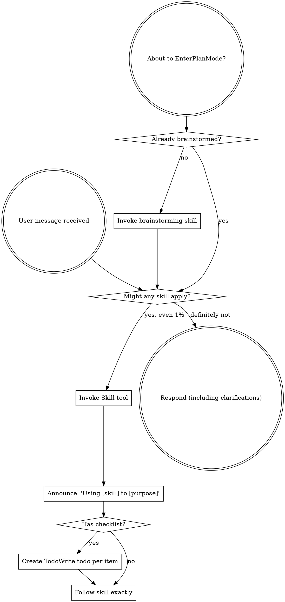

# Boundary Review — ariadne#185 (whole-issue close)

| field | value |
|-------|-------|
| issue | 185 — lift roadmap out of brain (residency follow-up to #171) |
| repo | ariadne |
| issue file | workshop/issues/000185-lift-roadmap-out-of-brain-residency-follow-up-to-171.md |
| boundary | whole-issue close |
| milestone | — |
| window | 5f1b63b74ef409e7f22138fed16a19a7337521b7..HEAD |
| command | sdlc close --issue 185 |
| reviewer | codex |
| timestamp | 2026-07-28T21:53:39-07:00 |
| verdict | FIX-THEN-SHIP |

## Review

Reading additional input from stdin...
OpenAI Codex v0.145.0
--------
workdir: /Users/xianxu/workspace/ariadne
model: gpt-5.5
provider: openai
approval: never
sandbox: workspace-write [workdir, /tmp, $TMPDIR, /tmp] (network access enabled)
reasoning effort: medium
reasoning summaries: none
session id: 019fac36-aad0-7592-ad5b-7dce46ad2e87
--------
user
# Code review — the one SDLC boundary review

You are conducting a fresh-context code review at a development boundary —
whole-issue close — in the **ariadne** repository.

- repository: ariadne   (root: /Users/xianxu/workspace/ariadne)
- issue:      ariadne#185   (file: workshop/issues/000185-lift-roadmap-out-of-brain-residency-follow-up-to-171.md)
- window:     Base: 5f1b63b74ef409e7f22138fed16a19a7337521b7   Head: HEAD

Review the **ariadne** repo and its tracker — the ariadne base-layer repo itself (changes here propagate to dependent repos). Do not assume any
other repository or apply another repo's conventions.

You have no prior session context — that is the anti-collusion property. Verify
behavior against the issue's documented Spec/Plan and the code itself; do NOT
take the implementor's word in commit messages or docs at face value. Tools are
read-only: report findings precisely; the main agent (which has session context)
applies the fixes, commits, and re-runs.

Read the diff against the issue's Spec + Plan, then work the checklist below.
Categorize every finding by severity — not everything is Critical; a nitpick
marked Critical is noise.

  Critical (must fix before crossing the boundary)
    - correctness bugs; crashes / panics on unexpected input
    - behavior drift from stated contracts (for ports of existing code where
      byte-faithfulness was promised, diff against the source)
    - silent error swallowing where the source raised
  Important (fix before the boundary if cheap)
    - API design of newly-introduced internal packages (downstream work will
      consume them; is the surface stable?)
    - missing test coverage that would catch the kind of bug shipped
    - inconsistent error handling across the diff
  Minor (note for future)
    - style nits, naming, comment density; performance only if hot-path

## Review checklist

Code quality
  - Clean separation of concerns; edge cases handled (empty / nil / unexpected).
  - Proper error handling — no silent swallowing where the source raised.
  - No duplicated logic / copy-paste that should be a shared helper.

Testing
  - Tests pin real logic, not mocks reasserting the implementation.
  - The kind of bug this diff could ship is covered.
  - PURE entities tested without IO; INTEGRATION via injected fakes (see below).

Requirements traceability
  - Every Plan checklist item this boundary claims is actually delivered.
  - Implementation matches the Spec; no undeclared scope creep.
  - Breaking changes documented.

Production readiness
  - Migration / backward-compatibility considered where state or formats change.
  - Docs / atlas updated for new surface (see the Docs update gate).

## Core concepts cross-check (if the plan has a Core concepts table)

The plan should list entities in a greppable table — name, kind
(PURE/INTEGRATION), file location, status (new/modified/deleted). For each row:
  - Verify the entity exists at the stated path (grep the diff or filesystem).
  - PURE: tests run without IO (no exec, net, mutable fs). If tests need mocks
    to run, it isn't really PURE — flag Critical and recommend promoting it to
    INTEGRATION.
  - INTEGRATION: injected into pure callers, not invoked directly from business
    logic.
  - "modified" / "deleted": the diff shows the expected change/removal at the
    stated location.
Any contradiction between table and code = Critical finding, plus a plan-revision
recommendation (a "## Revisions" entry so the plan stops claiming what the code
doesn't deliver).

## Docs update gate (atlas + README, per AGENTS.md §8)

The boundary should update user-facing docs for any new surface introduced:

  - **atlas/** — new architectural surface, flow, or terminology. Scan the diff
    for new entity types, subcommands, conventions, file-tree locations. Any
    present without corresponding atlas/ changes in the same range = Important
    finding ("atlas update appears missing for <surface>").
  - **README.md** — new user-facing surface a reader runs or types: subcommands,
    flags, keybindings, config keys, install/usage steps. If the diff adds or
    changes such surface and README.md is not updated in the same range =
    Important finding ("README update appears missing for <surface>"). This is the
    class of gap that used to surface only at the merge-time `specs` judge (#142);
    catch it here, at the earliest gate, before the close verdict is recorded.

## Architecture (the at-review backstop — these matter most long-term)

Work through each of ARCH-DRY, ARCH-PURE, ARCH-PURPOSE, ARCH-MOCK explicitly, applying its at-review lens. The
full principle definitions are delivered in the ARCHITECTURE PRINCIPLES block
right after this prompt — for EACH marker, state pass or flag, and cite the
marker (e.g. ARCH-DRY) in any finding. Architecture is where review has the
least training signal and the longest-delayed payoff, so be deliberate here, not
holistic.

## Verdict + output

Begin your response with this fenced verdict block — the machine-read handoff:

```verdict
verdict: <SHIP | FIX-THEN-SHIP | REWORK>
confidence: <high | medium | low>
```

  SHIP           ready; ship it
  FIX-THEN-SHIP  ship after addressing the findings (non-blocking at the gate)
  REWORK         blocking; needs rework before shipping — fix + re-run

The fenced ```` ```verdict ```` block above is the **authoritative machine-read
handoff** — emit it as the first thing in your response. (A prose
`VERDICT: <TOKEN>` first line still satisfies the legacy contract as a fallback,
but the block is what the binary trusts.)

After the verdict block: a 1-paragraph summary — what worked, what blocks SHIP if
it isn't — followed by:
  1. Strengths: 2-5 specific things done well (file:line where useful). Affirm
     validated approaches so the operator knows what's confirmed-good ground.
     Empty acceptable for trivial boundaries.
  2. Critical findings (file:line + fix sketch); empty if none.
  3. Important findings (same format).
  4. Minor findings (terse one-liners).
  5. Test coverage notes.
  6. Architectural notes for upcoming work.
  7. Plan revision recommendations: specific "## Revisions" entries the plan
     needs (empty if the plan still matches the code).


ARCHITECTURE PRINCIPLES — work through each of the 4 entries below explicitly, applying its `at-review` lens; cite the marker (e.g. ARCH-DRY) in any finding.

# Architecture principles (ARCH-*)

Injected architectural taste — the structural decisions whose payoff (or cost)
shows up many turns, often months, down the road. Agents are strong at local
tactics and weak here, so these are checked **at-plan** (when the design is being
made — highest leverage) and **at-review** (backstop, on the diff). Cite the
marker (e.g. `ARCH-DRY`) in plans, `## Log` entries, and review findings.

This file is the single source; it is embedded into the planning, plan-quality,
and code-review prompts. The human narrative lives in AGENTS.md "Core Design
Principles"; this is its machine-delivered companion.

## ARCH-DRY — Don't Repeat Yourself

- **principle:** Reuse before adding. One source of truth per fact/behavior; no
  duplicated logic, copy-pasted blocks, or parallel functions that should be one
  shared helper.
- **at-plan:** Flag a plan that re-implements something the codebase already has,
  or that will obviously duplicate logic across the new files instead of
  extracting a shared helper. Name the existing thing it should reuse.
- **at-review:** Flag duplicated logic / copy-pasted blocks / near-identical
  functions in the diff; point at the consolidation (file:line + the shared
  helper they should become).

## ARCH-PURE — Pure core, thin IO shell

- **principle:** The majority of code is pure functions (deterministic, no side
  effects); a thin "glue" layer at the boundary touches IO/UI/network/clock. Pure
  functions are unit-tested directly; the glue is kept small and injected.
- **at-plan:** Flag a design that buries business logic inside IO/handlers, or
  that will only be testable with heavy mocks (a sign logic isn't separated from
  IO). The plan should name what's pure vs the thin IO seam.
- **at-review:** Flag business logic mixed with IO in the diff; logic that should
  be a pure function injected into a thin caller. If a test needs mocks to run a
  "pure" entity, it isn't pure — recommend extracting the IO to the boundary.

## ARCH-PURPOSE — Serve the issue's actual purpose

- **principle:** Deliver the issue's stated purpose, not the easy subset of it. A
  single-source / "compiled to consumers" change is not done until **every
  consumer derives** from the source — the source is *enforced*, not just
  documentation a surface happens to restate; a hand-maintained restatement of the
  model is a deferred consumer, not a finished one. "Follow-up" is for separable
  extensions, never for the thing that is the point. This is the *opposite axis*
  from Simplicity-First/YAGNI: not "build for an imagined future," but "don't
  **under**-deliver the purpose you already committed to."
- **at-plan:** Flag a plan whose scope is a strict subset of the issue's stated
  goal / Done-when where the part deferred as "follow-up" *is* the purpose (e.g.
  wires one consumer + enforcement but leaves the consumers that motivated the
  issue as documentation that doesn't derive). Ask: does the plan fulfill the
  purpose, or just the cheap win? Name the deferred purpose.
- **at-review:** Does the diff *fulfill* the purpose or settle for the easy win?
  For a single-source change, run the **shadow-sweep** — enumerate the consumers,
  confirm each derives from the source, flag any remaining hand-maintained
  restatement of the model. A "follow-up" that is actually the deferred point of
  the issue is a finding, not a deferral.

## ARCH-MOCK — Stateful external doubles

- **principle:** Every external binary or service dependency the system relies on
  has a stateful fake behind the same seam, modeling our current understanding of
  the dependency's behavior across calls. For libraries, services, and binaries we
  own, the storage/backend layer is backed by a portable folder of files and/or
  database configuration, so the component can be spun up without depending on
  production configuration or production databases. Integration and end-to-end
  tests run against the fake; scheduled/live conformance checks compare the
  fake's modeled behavior with the real binary or service so drift is detected
  and corrected.
- **at-plan:** Flag a design that shells out to, or calls, an external binary or
  service without naming the seam and stateful fake. For owned libraries, services,
  and binaries, also flag any design whose storage/backend depends on production
  configuration or databases instead of a portable file folder and/or database
  configuration. The plan should identify the dependency surface consumed, the
  fake's persisted state model, the owned component's portable backend shape,
  the integration or end-to-end tests that run against it, and the live
  conformance check cadence.
  Examples include `git`, GitHub/`gh`, and Google OAuth.
- **at-review:** Flag direct external calls outside the seam, stateless mocks for
  stateful interactions, tests that cannot run the stack against the fake, owned
  components that cannot boot from portable non-production storage/backend
  configuration, or a missing live conformance check for behavior we depend on. A
  fake satisfies this only when production flow and test flow share the same
  boundary.


OUTPUT CONTRACT (machine-read — do not deviate). LEAD your response with the
fenced ```verdict block shown above — that is the authoritative handoff the binary
reads (its `verdict:` value is one of the listed tokens). Everything after the block
is advisory: a non-blocking verdict WITH findings still PASSES the gate. A bare
`VERDICT: <TOKEN>` line is accepted only as a FALLBACK when the block is absent.

Diff:
diff --git a/AGENTS.base.md b/AGENTS.base.md
index 0a731b1..c2a67a9 100644
--- a/AGENTS.base.md
+++ b/AGENTS.base.md
@@ -17,7 +17,7 @@
 #### Peer Repo
 - Peer = sibling repo in the same parent dir, usually ariadne-styled (has `construct/`).
 - Touching peer X: skip its `AGENTS.md` (near-duplicate of this); read its `AGENTS.local.md` + `MEMORY.md`. Its issues/atlas/tests live in its tree.
-- "brain" = special peer for **capture and measurement only** — pensive dumps, life-data, velocity calibration, transcripts — on the nous auto-commit rhythm. It holds **no SDLC process artifacts** (projects live in coding repos, see §8; `roadmap` remains until it too lifts — #185). A repo is a brain iff `.brain/config.md` exists (`test -d .brain`). The binary enforces the charter: spine lifecycle verbs (claim/start-plan/change-code/milestone-close/close/merge/push) **refuse** in a brain repo and in repos without `workshop/issues/` (#176; `WF_SPINE_GUARD=off` is the logged emergency hatch; reads like `estimate-source` are unaffected), and the close gate's peer-write never auto-commits into a brain. Encrypted via gcrypt + GPG recipient list unless local-only; see `brain/atlas/threat-model-shared-brain.md`.
+- "brain" = special peer for **capture and measurement only** — pensive dumps, life-data, velocity calibration, transcripts — on the nous auto-commit rhythm. It holds **no SDLC process artifacts** (projects and roadmaps live in coding repos, see §8). A repo is a brain iff `.brain/config.md` exists (`test -d .brain`). The binary enforces the charter: spine lifecycle verbs (claim/start-plan/change-code/milestone-close/close/merge/push) **refuse** in a brain repo and in repos without `workshop/issues/` (#176; `WF_SPINE_GUARD=off` is the logged emergency hatch; reads like `estimate-source` are unaffected), and the close gate's peer-write never auto-commits into a brain. Encrypted via gcrypt + GPG recipient list unless local-only; see `brain/atlas/threat-model-shared-brain.md`.
 
 ### 2. Overall Workflow
 - Unclear requirement → brainstorm. Non-trivial task (>3 files or >100 lines) → design via the **`superpowers-writing-plans`** skill, landing the durable plan in `workshop/plans/NNNNNN-slug-plan.md`, and wait for approval. The harness builtin plan-mode (`EnterPlanMode`) is fine as a read-only/approval affordance, but its `~/.claude/plans/` file is ephemeral and version-uncontrolled — **NOT the record of truth**; the durable plan lives in `workshop/plans/`.
@@ -59,7 +59,7 @@
 
 ### 8. Cross-Cutting Artifacts
 - **Atlas:** at each milestone close, update `atlas/` for new surface/flow/terminology — don't defer to an end-of-project sweep. Keep `atlas/index.md` linking every file. Map, don't over-specify; details live in code + issues.
-- **Project file** (multi-issue project, see `construct/datatype/project.md`): same per-milestone discipline — tick tasks, update `**actual:**`/`**closed:**`/scope notes. It's the portfolio view; don't let it lag. Append scope events, don't overwrite. A project lives in its **center-of-gravity repo** (top product by default — a soft rule; `repo#id` refs + `sdlc migrate` make moves cheap) under `workshop/projects/`, archived to `workshop/history/projects/`. Never in brain. Discovery is tooling's job: the close gate finds and ticks every referencing project fleet-wide; navigate with `sdlc project find --issue <ref>` / `sdlc resolve --kind project <ref>` (parley: `gP`).
+- **Project file** (multi-issue project, see `construct/datatype/project.md`): same per-milestone discipline — tick tasks, update `**actual:**`/`**closed:**`/scope notes. It's the portfolio view; don't let it lag. Append scope events, don't overwrite. A project lives in its **center-of-gravity repo** (top product by default — a soft rule; `repo#id` refs + `sdlc migrate` make moves cheap) under `workshop/projects/`, archived to `workshop/history/projects/`. Roadmaps use the same center-of-gravity rule under `workshop/projects/roadmap/<YYYYMM>/<product>.md`. Never in brain. Discovery is tooling's job: the close gate finds and ticks every referencing project fleet-wide; navigate with `sdlc project find --issue <ref>` / `sdlc resolve --kind project <ref>` (parley: `gP`).
 
 ### 9. Answer User Questions
 - Answer the question directly. DON'T change code when the user is only asking.
diff --git a/atlas/workflow/data-artifacts.md b/atlas/workflow/data-artifacts.md
index edabc7d..a3a0f06 100644
--- a/atlas/workflow/data-artifacts.md
+++ b/atlas/workflow/data-artifacts.md
@@ -56,7 +56,7 @@ layer graph (ariadne sees the base set without the three nous nouns).
 | `event` | Time-bound plan with a deadline — launch, conference, prep effort. |
 | `pensive` | Timestamped train of thought, insight, brainstorm. Captures a moment of thinking-out-loud in the user's voice. |
 | `product` | Durable charter of a thing being built — vision + components + current state. Spans 0..N peer repos. |
-| `roadmap` | Month-level forward-looking plan for one product — capacity, scope decisions, target state per component. Lives at `data/roadmap/YYYYMM/<product>.md`. |
+| `roadmap` | Month-level forward-looking plan for one product — capacity, scope decisions, target state per component. Lives in the product's center-of-gravity repo at `workshop/projects/roadmap/YYYYMM/<product>.md`. |
 | `project` | Execution container — focused push toward a defined MVP, cutting across issues and possibly products. Operator-POV. One operator per project. Closes the velocity calibration loop. |
 | `prose` | Per-parent ledger of pre-manuscript fragments — sentences and half-thoughts captured before they have a home in the parent's drafts. Sibling to a `product` (or other long-running parent). Reverse-chrono, append-only, voice-preserving. Distinct from `pensive` (session vs ledger). |
 | `continuation` | The **connective narrative over a session's durable artifacts** (pensive/issues/targets) — next action, the thread's arc + a model of the user's intention, open questions to resolve on resume, decisions/dead-ends, and lessons — so work resumes later / on another machine / by another person / under another agent. Distilled from the *rendered* session, not the native store. Lives at `workshop/continuation/<timestamp>-slug.md`; the **one type committed+pushed on creation** (disaster-recovery). |
diff --git a/construct/datatype/product.md b/construct/datatype/product.md
index 2be2911..8927d74 100644
--- a/construct/datatype/product.md
+++ b/construct/datatype/product.md
@@ -88,7 +88,7 @@ When the dispatcher applies this prototype:
 
    **Owned by an entity.** When a product belongs to a containing entity that already has its own directory under `data/` (e.g., a company under `data/life/<entity>/`), the product may live in an entity-nested subdirectory: `data/<entity-path>/<slug>/<slug>.md`. Slug uniqueness across the brain and slug-as-filename are preserved. Example: `data/life/42shots/book-4/book-4.md`.
 
-   **What goes in the entity-nested folder vs. elsewhere.** The folder is the *home for the product spine plus the residue*: product-specific artifacts that don't fit any cross-cutting datatype (raw draft material, reader/customer-feedback notes, contract scans, asset files, marketing copy that hasn't earned its own type yet). It is **not** "everything related to the product." Cross-cutting datatypes — `project`, `roadmap`, `meeting-notes`, `pensive`, `reference`, `procedure`, `event`, `travel-plan` — stay in their canonical homes (e.g., `workshop/projects/<slug>.md`) and link via a `product: <slug>` frontmatter field. This keeps `rg -l "^type: <type>"` queries one-liners regardless of which product an artifact serves, and lets cross-product instances (e.g., a marketing campaign covering two products) be a single canonical file with `products: [a, b]` rather than duplicated under two folders.
+   **What goes in the entity-nested folder vs. elsewhere.** The folder is the *home for the product spine plus the residue*: product-specific artifacts that don't fit any cross-cutting datatype (raw draft material, reader/customer-feedback notes, contract scans, asset files, marketing copy that hasn't earned its own type yet). It is **not** "everything related to the product." Cross-cutting datatypes — `project`, `roadmap`, `meeting-notes`, `pensive`, `reference`, `procedure`, `event`, `travel-plan` — stay in their canonical homes (e.g., `workshop/projects/<slug>.md` for a project, `workshop/projects/roadmap/<YYYYMM>/<product>.md` for a roadmap) and link via a `product: <slug>` frontmatter field. This keeps `rg -l "^type: <type>"` queries one-liners regardless of which product an artifact serves, and lets cross-product instances (e.g., a marketing campaign covering two products) be a single canonical file with `products: [a, b]` rather than duplicated under two folders.
 
    **`prose.md` is the recognized sibling for pre-manuscript fragments.** Long-running written endeavors (book, blog, essay, spec) accumulate sentences and half-thoughts before they have a chapter or post to live in. When that happens, a `prose.md` lives next to the product spine — `<product-folder>/prose.md` — and the `prose` datatype owns it. **A product in default file form (`data/product/<slug>.md`) graduates to folder form when it first gains a prose sibling**: `data/product/<slug>.md` becomes `data/product/<slug>/<slug>.md` plus `data/product/<slug>/prose.md`. The graduation is a one-time `git mv` plus an `rg` sweep for stale path references; do it explicitly rather than silently relocating. See `construct/datatype/prose.md` for the prose datatype itself.
 
@@ -136,6 +136,6 @@ git log -p --follow data/product/ariadne.md | rg -B1 "^\*\*State:\*\* " | head -
 
 - One product per file. Slug, filename, and `name:` field must agree.
 - Components are flat (`### ` only). No `#### ` headings; promote to top-level or describe sub-features in prose.
-- A roadmap targeting this product references components by slug. Renaming a component requires an `rg` sweep across `data/product/`, `data/roadmap/`, and any prose docs that reference it.
+- A roadmap targeting this product references components by slug. Renaming a component requires an `rg` sweep across `data/product/`, `workshop/projects/roadmap/`, and any prose docs that reference it.
 - Vision text is never fabricated by the dispatcher. Empty placeholder + flag-to-human is the right behavior when unstated.
 - `sources` records what the agent read. It is not a rigorous reproducibility chain — model nondeterminism and cross-repo dependencies make sha/model tracking too brittle to be worth the cost. Use `sources` as a "where did this come from" hint for human auditing.
diff --git a/construct/datatype/roadmap.md b/construct/datatype/roadmap.md
index 9b80799..357c42d 100644
--- a/construct/datatype/roadmap.md
+++ b/construct/datatype/roadmap.md
@@ -1,7 +1,7 @@
 ---
 type: type
 name: roadmap
-description: Use when planning one product's work for a target month — capacity, scope decisions, target state per component. Lives at data/roadmap/YYYYMM/<product>.md. Triggers on "let's roadmap <product> for <month>", "plan <product> for end of <month>", "/xx-datatype roadmap".
+description: Use when planning one product's work for a target month — capacity, scope decisions, target state per component. Lives in the product's center-of-gravity repo at workshop/projects/roadmap/YYYYMM/<product>.md. Triggers on "let's roadmap <product> for <month>", "plan <product> for end of <month>", "/xx-datatype roadmap".
 ---
 
 # roadmap
@@ -10,14 +10,14 @@ A roadmap is the *plan* for one product across one month. It states what we want
 
 A roadmap is forward-looking. It is not a snapshot of where we are now (that lives in the product file's per-component `**State:**` line) and not a changelog (git diff between adjacent roadmaps shows the trajectory).
 
-A roadmap is per-product. The proto-company view is the *aggregate* of `data/roadmap/YYYYMM/*.md` — multiple per-product files in one month directory. Cross-product dependencies are expressed by `` `other-product:slug` `` references in component prose, not by combined docs.
+A roadmap is per-product and lives in that product's center-of-gravity repo, under `workshop/projects/roadmap/YYYYMM/<product>.md`. The proto-company view is the *aggregate* of roadmaps across center-of-gravity repos for a given month. Cross-product dependencies are expressed by `` `other-product:slug` `` references in component prose, not by combined docs.
 
 ## Frontmatter shape
 
 | Field | Required | Notes |
 |---|---|---|
 | `type` | yes | `roadmap` |
-| `product` | yes | The product slug. Must reference an existing `data/product/<product>.md`. |
+| `product` | yes | The product slug. Must reference an existing `data/product/<product>.md` in the same center-of-gravity repo. |
 | `month` | yes | `YYYYMM`. Target end-of-period. |
 | `target_event` | optional | Free-form short tag if this month is gated to a specific external event (e.g., `external launch`, `investor meeting`). |
 | `created` | yes | ISO date. |
@@ -62,12 +62,12 @@ Empty placeholder (`*(added after month concludes)*`) until the month is over. O
 When the dispatcher applies this prototype:
 
 1. **Resolve `product` and `month` first.**
-   - `product` — must reference an existing `data/product/<product>.md`. If that file doesn't exist, ask the user — usually the answer is "create the product first, then come back."
+   - `product` — must reference an existing `data/product/<product>.md` in the product's center-of-gravity repo. If that file doesn't exist, ask the user — usually the answer is "create the product first, then come back."
    - `month` — `YYYYMM`. Default to current month if unstated.
-   - Default location: `data/roadmap/<month>/<product>.md`.
+   - Default location: `workshop/projects/roadmap/<month>/<product>.md` in the product's center-of-gravity repo.
 
 2. **Check for prior roadmaps of this product.**
-   - List `data/roadmap/*/<product>.md` to find the most recent prior roadmap.
+   - List `workshop/projects/roadmap/*/<product>.md` in the product's center-of-gravity repo to find the most recent prior roadmap.
    - If non-adjacent (gap of ≥1 month), the capacity statement must explicitly cover the gap.
    - If a prior roadmap exists, read its `## components` to understand what was in flight; pre-fill components that likely carry forward.
 
@@ -99,28 +99,28 @@ When the dispatcher applies this prototype:
 # All roadmaps
 rg -l "^type: roadmap"
 
-# All roadmaps for a product (across months)
-ls data/roadmap/*/<product>.md 2>/dev/null
+# All roadmaps for a product in the current repo (across months)
+ls workshop/projects/roadmap/*/<product>.md 2>/dev/null
 
 # All roadmaps in a month (proto-company view)
-ls data/roadmap/202610/ 2>/dev/null
+ls workshop/projects/roadmap/202610/ 2>/dev/null
 
 # All roadmaps gated to a specific event
 rg -l "^type: roadmap" | xargs rg -l "^target_event: external launch"
 
 # Capacity statements across all roadmaps in a month
-rg "^\*\*Capacity:\*\*" data/roadmap/202610/
+rg "^\*\*Capacity:\*\*" workshop/projects/roadmap/202610/
 
 # Component-level target states for a specific component across months
-rg -B1 -A1 "^### substrate-skill-management" data/roadmap/
+rg -B1 -A1 "^### substrate-skill-management" workshop/projects/roadmap/
 
 # Trajectory for a component (changes across months via git)
-git log -p --follow data/roadmap/*/<product>.md | rg -A 5 "^### substrate-skill-management"
+git log -p --follow workshop/projects/roadmap/*/<product>.md | rg -A 5 "^### substrate-skill-management"
 ```
 
 ## Rules
 
-- One roadmap per (product, month) pair. The filename is `data/roadmap/<month>/<product>.md` and the frontmatter `product` + `month` must match the path.
+- One roadmap per (product, month) pair. The filename is `workshop/projects/roadmap/<month>/<product>.md` in the product's center-of-gravity repo, and the frontmatter `product` + `month` must match the path.
 - A roadmap targets one product. Cross-product dependencies are expressed by `` `other-product:slug` `` references in component prose, not by combined docs.
 - Component slugs in the roadmap MUST exist as `### <slug>` sections in the corresponding product file. If a slug doesn't exist there yet, add it to the product file first.
 - The roadmap is forward-looking. Current state of components lives in the product file's `**State:**` line. Don't duplicate.
diff --git a/workshop/plans/000185-lift-roadmap-out-of-brain-residency-follow-up-to-171-plan.md b/workshop/plans/000185-lift-roadmap-out-of-brain-residency-follow-up-to-171-plan.md
new file mode 100644
index 0000000..78385e1
--- /dev/null
+++ b/workshop/plans/000185-lift-roadmap-out-of-brain-residency-follow-up-to-171-plan.md
@@ -0,0 +1,90 @@
+# Lift Roadmap Out Of Brain Implementation Plan
+
+> **For agentic workers:** Consult AGENTS.md Section 3 (Subagent Strategy) to determine the appropriate execution approach: use superpowers-subagent-driven-development (if subagents are suitable per AGENTS.md) or superpowers-executing-plans to implement this plan. Steps use checkbox (`- [ ]`) syntax for tracking.
+
+**Goal:** Move roadmap residency from brain-era `data/roadmap` language to the center-of-gravity repo model under `workshop/projects`.
+
+**Architecture:** This is a docs-contract change. The roadmap prototype becomes the source that tells agents where roadmap instances live; the base constitution drops the explicit brain exception; atlas and generated harness entry files are verified as consumers. `ARCH-PURPOSE` drives the scope: do not stop at "no files found in brain" while the contract still says the lift is pending.
+
+**Tech Stack:** Markdown datatype prototypes, weave-generated harness entry files, `sdlc` workflow gates, `rg` verification.
+
+---
+
+## Core Concepts
+
+| Name | Lives in | Status |
+|------|----------|--------|
+| `RoadmapResidency` | `construct/datatype/roadmap.md` | modified |
+| `BrainResidencyCharter` | `AGENTS.base.md` | modified |
+| `DatatypeAtlasRow` | `atlas/workflow/data-artifacts.md` | modified |
+
+- **RoadmapResidency** — contract for where roadmap instances live and how agents discover prior roadmaps.
+  - **Relationships:** One roadmap belongs to one product/month pair; it resides in the center-of-gravity repo for that product, under `workshop/projects/roadmap/<YYYYMM>/<product>.md`.
+  - **DRY rationale:** The datatype prototype is the source that agents apply; derived docs should mirror it instead of inventing a second path (`ARCH-DRY`).
+  - **Future extensions:** If parley or `sdlc resolve` gains direct roadmap navigation, it should consume this residency contract rather than hardcoding brain paths.
+
+- **BrainResidencyCharter** — constitution clause that defines brain as capture/measurement only.
+  - **Relationships:** Exported from `AGENTS.base.md` into `AGENTS.md`, `CLAUDE.md`, and `GEMINI.md` by weave.
+  - **DRY rationale:** The base file is the one source; generated consumers must be recompiled, not hand-maintained.
+  - **Future extensions:** New SDLC artifact types should name their non-brain residency here only if they are exceptions worth calling out.
+
+- **DatatypeAtlasRow** — atlas summary of the roadmap type.
+  - **Relationships:** Mirrors `construct/datatype/roadmap.md` for humans scanning the data-artifacts map.
+  - **DRY rationale:** It is a map, not the contract; keep it short and point at the same path language (`ARCH-PURPOSE`).
+  - **Future extensions:** Broader roadmap tooling should get a separate atlas subsection when code exists.
+
+## Integration Points
+
+| Name | Lives in | Status | Wraps |
+|------|----------|--------|-------|
+| `WeaveCompile` | `make weave` | existing | generated harness entry files |
+| `RoadmapSweep` | terminal verification commands | existing | filesystem search |
+
+- **WeaveCompile** — regenerates `AGENTS.md`, `CLAUDE.md`, and `GEMINI.md` from the edited base constitution.
+  - **Injected into:** No code; this is the IO step that proves generated consumers follow the source.
+  - **Future extensions:** If the base manifest changes, this remains the regeneration point.
+
+- **RoadmapSweep** — `rg`/`find` checks for stale roadmap residency text and live brain roadmap artifacts.
+  - **Injected into:** Verification only.
+  - **Future extensions:** Can become a deterministic lint if roadmap residency drifts again.
+
+## Chunk 1: Contract And Verification
+
+**Files:**
+- Modify: `workshop/issues/000185-lift-roadmap-out-of-brain-residency-follow-up-to-171.md`
+- Modify: `construct/datatype/roadmap.md`
+- Modify: `AGENTS.base.md`
+- Modify: `atlas/workflow/data-artifacts.md`
+- Generated: `AGENTS.md`
+- Generated: `CLAUDE.md`
+- Generated: `GEMINI.md`
+
+- [x] **Step 1: Update the issue spec and estimate**
+  - Record the operator decision: roadmaps use center-of-gravity repo residency, under `workshop/projects/roadmap/<YYYYMM>/<product>.md`.
+  - Add the required `## Estimate` block using `estimate-logic-v3.1`.
+
+- [x] **Step 2: Update the roadmap datatype prototype**
+  - Change the description, authoring instructions, search recipes, and rules from `data/roadmap/...` to `workshop/projects/roadmap/...`.
+  - State that the repo is the product's center-of-gravity repo, matching project residency.
+
+- [x] **Step 3: Inventory and handle migration**
+  - Run `find /Users/xianxu/workspace/brain -path '*/data/roadmap/*' -print` and `rg -n "^type: roadmap\\b" /Users/xianxu/workspace/brain -g '*.md'`.
+  - If files are found, list each source path in the issue Log, determine its product/month from frontmatter and filename, and identify the product's center-of-gravity repo.
+  - Before writing any peer repo, follow AGENTS.md peer safety: read that peer's `AGENTS.local.md` and `MEMORY.md`; run `git -C <repo> branch --show-current` and `git -C <repo> status --porcelain`; proceed only when it is on the expected integration branch and clean. If a target peer is dirty or mid-feature, stop and log the deferred migration path instead of writing there.
+  - Move each eligible roadmap to `<target-repo>/workshop/projects/roadmap/<YYYYMM>/<product>.md`. Prefer `sdlc migrate` only if it can express the source/target move; otherwise use a named manual move and log the reason. Do not use `git clean` or broad destructive cleanup in any peer.
+  - If no files are found, record the migration as a no-op in the issue Log with the exact commands used as evidence.
+
+- [x] **Step 4: Update constitution and atlas docs**
+  - Remove the "`roadmap` remains until it too lifts" residual clause from `AGENTS.base.md`.
+  - Update `atlas/workflow/data-artifacts.md` so the roadmap row uses the new residency.
+  - Search consumers with `rg -n "data/roadmap|workshop/roadmap|type: roadmap|roadmap.*brain" construct/datatype atlas AGENTS.base.md docs workshop/issues` and update only live contract/docs surfaces, not historical records.
+  - Verify `rg --files construct/vocabulary | rg 'roadmap'` returns no roadmap vocabulary model; if one appears, update its discovery/residency field in the same pass.
+
+- [x] **Step 5: Regenerate derived harness docs**
+  - Run `make weave`.
+  - Verify `AGENTS.md`, `CLAUDE.md`, and `GEMINI.md` no longer contain the residual roadmap clause.
+
+- [x] **Step 6: Sweep and verify**
+  - Run `rg -n "roadmap.*brain|remains until it too lifts|data/roadmap|workshop/projects/roadmap" AGENTS*.md CLAUDE.md GEMINI.md construct/datatype atlas/workflow workshop/issues/000185-lift-roadmap-out-of-brain-residency-follow-up-to-171.md`.
+  - Run `find /Users/xianxu/workspace/brain -path '*/data/roadmap/*' -print` and `rg -n "^type: roadmap\\b" /Users/xianxu/workspace/brain -g '*.md'`.
+  - Run `git diff --check`.


codex
I’ll use `superpowers-using-superpowers` to satisfy the repo’s session-start requirement, then I’ll stay in read-only review mode and compare the issue/plan against the diff and filesystem.
exec
/bin/zsh -lc "sed -n '1,220p' /Users/xianxu/workspace/ariadne/construct/adapted/superpowers-using-superpowers/SKILL.md && sdlc --help" in /Users/xianxu/workspace/ariadne
 succeeded in 0ms:
---
name: superpowers-using-superpowers
description: Use when starting any conversation - establishes how to find and use skills, requiring Skill tool invocation before ANY response including clarifying questions
---

<SUBAGENT-STOP>
If you were dispatched as a subagent to execute a specific task, skip this skill.
</SUBAGENT-STOP>

<EXTREMELY-IMPORTANT>
If you think there is even a 1% chance a skill might apply to what you are doing, you ABSOLUTELY MUST invoke the skill.

IF A SKILL APPLIES TO YOUR TASK, YOU DO NOT HAVE A CHOICE. YOU MUST USE IT.

This is not negotiable. This is not optional. You cannot rationalize your way out of this.
</EXTREMELY-IMPORTANT>

## Instruction Priority

> **Ariadne note:** AGENTS.md Section 3 governs subagent strategy and overrides skills that mandate subagent-driven-development as the default execution path.

Superpowers skills override default system prompt behavior, but **user instructions always take precedence**:

1. **User's explicit instructions** (CLAUDE.md, GEMINI.md, AGENTS.md, direct requests) — highest priority
2. **Superpowers skills** — override default system behavior where they conflict
3. **Default system prompt** — lowest priority

If CLAUDE.md, GEMINI.md, or AGENTS.md says "don't use TDD" and a skill says "always use TDD," follow the user's instructions. The user is in control.

## How to Access Skills

**In Claude Code:** Use the `Skill` tool. When you invoke a skill, its content is loaded and presented to you—follow it directly. Never use the Read tool on skill files.

**In Gemini CLI:** Skills activate via the `activate_skill` tool. Gemini loads skill metadata at session start and activates the full content on demand.

**In other environments:** Check your platform's documentation for how skills are loaded.

## Platform Adaptation

Skills use Claude Code tool names. Non-CC platforms: see `references/codex-tools.md` (Codex) for tool equivalents. Gemini CLI users get the tool mapping loaded automatically via GEMINI.md.

# Using Skills

## The Rule

**Invoke relevant or requested skills BEFORE any response or action.** Even a 1% chance a skill might apply means that you should invoke the skill to check. If an invoked skill turns out to be wrong for the situation, you don't need to use it.



## Red Flags

These thoughts mean STOP—you're rationalizing:

| Thought | Reality |
|---------|---------|
| "This is just a simple question" | Questions are tasks. Check for skills. |
| "I need more context first" | Skill check comes BEFORE clarifying questions. |
| "Let me explore the codebase first" | Skills tell you HOW to explore. Check first. |
| "I can check git/files quickly" | Files lack conversation context. Check for skills. |
| "Let me gather information first" | Skills tell you HOW to gather information. |
| "This doesn't need a formal skill" | If a skill exists, use it. |
| "I remember this skill" | Skills evolve. Read current version. |
| "This doesn't count as a task" | Action = task. Check for skills. |
| "The skill is overkill" | Simple things become complex. Use it. |
| "I'll just do this one thing first" | Check BEFORE doing anything. |
| "This feels productive" | Undisciplined action wastes time. Skills prevent this. |
| "I know what that means" | Knowing the concept ≠ using the skill. Invoke it. |

## Skill Priority

When multiple skills could apply, use this order:

1. **Process skills first** (brainstorming, debugging) - these determine HOW to approach the task
2. **Implementation skills second** (frontend-design, mcp-builder) - these guide execution

"Let's build X" → brainstorming first, then implementation skills.
"Fix this bug" → debugging first, then domain-specific skills.

## Skill Types

**Rigid** (TDD, debugging): Follow exactly. Don't adapt away discipline.

**Flexible** (patterns): Adapt principles to context.

The skill itself tells you which.

## User Instructions

Instructions say WHAT, not HOW. "Add X" or "Fix Y" doesn't mean skip workflows.
sdlc collects ariadne's SDLC checkpoint guards into one binary. Each subcommand
owns one checkpoint: it requires evidence at the gate, mutates state, logs the
transition, and refuses transitions that lack it. We don't model the SDLC as a
state machine — stages stay prose; we codify the gates between them where drift
recurs. `sdlc` manages the development life cycle; prefer it over `git`/`gh`.

BEFORE WORK
  - `sdlc claim --issue N` — the single start-of-work gesture, a CHEAP LOCK.
    Flips an *open* issue to `working` and publishes the claim to origin/main so
    peer agents see it. No estimate demanded (#113) — claim early, the moment an
    idea crystallizes. `--no-start` suppresses the flip.
  - Do NOT hand-edit an issue's `status:` — let `sdlc claim` or `sdlc issue
    set-status` own that transition (it carries the reopen/`→ done` guards).

ENTER IMPLEMENTATION
  - After plan approval, before editing code, run `sdlc change-code`. It owns the
    branching decision (in-place branch by default; `--worktree=yes` for an
    isolated worktree), the plan-quality check, and the `estimate_hours` gate
    (relocated here from claim, #113). Don't start coding without it.

PUBLISH
  - Publishing goes through a PR: `sdlc pr` → `sdlc merge`. Direct `sdlc push`
    if working directly on main.
  - Publish ONCE at issue close, not per milestone — and do NOT reuse a branch
    name that already has a merged PR. `sdlc merge` refuses (#148) when a branch
    has commits not in main despite a merged PR (a reused name would otherwise
    silently strand the new commits); rename to a fresh branch, `sdlc pr`, retry.

RECOVER
  - After a compaction or session resume, run `sdlc state` to recover where you
    are instead of re-inferring from issue files.

LOCAL REPO TRANSACTION LOCK
  - Mutating verbs take an SDLC-owned repo transaction lock at
    `.git/sdlc.lock` before reading/writing issue state, committing, changing
    branches, or pushing. The lock is local to the Git common dir, so linked
    worktrees of the same repo serialize with each other.
  - Wait messages identify the holder pid and command when metadata is
    available. `close` and `milestone-close` release the lock while the external
    boundary-review subprocess runs, then reacquire before finalization; if HEAD
    or the issue/project file state they prepared changed meanwhile, they refuse
    to finalize and tell you to rerun. `change-code`, `merge`, and `push` can still hold the lock during
    long-running review/ship transactions; wait or retry rather than removing
    the lock while that process is alive.
  - A dead same-host holder is reclaimed automatically; initializing metadata
    is waited through. Other stale/timeout errors tell you how to inspect
    `.git/sdlc.lock`. Remote push/ref races are separate: the local lock
    serializes this checkout, not another machine or clone.

WHEN A VERB ERRORS
  Do NOT route around it with hand-rolled `git`/`gh`. Its errors are next-action
  specs. The fix is one of two things:
    (a) satisfy the precondition it names and re-run the same verb (e.g. `sdlc
        merge` saying "no upstream" → run `sdlc pr` first, then `sdlc merge`); or
    (b) if the error is a genuine gap in `sdlc` itself, fix that edge case in the
        source and re-run. We're still ironing out edge cases.
  Only drop to manual when a verb genuinely cannot express the need — say so.

These gates sit inside a wider prose arc the binary does NOT own: ideation
(parley/pensive) → brainstorm → plan → build → milestone review (`sdlc judge`,
auto-dispatched) → close/ship → postmortem.

CONVENTIONS

  --issue vs --github-issue — `--issue N` always means workshop/issues
  (6-digit ID). `--github-issue N` means a GitHub issue number. Bare `--issue`
  never means a GitHub issue.

  Form vs essence — checkpoint guards (close, milestone-close, push, merge)
  defend against *omission* via required-evidence flags; `sdlc judge` defends
  against *theater* via fresh-context review. Form runs first; judge second.

The verb list + per-verb help (`sdlc <verb> --help`) follow below.

Usage:
  sdlc [flags]
  sdlc [command]

Available Commands:
  claim           Start work: flip an open issue to working + broadcast the claim
  start-plan      Enter planning: deliver the architecture principles to design against (#75)
  change-code     Enter implementation after the structural + plan-quality gates
  issue           Create + manage issues (new / set-status / list / show)
  project         Create + manage projects (new / list / show / set-status / validate)
  actual          Compute an issue's focused dev-hours via active-time-v3 (#68)
  active-time     Per-issue active-time attribution table (the v3 engine, standalone)
  close           Close an issue or milestone (ACTUAL + VERIFIED + atlas/project sweep)
  milestone-close Close one milestone + auto-dispatch its review
  pr              Open a pull request from a feature branch
  merge           Merge the PR, archive done issues, clean up
  push            Ship from main (clean tree + pre-merge judges + archive)
  state           Inspect workflow state (branch, working issues, drift)
  resolve         Resolve a symbolic artifact ref (ariadne#11, #15 M4) to its current path(s) — read-only
  open            Resolve a ref and open the primary artifact in $EDITOR
  migrate         Move a markdown artifact to a peer repo, rewriting refs (#179)
  judge           Run an LLM-judge check against the diff (fresh-context)
  arch-principles Print the ARCH-* architecture principles (single source; pull for non-gate work)
  estimate-source Name the shared estimate method + the repo-local calibration source (pull)
  process-manual  Unroll every injection source into a linked process manual (#153)
  propagate-base  Re-weave every recursive dependent of this repo (foundation-first)
  help            Help about any command

Flags:
  -h, --help   help for sdlc

Use "sdlc [command] --help" for more information about a command.

codex
I’ve loaded the required session-start skill and the SDLC contract. Now I’m reading the issue, plan, and actual working diff so the review is against the repository state, not just the pasted patch.
exec
/bin/zsh -lc "sed -n '1,240p' workshop/issues/000185-lift-roadmap-out-of-brain-residency-follow-up-to-171.md" in /Users/xianxu/workspace/ariadne
 succeeded in 0ms:
---
id: 000185
status: working
deps: []
github_issue:
created: 2026-07-17
updated: 2026-07-28
estimate_hours: 0.84
started: 2026-07-28T17:41:54-07:00
---

# lift roadmap out of brain (residency follow-up to #171)

## Problem

#171 established the residency charter: brain is capture/measurement only and
holds no SDLC process artifacts. Projects lifted to coding-repo
`workshop/projects/`; `roadmap` is the residual SDLC artifact still living in
brain (the AGENTS §Peer-Repo brain line flags it and points here). Same
contradictions #171 named apply: auto-commit sweeps deliberate portfolio
state, and brain's encryption posture couples the sharing decision.

## Spec

Apply #171's model to roadmaps: pick the residency (likely the same
center-of-gravity rule, or a single home repo since a roadmap is inherently
cross-repo), define discovery/navigation if refs point at it, and migrate the
existing record(s). Reuse `DiscoverByIssueRef`-style tooling only if roadmaps
are actually referenced by refs — don't build surface ahead of need
(ARCH-PURPOSE).

Decision: roadmaps use the same center-of-gravity repo rule as projects. A
roadmap instance lives under the product's center-of-gravity repo at
`workshop/projects/roadmap/<YYYYMM>/<product>.md`. This keeps planning artifacts
with the portfolio surface instead of in brain, while preserving the existing
one-roadmap-per-product-month shape. Parley/project cross-repo discovery is the
navigation model for now; do not add roadmap-specific resolver code until a real
reference workflow needs it (ARCH-PURPOSE, ARCH-DRY).

## Done when

- No roadmap artifact lives in brain; the AGENTS §Peer-Repo brain line drops
  its roadmap residual clause.
- The roadmap datatype states the residency; if a `construct/vocabulary`
  roadmap model exists, its discovery/residency agrees with the datatype.

## Estimate

```estimate
model: estimate-logic-v3.1
familiarity: 1.0
item: typed-data-prototype design=0.10 impl=0.08
item: atlas-docs design=0.20 impl=0.08
item: cross-cutting-refactor design=0.15 impl=0.08
item: milestone-review design=0.00 impl=0.08
design-buffer: 0.15
total: 0.84
```

Produced via `brain/data/life/42shots/velocity/estimate-logic-v3.1.md` against
`baseline-v3.1.md`. Method A only. The typed-data design is discounted because
the operator resolved the residency choice before implementation; v3.1 scales
implementation hours to 40% of the v2/v2.1 primitive table.

## Plan

- [x] inventory roadmap artifacts in brain + consumers that read them; migrate
      named files or log the empty-inventory no-op
- [x] decide residency (brainstorm w/ operator) and update the roadmap datatype
- [x] docs sweep + propagate-base

## Log

### 2026-07-28

- Claimed, planned, and entered implementation. Operator chose the same
  center-of-gravity repo residency as projects; roadmap instances live under
  `workshop/projects/roadmap/<YYYYMM>/<product>.md` (ARCH-PURPOSE, ARCH-DRY).
- Brain roadmap inventory is currently empty: `find
  /Users/xianxu/workspace/brain -path '*/data/roadmap/*' -print` produced no
  paths, and `rg -n "^type: roadmap\b" /Users/xianxu/workspace/brain -g
  '*.md'` found no matches. Migration is a no-op unless the final sweep finds a
  missed artifact.
- Updated roadmap/product datatype docs, atlas data-artifacts, AGENTS.base, and
  live issue #15. Ran `make weave`; generated `AGENTS.md`, `CLAUDE.md`, and
  `GEMINI.md` now carry the roadmaps-in-coding-repos wording.
- `sdlc propagate-base --ref ariadne#185` re-wove and verified 10 dependents
  with no changes, but refused to touch dirty working trees in `42shots`,
  `parley.nvim`, and `kbench`. Read-only sweep confirmed those three skipped
  repos still carry the old roadmap residual clause in generated harness docs.
  Next action: clean/stash those peer changes, rerun propagation, then close.
- Per operator direction, stashed/restored `42shots` and `parley.nvim` local
  changes around `make weave`. Both repos now verify cleanly for this base-layer
  change and no longer carry the stale roadmap residual clause. Left `kbench`
  unmodified per operator direction; read-only verification shows its generated
  harness docs already carry the new roadmaps-in-coding-repos clause.

### 2026-07-17

- Filed from #171 M5 boundary review minor: the brain-peer line's roadmap
  residual pointer needed a real issue to point at.

exec
/bin/zsh -lc "sed -n '1,220p' workshop/plans/000185-lift-roadmap-out-of-brain-residency-follow-up-to-171-plan.md" in /Users/xianxu/workspace/ariadne
 succeeded in 0ms:
# Lift Roadmap Out Of Brain Implementation Plan

> **For agentic workers:** Consult AGENTS.md Section 3 (Subagent Strategy) to determine the appropriate execution approach: use superpowers-subagent-driven-development (if subagents are suitable per AGENTS.md) or superpowers-executing-plans to implement this plan. Steps use checkbox (`- [ ]`) syntax for tracking.

**Goal:** Move roadmap residency from brain-era `data/roadmap` language to the center-of-gravity repo model under `workshop/projects`.

**Architecture:** This is a docs-contract change. The roadmap prototype becomes the source that tells agents where roadmap instances live; the base constitution drops the explicit brain exception; atlas and generated harness entry files are verified as consumers. `ARCH-PURPOSE` drives the scope: do not stop at "no files found in brain" while the contract still says the lift is pending.

**Tech Stack:** Markdown datatype prototypes, weave-generated harness entry files, `sdlc` workflow gates, `rg` verification.

---

## Core Concepts

| Name | Lives in | Status |
|------|----------|--------|
| `RoadmapResidency` | `construct/datatype/roadmap.md` | modified |
| `BrainResidencyCharter` | `AGENTS.base.md` | modified |
| `DatatypeAtlasRow` | `atlas/workflow/data-artifacts.md` | modified |

- **RoadmapResidency** — contract for where roadmap instances live and how agents discover prior roadmaps.
  - **Relationships:** One roadmap belongs to one product/month pair; it resides in the center-of-gravity repo for that product, under `workshop/projects/roadmap/<YYYYMM>/<product>.md`.
  - **DRY rationale:** The datatype prototype is the source that agents apply; derived docs should mirror it instead of inventing a second path (`ARCH-DRY`).
  - **Future extensions:** If parley or `sdlc resolve` gains direct roadmap navigation, it should consume this residency contract rather than hardcoding brain paths.

- **BrainResidencyCharter** — constitution clause that defines brain as capture/measurement only.
  - **Relationships:** Exported from `AGENTS.base.md` into `AGENTS.md`, `CLAUDE.md`, and `GEMINI.md` by weave.
  - **DRY rationale:** The base file is the one source; generated consumers must be recompiled, not hand-maintained.
  - **Future extensions:** New SDLC artifact types should name their non-brain residency here only if they are exceptions worth calling out.

- **DatatypeAtlasRow** — atlas summary of the roadmap type.
  - **Relationships:** Mirrors `construct/datatype/roadmap.md` for humans scanning the data-artifacts map.
  - **DRY rationale:** It is a map, not the contract; keep it short and point at the same path language (`ARCH-PURPOSE`).
  - **Future extensions:** Broader roadmap tooling should get a separate atlas subsection when code exists.

## Integration Points

| Name | Lives in | Status | Wraps |
|------|----------|--------|-------|
| `WeaveCompile` | `make weave` | existing | generated harness entry files |
| `RoadmapSweep` | terminal verification commands | existing | filesystem search |

- **WeaveCompile** — regenerates `AGENTS.md`, `CLAUDE.md`, and `GEMINI.md` from the edited base constitution.
  - **Injected into:** No code; this is the IO step that proves generated consumers follow the source.
  - **Future extensions:** If the base manifest changes, this remains the regeneration point.

- **RoadmapSweep** — `rg`/`find` checks for stale roadmap residency text and live brain roadmap artifacts.
  - **Injected into:** Verification only.
  - **Future extensions:** Can become a deterministic lint if roadmap residency drifts again.

## Chunk 1: Contract And Verification

**Files:**
- Modify: `workshop/issues/000185-lift-roadmap-out-of-brain-residency-follow-up-to-171.md`
- Modify: `construct/datatype/roadmap.md`
- Modify: `AGENTS.base.md`
- Modify: `atlas/workflow/data-artifacts.md`
- Generated: `AGENTS.md`
- Generated: `CLAUDE.md`
- Generated: `GEMINI.md`

- [x] **Step 1: Update the issue spec and estimate**
  - Record the operator decision: roadmaps use center-of-gravity repo residency, under `workshop/projects/roadmap/<YYYYMM>/<product>.md`.
  - Add the required `## Estimate` block using `estimate-logic-v3.1`.

- [x] **Step 2: Update the roadmap datatype prototype**
  - Change the description, authoring instructions, search recipes, and rules from `data/roadmap/...` to `workshop/projects/roadmap/...`.
  - State that the repo is the product's center-of-gravity repo, matching project residency.

- [x] **Step 3: Inventory and handle migration**
  - Run `find /Users/xianxu/workspace/brain -path '*/data/roadmap/*' -print` and `rg -n "^type: roadmap\\b" /Users/xianxu/workspace/brain -g '*.md'`.
  - If files are found, list each source path in the issue Log, determine its product/month from frontmatter and filename, and identify the product's center-of-gravity repo.
  - Before writing any peer repo, follow AGENTS.md peer safety: read that peer's `AGENTS.local.md` and `MEMORY.md`; run `git -C <repo> branch --show-current` and `git -C <repo> status --porcelain`; proceed only when it is on the expected integration branch and clean. If a target peer is dirty or mid-feature, stop and log the deferred migration path instead of writing there.
  - Move each eligible roadmap to `<target-repo>/workshop/projects/roadmap/<YYYYMM>/<product>.md`. Prefer `sdlc migrate` only if it can express the source/target move; otherwise use a named manual move and log the reason. Do not use `git clean` or broad destructive cleanup in any peer.
  - If no files are found, record the migration as a no-op in the issue Log with the exact commands used as evidence.

- [x] **Step 4: Update constitution and atlas docs**
  - Remove the "`roadmap` remains until it too lifts" residual clause from `AGENTS.base.md`.
  - Update `atlas/workflow/data-artifacts.md` so the roadmap row uses the new residency.
  - Search consumers with `rg -n "data/roadmap|workshop/roadmap|type: roadmap|roadmap.*brain" construct/datatype atlas AGENTS.base.md docs workshop/issues` and update only live contract/docs surfaces, not historical records.
  - Verify `rg --files construct/vocabulary | rg 'roadmap'` returns no roadmap vocabulary model; if one appears, update its discovery/residency field in the same pass.

- [x] **Step 5: Regenerate derived harness docs**
  - Run `make weave`.
  - Verify `AGENTS.md`, `CLAUDE.md`, and `GEMINI.md` no longer contain the residual roadmap clause.

- [x] **Step 6: Sweep and verify**
  - Run `rg -n "roadmap.*brain|remains until it too lifts|data/roadmap|workshop/projects/roadmap" AGENTS*.md CLAUDE.md GEMINI.md construct/datatype atlas/workflow workshop/issues/000185-lift-roadmap-out-of-brain-residency-follow-up-to-171.md`.
  - Run `find /Users/xianxu/workspace/brain -path '*/data/roadmap/*' -print` and `rg -n "^type: roadmap\\b" /Users/xianxu/workspace/brain -g '*.md'`.
  - Run `git diff --check`.

exec
/bin/zsh -lc 'git diff --stat 5f1b63b74ef409e7f22138fed16a19a7337521b7..HEAD && git diff --name-status 5f1b63b74ef409e7f22138fed16a19a7337521b7..HEAD' in /Users/xianxu/workspace/ariadne
 succeeded in 0ms:
 AGENTS.base.md                                     |  4 +-
 atlas/workflow/data-artifacts.md                   |  2 +-
 construct/datatype/product.md                      |  4 +-
 construct/datatype/roadmap.md                      | 26 +++----
 .../000015-product-and-roadmap-data-types.md       | 24 ++++--
 ...dmap-out-of-brain-residency-follow-up-to-171.md | 67 ++++++++++++++--
 ...out-of-brain-residency-follow-up-to-171-plan.md | 90 ++++++++++++++++++++++
 7 files changed, 184 insertions(+), 33 deletions(-)
M	AGENTS.base.md
M	atlas/workflow/data-artifacts.md
M	construct/datatype/product.md
M	construct/datatype/roadmap.md
M	workshop/issues/000015-product-and-roadmap-data-types.md
M	workshop/issues/000185-lift-roadmap-out-of-brain-residency-follow-up-to-171.md
A	workshop/plans/000185-lift-roadmap-out-of-brain-residency-follow-up-to-171-plan.md

exec
/bin/zsh -lc 'git diff --check 5f1b63b74ef409e7f22138fed16a19a7337521b7..HEAD' in /Users/xianxu/workspace/ariadne
 succeeded in 0ms:
codex
The committed window has seven changed files; the generated harness docs named in the plan are not part of the `Base..HEAD` diff, so I’m checking whether they already match the base source or whether the plan over-claims regenerated consumers.
exec
/bin/zsh -lc 'rg -n "roadmap.*brain|brain.*roadmap|remains until it too lifts|data/roadmap|workshop/roadmap|workshop/projects/roadmap|type: roadmap" AGENTS*.md CLAUDE.md GEMINI.md construct/datatype atlas docs workshop/issues workshop/plans' in /Users/xianxu/workspace/ariadne
 succeeded in 0ms:
AGENTS.base.md:20:- "brain" = special peer for **capture and measurement only** — pensive dumps, life-data, velocity calibration, transcripts — on the nous auto-commit rhythm. It holds **no SDLC process artifacts** (projects and roadmaps live in coding repos, see §8). A repo is a brain iff `.brain/config.md` exists (`test -d .brain`). The binary enforces the charter: spine lifecycle verbs (claim/start-plan/change-code/milestone-close/close/merge/push) **refuse** in a brain repo and in repos without `workshop/issues/` (#176; `WF_SPINE_GUARD=off` is the logged emergency hatch; reads like `estimate-source` are unaffected), and the close gate's peer-write never auto-commits into a brain. Encrypted via gcrypt + GPG recipient list unless local-only; see `brain/atlas/threat-model-shared-brain.md`.
AGENTS.base.md:62:- **Project file** (multi-issue project, see `construct/datatype/project.md`): same per-milestone discipline — tick tasks, update `**actual:**`/`**closed:**`/scope notes. It's the portfolio view; don't let it lag. Append scope events, don't overwrite. A project lives in its **center-of-gravity repo** (top product by default — a soft rule; `repo#id` refs + `sdlc migrate` make moves cheap) under `workshop/projects/`, archived to `workshop/history/projects/`. Roadmaps use the same center-of-gravity rule under `workshop/projects/roadmap/<YYYYMM>/<product>.md`. Never in brain. Discovery is tooling's job: the close gate finds and ticks every referencing project fleet-wide; navigate with `sdlc project find --issue <ref>` / `sdlc resolve --kind project <ref>` (parley: `gP`).
GEMINI.md:20:- "brain" = special peer for **capture and measurement only** — pensive dumps, life-data, velocity calibration, transcripts — on the nous auto-commit rhythm. It holds **no SDLC process artifacts** (projects and roadmaps live in coding repos, see §8). A repo is a brain iff `.brain/config.md` exists (`test -d .brain`). The binary enforces the charter: spine lifecycle verbs (claim/start-plan/change-code/milestone-close/close/merge/push) **refuse** in a brain repo and in repos without `workshop/issues/` (#176; `WF_SPINE_GUARD=off` is the logged emergency hatch; reads like `estimate-source` are unaffected), and the close gate's peer-write never auto-commits into a brain. Encrypted via gcrypt + GPG recipient list unless local-only; see `brain/atlas/threat-model-shared-brain.md`.
GEMINI.md:62:- **Project file** (multi-issue project, see `construct/datatype/project.md`): same per-milestone discipline — tick tasks, update `**actual:**`/`**closed:**`/scope notes. It's the portfolio view; don't let it lag. Append scope events, don't overwrite. A project lives in its **center-of-gravity repo** (top product by default — a soft rule; `repo#id` refs + `sdlc migrate` make moves cheap) under `workshop/projects/`, archived to `workshop/history/projects/`. Roadmaps use the same center-of-gravity rule under `workshop/projects/roadmap/<YYYYMM>/<product>.md`. Never in brain. Discovery is tooling's job: the close gate finds and ticks every referencing project fleet-wide; navigate with `sdlc project find --issue <ref>` / `sdlc resolve --kind project <ref>` (parley: `gP`).
workshop/issues/000023-schedule-datatype.md:40:The user proposed: **schedule is a singleton datatype** — one `data/schedule.md` per brain, with multiple entries tagged for filtering (e.g., `work`, `personal`, `urgent`). Mirrors the shape of `roadmap` (also singleton, multi-entry).
AGENTS.md:20:- "brain" = special peer for **capture and measurement only** — pensive dumps, life-data, velocity calibration, transcripts — on the nous auto-commit rhythm. It holds **no SDLC process artifacts** (projects and roadmaps live in coding repos, see §8). A repo is a brain iff `.brain/config.md` exists (`test -d .brain`). The binary enforces the charter: spine lifecycle verbs (claim/start-plan/change-code/milestone-close/close/merge/push) **refuse** in a brain repo and in repos without `workshop/issues/` (#176; `WF_SPINE_GUARD=off` is the logged emergency hatch; reads like `estimate-source` are unaffected), and the close gate's peer-write never auto-commits into a brain. Encrypted via gcrypt + GPG recipient list unless local-only; see `brain/atlas/threat-model-shared-brain.md`.
AGENTS.md:62:- **Project file** (multi-issue project, see `construct/datatype/project.md`): same per-milestone discipline — tick tasks, update `**actual:**`/`**closed:**`/scope notes. It's the portfolio view; don't let it lag. Append scope events, don't overwrite. A project lives in its **center-of-gravity repo** (top product by default — a soft rule; `repo#id` refs + `sdlc migrate` make moves cheap) under `workshop/projects/`, archived to `workshop/history/projects/`. Roadmaps use the same center-of-gravity rule under `workshop/projects/roadmap/<YYYYMM>/<product>.md`. Never in brain. Discovery is tooling's job: the close gate finds and ticks every referencing project fleet-wide; navigate with `sdlc project find --issue <ref>` / `sdlc resolve --kind project <ref>` (parley: `gP`).
workshop/plans/000185-lift-roadmap-out-of-brain-residency-follow-up-to-171-plan.md:5:**Goal:** Move roadmap residency from brain-era `data/roadmap` language to the center-of-gravity repo model under `workshop/projects`.
workshop/plans/000185-lift-roadmap-out-of-brain-residency-follow-up-to-171-plan.md:7:**Architecture:** This is a docs-contract change. The roadmap prototype becomes the source that tells agents where roadmap instances live; the base constitution drops the explicit brain exception; atlas and generated harness entry files are verified as consumers. `ARCH-PURPOSE` drives the scope: do not stop at "no files found in brain" while the contract still says the lift is pending.
workshop/plans/000185-lift-roadmap-out-of-brain-residency-follow-up-to-171-plan.md:22:  - **Relationships:** One roadmap belongs to one product/month pair; it resides in the center-of-gravity repo for that product, under `workshop/projects/roadmap/<YYYYMM>/<product>.md`.
workshop/plans/000185-lift-roadmap-out-of-brain-residency-follow-up-to-171-plan.md:24:  - **Future extensions:** If parley or `sdlc resolve` gains direct roadmap navigation, it should consume this residency contract rather than hardcoding brain paths.
workshop/plans/000185-lift-roadmap-out-of-brain-residency-follow-up-to-171-plan.md:47:- **RoadmapSweep** — `rg`/`find` checks for stale roadmap residency text and live brain roadmap artifacts.
workshop/plans/000185-lift-roadmap-out-of-brain-residency-follow-up-to-171-plan.md:54:- Modify: `workshop/issues/000185-lift-roadmap-out-of-brain-residency-follow-up-to-171.md`
workshop/plans/000185-lift-roadmap-out-of-brain-residency-follow-up-to-171-plan.md:63:  - Record the operator decision: roadmaps use center-of-gravity repo residency, under `workshop/projects/roadmap/<YYYYMM>/<product>.md`.
workshop/plans/000185-lift-roadmap-out-of-brain-residency-follow-up-to-171-plan.md:67:  - Change the description, authoring instructions, search recipes, and rules from `data/roadmap/...` to `workshop/projects/roadmap/...`.
workshop/plans/000185-lift-roadmap-out-of-brain-residency-follow-up-to-171-plan.md:71:  - Run `find /Users/xianxu/workspace/brain -path '*/data/roadmap/*' -print` and `rg -n "^type: roadmap\\b" /Users/xianxu/workspace/brain -g '*.md'`.
workshop/plans/000185-lift-roadmap-out-of-brain-residency-follow-up-to-171-plan.md:74:  - Move each eligible roadmap to `<target-repo>/workshop/projects/roadmap/<YYYYMM>/<product>.md`. Prefer `sdlc migrate` only if it can express the source/target move; otherwise use a named manual move and log the reason. Do not use `git clean` or broad destructive cleanup in any peer.
workshop/plans/000185-lift-roadmap-out-of-brain-residency-follow-up-to-171-plan.md:78:  - Remove the "`roadmap` remains until it too lifts" residual clause from `AGENTS.base.md`.
workshop/plans/000185-lift-roadmap-out-of-brain-residency-follow-up-to-171-plan.md:80:  - Search consumers with `rg -n "data/roadmap|workshop/roadmap|type: roadmap|roadmap.*brain" construct/datatype atlas AGENTS.base.md docs workshop/issues` and update only live contract/docs surfaces, not historical records.
workshop/plans/000185-lift-roadmap-out-of-brain-residency-follow-up-to-171-plan.md:88:  - Run `rg -n "roadmap.*brain|remains until it too lifts|data/roadmap|workshop/projects/roadmap" AGENTS*.md CLAUDE.md GEMINI.md construct/datatype atlas/workflow workshop/issues/000185-lift-roadmap-out-of-brain-residency-follow-up-to-171.md`.
workshop/plans/000185-lift-roadmap-out-of-brain-residency-follow-up-to-171-plan.md:89:  - Run `find /Users/xianxu/workspace/brain -path '*/data/roadmap/*' -print` and `rg -n "^type: roadmap\\b" /Users/xianxu/workspace/brain -g '*.md'`.
construct/datatype/roadmap.md:4:description: Use when planning one product's work for a target month — capacity, scope decisions, target state per component. Lives in the product's center-of-gravity repo at workshop/projects/roadmap/YYYYMM/<product>.md. Triggers on "let's roadmap <product> for <month>", "plan <product> for end of <month>", "/xx-datatype roadmap".
construct/datatype/roadmap.md:13:A roadmap is per-product and lives in that product's center-of-gravity repo, under `workshop/projects/roadmap/YYYYMM/<product>.md`. The proto-company view is the *aggregate* of roadmaps across center-of-gravity repos for a given month. Cross-product dependencies are expressed by `` `other-product:slug` `` references in component prose, not by combined docs.
construct/datatype/roadmap.md:67:   - Default location: `workshop/projects/roadmap/<month>/<product>.md` in the product's center-of-gravity repo.
construct/datatype/roadmap.md:70:   - List `workshop/projects/roadmap/*/<product>.md` in the product's center-of-gravity repo to find the most recent prior roadmap.
construct/datatype/roadmap.md:100:rg -l "^type: roadmap"
construct/datatype/roadmap.md:103:ls workshop/projects/roadmap/*/<product>.md 2>/dev/null
construct/datatype/roadmap.md:106:ls workshop/projects/roadmap/202610/ 2>/dev/null
construct/datatype/roadmap.md:109:rg -l "^type: roadmap" | xargs rg -l "^target_event: external launch"
construct/datatype/roadmap.md:112:rg "^\*\*Capacity:\*\*" workshop/projects/roadmap/202610/
construct/datatype/roadmap.md:115:rg -B1 -A1 "^### substrate-skill-management" workshop/projects/roadmap/
construct/datatype/roadmap.md:118:git log -p --follow workshop/projects/roadmap/*/<product>.md | rg -A 5 "^### substrate-skill-management"
construct/datatype/roadmap.md:123:- One roadmap per (product, month) pair. The filename is `workshop/projects/roadmap/<month>/<product>.md` in the product's center-of-gravity repo, and the frontmatter `product` + `month` must match the path.
CLAUDE.md:20:- "brain" = special peer for **capture and measurement only** — pensive dumps, life-data, velocity calibration, transcripts — on the nous auto-commit rhythm. It holds **no SDLC process artifacts** (projects and roadmaps live in coding repos, see §8). A repo is a brain iff `.brain/config.md` exists (`test -d .brain`). The binary enforces the charter: spine lifecycle verbs (claim/start-plan/change-code/milestone-close/close/merge/push) **refuse** in a brain repo and in repos without `workshop/issues/` (#176; `WF_SPINE_GUARD=off` is the logged emergency hatch; reads like `estimate-source` are unaffected), and the close gate's peer-write never auto-commits into a brain. Encrypted via gcrypt + GPG recipient list unless local-only; see `brain/atlas/threat-model-shared-brain.md`.
CLAUDE.md:62:- **Project file** (multi-issue project, see `construct/datatype/project.md`): same per-milestone discipline — tick tasks, update `**actual:**`/`**closed:**`/scope notes. It's the portfolio view; don't let it lag. Append scope events, don't overwrite. A project lives in its **center-of-gravity repo** (top product by default — a soft rule; `repo#id` refs + `sdlc migrate` make moves cheap) under `workshop/projects/`, archived to `workshop/history/projects/`. Roadmaps use the same center-of-gravity rule under `workshop/projects/roadmap/<YYYYMM>/<product>.md`. Never in brain. Discovery is tooling's job: the close gate finds and ticks every referencing project fleet-wide; navigate with `sdlc project find --issue <ref>` / `sdlc resolve --kind project <ref>` (parley: `gP`).
workshop/issues/000185-lift-roadmap-out-of-brain-residency-follow-up-to-171.md:12:# lift roadmap out of brain (residency follow-up to #171)
workshop/issues/000185-lift-roadmap-out-of-brain-residency-follow-up-to-171.md:34:`workshop/projects/roadmap/<YYYYMM>/<product>.md`. This keeps planning artifacts
workshop/issues/000185-lift-roadmap-out-of-brain-residency-follow-up-to-171.md:42:- No roadmap artifact lives in brain; the AGENTS §Peer-Repo brain line drops
workshop/issues/000185-lift-roadmap-out-of-brain-residency-follow-up-to-171.md:67:- [x] inventory roadmap artifacts in brain + consumers that read them; migrate
workshop/issues/000185-lift-roadmap-out-of-brain-residency-follow-up-to-171.md:69:- [x] decide residency (brainstorm w/ operator) and update the roadmap datatype
workshop/issues/000185-lift-roadmap-out-of-brain-residency-follow-up-to-171.md:78:  `workshop/projects/roadmap/<YYYYMM>/<product>.md` (ARCH-PURPOSE, ARCH-DRY).
workshop/issues/000185-lift-roadmap-out-of-brain-residency-follow-up-to-171.md:80:  /Users/xianxu/workspace/brain -path '*/data/roadmap/*' -print` produced no
workshop/issues/000185-lift-roadmap-out-of-brain-residency-follow-up-to-171.md:81:  paths, and `rg -n "^type: roadmap\b" /Users/xianxu/workspace/brain -g
workshop/issues/000185-lift-roadmap-out-of-brain-residency-follow-up-to-171.md:100:- Filed from #171 M5 boundary review minor: the brain-peer line's roadmap
atlas/workflow/data-artifacts.md:59:| `roadmap` | Month-level forward-looking plan for one product — capacity, scope decisions, target state per component. Lives in the product's center-of-gravity repo at `workshop/projects/roadmap/YYYYMM/<product>.md`. |
construct/datatype/product.md:91:   **What goes in the entity-nested folder vs. elsewhere.** The folder is the *home for the product spine plus the residue*: product-specific artifacts that don't fit any cross-cutting datatype (raw draft material, reader/customer-feedback notes, contract scans, asset files, marketing copy that hasn't earned its own type yet). It is **not** "everything related to the product." Cross-cutting datatypes — `project`, `roadmap`, `meeting-notes`, `pensive`, `reference`, `procedure`, `event`, `travel-plan` — stay in their canonical homes (e.g., `workshop/projects/<slug>.md` for a project, `workshop/projects/roadmap/<YYYYMM>/<product>.md` for a roadmap) and link via a `product: <slug>` frontmatter field. This keeps `rg -l "^type: <type>"` queries one-liners regardless of which product an artifact serves, and lets cross-product instances (e.g., a marketing campaign covering two products) be a single canonical file with `products: [a, b]` rather than duplicated under two folders.
construct/datatype/product.md:139:- A roadmap targeting this product references components by slug. Renaming a component requires an `rg` sweep across `data/product/`, `workshop/projects/roadmap/`, and any prose docs that reference it.
workshop/issues/000015-product-and-roadmap-data-types.md:12:Add two typed-document prototypes to the data system: `product` (the durable charter for a thing being built, spanning 1..N peer repos of the brain) and `roadmap` (a structured monthly snapshot tracking progress against a product's components). Co-design the prototypes and the workflows around them inside the prototype files themselves — the prototype is the spec.
workshop/issues/000015-product-and-roadmap-data-types.md:21:- Ariadne itself is described retrospectively using these prototypes — `data/product/ariadne.md` (or equivalent path, decided during planning) plus a first roadmap at `workshop/projects/roadmap/202604/ariadne.md`. This is the dogfood test.
workshop/issues/000015-product-and-roadmap-data-types.md:44:Roadmap is the temporal snapshot — *where we are against a product's components at month T*. Roadmaps live in the product's center-of-gravity repo under monthly directories (`workshop/projects/roadmap/YYYYMM/<product>.md`) so multiple months can be authored in parallel and edited as plans shift; git history is the change log.
workshop/issues/000015-product-and-roadmap-data-types.md:48:- **Frontmatter** likely carries: `type: roadmap`, `product: <name>` (links to the product artifact), `month: YYYYMM`, `status` per component or aggregate, lineage fields.
workshop/issues/000015-product-and-roadmap-data-types.md:73:- [ ] **Brainstorm `roadmap` prototype** via `superpowers-brainstorming`. Settle the snapshot-directory path (`workshop/projects/roadmap/YYYYMM/<product>.md` vs alternatives), how component IDs link back to the product file, and what each component section in a roadmap should contain.
workshop/issues/000015-product-and-roadmap-data-types.md:74:- [ ] Decide where instances live by default — `data/product/<name>.md` and `workshop/projects/roadmap/YYYYMM/<name>.md` is the working assumption.
workshop/issues/000015-product-and-roadmap-data-types.md:79:- [ ] **Dogfood test 1 — Ariadne, retrospectively.** Author `data/product/ariadne.md` describing what Ariadne is, its durable shape, and its components (Construct, base layer, sandbox, data system, ...). Then author `workshop/projects/roadmap/202604/ariadne.md` (this month's snapshot) with status against each component.
workshop/issues/000015-product-and-roadmap-data-types.md:80:- [ ] **Dogfood test 2 — Charon, forward-looking.** From outside ariadne, in Charon's repo or wherever Charon's brain lives, author a Charon product file and an initial roadmap. This validates the prototypes work in a non-self-referential setting.
workshop/issues/000015-product-and-roadmap-data-types.md:88:- ariadne#185 lifted roadmap residency out of the old brain-era roadmap path
workshop/issues/000015-product-and-roadmap-data-types.md:91:  `workshop/projects/roadmap/<YYYYMM>/<product>.md`. Older dated Log entries
workshop/issues/000015-product-and-roadmap-data-types.md:98:- Issue created from the Ariadne-arc pensive (`brain/memory/life/42shots/ideas/2026-04-28-02-pensive-ariadne-arc.md`). Pensive synthesizes the typed-data-system framing for modeling a company; this issue extracts the immediate next step (product + roadmap types) and defers persona/business.
workshop/issues/000015-product-and-roadmap-data-types.md:137:- **Blocked on #16.** Dogfood is happening via `brain/data/project/charon-release-push.md` (the project datatype), not via product/roadmap. Roadmap likely needs to reference projects rather than product components directly — that rework should be informed by #16's velocity-calibration evidence rather than pre-committed. Resume #15 once #16 closes and we have a real project + month of data to author a roadmap against.

exec
/bin/zsh -lc "rg --files construct/vocabulary | rg 'roadmap'" in /Users/xianxu/workspace/ariadne
exec
/bin/zsh -lc 'git diff --unified=80 5f1b63b74ef409e7f22138fed16a19a7337521b7..HEAD -- construct/datatype/roadmap.md construct/datatype/product.md workshop/issues/000015-product-and-roadmap-data-types.md workshop/issues/000185-lift-roadmap-out-of-brain-residency-follow-up-to-171.md' in /Users/xianxu/workspace/ariadne
 exited 1 in 0ms:
 succeeded in 0ms:
diff --git a/construct/datatype/product.md b/construct/datatype/product.md
index 2be2911..8927d74 100644
--- a/construct/datatype/product.md
+++ b/construct/datatype/product.md
@@ -11,131 +11,131 @@ A product is the living *charter*: vision, what it is in one sentence, the durab
 Distinct from sibling datatypes:
 
 - `project` — an execution container ("what we've decided to do for a purpose, with an MVP scope"). Operator-POV, time-bounded, can cut across multiple products and repos. A product is referenced by many projects over its life.
 - `roadmap` — month-level aggregate of projects + KTLO bucket.
 
 In short: **product describes what is built; project describes what we're working on right now to advance it.**
 
 ## Frontmatter shape
 
 | Field | Required | Notes |
 |---|---|---|
 | `type` | yes | `product` |
 | `name` | yes | Slug form, lowercase-hyphenated. Matches the filename without `.md`. Single namespace per brain — no two products with the same slug. |
 | `repos` | yes | List of peer repository names — `[ariadne, parley.nvim]`. Empty list `[]` is valid for a product without any repo yet. Each name resolves to `<workspace-root>/<name>` where workspace-root is the parent of the brain's git root. |
 | `created` | yes | ISO date. |
 | `updated` | yes | ISO date of the last edit. |
 | `sources` | optional | Lineage — files, parley chat IDs, URLs the agent read when authoring. List of strings. Records "where did this come from" for later human auditing. Not a rigorous reproducibility chain. |
 
 ## Body skeleton
 
 An instance of `product` has:
 
 1. `# <name>` — title matching the slug.
 2. **Lede line** — one sentence describing the product in plain language.
 3. `## vision` — why this product exists, the bet, the audience. Multiple paragraphs allowed; stay tight.
 4. `## components` — container for the product's durable shape.
 5. Under `## components`: a flat list of `### <component-slug>` sections. Each:
     - One-line purpose statement on the line after the heading (with a blank line between) — what the component *is*.
     - `**State:** <enum> — <short note>` line, blank-lined. Captures where the component currently stands. See *State enum* below.
     - Free prose body. Dependencies, design notes, sub-features all stated as prose.
     - **No `####` nesting.** If a component naturally decomposes, ask whether the parent is really a *group* — and if so, promote children to flat top-level.
 
 Use blank lines between heading, purpose, state, and prose so `rg -A2 "^### " data/product/` reads cleanly.
 
 ### State enum
 
 The `**State:**` line uses one of these values, followed by `— <short free-text note>`:
 
 - `idea` — articulated but not started.
 - `planning` — designing, not yet building.
 - `in-progress` — actively being worked.
 - `shipped` — done for the purpose this product had it.
 - `paused` — was active, intentionally on hold.
 - `dropped` — abandoned (kept in the file for context, not for resumption).
 
 Example: `**State:** in-progress — substrate works for descendants; external-onboarding test still pending.`
 
 Update the line as the component moves. Git history is the trajectory.
 
 ### Cross-reference convention
 
 Use single-backtick references in prose:
 
 - `` `slug` `` — same-product component (when the doc's product context is unambiguous, e.g. inside that product's own roadmap).
 - `` `product:slug` `` — cross-product component reference.
 - `` `product` `` — the product itself.
 
 ## Authoring instructions
 
 When the dispatcher applies this prototype:
 
 1. **Distill before asking.** Pull product name, repos, vision, and components from recent conversation and any referenced pensives/parley chats before prompting the user. Pre-fill what's clear; ask only for what's missing.
 
 2. **Required fields the dispatcher must resolve before writing:**
    - `name` (slug) — usually obvious from "product file for X". Confirm if X has spaces or capitals.
    - `repos` — ask if not stated. Default to `[<name>]` if a repo of that name exists in the workspace; `[]` if explicitly no repo yet.
    - Lede line — one sentence. If not extractable, ask: "in one sentence, what is `<name>`?"
 
 3. **Component handling:**
    - If the user supplied a list of components, create them flat under `## components` with the one-line purposes you can extract from conversation.
    - If no components are stated, write `## components` empty and ask: "what are the top-level components, even rough names? Details can come later."
    - Slug rule: lowercase, hyphen-separated, descriptive (`substrate-skill-management`, not `substrate`). Avoid generic names that collide across products.
    - Set `**State:** <enum>` based on conversation. Default to `idea` for new entries when unstated; ask if the user has signaled progress (e.g., "we already shipped X" → `shipped`).
 
 4. **Vision is human-load-bearing.** Don't invent it. If the user hasn't stated it, write `## vision` with a single placeholder line `<vision goes here>` and flag it to the user. Better empty than fabricated.
 
 5. **Default location:** `data/product/<slug>.md`. Filename matches the slug.
 
    **Owned by an entity.** When a product belongs to a containing entity that already has its own directory under `data/` (e.g., a company under `data/life/<entity>/`), the product may live in an entity-nested subdirectory: `data/<entity-path>/<slug>/<slug>.md`. Slug uniqueness across the brain and slug-as-filename are preserved. Example: `data/life/42shots/book-4/book-4.md`.
 
-   **What goes in the entity-nested folder vs. elsewhere.** The folder is the *home for the product spine plus the residue*: product-specific artifacts that don't fit any cross-cutting datatype (raw draft material, reader/customer-feedback notes, contract scans, asset files, marketing copy that hasn't earned its own type yet). It is **not** "everything related to the product." Cross-cutting datatypes — `project`, `roadmap`, `meeting-notes`, `pensive`, `reference`, `procedure`, `event`, `travel-plan` — stay in their canonical homes (e.g., `workshop/projects/<slug>.md`) and link via a `product: <slug>` frontmatter field. This keeps `rg -l "^type: <type>"` queries one-liners regardless of which product an artifact serves, and lets cross-product instances (e.g., a marketing campaign covering two products) be a single canonical file with `products: [a, b]` rather than duplicated under two folders.
+   **What goes in the entity-nested folder vs. elsewhere.** The folder is the *home for the product spine plus the residue*: product-specific artifacts that don't fit any cross-cutting datatype (raw draft material, reader/customer-feedback notes, contract scans, asset files, marketing copy that hasn't earned its own type yet). It is **not** "everything related to the product." Cross-cutting datatypes — `project`, `roadmap`, `meeting-notes`, `pensive`, `reference`, `procedure`, `event`, `travel-plan` — stay in their canonical homes (e.g., `workshop/projects/<slug>.md` for a project, `workshop/projects/roadmap/<YYYYMM>/<product>.md` for a roadmap) and link via a `product: <slug>` frontmatter field. This keeps `rg -l "^type: <type>"` queries one-liners regardless of which product an artifact serves, and lets cross-product instances (e.g., a marketing campaign covering two products) be a single canonical file with `products: [a, b]` rather than duplicated under two folders.
 
    **`prose.md` is the recognized sibling for pre-manuscript fragments.** Long-running written endeavors (book, blog, essay, spec) accumulate sentences and half-thoughts before they have a chapter or post to live in. When that happens, a `prose.md` lives next to the product spine — `<product-folder>/prose.md` — and the `prose` datatype owns it. **A product in default file form (`data/product/<slug>.md`) graduates to folder form when it first gains a prose sibling**: `data/product/<slug>.md` becomes `data/product/<slug>/<slug>.md` plus `data/product/<slug>/prose.md`. The graduation is a one-time `git mv` plus an `rg` sweep for stale path references; do it explicitly rather than silently relocating. See `construct/datatype/prose.md` for the prose datatype itself.
 
 6. **Updates preserve everything else.** Adding or modifying a component edits the existing file in place; rewriting the whole thing is forbidden. The most common edit is updating a component's `**State:**` line as work progresses.
 
 7. **Confirm before writing:** show destination path, lede line, components list. One round of confirmation.
 
 ## Search recipes
 
 ```sh
 # All products (regardless of location — works for both data/product/ and entity-nested)
 rg -l "^type: product"
 
 # Resolve product file path by slug (works regardless of location)
 rg -l "^name: book-4$" $(rg -l "^type: product")
 
 # Products that touch a repo
 rg -l "^type: product" | xargs rg -l "^repos:.*charon"
 
 # Components of a product (top-level slugs)
 rg "^### " data/product/ariadne.md
 rg "^### " data/life/42shots/book-4/book-4.md
 
 # All references to a component slug across products, roadmaps, and prose
 rg "\`(\w[\w-]*:)?substrate-skill-management\`"
 
 # All cross-product references anywhere
 rg -o "\`[a-z][a-z0-9-]*:[a-z][a-z0-9-]*\`"
 
 # Lede lines for all products (any location)
 rg -A2 "^# " $(rg -l "^type: product")
 
 # All components in a particular state across products (any location)
 rg "^\*\*State:\*\* in-progress" $(rg -l "^type: product")
 
 # All artifacts linking to a given product
 rg "^product: book-4$" data/
 rg "^products:.*\bbook-4\b" data/
 
 # State of one component (history via git)
 git log -p --follow data/product/ariadne.md | rg -B1 "^\*\*State:\*\* " | head -50
 ```
 
 ## Rules
 
 - One product per file. Slug, filename, and `name:` field must agree.
 - Components are flat (`### ` only). No `#### ` headings; promote to top-level or describe sub-features in prose.
-- A roadmap targeting this product references components by slug. Renaming a component requires an `rg` sweep across `data/product/`, `data/roadmap/`, and any prose docs that reference it.
+- A roadmap targeting this product references components by slug. Renaming a component requires an `rg` sweep across `data/product/`, `workshop/projects/roadmap/`, and any prose docs that reference it.
 - Vision text is never fabricated by the dispatcher. Empty placeholder + flag-to-human is the right behavior when unstated.
 - `sources` records what the agent read. It is not a rigorous reproducibility chain — model nondeterminism and cross-repo dependencies make sha/model tracking too brittle to be worth the cost. Use `sources` as a "where did this come from" hint for human auditing.
diff --git a/construct/datatype/roadmap.md b/construct/datatype/roadmap.md
index 9b80799..357c42d 100644
--- a/construct/datatype/roadmap.md
+++ b/construct/datatype/roadmap.md
@@ -1,129 +1,129 @@
 ---
 type: type
 name: roadmap
-description: Use when planning one product's work for a target month — capacity, scope decisions, target state per component. Lives at data/roadmap/YYYYMM/<product>.md. Triggers on "let's roadmap <product> for <month>", "plan <product> for end of <month>", "/xx-datatype roadmap".
+description: Use when planning one product's work for a target month — capacity, scope decisions, target state per component. Lives in the product's center-of-gravity repo at workshop/projects/roadmap/YYYYMM/<product>.md. Triggers on "let's roadmap <product> for <month>", "plan <product> for end of <month>", "/xx-datatype roadmap".
 ---
 
 # roadmap
 
 A roadmap is the *plan* for one product across one month. It states what we want to be true at end of that month, the capacity available, and the scope decisions forced by the gap between desired work and available capacity. The roadmap is the artifact of the planning act itself — the cost-vs-capacity tradeoff happens in the open.
 
 A roadmap is forward-looking. It is not a snapshot of where we are now (that lives in the product file's per-component `**State:**` line) and not a changelog (git diff between adjacent roadmaps shows the trajectory).
 
-A roadmap is per-product. The proto-company view is the *aggregate* of `data/roadmap/YYYYMM/*.md` — multiple per-product files in one month directory. Cross-product dependencies are expressed by `` `other-product:slug` `` references in component prose, not by combined docs.
+A roadmap is per-product and lives in that product's center-of-gravity repo, under `workshop/projects/roadmap/YYYYMM/<product>.md`. The proto-company view is the *aggregate* of roadmaps across center-of-gravity repos for a given month. Cross-product dependencies are expressed by `` `other-product:slug` `` references in component prose, not by combined docs.
 
 ## Frontmatter shape
 
 | Field | Required | Notes |
 |---|---|---|
 | `type` | yes | `roadmap` |
-| `product` | yes | The product slug. Must reference an existing `data/product/<product>.md`. |
+| `product` | yes | The product slug. Must reference an existing `data/product/<product>.md` in the same center-of-gravity repo. |
 | `month` | yes | `YYYYMM`. Target end-of-period. |
 | `target_event` | optional | Free-form short tag if this month is gated to a specific external event (e.g., `external launch`, `investor meeting`). |
 | `created` | yes | ISO date. |
 | `updated` | yes | ISO date of the last edit. |
 | `sources` | optional | Lineage — files, parley chat IDs, URLs the agent read when authoring. |
 
 ## Body skeleton
 
 An instance of `roadmap` has, in order:
 
 1. `# <product> — <month>` — title (e.g., `# ariadne — 202610`).
 2. `**Target:** <one sentence describing the desired end-of-month state, often event-anchored>` — the target line.
 3. `## plan` — capacity, scope, reasoning. See *Plan section* below.
 4. `## components` — per-component target state and effort. See *Component section* below. Only components being touched this month appear.
 5. `## postmortem` — added after the month concludes. See *Postmortem section* below.
 
 ### Plan section
 
 `## plan` body, in order:
 
 - `**Capacity:** <free-form, normalized to dev-weeks where possible>` — e.g., `~3 dev-weeks (1 founder × 3 weeks)`. If the previous roadmap of this product is non-adjacent (e.g., last roadmap was 202608, this one is 202610), state the actual horizon: `~6 dev-weeks total, covering 202609–202610`.
 - `**In scope:**` followed by a priority-ordered bulleted list of work items. Top of the list is highest priority.
 - `**Out of scope:**` followed by a priority-ordered bulleted list. The boundary between in and out is the capacity boundary — items just below the cut are the first to pull in if capacity expands; items just above are the first to drop if capacity shrinks.
 - `**Reasoning:**` followed by a paragraph explaining why these scope decisions were made — what was forced, what's gated, what to revisit.
 
 ### Component section
 
 Each component being touched this month appears as `### <slug>`, where the slug matches a `### <slug>` in the corresponding product file.
 
 - `**Target state:** <what this component should look like at end of month>`
 - `**Effort:** <free-form estimate>` — e.g., `~2 weeks`, `medium`, `unknown`.
 - Free prose body — gap from current state to target, plan, blockers, dependencies. Cross-product dependencies as `` `product:slug` ``.
 
 Components NOT being touched this month do NOT appear. Their current state lives in the product file's `**State:**` line and is unchanged by this roadmap's authoring.
 
 ### Postmortem section
 
 Empty placeholder (`*(added after month concludes)*`) until the month is over. Once added: free-form prose covering what shipped vs in-scope, what slipped, what surprised (cost overruns, unexpected wins, mid-month scope changes), what to change for the next planning cycle. No required subsections.
 
 ## Authoring instructions
 
 When the dispatcher applies this prototype:
 
 1. **Resolve `product` and `month` first.**
-   - `product` — must reference an existing `data/product/<product>.md`. If that file doesn't exist, ask the user — usually the answer is "create the product first, then come back."
+   - `product` — must reference an existing `data/product/<product>.md` in the product's center-of-gravity repo. If that file doesn't exist, ask the user — usually the answer is "create the product first, then come back."
    - `month` — `YYYYMM`. Default to current month if unstated.
-   - Default location: `data/roadmap/<month>/<product>.md`.
+   - Default location: `workshop/projects/roadmap/<month>/<product>.md` in the product's center-of-gravity repo.
 
 2. **Check for prior roadmaps of this product.**
-   - List `data/roadmap/*/<product>.md` to find the most recent prior roadmap.
+   - List `workshop/projects/roadmap/*/<product>.md` in the product's center-of-gravity repo to find the most recent prior roadmap.
    - If non-adjacent (gap of ≥1 month), the capacity statement must explicitly cover the gap.
    - If a prior roadmap exists, read its `## components` to understand what was in flight; pre-fill components that likely carry forward.
 
 3. **Read the product file.** `data/product/<product>.md` lists the components and their current `**State:**`. Use this as the starting reference. Roadmap component slugs MUST exist in the product file.
 
 4. **Distill the user's intent before asking.** Common signals:
    - "Plan ariadne for 202610" → product=ariadne, month=202610.
    - "Roadmap for the launch" → ask: which product? which month is the launch?
    - "Targeted at external launch" → set `target_event`.
 
 5. **Required to gather before writing:**
    - **Target line** — one sentence. If not extractable, ask: "What's the target for this month?"
    - **Capacity** — explicit, normalized to dev-weeks when possible. Ask if not stated.
    - **In-scope / out-of-scope** — ask the user to enumerate work items in priority order; help them draw the cut at the capacity boundary. Out-of-scope items are *the bottom of the same list*, not a separate concept.
 
 6. **For each in-scope component:**
    - Confirm the slug exists in `data/product/<product>.md`. If it doesn't, ask whether to add the component to the product file first (the product is the canonical source of components).
    - Ask for **Target state** and **Effort**. Both are required.
 
 7. **Postmortem starts empty.** A new roadmap creates an empty `## postmortem` section with the placeholder line. Don't write postmortem content for a future or current month.
 
 8. **Updating an existing roadmap** is the common case — adding a component, revising effort, capturing scope changes. Edit in place; don't rewrite.
 
 9. **Confirm before writing:** show destination path, target line, in-scope and out-of-scope lists. One round of confirmation.
 
 ## Search recipes
 
 ```sh
 # All roadmaps
 rg -l "^type: roadmap"
 
-# All roadmaps for a product (across months)
-ls data/roadmap/*/<product>.md 2>/dev/null
+# All roadmaps for a product in the current repo (across months)
+ls workshop/projects/roadmap/*/<product>.md 2>/dev/null
 
 # All roadmaps in a month (proto-company view)
-ls data/roadmap/202610/ 2>/dev/null
+ls workshop/projects/roadmap/202610/ 2>/dev/null
 
 # All roadmaps gated to a specific event
 rg -l "^type: roadmap" | xargs rg -l "^target_event: external launch"
 
 # Capacity statements across all roadmaps in a month
-rg "^\*\*Capacity:\*\*" data/roadmap/202610/
+rg "^\*\*Capacity:\*\*" workshop/projects/roadmap/202610/
 
 # Component-level target states for a specific component across months
-rg -B1 -A1 "^### substrate-skill-management" data/roadmap/
+rg -B1 -A1 "^### substrate-skill-management" workshop/projects/roadmap/
 
 # Trajectory for a component (changes across months via git)
-git log -p --follow data/roadmap/*/<product>.md | rg -A 5 "^### substrate-skill-management"
+git log -p --follow workshop/projects/roadmap/*/<product>.md | rg -A 5 "^### substrate-skill-management"
 ```
 
 ## Rules
 
-- One roadmap per (product, month) pair. The filename is `data/roadmap/<month>/<product>.md` and the frontmatter `product` + `month` must match the path.
+- One roadmap per (product, month) pair. The filename is `workshop/projects/roadmap/<month>/<product>.md` in the product's center-of-gravity repo, and the frontmatter `product` + `month` must match the path.
 - A roadmap targets one product. Cross-product dependencies are expressed by `` `other-product:slug` `` references in component prose, not by combined docs.
 - Component slugs in the roadmap MUST exist as `### <slug>` sections in the corresponding product file. If a slug doesn't exist there yet, add it to the product file first.
 - The roadmap is forward-looking. Current state of components lives in the product file's `**State:**` line. Don't duplicate.
 - `**In scope:**` and `**Out of scope:**` lists are priority-ordered. The cut between them is the capacity boundary. Both lists together = the full priority-ordered backlog for the month.
 - Postmortem content is added only after the month concludes. A future-month or current-month roadmap has the empty placeholder.
 - Multi-month gaps are allowed. A roadmap's `**Capacity:**` line must cover the actual horizon since the previous roadmap.
diff --git a/workshop/issues/000015-product-and-roadmap-data-types.md b/workshop/issues/000015-product-and-roadmap-data-types.md
index ba58b18..3560f72 100644
--- a/workshop/issues/000015-product-and-roadmap-data-types.md
+++ b/workshop/issues/000015-product-and-roadmap-data-types.md
@@ -1,127 +1,137 @@
 ---
 id: 000015
 status: blocked
 deps: [000012, 000016]
 created: 2026-04-29
 updated: 2026-05-03
 references: [/Users/xianxu/workspace/brain/memory/life/42shots/ideas/2026-04-28-02-pensive-ariadne-arc.md]
 ---
 
 # product and roadmap data types
 
 Add two typed-document prototypes to the data system: `product` (the durable charter for a thing being built, spanning 1..N peer repos of the brain) and `roadmap` (a structured monthly snapshot tracking progress against a product's components). Co-design the prototypes and the workflows around them inside the prototype files themselves — the prototype is the spec.
 
 "Product" is the umbrella term, deliberately preferred over "project" because "project" carries too many overloaded meanings (engineering effort, IDE workspace, the ariadne `workshop/` notion, etc.). Externally-sold products, internal efforts, and infra all fit the same charter shape under this name.
 
 ## Done when
 
 - `construct/datatype/product.md` exists, conforming to the meta-prototype's contract.
 - `construct/datatype/roadmap.md` exists, conforming to the meta-prototype's contract.
 - Both prototypes ship with `Search recipes` and authoring instructions sufficient for a fresh agent to author good instances unaided.
-- Ariadne itself is described retrospectively using these prototypes — `data/product/ariadne.md` (or equivalent path, decided during planning) plus a first `data/roadmap/202604/ariadne.md`. This is the dogfood test.
+- Ariadne itself is described retrospectively using these prototypes — `data/product/ariadne.md` (or equivalent path, decided during planning) plus a first roadmap at `workshop/projects/roadmap/202604/ariadne.md`. This is the dogfood test.
 - Charon is described as the second test, authored from outside ariadne.
 - `atlas/data-artifacts.md` updated to include the two new types.
 
 ## Spec
 
 ### Motivation
 
 The Ariadne-arc pensive (referenced) argues the substrate Ariadne sells is a typed-data system. To extend that system to model a company, we need types for the things a company organizes around. Product and roadmap are the first two — they capture the durable shape of work and its temporal status. Persona, business, and others are deferred (persona until there's a second operator; business until there's a real company to model).
 
 ### Product type — design intent
 
 Product is a *charter*: vision, what it is in one paragraph, the durable shape of what's being built. The shape is expressed as **components** — sections in the body that decompose recursively. Time-invariant content lives here; status snapshots live in roadmap.
 
 Key design points to nail down during brainstorming (delegated per the meta-prototype's authoring instructions):
 
 - **Frontmatter** likely carries: `type: product`, `name`, `repos: [path...]` (1..N peer repos of the brain), `status` (active | paused | sunset), creation/update dates, and lineage fields. Owner is deferred until persona exists. No `kind` or `audience` discriminator for now — everything is a product (internal efforts and infra are products with internal customers); add a discriminator later if a real query demands it.
 - **Components as sections with slug-like IDs.** Component headings use `## substrate-skill-management` (slug form), not `## Substrate (skill management)`. This is so `rg` across roadmaps stays cheap. Renaming a component is a deliberate act with a cross-repo `rg` sweep.
 - **Recursive decomposition.** Components nest into subcomponents via subsections. No fixed depth.
 - **What goes in body vs frontmatter.** Vision, the one-paragraph definition, and the component tree are body content. Repo paths and status are frontmatter (queryable).
 
 ### Roadmap type — design intent
 
-Roadmap is the temporal snapshot — *where we are against a product's components at month T*. Roadmaps live in monthly snapshot directories (`data/roadmap/YYYYMM/<product>.md`) so multiple months can be authored in parallel and edited as plans shift; git history is the change log.
+Roadmap is the temporal snapshot — *where we are against a product's components at month T*. Roadmaps live in the product's center-of-gravity repo under monthly directories (`workshop/projects/roadmap/YYYYMM/<product>.md`) so multiple months can be authored in parallel and edited as plans shift; git history is the change log.
 
 Key design points to nail down:
 
 - **Frontmatter** likely carries: `type: roadmap`, `product: <name>` (links to the product artifact), `month: YYYYMM`, `status` per component or aggregate, lineage fields.
 - **Body** organized around the components from the product file (referenced by slug ID). Each component section says: where we are, what changed since last month, what's targeted next, blockers.
 - **Cadence is monthly; horizon is free.** A 202604 roadmap can talk about a Q3-2026 target — directory cadence is about how often we snapshot, not how far we look.
 - **Linkage to product.** A roadmap entry referring to a component the product file no longer contains is a signal — either the product drifted from reality, or the roadmap is stale. Worth making the inconsistency easy to detect (`rg` against component IDs).
 
 ### Workflow processes baked into the prototypes
 
 Per the meta-prototype philosophy, workflow lives in the prototype's *Authoring instructions* section. Concretely, both prototypes should encode:
 
 - When to create a new instance vs. update an existing one (creating a new monthly roadmap each month; editing a product file in place when components shift).
 - How the dispatcher should ask for missing information (e.g., for roadmap: "which product? which month?" — defaults to current month if unstated).
 - How the product and roadmap reference each other (slug IDs, product name field).
 - The cross-repo `rg` discipline on component renames.
 
 ### Lineage
 
 The Ariadne-arc pensive proposes universal lineage frontmatter — `sources:`, `derived_sha:`, `derived_by:` — as a binding rule in `AGENTS.md` for AI-written typed artifacts. That rule is broader than this issue. **Out of scope here: amending AGENTS.md.** In scope: ensuring both new prototypes declare the lineage fields in their frontmatter shape, so when the AGENTS.md rule lands, the prototypes are already conformant. File a separate issue for the AGENTS.md change if it doesn't already exist.
 
 ### Why now, why these two first
 
 These are the smallest typed pair that can test "model a company as data." Persona requires a second operator before it pays off. Business requires a real company to model. Product + roadmap can be exercised on Ariadne (retrospective dogfood) and Charon (forward-looking) immediately, with one operator.
 
 ## Plan
 
 - [ ] **Brainstorm `product` prototype** via `superpowers-brainstorming`. Settle frontmatter fields (especially `repos`, `status`), the component-section convention (slug IDs, depth rules), and the authoring-instructions content.
-- [ ] **Brainstorm `roadmap` prototype** via `superpowers-brainstorming`. Settle the snapshot-directory path (`data/roadmap/YYYYMM/<product>.md` vs alternatives), how component IDs link back to the product file, and what each component section in a roadmap should contain.
-- [ ] Decide where instances live by default — `data/product/<name>.md` and `data/roadmap/YYYYMM/<name>.md` is the working assumption.
+- [ ] **Brainstorm `roadmap` prototype** via `superpowers-brainstorming`. Settle the snapshot-directory path (`workshop/projects/roadmap/YYYYMM/<product>.md` vs alternatives), how component IDs link back to the product file, and what each component section in a roadmap should contain.
+- [ ] Decide where instances live by default — `data/product/<name>.md` and `workshop/projects/roadmap/YYYYMM/<name>.md` is the working assumption.
 - [ ] Write `construct/datatype/product.md`. Self-contained per meta-prototype rules.
 - [ ] Write `construct/datatype/roadmap.md`. Self-contained.
 - [ ] Both prototypes include `Search recipes` for the `rg` queries each type's downstream tooling will need (find all active products, find all components of product X, find all roadmaps for product X across months, find roadmaps targeting a given quarter).
 - [ ] Run `construct/scripts/sync-local-skills.sh` if needed, and verify the dispatcher (`xx-datatype`) can fuzzy-match conversational triggers like "let's roadmap Charon for May" or "set up a product file for Ariadne."
-- [ ] **Dogfood test 1 — Ariadne, retrospectively.** Author `data/product/ariadne.md` describing what Ariadne is, its durable shape, and its components (Construct, base layer, sandbox, data system, ...). Then author `data/roadmap/202604/ariadne.md` (this month's snapshot) with status against each component.
+- [ ] **Dogfood test 1 — Ariadne, retrospectively.** Author `data/product/ariadne.md` describing what Ariadne is, its durable shape, and its components (Construct, base layer, sandbox, data system, ...). Then author `workshop/projects/roadmap/202604/ariadne.md` (this month's snapshot) with status against each component.
 - [ ] **Dogfood test 2 — Charon, forward-looking.** From outside ariadne, in Charon's repo or wherever Charon's brain lives, author a Charon product file and an initial roadmap. This validates the prototypes work in a non-self-referential setting.
 - [ ] Update `atlas/data-artifacts.md` to list `product` and `roadmap` with one-line descriptions and pointers.
 - [ ] If dogfood reveals schema drift, iterate on the prototypes before declaring done. Capture iterations in `## Log`.
 
+## Revisions
+
+### 2026-07-28
+
+- ariadne#185 lifted roadmap residency out of the old brain-era roadmap path
+  language. Live #15 acceptance/spec/plan text now points roadmap instances at
+  the product's center-of-gravity repo under
+  `workshop/projects/roadmap/<YYYYMM>/<product>.md`. Older dated Log entries
+  remain historical records of the original prototype decision.
+
 ## Log
 
 ### 2026-04-29
 
 - Issue created from the Ariadne-arc pensive (`brain/memory/life/42shots/ideas/2026-04-28-02-pensive-ariadne-arc.md`). Pensive synthesizes the typed-data-system framing for modeling a company; this issue extracts the immediate next step (product + roadmap types) and defers persona/business.
 - Renamed the umbrella type from `project` → `product`. "Project" carries too many overloaded meanings (engineering effort, IDE workspace, ariadne's `workshop/` notion). "Product" is cleaner; internal efforts and infra are conceptualized as products with internal customers.
 - Open design questions logged in Spec; brainstorming step in Plan will close them before prototype files are written.
 
 - **Product brainstorming converged.** Decisions:
   - **Body skeleton:** `# title`, lede line, `## vision`, `## components` container with flat `### <slug>` items. Each component: one-line purpose, `**State:**` line (enum + free text), free prose. No `####` nesting; sub-features live in prose.
   - **Component shape:** lightly structured (option B). `rg -A2 "^### "` reads at a glance.
   - **Cross-reference convention:** single-backtick `` `product:slug` `` for cross-product, `` `slug` `` for same-product (when context is unambiguous), `` `product` `` for product itself.
   - **Frontmatter:** `type`, `name`, `repos`, `created`, `updated`, optional `sources`. No `status` field (YAGNI — git history and roadmap recency carry the signal). No `derived_sha` or `derived_by` (model nondeterminism + cross-repo dependencies make rigorous reproducibility tracking too brittle to be worth the cost).
   - **`repos` format:** repo names only, `0..N` (empty list valid). Resolved as `<workspace-root>/<name>`.
   - **Vision authoring rule:** never fabricated by the dispatcher; placeholder + flag-to-human if unstated.
   - **State enum:** `idea | planning | in-progress | shipped | paused | dropped`, followed by `— <free text>`. Lives in product (not roadmap), since "where we are now" is part of the living charter. Updated as work progresses; git history is the trajectory.
   - **Pensive framing correction:** the "time-invariant in product, time-variant in roadmap" framing is wrong as stated. Better: product = durable shape + current state; roadmap = where we want to be at month T.
   - **Default instance path:** `data/product/<slug>.md`.
 
 - **Roadmap brainstorming converged.** Decisions:
   - **Roadmap is a forward-looking *plan*, not a snapshot.** Targets what should be true at end of month T. Not a changelog (git diff between roadmaps is the changelog). Not a current-state report (that's in product).
-  - **Per-product, period.** One roadmap = one (product, month) pair. Proto-company view is the aggregate of `data/roadmap/YYYYMM/*.md`. Cross-product dependencies via `` `other-product:slug` `` references in component prose. No cross-product roadmap datatype yet (deferred — add `month-plan` datatype later if needed).
+  - **Per-product, period.** One roadmap = one (product, month) pair. Proto-company view is the aggregate of monthly product roadmaps. Cross-product dependencies via `` `other-product:slug` `` references in component prose. No cross-product roadmap datatype yet (deferred — add `month-plan` datatype later if needed). The original path decision was superseded by the 2026-07-28 Revisions note.
   - **Body skeleton:** `# product — month` title, `**Target:**` lede, `## plan`, `## components`, `## postmortem`. Postmortem starts empty and is filled after the month closes.
   - **`## plan` shape:** `**Capacity:**` (free-form, dev-weeks), `**In scope:**` priority-ordered list, `**Out of scope:**` priority-ordered list (cut between the two = capacity boundary), `**Reasoning:**` paragraph.
   - **`## components` shape:** only components being touched this month appear (sparse, not full snapshot). Each has `**Target state:**` and `**Effort:**` (free-form), plus prose. Component slugs MUST exist in the corresponding product file.
   - **Multi-month gaps allowed.** If 202605 then 202607 (no 202606), the 202607 roadmap covers the 2-month horizon; capacity statement says so explicitly.
   - **Frontmatter:** `type`, `product`, `month`, optional `target_event`, `created`, `updated`, optional `sources`.
-  - **Default path:** `data/roadmap/<YYYYMM>/<product>.md`.
+  - **Default path:** superseded by the 2026-07-28 Revisions note.
 
 - **Files landed:**
   - `construct/datatype/product.md` (revised to add `**State:**` element)
   - `construct/datatype/roadmap.md`
   - Both conform to meta-prototype contract.
 
 - **Reframe (later same day):** the original "product is the umbrella covering products + projects + infra" decision was wrong. Sharper framing:
   - `product` = *durable thing being built* (what this issue defined). Static. Stays as-is.
   - `project` = *execution container* — what we've decided to do for a purpose, with an MVP scope. Operator-POV, time-bounded, cuts across products/repos. Distinct datatype, tracked in follow-up issue 000016.
   - `roadmap` = month-level aggregate of projects + KTLO (KTLO modeled as an issue-priority flag, not a separate datatype).
   - Updated `construct/datatype/product.md` lede paragraph to drop the "umbrella" claim and point at project + roadmap as siblings.
   - Roadmap prototype currently references product components directly. May need rework once project lands (roadmap → projects → product components vs current roadmap → components). Deferred to `000016`'s dogfood phase to discover.
 
 ### 2026-05-03
 
 - **Blocked on #16.** Dogfood is happening via `brain/data/project/charon-release-push.md` (the project datatype), not via product/roadmap. Roadmap likely needs to reference projects rather than product components directly — that rework should be informed by #16's velocity-calibration evidence rather than pre-committed. Resume #15 once #16 closes and we have a real project + month of data to author a roadmap against.
diff --git a/workshop/issues/000185-lift-roadmap-out-of-brain-residency-follow-up-to-171.md b/workshop/issues/000185-lift-roadmap-out-of-brain-residency-follow-up-to-171.md
index 3547eac..e8e6d96 100644
--- a/workshop/issues/000185-lift-roadmap-out-of-brain-residency-follow-up-to-171.md
+++ b/workshop/issues/000185-lift-roadmap-out-of-brain-residency-follow-up-to-171.md
@@ -1,50 +1,101 @@
 ---
 id: 000185
 status: working
 deps: []
 github_issue:
 created: 2026-07-17
 updated: 2026-07-28
-estimate_hours:
+estimate_hours: 0.84
 started: 2026-07-28T17:41:54-07:00
 ---
 
 # lift roadmap out of brain (residency follow-up to #171)
 
 ## Problem
 
 #171 established the residency charter: brain is capture/measurement only and
 holds no SDLC process artifacts. Projects lifted to coding-repo
 `workshop/projects/`; `roadmap` is the residual SDLC artifact still living in
 brain (the AGENTS §Peer-Repo brain line flags it and points here). Same
 contradictions #171 named apply: auto-commit sweeps deliberate portfolio
 state, and brain's encryption posture couples the sharing decision.
 
 ## Spec
 
 Apply #171's model to roadmaps: pick the residency (likely the same
 center-of-gravity rule, or a single home repo since a roadmap is inherently
 cross-repo), define discovery/navigation if refs point at it, and migrate the
 existing record(s). Reuse `DiscoverByIssueRef`-style tooling only if roadmaps
 are actually referenced by refs — don't build surface ahead of need
 (ARCH-PURPOSE).
 
+Decision: roadmaps use the same center-of-gravity repo rule as projects. A
+roadmap instance lives under the product's center-of-gravity repo at
+`workshop/projects/roadmap/<YYYYMM>/<product>.md`. This keeps planning artifacts
+with the portfolio surface instead of in brain, while preserving the existing
+one-roadmap-per-product-month shape. Parley/project cross-repo discovery is the
+navigation model for now; do not add roadmap-specific resolver code until a real
+reference workflow needs it (ARCH-PURPOSE, ARCH-DRY).
+
 ## Done when
 
 - No roadmap artifact lives in brain; the AGENTS §Peer-Repo brain line drops
   its roadmap residual clause.
-- The roadmap datatype (`construct/vocabulary`/datatype docs) states the
-  residency.
+- The roadmap datatype states the residency; if a `construct/vocabulary`
+  roadmap model exists, its discovery/residency agrees with the datatype.
+
+## Estimate
+
+```estimate
+model: estimate-logic-v3.1
+familiarity: 1.0
+item: typed-data-prototype design=0.10 impl=0.08
+item: atlas-docs design=0.20 impl=0.08
+item: cross-cutting-refactor design=0.15 impl=0.08
+item: milestone-review design=0.00 impl=0.08
+design-buffer: 0.15
+total: 0.84
+```
+
+Produced via `brain/data/life/42shots/velocity/estimate-logic-v3.1.md` against
+`baseline-v3.1.md`. Method A only. The typed-data design is discounted because
+the operator resolved the residency choice before implementation; v3.1 scales
+implementation hours to 40% of the v2/v2.1 primitive table.
 
 ## Plan
 
-- [ ] inventory roadmap artifacts in brain + consumers that read them
-- [ ] decide residency (brainstorm w/ operator) and migrate
-- [ ] docs sweep + propagate-base
+- [x] inventory roadmap artifacts in brain + consumers that read them; migrate
+      named files or log the empty-inventory no-op
+- [x] decide residency (brainstorm w/ operator) and update the roadmap datatype
+- [x] docs sweep + propagate-base
 
 ## Log
 
+### 2026-07-28
+
+- Claimed, planned, and entered implementation. Operator chose the same
+  center-of-gravity repo residency as projects; roadmap instances live under
+  `workshop/projects/roadmap/<YYYYMM>/<product>.md` (ARCH-PURPOSE, ARCH-DRY).
+- Brain roadmap inventory is currently empty: `find
+  /Users/xianxu/workspace/brain -path '*/data/roadmap/*' -print` produced no
+  paths, and `rg -n "^type: roadmap\b" /Users/xianxu/workspace/brain -g
+  '*.md'` found no matches. Migration is a no-op unless the final sweep finds a
+  missed artifact.
+- Updated roadmap/product datatype docs, atlas data-artifacts, AGENTS.base, and
+  live issue #15. Ran `make weave`; generated `AGENTS.md`, `CLAUDE.md`, and
+  `GEMINI.md` now carry the roadmaps-in-coding-repos wording.
+- `sdlc propagate-base --ref ariadne#185` re-wove and verified 10 dependents
+  with no changes, but refused to touch dirty working trees in `42shots`,
+  `parley.nvim`, and `kbench`. Read-only sweep confirmed those three skipped
+  repos still carry the old roadmap residual clause in generated harness docs.
+  Next action: clean/stash those peer changes, rerun propagation, then close.
+- Per operator direction, stashed/restored `42shots` and `parley.nvim` local
+  changes around `make weave`. Both repos now verify cleanly for this base-layer
+  change and no longer carry the stale roadmap residual clause. Left `kbench`
+  unmodified per operator direction; read-only verification shows its generated
+  harness docs already carry the new roadmaps-in-coding-repos clause.
+
 ### 2026-07-17
 
-- Filed from #171 M5 boundary review minor: the brain-peer line's "`roadmap`
-  remains until it too lifts" pointer needed a real issue to point at.
+- Filed from #171 M5 boundary review minor: the brain-peer line's roadmap
+  residual pointer needed a real issue to point at.

exec
/bin/zsh -lc 'git status --porcelain=v1 && git branch --show-current' in /Users/xianxu/workspace/ariadne
 succeeded in 0ms:
000185-lift-roadmap-out-of-brain-residency-follow-up-to-171

codex
The stale-path sweep only finds expected historical/context mentions, plus a remaining issue #23 analogy that does not encode the old residency. I’m checking generated-file tracking and exact line numbers before deciding whether that plan mismatch is material.
exec
/bin/zsh -lc "nl -ba construct/datatype/roadmap.md | sed -n '1,150p'" in /Users/xianxu/workspace/ariadne
 succeeded in 0ms:
     1	---
     2	type: type
     3	name: roadmap
     4	description: Use when planning one product's work for a target month — capacity, scope decisions, target state per component. Lives in the product's center-of-gravity repo at workshop/projects/roadmap/YYYYMM/<product>.md. Triggers on "let's roadmap <product> for <month>", "plan <product> for end of <month>", "/xx-datatype roadmap".
     5	---
     6	
     7	# roadmap
     8	
     9	A roadmap is the *plan* for one product across one month. It states what we want to be true at end of that month, the capacity available, and the scope decisions forced by the gap between desired work and available capacity. The roadmap is the artifact of the planning act itself — the cost-vs-capacity tradeoff happens in the open.
    10	
    11	A roadmap is forward-looking. It is not a snapshot of where we are now (that lives in the product file's per-component `**State:**` line) and not a changelog (git diff between adjacent roadmaps shows the trajectory).
    12	
    13	A roadmap is per-product and lives in that product's center-of-gravity repo, under `workshop/projects/roadmap/YYYYMM/<product>.md`. The proto-company view is the *aggregate* of roadmaps across center-of-gravity repos for a given month. Cross-product dependencies are expressed by `` `other-product:slug` `` references in component prose, not by combined docs.
    14	
    15	## Frontmatter shape
    16	
    17	| Field | Required | Notes |
    18	|---|---|---|
    19	| `type` | yes | `roadmap` |
    20	| `product` | yes | The product slug. Must reference an existing `data/product/<product>.md` in the same center-of-gravity repo. |
    21	| `month` | yes | `YYYYMM`. Target end-of-period. |
    22	| `target_event` | optional | Free-form short tag if this month is gated to a specific external event (e.g., `external launch`, `investor meeting`). |
    23	| `created` | yes | ISO date. |
    24	| `updated` | yes | ISO date of the last edit. |
    25	| `sources` | optional | Lineage — files, parley chat IDs, URLs the agent read when authoring. |
    26	
    27	## Body skeleton
    28	
    29	An instance of `roadmap` has, in order:
    30	
    31	1. `# <product> — <month>` — title (e.g., `# ariadne — 202610`).
    32	2. `**Target:** <one sentence describing the desired end-of-month state, often event-anchored>` — the target line.
    33	3. `## plan` — capacity, scope, reasoning. See *Plan section* below.
    34	4. `## components` — per-component target state and effort. See *Component section* below. Only components being touched this month appear.
    35	5. `## postmortem` — added after the month concludes. See *Postmortem section* below.
    36	
    37	### Plan section
    38	
    39	`## plan` body, in order:
    40	
    41	- `**Capacity:** <free-form, normalized to dev-weeks where possible>` — e.g., `~3 dev-weeks (1 founder × 3 weeks)`. If the previous roadmap of this product is non-adjacent (e.g., last roadmap was 202608, this one is 202610), state the actual horizon: `~6 dev-weeks total, covering 202609–202610`.
    42	- `**In scope:**` followed by a priority-ordered bulleted list of work items. Top of the list is highest priority.
    43	- `**Out of scope:**` followed by a priority-ordered bulleted list. The boundary between in and out is the capacity boundary — items just below the cut are the first to pull in if capacity expands; items just above are the first to drop if capacity shrinks.
    44	- `**Reasoning:**` followed by a paragraph explaining why these scope decisions were made — what was forced, what's gated, what to revisit.
    45	
    46	### Component section
    47	
    48	Each component being touched this month appears as `### <slug>`, where the slug matches a `### <slug>` in the corresponding product file.
    49	
    50	- `**Target state:** <what this component should look like at end of month>`
    51	- `**Effort:** <free-form estimate>` — e.g., `~2 weeks`, `medium`, `unknown`.
    52	- Free prose body — gap from current state to target, plan, blockers, dependencies. Cross-product dependencies as `` `product:slug` ``.
    53	
    54	Components NOT being touched this month do NOT appear. Their current state lives in the product file's `**State:**` line and is unchanged by this roadmap's authoring.
    55	
    56	### Postmortem section
    57	
    58	Empty placeholder (`*(added after month concludes)*`) until the month is over. Once added: free-form prose covering what shipped vs in-scope, what slipped, what surprised (cost overruns, unexpected wins, mid-month scope changes), what to change for the next planning cycle. No required subsections.
    59	
    60	## Authoring instructions
    61	
    62	When the dispatcher applies this prototype:
    63	
    64	1. **Resolve `product` and `month` first.**
    65	   - `product` — must reference an existing `data/product/<product>.md` in the product's center-of-gravity repo. If that file doesn't exist, ask the user — usually the answer is "create the product first, then come back."
    66	   - `month` — `YYYYMM`. Default to current month if unstated.
    67	   - Default location: `workshop/projects/roadmap/<month>/<product>.md` in the product's center-of-gravity repo.
    68	
    69	2. **Check for prior roadmaps of this product.**
    70	   - List `workshop/projects/roadmap/*/<product>.md` in the product's center-of-gravity repo to find the most recent prior roadmap.
    71	   - If non-adjacent (gap of ≥1 month), the capacity statement must explicitly cover the gap.
    72	   - If a prior roadmap exists, read its `## components` to understand what was in flight; pre-fill components that likely carry forward.
    73	
    74	3. **Read the product file.** `data/product/<product>.md` lists the components and their current `**State:**`. Use this as the starting reference. Roadmap component slugs MUST exist in the product file.
    75	
    76	4. **Distill the user's intent before asking.** Common signals:
    77	   - "Plan ariadne for 202610" → product=ariadne, month=202610.
    78	   - "Roadmap for the launch" → ask: which product? which month is the launch?
    79	   - "Targeted at external launch" → set `target_event`.
    80	
    81	5. **Required to gather before writing:**
    82	   - **Target line** — one sentence. If not extractable, ask: "What's the target for this month?"
    83	   - **Capacity** — explicit, normalized to dev-weeks when possible. Ask if not stated.
    84	   - **In-scope / out-of-scope** — ask the user to enumerate work items in priority order; help them draw the cut at the capacity boundary. Out-of-scope items are *the bottom of the same list*, not a separate concept.
    85	
    86	6. **For each in-scope component:**
    87	   - Confirm the slug exists in `data/product/<product>.md`. If it doesn't, ask whether to add the component to the product file first (the product is the canonical source of components).
    88	   - Ask for **Target state** and **Effort**. Both are required.
    89	
    90	7. **Postmortem starts empty.** A new roadmap creates an empty `## postmortem` section with the placeholder line. Don't write postmortem content for a future or current month.
    91	
    92	8. **Updating an existing roadmap** is the common case — adding a component, revising effort, capturing scope changes. Edit in place; don't rewrite.
    93	
    94	9. **Confirm before writing:** show destination path, target line, in-scope and out-of-scope lists. One round of confirmation.
    95	
    96	## Search recipes
    97	
    98	```sh
    99	# All roadmaps
   100	rg -l "^type: roadmap"
   101	
   102	# All roadmaps for a product in the current repo (across months)
   103	ls workshop/projects/roadmap/*/<product>.md 2>/dev/null
   104	
   105	# All roadmaps in a month (proto-company view)
   106	ls workshop/projects/roadmap/202610/ 2>/dev/null
   107	
   108	# All roadmaps gated to a specific event
   109	rg -l "^type: roadmap" | xargs rg -l "^target_event: external launch"
   110	
   111	# Capacity statements across all roadmaps in a month
   112	rg "^\*\*Capacity:\*\*" workshop/projects/roadmap/202610/
   113	
   114	# Component-level target states for a specific component across months
   115	rg -B1 -A1 "^### substrate-skill-management" workshop/projects/roadmap/
   116	
   117	# Trajectory for a component (changes across months via git)
   118	git log -p --follow workshop/projects/roadmap/*/<product>.md | rg -A 5 "^### substrate-skill-management"
   119	```
   120	
   121	## Rules
   122	
   123	- One roadmap per (product, month) pair. The filename is `workshop/projects/roadmap/<month>/<product>.md` in the product's center-of-gravity repo, and the frontmatter `product` + `month` must match the path.
   124	- A roadmap targets one product. Cross-product dependencies are expressed by `` `other-product:slug` `` references in component prose, not by combined docs.
   125	- Component slugs in the roadmap MUST exist as `### <slug>` sections in the corresponding product file. If a slug doesn't exist there yet, add it to the product file first.
   126	- The roadmap is forward-looking. Current state of components lives in the product file's `**State:**` line. Don't duplicate.
   127	- `**In scope:**` and `**Out of scope:**` lists are priority-ordered. The cut between them is the capacity boundary. Both lists together = the full priority-ordered backlog for the month.
   128	- Postmortem content is added only after the month concludes. A future-month or current-month roadmap has the empty placeholder.
   129	- Multi-month gaps are allowed. A roadmap's `**Capacity:**` line must cover the actual horizon since the previous roadmap.

exec
/bin/zsh -lc "nl -ba atlas/workflow/data-artifacts.md | sed -n '50,66p'" in /Users/xianxu/workspace/ariadne
exec
/bin/zsh -lc "nl -ba AGENTS.base.md | sed -n '15,70p'" in /Users/xianxu/workspace/ariadne
 succeeded in 0ms:
    50	|---|---|
    51	| `type` | Meta-prototype. Apply to add new types. |
    52	| `meeting-notes` | Distilled record of a sync — attendees, decisions, action items. |
    53	| `travel-plan` | One trip — destination, dates, itinerary, bookings, status. |
    54	| `reference` | Evergreen, mostly-static info — lists, vendors, contacts. |
    55	| `procedure` | Steps to follow for a repeatable or in-flight task. |
    56	| `event` | Time-bound plan with a deadline — launch, conference, prep effort. |
    57	| `pensive` | Timestamped train of thought, insight, brainstorm. Captures a moment of thinking-out-loud in the user's voice. |
    58	| `product` | Durable charter of a thing being built — vision + components + current state. Spans 0..N peer repos. |
    59	| `roadmap` | Month-level forward-looking plan for one product — capacity, scope decisions, target state per component. Lives in the product's center-of-gravity repo at `workshop/projects/roadmap/YYYYMM/<product>.md`. |
    60	| `project` | Execution container — focused push toward a defined MVP, cutting across issues and possibly products. Operator-POV. One operator per project. Closes the velocity calibration loop. |
    61	| `prose` | Per-parent ledger of pre-manuscript fragments — sentences and half-thoughts captured before they have a home in the parent's drafts. Sibling to a `product` (or other long-running parent). Reverse-chrono, append-only, voice-preserving. Distinct from `pensive` (session vs ledger). |
    62	| `continuation` | The **connective narrative over a session's durable artifacts** (pensive/issues/targets) — next action, the thread's arc + a model of the user's intention, open questions to resolve on resume, decisions/dead-ends, and lessons — so work resumes later / on another machine / by another person / under another agent. Distilled from the *rendered* session, not the native store. Lives at `workshop/continuation/<timestamp>-slug.md`; the **one type committed+pushed on creation** (disaster-recovery). |
    63	
    64	The trio `product` + `roadmap` + `project` together model a small company-or-team's structure:
    65	
    66	- **product** = what is being built (durable, static)

 succeeded in 0ms:
    15	- Human-centric docs take agent edits via inline markers: `🤖{Y}` add, `🤖~X~` delete, `🤖~X~{Y}` replace, `🤖<X>[H]` operator comment. A `🤖[H]` in **any** artifact is a human question/instruction to you — notice it, answer it, and resolve it in place (fold the answer into the prose, drop the marker) that same turn; don't leave an answered comment for the operator to clear. Full grammar: `.agents/skills/xx-fix/review-convention.md`.
    16	
    17	#### Peer Repo
    18	- Peer = sibling repo in the same parent dir, usually ariadne-styled (has `construct/`).
    19	- Touching peer X: skip its `AGENTS.md` (near-duplicate of this); read its `AGENTS.local.md` + `MEMORY.md`. Its issues/atlas/tests live in its tree.
    20	- "brain" = special peer for **capture and measurement only** — pensive dumps, life-data, velocity calibration, transcripts — on the nous auto-commit rhythm. It holds **no SDLC process artifacts** (projects and roadmaps live in coding repos, see §8). A repo is a brain iff `.brain/config.md` exists (`test -d .brain`). The binary enforces the charter: spine lifecycle verbs (claim/start-plan/change-code/milestone-close/close/merge/push) **refuse** in a brain repo and in repos without `workshop/issues/` (#176; `WF_SPINE_GUARD=off` is the logged emergency hatch; reads like `estimate-source` are unaffected), and the close gate's peer-write never auto-commits into a brain. Encrypted via gcrypt + GPG recipient list unless local-only; see `brain/atlas/threat-model-shared-brain.md`.
    21	
    22	### 2. Overall Workflow
    23	- Unclear requirement → brainstorm. Non-trivial task (>3 files or >100 lines) → design via the **`superpowers-writing-plans`** skill, landing the durable plan in `workshop/plans/NNNNNN-slug-plan.md`, and wait for approval. The harness builtin plan-mode (`EnterPlanMode`) is fine as a read-only/approval affordance, but its `~/.claude/plans/` file is ephemeral and version-uncontrolled — **NOT the record of truth**; the durable plan lives in `workshop/plans/`.
    24	- **Claim early (#113):** `sdlc claim` is a cheap lock — it demands no estimate. The moment an idea crystallizes into an existing issue (at the *start* of brainstorming it), **offer to `sdlc claim` it first**; for pure pre-issue exploration, `sdlc issue new` then claim once the issue exists. Claiming early reserves the issue against peer collision AND anchors the active-time window at the claim commit, so design attention (brainstorm/spec/plan/reviews) is measured by `sdlc actual` instead of being cut off before the first code commit. The estimate is set later, at `start-plan` (required by `change-code`).
    25	- **Entering planning:** run `sdlc start-plan` (after `claim`, before you design). It delivers the `at-plan` architectural principles (`ARCH-*`, see Core Design Principles) so the design accounts for them from the start — the forward counterpart to `change-code`'s plan-quality review — and points at the durable-plan skill + location. Re-run per design (agents don't reread). Flow: `claim → start-plan → (design via `superpowers-writing-plans` → `workshop/plans/`) → change-code → implement → close`.
    26	- **Two trackers:** `workshop/issues/` is the internal tracker (Spec/Plan/Log per issue); GitHub Issues are an external inbox (bug reports + requests from non-contributors). Create internal issues with `sdlc issue new` (`--from-github N` pulls a GH inbox item in, recording the link as `github_issue:`; use `--deps` for cross-repo blocking deps); don't `gh issue create` for internal work. See `sdlc issue --help` for the issue-file contract.
    27	- Issue file sections: `## Spec` (brainstorm result), `## Plan` (checkable steps), `## Log` (discoveries, tools). Update often. The status enum + lifecycle are the vocabulary model `construct/vocabulary/issue.cue` (sdlc reads it via `pkg/vocab`) — don't hardcode the enum; read the model.
    28	- ALWAYS add tests for problems surfaced during design.
    29	- Goes sideways → STOP and re-plan; don't push through.
    30	- Automate verification (e2e test, or temporary tracing); else write manual steps in the Plan. Run commands yourself.
    31	- Don't read `workshop/history/*` unless asked — low signal.
    32	
    33	### 3. Subagent Strategy
    34	- Ask yourself **"is the context I need capturable as a prompt?"** Subagent when yes:
    35	  1. **Bounded work** — clear spec, isolated function, TDD with known signature.
    36	  2. **Context-bloating exploration** — read N files → return a digest, sparing main context.
    37	  3. **Fresh-eyes review** — code/plan/spec review; always subagent (main session carries confirmation bias).
    38	- Main session when the task rides on tacit, session-warm context — files/decisions you just built, iterative debugging, specs the user is still refining.
    39	- Multi-milestone plans: judge per task (1–3 → subagent, warm-context → main). 
    40	- **A fresh-eyes review is MANDATORY at every review boundary — and the binary owns it (#69).** `sdlc milestone-close` and `sdlc close` each auto-dispatch the one fresh-context review themselves (window `BASE_SHA` = prev boundary — prev milestone close, or the branch point for un-tagged single-pass work — to `HEAD`). **Do NOT separately run `superpowers-requesting-code-review` at an SDLC boundary** — that was the redundant second pass #69 removed; the binary's review *is* the mandatory one. Fix Critical/Important before crossing the boundary; the verdict lands as a `Review-Verdict:` trailer and you log the outcome in `## Log`. (`superpowers-requesting-code-review` remains for *ad-hoc/in-session* reviews outside the gates.)
    41	- An `Mx` tag in `## Plan` is a **review boundary, not a task label** — each `- [ ] Mx — …` row commits to its own `sdlc milestone-close` (a `Review-Verdict:` trailer + a `closed Mx` log line). So **single-pass atomic work → plain checkboxes, no `Mx` tag**: it closes in one `sdlc close` (one boundary, one log line; the mandatory review runs at that close). Tag `Mx` only for work with ≥2 boundaries you'll genuinely close separately — tagging a one-shot task `M1` forces a redundant milestone-close + issue-close double-log. Don't over-split atomic work as M1/M2/M3.
    42	
    43	### 4. Self-Improvement Loop
    44	- Review `workshop/lessons.md` at session start.
    45	- When you run code review, add rules to `workshop/lessons.md` that prevent the mistakes you found.
    46	
    47	### 5. Verification Before Done
    48	- NEVER mark done without proof: run tests, check logs, diff behavior vs main. Ask "would a staff engineer approve this?"
    49	- Tests thread through every stage. PURE entities → colocated unit tests; INTEGRATION → fakes. External-service features ship a stateful fake behind the same seam, plus live conformance checks where practical; function-call mocks miss interaction bugs.
    50	- **Close:** `sdlc close --issue N --verified '<evidence>'` (a milestone closes via `sdlc milestone-close --issue N --milestone Mx`, #146) — `--actual` is **measured, not typed**: omit it and close measures + ADOPTS the hours in one invocation (active-time-v3, loud info line with attribution — #178; refuses only when measurement fails), or run `sdlc actual --issue N` to preview; never hand-type hours from memory (a guessed value pollutes velocity calibration — the gate exists to prevent exactly that). Refuses without verification + actuals + atlas update (auto-satisfied on docs-only windows, #177); its errors are next-action specs.
    51	- **Bypassing a close gate:** each guard (actual, verified, atlas, milestone-verdict, plan-unchecked, project, re-close) has a per-gate `--no-<gate>` flag — `--no-actual`, `--no-verified`, `--no-atlas`, `--no-verdict`, `--no-plan-check`, `--no-project`, `--no-reclose-guard`. Use the **precise** flag when one gate legitimately doesn't apply (e.g. a pure bugfix with no new architectural surface → `--no-atlas`); the flag is an *explicit acknowledgment* that you considered the gate, not a way to forget it. Put the why in `--verified`. `--force` waives **all** gates at once — reserve it for genuine emergencies. (Same `--no-<gate>` convention exists on `sdlc merge` as `--no-judge`.)
    52	
    53	### 6. Demand Elegance
    54	- Non-trivial change → ask "is there a more general, elegant way?" Hacky fix → "knowing what I know now, do it right." Repetition → refactor to reuse.
    55	- Skip for simple obvious fixes — don't over-engineer. Challenge your own work before presenting it.
    56	
    57	### 7. Autonomous Bug Fixing
    58	- Given a bug: just fix it. Point at logs/errors/failing tests, then resolve. No hand-holding.
    59	
    60	### 8. Cross-Cutting Artifacts
    61	- **Atlas:** at each milestone close, update `atlas/` for new surface/flow/terminology — don't defer to an end-of-project sweep. Keep `atlas/index.md` linking every file. Map, don't over-specify; details live in code + issues.
    62	- **Project file** (multi-issue project, see `construct/datatype/project.md`): same per-milestone discipline — tick tasks, update `**actual:**`/`**closed:**`/scope notes. It's the portfolio view; don't let it lag. Append scope events, don't overwrite. A project lives in its **center-of-gravity repo** (top product by default — a soft rule; `repo#id` refs + `sdlc migrate` make moves cheap) under `workshop/projects/`, archived to `workshop/history/projects/`. Roadmaps use the same center-of-gravity rule under `workshop/projects/roadmap/<YYYYMM>/<product>.md`. Never in brain. Discovery is tooling's job: the close gate finds and ticks every referencing project fleet-wide; navigate with `sdlc project find --issue <ref>` / `sdlc resolve --kind project <ref>` (parley: `gP`).
    63	
    64	### 9. Answer User Questions
    65	- Answer the question directly. DON'T change code when the user is only asking.
    66	
    67	### 10. Heavy Data / Complex Workflows
    68	- Use Web Search when needed.
    69	- For heavy data, build scripts with the user (offload to cheaper/local LLMs) instead of processing inline. Start with a small sample. Ship a `SKILL.md` alongside scripts for explaining how to use the script.
    70	

exec
/bin/zsh -lc 'git ls-files AGENTS.md CLAUDE.md GEMINI.md AGENTS.base.md && git diff --name-only 5f1b63b74ef409e7f22138fed16a19a7337521b7..HEAD -- AGENTS.md CLAUDE.md GEMINI.md AGENTS.base.md' in /Users/xianxu/workspace/ariadne
 succeeded in 0ms:
AGENTS.base.md
AGENTS.base.md

exec
/bin/zsh -lc "nl -ba workshop/issues/000015-product-and-roadmap-data-types.md | sed -n '1,150p'" in /Users/xianxu/workspace/ariadne
 succeeded in 0ms:
     1	---
     2	id: 000015
     3	status: blocked
     4	deps: [000012, 000016]
     5	created: 2026-04-29
     6	updated: 2026-05-03
     7	references: [/Users/xianxu/workspace/brain/memory/life/42shots/ideas/2026-04-28-02-pensive-ariadne-arc.md]
     8	---
     9	
    10	# product and roadmap data types
    11	
    12	Add two typed-document prototypes to the data system: `product` (the durable charter for a thing being built, spanning 1..N peer repos of the brain) and `roadmap` (a structured monthly snapshot tracking progress against a product's components). Co-design the prototypes and the workflows around them inside the prototype files themselves — the prototype is the spec.
    13	
    14	"Product" is the umbrella term, deliberately preferred over "project" because "project" carries too many overloaded meanings (engineering effort, IDE workspace, the ariadne `workshop/` notion, etc.). Externally-sold products, internal efforts, and infra all fit the same charter shape under this name.
    15	
    16	## Done when
    17	
    18	- `construct/datatype/product.md` exists, conforming to the meta-prototype's contract.
    19	- `construct/datatype/roadmap.md` exists, conforming to the meta-prototype's contract.
    20	- Both prototypes ship with `Search recipes` and authoring instructions sufficient for a fresh agent to author good instances unaided.
    21	- Ariadne itself is described retrospectively using these prototypes — `data/product/ariadne.md` (or equivalent path, decided during planning) plus a first roadmap at `workshop/projects/roadmap/202604/ariadne.md`. This is the dogfood test.
    22	- Charon is described as the second test, authored from outside ariadne.
    23	- `atlas/data-artifacts.md` updated to include the two new types.
    24	
    25	## Spec
    26	
    27	### Motivation
    28	
    29	The Ariadne-arc pensive (referenced) argues the substrate Ariadne sells is a typed-data system. To extend that system to model a company, we need types for the things a company organizes around. Product and roadmap are the first two — they capture the durable shape of work and its temporal status. Persona, business, and others are deferred (persona until there's a second operator; business until there's a real company to model).
    30	
    31	### Product type — design intent
    32	
    33	Product is a *charter*: vision, what it is in one paragraph, the durable shape of what's being built. The shape is expressed as **components** — sections in the body that decompose recursively. Time-invariant content lives here; status snapshots live in roadmap.
    34	
    35	Key design points to nail down during brainstorming (delegated per the meta-prototype's authoring instructions):
    36	
    37	- **Frontmatter** likely carries: `type: product`, `name`, `repos: [path...]` (1..N peer repos of the brain), `status` (active | paused | sunset), creation/update dates, and lineage fields. Owner is deferred until persona exists. No `kind` or `audience` discriminator for now — everything is a product (internal efforts and infra are products with internal customers); add a discriminator later if a real query demands it.
    38	- **Components as sections with slug-like IDs.** Component headings use `## substrate-skill-management` (slug form), not `## Substrate (skill management)`. This is so `rg` across roadmaps stays cheap. Renaming a component is a deliberate act with a cross-repo `rg` sweep.
    39	- **Recursive decomposition.** Components nest into subcomponents via subsections. No fixed depth.
    40	- **What goes in body vs frontmatter.** Vision, the one-paragraph definition, and the component tree are body content. Repo paths and status are frontmatter (queryable).
    41	
    42	### Roadmap type — design intent
    43	
    44	Roadmap is the temporal snapshot — *where we are against a product's components at month T*. Roadmaps live in the product's center-of-gravity repo under monthly directories (`workshop/projects/roadmap/YYYYMM/<product>.md`) so multiple months can be authored in parallel and edited as plans shift; git history is the change log.
    45	
    46	Key design points to nail down:
    47	
    48	- **Frontmatter** likely carries: `type: roadmap`, `product: <name>` (links to the product artifact), `month: YYYYMM`, `status` per component or aggregate, lineage fields.
    49	- **Body** organized around the components from the product file (referenced by slug ID). Each component section says: where we are, what changed since last month, what's targeted next, blockers.
    50	- **Cadence is monthly; horizon is free.** A 202604 roadmap can talk about a Q3-2026 target — directory cadence is about how often we snapshot, not how far we look.
    51	- **Linkage to product.** A roadmap entry referring to a component the product file no longer contains is a signal — either the product drifted from reality, or the roadmap is stale. Worth making the inconsistency easy to detect (`rg` against component IDs).
    52	
    53	### Workflow processes baked into the prototypes
    54	
    55	Per the meta-prototype philosophy, workflow lives in the prototype's *Authoring instructions* section. Concretely, both prototypes should encode:
    56	
    57	- When to create a new instance vs. update an existing one (creating a new monthly roadmap each month; editing a product file in place when components shift).
    58	- How the dispatcher should ask for missing information (e.g., for roadmap: "which product? which month?" — defaults to current month if unstated).
    59	- How the product and roadmap reference each other (slug IDs, product name field).
    60	- The cross-repo `rg` discipline on component renames.
    61	
    62	### Lineage
    63	
    64	The Ariadne-arc pensive proposes universal lineage frontmatter — `sources:`, `derived_sha:`, `derived_by:` — as a binding rule in `AGENTS.md` for AI-written typed artifacts. That rule is broader than this issue. **Out of scope here: amending AGENTS.md.** In scope: ensuring both new prototypes declare the lineage fields in their frontmatter shape, so when the AGENTS.md rule lands, the prototypes are already conformant. File a separate issue for the AGENTS.md change if it doesn't already exist.
    65	
    66	### Why now, why these two first
    67	
    68	These are the smallest typed pair that can test "model a company as data." Persona requires a second operator before it pays off. Business requires a real company to model. Product + roadmap can be exercised on Ariadne (retrospective dogfood) and Charon (forward-looking) immediately, with one operator.
    69	
    70	## Plan
    71	
    72	- [ ] **Brainstorm `product` prototype** via `superpowers-brainstorming`. Settle frontmatter fields (especially `repos`, `status`), the component-section convention (slug IDs, depth rules), and the authoring-instructions content.
    73	- [ ] **Brainstorm `roadmap` prototype** via `superpowers-brainstorming`. Settle the snapshot-directory path (`workshop/projects/roadmap/YYYYMM/<product>.md` vs alternatives), how component IDs link back to the product file, and what each component section in a roadmap should contain.
    74	- [ ] Decide where instances live by default — `data/product/<name>.md` and `workshop/projects/roadmap/YYYYMM/<name>.md` is the working assumption.
    75	- [ ] Write `construct/datatype/product.md`. Self-contained per meta-prototype rules.
    76	- [ ] Write `construct/datatype/roadmap.md`. Self-contained.
    77	- [ ] Both prototypes include `Search recipes` for the `rg` queries each type's downstream tooling will need (find all active products, find all components of product X, find all roadmaps for product X across months, find roadmaps targeting a given quarter).
    78	- [ ] Run `construct/scripts/sync-local-skills.sh` if needed, and verify the dispatcher (`xx-datatype`) can fuzzy-match conversational triggers like "let's roadmap Charon for May" or "set up a product file for Ariadne."
    79	- [ ] **Dogfood test 1 — Ariadne, retrospectively.** Author `data/product/ariadne.md` describing what Ariadne is, its durable shape, and its components (Construct, base layer, sandbox, data system, ...). Then author `workshop/projects/roadmap/202604/ariadne.md` (this month's snapshot) with status against each component.
    80	- [ ] **Dogfood test 2 — Charon, forward-looking.** From outside ariadne, in Charon's repo or wherever Charon's brain lives, author a Charon product file and an initial roadmap. This validates the prototypes work in a non-self-referential setting.
    81	- [ ] Update `atlas/data-artifacts.md` to list `product` and `roadmap` with one-line descriptions and pointers.
    82	- [ ] If dogfood reveals schema drift, iterate on the prototypes before declaring done. Capture iterations in `## Log`.
    83	
    84	## Revisions
    85	
    86	### 2026-07-28
    87	
    88	- ariadne#185 lifted roadmap residency out of the old brain-era roadmap path
    89	  language. Live #15 acceptance/spec/plan text now points roadmap instances at
    90	  the product's center-of-gravity repo under
    91	  `workshop/projects/roadmap/<YYYYMM>/<product>.md`. Older dated Log entries
    92	  remain historical records of the original prototype decision.
    93	
    94	## Log
    95	
    96	### 2026-04-29
    97	
    98	- Issue created from the Ariadne-arc pensive (`brain/memory/life/42shots/ideas/2026-04-28-02-pensive-ariadne-arc.md`). Pensive synthesizes the typed-data-system framing for modeling a company; this issue extracts the immediate next step (product + roadmap types) and defers persona/business.
    99	- Renamed the umbrella type from `project` → `product`. "Project" carries too many overloaded meanings (engineering effort, IDE workspace, ariadne's `workshop/` notion). "Product" is cleaner; internal efforts and infra are conceptualized as products with internal customers.
   100	- Open design questions logged in Spec; brainstorming step in Plan will close them before prototype files are written.
   101	
   102	- **Product brainstorming converged.** Decisions:
   103	  - **Body skeleton:** `# title`, lede line, `## vision`, `## components` container with flat `### <slug>` items. Each component: one-line purpose, `**State:**` line (enum + free text), free prose. No `####` nesting; sub-features live in prose.
   104	  - **Component shape:** lightly structured (option B). `rg -A2 "^### "` reads at a glance.
   105	  - **Cross-reference convention:** single-backtick `` `product:slug` `` for cross-product, `` `slug` `` for same-product (when context is unambiguous), `` `product` `` for product itself.
   106	  - **Frontmatter:** `type`, `name`, `repos`, `created`, `updated`, optional `sources`. No `status` field (YAGNI — git history and roadmap recency carry the signal). No `derived_sha` or `derived_by` (model nondeterminism + cross-repo dependencies make rigorous reproducibility tracking too brittle to be worth the cost).
   107	  - **`repos` format:** repo names only, `0..N` (empty list valid). Resolved as `<workspace-root>/<name>`.
   108	  - **Vision authoring rule:** never fabricated by the dispatcher; placeholder + flag-to-human if unstated.
   109	  - **State enum:** `idea | planning | in-progress | shipped | paused | dropped`, followed by `— <free text>`. Lives in product (not roadmap), since "where we are now" is part of the living charter. Updated as work progresses; git history is the trajectory.
   110	  - **Pensive framing correction:** the "time-invariant in product, time-variant in roadmap" framing is wrong as stated. Better: product = durable shape + current state; roadmap = where we want to be at month T.
   111	  - **Default instance path:** `data/product/<slug>.md`.
   112	
   113	- **Roadmap brainstorming converged.** Decisions:
   114	  - **Roadmap is a forward-looking *plan*, not a snapshot.** Targets what should be true at end of month T. Not a changelog (git diff between roadmaps is the changelog). Not a current-state report (that's in product).
   115	  - **Per-product, period.** One roadmap = one (product, month) pair. Proto-company view is the aggregate of monthly product roadmaps. Cross-product dependencies via `` `other-product:slug` `` references in component prose. No cross-product roadmap datatype yet (deferred — add `month-plan` datatype later if needed). The original path decision was superseded by the 2026-07-28 Revisions note.
   116	  - **Body skeleton:** `# product — month` title, `**Target:**` lede, `## plan`, `## components`, `## postmortem`. Postmortem starts empty and is filled after the month closes.
   117	  - **`## plan` shape:** `**Capacity:**` (free-form, dev-weeks), `**In scope:**` priority-ordered list, `**Out of scope:**` priority-ordered list (cut between the two = capacity boundary), `**Reasoning:**` paragraph.
   118	  - **`## components` shape:** only components being touched this month appear (sparse, not full snapshot). Each has `**Target state:**` and `**Effort:**` (free-form), plus prose. Component slugs MUST exist in the corresponding product file.
   119	  - **Multi-month gaps allowed.** If 202605 then 202607 (no 202606), the 202607 roadmap covers the 2-month horizon; capacity statement says so explicitly.
   120	  - **Frontmatter:** `type`, `product`, `month`, optional `target_event`, `created`, `updated`, optional `sources`.
   121	  - **Default path:** superseded by the 2026-07-28 Revisions note.
   122	
   123	- **Files landed:**
   124	  - `construct/datatype/product.md` (revised to add `**State:**` element)
   125	  - `construct/datatype/roadmap.md`
   126	  - Both conform to meta-prototype contract.
   127	
   128	- **Reframe (later same day):** the original "product is the umbrella covering products + projects + infra" decision was wrong. Sharper framing:
   129	  - `product` = *durable thing being built* (what this issue defined). Static. Stays as-is.
   130	  - `project` = *execution container* — what we've decided to do for a purpose, with an MVP scope. Operator-POV, time-bounded, cuts across products/repos. Distinct datatype, tracked in follow-up issue 000016.
   131	  - `roadmap` = month-level aggregate of projects + KTLO (KTLO modeled as an issue-priority flag, not a separate datatype).
   132	  - Updated `construct/datatype/product.md` lede paragraph to drop the "umbrella" claim and point at project + roadmap as siblings.
   133	  - Roadmap prototype currently references product components directly. May need rework once project lands (roadmap → projects → product components vs current roadmap → components). Deferred to `000016`'s dogfood phase to discover.
   134	
   135	### 2026-05-03
   136	
   137	- **Blocked on #16.** Dogfood is happening via `brain/data/project/charon-release-push.md` (the project datatype), not via product/roadmap. Roadmap likely needs to reference projects rather than product components directly — that rework should be informed by #16's velocity-calibration evidence rather than pre-committed. Resume #15 once #16 closes and we have a real project + month of data to author a roadmap against.

codex
One concrete thing emerged: `AGENTS.md`, `CLAUDE.md`, and `GEMINI.md` exist in the workspace but are not tracked in this repo, so the review window only records the source-side change in `AGENTS.base.md`. I’m checking whether that is just a logging wording issue or a requirements gap.
exec
/bin/zsh -lc "sed -n '1,220p' workshop/lessons.md" in /Users/xianxu/workspace/ariadne
 succeeded in 0ms:
# Lessons Learned

*(Record patterns of what went wrong and rules to prevent repeating them)*

## A prose policy is an integration contract when its test reads the repository; pin semantics and every derived consumer

**Pattern (#167 close review):** The plan labeled `SessionContinuityPolicy` PURE,
but its only regression test read `AGENTS.base.md` and the continuation prototype
from disk. The label contradicted the actual boundary: this was a repository
contract consumed by harness entry files, not an IO-free transformation. The
same test checked only that `"60%"` appeared, so reversing the requirement from
“more than 60%” to “less than 60%” still passed. Generic weave tests proved the
fan-out mechanism in isolation, but the feature test never proved this policy's
source was exported into all three consumers.

**Rule:** Classify an entity by the boundary its behavior test crosses, not by
whether its source happens to be prose. A test that reads live repository files
is INTEGRATION; call something PURE only when its behavior is exercised entirely
from in-memory inputs. For declarative policy contracts, pin the semantic
predicate (direction + boundary + action), not a bag of tokens, and drive the
actual source through its real composition seam to assert every derived consumer.
Prove the guard with a wrong-direction mutant and a broken-export mutant before
trusting green. Scope prose assertions to the owning section so duplicate words
elsewhere cannot mask a deletion. When the source is structured (a manifest,
frontmatter, JSON), parse its semantic records instead of substring-matching raw
text — a commented-out row contains the same bytes but has no behavior. When a
consumer registry already exists, derive an “every consumer” sweep from it rather
than copying today's members into the test; otherwise future consumers silently
escape the contract. Assert the complete scoped contract in each derived consumer,
not just identifying sentinels, when partial propagation would violate Done-when.
For the source itself, enumerate every behavioral predicate in the Spec—including
conditions and ordering—not merely the nouns or actions it mentions. Where the
contract is relational, assert the bound clause or relative positions; separate
presence checks do not prove causality, sequence, or the absence of negation.
(`ARCH-PURE`, `ARCH-PURPOSE`.)

**Origin:** #167 whole-issue close review (REWORK). The remediation moved the
guard from `cmd/datatype` to an end-to-end `cmd/weave` fixture, pinned “more than
60% full” plus the checkpoint boundary, checked the live base-manifest export,
and asserted `CLAUDE.md`, `AGENTS.md`, and `GEMINI.md` all derive the policy.
The follow-up FIX-THEN-SHIP review hardened it further with section scoping and
typed manifest parsing after moved-marker and commented-export mutants exposed
the raw-text false positives.

## A changed surface has shadow docs and execution records, not just the main atlas page

**Pattern (#97 close review):** The implementation updated `atlas/workflow/weave.md`
for topological settings merge, but two other atlas pages still described
settings as only `settings.ariadne.json + settings.local.json`. The code and
primary atlas page were right; the shadow documentation was stale. The same
review found the durable implementation plan still had every detailed checkbox
unchecked even though the issue checklist was complete.

**Rule:** When changing a named surface or convention, run a shadow-doc sweep for
the old phrase and update every live explanatory copy, not just the page you
remember editing. Also update the durable plan's execution state before close:
issue checkboxes, detailed plan checkboxes, and any generated review sidecars
should tell the same story. Grep for the old model terms before committing
(`settings.ariadne.json + settings.local.json`, `MergeSettings{Source}`, etc.),
then rerun `git diff --check`.

**Origin:** #97 close review (FIX-THEN-SHIP). The code review found no behavior
blockers, but caught stale atlas shadows and unchecked durable-plan steps before
the issue crossed the boundary.

## Generated review sidecars must be bounded, or they become the next review's input bug

**Pattern (#166):** `sdlc close` writes a durable review sidecar, and the next close review diffs that sidecar too. Capturing the full raw reviewer transcript, including the prompt and diff, made the sidecar enormous, introduced whitespace-check failures from embedded patches, and eventually made a later review dispatch fail with `argument list too long`. The evidence file became active input to the gate it was supposed to document.

**Rule:** Generated review artifacts must be bounded and normalized before they enter the reviewed diff. Persist the machine-useful facts (verdict, window, findings, verification commands, resolution), not the full prompt/diff transcript. If a sidecar must carry raw output, keep it out of the code-reviewed diff or teach the generator to strip/escape whitespace-sensitive embedded patches. After any generated sidecar write, run `git diff --check` before committing it.

**Origin:** #166 close-review loop. The fix for this issue manually condensed the sidecar after each generated rewrite so `git diff --check` and later boundary-review dispatches stayed usable.

## A deferred cleanup does not run through `os.Exit` — command wrappers must cover hard exits and init races

**Pattern (#132):** A root-level Cobra wrapper acquired `.git/sdlc.lock` and used `defer release()` around the command `RunE`. That looked correct for returned errors, but most `sdlc` guard refusals call `die()`, and `die()` calls `os.Exit(1)`. `os.Exit` skips defers, so routine refusals would leave `.git/sdlc.lock` behind and wedge the next mutating command. The same review found a second liveness race: `mkdir .git/sdlc.lock` succeeds before `meta.json` is written, so a waiter can see the directory without metadata and must treat that as "holder initializing," not as a corrupt lock to remove.

**Rule:** When adding a process-wide wrapper around command bodies, enumerate every exit path, not just returned errors. If any path uses `os.Exit`, register cleanup somewhere that path drains explicitly before exit; a `defer` in the caller is not enough. For filesystem locks created as a directory plus metadata file, make waiters tolerate the mkdir-before-metadata window with a short grace period. Auto-reclaim only facts you can prove safe (same host + missing pid); cross-host or over-age uncertainty should fail with recovery guidance.

**Origin:** #132 boundary review (REWORK). The fix added a die-cleanup registry, idempotent lock release, confirmed-dead same-host reclaim, metadata-initialization polling, and real concurrent `Acquire` coverage.

## A pure helper unit-tested in isolation can be silently un-wired from its caller

**Pattern:** #72 extracted a pure `planPointer(issue) string` and printed it from the thin `runStartPlan` IO seam (`cinfo(stdout, planPointer(issue))`). TDD gave it a colocated unit test (`TestPlanPointer`) pinning the *wording* — skill name, `workshop/plans/` path, the `~/.claude/plans` demotion. All green. But nothing asserted the seam *actually calls* the helper: delete the `cinfo` line, or reorder it, or let a refactor drop it, and `TestPlanPointer` stays green while the feature ships broken. The boundary-review judge (fresh eyes) caught it; the author's suite didn't. I'd verified it *manually* (ran `start-plan`, saw the line) — so the gap was specifically the **automated regression**, not the behavior.

**Rule:** When TDD produces a pure entity consumed by a thin IO/print seam (the ARCH-PURE shape), the unit test on the entity is necessary but **not sufficient** — add one *integration assertion on the seam's output* that the entity's contribution is present (here: extend the existing `runStartPlan(&b, 75)` test with `"superpowers-writing-plans"` + `"workshop/plans/000075-"`). The unit test pins *what the helper says*; the integration assertion pins *that the caller says it*. Without the second, "pure helper exists and is correct" and "pure helper is wired in" are two independent facts and only the first is guarded. Cheap (one line appended to a test that already renders the seam) and it closes exactly the drop/reorder bug class. Distinct from the #44 "IO needs a live run" lesson: this isn't external IO — it's the wiring between a pure function and its single in-process caller, invisible because *both* the unit test and a helper-never-called build are green.

**Origin:** #72, boundary review (FIX-THEN-SHIP → fixed before crossing). The mandatory fresh-context review (binary-dispatched at `sdlc close`) found the wiring gap the author's own green suite hid — a concrete instance of why the review boundary is owned by fresh eyes, not the author (AGENTS.md §3).

## Skill design: enumeration vs. judgment

**Pattern:** A skill's behavior was specified by enumerating cases — a hardcoded list of nouns mapped to outcomes, plus a hardcoded list of "examples that DO/DO NOT trigger." Every new case required editing the skill, and the vocabulary tail (synonyms, unusual phrasings, descriptive statements that incidentally contain trigger nouns) was never reachable by enumeration.

**Rule:** When a skill's behavior is best described as *"use judgment"*, don't make it enumerate — express the principle and let the LLM apply it. The skill should describe *the question being asked* (e.g., "is this a fact, a question, or a request?") and *the discriminator* (e.g., "is the substance already present, or being requested generatively?"), not the surface forms that pass/fail. Concrete examples can serve as priming (a small, illustrative set), but they should not be the matching mechanism.

**Test for whether a list belongs in a skill:** ask *"would the skill's behavior be wrong if this list were missing, or just less ergonomic?"* If wrong → the skill has too much enumeration; the case it covers should be derivable from a principle stated elsewhere in the skill. If less ergonomic → the list is fine as priming, keep it short.

**Origin:** issue #25 (dispatcher: judgment-based triggers, replace enumeration). The `xx-datatype` skill's original noun→type mapping table was the case; it broke the atlas's own claim that "new types are pure data — adding one does not require a skill change."

## "Direct-only" handoffs hide transitivity bugs behind a depth assumption

**Pattern:** `bootstrap.sh` cloned only *direct* peers, then `exec make bootstrap` to let the recursive cloner take over. This silently assumed the handoff target (the Makefile, reached through a symlink chain) needed only the direct peer present. True for 2-deep chains, false for 3-deep — and *nothing in the codebase was 3-deep yet*, so the bug was invisible. The recursive cascade that would have fixed it could never start, because starting it required the very substrate it was meant to fetch.

**Rule:** When step A does "just enough" to hand off to step B, write down the invariant A must establish for B to run, then check it holds at the *deepest* input, not the common one. A "clone the direct peer" shortcut is really "ensure B's entrypoint resolves" — make the code do the actual requirement (clone *transitively* until the entrypoint resolves), not the proxy that happens to coincide with it at depth 2.

**Two corollaries that recurred here:**
- A file that runs *before its own substrate exists* (seed-delivered, zero-substrate) cannot share code via symlink — it must inline. Don't fight this; keep the inline copy and lock it to the canonical implementation with a **drift test** (run both on a fixture, assert equal output). One grammar, two call sites, one test.
- `local a="$1" b="$ROOT/$a/..."` on a **single line** can read `$a` as unbound under `set -u` — split positional captures from derived locals onto separate `local` statements.

**Origin:** issue #45 (bootstrap transitive clone walk). Surfaced while designing #44; the brain→nous→ariadne symlink chain was the case that exposed the depth-2 assumption.

## Integration bugs hide where pure tests can't reach — sandbox/IO needs a live run

**Pattern:** issue #44 (openshell sandbox go.mod sync) had thorough hermetic tests for the *pure* logic (`compute_sync_set` rw/ro classification, peer-walk membership) — all green. Yet the first live `make sandbox-build` exposed **three** bugs none of those tests could see: (1) a self-referential `~/workspace → /sandbox/workspace` symlink because `$HOME` is `/sandbox` in the base image (name == target); (2) an `ssh` call I added *inside* a `while read … done < <(…)` loop consumed the loop's stdin and truncated it to the first peer; (3) mutagen won't create a sync-root's missing *parent* dir, so `/sandbox/workspace/<name>` synced 0 files until `/sandbox/workspace` was pre-`mkdir`ed.

**Rule:** for any feature whose substance is IO against an external process (mutagen, ssh, docker, a container's filesystem/`$HOME`), unit tests of the pure decision logic are necessary but **not sufficient** — you must run it against the real thing once before claiming done (AGENTS.md §5). Split the work so the pure core *is* unit-tested (add a `*_LIB_ONLY` source hook to call internal functions without dispatching), then do one live E2E pass; budget for it to find bugs, because it will. Specific tripwires to remember:
- **Don't assume `$HOME`.** Check it (here it was `/sandbox`, not `/home/sandbox`); a symlink whose name equals its resolved target is always a loop. Guard with a string compare, not `-ef` (the inode test falsely falls through when the target doesn't exist yet).
- **`ssh`/`mutagen`/any stdin-reader inside a `while read` loop eats the loop's input.** Read on a dedicated fd (`done 3< <(…)`, `read … <&3`) and pass `ssh -n`.
- **mutagen creates the sync-root leaf but not missing parents** — pre-`mkdir -p` the parent.

**Origin:** issue #44. The bugs were found in three successive live `make sandbox-build` runs against a real `pair` sandbox; the pure suite (6/6) stayed green throughout — it simply couldn't observe them.

## N parallel walkers over one grammar drift apart silently — make the Nth match the others, with a test

**Pattern:** the `replace => ../<peer>` grammar in `construct/go.mod` is read by four independent walkers (setup.sh `discover_ancestors`, bootstrap-peers.sh, list-peers.sh, bootstrap.sh). The convention is "walk BOTH the root go.mod and `construct/go.mod` per node" (substrate ancestor lives in construct, not root). Three walkers honored it; `discover_ancestors` quietly walked only the root. It "worked" for years because the only failing shape — a depth-2 derivative whose depth-2 ancestor is declared in the depth-1's `construct/go.mod` — didn't exist until brain→nous→ariadne. The depth-1 case was masked by an unrelated fallback (Source-3 `ARIADNE_DIR`). The atlas even *documented* the correct behavior — so the bug was a silent divergence from stated intent, invisible because no input exercised it.

**Rule:** when the same grammar/format is parsed in more than one place, treat them as one logical parser with N call sites — not N parsers. (a) Audit ALL sites when you touch one (`grep` the format string / the path being read); the one you didn't write is the one that drifted. (b) The divergence won't show until an input hits the gap, so add a **fixture-based test that pins the sites together** (here: a hermetic chain asserting depth-2 discovery; for the inline-copy case in #45, a drift test asserting equal output). (c) When the atlas says "all four do X" but one doesn't, that's not documentation rot to fix in prose — it's a latent bug; make the code true.

**Corollary — test seams for apply-style scripts:** a function that's normally followed by a destructive apply (setup.sh mutates the target) isn't testable end-to-end without side effects. Add a narrow env-gated early-exit (`SETUP_DISCOVER_ONLY=1` prints the computed set and exits) so the *decision* is assertable hermetically while the *apply* stays untested-by-that-test. Mirrors #45's `BOOTSTRAP_DRY_RUN`/`BOOTSTRAP_CLONE_ONLY`.

**Origin:** issue #50. Surfaced pushing #49's `clone-data-deps.sh` down to brain — it never arrived because `discover_ancestors` stopped at nous and never read `nous/construct/go.mod` to find ariadne.

## Agent-invoked CLI verbs must run headless and gate on durable state, not local convenience

**Pattern:** `sdlc merge` broke two ways while shipping #56, both invisible to a human at a terminal and only biting the headless/agent path. (1) Its confirmation prompts called `scanner.Scan()` on `os.Stdin` with no tty check — an agent/background invocation has no tty, so the scan *blocked forever* (the observed "stall"). (2) Its "is the branch pushed?" gate keyed off `@{u}` — the *local upstream-tracking config* — which a plain `git push` (no `-u`) never sets, and which a sandbox that blocks `.git/config` writes silently drops. So `merge` refused a branch that was genuinely pushed with an open PR.

**Rule:** A verb an agent invokes must (a) **never block on stdin** — tty-guard every interactive prompt and, when not a tty, fail fast with a next-action (`--yes`, or a sentinel like `change-code`'s `ASK_<TOPIC>`), never a bare blocking read; and (b) **gate on the most durable signal, not a derived local convenience** — `origin/<branch>` (the remote-tracking ref, updated by any push) carries the same truth as `@{u}` (tracking config) but survives the cases where the config is absent. When choosing what a guard reads, ask "what's the *fact* I need, and what's the flakiest proxy for it I might be keying on?"

**Origin:** #56 session, `sdlc merge` fixes. `change-code` already had the tty pattern right (`isTTY` → sentinel); `merge` predated it. Found by the tool hanging in a non-tty agent run, then refusing a pushed branch because the sandbox had eaten its `push -u` config write.

## Matching convention-authored free text: the canonical form is one of many natural ones

**Pattern:** Two matchers in `sdlc` silently failed on natural-but-non-canonical phrasing. (1) The milestone-verdict guard anchored commit subjects on `^#<N> Mx:` — milestone immediately followed by a colon — so the natural `#56 M1 close: …` (milestone + words before the colon) didn't match, and `sdlc close` claimed three reviewed milestones "lacked Review-Verdict trailers" that were right there. (2) The milestone-review verdict parser only read the first non-empty line, so it recorded "unknown" when the LLM judge led with a markdown title (M1) and again when it narrated investigation prose before the verdict (M3) — twice, two different shapes.

**Rule:** When parsing text a human or LLM authors *by convention* (commit subjects, review verdicts, status lines), the documented canonical form is one of many forms real authors produce. Don't anchor on a literal token (`Mx:`); anchor on a boundary (`Mx[: ]`, still rejecting `M10`) and, for the harder cases, add a **high-precision fallback** that survives narration (a confidence-qualified `<VERDICT> (confidence: …)` line works where "verdict on line 1" doesn't). **Test the non-canonical-but-natural variants explicitly** — the canonical form always passes; the bug lives in the phrasings you didn't enumerate. (A strict matcher is a hidden enumeration of *one* accepted form — see the enumeration-vs-judgment lesson above.)

**Origin:** #56 session, `sdlc close` + `sdlc milestone-close`. Both reported a verdict of "unknown"/"missing" for work demonstrably reviewed; the fix was boundary-tolerant matching + a fallback, each pinned with a regression test for the exact failing shape.

## A hand-maintained copy of generated data drifts — render from the source

**Pattern:** `sdlc --help` listed every verb *twice*: a hand-written `SUBCOMMAND` block in `root.md` and cobra's auto-generated `Available Commands`. The hand-list was the drift-prone copy — it still advertised flat `set-status`/`fetch` after #56 made them hidden, and an atlas index still said "11 verbs" when the visible count was 10. The generated list could not drift (it renders from the live registry and auto-omits hidden commands); the hand copy needed a human to remember.

**Rule:** If a tool can render a list/count from its own registry, **don't also hand-maintain a copy** — render from the source (here: `cobra.EnableCommandSorting=false` + workflow-ordered registration gave the auto-list the ordering the hand-list existed to provide). If a curated copy is genuinely required, pin it to the source with a test, or it *will* go stale at the next change. Same family as "N parallel walkers drift," one level up: generated-output vs hand-mirror.

**Tripwire — compile-check builds drop a binary at the repo root.** `go build ./cmd/sdlc/` (run for a quick compile-check) emits `./sdlc` in the cwd, *not* the gitignored `bin/` — and `git add -A` then swept it into a commit. Two fixes: (a) compile-check with `go build -o /dev/null ./cmd/sdlc/` (or `go vet`) so no artifact lands; (b) gitignore build outputs at *every* path they can land (`/sdlc`, not just `bin/`), and scan `git status` for untracked binaries before a broad add.

**Origin:** #56 session, the `sdlc --help` consolidation + the stray-binary amend.

## Iterating files via `ls` in `$()` word-splits — glob directly

**Pattern:** #59's vm-hooks run-parts loop iterated `for name in $(cd "$DIR" && LC_ALL=C ls -1 ./*.sh)`. The unquoted command substitution word-splits on whitespace, so a hook named `15 setup.sh` became two tokens (`15`, `setup.sh`), each `bash`-run as a nonexistent path (rc=127) — the real hook silently never ran, only warned. The documented `NN-` no-space convention masked it, so it shipped and a fresh-eyes review (not the author) caught it.

**Rule:** To iterate files in shell, **glob directly** (`for f in "$DIR"/*.sh`), never `ls`/`find` inside `$()` — a command substitution always word-splits (and globs) its output. Under `set -euo pipefail` on macOS **bash 3.2**, pair the glob with `shopt -s nullglob` so an empty match is a clean no-op (and to dodge the `"${arr[@]}"`-on-empty-array `set -u` abort that bites 3.2 but not 4.4+). For arbitrary filenames, the fully-safe form is a NUL-delimited process-substitution: `while IFS= read -r -d '' f; do …; done < <(LC_ALL=C; shopt -s nullglob; for g in "$DIR"/*.sh; do printf '%s\0' "$g"; done)` — whitespace/newline-proof, order pinned, locale scoped to the subshell. **Test the spaced-filename case explicitly**; the convention-compliant names always pass.

**Origin:** #59 session, post-milestone review of the tart vm-hooks loop. Verified the fix under `/bin/bash 3.2.57` (the actual VM interpreter), not just the host shell — bash 3.2's `set -u`/empty-array and `shopt` behaviors differ from modern bash and from zsh.

## Migrating a peer repo: check its branch/cleanliness first; never `git clean -fd` it

**Pattern:** Rolling out #60 M4 to a derivative (nous), I ran `make refresh` + `git rm construct/go.mod` + commit — but nous was on its own feature branch (`000036-...`) mid-work, so my base-layer commit polluted *its* feature branch. Worse, reverting with `git reset --hard HEAD^ && git clean -fd` removed two empty untracked dirs (`workshop/notes/`, `workshop/vision/`) that weren't my artifacts — `git clean -fd` deletes ALL untracked, not just what I created. (No tracked content was lost; verified + recreated. But it was reckless on a repo I don't own the state of.)

**Rule:** A base-layer change that lands as a *commit in a peer repo* is not a mechanical loop. Before touching peer X: (a) check `git -C X branch --show-current` — if it's not the integration branch (main), STOP; committing base-layer work onto someone's feature branch is wrong. (b) check `git -C X status --porcelain` is empty — never refresh/migrate a dirty peer. (c) To undo your own artifacts, remove them **by name** (`rm construct/deps construct/dev-aliases.sh …`; `git restore <tracked>`), NEVER `git clean -fd` — that's a blunt instrument that eats the operator's untracked files too. (d) A "try it out" verification (does the migration *work*) is separable from the *commit* — you can prove the mechanism in a throwaway/verify pass without committing into the peer at all.

**Corollary — the fleet has heterogeneous git state.** "Refresh + delete + commit ×13" assumes every derivative is clean-on-main; in reality some are mid-feature-work. A cross-repo base-layer migration must survey each repo's branch/cleanliness and skip/defer the ones that aren't ready, rather than assuming a uniform loop.

**Origin:** #60 M4, the nous canary. The migration mechanism itself worked perfectly (construct/deps-only nous: list-peers/bootstrap/sdlc-build all identical to dual-read) — the failure was treating the per-repo *commit* as blind automation.

## A migration's "nothing to migrate" precondition must be checked against the real fleet — with a portable check

**Pattern:** #60 M5 retired the legacy `construct/data-deps` reader on the premise "no repo has a populated data-deps, so nothing to fold." The premise was *false* — `brain` had a live `you-decide` content mount in `construct/data-deps` — and the survey that "confirmed" it was empty used `grep -qvE '^\s*(#|$)'`. **BSD/macOS grep (ERE) doesn't support `\s`** (a GNU extension), so the pattern didn't match comment/blank lines as intended and the check reported a false negative. M5 would have made brain's mount non-reproducible (the tracked symlink survives, but a fresh clone never re-clones the sibling). Caught by fresh-eyes review, not the (green) test suite — the migrated test even *asserted* the legacy file was ignored, green-lighting the regression.

**Rule:** (a) Before retiring/deleting a mechanism, enumerate its *actual live consumers across the fleet* and migrate each — don't assert "nothing uses it" from a single grep; spot-check the repos you expect to use it (here: brain, the whole motivating case for data-deps). (b) **Use POSIX character classes, not GNU `\s`/`\d`, in shell greps** — `[[:space:]]`, `[[:blank:]]` — because the same script runs under BSD grep on macOS and GNU grep on Linux. A `\s` that silently matches nothing turns a safety check into a rubber stamp. (c) A test that asserts the NEW behavior ("legacy file ignored") does not verify the DATA migration happened — keep those separate in your head.

**Origin:** #60 M5. The retirement code was correct; the rollout missed brain's row because the precondition check was both unportable (`\s` under BSD grep) and under-scoped (didn't spot-check the known consumer).

## A guard test must be proven to have teeth — mutation-check it

**Pattern:** #63 added an e2e test that `sdlc merge` refuses *before* the irreversible `gh pr merge` when a pre-merge judge dirties the tree (the #62 M1 9b guard). A test that asserts "merge refused" can pass for the wrong reason — refused at an *earlier* gate, never reached 9b at all — and still look green. To prove the test actually exercises 9b, I temporarily neutered the guard (`redirty \!= "" && false`) and confirmed the test went **red** ("expected merge to refuse"), then restored it. Without that step, the test could have been a rubber stamp that survives the guard's deletion.

**Rule:** When a test exists to defend a specific guard/branch, **mutation-check it once**: disable the guard, confirm the test fails, restore. A test that stays green when the code it guards is removed defends nothing. Cheap to do (one throwaway edit — use `$TMPDIR` for the backup under sandbox, restore immediately), and it's the difference between "the test passes" and "the test would catch the regression." Pair with assertions that pin the *specific* failure (e.g. a 9b-unique message substring + `PRMerge` call-count == 0), so a refusal at the wrong gate can't masquerade as success.

**Corollary — testing a verb that `os.Exit`s or shells out directly.** `runMerge` resisted in-process testing because `die()` → `os.Exit(1)` kills the test and `detectRepo`/`RepoTopLevel` call `exec.Command("git")` directly. The unlock was a trio of minimal `func`→`var` seams (`die`, `detectRepo`, `runPreflightJudgesFn`) — callers unchanged — plus a real throwaway repo (`git init` + local **bare** origin) so switch/pull/archive/branch-delete run for real instead of being mocked. `expectDie` swaps `die` for `panic(&dieSignal)`+recover, preserving halt semantics in-process. Prefer a real temp repo over stubbing a dozen git calls when the cleanup *is* what you're testing. Note: process-global var swaps + `os.Chdir` forbid `t.Parallel()`; the panic-based `die` runs deferred funcs that prod's `os.Exit` would not (keep refusal paths defer-free).

**Origin:** #63 M1 (e2e harness for `runMerge`), milestone-review SHIP. The reusable kit (`expectDie`/`tempRepo`/`swapMergeDeps`) is meant for any future `run*` verb's refusal-path test.

## Dogfooding a tool on its own meta-issue catches what unit tests miss

**Pattern:** #66 fixed `sdlc close`'s `insertLogLine` to file a dated log line under its matching `### <date>` day header. Unit tests (5, exact-string) all passed. But the *first real close* of #66 misfiled the line into the issue's own `## Problem` code-block example — because `insertLogLine` matched the **first** `## Log` / `### <date>` in the body, and #66, being a meta-issue *about the log format*, literally quotes those headers inside a fenced block. The test bodies never reproduced that self-reference, so green tests + a broken close. The fix: anchor on the **last** `## Log` (the real section is conventionally final). Both the old and new code shared the first-match weakness; only running the tool on its own self-referential issue surfaced it.

**Rule:** When a tool parses document *structure* (markdown headers, sections, fences), a document *about* that structure will contain the structure literally in prose/examples — and naive first-match parsing misfires on exactly those meta-documents. (a) **Dogfood structure-parsing tools on a meta-input** that quotes the structure (a unit test with the target header inside a ``` fence earlier in the body is the cheap version). (b) Anchor to the *conventional position* (here: the LAST `## Log`, since the real section is the final one) rather than the first match, or skip fenced code blocks. (c) Green exact-string unit tests prove the cases you imagined; a live dogfood proves the case you didn't. For a tool that mutates its own artifacts (issue files, logs), closing its own issue *is* the integration test — watch where the bytes actually land.

**Origin:** #66, found by dogfooding the fix while closing #66 itself. The self-referential Problem section (a `## Log`/`### <date>` example in a fenced block) is precisely the input the unit tests omitted.

## A tool that returns a silent "0/empty" indistinguishable from a real answer is a footgun

**Pattern:** `active-time-v3.py` computes an issue's actual-hours from session transcripts passed via `--dir`. Run without `--dir` (the easy `--git-repo . --issue N` form), it found no events and **exited 0 with "no events in window"** — a result *identical* to a legitimate "no activity." So across a whole session I (and the operator, who filed #68) ran it the easy way, got 0, concluded "v3 is broken," and recorded ~7 **fabricated** `actual_hours` via judgment — silently corrupting the velocity-calibration loop the gate exists to feed. The algorithm was fine; the inputs were wrong, and nothing said so. The fix: empty `--dir` → **exit 2** ("no transcript source — misinvocation"); commits-but-0-events → **exit 3** ("TELEMETRY UNAVAILABLE, don't read 0 as measured"). The genuinely-empty case still exits 0.

**Rule:** When a measurement/derivation tool can produce a "zero/empty" result for two very different reasons — *(a) genuinely nothing* vs *(b) you fed me the wrong inputs* — it **must distinguish them with distinct exit codes / loud messages**, never collapse both to a silent success. A footgun isn't "it gave the wrong answer"; it's "it gave a wrong answer that looks exactly like a right one." Corollary: if the *correct* invocation is a 6-line command with non-obvious required inputs (here: which `~/.claude/projects/<cwd>` transcript dirs — work scatters across repo + brain + worktree cwds), **prose telling a human to run it will be shortcut or skipped** — lift it into the tool (`sdlc actual` runs v3 with the right dirs auto-selected). Prose is a footgun; a verb is not.

**Origin:** #68. Diagnosed by running v3 *correctly* (with `--dir`) on a known issue — nous#14 came back 7.79h vs 8.2h recorded (~5%), proving the algorithm sound. Dir-selection (brain + the issue's repo, NOT all folders — an unrelated concurrently-edited repo inflated it +4.3h) was the whole bug. M1 added the loud exits; M2 lifted the invocation into `sdlc actual` + close's inline suggestion.

## A contract between a prose producer and a code consumer must live in ONE referenced place, and the consumer gates on a TOKEN, not prose presence

**Pattern:** `sdlc`'s judges (LLM, prose) emit a verdict; the parser (code) gates merges on it. The contract lived only as prose on each side — each prompt hand-wrote the verdict format, and the parser independently grepped for it. They drifted: the parser only checked the *first non-empty line* for `VERDICT: CLEAN`, so a judge that wrote a title or "I've reviewed…" line first dropped to a legacy sentinel-grep that **defaulted to `failure` → blocked the merge** (forcing `--no-judge`, which kills *all* judges). The token said pass; the prose presence said fail; the parser believed the prose. A sibling parser returned `unknown` on a perfectly good review. Two independent parsers + N hand-written prompts = guaranteed drift.

**Rule:** When prose (an LLM/human producer) and code (a consumer) share a result protocol: (a) **one source of truth** — a single contract object the code embeds into the prompt verbatim (`ContractPreamble`) AND parses against, plus a human-readable mirror kept in sync by a **drift test** (assert both directions: every code token in the doc, every doc token in the code). (b) **Gate on the structured token, not prose** — read `VERDICT: <TOKEN>`, map the token to blocking/non-blocking; a non-blocking verdict *with* notes must PASS. Never gate on the presence of words like "findings"/"note". (c) **Scan robustly but guard precisely** — find the token even behind a preamble (don't be brittle), but because judges review *this very parser* and quote the contract in prose (`VERDICT: BLOCK is the generic hard block`), require a trailing precision guard (token followed by `(confidence…)` or EOL) so a quote can't shadow the real verdict — same meta-trap as [[the structure-parser-on-meta-input lesson]].

**Origin:** #70. M1 = robust token scan + the false-positive fix (proved live: a milestone-review that would've been `unknown`/`failure` parsed cleanly). M2 = `ContractPreamble` embedded by all prompts + `construct/judge-output-contract.md` + the bidirectional drift test.

## Inject what the model structurally lacks — and inject it forward (at design), not just backward (at review)


exec
/bin/zsh -lc "git show 5f1b63b74ef409e7f22138fed16a19a7337521b7:AGENTS.base.md | sed -n '15,70p'" in /Users/xianxu/workspace/ariadne
 succeeded in 0ms:
- Human-centric docs take agent edits via inline markers: `🤖{Y}` add, `🤖~X~` delete, `🤖~X~{Y}` replace, `🤖<X>[H]` operator comment. A `🤖[H]` in **any** artifact is a human question/instruction to you — notice it, answer it, and resolve it in place (fold the answer into the prose, drop the marker) that same turn; don't leave an answered comment for the operator to clear. Full grammar: `.agents/skills/xx-fix/review-convention.md`.

#### Peer Repo
- Peer = sibling repo in the same parent dir, usually ariadne-styled (has `construct/`).
- Touching peer X: skip its `AGENTS.md` (near-duplicate of this); read its `AGENTS.local.md` + `MEMORY.md`. Its issues/atlas/tests live in its tree.
- "brain" = special peer for **capture and measurement only** — pensive dumps, life-data, velocity calibration, transcripts — on the nous auto-commit rhythm. It holds **no SDLC process artifacts** (projects live in coding repos, see §8; `roadmap` remains until it too lifts — #185). A repo is a brain iff `.brain/config.md` exists (`test -d .brain`). The binary enforces the charter: spine lifecycle verbs (claim/start-plan/change-code/milestone-close/close/merge/push) **refuse** in a brain repo and in repos without `workshop/issues/` (#176; `WF_SPINE_GUARD=off` is the logged emergency hatch; reads like `estimate-source` are unaffected), and the close gate's peer-write never auto-commits into a brain. Encrypted via gcrypt + GPG recipient list unless local-only; see `brain/atlas/threat-model-shared-brain.md`.

### 2. Overall Workflow
- Unclear requirement → brainstorm. Non-trivial task (>3 files or >100 lines) → design via the **`superpowers-writing-plans`** skill, landing the durable plan in `workshop/plans/NNNNNN-slug-plan.md`, and wait for approval. The harness builtin plan-mode (`EnterPlanMode`) is fine as a read-only/approval affordance, but its `~/.claude/plans/` file is ephemeral and version-uncontrolled — **NOT the record of truth**; the durable plan lives in `workshop/plans/`.
- **Claim early (#113):** `sdlc claim` is a cheap lock — it demands no estimate. The moment an idea crystallizes into an existing issue (at the *start* of brainstorming it), **offer to `sdlc claim` it first**; for pure pre-issue exploration, `sdlc issue new` then claim once the issue exists. Claiming early reserves the issue against peer collision AND anchors the active-time window at the claim commit, so design attention (brainstorm/spec/plan/reviews) is measured by `sdlc actual` instead of being cut off before the first code commit. The estimate is set later, at `start-plan` (required by `change-code`).
- **Entering planning:** run `sdlc start-plan` (after `claim`, before you design). It delivers the `at-plan` architectural principles (`ARCH-*`, see Core Design Principles) so the design accounts for them from the start — the forward counterpart to `change-code`'s plan-quality review — and points at the durable-plan skill + location. Re-run per design (agents don't reread). Flow: `claim → start-plan → (design via `superpowers-writing-plans` → `workshop/plans/`) → change-code → implement → close`.
- **Two trackers:** `workshop/issues/` is the internal tracker (Spec/Plan/Log per issue); GitHub Issues are an external inbox (bug reports + requests from non-contributors). Create internal issues with `sdlc issue new` (`--from-github N` pulls a GH inbox item in, recording the link as `github_issue:`; use `--deps` for cross-repo blocking deps); don't `gh issue create` for internal work. See `sdlc issue --help` for the issue-file contract.
- Issue file sections: `## Spec` (brainstorm result), `## Plan` (checkable steps), `## Log` (discoveries, tools). Update often. The status enum + lifecycle are the vocabulary model `construct/vocabulary/issue.cue` (sdlc reads it via `pkg/vocab`) — don't hardcode the enum; read the model.
- ALWAYS add tests for problems surfaced during design.
- Goes sideways → STOP and re-plan; don't push through.
- Automate verification (e2e test, or temporary tracing); else write manual steps in the Plan. Run commands yourself.
- Don't read `workshop/history/*` unless asked — low signal.

### 3. Subagent Strategy
- Ask yourself **"is the context I need capturable as a prompt?"** Subagent when yes:
  1. **Bounded work** — clear spec, isolated function, TDD with known signature.
  2. **Context-bloating exploration** — read N files → return a digest, sparing main context.
  3. **Fresh-eyes review** — code/plan/spec review; always subagent (main session carries confirmation bias).
- Main session when the task rides on tacit, session-warm context — files/decisions you just built, iterative debugging, specs the user is still refining.
- Multi-milestone plans: judge per task (1–3 → subagent, warm-context → main). 
- **A fresh-eyes review is MANDATORY at every review boundary — and the binary owns it (#69).** `sdlc milestone-close` and `sdlc close` each auto-dispatch the one fresh-context review themselves (window `BASE_SHA` = prev boundary — prev milestone close, or the branch point for un-tagged single-pass work — to `HEAD`). **Do NOT separately run `superpowers-requesting-code-review` at an SDLC boundary** — that was the redundant second pass #69 removed; the binary's review *is* the mandatory one. Fix Critical/Important before crossing the boundary; the verdict lands as a `Review-Verdict:` trailer and you log the outcome in `## Log`. (`superpowers-requesting-code-review` remains for *ad-hoc/in-session* reviews outside the gates.)
- An `Mx` tag in `## Plan` is a **review boundary, not a task label** — each `- [ ] Mx — …` row commits to its own `sdlc milestone-close` (a `Review-Verdict:` trailer + a `closed Mx` log line). So **single-pass atomic work → plain checkboxes, no `Mx` tag**: it closes in one `sdlc close` (one boundary, one log line; the mandatory review runs at that close). Tag `Mx` only for work with ≥2 boundaries you'll genuinely close separately — tagging a one-shot task `M1` forces a redundant milestone-close + issue-close double-log. Don't over-split atomic work as M1/M2/M3.

### 4. Self-Improvement Loop
- Review `workshop/lessons.md` at session start.
- When you run code review, add rules to `workshop/lessons.md` that prevent the mistakes you found.

### 5. Verification Before Done
- NEVER mark done without proof: run tests, check logs, diff behavior vs main. Ask "would a staff engineer approve this?"
- Tests thread through every stage. PURE entities → colocated unit tests; INTEGRATION → fakes. External-service features ship a stateful fake behind the same seam, plus live conformance checks where practical; function-call mocks miss interaction bugs.
- **Close:** `sdlc close --issue N --verified '<evidence>'` (a milestone closes via `sdlc milestone-close --issue N --milestone Mx`, #146) — `--actual` is **measured, not typed**: omit it and close measures + ADOPTS the hours in one invocation (active-time-v3, loud info line with attribution — #178; refuses only when measurement fails), or run `sdlc actual --issue N` to preview; never hand-type hours from memory (a guessed value pollutes velocity calibration — the gate exists to prevent exactly that). Refuses without verification + actuals + atlas update (auto-satisfied on docs-only windows, #177); its errors are next-action specs.
- **Bypassing a close gate:** each guard (actual, verified, atlas, milestone-verdict, plan-unchecked, project, re-close) has a per-gate `--no-<gate>` flag — `--no-actual`, `--no-verified`, `--no-atlas`, `--no-verdict`, `--no-plan-check`, `--no-project`, `--no-reclose-guard`. Use the **precise** flag when one gate legitimately doesn't apply (e.g. a pure bugfix with no new architectural surface → `--no-atlas`); the flag is an *explicit acknowledgment* that you considered the gate, not a way to forget it. Put the why in `--verified`. `--force` waives **all** gates at once — reserve it for genuine emergencies. (Same `--no-<gate>` convention exists on `sdlc merge` as `--no-judge`.)

### 6. Demand Elegance
- Non-trivial change → ask "is there a more general, elegant way?" Hacky fix → "knowing what I know now, do it right." Repetition → refactor to reuse.
- Skip for simple obvious fixes — don't over-engineer. Challenge your own work before presenting it.

### 7. Autonomous Bug Fixing
- Given a bug: just fix it. Point at logs/errors/failing tests, then resolve. No hand-holding.

### 8. Cross-Cutting Artifacts
- **Atlas:** at each milestone close, update `atlas/` for new surface/flow/terminology — don't defer to an end-of-project sweep. Keep `atlas/index.md` linking every file. Map, don't over-specify; details live in code + issues.
- **Project file** (multi-issue project, see `construct/datatype/project.md`): same per-milestone discipline — tick tasks, update `**actual:**`/`**closed:**`/scope notes. It's the portfolio view; don't let it lag. Append scope events, don't overwrite. A project lives in its **center-of-gravity repo** (top product by default — a soft rule; `repo#id` refs + `sdlc migrate` make moves cheap) under `workshop/projects/`, archived to `workshop/history/projects/`. Never in brain. Discovery is tooling's job: the close gate finds and ticks every referencing project fleet-wide; navigate with `sdlc project find --issue <ref>` / `sdlc resolve --kind project <ref>` (parley: `gP`).

### 9. Answer User Questions
- Answer the question directly. DON'T change code when the user is only asking.

### 10. Heavy Data / Complex Workflows
- Use Web Search when needed.
- For heavy data, build scripts with the user (offload to cheaper/local LLMs) instead of processing inline. Start with a small sample. Ship a `SKILL.md` alongside scripts for explaining how to use the script.


exec
/bin/zsh -lc 'make weave' in /Users/xianxu/workspace/ariadne
exec
/bin/zsh -lc "find /Users/xianxu/workspace/brain -path '*/data/roadmap/*' -print 2>/dev/null; rg -n '"'^type: roadmap'"\\b' /Users/xianxu/workspace/brain -g '*.md' 2>/dev/null" in /Users/xianxu/workspace/ariadne
 exited 1 in 260ms:
 succeeded in 3028ms:
go: writing stat cache: open /Users/xianxu/go/pkg/mod/cache/download/github.com/xianxu/ariadne/@v/v0.0.0-20260729045119-3278e290e7d0.info518492625.tmp: operation not permitted
==> building datatype (build-in-owner)
go: writing stat cache: open /Users/xianxu/go/pkg/mod/cache/download/github.com/xianxu/ariadne/@v/v0.0.0-20260729045119-3278e290e7d0.info959185762.tmp: operation not permitted
==> building vocabulary (build-in-owner)
go: writing stat cache: open /Users/xianxu/go/pkg/mod/cache/download/github.com/xianxu/ariadne/@v/v0.0.0-20260729045119-3278e290e7d0.info637577009.tmp: operation not permitted
weave: applied 55 action(s) to /Users/xianxu/workspace/ariadne

codex
`make weave` completed and reported 55 generated actions; because those generated harness files are not tracked here, I’m checking tracked state again so the review only reports committed-window facts. The command also emitted Go stat-cache permission warnings, but exited 0.
exec
/bin/zsh -lc 'rg -n "remains until it too lifts|data/roadmap|workshop/roadmap|roadmap.*brain|brain.*roadmap" AGENTS*.md CLAUDE.md GEMINI.md construct/datatype atlas docs workshop/issues workshop/plans' in /Users/xianxu/workspace/ariadne
 succeeded in 0ms:
AGENTS.md:20:- "brain" = special peer for **capture and measurement only** — pensive dumps, life-data, velocity calibration, transcripts — on the nous auto-commit rhythm. It holds **no SDLC process artifacts** (projects and roadmaps live in coding repos, see §8). A repo is a brain iff `.brain/config.md` exists (`test -d .brain`). The binary enforces the charter: spine lifecycle verbs (claim/start-plan/change-code/milestone-close/close/merge/push) **refuse** in a brain repo and in repos without `workshop/issues/` (#176; `WF_SPINE_GUARD=off` is the logged emergency hatch; reads like `estimate-source` are unaffected), and the close gate's peer-write never auto-commits into a brain. Encrypted via gcrypt + GPG recipient list unless local-only; see `brain/atlas/threat-model-shared-brain.md`.
AGENTS.md:62:- **Project file** (multi-issue project, see `construct/datatype/project.md`): same per-milestone discipline — tick tasks, update `**actual:**`/`**closed:**`/scope notes. It's the portfolio view; don't let it lag. Append scope events, don't overwrite. A project lives in its **center-of-gravity repo** (top product by default — a soft rule; `repo#id` refs + `sdlc migrate` make moves cheap) under `workshop/projects/`, archived to `workshop/history/projects/`. Roadmaps use the same center-of-gravity rule under `workshop/projects/roadmap/<YYYYMM>/<product>.md`. Never in brain. Discovery is tooling's job: the close gate finds and ticks every referencing project fleet-wide; navigate with `sdlc project find --issue <ref>` / `sdlc resolve --kind project <ref>` (parley: `gP`).
CLAUDE.md:20:- "brain" = special peer for **capture and measurement only** — pensive dumps, life-data, velocity calibration, transcripts — on the nous auto-commit rhythm. It holds **no SDLC process artifacts** (projects and roadmaps live in coding repos, see §8). A repo is a brain iff `.brain/config.md` exists (`test -d .brain`). The binary enforces the charter: spine lifecycle verbs (claim/start-plan/change-code/milestone-close/close/merge/push) **refuse** in a brain repo and in repos without `workshop/issues/` (#176; `WF_SPINE_GUARD=off` is the logged emergency hatch; reads like `estimate-source` are unaffected), and the close gate's peer-write never auto-commits into a brain. Encrypted via gcrypt + GPG recipient list unless local-only; see `brain/atlas/threat-model-shared-brain.md`.
CLAUDE.md:62:- **Project file** (multi-issue project, see `construct/datatype/project.md`): same per-milestone discipline — tick tasks, update `**actual:**`/`**closed:**`/scope notes. It's the portfolio view; don't let it lag. Append scope events, don't overwrite. A project lives in its **center-of-gravity repo** (top product by default — a soft rule; `repo#id` refs + `sdlc migrate` make moves cheap) under `workshop/projects/`, archived to `workshop/history/projects/`. Roadmaps use the same center-of-gravity rule under `workshop/projects/roadmap/<YYYYMM>/<product>.md`. Never in brain. Discovery is tooling's job: the close gate finds and ticks every referencing project fleet-wide; navigate with `sdlc project find --issue <ref>` / `sdlc resolve --kind project <ref>` (parley: `gP`).
AGENTS.base.md:20:- "brain" = special peer for **capture and measurement only** — pensive dumps, life-data, velocity calibration, transcripts — on the nous auto-commit rhythm. It holds **no SDLC process artifacts** (projects and roadmaps live in coding repos, see §8). A repo is a brain iff `.brain/config.md` exists (`test -d .brain`). The binary enforces the charter: spine lifecycle verbs (claim/start-plan/change-code/milestone-close/close/merge/push) **refuse** in a brain repo and in repos without `workshop/issues/` (#176; `WF_SPINE_GUARD=off` is the logged emergency hatch; reads like `estimate-source` are unaffected), and the close gate's peer-write never auto-commits into a brain. Encrypted via gcrypt + GPG recipient list unless local-only; see `brain/atlas/threat-model-shared-brain.md`.
AGENTS.base.md:62:- **Project file** (multi-issue project, see `construct/datatype/project.md`): same per-milestone discipline — tick tasks, update `**actual:**`/`**closed:**`/scope notes. It's the portfolio view; don't let it lag. Append scope events, don't overwrite. A project lives in its **center-of-gravity repo** (top product by default — a soft rule; `repo#id` refs + `sdlc migrate` make moves cheap) under `workshop/projects/`, archived to `workshop/history/projects/`. Roadmaps use the same center-of-gravity rule under `workshop/projects/roadmap/<YYYYMM>/<product>.md`. Never in brain. Discovery is tooling's job: the close gate finds and ticks every referencing project fleet-wide; navigate with `sdlc project find --issue <ref>` / `sdlc resolve --kind project <ref>` (parley: `gP`).
GEMINI.md:20:- "brain" = special peer for **capture and measurement only** — pensive dumps, life-data, velocity calibration, transcripts — on the nous auto-commit rhythm. It holds **no SDLC process artifacts** (projects and roadmaps live in coding repos, see §8). A repo is a brain iff `.brain/config.md` exists (`test -d .brain`). The binary enforces the charter: spine lifecycle verbs (claim/start-plan/change-code/milestone-close/close/merge/push) **refuse** in a brain repo and in repos without `workshop/issues/` (#176; `WF_SPINE_GUARD=off` is the logged emergency hatch; reads like `estimate-source` are unaffected), and the close gate's peer-write never auto-commits into a brain. Encrypted via gcrypt + GPG recipient list unless local-only; see `brain/atlas/threat-model-shared-brain.md`.
GEMINI.md:62:- **Project file** (multi-issue project, see `construct/datatype/project.md`): same per-milestone discipline — tick tasks, update `**actual:**`/`**closed:**`/scope notes. It's the portfolio view; don't let it lag. Append scope events, don't overwrite. A project lives in its **center-of-gravity repo** (top product by default — a soft rule; `repo#id` refs + `sdlc migrate` make moves cheap) under `workshop/projects/`, archived to `workshop/history/projects/`. Roadmaps use the same center-of-gravity rule under `workshop/projects/roadmap/<YYYYMM>/<product>.md`. Never in brain. Discovery is tooling's job: the close gate finds and ticks every referencing project fleet-wide; navigate with `sdlc project find --issue <ref>` / `sdlc resolve --kind project <ref>` (parley: `gP`).
workshop/issues/000023-schedule-datatype.md:40:The user proposed: **schedule is a singleton datatype** — one `data/schedule.md` per brain, with multiple entries tagged for filtering (e.g., `work`, `personal`, `urgent`). Mirrors the shape of `roadmap` (also singleton, multi-entry).
workshop/plans/000185-lift-roadmap-out-of-brain-residency-follow-up-to-171-plan.md:5:**Goal:** Move roadmap residency from brain-era `data/roadmap` language to the center-of-gravity repo model under `workshop/projects`.
workshop/plans/000185-lift-roadmap-out-of-brain-residency-follow-up-to-171-plan.md:7:**Architecture:** This is a docs-contract change. The roadmap prototype becomes the source that tells agents where roadmap instances live; the base constitution drops the explicit brain exception; atlas and generated harness entry files are verified as consumers. `ARCH-PURPOSE` drives the scope: do not stop at "no files found in brain" while the contract still says the lift is pending.
workshop/plans/000185-lift-roadmap-out-of-brain-residency-follow-up-to-171-plan.md:24:  - **Future extensions:** If parley or `sdlc resolve` gains direct roadmap navigation, it should consume this residency contract rather than hardcoding brain paths.
workshop/plans/000185-lift-roadmap-out-of-brain-residency-follow-up-to-171-plan.md:47:- **RoadmapSweep** — `rg`/`find` checks for stale roadmap residency text and live brain roadmap artifacts.
workshop/plans/000185-lift-roadmap-out-of-brain-residency-follow-up-to-171-plan.md:54:- Modify: `workshop/issues/000185-lift-roadmap-out-of-brain-residency-follow-up-to-171.md`
workshop/plans/000185-lift-roadmap-out-of-brain-residency-follow-up-to-171-plan.md:67:  - Change the description, authoring instructions, search recipes, and rules from `data/roadmap/...` to `workshop/projects/roadmap/...`.
workshop/plans/000185-lift-roadmap-out-of-brain-residency-follow-up-to-171-plan.md:71:  - Run `find /Users/xianxu/workspace/brain -path '*/data/roadmap/*' -print` and `rg -n "^type: roadmap\\b" /Users/xianxu/workspace/brain -g '*.md'`.
workshop/plans/000185-lift-roadmap-out-of-brain-residency-follow-up-to-171-plan.md:78:  - Remove the "`roadmap` remains until it too lifts" residual clause from `AGENTS.base.md`.
workshop/plans/000185-lift-roadmap-out-of-brain-residency-follow-up-to-171-plan.md:80:  - Search consumers with `rg -n "data/roadmap|workshop/roadmap|type: roadmap|roadmap.*brain" construct/datatype atlas AGENTS.base.md docs workshop/issues` and update only live contract/docs surfaces, not historical records.
workshop/plans/000185-lift-roadmap-out-of-brain-residency-follow-up-to-171-plan.md:88:  - Run `rg -n "roadmap.*brain|remains until it too lifts|data/roadmap|workshop/projects/roadmap" AGENTS*.md CLAUDE.md GEMINI.md construct/datatype atlas/workflow workshop/issues/000185-lift-roadmap-out-of-brain-residency-follow-up-to-171.md`.
workshop/plans/000185-lift-roadmap-out-of-brain-residency-follow-up-to-171-plan.md:89:  - Run `find /Users/xianxu/workspace/brain -path '*/data/roadmap/*' -print` and `rg -n "^type: roadmap\\b" /Users/xianxu/workspace/brain -g '*.md'`.
workshop/issues/000015-product-and-roadmap-data-types.md:12:Add two typed-document prototypes to the data system: `product` (the durable charter for a thing being built, spanning 1..N peer repos of the brain) and `roadmap` (a structured monthly snapshot tracking progress against a product's components). Co-design the prototypes and the workflows around them inside the prototype files themselves — the prototype is the spec.
workshop/issues/000015-product-and-roadmap-data-types.md:73:- [ ] **Brainstorm `roadmap` prototype** via `superpowers-brainstorming`. Settle the snapshot-directory path (`workshop/projects/roadmap/YYYYMM/<product>.md` vs alternatives), how component IDs link back to the product file, and what each component section in a roadmap should contain.
workshop/issues/000015-product-and-roadmap-data-types.md:80:- [ ] **Dogfood test 2 — Charon, forward-looking.** From outside ariadne, in Charon's repo or wherever Charon's brain lives, author a Charon product file and an initial roadmap. This validates the prototypes work in a non-self-referential setting.
workshop/issues/000015-product-and-roadmap-data-types.md:88:- ariadne#185 lifted roadmap residency out of the old brain-era roadmap path
workshop/issues/000015-product-and-roadmap-data-types.md:98:- Issue created from the Ariadne-arc pensive (`brain/memory/life/42shots/ideas/2026-04-28-02-pensive-ariadne-arc.md`). Pensive synthesizes the typed-data-system framing for modeling a company; this issue extracts the immediate next step (product + roadmap types) and defers persona/business.
workshop/issues/000015-product-and-roadmap-data-types.md:137:- **Blocked on #16.** Dogfood is happening via `brain/data/project/charon-release-push.md` (the project datatype), not via product/roadmap. Roadmap likely needs to reference projects rather than product components directly — that rework should be informed by #16's velocity-calibration evidence rather than pre-committed. Resume #15 once #16 closes and we have a real project + month of data to author a roadmap against.
workshop/issues/000185-lift-roadmap-out-of-brain-residency-follow-up-to-171.md:12:# lift roadmap out of brain (residency follow-up to #171)
workshop/issues/000185-lift-roadmap-out-of-brain-residency-follow-up-to-171.md:42:- No roadmap artifact lives in brain; the AGENTS §Peer-Repo brain line drops
workshop/issues/000185-lift-roadmap-out-of-brain-residency-follow-up-to-171.md:67:- [x] inventory roadmap artifacts in brain + consumers that read them; migrate
workshop/issues/000185-lift-roadmap-out-of-brain-residency-follow-up-to-171.md:69:- [x] decide residency (brainstorm w/ operator) and update the roadmap datatype
workshop/issues/000185-lift-roadmap-out-of-brain-residency-follow-up-to-171.md:80:  /Users/xianxu/workspace/brain -path '*/data/roadmap/*' -print` produced no
workshop/issues/000185-lift-roadmap-out-of-brain-residency-follow-up-to-171.md:81:  paths, and `rg -n "^type: roadmap\b" /Users/xianxu/workspace/brain -g
workshop/issues/000185-lift-roadmap-out-of-brain-residency-follow-up-to-171.md:100:- Filed from #171 M5 boundary review minor: the brain-peer line's roadmap

exec
/bin/zsh -lc 'git diff -- AGENTS.base.md atlas/workflow/data-artifacts.md construct/datatype/product.md construct/datatype/roadmap.md workshop/issues/000015-product-and-roadmap-data-types.md workshop/issues/000185-lift-roadmap-out-of-brain-residency-follow-up-to-171.md workshop/plans/000185-lift-roadmap-out-of-brain-residency-follow-up-to-171-plan.md' in /Users/xianxu/workspace/ariadne
 succeeded in 0ms:
exec
/bin/zsh -lc 'git diff --check' in /Users/xianxu/workspace/ariadne
 succeeded in 0ms:
exec
/bin/zsh -lc 'git status --porcelain=v1' in /Users/xianxu/workspace/ariadne
 succeeded in 0ms:
exec
/bin/zsh -lc "sed -n '1,200p' construct/base.manifest" in /Users/xianxu/workspace/ariadne
 succeeded in 0ms:
# Ariadne Base Layer Manifest
# Lists all portable paths that setup.sh will symlink/scaffold into consuming repos.
# Lines starting with # are comments. Empty lines are ignored.
#
# Format:
#   <action> <source-path> [<target-path>]
#
# Actions (symlink-only model, per ariadne#38):
#   symlink   — create symlink from target repo to upstream path
#   scaffold  — create empty directory structure in target repo
#   merge     — JSON merge (settings.<layer>.json layered under settings.local.json)
#   touch     — create empty file if missing (no source needed)
#   tool      — declare the tool's OWNER as a substrate dependency. In a
#               derivative: idempotently writes a `substrate <rel>` row into
#               construct/deps (#60). In the owner itself (self-walk): adds a
#               `go mod edit -tool` directive to its root go.mod so `go tool
#               <name>` works locally. Source path is relative to the owner
#               module, e.g. `tool cmd/sdlc`. (Pre-#60 it stubbed a
#               <name>-construct go.mod with require+replace+tool; build-in-owner
#               (#60 M2) + construct/deps (#60 M1) retired that.)
#   seed      — content-tracking real-file copy into the target (NOT a symlink),
#               mode-preserving. For first-run entrypoints (bootstrap.sh) that
#               must work before any substrate is present, so they can't be
#               symlinks. A flattened symlink: content is upstream-owned, so it
#               TRACKS upstream — created on first run, refreshed when it drifts,
#               no-op when identical. (Was write-once through #45; that left
#               derivatives stranded on stale entrypoints — now it converges.)
#               See #42.
#
# `copy` was retired in #38 — substrate is symlink-only. For operator-
# divergent customization, use per-operator branches in the source repo
# rather than per-derivative copies in the derivative tree. (`seed` is not a
# copy revival: it's the delivery of a generic, not-edited entrypoint that
# definitionally cannot be a symlink — a different concern from #38's. It tracks
# upstream like a symlink would; it just can't BE one.)

# ── Fresh-clone bootstrap entrypoint ──────────────────────────────────────────
# Real committed file, NOT a symlink — runs before any substrate exists to
# clone the upstream peer(s), then hands off to `make bootstrap`. See #42.
seed      bootstrap.sh

# ── Constitution ──────────────────────────────────────────────────────────────
# AGENTS.md is now a weave-COMPOSED artifact (not a symlink): weave concatenates
# every layer's `prose` fragments foundation-first into the consuming repo's own
# AGENTS.md, then appends the always-on `## Skills` menu. This replaces the old
# `symlink AGENTS.md` whose body @-imported AGENTS.local.md — which silently
# resolved to the FOUNDATION's local file in a derivative (the #95 bug). The base
# constitution lives in AGENTS.base.md (a prose fragment); each repo adds its own
# AGENTS.local.md fragment.
#
# Visibility axis (ariadne#99, target base-layer-mechanics): AGENTS.base.md
# is `export` — it flows down into every derivative's composed AGENTS.md;
# AGENTS.local.md is `internal` — it stays with ariadne, selected ONLY on
# ariadne's own self-walk (when ariadne is the leaf Lₙ), never leaked into a
# derivative. This is the structural fix for the parley bug: each derivative
# declares its OWN `internal prose AGENTS.local.md` in its own base.manifest (on
# that repo's #95 cutover branch). A bare `prose` row defaults to export.
export    prose AGENTS.base.md
internal  prose AGENTS.local.md
# CLAUDE.md is NO LONGER a symlinked @AGENTS.md bridge (#107 Option B): weave
# composes the prose ONCE and writes it to EACH per-harness ENTRY FILE — CLAUDE.md
# (Claude Code), AGENTS.md (Codex), GEMINI.md (Gemini CLI) — so each harness reads
# its own pure-prose constitution + discovers skills from its own dir (.claude/skills
# for Claude, .agents/skills for Codex/Gemini). The entry files are weave-generated
# (gitignored); there is no `## Skills` menu (the dirs are the discovery face).

# ── Codex settings ────────────────────────────────────────────────────────────
# Repo-local Codex sandbox approximation of the Claude settings above.
symlink   .codex/config.toml

# ── Claude Code settings ──────────────────────────────────────────────────────
# settings.ariadne.json is ariadne's own settings fragment. weave groups every
# selected `merge <source> .claude/settings.json` row across the layer stack,
# folds those sources foundation-first, then applies the repo-local sibling
# settings.local.json last.
symlink   .claude/settings.ariadne.json
merge     .claude/settings.ariadne.json        .claude/settings.json

# ── Skills ──────────────────────────────────────────────────────────────────────
# Skills are rendered by weave from `skill` intents (absorbing the retired
# sync-local-skills.sh SessionStart hook): weave aggregates each LAYER's declared
# skill dirs and lowers them to PER-HARNESS skill-dir symlinks (#107 Option B) —
# .claude/skills for Claude, .agents/skills for Codex/Gemini — which each harness
# discovers natively (NO `## Skills` menu; bodies still servable via
# `weave skill <name>`). A layer's own skills are prefixed (from
# construct/config.json localPrefix, ELSE the layer's repo-name basename — ariadne
# pins xx- below), construct/adapted bare. The scaffold of .claude/skills/ stays so
# the dir exists before the symlinks land (.agents/skills is created as its
# symlinks land).
#
# Derivatives inherit ariadne's skills through the LAYER walk: these `skill`
# intents are read for ariadne wherever it sits in a derivative's DAG, so a
# derivative's per-harness skill dirs (.claude/skills + .agents/skills) /xx-* point
# straight at ariadne's construct/local — NO whole-dir inheritance symlink (#104 M3
# dropped construct/{local,adapted}).
# Adapted skills (superpowers, deployed only in ariadne via /construct adapt +
# promote) propagate bare through the same walk.
#
# The construct skill itself is `internal` (ariadne-only): kept on ariadne's own
# self-walk as xx-construct, NEVER leaked into a derivative (ancestor-internal,
# #99/#104). It lives one dir deep (construct/skill/<name>/SKILL.md) so the
# uniform <name>/SKILL.md scan names it from the dir.
scaffold  .claude/skills
skill     construct/local
skill     construct/adapted
internal  skill construct/skill

# ── Makefile system ───────────────────────────────────────────────────────────
# Root Makefile is a thin generic template (workflow + local + help).
# Per-repo concerns (Makefile.nous chain, UPSTREAM_NAME overrides, etc.)
# belong in the consumer's Makefile.local, NOT in this vendored root.
symlink   Makefile
symlink   Makefile.workflow
symlink   scripts/lib.sh
symlink   scripts/issue-sync.sh
symlink   scripts/parallel-checks.sh
symlink   scripts/pre-merge-checks.sh
symlink   scripts/close-issue.py
symlink   scripts/sdlc-install.sh
# docflow (#79) — branch-scoped prose review with per-round git journaling,
# companion to the xx-fix skill. Test (scripts/docflow.test.sh) stays ariadne-local.
symlink   scripts/docflow.sh

# ── CI merge-gate (#52) ───────────────────────────────────────────────────────
# Generic publish gate. A thin SEEDED workflow (Actions won't follow symlinked
# workflow files) calls the SYMLINKED runner (so the mechanism propagates),
# which runs this repo's own SCAFFOLDED scripts/merge-checks.d/* checks over the
# PR range. Empty checks dir = no-op pass. See workshop/issues/000052.
seed      .github/workflows/merge-check.yml
symlink   scripts/run-merge-checks.sh
scaffold  scripts/merge-checks.d

# ── Construct system ──────────────────────────────────────────────────────────
# Retired by the weave cutover (#95): sync-local-skills.sh (now the `skill`
# intent + .claude/skills lowering) and merge-settings.sh (now the `merge` intent
# / settingsx) are no longer symlinked — their logic lives in weave.
symlink   construct/scripts/apply-gitignore-entries.sh
symlink   construct/scripts/bootstrap-peers.sh
# Data-dependency mounter (#49) — clone content peers as siblings + symlink
# them in. Language-agnostic; reads each repo's own construct/data-deps.
symlink   construct/scripts/clone-data-deps.sh
# Canonical present-peers walker (ariadne#44) — shared by .tart and the
# openshell sandbox; .tart/scripts/tart-list-peers.sh is a back-compat symlink
# to it (delivered via the wholesale `.tart/scripts` symlink below).
symlink   construct/scripts/list-peers.sh
# Shared VM logging (#94) — colorized step headers + dimmed underlying-process
# output; one source of the ANSI codes, used by both .tart/Makefile and
# .colima/colima.sh.
symlink   construct/scripts/vm-log.sh
# Shared construct/deps parser (#60) — sourced by list-peers, bootstrap-peers,
# clone-data-deps, and setup.sh. bootstrap.sh keeps an inline copy (can't source
# a symlink on a bare clone), locked by bootstrap-transitive.test.sh.
symlink   construct/scripts/lib-deps.sh
# Canonical setup.sh — RETIRED by the weave cutover (#95). weave (cmd/weave) is
# now the compiler that materializes the layer composition; the bootstrap/refresh
# flow builds + invokes it (Makefile.workflow:refresh → weave-build). No longer
# symlinked.
# Dev-binary alias generator (#57) + the owner-resolver `sdlc-build` uses to
# build-in-owner (#60). Symlinked so derivatives can resolve sdlc's owner by
# location (`--list`) without a construct/go.mod replace.
symlink   construct/dev-aliases.sh
# construct/{local,adapted} + config.json are NO LONGER inherited by whole-dir
# symlink (#104 M3). weave reads ariadne's skill dirs through the LAYER walk (the
# `skill` intents above), so a derivative's .claude/skills/ point straight at
# ariadne's real dirs. Each layer resolves its OWN prefix (config.json localPrefix,
# else repo-name basename — ariadne keeps xx- via its own real config.json);
# derivatives with no own skills need no config.json, nous ships its own.

# ── Datatype prototypes (typed markdown documents, used by xx-datatype skill) ─
# NOT a weave-lowered artifact (#115): each layer OWNS its own construct/datatype/
# *.md, and the `datatype` binary reads the DAG-merged union across the layer graph
# (local/leaf shadows shared by filename) for both the eager SKILL.md render and
# apply-time `datatype list`/`show`. The pre-#115 whole-dir `symlink
# construct/datatype` propagation is retired — it couldn't express per-layer
# ownership (a derivative can't own its own prototypes inside a symlink to ariadne;
# e.g. nous owns event/travel-plan/reference, pair sees only ariadne's set).

# ── Directory conventions (scaffold empty dirs) ───────────────────────────────
scaffold  workshop/issues
scaffold  workshop/history
scaffold  workshop/plans
scaffold  workshop/parley
scaffold  workshop/pensive
scaffold  workshop/staging
scaffold  atlas
touch     workshop/lessons.md

# ── Sandbox (OpenShell) ──────────────────────────────────────────────────────
# .bootstrap/ and .base-image-digest are runtime artifacts (gitignored).
symlink   .openshell/Makefile
symlink   .openshell/sandbox.sh
symlink   .openshell/overlay
symlink   .openshell/dotfiles
symlink   .openshell/policy.yaml
symlink   .openshell/ssh_wrapper.sh
symlink   .openshell/ssh-bin

# ── Tart (macOS VM testing — Apple Silicon only) ─────────────────────────────
symlink   .tart/Makefile
symlink   .tart/scripts

exec
/bin/zsh -lc "nl -ba construct/datatype/product.md | sed -n '112,132p'" in /Users/xianxu/workspace/ariadne
 succeeded in 0ms:
   112	rg "^### " data/product/ariadne.md
   113	rg "^### " data/life/42shots/book-4/book-4.md
   114	
   115	# All references to a component slug across products, roadmaps, and prose
   116	rg "\`(\w[\w-]*:)?substrate-skill-management\`"
   117	
   118	# All cross-product references anywhere
   119	rg -o "\`[a-z][a-z0-9-]*:[a-z][a-z0-9-]*\`"
   120	
   121	# Lede lines for all products (any location)
   122	rg -A2 "^# " $(rg -l "^type: product")
   123	
   124	# All components in a particular state across products (any location)
   125	rg "^\*\*State:\*\* in-progress" $(rg -l "^type: product")
   126	
   127	# All artifacts linking to a given product
   128	rg "^product: book-4$" data/
   129	rg "^products:.*\bbook-4\b" data/
   130	
   131	# State of one component (history via git)
   132	git log -p --follow data/product/ariadne.md | rg -B1 "^\*\*State:\*\* " | head -50

codex
```verdict
verdict: FIX-THEN-SHIP
confidence: high
```

The core residency lift is mostly correct: the brain residual clause is gone, the roadmap datatype and atlas row now point at `workshop/projects/roadmap/<YYYYMM>/<product>.md`, no roadmap vocabulary model exists, brain inventory is empty, and `git diff --check` passes. I found two cheap documentation-contract fixes before shipping: one roadmap search recipe still claims a cross-repo proto-company view but only scans the current repo, and the durable plan’s Core Concepts table omits the required PURE/INTEGRATION kind column.

1. Strengths:
- [AGENTS.base.md](/Users/xianxu/workspace/ariadne/AGENTS.base.md:20) removes the explicit “roadmap remains” exception and states brain holds no projects or roadmaps.
- [construct/datatype/roadmap.md](/Users/xianxu/workspace/ariadne/construct/datatype/roadmap.md:4) updates the primary datatype description, authoring path, prior-roadmap lookup, and rules.
- [atlas/workflow/data-artifacts.md](/Users/xianxu/workspace/ariadne/atlas/workflow/data-artifacts.md:59) updates the atlas row for the changed residency.
- The no-op migration evidence is recorded in [workshop/issues/000185-lift-roadmap-out-of-brain-residency-follow-up-to-171.md](/Users/xianxu/workspace/ariadne/workshop/issues/000185-lift-roadmap-out-of-brain-residency-follow-up-to-171.md:79).

2. Critical findings:
- None.

3. Important findings:
- [construct/datatype/roadmap.md](/Users/xianxu/workspace/ariadne/construct/datatype/roadmap.md:105): ARCH-PURPOSE. The recipe labeled “All roadmaps in a month (proto-company view)” only runs `ls workshop/projects/roadmap/202610/` in the current repo, but the new contract says the proto-company view aggregates roadmaps across center-of-gravity repos. Fix by either narrowing the label to “current repo” or adding a workspace/fleet recipe that actually enumerates peer repos.
- [construct/datatype/product.md](/Users/xianxu/workspace/ariadne/construct/datatype/product.md:127): ARCH-PURPOSE. “All artifacts linking to a given product” still searches only `data/`, so it now misses roadmaps under `workshop/projects/roadmap/` and existing projects under `workshop/projects/`. Include `workshop/` or derive paths from `rg -l "^type: ..."` instead of hardcoding `data/`.
- [workshop/plans/000185-lift-roadmap-out-of-brain-residency-follow-up-to-171-plan.md](/Users/xianxu/workspace/ariadne/workshop/plans/000185-lift-roadmap-out-of-brain-residency-follow-up-to-171-plan.md:13): the Core Concepts table lacks the required Kind column, so the PURE/INTEGRATION cross-check cannot be performed from the plan. Add `Kind` values for the three docs-contract entities, likely INTEGRATION because their behavior is verified through repository files and generated consumers.

4. Minor findings:
- The plan lists `AGENTS.md`, `CLAUDE.md`, and `GEMINI.md` as generated files, but they are not tracked in this repo; this is fine mechanically, but the plan should say “generated workspace outputs” if precision matters.

5. Test coverage notes:
- Verified `git diff --check` passes.
- Verified `rg --files construct/vocabulary | rg 'roadmap'` finds no vocabulary model.
- Verified brain has no `data/roadmap` paths and no `type: roadmap` markdown matches.
- Ran `make weave`; it exited 0, with Go stat-cache permission warnings outside the workspace.

6. Architectural notes for upcoming work:
- ARCH-DRY: pass for the residency contract itself; `construct/datatype/roadmap.md` remains the source and atlas/constitution mirror it.
- ARCH-PURE: pass; this is docs-contract work with no business logic buried in IO.
- ARCH-PURPOSE: flag above; cross-repo discovery wording must match the center-of-gravity model.
- ARCH-MOCK: not applicable; no new external service or binary behavior is introduced beyond verification commands.

7. Plan revision recommendations:
- Add a `## Revisions` entry noting the Core Concepts table was revised to include `Kind` and classifying the docs-contract entities.
- Add a revision or checklist note for correcting the cross-repo roadmap/product search recipes.
tokens used
79,684
```verdict
verdict: FIX-THEN-SHIP
confidence: high
```

The core residency lift is mostly correct: the brain residual clause is gone, the roadmap datatype and atlas row now point at `workshop/projects/roadmap/<YYYYMM>/<product>.md`, no roadmap vocabulary model exists, brain inventory is empty, and `git diff --check` passes. I found two cheap documentation-contract fixes before shipping: one roadmap search recipe still claims a cross-repo proto-company view but only scans the current repo, and the durable plan’s Core Concepts table omits the required PURE/INTEGRATION kind column.

1. Strengths:
- [AGENTS.base.md](/Users/xianxu/workspace/ariadne/AGENTS.base.md:20) removes the explicit “roadmap remains” exception and states brain holds no projects or roadmaps.
- [construct/datatype/roadmap.md](/Users/xianxu/workspace/ariadne/construct/datatype/roadmap.md:4) updates the primary datatype description, authoring path, prior-roadmap lookup, and rules.
- [atlas/workflow/data-artifacts.md](/Users/xianxu/workspace/ariadne/atlas/workflow/data-artifacts.md:59) updates the atlas row for the changed residency.
- The no-op migration evidence is recorded in [workshop/issues/000185-lift-roadmap-out-of-brain-residency-follow-up-to-171.md](/Users/xianxu/workspace/ariadne/workshop/issues/000185-lift-roadmap-out-of-brain-residency-follow-up-to-171.md:79).

2. Critical findings:
- None.

3. Important findings:
- [construct/datatype/roadmap.md](/Users/xianxu/workspace/ariadne/construct/datatype/roadmap.md:105): ARCH-PURPOSE. The recipe labeled “All roadmaps in a month (proto-company view)” only runs `ls workshop/projects/roadmap/202610/` in the current repo, but the new contract says the proto-company view aggregates roadmaps across center-of-gravity repos. Fix by either narrowing the label to “current repo” or adding a workspace/fleet recipe that actually enumerates peer repos.
- [construct/datatype/product.md](/Users/xianxu/workspace/ariadne/construct/datatype/product.md:127): ARCH-PURPOSE. “All artifacts linking to a given product” still searches only `data/`, so it now misses roadmaps under `workshop/projects/roadmap/` and existing projects under `workshop/projects/`. Include `workshop/` or derive paths from `rg -l "^type: ..."` instead of hardcoding `data/`.
- [workshop/plans/000185-lift-roadmap-out-of-brain-residency-follow-up-to-171-plan.md](/Users/xianxu/workspace/ariadne/workshop/plans/000185-lift-roadmap-out-of-brain-residency-follow-up-to-171-plan.md:13): the Core Concepts table lacks the required Kind column, so the PURE/INTEGRATION cross-check cannot be performed from the plan. Add `Kind` values for the three docs-contract entities, likely INTEGRATION because their behavior is verified through repository files and generated consumers.

4. Minor findings:
- The plan lists `AGENTS.md`, `CLAUDE.md`, and `GEMINI.md` as generated files, but they are not tracked in this repo; this is fine mechanically, but the plan should say “generated workspace outputs” if precision matters.

5. Test coverage notes:
- Verified `git diff --check` passes.
- Verified `rg --files construct/vocabulary | rg 'roadmap'` finds no vocabulary model.
- Verified brain has no `data/roadmap` paths and no `type: roadmap` markdown matches.
- Ran `make weave`; it exited 0, with Go stat-cache permission warnings outside the workspace.

6. Architectural notes for upcoming work:
- ARCH-DRY: pass for the residency contract itself; `construct/datatype/roadmap.md` remains the source and atlas/constitution mirror it.
- ARCH-PURE: pass; this is docs-contract work with no business logic buried in IO.
- ARCH-PURPOSE: flag above; cross-repo discovery wording must match the center-of-gravity model.
- ARCH-MOCK: not applicable; no new external service or binary behavior is introduced beyond verification commands.

7. Plan revision recommendations:
- Add a `## Revisions` entry noting the Core Concepts table was revised to include `Kind` and classifying the docs-contract entities.
- Add a revision or checklist note for correcting the cross-repo roadmap/product search recipes.
