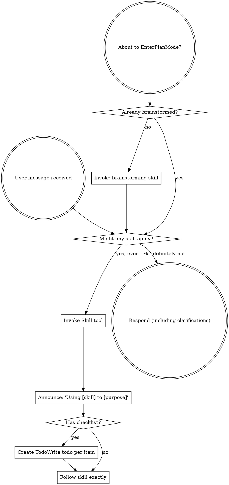

# Boundary Review — ariadne#71 (whole-issue close)

| field | value |
|-------|-------|
| issue | 71 — construct a testable shim for every external service (gh/github first): the deterministic-shell mock pattern |
| repo | ariadne |
| issue file | workshop/issues/000071-external-service-shims.md |
| boundary | whole-issue close |
| milestone | — |
| window | 041f3293ca7e27f4843c21d9f27d4e6fd513021e..HEAD |
| command | sdlc close --issue 71 |
| reviewer | codex |
| timestamp | 2026-07-26T23:05:36-07:00 |
| verdict | FIX-THEN-SHIP |

## Review

Reading additional input from stdin...
OpenAI Codex v0.145.0
--------
workdir: /Users/xianxu/workspace/ariadne
model: gpt-5.5
provider: openai
approval: never
sandbox: workspace-write [workdir, /tmp, $TMPDIR, /tmp] (network access enabled)
reasoning effort: medium
reasoning summaries: none
session id: 019fa22b-5da3-78e2-82ae-d782dbef8f38
--------
user
# Code review — the one SDLC boundary review

You are conducting a fresh-context code review at a development boundary —
whole-issue close — in the **ariadne** repository.

- repository: ariadne   (root: /Users/xianxu/workspace/ariadne)
- issue:      ariadne#71   (file: workshop/issues/000071-external-service-shims.md)
- window:     Base: 041f3293ca7e27f4843c21d9f27d4e6fd513021e   Head: HEAD

Review the **ariadne** repo and its tracker — the ariadne base-layer repo itself (changes here propagate to dependent repos). Do not assume any
other repository or apply another repo's conventions.

You have no prior session context — that is the anti-collusion property. Verify
behavior against the issue's documented Spec/Plan and the code itself; do NOT
take the implementor's word in commit messages or docs at face value. Tools are
read-only: report findings precisely; the main agent (which has session context)
applies the fixes, commits, and re-runs.

Read the diff against the issue's Spec + Plan, then work the checklist below.
Categorize every finding by severity — not everything is Critical; a nitpick
marked Critical is noise.

  Critical (must fix before crossing the boundary)
    - correctness bugs; crashes / panics on unexpected input
    - behavior drift from stated contracts (for ports of existing code where
      byte-faithfulness was promised, diff against the source)
    - silent error swallowing where the source raised
  Important (fix before the boundary if cheap)
    - API design of newly-introduced internal packages (downstream work will
      consume them; is the surface stable?)
    - missing test coverage that would catch the kind of bug shipped
    - inconsistent error handling across the diff
  Minor (note for future)
    - style nits, naming, comment density; performance only if hot-path

## Review checklist

Code quality
  - Clean separation of concerns; edge cases handled (empty / nil / unexpected).
  - Proper error handling — no silent swallowing where the source raised.
  - No duplicated logic / copy-paste that should be a shared helper.

Testing
  - Tests pin real logic, not mocks reasserting the implementation.
  - The kind of bug this diff could ship is covered.
  - PURE entities tested without IO; INTEGRATION via injected fakes (see below).

Requirements traceability
  - Every Plan checklist item this boundary claims is actually delivered.
  - Implementation matches the Spec; no undeclared scope creep.
  - Breaking changes documented.

Production readiness
  - Migration / backward-compatibility considered where state or formats change.
  - Docs / atlas updated for new surface (see the Docs update gate).

## Core concepts cross-check (if the plan has a Core concepts table)

The plan should list entities in a greppable table — name, kind
(PURE/INTEGRATION), file location, status (new/modified/deleted). For each row:
  - Verify the entity exists at the stated path (grep the diff or filesystem).
  - PURE: tests run without IO (no exec, net, mutable fs). If tests need mocks
    to run, it isn't really PURE — flag Critical and recommend promoting it to
    INTEGRATION.
  - INTEGRATION: injected into pure callers, not invoked directly from business
    logic.
  - "modified" / "deleted": the diff shows the expected change/removal at the
    stated location.
Any contradiction between table and code = Critical finding, plus a plan-revision
recommendation (a "## Revisions" entry so the plan stops claiming what the code
doesn't deliver).

## Docs update gate (atlas + README, per AGENTS.md §8)

The boundary should update user-facing docs for any new surface introduced:

  - **atlas/** — new architectural surface, flow, or terminology. Scan the diff
    for new entity types, subcommands, conventions, file-tree locations. Any
    present without corresponding atlas/ changes in the same range = Important
    finding ("atlas update appears missing for <surface>").
  - **README.md** — new user-facing surface a reader runs or types: subcommands,
    flags, keybindings, config keys, install/usage steps. If the diff adds or
    changes such surface and README.md is not updated in the same range =
    Important finding ("README update appears missing for <surface>"). This is the
    class of gap that used to surface only at the merge-time `specs` judge (#142);
    catch it here, at the earliest gate, before the close verdict is recorded.

## Architecture (the at-review backstop — these matter most long-term)

Work through each of ARCH-DRY, ARCH-PURE, ARCH-PURPOSE explicitly, applying its at-review lens. The
full principle definitions are delivered in the ARCHITECTURE PRINCIPLES block
right after this prompt — for EACH marker, state pass or flag, and cite the
marker (e.g. ARCH-DRY) in any finding. Architecture is where review has the
least training signal and the longest-delayed payoff, so be deliberate here, not
holistic.

## Verdict + output

Begin your response with this fenced verdict block — the machine-read handoff:

```verdict
verdict: <SHIP | FIX-THEN-SHIP | REWORK>
confidence: <high | medium | low>
```

  SHIP           ready; ship it
  FIX-THEN-SHIP  ship after addressing the findings (non-blocking at the gate)
  REWORK         blocking; needs rework before shipping — fix + re-run

The fenced ```` ```verdict ```` block above is the **authoritative machine-read
handoff** — emit it as the first thing in your response. (A prose
`VERDICT: <TOKEN>` first line still satisfies the legacy contract as a fallback,
but the block is what the binary trusts.)

After the verdict block: a 1-paragraph summary — what worked, what blocks SHIP if
it isn't — followed by:
  1. Strengths: 2-5 specific things done well (file:line where useful). Affirm
     validated approaches so the operator knows what's confirmed-good ground.
     Empty acceptable for trivial boundaries.
  2. Critical findings (file:line + fix sketch); empty if none.
  3. Important findings (same format).
  4. Minor findings (terse one-liners).
  5. Test coverage notes.
  6. Architectural notes for upcoming work.
  7. Plan revision recommendations: specific "## Revisions" entries the plan
     needs (empty if the plan still matches the code).


ARCHITECTURE PRINCIPLES — work through each of the 3 entries below explicitly, applying its `at-review` lens; cite the marker (e.g. ARCH-DRY) in any finding.

# Architecture principles (ARCH-*)

Injected architectural taste — the structural decisions whose payoff (or cost)
shows up many turns, often months, down the road. Agents are strong at local
tactics and weak here, so these are checked **at-plan** (when the design is being
made — highest leverage) and **at-review** (backstop, on the diff). Cite the
marker (e.g. `ARCH-DRY`) in plans, `## Log` entries, and review findings.

This file is the single source; it is embedded into the planning, plan-quality,
and code-review prompts. The human narrative lives in AGENTS.md "Core Design
Principles"; this is its machine-delivered companion.

## ARCH-DRY — Don't Repeat Yourself

- **principle:** Reuse before adding. One source of truth per fact/behavior; no
  duplicated logic, copy-pasted blocks, or parallel functions that should be one
  shared helper.
- **at-plan:** Flag a plan that re-implements something the codebase already has,
  or that will obviously duplicate logic across the new files instead of
  extracting a shared helper. Name the existing thing it should reuse.
- **at-review:** Flag duplicated logic / copy-pasted blocks / near-identical
  functions in the diff; point at the consolidation (file:line + the shared
  helper they should become).

## ARCH-PURE — Pure core, thin IO shell

- **principle:** The majority of code is pure functions (deterministic, no side
  effects); a thin "glue" layer at the boundary touches IO/UI/network/clock. Pure
  functions are unit-tested directly; the glue is kept small and injected.
- **at-plan:** Flag a design that buries business logic inside IO/handlers, or
  that will only be testable with heavy mocks (a sign logic isn't separated from
  IO). The plan should name what's pure vs the thin IO seam.
- **at-review:** Flag business logic mixed with IO in the diff; logic that should
  be a pure function injected into a thin caller. If a test needs mocks to run a
  "pure" entity, it isn't pure — recommend extracting the IO to the boundary.

## ARCH-PURPOSE — Serve the issue's actual purpose

- **principle:** Deliver the issue's stated purpose, not the easy subset of it. A
  single-source / "compiled to consumers" change is not done until **every
  consumer derives** from the source — the source is *enforced*, not just
  documentation a surface happens to restate; a hand-maintained restatement of the
  model is a deferred consumer, not a finished one. "Follow-up" is for separable
  extensions, never for the thing that is the point. This is the *opposite axis*
  from Simplicity-First/YAGNI: not "build for an imagined future," but "don't
  **under**-deliver the purpose you already committed to."
- **at-plan:** Flag a plan whose scope is a strict subset of the issue's stated
  goal / Done-when where the part deferred as "follow-up" *is* the purpose (e.g.
  wires one consumer + enforcement but leaves the consumers that motivated the
  issue as documentation that doesn't derive). Ask: does the plan fulfill the
  purpose, or just the cheap win? Name the deferred purpose.
- **at-review:** Does the diff *fulfill* the purpose or settle for the easy win?
  For a single-source change, run the **shadow-sweep** — enumerate the consumers,
  confirm each derives from the source, flag any remaining hand-maintained
  restatement of the model. A "follow-up" that is actually the deferred point of
  the issue is a finding, not a deferral.


OUTPUT CONTRACT (machine-read — do not deviate). LEAD your response with the
fenced ```verdict block shown above — that is the authoritative handoff the binary
reads (its `verdict:` value is one of the listed tokens). Everything after the block
is advisory: a non-blocking verdict WITH findings still PASSES the gate. A bare
`VERDICT: <TOKEN>` line is accepted only as a FALLBACK when the block is absent.

Diff:
diff --git a/AGENTS.base.md b/AGENTS.base.md
index ae97d49..0a731b1 100644
--- a/AGENTS.base.md
+++ b/AGENTS.base.md
@@ -46,7 +46,7 @@

 ### 5. Verification Before Done
 - NEVER mark done without proof: run tests, check logs, diff behavior vs main. Ask "would a staff engineer approve this?"
-- Tests thread through every stage. PURE entities → colocated unit tests; INTEGRATION → fakes. External-service features ship a process-level fake — function-call mocks miss interaction bugs.
+- Tests thread through every stage. PURE entities → colocated unit tests; INTEGRATION → fakes. External-service features ship a stateful fake behind the same seam, plus live conformance checks where practical; function-call mocks miss interaction bugs.
 - **Close:** `sdlc close --issue N --verified '<evidence>'` (a milestone closes via `sdlc milestone-close --issue N --milestone Mx`, #146) — `--actual` is **measured, not typed**: omit it and close measures + ADOPTS the hours in one invocation (active-time-v3, loud info line with attribution — #178; refuses only when measurement fails), or run `sdlc actual --issue N` to preview; never hand-type hours from memory (a guessed value pollutes velocity calibration — the gate exists to prevent exactly that). Refuses without verification + actuals + atlas update (auto-satisfied on docs-only windows, #177); its errors are next-action specs.
 - **Bypassing a close gate:** each guard (actual, verified, atlas, milestone-verdict, plan-unchecked, project, re-close) has a per-gate `--no-<gate>` flag — `--no-actual`, `--no-verified`, `--no-atlas`, `--no-verdict`, `--no-plan-check`, `--no-project`, `--no-reclose-guard`. Use the **precise** flag when one gate legitimately doesn't apply (e.g. a pure bugfix with no new architectural surface → `--no-atlas`); the flag is an *explicit acknowledgment* that you considered the gate, not a way to forget it. Put the why in `--verified`. `--force` waives **all** gates at once — reserve it for genuine emergencies. (Same `--no-<gate>` convention exists on `sdlc merge` as `--no-judge`.)

diff --git a/atlas/index.md b/atlas/index.md
index 5639e82..876b9dc 100644
--- a/atlas/index.md
+++ b/atlas/index.md
@@ -11,6 +11,7 @@ Central directory for atlas entries — practical pointers for future developers
 - [Pre-merge Checks](workflow/pre-merge-checks.md) — constitution enforcement
 - [Directory Conventions](workflow/directory-conventions.md) — standard repo layout
 - [sdlc Binary](workflow/sdlc-binary.md) — unified checkpoint-guard binary (`cmd/sdlc/`) guarding the workflow from claim → ship (incl. the `issue` group, `active-time` the in-binary v3 attribution engine #110, and the read-only `resolve`/`open` ref resolver #144, and `migrate` — cross-repo artifact move with ref rewrite #179) replacing the Make-target surface; embedded `--help` per subcommand; fresh-context judges for anti-collusion
+- [Architecture Principles](workflow/architecture-principles.md) — single-source `ARCH-*` registry consumed by plan-quality/boundary-review prompts and `sdlc arch-principles`; includes `ARCH-MOCK` for stateful external dependency fakes plus live conformance checks.
 - [Sandbox](workflow/sandbox.md) — Claude Code sandbox vs OpenShell container sandbox, zellij multiplexer usage
 - [OpenShell Sandbox](workflow/openshell-sandbox.md) — the containerized dev sandbox in the workflow: setup, what's inside, git transport (HTTPS-not-SSH, #152), base-layer provisioning
 - [Data Artifacts](workflow/data-artifacts.md) — typed markdown documents (xx-datatype skill, prototypes, capture flow)
diff --git a/atlas/workflow/architecture-principles.md b/atlas/workflow/architecture-principles.md
new file mode 100644
index 0000000..4b1e500
--- /dev/null
+++ b/atlas/workflow/architecture-principles.md
@@ -0,0 +1,20 @@
+# Architecture Principles
+
+The canonical `ARCH-*` registry lives in
+`cmd/sdlc/internal/judge/architecture.md`. It is embedded into plan-quality and
+boundary-review prompts, and `go run ./cmd/sdlc arch-principles` renders it for
+non-gate design work.
+
+Key consumers:
+
+- `cmd/sdlc/internal/judge/architecture.go` extracts markers and renders the
+  registry block.
+- `cmd/sdlc/internal/judge/judge_test.go` pins marker extraction and prompt
+  embedding.
+- `cmd/sdlc/internal/judge/testdata/golden/*.prompt` pins the generated prompt
+  bodies that carry the registry.
+
+`ARCH-MOCK` codifies the external dependency rule: every relied-on external
+binary/service should sit behind a seam with a stateful fake for integration and
+end-to-end tests, plus live conformance checks where practical to keep the fake
+honest against the real dependency.
diff --git a/cmd/sdlc/archprinciples_test.go b/cmd/sdlc/archprinciples_test.go
index 042808c..e555dd0 100644
--- a/cmd/sdlc/archprinciples_test.go
+++ b/cmd/sdlc/archprinciples_test.go
@@ -15,7 +15,7 @@ func TestRunArchPrinciples_RendersRegistry(t *testing.T) {
		t.Fatalf("runArchPrinciples(at-plan): %v", err)
	}
	out := buf.String()
-	for _, want := range []string{"ARCH-DRY", "ARCH-PURE", "ARCH-PURPOSE", "at-plan"} {
+	for _, want := range []string{"ARCH-DRY", "ARCH-PURE", "ARCH-PURPOSE", "ARCH-MOCK", "at-plan"} {
		if !strings.Contains(out, want) {
			t.Errorf("at-plan output missing %q:\n%s", want, out)
		}
diff --git a/cmd/sdlc/internal/judge/architecture.md b/cmd/sdlc/internal/judge/architecture.md
index 7df6995..9d328a9 100644
--- a/cmd/sdlc/internal/judge/architecture.md
+++ b/cmd/sdlc/internal/judge/architecture.md
@@ -54,3 +54,20 @@ Principles"; this is its machine-delivered companion.
   confirm each derives from the source, flag any remaining hand-maintained
   restatement of the model. A "follow-up" that is actually the deferred point of
   the issue is a finding, not a deferral.
+
+## ARCH-MOCK — Stateful external doubles
+
+- **principle:** Every external binary or service dependency the system relies on
+  has a stateful fake behind the same seam, modeling our current understanding of
+  the dependency's behavior across calls. Integration and end-to-end tests run
+  against the fake; scheduled/live conformance checks compare the fake's modeled
+  behavior with the real binary or service so drift is detected and corrected.
+- **at-plan:** Flag a design that shells out to, or calls, an external binary or
+  service without naming the seam and stateful fake. The plan should identify the
+  dependency surface consumed, the fake's persisted state model, the integration
+  or end-to-end tests that run against it, and the live conformance check cadence.
+  Examples include `git`, GitHub/`gh`, and Google OAuth.
+- **at-review:** Flag direct external calls outside the seam, stateless mocks for
+  stateful interactions, tests that cannot run the stack against the fake, or a
+  missing live conformance check for behavior we depend on. A fake satisfies this
+  only when production flow and test flow share the same boundary.
diff --git a/cmd/sdlc/internal/judge/judge_test.go b/cmd/sdlc/internal/judge/judge_test.go
index 7c0cbe4..0a8e273 100644
--- a/cmd/sdlc/internal/judge/judge_test.go
+++ b/cmd/sdlc/internal/judge/judge_test.go
@@ -95,7 +95,7 @@ func TestBuildPrompt_DRY(t *testing.T) {
 // #75: architecture.md is the single source — it carries both markers and both
 // lenses, and is embedded verbatim into every prompt that needs it.
 func TestArchitectureRegistry_Content(t *testing.T) {
-	for _, want := range []string{"ARCH-DRY", "ARCH-PURE", "ARCH-PURPOSE", "at-plan", "at-review", "principle:"} {
+	for _, want := range []string{"ARCH-DRY", "ARCH-PURE", "ARCH-PURPOSE", "ARCH-MOCK", "at-plan", "at-review", "principle:"} {
		if !strings.Contains(ArchitectureRegistry, want) {
			t.Errorf("ArchitectureRegistry missing %q", want)
		}
@@ -132,7 +132,7 @@ func TestArchitectureRegistry_EmbeddedInPrompts(t *testing.T) {
 // shared by the {{ARCH_STAR}} substitution and the AGENTS.md drift guard.
 func TestArchitectureMarkers(t *testing.T) {
	markers := ArchitectureMarkers()
-	want := []string{"ARCH-DRY", "ARCH-PURE", "ARCH-PURPOSE"}
+	want := []string{"ARCH-DRY", "ARCH-PURE", "ARCH-PURPOSE", "ARCH-MOCK"}
	if len(markers) != len(want) {
		t.Fatalf("ArchitectureMarkers() = %v, want %v", markers, want)
	}
@@ -164,7 +164,7 @@ func TestCodeReviewBody_Renders(t *testing.T) {
		"workshop/issues/000072-x.md",       // {{ISSUE_FILE}}
		"milestone M1 close",                // {{BOUNDARY}}
		"downstream repo",                   // {{REPO_NOTE}}
-		"ARCH-DRY, ARCH-PURE, ARCH-PURPOSE", // {{ARCH_STAR}} enumerated from the registry (full set, not a substring — asserts the consumer derives the new marker)
+		"ARCH-DRY, ARCH-PURE, ARCH-PURPOSE, ARCH-MOCK", // {{ARCH_STAR}} enumerated from the registry (full set, not a substring — asserts the consumer derives the new marker)
		"Core concepts cross-check",
		"```verdict", // {{VERDICT_BLOCK}} — the structured handoff (#147)
		"verdict: <SHIP | FIX-THEN-SHIP | REWORK>", // tokens rendered from vocab.Verdict().Emitted()
diff --git a/cmd/sdlc/internal/judge/testdata/golden/dry.prompt b/cmd/sdlc/internal/judge/testdata/golden/dry.prompt
index 7abe397..6c47e78 100644
--- a/cmd/sdlc/internal/judge/testdata/golden/dry.prompt
+++ b/cmd/sdlc/internal/judge/testdata/golden/dry.prompt
@@ -1,7 +1,7 @@
 You are a code reviewer checking the diff for ARCH-DRY violations.
 The principle is authored once in the registry below (#75):

-ARCHITECTURE PRINCIPLES — work through each of the 3 entries below explicitly, applying its `at-review` lens; cite the marker (e.g. ARCH-DRY) in any finding.
+ARCHITECTURE PRINCIPLES — work through each of the 4 entries below explicitly, applying its `at-review` lens; cite the marker (e.g. ARCH-DRY) in any finding.

 # Architecture principles (ARCH-*)

@@ -60,6 +60,23 @@ Principles"; this is its machine-delivered companion.
   restatement of the model. A "follow-up" that is actually the deferred point of
   the issue is a finding, not a deferral.

+## ARCH-MOCK — Stateful external doubles
+
+- **principle:** Every external binary or service dependency the system relies on
+  has a stateful fake behind the same seam, modeling our current understanding of
+  the dependency's behavior across calls. Integration and end-to-end tests run
+  against the fake; scheduled/live conformance checks compare the fake's modeled
+  behavior with the real binary or service so drift is detected and corrected.
+- **at-plan:** Flag a design that shells out to, or calls, an external binary or
+  service without naming the seam and stateful fake. The plan should identify the
+  dependency surface consumed, the fake's persisted state model, the integration
+  or end-to-end tests that run against it, and the live conformance check cadence.
+  Examples include `git`, GitHub/`gh`, and Google OAuth.
+- **at-review:** Flag direct external calls outside the seam, stateless mocks for
+  stateful interactions, tests that cannot run the stack against the fake, or a
+  missing live conformance check for behavior we depend on. A fake satisfies this
+  only when production flow and test flow share the same boundary.
+

 Apply ARCH-DRY's at-review lens to the diff: duplicated logic, copy-pasted blocks,
 near-identical functions that should be one shared helper. Report file:line + the
diff --git a/cmd/sdlc/internal/judge/testdata/golden/milestone-review.prompt b/cmd/sdlc/internal/judge/testdata/golden/milestone-review.prompt
index d899954..11e29f4 100644
--- a/cmd/sdlc/internal/judge/testdata/golden/milestone-review.prompt
+++ b/cmd/sdlc/internal/judge/testdata/golden/milestone-review.prompt
@@ -87,7 +87,7 @@ The boundary should update user-facing docs for any new surface introduced:

 ## Architecture (the at-review backstop — these matter most long-term)

-Work through each of ARCH-DRY, ARCH-PURE, ARCH-PURPOSE explicitly, applying its at-review lens. The
+Work through each of ARCH-DRY, ARCH-PURE, ARCH-PURPOSE, ARCH-MOCK explicitly, applying its at-review lens. The
 full principle definitions are delivered in the ARCHITECTURE PRINCIPLES block
 right after this prompt — for EACH marker, state pass or flag, and cite the
 marker (e.g. ARCH-DRY) in any finding. Architecture is where review has the
@@ -126,7 +126,7 @@ it isn't — followed by:
      needs (empty if the plan still matches the code).


-ARCHITECTURE PRINCIPLES — work through each of the 3 entries below explicitly, applying its `at-review` lens; cite the marker (e.g. ARCH-DRY) in any finding.
+ARCHITECTURE PRINCIPLES — work through each of the 4 entries below explicitly, applying its `at-review` lens; cite the marker (e.g. ARCH-DRY) in any finding.

 # Architecture principles (ARCH-*)

@@ -185,6 +185,23 @@ Principles"; this is its machine-delivered companion.
   restatement of the model. A "follow-up" that is actually the deferred point of
   the issue is a finding, not a deferral.

+## ARCH-MOCK — Stateful external doubles
+
+- **principle:** Every external binary or service dependency the system relies on
+  has a stateful fake behind the same seam, modeling our current understanding of
+  the dependency's behavior across calls. Integration and end-to-end tests run
+  against the fake; scheduled/live conformance checks compare the fake's modeled
+  behavior with the real binary or service so drift is detected and corrected.
+- **at-plan:** Flag a design that shells out to, or calls, an external binary or
+  service without naming the seam and stateful fake. The plan should identify the
+  dependency surface consumed, the fake's persisted state model, the integration
+  or end-to-end tests that run against it, and the live conformance check cadence.
+  Examples include `git`, GitHub/`gh`, and Google OAuth.
+- **at-review:** Flag direct external calls outside the seam, stateless mocks for
+  stateful interactions, tests that cannot run the stack against the fake, or a
+  missing live conformance check for behavior we depend on. A fake satisfies this
+  only when production flow and test flow share the same boundary.
+

 OUTPUT CONTRACT (machine-read — do not deviate). LEAD your response with the
 fenced ```verdict block shown above — that is the authoritative handoff the binary
diff --git a/cmd/sdlc/internal/judge/testdata/golden/plan-quality.prompt b/cmd/sdlc/internal/judge/testdata/golden/plan-quality.prompt
index 5ddcbf5..749d89e 100644
--- a/cmd/sdlc/internal/judge/testdata/golden/plan-quality.prompt
+++ b/cmd/sdlc/internal/judge/testdata/golden/plan-quality.prompt
@@ -28,7 +28,7 @@ Common failure modes to flag:
 Then check the plan against our architecture (this is the highest-leverage place
 to catch architectural drift — the design is still changeable here):

-ARCHITECTURE PRINCIPLES — work through each of the 3 entries below explicitly, applying its `at-plan` lens; cite the marker (e.g. ARCH-DRY) in any finding.
+ARCHITECTURE PRINCIPLES — work through each of the 4 entries below explicitly, applying its `at-plan` lens; cite the marker (e.g. ARCH-DRY) in any finding.

 # Architecture principles (ARCH-*)

@@ -87,6 +87,23 @@ Principles"; this is its machine-delivered companion.
   restatement of the model. A "follow-up" that is actually the deferred point of
   the issue is a finding, not a deferral.

+## ARCH-MOCK — Stateful external doubles
+
+- **principle:** Every external binary or service dependency the system relies on
+  has a stateful fake behind the same seam, modeling our current understanding of
+  the dependency's behavior across calls. Integration and end-to-end tests run
+  against the fake; scheduled/live conformance checks compare the fake's modeled
+  behavior with the real binary or service so drift is detected and corrected.
+- **at-plan:** Flag a design that shells out to, or calls, an external binary or
+  service without naming the seam and stateful fake. The plan should identify the
+  dependency surface consumed, the fake's persisted state model, the integration
+  or end-to-end tests that run against it, and the live conformance check cadence.
+  Examples include `git`, GitHub/`gh`, and Google OAuth.
+- **at-review:** Flag direct external calls outside the seam, stateless mocks for
+  stateful interactions, tests that cannot run the stack against the fake, or a
+  missing live conformance check for behavior we depend on. A fake satisfies this
+  only when production flow and test flow share the same boundary.
+

 OUTPUT CONTRACT (machine-read — do not deviate). Your response's FIRST line
 MUST be exactly:
diff --git a/cmd/sdlc/internal/judge/testdata/golden/pure.prompt b/cmd/sdlc/internal/judge/testdata/golden/pure.prompt
index 6f207a0..c5caccd 100644
--- a/cmd/sdlc/internal/judge/testdata/golden/pure.prompt
+++ b/cmd/sdlc/internal/judge/testdata/golden/pure.prompt
@@ -1,7 +1,7 @@
 You are a code reviewer checking the diff for ARCH-PURE violations.
 The principle is authored once in the registry below (#75):

-ARCHITECTURE PRINCIPLES — work through each of the 3 entries below explicitly, applying its `at-review` lens; cite the marker (e.g. ARCH-DRY) in any finding.
+ARCHITECTURE PRINCIPLES — work through each of the 4 entries below explicitly, applying its `at-review` lens; cite the marker (e.g. ARCH-DRY) in any finding.

 # Architecture principles (ARCH-*)

@@ -60,6 +60,23 @@ Principles"; this is its machine-delivered companion.
   restatement of the model. A "follow-up" that is actually the deferred point of
   the issue is a finding, not a deferral.

+## ARCH-MOCK — Stateful external doubles
+
+- **principle:** Every external binary or service dependency the system relies on
+  has a stateful fake behind the same seam, modeling our current understanding of
+  the dependency's behavior across calls. Integration and end-to-end tests run
+  against the fake; scheduled/live conformance checks compare the fake's modeled
+  behavior with the real binary or service so drift is detected and corrected.
+- **at-plan:** Flag a design that shells out to, or calls, an external binary or
+  service without naming the seam and stateful fake. The plan should identify the
+  dependency surface consumed, the fake's persisted state model, the integration
+  or end-to-end tests that run against it, and the live conformance check cadence.
+  Examples include `git`, GitHub/`gh`, and Google OAuth.
+- **at-review:** Flag direct external calls outside the seam, stateless mocks for
+  stateful interactions, tests that cannot run the stack against the fake, or a
+  missing live conformance check for behavior we depend on. A fake satisfies this
+  only when production flow and test flow share the same boundary.
+

 Apply ARCH-PURE's at-review lens to the diff: business logic mixed with IO,
 functions that could be pure but aren't, side effects that should move to the
diff --git a/construct/adapted/superpowers-writing-plans/SKILL.md b/construct/adapted/superpowers-writing-plans/SKILL.md
index a6e9e47..b1ede6b 100644
--- a/construct/adapted/superpowers-writing-plans/SKILL.md
+++ b/construct/adapted/superpowers-writing-plans/SKILL.md
@@ -75,7 +75,7 @@ For each:
   - **Injected into:** Which pure entities receive this as a dependency, so the pure logic stays unit-testable with a fake.
   - **Future extensions:** Where this surface might grow.

-**Test surface for integration points.** Integration tests use **fakes**, not function-call mocks. For external services (GitHub, Gmail, Anthropic API, etc.), prefer a **process-level fake** that spawns a real subprocess/server speaking the same protocol — function-call mocks miss interaction bugs and don't extend the deterministic shell outward. The fake is part of the feature's deliverable, not separate test scaffolding; if a feature integrates with an external service, the plan should list a fake as either a new entity (when first being built) or a referenced existing entity (when reusing an established fake).
+**Test surface for integration points.** Integration tests use **fakes**, not function-call mocks. For external binaries/services (GitHub/`gh`, Google OAuth, `git`, Gmail, Anthropic API, etc.), prefer a stateful fake behind the same seam, with live conformance checks where practical; function-call mocks miss interaction bugs and don't extend the deterministic shell outward. The fake is part of the feature's deliverable, not separate test scaffolding; if a feature integrates with an external dependency, the plan should list the seam, the fake's state model, and either a new fake entity or the existing fake being reused.

 Example:


codex
I’ll use the required startup/workflow guidance, then read the issue and changed files against the supplied window before giving the boundary verdict.
exec
/bin/zsh -lc "sed -n '1,220p' workshop/issues/000071-external-service-shims.md" in /Users/xianxu/workspace/ariadne
exec
/bin/zsh -lc "sed -n '1,220p' /Users/xianxu/workspace/ariadne/construct/adapted/superpowers-using-superpowers/SKILL.md" in /Users/xianxu/workspace/ariadne
 succeeded in 0ms:
---
id: 000071
status: working
deps: [nous#42, nous#44, nous#45]
github_issue:
created: 2026-06-02
updated: 2026-07-26
estimate_hours: 1.5
started: 2026-07-26T22:49:54-07:00
---

# construct a testable shim for every external service (gh/github first): the deterministic-shell mock pattern

## Problem

AGENTS.md §5 mandates process-level fakes ("external-service features ship a process-level
fake — function-call mocks miss interaction bugs"), but in practice we don't have them, and
it bites:

- `nous#41 #11` (re-invite hard-error fix) shipped with **zero automated coverage** —
  `gh` shells out to the CLI with no injectable seam, so it's only "dogfood-verified."
- `nous#26` (GitHub-mediated onboarding) shipped "build+vet pass" per milestone, then a
  manual run against real GitHub caught **five** control-plane bugs in succession (404 on
  the *validation* lookup not the add; `MinimalRepository` omitting `ssh_url`; stuck
  collaborator-but-unpublished state; discovery filter excluding provisioned-for-sharing
  brains; missing operator-pubkey publish). Every one was on the GitHub **control plane**,
  which our `file://` bare-repo integration tests model the **data plane** of but not.

Function-call mocks ("every `gh.AddCollaborator` returns nil") cover the trivial cases and
miss exactly these interaction bugs — the ones that only emerge from real-shaped responses
and multi-call state.

This is already an operator vision, not a new idea:
`brain/docs/vision/2026-05-19-01-pensive-auto-mocking-external-services.md` (and the earlier
`2026-05-04-01-pensive-auto-mock.md`), built on the deterministic-shell pensive
(`brain/docs/vision/2026-05-12-01-pensive-book-4-deterministic-shell.md`). This issue
promotes that vision to buildable work.

## Spec

### Generic framing (the pattern, load-bearing — solve gh *as an instance of this*)

For **any** external binary/service **X** we integrate against, ariadne constructs:

1. **`shim(X)`** — a code seam in front of X. *All* of our access to X goes through
   `shim(X)`; nothing calls the raw binary/API directly. (For `gh`: a `lib/gh`-style wrapper
   that is the only thing that execs `gh`.)
2. **`shim'(X)`** — a **testable fake** behind the same seam: a process-/in-memory model of
   X that mimics X's *internal state to the fidelity we need to reproduce observed
   behavior* — real-shaped responses, multi-call/multi-user state, tear-down between tests —
   and that all real-flow code paths go through **unchanged**.

Make this a **standing ariadne coding convention**: every external service we integrate
(`gh`/GitHub, `gmail`, Google OAuth, gpg/gpg-agent, …) gets a `shim(X)` + `shim'(X)` pair,
documented once (AGENTS.md and/or `construct/`) so it's the default, not a per-feature
afterthought. The fidelity bar is "X-enough that our integration test exercises every call
we actually make," not "reimplement X."

### First instance: gh / GitHub

- `shim(gh)`: consolidate all `gh` access behind one seam (extend the existing `lib/gh`
  wrapper so nothing else execs `gh`).
- `shim'(gh)`: a local GitHub-control-plane fake the `gh` CLI (or our seam) talks to, backed
  by ordinary git/file ops on tmpdir bare repos:
  - `PUT collaborators/<login>` mutates internal state; the *validation lookup* path is
    modeled (the nous#26 bug #1 surface);
  - `user/repository_invitations` returns the **`MinimalRepository`** shape (no
    `ssh_url`/`clone_url`) — reproduces bug #2;
  - `PATCH user/repository_invitations/<id>` transitions to accepted;
  - multi-user token contexts (switch operator ↔ joiner);
  - repo content underneath is real git on bare repos in tmpdir.
- Then: rewrite the nous#26 / nous#41 GitHub-layer integration tests to run hermetically
  through `shim'(gh)` — all five nous#26 bugs + the `nous#41 #11` re-invite hard-error
  should be catchable in-process.

## Done when

- `ARCH-MOCK` exists in the single-source architecture registry
  (`cmd/sdlc/internal/judge/architecture.md`) and is rendered by
  `go run ./cmd/sdlc arch-principles`.
- Plan-quality and boundary-review consumers derive the new marker from the registry:
  `ArchitectureMarkers()` includes `ARCH-MOCK`, code-review marker substitution includes it,
  and prompt golden fixtures embed the new registry block.
- The base constitution and active writing-plan skill tell agents that external
  binaries/services ship stateful fakes behind the same seam, with live conformance checks
  where practical.

## Estimate

*Produced via `brain/data/life/42shots/velocity/estimate-logic-v3.1.md` against `baseline-v3.1.md`. Method A only.*

```estimate
model: estimate-logic-v3.1
familiarity: 1.0
item: atlas-docs design=0.3 impl=0.2
item: smaller-go-module design=0.2 impl=0.3
item: skill-or-dispatcher design=0.2 impl=0.2
design-buffer: 0.15
total: 1.50
```

## Plan

- [x] Confirm the promotion evidence from `deps: [nous#42, nous#44, nous#45]` is reflected
      in the issue revisions/log before closing this ariadne promotion.
- [x] Add `ARCH-MOCK` to `cmd/sdlc/internal/judge/architecture.md`.
- [x] Update derived registry consumers/tests:
      `cmd/sdlc/internal/judge/judge_test.go`,
      `cmd/sdlc/archprinciples_test.go`, and
      `cmd/sdlc/internal/judge/testdata/golden/*.prompt`.
- [x] Align active agent guidance in `AGENTS.base.md` §5 and
      `construct/adapted/superpowers-writing-plans/SKILL.md`.
- [x] Map the new architecture-principles surface in
      `atlas/workflow/architecture-principles.md` and `atlas/index.md`.
- [x] Verify `go test ./cmd/sdlc/internal/judge ./cmd/sdlc -count=1`,
      touched-file `git diff --check`, and `go run ./cmd/sdlc arch-principles`.

## Log

### 2026-06-02

Filed from the sdlc tooling retro
(`workshop/pensive/2026-06-02-01-pensive-sdlc-tooling-retro.md`, finding F5). Operator: make
gh/github the first instance, but solve it as the **generic pattern** — always construct a
shim for any external service (gmail, Google OAuth, …), systematically. Anchored in the
existing auto-mocking vision in brain.

### 2026-07-26

Operator requested promoting the pattern before designing remote-control relay security:
external binaries/services must have stateful fakes behind the same seam, integration/e2e
tests should run against those fakes, and scheduled/live conformance checks keep the fake
honest against the real dependency. Codified as `ARCH-MOCK` in the architecture registry so
plan-quality and boundary-review prompts enforce it for future work.

`sdlc change-code --issue 71` passed after normalizing the active plan scope; the gate
reported INFO only on estimate tightness/primitive labels. Verified with
`go test ./cmd/sdlc/internal/judge ./cmd/sdlc -count=1`, touched-file
`git diff --check`, and `go run ./cmd/sdlc arch-principles`. Added
`atlas/workflow/architecture-principles.md` so the new registry surface is mapped.

## Revisions

### 2026-06-05 — repurpose #71 as the architecture-promotion step; gh instance → nous#42

Brainstormed the scope with operator. Outcome reshapes this issue:

- **The gh instance is built in nous, not here.** `shim(gh)`/`shim'(gh)` and the hermetic
  nous#26/#41 regression tests are now **nous#42** (the spec lives there). gh is only used in
  nous; building it here would split spec-from-code across repos. `deps: [nous#42]` is the
  stable, machine-checkable cross-repo link (prose links rot) — **#71 cannot close until
  nous#42 lands.**
- **#71 is scoped down to the final step:** *promote the proven shim(X)/shim'(X) pattern to an
  ariadne architecture choice.* That means, only **after** the gh instance (nous#42) and the
  planned second instance (Google OAuth, also nous) succeed: amend AGENTS.md §5 (replace
  "process-level fake" with "stateful fake behind a provider-neutral port," distinguishing it
  from the per-call stubs §5 actually warned against) and add a pattern entry to the `ARCH-*`
  registry / architecture.md. **No ariadne files change before then** — the convention is not
  generalized from n=1.
- **Design decisions fixed for the pattern** (full rationale in nous#42): provider-neutral
  domain port (Ports & Adapters) with documented extension points for vendor peculiarities;
  in-process library-call transport with a *stateful* fake (not bridge/RPC/channel);
  wire-fidelity owned by a periodic **dual-backend contract test** (fake always + real `gh`
  build-tagged) — the "make the assumptions explicit," two-step grounding model; uniform
  `New(Conf)`/`NewFake(Conf)` constructor convention with opaque per-service `Conf` and **no**
  shared cross-service framework.
- Originally this issue's "Done when" bundled both the convention *and* the gh instance; that
  is superseded by the split above. The gh-instance bullets now belong to nous#42; this
  issue's completion = the §5 + architecture.md promotion, gated on two successful instances.

### 2026-06-06 — gate on the second instance + the full-surface demo (deps expanded)

nous#42 (gh) is now done+merged AND certified against real GitHub. But `deps:`
only listed nous#42, so once it landed #71 was no longer actually blocked — the
"promote only after ≥2 instances + the surface is proven" rule was prose, not an
enforced gate. Fixed by expanding `deps:` to the work that must precede promotion:
- **nous#44** — `shim(google-oauth)` (instance #2; proves the pattern generalizes
  past gh, incl. the async-callback case).
- **nous#45** — shim *every* nous external dependency + an integrated end-to-end
  mock harness (the deterministic-shell demo; the evidence the convention is the
  default across the whole surface, not just n=2).

`deps: [nous#42, nous#44, nous#45]` now machine-enforces "don't promote to an
architecture choice until the pattern is proven, generalized, AND demonstrated
end-to-end." Only then does #71's own work run (AGENTS.md §5 amendment + ARCH
registry / architecture.md entry).

### 2026-06-08 — n=2-real cross-provider evidence (nous#48: OAuth at Google + Microsoft)

Promotion evidence the convention demands: the OAuth shim now has **two real
backends** behind one port, not one. nous#48 added Microsoft/Entra as the second
real OAuth adapter, and the design held under genuine cross-provider stress — a
single real backend (Google) could have let provider-quirks masquerade as the
abstraction; two cannot. Concretely, the pattern's stated design decisions all
survived n=2-real:

- **Provider-neutral port + opaque per-service `Conf`, no shared cross-service
  framework:** confirmed. One generic `OIDCProvider` drives both; the per-provider
  variation is an injected in-package `dialect` value (identity extractor, required
  scopes, auth-URL params, PKCE flag, revoke mechanism) — sibling provider files
  over a shared core, **not** a second adapter and **not** a transport abstraction
  spanning services. The ariadne#71 "no shared cross-service framework" rule was
  the right constraint: the reuse is *within* the oauth shim, not across shims.
- **Documented extension points for vendor peculiarities:** exactly what absorbed
  Microsoft's real differences — PKCE/public-client (vs Google's secret), the
  `preferred_username` identity claim with **no** `email_verified` guard (the guard
  proved Google-specific and moved into `googleIdentity`), `offline_access` scope
  (vs `access_type=offline`), and **no token-revoke endpoint at all**
  (`ErrRevokeUnsupported` — the port method generalizes, the mechanism doesn't).
- **Stateful fake behind the port + dual-backend contract test:** the dialect-aware
  fake certifies the **same** `runOAuthContract` body under both Google and
  Microsoft dialects (always-on, hermetic); real-MS grounding is `conformance`-
  tagged like Google's. A wire quirk the fake-as-stateful-model surfaced that
  per-call stubs would miss: Microsoft's **single-use refresh-token rotation**
  forces the grounding harness to *persist the rotated token back* — opposite
  persistence discipline from Google under the identical contract body.

Full write-up: `nous/workshop/targets/oauth-credential-lifecycle.md` `## Revisions`
(2026-06-08, nous#48). This is the n=2-real leg of the promotion gate's evidence
base (alongside gh n=2 in nous#46); #71's own promotion work still waits on

 succeeded in 0ms:
---
name: superpowers-using-superpowers
description: Use when starting any conversation - establishes how to find and use skills, requiring Skill tool invocation before ANY response including clarifying questions
---

<SUBAGENT-STOP>
If you were dispatched as a subagent to execute a specific task, skip this skill.
</SUBAGENT-STOP>

<EXTREMELY-IMPORTANT>
If you think there is even a 1% chance a skill might apply to what you are doing, you ABSOLUTELY MUST invoke the skill.

IF A SKILL APPLIES TO YOUR TASK, YOU DO NOT HAVE A CHOICE. YOU MUST USE IT.

This is not negotiable. This is not optional. You cannot rationalize your way out of this.
</EXTREMELY-IMPORTANT>

## Instruction Priority

> **Ariadne note:** AGENTS.md Section 3 governs subagent strategy and overrides skills that mandate subagent-driven-development as the default execution path.

Superpowers skills override default system prompt behavior, but **user instructions always take precedence**:

1. **User's explicit instructions** (CLAUDE.md, GEMINI.md, AGENTS.md, direct requests) — highest priority
2. **Superpowers skills** — override default system behavior where they conflict
3. **Default system prompt** — lowest priority

If CLAUDE.md, GEMINI.md, or AGENTS.md says "don't use TDD" and a skill says "always use TDD," follow the user's instructions. The user is in control.

## How to Access Skills

**In Claude Code:** Use the `Skill` tool. When you invoke a skill, its content is loaded and presented to you—follow it directly. Never use the Read tool on skill files.

**In Gemini CLI:** Skills activate via the `activate_skill` tool. Gemini loads skill metadata at session start and activates the full content on demand.

**In other environments:** Check your platform's documentation for how skills are loaded.

## Platform Adaptation

Skills use Claude Code tool names. Non-CC platforms: see `references/codex-tools.md` (Codex) for tool equivalents. Gemini CLI users get the tool mapping loaded automatically via GEMINI.md.

# Using Skills

## The Rule

**Invoke relevant or requested skills BEFORE any response or action.** Even a 1% chance a skill might apply means that you should invoke the skill to check. If an invoked skill turns out to be wrong for the situation, you don't need to use it.



## Red Flags

These thoughts mean STOP—you're rationalizing:

| Thought | Reality |
|---------|---------|
| "This is just a simple question" | Questions are tasks. Check for skills. |
| "I need more context first" | Skill check comes BEFORE clarifying questions. |
| "Let me explore the codebase first" | Skills tell you HOW to explore. Check first. |
| "I can check git/files quickly" | Files lack conversation context. Check for skills. |
| "Let me gather information first" | Skills tell you HOW to gather information. |
| "This doesn't need a formal skill" | If a skill exists, use it. |
| "I remember this skill" | Skills evolve. Read current version. |
| "This doesn't count as a task" | Action = task. Check for skills. |
| "The skill is overkill" | Simple things become complex. Use it. |
| "I'll just do this one thing first" | Check BEFORE doing anything. |
| "This feels productive" | Undisciplined action wastes time. Skills prevent this. |
| "I know what that means" | Knowing the concept ≠ using the skill. Invoke it. |

## Skill Priority

When multiple skills could apply, use this order:

1. **Process skills first** (brainstorming, debugging) - these determine HOW to approach the task
2. **Implementation skills second** (frontend-design, mcp-builder) - these guide execution

"Let's build X" → brainstorming first, then implementation skills.
"Fix this bug" → debugging first, then domain-specific skills.

## Skill Types

**Rigid** (TDD, debugging): Follow exactly. Don't adapt away discipline.

**Flexible** (patterns): Adapt principles to context.

The skill itself tells you which.

## User Instructions

Instructions say WHAT, not HOW. "Add X" or "Fix Y" doesn't mean skip workflows.

exec
/bin/zsh -lc "sed -n '1,220p' workshop/lessons.md" in /Users/xianxu/workspace/ariadne
 succeeded in 0ms:
# Lessons Learned

*(Record patterns of what went wrong and rules to prevent repeating them)*

## A prose policy is an integration contract when its test reads the repository; pin semantics and every derived consumer

**Pattern (#167 close review):** The plan labeled `SessionContinuityPolicy` PURE,
but its only regression test read `AGENTS.base.md` and the continuation prototype
from disk. The label contradicted the actual boundary: this was a repository
contract consumed by harness entry files, not an IO-free transformation. The
same test checked only that `"60%"` appeared, so reversing the requirement from
“more than 60%” to “less than 60%” still passed. Generic weave tests proved the
fan-out mechanism in isolation, but the feature test never proved this policy's
source was exported into all three consumers.

**Rule:** Classify an entity by the boundary its behavior test crosses, not by
whether its source happens to be prose. A test that reads live repository files
is INTEGRATION; call something PURE only when its behavior is exercised entirely
from in-memory inputs. For declarative policy contracts, pin the semantic
predicate (direction + boundary + action), not a bag of tokens, and drive the
actual source through its real composition seam to assert every derived consumer.
Prove the guard with a wrong-direction mutant and a broken-export mutant before
trusting green. Scope prose assertions to the owning section so duplicate words
elsewhere cannot mask a deletion. When the source is structured (a manifest,
frontmatter, JSON), parse its semantic records instead of substring-matching raw
text — a commented-out row contains the same bytes but has no behavior. When a
consumer registry already exists, derive an “every consumer” sweep from it rather
than copying today's members into the test; otherwise future consumers silently
escape the contract. Assert the complete scoped contract in each derived consumer,
not just identifying sentinels, when partial propagation would violate Done-when.
For the source itself, enumerate every behavioral predicate in the Spec—including
conditions and ordering—not merely the nouns or actions it mentions. Where the
contract is relational, assert the bound clause or relative positions; separate
presence checks do not prove causality, sequence, or the absence of negation.
(`ARCH-PURE`, `ARCH-PURPOSE`.)

**Origin:** #167 whole-issue close review (REWORK). The remediation moved the
guard from `cmd/datatype` to an end-to-end `cmd/weave` fixture, pinned “more than
60% full” plus the checkpoint boundary, checked the live base-manifest export,
and asserted `CLAUDE.md`, `AGENTS.md`, and `GEMINI.md` all derive the policy.
The follow-up FIX-THEN-SHIP review hardened it further with section scoping and
typed manifest parsing after moved-marker and commented-export mutants exposed
the raw-text false positives.

## A changed surface has shadow docs and execution records, not just the main atlas page

**Pattern (#97 close review):** The implementation updated `atlas/workflow/weave.md`
for topological settings merge, but two other atlas pages still described
settings as only `settings.ariadne.json + settings.local.json`. The code and
primary atlas page were right; the shadow documentation was stale. The same
review found the durable implementation plan still had every detailed checkbox
unchecked even though the issue checklist was complete.

**Rule:** When changing a named surface or convention, run a shadow-doc sweep for
the old phrase and update every live explanatory copy, not just the page you
remember editing. Also update the durable plan's execution state before close:
issue checkboxes, detailed plan checkboxes, and any generated review sidecars
should tell the same story. Grep for the old model terms before committing
(`settings.ariadne.json + settings.local.json`, `MergeSettings{Source}`, etc.),
then rerun `git diff --check`.

**Origin:** #97 close review (FIX-THEN-SHIP). The code review found no behavior
blockers, but caught stale atlas shadows and unchecked durable-plan steps before
the issue crossed the boundary.

## Generated review sidecars must be bounded, or they become the next review's input bug

**Pattern (#166):** `sdlc close` writes a durable review sidecar, and the next close review diffs that sidecar too. Capturing the full raw reviewer transcript, including the prompt and diff, made the sidecar enormous, introduced whitespace-check failures from embedded patches, and eventually made a later review dispatch fail with `argument list too long`. The evidence file became active input to the gate it was supposed to document.

**Rule:** Generated review artifacts must be bounded and normalized before they enter the reviewed diff. Persist the machine-useful facts (verdict, window, findings, verification commands, resolution), not the full prompt/diff transcript. If a sidecar must carry raw output, keep it out of the code-reviewed diff or teach the generator to strip/escape whitespace-sensitive embedded patches. After any generated sidecar write, run `git diff --check` before committing it.

**Origin:** #166 close-review loop. The fix for this issue manually condensed the sidecar after each generated rewrite so `git diff --check` and later boundary-review dispatches stayed usable.

## A deferred cleanup does not run through `os.Exit` — command wrappers must cover hard exits and init races

**Pattern (#132):** A root-level Cobra wrapper acquired `.git/sdlc.lock` and used `defer release()` around the command `RunE`. That looked correct for returned errors, but most `sdlc` guard refusals call `die()`, and `die()` calls `os.Exit(1)`. `os.Exit` skips defers, so routine refusals would leave `.git/sdlc.lock` behind and wedge the next mutating command. The same review found a second liveness race: `mkdir .git/sdlc.lock` succeeds before `meta.json` is written, so a waiter can see the directory without metadata and must treat that as "holder initializing," not as a corrupt lock to remove.

**Rule:** When adding a process-wide wrapper around command bodies, enumerate every exit path, not just returned errors. If any path uses `os.Exit`, register cleanup somewhere that path drains explicitly before exit; a `defer` in the caller is not enough. For filesystem locks created as a directory plus metadata file, make waiters tolerate the mkdir-before-metadata window with a short grace period. Auto-reclaim only facts you can prove safe (same host + missing pid); cross-host or over-age uncertainty should fail with recovery guidance.

**Origin:** #132 boundary review (REWORK). The fix added a die-cleanup registry, idempotent lock release, confirmed-dead same-host reclaim, metadata-initialization polling, and real concurrent `Acquire` coverage.

## A pure helper unit-tested in isolation can be silently un-wired from its caller

**Pattern:** #72 extracted a pure `planPointer(issue) string` and printed it from the thin `runStartPlan` IO seam (`cinfo(stdout, planPointer(issue))`). TDD gave it a colocated unit test (`TestPlanPointer`) pinning the *wording* — skill name, `workshop/plans/` path, the `~/.claude/plans` demotion. All green. But nothing asserted the seam *actually calls* the helper: delete the `cinfo` line, or reorder it, or let a refactor drop it, and `TestPlanPointer` stays green while the feature ships broken. The boundary-review judge (fresh eyes) caught it; the author's suite didn't. I'd verified it *manually* (ran `start-plan`, saw the line) — so the gap was specifically the **automated regression**, not the behavior.

**Rule:** When TDD produces a pure entity consumed by a thin IO/print seam (the ARCH-PURE shape), the unit test on the entity is necessary but **not sufficient** — add one *integration assertion on the seam's output* that the entity's contribution is present (here: extend the existing `runStartPlan(&b, 75)` test with `"superpowers-writing-plans"` + `"workshop/plans/000075-"`). The unit test pins *what the helper says*; the integration assertion pins *that the caller says it*. Without the second, "pure helper exists and is correct" and "pure helper is wired in" are two independent facts and only the first is guarded. Cheap (one line appended to a test that already renders the seam) and it closes exactly the drop/reorder bug class. Distinct from the #44 "IO needs a live run" lesson: this isn't external IO — it's the wiring between a pure function and its single in-process caller, invisible because *both* the unit test and a helper-never-called build are green.

**Origin:** #72, boundary review (FIX-THEN-SHIP → fixed before crossing). The mandatory fresh-context review (binary-dispatched at `sdlc close`) found the wiring gap the author's own green suite hid — a concrete instance of why the review boundary is owned by fresh eyes, not the author (AGENTS.md §3).

## Skill design: enumeration vs. judgment

**Pattern:** A skill's behavior was specified by enumerating cases — a hardcoded list of nouns mapped to outcomes, plus a hardcoded list of "examples that DO/DO NOT trigger." Every new case required editing the skill, and the vocabulary tail (synonyms, unusual phrasings, descriptive statements that incidentally contain trigger nouns) was never reachable by enumeration.

**Rule:** When a skill's behavior is best described as *"use judgment"*, don't make it enumerate — express the principle and let the LLM apply it. The skill should describe *the question being asked* (e.g., "is this a fact, a question, or a request?") and *the discriminator* (e.g., "is the substance already present, or being requested generatively?"), not the surface forms that pass/fail. Concrete examples can serve as priming (a small, illustrative set), but they should not be the matching mechanism.

**Test for whether a list belongs in a skill:** ask *"would the skill's behavior be wrong if this list were missing, or just less ergonomic?"* If wrong → the skill has too much enumeration; the case it covers should be derivable from a principle stated elsewhere in the skill. If less ergonomic → the list is fine as priming, keep it short.

**Origin:** issue #25 (dispatcher: judgment-based triggers, replace enumeration). The `xx-datatype` skill's original noun→type mapping table was the case; it broke the atlas's own claim that "new types are pure data — adding one does not require a skill change."

## "Direct-only" handoffs hide transitivity bugs behind a depth assumption

**Pattern:** `bootstrap.sh` cloned only *direct* peers, then `exec make bootstrap` to let the recursive cloner take over. This silently assumed the handoff target (the Makefile, reached through a symlink chain) needed only the direct peer present. True for 2-deep chains, false for 3-deep — and *nothing in the codebase was 3-deep yet*, so the bug was invisible. The recursive cascade that would have fixed it could never start, because starting it required the very substrate it was meant to fetch.

**Rule:** When step A does "just enough" to hand off to step B, write down the invariant A must establish for B to run, then check it holds at the *deepest* input, not the common one. A "clone the direct peer" shortcut is really "ensure B's entrypoint resolves" — make the code do the actual requirement (clone *transitively* until the entrypoint resolves), not the proxy that happens to coincide with it at depth 2.

**Two corollaries that recurred here:**
- A file that runs *before its own substrate exists* (seed-delivered, zero-substrate) cannot share code via symlink — it must inline. Don't fight this; keep the inline copy and lock it to the canonical implementation with a **drift test** (run both on a fixture, assert equal output). One grammar, two call sites, one test.
- `local a="$1" b="$ROOT/$a/..."` on a **single line** can read `$a` as unbound under `set -u` — split positional captures from derived locals onto separate `local` statements.

**Origin:** issue #45 (bootstrap transitive clone walk). Surfaced while designing #44; the brain→nous→ariadne symlink chain was the case that exposed the depth-2 assumption.

## Integration bugs hide where pure tests can't reach — sandbox/IO needs a live run

**Pattern:** issue #44 (openshell sandbox go.mod sync) had thorough hermetic tests for the *pure* logic (`compute_sync_set` rw/ro classification, peer-walk membership) — all green. Yet the first live `make sandbox-build` exposed **three** bugs none of those tests could see: (1) a self-referential `~/workspace → /sandbox/workspace` symlink because `$HOME` is `/sandbox` in the base image (name == target); (2) an `ssh` call I added *inside* a `while read … done < <(…)` loop consumed the loop's stdin and truncated it to the first peer; (3) mutagen won't create a sync-root's missing *parent* dir, so `/sandbox/workspace/<name>` synced 0 files until `/sandbox/workspace` was pre-`mkdir`ed.

**Rule:** for any feature whose substance is IO against an external process (mutagen, ssh, docker, a container's filesystem/`$HOME`), unit tests of the pure decision logic are necessary but **not sufficient** — you must run it against the real thing once before claiming done (AGENTS.md §5). Split the work so the pure core *is* unit-tested (add a `*_LIB_ONLY` source hook to call internal functions without dispatching), then do one live E2E pass; budget for it to find bugs, because it will. Specific tripwires to remember:
- **Don't assume `$HOME`.** Check it (here it was `/sandbox`, not `/home/sandbox`); a symlink whose name equals its resolved target is always a loop. Guard with a string compare, not `-ef` (the inode test falsely falls through when the target doesn't exist yet).
- **`ssh`/`mutagen`/any stdin-reader inside a `while read` loop eats the loop's input.** Read on a dedicated fd (`done 3< <(…)`, `read … <&3`) and pass `ssh -n`.
- **mutagen creates the sync-root leaf but not missing parents** — pre-`mkdir -p` the parent.

**Origin:** issue #44. The bugs were found in three successive live `make sandbox-build` runs against a real `pair` sandbox; the pure suite (6/6) stayed green throughout — it simply couldn't observe them.

## N parallel walkers over one grammar drift apart silently — make the Nth match the others, with a test

**Pattern:** the `replace => ../<peer>` grammar in `construct/go.mod` is read by four independent walkers (setup.sh `discover_ancestors`, bootstrap-peers.sh, list-peers.sh, bootstrap.sh). The convention is "walk BOTH the root go.mod and `construct/go.mod` per node" (substrate ancestor lives in construct, not root). Three walkers honored it; `discover_ancestors` quietly walked only the root. It "worked" for years because the only failing shape — a depth-2 derivative whose depth-2 ancestor is declared in the depth-1's `construct/go.mod` — didn't exist until brain→nous→ariadne. The depth-1 case was masked by an unrelated fallback (Source-3 `ARIADNE_DIR`). The atlas even *documented* the correct behavior — so the bug was a silent divergence from stated intent, invisible because no input exercised it.

**Rule:** when the same grammar/format is parsed in more than one place, treat them as one logical parser with N call sites — not N parsers. (a) Audit ALL sites when you touch one (`grep` the format string / the path being read); the one you didn't write is the one that drifted. (b) The divergence won't show until an input hits the gap, so add a **fixture-based test that pins the sites together** (here: a hermetic chain asserting depth-2 discovery; for the inline-copy case in #45, a drift test asserting equal output). (c) When the atlas says "all four do X" but one doesn't, that's not documentation rot to fix in prose — it's a latent bug; make the code true.

**Corollary — test seams for apply-style scripts:** a function that's normally followed by a destructive apply (setup.sh mutates the target) isn't testable end-to-end without side effects. Add a narrow env-gated early-exit (`SETUP_DISCOVER_ONLY=1` prints the computed set and exits) so the *decision* is assertable hermetically while the *apply* stays untested-by-that-test. Mirrors #45's `BOOTSTRAP_DRY_RUN`/`BOOTSTRAP_CLONE_ONLY`.

**Origin:** issue #50. Surfaced pushing #49's `clone-data-deps.sh` down to brain — it never arrived because `discover_ancestors` stopped at nous and never read `nous/construct/go.mod` to find ariadne.

## Agent-invoked CLI verbs must run headless and gate on durable state, not local convenience

**Pattern:** `sdlc merge` broke two ways while shipping #56, both invisible to a human at a terminal and only biting the headless/agent path. (1) Its confirmation prompts called `scanner.Scan()` on `os.Stdin` with no tty check — an agent/background invocation has no tty, so the scan *blocked forever* (the observed "stall"). (2) Its "is the branch pushed?" gate keyed off `@{u}` — the *local upstream-tracking config* — which a plain `git push` (no `-u`) never sets, and which a sandbox that blocks `.git/config` writes silently drops. So `merge` refused a branch that was genuinely pushed with an open PR.

**Rule:** A verb an agent invokes must (a) **never block on stdin** — tty-guard every interactive prompt and, when not a tty, fail fast with a next-action (`--yes`, or a sentinel like `change-code`'s `ASK_<TOPIC>`), never a bare blocking read; and (b) **gate on the most durable signal, not a derived local convenience** — `origin/<branch>` (the remote-tracking ref, updated by any push) carries the same truth as `@{u}` (tracking config) but survives the cases where the config is absent. When choosing what a guard reads, ask "what's the *fact* I need, and what's the flakiest proxy for it I might be keying on?"

**Origin:** #56 session, `sdlc merge` fixes. `change-code` already had the tty pattern right (`isTTY` → sentinel); `merge` predated it. Found by the tool hanging in a non-tty agent run, then refusing a pushed branch because the sandbox had eaten its `push -u` config write.

## Matching convention-authored free text: the canonical form is one of many natural ones

**Pattern:** Two matchers in `sdlc` silently failed on natural-but-non-canonical phrasing. (1) The milestone-verdict guard anchored commit subjects on `^#<N> Mx:` — milestone immediately followed by a colon — so the natural `#56 M1 close: …` (milestone + words before the colon) didn't match, and `sdlc close` claimed three reviewed milestones "lacked Review-Verdict trailers" that were right there. (2) The milestone-review verdict parser only read the first non-empty line, so it recorded "unknown" when the LLM judge led with a markdown title (M1) and again when it narrated investigation prose before the verdict (M3) — twice, two different shapes.

**Rule:** When parsing text a human or LLM authors *by convention* (commit subjects, review verdicts, status lines), the documented canonical form is one of many forms real authors produce. Don't anchor on a literal token (`Mx:`); anchor on a boundary (`Mx[: ]`, still rejecting `M10`) and, for the harder cases, add a **high-precision fallback** that survives narration (a confidence-qualified `<VERDICT> (confidence: …)` line works where "verdict on line 1" doesn't). **Test the non-canonical-but-natural variants explicitly** — the canonical form always passes; the bug lives in the phrasings you didn't enumerate. (A strict matcher is a hidden enumeration of *one* accepted form — see the enumeration-vs-judgment lesson above.)

**Origin:** #56 session, `sdlc close` + `sdlc milestone-close`. Both reported a verdict of "unknown"/"missing" for work demonstrably reviewed; the fix was boundary-tolerant matching + a fallback, each pinned with a regression test for the exact failing shape.

## A hand-maintained copy of generated data drifts — render from the source

**Pattern:** `sdlc --help` listed every verb *twice*: a hand-written `SUBCOMMAND` block in `root.md` and cobra's auto-generated `Available Commands`. The hand-list was the drift-prone copy — it still advertised flat `set-status`/`fetch` after #56 made them hidden, and an atlas index still said "11 verbs" when the visible count was 10. The generated list could not drift (it renders from the live registry and auto-omits hidden commands); the hand copy needed a human to remember.

**Rule:** If a tool can render a list/count from its own registry, **don't also hand-maintain a copy** — render from the source (here: `cobra.EnableCommandSorting=false` + workflow-ordered registration gave the auto-list the ordering the hand-list existed to provide). If a curated copy is genuinely required, pin it to the source with a test, or it *will* go stale at the next change. Same family as "N parallel walkers drift," one level up: generated-output vs hand-mirror.

**Tripwire — compile-check builds drop a binary at the repo root.** `go build ./cmd/sdlc/` (run for a quick compile-check) emits `./sdlc` in the cwd, *not* the gitignored `bin/` — and `git add -A` then swept it into a commit. Two fixes: (a) compile-check with `go build -o /dev/null ./cmd/sdlc/` (or `go vet`) so no artifact lands; (b) gitignore build outputs at *every* path they can land (`/sdlc`, not just `bin/`), and scan `git status` for untracked binaries before a broad add.

**Origin:** #56 session, the `sdlc --help` consolidation + the stray-binary amend.

## Iterating files via `ls` in `$()` word-splits — glob directly

**Pattern:** #59's vm-hooks run-parts loop iterated `for name in $(cd "$DIR" && LC_ALL=C ls -1 ./*.sh)`. The unquoted command substitution word-splits on whitespace, so a hook named `15 setup.sh` became two tokens (`15`, `setup.sh`), each `bash`-run as a nonexistent path (rc=127) — the real hook silently never ran, only warned. The documented `NN-` no-space convention masked it, so it shipped and a fresh-eyes review (not the author) caught it.

**Rule:** To iterate files in shell, **glob directly** (`for f in "$DIR"/*.sh`), never `ls`/`find` inside `$()` — a command substitution always word-splits (and globs) its output. Under `set -euo pipefail` on macOS **bash 3.2**, pair the glob with `shopt -s nullglob` so an empty match is a clean no-op (and to dodge the `"${arr[@]}"`-on-empty-array `set -u` abort that bites 3.2 but not 4.4+). For arbitrary filenames, the fully-safe form is a NUL-delimited process-substitution: `while IFS= read -r -d '' f; do …; done < <(LC_ALL=C; shopt -s nullglob; for g in "$DIR"/*.sh; do printf '%s\0' "$g"; done)` — whitespace/newline-proof, order pinned, locale scoped to the subshell. **Test the spaced-filename case explicitly**; the convention-compliant names always pass.

**Origin:** #59 session, post-milestone review of the tart vm-hooks loop. Verified the fix under `/bin/bash 3.2.57` (the actual VM interpreter), not just the host shell — bash 3.2's `set -u`/empty-array and `shopt` behaviors differ from modern bash and from zsh.

## Migrating a peer repo: check its branch/cleanliness first; never `git clean -fd` it

**Pattern:** Rolling out #60 M4 to a derivative (nous), I ran `make refresh` + `git rm construct/go.mod` + commit — but nous was on its own feature branch (`000036-...`) mid-work, so my base-layer commit polluted *its* feature branch. Worse, reverting with `git reset --hard HEAD^ && git clean -fd` removed two empty untracked dirs (`workshop/notes/`, `workshop/vision/`) that weren't my artifacts — `git clean -fd` deletes ALL untracked, not just what I created. (No tracked content was lost; verified + recreated. But it was reckless on a repo I don't own the state of.)

**Rule:** A base-layer change that lands as a *commit in a peer repo* is not a mechanical loop. Before touching peer X: (a) check `git -C X branch --show-current` — if it's not the integration branch (main), STOP; committing base-layer work onto someone's feature branch is wrong. (b) check `git -C X status --porcelain` is empty — never refresh/migrate a dirty peer. (c) To undo your own artifacts, remove them **by name** (`rm construct/deps construct/dev-aliases.sh …`; `git restore <tracked>`), NEVER `git clean -fd` — that's a blunt instrument that eats the operator's untracked files too. (d) A "try it out" verification (does the migration *work*) is separable from the *commit* — you can prove the mechanism in a throwaway/verify pass without committing into the peer at all.

**Corollary — the fleet has heterogeneous git state.** "Refresh + delete + commit ×13" assumes every derivative is clean-on-main; in reality some are mid-feature-work. A cross-repo base-layer migration must survey each repo's branch/cleanliness and skip/defer the ones that aren't ready, rather than assuming a uniform loop.

**Origin:** #60 M4, the nous canary. The migration mechanism itself worked perfectly (construct/deps-only nous: list-peers/bootstrap/sdlc-build all identical to dual-read) — the failure was treating the per-repo *commit* as blind automation.

## A migration's "nothing to migrate" precondition must be checked against the real fleet — with a portable check

**Pattern:** #60 M5 retired the legacy `construct/data-deps` reader on the premise "no repo has a populated data-deps, so nothing to fold." The premise was *false* — `brain` had a live `you-decide` content mount in `construct/data-deps` — and the survey that "confirmed" it was empty used `grep -qvE '^\s*(#|$)'`. **BSD/macOS grep (ERE) doesn't support `\s`** (a GNU extension), so the pattern didn't match comment/blank lines as intended and the check reported a false negative. M5 would have made brain's mount non-reproducible (the tracked symlink survives, but a fresh clone never re-clones the sibling). Caught by fresh-eyes review, not the (green) test suite — the migrated test even *asserted* the legacy file was ignored, green-lighting the regression.

**Rule:** (a) Before retiring/deleting a mechanism, enumerate its *actual live consumers across the fleet* and migrate each — don't assert "nothing uses it" from a single grep; spot-check the repos you expect to use it (here: brain, the whole motivating case for data-deps). (b) **Use POSIX character classes, not GNU `\s`/`\d`, in shell greps** — `[[:space:]]`, `[[:blank:]]` — because the same script runs under BSD grep on macOS and GNU grep on Linux. A `\s` that silently matches nothing turns a safety check into a rubber stamp. (c) A test that asserts the NEW behavior ("legacy file ignored") does not verify the DATA migration happened — keep those separate in your head.

**Origin:** #60 M5. The retirement code was correct; the rollout missed brain's row because the precondition check was both unportable (`\s` under BSD grep) and under-scoped (didn't spot-check the known consumer).

## A guard test must be proven to have teeth — mutation-check it

**Pattern:** #63 added an e2e test that `sdlc merge` refuses *before* the irreversible `gh pr merge` when a pre-merge judge dirties the tree (the #62 M1 9b guard). A test that asserts "merge refused" can pass for the wrong reason — refused at an *earlier* gate, never reached 9b at all — and still look green. To prove the test actually exercises 9b, I temporarily neutered the guard (`redirty \!= "" && false`) and confirmed the test went **red** ("expected merge to refuse"), then restored it. Without that step, the test could have been a rubber stamp that survives the guard's deletion.

**Rule:** When a test exists to defend a specific guard/branch, **mutation-check it once**: disable the guard, confirm the test fails, restore. A test that stays green when the code it guards is removed defends nothing. Cheap to do (one throwaway edit — use `$TMPDIR` for the backup under sandbox, restore immediately), and it's the difference between "the test passes" and "the test would catch the regression." Pair with assertions that pin the *specific* failure (e.g. a 9b-unique message substring + `PRMerge` call-count == 0), so a refusal at the wrong gate can't masquerade as success.

**Corollary — testing a verb that `os.Exit`s or shells out directly.** `runMerge` resisted in-process testing because `die()` → `os.Exit(1)` kills the test and `detectRepo`/`RepoTopLevel` call `exec.Command("git")` directly. The unlock was a trio of minimal `func`→`var` seams (`die`, `detectRepo`, `runPreflightJudgesFn`) — callers unchanged — plus a real throwaway repo (`git init` + local **bare** origin) so switch/pull/archive/branch-delete run for real instead of being mocked. `expectDie` swaps `die` for `panic(&dieSignal)`+recover, preserving halt semantics in-process. Prefer a real temp repo over stubbing a dozen git calls when the cleanup *is* what you're testing. Note: process-global var swaps + `os.Chdir` forbid `t.Parallel()`; the panic-based `die` runs deferred funcs that prod's `os.Exit` would not (keep refusal paths defer-free).

**Origin:** #63 M1 (e2e harness for `runMerge`), milestone-review SHIP. The reusable kit (`expectDie`/`tempRepo`/`swapMergeDeps`) is meant for any future `run*` verb's refusal-path test.

## Dogfooding a tool on its own meta-issue catches what unit tests miss

**Pattern:** #66 fixed `sdlc close`'s `insertLogLine` to file a dated log line under its matching `### <date>` day header. Unit tests (5, exact-string) all passed. But the *first real close* of #66 misfiled the line into the issue's own `## Problem` code-block example — because `insertLogLine` matched the **first** `## Log` / `### <date>` in the body, and #66, being a meta-issue *about the log format*, literally quotes those headers inside a fenced block. The test bodies never reproduced that self-reference, so green tests + a broken close. The fix: anchor on the **last** `## Log` (the real section is conventionally final). Both the old and new code shared the first-match weakness; only running the tool on its own self-referential issue surfaced it.

**Rule:** When a tool parses document *structure* (markdown headers, sections, fences), a document *about* that structure will contain the structure literally in prose/examples — and naive first-match parsing misfires on exactly those meta-documents. (a) **Dogfood structure-parsing tools on a meta-input** that quotes the structure (a unit test with the target header inside a ``` fence earlier in the body is the cheap version). (b) Anchor to the *conventional position* (here: the LAST `## Log`, since the real section is the final one) rather than the first match, or skip fenced code blocks. (c) Green exact-string unit tests prove the cases you imagined; a live dogfood proves the case you didn't. For a tool that mutates its own artifacts (issue files, logs), closing its own issue *is* the integration test — watch where the bytes actually land.

**Origin:** #66, found by dogfooding the fix while closing #66 itself. The self-referential Problem section (a `## Log`/`### <date>` example in a fenced block) is precisely the input the unit tests omitted.

## A tool that returns a silent "0/empty" indistinguishable from a real answer is a footgun

**Pattern:** `active-time-v3.py` computes an issue's actual-hours from session transcripts passed via `--dir`. Run without `--dir` (the easy `--git-repo . --issue N` form), it found no events and **exited 0 with "no events in window"** — a result *identical* to a legitimate "no activity." So across a whole session I (and the operator, who filed #68) ran it the easy way, got 0, concluded "v3 is broken," and recorded ~7 **fabricated** `actual_hours` via judgment — silently corrupting the velocity-calibration loop the gate exists to feed. The algorithm was fine; the inputs were wrong, and nothing said so. The fix: empty `--dir` → **exit 2** ("no transcript source — misinvocation"); commits-but-0-events → **exit 3** ("TELEMETRY UNAVAILABLE, don't read 0 as measured"). The genuinely-empty case still exits 0.

**Rule:** When a measurement/derivation tool can produce a "zero/empty" result for two very different reasons — *(a) genuinely nothing* vs *(b) you fed me the wrong inputs* — it **must distinguish them with distinct exit codes / loud messages**, never collapse both to a silent success. A footgun isn't "it gave the wrong answer"; it's "it gave a wrong answer that looks exactly like a right one." Corollary: if the *correct* invocation is a 6-line command with non-obvious required inputs (here: which `~/.claude/projects/<cwd>` transcript dirs — work scatters across repo + brain + worktree cwds), **prose telling a human to run it will be shortcut or skipped** — lift it into the tool (`sdlc actual` runs v3 with the right dirs auto-selected). Prose is a footgun; a verb is not.

**Origin:** #68. Diagnosed by running v3 *correctly* (with `--dir`) on a known issue — nous#14 came back 7.79h vs 8.2h recorded (~5%), proving the algorithm sound. Dir-selection (brain + the issue's repo, NOT all folders — an unrelated concurrently-edited repo inflated it +4.3h) was the whole bug. M1 added the loud exits; M2 lifted the invocation into `sdlc actual` + close's inline suggestion.

## A contract between a prose producer and a code consumer must live in ONE referenced place, and the consumer gates on a TOKEN, not prose presence

**Pattern:** `sdlc`'s judges (LLM, prose) emit a verdict; the parser (code) gates merges on it. The contract lived only as prose on each side — each prompt hand-wrote the verdict format, and the parser independently grepped for it. They drifted: the parser only checked the *first non-empty line* for `VERDICT: CLEAN`, so a judge that wrote a title or "I've reviewed…" line first dropped to a legacy sentinel-grep that **defaulted to `failure` → blocked the merge** (forcing `--no-judge`, which kills *all* judges). The token said pass; the prose presence said fail; the parser believed the prose. A sibling parser returned `unknown` on a perfectly good review. Two independent parsers + N hand-written prompts = guaranteed drift.

**Rule:** When prose (an LLM/human producer) and code (a consumer) share a result protocol: (a) **one source of truth** — a single contract object the code embeds into the prompt verbatim (`ContractPreamble`) AND parses against, plus a human-readable mirror kept in sync by a **drift test** (assert both directions: every code token in the doc, every doc token in the code). (b) **Gate on the structured token, not prose** — read `VERDICT: <TOKEN>`, map the token to blocking/non-blocking; a non-blocking verdict *with* notes must PASS. Never gate on the presence of words like "findings"/"note". (c) **Scan robustly but guard precisely** — find the token even behind a preamble (don't be brittle), but because judges review *this very parser* and quote the contract in prose (`VERDICT: BLOCK is the generic hard block`), require a trailing precision guard (token followed by `(confidence…)` or EOL) so a quote can't shadow the real verdict — same meta-trap as [[the structure-parser-on-meta-input lesson]].

**Origin:** #70. M1 = robust token scan + the false-positive fix (proved live: a milestone-review that would've been `unknown`/`failure` parsed cleanly). M2 = `ContractPreamble` embedded by all prompts + `construct/judge-output-contract.md` + the bidirectional drift test.

## Inject what the model structurally lacks — and inject it forward (at design), not just backward (at review)


exec
/bin/zsh -lc 'sdlc --help' in /Users/xianxu/workspace/ariadne
 succeeded in 0ms:
sdlc collects ariadne's SDLC checkpoint guards into one binary. Each subcommand
owns one checkpoint: it requires evidence at the gate, mutates state, logs the
transition, and refuses transitions that lack it. We don't model the SDLC as a
state machine — stages stay prose; we codify the gates between them where drift
recurs. `sdlc` manages the development life cycle; prefer it over `git`/`gh`.

BEFORE WORK
  - `sdlc claim --issue N` — the single start-of-work gesture, a CHEAP LOCK.
    Flips an *open* issue to `working` and publishes the claim to origin/main so
    peer agents see it. No estimate demanded (#113) — claim early, the moment an
    idea crystallizes. `--no-start` suppresses the flip.
  - Do NOT hand-edit an issue's `status:` — let `sdlc claim` or `sdlc issue
    set-status` own that transition (it carries the reopen/`→ done` guards).

ENTER IMPLEMENTATION
  - After plan approval, before editing code, run `sdlc change-code`. It owns the
    branching decision (in-place branch by default; `--worktree=yes` for an
    isolated worktree), the plan-quality check, and the `estimate_hours` gate
    (relocated here from claim, #113). Don't start coding without it.

PUBLISH
  - Publishing goes through a PR: `sdlc pr` → `sdlc merge`. Direct `sdlc push`
    if working directly on main.
  - Publish ONCE at issue close, not per milestone — and do NOT reuse a branch
    name that already has a merged PR. `sdlc merge` refuses (#148) when a branch
    has commits not in main despite a merged PR (a reused name would otherwise
    silently strand the new commits); rename to a fresh branch, `sdlc pr`, retry.

RECOVER
  - After a compaction or session resume, run `sdlc state` to recover where you
    are instead of re-inferring from issue files.

LOCAL REPO TRANSACTION LOCK
  - Mutating verbs take an SDLC-owned repo transaction lock at
    `.git/sdlc.lock` before reading/writing issue state, committing, changing
    branches, or pushing. The lock is local to the Git common dir, so linked
    worktrees of the same repo serialize with each other.
  - Wait messages identify the holder pid and command when metadata is
    available. `close` and `milestone-close` release the lock while the external
    boundary-review subprocess runs, then reacquire before finalization; if HEAD
    or the issue/project file state they prepared changed meanwhile, they refuse
    to finalize and tell you to rerun. `change-code`, `merge`, and `push` can still hold the lock during
    long-running review/ship transactions; wait or retry rather than removing
    the lock while that process is alive.
  - A dead same-host holder is reclaimed automatically; initializing metadata
    is waited through. Other stale/timeout errors tell you how to inspect
    `.git/sdlc.lock`. Remote push/ref races are separate: the local lock
    serializes this checkout, not another machine or clone.

WHEN A VERB ERRORS
  Do NOT route around it with hand-rolled `git`/`gh`. Its errors are next-action
  specs. The fix is one of two things:
    (a) satisfy the precondition it names and re-run the same verb (e.g. `sdlc
        merge` saying "no upstream" → run `sdlc pr` first, then `sdlc merge`); or
    (b) if the error is a genuine gap in `sdlc` itself, fix that edge case in the
        source and re-run. We're still ironing out edge cases.
  Only drop to manual when a verb genuinely cannot express the need — say so.

These gates sit inside a wider prose arc the binary does NOT own: ideation
(parley/pensive) → brainstorm → plan → build → milestone review (`sdlc judge`,
auto-dispatched) → close/ship → postmortem.

CONVENTIONS

  --issue vs --github-issue — `--issue N` always means workshop/issues
  (6-digit ID). `--github-issue N` means a GitHub issue number. Bare `--issue`
  never means a GitHub issue.

  Form vs essence — checkpoint guards (close, milestone-close, push, merge)
  defend against *omission* via required-evidence flags; `sdlc judge` defends
  against *theater* via fresh-context review. Form runs first; judge second.

The verb list + per-verb help (`sdlc <verb> --help`) follow below.

Usage:
  sdlc [flags]
  sdlc [command]

Available Commands:
  claim           Start work: flip an open issue to working + broadcast the claim
  start-plan      Enter planning: deliver the architecture principles to design against (#75)
  change-code     Enter implementation after the structural + plan-quality gates
  issue           Create + manage issues (new / set-status / list / show)
  project         Create + manage projects (new / list / show / set-status / validate)
  actual          Compute an issue's focused dev-hours via active-time-v3 (#68)
  active-time     Per-issue active-time attribution table (the v3 engine, standalone)
  close           Close an issue or milestone (ACTUAL + VERIFIED + atlas/project sweep)
  milestone-close Close one milestone + auto-dispatch its review
  pr              Open a pull request from a feature branch
  merge           Merge the PR, archive done issues, clean up
  push            Ship from main (clean tree + pre-merge judges + archive)
  state           Inspect workflow state (branch, working issues, drift)
  resolve         Resolve a symbolic artifact ref (ariadne#11, #15 M4) to its current path(s) — read-only
  open            Resolve a ref and open the primary artifact in $EDITOR
  migrate         Move a markdown artifact to a peer repo, rewriting refs (#179)
  judge           Run an LLM-judge check against the diff (fresh-context)
  arch-principles Print the ARCH-* architecture principles (single source; pull for non-gate work)
  estimate-source Name the shared estimate method + the repo-local calibration source (pull)
  process-manual  Unroll every injection source into a linked process manual (#153)
  propagate-base  Re-weave every recursive dependent of this repo (foundation-first)
  help            Help about any command

Flags:
  -h, --help   help for sdlc

Use "sdlc [command] --help" for more information about a command.

codex
I have the issue scope now: this boundary is intentionally the ariadne promotion of the pattern, not the gh/GitHub implementation. I’m checking whether the registry, derived prompt consumers, agent guidance, and atlas mapping all line up with that narrowed Done-when.
exec
/bin/zsh -lc "sed -n '220,520p' workshop/issues/000071-external-service-shims.md" in /Users/xianxu/workspace/ariadne
 succeeded in 0ms:
base (alongside gh n=2 in nous#46); #71's own promotion work still waits on
`deps: [nous#42, nous#44, nous#45]`.

### 2026-07-18 — promotion evidence: fake-kaggle, an independent convergent instance

Operator-directed note (arena2 session): **kaggle repo's `cmd/fake-kaggle`** (kaggle#1/#2,
June, metis-v1 era) is a third-family instance that shares no code or lineage with the nous
shims yet converged on the same pattern — a process-level fake of the official `kaggle` CLI
covering exactly the consumed surface (`competitions {download, submit, submissions}`),
fixture-driven (`KAGGLE_FAKE_DATA_DIR`), stateful (scoring; multi-submission polling), loud
on anything outside the surface. Its war story is the pattern's argument in miniature: the
"competition already has an older scored submission" polling case was an interaction bug
only a stateful process-level fake could catch — per-call stubs would have passed. It is
exercised daily by kbench's hermetic e2e across two competitions (titanic, playground-s6e7).
When the deps clear and the ARCH registry entry is written (operator's working name:
**ARCH-MOCK**), cite fake-kaggle alongside gh/OAuth as independent-convergence evidence.

### 2026-07-26 — active scope normalized to architecture promotion

The active `Done when` and `## Plan` sections previously still listed the original gh/GitHub
implementation rows even though the 2026-06-05 revision moved those implementation tasks to
nous. Updated the active sections to the current ariadne scope: `ARCH-MOCK` registry entry,
derived prompt/test consumers, base constitution wording, active writing-plan guidance, and
the verification commands that prove those consumers derive the new marker.

exec
/bin/zsh -lc 'git diff --name-only 041f3293ca7e27f4843c21d9f27d4e6fd513021e..HEAD' in /Users/xianxu/workspace/ariadne
exec
/bin/zsh -lc 'git diff --stat 041f3293ca7e27f4843c21d9f27d4e6fd513021e..HEAD' in /Users/xianxu/workspace/ariadne
 succeeded in 0ms:
 AGENTS.base.md                                     |  2 +-
 atlas/index.md                                     |  1 +
 atlas/workflow/architecture-principles.md          | 20 ++++++
 cmd/sdlc/archprinciples_test.go                    |  2 +-
 cmd/sdlc/internal/judge/architecture.md            | 17 +++++
 cmd/sdlc/internal/judge/judge_test.go              |  6 +-
 cmd/sdlc/internal/judge/testdata/golden/dry.prompt | 19 +++++-
 .../judge/testdata/golden/milestone-review.prompt  | 21 ++++++-
 .../judge/testdata/golden/plan-quality.prompt      | 19 +++++-
 .../internal/judge/testdata/golden/pure.prompt     | 19 +++++-
 .../adapted/superpowers-writing-plans/SKILL.md     |  2 +-
 workshop/issues/000071-external-service-shims.md   | 72 ++++++++++++++++++----
 12 files changed, 176 insertions(+), 24 deletions(-)

 succeeded in 0ms:
AGENTS.base.md
atlas/index.md
atlas/workflow/architecture-principles.md
cmd/sdlc/archprinciples_test.go
cmd/sdlc/internal/judge/architecture.md
cmd/sdlc/internal/judge/judge_test.go
cmd/sdlc/internal/judge/testdata/golden/dry.prompt
cmd/sdlc/internal/judge/testdata/golden/milestone-review.prompt
cmd/sdlc/internal/judge/testdata/golden/plan-quality.prompt
cmd/sdlc/internal/judge/testdata/golden/pure.prompt
construct/adapted/superpowers-writing-plans/SKILL.md
workshop/issues/000071-external-service-shims.md

exec
/bin/zsh -lc 'rg -n "ARCH-MOCK|ArchitectureMarkers|ArchitectureRegistry|arch-principles|process-level fake|stateful fake|external-service" AGENTS.base.md AGENTS.md cmd/sdlc construct/adapted/superpowers-writing-plans/SKILL.md atlas/workflow atlas/index.md' in /Users/xianxu/workspace/ariadne
 succeeded in 0ms:
atlas/index.md:14:- [Architecture Principles](workflow/architecture-principles.md) — single-source `ARCH-*` registry consumed by plan-quality/boundary-review prompts and `sdlc arch-principles`; includes `ARCH-MOCK` for stateful external dependency fakes plus live conformance checks.
construct/adapted/superpowers-writing-plans/SKILL.md:78:**Test surface for integration points.** Integration tests use **fakes**, not function-call mocks. For external binaries/services (GitHub/`gh`, Google OAuth, `git`, Gmail, Anthropic API, etc.), prefer a stateful fake behind the same seam, with live conformance checks where practical; function-call mocks miss interaction bugs and don't extend the deterministic shell outward. The fake is part of the feature's deliverable, not separate test scaffolding; if a feature integrates with an external dependency, the plan should list the seam, the fake's state model, and either a new fake entity or the existing fake being reused.
AGENTS.base.md:49:- Tests thread through every stage. PURE entities → colocated unit tests; INTEGRATION → fakes. External-service features ship a stateful fake behind the same seam, plus live conformance checks where practical; function-call mocks miss interaction bugs.
AGENTS.base.md:88:delivered by **`sdlc arch-principles`**. It's also PUSHED at the gates: `sdlc start-plan`
AGENTS.base.md:90:Architecture is where agents are weakest (payoff is months out): run `sdlc arch-principles`
AGENTS.md:49:- Tests thread through every stage. PURE entities → colocated unit tests; INTEGRATION → fakes. External-service features ship a process-level fake — function-call mocks miss interaction bugs.
AGENTS.md:88:delivered by **`sdlc arch-principles`**. It's also PUSHED at the gates: `sdlc start-plan`
AGENTS.md:90:Architecture is where agents are weakest (payoff is months out): run `sdlc arch-principles`
cmd/sdlc/archprinciples.go:1:// archprinciples.go — `sdlc arch-principles`: print the ARCH-* architecture
cmd/sdlc/archprinciples.go:21:// NewArchPrinciplesCmd returns the cobra command for `sdlc arch-principles`.
cmd/sdlc/archprinciples.go:25:		Use:           "arch-principles",
cmd/sdlc/archprinciples.go:27:		Long:          "Placeholder — replaced by helptext.MustGet(\"arch-principles\") in main.go.",
cmd/sdlc/main.go:110:	add(NewArchPrinciplesCmd(), "arch-principles", "Print the ARCH-* architecture principles (single source; pull for non-gate work)")
cmd/sdlc/archprinciples_test.go:18:	for _, want := range []string{"ARCH-DRY", "ARCH-PURE", "ARCH-PURPOSE", "ARCH-MOCK", "at-plan"} {
cmd/sdlc/archprinciples_test.go:50:// tree — which calls helptext.MustGet("arch-principles") (panics if the helptext
cmd/sdlc/archprinciples_test.go:57:	root.SetArgs([]string{"arch-principles"})
cmd/sdlc/archprinciples_test.go:59:		t.Fatalf("`sdlc arch-principles` failed: %v", err)
cmd/sdlc/archprinciples_test.go:62:		t.Errorf("`sdlc arch-principles` should render the registry:\n%s", buf.String())
atlas/workflow/architecture-principles.md:5:boundary-review prompts, and `go run ./cmd/sdlc arch-principles` renders it for
atlas/workflow/architecture-principles.md:17:`ARCH-MOCK` codifies the external dependency rule: every relied-on external
atlas/workflow/architecture-principles.md:18:binary/service should sit behind a seam with a stateful fake for integration and
atlas/workflow/sdlc-binary.md:530:pull; mirrors `arch-principles`) names BOTH in one output: the shared-method
atlas/workflow/sdlc-binary.md:701:`ArchitectureRegistry` and delivered verbatim into the prompts that need it (one
atlas/workflow/sdlc-binary.md:716:**`sdlc arch-principles`** — a standalone command that prints the registry (the
atlas/workflow/sdlc-binary.md:751:`{{ARCH_STAR}}` token expands to the live marker list via `ArchitectureMarkers()`,
cmd/sdlc/repolock_test.go:55:		{"arch-principles"},
atlas/workflow/process-manual.md:83:### [arch-principles](cmd/sdlc/helptext/arch-principles.md)
atlas/workflow/process-manual.md:126:memory. The estimate-side counterpart to `sdlc arch-principles`.
cmd/sdlc/helptext/estimate-source.md:3:memory. The estimate-side counterpart to `sdlc arch-principles`.
cmd/sdlc/estimatesource.go:3:// estimate-side counterpart to `arch-principles`. The SHARED METHOD is
cmd/sdlc/helptext/arch-principles.md:21:  sdlc arch-principles                 # the at-plan lens (design time; default)
cmd/sdlc/helptext/arch-principles.md:22:  sdlc arch-principles --lens at-review  # the at-review lens (reviewing a diff)
cmd/sdlc/internal/judge/judge_test.go:97:func TestArchitectureRegistry_Content(t *testing.T) {
cmd/sdlc/internal/judge/judge_test.go:98:	for _, want := range []string{"ARCH-DRY", "ARCH-PURE", "ARCH-PURPOSE", "ARCH-MOCK", "at-plan", "at-review", "principle:"} {
cmd/sdlc/internal/judge/judge_test.go:99:		if !strings.Contains(ArchitectureRegistry, want) {
cmd/sdlc/internal/judge/judge_test.go:100:			t.Errorf("ArchitectureRegistry missing %q", want)
cmd/sdlc/internal/judge/judge_test.go:108:func TestArchitectureRegistry_EmbeddedInPrompts(t *testing.T) {
cmd/sdlc/internal/judge/judge_test.go:111:		if !strings.Contains(BuildPrompt(c, in), ArchitectureRegistry) {
cmd/sdlc/internal/judge/judge_test.go:112:			t.Errorf("%s prompt does not embed ArchitectureRegistry (#75)", c)
cmd/sdlc/internal/judge/judge_test.go:118:		if strings.Contains(BuildPrompt(c, in), ArchitectureRegistry) {
cmd/sdlc/internal/judge/judge_test.go:119:			t.Errorf("%s prompt should NOT embed ArchitectureRegistry (only the 4 architecture-aware prompts)", c)
cmd/sdlc/internal/judge/judge_test.go:131:// #69: ArchitectureMarkers is the single extraction site for ARCH-* names —
cmd/sdlc/internal/judge/judge_test.go:133:func TestArchitectureMarkers(t *testing.T) {
cmd/sdlc/internal/judge/judge_test.go:134:	markers := ArchitectureMarkers()
cmd/sdlc/internal/judge/judge_test.go:135:	want := []string{"ARCH-DRY", "ARCH-PURE", "ARCH-PURPOSE", "ARCH-MOCK"}
cmd/sdlc/internal/judge/judge_test.go:137:		t.Fatalf("ArchitectureMarkers() = %v, want %v", markers, want)
cmd/sdlc/internal/judge/judge_test.go:167:		"ARCH-DRY, ARCH-PURE, ARCH-PURPOSE, ARCH-MOCK", // {{ARCH_STAR}} enumerated from the registry (full set, not a substring — asserts the consumer derives the new marker)
cmd/sdlc/internal/judge/judge_test.go:239:// `sdlc arch-principles` so the constitution stops RESTATING (and silently drifting
cmd/sdlc/internal/judge/judge_test.go:242:// by TestArchitectureMarkers + the command's own test (cmd/sdlc
cmd/sdlc/internal/judge/judge_test.go:251:	if !strings.Contains(agents, "sdlc arch-principles") {
cmd/sdlc/internal/judge/judge_test.go:252:		t.Error("AGENTS.md Core Design Principles should route to `sdlc arch-principles` (the single source for ARCH-*)")
cmd/sdlc/internal/judge/review.go:29:// ArchitectureMarkers — so the enumerated checklist tracks the registry with no
cmd/sdlc/internal/judge/review.go:44:		"{{ARCH_STAR}}", strings.Join(ArchitectureMarkers(), ", "),
cmd/sdlc/internal/judge/architecture.go:13:// ArchitectureMarkers returns the ARCH-* marker names in registry order, deduped
cmd/sdlc/internal/judge/architecture.go:18:func ArchitectureMarkers() []string {
cmd/sdlc/internal/judge/architecture.go:21:	for _, m := range archMarkerRE.FindAllStringSubmatch(ArchitectureRegistry, -1) {
cmd/sdlc/internal/judge/architecture.go:32:// ArchitectureRegistry is the embedded architecture.md — the single source of
cmd/sdlc/internal/judge/architecture.go:40:var ArchitectureRegistry string
cmd/sdlc/internal/judge/architecture.go:50:		len(ArchitectureMarkers()), lens, ArchitectureRegistry)
cmd/sdlc/internal/judge/architecture.md:58:## ARCH-MOCK — Stateful external doubles
cmd/sdlc/internal/judge/architecture.md:61:  has a stateful fake behind the same seam, modeling our current understanding of
cmd/sdlc/internal/judge/architecture.md:66:  service without naming the seam and stateful fake. The plan should identify the
cmd/sdlc/internal/judge/testdata/golden/pure.prompt:63:## ARCH-MOCK — Stateful external doubles
cmd/sdlc/internal/judge/testdata/golden/pure.prompt:66:  has a stateful fake behind the same seam, modeling our current understanding of
cmd/sdlc/internal/judge/testdata/golden/pure.prompt:71:  service without naming the seam and stateful fake. The plan should identify the
cmd/sdlc/internal/judge/testdata/golden/dry.prompt:63:## ARCH-MOCK — Stateful external doubles
cmd/sdlc/internal/judge/testdata/golden/dry.prompt:66:  has a stateful fake behind the same seam, modeling our current understanding of
cmd/sdlc/internal/judge/testdata/golden/dry.prompt:71:  service without naming the seam and stateful fake. The plan should identify the
cmd/sdlc/internal/judge/testdata/golden/plan-quality.prompt:90:## ARCH-MOCK — Stateful external doubles
cmd/sdlc/internal/judge/testdata/golden/plan-quality.prompt:93:  has a stateful fake behind the same seam, modeling our current understanding of
cmd/sdlc/internal/judge/testdata/golden/plan-quality.prompt:98:  service without naming the seam and stateful fake. The plan should identify the
cmd/sdlc/internal/judge/testdata/golden/milestone-review.prompt:90:Work through each of ARCH-DRY, ARCH-PURE, ARCH-PURPOSE, ARCH-MOCK explicitly, applying its at-review lens. The
cmd/sdlc/internal/judge/testdata/golden/milestone-review.prompt:188:## ARCH-MOCK — Stateful external doubles
cmd/sdlc/internal/judge/testdata/golden/milestone-review.prompt:191:  has a stateful fake behind the same seam, modeling our current understanding of
cmd/sdlc/internal/judge/testdata/golden/milestone-review.prompt:196:  service without naming the seam and stateful fake. The plan should identify the

codex
One likely review question is whether changing `AGENTS.base.md` is enough in the base-layer repo while the checked-in root `AGENTS.md` still carries the old wording. I’m reading the base-layer/weave docs and tests around AGENTS propagation before deciding if that is a real contract miss or an expected generated-consumer lag.
exec
/bin/zsh -lc "sed -n '1,220p' construct/base.manifest" in /Users/xianxu/workspace/ariadne
exec
/bin/zsh -lc "sed -n '1,260p' atlas/workflow/weave.md" in /Users/xianxu/workspace/ariadne
 succeeded in 0ms:
# Ariadne Base Layer Manifest
# Lists all portable paths that setup.sh will symlink/scaffold into consuming repos.
# Lines starting with # are comments. Empty lines are ignored.
#
# Format:
#   <action> <source-path> [<target-path>]
#
# Actions (symlink-only model, per ariadne#38):
#   symlink   — create symlink from target repo to upstream path
#   scaffold  — create empty directory structure in target repo
#   merge     — JSON merge (settings.<layer>.json layered under settings.local.json)
#   touch     — create empty file if missing (no source needed)
#   tool      — declare the tool's OWNER as a substrate dependency. In a
#               derivative: idempotently writes a `substrate <rel>` row into
#               construct/deps (#60). In the owner itself (self-walk): adds a
#               `go mod edit -tool` directive to its root go.mod so `go tool
#               <name>` works locally. Source path is relative to the owner
#               module, e.g. `tool cmd/sdlc`. (Pre-#60 it stubbed a
#               <name>-construct go.mod with require+replace+tool; build-in-owner
#               (#60 M2) + construct/deps (#60 M1) retired that.)
#   seed      — content-tracking real-file copy into the target (NOT a symlink),
#               mode-preserving. For first-run entrypoints (bootstrap.sh) that
#               must work before any substrate is present, so they can't be
#               symlinks. A flattened symlink: content is upstream-owned, so it
#               TRACKS upstream — created on first run, refreshed when it drifts,
#               no-op when identical. (Was write-once through #45; that left
#               derivatives stranded on stale entrypoints — now it converges.)
#               See #42.
#
# `copy` was retired in #38 — substrate is symlink-only. For operator-
# divergent customization, use per-operator branches in the source repo
# rather than per-derivative copies in the derivative tree. (`seed` is not a
# copy revival: it's the delivery of a generic, not-edited entrypoint that
# definitionally cannot be a symlink — a different concern from #38's. It tracks
# upstream like a symlink would; it just can't BE one.)

# ── Fresh-clone bootstrap entrypoint ──────────────────────────────────────────
# Real committed file, NOT a symlink — runs before any substrate exists to
# clone the upstream peer(s), then hands off to `make bootstrap`. See #42.
seed      bootstrap.sh

# ── Constitution ──────────────────────────────────────────────────────────────
# AGENTS.md is now a weave-COMPOSED artifact (not a symlink): weave concatenates
# every layer's `prose` fragments foundation-first into the consuming repo's own
# AGENTS.md, then appends the always-on `## Skills` menu. This replaces the old
# `symlink AGENTS.md` whose body @-imported AGENTS.local.md — which silently
# resolved to the FOUNDATION's local file in a derivative (the #95 bug). The base
# constitution lives in AGENTS.base.md (a prose fragment); each repo adds its own
# AGENTS.local.md fragment.
#
# Visibility axis (ariadne#99, target base-layer-mechanics): AGENTS.base.md
# is `export` — it flows down into every derivative's composed AGENTS.md;
# AGENTS.local.md is `internal` — it stays with ariadne, selected ONLY on
# ariadne's own self-walk (when ariadne is the leaf Lₙ), never leaked into a
# derivative. This is the structural fix for the parley bug: each derivative
# declares its OWN `internal prose AGENTS.local.md` in its own base.manifest (on
# that repo's #95 cutover branch). A bare `prose` row defaults to export.
export    prose AGENTS.base.md
internal  prose AGENTS.local.md
# CLAUDE.md is NO LONGER a symlinked @AGENTS.md bridge (#107 Option B): weave
# composes the prose ONCE and writes it to EACH per-harness ENTRY FILE — CLAUDE.md
# (Claude Code), AGENTS.md (Codex), GEMINI.md (Gemini CLI) — so each harness reads
# its own pure-prose constitution + discovers skills from its own dir (.claude/skills
# for Claude, .agents/skills for Codex/Gemini). The entry files are weave-generated
# (gitignored); there is no `## Skills` menu (the dirs are the discovery face).

# ── Codex settings ────────────────────────────────────────────────────────────
# Repo-local Codex sandbox approximation of the Claude settings above.
symlink   .codex/config.toml

# ── Claude Code settings ──────────────────────────────────────────────────────
# settings.ariadne.json is ariadne's own settings fragment. weave groups every
# selected `merge <source> .claude/settings.json` row across the layer stack,
# folds those sources foundation-first, then applies the repo-local sibling
# settings.local.json last.
symlink   .claude/settings.ariadne.json
merge     .claude/settings.ariadne.json        .claude/settings.json

# ── Skills ──────────────────────────────────────────────────────────────────────
# Skills are rendered by weave from `skill` intents (absorbing the retired
# sync-local-skills.sh SessionStart hook): weave aggregates each LAYER's declared
# skill dirs and lowers them to PER-HARNESS skill-dir symlinks (#107 Option B) —
# .claude/skills for Claude, .agents/skills for Codex/Gemini — which each harness
# discovers natively (NO `## Skills` menu; bodies still servable via
# `weave skill <name>`). A layer's own skills are prefixed (from
# construct/config.json localPrefix, ELSE the layer's repo-name basename — ariadne
# pins xx- below), construct/adapted bare. The scaffold of .claude/skills/ stays so
# the dir exists before the symlinks land (.agents/skills is created as its
# symlinks land).
#
# Derivatives inherit ariadne's skills through the LAYER walk: these `skill`
# intents are read for ariadne wherever it sits in a derivative's DAG, so a
# derivative's per-harness skill dirs (.claude/skills + .agents/skills) /xx-* point
# straight at ariadne's construct/local — NO whole-dir inheritance symlink (#104 M3
# dropped construct/{local,adapted}).
# Adapted skills (superpowers, deployed only in ariadne via /construct adapt +
# promote) propagate bare through the same walk.
#
# The construct skill itself is `internal` (ariadne-only): kept on ariadne's own
# self-walk as xx-construct, NEVER leaked into a derivative (ancestor-internal,
# #99/#104). It lives one dir deep (construct/skill/<name>/SKILL.md) so the
# uniform <name>/SKILL.md scan names it from the dir.
scaffold  .claude/skills
skill     construct/local
skill     construct/adapted
internal  skill construct/skill

# ── Makefile system ───────────────────────────────────────────────────────────
# Root Makefile is a thin generic template (workflow + local + help).
# Per-repo concerns (Makefile.nous chain, UPSTREAM_NAME overrides, etc.)
# belong in the consumer's Makefile.local, NOT in this vendored root.
symlink   Makefile
symlink   Makefile.workflow
symlink   scripts/lib.sh
symlink   scripts/issue-sync.sh
symlink   scripts/parallel-checks.sh
symlink   scripts/pre-merge-checks.sh
symlink   scripts/close-issue.py
symlink   scripts/sdlc-install.sh
# docflow (#79) — branch-scoped prose review with per-round git journaling,
# companion to the xx-fix skill. Test (scripts/docflow.test.sh) stays ariadne-local.
symlink   scripts/docflow.sh

# ── CI merge-gate (#52) ───────────────────────────────────────────────────────
# Generic publish gate. A thin SEEDED workflow (Actions won't follow symlinked
# workflow files) calls the SYMLINKED runner (so the mechanism propagates),
# which runs this repo's own SCAFFOLDED scripts/merge-checks.d/* checks over the
# PR range. Empty checks dir = no-op pass. See workshop/issues/000052.
seed      .github/workflows/merge-check.yml
symlink   scripts/run-merge-checks.sh
scaffold  scripts/merge-checks.d

# ── Construct system ──────────────────────────────────────────────────────────
# Retired by the weave cutover (#95): sync-local-skills.sh (now the `skill`
# intent + .claude/skills lowering) and merge-settings.sh (now the `merge` intent
# / settingsx) are no longer symlinked — their logic lives in weave.
symlink   construct/scripts/apply-gitignore-entries.sh
symlink   construct/scripts/bootstrap-peers.sh
# Data-dependency mounter (#49) — clone content peers as siblings + symlink
# them in. Language-agnostic; reads each repo's own construct/data-deps.
symlink   construct/scripts/clone-data-deps.sh
# Canonical present-peers walker (ariadne#44) — shared by .tart and the
# openshell sandbox; .tart/scripts/tart-list-peers.sh is a back-compat symlink
# to it (delivered via the wholesale `.tart/scripts` symlink below).
symlink   construct/scripts/list-peers.sh
# Shared VM logging (#94) — colorized step headers + dimmed underlying-process
# output; one source of the ANSI codes, used by both .tart/Makefile and
# .colima/colima.sh.
symlink   construct/scripts/vm-log.sh
# Shared construct/deps parser (#60) — sourced by list-peers, bootstrap-peers,
# clone-data-deps, and setup.sh. bootstrap.sh keeps an inline copy (can't source
# a symlink on a bare clone), locked by bootstrap-transitive.test.sh.
symlink   construct/scripts/lib-deps.sh
# Canonical setup.sh — RETIRED by the weave cutover (#95). weave (cmd/weave) is
# now the compiler that materializes the layer composition; the bootstrap/refresh
# flow builds + invokes it (Makefile.workflow:refresh → weave-build). No longer
# symlinked.
# Dev-binary alias generator (#57) + the owner-resolver `sdlc-build` uses to
# build-in-owner (#60). Symlinked so derivatives can resolve sdlc's owner by
# location (`--list`) without a construct/go.mod replace.
symlink   construct/dev-aliases.sh
# construct/{local,adapted} + config.json are NO LONGER inherited by whole-dir
# symlink (#104 M3). weave reads ariadne's skill dirs through the LAYER walk (the
# `skill` intents above), so a derivative's .claude/skills/ point straight at
# ariadne's real dirs. Each layer resolves its OWN prefix (config.json localPrefix,
# else repo-name basename — ariadne keeps xx- via its own real config.json);
# derivatives with no own skills need no config.json, nous ships its own.

# ── Datatype prototypes (typed markdown documents, used by xx-datatype skill) ─
# NOT a weave-lowered artifact (#115): each layer OWNS its own construct/datatype/
# *.md, and the `datatype` binary reads the DAG-merged union across the layer graph
# (local/leaf shadows shared by filename) for both the eager SKILL.md render and
# apply-time `datatype list`/`show`. The pre-#115 whole-dir `symlink
# construct/datatype` propagation is retired — it couldn't express per-layer
# ownership (a derivative can't own its own prototypes inside a symlink to ariadne;
# e.g. nous owns event/travel-plan/reference, pair sees only ariadne's set).

# ── Directory conventions (scaffold empty dirs) ───────────────────────────────
scaffold  workshop/issues
scaffold  workshop/history
scaffold  workshop/plans
scaffold  workshop/parley
scaffold  workshop/pensive
scaffold  workshop/staging
scaffold  atlas
touch     workshop/lessons.md

# ── Sandbox (OpenShell) ──────────────────────────────────────────────────────
# .bootstrap/ and .base-image-digest are runtime artifacts (gitignored).
symlink   .openshell/Makefile
symlink   .openshell/sandbox.sh
symlink   .openshell/overlay
symlink   .openshell/dotfiles
symlink   .openshell/policy.yaml
symlink   .openshell/ssh_wrapper.sh
symlink   .openshell/ssh-bin

# ── Tart (macOS VM testing — Apple Silicon only) ─────────────────────────────
symlink   .tart/Makefile
symlink   .tart/scripts

# ── Colima (Linux VM testing — Apple Silicon) ───────────────────────────────
# The Linux counterpart to .tart. Individual-file symlinks, mirroring the
# .openshell entries above. Deliberately does NOT reuse list-peers.sh —
# Colima/Lima mounts are live virtiofs (no per-file clone cost), so it
# bind-mounts the whole workspace instead (see .colima/Makefile header).
symlink   .colima/Makefile
symlink   .colima/colima.sh
symlink   .colima/vnc-setup.sh
symlink   .colima/vm-setup.sh
symlink   .colima/vm-rc.sh

# ── Documentation ─────────────────────────────────────────────────────────────
symlink   atlas/workflow

# ── Go-tool ownership (no longer a weave-managed composition type) ────────────
# cmd/sdlc + cmd/weave are ariadne-owned Go tools. Ownership is resolved by
# LOCATION, not a manifest verb: construct/dev-aliases.sh scans sibling cmd/X
# dirs and build-in-owner (#60 M2) builds each to OWNER/bin/ — no per-derivative
# go.mod `tool` directive needed (that served only goland, which we don't use).

 succeeded in 0ms:
# weave — the layer-composition compiler (replaced setup.sh)

`cmd/weave` is ariadne's intent compiler: it composes each repo's agentic
context from its layer DAG, replacing the bash `construct/setup.sh` (see
[Setup & Replication](setup-and-replication.md)). Status: **cutover complete (M5)**
— all 10 ariadne-styled repos compile via weave (`make weave`); `setup.sh` +
the `merge-settings.sh`/`sync-local-skills.sh` hooks retired. Issue
[#95](../../workshop/issues/000095-weave.md), design
[plan](../../workshop/plans/000095-weave-plan.md). The composition invariant lives
in the [base-layer-mechanics](../../workshop/targets/base-layer-mechanics.md) target.

## Shape (ARCH-PURE)
A pure pipeline — `read deps+manifests → Resolve → Plan → []Action → Apply` —
wrapped by a thin injected IO seam: filesystem (`weavefs.FS`) **plus a narrow,
injected `.dynamic-skill` exec seam** (`weavefs.Runner`, #111 — see *Dynamic
skills* below). weave does not edit `go.mod` (the #95 M5 `go.mod` editor was
retired) and does not clone (that stays in the `bootstrap.sh` shell stub), so
weave's IO is filesystem + the one bounded exec; it is NOT git. Pure entities are
unit-tested mock-free; the exec seam is fake-tested (no real binary spawned).

## Key decisions
- **Layer edges from `construct/deps` only** — resolved repo-root-relative for
  any path (directory-agnostic; `go.mod` is *not* a layer-discovery channel).
- **Hybrid intent vocabulary** — ported file-op verbs (`symlink`/`seed`/
  `scaffold`/`touch`/`merge`) + new semantic `prose` (composes `AGENTS.md`,
  replacing the buggy `@AGENTS.local.md` @-import) and `skill` (served via
  `weave skill`). The `tool` verb was **retired** in #95 M5 — Go-tool ownership
  is location-based (`construct/dev-aliases.sh` + build-in-owner), so weave never
  edits `go.mod`; the substrate edge comes from `weave link` / `construct/deps`.
- **Symlink-only** (vendor mode retired); agent-agnostic floor = a system prompt
  + shell, no `.claude/` assumptions in the core.
- **A present substrate must be a compilable layer (#155)** — `construct/deps`
  `substrate` rows are layer edges (ParseDeps yields only those), so `layergraph.Walk`
  ERRORS (loud, actionable, naming the missing file) when a substrate target is
  present on disk but ships no `construct/base.manifest`. The pre-#155 walk silently
  skipped it, dropping the whole transitive chain below — a fresh-bootstrapped
  derivative under-compiled to a 1-action no-op with no signal. An **absent**
  substrate (peer not checked out) keeps the silent present-skip. The error is the
  single-source backstop for all three `Walk` consumers (weave, datatype,
  vocabulary). Companion: **`weave link` seeds** a minimal `construct/base.manifest`
  (header + `internal prose AGENTS.local.md`, one-source `seededBaseManifest`) in the
  linking repo when absent (idempotent, never clobbers), so a chain bootstrapped
  foundation-leafward — each repo seeding its own manifest at link time — compiles
  fully without any hand-authored manifest.

## Surface (grows per milestone)
- `pkg/layergraph` (module-level — imported by BOTH weave AND the `datatype`
  binary, #115) — the SINGLE source of "what is repo R's layer graph": `Walk`
  (transitive `construct/deps` topology → foundation-first ordered layer roots;
  ports `deps_substrate_targets` + the `_seen_or_add` filters), `Resolve`
  (foundation-first topo-sort + dedup; ports `discover_ancestors`), `ParseDeps`
  (`construct/deps` substrate-edge parser; ports `lib-deps.sh:deps_substrate_targets`),
  `FS` (the walk's IO seam). `cmd/weave/internal/layer` now carries only the
  resolved-layer value types (`Layer`, `ProseFragment`). `pkg/frontmatter` —
  flat-YAML `description:` parser, shared with weave's skill discovery. **[M1]**
- `cmd/weave/internal/{intent,plan,walk,weavefs,golden}` + `main.go` —
  `intent.ParseManifest` (base.manifest → hybrid intents) · `plan.{composeProse,
  Plan,Action,Apply}` (pure lowering + idempotent file-op apply, porting
  `create_symlink`/`create_scaffold` + inline `touch`) · `walk.Walk` (the per-layer
  LOADER on top of `pkg/layergraph.Walk`'s topology — loads each resolved root's
  manifest + prose fragments; the self-reference filter) · `weavefs.FS` (injectable IO seam) · `golden` (pure
  divergence classifier) + the `weave` / `weave --dry-run` / `weave golden` CLI.
  Prose/skill are exempt from the self-reference filter (a repo composes its own
  prose into its `AGENTS.md` — the `@AGENTS.local.md` fix). **[M2]**
- `cmd/weave/internal/skill` + `walk.GatherSkills` + `weave skills`/`weave skill
  <name>` — agent-agnostic skill server: `SkillIndex` (foundation-first,
  namespaced, downstream-overrides). Skills lower as per-harness skill-dir
  symlinks (`.claude/skills` for claude, `.agents/skills` for codex/gemini — #107),
  each harness discovering its own dir natively (NO `## Skills` menu); `weave skills`
  is a diagnostic listing, `weave skill <name>` serves a body on demand. Ports
  `sync-local-skills.sh` discovery (no `.claude/skills/` reliance).
  Plus `weave link <path>` (records `substrate <path>` verbatim — directory-
  agnostic; the module-include verb of weave's repo-composition dialect). **[M3]**
  (M3 originally also shipped a `tool` lowering — bimodal derivative→`substrate` /
  owner→`go mod edit -tool` via a `weavefs.GoModEditor` exec seam — **retired in
  M5**: ownership is location-based, weave does not edit `go.mod`.)
- `cmd/weave/internal/settingsx` + the `merge` lowering — the `settings`
  backend: pure `MergeChain`/`Merge`/`SemanticEqual` porting and extending
  `merge-settings.sh` (`$merge_keys` union, final-source `$remove` filter,
  meta-key strip). `plan.Plan` groups selected `merge` rows by target into one
  `MergeSettings{Sources, Target}`; `Apply` folds ordered layer sources
  foundation-first, then optional sibling `settings.local.json` last, into the
  generated target. The golden classifier recomputes the same chain and compares
  **semantically** (not byte-wise); `verify-complete` checks every manifest merge
  source is represented in the planned chain. No formal `Backend` interface —
  the `Action` sum type is the seam (YAGNI with a single backend). **[M4, #97]**
- **Cutover surface** — `weave compile` (the **Union** over every harness face by
  default; `--target {claude|codex|gemini}` for a lean subset; bare `weave` is
  help-only, mutates nothing) + `weave verify-complete` (completeness companion
  to `golden` — asserts the plan covers every managed path) · the `.claude/skills/<name>`
  symlink lowering (each pointing at the source layer's skill dir — absorbed the
  retired `sync-local-skills.sh` SessionStart hook; **unified into the pure
  `plan.SkillSymlinks` in #104 M1**, see below) ·
  `plan.PruneOrphans` (#96 — GCs orphaned lowered symlinks + the dead
  `setup.sh`/`merge-settings.sh`/`sync-local-skills.sh` cutover links; four
  conjunctive KEEP-unless safety criteria) · `plan.EnsureGitignore` (weave owns
  ignoring its generated-runtime set: `/CLAUDE.md`, `/AGENTS.md`, `/GEMINI.md`,
  `/.claude/skills/`, `/.agents/skills/`, `/.claude/settings.json`, `/.colima/`,
  `/construct/scripts/vm-log.sh`, `/construct/generated/` (#115 per-repo
  dynamic-skill materialization)) · the
  **export/internal visibility axis** (#99, `intent.Selected` — `𝒜(R)` = ancestors'
  exports ⊎ leaf's internals) · the `applyWriteFile` clobber-guard (removes a
  symlink at the slot before writing, so a derivative's pre-cutover
  `AGENTS.md`→ancestor symlink is never written through). The `tool` intent + the
  `GoMod`/`GoModEdit` exec seam were **retired** (location-based Go-tool ownership;
  weave does not edit `go.mod`). After M5 weave's IO was filesystem-only; #111
  re-adds exactly ONE bounded exec — the `.dynamic-skill` generate stage (below) —
  so weave's IO is now filesystem + a narrow exec seam, NOT the open-ended exec the
  retired `go.mod` editor was. **[M5 — cutover complete]**

- **Skill discovery unified (intent-driven + visibility-aware)** — the three
  disagreeing skill paths collapse to ONE: `walk.GatherSkills` reads each layer's
  `skill <dir>` INTENTS (not hardcoded `construct/local`+`adapted`) and stamps each
  entry's `Visibility` + `LayerIndex`; `skill.SelectVisible` applies the SAME
  `intent.Selected` 𝒜(R) filter prose uses (an ancestor's `internal` skill never
  reaches a consumer); the per-harness skill dirs (the pure `plan.SkillSymlinks`,
  ONE renderer per dir) lower from the IDENTICAL selected set — no `## Skills` menu
  (#107). The duplicate IO
  `walk.LowerSkillSymlinks` scan is deleted. Each layer prefixes its OWN skills via
  `skillPrefix` (`construct/config.json` `localPrefix`, else the layer's repo-name
  basename — ariadne pins `xx-`; `construct/adapted` stays bare). The subsystem
  invariant lives in the [skill-system](../../workshop/targets/skill-system.md)
  target. **[#104 M1+M2]**

- **Cross-repo skill migration** — the whole-dir `construct/{local,adapted}` +
  `construct/config.json` inheritance symlinks are GONE from every derivative
  (removed from ariadne's `base.manifest`): weave reads each ancestor's REAL skill
  dirs through the layer walk, so a derivative's `.claude/skills/xx-*` point
  straight at the owning layer (and weave's prune GCs the orphaned symlinks on
  re-weave). Each layer now resolves its OWN prefix (repo-name default; ariadne's
  real `config.json` pins `xx-`). nous owns its skills at `construct/local/{tools,
  resolve}` via one `skill construct/local` export intent — `nous-tools`/
  `nous-resolve` are now menu-listed + servable (`weave skill`), and inherited by
  its dependent brains through the layer. The `construct` skill is declared
  `internal skill construct/skill` (at `construct/skill/construct/SKILL.md`) →
  lowered as `xx-construct` on ariadne's self-walk only. `active-time-v3.py` (an
  ariadne tool that rode the dropped `construct/local` symlink) was owner-resolved
  by `sdlc actual` via `substrateChain` — until #110 ported it into the binary
  (`cmd/sdlc/internal/activetime`), retiring both the script and its
  owner-resolution. All 10 repos re-wove + verified (ancestors byte-pristine).
  **[#104 M3; superseded by #110]**

- **Per-harness skill-dir lowering (Option B)** — the skill backend stops being
  "`.claude/skills` symlinks XOR an AGENTS.md `## Skills` menu". Each harness gets a
  FACE = a pure-prose ENTRY FILE + a skill DIR (`plan.Target.Faces`): claude →
  `CLAUDE.md` + `.claude/skills`; codex → `AGENTS.md` + `.agents/skills`; gemini →
  `GEMINI.md` + `.agents/skills` (codex+gemini share the Agent Skills neutral
  `.agents/skills`). `weave compile` = the **Union** (every face, the default);
  `--target T` = the lean subset. The `## Skills` MENU is RETIRED — Codex/Gemini
  auto-compose their own from `.agents/skills`; `plan.SkillSymlinks(entries, dir)`
  is ONE renderer lowering the same selected set into each dir (ARCH-DRY), and
  `plan.Plan(layers, entryFiles)` fans the ONE composed prose to each entry file.
  Verified against the live CLIs by `scripts/harness-assumptions.test.sh`
  (`make harness-check`). The integration model + per-harness assumption ledger
  live in [harness-integration.md](harness-integration.md). A lean `--target X`
  compile PRUNES every OTHER face's stale artifacts (the original #107 bug): the
  prune scans `ManagedLocations(union-actions)` while the produced-set stays the
  lean compile's, so a codex compile GCs `.claude/skills` and a claude compile GCs
  `.agents/skills` — bidirectional, NO per-target registry (reuses the Union
  primitive + the existing `shouldPrune` safety criteria, ARCH-DRY); the Union
  prunes neither. **Cutover + propagation (M4):** ariadne dropped the `symlink
  CLAUDE.md` bridge + flipped the `Makefile.workflow` weave target to the Union
  default; then `sdlc propagate-base` (#106) re-wove all 10 recursive dependents
  foundation-first — each now carries `CLAUDE.md`/`AGENTS.md`/`GEMINI.md` (prose) +
  `.claude/skills` + `.agents/skills`, with the tracked `CLAUDE.md` bridge untracked
  (it's generated now). All 11 repos clean, ancestors byte-pristine,
  `make harness-check` green. **[#107 M2 produce + M3 prune + M4 propagate; tool #106]**

- **Dynamic skills — the `.dynamic-skill` exec seam (#111, reshaped by #115)** — a
  skill package may regenerate its own `SKILL.md` at compile time. The convention: a
  tracked, **executable `.dynamic-skill`** script in the package dir (language-neutral
  — weave never parses it). A **generate stage** runs in `weave compile`
  **after `walk.Walk`** (so the parsed `skill <dir>` intents exist to reuse, DRY)
  and **before `GatherSkills`/`planActions`** (so discovery reads the regenerated
  body). The output is **materialized per-repo at `construct/generated/<dir>/SKILL.md`,
  GITIGNORED in every repo (ariadne included)** — regenerated on every compile, never
  committed (#115 retired the old `construct/local/datatype/SKILL.md` committed
  codegen). Only the tracked `.dynamic-skill` marker stays in the package dir;
  `cmd/datatype/SKILL.md.tmpl` is the authored prose source.
  - **Marker-aware discovery.** The skill ENTRY is emitted from the TRACKED marker,
    not the generated body — so a dynamic skill is discovered even in a fresh,
    never-compiled clone (only the `description:` body is absent until first compile).
    This fixes #111's "skill vanishes in a fresh clone" failure mode.
  - **All-layers visible-set exec, leaf-rooted output.** The stage runs the
    visible-set markers across ALL layers (not leaf-only). For each marker — even one
    owned by an ANCESTOR — weave execs it with **cwd = the COMPILING repo's root** and
    a repo-relative `--output construct/generated/<dir>`, so materialization always
    lands in THE COMPILING repo's tree. The byte-pristine guarantee now rests on
    **leaf-rooted OUTPUT** (an ancestor's tree is never mutated by a derivative's
    compile), not on leaf-only SELECTION. `construct/adapted` is excluded
    (foreign-origin). The exec goes through the injected `weavefs.Runner` (production
    `ExecRunner` wraps `os/exec`, non-zero exit FAILS the compile loudly) —
    deliberately SEPARATE from `weavefs.FS`. The **read-only paths (`--dry-run`,
    `golden`, `verify-complete`) skip the stage** (they must not mutate).
  - **Lowering via BodyPath.** A dynamic skill's lowered `.claude/skills/xx-<name>`
    symlink points at **THIS repo's** `construct/generated/<dir>` (the skill entry's
    `BodyPath`); a static skill's link points at the owner layer's dir. So a
    derivative serves the dynamic body it materialized in its own tree.
  - **Prune class.** When an owner drops the `.dynamic-skill` marker, `PruneOrphans`
    GCs the now-orphaned `construct/generated/<dir>` (alongside the orphaned lowered
    symlinks).
  - **Drift guard retired; determinism guard in its place.** The #111 committed-file
    drift guard is GONE — a gitignored, regenerated-every-compile output can't go
    stale (git can't even see it). `make weave-drift-check` now asserts the render is
    **byte-deterministic across runs** (two compiles into temp dirs, diff the bytes),
    not that a committed file matches.
  - **Shared module-level libraries (#115 M1).** Two `pkg/` libraries underpin this:
    `pkg/layergraph` — the transitive `construct/deps` walk, the SINGLE source of
    "repo R's layer graph," imported by weave, the `datatype` binary, and (via `MergeByName`, #122) `cmd/vocabulary`
    so the DAG-aware tools never diverge on topology; and `pkg/frontmatter` — a flat-YAML
    `description:` parser shared by weave + datatype.
  - First consumer: `cmd/datatype` (`go:embed` prose template + the DAG-merged union
    of every layer's `construct/datatype/*.md` + the leaf's project-local
    `datatype/*.md`, local/leaf shadowing shared by filename) injects the live
    datatype-noun list into the generated `SKILL.md` description. Its apply-time
    prototype access is `datatype list` (enumerate the merged set) + `datatype show
    <name>` (read a resolved prototype body).
  **[#111 M1 mechanism + M2 datatype consumer; #115 per-repo gitignored materialization
  + DAG-merged datatype + marker-aware discovery]**

Full spec, dep-model rule, and revisions live in the issue + plan above.

exec
/bin/zsh -lc "sed -n '1,260p' atlas/workflow/base-layer.md" in /Users/xianxu/workspace/ariadne
 succeeded in 0ms:
# Ariadne Base Layer

Ariadne provides a portable base layer — constitution, workflow, sandbox, skills — that consuming repos adopt via `construct/setup.sh`.

## Adopting the Base Layer

### Prerequisites
- Clone ariadne as a sibling directory: `../ariadne` relative to your repo
- Or use `--vendor` mode for repos that can't depend on ariadne as a peer

### Setup

```bash
cd /path/to/your-repo
../ariadne/construct/setup.sh          # symlink mode (default)
../ariadne/construct/setup.sh --vendor # vendor mode (copies files)
```

Re-run to refresh after ariadne updates. Mode is recorded in `.ariadne-mode`.

### Modes

| Mode | How | When |
|---|---|---|
| **Symlink** | Files in your repo are symlinks into `../ariadne/` | Default. Requires ariadne as sibling clone. Updates automatically. |
| **Vendor** | Files are copied from ariadne into your repo | For public repos or CI without ariadne peer. Re-run setup.sh to refresh. |

## What Gets Installed

Defined in `construct/base.manifest` (in ariadne):

- **Constitution**: `CLAUDE.md`, `AGENTS.md`, `GEMINI.md` — shared development rules (per-harness prose entry files, composed once + fanned; see [harness-integration.md](harness-integration.md))
- **Settings**: `.claude/settings.json` — weave folds manifest-declared layer
  settings fragments foundation-first, then applies `.claude/settings.local.json`
  last
- **Skills**: per-harness skill dirs — `.claude/skills/xx-*` (claude) + `.agents/skills/xx-*` (codex/gemini), each carrying the local (`xx-*`) + adapted (`superpowers-*`) skills — weave lowers these per layer (#107 Option B; see [harness-integration.md](harness-integration.md)); derivatives pick up ariadne's local + adapted skills through the weave LAYER WALK, each `<skill-dir>/<name>` pointing straight at ariadne's source dir (NO whole-dir `construct/adapted` symlink — #104 M3 dropped those; see [Construct: Adaptation is Ariadne-Only](construct-adaptation.md))
- **Makefile system**:
  - `Makefile` — generic root template (REPO_NAME, workflow + local include, help chain). Identical across consumers; per-repo concerns belong in `Makefile.local`.
  - `Makefile.workflow` — issue lifecycle targets + auto-includes of `.openshell/Makefile`, `.tart/Makefile`, and `.colima/Makefile`.
  - `scripts/` — issue-sync, pre-merge-checks, close-issue.py, lib.sh
- **Construct system**: `construct/scripts/` — skill tooling; `construct/datatype/` — datatype prototypes, **per-layer-owned (NOT symlinked)**: each layer owns its own dir and the `datatype` binary reads the DAG-merged union across the layer graph (#115 retired the `symlink construct/datatype` manifest row). (`construct/local/` + `construct/adapted/` are ariadne's OWN skill dirs, read by derivatives through the weave layer walk — NOT installed by symlink since #104 M3.)
- **Sandbox** (`.openshell/`) — Linux container dev environment (see below)
- **Tart VMs** (`.tart/`) — `make tart` (headless) and `make tart-gui` (display via macOS Screen Sharing.app via `--vnc`; tart's built-in UI is broken on Tahoe as of 2026-05) for macOS VM testing (Apple Silicon only); helpers under `.tart/scripts/`. The mount is an APFS clone of `$(CURDIR)` at `~/.tart/clones/$(TART_VM)` (writable, O(1) prepare via `clonefile(2)`; replaced the per-boot rsync in #29), exposed inside the VM at `/Volumes/My Shared Files/$(REPO_NAME)` and symlinked from `~/repo`. `tart-stop` / `tart-clean` remove the clone; an orphan-GC step at every boot reaps clones older than 7 days. Override `RUN_FLAGS=` for a no-mount boot (setup still runs), or `VANILLA=1 make tart` to additionally skip `tart-vm-setup.sh` and boot the pristine base image with only the ssh-pubkey install (ariadne#89; `make tart-clean` first for a guaranteed from-scratch base). `make help-tart` for the full surface.
  - **VM hooks (`.tart/vm-hooks.d/`)** — per-repo VM customization without patching the base-layer setup (ariadne#59). After standard setup, `tart-vm-setup.sh` runs every `*.sh` in the **booted repo's** `.tart/vm-hooks.d/` in lexical `LC_ALL=C` order (zero-pad with `NN-` prefixes to sequence). Each runs as `bash <hook> <repo>`. Hooks run on **every cold-boot** ⇒ must be idempotent; a failing hook prints a `[warn]` and the loop continues (never strands you out of the shell). No dir → no-op. First consumer: nous's `00-gpg-setup.sh` (headless brain testing, nous#36).
- **Colima VMs** (`.colima/`) — `make colima` family for clean **Linux** VM testing, the tart counterpart (ariadne#93/#94); shares the colorized-step/dimmed-log helper `construct/scripts/vm-log.sh` with `.tart`. See [colima-vm.md](colima-vm.md).
- **Directory scaffolds**: `workshop/`, `atlas/` — standard repo layout

## Repo-Specific Extensions

These files are **not** overwritten by setup.sh and own everything
that doesn't generalize across consumers:

- `AGENTS.local.md` — repo-specific rules (merged with `AGENTS.md`)
- `Makefile.local` — repo-specific make targets and overrides:
  - `UPSTREAM_NAME` / `UPSTREAM_REFRESH` for re-export layers (nous has its own `setup.sh` that re-vendors ariadne, so its `Makefile.local` points refresh through that path)
  - `-include Makefile.nous` chain for repos that consume the nous layer (brain, brain.legacy*)
  - Any genuinely one-of-a-kind target the repo needs
- `.claude/settings.local.json` — repo-specific Claude Code settings (merged into `settings.json`)
- `.openshell/.bootstrap/`, `.openshell/.base-image-digest` — runtime artifacts (gitignored)

If you find yourself wanting to edit a vendored file directly, the
right move is almost always to (a) generalize the change and push it
into ariadne, or (b) override it in the `.local` layer. Direct edits
get clobbered on the next `make weave`.

## Dev binaries — ownership = location (`dev-aliases.sh`)

**A Go binary is owned by the repo whose `cmd/X` source physically lives there.**
Derivatives never copy or symlink the source; they run the built binary or
compile in the owner (build-in-owner since #60 — `make sdlc-build` resolves the
owner and builds its `cmd/X`, no per-derivative `construct/go.mod`). Source
distributed through the file-symlink *substrate* channel (the old `symlink
cmd/X` directive) is the deprecated anti-pattern — code flows through Go
modules, not the symlink channel reserved for docs/config (#56, #57).
nous's `symlink lib/gmail` / `cmd/gmail` / `cmd/oneshot` directives (and the
9 resulting brain* symlinks) were retired under #57 — derivatives now obtain
gmail/oneshot via the dev-alias (build-in-owner), not symlinked source.

For a smooth dev loop, `construct/dev-aliases.sh` walks the active
ariadne-styled siblings and emits a shell function per owned `cmd/X`:

```
source <(~/workspace/ariadne/construct/dev-aliases.sh)
```

Each function builds to the **owner's** `bin/X` (the official, gitignored path
— not a temp dir, so it's safe for a service binary like `nous`) and runs it in
the **caller's** cwd, so it's always fresh and works for both repo-bound tools
(`sdlc`, operates on the repo you're in) and run-anywhere tools (`nous`). The
emitted form is `X() { ( cd OWNER && mkdir -p bin && rm -f bin/X && go build -o
bin/X ./cmd/X ) || return; OWNER/bin/X "$@"; }` (the `rm -f` mirrors the owner
Makefiles' code-signing-inode safety). The function only **builds + runs** — it
does **not** manage services (no `launchctl bootout`); use the owner's `make
<name>-dev` target for the stop-prod-then-serve flow. It's also a *shell
function* — not on PATH and not reachable from cron/launchd; a derivative that
needs one of these binaries non-interactively must add the `replace` + `tool`
consume-wiring (the module channel), not rely on the alias. Filters: skips re-export
symlinks and non-buildable dirs (so a derivative never shadows the owner), and
`cmd/X/.private` opts a binary out. `--list` shows `binary → owner`; `--strict`
fails on a duplicate name. The script lives at `construct/dev-aliases.sh`
(alongside `setup.sh`/`rollback.sh`), with its hermetic test under
`construct/scripts/test/dev-aliases.test.sh`. Like the other substrate scripts
it's documented by header comment + test, not a `SKILL.md` (those are for agent
skills, not dev-env helpers).

## Pushing Updates to All Consumers

Ariadne maintainers can propagate base-layer changes in one shot:

```bash
cd /path/to/ariadne
make refresh-recursive
```

This iterates every peer repo in the parent directory and runs
`make weave` in each one that has a `Makefile.workflow` (the universal
"uses the ariadne base layer" signal — catches direct consumers via
`.ariadne-mode`, indirect ones via `.nous-mode`, and re-export layers
like nous itself). Failures are collected into a final summary; partial
progress is better than aborting on the first hiccup.

Defined in `ariadne/Makefile.local` — ariadne-only, not vendored
(consumers don't push to their own peers).

## Base-as-trunk: three layers, different physics (#82)

Because derivatives symlink ariadne's working tree, a base change is *live* in
every derivative the moment it's saved — high churn is fine, but *long-lived,
concurrent, invisible* base branches break reasoning. The fix reframes three
things that look alike but behave differently:

- **Tracker state** (issues, claims, status) — append-only, instantly shared,
  committed to main *out-of-band*; should never be working-tree residue.
- **Base-layer code** (`construct/`, `cmd/`) — shared *live* via symlinks; the
  real contention surface.
- **Leaf code** (derivative-specific) — naturally isolated per session.

Three `sdlc` mechanisms keep the common path smooth without adding a gate:

1. **`issue new` auto-syncs to main (#82 M1)** — filing an issue broadcasts it to
   origin/main via claim's shared `syncIssuesToMain` (best-effort: the file is
   still created if the push can't land). Tracker state lands on main, not as
   residue. See [issue-sync.md](issue-sync.md).
2. **Dirty-tree guards ignore tracker files (#82 M2)** — `assessDirty` buckets
   `workshop/issues|history/*.md` as non-blocking (tracked-modified or
   untracked); only dirty *code* blocks a merge. See [sdlc-binary.md](sdlc-binary.md).
3. **`start-plan` reads dependency-path contention (#82 M3 / #83)** — a
   non-blocking heads-up, one line per repo on the dependency chain
   (`construct/deps`, walked transitively): branch / dirty-code / other in-flight
   issues for each upstream you read live. A derivative surfaces its upstream(s)
   (`base (ariadne): …`); the root reports its own concurrent work. Never refuses.
   See [sdlc-binary.md](sdlc-binary.md). (#83 fixed M3's original cwd==base
   heuristic, which mis-fired in every derivative.)

Scoped OUT (a separate, larger concern): a layout-preserving worktree-set for the
rare case that needs ariadne *isolated* while other base work continues.

## Sandbox (.openshell/)

The sandbox is an OpenShell containerized dev environment. Base layer provides the full infrastructure.

### Path Resolution Convention

**Critical design rule**: all scripts in `.openshell/` resolve runtime paths to the **local repo**, not to ariadne.

- `.openshell/` is a real directory in every repo (created by setup.sh)
- Its contents (sandbox.sh, overlay/, dotfiles/, etc.) are symlinks to ariadne (symlink mode) or copies (vendor mode)
- `sandbox.sh` derives paths from `$0` (how it was invoked), not from where the script physically lives
- `REPO_DIR` = consuming repo root (from `dirname "$0"/..`)
- `SCRIPT_DIR` = `$REPO_DIR/.openshell` (always local)

### Runtime Artifacts (local per-repo, gitignored)

| Path | Created by | Purpose |
|---|---|---|
| `.openshell/.bootstrap/` | `make sandbox` (bootstrap.sh) | Pre-downloaded dependencies (nvim, zellij, lua, etc.) |
| `.openshell/.bootstrap/.done` | bootstrap.sh | Marker to skip re-downloading |
| `.openshell/.base-image-digest` | sandbox.sh | Tracks container base image version |

These are **not** in `base.manifest` — they're created at runtime by `make sandbox` and are local to each repo.

### Bootstrap Trampoline

The `.bootstrap/` cache is a small pre-download trampoline to avoid slow package manager installs inside the sandbox. `bootstrap.sh` downloads on the host (fast, no proxy), mutagen syncs to `/tmp/bootstrap/` in the sandbox, then `post-install.sh` installs from there.

### Sandbox Commands

```bash
make sandbox        # build (if needed) + connect
make sandbox-clean  # re-sync config, reconnect with fresh shell
make sandbox-nuke   # destroy everything including bootstrap cache
```

exec
/bin/zsh -lc "rg -n \"AGENTS\\.base|AGENTS\\.md|base.manifest|weave|propagate\" construct/base.manifest atlas/workflow/base-layer.md atlas/workflow/weave.md cmd construct -g '"'!vendor'"'" in /Users/xianxu/workspace/ariadne
 succeeded in 0ms:
construct/base.manifest:43:# AGENTS.md is now a weave-COMPOSED artifact (not a symlink): weave concatenates
construct/base.manifest:45:# AGENTS.md, then appends the always-on `## Skills` menu. This replaces the old
construct/base.manifest:46:# `symlink AGENTS.md` whose body @-imported AGENTS.local.md — which silently
construct/base.manifest:48:# constitution lives in AGENTS.base.md (a prose fragment); each repo adds its own
construct/base.manifest:51:# Visibility axis (ariadne#99, target base-layer-mechanics): AGENTS.base.md
construct/base.manifest:52:# is `export` — it flows down into every derivative's composed AGENTS.md;
construct/base.manifest:56:# declares its OWN `internal prose AGENTS.local.md` in its own base.manifest (on
construct/base.manifest:58:export    prose AGENTS.base.md
construct/base.manifest:60:# CLAUDE.md is NO LONGER a symlinked @AGENTS.md bridge (#107 Option B): weave
construct/base.manifest:62:# (Claude Code), AGENTS.md (Codex), GEMINI.md (Gemini CLI) — so each harness reads
construct/base.manifest:64:# for Claude, .agents/skills for Codex/Gemini). The entry files are weave-generated
construct/base.manifest:72:# settings.ariadne.json is ariadne's own settings fragment. weave groups every
construct/base.manifest:80:# Skills are rendered by weave from `skill` intents (absorbing the retired
construct/base.manifest:81:# sync-local-skills.sh SessionStart hook): weave aggregates each LAYER's declared
construct/base.manifest:85:# `weave skill <name>`). A layer's own skills are prefixed (from
construct/base.manifest:97:# promote) propagate bare through the same walk.
construct/base.manifest:126:# workflow files) calls the SYMLINKED runner (so the mechanism propagates),
construct/base.manifest:134:# Retired by the weave cutover (#95): sync-local-skills.sh (now the `skill`
construct/base.manifest:136:# / settingsx) are no longer symlinked — their logic lives in weave.
construct/base.manifest:154:# Canonical setup.sh — RETIRED by the weave cutover (#95). weave (cmd/weave) is
construct/base.manifest:156:# flow builds + invokes it (Makefile.workflow:refresh → weave-build). No longer
construct/base.manifest:163:# symlink (#104 M3). weave reads ariadne's skill dirs through the LAYER walk (the
construct/base.manifest:170:# NOT a weave-lowered artifact (#115): each layer OWNS its own construct/datatype/
construct/base.manifest:216:# ── Go-tool ownership (no longer a weave-managed composition type) ────────────
construct/base.manifest:217:# cmd/sdlc + cmd/weave are ariadne-owned Go tools. Ownership is resolved by
construct/base.manifest:221:# The substrate edge to ariadne comes from `weave link` / construct/deps, not a
construct/base.manifest:222:# derived `tool` row. So the `tool` verb was RETIRED in #95 M5 (weave no longer
atlas/workflow/base-layer.md:30:Defined in `construct/base.manifest` (in ariadne):
atlas/workflow/base-layer.md:32:- **Constitution**: `CLAUDE.md`, `AGENTS.md`, `GEMINI.md` — shared development rules (per-harness prose entry files, composed once + fanned; see [harness-integration.md](harness-integration.md))
atlas/workflow/base-layer.md:33:- **Settings**: `.claude/settings.json` — weave folds manifest-declared layer
atlas/workflow/base-layer.md:36:- **Skills**: per-harness skill dirs — `.claude/skills/xx-*` (claude) + `.agents/skills/xx-*` (codex/gemini), each carrying the local (`xx-*`) + adapted (`superpowers-*`) skills — weave lowers these per layer (#107 Option B; see [harness-integration.md](harness-integration.md)); derivatives pick up ariadne's local + adapted skills through the weave LAYER WALK, each `<skill-dir>/<name>` pointing straight at ariadne's source dir (NO whole-dir `construct/adapted` symlink — #104 M3 dropped those; see [Construct: Adaptation is Ariadne-Only](construct-adaptation.md))
atlas/workflow/base-layer.md:41:- **Construct system**: `construct/scripts/` — skill tooling; `construct/datatype/` — datatype prototypes, **per-layer-owned (NOT symlinked)**: each layer owns its own dir and the `datatype` binary reads the DAG-merged union across the layer graph (#115 retired the `symlink construct/datatype` manifest row). (`construct/local/` + `construct/adapted/` are ariadne's OWN skill dirs, read by derivatives through the weave layer walk — NOT installed by symlink since #104 M3.)
atlas/workflow/base-layer.md:53:- `AGENTS.local.md` — repo-specific rules (merged with `AGENTS.md`)
atlas/workflow/base-layer.md:64:get clobbered on the next `make weave`.
atlas/workflow/base-layer.md:108:Ariadne maintainers can propagate base-layer changes in one shot:
atlas/workflow/base-layer.md:116:`make weave` in each one that has a `Makefile.workflow` (the universal
atlas/workflow/base-layer.md:180:These are **not** in `base.manifest` — they're created at runtime by `make sandbox` and are local to each repo.
atlas/workflow/weave.md:1:# weave — the layer-composition compiler (replaced setup.sh)
atlas/workflow/weave.md:3:`cmd/weave` is ariadne's intent compiler: it composes each repo's agentic
atlas/workflow/weave.md:6:— all 10 ariadne-styled repos compile via weave (`make weave`); `setup.sh` +
atlas/workflow/weave.md:8:[#95](../../workshop/issues/000095-weave.md), design
atlas/workflow/weave.md:9:[plan](../../workshop/plans/000095-weave-plan.md). The composition invariant lives
atlas/workflow/weave.md:14:wrapped by a thin injected IO seam: filesystem (`weavefs.FS`) **plus a narrow,
atlas/workflow/weave.md:15:injected `.dynamic-skill` exec seam** (`weavefs.Runner`, #111 — see *Dynamic
atlas/workflow/weave.md:16:skills* below). weave does not edit `go.mod` (the #95 M5 `go.mod` editor was
atlas/workflow/weave.md:18:weave's IO is filesystem + the one bounded exec; it is NOT git. Pure entities are
atlas/workflow/weave.md:25:  `scaffold`/`touch`/`merge`) + new semantic `prose` (composes `AGENTS.md`,
atlas/workflow/weave.md:27:  `weave skill`). The `tool` verb was **retired** in #95 M5 — Go-tool ownership
atlas/workflow/weave.md:28:  is location-based (`construct/dev-aliases.sh` + build-in-owner), so weave never
atlas/workflow/weave.md:29:  edits `go.mod`; the substrate edge comes from `weave link` / `construct/deps`.
atlas/workflow/weave.md:35:  present on disk but ships no `construct/base.manifest`. The pre-#155 walk silently
atlas/workflow/weave.md:39:  single-source backstop for all three `Walk` consumers (weave, datatype,
atlas/workflow/weave.md:40:  vocabulary). Companion: **`weave link` seeds** a minimal `construct/base.manifest`
atlas/workflow/weave.md:47:- `pkg/layergraph` (module-level — imported by BOTH weave AND the `datatype`
atlas/workflow/weave.md:53:  `FS` (the walk's IO seam). `cmd/weave/internal/layer` now carries only the
atlas/workflow/weave.md:55:  flat-YAML `description:` parser, shared with weave's skill discovery. **[M1]**
atlas/workflow/weave.md:56:- `cmd/weave/internal/{intent,plan,walk,weavefs,golden}` + `main.go` —
atlas/workflow/weave.md:57:  `intent.ParseManifest` (base.manifest → hybrid intents) · `plan.{composeProse,
atlas/workflow/weave.md:61:  manifest + prose fragments; the self-reference filter) · `weavefs.FS` (injectable IO seam) · `golden` (pure
atlas/workflow/weave.md:62:  divergence classifier) + the `weave` / `weave --dry-run` / `weave golden` CLI.
atlas/workflow/weave.md:64:  prose into its `AGENTS.md` — the `@AGENTS.local.md` fix). **[M2]**
atlas/workflow/weave.md:65:- `cmd/weave/internal/skill` + `walk.GatherSkills` + `weave skills`/`weave skill
atlas/workflow/weave.md:69:  each harness discovering its own dir natively (NO `## Skills` menu); `weave skills`
atlas/workflow/weave.md:70:  is a diagnostic listing, `weave skill <name>` serves a body on demand. Ports
atlas/workflow/weave.md:72:  Plus `weave link <path>` (records `substrate <path>` verbatim — directory-
atlas/workflow/weave.md:73:  agnostic; the module-include verb of weave's repo-composition dialect). **[M3]**
atlas/workflow/weave.md:75:  owner→`go mod edit -tool` via a `weavefs.GoModEditor` exec seam — **retired in
atlas/workflow/weave.md:76:  M5**: ownership is location-based, weave does not edit `go.mod`.)
atlas/workflow/weave.md:77:- `cmd/weave/internal/settingsx` + the `merge` lowering — the `settings`
atlas/workflow/weave.md:87:- **Cutover surface** — `weave compile` (the **Union** over every harness face by
atlas/workflow/weave.md:88:  default; `--target {claude|codex|gemini}` for a lean subset; bare `weave` is
atlas/workflow/weave.md:89:  help-only, mutates nothing) + `weave verify-complete` (completeness companion
atlas/workflow/weave.md:96:  conjunctive KEEP-unless safety criteria) · `plan.EnsureGitignore` (weave owns
atlas/workflow/weave.md:97:  ignoring its generated-runtime set: `/CLAUDE.md`, `/AGENTS.md`, `/GEMINI.md`,
atlas/workflow/weave.md:104:  `AGENTS.md`→ancestor symlink is never written through). The `tool` intent + the
atlas/workflow/weave.md:106:  weave does not edit `go.mod`). After M5 weave's IO was filesystem-only; #111
atlas/workflow/weave.md:108:  so weave's IO is now filesystem + a narrow exec seam, NOT the open-ended exec the
atlas/workflow/weave.md:127:  (removed from ariadne's `base.manifest`): weave reads each ancestor's REAL skill
atlas/workflow/weave.md:129:  straight at the owning layer (and weave's prune GCs the orphaned symlinks on
atlas/workflow/weave.md:130:  re-weave). Each layer now resolves its OWN prefix (repo-name default; ariadne's
atlas/workflow/weave.md:133:  `nous-resolve` are now menu-listed + servable (`weave skill`), and inherited by
atlas/workflow/weave.md:144:  "`.claude/skills` symlinks XOR an AGENTS.md `## Skills` menu". Each harness gets a
atlas/workflow/weave.md:146:  `CLAUDE.md` + `.claude/skills`; codex → `AGENTS.md` + `.agents/skills`; gemini →
atlas/workflow/weave.md:148:  `.agents/skills`). `weave compile` = the **Union** (every face, the default);
atlas/workflow/weave.md:162:  CLAUDE.md` bridge + flipped the `Makefile.workflow` weave target to the Union
atlas/workflow/weave.md:163:  default; then `sdlc propagate-base` (#106) re-wove all 10 recursive dependents
atlas/workflow/weave.md:164:  foundation-first — each now carries `CLAUDE.md`/`AGENTS.md`/`GEMINI.md` (prose) +
atlas/workflow/weave.md:167:  `make harness-check` green. **[#107 M2 produce + M3 prune + M4 propagate; tool #106]**
atlas/workflow/weave.md:172:  — weave never parses it). A **generate stage** runs in `weave compile`
atlas/workflow/weave.md:186:    owned by an ANCESTOR — weave execs it with **cwd = the COMPILING repo's root** and
atlas/workflow/weave.md:191:    (foreign-origin). The exec goes through the injected `weavefs.Runner` (production
atlas/workflow/weave.md:193:    deliberately SEPARATE from `weavefs.FS`. The **read-only paths (`--dry-run`,
atlas/workflow/weave.md:204:    stale (git can't even see it). `make weave-drift-check` now asserts the render is
atlas/workflow/weave.md:209:    "repo R's layer graph," imported by weave, the `datatype` binary, and (via `MergeByName`, #122) `cmd/vocabulary`
atlas/workflow/weave.md:211:    `description:` parser shared by weave + datatype.
construct/rollback.sh:116:    if [ -f "$version_dir/constitution/AGENTS.md" ]; then
construct/rollback.sh:117:        echo "  Restoring AGENTS.md"
construct/rollback.sh:118:        cp "$version_dir/constitution/AGENTS.md" "$REPO_ROOT/AGENTS.md"
cmd/vocabulary/main.go:14:// at `weave compile` (cwd = the compiling repo, --output construct/generated/
cmd/vocabulary/stamp.go:59:		return fmt.Errorf("no freshness stamp in %s — run `make weave` to materialize the vocabulary: %w", *output, err)
cmd/vocabulary/stamp.go:70:		return fmt.Errorf("STALE: %s reflects an older vocabulary source — run `make weave`", *output)
cmd/vocabulary/skill.go:9:// (string in, string out): unit-tested for byte-stability so two weave compiles
cmd/vocabulary/skill.go:23:	b.WriteString("Validate: `vocabulary vet`. Regenerate: `make weave`. Freshness: `vocabulary check --output construct/generated/vocabulary`.\n")
construct/adapted/superpowers-executing-plans/SKILL.md:14:**Note:** Tell your human partner that Superpowers works much better with access to subagents. The quality of its work will be significantly higher if run on a platform with subagent support (such as Claude Code or Codex). If subagents are available and the task context is capturable as a prompt (see AGENTS.md Section 3), consider using superpowers-subagent-driven-development instead. The main session wins when the task relies on tacit accumulated context.
construct/adapted/superpowers-writing-plans/SKILL.md:18:**Save plans to:** `workshop/plans/NNNNNN-<slug>-plan.md` (where `NNNNNN` is the issue's zero-padded id — matches AGENTS.md §1's convention)
construct/adapted/superpowers-writing-plans/SKILL.md:117:> **For agentic workers:** Consult AGENTS.md Section 3 (Subagent Strategy) to determine the appropriate execution approach: use superpowers-subagent-driven-development (if subagents are suitable per AGENTS.md) or superpowers-executing-plans to implement this plan. Steps use checkbox (`- [ ]`) syntax for tracking.
construct/adapted/superpowers-writing-plans/SKILL.md:203:**Execution path:** Defer to AGENTS.md Section 3 (Subagent Strategy) to determine the best approach:
construct/adapted/superpowers-writing-plans/SKILL.md:205:- If subagents are appropriate per AGENTS.md and the harness supports them: use superpowers-subagent-driven-development
cmd/sdlc/milestoneclose.go:4:// milestone set, then applyClose — #139) and adds the AGENTS.md §3 mandatory post-milestone
cmd/sdlc/milestoneclose.go:76:		Short:         "Close one milestone of an issue + auto-dispatch post-milestone review (AGENTS.md §3)",
cmd/sdlc/milestoneclose.go:387:// Shape (per AGENTS.md trailer conventions):
cmd/sdlc/milestoneclose.go:567:	// ran, so a write failure is warned, not propagated (matches the philosophy above).
construct/adapted/superpowers-subagent-driven-development/SKILL.md:16:> **IMPORTANT:** Consult AGENTS.md Section 3 (Subagent Strategy) before using this workflow. The main session wins when the task relies on tacit accumulated context. Use subagent-driven-development when context is capturable as a prompt.
cmd/sdlc/propagatebase_test.go:36:// NOT read as dirty, else a previously-propagated clean dependent is falsely skipped.
cmd/sdlc/propagatebase_test.go:92:// `make weave`s or commits it — and exits non-zero. Hermetic: the skip path is
cmd/sdlc/propagatebase_test.go:93:// reached BEFORE `make weave`, so no real weave binary is needed. Proves the
cmd/sdlc/propagatebase_test.go:113:	if err := os.WriteFile(filepath.Join(dep, "Makefile.workflow"), []byte("# weave\n"), 0o644); err != nil {
cmd/sdlc/propagatebase_test.go:144:	mk := func(name, deps string, weaveRepo bool) string {
cmd/sdlc/propagatebase_test.go:157:		if weaveRepo {
cmd/sdlc/propagatebase_test.go:158:			if err := os.WriteFile(filepath.Join(root, "Makefile.workflow"), []byte("# weave\n"), 0o644); err != nil {
cmd/sdlc/propagatebase_test.go:169:	mk("noweave", "substrate ../ariadne\n", false)        // depends but no Makefile.workflow → excluded
cmd/sdlc/propagatebase_test.go:179:	if err := os.WriteFile(filepath.Join(scratch, "Makefile.workflow"), []byte("# weave\n"), 0o644); err != nil {
cmd/sdlc/propagatebase_test.go:190:		t.Fatalf("dependents = %v, want %v (transitive incl, non-weave/non-dep excl)", names, want)
cmd/sdlc/setstatus.go:159:// into its sync (AGENTS.md §0: one command to claim + start work) without
cmd/sdlc/closereview_test.go:501:	for _, want := range []string{"M1", "AGENTS.md §3", "plain checkboxes"} {
construct/base.manifest:43:# AGENTS.md is now a weave-COMPOSED artifact (not a symlink): weave concatenates
construct/base.manifest:45:# AGENTS.md, then appends the always-on `## Skills` menu. This replaces the old
construct/base.manifest:46:# `symlink AGENTS.md` whose body @-imported AGENTS.local.md — which silently
construct/base.manifest:48:# constitution lives in AGENTS.base.md (a prose fragment); each repo adds its own
construct/base.manifest:51:# Visibility axis (ariadne#99, target base-layer-mechanics): AGENTS.base.md
construct/base.manifest:52:# is `export` — it flows down into every derivative's composed AGENTS.md;
construct/base.manifest:56:# declares its OWN `internal prose AGENTS.local.md` in its own base.manifest (on
construct/base.manifest:58:export    prose AGENTS.base.md
construct/base.manifest:60:# CLAUDE.md is NO LONGER a symlinked @AGENTS.md bridge (#107 Option B): weave
construct/base.manifest:62:# (Claude Code), AGENTS.md (Codex), GEMINI.md (Gemini CLI) — so each harness reads
construct/base.manifest:64:# for Claude, .agents/skills for Codex/Gemini). The entry files are weave-generated
construct/base.manifest:72:# settings.ariadne.json is ariadne's own settings fragment. weave groups every
construct/base.manifest:80:# Skills are rendered by weave from `skill` intents (absorbing the retired
construct/base.manifest:81:# sync-local-skills.sh SessionStart hook): weave aggregates each LAYER's declared
construct/base.manifest:85:# `weave skill <name>`). A layer's own skills are prefixed (from
construct/base.manifest:97:# promote) propagate bare through the same walk.
construct/base.manifest:126:# workflow files) calls the SYMLINKED runner (so the mechanism propagates),
construct/base.manifest:134:# Retired by the weave cutover (#95): sync-local-skills.sh (now the `skill`
construct/base.manifest:136:# / settingsx) are no longer symlinked — their logic lives in weave.
construct/base.manifest:154:# Canonical setup.sh — RETIRED by the weave cutover (#95). weave (cmd/weave) is
construct/base.manifest:156:# flow builds + invokes it (Makefile.workflow:refresh → weave-build). No longer
construct/base.manifest:163:# symlink (#104 M3). weave reads ariadne's skill dirs through the LAYER walk (the
construct/base.manifest:170:# NOT a weave-lowered artifact (#115): each layer OWNS its own construct/datatype/
construct/base.manifest:216:# ── Go-tool ownership (no longer a weave-managed composition type) ────────────
construct/base.manifest:217:# cmd/sdlc + cmd/weave are ariadne-owned Go tools. Ownership is resolved by
construct/base.manifest:221:# The substrate edge to ariadne comes from `weave link` / construct/deps, not a
construct/base.manifest:222:# derived `tool` row. So the `tool` verb was RETIRED in #95 M5 (weave no longer
construct/manifest.md:26:| AGENTS.md | yes |
construct/dev-aliases.sh:115:# parser (lib-deps.sh — the bash parser, NOT weave: this runs pre-weave, so
construct/dev-aliases.sh:116:# reusing weave here would be a chicken-egg). Walk the substrate graph BFS,
cmd/sdlc/merge_test.go:25:// parses; a git error or non-numeric output propagates so the caller fails safe.
cmd/sdlc/merge_test.go:34:		t.Error("countUnmerged must propagate a git error (caller fails safe, does not default to 0)")
cmd/sdlc/orientation_test.go:31:	// Downstream repo (no construct/base.manifest), milestone boundary.
cmd/sdlc/orientation_test.go:52:	// Add construct/base.manifest → base repo, whole-issue boundary.
cmd/sdlc/orientation_test.go:56:	if err := os.WriteFile(filepath.Join(repo, "construct", "base.manifest"), []byte("x\n"), 0o644); err != nil {
construct/adapted/superpowers-using-superpowers/SKILL.md:20:> **Ariadne note:** AGENTS.md Section 3 governs subagent strategy and overrides skills that mandate subagent-driven-development as the default execution path.
construct/adapted/superpowers-using-superpowers/SKILL.md:24:1. **User's explicit instructions** (CLAUDE.md, GEMINI.md, AGENTS.md, direct requests) — highest priority
construct/adapted/superpowers-using-superpowers/SKILL.md:28:If CLAUDE.md, GEMINI.md, or AGENTS.md says "don't use TDD" and a skill says "always use TDD," follow the user's instructions. The user is in control.
cmd/sdlc/repoguard.go:7://     AGENTS.md used to invite sdlc, so the binary owns the gate (#69 pattern —
construct/datatype/type.md:55:   - **Shared** (`construct/datatype/<name>.md` in ariadne) — when the type is broadly useful and should propagate to every descendant repo via construct.
cmd/sdlc/claim.go:74:// is a single command (AGENTS.md §0).
construct/skill/construct/SKILL.md:8:Centralized management of AI skills and constitution files for ariadne. Imports external skill sources, adapts them via semantic intent transcripts, and deploys to ariadne's own `.claude/skills/`. Derivative repos inherit the adapted skills through the **weave layer walk** — their `.claude/skills/superpowers-*` point straight at ariadne's `construct/adapted/` (no whole-dir inheritance symlink; #104 M3 dropped those) — so they never run `/construct adapt` themselves.
construct/skill/construct/SKILL.md:11:- **Ariadne adapts; derivatives inherit.** Adaptation is single-target: it always renders for ariadne. Downstream repos pick up ariadne's `construct/adapted/` skills via the weave layer walk — weave lowers each skill's `.claude/skills/` link directly to ariadne's dir, rather than symlinking the whole `construct/adapted/` tree.
construct/skill/construct/SKILL.md:18:**CRITICAL PATH RULE:** Define `$REPO_ROOT` as the git repository root (the directory containing `.git/`). All `construct/` paths in this document resolve as `$REPO_ROOT/construct/`. NEVER resolve paths relative to this skill file's location (`.claude/skills/xx-construct/`, a weave-lowered symlink into `construct/skill/construct/`). Before any file operation, verify you are writing to `$REPO_ROOT/construct/`, not to `.claude/skills/xx-construct/`.
construct/skill/construct/SKILL.md:28:  intents/constitution/                       # evolution tracking for AGENTS.md, CLAUDE.md
construct/skill/construct/SKILL.md:31:  adapted/<skill>/                            # promoted output; derivatives reach it via the weave layer walk
construct/skill/construct/SKILL.md:37:# Live skill location (weave-lowered symlinks, gitignored; prefix from config.json, default xx-):
construct/skill/construct/SKILL.md:41:# Derivatives get ariadne's export skills the same way — weave's layer walk points
construct/skill/construct/SKILL.md:230:User: AGENTS.md now uses `workshop/plans/` instead of `docs/plans/`...
construct/skill/construct/SKILL.md:281:| AGENTS.md |
construct/skill/construct/SKILL.md:301:- **Ariadne adapts; derivatives inherit.** There is exactly one adaptation target: ariadne itself. Downstream repos pick up the rendered output from `construct/adapted/` via the weave layer walk (the `skill construct/adapted` intent is read for ariadne wherever it sits in a derivative's DAG; #104 M3 retired the whole-dir inheritance symlink). They never run `/construct adapt`.
construct/skill/construct/SKILL.md:305:- **weave manages the construct skill too.** Source of truth is `$REPO_ROOT/construct/skill/construct/SKILL.md`. It is declared `internal skill construct/skill` in `base.manifest`, so `weave compile` lowers it to `.claude/skills/xx-construct/` (a symlink, like every other local skill) — kept on ariadne's OWN self-walk and never leaked into a derivative (ancestor-internal). No manual copy; the old self-synced `.claude/skills/construct/` real copy was retired in #104 M3.
construct/skill/construct/SKILL.md:308:- **weave renders the symlinks.** A layer's skills are declared by a `skill <dir>` intent in `construct/base.manifest`; `weave compile` (via `make weave`) lowers them to the `.claude/skills/<prefix><name>` symlinks (each pointing at the source layer's skill dir) and prunes orphaned ones. This replaced the old `SessionStart` hook running `construct/scripts/sync-local-skills.sh` (both retired in #95). No manual intervention needed.
cmd/sdlc/propagatebase.go:1:// propagatebase.go — `sdlc propagate-base`: re-weave every recursive DEPENDENT of
cmd/sdlc/propagatebase.go:6:// (workingTreeDirty) → `make weave` (re-weave via build-in-owner) → `weave
cmd/sdlc/propagatebase.go:11:// uniform across every dependent (a leaf or a gcrypt brain re-weave the same way);
cmd/sdlc/propagatebase.go:87:// which the brains depend, propagates before the brains). Pure: rank d = how many
cmd/sdlc/propagatebase.go:125:	weaveBin := filepath.Join(ownerRoot, "bin", "weave")
cmd/sdlc/propagatebase.go:128:		fmt.Fprintln(out, "propagate-base: no recursive dependents found")
cmd/sdlc/propagatebase.go:131:	fmt.Fprintf(out, "propagate-base: %d dependent(s), foundation-first:\n", len(deps))
cmd/sdlc/propagatebase.go:136:		fmt.Fprintln(out, "(dry-run: would `make weave` + verify-complete + commit each, in order)")
cmd/sdlc/propagatebase.go:152:		// commits/stashes that work and re-runs (the re-weave is idempotent).
cmd/sdlc/propagatebase.go:155:		case run(out, d.root, "make", "weave") != nil:
cmd/sdlc/propagatebase.go:156:			res.status = "FAILED: make weave"
cmd/sdlc/propagatebase.go:157:		case run(io.Discard, d.root, weaveBin, "verify-complete") != nil:
cmd/sdlc/propagatebase.go:179:	fmt.Fprintln(out, "\n── propagate-base summary ──")
cmd/sdlc/propagatebase.go:184:		return fmt.Errorf("propagate-base: one or more dependents FAILED — see summary")
cmd/sdlc/propagatebase.go:189:		return fmt.Errorf("propagate-base: %d dependent(s) SKIPPED (dirty working tree) — commit/stash their work and re-run", skipped)
cmd/sdlc/propagatebase.go:206:// excluded by default, so weave's generated output (CLAUDE.md, .claude/skills, …)
cmd/sdlc/propagatebase.go:223:// propagate-base checks this BEFORE re-weaving so it never sweeps a dependent's
cmd/sdlc/propagatebase.go:226:// the woven output is gitignored, a previously-propagated CLEAN dependent reads as
cmd/sdlc/propagatebase.go:227:// not-dirty, so a clean-before gate is exact (any post-re-weave delta is then the
cmd/sdlc/propagatebase.go:228:// re-weave's OWN output).
cmd/sdlc/propagatebase.go:239:// re-weave produced no tracked diff (idempotent re-run).
cmd/sdlc/propagatebase.go:243:// re-weave's OWN output — never a concurrent session's unrelated in-flight work.
cmd/sdlc/propagatebase.go:245:	// Untrack any file the re-weave just made gitignored — i.e. a file that USED to
cmd/sdlc/propagatebase.go:246:	// be tracked but is now a weave-generated artifact the EnsureGitignore covered
cmd/sdlc/propagatebase.go:247:	// (e.g. a CLAUDE.md that was a tracked @AGENTS.md bridge and is now generated
cmd/sdlc/propagatebase.go:270:	msg := fmt.Sprintf("%s: consume base-layer change (propagate-base)", ref)
cmd/sdlc/propagatebase.go:281:		Use:   "propagate-base",
cmd/sdlc/propagatebase.go:282:		Short: "Re-weave every recursive dependent of this repo (foundation-first)",
cmd/sdlc/propagatebase.go:285:			"repo), order them foundation-first, then per dependent `make weave` +\n" +
cmd/sdlc/close_test.go:681:		"AGENTS.md",
construct/datatype/continuation.md:36:4. **## Thread arc & user model** `†` — the session's arc and the model of the user behind it. Where the thread started, how it pivoted across topics, the **underlying connection** among those pivots, and the **latent intention** they reveal → a working model of the user's mental model, held to the two criteria the constitution defines (AGENTS.md *Model User Intention*, the canonical home). A few tight paragraphs, not a transcript. This section is the durable **checkpoint** of that live-maintained model — a session's persisted instance of the discipline AGENTS.md runs every turn.
construct/datatype/continuation.md:38:6. **## Artifact map** `*` — the durable artifacts this session produced or leaned on, **with their history, reasoning, and connections** — a narrative, not a bare list. For each load-bearing artifact say *why it exists and what it connects to*: "pensive `<slug>` — written because …, constrains issue #NN, points toward target `<slug>`." Include read-first ordering (issues are NOT auto-loaded), key files, the branch/worktree. For cross-repo work, **pin the peer repo's path** — a bare slug or `repo#NN` is ambiguous when the next step lives in a sibling repo. (AGENTS.md *is* auto-loaded via `CLAUDE.md`, so don't instruct reading it.)
construct/local/issues/SKILL.md:44:  verb (AGENTS.md §12); lets velocity calibration count effort that otherwise
construct/datatype/target.md:62:- `## Revisions` — when intent shifts mid-stream (the lede gets meaningfully edited), append a timestamped revision note. Same posture as `workshop/plans/*` revisions per `AGENTS.md` §1.
construct/datatype/target.md:78:Targets are human-centric documents — the operator must fully understand and own the content. Agent contributions go in via inline `🤖{...}` / `🤖~X~` / `🤖<X>[H]` markers, never as direct edits to the operator's prose. The full grammar (markers, combinations, `Alt+q` / `Alt+a` / `Alt+r` resolution semantics, agentic resolution flow) is specified in [`.agents/skills/xx-fix/review-convention.md`](../../.agents/skills/xx-fix/review-convention.md) — the agent-agnostic path that resolves in every woven repo (mirrors the `AGENTS.base.md §1` reference). Direct overwrites of operator prose are a discipline failure.
construct/datatype/project.md:131:- `**actual:**` — actual focused hours spent. **Set on close.** Required for tasks linked to issues — propagate the same value to the issue's `actual_hours` frontmatter (xx-issues skill enforces). Without this the velocity calibration loop cannot close.
construct/datatype/project.md:137:When a task's scope changes mid-stream — broadens to absorb deferred work, demotes from MVP to a successor project, gets punted — record it in the detail block as an append, **not** as a rewrite. Same posture as plan-doc revisions in ariadne AGENTS.md §1: original intent stays visible.
construct/datatype/project.md:279:- Closing a task propagates `actual_hours` to the issue's frontmatter. Project close rolls the complete MVP issue set into the Phase-A fog ledger; without both steps, calibration drifts.
cmd/sdlc/close.go:116:		Long: "Performs AGENTS.md §5's mechanical closing steps for an issue or " +
cmd/sdlc/close.go:225:		"             'tests pass' beats 'code written'. See AGENTS.md §5.",
cmd/sdlc/close.go:488:	// its close commit (AGENTS.md §3 fresh-eyes review evidence). The
cmd/sdlc/close.go:800:// propagates to downstream repos that may have no sibling brain/. When
cmd/sdlc/close.go:1623:	lines = append(lines, fmt.Sprintf("%smilestones %s lack Review-Verdict trailer in close commits (AGENTS.md §3).%s",
cmd/sdlc/close.go:1631:	lines = append(lines, "  (AGENTS.md §3) — single-pass work should use plain checkboxes.")
cmd/sdlc/close.go:1675:		"Next time: single-pass work takes plain checkboxes, not Mx tags (AGENTS.md §3).",
cmd/sdlc/repolock_test.go:67:	// propagate-base mutates downstream repos through git -C <peer>; it is
construct/local/fix/review-convention.md:97:One case *is* operator-initiated the moment it's written: a `🤖[H]` the operator authored **as a question or instruction directed at the agent** (per `AGENTS.base.md §1`). That marker is itself the operator's ask, so the agent answers it and resolves it in place *that same turn* — folding the answer into the prose and dropping the marker. This is not unilateral resolution of an unacknowledged marker; the operator's authored `[H]` *is* the acknowledgment.
construct/versions/0003/manifest.md:28:| AGENTS.md |
construct/intents/superpowers.md:15:- **writing-plans**: Plan output → `docs/plans/<slug>-plan.md`. Execution handoff defers to AGENTS.md Section 3 instead of mandating subagent-driven-development.
construct/intents/superpowers.md:16:- **subagent-driven-development**: Added IMPORTANT note to consult AGENTS.md Section 3 before using. Removed "REQUIRED" as default execution path.
construct/intents/superpowers.md:17:- **executing-plans**: Changed unconditional subagent mandate to conditional guidance per AGENTS.md Section 3.
construct/intents/superpowers.md:18:- **using-superpowers**: Added ariadne note that AGENTS.md Section 3 governs subagent strategy.
construct/intents/superpowers.md:26:- subagent-driven-development defers to AGENTS.md Section 3, not mandated as default
construct/intents/superpowers.md:28:- using-superpowers includes ariadne note about AGENTS.md Section 3
construct/intents/superpowers.md:38:## Conversation 2 (2026-04-21): Align paths with updated AGENTS.md
construct/intents/superpowers.md:40:User: AGENTS.md now uses `workshop/plans/` instead of `docs/plans/` for detailed designs. The directory structure section was updated — `workshop/` is the active workspace, `docs/` is for durable artifacts. All plan references in skills should use `workshop/plans/` consistently.
construct/versions/0004/manifest.md:28:- Aligned with updated AGENTS.md directory conventions
cmd/sdlc/helptext/process-manual.md:13:  - AGENTS chain — `AGENTS.md` + `.base` / `.local`, and the per-agent
construct/local/introspect/scripts/test_normalize.py:196:    # Skipped when the golden dir is absent: these scripts propagate to
cmd/sdlc/helptext/arch-principles.md:30:The human-narrative companion lives in AGENTS.md "Core Design Principles" (which
cmd/sdlc/helptext/close.md:1:Close an issue or a milestone — perform AGENTS.md §5's mechanical closing
cmd/sdlc/helptext/close.md:37:  does NOT separately run `superpowers-requesting-code-review` (AGENTS.md §3).
cmd/sdlc/helptext/close.md:65:      trailer on its close commit (issue close only; AGENTS.md §3).
cmd/sdlc/helptext/close.md:69:      tags for ≥2 genuinely separate review boundaries (AGENTS.md §3).
cmd/sdlc/helptext/close.md:147:  AGENTS.md §5                       closing checklist
construct/versions/0004/superpowers-subagent-driven-development/SKILL.md:16:> **IMPORTANT:** Consult AGENTS.md Section 3 (Subagent Strategy) before using this workflow. The main session wins when the task relies on tacit accumulated context. Use subagent-driven-development when context is capturable as a prompt.
construct/versions/0002/superpowers-executing-plans/SKILL.md:14:**Note:** If subagents are available and the tasks are bounded and well-specified (per AGENTS.md Section 3), consider using superpowers-subagent-driven-development instead for tasks that fit the subagent criteria. For tasks that rely on accumulated session context, this skill is the right choice.
cmd/sdlc/internal/processmanual/collect_test.go:149:	if err := os.WriteFile(filepath.Join(root, "AGENTS.md"), []byte("# Constitution\n\nbody.\n"), 0o644); err != nil {
cmd/sdlc/internal/processmanual/collect_test.go:165:		t.Errorf("want 1 agents-chain record (only AGENTS.md present), got %d", kinds[KindAgentsChain])
cmd/sdlc/internal/processmanual/collect_test.go:186:	mustWrite(t, filepath.Join(root, "AGENTS.md"), "# Constitution\n\ny.\n")
cmd/sdlc/helptext/milestone-close.md:2:fresh-context code review (AGENTS.md §3). The canonical closing path
construct/versions/0002/superpowers-writing-plans/SKILL.md:52:> **For agentic workers:** Consult AGENTS.md Section 3 (Subagent Strategy) to decide whether to use superpowers-subagent-driven-development, superpowers-executing-plans, or main-session execution for each task. Steps use checkbox (`- [ ]`) syntax for tracking.
construct/versions/0002/superpowers-writing-plans/SKILL.md:138:**Execution path depends on AGENTS.md Section 3 (Subagent Strategy):**
construct/versions/0002/superpowers-writing-plans/SKILL.md:140:Consult the project's AGENTS.md to decide the execution approach per task:
construct/versions/0002/superpowers-writing-plans/SKILL.md:145:Do NOT blindly default to subagent-driven-development for all tasks. The project's AGENTS.md governs this decision.
cmd/sdlc/internal/processmanual/friction.go:111:	// does propagate it).
cmd/sdlc/internal/processmanual/friction.go:408:// workflowStage orders the workflow verbs per AGENTS.md §2's flow:
cmd/sdlc/internal/processmanual/friction.go:442:// (AGENTS.md: "re-run per design"), and close→change-code/start-plan after a
cmd/sdlc/internal/processmanual/collect.go:167:		{"AGENTS.md", KindAgentsChain, "agent-neutral constitution (the agnostic session bootstrap)"},
cmd/sdlc/internal/processmanual/collect.go:168:		{"AGENTS.base.md", KindAgentsChain, "base-layer input merged into AGENTS.md"},
cmd/sdlc/internal/processmanual/collect.go:169:		{"AGENTS.local.md", KindAgentsChain, "repo-local overrides merged into AGENTS.md"},
cmd/sdlc/internal/processmanual/friction_test.go:166:		{"-Users-xianxu-workspace-worktree-ariadne-000095-weave", "ariadne", true},
cmd/sdlc/internal/processmanual/friction_test.go:331:		{"start-plan re-runs are legal (AGENTS.md: re-run per design)", []SdlcInvocation{
construct/versions/0002/manifest.md:34:| AGENTS.md |
cmd/sdlc/helptext/judge.md:4:to declare success doesn't propagate.
cmd/sdlc/helptext/judge.md:18:  milestone-review Post-milestone code review per AGENTS.md §3. Takes
cmd/sdlc/orientation.go:25:// base layer iff construct/base.manifest exists at its root (downstream repos
cmd/sdlc/orientation.go:49:		if _, err := os.Stat(filepath.Join(root, "construct", "base.manifest")); err == nil {
cmd/sdlc/orientation.go:50:			note = "the ariadne base-layer repo itself (changes here propagate to dependent repos)"
construct/versions/0004/superpowers-using-superpowers/SKILL.md:20:> **Ariadne note:** AGENTS.md Section 3 governs subagent strategy and overrides skills that mandate subagent-driven-development as the default execution path.
construct/versions/0004/superpowers-using-superpowers/SKILL.md:24:1. **User's explicit instructions** (CLAUDE.md, GEMINI.md, AGENTS.md, direct requests) — highest priority
construct/versions/0004/superpowers-using-superpowers/SKILL.md:28:If CLAUDE.md, GEMINI.md, or AGENTS.md says "don't use TDD" and a skill says "always use TDD," follow the user's instructions. The user is in control.
construct/versions/0002/superpowers-subagent-driven-development/SKILL.md:14:**IMPORTANT:** Consult AGENTS.md Section 3 (Subagent Strategy) before using this skill. This skill is appropriate for bounded, well-specified tasks that can be fully described in a prompt. Do NOT default to this skill for whole milestones or for tasks that rely on accumulated session context. Use case-by-case judgment.
construct/sources/superpowers/v5.0.2/skills/using-superpowers/SKILL.md:22:1. **User's explicit instructions** (CLAUDE.md, GEMINI.md, AGENTS.md, direct requests) — highest priority
construct/sources/superpowers/v5.0.2/skills/using-superpowers/SKILL.md:26:If CLAUDE.md, GEMINI.md, or AGENTS.md says "don't use TDD" and a skill says "always use TDD," follow the user's instructions. The user is in control.
cmd/sdlc/internal/judge/judge_test.go:132:// shared by the {{ARCH_STAR}} substitution and the AGENTS.md drift guard.
cmd/sdlc/internal/judge/judge_test.go:238:// no longer live in AGENTS.md's narrative — #128 single-sourced them behind
cmd/sdlc/internal/judge/judge_test.go:246:	data, err := os.ReadFile(filepath.Join("..", "..", "..", "..", "AGENTS.md"))
cmd/sdlc/internal/judge/judge_test.go:248:		t.Fatalf("read AGENTS.md: %v", err)
cmd/sdlc/internal/judge/judge_test.go:252:		t.Error("AGENTS.md Core Design Principles should route to `sdlc arch-principles` (the single source for ARCH-*)")
cmd/sdlc/internal/judge/judge_test.go:257:		t.Error("AGENTS.md should retain ARCH-* marker awareness + the cite-the-marker instruction")
cmd/datatype/list_test.go:50:	// A single-layer repo: construct/datatype with one prototype + a base.manifest
cmd/datatype/list_test.go:53:	if err := os.WriteFile(filepath.Join(repo, "construct", "base.manifest"), []byte("prose AGENTS.local.md\n"), 0o644); err != nil {
cmd/doc-review/main.go:5:// It is the fact-check path embedded in the `xx-fix` skill. Per AGENTS.md §3,
cmd/datatype/datatype.go:10:// carries an executable `.dynamic-skill` that runs the binary at `weave compile`
cmd/datatype/datatype.go:30:// construct/generated/<dir>/SKILL.md weave writes at compile time, #115 M3) is
cmd/sdlc/internal/judge/prompts/plan-quality.md:23:    plainly land in one pass. An Mx tag is a review boundary (AGENTS.md §3):
cmd/doc-review/help.md:6:(AGENTS.md §3 — a fresh-eyes review must be a *separate* agent). This binary
cmd/datatype/main.go:24:// `weave compile` time, run with cwd = the COMPILING repo's root and `--output
construct/versions/0004/superpowers-writing-plans/SKILL.md:52:> **For agentic workers:** Consult AGENTS.md Section 3 (Subagent Strategy) to determine the appropriate execution approach: use superpowers-subagent-driven-development (if subagents are suitable per AGENTS.md) or superpowers-executing-plans to implement this plan. Steps use checkbox (`- [ ]`) syntax for tracking.
construct/versions/0004/superpowers-writing-plans/SKILL.md:138:**Execution path:** Defer to AGENTS.md Section 3 (Subagent Strategy) to determine the best approach:
construct/versions/0004/superpowers-writing-plans/SKILL.md:140:- If subagents are appropriate per AGENTS.md and the harness supports them: use superpowers-subagent-driven-development
cmd/datatype/SKILL.md.tmpl:176:- **Never auto-commit data artifacts.** Write the file and stop — leave it as an uncommitted change in the working tree so the user can `git status` / `git diff` and review what was captured. The user commits these on their own schedule. This is intentionally different from the coding/issue workflow in `AGENTS.md` (which has issue-sync auto-pushing): data artifacts are personal capture, not shared engineering state, and the user wants to eyeball them before they enter history. Same goes for updates to existing instances (Step 7) — modify in place and stop, do not commit.
cmd/weave/main_test.go:14:	"github.com/xianxu/ariadne/cmd/weave/internal/plan"
cmd/weave/main_test.go:15:	"github.com/xianxu/ariadne/cmd/weave/internal/walk"
cmd/weave/main_test.go:16:	"github.com/xianxu/ariadne/cmd/weave/internal/weavefs"
cmd/weave/main_test.go:21:// t.TempDir). Asserts the composed AGENTS.md ordering, the generic symlink, the
cmd/weave/main_test.go:39://   - symlink AGENTS.md       (a SELF-reference IN BASE? no — base's own; but on
cmd/weave/main_test.go:40://     the derived walk base/AGENTS.md != derived/AGENTS.md, so it's NOT a self-ref
cmd/weave/main_test.go:52:	mkfile(t, filepath.Join(base, "construct", "base.manifest"),
cmd/weave/main_test.go:58:	mkfile(t, filepath.Join(derived, "construct", "base.manifest"),
cmd/weave/main_test.go:70:	// The Union (default) writes the composed prose to every entry file (incl. AGENTS.md).
cmd/weave/main_test.go:71:	if err := run(weavefs.OSFS{}, derived, plan.TargetAll, false, &out); err != nil {
cmd/weave/main_test.go:75:	// AGENTS.md = base prose THEN derived prose (foundation-first).
cmd/weave/main_test.go:76:	agents, err := os.ReadFile(filepath.Join(derived, "AGENTS.md"))
cmd/weave/main_test.go:78:		t.Fatalf("read AGENTS.md: %v", err)
cmd/weave/main_test.go:82:		t.Fatalf("AGENTS.md = %q, want %q", agents, want)
cmd/weave/main_test.go:91:			t.Errorf("%s = %q, want %q (same prose as AGENTS.md)", ef, b, want)
cmd/weave/main_test.go:130:	mkfile(t, filepath.Join(base, "construct", "base.manifest"),
cmd/weave/main_test.go:139:	mkfile(t, filepath.Join(mid, "construct", "base.manifest"),
cmd/weave/main_test.go:147:	mkfile(t, filepath.Join(derived, "construct", "base.manifest"),
cmd/weave/main_test.go:160:	if err := run(weavefs.OSFS{}, derived, plan.TargetAll, false, &out); err != nil {
cmd/weave/main_test.go:193:// TestCompileEnsuresGitignore proves weave OWNS ignoring its own generated-
cmd/weave/main_test.go:194:// runtime artifacts: a `weave compile` on a fixture repo (which ships no
cmd/weave/main_test.go:202:	if err := run(weavefs.OSFS{}, derived, plan.TargetClaude, false, &out); err != nil {
cmd/weave/main_test.go:217:	if err := run(weavefs.OSFS{}, derived, plan.TargetClaude, false, &out); err != nil {
cmd/weave/main_test.go:230:	// The 𝒜(R) invariant end-to-end (workshop/targets/weave-composition-
cmd/weave/main_test.go:233:	// with `internal prose` — compiled at the LEAF. The composed AGENTS.md must be
cmd/weave/main_test.go:242:	// foundation: exports AGENTS.base.md, keeps AGENTS.local.md internal.
cmd/weave/main_test.go:243:	mkfile(t, filepath.Join(foundation, "construct", "base.manifest"),
cmd/weave/main_test.go:244:		"export prose AGENTS.base.md\ninternal prose AGENTS.local.md\n")
cmd/weave/main_test.go:245:	mkfile(t, filepath.Join(foundation, "AGENTS.base.md"), "FOUNDATION-EXPORT")
cmd/weave/main_test.go:250:	mkfile(t, filepath.Join(middle, "construct", "base.manifest"), "export prose AGENTS.base.md\n")
cmd/weave/main_test.go:251:	mkfile(t, filepath.Join(middle, "AGENTS.base.md"), "MIDDLE-EXPORT")
cmd/weave/main_test.go:255:	mkfile(t, filepath.Join(leaf, "construct", "base.manifest"), "internal prose AGENTS.local.md\n")
cmd/weave/main_test.go:259:	if err := run(weavefs.OSFS{}, leaf, plan.TargetAll, false, &out); err != nil { // Union writes AGENTS.md
cmd/weave/main_test.go:263:	agents, err := os.ReadFile(filepath.Join(leaf, "AGENTS.md"))
cmd/weave/main_test.go:265:		t.Fatalf("read AGENTS.md: %v", err)
cmd/weave/main_test.go:269:		t.Fatalf("AGENTS.md = %q, want %q", agents, want)
cmd/weave/main_test.go:273:		t.Errorf("leaf AGENTS.md leaked the foundation's INTERNAL prose:\n%s", agents)
cmd/weave/main_test.go:291:	mkfile(t, filepath.Join(base, "construct", "base.manifest"),
cmd/weave/main_test.go:296:	mkfile(t, filepath.Join(derived, "construct", "base.manifest"), "skill construct/local\n")
cmd/weave/main_test.go:300:	layers, err := walk.Walk(weavefs.OSFS{}, derived)
cmd/weave/main_test.go:304:	idx, _, err := buildSkillIndex(weavefs.OSFS{}, layers)
cmd/weave/main_test.go:319:	selfLayers, err := walk.Walk(weavefs.OSFS{}, base)
cmd/weave/main_test.go:323:	selfIdx, _, err := buildSkillIndex(weavefs.OSFS{}, selfLayers)
cmd/weave/main_test.go:336:	if err := run(weavefs.OSFS{}, derived, plan.TargetAll, true, &out); err != nil { // Union plans AGENTS.md
cmd/weave/main_test.go:342:	for _, want := range []string{"writefile AGENTS.md", "mkdir     .claude/skills", "symlink   shared.md"} {
cmd/weave/main_test.go:348:	if _, err := os.Stat(filepath.Join(derived, "AGENTS.md")); !os.IsNotExist(err) {
cmd/weave/main_test.go:349:		t.Fatalf("dry-run wrote AGENTS.md (err=%v), want no mutation", err)
cmd/weave/main_test.go:358:		plan.WriteFile{Path: "AGENTS.md", Content: "abc"},
cmd/weave/main_test.go:362:	want := "writefile AGENTS.md (3 bytes)\nsymlink   x.md -> /up/x.md\nmkdir     .claude/skills\n"
cmd/weave/main_test.go:369:	// The root command exists, is named weave, and no longer compiles itself:
cmd/weave/main_test.go:370:	// RunE is nil (a bare `weave` prints help and mutates nothing — M5).
cmd/weave/main_test.go:372:	if cmd.Use != "weave" {
cmd/weave/main_test.go:373:		t.Fatalf("root Use = %q, want weave", cmd.Use)
cmd/weave/main_test.go:376:		t.Fatalf("root RunE should be nil (help-only); the compile moved to `weave compile`")
cmd/weave/main_test.go:434:	// matching the real base.manifest. Plus prose and two skills (local + adapted).
cmd/weave/main_test.go:435:	mkfile(t, filepath.Join(base, "construct", "base.manifest"),
cmd/weave/main_test.go:446:	mkfile(t, filepath.Join(derived, "construct", "base.manifest"),
cmd/weave/main_test.go:456:// a PROSE-ONLY AGENTS.md (NO `## Skills` menu — Codex auto-composes its own from
cmd/weave/main_test.go:463:	if err := run(weavefs.OSFS{}, derived, plan.TargetCodex, false, &out); err != nil {
cmd/weave/main_test.go:466:	agents, err := os.ReadFile(filepath.Join(derived, "AGENTS.md"))
cmd/weave/main_test.go:468:		t.Fatalf("read AGENTS.md: %v", err)
cmd/weave/main_test.go:472:		t.Errorf("codex AGENTS.md should be foundation-first prose:\n%s", body)
cmd/weave/main_test.go:475:		t.Errorf("codex AGENTS.md must NOT carry a `## Skills` menu (Option B):\n%s", body)
cmd/weave/main_test.go:506:	if err := run(weavefs.OSFS{}, derived, plan.TargetAll, false, &out); err != nil {
cmd/weave/main_test.go:509:	for _, ef := range []string{"CLAUDE.md", "AGENTS.md", "GEMINI.md"} {
cmd/weave/main_test.go:527:// PROSE-ONLY AGENTS.md — NO `## Skills` menu (the harness discovers skills from
cmd/weave/main_test.go:534:	if err := run(weavefs.OSFS{}, derived, plan.TargetClaude, false, &out); err != nil {
cmd/weave/main_test.go:564:	// claude target writes NO AGENTS.md and NO .agents/skills (other harnesses' faces).
cmd/weave/main_test.go:576:	if _, err := os.Stat(filepath.Join(derived, "AGENTS.md")); !os.IsNotExist(err) {
cmd/weave/main_test.go:577:		t.Errorf("claude target wrote AGENTS.md (err=%v), want only CLAUDE.md", err)
cmd/weave/main_test.go:586:// .claude/skills/<name>` line per skill, so the operator sees the links weave
cmd/weave/main_test.go:593:	if err := run(weavefs.OSFS{}, derived, plan.TargetClaude, true, &out); err != nil {
cmd/weave/main_test.go:613:// plan carries the AGENTS.md write (with the menu) but ZERO `.claude/skills`
cmd/weave/main_test.go:619:	if err := run(weavefs.OSFS{}, derived, plan.TargetCodex, true, &out); err != nil {
cmd/weave/main_test.go:623:	if !strings.Contains(got, "writefile AGENTS.md") {
cmd/weave/main_test.go:624:		t.Fatalf("codex dry-run missing the AGENTS.md write (with menu):\n%s", got)
cmd/weave/main_test.go:631:// TestRootNoSubcommandDoesNotMutate confirms a bare `weave` (no subcommand) is
cmd/weave/main_test.go:633:// now the explicit `weave compile`.
cmd/weave/main_test.go:641:	cmd.SetArgs(nil) // bare `weave`
cmd/weave/main_test.go:643:		t.Fatalf("bare `weave` should print help and succeed, got: %v", err)
cmd/weave/main_test.go:647:		t.Errorf("bare `weave` help should mention `compile`:\n%s", out.String())
cmd/weave/main_test.go:649:	// No AGENTS.md, no .claude/skills — the bare command mutated nothing. (Run
cmd/weave/main_test.go:651:	if _, err := os.Stat(filepath.Join(derived, "AGENTS.md")); !os.IsNotExist(err) {
cmd/weave/main_test.go:652:		t.Errorf("bare `weave` wrote AGENTS.md (err=%v), want no mutation", err)
cmd/weave/main_test.go:655:		t.Errorf("bare `weave` created a .claude/skills symlink, want no mutation")
cmd/weave/main_test.go:661:// codex (the AGENTS.md menu) both report ZERO under-production on the fixture.
cmd/weave/main_test.go:667:		if err := runVerifyComplete(weavefs.OSFS{}, derived, []string{derived}, target, &out); err != nil {
cmd/weave/main_test.go:680:	if err := runSkills(weavefs.OSFS{}, derived, &out); err != nil {
cmd/weave/main_test.go:694:			t.Fatalf("`weave skills` output missing %q:\n%s", line, got)
cmd/weave/main_test.go:697:			t.Errorf("`weave skills` lines out of order around %q:\n%s", line, got)
cmd/weave/main_test.go:708:	if err := runSkill(weavefs.OSFS{}, derived, "xx-sdlc", &out); err != nil {
cmd/weave/main_test.go:712:		t.Errorf("`weave skill xx-sdlc` body = %q, want the sdlc SKILL.md body", out.String())
cmd/weave/main_test.go:717:	if err := runSkill(weavefs.OSFS{}, derived, "superpowers-brainstorming", &out); err != nil {
cmd/weave/main_test.go:726:	if err := runSkill(weavefs.OSFS{}, derived, "xx-issues", &out); err != nil {
cmd/weave/main_test.go:738:	err := runSkill(weavefs.OSFS{}, derived, "no-such-skill", &out)
cmd/weave/main_test.go:742:	if !strings.Contains(err.Error(), "unknown skill") || !strings.Contains(err.Error(), "weave skills") {
cmd/weave/main_test.go:743:		t.Errorf("unknown-skill error = %q, want a helpful message pointing at `weave skills`", err)
cmd/weave/main_test.go:756:	if got := workspaceRoot("/ws/worktree/ariadne/000095-weave"); got != "/ws" {
cmd/weave/main_test.go:772:	got := goldenTargets("/ws/worktree/ariadne/000095-weave", nil)
cmd/weave/main_test.go:785:// derivative whose live tree exactly realizes weave's plan (a correct symlink +
cmd/weave/main_test.go:792:	// Realize weave's plan on `derived` exactly as Apply would: a relative
cmd/weave/main_test.go:809:	if err := runGolden(weavefs.OSFS{}, derived, []string{derived}, plan.TargetClaude, &out); err != nil {
cmd/weave/main_test.go:818:// TestGoldenDetectsDivergence flips the symlink to point somewhere weave would
cmd/weave/main_test.go:830:	if err := os.WriteFile(filepath.Join(derived, "AGENTS.md"), []byte("BASE PROSE\n\nDERIVED PROSE\n"), 0o644); err != nil {
cmd/weave/main_test.go:835:	err := runGolden(weavefs.OSFS{}, derived, []string{derived}, plan.TargetClaude, &out)
cmd/weave/main_test.go:849:	if err := runGolden(weavefs.OSFS{}, t.TempDir(), []string{absent}, plan.TargetClaude, &out); err != nil {
cmd/weave/main_test.go:858:	// `weave link <path>` records `substrate <path>` VERBATIM in the repo's
cmd/weave/main_test.go:865:	if err := runLink(weavefs.OSFS{}, root, path, &out); err != nil {
cmd/weave/main_test.go:880:	// preserve existing content. It must STILL seed base.manifest when absent —
cmd/weave/main_test.go:887:	if err := runLink(weavefs.OSFS{}, root, "../existing", &out); err != nil {
cmd/weave/main_test.go:900:	manifest, err := os.ReadFile(filepath.Join(root, "construct", "base.manifest"))
cmd/weave/main_test.go:902:		t.Fatalf("re-linking a manifest-less repo must seed base.manifest (#155): %v", err)
cmd/weave/main_test.go:915:	if err := runLink(weavefs.OSFS{}, root, "/abs/other", &out); err != nil {
cmd/weave/main_test.go:929:	// #155: `weave link` seeds a minimal construct/base.manifest in a fresh repo,
cmd/weave/main_test.go:935:	if err := runLink(weavefs.OSFS{}, root, "../ariadne", &out); err != nil {
cmd/weave/main_test.go:938:	manifest, err := os.ReadFile(filepath.Join(root, "construct", "base.manifest"))
cmd/weave/main_test.go:940:		t.Fatalf("seed must create construct/base.manifest: %v", err)
cmd/weave/main_test.go:948:	if !strings.Contains(out.String(), "seeded construct/base.manifest") {
cmd/weave/main_test.go:957:	manifestPath := filepath.Join(root, "construct", "base.manifest")
cmd/weave/main_test.go:958:	original := "# hand-authored\nexport  prose AGENTS.base.md\ninternal  prose AGENTS.local.md\n"
cmd/weave/main_test.go:961:	if err := runLink(weavefs.OSFS{}, root, "../ariadne", &out); err != nil {
cmd/weave/main_test.go:971:	if strings.Contains(out.String(), "seeded construct/base.manifest") {
cmd/weave/main_test.go:977:	// #155 end-to-end: after `weave link`-seeding a fresh MID repo, a downstream
cmd/weave/main_test.go:985:	mkfile(t, filepath.Join(base, "construct", "base.manifest"), "prose AGENTS.local.md\n")
cmd/weave/main_test.go:989:	if err := runLink(weavefs.OSFS{}, mid, "../base", &out); err != nil {
cmd/weave/main_test.go:994:	mkfile(t, filepath.Join(derived, "construct", "base.manifest"), "prose AGENTS.local.md\n")
cmd/weave/main_test.go:996:	layers, err := walk.Walk(weavefs.OSFS{}, derived)
cmd/sdlc/internal/judge/code-review.md:73:## Docs update gate (atlas + README, per AGENTS.md §8)
construct/versions/0002/superpowers-using-superpowers/SKILL.md:22:1. **User's explicit instructions** (CLAUDE.md, GEMINI.md, AGENTS.md, direct requests) — highest priority
construct/versions/0002/superpowers-using-superpowers/SKILL.md:26:If CLAUDE.md, GEMINI.md, or AGENTS.md says "don't use TDD" and a skill says "always use TDD," follow the user's instructions. The user is in control.
construct/versions/0002/superpowers-using-superpowers/SKILL.md:28:**parley.nvim note:** AGENTS.md Section 3 (Subagent Strategy) governs when to use subagents vs main session. Skills that suggest "REQUIRED: use subagent-driven-development" are overridden by AGENTS.md's case-by-case guidance.
cmd/datatype/merge_test.go:142:// but one that exists as a FILE (ENOTDIR on ReadDir) must propagate as an error
cmd/datatype/merge_test.go:155:		t.Fatal("mergeTypes must propagate a non-not-exist ReadDir error, got nil")
cmd/weave/main.go:1:// Command weave compiles a repo's agentic context from its layer DAG: it walks
cmd/weave/main.go:5://	weave                          (root) print help — the bare command does NOT compile
cmd/weave/main.go:6://	weave compile [--target T]     compile the cwd repo for backend T (default claude)
cmd/weave/main.go:7://	weave compile --dry-run        print the planned []Action; mutate nothing
cmd/weave/main.go:8://	weave golden [--target T]      verify weave's plan matches setup.sh's live output
cmd/weave/main.go:9://	weave verify-complete [--target T]  assert the plan covers every managed path
cmd/weave/main.go:10://	weave skills                   print the skill listing (name — description)
cmd/weave/main.go:11://	weave skill <name>             print a skill's SKILL.md body (served directly)
cmd/weave/main.go:12://	weave link <path>              record a `substrate <path>` dep in construct/deps
cmd/weave/main.go:15:// FACE — a prose entry file (CLAUDE.md/AGENTS.md/GEMINI.md) + a skill dir
cmd/weave/main.go:21:// The pure core (intent/, layer/, plan/, skill/) never touches disk; weave's
cmd/weave/main.go:23:// mutations), behind weavefs.FS (ARCH-PURE). M3 part 1 adds the skill server:
cmd/weave/main.go:24:// weave serves skill bodies on demand via `weave skill <name>`; harnesses
cmd/weave/main.go:40:	"github.com/xianxu/ariadne/cmd/weave/internal/golden"
cmd/weave/main.go:41:	"github.com/xianxu/ariadne/cmd/weave/internal/layer"
cmd/weave/main.go:42:	"github.com/xianxu/ariadne/cmd/weave/internal/plan"
cmd/weave/main.go:43:	"github.com/xianxu/ariadne/cmd/weave/internal/skill"
cmd/weave/main.go:44:	"github.com/xianxu/ariadne/cmd/weave/internal/walk"
cmd/weave/main.go:45:	"github.com/xianxu/ariadne/cmd/weave/internal/weavefs"
cmd/weave/main.go:58:// `weave` prints help/usage and mutates nothing. Compiling is now the explicit
cmd/weave/main.go:59:// `weave compile` subcommand, which carries --dry-run and --target.
cmd/weave/main.go:62:		Use:   "weave",
cmd/weave/main.go:64:		Long: "weave compiles a repo's agentic context from its layer DAG.\n\n" +
cmd/weave/main.go:65:			"The bare `weave` command prints this help and mutates nothing; run\n" +
cmd/weave/main.go:66:			"`weave compile` to actually compile. By default (the Union) it lowers\n" +
cmd/weave/main.go:67:			"every harness FACE — CLAUDE.md/AGENTS.md/GEMINI.md (prose) + .claude/skills\n" +
cmd/weave/main.go:82:// buildCompile assembles `weave compile [--target <face>] [--dry-run]` — the
cmd/weave/main.go:110:			return run(weavefs.OSFS{}, root, target, dryRun, cmd.OutOrStdout())
cmd/weave/main.go:118:// buildVerifyComplete assembles `weave verify-complete [repoPath...]` — the
cmd/weave/main.go:120:// weave PLANS (catching MIS-production); verify-complete asserts weave's plan
cmd/weave/main.go:122:// manifest entry weave's lowering silently drops). For each repo it walks →
cmd/weave/main.go:130:		Short: "Assert weave's plan covers every path setup.sh would produce (read-only)",
cmd/weave/main.go:133:			"asserts weave's plan covers each. Catches UNDER-production a golden-diff\n" +
cmd/weave/main.go:149:			return runVerifyComplete(weavefs.OSFS{}, cwd, args, target, cmd.OutOrStdout())
cmd/weave/main.go:164:func runVerifyComplete(fs weavefs.FS, cwd string, args []string, target plan.Target, out io.Writer) error {
cmd/weave/main.go:197:// buildLink assembles `weave link <path>` — the directory-agnostic
cmd/weave/main.go:200:// idempotently, AND seeds a minimal construct/base.manifest when absent so the
cmd/weave/main.go:202:// module-include verb of weave's repo-composition dialect: how a fresh derivative
cmd/weave/main.go:209:		Short:         "Record `substrate <path>` in construct/deps + seed base.manifest (a traversable layer)",
cmd/weave/main.go:218:			return runLink(weavefs.OSFS{}, root, args[0], cmd.OutOrStdout())
cmd/weave/main.go:228:// seeds construct/base.manifest when absent (#155), so the two files it may write
cmd/weave/main.go:229:// are construct/deps and construct/base.manifest — nothing else. Injecting fs +
cmd/weave/main.go:231:func runLink(fs weavefs.FS, root, path string, out io.Writer) error {
cmd/weave/main.go:251:		fmt.Fprintf(out, "weave: substrate %s already present in construct/deps\n", path)
cmd/weave/main.go:264:		fmt.Fprintf(out, "weave: declared substrate %s in construct/deps\n", path)
cmd/weave/main.go:267:	// Seed a minimal construct/base.manifest so this repo is itself a valid,
cmd/weave/main.go:269:	// `mkdir foo && weave link ../bar && weave compile` otherwise leaves foo
cmd/weave/main.go:276:// ensureBaseManifest seeds root/construct/base.manifest when absent so the repo is
cmd/weave/main.go:277:// a traversable weave layer (#155). Idempotent — a present manifest (hand-authored
cmd/weave/main.go:279:func ensureBaseManifest(fs weavefs.FS, root, substratePath string, out io.Writer) error {
cmd/weave/main.go:280:	manifestPath := filepath.Join(root, "construct", "base.manifest")
cmd/weave/main.go:290:	fmt.Fprintf(out, "weave: seeded construct/base.manifest (marks %s a traversable layer)\n", filepath.Base(root))
cmd/weave/main.go:294:// seededBaseManifest returns the minimal construct/base.manifest weave link seeds
cmd/weave/main.go:301:	return "# " + repoName + " base.manifest — " + repoName + "'s module declaration for the weave layer compiler.\n" +
cmd/weave/main.go:303:		"# Seeded by `weave link " + substratePath + "` (ariadne#155). " + repoName + " consumes " + substratePath + "\n" +
cmd/weave/main.go:307:		"# Format and verbs: see ariadne's construct/base.manifest. The leading `internal` token\n" +
cmd/weave/main.go:309:		"# leaked into a consumer. NOTE: shipping a base.manifest is ALSO what marks this repo a\n" +
cmd/weave/main.go:310:		"# TRAVERSABLE layer — without it a downstream consumer's weave walk stops here.\n" +
cmd/weave/main.go:316:// buildSkills assembles `weave skills` — print the agent-agnostic skill listing
cmd/weave/main.go:332:			return runSkills(weavefs.OSFS{}, root, cmd.OutOrStdout())
cmd/weave/main.go:337:// buildSkill assembles `weave skill <name>` — serve the named skill's SKILL.md
cmd/weave/main.go:352:			return runSkill(weavefs.OSFS{}, root, args[0], cmd.OutOrStdout())
cmd/weave/main.go:357:// buildGolden assembles `weave golden [repoPath...]` — the golden-diff harness.
cmd/weave/main.go:358:// It verifies weave's INTENDED file-ops (a dry-run Plan, never applied) match
cmd/weave/main.go:368:		Short: "Verify weave's intended file-ops match setup.sh's live output (read-only)",
cmd/weave/main.go:369:		Long: "Compares weave's planned actions (dry-run, never applied) against the\n" +
cmd/weave/main.go:386:			return runGolden(weavefs.OSFS{}, cwd, args, target, cmd.OutOrStdout())
cmd/weave/main.go:399:func runGolden(fs weavefs.FS, cwd string, args []string, target plan.Target, out io.Writer) error {
cmd/weave/main.go:408:		// so the relative-symlink targets weave computes match the live links.
cmd/weave/main.go:417:		// Golden classifies weave's FILE-OPS against setup.sh's live output. Use
cmd/weave/main.go:419:		// skill-dir symlinks weave now emits are classified against the live links —
cmd/weave/main.go:421:		// check. The entry-file WriteFiles (CLAUDE.md/AGENTS.md/GEMINI.md prose) are
cmd/weave/main.go:423:		// symlinked AGENTS.md (an expected, hand-checked M5/#107 divergence).
cmd/weave/main.go:501:func run(fs weavefs.FS, root string, target plan.Target, dryRun bool, out io.Writer) error {
cmd/weave/main.go:527:		if err := generateDynamicSkills(dyns, leafRoot, weavefs.ExecRunner{}); err != nil {
cmd/weave/main.go:536:	// layer roots weave lowers FROM (a weave-owned link's target resolves under
cmd/weave/main.go:565:	// After Apply, prune ORPHANED lowered symlinks weave no longer produces (#96):
cmd/weave/main.go:568:	// via the union scanActions). Safety lives in plan.shouldPrune — only a weave-owned
cmd/weave/main.go:570:	// real files/dirs and non-weave links are never touched.
cmd/weave/main.go:584:	fmt.Fprintf(out, "weave: applied %d action(s) to %s\n", len(actions), root)
cmd/weave/main.go:586:		fmt.Fprintf(out, "weave: pruned %d orphaned lowered symlink(s)\n", len(pruned))
cmd/weave/main.go:592:		fmt.Fprintf(out, "weave: pruned %d orphaned generated dir(s)\n", len(prunedGen))
cmd/weave/main.go:621:func generateDynamicSkills(dyns []walk.DynamicSkill, leafRoot string, runner weavefs.Runner) error {
cmd/weave/main.go:633:// lowering source roots the prune's weave-owned check tests target containment
cmd/weave/main.go:646:// prose lowers as per-harness entry files — CLAUDE.md/AGENTS.md/GEMINI.md
cmd/weave/main.go:655:func planActions(fs weavefs.FS, layers []layer.Layer, target plan.Target) ([]plan.Action, error) {
cmd/weave/main.go:659:	// `weave skills`/`weave skill <name>` elsewhere; here we discard it.
cmd/weave/main.go:666:	// AGENTS.md + GEMINI.md + .claude/skills + .agents/skills; a lean --target T
cmd/weave/main.go:678:	// weave OWNS ignoring its own generated-runtime artifacts (gitignore.go): the
cmd/weave/main.go:679:	// composed AGENTS.md, the .claude/skills symlinks, the merged
cmd/weave/main.go:682:	// generated artifacts) so a fresh `weave compile` on ANY derivative leaves a
cmd/weave/main.go:690:// buildSkillIndex is weave's SINGLE skill pipeline (#104): walk.GatherSkills (the
cmd/weave/main.go:694:// `weave skills`/`weave skill <name>`, while the compile path lowers the SAME
cmd/weave/main.go:697:func buildSkillIndex(fs weavefs.FS, layers []layer.Layer) (skill.SkillIndex, []skill.Entry, error) {
cmd/weave/main.go:708:func resolveSkillIndex(fs weavefs.FS, root string) (skill.SkillIndex, error) {
cmd/weave/main.go:724:func runSkills(fs weavefs.FS, root string, out io.Writer) error {
cmd/weave/main.go:731:		fmt.Fprintln(out, "weave: no skills")
cmd/weave/main.go:746:func runSkill(fs weavefs.FS, root, name string, out io.Writer) error {
cmd/weave/main.go:753:		return fmt.Errorf("unknown skill %q; run `weave skills` to list available skills", name)
cmd/weave/main.go:770:		return "weave: no actions\n"
cmd/datatype/merge.go:41:// directly (not materialized copies), so re-weave order is immaterial.
cmd/sdlc/internal/judge/architecture.go:16:// AGENTS.md narrative-drift test consume it, so adding ARCH-SHIM (#71) flows into
cmd/weave/session_continuity_test.go:10:	"github.com/xianxu/ariadne/cmd/weave/internal/intent"
cmd/weave/session_continuity_test.go:11:	"github.com/xianxu/ariadne/cmd/weave/internal/plan"
cmd/weave/session_continuity_test.go:12:	"github.com/xianxu/ariadne/cmd/weave/internal/weavefs"
cmd/weave/session_continuity_test.go:17:	policyRaw, err := os.ReadFile(filepath.Join(repo, "AGENTS.base.md"))
cmd/weave/session_continuity_test.go:25:		t.Fatalf("AGENTS.base.md missing %q", policyHeading)
cmd/weave/session_continuity_test.go:60:		t.Error("60% trigger belongs only in AGENTS.base.md, not the continuation procedure")
cmd/weave/session_continuity_test.go:63:	manifest, err := os.ReadFile(filepath.Join(repo, "construct", "base.manifest"))
cmd/weave/session_continuity_test.go:69:		t.Fatalf("parse construct/base.manifest: %v", err)
cmd/weave/session_continuity_test.go:73:		if in.Kind == intent.Prose && in.Visibility == intent.Export && in.Source == "AGENTS.base.md" {
cmd/weave/session_continuity_test.go:79:		t.Fatal("construct/base.manifest missing active exported prose AGENTS.base.md intent")
cmd/weave/session_continuity_test.go:86:	mkfile(t, filepath.Join(foundation, "construct", "base.manifest"), exportRow+"\n")
cmd/weave/session_continuity_test.go:87:	mkfile(t, filepath.Join(foundation, "AGENTS.base.md"), policy)
cmd/weave/session_continuity_test.go:89:	mkfile(t, filepath.Join(leaf, "construct", "base.manifest"), "internal prose AGENTS.local.md\n")
cmd/weave/session_continuity_test.go:93:	if err := run(weavefs.OSFS{}, leaf, plan.TargetAll, false, &out); err != nil {
cmd/sdlc/internal/judge/dispatch.go:40:// source for "where do sibling tools (sdlc, weave, …) live", consumed by both
cmd/sdlc/internal/gitx/window.go:23:// (and downstream packages once we propagate the pattern) can override
cmd/weave/dynamic_test.go:11:	"github.com/xianxu/ariadne/cmd/weave/internal/intent"
cmd/weave/dynamic_test.go:12:	"github.com/xianxu/ariadne/cmd/weave/internal/layer"
cmd/weave/dynamic_test.go:13:	"github.com/xianxu/ariadne/cmd/weave/internal/plan"
cmd/weave/dynamic_test.go:14:	"github.com/xianxu/ariadne/cmd/weave/internal/walk"
cmd/weave/dynamic_test.go:15:	"github.com/xianxu/ariadne/cmd/weave/internal/weavefs"
cmd/weave/dynamic_test.go:26:// integration-tested in weavefs/runner_test.go).
cmd/weave/dynamic_test.go:37:var _ weavefs.Runner = (*fakeRunner)(nil)
cmd/weave/dynamic_test.go:51:// prefix resolution is deterministic in these cmd/weave tests).
cmd/weave/dynamic_test.go:81:	dyns, derr := walk.DynamicSkills(weavefs.OSFS{}, layers)
cmd/weave/dynamic_test.go:114:	dyns, derr := walk.DynamicSkills(weavefs.OSFS{}, layers)
cmd/weave/dynamic_test.go:143:	if err := run(weavefs.OSFS{}, derived, plan.TargetAll, true, &out); err != nil {
cmd/weave/dynamic_test.go:170:	if err := run(weavefs.OSFS{}, derived, plan.TargetAll, false, &out); err != nil {
cmd/weave/dynamic_test.go:218:	if err := run(weavefs.OSFS{}, derived, plan.TargetAll, false, &out); err != nil {
cmd/weave/dynamic_test.go:245:	if err := runVerifyComplete(weavefs.OSFS{}, derived, []string{derived}, plan.TargetAll, &vout); err != nil {
cmd/weave/dynamic_test.go:267:	if err := run(weavefs.OSFS{}, derived, plan.TargetAll, false, &out); err != nil {
cmd/sdlc/internal/judge/prompts.go:8://     fresh-eyes pass per AGENTS.md §3.
cmd/sdlc/internal/judge/prompts.go:137:		return "Post-milestone code review (AGENTS.md §3)"
cmd/sdlc/internal/judge/architecture.md:10:and code-review prompts. The human narrative lives in AGENTS.md "Core Design
cmd/sdlc/internal/issue/scaffold_test.go:165:// the model's order — so a cue section add/rename/reorder propagates (#145).
construct/versions/0004/superpowers-executing-plans/SKILL.md:14:**Note:** Tell your human partner that Superpowers works much better with access to subagents. The quality of its work will be significantly higher if run on a platform with subagent support (such as Claude Code or Codex). If subagents are available and the task context is capturable as a prompt (see AGENTS.md Section 3), consider using superpowers-subagent-driven-development instead. The main session wins when the task relies on tacit accumulated context.
cmd/sdlc/internal/judge/testdata/golden/plan-quality.prompt:23:    plainly land in one pass. An Mx tag is a review boundary (AGENTS.md §3):
cmd/sdlc/internal/judge/testdata/golden/plan-quality.prompt:42:and code-review prompts. The human narrative lives in AGENTS.md "Core Design
cmd/sdlc/internal/judge/testdata/golden/pure.prompt:15:and code-review prompts. The human narrative lives in AGENTS.md "Core Design
cmd/weave/internal/settingsx/settingsx.go:1:// Package settingsx is the ONE home for weave's pure settings-merge reasoning
cmd/weave/internal/settingsx/settingsx.go:12:// (jq/python) and weave need not agree on key ordering.
cmd/weave/internal/settingsx/settingsx.go:114:// compare weave's Merge output against the live settings.json (which the bash
cmd/sdlc/internal/judge/testdata/golden/milestone-review.prompt:73:## Docs update gate (atlas + README, per AGENTS.md §8)
cmd/sdlc/internal/judge/testdata/golden/milestone-review.prompt:140:and code-review prompts. The human narrative lives in AGENTS.md "Core Design
cmd/weave/internal/plan/apply.go:8:	"github.com/xianxu/ariadne/cmd/weave/internal/settingsx"
cmd/weave/internal/plan/apply.go:9:	"github.com/xianxu/ariadne/cmd/weave/internal/weavefs"
cmd/weave/internal/plan/apply.go:13:// code in weave (ARCH-PURE: the planner computes Actions; this seam runs them).
cmd/weave/internal/plan/apply.go:32://   - WriteFile → AGENTS.md/touch: ensure parents, then write.
cmd/weave/internal/plan/apply.go:37://     whole-line append, never duplicating), write back only on change. weave
cmd/weave/internal/plan/apply.go:38://     OWNS this because weave generates those artifacts; emitted once per compile
cmd/weave/internal/plan/apply.go:43:// and deps come from `weave link` / construct/deps, so weave never edits go.mod.
cmd/weave/internal/plan/apply.go:44:func Apply(fs weavefs.FS, repoRoot string, actions []Action) error {
cmd/weave/internal/plan/apply.go:81:func applyMergeSettings(fs weavefs.FS, repoRoot string, act MergeSettings) error {
cmd/weave/internal/plan/apply.go:117:func applySymlink(fs weavefs.FS, dst, src string) error {
cmd/weave/internal/plan/apply.go:155:func applyMkdir(fs weavefs.FS, dir string) error {
cmd/weave/internal/plan/apply.go:165:// accumulates content over time and must survive a re-weave. Idempotent.
cmd/weave/internal/plan/apply.go:166:func applyTouch(fs weavefs.FS, path string) error {
cmd/weave/internal/plan/apply.go:184://     0). weave can't read the source, so it leaves the target intact and does
cmd/weave/internal/plan/apply.go:187://     so a re-weave produces no churn.
cmd/weave/internal/plan/apply.go:194:// executable source lands executable). weavefs.FS.WriteFile writes a fixed
cmd/weave/internal/plan/apply.go:203:// an older mode-blind weave is +x-less; a re-weave should converge its mode too,
cmd/weave/internal/plan/apply.go:206:func applySeed(fs weavefs.FS, src, dst string) error {
cmd/weave/internal/plan/apply.go:236:// applyWriteFile ensures parents then writes content (the composed AGENTS.md).
cmd/weave/internal/plan/apply.go:242:// cutover hazard: until a derivative's first weave, its AGENTS.md is a symlink
cmd/weave/internal/plan/apply.go:243:// into the ancestor (nous/AGENTS.md → ../ariadne/AGENTS.md), and fs.WriteFile
cmd/weave/internal/plan/apply.go:248:func applyWriteFile(fs weavefs.FS, path, content string) error {
cmd/weave/internal/plan/apply.go:264:func ensureParent(fs weavefs.FS, path string) error {
cmd/sdlc/internal/judge/testdata/golden/dry.prompt:15:and code-review prompts. The human narrative lives in AGENTS.md "Core Design
cmd/weave/internal/layer/layer.go:1:// Package layer holds the resolved-layer data struct weave's compiler core
cmd/weave/internal/layer/layer.go:4:// pkg/layergraph (#115 M1), so both weave and a future DAG-aware subsystem share
cmd/weave/internal/layer/layer.go:9:import "github.com/xianxu/ariadne/cmd/weave/internal/intent"
cmd/weave/internal/layer/layer.go:12:// typed Intents parsed from its construct/base.manifest. A plain data struct —
cmd/weave/internal/layer/layer.go:15:// base.manifest, parses it via intent.ParseManifest, and fills Intents. The
cmd/weave/internal/plan/prose_test.go:6:// the AGENTS.md body. Pure. This is the structural fix for the @AGENTS.local.md
cmd/weave/internal/golden/completeness_test.go:7:	"github.com/xianxu/ariadne/cmd/weave/internal/intent"
cmd/weave/internal/golden/completeness_test.go:8:	"github.com/xianxu/ariadne/cmd/weave/internal/layer"
cmd/weave/internal/golden/completeness_test.go:9:	"github.com/xianxu/ariadne/cmd/weave/internal/plan"
cmd/weave/internal/golden/completeness_test.go:14:// asserts weave's Plan covers each. These tests are PURE (synthetic layers +
cmd/weave/internal/golden/completeness_test.go:37:		plan.WriteFile{Path: "AGENTS.md", Content: "composed prose"}, // prose body
cmd/weave/internal/golden/completeness_test.go:179:			{Kind: intent.Prose, Visibility: intent.Export, Source: "AGENTS.base.md", Target: "AGENTS.base.md"},
cmd/weave/internal/golden/completeness_test.go:189:	// The plan: ONE AGENTS.md (foundation-export + leaf-internal). No Action is
cmd/weave/internal/golden/completeness_test.go:192:		plan.WriteFile{Path: "AGENTS.md", Content: "FOUNDATION-EXPORT\n\nLEAF-INTERNAL\n"},
cmd/weave/internal/golden/completeness_test.go:202:	// AGENTS.md (the prose body) when the leaf declares an internal prose IS an
cmd/weave/internal/golden/completeness_test.go:210:	got := CheckCompleteness([]layer.Layer{leaf}, nil /* no AGENTS.md planned */)
cmd/weave/internal/golden/completeness_test.go:212:		t.Fatalf("leaf internal prose with no AGENTS.md must be under-produced, got %+v", got)
cmd/weave/internal/golden/render_test.go:12:		{Class: Expected, Verb: "seed", Path: "bootstrap.sh", Detail: "weave defers seed"},
cmd/weave/internal/weavefs/runner_test.go:1:package weavefs
cmd/weave/internal/weavefs/runner_test.go:48:// fake), matching weave's "faithful seam over mocks" stance.
cmd/weave/internal/plan/gitignore.go:7:	"github.com/xianxu/ariadne/cmd/weave/internal/walk"
cmd/weave/internal/plan/gitignore.go:8:	"github.com/xianxu/ariadne/cmd/weave/internal/weavefs"
cmd/weave/internal/plan/gitignore.go:11:// gitignore.go is weave's generated-runtime ignore mechanism: weave GENERATES a
cmd/weave/internal/plan/gitignore.go:12:// fixed set of runtime artifacts (the composed AGENTS.md, the .claude/skills
cmd/weave/internal/plan/gitignore.go:14:// vm-log.sh helper), so weave OWNS ensuring the repo's .gitignore covers them
cmd/weave/internal/plan/gitignore.go:15:// (ARCH-DRY — one owner for "this artifact is weave-produced"). Without this a
cmd/weave/internal/plan/gitignore.go:16:// fresh `weave compile` leaves a dirty `git status` in every derivative; the
cmd/weave/internal/plan/gitignore.go:17:// hand-added /AGENTS.md ignore (parley) was the symptom. The ensure runs on
cmd/weave/internal/plan/gitignore.go:24:// EnsureGitignore action per weave run.
cmd/weave/internal/plan/gitignore.go:26:// What is NOT ignored — the pre-weave BOOTSTRAP scaffolding (bootstrap.sh,
cmd/weave/internal/plan/gitignore.go:30:// BEFORE weave can run (the bootstrap chicken-and-egg), and they are stable —
cmd/weave/internal/plan/gitignore.go:31:// so they are tracked, not ignored. Only weave's OWN generated outputs go here.
cmd/weave/internal/plan/gitignore.go:33:// GeneratedRuntimeGitignoreEntries is the FIXED set of repo-relative paths weave
cmd/weave/internal/plan/gitignore.go:38:// hand-added `/AGENTS.md` entry.
cmd/weave/internal/plan/gitignore.go:40:	"/AGENTS.md", // codex entry file (composed prose)
cmd/weave/internal/plan/gitignore.go:53:// existing entries/comments are preserved). It is weave's owned mechanism for
cmd/weave/internal/plan/gitignore.go:98:// on a re-weave once the entries are present — running weave twice never
cmd/weave/internal/plan/gitignore.go:102:func applyEnsureGitignore(fs weavefs.FS, gitignorePath string, entries []string) error {
cmd/weave/internal/golden/golden.go:1:// Package golden is weave's golden-diff harness core: a PURE classifier that
cmd/weave/internal/golden/golden.go:2:// proves weave's intended file-op output matches what construct/setup.sh already
cmd/weave/internal/golden/golden.go:4:// output (they were set up by it), so the harness compares weave's INTENDED
cmd/weave/internal/golden/golden.go:7:// observed state, never touches disk; the IO gatherer in the weave CLI fills the
cmd/weave/internal/golden/golden.go:13://   - MATCH — weave's action already realized in live: a Symlink whose live link
cmd/weave/internal/golden/golden.go:14://     points exactly where weave would link; a Mkdir whose dir exists; a
cmd/weave/internal/golden/golden.go:15://     WriteFile whose live content equals weave's; a MergeSettings whose
cmd/weave/internal/golden/golden.go:19://     weave does NOT yet lower. The ledger SHRANK as each landed — `merge` in M4
cmd/weave/internal/golden/golden.go:22://     deferred (#95 M5: ownership is location-based, weave never edits go.mod).
cmd/weave/internal/golden/golden.go:24://   - UNEXPECTED — anything else: a file-op verb weave mis-emits, a symlink
cmd/weave/internal/golden/golden.go:25://     pointing somewhere different, a target setup.sh produced but weave's plan
cmd/weave/internal/golden/golden.go:33:	"github.com/xianxu/ariadne/cmd/weave/internal/intent"
cmd/weave/internal/golden/golden.go:34:	"github.com/xianxu/ariadne/cmd/weave/internal/plan"
cmd/weave/internal/golden/golden.go:35:	"github.com/xianxu/ariadne/cmd/weave/internal/settingsx"
cmd/weave/internal/golden/golden.go:42:	// Match — weave's intended op is already realized in the live tree.
cmd/weave/internal/golden/golden.go:44:	// Expected — a pre-registered/deferred divergence (setup.sh did it; weave
cmd/weave/internal/golden/golden.go:76:// Input is everything the classifier needs for one repo: weave's planned
cmd/weave/internal/golden/golden.go:77:// Actions, the deferred-verb Intents weave does NOT lower yet (so they can be
cmd/weave/internal/golden/golden.go:100:// ledger. Each weave Action becomes one Divergence (MATCH or UNEXPECTED against
cmd/weave/internal/golden/golden.go:102:// (the pre-registered ledger of verbs weave doesn't lower yet — now just seed).
cmd/weave/internal/golden/golden.go:116:// classifyAction classifies one weave Action against the observed state at its
cmd/weave/internal/golden/golden.go:124:		// weave's Apply computes a RELATIVE link target: rel(dir(dst), src).
cmd/weave/internal/golden/golden.go:134:				fmt.Sprintf("weave would link -> %s, but nothing present in live", want)}
cmd/weave/internal/golden/golden.go:137:				"weave would symlink, but a non-symlink (regular file/dir) occupies the slot in live"}
cmd/weave/internal/golden/golden.go:140:				fmt.Sprintf("live link -> %s, weave would link -> %s", o.LinkTarget, want)}
cmd/weave/internal/golden/golden.go:151:			return Divergence{Unexpected, "mkdir", act.Path, "weave would mkdir, but dir absent in live"}
cmd/weave/internal/golden/golden.go:153:			return Divergence{Unexpected, "mkdir", act.Path, "weave would mkdir, but a non-dir occupies the slot in live"}
cmd/weave/internal/golden/golden.go:165:			return Divergence{Unexpected, "touch", act.Path, "weave would create-if-missing, but file absent in live"}
cmd/weave/internal/golden/golden.go:175:		//   - Absent source → mirrors applySeed's non-fatal skip: weave would do
cmd/weave/internal/golden/golden.go:177:		//     with a note. (We can't fault a target weave wouldn't touch.)
cmd/weave/internal/golden/golden.go:178:		//   - Source present, target absent → UNEXPECTED (weave would seed it,
cmd/weave/internal/golden/golden.go:180:		//   - Source present, content drift → UNEXPECTED (weave would refresh to
cmd/weave/internal/golden/golden.go:188:				"upstream source absent — weave would skip (non-fatal), nothing to diverge"}
cmd/weave/internal/golden/golden.go:193:				"weave would seed (copy upstream content), but the target is absent in live"}
cmd/weave/internal/golden/golden.go:206:			return Divergence{Unexpected, "writefile", act.Path, "weave would write, but file absent in live"}
cmd/weave/internal/golden/golden.go:209:				fmt.Sprintf("content drift (live %d bytes, weave %d bytes)", len(o.Content), len(act.Content))}
cmd/weave/internal/golden/golden.go:218:		// EnsureGitignore is weave's OWN generated-runtime ignore mechanism — a
cmd/weave/internal/golden/golden.go:221:		// failure: weave intentionally does MORE than setup.sh here. (The detail
cmd/weave/internal/golden/golden.go:225:			fmt.Sprintf("weave ensures %d generated-runtime ignore entr(ies) (not a setup.sh behavior)", len(act.Entries))}
cmd/weave/internal/golden/golden.go:231:			"weave emitted an action the golden harness does not classify yet"}
cmd/weave/internal/golden/golden.go:238:// RECOMPUTES weave's merge from the observed chain (settingsx.MergeChain — the
cmd/weave/internal/golden/golden.go:242://   - MATCH iff the live settings.json parses + deep-equals weave's merge output.
cmd/weave/internal/golden/golden.go:244://     key ordering need not match weave's, and a semantically-equal file is not a
cmd/weave/internal/golden/golden.go:247://     absent, weave's merge errors, or the two are not semantically equal.
cmd/weave/internal/golden/golden.go:260:				fmt.Sprintf("weave would merge %s, but source %s absent in live", act.Target, source)}
cmd/weave/internal/golden/golden.go:266:			"weave would write merged settings, but the action has no sources"}
cmd/weave/internal/golden/golden.go:271:			"weave would write the merged settings, but the target is absent in live"}
cmd/weave/internal/golden/golden.go:280:			fmt.Sprintf("weave's merge failed: %v", err)}
cmd/weave/internal/golden/golden.go:286:			fmt.Sprintf("cannot compare live target to weave's merge (parse error): %v", err)}
cmd/weave/internal/golden/golden.go:290:			"live settings.json is NOT semantically equal to weave's merge output (a port gap)"}
cmd/weave/internal/golden/golden.go:293:		"merged settings.json semantically equals weave's merge output"}
cmd/weave/internal/golden/golden.go:297:// setup.sh produced its output, weave does not lower it yet. The detail notes
cmd/weave/internal/golden/golden.go:308:	detail := fmt.Sprintf("weave defers %s (%s)", verb, milestone)
cmd/weave/internal/golden/golden.go:312:		detail += "; not present in live (nothing for weave to omit)"
cmd/weave/internal/golden/golden.go:326:// IsDeferred reports whether kind is a verb weave does not lower to a
cmd/weave/internal/golden/golden.go:332:// (the composed AGENTS.md) — neither is "deferred". The function is retained so a
cmd/weave/internal/skill/skill.go:1:// Package skill is weave's agent-agnostic skill server core: a PURE index over
cmd/weave/internal/skill/skill.go:3:// the `weave skills` CLI listing (a diagnostic name/description view) and
cmd/weave/internal/skill/skill.go:4:// `weave skill <name>` serving a body on demand. Under Option B (#107) skills are
cmd/weave/internal/skill/skill.go:16:import "github.com/xianxu/ariadne/cmd/weave/internal/intent"
cmd/weave/internal/skill/skill.go:21:// frontmatter, and the absolute path to that SKILL.md (the body weave serves).
cmd/weave/internal/skill/skill.go:62:// MenuItem is one line of the `weave skills` CLI listing: just the name +
cmd/weave/internal/skill/skill.go:83:// mirrors the layer cascade weave applies everywhere — downstream wins, order
cmd/weave/internal/skill/skill.go:101:// first appearance) — the data behind the `weave skills` CLI view. Not composed
cmd/weave/internal/weavefs/fs.go:1:// Package weavefs is weave's filesystem seam: the injectable FS interface that
cmd/weave/internal/weavefs/fs.go:7:package weavefs
cmd/weave/internal/weavefs/fs.go:44:	// the composed AGENTS.md).
cmd/weave/internal/walk/dynamic.go:8:	"github.com/xianxu/ariadne/cmd/weave/internal/intent"
cmd/weave/internal/walk/dynamic.go:9:	"github.com/xianxu/ariadne/cmd/weave/internal/layer"
cmd/weave/internal/walk/dynamic.go:10:	"github.com/xianxu/ariadne/cmd/weave/internal/weavefs"
cmd/weave/internal/walk/dynamic.go:14:// it names which package dirs carry an executable `.dynamic-skill` that weave
cmd/weave/internal/walk/dynamic.go:16:// the injected weavefs.Runner (the generate stage in cmd/weave); this file is
cmd/weave/internal/walk/dynamic.go:36:// skill weave regenerates at compile time.
cmd/weave/internal/walk/dynamic.go:65:func dynamicMarker(fs weavefs.FS, pkgDir string) (markerPath string, ok bool) {
cmd/weave/internal/walk/dynamic.go:98:func DynamicSkills(fs weavefs.FS, layers []layer.Layer) ([]DynamicSkill, error) {
cmd/weave/internal/plan/prose.go:7:// per-harness entry file (CLAUDE.md/AGENTS.md/GEMINI.md). Pure. Fragments arrive
cmd/weave/internal/plan/prose.go:12:// single AGENTS.md whose body @-imports AGENTS.local.md, which silently resolves
cmd/weave/internal/plan/prose.go:13:// to the FOUNDATION's local file in a derivative. weave instead concatenates
cmd/weave/internal/plan/prose.go:15:// prose. The flip from symlinked AGENTS.md to a composed real file is the
cmd/weave/internal/plan/prose.go:20:// AGENTS.md WriteFile rather than an empty file).
cmd/weave/internal/golden/gather_test.go:8:	"github.com/xianxu/ariadne/cmd/weave/internal/intent"
cmd/weave/internal/golden/gather_test.go:9:	"github.com/xianxu/ariadne/cmd/weave/internal/layer"
cmd/weave/internal/golden/gather_test.go:10:	"github.com/xianxu/ariadne/cmd/weave/internal/plan"
cmd/weave/internal/golden/gather_test.go:11:	"github.com/xianxu/ariadne/cmd/weave/internal/weavefs"
cmd/weave/internal/golden/gather_test.go:69:	in := Gather(weavefs.OSFS{}, root, actions, nil)
cmd/weave/internal/golden/gather_test.go:114:	in := Gather(weavefs.OSFS{}, root, actions, nil)
cmd/weave/internal/golden/gather_test.go:167:	in := Gather(weavefs.OSFS{}, root, actions, nil)
cmd/weave/internal/golden/gather.go:7:	"github.com/xianxu/ariadne/cmd/weave/internal/intent"
cmd/weave/internal/golden/gather.go:8:	"github.com/xianxu/ariadne/cmd/weave/internal/layer"
cmd/weave/internal/golden/gather.go:9:	"github.com/xianxu/ariadne/cmd/weave/internal/plan"
cmd/weave/internal/golden/gather.go:10:	"github.com/xianxu/ariadne/cmd/weave/internal/weavefs"
cmd/weave/internal/golden/gather.go:19:// DeferredIntents collects, across all walked layers, the verbs weave does NOT
cmd/weave/internal/golden/gather.go:44:// Gather assembles the classifier Input for one live repo: it walks weave's
cmd/weave/internal/golden/gather.go:48:func Gather(fs weavefs.FS, root string, actions []plan.Action, deferred []intent.Intent) Input {
cmd/weave/internal/golden/gather.go:147:func observePath(fs weavefs.FS, abs string, readContent bool) Observed {
cmd/weave/internal/weavefs/runner.go:1:package weavefs
cmd/weave/internal/weavefs/runner.go:9:// runner.go is weave's process-exec seam — DELIBERATELY SEPARATE from FS, which
cmd/weave/internal/weavefs/runner.go:13:// capability is the only exec weave does (#95 M5 retired the open-ended go.mod
cmd/weave/internal/weavefs/runner.go:14:// editor — cmd/weave otherwise carries zero os/exec). Injecting it as an
cmd/weave/internal/skill/skill_test.go:7:	"github.com/xianxu/ariadne/cmd/weave/internal/intent"
cmd/weave/internal/walk/skills_test.go:8:	"github.com/xianxu/ariadne/cmd/weave/internal/intent"
cmd/weave/internal/walk/skills_test.go:9:	"github.com/xianxu/ariadne/cmd/weave/internal/layer"
cmd/weave/internal/walk/skills_test.go:10:	"github.com/xianxu/ariadne/cmd/weave/internal/skill"
cmd/weave/internal/walk/skills_test.go:11:	"github.com/xianxu/ariadne/cmd/weave/internal/weavefs"
cmd/weave/internal/walk/skills_test.go:92:	entries, err := GatherSkills(weavefs.OSFS{}, layers)
cmd/weave/internal/walk/skills_test.go:141:	entries, err := GatherSkills(weavefs.OSFS{},
cmd/weave/internal/walk/skills_test.go:160:	entries, err := GatherSkills(weavefs.OSFS{},
cmd/weave/internal/walk/skills_test.go:178:	entries, err := GatherSkills(weavefs.OSFS{},
cmd/weave/internal/walk/skills_test.go:199:	entries, err := GatherSkills(weavefs.OSFS{},
cmd/weave/internal/walk/skills_test.go:224:	entries, err := GatherSkills(weavefs.OSFS{}, layers)
cmd/weave/internal/walk/skills_test.go:267:	entries, err := GatherSkills(weavefs.OSFS{},
cmd/weave/internal/walk/skills_test.go:302:	entries, err := GatherSkills(weavefs.OSFS{},
cmd/weave/internal/walk/skills_test.go:341:	entries, err := GatherSkills(weavefs.OSFS{}, layers)
cmd/weave/internal/walk/skills_test.go:368:	entries, err := GatherSkills(weavefs.OSFS{},
cmd/weave/internal/golden/golden_test.go:6:	"github.com/xianxu/ariadne/cmd/weave/internal/intent"
cmd/weave/internal/golden/golden_test.go:7:	"github.com/xianxu/ariadne/cmd/weave/internal/plan"
cmd/weave/internal/golden/golden_test.go:10:// The classifier is PURE: it takes weave's planned actions + the deferred-verb
cmd/weave/internal/golden/golden_test.go:18:	// weave would create a relative symlink dst -> rel(dir(dst), src). The live
cmd/weave/internal/golden/golden_test.go:39:	// The live symlink exists but points somewhere weave would NOT link → UNEXPECTED.
cmd/weave/internal/golden/golden_test.go:56:	// weave would link, but nothing is there in live → UNEXPECTED (setup.sh
cmd/weave/internal/golden/golden_test.go:123:	// A WriteFile (e.g. a future composed AGENTS.md) whose live content matches
cmd/weave/internal/golden/golden_test.go:127:		Actions:  []plan.Action{plan.WriteFile{Path: "AGENTS.md", Content: "BODY"}},
cmd/weave/internal/golden/golden_test.go:129:			"/ws/nous/AGENTS.md": {Exists: true, Content: "BODY"},
cmd/weave/internal/golden/golden_test.go:137:		Actions:  []plan.Action{plan.WriteFile{Path: "AGENTS.md", Content: "BODY"}},
cmd/weave/internal/golden/golden_test.go:139:			"/ws/nous/AGENTS.md": {Exists: true, Content: "OTHER"},
cmd/weave/internal/golden/golden_test.go:204:	// UNEXPECTED (weave would refresh it to the source bytes; live differs).
cmd/weave/internal/golden/golden_test.go:222:	// Source present, target absent → UNEXPECTED (weave would seed it, setup.sh's
cmd/weave/internal/golden/golden_test.go:241:	// Upstream source absent → weave's applySeed would do nothing (non-fatal
cmd/weave/internal/golden/golden_test.go:243:	// fault a target weave wouldn't touch).
cmd/weave/internal/golden/golden_test.go:268:	// equals weave's merge output (parse both JSON + deep-equal — NOT a byte
cmd/weave/internal/golden/golden_test.go:270:	// weave's). Here the local is absent ⇒ weave's output is base-with-meta-
cmd/weave/internal/golden/golden_test.go:274:	// Same content, but keys serialized in a different order than weave emits.
cmd/weave/internal/golden/golden_test.go:302:	// Local present: weave's output is the deep-merge; MATCH when live equals it.
cmd/weave/internal/golden/golden_test.go:353:	// Live settings.json is NOT semantically equal to weave's merge output → UNEXPECTED.
cmd/weave/internal/golden/golden_test.go:373:	// weave would write settings.json but live has none → UNEXPECTED.
cmd/weave/internal/walk/dynamic_test.go:8:	"github.com/xianxu/ariadne/cmd/weave/internal/intent"
cmd/weave/internal/walk/dynamic_test.go:9:	"github.com/xianxu/ariadne/cmd/weave/internal/layer"
cmd/weave/internal/walk/dynamic_test.go:10:	"github.com/xianxu/ariadne/cmd/weave/internal/weavefs"
cmd/weave/internal/walk/dynamic_test.go:73:	got, err := DynamicSkills(weavefs.OSFS{}, layers)
cmd/weave/internal/walk/dynamic_test.go:129:	got, err := DynamicSkills(weavefs.OSFS{}, layers)
cmd/weave/internal/walk/dynamic_test.go:150:	got, err := DynamicSkills(weavefs.OSFS{}, layers)
cmd/weave/internal/walk/dynamic_test.go:174:	got, err := DynamicSkills(weavefs.OSFS{}, layers)
cmd/weave/internal/walk/dynamic_test.go:221:	got, err := DynamicSkills(weavefs.OSFS{}, layers)
cmd/weave/internal/plan/plan_test.go:8:	"github.com/xianxu/ariadne/cmd/weave/internal/intent"
cmd/weave/internal/plan/plan_test.go:9:	"github.com/xianxu/ariadne/cmd/weave/internal/layer"
cmd/weave/internal/plan/plan_test.go:18:	// All Prose intents lower to ONE WriteFile{AGENTS.md, composed body} with
cmd/weave/internal/plan/plan_test.go:31:	got, err := Plan(layers, []string{"AGENTS.md"}) // prose fanned to AGENTS.md (one entry file here)
cmd/weave/internal/plan/plan_test.go:36:		WriteFile{Path: "AGENTS.md", Content: "BASE\n\nLAYER\n\nLOCAL\n"},
cmd/weave/internal/plan/plan_test.go:52:			{Kind: intent.Prose, Visibility: intent.Export, Source: "AGENTS.base.md", Target: "AGENTS.base.md"},
cmd/weave/internal/plan/plan_test.go:59:			{Kind: intent.Prose, Visibility: intent.Export, Source: "AGENTS.base.md", Target: "AGENTS.base.md"},
cmd/weave/internal/plan/plan_test.go:69:	got, err := Plan(layers, []string{"AGENTS.md"})
cmd/weave/internal/plan/plan_test.go:75:		WriteFile{Path: "AGENTS.md", Content: "FOUNDATION-EXPORT\n\nMIDDLE-EXPORT\n\nLEAF-INTERNAL\n"},
cmd/weave/internal/plan/plan_test.go:97:	got, err := Plan(layers, []string{"AGENTS.md"})
cmd/weave/internal/plan/plan_test.go:103:	want := []Action{WriteFile{Path: "AGENTS.md", Content: "LEAF-EXPORT\n\nLEAF-INTERNAL\n"}}
cmd/weave/internal/plan/plan_test.go:124:	got, err := Plan(layers, []string{"AGENTS.md"})
cmd/weave/internal/plan/plan_test.go:144:			{Kind: intent.Symlink, Source: "AGENTS.md", Target: "AGENTS.md"},
cmd/weave/internal/plan/plan_test.go:149:	got, err := Plan(layers, []string{"AGENTS.md"})
cmd/weave/internal/plan/plan_test.go:154:		Symlink{Src: "/up/AGENTS.md", Dst: "AGENTS.md"},
cmd/weave/internal/plan/plan_test.go:174:	got, err := Plan(layers, []string{"AGENTS.md"})
cmd/weave/internal/plan/plan_test.go:196:	got, err := Plan(layers, []string{"AGENTS.md"})
cmd/weave/internal/plan/plan_test.go:216:	got, err := Plan(layers, []string{"AGENTS.md"})
cmd/weave/internal/plan/plan_test.go:241:	got, err := Plan(layers, []string{"AGENTS.md"})
cmd/weave/internal/plan/plan_test.go:265:	// No prose anywhere ⇒ no AGENTS.md WriteFile (don't emit an empty file).
cmd/weave/internal/plan/plan_test.go:271:	got, err := Plan(layers, []string{"AGENTS.md"})
cmd/weave/internal/plan/plan_test.go:283:	// FILE (the Union: CLAUDE.md + AGENTS.md + GEMINI.md), byte-identical. There is
cmd/weave/internal/plan/plan_test.go:291:	got, err := Plan(layers, []string{"CLAUDE.md", "AGENTS.md", "GEMINI.md"})
cmd/weave/internal/plan/plan_test.go:297:		WriteFile{Path: "AGENTS.md", Content: "BASE PROSE\n"},
cmd/weave/internal/walk/skills.go:7:	"github.com/xianxu/ariadne/cmd/weave/internal/intent"
cmd/weave/internal/walk/skills.go:8:	"github.com/xianxu/ariadne/cmd/weave/internal/layer"
cmd/weave/internal/walk/skills.go:9:	"github.com/xianxu/ariadne/cmd/weave/internal/skill"
cmd/weave/internal/walk/skills.go:10:	"github.com/xianxu/ariadne/cmd/weave/internal/weavefs"
cmd/weave/internal/walk/skills.go:14:// skills.go is the skill-discovery IO seam — the read side of weave's
cmd/weave/internal/walk/skills.go:36:// GatherSkills is weave's SINGLE skill discovery (skill-system v2, #104): walking
cmd/weave/internal/walk/skills.go:50:func GatherSkills(fs weavefs.FS, layers []layer.Layer) ([]skill.Entry, error) {
cmd/weave/internal/walk/skills.go:97:// un-compiled clone (read-only `weave skills`/`golden`/`verify-complete`). Only its
cmd/weave/internal/walk/skills.go:98:// description body is absent until the first `weave compile` materializes it.
cmd/weave/internal/walk/skills.go:99:func scanSkillDir(fs weavefs.FS, sourceDir, prefix, leafRoot string) ([]skill.Entry, error) {
cmd/weave/internal/walk/skills.go:149:func skillPrefix(fs weavefs.FS, layerRoot string) string {
cmd/weave/internal/golden/completeness.go:9:	"github.com/xianxu/ariadne/cmd/weave/internal/intent"
cmd/weave/internal/golden/completeness.go:10:	"github.com/xianxu/ariadne/cmd/weave/internal/layer"
cmd/weave/internal/golden/completeness.go:11:	"github.com/xianxu/ariadne/cmd/weave/internal/plan"
cmd/weave/internal/golden/completeness.go:15:// INDEPENDENT proof that weave's plan covers EVERY path setup.sh would produce,
cmd/weave/internal/golden/completeness.go:16:// catching UNDER-production — a manifest entry setup.sh honors but weave's
cmd/weave/internal/golden/completeness.go:18:// it classifies only the paths weave PLANS, so a verb whose lowering is a no-op
cmd/weave/internal/golden/completeness.go:26://     base.manifest entry, foundation-first, that survives the self-reference
cmd/weave/internal/golden/completeness.go:32://   - The check is then: does weave's PLAN (the []plan.Action) cover each Intent?
cmd/weave/internal/golden/completeness.go:34://     Actions (weave's output) — DIFFERENT sources — so a verb whose lowering
cmd/weave/internal/golden/completeness.go:42:// Uncovered is one manifest Intent that weave's plan does NOT cover — an
cmd/weave/internal/golden/completeness.go:53:// declare (the setup.sh-equivalent managed set) and returns the Intents weave's
cmd/weave/internal/golden/completeness.go:54:// plan does NOT cover. Empty result ⇒ weave covers everything setup.sh would
cmd/weave/internal/golden/completeness.go:64://     CLAUDE.md/AGENTS.md/GEMINI.md — idx.entryFile).
cmd/weave/internal/golden/completeness.go:113:// actionIndex is the precomputed coverage sets over weave's planned Actions,
cmd/weave/internal/golden/completeness.go:134:	// them (CLAUDE.md / AGENTS.md / GEMINI.md). Reuse the face registry as the single
cmd/weave/internal/golden/completeness.go:169:// coverIntent reports whether weave's plan covers one manifest Intent, returning
cmd/weave/internal/golden/completeness.go:261:	fmt.Fprintf(&b, "verdict: %d setup.sh-produced path(s) NOT planned by weave\n", len(uncovered))
cmd/weave/internal/walk/walk_test.go:9:	"github.com/xianxu/ariadne/cmd/weave/internal/intent"
cmd/weave/internal/walk/walk_test.go:10:	"github.com/xianxu/ariadne/cmd/weave/internal/weavefs"
cmd/weave/internal/walk/walk_test.go:18:// base.manifest into Intents and its prose files into ProseFragments, applying
cmd/weave/internal/walk/walk_test.go:31:	writeFile(t, filepath.Join(base, "construct", "base.manifest"),
cmd/weave/internal/walk/walk_test.go:38:	writeFile(t, filepath.Join(derived, "construct", "base.manifest"), "prose AGENTS.local.md\n")
cmd/weave/internal/walk/walk_test.go:70:	layers, err := Walk(weavefs.OSFS{}, derived)
cmd/weave/internal/walk/walk_test.go:115:	writeFile(t, filepath.Join(repo, "construct", "base.manifest"),
cmd/weave/internal/walk/walk_test.go:116:		"export prose AGENTS.base.md\ninternal prose AGENTS.local.md\n")
cmd/weave/internal/walk/walk_test.go:117:	writeFile(t, filepath.Join(repo, "AGENTS.base.md"), "BASE EXPORT")
cmd/weave/internal/walk/walk_test.go:120:	layers, err := Walk(weavefs.OSFS{}, repo)
cmd/weave/internal/walk/walk_test.go:148:	// base: a real layer (ships construct/base.manifest), no deps.
cmd/weave/internal/walk/walk_test.go:149:	writeFile(t, filepath.Join(base, "construct", "base.manifest"), "prose AGENTS.local.md\n")
cmd/weave/internal/walk/walk_test.go:153:	writeFile(t, filepath.Join(mid, "construct", "base.manifest"), "prose AGENTS.local.md\n")
cmd/weave/internal/walk/walk_test.go:157:	writeFile(t, filepath.Join(derived, "construct", "base.manifest"), "prose AGENTS.local.md\n")
cmd/weave/internal/walk/walk_test.go:160:	layers, err := Walk(weavefs.OSFS{}, derived)
cmd/weave/internal/walk/walk_test.go:190:	writeFile(t, filepath.Join(base, "construct", "base.manifest"), "prose AGENTS.local.md\n")
cmd/weave/internal/walk/walk_test.go:193:	writeFile(t, filepath.Join(left, "construct", "base.manifest"), "prose AGENTS.local.md\n")
cmd/weave/internal/walk/walk_test.go:196:	writeFile(t, filepath.Join(right, "construct", "base.manifest"), "prose AGENTS.local.md\n")
cmd/weave/internal/walk/walk_test.go:199:	writeFile(t, filepath.Join(top, "construct", "base.manifest"), "prose AGENTS.local.md\n")
cmd/weave/internal/walk/walk_test.go:202:	layers, err := Walk(weavefs.OSFS{}, top)
cmd/weave/internal/walk/walk_test.go:234:	// manifest declares `symlink AGENTS.md` — on a self-walk that resolves to
cmd/weave/internal/walk/walk_test.go:235:	// repoRoot/AGENTS.md == repoRoot/AGENTS.md, so it must be skipped, while a
cmd/weave/internal/walk/walk_test.go:240:	writeFile(t, filepath.Join(repo, "construct", "base.manifest"),
cmd/weave/internal/walk/walk_test.go:241:		"symlink AGENTS.md\nprose AGENTS.local.md\n")
cmd/weave/internal/walk/walk_test.go:242:	writeFile(t, filepath.Join(repo, "AGENTS.md"), "SELF")
cmd/weave/internal/walk/walk_test.go:245:	layers, err := Walk(weavefs.OSFS{}, repo)
cmd/weave/internal/walk/walk_test.go:252:	// The `symlink AGENTS.md` self-reference is filtered; only `prose` remains.
cmd/weave/internal/walk/walk_test.go:255:			t.Fatalf("self-reference symlink AGENTS.md was not filtered: %+v", layers[0].Intents)
cmd/weave/internal/walk/walk_test.go:270:	writeFile(t, filepath.Join(base, "construct", "base.manifest"), "prose AGENTS.local.md\n")
cmd/weave/internal/walk/walk_test.go:273:	writeFile(t, filepath.Join(derived, "construct", "base.manifest"), "prose AGENTS.local.md\n")
cmd/weave/internal/walk/walk_test.go:276:	layers, err := Walk(weavefs.OSFS{}, derived)
cmd/weave/internal/walk/walk_test.go:286:	// #155: a substrate target present on disk but shipping no base.manifest is a
cmd/weave/internal/walk/walk_test.go:293:	writeFile(t, filepath.Join(notALayer, "README.md"), "present, but no base.manifest")
cmd/weave/internal/walk/walk_test.go:295:	writeFile(t, filepath.Join(derived, "construct", "base.manifest"), "prose AGENTS.local.md\n")
cmd/weave/internal/walk/walk_test.go:298:	_, err := Walk(weavefs.OSFS{}, derived)
cmd/weave/internal/walk/walk_test.go:300:		t.Fatal("Walk must error on a present substrate lacking base.manifest, got nil")
cmd/weave/internal/walk/walk_test.go:302:	if !strings.Contains(err.Error(), "base.manifest") {
cmd/weave/internal/walk/walk_test.go:303:		t.Errorf("error must name the missing base.manifest, got: %v", err)
cmd/weave/internal/plan/plan.go:4:	"github.com/xianxu/ariadne/cmd/weave/internal/intent"
cmd/weave/internal/plan/plan.go:5:	"github.com/xianxu/ariadne/cmd/weave/internal/layer"
cmd/weave/internal/plan/plan.go:21://     FILE (Option B, #107): the caller passes entryFiles (CLAUDE.md / AGENTS.md /
cmd/weave/internal/plan/plan.go:44://   - The two _seen_or_add filters (base.manifest-existence, target-self-
cmd/weave/internal/plan/skill_symlinks_test.go:7:	"github.com/xianxu/ariadne/cmd/weave/internal/skill"
cmd/weave/internal/walk/walk.go:1:// Package walk is weave's IO seam in front of the pure compiler core: given a
cmd/weave/internal/walk/walk.go:4:// weave and any other DAG-aware subsystem consume the same ordered roots), then
cmd/weave/internal/walk/walk.go:5:// loads each layer's base.manifest into typed Intents and its `prose` files into
cmd/weave/internal/walk/walk.go:6:// ProseFragments. Everything mutating/reading lives behind weavefs.FS (ARCH-PURE
cmd/weave/internal/walk/walk.go:12:// construct/base.manifest; the root is never its own ancestor) — now lives in
cmd/weave/internal/walk/walk.go:14:// per-layer load weave needs on top of that topology.
cmd/weave/internal/walk/walk.go:20:	"github.com/xianxu/ariadne/cmd/weave/internal/intent"
cmd/weave/internal/walk/walk.go:21:	"github.com/xianxu/ariadne/cmd/weave/internal/layer"
cmd/weave/internal/walk/walk.go:22:	"github.com/xianxu/ariadne/cmd/weave/internal/weavefs"
cmd/weave/internal/walk/walk.go:32:// weavefs.FS satisfies layergraph.FS structurally (a superset interface), so it
cmd/weave/internal/walk/walk.go:34:func Walk(fs weavefs.FS, root string) ([]layer.Layer, error) {
cmd/weave/internal/walk/walk.go:60:// loadLayer reads dir's base.manifest into Intents (dropping self-reference
cmd/weave/internal/walk/walk.go:64:func loadLayer(fs weavefs.FS, root, dir string) (layer.Layer, error) {
cmd/weave/internal/walk/walk.go:67:	manifest, err := fs.ReadFile(filepath.Join(dir, "construct", "base.manifest"))
cmd/weave/internal/walk/walk.go:70:		// guaranteed it via the base.manifest filter for ancestors; root may
cmd/weave/internal/walk/walk.go:85:		//   - prose/skill — weave's read-only semantic intents: the Source file
cmd/weave/internal/walk/walk.go:86:		//     is only READ (composed into AGENTS.md / indexed), never written
cmd/weave/internal/plan/prune.go:9:	"github.com/xianxu/ariadne/cmd/weave/internal/walk"
cmd/weave/internal/plan/prune.go:10:	"github.com/xianxu/ariadne/cmd/weave/internal/weavefs"
cmd/weave/internal/plan/prune.go:13:// prune.go is weave's lowered-symlink garbage collector (#96): on apply, weave
cmd/weave/internal/plan/prune.go:25://  2. located in a weave-MANAGED lowered location — a directory weave produced
cmd/weave/internal/plan/prune.go:28://  3. weave-OWNED — its target (resolved LEXICALLY against the link's dir, so a
cmd/weave/internal/plan/prune.go:30://     root weave's produced symlinks point into), i.e. it looks exactly like
cmd/weave/internal/plan/prune.go:31://     something weave lowers;
cmd/weave/internal/plan/prune.go:32://  4. NOT in the set weave produced THIS run (the orphan condition).
cmd/weave/internal/plan/prune.go:54:// ProducedPathSet returns the repo-relative target path of EVERY action weave
cmd/weave/internal/plan/prune.go:55:// produced this run — the full "weave owns this slot this run" set the orphan
cmd/weave/internal/plan/prune.go:57:// is Symlink-only, for the managed-location derivation): a path weave writes as
cmd/weave/internal/plan/prune.go:58:// a REGULAR file (WriteFile AGENTS.md), seeds, touches, scaffolds, or merges is
cmd/weave/internal/plan/prune.go:61:// Without this, `weave compile --dry-run` on an un-woven derivative falsely
cmd/weave/internal/plan/prune.go:62:// previews `prune AGENTS.md` (the AGENTS.md → ancestor symlink looks orphaned),
cmd/weave/internal/plan/prune.go:86:// ManagedLocations returns the SORTED set of repo-relative directories weave
cmd/weave/internal/plan/prune.go:88:// locations). A location is managed IFF weave emitted a symlink there — so on a
cmd/weave/internal/plan/prune.go:109:// roots weave lowers FROM), report whether it is a weave-owned orphan safe to
cmd/weave/internal/plan/prune.go:115://   - weave-owned: c.ResolvedTarget is within some sourceRoot (the lexical
cmd/weave/internal/plan/prune.go:116://     target points into the substrate/ancestor graph weave lowers from — true
cmd/weave/internal/plan/prune.go:117://     for a live OR a dangling weave link; FALSE for a repo's own symlink
cmd/weave/internal/plan/prune.go:128:	return targetWithinAnyRoot(c.ResolvedTarget, sourceRoots) // criterion 3: weave-owned
cmd/weave/internal/plan/prune.go:156:// roots — the lowering source graph the weave-owned check (criterion 3) tests
cmd/weave/internal/plan/prune.go:159:// Path here; a weave-lowered symlink's target always resolves under one of
cmd/weave/internal/plan/prune.go:201:func ScanManagedSymlinks(fs weavefs.FS, repoRoot string, managed []string) ([]PruneCandidate, error) {
cmd/weave/internal/plan/prune.go:244:// prunes nothing extra. sourceRoots are the absolute layer roots weave lowers from
cmd/weave/internal/plan/prune.go:245:// (the weave-owned graph). Idempotent. Returns the SORTED repo-relative paths
cmd/weave/internal/plan/prune.go:248:func PruneOrphans(fs weavefs.FS, repoRoot string, scanActions, producedActions []Action, sourceRoots []string) ([]string, error) {
cmd/weave/internal/plan/prune.go:264:func PrunePreview(fs weavefs.FS, repoRoot string, scanActions, producedActions []Action, sourceRoots []string) ([]string, error) {
cmd/weave/internal/plan/prune.go:308:func PruneGenerated(fs weavefs.FS, repoRoot string, producedDirs map[string]bool) ([]string, error) {
cmd/weave/internal/intent/intent_test.go:15:	got, err := ParseManifest("symlink AGENTS.md\n")
cmd/weave/internal/intent/intent_test.go:19:	want := []Intent{{Kind: Symlink, Source: "AGENTS.md", Target: "AGENTS.md"}}
cmd/weave/internal/intent/intent_test.go:39:	// Every file-op verb the live base.manifest uses maps to its Kind.
cmd/weave/internal/intent/intent_test.go:41:symlink   AGENTS.md
cmd/weave/internal/intent/intent_test.go:51:		{Kind: Symlink, Source: "AGENTS.md", Target: "AGENTS.md"},
cmd/weave/internal/intent/intent_test.go:65:	got, err := ParseManifest("tool cmd/sdlc\nsymlink AGENTS.md\n")
cmd/weave/internal/intent/intent_test.go:69:	want := []Intent{{Kind: Symlink, Source: "AGENTS.md", Target: "AGENTS.md"}}
cmd/weave/internal/intent/intent_test.go:77:	// plan's prose grammar). These are not setup.sh verbs — weave adds them.
cmd/weave/internal/intent/intent_test.go:101:symlink AGENTS.md
cmd/weave/internal/intent/intent_test.go:109:		{Kind: Symlink, Source: "AGENTS.md", Target: "AGENTS.md"},
cmd/weave/internal/intent/intent_test.go:120:	got, err := ParseManifest("prose AGENTS.base.md\n")
cmd/weave/internal/intent/intent_test.go:124:	want := []Intent{{Kind: Prose, Visibility: Export, Source: "AGENTS.base.md", Target: "AGENTS.base.md"}}
cmd/weave/internal/intent/intent_test.go:134:	got, err := ParseManifest("export prose AGENTS.base.md\n")
cmd/weave/internal/intent/intent_test.go:138:	want := []Intent{{Kind: Prose, Visibility: Export, Source: "AGENTS.base.md", Target: "AGENTS.base.md"}}
cmd/weave/internal/intent/intent_test.go:175:	got, err := ParseManifest("copy old.txt\nsymlink AGENTS.md\n")
cmd/weave/internal/intent/intent_test.go:179:	want := []Intent{{Kind: Symlink, Source: "AGENTS.md", Target: "AGENTS.md"}}
cmd/weave/internal/plan/prune_test.go:10:	"github.com/xianxu/ariadne/cmd/weave/internal/weavefs"
cmd/weave/internal/plan/prune_test.go:23://	(b) orphaned weave-symlink      → PRUNE (old prefix, target under substrate)
cmd/weave/internal/plan/prune_test.go:24://	(c) dangling weave-symlink      → PRUNE (target deleted, e.g. setup.sh)
cmd/weave/internal/plan/prune_test.go:27://	(f) non-weave symlink           → KEEP (points somewhere unrelated)
cmd/weave/internal/plan/prune_test.go:59:	// (b) orphaned weave-symlink (old prefix) → PRUNE. Target still EXISTS under
cmd/weave/internal/plan/prune_test.go:61:	// weave did NOT produce it this run.
cmd/weave/internal/plan/prune_test.go:63:	// (c) dangling weave-symlink → PRUNE. Models the dead cutover symlink: target
cmd/weave/internal/plan/prune_test.go:66:	// (f) non-weave symlink → KEEP. Points somewhere UNRELATED (outside any source
cmd/weave/internal/plan/prune_test.go:83:	// The produced action set: weave produced (a) this run (Src = the absolute
cmd/weave/internal/plan/prune_test.go:96:	pruned, err := PruneOrphans(weavefs.OSFS{}, repoRoot, actions, actions, sourceRoots)
cmd/weave/internal/plan/prune_test.go:127:	assertExists("vendor-thing")  // (f) non-weave symlink
cmd/weave/internal/plan/prune_test.go:136:	if _, err := PruneOrphans(weavefs.OSFS{}, repoRoot, actions, actions, sourceRoots); err != nil {
cmd/weave/internal/plan/prune_test.go:139:	// Second run: the orphans are gone, the produced + real + non-weave entries
cmd/weave/internal/plan/prune_test.go:141:	pruned, err := PruneOrphans(weavefs.OSFS{}, repoRoot, actions, actions, sourceRoots)
cmd/weave/internal/plan/prune_test.go:154:	preview, err := PrunePreview(weavefs.OSFS{}, repoRoot, actions, actions, sourceRoots)
cmd/weave/internal/plan/prune_test.go:166:	pruned, err := PruneOrphans(weavefs.OSFS{}, repoRoot, actions, actions, sourceRoots)
cmd/weave/internal/plan/prune_test.go:176:	// The #95 cutover edge: before Apply rewrites it, a derivative's AGENTS.md is
cmd/weave/internal/plan/prune_test.go:178:	// an orphan-shaped symlink at a slot weave actually PRODUCES this run (as a
cmd/weave/internal/plan/prune_test.go:180:	// a dry-run preview does NOT falsely list `prune AGENTS.md`. (A real apply is
cmd/weave/internal/plan/prune_test.go:192:	// The ancestor's AGENTS.md (the symlink's target, under the source root).
cmd/weave/internal/plan/prune_test.go:193:	if err := os.WriteFile(filepath.Join(substrate, "AGENTS.md"), []byte("ANCESTOR"), 0o644); err != nil {
cmd/weave/internal/plan/prune_test.go:196:	// repo/AGENTS.md → ../substrate/AGENTS.md (the pre-cutover shape).
cmd/weave/internal/plan/prune_test.go:197:	if err := os.Symlink("../substrate/AGENTS.md", filepath.Join(repoRoot, "AGENTS.md")); err != nil {
cmd/weave/internal/plan/prune_test.go:200:	// weave produces AGENTS.md as a WriteFile this run, plus a sibling symlink at
cmd/weave/internal/plan/prune_test.go:203:		WriteFile{Path: "AGENTS.md", Content: "COMPOSED"},
cmd/weave/internal/plan/prune_test.go:208:	preview, err := PrunePreview(weavefs.OSFS{}, repoRoot, actions, actions, sourceRoots)
cmd/weave/internal/plan/prune_test.go:213:		if p == "AGENTS.md" {
cmd/weave/internal/plan/prune_test.go:214:			t.Fatalf("preview falsely prunes AGENTS.md (a WriteFile target): %v", preview)
cmd/weave/internal/plan/prune_test.go:220:	// A dir weave does NOT emit a symlink into is NOT managed (so a self-walk
cmd/weave/internal/plan/prune_test.go:226:		WriteFile{Path: "AGENTS.md"},   // not a symlink ⇒ not managed
cmd/weave/internal/plan/prune_test.go:260:			name: "non-weave symlink (unrelated target) → KEEP",
cmd/weave/internal/plan/prune_test.go:315:	pruned, err := PruneOrphans(weavefs.OSFS{}, repoRoot, union, []Action{agentsLink}, sourceRoots)
cmd/weave/internal/plan/prune_test.go:328:	// SAFETY in the cross-target scan context: a hand-authored REAL dir + a non-weave
cmd/weave/internal/plan/prune_test.go:336:	pruned, err = PruneOrphans(weavefs.OSFS{}, repoRoot, union, []Action{claudeLink}, sourceRoots)
cmd/weave/internal/plan/prune_test.go:347:		t.Errorf("cross-target prune destroyed a hand-authored dir / non-weave symlink in the scanned .agents/skills")
cmd/weave/internal/plan/prune_test.go:352:	pruned, err = PruneOrphans(weavefs.OSFS{}, repoRoot, union, union, sourceRoots)
cmd/weave/internal/plan/prune_test.go:398:	removed, err := PruneGenerated(weavefs.OSFS{}, repoRoot, ProducedGeneratedDirs([]string{"datatype"}))
cmd/weave/internal/plan/prune_test.go:423:	removed, err := PruneGenerated(weavefs.OSFS{}, repoRoot, ProducedGeneratedDirs(nil))
cmd/weave/internal/plan/skill_symlinks.go:6:	"github.com/xianxu/ariadne/cmd/weave/internal/skill"
cmd/weave/internal/plan/target.go:5:// Target selects which per-harness FACES a single `weave compile` lowers
cmd/weave/internal/plan/target.go:11://	codex  → AGENTS.md  + .agents/skills/   (OpenAI Codex reads AGENTS.md)
cmd/weave/internal/plan/target.go:16:// (Codex/Gemini auto-compose their own menu from .agents/skills; weave emitting
cmd/weave/internal/plan/target.go:20://	weave compile  (default, TargetAll) = the UNION: every face at once.
cmd/weave/internal/plan/target.go:21://	weave compile --target T            = the LEAN subset: only T's face.
cmd/weave/internal/plan/target.go:30:	TargetCodex  Target = "codex"  // AGENTS.md + .agents/skills
cmd/weave/internal/plan/target.go:46:	{TargetCodex, "AGENTS.md", ".agents/skills"},
cmd/weave/internal/plan/apply_test.go:11:	"github.com/xianxu/ariadne/cmd/weave/internal/weavefs"
cmd/weave/internal/plan/apply_test.go:21:	if err := Apply(weavefs.OSFS{}, root, []Action{
cmd/weave/internal/plan/apply_test.go:22:		WriteFile{Path: "AGENTS.md", Content: "BASE\n\nLOCAL\n"},
cmd/weave/internal/plan/apply_test.go:26:	got, err := os.ReadFile(filepath.Join(root, "AGENTS.md"))
cmd/weave/internal/plan/apply_test.go:28:		t.Fatalf("read AGENTS.md: %v", err)
cmd/weave/internal/plan/apply_test.go:31:		t.Fatalf("AGENTS.md = %q, want %q", got, "BASE\n\nLOCAL\n")
cmd/weave/internal/plan/apply_test.go:38:	if err := Apply(weavefs.OSFS{}, root, []Action{
cmd/weave/internal/plan/apply_test.go:49:	// The #95 cutover hazard: until the first weave, a derivative's AGENTS.md is a
cmd/weave/internal/plan/apply_test.go:50:	// SYMLINK into its ancestor (nous/AGENTS.md → ../ariadne/AGENTS.md). The
cmd/weave/internal/plan/apply_test.go:51:	// composed AGENTS.md WriteFile lands at that slot — and os.WriteFile FOLLOWS a
cmd/weave/internal/plan/apply_test.go:57:	victim := filepath.Join(upstream, "AGENTS.md")
cmd/weave/internal/plan/apply_test.go:62:	// AGENTS.md → ancestor shape).
cmd/weave/internal/plan/apply_test.go:63:	dst := filepath.Join(root, "AGENTS.md")
cmd/weave/internal/plan/apply_test.go:72:	if err := Apply(weavefs.OSFS{}, root, []Action{
cmd/weave/internal/plan/apply_test.go:73:		WriteFile{Path: "AGENTS.md", Content: "COMPOSED LEAF CONTENT\n"},
cmd/weave/internal/plan/apply_test.go:100:	if err := Apply(weavefs.OSFS{}, root, []Action{
cmd/weave/internal/plan/apply_test.go:125:	if err := Apply(weavefs.OSFS{}, root, []Action{
cmd/weave/internal/plan/apply_test.go:141:	if err := Apply(weavefs.OSFS{}, root, []Action{
cmd/weave/internal/plan/apply_test.go:162:// PRINTED seeded/updated; weavefs.FS.WriteFile writes 0o644 and Apply is silent.
cmd/weave/internal/plan/apply_test.go:179:	if err := Apply(weavefs.OSFS{}, root, []Action{seed}); err != nil {
cmd/weave/internal/plan/apply_test.go:195:	if err := Apply(weavefs.OSFS{}, root, []Action{seed}); err != nil {
cmd/weave/internal/plan/apply_test.go:212:	if err := Apply(weavefs.OSFS{}, root, []Action{seed}); err != nil {
cmd/weave/internal/plan/apply_test.go:223:	if err := Apply(weavefs.OSFS{}, root, []Action{seed}); err != nil {
cmd/weave/internal/plan/apply_test.go:240:	if err := Apply(weavefs.OSFS{}, root, []Action{seed}); err != nil {
cmd/weave/internal/plan/apply_test.go:263:		if err := Apply(weavefs.OSFS{}, root, []Action{Seed{Src: src, Dst: "bootstrap.sh"}}); err != nil {
cmd/weave/internal/plan/apply_test.go:285:		if err := Apply(weavefs.OSFS{}, root, []Action{Seed{Src: src, Dst: "data.txt"}}); err != nil {
cmd/weave/internal/plan/apply_test.go:298:	// older mode-blind weave) gains +x on a re-weave when the source is +x — the
cmd/weave/internal/plan/apply_test.go:313:		if err := Apply(weavefs.OSFS{}, root, []Action{Seed{Src: src, Dst: "bootstrap.sh"}}); err != nil {
cmd/weave/internal/plan/apply_test.go:321:			t.Fatalf("re-weave did not converge stale-mode dst: mode = %v, want +x", fi.Mode().Perm())
cmd/weave/internal/plan/apply_test.go:361:	if err := Apply(weavefs.OSFS{}, root, []Action{
cmd/weave/internal/plan/apply_test.go:391:	if err := Apply(weavefs.OSFS{}, root, []Action{
cmd/weave/internal/plan/apply_test.go:431:	if err := Apply(weavefs.OSFS{}, root, []Action{
cmd/weave/internal/plan/apply_test.go:449:	err := Apply(weavefs.OSFS{}, root, []Action{
cmd/weave/internal/plan/apply_test.go:488:	srcAbs := filepath.Join(upstream, "AGENTS.md")
cmd/weave/internal/plan/apply_test.go:492:	if err := Apply(weavefs.OSFS{}, root, []Action{
cmd/weave/internal/plan/apply_test.go:493:		Symlink{Src: srcAbs, Dst: "AGENTS.md"},
cmd/weave/internal/plan/apply_test.go:497:	dst := filepath.Join(root, "AGENTS.md")
cmd/weave/internal/plan/apply_test.go:532:	if err := Apply(weavefs.OSFS{}, root, []Action{Symlink{Src: srcA, Dst: "doc.md"}}); err != nil {
cmd/weave/internal/plan/apply_test.go:536:	if err := Apply(weavefs.OSFS{}, root, []Action{Symlink{Src: srcB, Dst: "doc.md"}}); err != nil {
cmd/weave/internal/plan/apply_test.go:561:	if err := Apply(weavefs.OSFS{}, root, []Action{Symlink{Src: src, Dst: "x.md"}}); err != nil {
cmd/weave/internal/plan/gitignore_test.go:9:	"github.com/xianxu/ariadne/cmd/weave/internal/weavefs"
cmd/weave/internal/plan/gitignore_test.go:12:// gitignore.go is weave's generated-runtime ignore mechanism. The pure transform
cmd/weave/internal/plan/gitignore_test.go:18:	got, changed := ensureGitignoreText("", []string{"/AGENTS.md", "/.colima/"})
cmd/weave/internal/plan/gitignore_test.go:22:	want := "/AGENTS.md\n/.colima/\n"
cmd/weave/internal/plan/gitignore_test.go:31:	current := "# existing comment\n/AGENTS.md\nbin/\n"
cmd/weave/internal/plan/gitignore_test.go:32:	got, changed := ensureGitignoreText(current, []string{"/AGENTS.md", "/.claude/skills/"})
cmd/weave/internal/plan/gitignore_test.go:36:	want := "# existing comment\n/AGENTS.md\nbin/\n/.claude/skills/\n"
cmd/weave/internal/plan/gitignore_test.go:40:	if strings.Count(got, "/AGENTS.md") != 1 {
cmd/weave/internal/plan/gitignore_test.go:41:		t.Fatalf("/AGENTS.md duplicated:\n%s", got)
cmd/weave/internal/plan/gitignore_test.go:46:	// Every entry already present ⇒ no change, byte-identical (running weave twice
cmd/weave/internal/plan/gitignore_test.go:78:	got, changed := ensureGitignoreText("bin/", []string{"/AGENTS.md"})
cmd/weave/internal/plan/gitignore_test.go:82:	want := "bin/\n/AGENTS.md\n"
cmd/weave/internal/plan/gitignore_test.go:90:	got, _ := ensureGitignoreText("", []string{"/AGENTS.md", "/AGENTS.md"})
cmd/weave/internal/plan/gitignore_test.go:91:	if strings.Count(got, "/AGENTS.md") != 1 {
cmd/weave/internal/plan/gitignore_test.go:99:	if err := Apply(weavefs.OSFS{}, root, []Action{
cmd/weave/internal/plan/gitignore_test.go:121:	if err := Apply(weavefs.OSFS{}, root, act); err != nil {
cmd/weave/internal/plan/gitignore_test.go:128:	if err := Apply(weavefs.OSFS{}, root, act); err != nil {
cmd/weave/internal/plan/gitignore_test.go:136:		t.Fatalf("re-weave changed .gitignore:\n1st: %q\n2nd: %q", first, second)
cmd/weave/internal/plan/gitignore_test.go:144:	if err := os.WriteFile(gi, []byte("# hand notes\nbin/\n/AGENTS.md\n"), 0o644); err != nil {
cmd/weave/internal/plan/gitignore_test.go:147:	if err := Apply(weavefs.OSFS{}, root, []Action{
cmd/weave/internal/plan/gitignore_test.go:161:	if strings.Count(string(got), "/AGENTS.md") != 1 {
cmd/weave/internal/plan/gitignore_test.go:162:		t.Fatalf("/AGENTS.md duplicated:\n%s", got)
cmd/weave/internal/intent/intent.go:1:// Package intent models a layer's base.manifest as typed intents and parses
cmd/weave/internal/intent/intent.go:6:// The Kind set is a hybrid (see workshop/plans/000095-weave-plan.md Core
cmd/weave/internal/intent/intent.go:9:// base.manifest) plus the new semantic verbs Prose|Skill that weave adds.
cmd/weave/internal/intent/intent.go:13:// build-in-owner builds to OWNER/bin/) and deps come from `weave link` /
cmd/weave/internal/intent/intent.go:14:// construct/deps, so weave never edits go.mod. A stale `tool` row falls through
cmd/weave/internal/intent/intent.go:20:// compose across layers (e.g. all layers' Prose → one AGENTS.md).
cmd/weave/internal/intent/intent.go:37:	// foundation-first into the composed AGENTS.md. New in weave; replaces
cmd/weave/internal/intent/intent.go:41:	// index. New in weave; serving deferred to M3.
cmd/weave/internal/intent/intent.go:45:// Visibility is the composition-algebra axis (workshop/targets/weave-composition-
cmd/weave/internal/plan/action.go:2:// into an ordered []Action — the pending filesystem operations weave will
cmd/weave/internal/plan/action.go:18:// deps come from `weave link`, so weave never edits go.mod.
cmd/weave/internal/plan/action.go:31:// composed prose (→ AGENTS.md) and from intent.Touch (empty Content), the
cmd/weave/internal/plan/action.go:66:// target like workshop/lessons.md accumulates real content over time, and weave
cmd/weave/internal/intent/manifest.go:6:// ported verbatim from setup.sh's walk_manifest `case` (ARCH-DRY — weave must
cmd/weave/internal/intent/manifest.go:8:// semantic verbs weave adds. The retired `copy` and `tool` verbs are
cmd/weave/internal/intent/manifest.go:33:// ParseManifest parses a base.manifest's text into typed Intents, in file
cmd/weave/internal/plan/target_test.go:41:	if got, want := TargetAll.EntryFiles(), []string{"CLAUDE.md", "AGENTS.md", "GEMINI.md"}; !reflect.DeepEqual(got, want) {
cmd/weave/internal/plan/target_test.go:52:		{TargetCodex, "AGENTS.md", ".agents/skills"},

codex
The weave docs confirm `AGENTS.md` is generated from `AGENTS.base.md` plus local prose, and the base source is the portable contract. I’m doing the last behavioral checks now: generated marker extraction, prompt embedding, and whether any shadow docs still restate the old fake rule.
exec
/bin/zsh -lc 'git diff --check 041f3293ca7e27f4843c21d9f27d4e6fd513021e..HEAD' in /Users/xianxu/workspace/ariadne
exec
/bin/zsh -lc "rg -n \"process-level fake|function-call mocks|stateful fake behind the same seam|ARCH-MOCK|external-service features\" --glob '"'!workshop/history/**'"' --glob '"'!cmd/sdlc/internal/judge/testdata/golden/*.prompt'"' ." in /Users/xianxu/workspace/ariadne
 succeeded in 0ms:
 succeeded in 0ms:
./construct/intents/superpowers.md:137:Concretely: PURE entities default to unit tests colocated with them; INTEGRATION entities default to integration tests using fakes — preferably process-level fakes for external services (GitHub, Gmail, Anthropic API, etc.) rather than function-call mocks. Function-call mocks miss interaction bugs; process-level fakes extend the deterministic shell outward (per the user's feedback_model_external_services memory).
./construct/intents/superpowers.md:139:AI: Added a short "Test surface implied by the table" paragraph in each Core concepts sub-section: under Pure entities (after the status legend) noting unit tests colocated, no IO mocks; under Integration points (after the example) noting integration tests with process-level fakes preferred over function-call mocks.
./construct/intents/superpowers.md:144:- Integration points sub-section mentions process-level fakes
./construct/intents/superpowers.md:145:- Calls out function-call mocks as the anti-pattern for external services
./AGENTS.base.md:49:- Tests thread through every stage. PURE entities → colocated unit tests; INTEGRATION → fakes. External-service features ship a stateful fake behind the same seam, plus live conformance checks where practical; function-call mocks miss interaction bugs.
./atlas/workflow/architecture-principles.md:17:`ARCH-MOCK` codifies the external dependency rule: every relied-on external
./construct/adapted/superpowers-writing-plans/SKILL.md:78:**Test surface for integration points.** Integration tests use **fakes**, not function-call mocks. For external binaries/services (GitHub/`gh`, Google OAuth, `git`, Gmail, Anthropic API, etc.), prefer a stateful fake behind the same seam, with live conformance checks where practical; function-call mocks miss interaction bugs and don't extend the deterministic shell outward. The fake is part of the feature's deliverable, not separate test scaffolding; if a feature integrates with an external dependency, the plan should list the seam, the fake's state model, and either a new fake entity or the existing fake being reused.
./workshop/issues/000071-external-service-shims.md:16:AGENTS.md §5 mandates process-level fakes ("external-service features ship a process-level
./workshop/issues/000071-external-service-shims.md:17:fake — function-call mocks miss interaction bugs"), but in practice we don't have them, and
./workshop/issues/000071-external-service-shims.md:78:- `ARCH-MOCK` exists in the single-source architecture registry
./workshop/issues/000071-external-service-shims.md:82:  `ArchitectureMarkers()` includes `ARCH-MOCK`, code-review marker substitution includes it,
./workshop/issues/000071-external-service-shims.md:106:- [x] Add `ARCH-MOCK` to `cmd/sdlc/internal/judge/architecture.md`.
./workshop/issues/000071-external-service-shims.md:133:honest against the real dependency. Codified as `ARCH-MOCK` in the architecture registry so
./workshop/issues/000071-external-service-shims.md:156:  "process-level fake" with "stateful fake behind a provider-neutral port," distinguishing it
./workshop/issues/000071-external-service-shims.md:227:shims yet converged on the same pattern — a process-level fake of the official `kaggle` CLI
./workshop/issues/000071-external-service-shims.md:232:only a stateful process-level fake could catch — per-call stubs would have passed. It is
./workshop/issues/000071-external-service-shims.md:235:**ARCH-MOCK**), cite fake-kaggle alongside gh/OAuth as independent-convergence evidence.
./workshop/issues/000071-external-service-shims.md:241:nous. Updated the active sections to the current ariadne scope: `ARCH-MOCK` registry entry,
./atlas/index.md:14:- [Architecture Principles](workflow/architecture-principles.md) — single-source `ARCH-*` registry consumed by plan-quality/boundary-review prompts and `sdlc arch-principles`; includes `ARCH-MOCK` for stateful external dependency fakes plus live conformance checks.
./workshop/pensive/2026-06-02-01-pensive-sdlc-tooling-retro.md:93:### F5 — §5 mandates process-level fakes, but `gh` has none — so `nous#41 #11` shipped with zero automated coverage.
./workshop/pensive/2026-06-02-01-pensive-sdlc-tooling-retro.md:127:4. **Ship a `gh` process-level fake** (F5) so GitHub-layer code stops being dogfood-only.
./workshop/pensive/2026-06-02-01-pensive-sdlc-tooling-retro.md:151:| F5 — no process-level fakes | **ariadne#71** | gh/GitHub first, but solved as the **generic shim(X)→shim'(X) pattern** for every external (gmail, Google OAuth, …). Anchored in `brain/docs/vision/2026-05-19-…-auto-mocking…`. |
./cmd/sdlc/archprinciples_test.go:18:	for _, want := range []string{"ARCH-DRY", "ARCH-PURE", "ARCH-PURPOSE", "ARCH-MOCK", "at-plan"} {
./cmd/sdlc/internal/judge/judge_test.go:98:	for _, want := range []string{"ARCH-DRY", "ARCH-PURE", "ARCH-PURPOSE", "ARCH-MOCK", "at-plan", "at-review", "principle:"} {
./cmd/sdlc/internal/judge/judge_test.go:135:	want := []string{"ARCH-DRY", "ARCH-PURE", "ARCH-PURPOSE", "ARCH-MOCK"}
./cmd/sdlc/internal/judge/judge_test.go:167:		"ARCH-DRY, ARCH-PURE, ARCH-PURPOSE, ARCH-MOCK", // {{ARCH_STAR}} enumerated from the registry (full set, not a substring — asserts the consumer derives the new marker)
./cmd/sdlc/internal/judge/architecture.md:58:## ARCH-MOCK — Stateful external doubles
./cmd/sdlc/internal/judge/architecture.md:61:  has a stateful fake behind the same seam, modeling our current understanding of

exec
/bin/zsh -lc 'go test ./cmd/sdlc/internal/judge ./cmd/sdlc -count=1' in /Users/xianxu/workspace/ariadne
exec
/bin/zsh -lc 'go run ./cmd/sdlc arch-principles' in /Users/xianxu/workspace/ariadne
 succeeded in 0ms:
ARCHITECTURE PRINCIPLES — work through each of the 4 entries below explicitly, applying its `at-plan` lens; cite the marker (e.g. ARCH-DRY) in any finding.

# Architecture principles (ARCH-*)

Injected architectural taste — the structural decisions whose payoff (or cost)
shows up many turns, often months, down the road. Agents are strong at local
tactics and weak here, so these are checked **at-plan** (when the design is being
made — highest leverage) and **at-review** (backstop, on the diff). Cite the
marker (e.g. `ARCH-DRY`) in plans, `## Log` entries, and review findings.

This file is the single source; it is embedded into the planning, plan-quality,
and code-review prompts. The human narrative lives in AGENTS.md "Core Design
Principles"; this is its machine-delivered companion.

## ARCH-DRY — Don't Repeat Yourself

- **principle:** Reuse before adding. One source of truth per fact/behavior; no
  duplicated logic, copy-pasted blocks, or parallel functions that should be one
  shared helper.
- **at-plan:** Flag a plan that re-implements something the codebase already has,
  or that will obviously duplicate logic across the new files instead of
  extracting a shared helper. Name the existing thing it should reuse.
- **at-review:** Flag duplicated logic / copy-pasted blocks / near-identical
  functions in the diff; point at the consolidation (file:line + the shared
  helper they should become).

## ARCH-PURE — Pure core, thin IO shell

- **principle:** The majority of code is pure functions (deterministic, no side
  effects); a thin "glue" layer at the boundary touches IO/UI/network/clock. Pure
  functions are unit-tested directly; the glue is kept small and injected.
- **at-plan:** Flag a design that buries business logic inside IO/handlers, or
  that will only be testable with heavy mocks (a sign logic isn't separated from
  IO). The plan should name what's pure vs the thin IO seam.
- **at-review:** Flag business logic mixed with IO in the diff; logic that should
  be a pure function injected into a thin caller. If a test needs mocks to run a
  "pure" entity, it isn't pure — recommend extracting the IO to the boundary.

## ARCH-PURPOSE — Serve the issue's actual purpose

- **principle:** Deliver the issue's stated purpose, not the easy subset of it. A
  single-source / "compiled to consumers" change is not done until **every
  consumer derives** from the source — the source is *enforced*, not just
  documentation a surface happens to restate; a hand-maintained restatement of the
  model is a deferred consumer, not a finished one. "Follow-up" is for separable
  extensions, never for the thing that is the point. This is the *opposite axis*
  from Simplicity-First/YAGNI: not "build for an imagined future," but "don't
  **under**-deliver the purpose you already committed to."
- **at-plan:** Flag a plan whose scope is a strict subset of the issue's stated
  goal / Done-when where the part deferred as "follow-up" *is* the purpose (e.g.
  wires one consumer + enforcement but leaves the consumers that motivated the
  issue as documentation that doesn't derive). Ask: does the plan fulfill the
  purpose, or just the cheap win? Name the deferred purpose.
- **at-review:** Does the diff *fulfill* the purpose or settle for the easy win?
  For a single-source change, run the **shadow-sweep** — enumerate the consumers,
  confirm each derives from the source, flag any remaining hand-maintained
  restatement of the model. A "follow-up" that is actually the deferred point of
  the issue is a finding, not a deferral.

## ARCH-MOCK — Stateful external doubles

- **principle:** Every external binary or service dependency the system relies on
  has a stateful fake behind the same seam, modeling our current understanding of
  the dependency's behavior across calls. Integration and end-to-end tests run
  against the fake; scheduled/live conformance checks compare the fake's modeled
  behavior with the real binary or service so drift is detected and corrected.
- **at-plan:** Flag a design that shells out to, or calls, an external binary or
  service without naming the seam and stateful fake. The plan should identify the
  dependency surface consumed, the fake's persisted state model, the integration
  or end-to-end tests that run against it, and the live conformance check cadence.
  Examples include `git`, GitHub/`gh`, and Google OAuth.
- **at-review:** Flag direct external calls outside the seam, stateless mocks for
  stateful interactions, tests that cannot run the stack against the fake, or a
  missing live conformance check for behavior we depend on. A fake satisfies this
  only when production flow and test flow share the same boundary.


 succeeded in 32831ms:
ok  	github.com/xianxu/ariadne/cmd/sdlc/internal/judge	0.235s
ok  	github.com/xianxu/ariadne/cmd/sdlc	32.617s

codex
A repository-wide phrase sweep found one living planning-intent document that still states the older “process-level fake” wording. I’m checking whether that file is an active source for generated guidance or just historical rationale, since that determines severity.
exec
/bin/zsh -lc "sed -n '100,170p' construct/intents/superpowers.md" in /Users/xianxu/workspace/ariadne
 succeeded in 0ms:
- File-organization heuristics (clear boundaries, smaller focused files, co-locate-by-responsibility, follow existing patterns) preserved in the lead-in
- All previous verify clauses from Conversations 1-3 still hold

## Conversation 5 (2026-05-26): writing-plans — entity status + greppable table format

User: Two updates to Core concepts:

(1) Entities should declare a status — new / modified / deleted. Current shape only covers introducing entities; planning should also surface entities being modified (existing shape/contract changes) or deleted (removed in favor of a different abstraction). Coverage gap: today plans implicitly assume net-additive change.

(2) The Core concepts entity listing should be a greppable table, not just prose bullets. The milestone-review judge (sdlc judge milestone-review) cross-checks the table against the diff — for each row, verifies the entity exists at the stated path with the stated status. Prose bullets aren't reliably parseable; a markdown table is.

Both tie back to milestone-review's ability to enforce that the plan and the code agree.

Combined design: table at top (Name / Lives in / Status / [Wraps for integration]), prose detail below for each non-trivial entity (Relationships, DRY rationale, Future extensions, Injected into for integration). Table is the load-bearing surface; prose is supporting context.

AI: Restructured the Core concepts section's two sub-sections:

- Pure entities: added a markdown table (Name / Lives in / Status), status legend explaining new/modified/deleted semantics, callout noting the table is what milestone-review grep-checks against. Prose detail below for Relationships, DRY rationale, Future extensions.

- Integration points: same shape, table adds a "Wraps" column. Prose below covers Injected into + Future extensions.

Example updated to show both tables with the IssueWindow + GitRunner case, with status=new for both.

### Verify
- "## Core concepts" section still exists, still marked "always required"
- "### Pure entities" has a markdown table with columns: Name, Lives in, Status
- "### Integration points" has a markdown table with columns: Name, Lives in, Status, Wraps
- Status legend present, names all three states (new, modified, deleted) with one-line semantics each
- Callout noting that the milestone-review judge cross-checks the table against the diff
- Prose detail below tables (Relationships, DRY rationale, Future extensions for pure; Injected into, Future extensions for integration)
- Example shows tables for IssueWindow (pure, new) and GitRunner (integration, new, wraps exec.Command)
- All previous verify clauses from Conversations 1-4 still hold

## Conversation 6 (2026-05-26): writing-plans — Core concepts implies test surface

User: Testing isn't a separate SDLC stage — it threads through stages 3 (planning), 4 (build), 5 (milestone review). The PURE/INTEGRATION lens from Core concepts already names what tests to write where. Make this explicit in the writing-plans skill so agents understand the implied test surface as they fill out the table.

Concretely: PURE entities default to unit tests colocated with them; INTEGRATION entities default to integration tests using fakes — preferably process-level fakes for external services (GitHub, Gmail, Anthropic API, etc.) rather than function-call mocks. Function-call mocks miss interaction bugs; process-level fakes extend the deterministic shell outward (per the user's feedback_model_external_services memory).

AI: Added a short "Test surface implied by the table" paragraph in each Core concepts sub-section: under Pure entities (after the status legend) noting unit tests colocated, no IO mocks; under Integration points (after the example) noting integration tests with process-level fakes preferred over function-call mocks.

### Verify
- Pure entities sub-section mentions "Test surface implied" (or equivalent)
- Names unit tests for PURE entities, colocated, without IO mocks
- Integration points sub-section mentions process-level fakes
- Calls out function-call mocks as the anti-pattern for external services
- All previous verify clauses (Conv 1-5) still hold

exec
/bin/zsh -lc "nl -ba AGENTS.base.md | sed -n '44,54p'; nl -ba construct/adapted/superpowers-writing-plans/SKILL.md | sed -n '72,84p'; nl -ba cmd/sdlc/internal/judge/architecture.md | sed -n '54,78p'; nl -ba cmd/sdlc/internal/judge/judge_test.go | sed -n '128,172p'" in /Users/xianxu/workspace/ariadne
 succeeded in 0ms:
    44	- Review `workshop/lessons.md` at session start.
    45	- When you run code review, add rules to `workshop/lessons.md` that prevent the mistakes you found.
    46
    47	### 5. Verification Before Done
    48	- NEVER mark done without proof: run tests, check logs, diff behavior vs main. Ask "would a staff engineer approve this?"
    49	- Tests thread through every stage. PURE entities → colocated unit tests; INTEGRATION → fakes. External-service features ship a stateful fake behind the same seam, plus live conformance checks where practical; function-call mocks miss interaction bugs.
    50	- **Close:** `sdlc close --issue N --verified '<evidence>'` (a milestone closes via `sdlc milestone-close --issue N --milestone Mx`, #146) — `--actual` is **measured, not typed**: omit it and close measures + ADOPTS the hours in one invocation (active-time-v3, loud info line with attribution — #178; refuses only when measurement fails), or run `sdlc actual --issue N` to preview; never hand-type hours from memory (a guessed value pollutes velocity calibration — the gate exists to prevent exactly that). Refuses without verification + actuals + atlas update (auto-satisfied on docs-only windows, #177); its errors are next-action specs.
    51	- **Bypassing a close gate:** each guard (actual, verified, atlas, milestone-verdict, plan-unchecked, project, re-close) has a per-gate `--no-<gate>` flag — `--no-actual`, `--no-verified`, `--no-atlas`, `--no-verdict`, `--no-plan-check`, `--no-project`, `--no-reclose-guard`. Use the **precise** flag when one gate legitimately doesn't apply (e.g. a pure bugfix with no new architectural surface → `--no-atlas`); the flag is an *explicit acknowledgment* that you considered the gate, not a way to forget it. Put the why in `--verified`. `--force` waives **all** gates at once — reserve it for genuine emergencies. (Same `--no-<gate>` convention exists on `sdlc merge` as `--no-judge`.)
    52
    53	### 6. Demand Elegance
    54	- Non-trivial change → ask "is there a more general, elegant way?" Hacky fix → "knowing what I know now, do it right." Repetition → refactor to reuse.
    72	For each:
    73
    74	- **<IntegrationName>** — one-line description.
    75	  - **Injected into:** Which pure entities receive this as a dependency, so the pure logic stays unit-testable with a fake.
    76	  - **Future extensions:** Where this surface might grow.
    77
    78	**Test surface for integration points.** Integration tests use **fakes**, not function-call mocks. For external binaries/services (GitHub/`gh`, Google OAuth, `git`, Gmail, Anthropic API, etc.), prefer a stateful fake behind the same seam, with live conformance checks where practical; function-call mocks miss interaction bugs and don't extend the deterministic shell outward. The fake is part of the feature's deliverable, not separate test scaffolding; if a feature integrates with an external dependency, the plan should list the seam, the fake's state model, and either a new fake entity or the existing fake being reused.
    79
    80	Example:
    81
    82	| Name | Lives in | Status |
    83	|------|----------|--------|
    84	| `IssueWindow` | `cmd/sdlc/internal/gitx/window.go` | new |
    54	  confirm each derives from the source, flag any remaining hand-maintained
    55	  restatement of the model. A "follow-up" that is actually the deferred point of
    56	  the issue is a finding, not a deferral.
    57
    58	## ARCH-MOCK — Stateful external doubles
    59
    60	- **principle:** Every external binary or service dependency the system relies on
    61	  has a stateful fake behind the same seam, modeling our current understanding of
    62	  the dependency's behavior across calls. Integration and end-to-end tests run
    63	  against the fake; scheduled/live conformance checks compare the fake's modeled
    64	  behavior with the real binary or service so drift is detected and corrected.
    65	- **at-plan:** Flag a design that shells out to, or calls, an external binary or
    66	  service without naming the seam and stateful fake. The plan should identify the
    67	  dependency surface consumed, the fake's persisted state model, the integration
    68	  or end-to-end tests that run against it, and the live conformance check cadence.
    69	  Examples include `git`, GitHub/`gh`, and Google OAuth.
    70	- **at-review:** Flag direct external calls outside the seam, stateless mocks for
    71	  stateful interactions, tests that cannot run the stack against the fake, or a
    72	  missing live conformance check for behavior we depend on. A fake satisfies this
    73	  only when production flow and test flow share the same boundary.
   128		}
   129	}
   130
   131	// #69: ArchitectureMarkers is the single extraction site for ARCH-* names —
   132	// shared by the {{ARCH_STAR}} substitution and the AGENTS.md drift guard.
   133	func TestArchitectureMarkers(t *testing.T) {
   134		markers := ArchitectureMarkers()
   135		want := []string{"ARCH-DRY", "ARCH-PURE", "ARCH-PURPOSE", "ARCH-MOCK"}
   136		if len(markers) != len(want) {
   137			t.Fatalf("ArchitectureMarkers() = %v, want %v", markers, want)
   138		}
   139		for i, w := range want {
   140			if markers[i] != w {
   141				t.Errorf("marker[%d] = %q, want %q (registry order)", i, markers[i], w)
   142			}
   143		}
   144	}
   145
   146	// #69: code-review.md is the one embedded boundary-review procedure; CodeReviewBody
   147	// substitutes the window fields and expands {{ARCH_STAR}} from the live registry.
   148	func TestCodeReviewBody_Renders(t *testing.T) {
   149		if strings.TrimSpace(codeReviewTemplate) == "" {
   150			t.Fatal("code-review.md embed is empty")
   151		}
   152		body := CodeReviewBody(PromptInput{
   153			IssueRef: "pair#72 M1", Base: "BASE_SHA", Head: "HEAD_SHA",
   154			Repo: "pair", RepoRoot: "/w/pair", IssueFile: "workshop/issues/000072-x.md",
   155			Boundary: "milestone M1 close",
   156			RepoNote: "a downstream repo built on the ariadne base layer",
   157		})
   158		for _, want := range []string{
   159			"pair#72 M1",                        // {{ISSUE_REF}} — repo-prefixed, not hardcoded ariadne (#137)
   160			"Base: BASE_SHA",                    // {{BASE}}
   161			"Head: HEAD_SHA",                    // {{HEAD}}
   162			"pair",                              // {{REPO}}
   163			"/w/pair",                           // {{REPO_ROOT}}
   164			"workshop/issues/000072-x.md",       // {{ISSUE_FILE}}
   165			"milestone M1 close",                // {{BOUNDARY}}
   166			"downstream repo",                   // {{REPO_NOTE}}
   167			"ARCH-DRY, ARCH-PURE, ARCH-PURPOSE, ARCH-MOCK", // {{ARCH_STAR}} enumerated from the registry (full set, not a substring — asserts the consumer derives the new marker)
   168			"Core concepts cross-check",
   169			"```verdict", // {{VERDICT_BLOCK}} — the structured handoff (#147)
   170			"verdict: <SHIP | FIX-THEN-SHIP | REWORK>", // tokens rendered from vocab.Verdict().Emitted()
   171		} {
   172			if !strings.Contains(body, want) {

exec
/bin/zsh -lc 'rg -n "construct/intents|intents/superpowers|superpowers.md|process-level fakes" construct cmd atlas workshop/targets workshop/plans Makefile*' in /Users/xianxu/workspace/ariadne
 succeeded in 0ms:
atlas/workflow/construct-adaptation.md:45:  (`construct/intents/<source>.md`), not per source+target pair. A change to
atlas/workflow/construct-adaptation.md:60:- `construct/intents/superpowers.md` — the live ariadne adaptation transcript.
construct/manifest.md:7:| superpowers-brainstorming | superpowers | v5.0.2 | intents/superpowers.md | live |
construct/manifest.md:8:| superpowers-dispatching-parallel-agents | superpowers | v5.0.2 | intents/superpowers.md | live |
construct/manifest.md:9:| superpowers-executing-plans | superpowers | v5.0.2 | intents/superpowers.md | live |
construct/manifest.md:10:| superpowers-finishing-a-development-branch | superpowers | v5.0.2 | intents/superpowers.md | live |
construct/manifest.md:11:| superpowers-receiving-code-review | superpowers | v5.0.2 | intents/superpowers.md | live |
construct/manifest.md:12:| superpowers-requesting-code-review | superpowers | v5.0.2 | intents/superpowers.md | live |
construct/manifest.md:13:| superpowers-subagent-driven-development | superpowers | v5.0.2 | intents/superpowers.md | live |
construct/manifest.md:14:| superpowers-systematic-debugging | superpowers | v5.0.2 | intents/superpowers.md | live |
construct/manifest.md:15:| superpowers-test-driven-development | superpowers | v5.0.2 | intents/superpowers.md | live |
construct/manifest.md:16:| superpowers-using-git-worktrees | superpowers | v5.0.2 | intents/superpowers.md | live |
construct/manifest.md:17:| superpowers-using-superpowers | superpowers | v5.0.2 | intents/superpowers.md | live |
construct/manifest.md:18:| superpowers-verification-before-completion | superpowers | v5.0.2 | intents/superpowers.md | live |
construct/manifest.md:19:| superpowers-writing-plans | superpowers | v5.0.2 | intents/superpowers.md | live |
construct/manifest.md:20:| superpowers-writing-skills | superpowers | v5.0.2 | intents/superpowers.md | live |
construct/intents/superpowers.md:137:Concretely: PURE entities default to unit tests colocated with them; INTEGRATION entities default to integration tests using fakes — preferably process-level fakes for external services (GitHub, Gmail, Anthropic API, etc.) rather than function-call mocks. Function-call mocks miss interaction bugs; process-level fakes extend the deterministic shell outward (per the user's feedback_model_external_services memory).
construct/intents/superpowers.md:139:AI: Added a short "Test surface implied by the table" paragraph in each Core concepts sub-section: under Pure entities (after the status legend) noting unit tests colocated, no IO mocks; under Integration points (after the example) noting integration tests with process-level fakes preferred over function-call mocks.
construct/intents/superpowers.md:144:- Integration points sub-section mentions process-level fakes
construct/versions/0003/manifest.md:9:| superpowers-brainstorming | superpowers | v5.0.2 | intents/superpowers.md |
construct/versions/0003/manifest.md:10:| superpowers-dispatching-parallel-agents | superpowers | v5.0.2 | intents/superpowers.md |
construct/versions/0003/manifest.md:11:| superpowers-executing-plans | superpowers | v5.0.2 | intents/superpowers.md |
construct/versions/0003/manifest.md:12:| superpowers-finishing-a-development-branch | superpowers | v5.0.2 | intents/superpowers.md |
construct/versions/0003/manifest.md:13:| superpowers-receiving-code-review | superpowers | v5.0.2 | intents/superpowers.md |
construct/versions/0003/manifest.md:14:| superpowers-requesting-code-review | superpowers | v5.0.2 | intents/superpowers.md |
construct/versions/0003/manifest.md:15:| superpowers-subagent-driven-development | superpowers | v5.0.2 | intents/superpowers.md |
construct/versions/0003/manifest.md:16:| superpowers-systematic-debugging | superpowers | v5.0.2 | intents/superpowers.md |
construct/versions/0003/manifest.md:17:| superpowers-test-driven-development | superpowers | v5.0.2 | intents/superpowers.md |
construct/versions/0003/manifest.md:18:| superpowers-using-git-worktrees | superpowers | v5.0.2 | intents/superpowers.md |
construct/versions/0003/manifest.md:19:| superpowers-using-superpowers | superpowers | v5.0.2 | intents/superpowers.md |
construct/versions/0003/manifest.md:20:| superpowers-verification-before-completion | superpowers | v5.0.2 | intents/superpowers.md |
construct/versions/0003/manifest.md:21:| superpowers-writing-plans | superpowers | v5.0.2 | intents/superpowers.md |
construct/versions/0003/manifest.md:22:| superpowers-writing-skills | superpowers | v5.0.2 | intents/superpowers.md |
construct/skill/construct/SKILL.md:103:3. Read existing intent transcript from `$REPO_ROOT/construct/intents/<source>.md` (if any)
construct/skill/construct/SKILL.md:159:   - Skills covered by `$REPO_ROOT/construct/intents/<source>.md` → re-apply the intent transcript to the new source version
construct/skill/construct/SKILL.md:205:Intent files are conversation transcripts — the authoritative record of human-AI dialogue that produced the adaptation. They live at `$REPO_ROOT/construct/intents/<source>.md` — one file per source. A single intent file covers ALL skills from that source.
construct/skill/construct/SKILL.md:273:| superpowers-brainstorming | superpowers | v5.0.2 | intents/superpowers.md |
construct/skill/construct/SKILL.md:274:| superpowers-tdd | superpowers | v5.0.2 | intents/superpowers.md |
construct/skill/construct/SKILL.md:275:| superpowers-writing-plans | superpowers | v5.0.2 | intents/superpowers.md |
construct/versions/0002/manifest.md:9:history (`git log -- construct/intents/superpowers/parley.nvim.md`).
construct/versions/0002/manifest.md:15:| superpowers-brainstorming | superpowers | v5.0.2 | intents/superpowers.md |
construct/versions/0002/manifest.md:16:| superpowers-dispatching-parallel-agents | superpowers | v5.0.2 | intents/superpowers.md |
construct/versions/0002/manifest.md:17:| superpowers-executing-plans | superpowers | v5.0.2 | intents/superpowers.md |
construct/versions/0002/manifest.md:18:| superpowers-finishing-a-development-branch | superpowers | v5.0.2 | intents/superpowers.md |
construct/versions/0002/manifest.md:19:| superpowers-receiving-code-review | superpowers | v5.0.2 | intents/superpowers.md |
construct/versions/0002/manifest.md:20:| superpowers-requesting-code-review | superpowers | v5.0.2 | intents/superpowers.md |
construct/versions/0002/manifest.md:21:| superpowers-subagent-driven-development | superpowers | v5.0.2 | intents/superpowers.md |
construct/versions/0002/manifest.md:22:| superpowers-systematic-debugging | superpowers | v5.0.2 | intents/superpowers.md |
construct/versions/0002/manifest.md:23:| superpowers-test-driven-development | superpowers | v5.0.2 | intents/superpowers.md |
construct/versions/0002/manifest.md:24:| superpowers-using-git-worktrees | superpowers | v5.0.2 | intents/superpowers.md |
construct/versions/0002/manifest.md:25:| superpowers-using-superpowers | superpowers | v5.0.2 | intents/superpowers.md |
construct/versions/0002/manifest.md:26:| superpowers-verification-before-completion | superpowers | v5.0.2 | intents/superpowers.md |
construct/versions/0002/manifest.md:27:| superpowers-writing-plans | superpowers | v5.0.2 | intents/superpowers.md |
construct/versions/0002/manifest.md:28:| superpowers-writing-skills | superpowers | v5.0.2 | intents/superpowers.md |
construct/versions/0004/manifest.md:9:| superpowers-brainstorming | superpowers | v5.0.2 | intents/superpowers.md |
construct/versions/0004/manifest.md:10:| superpowers-dispatching-parallel-agents | superpowers | v5.0.2 | intents/superpowers.md |
construct/versions/0004/manifest.md:11:| superpowers-executing-plans | superpowers | v5.0.2 | intents/superpowers.md |
construct/versions/0004/manifest.md:12:| superpowers-finishing-a-development-branch | superpowers | v5.0.2 | intents/superpowers.md |
construct/versions/0004/manifest.md:13:| superpowers-receiving-code-review | superpowers | v5.0.2 | intents/superpowers.md |
construct/versions/0004/manifest.md:14:| superpowers-requesting-code-review | superpowers | v5.0.2 | intents/superpowers.md |
construct/versions/0004/manifest.md:15:| superpowers-subagent-driven-development | superpowers | v5.0.2 | intents/superpowers.md |
construct/versions/0004/manifest.md:16:| superpowers-systematic-debugging | superpowers | v5.0.2 | intents/superpowers.md |
construct/versions/0004/manifest.md:17:| superpowers-test-driven-development | superpowers | v5.0.2 | intents/superpowers.md |
construct/versions/0004/manifest.md:18:| superpowers-using-git-worktrees | superpowers | v5.0.2 | intents/superpowers.md |
construct/versions/0004/manifest.md:19:| superpowers-using-superpowers | superpowers | v5.0.2 | intents/superpowers.md |
construct/versions/0004/manifest.md:20:| superpowers-verification-before-completion | superpowers | v5.0.2 | intents/superpowers.md |
construct/versions/0004/manifest.md:21:| superpowers-writing-plans | superpowers | v5.0.2 | intents/superpowers.md |
construct/versions/0004/manifest.md:22:| superpowers-writing-skills | superpowers | v5.0.2 | intents/superpowers.md |

codex
The code tests and rendered `arch-principles` output are green. The remaining concern is a shadow-consumer gap: generated/current entry files and the construct adaptation intent are not the same kind of source, so I’m separating “must block” from “cheap before-boundary cleanup.”
exec
/bin/zsh -lc 'git check-ignore -v AGENTS.md CLAUDE.md GEMINI.md construct/generated/vocabulary/SKILL.md 2>/dev/null || true' in /Users/xianxu/workspace/ariadne
 succeeded in 0ms:
.gitignore:22:/AGENTS.md	AGENTS.md
.gitignore:23:/CLAUDE.md	CLAUDE.md
.gitignore:24:/GEMINI.md	GEMINI.md
.gitignore:30:/construct/generated/	construct/generated/vocabulary/SKILL.md

exec
/bin/zsh -lc "nl -ba construct/intents/superpowers.md | sed -n '132,148p'; nl -ba atlas/workflow/construct-adaptation.md | sed -n '40,66p'; nl -ba AGENTS.md | sed -n '47,51p'" in /Users/xianxu/workspace/ariadne
 succeeded in 0ms:
   132
   133	## Conversation 6 (2026-05-26): writing-plans — Core concepts implies test surface
   134
   135	User: Testing isn't a separate SDLC stage — it threads through stages 3 (planning), 4 (build), 5 (milestone review). The PURE/INTEGRATION lens from Core concepts already names what tests to write where. Make this explicit in the writing-plans skill so agents understand the implied test surface as they fill out the table.
   136
   137	Concretely: PURE entities default to unit tests colocated with them; INTEGRATION entities default to integration tests using fakes — preferably process-level fakes for external services (GitHub, Gmail, Anthropic API, etc.) rather than function-call mocks. Function-call mocks miss interaction bugs; process-level fakes extend the deterministic shell outward (per the user's feedback_model_external_services memory).
   138
   139	AI: Added a short "Test surface implied by the table" paragraph in each Core concepts sub-section: under Pure entities (after the status legend) noting unit tests colocated, no IO mocks; under Integration points (after the example) noting integration tests with process-level fakes preferred over function-call mocks.
   140
   141	### Verify
   142	- Pure entities sub-section mentions "Test surface implied" (or equivalent)
   143	- Names unit tests for PURE entities, colocated, without IO mocks
   144	- Integration points sub-section mentions process-level fakes
   145	- Calls out function-call mocks as the anti-pattern for external services
   146	- All previous verify clauses (Conv 1-5) still hold
    40	`construct/skill`, e.g. the `xx-construct` skill itself — are never inherited.)
    41
    42	## What this rules out
    43
    44	- **Per-derivative intent transcripts.** There is one intent file per source
    45	  (`construct/intents/<source>.md`), not per source+target pair. A change to
    46	  ariadne's adaptation is a change to *everyone's* adaptation.
    47	- **Personal-scope skills.** The construct system does not deploy to
    48	  `~/.claude/skills/`. Personal skills are managed outside construct.
    49	- **Cross-derivative customization through construct.** If a single derivative
    50	  needs different behavior from a skill, the options are (a) propose the
    51	  change upstream to ariadne's intent, accepting that everyone gets it, or
    52	  (b) override locally outside construct's pipeline (e.g. a sibling skill at
    53	  the derivative's `.claude/skills/`).
    54
    55	## Where to look
    56
    57	- `construct/skill/construct/SKILL.md` — full command reference for the
    58	  `xx-construct` skill (`/construct adapt`, `/construct promote`, etc.);
    59	  declared `internal skill construct/skill`, so it stays ariadne-only.
    60	- `construct/intents/superpowers.md` — the live ariadne adaptation transcript.
    61	- `construct/base.manifest` — declares which base-layer files derivatives inherit.
    62	- [`setup-and-replication.md`](setup-and-replication.md) — how `construct/setup.sh`
    63	  wires the symlinks/copies into a derivative.
    47	### 5. Verification Before Done
    48	- NEVER mark done without proof: run tests, check logs, diff behavior vs main. Ask "would a staff engineer approve this?"
    49	- Tests thread through every stage. PURE entities → colocated unit tests; INTEGRATION → fakes. External-service features ship a process-level fake — function-call mocks miss interaction bugs.
    50	- **Close:** `sdlc close --issue N --verified '<evidence>'` (a milestone closes via `sdlc milestone-close --issue N --milestone Mx`, #146) — `--actual` is **measured, not typed**: omit it and close measures + ADOPTS the hours in one invocation (active-time-v3, loud info line with attribution — #178; refuses only when measurement fails), or run `sdlc actual --issue N` to preview; never hand-type hours from memory (a guessed value pollutes velocity calibration — the gate exists to prevent exactly that). Refuses without verification + actuals + atlas update (auto-satisfied on docs-only windows, #177); its errors are next-action specs.
    51	- **Bypassing a close gate:** each guard (actual, verified, atlas, milestone-verdict, plan-unchecked, project, re-close) has a per-gate `--no-<gate>` flag — `--no-actual`, `--no-verified`, `--no-atlas`, `--no-verdict`, `--no-plan-check`, `--no-project`, `--no-reclose-guard`. Use the **precise** flag when one gate legitimately doesn't apply (e.g. a pure bugfix with no new architectural surface → `--no-atlas`); the flag is an *explicit acknowledgment* that you considered the gate, not a way to forget it. Put the why in `--verified`. `--force` waives **all** gates at once — reserve it for genuine emergencies. (Same `--no-<gate>` convention exists on `sdlc merge` as `--no-judge`.)

exec
/bin/zsh -lc 'go run ./cmd/weave --help' in /Users/xianxu/workspace/ariadne
exec
/bin/zsh -lc 'go run ./cmd/weave golden --help' in /Users/xianxu/workspace/ariadne
 succeeded in 451ms:
Compares weave's planned actions (dry-run, never applied) against the
live repos' current filesystem — which IS setup.sh's output — and
classifies divergences. Exits non-zero on any UNEXPECTED divergence.
With no args, auto-discovers present sibling repos of the cwd's parent.
`--target claude` is the parity check (setup.sh produced claude-shaped
.claude/skills); other targets intentionally diverge from setup.sh.

Usage:
  weave golden [repoPath...] [flags]

Flags:
  -h, --help            help for golden
      --target string   harness target: all | claude | codex | gemini (default all = the Union of every harness's face) (default "all")

 succeeded in 575ms:
weave compiles a repo's agentic context from its layer DAG.

The bare `weave` command prints this help and mutates nothing; run
`weave compile` to actually compile. By default (the Union) it lowers
every harness FACE — CLAUDE.md/AGENTS.md/GEMINI.md (prose) + .claude/skills
(Claude) + .agents/skills (Codex/Gemini); `--target T` lowers only T's face.

Usage:
  weave [command]

Available Commands:
  compile         Compile the cwd repo's agentic context for a backend target
  completion      Generate the autocompletion script for the specified shell
  golden          Verify weave's intended file-ops match setup.sh's live output (read-only)
  help            Help about any command
  link            Record `substrate <path>` in construct/deps + seed base.manifest (a traversable layer)
  skill           Print a skill's SKILL.md body (serve it directly, no .claude/skills)
  skills          Print the skill listing (name — description) served for this repo
  verify-complete Assert weave's plan covers every path setup.sh would produce (read-only)

Flags:
  -h, --help   help for weave

Use "weave [command] --help" for more information about a command.

codex
```verdict
verdict: FIX-THEN-SHIP
confidence: high
```

The core promotion is implemented correctly: `ARCH-MOCK` is in the single-source registry, rendered by `sdlc arch-principles`, included by marker extraction, and embedded in the generated review/plan prompts. Ship after cleaning up the two stale operational/doc shadows below so future agents and future skill upgrades do not keep carrying the old “process-level fake” wording.

1. Strengths:
- `cmd/sdlc/internal/judge/architecture.md:58` adds `ARCH-MOCK` in the right source of truth, with both `at-plan` and `at-review` lenses.
- `cmd/sdlc/internal/judge/judge_test.go:131` verifies `ArchitectureMarkers()` derives the full marker list including `ARCH-MOCK`; `judge_test.go:146` pins `{{ARCH_STAR}}` substitution for boundary review.
- `AGENTS.base.md:49` and `construct/adapted/superpowers-writing-plans/SKILL.md:78` align the active source guidance with stateful fakes behind the seam.
- `atlas/workflow/architecture-principles.md:1` plus `atlas/index.md:14` map the new architecture-principles surface.

2. Critical findings:
- None.

3. Important findings:
- `AGENTS.md:49` still says external-service features ship a “process-level fake” and omits the new same-seam/live-conformance rule from `AGENTS.base.md:49`. `AGENTS.md` is gitignored/generated, but it is also the file Codex actually reads in this repo. Fix: run the weave/materialization step before close and verify `AGENTS.md`, `CLAUDE.md`, and `GEMINI.md` reflect the updated base prose. This is an `ARCH-PURPOSE` shadow-consumer gap.
- `construct/intents/superpowers.md:137` and `construct/intents/superpowers.md:144` still preserve the old adaptation intent/verification language for the writing-plans skill. `atlas/workflow/construct-adaptation.md:60` identifies this as the live ariadne adaptation transcript, so future construct adaptation work can reintroduce stale semantics. Fix: append/update the intent transcript with the #71 promotion: “stateful fake behind the same seam, live conformance where practical,” and revise the verify bullets accordingly. Also `ARCH-PURPOSE`.

4. Minor findings:
- None.

5. Test coverage notes:
- Verified locally: `go test ./cmd/sdlc/internal/judge ./cmd/sdlc -count=1` passed.
- Verified locally: `go run ./cmd/sdlc arch-principles` renders 4 entries including `ARCH-MOCK`.
- Verified locally: `git diff --check 041f3293ca7e27f4843c21d9f27d4e6fd513021e..HEAD` produced no whitespace errors.

6. Architectural notes for upcoming work:
- `ARCH-DRY`: Pass. Marker enumeration is derived through `ArchitectureMarkers()` rather than hand-maintained in the review body.
- `ARCH-PURE`: Pass. The change is mostly prose/embedded registry data; no new IO-heavy logic is mixed into pure callers.
- `ARCH-PURPOSE`: Flagged above. The committed source path is good, but shadow consumers/transcripts should not keep the old contract alive.
- `ARCH-MOCK`: Pass for this boundary’s purpose. The change adds the principle and enforcement prompts; it does not itself introduce a new external-service integration.

7. Plan revision recommendations:
- None. The active Done-when and checklist match the narrowed ariadne promotion scope.
tokens used
77,393
```verdict
verdict: FIX-THEN-SHIP
confidence: high
```

The core promotion is implemented correctly: `ARCH-MOCK` is in the single-source registry, rendered by `sdlc arch-principles`, included by marker extraction, and embedded in the generated review/plan prompts. Ship after cleaning up the two stale operational/doc shadows below so future agents and future skill upgrades do not keep carrying the old “process-level fake” wording.

1. Strengths:
- `cmd/sdlc/internal/judge/architecture.md:58` adds `ARCH-MOCK` in the right source of truth, with both `at-plan` and `at-review` lenses.
- `cmd/sdlc/internal/judge/judge_test.go:131` verifies `ArchitectureMarkers()` derives the full marker list including `ARCH-MOCK`; `judge_test.go:146` pins `{{ARCH_STAR}}` substitution for boundary review.
- `AGENTS.base.md:49` and `construct/adapted/superpowers-writing-plans/SKILL.md:78` align the active source guidance with stateful fakes behind the seam.
- `atlas/workflow/architecture-principles.md:1` plus `atlas/index.md:14` map the new architecture-principles surface.

2. Critical findings:
- None.

3. Important findings:
- `AGENTS.md:49` still says external-service features ship a “process-level fake” and omits the new same-seam/live-conformance rule from `AGENTS.base.md:49`. `AGENTS.md` is gitignored/generated, but it is also the file Codex actually reads in this repo. Fix: run the weave/materialization step before close and verify `AGENTS.md`, `CLAUDE.md`, and `GEMINI.md` reflect the updated base prose. This is an `ARCH-PURPOSE` shadow-consumer gap.
- `construct/intents/superpowers.md:137` and `construct/intents/superpowers.md:144` still preserve the old adaptation intent/verification language for the writing-plans skill. `atlas/workflow/construct-adaptation.md:60` identifies this as the live ariadne adaptation transcript, so future construct adaptation work can reintroduce stale semantics. Fix: append/update the intent transcript with the #71 promotion: “stateful fake behind the same seam, live conformance where practical,” and revise the verify bullets accordingly. Also `ARCH-PURPOSE`.

4. Minor findings:
- None.

5. Test coverage notes:
- Verified locally: `go test ./cmd/sdlc/internal/judge ./cmd/sdlc -count=1` passed.
- Verified locally: `go run ./cmd/sdlc arch-principles` renders 4 entries including `ARCH-MOCK`.
- Verified locally: `git diff --check 041f3293ca7e27f4843c21d9f27d4e6fd513021e..HEAD` produced no whitespace errors.

6. Architectural notes for upcoming work:
- `ARCH-DRY`: Pass. Marker enumeration is derived through `ArchitectureMarkers()` rather than hand-maintained in the review body.
- `ARCH-PURE`: Pass. The change is mostly prose/embedded registry data; no new IO-heavy logic is mixed into pure callers.
- `ARCH-PURPOSE`: Flagged above. The committed source path is good, but shadow consumers/transcripts should not keep the old contract alive.
- `ARCH-MOCK`: Pass for this boundary’s purpose. The change adds the principle and enforcement prompts; it does not itself introduce a new external-service integration.

7. Plan revision recommendations:
- None. The active Done-when and checklist match the narrowed ariadne promotion scope.
