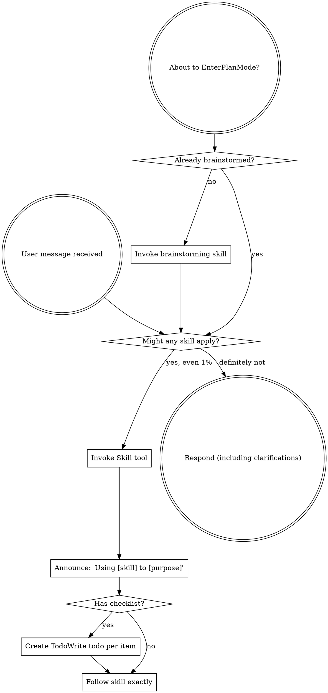

# Boundary Review — ariadne#97 (whole-issue close)

| field | value |
|-------|-------|
| issue | 97 — weave: topological multi-layer settings merge |
| repo | ariadne |
| issue file | workshop/issues/000097-weave-topo-settings-merge.md |
| boundary | whole-issue close |
| milestone | — |
| window | bb35f6cee71396b4d3972e8a71e7109e01b3fe4b..HEAD |
| command | sdlc close --issue 97 |
| reviewer | codex |
| timestamp | 2026-07-07T22:54:02-07:00 |
| verdict | FIX-THEN-SHIP |

## Review

Reading additional input from stdin...
OpenAI Codex v0.142.5
--------
workdir: /Users/xianxu/workspace/ariadne
model: gpt-5.5
provider: openai
approval: never
sandbox: workspace-write [workdir, /tmp, $TMPDIR, /tmp] (network access enabled)
reasoning effort: none
reasoning summaries: none
session id: 019f4048-98aa-7ce3-805a-d8303da7373e
--------
user
# Code review — the one SDLC boundary review

You are conducting a fresh-context code review at a development boundary —
whole-issue close — in the **ariadne** repository.

- repository: ariadne   (root: /Users/xianxu/workspace/ariadne)
- issue:      ariadne#97   (file: workshop/issues/000097-weave-topo-settings-merge.md)
- window:     Base: bb35f6cee71396b4d3972e8a71e7109e01b3fe4b   Head: HEAD

Review the **ariadne** repo and its tracker — the ariadne base-layer repo itself (changes here propagate to dependent repos). Do not assume any
other repository or apply another repo's conventions.

You have no prior session context — that is the anti-collusion property. Verify
behavior against the issue's documented Spec/Plan and the code itself; do NOT
take the implementor's word in commit messages or docs at face value. Tools are
read-only: report findings precisely; the main agent (which has session context)
applies the fixes, commits, and re-runs.

Read the diff against the issue's Spec + Plan, then work the checklist below.
Categorize every finding by severity — not everything is Critical; a nitpick
marked Critical is noise.

  Critical (must fix before crossing the boundary)
    - correctness bugs; crashes / panics on unexpected input
    - behavior drift from stated contracts (for ports of existing code where
      byte-faithfulness was promised, diff against the source)
    - silent error swallowing where the source raised
  Important (fix before the boundary if cheap)
    - API design of newly-introduced internal packages (downstream work will
      consume them; is the surface stable?)
    - missing test coverage that would catch the kind of bug shipped
    - inconsistent error handling across the diff
  Minor (note for future)
    - style nits, naming, comment density; performance only if hot-path

## Review checklist

Code quality
  - Clean separation of concerns; edge cases handled (empty / nil / unexpected).
  - Proper error handling — no silent swallowing where the source raised.
  - No duplicated logic / copy-paste that should be a shared helper.

Testing
  - Tests pin real logic, not mocks reasserting the implementation.
  - The kind of bug this diff could ship is covered.
  - PURE entities tested without IO; INTEGRATION via injected fakes (see below).

Requirements traceability
  - Every Plan checklist item this boundary claims is actually delivered.
  - Implementation matches the Spec; no undeclared scope creep.
  - Breaking changes documented.

Production readiness
  - Migration / backward-compatibility considered where state or formats change.
  - Docs / atlas updated for new surface (see the Docs update gate).

## Core concepts cross-check (if the plan has a Core concepts table)

The plan should list entities in a greppable table — name, kind
(PURE/INTEGRATION), file location, status (new/modified/deleted). For each row:
  - Verify the entity exists at the stated path (grep the diff or filesystem).
  - PURE: tests run without IO (no exec, net, mutable fs). If tests need mocks
    to run, it isn't really PURE — flag Critical and recommend promoting it to
    INTEGRATION.
  - INTEGRATION: injected into pure callers, not invoked directly from business
    logic.
  - "modified" / "deleted": the diff shows the expected change/removal at the
    stated location.
Any contradiction between table and code = Critical finding, plus a plan-revision
recommendation (a "## Revisions" entry so the plan stops claiming what the code
doesn't deliver).

## Docs update gate (atlas + README, per AGENTS.md §8)

The boundary should update user-facing docs for any new surface introduced:

  - **atlas/** — new architectural surface, flow, or terminology. Scan the diff
    for new entity types, subcommands, conventions, file-tree locations. Any
    present without corresponding atlas/ changes in the same range = Important
    finding ("atlas update appears missing for <surface>").
  - **README.md** — new user-facing surface a reader runs or types: subcommands,
    flags, keybindings, config keys, install/usage steps. If the diff adds or
    changes such surface and README.md is not updated in the same range =
    Important finding ("README update appears missing for <surface>"). This is the
    class of gap that used to surface only at the merge-time `specs` judge (#142);
    catch it here, at the earliest gate, before the close verdict is recorded.

## Architecture (the at-review backstop — these matter most long-term)

Work through each of ARCH-DRY, ARCH-PURE, ARCH-PURPOSE explicitly, applying its at-review lens. The
full principle definitions are delivered in the ARCHITECTURE PRINCIPLES block
right after this prompt — for EACH marker, state pass or flag, and cite the
marker (e.g. ARCH-DRY) in any finding. Architecture is where review has the
least training signal and the longest-delayed payoff, so be deliberate here, not
holistic.

## Verdict + output

Begin your response with this fenced verdict block — the machine-read handoff:

```verdict
verdict: <SHIP | FIX-THEN-SHIP | REWORK>
confidence: <high | medium | low>
```

  SHIP           ready; ship it
  FIX-THEN-SHIP  ship after addressing the findings (non-blocking at the gate)
  REWORK         blocking; needs rework before shipping — fix + re-run

The fenced ```` ```verdict ```` block above is the **authoritative machine-read
handoff** — emit it as the first thing in your response. (A prose
`VERDICT: <TOKEN>` first line still satisfies the legacy contract as a fallback,
but the block is what the binary trusts.)

After the verdict block: a 1-paragraph summary — what worked, what blocks SHIP if
it isn't — followed by:
  1. Strengths: 2-5 specific things done well (file:line where useful). Affirm
     validated approaches so the operator knows what's confirmed-good ground.
     Empty acceptable for trivial boundaries.
  2. Critical findings (file:line + fix sketch); empty if none.
  3. Important findings (same format).
  4. Minor findings (terse one-liners).
  5. Test coverage notes.
  6. Architectural notes for upcoming work.
  7. Plan revision recommendations: specific "## Revisions" entries the plan
     needs (empty if the plan still matches the code).


ARCHITECTURE PRINCIPLES — work through each of the 3 entries below explicitly, applying its `at-review` lens; cite the marker (e.g. ARCH-DRY) in any finding.

# Architecture principles (ARCH-*)

Injected architectural taste — the structural decisions whose payoff (or cost)
shows up many turns, often months, down the road. Agents are strong at local
tactics and weak here, so these are checked **at-plan** (when the design is being
made — highest leverage) and **at-review** (backstop, on the diff). Cite the
marker (e.g. `ARCH-DRY`) in plans, `## Log` entries, and review findings.

This file is the single source; it is embedded into the planning, plan-quality,
and code-review prompts. The human narrative lives in AGENTS.md "Core Design
Principles"; this is its machine-delivered companion.

## ARCH-DRY — Don't Repeat Yourself

- **principle:** Reuse before adding. One source of truth per fact/behavior; no
  duplicated logic, copy-pasted blocks, or parallel functions that should be one
  shared helper.
- **at-plan:** Flag a plan that re-implements something the codebase already has,
  or that will obviously duplicate logic across the new files instead of
  extracting a shared helper. Name the existing thing it should reuse.
- **at-review:** Flag duplicated logic / copy-pasted blocks / near-identical
  functions in the diff; point at the consolidation (file:line + the shared
  helper they should become).

## ARCH-PURE — Pure core, thin IO shell

- **principle:** The majority of code is pure functions (deterministic, no side
  effects); a thin "glue" layer at the boundary touches IO/UI/network/clock. Pure
  functions are unit-tested directly; the glue is kept small and injected.
- **at-plan:** Flag a design that buries business logic inside IO/handlers, or
  that will only be testable with heavy mocks (a sign logic isn't separated from
  IO). The plan should name what's pure vs the thin IO seam.
- **at-review:** Flag business logic mixed with IO in the diff; logic that should
  be a pure function injected into a thin caller. If a test needs mocks to run a
  "pure" entity, it isn't pure — recommend extracting the IO to the boundary.

## ARCH-PURPOSE — Serve the issue's actual purpose

- **principle:** Deliver the issue's stated purpose, not the easy subset of it. A
  single-source / "compiled to consumers" change is not done until **every
  consumer derives** from the source — the source is *enforced*, not just
  documentation a surface happens to restate; a hand-maintained restatement of the
  model is a deferred consumer, not a finished one. "Follow-up" is for separable
  extensions, never for the thing that is the point. This is the *opposite axis*
  from Simplicity-First/YAGNI: not "build for an imagined future," but "don't
  **under**-deliver the purpose you already committed to."
- **at-plan:** Flag a plan whose scope is a strict subset of the issue's stated
  goal / Done-when where the part deferred as "follow-up" *is* the purpose (e.g.
  wires one consumer + enforcement but leaves the consumers that motivated the
  issue as documentation that doesn't derive). Ask: does the plan fulfill the
  purpose, or just the cheap win? Name the deferred purpose.
- **at-review:** Does the diff *fulfill* the purpose or settle for the easy win?
  For a single-source change, run the **shadow-sweep** — enumerate the consumers,
  confirm each derives from the source, flag any remaining hand-maintained
  restatement of the model. A "follow-up" that is actually the deferred point of
  the issue is a finding, not a deferral.


OUTPUT CONTRACT (machine-read — do not deviate). LEAD your response with the
fenced ```verdict block shown above — that is the authoritative handoff the binary
reads (its `verdict:` value is one of the listed tokens). Everything after the block
is advisory: a non-blocking verdict WITH findings still PASSES the gate. A bare
`VERDICT: <TOKEN>` line is accepted only as a FALLBACK when the block is absent.

Diff:
diff --git a/atlas/workflow/weave.md b/atlas/workflow/weave.md
index 48e473a..45dc75b 100644
--- a/atlas/workflow/weave.md
+++ b/atlas/workflow/weave.md
@@ -75,12 +75,15 @@ unit-tested mock-free; the exec seam is fake-tested (no real binary spawned).
   owner→`go mod edit -tool` via a `weavefs.GoModEditor` exec seam — **retired in
   M5**: ownership is location-based, weave does not edit `go.mod`.)
 - `cmd/weave/internal/settingsx` + the `merge` lowering — the `settings`
-  backend: pure `Merge`/`SemanticEqual` porting `merge-settings.sh`
-  (`$merge_keys` union, `$remove` filter, meta-key strip, local-overrides-base);
-  the `MergeSettings` action reads `.claude/settings.ariadne.json` + optional
-  `settings.local.json` → `.claude/settings.json`; the golden classifier
-  compares **semantically** (not byte-wise). No formal `Backend` interface — the
-  `Action` sum type is the seam (YAGNI with a single backend). **[M4]**
+  backend: pure `MergeChain`/`Merge`/`SemanticEqual` porting and extending
+  `merge-settings.sh` (`$merge_keys` union, final-source `$remove` filter,
+  meta-key strip). `plan.Plan` groups selected `merge` rows by target into one
+  `MergeSettings{Sources, Target}`; `Apply` folds ordered layer sources
+  foundation-first, then optional sibling `settings.local.json` last, into the
+  generated target. The golden classifier recomputes the same chain and compares
+  **semantically** (not byte-wise); `verify-complete` checks every manifest merge
+  source is represented in the planned chain. No formal `Backend` interface —
+  the `Action` sum type is the seam (YAGNI with a single backend). **[M4, #97]**
 - **Cutover surface** — `weave compile` (the **Union** over every harness face by
   default; `--target {claude|codex|gemini}` for a lean subset; bare `weave` is
   help-only, mutates nothing) + `weave verify-complete` (completeness companion
diff --git a/cmd/weave/internal/golden/completeness.go b/cmd/weave/internal/golden/completeness.go
index ae5bb19..55d45b8 100644
--- a/cmd/weave/internal/golden/completeness.go
+++ b/cmd/weave/internal/golden/completeness.go
@@ -89,11 +89,14 @@ func CheckCompleteness(layers []layer.Layer, actions []plan.Action) []Uncovered
 			}
 			verb := verbName(in.Kind)
 			key := verb + "\x00" + in.Target
+			if in.Kind == intent.Merge {
+				key += "\x00" + l.Path + "/" + in.Source
+			}
 			if seen[key] {
 				continue
 			}
 			seen[key] = true
-			if u, missing := coverIntent(in, idx); missing {
+			if u, missing := coverIntent(l.Path, in, idx); missing {
 				out = append(out, u)
 			}
 		}
@@ -110,22 +113,22 @@ func CheckCompleteness(layers []layer.Layer, actions []plan.Action) []Uncovered
 // actionIndex is the precomputed coverage sets over weave's planned Actions,
 // keyed for O(1) lookup by the cover-checks.
 type actionIndex struct {
-	symlinkDsts map[string]bool // every plan.Symlink.Dst
-	seedDsts    map[string]bool // every plan.Seed.Dst
-	mkdirPaths  map[string]bool // every plan.Mkdir.Path
-	touchPaths  map[string]bool // every plan.Touch.Path
-	mergeTgts   map[string]bool // every plan.MergeSettings.Target
-	skillLinks  int             // count of plan.Symlink under a per-harness skill dir
-	entryFile   bool            // a plan.WriteFile for SOME per-harness entry file exists
+	symlinkDsts  map[string]bool            // every plan.Symlink.Dst
+	seedDsts     map[string]bool            // every plan.Seed.Dst
+	mkdirPaths   map[string]bool            // every plan.Mkdir.Path
+	touchPaths   map[string]bool            // every plan.Touch.Path
+	mergeSources map[string]map[string]bool // target -> every plan.MergeSettings source
+	skillLinks   int                        // count of plan.Symlink under a per-harness skill dir
+	entryFile    bool                       // a plan.WriteFile for SOME per-harness entry file exists
 }
 
 func indexActions(actions []plan.Action) actionIndex {
 	idx := actionIndex{
-		symlinkDsts: map[string]bool{},
-		seedDsts:    map[string]bool{},
-		mkdirPaths:  map[string]bool{},
-		touchPaths:  map[string]bool{},
-		mergeTgts:   map[string]bool{},
+		symlinkDsts:  map[string]bool{},
+		seedDsts:     map[string]bool{},
+		mkdirPaths:   map[string]bool{},
+		touchPaths:   map[string]bool{},
+		mergeSources: map[string]map[string]bool{},
 	}
 	// The per-harness entry files (Option B): prose is covered if it lands in ANY of
 	// them (CLAUDE.md / AGENTS.md / GEMINI.md). Reuse the face registry as the single
@@ -148,7 +151,12 @@ func indexActions(actions []plan.Action) actionIndex {
 		case plan.Touch:
 			idx.touchPaths[act.Path] = true
 		case plan.MergeSettings:
-			idx.mergeTgts[act.Target] = true
+			if idx.mergeSources[act.Target] == nil {
+				idx.mergeSources[act.Target] = map[string]bool{}
+			}
+			for _, source := range act.Sources {
+				idx.mergeSources[act.Target][source] = true
+			}
 		case plan.WriteFile:
 			if entryFiles[act.Path] {
 				idx.entryFile = true
@@ -160,7 +168,7 @@ func indexActions(actions []plan.Action) actionIndex {
 
 // coverIntent reports whether weave's plan covers one manifest Intent, returning
 // the Uncovered gap when it does not.
-func coverIntent(in intent.Intent, idx actionIndex) (Uncovered, bool) {
+func coverIntent(layerPath string, in intent.Intent, idx actionIndex) (Uncovered, bool) {
 	mk := func(reason string) (Uncovered, bool) {
 		return Uncovered{Verb: verbName(in.Kind), Source: in.Source, Target: in.Target, Reason: reason}, true
 	}
@@ -182,9 +190,14 @@ func coverIntent(in intent.Intent, idx actionIndex) (Uncovered, bool) {
 			return mk("no plan.Touch creates this file")
 		}
 	case intent.Merge:
-		if !idx.mergeTgts[in.Target] {
+		sources := idx.mergeSources[in.Target]
+		if len(sources) == 0 {
 			return mk("no plan.MergeSettings writes this target")
 		}
+		expectedSource := layerPath + "/" + in.Source
+		if !sources[expectedSource] {
+			return mk("plan.MergeSettings for this target omits this layer source")
+		}
 	case intent.Prose:
 		if !idx.entryFile {
 			return mk("no per-harness entry-file WriteFile composed (the prose fragment would be dropped)")
diff --git a/cmd/weave/internal/golden/completeness_test.go b/cmd/weave/internal/golden/completeness_test.go
index 2ed6cbd..4dd98f4 100644
--- a/cmd/weave/internal/golden/completeness_test.go
+++ b/cmd/weave/internal/golden/completeness_test.go
@@ -39,7 +39,7 @@ func fullActions() []plan.Action {
 		plan.Seed{Src: "/ws/ariadne/bootstrap.sh", Dst: "bootstrap.sh"},
 		plan.Mkdir{Path: "atlas"},
 		plan.Touch{Path: "workshop/lessons.md"},
-		plan.MergeSettings{Source: ".claude/settings.ariadne.json", Target: ".claude/settings.json"},
+		plan.MergeSettings{Sources: []string{"/ws/ariadne/.claude/settings.ariadne.json"}, Target: ".claude/settings.json"},
 		plan.Symlink{Src: "/ws/ariadne/construct/local/fix", Dst: ".claude/skills/xx-fix"}, // claude skill backend
 	}
 }
@@ -95,6 +95,27 @@ func TestCheckCompletenessCatchesDroppedSymlinkAndMerge(t *testing.T) {
 	}
 }
 
+func TestCheckCompletenessCatchesDroppedMergeSource(t *testing.T) {
+	layers := []layer.Layer{
+		{Name: "base", Path: "/ws/base", Intents: []intent.Intent{
+			{Kind: intent.Merge, Source: ".claude/settings.base.json", Target: ".claude/settings.json"},
+		}},
+		{Name: "mid", Path: "/ws/mid", Intents: []intent.Intent{
+			{Kind: intent.Merge, Source: ".claude/settings.mid.json", Target: ".claude/settings.json"},
+		}},
+	}
+	actions := []plan.Action{
+		plan.MergeSettings{
+			Sources: []string{"/ws/base/.claude/settings.base.json"},
+			Target:  ".claude/settings.json",
+		},
+	}
+	got := CheckCompleteness(layers, actions)
+	if len(got) != 1 || got[0].Verb != "merge" || got[0].Source != ".claude/settings.mid.json" {
+		t.Fatalf("dropped merge source: got %+v, want one uncovered middle merge source", got)
+	}
+}
+
 func TestCheckCompletenessSkillCoveredByAgentsSkills(t *testing.T) {
 	// Option B: a codex/gemini target emits .agents/skills symlinks (NOT
 	// .claude/skills). The skill intent is still covered — underSkills counts BOTH
diff --git a/cmd/weave/internal/golden/gather.go b/cmd/weave/internal/golden/gather.go
index 9a783d2..136c441 100644
--- a/cmd/weave/internal/golden/gather.go
+++ b/cmd/weave/internal/golden/gather.go
@@ -62,8 +62,7 @@ func Gather(fs weavefs.FS, root string, actions []plan.Action, deferred []intent
 	// Observed (a path may also be a Symlink-action probe, observed as a symlink
 	// with no content) rather than clobbering its symlink fields. Absent ⇒ leave
 	// the existing record (or an Exists:false) so the classifier sees it missing.
-	observeMerge := func(rel string) {
-		abs := filepath.Join(root, rel)
+	observeMergeAbs := func(abs string) {
 		cur, had := obs[abs]
 		if _, err := fs.Stat(abs); err != nil {
 			if !had {
@@ -77,6 +76,9 @@ func Gather(fs weavefs.FS, root string, actions []plan.Action, deferred []intent
 		}
 		obs[abs] = cur
 	}
+	observeMerge := func(rel string) {
+		observeMergeAbs(filepath.Join(root, rel))
+	}
 
 	// observeAbs observes a path given ALREADY-ABSOLUTE (not root-joined) — for a
 	// Seed's upstream source, which lives at the layer's abs path, potentially
@@ -109,11 +111,10 @@ func Gather(fs weavefs.FS, root string, actions []plan.Action, deferred []intent
 		case plan.WriteFile:
 			observe(act.Path, true) // content compared for a WriteFile
 		case plan.MergeSettings:
-			// The probe is THREE files (matching classifyMergeSettings): the base
-			// (Source), the optional sibling settings.local.json, and the live
-			// target (Target = setup.sh's output). All need CONTENT — the
-			// classifier recomputes the merge from base+local and semantically
-			// compares it to the target. The local path mirrors Apply/the bash:
+			// The probe is every source, the optional sibling
+			// settings.local.json, and the live target. All need CONTENT — the
+			// classifier recomputes the chain and semantically compares it to the
+			// target. The local path mirrors Apply/the bash:
 			// <dir(Target)>/settings.local.json.
 			//
 			// Crucially the merge probe reads content by FOLLOWING symlinks: in a
@@ -123,7 +124,9 @@ func Gather(fs weavefs.FS, root string, actions []plan.Action, deferred []intent
 			// so a symlinked base would carry an empty Content and the merge would
 			// spuriously fail to parse — a harness bug, not a port gap. observeMerge
 			// records the resolved content alongside any existing symlink fields.
-			observeMerge(act.Source)
+			for _, source := range act.Sources {
+				observeMergeAbs(source)
+			}
 			observeMerge(act.Target)
 			localRel := filepath.Join(filepath.Dir(act.Target), "settings.local.json")
 			observeMerge(localRel)
diff --git a/cmd/weave/internal/golden/gather_test.go b/cmd/weave/internal/golden/gather_test.go
index 28c8642..44c4fd0 100644
--- a/cmd/weave/internal/golden/gather_test.go
+++ b/cmd/weave/internal/golden/gather_test.go
@@ -64,7 +64,7 @@ func TestGatherObservesMergeSettingsTriple(t *testing.T) {
 	}
 
 	actions := []plan.Action{
-		plan.MergeSettings{Source: ".claude/settings.ariadne.json", Target: ".claude/settings.json"},
+		plan.MergeSettings{Sources: []string{filepath.Join(root, ".claude", "settings.ariadne.json")}, Target: ".claude/settings.json"},
 	}
 	in := Gather(weavefs.OSFS{}, root, actions, nil)
 
@@ -109,7 +109,7 @@ func TestGatherMergeFollowsSymlinkedBase(t *testing.T) {
 	// probe .claude/settings.ariadne.json.
 	actions := []plan.Action{
 		plan.Symlink{Src: upstream, Dst: ".claude/settings.ariadne.json"},
-		plan.MergeSettings{Source: ".claude/settings.ariadne.json", Target: ".claude/settings.json"},
+		plan.MergeSettings{Sources: []string{filepath.Join(claude, "settings.ariadne.json")}, Target: ".claude/settings.json"},
 	}
 	in := Gather(weavefs.OSFS{}, root, actions, nil)
 
diff --git a/cmd/weave/internal/golden/golden.go b/cmd/weave/internal/golden/golden.go
index 67b6cf7..544060d 100644
--- a/cmd/weave/internal/golden/golden.go
+++ b/cmd/weave/internal/golden/golden.go
@@ -233,11 +233,11 @@ func classifyAction(root string, a plan.Action, obs map[string]Observed) Diverge
 }
 
 // classifyMergeSettings classifies a MergeSettings against the live tree. The
-// probe is THREE observed files: the base (act.Source), the optional sibling
-// local (<dir(Target)>/settings.local.json), and the live target (act.Target —
-// which IS merge-settings.sh's output). The classifier RECOMPUTES weave's merge
-// from the observed base + local (settingsx.Merge — the same pure port Apply
-// uses, ARCH-DRY) and SEMANTICALLY compares it to the live target:
+// probe is the ordered sources (act.Sources), the optional sibling local
+// (<dir(Target)>/settings.local.json), and the live target. The classifier
+// RECOMPUTES weave's merge from the observed chain (settingsx.MergeChain — the
+// same pure core Apply uses, ARCH-DRY) and SEMANTICALLY compares it to the live
+// target:
 //
 //   - MATCH iff the live settings.json parses + deep-equals weave's merge output.
 //     The compare is on PARSED JSON, NOT bytes — merge-settings.sh (jq/python)
@@ -249,14 +249,21 @@ func classifyAction(root string, a plan.Action, obs map[string]Observed) Diverge
 // The local file's presence is read from Observed: an absent/empty local takes
 // settingsx.Merge's local-absent path (base with meta keys stripped).
 func classifyMergeSettings(root string, act plan.MergeSettings, obs map[string]Observed) Divergence {
-	baseAbs := filepath.Join(root, act.Source)
 	targetAbs := filepath.Join(root, act.Target)
 	localAbs := filepath.Join(filepath.Dir(targetAbs), "settings.local.json")
 
-	baseO := obs[baseAbs]
-	if !baseO.Exists {
+	var chain [][]byte
+	for _, source := range act.Sources {
+		sourceO := obs[source]
+		if !sourceO.Exists {
+			return Divergence{Unexpected, "merge", act.Target,
+				fmt.Sprintf("weave would merge %s, but source %s absent in live", act.Target, source)}
+		}
+		chain = append(chain, []byte(sourceO.Content))
+	}
+	if len(chain) == 0 {
 		return Divergence{Unexpected, "merge", act.Target,
-			fmt.Sprintf("weave would merge %s, but base %s absent in live", act.Target, act.Source)}
+			"weave would write merged settings, but the action has no sources"}
 	}
 	targetO := obs[targetAbs]
 	if !targetO.Exists {
@@ -264,11 +271,10 @@ func classifyMergeSettings(root string, act plan.MergeSettings, obs map[string]O
 			"weave would write the merged settings, but the target is absent in live"}
 	}
 
-	var local []byte
 	if localO := obs[localAbs]; localO.Exists {
-		local = []byte(localO.Content)
+		chain = append(chain, []byte(localO.Content))
 	}
-	merged, err := settingsx.Merge([]byte(baseO.Content), local)
+	merged, err := settingsx.MergeChain(chain)
 	if err != nil {
 		return Divergence{Unexpected, "merge", act.Target,
 			fmt.Sprintf("weave's merge failed: %v", err)}
diff --git a/cmd/weave/internal/golden/golden_test.go b/cmd/weave/internal/golden/golden_test.go
index 98f705e..8b7cac5 100644
--- a/cmd/weave/internal/golden/golden_test.go
+++ b/cmd/weave/internal/golden/golden_test.go
@@ -278,7 +278,7 @@ func TestMergeSettingsSemanticMatch(t *testing.T) {
 	in := Input{
 		RepoRoot: "/ws/ariadne",
 		Actions: []plan.Action{
-			plan.MergeSettings{Source: ".claude/settings.ariadne.json", Target: ".claude/settings.json"},
+			plan.MergeSettings{Sources: []string{"/ws/ariadne/.claude/settings.ariadne.json"}, Target: ".claude/settings.json"},
 		},
 		Observed: map[string]Observed{
 			"/ws/ariadne/.claude/settings.ariadne.json": {Exists: true, Content: base},
@@ -306,7 +306,7 @@ func TestMergeSettingsWithLocalMatch(t *testing.T) {
 	in := Input{
 		RepoRoot: "/ws/ariadne",
 		Actions: []plan.Action{
-			plan.MergeSettings{Source: ".claude/settings.ariadne.json", Target: ".claude/settings.json"},
+			plan.MergeSettings{Sources: []string{"/ws/ariadne/.claude/settings.ariadne.json"}, Target: ".claude/settings.json"},
 		},
 		Observed: map[string]Observed{
 			"/ws/ariadne/.claude/settings.ariadne.json": {Exists: true, Content: base},
@@ -320,6 +320,35 @@ func TestMergeSettingsWithLocalMatch(t *testing.T) {
 	}
 }
 
+func TestMergeSettingsChainSemanticMatch(t *testing.T) {
+	base := `{"$merge_keys":["permissions.allow"],"permissions":{"allow":["A"]},"scalar":"base"}`
+	mid := `{"permissions":{"allow":["B"]},"scalar":"mid"}`
+	local := `{"$remove":{"permissions.allow":["A"]},"permissions":{"allow":["C"]},"scalar":"local"}`
+	liveTarget := `{"permissions":{"allow":["B","C"]},"scalar":"local"}`
+	in := Input{
+		RepoRoot: "/ws/ariadne",
+		Actions: []plan.Action{
+			plan.MergeSettings{
+				Sources: []string{
+					"/ws/base/.claude/settings.base.json",
+					"/ws/mid/.claude/settings.mid.json",
+				},
+				Target: ".claude/settings.json",
+			},
+		},
+		Observed: map[string]Observed{
+			"/ws/base/.claude/settings.base.json":     {Exists: true, Content: base},
+			"/ws/mid/.claude/settings.mid.json":       {Exists: true, Content: mid},
+			"/ws/ariadne/.claude/settings.local.json": {Exists: true, Content: local},
+			"/ws/ariadne/.claude/settings.json":       {Exists: true, Content: liveTarget},
+		},
+	}
+	divs := Classify(in)
+	if len(divs) != 1 || divs[0].Class != Match {
+		t.Fatalf("got %+v, want one MATCH", divs)
+	}
+}
+
 func TestMergeSettingsContentDriftUnexpected(t *testing.T) {
 	// Live settings.json is NOT semantically equal to weave's merge output → UNEXPECTED.
 	base := `{"$merge_keys":["permissions.allow"],"permissions":{"allow":["A","B"]}}`
@@ -327,7 +356,7 @@ func TestMergeSettingsContentDriftUnexpected(t *testing.T) {
 	in := Input{
 		RepoRoot: "/ws/ariadne",
 		Actions: []plan.Action{
-			plan.MergeSettings{Source: ".claude/settings.ariadne.json", Target: ".claude/settings.json"},
+			plan.MergeSettings{Sources: []string{"/ws/ariadne/.claude/settings.ariadne.json"}, Target: ".claude/settings.json"},
 		},
 		Observed: map[string]Observed{
 			"/ws/ariadne/.claude/settings.ariadne.json": {Exists: true, Content: base},
@@ -346,7 +375,7 @@ func TestMergeSettingsTargetAbsentUnexpected(t *testing.T) {
 	in := Input{
 		RepoRoot: "/ws/ariadne",
 		Actions: []plan.Action{
-			plan.MergeSettings{Source: ".claude/settings.ariadne.json", Target: ".claude/settings.json"},
+			plan.MergeSettings{Sources: []string{"/ws/ariadne/.claude/settings.ariadne.json"}, Target: ".claude/settings.json"},
 		},
 		Observed: map[string]Observed{
 			"/ws/ariadne/.claude/settings.ariadne.json": {Exists: true, Content: base},
@@ -365,7 +394,7 @@ func TestMergeSettingsBaseAbsentUnexpected(t *testing.T) {
 	in := Input{
 		RepoRoot: "/ws/ariadne",
 		Actions: []plan.Action{
-			plan.MergeSettings{Source: ".claude/settings.ariadne.json", Target: ".claude/settings.json"},
+			plan.MergeSettings{Sources: []string{"/ws/ariadne/.claude/settings.ariadne.json"}, Target: ".claude/settings.json"},
 		},
 		Observed: map[string]Observed{
 			"/ws/ariadne/.claude/settings.ariadne.json": {Exists: false},
diff --git a/cmd/weave/internal/plan/action.go b/cmd/weave/internal/plan/action.go
index b900327..06000ba 100644
--- a/cmd/weave/internal/plan/action.go
+++ b/cmd/weave/internal/plan/action.go
@@ -71,16 +71,14 @@ type Touch struct {
 	Path string
 }
 
-// MergeSettings is the lowering of an intent.Merge — the JSON settings cascade
-// (the base settings.ariadne.json deep-merged UNDER the sibling
-// settings.local.json). The planner emits one per `merge` row, recording only
-// the path facts (pure); Apply reads Source + the optional sibling
-// settings.local.json off disk, runs the pure settingsx.Merge (the
-// merge-settings.sh port — deep dict merge, $merge_keys array union, $remove
-// filter, meta-key strip), and writes the result to Target.
+// MergeSettings is the lowering of one or more intent.Merge rows sharing a
+// Target — the JSON settings cascade across ordered layer sources and the
+// sibling settings.local.json. The planner records only path facts (pure);
+// Apply reads Sources + the optional sibling local off disk, runs the pure
+// settingsx.MergeChain, and writes the result to Target.
 type MergeSettings struct {
-	Source string // the layer's base settings (e.g. .claude/settings.ariadne.json), repo-relative
-	Target string // the merged output (e.g. .claude/settings.json), repo-relative
+	Sources []string // ordered source settings files, usually absolute layer paths
+	Target  string   // the merged output (e.g. .claude/settings.json), repo-relative
 }
 
 func (Symlink) isAction()       {}
diff --git a/cmd/weave/internal/plan/apply.go b/cmd/weave/internal/plan/apply.go
index 8330669..88985e6 100644
--- a/cmd/weave/internal/plan/apply.go
+++ b/cmd/weave/internal/plan/apply.go
@@ -30,8 +30,8 @@ import (
 //     skip when the source is absent. Distinct from WriteFile (whose content the
 //     planner holds): a Seed's content is read from Src here in the IO seam.
 //   - WriteFile → AGENTS.md/touch: ensure parents, then write.
-//   - MergeSettings → merge-settings.sh: read base + optional sibling
-//     settings.local.json, run the pure mergeSettings, write the merged target.
+//   - MergeSettings → settings merge: read ordered sources + optional sibling
+//     settings.local.json, run the pure settingsx.MergeChain, write the target.
 //   - EnsureGitignore → the generated-runtime ignore mechanism (gitignore.go):
 //     read the repo's .gitignore, append the missing fixed entries (idempotent
 //     whole-line append, never duplicating), write back only on change. weave
@@ -69,30 +69,35 @@ func Apply(fs weavefs.FS, repoRoot string, actions []Action) error {
 	return nil
 }
 
-// applyMergeSettings is the IO half of the settings cascade, ported from
-// merge-settings.sh: read the base (act.Source) and the optional sibling local
-// (settings.local.json, alongside act.Target), run the pure settingsx.Merge, and
-// write the result to act.Target. The local file's path is derived the same way
-// the bash does — LOCAL_FILE="$TARGET_DIR/settings.local.json", i.e. the
-// settings.local.json sibling of the target — so an arbitrary Target dir resolves
-// its local correctly. A missing base is an error (the bash's `[[ ! -f BASE ]]`
-// exit 1); a missing local takes the local-absent path (base with meta stripped).
-// All IO lives here (ARCH-PURE); the merge itself is the pure settingsx.Merge.
+// applyMergeSettings is the IO half of the settings cascade: read ordered
+// sources and the optional sibling local (settings.local.json, alongside
+// act.Target), run the pure settingsx.MergeChain, and write the result to
+// act.Target. The local file's path is derived the same way the bash did —
+// LOCAL_FILE="$TARGET_DIR/settings.local.json", i.e. the settings.local.json
+// sibling of the target — so an arbitrary Target dir resolves its local
+// correctly. A missing source is an error; a missing local takes the
+// source-only path (sources with meta stripped at the end). All IO lives here
+// (ARCH-PURE); the merge itself is pure.
 func applyMergeSettings(fs weavefs.FS, repoRoot string, act MergeSettings) error {
-	basePath := filepath.Join(repoRoot, act.Source)
-	base, err := fs.ReadFile(basePath)
-	if err != nil {
-		return fmt.Errorf("apply merge: read base %s: %w", basePath, err)
+	if len(act.Sources) == 0 {
+		return fmt.Errorf("apply merge: %s: no sources", act.Target)
+	}
+	sources := make([][]byte, 0, len(act.Sources)+1)
+	for _, sourcePath := range act.Sources {
+		data, err := fs.ReadFile(sourcePath)
+		if err != nil {
+			return fmt.Errorf("apply merge: read source %s: %w", sourcePath, err)
+		}
+		sources = append(sources, data)
 	}
 
 	targetPath := filepath.Join(repoRoot, act.Target)
 	localPath := filepath.Join(filepath.Dir(targetPath), "settings.local.json")
-	var local []byte
 	if data, lerr := fs.ReadFile(localPath); lerr == nil {
-		local = data // present ⇒ deep-merge; absent ⇒ nil ⇒ base-with-meta-stripped
+		sources = append(sources, data)
 	}
 
-	merged, err := settingsx.Merge(base, local)
+	merged, err := settingsx.MergeChain(sources)
 	if err != nil {
 		return fmt.Errorf("apply merge: %s: %w", targetPath, err)
 	}
diff --git a/cmd/weave/internal/plan/apply_test.go b/cmd/weave/internal/plan/apply_test.go
index 3f82503..8a6dd1e 100644
--- a/cmd/weave/internal/plan/apply_test.go
+++ b/cmd/weave/internal/plan/apply_test.go
@@ -359,7 +359,7 @@ func TestApplyMergeSettingsLocalAbsent(t *testing.T) {
 	mustWrite(t, filepath.Join(root, ".claude", "settings.ariadne.json"), base)
 
 	if err := Apply(weavefs.OSFS{}, root, []Action{
-		MergeSettings{Source: ".claude/settings.ariadne.json", Target: ".claude/settings.json"},
+		MergeSettings{Sources: []string{filepath.Join(root, ".claude", "settings.ariadne.json")}, Target: ".claude/settings.json"},
 	}); err != nil {
 		t.Fatalf("Apply: %v", err)
 	}
@@ -389,7 +389,7 @@ func TestApplyMergeSettingsWithLocal(t *testing.T) {
 	mustWrite(t, filepath.Join(root, ".claude", "settings.local.json"), local)
 
 	if err := Apply(weavefs.OSFS{}, root, []Action{
-		MergeSettings{Source: ".claude/settings.ariadne.json", Target: ".claude/settings.json"},
+		MergeSettings{Sources: []string{filepath.Join(root, ".claude", "settings.ariadne.json")}, Target: ".claude/settings.json"},
 	}); err != nil {
 		t.Fatalf("Apply: %v", err)
 	}
@@ -406,11 +406,48 @@ func TestApplyMergeSettingsWithLocal(t *testing.T) {
 	}
 }
 
+func TestApplyMergeSettingsMultipleSourcesWithLocal(t *testing.T) {
+	root := t.TempDir()
+	base := `{
+		"$merge_keys": ["permissions.allow"],
+		"permissions": {"allow": ["A"]},
+		"scalar": "base"
+	}`
+	mid := `{
+		"permissions": {"allow": ["B"]},
+		"scalar": "mid"
+	}`
+	local := `{
+		"$remove": {"permissions.allow": ["A"]},
+		"permissions": {"allow": ["C"]},
+		"scalar": "local"
+	}`
+	basePath := filepath.Join(root, "base", "settings.json")
+	midPath := filepath.Join(root, "mid", "settings.json")
+	mustWrite(t, basePath, base)
+	mustWrite(t, midPath, mid)
+	mustWrite(t, filepath.Join(root, ".claude", "settings.local.json"), local)
+
+	if err := Apply(weavefs.OSFS{}, root, []Action{
+		MergeSettings{Sources: []string{basePath, midPath}, Target: ".claude/settings.json"},
+	}); err != nil {
+		t.Fatalf("Apply: %v", err)
+	}
+	got := readJSON(t, filepath.Join(root, ".claude", "settings.json"))
+	want := map[string]any{
+		"permissions": map[string]any{"allow": []any{"B", "C"}},
+		"scalar":      "local",
+	}
+	if !reflect.DeepEqual(got, want) {
+		t.Fatalf("merged (multi-source with local):\n got=%#v\nwant=%#v", got, want)
+	}
+}
+
 func TestApplyMergeSettingsMissingBaseErrors(t *testing.T) {
 	// merge-settings.sh errors when the base file is absent; Apply must surface it.
 	root := t.TempDir()
 	err := Apply(weavefs.OSFS{}, root, []Action{
-		MergeSettings{Source: ".claude/settings.ariadne.json", Target: ".claude/settings.json"},
+		MergeSettings{Sources: []string{filepath.Join(root, ".claude", "settings.ariadne.json")}, Target: ".claude/settings.json"},
 	})
 	if err == nil {
 		t.Fatal("Apply: expected error for missing base, got nil")
diff --git a/cmd/weave/internal/plan/plan.go b/cmd/weave/internal/plan/plan.go
index 35ba63c..0d023e1 100644
--- a/cmd/weave/internal/plan/plan.go
+++ b/cmd/weave/internal/plan/plan.go
@@ -27,10 +27,10 @@ import (
 //     Mkdir{Target}; Touch → empty WriteFile{Target}; Seed →
 //     Seed{upstream/Source, Target} (a content-tracking real-file copy whose
 //     bytes the IO seam reads from the upstream source — see plan.applySeed).
-//   - Merge lowers to a MergeSettings{Source, Target} — the settings cascade
-//     (ported from setup.sh's `merge` case). The planner records the path facts;
-//     Apply reads Source + the sibling settings.local.json off disk and runs
-//     settingsx.Merge (the merge-settings.sh port) to write Target.
+//   - Merge rows group by Target into MergeSettings{Sources, Target} — the
+//     settings cascade. Sources stay foundation-first, matching layer order.
+//     Apply reads Sources + the sibling settings.local.json off disk and runs
+//     settingsx.MergeChain to write Target.
 //   - Skill is DEFERRED (M3 skill serving): it emits no Action and must not
 //     error — a manifest carrying it still compiles. Skill feeds the SkillIndex
 //     (the menu), not the filesystem-op list.
@@ -81,6 +81,9 @@ func Plan(layers []layer.Layer, entryFiles []string) ([]Action, error) {
 		}
 	}
 
+	mergeGroups := map[string][]string{}
+	var mergeOrder []string
+
 	// File-op intents lower per intent, in layer (foundation-first) order, under
 	// the SAME 𝒜(R) filter: an intent participates iff it is an EXPORT or it
 	// belongs to the LEAF (so an ancestor's internal is excluded; the leaf's
@@ -118,19 +121,19 @@ func Plan(layers []layer.Layer, entryFiles []string) ([]Action, error) {
 			case intent.Prose:
 				// Handled above (composes across layers); nothing per-intent.
 			case intent.Merge:
-				// The settings cascade (setup.sh's `merge` case): lower to a
-				// MergeSettings{Source, Target}. Source is the layer's base
-				// settings (settings.ariadne.json), Target the composed
-				// settings.json. The planner records only the path facts (pure);
-				// Apply reads Source + the sibling settings.local.json off disk,
-				// runs settingsx.Merge (the merge-settings.sh port), writes Target.
-				actions = append(actions, MergeSettings{Source: in.Source, Target: in.Target})
+				if _, ok := mergeGroups[in.Target]; !ok {
+					mergeOrder = append(mergeOrder, in.Target)
+				}
+				mergeGroups[in.Target] = append(mergeGroups[in.Target], joinPath(l.Path, in.Source))
 			case intent.Skill:
 				// TODO(M3): feeds the SkillIndex (agent-agnostic skill serving),
 				// not the filesystem-op list. No Action here.
 			}
 		}
 	}
+	for _, target := range mergeOrder {
+		actions = append(actions, MergeSettings{Sources: mergeGroups[target], Target: target})
+	}
 
 	return actions, nil
 }
diff --git a/cmd/weave/internal/plan/plan_test.go b/cmd/weave/internal/plan/plan_test.go
index c69f0e4..bd79ecc 100644
--- a/cmd/weave/internal/plan/plan_test.go
+++ b/cmd/weave/internal/plan/plan_test.go
@@ -203,7 +203,7 @@ func TestPlanDeferredKindsAreNoOps(t *testing.T) {
 }
 
 func TestPlanMergeLowering(t *testing.T) {
-	// A `merge` intent lowers to a MergeSettings{Source, Target} — the settings
+	// A `merge` intent lowers to a MergeSettings{Sources, Target} — the settings
 	// cascade (ported from setup.sh's `merge` case + merge-settings.sh). Source is
 	// the layer's base settings (settings.ariadne.json), Target the composed
 	// settings.json. The pure planner records the path facts; Apply reads base +
@@ -219,7 +219,43 @@ func TestPlanMergeLowering(t *testing.T) {
 		t.Fatalf("Plan: unexpected error: %v", err)
 	}
 	want := []Action{
-		MergeSettings{Source: ".claude/settings.ariadne.json", Target: ".claude/settings.json"},
+		MergeSettings{Sources: []string{"/ws/ariadne/.claude/settings.ariadne.json"}, Target: ".claude/settings.json"},
+	}
+	if !reflect.DeepEqual(got, want) {
+		t.Fatalf("Plan = %#v, want %#v", got, want)
+	}
+}
+
+func TestPlanGroupsMergeRowsByTargetFoundationFirst(t *testing.T) {
+	layers := []layer.Layer{
+		{Name: "base", Path: "/ws/base", Intents: []intent.Intent{
+			{Kind: intent.Merge, Source: ".claude/settings.base.json", Target: ".claude/settings.json"},
+		}},
+		{Name: "mid", Path: "/ws/mid", Intents: []intent.Intent{
+			{Kind: intent.Merge, Source: ".claude/settings.mid.json", Target: ".claude/settings.json"},
+			{Kind: intent.Merge, Source: ".gemini/settings.mid.json", Target: ".gemini/settings.json"},
+		}},
+		{Name: "leaf", Path: "/ws/leaf", Intents: []intent.Intent{
+			{Kind: intent.Merge, Source: ".claude/settings.leaf.json", Target: ".claude/settings.json"},
+		}},
+	}
+	got, err := Plan(layers, []string{"AGENTS.md"})
+	if err != nil {
+		t.Fatalf("Plan: unexpected error: %v", err)
+	}
+	want := []Action{
+		MergeSettings{
+			Sources: []string{
+				"/ws/base/.claude/settings.base.json",
+				"/ws/mid/.claude/settings.mid.json",
+				"/ws/leaf/.claude/settings.leaf.json",
+			},
+			Target: ".claude/settings.json",
+		},
+		MergeSettings{
+			Sources: []string{"/ws/mid/.gemini/settings.mid.json"},
+			Target:  ".gemini/settings.json",
+		},
 	}
 	if !reflect.DeepEqual(got, want) {
 		t.Fatalf("Plan = %#v, want %#v", got, want)
diff --git a/cmd/weave/internal/settingsx/settingsx.go b/cmd/weave/internal/settingsx/settingsx.go
index ce621b6..c1ec51c 100644
--- a/cmd/weave/internal/settingsx/settingsx.go
+++ b/cmd/weave/internal/settingsx/settingsx.go
@@ -1,10 +1,10 @@
 // Package settingsx is the ONE home for weave's pure settings-merge reasoning
-// (ARCH-DRY, ARCH-PURE), the port of construct/scripts/merge-settings.sh. Two
-// consumers need it: plan.Apply (the IO seam reads base + local, calls Merge,
-// writes the target) and the golden classifier (it recomputes Merge from the
-// observed base + local and asks SemanticEqual whether the live settings.json
-// matches). It sits below plan and golden with no internal imports, so both
-// import it without a cycle. No IO: it transforms in-memory bytes only.
+// (ARCH-DRY, ARCH-PURE), the port of construct/scripts/merge-settings.sh and
+// the extension that folds settings across a layer chain. Plan.Apply reads the
+// ordered sources + optional local and calls MergeChain; the golden classifier
+// recomputes the same MergeChain and asks SemanticEqual whether live
+// settings.json matches. It sits below plan and golden with no internal imports,
+// so both import it without a cycle. No IO: it transforms in-memory bytes only.
 //
 // merge-settings.sh is the source of truth; this reproduces its embedded
 // python's deep_merge / get_nested / set_nested / strip_meta semantics
@@ -37,51 +37,78 @@ import (
 // Output is indent-2 JSON with a trailing newline, matching the bash's
 // json.dump(indent=2) + print().
 func Merge(base, local []byte) ([]byte, error) {
-	var baseObj map[string]any
-	if err := json.Unmarshal(base, &baseObj); err != nil {
-		return nil, fmt.Errorf("settingsx.Merge: parse base: %w", err)
+	if local == nil {
+		return MergeChain([][]byte{base})
 	}
+	return MergeChain([][]byte{base, local})
+}
 
-	// merge_keys = set(base.get('$merge_keys', [])) — the dotted paths whose
-	// arrays union rather than replace.
-	mergeKeys := map[string]bool{}
-	if raw, ok := baseObj["$merge_keys"].([]any); ok {
-		for _, k := range raw {
-			if s, ok := k.(string); ok {
-				mergeKeys[s] = true
-			}
-		}
+// MergeChain deep-merges ordered settings sources into the composed
+// settings.json content. The first source is the foundation: its $merge_keys
+// define the array-union paths for the whole chain. Later sources override
+// earlier sources foundation-first. Only the final source's $remove is applied,
+// preserving the historical "repo-local removes from inherited settings"
+// contract while allowing intermediate layers to contribute settings.
+func MergeChain(sources [][]byte) ([]byte, error) {
+	if len(sources) == 0 {
+		return nil, fmt.Errorf("settingsx.MergeChain: no sources")
 	}
 
-	var result map[string]any
-	if local == nil {
-		// Local absent → base with meta keys stripped.
-		result = stripMeta(baseObj).(map[string]any)
-	} else {
-		var localObj map[string]any
-		if err := json.Unmarshal(local, &localObj); err != nil {
-			return nil, fmt.Errorf("settingsx.Merge: parse local: %w", err)
+	objects := make([]map[string]any, 0, len(sources))
+	for i, source := range sources {
+		var obj map[string]any
+		if err := json.Unmarshal(source, &obj); err != nil {
+			return nil, fmt.Errorf("settingsx.MergeChain: parse source %d: %w", i, err)
 		}
+		objects = append(objects, obj)
+	}
 
-		// Apply $remove against base BEFORE merging (the bash filters a deep copy
-		// of base, then merges strip_meta(base_filtered) with local).
-		baseForMerge := baseObj
-		if removals, ok := localObj["$remove"].(map[string]any); ok && len(removals) > 0 {
-			baseForMerge = applyRemovals(baseObj, removals)
+	mergeKeys := mergeKeySet(objects[0])
+	acc := deepCopy(objects[0]).(map[string]any)
+	for i := 1; i < len(objects); i++ {
+		next := objects[i]
+		baseForMerge := acc
+		if i == len(objects)-1 {
+			if removals, ok := next["$remove"].(map[string]any); ok && len(removals) > 0 {
+				baseForMerge = applyRemovals(acc, removals)
+			}
+		}
+		merged := deepMerge(baseForMerge, next, "", mergeKeys)
+		acc, _ = merged.(map[string]any)
+		if i != len(objects)-1 {
+			copyRootMeta(acc, baseForMerge)
 		}
-		merged := deepMerge(stripMeta(baseForMerge), localObj, "", mergeKeys)
-		// deepMerge over two dicts always yields a dict here (both are objects).
-		result, _ = merged.(map[string]any)
 	}
 
+	result := stripMeta(acc).(map[string]any)
 	out, err := json.MarshalIndent(result, "", "  ")
 	if err != nil {
-		return nil, fmt.Errorf("settingsx.Merge: marshal result: %w", err)
+		return nil, fmt.Errorf("settingsx.MergeChain: marshal result: %w", err)
 	}
 	out = append(out, '\n') // match the bash's trailing print().
 	return out, nil
 }
 
+func mergeKeySet(baseObj map[string]any) map[string]bool {
+	mergeKeys := map[string]bool{}
+	if raw, ok := baseObj["$merge_keys"].([]any); ok {
+		for _, k := range raw {
+			if s, ok := k.(string); ok {
+				mergeKeys[s] = true
+			}
+		}
+	}
+	return mergeKeys
+}
+
+func copyRootMeta(dst, src map[string]any) {
+	for k, v := range src {
+		if len(k) > 0 && k[0] == '$' {
+			dst[k] = deepCopy(v)
+		}
+	}
+}
+
 // SemanticEqual reports whether two JSON byte slices decode to deeply-equal
 // values, ignoring key ordering and formatting. Used by the golden classifier to
 // compare weave's Merge output against the live settings.json (which the bash
diff --git a/cmd/weave/internal/settingsx/settingsx_test.go b/cmd/weave/internal/settingsx/settingsx_test.go
index 9765ab8..9c552db 100644
--- a/cmd/weave/internal/settingsx/settingsx_test.go
+++ b/cmd/weave/internal/settingsx/settingsx_test.go
@@ -38,6 +38,61 @@ func runMerge(t *testing.T, base, local string) map[string]any {
 	return mustParse(t, out)
 }
 
+// runMergeChain runs MergeChain and returns the parsed result, failing on error.
+func runMergeChain(t *testing.T, sources []string) map[string]any {
+	t.Helper()
+	sourceBytes := make([][]byte, 0, len(sources))
+	for _, source := range sources {
+		sourceBytes = append(sourceBytes, []byte(source))
+	}
+	out, err := MergeChain(sourceBytes)
+	if err != nil {
+		t.Fatalf("MergeChain: %v", err)
+	}
+	return mustParse(t, out)
+}
+
+func TestMergeChainPreservesMergeKeysAcrossIntermediateSources(t *testing.T) {
+	// The foundation's $merge_keys must survive every intermediate fold. If an
+	// intermediate result strips meta too early, the later arrays replace instead
+	// of unioning and this test loses B/C.
+	got := runMergeChain(t, []string{
+		`{"$merge_keys":["permissions.allow"],"permissions":{"allow":["A"]},"scalar":"base"}`,
+		`{"permissions":{"allow":["B"]},"scalar":"mid"}`,
+		`{"permissions":{"allow":["C"]},"leaf":true}`,
+		`{"permissions":{"allow":["D"]},"scalar":"local"}`,
+	})
+	want := map[string]any{
+		"permissions": map[string]any{"allow": []any{"A", "B", "C", "D"}},
+		"scalar":      "local",
+		"leaf":        true,
+	}
+	if !reflect.DeepEqual(got, want) {
+		t.Fatalf("MergeChain:\n got=%#v\nwant=%#v", got, want)
+	}
+}
+
+func TestMergeChainAppliesRemoveFromFinalLocalOnly(t *testing.T) {
+	// The repo-local final source is the only layer whose $remove is applied,
+	// matching the old base+local contract while allowing middle layers to add.
+	got := runMergeChain(t, []string{
+		`{"$merge_keys":["permissions.allow"],"permissions":{"allow":["A","B"]}}`,
+		`{"$remove":{"permissions.allow":["A"]},"permissions":{"allow":["C"]}}`,
+		`{"$remove":{"permissions.allow":["B"]},"permissions":{"allow":["D"]}}`,
+	})
+	want := map[string]any{
+		"permissions": map[string]any{"allow": []any{"A", "C", "D"}},
+	}
+	if !reflect.DeepEqual(got, want) {
+		t.Fatalf("MergeChain final remove:\n got=%#v\nwant=%#v", got, want)
+	}
+	for _, meta := range []string{"$merge_keys", "$remove"} {
+		if _, ok := got[meta]; ok {
+			t.Fatalf("meta key %q leaked into output: %#v", meta, got)
+		}
+	}
+}
+
 func TestMergeLocalAbsentStripsMeta(t *testing.T) {
 	base := `{
 		"$comment": "doc",
diff --git a/cmd/weave/main.go b/cmd/weave/main.go
index fd5db30..c6f0e89 100644
--- a/cmd/weave/main.go
+++ b/cmd/weave/main.go
@@ -783,7 +783,7 @@ func formatActions(actions []plan.Action) string {
 		case plan.Touch:
 			b = append(b, fmt.Sprintf("touch     %s\n", act.Path)...)
 		case plan.MergeSettings:
-			b = append(b, fmt.Sprintf("merge     %s -> %s\n", act.Source, act.Target)...)
+			b = append(b, fmt.Sprintf("merge     %s -> %s\n", strings.Join(act.Sources, ", "), act.Target)...)
 		case plan.EnsureGitignore:
 			b = append(b, fmt.Sprintf("gitignore .gitignore (%d entries)\n", len(act.Entries))...)
 		default:
diff --git a/cmd/weave/main_test.go b/cmd/weave/main_test.go
index 7fab77f..f6934fa 100644
--- a/cmd/weave/main_test.go
+++ b/cmd/weave/main_test.go
@@ -2,8 +2,10 @@ package main
 
 import (
 	"bytes"
+	"encoding/json"
 	"os"
 	"path/filepath"
+	"reflect"
 	"strings"
 	"testing"
 
@@ -119,6 +121,75 @@ func TestCompileEndToEnd(t *testing.T) {
 	}
 }
 
+func TestCompileMergesSettingsAcrossLayerChain(t *testing.T) {
+	parent := t.TempDir()
+	base := filepath.Join(parent, "base")
+	mid := filepath.Join(parent, "mid")
+	derived := filepath.Join(parent, "derived")
+
+	mkfile(t, filepath.Join(base, "construct", "base.manifest"),
+		"merge .claude/settings.base.json .claude/settings.json\n")
+	mkfile(t, filepath.Join(base, ".claude", "settings.base.json"), `{
+		"$merge_keys": ["permissions.allow"],
+		"permissions": {"allow": ["A"]},
+		"scalar": "base"
+	}`)
+
+	mkfile(t, filepath.Join(mid, "construct", "deps"), "substrate ../base\n")
+	mkfile(t, filepath.Join(mid, "construct", "base.manifest"),
+		"merge .claude/settings.mid.json .claude/settings.json\n")
+	mkfile(t, filepath.Join(mid, ".claude", "settings.mid.json"), `{
+		"permissions": {"allow": ["B"]},
+		"scalar": "mid"
+	}`)
+
+	mkfile(t, filepath.Join(derived, "construct", "deps"), "substrate ../mid\n")
+	mkfile(t, filepath.Join(derived, "construct", "base.manifest"),
+		"merge .claude/settings.derived.json .claude/settings.json\n")
+	mkfile(t, filepath.Join(derived, ".claude", "settings.derived.json"), `{
+		"permissions": {"allow": ["C"]},
+		"leaf": true
+	}`)
+	mkfile(t, filepath.Join(derived, ".claude", "settings.local.json"), `{
+		"$remove": {"permissions.allow": ["A"]},
+		"permissions": {"allow": ["D"]},
+		"scalar": "local"
+	}`)
+
+	var out bytes.Buffer
+	if err := run(weavefs.OSFS{}, derived, plan.TargetAll, false, &out); err != nil {
+		t.Fatalf("run: %v", err)
+	}
+
+	got := readJSONMap(t, filepath.Join(derived, ".claude", "settings.json"))
+	want := map[string]any{
+		"permissions": map[string]any{"allow": []any{"B", "C", "D"}},
+		"scalar":      "local",
+		"leaf":        true,
+	}
+	if !reflect.DeepEqual(got, want) {
+		t.Fatalf("settings.json:\n got=%#v\nwant=%#v", got, want)
+	}
+	for _, meta := range []string{"$merge_keys", "$remove"} {
+		if _, ok := got[meta]; ok {
+			t.Fatalf("meta key %q leaked into settings.json: %#v", meta, got)
+		}
+	}
+}
+
+func readJSONMap(t *testing.T, path string) map[string]any {
+	t.Helper()
+	data, err := os.ReadFile(path)
+	if err != nil {
+		t.Fatalf("read %s: %v", path, err)
+	}
+	var out map[string]any
+	if err := json.Unmarshal(data, &out); err != nil {
+		t.Fatalf("parse %s: %v\n%s", path, err, data)
+	}
+	return out
+}
+
 // TestCompileEnsuresGitignore proves weave OWNS ignoring its own generated-
 // runtime artifacts: a `weave compile` on a fixture repo (which ships no
 // .gitignore) leaves a .gitignore carrying every fixed generated-runtime entry,


codex
I’ll use the repo workflow instructions and review this as the SDLC boundary reviewer: first reading the active issue/plan and the actual diff, then checking behavior and architecture against the stated contract.
exec
/bin/zsh -lc "sed -n '1,220p' /Users/xianxu/workspace/ariadne/construct/adapted/superpowers-using-superpowers/SKILL.md" in /Users/xianxu/workspace/ariadne
 succeeded in 0ms:
---
name: superpowers-using-superpowers
description: Use when starting any conversation - establishes how to find and use skills, requiring Skill tool invocation before ANY response including clarifying questions
---

<SUBAGENT-STOP>
If you were dispatched as a subagent to execute a specific task, skip this skill.
</SUBAGENT-STOP>

<EXTREMELY-IMPORTANT>
If you think there is even a 1% chance a skill might apply to what you are doing, you ABSOLUTELY MUST invoke the skill.

IF A SKILL APPLIES TO YOUR TASK, YOU DO NOT HAVE A CHOICE. YOU MUST USE IT.

This is not negotiable. This is not optional. You cannot rationalize your way out of this.
</EXTREMELY-IMPORTANT>

## Instruction Priority

> **Ariadne note:** AGENTS.md Section 3 governs subagent strategy and overrides skills that mandate subagent-driven-development as the default execution path.

Superpowers skills override default system prompt behavior, but **user instructions always take precedence**:

1. **User's explicit instructions** (CLAUDE.md, GEMINI.md, AGENTS.md, direct requests) — highest priority
2. **Superpowers skills** — override default system behavior where they conflict
3. **Default system prompt** — lowest priority

If CLAUDE.md, GEMINI.md, or AGENTS.md says "don't use TDD" and a skill says "always use TDD," follow the user's instructions. The user is in control.

## How to Access Skills

**In Claude Code:** Use the `Skill` tool. When you invoke a skill, its content is loaded and presented to you—follow it directly. Never use the Read tool on skill files.

**In Gemini CLI:** Skills activate via the `activate_skill` tool. Gemini loads skill metadata at session start and activates the full content on demand.

**In other environments:** Check your platform's documentation for how skills are loaded.

## Platform Adaptation

Skills use Claude Code tool names. Non-CC platforms: see `references/codex-tools.md` (Codex) for tool equivalents. Gemini CLI users get the tool mapping loaded automatically via GEMINI.md.

# Using Skills

## The Rule

**Invoke relevant or requested skills BEFORE any response or action.** Even a 1% chance a skill might apply means that you should invoke the skill to check. If an invoked skill turns out to be wrong for the situation, you don't need to use it.



## Red Flags

These thoughts mean STOP—you're rationalizing:

| Thought | Reality |
|---------|---------|
| "This is just a simple question" | Questions are tasks. Check for skills. |
| "I need more context first" | Skill check comes BEFORE clarifying questions. |
| "Let me explore the codebase first" | Skills tell you HOW to explore. Check first. |
| "I can check git/files quickly" | Files lack conversation context. Check for skills. |
| "Let me gather information first" | Skills tell you HOW to gather information. |
| "This doesn't need a formal skill" | If a skill exists, use it. |
| "I remember this skill" | Skills evolve. Read current version. |
| "This doesn't count as a task" | Action = task. Check for skills. |
| "The skill is overkill" | Simple things become complex. Use it. |
| "I'll just do this one thing first" | Check BEFORE doing anything. |
| "This feels productive" | Undisciplined action wastes time. Skills prevent this. |
| "I know what that means" | Knowing the concept ≠ using the skill. Invoke it. |

## Skill Priority

When multiple skills could apply, use this order:

1. **Process skills first** (brainstorming, debugging) - these determine HOW to approach the task
2. **Implementation skills second** (frontend-design, mcp-builder) - these guide execution

"Let's build X" → brainstorming first, then implementation skills.
"Fix this bug" → debugging first, then domain-specific skills.

## Skill Types

**Rigid** (TDD, debugging): Follow exactly. Don't adapt away discipline.

**Flexible** (patterns): Adapt principles to context.

The skill itself tells you which.

## User Instructions

Instructions say WHAT, not HOW. "Add X" or "Fix Y" doesn't mean skip workflows.

exec
/bin/zsh -lc 'sdlc --help' in /Users/xianxu/workspace/ariadne
 succeeded in 0ms:
sdlc collects ariadne's SDLC checkpoint guards into one binary. Each subcommand
owns one checkpoint: it requires evidence at the gate, mutates state, logs the
transition, and refuses transitions that lack it. We don't model the SDLC as a
state machine — stages stay prose; we codify the gates between them where drift
recurs. `sdlc` manages the development life cycle; prefer it over `git`/`gh`.

BEFORE WORK
  - `sdlc claim --issue N` — the single start-of-work gesture, a CHEAP LOCK.
    Flips an *open* issue to `working` and publishes the claim to origin/main so
    peer agents see it. No estimate demanded (#113) — claim early, the moment an
    idea crystallizes. `--no-start` suppresses the flip.
  - Do NOT hand-edit an issue's `status:` — let `sdlc claim` or `sdlc issue
    set-status` own that transition (it carries the reopen/`→ done` guards).

ENTER IMPLEMENTATION
  - After plan approval, before editing code, run `sdlc change-code`. It owns the
    branching decision (in-place branch by default; `--worktree=yes` for an
    isolated worktree), the plan-quality check, and the `estimate_hours` gate
    (relocated here from claim, #113). Don't start coding without it.

PUBLISH
  - Publishing goes through a PR: `sdlc pr` → `sdlc merge`. Direct `sdlc push`
    if working directly on main.
  - Publish ONCE at issue close, not per milestone — and do NOT reuse a branch
    name that already has a merged PR. `sdlc merge` refuses (#148) when a branch
    has commits not in main despite a merged PR (a reused name would otherwise
    silently strand the new commits); rename to a fresh branch, `sdlc pr`, retry.

RECOVER
  - After a compaction or session resume, run `sdlc state` to recover where you
    are instead of re-inferring from issue files.

LOCAL REPO TRANSACTION LOCK
  - Mutating verbs take an SDLC-owned repo transaction lock at
    `.git/sdlc.lock` before reading/writing issue state, committing, changing
    branches, or pushing. The lock is local to the Git common dir, so linked
    worktrees of the same repo serialize with each other.
  - Wait messages identify the holder pid and command when metadata is
    available. `close` and `milestone-close` release the lock while the external
    boundary-review subprocess runs, then reacquire before finalization; if HEAD
    or the issue/project file state they prepared changed meanwhile, they refuse
    to finalize and tell you to rerun. `change-code`, `merge`, and `push` can still hold the lock during
    long-running review/ship transactions; wait or retry rather than removing
    the lock while that process is alive.
  - A dead same-host holder is reclaimed automatically; initializing metadata
    is waited through. Other stale/timeout errors tell you how to inspect
    `.git/sdlc.lock`. Remote push/ref races are separate: the local lock
    serializes this checkout, not another machine or clone.

WHEN A VERB ERRORS
  Do NOT route around it with hand-rolled `git`/`gh`. Its errors are next-action
  specs. The fix is one of two things:
    (a) satisfy the precondition it names and re-run the same verb (e.g. `sdlc
        merge` saying "no upstream" → run `sdlc pr` first, then `sdlc merge`); or
    (b) if the error is a genuine gap in `sdlc` itself, fix that edge case in the
        source and re-run. We're still ironing out edge cases.
  Only drop to manual when a verb genuinely cannot express the need — say so.

These gates sit inside a wider prose arc the binary does NOT own: ideation
(parley/pensive) → brainstorm → plan → build → milestone review (`sdlc judge`,
auto-dispatched) → close/ship → postmortem.

CONVENTIONS

  --issue vs --github-issue — `--issue N` always means workshop/issues
  (6-digit ID). `--github-issue N` means a GitHub issue number. Bare `--issue`
  never means a GitHub issue.

  Form vs essence — checkpoint guards (close, milestone-close, push, merge)
  defend against *omission* via required-evidence flags; `sdlc judge` defends
  against *theater* via fresh-context review. Form runs first; judge second.

The verb list + per-verb help (`sdlc <verb> --help`) follow below.

Usage:
  sdlc [flags]
  sdlc [command]

Available Commands:
  claim           Start work: flip an open issue to working + broadcast the claim
  start-plan      Enter planning: deliver the architecture principles to design against (#75)
  change-code     Enter implementation after the structural + plan-quality gates
  issue           Create + manage issues (new / set-status / list / show)
  actual          Compute an issue's focused dev-hours via active-time-v3 (#68)
  active-time     Per-issue active-time attribution table (the v3 engine, standalone)
  close           Close an issue or milestone (ACTUAL + VERIFIED + atlas/project sweep)
  milestone-close Close one milestone + auto-dispatch its review
  pr              Open a pull request from a feature branch
  merge           Merge the PR, archive done issues, clean up
  push            Ship from main (clean tree + pre-merge judges + archive)
  state           Inspect workflow state (branch, working issues, drift)
  resolve         Resolve a symbolic artifact ref (ariadne#11, #15 M4) to its current path(s) — read-only
  open            Resolve a ref and open the primary artifact in $EDITOR
  judge           Run an LLM-judge check against the diff (fresh-context)
  arch-principles Print the ARCH-* architecture principles (single source; pull for non-gate work)
  estimate-source Name the shared estimate method + the repo-local calibration source (pull)
  process-manual  Unroll every injection source into a linked process manual (#153)
  propagate-base  Re-weave every recursive dependent of this repo (foundation-first)
  help            Help about any command

Flags:
  -h, --help   help for sdlc

Use "sdlc [command] --help" for more information about a command.

exec
/bin/zsh -lc "sed -n '1,220p' workshop/lessons.md" in /Users/xianxu/workspace/ariadne
 succeeded in 0ms:
# Lessons Learned

*(Record patterns of what went wrong and rules to prevent repeating them)*

## Generated review sidecars must be bounded, or they become the next review's input bug

**Pattern (#166):** `sdlc close` writes a durable review sidecar, and the next close review diffs that sidecar too. Capturing the full raw reviewer transcript, including the prompt and diff, made the sidecar enormous, introduced whitespace-check failures from embedded patches, and eventually made a later review dispatch fail with `argument list too long`. The evidence file became active input to the gate it was supposed to document.

**Rule:** Generated review artifacts must be bounded and normalized before they enter the reviewed diff. Persist the machine-useful facts (verdict, window, findings, verification commands, resolution), not the full prompt/diff transcript. If a sidecar must carry raw output, keep it out of the code-reviewed diff or teach the generator to strip/escape whitespace-sensitive embedded patches. After any generated sidecar write, run `git diff --check` before committing it.

**Origin:** #166 close-review loop. The fix for this issue manually condensed the sidecar after each generated rewrite so `git diff --check` and later boundary-review dispatches stayed usable.

## A deferred cleanup does not run through `os.Exit` — command wrappers must cover hard exits and init races

**Pattern (#132):** A root-level Cobra wrapper acquired `.git/sdlc.lock` and used `defer release()` around the command `RunE`. That looked correct for returned errors, but most `sdlc` guard refusals call `die()`, and `die()` calls `os.Exit(1)`. `os.Exit` skips defers, so routine refusals would leave `.git/sdlc.lock` behind and wedge the next mutating command. The same review found a second liveness race: `mkdir .git/sdlc.lock` succeeds before `meta.json` is written, so a waiter can see the directory without metadata and must treat that as "holder initializing," not as a corrupt lock to remove.

**Rule:** When adding a process-wide wrapper around command bodies, enumerate every exit path, not just returned errors. If any path uses `os.Exit`, register cleanup somewhere that path drains explicitly before exit; a `defer` in the caller is not enough. For filesystem locks created as a directory plus metadata file, make waiters tolerate the mkdir-before-metadata window with a short grace period. Auto-reclaim only facts you can prove safe (same host + missing pid); cross-host or over-age uncertainty should fail with recovery guidance.

**Origin:** #132 boundary review (REWORK). The fix added a die-cleanup registry, idempotent lock release, confirmed-dead same-host reclaim, metadata-initialization polling, and real concurrent `Acquire` coverage.

## A pure helper unit-tested in isolation can be silently un-wired from its caller

**Pattern:** #72 extracted a pure `planPointer(issue) string` and printed it from the thin `runStartPlan` IO seam (`cinfo(stdout, planPointer(issue))`). TDD gave it a colocated unit test (`TestPlanPointer`) pinning the *wording* — skill name, `workshop/plans/` path, the `~/.claude/plans` demotion. All green. But nothing asserted the seam *actually calls* the helper: delete the `cinfo` line, or reorder it, or let a refactor drop it, and `TestPlanPointer` stays green while the feature ships broken. The boundary-review judge (fresh eyes) caught it; the author's suite didn't. I'd verified it *manually* (ran `start-plan`, saw the line) — so the gap was specifically the **automated regression**, not the behavior.

**Rule:** When TDD produces a pure entity consumed by a thin IO/print seam (the ARCH-PURE shape), the unit test on the entity is necessary but **not sufficient** — add one *integration assertion on the seam's output* that the entity's contribution is present (here: extend the existing `runStartPlan(&b, 75)` test with `"superpowers-writing-plans"` + `"workshop/plans/000075-"`). The unit test pins *what the helper says*; the integration assertion pins *that the caller says it*. Without the second, "pure helper exists and is correct" and "pure helper is wired in" are two independent facts and only the first is guarded. Cheap (one line appended to a test that already renders the seam) and it closes exactly the drop/reorder bug class. Distinct from the #44 "IO needs a live run" lesson: this isn't external IO — it's the wiring between a pure function and its single in-process caller, invisible because *both* the unit test and a helper-never-called build are green.

**Origin:** #72, boundary review (FIX-THEN-SHIP → fixed before crossing). The mandatory fresh-context review (binary-dispatched at `sdlc close`) found the wiring gap the author's own green suite hid — a concrete instance of why the review boundary is owned by fresh eyes, not the author (AGENTS.md §3).

## Skill design: enumeration vs. judgment

**Pattern:** A skill's behavior was specified by enumerating cases — a hardcoded list of nouns mapped to outcomes, plus a hardcoded list of "examples that DO/DO NOT trigger." Every new case required editing the skill, and the vocabulary tail (synonyms, unusual phrasings, descriptive statements that incidentally contain trigger nouns) was never reachable by enumeration.

**Rule:** When a skill's behavior is best described as *"use judgment"*, don't make it enumerate — express the principle and let the LLM apply it. The skill should describe *the question being asked* (e.g., "is this a fact, a question, or a request?") and *the discriminator* (e.g., "is the substance already present, or being requested generatively?"), not the surface forms that pass/fail. Concrete examples can serve as priming (a small, illustrative set), but they should not be the matching mechanism.

**Test for whether a list belongs in a skill:** ask *"would the skill's behavior be wrong if this list were missing, or just less ergonomic?"* If wrong → the skill has too much enumeration; the case it covers should be derivable from a principle stated elsewhere in the skill. If less ergonomic → the list is fine as priming, keep it short.

**Origin:** issue #25 (dispatcher: judgment-based triggers, replace enumeration). The `xx-datatype` skill's original noun→type mapping table was the case; it broke the atlas's own claim that "new types are pure data — adding one does not require a skill change."

## "Direct-only" handoffs hide transitivity bugs behind a depth assumption

**Pattern:** `bootstrap.sh` cloned only *direct* peers, then `exec make bootstrap` to let the recursive cloner take over. This silently assumed the handoff target (the Makefile, reached through a symlink chain) needed only the direct peer present. True for 2-deep chains, false for 3-deep — and *nothing in the codebase was 3-deep yet*, so the bug was invisible. The recursive cascade that would have fixed it could never start, because starting it required the very substrate it was meant to fetch.

**Rule:** When step A does "just enough" to hand off to step B, write down the invariant A must establish for B to run, then check it holds at the *deepest* input, not the common one. A "clone the direct peer" shortcut is really "ensure B's entrypoint resolves" — make the code do the actual requirement (clone *transitively* until the entrypoint resolves), not the proxy that happens to coincide with it at depth 2.

**Two corollaries that recurred here:**
- A file that runs *before its own substrate exists* (seed-delivered, zero-substrate) cannot share code via symlink — it must inline. Don't fight this; keep the inline copy and lock it to the canonical implementation with a **drift test** (run both on a fixture, assert equal output). One grammar, two call sites, one test.
- `local a="$1" b="$ROOT/$a/..."` on a **single line** can read `$a` as unbound under `set -u` — split positional captures from derived locals onto separate `local` statements.

**Origin:** issue #45 (bootstrap transitive clone walk). Surfaced while designing #44; the brain→nous→ariadne symlink chain was the case that exposed the depth-2 assumption.

## Integration bugs hide where pure tests can't reach — sandbox/IO needs a live run

**Pattern:** issue #44 (openshell sandbox go.mod sync) had thorough hermetic tests for the *pure* logic (`compute_sync_set` rw/ro classification, peer-walk membership) — all green. Yet the first live `make sandbox-build` exposed **three** bugs none of those tests could see: (1) a self-referential `~/workspace → /sandbox/workspace` symlink because `$HOME` is `/sandbox` in the base image (name == target); (2) an `ssh` call I added *inside* a `while read … done < <(…)` loop consumed the loop's stdin and truncated it to the first peer; (3) mutagen won't create a sync-root's missing *parent* dir, so `/sandbox/workspace/<name>` synced 0 files until `/sandbox/workspace` was pre-`mkdir`ed.

**Rule:** for any feature whose substance is IO against an external process (mutagen, ssh, docker, a container's filesystem/`$HOME`), unit tests of the pure decision logic are necessary but **not sufficient** — you must run it against the real thing once before claiming done (AGENTS.md §5). Split the work so the pure core *is* unit-tested (add a `*_LIB_ONLY` source hook to call internal functions without dispatching), then do one live E2E pass; budget for it to find bugs, because it will. Specific tripwires to remember:
- **Don't assume `$HOME`.** Check it (here it was `/sandbox`, not `/home/sandbox`); a symlink whose name equals its resolved target is always a loop. Guard with a string compare, not `-ef` (the inode test falsely falls through when the target doesn't exist yet).
- **`ssh`/`mutagen`/any stdin-reader inside a `while read` loop eats the loop's input.** Read on a dedicated fd (`done 3< <(…)`, `read … <&3`) and pass `ssh -n`.
- **mutagen creates the sync-root leaf but not missing parents** — pre-`mkdir -p` the parent.

**Origin:** issue #44. The bugs were found in three successive live `make sandbox-build` runs against a real `pair` sandbox; the pure suite (6/6) stayed green throughout — it simply couldn't observe them.

## N parallel walkers over one grammar drift apart silently — make the Nth match the others, with a test

**Pattern:** the `replace => ../<peer>` grammar in `construct/go.mod` is read by four independent walkers (setup.sh `discover_ancestors`, bootstrap-peers.sh, list-peers.sh, bootstrap.sh). The convention is "walk BOTH the root go.mod and `construct/go.mod` per node" (substrate ancestor lives in construct, not root). Three walkers honored it; `discover_ancestors` quietly walked only the root. It "worked" for years because the only failing shape — a depth-2 derivative whose depth-2 ancestor is declared in the depth-1's `construct/go.mod` — didn't exist until brain→nous→ariadne. The depth-1 case was masked by an unrelated fallback (Source-3 `ARIADNE_DIR`). The atlas even *documented* the correct behavior — so the bug was a silent divergence from stated intent, invisible because no input exercised it.

**Rule:** when the same grammar/format is parsed in more than one place, treat them as one logical parser with N call sites — not N parsers. (a) Audit ALL sites when you touch one (`grep` the format string / the path being read); the one you didn't write is the one that drifted. (b) The divergence won't show until an input hits the gap, so add a **fixture-based test that pins the sites together** (here: a hermetic chain asserting depth-2 discovery; for the inline-copy case in #45, a drift test asserting equal output). (c) When the atlas says "all four do X" but one doesn't, that's not documentation rot to fix in prose — it's a latent bug; make the code true.

**Corollary — test seams for apply-style scripts:** a function that's normally followed by a destructive apply (setup.sh mutates the target) isn't testable end-to-end without side effects. Add a narrow env-gated early-exit (`SETUP_DISCOVER_ONLY=1` prints the computed set and exits) so the *decision* is assertable hermetically while the *apply* stays untested-by-that-test. Mirrors #45's `BOOTSTRAP_DRY_RUN`/`BOOTSTRAP_CLONE_ONLY`.

**Origin:** issue #50. Surfaced pushing #49's `clone-data-deps.sh` down to brain — it never arrived because `discover_ancestors` stopped at nous and never read `nous/construct/go.mod` to find ariadne.

## Agent-invoked CLI verbs must run headless and gate on durable state, not local convenience

**Pattern:** `sdlc merge` broke two ways while shipping #56, both invisible to a human at a terminal and only biting the headless/agent path. (1) Its confirmation prompts called `scanner.Scan()` on `os.Stdin` with no tty check — an agent/background invocation has no tty, so the scan *blocked forever* (the observed "stall"). (2) Its "is the branch pushed?" gate keyed off `@{u}` — the *local upstream-tracking config* — which a plain `git push` (no `-u`) never sets, and which a sandbox that blocks `.git/config` writes silently drops. So `merge` refused a branch that was genuinely pushed with an open PR.

**Rule:** A verb an agent invokes must (a) **never block on stdin** — tty-guard every interactive prompt and, when not a tty, fail fast with a next-action (`--yes`, or a sentinel like `change-code`'s `ASK_<TOPIC>`), never a bare blocking read; and (b) **gate on the most durable signal, not a derived local convenience** — `origin/<branch>` (the remote-tracking ref, updated by any push) carries the same truth as `@{u}` (tracking config) but survives the cases where the config is absent. When choosing what a guard reads, ask "what's the *fact* I need, and what's the flakiest proxy for it I might be keying on?"

**Origin:** #56 session, `sdlc merge` fixes. `change-code` already had the tty pattern right (`isTTY` → sentinel); `merge` predated it. Found by the tool hanging in a non-tty agent run, then refusing a pushed branch because the sandbox had eaten its `push -u` config write.

## Matching convention-authored free text: the canonical form is one of many natural ones

**Pattern:** Two matchers in `sdlc` silently failed on natural-but-non-canonical phrasing. (1) The milestone-verdict guard anchored commit subjects on `^#<N> Mx:` — milestone immediately followed by a colon — so the natural `#56 M1 close: …` (milestone + words before the colon) didn't match, and `sdlc close` claimed three reviewed milestones "lacked Review-Verdict trailers" that were right there. (2) The milestone-review verdict parser only read the first non-empty line, so it recorded "unknown" when the LLM judge led with a markdown title (M1) and again when it narrated investigation prose before the verdict (M3) — twice, two different shapes.

**Rule:** When parsing text a human or LLM authors *by convention* (commit subjects, review verdicts, status lines), the documented canonical form is one of many forms real authors produce. Don't anchor on a literal token (`Mx:`); anchor on a boundary (`Mx[: ]`, still rejecting `M10`) and, for the harder cases, add a **high-precision fallback** that survives narration (a confidence-qualified `<VERDICT> (confidence: …)` line works where "verdict on line 1" doesn't). **Test the non-canonical-but-natural variants explicitly** — the canonical form always passes; the bug lives in the phrasings you didn't enumerate. (A strict matcher is a hidden enumeration of *one* accepted form — see the enumeration-vs-judgment lesson above.)

**Origin:** #56 session, `sdlc close` + `sdlc milestone-close`. Both reported a verdict of "unknown"/"missing" for work demonstrably reviewed; the fix was boundary-tolerant matching + a fallback, each pinned with a regression test for the exact failing shape.

## A hand-maintained copy of generated data drifts — render from the source

**Pattern:** `sdlc --help` listed every verb *twice*: a hand-written `SUBCOMMAND` block in `root.md` and cobra's auto-generated `Available Commands`. The hand-list was the drift-prone copy — it still advertised flat `set-status`/`fetch` after #56 made them hidden, and an atlas index still said "11 verbs" when the visible count was 10. The generated list could not drift (it renders from the live registry and auto-omits hidden commands); the hand copy needed a human to remember.

**Rule:** If a tool can render a list/count from its own registry, **don't also hand-maintain a copy** — render from the source (here: `cobra.EnableCommandSorting=false` + workflow-ordered registration gave the auto-list the ordering the hand-list existed to provide). If a curated copy is genuinely required, pin it to the source with a test, or it *will* go stale at the next change. Same family as "N parallel walkers drift," one level up: generated-output vs hand-mirror.

**Tripwire — compile-check builds drop a binary at the repo root.** `go build ./cmd/sdlc/` (run for a quick compile-check) emits `./sdlc` in the cwd, *not* the gitignored `bin/` — and `git add -A` then swept it into a commit. Two fixes: (a) compile-check with `go build -o /dev/null ./cmd/sdlc/` (or `go vet`) so no artifact lands; (b) gitignore build outputs at *every* path they can land (`/sdlc`, not just `bin/`), and scan `git status` for untracked binaries before a broad add.

**Origin:** #56 session, the `sdlc --help` consolidation + the stray-binary amend.

## Iterating files via `ls` in `$()` word-splits — glob directly

**Pattern:** #59's vm-hooks run-parts loop iterated `for name in $(cd "$DIR" && LC_ALL=C ls -1 ./*.sh)`. The unquoted command substitution word-splits on whitespace, so a hook named `15 setup.sh` became two tokens (`15`, `setup.sh`), each `bash`-run as a nonexistent path (rc=127) — the real hook silently never ran, only warned. The documented `NN-` no-space convention masked it, so it shipped and a fresh-eyes review (not the author) caught it.

**Rule:** To iterate files in shell, **glob directly** (`for f in "$DIR"/*.sh`), never `ls`/`find` inside `$()` — a command substitution always word-splits (and globs) its output. Under `set -euo pipefail` on macOS **bash 3.2**, pair the glob with `shopt -s nullglob` so an empty match is a clean no-op (and to dodge the `"${arr[@]}"`-on-empty-array `set -u` abort that bites 3.2 but not 4.4+). For arbitrary filenames, the fully-safe form is a NUL-delimited process-substitution: `while IFS= read -r -d '' f; do …; done < <(LC_ALL=C; shopt -s nullglob; for g in "$DIR"/*.sh; do printf '%s\0' "$g"; done)` — whitespace/newline-proof, order pinned, locale scoped to the subshell. **Test the spaced-filename case explicitly**; the convention-compliant names always pass.

**Origin:** #59 session, post-milestone review of the tart vm-hooks loop. Verified the fix under `/bin/bash 3.2.57` (the actual VM interpreter), not just the host shell — bash 3.2's `set -u`/empty-array and `shopt` behaviors differ from modern bash and from zsh.

## Migrating a peer repo: check its branch/cleanliness first; never `git clean -fd` it

**Pattern:** Rolling out #60 M4 to a derivative (nous), I ran `make refresh` + `git rm construct/go.mod` + commit — but nous was on its own feature branch (`000036-...`) mid-work, so my base-layer commit polluted *its* feature branch. Worse, reverting with `git reset --hard HEAD^ && git clean -fd` removed two empty untracked dirs (`workshop/notes/`, `workshop/vision/`) that weren't my artifacts — `git clean -fd` deletes ALL untracked, not just what I created. (No tracked content was lost; verified + recreated. But it was reckless on a repo I don't own the state of.)

**Rule:** A base-layer change that lands as a *commit in a peer repo* is not a mechanical loop. Before touching peer X: (a) check `git -C X branch --show-current` — if it's not the integration branch (main), STOP; committing base-layer work onto someone's feature branch is wrong. (b) check `git -C X status --porcelain` is empty — never refresh/migrate a dirty peer. (c) To undo your own artifacts, remove them **by name** (`rm construct/deps construct/dev-aliases.sh …`; `git restore <tracked>`), NEVER `git clean -fd` — that's a blunt instrument that eats the operator's untracked files too. (d) A "try it out" verification (does the migration *work*) is separable from the *commit* — you can prove the mechanism in a throwaway/verify pass without committing into the peer at all.

**Corollary — the fleet has heterogeneous git state.** "Refresh + delete + commit ×13" assumes every derivative is clean-on-main; in reality some are mid-feature-work. A cross-repo base-layer migration must survey each repo's branch/cleanliness and skip/defer the ones that aren't ready, rather than assuming a uniform loop.

**Origin:** #60 M4, the nous canary. The migration mechanism itself worked perfectly (construct/deps-only nous: list-peers/bootstrap/sdlc-build all identical to dual-read) — the failure was treating the per-repo *commit* as blind automation.

## A migration's "nothing to migrate" precondition must be checked against the real fleet — with a portable check

**Pattern:** #60 M5 retired the legacy `construct/data-deps` reader on the premise "no repo has a populated data-deps, so nothing to fold." The premise was *false* — `brain` had a live `you-decide` content mount in `construct/data-deps` — and the survey that "confirmed" it was empty used `grep -qvE '^\s*(#|$)'`. **BSD/macOS grep (ERE) doesn't support `\s`** (a GNU extension), so the pattern didn't match comment/blank lines as intended and the check reported a false negative. M5 would have made brain's mount non-reproducible (the tracked symlink survives, but a fresh clone never re-clones the sibling). Caught by fresh-eyes review, not the (green) test suite — the migrated test even *asserted* the legacy file was ignored, green-lighting the regression.

**Rule:** (a) Before retiring/deleting a mechanism, enumerate its *actual live consumers across the fleet* and migrate each — don't assert "nothing uses it" from a single grep; spot-check the repos you expect to use it (here: brain, the whole motivating case for data-deps). (b) **Use POSIX character classes, not GNU `\s`/`\d`, in shell greps** — `[[:space:]]`, `[[:blank:]]` — because the same script runs under BSD grep on macOS and GNU grep on Linux. A `\s` that silently matches nothing turns a safety check into a rubber stamp. (c) A test that asserts the NEW behavior ("legacy file ignored") does not verify the DATA migration happened — keep those separate in your head.

**Origin:** #60 M5. The retirement code was correct; the rollout missed brain's row because the precondition check was both unportable (`\s` under BSD grep) and under-scoped (didn't spot-check the known consumer).

## A guard test must be proven to have teeth — mutation-check it

**Pattern:** #63 added an e2e test that `sdlc merge` refuses *before* the irreversible `gh pr merge` when a pre-merge judge dirties the tree (the #62 M1 9b guard). A test that asserts "merge refused" can pass for the wrong reason — refused at an *earlier* gate, never reached 9b at all — and still look green. To prove the test actually exercises 9b, I temporarily neutered the guard (`redirty \!= "" && false`) and confirmed the test went **red** ("expected merge to refuse"), then restored it. Without that step, the test could have been a rubber stamp that survives the guard's deletion.

**Rule:** When a test exists to defend a specific guard/branch, **mutation-check it once**: disable the guard, confirm the test fails, restore. A test that stays green when the code it guards is removed defends nothing. Cheap to do (one throwaway edit — use `$TMPDIR` for the backup under sandbox, restore immediately), and it's the difference between "the test passes" and "the test would catch the regression." Pair with assertions that pin the *specific* failure (e.g. a 9b-unique message substring + `PRMerge` call-count == 0), so a refusal at the wrong gate can't masquerade as success.

**Corollary — testing a verb that `os.Exit`s or shells out directly.** `runMerge` resisted in-process testing because `die()` → `os.Exit(1)` kills the test and `detectRepo`/`RepoTopLevel` call `exec.Command("git")` directly. The unlock was a trio of minimal `func`→`var` seams (`die`, `detectRepo`, `runPreflightJudgesFn`) — callers unchanged — plus a real throwaway repo (`git init` + local **bare** origin) so switch/pull/archive/branch-delete run for real instead of being mocked. `expectDie` swaps `die` for `panic(&dieSignal)`+recover, preserving halt semantics in-process. Prefer a real temp repo over stubbing a dozen git calls when the cleanup *is* what you're testing. Note: process-global var swaps + `os.Chdir` forbid `t.Parallel()`; the panic-based `die` runs deferred funcs that prod's `os.Exit` would not (keep refusal paths defer-free).

**Origin:** #63 M1 (e2e harness for `runMerge`), milestone-review SHIP. The reusable kit (`expectDie`/`tempRepo`/`swapMergeDeps`) is meant for any future `run*` verb's refusal-path test.

## Dogfooding a tool on its own meta-issue catches what unit tests miss

**Pattern:** #66 fixed `sdlc close`'s `insertLogLine` to file a dated log line under its matching `### <date>` day header. Unit tests (5, exact-string) all passed. But the *first real close* of #66 misfiled the line into the issue's own `## Problem` code-block example — because `insertLogLine` matched the **first** `## Log` / `### <date>` in the body, and #66, being a meta-issue *about the log format*, literally quotes those headers inside a fenced block. The test bodies never reproduced that self-reference, so green tests + a broken close. The fix: anchor on the **last** `## Log` (the real section is conventionally final). Both the old and new code shared the first-match weakness; only running the tool on its own self-referential issue surfaced it.

**Rule:** When a tool parses document *structure* (markdown headers, sections, fences), a document *about* that structure will contain the structure literally in prose/examples — and naive first-match parsing misfires on exactly those meta-documents. (a) **Dogfood structure-parsing tools on a meta-input** that quotes the structure (a unit test with the target header inside a ``` fence earlier in the body is the cheap version). (b) Anchor to the *conventional position* (here: the LAST `## Log`, since the real section is the final one) rather than the first match, or skip fenced code blocks. (c) Green exact-string unit tests prove the cases you imagined; a live dogfood proves the case you didn't. For a tool that mutates its own artifacts (issue files, logs), closing its own issue *is* the integration test — watch where the bytes actually land.

**Origin:** #66, found by dogfooding the fix while closing #66 itself. The self-referential Problem section (a `## Log`/`### <date>` example in a fenced block) is precisely the input the unit tests omitted.

## A tool that returns a silent "0/empty" indistinguishable from a real answer is a footgun

**Pattern:** `active-time-v3.py` computes an issue's actual-hours from session transcripts passed via `--dir`. Run without `--dir` (the easy `--git-repo . --issue N` form), it found no events and **exited 0 with "no events in window"** — a result *identical* to a legitimate "no activity." So across a whole session I (and the operator, who filed #68) ran it the easy way, got 0, concluded "v3 is broken," and recorded ~7 **fabricated** `actual_hours` via judgment — silently corrupting the velocity-calibration loop the gate exists to feed. The algorithm was fine; the inputs were wrong, and nothing said so. The fix: empty `--dir` → **exit 2** ("no transcript source — misinvocation"); commits-but-0-events → **exit 3** ("TELEMETRY UNAVAILABLE, don't read 0 as measured"). The genuinely-empty case still exits 0.

**Rule:** When a measurement/derivation tool can produce a "zero/empty" result for two very different reasons — *(a) genuinely nothing* vs *(b) you fed me the wrong inputs* — it **must distinguish them with distinct exit codes / loud messages**, never collapse both to a silent success. A footgun isn't "it gave the wrong answer"; it's "it gave a wrong answer that looks exactly like a right one." Corollary: if the *correct* invocation is a 6-line command with non-obvious required inputs (here: which `~/.claude/projects/<cwd>` transcript dirs — work scatters across repo + brain + worktree cwds), **prose telling a human to run it will be shortcut or skipped** — lift it into the tool (`sdlc actual` runs v3 with the right dirs auto-selected). Prose is a footgun; a verb is not.

**Origin:** #68. Diagnosed by running v3 *correctly* (with `--dir`) on a known issue — nous#14 came back 7.79h vs 8.2h recorded (~5%), proving the algorithm sound. Dir-selection (brain + the issue's repo, NOT all folders — an unrelated concurrently-edited repo inflated it +4.3h) was the whole bug. M1 added the loud exits; M2 lifted the invocation into `sdlc actual` + close's inline suggestion.

## A contract between a prose producer and a code consumer must live in ONE referenced place, and the consumer gates on a TOKEN, not prose presence

**Pattern:** `sdlc`'s judges (LLM, prose) emit a verdict; the parser (code) gates merges on it. The contract lived only as prose on each side — each prompt hand-wrote the verdict format, and the parser independently grepped for it. They drifted: the parser only checked the *first non-empty line* for `VERDICT: CLEAN`, so a judge that wrote a title or "I've reviewed…" line first dropped to a legacy sentinel-grep that **defaulted to `failure` → blocked the merge** (forcing `--no-judge`, which kills *all* judges). The token said pass; the prose presence said fail; the parser believed the prose. A sibling parser returned `unknown` on a perfectly good review. Two independent parsers + N hand-written prompts = guaranteed drift.

**Rule:** When prose (an LLM/human producer) and code (a consumer) share a result protocol: (a) **one source of truth** — a single contract object the code embeds into the prompt verbatim (`ContractPreamble`) AND parses against, plus a human-readable mirror kept in sync by a **drift test** (assert both directions: every code token in the doc, every doc token in the code). (b) **Gate on the structured token, not prose** — read `VERDICT: <TOKEN>`, map the token to blocking/non-blocking; a non-blocking verdict *with* notes must PASS. Never gate on the presence of words like "findings"/"note". (c) **Scan robustly but guard precisely** — find the token even behind a preamble (don't be brittle), but because judges review *this very parser* and quote the contract in prose (`VERDICT: BLOCK is the generic hard block`), require a trailing precision guard (token followed by `(confidence…)` or EOL) so a quote can't shadow the real verdict — same meta-trap as [[the structure-parser-on-meta-input lesson]].

**Origin:** #70. M1 = robust token scan + the false-positive fix (proved live: a milestone-review that would've been `unknown`/`failure` parsed cleanly). M2 = `ContractPreamble` embedded by all prompts + `construct/judge-output-contract.md` + the bidirectional drift test.

## Inject what the model structurally lacks — and inject it forward (at design), not just backward (at review)

**Pattern:** Agents play good local tactics (clean function, handled edge case) but weak whole-board architecture — the payoff/cost of a structural decision shows up months downstream, so there's little training signal for it and the model can't have learned good taste there. Leaving architecture to the model's judgment fails silently. #75 made architectural principles (DRY, PURE, later shim-externals) an explicit, persistent, prompt-level scaffold: a single markered registry (`ARCH-*`, `//go:embed`'d) delivered to the planning + plan-quality + code-review prompts. Critically, the workflow had `claim` and `change-code` (the plan-quality *review* gate) but **no transition for "I'm now designing"** — so the highest-leverage moment (architecture is *decided* at plan time, while still cheap to change) had no injection point. Added `sdlc start-plan` to fill it.

**Rule:** When the model is reliably weak at a capability *because the world gives it no training signal* (architecture, long-horizon design, anything whose payoff is many turns out), don't hope it improves — **encode the human judgment as a referenced scaffold** and deliver it into the loop. Two design rules: (a) **inject forward, at the decision point, not just backward at review** — catching bad architecture in a plan (changeable) beats flagging it in a diff (built); if the workflow has no "decision point" transition, add one (a verb). (b) **One source, delivered per context** — markered entries (`ARCH-DRY`, stable semantic handles, no ordinals) in one embedded file; render the relevant *lens* (`at-plan` vs `at-review`) per consumer. A fresh-context subagent needs the full definitions delivered (a bare marker dangles); within a context, deliver-once + cite-the-marker. Pair the machine registry with the human narrative (AGENTS.md) and a **drift test** keeping them in sync (the [[one-referenced-contract lesson]] pattern).

**Origin:** #75. M1 = the registry + embed into plan-quality/review/dry-pure (authored once). M2 = `sdlc start-plan` (forward injection) + AGENTS.md workflow + the narrative-drift guard. Dogfooded: M1's own milestone-review ran through the new at-review lens.

## A gate the agent can skip isn't a gate — make the binary own it; and when you "merge" two things, hunt for other consumers before deleting

**Pattern (#69):** Two redundant per-boundary code reviews ran at every milestone — the agent's `superpowers-requesting-code-review` subagent (mandated by prose) *and* `sdlc milestone-close`'s own auto-dispatched review. The fix wasn't to pick one prompt; it was to recognize that **a review the agent is merely *told* to run is an opt-in, not a gate** — agents forget, skip "because it's simple", or vary. Moving ownership into the binary (`sdlc close`/`milestone-close` dispatch the one review themselves) makes it run every time, and lets the binary also do the cheap deterministic checks an agent forgets (boxes ticked, status flipped) before spending tokens on the LLM pass. The agent's job shrinks to "run the verb"; the verb guarantees the review.

**Rule 1 — own the gate in code, not in prose.** If a step *must* happen at a checkpoint, the checkpoint binary should perform it, not instruct the agent to. Prose mandates degrade to optional; a binary dispatch doesn't. Give it a precise `--no-<gate>` bypass (per [[inject-what-the-model-lacks]]'s sibling #67 convention) so skipping is an explicit, logged acknowledgment — not a silent omission.

**Rule 2 — procedure refers, registry defines (the two-file split).** When one prompt needs cross-cutting principles (here: the ARCH-* registry), don't paste the principle text into the prompt — that re-duplicates the registry, an ARCH-DRY violation *in the file that polices ARCH-DRY*. Keep the **procedure** (`code-review.md`: checklist, severity, verdict) separate from the **principles** (`architecture.md`), have the procedure *cite markers* (`{{ARCH_STAR}}`, expanded from the registry via one shared extractor), and co-locate the definitions at dispatch. A guardrail test that fails if a principle's defining phrase leaks into the procedure keeps the registry the sole definition site. Extends the [[one-referenced-contract lesson]] / [[inject-what-the-model-lacks]] "one source, both reference" pattern.

**Rule 3 — before deleting a "duplicate", grep for other consumers.** The plan said "drop the now-superseded `code-reviewer.md`." Implementation found a *live sibling* skill (`superpowers-subagent-driven-development`) still referenced it — so it wasn't an orphan. The root-cause fix was removing the *boundary mandate* (the redundant run), not deleting the template. Deleting on the plan's say-so would have dangled a reference. A plan written before reading every caller will over-claim what's safe to remove; verify at implementation.

**Origin:** #69 (rode on #75's registry, #70's verdict contract, #67's per-gate bypass). M1 = the one embedded reviewer + kill the double-run. M2 = `close` as a boundary + the shared `dispatchBoundaryReview`/`firstCommitReferencing`. Both milestones + the whole-issue close were reviewed *by the very reviewer they built* (M1 SHIP, M2 FIX-THEN-SHIP→fixed, issue-close SHIP) — the feature dogfooded itself.

## A DRY comment is a claim — make it true or weaken it; and pin every branch of a documented fallback

**Pattern (#58):** Extracting `issueFilePath` as the shared issue-file resolver, I wrote its doc as *"the same resolution close.go … rely on, kept in one place (ARCH-DRY)"* — but left close.go's **parallel inline glob** untouched. The comment asserted a unification that hadn't happened: two copies, one claiming to be one. The boundary review caught it — an ARCH-DRY overclaim *in the change whose whole point was ARCH-DRY*. Separately, `boundaryWindowBase`'s documented fallback to branch-start fires on **two** distinct triggers (no prior boundary at all; a prior commit that exists but lacks the `Review-Verdict:` trailer), but the first test pinned only the first trigger — the riskier "exists-but-no-trailer" over-cover path was undefended.

**Rule 1 — a comment that says "shared"/"one place"/"DRY"/"the same X uses" is a *claim about other code*, not a description of this function. Before writing it, route the other consumer through the helper (make it true), or don't write it. The moment you claim unification, grep the call sites and confirm there's exactly one.** An aspirational DRY comment is worse than none: it tells the next reader the duplication is gone, so they stop looking.

**Rule 2 — when a function documents a fallback reachable by N distinct conditions, write N tests, one per condition — not one test for "the fallback."** "No prior boundary" and "prior boundary present but malformed/missing-trailer" are different code paths through the same `return`; the second is where the safe-direction (over-cover) guarantee actually earns its keep. A single fallback test gives false coverage confidence for the sibling trigger.

**Origin:** #58 (milestone review window → prior boundary). Both fixes folded in from the SHIP boundary review before the close commit: routed close.go's locate step through `issueFilePath` (true DRY), added the 4th `MissingPriorTrailer` fixture. Same family as [[A gate the agent can skip isn't a gate]] Rule 2 (procedure refers, registry defines) — claims of single-sourcing must be verified at the call sites, not asserted in prose.

## `git add -A` / `git add <dir>/` sweeps unrelated untracked WIP — stage explicit paths

**Pattern (#77 ship):** Two separate broad-add slips in one session put files where they didn't belong. (1) My issue-close commit used `git add -A`, which swept an untracked `000079-doc-review-flow.md` (a separate in-progress issue, the operator's local-only WIP) into the #77 close commit. (2) Then `sdlc merge`'s archive step (`merge.go:421`) did `git add workshop/issues/ workshop/history/` — a *directory-wide* add — and committed that same untracked #79 onto main and pushed it. Both captured a file that had nothing to do with the change. The first I caught and amended pre-merge; the second reached `origin/main` before I noticed. Notably this is the dark twin of [[A gate the agent can skip isn't a gate]]/#78: once the merge guard was loosened to *tolerate* untracked files, a latent broad-add downstream silently *committed* them — loosening a guard makes everything it used to block reachable.

**Rule 1 — stage explicit paths, never `-A` or a bare directory, when the working tree may hold unrelated WIP.** `git add <specific files you changed>`. A repo with concurrent multi-agent / multi-issue work *always* may hold unrelated untracked files (another issue being drafted, a peer's WIP, a local-only skill). `git add -A` / `git add dir/` assumes the working tree is yours alone — it usually isn't. The cost of listing paths is trivial; the cost of committing someone's half-written work (or pushing it to main) is not.

**Rule 2 — code that commits on the user's behalf must add only the paths it touched.** A tool step that moves/generates files (archive, scaffold, sync) and then commits should `git add -- <exact paths it just wrote/removed>`, computed from what it did — never `git add <dir>/` to "catch the moves." The dir-add catches unrelated untracked neighbors too. (#80 fixes exactly this in `sdlc merge`'s archive step.)

**Rule 3 — when a broad add already happened, look before you push.** `git status --short` / `git show --stat HEAD` before pushing a commit a tool made on your behalf. The #79 leak would have been a one-line catch at `git show --stat` of the archive commit; instead it rode the push. Untracked-file scares in this session ([[pair-doctor recovery]], #79) all share the tell: a `git status` that lists files you didn't create.

**Rule 4 — when the committed output set is variable/hard to enumerate (so explicit-path staging isn't practical), guard `git add -A` with a clean-working-tree PRECHECK instead.** Some tools must `git add -A` because what they commit is a *computed* set — a re-weave's symlinks + per-harness entry files + untrack-now-ignored removals, not a fixed list. For those, make clean-before a precondition: if the target's tree is dirty *before* the tool acts, SKIP + report (never `-A`); if it was clean before, every post-action delta is provably the tool's own output, so `-A` is safe. The skip must make the run exit NON-ZERO — a skipped target is left stale, and incomplete propagation ≠ success. **And the precheck's `git status --porcelain` must pin `--untracked-files=all`** — a `status.showUntrackedFiles=no` gitconfig otherwise returns empty for untracked files, blinding the dirty-check to the exact concurrent-session file it guards against (the sibling `push.go` already pins it; share the convention via one helper, ARCH-DRY).

**Origin:** #77 ship. Caught+amended the close-commit instance pre-merge; the merge-archive instance reached main (operator chose to keep #79 there) and is filed as #80. Same hazard family as the pair-doctor stash scare earlier in the session. **Recurred #109:** `sdlc propagate-base` (new in #106, so it predated none of Rules 1–3 yet shipped without them) hit the identical sweep — `git add -A` committed a *concurrent* Claude session's uncommitted plan work in a sibling repo (parley.nvim) during a base-layer propagation; raced, resolved by luck. Fixed with Rule 4's clean-tree precheck; the boundary review then caught the config-blindable porcelain read (the `--untracked-files` pin). The recurrence is the tell that a hazard rule must be wired into the *shared mechanism* (a `commitConsumption`/`gitStatusPorcelain` helper every committing tool routes through), not re-learned per new tool.

## A test that `cd`s into a temp workspace must hard-guard it — `cd ""` falls through to the host repo

**Pattern (#79):** `docflow.test.sh` builds throwaway git repos via `mktemp -d` and `cd`s in. Under the Claude sandbox `mktemp` is *denied* → `$work` empty → `cd "$work"` is `cd ""`, which in bash **succeeds as a no-op and leaves you in the host repo**. The e2e then ran `git config user.name/email`, clobbered `README.md` to `seed`, and *committed* it as a bogus `Operator <op@example.com>` commit on the feature branch. Worse, my first cleanup fixed the *visible* damage (restored identity, deleted stray `post.md`/`two.md`) but missed the **committed** README clobber — invisible to `git status` (tree clean), and `README.md` is a base-layer file that would propagate downstream. The fresh-context boundary review caught it (FIX-THEN-SHIP); reverted by rebasing the junk commit out.

**Rule 1 — a test that creates a temp workspace and `cd`s into it must abort *before any cd/write* if the temp creation failed or came back empty.** `cd ""` returns 0 and silently strands you in `$PWD` (the real repo); every later `git init`/`config`/`commit` then mutates it. Guard `[[ -n "$work" && -d "$work" ]] || abort`, and belt-and-suspenders assert `$PWD` is under the temp root right before destructive ops. Prefer SKIP-when-no-temp over FAIL so the suite stays honest in restricted envs — but never fall through.

**Rule 2 — after a destructive-test scare, enumerate every mutation it could have made and verify each is reverted, not just the ones `git status` shows.** A clobber that got *committed* is invisible to `git status` (clean tree) — it lives only in the branch's log/diff. "Found + fixed" written into a `## Log` is itself a claim to verify: `git diff <base>..HEAD --stat` and eyeball every file before believing it. The author's post-scare relief is exactly what a fresh-context review exists to backstop.

**Origin:** #79 (docflow). Same family as [[git add -A sweeps unrelated untracked WIP]] — the shared tell is host-repo state you didn't intend to touch (a `git status`/diff listing files or commits you didn't mean to create). There the scare was *untracked*; here it was *committed and clean*, which is the more dangerous because `git status` says nothing.

## A library helper that `die()`s (os.Exit) can't be made best-effort by its caller — return errors, let severity live at the call site

**Pattern (#82 M1):** I reused `claim`'s `syncOnMain`/`syncOnBranch` from `issue new` so a freshly-filed issue auto-syncs to main. The sync was meant to be *best-effort* (the file is already written; an offline/no-origin push failure must not abort `issue new`), and I wrote `if err := sync(...); err \!= nil { warn }`. But the helpers called `die()` (os.Exit) internally on every git failure — so the "warn" branch was **dead code**: a failed push killed the whole command (and the `fetch` test, whose origin is unreachable, took the suite down with it). The same code is *fatal* for `claim` (its whole job is the sync) and *advisory* for `issue new` — but a helper that exits can only express one severity.

**Rule — a function reused by ≥2 callers with different failure tolerances must `return error`, not `die()`/`os.Exit`/`panic` internally.** Severity is the *caller's* decision: `claim` does `if err \!= nil { die(...) }` (UX unchanged), `issue new` warns. `die()` in a library hard-codes "fatal" and makes best-effort reuse impossible — and silently, because the caller's error-handling compiles fine as dead code. When extracting a shared helper from a `die()`-laden command, convert the `die()`s to `return fmt.Errorf(...)` first; the original caller re-adds the `die()` at the boundary. (Same form-vs-essence split as the merge guards: form/fatality at the edge, essence in the testable core.)

**Origin:** #82 M1. Caught by the plan-quality gate flagging the dead-code handler *plus* a real `fetch` test failure (process exit). Tests now pin both directions: `claim` fatal, `issue new` best-effort (no-origin → file created, warns, returns nil).

## `strings.TrimSpace` on a whole `git status --porcelain` blob strips the FIRST line's leading status column — field-split, don't column-slice

codex
The issue is specifically about the settings merge chain, so I’m checking the tracker text against the actual code paths that plan, apply, gather, classify, and complete-check merge actions. Next I’ll verify whether the new `Sources` contract is consistently absolute or repo-relative, because that is the main behavioral risk in this diff.
exec
/bin/zsh -lc "sed -n '1,260p' workshop/issues/000097-weave-topo-settings-merge.md" in /Users/xianxu/workspace/ariadne
 succeeded in 0ms:
---
id: 000097
status: working
deps: [ariadne#95]
github_issue:
created: 2026-06-14
updated: 2026-07-07
estimate_hours: 3
started: 2026-07-07T22:21:33-07:00
---

# weave: topological multi-layer settings merge

## Problem

weave composes `prose` topologically across the whole layer DAG (a leaf gets
ariadne's `AGENTS.base.md` + every ancestor's `AGENTS.local.md`, foundation-first),
but `settings` does **not**. The `merge` verb lowers each `merge <src> <dst>` row to
an independent `MergeSettings{Source, Target}`, and `settingsx.Merge(base, local)` is
a **two-input** fold: `base` = the row's source (`settings.ariadne.json`), `local` =
the repo's `settings.local.json`. So "higher overrides lower" only ever means
"repo-local overrides ariadne-base" — a **middle** layer cannot contribute settings.

Concretely: brain (ariadne→nous→brain) merges ariadne-base + brain-local; nous is
skipped. The day metis (ML layer) or nous wants its own settings fragment — ML
permissions, layer-specific hooks — the current model can't express it. This is an
inconsistency with `prose`, not a `setup.sh` regression (`merge-settings.sh` was also
two-input), so it's an enhancement deferred out of the #95 cutover.

No consumer exists today: nous's `construct/base.manifest` has 0 `merge` rows and no
`settings.<layer>.json` file exists anywhere. The natural first consumer is metis.

## Spec

Make `settings` compose across the layer stack like `prose`: each layer may declare a
`merge settings.<layer>.json settings.json` row in its own `base.manifest`; weave folds
all such sources for a given target **foundation-first**, then the repo-local on top,
into the final `settings.json` — with the existing per-key semantics preserved at every
step.

**The trap (must be designed for, not discovered):** `settingsx.Merge` strips
`$merge_keys` (and all `$`-meta) from its output. A naive fold
`Merge(Merge(ariadne, nous), brain)` loses `$merge_keys` after the first step, silently
flipping `permissions.allow`/`deny`-style arrays from **union** to **replace** for every
layer past the first. The fold must carry `$merge_keys` (from the foundation) through all
intermediate steps and strip meta only once, at the end.

**Work:**
1. **settingsx** — add a `MergeChain(sources [][]byte) ([]byte, error)` (or refactor
   `Merge` to delegate to it) that folds `deepMerge` across N ordered sources preserving
   meta, applies `$remove` from the topmost (local) layer, and strips meta only at the
   end. `deepMerge`/`stripMeta`/`applyRemovals`/the mergeKeys set already exist — this is
   a rewire. Keep `Merge(base, local)` working (it becomes `MergeChain` of two). It is the
   M4 differentially-verified core, so add a dedicated multi-source differential test.
2. **action shape** — `MergeSettings{Source string}` → `{Sources []string}`, threaded
   through `plan.Plan` (lower), `apply.applyMergeSettings`, and the golden
   `classifyMergeSettings`. Keep the `default` omission-guards (ARCH: the Action fan-out).
3. **plan** — group `merge` rows by `Target` across the walked layers, ordered
   foundation-first (the walk order weave already produces), into one `MergeSettings` with
   the ordered `Sources`.
4. **tests** — a 3-layer fixture (foundation defines `$merge_keys`; a middle layer unions
   into an array + overrides a scalar; a leaf + a local) proving topological override AND
   that `$merge_keys` survives the fold (the union-not-replace assertion is the whole point).

## Done when

- A middle layer's `settings.<layer>.json` fragment composes into a downstream repo's
  `settings.json`, foundation-first, repo-local last.
- `$merge_keys` array-union semantics hold across **every** layer in the fold, not just
  the first (regression test for the union→replace trap).
- `weave golden` / `verify-complete` classify the multi-source merge correctly.
- Existing two-input behavior (ariadne-base + local) is byte-for-byte unchanged.

## Estimate

```estimate
model: estimate-logic-v3.1
familiarity: 1.0
item: issue-spec             design=0.3 impl=0.1
item: smaller-go-module      design=0.4 impl=0.45
item: cross-cutting-refactor design=0.4 impl=0.75
item: atlas-docs             design=0.1 impl=0.12
item: milestone-review       design=0.0 impl=0.2
design-buffer: 0.15
total: 3.0
```

## Plan

- [x] Write the durable implementation plan at
      `workshop/plans/000097-weave-topo-settings-merge-plan.md`.
- [x] Add the pure `settingsx.MergeChain` fold and keep `Merge(base, local)`
      compatible.
- [x] Change `MergeSettings` to carry ordered sources, group merge rows by target
      in `plan.Plan`, and update apply/prune/dry-run consumers.
- [x] Update golden and verify-complete so they classify and cover every source
      in the chain, not just the target.
- [x] Add an end-to-end 3-layer compile fixture, update atlas, and run the full
      weave/Go verification suite.

## Log

### 2026-07-07
- Claimed the issue and entered planning. Current design keeps merge semantics in
  the pure `settingsx` core, keeps filesystem reads/writes in `plan.Apply`, and
  updates all `MergeSettings` consumers to derive from the ordered source-chain
  action shape (ARCH-PURE, ARCH-DRY, ARCH-PURPOSE).
- Implemented `settingsx.MergeChain`, grouped merge rows into ordered
  `MergeSettings{Sources, Target}` actions, updated apply/golden/completeness
  consumers, and added a 3-layer compile fixture proving middle-layer settings
  composition. Targeted verification passed: `go test
  ./cmd/weave/internal/settingsx -count=1`, `go test ./cmd/weave/internal/plan
  -count=1`, `go test ./cmd/weave/internal/golden -count=1`, `go test
  ./cmd/weave -run TestCompileMergesSettingsAcrossLayerChain -count=1`.
- Full verification passed: `go test ./cmd/weave/internal/settingsx -count=1`;
  `go test ./cmd/weave/internal/plan -count=1`; `go test
  ./cmd/weave/internal/golden -count=1`; `go test ./cmd/weave -count=1`; `go
  test ./...`; `git diff --check`.

### 2026-06-14
- Filed from the ariadne #95 tart pass: operator asked whether settings merged
  topologically (higher layer overrides lower, per-key semantics). Per-key semantics
  ARE implemented + M4-verified; topological multi-layer is NOT (two-input, = setup.sh).
  Complexity assessment: more than a loop because of the `$merge_keys`-stripping fold
  trap + the single→multi Source action change; no consumer today → deferred to a ticket.

exec
/bin/zsh -lc 'rg -n "MergeSettings|MergeChain|settings.local|merge " cmd/weave construct atlas workshop/issues/000097-weave-topo-settings-merge.md' in /Users/xianxu/workspace/ariadne
 succeeded in 0ms:
workshop/issues/000097-weave-topo-settings-merge.md:18:but `settings` does **not**. The `merge` verb lowers each `merge <src> <dst>` row to
workshop/issues/000097-weave-topo-settings-merge.md:19:an independent `MergeSettings{Source, Target}`, and `settingsx.Merge(base, local)` is
workshop/issues/000097-weave-topo-settings-merge.md:21:the repo's `settings.local.json`. So "higher overrides lower" only ever means
workshop/issues/000097-weave-topo-settings-merge.md:36:`merge settings.<layer>.json settings.json` row in its own `base.manifest`; weave folds
workshop/issues/000097-weave-topo-settings-merge.md:49:1. **settingsx** — add a `MergeChain(sources [][]byte) ([]byte, error)` (or refactor
workshop/issues/000097-weave-topo-settings-merge.md:53:   a rewire. Keep `Merge(base, local)` working (it becomes `MergeChain` of two). It is the
workshop/issues/000097-weave-topo-settings-merge.md:55:2. **action shape** — `MergeSettings{Source string}` → `{Sources []string}`, threaded
workshop/issues/000097-weave-topo-settings-merge.md:56:   through `plan.Plan` (lower), `apply.applyMergeSettings`, and the golden
workshop/issues/000097-weave-topo-settings-merge.md:57:   `classifyMergeSettings`. Keep the `default` omission-guards (ARCH: the Action fan-out).
workshop/issues/000097-weave-topo-settings-merge.md:59:   foundation-first (the walk order weave already produces), into one `MergeSettings` with
workshop/issues/000097-weave-topo-settings-merge.md:71:- `weave golden` / `verify-complete` classify the multi-source merge correctly.
workshop/issues/000097-weave-topo-settings-merge.md:92:- [x] Add the pure `settingsx.MergeChain` fold and keep `Merge(base, local)`
workshop/issues/000097-weave-topo-settings-merge.md:94:- [x] Change `MergeSettings` to carry ordered sources, group merge rows by target
workshop/issues/000097-weave-topo-settings-merge.md:104:- Claimed the issue and entered planning. Current design keeps merge semantics in
workshop/issues/000097-weave-topo-settings-merge.md:106:  updates all `MergeSettings` consumers to derive from the ordered source-chain
workshop/issues/000097-weave-topo-settings-merge.md:108:- Implemented `settingsx.MergeChain`, grouped merge rows into ordered
workshop/issues/000097-weave-topo-settings-merge.md:109:  `MergeSettings{Sources, Target}` actions, updated apply/golden/completeness
atlas/workflow/weave.md:78:  backend: pure `MergeChain`/`Merge`/`SemanticEqual` porting and extending
atlas/workflow/weave.md:81:  `MergeSettings{Sources, Target}`; `Apply` folds ordered layer sources
atlas/workflow/weave.md:82:  foundation-first, then optional sibling `settings.local.json` last, into the
cmd/weave/main_test.go:131:		"merge .claude/settings.base.json .claude/settings.json\n")
cmd/weave/main_test.go:140:		"merge .claude/settings.mid.json .claude/settings.json\n")
cmd/weave/main_test.go:148:		"merge .claude/settings.derived.json .claude/settings.json\n")
cmd/weave/main_test.go:153:	mkfile(t, filepath.Join(derived, ".claude", "settings.local.json"), `{
cmd/weave/main.go:785:		case plan.MergeSettings:
cmd/weave/main.go:786:			b = append(b, fmt.Sprintf("merge     %s -> %s\n", strings.Join(act.Sources, ", "), act.Target)...)
atlas/workflow/pre-merge-checks.md:1:# Pre-merge Checks (two-gate model, #160)
atlas/workflow/pre-merge-checks.md:18:This folds in #142 (pre-merge judges should run at the earliest useful gate): the
atlas/workflow/issue-lifecycle.md:6:Issue created (sdlc issue new "<title>", or sdlc issue new --from-github 42) → workshop/issues/NNNNNN-slug.md → sdlc claim → sdlc start-plan → design (complex → durable plan via superpowers-writing-plans → workshop/plans/NNNNNN-slug-plan.md) → sdlc change-code (in-place branch by default) → work → sdlc close (local acceptance review → codecomplete) → sdlc pr → sdlc merge (deterministic publish → done)   [direct sdlc push on main still available, but not the default]
atlas/workflow/issue-lifecycle.md:16:| codecomplete | Code complete; passed the local acceptance review (`sdlc close`), awaiting merge (#160) |
atlas/workflow/issue-lifecycle.md:38:6. **Shortcut — direct on main**: `sdlc push` (auto-commit, pre-merge checks, push, archive, close GH issues) still exists for quick one-liners, but is no longer the default (#51).
atlas/workflow/issue-lifecycle.md:71:merge ran all its judges before aborting at the unanswerable prompt (#141). One
atlas/workflow/introspect.md:111:- **Cadence is "full run every couple of weeks."** Delta/merge logic (M7) is intentionally not built; the cache makes a full re-run effectively incremental in compute terms.
atlas/workflow/ci-merge-check.md:48:merge button; direct pushes to `main` stay open). Making `merge-check` a *required*
cmd/weave/internal/settingsx/settingsx_test.go:22:		t.Fatalf("parse merge output: %v\n--- output ---\n%s", err, b)
cmd/weave/internal/settingsx/settingsx_test.go:41:// runMergeChain runs MergeChain and returns the parsed result, failing on error.
cmd/weave/internal/settingsx/settingsx_test.go:42:func runMergeChain(t *testing.T, sources []string) map[string]any {
cmd/weave/internal/settingsx/settingsx_test.go:48:	out, err := MergeChain(sourceBytes)
cmd/weave/internal/settingsx/settingsx_test.go:50:		t.Fatalf("MergeChain: %v", err)
cmd/weave/internal/settingsx/settingsx_test.go:55:func TestMergeChainPreservesMergeKeysAcrossIntermediateSources(t *testing.T) {
cmd/weave/internal/settingsx/settingsx_test.go:59:	got := runMergeChain(t, []string{
cmd/weave/internal/settingsx/settingsx_test.go:71:		t.Fatalf("MergeChain:\n got=%#v\nwant=%#v", got, want)
cmd/weave/internal/settingsx/settingsx_test.go:75:func TestMergeChainAppliesRemoveFromFinalLocalOnly(t *testing.T) {
cmd/weave/internal/settingsx/settingsx_test.go:78:	got := runMergeChain(t, []string{
cmd/weave/internal/settingsx/settingsx_test.go:87:		t.Fatalf("MergeChain final remove:\n got=%#v\nwant=%#v", got, want)
cmd/weave/internal/settingsx/settingsx_test.go:215:	// overridden by local per the normal deep-merge rule.
atlas/workflow/index.md:9:- [Pre-merge Checks](pre-merge-checks.md) — constitution enforcement via agent-driven review
atlas/workflow/index.md:27:- [docflow](docflow.md) — branch-scoped prose review with per-round git journaling; companion to the `xx-fix` skill (`--no-ff` merge keeps the back-and-forth + rationale, `--first-parent` stays clean)
cmd/weave/internal/settingsx/settingsx.go:1:// Package settingsx is the ONE home for weave's pure settings-merge reasoning
cmd/weave/internal/settingsx/settingsx.go:4:// ordered sources + optional local and calls MergeChain; the golden classifier
cmd/weave/internal/settingsx/settingsx.go:5:// recomputes the same MergeChain and asks SemanticEqual whether live
cmd/weave/internal/settingsx/settingsx.go:10:// python's deep_merge / get_nested / set_nested / strip_meta semantics
cmd/weave/internal/settingsx/settingsx.go:22:// (settings.local.json) into the composed settings.json content. local == nil
cmd/weave/internal/settingsx/settingsx.go:41:		return MergeChain([][]byte{base})
cmd/weave/internal/settingsx/settingsx.go:43:	return MergeChain([][]byte{base, local})
cmd/weave/internal/settingsx/settingsx.go:46:// MergeChain deep-merges ordered settings sources into the composed
cmd/weave/internal/settingsx/settingsx.go:52:func MergeChain(sources [][]byte) ([]byte, error) {
cmd/weave/internal/settingsx/settingsx.go:54:		return nil, fmt.Errorf("settingsx.MergeChain: no sources")
cmd/weave/internal/settingsx/settingsx.go:61:			return nil, fmt.Errorf("settingsx.MergeChain: parse source %d: %w", i, err)
cmd/weave/internal/settingsx/settingsx.go:86:		return nil, fmt.Errorf("settingsx.MergeChain: marshal result: %w", err)
cmd/weave/internal/settingsx/settingsx.go:175://   - both dicts → merge key-wise, skipping $-keys on both sides; recurse at a
atlas/workflow/sdlc-binary.md:39:| `merge`           | `make merge`                | Branch merge (in-place or worktree) via PR + the #124 instance-conformance gate (`--no-validate`) + cleanup + irreversible-action confirm (#51) |
atlas/workflow/sdlc-binary.md:80:push/ref races still surface through the existing push/merge retry guidance.
atlas/workflow/sdlc-binary.md:155:  preflight.go         runPreflightJudges (push + merge pre-flight)
atlas/workflow/sdlc-binary.md:171:                       by push+merge before the irreversible action, independent of
atlas/workflow/sdlc-binary.md:242:push/merge preflight) resolves through `internal/judge.ResolveAgentCLI`. The
atlas/workflow/sdlc-binary.md:384:(refuse, don't strand), and (b) resumes an interrupted merge — a re-run detects
atlas/workflow/sdlc-binary.md:389:→ `decideMergeAction` returns `actionResumeBlocked` and merge refuses *before* any
atlas/workflow/sdlc-binary.md:427:the merge (and the milestone `unknown`). A thin legacy sentinel-grep remains for
atlas/workflow/docflow.md:33:| `ship [--force]` | The explicit "land on main" act — *not* fired by marker-zero alone. **Guard:** refuses while any 🤖 remains in an in-scope file (so markers never ship). Then `--no-ff` merge to base + delete the review branch. `--force` merges as-is — the "abandon" path. Alias: `finish` (deprecated, warns then calls `ship`). |
atlas/workflow/docflow.md:46:`ship` does a **`--no-ff`** merge and **deletes** the review branch. That single
atlas/workflow/docflow.md:50:  merge commits). The "what shipped" view.
atlas/workflow/base-layer.md:56:- `.claude/settings.local.json` — repo-specific Claude Code settings (merged into `settings.json`)
cmd/weave/internal/intent/intent_test.go:28:	got, err := ParseManifest("merge .claude/settings.ariadne.json .claude/settings.json\n")
cmd/weave/internal/intent/intent_test.go:162:	got, err := ParseManifest("export merge .claude/settings.ariadne.json .claude/settings.json\n")
construct/adapted/superpowers-finishing-a-development-branch/SKILL.md:78:git merge <feature-branch>
atlas/workflow/directory-conventions.md:16:│   ├── settings.json      # Merged from settings.ariadne.json + settings.local.json
atlas/workflow/directory-conventions.md:39:`Makefile.local`, `AGENTS.local.md`, `.claude/settings.local.json`,
atlas/workflow/setup-and-replication.md:211:To merge upstream improvements: standard `git merge main` in the source
cmd/weave/internal/intent/intent.go:34:	// settings.local.json). Lowering deferred to M4 (the settings backend).
atlas/workflow/artifact-hierarchy.md:23:- **Atlas**: updated during pre-merge checks to reflect what was built; never exhaustive
atlas/workflow/ledger-landscape.md:74:Future trailers may emerge as more checkpoints land. Tooling reads trailers via `git log --grep "Key:"`. Operators rarely need to read trailers directly; they read the Log mirror.
atlas/index.md:11:- [Pre-merge Checks](workflow/pre-merge-checks.md) — constitution enforcement
atlas/index.md:29:- [Vocabulary Layer](workflow/vocabulary.md) — formal CUE models of nouns + lifecycles (`construct/vocabulary/`); the single source consumers derive from. `issue.cue` is the first (#122, M1–M4 landed: model + `cmd/vocabulary` + weave wiring + `pkg/vocab` Go binding that sdlc consumers derive from + enforced lifecycle gate at `set-status`). #124 adds **instance-conformance** (`vocabulary validate-instance` / `sdlc issue validate` + a fail-closed push/merge gate) + a second noun (`pensive.cue`). Propagates like datatype.
construct/scripts/bootstrap-peers.sh:67:# untouched with a warning. Never creates a merge commit, and a diverged branch
atlas/workflow/issue-sync.md:24:4. Computes the merge base and checks for conflicts (files changed on both sides)
atlas/workflow/issue-sync.md:32:- Main itself (since the merge base)
atlas/workflow/vocabulary.md:38:  calls sit behind an injected runner (ARCH-PURE). The DAG-merge is
atlas/workflow/vocabulary.md:39:  `pkg/layergraph.MergeByName` — the shared "merge `*.X` across the layer graph,
atlas/workflow/vocabulary.md:137:- **Loud escape:** `--no-validate` on push/merge prints a prominent WARN naming what's skipped
atlas/workflow/vocabulary.md:161:  datatype DAG-merge in [Data Artifacts](data-artifacts.md).
construct/skill/construct/SKILL.md:135:   If the file already exists, merge into the existing `enabledPlugins` object.
construct/adapted/superpowers-requesting-code-review/SKILL.md:26:- Before merge to main
cmd/weave/internal/golden/gather_test.go:21:	// Action classified directly (symlink/scaffold/touch in M2, merge→MergeSettings
cmd/weave/internal/golden/gather_test.go:47:func TestGatherObservesMergeSettingsTriple(t *testing.T) {
cmd/weave/internal/golden/gather_test.go:48:	// A MergeSettings action makes the gatherer observe THREE files WITH content:
cmd/weave/internal/golden/gather_test.go:50:	// settings.local.json — exactly the probe classifyMergeSettings reads.
cmd/weave/internal/golden/gather_test.go:62:	if err := os.WriteFile(filepath.Join(claude, "settings.local.json"), []byte(`{"b":2}`), 0o644); err != nil {
cmd/weave/internal/golden/gather_test.go:67:		plan.MergeSettings{Sources: []string{filepath.Join(root, ".claude", "settings.ariadne.json")}, Target: ".claude/settings.json"},
cmd/weave/internal/golden/gather_test.go:74:		".claude/settings.local.json":   `{"b":2}`,
cmd/weave/internal/golden/gather_test.go:85:	// upstream base. The merge probe must read its RESOLVED content (follow the
cmd/weave/internal/golden/gather_test.go:89:	// order they run in — symlink-before-merge here, matching the manifest).
cmd/weave/internal/golden/gather_test.go:108:	// Symlink action FIRST (manifest order), then the MergeSettings action — both
cmd/weave/internal/golden/gather_test.go:112:		plan.MergeSettings{Sources: []string{filepath.Join(claude, "settings.ariadne.json")}, Target: ".claude/settings.json"},
cmd/weave/internal/golden/gather_test.go:124:		t.Errorf("merge probe should read RESOLVED content through the symlink, got %q", base.Content)
cmd/weave/internal/golden/gather_test.go:127:	// And the whole thing classifies clean (symlink MATCH + merge MATCH).
cmd/weave/internal/golden/gather_test.go:130:		t.Fatalf("symlinked-base merge classified UNEXPECTED: %+v", divs)
cmd/weave/internal/walk/walk.go:84:		//   - merge — not file-shape (rename), per setup.sh.
cmd/weave/internal/golden/golden_test.go:260:	// Merge is no longer in the deferred ledger (it lowers to a MergeSettings now).
cmd/weave/internal/golden/golden_test.go:262:		t.Fatalf("IsDeferred(Merge) = true, want false (merge lowers to MergeSettings now)")
cmd/weave/internal/golden/golden_test.go:266:func TestMergeSettingsSemanticMatch(t *testing.T) {
cmd/weave/internal/golden/golden_test.go:267:	// A MergeSettings MATCHES iff the live settings.json (Target) SEMANTICALLY
cmd/weave/internal/golden/golden_test.go:268:	// equals weave's merge output (parse both JSON + deep-equal — NOT a byte
cmd/weave/internal/golden/golden_test.go:281:			plan.MergeSettings{Sources: []string{"/ws/ariadne/.claude/settings.ariadne.json"}, Target: ".claude/settings.json"},
cmd/weave/internal/golden/golden_test.go:285:			"/ws/ariadne/.claude/settings.local.json":   {Exists: false},
cmd/weave/internal/golden/golden_test.go:301:func TestMergeSettingsWithLocalMatch(t *testing.T) {
cmd/weave/internal/golden/golden_test.go:309:			plan.MergeSettings{Sources: []string{"/ws/ariadne/.claude/settings.ariadne.json"}, Target: ".claude/settings.json"},
cmd/weave/internal/golden/golden_test.go:313:			"/ws/ariadne/.claude/settings.local.json":   {Exists: true, Content: local},
cmd/weave/internal/golden/golden_test.go:323:func TestMergeSettingsChainSemanticMatch(t *testing.T) {
cmd/weave/internal/golden/golden_test.go:331:			plan.MergeSettings{
cmd/weave/internal/golden/golden_test.go:342:			"/ws/ariadne/.claude/settings.local.json": {Exists: true, Content: local},
cmd/weave/internal/golden/golden_test.go:352:func TestMergeSettingsContentDriftUnexpected(t *testing.T) {
cmd/weave/internal/golden/golden_test.go:353:	// Live settings.json is NOT semantically equal to weave's merge output → UNEXPECTED.
cmd/weave/internal/golden/golden_test.go:359:			plan.MergeSettings{Sources: []string{"/ws/ariadne/.claude/settings.ariadne.json"}, Target: ".claude/settings.json"},
cmd/weave/internal/golden/golden_test.go:363:			"/ws/ariadne/.claude/settings.local.json":   {Exists: false},
cmd/weave/internal/golden/golden_test.go:372:func TestMergeSettingsTargetAbsentUnexpected(t *testing.T) {
cmd/weave/internal/golden/golden_test.go:378:			plan.MergeSettings{Sources: []string{"/ws/ariadne/.claude/settings.ariadne.json"}, Target: ".claude/settings.json"},
cmd/weave/internal/golden/golden_test.go:382:			"/ws/ariadne/.claude/settings.local.json":   {Exists: false},
cmd/weave/internal/golden/golden_test.go:391:func TestMergeSettingsBaseAbsentUnexpected(t *testing.T) {
cmd/weave/internal/golden/golden_test.go:397:			plan.MergeSettings{Sources: []string{"/ws/ariadne/.claude/settings.ariadne.json"}, Target: ".claude/settings.json"},
cmd/weave/internal/golden/gather.go:20:// lower to a filesystem Action yet (as of #95 M5 NONE — merge lowers to a
cmd/weave/internal/golden/gather.go:21:// MergeSettings, seed to a Seed; the `tool` verb is RETIRED, not deferred), so
cmd/weave/internal/golden/gather.go:113:		case plan.MergeSettings:
cmd/weave/internal/golden/gather.go:115:			// settings.local.json, and the live target. All need CONTENT — the
cmd/weave/internal/golden/gather.go:118:			// <dir(Target)>/settings.local.json.
cmd/weave/internal/golden/gather.go:120:			// Crucially the merge probe reads content by FOLLOWING symlinks: in a
cmd/weave/internal/golden/gather.go:124:			// so a symlinked base would carry an empty Content and the merge would
cmd/weave/internal/golden/gather.go:131:			localRel := filepath.Join(filepath.Dir(act.Target), "settings.local.json")
cmd/weave/internal/plan/apply.go:33://   - MergeSettings → settings merge: read ordered sources + optional sibling
cmd/weave/internal/plan/apply.go:34://     settings.local.json, run the pure settingsx.MergeChain, write the target.
cmd/weave/internal/plan/apply.go:58:		case MergeSettings:
cmd/weave/internal/plan/apply.go:59:			err = applyMergeSettings(fs, repoRoot, act)
cmd/weave/internal/plan/apply.go:72:// applyMergeSettings is the IO half of the settings cascade: read ordered
cmd/weave/internal/plan/apply.go:73:// sources and the optional sibling local (settings.local.json, alongside
cmd/weave/internal/plan/apply.go:74:// act.Target), run the pure settingsx.MergeChain, and write the result to
cmd/weave/internal/plan/apply.go:76:// LOCAL_FILE="$TARGET_DIR/settings.local.json", i.e. the settings.local.json
cmd/weave/internal/plan/apply.go:80:// (ARCH-PURE); the merge itself is pure.
cmd/weave/internal/plan/apply.go:81:func applyMergeSettings(fs weavefs.FS, repoRoot string, act MergeSettings) error {
cmd/weave/internal/plan/apply.go:95:	localPath := filepath.Join(filepath.Dir(targetPath), "settings.local.json")
cmd/weave/internal/plan/apply.go:100:	merged, err := settingsx.MergeChain(sources)
cmd/weave/internal/golden/golden.go:15://     WriteFile whose live content equals weave's; a MergeSettings whose
cmd/weave/internal/golden/golden.go:16://     recomputed merge SEMANTICALLY equals the live settings.json. This is the
cmd/weave/internal/golden/golden.go:94:	Verb   string // symlink | mkdir | writefile | seed | merge | tool
cmd/weave/internal/golden/golden.go:214:	case plan.MergeSettings:
cmd/weave/internal/golden/golden.go:215:		return classifyMergeSettings(root, act, obs)
cmd/weave/internal/golden/golden.go:235:// classifyMergeSettings classifies a MergeSettings against the live tree. The
cmd/weave/internal/golden/golden.go:237:// (<dir(Target)>/settings.local.json), and the live target. The classifier
cmd/weave/internal/golden/golden.go:238:// RECOMPUTES weave's merge from the observed chain (settingsx.MergeChain — the
cmd/weave/internal/golden/golden.go:242://   - MATCH iff the live settings.json parses + deep-equals weave's merge output.
cmd/weave/internal/golden/golden.go:247://     absent, weave's merge errors, or the two are not semantically equal.
cmd/weave/internal/golden/golden.go:251:func classifyMergeSettings(root string, act plan.MergeSettings, obs map[string]Observed) Divergence {
cmd/weave/internal/golden/golden.go:253:	localAbs := filepath.Join(filepath.Dir(targetAbs), "settings.local.json")
cmd/weave/internal/golden/golden.go:260:				fmt.Sprintf("weave would merge %s, but source %s absent in live", act.Target, source)}
cmd/weave/internal/golden/golden.go:277:	merged, err := settingsx.MergeChain(chain)
cmd/weave/internal/golden/golden.go:280:			fmt.Sprintf("weave's merge failed: %v", err)}
cmd/weave/internal/golden/golden.go:286:			fmt.Sprintf("cannot compare live target to weave's merge (parse error): %v", err)}
cmd/weave/internal/golden/golden.go:290:			"live settings.json is NOT semantically equal to weave's merge output (a port gap)"}
cmd/weave/internal/golden/golden.go:293:		"merged settings.json semantically equals weave's merge output"}
cmd/weave/internal/golden/golden.go:300:// every setup.sh verb now lowers + classifies (merge→MergeSettings in M4,
cmd/weave/internal/golden/golden.go:319:// merge lowers to a MergeSettings, seed to a Seed, all classified by
cmd/weave/internal/golden/golden.go:330:// merge→MergeSettings in M4, seed→Seed in M5; the `tool` verb is retired). Skill
cmd/weave/internal/golden/completeness_test.go:42:		plan.MergeSettings{Sources: []string{"/ws/ariadne/.claude/settings.ariadne.json"}, Target: ".claude/settings.json"},
cmd/weave/internal/golden/completeness_test.go:75:	// A plan missing a symlink AND a merge target → two under-produced rows.
cmd/weave/internal/golden/completeness_test.go:83:		case plan.MergeSettings:
cmd/weave/internal/golden/completeness_test.go:92:	// Sorted by verb: merge before symlink.
cmd/weave/internal/golden/completeness_test.go:94:		t.Fatalf("uncovered verbs = [%s %s], want [merge symlink]", got[0].Verb, got[1].Verb)
cmd/weave/internal/golden/completeness_test.go:108:		plan.MergeSettings{
cmd/weave/internal/golden/completeness_test.go:115:		t.Fatalf("dropped merge source: got %+v, want one uncovered middle merge source", got)
cmd/weave/internal/plan/plan_test.go:206:	// A `merge` intent lowers to a MergeSettings{Sources, Target} — the settings
cmd/weave/internal/plan/plan_test.go:211:	// row is `merge .claude/settings.ariadne.json .claude/settings.json`.
cmd/weave/internal/plan/plan_test.go:222:		MergeSettings{Sources: []string{"/ws/ariadne/.claude/settings.ariadne.json"}, Target: ".claude/settings.json"},
cmd/weave/internal/plan/plan_test.go:247:		MergeSettings{
cmd/weave/internal/plan/plan_test.go:255:		MergeSettings{
cmd/weave/internal/plan/prune.go:79:		case MergeSettings:
cmd/weave/internal/plan/apply_test.go:346:// MergeSettings is the IO half of the settings cascade: Apply reads Source
cmd/weave/internal/plan/apply_test.go:347:// (settings.ariadne.json) + the sibling settings.local.json off disk, runs the
cmd/weave/internal/plan/apply_test.go:349:// merge-settings.sh: LOCAL_FILE is <dir(target)>/settings.local.json, absent ⇒
cmd/weave/internal/plan/apply_test.go:352:func TestApplyMergeSettingsLocalAbsent(t *testing.T) {
cmd/weave/internal/plan/apply_test.go:362:		MergeSettings{Sources: []string{filepath.Join(root, ".claude", "settings.ariadne.json")}, Target: ".claude/settings.json"},
cmd/weave/internal/plan/apply_test.go:375:func TestApplyMergeSettingsWithLocal(t *testing.T) {
cmd/weave/internal/plan/apply_test.go:388:	// LOCAL_FILE = <dir(target)>/settings.local.json (sibling of the target).
cmd/weave/internal/plan/apply_test.go:389:	mustWrite(t, filepath.Join(root, ".claude", "settings.local.json"), local)
cmd/weave/internal/plan/apply_test.go:392:		MergeSettings{Sources: []string{filepath.Join(root, ".claude", "settings.ariadne.json")}, Target: ".claude/settings.json"},
cmd/weave/internal/plan/apply_test.go:409:func TestApplyMergeSettingsMultipleSourcesWithLocal(t *testing.T) {
cmd/weave/internal/plan/apply_test.go:429:	mustWrite(t, filepath.Join(root, ".claude", "settings.local.json"), local)
cmd/weave/internal/plan/apply_test.go:432:		MergeSettings{Sources: []string{basePath, midPath}, Target: ".claude/settings.json"},
cmd/weave/internal/plan/apply_test.go:446:func TestApplyMergeSettingsMissingBaseErrors(t *testing.T) {
cmd/weave/internal/plan/apply_test.go:450:		MergeSettings{Sources: []string{filepath.Join(root, ".claude", "settings.ariadne.json")}, Target: ".claude/settings.json"},
cmd/weave/internal/golden/completeness.go:62://   - merge   → a plan.MergeSettings with the same Target.
cmd/weave/internal/golden/completeness.go:120:	mergeSources map[string]map[string]bool // target -> every plan.MergeSettings source
cmd/weave/internal/golden/completeness.go:153:		case plan.MergeSettings:
cmd/weave/internal/golden/completeness.go:195:			return mk("no plan.MergeSettings writes this target")
cmd/weave/internal/golden/completeness.go:199:			return mk("plan.MergeSettings for this target omits this layer source")
construct/versions/0002/superpowers-finishing-a-development-branch/SKILL.md:78:git merge <feature-branch>
cmd/weave/internal/plan/action.go:13:// Touch, Seed) and MergeSettings (M4: intent.Merge lowers to a MergeSettings,
cmd/weave/internal/plan/action.go:74:// MergeSettings is the lowering of one or more intent.Merge rows sharing a
cmd/weave/internal/plan/action.go:76:// sibling settings.local.json. The planner records only path facts (pure);
cmd/weave/internal/plan/action.go:78:// settingsx.MergeChain, and writes the result to Target.
cmd/weave/internal/plan/action.go:79:type MergeSettings struct {
cmd/weave/internal/plan/action.go:89:func (MergeSettings) isAction() {}
construct/vocabulary/issue.cue:46:	// close/merge (ariadne#160). A resolver (ariadne#144 `sdlc resolve`) must search
construct/vocabulary/issue.cue:51:	// 6-digit id; co-archived to `archive` on close/merge (ariadne#136).
construct/vocabulary/issue.cue:100:	// fail-closed merge gate doesn't false-positive on a valid-but-unmodeled field.
construct/local/fix/SKILL.md:308:repo (`--no-ff` merge of `review/<slug>` + branch delete). It refuses while any `🤖`
construct/versions/0002/superpowers-writing-skills/anthropic-best-practices.md:206:description: Extract text and tables from PDF files, fill forms, merge documents. Use when working with PDF files or when the user mentions PDFs, forms, or document extraction.
cmd/weave/internal/plan/plan.go:30://   - Merge rows group by Target into MergeSettings{Sources, Target} — the
cmd/weave/internal/plan/plan.go:32://     Apply reads Sources + the sibling settings.local.json off disk and runs
cmd/weave/internal/plan/plan.go:33://     settingsx.MergeChain to write Target.
cmd/weave/internal/plan/plan.go:135:		actions = append(actions, MergeSettings{Sources: mergeGroups[target], Target: target})
construct/versions/0002/superpowers-requesting-code-review/SKILL.md:17:- Before merge to main
construct/adapted/superpowers-writing-skills/anthropic-best-practices.md:206:description: Extract text and tables from PDF files, fill forms, merge documents. Use when working with PDF files or when the user mentions PDFs, forms, or document extraction.
construct/versions/0004/superpowers-finishing-a-development-branch/SKILL.md:78:git merge <feature-branch>
construct/base.manifest:11:#   merge     — JSON merge (settings.<layer>.json layered under settings.local.json)
construct/base.manifest:73:# merge script can read it without ../ariadne, and so updates to the base
construct/base.manifest:76:merge     .claude/settings.ariadne.json        .claude/settings.json
construct/local/introspect/prompts/cluster.md:14:2. **Activity scoping.** Only cluster patterns that share the same `activity`. Do not merge across activities. The rule is going into a `introspect-<activity>` skill that's loaded only when that activity is detected, so cross-activity merging is wrong.
construct/local/introspect/prompts/cluster.md:45:- **Don't dilute strong rules.** If 4 patterns clearly say "ask before deleting files" and 2 patterns vaguely relate, don't merge — keep the strong cluster pure.
construct/local/introspect/SKILL.md:206:Ask the user to: (a) accept, (b) merge with another proposal, (c) split off a moment, (d) discard. After each page, page forward (`--offset`) until the bucket is exhausted.
construct/local/introspect/SKILL.md:208:**Cross-bucket merging:** at the end of an activity (after walking all four types), ask the user whether any cross-type clusters within this activity should merge (e.g., a `redirect` cluster about "verify before writing" and a `friction` cluster about Bash permission failures might both signal "check before acting"). Merged clusters keep one combined `moment_ids` list and stay assigned to the current activity — there is no cross-activity merging in v1, since each activity will produce its own `introspect-<activity>` skill anyway.
construct/versions/0004/superpowers-requesting-code-review/SKILL.md:17:- Before merge to main
construct/sources/superpowers/v5.0.2/skills/finishing-a-development-branch/SKILL.md:78:git merge <feature-branch>
construct/local/introspect/scripts/test_detect.py:242:    check("friction: cross-tool errors don't merge into one bucket",
construct/datatype/prose.md:31:   - `## YYYY-MM-DD HH:MM` — local time, minute precision. Multiple entries on the same day get distinct timestamps; don't merge into one block.
construct/versions/0004/superpowers-writing-skills/anthropic-best-practices.md:206:description: Extract text and tables from PDF files, fill forms, merge documents. Use when working with PDF files or when the user mentions PDFs, forms, or document extraction.
construct/sources/superpowers/v5.0.2/skills/writing-skills/anthropic-best-practices.md:206:description: Extract text and tables from PDF files, fill forms, merge documents. Use when working with PDF files or when the user mentions PDFs, forms, or document extraction.
construct/sources/superpowers/v5.0.2/skills/requesting-code-review/SKILL.md:17:- Before merge to main

exec
/bin/zsh -lc 'git diff --stat bb35f6cee71396b4d3972e8a71e7109e01b3fe4b..HEAD' in /Users/xianxu/workspace/ariadne
 succeeded in 0ms:
 atlas/workflow/weave.md                            | 15 ++--
 cmd/weave/internal/golden/completeness.go          | 45 ++++++----
 cmd/weave/internal/golden/completeness_test.go     | 23 ++++-
 cmd/weave/internal/golden/gather.go                | 19 +++--
 cmd/weave/internal/golden/gather_test.go           |  4 +-
 cmd/weave/internal/golden/golden.go                | 30 ++++---
 cmd/weave/internal/golden/golden_test.go           | 39 +++++++--
 cmd/weave/internal/plan/action.go                  | 16 ++--
 cmd/weave/internal/plan/apply.go                   | 41 +++++----
 cmd/weave/internal/plan/apply_test.go              | 43 +++++++++-
 cmd/weave/internal/plan/plan.go                    | 25 +++---
 cmd/weave/internal/plan/plan_test.go               | 40 ++++++++-
 cmd/weave/internal/settingsx/settingsx.go          | 97 ++++++++++++++--------
 cmd/weave/internal/settingsx/settingsx_test.go     | 55 ++++++++++++
 cmd/weave/main.go                                  |  2 +-
 cmd/weave/main_test.go                             | 71 ++++++++++++++++
 .../issues/000097-weave-topo-settings-merge.md     | 19 ++++-
 17 files changed, 451 insertions(+), 133 deletions(-)

exec
/bin/zsh -lc 'git diff --name-only bb35f6cee71396b4d3972e8a71e7109e01b3fe4b..HEAD' in /Users/xianxu/workspace/ariadne
 succeeded in 0ms:
atlas/workflow/weave.md
cmd/weave/internal/golden/completeness.go
cmd/weave/internal/golden/completeness_test.go
cmd/weave/internal/golden/gather.go
cmd/weave/internal/golden/gather_test.go
cmd/weave/internal/golden/golden.go
cmd/weave/internal/golden/golden_test.go
cmd/weave/internal/plan/action.go
cmd/weave/internal/plan/apply.go
cmd/weave/internal/plan/apply_test.go
cmd/weave/internal/plan/plan.go
cmd/weave/internal/plan/plan_test.go
cmd/weave/internal/settingsx/settingsx.go
cmd/weave/internal/settingsx/settingsx_test.go
cmd/weave/main.go
cmd/weave/main_test.go
workshop/issues/000097-weave-topo-settings-merge.md

codex
The tracker’s spec and done-when match the visible implementation theme: pure chain fold, grouped actions, golden/completeness coverage, and a 3-layer fixture. I’m reading the durable plan now to check the core-concepts table and whether any claimed consumer/update is missing from the diff.
exec
/bin/zsh -lc "sed -n '1,280p' workshop/plans/000097-weave-topo-settings-merge-plan.md" in /Users/xianxu/workspace/ariadne
 succeeded in 0ms:
# Topological Settings Merge Implementation Plan

> **For agentic workers:** Consult AGENTS.md Section 3 (Subagent Strategy) to determine the appropriate execution approach: use superpowers-subagent-driven-development (if subagents are suitable per AGENTS.md) or superpowers-executing-plans to implement this plan. Steps use checkbox (`- [ ]`) syntax for tracking.

**Goal:** Make weave compose settings fragments across the whole selected layer stack, foundation-first, with repo-local settings applied last.

**Architecture:** Keep settings semantics in the pure `settingsx` package and keep filesystem reads/writes in the existing `plan.Apply` IO seam (ARCH-PURE). Change `MergeSettings` from one source to an ordered source chain, and make every consumer of the action derive from that one shape rather than adding a parallel multi-source path (ARCH-DRY). The work is complete only when plan lowering, apply, golden, completeness, and docs all understand the chain (ARCH-PURPOSE).

**Tech Stack:** Go, `cmd/weave/internal/settingsx`, `cmd/weave/internal/plan`, `cmd/weave/internal/golden`, `cmd/weave` integration tests.

---

## Core Concepts

### Pure Entities

| Name | Lives in | Status |
|------|----------|--------|
| `settingsx.MergeChain` | `cmd/weave/internal/settingsx/settingsx.go` | new |
| `settingsx.Merge` | `cmd/weave/internal/settingsx/settingsx.go` | modified |
| `plan.MergeSettings` | `cmd/weave/internal/plan/action.go` | modified |
| `plan.Plan` merge grouping | `cmd/weave/internal/plan/plan.go` | modified |
| `golden.CheckCompleteness` merge coverage | `cmd/weave/internal/golden/completeness.go` | modified |
| `golden.Classify` merge classification | `cmd/weave/internal/golden/golden.go` | modified |

**`settingsx.MergeChain`** - ordered N-source settings fold.
- **Relationships:** 1:N from a `MergeSettings` action to source JSON byte slices; appends optional repo-local bytes as the final source.
- **DRY rationale:** One pure merge engine serves `Apply`, golden classification, and existing two-input `Merge`.
- **Future extensions:** If settings gains per-layer metadata beyond `$merge_keys` and `$remove`, it widens here rather than in action consumers.

**`settingsx.Merge`** - compatibility wrapper for the historical base+local API.
- **Relationships:** 1:1 wrapper over `MergeChain`.
- **DRY rationale:** Existing callers and tests keep the old API while the implementation has one core fold.
- **Future extensions:** Can be retired only after all consumers use `MergeChain` directly.

**`plan.MergeSettings`** - action representing one target settings output from an ordered source list.
- **Relationships:** N:1 from manifest `merge` intents sharing a target to one action.
- **DRY rationale:** `Apply`, prune, golden gather, golden classify, and completeness consume one action shape.
- **Future extensions:** Could later carry a local override path if settings targets stop using the sibling `settings.local.json` convention.

**`plan.Plan` merge grouping** - pure lowering that groups selected `intent.Merge` rows by target while preserving first-seen target order and foundation-first source order.
- **Relationships:** consumes the selected layer intents; emits one `MergeSettings` per target.
- **DRY rationale:** Grouping belongs in the planner because the planner already owns action derivation from layer order.
- **Future extensions:** Multiple settings targets keep independent chains keyed by target.

**`golden.CheckCompleteness` merge coverage** - validates that each selected merge intent is covered by a chain source in the planned action for its target.
- **Relationships:** selected manifest intents to planned `MergeSettings` actions.
- **DRY rationale:** Completeness must not only see "some action writes the target"; it must catch a dropped middle-layer source.
- **Future extensions:** If coverage details are reported in CLI output later, this index can name the missing source.

**`golden.Classify` merge classification** - recomputes expected merged settings from all observed action sources plus optional local and compares semantic JSON.
- **Relationships:** one observed target, N observed action sources, optional local sibling.
- **DRY rationale:** Classification uses `settingsx.MergeChain`, same as `Apply`.
- **Future extensions:** If a source is absent, keep current "unexpected" behavior but name which source is missing.

### Integration Points

| Name | Lives in | Status | Wraps |
|------|----------|--------|-------|
| `plan.applyMergeSettings` | `cmd/weave/internal/plan/apply.go` | modified | `weavefs.FS` file reads/writes |
| `golden.Gather` merge observation | `cmd/weave/internal/golden/gather.go` | modified | live filesystem observation |
| `weave compile` integration fixture | `cmd/weave/main_test.go` | modified | end-to-end compile over temp repos |
| `atlas/workflow/weave.md` | `atlas/workflow/weave.md` | modified | human architecture map |

**`plan.applyMergeSettings`** - reads all source files for a chain, reads optional sibling `settings.local.json`, calls `settingsx.MergeChain`, writes the target.
- **Injected into:** `plan.Apply` as the existing IO branch for `MergeSettings`.
- **Future extensions:** Extra local-source conventions would remain here, not in pure merge semantics.

**`golden.Gather` merge observation** - records every chain source, the local sibling, and target with followed-symlink content.
- **Injected into:** `runGolden` and `Classify`.
- **Future extensions:** Can expose per-source observation diagnostics.

**`weave compile` integration fixture** - synthetic base -> mid -> derived repo proving middle settings fragments are applied.
- **Injected into:** no production code; uses real temp files through `weavefs.OSFS`.
- **Future extensions:** Can double as a regression for non-Claude settings targets if more targets appear.

**`atlas/workflow/weave.md`** - documents the settings backend as an N-source chain.
- **Injected into:** human navigation and future issue planning.
- **Future extensions:** If settings gains a target invariant, link it from the atlas entry.

## Chunk 1: Pure Settings Chain

### Task 1: Add failing multi-source merge tests

**Files:**
- Modify: `cmd/weave/internal/settingsx/settingsx_test.go`
- Modify: `cmd/weave/internal/settingsx/settingsx.go`

- [ ] **Step 1: Write `TestMergeChainPreservesMergeKeysAcrossIntermediateSources`**

Add a test that calls the not-yet-existing `MergeChain` with foundation, middle, leaf, and local JSON sources:

```go
func TestMergeChainPreservesMergeKeysAcrossIntermediateSources(t *testing.T) {
	got := runMergeChain(t, []string{
		`{"$merge_keys":["permissions.allow"],"permissions":{"allow":["A"]},"scalar":"base"}`,
		`{"permissions":{"allow":["B"]},"scalar":"mid"}`,
		`{"permissions":{"allow":["C"]},"leaf":true}`,
		`{"permissions":{"allow":["D"]},"scalar":"local"}`,
	})
	want := map[string]any{
		"permissions": map[string]any{"allow": []any{"A", "B", "C", "D"}},
		"scalar": "local",
		"leaf": true,
	}
	if !reflect.DeepEqual(got, want) {
		t.Fatalf("MergeChain:\n got=%#v\nwant=%#v", got, want)
	}
}
```

- [ ] **Step 2: Write `TestMergeChainAppliesRemoveFromFinalLocalOnly`**

Prove `$remove` in the final source filters the accumulated base before the final union, while the output still strips all meta keys.

- [ ] **Step 3: Run RED**

Run: `go test ./cmd/weave/internal/settingsx -run 'TestMergeChain' -count=1`

Expected: compile failure because `MergeChain` is undefined.

- [ ] **Step 4: Implement `MergeChain`**

Implementation shape:

```go
func MergeChain(sources [][]byte) ([]byte, error) {
	if len(sources) == 0 {
		return nil, fmt.Errorf("settingsx.MergeChain: no sources")
	}
	objects := make([]map[string]any, 0, len(sources))
	for i, src := range sources {
		var obj map[string]any
		if err := json.Unmarshal(src, &obj); err != nil {
			return nil, fmt.Errorf("settingsx.MergeChain: parse source %d: %w", i, err)
		}
		objects = append(objects, obj)
	}

	mergeKeys := mergeKeySet(objects[0])
	acc := deepCopy(objects[0]).(map[string]any)
	for i := 1; i < len(objects); i++ {
		next := objects[i]
		baseForMerge := acc
		if i == len(objects)-1 {
			if removals, ok := next["$remove"].(map[string]any); ok && len(removals) > 0 {
				baseForMerge = applyRemovals(acc, removals)
			}
		}
		merged := deepMerge(baseForMerge, next, "", mergeKeys)
		acc, _ = merged.(map[string]any)
	}
	result := stripMeta(acc).(map[string]any)
	out, err := json.MarshalIndent(result, "", "  ")
	if err != nil {
		return nil, fmt.Errorf("settingsx.MergeChain: marshal result: %w", err)
	}
	return append(out, '\n'), nil
}
```

Extract `mergeKeySet(baseObj map[string]any) map[string]bool` from the current `Merge` body.

- [ ] **Step 5: Refactor `Merge` to delegate to `MergeChain`**

Keep the old local-absent behavior:

```go
func Merge(base, local []byte) ([]byte, error) {
	if local == nil {
		return MergeChain([][]byte{base})
	}
	return MergeChain([][]byte{base, local})
}
```

- [ ] **Step 6: Run GREEN**

Run: `go test ./cmd/weave/internal/settingsx -count=1`

Expected: PASS. Existing two-input tests remain green.

## Chunk 2: Action Shape and Apply

### Task 2: Convert `MergeSettings` to ordered sources

**Files:**
- Modify: `cmd/weave/internal/plan/action.go`
- Modify: `cmd/weave/internal/plan/plan.go`
- Modify: `cmd/weave/internal/plan/plan_test.go`
- Modify: `cmd/weave/internal/plan/apply.go`
- Modify: `cmd/weave/internal/plan/apply_test.go`
- Modify: `cmd/weave/internal/plan/prune.go`
- Modify: `cmd/weave/main.go`

- [ ] **Step 1: Update planner tests first**

Change `TestPlanMergeLowering` to expect:

```go
MergeSettings{Sources: []string{"/ws/ariadne/.claude/settings.ariadne.json"}, Target: ".claude/settings.json"}
```

Add `TestPlanGroupsMergeRowsByTargetFoundationFirst` with base, mid, and leaf layers. It should expect one `MergeSettings` for `.claude/settings.json` whose `Sources` are absolute layer-joined paths in layer order:

```go
MergeSettings{
	Sources: []string{
		"/ws/base/.claude/settings.base.json",
		"/ws/mid/.claude/settings.mid.json",
		"/ws/leaf/.claude/settings.leaf.json",
	},
	Target: ".claude/settings.json",
}
```

Run: `go test ./cmd/weave/internal/plan -run 'TestPlan.*Merge' -count=1`

Expected: FAIL because `MergeSettings.Source` still exists and grouping is not implemented.

- [ ] **Step 2: Change the action type**

In `action.go`, replace `Source string` with:

```go
Sources []string
Target  string
```

The `Sources` entries should be absolute layer-joined paths, matching `Symlink.Src` and `Seed.Src`; this lets a downstream repo read each ancestor's real fragment instead of requiring every fragment to be present in the leaf checkout.

- [ ] **Step 3: Group merge intents in `Plan`**

In `Plan`, collect selected `intent.Merge` rows into an ordered map during the existing layer/intents scan, and append the grouped merge actions after the ordinary file-op actions. Merge writes a generated target and does not feed later pure planning, so preserving exact interleaving is unnecessary; preserving source order inside each target chain is the important behavior.

Sketch:

```go
type mergeGroup struct {
	target  string
	sources []string
}
mergeGroups := map[string]*mergeGroup{}
var mergeOrder []string
```

When seeing a merge intent, append `joinPath(l.Path, in.Source)` to the group for `in.Target`; do not append an action immediately. After the intent scan, append one `MergeSettings` per `mergeOrder`.

- [ ] **Step 4: Update `applyMergeSettings`**

Read every `act.Sources` path directly. Because sources are absolute, do not join them with `repoRoot`.

```go
sources := make([][]byte, 0, len(act.Sources)+1)
for _, sourcePath := range act.Sources {
	data, err := fs.ReadFile(sourcePath)
	if err != nil {
		return fmt.Errorf("apply merge: read source %s: %w", sourcePath, err)
	}
	sources = append(sources, data)
}
if data, lerr := fs.ReadFile(localPath); lerr == nil {
	sources = append(sources, data)
}
merged, err := settingsx.MergeChain(sources)
```

Return an explicit error if `len(act.Sources) == 0`.

- [ ] **Step 5: Update apply tests**

Existing tests now pass absolute source paths in `MergeSettings.Sources`. Add `TestApplyMergeSettingsMultipleSourcesWithLocal` proving base, middle, and local compose into one target.

- [ ] **Step 6: Update action printers and prune**

Replace every `act.Source` reference in dry-run output, prune managed-location scans, and similar action fan-out code with `act.Sources`. Keep default unknown-action branches unchanged.

- [ ] **Step 7: Run GREEN**

Run: `go test ./cmd/weave/internal/plan -count=1`

exec
/bin/zsh -lc "nl -ba cmd/weave/internal/settingsx/settingsx.go | sed -n '1,240p'" in /Users/xianxu/workspace/ariadne
exec
/bin/zsh -lc "nl -ba cmd/weave/internal/plan/plan.go | sed -n '1,180p'" in /Users/xianxu/workspace/ariadne
 succeeded in 0ms:
     1	package plan
     2	
     3	import (
     4		"github.com/xianxu/ariadne/cmd/weave/internal/intent"
     5		"github.com/xianxu/ariadne/cmd/weave/internal/layer"
     6	)
     7	
     8	// Plan lowers a foundation-first []layer.Layer into the ordered []Action that
     9	// realizes the composed agentic context. Pure: it computes Actions from
    10	// in-memory Layers and never touches disk (ARCH-PURE); a later IO seam (part 2)
    11	// applies them. Layers arrive in resolved order (foundation first, the
    12	// consuming repo last and self-included — see layergraph.Resolve / layer.Layer).
    13	//
    14	// Lowering is one switch over intent.Kind, ported from walk_manifest's dispatch
    15	// (ARCH-DRY — construct/setup.sh:320):
    16	//
    17	//   - Prose composes ACROSS layers under the visibility algebra (#99): every
    18	//     layer's EXPORT prose foundation-first, then the LEAF's INTERNAL prose LAST
    19	//     (an ancestor's internal prose is excluded — that's the @AGENTS.local.md /
    20	//     parley bug fix). The composed prose is written to EACH per-harness ENTRY
    21	//     FILE (Option B, #107): the caller passes entryFiles (CLAUDE.md / AGENTS.md /
    22	//     GEMINI.md for the Union; one for a lean --target). There is NO `## Skills`
    23	//     menu — every harness discovers its skill DIR natively (skills are lowered
    24	//     separately as <dir>/<name> symlinks). Empty prose ⇒ no entry-file Action.
    25	//   - Symlink/Scaffold/Touch/Seed lower near-identity per intent (the dominant
    26	//     file-op case): Symlink → Symlink{upstream/Source, Target}; Scaffold →
    27	//     Mkdir{Target}; Touch → empty WriteFile{Target}; Seed →
    28	//     Seed{upstream/Source, Target} (a content-tracking real-file copy whose
    29	//     bytes the IO seam reads from the upstream source — see plan.applySeed).
    30	//   - Merge rows group by Target into MergeSettings{Sources, Target} — the
    31	//     settings cascade. Sources stay foundation-first, matching layer order.
    32	//     Apply reads Sources + the sibling settings.local.json off disk and runs
    33	//     settingsx.MergeChain to write Target.
    34	//   - Skill is DEFERRED (M3 skill serving): it emits no Action and must not
    35	//     error — a manifest carrying it still compiles. Skill feeds the SkillIndex
    36	//     (the menu), not the filesystem-op list.
    37	//
    38	// DEFERRED to the part-2 IO walk (NOT this pure unit), per the plan's M2
    39	// carry-forward notes:
    40	//   - The self-reference filter (walk_manifest:315 — skip an entry whose
    41	//     upstream/source == target/target on a self-walk). It needs absolute
    42	//     on-disk paths the pure planner doesn't resolve; Resolve emits root last
    43	//     and self, so the IO walk knows which layer is the self-walk.
    44	//   - The two _seen_or_add filters (base.manifest-existence, target-self-
    45	//     exclusion) and substrate path resolution (repo-root-relative + absolute +
    46	//     present-skip, ported from deps_substrate_targets). All IO concerns.
    47	func Plan(layers []layer.Layer, entryFiles []string) ([]Action, error) {
    48		var actions []Action
    49	
    50		// The leaf Lₙ is the LAST layer (layergraph.Resolve emits root last + self-
    51		// included). 𝒜(R) selects every layer's EXPORTS plus the LEAF's INTERNALS
    52		// only — an ancestor's internal artifacts never reach R (the visibility axis,
    53		// workshop/targets/base-layer-mechanics.md). leafIdx anchors both the
    54		// prose composition and the per-intent export/leaf filter below.
    55		leafIdx := len(layers) - 1
    56	
    57		// Prose composes across all layers per the algebra:
    58		//   prose(R) = ⟦export-prose(L₀)⟧ ∥ … ∥ ⟦export-prose(Lₙ)⟧ ∥ ⟦internal-prose(Lₙ)⟧
    59		// i.e. every layer's EXPORT prose foundation-first, then the LEAF's INTERNAL
    60		// prose LAST. Ancestor internal prose is excluded; leaf internal is included
    61		// last. The one composition is fanned to each per-harness entry file (#107);
    62		// there is no skill menu (each harness discovers its skill dir natively).
    63		var fragments []string
    64		for _, l := range layers { // export prose, foundation-first (incl. the leaf's export)
    65			for _, f := range l.ProseFragments {
    66				if f.Visibility == intent.Export {
    67					fragments = append(fragments, f.Content)
    68				}
    69			}
    70		}
    71		if leafIdx >= 0 { // the leaf's internal prose LAST (excludes every ancestor's)
    72			for _, f := range layers[leafIdx].ProseFragments {
    73				if f.Visibility == intent.Internal {
    74					fragments = append(fragments, f.Content)
    75				}
    76			}
    77		}
    78		if body := composeProse(fragments); body != "" {
    79			for _, ef := range entryFiles { // one composition, fanned to each per-harness entry file
    80				actions = append(actions, WriteFile{Path: ef, Content: body})
    81			}
    82		}
    83	
    84		mergeGroups := map[string][]string{}
    85		var mergeOrder []string
    86	
    87		// File-op intents lower per intent, in layer (foundation-first) order, under
    88		// the SAME 𝒜(R) filter: an intent participates iff it is an EXPORT or it
    89		// belongs to the LEAF (so an ancestor's internal is excluded; the leaf's
    90		// internal is included). Today every non-prose intent is export, so this is
    91		// behavior-preserving — but the filter must be uniform across kinds (the
    92		// composition algebra is type-uniform; visibility picks the operands).
    93		for i, l := range layers {
    94			for _, in := range l.Intents {
    95				if !participates(in.Visibility, i, leafIdx) {
    96					continue
    97				}
    98				switch in.Kind {
    99				case intent.Symlink:
   100					// create_symlink "$upstream/$source" "$TARGET_DIR/$target"
   101					actions = append(actions, Symlink{Src: joinPath(l.Path, in.Source), Dst: in.Target})
   102				case intent.Scaffold:
   103					// create_scaffold "$TARGET_DIR/$target"
   104					actions = append(actions, Mkdir{Path: in.Target})
   105				case intent.Touch:
   106					// create-if-missing (setup.sh:347 `if [[ ! -f ]] then touch`).
   107					// Lowers to Touch (NOT WriteFile{content:""}) so Apply never
   108					// clobbers an existing, content-bearing file (e.g. the
   109					// accumulated workshop/lessons.md) — the divergence the
   110					// golden-diff harness surfaced.
   111					actions = append(actions, Touch{Path: in.Target})
   112				case intent.Seed:
   113					// create_seed "$upstream/$source" "$TARGET_DIR/$target": a
   114					// content-tracking real-file copy. The planner records only the
   115					// path FACTS (Src = absolute upstream path, Dst = target-relative)
   116					// — it does NOT read the upstream bytes (ARCH-PURE; the bytes live
   117					// on disk and are read by applySeed in the IO seam). This mirrors
   118					// Symlink's lowering (same joinPath(l.Path, in.Source) for the
   119					// absolute source); applySeed does the content-compare + write.
   120					actions = append(actions, Seed{Src: joinPath(l.Path, in.Source), Dst: in.Target})
   121				case intent.Prose:
   122					// Handled above (composes across layers); nothing per-intent.
   123				case intent.Merge:
   124					if _, ok := mergeGroups[in.Target]; !ok {
   125						mergeOrder = append(mergeOrder, in.Target)
   126					}
   127					mergeGroups[in.Target] = append(mergeGroups[in.Target], joinPath(l.Path, in.Source))
   128				case intent.Skill:
   129					// TODO(M3): feeds the SkillIndex (agent-agnostic skill serving),
   130					// not the filesystem-op list. No Action here.
   131				}
   132			}
   133		}
   134		for _, target := range mergeOrder {
   135			actions = append(actions, MergeSettings{Sources: mergeGroups[target], Target: target})
   136		}
   137	
   138		return actions, nil
   139	}
   140	
   141	// participates reports whether an intent at layer index i (in foundation-first
   142	// order, leafIdx = the leaf Lₙ) is in the selected multiset 𝒜(R). It delegates to
   143	// intent.Selected (the single source of truth for the visibility-axis rule,
   144	// ARCH-DRY) — the type picks the compose operator, visibility picks the operands
   145	// (workshop/targets/base-layer-mechanics.md).
   146	func participates(v intent.Visibility, i, leafIdx int) bool {
   147		return intent.Selected(v, i == leafIdx)
   148	}
   149	
   150	// joinPath joins an upstream layer path and a source relpath with a single
   151	// separator. It is a pure string join — NOT filepath.Join — because the
   152	// planner must stay IO-free (ARCH-PURE) and path cleaning/abs-resolution is the
   153	// IO seam's job. setup.sh likewise just string-concatenates "$upstream/$source".
   154	func joinPath(base, rel string) string {
   155		if base == "" {
   156			return rel
   157		}
   158		if rel == "" {
   159			return base
   160		}
   161		return base + "/" + rel
   162	}

 succeeded in 0ms:
     1	// Package settingsx is the ONE home for weave's pure settings-merge reasoning
     2	// (ARCH-DRY, ARCH-PURE), the port of construct/scripts/merge-settings.sh and
     3	// the extension that folds settings across a layer chain. Plan.Apply reads the
     4	// ordered sources + optional local and calls MergeChain; the golden classifier
     5	// recomputes the same MergeChain and asks SemanticEqual whether live
     6	// settings.json matches. It sits below plan and golden with no internal imports,
     7	// so both import it without a cycle. No IO: it transforms in-memory bytes only.
     8	//
     9	// merge-settings.sh is the source of truth; this reproduces its embedded
    10	// python's deep_merge / get_nested / set_nested / strip_meta semantics
    11	// line-for-line. SemanticEqual compares PARSED JSON (not bytes) because the bash
    12	// (jq/python) and weave need not agree on key ordering.
    13	package settingsx
    14	
    15	import (
    16		"encoding/json"
    17		"fmt"
    18		"reflect"
    19	)
    20	
    21	// Merge deep-merges a base (settings.ariadne.json) and an optional local
    22	// (settings.local.json) into the composed settings.json content. local == nil
    23	// is the local-absent case (base with meta keys stripped). Semantics, ported
    24	// from the bash:
    25	//
    26	//   - Dicts deep-merge: at a matching key, recurse; local-only keys are added;
    27	//     base-only keys are kept. ($-prefixed meta keys are skipped on both sides.)
    28	//   - Arrays at a dotted path listed in base's $merge_keys are UNIONED: base
    29	//     order first, then each new local item not already present (value equality).
    30	//   - $remove (in local): {"$remove": {"<dotted.path>": [items]}} filters base's
    31	//     array at that path — dropping matching items — BEFORE the union step. A
    32	//     non-array target is left untouched. Items not in base are ignored.
    33	//   - Arrays at any other path are REPLACED by local wholesale.
    34	//   - Scalars: local replaces base.
    35	//   - The $comment / $merge_keys / $remove meta keys are stripped from output.
    36	//
    37	// Output is indent-2 JSON with a trailing newline, matching the bash's
    38	// json.dump(indent=2) + print().
    39	func Merge(base, local []byte) ([]byte, error) {
    40		if local == nil {
    41			return MergeChain([][]byte{base})
    42		}
    43		return MergeChain([][]byte{base, local})
    44	}
    45	
    46	// MergeChain deep-merges ordered settings sources into the composed
    47	// settings.json content. The first source is the foundation: its $merge_keys
    48	// define the array-union paths for the whole chain. Later sources override
    49	// earlier sources foundation-first. Only the final source's $remove is applied,
    50	// preserving the historical "repo-local removes from inherited settings"
    51	// contract while allowing intermediate layers to contribute settings.
    52	func MergeChain(sources [][]byte) ([]byte, error) {
    53		if len(sources) == 0 {
    54			return nil, fmt.Errorf("settingsx.MergeChain: no sources")
    55		}
    56	
    57		objects := make([]map[string]any, 0, len(sources))
    58		for i, source := range sources {
    59			var obj map[string]any
    60			if err := json.Unmarshal(source, &obj); err != nil {
    61				return nil, fmt.Errorf("settingsx.MergeChain: parse source %d: %w", i, err)
    62			}
    63			objects = append(objects, obj)
    64		}
    65	
    66		mergeKeys := mergeKeySet(objects[0])
    67		acc := deepCopy(objects[0]).(map[string]any)
    68		for i := 1; i < len(objects); i++ {
    69			next := objects[i]
    70			baseForMerge := acc
    71			if i == len(objects)-1 {
    72				if removals, ok := next["$remove"].(map[string]any); ok && len(removals) > 0 {
    73					baseForMerge = applyRemovals(acc, removals)
    74				}
    75			}
    76			merged := deepMerge(baseForMerge, next, "", mergeKeys)
    77			acc, _ = merged.(map[string]any)
    78			if i != len(objects)-1 {
    79				copyRootMeta(acc, baseForMerge)
    80			}
    81		}
    82	
    83		result := stripMeta(acc).(map[string]any)
    84		out, err := json.MarshalIndent(result, "", "  ")
    85		if err != nil {
    86			return nil, fmt.Errorf("settingsx.MergeChain: marshal result: %w", err)
    87		}
    88		out = append(out, '\n') // match the bash's trailing print().
    89		return out, nil
    90	}
    91	
    92	func mergeKeySet(baseObj map[string]any) map[string]bool {
    93		mergeKeys := map[string]bool{}
    94		if raw, ok := baseObj["$merge_keys"].([]any); ok {
    95			for _, k := range raw {
    96				if s, ok := k.(string); ok {
    97					mergeKeys[s] = true
    98				}
    99			}
   100		}
   101		return mergeKeys
   102	}
   103	
   104	func copyRootMeta(dst, src map[string]any) {
   105		for k, v := range src {
   106			if len(k) > 0 && k[0] == '$' {
   107				dst[k] = deepCopy(v)
   108			}
   109		}
   110	}
   111	
   112	// SemanticEqual reports whether two JSON byte slices decode to deeply-equal
   113	// values, ignoring key ordering and formatting. Used by the golden classifier to
   114	// compare weave's Merge output against the live settings.json (which the bash
   115	// produced with possibly-different key ordering — a semantically-equal file is
   116	// not a divergence). Returns an error if either side fails to parse.
   117	func SemanticEqual(a, b []byte) (bool, error) {
   118		var av, bv any
   119		if err := json.Unmarshal(a, &av); err != nil {
   120			return false, fmt.Errorf("settingsx.SemanticEqual: parse a: %w", err)
   121		}
   122		if err := json.Unmarshal(b, &bv); err != nil {
   123			return false, fmt.Errorf("settingsx.SemanticEqual: parse b: %w", err)
   124		}
   125		return reflect.DeepEqual(av, bv), nil
   126	}
   127	
   128	// stripMeta returns obj with every $-prefixed key removed recursively from
   129	// dicts (ports strip_meta). Non-dicts pass through unchanged.
   130	func stripMeta(obj any) any {
   131		m, ok := obj.(map[string]any)
   132		if !ok {
   133			return obj
   134		}
   135		out := make(map[string]any, len(m))
   136		for k, v := range m {
   137			if len(k) > 0 && k[0] == '$' {
   138				continue
   139			}
   140			out[k] = stripMeta(v)
   141		}
   142		return out
   143	}
   144	
   145	// applyRemovals returns a deep copy of base with each $remove dotted path's
   146	// array filtered to drop the listed items (ports the $remove block). A path
   147	// pointing at a non-array (or absent) is left untouched; items not present are
   148	// ignored. The bash deep-copies base via json round-trip before mutating; we
   149	// likewise copy so the caller's base is not mutated.
   150	func applyRemovals(base map[string]any, removals map[string]any) map[string]any {
   151		filtered := deepCopy(base).(map[string]any)
   152		for path, raw := range removals {
   153			items, ok := raw.([]any)
   154			if !ok {
   155				continue
   156			}
   157			current := getNested(filtered, path)
   158			arr, ok := current.([]any)
   159			if !ok {
   160				continue // not an array — no-op (the bash's isinstance(current, list) guard)
   161			}
   162			drop := make([]any, 0, len(arr))
   163			for _, x := range arr {
   164				if !containsValue(items, x) {
   165					drop = append(drop, x)
   166				}
   167			}
   168			setNested(filtered, path, drop)
   169		}
   170		return filtered
   171	}
   172	
   173	// deepMerge ports the bash's deep_merge(b, l, path):
   174	//
   175	//   - both dicts → merge key-wise, skipping $-keys on both sides; recurse at a
   176	//     shared key (extending path with .key), keep base-only keys, add local-only;
   177	//   - both lists → union (base order, then new local items by value) iff path is
   178	//     in mergeKeys, else local replaces base;
   179	//   - otherwise → local replaces base.
   180	func deepMerge(b, l any, path string, mergeKeys map[string]bool) any {
   181		bDict, bIsDict := b.(map[string]any)
   182		lDict, lIsDict := l.(map[string]any)
   183		if bIsDict && lIsDict {
   184			out := map[string]any{}
   185			for k, bv := range bDict {
   186				if len(k) > 0 && k[0] == '$' {
   187					continue
   188				}
   189				sub := k
   190				if path != "" {
   191					sub = path + "." + k
   192				}
   193				if lv, ok := lDict[k]; ok {
   194					out[k] = deepMerge(bv, lv, sub, mergeKeys)
   195				} else {
   196					out[k] = bv
   197				}
   198			}
   199			for k, lv := range lDict {
   200				if (len(k) > 0 && k[0] == '$') || hasKey(bDict, k) {
   201					continue
   202				}
   203				out[k] = lv
   204			}
   205			return out
   206		}
   207	
   208		bList, bIsList := b.([]any)
   209		lList, lIsList := l.([]any)
   210		if bIsList && lIsList {
   211			if mergeKeys[path] {
   212				combined := make([]any, len(bList))
   213				copy(combined, bList)
   214				for _, item := range lList {
   215					if !containsValue(combined, item) {
   216						combined = append(combined, item)
   217					}
   218				}
   219				return combined
   220			}
   221			return lList
   222		}
   223	
   224		return l
   225	}
   226	
   227	// getNested walks a dotted path through nested dicts, returning nil if any
   228	// segment is missing or not a dict (ports get_nested).
   229	func getNested(obj map[string]any, path string) any {
   230		var cur any = obj
   231		for _, p := range splitDots(path) {
   232			m, ok := cur.(map[string]any)
   233			if !ok {
   234				return nil
   235			}
   236			v, ok := m[p]
   237			if !ok {
   238				return nil
   239			}
   240			cur = v

exec
/bin/zsh -lc "nl -ba cmd/weave/internal/plan/prune.go | sed -n '1,150p'" in /Users/xianxu/workspace/ariadne
 succeeded in 0ms:
     1	package plan
     2	
     3	import (
     4		"fmt"
     5		"os"
     6		"path/filepath"
     7		"sort"
     8	
     9		"github.com/xianxu/ariadne/cmd/weave/internal/walk"
    10		"github.com/xianxu/ariadne/cmd/weave/internal/weavefs"
    11	)
    12	
    13	// prune.go is weave's lowered-symlink garbage collector (#96): on apply, weave
    14	// removes ORPHANED lowered symlinks it no longer produces — covering a renamed
    15	// or re-prefixed skill (.claude/skills/<old-prefix><name> left behind) AND the
    16	// #95 cutover's now-DEAD symlinks (construct/setup.sh, .../merge-settings.sh,
    17	// .../sync-local-skills.sh → ariadne scripts that were deleted, dangling in
    18	// every derivative).
    19	//
    20	// THIS DELETES FILES — safety is the whole point. A prune may ONLY remove an
    21	// entry that is ALL of (any failure ⇒ KEEP; when uncertain ⇒ KEEP):
    22	//
    23	//  1. a SYMLINK (never a real file or real dir — a repo's own authored content
    24	//     is sacrosanct);
    25	//  2. located in a weave-MANAGED lowered location — a directory weave produced
    26	//     at least one symlink into THIS run (derived from the produced Symlink
    27	//     actions, never hardcoded);
    28	//  3. weave-OWNED — its target (resolved LEXICALLY against the link's dir, so a
    29	//     dangling link still resolves) points into a lowering SOURCE ROOT (a layer
    30	//     root weave's produced symlinks point into), i.e. it looks exactly like
    31	//     something weave lowers;
    32	//  4. NOT in the set weave produced THIS run (the orphan condition).
    33	//
    34	// The pure decision (shouldPrune + the producedSet/managed-location/source-root
    35	// derivations) lives here as string-in/out functions (ARCH-PURE); the actual
    36	// scan + unlink is the IO seam (PruneOrphans), mirroring gitignore.go's
    37	// pure-transform + IO-seam split. The compile lowering (main.run) calls
    38	// PruneOrphans after plan.Apply.
    39	
    40	// PruneCandidate is one observed symlink in a managed location, captured by the
    41	// IO scan and handed to the pure shouldPrune. RelPath is the repo-relative path
    42	// of the link (e.g. ".claude/skills/xx-old"); ResolvedTarget is its target made
    43	// absolute by resolving the raw link text LEXICALLY against the link's parent
    44	// dir (filepath.Join(dir, raw) then Clean) — NOT EvalSymlinks, so a DANGLING
    45	// link (its target deleted) still yields the path it WOULD point at. IsSymlink
    46	// records that the IO scan saw a symlink (a real file/dir is never made a
    47	// candidate, but the pure fn re-asserts it as a belt-and-suspenders guard).
    48	type PruneCandidate struct {
    49		RelPath        string
    50		ResolvedTarget string
    51		IsSymlink      bool
    52	}
    53	
    54	// ProducedPathSet returns the repo-relative target path of EVERY action weave
    55	// produced this run — the full "weave owns this slot this run" set the orphan
    56	// exclusion (criterion 4) tests against. Broader than ProducedSymlinkSet (which
    57	// is Symlink-only, for the managed-location derivation): a path weave writes as
    58	// a REGULAR file (WriteFile AGENTS.md), seeds, touches, scaffolds, or merges is
    59	// not an orphan and must never be pruned — even while it still occupies the slot
    60	// as the pre-cutover symlink at dry-run-preview time (before Apply rewrites it).
    61	// Without this, `weave compile --dry-run` on an un-woven derivative falsely
    62	// previews `prune AGENTS.md` (the AGENTS.md → ancestor symlink looks orphaned),
    63	// though a real apply never prunes it (Apply converts it to a regular file
    64	// first). Pure.
    65	func ProducedPathSet(actions []Action) map[string]bool {
    66		set := map[string]bool{}
    67		for _, a := range actions {
    68			switch act := a.(type) {
    69			case Symlink:
    70				set[filepath.Clean(act.Dst)] = true
    71			case WriteFile:
    72				set[filepath.Clean(act.Path)] = true
    73			case Seed:
    74				set[filepath.Clean(act.Dst)] = true
    75			case Touch:
    76				set[filepath.Clean(act.Path)] = true
    77			case Mkdir:
    78				set[filepath.Clean(act.Path)] = true
    79			case MergeSettings:
    80				set[filepath.Clean(act.Target)] = true
    81			}
    82		}
    83		return set
    84	}
    85	
    86	// ManagedLocations returns the SORTED set of repo-relative directories weave
    87	// produced at least one Symlink into this run (criterion 2: the managed lowered
    88	// locations). A location is managed IFF weave emitted a symlink there — so on a
    89	// self-walk that owns construct/scripts/ as real files, that dir is NOT managed
    90	// and is never scanned. Derived purely from the produced actions, never
    91	// hardcoded. Pure.
    92	func ManagedLocations(actions []Action) []string {
    93		set := map[string]bool{}
    94		for _, a := range actions {
    95			if s, ok := a.(Symlink); ok {
    96				set[filepath.Dir(filepath.Clean(s.Dst))] = true
    97			}
    98		}
    99		out := make([]string, 0, len(set))
   100		for d := range set {
   101			out = append(out, d)
   102		}
   103		sort.Strings(out)
   104		return out
   105	}
   106	
   107	// shouldPrune is the pure safety decision: given one observed symlink candidate,
   108	// the produced-this-run set, and the lowering source roots (absolute layer
   109	// roots weave lowers FROM), report whether it is a weave-owned orphan safe to
   110	// delete. ALL must hold (else KEEP):
   111	//
   112	//   - c.IsSymlink (a real file/dir is never a candidate, but re-assert it);
   113	//   - c.RelPath NOT in producedSet (the orphan condition — a produced symlink is
   114	//     KEPT);
   115	//   - weave-owned: c.ResolvedTarget is within some sourceRoot (the lexical
   116	//     target points into the substrate/ancestor graph weave lowers from — true
   117	//     for a live OR a dangling weave link; FALSE for a repo's own symlink
   118	//     pointing somewhere unrelated).
   119	//
   120	// Pure (no IO).
   121	func shouldPrune(c PruneCandidate, producedSet map[string]bool, sourceRoots []string) bool {
   122		if !c.IsSymlink {
   123			return false // criterion 1: never a real file/dir
   124		}
   125		if producedSet[filepath.Clean(c.RelPath)] {
   126			return false // criterion 4: produced this run ⇒ KEEP
   127		}
   128		return targetWithinAnyRoot(c.ResolvedTarget, sourceRoots) // criterion 3: weave-owned
   129	}
   130	
   131	// targetWithinAnyRoot reports whether the absolute target lies within (equals or
   132	// is under) any of the given absolute roots. It uses filepath.Rel and rejects
   133	// any path that escapes the root (rel == ".." or a "../" prefix), so a sibling
   134	// dir that merely shares a string prefix is NOT counted as within. Pure.
   135	func targetWithinAnyRoot(target string, roots []string) bool {
   136		target = filepath.Clean(target)
   137		dotdot := ".." + string(filepath.Separator)
   138		for _, root := range roots {
   139			rel, err := filepath.Rel(filepath.Clean(root), target)
   140			if err != nil {
   141				continue
   142			}
   143			// rel == "." (equals root) or any path NOT escaping upward ⇒ within.
   144			if rel == ".." || rel == "" {
   145				continue
   146			}
   147			if len(rel) >= len(dotdot) && rel[:len(dotdot)] == dotdot {
   148				continue // target escapes this root
   149			}
   150			return true

exec
/bin/zsh -lc "sed -n '280,620p' workshop/plans/000097-weave-topo-settings-merge-plan.md" in /Users/xianxu/workspace/ariadne
 succeeded in 0ms:
Run: `go test ./cmd/weave/internal/plan -count=1`

Expected: PASS.

## Chunk 3: Golden and Completeness Consumers

### Task 3: Teach golden about source chains

**Files:**
- Modify: `cmd/weave/internal/golden/gather.go`
- Modify: `cmd/weave/internal/golden/gather_test.go`
- Modify: `cmd/weave/internal/golden/golden.go`
- Modify: `cmd/weave/internal/golden/golden_test.go`
- Modify: `cmd/weave/internal/golden/completeness.go`
- Modify: `cmd/weave/internal/golden/completeness_test.go`

- [ ] **Step 1: Update golden tests first**

Change existing `MergeSettings` fixtures to use `Sources`.

Add `TestMergeSettingsChainSemanticMatch` in `golden_test.go` where observed base, mid, local, and target prove semantic match.

Add a completeness test where two selected merge intents share a target but the planned action includes only one source. Expected: uncovered entry naming the missing source. This prevents the old "same target means covered" under-production gap.

Run: `go test ./cmd/weave/internal/golden -run 'MergeSettings|Completeness' -count=1`

Expected: FAIL until consumers inspect `Sources`.

- [ ] **Step 2: Update gather**

For a `MergeSettings`, call `observeMerge` for every source in `act.Sources`. Sources are absolute; use `observeAbs` or a new helper that follows symlinks and records content by absolute path. Continue observing `act.Target` and local sibling.

- [ ] **Step 3: Update classify**

Build the chain from `act.Sources` in order:

```go
var chain [][]byte
for _, source := range act.Sources {
	sourceO := obs[source]
	if !sourceO.Exists {
		return Divergence{Unexpected, "merge", act.Target, fmt.Sprintf("weave would merge %s, but source %s absent in live", act.Target, source)}
	}
	chain = append(chain, []byte(sourceO.Content))
}
if localO := obs[localAbs]; localO.Exists {
	chain = append(chain, []byte(localO.Content))
}
merged, err := settingsx.MergeChain(chain)
```

Preserve semantic JSON comparison with `settingsx.SemanticEqual`.

- [ ] **Step 4: Update completeness**

Index merge actions as `target -> set(source)`, not only `target -> bool`. `coverIntent` should require a `MergeSettings` for the target and the joined source path for that intent.

Because `coverIntent` currently receives only the `intent.Intent`, widen it to receive the layer path or compute expected source during the layer loop before calling the helper.

- [ ] **Step 5: Run GREEN**

Run: `go test ./cmd/weave/internal/golden -count=1`

Expected: PASS.

## Chunk 4: End-to-End Weave Fixture and Docs

### Task 4: Prove compile applies a middle settings fragment

**Files:**
- Modify: `cmd/weave/main_test.go`
- Modify: `atlas/workflow/weave.md`
- Modify: `workshop/issues/000097-weave-topo-settings-merge.md`

- [ ] **Step 1: Write failing integration test**

Add `TestCompileMergesSettingsAcrossLayerChain` to `main_test.go`.

Fixture:
- `base` manifest declares `merge .claude/settings.base.json .claude/settings.json`.
- `mid` depends on base and declares `merge .claude/settings.mid.json .claude/settings.json`.
- `derived` depends on mid and declares no settings source or declares its own `merge .claude/settings.derived.json .claude/settings.json` if the test needs leaf-source coverage.
- `derived/.claude/settings.local.json` adds a local override/removal.

Expected final `derived/.claude/settings.json`:
- union array contains base, mid, derived/local entries in order.
- scalar from the highest layer/local wins.
- no `$merge_keys` or `$remove` leaks.

Run: `go test ./cmd/weave -run TestCompileMergesSettingsAcrossLayerChain -count=1`

Expected: FAIL before the implementation is wired end to end.

- [ ] **Step 2: Make the integration test pass**

Fix any absolute-vs-relative source handling gaps exposed by the integration test. Do not add a real metis/nous consumer in this issue; the purpose is compiler capability, not a downstream policy decision.

- [ ] **Step 3: Update atlas**

In `atlas/workflow/weave.md`, change the settings backend description from "reads `.claude/settings.ariadne.json` + optional local" to "groups selected merge rows by target and folds ordered sources foundation-first plus optional local."

- [ ] **Step 4: Update issue log and plan checkboxes**

Mark the issue `## Plan` items as complete as work lands. Add log entries with verification commands and ARCH markers where decisions mattered.

- [ ] **Step 5: Run full verification**

Run:

```bash
go test ./cmd/weave/internal/settingsx -count=1
go test ./cmd/weave/internal/plan -count=1
go test ./cmd/weave/internal/golden -count=1
go test ./cmd/weave -count=1
go test ./... 
git diff --check
```

Expected: all pass.

## Execution Notes

- Follow TDD for each task: write a failing test, run it, implement, rerun.
- Do not introduce a second merge implementation in `plan` or `golden`; all semantic comparison must flow through `settingsx.MergeChain` (ARCH-DRY).
- Keep `settings.local.json` as the target-sibling local convention. The issue is about layer-source topology, not changing local settings discovery (Simplicity First).
- Do not add milestone tags unless the work is split into multiple close boundaries. This plan is intended as one close boundary.

exec
/bin/zsh -lc "nl -ba cmd/weave/internal/golden/gather.go | sed -n '1,170p'" in /Users/xianxu/workspace/ariadne
 succeeded in 0ms:
     1	package golden
     2	
     3	import (
     4		"os"
     5		"path/filepath"
     6	
     7		"github.com/xianxu/ariadne/cmd/weave/internal/intent"
     8		"github.com/xianxu/ariadne/cmd/weave/internal/layer"
     9		"github.com/xianxu/ariadne/cmd/weave/internal/plan"
    10		"github.com/xianxu/ariadne/cmd/weave/internal/weavefs"
    11	)
    12	
    13	// gather.go is the golden harness's IO seam: it observes the live filesystem to
    14	// fill the classifier's Observed snapshot, and collects the deferred-verb
    15	// intents to ledger. It is STRICTLY read-only on the live repo — Lstat /
    16	// Readlink / Stat / ReadFile only, never a mutation. The pure classifier
    17	// (golden.go) does the reasoning; this seam only looks.
    18	
    19	// DeferredIntents collects, across all walked layers, the verbs weave does NOT
    20	// lower to a filesystem Action yet (as of #95 M5 NONE — merge lowers to a
    21	// MergeSettings, seed to a Seed; the `tool` verb is RETIRED, not deferred), so
    22	// the classifier can ledger each as EXPECTED rather than silently dropping it.
    23	// De-duplicated by target: a verb declared in multiple layers (or repeated on a
    24	// self-walk) ledgers once. Order-stable (first occurrence wins) so the ledger
    25	// is deterministic.
    26	func DeferredIntents(layers []layer.Layer) []intent.Intent {
    27		var out []intent.Intent
    28		seen := map[string]bool{}
    29		for _, l := range layers {
    30			for _, in := range l.Intents {
    31				if !IsDeferred(in.Kind) {
    32					continue
    33				}
    34				if seen[in.Target] {
    35					continue
    36				}
    37				seen[in.Target] = true
    38				out = append(out, in)
    39			}
    40		}
    41		return out
    42	}
    43	
    44	// Gather assembles the classifier Input for one live repo: it walks weave's
    45	// planned Actions + the deferred Intents, observing the live FS state at each
    46	// target's ABSOLUTE path (root-joined, matching how classifyAction/Deferred look
    47	// up Observed). Read-only on the live tree.
    48	func Gather(fs weavefs.FS, root string, actions []plan.Action, deferred []intent.Intent) Input {
    49		obs := map[string]Observed{}
    50	
    51		observe := func(rel string, readContent bool) {
    52			abs := filepath.Join(root, rel)
    53			if _, dup := obs[abs]; dup {
    54				return
    55			}
    56			obs[abs] = observePath(fs, abs, readContent)
    57		}
    58	
    59		// observeMerge records a merge-probe file's RESOLVED content (Stat + ReadFile
    60		// FOLLOW symlinks, unlike observePath's Lstat), so a symlinked base/target
    61		// (the derivative case) yields real bytes. It merges Content into any existing
    62		// Observed (a path may also be a Symlink-action probe, observed as a symlink
    63		// with no content) rather than clobbering its symlink fields. Absent ⇒ leave
    64		// the existing record (or an Exists:false) so the classifier sees it missing.
    65		observeMergeAbs := func(abs string) {
    66			cur, had := obs[abs]
    67			if _, err := fs.Stat(abs); err != nil {
    68				if !had {
    69					obs[abs] = Observed{Exists: false}
    70				}
    71				return // absent (Stat follows the link; a dangling link is also absent)
    72			}
    73			cur.Exists = true
    74			if data, rerr := fs.ReadFile(abs); rerr == nil {
    75				cur.Content = string(data)
    76			}
    77			obs[abs] = cur
    78		}
    79		observeMerge := func(rel string) {
    80			observeMergeAbs(filepath.Join(root, rel))
    81		}
    82	
    83		// observeAbs observes a path given ALREADY-ABSOLUTE (not root-joined) — for a
    84		// Seed's upstream source, which lives at the layer's abs path, potentially
    85		// OUTSIDE the consuming repo root. Content is always read (the seed compares
    86		// the target to the source bytes).
    87		observeAbs := func(abs string) {
    88			if _, dup := obs[abs]; dup {
    89				return
    90			}
    91			obs[abs] = observePath(fs, abs, true)
    92		}
    93	
    94		for _, a := range actions {
    95			switch act := a.(type) {
    96			case plan.Symlink:
    97				observe(act.Dst, false)
    98			case plan.Mkdir:
    99				observe(act.Path, false)
   100			case plan.Seed:
   101				// Two probes (matching classifyAction's Seed case): the target (Dst,
   102				// root-relative) and the upstream source (Src, absolute). Both need
   103				// CONTENT — the classifier compares the live target to the source
   104				// bytes. The source is FOLLOWED to its real content (a layer's
   105				// upstream file is a regular file, but observeAbs reads whatever the
   106				// path resolves to).
   107				observe(act.Dst, true)
   108				observeAbs(act.Src)
   109			case plan.Touch:
   110				observe(act.Path, false) // existence is enough for create-if-missing
   111			case plan.WriteFile:
   112				observe(act.Path, true) // content compared for a WriteFile
   113			case plan.MergeSettings:
   114				// The probe is every source, the optional sibling
   115				// settings.local.json, and the live target. All need CONTENT — the
   116				// classifier recomputes the chain and semantically compares it to the
   117				// target. The local path mirrors Apply/the bash:
   118				// <dir(Target)>/settings.local.json.
   119				//
   120				// Crucially the merge probe reads content by FOLLOWING symlinks: in a
   121				// derivative repo .claude/settings.ariadne.json is itself a symlink to
   122				// the ariadne base, and merge-settings.sh (json.load(open(...))) follows
   123				// it. The default observePath uses Lstat + a regular-file content read,
   124				// so a symlinked base would carry an empty Content and the merge would
   125				// spuriously fail to parse — a harness bug, not a port gap. observeMerge
   126				// records the resolved content alongside any existing symlink fields.
   127				for _, source := range act.Sources {
   128					observeMergeAbs(source)
   129				}
   130				observeMerge(act.Target)
   131				localRel := filepath.Join(filepath.Dir(act.Target), "settings.local.json")
   132				observeMerge(localRel)
   133			}
   134		}
   135		for _, in := range deferred {
   136			observe(in.Target, false) // presence is enough for the EXPECTED ledger
   137		}
   138	
   139		return Input{RepoRoot: root, Actions: actions, Deferred: deferred, Observed: obs}
   140	}
   141	
   142	// observePath snapshots one absolute path via the read-only FS ops. Lstat (NOT
   143	// Stat) so a symlink is seen AS a symlink (matching setup.sh's [[ -L ]] and
   144	// Apply's idempotency probe). When the path is a symlink, Readlink captures its
   145	// target; when readContent is set and the path is a regular file, its bytes are
   146	// read for the WriteFile content comparison.
   147	func observePath(fs weavefs.FS, abs string, readContent bool) Observed {
   148		fi, err := fs.Lstat(abs)
   149		if err != nil {
   150			return Observed{Exists: false}
   151		}
   152		o := Observed{Exists: true}
   153		switch {
   154		case fi.Mode()&os.ModeSymlink != 0:
   155			o.IsSymlink = true
   156			if tgt, rerr := fs.Readlink(abs); rerr == nil {
   157				o.LinkTarget = tgt
   158			}
   159		case fi.IsDir():
   160			o.IsDir = true
   161		default:
   162			if readContent {
   163				if data, rerr := fs.ReadFile(abs); rerr == nil {
   164					o.Content = string(data)
   165				}
   166			}
   167		}
   168		return o
   169	}

exec
/bin/zsh -lc "nl -ba cmd/weave/internal/golden/golden.go | sed -n '230,305p'" in /Users/xianxu/workspace/ariadne
 succeeded in 0ms:
   230			return Divergence{Unexpected, fmt.Sprintf("%T", a), "",
   231				"weave emitted an action the golden harness does not classify yet"}
   232		}
   233	}
   234	
   235	// classifyMergeSettings classifies a MergeSettings against the live tree. The
   236	// probe is the ordered sources (act.Sources), the optional sibling local
   237	// (<dir(Target)>/settings.local.json), and the live target. The classifier
   238	// RECOMPUTES weave's merge from the observed chain (settingsx.MergeChain — the
   239	// same pure core Apply uses, ARCH-DRY) and SEMANTICALLY compares it to the live
   240	// target:
   241	//
   242	//   - MATCH iff the live settings.json parses + deep-equals weave's merge output.
   243	//     The compare is on PARSED JSON, NOT bytes — merge-settings.sh (jq/python)
   244	//     key ordering need not match weave's, and a semantically-equal file is not a
   245	//     divergence.
   246	//   - UNEXPECTED when the base is absent (a setup/port error), the live target is
   247	//     absent, weave's merge errors, or the two are not semantically equal.
   248	//
   249	// The local file's presence is read from Observed: an absent/empty local takes
   250	// settingsx.Merge's local-absent path (base with meta keys stripped).
   251	func classifyMergeSettings(root string, act plan.MergeSettings, obs map[string]Observed) Divergence {
   252		targetAbs := filepath.Join(root, act.Target)
   253		localAbs := filepath.Join(filepath.Dir(targetAbs), "settings.local.json")
   254	
   255		var chain [][]byte
   256		for _, source := range act.Sources {
   257			sourceO := obs[source]
   258			if !sourceO.Exists {
   259				return Divergence{Unexpected, "merge", act.Target,
   260					fmt.Sprintf("weave would merge %s, but source %s absent in live", act.Target, source)}
   261			}
   262			chain = append(chain, []byte(sourceO.Content))
   263		}
   264		if len(chain) == 0 {
   265			return Divergence{Unexpected, "merge", act.Target,
   266				"weave would write merged settings, but the action has no sources"}
   267		}
   268		targetO := obs[targetAbs]
   269		if !targetO.Exists {
   270			return Divergence{Unexpected, "merge", act.Target,
   271				"weave would write the merged settings, but the target is absent in live"}
   272		}
   273	
   274		if localO := obs[localAbs]; localO.Exists {
   275			chain = append(chain, []byte(localO.Content))
   276		}
   277		merged, err := settingsx.MergeChain(chain)
   278		if err != nil {
   279			return Divergence{Unexpected, "merge", act.Target,
   280				fmt.Sprintf("weave's merge failed: %v", err)}
   281		}
   282	
   283		eq, err := settingsx.SemanticEqual([]byte(targetO.Content), merged)
   284		if err != nil {
   285			return Divergence{Unexpected, "merge", act.Target,
   286				fmt.Sprintf("cannot compare live target to weave's merge (parse error): %v", err)}
   287		}
   288		if !eq {
   289			return Divergence{Unexpected, "merge", act.Target,
   290				"live settings.json is NOT semantically equal to weave's merge output (a port gap)"}
   291		}
   292		return Divergence{Match, "merge", act.Target,
   293			"merged settings.json semantically equals weave's merge output"}
   294	}
   295	
   296	// classifyDeferred ledgers one deferred-verb Intent as an EXPECTED divergence:
   297	// setup.sh produced its output, weave does not lower it yet. The detail notes
   298	// whether setup.sh's output is present in live, so the ledger reads as a
   299	// checklist that shrinks as lowerings land. As of M5 the ledger is EMPTY —
   300	// every setup.sh verb now lowers + classifies (merge→MergeSettings in M4,
   301	// seed→Seed in M5; the `tool` verb is RETIRED, not deferred). The function is
   302	// retained for the classifier's generic shape (any future deferred verb
   303	// re-enters here via IsDeferred); deferredLabel falls through to a generic label.
   304	func classifyDeferred(root string, in intent.Intent, obs map[string]Observed) Divergence {
   305		verb, milestone := deferredLabel(in.Kind)

exec
/bin/zsh -lc "nl -ba cmd/weave/internal/golden/completeness.go | sed -n '80,215p'" in /Users/xianxu/workspace/ariadne
 succeeded in 0ms:
    80		// the SAME selection rule the planner uses (intent.Selected, ARCH-DRY).
    81		leafIdx := len(layers) - 1
    82	
    83		var out []Uncovered
    84		seen := map[string]bool{} // dedup by verb+target (a verb repeated across layers)
    85		for i, l := range layers {
    86			for _, in := range l.Intents {
    87				if !intent.Selected(in.Visibility, i == leafIdx) {
    88					continue // ancestor's internal — excluded from 𝒜(R), not under-produced
    89				}
    90				verb := verbName(in.Kind)
    91				key := verb + "\x00" + in.Target
    92				if in.Kind == intent.Merge {
    93					key += "\x00" + l.Path + "/" + in.Source
    94				}
    95				if seen[key] {
    96					continue
    97				}
    98				seen[key] = true
    99				if u, missing := coverIntent(l.Path, in, idx); missing {
   100					out = append(out, u)
   101				}
   102			}
   103		}
   104		sort.Slice(out, func(i, j int) bool {
   105			if out[i].Verb != out[j].Verb {
   106				return out[i].Verb < out[j].Verb
   107			}
   108			return out[i].Target < out[j].Target
   109		})
   110		return out
   111	}
   112	
   113	// actionIndex is the precomputed coverage sets over weave's planned Actions,
   114	// keyed for O(1) lookup by the cover-checks.
   115	type actionIndex struct {
   116		symlinkDsts  map[string]bool            // every plan.Symlink.Dst
   117		seedDsts     map[string]bool            // every plan.Seed.Dst
   118		mkdirPaths   map[string]bool            // every plan.Mkdir.Path
   119		touchPaths   map[string]bool            // every plan.Touch.Path
   120		mergeSources map[string]map[string]bool // target -> every plan.MergeSettings source
   121		skillLinks   int                        // count of plan.Symlink under a per-harness skill dir
   122		entryFile    bool                       // a plan.WriteFile for SOME per-harness entry file exists
   123	}
   124	
   125	func indexActions(actions []plan.Action) actionIndex {
   126		idx := actionIndex{
   127			symlinkDsts:  map[string]bool{},
   128			seedDsts:     map[string]bool{},
   129			mkdirPaths:   map[string]bool{},
   130			touchPaths:   map[string]bool{},
   131			mergeSources: map[string]map[string]bool{},
   132		}
   133		// The per-harness entry files (Option B): prose is covered if it lands in ANY of
   134		// them (CLAUDE.md / AGENTS.md / GEMINI.md). Reuse the face registry as the single
   135		// source of truth (ARCH-DRY).
   136		entryFiles := map[string]bool{}
   137		for _, ef := range plan.TargetAll.EntryFiles() {
   138			entryFiles[ef] = true
   139		}
   140		for _, a := range actions {
   141			switch act := a.(type) {
   142			case plan.Symlink:
   143				idx.symlinkDsts[act.Dst] = true
   144				if underSkills(act.Dst) {
   145					idx.skillLinks++
   146				}
   147			case plan.Seed:
   148				idx.seedDsts[act.Dst] = true
   149			case plan.Mkdir:
   150				idx.mkdirPaths[act.Path] = true
   151			case plan.Touch:
   152				idx.touchPaths[act.Path] = true
   153			case plan.MergeSettings:
   154				if idx.mergeSources[act.Target] == nil {
   155					idx.mergeSources[act.Target] = map[string]bool{}
   156				}
   157				for _, source := range act.Sources {
   158					idx.mergeSources[act.Target][source] = true
   159				}
   160			case plan.WriteFile:
   161				if entryFiles[act.Path] {
   162					idx.entryFile = true
   163				}
   164			}
   165		}
   166		return idx
   167	}
   168	
   169	// coverIntent reports whether weave's plan covers one manifest Intent, returning
   170	// the Uncovered gap when it does not.
   171	func coverIntent(layerPath string, in intent.Intent, idx actionIndex) (Uncovered, bool) {
   172		mk := func(reason string) (Uncovered, bool) {
   173			return Uncovered{Verb: verbName(in.Kind), Source: in.Source, Target: in.Target, Reason: reason}, true
   174		}
   175		switch in.Kind {
   176		case intent.Symlink:
   177			if !idx.symlinkDsts[in.Target] {
   178				return mk("no plan.Symlink targets this path")
   179			}
   180		case intent.Seed:
   181			if !idx.seedDsts[in.Target] {
   182				return mk("no plan.Seed targets this path (lowering dropped the entry?)")
   183			}
   184		case intent.Scaffold:
   185			if !idx.mkdirPaths[in.Target] {
   186				return mk("no plan.Mkdir creates this dir")
   187			}
   188		case intent.Touch:
   189			if !idx.touchPaths[in.Target] {
   190				return mk("no plan.Touch creates this file")
   191			}
   192		case intent.Merge:
   193			sources := idx.mergeSources[in.Target]
   194			if len(sources) == 0 {
   195				return mk("no plan.MergeSettings writes this target")
   196			}
   197			expectedSource := layerPath + "/" + in.Source
   198			if !sources[expectedSource] {
   199				return mk("plan.MergeSettings for this target omits this layer source")
   200			}
   201		case intent.Prose:
   202			if !idx.entryFile {
   203				return mk("no per-harness entry-file WriteFile composed (the prose fragment would be dropped)")
   204			}
   205		case intent.Skill:
   206			// Option B (#107): a `skill <dir>` row is covered by the per-harness skill DIR
   207			// symlinks — .claude/skills (claude) and/or .agents/skills (codex/gemini). No
   208			// menu backend. Every target emits ≥1 skill symlink (into its own dir), so a
   209			// covered intent yields skillLinks ≥ 1 regardless of which target ran.
   210			if idx.skillLinks == 0 {
   211				return mk("no per-harness skill-dir symlinks produced this intent")
   212			}
   213		}
   214		return Uncovered{}, false
   215	}

codex
The most important path-shape choice is deliberate: the plan requires `MergeSettings.Sources` to be absolute layer paths, and `Plan`, `Apply`, `Gather`, `Classify`, and `CheckCompleteness` all now speak that same contract. I’m checking for drift around older comments/tests and for any remaining hand-maintained source/target assumptions.
exec
/bin/zsh -lc "nl -ba cmd/weave/internal/plan/apply.go | sed -n '1,135p'" in /Users/xianxu/workspace/ariadne
exec
/bin/zsh -lc "nl -ba cmd/weave/main_test.go | sed -n '115,205p'" in /Users/xianxu/workspace/ariadne
 succeeded in 0ms:
     1	package plan
     2	
     3	import (
     4		"fmt"
     5		"os"
     6		"path/filepath"
     7	
     8		"github.com/xianxu/ariadne/cmd/weave/internal/settingsx"
     9		"github.com/xianxu/ariadne/cmd/weave/internal/weavefs"
    10	)
    11	
    12	// Apply executes a []Action against fs, idempotently. It is the ONLY mutating
    13	// code in weave (ARCH-PURE: the planner computes Actions; this seam runs them).
    14	// repoRoot is the consuming repo's absolute root; every Action's repo-relative
    15	// path (WriteFile.Path, Mkdir.Path, Symlink.Dst) is resolved against it here —
    16	// the planner deliberately leaves them relative (pure string joins) so this
    17	// IO seam owns the abs-path resolution. Symlink.Src is already absolute (the
    18	// walk supplies each layer's absolute Path).
    19	//
    20	// Behaviors are ported from setup.sh (ARCH-DRY); the part-3 golden-diff checks
    21	// parity:
    22	//   - Symlink → create_symlink: a RELATIVE link target computed from the
    23	//     destination's dir (so the repo can move), replacing an existing symlink
    24	//     (rm + relink) or a regular file/dir (rm -rf) occupying the slot, and a
    25	//     no-op when the link already points where it should.
    26	//   - Mkdir → create_scaffold: mkdir -p, no-op when the dir already exists.
    27	//   - Seed → create_seed: a content-tracking real-file copy — create the target
    28	//     (copy the upstream source bytes) when missing, refresh it when its content
    29	//     drifted from the source, a no-op when already identical, and a non-fatal
    30	//     skip when the source is absent. Distinct from WriteFile (whose content the
    31	//     planner holds): a Seed's content is read from Src here in the IO seam.
    32	//   - WriteFile → AGENTS.md/touch: ensure parents, then write.
    33	//   - MergeSettings → settings merge: read ordered sources + optional sibling
    34	//     settings.local.json, run the pure settingsx.MergeChain, write the target.
    35	//   - EnsureGitignore → the generated-runtime ignore mechanism (gitignore.go):
    36	//     read the repo's .gitignore, append the missing fixed entries (idempotent
    37	//     whole-line append, never duplicating), write back only on change. weave
    38	//     OWNS this because weave generates those artifacts; emitted once per compile
    39	//     so every derivative gets a clean `git status` with no per-repo hand-edit.
    40	//
    41	// The retired `tool` verb (#95 M5) has no Action and no IO here: Go-tool
    42	// ownership is location-based (construct/dev-aliases.sh scans sibling cmd/X dirs)
    43	// and deps come from `weave link` / construct/deps, so weave never edits go.mod.
    44	func Apply(fs weavefs.FS, repoRoot string, actions []Action) error {
    45		for _, a := range actions {
    46			var err error
    47			switch act := a.(type) {
    48			case Symlink:
    49				err = applySymlink(fs, filepath.Join(repoRoot, act.Dst), act.Src)
    50			case Mkdir:
    51				err = applyMkdir(fs, filepath.Join(repoRoot, act.Path))
    52			case Seed:
    53				err = applySeed(fs, act.Src, filepath.Join(repoRoot, act.Dst))
    54			case Touch:
    55				err = applyTouch(fs, filepath.Join(repoRoot, act.Path))
    56			case WriteFile:
    57				err = applyWriteFile(fs, filepath.Join(repoRoot, act.Path), act.Content)
    58			case MergeSettings:
    59				err = applyMergeSettings(fs, repoRoot, act)
    60			case EnsureGitignore:
    61				err = applyEnsureGitignore(fs, filepath.Join(repoRoot, ".gitignore"), act.Entries)
    62			default:
    63				err = fmt.Errorf("apply: unknown action type %T", a)
    64			}
    65			if err != nil {
    66				return err
    67			}
    68		}
    69		return nil
    70	}
    71	
    72	// applyMergeSettings is the IO half of the settings cascade: read ordered
    73	// sources and the optional sibling local (settings.local.json, alongside
    74	// act.Target), run the pure settingsx.MergeChain, and write the result to
    75	// act.Target. The local file's path is derived the same way the bash did —
    76	// LOCAL_FILE="$TARGET_DIR/settings.local.json", i.e. the settings.local.json
    77	// sibling of the target — so an arbitrary Target dir resolves its local
    78	// correctly. A missing source is an error; a missing local takes the
    79	// source-only path (sources with meta stripped at the end). All IO lives here
    80	// (ARCH-PURE); the merge itself is pure.
    81	func applyMergeSettings(fs weavefs.FS, repoRoot string, act MergeSettings) error {
    82		if len(act.Sources) == 0 {
    83			return fmt.Errorf("apply merge: %s: no sources", act.Target)
    84		}
    85		sources := make([][]byte, 0, len(act.Sources)+1)
    86		for _, sourcePath := range act.Sources {
    87			data, err := fs.ReadFile(sourcePath)
    88			if err != nil {
    89				return fmt.Errorf("apply merge: read source %s: %w", sourcePath, err)
    90			}
    91			sources = append(sources, data)
    92		}
    93	
    94		targetPath := filepath.Join(repoRoot, act.Target)
    95		localPath := filepath.Join(filepath.Dir(targetPath), "settings.local.json")
    96		if data, lerr := fs.ReadFile(localPath); lerr == nil {
    97			sources = append(sources, data)
    98		}
    99	
   100		merged, err := settingsx.MergeChain(sources)
   101		if err != nil {
   102			return fmt.Errorf("apply merge: %s: %w", targetPath, err)
   103		}
   104		if err := ensureParent(fs, targetPath); err != nil {
   105			return err
   106		}
   107		if err := fs.WriteFile(targetPath, merged); err != nil {
   108			return fmt.Errorf("apply merge: write %s: %w", targetPath, err)
   109		}
   110		return nil
   111	}
   112	
   113	// applySymlink ports create_symlink. src is the absolute upstream path; dst the
   114	// absolute destination in the target repo. The link target is RELATIVE
   115	// (rel_path(src, dirname(dst)) = filepath.Rel(dir(dst), src)) so the repo
   116	// survives a move, matching setup.sh.
   117	func applySymlink(fs weavefs.FS, dst, src string) error {
   118		if err := ensureParent(fs, dst); err != nil {
   119			return err
   120		}
   121		rel, err := filepath.Rel(filepath.Dir(dst), src)
   122		if err != nil {
   123			return fmt.Errorf("apply symlink: relpath %s from %s: %w", src, filepath.Dir(dst), err)
   124		}
   125	
   126		// Idempotency: inspect what currently occupies the slot.
   127		if fi, lerr := fs.Lstat(dst); lerr == nil {
   128			if fi.Mode()&os.ModeSymlink != 0 {
   129				// Existing symlink: no-op if already correct, else replace.
   130				if existing, rerr := fs.Readlink(dst); rerr == nil && existing == rel {
   131					return nil // already correct ([[ "$existing" == "$rel" ]] → return 0)
   132				}
   133				if err := fs.Remove(dst); err != nil {
   134					return fmt.Errorf("apply symlink: remove stale link %s: %w", dst, err)
   135				}

 succeeded in 0ms:
   115		}
   116		if fi.Mode()&os.ModeSymlink != 0 {
   117			t.Fatalf("selfdoc.md became a symlink — self-reference was NOT skipped")
   118		}
   119		if c, _ := os.ReadFile(selfdoc); string(c) != "SELF DOC" {
   120			t.Fatalf("selfdoc.md content changed to %q — self-reference clobbered it", c)
   121		}
   122	}
   123	
   124	func TestCompileMergesSettingsAcrossLayerChain(t *testing.T) {
   125		parent := t.TempDir()
   126		base := filepath.Join(parent, "base")
   127		mid := filepath.Join(parent, "mid")
   128		derived := filepath.Join(parent, "derived")
   129	
   130		mkfile(t, filepath.Join(base, "construct", "base.manifest"),
   131			"merge .claude/settings.base.json .claude/settings.json\n")
   132		mkfile(t, filepath.Join(base, ".claude", "settings.base.json"), `{
   133			"$merge_keys": ["permissions.allow"],
   134			"permissions": {"allow": ["A"]},
   135			"scalar": "base"
   136		}`)
   137	
   138		mkfile(t, filepath.Join(mid, "construct", "deps"), "substrate ../base\n")
   139		mkfile(t, filepath.Join(mid, "construct", "base.manifest"),
   140			"merge .claude/settings.mid.json .claude/settings.json\n")
   141		mkfile(t, filepath.Join(mid, ".claude", "settings.mid.json"), `{
   142			"permissions": {"allow": ["B"]},
   143			"scalar": "mid"
   144		}`)
   145	
   146		mkfile(t, filepath.Join(derived, "construct", "deps"), "substrate ../mid\n")
   147		mkfile(t, filepath.Join(derived, "construct", "base.manifest"),
   148			"merge .claude/settings.derived.json .claude/settings.json\n")
   149		mkfile(t, filepath.Join(derived, ".claude", "settings.derived.json"), `{
   150			"permissions": {"allow": ["C"]},
   151			"leaf": true
   152		}`)
   153		mkfile(t, filepath.Join(derived, ".claude", "settings.local.json"), `{
   154			"$remove": {"permissions.allow": ["A"]},
   155			"permissions": {"allow": ["D"]},
   156			"scalar": "local"
   157		}`)
   158	
   159		var out bytes.Buffer
   160		if err := run(weavefs.OSFS{}, derived, plan.TargetAll, false, &out); err != nil {
   161			t.Fatalf("run: %v", err)
   162		}
   163	
   164		got := readJSONMap(t, filepath.Join(derived, ".claude", "settings.json"))
   165		want := map[string]any{
   166			"permissions": map[string]any{"allow": []any{"B", "C", "D"}},
   167			"scalar":      "local",
   168			"leaf":        true,
   169		}
   170		if !reflect.DeepEqual(got, want) {
   171			t.Fatalf("settings.json:\n got=%#v\nwant=%#v", got, want)
   172		}
   173		for _, meta := range []string{"$merge_keys", "$remove"} {
   174			if _, ok := got[meta]; ok {
   175				t.Fatalf("meta key %q leaked into settings.json: %#v", meta, got)
   176			}
   177		}
   178	}
   179	
   180	func readJSONMap(t *testing.T, path string) map[string]any {
   181		t.Helper()
   182		data, err := os.ReadFile(path)
   183		if err != nil {
   184			t.Fatalf("read %s: %v", path, err)
   185		}
   186		var out map[string]any
   187		if err := json.Unmarshal(data, &out); err != nil {
   188			t.Fatalf("parse %s: %v\n%s", path, err, data)
   189		}
   190		return out
   191	}
   192	
   193	// TestCompileEnsuresGitignore proves weave OWNS ignoring its own generated-
   194	// runtime artifacts: a `weave compile` on a fixture repo (which ships no
   195	// .gitignore) leaves a .gitignore carrying every fixed generated-runtime entry,
   196	// and a second compile is idempotent (no duplicate lines) — so a fresh compile
   197	// on ANY derivative leaves a clean `git status` with no per-repo hand-edit.
   198	func TestCompileEnsuresGitignore(t *testing.T) {
   199		_, _, derived := buildFixture(t)
   200	
   201		var out bytes.Buffer
   202		if err := run(weavefs.OSFS{}, derived, plan.TargetClaude, false, &out); err != nil {
   203			t.Fatalf("run: %v", err)
   204		}
   205		gi := filepath.Join(derived, ".gitignore")

exec
/bin/zsh -lc "nl -ba cmd/weave/internal/settingsx/settingsx_test.go | sed -n '1,120p'" in /Users/xianxu/workspace/ariadne
 succeeded in 0ms:
     1	package settingsx
     2	
     3	import (
     4		"encoding/json"
     5		"reflect"
     6		"testing"
     7	)
     8	
     9	// Merge is the pure port of construct/scripts/merge-settings.sh: deep-merge
    10	// dicts (local overrides base at matching paths), union arrays at the dotted
    11	// paths listed in base's $merge_keys (base order, then new local items), apply
    12	// $remove (filter base's array at a dotted path BEFORE the union), strip the
    13	// $comment/$merge_keys/$remove meta keys, and — with no local — emit base with
    14	// meta keys stripped. No IO (ARCH-PURE). We compare on PARSED JSON (semantic
    15	// equality), not bytes.
    16	
    17	// mustParse parses JSON into a map or fails.
    18	func mustParse(t *testing.T, b []byte) map[string]any {
    19		t.Helper()
    20		var m map[string]any
    21		if err := json.Unmarshal(b, &m); err != nil {
    22			t.Fatalf("parse merge output: %v\n--- output ---\n%s", err, b)
    23		}
    24		return m
    25	}
    26	
    27	// runMerge runs Merge and returns the parsed result, failing on error.
    28	func runMerge(t *testing.T, base, local string) map[string]any {
    29		t.Helper()
    30		var localBytes []byte
    31		if local != "" {
    32			localBytes = []byte(local)
    33		}
    34		out, err := Merge([]byte(base), localBytes)
    35		if err != nil {
    36			t.Fatalf("Merge: %v", err)
    37		}
    38		return mustParse(t, out)
    39	}
    40	
    41	// runMergeChain runs MergeChain and returns the parsed result, failing on error.
    42	func runMergeChain(t *testing.T, sources []string) map[string]any {
    43		t.Helper()
    44		sourceBytes := make([][]byte, 0, len(sources))
    45		for _, source := range sources {
    46			sourceBytes = append(sourceBytes, []byte(source))
    47		}
    48		out, err := MergeChain(sourceBytes)
    49		if err != nil {
    50			t.Fatalf("MergeChain: %v", err)
    51		}
    52		return mustParse(t, out)
    53	}
    54	
    55	func TestMergeChainPreservesMergeKeysAcrossIntermediateSources(t *testing.T) {
    56		// The foundation's $merge_keys must survive every intermediate fold. If an
    57		// intermediate result strips meta too early, the later arrays replace instead
    58		// of unioning and this test loses B/C.
    59		got := runMergeChain(t, []string{
    60			`{"$merge_keys":["permissions.allow"],"permissions":{"allow":["A"]},"scalar":"base"}`,
    61			`{"permissions":{"allow":["B"]},"scalar":"mid"}`,
    62			`{"permissions":{"allow":["C"]},"leaf":true}`,
    63			`{"permissions":{"allow":["D"]},"scalar":"local"}`,
    64		})
    65		want := map[string]any{
    66			"permissions": map[string]any{"allow": []any{"A", "B", "C", "D"}},
    67			"scalar":      "local",
    68			"leaf":        true,
    69		}
    70		if !reflect.DeepEqual(got, want) {
    71			t.Fatalf("MergeChain:\n got=%#v\nwant=%#v", got, want)
    72		}
    73	}
    74	
    75	func TestMergeChainAppliesRemoveFromFinalLocalOnly(t *testing.T) {
    76		// The repo-local final source is the only layer whose $remove is applied,
    77		// matching the old base+local contract while allowing middle layers to add.
    78		got := runMergeChain(t, []string{
    79			`{"$merge_keys":["permissions.allow"],"permissions":{"allow":["A","B"]}}`,
    80			`{"$remove":{"permissions.allow":["A"]},"permissions":{"allow":["C"]}}`,
    81			`{"$remove":{"permissions.allow":["B"]},"permissions":{"allow":["D"]}}`,
    82		})
    83		want := map[string]any{
    84			"permissions": map[string]any{"allow": []any{"A", "C", "D"}},
    85		}
    86		if !reflect.DeepEqual(got, want) {
    87			t.Fatalf("MergeChain final remove:\n got=%#v\nwant=%#v", got, want)
    88		}
    89		for _, meta := range []string{"$merge_keys", "$remove"} {
    90			if _, ok := got[meta]; ok {
    91				t.Fatalf("meta key %q leaked into output: %#v", meta, got)
    92			}
    93		}
    94	}
    95	
    96	func TestMergeLocalAbsentStripsMeta(t *testing.T) {
    97		base := `{
    98			"$comment": "doc",
    99			"$merge_keys": ["permissions.allow"],
   100			"permissions": {"allow": ["A", "B"]},
   101			"scalar": 1
   102		}`
   103		got := runMerge(t, base, "")
   104		want := map[string]any{
   105			"permissions": map[string]any{"allow": []any{"A", "B"}},
   106			"scalar":      float64(1),
   107		}
   108		if !reflect.DeepEqual(got, want) {
   109			t.Fatalf("local-absent strip:\n got=%#v\nwant=%#v", got, want)
   110		}
   111	}
   112	
   113	func TestMergeDeepDictMerge(t *testing.T) {
   114		base := `{"a": {"x": 1, "y": 2}, "b": 10}`
   115		local := `{"a": {"y": 99, "z": 3}, "c": 20}`
   116		got := runMerge(t, base, local)
   117		want := map[string]any{
   118			"a": map[string]any{
   119				"x": float64(1),  // base-only nested key survives
   120				"y": float64(99), // local overrides at matching path

exec
/bin/zsh -lc "nl -ba construct/base.manifest | sed -n '65,85p'" in /Users/xianxu/workspace/ariadne
 succeeded in 0ms:
    65	# (gitignored); there is no `## Skills` menu (the dirs are the discovery face).
    66	
    67	# ── Codex settings ────────────────────────────────────────────────────────────
    68	# Repo-local Codex sandbox approximation of the Claude settings above.
    69	symlink   .codex/config.toml
    70	
    71	# ── Claude Code settings ──────────────────────────────────────────────────────
    72	# settings.ariadne.json is symlinked (or copied in vendor mode) so the local
    73	# merge script can read it without ../ariadne, and so updates to the base
    74	# propagate via the standard refresh flow.
    75	symlink   .claude/settings.ariadne.json
    76	merge     .claude/settings.ariadne.json        .claude/settings.json
    77	
    78	# ── Skills ──────────────────────────────────────────────────────────────────────
    79	# Skills are rendered by weave from `skill` intents (absorbing the retired
    80	# sync-local-skills.sh SessionStart hook): weave aggregates each LAYER's declared
    81	# skill dirs and lowers them to PER-HARNESS skill-dir symlinks (#107 Option B) —
    82	# .claude/skills for Claude, .agents/skills for Codex/Gemini — which each harness
    83	# discovers natively (NO `## Skills` menu; bodies still servable via
    84	# `weave skill <name>`). A layer's own skills are prefixed (from
    85	# construct/config.json localPrefix, ELSE the layer's repo-name basename — ariadne

codex
So far I do not see a blocking behavior bug. I’m doing one last pass for the review-specific gates: README/atlas coverage, stale plan claims, and the three ARCH lenses, then I’ll return the machine-readable verdict.
exec
/bin/zsh -lc "rg -n \"settings\\.ariadne|settings\\.local|settings\\.json|merge-settings|MergeSettings|merge settings|settings backend\" README.md atlas/workflow/weave.md atlas/workflow/directory-conventions.md atlas/workflow/base-layer.md construct/base.manifest cmd/weave/internal/plan/apply_test.go cmd/weave/internal/plan/plan_test.go" in /Users/xianxu/workspace/ariadne
 succeeded in 0ms:
construct/base.manifest:11:#   merge     — JSON merge (settings.<layer>.json layered under settings.local.json)
construct/base.manifest:72:# settings.ariadne.json is symlinked (or copied in vendor mode) so the local
construct/base.manifest:75:symlink   .claude/settings.ariadne.json
construct/base.manifest:76:merge     .claude/settings.ariadne.json        .claude/settings.json
construct/base.manifest:134:# intent + .claude/skills lowering) and merge-settings.sh (now the `merge` intent
cmd/weave/internal/plan/plan_test.go:206:	// A `merge` intent lowers to a MergeSettings{Sources, Target} — the settings
cmd/weave/internal/plan/plan_test.go:207:	// cascade (ported from setup.sh's `merge` case + merge-settings.sh). Source is
cmd/weave/internal/plan/plan_test.go:208:	// the layer's base settings (settings.ariadne.json), Target the composed
cmd/weave/internal/plan/plan_test.go:209:	// settings.json. The pure planner records the path facts; Apply reads base +
cmd/weave/internal/plan/plan_test.go:211:	// row is `merge .claude/settings.ariadne.json .claude/settings.json`.
cmd/weave/internal/plan/plan_test.go:214:			{Kind: intent.Merge, Source: ".claude/settings.ariadne.json", Target: ".claude/settings.json"},
cmd/weave/internal/plan/plan_test.go:222:		MergeSettings{Sources: []string{"/ws/ariadne/.claude/settings.ariadne.json"}, Target: ".claude/settings.json"},
cmd/weave/internal/plan/plan_test.go:232:			{Kind: intent.Merge, Source: ".claude/settings.base.json", Target: ".claude/settings.json"},
cmd/weave/internal/plan/plan_test.go:235:			{Kind: intent.Merge, Source: ".claude/settings.mid.json", Target: ".claude/settings.json"},
cmd/weave/internal/plan/plan_test.go:236:			{Kind: intent.Merge, Source: ".gemini/settings.mid.json", Target: ".gemini/settings.json"},
cmd/weave/internal/plan/plan_test.go:239:			{Kind: intent.Merge, Source: ".claude/settings.leaf.json", Target: ".claude/settings.json"},
cmd/weave/internal/plan/plan_test.go:247:		MergeSettings{
cmd/weave/internal/plan/plan_test.go:253:			Target: ".claude/settings.json",
cmd/weave/internal/plan/plan_test.go:255:		MergeSettings{
cmd/weave/internal/plan/plan_test.go:257:			Target:  ".gemini/settings.json",
cmd/weave/internal/plan/apply_test.go:346:// MergeSettings is the IO half of the settings cascade: Apply reads Source
cmd/weave/internal/plan/apply_test.go:347:// (settings.ariadne.json) + the sibling settings.local.json off disk, runs the
cmd/weave/internal/plan/apply_test.go:348:// pure settingsx.Merge, and writes Target (settings.json). Ported from
cmd/weave/internal/plan/apply_test.go:349:// merge-settings.sh: LOCAL_FILE is <dir(target)>/settings.local.json, absent ⇒
cmd/weave/internal/plan/apply_test.go:352:func TestApplyMergeSettingsLocalAbsent(t *testing.T) {
cmd/weave/internal/plan/apply_test.go:359:	mustWrite(t, filepath.Join(root, ".claude", "settings.ariadne.json"), base)
cmd/weave/internal/plan/apply_test.go:362:		MergeSettings{Sources: []string{filepath.Join(root, ".claude", "settings.ariadne.json")}, Target: ".claude/settings.json"},
cmd/weave/internal/plan/apply_test.go:366:	got := readJSON(t, filepath.Join(root, ".claude", "settings.json"))
cmd/weave/internal/plan/apply_test.go:375:func TestApplyMergeSettingsWithLocal(t *testing.T) {
cmd/weave/internal/plan/apply_test.go:387:	mustWrite(t, filepath.Join(root, ".claude", "settings.ariadne.json"), base)
cmd/weave/internal/plan/apply_test.go:388:	// LOCAL_FILE = <dir(target)>/settings.local.json (sibling of the target).
cmd/weave/internal/plan/apply_test.go:389:	mustWrite(t, filepath.Join(root, ".claude", "settings.local.json"), local)
cmd/weave/internal/plan/apply_test.go:392:		MergeSettings{Sources: []string{filepath.Join(root, ".claude", "settings.ariadne.json")}, Target: ".claude/settings.json"},
cmd/weave/internal/plan/apply_test.go:396:	got := readJSON(t, filepath.Join(root, ".claude", "settings.json"))
cmd/weave/internal/plan/apply_test.go:409:func TestApplyMergeSettingsMultipleSourcesWithLocal(t *testing.T) {
cmd/weave/internal/plan/apply_test.go:425:	basePath := filepath.Join(root, "base", "settings.json")
cmd/weave/internal/plan/apply_test.go:426:	midPath := filepath.Join(root, "mid", "settings.json")
cmd/weave/internal/plan/apply_test.go:429:	mustWrite(t, filepath.Join(root, ".claude", "settings.local.json"), local)
cmd/weave/internal/plan/apply_test.go:432:		MergeSettings{Sources: []string{basePath, midPath}, Target: ".claude/settings.json"},
cmd/weave/internal/plan/apply_test.go:436:	got := readJSON(t, filepath.Join(root, ".claude", "settings.json"))
cmd/weave/internal/plan/apply_test.go:446:func TestApplyMergeSettingsMissingBaseErrors(t *testing.T) {
cmd/weave/internal/plan/apply_test.go:447:	// merge-settings.sh errors when the base file is absent; Apply must surface it.
cmd/weave/internal/plan/apply_test.go:450:		MergeSettings{Sources: []string{filepath.Join(root, ".claude", "settings.ariadne.json")}, Target: ".claude/settings.json"},
atlas/workflow/base-layer.md:33:- **Settings**: `.claude/settings.json` — merged from `.ariadne` and `.local` layers
atlas/workflow/base-layer.md:56:- `.claude/settings.local.json` — repo-specific Claude Code settings (merged into `settings.json`)
atlas/workflow/directory-conventions.md:16:│   ├── settings.json      # Merged from settings.ariadne.json + settings.local.json
atlas/workflow/directory-conventions.md:39:`Makefile.local`, `AGENTS.local.md`, `.claude/settings.local.json`,
atlas/workflow/weave.md:7:the `merge-settings.sh`/`sync-local-skills.sh` hooks retired. Issue
atlas/workflow/weave.md:79:  `merge-settings.sh` (`$merge_keys` union, final-source `$remove` filter,
atlas/workflow/weave.md:81:  `MergeSettings{Sources, Target}`; `Apply` folds ordered layer sources
atlas/workflow/weave.md:82:  foundation-first, then optional sibling `settings.local.json` last, into the
atlas/workflow/weave.md:95:  `setup.sh`/`merge-settings.sh`/`sync-local-skills.sh` cutover links; four
atlas/workflow/weave.md:98:  `/.claude/skills/`, `/.agents/skills/`, `/.claude/settings.json`, `/.colima/`,

exec
/bin/zsh -lc 'git diff --check bb35f6cee71396b4d3972e8a71e7109e01b3fe4b..HEAD' in /Users/xianxu/workspace/ariadne
 succeeded in 0ms:
exec
/bin/zsh -lc 'git diff --unified=80 bb35f6cee71396b4d3972e8a71e7109e01b3fe4b..HEAD -- cmd/weave/internal/settingsx/settingsx.go cmd/weave/internal/plan/plan.go cmd/weave/internal/golden/golden.go' in /Users/xianxu/workspace/ariadne
 succeeded in 0ms:
diff --git a/cmd/weave/internal/golden/golden.go b/cmd/weave/internal/golden/golden.go
index 67b6cf7..544060d 100644
--- a/cmd/weave/internal/golden/golden.go
+++ b/cmd/weave/internal/golden/golden.go
@@ -156,186 +156,192 @@ func classifyAction(root string, a plan.Action, obs map[string]Observed) Diverge
 		}
 
 	case plan.Touch:
 		abs := filepath.Join(root, act.Path)
 		o := obs[abs]
 		// Touch is create-if-missing (setup.sh:347): mere EXISTENCE satisfies it,
 		// regardless of content (a Touch target like workshop/lessons.md
 		// accumulates real content over time). Only an ABSENT target diverges.
 		if !o.Exists {
 			return Divergence{Unexpected, "touch", act.Path, "weave would create-if-missing, but file absent in live"}
 		}
 		return Divergence{Match, "touch", act.Path, "file exists (touch is create-if-missing)"}
 
 	case plan.Seed:
 		// Seed is a content-TRACKING copy (create_seed): MATCH iff the live
 		// target exists AND its content equals the upstream SOURCE's content
 		// (what applySeed would write). The probe is TWO files: the target
 		// (Dst, root-relative) and the source (Src, an ABSOLUTE upstream path,
 		// keyed by its own abs path in Observed — Gather reads both).
 		//   - Absent source → mirrors applySeed's non-fatal skip: weave would do
 		//     nothing, so a present-or-absent target is not a divergence; MATCH
 		//     with a note. (We can't fault a target weave wouldn't touch.)
 		//   - Source present, target absent → UNEXPECTED (weave would seed it,
 		//     but setup.sh's output isn't there — a real gap).
 		//   - Source present, content drift → UNEXPECTED (weave would refresh to
 		//     the source bytes; live differs).
 		//   - Source present, content equal → MATCH.
 		dstAbs := filepath.Join(root, act.Dst)
 		dstO := obs[dstAbs]
 		srcO := obs[act.Src]
 		if !srcO.Exists {
 			return Divergence{Match, "seed", act.Dst,
 				"upstream source absent — weave would skip (non-fatal), nothing to diverge"}
 		}
 		switch {
 		case !dstO.Exists:
 			return Divergence{Unexpected, "seed", act.Dst,
 				"weave would seed (copy upstream content), but the target is absent in live"}
 		case dstO.Content != srcO.Content:
 			return Divergence{Unexpected, "seed", act.Dst,
 				fmt.Sprintf("content drift (live %d bytes, upstream source %d bytes)", len(dstO.Content), len(srcO.Content))}
 		default:
 			return Divergence{Match, "seed", act.Dst, "content matches upstream source"}
 		}
 
 	case plan.WriteFile:
 		abs := filepath.Join(root, act.Path)
 		o := obs[abs]
 		switch {
 		case !o.Exists:
 			return Divergence{Unexpected, "writefile", act.Path, "weave would write, but file absent in live"}
 		case o.Content != act.Content:
 			return Divergence{Unexpected, "writefile", act.Path,
 				fmt.Sprintf("content drift (live %d bytes, weave %d bytes)", len(o.Content), len(act.Content))}
 		default:
 			return Divergence{Match, "writefile", act.Path, "content matches"}
 		}
 
 	case plan.MergeSettings:
 		return classifyMergeSettings(root, act, obs)
 
 	case plan.EnsureGitignore:
 		// EnsureGitignore is weave's OWN generated-runtime ignore mechanism — a
 		// behavior setup.sh never had (it never wrote these .gitignore entries).
 		// So it is an EXPECTED divergence from the setup.sh-parity baseline, not a
 		// failure: weave intentionally does MORE than setup.sh here. (The detail
 		// notes the count; we don't fault the live .gitignore for lacking the
 		// entries — that's exactly the drift this action fixes.)
 		return Divergence{Expected, "gitignore", ".gitignore",
 			fmt.Sprintf("weave ensures %d generated-runtime ignore entr(ies) (not a setup.sh behavior)", len(act.Entries))}
 
 	default:
 		// Reaching here means a lowering started emitting an Action the harness
 		// does not classify yet. Flag loudly rather than silently pass.
 		return Divergence{Unexpected, fmt.Sprintf("%T", a), "",
 			"weave emitted an action the golden harness does not classify yet"}
 	}
 }
 
 // classifyMergeSettings classifies a MergeSettings against the live tree. The
-// probe is THREE observed files: the base (act.Source), the optional sibling
-// local (<dir(Target)>/settings.local.json), and the live target (act.Target —
-// which IS merge-settings.sh's output). The classifier RECOMPUTES weave's merge
-// from the observed base + local (settingsx.Merge — the same pure port Apply
-// uses, ARCH-DRY) and SEMANTICALLY compares it to the live target:
+// probe is the ordered sources (act.Sources), the optional sibling local
+// (<dir(Target)>/settings.local.json), and the live target. The classifier
+// RECOMPUTES weave's merge from the observed chain (settingsx.MergeChain — the
+// same pure core Apply uses, ARCH-DRY) and SEMANTICALLY compares it to the live
+// target:
 //
 //   - MATCH iff the live settings.json parses + deep-equals weave's merge output.
 //     The compare is on PARSED JSON, NOT bytes — merge-settings.sh (jq/python)
 //     key ordering need not match weave's, and a semantically-equal file is not a
 //     divergence.
 //   - UNEXPECTED when the base is absent (a setup/port error), the live target is
 //     absent, weave's merge errors, or the two are not semantically equal.
 //
 // The local file's presence is read from Observed: an absent/empty local takes
 // settingsx.Merge's local-absent path (base with meta keys stripped).
 func classifyMergeSettings(root string, act plan.MergeSettings, obs map[string]Observed) Divergence {
-	baseAbs := filepath.Join(root, act.Source)
 	targetAbs := filepath.Join(root, act.Target)
 	localAbs := filepath.Join(filepath.Dir(targetAbs), "settings.local.json")
 
-	baseO := obs[baseAbs]
-	if !baseO.Exists {
+	var chain [][]byte
+	for _, source := range act.Sources {
+		sourceO := obs[source]
+		if !sourceO.Exists {
+			return Divergence{Unexpected, "merge", act.Target,
+				fmt.Sprintf("weave would merge %s, but source %s absent in live", act.Target, source)}
+		}
+		chain = append(chain, []byte(sourceO.Content))
+	}
+	if len(chain) == 0 {
 		return Divergence{Unexpected, "merge", act.Target,
-			fmt.Sprintf("weave would merge %s, but base %s absent in live", act.Target, act.Source)}
+			"weave would write merged settings, but the action has no sources"}
 	}
 	targetO := obs[targetAbs]
 	if !targetO.Exists {
 		return Divergence{Unexpected, "merge", act.Target,
 			"weave would write the merged settings, but the target is absent in live"}
 	}
 
-	var local []byte
 	if localO := obs[localAbs]; localO.Exists {
-		local = []byte(localO.Content)
+		chain = append(chain, []byte(localO.Content))
 	}
-	merged, err := settingsx.Merge([]byte(baseO.Content), local)
+	merged, err := settingsx.MergeChain(chain)
 	if err != nil {
 		return Divergence{Unexpected, "merge", act.Target,
 			fmt.Sprintf("weave's merge failed: %v", err)}
 	}
 
 	eq, err := settingsx.SemanticEqual([]byte(targetO.Content), merged)
 	if err != nil {
 		return Divergence{Unexpected, "merge", act.Target,
 			fmt.Sprintf("cannot compare live target to weave's merge (parse error): %v", err)}
 	}
 	if !eq {
 		return Divergence{Unexpected, "merge", act.Target,
 			"live settings.json is NOT semantically equal to weave's merge output (a port gap)"}
 	}
 	return Divergence{Match, "merge", act.Target,
 		"merged settings.json semantically equals weave's merge output"}
 }
 
 // classifyDeferred ledgers one deferred-verb Intent as an EXPECTED divergence:
 // setup.sh produced its output, weave does not lower it yet. The detail notes
 // whether setup.sh's output is present in live, so the ledger reads as a
 // checklist that shrinks as lowerings land. As of M5 the ledger is EMPTY —
 // every setup.sh verb now lowers + classifies (merge→MergeSettings in M4,
 // seed→Seed in M5; the `tool` verb is RETIRED, not deferred). The function is
 // retained for the classifier's generic shape (any future deferred verb
 // re-enters here via IsDeferred); deferredLabel falls through to a generic label.
 func classifyDeferred(root string, in intent.Intent, obs map[string]Observed) Divergence {
 	verb, milestone := deferredLabel(in.Kind)
 	abs := filepath.Join(root, in.Target)
 	present := obs[abs].Exists
 	detail := fmt.Sprintf("weave defers %s (%s)", verb, milestone)
 	if present {
 		detail += "; setup.sh output present in live"
 	} else {
 		detail += "; not present in live (nothing for weave to omit)"
 	}
 	return Divergence{Expected, verb, in.Target, detail}
 }
 
 // deferredLabel returns the verb name + the milestone/status that will retire
 // the deferral, for the ledger line. As of M5 NO setup.sh verb is deferred —
 // merge lowers to a MergeSettings, seed to a Seed, all classified by
 // classifyAction (and the `tool` verb is retired, not deferred). It is left as a
 // generic fallthrough so a future deferred verb can re-register here.
 func deferredLabel(k intent.Kind) (verb, milestone string) {
 	return "deferred", "unknown"
 }
 
 // IsDeferred reports whether kind is a verb weave does not lower to a
 // filesystem Action yet — the verbs the gatherer collects for the EXPECTED
 // ledger. As of M5 NOTHING is deferred: every setup.sh file-op verb lowers to
 // an Action classified by classifyAction (symlink/scaffold/touch since M2,
 // merge→MergeSettings in M4, seed→Seed in M5; the `tool` verb is retired). Skill
 // is excluded (it feeds the SkillIndex, not a file-op slot) and Prose IS lowered
 // (the composed AGENTS.md) — neither is "deferred". The function is retained so a
 // future deferred verb can re-enter the EXPECTED ledger by returning true here.
 func IsDeferred(k intent.Kind) bool {
 	return false
 }
 
 // HasUnexpected reports whether any divergence is UNEXPECTED — the harness's
 // fail signal (the gatherer/subcommand exits non-zero on true).
 func HasUnexpected(divs []Divergence) bool {
 	for _, d := range divs {
 		if d.Class == Unexpected {
 			return true
 		}
 	}
 	return false
 }
diff --git a/cmd/weave/internal/plan/plan.go b/cmd/weave/internal/plan/plan.go
index 35ba63c..0d023e1 100644
--- a/cmd/weave/internal/plan/plan.go
+++ b/cmd/weave/internal/plan/plan.go
@@ -1,159 +1,162 @@
 package plan
 
 import (
 	"github.com/xianxu/ariadne/cmd/weave/internal/intent"
 	"github.com/xianxu/ariadne/cmd/weave/internal/layer"
 )
 
 // Plan lowers a foundation-first []layer.Layer into the ordered []Action that
 // realizes the composed agentic context. Pure: it computes Actions from
 // in-memory Layers and never touches disk (ARCH-PURE); a later IO seam (part 2)
 // applies them. Layers arrive in resolved order (foundation first, the
 // consuming repo last and self-included — see layergraph.Resolve / layer.Layer).
 //
 // Lowering is one switch over intent.Kind, ported from walk_manifest's dispatch
 // (ARCH-DRY — construct/setup.sh:320):
 //
 //   - Prose composes ACROSS layers under the visibility algebra (#99): every
 //     layer's EXPORT prose foundation-first, then the LEAF's INTERNAL prose LAST
 //     (an ancestor's internal prose is excluded — that's the @AGENTS.local.md /
 //     parley bug fix). The composed prose is written to EACH per-harness ENTRY
 //     FILE (Option B, #107): the caller passes entryFiles (CLAUDE.md / AGENTS.md /
 //     GEMINI.md for the Union; one for a lean --target). There is NO `## Skills`
 //     menu — every harness discovers its skill DIR natively (skills are lowered
 //     separately as <dir>/<name> symlinks). Empty prose ⇒ no entry-file Action.
 //   - Symlink/Scaffold/Touch/Seed lower near-identity per intent (the dominant
 //     file-op case): Symlink → Symlink{upstream/Source, Target}; Scaffold →
 //     Mkdir{Target}; Touch → empty WriteFile{Target}; Seed →
 //     Seed{upstream/Source, Target} (a content-tracking real-file copy whose
 //     bytes the IO seam reads from the upstream source — see plan.applySeed).
-//   - Merge lowers to a MergeSettings{Source, Target} — the settings cascade
-//     (ported from setup.sh's `merge` case). The planner records the path facts;
-//     Apply reads Source + the sibling settings.local.json off disk and runs
-//     settingsx.Merge (the merge-settings.sh port) to write Target.
+//   - Merge rows group by Target into MergeSettings{Sources, Target} — the
+//     settings cascade. Sources stay foundation-first, matching layer order.
+//     Apply reads Sources + the sibling settings.local.json off disk and runs
+//     settingsx.MergeChain to write Target.
 //   - Skill is DEFERRED (M3 skill serving): it emits no Action and must not
 //     error — a manifest carrying it still compiles. Skill feeds the SkillIndex
 //     (the menu), not the filesystem-op list.
 //
 // DEFERRED to the part-2 IO walk (NOT this pure unit), per the plan's M2
 // carry-forward notes:
 //   - The self-reference filter (walk_manifest:315 — skip an entry whose
 //     upstream/source == target/target on a self-walk). It needs absolute
 //     on-disk paths the pure planner doesn't resolve; Resolve emits root last
 //     and self, so the IO walk knows which layer is the self-walk.
 //   - The two _seen_or_add filters (base.manifest-existence, target-self-
 //     exclusion) and substrate path resolution (repo-root-relative + absolute +
 //     present-skip, ported from deps_substrate_targets). All IO concerns.
 func Plan(layers []layer.Layer, entryFiles []string) ([]Action, error) {
 	var actions []Action
 
 	// The leaf Lₙ is the LAST layer (layergraph.Resolve emits root last + self-
 	// included). 𝒜(R) selects every layer's EXPORTS plus the LEAF's INTERNALS
 	// only — an ancestor's internal artifacts never reach R (the visibility axis,
 	// workshop/targets/base-layer-mechanics.md). leafIdx anchors both the
 	// prose composition and the per-intent export/leaf filter below.
 	leafIdx := len(layers) - 1
 
 	// Prose composes across all layers per the algebra:
 	//   prose(R) = ⟦export-prose(L₀)⟧ ∥ … ∥ ⟦export-prose(Lₙ)⟧ ∥ ⟦internal-prose(Lₙ)⟧
 	// i.e. every layer's EXPORT prose foundation-first, then the LEAF's INTERNAL
 	// prose LAST. Ancestor internal prose is excluded; leaf internal is included
 	// last. The one composition is fanned to each per-harness entry file (#107);
 	// there is no skill menu (each harness discovers its skill dir natively).
 	var fragments []string
 	for _, l := range layers { // export prose, foundation-first (incl. the leaf's export)
 		for _, f := range l.ProseFragments {
 			if f.Visibility == intent.Export {
 				fragments = append(fragments, f.Content)
 			}
 		}
 	}
 	if leafIdx >= 0 { // the leaf's internal prose LAST (excludes every ancestor's)
 		for _, f := range layers[leafIdx].ProseFragments {
 			if f.Visibility == intent.Internal {
 				fragments = append(fragments, f.Content)
 			}
 		}
 	}
 	if body := composeProse(fragments); body != "" {
 		for _, ef := range entryFiles { // one composition, fanned to each per-harness entry file
 			actions = append(actions, WriteFile{Path: ef, Content: body})
 		}
 	}
 
+	mergeGroups := map[string][]string{}
+	var mergeOrder []string
+
 	// File-op intents lower per intent, in layer (foundation-first) order, under
 	// the SAME 𝒜(R) filter: an intent participates iff it is an EXPORT or it
 	// belongs to the LEAF (so an ancestor's internal is excluded; the leaf's
 	// internal is included). Today every non-prose intent is export, so this is
 	// behavior-preserving — but the filter must be uniform across kinds (the
 	// composition algebra is type-uniform; visibility picks the operands).
 	for i, l := range layers {
 		for _, in := range l.Intents {
 			if !participates(in.Visibility, i, leafIdx) {
 				continue
 			}
 			switch in.Kind {
 			case intent.Symlink:
 				// create_symlink "$upstream/$source" "$TARGET_DIR/$target"
 				actions = append(actions, Symlink{Src: joinPath(l.Path, in.Source), Dst: in.Target})
 			case intent.Scaffold:
 				// create_scaffold "$TARGET_DIR/$target"
 				actions = append(actions, Mkdir{Path: in.Target})
 			case intent.Touch:
 				// create-if-missing (setup.sh:347 `if [[ ! -f ]] then touch`).
 				// Lowers to Touch (NOT WriteFile{content:""}) so Apply never
 				// clobbers an existing, content-bearing file (e.g. the
 				// accumulated workshop/lessons.md) — the divergence the
 				// golden-diff harness surfaced.
 				actions = append(actions, Touch{Path: in.Target})
 			case intent.Seed:
 				// create_seed "$upstream/$source" "$TARGET_DIR/$target": a
 				// content-tracking real-file copy. The planner records only the
 				// path FACTS (Src = absolute upstream path, Dst = target-relative)
 				// — it does NOT read the upstream bytes (ARCH-PURE; the bytes live
 				// on disk and are read by applySeed in the IO seam). This mirrors
 				// Symlink's lowering (same joinPath(l.Path, in.Source) for the
 				// absolute source); applySeed does the content-compare + write.
 				actions = append(actions, Seed{Src: joinPath(l.Path, in.Source), Dst: in.Target})
 			case intent.Prose:
 				// Handled above (composes across layers); nothing per-intent.
 			case intent.Merge:
-				// The settings cascade (setup.sh's `merge` case): lower to a
-				// MergeSettings{Source, Target}. Source is the layer's base
-				// settings (settings.ariadne.json), Target the composed
-				// settings.json. The planner records only the path facts (pure);
-				// Apply reads Source + the sibling settings.local.json off disk,
-				// runs settingsx.Merge (the merge-settings.sh port), writes Target.
-				actions = append(actions, MergeSettings{Source: in.Source, Target: in.Target})
+				if _, ok := mergeGroups[in.Target]; !ok {
+					mergeOrder = append(mergeOrder, in.Target)
+				}
+				mergeGroups[in.Target] = append(mergeGroups[in.Target], joinPath(l.Path, in.Source))
 			case intent.Skill:
 				// TODO(M3): feeds the SkillIndex (agent-agnostic skill serving),
 				// not the filesystem-op list. No Action here.
 			}
 		}
 	}
+	for _, target := range mergeOrder {
+		actions = append(actions, MergeSettings{Sources: mergeGroups[target], Target: target})
+	}
 
 	return actions, nil
 }
 
 // participates reports whether an intent at layer index i (in foundation-first
 // order, leafIdx = the leaf Lₙ) is in the selected multiset 𝒜(R). It delegates to
 // intent.Selected (the single source of truth for the visibility-axis rule,
 // ARCH-DRY) — the type picks the compose operator, visibility picks the operands
 // (workshop/targets/base-layer-mechanics.md).
 func participates(v intent.Visibility, i, leafIdx int) bool {
 	return intent.Selected(v, i == leafIdx)
 }
 
 // joinPath joins an upstream layer path and a source relpath with a single
 // separator. It is a pure string join — NOT filepath.Join — because the
 // planner must stay IO-free (ARCH-PURE) and path cleaning/abs-resolution is the
 // IO seam's job. setup.sh likewise just string-concatenates "$upstream/$source".
 func joinPath(base, rel string) string {
 	if base == "" {
 		return rel
 	}
 	if rel == "" {
 		return base
 	}
 	return base + "/" + rel
 }
diff --git a/cmd/weave/internal/settingsx/settingsx.go b/cmd/weave/internal/settingsx/settingsx.go
index ce621b6..c1ec51c 100644
--- a/cmd/weave/internal/settingsx/settingsx.go
+++ b/cmd/weave/internal/settingsx/settingsx.go
@@ -1,164 +1,191 @@
 // Package settingsx is the ONE home for weave's pure settings-merge reasoning
-// (ARCH-DRY, ARCH-PURE), the port of construct/scripts/merge-settings.sh. Two
-// consumers need it: plan.Apply (the IO seam reads base + local, calls Merge,
-// writes the target) and the golden classifier (it recomputes Merge from the
-// observed base + local and asks SemanticEqual whether the live settings.json
-// matches). It sits below plan and golden with no internal imports, so both
-// import it without a cycle. No IO: it transforms in-memory bytes only.
+// (ARCH-DRY, ARCH-PURE), the port of construct/scripts/merge-settings.sh and
+// the extension that folds settings across a layer chain. Plan.Apply reads the
+// ordered sources + optional local and calls MergeChain; the golden classifier
+// recomputes the same MergeChain and asks SemanticEqual whether live
+// settings.json matches. It sits below plan and golden with no internal imports,
+// so both import it without a cycle. No IO: it transforms in-memory bytes only.
 //
 // merge-settings.sh is the source of truth; this reproduces its embedded
 // python's deep_merge / get_nested / set_nested / strip_meta semantics
 // line-for-line. SemanticEqual compares PARSED JSON (not bytes) because the bash
 // (jq/python) and weave need not agree on key ordering.
 package settingsx
 
 import (
 	"encoding/json"
 	"fmt"
 	"reflect"
 )
 
 // Merge deep-merges a base (settings.ariadne.json) and an optional local
 // (settings.local.json) into the composed settings.json content. local == nil
 // is the local-absent case (base with meta keys stripped). Semantics, ported
 // from the bash:
 //
 //   - Dicts deep-merge: at a matching key, recurse; local-only keys are added;
 //     base-only keys are kept. ($-prefixed meta keys are skipped on both sides.)
 //   - Arrays at a dotted path listed in base's $merge_keys are UNIONED: base
 //     order first, then each new local item not already present (value equality).
 //   - $remove (in local): {"$remove": {"<dotted.path>": [items]}} filters base's
 //     array at that path — dropping matching items — BEFORE the union step. A
 //     non-array target is left untouched. Items not in base are ignored.
 //   - Arrays at any other path are REPLACED by local wholesale.
 //   - Scalars: local replaces base.
 //   - The $comment / $merge_keys / $remove meta keys are stripped from output.
 //
 // Output is indent-2 JSON with a trailing newline, matching the bash's
 // json.dump(indent=2) + print().
 func Merge(base, local []byte) ([]byte, error) {
-	var baseObj map[string]any
-	if err := json.Unmarshal(base, &baseObj); err != nil {
-		return nil, fmt.Errorf("settingsx.Merge: parse base: %w", err)
+	if local == nil {
+		return MergeChain([][]byte{base})
 	}
+	return MergeChain([][]byte{base, local})
+}
 
-	// merge_keys = set(base.get('$merge_keys', [])) — the dotted paths whose
-	// arrays union rather than replace.
-	mergeKeys := map[string]bool{}
-	if raw, ok := baseObj["$merge_keys"].([]any); ok {
-		for _, k := range raw {
-			if s, ok := k.(string); ok {
-				mergeKeys[s] = true
-			}
-		}
+// MergeChain deep-merges ordered settings sources into the composed
+// settings.json content. The first source is the foundation: its $merge_keys
+// define the array-union paths for the whole chain. Later sources override
+// earlier sources foundation-first. Only the final source's $remove is applied,
+// preserving the historical "repo-local removes from inherited settings"
+// contract while allowing intermediate layers to contribute settings.
+func MergeChain(sources [][]byte) ([]byte, error) {
+	if len(sources) == 0 {
+		return nil, fmt.Errorf("settingsx.MergeChain: no sources")
 	}
 
-	var result map[string]any
-	if local == nil {
-		// Local absent → base with meta keys stripped.
-		result = stripMeta(baseObj).(map[string]any)
-	} else {
-		var localObj map[string]any
-		if err := json.Unmarshal(local, &localObj); err != nil {
-			return nil, fmt.Errorf("settingsx.Merge: parse local: %w", err)
+	objects := make([]map[string]any, 0, len(sources))
+	for i, source := range sources {
+		var obj map[string]any
+		if err := json.Unmarshal(source, &obj); err != nil {
+			return nil, fmt.Errorf("settingsx.MergeChain: parse source %d: %w", i, err)
 		}
+		objects = append(objects, obj)
+	}
 
-		// Apply $remove against base BEFORE merging (the bash filters a deep copy
-		// of base, then merges strip_meta(base_filtered) with local).
-		baseForMerge := baseObj
-		if removals, ok := localObj["$remove"].(map[string]any); ok && len(removals) > 0 {
-			baseForMerge = applyRemovals(baseObj, removals)
+	mergeKeys := mergeKeySet(objects[0])
+	acc := deepCopy(objects[0]).(map[string]any)
+	for i := 1; i < len(objects); i++ {
+		next := objects[i]
+		baseForMerge := acc
+		if i == len(objects)-1 {
+			if removals, ok := next["$remove"].(map[string]any); ok && len(removals) > 0 {
+				baseForMerge = applyRemovals(acc, removals)
+			}
+		}
+		merged := deepMerge(baseForMerge, next, "", mergeKeys)
+		acc, _ = merged.(map[string]any)
+		if i != len(objects)-1 {
+			copyRootMeta(acc, baseForMerge)
 		}
-		merged := deepMerge(stripMeta(baseForMerge), localObj, "", mergeKeys)
-		// deepMerge over two dicts always yields a dict here (both are objects).
-		result, _ = merged.(map[string]any)
 	}
 
+	result := stripMeta(acc).(map[string]any)
 	out, err := json.MarshalIndent(result, "", "  ")
 	if err != nil {
-		return nil, fmt.Errorf("settingsx.Merge: marshal result: %w", err)
+		return nil, fmt.Errorf("settingsx.MergeChain: marshal result: %w", err)
 	}
 	out = append(out, '\n') // match the bash's trailing print().
 	return out, nil
 }
 
+func mergeKeySet(baseObj map[string]any) map[string]bool {
+	mergeKeys := map[string]bool{}
+	if raw, ok := baseObj["$merge_keys"].([]any); ok {
+		for _, k := range raw {
+			if s, ok := k.(string); ok {
+				mergeKeys[s] = true
+			}
+		}
+	}
+	return mergeKeys
+}
+
+func copyRootMeta(dst, src map[string]any) {
+	for k, v := range src {
+		if len(k) > 0 && k[0] == '$' {
+			dst[k] = deepCopy(v)
+		}
+	}
+}
+
 // SemanticEqual reports whether two JSON byte slices decode to deeply-equal
 // values, ignoring key ordering and formatting. Used by the golden classifier to
 // compare weave's Merge output against the live settings.json (which the bash
 // produced with possibly-different key ordering — a semantically-equal file is
 // not a divergence). Returns an error if either side fails to parse.
 func SemanticEqual(a, b []byte) (bool, error) {
 	var av, bv any
 	if err := json.Unmarshal(a, &av); err != nil {
 		return false, fmt.Errorf("settingsx.SemanticEqual: parse a: %w", err)
 	}
 	if err := json.Unmarshal(b, &bv); err != nil {
 		return false, fmt.Errorf("settingsx.SemanticEqual: parse b: %w", err)
 	}
 	return reflect.DeepEqual(av, bv), nil
 }
 
 // stripMeta returns obj with every $-prefixed key removed recursively from
 // dicts (ports strip_meta). Non-dicts pass through unchanged.
 func stripMeta(obj any) any {
 	m, ok := obj.(map[string]any)
 	if !ok {
 		return obj
 	}
 	out := make(map[string]any, len(m))
 	for k, v := range m {
 		if len(k) > 0 && k[0] == '$' {
 			continue
 		}
 		out[k] = stripMeta(v)
 	}
 	return out
 }
 
 // applyRemovals returns a deep copy of base with each $remove dotted path's
 // array filtered to drop the listed items (ports the $remove block). A path
 // pointing at a non-array (or absent) is left untouched; items not present are
 // ignored. The bash deep-copies base via json round-trip before mutating; we
 // likewise copy so the caller's base is not mutated.
 func applyRemovals(base map[string]any, removals map[string]any) map[string]any {
 	filtered := deepCopy(base).(map[string]any)
 	for path, raw := range removals {
 		items, ok := raw.([]any)
 		if !ok {
 			continue
 		}
 		current := getNested(filtered, path)
 		arr, ok := current.([]any)
 		if !ok {
 			continue // not an array — no-op (the bash's isinstance(current, list) guard)
 		}
 		drop := make([]any, 0, len(arr))
 		for _, x := range arr {
 			if !containsValue(items, x) {
 				drop = append(drop, x)
 			}
 		}
 		setNested(filtered, path, drop)
 	}
 	return filtered
 }
 
 // deepMerge ports the bash's deep_merge(b, l, path):
 //
 //   - both dicts → merge key-wise, skipping $-keys on both sides; recurse at a
 //     shared key (extending path with .key), keep base-only keys, add local-only;
 //   - both lists → union (base order, then new local items by value) iff path is
 //     in mergeKeys, else local replaces base;
 //   - otherwise → local replaces base.
 func deepMerge(b, l any, path string, mergeKeys map[string]bool) any {
 	bDict, bIsDict := b.(map[string]any)
 	lDict, lIsDict := l.(map[string]any)
 	if bIsDict && lIsDict {
 		out := map[string]any{}
 		for k, bv := range bDict {
 			if len(k) > 0 && k[0] == '$' {
 				continue
 			}
 			sub := k
 			if path != "" {
 				sub = path + "." + k

exec
/bin/zsh -lc 'go test ./cmd/weave/internal/settingsx ./cmd/weave/internal/plan ./cmd/weave/internal/golden ./cmd/weave -count=1' in /Users/xianxu/workspace/ariadne
 succeeded in 1072ms:
ok  	github.com/xianxu/ariadne/cmd/weave/internal/settingsx	0.200s
ok  	github.com/xianxu/ariadne/cmd/weave/internal/plan	0.382s
ok  	github.com/xianxu/ariadne/cmd/weave/internal/golden	0.576s
ok  	github.com/xianxu/ariadne/cmd/weave	0.898s

exec
/bin/zsh -lc "nl -ba atlas/workflow/base-layer.md | sed -n '25,62p'" in /Users/xianxu/workspace/ariadne
 succeeded in 0ms:
    25	| **Symlink** | Files in your repo are symlinks into `../ariadne/` | Default. Requires ariadne as sibling clone. Updates automatically. |
    26	| **Vendor** | Files are copied from ariadne into your repo | For public repos or CI without ariadne peer. Re-run setup.sh to refresh. |
    27	
    28	## What Gets Installed
    29	
    30	Defined in `construct/base.manifest` (in ariadne):
    31	
    32	- **Constitution**: `CLAUDE.md`, `AGENTS.md`, `GEMINI.md` — shared development rules (per-harness prose entry files, composed once + fanned; see [harness-integration.md](harness-integration.md))
    33	- **Settings**: `.claude/settings.json` — merged from `.ariadne` and `.local` layers
    34	- **Skills**: per-harness skill dirs — `.claude/skills/xx-*` (claude) + `.agents/skills/xx-*` (codex/gemini), each carrying the local (`xx-*`) + adapted (`superpowers-*`) skills — weave lowers these per layer (#107 Option B; see [harness-integration.md](harness-integration.md)); derivatives pick up ariadne's local + adapted skills through the weave LAYER WALK, each `<skill-dir>/<name>` pointing straight at ariadne's source dir (NO whole-dir `construct/adapted` symlink — #104 M3 dropped those; see [Construct: Adaptation is Ariadne-Only](construct-adaptation.md))
    35	- **Makefile system**:
    36	  - `Makefile` — generic root template (REPO_NAME, workflow + local include, help chain). Identical across consumers; per-repo concerns belong in `Makefile.local`.
    37	  - `Makefile.workflow` — issue lifecycle targets + auto-includes of `.openshell/Makefile`, `.tart/Makefile`, and `.colima/Makefile`.
    38	  - `scripts/` — issue-sync, pre-merge-checks, close-issue.py, lib.sh
    39	- **Construct system**: `construct/scripts/` — skill tooling; `construct/datatype/` — datatype prototypes, **per-layer-owned (NOT symlinked)**: each layer owns its own dir and the `datatype` binary reads the DAG-merged union across the layer graph (#115 retired the `symlink construct/datatype` manifest row). (`construct/local/` + `construct/adapted/` are ariadne's OWN skill dirs, read by derivatives through the weave layer walk — NOT installed by symlink since #104 M3.)
    40	- **Sandbox** (`.openshell/`) — Linux container dev environment (see below)
    41	- **Tart VMs** (`.tart/`) — `make tart` (headless) and `make tart-gui` (display via macOS Screen Sharing.app via `--vnc`; tart's built-in UI is broken on Tahoe as of 2026-05) for macOS VM testing (Apple Silicon only); helpers under `.tart/scripts/`. The mount is an APFS clone of `$(CURDIR)` at `~/.tart/clones/$(TART_VM)` (writable, O(1) prepare via `clonefile(2)`; replaced the per-boot rsync in #29), exposed inside the VM at `/Volumes/My Shared Files/$(REPO_NAME)` and symlinked from `~/repo`. `tart-stop` / `tart-clean` remove the clone; an orphan-GC step at every boot reaps clones older than 7 days. Override `RUN_FLAGS=` for a no-mount boot (setup still runs), or `VANILLA=1 make tart` to additionally skip `tart-vm-setup.sh` and boot the pristine base image with only the ssh-pubkey install (ariadne#89; `make tart-clean` first for a guaranteed from-scratch base). `make help-tart` for the full surface.
    42	  - **VM hooks (`.tart/vm-hooks.d/`)** — per-repo VM customization without patching the base-layer setup (ariadne#59). After standard setup, `tart-vm-setup.sh` runs every `*.sh` in the **booted repo's** `.tart/vm-hooks.d/` in lexical `LC_ALL=C` order (zero-pad with `NN-` prefixes to sequence). Each runs as `bash <hook> <repo>`. Hooks run on **every cold-boot** ⇒ must be idempotent; a failing hook prints a `[warn]` and the loop continues (never strands you out of the shell). No dir → no-op. First consumer: nous's `00-gpg-setup.sh` (headless brain testing, nous#36).
    43	- **Colima VMs** (`.colima/`) — `make colima` family for clean **Linux** VM testing, the tart counterpart (ariadne#93/#94); shares the colorized-step/dimmed-log helper `construct/scripts/vm-log.sh` with `.tart`. See [colima-vm.md](colima-vm.md).
    44	- **Directory scaffolds**: `workshop/`, `atlas/` — standard repo layout
    45	
    46	## Repo-Specific Extensions
    47	
    48	These files are **not** overwritten by setup.sh and own everything
    49	that doesn't generalize across consumers:
    50	
    51	- `AGENTS.local.md` — repo-specific rules (merged with `AGENTS.md`)
    52	- `Makefile.local` — repo-specific make targets and overrides:
    53	  - `UPSTREAM_NAME` / `UPSTREAM_REFRESH` for re-export layers (nous has its own `setup.sh` that re-vendors ariadne, so its `Makefile.local` points refresh through that path)
    54	  - `-include Makefile.nous` chain for repos that consume the nous layer (brain, brain.legacy*)
    55	  - Any genuinely one-of-a-kind target the repo needs
    56	- `.claude/settings.local.json` — repo-specific Claude Code settings (merged into `settings.json`)
    57	- `.openshell/.bootstrap/`, `.openshell/.base-image-digest` — runtime artifacts (gitignored)
    58	
    59	If you find yourself wanting to edit a vendored file directly, the
    60	right move is almost always to (a) generalize the change and push it
    61	into ariadne, or (b) override it in the `.local` layer. Direct edits
    62	get clobbered on the next `make weave`.

exec
/bin/zsh -lc "nl -ba cmd/weave/internal/plan/plan_test.go | sed -n '203,212p'" in /Users/xianxu/workspace/ariadne
exec
/bin/zsh -lc "nl -ba atlas/workflow/directory-conventions.md | sed -n '1,45p'" in /Users/xianxu/workspace/ariadne
 succeeded in 0ms:
   203	}
   204	
   205	func TestPlanMergeLowering(t *testing.T) {
   206		// A `merge` intent lowers to a MergeSettings{Sources, Target} — the settings
   207		// cascade (ported from setup.sh's `merge` case + merge-settings.sh). Source is
   208		// the layer's base settings (settings.ariadne.json), Target the composed
   209		// settings.json. The pure planner records the path facts; Apply reads base +
   210		// (optional) local off disk, runs settingsx.Merge, writes Target. The manifest
   211		// row is `merge .claude/settings.ariadne.json .claude/settings.json`.
   212		layers := []layer.Layer{

 succeeded in 0ms:
     1	# Directory Conventions
     2	
     3	## Standard layout for ariadne-managed repos
     4	
     5	```
     6	repo/
     7	├── AGENTS.md              # Constitution (workflow rules, design principles)
     8	├── CLAUDE.md              # Entry point, references AGENTS.md
     9	├── Makefile               # Vendored generic template (ariadne base.manifest)
    10	├── Makefile.workflow      # Issue-based workflow + .openshell/.tart auto-includes
    11	├── Makefile.local         # Repo-specific targets: UPSTREAM_* overrides,
    12	│                          #   -include Makefile.nous chain (for nous consumers),
    13	│                          #   anything not in the vendored base
    14	├── scripts/               # Automation scripts supporting Makefile
    15	├── .claude/
    16	│   ├── settings.json      # Merged from settings.ariadne.json + settings.local.json
    17	│   └── skills/            # Skill definitions (superpowers, fix, construct, local)
    18	├── construct/
    19	│   ├── local/             # Local-origin skill sources
    20	│   └── scripts/           # Construct automation (sync-local-skills.sh)
    21	├── .openshell/            # Sandbox (Linux container dev env, vendored)
    22	├── .tart/                 # Tart-VM targets + helpers (macOS VM testing, vendored)
    23	├── workshop/
    24	│   ├── issues/            # Active work
    25	│   ├── plans/             # Detailed designs
    26	│   ├── history/           # Archived completed work
    27	│   ├── vision/            # Thinking artifacts (pensive docs)
    28	│   └── staging/           # Scratch space
    29	├── atlas/                 # Sketch-level documentation
    30	│   └── workflow/          # Documents this workflow system
    31	└── ...                    # Repo-specific code
    32	```
    33	
    34	## Vendored vs. repo-specific
    35	
    36	Files listed in ariadne's `construct/base.manifest` (`Makefile`,
    37	`Makefile.workflow`, `.openshell/`, `.tart/`, `scripts/`, etc.) are
    38	**owned by ariadne** — refreshing replaces them. Per-repo concerns go in
    39	`Makefile.local`, `AGENTS.local.md`, `.claude/settings.local.json`,
    40	none of which are touched by setup.sh.
    41	
    42	A repo's "shape" is the vendored skeleton plus its `*.local.*` layer.
    43	Anything that needs to live in a vendored file but is *only* meaningful
    44	in one repo (e.g., `UPSTREAM_NAME := nous` for nous's self-refresh)
    45	belongs in the local layer, not in the vendored copy.

exec
/bin/zsh -lc "nl -ba cmd/weave/internal/plan/apply_test.go | sed -n '342,352p'" in /Users/xianxu/workspace/ariadne
 succeeded in 0ms:
   342		}
   343		return fi.ModTime()
   344	}
   345	
   346	// MergeSettings is the IO half of the settings cascade: Apply reads Source
   347	// (settings.ariadne.json) + the sibling settings.local.json off disk, runs the
   348	// pure settingsx.Merge, and writes Target (settings.json). Ported from
   349	// merge-settings.sh: LOCAL_FILE is <dir(target)>/settings.local.json, absent ⇒
   350	// base-with-meta-stripped. We assert on PARSED JSON (semantic equality).
   351	
   352	func TestApplyMergeSettingsLocalAbsent(t *testing.T) {

exec
/bin/zsh -lc 'rg -n "''^- '"\\[ \\]\" workshop/plans/000097-weave-topo-settings-merge-plan.md" in /Users/xianxu/workspace/ariadne
 succeeded in 0ms:
89:- [ ] **Step 1: Write `TestMergeChainPreservesMergeKeysAcrossIntermediateSources`**
112:- [ ] **Step 2: Write `TestMergeChainAppliesRemoveFromFinalLocalOnly`**
116:- [ ] **Step 3: Run RED**
122:- [ ] **Step 4: Implement `MergeChain`**
164:- [ ] **Step 5: Refactor `Merge` to delegate to `MergeChain`**
177:- [ ] **Step 6: Run GREEN**
196:- [ ] **Step 1: Update planner tests first**
221:- [ ] **Step 2: Change the action type**
232:- [ ] **Step 3: Group merge intents in `Plan`**
249:- [ ] **Step 4: Update `applyMergeSettings`**
270:- [ ] **Step 5: Update apply tests**
274:- [ ] **Step 6: Update action printers and prune**
278:- [ ] **Step 7: Run GREEN**
296:- [ ] **Step 1: Update golden tests first**
308:- [ ] **Step 2: Update gather**
312:- [ ] **Step 3: Update classify**
333:- [ ] **Step 4: Update completeness**
339:- [ ] **Step 5: Run GREEN**
354:- [ ] **Step 1: Write failing integration test**
373:- [ ] **Step 2: Make the integration test pass**
377:- [ ] **Step 3: Update atlas**
381:- [ ] **Step 4: Update issue log and plan checkboxes**
385:- [ ] **Step 5: Run full verification**

codex
```verdict
verdict: FIX-THEN-SHIP
confidence: high
```

The implementation fulfills the core behavior: `MergeSettings` now carries an ordered source chain, `Apply` and golden both recompute through `settingsx.MergeChain`, and completeness catches dropped middle-layer sources. I found no Critical correctness issues. The remaining fixes are documentation/tracker cleanup before crossing the boundary.

1. Strengths:
- `cmd/weave/internal/settingsx/settingsx.go:52` keeps the merge fold pure and shared by `Merge`, `Apply`, and golden classification (ARCH-DRY, ARCH-PURE).
- `cmd/weave/internal/plan/plan.go:84` groups merge rows by target while preserving foundation-first source order.
- `cmd/weave/internal/golden/completeness.go:153` indexes merge coverage by target and source, so a middle layer cannot be silently omitted.
- `cmd/weave/main_test.go:124` adds a real 3-layer compile fixture proving the issue’s main behavior.

2. Critical findings:
- None.

3. Important findings:
- `atlas/workflow/base-layer.md:33` and `atlas/workflow/directory-conventions.md:16` still describe settings as only `settings.ariadne.json + settings.local.json`. The diff updates `atlas/workflow/weave.md`, but these atlas pages are now stale for the new multi-layer settings surface. Fix by revising them to describe manifest-declared layer settings fragments folded foundation-first plus repo-local last.
- `workshop/plans/000097-weave-topo-settings-merge-plan.md:89` and following still have every detailed implementation checkbox unchecked, despite the issue claiming completion and the plan itself requiring checkbox updates at `:381`. Fix the durable plan checklist, or add a `## Revisions` note explaining that the issue checklist is canonical and the detailed task boxes were intentionally left as execution guidance.

4. Minor findings:
- Stale comments in `cmd/weave/internal/plan/apply_test.go:346` and `cmd/weave/internal/plan/plan_test.go:207` still say singular `Source` / `settingsx.Merge`; update to `Sources` / `MergeChain`.
- `construct/base.manifest:72` still mentions the old local merge script phrasing; not behavior-affecting, but worth modernizing.

5. Test coverage notes:
- I ran `go test ./cmd/weave/internal/settingsx ./cmd/weave/internal/plan ./cmd/weave/internal/golden ./cmd/weave -count=1`: all passed.
- I ran `git diff --check bb35f6cee71396b4d3972e8a71e7109e01b3fe4b..HEAD`: clean.
- Coverage includes the `$merge_keys` survival trap, final-source `$remove`, grouped planning, apply, golden classification, completeness, and an end-to-end compile fixture.

6. Architectural notes for upcoming work:
- ARCH-DRY: pass. Merge semantics are centralized in `settingsx.MergeChain`; consumers derive from the `MergeSettings{Sources, Target}` action.
- ARCH-PURE: pass. Planning and merge semantics remain pure; filesystem work is contained in `Apply` and golden gather.
- ARCH-PURPOSE: code pass. The implementation does not settle for target-only coverage; it makes every merge source derive through the planned chain. The docs/tracker findings above should be fixed so the recorded surface matches that purpose.

7. Plan revision recommendations:
- Mark the durable plan’s completed task checkboxes, or append a `## Revisions` entry dated `2026-07-07` explaining why the detailed plan checkboxes are not used as completion state.
- No code-scope plan revision is needed; the plan’s core concepts match the implemented files.
tokens used
91,387
```verdict
verdict: FIX-THEN-SHIP
confidence: high
```

The implementation fulfills the core behavior: `MergeSettings` now carries an ordered source chain, `Apply` and golden both recompute through `settingsx.MergeChain`, and completeness catches dropped middle-layer sources. I found no Critical correctness issues. The remaining fixes are documentation/tracker cleanup before crossing the boundary.

1. Strengths:
- `cmd/weave/internal/settingsx/settingsx.go:52` keeps the merge fold pure and shared by `Merge`, `Apply`, and golden classification (ARCH-DRY, ARCH-PURE).
- `cmd/weave/internal/plan/plan.go:84` groups merge rows by target while preserving foundation-first source order.
- `cmd/weave/internal/golden/completeness.go:153` indexes merge coverage by target and source, so a middle layer cannot be silently omitted.
- `cmd/weave/main_test.go:124` adds a real 3-layer compile fixture proving the issue’s main behavior.

2. Critical findings:
- None.

3. Important findings:
- `atlas/workflow/base-layer.md:33` and `atlas/workflow/directory-conventions.md:16` still describe settings as only `settings.ariadne.json + settings.local.json`. The diff updates `atlas/workflow/weave.md`, but these atlas pages are now stale for the new multi-layer settings surface. Fix by revising them to describe manifest-declared layer settings fragments folded foundation-first plus repo-local last.
- `workshop/plans/000097-weave-topo-settings-merge-plan.md:89` and following still have every detailed implementation checkbox unchecked, despite the issue claiming completion and the plan itself requiring checkbox updates at `:381`. Fix the durable plan checklist, or add a `## Revisions` note explaining that the issue checklist is canonical and the detailed task boxes were intentionally left as execution guidance.

4. Minor findings:
- Stale comments in `cmd/weave/internal/plan/apply_test.go:346` and `cmd/weave/internal/plan/plan_test.go:207` still say singular `Source` / `settingsx.Merge`; update to `Sources` / `MergeChain`.
- `construct/base.manifest:72` still mentions the old local merge script phrasing; not behavior-affecting, but worth modernizing.

5. Test coverage notes:
- I ran `go test ./cmd/weave/internal/settingsx ./cmd/weave/internal/plan ./cmd/weave/internal/golden ./cmd/weave -count=1`: all passed.
- I ran `git diff --check bb35f6cee71396b4d3972e8a71e7109e01b3fe4b..HEAD`: clean.
- Coverage includes the `$merge_keys` survival trap, final-source `$remove`, grouped planning, apply, golden classification, completeness, and an end-to-end compile fixture.

6. Architectural notes for upcoming work:
- ARCH-DRY: pass. Merge semantics are centralized in `settingsx.MergeChain`; consumers derive from the `MergeSettings{Sources, Target}` action.
- ARCH-PURE: pass. Planning and merge semantics remain pure; filesystem work is contained in `Apply` and golden gather.
- ARCH-PURPOSE: code pass. The implementation does not settle for target-only coverage; it makes every merge source derive through the planned chain. The docs/tracker findings above should be fixed so the recorded surface matches that purpose.

7. Plan revision recommendations:
- Mark the durable plan’s completed task checkboxes, or append a `## Revisions` entry dated `2026-07-07` explaining why the detailed plan checkboxes are not used as completion state.
- No code-scope plan revision is needed; the plan’s core concepts match the implemented files.
