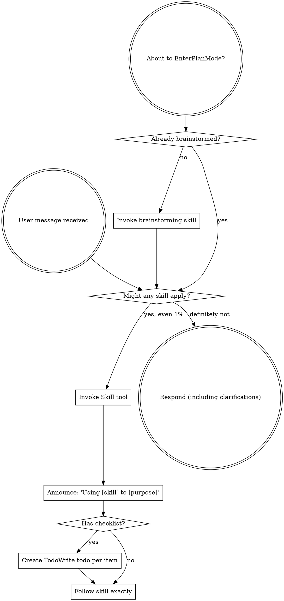

# Boundary Review — ariadne#166 (whole-issue close)

| field | value |
|-------|-------|
| issue | 166 — sdlc git lock is too long |
| repo | ariadne |
| issue file | workshop/issues/000166-sdlc-git-lock-too-long.md |
| boundary | whole-issue close |
| milestone | — |
| window | b290512127f61337811d858315b2a02eb2f076b2..HEAD |
| command | sdlc close --issue 166 |
| reviewer | codex |
| timestamp | 2026-07-07T17:03:00-07:00 |
| verdict | REWORK |

## Review

Reading additional input from stdin...
OpenAI Codex v0.142.5
--------
workdir: /Users/xianxu/workspace/ariadne
model: gpt-5.5
provider: openai
approval: never
sandbox: workspace-write [workdir, /tmp, $TMPDIR, /tmp] (network access enabled)
reasoning effort: none
reasoning summaries: none
session id: 019f3f07-5af0-7111-b505-2c05fd3fee82
--------
user
# Code review — the one SDLC boundary review

You are conducting a fresh-context code review at a development boundary —
whole-issue close — in the **ariadne** repository.

- repository: ariadne   (root: /Users/xianxu/workspace/ariadne)
- issue:      ariadne#166   (file: workshop/issues/000166-sdlc-git-lock-too-long.md)
- window:     Base: b290512127f61337811d858315b2a02eb2f076b2   Head: HEAD

Review the **ariadne** repo and its tracker — the ariadne base-layer repo itself (changes here propagate to dependent repos). Do not assume any
other repository or apply another repo's conventions.

You have no prior session context — that is the anti-collusion property. Verify
behavior against the issue's documented Spec/Plan and the code itself; do NOT
take the implementor's word in commit messages or docs at face value. Tools are
read-only: report findings precisely; the main agent (which has session context)
applies the fixes, commits, and re-runs.

Read the diff against the issue's Spec + Plan, then work the checklist below.
Categorize every finding by severity — not everything is Critical; a nitpick
marked Critical is noise.

  Critical (must fix before crossing the boundary)
    - correctness bugs; crashes / panics on unexpected input
    - behavior drift from stated contracts (for ports of existing code where
      byte-faithfulness was promised, diff against the source)
    - silent error swallowing where the source raised
  Important (fix before the boundary if cheap)
    - API design of newly-introduced internal packages (downstream work will
      consume them; is the surface stable?)
    - missing test coverage that would catch the kind of bug shipped
    - inconsistent error handling across the diff
  Minor (note for future)
    - style nits, naming, comment density; performance only if hot-path

## Review checklist

Code quality
  - Clean separation of concerns; edge cases handled (empty / nil / unexpected).
  - Proper error handling — no silent swallowing where the source raised.
  - No duplicated logic / copy-paste that should be a shared helper.

Testing
  - Tests pin real logic, not mocks reasserting the implementation.
  - The kind of bug this diff could ship is covered.
  - PURE entities tested without IO; INTEGRATION via injected fakes (see below).

Requirements traceability
  - Every Plan checklist item this boundary claims is actually delivered.
  - Implementation matches the Spec; no undeclared scope creep.
  - Breaking changes documented.

Production readiness
  - Migration / backward-compatibility considered where state or formats change.
  - Docs / atlas updated for new surface (see the Docs update gate).

## Core concepts cross-check (if the plan has a Core concepts table)

The plan should list entities in a greppable table — name, kind
(PURE/INTEGRATION), file location, status (new/modified/deleted). For each row:
  - Verify the entity exists at the stated path (grep the diff or filesystem).
  - PURE: tests run without IO (no exec, net, mutable fs). If tests need mocks
    to run, it isn't really PURE — flag Critical and recommend promoting it to
    INTEGRATION.
  - INTEGRATION: injected into pure callers, not invoked directly from business
    logic.
  - "modified" / "deleted": the diff shows the expected change/removal at the
    stated location.
Any contradiction between table and code = Critical finding, plus a plan-revision
recommendation (a "## Revisions" entry so the plan stops claiming what the code
doesn't deliver).

## Docs update gate (atlas + README, per AGENTS.md §8)

The boundary should update user-facing docs for any new surface introduced:

  - **atlas/** — new architectural surface, flow, or terminology. Scan the diff
    for new entity types, subcommands, conventions, file-tree locations. Any
    present without corresponding atlas/ changes in the same range = Important
    finding ("atlas update appears missing for <surface>").
  - **README.md** — new user-facing surface a reader runs or types: subcommands,
    flags, keybindings, config keys, install/usage steps. If the diff adds or
    changes such surface and README.md is not updated in the same range =
    Important finding ("README update appears missing for <surface>"). This is the
    class of gap that used to surface only at the merge-time `specs` judge (#142);
    catch it here, at the earliest gate, before the close verdict is recorded.

## Architecture (the at-review backstop — these matter most long-term)

Work through each of ARCH-DRY, ARCH-PURE, ARCH-PURPOSE explicitly, applying its at-review lens. The
full principle definitions are delivered in the ARCHITECTURE PRINCIPLES block
right after this prompt — for EACH marker, state pass or flag, and cite the
marker (e.g. ARCH-DRY) in any finding. Architecture is where review has the
least training signal and the longest-delayed payoff, so be deliberate here, not
holistic.

## Verdict + output

Begin your response with this fenced verdict block — the machine-read handoff:

```verdict
verdict: <SHIP | FIX-THEN-SHIP | REWORK>
confidence: <high | medium | low>
```

  SHIP           ready; ship it
  FIX-THEN-SHIP  ship after addressing the findings (non-blocking at the gate)
  REWORK         blocking; needs rework before shipping — fix + re-run

The fenced ```` ```verdict ```` block above is the **authoritative machine-read
handoff** — emit it as the first thing in your response. (A prose
`VERDICT: <TOKEN>` first line still satisfies the legacy contract as a fallback,
but the block is what the binary trusts.)

After the verdict block: a 1-paragraph summary — what worked, what blocks SHIP if
it isn't — followed by:
  1. Strengths: 2-5 specific things done well (file:line where useful). Affirm
     validated approaches so the operator knows what's confirmed-good ground.
     Empty acceptable for trivial boundaries.
  2. Critical findings (file:line + fix sketch); empty if none.
  3. Important findings (same format).
  4. Minor findings (terse one-liners).
  5. Test coverage notes.
  6. Architectural notes for upcoming work.
  7. Plan revision recommendations: specific "## Revisions" entries the plan
     needs (empty if the plan still matches the code).


ARCHITECTURE PRINCIPLES — work through each of the 3 entries below explicitly, applying its `at-review` lens; cite the marker (e.g. ARCH-DRY) in any finding.

# Architecture principles (ARCH-*)

Injected architectural taste — the structural decisions whose payoff (or cost)
shows up many turns, often months, down the road. Agents are strong at local
tactics and weak here, so these are checked **at-plan** (when the design is being
made — highest leverage) and **at-review** (backstop, on the diff). Cite the
marker (e.g. `ARCH-DRY`) in plans, `## Log` entries, and review findings.

This file is the single source; it is embedded into the planning, plan-quality,
and code-review prompts. The human narrative lives in AGENTS.md "Core Design
Principles"; this is its machine-delivered companion.

## ARCH-DRY — Don't Repeat Yourself

- **principle:** Reuse before adding. One source of truth per fact/behavior; no
  duplicated logic, copy-pasted blocks, or parallel functions that should be one
  shared helper.
- **at-plan:** Flag a plan that re-implements something the codebase already has,
  or that will obviously duplicate logic across the new files instead of
  extracting a shared helper. Name the existing thing it should reuse.
- **at-review:** Flag duplicated logic / copy-pasted blocks / near-identical
  functions in the diff; point at the consolidation (file:line + the shared
  helper they should become).

## ARCH-PURE — Pure core, thin IO shell

- **principle:** The majority of code is pure functions (deterministic, no side
  effects); a thin "glue" layer at the boundary touches IO/UI/network/clock. Pure
  functions are unit-tested directly; the glue is kept small and injected.
- **at-plan:** Flag a design that buries business logic inside IO/handlers, or
  that will only be testable with heavy mocks (a sign logic isn't separated from
  IO). The plan should name what's pure vs the thin IO seam.
- **at-review:** Flag business logic mixed with IO in the diff; logic that should
  be a pure function injected into a thin caller. If a test needs mocks to run a
  "pure" entity, it isn't pure — recommend extracting the IO to the boundary.

## ARCH-PURPOSE — Serve the issue's actual purpose

- **principle:** Deliver the issue's stated purpose, not the easy subset of it. A
  single-source / "compiled to consumers" change is not done until **every
  consumer derives** from the source — the source is *enforced*, not just
  documentation a surface happens to restate; a hand-maintained restatement of the
  model is a deferred consumer, not a finished one. "Follow-up" is for separable
  extensions, never for the thing that is the point. This is the *opposite axis*
  from Simplicity-First/YAGNI: not "build for an imagined future," but "don't
  **under**-deliver the purpose you already committed to."
- **at-plan:** Flag a plan whose scope is a strict subset of the issue's stated
  goal / Done-when where the part deferred as "follow-up" *is* the purpose (e.g.
  wires one consumer + enforcement but leaves the consumers that motivated the
  issue as documentation that doesn't derive). Ask: does the plan fulfill the
  purpose, or just the cheap win? Name the deferred purpose.
- **at-review:** Does the diff *fulfill* the purpose or settle for the easy win?
  For a single-source change, run the **shadow-sweep** — enumerate the consumers,
  confirm each derives from the source, flag any remaining hand-maintained
  restatement of the model. A "follow-up" that is actually the deferred point of
  the issue is a finding, not a deferral.


OUTPUT CONTRACT (machine-read — do not deviate). LEAD your response with the
fenced ```verdict block shown above — that is the authoritative handoff the binary
reads (its `verdict:` value is one of the listed tokens). Everything after the block
is advisory: a non-blocking verdict WITH findings still PASSES the gate. A bare
`VERDICT: <TOKEN>` line is accepted only as a FALLBACK when the block is absent.

Diff:
diff --git a/atlas/workflow/sdlc-binary.md b/atlas/workflow/sdlc-binary.md
index 2d51dab..79b54f7 100644
--- a/atlas/workflow/sdlc-binary.md
+++ b/atlas/workflow/sdlc-binary.md
@@ -54,9 +54,10 @@ documented in prose by `sdlc issue --help`.
 ## Repo transaction lock (#132)
 
 Mutating `sdlc` verbs are serialized by an SDLC-owned local transaction lock at
-`.git/sdlc.lock`. The lock covers the whole command transaction, not just
-individual Git calls: issue ID allocation, issue/status file writes, commits,
-branch changes, local archive moves, and pushes all run under the same holder.
+`.git/sdlc.lock`. Most mutating verbs hold the lock for the whole command
+transaction, not just individual Git calls: issue ID allocation, issue/status
+file writes, commits, branch changes, local archive moves, and pushes all run
+under the same holder.
 The lock directory is created atomically with `mkdir`; holder metadata lives in
 `meta.json` inside the directory and records pid, hostname, cwd, command, argv,
 and start time.
@@ -78,8 +79,11 @@ the issue namespace, object store, and remote refs that the motivating races
 touched. The lock does not serialize another clone or machine, so remote
 push/ref races still surface through the existing push/merge retry guidance.
 
-`change-code`, `close`, `milestone-close`, `merge`, and `push` may hold the lock
-while synchronous judges run. Their wait/timeout messages call this out as a
+`close` and `milestone-close` are narrower: they lock the compute phase, release
+the lock while the external boundary review runs, then reacquire before
+finalization and refuse to write if HEAD or the issue file changed while the lock
+was released. `change-code`, `merge`, and `push` may still hold the lock while
+synchronous judges run. Their wait/timeout messages call this out as a
 long-running review/ship transaction; quick commands should wait or retry
 instead of deleting a live lock. Recovery is conservative but not wedging:
 `die()` drains the active lock cleanup registry before `os.Exit`, missing
@@ -506,7 +510,10 @@ read-only `computeClose` (all gates + composes the new issue/project text → a
 Full-issue close and milestone-close both **compute → review → finalize**: the
 boundary review runs against the *un-mutated* working tree (the reviewer reads the
 honest `status: working` issue), and `applyClose` fires only on a **finalizing**
-verdict via the shared `reviewThenFinalize`. `closeVerdictOutcome` derives from
+verdict via the shared finalization helper. The command path releases
+`.git/sdlc.lock` while the external review subprocess runs, then reacquires and
+checks that HEAD and the issue file still match the reviewed snapshot before
+writing. `closeVerdictOutcome` derives from
 `vocab.Verdict()` (#147): finalizing (SHIP/FIX-THEN-SHIP) → finalize; blocking
 (REWORK) → **not finalized**, issue left `working`, non-zero exit, "fix + re-run"
 (no `--no-reclose-guard` needed on the rerun since it never went `done`);
diff --git a/cmd/sdlc/close.go b/cmd/sdlc/close.go
index 0745079..cf84514 100644
--- a/cmd/sdlc/close.go
+++ b/cmd/sdlc/close.go
@@ -110,7 +110,7 @@ func (f *closeFlags) skip(gate string) bool {
 func NewCloseCmd() *cobra.Command {
 	var f closeFlags
 
-	cmd := markMutatingCommand(&cobra.Command{
+	cmd := markManualLockCommand(&cobra.Command{
 		Use:   "close",
 		Short: "Close an issue or milestone (records ACTUAL + VERIFIED, mutates issue + project files)",
 		Long: "Performs AGENTS.md §5's mechanical closing steps for an issue or " +
@@ -124,7 +124,7 @@ func NewCloseCmd() *cobra.Command {
 		Args: cobra.NoArgs,
 		RunE: func(cmd *cobra.Command, args []string) error {
 			f.AgentExplicit = cmd.Flags().Changed("agent")
-			return runCloseWithReview(cmd.OutOrStdout(), cmd.ErrOrStderr(), &f)
+			return runCloseWithReviewLocked(cmd, cmd.OutOrStdout(), cmd.ErrOrStderr(), &f)
 		},
 	})
 
@@ -845,6 +845,39 @@ func runCloseWithReview(stdout, stderr io.Writer, f *closeFlags) error {
 	})
 }
 
+func runCloseWithReviewLocked(cmd *cobra.Command, stdout, stderr io.Writer, f *closeFlags) error {
+	if f.Milestone != "" || f.skip("judge") || f.DryRun {
+		return withRequiredRepoTransactionLock(cmd, func() error {
+			return runCloseWithReview(stdout, stderr, f)
+		})
+	}
+
+	var r closeResult
+	var base, baseLong, head string
+	var snapshot closeReviewSnapshot
+	if err := withRequiredRepoTransactionLock(cmd, func() error {
+		r = computeClose(stderr, f)
+		base, baseLong, head = resolveReviewWindow(strconv.Itoa(f.Issue), "", "")
+		snapshot = captureCloseReviewSnapshot(r)
+		return nil
+	}); err != nil {
+		return err
+	}
+
+	return reviewThenFinalizeLocked(cmd, stdout, stderr, f, r, boundaryReviewParams{
+		Label:         "#" + strconv.Itoa(f.Issue),
+		Base:          base,
+		BaseLong:      baseLong,
+		Head:          head,
+		IssuesDir:     f.IssuesDir,
+		Agent:         f.Agent,
+		AgentExplicit: f.AgentExplicit,
+		IssueNum:      f.Issue,
+		Milestone:     "",
+		PlansDir:      envOr("WF_PLANS_DIR", "workshop/plans"),
+	}, snapshot)
+}
+
 // closeOutcome is what the boundary verdict tells close to do (#139).
 type closeOutcome int
 
@@ -902,13 +935,43 @@ func rerunCmd(issueStr, milestone, actualArg string) string {
 // trailer for the record, and returns a non-nil error.
 func reviewThenFinalize(stdout, stderr io.Writer, f *closeFlags, r closeResult, p boundaryReviewParams) error {
 	review := dispatchBoundaryReview(stdout, stderr, p)
+	return finalizeBoundaryReview(stdout, stderr, f, r, review, p, nil)
+}
+
+func reviewThenFinalizeLocked(cmd *cobra.Command, stdout, stderr io.Writer, f *closeFlags, r closeResult, p boundaryReviewParams, snapshot closeReviewSnapshot) error {
+	dispatchParams := p
+	dispatchParams.PlansDir = "" // sidecar is a repo write; persist it after reacquiring the lock.
+	review := dispatchBoundaryReview(stdout, stderr, dispatchParams)
+	return withRequiredRepoTransactionLock(cmd, func() error {
+		return finalizeBoundaryReview(stdout, stderr, f, r, review, p, snapshot.validate)
+	})
+}
+
+func finalizeBoundaryReview(stdout, stderr io.Writer, f *closeFlags, r closeResult, review reviewResult, p boundaryReviewParams, validate func() error) error {
 	kind := "close"
 	if f.Milestone != "" {
 		kind = "milestone-close"
 	}
+	if review.Output != "" && review.SidecarPath == "" && p.PlansDir != "" {
+		p.Agent = review.Agent
+		if path, werr := writeReviewSidecar(p, string(review.Verdict), review.Output, nowRFC3339()); werr != nil {
+			cwarn(stderr, fmt.Sprintf("review sidecar not written: %v", werr))
+		} else {
+			review.SidecarPath = path
+			cok(stderr, "review sidecar: "+path)
+		}
+	}
 	verb := closeVerb(f.Milestone)
 	switch closeVerdictOutcome(review.Verdict) {
 	case closeFinalize:
+		if validate != nil {
+			if err := validate(); err != nil {
+				emitTrailerBlock(stdout, review, kind)
+				cwarn(stderr, fmt.Sprintf("boundary review: reviewed state changed while the lock was released — close NOT finalized: %v", err))
+				cwarn(stderr, fmt.Sprintf("re-run `%s` so the review covers the current repo state", verb))
+				return fmt.Errorf("boundary review stale: %w", err)
+			}
+		}
 		applyClose(stderr, f, r)
 		emitTrailerBlock(stdout, review, kind)
 		if err := annotateLogLineWithVerdict(f.IssuesDir, f.Issue, f.Milestone, review.Verdict); err != nil {
@@ -932,6 +995,42 @@ func reviewThenFinalize(stdout, stderr io.Writer, f *closeFlags, r closeResult,
 	}
 }
 
+type closeReviewSnapshot struct {
+	head      string
+	issuePath string
+	issueText string
+}
+
+func captureCloseReviewSnapshot(r closeResult) closeReviewSnapshot {
+	return closeReviewSnapshot{
+		head:      strings.TrimSpace(gitx.Capture("rev-parse", "HEAD")),
+		issuePath: r.issuePath,
+		issueText: r.issueText,
+	}
+}
+
+func (s closeReviewSnapshot) validate() error {
+	if s.head != "" {
+		currentHead := strings.TrimSpace(gitx.Capture("rev-parse", "HEAD"))
+		if currentHead == "" {
+			return fmt.Errorf("cannot resolve HEAD")
+		}
+		if currentHead != s.head {
+			return fmt.Errorf("HEAD changed from %s to %s", shortSHA(s.head), shortSHA(currentHead))
+		}
+	}
+	if s.issuePath != "" {
+		data, err := os.ReadFile(s.issuePath)
+		if err != nil {
+			return fmt.Errorf("read %s: %w", s.issuePath, err)
+		}
+		if string(data) != s.issueText {
+			return fmt.Errorf("%s changed", s.issuePath)
+		}
+	}
+	return nil
+}
+
 // finishBoundaryReview emits the close trailer and mirrors the verdict into the
 // issue's close log line — for BOTH the dispatched and the --no-judge/not-run
 // paths, matching milestone-close's behavior (which annotates even when the judge
diff --git a/cmd/sdlc/close_finalize_test.go b/cmd/sdlc/close_finalize_test.go
index 457fa1f..834812e 100644
--- a/cmd/sdlc/close_finalize_test.go
+++ b/cmd/sdlc/close_finalize_test.go
@@ -4,8 +4,11 @@ import (
 	"context"
 	"errors"
 	"io"
+	"os"
+	"path/filepath"
 	"strings"
 	"testing"
+	"time"
 
 	"github.com/xianxu/ariadne/cmd/sdlc/internal/judge"
 )
@@ -35,6 +38,159 @@ func closeFlagsFor(issuesDir string) *closeFlags {
 		IssuesDir: issuesDir, BrainDir: "../nonexistent-brain"}
 }
 
+func TestCloseCommands_IssueChangedDuringBoundaryReview_DoesNotFinalize(t *testing.T) {
+	cases := []struct {
+		name      string
+		args      func(string) []string
+		forbidden []string
+		wantErr   string
+		wantStays string
+	}{
+		{
+			name: "close",
+			args: func(issuesDir string) []string {
+				return []string{"close", "--issue", "69", "--actual", "1", "--verified", "tests pass", "--no-atlas", "--issues-dir", issuesDir, "--brain-dir", "../nonexistent-brain"}
+			},
+			forbidden: []string{"status: codecomplete", "closed — tests pass", "actual_hours: 1"},
+			wantErr:   "boundary review stale",
+			wantStays: "status: working",
+		},
+		{
+			name: "milestone-close",
+			args: func(issuesDir string) []string {
+				return []string{"milestone-close", "--issue", "69", "--milestone", "M1", "--actual", "1", "--verified", "tests pass", "--no-atlas", "--issues-dir", issuesDir, "--brain-dir", "../nonexistent-brain"}
+			},
+			forbidden: []string{"closed M1 — tests pass"},
+			wantErr:   "boundary review stale",
+			wantStays: "status: working",
+		},
+	}
+	for _, tc := range cases {
+		t.Run(tc.name, func(t *testing.T) {
+			issuesDir := closeRepo(t, 69)
+			started := make(chan struct{})
+			releaseReview := make(chan struct{})
+			orig := judge.Run
+			t.Cleanup(func() { judge.Run = orig })
+			judge.Run = func(ctx context.Context, onStart func(pid int), name string, args ...string) ([]byte, error) {
+				close(started)
+				<-releaseReview
+				return []byte("VERDICT: SHIP (confidence: high)\n\nLooks good.\n"), nil
+			}
+
+			done := make(chan struct {
+				stdout string
+				err    error
+			}, 1)
+			go func() {
+				stdout, _, err := executeSDLCTestCommand(tc.args(issuesDir)...)
+				done <- struct {
+					stdout string
+					err    error
+				}{stdout: stdout, err: err}
+			}()
+
+			waitForSignal(t, started, "boundary review to start")
+			issuePath := filepath.Join(issuesDir, "000069-x.md")
+			f, err := os.OpenFile(issuePath, os.O_APPEND|os.O_WRONLY, 0)
+			if err != nil {
+				t.Fatalf("open issue for concurrent edit: %v", err)
+			}
+			if _, err := f.WriteString("\nconcurrent operator note\n"); err != nil {
+				_ = f.Close()
+				t.Fatalf("write concurrent edit: %v", err)
+			}
+			if err := f.Close(); err != nil {
+				t.Fatalf("close concurrent edit: %v", err)
+			}
+			close(releaseReview)
+
+			var got struct {
+				stdout string
+				err    error
+			}
+			select {
+			case got = <-done:
+			case <-time.After(2 * time.Second):
+				t.Fatal("timeout waiting for stale close command")
+			}
+			if got.err == nil || !strings.Contains(got.err.Error(), tc.wantErr) {
+				t.Fatalf("%s should return stale-review error, got %v", tc.name, got.err)
+			}
+			if !strings.Contains(got.stdout, "Review-Verdict: SHIP") {
+				t.Fatalf("%s should emit review trailer without finalizing:\n%s", tc.name, got.stdout)
+			}
+			text := readIssue(t, issuesDir)
+			if !strings.Contains(text, tc.wantStays) {
+				t.Fatalf("%s should leave issue working:\n%s", tc.name, text)
+			}
+			if !strings.Contains(text, "concurrent operator note") {
+				t.Fatalf("%s should preserve concurrent edit:\n%s", tc.name, text)
+			}
+			for _, forbidden := range tc.forbidden {
+				if strings.Contains(text, forbidden) {
+					t.Fatalf("%s finalized stale state; found %q:\n%s", tc.name, forbidden, text)
+				}
+			}
+		})
+	}
+}
+
+func TestCloseCommand_HEADChangedDuringBoundaryReview_DoesNotFinalize(t *testing.T) {
+	issuesDir := closeRepo(t, 69)
+	started := make(chan struct{})
+	releaseReview := make(chan struct{})
+	orig := judge.Run
+	t.Cleanup(func() { judge.Run = orig })
+	judge.Run = func(ctx context.Context, onStart func(pid int), name string, args ...string) ([]byte, error) {
+		close(started)
+		<-releaseReview
+		return []byte("VERDICT: SHIP (confidence: high)\n\nLooks good.\n"), nil
+	}
+
+	done := make(chan struct {
+		stdout string
+		err    error
+	}, 1)
+	go func() {
+		stdout, _, err := executeSDLCTestCommand("close", "--issue", "69", "--actual", "1", "--verified", "tests pass", "--no-atlas", "--issues-dir", issuesDir, "--brain-dir", "../nonexistent-brain")
+		done <- struct {
+			stdout string
+			err    error
+		}{stdout: stdout, err: err}
+	}()
+
+	waitForSignal(t, started, "boundary review to start")
+	if err := os.WriteFile("other.txt", []byte("new head\n"), 0o644); err != nil {
+		t.Fatalf("write concurrent file: %v", err)
+	}
+	git(t, "", "add", "other.txt")
+	git(t, "", "commit", "-q", "-m", "concurrent #69 side change")
+	close(releaseReview)
+
+	var got struct {
+		stdout string
+		err    error
+	}
+	select {
+	case got = <-done:
+	case <-time.After(2 * time.Second):
+		t.Fatal("timeout waiting for stale HEAD close command")
+	}
+	if got.err == nil || !strings.Contains(got.err.Error(), "boundary review stale") {
+		t.Fatalf("close should return stale-review error, got %v", got.err)
+	}
+	if !strings.Contains(got.stdout, "Review-Verdict: SHIP") {
+		t.Fatalf("close should emit review trailer without finalizing:\n%s", got.stdout)
+	}
+	text := readIssue(t, issuesDir)
+	for _, forbidden := range []string{"status: codecomplete", "closed — tests pass", "actual_hours: 1"} {
+		if strings.Contains(text, forbidden) {
+			t.Fatalf("close finalized stale HEAD; found %q:\n%s", forbidden, text)
+		}
+	}
+}
+
 // #160 Q4: the lessons reminder moved from the publish gate to `sdlc close` — a
 // finalizing whole-issue close emits it (agent engaged, findings fresh); a
 // non-finalizing (REWORK) close does not.
diff --git a/cmd/sdlc/closereview_test.go b/cmd/sdlc/closereview_test.go
index f8d045c..1da61d9 100644
--- a/cmd/sdlc/closereview_test.go
+++ b/cmd/sdlc/closereview_test.go
@@ -8,8 +8,11 @@ import (
 	"os/exec"
 	"path/filepath"
 	"strings"
+	"sync"
 	"testing"
+	"time"
 
+	"github.com/spf13/cobra"
 	"github.com/xianxu/ariadne/cmd/sdlc/internal/judge"
 )
 
@@ -94,6 +97,127 @@ func stubJudgeCommand(t *testing.T, output string) (*int, *string) {
 	return &calls, &lastName
 }
 
+func TestCloseCommandsReleaseLockDuringBoundaryReview(t *testing.T) {
+	cases := []struct {
+		name string
+		args func(string) []string
+	}{
+		{
+			name: "close",
+			args: func(issuesDir string) []string {
+				return []string{"close", "--issue", "69", "--actual", "1", "--verified", "tests pass", "--no-atlas", "--issues-dir", issuesDir, "--brain-dir", "../nonexistent-brain"}
+			},
+		},
+		{
+			name: "milestone-close",
+			args: func(issuesDir string) []string {
+				return []string{"milestone-close", "--issue", "69", "--milestone", "M1", "--actual", "1", "--verified", "tests pass", "--no-atlas", "--issues-dir", issuesDir, "--brain-dir", "../nonexistent-brain"}
+			},
+		},
+	}
+	for _, tc := range cases {
+		t.Run(tc.name, func(t *testing.T) {
+			issuesDir := closeRepo(t, 69)
+			lock := newObservedRepoLock()
+			restore := stubRepoLockAcquire(t, lock.acquire)
+			defer restore()
+
+			started := make(chan struct{})
+			releaseReview := make(chan struct{})
+			orig := judge.Run
+			t.Cleanup(func() { judge.Run = orig })
+			judge.Run = func(ctx context.Context, onStart func(pid int), name string, args ...string) ([]byte, error) {
+				close(started)
+				<-releaseReview
+				return []byte("VERDICT: SHIP (confidence: high)\n\nLooks good.\n"), nil
+			}
+
+			done := make(chan error, 1)
+			go func() {
+				_, _, err := executeSDLCTestCommand(tc.args(issuesDir)...)
+				done <- err
+			}()
+
+			waitForSignal(t, started, "boundary review to start")
+			if held := lock.held(); held != 0 {
+				close(releaseReview)
+				t.Fatalf("repo lock held during %s boundary review: held=%d events=%v", tc.name, held, lock.events())
+			}
+			close(releaseReview)
+			if err := waitForErr(t, done, tc.name+" command"); err != nil {
+				t.Fatalf("%s command returned error: %v", tc.name, err)
+			}
+			if got := lock.acquireCount(); got < 2 {
+				t.Fatalf("%s should acquire for compute and finalization, got %d events=%v", tc.name, got, lock.events())
+			}
+		})
+	}
+}
+
+type observedRepoLock struct {
+	mu       sync.Mutex
+	heldNow  int
+	acquired int
+	eventLog []string
+}
+
+func newObservedRepoLock() *observedRepoLock {
+	return &observedRepoLock{}
+}
+
+func (l *observedRepoLock) acquire(cmd *cobra.Command) (func() error, error) {
+	l.mu.Lock()
+	l.heldNow++
+	l.acquired++
+	l.eventLog = append(l.eventLog, "acquire "+cmd.CommandPath())
+	l.mu.Unlock()
+	return func() error {
+		l.mu.Lock()
+		defer l.mu.Unlock()
+		l.heldNow--
+		l.eventLog = append(l.eventLog, "release "+cmd.CommandPath())
+		return nil
+	}, nil
+}
+
+func (l *observedRepoLock) held() int {
+	l.mu.Lock()
+	defer l.mu.Unlock()
+	return l.heldNow
+}
+
+func (l *observedRepoLock) acquireCount() int {
+	l.mu.Lock()
+	defer l.mu.Unlock()
+	return l.acquired
+}
+
+func (l *observedRepoLock) events() []string {
+	l.mu.Lock()
+	defer l.mu.Unlock()
+	return append([]string(nil), l.eventLog...)
+}
+
+func waitForSignal(t *testing.T, ch <-chan struct{}, label string) {
+	t.Helper()
+	select {
+	case <-ch:
+	case <-time.After(2 * time.Second):
+		t.Fatalf("timeout waiting for %s", label)
+	}
+}
+
+func waitForErr(t *testing.T, ch <-chan error, label string) error {
+	t.Helper()
+	select {
+	case err := <-ch:
+		return err
+	case <-time.After(2 * time.Second):
+		t.Fatalf("timeout waiting for %s", label)
+		return nil
+	}
+}
+
 // #69 (load-bearing invariant): a standalone full-issue close auto-dispatches
 // exactly one boundary review on the whole-issue window and emits its trailer.
 func TestRunCloseWithReview_IssueClose_Dispatches(t *testing.T) {
diff --git a/cmd/sdlc/helptext/root.md b/cmd/sdlc/helptext/root.md
index 6ba0b28..3c7d586 100644
--- a/cmd/sdlc/helptext/root.md
+++ b/cmd/sdlc/helptext/root.md
@@ -36,9 +36,12 @@ LOCAL REPO TRANSACTION LOCK
     branches, or pushing. The lock is local to the Git common dir, so linked
     worktrees of the same repo serialize with each other.
   - Wait messages identify the holder pid and command when metadata is
-    available. `change-code`, `close`, `milestone-close`, `merge`, and `push`
-    can hold the lock during long-running review/ship transactions; wait or
-    retry rather than removing the lock while that process is alive.
+    available. `close` and `milestone-close` release the lock while the external
+    boundary-review subprocess runs, then reacquire before finalization; if HEAD
+    or the issue file changed meanwhile, they refuse to finalize and tell you to
+    rerun. `change-code`, `merge`, and `push` can still hold the lock during
+    long-running review/ship transactions; wait or retry rather than removing
+    the lock while that process is alive.
   - A dead same-host holder is reclaimed automatically; initializing metadata
     is waited through. Other stale/timeout errors tell you how to inspect
     `.git/sdlc.lock`. Remote push/ref races are separate: the local lock
diff --git a/cmd/sdlc/milestoneclose.go b/cmd/sdlc/milestoneclose.go
index 8840b08..c48a9dd 100644
--- a/cmd/sdlc/milestoneclose.go
+++ b/cmd/sdlc/milestoneclose.go
@@ -65,11 +65,13 @@ type reviewResult struct {
 	Head        string // short SHA ("HEAD" fine in dry-run)
 	BaseLong    string // long SHA, used by trailer-verifier lookups in close
 	SidecarPath string // #136: durable review transcript path ("" when no review ran)
+	Output      string // full review body, retained when sidecar writing is deferred
+	Agent       string // resolved reviewer CLI, retained for deferred sidecar metadata
 }
 
 func NewMilestoneCloseCmd() *cobra.Command {
 	f := milestoneCloseFlags{}
-	cmd := markMutatingCommand(&cobra.Command{
+	cmd := markManualLockCommand(&cobra.Command{
 		Use:           "milestone-close",
 		Short:         "Close one milestone of an issue + auto-dispatch post-milestone review (AGENTS.md §3)",
 		Long:          "Placeholder — replaced by helptext.MustGet(\"milestone-close\") in main.go.",
@@ -77,7 +79,7 @@ func NewMilestoneCloseCmd() *cobra.Command {
 		SilenceErrors: true,
 		RunE: func(cmd *cobra.Command, args []string) error {
 			f.AgentExplicit = cmd.Flags().Changed("agent")
-			return runMilestoneClose(cmd.OutOrStdout(), cmd.ErrOrStderr(), &f)
+			return runMilestoneCloseLocked(cmd, cmd.OutOrStdout(), cmd.ErrOrStderr(), &f)
 		},
 	})
 	cmd.Flags().IntVar(&f.Issue, "issue", 0, "ariadne workshop issue ID (required, positive)")
@@ -101,17 +103,8 @@ func NewMilestoneCloseCmd() *cobra.Command {
 	return cmd
 }
 
-func runMilestoneClose(stdout, stderr io.Writer, f *milestoneCloseFlags) error {
-	if f.Milestone == "" {
-		die(stderr, "--milestone is required for milestone-close (use `sdlc close` without it for full-issue close)")
-	}
-	if f.Issue <= 0 {
-		die(stderr, fmt.Sprintf("--issue is required and must be positive (got %d)", f.Issue))
-	}
-
-	// Step 1: build the closeFlags for the mechanical close (computed below via
-	// computeClose — #139's compute→review→finalize; NOT runClose, which is test-only).
-	closeF := &closeFlags{
+func (f *milestoneCloseFlags) closeFlags() *closeFlags {
+	return &closeFlags{
 		Issue:         f.Issue,
 		Milestone:     f.Milestone,
 		Actual:        f.Actual,
@@ -130,6 +123,19 @@ func runMilestoneClose(stdout, stderr io.Writer, f *milestoneCloseFlags) error {
 		NoPlanCheck:   f.NoPlanCheck,
 		NoProject:     f.NoProject,
 	}
+}
+
+func runMilestoneClose(stdout, stderr io.Writer, f *milestoneCloseFlags) error {
+	if f.Milestone == "" {
+		die(stderr, "--milestone is required for milestone-close (use `sdlc close` without it for full-issue close)")
+	}
+	if f.Issue <= 0 {
+		die(stderr, fmt.Sprintf("--issue is required and must be positive (got %d)", f.Issue))
+	}
+
+	// Step 1: build the closeFlags for the mechanical close (computed below via
+	// computeClose — #139's compute→review→finalize; NOT runClose, which is test-only).
+	closeF := f.closeFlags()
 	// Step 1: COMPUTE the mechanical close — write NOTHING yet (#139). The review
 	// runs against the un-mutated tree; applyClose fires only after a finalizing
 	// verdict, so a REWORK/unexpected milestone review leaves nothing written.
@@ -180,6 +186,44 @@ func runMilestoneClose(stdout, stderr io.Writer, f *milestoneCloseFlags) error {
 	})
 }
 
+func runMilestoneCloseLocked(cmd *cobra.Command, stdout, stderr io.Writer, f *milestoneCloseFlags) error {
+	if f.Milestone == "" || f.Issue <= 0 || f.NoJudge || f.Force || f.DryRun {
+		return withRequiredRepoTransactionLock(cmd, func() error {
+			return runMilestoneClose(stdout, stderr, f)
+		})
+	}
+
+	closeF := f.closeFlags()
+	var r closeResult
+	var base, baseLong, head string
+	var snapshot closeReviewSnapshot
+	if err := withRequiredRepoTransactionLock(cmd, func() error {
+		r = computeClose(stderr, closeF)
+		issuePath, perr := issueFilePath(f.IssuesDir, f.Issue)
+		if perr != nil {
+			cwarn(stderr, fmt.Sprintf("resolve issue file for review window: %v", perr))
+		}
+		base, baseLong, head = resolveReviewWindow(strconv.Itoa(f.Issue), f.Milestone, issuePath)
+		snapshot = captureCloseReviewSnapshot(r)
+		return nil
+	}); err != nil {
+		return err
+	}
+
+	return reviewThenFinalizeLocked(cmd, stdout, stderr, closeF, r, boundaryReviewParams{
+		Label:         fmt.Sprintf("#%d %s", f.Issue, f.Milestone),
+		Base:          base,
+		BaseLong:      baseLong,
+		Head:          head,
+		IssuesDir:     f.IssuesDir,
+		Agent:         f.Agent,
+		AgentExplicit: f.AgentExplicit,
+		IssueNum:      f.Issue,
+		Milestone:     f.Milestone,
+		PlansDir:      envOr("WF_PLANS_DIR", "workshop/plans"),
+	}, snapshot)
+}
+
 // resolveReviewWindow computes the (base, baseLong, head) tuple for a
 // boundary-review window. base is short; baseLong is the full base ref (used by
 // the verifier in close.go to locate the same window in `git log`); head is
@@ -516,18 +560,20 @@ func dispatchBoundaryReview(stdout, stderr io.Writer, p boundaryReviewParams) re
 		cwarn(stderr, fmt.Sprintf("boundary review: no '%s' verdict found (block or line) — recording verdict as 'unknown'",
 			strings.Join(vocab.Verdict().Emitted(), " | ")))
 	}
-	rr := reviewResult{Verdict: verdict, Base: p.Base, Head: p.Head, BaseLong: p.BaseLong}
+	rr := reviewResult{Verdict: verdict, Base: p.Base, Head: p.Head, BaseLong: p.BaseLong, Output: output, Agent: string(agent)}
 	// Persist the full transcript to a durable sidecar (#136) so an agent can
 	// reopen it after scrollback loss / compaction. Non-fatal: the review already
 	// ran, so a write failure is warned, not propagated (matches the philosophy above).
 	// Record the RESOLVED reviewer (opts.Agent), not the raw --agent flag — the
 	// latter defaults to "" so the sidecar's reviewer cell would otherwise be empty.
 	p.Agent = string(agent)
-	if path, werr := writeReviewSidecar(p, string(verdict), output, nowRFC3339()); werr != nil {
-		cwarn(stderr, fmt.Sprintf("review sidecar not written: %v", werr))
-	} else {
-		rr.SidecarPath = path
-		cok(stderr, "review sidecar: "+path)
+	if p.PlansDir != "" {
+		if path, werr := writeReviewSidecar(p, string(verdict), output, nowRFC3339()); werr != nil {
+			cwarn(stderr, fmt.Sprintf("review sidecar not written: %v", werr))
+		} else {
+			rr.SidecarPath = path
+			cok(stderr, "review sidecar: "+path)
+		}
 	}
 	return rr
 }
diff --git a/cmd/sdlc/repolock.go b/cmd/sdlc/repolock.go
index 46c858d..84e2b9d 100644
--- a/cmd/sdlc/repolock.go
+++ b/cmd/sdlc/repolock.go
@@ -17,6 +17,8 @@ import (
 
 const repoLockAnnotation = "ariadne.sdlc.repo-lock"
 const repoLockWrappedAnnotation = "ariadne.sdlc.repo-lock-wrapped"
+const repoLockAuto = "auto"
+const repoLockManual = "manual"
 
 type repoLockContextKey struct{}
 
@@ -26,7 +28,15 @@ func markMutatingCommand(cmd *cobra.Command) *cobra.Command {
 	if cmd.Annotations == nil {
 		cmd.Annotations = map[string]string{}
 	}
-	cmd.Annotations[repoLockAnnotation] = "true"
+	cmd.Annotations[repoLockAnnotation] = repoLockAuto
+	return cmd
+}
+
+func markManualLockCommand(cmd *cobra.Command) *cobra.Command {
+	if cmd.Annotations == nil {
+		cmd.Annotations = map[string]string{}
+	}
+	cmd.Annotations[repoLockAnnotation] = repoLockManual
 	return cmd
 }
 
@@ -34,13 +44,21 @@ func commandNeedsRepoLock(cmd *cobra.Command) bool {
 	if cmd == nil {
 		return false
 	}
-	return cmd.Annotations[repoLockAnnotation] == "true"
+	mode := cmd.Annotations[repoLockAnnotation]
+	return mode == repoLockAuto || mode == repoLockManual
+}
+
+func commandAutoWrapsRepoLock(cmd *cobra.Command) bool {
+	if cmd == nil {
+		return false
+	}
+	return cmd.Annotations[repoLockAnnotation] == repoLockAuto
 }
 
 func wrapRepoLockCommands(root *cobra.Command) {
 	var walk func(*cobra.Command)
 	walk = func(cmd *cobra.Command) {
-		if cmd.RunE != nil && cmd.Annotations[repoLockWrappedAnnotation] != "true" {
+		if commandAutoWrapsRepoLock(cmd) && cmd.RunE != nil && cmd.Annotations[repoLockWrappedAnnotation] != "true" {
 			orig := cmd.RunE
 			cmd.RunE = func(c *cobra.Command, args []string) error {
 				return withRepoTransactionLock(c, func() error {
@@ -63,6 +81,10 @@ func withRepoTransactionLock(cmd *cobra.Command, run func() error) error {
 	if !commandNeedsRepoLock(cmd) {
 		return run()
 	}
+	return withRequiredRepoTransactionLock(cmd, run)
+}
+
+func withRequiredRepoTransactionLock(cmd *cobra.Command, run func() error) error {
 	ctx := cmd.Context()
 	if ctx == nil {
 		ctx = context.Background()
diff --git a/cmd/sdlc/repolock_test.go b/cmd/sdlc/repolock_test.go
index e993505..840e55d 100644
--- a/cmd/sdlc/repolock_test.go
+++ b/cmd/sdlc/repolock_test.go
@@ -35,6 +35,12 @@ func TestRepoLockCommandMetadata(t *testing.T) {
 			t.Fatalf("%v should require repo lock", path)
 		}
 	}
+	for _, path := range [][]string{{"close"}, {"milestone-close"}} {
+		cmd := mustFindCommand(t, root, path...)
+		if commandAutoWrapsRepoLock(cmd) {
+			t.Fatalf("%v should be manually lock-scoped, not whole-command wrapped", path)
+		}
+	}
 
 	readOnly := [][]string{
 		{"issue", "list"},
@@ -147,6 +153,26 @@ func TestWithRepoTransactionLockAcquiresAndReleasesMutatingCommand(t *testing.T)
 	}
 }
 
+func TestWithRequiredRepoTransactionLockAcquiresManualCommand(t *testing.T) {
+	cmd := markManualLockCommand(&cobra.Command{Use: "close"})
+	var acquired, released int
+	restore := stubRepoLockAcquire(t, func(*cobra.Command) (func() error, error) {
+		acquired++
+		return func() error {
+			released++
+			return nil
+		}, nil
+	})
+	defer restore()
+
+	if err := withRequiredRepoTransactionLock(cmd, func() error { return nil }); err != nil {
+		t.Fatalf("withRequiredRepoTransactionLock err: %v", err)
+	}
+	if acquired != 1 || released != 1 {
+		t.Fatalf("acquired/released = %d/%d, want 1/1", acquired, released)
+	}
+}
+
 func TestWithRepoTransactionLockIsContextReentrantOnly(t *testing.T) {
 	cmd := markMutatingCommand(&cobra.Command{Use: "claim"})
 	var acquired int
@@ -199,6 +225,41 @@ func TestWithRepoTransactionLockRegistersDieCleanup(t *testing.T) {
 	}
 }
 
+func TestWrapRepoLockCommandsDoesNotWrapManualLockCommand(t *testing.T) {
+	var acquired int
+	restore := stubRepoLockAcquire(t, func(*cobra.Command) (func() error, error) {
+		acquired++
+		return func() error { return nil }, nil
+	})
+	defer restore()
+
+	root := &cobra.Command{Use: "root"}
+	manualRan := false
+	manual := markManualLockCommand(&cobra.Command{
+		Use:  "close",
+		Args: cobra.NoArgs,
+		RunE: func(*cobra.Command, []string) error {
+			manualRan = true
+			return nil
+		},
+	})
+	root.AddCommand(manual)
+	wrapRepoLockCommands(root)
+	root.SetArgs([]string{"close"})
+	if err := root.Execute(); err != nil {
+		t.Fatalf("Execute manual err: %v", err)
+	}
+	if !manualRan {
+		t.Fatal("manual command did not run")
+	}
+	if acquired != 0 {
+		t.Fatalf("manual command should not be whole-command wrapped, acquired %d time(s)", acquired)
+	}
+	if !commandNeedsRepoLock(manual) {
+		t.Fatal("manual command should still be registered as needing repo lock")
+	}
+}
+
 func TestWrapRepoLockCommandsWrapsRunE(t *testing.T) {
 	var acquired int
 	restore := stubRepoLockAcquire(t, func(*cobra.Command) (func() error, error) {
diff --git a/workshop/plans/000166-sdlc-git-lock-too-long-plan.md b/workshop/plans/000166-sdlc-git-lock-too-long-plan.md
index 3489e24..ddb1b1a 100644
--- a/workshop/plans/000166-sdlc-git-lock-too-long-plan.md
+++ b/workshop/plans/000166-sdlc-git-lock-too-long-plan.md
@@ -62,17 +62,17 @@
 - Modify: `cmd/sdlc/repolock.go`
 - Modify: `cmd/sdlc/repolock_test.go`
 
-- [ ] **Step 1: Write the failing test**
+- [x] **Step 1: Write the failing test**
 
 Add a test proving a manually locked command still reports `commandNeedsRepoLock(cmd) == true` but `wrapRepoLockCommands` does not automatically acquire the lock for its whole `RunE`.
 
-- [ ] **Step 2: Run the focused test**
+- [x] **Step 2: Run the focused test**
 
 Run: `go test ./cmd/sdlc -run 'TestRepoLockManual|TestWrapRepoLockCommands' -count=1`
 
 Expected: FAIL because all marked commands are currently auto-wrapped.
 
-- [ ] **Step 3: Implement manual mode**
+- [x] **Step 3: Implement manual mode**
 
 Replace the boolean annotation value with lock modes:
 
@@ -83,7 +83,7 @@ Replace the boolean annotation value with lock modes:
 
 Refactor the common acquire/release body so `withRepoTransactionLock` and `withRequiredRepoTransactionLock` share the same implementation.
 
-- [ ] **Step 4: Run the focused lock tests**
+- [x] **Step 4: Run the focused lock tests**
 
 Run: `go test ./cmd/sdlc -run 'TestRepoLock|TestWrapRepoLockCommands' -count=1`
 
@@ -98,11 +98,11 @@ Expected: PASS.
 - Modify: `cmd/sdlc/milestoneclose.go`
 - Modify: `cmd/sdlc/repolock_test.go`
 
-- [ ] **Step 1: Write the failing command metadata test**
+- [x] **Step 1: Write the failing command metadata test**
 
 Update `TestRepoLockCommandMetadata` to assert `close` and `milestone-close` still need the repo lock but are manual-lock commands.
 
-- [ ] **Step 2: Write the failing behavioral test**
+- [x] **Step 2: Write the failing behavioral test**
 
 In `cmd/sdlc/closereview_test.go`, add a test with:
 
@@ -113,13 +113,13 @@ In `cmd/sdlc/closereview_test.go`, add a test with:
 
 The assertion: while the judge stub is blocked, the lock has been released; after the judge returns `VERDICT: SHIP`, finalization reacquires and releases the lock.
 
-- [ ] **Step 3: Run the failing tests**
+- [x] **Step 3: Run the failing tests**
 
 Run: `go test ./cmd/sdlc -run 'TestRepoLockCommandMetadata|TestCloseWithReviewReleasesLockDuringBoundaryReview' -count=1`
 
 Expected: FAIL because close/milestone-close are still whole-command wrapped.
 
-- [ ] **Step 4: Implement phase locking**
+- [x] **Step 4: Implement phase locking**
 
 Change `NewCloseCmd` and `NewMilestoneCloseCmd` to use `markManualLockCommand`.
 
@@ -130,7 +130,7 @@ Add:
 
 Keep existing direct helpers for unit tests, but make the command path use the locked variants.
 
-- [ ] **Step 5: Run focused close/repolock tests**
+- [x] **Step 5: Run focused close/repolock tests**
 
 Run: `go test ./cmd/sdlc -run 'TestRepoLock|TestRunCloseWithReview|TestRunMilestoneClose|TestCloseWithReviewReleasesLockDuringBoundaryReview' -count=1`
 
@@ -144,21 +144,21 @@ Expected: PASS.
 - Modify: `cmd/sdlc/close.go`
 - Modify: `cmd/sdlc/close_finalize_test.go`
 
-- [ ] **Step 1: Write failing tests for stale finalization**
+- [x] **Step 1: Write failing tests for stale finalization**
 
 Add tests that mutate HEAD or the issue file while the judge stub is blocked. After the stub returns a finalizing verdict, the command must return an error and must not write `status: codecomplete`, close log lines, or milestone ticks.
 
-- [ ] **Step 2: Run stale-guard tests**
+- [x] **Step 2: Run stale-guard tests**
 
 Run: `go test ./cmd/sdlc -run 'TestCloseWithReview.*ChangedDuringBoundaryReview|TestMilestoneClose.*ChangedDuringBoundaryReview' -count=1`
 
 Expected: FAIL because finalization currently trusts the pre-review `closeResult`.
 
-- [ ] **Step 3: Implement the guard**
+- [x] **Step 3: Implement the guard**
 
 Capture the reviewed HEAD SHA and original issue text before dispatch. In the finalization lock section, re-read HEAD and the issue file. If either differs, emit the review trailer for traceability, warn that the close was not finalized, and return an error instructing the operator to rerun the close.
 
-- [ ] **Step 4: Run focused tests**
+- [x] **Step 4: Run focused tests**
 
 Run: `go test ./cmd/sdlc -run 'TestRunCloseWithReview|TestRunMilestoneClose|TestCloseWithReview.*ChangedDuringBoundaryReview|TestMilestoneClose.*ChangedDuringBoundaryReview' -count=1`
 
@@ -173,23 +173,23 @@ Expected: PASS.
 - Modify: `workshop/issues/000166-sdlc-git-lock-too-long.md`
 - Modify: `workshop/plans/000166-sdlc-git-lock-too-long-plan.md`
 
-- [ ] **Step 1: Update docs**
+- [x] **Step 1: Update docs**
 
 Adjust lock prose from “close/milestone-close hold the lock during long review transactions” to “close/milestone-close release the lock during external review dispatch and reacquire before finalization.”
 
-- [ ] **Step 2: Run targeted tests**
+- [x] **Step 2: Run targeted tests**
 
 Run: `go test ./cmd/sdlc -count=1`
 
 Expected: PASS.
 
-- [ ] **Step 3: Run repository verification**
+- [x] **Step 3: Run repository verification**
 
 Run: `go test ./...`
 
 Expected: PASS.
 
-- [ ] **Step 4: Format and diff-check**
+- [x] **Step 4: Format and diff-check**
 
 Run: `gofmt -w cmd/sdlc/repolock.go cmd/sdlc/repolock_test.go cmd/sdlc/close.go cmd/sdlc/closereview_test.go cmd/sdlc/close_finalize_test.go cmd/sdlc/milestoneclose.go`
 


codex
I’ll use the required startup/workflow instructions first, then read the issue and relevant code paths before forming the boundary verdict.
exec
/bin/zsh -lc "sed -n '1,220p' /Users/xianxu/workspace/ariadne/construct/adapted/superpowers-using-superpowers/SKILL.md" in /Users/xianxu/workspace/ariadne
 succeeded in 0ms:
---
name: superpowers-using-superpowers
description: Use when starting any conversation - establishes how to find and use skills, requiring Skill tool invocation before ANY response including clarifying questions
---

<SUBAGENT-STOP>
If you were dispatched as a subagent to execute a specific task, skip this skill.
</SUBAGENT-STOP>

<EXTREMELY-IMPORTANT>
If you think there is even a 1% chance a skill might apply to what you are doing, you ABSOLUTELY MUST invoke the skill.

IF A SKILL APPLIES TO YOUR TASK, YOU DO NOT HAVE A CHOICE. YOU MUST USE IT.

This is not negotiable. This is not optional. You cannot rationalize your way out of this.
</EXTREMELY-IMPORTANT>

## Instruction Priority

> **Ariadne note:** AGENTS.md Section 3 governs subagent strategy and overrides skills that mandate subagent-driven-development as the default execution path.

Superpowers skills override default system prompt behavior, but **user instructions always take precedence**:

1. **User's explicit instructions** (CLAUDE.md, GEMINI.md, AGENTS.md, direct requests) — highest priority
2. **Superpowers skills** — override default system behavior where they conflict
3. **Default system prompt** — lowest priority

If CLAUDE.md, GEMINI.md, or AGENTS.md says "don't use TDD" and a skill says "always use TDD," follow the user's instructions. The user is in control.

## How to Access Skills

**In Claude Code:** Use the `Skill` tool. When you invoke a skill, its content is loaded and presented to you—follow it directly. Never use the Read tool on skill files.

**In Gemini CLI:** Skills activate via the `activate_skill` tool. Gemini loads skill metadata at session start and activates the full content on demand.

**In other environments:** Check your platform's documentation for how skills are loaded.

## Platform Adaptation

Skills use Claude Code tool names. Non-CC platforms: see `references/codex-tools.md` (Codex) for tool equivalents. Gemini CLI users get the tool mapping loaded automatically via GEMINI.md.

# Using Skills

## The Rule

**Invoke relevant or requested skills BEFORE any response or action.** Even a 1% chance a skill might apply means that you should invoke the skill to check. If an invoked skill turns out to be wrong for the situation, you don't need to use it.



## Red Flags

These thoughts mean STOP—you're rationalizing:

| Thought | Reality |
|---------|---------|
| "This is just a simple question" | Questions are tasks. Check for skills. |
| "I need more context first" | Skill check comes BEFORE clarifying questions. |
| "Let me explore the codebase first" | Skills tell you HOW to explore. Check first. |
| "I can check git/files quickly" | Files lack conversation context. Check for skills. |
| "Let me gather information first" | Skills tell you HOW to gather information. |
| "This doesn't need a formal skill" | If a skill exists, use it. |
| "I remember this skill" | Skills evolve. Read current version. |
| "This doesn't count as a task" | Action = task. Check for skills. |
| "The skill is overkill" | Simple things become complex. Use it. |
| "I'll just do this one thing first" | Check BEFORE doing anything. |
| "This feels productive" | Undisciplined action wastes time. Skills prevent this. |
| "I know what that means" | Knowing the concept ≠ using the skill. Invoke it. |

## Skill Priority

When multiple skills could apply, use this order:

1. **Process skills first** (brainstorming, debugging) - these determine HOW to approach the task
2. **Implementation skills second** (frontend-design, mcp-builder) - these guide execution

"Let's build X" → brainstorming first, then implementation skills.
"Fix this bug" → debugging first, then domain-specific skills.

## Skill Types

**Rigid** (TDD, debugging): Follow exactly. Don't adapt away discipline.

**Flexible** (patterns): Adapt principles to context.

The skill itself tells you which.

## User Instructions

Instructions say WHAT, not HOW. "Add X" or "Fix Y" doesn't mean skip workflows.

exec
/bin/zsh -lc 'sdlc --help' in /Users/xianxu/workspace/ariadne
 succeeded in 0ms:
sdlc collects ariadne's SDLC checkpoint guards into one binary. Each subcommand
owns one checkpoint: it requires evidence at the gate, mutates state, logs the
transition, and refuses transitions that lack it. We don't model the SDLC as a
state machine — stages stay prose; we codify the gates between them where drift
recurs. `sdlc` manages the development life cycle; prefer it over `git`/`gh`.

BEFORE WORK
  - `sdlc claim --issue N` — the single start-of-work gesture, a CHEAP LOCK.
    Flips an *open* issue to `working` and publishes the claim to origin/main so
    peer agents see it. No estimate demanded (#113) — claim early, the moment an
    idea crystallizes. `--no-start` suppresses the flip.
  - Do NOT hand-edit an issue's `status:` — let `sdlc claim` or `sdlc issue
    set-status` own that transition (it carries the reopen/`→ done` guards).

ENTER IMPLEMENTATION
  - After plan approval, before editing code, run `sdlc change-code`. It owns the
    branching decision (in-place branch by default; `--worktree=yes` for an
    isolated worktree), the plan-quality check, and the `estimate_hours` gate
    (relocated here from claim, #113). Don't start coding without it.

PUBLISH
  - Publishing goes through a PR: `sdlc pr` → `sdlc merge`. Direct `sdlc push`
    if working directly on main.
  - Publish ONCE at issue close, not per milestone — and do NOT reuse a branch
    name that already has a merged PR. `sdlc merge` refuses (#148) when a branch
    has commits not in main despite a merged PR (a reused name would otherwise
    silently strand the new commits); rename to a fresh branch, `sdlc pr`, retry.

RECOVER
  - After a compaction or session resume, run `sdlc state` to recover where you
    are instead of re-inferring from issue files.

LOCAL REPO TRANSACTION LOCK
  - Mutating verbs take an SDLC-owned repo transaction lock at
    `.git/sdlc.lock` before reading/writing issue state, committing, changing
    branches, or pushing. The lock is local to the Git common dir, so linked
    worktrees of the same repo serialize with each other.
  - Wait messages identify the holder pid and command when metadata is
    available. `change-code`, `close`, `milestone-close`, `merge`, and `push`
    can hold the lock during long-running review/ship transactions; wait or
    retry rather than removing the lock while that process is alive.
  - A dead same-host holder is reclaimed automatically; initializing metadata
    is waited through. Other stale/timeout errors tell you how to inspect
    `.git/sdlc.lock`. Remote push/ref races are separate: the local lock
    serializes this checkout, not another machine or clone.

WHEN A VERB ERRORS
  Do NOT route around it with hand-rolled `git`/`gh`. Its errors are next-action
  specs. The fix is one of two things:
    (a) satisfy the precondition it names and re-run the same verb (e.g. `sdlc
        merge` saying "no upstream" → run `sdlc pr` first, then `sdlc merge`); or
    (b) if the error is a genuine gap in `sdlc` itself, fix that edge case in the
        source and re-run. We're still ironing out edge cases.
  Only drop to manual when a verb genuinely cannot express the need — say so.

These gates sit inside a wider prose arc the binary does NOT own: ideation
(parley/pensive) → brainstorm → plan → build → milestone review (`sdlc judge`,
auto-dispatched) → close/ship → postmortem.

CONVENTIONS

  --issue vs --github-issue — `--issue N` always means workshop/issues
  (6-digit ID). `--github-issue N` means a GitHub issue number. Bare `--issue`
  never means a GitHub issue.

  Form vs essence — checkpoint guards (close, milestone-close, push, merge)
  defend against *omission* via required-evidence flags; `sdlc judge` defends
  against *theater* via fresh-context review. Form runs first; judge second.

The verb list + per-verb help (`sdlc <verb> --help`) follow below.

Usage:
  sdlc [flags]
  sdlc [command]

Available Commands:
  claim           Start work: flip an open issue to working + broadcast the claim
  start-plan      Enter planning: deliver the architecture principles to design against (#75)
  change-code     Enter implementation after the structural + plan-quality gates
  issue           Create + manage issues (new / set-status / list / show)
  actual          Compute an issue's focused dev-hours via active-time-v3 (#68)
  active-time     Per-issue active-time attribution table (the v3 engine, standalone)
  close           Close an issue or milestone (ACTUAL + VERIFIED + atlas/project sweep)
  milestone-close Close one milestone + auto-dispatch its review
  pr              Open a pull request from a feature branch
  merge           Merge the PR, archive done issues, clean up
  push            Ship from main (clean tree + pre-merge judges + archive)
  state           Inspect workflow state (branch, working issues, drift)
  resolve         Resolve a symbolic artifact ref (ariadne#11, #15 M4) to its current path(s) — read-only
  open            Resolve a ref and open the primary artifact in $EDITOR
  judge           Run an LLM-judge check against the diff (fresh-context)
  arch-principles Print the ARCH-* architecture principles (single source; pull for non-gate work)
  estimate-source Name the shared estimate method + the repo-local calibration source (pull)
  process-manual  Unroll every injection source into a linked process manual (#153)
  propagate-base  Re-weave every recursive dependent of this repo (foundation-first)
  help            Help about any command

Flags:
  -h, --help   help for sdlc

Use "sdlc [command] --help" for more information about a command.

exec
/bin/zsh -lc "sed -n '1,220p' workshop/lessons.md" in /Users/xianxu/workspace/ariadne
 succeeded in 0ms:
# Lessons Learned

*(Record patterns of what went wrong and rules to prevent repeating them)*

## A deferred cleanup does not run through `os.Exit` — command wrappers must cover hard exits and init races

**Pattern (#132):** A root-level Cobra wrapper acquired `.git/sdlc.lock` and used `defer release()` around the command `RunE`. That looked correct for returned errors, but most `sdlc` guard refusals call `die()`, and `die()` calls `os.Exit(1)`. `os.Exit` skips defers, so routine refusals would leave `.git/sdlc.lock` behind and wedge the next mutating command. The same review found a second liveness race: `mkdir .git/sdlc.lock` succeeds before `meta.json` is written, so a waiter can see the directory without metadata and must treat that as "holder initializing," not as a corrupt lock to remove.

**Rule:** When adding a process-wide wrapper around command bodies, enumerate every exit path, not just returned errors. If any path uses `os.Exit`, register cleanup somewhere that path drains explicitly before exit; a `defer` in the caller is not enough. For filesystem locks created as a directory plus metadata file, make waiters tolerate the mkdir-before-metadata window with a short grace period. Auto-reclaim only facts you can prove safe (same host + missing pid); cross-host or over-age uncertainty should fail with recovery guidance.

**Origin:** #132 boundary review (REWORK). The fix added a die-cleanup registry, idempotent lock release, confirmed-dead same-host reclaim, metadata-initialization polling, and real concurrent `Acquire` coverage.

## A pure helper unit-tested in isolation can be silently un-wired from its caller

**Pattern:** #72 extracted a pure `planPointer(issue) string` and printed it from the thin `runStartPlan` IO seam (`cinfo(stdout, planPointer(issue))`). TDD gave it a colocated unit test (`TestPlanPointer`) pinning the *wording* — skill name, `workshop/plans/` path, the `~/.claude/plans` demotion. All green. But nothing asserted the seam *actually calls* the helper: delete the `cinfo` line, or reorder it, or let a refactor drop it, and `TestPlanPointer` stays green while the feature ships broken. The boundary-review judge (fresh eyes) caught it; the author's suite didn't. I'd verified it *manually* (ran `start-plan`, saw the line) — so the gap was specifically the **automated regression**, not the behavior.

**Rule:** When TDD produces a pure entity consumed by a thin IO/print seam (the ARCH-PURE shape), the unit test on the entity is necessary but **not sufficient** — add one *integration assertion on the seam's output* that the entity's contribution is present (here: extend the existing `runStartPlan(&b, 75)` test with `"superpowers-writing-plans"` + `"workshop/plans/000075-"`). The unit test pins *what the helper says*; the integration assertion pins *that the caller says it*. Without the second, "pure helper exists and is correct" and "pure helper is wired in" are two independent facts and only the first is guarded. Cheap (one line appended to a test that already renders the seam) and it closes exactly the drop/reorder bug class. Distinct from the #44 "IO needs a live run" lesson: this isn't external IO — it's the wiring between a pure function and its single in-process caller, invisible because *both* the unit test and a helper-never-called build are green.

**Origin:** #72, boundary review (FIX-THEN-SHIP → fixed before crossing). The mandatory fresh-context review (binary-dispatched at `sdlc close`) found the wiring gap the author's own green suite hid — a concrete instance of why the review boundary is owned by fresh eyes, not the author (AGENTS.md §3).

## Skill design: enumeration vs. judgment

**Pattern:** A skill's behavior was specified by enumerating cases — a hardcoded list of nouns mapped to outcomes, plus a hardcoded list of "examples that DO/DO NOT trigger." Every new case required editing the skill, and the vocabulary tail (synonyms, unusual phrasings, descriptive statements that incidentally contain trigger nouns) was never reachable by enumeration.

**Rule:** When a skill's behavior is best described as *"use judgment"*, don't make it enumerate — express the principle and let the LLM apply it. The skill should describe *the question being asked* (e.g., "is this a fact, a question, or a request?") and *the discriminator* (e.g., "is the substance already present, or being requested generatively?"), not the surface forms that pass/fail. Concrete examples can serve as priming (a small, illustrative set), but they should not be the matching mechanism.

**Test for whether a list belongs in a skill:** ask *"would the skill's behavior be wrong if this list were missing, or just less ergonomic?"* If wrong → the skill has too much enumeration; the case it covers should be derivable from a principle stated elsewhere in the skill. If less ergonomic → the list is fine as priming, keep it short.

**Origin:** issue #25 (dispatcher: judgment-based triggers, replace enumeration). The `xx-datatype` skill's original noun→type mapping table was the case; it broke the atlas's own claim that "new types are pure data — adding one does not require a skill change."

## "Direct-only" handoffs hide transitivity bugs behind a depth assumption

**Pattern:** `bootstrap.sh` cloned only *direct* peers, then `exec make bootstrap` to let the recursive cloner take over. This silently assumed the handoff target (the Makefile, reached through a symlink chain) needed only the direct peer present. True for 2-deep chains, false for 3-deep — and *nothing in the codebase was 3-deep yet*, so the bug was invisible. The recursive cascade that would have fixed it could never start, because starting it required the very substrate it was meant to fetch.

**Rule:** When step A does "just enough" to hand off to step B, write down the invariant A must establish for B to run, then check it holds at the *deepest* input, not the common one. A "clone the direct peer" shortcut is really "ensure B's entrypoint resolves" — make the code do the actual requirement (clone *transitively* until the entrypoint resolves), not the proxy that happens to coincide with it at depth 2.

**Two corollaries that recurred here:**
- A file that runs *before its own substrate exists* (seed-delivered, zero-substrate) cannot share code via symlink — it must inline. Don't fight this; keep the inline copy and lock it to the canonical implementation with a **drift test** (run both on a fixture, assert equal output). One grammar, two call sites, one test.
- `local a="$1" b="$ROOT/$a/..."` on a **single line** can read `$a` as unbound under `set -u` — split positional captures from derived locals onto separate `local` statements.

**Origin:** issue #45 (bootstrap transitive clone walk). Surfaced while designing #44; the brain→nous→ariadne symlink chain was the case that exposed the depth-2 assumption.

## Integration bugs hide where pure tests can't reach — sandbox/IO needs a live run

**Pattern:** issue #44 (openshell sandbox go.mod sync) had thorough hermetic tests for the *pure* logic (`compute_sync_set` rw/ro classification, peer-walk membership) — all green. Yet the first live `make sandbox-build` exposed **three** bugs none of those tests could see: (1) a self-referential `~/workspace → /sandbox/workspace` symlink because `$HOME` is `/sandbox` in the base image (name == target); (2) an `ssh` call I added *inside* a `while read … done < <(…)` loop consumed the loop's stdin and truncated it to the first peer; (3) mutagen won't create a sync-root's missing *parent* dir, so `/sandbox/workspace/<name>` synced 0 files until `/sandbox/workspace` was pre-`mkdir`ed.

**Rule:** for any feature whose substance is IO against an external process (mutagen, ssh, docker, a container's filesystem/`$HOME`), unit tests of the pure decision logic are necessary but **not sufficient** — you must run it against the real thing once before claiming done (AGENTS.md §5). Split the work so the pure core *is* unit-tested (add a `*_LIB_ONLY` source hook to call internal functions without dispatching), then do one live E2E pass; budget for it to find bugs, because it will. Specific tripwires to remember:
- **Don't assume `$HOME`.** Check it (here it was `/sandbox`, not `/home/sandbox`); a symlink whose name equals its resolved target is always a loop. Guard with a string compare, not `-ef` (the inode test falsely falls through when the target doesn't exist yet).
- **`ssh`/`mutagen`/any stdin-reader inside a `while read` loop eats the loop's input.** Read on a dedicated fd (`done 3< <(…)`, `read … <&3`) and pass `ssh -n`.
- **mutagen creates the sync-root leaf but not missing parents** — pre-`mkdir -p` the parent.

**Origin:** issue #44. The bugs were found in three successive live `make sandbox-build` runs against a real `pair` sandbox; the pure suite (6/6) stayed green throughout — it simply couldn't observe them.

## N parallel walkers over one grammar drift apart silently — make the Nth match the others, with a test

**Pattern:** the `replace => ../<peer>` grammar in `construct/go.mod` is read by four independent walkers (setup.sh `discover_ancestors`, bootstrap-peers.sh, list-peers.sh, bootstrap.sh). The convention is "walk BOTH the root go.mod and `construct/go.mod` per node" (substrate ancestor lives in construct, not root). Three walkers honored it; `discover_ancestors` quietly walked only the root. It "worked" for years because the only failing shape — a depth-2 derivative whose depth-2 ancestor is declared in the depth-1's `construct/go.mod` — didn't exist until brain→nous→ariadne. The depth-1 case was masked by an unrelated fallback (Source-3 `ARIADNE_DIR`). The atlas even *documented* the correct behavior — so the bug was a silent divergence from stated intent, invisible because no input exercised it.

**Rule:** when the same grammar/format is parsed in more than one place, treat them as one logical parser with N call sites — not N parsers. (a) Audit ALL sites when you touch one (`grep` the format string / the path being read); the one you didn't write is the one that drifted. (b) The divergence won't show until an input hits the gap, so add a **fixture-based test that pins the sites together** (here: a hermetic chain asserting depth-2 discovery; for the inline-copy case in #45, a drift test asserting equal output). (c) When the atlas says "all four do X" but one doesn't, that's not documentation rot to fix in prose — it's a latent bug; make the code true.

**Corollary — test seams for apply-style scripts:** a function that's normally followed by a destructive apply (setup.sh mutates the target) isn't testable end-to-end without side effects. Add a narrow env-gated early-exit (`SETUP_DISCOVER_ONLY=1` prints the computed set and exits) so the *decision* is assertable hermetically while the *apply* stays untested-by-that-test. Mirrors #45's `BOOTSTRAP_DRY_RUN`/`BOOTSTRAP_CLONE_ONLY`.

**Origin:** issue #50. Surfaced pushing #49's `clone-data-deps.sh` down to brain — it never arrived because `discover_ancestors` stopped at nous and never read `nous/construct/go.mod` to find ariadne.

## Agent-invoked CLI verbs must run headless and gate on durable state, not local convenience

**Pattern:** `sdlc merge` broke two ways while shipping #56, both invisible to a human at a terminal and only biting the headless/agent path. (1) Its confirmation prompts called `scanner.Scan()` on `os.Stdin` with no tty check — an agent/background invocation has no tty, so the scan *blocked forever* (the observed "stall"). (2) Its "is the branch pushed?" gate keyed off `@{u}` — the *local upstream-tracking config* — which a plain `git push` (no `-u`) never sets, and which a sandbox that blocks `.git/config` writes silently drops. So `merge` refused a branch that was genuinely pushed with an open PR.

**Rule:** A verb an agent invokes must (a) **never block on stdin** — tty-guard every interactive prompt and, when not a tty, fail fast with a next-action (`--yes`, or a sentinel like `change-code`'s `ASK_<TOPIC>`), never a bare blocking read; and (b) **gate on the most durable signal, not a derived local convenience** — `origin/<branch>` (the remote-tracking ref, updated by any push) carries the same truth as `@{u}` (tracking config) but survives the cases where the config is absent. When choosing what a guard reads, ask "what's the *fact* I need, and what's the flakiest proxy for it I might be keying on?"

**Origin:** #56 session, `sdlc merge` fixes. `change-code` already had the tty pattern right (`isTTY` → sentinel); `merge` predated it. Found by the tool hanging in a non-tty agent run, then refusing a pushed branch because the sandbox had eaten its `push -u` config write.

## Matching convention-authored free text: the canonical form is one of many natural ones

**Pattern:** Two matchers in `sdlc` silently failed on natural-but-non-canonical phrasing. (1) The milestone-verdict guard anchored commit subjects on `^#<N> Mx:` — milestone immediately followed by a colon — so the natural `#56 M1 close: …` (milestone + words before the colon) didn't match, and `sdlc close` claimed three reviewed milestones "lacked Review-Verdict trailers" that were right there. (2) The milestone-review verdict parser only read the first non-empty line, so it recorded "unknown" when the LLM judge led with a markdown title (M1) and again when it narrated investigation prose before the verdict (M3) — twice, two different shapes.

**Rule:** When parsing text a human or LLM authors *by convention* (commit subjects, review verdicts, status lines), the documented canonical form is one of many forms real authors produce. Don't anchor on a literal token (`Mx:`); anchor on a boundary (`Mx[: ]`, still rejecting `M10`) and, for the harder cases, add a **high-precision fallback** that survives narration (a confidence-qualified `<VERDICT> (confidence: …)` line works where "verdict on line 1" doesn't). **Test the non-canonical-but-natural variants explicitly** — the canonical form always passes; the bug lives in the phrasings you didn't enumerate. (A strict matcher is a hidden enumeration of *one* accepted form — see the enumeration-vs-judgment lesson above.)

**Origin:** #56 session, `sdlc close` + `sdlc milestone-close`. Both reported a verdict of "unknown"/"missing" for work demonstrably reviewed; the fix was boundary-tolerant matching + a fallback, each pinned with a regression test for the exact failing shape.

## A hand-maintained copy of generated data drifts — render from the source

**Pattern:** `sdlc --help` listed every verb *twice*: a hand-written `SUBCOMMAND` block in `root.md` and cobra's auto-generated `Available Commands`. The hand-list was the drift-prone copy — it still advertised flat `set-status`/`fetch` after #56 made them hidden, and an atlas index still said "11 verbs" when the visible count was 10. The generated list could not drift (it renders from the live registry and auto-omits hidden commands); the hand copy needed a human to remember.

**Rule:** If a tool can render a list/count from its own registry, **don't also hand-maintain a copy** — render from the source (here: `cobra.EnableCommandSorting=false` + workflow-ordered registration gave the auto-list the ordering the hand-list existed to provide). If a curated copy is genuinely required, pin it to the source with a test, or it *will* go stale at the next change. Same family as "N parallel walkers drift," one level up: generated-output vs hand-mirror.

**Tripwire — compile-check builds drop a binary at the repo root.** `go build ./cmd/sdlc/` (run for a quick compile-check) emits `./sdlc` in the cwd, *not* the gitignored `bin/` — and `git add -A` then swept it into a commit. Two fixes: (a) compile-check with `go build -o /dev/null ./cmd/sdlc/` (or `go vet`) so no artifact lands; (b) gitignore build outputs at *every* path they can land (`/sdlc`, not just `bin/`), and scan `git status` for untracked binaries before a broad add.

**Origin:** #56 session, the `sdlc --help` consolidation + the stray-binary amend.

## Iterating files via `ls` in `$()` word-splits — glob directly

**Pattern:** #59's vm-hooks run-parts loop iterated `for name in $(cd "$DIR" && LC_ALL=C ls -1 ./*.sh)`. The unquoted command substitution word-splits on whitespace, so a hook named `15 setup.sh` became two tokens (`15`, `setup.sh`), each `bash`-run as a nonexistent path (rc=127) — the real hook silently never ran, only warned. The documented `NN-` no-space convention masked it, so it shipped and a fresh-eyes review (not the author) caught it.

**Rule:** To iterate files in shell, **glob directly** (`for f in "$DIR"/*.sh`), never `ls`/`find` inside `$()` — a command substitution always word-splits (and globs) its output. Under `set -euo pipefail` on macOS **bash 3.2**, pair the glob with `shopt -s nullglob` so an empty match is a clean no-op (and to dodge the `"${arr[@]}"`-on-empty-array `set -u` abort that bites 3.2 but not 4.4+). For arbitrary filenames, the fully-safe form is a NUL-delimited process-substitution: `while IFS= read -r -d '' f; do …; done < <(LC_ALL=C; shopt -s nullglob; for g in "$DIR"/*.sh; do printf '%s\0' "$g"; done)` — whitespace/newline-proof, order pinned, locale scoped to the subshell. **Test the spaced-filename case explicitly**; the convention-compliant names always pass.

**Origin:** #59 session, post-milestone review of the tart vm-hooks loop. Verified the fix under `/bin/bash 3.2.57` (the actual VM interpreter), not just the host shell — bash 3.2's `set -u`/empty-array and `shopt` behaviors differ from modern bash and from zsh.

## Migrating a peer repo: check its branch/cleanliness first; never `git clean -fd` it

**Pattern:** Rolling out #60 M4 to a derivative (nous), I ran `make refresh` + `git rm construct/go.mod` + commit — but nous was on its own feature branch (`000036-...`) mid-work, so my base-layer commit polluted *its* feature branch. Worse, reverting with `git reset --hard HEAD^ && git clean -fd` removed two empty untracked dirs (`workshop/notes/`, `workshop/vision/`) that weren't my artifacts — `git clean -fd` deletes ALL untracked, not just what I created. (No tracked content was lost; verified + recreated. But it was reckless on a repo I don't own the state of.)

**Rule:** A base-layer change that lands as a *commit in a peer repo* is not a mechanical loop. Before touching peer X: (a) check `git -C X branch --show-current` — if it's not the integration branch (main), STOP; committing base-layer work onto someone's feature branch is wrong. (b) check `git -C X status --porcelain` is empty — never refresh/migrate a dirty peer. (c) To undo your own artifacts, remove them **by name** (`rm construct/deps construct/dev-aliases.sh …`; `git restore <tracked>`), NEVER `git clean -fd` — that's a blunt instrument that eats the operator's untracked files too. (d) A "try it out" verification (does the migration *work*) is separable from the *commit* — you can prove the mechanism in a throwaway/verify pass without committing into the peer at all.

**Corollary — the fleet has heterogeneous git state.** "Refresh + delete + commit ×13" assumes every derivative is clean-on-main; in reality some are mid-feature-work. A cross-repo base-layer migration must survey each repo's branch/cleanliness and skip/defer the ones that aren't ready, rather than assuming a uniform loop.

**Origin:** #60 M4, the nous canary. The migration mechanism itself worked perfectly (construct/deps-only nous: list-peers/bootstrap/sdlc-build all identical to dual-read) — the failure was treating the per-repo *commit* as blind automation.

## A migration's "nothing to migrate" precondition must be checked against the real fleet — with a portable check

**Pattern:** #60 M5 retired the legacy `construct/data-deps` reader on the premise "no repo has a populated data-deps, so nothing to fold." The premise was *false* — `brain` had a live `you-decide` content mount in `construct/data-deps` — and the survey that "confirmed" it was empty used `grep -qvE '^\s*(#|$)'`. **BSD/macOS grep (ERE) doesn't support `\s`** (a GNU extension), so the pattern didn't match comment/blank lines as intended and the check reported a false negative. M5 would have made brain's mount non-reproducible (the tracked symlink survives, but a fresh clone never re-clones the sibling). Caught by fresh-eyes review, not the (green) test suite — the migrated test even *asserted* the legacy file was ignored, green-lighting the regression.

**Rule:** (a) Before retiring/deleting a mechanism, enumerate its *actual live consumers across the fleet* and migrate each — don't assert "nothing uses it" from a single grep; spot-check the repos you expect to use it (here: brain, the whole motivating case for data-deps). (b) **Use POSIX character classes, not GNU `\s`/`\d`, in shell greps** — `[[:space:]]`, `[[:blank:]]` — because the same script runs under BSD grep on macOS and GNU grep on Linux. A `\s` that silently matches nothing turns a safety check into a rubber stamp. (c) A test that asserts the NEW behavior ("legacy file ignored") does not verify the DATA migration happened — keep those separate in your head.

**Origin:** #60 M5. The retirement code was correct; the rollout missed brain's row because the precondition check was both unportable (`\s` under BSD grep) and under-scoped (didn't spot-check the known consumer).

## A guard test must be proven to have teeth — mutation-check it

**Pattern:** #63 added an e2e test that `sdlc merge` refuses *before* the irreversible `gh pr merge` when a pre-merge judge dirties the tree (the #62 M1 9b guard). A test that asserts "merge refused" can pass for the wrong reason — refused at an *earlier* gate, never reached 9b at all — and still look green. To prove the test actually exercises 9b, I temporarily neutered the guard (`redirty \!= "" && false`) and confirmed the test went **red** ("expected merge to refuse"), then restored it. Without that step, the test could have been a rubber stamp that survives the guard's deletion.

**Rule:** When a test exists to defend a specific guard/branch, **mutation-check it once**: disable the guard, confirm the test fails, restore. A test that stays green when the code it guards is removed defends nothing. Cheap to do (one throwaway edit — use `$TMPDIR` for the backup under sandbox, restore immediately), and it's the difference between "the test passes" and "the test would catch the regression." Pair with assertions that pin the *specific* failure (e.g. a 9b-unique message substring + `PRMerge` call-count == 0), so a refusal at the wrong gate can't masquerade as success.

**Corollary — testing a verb that `os.Exit`s or shells out directly.** `runMerge` resisted in-process testing because `die()` → `os.Exit(1)` kills the test and `detectRepo`/`RepoTopLevel` call `exec.Command("git")` directly. The unlock was a trio of minimal `func`→`var` seams (`die`, `detectRepo`, `runPreflightJudgesFn`) — callers unchanged — plus a real throwaway repo (`git init` + local **bare** origin) so switch/pull/archive/branch-delete run for real instead of being mocked. `expectDie` swaps `die` for `panic(&dieSignal)`+recover, preserving halt semantics in-process. Prefer a real temp repo over stubbing a dozen git calls when the cleanup *is* what you're testing. Note: process-global var swaps + `os.Chdir` forbid `t.Parallel()`; the panic-based `die` runs deferred funcs that prod's `os.Exit` would not (keep refusal paths defer-free).

**Origin:** #63 M1 (e2e harness for `runMerge`), milestone-review SHIP. The reusable kit (`expectDie`/`tempRepo`/`swapMergeDeps`) is meant for any future `run*` verb's refusal-path test.

## Dogfooding a tool on its own meta-issue catches what unit tests miss

**Pattern:** #66 fixed `sdlc close`'s `insertLogLine` to file a dated log line under its matching `### <date>` day header. Unit tests (5, exact-string) all passed. But the *first real close* of #66 misfiled the line into the issue's own `## Problem` code-block example — because `insertLogLine` matched the **first** `## Log` / `### <date>` in the body, and #66, being a meta-issue *about the log format*, literally quotes those headers inside a fenced block. The test bodies never reproduced that self-reference, so green tests + a broken close. The fix: anchor on the **last** `## Log` (the real section is conventionally final). Both the old and new code shared the first-match weakness; only running the tool on its own self-referential issue surfaced it.

**Rule:** When a tool parses document *structure* (markdown headers, sections, fences), a document *about* that structure will contain the structure literally in prose/examples — and naive first-match parsing misfires on exactly those meta-documents. (a) **Dogfood structure-parsing tools on a meta-input** that quotes the structure (a unit test with the target header inside a ``` fence earlier in the body is the cheap version). (b) Anchor to the *conventional position* (here: the LAST `## Log`, since the real section is the final one) rather than the first match, or skip fenced code blocks. (c) Green exact-string unit tests prove the cases you imagined; a live dogfood proves the case you didn't. For a tool that mutates its own artifacts (issue files, logs), closing its own issue *is* the integration test — watch where the bytes actually land.

**Origin:** #66, found by dogfooding the fix while closing #66 itself. The self-referential Problem section (a `## Log`/`### <date>` example in a fenced block) is precisely the input the unit tests omitted.

## A tool that returns a silent "0/empty" indistinguishable from a real answer is a footgun

**Pattern:** `active-time-v3.py` computes an issue's actual-hours from session transcripts passed via `--dir`. Run without `--dir` (the easy `--git-repo . --issue N` form), it found no events and **exited 0 with "no events in window"** — a result *identical* to a legitimate "no activity." So across a whole session I (and the operator, who filed #68) ran it the easy way, got 0, concluded "v3 is broken," and recorded ~7 **fabricated** `actual_hours` via judgment — silently corrupting the velocity-calibration loop the gate exists to feed. The algorithm was fine; the inputs were wrong, and nothing said so. The fix: empty `--dir` → **exit 2** ("no transcript source — misinvocation"); commits-but-0-events → **exit 3** ("TELEMETRY UNAVAILABLE, don't read 0 as measured"). The genuinely-empty case still exits 0.

**Rule:** When a measurement/derivation tool can produce a "zero/empty" result for two very different reasons — *(a) genuinely nothing* vs *(b) you fed me the wrong inputs* — it **must distinguish them with distinct exit codes / loud messages**, never collapse both to a silent success. A footgun isn't "it gave the wrong answer"; it's "it gave a wrong answer that looks exactly like a right one." Corollary: if the *correct* invocation is a 6-line command with non-obvious required inputs (here: which `~/.claude/projects/<cwd>` transcript dirs — work scatters across repo + brain + worktree cwds), **prose telling a human to run it will be shortcut or skipped** — lift it into the tool (`sdlc actual` runs v3 with the right dirs auto-selected). Prose is a footgun; a verb is not.

**Origin:** #68. Diagnosed by running v3 *correctly* (with `--dir`) on a known issue — nous#14 came back 7.79h vs 8.2h recorded (~5%), proving the algorithm sound. Dir-selection (brain + the issue's repo, NOT all folders — an unrelated concurrently-edited repo inflated it +4.3h) was the whole bug. M1 added the loud exits; M2 lifted the invocation into `sdlc actual` + close's inline suggestion.

## A contract between a prose producer and a code consumer must live in ONE referenced place, and the consumer gates on a TOKEN, not prose presence

**Pattern:** `sdlc`'s judges (LLM, prose) emit a verdict; the parser (code) gates merges on it. The contract lived only as prose on each side — each prompt hand-wrote the verdict format, and the parser independently grepped for it. They drifted: the parser only checked the *first non-empty line* for `VERDICT: CLEAN`, so a judge that wrote a title or "I've reviewed…" line first dropped to a legacy sentinel-grep that **defaulted to `failure` → blocked the merge** (forcing `--no-judge`, which kills *all* judges). The token said pass; the prose presence said fail; the parser believed the prose. A sibling parser returned `unknown` on a perfectly good review. Two independent parsers + N hand-written prompts = guaranteed drift.

**Rule:** When prose (an LLM/human producer) and code (a consumer) share a result protocol: (a) **one source of truth** — a single contract object the code embeds into the prompt verbatim (`ContractPreamble`) AND parses against, plus a human-readable mirror kept in sync by a **drift test** (assert both directions: every code token in the doc, every doc token in the code). (b) **Gate on the structured token, not prose** — read `VERDICT: <TOKEN>`, map the token to blocking/non-blocking; a non-blocking verdict *with* notes must PASS. Never gate on the presence of words like "findings"/"note". (c) **Scan robustly but guard precisely** — find the token even behind a preamble (don't be brittle), but because judges review *this very parser* and quote the contract in prose (`VERDICT: BLOCK is the generic hard block`), require a trailing precision guard (token followed by `(confidence…)` or EOL) so a quote can't shadow the real verdict — same meta-trap as [[the structure-parser-on-meta-input lesson]].

**Origin:** #70. M1 = robust token scan + the false-positive fix (proved live: a milestone-review that would've been `unknown`/`failure` parsed cleanly). M2 = `ContractPreamble` embedded by all prompts + `construct/judge-output-contract.md` + the bidirectional drift test.

## Inject what the model structurally lacks — and inject it forward (at design), not just backward (at review)

**Pattern:** Agents play good local tactics (clean function, handled edge case) but weak whole-board architecture — the payoff/cost of a structural decision shows up months downstream, so there's little training signal for it and the model can't have learned good taste there. Leaving architecture to the model's judgment fails silently. #75 made architectural principles (DRY, PURE, later shim-externals) an explicit, persistent, prompt-level scaffold: a single markered registry (`ARCH-*`, `//go:embed`'d) delivered to the planning + plan-quality + code-review prompts. Critically, the workflow had `claim` and `change-code` (the plan-quality *review* gate) but **no transition for "I'm now designing"** — so the highest-leverage moment (architecture is *decided* at plan time, while still cheap to change) had no injection point. Added `sdlc start-plan` to fill it.

**Rule:** When the model is reliably weak at a capability *because the world gives it no training signal* (architecture, long-horizon design, anything whose payoff is many turns out), don't hope it improves — **encode the human judgment as a referenced scaffold** and deliver it into the loop. Two design rules: (a) **inject forward, at the decision point, not just backward at review** — catching bad architecture in a plan (changeable) beats flagging it in a diff (built); if the workflow has no "decision point" transition, add one (a verb). (b) **One source, delivered per context** — markered entries (`ARCH-DRY`, stable semantic handles, no ordinals) in one embedded file; render the relevant *lens* (`at-plan` vs `at-review`) per consumer. A fresh-context subagent needs the full definitions delivered (a bare marker dangles); within a context, deliver-once + cite-the-marker. Pair the machine registry with the human narrative (AGENTS.md) and a **drift test** keeping them in sync (the [[one-referenced-contract lesson]] pattern).

**Origin:** #75. M1 = the registry + embed into plan-quality/review/dry-pure (authored once). M2 = `sdlc start-plan` (forward injection) + AGENTS.md workflow + the narrative-drift guard. Dogfooded: M1's own milestone-review ran through the new at-review lens.

## A gate the agent can skip isn't a gate — make the binary own it; and when you "merge" two things, hunt for other consumers before deleting

**Pattern (#69):** Two redundant per-boundary code reviews ran at every milestone — the agent's `superpowers-requesting-code-review` subagent (mandated by prose) *and* `sdlc milestone-close`'s own auto-dispatched review. The fix wasn't to pick one prompt; it was to recognize that **a review the agent is merely *told* to run is an opt-in, not a gate** — agents forget, skip "because it's simple", or vary. Moving ownership into the binary (`sdlc close`/`milestone-close` dispatch the one review themselves) makes it run every time, and lets the binary also do the cheap deterministic checks an agent forgets (boxes ticked, status flipped) before spending tokens on the LLM pass. The agent's job shrinks to "run the verb"; the verb guarantees the review.

**Rule 1 — own the gate in code, not in prose.** If a step *must* happen at a checkpoint, the checkpoint binary should perform it, not instruct the agent to. Prose mandates degrade to optional; a binary dispatch doesn't. Give it a precise `--no-<gate>` bypass (per [[inject-what-the-model-lacks]]'s sibling #67 convention) so skipping is an explicit, logged acknowledgment — not a silent omission.

**Rule 2 — procedure refers, registry defines (the two-file split).** When one prompt needs cross-cutting principles (here: the ARCH-* registry), don't paste the principle text into the prompt — that re-duplicates the registry, an ARCH-DRY violation *in the file that polices ARCH-DRY*. Keep the **procedure** (`code-review.md`: checklist, severity, verdict) separate from the **principles** (`architecture.md`), have the procedure *cite markers* (`{{ARCH_STAR}}`, expanded from the registry via one shared extractor), and co-locate the definitions at dispatch. A guardrail test that fails if a principle's defining phrase leaks into the procedure keeps the registry the sole definition site. Extends the [[one-referenced-contract lesson]] / [[inject-what-the-model-lacks]] "one source, both reference" pattern.

**Rule 3 — before deleting a "duplicate", grep for other consumers.** The plan said "drop the now-superseded `code-reviewer.md`." Implementation found a *live sibling* skill (`superpowers-subagent-driven-development`) still referenced it — so it wasn't an orphan. The root-cause fix was removing the *boundary mandate* (the redundant run), not deleting the template. Deleting on the plan's say-so would have dangled a reference. A plan written before reading every caller will over-claim what's safe to remove; verify at implementation.

**Origin:** #69 (rode on #75's registry, #70's verdict contract, #67's per-gate bypass). M1 = the one embedded reviewer + kill the double-run. M2 = `close` as a boundary + the shared `dispatchBoundaryReview`/`firstCommitReferencing`. Both milestones + the whole-issue close were reviewed *by the very reviewer they built* (M1 SHIP, M2 FIX-THEN-SHIP→fixed, issue-close SHIP) — the feature dogfooded itself.

## A DRY comment is a claim — make it true or weaken it; and pin every branch of a documented fallback

**Pattern (#58):** Extracting `issueFilePath` as the shared issue-file resolver, I wrote its doc as *"the same resolution close.go … rely on, kept in one place (ARCH-DRY)"* — but left close.go's **parallel inline glob** untouched. The comment asserted a unification that hadn't happened: two copies, one claiming to be one. The boundary review caught it — an ARCH-DRY overclaim *in the change whose whole point was ARCH-DRY*. Separately, `boundaryWindowBase`'s documented fallback to branch-start fires on **two** distinct triggers (no prior boundary at all; a prior commit that exists but lacks the `Review-Verdict:` trailer), but the first test pinned only the first trigger — the riskier "exists-but-no-trailer" over-cover path was undefended.

**Rule 1 — a comment that says "shared"/"one place"/"DRY"/"the same X uses" is a *claim about other code*, not a description of this function. Before writing it, route the other consumer through the helper (make it true), or don't write it. The moment you claim unification, grep the call sites and confirm there's exactly one.** An aspirational DRY comment is worse than none: it tells the next reader the duplication is gone, so they stop looking.

**Rule 2 — when a function documents a fallback reachable by N distinct conditions, write N tests, one per condition — not one test for "the fallback."** "No prior boundary" and "prior boundary present but malformed/missing-trailer" are different code paths through the same `return`; the second is where the safe-direction (over-cover) guarantee actually earns its keep. A single fallback test gives false coverage confidence for the sibling trigger.

**Origin:** #58 (milestone review window → prior boundary). Both fixes folded in from the SHIP boundary review before the close commit: routed close.go's locate step through `issueFilePath` (true DRY), added the 4th `MissingPriorTrailer` fixture. Same family as [[A gate the agent can skip isn't a gate]] Rule 2 (procedure refers, registry defines) — claims of single-sourcing must be verified at the call sites, not asserted in prose.

## `git add -A` / `git add <dir>/` sweeps unrelated untracked WIP — stage explicit paths

**Pattern (#77 ship):** Two separate broad-add slips in one session put files where they didn't belong. (1) My issue-close commit used `git add -A`, which swept an untracked `000079-doc-review-flow.md` (a separate in-progress issue, the operator's local-only WIP) into the #77 close commit. (2) Then `sdlc merge`'s archive step (`merge.go:421`) did `git add workshop/issues/ workshop/history/` — a *directory-wide* add — and committed that same untracked #79 onto main and pushed it. Both captured a file that had nothing to do with the change. The first I caught and amended pre-merge; the second reached `origin/main` before I noticed. Notably this is the dark twin of [[A gate the agent can skip isn't a gate]]/#78: once the merge guard was loosened to *tolerate* untracked files, a latent broad-add downstream silently *committed* them — loosening a guard makes everything it used to block reachable.

**Rule 1 — stage explicit paths, never `-A` or a bare directory, when the working tree may hold unrelated WIP.** `git add <specific files you changed>`. A repo with concurrent multi-agent / multi-issue work *always* may hold unrelated untracked files (another issue being drafted, a peer's WIP, a local-only skill). `git add -A` / `git add dir/` assumes the working tree is yours alone — it usually isn't. The cost of listing paths is trivial; the cost of committing someone's half-written work (or pushing it to main) is not.

**Rule 2 — code that commits on the user's behalf must add only the paths it touched.** A tool step that moves/generates files (archive, scaffold, sync) and then commits should `git add -- <exact paths it just wrote/removed>`, computed from what it did — never `git add <dir>/` to "catch the moves." The dir-add catches unrelated untracked neighbors too. (#80 fixes exactly this in `sdlc merge`'s archive step.)

**Rule 3 — when a broad add already happened, look before you push.** `git status --short` / `git show --stat HEAD` before pushing a commit a tool made on your behalf. The #79 leak would have been a one-line catch at `git show --stat` of the archive commit; instead it rode the push. Untracked-file scares in this session ([[pair-doctor recovery]], #79) all share the tell: a `git status` that lists files you didn't create.

**Rule 4 — when the committed output set is variable/hard to enumerate (so explicit-path staging isn't practical), guard `git add -A` with a clean-working-tree PRECHECK instead.** Some tools must `git add -A` because what they commit is a *computed* set — a re-weave's symlinks + per-harness entry files + untrack-now-ignored removals, not a fixed list. For those, make clean-before a precondition: if the target's tree is dirty *before* the tool acts, SKIP + report (never `-A`); if it was clean before, every post-action delta is provably the tool's own output, so `-A` is safe. The skip must make the run exit NON-ZERO — a skipped target is left stale, and incomplete propagation ≠ success. **And the precheck's `git status --porcelain` must pin `--untracked-files=all`** — a `status.showUntrackedFiles=no` gitconfig otherwise returns empty for untracked files, blinding the dirty-check to the exact concurrent-session file it guards against (the sibling `push.go` already pins it; share the convention via one helper, ARCH-DRY).

**Origin:** #77 ship. Caught+amended the close-commit instance pre-merge; the merge-archive instance reached main (operator chose to keep #79 there) and is filed as #80. Same hazard family as the pair-doctor stash scare earlier in the session. **Recurred #109:** `sdlc propagate-base` (new in #106, so it predated none of Rules 1–3 yet shipped without them) hit the identical sweep — `git add -A` committed a *concurrent* Claude session's uncommitted plan work in a sibling repo (parley.nvim) during a base-layer propagation; raced, resolved by luck. Fixed with Rule 4's clean-tree precheck; the boundary review then caught the config-blindable porcelain read (the `--untracked-files` pin). The recurrence is the tell that a hazard rule must be wired into the *shared mechanism* (a `commitConsumption`/`gitStatusPorcelain` helper every committing tool routes through), not re-learned per new tool.

## A test that `cd`s into a temp workspace must hard-guard it — `cd ""` falls through to the host repo

**Pattern (#79):** `docflow.test.sh` builds throwaway git repos via `mktemp -d` and `cd`s in. Under the Claude sandbox `mktemp` is *denied* → `$work` empty → `cd "$work"` is `cd ""`, which in bash **succeeds as a no-op and leaves you in the host repo**. The e2e then ran `git config user.name/email`, clobbered `README.md` to `seed`, and *committed* it as a bogus `Operator <op@example.com>` commit on the feature branch. Worse, my first cleanup fixed the *visible* damage (restored identity, deleted stray `post.md`/`two.md`) but missed the **committed** README clobber — invisible to `git status` (tree clean), and `README.md` is a base-layer file that would propagate downstream. The fresh-context boundary review caught it (FIX-THEN-SHIP); reverted by rebasing the junk commit out.

**Rule 1 — a test that creates a temp workspace and `cd`s into it must abort *before any cd/write* if the temp creation failed or came back empty.** `cd ""` returns 0 and silently strands you in `$PWD` (the real repo); every later `git init`/`config`/`commit` then mutates it. Guard `[[ -n "$work" && -d "$work" ]] || abort`, and belt-and-suspenders assert `$PWD` is under the temp root right before destructive ops. Prefer SKIP-when-no-temp over FAIL so the suite stays honest in restricted envs — but never fall through.

**Rule 2 — after a destructive-test scare, enumerate every mutation it could have made and verify each is reverted, not just the ones `git status` shows.** A clobber that got *committed* is invisible to `git status` (clean tree) — it lives only in the branch's log/diff. "Found + fixed" written into a `## Log` is itself a claim to verify: `git diff <base>..HEAD --stat` and eyeball every file before believing it. The author's post-scare relief is exactly what a fresh-context review exists to backstop.

**Origin:** #79 (docflow). Same family as [[git add -A sweeps unrelated untracked WIP]] — the shared tell is host-repo state you didn't intend to touch (a `git status`/diff listing files or commits you didn't mean to create). There the scare was *untracked*; here it was *committed and clean*, which is the more dangerous because `git status` says nothing.

## A library helper that `die()`s (os.Exit) can't be made best-effort by its caller — return errors, let severity live at the call site

**Pattern (#82 M1):** I reused `claim`'s `syncOnMain`/`syncOnBranch` from `issue new` so a freshly-filed issue auto-syncs to main. The sync was meant to be *best-effort* (the file is already written; an offline/no-origin push failure must not abort `issue new`), and I wrote `if err := sync(...); err \!= nil { warn }`. But the helpers called `die()` (os.Exit) internally on every git failure — so the "warn" branch was **dead code**: a failed push killed the whole command (and the `fetch` test, whose origin is unreachable, took the suite down with it). The same code is *fatal* for `claim` (its whole job is the sync) and *advisory* for `issue new` — but a helper that exits can only express one severity.

**Rule — a function reused by ≥2 callers with different failure tolerances must `return error`, not `die()`/`os.Exit`/`panic` internally.** Severity is the *caller's* decision: `claim` does `if err \!= nil { die(...) }` (UX unchanged), `issue new` warns. `die()` in a library hard-codes "fatal" and makes best-effort reuse impossible — and silently, because the caller's error-handling compiles fine as dead code. When extracting a shared helper from a `die()`-laden command, convert the `die()`s to `return fmt.Errorf(...)` first; the original caller re-adds the `die()` at the boundary. (Same form-vs-essence split as the merge guards: form/fatality at the edge, essence in the testable core.)

**Origin:** #82 M1. Caught by the plan-quality gate flagging the dead-code handler *plus* a real `fetch` test failure (process exit). Tests now pin both directions: `claim` fatal, `issue new` best-effort (no-origin → file created, warns, returns nil).

## `strings.TrimSpace` on a whole `git status --porcelain` blob strips the FIRST line's leading status column — field-split, don't column-slice

**Pattern (#82 M2):** porcelain is column-formatted: `XY␣path` (status in cols 0-1, path from col 3). `worktreeDirty` returns `strings.TrimSpace(string(out))` — trimming the *whole* output, which eats the leading space of the **first** entry only: `" M workshop/issues/x.md\n D y"` → `"M workshop/issues/x.md\n D y"`. A column-based parser (`parsePorcelainStatus`, `line[3:]`) then reads the first line's path as `"orkshop/..."` (off-by-one) and mis-buckets it — here, a dirty issue file got classified Blocking instead of Tracker, so the merge refused. Lines 2+ keep their leading space (they follow a `\n`), so the bug is *first-line-only* and easy to miss in tests that put the interesting line second.

**Rule — extract a porcelain path with `strings.Fields` (status = field 0, path = field 1, rename dest = last field), never fixed-column slicing, when the input may have been whole-trimmed.** Field-splitting is immune to the leading-space loss. If you must column-slice, don't whole-`TrimSpace` the blob first — trim per-line or only trailing. And test the regressing line *first* in the input, since that's the only position the trim corrupts.

**Origin:** #82 M2. Caught by the e2e (`TestRunMerge_DirtyTrackerFile_Proceeds`) — the pure `assessDirty` table test passed because its fixtures kept the leading space; only the real `worktreeDirty` path exposed it. Pinned by `TestPorcelainPaths` + a trimmed-leading-space case in `TestAssessDirty`.

## A test fake keyed on the same value-shape as the code masks format-mismatch bugs at the IO boundary — dogfood against real data

codex
I’ve confirmed the local SDLC contract and the current lessons. Next I’m reading the issue Spec/Plan and the actual implementation around close/milestone-close, not just the supplied diff.
exec
/bin/zsh -lc "sed -n '1,260p' workshop/issues/000166-sdlc-git-lock-too-long.md" in /Users/xianxu/workspace/ariadne
exec
/bin/zsh -lc "sed -n '1,260p' workshop/plans/000166-sdlc-git-lock-too-long-plan.md" in /Users/xianxu/workspace/ariadne
 succeeded in 0ms:
---
id: 000166
status: working
deps: []
github_issue:
created: 2026-07-07
updated: 2026-07-07
estimate_hours: 2.05
started: 2026-07-07T16:43:47-07:00
---

# sdlc git lock is too long

## Problem

When `sdlc` runs a long review action, it holds `.git/sdlc.lock` for the entire
duration. That blocks unrelated `sdlc` commands that need git state, even while
the long-running step is waiting on external review/model work rather than
mutating local repo state.

## Spec

Minimize the duration of the SDLC repo transaction lock for review-bearing close
commands. The lock should cover local repo mutations and coherent reads that must
be serialized, but it should not wrap long external review work when that work can
safely run outside the critical section.

Design:

- Treat `sdlc close` and `sdlc milestone-close` as manually locked commands
  rather than command-wrapper locked commands. They still need `.git/sdlc.lock`,
  but not for the whole `RunE`.
- Run `computeClose` and review-window resolution inside a locked critical
  section. This protects the issue/project/git reads that form the review input.
- Release the lock while `dispatchBoundaryReview` invokes the external reviewer.
  This is the long wait that should not block unrelated `sdlc` work.
- Before finalizing after a finalizing verdict, reacquire the lock and verify the
  repo state that was reviewed is still current. If HEAD or the issue file changed
  during the unlocked review, halt without writing the close so the operator can
  rerun against the new state.
- Keep other mutating commands automatically wrapped by the existing centralized
  lock wrapper (ARCH-DRY). The new path should reuse the same acquire/release
  primitive rather than creating a second lock implementation (ARCH-PURE).

## Done when

- Long-running review actions no longer hold `.git/sdlc.lock` for their full
  runtime.
- The mutation/read sections that still require serialization remain protected.
- Tests prove a review action releases the lock while external review work is in
  progress, without allowing unsafe concurrent repo mutation.

## Estimate

Produced via `brain/data/life/42shots/velocity/estimate-logic-v3.1.md` against
`baseline-v3.1.md`. Method A only.

```estimate
model: estimate-logic-v3.1
familiarity: 1.0
item: issue-spec             design=0.3 impl=0.1
item: cross-cutting-refactor design=0.4 impl=0.2
item: smaller-go-module      design=0.2 impl=0.2
item: atlas-docs             design=0.1 impl=0.1
item: milestone-review       design=0.0 impl=0.3
design-buffer: 0.15
total: 2.05
```

## Plan

- [x] Locate the SDLC transaction-lock call sites around close/milestone/review
      flows and identify which steps truly need serialization.
- [x] Add a regression test with a controllable slow review seam that observes
      the lock is released during the slow external work.
- [x] Refactor the flow to use narrower lock scopes while preserving locked
      repo mutations and final state commits.
- [x] Run targeted tests plus the relevant `sdlc` package suite.

## Log

### 2026-07-07

- Moved from pair#109 to ariadne#166 because the `sdlc` binary lives here.
- Plan: narrow the lock to close compute/finalize critical sections while running
  the external boundary review unlocked; re-check reviewed HEAD/issue state before
  finalization (ARCH-DRY, ARCH-PURE, ARCH-PURPOSE).
- Implemented manual repo-lock mode for close/milestone-close and regression tests
  for unlocked review dispatch plus stale issue/HEAD refusal.
- Verification: `go test ./cmd/sdlc -count=1` passed.
- Verification: `go test ./...` passed.
- Verification: `git diff --check` passed.

 succeeded in 0ms:
# sdlc Git Lock Too Long Implementation Plan

> **For agentic workers:** Consult AGENTS.md Section 3 (Subagent Strategy) to determine the appropriate execution approach: use superpowers-subagent-driven-development (if subagents are suitable per AGENTS.md) or superpowers-executing-plans to implement this plan. Steps use checkbox (`- [ ]`) syntax for tracking.

**Goal:** Shorten `.git/sdlc.lock` hold time for `sdlc close` / `sdlc milestone-close` by releasing it during long boundary-review dispatch while preserving serialized repo mutation.

**Architecture:** Keep one lock implementation in `cmd/sdlc/repolock.go` (ARCH-DRY). Add a manual-lock command mode for commands whose critical sections are narrower than their full `RunE`, and have close/milestone-close run compute and finalization under explicit lock sections while the external judge runs unlocked. Before finalization, validate that the reviewed HEAD and issue file are unchanged so an unlocked review cannot finalize stale state (ARCH-PURPOSE).

**Tech Stack:** Go, Cobra command annotations, existing `cmd/sdlc/internal/repolock`, existing `judge.Run` seam, hermetic git test repos.

---

## Core Concepts

### Pure Entities

| Name | Lives in | Status |
|------|----------|--------|
| `RepoLockMode` | `cmd/sdlc/repolock.go` | new |
| `CloseReviewSnapshot` | `cmd/sdlc/close.go` | new |

**RepoLockMode** — command annotation value that distinguishes automatic whole-command locking from manual phase locking.

- **Relationships:** 1:1 with a Cobra command that needs repo serialization.
- **DRY rationale:** Reuses the existing command annotation registry instead of creating a separate list of phase-locked commands.
- **Future extensions:** Other long-running mutating commands can opt into manual mode without changing the lock primitive.

**CloseReviewSnapshot** — the reviewed state captured before dispatch and checked before finalization.

- **Relationships:** 1:1 with a boundary review dispatch; owns the reviewed HEAD SHA and original issue text.
- **DRY rationale:** Gives both whole-issue close and milestone-close the same stale-review guard.
- **Future extensions:** Can grow to include project file content if another concurrent-write path starts mutating project files during close review.

### Integration Points

| Name | Lives in | Status | Wraps |
|------|----------|--------|-------|
| `withRequiredRepoTransactionLock` | `cmd/sdlc/repolock.go` | new | `.git/sdlc.lock` acquisition/release |
| `runCloseWithReviewLocked` | `cmd/sdlc/close.go` | new | close command `RunE` |
| `runMilestoneCloseLocked` | `cmd/sdlc/milestoneclose.go` | new | milestone-close command `RunE` |

**withRequiredRepoTransactionLock** — explicit critical-section helper for manual-lock commands.

- **Injected into:** close/milestone command runners through the existing Cobra command context.
- **Future extensions:** Reusable by any command that needs multiple lock sections in one invocation.

**runCloseWithReviewLocked** — command-level orchestration that computes under lock, dispatches outside lock, then finalizes under lock.

- **Injected into:** `NewCloseCmd().RunE`.
- **Future extensions:** Can be folded back into `runCloseWithReview` if tests no longer need the unlocked convenience runner.

**runMilestoneCloseLocked** — milestone equivalent of `runCloseWithReviewLocked`.

- **Injected into:** `NewMilestoneCloseCmd().RunE`.
- **Future extensions:** Same finalization helper as close once duplication is visible.

## Chunk 1: Manual Lock Mode

### Task 1: Teach the lock wrapper about manual commands

**Files:**
- Modify: `cmd/sdlc/repolock.go`
- Modify: `cmd/sdlc/repolock_test.go`

- [x] **Step 1: Write the failing test**

Add a test proving a manually locked command still reports `commandNeedsRepoLock(cmd) == true` but `wrapRepoLockCommands` does not automatically acquire the lock for its whole `RunE`.

- [x] **Step 2: Run the focused test**

Run: `go test ./cmd/sdlc -run 'TestRepoLockManual|TestWrapRepoLockCommands' -count=1`

Expected: FAIL because all marked commands are currently auto-wrapped.

- [x] **Step 3: Implement manual mode**

Replace the boolean annotation value with lock modes:

- `repoLockAuto` for existing `markMutatingCommand`.
- `repoLockManual` for new `markManualLockCommand`.
- `commandNeedsRepoLock` returns true for either.
- `wrapRepoLockCommands` wraps only auto mode.

Refactor the common acquire/release body so `withRepoTransactionLock` and `withRequiredRepoTransactionLock` share the same implementation.

- [x] **Step 4: Run the focused lock tests**

Run: `go test ./cmd/sdlc -run 'TestRepoLock|TestWrapRepoLockCommands' -count=1`

Expected: PASS.

## Chunk 2: Close Review Unlocking

### Task 2: Make close/milestone-close phase locked

**Files:**
- Modify: `cmd/sdlc/close.go`
- Modify: `cmd/sdlc/milestoneclose.go`
- Modify: `cmd/sdlc/repolock_test.go`

- [x] **Step 1: Write the failing command metadata test**

Update `TestRepoLockCommandMetadata` to assert `close` and `milestone-close` still need the repo lock but are manual-lock commands.

- [x] **Step 2: Write the failing behavioral test**

In `cmd/sdlc/closereview_test.go`, add a test with:

- a hermetic `closeRepo`;
- a `judge.Run` stub that blocks on a channel after starting;
- a lock-acquire stub that records acquire/release events;
- execution through the Cobra command path, not direct `runCloseWithReview`.

The assertion: while the judge stub is blocked, the lock has been released; after the judge returns `VERDICT: SHIP`, finalization reacquires and releases the lock.

- [x] **Step 3: Run the failing tests**

Run: `go test ./cmd/sdlc -run 'TestRepoLockCommandMetadata|TestCloseWithReviewReleasesLockDuringBoundaryReview' -count=1`

Expected: FAIL because close/milestone-close are still whole-command wrapped.

- [x] **Step 4: Implement phase locking**

Change `NewCloseCmd` and `NewMilestoneCloseCmd` to use `markManualLockCommand`.

Add:

- `runCloseWithReviewLocked(cmd, stdout, stderr, f)`.
- `runMilestoneCloseLocked(cmd, stdout, stderr, f)`.

Keep existing direct helpers for unit tests, but make the command path use the locked variants.

- [x] **Step 5: Run focused close/repolock tests**

Run: `go test ./cmd/sdlc -run 'TestRepoLock|TestRunCloseWithReview|TestRunMilestoneClose|TestCloseWithReviewReleasesLockDuringBoundaryReview' -count=1`

Expected: PASS.

## Chunk 3: Stale Review Guard

### Task 3: Refuse to finalize if state changed during unlocked review

**Files:**
- Modify: `cmd/sdlc/close.go`
- Modify: `cmd/sdlc/close_finalize_test.go`

- [x] **Step 1: Write failing tests for stale finalization**

Add tests that mutate HEAD or the issue file while the judge stub is blocked. After the stub returns a finalizing verdict, the command must return an error and must not write `status: codecomplete`, close log lines, or milestone ticks.

- [x] **Step 2: Run stale-guard tests**

Run: `go test ./cmd/sdlc -run 'TestCloseWithReview.*ChangedDuringBoundaryReview|TestMilestoneClose.*ChangedDuringBoundaryReview' -count=1`

Expected: FAIL because finalization currently trusts the pre-review `closeResult`.

- [x] **Step 3: Implement the guard**

Capture the reviewed HEAD SHA and original issue text before dispatch. In the finalization lock section, re-read HEAD and the issue file. If either differs, emit the review trailer for traceability, warn that the close was not finalized, and return an error instructing the operator to rerun the close.

- [x] **Step 4: Run focused tests**

Run: `go test ./cmd/sdlc -run 'TestRunCloseWithReview|TestRunMilestoneClose|TestCloseWithReview.*ChangedDuringBoundaryReview|TestMilestoneClose.*ChangedDuringBoundaryReview' -count=1`

Expected: PASS.

## Chunk 4: Docs and Verification

### Task 4: Update docs and run verification

**Files:**
- Modify: `cmd/sdlc/helptext/root.md` or lock-related help text if the command contract mentions whole-command lock behavior.
- Modify: `workshop/issues/000166-sdlc-git-lock-too-long.md`
- Modify: `workshop/plans/000166-sdlc-git-lock-too-long-plan.md`

- [x] **Step 1: Update docs**

Adjust lock prose from “close/milestone-close hold the lock during long review transactions” to “close/milestone-close release the lock during external review dispatch and reacquire before finalization.”

- [x] **Step 2: Run targeted tests**

Run: `go test ./cmd/sdlc -count=1`

Expected: PASS.

- [x] **Step 3: Run repository verification**

Run: `go test ./...`

Expected: PASS.

- [x] **Step 4: Format and diff-check**

Run: `gofmt -w cmd/sdlc/repolock.go cmd/sdlc/repolock_test.go cmd/sdlc/close.go cmd/sdlc/closereview_test.go cmd/sdlc/close_finalize_test.go cmd/sdlc/milestoneclose.go`

Run: `git diff --check`

Expected: no output.

exec
/bin/zsh -lc 'git diff --stat b290512127f61337811d858315b2a02eb2f076b2..HEAD' in /Users/xianxu/workspace/ariadne
 succeeded in 0ms:
 atlas/workflow/sdlc-binary.md                      |  19 ++-
 cmd/sdlc/close.go                                  | 103 +++++++++++++-
 cmd/sdlc/close_finalize_test.go                    | 156 +++++++++++++++++++++
 cmd/sdlc/closereview_test.go                       | 124 ++++++++++++++++
 cmd/sdlc/helptext/root.md                          |   9 +-
 cmd/sdlc/milestoneclose.go                         |  84 ++++++++---
 cmd/sdlc/repolock.go                               |  28 +++-
 cmd/sdlc/repolock_test.go                          |  61 ++++++++
 workshop/issues/000166-sdlc-git-lock-too-long.md   |  13 +-
 .../plans/000166-sdlc-git-lock-too-long-plan.md    |  34 ++---
 10 files changed, 577 insertions(+), 54 deletions(-)

exec
/bin/zsh -lc 'git diff --name-only b290512127f61337811d858315b2a02eb2f076b2..HEAD' in /Users/xianxu/workspace/ariadne
 succeeded in 0ms:
atlas/workflow/sdlc-binary.md
cmd/sdlc/close.go
cmd/sdlc/close_finalize_test.go
cmd/sdlc/closereview_test.go
cmd/sdlc/helptext/root.md
cmd/sdlc/milestoneclose.go
cmd/sdlc/repolock.go
cmd/sdlc/repolock_test.go
workshop/issues/000166-sdlc-git-lock-too-long.md
workshop/plans/000166-sdlc-git-lock-too-long-plan.md

codex
The issue’s purpose is narrow and concrete: unlock during external review, then reject stale finalization. I’m checking the command paths and tests for exactly that, plus whether the docs gate is satisfied for this new user-visible lock behavior.
exec
/bin/zsh -lc "nl -ba cmd/sdlc/close.go | sed -n '820,1035p'" in /Users/xianxu/workspace/ariadne
 succeeded in 0ms:
   820			printCloseDryRun(stderr, r)
   821			return printBoundaryReviewDryRun(stdout, stderr, boundaryReviewParams{
   822				Label:         "#" + strconv.Itoa(f.Issue),
   823				Base:          base,
   824				BaseLong:      baseLong,
   825				Head:          head,
   826				IssuesDir:     f.IssuesDir,
   827				Agent:         f.Agent,
   828				AgentExplicit: f.AgentExplicit,
   829				IssueNum:      f.Issue, // #137: the dry-run prompt orientation needs this too
   830				Milestone:     "",
   831			})
   832		}
   833	
   834		return reviewThenFinalize(stdout, stderr, f, r, boundaryReviewParams{
   835			Label:         "#" + strconv.Itoa(f.Issue),
   836			Base:          base,
   837			BaseLong:      baseLong,
   838			Head:          head,
   839			IssuesDir:     f.IssuesDir,
   840			Agent:         f.Agent,
   841			AgentExplicit: f.AgentExplicit,
   842			IssueNum:      f.Issue,
   843			Milestone:     "",
   844			PlansDir:      envOr("WF_PLANS_DIR", "workshop/plans"),
   845		})
   846	}
   847	
   848	func runCloseWithReviewLocked(cmd *cobra.Command, stdout, stderr io.Writer, f *closeFlags) error {
   849		if f.Milestone != "" || f.skip("judge") || f.DryRun {
   850			return withRequiredRepoTransactionLock(cmd, func() error {
   851				return runCloseWithReview(stdout, stderr, f)
   852			})
   853		}
   854	
   855		var r closeResult
   856		var base, baseLong, head string
   857		var snapshot closeReviewSnapshot
   858		if err := withRequiredRepoTransactionLock(cmd, func() error {
   859			r = computeClose(stderr, f)
   860			base, baseLong, head = resolveReviewWindow(strconv.Itoa(f.Issue), "", "")
   861			snapshot = captureCloseReviewSnapshot(r)
   862			return nil
   863		}); err != nil {
   864			return err
   865		}
   866	
   867		return reviewThenFinalizeLocked(cmd, stdout, stderr, f, r, boundaryReviewParams{
   868			Label:         "#" + strconv.Itoa(f.Issue),
   869			Base:          base,
   870			BaseLong:      baseLong,
   871			Head:          head,
   872			IssuesDir:     f.IssuesDir,
   873			Agent:         f.Agent,
   874			AgentExplicit: f.AgentExplicit,
   875			IssueNum:      f.Issue,
   876			Milestone:     "",
   877			PlansDir:      envOr("WF_PLANS_DIR", "workshop/plans"),
   878		}, snapshot)
   879	}
   880	
   881	// closeOutcome is what the boundary verdict tells close to do (#139).
   882	type closeOutcome int
   883	
   884	const (
   885		closeFinalize closeOutcome = iota // apply the close
   886		closeRework                       // leave working; fix + re-run
   887		closeHalt                         // unexpected verdict; stop, consult a human
   888	)
   889	
   890	// closeVerdictOutcome maps a boundary verdict to a close outcome — DERIVED from
   891	// the #147 verdict single-source (vocab.Verdict()), not a hardcoded switch, so a
   892	// new token in verdict.cue flows here automatically. Only a finalizing verdict
   893	// finalizes; REWORK reworks; everything else (unknown, a dispatch-error not-run)
   894	// halts rather than papering over an ambiguous gate (#139).
   895	func closeVerdictOutcome(v judge.Verdict) closeOutcome {
   896		switch t := string(v); {
   897		case vocab.Verdict().IsFinalizing(t):
   898			return closeFinalize
   899		case vocab.Verdict().IsBlocking(t):
   900			return closeRework
   901		default:
   902			return closeHalt
   903		}
   904	}
   905	
   906	// closeVerb returns the sdlc verb that owns a close of this shape — the milestone
   907	// verb when a milestone tag is set, else the whole-issue close. Single source of
   908	// the mode→verb mapping (#146), reused by the re-run hints (explainActual /
   909	// explainVerified) so a gate refusal never suggests the removed `close --milestone`
   910	// bypass path.
   911	func closeVerb(milestone string) string {
   912		if milestone != "" {
   913			return "sdlc milestone-close"
   914		}
   915		return "sdlc close"
   916	}
   917	
   918	// rerunCmd builds the "Then re-run:" command line printed by a close gate refusal
   919	// (explainActual / explainVerified). It picks the verb via closeVerb(milestone),
   920	// so a milestone refusal points at `sdlc milestone-close` — never the removed
   921	// `close --milestone` bypass (#146). actualArg is the pre-formatted " --actual X"
   922	// segment (a concrete value or the " --actual <hours>" placeholder). Pure.
   923	func rerunCmd(issueStr, milestone, actualArg string) string {
   924		ms := ""
   925		if milestone != "" {
   926			ms = " --milestone " + milestone
   927		}
   928		return fmt.Sprintf("%s --issue %s%s%s --verified '<evidence>'", closeVerb(milestone), issueStr, ms, actualArg)
   929	}
   930	
   931	// reviewThenFinalize dispatches the boundary review for an already-computed close
   932	// and finalizes ONLY on a finalizing verdict (#139). Shared by full-issue close
   933	// and milestone-close (annotateLogLineWithVerdict keys on f.Milestone). On REWORK
   934	// or an unexpected verdict it writes NOTHING (issue stays `working`), emits the
   935	// trailer for the record, and returns a non-nil error.
   936	func reviewThenFinalize(stdout, stderr io.Writer, f *closeFlags, r closeResult, p boundaryReviewParams) error {
   937		review := dispatchBoundaryReview(stdout, stderr, p)
   938		return finalizeBoundaryReview(stdout, stderr, f, r, review, p, nil)
   939	}
   940	
   941	func reviewThenFinalizeLocked(cmd *cobra.Command, stdout, stderr io.Writer, f *closeFlags, r closeResult, p boundaryReviewParams, snapshot closeReviewSnapshot) error {
   942		dispatchParams := p
   943		dispatchParams.PlansDir = "" // sidecar is a repo write; persist it after reacquiring the lock.
   944		review := dispatchBoundaryReview(stdout, stderr, dispatchParams)
   945		return withRequiredRepoTransactionLock(cmd, func() error {
   946			return finalizeBoundaryReview(stdout, stderr, f, r, review, p, snapshot.validate)
   947		})
   948	}
   949	
   950	func finalizeBoundaryReview(stdout, stderr io.Writer, f *closeFlags, r closeResult, review reviewResult, p boundaryReviewParams, validate func() error) error {
   951		kind := "close"
   952		if f.Milestone != "" {
   953			kind = "milestone-close"
   954		}
   955		if review.Output != "" && review.SidecarPath == "" && p.PlansDir != "" {
   956			p.Agent = review.Agent
   957			if path, werr := writeReviewSidecar(p, string(review.Verdict), review.Output, nowRFC3339()); werr != nil {
   958				cwarn(stderr, fmt.Sprintf("review sidecar not written: %v", werr))
   959			} else {
   960				review.SidecarPath = path
   961				cok(stderr, "review sidecar: "+path)
   962			}
   963		}
   964		verb := closeVerb(f.Milestone)
   965		switch closeVerdictOutcome(review.Verdict) {
   966		case closeFinalize:
   967			if validate != nil {
   968				if err := validate(); err != nil {
   969					emitTrailerBlock(stdout, review, kind)
   970					cwarn(stderr, fmt.Sprintf("boundary review: reviewed state changed while the lock was released — close NOT finalized: %v", err))
   971					cwarn(stderr, fmt.Sprintf("re-run `%s` so the review covers the current repo state", verb))
   972					return fmt.Errorf("boundary review stale: %w", err)
   973				}
   974			}
   975			applyClose(stderr, f, r)
   976			emitTrailerBlock(stdout, review, kind)
   977			if err := annotateLogLineWithVerdict(f.IssuesDir, f.Issue, f.Milestone, review.Verdict); err != nil {
   978				cwarn(stderr, fmt.Sprintf("log-line verdict annotation skipped: %v", err))
   979			}
   980			if f.Milestone == "" { // #160 Q4: lessons ping only at the whole-issue close boundary
   981				emitLessonsReminder(stdout)
   982			}
   983			return nil
   984		case closeRework:
   985			emitTrailerBlock(stdout, review, kind)
   986			cwarn(stderr, "boundary review: REWORK — close NOT finalized; issue left at status: working")
   987			cwarn(stderr, fmt.Sprintf("address the findings, then re-run `%s` (no --no-reclose-guard needed)", verb))
   988			return fmt.Errorf("boundary review verdict REWORK — close not finalized")
   989		default: // closeHalt
   990			emitTrailerBlock(stdout, review, kind)
   991			cwarn(stderr, fmt.Sprintf("boundary review verdict %q is UNEXPECTED — close NOT finalized; issue left at status: working", review.Verdict))
   992			cwarn(stderr, "the review produced no clear SHIP/FIX-THEN-SHIP/REWORK verdict (a gate/prompt bug?).")
   993			cwarn(stderr, "STOP: investigate the review output (sidecar) and consult a human before re-running.")
   994			return fmt.Errorf("boundary review verdict %q — unexpected; close not finalized, consult a human", review.Verdict)
   995		}
   996	}
   997	
   998	type closeReviewSnapshot struct {
   999		head      string
  1000		issuePath string
  1001		issueText string
  1002	}
  1003	
  1004	func captureCloseReviewSnapshot(r closeResult) closeReviewSnapshot {
  1005		return closeReviewSnapshot{
  1006			head:      strings.TrimSpace(gitx.Capture("rev-parse", "HEAD")),
  1007			issuePath: r.issuePath,
  1008			issueText: r.issueText,
  1009		}
  1010	}
  1011	
  1012	func (s closeReviewSnapshot) validate() error {
  1013		if s.head != "" {
  1014			currentHead := strings.TrimSpace(gitx.Capture("rev-parse", "HEAD"))
  1015			if currentHead == "" {
  1016				return fmt.Errorf("cannot resolve HEAD")
  1017			}
  1018			if currentHead != s.head {
  1019				return fmt.Errorf("HEAD changed from %s to %s", shortSHA(s.head), shortSHA(currentHead))
  1020			}
  1021		}
  1022		if s.issuePath != "" {
  1023			data, err := os.ReadFile(s.issuePath)
  1024			if err != nil {
  1025				return fmt.Errorf("read %s: %w", s.issuePath, err)
  1026			}
  1027			if string(data) != s.issueText {
  1028				return fmt.Errorf("%s changed", s.issuePath)
  1029			}
  1030		}
  1031		return nil
  1032	}
  1033	
  1034	// finishBoundaryReview emits the close trailer and mirrors the verdict into the
  1035	// issue's close log line — for BOTH the dispatched and the --no-judge/not-run

exec
/bin/zsh -lc "nl -ba cmd/sdlc/milestoneclose.go | sed -n '55,220p;540,590p'" in /Users/xianxu/workspace/ariadne
 succeeded in 0ms:
    55	
    56	// reviewResult bundles the outputs of the post-milestone judge call that
    57	// downstream artifacts (commit trailer, log-line mirror) need to embed.
    58	// "not-run" verdict + a Reason populated when the judge was skipped or
    59	// errored — the operator should still be able to reconstruct what
    60	// happened from the trailer alone.
    61	type reviewResult struct {
    62		Verdict     judge.Verdict
    63		Reason      string // populated for not-run / unknown
    64		Base        string // short SHA
    65		Head        string // short SHA ("HEAD" fine in dry-run)
    66		BaseLong    string // long SHA, used by trailer-verifier lookups in close
    67		SidecarPath string // #136: durable review transcript path ("" when no review ran)
    68		Output      string // full review body, retained when sidecar writing is deferred
    69		Agent       string // resolved reviewer CLI, retained for deferred sidecar metadata
    70	}
    71	
    72	func NewMilestoneCloseCmd() *cobra.Command {
    73		f := milestoneCloseFlags{}
    74		cmd := markManualLockCommand(&cobra.Command{
    75			Use:           "milestone-close",
    76			Short:         "Close one milestone of an issue + auto-dispatch post-milestone review (AGENTS.md §3)",
    77			Long:          "Placeholder — replaced by helptext.MustGet(\"milestone-close\") in main.go.",
    78			Args:          cobra.NoArgs,
    79			SilenceErrors: true,
    80			RunE: func(cmd *cobra.Command, args []string) error {
    81				f.AgentExplicit = cmd.Flags().Changed("agent")
    82				return runMilestoneCloseLocked(cmd, cmd.OutOrStdout(), cmd.ErrOrStderr(), &f)
    83			},
    84		})
    85		cmd.Flags().IntVar(&f.Issue, "issue", 0, "ariadne workshop issue ID (required, positive)")
    86		cmd.Flags().StringVar(&f.Milestone, "milestone", "", "milestone tag e.g. M4 (required)")
    87		cmd.Flags().StringVar(&f.Actual, "actual", "", "focused dev-hours for this milestone")
    88		cmd.Flags().StringVar(&f.Verified, "verified", "", "one-line evidence the milestone meets done-when")
    89		cmd.Flags().BoolVar(&f.Force, "force", false, "bypass ALL close gates (≡ every --no-* flag); reason in --verified")
    90		cmd.Flags().BoolVar(&f.DryRun, "dry-run", false, "plan only; do not write or dispatch judge")
    91		cmd.Flags().BoolVar(&f.NoJudge, "no-judge", false, "skip the auto-dispatched milestone-review")
    92		// Per-gate close bypasses (#67) — forwarded to computeClose; --force waives all.
    93		cmd.Flags().BoolVar(&f.NoActual, "no-actual", false, "record actual_hours: N/A on issue close / skip actual on milestone close")
    94		cmd.Flags().BoolVar(&f.NoVerified, "no-verified", false, "bypass the VERIFIED-evidence requirement")
    95		cmd.Flags().BoolVar(&f.NoReclose, "no-reclose-guard", false, "bypass the already-done refusal")
    96		cmd.Flags().BoolVar(&f.NoAtlas, "no-atlas", false, "bypass the atlas/ change check (no new surface)")
    97		cmd.Flags().BoolVar(&f.NoVerdict, "no-verdict", false, "bypass the milestone Review-Verdict check")
    98		cmd.Flags().BoolVar(&f.NoPlanCheck, "no-plan-check", false, "bypass the unchecked-## Plan-items refusal")
    99		cmd.Flags().BoolVar(&f.NoProject, "no-project", false, "bypass the project detail-block update requirement")
   100		cmd.Flags().StringVar(&f.Agent, "agent", "", "agent CLI for judge dispatch (claude | codex | gemini)")
   101		cmd.Flags().StringVar(&f.BrainDir, "brain-dir", "../brain", "path to the brain repo (for project-file lookup)")
   102		cmd.Flags().StringVar(&f.IssuesDir, "issues-dir", envOr("WF_ISSUES_DIR", "workshop/issues"), "directory holding issue files")
   103		return cmd
   104	}
   105	
   106	func (f *milestoneCloseFlags) closeFlags() *closeFlags {
   107		return &closeFlags{
   108			Issue:         f.Issue,
   109			Milestone:     f.Milestone,
   110			Actual:        f.Actual,
   111			Verified:      f.Verified,
   112			Force:         f.Force,
   113			DryRun:        f.DryRun,
   114			BrainDir:      f.BrainDir,
   115			IssuesDir:     f.IssuesDir,
   116			Agent:         f.Agent,
   117			AgentExplicit: f.AgentExplicit,
   118			NoActual:      f.NoActual,
   119			NoVerified:    f.NoVerified,
   120			NoReclose:     f.NoReclose,
   121			NoAtlas:       f.NoAtlas,
   122			NoVerdict:     f.NoVerdict,
   123			NoPlanCheck:   f.NoPlanCheck,
   124			NoProject:     f.NoProject,
   125		}
   126	}
   127	
   128	func runMilestoneClose(stdout, stderr io.Writer, f *milestoneCloseFlags) error {
   129		if f.Milestone == "" {
   130			die(stderr, "--milestone is required for milestone-close (use `sdlc close` without it for full-issue close)")
   131		}
   132		if f.Issue <= 0 {
   133			die(stderr, fmt.Sprintf("--issue is required and must be positive (got %d)", f.Issue))
   134		}
   135	
   136		// Step 1: build the closeFlags for the mechanical close (computed below via
   137		// computeClose — #139's compute→review→finalize; NOT runClose, which is test-only).
   138		closeF := f.closeFlags()
   139		// Step 1: COMPUTE the mechanical close — write NOTHING yet (#139). The review
   140		// runs against the un-mutated tree; applyClose fires only after a finalizing
   141		// verdict, so a REWORK/unexpected milestone review leaves nothing written.
   142		r := computeClose(stderr, closeF)
   143	
   144		// Step 2: figure out the review window (used regardless of whether the judge
   145		// actually runs — the trailer always carries it). The base is the prior review
   146		// boundary so inter-milestone #N-but-not-Mx commits are covered (#58); resolving
   147		// needs the issue file to find that boundary.
   148		issuePath, perr := issueFilePath(f.IssuesDir, f.Issue)
   149		if perr != nil {
   150			cwarn(stderr, fmt.Sprintf("resolve issue file for review window: %v", perr))
   151		}
   152		base, baseLong, head := resolveReviewWindow(strconv.Itoa(f.Issue), f.Milestone, issuePath)
   153	
   154		// Step 3: dispatch → finalize-on-verdict, or short-circuit the explicit skips.
   155		switch {
   156		case f.NoJudge || f.Force:
   157			// Explicit operator skip → finalize (annotate + trailer as before). --force
   158			// implies --no-judge per its "bypass ALL gates" contract (#139 I2), matching
   159			// full-issue close's f.skip("judge"); otherwise a --force milestone-close would
   160			// still dispatch and could halt/rework, defeating the emergency bypass.
   161			cinfo(stderr, "skipping milestone-review per --no-judge (or --force)")
   162			applyClose(stderr, closeF, r)
   163			emitTrailerBlock(stdout, reviewResult{Verdict: judge.VerdictNotRun, Reason: "--no-judge", Base: base, Head: head, BaseLong: baseLong}, "milestone-close")
   164			if err := annotateLogLineWithVerdict(f.IssuesDir, f.Issue, f.Milestone, judge.VerdictNotRun); err != nil {
   165				cwarn(stderr, fmt.Sprintf("log-line verdict annotation skipped: %v", err))
   166			}
   167			return nil
   168		case f.DryRun:
   169			cinfo(stderr, "dry-run — would dispatch judge milestone-review")
   170			printCloseDryRun(stderr, r)
   171			emitTrailerBlock(stdout, reviewResult{Verdict: judge.VerdictNotRun, Reason: "--dry-run", Base: base, Head: head, BaseLong: baseLong}, "milestone-close")
   172			return nil
   173		}
   174	
   175		return reviewThenFinalize(stdout, stderr, closeF, r, boundaryReviewParams{
   176			Label:         fmt.Sprintf("#%d %s", f.Issue, f.Milestone),
   177			Base:          base,
   178			BaseLong:      baseLong,
   179			Head:          head,
   180			IssuesDir:     f.IssuesDir,
   181			Agent:         f.Agent,
   182			AgentExplicit: f.AgentExplicit,
   183			IssueNum:      f.Issue,
   184			Milestone:     f.Milestone,
   185			PlansDir:      envOr("WF_PLANS_DIR", "workshop/plans"),
   186		})
   187	}
   188	
   189	func runMilestoneCloseLocked(cmd *cobra.Command, stdout, stderr io.Writer, f *milestoneCloseFlags) error {
   190		if f.Milestone == "" || f.Issue <= 0 || f.NoJudge || f.Force || f.DryRun {
   191			return withRequiredRepoTransactionLock(cmd, func() error {
   192				return runMilestoneClose(stdout, stderr, f)
   193			})
   194		}
   195	
   196		closeF := f.closeFlags()
   197		var r closeResult
   198		var base, baseLong, head string
   199		var snapshot closeReviewSnapshot
   200		if err := withRequiredRepoTransactionLock(cmd, func() error {
   201			r = computeClose(stderr, closeF)
   202			issuePath, perr := issueFilePath(f.IssuesDir, f.Issue)
   203			if perr != nil {
   204				cwarn(stderr, fmt.Sprintf("resolve issue file for review window: %v", perr))
   205			}
   206			base, baseLong, head = resolveReviewWindow(strconv.Itoa(f.Issue), f.Milestone, issuePath)
   207			snapshot = captureCloseReviewSnapshot(r)
   208			return nil
   209		}); err != nil {
   210			return err
   211		}
   212	
   213		return reviewThenFinalizeLocked(cmd, stdout, stderr, closeF, r, boundaryReviewParams{
   214			Label:         fmt.Sprintf("#%d %s", f.Issue, f.Milestone),
   215			Base:          base,
   216			BaseLong:      baseLong,
   217			Head:          head,
   218			IssuesDir:     f.IssuesDir,
   219			Agent:         f.Agent,
   220			AgentExplicit: f.AgentExplicit,
   540		if derr != nil {
   541			// Dispatch error → VerdictNotRun → the caller halts (does NOT finalize); the
   542			// outcome message is the caller's, not a false "close succeeded" here (#139 I1).
   543			cwarn(stderr, fmt.Sprintf("boundary review failed: %v", derr))
   544			return res(judge.VerdictNotRun, derr.Error())
   545		}
   546		fmt.Fprint(stdout, output)
   547		if !strings.HasSuffix(output, "\n") {
   548			fmt.Fprintln(stdout)
   549		}
   550		switch judge.Classify(output) {
   551		case judge.Clean:
   552			cok(stderr, "boundary review: clean")
   553		case judge.Info:
   554			cinfo(stderr, "boundary review: info")
   555		case judge.Failure:
   556			cwarn(stderr, "boundary review: findings reported — address before crossing the boundary")
   557		}
   558		verdict := judge.ParseVerdict(output)
   559		if verdict == judge.VerdictUnknown {
   560			cwarn(stderr, fmt.Sprintf("boundary review: no '%s' verdict found (block or line) — recording verdict as 'unknown'",
   561				strings.Join(vocab.Verdict().Emitted(), " | ")))
   562		}
   563		rr := reviewResult{Verdict: verdict, Base: p.Base, Head: p.Head, BaseLong: p.BaseLong, Output: output, Agent: string(agent)}
   564		// Persist the full transcript to a durable sidecar (#136) so an agent can
   565		// reopen it after scrollback loss / compaction. Non-fatal: the review already
   566		// ran, so a write failure is warned, not propagated (matches the philosophy above).
   567		// Record the RESOLVED reviewer (opts.Agent), not the raw --agent flag — the
   568		// latter defaults to "" so the sidecar's reviewer cell would otherwise be empty.
   569		p.Agent = string(agent)
   570		if p.PlansDir != "" {
   571			if path, werr := writeReviewSidecar(p, string(verdict), output, nowRFC3339()); werr != nil {
   572				cwarn(stderr, fmt.Sprintf("review sidecar not written: %v", werr))
   573			} else {
   574				rr.SidecarPath = path
   575				cok(stderr, "review sidecar: "+path)
   576			}
   577		}
   578		return rr
   579	}
   580	
   581	func boundaryReviewDispatchOptions(stdout, stderr io.Writer, p boundaryReviewParams) (judge.DispatchOptions, bool, string) {
   582		if p.BaseLong == "" {
   583			return judge.DispatchOptions{}, false, fmt.Sprintf("no commits reference '%s' — cannot determine review window", p.Label)
   584		}
   585	
   586		diff, _, err := collectDiff(judge.MilestoneReview, p.BaseLong, "HEAD", p.IssuesDir, "workshop/history")
   587		if err != nil {
   588			return judge.DispatchOptions{}, false, fmt.Sprintf("collect diff: %v", err)
   589		}
   590	

exec
/bin/zsh -lc "nl -ba cmd/sdlc/repolock.go | sed -n '1,130p'" in /Users/xianxu/workspace/ariadne
 succeeded in 0ms:
     1	package main
     2	
     3	import (
     4		"context"
     5		"fmt"
     6		"os"
     7		"path/filepath"
     8		"strings"
     9		"sync"
    10		"syscall"
    11	
    12		"github.com/spf13/cobra"
    13	
    14		"github.com/xianxu/ariadne/cmd/sdlc/internal/gitx"
    15		"github.com/xianxu/ariadne/cmd/sdlc/internal/repolock"
    16	)
    17	
    18	const repoLockAnnotation = "ariadne.sdlc.repo-lock"
    19	const repoLockWrappedAnnotation = "ariadne.sdlc.repo-lock-wrapped"
    20	const repoLockAuto = "auto"
    21	const repoLockManual = "manual"
    22	
    23	type repoLockContextKey struct{}
    24	
    25	var repoLockAcquireForCommand = acquireRepoLockForCommand
    26	
    27	func markMutatingCommand(cmd *cobra.Command) *cobra.Command {
    28		if cmd.Annotations == nil {
    29			cmd.Annotations = map[string]string{}
    30		}
    31		cmd.Annotations[repoLockAnnotation] = repoLockAuto
    32		return cmd
    33	}
    34	
    35	func markManualLockCommand(cmd *cobra.Command) *cobra.Command {
    36		if cmd.Annotations == nil {
    37			cmd.Annotations = map[string]string{}
    38		}
    39		cmd.Annotations[repoLockAnnotation] = repoLockManual
    40		return cmd
    41	}
    42	
    43	func commandNeedsRepoLock(cmd *cobra.Command) bool {
    44		if cmd == nil {
    45			return false
    46		}
    47		mode := cmd.Annotations[repoLockAnnotation]
    48		return mode == repoLockAuto || mode == repoLockManual
    49	}
    50	
    51	func commandAutoWrapsRepoLock(cmd *cobra.Command) bool {
    52		if cmd == nil {
    53			return false
    54		}
    55		return cmd.Annotations[repoLockAnnotation] == repoLockAuto
    56	}
    57	
    58	func wrapRepoLockCommands(root *cobra.Command) {
    59		var walk func(*cobra.Command)
    60		walk = func(cmd *cobra.Command) {
    61			if commandAutoWrapsRepoLock(cmd) && cmd.RunE != nil && cmd.Annotations[repoLockWrappedAnnotation] != "true" {
    62				orig := cmd.RunE
    63				cmd.RunE = func(c *cobra.Command, args []string) error {
    64					return withRepoTransactionLock(c, func() error {
    65						return orig(c, args)
    66					})
    67				}
    68				if cmd.Annotations == nil {
    69					cmd.Annotations = map[string]string{}
    70				}
    71				cmd.Annotations[repoLockWrappedAnnotation] = "true"
    72			}
    73			for _, child := range cmd.Commands() {
    74				walk(child)
    75			}
    76		}
    77		walk(root)
    78	}
    79	
    80	func withRepoTransactionLock(cmd *cobra.Command, run func() error) error {
    81		if !commandNeedsRepoLock(cmd) {
    82			return run()
    83		}
    84		return withRequiredRepoTransactionLock(cmd, run)
    85	}
    86	
    87	func withRequiredRepoTransactionLock(cmd *cobra.Command, run func() error) error {
    88		ctx := cmd.Context()
    89		if ctx == nil {
    90			ctx = context.Background()
    91		}
    92		if held, _ := ctx.Value(repoLockContextKey{}).(bool); held {
    93			return run()
    94		}
    95		release, err := repoLockAcquireForCommand(cmd)
    96		if err != nil {
    97			return err
    98		}
    99		var releaseOnce sync.Once
   100		releaseFn := func() {
   101			releaseOnce.Do(func() {
   102				_ = release()
   103			})
   104		}
   105		unregisterDieCleanup := registerDieCleanup(releaseFn)
   106		lockedCtx := context.WithValue(ctx, repoLockContextKey{}, true)
   107		cmd.SetContext(lockedCtx)
   108		defer cmd.SetContext(ctx)
   109		defer unregisterDieCleanup()
   110		defer releaseFn()
   111		return run()
   112	}
   113	
   114	func acquireRepoLockForCommand(cmd *cobra.Command) (func() error, error) {
   115		gitDir, err := repoLockGitCommonDir()
   116		if err != nil {
   117			return nil, err
   118		}
   119		host, _ := os.Hostname()
   120		cwd, _ := os.Getwd()
   121		lock, err := repolock.Acquire(cmd.Context(), repolock.Options{
   122			GitCommonDir: gitDir,
   123			Command:      cmd.CommandPath(),
   124			Args:         os.Args,
   125			Hostname:     host,
   126			PID:          os.Getpid(),
   127			CWD:          cwd,
   128			ProcessAlive: processAlive,
   129			Stderr:       cmd.ErrOrStderr(),
   130		})

exec
/bin/zsh -lc 'rg -n "func computeClose|func applyClose|type closeResult|issueText|project" cmd/sdlc/close.go' in /Users/xianxu/workspace/ariadne
 succeeded in 0ms:
16://   - Mutates the matching brain-side project file (task row tick + detail-block field upsert).
42:	"github.com/xianxu/ariadne/cmd/sdlc/internal/project"
99:	case "project":
115:		Short: "Close an issue or milestone (records ACTUAL + VERIFIED, mutates issue + project files)",
119:			"verification log line, and updates the matching brain-side project " +
139:	cmd.Flags().StringVar(&f.BrainDir, "brain-dir", "../brain", "path to the brain repo (for project-file lookup)")
148:	cmd.Flags().BoolVar(&f.NoProject, "no-project", false, "bypass the project detail-block update requirement")
315:type closeResult struct {
317:	issueText       string // original, for the "changed?" guard
319:	projectEditPath string
320:	projectEditText string
328:// computeClose runs every close gate and composes the new issue/project text in
331:func computeClose(stderr io.Writer, f *closeFlags) closeResult {
387:	issueText := string(issueBytes)
395:	fm, body, err := issue.Parse(issueText)
469:			cwarn(stderr, fmt.Sprintf("no '- [ ] %s' in %s (project-tracked issue?)", f.Milestone, filepath.Base(issuePath)))
519:	// ── Locate + edit project file ──────────────────────────────────────────
520:	var projectEditPath string
521:	var projectEditText string
523:	projPath, err := project.FindByIssueRef(f.BrainDir, repoName, issueStr)
525:		cwarn(stderr, err.Error()+" — skipping project update")
527:		cwarn(stderr, fmt.Sprintf("no project in %s/data/project/*.md references %s#%s — skipping project update",
538:			tickedPT, n := project.TickMilestoneTaskRow(newPT, repoName, issueStr, f.Milestone)
546:			anchor := project.AnchorFor(repoName, issueStr, f.Milestone)
549:			var fields []project.Field
551:				fields = append(fields, project.Field{Name: "actual", Value: f.Actual + "h"})
553:			fields = append(fields, project.Field{Name: "closed", Value: today})
554:			updated, found := project.UpsertDetailBlockFields(newPT, anchor, fields)
556:				if !f.skip("project") {
557:					title := project.FindTaskTitle(newPT, repoName, issueStr, f.Milestone)
561:					skel, refDef := project.Skeleton{
576:							"  Then re-run. (--no-project, or --force, if it's a track-only milestone with nothing worth recording.)",
579:				cwarn(stderr, fmt.Sprintf("--no-project (or --force): skipping detail-block update for <a id=\"%s\"> in %s", anchor, filepath.Base(projPath)))
586:			tickedPT, n := project.TickAllTaskRowsForIssue(newPT, repoName, issueStr)
597:			projectEditPath = projPath
598:			projectEditText = newPT
604:		issueText:       issueText,
606:		projectEditPath: projectEditPath,
607:		projectEditText: projectEditText,
621:	if r.projectEditPath != "" {
622:		fmt.Fprintf(os.Stdout, "Would update: %s\n", r.projectEditPath)
626:// applyClose performs the close's writes — issue + project files + the #117
630:func applyClose(stderr io.Writer, f *closeFlags, r closeResult) {
631:	if r.newIssueText != r.issueText {
636:	if r.projectEditPath != "" {
637:		if err := os.WriteFile(r.projectEditPath, []byte(r.projectEditText), 0o644); err != nil {
638:			die(stderr, fmt.Sprintf("write %s: %v", r.projectEditPath, err))
1001:	issueText string
1008:		issueText: r.issueText,
1027:		if string(data) != s.issueText {

codex
One candidate risk is whether the stale guard covers every file `applyClose` writes. I’m reading `computeClose`/`applyClose` and the project-file contract now; if the unlocked window can make a precomputed project edit stale, that matters for the boundary verdict.
exec
/bin/zsh -lc "nl -ba cmd/sdlc/close.go | sed -n '300,650p'" in /Users/xianxu/workspace/ariadne
 succeeded in 0ms:
   300			// Header matched logHeaderRE but not insertRE — shouldn't happen
   301			// in practice (the patterns are equivalent up to trailing content),
   302			// but fall through to append-mode rather than panic.
   303			return strings.TrimRight(body, "\n\r\t ") + "\n\n## Log\n\n" + logLine + "\n"
   304		}
   305		// loc[*] are relative to `section`; offset by logStart. group1 = loc[2..3].
   306		group1 := section[loc[2]:loc[3]]
   307		return body[:logStart+loc[0]] + group1 + "\n" + logLine + "\n" + body[logStart+loc[1]:]
   308	}
   309	
   310	// ── main entry point ─────────────────────────────────────────────────────────
   311	
   312	// closeResult bundles everything applyClose needs, computed by computeClose
   313	// WITHOUT any writes — so the boundary review can run against the un-mutated
   314	// working tree and the writes fire only after a finalizing verdict (#139).
   315	type closeResult struct {
   316		issuePath       string
   317		issueText       string // original, for the "changed?" guard
   318		newIssueText    string
   319		projectEditPath string
   320		projectEditText string
   321		// calibration-ledger inputs (read from the ORIGINAL issue):
   322		fm, body, repoName, issueStr, today string
   323		// success messages that describe WRITES — emitted by applyClose (post-finalize),
   324		// so a REWORK never prints "flipped → codecomplete" for a write that didn't happen.
   325		appliedMsgs []string
   326	}
   327	
   328	// computeClose runs every close gate and composes the new issue/project text in
   329	// memory, returning a closeResult — it writes NOTHING. Gate failures still die() /
   330	// exitWithCode(1) fast, before any review (#139: extracted from runClose).
   331	func computeClose(stderr io.Writer, f *closeFlags) closeResult {
   332		printSemanticWarmup(stderr)
   333		var applied []string
   334	
   335		if f.Issue <= 0 {
   336			die(stderr, fmt.Sprintf("--issue is required and must be positive (got %d)", f.Issue))
   337		}
   338		issueStr := strconv.Itoa(f.Issue)
   339		mode := "issue"
   340		if f.Milestone != "" {
   341			mode = "milestone"
   342		}
   343		if f.Actual != "" {
   344			v, err := strconv.ParseFloat(f.Actual, 64)
   345			if err != nil {
   346				die(stderr, fmt.Sprintf("ACTUAL must be a number, got '%s'", f.Actual))
   347			}
   348			// #87: sanity-check a PASSED --actual against the active-time-v3
   349			// measurement. The omit-path (explainActual) already measures+suggests;
   350			// the pass-path used to trust the value blindly, which let a fabricated
   351			// 13.5 (measured 0.30) pollute velocity calibration. A wildly-off value
   352			// is refused; a moderately-off one warns. --force/--no-actual bypasses
   353			// (rationale in --verified). Skips silently when the engine can't measure.
   354			if !f.skip("actual") {
   355				if derr := checkActualDeviation(stderr, issueStr, v); derr != nil {
   356					die(stderr, derr.Error())
   357				}
   358			}
   359		}
   360	
   361		if f.Actual == "" {
   362			if !f.skip("actual") {
   363				explainActual(stderr, issueStr, mode, f.Milestone)
   364				exitWithCode(1)
   365			}
   366			cwarn(stderr, fmt.Sprintf("--no-actual (or --force): closing with actual_hours: %s — velocity calibration skipped", issue.ActualNotApplicableSentinel))
   367		}
   368		if f.Verified == "" {
   369			if !f.skip("verified") {
   370				explainVerified(stderr, issueStr, mode, f.Milestone, f.Actual)
   371				exitWithCode(1)
   372			}
   373			cwarn(stderr, "--no-verified (or --force): closing with NO verification evidence — no behavior recorded as checked")
   374		}
   375	
   376		today := time.Now().Format("2006-01-02")
   377	
   378		// ── Locate issue file ───────────────────────────────────────────────────
   379		issuePath, err := issueFilePath(f.IssuesDir, f.Issue)
   380		if err != nil {
   381			die(stderr, err.Error())
   382		}
   383		issueBytes, err := os.ReadFile(issuePath)
   384		if err != nil {
   385			die(stderr, fmt.Sprintf("read %s: %v", issuePath, err))
   386		}
   387		issueText := string(issueBytes)
   388	
   389		repoTop, err := gitx.RepoTopLevel()
   390		if err != nil {
   391			die(stderr, err.Error())
   392		}
   393		repoName := filepath.Base(repoTop)
   394	
   395		fm, body, err := issue.Parse(issueText)
   396		if err != nil {
   397			die(stderr, fmt.Sprintf("no YAML frontmatter in %s", issuePath))
   398		}
   399	
   400		// #122 carve-out: re-close guard keys on "done" specifically (the verified-complete
   401		// state), not IsTerminal — re-closing a done issue is the case to guard.
   402		if currentStatus, _ := issue.GetField(fm, "status"); mode == "issue" && currentStatus == "done" {
   403			if !f.skip("reclose") {
   404				die(stderr, fmt.Sprintf("%s#%s is already status: done — pass --no-reclose-guard (or --force) to re-close intentionally", repoName, issueStr))
   405			}
   406			cwarn(stderr, fmt.Sprintf("--no-reclose-guard (or --force): re-closing %s#%s (already done)", repoName, issueStr))
   407		}
   408	
   409		// ── Commit window + atlas check ─────────────────────────────────────────
   410		// One window source (ARCH-DRY, #58): boundaryWindowBase gives the same base
   411		// the boundary review uses — the prior review boundary for a milestone close,
   412		// the branch start otherwise — so the atlas-coverage check and the review
   413		// cover exactly the same commits, including inter-milestone side-quests/fixes.
   414		windowBase := boundaryWindowBase(issueStr, f.Milestone, issuePath)
   415		if windowBase != "" {
   416			cinfo(stderr, fmt.Sprintf("commit window: %s → HEAD", shortSHA(windowBase)))
   417		} else {
   418			cwarn(stderr, fmt.Sprintf("no commits reference '#%s' on this branch", issueStr))
   419		}
   420	
   421		if windowBase != "" {
   422			diffFiles, _ := gitx.DiffNames(windowBase, "HEAD")
   423			var atlasChanged, nonAtlas []string
   424			for _, p := range diffFiles {
   425				if strings.HasPrefix(p, "atlas/") {
   426					atlasChanged = append(atlasChanged, p)
   427				} else {
   428					nonAtlas = append(nonAtlas, p)
   429				}
   430			}
   431			if len(atlasChanged) == 0 {
   432				if !f.skip("atlas") {
   433					explainNoAtlas(stderr, shortSHA(windowBase), nonAtlas)
   434					exitWithCode(1)
   435				}
   436				cwarn(stderr, "--no-atlas (or --force): skipping atlas/ change check — rationale in --verified")
   437			}
   438		}
   439	
   440		// ── Milestone-review verdict check (issue close only) ──────────────────
   441		//
   442		// Every milestone in the plan must carry a Review-Verdict: trailer on
   443		// its close commit (AGENTS.md §3 fresh-eyes review evidence). The
   444		// check is bypassable with --force; the rationale belongs in --verified.
   445		if mode == "issue" {
   446			missing, err := findMilestonesMissingVerdict(body, issueStr, issuePath)
   447			if err != nil {
   448				cwarn(stderr, fmt.Sprintf("milestone-verdict check skipped: %v", err))
   449			} else if len(missing) > 0 {
   450				if !f.skip("verdict") {
   451					explainMissingVerdicts(stderr, issueStr, missing)
   452					exitWithCode(1)
   453				}
   454				cwarn(stderr, fmt.Sprintf("--no-verdict (or --force): skipping Review-Verdict check for %d milestone(s): %s",
   455					len(missing), strings.Join(missing, ", ")))
   456			}
   457		}
   458	
   459		// ── Edit issue file ─────────────────────────────────────────────────────
   460		newFM, newBody := fm, body
   461	
   462		if mode == "milestone" {
   463			pat := regexp.MustCompile(`(?m)^(- )\[[ .]\]( ` + regexp.QuoteMeta(f.Milestone) + `\b)`)
   464			n := len(pat.FindAllStringIndex(newBody, -1))
   465			if n > 0 {
   466				newBody = pat.ReplaceAllString(newBody, "${1}[x]${2}")
   467				applied = append(applied, fmt.Sprintf("ticked %s in %s ## Plan", f.Milestone, filepath.Base(issuePath)))
   468			} else {
   469				cwarn(stderr, fmt.Sprintf("no '- [ ] %s' in %s (project-tracked issue?)", f.Milestone, filepath.Base(issuePath)))
   470			}
   471		} else { // issue close
   472			if m := issue.PlanSectionRE.FindStringSubmatchIndex(newBody); m != nil {
   473				planBody := newBody[m[2]:m[3]]
   474				unchecked := issue.PlanUncheckedRE.FindAllString(planBody, -1)
   475				if len(unchecked) > 0 {
   476					if !f.skip("plan") {
   477						die(stderr, fmt.Sprintf(
   478							"%s ## Plan has %d unchecked item(s):\n  %s\n  (pass --no-plan-check, or --force, to close anyway)",
   479							filepath.Base(issuePath), len(unchecked), strings.Join(unchecked, "\n  ")))
   480					}
   481					cwarn(stderr, fmt.Sprintf("--no-plan-check (or --force): closing %s with %d unchecked ## Plan item(s)",
   482						filepath.Base(issuePath), len(unchecked)))
   483				}
   484			}
   485			// #160: close is the LOCAL acceptance gate — it flips to `codecomplete`, NOT
   486			// `done`. `merge`/`push` (the deterministic publish gate) flip codecomplete→done
   487			// after the reviewed-HEAD-unchanged invariant. close is the SOLE writer of
   488			// codecomplete (set-status refuses it), which is what makes the commit carrying
   489			// it a trustworthy anchor for that invariant. (#122 carve-out: value-specific
   490			// write, a literal like claim's "working" — not a category test.)
   491			newFM = issue.SetField(newFM, "status", "codecomplete")
   492			if f.Actual != "" {
   493				newFM = issue.SetField(newFM, "actual_hours", f.Actual)
   494			} else if f.skip("actual") {
   495				newFM = issue.SetField(newFM, "actual_hours", issue.ActualNotApplicableSentinel)
   496			}
   497			newFM = issue.SetField(newFM, "updated", today)
   498			msg := fmt.Sprintf("flipped %s → status: codecomplete", filepath.Base(issuePath))
   499			if f.Actual != "" {
   500				msg += fmt.Sprintf(", actual_hours: %s", f.Actual)
   501			} else if f.skip("actual") {
   502				msg += fmt.Sprintf(", actual_hours: %s", issue.ActualNotApplicableSentinel)
   503			}
   504			applied = append(applied, msg)
   505		}
   506	
   507		if f.Verified != "" {
   508			logLine := fmt.Sprintf("- %s: closed", today)
   509			if f.Milestone != "" {
   510				logLine += " " + f.Milestone
   511			}
   512			logLine += " — " + f.Verified
   513			newBody = insertLogLine(newBody, logLine)
   514			applied = append(applied, "appended verification line to ## Log")
   515		}
   516	
   517		newIssueText := issue.Compose(newFM, newBody)
   518	
   519		// ── Locate + edit project file ──────────────────────────────────────────
   520		var projectEditPath string
   521		var projectEditText string
   522	
   523		projPath, err := project.FindByIssueRef(f.BrainDir, repoName, issueStr)
   524		if err != nil {
   525			cwarn(stderr, err.Error()+" — skipping project update")
   526		} else if projPath == "" {
   527			cwarn(stderr, fmt.Sprintf("no project in %s/data/project/*.md references %s#%s — skipping project update",
   528				f.BrainDir, repoName, issueStr))
   529		} else {
   530			projBytes, err := os.ReadFile(projPath)
   531			if err != nil {
   532				die(stderr, fmt.Sprintf("read %s: %v", projPath, err))
   533			}
   534			pt := string(projBytes)
   535			newPT := pt
   536	
   537			if mode == "milestone" {
   538				tickedPT, n := project.TickMilestoneTaskRow(newPT, repoName, issueStr, f.Milestone)
   539				newPT = tickedPT
   540				if n > 0 {
   541					applied = append(applied, fmt.Sprintf("ticked [%s#%s %s] in %s", repoName, issueStr, f.Milestone, filepath.Base(projPath)))
   542				} else {
   543					cwarn(stderr, fmt.Sprintf("no task line for [%s#%s %s] in %s", repoName, issueStr, f.Milestone, filepath.Base(projPath)))
   544				}
   545	
   546				anchor := project.AnchorFor(repoName, issueStr, f.Milestone)
   547				// Order matches close-issue.py: fm_set('actual') then fm_set('closed').
   548				// Slice (not map) so iteration order is deterministic.
   549				var fields []project.Field
   550				if f.Actual != "" {
   551					fields = append(fields, project.Field{Name: "actual", Value: f.Actual + "h"})
   552				}
   553				fields = append(fields, project.Field{Name: "closed", Value: today})
   554				updated, found := project.UpsertDetailBlockFields(newPT, anchor, fields)
   555				if !found {
   556					if !f.skip("project") {
   557						title := project.FindTaskTitle(newPT, repoName, issueStr, f.Milestone)
   558						est, _ := issue.GetField(fm, "estimate_hours")
   559						refLabel := fmt.Sprintf("%s#%s %s", repoName, issueStr, f.Milestone)
   560						actualOut := f.Actual + "h"
   561						skel, refDef := project.Skeleton{
   562							Anchor:    anchor,
   563							RefLabel:  refLabel,
   564							Title:     title,
   565							Est:       est,
   566							Actual:    actualOut,
   567							ClosedISO: today,
   568						}.Render()
   569						die(stderr, fmt.Sprintf(
   570							"no detail block <a id=\"%s\"> in %s (§5 step 4).\n"+
   571								"  Author one before closing — the prose paragraph is load-bearing\n"+
   572								"  for future calibration. Insert this skeleton inside ## details:\n\n"+
   573								"%s\n"+
   574								"  And add this reference definition at the file bottom:\n"+
   575								"    %s\n\n"+
   576								"  Then re-run. (--no-project, or --force, if it's a track-only milestone with nothing worth recording.)",
   577							anchor, filepath.Base(projPath), skel, refDef))
   578					}
   579					cwarn(stderr, fmt.Sprintf("--no-project (or --force): skipping detail-block update for <a id=\"%s\"> in %s", anchor, filepath.Base(projPath)))
   580				}
   581				if found {
   582					newPT = updated
   583					applied = append(applied, fmt.Sprintf("updated detail block <a id=\"%s\"> in %s", anchor, filepath.Base(projPath)))
   584				}
   585			} else { // issue close
   586				tickedPT, n := project.TickAllTaskRowsForIssue(newPT, repoName, issueStr)
   587				newPT = tickedPT
   588				if n > 0 {
   589					applied = append(applied, fmt.Sprintf("ticked %d remaining task line(s) for %s#%s in %s", n, repoName, issueStr, filepath.Base(projPath)))
   590				}
   591				if n > 1 {
   592					cwarn(stderr, fmt.Sprintf("multiple %s#%s task rows ticked at once — confirm individual milestones were genuinely closed (§5 step 1)", repoName, issueStr))
   593				}
   594			}
   595	
   596			if newPT != pt {
   597				projectEditPath = projPath
   598				projectEditText = newPT
   599			}
   600		}
   601	
   602		return closeResult{
   603			issuePath:       issuePath,
   604			issueText:       issueText,
   605			newIssueText:    newIssueText,
   606			projectEditPath: projectEditPath,
   607			projectEditText: projectEditText,
   608			fm:              fm,
   609			body:            body,
   610			repoName:        repoName,
   611			issueStr:        issueStr,
   612			today:           today,
   613			appliedMsgs:     applied,
   614		}
   615	}
   616	
   617	// printCloseDryRun prints what a close WOULD change, writing nothing (#139).
   618	func printCloseDryRun(stderr io.Writer, r closeResult) {
   619		cinfo(stderr, "DRY=1 — no files written")
   620		fmt.Fprintf(os.Stdout, "Would update: %s\n", r.issuePath)
   621		if r.projectEditPath != "" {
   622			fmt.Fprintf(os.Stdout, "Would update: %s\n", r.projectEditPath)
   623		}
   624	}
   625	
   626	// applyClose performs the close's writes — issue + project files + the #117
   627	// calibration ledger — then emits the success messages computeClose deferred
   628	// (so "flipped → codecomplete" prints only when the flip actually happened). Called
   629	// only after a finalizing verdict, or on the eager non-review path (#139).
   630	func applyClose(stderr io.Writer, f *closeFlags, r closeResult) {
   631		if r.newIssueText != r.issueText {
   632			if err := os.WriteFile(r.issuePath, []byte(r.newIssueText), 0o644); err != nil {
   633				die(stderr, fmt.Sprintf("write %s: %v", r.issuePath, err))
   634			}
   635		}
   636		if r.projectEditPath != "" {
   637			if err := os.WriteFile(r.projectEditPath, []byte(r.projectEditText), 0o644); err != nil {
   638				die(stderr, fmt.Sprintf("write %s: %v", r.projectEditPath, err))
   639			}
   640		}
   641		for _, m := range r.appliedMsgs {
   642			cok(stderr, m)
   643		}
   644		// ── Close the loop (#117 mechanism 3) ────────────────────────────────────
   645		// On a full-issue close with a measured actual, append the estimate↔actual
   646		// data point to the calibration ledger. Milestone closes carry a partial
   647		// actual, so only the whole-issue close yields a clean row.
   648		if shouldLogCalibration(f) {
   649			appendCalibrationRow(stderr, f, r.fm, r.body, r.repoName, r.issueStr, r.today)
   650		}

exec
/bin/zsh -lc "rg -n \"markMutatingCommand|markManualLockCommand|commandAutoWrapsRepoLock|commandNeedsRepoLock\" cmd/sdlc -g'*.go'" in /Users/xianxu/workspace/ariadne
 succeeded in 0ms:
cmd/sdlc/issue.go:192:	cmd := markMutatingCommand(&cobra.Command{
cmd/sdlc/milestoneclose.go:74:	cmd := markManualLockCommand(&cobra.Command{
cmd/sdlc/setstatus.go:57:	cmd := markMutatingCommand(&cobra.Command{
cmd/sdlc/push.go:57:	cmd := markMutatingCommand(&cobra.Command{
cmd/sdlc/repolock_test.go:34:		if !commandNeedsRepoLock(cmd) {
cmd/sdlc/repolock_test.go:40:		if commandAutoWrapsRepoLock(cmd) {
cmd/sdlc/repolock_test.go:59:		if commandNeedsRepoLock(cmd) {
cmd/sdlc/repolock_test.go:63:	if commandNeedsRepoLock(root) {
cmd/sdlc/repolock_test.go:137:	cmd := markMutatingCommand(&cobra.Command{Use: "claim"})
cmd/sdlc/repolock_test.go:157:	cmd := markManualLockCommand(&cobra.Command{Use: "close"})
cmd/sdlc/repolock_test.go:177:	cmd := markMutatingCommand(&cobra.Command{Use: "claim"})
cmd/sdlc/repolock_test.go:186:		nested := markMutatingCommand(&cobra.Command{Use: "issue new"})
cmd/sdlc/repolock_test.go:196:	independent := markMutatingCommand(&cobra.Command{Use: "issue new"})
cmd/sdlc/repolock_test.go:207:	cmd := markMutatingCommand(&cobra.Command{Use: "claim"})
cmd/sdlc/repolock_test.go:238:	manual := markManualLockCommand(&cobra.Command{
cmd/sdlc/repolock_test.go:258:	if !commandNeedsRepoLock(manual) {
cmd/sdlc/repolock_test.go:273:	mutating := markMutatingCommand(&cobra.Command{
cmd/sdlc/repolock.go:27:func markMutatingCommand(cmd *cobra.Command) *cobra.Command {
cmd/sdlc/repolock.go:35:func markManualLockCommand(cmd *cobra.Command) *cobra.Command {
cmd/sdlc/repolock.go:43:func commandNeedsRepoLock(cmd *cobra.Command) bool {
cmd/sdlc/repolock.go:51:func commandAutoWrapsRepoLock(cmd *cobra.Command) bool {
cmd/sdlc/repolock.go:61:		if commandAutoWrapsRepoLock(cmd) && cmd.RunE != nil && cmd.Annotations[repoLockWrappedAnnotation] != "true" {
cmd/sdlc/repolock.go:81:	if !commandNeedsRepoLock(cmd) {
cmd/sdlc/merge.go:98:	cmd := markMutatingCommand(&cobra.Command{
cmd/sdlc/changecode.go:63:	cmd := markMutatingCommand(&cobra.Command{
cmd/sdlc/claim.go:49:	cmd := markMutatingCommand(&cobra.Command{
cmd/sdlc/resolve_test.go:219:// and open are never tagged markMutatingCommand, so wrapRepoLockCommands skips
cmd/sdlc/resolve_test.go:222:	if commandNeedsRepoLock(NewResolveCmd()) {
cmd/sdlc/resolve_test.go:225:	if commandNeedsRepoLock(NewOpenCmd()) {
cmd/sdlc/fetch.go:30:	cmd := markMutatingCommand(&cobra.Command{
cmd/sdlc/pr.go:36:	cmd := markMutatingCommand(&cobra.Command{
cmd/sdlc/close.go:113:	cmd := markManualLockCommand(&cobra.Command{
cmd/sdlc/resolve.go:11://     commands. Read-only ⟹ never tagged markMutatingCommand ⟹ takes no
cmd/sdlc/resolve.go:381:// NewResolveCmd builds `sdlc resolve <ref>`. NOT tagged markMutatingCommand, so

exec
/bin/zsh -lc "rg -n \"runCloseWithReview\\(|runMilestoneClose\\(|reviewThenFinalize\\(|finalizeBoundaryReview\\(|captureCloseReviewSnapshot|closeReviewSnapshot\" cmd/sdlc -g'*.go'" in /Users/xianxu/workspace/ariadne
 succeeded in 0ms:
cmd/sdlc/milestoneclose.go:128:func runMilestoneClose(stdout, stderr io.Writer, f *milestoneCloseFlags) error {
cmd/sdlc/milestoneclose.go:175:	return reviewThenFinalize(stdout, stderr, closeF, r, boundaryReviewParams{
cmd/sdlc/milestoneclose.go:192:			return runMilestoneClose(stdout, stderr, f)
cmd/sdlc/milestoneclose.go:199:	var snapshot closeReviewSnapshot
cmd/sdlc/milestoneclose.go:207:		snapshot = captureCloseReviewSnapshot(r)
cmd/sdlc/closereview_test.go:232:	if err := runCloseWithReview(&stdout, io.Discard, f); err != nil {
cmd/sdlc/closereview_test.go:322:	if err := runCloseWithReview(io.Discard, io.Discard, f); err != nil {
cmd/sdlc/closereview_test.go:344:	if err := runCloseWithReview(&stdout, io.Discard, f); err != nil {
cmd/sdlc/closereview_test.go:386:	err := runCloseWithReview(io.Discard, io.Discard, f)
cmd/sdlc/closereview_test.go:409:	if err := runCloseWithReview(&stdout, io.Discard, f); err != nil {
cmd/sdlc/close_finalize_test.go:201:	if err := runCloseWithReview(&stdout, io.Discard, closeFlagsFor(issuesDir)); err != nil {
cmd/sdlc/close_finalize_test.go:211:	_ = runCloseWithReview(&stdout2, io.Discard, closeFlagsFor(issuesDir2))
cmd/sdlc/close_finalize_test.go:224:	err := runCloseWithReview(io.Discard, &stderr, closeFlagsFor(issuesDir))
cmd/sdlc/close_finalize_test.go:258:	err := runCloseWithReview(io.Discard, &stderr, closeFlagsFor(issuesDir))
cmd/sdlc/close_finalize_test.go:281:	err := runCloseWithReview(io.Discard, &stderr, closeFlagsFor(issuesDir))
cmd/sdlc/close_finalize_test.go:300:	if err := runCloseWithReview(io.Discard, io.Discard, f); err == nil {
cmd/sdlc/close_finalize_test.go:305:	if err := runCloseWithReview(io.Discard, io.Discard, f); err != nil {
cmd/sdlc/close_finalize_test.go:328:	if err := runMilestoneClose(io.Discard, io.Discard, f); err == nil {
cmd/sdlc/close_finalize_test.go:344:	if err := runMilestoneClose(&stdout, io.Discard, f); err != nil {
cmd/sdlc/close.go:786:func runCloseWithReview(stdout, stderr io.Writer, f *closeFlags) error {
cmd/sdlc/close.go:834:	return reviewThenFinalize(stdout, stderr, f, r, boundaryReviewParams{
cmd/sdlc/close.go:851:			return runCloseWithReview(stdout, stderr, f)
cmd/sdlc/close.go:857:	var snapshot closeReviewSnapshot
cmd/sdlc/close.go:861:		snapshot = captureCloseReviewSnapshot(r)
cmd/sdlc/close.go:936:func reviewThenFinalize(stdout, stderr io.Writer, f *closeFlags, r closeResult, p boundaryReviewParams) error {
cmd/sdlc/close.go:938:	return finalizeBoundaryReview(stdout, stderr, f, r, review, p, nil)
cmd/sdlc/close.go:941:func reviewThenFinalizeLocked(cmd *cobra.Command, stdout, stderr io.Writer, f *closeFlags, r closeResult, p boundaryReviewParams, snapshot closeReviewSnapshot) error {
cmd/sdlc/close.go:946:		return finalizeBoundaryReview(stdout, stderr, f, r, review, p, snapshot.validate)
cmd/sdlc/close.go:950:func finalizeBoundaryReview(stdout, stderr io.Writer, f *closeFlags, r closeResult, review reviewResult, p boundaryReviewParams, validate func() error) error {
cmd/sdlc/close.go:998:type closeReviewSnapshot struct {
cmd/sdlc/close.go:1004:func captureCloseReviewSnapshot(r closeResult) closeReviewSnapshot {
cmd/sdlc/close.go:1005:	return closeReviewSnapshot{
cmd/sdlc/close.go:1012:func (s closeReviewSnapshot) validate() error {

exec
/bin/zsh -lc "nl -ba cmd/sdlc/closereview_test.go | sed -n '90,230p'; nl -ba cmd/sdlc/close_finalize_test.go | sed -n '35,210p'" in /Users/xianxu/workspace/ariadne
 succeeded in 0ms:
    90		calls := 0
    91		var lastName string
    92		judge.Run = func(ctx context.Context, onStart func(pid int), name string, args ...string) ([]byte, error) {
    93			calls++
    94			lastName = name
    95			return []byte(output), nil
    96		}
    97		return &calls, &lastName
    98	}
    99	
   100	func TestCloseCommandsReleaseLockDuringBoundaryReview(t *testing.T) {
   101		cases := []struct {
   102			name string
   103			args func(string) []string
   104		}{
   105			{
   106				name: "close",
   107				args: func(issuesDir string) []string {
   108					return []string{"close", "--issue", "69", "--actual", "1", "--verified", "tests pass", "--no-atlas", "--issues-dir", issuesDir, "--brain-dir", "../nonexistent-brain"}
   109				},
   110			},
   111			{
   112				name: "milestone-close",
   113				args: func(issuesDir string) []string {
   114					return []string{"milestone-close", "--issue", "69", "--milestone", "M1", "--actual", "1", "--verified", "tests pass", "--no-atlas", "--issues-dir", issuesDir, "--brain-dir", "../nonexistent-brain"}
   115				},
   116			},
   117		}
   118		for _, tc := range cases {
   119			t.Run(tc.name, func(t *testing.T) {
   120				issuesDir := closeRepo(t, 69)
   121				lock := newObservedRepoLock()
   122				restore := stubRepoLockAcquire(t, lock.acquire)
   123				defer restore()
   124	
   125				started := make(chan struct{})
   126				releaseReview := make(chan struct{})
   127				orig := judge.Run
   128				t.Cleanup(func() { judge.Run = orig })
   129				judge.Run = func(ctx context.Context, onStart func(pid int), name string, args ...string) ([]byte, error) {
   130					close(started)
   131					<-releaseReview
   132					return []byte("VERDICT: SHIP (confidence: high)\n\nLooks good.\n"), nil
   133				}
   134	
   135				done := make(chan error, 1)
   136				go func() {
   137					_, _, err := executeSDLCTestCommand(tc.args(issuesDir)...)
   138					done <- err
   139				}()
   140	
   141				waitForSignal(t, started, "boundary review to start")
   142				if held := lock.held(); held != 0 {
   143					close(releaseReview)
   144					t.Fatalf("repo lock held during %s boundary review: held=%d events=%v", tc.name, held, lock.events())
   145				}
   146				close(releaseReview)
   147				if err := waitForErr(t, done, tc.name+" command"); err != nil {
   148					t.Fatalf("%s command returned error: %v", tc.name, err)
   149				}
   150				if got := lock.acquireCount(); got < 2 {
   151					t.Fatalf("%s should acquire for compute and finalization, got %d events=%v", tc.name, got, lock.events())
   152				}
   153			})
   154		}
   155	}
   156	
   157	type observedRepoLock struct {
   158		mu       sync.Mutex
   159		heldNow  int
   160		acquired int
   161		eventLog []string
   162	}
   163	
   164	func newObservedRepoLock() *observedRepoLock {
   165		return &observedRepoLock{}
   166	}
   167	
   168	func (l *observedRepoLock) acquire(cmd *cobra.Command) (func() error, error) {
   169		l.mu.Lock()
   170		l.heldNow++
   171		l.acquired++
   172		l.eventLog = append(l.eventLog, "acquire "+cmd.CommandPath())
   173		l.mu.Unlock()
   174		return func() error {
   175			l.mu.Lock()
   176			defer l.mu.Unlock()
   177			l.heldNow--
   178			l.eventLog = append(l.eventLog, "release "+cmd.CommandPath())
   179			return nil
   180		}, nil
   181	}
   182	
   183	func (l *observedRepoLock) held() int {
   184		l.mu.Lock()
   185		defer l.mu.Unlock()
   186		return l.heldNow
   187	}
   188	
   189	func (l *observedRepoLock) acquireCount() int {
   190		l.mu.Lock()
   191		defer l.mu.Unlock()
   192		return l.acquired
   193	}
   194	
   195	func (l *observedRepoLock) events() []string {
   196		l.mu.Lock()
   197		defer l.mu.Unlock()
   198		return append([]string(nil), l.eventLog...)
   199	}
   200	
   201	func waitForSignal(t *testing.T, ch <-chan struct{}, label string) {
   202		t.Helper()
   203		select {
   204		case <-ch:
   205		case <-time.After(2 * time.Second):
   206			t.Fatalf("timeout waiting for %s", label)
   207		}
   208	}
   209	
   210	func waitForErr(t *testing.T, ch <-chan error, label string) error {
   211		t.Helper()
   212		select {
   213		case err := <-ch:
   214			return err
   215		case <-time.After(2 * time.Second):
   216			t.Fatalf("timeout waiting for %s", label)
   217			return nil
   218		}
   219	}
   220	
   221	// #69 (load-bearing invariant): a standalone full-issue close auto-dispatches
   222	// exactly one boundary review on the whole-issue window and emits its trailer.
   223	func TestRunCloseWithReview_IssueClose_Dispatches(t *testing.T) {
   224		issuesDir := closeRepo(t, 69)
   225		calls, lastPrompt := stubJudge(t, "VERDICT: SHIP (confidence: high)\n\nLooks good.\n")
   226	
   227		var stdout strings.Builder
   228		f := &closeFlags{
   229			Issue: 69, Actual: "1", Verified: "tests pass", NoAtlas: true,
   230			IssuesDir: issuesDir, BrainDir: "../nonexistent-brain",
    35	
    36	func closeFlagsFor(issuesDir string) *closeFlags {
    37		return &closeFlags{Issue: 69, Actual: "1", Verified: "tests pass", NoAtlas: true,
    38			IssuesDir: issuesDir, BrainDir: "../nonexistent-brain"}
    39	}
    40	
    41	func TestCloseCommands_IssueChangedDuringBoundaryReview_DoesNotFinalize(t *testing.T) {
    42		cases := []struct {
    43			name      string
    44			args      func(string) []string
    45			forbidden []string
    46			wantErr   string
    47			wantStays string
    48		}{
    49			{
    50				name: "close",
    51				args: func(issuesDir string) []string {
    52					return []string{"close", "--issue", "69", "--actual", "1", "--verified", "tests pass", "--no-atlas", "--issues-dir", issuesDir, "--brain-dir", "../nonexistent-brain"}
    53				},
    54				forbidden: []string{"status: codecomplete", "closed — tests pass", "actual_hours: 1"},
    55				wantErr:   "boundary review stale",
    56				wantStays: "status: working",
    57			},
    58			{
    59				name: "milestone-close",
    60				args: func(issuesDir string) []string {
    61					return []string{"milestone-close", "--issue", "69", "--milestone", "M1", "--actual", "1", "--verified", "tests pass", "--no-atlas", "--issues-dir", issuesDir, "--brain-dir", "../nonexistent-brain"}
    62				},
    63				forbidden: []string{"closed M1 — tests pass"},
    64				wantErr:   "boundary review stale",
    65				wantStays: "status: working",
    66			},
    67		}
    68		for _, tc := range cases {
    69			t.Run(tc.name, func(t *testing.T) {
    70				issuesDir := closeRepo(t, 69)
    71				started := make(chan struct{})
    72				releaseReview := make(chan struct{})
    73				orig := judge.Run
    74				t.Cleanup(func() { judge.Run = orig })
    75				judge.Run = func(ctx context.Context, onStart func(pid int), name string, args ...string) ([]byte, error) {
    76					close(started)
    77					<-releaseReview
    78					return []byte("VERDICT: SHIP (confidence: high)\n\nLooks good.\n"), nil
    79				}
    80	
    81				done := make(chan struct {
    82					stdout string
    83					err    error
    84				}, 1)
    85				go func() {
    86					stdout, _, err := executeSDLCTestCommand(tc.args(issuesDir)...)
    87					done <- struct {
    88						stdout string
    89						err    error
    90					}{stdout: stdout, err: err}
    91				}()
    92	
    93				waitForSignal(t, started, "boundary review to start")
    94				issuePath := filepath.Join(issuesDir, "000069-x.md")
    95				f, err := os.OpenFile(issuePath, os.O_APPEND|os.O_WRONLY, 0)
    96				if err != nil {
    97					t.Fatalf("open issue for concurrent edit: %v", err)
    98				}
    99				if _, err := f.WriteString("\nconcurrent operator note\n"); err != nil {
   100					_ = f.Close()
   101					t.Fatalf("write concurrent edit: %v", err)
   102				}
   103				if err := f.Close(); err != nil {
   104					t.Fatalf("close concurrent edit: %v", err)
   105				}
   106				close(releaseReview)
   107	
   108				var got struct {
   109					stdout string
   110					err    error
   111				}
   112				select {
   113				case got = <-done:
   114				case <-time.After(2 * time.Second):
   115					t.Fatal("timeout waiting for stale close command")
   116				}
   117				if got.err == nil || !strings.Contains(got.err.Error(), tc.wantErr) {
   118					t.Fatalf("%s should return stale-review error, got %v", tc.name, got.err)
   119				}
   120				if !strings.Contains(got.stdout, "Review-Verdict: SHIP") {
   121					t.Fatalf("%s should emit review trailer without finalizing:\n%s", tc.name, got.stdout)
   122				}
   123				text := readIssue(t, issuesDir)
   124				if !strings.Contains(text, tc.wantStays) {
   125					t.Fatalf("%s should leave issue working:\n%s", tc.name, text)
   126				}
   127				if !strings.Contains(text, "concurrent operator note") {
   128					t.Fatalf("%s should preserve concurrent edit:\n%s", tc.name, text)
   129				}
   130				for _, forbidden := range tc.forbidden {
   131					if strings.Contains(text, forbidden) {
   132						t.Fatalf("%s finalized stale state; found %q:\n%s", tc.name, forbidden, text)
   133					}
   134				}
   135			})
   136		}
   137	}
   138	
   139	func TestCloseCommand_HEADChangedDuringBoundaryReview_DoesNotFinalize(t *testing.T) {
   140		issuesDir := closeRepo(t, 69)
   141		started := make(chan struct{})
   142		releaseReview := make(chan struct{})
   143		orig := judge.Run
   144		t.Cleanup(func() { judge.Run = orig })
   145		judge.Run = func(ctx context.Context, onStart func(pid int), name string, args ...string) ([]byte, error) {
   146			close(started)
   147			<-releaseReview
   148			return []byte("VERDICT: SHIP (confidence: high)\n\nLooks good.\n"), nil
   149		}
   150	
   151		done := make(chan struct {
   152			stdout string
   153			err    error
   154		}, 1)
   155		go func() {
   156			stdout, _, err := executeSDLCTestCommand("close", "--issue", "69", "--actual", "1", "--verified", "tests pass", "--no-atlas", "--issues-dir", issuesDir, "--brain-dir", "../nonexistent-brain")
   157			done <- struct {
   158				stdout string
   159				err    error
   160			}{stdout: stdout, err: err}
   161		}()
   162	
   163		waitForSignal(t, started, "boundary review to start")
   164		if err := os.WriteFile("other.txt", []byte("new head\n"), 0o644); err != nil {
   165			t.Fatalf("write concurrent file: %v", err)
   166		}
   167		git(t, "", "add", "other.txt")
   168		git(t, "", "commit", "-q", "-m", "concurrent #69 side change")
   169		close(releaseReview)
   170	
   171		var got struct {
   172			stdout string
   173			err    error
   174		}
   175		select {
   176		case got = <-done:
   177		case <-time.After(2 * time.Second):
   178			t.Fatal("timeout waiting for stale HEAD close command")
   179		}
   180		if got.err == nil || !strings.Contains(got.err.Error(), "boundary review stale") {
   181			t.Fatalf("close should return stale-review error, got %v", got.err)
   182		}
   183		if !strings.Contains(got.stdout, "Review-Verdict: SHIP") {
   184			t.Fatalf("close should emit review trailer without finalizing:\n%s", got.stdout)
   185		}
   186		text := readIssue(t, issuesDir)
   187		for _, forbidden := range []string{"status: codecomplete", "closed — tests pass", "actual_hours: 1"} {
   188			if strings.Contains(text, forbidden) {
   189				t.Fatalf("close finalized stale HEAD; found %q:\n%s", forbidden, text)
   190			}
   191		}
   192	}
   193	
   194	// #160 Q4: the lessons reminder moved from the publish gate to `sdlc close` — a
   195	// finalizing whole-issue close emits it (agent engaged, findings fresh); a
   196	// non-finalizing (REWORK) close does not.
   197	func TestRunCloseWithReview_EmitsLessonsReminder(t *testing.T) {
   198		issuesDir := closeRepo(t, 69)
   199		stubJudge(t, "VERDICT: SHIP (confidence: high)\n\ngood")
   200		var stdout strings.Builder
   201		if err := runCloseWithReview(&stdout, io.Discard, closeFlagsFor(issuesDir)); err != nil {
   202			t.Fatalf("SHIP close should finalize: %v", err)
   203		}
   204		if !strings.Contains(stdout.String(), judge.LessonsReminder) {
   205			t.Error("finalizing whole-issue close should emit the lessons reminder (#160 Q4)")
   206		}
   207	
   208		issuesDir2 := closeRepo(t, 69)
   209		stubJudge(t, "VERDICT: REWORK (confidence: high)\n\nnope")
   210		var stdout2 strings.Builder

codex
The implementation does release the local lock during the judge and re-checks HEAD plus the issue file. The gap I’m validating is narrower: `computeClose` can also precompute a brain-side project write, and current stale validation does not appear to cover that file.
exec
/bin/zsh -lc "nl -ba cmd/sdlc/close_finalize_test.go | sed -n '210,380p'" in /Users/xianxu/workspace/ariadne
 succeeded in 0ms:
   210		var stdout2 strings.Builder
   211		_ = runCloseWithReview(&stdout2, io.Discard, closeFlagsFor(issuesDir2))
   212		if strings.Contains(stdout2.String(), judge.LessonsReminder) {
   213			t.Error("a non-finalizing (REWORK) close must NOT emit the lessons reminder")
   214		}
   215	}
   216	
   217	// #139: a REWORK boundary review must NOT finalize — the issue stays `working`,
   218	// no close log line, no actual_hours, a non-nil error, and no "flipped → done".
   219	func TestRunCloseWithReview_REWORK_DoesNotFinalize(t *testing.T) {
   220		issuesDir := closeRepo(t, 69)
   221		stubJudge(t, "VERDICT: REWORK (confidence: high)\n\nNeeds rework.\n")
   222	
   223		var stderr strings.Builder
   224		err := runCloseWithReview(io.Discard, &stderr, closeFlagsFor(issuesDir))
   225		if err == nil {
   226			t.Fatal("REWORK must return a non-nil error (close not finalized)")
   227		}
   228		got := readIssue(t, issuesDir)
   229		if strings.Contains(got, "status: codecomplete") {
   230			t.Error("REWORK must NOT flip the issue to status: codecomplete")
   231		}
   232		if strings.Contains(got, "closed —") {
   233			t.Error("REWORK must NOT append a closed log line")
   234		}
   235		if strings.Contains(got, "actual_hours: 1") {
   236			t.Error("REWORK must NOT write actual_hours")
   237		}
   238		if strings.Contains(stderr.String(), "flipped") {
   239			t.Errorf("REWORK must NOT print 'flipped → codecomplete':\n%s", stderr.String())
   240		}
   241		if !strings.Contains(stderr.String(), "REWORK") {
   242			t.Error("REWORK should tell the operator to fix + re-run")
   243		}
   244	}
   245	
   246	// #139 I3: a judge DISPATCH ERROR (Run returns err, not just unparseable output)
   247	// halts — close is not finalized, issue stays working, and there is no false
   248	// "close succeeded" message (the pre-#139 line, now removed).
   249	func TestRunCloseWithReview_DispatchError_Halts(t *testing.T) {
   250		issuesDir := closeRepo(t, 69)
   251		orig := judge.Run
   252		t.Cleanup(func() { judge.Run = orig })
   253		judge.Run = func(ctx context.Context, onStart func(pid int), name string, args ...string) ([]byte, error) {
   254			return nil, errors.New("boom: agent not found")
   255		}
   256	
   257		var stderr strings.Builder
   258		err := runCloseWithReview(io.Discard, &stderr, closeFlagsFor(issuesDir))
   259		if err == nil {
   260			t.Fatal("a judge dispatch error must halt (non-nil error)")
   261		}
   262		got := readIssue(t, issuesDir)
   263		if strings.Contains(got, "status: codecomplete") {
   264			t.Error("dispatch error must NOT finalize the close")
   265		}
   266		if strings.Contains(got, "closed —") {
   267			t.Error("dispatch error must NOT append a closed log line")
   268		}
   269		if strings.Contains(stderr.String(), "close succeeded") {
   270			t.Errorf("dispatch error must not claim 'close succeeded':\n%s", stderr.String())
   271		}
   272	}
   273	
   274	// #139: an unexpected verdict (unknown — no schema-valid verdict) halts for a
   275	// human; it does not finalize.
   276	func TestRunCloseWithReview_Unknown_Halts(t *testing.T) {
   277		issuesDir := closeRepo(t, 69)
   278		stubJudge(t, "I reviewed the diff and have some thoughts, but no clear call.\n")
   279	
   280		var stderr strings.Builder
   281		err := runCloseWithReview(io.Discard, &stderr, closeFlagsFor(issuesDir))
   282		if err == nil {
   283			t.Fatal("an unknown verdict must return a non-nil error (halt)")
   284		}
   285		if strings.Contains(readIssue(t, issuesDir), "status: codecomplete") {
   286			t.Error("an unknown verdict must NOT finalize the close")
   287		}
   288		if !strings.Contains(stderr.String(), "UNEXPECTED") || !strings.Contains(stderr.String(), "consult a human") {
   289			t.Errorf("halt should tell the operator to stop + consult a human:\n%s", stderr.String())
   290		}
   291	}
   292	
   293	// #139: after a REWORK, the issue is still `working`, so a rerun after fixing the
   294	// findings finalizes cleanly with exactly one close line and NO --no-reclose-guard.
   295	func TestRunCloseWithReview_RerunAfterREWORK(t *testing.T) {
   296		issuesDir := closeRepo(t, 69)
   297		f := closeFlagsFor(issuesDir)
   298	
   299		stubJudge(t, "VERDICT: REWORK\n\nfix it")
   300		if err := runCloseWithReview(io.Discard, io.Discard, f); err == nil {
   301			t.Fatal("first close (REWORK) should error")
   302		}
   303		// Rerun with SHIP — note f carries NO NoReclose flag.
   304		stubJudge(t, "VERDICT: SHIP (confidence: high)\n\ngood")
   305		if err := runCloseWithReview(io.Discard, io.Discard, f); err != nil {
   306			t.Fatalf("rerun (SHIP) should finalize cleanly (no --no-reclose-guard), got: %v", err)
   307		}
   308		got := readIssue(t, issuesDir)
   309		if !strings.Contains(got, "status: codecomplete") {
   310			t.Error("rerun should finalize → codecomplete (#160)")
   311		}
   312		if n := strings.Count(got, "closed — tests pass"); n != 1 {
   313			t.Errorf("expected exactly one closed log line, got %d:\n%s", n, got)
   314		}
   315		if !strings.Contains(got, "review verdict: SHIP") {
   316			t.Error("finalized close should annotate the verdict")
   317		}
   318	}
   319	
   320	// #139: milestone-close folds into the same two-phase — a REWORK milestone review
   321	// leaves the milestone unwritten (no "closed M1" log line), non-nil error.
   322	func TestRunMilestoneClose_REWORK_DoesNotFinalize(t *testing.T) {
   323		issuesDir := closeRepo(t, 69)
   324		stubJudge(t, "VERDICT: REWORK\n\nnot yet")
   325	
   326		f := &milestoneCloseFlags{Issue: 69, Milestone: "M1", Actual: "1", Verified: "tests pass",
   327			NoAtlas: true, IssuesDir: issuesDir, BrainDir: "../nonexistent-brain"}
   328		if err := runMilestoneClose(io.Discard, io.Discard, f); err == nil {
   329			t.Fatal("milestone REWORK must return a non-nil error")
   330		}
   331		if strings.Contains(readIssue(t, issuesDir), "closed M1") {
   332			t.Error("milestone REWORK must NOT append a 'closed M1' log line")
   333		}
   334	}
   335	
   336	// #139: a milestone SHIP finalizes (writes + annotates the closed-M1 line).
   337	func TestRunMilestoneClose_SHIP_Finalizes(t *testing.T) {
   338		issuesDir := closeRepo(t, 69)
   339		stubJudge(t, "VERDICT: SHIP (confidence: high)\n\ngood slice")
   340	
   341		f := &milestoneCloseFlags{Issue: 69, Milestone: "M1", Actual: "1", Verified: "tests pass",
   342			NoAtlas: true, IssuesDir: issuesDir, BrainDir: "../nonexistent-brain"}
   343		var stdout strings.Builder
   344		if err := runMilestoneClose(&stdout, io.Discard, f); err != nil {
   345			t.Fatalf("milestone SHIP should finalize, got: %v", err)
   346		}
   347		if got := readIssue(t, issuesDir); !strings.Contains(got, "closed M1 — tests pass; review verdict: SHIP") {
   348			t.Errorf("milestone SHIP should write + annotate the closed-M1 line:\n%s", got)
   349		}
   350		// #160 Q4: the lessons ping fires ONLY at the whole-issue close boundary, never
   351		// at milestone-close — the `f.Milestone == ""` guard in reviewThenFinalize is
   352		// the only thing enforcing that, so pin it (M2 boundary-review Important #1).
   353		if strings.Contains(stdout.String(), judge.LessonsReminder) {
   354			t.Error("milestone-close must NOT emit the lessons reminder (Q4 — whole-issue close only)")
   355		}
   356	}

exec
/bin/zsh -lc "rg -n \"BrainDir|project|FindByIssueRef|TickAllTaskRowsForIssue|TickMilestoneTaskRow|UpsertDetailBlockFields|projectEdit\" cmd/sdlc/*_test.go cmd/sdlc -g'*.go'" in /Users/xianxu/workspace/ariadne
 succeeded in 0ms:
cmd/sdlc/close_finalize_test.go:38:		IssuesDir: issuesDir, BrainDir: "../nonexistent-brain"}
cmd/sdlc/close_finalize_test.go:327:		NoAtlas: true, IssuesDir: issuesDir, BrainDir: "../nonexistent-brain"}
cmd/sdlc/close_finalize_test.go:342:		NoAtlas: true, IssuesDir: issuesDir, BrainDir: "../nonexistent-brain"}
cmd/sdlc/closereview_test.go:230:		IssuesDir: issuesDir, BrainDir: "../nonexistent-brain",
cmd/sdlc/closereview_test.go:320:		IssuesDir: issuesDir, BrainDir: "../nonexistent-brain",
cmd/sdlc/closereview_test.go:342:		IssuesDir: issuesDir, BrainDir: "../nonexistent-brain",
cmd/sdlc/closereview_test.go:384:		IssuesDir: issuesDir, BrainDir: "../nonexistent-brain",
cmd/sdlc/closereview_test.go:407:		IssuesDir: issuesDir, BrainDir: "../nonexistent-brain",
cmd/sdlc/close_ledger_test.go:80:	f := &closeFlags{Actual: "1.0", BrainDir: "/no/such/brain/dir"}
cmd/sdlc/close_ledger_test.go:120:		f := &closeFlags{Issue: 71, Milestone: "M1", Actual: "1", Verified: "slice", NoAtlas: true, IssuesDir: issuesDir, BrainDir: "../nonexistent-brain"}
cmd/sdlc/close_ledger_test.go:133:		f := &closeFlags{Issue: 72, Actual: "1", Verified: "done", NoAtlas: true, IssuesDir: issuesDir, BrainDir: "../nonexistent-brain"}
cmd/sdlc/close_test.go:53:	gates := []string{"actual", "verified", "reclose", "atlas", "verdict", "plan", "project"}
cmd/sdlc/close_test.go:74:		{"project", func(f *closeFlags) { f.NoProject = true }},
cmd/sdlc/close_test.go:107:		"no-atlas", "no-verdict", "no-plan-check", "no-project",
cmd/sdlc/close_test.go:145:		"no-atlas", "no-verdict", "no-plan-check", "no-project",
cmd/sdlc/close_test.go:388:		BrainDir:  "../nonexistent-brain",
cmd/sdlc/main.go:96:	add(NewCloseCmd(), "close", "Close an issue or milestone (ACTUAL + VERIFIED + atlas/project sweep)")
cmd/sdlc/milestoneclose.go:43:	BrainDir      string
cmd/sdlc/milestoneclose.go:99:	cmd.Flags().BoolVar(&f.NoProject, "no-project", false, "bypass the project detail-block update requirement")
cmd/sdlc/milestoneclose.go:101:	cmd.Flags().StringVar(&f.BrainDir, "brain-dir", "../brain", "path to the brain repo (for project-file lookup)")
cmd/sdlc/milestoneclose.go:114:		BrainDir:      f.BrainDir,
cmd/sdlc/closereview_test.go:230:		IssuesDir: issuesDir, BrainDir: "../nonexistent-brain",
cmd/sdlc/closereview_test.go:320:		IssuesDir: issuesDir, BrainDir: "../nonexistent-brain",
cmd/sdlc/closereview_test.go:342:		IssuesDir: issuesDir, BrainDir: "../nonexistent-brain",
cmd/sdlc/closereview_test.go:384:		IssuesDir: issuesDir, BrainDir: "../nonexistent-brain",
cmd/sdlc/closereview_test.go:407:		IssuesDir: issuesDir, BrainDir: "../nonexistent-brain",
cmd/sdlc/actual.go:103:		res.Status, res.Detail = actualTelemetryGap, "no brain/repo transcript sources found across the harness registry (Claude ~/.claude/projects, Codex ~/.codex/sessions)"
cmd/sdlc/activetime.go:31:		fmt.Fprintln(errOut, "  Pass --dir ~/.claude/projects/<slug> or ~/.codex/sessions/YYYY/MM/DD for each source to inspect.")
cmd/sdlc/close_test.go:53:	gates := []string{"actual", "verified", "reclose", "atlas", "verdict", "plan", "project"}
cmd/sdlc/close_test.go:74:		{"project", func(f *closeFlags) { f.NoProject = true }},
cmd/sdlc/close_test.go:107:		"no-atlas", "no-verdict", "no-plan-check", "no-project",
cmd/sdlc/close_test.go:145:		"no-atlas", "no-verdict", "no-plan-check", "no-project",
cmd/sdlc/close_test.go:388:		BrainDir:  "../nonexistent-brain",
cmd/sdlc/close.go:16://   - Mutates the matching brain-side project file (task row tick + detail-block field upsert).
cmd/sdlc/close.go:42:	"github.com/xianxu/ariadne/cmd/sdlc/internal/project"
cmd/sdlc/close.go:59:	BrainDir      string
cmd/sdlc/close.go:99:	case "project":
cmd/sdlc/close.go:115:		Short: "Close an issue or milestone (records ACTUAL + VERIFIED, mutates issue + project files)",
cmd/sdlc/close.go:119:			"verification log line, and updates the matching brain-side project " +
cmd/sdlc/close.go:139:	cmd.Flags().StringVar(&f.BrainDir, "brain-dir", "../brain", "path to the brain repo (for project-file lookup)")
cmd/sdlc/close.go:148:	cmd.Flags().BoolVar(&f.NoProject, "no-project", false, "bypass the project detail-block update requirement")
cmd/sdlc/close.go:319:	projectEditPath string
cmd/sdlc/close.go:320:	projectEditText string
cmd/sdlc/close.go:328:// computeClose runs every close gate and composes the new issue/project text in
cmd/sdlc/close.go:469:			cwarn(stderr, fmt.Sprintf("no '- [ ] %s' in %s (project-tracked issue?)", f.Milestone, filepath.Base(issuePath)))
cmd/sdlc/close.go:519:	// ── Locate + edit project file ──────────────────────────────────────────
cmd/sdlc/close.go:520:	var projectEditPath string
cmd/sdlc/close.go:521:	var projectEditText string
cmd/sdlc/close.go:523:	projPath, err := project.FindByIssueRef(f.BrainDir, repoName, issueStr)
cmd/sdlc/close.go:525:		cwarn(stderr, err.Error()+" — skipping project update")
cmd/sdlc/close.go:527:		cwarn(stderr, fmt.Sprintf("no project in %s/data/project/*.md references %s#%s — skipping project update",
cmd/sdlc/close.go:528:			f.BrainDir, repoName, issueStr))
cmd/sdlc/close.go:538:			tickedPT, n := project.TickMilestoneTaskRow(newPT, repoName, issueStr, f.Milestone)
cmd/sdlc/close.go:546:			anchor := project.AnchorFor(repoName, issueStr, f.Milestone)
cmd/sdlc/close.go:549:			var fields []project.Field
cmd/sdlc/close.go:551:				fields = append(fields, project.Field{Name: "actual", Value: f.Actual + "h"})
cmd/sdlc/close.go:553:			fields = append(fields, project.Field{Name: "closed", Value: today})
cmd/sdlc/close.go:554:			updated, found := project.UpsertDetailBlockFields(newPT, anchor, fields)
cmd/sdlc/close.go:556:				if !f.skip("project") {
cmd/sdlc/close.go:557:					title := project.FindTaskTitle(newPT, repoName, issueStr, f.Milestone)
cmd/sdlc/close.go:561:					skel, refDef := project.Skeleton{
cmd/sdlc/close.go:576:							"  Then re-run. (--no-project, or --force, if it's a track-only milestone with nothing worth recording.)",
cmd/sdlc/close.go:579:				cwarn(stderr, fmt.Sprintf("--no-project (or --force): skipping detail-block update for <a id=\"%s\"> in %s", anchor, filepath.Base(projPath)))
cmd/sdlc/close.go:586:			tickedPT, n := project.TickAllTaskRowsForIssue(newPT, repoName, issueStr)
cmd/sdlc/close.go:597:			projectEditPath = projPath
cmd/sdlc/close.go:598:			projectEditText = newPT
cmd/sdlc/close.go:606:		projectEditPath: projectEditPath,
cmd/sdlc/close.go:607:		projectEditText: projectEditText,
cmd/sdlc/close.go:621:	if r.projectEditPath != "" {
cmd/sdlc/close.go:622:		fmt.Fprintf(os.Stdout, "Would update: %s\n", r.projectEditPath)
cmd/sdlc/close.go:626:// applyClose performs the close's writes — issue + project files + the #117
cmd/sdlc/close.go:636:	if r.projectEditPath != "" {
cmd/sdlc/close.go:637:		if err := os.WriteFile(r.projectEditPath, []byte(r.projectEditText), 0o644); err != nil {
cmd/sdlc/close.go:638:			die(stderr, fmt.Sprintf("write %s: %v", r.projectEditPath, err))
cmd/sdlc/close.go:692:		if f.BrainDir == "" {
cmd/sdlc/close.go:696:		ledgerPath = estimate.VelocityPath(f.BrainDir, "calibration-ledger.tsv")
cmd/sdlc/close_finalize_test.go:38:		IssuesDir: issuesDir, BrainDir: "../nonexistent-brain"}
cmd/sdlc/close_finalize_test.go:327:		NoAtlas: true, IssuesDir: issuesDir, BrainDir: "../nonexistent-brain"}
cmd/sdlc/close_finalize_test.go:342:		NoAtlas: true, IssuesDir: issuesDir, BrainDir: "../nonexistent-brain"}
cmd/sdlc/internal/processmanual/memory_test.go:30:	memDir := filepath.Join(home, ".claude", "projects", claudeProjectSlug(repo), "memory")
cmd/sdlc/internal/processmanual/memory_test.go:60:	memDir := filepath.Join(home, ".claude", "projects", claudeProjectSlug(repo), "memory")
cmd/sdlc/internal/processmanual/memory.go:10:// project-dir slug: every "/" becomes "-" (pure). e.g.
cmd/sdlc/internal/processmanual/memory.go:17:// live OUTSIDE the repo, at ~/.claude/projects/<slug>/memory. They are also
cmd/sdlc/internal/processmanual/memory.go:32:	memDir := filepath.Join(homeDir, ".claude", "projects", claudeProjectSlug(absRepoRoot), "memory")
cmd/sdlc/internal/processmanual/memory.go:58:		Body: "No persisted memories found for this repo (Claude harness project dir absent " +
cmd/sdlc/internal/processmanual/source_test.go:41:		{Kind: KindMemory, Title: "MEMORY.md", Link: "/home/u/.claude/projects/x/memory/MEMORY.md"},
cmd/sdlc/internal/processmanual/source_test.go:46:	if !strings.Contains(out, "(/home/u/.claude/projects/x/memory/MEMORY.md)") || strings.Contains(out, "../home/u") {
cmd/sdlc/internal/processmanual/session.go:75:// else the newest *.jsonl by mtime in the repo's Claude project dir (a Bash call
cmd/sdlc/internal/processmanual/session.go:82:	projDir := filepath.Join(homeDir, ".claude", "projects", claudeProjectSlug(absRepoRoot))
cmd/sdlc/close_ledger_test.go:80:	f := &closeFlags{Actual: "1.0", BrainDir: "/no/such/brain/dir"}
cmd/sdlc/close_ledger_test.go:120:		f := &closeFlags{Issue: 71, Milestone: "M1", Actual: "1", Verified: "slice", NoAtlas: true, IssuesDir: issuesDir, BrainDir: "../nonexistent-brain"}
cmd/sdlc/close_ledger_test.go:133:		f := &closeFlags{Issue: 72, Actual: "1", Verified: "done", NoAtlas: true, IssuesDir: issuesDir, BrainDir: "../nonexistent-brain"}
cmd/sdlc/internal/issue/sizing.go:103:// matches the project's flat-list convention.
cmd/sdlc/internal/processmanual/collect_test.go:188:	memDir := filepath.Join(home, ".claude", "projects", claudeProjectSlug(root), "memory")
cmd/sdlc/internal/activetime/event.go:43:// inter-event gap; it is active project work, not idle, and must count in full
cmd/sdlc/internal/transcripts/claude.go:10:// ~/.claude/projects, where each repo cwd maps to one folder of *.jsonl session
cmd/sdlc/internal/transcripts/claude.go:16:// (~/.claude/projects in production; a temp dir in tests).
cmd/sdlc/internal/transcripts/claude.go:50:// cwdToClaudeDir encodes an absolute cwd to its ~/.claude/projects folder name.
cmd/sdlc/internal/gitx/window.go:255:// month — the project datatype is built around month-scale work (e.g. #16 ran
cmd/sdlc/internal/transcripts/claude_test.go:16:		"/Users/x/.claude/projects":  "-Users-x--claude-projects", // leading '/.' → '--'
cmd/sdlc/internal/project/project_test.go:1:package project
cmd/sdlc/internal/project/project_test.go:10:func TestTickMilestoneTaskRow_Match(t *testing.T) {
cmd/sdlc/internal/project/project_test.go:69:			got, n := TickMilestoneTaskRow(tt.in, "ariadne", "31", "M1")
cmd/sdlc/internal/project/project_test.go:80:func TestTickAllTaskRowsForIssue(t *testing.T) {
cmd/sdlc/internal/project/project_test.go:94:	got, n := TickAllTaskRowsForIssue(in, "ariadne", "31")
cmd/sdlc/internal/project/project_test.go:104:func TestUpsertDetailBlockFields_FieldPresent_Replaces(t *testing.T) {
cmd/sdlc/internal/project/project_test.go:121:	out, found := UpsertDetailBlockFields(doc, "ariadne-31-m1", []Field{
cmd/sdlc/internal/project/project_test.go:146:func TestUpsertDetailBlockFields_FieldAbsent_InsertsAfterEst(t *testing.T) {
cmd/sdlc/internal/project/project_test.go:154:	out, found := UpsertDetailBlockFields(doc, "ariadne-31-m1", []Field{
cmd/sdlc/internal/project/project_test.go:172:func TestUpsertDetailBlockFields_BothFieldsAbsent_PreservesCallerOrder(t *testing.T) {
cmd/sdlc/internal/project/project_test.go:180:	out, found := UpsertDetailBlockFields(doc, "ariadne-31-m1", []Field{
cmd/sdlc/internal/project/project_test.go:200:func TestUpsertDetailBlockFields_AnchorMissing_FoundFalse(t *testing.T) {
cmd/sdlc/internal/project/project_test.go:206:	out, found := UpsertDetailBlockFields(doc, "ariadne-31-m1", []Field{{Name: "actual", Value: "1h"}})
cmd/sdlc/internal/project/project_test.go:242:func TestFindByIssueRef(t *testing.T) {
cmd/sdlc/internal/project/project_test.go:244:	projectsDir := filepath.Join(dir, "data", "project")
cmd/sdlc/internal/project/project_test.go:245:	if err := os.MkdirAll(projectsDir, 0o755); err != nil {
cmd/sdlc/internal/project/project_test.go:249:		if err := os.WriteFile(filepath.Join(projectsDir, name), []byte(body), 0o644); err != nil {
cmd/sdlc/internal/project/project_test.go:258:		got, err := FindByIssueRef(dir, "ariadne", "31")
cmd/sdlc/internal/project/project_test.go:267:		got, err := FindByIssueRef(dir, "ariadne", "99")
cmd/sdlc/internal/project/project_test.go:277:		_, err := FindByIssueRef(dir, "ariadne", "31")
cmd/sdlc/internal/project/project.go:1:// Package project mutates brain-side project files (status ticks + detail
cmd/sdlc/internal/project/project.go:4:package project
cmd/sdlc/internal/project/project.go:14:// FindByIssueRef finds the project file under
cmd/sdlc/internal/project/project.go:15:// `<brainDir>/data/project/*.md` that contains the marker
cmd/sdlc/internal/project/project.go:25:func FindByIssueRef(brainDir, repoName, issueID string) (string, error) {
cmd/sdlc/internal/project/project.go:26:	glob := filepath.Join(brainDir, "data", "project", "*.md")
cmd/sdlc/internal/project/project.go:39:			// going since the worst case is "no project found" warning.
cmd/sdlc/internal/project/project.go:52:		return "", fmt.Errorf("multiple project files reference %s#%s: %v", repoName, issueID, hits)
cmd/sdlc/internal/project/project.go:56:// TickMilestoneTaskRow ticks "- [ ] title [<repo>#<id> <milestone>]" (and
cmd/sdlc/internal/project/project.go:62:func TickMilestoneTaskRow(text, repoName, issueID, milestone string) (string, int) {
cmd/sdlc/internal/project/project.go:76:// TickAllTaskRowsForIssue ticks every task row for this issue regardless of
cmd/sdlc/internal/project/project.go:83:func TickAllTaskRowsForIssue(text, repoName, issueID string) (string, int) {
cmd/sdlc/internal/project/project.go:97:// Field is a (name, value) pair used by UpsertDetailBlockFields. Callers
cmd/sdlc/internal/project/project.go:105:// UpsertDetailBlockFields finds the detail block anchored by `<a
cmd/sdlc/internal/project/project.go:128:func UpsertDetailBlockFields(text, anchor string, fields []Field) (string, bool) {
cmd/sdlc/internal/processmanual/session_test.go:17:	projDir := filepath.Join(home, ".claude", "projects", claudeProjectSlug(repo))
cmd/sdlc/internal/transcripts/defaults.go:19:// defaultClaudeRoot is ~/.claude/projects (Claude Code's per-cwd transcript store).
cmd/sdlc/internal/transcripts/defaults.go:25:	return filepath.Join(home, ".claude", "projects")

exec
/bin/zsh -lc 'rg -n "func closeRepo|000069|project" cmd/sdlc/*_test.go' in /Users/xianxu/workspace/ariadne
 succeeded in 0ms:
cmd/sdlc/close_finalize_test.go:94:			issuePath := filepath.Join(issuesDir, "000069-x.md")
cmd/sdlc/close_test.go:53:	gates := []string{"actual", "verified", "reclose", "atlas", "verdict", "plan", "project"}
cmd/sdlc/close_test.go:74:		{"project", func(f *closeFlags) { f.NoProject = true }},
cmd/sdlc/close_test.go:107:		"no-atlas", "no-verdict", "no-plan-check", "no-project",
cmd/sdlc/close_test.go:145:		"no-atlas", "no-verdict", "no-plan-check", "no-project",
cmd/sdlc/reviewsidecar_test.go:14:		{"milestone lowercased", "000069-x.md", "M4b", "workshop/plans/000069-x-m4b-review.md"},
cmd/sdlc/reviewsidecar_test.go:15:		{"absolute issue path uses basename", "/tmp/issues/000069-x.md", "", "workshop/plans/000069-x-close-review.md"},
cmd/sdlc/closereview_test.go:24:func closeRepo(t *testing.T, issueNum int) string {
cmd/sdlc/closereview_test.go:260:	scData, err := os.ReadFile(filepath.Join("workshop/plans", "000069-x-close-review.md"))
cmd/sdlc/closereview_test.go:295:	if filepath.Base(res.SidecarPath) != "000069-x-m1-review.md" {
cmd/sdlc/closereview_test.go:296:		t.Fatalf("milestone sidecar path = %q, want …/000069-x-m1-review.md", res.SidecarPath)
cmd/sdlc/closereview_test.go:366:	data, err := os.ReadFile(filepath.Join(issuesDir, "000069-x.md"))
cmd/sdlc/closereview_test.go:425:	if _, err := os.Stat(filepath.Join("workshop/plans", "000069-x-close-review.md")); !os.IsNotExist(err) {

exec
/bin/zsh -lc "nl -ba cmd/sdlc/closereview_test.go | sed -n '1,90p;230,430p'" in /Users/xianxu/workspace/ariadne
 succeeded in 0ms:
     1	package main
     2	
     3	import (
     4		"context"
     5		"fmt"
     6		"io"
     7		"os"
     8		"os/exec"
     9		"path/filepath"
    10		"strings"
    11		"sync"
    12		"testing"
    13		"time"
    14	
    15		"github.com/spf13/cobra"
    16		"github.com/xianxu/ariadne/cmd/sdlc/internal/judge"
    17	)
    18	
    19	// closeRepo builds a minimal temp git repo with one no-milestone issue file
    20	// committed under a bare `#<issue>` subject (the §12 convention — not zero-
    21	// padded, which is what resolveReviewWindow matches), and chdir's into it. The
    22	// issue is status:working with an all-checked ## Plan so runClose's gates pass
    23	// when given Actual+Verified+NoAtlas. Returns issuesDir; restores cwd on cleanup.
    24	func closeRepo(t *testing.T, issueNum int) string {
    25		t.Helper()
    26		padded := fmt.Sprintf("%06d", issueNum)
    27		dir := t.TempDir()
    28		cwd, _ := os.Getwd()
    29		t.Cleanup(func() { _ = os.Chdir(cwd) })
    30		if err := os.Chdir(dir); err != nil {
    31			t.Fatal(err)
    32		}
    33		runGit := func(args ...string) {
    34			t.Helper()
    35			cmd := exec.Command("git", args...)
    36			cmd.Dir = dir
    37			if out, err := cmd.CombinedOutput(); err != nil {
    38				t.Fatalf("git %v: %v — %s", args, err, out)
    39			}
    40		}
    41		runGit("init", "-q", "-b", "main")
    42		runGit("config", "user.email", "test@example.com")
    43		runGit("config", "user.name", "Test")
    44		runGit("config", "commit.gpgsign", "false")
    45	
    46		// An initial commit so the #<issue> commit has a parent (baseLong = firstSHA^).
    47		if err := os.WriteFile("README", []byte("x\n"), 0o644); err != nil {
    48			t.Fatal(err)
    49		}
    50		runGit("add", "README")
    51		runGit("commit", "-q", "-m", "init")
    52	
    53		issuesDir := "workshop/issues"
    54		if err := os.MkdirAll(issuesDir, 0o755); err != nil {
    55			t.Fatal(err)
    56		}
    57		issuePath := filepath.Join(issuesDir, padded+"-x.md")
    58		content := "---\nid: " + padded + "\nstatus: working\nestimate_hours: 1\n---\n\n" +
    59			"# x\n\n## Spec\n\nThing.\n\n## Plan\n\n- [x] do it\n\n## Log\n"
    60		if err := os.WriteFile(issuePath, []byte(content), 0o644); err != nil {
    61			t.Fatal(err)
    62		}
    63		runGit("add", ".")
    64		runGit("commit", "-q", "-m", fmt.Sprintf("#%d: implement the thing", issueNum))
    65		return issuesDir
    66	}
    67	
    68	// stubJudge swaps judge.Run for a recorder; returns a pointer to the call count
    69	// and the last prompt seen. Restores on cleanup.
    70	func stubJudge(t *testing.T, output string) (*int, *string) {
    71		t.Helper()
    72		orig := judge.Run
    73		t.Cleanup(func() { judge.Run = orig })
    74		calls := 0
    75		var lastPrompt string
    76		judge.Run = func(ctx context.Context, onStart func(pid int), name string, args ...string) ([]byte, error) {
    77			calls++
    78			if len(args) > 0 {
    79				lastPrompt = args[len(args)-1] // BuildArgs puts the prompt last
    80			}
    81			return []byte(output), nil
    82		}
    83		return &calls, &lastPrompt
    84	}
    85	
    86	func stubJudgeCommand(t *testing.T, output string) (*int, *string) {
    87		t.Helper()
    88		orig := judge.Run
    89		t.Cleanup(func() { judge.Run = orig })
    90		calls := 0
   230			IssuesDir: issuesDir, BrainDir: "../nonexistent-brain",
   231		}
   232		if err := runCloseWithReview(&stdout, io.Discard, f); err != nil {
   233			t.Fatalf("runCloseWithReview: %v", err)
   234		}
   235		if *calls != 1 {
   236			t.Fatalf("expected exactly 1 review dispatch, got %d", *calls)
   237		}
   238		// #137: the prompt's issue ref is derived from the live repo (the temp repo
   239		// here), NOT a hardcoded ariadne#69.
   240		wantRef := repoIdentity() + "#69"
   241		if !strings.Contains(*lastPrompt, wantRef) {
   242			t.Errorf("dispatched prompt missing derived issue ref %q", wantRef)
   243		}
   244		if strings.Contains(*lastPrompt, "ariadne#69") {
   245			t.Errorf("prompt must not hardcode ariadne#69 for a non-ariadne repo (#137)")
   246		}
   247		out := stdout.String()
   248		for _, want := range []string{"── close trailers", "Review-Verdict: SHIP", "..HEAD"} {
   249			if !strings.Contains(out, want) {
   250				t.Errorf("close stdout missing %q:\n%s", want, out)
   251			}
   252		}
   253		// The verdict is also mirrored into the close log line (#69 M2 review I1).
   254		if got := readIssue(t, issuesDir); !strings.Contains(got, "closed — tests pass; review verdict: SHIP") {
   255			t.Errorf("issue ## Log line missing the verdict annotation:\n%s", got)
   256		}
   257	
   258		// #136: the full review transcript is persisted to a durable sidecar under
   259		// workshop/plans/, so an agent can reopen it after scrollback loss.
   260		scData, err := os.ReadFile(filepath.Join("workshop/plans", "000069-x-close-review.md"))
   261		if err != nil {
   262			t.Fatalf("#136 review sidecar not written: %v", err)
   263		}
   264		for _, want := range []string{
   265			"# Boundary Review — " + repoIdentity() + "#69", "Looks good.", // #137: repo-derived H1
   266			"sdlc close --issue 69", "| verdict | SHIP |",
   267		} {
   268			if !strings.Contains(string(scData), want) {
   269				t.Errorf("#136 close sidecar missing %q:\n%s", want, scData)
   270			}
   271		}
   272		// The RESOLVED reviewer must reach the sidecar — the raw --agent flag is "" by
   273		// default, so an empty reviewer cell means the resolved agent wasn't threaded.
   274		if strings.Contains(string(scData), "| reviewer |  |") {
   275			t.Errorf("#136 sidecar reviewer cell is empty — resolved agent not threaded:\n%s", scData)
   276		}
   277	}
   278	
   279	// #136: the milestone-close boundary persists its review to a per-milestone
   280	// sidecar (NNNNNN-slug-m<x>-review.md) via the same shared dispatch.
   281	func TestDispatchBoundaryReview_WritesMilestoneSidecar(t *testing.T) {
   282		issuesDir := closeRepo(t, 69)
   283		stubJudge(t, "VERDICT: SHIP (confidence: high)\n\nMilestone looks good.\n")
   284	
   285		res := dispatchBoundaryReview(io.Discard, io.Discard, boundaryReviewParams{
   286			Label:     "#69 M1",
   287			Base:      "HEAD",
   288			BaseLong:  "HEAD",
   289			Head:      "HEAD",
   290			IssuesDir: issuesDir,
   291			IssueNum:  69,
   292			Milestone: "M1",
   293			PlansDir:  "workshop/plans",
   294		})
   295		if filepath.Base(res.SidecarPath) != "000069-x-m1-review.md" {
   296			t.Fatalf("milestone sidecar path = %q, want …/000069-x-m1-review.md", res.SidecarPath)
   297		}
   298		data, err := os.ReadFile(res.SidecarPath)
   299		if err != nil {
   300			t.Fatalf("milestone sidecar not written: %v", err)
   301		}
   302		for _, want := range []string{
   303			"milestone M1", "Milestone looks good.",
   304			"sdlc milestone-close --issue 69 --milestone M1",
   305		} {
   306			if !strings.Contains(string(data), want) {
   307				t.Errorf("milestone sidecar missing %q:\n%s", want, data)
   308			}
   309		}
   310	}
   311	
   312	func TestRunCloseWithReview_AgentDefaultUsesPairAgent(t *testing.T) {
   313		t.Setenv("AGENT_CMD", "")
   314		t.Setenv("PAIR_AGENT", "codex")
   315		issuesDir := closeRepo(t, 69)
   316		calls, lastName := stubJudgeCommand(t, "VERDICT: SHIP (confidence: high)\n\nLooks good.\n")
   317	
   318		f := &closeFlags{
   319			Issue: 69, Actual: "1", Verified: "tests pass", NoAtlas: true,
   320			IssuesDir: issuesDir, BrainDir: "../nonexistent-brain",
   321		}
   322		if err := runCloseWithReview(io.Discard, io.Discard, f); err != nil {
   323			t.Fatalf("runCloseWithReview: %v", err)
   324		}
   325		if *calls != 1 {
   326			t.Fatalf("expected exactly 1 review dispatch, got %d", *calls)
   327		}
   328		if *lastName != "codex" {
   329			t.Fatalf("close boundary review agent = %q, want codex", *lastName)
   330		}
   331	}
   332	
   333	func TestRunCloseWithReview_DryRunPrintsPairAgentCommand(t *testing.T) {
   334		t.Setenv("AGENT_CMD", "")
   335		t.Setenv("PAIR_AGENT", "codex")
   336		issuesDir := closeRepo(t, 69)
   337		calls, _ := stubJudgeCommand(t, "VERDICT: SHIP (confidence: high)\n\nLooks good.\n")
   338	
   339		var stdout strings.Builder
   340		f := &closeFlags{
   341			Issue: 69, Actual: "1", Verified: "tests pass", NoAtlas: true, DryRun: true,
   342			IssuesDir: issuesDir, BrainDir: "../nonexistent-brain",
   343		}
   344		if err := runCloseWithReview(&stdout, io.Discard, f); err != nil {
   345			t.Fatalf("runCloseWithReview: %v", err)
   346		}
   347		if *calls != 0 {
   348			t.Fatalf("dry-run must not dispatch, got %d dispatch(es)", *calls)
   349		}
   350		got := stdout.String()
   351		if !strings.Contains(got, "codex exec") {
   352			t.Fatalf("close dry-run command missing codex exec:\n%s", got)
   353		}
   354		// #137: the dry-run prompt must carry the repo-derived issue ref — not "#0"
   355		// (the bug where the dry-run literal omitted IssueNum).
   356		if wantRef := repoIdentity() + "#69"; !strings.Contains(got, wantRef) {
   357			t.Errorf("dry-run command missing derived issue ref %q:\n%s", wantRef, got)
   358		}
   359		if strings.Contains(got, repoIdentity()+"#0") {
   360			t.Error("dry-run shows <repo>#0 — IssueNum not threaded into the dry-run orientation (#137)")
   361		}
   362	}
   363	
   364	func readIssue(t *testing.T, issuesDir string) string {
   365		t.Helper()
   366		data, err := os.ReadFile(filepath.Join(issuesDir, "000069-x.md"))
   367		if err != nil {
   368			t.Fatalf("read issue: %v", err)
   369		}
   370		return string(data)
   371	}
   372	
   373	// #69 guard: a milestone passed to runCloseWithReview must be REFUSED (#146) — the
   374	// no-review `close --milestone` path was removed, so runCloseWithReview redirects a
   375	// milestone to `sdlc milestone-close` and dispatches nothing. The "exactly one
   376	// review per boundary" invariant this used to guard is now structural —
   377	// milestone-close computes + reviews via computeClose, never runCloseWithReview.
   378	func TestRunCloseWithReview_MilestoneRefuses(t *testing.T) {
   379		issuesDir := closeRepo(t, 69)
   380		calls, _ := stubJudge(t, "VERDICT: SHIP\n")
   381	
   382		f := &closeFlags{
   383			Issue: 69, Milestone: "M1", Actual: "1", Verified: "slice done", NoAtlas: true,
   384			IssuesDir: issuesDir, BrainDir: "../nonexistent-brain",
   385		}
   386		err := runCloseWithReview(io.Discard, io.Discard, f)
   387		if err == nil {
   388			t.Fatal("expected refusal for a milestone passed to runCloseWithReview")
   389		}
   390		if !strings.Contains(err.Error(), "milestone-close") {
   391			t.Errorf("refusal should redirect to milestone-close; got: %v", err)
   392		}
   393		if *calls != 0 {
   394			t.Fatalf("refused close must not dispatch a review, got %d dispatch(es)", *calls)
   395		}
   396	}
   397	
   398	// #69: --no-judge on a full-issue close skips the dispatch but still records the
   399	// boundary (not-run trailer), per the #67 per-gate-bypass convention.
   400	func TestRunCloseWithReview_NoJudge_Skips(t *testing.T) {
   401		issuesDir := closeRepo(t, 69)
   402		calls, _ := stubJudge(t, "VERDICT: SHIP\n")
   403	
   404		var stdout strings.Builder
   405		f := &closeFlags{
   406			Issue: 69, Actual: "1", Verified: "tests pass", NoAtlas: true, NoJudge: true,
   407			IssuesDir: issuesDir, BrainDir: "../nonexistent-brain",
   408		}
   409		if err := runCloseWithReview(&stdout, io.Discard, f); err != nil {
   410			t.Fatalf("runCloseWithReview: %v", err)
   411		}
   412		if *calls != 0 {
   413			t.Fatalf("--no-judge must skip dispatch, got %d", *calls)
   414		}
   415		if !strings.Contains(stdout.String(), "Review-Verdict: not-run") {
   416			t.Errorf("--no-judge close should still emit a not-run trailer:\n%s", stdout.String())
   417		}
   418		// I1: the not-run verdict is mirrored into the log line too (parity with
   419		// milestone-close), not just the trailer.
   420		if got := readIssue(t, issuesDir); !strings.Contains(got, "; review verdict: not-run") {
   421			t.Errorf("--no-judge close should still annotate the log line:\n%s", got)
   422		}
   423		// #136 D4: a skipped boundary writes NO sidecar (there is no review body to
   424		// persist; the trailer already records not-run).
   425		if _, err := os.Stat(filepath.Join("workshop/plans", "000069-x-close-review.md")); !os.IsNotExist(err) {
   426			t.Errorf("--no-judge must not write a review sidecar (stat err=%v)", err)
   427		}
   428	}

codex
The stale-project path is not covered by the new tests: every new close-path regression uses `BrainDir: "../nonexistent-brain"`, so `projectEditPath` stays empty. I’m doing one final docs/API scan before deciding whether that’s the only blocking issue.
exec
/bin/zsh -lc "rg -n \"sdlc.lock|LOCAL REPO TRANSACTION LOCK|close|milestone-close|repo transaction|boundary review|lock\" README.md atlas cmd/sdlc/helptext -g'*.md'" in /Users/xianxu/workspace/ariadne
 succeeded in 0ms:
cmd/sdlc/helptext/change-code.md:8:                           block (#117): a fenced ```estimate block of
cmd/sdlc/helptext/change-code.md:13:                           block grammar + vocabulary live in
cmd/sdlc/helptext/change-code.md:102:  sdlc close      close an issue or milestone (the matching exit
atlas/workflow/pre-merge-checks.md:8:- **`sdlc close` — the LOCAL acceptance gate (all LLM review).** The fresh-context
atlas/workflow/pre-merge-checks.md:9:  boundary review (`code-review.md`) runs here: code quality, requirements
atlas/workflow/pre-merge-checks.md:15:  refuse unless HEAD is unchanged since the codecomplete issues' `sdlc close` (i.e.
atlas/workflow/pre-merge-checks.md:19:old merge-time `plan`/`specs` LLM judges duplicated the close boundary review and
atlas/workflow/pre-merge-checks.md:21:moved to close.
atlas/workflow/pre-merge-checks.md:25:`codecomplete ⟹ the close boundary review covered HEAD`. The anchor is the newest
atlas/workflow/pre-merge-checks.md:27:issue file's git history). Because `sdlc close` is the **sole writer** of
atlas/workflow/pre-merge-checks.md:29:re-close after drift produces a newer such commit, so the anchor advances. merge/push
atlas/workflow/pre-merge-checks.md:31:close`. Deterministic — it *forces* a real re-review rather than silently re-judging
atlas/workflow/pre-merge-checks.md:32:a delta (the elegance that replaced #142's proposed post-close LLM delta-review).
atlas/workflow/pre-merge-checks.md:34:## The judge categories (now ad-hoc / close-time)
atlas/workflow/pre-merge-checks.md:37:(ad-hoc use), and the review-shaped ones are embedded in the close boundary review —
atlas/workflow/pre-merge-checks.md:42:| dry / pure | ad-hoc `sdlc judge`; the boundary review covers architecture at close |
atlas/workflow/pre-merge-checks.md:43:| plan | folded into the close boundary review (requirements traceability) + the #124 conformance gate |
atlas/workflow/pre-merge-checks.md:44:| specs | folded into the close boundary review's Docs update gate (atlas + README) |
atlas/workflow/pre-merge-checks.md:45:| lessons | the no-LLM reminder ping, emitted at `sdlc close` (#160 Q4) |
cmd/sdlc/helptext/active-time.md:25:  usually close the work that preceded them.
cmd/sdlc/helptext/merge.md:16:    files don't block — they survive the branch switch, so they're warned
cmd/sdlc/helptext/merge.md:28:     review is now close-time (the `sdlc close` boundary review, which owns
cmd/sdlc/helptext/merge.md:31:     codecomplete issues' `sdlc close` (i.e. nothing drifted after the review).
cmd/sdlc/helptext/merge.md:32:     On refusal, re-run `sdlc close --issue N --verified '...'` to re-review the
cmd/sdlc/helptext/merge.md:67:     `sdlc push`, does NOT call `gh issue close` — the PR merge already
cmd/sdlc/helptext/merge.md:68:     closes linked issues via the "Fixes #N" body.
cmd/sdlc/helptext/merge.md:127:  sdlc judge      standalone one-category LLM check (ad-hoc; #160 merge no longer runs judges — review is close-time)
atlas/workflow/issue-lifecycle.md:6:Issue created (sdlc issue new "<title>", or sdlc issue new --from-github 42) → workshop/issues/NNNNNN-slug.md → sdlc claim → sdlc start-plan → design (complex → durable plan via superpowers-writing-plans → workshop/plans/NNNNNN-slug-plan.md) → sdlc change-code (in-place branch by default) → work → sdlc close (local acceptance review → codecomplete) → sdlc pr → sdlc merge (deterministic publish → done)   [direct sdlc push on main still available, but not the default]
atlas/workflow/issue-lifecycle.md:15:| blocked | Waiting on something |
atlas/workflow/issue-lifecycle.md:16:| codecomplete | Code complete; passed the local acceptance review (`sdlc close`), awaiting merge (#160) |
atlas/workflow/issue-lifecycle.md:21:**The two-gate publish model (#160).** `sdlc close` is the **local acceptance
atlas/workflow/issue-lifecycle.md:22:gate** — it runs the fresh-context boundary review (all LLM review lives here,
atlas/workflow/issue-lifecycle.md:25:`HEAD` is unchanged since close (the *reviewed-HEAD-unchanged* invariant — nothing
atlas/workflow/issue-lifecycle.md:27:archive. `codecomplete` is written **only** by `sdlc close` (set-status refuses it),
atlas/workflow/issue-lifecycle.md:34:2. **Claim**: `sdlc claim --issue N` flips an open issue to `working` and publishes the issue-state claim to main in one step (`--no-start` to skip the flip). A **cheap lock** — no estimate demanded (#113), so claim early (at brainstorm start). The flip stamps an explicit `started:` timestamp (#116) that anchors the active-time window at engagement start, so `sdlc actual` measures design attention instead of dropping it (superseding the older `WorkingTransitionISO` git-log heuristic; gap-truncation keeps a dormant claim→work gap from inflating the actual).
atlas/workflow/issue-lifecycle.md:38:6. **Shortcut — direct on main**: `sdlc push` (auto-commit, pre-merge checks, push, archive, close GH issues) still exists for quick one-liners, but is no longer the default (#51).
atlas/workflow/issue-lifecycle.md:56:(#117 — estimate_hours must reconcile with an itemized `## Estimate` block;
atlas/workflow/issue-lifecycle.md:94:                   # actual_hours: added at close; number or N/A when status=done
atlas/workflow/issue-lifecycle.md:132:2. Tick the completed `## Plan` items; `sdlc close` flips `status` to
atlas/workflow/issue-lifecycle.md:134:   it to `done`). Atomic single-pass work uses plain `- [ ]` checkboxes and closes
atlas/workflow/issue-lifecycle.md:135:   in one `sdlc close`; only tag `Mx` rows when the work has ≥2 separate review
atlas/workflow/issue-lifecycle.md:136:   boundaries you'll `milestone-close` individually (AGENTS.md §3 — an `Mx` tag is
atlas/workflow/issue-lifecycle.md:142:6. ~~Append validation-log entry~~ — now automatic: on a full-issue close `sdlc
atlas/workflow/issue-lifecycle.md:143:   close` appends numeric estimate↔actual pairs to the calibration ledger
atlas/workflow/issue-lifecycle.md:145:   closes are schema-valid but excluded from calibration.
atlas/workflow/introspect.md:107:- **Text-on-stdout building blocks.** Every script emits to stdout; the controller (`introspect-extract.sh`) is shell-glue. Same pipeline runs against any model — claude / codex / gemini / local — by overriding `EXTRACT_LLM` / `CLUSTER_LLM` / `PROBE_LLM` env vars (PROBE_LLM gates retirement-candidate detection on hints; cheap models are appropriate).
cmd/sdlc/helptext/start-plan.md:19:    claim → start-plan → (design) → change-code → implement → close
cmd/sdlc/helptext/start-plan.md:30:  file (#72). Then a non-blocking `estimate_hours` nudge (#113): this is where
cmd/sdlc/helptext/start-plan.md:32:  `change-code` requires it (claim no longer does). Closes with the non-blocking
atlas/workflow/ci-merge-check.md:5:block). Each derivative plugs in its own logic; a repo with no checks is a no-op.
atlas/workflow/ci-merge-check.md:47:Without branch protection the check is **advisory** (runs + reports; doesn't block the
atlas/workflow/ci-merge-check.md:52:## Not the same as the publish gate or the close review
atlas/workflow/ci-merge-check.md:60:- **The close boundary review** (`sdlc close`) — the **LLM, local** acceptance review;
atlas/workflow/ci-merge-check.md:61:  all LLM review is now close-time, NOT merge-time (the old merge-time `plan`/`specs`
cmd/sdlc/helptext/process-manual.md:46:  close / milestone-close), Skill invocations, and lessons reads. Two hard limits
cmd/sdlc/helptext/process-manual.md:52:      (streamed back through the close/milestone-close stdout — the verdict).
cmd/sdlc/helptext/resolve.md:11:  Because it's read-only it takes NO git transaction lock (`.git/sdlc.lock`),
cmd/sdlc/helptext/resolve.md:12:  so it avoids the lock-contention slowness of mutating verbs; cost is just a
cmd/sdlc/helptext/resolve.md:33:  `discovery:` block of the issue vocabulary, NOT hardcoded here):
cmd/sdlc/helptext/resolve.md:37:    - each boundary review      NNNNNN-<slug>-mX-review.md / -close-review.md
cmd/sdlc/helptext/resolve.md:40:  issue → plan → reviews (by milestone, close-review last). A milestone ref
atlas/workflow/process-manual.md:61:  `classifyToolUse`, and recovers `close`/`milestone-close` **verdicts** from the
atlas/workflow/process-manual.md:63:  `judge.ParseVerdict` that `close` itself uses, falling back to
atlas/workflow/process-manual.md:64:  `judge.ParseVerdictTrailer` for the trailer-only re-close case. `segmentEvents` splits on a >60-min
atlas/workflow/process-manual.md:70:  catalog"). This drops prose mentions (`git commit -m "…sdlc close…"`), flags
cmd/sdlc/helptext/arch-principles.md:7:  - the plan-quality (change-code) + boundary-review (close) judges embed it
cmd/sdlc/helptext/arch-principles.md:13:renders the same block start-plan delivers (the shared `ArchitectureBlock`
cmd/sdlc/helptext/push.md:3:Since #51 the **default close path is the in-place branch flow**:
cmd/sdlc/helptext/push.md:11:(`push`). All LLM review is close-time (the `sdlc close` boundary review).
cmd/sdlc/helptext/push.md:34:     `sdlc close` (nothing drifted after the boundary review). On refusal,
cmd/sdlc/helptext/push.md:35:     re-run `sdlc close --issue N --verified '...'`, then retry. Skip with
cmd/sdlc/helptext/push.md:42:     For `status: done` + `github_issue:`, calls `gh issue close`
cmd/sdlc/helptext/push.md:80:  sdlc judge        standalone one-category LLM check (ad-hoc; #160 push/merge no longer run judges — review is close-time)
cmd/sdlc/helptext/push.md:81:  sdlc close        mark an issue done before push picks it up for archive
cmd/sdlc/helptext/estimate.md:1:The `## Estimate` block — the contract behind `estimate_hours` (#117).
cmd/sdlc/helptext/estimate.md:4:section carries a fenced ```estimate block that itemizes the derivation; `sdlc
cmd/sdlc/helptext/estimate.md:7:is the essence gate; the close-time calibration ledger closes the loop).
cmd/sdlc/helptext/estimate.md:35:  `model:` and every `item:` slug drawn from the closed vocabulary below. The
cmd/sdlc/helptext/estimate.md:37:  impossible, and the breakdown is diffable, reviewable, and scored at close.
cmd/sdlc/helptext/estimate.md:67:  CALIBRATION, which drifts as closes accrue (#127) — they live in a brain
cmd/sdlc/helptext/estimate.md:71:  ship-wall-clock. Run **`sdlc estimate-source`** to see both named in one
cmd/sdlc/helptext/estimate.md:81:  ship-time for one engineer + AI, so the close-time calibration ledger compares
atlas/workflow/openshell-sandbox.md:96:| `.openshell/ssh_wrapper.sh`, `ssh-bin/` | SSH connectivity (`~/.ssh/config` block managed at runtime by `sandbox.sh:ensure_ssh_config`) |
cmd/sdlc/helptext/root.md:24:  - Publish ONCE at issue close, not per milestone — and do NOT reuse a branch
cmd/sdlc/helptext/root.md:33:LOCAL REPO TRANSACTION LOCK
cmd/sdlc/helptext/root.md:34:  - Mutating verbs take an SDLC-owned repo transaction lock at
cmd/sdlc/helptext/root.md:35:    `.git/sdlc.lock` before reading/writing issue state, committing, changing
cmd/sdlc/helptext/root.md:36:    branches, or pushing. The lock is local to the Git common dir, so linked
cmd/sdlc/helptext/root.md:39:    available. `close` and `milestone-close` release the lock while the external
cmd/sdlc/helptext/root.md:42:    rerun. `change-code`, `merge`, and `push` can still hold the lock during
cmd/sdlc/helptext/root.md:44:    the lock while that process is alive.
cmd/sdlc/helptext/root.md:47:    `.git/sdlc.lock`. Remote push/ref races are separate: the local lock
cmd/sdlc/helptext/root.md:61:auto-dispatched) → close/ship → postmortem.
cmd/sdlc/helptext/root.md:69:  Form vs essence — checkpoint guards (close, milestone-close, push, merge)
cmd/sdlc/helptext/milestone-close.md:3:for milestone work — bundles the mechanical close + the mandatory
cmd/sdlc/helptext/milestone-close.md:8:  1. Runs the mechanical milestone close:
cmd/sdlc/helptext/milestone-close.md:10:     - updates the project file's task row + detail block (if any)
cmd/sdlc/helptext/milestone-close.md:17:       milestone close's commit (the one carrying its Review-Verdict:
cmd/sdlc/helptext/milestone-close.md:22:       slipping the gap between two milestones (#58). Matches close's
cmd/sdlc/helptext/milestone-close.md:29:  3. Emits a trailer block to stdout — paste verbatim into the close
cmd/sdlc/helptext/milestone-close.md:30:     commit message so `sdlc close` (full-issue close) can later verify
cmd/sdlc/helptext/milestone-close.md:40:If the close succeeds but the judge dispatch fails (agent CLI missing,
cmd/sdlc/helptext/milestone-close.md:41:no commits matched, etc.), the verb does NOT fail the close — it logs
cmd/sdlc/helptext/milestone-close.md:43:successfully. The close is the durable mutation; the review is a
cmd/sdlc/helptext/milestone-close.md:44:follow-on. The trailer block is still emitted so the audit chain stays
cmd/sdlc/helptext/milestone-close.md:52:                        close computes + suggests the value (active-time-v3),
cmd/sdlc/helptext/milestone-close.md:55:                        (#87, inherited from close): ≥3× warns, ≥10× refuses.
cmd/sdlc/helptext/milestone-close.md:57:  --force               bypass close's guards (record reason in --verified)
cmd/sdlc/helptext/milestone-close.md:58:  --dry-run             plan only; skip both close mutation and judge dispatch
cmd/sdlc/helptext/milestone-close.md:59:  --no-judge            run the close but skip the auto-dispatched judge
cmd/sdlc/helptext/milestone-close.md:70:  sdlc milestone-close --issue 31 --milestone M4 --actual 6 --verified '...'
cmd/sdlc/helptext/milestone-close.md:73:  sdlc milestone-close --issue 31 --milestone M4 --actual 0.5 \
cmd/sdlc/helptext/milestone-close.md:77:  sdlc milestone-close --issue 31 --milestone M4 --actual 4 --verified '...' --dry-run
cmd/sdlc/helptext/milestone-close.md:81:  sdlc close             whole-issue close (auto-dispatches the end-of-issue
cmd/sdlc/helptext/milestone-close.md:82:                         boundary review; refuses --milestone — #146)
cmd/sdlc/helptext/close.md:3:bundling close with other work).
cmd/sdlc/helptext/close.md:5:`sdlc close` is the LOCAL ACCEPTANCE GATE (#160): it runs the fresh-context
cmd/sdlc/helptext/close.md:6:boundary review (all LLM review — code quality, requirements traceability, docs
cmd/sdlc/helptext/close.md:9:`codecomplete → done` after verifying nothing drifted since close. close is the
cmd/sdlc/helptext/close.md:15:  Issue close:      sdlc close --issue 15 --actual 7 --verified '<evidence>'
cmd/sdlc/helptext/close.md:16:  Milestone close:  sdlc milestone-close --issue 15 --milestone M4 --actual 2.5 --verified '<evidence>'
cmd/sdlc/helptext/close.md:18:  (Milestone closing lives on `sdlc milestone-close` — `close` no longer takes
cmd/sdlc/helptext/close.md:19:   `--milestone` (#146). See `sdlc milestone-close --help`.)
cmd/sdlc/helptext/close.md:23:  THE BOUNDARY REVIEW (#69). A standalone full-issue close auto-dispatches the
cmd/sdlc/helptext/close.md:25:  reviewer `milestone-close` runs per-milestone). For a no-milestone issue this
cmd/sdlc/helptext/close.md:30:  reviewed by `sdlc milestone-close` (per-milestone); to skip THAT review
cmd/sdlc/helptext/close.md:31:  explicitly, use `sdlc milestone-close --no-judge` — `close` no longer has a
cmd/sdlc/helptext/close.md:36:  --actual <hours>     focused dev-hours (sdlc computes it — close suggests a
cmd/sdlc/helptext/close.md:45:    - issue's `## Plan` has no unchecked items (issue close only)
cmd/sdlc/helptext/close.md:47:      trailer on its close commit (issue close only; AGENTS.md §3).
cmd/sdlc/helptext/close.md:49:      such requirement — atomic single-pass work closes in ONE `sdlc
cmd/sdlc/helptext/close.md:50:      close`, no milestone-close, one `closed —` log line. Reserve `Mx`
cmd/sdlc/helptext/close.md:52:    - milestone-close ticks the `- [ ] M4 — ...` row; refuses if absent
cmd/sdlc/helptext/close.md:54:      <repo>#<id>) gets its task row ticked + detail block updated
cmd/sdlc/helptext/close.md:63:    already-done refusal          --no-reclose-guard
cmd/sdlc/helptext/close.md:67:    project detail-block updated  --no-project
cmd/sdlc/helptext/close.md:68:    issue boundary review (#69)   --no-judge
cmd/sdlc/helptext/close.md:73:  precise flag: e.g. a pure bugfix with no new architectural surface closes
cmd/sdlc/helptext/close.md:82:  - Appends a log line to ## Log: "YYYY-MM-DD: closed — <verified>"
cmd/sdlc/helptext/close.md:83:  - Emits the no-LLM `lessons` reminder on a whole-issue close (#160 Q4 — moved
cmd/sdlc/helptext/close.md:85:  - Ticks the project task row + upserts **actual:** and **closed:** in the
cmd/sdlc/helptext/close.md:86:    detail block
cmd/sdlc/helptext/close.md:91:  On the first 2 invocations per shell session, prints the close-issue
cmd/sdlc/helptext/close.md:103:  --no-reclose-guard    re-close an already-done issue (skip the refusal)
cmd/sdlc/helptext/close.md:106:  --no-plan-check       close despite unchecked ## Plan items
cmd/sdlc/helptext/close.md:107:  --no-project          skip the project detail-block update requirement
cmd/sdlc/helptext/close.md:108:  --no-judge            skip the issue boundary review on full-issue close (#69)
cmd/sdlc/helptext/close.md:109:  --agent <cli>         agent CLI for the boundary review (claude | codex | gemini)
cmd/sdlc/helptext/close.md:121:  construct/datatype/project.md      project-file shape & detail blocks
cmd/sdlc/helptext/close.md:123:If --actual is missing, close runs active-time-v3 itself (brain + repo
cmd/sdlc/helptext/close.md:125:measured suggestion inline — `→ close with: --actual <h>` — or, when the
cmd/sdlc/helptext/close.md:135:cannot be measured without fabricating a number. On a full issue close, this
cmd/sdlc/helptext/close.md:137:close is excluded from velocity calibration.
cmd/sdlc/helptext/close.md:139:If --actual IS passed, close still measures (active-time-v3) and sanity-checks
cmd/sdlc/helptext/close.md:145:guessed --actual would otherwise sail through. (milestone-close inherits it.)
cmd/sdlc/helptext/close.md:149:  On a whole-issue close (not a milestone) with a measured numeric --actual, close
cmd/sdlc/helptext/close.md:158:  exists (a downstream repo with no sibling brain/), close skips it with a warning
cmd/sdlc/helptext/close.md:159:  — a missing ledger never breaks the close. `actual_hours: N/A` closes are also
cmd/sdlc/helptext/open.md:13:  transaction lock.
cmd/sdlc/helptext/estimate-source.md:2:satisfies the `## Estimate` block grammar while picking per-primitive hours from
cmd/sdlc/helptext/estimate-source.md:8:  (the block grammar + closed vocabulary) is single-sourced in `sdlc`, while the
cmd/sdlc/helptext/estimate-source.md:10:  closes accrue) lives in a brain artifact. An agent could satisfy the syntax
cmd/sdlc/helptext/estimate-source.md:25:  calibration-ledger.tsv is newer than the doc — closes have accrued since the
cmd/sdlc/helptext/estimate-source.md:44:  sdlc change-code    enforces the `## Estimate` block; its missing-block error
atlas/workflow/sdlc-binary.md:24:| `close`           | `make close-issue`          | Issue close: actual + verified + atlas + plan ticked; on full-issue close auto-dispatches the one boundary review (#69, `--no-judge` to skip) |
atlas/workflow/sdlc-binary.md:28:| `resolve`         | (new #144)                  | **Read-only** symbolic-ref → current path(s): the issue + its plan/review family, archive-correct + cross-repo. Locations from the `discovery:` model; grammar single-sourced as the parser. No lock (see below) |
atlas/workflow/sdlc-binary.md:33:| `claim`           | `make issue-sync`           | Issue-file workstream-claim onto main (formerly `lock`, #39) |
atlas/workflow/sdlc-binary.md:37:| `push`            | `make push`                 | Direct-on-main ship + the #124 instance-conformance gate (`--no-validate`) + pre-flight judges (still available; not the default close path since #51) |
atlas/workflow/sdlc-binary.md:40:| `milestone-close` | `make close-issue MILESTONE=Mx` | Milestone close + auto-dispatched boundary review (the one reviewer, per-milestone window; #69). THE milestone-close path — `close` refuses `--milestone` (#146); `--no-judge` here is the labeled skip-review escape. |
atlas/workflow/sdlc-binary.md:48:*transitions* (close, claim, change-code, pr, merge, …). `sdlc issue *` is the
atlas/workflow/sdlc-binary.md:54:## Repo transaction lock (#132)
atlas/workflow/sdlc-binary.md:56:Mutating `sdlc` verbs are serialized by an SDLC-owned local transaction lock at
atlas/workflow/sdlc-binary.md:57:`.git/sdlc.lock`. Most mutating verbs hold the lock for the whole command
atlas/workflow/sdlc-binary.md:61:The lock directory is created atomically with `mkdir`; holder metadata lives in
atlas/workflow/sdlc-binary.md:65:**Test hermeticity (#149/#165).** Because the lock path (and other repo state)
atlas/workflow/sdlc-binary.md:68:the developer's REAL `.git/sdlc.lock` (hanging `go test` under a live holder) and
atlas/workflow/sdlc-binary.md:71:`hermeticRepo(t)` (so the lock resolves to the temp `.git`); and a package `TestMain`
atlas/workflow/sdlc-binary.md:72:snapshots the real repo (HEAD/branch/porcelain/`.git/sdlc.lock`) before+after the
atlas/workflow/sdlc-binary.md:76:The lock path is resolved from `git rev-parse --git-common-dir`, so linked
atlas/workflow/sdlc-binary.md:77:worktrees for one repo share the same lock. That is intentional: worktrees share
atlas/workflow/sdlc-binary.md:79:touched. The lock does not serialize another clone or machine, so remote
atlas/workflow/sdlc-binary.md:82:`close` and `milestone-close` are narrower: they lock the compute phase, release
atlas/workflow/sdlc-binary.md:83:the lock while the external boundary review runs, then reacquire before
atlas/workflow/sdlc-binary.md:84:finalization and refuse to write if HEAD or the issue file changed while the lock
atlas/workflow/sdlc-binary.md:85:was released. `change-code`, `merge`, and `push` may still hold the lock while
atlas/workflow/sdlc-binary.md:88:instead of deleting a live lock. Recovery is conservative but not wedging:
atlas/workflow/sdlc-binary.md:89:`die()` drains the active lock cleanup registry before `os.Exit`, missing
atlas/workflow/sdlc-binary.md:92:reclaimed by atomically renaming the stale lock directory before removal.
atlas/workflow/sdlc-binary.md:112:  block (`construct/vocabulary/issue.cue`, read via `pkg/vocab` `Discovery()`) now
atlas/workflow/sdlc-binary.md:120:- **Read-only ⟹ lock-free by construction.** `resolve`/`open` are never tagged
atlas/workflow/sdlc-binary.md:122:  `.git/sdlc.lock` (proven structurally + under a held lock). That's what makes it
atlas/workflow/sdlc-binary.md:151:  repolock.go          root-level Cobra wrapper for mutating commands:
atlas/workflow/sdlc-binary.md:153:                       Git-common-dir lock acquisition
atlas/workflow/sdlc-binary.md:156:  close.go             ← scripts/close-issue.py
atlas/workflow/sdlc-binary.md:166:                       behind the resolveRepoDir/familyFiles IO seams; read-only, lock-free
atlas/workflow/sdlc-binary.md:176:  claim.go             ← scripts/issue-sync.sh (renamed from lock.go #39)
atlas/workflow/sdlc-binary.md:194:  milestoneclose.go    composition over close + judge milestone-review
atlas/workflow/sdlc-binary.md:200:    repolock/          local repo transaction lock: pure holder metadata /
atlas/workflow/sdlc-binary.md:219:end). #76 added the inverse — the **close-off candidate**: an `open`/`working`
atlas/workflow/sdlc-binary.md:221:main, i.e. done work that never got formally closed. The "shipped" signal is
atlas/workflow/sdlc-binary.md:224:`#N Mx:` work commit from bookkeeping (`file issue`/`ticket`/`claim`/`close`),
atlas/workflow/sdlc-binary.md:227:close --issue N` for a human glance, never auto-closes (closing carries
atlas/workflow/sdlc-binary.md:235:doing) via deterministic checks (`close` refuses without `--actual` +
atlas/workflow/sdlc-binary.md:241:`change-code` plan/estimate quality, close and milestone boundary reviews, plus
atlas/workflow/sdlc-binary.md:253:**Dispatch progress heartbeat (#140).** A boundary review can run silently for
atlas/workflow/sdlc-binary.md:271:**estimate-reconciliation** gate parses the issue's `## Estimate` fenced block
atlas/workflow/sdlc-binary.md:276:*Feedback:* on a full-issue close `sdlc close` appends every numeric estimate↔actual pair
atlas/workflow/sdlc-binary.md:283:closes the loop the hand-kept validation log never did. Grammar + closed
atlas/workflow/sdlc-binary.md:289:calibration* — the actual per-primitive hour ranges, which drift as closes accrue
atlas/workflow/sdlc-binary.md:290:(#127) — lives in a brain artifact. So an agent could satisfy the block grammar
atlas/workflow/sdlc-binary.md:296:<model>.md)` — the same `data/life/42shots/velocity/` builder `close.go`'s ledger
atlas/workflow/sdlc-binary.md:302:the estimate nudge; `change-code`'s missing-block error points at the command)
atlas/workflow/sdlc-binary.md:305:**Per-gate bypass (#67).** `close` has 8 gates (actual, verified, atlas,
atlas/workflow/sdlc-binary.md:306:milestone-verdict, plan-unchecked, project, re-close, and the #69 boundary
atlas/workflow/sdlc-binary.md:309:`--no-reclose-guard`, `--no-judge`);
atlas/workflow/sdlc-binary.md:310:`closeFlags.skip(gate)` is the single arbiter (`Force || the field`). A
atlas/workflow/sdlc-binary.md:314:`milestone-close` forwards the same flags into its delegated `computeClose`
atlas/workflow/sdlc-binary.md:319:actual --issue N` (`actual.go`'s `computeActual`, shared with close's
atlas/workflow/sdlc-binary.md:365:**Passed-`--actual` backstop (#87).** When `--actual` *is* given, close still
atlas/workflow/sdlc-binary.md:367:`close.go`): ratio ≥3× → warn, ≥10× → **refuse** (bypass with `--force`), with a
atlas/workflow/sdlc-binary.md:371:removes the blind trust. `milestone-close` inherits it (computes via `computeClose`).
atlas/workflow/sdlc-binary.md:375:manual step. `milestone-close` auto-dispatches `judge milestone-review`
atlas/workflow/sdlc-binary.md:389:→ `decideMergeAction` returns `actionResumeBlocked` and merge refuses *before* any
atlas/workflow/sdlc-binary.md:393:`assessDirty` buckets each porcelain line into Blocking / Untracked / Tracker.
atlas/workflow/sdlc-binary.md:395:not a blocker — unrelated local WIP no longer forces a stash-around-the-merge
atlas/workflow/sdlc-binary.md:397:never blocking, tracked-modified *or* untracked (#82 M2): they're append-only
atlas/workflow/sdlc-binary.md:406:real. The unlock is a trio of `func`→`var` test seams — `die` (term.go,
atlas/workflow/sdlc-binary.md:414:is `internal/judge/contract.go` (`ContractTokens`, `Blocking()`, and
atlas/workflow/sdlc-binary.md:419:false-positives near-impossible) and gates on the token's **blocking-ness**, never
atlas/workflow/sdlc-binary.md:421:BLOCK` block. **Boundary review (#147): the handoff is now block-first.** The
atlas/workflow/sdlc-binary.md:422:reviewer emits a fenced ```` ```verdict ```` block validated against `verdict.cue`
atlas/workflow/sdlc-binary.md:423:(`ParseVerdictBlock`, the authoritative structured handoff — see [Vocabulary](vocabulary.md)
atlas/workflow/sdlc-binary.md:426:killed the bug where a `VERDICT: CLEAN` behind a title scored `FAILURE` and blocked
atlas/workflow/sdlc-binary.md:451:same `ArchitectureBlock` primitive start-plan calls), the *pull* path for non-gate
atlas/workflow/sdlc-binary.md:457:that keeps the judges' inline embed). **#82 M3 / #83** also have `start-plan` print non-blocking
atlas/workflow/sdlc-binary.md:463:Go port of `lib-deps.sh deps_substrate_targets`, kept in lockstep); per upstream,
atlas/workflow/sdlc-binary.md:465:excluded, reusing M2's `assessDirty.Blocking`) + other `status: working` issues,
atlas/workflow/sdlc-binary.md:471:It never refuses. **#72** adds a third payload between the architecture block and
atlas/workflow/sdlc-binary.md:479:**One boundary review, binary-owned (#69).** The *procedure* and the *principles*
atlas/workflow/sdlc-binary.md:487:*definitions* arrive co-present from `ArchitectureBlock("at-review")` at dispatch.
atlas/workflow/sdlc-binary.md:489:`milestone-close` (per-milestone window) and `close` (whole-issue / end-of-issue
atlas/workflow/sdlc-binary.md:506:**Two-phase close, finalize-after-verdict (#139).** `sdlc close` and
atlas/workflow/sdlc-binary.md:507:`sdlc milestone-close` no longer write before the review. `runClose` splits into a
atlas/workflow/sdlc-binary.md:509:`closeResult`, writing nothing) and `applyClose` (the writes + calibration ledger).
atlas/workflow/sdlc-binary.md:510:Full-issue close and milestone-close both **compute → review → finalize**: the
atlas/workflow/sdlc-binary.md:511:boundary review runs against the *un-mutated* working tree (the reviewer reads the
atlas/workflow/sdlc-binary.md:514:`.git/sdlc.lock` while the external review subprocess runs, then reacquires and
atlas/workflow/sdlc-binary.md:516:writing. `closeVerdictOutcome` derives from
atlas/workflow/sdlc-binary.md:517:`vocab.Verdict()` (#147): finalizing (SHIP/FIX-THEN-SHIP) → finalize; blocking
atlas/workflow/sdlc-binary.md:519:(no `--no-reclose-guard` needed on the rerun since it never went `done`);
atlas/workflow/sdlc-binary.md:535:**Review sidecar (#136).** The boundary review is no longer a transient terminal
atlas/workflow/sdlc-binary.md:537:sidecar under `workshop/plans/` — `NNNNNN-slug-close-review.md` for a whole-issue
atlas/workflow/sdlc-binary.md:538:close, `NNNNNN-slug-m<x>-review.md` for milestone `Mx`. The write lives in the
atlas/workflow/sdlc-binary.md:541:so both close paths inherit it for free (ARCH-DRY). Each file carries a metadata
atlas/workflow/sdlc-binary.md:551:(`milestoneclose.go`) is the single source for *both* the atlas-coverage gate
atlas/workflow/sdlc-binary.md:552:(`computeClose`) and the boundary review's window, so they provably cover the same
atlas/workflow/sdlc-binary.md:555:`Review-Verdict:` trailer (the prior milestone close), found by
atlas/workflow/sdlc-binary.md:556:`previousReviewBoundary` — not on the first `#N Mx` commit. This closes a gap
atlas/workflow/sdlc-binary.md:558:between M(x-1)'s close and Mx's first commit would slip *both* windows and escape
atlas/workflow/sdlc-binary.md:560:(parent of the first `#N` commit); if a prior close's trailer was never pasted,
atlas/workflow/sdlc-binary.md:564:The **whole-issue** close (the end-of-issue integration review) bases on the
atlas/workflow/sdlc-binary.md:591:present), so bootstrap never provisioned a toolchain; #61 closed that gap. nous
atlas/workflow/sdlc-binary.md:631:(`sdlc close` writes it after the implementer's last commit, and a FIX-THEN-SHIP
atlas/workflow/sdlc-binary.md:647:  `make close-issue` → `sdlc close`
atlas/workflow/sdlc-binary.md:653:  `make issue-sync`  → `sdlc claim` (renamed from `sdlc lock` in #39)
cmd/sdlc/helptext/issue.md:2:complements the flat checkpoint verbs (`close`, `claim`, `change-code`, `pr`,
cmd/sdlc/helptext/issue.md:3:`merge`, `milestone-close`) — those guard workflow *transitions*; `issue *`
cmd/sdlc/helptext/issue.md:37:    actual_hours   (added at close) required when status → done: number or N/A
cmd/sdlc/helptext/issue.md:44:    ## Estimate     fenced ```estimate block deriving estimate_hours by
cmd/sdlc/helptext/issue.md:56:(`done` closes via `sdlc close`.) The status set above is derived from the model.
cmd/sdlc/helptext/claim.md:14:idea crystallizes into an issue — the early lock reserves it against peer
cmd/sdlc/helptext/set-status.md:18:    Always refused. `codecomplete` is written ONLY by `sdlc close` (after its
cmd/sdlc/helptext/set-status.md:19:    boundary review) — that's what makes the commit carrying it a trustworthy
cmd/sdlc/helptext/set-status.md:21:      sdlc close --issue N --verified '<evidence>'
cmd/sdlc/helptext/set-status.md:22:    (LEGAL TRANSITIONS shows `working|blocked → codecomplete` as model-legal
cmd/sdlc/helptext/set-status.md:23:    edges — they are, but only `close` may perform them, not set-status.)
cmd/sdlc/helptext/set-status.md:26:    Always refused. `done` is reached by the publish flow — `sdlc close`
cmd/sdlc/helptext/set-status.md:28:    close-issue contract (ACTUAL + VERIFIED + atlas) and the deterministic
cmd/sdlc/helptext/set-status.md:31:      sdlc close --issue N --verified '<evidence>'
cmd/sdlc/helptext/set-status.md:41:    A non-modeled flip (e.g. `open → blocked`) is refused, naming the legal
cmd/sdlc/helptext/set-status.md:59:                        and `codecomplete` (both refused — use `sdlc close`; #160)
cmd/sdlc/helptext/set-status.md:72:  sdlc issue set-status --issue 42 blocked
cmd/sdlc/helptext/set-status.md:78:  sdlc close          close → codecomplete with the §5 contract (#160; merge/push then → done)
atlas/workflow/vocabulary.md:20:  verdict tokens by category (`finalizing` = SHIP/FIX-THEN-SHIP, `blocking` = REWORK,
atlas/workflow/vocabulary.md:22:  closed `#Verdict` shape `{verdict, confidence?}`. The **single source** for the
atlas/workflow/vocabulary.md:23:  review handoff: the prompt renders its emitted set (`vocab.Verdict().RenderBlockInstruction`),
atlas/workflow/vocabulary.md:24:  `ParseVerdictBlock` validates a fenced ```` ```verdict ```` block against it, and
atlas/workflow/vocabulary.md:25:  #139's close-policy reads its categories — a `TestVerdictDriftGuard` pins each
atlas/workflow/vocabulary.md:27:  (read-only) emits the block in stdout; the binary parses + validates it — the first
atlas/workflow/vocabulary.md:63:  cases from the model (fail-closed).
atlas/workflow/vocabulary.md:75:  `state`/`claim` branch on the model. *Value-specific* behaviors (done's close gate, the
atlas/workflow/vocabulary.md:80:  (logged). `claim`/`close` perform fixed legal transitions and stay ungated. The lifecycle
atlas/workflow/vocabulary.md:82:  `punt`/`wontfix`→`working` reopen, `blocked→wontfix/punt`) so enforcement doesn't reject
atlas/workflow/vocabulary.md:84:- **`codecomplete` (#160):** an added *active* status splitting the old `working→done` close
atlas/workflow/vocabulary.md:85:  edge — `sdlc close` now flips `working|blocked → codecomplete` (the local acceptance
atlas/workflow/vocabulary.md:87:  "value-specific close gate" above is now **two** set-status refusals: `→ done` (owned by
atlas/workflow/vocabulary.md:88:  merge/push) AND `→ codecomplete` (owned by close) — the latter is what keeps close the sole
atlas/workflow/vocabulary.md:116:- **`#Issue` is OPEN** (`...`): a *closed* schema is a field allowlist that must track
atlas/workflow/vocabulary.md:118:  at a fail-closed gate trains `--no-validate`. Open still catches the high-value cases — a
atlas/workflow/vocabulary.md:132:  ticket. A binary-can't-run is a loud setup error, never a silent pass (fail-closed).
atlas/workflow/vocabulary.md:151:`--type issue`, targets `workshop/issues/*.md`) — wiring other datatypes into a fail-closed gate
atlas/workflow/sandbox.md:108:- Status bar + clock widget at the bottom
atlas/workflow/sandbox.md:112:Keybindings use `clear-defaults=true` on the `normal` block. This means `shared_except` blocks may not apply — always put bindings directly in the `normal` block.
atlas/process-manual.md:18:You are a senior engineer reviewing an issue's ## Estimate block BEFORE implementation.
atlas/process-manual.md:29:**When:** boundary review at `sdlc close` / `sdlc milestone-close`
atlas/process-manual.md:32:# Code review — the one SDLC boundary review
atlas/process-manual.md:80:the correct transcript directories — so `--actual` for a close is *measured*, not
atlas/process-manual.md:106:### [close](../cmd/sdlc/helptext/close.md)
atlas/process-manual.md:112:bundling close with other work).
atlas/process-manual.md:118:The `## Estimate` block — the contract behind `estimate_hours` (#117).
atlas/process-manual.md:125:satisfies the `## Estimate` block grammar while picking per-primitive hours from
atlas/process-manual.md:141:complements the flat checkpoint verbs (`close`, `claim`, `change-code`, `pr`,
atlas/process-manual.md:142:`merge`, `milestone-close`) — those guard workflow *transitions*; `issue *`
atlas/process-manual.md:168:### [milestone-close](../cmd/sdlc/helptext/milestone-close.md)
atlas/process-manual.md:174:for milestone work — bundles the mechanical close + the mandatory
cmd/sdlc/helptext/actual.md:2:the correct transcript directories — so `--actual` for a close is *measured*, not
cmd/sdlc/helptext/actual.md:30:     close suggestion.
cmd/sdlc/helptext/actual.md:51:  sdlc close          consumes this — its missing-`--actual` explainer runs the
atlas/index.md:29:- [Vocabulary Layer](workflow/vocabulary.md) — formal CUE models of nouns + lifecycles (`construct/vocabulary/`); the single source consumers derive from. `issue.cue` is the first (#122, M1–M4 landed: model + `cmd/vocabulary` + weave wiring + `pkg/vocab` Go binding that sdlc consumers derive from + enforced lifecycle gate at `set-status`). #124 adds **instance-conformance** (`vocabulary validate-instance` / `sdlc issue validate` + a fail-closed push/merge gate) + a second noun (`pensive.cue`). Propagates like datatype.
atlas/workflow/artifact-hierarchy.md:5:Work artifacts live close to the issue, then graduate to permanent locations or get archived.
atlas/workflow/artifact-hierarchy.md:12:| `workshop/plans/` | Detailed designs for complex issues, authored via the `superpowers-writing-plans` skill (the canonical plan path, #72); also boundary-review sidecars (`-close-review.md` / `-m<x>-review.md`, #136) | Archived with issue |
atlas/workflow/setup-and-replication.md:160:locked by the drift test.
atlas/workflow/setup-and-replication.md:184:syntactically and clones them. bootstrap.sh's inline parser is locked to
atlas/workflow/setup-and-replication.md:284:text-vs-code lockstep drift possible.
cmd/sdlc/helptext/pr.md:48:  The `Fixes` line uses GitHub's auto-close semantics: merging the PR
cmd/sdlc/helptext/pr.md:49:  closes those issues. That's why `sdlc push`'s archive logic only
cmd/sdlc/helptext/pr.md:50:  closes GH issues for direct-on-main work — for PR work, the merge
atlas/workflow/ledger-landscape.md:38:- *Authoritative:* git commit trailer on the milestone-close commit (`Review-Verdict: SHIP`). Parseable, immutable, ships in git.
atlas/workflow/ledger-landscape.md:40:- *Durable detail (#136):* the full review transcript is persisted to a git-tracked sidecar in `workshop/plans/` (`NNNNNN-slug-close-review.md` / `-m<x>-review.md`; re-runs append a `## Re-review` section). Per principle #4 this is the reliable full-detail surface; the local agent transcript is the fallback when no sidecar was written (`--no-judge`/dry-run/not-run).
atlas/workflow/ledger-landscape.md:46:- *Unit (#118/#92):* the engine measures **ship wall-clock**, not operator-attention — idle gaps still truncate at 15 min, but a subagent-execution span (an `Agent` `tool_use` dispatch → its `tool_result` return, both in the operator's transcript) counts **in full** even when it exceeds the cap. Overlaps collapse only within one transcript source; overlapping sessions remain separate claimable issue work. Activity runs are claimed by nearby issue-referenced commit boundaries, with no-ref commits acting as neutral cut points. This matches the current estimate model's unit (`estimate-logic-v3.1` estimates ship wall-clock directly), so the calibration ledger compares like-for-like.
atlas/workflow/ledger-landscape.md:59:- *Authoritative:* atlas/. Updated at milestone close per AGENTS.md §8.
cmd/sdlc/helptext/state.md:17:    `sdlc close`, `sdlc issue set-status`, `sdlc milestone-close`.
cmd/sdlc/helptext/state.md:47:    resolution, lands with M6 (milestone-close).
cmd/sdlc/helptext/state.md:64:  sdlc close             close an issue or milestone
atlas/workflow/base-layer.md:38:  - `scripts/` — issue-sync, pre-merge-checks, close-issue.py, lib.sh
atlas/workflow/base-layer.md:143:   `workshop/issues|history/*.md` as non-blocking (tracked-modified or
atlas/workflow/base-layer.md:144:   untracked); only dirty *code* blocks a merge. See [sdlc-binary.md](sdlc-binary.md).
atlas/workflow/base-layer.md:146:   non-blocking heads-up, one line per repo on the dependency chain
atlas/workflow/issue-sync.md:3:Syncs `workshop/issues/` changes to main and pushes to origin, even from a feature branch. This enables using issue files as a coordination/locking mechanism across branches and collaborators.
atlas/workflow/issue-sync.md:42:`sdlc issue new` also broadcasts the freshly-scaffolded file to origin/main, through the **same** branch-aware sync as `claim` (the shared `syncIssuesToMain` dispatch in `claim.go`, filtered to the new issue's `--issue`). Filing an issue therefore lands it on main as tracker state — not untracked working-tree residue that every symlinked derivative reads and that dirty-tree gates trip over. The filtered add (per #80) stages only the new file, so unrelated untracked WIP is left alone. On `main` the working tree is left clean; on a feature branch the file routes to the main worktree (any local copy left behind is non-blocking — see [base-layer.md](base-layer.md), #82 M2).

exec
/bin/zsh -lc 'git diff --check b290512127f61337811d858315b2a02eb2f076b2..HEAD' in /Users/xianxu/workspace/ariadne
 succeeded in 0ms:
exec
/bin/zsh -lc 'git diff --unified=80 b290512127f61337811d858315b2a02eb2f076b2..HEAD -- cmd/sdlc/helptext/root.md atlas/workflow/sdlc-binary.md README.md' in /Users/xianxu/workspace/ariadne
 succeeded in 0ms:
diff --git a/atlas/workflow/sdlc-binary.md b/atlas/workflow/sdlc-binary.md
index 2d51dab..79b54f7 100644
--- a/atlas/workflow/sdlc-binary.md
+++ b/atlas/workflow/sdlc-binary.md
@@ -1,162 +1,166 @@
 # sdlc binary
 
 `sdlc` is the SDLC checkpoint binary — one Go binary at `cmd/sdlc/`
 that collects ariadne's workflow checkpoint guards into a unified verb
 namespace with embedded `--help` per subcommand. Agents should invoke
 `sdlc` directly; Makefile targets are compatibility wrappers for
 downstream repos that have not built the binary yet.
 
 Design rationale: `docs/vision/2026-05-25-01-pensive-sdlc-checkpoint-binary.md`.
 Build issue + plan: `workshop/history/000031-sdlc-checkpoint-binary.md`
 (after archive) or `workshop/issues/000031-...` (during build).
 
 ## What it owns
 
 The **checkpoints between SDLC stages** — not the stages themselves.
 Stages stay prose; the binary refuses transitions that lack required
 evidence. Subcommands are added incrementally when the same drift
 recurs at a stage (not by formalizing the SDLC as a state machine).
 
 ## Verb surface
 
 | Verb              | Replaces (Make target)      | Defends |
 |-------------------|-----------------------------|---------|
 | `close`           | `make close-issue`          | Issue close: actual + verified + atlas + plan ticked; on full-issue close auto-dispatches the one boundary review (#69, `--no-judge` to skip) |
 | `actual`          | (new #68)                   | Compute an issue's focused dev-hours (in-binary active-time-v3 engine over brain+repo transcript sources) |
 | `active-time`     | (new #110; was active-time-v3.py) | Standalone CLI over the same engine — the per-segment attribution table for manual inspection; preserves the 2/3/0 loud-fail exit codes |
 | `state`           | (new)                       | Workflow state inspection + drift detection |
 | `resolve`         | (new #144)                  | **Read-only** symbolic-ref → current path(s): the issue + its plan/review family, archive-correct + cross-repo. Locations from the `discovery:` model; grammar single-sourced as the parser. No lock (see below) |
 | `open`            | (new #144)                  | Sugar over `resolve`: open the primary artifact in `$EDITOR` |
 | `propagate-base`  | (new #106; precheck #109)   | Re-weave every recursive DEPENDENT of this repo (downstream counterpart to `substrateChain`): discover dependents (Makefile.workflow + substrate chain), order foundation-first, then per repo a clean-tree precheck → `make weave` + verify-complete + commit (untracking now-generated files). A dependent with a DIRTY working tree (pre-existing uncommitted work — e.g. a concurrent session) is SKIPPED untouched (never `git add -A`'d) and the run exits non-zero. `--dry-run`/`--ref`. |
 | `judge`           | `make check-{dry,pure,plan,specs,lessons}` | Fresh-context LLM judge (anti-collusion) |
 | `fetch`           | `make fetch N`              | **Hidden deprecated alias** for `sdlc issue new --from-github` since #56 M2 (keeps `--github-issue`) |
 | `claim`           | `make issue-sync`           | Issue-file workstream-claim onto main (formerly `lock`, #39) |
 | `start-plan`      | (new #75)                   | Planning-entry transition: delivers the `at-plan` architecture lens + the durable-plan pointer (`superpowers-writing-plans` → `workshop/plans/`, #72) to design against |
 | `change-code`     | `make worktree` (partial)   | Planning → implementation gate: structural + estimate (#113) + **estimate-reconciliation + estimate-quality (#117)** + plan-quality + branching (in-place default, `--worktree=yes`/`=ask`; #39, #51) |
 | `set-status`      | (new)                       | Status-transition guards. Moved under `sdlc issue set-status` (#56 M2); **hidden deprecated flat alias** kept one cycle |
 | `push`            | `make push`                 | Direct-on-main ship + the #124 instance-conformance gate (`--no-validate`) + pre-flight judges (still available; not the default close path since #51) |
 | `pr`              | `make pull-request`         | PR creation with Fixes-issue body |
 | `merge`           | `make merge`                | Branch merge (in-place or worktree) via PR + the #124 instance-conformance gate (`--no-validate`) + cleanup + irreversible-action confirm (#51) |
 | `milestone-close` | `make close-issue MILESTONE=Mx` | Milestone close + auto-dispatched boundary review (the one reviewer, per-milestone window; #69). THE milestone-close path — `close` refuses `--milestone` (#146); `--no-judge` here is the labeled skip-review escape. |
 | `issue new`       | (new; xx-issues skill prose)| Allocate next ID + write canonical template (`--from-github N` seeds from GitHub) |
 | `issue set-status`| ← flat `set-status`         | Status-transition guards (relocated #56 M2) |
 | `issue list`      | (new)                       | List issues (ID/status/title), sorted by ID; `--status` filters; reuses `listIssues` |
 | `issue show`      | (new)                       | Issue frontmatter + section headers, no bodies |
 | `issue validate`  | (new #124)                  | Validate issue file(s) against `#Issue` — frontmatter cue-vet (via `vocabulary validate-instance`) + section presence; multi-target (#133): `<file>...` / `--issue N[,N...]` / `--all` (mutually exclusive). The on-demand surface of the instance-conformance loop |
 
 **Flat verbs vs the `issue` group (#56).** The flat verbs guard workflow
 *transitions* (close, claim, change-code, pr, merge, …). `sdlc issue *` is the
 CRUD/authoring surface for the issue *record* — the noun-grouped home for
 `new` (and, post-#56-M2, `set-status`/`list`/`show`). The canonical issue-file
 template lives in one place: the `Render` function in `internal/issue/scaffold.go`,
 documented in prose by `sdlc issue --help`.
 
 ## Repo transaction lock (#132)
 
 Mutating `sdlc` verbs are serialized by an SDLC-owned local transaction lock at
-`.git/sdlc.lock`. The lock covers the whole command transaction, not just
-individual Git calls: issue ID allocation, issue/status file writes, commits,
-branch changes, local archive moves, and pushes all run under the same holder.
+`.git/sdlc.lock`. Most mutating verbs hold the lock for the whole command
+transaction, not just individual Git calls: issue ID allocation, issue/status
+file writes, commits, branch changes, local archive moves, and pushes all run
+under the same holder.
 The lock directory is created atomically with `mkdir`; holder metadata lives in
 `meta.json` inside the directory and records pid, hostname, cwd, command, argv,
 and start time.
 
 **Test hermeticity (#149/#165).** Because the lock path (and other repo state)
 resolves from cwd via `git rev-parse`, a `cmd/sdlc` test that drives a mutating verb
 through `buildRoot().Execute()` without chdir-ing into a temp git repo would grab
 the developer's REAL `.git/sdlc.lock` (hanging `go test` under a live holder) and
 could mutate the real tree (a stray test sequence corrupted `main` in the #148
 session). Two guards: command-tree tests chdir into an isolated repo via
 `hermeticRepo(t)` (so the lock resolves to the temp `.git`); and a package `TestMain`
 snapshots the real repo (HEAD/branch/porcelain/`.git/sdlc.lock`) before+after the
 run and FAILS a passing run that left durable damage (`snapshotDiff`, pure) — the
 backstop that catches any test that still leaks.
 
 The lock path is resolved from `git rev-parse --git-common-dir`, so linked
 worktrees for one repo share the same lock. That is intentional: worktrees share
 the issue namespace, object store, and remote refs that the motivating races
 touched. The lock does not serialize another clone or machine, so remote
 push/ref races still surface through the existing push/merge retry guidance.
 
-`change-code`, `close`, `milestone-close`, `merge`, and `push` may hold the lock
-while synchronous judges run. Their wait/timeout messages call this out as a
+`close` and `milestone-close` are narrower: they lock the compute phase, release
+the lock while the external boundary review runs, then reacquire before
+finalization and refuse to write if HEAD or the issue file changed while the lock
+was released. `change-code`, `merge`, and `push` may still hold the lock while
+synchronous judges run. Their wait/timeout messages call this out as a
 long-running review/ship transaction; quick commands should wait or retry
 instead of deleting a live lock. Recovery is conservative but not wedging:
 `die()` drains the active lock cleanup registry before `os.Exit`, missing
 `meta.json` during the tiny mkdir-before-write window is treated as holder
 initialization and polled through, and a confirmed-dead same-host holder is
 reclaimed by atomically renaming the stale lock directory before removal.
 Cross-host or over-age uncertainty still produces operator-facing recovery
 guidance rather than silent deletion; a live same-host pid overrides the age
 ceiling.
 
 ## Artifact-reference resolution (`sdlc resolve` / `open`, #144)
 
 ariadne artifacts cross-reference each other with **symbolic** refs
 (`ariadne#11`, `#15 M4`, `pair#84`). The id is stable but the path is not — slugs
 get renamed, and `sdlc merge`/`push` move an issue and its whole plan/review
 family `issues|plans/ → history/` (#160). So refs stay symbolic and resolve at
 **read time**; nothing is stored, nothing rots. `sdlc resolve <ref>` is that
 resolver (the parley#160 editor UX shells to it).
 
 - **Grammar single-sourced as the parser.** `parseRef` (`cmd/sdlc/resolve.go`) is
   the *only* implementation of the ref grammar. parley#160 and agents shell to
   `sdlc resolve` rather than re-encoding it in Lua — so the grammar can't diverge.
   `helptext/resolve.md` documents it for humans; a test (`TestResolveDocExamplesParse`)
   binds every documented example back to `parseRef` so the doc can't drift.
 - **Locations derive from the model, not hardcoded.** The issue's `discovery:`
   block (`construct/vocabulary/issue.cue`, read via `pkg/vocab` `Discovery()`) now
   carries `home` + `glob` + `archive` (`workshop/history`) + `plans`
   (`workshop/plans`). `familyFiles` globs those three dirs for `NNNNNN-*.md` and
   `classifyFamily` sorts issue → plan → reviews. A 6-digit id resolves the whole
   family; `#id Mx` narrows to the `-mX-review.md` sidecar; `gh#id` labels a GitHub
   ref without resolving a local file (read-only + offline).
 - **Cross-repo** by scanning the current repo's parent for a sibling: exact
   basename wins, else a unique case-insensitive prefix (`parley` → `parley.nvim`).
 - **Read-only ⟹ lock-free by construction.** `resolve`/`open` are never tagged
   `markMutatingCommand`, so `wrapRepoLockCommands` skips them and they never touch
   `.git/sdlc.lock` (proven structurally + under a held lock). That's what makes it
   cheap enough (~process spawn) for parley to shell to on a keypress.
 
 Pure core (`parseRef`, `classifyFamily`) is unit-tested with no IO; the IO seams
 (`resolveRepoDir`, `familyFiles`) test against temp repos (ARCH-PURE). **Follow-up
 (#163):** the existing `workshop/plans`/`workshop/history` hardcoders in
 `push`/`merge`/`state` archive logic should migrate onto the same `Discovery()`
 accessor — a DRY consolidation, separate from this resolver.
 
 ## Progressive disclosure
 
   - `sdlc --help` — the workflow contract (start-of-work runbook, conventions,
     cobra-generated verb list)
   - `sdlc <verb> --help` — per-checkpoint contract + flags + examples
   - `sdlc state` — runtime "where am I" surface for compaction recovery
 
 `sdlc --help` is the single source of truth for the workflow contract.
 `construct/local/sdlc/SKILL.md` (the `xx-sdlc` skill) is a **static pointer**
 to it — it carries no copy of the contract, so it can't drift. The old
 `sdlc --index` regenerator was retired once the skill stopped duplicating the
 help text.
 
 ## Architecture
 
 ```
 cmd/sdlc/
   main.go              cobra root + verb registration
   term.go              cinfo / cok / cwarn / die + env helpers (shared)
   runner.go            gitRunner interface + execGitRunner impl (shared)
   repolock.go          root-level Cobra wrapper for mutating commands:
                        metadata annotation, command-context re-entrancy, and
                        Git-common-dir lock acquisition
   ghclient.go          ghCaller interface + realGH impl (shared)
   preflight.go         runPreflightJudges (push + merge pre-flight)
   close.go             ← scripts/close-issue.py
   actual.go            new (#68): computeActual → internal/activetime → suggested --actual
   activetime.go        new (#110): `sdlc active-time` CLI (runActiveTime + table renderer)
   internal/activetime/ new (#110): native v3 engine ported from active-time-v3.py
                        (event/commit/segment loaders + Compute; pure core + thin IO seam)
   internal/transcripts/ new (#134): transcript-source harness registry — a Harness
                        per agent CLI (claude.go / codex.go), pure Select aggregator
                        feeding actual.go; adding a harness = one entry
   state.go             new (read-only inspection + drift detection; see "Drift checks")
   resolve.go           new (#144): `sdlc resolve`/`open` — pure parseRef + classifyFamily
                        behind the resolveRepoDir/familyFiles IO seams; read-only, lock-free
@@ -429,161 +433,164 @@ tokens in sync.
 architecture.md` is the single source — markered `ARCH-*` entries, each with a
 `principle` / `at-plan` / `at-review` lens — `//go:embed`'d as
 `ArchitectureRegistry` and delivered verbatim into the prompts that need it (one
 file, embedded per fresh context). Today: the **plan-quality** judge renders the
 `at-plan` lens (highest leverage — the design is still changeable), the
 **milestone-review** judge renders `at-review` (backstop), and the standalone
 **dry/pure** judges render their principle from the registry (authored once).
 The **estimate-quality** judge (#117) is a change-code-time-only sibling of
 plan-quality — deliberately NOT in `AllCategories()` so it never enters push/merge
 bulk dispatch; it checks the `## Estimate` derivation was *applied*, not back-fit.
 Cite the marker (`ARCH-DRY`) in plans/Logs/findings. Adding an `ARCH-*` entry
 flows into every consumer with no other edit. **`sdlc start-plan`** (#75 M2)
 delivers the `at-plan` lens to the main thread at design time — the forward
 counterpart to `change-code`'s plan-quality review (`claim → start-plan →
 change-code`). #71 adds `ARCH-SHIM`. #126 landed `ARCH-PURPOSE` (serve the issue's
 actual purpose; single-source ⇒ every consumer *derives* — the registry's 3rd
 marker, disambiguated from Simplicity-First/YAGNI). **#128** added
 **`sdlc arch-principles`** — a standalone command that prints the registry (the
 same `ArchitectureBlock` primitive start-plan calls), the *pull* path for non-gate
 work (autonomous fixes, quick edits, Q&A) that never hits start-plan. AGENTS.md's
 narrative collapsed from a per-marker restatement to a *route* to that command
 (definitions single-sourced; the drift test — `TestArchitecture_NarrativeRoutesToArchPrinciples`
 — now guards the route + marker awareness, not an enumeration). The start-plan
 *push* stays: a gate-time push beats a model-dependent pull (the same asymmetry
 that keeps the judges' inline embed). **#82 M3 / #83** also have `start-plan` print non-blocking
 **dependency-path contention** — one line per repo this one reads live. The
 symlink model means a repo reads ALL its transitive upstreams' working trees, so
 the "moving ground" is the whole dependency chain, not a single base.
 `substrateChain(root)` walks `construct/deps` transitively (resolving each
 `substrate <path>` against its *declaring* root; `parseSubstrateTargets` is the
 Go port of `lib-deps.sh deps_substrate_targets`, kept in lockstep); per upstream,
 `gatherBaseContention(root, …)` reads branch + dirty *code* count (tracker files
 excluded, reusing M2's `assessDirty.Blocking`) + other `status: working` issues,
 and the pure `baseContentionSummary` renders the line (clean → green "clear to
 plan"). The **root** (ariadne — no upstream) reports its own concurrent work; a
 **derivative** reports its upstream(s) (`base (ariadne): …` from a nous session),
 which is the Spec's primary case. (#83 replaced #82 M3's broken `isBaseRepo`
 heuristic — `construct/` is a real dir in *every* repo, so it fired everywhere.)
 It never refuses. **#72** adds a third payload between the architecture block and
 the contention line: the pure `planPointer(issue)` durable-plan reminder — author
 the plan via the `superpowers-writing-plans` skill into
 `workshop/plans/NNNNNN-slug-plan.md`, never the harness builtin's ephemeral
 `~/.claude/plans/`. So start-plan emits, in order, *what to design against*
 (architecture) → *how/where to capture it* (the skill pointer) → *the moving
 ground* (contention).
 
 **One boundary review, binary-owned (#69).** The *procedure* and the *principles*
 are separate embedded sources: `internal/judge/code-review.md` (`//go:embed`'d as
 `codeReviewTemplate`, rendered by `CodeReviewBody`) is the **one reviewer prompt**
 — the superpowers quality/testing/readiness checklist reconciled with ariadne's
 Core-concepts cross-check, Atlas gate, severity buckets, and the
 `SHIP|FIX-THEN-SHIP|REWORK` verdict. It *refers* to the ARCH-* markers (the
 `{{ARCH_STAR}}` token expands to the live marker list via `ArchitectureMarkers()`,
 the single extraction site shared with the AGENTS.md drift test); the principle
 *definitions* arrive co-present from `ArchitectureBlock("at-review")` at dispatch.
 The procedure must not inline principle bodies (a guardrail test pins this). Both
 `milestone-close` (per-milestone window) and `close` (whole-issue / end-of-issue
 window) dispatch this same review — so the agent does **not** run a separate
 `superpowers-requesting-code-review` pass at a boundary (AGENTS.md §3); that skill
 remains for ad-hoc/in-session reviews. The double-review #69 removed was the
 agent's superpowers pass *plus* the binary's auto-dispatch on the same diff.
 
 **Repo orientation (#137).** The review prompt orients the fresh reviewer to the
 **actual repo under review**, derived from the live git context — not a hardcoded
 `ariadne`. `boundaryOrientation` (`cmd/sdlc/orientation.go`) computes the repo name
 (git-root basename), root path, the `<repo>#N` issue ref (so a `pair` review reads
 `pair#72`, never `ariadne#72`), issue file, boundary kind, and a base-vs-downstream
 note (base detected via `construct/base.manifest`); these are passed as plain
 strings into the pure `internal/judge` layer (`PromptInput` → `code-review.md`
 header), keeping git IO at the cmd boundary (ARCH-PURE). Computed once in the
 shared `boundaryReviewDispatchOptions` (ARCH-DRY); the same derivation feeds the
 sidecar H1.
 
 **Two-phase close, finalize-after-verdict (#139).** `sdlc close` and
 `sdlc milestone-close` no longer write before the review. `runClose` splits into a
 read-only `computeClose` (all gates + composes the new issue/project text → a
 `closeResult`, writing nothing) and `applyClose` (the writes + calibration ledger).
 Full-issue close and milestone-close both **compute → review → finalize**: the
 boundary review runs against the *un-mutated* working tree (the reviewer reads the
 honest `status: working` issue), and `applyClose` fires only on a **finalizing**
-verdict via the shared `reviewThenFinalize`. `closeVerdictOutcome` derives from
+verdict via the shared finalization helper. The command path releases
+`.git/sdlc.lock` while the external review subprocess runs, then reacquires and
+checks that HEAD and the issue file still match the reviewed snapshot before
+writing. `closeVerdictOutcome` derives from
 `vocab.Verdict()` (#147): finalizing (SHIP/FIX-THEN-SHIP) → finalize; blocking
 (REWORK) → **not finalized**, issue left `working`, non-zero exit, "fix + re-run"
 (no `--no-reclose-guard` needed on the rerun since it never went `done`);
 unknown / dispatch-error → **halt**: don't finalize an ambiguous gate — stop and
 consult a human. `--no-judge` finalizes (explicit operator skip, handled before
 dispatch). The success messages ("flipped → done") print only from `applyClose`, so
 a REWORK never claims a write that didn't happen.
 
 **Subprocess PATH (#138).** The agent subprocess `sdlc` spawns for a review (and
 for `sdlc judge`) gets the owner `bin/` prepended to its `PATH`, so a fresh
 reviewer can resolve `sdlc` (and sibling tools) even when the spawning shell's
 startup files never put `ariadne/bin` on `PATH`. The dir is `dir(os.Executable())`
 (single-sourced via `ownerBinDir`, in `internal/judge/dispatch.go`), injected at
 the one launch seam (`Run`) via the pure `binAugmentedEnv` — so it works from
 downstream repos (the binary is `…/ariadne/bin/sdlc` regardless of cwd) with no
 dependence on the user's `~/.zshenv`/`~/.bash_profile`. Launch-failure errors name
 the attempted agent + that bin dir.
 
 **Review sidecar (#136).** The boundary review is no longer a transient terminal
 artifact: every actually-dispatched review writes its full transcript to a durable
 sidecar under `workshop/plans/` — `NNNNNN-slug-close-review.md` for a whole-issue
 close, `NNNNNN-slug-m<x>-review.md` for milestone `Mx`. The write lives in the
 single shared `dispatchBoundaryReview` (`reviewsidecar.go`: pure `sidecarMeta` +
 `renderReviewEntry` + `sidecarPath` behind a thin atomic-write seam — ARCH-PURE),
 so both close paths inherit it for free (ARCH-DRY). Each file carries a metadata
 header (issue id/title, repo, issue file, boundary kind, milestone, base..head
 window, command, reviewer, timestamp, verdict) plus the body. A re-run of the same
 boundary **appends** a timestamped `## Re-review` section rather than overwriting
 (the §1 revision convention). The terminal still prints the full body + the
 `Review-Verdict:` trailer; the sidecar adds a durable surface an agent can reopen
 after scrollback loss or compaction (the path is echoed as `review sidecar: …`).
 `--no-judge`/`--dry-run`/not-run boundaries write nothing — no body to persist.
 
 **Window base — prior review boundary (#58).** `boundaryWindowBase`
 (`milestoneclose.go`) is the single source for *both* the atlas-coverage gate
 (`computeClose`) and the boundary review's window, so they provably cover the same
 commits (ARCH-DRY). A milestone window bases on the **previous review boundary**
 — the most recent prior commit touching the issue file that carries a
 `Review-Verdict:` trailer (the prior milestone close), found by
 `previousReviewBoundary` — not on the first `#N Mx` commit. This closes a gap
 where an inter-milestone `#N`-but-not-`Mx` commit (a `side-quest:`, a fix) landed
 between M(x-1)'s close and Mx's first commit would slip *both* windows and escape
 review. The first milestone (no prior boundary) falls back to the branch start
 (parent of the first `#N` commit); if a prior close's trailer was never pasted,
 the lookup finds nothing and falls back the same way — over-covering rather than
 under-covering, the safe direction.
 
 The **whole-issue** close (the end-of-issue integration review) bases on the
 **branch point** — `gitx.MergeBaseWithMain()` = `merge-base(main, HEAD)` — so it
 windows exactly this branch's commits, not unrelated history merged onto main
 before the issue's first commit (#77; an issue filed early but implemented late
 otherwise over-captured everything since it was *filed*). On `main` (the direct
 `sdlc push` flow, no divergence) merge-base == HEAD, so it falls back to the
 issue's branch start. `MergeBaseWithMain` is deliberately separate from
 `DiffBase` (the `sdlc judge` window): same merge-base core, but it returns `""`
 on no-divergence so the caller can pick the issue-specific fallback.
 
 ## Build + install
 
 ```
 make ensure-go         guarantee the Go toolchain (#61): no-op if present,
                        brew-installs on macOS, else fails fast with go.dev/dl
 make sdlc-build        builds bin/sdlc (build-in-owner since #60 — see gotcha);
                        depends on ensure-go
 make sdlc-install      build + append the repo's bin/ to the shell PATH
                        (`sdlc-bootstrap` is a back-compat alias)
 ```
 
 `make build` also picks `sdlc` up via the cmd/*/main.go scanner.
 
 **Go is a base-layer build dependency (#61).** ariadne ships `cmd/sdlc` and
 compiles it in `tools`, so `bootstrap` provisions Go up front (`ensure-go` is its
 first prerequisite) — before the peer-clone cascade and the recursive ariadne
 bootstrap's tool build. Pre-sdlc, ariadne needed only shell + python (always
 present), so bootstrap never provisioned a toolchain; #61 closed that gap. nous
 owns its richer toolchain (Homebrew/GPG/gh/…) separately.
 
 ### Downstream staleness gotcha
 
 Downstream repos ship a *prebuilt* `bin/sdlc` — they have no `cmd/sdlc` source
diff --git a/cmd/sdlc/helptext/root.md b/cmd/sdlc/helptext/root.md
index 6ba0b28..3c7d586 100644
--- a/cmd/sdlc/helptext/root.md
+++ b/cmd/sdlc/helptext/root.md
@@ -1,70 +1,73 @@
 sdlc collects ariadne's SDLC checkpoint guards into one binary. Each subcommand
 owns one checkpoint: it requires evidence at the gate, mutates state, logs the
 transition, and refuses transitions that lack it. We don't model the SDLC as a
 state machine — stages stay prose; we codify the gates between them where drift
 recurs. `sdlc` manages the development life cycle; prefer it over `git`/`gh`.
 
 BEFORE WORK
   - `sdlc claim --issue N` — the single start-of-work gesture, a CHEAP LOCK.
     Flips an *open* issue to `working` and publishes the claim to origin/main so
     peer agents see it. No estimate demanded (#113) — claim early, the moment an
     idea crystallizes. `--no-start` suppresses the flip.
   - Do NOT hand-edit an issue's `status:` — let `sdlc claim` or `sdlc issue
     set-status` own that transition (it carries the reopen/`→ done` guards).
 
 ENTER IMPLEMENTATION
   - After plan approval, before editing code, run `sdlc change-code`. It owns the
     branching decision (in-place branch by default; `--worktree=yes` for an
     isolated worktree), the plan-quality check, and the `estimate_hours` gate
     (relocated here from claim, #113). Don't start coding without it.
 
 PUBLISH
   - Publishing goes through a PR: `sdlc pr` → `sdlc merge`. Direct `sdlc push`
     if working directly on main.
   - Publish ONCE at issue close, not per milestone — and do NOT reuse a branch
     name that already has a merged PR. `sdlc merge` refuses (#148) when a branch
     has commits not in main despite a merged PR (a reused name would otherwise
     silently strand the new commits); rename to a fresh branch, `sdlc pr`, retry.
 
 RECOVER
   - After a compaction or session resume, run `sdlc state` to recover where you
     are instead of re-inferring from issue files.
 
 LOCAL REPO TRANSACTION LOCK
   - Mutating verbs take an SDLC-owned repo transaction lock at
     `.git/sdlc.lock` before reading/writing issue state, committing, changing
     branches, or pushing. The lock is local to the Git common dir, so linked
     worktrees of the same repo serialize with each other.
   - Wait messages identify the holder pid and command when metadata is
-    available. `change-code`, `close`, `milestone-close`, `merge`, and `push`
-    can hold the lock during long-running review/ship transactions; wait or
-    retry rather than removing the lock while that process is alive.
+    available. `close` and `milestone-close` release the lock while the external
+    boundary-review subprocess runs, then reacquire before finalization; if HEAD
+    or the issue file changed meanwhile, they refuse to finalize and tell you to
+    rerun. `change-code`, `merge`, and `push` can still hold the lock during
+    long-running review/ship transactions; wait or retry rather than removing
+    the lock while that process is alive.
   - A dead same-host holder is reclaimed automatically; initializing metadata
     is waited through. Other stale/timeout errors tell you how to inspect
     `.git/sdlc.lock`. Remote push/ref races are separate: the local lock
     serializes this checkout, not another machine or clone.
 
 WHEN A VERB ERRORS
   Do NOT route around it with hand-rolled `git`/`gh`. Its errors are next-action
   specs. The fix is one of two things:
     (a) satisfy the precondition it names and re-run the same verb (e.g. `sdlc
         merge` saying "no upstream" → run `sdlc pr` first, then `sdlc merge`); or
     (b) if the error is a genuine gap in `sdlc` itself, fix that edge case in the
         source and re-run. We're still ironing out edge cases.
   Only drop to manual when a verb genuinely cannot express the need — say so.
 
 These gates sit inside a wider prose arc the binary does NOT own: ideation
 (parley/pensive) → brainstorm → plan → build → milestone review (`sdlc judge`,
 auto-dispatched) → close/ship → postmortem.
 
 CONVENTIONS
 
   --issue vs --github-issue — `--issue N` always means workshop/issues
   (6-digit ID). `--github-issue N` means a GitHub issue number. Bare `--issue`
   never means a GitHub issue.
 
   Form vs essence — checkpoint guards (close, milestone-close, push, merge)
   defend against *omission* via required-evidence flags; `sdlc judge` defends
   against *theater* via fresh-context review. Form runs first; judge second.
 
 The verb list + per-verb help (`sdlc <verb> --help`) follow below.

exec
/bin/zsh -lc "go test ./cmd/sdlc -run 'TestCloseCommandsReleaseLockDuringBoundaryReview|TestCloseCommands_IssueChangedDuringBoundaryReview|TestCloseCommand_HEADChangedDuringBoundaryReview|TestRepoLockCommandMetadata' -count=1" in /Users/xianxu/workspace/ariadne
 succeeded in 3078ms:
ok  	github.com/xianxu/ariadne/cmd/sdlc	2.894s

codex
One more plan conformance issue surfaced: the Core Concepts table names a `RepoLockMode` pure entity, but the diff adds only untyped string constants, not an entity by that name. The review contract treats Core Concepts/code contradictions as blocking because plans are downstream coordination artifacts.
exec
/bin/zsh -lc "nl -ba workshop/plans/000166-sdlc-git-lock-too-long-plan.md | sed -n '1,70p'" in /Users/xianxu/workspace/ariadne
 succeeded in 0ms:
     1	# sdlc Git Lock Too Long Implementation Plan
     2	
     3	> **For agentic workers:** Consult AGENTS.md Section 3 (Subagent Strategy) to determine the appropriate execution approach: use superpowers-subagent-driven-development (if subagents are suitable per AGENTS.md) or superpowers-executing-plans to implement this plan. Steps use checkbox (`- [ ]`) syntax for tracking.
     4	
     5	**Goal:** Shorten `.git/sdlc.lock` hold time for `sdlc close` / `sdlc milestone-close` by releasing it during long boundary-review dispatch while preserving serialized repo mutation.
     6	
     7	**Architecture:** Keep one lock implementation in `cmd/sdlc/repolock.go` (ARCH-DRY). Add a manual-lock command mode for commands whose critical sections are narrower than their full `RunE`, and have close/milestone-close run compute and finalization under explicit lock sections while the external judge runs unlocked. Before finalization, validate that the reviewed HEAD and issue file are unchanged so an unlocked review cannot finalize stale state (ARCH-PURPOSE).
     8	
     9	**Tech Stack:** Go, Cobra command annotations, existing `cmd/sdlc/internal/repolock`, existing `judge.Run` seam, hermetic git test repos.
    10	
    11	---
    12	
    13	## Core Concepts
    14	
    15	### Pure Entities
    16	
    17	| Name | Lives in | Status |
    18	|------|----------|--------|
    19	| `RepoLockMode` | `cmd/sdlc/repolock.go` | new |
    20	| `CloseReviewSnapshot` | `cmd/sdlc/close.go` | new |
    21	
    22	**RepoLockMode** — command annotation value that distinguishes automatic whole-command locking from manual phase locking.
    23	
    24	- **Relationships:** 1:1 with a Cobra command that needs repo serialization.
    25	- **DRY rationale:** Reuses the existing command annotation registry instead of creating a separate list of phase-locked commands.
    26	- **Future extensions:** Other long-running mutating commands can opt into manual mode without changing the lock primitive.
    27	
    28	**CloseReviewSnapshot** — the reviewed state captured before dispatch and checked before finalization.
    29	
    30	- **Relationships:** 1:1 with a boundary review dispatch; owns the reviewed HEAD SHA and original issue text.
    31	- **DRY rationale:** Gives both whole-issue close and milestone-close the same stale-review guard.
    32	- **Future extensions:** Can grow to include project file content if another concurrent-write path starts mutating project files during close review.
    33	
    34	### Integration Points
    35	
    36	| Name | Lives in | Status | Wraps |
    37	|------|----------|--------|-------|
    38	| `withRequiredRepoTransactionLock` | `cmd/sdlc/repolock.go` | new | `.git/sdlc.lock` acquisition/release |
    39	| `runCloseWithReviewLocked` | `cmd/sdlc/close.go` | new | close command `RunE` |
    40	| `runMilestoneCloseLocked` | `cmd/sdlc/milestoneclose.go` | new | milestone-close command `RunE` |
    41	
    42	**withRequiredRepoTransactionLock** — explicit critical-section helper for manual-lock commands.
    43	
    44	- **Injected into:** close/milestone command runners through the existing Cobra command context.
    45	- **Future extensions:** Reusable by any command that needs multiple lock sections in one invocation.
    46	
    47	**runCloseWithReviewLocked** — command-level orchestration that computes under lock, dispatches outside lock, then finalizes under lock.
    48	
    49	- **Injected into:** `NewCloseCmd().RunE`.
    50	- **Future extensions:** Can be folded back into `runCloseWithReview` if tests no longer need the unlocked convenience runner.
    51	
    52	**runMilestoneCloseLocked** — milestone equivalent of `runCloseWithReviewLocked`.
    53	
    54	- **Injected into:** `NewMilestoneCloseCmd().RunE`.
    55	- **Future extensions:** Same finalization helper as close once duplication is visible.
    56	
    57	## Chunk 1: Manual Lock Mode
    58	
    59	### Task 1: Teach the lock wrapper about manual commands
    60	
    61	**Files:**
    62	- Modify: `cmd/sdlc/repolock.go`
    63	- Modify: `cmd/sdlc/repolock_test.go`
    64	
    65	- [x] **Step 1: Write the failing test**
    66	
    67	Add a test proving a manually locked command still reports `commandNeedsRepoLock(cmd) == true` but `wrapRepoLockCommands` does not automatically acquire the lock for its whole `RunE`.
    68	
    69	- [x] **Step 2: Run the focused test**
    70	

exec
/bin/zsh -lc 'rg -n "RepoLockMode|repoLockAuto|repoLockManual|type .*LockMode" cmd/sdlc/repolock.go cmd/sdlc/repolock_test.go workshop/plans/000166-sdlc-git-lock-too-long-plan.md' in /Users/xianxu/workspace/ariadne
 succeeded in 0ms:
cmd/sdlc/repolock.go:20:const repoLockAuto = "auto"
cmd/sdlc/repolock.go:21:const repoLockManual = "manual"
cmd/sdlc/repolock.go:31:	cmd.Annotations[repoLockAnnotation] = repoLockAuto
cmd/sdlc/repolock.go:39:	cmd.Annotations[repoLockAnnotation] = repoLockManual
cmd/sdlc/repolock.go:48:	return mode == repoLockAuto || mode == repoLockManual
cmd/sdlc/repolock.go:55:	return cmd.Annotations[repoLockAnnotation] == repoLockAuto
workshop/plans/000166-sdlc-git-lock-too-long-plan.md:19:| `RepoLockMode` | `cmd/sdlc/repolock.go` | new |
workshop/plans/000166-sdlc-git-lock-too-long-plan.md:22:**RepoLockMode** — command annotation value that distinguishes automatic whole-command locking from manual phase locking.
workshop/plans/000166-sdlc-git-lock-too-long-plan.md:79:- `repoLockAuto` for existing `markMutatingCommand`.
workshop/plans/000166-sdlc-git-lock-too-long-plan.md:80:- `repoLockManual` for new `markManualLockCommand`.

exec
/bin/zsh -lc "nl -ba cmd/sdlc/repolock_test.go | sed -n '1,80p;145,265p'" in /Users/xianxu/workspace/ariadne
 succeeded in 0ms:
     1	package main
     2	
     3	import (
     4		"bytes"
     5		"context"
     6		"os"
     7		"path/filepath"
     8		"sort"
     9		"strings"
    10		"sync"
    11		"testing"
    12		"time"
    13	
    14		"github.com/spf13/cobra"
    15	)
    16	
    17	func TestRepoLockCommandMetadata(t *testing.T) {
    18		root := buildRoot()
    19		mutating := [][]string{
    20			{"claim"},
    21			{"change-code"},
    22			{"close"},
    23			{"issue", "new"},
    24			{"issue", "set-status"},
    25			{"set-status"},
    26			{"fetch"},
    27			{"merge"},
    28			{"milestone-close"},
    29			{"pr"},
    30			{"push"},
    31		}
    32		for _, path := range mutating {
    33			cmd := mustFindCommand(t, root, path...)
    34			if !commandNeedsRepoLock(cmd) {
    35				t.Fatalf("%v should require repo lock", path)
    36			}
    37		}
    38		for _, path := range [][]string{{"close"}, {"milestone-close"}} {
    39			cmd := mustFindCommand(t, root, path...)
    40			if commandAutoWrapsRepoLock(cmd) {
    41				t.Fatalf("%v should be manually lock-scoped, not whole-command wrapped", path)
    42			}
    43		}
    44	
    45		readOnly := [][]string{
    46			{"issue", "list"},
    47			{"issue", "show"},
    48			{"issue", "validate"},
    49			{"state"},
    50			{"start-plan"},
    51			{"actual"},
    52			{"active-time"},
    53			{"judge"},
    54			{"arch-principles"},
    55			{"estimate-source"},
    56		}
    57		for _, path := range readOnly {
    58			cmd := mustFindCommand(t, root, path...)
    59			if commandNeedsRepoLock(cmd) {
    60				t.Fatalf("%v should not require repo lock", path)
    61			}
    62		}
    63		if commandNeedsRepoLock(root) {
    64			t.Fatal("root command should not require repo lock")
    65		}
    66		// propagate-base mutates downstream repos through git -C <peer>; it is
    67		// intentionally outside this checkout's git-common-dir lock.
    68	}
    69	
    70	func TestLockedCommandFilesAvoidRawOSExit(t *testing.T) {
    71		for _, path := range []string{
    72			"claim.go",
    73			"changecode.go",
    74			"close.go",
    75			"fetch.go",
    76			"issue.go",
    77			"merge.go",
    78			"milestoneclose.go",
    79			"pr.go",
    80			"push.go",
   145		})
   146		defer restore()
   147	
   148		if err := withRepoTransactionLock(cmd, func() error { return nil }); err != nil {
   149			t.Fatalf("withRepoTransactionLock err: %v", err)
   150		}
   151		if acquired != 1 || released != 1 {
   152			t.Fatalf("acquired/released = %d/%d, want 1/1", acquired, released)
   153		}
   154	}
   155	
   156	func TestWithRequiredRepoTransactionLockAcquiresManualCommand(t *testing.T) {
   157		cmd := markManualLockCommand(&cobra.Command{Use: "close"})
   158		var acquired, released int
   159		restore := stubRepoLockAcquire(t, func(*cobra.Command) (func() error, error) {
   160			acquired++
   161			return func() error {
   162				released++
   163				return nil
   164			}, nil
   165		})
   166		defer restore()
   167	
   168		if err := withRequiredRepoTransactionLock(cmd, func() error { return nil }); err != nil {
   169			t.Fatalf("withRequiredRepoTransactionLock err: %v", err)
   170		}
   171		if acquired != 1 || released != 1 {
   172			t.Fatalf("acquired/released = %d/%d, want 1/1", acquired, released)
   173		}
   174	}
   175	
   176	func TestWithRepoTransactionLockIsContextReentrantOnly(t *testing.T) {
   177		cmd := markMutatingCommand(&cobra.Command{Use: "claim"})
   178		var acquired int
   179		restore := stubRepoLockAcquire(t, func(*cobra.Command) (func() error, error) {
   180			acquired++
   181			return func() error { return nil }, nil
   182		})
   183		defer restore()
   184	
   185		if err := withRepoTransactionLock(cmd, func() error {
   186			nested := markMutatingCommand(&cobra.Command{Use: "issue new"})
   187			nested.SetContext(cmd.Context())
   188			return withRepoTransactionLock(nested, func() error { return nil })
   189		}); err != nil {
   190			t.Fatalf("nested withRepoTransactionLock err: %v", err)
   191		}
   192		if acquired != 1 {
   193			t.Fatalf("inherited nested context should acquire once, got %d", acquired)
   194		}
   195	
   196		independent := markMutatingCommand(&cobra.Command{Use: "issue new"})
   197		independent.SetContext(context.Background())
   198		if err := withRepoTransactionLock(independent, func() error { return nil }); err != nil {
   199			t.Fatalf("independent withRepoTransactionLock err: %v", err)
   200		}
   201		if acquired != 2 {
   202			t.Fatalf("independent command context should acquire again, got %d", acquired)
   203		}
   204	}
   205	
   206	func TestWithRepoTransactionLockRegistersDieCleanup(t *testing.T) {
   207		cmd := markMutatingCommand(&cobra.Command{Use: "claim"})
   208		var released int
   209		restore := stubRepoLockAcquire(t, func(*cobra.Command) (func() error, error) {
   210			return func() error {
   211				released++
   212				return nil
   213			}, nil
   214		})
   215		defer restore()
   216	
   217		if err := withRepoTransactionLock(cmd, func() error {
   218			runDieCleanups()
   219			return nil
   220		}); err != nil {
   221			t.Fatalf("withRepoTransactionLock err: %v", err)
   222		}
   223		if released != 1 {
   224			t.Fatalf("die cleanup + normal defer released %d times, want exactly 1", released)
   225		}
   226	}
   227	
   228	func TestWrapRepoLockCommandsDoesNotWrapManualLockCommand(t *testing.T) {
   229		var acquired int
   230		restore := stubRepoLockAcquire(t, func(*cobra.Command) (func() error, error) {
   231			acquired++
   232			return func() error { return nil }, nil
   233		})
   234		defer restore()
   235	
   236		root := &cobra.Command{Use: "root"}
   237		manualRan := false
   238		manual := markManualLockCommand(&cobra.Command{
   239			Use:  "close",
   240			Args: cobra.NoArgs,
   241			RunE: func(*cobra.Command, []string) error {
   242				manualRan = true
   243				return nil
   244			},
   245		})
   246		root.AddCommand(manual)
   247		wrapRepoLockCommands(root)
   248		root.SetArgs([]string{"close"})
   249		if err := root.Execute(); err != nil {
   250			t.Fatalf("Execute manual err: %v", err)
   251		}
   252		if !manualRan {
   253			t.Fatal("manual command did not run")
   254		}
   255		if acquired != 0 {
   256			t.Fatalf("manual command should not be whole-command wrapped, acquired %d time(s)", acquired)
   257		}
   258		if !commandNeedsRepoLock(manual) {
   259			t.Fatal("manual command should still be registered as needing repo lock")
   260		}
   261	}
   262	
   263	func TestWrapRepoLockCommandsWrapsRunE(t *testing.T) {
   264		var acquired int
   265		restore := stubRepoLockAcquire(t, func(*cobra.Command) (func() error, error) {

codex
```verdict
verdict: REWORK
confidence: high
```

The core lock-shortening path is mostly implemented and the focused happy/stale issue tests pass, but the stale-finalization guard does not cover every precomputed write that `close` can apply. There is also a plan/code mismatch in the Core Concepts table that this review contract treats as blocking.

**Strengths**

- `close` and `milestone-close` are now manually lock-scoped instead of whole-command wrapped, while still registered as lock-requiring commands: [repolock.go](/Users/xianxu/workspace/ariadne/cmd/sdlc/repolock.go:27), [close.go](/Users/xianxu/workspace/ariadne/cmd/sdlc/close.go:113), [milestoneclose.go](/Users/xianxu/workspace/ariadne/cmd/sdlc/milestoneclose.go:74).
- The command path has a clean compute → unlocked review → locked finalize shape: [close.go](/Users/xianxu/workspace/ariadne/cmd/sdlc/close.go:848), [milestoneclose.go](/Users/xianxu/workspace/ariadne/cmd/sdlc/milestoneclose.go:189).
- Tests exercise the production Cobra path and prove the lock is released while the judge stub is blocked: [closereview_test.go](/Users/xianxu/workspace/ariadne/cmd/sdlc/closereview_test.go:100).
- Docs in `atlas/` and root help were updated for the changed lock behavior.

**Critical Findings**

- [close.go](/Users/xianxu/workspace/ariadne/cmd/sdlc/close.go:523): stale review validation only checks HEAD and the issue file, but `computeClose` may also precompute a project-file edit and `applyClose` later writes that cached text at [close.go](/Users/xianxu/workspace/ariadne/cmd/sdlc/close.go:636). During the unlocked review window, another `sdlc` close can acquire the repo lock and update the same brain-side project file; this close then reacquires the lock, passes validation, and overwrites the intervening project update. This violates the issue purpose of avoiding unsafe concurrent mutation (ARCH-PURPOSE). Fix sketch: carry the original project text/path in the close snapshot whenever `projectEditPath` is non-empty, validate it before `applyClose`, and add a blocked-review regression test with a real temp `brain/data/project/*.md` that is modified during review.
- [workshop/plans/000166-sdlc-git-lock-too-long-plan.md](/Users/xianxu/workspace/ariadne/workshop/plans/000166-sdlc-git-lock-too-long-plan.md:17): the Core Concepts table declares a new pure entity named `RepoLockMode`, but the implementation adds only untyped string constants `repoLockAuto` / `repoLockManual` at [repolock.go](/Users/xianxu/workspace/ariadne/cmd/sdlc/repolock.go:20). Per the review contract, Core Concepts/code contradictions are blocking. Either implement a real `type repoLockMode string` entity or revise the plan with a `## Revisions` entry changing that row to the actual constants.

**Important Findings**

- None beyond the blocking stale project coverage gap.

**Minor Findings**

- None.

**Test Coverage Notes**

- I ran `git diff --check b290512127f61337811d858315b2a02eb2f076b2..HEAD`: passed.
- I ran `go test ./cmd/sdlc -run 'TestCloseCommandsReleaseLockDuringBoundaryReview|TestCloseCommands_IssueChangedDuringBoundaryReview|TestCloseCommand_HEADChangedDuringBoundaryReview|TestRepoLockCommandMetadata' -count=1`: passed.
- Missing test: stale project-file mutation during unlocked review. Existing new tests all use `BrainDir: "../nonexistent-brain"`, so they never exercise `projectEditPath`.

**Architectural Notes**

- ARCH-DRY: Pass. The implementation keeps one repo-lock acquisition primitive and reuses shared finalize logic.
- ARCH-PURE: Pass with caveat. The orchestration keeps IO at command boundaries; the stale snapshot is small and directly testable.
- ARCH-PURPOSE: Flagged. The change fulfills the easy HEAD/issue stale case but leaves a real precomputed write consumer unprotected.

**Plan Revision Recommendations**

- Add `## Revisions` noting that stale validation must include project-file text when `computeClose` prepares a project edit.
- Add `## Revisions` correcting `RepoLockMode` to match the implementation, or implement the named entity so the Core Concepts table is true.
tokens used
99,701
```verdict
verdict: REWORK
confidence: high
```

The core lock-shortening path is mostly implemented and the focused happy/stale issue tests pass, but the stale-finalization guard does not cover every precomputed write that `close` can apply. There is also a plan/code mismatch in the Core Concepts table that this review contract treats as blocking.

**Strengths**

- `close` and `milestone-close` are now manually lock-scoped instead of whole-command wrapped, while still registered as lock-requiring commands: [repolock.go](/Users/xianxu/workspace/ariadne/cmd/sdlc/repolock.go:27), [close.go](/Users/xianxu/workspace/ariadne/cmd/sdlc/close.go:113), [milestoneclose.go](/Users/xianxu/workspace/ariadne/cmd/sdlc/milestoneclose.go:74).
- The command path has a clean compute → unlocked review → locked finalize shape: [close.go](/Users/xianxu/workspace/ariadne/cmd/sdlc/close.go:848), [milestoneclose.go](/Users/xianxu/workspace/ariadne/cmd/sdlc/milestoneclose.go:189).
- Tests exercise the production Cobra path and prove the lock is released while the judge stub is blocked: [closereview_test.go](/Users/xianxu/workspace/ariadne/cmd/sdlc/closereview_test.go:100).
- Docs in `atlas/` and root help were updated for the changed lock behavior.

**Critical Findings**

- [close.go](/Users/xianxu/workspace/ariadne/cmd/sdlc/close.go:523): stale review validation only checks HEAD and the issue file, but `computeClose` may also precompute a project-file edit and `applyClose` later writes that cached text at [close.go](/Users/xianxu/workspace/ariadne/cmd/sdlc/close.go:636). During the unlocked review window, another `sdlc` close can acquire the repo lock and update the same brain-side project file; this close then reacquires the lock, passes validation, and overwrites the intervening project update. This violates the issue purpose of avoiding unsafe concurrent mutation (ARCH-PURPOSE). Fix sketch: carry the original project text/path in the close snapshot whenever `projectEditPath` is non-empty, validate it before `applyClose`, and add a blocked-review regression test with a real temp `brain/data/project/*.md` that is modified during review.
- [workshop/plans/000166-sdlc-git-lock-too-long-plan.md](/Users/xianxu/workspace/ariadne/workshop/plans/000166-sdlc-git-lock-too-long-plan.md:17): the Core Concepts table declares a new pure entity named `RepoLockMode`, but the implementation adds only untyped string constants `repoLockAuto` / `repoLockManual` at [repolock.go](/Users/xianxu/workspace/ariadne/cmd/sdlc/repolock.go:20). Per the review contract, Core Concepts/code contradictions are blocking. Either implement a real `type repoLockMode string` entity or revise the plan with a `## Revisions` entry changing that row to the actual constants.

**Important Findings**

- None beyond the blocking stale project coverage gap.

**Minor Findings**

- None.

**Test Coverage Notes**

- I ran `git diff --check b290512127f61337811d858315b2a02eb2f076b2..HEAD`: passed.
- I ran `go test ./cmd/sdlc -run 'TestCloseCommandsReleaseLockDuringBoundaryReview|TestCloseCommands_IssueChangedDuringBoundaryReview|TestCloseCommand_HEADChangedDuringBoundaryReview|TestRepoLockCommandMetadata' -count=1`: passed.
- Missing test: stale project-file mutation during unlocked review. Existing new tests all use `BrainDir: "../nonexistent-brain"`, so they never exercise `projectEditPath`.

**Architectural Notes**

- ARCH-DRY: Pass. The implementation keeps one repo-lock acquisition primitive and reuses shared finalize logic.
- ARCH-PURE: Pass with caveat. The orchestration keeps IO at command boundaries; the stale snapshot is small and directly testable.
- ARCH-PURPOSE: Flagged. The change fulfills the easy HEAD/issue stale case but leaves a real precomputed write consumer unprotected.

**Plan Revision Recommendations**

- Add `## Revisions` noting that stale validation must include project-file text when `computeClose` prepares a project edit.
- Add `## Revisions` correcting `RepoLockMode` to match the implementation, or implement the named entity so the Core Concepts table is true.
