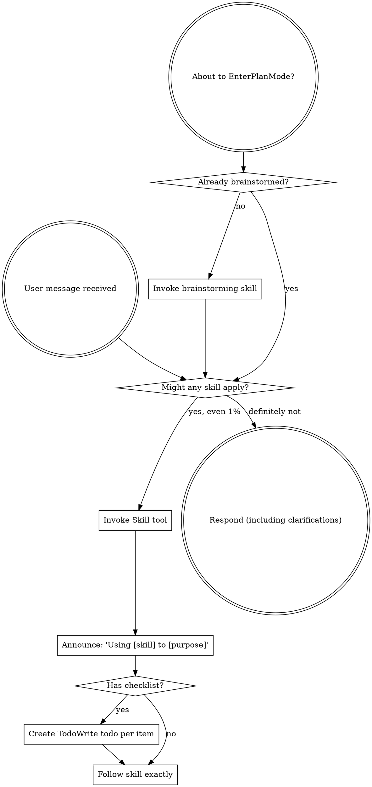

# Boundary Review — ariadne#180 (milestone M2)

| field | value |
|-------|-------|
| issue | 180 — project vocabulary model: schematize project like issue (cue + lifecycle + processes) |
| repo | ariadne |
| issue file | workshop/issues/000180-project-vocabulary-model-schematize-project-like-issue-cue-lifecycle-processes.md |
| boundary | milestone M2 |
| milestone | M2 |
| window | 3feac0619757cde0ff51b908db67218360c53422..HEAD |
| command | sdlc milestone-close --issue 180 --milestone M2 |
| reviewer | codex |
| timestamp | 2026-07-16T12:33:07-07:00 |
| verdict | FIX-THEN-SHIP |

## Review

Reading additional input from stdin...
OpenAI Codex v0.144.5
--------
workdir: /Users/xianxu/workspace/ariadne
model: gpt-5.6-sol
provider: openai
approval: never
sandbox: workspace-write [workdir, /tmp, $TMPDIR, /tmp] (network access enabled)
reasoning effort: none
reasoning summaries: none
session id: 019f6c66-5bc2-7760-8ad1-510f7e469c1d
--------
user
# Code review — the one SDLC boundary review

You are conducting a fresh-context code review at a development boundary —
milestone M2 close — in the **ariadne** repository.

- repository: ariadne   (root: /Users/xianxu/workspace/ariadne)
- issue:      ariadne#180 M2   (file: workshop/issues/000180-project-vocabulary-model-schematize-project-like-issue-cue-lifecycle-processes.md)
- window:     Base: 3feac0619757cde0ff51b908db67218360c53422   Head: HEAD

Review the **ariadne** repo and its tracker — the ariadne base-layer repo itself (changes here propagate to dependent repos). Do not assume any
other repository or apply another repo's conventions.

You have no prior session context — that is the anti-collusion property. Verify
behavior against the issue's documented Spec/Plan and the code itself; do NOT
take the implementor's word in commit messages or docs at face value. Tools are
read-only: report findings precisely; the main agent (which has session context)
applies the fixes, commits, and re-runs.

Read the diff against the issue's Spec + Plan, then work the checklist below.
Categorize every finding by severity — not everything is Critical; a nitpick
marked Critical is noise.

  Critical (must fix before crossing the boundary)
    - correctness bugs; crashes / panics on unexpected input
    - behavior drift from stated contracts (for ports of existing code where
      byte-faithfulness was promised, diff against the source)
    - silent error swallowing where the source raised
  Important (fix before the boundary if cheap)
    - API design of newly-introduced internal packages (downstream work will
      consume them; is the surface stable?)
    - missing test coverage that would catch the kind of bug shipped
    - inconsistent error handling across the diff
  Minor (note for future)
    - style nits, naming, comment density; performance only if hot-path

## Review checklist

Code quality
  - Clean separation of concerns; edge cases handled (empty / nil / unexpected).
  - Proper error handling — no silent swallowing where the source raised.
  - No duplicated logic / copy-paste that should be a shared helper.

Testing
  - Tests pin real logic, not mocks reasserting the implementation.
  - The kind of bug this diff could ship is covered.
  - PURE entities tested without IO; INTEGRATION via injected fakes (see below).

Requirements traceability
  - Every Plan checklist item this boundary claims is actually delivered.
  - Implementation matches the Spec; no undeclared scope creep.
  - Breaking changes documented.

Production readiness
  - Migration / backward-compatibility considered where state or formats change.
  - Docs / atlas updated for new surface (see the Docs update gate).

## Core concepts cross-check (if the plan has a Core concepts table)

The plan should list entities in a greppable table — name, kind
(PURE/INTEGRATION), file location, status (new/modified/deleted). For each row:
  - Verify the entity exists at the stated path (grep the diff or filesystem).
  - PURE: tests run without IO (no exec, net, mutable fs). If tests need mocks
    to run, it isn't really PURE — flag Critical and recommend promoting it to
    INTEGRATION.
  - INTEGRATION: injected into pure callers, not invoked directly from business
    logic.
  - "modified" / "deleted": the diff shows the expected change/removal at the
    stated location.
Any contradiction between table and code = Critical finding, plus a plan-revision
recommendation (a "## Revisions" entry so the plan stops claiming what the code
doesn't deliver).

## Docs update gate (atlas + README, per AGENTS.md §8)

The boundary should update user-facing docs for any new surface introduced:

  - **atlas/** — new architectural surface, flow, or terminology. Scan the diff
    for new entity types, subcommands, conventions, file-tree locations. Any
    present without corresponding atlas/ changes in the same range = Important
    finding ("atlas update appears missing for <surface>").
  - **README.md** — new user-facing surface a reader runs or types: subcommands,
    flags, keybindings, config keys, install/usage steps. If the diff adds or
    changes such surface and README.md is not updated in the same range =
    Important finding ("README update appears missing for <surface>"). This is the
    class of gap that used to surface only at the merge-time `specs` judge (#142);
    catch it here, at the earliest gate, before the close verdict is recorded.

## Architecture (the at-review backstop — these matter most long-term)

Work through each of ARCH-DRY, ARCH-PURE, ARCH-PURPOSE explicitly, applying its at-review lens. The
full principle definitions are delivered in the ARCHITECTURE PRINCIPLES block
right after this prompt — for EACH marker, state pass or flag, and cite the
marker (e.g. ARCH-DRY) in any finding. Architecture is where review has the
least training signal and the longest-delayed payoff, so be deliberate here, not
holistic.

## Verdict + output

Begin your response with this fenced verdict block — the machine-read handoff:

```verdict
verdict: <SHIP | FIX-THEN-SHIP | REWORK>
confidence: <high | medium | low>
```

  SHIP           ready; ship it
  FIX-THEN-SHIP  ship after addressing the findings (non-blocking at the gate)
  REWORK         blocking; needs rework before shipping — fix + re-run

The fenced ```` ```verdict ```` block above is the **authoritative machine-read
handoff** — emit it as the first thing in your response. (A prose
`VERDICT: <TOKEN>` first line still satisfies the legacy contract as a fallback,
but the block is what the binary trusts.)

After the verdict block: a 1-paragraph summary — what worked, what blocks SHIP if
it isn't — followed by:
  1. Strengths: 2-5 specific things done well (file:line where useful). Affirm
     validated approaches so the operator knows what's confirmed-good ground.
     Empty acceptable for trivial boundaries.
  2. Critical findings (file:line + fix sketch); empty if none.
  3. Important findings (same format).
  4. Minor findings (terse one-liners).
  5. Test coverage notes.
  6. Architectural notes for upcoming work.
  7. Plan revision recommendations: specific "## Revisions" entries the plan
     needs (empty if the plan still matches the code).


ARCHITECTURE PRINCIPLES — work through each of the 3 entries below explicitly, applying its `at-review` lens; cite the marker (e.g. ARCH-DRY) in any finding.

# Architecture principles (ARCH-*)

Injected architectural taste — the structural decisions whose payoff (or cost)
shows up many turns, often months, down the road. Agents are strong at local
tactics and weak here, so these are checked **at-plan** (when the design is being
made — highest leverage) and **at-review** (backstop, on the diff). Cite the
marker (e.g. `ARCH-DRY`) in plans, `## Log` entries, and review findings.

This file is the single source; it is embedded into the planning, plan-quality,
and code-review prompts. The human narrative lives in AGENTS.md "Core Design
Principles"; this is its machine-delivered companion.

## ARCH-DRY — Don't Repeat Yourself

- **principle:** Reuse before adding. One source of truth per fact/behavior; no
  duplicated logic, copy-pasted blocks, or parallel functions that should be one
  shared helper.
- **at-plan:** Flag a plan that re-implements something the codebase already has,
  or that will obviously duplicate logic across the new files instead of
  extracting a shared helper. Name the existing thing it should reuse.
- **at-review:** Flag duplicated logic / copy-pasted blocks / near-identical
  functions in the diff; point at the consolidation (file:line + the shared
  helper they should become).

## ARCH-PURE — Pure core, thin IO shell

- **principle:** The majority of code is pure functions (deterministic, no side
  effects); a thin "glue" layer at the boundary touches IO/UI/network/clock. Pure
  functions are unit-tested directly; the glue is kept small and injected.
- **at-plan:** Flag a design that buries business logic inside IO/handlers, or
  that will only be testable with heavy mocks (a sign logic isn't separated from
  IO). The plan should name what's pure vs the thin IO seam.
- **at-review:** Flag business logic mixed with IO in the diff; logic that should
  be a pure function injected into a thin caller. If a test needs mocks to run a
  "pure" entity, it isn't pure — recommend extracting the IO to the boundary.

## ARCH-PURPOSE — Serve the issue's actual purpose

- **principle:** Deliver the issue's stated purpose, not the easy subset of it. A
  single-source / "compiled to consumers" change is not done until **every
  consumer derives** from the source — the source is *enforced*, not just
  documentation a surface happens to restate; a hand-maintained restatement of the
  model is a deferred consumer, not a finished one. "Follow-up" is for separable
  extensions, never for the thing that is the point. This is the *opposite axis*
  from Simplicity-First/YAGNI: not "build for an imagined future," but "don't
  **under**-deliver the purpose you already committed to."
- **at-plan:** Flag a plan whose scope is a strict subset of the issue's stated
  goal / Done-when where the part deferred as "follow-up" *is* the purpose (e.g.
  wires one consumer + enforcement but leaves the consumers that motivated the
  issue as documentation that doesn't derive). Ask: does the plan fulfill the
  purpose, or just the cheap win? Name the deferred purpose.
- **at-review:** Does the diff *fulfill* the purpose or settle for the easy win?
  For a single-source change, run the **shadow-sweep** — enumerate the consumers,
  confirm each derives from the source, flag any remaining hand-maintained
  restatement of the model. A "follow-up" that is actually the deferred point of
  the issue is a finding, not a deferral.


OUTPUT CONTRACT (machine-read — do not deviate). LEAD your response with the
fenced ```verdict block shown above — that is the authoritative handoff the binary
reads (its `verdict:` value is one of the listed tokens). Everything after the block
is advisory: a non-blocking verdict WITH findings still PASSES the gate. A bare
`VERDICT: <TOKEN>` line is accepted only as a FALLBACK when the block is absent.

Diff:
diff --git a/atlas/workflow/sdlc-binary.md b/atlas/workflow/sdlc-binary.md
index 1330186..347d8b0 100644
--- a/atlas/workflow/sdlc-binary.md
+++ b/atlas/workflow/sdlc-binary.md
@@ -189,10 +189,12 @@ cmd/sdlc/
   judge.go             ← scripts/pre-merge-checks.sh
   fetch.go             thin hidden alias → runIssueNew --from-github (#56 M2)
   issue.go             new (#56): `sdlc issue` group — new / set-status / list / show / validate (#124)
-  validategate.go      new (#124): the deterministic instance-conformance gate run
-                       by push+merge before the irreversible action, independent of
-                       the LLM judges (frontmatter on every changed issue; sections
-                       added-only); shells `vocabulary validate-instance`. `--no-validate`
+  validategate.go      deterministic instance-conformance gate (#124, generalized
+                       by #180 M2): noun table enrolls issue + project; push/merge
+                       validate frontmatter on every changed instance, with
+                       added-only section checks for issues; shells
+                       `vocabulary validate-instance --type <noun>`; `--no-validate`
+                       remains the loud escape hatch
   start.go             migration stub (REMOVED in #39 — errors with
                        "use claim + change-code")
   claim.go             ← scripts/issue-sync.sh (renamed from lock.go #39)
@@ -229,7 +231,10 @@ cmd/sdlc/
     issue/             frontmatter parse/edit + plan-section regexes +
                        scaffold.go (NextID/Slugify/Render — #56)
     judge/             Category enum, prompt builder, classify, dispatch
-    project/           brain project-file mutation helpers
+    project/           project-file core: line-preserving typed Doc/Task parser +
+                       checkbox/frontmatter/section mutations (#180 M2), alongside
+                       the legacy brain-residency lookup/detail-block helpers (#171
+                       will lift residency)
 ```

 ## Drift checks (`sdlc state`)
diff --git a/atlas/workflow/vocabulary.md b/atlas/workflow/vocabulary.md
index 0610879..366bdc3 100644
--- a/atlas/workflow/vocabulary.md
+++ b/atlas/workflow/vocabulary.md
@@ -16,6 +16,11 @@ ariadne#122; the invariant is defended by the `issue-lifecycle` target
   once and the `#`-defs can't drift). Also: `when` (per-status semantics),
   `lifecycle` (the transition table, with *named* guards whose implementations live
   in sdlc), and `laws` (documented-value + reachable/escapable, enforced by `cue vet`).
+- `construct/vocabulary/project.cue` — the `project` noun (#180 M1): the
+  ideation→defined→committed→executing funnel (+paused, done/dropped), commit-time
+  deadline baseline, named guards, per-repo `workshop/projects/` discovery, and the
+  four-section scaffold. `pkg/vocab.Project()` embeds the export and shares the
+  lifecycle helpers with the issue/verdict bindings.
 - `construct/vocabulary/verdict.cue` — the `verdict` noun (#147): boundary-review
   verdict tokens by category (`finalizing` = SHIP/FIX-THEN-SHIP, `blocking` = REWORK,
   `internal` = system-set not-run/unknown), with `#Emitted`/`#Token` *derived*; the
@@ -26,9 +31,10 @@ ariadne#122; the invariant is defended by the `issue-lifecycle` target
   consumer (enum equality, `verdictFor` derive, regex/contract subset). The reviewer
   (read-only) emits the block in stdout; the binary parses + validates it — the first
   realization of the [[agent-binary-handoff-schema]] target (never parse an agent's prose).
-- `construct/vocabulary/vet_test.sh` — the M1 gate: the valid model vets, the
-  `testdata/issue_invalid.cue` fixture fails, and the **export carries `categories` +
-  `lifecycle`** (CUE `#`-definitions don't `cue export`). Test fixtures live under
+- `construct/vocabulary/vet_test.sh` — the model gate: the valid issue/project
+  models vet, their invalid fixtures fail for the intended constraint, and each
+  **export carries its concrete consumer blocks** (CUE `#`-definitions don't
+  `cue export`). Test fixtures live under
   `construct/vocabulary/testdata/` so the export doesn't treat them as nouns.

 **The compiler + pipeline (M2).**
@@ -123,16 +129,20 @@ against the model: `artifact → extract frontmatter → cue vet against #<Type>
   as null). The done-guard requires either a positive numeric `actual_hours` or the exact
   not-applicable sentinel `N/A`.

-**The gate (M2, landed).** `cmd/sdlc/validategate.go` — `validateChangedIssues(base, head, …)`
+**The gate (#124 M2, generalized by #180 M2).** `cmd/sdlc/validategate.go` —
+`validateChangedInstances(base, head, nounGates, …)`
 runs in `sdlc push` + `sdlc merge` BEFORE the irreversible action and INDEPENDENTLY of the LLM
 judges (so `--no-judge` keeps it, `--no-validate` keeps the judges). It reuses the judges'
 `gitx.DiffBase()` window and `gitx.DiffNameStatus` (A/M/R/D):
-- **Frontmatter** (shell `vocabulary validate-instance`) on **every** changed issue (added or
-  modified) — the universal invariant; catches a hand-edited bad `status:` on an *existing*
-  ticket. A binary-can't-run is a loud setup error, never a silent pass (fail-closed).
+- **Frontmatter** (shell `vocabulary validate-instance --type <noun>`) on **every**
+  changed issue or project instance (added or modified). The noun table preserves
+  the caller-resolved issue-directory override and derives the project home from
+  `vocab.Project().Discovery()`. A binary-can't-run is a loud setup error, never a
+  silent pass (fail-closed).
 - **Section presence** (`issue.CheckSectionsPresence` — the SAME policy the change-code
   structural gate uses, now single-sourced: `CheckStructural` calls it and composes its ≥50-word
-  Spec check on top) on **newly-ADDED** files only. Legacy/in-flight tickets are grandfathered
+  Spec check on top) on **newly-ADDED issue files only**. Projects conform through
+  `#Project`; legacy/in-flight tickets are grandfathered
   ("validate forward"); a rename (`R`) is not "added".
 - **Loud escape:** `--no-validate` on push/merge prints a prominent WARN naming what's skipped
   (the [escape-hatch principle](../../workshop/lessons.md): bypassable, never silent).
@@ -140,16 +150,15 @@ judges (so `--no-judge` keeps it, `--no-validate` keeps the judges). It reuses t
   check). Multi-target since #133: several files or a comma-separated `--issue` list in one
   call; the three sources are mutually exclusive.

-**Generalized (M3, landed).** `construct/vocabulary/pensive.cue` (`#Pensive`: `type`/`date`/
+**Engine generalized (#124 M3, landed).** `construct/vocabulary/pensive.cue` (`#Pensive`: `type`/`date`/
 `topic`/`mode` enum/`description` + optional `references`) is the **second datatype** — the same
 `validate-instance` engine validates it (`--type pensive` → `#Pensive`), proving the path isn't
 issue-specific. The ONLY per-datatype addition is the `.cue`: `make weave` materializes
 `construct/generated/vocabulary/pensive.json` (empty `{}` — `#Pensive`/`#Mode` are CUE
 `#`-definitions, which don't export; the validator reads the `.cue` directly) with no pipeline
-change. Scope note: the **engine**
-is datatype-generic; the **gate** is still issue-scoped (`shellValidateFrontmatter` hardcodes
-`--type issue`, targets `workshop/issues/*.md`) — wiring other datatypes into a fail-closed gate
-is a separable future step.
+change. The engine remains datatype-generic; #180 M2 made the publish gate
+noun-table-driven and enrolled `issue` + `project`. Enrolling another noun is now a
+table row plus its noun-specific structural policy, not another validator.

 ## Relationship to existing entries

diff --git a/cmd/sdlc/close.go b/cmd/sdlc/close.go
index 49b3fc3..a8478bf 100644
--- a/cmd/sdlc/close.go
+++ b/cmd/sdlc/close.go
@@ -371,7 +371,7 @@ func computeClose(stderr io.Writer, f *closeFlags) closeResult {
		// the engine can't measure — and for an ADOPTED value (#178): comparing
		// the measurement against itself would just re-run the engine.
		if !adopted && !f.skip("actual") {
-			if derr := checkActualDeviation(stderr, issueStr, v); derr != nil {
+			if derr := checkActualDeviation(stderr, issueStr, v, mode); derr != nil {
				die(stderr, derr.Error())
			}
		}
@@ -1123,7 +1123,7 @@ func emitLessonsReminder(stdout io.Writer) {
 // ── explainers ───────────────────────────────────────────────────────────────

 // computeActualForCloseFn is the measurement seam for the omit-path (#178) —
-// a package var so tests can stub the engine (the file's validateChangedIssuesFn
+// a package var so tests can stub the engine (the file's validateChangedInstancesFn
 // pattern). Production resolves roots and runs the same engine as `sdlc actual`.
 var computeActualForCloseFn = func(issueStr string) actualResult {
	repoTop, brainAbs := resolveActualRoots()
@@ -1261,13 +1261,16 @@ func actualDeviation(passed, measured float64) (devVerdict, float64) {
	}
 }

-// checkActualDeviation is the thin IO glue: measure via the shared engine, run
-// the pure comparator, and warn (to stderr) or return a refusal error. Returns
-// nil — never blocks — when the engine can't measure (no window / telemetry gap
-// / no script): an unavailable measurement must not gate a legitimate close.
-func checkActualDeviation(stderr io.Writer, issueStr string, passed float64) error {
-	repoTop, brainAbs := resolveActualRoots()
-	res := computeActual(repoTop, brainAbs, issueStr)
+// checkActualDeviation is the thin IO glue for issue-close values: measure via
+// the shared engine, run the pure comparator, and warn (to stderr) or return a
+// refusal error. Milestone values are increments but the available measurement
+// is cumulative claim→HEAD, so they are deliberately skipped until a windowed
+// milestone measurement exists. Unavailable issue measurements also never gate.
+func checkActualDeviation(stderr io.Writer, issueStr string, passed float64, mode string) error {
+	if mode == "milestone" {
+		return nil
+	}
+	res := computeActualForCloseFn(issueStr)
	if res.Status != actualMeasured {
		return nil // can't measure → don't block (judgment path owns this)
	}
diff --git a/cmd/sdlc/close_actualdev_test.go b/cmd/sdlc/close_actualdev_test.go
index a5c4c66..f838348 100644
--- a/cmd/sdlc/close_actualdev_test.go
+++ b/cmd/sdlc/close_actualdev_test.go
@@ -42,10 +42,33 @@ func TestActualDeviation(t *testing.T) {
 func TestCheckActualDeviation_SkipsWhenUnmeasurable(t *testing.T) {
	var buf bytes.Buffer
	// #99999 has no commits referencing it → computeActual → actualNoWindow.
-	if err := checkActualDeviation(&buf, "99999", 13.5); err != nil {
+	if err := checkActualDeviation(&buf, "99999", 13.5, "issue"); err != nil {
		t.Fatalf("expected nil (skip) when unmeasurable, got: %v", err)
	}
	if out := strings.TrimSpace(buf.String()); out != "" {
		t.Fatalf("expected no output when unmeasurable, got: %q", out)
	}
 }
+
+// Milestone actuals are per-boundary increments, while the active-time engine
+// currently returns a cumulative claim→HEAD issue measurement. Those values are
+// not comparable: checking 0.37h M2 against 5.14h cumulative falsely refuses as
+// a 14× deviation. Until the engine has a milestone window, the pass-path must
+// skip this issue-close-only backstop.
+func TestCheckActualDeviation_MilestoneSkipsCumulativeMeasurement(t *testing.T) {
+	orig := computeActualForCloseFn
+	calls := 0
+	computeActualForCloseFn = func(string) actualResult {
+		calls++
+		return actualResult{Status: actualMeasured, Hours: 5.14}
+	}
+	t.Cleanup(func() { computeActualForCloseFn = orig })
+
+	var buf bytes.Buffer
+	if err := checkActualDeviation(&buf, "180", 0.37, "milestone"); err != nil {
+		t.Fatalf("milestone increment must not be compared with cumulative actual: %v", err)
+	}
+	if calls != 0 {
+		t.Fatalf("milestone mode ran cumulative measurement %d time(s), want 0", calls)
+	}
+}
diff --git a/cmd/sdlc/internal/project/doc.go b/cmd/sdlc/internal/project/doc.go
new file mode 100644
index 0000000..7ebb405
--- /dev/null
+++ b/cmd/sdlc/internal/project/doc.go
@@ -0,0 +1,162 @@
+package project
+
+import (
+	"fmt"
+	"regexp"
+	"strings"
+
+	"github.com/xianxu/ariadne/cmd/sdlc/internal/issue"
+)
+
+var (
+	taskRowRE  = regexp.MustCompile(`^- \[([ x.\-~])\] (.*)$`)
+	refGroupRE = regexp.MustCompile(`\[([^\]]+)\]`)
+)
+
+// Task is one checkbox row in a project's Breakdown section. LineIdx is the
+// row's zero-based index in the markdown body (after frontmatter).
+type Task struct {
+	LineIdx int
+	State   byte
+	Title   string
+	RefText string
+}
+
+type sectionSpan struct {
+	start int
+	end   int
+}
+
+// Doc is a parsed project file. The body lines remain the render source of
+// truth so parsing and non-mutating reads never reflow the document.
+type Doc struct {
+	fm       string
+	lines    []string
+	Tasks    []Task
+	sections map[string]sectionSpan
+}
+
+// ParseDoc parses frontmatter, section spans, and task rows without changing
+// the source bytes.
+func ParseDoc(text string) (*Doc, error) {
+	fm, body, err := issue.Parse(text)
+	if err != nil {
+		return nil, err
+	}
+	return parseDocBody(fm, body), nil
+}
+
+func parseDocBody(fm, body string) *Doc {
+	d := &Doc{
+		fm:       fm,
+		lines:    strings.Split(body, "\n"),
+		sections: make(map[string]sectionSpan),
+	}
+
+	var current string
+	for i, line := range d.lines {
+		if strings.HasPrefix(line, "## ") {
+			if current != "" {
+				span := d.sections[current]
+				span.end = i
+				d.sections[current] = span
+			}
+			current = strings.TrimSpace(strings.TrimPrefix(line, "## "))
+			d.sections[current] = sectionSpan{start: i + 1, end: len(d.lines)}
+			continue
+		}
+
+		match := taskRowRE.FindStringSubmatch(line)
+		if match == nil {
+			continue
+		}
+		remainder := match[2]
+		title := strings.TrimSpace(remainder)
+		refText := ""
+		refs := refGroupRE.FindAllStringSubmatchIndex(remainder, -1)
+		if len(refs) > 0 {
+			last := refs[len(refs)-1]
+			title = strings.TrimSpace(remainder[:last[0]])
+			refText = remainder[last[2]:last[3]]
+		}
+		d.Tasks = append(d.Tasks, Task{
+			LineIdx: i,
+			State:   match[1][0],
+			Title:   title,
+			RefText: refText,
+		})
+	}
+
+	return d
+}
+
+// FM returns a trimmed frontmatter field value, or an empty string when absent.
+func (d *Doc) FM(field string) string {
+	value, _ := issue.GetField(d.fm, field)
+	return value
+}
+
+// SetFM updates one frontmatter field through the shared issue helper.
+func (d *Doc) SetFM(field, value string) {
+	d.fm = issue.SetField(d.fm, field, value)
+}
+
+// SectionBody returns the source body under a level-two section heading.
+func (d *Doc) SectionBody(name string) string {
+	span, ok := d.sections[name]
+	if !ok {
+		return ""
+	}
+	return strings.Join(d.lines[span.start:span.end], "\n")
+}
+
+// AppendToSection adds a block after the section's existing content, separated
+// by one blank line, then rebuilds spans and task indexes from the new body.
+func (d *Doc) AppendToSection(name, block string) error {
+	span, ok := d.sections[name]
+	if !ok {
+		return fmt.Errorf("section %q not found", name)
+	}
+	block = strings.Trim(block, "\n")
+	if block == "" {
+		return nil
+	}
+
+	insertAt := span.end
+	for insertAt > span.start && d.lines[insertAt-1] == "" {
+		insertAt--
+	}
+	lines := append([]string(nil), d.lines[:insertAt]...)
+	if insertAt > span.start {
+		lines = append(lines, "")
+	}
+	lines = append(lines, strings.Split(block, "\n")...)
+	lines = append(lines, "")
+	lines = append(lines, d.lines[span.end:]...)
+
+	reparsed, err := ParseDoc(issue.Compose(d.fm, strings.Join(lines, "\n")))
+	if err != nil {
+		return err
+	}
+	*d = *reparsed
+	return nil
+}
+
+// SetTaskState rewrites only the selected task row's checkbox state.
+func (d *Doc) SetTaskState(i int, state byte) {
+	if i < 0 || i >= len(d.Tasks) {
+		return
+	}
+	task := &d.Tasks[i]
+	line := d.lines[task.LineIdx]
+	if len(line) < 4 {
+		return
+	}
+	d.lines[task.LineIdx] = line[:3] + string(state) + line[4:]
+	task.State = state
+}
+
+// Render reassembles the current frontmatter and line-preserved markdown body.
+func (d *Doc) Render() string {
+	return issue.Compose(d.fm, strings.Join(d.lines, "\n"))
+}
diff --git a/cmd/sdlc/internal/project/doc_test.go b/cmd/sdlc/internal/project/doc_test.go
new file mode 100644
index 0000000..d383724
--- /dev/null
+++ b/cmd/sdlc/internal/project/doc_test.go
@@ -0,0 +1,135 @@
+package project
+
+import (
+	"strings"
+	"testing"
+)
+
+const projectDocFixture = `---
+type: project
+name: demo
+status: executing
+deadline: 2026-09-01
+---
+# demo
+
+## PRD
+Ship the project noun.
+
+## Estimate
+
+## Breakdown
+
+- [ ] provider interface skeleton [charon#13 M1]
+- [x] finished work [ariadne#180 M1]
+- [.] active work [ariadne#180 M2]
+- [-] blocked work [nous#4]
+- [~] cancelled work
+- [ ] plain-text task
+
+## Log
+### 2026-07-16
+Started.
+`
+
+func TestParseDoc(t *testing.T) {
+	d, err := ParseDoc(projectDocFixture)
+	if err != nil {
+		t.Fatal(err)
+	}
+	if got := d.FM("status"); got != "executing" {
+		t.Fatalf("FM(status) = %q, want executing", got)
+	}
+	if got := len(d.Tasks); got != 6 {
+		t.Fatalf("len(Tasks) = %d, want 6", got)
+	}
+	want := Task{
+		LineIdx: 9,
+		State:   ' ',
+		Title:   "provider interface skeleton",
+		RefText: "charon#13 M1",
+	}
+	if got := d.Tasks[0]; got != want {
+		t.Fatalf("Tasks[0] = %+v, want %+v", got, want)
+	}
+	if got := d.Tasks[4]; got.State != '~' || got.Title != "cancelled work" || got.RefText != "" {
+		t.Fatalf("Tasks[4] = %+v, want cancelled plain task", got)
+	}
+	if got := d.SectionBody("PRD"); got != "Ship the project noun.\n" {
+		t.Fatalf("SectionBody(PRD) = %q", got)
+	}
+	if got := d.SectionBody("Missing"); got != "" {
+		t.Fatalf("SectionBody(Missing) = %q, want empty", got)
+	}
+}
+
+func TestDocRenderRoundTrip(t *testing.T) {
+	d, err := ParseDoc(projectDocFixture)
+	if err != nil {
+		t.Fatal(err)
+	}
+	if got := d.Render(); got != projectDocFixture {
+		t.Fatalf("Render changed an unmodified document:\n--- got ---\n%s\n--- want ---\n%s", got, projectDocFixture)
+	}
+}
+
+func TestDocSetTaskState(t *testing.T) {
+	d, err := ParseDoc(projectDocFixture)
+	if err != nil {
+		t.Fatal(err)
+	}
+	d.SetTaskState(0, 'x')
+
+	want := strings.Replace(
+		projectDocFixture,
+		"- [ ] provider interface skeleton [charon#13 M1]",
+		"- [x] provider interface skeleton [charon#13 M1]",
+		1,
+	)
+	if got := d.Render(); got != want {
+		t.Fatalf("SetTaskState changed more than the selected row:\n%s", got)
+	}
+	if got := d.Tasks[0].State; got != 'x' {
+		t.Fatalf("Tasks[0].State = %q, want x", got)
+	}
+}
+
+func TestDocSetFM(t *testing.T) {
+	d, err := ParseDoc(projectDocFixture)
+	if err != nil {
+		t.Fatal(err)
+	}
+	d.SetFM("status", "paused")
+	d.SetFM("updated", "2026-07-17")
+
+	if got := d.FM("status"); got != "paused" {
+		t.Fatalf("FM(status) = %q, want paused", got)
+	}
+	if got := d.FM("updated"); got != "2026-07-17" {
+		t.Fatalf("FM(updated) = %q", got)
+	}
+	if got := d.Render(); !strings.Contains(got, "status: paused\ndeadline: 2026-09-01\nupdated: 2026-07-17\n---") {
+		t.Fatalf("SetFM did not preserve field order/append semantics:\n%s", got)
+	}
+}
+
+func TestDocAppendToSection(t *testing.T) {
+	d, err := ParseDoc(projectDocFixture)
+	if err != nil {
+		t.Fatal(err)
+	}
+	if err := d.AppendToSection("PRD", "Second requirement.\n"); err != nil {
+		t.Fatal(err)
+	}
+
+	want := "## PRD\nShip the project noun.\n\nSecond requirement.\n\n## Estimate"
+	if got := d.Render(); !strings.Contains(got, want) {
+		t.Fatalf("AppendToSection placed block incorrectly:\n%s", got)
+	}
+	if got := d.SectionBody("PRD"); got != "Ship the project noun.\n\nSecond requirement.\n" {
+		t.Fatalf("SectionBody(PRD) after append = %q", got)
+	}
+	if got := d.Tasks[0].Title; got != "provider interface skeleton" {
+		t.Fatalf("task index was not rebuilt after append: %+v", d.Tasks[0])
+	}
+}
diff --git a/cmd/sdlc/internal/project/project.go b/cmd/sdlc/internal/project/project.go
index bf340fd..831a2dc 100644
--- a/cmd/sdlc/internal/project/project.go
+++ b/cmd/sdlc/internal/project/project.go
@@ -1,6 +1,6 @@
-// Package project mutates brain-side project files (status ticks + detail
-// blocks) for the sdlc binary. Ported from scripts/close-issue.py — same
-// regex shapes so semantics match the Python source.
+// Package project parses and mutates project files for the sdlc binary. The
+// typed Doc core preserves the established close-issue.py tick semantics while
+// detail-block helpers retain their original line-oriented behavior.
 package project

 import (
@@ -60,17 +60,20 @@ func FindByIssueRef(brainDir, repoName, issueID string) (string, error) {
 // The character class `[ .\-~]` mirrors close-issue.py exactly (note the
 // escaped hyphen).
 func TickMilestoneTaskRow(text, repoName, issueID, milestone string) (string, int) {
-	pat := regexp.MustCompile(
-		`(?m)^(- )\[[ .\-~]\](.*?\[` +
-			regexp.QuoteMeta(repoName) + `#` + regexp.QuoteMeta(issueID) +
-			` ` + regexp.QuoteMeta(milestone) + `\])`,
-	)
-	n := len(pat.FindAllStringIndex(text, -1))
-	if n == 0 {
+	d, fullDoc, err := parseTickDoc(text)
+	if err != nil {
		return text, 0
	}
-	out := pat.ReplaceAllString(text, `${1}[x]${2}`)
-	return out, n
+	wantRef := repoName + "#" + issueID + " " + milestone
+	n := 0
+	for i, task := range d.Tasks {
+		if !strings.Contains(" .-~", string(task.State)) || task.RefText != wantRef {
+			continue
+		}
+		d.SetTaskState(i, 'x')
+		n++
+	}
+	return renderTickDoc(d, fullDoc), n
 }

 // TickAllTaskRowsForIssue ticks every task row for this issue regardless of
@@ -81,17 +84,38 @@ func TickMilestoneTaskRow(text, repoName, issueID, milestone string) (string, in
 // `[-~]`) for the issue-close path — that's intentional: cancelled/blocked
 // task rows shouldn't be silently flipped to done at issue close.
 func TickAllTaskRowsForIssue(text, repoName, issueID string) (string, int) {
-	pat := regexp.MustCompile(
-		`(?m)^(- )\[[ .]\](.*?\[` +
-			regexp.QuoteMeta(repoName) + `#` + regexp.QuoteMeta(issueID) +
-			`(?: [^\]]+)?\])`,
-	)
-	matches := pat.FindAllStringSubmatchIndex(text, -1)
-	if len(matches) == 0 {
+	d, fullDoc, err := parseTickDoc(text)
+	if err != nil {
		return text, 0
	}
-	out := pat.ReplaceAllString(text, `${1}[x]${2}`)
-	return out, len(matches)
+	wantRef := repoName + "#" + issueID
+	n := 0
+	for i, task := range d.Tasks {
+		if task.State != ' ' && task.State != '.' {
+			continue
+		}
+		if task.RefText != wantRef && !strings.HasPrefix(task.RefText, wantRef+" ") {
+			continue
+		}
+		d.SetTaskState(i, 'x')
+		n++
+	}
+	return renderTickDoc(d, fullDoc), n
+}
+
+func parseTickDoc(text string) (*Doc, bool, error) {
+	if strings.HasPrefix(text, "---\n") {
+		d, err := ParseDoc(text)
+		return d, true, err
+	}
+	return parseDocBody("", text), false, nil
+}
+
+func renderTickDoc(d *Doc, fullDoc bool) string {
+	if fullDoc {
+		return d.Render()
+	}
+	return strings.Join(d.lines, "\n")
 }

 // Field is a (name, value) pair used by UpsertDetailBlockFields. Callers
diff --git a/cmd/sdlc/internal/project/project_test.go b/cmd/sdlc/internal/project/project_test.go
index 891a8d9..bdd7436 100644
--- a/cmd/sdlc/internal/project/project_test.go
+++ b/cmd/sdlc/internal/project/project_test.go
@@ -63,6 +63,18 @@ func TestTickMilestoneTaskRow_Match(t *testing.T) {
			"- [ ] do work [ariadne#31 M1-extra]\n",
			0,
		},
+		{
+			"trailing_note_after_ref",
+			"- [ ] do work [ariadne#31 M1] (operator note)\n",
+			"- [x] do work [ariadne#31 M1] (operator note)\n",
+			1,
+		},
+		{
+			"later_bracket_group_is_not_a_ref",
+			"- [ ] do work [ariadne#31 M1] (see [notes](url))\n",
+			"- [ ] do work [ariadne#31 M1] (see [notes](url))\n",
+			0,
+		},
	}
	for _, tt := range tests {
		t.Run(tt.name, func(t *testing.T) {
diff --git a/cmd/sdlc/issue.go b/cmd/sdlc/issue.go
index 5bf8ec3..789e1b5 100644
--- a/cmd/sdlc/issue.go
+++ b/cmd/sdlc/issue.go
@@ -161,7 +161,7 @@ func resolveValidateTargets(f *issueValidateFlags, args []string) ([]string, err
 // the pre-merge gate's concern, not the agent's authoring check).
 func validateIssueFull(file string) []string {
	var probs []string
-	out, ok, runErr := validateFrontmatterFn(file)
+	out, ok, runErr := validateFrontmatterFn("issue", file)
	switch {
	case runErr != nil:
		probs = append(probs, "could not run the frontmatter validator: "+runErr.Error())
diff --git a/cmd/sdlc/issuevalidate_test.go b/cmd/sdlc/issuevalidate_test.go
index f9b3c93..c1e863d 100644
--- a/cmd/sdlc/issuevalidate_test.go
+++ b/cmd/sdlc/issuevalidate_test.go
@@ -23,7 +23,7 @@ func TestRunIssueValidate(t *testing.T) {
	}

	t.Run("clean file passes", func(t *testing.T) {
-		validateFrontmatterFn = func(string) (string, bool, error) { return "", true, nil }
+		validateFrontmatterFn = func(string, string) (string, bool, error) { return "", true, nil }
		var out, errw bytes.Buffer
		if err := runIssueValidate(&out, &errw, &issueValidateFlags{}, []string{good}); err != nil {
			t.Errorf("clean file should pass, got: %v", err)
@@ -31,7 +31,7 @@ func TestRunIssueValidate(t *testing.T) {
	})

	t.Run("file missing ## Plan fails (section, full check on demand)", func(t *testing.T) {
-		validateFrontmatterFn = func(string) (string, bool, error) { return "", true, nil }
+		validateFrontmatterFn = func(string, string) (string, bool, error) { return "", true, nil }
		var out, errw bytes.Buffer
		if err := runIssueValidate(&out, &errw, &issueValidateFlags{}, []string{noPlan}); err == nil {
			t.Error("a file missing ## Plan should fail on-demand validation")
@@ -39,7 +39,7 @@ func TestRunIssueValidate(t *testing.T) {
	})

	t.Run("bad frontmatter fails", func(t *testing.T) {
-		validateFrontmatterFn = func(string) (string, bool, error) { return "  - status: nope", false, nil }
+		validateFrontmatterFn = func(string, string) (string, bool, error) { return "  - status: nope", false, nil }
		var out, errw bytes.Buffer
		if err := runIssueValidate(&out, &errw, &issueValidateFlags{}, []string{good}); err == nil {
			t.Error("bad frontmatter should fail validation")
@@ -54,7 +54,7 @@ func TestRunIssueValidate(t *testing.T) {
	})

	t.Run("multiple files all conforming passes", func(t *testing.T) {
-		validateFrontmatterFn = func(string) (string, bool, error) { return "", true, nil }
+		validateFrontmatterFn = func(string, string) (string, bool, error) { return "", true, nil }
		var out, errw bytes.Buffer
		if err := runIssueValidate(&out, &errw, &issueValidateFlags{}, []string{good, good}); err != nil {
			t.Errorf("an all-conforming batch should pass, got: %v", err)
@@ -62,7 +62,7 @@ func TestRunIssueValidate(t *testing.T) {
	})

	t.Run("multiple files, one nonconforming exits non-zero", func(t *testing.T) {
-		validateFrontmatterFn = func(string) (string, bool, error) { return "", true, nil }
+		validateFrontmatterFn = func(string, string) (string, bool, error) { return "", true, nil }
		var out, errw bytes.Buffer
		if err := runIssueValidate(&out, &errw, &issueValidateFlags{}, []string{good, noPlan}); err == nil {
			t.Error("a batch with one nonconforming file should exit non-zero")
@@ -150,7 +150,7 @@ func TestResolveValidateTargets(t *testing.T) {
 func TestIssueValidateCmdCommaIDs(t *testing.T) {
	of := validateFrontmatterFn
	defer func() { validateFrontmatterFn = of }()
-	validateFrontmatterFn = func(string) (string, bool, error) { return "", true, nil }
+	validateFrontmatterFn = func(string, string) (string, bool, error) { return "", true, nil }

	dir := t.TempDir()
	for _, name := range []string{"000001-one.md", "000002-two.md"} {
diff --git a/cmd/sdlc/merge.go b/cmd/sdlc/merge.go
index 467d8c7..d20423f 100644
--- a/cmd/sdlc/merge.go
+++ b/cmd/sdlc/merge.go
@@ -323,11 +323,11 @@ func runMerge(stdout, stderr io.Writer, f *mergeFlags) error {
	// Deterministic, separate from the judges. Runs after the branch is synced to
	// origin (merge is server-side) so it checks the same tree that will merge.
	if !f.NoValidate {
-		if err := validateChangedIssuesFn(gitx.DiffBase(), "", f.IssuesDir, stdout, stderr); err != nil {
+		if err := validateChangedInstancesFn(gitx.DiffBase(), "", nounGates(f.IssuesDir), stdout, stderr); err != nil {
			die(stderr, err.Error()+"\n  → fix and `git push` (merge is server-side), or --no-validate to bypass.")
		}
	} else {
-		cwarn(stderr, "⚠️  --no-validate: SKIPPING the instance-conformance gate (#124) — issue frontmatter/sections NOT verified before main. Escape hatch: say why in your commit/log.")
+		cwarn(stderr, "⚠️  --no-validate: SKIPPING the instance-conformance gate (#124) — modeled frontmatter and issue sections NOT verified before main. Escape hatch: say why in your commit/log.")
	}

	// ── 5. Pre-merge publish gate (#160) — deterministic, NO LLM ─────────────
diff --git a/cmd/sdlc/merge_e2e_test.go b/cmd/sdlc/merge_e2e_test.go
index 1337f19..26a3c74 100644
--- a/cmd/sdlc/merge_e2e_test.go
+++ b/cmd/sdlc/merge_e2e_test.go
@@ -128,7 +128,7 @@ func (g *e2eGH) PRMerge(repo, branch string) error                    { g.prMerg
 // each its own isolated state — the swaps (and the chdir) would race.
 func swapMergeDeps(t *testing.T, gh ghCaller, gate func(baseRef, issuesDir string, stderr io.Writer) error) {
	t.Helper()
-	prevGH, prevDetect, prevGate, prevVal := ghClient, detectRepo, runPublishGateFn, validateChangedIssuesFn
+	prevGH, prevDetect, prevGate, prevVal := ghClient, detectRepo, runPublishGateFn, validateChangedInstancesFn
	ghClient = gh
	detectRepo = func() (string, error) { return "test/repo", nil }
	if gate != nil {
@@ -137,12 +137,12 @@ func swapMergeDeps(t *testing.T, gh ghCaller, gate func(baseRef, issuesDir strin
	// Neutralize the #124 instance-conformance gate — these e2e tests exercise the
	// merge FLOW, not the gate (which has its own unit tests in validategate_test.go)
	// and would otherwise shell the `vocabulary` binary, absent in the test env.
-	validateChangedIssuesFn = func(_, _, _ string, _, _ io.Writer) error { return nil }
+	validateChangedInstancesFn = func(_, _ string, _ []nounGate, _, _ io.Writer) error { return nil }
	t.Cleanup(func() {
		ghClient = prevGH
		detectRepo = prevDetect
		runPublishGateFn = prevGate
-		validateChangedIssuesFn = prevVal
+		validateChangedInstancesFn = prevVal
	})
 }

diff --git a/cmd/sdlc/push.go b/cmd/sdlc/push.go
index f1df986..bd9ccc7 100644
--- a/cmd/sdlc/push.go
+++ b/cmd/sdlc/push.go
@@ -123,11 +123,11 @@ func runPush(stdout, stderr io.Writer, f *pushFlags) error {
	// Deterministic, separate from the judges (so --no-judge keeps it, and
	// --no-validate keeps the judges). Same window the judges use.
	if !f.NoValidate {
-		if err := validateChangedIssuesFn(gitx.DiffBase(), "", f.IssuesDir, stdout, stderr); err != nil {
+		if err := validateChangedInstancesFn(gitx.DiffBase(), "", nounGates(f.IssuesDir), stdout, stderr); err != nil {
			die(stderr, err.Error())
		}
	} else {
-		cwarn(stderr, "⚠️  --no-validate: SKIPPING the instance-conformance gate (#124) — issue frontmatter/sections NOT verified before main. Escape hatch: say why in your commit/log.")
+		cwarn(stderr, "⚠️  --no-validate: SKIPPING the instance-conformance gate (#124) — modeled frontmatter and issue sections NOT verified before main. Escape hatch: say why in your commit/log.")
	}

	// ── 4. Pre-push publish gate (#160) — deterministic, NO LLM ──────────────
diff --git a/cmd/sdlc/validategate.go b/cmd/sdlc/validategate.go
index 92e3943..585542b 100644
--- a/cmd/sdlc/validategate.go
+++ b/cmd/sdlc/validategate.go
@@ -4,8 +4,8 @@
 //
 // It is a DETERMINISTIC hard check, not a judge:
 //   - FRONTMATTER conformance (cue, via the `vocabulary validate-instance` binary)
-//     on EVERY changed issue file (added or modified) — the universal invariant that
-//     catches the motivating hand-edited bad `status:` even on an existing ticket.
+//     on EVERY changed modeled instance (added or modified) — the universal
+//     invariant that catches a hand-edited bad status on an existing record.
 //   - SECTION presence (issue.CheckSectionsPresence, the SAME policy the change-code
 //     structural gate uses — single source) on NEWLY-ADDED files only. New issues
 //     must be well-formed; pre-existing/legacy/in-flight tickets are grandfathered
@@ -23,24 +23,39 @@ import (

	"github.com/xianxu/ariadne/cmd/sdlc/internal/gitx"
	"github.com/xianxu/ariadne/cmd/sdlc/internal/issue"
+	"github.com/xianxu/ariadne/pkg/vocab"
 )

 // Seams — swapped in tests so the gate runs hermetically (no git, no vocabulary
 // binary). Production points them at the real implementations.
 var (
-	diffNameStatusFn        = gitx.DiffNameStatus
-	validateFrontmatterFn   = shellValidateFrontmatter
-	readIssueFileFn         = os.ReadFile
-	validateChangedIssuesFn = validateChangedIssues
+	diffNameStatusFn           = gitx.DiffNameStatus
+	validateFrontmatterFn      = shellValidateFrontmatter
+	readIssueFileFn            = os.ReadFile
+	validateChangedInstancesFn = validateChangedInstances
 )

-// validateChangedIssues is the fail-closed gate. base/head are the caller's window
-// (the SAME one the judges use — don't recompute, per the M1 review). Returns an
-// error naming every nonconforming changed issue file; nil when all conform.
-func validateChangedIssues(base, head, issuesDir string, stdout, stderr io.Writer) error {
+// nounGate binds one vocabulary noun to the repo directory containing its
+// instances. Only issues carry the legacy section-presence policy.
+type nounGate struct {
+	noun          string
+	dir           string
+	checkSections bool
+}
+
+func nounGates(issuesDir string) []nounGate {
	if issuesDir == "" {
		issuesDir = envOr("WF_ISSUES_DIR", "workshop/issues")
	}
+	return []nounGate{
+		{noun: "issue", dir: issuesDir, checkSections: true},
+		{noun: "project", dir: vocab.Project().Discovery().Home},
+	}
+}
+
+// validateChangedInstances is the fail-closed gate. base/head are the caller's
+// review window; gates declare which changed paths derive from which noun model.
+func validateChangedInstances(base, head string, gates []nounGate, stdout, stderr io.Writer) error {
	changes, err := diffNameStatusFn(base, head)
	if err != nil {
		return fmt.Errorf("instance-conformance gate: %w", err)
@@ -49,13 +64,14 @@ func validateChangedIssues(base, head, issuesDir string, stdout, stderr io.Write
	var problems []string
	checked := 0
	for _, ch := range changes {
-		if ch.Status == "D" || !isIssueFile(ch.Path, issuesDir) {
+		gate, ok := gateForPath(ch.Path, gates)
+		if ch.Status == "D" || !ok {
			continue
		}
		checked++

-		// Frontmatter — every changed issue (added OR modified): the universal invariant.
-		out, ok, runErr := validateFrontmatterFn(ch.Path)
+		// Frontmatter — every changed instance (added OR modified).
+		out, conforms, runErr := validateFrontmatterFn(gate.noun, ch.Path)
		if runErr != nil {
			// Could not RUN the validator (binary missing) — a setup failure, not a
			// conformance verdict. The GATE fails closed (hard return); the on-demand
@@ -63,13 +79,13 @@ func validateChangedIssues(base, head, issuesDir string, stdout, stderr io.Write
			// can't-run as a per-file problem and continues, since it's informative.
			return fmt.Errorf("instance-conformance gate could not run on %s: %w", ch.Path, runErr)
		}
-		if !ok {
+		if !conforms {
			problems = append(problems, ch.Path+" (frontmatter):\n"+indentLines(strings.TrimSpace(out), "      "))
		}

		// Sections — newly-ADDED files only (grandfather legacy/in-flight; a rename "R"
		// is NOT "A", so a renamed/archived ticket is never section-validated).
-		if ch.Status == "A" {
+		if ch.Status == "A" && gate.checkSections {
			if data, rerr := readIssueFileFn(ch.Path); rerr == nil {
				for _, f := range issue.CheckSectionsPresence(string(data)) {
					problems = append(problems, ch.Path+" (section): "+f.Message)
@@ -79,22 +95,22 @@ func validateChangedIssues(base, head, issuesDir string, stdout, stderr io.Write
	}

	if len(problems) > 0 {
-		cwarn(stderr, fmt.Sprintf("instance-conformance gate: %d nonconforming changed issue file(s) — fix and re-run, or --no-validate to bypass (loud):", len(problems)))
+		cwarn(stderr, fmt.Sprintf("instance-conformance gate: %d nonconforming changed instance file(s) — fix and re-run, or --no-validate to bypass (loud):", len(problems)))
		for _, p := range problems {
			fmt.Fprintln(stdout, "  - "+p)
		}
-		return fmt.Errorf("instance-conformance gate: %d nonconforming issue file(s)", len(problems))
+		return fmt.Errorf("instance-conformance gate: %d nonconforming instance file(s)", len(problems))
	}
-	cok(stderr, fmt.Sprintf("instance-conformance gate: %d changed issue file(s) conform", checked))
+	cok(stderr, fmt.Sprintf("instance-conformance gate: %d changed instance file(s) conform", checked))
	return nil
 }

-// shellValidateFrontmatter runs `vocabulary validate-instance --type issue <file>`.
+// shellValidateFrontmatter runs `vocabulary validate-instance --type <noun> <file>`.
 // ok=false (+ diagnostics in output) = nonconforming; err != nil = the validator
 // could not RUN (e.g. binary not on PATH) — a setup failure distinct from
 // nonconformance, surfaced loudly so the operator builds the binary or --no-validate.
-func shellValidateFrontmatter(file string) (output string, ok bool, err error) {
-	out, runErr := exec.Command("vocabulary", "validate-instance", "--type", "issue", file).CombinedOutput()
+func shellValidateFrontmatter(noun, file string) (output string, ok bool, err error) {
+	out, runErr := exec.Command("vocabulary", "validate-instance", "--type", noun, file).CombinedOutput()
	if runErr == nil {
		return string(out), true, nil
	}
@@ -105,10 +121,18 @@ func shellValidateFrontmatter(file string) (output string, ok bool, err error) {
	return string(out), false, fmt.Errorf("`vocabulary validate-instance` did not run (build the vocabulary binary onto PATH, or pass --no-validate): %w", runErr)
 }

-// isIssueFile reports whether path is a `.md` under issuesDir (prefix match at any
-// depth — issue files are flat today, but a nested one would still be validated).
-func isIssueFile(path, issuesDir string) bool {
-	dir := strings.TrimSuffix(filepath.ToSlash(issuesDir), "/") + "/"
+func gateForPath(path string, gates []nounGate) (nounGate, bool) {
+	for _, gate := range gates {
+		if isInstanceFile(path, gate.dir) {
+			return gate, true
+		}
+	}
+	return nounGate{}, false
+}
+
+// isInstanceFile reports whether path is a markdown file below dir.
+func isInstanceFile(path, dir string) bool {
+	dir = strings.TrimSuffix(filepath.ToSlash(dir), "/") + "/"
	p := filepath.ToSlash(path)
	return strings.HasPrefix(p, dir) && strings.HasSuffix(p, ".md")
 }
diff --git a/cmd/sdlc/validategate_test.go b/cmd/sdlc/validategate_test.go
index 8f92958..50d68d8 100644
--- a/cmd/sdlc/validategate_test.go
+++ b/cmd/sdlc/validategate_test.go
@@ -20,7 +20,7 @@ func stubGate(t *testing.T, changes []gitx.FileChange, fmOK bool, fmRunErr error
	t.Helper()
	od, of, or := diffNameStatusFn, validateFrontmatterFn, readIssueFileFn
	diffNameStatusFn = func(_, _ string) ([]gitx.FileChange, error) { return changes, nil }
-	validateFrontmatterFn = func(_ string) (string, bool, error) {
+	validateFrontmatterFn = func(_, _ string) (string, bool, error) {
		return "  - status: \"in-progress\" is not valid", fmOK, fmRunErr
	}
	readIssueFileFn = func(p string) ([]byte, error) { return []byte(files[p]), nil }
@@ -29,7 +29,7 @@ func stubGate(t *testing.T, changes []gitx.FileChange, fmOK bool, fmRunErr error

 func runGate() error {
	var out, errw bytes.Buffer
-	return validateChangedIssues("BASE", "", "workshop/issues", &out, &errw)
+	return validateChangedInstances("BASE", "", nounGates("workshop/issues"), &out, &errw)
 }

 func TestValidateChangedIssues(t *testing.T) {
@@ -97,7 +97,7 @@ func TestValidateChangedIssues(t *testing.T) {
	})
 }

-func TestIsIssueFile(t *testing.T) {
+func TestIsInstanceFile(t *testing.T) {
	cases := []struct {
		path string
		want bool
@@ -109,8 +109,47 @@ func TestIsIssueFile(t *testing.T) {
		{"cmd/sdlc/x.go", false},
	}
	for _, c := range cases {
-		if got := isIssueFile(c.path, "workshop/issues"); got != c.want {
-			t.Errorf("isIssueFile(%q) = %v, want %v", c.path, got, c.want)
+		if got := isInstanceFile(c.path, "workshop/issues"); got != c.want {
+			t.Errorf("isInstanceFile(%q) = %v, want %v", c.path, got, c.want)
		}
	}
 }
+
+func TestValidateChangedInstancesDispatchesByNoun(t *testing.T) {
+	od, of, or := diffNameStatusFn, validateFrontmatterFn, readIssueFileFn
+	t.Cleanup(func() { diffNameStatusFn, validateFrontmatterFn, readIssueFileFn = od, of, or })
+
+	diffNameStatusFn = func(_, _ string) ([]gitx.FileChange, error) {
+		return []gitx.FileChange{
+			{Status: "A", Path: "custom/issues/000900-good.md"},
+			{Status: "A", Path: "workshop/projects/demo.md"},
+			{Status: "M", Path: "workshop/issues/000901-default-dir.md"},
+		}, nil
+	}
+	var validated []string
+	validateFrontmatterFn = func(noun, path string) (string, bool, error) {
+		validated = append(validated, noun+":"+path)
+		return "", true, nil
+	}
+	reads := 0
+	readIssueFileFn = func(path string) ([]byte, error) {
+		reads++
+		return []byte(gateGood), nil
+	}
+
+	var out, errw bytes.Buffer
+	err := validateChangedInstances("BASE", "", nounGates("custom/issues"), &out, &errw)
+	if err != nil {
+		t.Fatal(err)
+	}
+	want := []string{
+		"issue:custom/issues/000900-good.md",
+		"project:workshop/projects/demo.md",
+	}
+	if strings.Join(validated, "\n") != strings.Join(want, "\n") {
+		t.Fatalf("validated = %v, want %v", validated, want)
+	}
+	if reads != 1 {
+		t.Fatalf("issue section reads = %d, want 1 (projects have no issue-section gate)", reads)
+	}
+}


codex
I’m applying the repository’s SDLC and review workflow skills to inspect the exact base-to-HEAD window, issue/plan, model, implementation, and tests. I’ll keep the workspace read-only and return only review findings.
exec
/bin/zsh -lc "sed -n '1,240p' construct/adapted/superpowers-using-superpowers/SKILL.md && sed -n '1,280p' construct/local/sdlc/SKILL.md && sdlc --help && sed -n '1,240p' workshop/lessons.md" in /Users/xianxu/workspace/ariadne
 succeeded in 0ms:
---
name: superpowers-using-superpowers
description: Use when starting any conversation - establishes how to find and use skills, requiring Skill tool invocation before ANY response including clarifying questions
---

<SUBAGENT-STOP>
If you were dispatched as a subagent to execute a specific task, skip this skill.
</SUBAGENT-STOP>

<EXTREMELY-IMPORTANT>
If you think there is even a 1% chance a skill might apply to what you are doing, you ABSOLUTELY MUST invoke the skill.

IF A SKILL APPLIES TO YOUR TASK, YOU DO NOT HAVE A CHOICE. YOU MUST USE IT.

This is not negotiable. This is not optional. You cannot rationalize your way out of this.
</EXTREMELY-IMPORTANT>

## Instruction Priority

> **Ariadne note:** AGENTS.md Section 3 governs subagent strategy and overrides skills that mandate subagent-driven-development as the default execution path.

Superpowers skills override default system prompt behavior, but **user instructions always take precedence**:

1. **User's explicit instructions** (CLAUDE.md, GEMINI.md, AGENTS.md, direct requests) — highest priority
2. **Superpowers skills** — override default system behavior where they conflict
3. **Default system prompt** — lowest priority

If CLAUDE.md, GEMINI.md, or AGENTS.md says "don't use TDD" and a skill says "always use TDD," follow the user's instructions. The user is in control.

## How to Access Skills

**In Claude Code:** Use the `Skill` tool. When you invoke a skill, its content is loaded and presented to you—follow it directly. Never use the Read tool on skill files.

**In Gemini CLI:** Skills activate via the `activate_skill` tool. Gemini loads skill metadata at session start and activates the full content on demand.

**In other environments:** Check your platform's documentation for how skills are loaded.

## Platform Adaptation

Skills use Claude Code tool names. Non-CC platforms: see `references/codex-tools.md` (Codex) for tool equivalents. Gemini CLI users get the tool mapping loaded automatically via GEMINI.md.

# Using Skills

## The Rule

**Invoke relevant or requested skills BEFORE any response or action.** Even a 1% chance a skill might apply means that you should invoke the skill to check. If an invoked skill turns out to be wrong for the situation, you don't need to use it.



## Red Flags

These thoughts mean STOP—you're rationalizing:

| Thought | Reality |
|---------|---------|
| "This is just a simple question" | Questions are tasks. Check for skills. |
| "I need more context first" | Skill check comes BEFORE clarifying questions. |
| "Let me explore the codebase first" | Skills tell you HOW to explore. Check first. |
| "I can check git/files quickly" | Files lack conversation context. Check for skills. |
| "Let me gather information first" | Skills tell you HOW to gather information. |
| "This doesn't need a formal skill" | If a skill exists, use it. |
| "I remember this skill" | Skills evolve. Read current version. |
| "This doesn't count as a task" | Action = task. Check for skills. |
| "The skill is overkill" | Simple things become complex. Use it. |
| "I'll just do this one thing first" | Check BEFORE doing anything. |
| "This feels productive" | Undisciplined action wastes time. Skills prevent this. |
| "I know what that means" | Knowing the concept ≠ using the skill. Invoke it. |

## Skill Priority

When multiple skills could apply, use this order:

1. **Process skills first** (brainstorming, debugging) - these determine HOW to approach the task
2. **Implementation skills second** (frontend-design, mcp-builder) - these guide execution

"Let's build X" → brainstorming first, then implementation skills.
"Fix this bug" → debugging first, then domain-specific skills.

## Skill Types

**Rigid** (TDD, debugging): Follow exactly. Don't adapt away discipline.

**Flexible** (patterns): Adapt principles to context.

The skill itself tells you which.

## User Instructions

Instructions say WHAT, not HOW. "Add X" or "Fix Y" doesn't mean skip workflows.
---
name: sdlc
description: Use when at an SDLC checkpoint — starting work, closing an issue or milestone, opening/merging a PR, or recovering workflow state after compaction. The `sdlc` binary owns the gates between workflow stages and refuses transitions that lack required evidence.
---

# sdlc — SDLC checkpoint binary

`sdlc` owns the gates between SDLC workflow stages (claim → change-code → pr →
merge, plus close, milestone-close, judge). It requires evidence at each gate,
mutates state, logs the transition, and refuses transitions that lack the
evidence — that is the shape of a "checkpoint guard."

The binary is the single source of truth. This skill is a static pointer and
intentionally carries no copy of the contract, so it can never drift:

- **`sdlc --help`** — the workflow contract: the start-of-work runbook,
  conventions, and the verb list.
- **`sdlc <verb> --help`** — one checkpoint's full contract, flags, and examples.

Read those instead of relying on memory; the binary's help is always current.
sdlc collects ariadne's SDLC checkpoint guards into one binary. Each subcommand
owns one checkpoint: it requires evidence at the gate, mutates state, logs the
transition, and refuses transitions that lack it. We don't model the SDLC as a
state machine — stages stay prose; we codify the gates between them where drift
recurs. `sdlc` manages the development life cycle; prefer it over `git`/`gh`.

BEFORE WORK
  - `sdlc claim --issue N` — the single start-of-work gesture, a CHEAP LOCK.
    Flips an *open* issue to `working` and publishes the claim to origin/main so
    peer agents see it. No estimate demanded (#113) — claim early, the moment an
    idea crystallizes. `--no-start` suppresses the flip.
  - Do NOT hand-edit an issue's `status:` — let `sdlc claim` or `sdlc issue
    set-status` own that transition (it carries the reopen/`→ done` guards).

ENTER IMPLEMENTATION
  - After plan approval, before editing code, run `sdlc change-code`. It owns the
    branching decision (in-place branch by default; `--worktree=yes` for an
    isolated worktree), the plan-quality check, and the `estimate_hours` gate
    (relocated here from claim, #113). Don't start coding without it.

PUBLISH
  - Publishing goes through a PR: `sdlc pr` → `sdlc merge`. Direct `sdlc push`
    if working directly on main.
  - Publish ONCE at issue close, not per milestone — and do NOT reuse a branch
    name that already has a merged PR. `sdlc merge` refuses (#148) when a branch
    has commits not in main despite a merged PR (a reused name would otherwise
    silently strand the new commits); rename to a fresh branch, `sdlc pr`, retry.

RECOVER
  - After a compaction or session resume, run `sdlc state` to recover where you
    are instead of re-inferring from issue files.

LOCAL REPO TRANSACTION LOCK
  - Mutating verbs take an SDLC-owned repo transaction lock at
    `.git/sdlc.lock` before reading/writing issue state, committing, changing
    branches, or pushing. The lock is local to the Git common dir, so linked
    worktrees of the same repo serialize with each other.
  - Wait messages identify the holder pid and command when metadata is
    available. `close` and `milestone-close` release the lock while the external
    boundary-review subprocess runs, then reacquire before finalization; if HEAD
    or the issue/project file state they prepared changed meanwhile, they refuse
    to finalize and tell you to rerun. `change-code`, `merge`, and `push` can still hold the lock during
    long-running review/ship transactions; wait or retry rather than removing
    the lock while that process is alive.
  - A dead same-host holder is reclaimed automatically; initializing metadata
    is waited through. Other stale/timeout errors tell you how to inspect
    `.git/sdlc.lock`. Remote push/ref races are separate: the local lock
    serializes this checkout, not another machine or clone.

WHEN A VERB ERRORS
  Do NOT route around it with hand-rolled `git`/`gh`. Its errors are next-action
  specs. The fix is one of two things:
    (a) satisfy the precondition it names and re-run the same verb (e.g. `sdlc
        merge` saying "no upstream" → run `sdlc pr` first, then `sdlc merge`); or
    (b) if the error is a genuine gap in `sdlc` itself, fix that edge case in the
        source and re-run. We're still ironing out edge cases.
  Only drop to manual when a verb genuinely cannot express the need — say so.

These gates sit inside a wider prose arc the binary does NOT own: ideation
(parley/pensive) → brainstorm → plan → build → milestone review (`sdlc judge`,
auto-dispatched) → close/ship → postmortem.

CONVENTIONS

  --issue vs --github-issue — `--issue N` always means workshop/issues
  (6-digit ID). `--github-issue N` means a GitHub issue number. Bare `--issue`
  never means a GitHub issue.

  Form vs essence — checkpoint guards (close, milestone-close, push, merge)
  defend against *omission* via required-evidence flags; `sdlc judge` defends
  against *theater* via fresh-context review. Form runs first; judge second.

The verb list + per-verb help (`sdlc <verb> --help`) follow below.

Usage:
  sdlc [flags]
  sdlc [command]

Available Commands:
  claim           Start work: flip an open issue to working + broadcast the claim
  start-plan      Enter planning: deliver the architecture principles to design against (#75)
  change-code     Enter implementation after the structural + plan-quality gates
  issue           Create + manage issues (new / set-status / list / show)
  actual          Compute an issue's focused dev-hours via active-time-v3 (#68)
  active-time     Per-issue active-time attribution table (the v3 engine, standalone)
  close           Close an issue or milestone (ACTUAL + VERIFIED + atlas/project sweep)
  milestone-close Close one milestone + auto-dispatch its review
  pr              Open a pull request from a feature branch
  merge           Merge the PR, archive done issues, clean up
  push            Ship from main (clean tree + pre-merge judges + archive)
  state           Inspect workflow state (branch, working issues, drift)
  resolve         Resolve a symbolic artifact ref (ariadne#11, #15 M4) to its current path(s) — read-only
  open            Resolve a ref and open the primary artifact in $EDITOR
  migrate         Move a markdown artifact to a peer repo, rewriting refs (#179)
  judge           Run an LLM-judge check against the diff (fresh-context)
  arch-principles Print the ARCH-* architecture principles (single source; pull for non-gate work)
  estimate-source Name the shared estimate method + the repo-local calibration source (pull)
  process-manual  Unroll every injection source into a linked process manual (#153)
  propagate-base  Re-weave every recursive dependent of this repo (foundation-first)
  help            Help about any command

Flags:
  -h, --help   help for sdlc

Use "sdlc [command] --help" for more information about a command.
# Lessons Learned

*(Record patterns of what went wrong and rules to prevent repeating them)*

## A prose policy is an integration contract when its test reads the repository; pin semantics and every derived consumer

**Pattern (#167 close review):** The plan labeled `SessionContinuityPolicy` PURE,
but its only regression test read `AGENTS.base.md` and the continuation prototype
from disk. The label contradicted the actual boundary: this was a repository
contract consumed by harness entry files, not an IO-free transformation. The
same test checked only that `"60%"` appeared, so reversing the requirement from
“more than 60%” to “less than 60%” still passed. Generic weave tests proved the
fan-out mechanism in isolation, but the feature test never proved this policy's
source was exported into all three consumers.

**Rule:** Classify an entity by the boundary its behavior test crosses, not by
whether its source happens to be prose. A test that reads live repository files
is INTEGRATION; call something PURE only when its behavior is exercised entirely
from in-memory inputs. For declarative policy contracts, pin the semantic
predicate (direction + boundary + action), not a bag of tokens, and drive the
actual source through its real composition seam to assert every derived consumer.
Prove the guard with a wrong-direction mutant and a broken-export mutant before
trusting green. Scope prose assertions to the owning section so duplicate words
elsewhere cannot mask a deletion. When the source is structured (a manifest,
frontmatter, JSON), parse its semantic records instead of substring-matching raw
text — a commented-out row contains the same bytes but has no behavior. When a
consumer registry already exists, derive an “every consumer” sweep from it rather
than copying today's members into the test; otherwise future consumers silently
escape the contract. Assert the complete scoped contract in each derived consumer,
not just identifying sentinels, when partial propagation would violate Done-when.
For the source itself, enumerate every behavioral predicate in the Spec—including
conditions and ordering—not merely the nouns or actions it mentions. Where the
contract is relational, assert the bound clause or relative positions; separate
presence checks do not prove causality, sequence, or the absence of negation.
(`ARCH-PURE`, `ARCH-PURPOSE`.)

**Origin:** #167 whole-issue close review (REWORK). The remediation moved the
guard from `cmd/datatype` to an end-to-end `cmd/weave` fixture, pinned “more than
60% full” plus the checkpoint boundary, checked the live base-manifest export,
and asserted `CLAUDE.md`, `AGENTS.md`, and `GEMINI.md` all derive the policy.
The follow-up FIX-THEN-SHIP review hardened it further with section scoping and
typed manifest parsing after moved-marker and commented-export mutants exposed
the raw-text false positives.

## A changed surface has shadow docs and execution records, not just the main atlas page

**Pattern (#97 close review):** The implementation updated `atlas/workflow/weave.md`
for topological settings merge, but two other atlas pages still described
settings as only `settings.ariadne.json + settings.local.json`. The code and
primary atlas page were right; the shadow documentation was stale. The same
review found the durable implementation plan still had every detailed checkbox
unchecked even though the issue checklist was complete.

**Rule:** When changing a named surface or convention, run a shadow-doc sweep for
the old phrase and update every live explanatory copy, not just the page you
remember editing. Also update the durable plan's execution state before close:
issue checkboxes, detailed plan checkboxes, and any generated review sidecars
should tell the same story. Grep for the old model terms before committing
(`settings.ariadne.json + settings.local.json`, `MergeSettings{Source}`, etc.),
then rerun `git diff --check`.

**Origin:** #97 close review (FIX-THEN-SHIP). The code review found no behavior
blockers, but caught stale atlas shadows and unchecked durable-plan steps before
the issue crossed the boundary.

## Generated review sidecars must be bounded, or they become the next review's input bug

**Pattern (#166):** `sdlc close` writes a durable review sidecar, and the next close review diffs that sidecar too. Capturing the full raw reviewer transcript, including the prompt and diff, made the sidecar enormous, introduced whitespace-check failures from embedded patches, and eventually made a later review dispatch fail with `argument list too long`. The evidence file became active input to the gate it was supposed to document.

**Rule:** Generated review artifacts must be bounded and normalized before they enter the reviewed diff. Persist the machine-useful facts (verdict, window, findings, verification commands, resolution), not the full prompt/diff transcript. If a sidecar must carry raw output, keep it out of the code-reviewed diff or teach the generator to strip/escape whitespace-sensitive embedded patches. After any generated sidecar write, run `git diff --check` before committing it.

**Origin:** #166 close-review loop. The fix for this issue manually condensed the sidecar after each generated rewrite so `git diff --check` and later boundary-review dispatches stayed usable.

## A deferred cleanup does not run through `os.Exit` — command wrappers must cover hard exits and init races

**Pattern (#132):** A root-level Cobra wrapper acquired `.git/sdlc.lock` and used `defer release()` around the command `RunE`. That looked correct for returned errors, but most `sdlc` guard refusals call `die()`, and `die()` calls `os.Exit(1)`. `os.Exit` skips defers, so routine refusals would leave `.git/sdlc.lock` behind and wedge the next mutating command. The same review found a second liveness race: `mkdir .git/sdlc.lock` succeeds before `meta.json` is written, so a waiter can see the directory without metadata and must treat that as "holder initializing," not as a corrupt lock to remove.

**Rule:** When adding a process-wide wrapper around command bodies, enumerate every exit path, not just returned errors. If any path uses `os.Exit`, register cleanup somewhere that path drains explicitly before exit; a `defer` in the caller is not enough. For filesystem locks created as a directory plus metadata file, make waiters tolerate the mkdir-before-metadata window with a short grace period. Auto-reclaim only facts you can prove safe (same host + missing pid); cross-host or over-age uncertainty should fail with recovery guidance.

**Origin:** #132 boundary review (REWORK). The fix added a die-cleanup registry, idempotent lock release, confirmed-dead same-host reclaim, metadata-initialization polling, and real concurrent `Acquire` coverage.

## A pure helper unit-tested in isolation can be silently un-wired from its caller

**Pattern:** #72 extracted a pure `planPointer(issue) string` and printed it from the thin `runStartPlan` IO seam (`cinfo(stdout, planPointer(issue))`). TDD gave it a colocated unit test (`TestPlanPointer`) pinning the *wording* — skill name, `workshop/plans/` path, the `~/.claude/plans` demotion. All green. But nothing asserted the seam *actually calls* the helper: delete the `cinfo` line, or reorder it, or let a refactor drop it, and `TestPlanPointer` stays green while the feature ships broken. The boundary-review judge (fresh eyes) caught it; the author's suite didn't. I'd verified it *manually* (ran `start-plan`, saw the line) — so the gap was specifically the **automated regression**, not the behavior.

**Rule:** When TDD produces a pure entity consumed by a thin IO/print seam (the ARCH-PURE shape), the unit test on the entity is necessary but **not sufficient** — add one *integration assertion on the seam's output* that the entity's contribution is present (here: extend the existing `runStartPlan(&b, 75)` test with `"superpowers-writing-plans"` + `"workshop/plans/000075-"`). The unit test pins *what the helper says*; the integration assertion pins *that the caller says it*. Without the second, "pure helper exists and is correct" and "pure helper is wired in" are two independent facts and only the first is guarded. Cheap (one line appended to a test that already renders the seam) and it closes exactly the drop/reorder bug class. Distinct from the #44 "IO needs a live run" lesson: this isn't external IO — it's the wiring between a pure function and its single in-process caller, invisible because *both* the unit test and a helper-never-called build are green.

**Origin:** #72, boundary review (FIX-THEN-SHIP → fixed before crossing). The mandatory fresh-context review (binary-dispatched at `sdlc close`) found the wiring gap the author's own green suite hid — a concrete instance of why the review boundary is owned by fresh eyes, not the author (AGENTS.md §3).

## Skill design: enumeration vs. judgment

**Pattern:** A skill's behavior was specified by enumerating cases — a hardcoded list of nouns mapped to outcomes, plus a hardcoded list of "examples that DO/DO NOT trigger." Every new case required editing the skill, and the vocabulary tail (synonyms, unusual phrasings, descriptive statements that incidentally contain trigger nouns) was never reachable by enumeration.

**Rule:** When a skill's behavior is best described as *"use judgment"*, don't make it enumerate — express the principle and let the LLM apply it. The skill should describe *the question being asked* (e.g., "is this a fact, a question, or a request?") and *the discriminator* (e.g., "is the substance already present, or being requested generatively?"), not the surface forms that pass/fail. Concrete examples can serve as priming (a small, illustrative set), but they should not be the matching mechanism.

**Test for whether a list belongs in a skill:** ask *"would the skill's behavior be wrong if this list were missing, or just less ergonomic?"* If wrong → the skill has too much enumeration; the case it covers should be derivable from a principle stated elsewhere in the skill. If less ergonomic → the list is fine as priming, keep it short.

**Origin:** issue #25 (dispatcher: judgment-based triggers, replace enumeration). The `xx-datatype` skill's original noun→type mapping table was the case; it broke the atlas's own claim that "new types are pure data — adding one does not require a skill change."

## "Direct-only" handoffs hide transitivity bugs behind a depth assumption

**Pattern:** `bootstrap.sh` cloned only *direct* peers, then `exec make bootstrap` to let the recursive cloner take over. This silently assumed the handoff target (the Makefile, reached through a symlink chain) needed only the direct peer present. True for 2-deep chains, false for 3-deep — and *nothing in the codebase was 3-deep yet*, so the bug was invisible. The recursive cascade that would have fixed it could never start, because starting it required the very substrate it was meant to fetch.

**Rule:** When step A does "just enough" to hand off to step B, write down the invariant A must establish for B to run, then check it holds at the *deepest* input, not the common one. A "clone the direct peer" shortcut is really "ensure B's entrypoint resolves" — make the code do the actual requirement (clone *transitively* until the entrypoint resolves), not the proxy that happens to coincide with it at depth 2.

**Two corollaries that recurred here:**
- A file that runs *before its own substrate exists* (seed-delivered, zero-substrate) cannot share code via symlink — it must inline. Don't fight this; keep the inline copy and lock it to the canonical implementation with a **drift test** (run both on a fixture, assert equal output). One grammar, two call sites, one test.
- `local a="$1" b="$ROOT/$a/..."` on a **single line** can read `$a` as unbound under `set -u` — split positional captures from derived locals onto separate `local` statements.

**Origin:** issue #45 (bootstrap transitive clone walk). Surfaced while designing #44; the brain→nous→ariadne symlink chain was the case that exposed the depth-2 assumption.

## Integration bugs hide where pure tests can't reach — sandbox/IO needs a live run

**Pattern:** issue #44 (openshell sandbox go.mod sync) had thorough hermetic tests for the *pure* logic (`compute_sync_set` rw/ro classification, peer-walk membership) — all green. Yet the first live `make sandbox-build` exposed **three** bugs none of those tests could see: (1) a self-referential `~/workspace → /sandbox/workspace` symlink because `$HOME` is `/sandbox` in the base image (name == target); (2) an `ssh` call I added *inside* a `while read … done < <(…)` loop consumed the loop's stdin and truncated it to the first peer; (3) mutagen won't create a sync-root's missing *parent* dir, so `/sandbox/workspace/<name>` synced 0 files until `/sandbox/workspace` was pre-`mkdir`ed.

**Rule:** for any feature whose substance is IO against an external process (mutagen, ssh, docker, a container's filesystem/`$HOME`), unit tests of the pure decision logic are necessary but **not sufficient** — you must run it against the real thing once before claiming done (AGENTS.md §5). Split the work so the pure core *is* unit-tested (add a `*_LIB_ONLY` source hook to call internal functions without dispatching), then do one live E2E pass; budget for it to find bugs, because it will. Specific tripwires to remember:
- **Don't assume `$HOME`.** Check it (here it was `/sandbox`, not `/home/sandbox`); a symlink whose name equals its resolved target is always a loop. Guard with a string compare, not `-ef` (the inode test falsely falls through when the target doesn't exist yet).
- **`ssh`/`mutagen`/any stdin-reader inside a `while read` loop eats the loop's input.** Read on a dedicated fd (`done 3< <(…)`, `read … <&3`) and pass `ssh -n`.
- **mutagen creates the sync-root leaf but not missing parents** — pre-`mkdir -p` the parent.

**Origin:** issue #44. The bugs were found in three successive live `make sandbox-build` runs against a real `pair` sandbox; the pure suite (6/6) stayed green throughout — it simply couldn't observe them.

## N parallel walkers over one grammar drift apart silently — make the Nth match the others, with a test

**Pattern:** the `replace => ../<peer>` grammar in `construct/go.mod` is read by four independent walkers (setup.sh `discover_ancestors`, bootstrap-peers.sh, list-peers.sh, bootstrap.sh). The convention is "walk BOTH the root go.mod and `construct/go.mod` per node" (substrate ancestor lives in construct, not root). Three walkers honored it; `discover_ancestors` quietly walked only the root. It "worked" for years because the only failing shape — a depth-2 derivative whose depth-2 ancestor is declared in the depth-1's `construct/go.mod` — didn't exist until brain→nous→ariadne. The depth-1 case was masked by an unrelated fallback (Source-3 `ARIADNE_DIR`). The atlas even *documented* the correct behavior — so the bug was a silent divergence from stated intent, invisible because no input exercised it.

**Rule:** when the same grammar/format is parsed in more than one place, treat them as one logical parser with N call sites — not N parsers. (a) Audit ALL sites when you touch one (`grep` the format string / the path being read); the one you didn't write is the one that drifted. (b) The divergence won't show until an input hits the gap, so add a **fixture-based test that pins the sites together** (here: a hermetic chain asserting depth-2 discovery; for the inline-copy case in #45, a drift test asserting equal output). (c) When the atlas says "all four do X" but one doesn't, that's not documentation rot to fix in prose — it's a latent bug; make the code true.

**Corollary — test seams for apply-style scripts:** a function that's normally followed by a destructive apply (setup.sh mutates the target) isn't testable end-to-end without side effects. Add a narrow env-gated early-exit (`SETUP_DISCOVER_ONLY=1` prints the computed set and exits) so the *decision* is assertable hermetically while the *apply* stays untested-by-that-test. Mirrors #45's `BOOTSTRAP_DRY_RUN`/`BOOTSTRAP_CLONE_ONLY`.

**Origin:** issue #50. Surfaced pushing #49's `clone-data-deps.sh` down to brain — it never arrived because `discover_ancestors` stopped at nous and never read `nous/construct/go.mod` to find ariadne.

## Agent-invoked CLI verbs must run headless and gate on durable state, not local convenience

**Pattern:** `sdlc merge` broke two ways while shipping #56, both invisible to a human at a terminal and only biting the headless/agent path. (1) Its confirmation prompts called `scanner.Scan()` on `os.Stdin` with no tty check — an agent/background invocation has no tty, so the scan *blocked forever* (the observed "stall"). (2) Its "is the branch pushed?" gate keyed off `@{u}` — the *local upstream-tracking config* — which a plain `git push` (no `-u`) never sets, and which a sandbox that blocks `.git/config` writes silently drops. So `merge` refused a branch that was genuinely pushed with an open PR.

**Rule:** A verb an agent invokes must (a) **never block on stdin** — tty-guard every interactive prompt and, when not a tty, fail fast with a next-action (`--yes`, or a sentinel like `change-code`'s `ASK_<TOPIC>`), never a bare blocking read; and (b) **gate on the most durable signal, not a derived local convenience** — `origin/<branch>` (the remote-tracking ref, updated by any push) carries the same truth as `@{u}` (tracking config) but survives the cases where the config is absent. When choosing what a guard reads, ask "what's the *fact* I need, and what's the flakiest proxy for it I might be keying on?"

**Origin:** #56 session, `sdlc merge` fixes. `change-code` already had the tty pattern right (`isTTY` → sentinel); `merge` predated it. Found by the tool hanging in a non-tty agent run, then refusing a pushed branch because the sandbox had eaten its `push -u` config write.

## Matching convention-authored free text: the canonical form is one of many natural ones

**Pattern:** Two matchers in `sdlc` silently failed on natural-but-non-canonical phrasing. (1) The milestone-verdict guard anchored commit subjects on `^#<N> Mx:` — milestone immediately followed by a colon — so the natural `#56 M1 close: …` (milestone + words before the colon) didn't match, and `sdlc close` claimed three reviewed milestones "lacked Review-Verdict trailers" that were right there. (2) The milestone-review verdict parser only read the first non-empty line, so it recorded "unknown" when the LLM judge led with a markdown title (M1) and again when it narrated investigation prose before the verdict (M3) — twice, two different shapes.

**Rule:** When parsing text a human or LLM authors *by convention* (commit subjects, review verdicts, status lines), the documented canonical form is one of many forms real authors produce. Don't anchor on a literal token (`Mx:`); anchor on a boundary (`Mx[: ]`, still rejecting `M10`) and, for the harder cases, add a **high-precision fallback** that survives narration (a confidence-qualified `<VERDICT> (confidence: …)` line works where "verdict on line 1" doesn't). **Test the non-canonical-but-natural variants explicitly** — the canonical form always passes; the bug lives in the phrasings you didn't enumerate. (A strict matcher is a hidden enumeration of *one* accepted form — see the enumeration-vs-judgment lesson above.)

**Origin:** #56 session, `sdlc close` + `sdlc milestone-close`. Both reported a verdict of "unknown"/"missing" for work demonstrably reviewed; the fix was boundary-tolerant matching + a fallback, each pinned with a regression test for the exact failing shape.

## A hand-maintained copy of generated data drifts — render from the source

**Pattern:** `sdlc --help` listed every verb *twice*: a hand-written `SUBCOMMAND` block in `root.md` and cobra's auto-generated `Available Commands`. The hand-list was the drift-prone copy — it still advertised flat `set-status`/`fetch` after #56 made them hidden, and an atlas index still said "11 verbs" when the visible count was 10. The generated list could not drift (it renders from the live registry and auto-omits hidden commands); the hand copy needed a human to remember.

**Rule:** If a tool can render a list/count from its own registry, **don't also hand-maintain a copy** — render from the source (here: `cobra.EnableCommandSorting=false` + workflow-ordered registration gave the auto-list the ordering the hand-list existed to provide). If a curated copy is genuinely required, pin it to the source with a test, or it *will* go stale at the next change. Same family as "N parallel walkers drift," one level up: generated-output vs hand-mirror.

**Tripwire — compile-check builds drop a binary at the repo root.** `go build ./cmd/sdlc/` (run for a quick compile-check) emits `./sdlc` in the cwd, *not* the gitignored `bin/` — and `git add -A` then swept it into a commit. Two fixes: (a) compile-check with `go build -o /dev/null ./cmd/sdlc/` (or `go vet`) so no artifact lands; (b) gitignore build outputs at *every* path they can land (`/sdlc`, not just `bin/`), and scan `git status` for untracked binaries before a broad add.

**Origin:** #56 session, the `sdlc --help` consolidation + the stray-binary amend.

## Iterating files via `ls` in `$()` word-splits — glob directly

**Pattern:** #59's vm-hooks run-parts loop iterated `for name in $(cd "$DIR" && LC_ALL=C ls -1 ./*.sh)`. The unquoted command substitution word-splits on whitespace, so a hook named `15 setup.sh` became two tokens (`15`, `setup.sh`), each `bash`-run as a nonexistent path (rc=127) — the real hook silently never ran, only warned. The documented `NN-` no-space convention masked it, so it shipped and a fresh-eyes review (not the author) caught it.

**Rule:** To iterate files in shell, **glob directly** (`for f in "$DIR"/*.sh`), never `ls`/`find` inside `$()` — a command substitution always word-splits (and globs) its output. Under `set -euo pipefail` on macOS **bash 3.2**, pair the glob with `shopt -s nullglob` so an empty match is a clean no-op (and to dodge the `"${arr[@]}"`-on-empty-array `set -u` abort that bites 3.2 but not 4.4+). For arbitrary filenames, the fully-safe form is a NUL-delimited process-substitution: `while IFS= read -r -d '' f; do …; done < <(LC_ALL=C; shopt -s nullglob; for g in "$DIR"/*.sh; do printf '%s\0' "$g"; done)` — whitespace/newline-proof, order pinned, locale scoped to the subshell. **Test the spaced-filename case explicitly**; the convention-compliant names always pass.

**Origin:** #59 session, post-milestone review of the tart vm-hooks loop. Verified the fix under `/bin/bash 3.2.57` (the actual VM interpreter), not just the host shell — bash 3.2's `set -u`/empty-array and `shopt` behaviors differ from modern bash and from zsh.

## Migrating a peer repo: check its branch/cleanliness first; never `git clean -fd` it

**Pattern:** Rolling out #60 M4 to a derivative (nous), I ran `make refresh` + `git rm construct/go.mod` + commit — but nous was on its own feature branch (`000036-...`) mid-work, so my base-layer commit polluted *its* feature branch. Worse, reverting with `git reset --hard HEAD^ && git clean -fd` removed two empty untracked dirs (`workshop/notes/`, `workshop/vision/`) that weren't my artifacts — `git clean -fd` deletes ALL untracked, not just what I created. (No tracked content was lost; verified + recreated. But it was reckless on a repo I don't own the state of.)

**Rule:** A base-layer change that lands as a *commit in a peer repo* is not a mechanical loop. Before touching peer X: (a) check `git -C X branch --show-current` — if it's not the integration branch (main), STOP; committing base-layer work onto someone's feature branch is wrong. (b) check `git -C X status --porcelain` is empty — never refresh/migrate a dirty peer. (c) To undo your own artifacts, remove them **by name** (`rm construct/deps construct/dev-aliases.sh …`; `git restore <tracked>`), NEVER `git clean -fd` — that's a blunt instrument that eats the operator's untracked files too. (d) A "try it out" verification (does the migration *work*) is separable from the *commit* — you can prove the mechanism in a throwaway/verify pass without committing into the peer at all.

**Corollary — the fleet has heterogeneous git state.** "Refresh + delete + commit ×13" assumes every derivative is clean-on-main; in reality some are mid-feature-work. A cross-repo base-layer migration must survey each repo's branch/cleanliness and skip/defer the ones that aren't ready, rather than assuming a uniform loop.

**Origin:** #60 M4, the nous canary. The migration mechanism itself worked perfectly (construct/deps-only nous: list-peers/bootstrap/sdlc-build all identical to dual-read) — the failure was treating the per-repo *commit* as blind automation.

## A migration's "nothing to migrate" precondition must be checked against the real fleet — with a portable check

**Pattern:** #60 M5 retired the legacy `construct/data-deps` reader on the premise "no repo has a populated data-deps, so nothing to fold." The premise was *false* — `brain` had a live `you-decide` content mount in `construct/data-deps` — and the survey that "confirmed" it was empty used `grep -qvE '^\s*(#|$)'`. **BSD/macOS grep (ERE) doesn't support `\s`** (a GNU extension), so the pattern didn't match comment/blank lines as intended and the check reported a false negative. M5 would have made brain's mount non-reproducible (the tracked symlink survives, but a fresh clone never re-clones the sibling). Caught by fresh-eyes review, not the (green) test suite — the migrated test even *asserted* the legacy file was ignored, green-lighting the regression.

**Rule:** (a) Before retiring/deleting a mechanism, enumerate its *actual live consumers across the fleet* and migrate each — don't assert "nothing uses it" from a single grep; spot-check the repos you expect to use it (here: brain, the whole motivating case for data-deps). (b) **Use POSIX character classes, not GNU `\s`/`\d`, in shell greps** — `[[:space:]]`, `[[:blank:]]` — because the same script runs under BSD grep on macOS and GNU grep on Linux. A `\s` that silently matches nothing turns a safety check into a rubber stamp. (c) A test that asserts the NEW behavior ("legacy file ignored") does not verify the DATA migration happened — keep those separate in your head.

**Origin:** #60 M5. The retirement code was correct; the rollout missed brain's row because the precondition check was both unportable (`\s` under BSD grep) and under-scoped (didn't spot-check the known consumer).

## A guard test must be proven to have teeth — mutation-check it

**Pattern:** #63 added an e2e test that `sdlc merge` refuses *before* the irreversible `gh pr merge` when a pre-merge judge dirties the tree (the #62 M1 9b guard). A test that asserts "merge refused" can pass for the wrong reason — refused at an *earlier* gate, never reached 9b at all — and still look green. To prove the test actually exercises 9b, I temporarily neutered the guard (`redirty \!= "" && false`) and confirmed the test went **red** ("expected merge to refuse"), then restored it. Without that step, the test could have been a rubber stamp that survives the guard's deletion.

**Rule:** When a test exists to defend a specific guard/branch, **mutation-check it once**: disable the guard, confirm the test fails, restore. A test that stays green when the code it guards is removed defends nothing. Cheap to do (one throwaway edit — use `$TMPDIR` for the backup under sandbox, restore immediately), and it's the difference between "the test passes" and "the test would catch the regression." Pair with assertions that pin the *specific* failure (e.g. a 9b-unique message substring + `PRMerge` call-count == 0), so a refusal at the wrong gate can't masquerade as success.

**Corollary — testing a verb that `os.Exit`s or shells out directly.** `runMerge` resisted in-process testing because `die()` → `os.Exit(1)` kills the test and `detectRepo`/`RepoTopLevel` call `exec.Command("git")` directly. The unlock was a trio of minimal `func`→`var` seams (`die`, `detectRepo`, `runPreflightJudgesFn`) — callers unchanged — plus a real throwaway repo (`git init` + local **bare** origin) so switch/pull/archive/branch-delete run for real instead of being mocked. `expectDie` swaps `die` for `panic(&dieSignal)`+recover, preserving halt semantics in-process. Prefer a real temp repo over stubbing a dozen git calls when the cleanup *is* what you're testing. Note: process-global var swaps + `os.Chdir` forbid `t.Parallel()`; the panic-based `die` runs deferred funcs that prod's `os.Exit` would not (keep refusal paths defer-free).

**Origin:** #63 M1 (e2e harness for `runMerge`), milestone-review SHIP. The reusable kit (`expectDie`/`tempRepo`/`swapMergeDeps`) is meant for any future `run*` verb's refusal-path test.

## Dogfooding a tool on its own meta-issue catches what unit tests miss

**Pattern:** #66 fixed `sdlc close`'s `insertLogLine` to file a dated log line under its matching `### <date>` day header. Unit tests (5, exact-string) all passed. But the *first real close* of #66 misfiled the line into the issue's own `## Problem` code-block example — because `insertLogLine` matched the **first** `## Log` / `### <date>` in the body, and #66, being a meta-issue *about the log format*, literally quotes those headers inside a fenced block. The test bodies never reproduced that self-reference, so green tests + a broken close. The fix: anchor on the **last** `## Log` (the real section is conventionally final). Both the old and new code shared the first-match weakness; only running the tool on its own self-referential issue surfaced it.

**Rule:** When a tool parses document *structure* (markdown headers, sections, fences), a document *about* that structure will contain the structure literally in prose/examples — and naive first-match parsing misfires on exactly those meta-documents. (a) **Dogfood structure-parsing tools on a meta-input** that quotes the structure (a unit test with the target header inside a ``` fence earlier in the body is the cheap version). (b) Anchor to the *conventional position* (here: the LAST `## Log`, since the real section is the final one) rather than the first match, or skip fenced code blocks. (c) Green exact-string unit tests prove the cases you imagined; a live dogfood proves the case you didn't. For a tool that mutates its own artifacts (issue files, logs), closing its own issue *is* the integration test — watch where the bytes actually land.

**Origin:** #66, found by dogfooding the fix while closing #66 itself. The self-referential Problem section (a `## Log`/`### <date>` example in a fenced block) is precisely the input the unit tests omitted.

## A tool that returns a silent "0/empty" indistinguishable from a real answer is a footgun

**Pattern:** `active-time-v3.py` computes an issue's actual-hours from session transcripts passed via `--dir`. Run without `--dir` (the easy `--git-repo . --issue N` form), it found no events and **exited 0 with "no events in window"** — a result *identical* to a legitimate "no activity." So across a whole session I (and the operator, who filed #68) ran it the easy way, got 0, concluded "v3 is broken," and recorded ~7 **fabricated** `actual_hours` via judgment — silently corrupting the velocity-calibration loop the gate exists to feed. The algorithm was fine; the inputs were wrong, and nothing said so. The fix: empty `--dir` → **exit 2** ("no transcript source — misinvocation"); commits-but-0-events → **exit 3** ("TELEMETRY UNAVAILABLE, don't read 0 as measured"). The genuinely-empty case still exits 0.

**Rule:** When a measurement/derivation tool can produce a "zero/empty" result for two very different reasons — *(a) genuinely nothing* vs *(b) you fed me the wrong inputs* — it **must distinguish them with distinct exit codes / loud messages**, never collapse both to a silent success. A footgun isn't "it gave the wrong answer"; it's "it gave a wrong answer that looks exactly like a right one." Corollary: if the *correct* invocation is a 6-line command with non-obvious required inputs (here: which `~/.claude/projects/<cwd>` transcript dirs — work scatters across repo + brain + worktree cwds), **prose telling a human to run it will be shortcut or skipped** — lift it into the tool (`sdlc actual` runs v3 with the right dirs auto-selected). Prose is a footgun; a verb is not.

**Origin:** #68. Diagnosed by running v3 *correctly* (with `--dir`) on a known issue — nous#14 came back 7.79h vs 8.2h recorded (~5%), proving the algorithm sound. Dir-selection (brain + the issue's repo, NOT all folders — an unrelated concurrently-edited repo inflated it +4.3h) was the whole bug. M1 added the loud exits; M2 lifted the invocation into `sdlc actual` + close's inline suggestion.

## A contract between a prose producer and a code consumer must live in ONE referenced place, and the consumer gates on a TOKEN, not prose presence

**Pattern:** `sdlc`'s judges (LLM, prose) emit a verdict; the parser (code) gates merges on it. The contract lived only as prose on each side — each prompt hand-wrote the verdict format, and the parser independently grepped for it. They drifted: the parser only checked the *first non-empty line* for `VERDICT: CLEAN`, so a judge that wrote a title or "I've reviewed…" line first dropped to a legacy sentinel-grep that **defaulted to `failure` → blocked the merge** (forcing `--no-judge`, which kills *all* judges). The token said pass; the prose presence said fail; the parser believed the prose. A sibling parser returned `unknown` on a perfectly good review. Two independent parsers + N hand-written prompts = guaranteed drift.

**Rule:** When prose (an LLM/human producer) and code (a consumer) share a result protocol: (a) **one source of truth** — a single contract object the code embeds into the prompt verbatim (`ContractPreamble`) AND parses against, plus a human-readable mirror kept in sync by a **drift test** (assert both directions: every code token in the doc, every doc token in the code). (b) **Gate on the structured token, not prose** — read `VERDICT: <TOKEN>`, map the token to blocking/non-blocking; a non-blocking verdict *with* notes must PASS. Never gate on the presence of words like "findings"/"note". (c) **Scan robustly but guard precisely** — find the token even behind a preamble (don't be brittle), but because judges review *this very parser* and quote the contract in prose (`VERDICT: BLOCK is the generic hard block`), require a trailing precision guard (token followed by `(confidence…)` or EOL) so a quote can't shadow the real verdict — same meta-trap as [[the structure-parser-on-meta-input lesson]].

**Origin:** #70. M1 = robust token scan + the false-positive fix (proved live: a milestone-review that would've been `unknown`/`failure` parsed cleanly). M2 = `ContractPreamble` embedded by all prompts + `construct/judge-output-contract.md` + the bidirectional drift test.

## Inject what the model structurally lacks — and inject it forward (at design), not just backward (at review)

**Pattern:** Agents play good local tactics (clean function, handled edge case) but weak whole-board architecture — the payoff/cost of a structural decision shows up months downstream, so there's little training signal for it and the model can't have learned good taste there. Leaving architecture to the model's judgment fails silently. #75 made architectural principles (DRY, PURE, later shim-externals) an explicit, persistent, prompt-level scaffold: a single markered registry (`ARCH-*`, `//go:embed`'d) delivered to the planning + plan-quality + code-review prompts. Critically, the workflow had `claim` and `change-code` (the plan-quality *review* gate) but **no transition for "I'm now designing"** — so the highest-leverage moment (architecture is *decided* at plan time, while still cheap to change) had no injection point. Added `sdlc start-plan` to fill it.

**Rule:** When the model is reliably weak at a capability *because the world gives it no training signal* (architecture, long-horizon design, anything whose payoff is many turns out), don't hope it improves — **encode the human judgment as a referenced scaffold** and deliver it into the loop. Two design rules: (a) **inject forward, at the decision point, not just backward at review** — catching bad architecture in a plan (changeable) beats flagging it in a diff (built); if the workflow has no "decision point" transition, add one (a verb). (b) **One source, delivered per context** — markered entries (`ARCH-DRY`, stable semantic handles, no ordinals) in one embedded file; render the relevant *lens* (`at-plan` vs `at-review`) per consumer. A fresh-context subagent needs the full definitions delivered (a bare marker dangles); within a context, deliver-once + cite-the-marker. Pair the machine registry with the human narrative (AGENTS.md) and a **drift test** keeping them in sync (the [[one-referenced-contract lesson]] pattern).

**Origin:** #75. M1 = the registry + embed into plan-quality/review/dry-pure (authored once). M2 = `sdlc start-plan` (forward injection) + AGENTS.md workflow + the narrative-drift guard. Dogfooded: M1's own milestone-review ran through the new at-review lens.

## A gate the agent can skip isn't a gate — make the binary own it; and when you "merge" two things, hunt for other consumers before deleting

**Pattern (#69):** Two redundant per-boundary code reviews ran at every milestone — the agent's `superpowers-requesting-code-review` subagent (mandated by prose) *and* `sdlc milestone-close`'s own auto-dispatched review. The fix wasn't to pick one prompt; it was to recognize that **a review the agent is merely *told* to run is an opt-in, not a gate** — agents forget, skip "because it's simple", or vary. Moving ownership into the binary (`sdlc close`/`milestone-close` dispatch the one review themselves) makes it run every time, and lets the binary also do the cheap deterministic checks an agent forgets (boxes ticked, status flipped) before spending tokens on the LLM pass. The agent's job shrinks to "run the verb"; the verb guarantees the review.

**Rule 1 — own the gate in code, not in prose.** If a step *must* happen at a checkpoint, the checkpoint binary should perform it, not instruct the agent to. Prose mandates degrade to optional; a binary dispatch doesn't. Give it a precise `--no-<gate>` bypass (per [[inject-what-the-model-lacks]]'s sibling #67 convention) so skipping is an explicit, logged acknowledgment — not a silent omission.

**Rule 2 — procedure refers, registry defines (the two-file split).** When one prompt needs cross-cutting principles (here: the ARCH-* registry), don't paste the principle text into the prompt — that re-duplicates the registry, an ARCH-DRY violation *in the file that polices ARCH-DRY*. Keep the **procedure** (`code-review.md`: checklist, severity, verdict) separate from the **principles** (`architecture.md`), have the procedure *cite markers* (`{{ARCH_STAR}}`, expanded from the registry via one shared extractor), and co-locate the definitions at dispatch. A guardrail test that fails if a principle's defining phrase leaks into the procedure keeps the registry the sole definition site. Extends the [[one-referenced-contract lesson]] / [[inject-what-the-model-lacks]] "one source, both reference" pattern.

**Rule 3 — before deleting a "duplicate", grep for other consumers.** The plan said "drop the now-superseded `code-reviewer.md`." Implementation found a *live sibling* skill (`superpowers-subagent-driven-development`) still referenced it — so it wasn't an orphan. The root-cause fix was removing the *boundary mandate* (the redundant run), not deleting the template. Deleting on the plan's say-so would have dangled a reference. A plan written before reading every caller will over-claim what's safe to remove; verify at implementation.

**Origin:** #69 (rode on #75's registry, #70's verdict contract, #67's per-gate bypass). M1 = the one embedded reviewer + kill the double-run. M2 = `close` as a boundary + the shared `dispatchBoundaryReview`/`firstCommitReferencing`. Both milestones + the whole-issue close were reviewed *by the very reviewer they built* (M1 SHIP, M2 FIX-THEN-SHIP→fixed, issue-close SHIP) — the feature dogfooded itself.

## A DRY comment is a claim — make it true or weaken it; and pin every branch of a documented fallback


codex
The SDLC contract confirms this is the binary-owned boundary review, so I’m not running a second review workflow or mutating tracker state. I’m now checking the claimed M2 scope and consumer shadow-sweep directly against the repository.
exec
/bin/zsh -lc "git status --short && git diff --stat 3feac0619757cde0ff51b908db67218360c53422..HEAD && git diff --name-only 3feac0619757cde0ff51b908db67218360c53422..HEAD && sed -n '1,320p' workshop/issues/000180-project-vocabulary-model-schematize-project-like-issue-cue-lifecycle-processes.md && rg -n \"000180|project.*plan|Core concepts|M2\" workshop/plans workshop/issues/000180-project-vocabulary-model-schematize-project-like-issue-cue-lifecycle-processes.md --glob '"'!workshop/history/**'"'" in /Users/xianxu/workspace/ariadne
 succeeded in 0ms:
 atlas/workflow/sdlc-binary.md             |  15 ++-
 atlas/workflow/vocabulary.md              |  35 ++++---
 cmd/sdlc/close.go                         |  21 ++--
 cmd/sdlc/close_actualdev_test.go          |  25 ++++-
 cmd/sdlc/internal/project/doc.go          | 162 ++++++++++++++++++++++++++++++
 cmd/sdlc/internal/project/doc_test.go     | 135 +++++++++++++++++++++++++
 cmd/sdlc/internal/project/project.go      |  66 ++++++++----
 cmd/sdlc/internal/project/project_test.go |  12 +++
 cmd/sdlc/issue.go                         |   2 +-
 cmd/sdlc/issuevalidate_test.go            |  12 +--
 cmd/sdlc/merge.go                         |   4 +-
 cmd/sdlc/merge_e2e_test.go                |   6 +-
 cmd/sdlc/push.go                          |   4 +-
 cmd/sdlc/validategate.go                  |  74 +++++++++-----
 cmd/sdlc/validategate_test.go             |  49 ++++++++-
 15 files changed, 529 insertions(+), 93 deletions(-)
atlas/workflow/sdlc-binary.md
atlas/workflow/vocabulary.md
cmd/sdlc/close.go
cmd/sdlc/close_actualdev_test.go
cmd/sdlc/internal/project/doc.go
cmd/sdlc/internal/project/doc_test.go
cmd/sdlc/internal/project/project.go
cmd/sdlc/internal/project/project_test.go
cmd/sdlc/issue.go
cmd/sdlc/issuevalidate_test.go
cmd/sdlc/merge.go
cmd/sdlc/merge_e2e_test.go
cmd/sdlc/push.go
cmd/sdlc/validategate.go
cmd/sdlc/validategate_test.go
---
id: 000180
status: working
deps: []
github_issue:
created: 2026-07-15
updated: 2026-07-15
estimate_hours: 8.1
started: 2026-07-15T15:12:34-07:00
---

# project vocabulary model: schematize project like issue (cue + lifecycle + processes)

## Problem

`project` is a datatype in prose only (`construct/datatype/project.md`:
frontmatter table, `status: active|paused|done|dropped`, done_when, MVP
scope, single-operator discipline) — it is NOT a vocabulary model.
`construct/vocabulary/` holds issue.cue / pensive.cue / verdict.cue; issue's
status enum + lifecycle are formally modeled and ENFORCED (sdlc reads them
via `pkg/vocab`: set-status transition guards, the compiled done-guard,
discovery dirs feeding resolve). Project has none of that:

- `sdlc close`'s project gate parses project files by convention (task tick
  + detail-block upsert against an unchecked shape);
- no gate validates a project instance's conformance (issues get the
  instance-conformance gate at merge; projects get nothing);
- the status enum exists only as a markdown table nothing reads — a
  hand-maintained restatement, not an enforced source (the exact
  ARCH-PURPOSE gap the issue vocabulary work closed for issues).

This matters more now: #171 lifts project management into the sdlc spine
(project files move into coding repos; the close gate resolves them across
peers; project verbs join sdlc). A lift onto an unschematized noun bakes the
prose-only shape into code.

## Spec

*(Brainstorm converged 2026-07-15, operator + agent. The organizing insight:
the project lifecycle is the issue lifecycle one level up — ideation→
brainstorm, PRD→Spec, project estimation→## Estimate, breakdown→Plan,
execution→implementation, retro→Log, close→measured close. The artifact
answer follows fractally: one file growing sections through gated stages,
binary-owned gates, calibrated estimation, derived views.)*

**Taxonomy** (the three nouns): *issue* = a concrete thing in a single repo;
*pensive* = unstructured musing/realization; *project* = a structured,
TIME-BOUND push for a major change in a product, across dependencies/repos.
A project is not merely a container of issues — it carries a deadline.

**Lifecycle enum (start with this set):**
`ideation → defined → committed → executing → done | dropped` (+ `paused`).
The transitions are the gates:
- **define** (ideation→defined): a PRD exists in the project file. PRD
  authoring is itself tracked as a normal issue; ideation lives in parley
  (linked via `sources:`). Candidate: a fresh-eyes PRD review (plan-quality
  judge's sibling).
- **commit** (defined→committed): the Phase-A estimate exists + the reality
  check passes (fits the roadmap month's capacity, given calibrated velocity
  and competing priorities). Commit SETS THE BASELINE: `deadline:` (the
  time-bound attribute) + planned finish + parallelism intent.
- **breakdown** (committed→executing): PRD converted to issues across repos
  (`deps:` qualified refs). Candidate judge: does the issue set COVER the
  PRD, and does it include the infra/maintenance work PRDs ignore?
- **close** (executing→done|dropped): mandatory PROJECT RETRO entry + the
  fog-factor calibration row (below).

**Time-bound attribute:** frontmatter gains `deadline:` (and the committed
baseline: planned finish, set at commit). Distinguishes project from a mere
issue container; feeds on-track computation.

**Two-phase estimation, one calibration process, different vocabularies:**
- *Phase A (at commit, from the PRD):* a project-level estimate with its OWN
  vocabulary and axes — PRD-level primitives + an explicit uncertainty
  multiplier — because the issue primitive table needs specificity that
  doesn't exist yet. Recorded in the project file's `## Estimate`.
- *Phase B (at breakdown):* the existing per-issue machinery
  (estimate-logic-v3.1), unchanged.
- *Calibration bridge (the fog factor):* at project close, roll up the
  `mvp_scope` issues' measured actuals from the calibration ledger and
  record Phase-A-estimate vs Σ-actuals — a project-level ledger row. Over
  projects this calibrates the PRD-stage multiplier the same way closes
  calibrated issue estimation.

**Kanban: baseline STORED, progression DERIVED, re-forecasts LOGGED** (three
aspects, kept separate — operator decision):
- *Baseline* (stored at commit/breakdown in `## Breakdown`): the
  non-derivable intent — deadline, planned finish, thread assignments,
  sequencing decisions and why. Never overwritten.
- *Progression* (derived, never stored): `sdlc project status` computes the
  board from live issue frontmatter across repos via the resolve machinery —
  dependency frontier (what's unblocked), Σ remaining estimates vs deadline,
  parallel threads as independent dep-subgraphs. A hand-maintained board is
  the drifting-copy lesson waiting to bite.
- *Re-forecasts* (logged): retro entries append "where we are + new
  forecast" to `## Log`; the baseline stays intact so slippage is visible.
- Parallelism ceiling is OPERATOR ATTENTION (~2 concurrent sessions per the
  #117 measurements), not agent count — the constant the estimate unit-note
  said lives "one level up"; this is that level.

**Retro mechanism, not mandate:** `sdlc project retro` verb computes the
on-track summary and prompts the Log entry; the issue-close project gate
(which already touches the project file) nudges when the last retro entry on
an executing project is stale (>1 week); project close REQUIRES a retro
entry (gate, like issue close requires --verified).

**Schema/machinery candidates (as filed, still current):**
- `construct/vocabulary/project.cue` — fields incl. `deadline:`, the
  lifecycle above, transition rules, and a `discovery:` block: home =
  **`workshop/projects/`** (operator, 2026-07-15 — plural, matching
  issues/plans/targets; project files live under workshop/ like every SDLC
  artifact, one dir per repo; cross-repo resolution globs it across peers
  per #171). Settled at design (operator, 2026-07-15): done projects
  ARCHIVE to `workshop/history/projects/` per #181's subfolder layout —
  `workshop/projects/` stays the live portfolio; the datatype prose's
  "file becomes a record" claim is satisfied by the history copy.
- `pkg/vocab` accessor (`vocab.Project()`) mirroring `Issue()`; no consumer
  hardcodes the enum.
- Project verbs on the spine (new/list/show/set-status/status/retro; tick
  semantics at issue close), transition guards, instance conformance (the
  gate class issues get at merge).
- Prose doc derives, not duplicates: `construct/datatype/project.md` cites
  the cue as schema authority (procedure refers, registry defines), drift
  test binding the two.

**Dogfood:** REVERSED at plan approval (operator, 2026-07-16; supersedes the
2026-07-15 deferral): `workshop/projects/project-management-primitive.md`
exists from ideation, hand-authored to the emerging model shape, and is the
live test subject as machinery comes online — M2's conformance gate validates
it, M3's verbs transition it, M4's board/retro/close drive it. #180 itself
stays a single multi-boundary issue (that part of the deferral stands); the
project file tracks the wider lift (#180 + #171, with #182 explicitly out).

Out of scope (own tickets later): `product` and `roadmap` deserve the same
lift; project first — it is the one the sdlc spine touches.

Related: #171 (residency/navigation/close-gate half — consumes this model;
soft ordering: model first or together).

## Estimate

Item→milestone mapping: M1 = typed-data-prototype (project.cue) + two
smaller-go-module (vocab helper extraction; Project() binding) +
cross-cutting-refactor (kind-keyed ArchiveSubdir, 9 non-test + 2 test call
sites). M2 =
greenfield-go-module (Doc/Task parser) + two smaller-go-module (tick reimpl;
validate-gate noun table). M3 = two smaller-go-module (verb skeleton +
helptext; new/list/show/validate) + greenfield-go-module (guard registry +
set-status). M4 = greenfield-go-module ×2 (computeBoard/status; project
close) + smaller-go-module (retro + nudge) + pensive (Phase-A method doc).
M5 = atlas-docs (prose demotion + drift test + atlas). milestone-review
impl=1.0 aggregates the five boundary reviews at 0.2 each.

```estimate
model: estimate-logic-v3.1
familiarity: 1.0
item: typed-data-prototype    design=0.2 impl=0.16
item: smaller-go-module       design=0.1 impl=0.16
item: smaller-go-module       design=0.1 impl=0.2
item: cross-cutting-refactor  design=0.1 impl=0.16
item: greenfield-go-module    design=0.3 impl=0.28
item: smaller-go-module       design=0.1 impl=0.16
item: smaller-go-module       design=0.1 impl=0.16
item: smaller-go-module       design=0.2 impl=0.2
item: smaller-go-module       design=0.2 impl=0.24
item: greenfield-go-module    design=0.3 impl=0.28
item: greenfield-go-module    design=0.4 impl=0.4
item: smaller-go-module       design=0.2 impl=0.2
item: greenfield-go-module    design=0.4 impl=0.4
item: pensive                 design=0.4 impl=0.08
item: atlas-docs              design=0.2 impl=0.2
item: milestone-review        design=0.0 impl=1.0
design-buffer: 0.15
total: 8.1
```

*Produced via `brain/data/life/42shots/velocity/estimate-logic-v3.1.md`
against `baseline-v3.1.md`. Method A only. Design column includes the
already-spent brainstorm/plan sessions (actuals measure from claim); impl
values are v3.1's 40%-scaled v2 table; +15% design buffer (thorough plan
doc).*

## Done when

- `construct/vocabulary/project.cue` models the project noun (fields,
  status enum, lifecycle) and `pkg/vocab` exposes it; no consumer hardcodes
  the enum.
- `sdlc close`'s project-file update parses/validates against the model
  (typed records, not substring convention — lessons.md #167).
- A project instance failing conformance is caught by a gate (which gate —
  merge instance-conformance vs close — is a design decision).
- `construct/datatype/project.md` cites the cue as schema authority; a
  drift test binds prose table ↔ model.
- xx-vocabulary skill's claim ("the system's nouns are formally modeled in
  construct/vocabulary/*.cue") becomes true for project.
- The lifecycle funnel (`ideation → defined → committed → executing → done |
  dropped`, + `paused`) and the `deadline:` attribute are in the model, with
  transition gates at define / commit / breakdown / close (close requires a
  retro entry).
- Two-phase estimation is designed: a Phase-A (PRD-level) vocabulary + a
  project-level ledger row at close (Phase-A estimate vs Σ mvp_scope
  actuals — the fog factor).
- Kanban split holds in the tooling: baseline stored, progression derived
  (`sdlc project status` over live cross-repo issue state), re-forecasts
  logged — no hand-maintained board anywhere.

## Plan

- [x] brainstorm: taxonomy, lifecycle funnel, two-phase estimation,
      kanban baseline/derived/logged split, retro mechanism (Spec)
- [ ] design at start-plan: cue shape (esp. cross-repo discovery),
      transition guard mechanics, Phase-A estimate vocabulary, which gate
      owns conformance, verb set — single multi-boundary issue (dogfood
      deferred; #171 consumes the finished model) →
      `workshop/plans/000180-project-vocabulary-model-plan.md`
- [x] M1 — model + binding: project.cue (funnel, baseline guard, discovery,
      scaffold, laws) + vet block, pkg/vocab lifecycle-helper extraction,
      `vocab.Project()`, kind-keyed `ArchiveSubdir` (+projects)
- [ ] M2 — typed parsing + conformance: `internal/project.Doc`/`Task`,
      tick mutators re-implemented over Doc (same contract), validate gate
      generalized to a noun table (project instances at push/merge)
- [ ] M3 — verbs: `sdlc project` family (new/list/show/set-status/validate),
      model-derived helptext, named-guard registry (unknown guard = refusal)
- [ ] M4 — derived board + calibrated close: `project status` (computeBoard:
      frontier, Σ remaining, dep-subgraph threads), `project retro` +
      stale-retro nudge in the issue-close gate, `project close` (retro gate,
      fog-factor ledger row, archive to history/projects), Phase-A method doc
      v1 in brain; live-fixture dogfood pass
- [ ] M5 — docs + drift: datatype prose demoted to cite the cue, prose↔model
      drift test (bite-proofed both ways), atlas + xx-vocabulary claim

## Log

### 2026-07-15

Filed from the #171 thread (operator): "is project a datatype? we should
lift it to be properly schematized just like issue and think about
processes around it." Current state verified: datatype prose exists,
vocabulary model does not; sdlc's project gate parses by convention.

### 2026-07-15 — brainstorm converged (operator + agent)

Operator refinements folded into the Spec: (1) two-phase estimation follows
the SAME calibration process with different vocabularies/axes per phase;
(2) kanban has two distinct aspects kept separate — the committed baseline
("parallel threads → 2 weeks") vs live progression + re-forecast — mapped to
stored-baseline / derived-progression / logged-re-forecasts; (3) lifecycle
enum adopted as proposed, PLUS projects are time-bound, not issue
containers → `deadline:` attribute set at commit; (4) project close runs a
mandatory project retro. Organizing insight recorded: the project lifecycle
is the issue lifecycle one level up, so the artifacts follow fractally (one
file growing gated sections; derived views; calibrated loops). Dogfood: the
project-management lift itself becomes the first project file.

### 2026-07-15 — design start: three parked questions settled (operator)

At `sdlc start-plan`, the operator resolved the continuation's open
questions: (1) **dogfood deferred** — model fully first; #180 stays a
single multi-boundary issue, the first real project file comes after the
machinery ships (rejected: creating the file mid-flight or hand-authoring
it up front); (2) **ordering: model first** — #171's gate lift consumes
the finished model as its own plan (rejected: one interleaved plan);
(3) **archive-on-done: `workshop/history/projects/`** per #181's layout
(`vocab.ArchiveSubdirs` widens; live portfolio = directory membership),
rejected: stay-in-place records. Spec updated in place where these were
parked.

### 2026-07-16 — durable plan authored + reviewed
- 2026-07-16: closed M1 — go test ./... + vet_test.sh green (bare); invalid fixture fails vet on the enum conflict specifically; live pm-primitive instance vets clean against #Project; embeds byte-identical under vocabulary binary; ArchiveSubdir guard test widened, 11 call sites migrated; review verdict: FIX-THEN-SHIP

Plan landed at `workshop/plans/000180-project-vocabulary-model-plan.md`
(5 milestones, M1–M5 as review boundaries). Three fresh-eyes chunk reviews
dispatched per the writing-plans skill: chunk 1 approved; chunks 2+3 found
real defects, all folded — a would-be-vacuous invalid-model fixture (fixed:
self-contained copy so vet fails on the enum conflict, verified failure
mode), a `paused→done` model/verb contradiction (fixed: close requires
`executing` exactly, resume-first pointer — ARCH-PURPOSE, verb never
bypasses the model), a dir-override regression in the noun-table validate
gate (fixed: issue row keeps `f.IssuesDir`/`WF_ISSUES_DIR`), a silently
dropped Spec computation (fixed: `Threads` dep-subgraphs added to the
board), and a drift-test regex that matched nothing (fixed: exact-byte
assertions + stash-based bite-proof). Chunk-2 reviewer ran the plan's CUE
through `cue vet`/`cue export`/`validate-instance` end-to-end — model
valid, baseline guard bites, JSON carries what ProjectModel expects.
Estimate set: 8.1h (v3.1 Method A, itemized in `## Estimate` at change-code:
design 3.3h ×1.15, impl 4.28h incl. five 0.2h boundary reviews). *Produced via
`brain/data/life/42shots/velocity/estimate-logic-v3.1.md` against
`baseline-v3.1.md`. Method A only.*

### 2026-07-16 — M1 built (model + binding)

Four commits on the feature branch: project.cue (invalid fixture verified to
fail on the enum conflict, not a missing ref; live pm-primitive instance
vets clean against #Project — the plan-Revisions requirement), lifecycle
helper extraction (behavior-preserving, pins unchanged), vocab.Project()
(embed byte-identical under the vocabulary binary; conformance test pins the
deliberate paused→done absence), kind-keyed ArchiveSubdir with all 11 call
sites migrated and the source-scan guard widened to projects. Full suite +
vet_test.sh green (run bare, per lessons.md).

### 2026-07-16 — dogfood reversal + calendar-estimator spun off

At plan approval the operator (1) identified the effort→calendar gap ("we
need a higher level time estimator") — filed as #182, deliberately out of
#180 scope, upgrading the `reality-check` guard from evidence-flag to
computed check later; (2) reversed the dogfood deferral: created
`workshop/projects/project-management-primitive.md` at ideation as the
guinea pig (see the plan's Revisions). The plan's M2 live-check and M4
dogfood pass now run against a real instance instead of scratch fixtures.

### 2026-07-15 — residency dir: workshop/projects/

Operator: project files live in `workshop/projects/` (per coding repo;
plural confirmed) — the workshop/ family, alongside issues/plans/targets,
not the brain-era `data/project/` path. Folded into the cue discovery
candidate; archive-on-done → `workshop/history/projects/` per #181's
subfolder layout, decided at design.
workshop/issues/000180-project-vocabulary-model-schematize-project-like-issue-cue-lifecycle-processes.md:2:id: 000180
workshop/issues/000180-project-vocabulary-model-schematize-project-like-issue-cue-lifecycle-processes.md:129:live test subject as machinery comes online — M2's conformance gate validates
workshop/issues/000180-project-vocabulary-model-schematize-project-like-issue-cue-lifecycle-processes.md:145:sites). M2 =
workshop/issues/000180-project-vocabulary-model-schematize-project-like-issue-cue-lifecycle-processes.md:215:      `workshop/plans/000180-project-vocabulary-model-plan.md`
workshop/issues/000180-project-vocabulary-model-schematize-project-like-issue-cue-lifecycle-processes.md:219:- [ ] M2 — typed parsing + conformance: `internal/project.Doc`/`Task`,
workshop/issues/000180-project-vocabulary-model-schematize-project-like-issue-cue-lifecycle-processes.md:271:Plan landed at `workshop/plans/000180-project-vocabulary-model-plan.md`
workshop/issues/000180-project-vocabulary-model-schematize-project-like-issue-cue-lifecycle-processes.md:308:guinea pig (see the plan's Revisions). The plan's M2 live-check and M4
workshop/plans/000119-multi-agent-benchmark-harness-plan.md:15:## Core concepts
workshop/plans/000119-multi-agent-benchmark-harness-plan.md:575:## Chunk 2: M2 — Runner (autonomous), responder seam, no-merge isolation
workshop/plans/000119-multi-agent-benchmark-harness-plan.md:577:**Milestone M2 review boundary** — closes with `sdlc milestone-close --issue 119 --milestone M2`.
workshop/plans/000119-multi-agent-benchmark-harness-plan.md:605:- [ ] **Step 4: Run → PASS. Step 5: Commit** — `git commit -m "#119 M2: gitx worktree-with-base + diffstat/range/show helpers"`
workshop/plans/000119-multi-agent-benchmark-harness-plan.md:637:- [ ] **Step 4: Run → PASS. Step 5: Commit** — `git commit -m "#119 M2: RunRecord/AgentResult round-trip + Responder seam"`
workshop/plans/000119-multi-agent-benchmark-harness-plan.md:660:- [ ] **Step 5: Commit** — `git commit -m "#119 M2: SolvePrompt builder (constant worker prompt)"`
workshop/plans/000119-multi-agent-benchmark-harness-plan.md:701:- [ ] **Step 4: Run → PASS. Step 5: Commit** — `git commit -m "#119 M2: Runner (autonomous dispatch, write-allowlist + timeout) + Worktreer + VersionProbe"`
workshop/plans/000119-multi-agent-benchmark-harness-plan.md:718:- [ ] **Step 4: Run → PASS. Step 5: Manual smoke** with a stub. **Step 6: Commit** — `git commit -m "#119 M2: sdlc bench run + no-merge/base-immutability isolation test"`
workshop/plans/000119-multi-agent-benchmark-harness-plan.md:720:### Task 2.6: M2 milestone close
workshop/plans/000119-multi-agent-benchmark-harness-plan.md:722:- [ ] Update `## Log`; tick M2. `sdlc milestone-close --issue 119 --milestone M2`; address findings; record verdict.
workshop/plans/000180-project-vocabulary-model-schematize-project-like-issue-cue-lifecycle-processes-m1-review.md:7:| issue file | workshop/issues/000180-project-vocabulary-model-schematize-project-like-issue-cue-lifecycle-processes.md |
workshop/plans/000180-project-vocabulary-model-schematize-project-like-issue-cue-lifecycle-processes-m1-review.md:26:- `construct/vocabulary/testdata/project_invalid.cue` is self-contained by design so vet fails on the enum conflict rather than a vacuous missing-reference — the exact trap the plan's chunk review flagged, executed correctly.
workshop/plans/000180-project-vocabulary-model-schematize-project-like-issue-cue-lifecycle-processes-m1-review.md:35:- **Stale local vocabulary materialization** — `construct/generated/vocabulary/` (gitignored, but the *served* face: `.claude/skills/xx-vocabulary` symlinks to it) still lists "Defined nouns: issue, pensive, verdict" and has no `project.json`; `.source-sha` no longer matches the source set, so `vocabulary check` will report STALE. Agents reading the live skill won't see the project noun while M2–M4 build on it. Fix: run `make weave` (one command) before crossing the boundary.
workshop/plans/000180-project-vocabulary-model-schematize-project-like-issue-cue-lifecycle-processes-m1-review.md:54:Add one `## Revisions` entry to `workshop/plans/000180-project-vocabulary-model-plan.md`: M1.2's Files list drops `pkg/vocab/lifecycle_test.go` (helpers are pinned via the issue/verdict/project model tests — behavior-preserving extraction verified by unchanged pins), and M1.4's "9 call sites" reconciles to the 11 actually migrated (9 non-test + 2 test, per the issue's Estimate). Optionally note in the same entry that the plan-Revisions' dogfood delta ("mvp_scope [#180, #171], #182 explicitly out") was superseded same-day by the scope event moving #182 into mvp_scope — the project file's Log records it, but the plan currently states the pre-event scope as current.
workshop/plans/000180-project-vocabulary-model-plan.md:21:**Issue:** workshop/issues/000180-… — the `## Spec` there is the converged design
workshop/plans/000180-project-vocabulary-model-plan.md:35:  no project instances yet. The conformance gate (M2) is wired and tested but
workshop/plans/000180-project-vocabulary-model-plan.md:91:### Core concepts
workshop/plans/000180-project-vocabulary-model-plan.md:182:## Chunk 2: M1 (model + binding) and M2 (typed parsing + conformance gate)
workshop/plans/000180-project-vocabulary-model-plan.md:478:	Disc       Discovery           `json:"discovery"` // Plans stays empty: projects have no plan sidecars
workshop/plans/000180-project-vocabulary-model-plan.md:587:### M2 — typed project parsing + the conformance gate
workshop/plans/000180-project-vocabulary-model-plan.md:589:#### Task M2.1: typed `Doc`/`Task` parser
workshop/plans/000180-project-vocabulary-model-plan.md:651:  unanchored behavior, modulo the one accepted narrowing pinned in M2.2
workshop/plans/000180-project-vocabulary-model-plan.md:657:- [ ] **Step 5: Commit** — `#180 M2: internal/project.Doc — typed project-file records`
workshop/plans/000180-project-vocabulary-model-plan.md:659:#### Task M2.2: retype the tick mutators over `Doc`
workshop/plans/000180-project-vocabulary-model-plan.md:689:  `Render`. Legacy `~` state: M2.1's grammar class already accepts it — the
workshop/plans/000180-project-vocabulary-model-plan.md:698:- [ ] **Step 5: Commit** — `#180 M2: tick mutators re-implemented over typed Doc (same contract, no substring convention)`
workshop/plans/000180-project-vocabulary-model-plan.md:700:#### Task M2.3: generalize the validate gate to a noun table
workshop/plans/000180-project-vocabulary-model-plan.md:748:- [ ] **Step 4: Commit** — `#180 M2: validate gate generalized to a noun table — project instances conform at push/merge`
workshop/plans/000180-project-vocabulary-model-plan.md:750:#### Task M2.4: close M2
workshop/plans/000180-project-vocabulary-model-plan.md:756:- [ ] Tick M2 plan rows; log; `sdlc milestone-close --issue 180 --milestone M2`.
workshop/plans/000180-project-vocabulary-model-plan.md:1222:  this instance the moment M2.3 lands. M1.1's `#Project` must accept this
workshop/plans/000180-project-vocabulary-model-plan.md:1225:- M2.4 live-check: run the bad-status check against a scratch COPY as

exec
/bin/zsh -lc "sed -n '1,220p' workshop/plans/000180-project-vocabulary-model-plan.md && sed -n '570,780p' workshop/plans/000180-project-vocabulary-model-plan.md && sed -n '1180,1280p' workshop/plans/000180-project-vocabulary-model-plan.md && sed -n '1,280p' construct/generated/vocabulary/SKILL.md && sed -n '1,260p' construct/vocabulary/project.cue && sed -n '1,280p' pkg/vocab/project.go" in /Users/xianxu/workspace/ariadne
 succeeded in 0ms:
# Project Vocabulary Model Implementation Plan

> **For agentic workers:** Consult AGENTS.md Section 3 (Subagent Strategy) to determine the appropriate execution approach: use superpowers-subagent-driven-development (if subagents are suitable per AGENTS.md) or superpowers-executing-plans to implement this plan. Steps use checkbox (`- [ ]`) syntax for tracking.

**Goal:** Lift the `project` noun from prose-only convention to a formally modeled,
gate-enforced vocabulary — cue model + `pkg/vocab` binding + typed parsing +
conformance gates + a `sdlc project` verb family (lifecycle transitions, derived
kanban board, retro, calibrated close).

**Architecture:** Mirror the `issue` noun end to end (ariadne#122's pattern):
`construct/vocabulary/project.cue` is the single source; `vocabulary export` emits
JSON; `pkg/vocab/project.go` embeds it; every consumer (verbs, gates, helptext)
derives from the model (ARCH-PURPOSE). Pure core / thin IO shell throughout
(ARCH-PURE): parsing, board computation, and guards are pure functions over a
typed `Doc`; git/fs/peer-repo reads stay in thin injected seams.

**Tech Stack:** CUE (build-time only), Go (cobra CLI, embedded JSON), existing
`sdlc` internal packages (`internal/issue` frontmatter helpers, `resolve.go`
peer-repo machinery).

**Issue:** workshop/issues/000180-… — the `## Spec` there is the converged design
input. Milestones M1–M5 below are review boundaries (each ends in
`sdlc milestone-close --issue 180 --milestone Mx`).

---

## Chunk 1: Design overview + core concepts

### Scope boundary vs #171 (read this first)

#180 lands the **model and machinery**; #171 lands the **residency migration and
close-gate lift** and CONSUMES this model. Concretely, in scope here:

- `project.cue` declares the per-repo home `workshop/projects/` — but the repo has
  no project instances yet. The conformance gate (M2) is wired and tested but
  dormant until files exist (dogfood is deferred by operator decision 2026-07-15).
- `sdlc close`'s project gate keeps its brain residency (`--brain-dir`,
  `data/project/*.md` glob in `FindByIssueRef`) — #171 relifts that to cross-peer
  `workshop/projects/` resolution. #180 only retypes the *parsing* under it.
- Brain's 5 legacy files use `status: active` and stay untouched; the
  `active → executing` mapping happens in #171's migration. Nothing in #180 may
  hard-fail on a legacy status (warn only).
- Cross-repo discovery: **the cue declares the per-repo home; resolution owns the
  walk** (settled leaning, matches how `resolveRepoDir` works). No fleet-glob
  encoding in the model.

### Design decisions (with ARCH citations)

1. **Lifecycle funnel** `ideation → defined → committed → executing → done|dropped`
   (+`paused` beside executing), from the Spec. Categories are chosen so Go
   predicates fall out: `forming` (pre-baseline), `committed` (baseline set, not
   broken down), `executing` (live portfolio, incl. paused), `terminal`.
2. **Guards are NAMED in the model, implemented in a Go registry** keyed by name
   (`internal/project/guards.go`). `sdlc project set-status` resolves the matched
   transition's guard list against the registry; an unknown guard name is a
   refusal (model↔code drift is caught at run time, not silently ignored).
   ARCH-PURPOSE: the model is enforced, not documentation.
3. **`deadline:` + `planned_finish:` are the commit-time baseline**, compiled into
   the cue as a conditional requirement (mirrors issue.cue's `actual_hours!`
   compiled guard): any post-commit status except `dropped` requires both.
4. **Kanban split**: baseline stored in `## Breakdown`, progression DERIVED by
   `sdlc project status` (pure `computeBoard` over live cross-repo issue
   frontmatter, ARCH-PURE), re-forecasts appended to `## Log`. No stored board.
5. **`ArchiveSubdirs` widens kind-keyed** (#181 close-review note: scales better
   than a third return): `ArchiveSubdir(root, kind)` with typed kinds; the
   two-return form is deleted and its 9 call sites migrated (ARCH-DRY: one
   derivation point, guard test updated).
6. **Reuse over new code** (ARCH-DRY): frontmatter via `internal/issue`
   `Parse/Compose/GetField/SetField`; ref grammar via the existing `parseRef` in
   `cmd/sdlc/resolve.go` (internal/project returns raw `RefText`; package main
   parses); peer-repo lookup via `resolveRepoDir`; shared lifecycle predicates
   extracted in `pkg/vocab` — the third noun stops the existing `inCategory`
   duplication (vocab.go + verdict.go) and pre-empts triplicating the
   lifecycle predicates.
7. **Which gate owns instance conformance** (Done-when design decision): the
   fail-closed validate gate at `push`/`merge` (same class as issues) — generalize
   `validategate.go` to a noun table. Plus an on-demand `sdlc project validate`.
8. **Phase-A estimation** is a method doc + structured `## Estimate` fields; the
   fog-factor ledger lives beside issue calibration in brain
   (`~/workspace/brain/data/life/42shots/velocity/`) — calibration data is
   explicitly brain-resident (session decision 2026-07-15).
9. **Project close is a dedicated verb** (`sdlc project close`), not a set-status
   edge: it owns retro gate + fog-factor ledger row + archive-to-history + the
   `executing→done` flip. `set-status --to done` refuses and points at it
   (mirrors how issue close/claim own their fixed transitions). **Paused
   projects must resume before closing**: the model deliberately has no
   `paused→done` edge, so `project close` requires `status == "executing"`
   exactly and refuses paused with a "resume first" pointer; `--drop` works
   from both executing and paused (both edges exist, retro-gated).

### Core concepts

#### Pure entities (the conceptual core)

| Name | Lives in | Status |
|------|----------|--------|
| `project` noun model (cue) | `construct/vocabulary/project.cue` | new |
| `ProjectModel` | `pkg/vocab/project.go` | new |
| shared lifecycle helpers | `pkg/vocab/lifecycle.go` | new |
| `ArchiveSubdir` (kind-keyed) | `pkg/vocab/vocab.go` | modified |
| `Doc` / `Task` (typed project file) | `cmd/sdlc/internal/project/doc.go` | new |
| Tick mutators (typed re-impl) | `cmd/sdlc/internal/project/project.go` | modified |
| Guard registry | `cmd/sdlc/internal/project/guards.go` | new |
| `computeBoard` | `cmd/sdlc/projectstatus.go` | new |
| Phase-A estimation method (doc) | `brain/data/life/42shots/velocity/estimate-logic-project-v1.md` | new |
| datatype prose (demoted to cite cue) | `construct/datatype/project.md` | modified |
| prose↔model drift test | `pkg/vocab/prose_drift_test.go` | new |

- **`project` noun model** — categories/when/lifecycle/laws/discovery/scaffold +
  `#Project` frontmatter shape, mirroring issue.cue.
  - **Relationships:** 1:1 with `ProjectModel` (generate-time export); referenced
    by `vocabulary validate-instance --type project` (auto-registered by
    filename — no Go edit in cmd/vocabulary).
  - **DRY rationale:** replaces the hand-maintained status table in
    `construct/datatype/project.md` (the exact ARCH-PURPOSE gap the issue lift
    closed for issues).
  - **Future extensions:** `product`/`roadmap` nouns follow the same template
    (explicitly out of scope, own tickets).
- **`ProjectModel`** — embedded JSON binding + predicates
  (`IsTerminal/IsExecuting/IsForming`, `CanTransition`, `LegalTransitions`,
  `TransitionFor`, `InitialStatus`, `Sections`, `Discovery`,
  `RenderLifecycleHelp`). Unit tests need no IO (embed is compile-time).
  - **Relationships:** N consumers (verbs, gates, helptext render) → 1 model.
  - **DRY rationale:** third noun forces extraction of shared helpers
    (`lifecycle.go`) that vocab.go/verdict.go currently duplicate.
- **`Doc`/`Task`** — a parsed project file: frontmatter fields (via
  `internal/issue` helpers), typed task rows (`State`, `Title`, `RefText`,
  `LineIdx`), section bodies. Line-preserving render (mutations replace lines,
  never reflow) so untouched bytes are stable.
  - **Relationships:** 1:1 with a project file on disk; consumed by tick
    mutators, guards, `computeBoard`, and the verbs.
  - **DRY rationale:** replaces substring-convention parsing (lessons.md #167 /
    Done-when); one parser feeds close-gate mutation AND the new verbs.
  - **Future extensions:** detail-block typing (the `UpsertDetailBlockFields`
    machinery keeps its current field-level form for now — it is already
    field-typed and battle-tested; retyping it adds churn without a consumer).
- **Guard registry** — `map[string]GuardFunc` over `(Doc, GuardCtx)`; pure
  (evidence + today injected via `GuardCtx`).
- **`computeBoard`** — pure roll-up: task states + per-ref issue meta → done/total,
  remaining Σ estimate hours, days to deadline, blocked list. Issue lookups
  injected as `func(refText string) (issueMeta, error)`.

#### Integration points (where pure meets the world)

| Name | Lives in | Status | Wraps |
|------|----------|--------|-------|
| `vocabulary export/vet` pipeline | `construct/vocabulary/vet_test.sh`, `Makefile.workflow vocab-embed` | modified | cue CLI |
| validate gate (noun table) | `cmd/sdlc/validategate.go` | modified | `vocabulary validate-instance` |
| `sdlc project` verb family | `cmd/sdlc/project.go` (+ `helptext/project.md`) | new | fs + git commit + peer repos |
| issue lookup seam | `cmd/sdlc/projectstatus.go` | new | peer-repo fs reads via `resolveRepoDir` |
| fog-factor ledger append | `cmd/sdlc/projectclose.go` | new | brain fs (sibling repo) |
| close-gate project parsing | `cmd/sdlc/close.go:565-655` (call sites unchanged) | modified | brain project files |

- **validate gate** — generalize `validateChangedIssues` into a per-noun table
  (`{noun, dir, checkSections}`); `--type project` fires on changed
  `workshop/projects/*.md`. Injected seams already exist (`validategate.go:30-35`)
  so hermetic tests need no git/binary.
- **`sdlc project` verbs** — mutating subcommands wrap `markMutatingCommand`
  (mirrors `issue.go:192`) and go through the repo transaction lock like every
  mutating verb.
- **issue lookup seam** — resolves `repo#id` via `parseRef` + `resolveRepoDir`,
  reads issue frontmatter (`status`, `estimate_hours`, `actual_hours`, `deps`).
  Injected into `computeBoard` so board tests use a map-backed fake; a
  hermetic-repo test (existing `hermeticrepo_test.go` pattern) covers the real
  seam with a sibling fixture repo.
- **fog-factor ledger append** — appends one markdown table row; `--brain-dir`
  default `../brain` (same convention as `close.go:140`), `--no-ledger` bypass.

### Verification strategy (threads through every milestone)

- Every pure entity: colocated unit tests, no IO mocks.
- Gates/verbs: hermetic repo tests (existing `hermeticrepo_test.go` pattern).
- `make vocab-embed` green (embed not stale) at every milestone close.
- Live dogfood before M4-close: run the verb family end-to-end against a scratch
  fixture repo with a symlinked cwd (lessons.md 2026-07-15: `$PWD` symlink guard;
  budget a real-fixture pass into every IO-adjacent milestone).
- Full suite `go test ./...` run BARE (never piped — lessons.md 2026-07-15) before
  every commit.

---

## Chunk 2: M1 (model + binding) and M2 (typed parsing + conformance gate)

### M1 — the model and its Go binding

#### Task M1.1: `construct/vocabulary/project.cue`

**Files:**
- Create: `construct/vocabulary/project.cue`
- Create: `construct/vocabulary/testdata/project_invalid.cue`
- Modify: `construct/vocabulary/vet_test.sh`

- [ ] **Step 1: Write the model** — full content:

```cue
// project — the vocabulary of a project: its data shape, its lifecycle funnel,
// and the laws the funnel must satisfy. Single source of truth for the `project`
// noun (ariadne#180). sdlc reads the exported JSON; humans and the LLM read this
// file directly. The prose companion (construct/datatype/project.md) cites this
// file as schema authority — a drift test binds the two.
//
// The organizing insight (#180 Spec): the project lifecycle is the issue
// lifecycle one level up. A project is a structured, TIME-BOUND push for a major
// change, across repos — not merely a container of issues; it carries a deadline
// set at commit.
package project

import "list"

// ── categories: the single concrete source of status membership ──
// forming   = pre-baseline (no deadline yet)
// committed = baseline set (deadline + planned finish), not yet broken down
// executing = broken down, live portfolio (paused keeps its baseline)
// terminal  = closed
categories: {
	forming:   ["ideation", "defined"]
	committed: ["committed"]
	executing: ["executing", "paused"]
	terminal:  ["done", "dropped"]
}
  become a single call). Delete `ArchiveSubdirs`.

- [ ] **Step 5: Update the guard test** — extend
  `TestArchiveSubdirs_SingleDerivationPoint`'s source scan to also forbid
  hand-concatenated `"projects"` archive paths and to accept the new call form.

- [ ] **Step 6: Run** `go test ./pkg/vocab/ ./cmd/...` — expect PASS.

- [ ] **Step 7: Commit** — `#180 M1: ArchiveSubdir goes kind-keyed (+projects) — 9 call sites migrated`

#### Task M1.5: close M1

- [ ] Run full suite bare: `go test ./...` and `sh construct/vocabulary/vet_test.sh` — PASS.
- [ ] Tick M1 rows in the issue `## Plan`, log the boundary in `## Log`.
- [ ] `sdlc milestone-close --issue 180 --milestone M1` (binary dispatches the
  mandatory fresh-eyes review; fix Critical/Important before crossing).

### M2 — typed project parsing + the conformance gate

#### Task M2.1: typed `Doc`/`Task` parser

**Files:**
- Create: `cmd/sdlc/internal/project/doc.go`, `doc_test.go`

- [ ] **Step 1: Write failing tests** — parse a fixture with frontmatter + all
  four sections + task rows in every checkbox state
  (`[ ]`,`[x]`,`[.]`,`[-]`,`[~]`), refs with and without milestones, and a
  plain-text task (no ref):

```go
func TestParseDoc(t *testing.T) {
	d, err := project.ParseDoc(fixture)
	// d.FM("status") == "executing"; len(d.Tasks) == 5
	// d.Tasks[0] == Task{LineIdx: …, State: ' ', Title: "provider interface skeleton", RefText: "charon#13 M1"}
	// d.SectionBody("PRD") non-empty; d.SectionBody("Estimate") == "" for absent section
}
func TestDocRenderRoundTrip(t *testing.T) {
	// ParseDoc(x).Render() == x byte-for-byte when nothing was mutated
}
func TestDocSetTaskState(t *testing.T) {
	// SetTaskState(i, 'x') rewrites ONLY that line; Render diff is 1 line
}
```

- [ ] **Step 2: Run** — FAIL (undefined).

- [ ] **Step 3: Implement**:

```go
// Doc is a parsed project file: raw lines (render source of truth), frontmatter
// (via internal/issue's Parse/GetField — same delimiter grammar), typed task
// rows, and section spans. Mutations edit lines in place; Render never reflows.
type Doc struct {
	lines []string
	fm    string // raw frontmatter block
	Tasks []Task
	// sections: name → [start,end) line span of the body under "## <name>"
}

type Task struct {
	LineIdx int
	State   byte   // ' ', 'x', '.', '-', '~'
	Title   string
	RefText string // raw "[repo#id Mx]" innards, "" for plain-text tasks; the
	               // ref GRAMMAR stays owned by cmd/sdlc's parseRef (ARCH-DRY)
}

func ParseDoc(text string) (*Doc, error)
func (d *Doc) FM(field string) string          // via issue.GetField
func (d *Doc) SetFM(field, value string)       // via issue.SetField
func (d *Doc) SectionBody(name string) string
func (d *Doc) AppendToSection(name, block string) error // for Log appends
func (d *Doc) SetTaskState(i int, state byte)
func (d *Doc) Render() string
```

  Task-row grammar (one regex, compiled once):
  `^- \[([ x.\-~])\] (.*)$` for the row, then the ref = the LAST
  `\[([^\]]+)\]` group within the remainder (regexp `FindAllStringSubmatchIndex`,
  take the final match); no bracketed group → plain-text task. Trailing text
  after the ref is legal and preserved (matches the current mutators'
  unanchored behavior, modulo the one accepted narrowing pinned in M2.2
  Step 1). The class includes `~` so the milestone tick can flip it (the
  issue-close tick filters it out by State, per the pinned asymmetry).

- [ ] **Step 4: Run** `go test ./cmd/sdlc/internal/project/` — PASS.

- [ ] **Step 5: Commit** — `#180 M2: internal/project.Doc — typed project-file records`

#### Task M2.2: retype the tick mutators over `Doc`

**Files:**
- Modify: `cmd/sdlc/internal/project/project.go:62-95` (`TickMilestoneTaskRow`,
  `TickAllTaskRowsForIssue`)

- [ ] **Step 1: Note the pin** — the existing `project_test.go` cases define the
  behavior contract, including the intentional asymmetry: the milestone tick
  flips states `[ .\-~]`, the issue-close tick flips only `[ .]` (so
  cancelled/blocked rows aren't silently completed at issue close). Do NOT
  change signatures — `(text string, …) (string, int)` in, out — so `close.go`
  call sites stay untouched this milestone. One behavior the pins DON'T cover:
  today's regexes have no end-of-line anchor, so a row with trailing text after
  the ref (`- [ ] thing [charon#13 M1] (note)`) ticks. That behavior is KEPT
  deliberately — the Doc grammar below treats the LAST bracketed group on the
  line as the ref (trailing text allowed and preserved) — and Step 1 adds a
  pinned test for exactly this case before the reimplementation. One accepted
  narrowing: a row whose post-ref trailing text itself contains a bracketed
  group (`… [ariadne#31 M1] (see [notes](url))`) ticks under today's unanchored
  regexes but is skipped under the last-bracketed-group grammar. The convention
  puts the ref last (`FindTaskTitle` already assumes it), so this is accepted
  deliberately — pin the skip behavior with its own test case so the narrowing
  is visible, not incidental.

- [ ] **Step 2: Reimplement bodies** — parse via `ParseDoc`, select tasks by
  matching `RefText` against `repo#id [milestone]` (exact-match on the parsed
  ref text: `RefText == repoName+"#"+issueID` or
  `strings.HasPrefix(RefText, repoName+"#"+issueID+" ")` for the all-rows form;
  `RefText == repoName+"#"+issueID+" "+milestone` for the milestone form),
  filter by current `State` per the pinned character classes, `SetTaskState`,
  `Render`. Legacy `~` state: M2.1's grammar class already accepts it — the
  milestone tick flips it, the issue-close tick doesn't (State filter).

- [ ] **Step 3: Run** `go test ./cmd/sdlc/internal/project/` — the pre-existing
  tests must PASS unchanged (that's the point: typed parsing, same semantics).

- [ ] **Step 4: Run** `go test ./cmd/sdlc/` (close-gate tests exercise the call
  sites) — PASS.

- [ ] **Step 5: Commit** — `#180 M2: tick mutators re-implemented over typed Doc (same contract, no substring convention)`

#### Task M2.3: generalize the validate gate to a noun table

**Files:**
- Modify: `cmd/sdlc/validategate.go` (+ `validategate_test.go`)
- Modify: the `push.go`/`merge.go` invocation sites of `validateChangedIssues`
  (merge.go:326, push.go:126) and the `validateChangedIssuesFn` stub in
  `cmd/sdlc/merge_e2e_test.go:131,140`

- [ ] **Step 1: Write failing test** — hermetic (seams injected per
  `validategate.go:30-35`): a diff window touching
  `workshop/projects/demo.md` must invoke the validator with
  `--type project`; an issue file still gets `--type issue` + section presence
  on added files; a project file gets NO issue-section check.

- [ ] **Step 2: Implement** — introduce the table and generalize:

```go
// nounGate binds one vocabulary noun to the repo dir whose changed instances
// the fail-closed gate validates at push/merge.
type nounGate struct {
	noun          string
	dir           string // repo-relative home (from the noun's Discovery)
	checkSections bool   // issue-only: section presence on added files
}

// issuesDir = the caller-resolved dir (f.IssuesDir flag / WF_ISSUES_DIR env,
// falling back to the model home) — the override chain must survive.
func nounGates(issuesDir string) []nounGate {
	return []nounGate{
		{noun: "issue", dir: issuesDir, checkSections: true},
		{noun: "project", dir: vocab.Project().Discovery().Home},
	}
}
```

  `validateChangedIssues` becomes `validateChangedInstances(base, head, gates
  []nounGate, …)` iterating the table; `shellValidateFrontmatter` takes the noun
  (`--type <noun>`). Keep the exported/internal naming conventions of the file.
  **Preserve the dir-override path**: today both invocation sites pass
  `f.IssuesDir` (merge.go:326, push.go:126; env fallback `WF_ISSUES_DIR`) — the
  issue row's `dir` must stay the caller-resolved issuesDir, NOT hardcode
  `Discovery().Home` (the model home is the project row's source and the
  issuesDir default, not a replacement for the flag/env override). Also update
  the `validateChangedIssuesFn` stub signature in `merge_e2e_test.go:131,140`
  (add to Files list).

- [ ] **Step 3: Run** `go test ./cmd/sdlc/ -run Validate` — PASS.

- [ ] **Step 4: Commit** — `#180 M2: validate gate generalized to a noun table — project instances conform at push/merge`

#### Task M2.4: close M2

- [ ] Full bare suite + `sh construct/vocabulary/vet_test.sh` — PASS.
- [ ] **Live check (IO-adjacent milestone):** in a scratch clone, create
  `workshop/projects/bad.md` with `status: shipped`, run `sdlc push` — expect
  the gate to refuse naming the file and the enum. Delete the scratch.
- [ ] Tick M2 plan rows; log; `sdlc milestone-close --issue 180 --milestone M2`.

---

## Chunk 3: M3 (verbs), M4 (board/retro/close + Phase-A), M5 (docs + drift)

### M3 — the `sdlc project` verb family

#### Task M3.1: command skeleton + helptext

**Files:**
- Create: `cmd/sdlc/project.go` (verb family), `cmd/sdlc/helptext/project.md`
- Modify: `cmd/sdlc/main.go` (register after `issue`), `cmd/sdlc/main.go:37-44`
  (`renderLong`: add `{{PROJECT_LIFECYCLE}}`, `{{PROJECT_STATUS_NAMES}}`
  placeholders sourced from `vocab.Project()`)
- Test: `cmd/sdlc/project_cmd_test.go`; helptext anchors mirror
  `cmd/sdlc/helptext/embed_test.go` conventions

- [ ] **Step 1: Write failing tests** — cobra tree has `project` with
  subcommands `new,list,show,set-status,validate,status,retro,close`
  (walk the tree like `helptext_render_test.go:71-82` does); rendered Long
  contains the model-derived lifecycle (assert a `when` gloss line surfaces);
  `TestNoCommandLongHasSurvivingPlaceholder` still passes (it auto-covers the
  new placeholders).


#### Task M5.3: atlas + skill claim + issue close

- [ ] **Atlas:** add `atlas/` coverage for the project noun (new file or the
  vocabulary page, matching how the issue noun is mapped — check
  `atlas/index.md` and link from it): model location, funnel, verb family,
  gates, fog-factor loop, #171 handoff note.
- [ ] **xx-vocabulary skill:** verify `.claude/skills/xx-vocabulary/SKILL.md` —
  its claim is now true for project; update any noun enumeration it carries.
- [ ] **lessons.md:** only if something recurred that no code now enforces
  (memory: feedback_lessons_only_if_not_code_enforced).
- [ ] Full bare suite + vet_test.sh — PASS.
- [ ] Tick remaining plan rows. `sdlc close --issue 180 --verified '<evidence:
  test suite + live-fixture transcript + dormant-gate demo>'` (actuals measured,
  not typed; atlas gate satisfied by M5.3). Then `sdlc pr` → `sdlc merge` per
  the publish convention (single publish at issue close).

### Execution notes

- Follow the #174 FIX-THEN-SHIP protocol at every boundary: fix review findings
  pre-commit, bundle into the close commit, anchor == HEAD.
- Estimate (set in issue frontmatter before `sdlc change-code`): see issue
  `estimate_hours:` — derived per estimate-logic-v3.1 after plan approval.
- Milestone → plan-row mapping lands in the issue `## Plan` as five `Mx` rows
  (each a genuine review boundary).

## Revisions

### 2026-07-16 — dogfood reversal (operator, at plan approval)

**Reason:** the operator wants the project-management lift itself as the
guinea pig from day one: "use the creation of project management in ariadne
as a project to guinea pig the project management improvement itself."
Supersedes the 2026-07-15 dogfood-deferral decision recorded in Chunk 1's
scope boundary.

**Delta:** `workshop/projects/project-management-primitive.md` now exists
(hand-authored at ideation to the emerging model shape; mvp_scope
[ariadne#180, ariadne#171], #182 explicitly out). Consequences for tasks:

- Chunk 1 scope boundary: "the repo has no project instances yet … dormant
  until files exist" no longer holds — the conformance gate goes LIVE against
  this instance the moment M2.3 lands. M1.1's `#Project` must accept this
  file as-written (it is the first conformance fixture; if it fails vet, fix
  whichever side is wrong and log the call).
- M2.4 live-check: run the bad-status check against a scratch COPY as
  planned, but ALSO run `vocabulary validate-instance --type project` against
  the real instance — expected PASS.
- M3/M4 dogfood: prefer the real instance over scratch fixtures wherever a
  verb test wants a live file (set-status define→…, status board, retro);
  the M4.5 fixture arc still runs in a scratch repo for the destructive
  close/archive step (the real instance closes only when the project is
  actually done).
- #180's issue scope is unchanged — single multi-boundary issue; the project
  file tracks the wider lift, it does not restructure the issue.

### 2026-07-16 — M1 boundary-review reconciliation

**Reason:** the M1 `FIX-THEN-SHIP` review found one stale served consumer and
three plan statements that no longer matched the implementation or the
operator's same-day scope decision. The generated consumer is refreshed via
`make weave`; this revision records the durable plan deltas without rewriting
the approved plan in place.

**Delta:**

- M1.2's Files list drops the planned `pkg/vocab/lifecycle_test.go`. The shared
  helpers are exercised through the issue, verdict, and project model tests;
  the behavior-preserving extraction kept the existing pins green, so a new
  helper-only test file would duplicate those contracts.
- M1.4 migrated **11 call sites total: 9 non-test + 2 test**. The task's
  implementation text and proposed commit subject saying "9 call sites" refer
  only to the non-test sites; the implementation commit and issue estimate use
  the total and are authoritative.
- The prior dogfood revision's `mvp_scope [ariadne#180, ariadne#171], #182
  explicitly out` was superseded later on 2026-07-16. The live project now has
  `mvp_scope: [ariadne#180, ariadne#171, ariadne#182]` and
  `explicitly_out: [ariadne#15]`: the operator established that computed
  effort-to-calendar feasibility is the defining timeline capability that
  distinguishes a project from an issue, so #182 is in the MVP while remaining
  a separately implemented issue.
---
name: vocabulary
description: The system's nouns and their lifecycles are formally modeled in construct/vocabulary/*.cue — the single source consumers derive from. Read the relevant .cue before editing a noun's status set or lifecycle.
---

# vocabulary

The formal vocabulary layer (ariadne#122). Each noun's data shape + lifecycle + laws is a CUE model in `construct/vocabulary/<noun>.cue` — the single source of truth. Code consumers read the exported JSON at `construct/generated/vocabulary/<noun>.json`; you read the `.cue` source directly.

**Before editing a noun's lifecycle or status set, read `construct/vocabulary/<noun>.cue`.** Its legal status values and transitions are defined there — don't hand-edit a status into an artifact out of band.

Defined nouns: issue, pensive, project, verdict

Validate: `vocabulary vet`. Regenerate: `make weave`. Freshness: `vocabulary check --output construct/generated/vocabulary`.
// project — the vocabulary of a project: its data shape, its lifecycle funnel,
// and the laws the funnel must satisfy. Single source of truth for the `project`
// noun (ariadne#180). sdlc reads the exported JSON; humans and the LLM read this
// file directly. The prose companion (construct/datatype/project.md) cites this
// file as schema authority — a drift test binds the two.
//
// The organizing insight (#180 Spec): the project lifecycle is the issue
// lifecycle one level up. A project is a structured, TIME-BOUND push for a major
// change, across repos — not merely a container of issues; it carries a deadline
// set at commit.
package project

import "list"

// ── categories: the single concrete source of status membership ──
// forming   = pre-baseline (no deadline yet)
// committed = baseline set (deadline + planned finish), not yet broken down
// executing = broken down, live portfolio (paused keeps its baseline)
// terminal  = closed
categories: {
	forming:   ["ideation", "defined"]
	committed: ["committed"]
	executing: ["executing", "paused"]
	terminal:  ["done", "dropped"]
}

#Forming:  or(categories.forming)
#Terminal: or(categories.terminal)
#Status:   or(list.Concat([categories.forming, categories.committed, categories.executing, categories.terminal]))

// ── when: one-line semantics per status (the documented-value source) ──
when: {
	ideation:  "idea captured; PRD not yet written (ideation lives in parley, linked via sources)"
	defined:   "PRD exists in the project file; not yet committed to a timeline"
	committed: "baseline set (deadline + planned finish + parallelism intent); not yet broken down"
	executing: "PRD broken down into issues across repos; work in flight"
	paused:    "execution suspended; committed baseline stays intact"
	done:      "done_when met; retro + fog-factor ledger row recorded"
	dropped:   "no longer worth pursuing"
}

// ── discovery: where instances of this noun live, PER REPO. The cue declares
// the per-repo home; cross-repo resolution owns the walk across peers (#171) —
// same division of labor as resolveRepoDir. Repo-relative. ──
discovery: {
	home: "workshop/projects" // repo-relative home for project instances
	glob: "*.md"
	// archive: done/dropped projects move under here (per-kind subdir derived in
	// Go by pkg/vocab.ArchiveSubdir — projects land in <archive>/projects, the
	// #181 layout; operator decision 2026-07-15: archive, don't stay in place).
	archive: "workshop/history"
}

// ── scaffold: the on-disk creation template `sdlc project new` writes. The
// fractal file: sections grow through the gated stages (PRD at define,
// Estimate at commit, Breakdown at breakdown, Log throughout). ──
#ScaffoldSection: {
	name:  string
	seed?: string
}
scaffold: sections: [...#ScaffoldSection] & [
	{name: "PRD"},
	{name: "Estimate"},
	{name: "Breakdown", seed: "- [ ]"},
	{name: "Log"},
]

// ── #Project: the data shape of a project record ──
#Project: {
	type:      "project"
	name:      string // slug; matches filename without .md
	goal:      string // one sentence: why this project exists
	done_when: string // the MVP boundary, falsifiable
	status:    #Status
	// The commit-time baseline (the time-bound attribute distinguishing project
	// from an issue container). Optional pre-commit; compiled-required after.
	// YAML date literals decode as strings (#124 lesson: accept what real
	// frontmatter parses to, don't self-vet only).
	deadline?:       string | null
	planned_finish?: string | null
	operator?:       string | null
	// issue refs ("repo#id"); the MVP commitment. explicitly_out is the
	// load-bearing half of the scoping conversation.
	mvp_scope?:      [...string] | null
	explicitly_out?: [...string] | null
	// compiled guard: every post-commit status except dropped carries the
	// baseline (a dropped project may have died pre-commit).
	if status == "committed" || status == "executing" || status == "paused" || status == "done" {
		deadline!:       string
		planned_finish!: string
	}
	// OPEN (#124 precedent): allow organically-growing frontmatter (created/
	// updated/sources/…) so instance conformance doesn't false-positive on a
	// valid-but-unmodeled field.
	...
}

// ── lifecycle: the transition table (the verbs). Guards are NAMED here; their
// implementations live in sdlc's guard registry (internal/project/guards.go),
// which refuses transitions naming a guard it doesn't implement. ──
#Transition: {
	from:   #Status
	to:     #Status
	event:  string
	guards: [...string]
}

lifecycle: [...#Transition] & [
	// the funnel
	{from: "ideation", to: "defined", event: "define", guards: ["prd-present"]},
	{from: "defined", to: "committed", event: "commit", guards: ["phase-a-estimate", "baseline-set", "reality-check"]},
	{from: "committed", to: "executing", event: "breakdown", guards: ["issues-cover-prd"]},
	// close is a dedicated verb (`sdlc project close`) owning retro + ledger +
	// archive; set-status refuses →done and points at it. Deliberately NO
	// paused→done edge: a paused project resumes before it closes.
	{from: "executing", to: "done", event: "close", guards: ["retro-recorded", "fog-factor-recorded"]},
	// pause/resume (baseline survives)
	{from: "executing", to: "paused", event: "pause"},
	{from: "paused", to: "executing", event: "resume"},
	// drop at any pre-terminal stage; once executing, a retro is owed
	{from: "ideation", to: "dropped", event: "drop"},
	{from: "defined", to: "dropped", event: "drop"},
	{from: "committed", to: "dropped", event: "drop"},
	{from: "executing", to: "dropped", event: "drop", guards: ["retro-recorded"]},
	{from: "paused", to: "dropped", event: "drop", guards: ["retro-recorded"]},
]

// ── laws: named assertions the graph shape doesn't already guarantee.
// Each evaluates to a concrete value when satisfied, or ⊥ (a vet failure) when not. ──
_froms: [for t in lifecycle {t.from}]
_tos: [for t in lifecycle {t.to}]

laws: {
	// every status carries a non-empty `when`
	"documented-value": {
		for s in list.Concat([categories.forming, categories.committed, categories.executing, categories.terminal]) {
			(s): when[s] & !=""
		}
	}
	// every non-initial status is reachable (ideation is the entry point)
	"reachable": {
		for s in list.Concat([["defined"], categories.committed, categories.executing, categories.terminal]) {
			(s): list.Contains(_tos, s) & true
		}
	}
	// every non-terminal status is escapable
	"escapable": {
		for s in list.Concat([categories.forming, categories.committed, categories.executing]) {
			(s): list.Contains(_froms, s) & true
		}
	}
}
package vocab

import (
	_ "embed"
	"encoding/json"
	"fmt"
	"strings"
)

//go:generate sh -c "vocabulary export --noun project > project.json"

//go:embed project.json
var projectJSON []byte

// ProjectModel is the read-only, parsed `project` noun (ariadne#180): the
// lifecycle funnel, per-status semantics, discovery, and creation scaffold.
// Derived from construct/vocabulary/project.cue at generate time; never
// hand-edited. The single Go read of the project vocabulary — verbs, gates,
// and helptext all derive from here.
type ProjectModel struct {
	Categories map[string][]string `json:"categories"`
	When       map[string]string   `json:"when"`
	// Disc reuses the issue noun's Discovery shape; Plans stays empty —
	// projects have no plan sidecars.
	Disc      Discovery    `json:"discovery"`
	Lifecycle []Transition `json:"lifecycle"`
	Scaf      Scaffold     `json:"scaffold"`
}

// projectCategoryOrder is the project noun's category ordering for AllStatuses:
// the funnel left-to-right, terminal last.
var projectCategoryOrder = []string{"forming", "committed", "executing", "terminal"}

var projectModel = mustLoadProject()

func mustLoadProject() *ProjectModel {
	var m ProjectModel
	if err := json.Unmarshal(projectJSON, &m); err != nil {
		panic(fmt.Sprintf("vocab: corrupt embedded project.json (run `make vocab-embed`): %v", err))
	}
	return &m
}

// Project returns the embedded `project` model.
func Project() *ProjectModel { return projectModel }

// Discovery returns the project noun's location model (home/glob/archive), so
// consumers derive artifact locations from the model instead of hardcoding them.
func (m *ProjectModel) Discovery() Discovery { return m.Disc }

// Sections returns the ordered creation-template body sections, so
// `sdlc project new` derives the section list from the model.
func (m *ProjectModel) Sections() []Section { return m.Scaf.Sections }

// InitialStatus returns the status a newly-created project carries — the first
// member of the `forming` category (the funnel's entry point). Falls back to
// "ideation" only if a corrupt model defines no forming status (mustLoadProject
// already panics on corrupt JSON, so this is a belt-and-suspenders guard).
func (m *ProjectModel) InitialStatus() string {
	forming := m.Categories["forming"]
	if len(forming) == 0 {
		return "ideation"
	}
	return forming[0]
}

// IsTerminal reports whether s is a closed status (done/dropped).
func (m *ProjectModel) IsTerminal(s string) bool { return inCat(m.Categories, "terminal", s) }

// IsExecuting reports whether s is in the live portfolio (executing/paused).
func (m *ProjectModel) IsExecuting(s string) bool { return inCat(m.Categories, "executing", s) }

// IsForming reports whether s is pre-baseline (ideation/defined).
func (m *ProjectModel) IsForming(s string) bool { return inCat(m.Categories, "forming", s) }

// AllStatuses returns every status, funnel-ordered:
// forming → committed → executing → terminal.
func (m *ProjectModel) AllStatuses() []string {
	return allStatuses(m.Categories, projectCategoryOrder)
}

// CanTransition reports whether the lifecycle declares a from→to edge.
func (m *ProjectModel) CanTransition(from, to string) bool {
	return canTransition(m.Lifecycle, from, to)
}

// LegalTransitions returns the statuses `from` may legally transition to, in
// lifecycle order, de-duplicated — for rendering refusal messages.
func (m *ProjectModel) LegalTransitions(from string) []string {
	return legalTransitions(m.Lifecycle, from)
}

// TransitionFor returns the declared from→to edge, or nil when the lifecycle
// has none — the guard runner's lookup surface: the returned edge's Guards
// name the registry entries `sdlc project set-status`/`close` must run.
func (m *ProjectModel) TransitionFor(from, to string) *Transition {
	for i := range m.Lifecycle {
		if m.Lifecycle[i].From == from && m.Lifecycle[i].To == to {
			return &m.Lifecycle[i]
		}
	}
	return nil
}

// RenderLifecycleHelp renders the model-derived lifecycle reference (STATUSES +
// LEGAL TRANSITIONS) for the `sdlc project` help text.
func (m *ProjectModel) RenderLifecycleHelp() string {
	return renderLifecycleHelp(m.AllStatuses(), m.When, m.Lifecycle)
}

// StatusNames joins the status set with sep, in AllStatuses order.
func (m *ProjectModel) StatusNames(sep string) string {
	return strings.Join(m.AllStatuses(), sep)
}

codex
The plan’s Core concepts classify `Doc`/`Task` and tick mutators as PURE, while the generalized validate gate is INTEGRATION. I’m testing those classifications, checking the live project instance, and sweeping for remaining hand-maintained project paths/statuses that would violate ARCH-PURPOSE.
exec
/bin/zsh -lc "rg -n \"validateChangedIssues|validateChangedInstances|workshop/projects|data/project|active\\|paused\\|done\\|dropped|status: active|TickMilestoneTaskRow|TickAllTaskRowsForIssue|ParseDoc\\(\" --glob '"'!workshop/history/**'"' --glob '"'!workshop/plans/000180-project-vocabulary-model-plan.md'"' . && nl -ba cmd/sdlc/internal/project/doc.go | sed -n '1,230p' && nl -ba cmd/sdlc/internal/project/project.go | sed -n '1,180p' && nl -ba cmd/sdlc/validategate.go | sed -n '1,220p' && nl -ba cmd/sdlc/internal/gitx/diff.go | sed -n '1,220p' 2>/dev/null || true" in /Users/xianxu/workspace/ariadne
 succeeded in 0ms:
./pkg/vocab/project_test.go:10:	if d.Home != "workshop/projects" || d.Glob != "*.md" || d.Archive != "workshop/history" {
./pkg/vocab/project.json:29:        "home": "workshop/projects",
./cmd/doc-review/prompt.go:29:	fmt.Fprintf(&b, "status: active\n")
./docs/vision/2026-05-22-01-pensive-durable-target-pattern.md:67:status: active
./scripts/close-issue.py:15:#   - Project file at $BRAIN_DIR/data/project/<slug>.md, found by grepping the
./scripts/close-issue.py:394:proj_glob = f"{BRAIN_DIR}/data/project/*.md"
./cmd/sdlc/validategate_test.go:32:	return validateChangedInstances("BASE", "", nounGates("workshop/issues"), &out, &errw)
./cmd/sdlc/validategate_test.go:125:			{Status: "A", Path: "workshop/projects/demo.md"},
./cmd/sdlc/validategate_test.go:141:	err := validateChangedInstances("BASE", "", nounGates("custom/issues"), &out, &errw)
./cmd/sdlc/validategate_test.go:147:		"project:workshop/projects/demo.md",
./docs/vision/2026-04-30-01-pensive-parley-datatype-duality.md:7:references: [/Users/xianxu/workspace/ariadne/construct/datatype/pensive.md, /Users/xianxu/workspace/brain/data/project/charon-launch-push.md]
./workshop/issues/000180-project-vocabulary-model-schematize-project-like-issue-cue-lifecycle-processes.md:17:frontmatter table, `status: active|paused|done|dropped`, done_when, MVP
./workshop/issues/000180-project-vocabulary-model-schematize-project-like-issue-cue-lifecycle-processes.md:110:  **`workshop/projects/`** (operator, 2026-07-15 — plural, matching
./workshop/issues/000180-project-vocabulary-model-schematize-project-like-issue-cue-lifecycle-processes.md:115:  `workshop/projects/` stays the live portfolio; the datatype prose's
./workshop/issues/000180-project-vocabulary-model-schematize-project-like-issue-cue-lifecycle-processes.md:127:2026-07-15 deferral): `workshop/projects/project-management-primitive.md`
./workshop/issues/000180-project-vocabulary-model-schematize-project-like-issue-cue-lifecycle-processes.md:307:`workshop/projects/project-management-primitive.md` at ideation as the
./workshop/issues/000180-project-vocabulary-model-schematize-project-like-issue-cue-lifecycle-processes.md:311:### 2026-07-15 — residency dir: workshop/projects/
./workshop/issues/000180-project-vocabulary-model-schematize-project-like-issue-cue-lifecycle-processes.md:313:Operator: project files live in `workshop/projects/` (per coding repo;
./workshop/issues/000180-project-vocabulary-model-schematize-project-like-issue-cue-lifecycle-processes.md:315:not the brain-era `data/project/` path. Folded into the cue discovery
./atlas/workflow/ledger-landscape.md:17:| Project file | `brain/data/project/<slug>.md` (git) | Portfolio status — actuals, scope events, multi-issue progress | the operator's portfolio view |
./construct/local/fix/review-convention.md:4:status: active
./construct/datatype/target.md:109:rg -l "^type: target" workshop/targets/ | xargs rg -l "^status: active"
./construct/datatype/target.md:118:rg -A5 "^# Target:" $(rg -l "^status: active" workshop/targets/)
./workshop/issues/000170-audit-ariadne-stack-for-opportunities-to-simplify.md:22:2. use brain's data/project/metis-v2-experiment-algebra.md as the project, check its full history from git commits, and agents (mostly claude I think, but also check codex), to answer the following questions.
./construct/datatype/product.md:91:   **What goes in the entity-nested folder vs. elsewhere.** The folder is the *home for the product spine plus the residue*: product-specific artifacts that don't fit any cross-cutting datatype (raw draft material, reader/customer-feedback notes, contract scans, asset files, marketing copy that hasn't earned its own type yet). It is **not** "everything related to the product." Cross-cutting datatypes — `project`, `roadmap`, `meeting-notes`, `pensive`, `reference`, `procedure`, `event`, `travel-plan` — stay in their canonical homes (e.g., `data/project/<slug>.md`) and link via a `product: <slug>` frontmatter field. This keeps `rg -l "^type: <type>"` queries one-liners regardless of which product an artifact serves, and lets cross-product instances (e.g., a marketing campaign covering two products) be a single canonical file with `products: [a, b]` rather than duplicated under two folders.
./workshop/issues/000015-product-and-roadmap-data-types.md:127:- **Blocked on #16.** Dogfood is happening via `brain/data/project/charon-release-push.md` (the project datatype), not via product/roadmap. Roadmap likely needs to reference projects rather than product components directly — that rework should be informed by #16's velocity-calibration evidence rather than pre-committed. Resume #15 once #16 closes and we have a real project + month of data to author a roadmap against.
./construct/datatype/project.md:196:7. **Default location:** `data/project/<slug>.md`.
./construct/datatype/project.md:214:rg -l "^type: project" | xargs rg -l "^status: active"
./construct/datatype/project.md:220:rg "^- \[ \] " data/project/
./construct/datatype/project.md:223:rg "^- \[\.\] " data/project/
./construct/datatype/project.md:226:rg "^- \[" data/project/charon-release-push.md
./construct/datatype/project.md:229:rg -o "\[[a-z][a-z0-9-]*#[a-z0-9 -]+\]" data/project/<name>.md | sort -u
./construct/datatype/project.md:232:rg -B1 "^\*\*actual:\*\*" data/project/
./construct/datatype/project.md:235:rg -A2 "^# " data/project/
./atlas/workflow/vocabulary.md:21:  deadline baseline, named guards, per-repo `workshop/projects/` discovery, and the
./atlas/workflow/vocabulary.md:133:`validateChangedInstances(base, head, nounGates, …)`
./workshop/issues/000171-the-tension-between-brain-and-other-repos.md:38:   still reads/writes `../brain/data/project/*.md` — the workflow's own
./workshop/issues/000171-the-tension-between-brain-and-other-repos.md:65:  container: `data/project/*.md` (and future roadmaps/targets).
./workshop/issues/000171-the-tension-between-brain-and-other-repos.md:67:  only the `close` project gate (`--brain-dir` → `data/project/*.md`) is
./workshop/issues/000171-the-tension-between-brain-and-other-repos.md:70:- **Transition mechanics:** the project gate resolves `../meta/data/project/`
./workshop/issues/000171-the-tension-between-brain-and-other-repos.md:71:  first, falls back to `../brain/data/project/` with a loud deprecation warn
./workshop/issues/000171-the-tension-between-brain-and-other-repos.md:91:  **`workshop/projects/`** (operator, 2026-07-15 — the workshop/ SDLC-artifact
./workshop/issues/000171-the-tension-between-brain-and-other-repos.md:92:  family, replacing the brain-era `data/project/` path). The 5 files in
./workshop/issues/000171-the-tension-between-brain-and-other-repos.md:93:  `brain/data/project/` are relocated per-project; brain's `data/project/`
./workshop/issues/000171-the-tension-between-brain-and-other-repos.md:137:   lookup (`close --brain-dir` → `../brain/data/project/`). The lift:
./workshop/issues/000171-the-tension-between-brain-and-other-repos.md:181:  datatype; brain's `data/project/` is emptied per-project, not migrated
./workshop/continuation/20260716T120633-ariadne.md:42:`workshop/projects/project-management-primitive.md`, the live guinea-pig project.
./workshop/continuation/20260716T120633-ariadne.md:79:4. `workshop/projects/project-management-primitive.md` connects #180, #171, and
./cmd/sdlc/push.go:126:		if err := validateChangedInstancesFn(gitx.DiffBase(), "", nounGates(f.IssuesDir), stdout, stderr); err != nil {
./workshop/plans/000180-project-vocabulary-model-schematize-project-like-issue-cue-lifecycle-processes-m1-review.md:26:- `construct/vocabulary/testdata/project_invalid.cue` is self-contained by design so vet fails on the enum conflict rather than a vacuous missing-reference — the exact trap the plan's chunk review flagged, executed correctly.
./workshop/plans/000180-project-vocabulary-model-schematize-project-like-issue-cue-lifecycle-processes-m1-review.md:46:Coverage matches the failure modes this diff could ship: layout pins from arbitrary roots, the source-scan derivation guard, subfolder recovery through the porcelain parser, both-layout resolution ordering, `NextID` over the archived subdir, and a full conformance mirror for the project noun. I hand-verified `pkg/vocab/project.json` field-by-field against `project.cue` (categories, when, discovery, scaffold, all 11 lifecycle edges with `guards: []` where the cue omits them) — consistent; and the dogfood instance `workshop/projects/project-management-primitive.md` conforms to `#Project` as written (status `ideation` pre-baseline, so the compiled deadline guard correctly doesn't bite). Gap: nothing exercises `ProjectModel.LegalTransitions`/`StatusNames` directly, but they're one-line delegations to helpers pinned elsewhere.
./workshop/plans/000180-project-vocabulary-model-schematize-project-like-issue-cue-lifecycle-processes-m1-review.md:51:- **ARCH-PURPOSE: pass for this boundary, with a watch item.** Shadow-sweep of the archive-layout consumers found no hand-maintained restatement left behind. But `construct/datatype/project.md:28` still hand-maintains the *old* project enum (`active|paused|done|dropped`) that the model now contradicts — and the new dogfood instance carries `status: ideation`, which the current prose calls invalid. The demotion is scheduled in-issue at M5, so it's a sequenced consumer, not an abandoned one — do not let M5 slip out of this issue, or M1 recreates the exact gap the issue exists to close.
./workshop/targets/skill-system.md:4:status: active
./workshop/targets/issue-lifecycle.md:4:status: active
./workshop/continuation/20260715T232121-project-vocabulary-lift.md:18:baseline/derived/logged split, `workshop/projects/` residency). The first
./workshop/continuation/20260715T232121-project-vocabulary-lift.md:34:  repos under `workshop/projects/` (plural confirmed), parley navigates,
./workshop/continuation/20260715T232121-project-vocabulary-lift.md:93:  `workshop/projects/` residency); its Log records why each choice.
./workshop/continuation/20260715T232121-project-vocabulary-lift.md:109:  files in `brain/data/project/` are the migration #171 will execute).
./workshop/continuation/20260715T232121-project-vocabulary-lift.md:117:  `workshop/projects/*.md` across peers" in the model, or keep the cue
./workshop/targets/agent-binary-handoff-schema.md:4:status: active
./workshop/targets/base-layer-mechanics.md:4:status: active
./cmd/sdlc/merge_e2e_test.go:131:	prevGH, prevDetect, prevGate, prevVal := ghClient, detectRepo, runPublishGateFn, validateChangedInstancesFn
./cmd/sdlc/merge_e2e_test.go:140:	validateChangedInstancesFn = func(_, _ string, _ []nounGate, _, _ io.Writer) error { return nil }
./cmd/sdlc/merge_e2e_test.go:145:		validateChangedInstancesFn = prevVal
./cmd/sdlc/close.go:573:		cwarn(stderr, fmt.Sprintf("no project in %s/data/project/*.md references %s#%s — skipping project update",
./cmd/sdlc/close.go:584:			tickedPT, n := project.TickMilestoneTaskRow(newPT, repoName, issueStr, f.Milestone)
./cmd/sdlc/close.go:632:			tickedPT, n := project.TickAllTaskRowsForIssue(newPT, repoName, issueStr)
./cmd/sdlc/close.go:1126:// a package var so tests can stub the engine (the file's validateChangedInstancesFn
./cmd/sdlc/migrate_test.go:94:// issue 000012 and the migratable data/project/p.md) and dst/ (with issue
./cmd/sdlc/migrate_test.go:147:	write(srcRoot, "data/project/p.md", migrateFixtureBody)
./cmd/sdlc/migrate_test.go:203:	o := &migrateOpts{file: "data/project/p.md", destDir: "../dst", stderr: &errBuf}
./cmd/sdlc/migrate_test.go:207:	got, err := os.ReadFile(filepath.Join(dstRoot, "data/project/p.md"))
./cmd/sdlc/migrate_test.go:214:	if _, err := os.Stat(filepath.Join(srcRoot, "data/project/p.md")); !os.IsNotExist(err) {
./cmd/sdlc/migrate_test.go:217:	if s := gitOut(t, dstRoot, "log", "-1", "--pretty=%s"); !strings.Contains(s, "migrate: receive data/project/p.md from src") {
./cmd/sdlc/migrate_test.go:220:	if s := gitOut(t, srcRoot, "log", "-1", "--pretty=%s"); !strings.Contains(s, "migrate: move data/project/p.md to dst") {
./cmd/sdlc/migrate_test.go:239:	p := filepath.Join(srcRoot, "data/project/p.md")
./cmd/sdlc/migrate_test.go:243:	gitOut(t, srcRoot, "add", "--", "data/project/p.md")
./cmd/sdlc/migrate_test.go:247:		_ = runMigrate(&migrateOpts{file: "data/project/p.md", destDir: "../dst", stderr: io.Discard})
./cmd/sdlc/migrate_test.go:258:	if _, err := os.Stat(filepath.Join(dstRoot, "data/project/p.md")); !os.IsNotExist(err) {
./cmd/sdlc/migrate_test.go:275:			_ = runMigrate(&migrateOpts{file: "data/project/p.md", destDir: "../dst", stderr: io.Discard})
./cmd/sdlc/migrate_test.go:284:			_ = runMigrate(&migrateOpts{file: "data/project/p.md", destDir: ".", stderr: io.Discard})
./cmd/sdlc/migrate_test.go:315:			_ = runMigrate(&migrateOpts{file: "data/project/p.md", destDir: "../dst", stderr: io.Discard})
./cmd/sdlc/migrate_test.go:321:		if err := runMigrate(&migrateOpts{file: "data/project/p.md", destDir: "../dst", noCleanCheck: true, stderr: &errBuf}); err != nil {
./cmd/sdlc/migrate_test.go:328:		if err := os.MkdirAll(filepath.Join(dstRoot, "data/project"), 0o755); err != nil {
./cmd/sdlc/migrate_test.go:331:		if err := os.WriteFile(filepath.Join(dstRoot, "data/project/p.md"), []byte("occupied"), 0o644); err != nil {
./cmd/sdlc/migrate_test.go:335:			_ = runMigrate(&migrateOpts{file: "data/project/p.md", destDir: "../dst", noCleanCheck: true, stderr: io.Discard})
./cmd/sdlc/migrate_test.go:343:		if err := os.WriteFile(filepath.Join(srcRoot, "data/project/p.md"), []byte("dirty edit\n"), 0o644); err != nil {
./cmd/sdlc/migrate_test.go:347:			_ = runMigrate(&migrateOpts{file: "data/project/p.md", destDir: "../dst", stderr: io.Discard})
./cmd/sdlc/migrate_test.go:368:			_ = runMigrate(&migrateOpts{file: "data/project/p.md", destDir: nested, stderr: io.Discard})
./cmd/sdlc/migrate_test.go:381:	if err := runMigrate(&migrateOpts{file: "data/project/p.md", destDir: "../dst", noCommit: true, stderr: io.Discard}); err != nil {
./cmd/sdlc/migrate_test.go:384:	if got := strings.TrimSpace(gitOut(t, dstRoot, "diff", "--cached", "--name-only")); got != "data/project/p.md" {
./cmd/sdlc/migrate_test.go:387:	if got := strings.TrimSpace(gitOut(t, srcRoot, "diff", "--cached", "--name-only")); got != "data/project/p.md" {
./cmd/sdlc/migrate_test.go:414:	if err := os.WriteFile(filepath.Join(sib, "notes.md"), []byte("see src's data/project/p.md for the plan\n"), 0o644); err != nil {
./cmd/sdlc/migrate_test.go:421:	if err := runMigrate(&migrateOpts{file: "data/project/p.md", destDir: "../dst", stderr: &errBuf}); err != nil {
./cmd/sdlc/migrate_test.go:442:		if err := runMigrate(&migrateOpts{file: "data/project/p.md", destDir: "../dst", stderr: io.Discard}); err != nil {
./cmd/sdlc/migrate_test.go:449:		if err := runMigrate(&migrateOpts{file: "data/project/p.md", destDir: "../src", stderr: io.Discard}); err != nil {
./cmd/sdlc/migrate_test.go:455:	once, err := os.ReadFile(filepath.Join(srcRoot, "data/project/p.md"))
./cmd/sdlc/migrate_test.go:466:	twice, err := os.ReadFile(filepath.Join(srcRoot, "data/project/p.md"))
./cmd/sdlc/migrate_test.go:482:		"moved data/project/p.md → dst/data/project/p.md (both sides committed, scoped)",
./cmd/sdlc/migrate_test.go:507:	if err := runMigrate(&migrateOpts{file: "data/project/p.md", destDir: "../dst", stderr: &errBuf}); err != nil {
./cmd/sdlc/migrate_test.go:510:	if _, err := os.Stat(filepath.Join(dstRoot, "data/project/p.md")); err != nil {
./cmd/sdlc/migrate_test.go:523:		if err := runMigrate(&migrateOpts{file: "data/project/p.md", destDir: "../dst", destPath: "docs/moved/q.md", stderr: io.Discard}); err != nil {
./cmd/sdlc/migrate_test.go:536:			_ = runMigrate(&migrateOpts{file: "data/project/p.md", destDir: "../dst", destPath: "../evil.md", stderr: io.Discard})
./cmd/sdlc/migrate_test.go:544:		if _, err := os.Stat(filepath.Join(srcRoot, "data/project/p.md")); err != nil {
./cmd/sdlc/merge.go:326:		if err := validateChangedInstancesFn(gitx.DiffBase(), "", nounGates(f.IssuesDir), stdout, stderr); err != nil {
./construct/vocabulary/project.cue:46:	home: "workshop/projects" // repo-relative home for project instances
./construct/vocabulary/vet_test.sh:30:if cue vet "$dir/testdata/project_invalid.cue" 2>/dev/null; then
./cmd/sdlc/validategate.go:35:	validateChangedInstancesFn = validateChangedInstances
./cmd/sdlc/validategate.go:56:// validateChangedInstances is the fail-closed gate. base/head are the caller's
./cmd/sdlc/validategate.go:58:func validateChangedInstances(base, head string, gates []nounGate, stdout, stderr io.Writer) error {
./cmd/sdlc/internal/project/project_test.go:10:func TestTickMilestoneTaskRow_Match(t *testing.T) {
./cmd/sdlc/internal/project/project_test.go:81:			got, n := TickMilestoneTaskRow(tt.in, "ariadne", "31", "M1")
./cmd/sdlc/internal/project/project_test.go:92:func TestTickAllTaskRowsForIssue(t *testing.T) {
./cmd/sdlc/internal/project/project_test.go:106:	got, n := TickAllTaskRowsForIssue(in, "ariadne", "31")
./cmd/sdlc/internal/project/project.go:15:// `<brainDir>/data/project/*.md` that contains the marker
./cmd/sdlc/internal/project/project.go:56:// TickMilestoneTaskRow ticks "- [ ] title [<repo>#<id> <milestone>]" (and
./cmd/sdlc/internal/project/project.go:62:func TickMilestoneTaskRow(text, repoName, issueID, milestone string) (string, int) {
./cmd/sdlc/internal/project/project.go:79:// TickAllTaskRowsForIssue ticks every task row for this issue regardless of
./cmd/sdlc/internal/project/project.go:86:func TickAllTaskRowsForIssue(text, repoName, issueID string) (string, int) {
./cmd/sdlc/internal/project/project.go:108:		d, err := ParseDoc(text)
./cmd/sdlc/helptext/close.md:76:    - project file (if any, under <brain>/data/project/*.md referencing
./cmd/sdlc/internal/project/doc.go:41:func ParseDoc(text string) (*Doc, error) {
./cmd/sdlc/internal/project/doc.go:137:	reparsed, err := ParseDoc(issue.Compose(d.fm, strings.Join(lines, "\n")))
./cmd/sdlc/internal/project/doc_test.go:35:func TestParseDoc(t *testing.T) {
./cmd/sdlc/internal/project/doc_test.go:36:	d, err := ParseDoc(projectDocFixture)
./cmd/sdlc/internal/project/doc_test.go:67:	d, err := ParseDoc(projectDocFixture)
./cmd/sdlc/internal/project/doc_test.go:77:	d, err := ParseDoc(projectDocFixture)
./cmd/sdlc/internal/project/doc_test.go:98:	d, err := ParseDoc(projectDocFixture)
./cmd/sdlc/internal/project/doc_test.go:117:	d, err := ParseDoc(projectDocFixture)
./cmd/sdlc/helptext/migrate.md:9:  sdlc migrate data/project/metis-v2.md ../kbench
     1	package project
     2
     3	import (
     4		"fmt"
     5		"regexp"
     6		"strings"
     7
     8		"github.com/xianxu/ariadne/cmd/sdlc/internal/issue"
     9	)
    10
    11	var (
    12		taskRowRE  = regexp.MustCompile(`^- \[([ x.\-~])\] (.*)$`)
    13		refGroupRE = regexp.MustCompile(`\[([^\]]+)\]`)
    14	)
    15
    16	// Task is one checkbox row in a project's Breakdown section. LineIdx is the
    17	// row's zero-based index in the markdown body (after frontmatter).
    18	type Task struct {
    19		LineIdx int
    20		State   byte
    21		Title   string
    22		RefText string
    23	}
    24
    25	type sectionSpan struct {
    26		start int
    27		end   int
    28	}
    29
    30	// Doc is a parsed project file. The body lines remain the render source of
    31	// truth so parsing and non-mutating reads never reflow the document.
    32	type Doc struct {
    33		fm       string
    34		lines    []string
    35		Tasks    []Task
    36		sections map[string]sectionSpan
    37	}
    38
    39	// ParseDoc parses frontmatter, section spans, and task rows without changing
    40	// the source bytes.
    41	func ParseDoc(text string) (*Doc, error) {
    42		fm, body, err := issue.Parse(text)
    43		if err != nil {
    44			return nil, err
    45		}
    46		return parseDocBody(fm, body), nil
    47	}
    48
    49	func parseDocBody(fm, body string) *Doc {
    50		d := &Doc{
    51			fm:       fm,
    52			lines:    strings.Split(body, "\n"),
    53			sections: make(map[string]sectionSpan),
    54		}
    55
    56		var current string
    57		for i, line := range d.lines {
    58			if strings.HasPrefix(line, "## ") {
    59				if current != "" {
    60					span := d.sections[current]
    61					span.end = i
    62					d.sections[current] = span
    63				}
    64				current = strings.TrimSpace(strings.TrimPrefix(line, "## "))
    65				d.sections[current] = sectionSpan{start: i + 1, end: len(d.lines)}
    66				continue
    67			}
    68
    69			match := taskRowRE.FindStringSubmatch(line)
    70			if match == nil {
    71				continue
    72			}
    73			remainder := match[2]
    74			title := strings.TrimSpace(remainder)
    75			refText := ""
    76			refs := refGroupRE.FindAllStringSubmatchIndex(remainder, -1)
    77			if len(refs) > 0 {
    78				last := refs[len(refs)-1]
    79				title = strings.TrimSpace(remainder[:last[0]])
    80				refText = remainder[last[2]:last[3]]
    81			}
    82			d.Tasks = append(d.Tasks, Task{
    83				LineIdx: i,
    84				State:   match[1][0],
    85				Title:   title,
    86				RefText: refText,
    87			})
    88		}
    89
    90		return d
    91	}
    92
    93	// FM returns a trimmed frontmatter field value, or an empty string when absent.
    94	func (d *Doc) FM(field string) string {
    95		value, _ := issue.GetField(d.fm, field)
    96		return value
    97	}
    98
    99	// SetFM updates one frontmatter field through the shared issue helper.
   100	func (d *Doc) SetFM(field, value string) {
   101		d.fm = issue.SetField(d.fm, field, value)
   102	}
   103
   104	// SectionBody returns the source body under a level-two section heading.
   105	func (d *Doc) SectionBody(name string) string {
   106		span, ok := d.sections[name]
   107		if !ok {
   108			return ""
   109		}
   110		return strings.Join(d.lines[span.start:span.end], "\n")
   111	}
   112
   113	// AppendToSection adds a block after the section's existing content, separated
   114	// by one blank line, then rebuilds spans and task indexes from the new body.
   115	func (d *Doc) AppendToSection(name, block string) error {
   116		span, ok := d.sections[name]
   117		if !ok {
   118			return fmt.Errorf("section %q not found", name)
   119		}
   120		block = strings.Trim(block, "\n")
   121		if block == "" {
   122			return nil
   123		}
   124
   125		insertAt := span.end
   126		for insertAt > span.start && d.lines[insertAt-1] == "" {
   127			insertAt--
   128		}
   129		lines := append([]string(nil), d.lines[:insertAt]...)
   130		if insertAt > span.start {
   131			lines = append(lines, "")
   132		}
   133		lines = append(lines, strings.Split(block, "\n")...)
   134		lines = append(lines, "")
   135		lines = append(lines, d.lines[span.end:]...)
   136
   137		reparsed, err := ParseDoc(issue.Compose(d.fm, strings.Join(lines, "\n")))
   138		if err != nil {
   139			return err
   140		}
   141		*d = *reparsed
   142		return nil
   143	}
   144
   145	// SetTaskState rewrites only the selected task row's checkbox state.
   146	func (d *Doc) SetTaskState(i int, state byte) {
   147		if i < 0 || i >= len(d.Tasks) {
   148			return
   149		}
   150		task := &d.Tasks[i]
   151		line := d.lines[task.LineIdx]
   152		if len(line) < 4 {
   153			return
   154		}
   155		d.lines[task.LineIdx] = line[:3] + string(state) + line[4:]
   156		task.State = state
   157	}
   158
   159	// Render reassembles the current frontmatter and line-preserved markdown body.
   160	func (d *Doc) Render() string {
   161		return issue.Compose(d.fm, strings.Join(d.lines, "\n"))
   162	}
     1	// Package project parses and mutates project files for the sdlc binary. The
     2	// typed Doc core preserves the established close-issue.py tick semantics while
     3	// detail-block helpers retain their original line-oriented behavior.
     4	package project
     5
     6	import (
     7		"fmt"
     8		"os"
     9		"path/filepath"
    10		"regexp"
    11		"strings"
    12	)
    13
    14	// FindByIssueRef finds the project file under
    15	// `<brainDir>/data/project/*.md` that contains the marker
    16	// `[<repoName>#<issueID>` (the open-bracket form matches both
    17	// `[charon#13]` and `[charon#13 M2]`).
    18	//
    19	// Returns:
    20	//   - one match → its absolute path, nil
    21	//   - zero matches → "", nil (callers decide whether to warn)
    22	//   - multiple matches → "", error (callers warn + skip; PROJECT= override
    23	//     is not implemented, matching close-issue.py)
    24	//   - hard filesystem error → "", error
    25	func FindByIssueRef(brainDir, repoName, issueID string) (string, error) {
    26		glob := filepath.Join(brainDir, "data", "project", "*.md")
    27		files, err := filepath.Glob(glob)
    28		if err != nil {
    29			return "", fmt.Errorf("glob %s: %w", glob, err)
    30		}
    31		marker := "[" + repoName + "#" + issueID
    32		var hits []string
    33		for _, f := range files {
    34			data, rerr := os.ReadFile(f)
    35			if rerr != nil {
    36				// best-effort: ignore unreadable files (permission, broken
    37				// symlink, etc.); close-issue.py would propagate, but that's
    38				// because it uses Path.read_text() unconditionally — we keep
    39				// going since the worst case is "no project found" warning.
    40				continue
    41			}
    42			if strings.Contains(string(data), marker) {
    43				hits = append(hits, f)
    44			}
    45		}
    46		switch len(hits) {
    47		case 0:
    48			return "", nil
    49		case 1:
    50			return hits[0], nil
    51		default:
    52			return "", fmt.Errorf("multiple project files reference %s#%s: %v", repoName, issueID, hits)
    53		}
    54	}
    55
    56	// TickMilestoneTaskRow ticks "- [ ] title [<repo>#<id> <milestone>]" (and
    57	// the [.] [-] [~] in-progress/blocked/cancelled forms) to "- [x] ...".
    58	// Returns the updated text and number of replacements.
    59	//
    60	// The character class `[ .\-~]` mirrors close-issue.py exactly (note the
    61	// escaped hyphen).
    62	func TickMilestoneTaskRow(text, repoName, issueID, milestone string) (string, int) {
    63		d, fullDoc, err := parseTickDoc(text)
    64		if err != nil {
    65			return text, 0
    66		}
    67		wantRef := repoName + "#" + issueID + " " + milestone
    68		n := 0
    69		for i, task := range d.Tasks {
    70			if !strings.Contains(" .-~", string(task.State)) || task.RefText != wantRef {
    71				continue
    72			}
    73			d.SetTaskState(i, 'x')
    74			n++
    75		}
    76		return renderTickDoc(d, fullDoc), n
    77	}
    78
    79	// TickAllTaskRowsForIssue ticks every task row for this issue regardless of
    80	// milestone tag: "- [ ] title [<repo>#<id>]" and "- [ ] title [<repo>#<id>
    81	// M4]" both match. Used by issue-close to sweep up any leftover task lines.
    82	//
    83	// Mirrors close-issue.py's narrower character class `[ .]` (NOT including
    84	// `[-~]`) for the issue-close path — that's intentional: cancelled/blocked
    85	// task rows shouldn't be silently flipped to done at issue close.
    86	func TickAllTaskRowsForIssue(text, repoName, issueID string) (string, int) {
    87		d, fullDoc, err := parseTickDoc(text)
    88		if err != nil {
    89			return text, 0
    90		}
    91		wantRef := repoName + "#" + issueID
    92		n := 0
    93		for i, task := range d.Tasks {
    94			if task.State != ' ' && task.State != '.' {
    95				continue
    96			}
    97			if task.RefText != wantRef && !strings.HasPrefix(task.RefText, wantRef+" ") {
    98				continue
    99			}
   100			d.SetTaskState(i, 'x')
   101			n++
   102		}
   103		return renderTickDoc(d, fullDoc), n
   104	}
   105
   106	func parseTickDoc(text string) (*Doc, bool, error) {
   107		if strings.HasPrefix(text, "---\n") {
   108			d, err := ParseDoc(text)
   109			return d, true, err
   110		}
   111		return parseDocBody("", text), false, nil
   112	}
   113
   114	func renderTickDoc(d *Doc, fullDoc bool) string {
   115		if fullDoc {
   116			return d.Render()
   117		}
   118		return strings.Join(d.lines, "\n")
   119	}
   120
   121	// Field is a (name, value) pair used by UpsertDetailBlockFields. Callers
   122	// pass an ordered slice so the resulting on-disk layout is deterministic;
   123	// close-issue.py applies "actual" then "closed" in that order, and we
   124	// preserve it.
   125	type Field struct {
   126		Name, Value string
   127	}
   128
   129	// UpsertDetailBlockFields finds the detail block anchored by `<a
   130	// id="anchor"></a>` followed by a `### ...` heading, then upserts each
   131	// field (`**name:** value`) inside the block body, in the order the
   132	// caller passed them.
   133	//
   134	// Field upsert semantics (matching close-issue.py's upsert_field):
   135	//   - field present → replace its line in place
   136	//   - field absent, `**est:**` present → insert immediately after **est:**
   137	//     (keeps structured fields grouped at top of block)
   138	//   - field absent, no `**est:**` → prepend a new line at block start
   139	//
   140	// Why the slice (vs map[string]string): Go's map iteration is
   141	// non-deterministic, so passing two absent fields would produce different
   142	// orderings across runs. The slice pins the order, matching Python's
   143	// sequential `fm_set('actual', ...)` then `fm_set('closed', ...)` chain.
   144	//
   145	// Returns (newText, found). found=false means the anchor isn't in the file;
   146	// caller should refuse-and-explain (skeleton-emitting path).
   147	//
   148	// Implementation note: close-issue.py uses a single regex with a positive
   149	// lookahead `(?=\n<a id=|\n\[[a-z][a-z0-9 #-]+\]:|\Z)` to bound the body.
   150	// Go's RE2 doesn't support lookahead, so we instead locate the header with
   151	// a regex, then scan forward line-by-line to find the same boundary.
   152	func UpsertDetailBlockFields(text, anchor string, fields []Field) (string, bool) {
   153		hdrRE := regexp.MustCompile(
   154			`(?m)<a id="` + regexp.QuoteMeta(anchor) + `"></a>\n### [^\n]*\n`,
   155		)
   156		hdrLoc := hdrRE.FindStringIndex(text)
   157		if hdrLoc == nil {
   158			return text, false
   159		}
   160		bodyStart := hdrLoc[1]
   161		bodyEnd := findDetailBlockEnd(text, bodyStart)
   162		body := text[bodyStart:bodyEnd]
   163		for _, fld := range fields {
   164			body = upsertField(body, fld.Name, fld.Value)
   165		}
   166		return text[:bodyStart] + body + text[bodyEnd:], true
   167	}
   168
   169	// detailBoundaryRE matches the boundaries close-issue.py's lookahead used:
   170	// `\n<a id=` or `\n[label]:` (markdown link-ref definitions at column 0).
   171	// The leading `\n` is part of the match — caller treats the byte before
   172	// the match as end-of-body, mirroring Python's lookahead semantics.
   173	var detailBoundaryRE = regexp.MustCompile(
   174		`\n<a id=|\n\[[a-z][a-z0-9 #-]+\]:`,
   175	)
   176
   177	// findDetailBlockEnd returns the index where the detail block body ends,
   178	// given that the body starts at `from`. The end is either:
   179	//   - the position of `\n` before the next `<a id=` anchor, or
   180	//   - the position of `\n` before the next `[label]:` link-ref at column 0, or
     1	// validategate.go — the #124 instance-conformance gate, run by `sdlc push` +
     2	// `sdlc merge` before the irreversible action and INDEPENDENTLY of the LLM judges
     3	// (so --no-judge doesn't skip it, and --no-validate doesn't skip the judges).
     4	//
     5	// It is a DETERMINISTIC hard check, not a judge:
     6	//   - FRONTMATTER conformance (cue, via the `vocabulary validate-instance` binary)
     7	//     on EVERY changed modeled instance (added or modified) — the universal
     8	//     invariant that catches a hand-edited bad status on an existing record.
     9	//   - SECTION presence (issue.CheckSectionsPresence, the SAME policy the change-code
    10	//     structural gate uses — single source) on NEWLY-ADDED files only. New issues
    11	//     must be well-formed; pre-existing/legacy/in-flight tickets are grandfathered
    12	//     (#124: "validate forward, don't fail old tickets"). A rename is not "added".
    13	package main
    14
    15	import (
    16		"errors"
    17		"fmt"
    18		"io"
    19		"os"
    20		"os/exec"
    21		"path/filepath"
    22		"strings"
    23
    24		"github.com/xianxu/ariadne/cmd/sdlc/internal/gitx"
    25		"github.com/xianxu/ariadne/cmd/sdlc/internal/issue"
    26		"github.com/xianxu/ariadne/pkg/vocab"
    27	)
    28
    29	// Seams — swapped in tests so the gate runs hermetically (no git, no vocabulary
    30	// binary). Production points them at the real implementations.
    31	var (
    32		diffNameStatusFn           = gitx.DiffNameStatus
    33		validateFrontmatterFn      = shellValidateFrontmatter
    34		readIssueFileFn            = os.ReadFile
    35		validateChangedInstancesFn = validateChangedInstances
    36	)
    37
    38	// nounGate binds one vocabulary noun to the repo directory containing its
    39	// instances. Only issues carry the legacy section-presence policy.
    40	type nounGate struct {
    41		noun          string
    42		dir           string
    43		checkSections bool
    44	}
    45
    46	func nounGates(issuesDir string) []nounGate {
    47		if issuesDir == "" {
    48			issuesDir = envOr("WF_ISSUES_DIR", "workshop/issues")
    49		}
    50		return []nounGate{
    51			{noun: "issue", dir: issuesDir, checkSections: true},
    52			{noun: "project", dir: vocab.Project().Discovery().Home},
    53		}
    54	}
    55
    56	// validateChangedInstances is the fail-closed gate. base/head are the caller's
    57	// review window; gates declare which changed paths derive from which noun model.
    58	func validateChangedInstances(base, head string, gates []nounGate, stdout, stderr io.Writer) error {
    59		changes, err := diffNameStatusFn(base, head)
    60		if err != nil {
    61			return fmt.Errorf("instance-conformance gate: %w", err)
    62		}
    63
    64		var problems []string
    65		checked := 0
    66		for _, ch := range changes {
    67			gate, ok := gateForPath(ch.Path, gates)
    68			if ch.Status == "D" || !ok {
    69				continue
    70			}
    71			checked++
    72
    73			// Frontmatter — every changed instance (added OR modified).
    74			out, conforms, runErr := validateFrontmatterFn(gate.noun, ch.Path)
    75			if runErr != nil {
    76				// Could not RUN the validator (binary missing) — a setup failure, not a
    77				// conformance verdict. The GATE fails closed (hard return); the on-demand
    78				// `sdlc issue validate` (validateIssueFull) deliberately differs — it treats
    79				// can't-run as a per-file problem and continues, since it's informative.
    80				return fmt.Errorf("instance-conformance gate could not run on %s: %w", ch.Path, runErr)
    81			}
    82			if !conforms {
    83				problems = append(problems, ch.Path+" (frontmatter):\n"+indentLines(strings.TrimSpace(out), "      "))
    84			}
    85
    86			// Sections — newly-ADDED files only (grandfather legacy/in-flight; a rename "R"
    87			// is NOT "A", so a renamed/archived ticket is never section-validated).
    88			if ch.Status == "A" && gate.checkSections {
    89				if data, rerr := readIssueFileFn(ch.Path); rerr == nil {
    90					for _, f := range issue.CheckSectionsPresence(string(data)) {
    91						problems = append(problems, ch.Path+" (section): "+f.Message)
    92					}
    93				}
    94			}
    95		}
    96
    97		if len(problems) > 0 {
    98			cwarn(stderr, fmt.Sprintf("instance-conformance gate: %d nonconforming changed instance file(s) — fix and re-run, or --no-validate to bypass (loud):", len(problems)))
    99			for _, p := range problems {
   100				fmt.Fprintln(stdout, "  - "+p)
   101			}
   102			return fmt.Errorf("instance-conformance gate: %d nonconforming instance file(s)", len(problems))
   103		}
   104		cok(stderr, fmt.Sprintf("instance-conformance gate: %d changed instance file(s) conform", checked))
   105		return nil
   106	}
   107
   108	// shellValidateFrontmatter runs `vocabulary validate-instance --type <noun> <file>`.
   109	// ok=false (+ diagnostics in output) = nonconforming; err != nil = the validator
   110	// could not RUN (e.g. binary not on PATH) — a setup failure distinct from
   111	// nonconformance, surfaced loudly so the operator builds the binary or --no-validate.
   112	func shellValidateFrontmatter(noun, file string) (output string, ok bool, err error) {
   113		out, runErr := exec.Command("vocabulary", "validate-instance", "--type", noun, file).CombinedOutput()
   114		if runErr == nil {
   115			return string(out), true, nil
   116		}
   117		var ee *exec.ExitError
   118		if errors.As(runErr, &ee) {
   119			return string(out), false, nil // ran, exited non-zero → nonconforming
   120		}
   121		return string(out), false, fmt.Errorf("`vocabulary validate-instance` did not run (build the vocabulary binary onto PATH, or pass --no-validate): %w", runErr)
   122	}
   123
   124	func gateForPath(path string, gates []nounGate) (nounGate, bool) {
   125		for _, gate := range gates {
   126			if isInstanceFile(path, gate.dir) {
   127				return gate, true
   128			}
   129		}
   130		return nounGate{}, false
   131	}
   132
   133	// isInstanceFile reports whether path is a markdown file below dir.
   134	func isInstanceFile(path, dir string) bool {
   135		dir = strings.TrimSuffix(filepath.ToSlash(dir), "/") + "/"
   136		p := filepath.ToSlash(path)
   137		return strings.HasPrefix(p, dir) && strings.HasSuffix(p, ".md")
   138	}
   139
   140	func indentLines(s, prefix string) string {
   141		lines := strings.Split(s, "\n")
   142		for i, l := range lines {
   143			lines[i] = prefix + l
   144		}
   145		return strings.Join(lines, "\n")
   146	}
nl: cmd/sdlc/internal/gitx/diff.go: No such file or directory

exec
/bin/zsh -lc 'go test ./cmd/sdlc/internal/project ./cmd/sdlc ./pkg/vocab && sh construct/vocabulary/vet_test.sh && vocabulary validate-instance --type project workshop/projects/project-management-primitive.md && vocabulary check --output construct/generated/vocabulary && git diff --check 3feac0619757cde0ff51b908db67218360c53422..HEAD && git status --short' in /Users/xianxu/workspace/ariadne
codex
The focused project tests are green. The broader command/package suite and live CUE conformance check are still running; meanwhile, the main risk area is structural Markdown parsing, especially whether headings/checklists inside examples can be mistaken for real project sections or tasks.
 exited 1 in 32338ms:
--- FAIL: TestClose_MilestoneRefusesWithRedirect (0.02s)
    close_test.go:135: refusal should redirect to milestone-close; got: create sdlc repo lock /Users/xianxu/workspace/ariadne/.git/sdlc.lock: mkdir /Users/xianxu/workspace/ariadne/.git/sdlc.lock: operation not permitted
Would update: workshop/issues/000069-x.md
FAIL
FAIL	github.com/xianxu/ariadne/cmd/sdlc	30.672s
ok  	github.com/xianxu/ariadne/pkg/vocab	0.308s
FAIL

exec
/bin/zsh -lc 'sh construct/vocabulary/vet_test.sh; rc1=$?; vocabulary validate-instance --type project workshop/projects/project-management-primitive.md; rc2=$?; vocabulary check --output construct/generated/vocabulary; rc3=$?; git diff --check 3feac0619757cde0ff51b908db67218360c53422..HEAD; rc4=$?; git status --short; printf '"'rc vet=%s live=%s freshness=%s diffcheck=%s\\n' \""'$rc1" "$rc2" "$rc3" "$rc4"' in /Users/xianxu/workspace/ariadne
 succeeded in 122ms:
rc vet=0 live=0 freshness=0 diffcheck=0

exec
/bin/zsh -lc "nl -ba cmd/sdlc/internal/issue/frontmatter.go 2>/dev/null | sed -n '1,240p'; rg -n \"func Parse\\(|func Compose\\(|func GetField|func SetField\" cmd/sdlc/internal/issue -g '*.go'; nl -ba cmd/sdlc/validategate_test.go | sed -n '1,220p'; nl -ba cmd/sdlc/internal/project/project_test.go | sed -n '1,150p'; git log --oneline --decorate 3feac0619757cde0ff51b908db67218360c53422..HEAD" in /Users/xianxu/workspace/ariadne
 succeeded in 0ms:
     1	// Package issue provides YAML-frontmatter parse + edit helpers shared across
     2	// the sdlc subcommands (close, set-status, milestone-close).
     3	//
     4	// Ported from scripts/close-issue.py — same regex-based posture (no YAML
     5	// library), so semantics match the Python source byte-for-byte where it
     6	// matters (status flips, field upserts, ordering).
     7	package issue
     8
     9	import (
    10		"regexp"
    11		"strings"
    12
    13		"github.com/xianxu/ariadne/pkg/frontmatter"
    14	)
    15
    16	// ActualNotApplicableSentinel is the single accepted issue-frontmatter spelling
    17	// for a close whose measured actual hours do not apply and must not enter
    18	// velocity calibration.
    19	const ActualNotApplicableSentinel = "N/A"
    20
    21	// IsActualNotApplicable reports whether an actual_hours value is the exact
    22	// not-applicable sentinel, ignoring surrounding frontmatter whitespace.
    23	func IsActualNotApplicable(s string) bool {
    24		return strings.TrimSpace(s) == ActualNotApplicableSentinel
    25	}
    26
    27	// Parse splits a markdown document into its YAML frontmatter and body.
    28	// Returns an error if the document doesn't start with a "---\n...---\n"
    29	// fence. Delegates to pkg/frontmatter.Split — the one source for the split
    30	// (#124 ARCH-DRY; cmd/vocabulary needs the same parse but can't import this
    31	// internal package), preserving the missing-fence error contract.
    32	func Parse(text string) (fm, body string, err error) {
    33		return frontmatter.Split(text)
    34	}
    35
    36	// Compose reassembles a frontmatter + body back into the full document.
    37	// Matches the exact spacing the close-issue.py source emits:
    38	// "---\n<fm>\n---\n<body>" (no trailing newline added beyond what body
    39	// carries).
    40	func Compose(fm, body string) string {
    41		return "---\n" + fm + "\n---\n" + body
    42	}
    43
    44	// GetField returns the value of `name:` in the frontmatter, trimmed.
    45	// ok=false if the field is absent.
    46	//
    47	// The inter-token gap is `[ \t]*`, NOT `\s*`: Go's `\s` includes `\n`, so on
    48	// an empty field (`github_issue:\n`) `\s*` would span the newline and capture
    49	// the *next* line's value. Empty fields (github_issue, estimate_hours) are
    50	// routine, so the gap must stay within the line.
    51	func GetField(fm, name string) (value string, ok bool) {
    52		re, err := regexp.Compile(`(?m)^` + regexp.QuoteMeta(name) + `:[ \t]*(.*)$`)
    53		if err != nil {
    54			return "", false
    55		}
    56		m := re.FindStringSubmatch(fm)
    57		if m == nil {
    58			return "", false
    59		}
    60		return strings.TrimSpace(m[1]), true
    61	}
    62
    63	// SetField sets `name: value` in the frontmatter. If the field exists,
    64	// its line is replaced in place (preserving field order). If absent,
    65	// it's appended at the end of the frontmatter block (after any trailing
    66	// whitespace is trimmed, then a newline + the new field added).
    67	//
    68	// Mirrors close-issue.py's fm_set semantics exactly.
    69	func SetField(fm, name, value string) string {
    70		re, err := regexp.Compile(`(?m)^` + regexp.QuoteMeta(name) + `:.*$`)
    71		if err != nil {
    72			return fm
    73		}
    74		if re.MatchString(fm) {
    75			return re.ReplaceAllString(fm, name+": "+value)
    76		}
    77		return strings.TrimRight(fm, "\n\r\t ") + "\n" + name + ": " + value
    78	}
cmd/sdlc/internal/issue/frontmatter.go:32:func Parse(text string) (fm, body string, err error) {
cmd/sdlc/internal/issue/frontmatter.go:40:func Compose(fm, body string) string {
cmd/sdlc/internal/issue/frontmatter.go:51:func GetField(fm, name string) (value string, ok bool) {
cmd/sdlc/internal/issue/frontmatter.go:69:func SetField(fm, name, value string) string {
     1	package main
     2
     3	import (
     4		"bytes"
     5		"errors"
     6		"strings"
     7		"testing"
     8
     9		"github.com/xianxu/ariadne/cmd/sdlc/internal/gitx"
    10	)
    11
    12	const (
    13		gateGood   = "---\nid: 1\nstatus: open\n---\n## Spec\nsome spec\n## Plan\n- [ ] do the thing\n## Done when\n- it works\n"
    14		gateNoPlan = "---\nid: 1\nstatus: open\n---\n## Spec\nsome spec\n## Done when\n- it works\n"
    15	)
    16
    17	// stubGate swaps the three seams and returns a restore func. fmOK/fmRunErr drive the
    18	// frontmatter validator; files drives readIssueFileFn.
    19	func stubGate(t *testing.T, changes []gitx.FileChange, fmOK bool, fmRunErr error, files map[string]string) func() {
    20		t.Helper()
    21		od, of, or := diffNameStatusFn, validateFrontmatterFn, readIssueFileFn
    22		diffNameStatusFn = func(_, _ string) ([]gitx.FileChange, error) { return changes, nil }
    23		validateFrontmatterFn = func(_, _ string) (string, bool, error) {
    24			return "  - status: \"in-progress\" is not valid", fmOK, fmRunErr
    25		}
    26		readIssueFileFn = func(p string) ([]byte, error) { return []byte(files[p]), nil }
    27		return func() { diffNameStatusFn, validateFrontmatterFn, readIssueFileFn = od, of, or }
    28	}
    29
    30	func runGate() error {
    31		var out, errw bytes.Buffer
    32		return validateChangedInstances("BASE", "", nounGates("workshop/issues"), &out, &errw)
    33	}
    34
    35	func TestValidateChangedIssues(t *testing.T) {
    36		t.Run("modified file with bad frontmatter is rejected (universal)", func(t *testing.T) {
    37			defer stubGate(t, []gitx.FileChange{{Status: "M", Path: "workshop/issues/000052-x.md"}}, false, nil, nil)()
    38			if err := runGate(); err == nil {
    39				t.Error("expected gate failure on a modified file with bad frontmatter")
    40			}
    41		})
    42
    43		t.Run("newly-added file missing ## Plan is rejected (section, added-only)", func(t *testing.T) {
    44			defer stubGate(t, []gitx.FileChange{{Status: "A", Path: "workshop/issues/000901-noplan.md"}}, true, nil,
    45				map[string]string{"workshop/issues/000901-noplan.md": gateNoPlan})()
    46			err := runGate()
    47			if err == nil {
    48				t.Fatal("expected gate failure on an added file missing ## Plan")
    49			}
    50		})
    51
    52		t.Run("MODIFIED legacy ticket lacking sections passes (grandfathered)", func(t *testing.T) {
    53			defer stubGate(t, []gitx.FileChange{{Status: "M", Path: "workshop/issues/000052-legacy.md"}}, true, nil,
    54				map[string]string{"workshop/issues/000052-legacy.md": gateNoPlan})()
    55			if err := runGate(); err != nil {
    56				t.Errorf("a modified legacy ticket (frontmatter OK) must be grandfathered, got: %v", err)
    57			}
    58		})
    59
    60		t.Run("RENAMED file is not section-validated (R != A)", func(t *testing.T) {
    61			defer stubGate(t, []gitx.FileChange{{Status: "R", Path: "workshop/issues/000052-renamed.md"}}, true, nil,
    62				map[string]string{"workshop/issues/000052-renamed.md": gateNoPlan})()
    63			if err := runGate(); err != nil {
    64				t.Errorf("a rename (R) must not be section-validated, got: %v", err)
    65			}
    66		})
    67
    68		t.Run("added file with all sections passes", func(t *testing.T) {
    69			defer stubGate(t, []gitx.FileChange{{Status: "A", Path: "workshop/issues/000900-good.md"}}, true, nil,
    70				map[string]string{"workshop/issues/000900-good.md": gateGood})()
    71			if err := runGate(); err != nil {
    72				t.Errorf("a well-formed added file must pass, got: %v", err)
    73			}
    74		})
    75
    76		t.Run("validator that cannot RUN fails the gate loudly (not a silent pass)", func(t *testing.T) {
    77			defer stubGate(t, []gitx.FileChange{{Status: "M", Path: "workshop/issues/000052-x.md"}}, false,
    78				errors.New("executable file not found in $PATH"), nil)()
    79			err := runGate()
    80			if err == nil || !strings.Contains(err.Error(), "could not run") {
    81				t.Errorf("a non-runnable validator must fail the gate with a setup error, got: %v", err)
    82			}
    83		})
    84
    85		t.Run("non-issue files are ignored", func(t *testing.T) {
    86			defer stubGate(t, []gitx.FileChange{{Status: "M", Path: "cmd/sdlc/foo.go"}}, false, nil, nil)()
    87			if err := runGate(); err != nil {
    88				t.Errorf("non-issue files must be ignored, got: %v", err)
    89			}
    90		})
    91
    92		t.Run("deleted issue file is ignored", func(t *testing.T) {
    93			defer stubGate(t, []gitx.FileChange{{Status: "D", Path: "workshop/issues/000052-x.md"}}, false, nil, nil)()
    94			if err := runGate(); err != nil {
    95				t.Errorf("a deleted issue file must be ignored, got: %v", err)
    96			}
    97		})
    98	}
    99
   100	func TestIsInstanceFile(t *testing.T) {
   101		cases := []struct {
   102			path string
   103			want bool
   104		}{
   105			{"workshop/issues/000124-x.md", true},
   106			{"workshop/issues/sub/x.md", true}, // prefix match is fine (issues are flat in practice)
   107			{"workshop/history/000124-x.md", false},
   108			{"workshop/issues/x.txt", false},
   109			{"cmd/sdlc/x.go", false},
   110		}
   111		for _, c := range cases {
   112			if got := isInstanceFile(c.path, "workshop/issues"); got != c.want {
   113				t.Errorf("isInstanceFile(%q) = %v, want %v", c.path, got, c.want)
   114			}
   115		}
   116	}
   117
   118	func TestValidateChangedInstancesDispatchesByNoun(t *testing.T) {
   119		od, of, or := diffNameStatusFn, validateFrontmatterFn, readIssueFileFn
   120		t.Cleanup(func() { diffNameStatusFn, validateFrontmatterFn, readIssueFileFn = od, of, or })
   121
   122		diffNameStatusFn = func(_, _ string) ([]gitx.FileChange, error) {
   123			return []gitx.FileChange{
   124				{Status: "A", Path: "custom/issues/000900-good.md"},
   125				{Status: "A", Path: "workshop/projects/demo.md"},
   126				{Status: "M", Path: "workshop/issues/000901-default-dir.md"},
   127			}, nil
   128		}
   129		var validated []string
   130		validateFrontmatterFn = func(noun, path string) (string, bool, error) {
   131			validated = append(validated, noun+":"+path)
   132			return "", true, nil
   133		}
   134		reads := 0
   135		readIssueFileFn = func(path string) ([]byte, error) {
   136			reads++
   137			return []byte(gateGood), nil
   138		}
   139
   140		var out, errw bytes.Buffer
   141		err := validateChangedInstances("BASE", "", nounGates("custom/issues"), &out, &errw)
   142		if err != nil {
   143			t.Fatal(err)
   144		}
   145		want := []string{
   146			"issue:custom/issues/000900-good.md",
   147			"project:workshop/projects/demo.md",
   148		}
   149		if strings.Join(validated, "\n") != strings.Join(want, "\n") {
   150			t.Fatalf("validated = %v, want %v", validated, want)
   151		}
   152		if reads != 1 {
   153			t.Fatalf("issue section reads = %d, want 1 (projects have no issue-section gate)", reads)
   154		}
   155	}
     1	package project
     2
     3	import (
     4		"os"
     5		"path/filepath"
     6		"strings"
     7		"testing"
     8	)
     9
    10	func TestTickMilestoneTaskRow_Match(t *testing.T) {
    11		tests := []struct {
    12			name string
    13			in   string
    14			want string
    15			n    int
    16		}{
    17			{
    18				"unchecked",
    19				"- [ ] do work [ariadne#31 M1]\n",
    20				"- [x] do work [ariadne#31 M1]\n",
    21				1,
    22			},
    23			{
    24				"in_progress_dot",
    25				"- [.] do work [ariadne#31 M1]\n",
    26				"- [x] do work [ariadne#31 M1]\n",
    27				1,
    28			},
    29			{
    30				"blocked_dash",
    31				"- [-] do work [ariadne#31 M1]\n",
    32				"- [x] do work [ariadne#31 M1]\n",
    33				1,
    34			},
    35			{
    36				"cancelled_tilde",
    37				"- [~] do work [ariadne#31 M1]\n",
    38				"- [x] do work [ariadne#31 M1]\n",
    39				1,
    40			},
    41			{
    42				"already_x_no_change",
    43				"- [x] do work [ariadne#31 M1]\n",
    44				"- [x] do work [ariadne#31 M1]\n",
    45				0,
    46			},
    47			{
    48				"different_milestone_no_match",
    49				"- [ ] do work [ariadne#31 M2]\n",
    50				"- [ ] do work [ariadne#31 M2]\n",
    51				0,
    52			},
    53			{
    54				"different_repo_no_match",
    55				"- [ ] do work [nous#31 M1]\n",
    56				"- [ ] do work [nous#31 M1]\n",
    57				0,
    58			},
    59			{
    60				"superstring_milestone_no_match",
    61				// M1-extra must NOT match M1
    62				"- [ ] do work [ariadne#31 M1-extra]\n",
    63				"- [ ] do work [ariadne#31 M1-extra]\n",
    64				0,
    65			},
    66			{
    67				"trailing_note_after_ref",
    68				"- [ ] do work [ariadne#31 M1] (operator note)\n",
    69				"- [x] do work [ariadne#31 M1] (operator note)\n",
    70				1,
    71			},
    72			{
    73				"later_bracket_group_is_not_a_ref",
    74				"- [ ] do work [ariadne#31 M1] (see [notes](url))\n",
    75				"- [ ] do work [ariadne#31 M1] (see [notes](url))\n",
    76				0,
    77			},
    78		}
    79		for _, tt := range tests {
    80			t.Run(tt.name, func(t *testing.T) {
    81				got, n := TickMilestoneTaskRow(tt.in, "ariadne", "31", "M1")
    82				if got != tt.want {
    83					t.Errorf("got %q want %q", got, tt.want)
    84				}
    85				if n != tt.n {
    86					t.Errorf("n = %d want %d", n, tt.n)
    87				}
    88			})
    89		}
    90	}
    91
    92	func TestTickAllTaskRowsForIssue(t *testing.T) {
    93		in := "- [ ] M1 task [ariadne#31 M1]\n" +
    94			"- [.] M2 task [ariadne#31 M2]\n" +
    95			"- [x] done task [ariadne#31 M3]\n" +
    96			"- [-] cancelled [ariadne#31 M4]\n" +
    97			"- [ ] other issue [ariadne#99 M1]\n" +
    98			"- [ ] bare ref [ariadne#31]\n"
    99		want := "- [x] M1 task [ariadne#31 M1]\n" +
   100			"- [x] M2 task [ariadne#31 M2]\n" +
   101			"- [x] done task [ariadne#31 M3]\n" +
   102			// cancelled stays cancelled — character class is [ .] not [ .\-~]
   103			"- [-] cancelled [ariadne#31 M4]\n" +
   104			"- [ ] other issue [ariadne#99 M1]\n" +
   105			"- [x] bare ref [ariadne#31]\n"
   106		got, n := TickAllTaskRowsForIssue(in, "ariadne", "31")
   107		if got != want {
   108			t.Errorf("got:\n%s\nwant:\n%s", got, want)
   109		}
   110		// 3 ticks: M1 + M2 + bare ref (M3 already x, M4 cancelled not in class, #99 different issue)
   111		if n != 3 {
   112			t.Errorf("n = %d want 3", n)
   113		}
   114	}
   115
   116	func TestUpsertDetailBlockFields_FieldPresent_Replaces(t *testing.T) {
   117		doc := `## details
   118
   119	<a id="ariadne-31-m1"></a>
   120	### ariadne#31 M1 — port close-issue
   121
   122	**est:** 4h
   123	**actual:** 0h
   124	**closed:** TBD
   125
   126	shipped: port done.
   127
   128	<a id="ariadne-31-m2"></a>
   129	### ariadne#31 M2 — state
   130
   131	**est:** 3h
   132	`
   133		out, found := UpsertDetailBlockFields(doc, "ariadne-31-m1", []Field{
   134			{Name: "actual", Value: "6.5h"},
   135			{Name: "closed", Value: "2026-05-25"},
   136		})
   137		if !found {
   138			t.Fatal("expected found=true")
   139		}
   140		if !strings.Contains(out, "**actual:** 6.5h") {
   141			t.Errorf("expected '**actual:** 6.5h' in output:\n%s", out)
   142		}
   143		if !strings.Contains(out, "**closed:** 2026-05-25") {
   144			t.Errorf("expected '**closed:** 2026-05-25' in output:\n%s", out)
   145		}
   146		if strings.Contains(out, "**actual:** 0h") {
   147			t.Errorf("old actual still present:\n%s", out)
   148		}
   149		if strings.Contains(out, "**closed:** TBD") {
   150			t.Errorf("old closed still present:\n%s", out)
18cfdb6 (HEAD -> 000180-project-vocabulary-model-schematize-project-like-issue-cue-lifecycle-processes) side-quest: milestone actual increments skip cumulative deviation check
e844fd6 #180 M2: atlas typed project records and noun-table conformance
9a3246e #180 M2: validate gate generalized to a noun table
fb54141 #180 M2: tick mutators re-implemented over typed Doc
62dd13c #180 M2: internal/project.Doc — typed project-file records

exec
/bin/zsh -lc "rg -n \"mode :=|mode =|checkActualDeviation\\(|computeClose\\(\" cmd/sdlc/close.go cmd/sdlc/*test.go | head -120 && nl -ba cmd/sdlc/close.go | sed -n '300,410p' && git show --stat --oneline 18cfdb6 && git show --format=fuller --no-ext-diff 18cfdb6 -- cmd/sdlc/close.go cmd/sdlc/close_actualdev_test.go" in /Users/xianxu/workspace/ariadne
 succeeded in 0ms:
cmd/sdlc/close.go:334:func computeClose(stderr io.Writer, f *closeFlags) closeResult {
cmd/sdlc/close.go:342:	mode := "issue"
cmd/sdlc/close.go:344:		mode = "milestone"
cmd/sdlc/close.go:374:			if derr := checkActualDeviation(stderr, issueStr, v, mode); derr != nil {
cmd/sdlc/close.go:419:	if currentStatus, _ := issue.GetField(fm, "status"); mode == "issue" && currentStatus == "done" {
cmd/sdlc/close.go:480:	if mode == "issue" {
cmd/sdlc/close.go:507:	if mode == "milestone" {
cmd/sdlc/close.go:583:		if mode == "milestone" {
cmd/sdlc/close.go:710:	r := computeClose(stderr, f)
cmd/sdlc/close.go:853:	r := computeClose(stderr, f)
cmd/sdlc/close.go:907:		r = computeClose(stderr, f)
cmd/sdlc/close.go:1162:	if mode == "milestone" {
cmd/sdlc/close.go:1269:func checkActualDeviation(stderr io.Writer, issueStr string, passed float64, mode string) error {
cmd/sdlc/close.go:1270:	if mode == "milestone" {
cmd/sdlc/close_actualdev_test.go:45:	if err := checkActualDeviation(&buf, "99999", 13.5, "issue"); err != nil {
cmd/sdlc/close_actualdev_test.go:68:	if err := checkActualDeviation(&buf, "180", 0.37, "milestone"); err != nil {
   300		loc := insertRE.FindStringSubmatchIndex(section)
   301		if loc == nil {
   302			// Header matched logHeaderRE but not insertRE — shouldn't happen
   303			// in practice (the patterns are equivalent up to trailing content),
   304			// but fall through to append-mode rather than panic.
   305			return strings.TrimRight(body, "\n\r\t ") + "\n\n## Log\n\n" + logLine + "\n"
   306		}
   307		// loc[*] are relative to `section`; offset by logStart. group1 = loc[2..3].
   308		group1 := section[loc[2]:loc[3]]
   309		return body[:logStart+loc[0]] + group1 + "\n" + logLine + "\n" + body[logStart+loc[1]:]
   310	}
   311
   312	// ── main entry point ─────────────────────────────────────────────────────────
   313
   314	// closeResult bundles everything applyClose needs, computed by computeClose
   315	// WITHOUT any writes — so the boundary review can run against the un-mutated
   316	// working tree and the writes fire only after a finalizing verdict (#139).
   317	type closeResult struct {
   318		issuePath       string
   319		issueText       string // original, for the "changed?" guard
   320		newIssueText    string
   321		projectEditPath string
   322		projectText     string
   323		projectEditText string
   324		// calibration-ledger inputs (read from the ORIGINAL issue):
   325		fm, body, repoName, issueStr, today string
   326		// success messages that describe WRITES — emitted by applyClose (post-finalize),
   327		// so a REWORK never prints "flipped → codecomplete" for a write that didn't happen.
   328		appliedMsgs []string
   329	}
   330
   331	// computeClose runs every close gate and composes the new issue/project text in
   332	// memory, returning a closeResult — it writes NOTHING. Gate failures still die() /
   333	// exitWithCode(1) fast, before any review (#139: extracted from runClose).
   334	func computeClose(stderr io.Writer, f *closeFlags) closeResult {
   335		printSemanticWarmup(stderr)
   336		var applied []string
   337
   338		if f.Issue <= 0 {
   339			die(stderr, fmt.Sprintf("--issue is required and must be positive (got %d)", f.Issue))
   340		}
   341		issueStr := strconv.Itoa(f.Issue)
   342		mode := "issue"
   343		if f.Milestone != "" {
   344			mode = "milestone"
   345		}
   346		// #178: the omit-path MEASURES AND ADOPTS. The gate's purpose is preventing
   347		// GUESSED hours; a value sdlc measured itself can't be a guess, so the old
   348		// compute-then-ask refusal ("→ close with: --actual N", copied verbatim
   349		// ~45/48 times — the spine's second-largest refusal volume, #172) is now an
   350		// adoption with a loud info line. Unmeasurable statuses keep the refusal.
   351		adopted := false
   352		if f.Actual == "" && !f.skip("actual") {
   353			if res, ok := adoptOmittedActual(stderr, f, issueStr, mode); ok {
   354				adopted = true
   355			} else {
   356				explainActual(stderr, issueStr, mode, f.Milestone, res)
   357				exitWithCode(1)
   358			}
   359		}
   360
   361		if f.Actual != "" {
   362			v, err := strconv.ParseFloat(f.Actual, 64)
   363			if err != nil {
   364				die(stderr, fmt.Sprintf("ACTUAL must be a number, got '%s'", f.Actual))
   365			}
   366			// #87: sanity-check a PASSED --actual against the active-time-v3
   367			// measurement — the pass-path used to trust the value blindly, which let
   368			// a fabricated 13.5 (measured 0.30) pollute velocity calibration. A
   369			// wildly-off value is refused; a moderately-off one warns. --force/
   370			// --no-actual bypasses (rationale in --verified). Skips silently when
   371			// the engine can't measure — and for an ADOPTED value (#178): comparing
   372			// the measurement against itself would just re-run the engine.
   373			if !adopted && !f.skip("actual") {
   374				if derr := checkActualDeviation(stderr, issueStr, v, mode); derr != nil {
   375					die(stderr, derr.Error())
   376				}
   377			}
   378		}
   379
   380		if f.Actual == "" {
   381			// Reachable only via --no-actual/--force (the omit-path above either
   382			// adopted or exited): genuinely nothing to measure.
   383			cwarn(stderr, fmt.Sprintf("--no-actual (or --force): closing with actual_hours: %s — velocity calibration skipped", issue.ActualNotApplicableSentinel))
   384		}
   385		if f.Verified == "" {
   386			if !f.skip("verified") {
   387				explainVerified(stderr, issueStr, mode, f.Milestone, f.Actual)
   388				exitWithCode(1)
   389			}
   390			cwarn(stderr, "--no-verified (or --force): closing with NO verification evidence — no behavior recorded as checked")
   391		}
   392
   393		today := time.Now().Format("2006-01-02")
   394
   395		// ── Locate issue file ───────────────────────────────────────────────────
   396		issuePath, err := issueFilePath(f.IssuesDir, f.Issue)
   397		if err != nil {
   398			die(stderr, err.Error())
   399		}
   400		issueBytes, err := os.ReadFile(issuePath)
   401		if err != nil {
   402			die(stderr, fmt.Sprintf("read %s: %v", issuePath, err))
   403		}
   404		issueText := string(issueBytes)
   405
   406		repoTop, err := gitx.RepoTopLevel()
   407		if err != nil {
   408			die(stderr, err.Error())
   409		}
   410		repoName := filepath.Base(repoTop)
18cfdb6 side-quest: milestone actual increments skip cumulative deviation check
 cmd/sdlc/close.go                | 19 +++++++++++--------
 cmd/sdlc/close_actualdev_test.go | 25 ++++++++++++++++++++++++-
 2 files changed, 35 insertions(+), 9 deletions(-)
commit 18cfdb60837b60c2dca9768e85d86b6e2ebeab1c
Author:     Xian Xu <xianxu@gmail.com>
AuthorDate: Thu Jul 16 12:27:20 2026 -0700
Commit:     Xian Xu <xianxu@gmail.com>
CommitDate: Thu Jul 16 12:27:20 2026 -0700

    side-quest: milestone actual increments skip cumulative deviation check

    Milestone actuals are per-boundary increments, while active-time currently measures claim-to-HEAD cumulative issue time. Comparing them symmetrically falsely rejects valid later milestones; keep the fabrication backstop on issue closes and leave milestones on the documented measured-increment path until a windowed measurement exists.

    Co-Authored-By: OpenAI Codex <noreply@openai.com>

diff --git a/cmd/sdlc/close.go b/cmd/sdlc/close.go
index 91aa2aa..a8478bf 100644
--- a/cmd/sdlc/close.go
+++ b/cmd/sdlc/close.go
@@ -371,7 +371,7 @@ func computeClose(stderr io.Writer, f *closeFlags) closeResult {
		// the engine can't measure — and for an ADOPTED value (#178): comparing
		// the measurement against itself would just re-run the engine.
		if !adopted && !f.skip("actual") {
-			if derr := checkActualDeviation(stderr, issueStr, v); derr != nil {
+			if derr := checkActualDeviation(stderr, issueStr, v, mode); derr != nil {
				die(stderr, derr.Error())
			}
		}
@@ -1261,13 +1261,16 @@ func actualDeviation(passed, measured float64) (devVerdict, float64) {
	}
 }

-// checkActualDeviation is the thin IO glue: measure via the shared engine, run
-// the pure comparator, and warn (to stderr) or return a refusal error. Returns
-// nil — never blocks — when the engine can't measure (no window / telemetry gap
-// / no script): an unavailable measurement must not gate a legitimate close.
-func checkActualDeviation(stderr io.Writer, issueStr string, passed float64) error {
-	repoTop, brainAbs := resolveActualRoots()
-	res := computeActual(repoTop, brainAbs, issueStr)
+// checkActualDeviation is the thin IO glue for issue-close values: measure via
+// the shared engine, run the pure comparator, and warn (to stderr) or return a
+// refusal error. Milestone values are increments but the available measurement
+// is cumulative claim→HEAD, so they are deliberately skipped until a windowed
+// milestone measurement exists. Unavailable issue measurements also never gate.
+func checkActualDeviation(stderr io.Writer, issueStr string, passed float64, mode string) error {
+	if mode == "milestone" {
+		return nil
+	}
+	res := computeActualForCloseFn(issueStr)
	if res.Status != actualMeasured {
		return nil // can't measure → don't block (judgment path owns this)
	}
diff --git a/cmd/sdlc/close_actualdev_test.go b/cmd/sdlc/close_actualdev_test.go
index a5c4c66..f838348 100644
--- a/cmd/sdlc/close_actualdev_test.go
+++ b/cmd/sdlc/close_actualdev_test.go
@@ -42,10 +42,33 @@ func TestActualDeviation(t *testing.T) {
 func TestCheckActualDeviation_SkipsWhenUnmeasurable(t *testing.T) {
	var buf bytes.Buffer
	// #99999 has no commits referencing it → computeActual → actualNoWindow.
-	if err := checkActualDeviation(&buf, "99999", 13.5); err != nil {
+	if err := checkActualDeviation(&buf, "99999", 13.5, "issue"); err != nil {
		t.Fatalf("expected nil (skip) when unmeasurable, got: %v", err)
	}
	if out := strings.TrimSpace(buf.String()); out != "" {
		t.Fatalf("expected no output when unmeasurable, got: %q", out)
	}
 }
+
+// Milestone actuals are per-boundary increments, while the active-time engine
+// currently returns a cumulative claim→HEAD issue measurement. Those values are
+// not comparable: checking 0.37h M2 against 5.14h cumulative falsely refuses as
+// a 14× deviation. Until the engine has a milestone window, the pass-path must
+// skip this issue-close-only backstop.
+func TestCheckActualDeviation_MilestoneSkipsCumulativeMeasurement(t *testing.T) {
+	orig := computeActualForCloseFn
+	calls := 0
+	computeActualForCloseFn = func(string) actualResult {
+		calls++
+		return actualResult{Status: actualMeasured, Hours: 5.14}
+	}
+	t.Cleanup(func() { computeActualForCloseFn = orig })
+
+	var buf bytes.Buffer
+	if err := checkActualDeviation(&buf, "180", 0.37, "milestone"); err != nil {
+		t.Fatalf("milestone increment must not be compared with cumulative actual: %v", err)
+	}
+	if calls != 0 {
+		t.Fatalf("milestone mode ran cumulative measurement %d time(s), want 0", calls)
+	}
+}

exec
/bin/zsh -lc "go test ./cmd/sdlc -run 'Validate|ActualDeviation|Project' -count=1 && go test ./cmd/sdlc/internal/project ./pkg/vocab -count=1 && go vet ./cmd/sdlc/... ./pkg/vocab/..." in /Users/xianxu/workspace/ariadne
 succeeded in 1899ms:
ok  	github.com/xianxu/ariadne/cmd/sdlc	0.954s
ok  	github.com/xianxu/ariadne/cmd/sdlc/internal/project	0.183s
ok  	github.com/xianxu/ariadne/pkg/vocab	0.364s

exec
/bin/zsh -lc "nl -ba workshop/projects/project-management-primitive.md | sed -n '1,260p'; git diff --unified=80 3feac0619757cde0ff51b908db67218360c53422..HEAD -- cmd/sdlc/internal/project/doc.go cmd/sdlc/internal/project/project.go cmd/sdlc/validategate.go; git show 3feac0619757cde0ff51b908db67218360c53422:cmd/sdlc/internal/project/project.go | nl -ba | sed -n '45,120p'" in /Users/xianxu/workspace/ariadne
 succeeded in 0ms:
     1	---
     2	type: project
     3	name: project-management-primitive
     4	goal: Lift project management into the sdlc spine with the same rigor issues got — formal model, binary-owned gates, calibrated estimation, derived views.
     5	done_when: This file itself reaches `done` via `sdlc project close` — retro entry + fog-factor ledger row recorded — having been driven through every funnel transition (define → commit → breakdown → close) by the machinery it tracked the building of.
     6	status: ideation
     7	mvp_scope: [ariadne#180, ariadne#171, ariadne#182]
     8	explicitly_out: [ariadne#15]
     9	created: 2026-07-16
    10	updated: 2026-07-16
    11	sources: [workshop/issues/000180-project-vocabulary-model-schematize-project-like-issue-cue-lifecycle-processes.md, workshop/issues/000171-the-tension-between-brain-and-other-repos.md, workshop/issues/000182-project-calendar-estimator.md, workshop/plans/000180-project-vocabulary-model-plan.md]
    12	---
    13
    14	# project-management-primitive
    15
    16	The guinea pig: the project-management lift, managed as the first project file
    17	under its own emerging machinery. Hand-authored to the #180 model shape at
    18	ideation (the schema does not exist yet — this file is the live test subject
    19	for the conformance gate, the verbs, and every funnel transition as they come
    20	online). Headline omission: the `product`/`roadmap` noun lifts (ariadne#15 —
    21	deliberately out; project first, it is the noun the sdlc spine touches). The
    22	effort→calendar estimator (ariadne#182) is IN the MVP — the timeline aspect
    23	is the key differentiator between a project and an issue (managing something
    24	higher-level and longer-running), so the lift isn't delivered while the
    25	deadline math is still attestation.
    26
    27	## PRD
    28
    29	## Estimate
    30
    31	## Breakdown
    32
    33	- [ ] project vocabulary model: cue + lifecycle + gates + verbs [ariadne#180]
    34	- [ ] brain-vs-repos residency + close-gate lift (consumes the model) [ariadne#171]
    35	- [ ] calendar estimator: effort→calendar bridge, computed reality-check [ariadne#182]
    36
    37	## Log
    38
    39	### 2026-07-16
    40
    41	Created at ideation (operator: "use the creation of project management in
    42	ariadne as a project to guinea pig the project management improvement
    43	itself"). This reverses the 2026-07-15 dogfood-deferral decision — the file
    44	now exists BEFORE the model, deliberately: each #180 milestone should
    45	exercise its machinery against this instance (M2's conformance gate, M3's
    46	set-status/guards, M4's board/retro/close). Task rows seeded in
    47	`## Breakdown` ahead of the formal breakdown transition — bootstrapping
    48	license: the issues predate the machinery; the committed baseline (deadline,
    49	planned finish, threads) still lands at the commit transition, not before.
    50	Note the arc is self-referential on purpose: `define` will gate on a PRD this
    51	file doesn't have yet, and Phase-A estimation (`## Estimate`) can only be
    52	filled once #180 M4.4 defines the method.
    53
    54	**Scope event 2026-07-16**: #182 moved from explicitly_out INTO mvp_scope
    55	(operator): "that is the key differentiator between a project and an issue,
    56	the timeline aspect, of managing something higher level, longer running."
    57	A project lift whose deadline feasibility is still free-text attestation
    58	hasn't delivered the differentiator. explicitly_out now carries ariadne#15
    59	(the product/roadmap noun lifts).
diff --git a/cmd/sdlc/internal/project/doc.go b/cmd/sdlc/internal/project/doc.go
new file mode 100644
index 0000000..7ebb405
--- /dev/null
+++ b/cmd/sdlc/internal/project/doc.go
@@ -0,0 +1,162 @@
+package project
+
+import (
+	"fmt"
+	"regexp"
+	"strings"
+
+	"github.com/xianxu/ariadne/cmd/sdlc/internal/issue"
+)
+
+var (
+	taskRowRE  = regexp.MustCompile(`^- \[([ x.\-~])\] (.*)$`)
+	refGroupRE = regexp.MustCompile(`\[([^\]]+)\]`)
+)
+
+// Task is one checkbox row in a project's Breakdown section. LineIdx is the
+// row's zero-based index in the markdown body (after frontmatter).
+type Task struct {
+	LineIdx int
+	State   byte
+	Title   string
+	RefText string
+}
+
+type sectionSpan struct {
+	start int
+	end   int
+}
+
+// Doc is a parsed project file. The body lines remain the render source of
+// truth so parsing and non-mutating reads never reflow the document.
+type Doc struct {
+	fm       string
+	lines    []string
+	Tasks    []Task
+	sections map[string]sectionSpan
+}
+
+// ParseDoc parses frontmatter, section spans, and task rows without changing
+// the source bytes.
+func ParseDoc(text string) (*Doc, error) {
+	fm, body, err := issue.Parse(text)
+	if err != nil {
+		return nil, err
+	}
+	return parseDocBody(fm, body), nil
+}
+
+func parseDocBody(fm, body string) *Doc {
+	d := &Doc{
+		fm:       fm,
+		lines:    strings.Split(body, "\n"),
+		sections: make(map[string]sectionSpan),
+	}
+
+	var current string
+	for i, line := range d.lines {
+		if strings.HasPrefix(line, "## ") {
+			if current != "" {
+				span := d.sections[current]
+				span.end = i
+				d.sections[current] = span
+			}
+			current = strings.TrimSpace(strings.TrimPrefix(line, "## "))
+			d.sections[current] = sectionSpan{start: i + 1, end: len(d.lines)}
+			continue
+		}
+
+		match := taskRowRE.FindStringSubmatch(line)
+		if match == nil {
+			continue
+		}
+		remainder := match[2]
+		title := strings.TrimSpace(remainder)
+		refText := ""
+		refs := refGroupRE.FindAllStringSubmatchIndex(remainder, -1)
+		if len(refs) > 0 {
+			last := refs[len(refs)-1]
+			title = strings.TrimSpace(remainder[:last[0]])
+			refText = remainder[last[2]:last[3]]
+		}
+		d.Tasks = append(d.Tasks, Task{
+			LineIdx: i,
+			State:   match[1][0],
+			Title:   title,
+			RefText: refText,
+		})
+	}
+
+	return d
+}
+
+// FM returns a trimmed frontmatter field value, or an empty string when absent.
+func (d *Doc) FM(field string) string {
+	value, _ := issue.GetField(d.fm, field)
+	return value
+}
+
+// SetFM updates one frontmatter field through the shared issue helper.
+func (d *Doc) SetFM(field, value string) {
+	d.fm = issue.SetField(d.fm, field, value)
+}
+
+// SectionBody returns the source body under a level-two section heading.
+func (d *Doc) SectionBody(name string) string {
+	span, ok := d.sections[name]
+	if !ok {
+		return ""
+	}
+	return strings.Join(d.lines[span.start:span.end], "\n")
+}
+
+// AppendToSection adds a block after the section's existing content, separated
+// by one blank line, then rebuilds spans and task indexes from the new body.
+func (d *Doc) AppendToSection(name, block string) error {
+	span, ok := d.sections[name]
+	if !ok {
+		return fmt.Errorf("section %q not found", name)
+	}
+	block = strings.Trim(block, "\n")
+	if block == "" {
+		return nil
+	}
+
+	insertAt := span.end
+	for insertAt > span.start && d.lines[insertAt-1] == "" {
+		insertAt--
+	}
+	lines := append([]string(nil), d.lines[:insertAt]...)
+	if insertAt > span.start {
+		lines = append(lines, "")
+	}
+	lines = append(lines, strings.Split(block, "\n")...)
+	lines = append(lines, "")
+	lines = append(lines, d.lines[span.end:]...)
+
+	reparsed, err := ParseDoc(issue.Compose(d.fm, strings.Join(lines, "\n")))
+	if err != nil {
+		return err
+	}
+	*d = *reparsed
+	return nil
+}
+
+// SetTaskState rewrites only the selected task row's checkbox state.
+func (d *Doc) SetTaskState(i int, state byte) {
+	if i < 0 || i >= len(d.Tasks) {
+		return
+	}
+	task := &d.Tasks[i]
+	line := d.lines[task.LineIdx]
+	if len(line) < 4 {
+		return
+	}
+	d.lines[task.LineIdx] = line[:3] + string(state) + line[4:]
+	task.State = state
+}
+
+// Render reassembles the current frontmatter and line-preserved markdown body.
+func (d *Doc) Render() string {
+	return issue.Compose(d.fm, strings.Join(d.lines, "\n"))
+}
diff --git a/cmd/sdlc/internal/project/project.go b/cmd/sdlc/internal/project/project.go
index bf340fd..831a2dc 100644
--- a/cmd/sdlc/internal/project/project.go
+++ b/cmd/sdlc/internal/project/project.go
@@ -1,174 +1,198 @@
-// Package project mutates brain-side project files (status ticks + detail
-// blocks) for the sdlc binary. Ported from scripts/close-issue.py — same
-// regex shapes so semantics match the Python source.
+// Package project parses and mutates project files for the sdlc binary. The
+// typed Doc core preserves the established close-issue.py tick semantics while
+// detail-block helpers retain their original line-oriented behavior.
 package project

 import (
	"fmt"
	"os"
	"path/filepath"
	"regexp"
	"strings"
 )

 // FindByIssueRef finds the project file under
 // `<brainDir>/data/project/*.md` that contains the marker
 // `[<repoName>#<issueID>` (the open-bracket form matches both
 // `[charon#13]` and `[charon#13 M2]`).
 //
 // Returns:
 //   - one match → its absolute path, nil
 //   - zero matches → "", nil (callers decide whether to warn)
 //   - multiple matches → "", error (callers warn + skip; PROJECT= override
 //     is not implemented, matching close-issue.py)
 //   - hard filesystem error → "", error
 func FindByIssueRef(brainDir, repoName, issueID string) (string, error) {
	glob := filepath.Join(brainDir, "data", "project", "*.md")
	files, err := filepath.Glob(glob)
	if err != nil {
		return "", fmt.Errorf("glob %s: %w", glob, err)
	}
	marker := "[" + repoName + "#" + issueID
	var hits []string
	for _, f := range files {
		data, rerr := os.ReadFile(f)
		if rerr != nil {
			// best-effort: ignore unreadable files (permission, broken
			// symlink, etc.); close-issue.py would propagate, but that's
			// because it uses Path.read_text() unconditionally — we keep
			// going since the worst case is "no project found" warning.
			continue
		}
		if strings.Contains(string(data), marker) {
			hits = append(hits, f)
		}
	}
	switch len(hits) {
	case 0:
		return "", nil
	case 1:
		return hits[0], nil
	default:
		return "", fmt.Errorf("multiple project files reference %s#%s: %v", repoName, issueID, hits)
	}
 }

 // TickMilestoneTaskRow ticks "- [ ] title [<repo>#<id> <milestone>]" (and
 // the [.] [-] [~] in-progress/blocked/cancelled forms) to "- [x] ...".
 // Returns the updated text and number of replacements.
 //
 // The character class `[ .\-~]` mirrors close-issue.py exactly (note the
 // escaped hyphen).
 func TickMilestoneTaskRow(text, repoName, issueID, milestone string) (string, int) {
-	pat := regexp.MustCompile(
-		`(?m)^(- )\[[ .\-~]\](.*?\[` +
-			regexp.QuoteMeta(repoName) + `#` + regexp.QuoteMeta(issueID) +
-			` ` + regexp.QuoteMeta(milestone) + `\])`,
-	)
-	n := len(pat.FindAllStringIndex(text, -1))
-	if n == 0 {
+	d, fullDoc, err := parseTickDoc(text)
+	if err != nil {
		return text, 0
	}
-	out := pat.ReplaceAllString(text, `${1}[x]${2}`)
-	return out, n
+	wantRef := repoName + "#" + issueID + " " + milestone
+	n := 0
+	for i, task := range d.Tasks {
+		if !strings.Contains(" .-~", string(task.State)) || task.RefText != wantRef {
+			continue
+		}
+		d.SetTaskState(i, 'x')
+		n++
+	}
+	return renderTickDoc(d, fullDoc), n
 }

 // TickAllTaskRowsForIssue ticks every task row for this issue regardless of
 // milestone tag: "- [ ] title [<repo>#<id>]" and "- [ ] title [<repo>#<id>
 // M4]" both match. Used by issue-close to sweep up any leftover task lines.
 //
 // Mirrors close-issue.py's narrower character class `[ .]` (NOT including
 // `[-~]`) for the issue-close path — that's intentional: cancelled/blocked
 // task rows shouldn't be silently flipped to done at issue close.
 func TickAllTaskRowsForIssue(text, repoName, issueID string) (string, int) {
-	pat := regexp.MustCompile(
-		`(?m)^(- )\[[ .]\](.*?\[` +
-			regexp.QuoteMeta(repoName) + `#` + regexp.QuoteMeta(issueID) +
-			`(?: [^\]]+)?\])`,
-	)
-	matches := pat.FindAllStringSubmatchIndex(text, -1)
-	if len(matches) == 0 {
+	d, fullDoc, err := parseTickDoc(text)
+	if err != nil {
		return text, 0
	}
-	out := pat.ReplaceAllString(text, `${1}[x]${2}`)
-	return out, len(matches)
+	wantRef := repoName + "#" + issueID
+	n := 0
+	for i, task := range d.Tasks {
+		if task.State != ' ' && task.State != '.' {
+			continue
+		}
+		if task.RefText != wantRef && !strings.HasPrefix(task.RefText, wantRef+" ") {
+			continue
+		}
+		d.SetTaskState(i, 'x')
+		n++
+	}
+	return renderTickDoc(d, fullDoc), n
+}
+
+func parseTickDoc(text string) (*Doc, bool, error) {
+	if strings.HasPrefix(text, "---\n") {
+		d, err := ParseDoc(text)
+		return d, true, err
+	}
+	return parseDocBody("", text), false, nil
+}
+
+func renderTickDoc(d *Doc, fullDoc bool) string {
+	if fullDoc {
+		return d.Render()
+	}
+	return strings.Join(d.lines, "\n")
 }

 // Field is a (name, value) pair used by UpsertDetailBlockFields. Callers
 // pass an ordered slice so the resulting on-disk layout is deterministic;
 // close-issue.py applies "actual" then "closed" in that order, and we
 // preserve it.
 type Field struct {
	Name, Value string
 }

 // UpsertDetailBlockFields finds the detail block anchored by `<a
 // id="anchor"></a>` followed by a `### ...` heading, then upserts each
 // field (`**name:** value`) inside the block body, in the order the
 // caller passed them.
 //
 // Field upsert semantics (matching close-issue.py's upsert_field):
 //   - field present → replace its line in place
 //   - field absent, `**est:**` present → insert immediately after **est:**
 //     (keeps structured fields grouped at top of block)
 //   - field absent, no `**est:**` → prepend a new line at block start
 //
 // Why the slice (vs map[string]string): Go's map iteration is
 // non-deterministic, so passing two absent fields would produce different
 // orderings across runs. The slice pins the order, matching Python's
 // sequential `fm_set('actual', ...)` then `fm_set('closed', ...)` chain.
 //
 // Returns (newText, found). found=false means the anchor isn't in the file;
 // caller should refuse-and-explain (skeleton-emitting path).
 //
 // Implementation note: close-issue.py uses a single regex with a positive
 // lookahead `(?=\n<a id=|\n\[[a-z][a-z0-9 #-]+\]:|\Z)` to bound the body.
 // Go's RE2 doesn't support lookahead, so we instead locate the header with
 // a regex, then scan forward line-by-line to find the same boundary.
 func UpsertDetailBlockFields(text, anchor string, fields []Field) (string, bool) {
	hdrRE := regexp.MustCompile(
		`(?m)<a id="` + regexp.QuoteMeta(anchor) + `"></a>\n### [^\n]*\n`,
	)
	hdrLoc := hdrRE.FindStringIndex(text)
	if hdrLoc == nil {
		return text, false
	}
	bodyStart := hdrLoc[1]
	bodyEnd := findDetailBlockEnd(text, bodyStart)
	body := text[bodyStart:bodyEnd]
	for _, fld := range fields {
		body = upsertField(body, fld.Name, fld.Value)
	}
	return text[:bodyStart] + body + text[bodyEnd:], true
 }

 // detailBoundaryRE matches the boundaries close-issue.py's lookahead used:
 // `\n<a id=` or `\n[label]:` (markdown link-ref definitions at column 0).
 // The leading `\n` is part of the match — caller treats the byte before
 // the match as end-of-body, mirroring Python's lookahead semantics.
 var detailBoundaryRE = regexp.MustCompile(
	`\n<a id=|\n\[[a-z][a-z0-9 #-]+\]:`,
 )

 // findDetailBlockEnd returns the index where the detail block body ends,
 // given that the body starts at `from`. The end is either:
 //   - the position of `\n` before the next `<a id=` anchor, or
 //   - the position of `\n` before the next `[label]:` link-ref at column 0, or
 //   - len(text) if neither is found.
 func findDetailBlockEnd(text string, from int) int {
	loc := detailBoundaryRE.FindStringIndex(text[from:])
	if loc == nil {
		return len(text)
	}
	return from + loc[0]
 }

 // estLineRE matches the first `**est:**` line. Package-level so we
 // don't recompile it on every upsertField call (callers may invoke per
 // field, and multiple fields per close is the common case).
 var estLineRE = regexp.MustCompile(`(?m)(^\*\*est:\*\*.*$)`)

 // upsertField applies close-issue.py's three-tier upsert to one field.
 // The present-line regex remains per-call because the field name is
 // interpolated into the pattern; estLineRE is fixed and reused.
 func upsertField(text, field, value string) string {
diff --git a/cmd/sdlc/validategate.go b/cmd/sdlc/validategate.go
index 92e3943..585542b 100644
--- a/cmd/sdlc/validategate.go
+++ b/cmd/sdlc/validategate.go
@@ -1,122 +1,146 @@
 // validategate.go — the #124 instance-conformance gate, run by `sdlc push` +
 // `sdlc merge` before the irreversible action and INDEPENDENTLY of the LLM judges
 // (so --no-judge doesn't skip it, and --no-validate doesn't skip the judges).
 //
 // It is a DETERMINISTIC hard check, not a judge:
 //   - FRONTMATTER conformance (cue, via the `vocabulary validate-instance` binary)
-//     on EVERY changed issue file (added or modified) — the universal invariant that
-//     catches the motivating hand-edited bad `status:` even on an existing ticket.
+//     on EVERY changed modeled instance (added or modified) — the universal
+//     invariant that catches a hand-edited bad status on an existing record.
 //   - SECTION presence (issue.CheckSectionsPresence, the SAME policy the change-code
 //     structural gate uses — single source) on NEWLY-ADDED files only. New issues
 //     must be well-formed; pre-existing/legacy/in-flight tickets are grandfathered
 //     (#124: "validate forward, don't fail old tickets"). A rename is not "added".
 package main

 import (
	"errors"
	"fmt"
	"io"
	"os"
	"os/exec"
	"path/filepath"
	"strings"

	"github.com/xianxu/ariadne/cmd/sdlc/internal/gitx"
	"github.com/xianxu/ariadne/cmd/sdlc/internal/issue"
+	"github.com/xianxu/ariadne/pkg/vocab"
 )

 // Seams — swapped in tests so the gate runs hermetically (no git, no vocabulary
 // binary). Production points them at the real implementations.
 var (
-	diffNameStatusFn        = gitx.DiffNameStatus
-	validateFrontmatterFn   = shellValidateFrontmatter
-	readIssueFileFn         = os.ReadFile
-	validateChangedIssuesFn = validateChangedIssues
+	diffNameStatusFn           = gitx.DiffNameStatus
+	validateFrontmatterFn      = shellValidateFrontmatter
+	readIssueFileFn            = os.ReadFile
+	validateChangedInstancesFn = validateChangedInstances
 )

-// validateChangedIssues is the fail-closed gate. base/head are the caller's window
-// (the SAME one the judges use — don't recompute, per the M1 review). Returns an
-// error naming every nonconforming changed issue file; nil when all conform.
-func validateChangedIssues(base, head, issuesDir string, stdout, stderr io.Writer) error {
+// nounGate binds one vocabulary noun to the repo directory containing its
+// instances. Only issues carry the legacy section-presence policy.
+type nounGate struct {
+	noun          string
+	dir           string
+	checkSections bool
+}
+
+func nounGates(issuesDir string) []nounGate {
	if issuesDir == "" {
		issuesDir = envOr("WF_ISSUES_DIR", "workshop/issues")
	}
+	return []nounGate{
+		{noun: "issue", dir: issuesDir, checkSections: true},
+		{noun: "project", dir: vocab.Project().Discovery().Home},
+	}
+}
+
+// validateChangedInstances is the fail-closed gate. base/head are the caller's
+// review window; gates declare which changed paths derive from which noun model.
+func validateChangedInstances(base, head string, gates []nounGate, stdout, stderr io.Writer) error {
	changes, err := diffNameStatusFn(base, head)
	if err != nil {
		return fmt.Errorf("instance-conformance gate: %w", err)
	}

	var problems []string
	checked := 0
	for _, ch := range changes {
-		if ch.Status == "D" || !isIssueFile(ch.Path, issuesDir) {
+		gate, ok := gateForPath(ch.Path, gates)
+		if ch.Status == "D" || !ok {
			continue
		}
		checked++

-		// Frontmatter — every changed issue (added OR modified): the universal invariant.
-		out, ok, runErr := validateFrontmatterFn(ch.Path)
+		// Frontmatter — every changed instance (added OR modified).
+		out, conforms, runErr := validateFrontmatterFn(gate.noun, ch.Path)
		if runErr != nil {
			// Could not RUN the validator (binary missing) — a setup failure, not a
			// conformance verdict. The GATE fails closed (hard return); the on-demand
			// `sdlc issue validate` (validateIssueFull) deliberately differs — it treats
			// can't-run as a per-file problem and continues, since it's informative.
			return fmt.Errorf("instance-conformance gate could not run on %s: %w", ch.Path, runErr)
		}
-		if !ok {
+		if !conforms {
			problems = append(problems, ch.Path+" (frontmatter):\n"+indentLines(strings.TrimSpace(out), "      "))
		}

		// Sections — newly-ADDED files only (grandfather legacy/in-flight; a rename "R"
		// is NOT "A", so a renamed/archived ticket is never section-validated).
-		if ch.Status == "A" {
+		if ch.Status == "A" && gate.checkSections {
			if data, rerr := readIssueFileFn(ch.Path); rerr == nil {
				for _, f := range issue.CheckSectionsPresence(string(data)) {
					problems = append(problems, ch.Path+" (section): "+f.Message)
				}
			}
		}
	}

	if len(problems) > 0 {
-		cwarn(stderr, fmt.Sprintf("instance-conformance gate: %d nonconforming changed issue file(s) — fix and re-run, or --no-validate to bypass (loud):", len(problems)))
+		cwarn(stderr, fmt.Sprintf("instance-conformance gate: %d nonconforming changed instance file(s) — fix and re-run, or --no-validate to bypass (loud):", len(problems)))
		for _, p := range problems {
			fmt.Fprintln(stdout, "  - "+p)
		}
-		return fmt.Errorf("instance-conformance gate: %d nonconforming issue file(s)", len(problems))
+		return fmt.Errorf("instance-conformance gate: %d nonconforming instance file(s)", len(problems))
	}
-	cok(stderr, fmt.Sprintf("instance-conformance gate: %d changed issue file(s) conform", checked))
+	cok(stderr, fmt.Sprintf("instance-conformance gate: %d changed instance file(s) conform", checked))
	return nil
 }

-// shellValidateFrontmatter runs `vocabulary validate-instance --type issue <file>`.
+// shellValidateFrontmatter runs `vocabulary validate-instance --type <noun> <file>`.
 // ok=false (+ diagnostics in output) = nonconforming; err != nil = the validator
 // could not RUN (e.g. binary not on PATH) — a setup failure distinct from
 // nonconformance, surfaced loudly so the operator builds the binary or --no-validate.
-func shellValidateFrontmatter(file string) (output string, ok bool, err error) {
-	out, runErr := exec.Command("vocabulary", "validate-instance", "--type", "issue", file).CombinedOutput()
+func shellValidateFrontmatter(noun, file string) (output string, ok bool, err error) {
+	out, runErr := exec.Command("vocabulary", "validate-instance", "--type", noun, file).CombinedOutput()
	if runErr == nil {
		return string(out), true, nil
	}
	var ee *exec.ExitError
	if errors.As(runErr, &ee) {
		return string(out), false, nil // ran, exited non-zero → nonconforming
	}
	return string(out), false, fmt.Errorf("`vocabulary validate-instance` did not run (build the vocabulary binary onto PATH, or pass --no-validate): %w", runErr)
 }

-// isIssueFile reports whether path is a `.md` under issuesDir (prefix match at any
-// depth — issue files are flat today, but a nested one would still be validated).
-func isIssueFile(path, issuesDir string) bool {
-	dir := strings.TrimSuffix(filepath.ToSlash(issuesDir), "/") + "/"
+func gateForPath(path string, gates []nounGate) (nounGate, bool) {
+	for _, gate := range gates {
+		if isInstanceFile(path, gate.dir) {
+			return gate, true
+		}
+	}
+	return nounGate{}, false
+}
+
+// isInstanceFile reports whether path is a markdown file below dir.
+func isInstanceFile(path, dir string) bool {
+	dir = strings.TrimSuffix(filepath.ToSlash(dir), "/") + "/"
	p := filepath.ToSlash(path)
	return strings.HasPrefix(p, dir) && strings.HasSuffix(p, ".md")
 }

 func indentLines(s, prefix string) string {
	lines := strings.Split(s, "\n")
	for i, l := range lines {
		lines[i] = prefix + l
	}
	return strings.Join(lines, "\n")
 }
    45		}
    46		switch len(hits) {
    47		case 0:
    48			return "", nil
    49		case 1:
    50			return hits[0], nil
    51		default:
    52			return "", fmt.Errorf("multiple project files reference %s#%s: %v", repoName, issueID, hits)
    53		}
    54	}
    55
    56	// TickMilestoneTaskRow ticks "- [ ] title [<repo>#<id> <milestone>]" (and
    57	// the [.] [-] [~] in-progress/blocked/cancelled forms) to "- [x] ...".
    58	// Returns the updated text and number of replacements.
    59	//
    60	// The character class `[ .\-~]` mirrors close-issue.py exactly (note the
    61	// escaped hyphen).
    62	func TickMilestoneTaskRow(text, repoName, issueID, milestone string) (string, int) {
    63		pat := regexp.MustCompile(
    64			`(?m)^(- )\[[ .\-~]\](.*?\[` +
    65				regexp.QuoteMeta(repoName) + `#` + regexp.QuoteMeta(issueID) +
    66				` ` + regexp.QuoteMeta(milestone) + `\])`,
    67		)
    68		n := len(pat.FindAllStringIndex(text, -1))
    69		if n == 0 {
    70			return text, 0
    71		}
    72		out := pat.ReplaceAllString(text, `${1}[x]${2}`)
    73		return out, n
    74	}
    75
    76	// TickAllTaskRowsForIssue ticks every task row for this issue regardless of
    77	// milestone tag: "- [ ] title [<repo>#<id>]" and "- [ ] title [<repo>#<id>
    78	// M4]" both match. Used by issue-close to sweep up any leftover task lines.
    79	//
    80	// Mirrors close-issue.py's narrower character class `[ .]` (NOT including
    81	// `[-~]`) for the issue-close path — that's intentional: cancelled/blocked
    82	// task rows shouldn't be silently flipped to done at issue close.
    83	func TickAllTaskRowsForIssue(text, repoName, issueID string) (string, int) {
    84		pat := regexp.MustCompile(
    85			`(?m)^(- )\[[ .]\](.*?\[` +
    86				regexp.QuoteMeta(repoName) + `#` + regexp.QuoteMeta(issueID) +
    87				`(?: [^\]]+)?\])`,
    88		)
    89		matches := pat.FindAllStringSubmatchIndex(text, -1)
    90		if len(matches) == 0 {
    91			return text, 0
    92		}
    93		out := pat.ReplaceAllString(text, `${1}[x]${2}`)
    94		return out, len(matches)
    95	}
    96
    97	// Field is a (name, value) pair used by UpsertDetailBlockFields. Callers
    98	// pass an ordered slice so the resulting on-disk layout is deterministic;
    99	// close-issue.py applies "actual" then "closed" in that order, and we
   100	// preserve it.
   101	type Field struct {
   102		Name, Value string
   103	}
   104
   105	// UpsertDetailBlockFields finds the detail block anchored by `<a
   106	// id="anchor"></a>` followed by a `### ...` heading, then upserts each
   107	// field (`**name:** value`) inside the block body, in the order the
   108	// caller passed them.
   109	//
   110	// Field upsert semantics (matching close-issue.py's upsert_field):
   111	//   - field present → replace its line in place
   112	//   - field absent, `**est:**` present → insert immediately after **est:**
   113	//     (keeps structured fields grouped at top of block)
   114	//   - field absent, no `**est:**` → prepend a new line at block start
   115	//
   116	// Why the slice (vs map[string]string): Go's map iteration is
   117	// non-deterministic, so passing two absent fields would produce different
   118	// orderings across runs. The slice pins the order, matching Python's
   119	// sequential `fm_set('actual', ...)` then `fm_set('closed', ...)` chain.
   120	//

collab: Wait
exec
/bin/zsh -lc "rg -n \"close.*validat|validat.*close|ParseDoc|validate-instance|conformance\" workshop/plans/000180-project-vocabulary-model-plan.md | sed -n '1,240p'; rg -n \"func \\(m \\*IssueModel\\) Discovery|func Issue\\(\" pkg/vocab -g '*.go'; nl -ba pkg/vocab/vocab.go | sed -n '1,160p'; git diff --name-status 3feac0619757cde0ff51b908db67218360c53422..HEAD -- README.md atlas" in /Users/xianxu/workspace/ariadne
 succeeded in 0ms:
7:conformance gates + a `sdlc project` verb family (lifecycle transitions, derived
35:  no project instances yet. The conformance gate (M2) is wired and tested but
75:7. **Which gate owns instance conformance** (Done-when design decision): the
76:   fail-closed validate gate at `push`/`merge` (same class as issues) — generalize
112:    by `vocabulary validate-instance --type project` (auto-registered by
148:| validate gate (noun table) | `cmd/sdlc/validategate.go` | modified | `vocabulary validate-instance` |
182:## Chunk 2: M1 (model + binding) and M2 (typed parsing + conformance gate)
288:	// updated/sources/…) so instance conformance doesn't false-positive on a
424:  (`vocab_test.go`, `conformance_test.go`) must pass unchanged. Expected: PASS.
432:- Test: extend `pkg/vocab/vocab_test.go`, `pkg/vocab/conformance_test.go`
434:- [ ] **Step 1: Write failing conformance test** — `TestProjectConformance` in
435:  `conformance_test.go`, mirroring `TestIssueConformance` (:9-41) exactly but
587:### M2 — typed project parsing + the conformance gate
600:func TestParseDoc(t *testing.T) {
601:	d, err := project.ParseDoc(fixture)
607:	// ParseDoc(x).Render() == x byte-for-byte when nothing was mutated
637:func ParseDoc(text string) (*Doc, error)
683:- [ ] **Step 2: Reimplement bodies** — parse via `ParseDoc`, select tasks by
718:// the fail-closed gate validates at push/merge.
775:  subcommands `new,list,show,set-status,validate,status,retro,close`
815:  `vocabulary validate-instance --type project <file>` (seam-injected like
981:  Uses `ParseDoc` + `project.LatestRetroDate` (the pure helper from M4.1) — no
1221:  until files exist" no longer holds — the conformance gate goes LIVE against
1223:  file as-written (it is the first conformance fixture; if it fails vet, fix
1226:  planned, but ALSO run `vocabulary validate-instance --type project` against
pkg/vocab/vocab.go:89:func Issue() *IssueModel { return issueModel }
pkg/vocab/vocab.go:94:func (m *IssueModel) Discovery() Discovery { return m.Disc }
     1	// Package vocab is the Go binding for the formal vocabulary layer (ariadne#122).
     2	// It embeds the cue-exported `issue` noun JSON once and exposes read-only
     3	// predicates over the issue lifecycle.
     4	//
     5	// Single source of truth: construct/vocabulary/issue.cue. This package is the
     6	// canonical *Go placement* — every Go consumer (sdlc, and any future one) imports
     7	// it, so the import graph distributes one copy and the model is never re-encoded
     8	// per consumer. The committed issue.json is regenerated by `make vocab-embed`
     9	// (go:generate below); it stays committed so a standalone `go build` works.
    10	package vocab
    11
    12	import (
    13		"path/filepath"
    14
    15		_ "embed"
    16		"encoding/json"
    17		"fmt"
    18		"strings"
    19	)
    20
    21	//go:generate sh -c "vocabulary export --noun issue > issue.json"
    22
    23	//go:embed issue.json
    24	var issueJSON []byte
    25
    26	// Transition is one lifecycle edge (the model's verbs). Guards name the
    27	// effectful preconditions whose implementations live in sdlc (e.g. the close
    28	// gate); the names travel, the implementations don't.
    29	type Transition struct {
    30		From   string   `json:"from"`
    31		To     string   `json:"to"`
    32		Event  string   `json:"event"`
    33		Guards []string `json:"guards"`
    34	}
    35
    36	// Discovery is the parsed `discovery:` block: where instances of the issue noun
    37	// and its id-keyed family (durable plan + boundary-review sidecars) live, and
    38	// where they move on close/merge. Repo-relative — a consumer joins these to a
    39	// repo root. Single source: construct/vocabulary/issue.cue. Consumed by
    40	// parley.nvim#116 (home) and sdlc resolve #144 (the full family).
    41	type Discovery struct {
    42		Home    string `json:"home"`    // active issue instances
    43		Glob    string `json:"glob"`    // filename glob within Home
    44		Archive string `json:"archive"` // terminal issues + family move here on close/merge
    45		Plans   string `json:"plans"`   // active durable plan + boundary-review sidecars
    46	}
    47
    48	// Section is one body section of the new-issue creation template: a heading
    49	// name and an optional literal seed line written beneath it in a blank issue.
    50	// Ordered (list order = created-file order). Source: construct/vocabulary/issue.cue
    51	// `scaffold.sections`.
    52	type Section struct {
    53		Name string `json:"name"`
    54		Seed string `json:"seed"`
    55	}
    56
    57	// Scaffold is the parsed `scaffold:` block — the on-disk creation-template shape
    58	// that sdlc's `issue new` renders from (#145) instead of a hardcoded Go template.
    59	type Scaffold struct {
    60		Sections []Section `json:"sections"`
    61	}
    62
    63	// IssueModel is the read-only, parsed `issue` noun: status categories, the
    64	// lifecycle transition graph, and per-status semantics. Derived from
    65	// construct/vocabulary/issue.cue at generate time; never hand-edited.
    66	type IssueModel struct {
    67		Categories map[string][]string `json:"categories"` // "open"/"active"/"terminal" → status names
    68		When       map[string]string   `json:"when"`       // status → one-line semantics
    69		// Disc holds the discovery: block; the field is unexported-name-clash-avoiding
    70		// (Disc, not Discovery) so the Discovery() accessor can carry the read name.
    71		Disc      Discovery    `json:"discovery"`
    72		Lifecycle []Transition `json:"lifecycle"`
    73		// Scaf holds the scaffold: block; unexported-name-clash-avoiding (Scaf, not
    74		// Scaffold) so the Sections() accessor can carry the read name — mirrors Disc.
    75		Scaf Scaffold `json:"scaffold"`
    76	}
    77
    78	var issueModel = mustLoadIssue()
    79
    80	func mustLoadIssue() *IssueModel {
    81		var m IssueModel
    82		if err := json.Unmarshal(issueJSON, &m); err != nil {
    83			panic(fmt.Sprintf("vocab: corrupt embedded issue.json (run `make vocab-embed`): %v", err))
    84		}
    85		return &m
    86	}
    87
    88	// Issue returns the embedded `issue` model.
    89	func Issue() *IssueModel { return issueModel }
    90
    91	// Discovery returns the issue noun's location model (home/glob/archive/plans),
    92	// so consumers derive artifact locations from the model instead of hardcoding
    93	// them (ariadne#144).
    94	func (m *IssueModel) Discovery() Discovery { return m.Disc }
    95
    96	// ArchiveKind names one per-kind archive subdir under the archive root (#181
    97	// layout, widened kind-keyed for #180): issues under root/issues, plans +
    98	// review sidecars under root/plans, done/dropped projects under root/projects.
    99	type ArchiveKind string
   100
   101	const (
   102		ArchiveIssues   ArchiveKind = "issues"
   103		ArchivePlans    ArchiveKind = "plans"
   104		ArchiveProjects ArchiveKind = "projects"
   105	)
   106
   107	// ArchiveSubdir derives one kind's archive dir from an archive ROOT. Go-owned
   108	// rather than cue-encoded because writers take --history-dir / WF_HISTORY_DIR
   109	// root overrides and must derive from an arbitrary root (and widening the
   110	// cue's `archive` string to a struct would break downstream JSON consumers of
   111	// the discovery export). THE single derivation point — consumers route through
   112	// it; nothing concatenates these subdir literals elsewhere (a guard test
   113	// enforces this). Reads stay tolerant of the pre-#181 flat layout; writes emit
   114	// only into these subdirs.
   115	func ArchiveSubdir(root string, kind ArchiveKind) string {
   116		return filepath.Join(root, string(kind))
   117	}
   118
   119	// Sections returns the ordered creation-template body sections, so the issue
   120	// scaffolder derives the section list from the model instead of hardcoding it
   121	// (ariadne#145).
   122	func (m *IssueModel) Sections() []Section { return m.Scaf.Sections }
   123
   124	// InitialStatus returns the status a newly-created issue carries — the sole
   125	// member of the `open` category — so the scaffolder's `status:` line derives from
   126	// the model, not a Go literal (ariadne#145). Falls back to "open" only if a
   127	// corrupt model defines no open status (mustLoadIssue already panics on corrupt
   128	// JSON, so this is a belt-and-suspenders guard, not a real path).
   129	func (m *IssueModel) InitialStatus() string {
   130		open := m.Categories["open"]
   131		if len(open) == 0 {
   132			return "open"
   133		}
   134		return open[0]
   135	}
   136
   137	func (m *IssueModel) inCategory(cat, s string) bool {
   138		return inCat(m.Categories, cat, s)
   139	}
   140
   141	// IsTerminal reports whether s is a closed status (done/wontfix/punt).
   142	func (m *IssueModel) IsTerminal(s string) bool { return m.inCategory("terminal", s) }
   143
   144	// IsActive reports whether s is an in-progress status (working/blocked).
   145	func (m *IssueModel) IsActive(s string) bool { return m.inCategory("active", s) }
   146
   147	// IsOpen reports whether s is the not-yet-started status.
   148	func (m *IssueModel) IsOpen(s string) bool { return m.inCategory("open", s) }
   149
   150	// issueCategoryOrder is the issue noun's category ordering for AllStatuses.
   151	var issueCategoryOrder = []string{"open", "active", "terminal"}
   152
   153	// AllStatuses returns every status, ordered open → active → terminal.
   154	func (m *IssueModel) AllStatuses() []string {
   155		return allStatuses(m.Categories, issueCategoryOrder)
   156	}
   157
   158	// CanTransition reports whether the lifecycle declares a from→to edge. As of
   159	// ariadne#122 M4 this is ENFORCED: `sdlc issue set-status` refuses a transition
   160	// the model doesn't declare, with a `--force` escape (claim/close perform fixed
M	atlas/workflow/sdlc-binary.md
M	atlas/workflow/vocabulary.md

exec
/bin/zsh -lc "sdlc milestone-close --help | sed -n '1,260p'; rg -n \"plan.*check|unchecked|Tick.*Plan|milestone.*Plan|M2\" cmd/sdlc/milestone* cmd/sdlc/close.go | head -160" in /Users/xianxu/workspace/ariadne
 succeeded in 0ms:
Close one milestone of an issue AND auto-dispatch the post-milestone
fresh-context code review (AGENTS.md §3). The canonical closing path
for milestone work — bundles the mechanical close + the mandatory
review into one invocation so neither half is skipped.

WHAT IT DOES

  1. Runs the mechanical milestone close:
     - ticks the `- [ ] Mx — ...` item in ## Plan
     - updates the project file's task row + detail block (if any)
     - appends a verification log entry
     - refuses without --actual / --verified (unless --force)
     - refuses if atlas/ wasn't touched in the window (unless --force);
       auto-satisfied when the window has no code surface (#177)

  2. Auto-dispatches `sdlc judge milestone-review`:
     - Diff window: the PREVIOUS review boundary..HEAD — the prior
       milestone close's commit (the one carrying its Review-Verdict:
       trailer), or the branch start for the first milestone. Basing on
       the prior boundary (not the first `#<issue> <milestone>` commit)
       means inter-milestone `#<issue>`-but-not-`<milestone>` commits
       (side-quests, fixes) land in exactly one window instead of
       slipping the gap between two milestones (#58). Matches close's
       atlas check window exactly.
     - Builds the milestone-review prompt with issue ref + base/head
     - Invokes the configured agent (claude by default)
     - Surfaces findings + classifies clean / info / failure
     - Parses the first line for SHIP | FIX-THEN-SHIP | REWORK

  3. Emits a trailer block to stdout — paste verbatim into the close
     commit message so `sdlc close` (full-issue close) can later verify
     each milestone was reviewed:

         Review-Verdict: SHIP
         Review-Window: abc1234..HEAD
         [Review-Reason: --no-judge]   (only when verdict is not-run)

     On FIX-THEN-SHIP it also prints the post-verdict protocol (#174):
     fix the findings before committing, bundle them into the one
     milestone-close commit, do NOT re-run milestone-close.

  4. Appends "; review verdict: <verdict>" to the just-written log line
     in the issue file so a human grep finds it.

If the close succeeds but the judge dispatch fails (agent CLI missing,
no commits matched, etc.), the verb does NOT fail the close — it logs
a warning, records verdict as `not-run` with a reason, and exits
successfully. The close is the durable mutation; the review is a
follow-on. The trailer block is still emitted so the audit chain stays
intact (operator can re-run the judge and amend the trailer later).

FLAGS

  --issue <n>           ariadne workshop issue ID (required, positive)
  --milestone <Mx>      milestone tag (required)
  --actual <hours>      focused dev-hours — MEASURED, not typed. Omit it and
                        close ADOPTS the measured value (active-time-v3; #178 —
                        the info line states the cumulative-window semantics),
                        or run `sdlc actual --issue N` to preview; don't hand-type.
                        A passed value is sanity-checked against the measurement
                        (#87, inherited from close): ≥3× warns, ≥10× refuses.
  --verified '<line>'   one-line behavior evidence
  --force               bypass close's guards (record reason in --verified)
  --dry-run             plan only; skip both close mutation and judge dispatch
  --no-judge            run the close but skip the auto-dispatched judge
  --agent <name>        agent CLI for the judge: claude | codex | gemini.
                        Default: explicit --agent, then AGENT_CMD, then
                        PAIR_AGENT/current known agent signals, then claude.
  --brain-dir <path>    project-file lookup root (default ../brain)
  --issues-dir <path>   directory holding issue files

USAGE

  # (--actual 6 below is the MEASURED value from `sdlc actual` / the omit-suggestion,
  #  not a typed estimate)
  sdlc milestone-close --issue 31 --milestone M4 --actual 6 --verified '...'

  # Skip the review (already ran it manually, or this is a no-code milestone):
  sdlc milestone-close --issue 31 --milestone M4 --actual 0.5 \
    --verified 'docs-only milestone, no code to review' --force --no-judge

  # Preview without mutating or dispatching:
  sdlc milestone-close --issue 31 --milestone M4 --actual 4 --verified '...' --dry-run

RELATED

  sdlc close             whole-issue close (auto-dispatches the end-of-issue
                         boundary review; refuses --milestone — #146)
  sdlc judge milestone-review --base SHA --head HEAD
                         manual milestone-review invocation for ad-hoc windows

Usage:
  sdlc milestone-close [flags]

Flags:
      --actual string       focused dev-hours for this milestone
      --agent string        agent CLI for judge dispatch (claude | codex | gemini)
      --brain-dir string    path to the brain repo (for project-file lookup) (default "../brain")
      --dry-run             plan only; do not write or dispatch judge
      --force               bypass ALL close gates (≡ every --no-* flag); reason in --verified
  -h, --help                help for milestone-close
      --issue int           ariadne workshop issue ID (required, positive)
      --issues-dir string   directory holding issue files (default "workshop/issues")
      --milestone string    milestone tag e.g. M4 (required)
      --no-actual           record actual_hours: N/A on issue close / skip actual on milestone close
      --no-atlas            bypass the atlas/ change check (no new surface)
      --no-judge            skip the auto-dispatched milestone-review
      --no-plan-check       bypass the unchecked-## Plan-items refusal
      --no-project          bypass the project detail-block update requirement
      --no-reclose-guard    bypass the already-done refusal
      --no-verdict          bypass the milestone Review-Verdict check
      --no-verified         bypass the VERIFIED-evidence requirement
      --verified string     one-line evidence the milestone meets done-when
cmd/sdlc/milestonewindow_test.go:100:// landed between M1's close and M2's first commit falls inside M2's window
cmd/sdlc/milestonewindow_test.go:105:	// [M1 work] → [M1 close, carries Review-Verdict] → [#58 side-quest, no Mx] → [M2 work]
cmd/sdlc/milestonewindow_test.go:110:	commitTouchingIssue(t, runGit, issuePath, "m2work", "#58 M2: build the next thing", "")
cmd/sdlc/milestonewindow_test.go:117:	// boundaryWindowBase for M2 bases on that boundary (not the first #58 M2 commit).
cmd/sdlc/milestonewindow_test.go:118:	base := boundaryWindowBase("58", "M2", issuePath)
cmd/sdlc/milestonewindow_test.go:120:		t.Fatalf("boundaryWindowBase(M2) = %q, want prior boundary %q", base, m1Close)
cmd/sdlc/milestonewindow_test.go:126:		t.Errorf("inter-milestone side-quest %s not in M2 window %s..HEAD:\n%s", sideQuest, base, revs)
cmd/sdlc/milestonewindow_test.go:163:	commitTouchingIssue(t, runGit, issuePath, "m2work", "#58 M2: build the next thing", "")
cmd/sdlc/milestonewindow_test.go:169:	base := boundaryWindowBase("58", "M2", issuePath)
cmd/sdlc/milestonewindow_test.go:173:		t.Fatalf("boundaryWindowBase(M2) = %q (→ %q), want branch start %q (over-cover fallback)", base, gotResolved, wantParent)
cmd/sdlc/close.go:47:// can share the source of truth (M2 review I5). Per-issue-tag patterns
cmd/sdlc/close.go:148:	cmd.Flags().BoolVar(&f.NoPlanCheck, "no-plan-check", false, "bypass the unchecked-## Plan-items refusal")
cmd/sdlc/close.go:519:			unchecked := issue.PlanUncheckedRE.FindAllString(planBody, -1)
cmd/sdlc/close.go:520:			if len(unchecked) > 0 {
cmd/sdlc/close.go:523:						"%s ## Plan has %d unchecked item(s):\n  %s\n  (pass --no-plan-check, or --force, to close anyway)",
cmd/sdlc/close.go:524:						filepath.Base(issuePath), len(unchecked), strings.Join(unchecked, "\n  ")))
cmd/sdlc/close.go:526:				cwarn(stderr, fmt.Sprintf("--no-plan-check (or --force): closing %s with %d unchecked ## Plan item(s)",
cmd/sdlc/close.go:527:					filepath.Base(issuePath), len(unchecked)))
cmd/sdlc/close.go:732:// Graceful degradation (M2 plan-quality finding #1): `sdlc` is base-layer and
cmd/sdlc/close.go:1104:// didn't run). #69 M2 review I1: the no-judge path used to skip the annotation.
cmd/sdlc/close.go:1165:		// (claim → HEAD) — auto-adopting the cumulative value at M2+ would
cmd/sdlc/close.go:1194:	// #68 M2: render the engine's diagnosis (telemetry gap / no window / error)
cmd/sdlc/close.go:1396:// milestonePlanRE matches a ticked-or-unticked milestone bullet at the
cmd/sdlc/close.go:1407:var milestonePlanRE = regexp.MustCompile(`(?m)^- \[[ x.]\] \*{0,2}(M\d+[a-z]?)\b`)
cmd/sdlc/close.go:1460:		// No plan section → no milestones to check. Treat as "fine":
cmd/sdlc/close.go:1465:	matches := milestonePlanRE.FindAllStringSubmatch(planBody, -1)
cmd/sdlc/milestoneclose_test.go:202:			body:      "- 2026-05-26: closed M2 — older\n- 2026-05-26: closed M3 — newer\n",
cmd/sdlc/milestoneclose_test.go:205:			want:      "- 2026-05-26: closed M2 — older\n- 2026-05-26: closed M3 — newer; review verdict: FIX-THEN-SHIP\n",
cmd/sdlc/milestoneclose_test.go:218:			body:      "- 2026-05-26: closed M2 — only this one\n",
cmd/sdlc/milestoneclose_test.go:221:			want:      "- 2026-05-26: closed M2 — only this one\n",
cmd/sdlc/milestoneclose_test.go:244:			body:      "- 2026-06-03: closed M2 — slice done\n",
cmd/sdlc/milestoneclose_test.go:247:			want:      "- 2026-06-03: closed M2 — slice done\n",
cmd/sdlc/milestoneclose.go:99:	cmd.Flags().BoolVar(&f.NoPlanCheck, "no-plan-check", false, "bypass the unchecked-## Plan-items refusal")

exec
/bin/zsh -lc "nl -ba workshop/plans/000180-project-vocabulary-model-plan.md | sed -n '28,90p;90,175p;587,765p;1210,1265p'; nl -ba workshop/issues/000180-project-vocabulary-model-schematize-project-like-issue-cue-lifecycle-processes.md | sed -n '188,240p'; nl -ba cmd/sdlc/close_actualdev_test.go | sed -n '35,90p'; git status --short" in /Users/xianxu/workspace/ariadne
 succeeded in 0ms:
    28
    29	### Scope boundary vs #171 (read this first)
    30
    31	#180 lands the **model and machinery**; #171 lands the **residency migration and
    32	close-gate lift** and CONSUMES this model. Concretely, in scope here:
    33
    34	- `project.cue` declares the per-repo home `workshop/projects/` — but the repo has
    35	  no project instances yet. The conformance gate (M2) is wired and tested but
    36	  dormant until files exist (dogfood is deferred by operator decision 2026-07-15).
    37	- `sdlc close`'s project gate keeps its brain residency (`--brain-dir`,
    38	  `data/project/*.md` glob in `FindByIssueRef`) — #171 relifts that to cross-peer
    39	  `workshop/projects/` resolution. #180 only retypes the *parsing* under it.
    40	- Brain's 5 legacy files use `status: active` and stay untouched; the
    41	  `active → executing` mapping happens in #171's migration. Nothing in #180 may
    42	  hard-fail on a legacy status (warn only).
    43	- Cross-repo discovery: **the cue declares the per-repo home; resolution owns the
    44	  walk** (settled leaning, matches how `resolveRepoDir` works). No fleet-glob
    45	  encoding in the model.
    46
    47	### Design decisions (with ARCH citations)
    48
    49	1. **Lifecycle funnel** `ideation → defined → committed → executing → done|dropped`
    50	   (+`paused` beside executing), from the Spec. Categories are chosen so Go
    51	   predicates fall out: `forming` (pre-baseline), `committed` (baseline set, not
    52	   broken down), `executing` (live portfolio, incl. paused), `terminal`.
    53	2. **Guards are NAMED in the model, implemented in a Go registry** keyed by name
    54	   (`internal/project/guards.go`). `sdlc project set-status` resolves the matched
    55	   transition's guard list against the registry; an unknown guard name is a
    56	   refusal (model↔code drift is caught at run time, not silently ignored).
    57	   ARCH-PURPOSE: the model is enforced, not documentation.
    58	3. **`deadline:` + `planned_finish:` are the commit-time baseline**, compiled into
    59	   the cue as a conditional requirement (mirrors issue.cue's `actual_hours!`
    60	   compiled guard): any post-commit status except `dropped` requires both.
    61	4. **Kanban split**: baseline stored in `## Breakdown`, progression DERIVED by
    62	   `sdlc project status` (pure `computeBoard` over live cross-repo issue
    63	   frontmatter, ARCH-PURE), re-forecasts appended to `## Log`. No stored board.
    64	5. **`ArchiveSubdirs` widens kind-keyed** (#181 close-review note: scales better
    65	   than a third return): `ArchiveSubdir(root, kind)` with typed kinds; the
    66	   two-return form is deleted and its 9 call sites migrated (ARCH-DRY: one
    67	   derivation point, guard test updated).
    68	6. **Reuse over new code** (ARCH-DRY): frontmatter via `internal/issue`
    69	   `Parse/Compose/GetField/SetField`; ref grammar via the existing `parseRef` in
    70	   `cmd/sdlc/resolve.go` (internal/project returns raw `RefText`; package main
    71	   parses); peer-repo lookup via `resolveRepoDir`; shared lifecycle predicates
    72	   extracted in `pkg/vocab` — the third noun stops the existing `inCategory`
    73	   duplication (vocab.go + verdict.go) and pre-empts triplicating the
    74	   lifecycle predicates.
    75	7. **Which gate owns instance conformance** (Done-when design decision): the
    76	   fail-closed validate gate at `push`/`merge` (same class as issues) — generalize
    77	   `validategate.go` to a noun table. Plus an on-demand `sdlc project validate`.
    78	8. **Phase-A estimation** is a method doc + structured `## Estimate` fields; the
    79	   fog-factor ledger lives beside issue calibration in brain
    80	   (`~/workspace/brain/data/life/42shots/velocity/`) — calibration data is
    81	   explicitly brain-resident (session decision 2026-07-15).
    82	9. **Project close is a dedicated verb** (`sdlc project close`), not a set-status
    83	   edge: it owns retro gate + fog-factor ledger row + archive-to-history + the
    84	   `executing→done` flip. `set-status --to done` refuses and points at it
    85	   (mirrors how issue close/claim own their fixed transitions). **Paused
    86	   projects must resume before closing**: the model deliberately has no
    87	   `paused→done` edge, so `project close` requires `status == "executing"`
    88	   exactly and refuses paused with a "resume first" pointer; `--drop` works
    89	   from both executing and paused (both edges exist, retro-gated).
    90
    90
    91	### Core concepts
    92
    93	#### Pure entities (the conceptual core)
    94
    95	| Name | Lives in | Status |
    96	|------|----------|--------|
    97	| `project` noun model (cue) | `construct/vocabulary/project.cue` | new |
    98	| `ProjectModel` | `pkg/vocab/project.go` | new |
    99	| shared lifecycle helpers | `pkg/vocab/lifecycle.go` | new |
   100	| `ArchiveSubdir` (kind-keyed) | `pkg/vocab/vocab.go` | modified |
   101	| `Doc` / `Task` (typed project file) | `cmd/sdlc/internal/project/doc.go` | new |
   102	| Tick mutators (typed re-impl) | `cmd/sdlc/internal/project/project.go` | modified |
   103	| Guard registry | `cmd/sdlc/internal/project/guards.go` | new |
   104	| `computeBoard` | `cmd/sdlc/projectstatus.go` | new |
   105	| Phase-A estimation method (doc) | `brain/data/life/42shots/velocity/estimate-logic-project-v1.md` | new |
   106	| datatype prose (demoted to cite cue) | `construct/datatype/project.md` | modified |
   107	| prose↔model drift test | `pkg/vocab/prose_drift_test.go` | new |
   108
   109	- **`project` noun model** — categories/when/lifecycle/laws/discovery/scaffold +
   110	  `#Project` frontmatter shape, mirroring issue.cue.
   111	  - **Relationships:** 1:1 with `ProjectModel` (generate-time export); referenced
   112	    by `vocabulary validate-instance --type project` (auto-registered by
   113	    filename — no Go edit in cmd/vocabulary).
   114	  - **DRY rationale:** replaces the hand-maintained status table in
   115	    `construct/datatype/project.md` (the exact ARCH-PURPOSE gap the issue lift
   116	    closed for issues).
   117	  - **Future extensions:** `product`/`roadmap` nouns follow the same template
   118	    (explicitly out of scope, own tickets).
   119	- **`ProjectModel`** — embedded JSON binding + predicates
   120	  (`IsTerminal/IsExecuting/IsForming`, `CanTransition`, `LegalTransitions`,
   121	  `TransitionFor`, `InitialStatus`, `Sections`, `Discovery`,
   122	  `RenderLifecycleHelp`). Unit tests need no IO (embed is compile-time).
   123	  - **Relationships:** N consumers (verbs, gates, helptext render) → 1 model.
   124	  - **DRY rationale:** third noun forces extraction of shared helpers
   125	    (`lifecycle.go`) that vocab.go/verdict.go currently duplicate.
   126	- **`Doc`/`Task`** — a parsed project file: frontmatter fields (via
   127	  `internal/issue` helpers), typed task rows (`State`, `Title`, `RefText`,
   128	  `LineIdx`), section bodies. Line-preserving render (mutations replace lines,
   129	  never reflow) so untouched bytes are stable.
   130	  - **Relationships:** 1:1 with a project file on disk; consumed by tick
   131	    mutators, guards, `computeBoard`, and the verbs.
   132	  - **DRY rationale:** replaces substring-convention parsing (lessons.md #167 /
   133	    Done-when); one parser feeds close-gate mutation AND the new verbs.
   134	  - **Future extensions:** detail-block typing (the `UpsertDetailBlockFields`
   135	    machinery keeps its current field-level form for now — it is already
   136	    field-typed and battle-tested; retyping it adds churn without a consumer).
   137	- **Guard registry** — `map[string]GuardFunc` over `(Doc, GuardCtx)`; pure
   138	  (evidence + today injected via `GuardCtx`).
   139	- **`computeBoard`** — pure roll-up: task states + per-ref issue meta → done/total,
   140	  remaining Σ estimate hours, days to deadline, blocked list. Issue lookups
   141	  injected as `func(refText string) (issueMeta, error)`.
   142
   143	#### Integration points (where pure meets the world)
   144
   145	| Name | Lives in | Status | Wraps |
   146	|------|----------|--------|-------|
   147	| `vocabulary export/vet` pipeline | `construct/vocabulary/vet_test.sh`, `Makefile.workflow vocab-embed` | modified | cue CLI |
   148	| validate gate (noun table) | `cmd/sdlc/validategate.go` | modified | `vocabulary validate-instance` |
   149	| `sdlc project` verb family | `cmd/sdlc/project.go` (+ `helptext/project.md`) | new | fs + git commit + peer repos |
   150	| issue lookup seam | `cmd/sdlc/projectstatus.go` | new | peer-repo fs reads via `resolveRepoDir` |
   151	| fog-factor ledger append | `cmd/sdlc/projectclose.go` | new | brain fs (sibling repo) |
   152	| close-gate project parsing | `cmd/sdlc/close.go:565-655` (call sites unchanged) | modified | brain project files |
   153
   154	- **validate gate** — generalize `validateChangedIssues` into a per-noun table
   155	  (`{noun, dir, checkSections}`); `--type project` fires on changed
   156	  `workshop/projects/*.md`. Injected seams already exist (`validategate.go:30-35`)
   157	  so hermetic tests need no git/binary.
   158	- **`sdlc project` verbs** — mutating subcommands wrap `markMutatingCommand`
   159	  (mirrors `issue.go:192`) and go through the repo transaction lock like every
   160	  mutating verb.
   161	- **issue lookup seam** — resolves `repo#id` via `parseRef` + `resolveRepoDir`,
   162	  reads issue frontmatter (`status`, `estimate_hours`, `actual_hours`, `deps`).
   163	  Injected into `computeBoard` so board tests use a map-backed fake; a
   164	  hermetic-repo test (existing `hermeticrepo_test.go` pattern) covers the real
   165	  seam with a sibling fixture repo.
   166	- **fog-factor ledger append** — appends one markdown table row; `--brain-dir`
   167	  default `../brain` (same convention as `close.go:140`), `--no-ledger` bypass.
   168
   169	### Verification strategy (threads through every milestone)
   170
   171	- Every pure entity: colocated unit tests, no IO mocks.
   172	- Gates/verbs: hermetic repo tests (existing `hermeticrepo_test.go` pattern).
   173	- `make vocab-embed` green (embed not stale) at every milestone close.
   174	- Live dogfood before M4-close: run the verb family end-to-end against a scratch
   175	  fixture repo with a symlinked cwd (lessons.md 2026-07-15: `$PWD` symlink guard;
   587	### M2 — typed project parsing + the conformance gate
   588
   589	#### Task M2.1: typed `Doc`/`Task` parser
   590
   591	**Files:**
   592	- Create: `cmd/sdlc/internal/project/doc.go`, `doc_test.go`
   593
   594	- [ ] **Step 1: Write failing tests** — parse a fixture with frontmatter + all
   595	  four sections + task rows in every checkbox state
   596	  (`[ ]`,`[x]`,`[.]`,`[-]`,`[~]`), refs with and without milestones, and a
   597	  plain-text task (no ref):
   598
   599	```go
   600	func TestParseDoc(t *testing.T) {
   601		d, err := project.ParseDoc(fixture)
   602		// d.FM("status") == "executing"; len(d.Tasks) == 5
   603		// d.Tasks[0] == Task{LineIdx: …, State: ' ', Title: "provider interface skeleton", RefText: "charon#13 M1"}
   604		// d.SectionBody("PRD") non-empty; d.SectionBody("Estimate") == "" for absent section
   605	}
   606	func TestDocRenderRoundTrip(t *testing.T) {
   607		// ParseDoc(x).Render() == x byte-for-byte when nothing was mutated
   608	}
   609	func TestDocSetTaskState(t *testing.T) {
   610		// SetTaskState(i, 'x') rewrites ONLY that line; Render diff is 1 line
   611	}
   612	```
   613
   614	- [ ] **Step 2: Run** — FAIL (undefined).
   615
   616	- [ ] **Step 3: Implement**:
   617
   618	```go
   619	// Doc is a parsed project file: raw lines (render source of truth), frontmatter
   620	// (via internal/issue's Parse/GetField — same delimiter grammar), typed task
   621	// rows, and section spans. Mutations edit lines in place; Render never reflows.
   622	type Doc struct {
   623		lines []string
   624		fm    string // raw frontmatter block
   625		Tasks []Task
   626		// sections: name → [start,end) line span of the body under "## <name>"
   627	}
   628
   629	type Task struct {
   630		LineIdx int
   631		State   byte   // ' ', 'x', '.', '-', '~'
   632		Title   string
   633		RefText string // raw "[repo#id Mx]" innards, "" for plain-text tasks; the
   634		               // ref GRAMMAR stays owned by cmd/sdlc's parseRef (ARCH-DRY)
   635	}
   636
   637	func ParseDoc(text string) (*Doc, error)
   638	func (d *Doc) FM(field string) string          // via issue.GetField
   639	func (d *Doc) SetFM(field, value string)       // via issue.SetField
   640	func (d *Doc) SectionBody(name string) string
   641	func (d *Doc) AppendToSection(name, block string) error // for Log appends
   642	func (d *Doc) SetTaskState(i int, state byte)
   643	func (d *Doc) Render() string
   644	```
   645
   646	  Task-row grammar (one regex, compiled once):
   647	  `^- \[([ x.\-~])\] (.*)$` for the row, then the ref = the LAST
   648	  `\[([^\]]+)\]` group within the remainder (regexp `FindAllStringSubmatchIndex`,
   649	  take the final match); no bracketed group → plain-text task. Trailing text
   650	  after the ref is legal and preserved (matches the current mutators'
   651	  unanchored behavior, modulo the one accepted narrowing pinned in M2.2
   652	  Step 1). The class includes `~` so the milestone tick can flip it (the
   653	  issue-close tick filters it out by State, per the pinned asymmetry).
   654
   655	- [ ] **Step 4: Run** `go test ./cmd/sdlc/internal/project/` — PASS.
   656
   657	- [ ] **Step 5: Commit** — `#180 M2: internal/project.Doc — typed project-file records`
   658
   659	#### Task M2.2: retype the tick mutators over `Doc`
   660
   661	**Files:**
   662	- Modify: `cmd/sdlc/internal/project/project.go:62-95` (`TickMilestoneTaskRow`,
   663	  `TickAllTaskRowsForIssue`)
   664
   665	- [ ] **Step 1: Note the pin** — the existing `project_test.go` cases define the
   666	  behavior contract, including the intentional asymmetry: the milestone tick
   667	  flips states `[ .\-~]`, the issue-close tick flips only `[ .]` (so
   668	  cancelled/blocked rows aren't silently completed at issue close). Do NOT
   669	  change signatures — `(text string, …) (string, int)` in, out — so `close.go`
   670	  call sites stay untouched this milestone. One behavior the pins DON'T cover:
   671	  today's regexes have no end-of-line anchor, so a row with trailing text after
   672	  the ref (`- [ ] thing [charon#13 M1] (note)`) ticks. That behavior is KEPT
   673	  deliberately — the Doc grammar below treats the LAST bracketed group on the
   674	  line as the ref (trailing text allowed and preserved) — and Step 1 adds a
   675	  pinned test for exactly this case before the reimplementation. One accepted
   676	  narrowing: a row whose post-ref trailing text itself contains a bracketed
   677	  group (`… [ariadne#31 M1] (see [notes](url))`) ticks under today's unanchored
   678	  regexes but is skipped under the last-bracketed-group grammar. The convention
   679	  puts the ref last (`FindTaskTitle` already assumes it), so this is accepted
   680	  deliberately — pin the skip behavior with its own test case so the narrowing
   681	  is visible, not incidental.
   682
   683	- [ ] **Step 2: Reimplement bodies** — parse via `ParseDoc`, select tasks by
   684	  matching `RefText` against `repo#id [milestone]` (exact-match on the parsed
   685	  ref text: `RefText == repoName+"#"+issueID` or
   686	  `strings.HasPrefix(RefText, repoName+"#"+issueID+" ")` for the all-rows form;
   687	  `RefText == repoName+"#"+issueID+" "+milestone` for the milestone form),
   688	  filter by current `State` per the pinned character classes, `SetTaskState`,
   689	  `Render`. Legacy `~` state: M2.1's grammar class already accepts it — the
   690	  milestone tick flips it, the issue-close tick doesn't (State filter).
   691
   692	- [ ] **Step 3: Run** `go test ./cmd/sdlc/internal/project/` — the pre-existing
   693	  tests must PASS unchanged (that's the point: typed parsing, same semantics).
   694
   695	- [ ] **Step 4: Run** `go test ./cmd/sdlc/` (close-gate tests exercise the call
   696	  sites) — PASS.
   697
   698	- [ ] **Step 5: Commit** — `#180 M2: tick mutators re-implemented over typed Doc (same contract, no substring convention)`
   699
   700	#### Task M2.3: generalize the validate gate to a noun table
   701
   702	**Files:**
   703	- Modify: `cmd/sdlc/validategate.go` (+ `validategate_test.go`)
   704	- Modify: the `push.go`/`merge.go` invocation sites of `validateChangedIssues`
   705	  (merge.go:326, push.go:126) and the `validateChangedIssuesFn` stub in
   706	  `cmd/sdlc/merge_e2e_test.go:131,140`
   707
   708	- [ ] **Step 1: Write failing test** — hermetic (seams injected per
   709	  `validategate.go:30-35`): a diff window touching
   710	  `workshop/projects/demo.md` must invoke the validator with
   711	  `--type project`; an issue file still gets `--type issue` + section presence
   712	  on added files; a project file gets NO issue-section check.
   713
   714	- [ ] **Step 2: Implement** — introduce the table and generalize:
   715
   716	```go
   717	// nounGate binds one vocabulary noun to the repo dir whose changed instances
   718	// the fail-closed gate validates at push/merge.
   719	type nounGate struct {
   720		noun          string
   721		dir           string // repo-relative home (from the noun's Discovery)
   722		checkSections bool   // issue-only: section presence on added files
   723	}
   724
   725	// issuesDir = the caller-resolved dir (f.IssuesDir flag / WF_ISSUES_DIR env,
   726	// falling back to the model home) — the override chain must survive.
   727	func nounGates(issuesDir string) []nounGate {
   728		return []nounGate{
   729			{noun: "issue", dir: issuesDir, checkSections: true},
   730			{noun: "project", dir: vocab.Project().Discovery().Home},
   731		}
   732	}
   733	```
   734
   735	  `validateChangedIssues` becomes `validateChangedInstances(base, head, gates
   736	  []nounGate, …)` iterating the table; `shellValidateFrontmatter` takes the noun
   737	  (`--type <noun>`). Keep the exported/internal naming conventions of the file.
   738	  **Preserve the dir-override path**: today both invocation sites pass
   739	  `f.IssuesDir` (merge.go:326, push.go:126; env fallback `WF_ISSUES_DIR`) — the
   740	  issue row's `dir` must stay the caller-resolved issuesDir, NOT hardcode
   741	  `Discovery().Home` (the model home is the project row's source and the
   742	  issuesDir default, not a replacement for the flag/env override). Also update
   743	  the `validateChangedIssuesFn` stub signature in `merge_e2e_test.go:131,140`
   744	  (add to Files list).
   745
   746	- [ ] **Step 3: Run** `go test ./cmd/sdlc/ -run Validate` — PASS.
   747
   748	- [ ] **Step 4: Commit** — `#180 M2: validate gate generalized to a noun table — project instances conform at push/merge`
   749
   750	#### Task M2.4: close M2
   751
   752	- [ ] Full bare suite + `sh construct/vocabulary/vet_test.sh` — PASS.
   753	- [ ] **Live check (IO-adjacent milestone):** in a scratch clone, create
   754	  `workshop/projects/bad.md` with `status: shipped`, run `sdlc push` — expect
   755	  the gate to refuse naming the file and the enum. Delete the scratch.
   756	- [ ] Tick M2 plan rows; log; `sdlc milestone-close --issue 180 --milestone M2`.
   757
   758	---
   759
   760	## Chunk 3: M3 (verbs), M4 (board/retro/close + Phase-A), M5 (docs + drift)
   761
   762	### M3 — the `sdlc project` verb family
   763
   764	#### Task M3.1: command skeleton + helptext
   765
  1210	**Reason:** the operator wants the project-management lift itself as the
  1211	guinea pig from day one: "use the creation of project management in ariadne
  1212	as a project to guinea pig the project management improvement itself."
  1213	Supersedes the 2026-07-15 dogfood-deferral decision recorded in Chunk 1's
  1214	scope boundary.
  1215
  1216	**Delta:** `workshop/projects/project-management-primitive.md` now exists
  1217	(hand-authored at ideation to the emerging model shape; mvp_scope
  1218	[ariadne#180, ariadne#171], #182 explicitly out). Consequences for tasks:
  1219
  1220	- Chunk 1 scope boundary: "the repo has no project instances yet … dormant
  1221	  until files exist" no longer holds — the conformance gate goes LIVE against
  1222	  this instance the moment M2.3 lands. M1.1's `#Project` must accept this
  1223	  file as-written (it is the first conformance fixture; if it fails vet, fix
  1224	  whichever side is wrong and log the call).
  1225	- M2.4 live-check: run the bad-status check against a scratch COPY as
  1226	  planned, but ALSO run `vocabulary validate-instance --type project` against
  1227	  the real instance — expected PASS.
  1228	- M3/M4 dogfood: prefer the real instance over scratch fixtures wherever a
  1229	  verb test wants a live file (set-status define→…, status board, retro);
  1230	  the M4.5 fixture arc still runs in a scratch repo for the destructive
  1231	  close/archive step (the real instance closes only when the project is
  1232	  actually done).
  1233	- #180's issue scope is unchanged — single multi-boundary issue; the project
  1234	  file tracks the wider lift, it does not restructure the issue.
  1235
  1236	### 2026-07-16 — M1 boundary-review reconciliation
  1237
  1238	**Reason:** the M1 `FIX-THEN-SHIP` review found one stale served consumer and
  1239	three plan statements that no longer matched the implementation or the
  1240	operator's same-day scope decision. The generated consumer is refreshed via
  1241	`make weave`; this revision records the durable plan deltas without rewriting
  1242	the approved plan in place.
  1243
  1244	**Delta:**
  1245
  1246	- M1.2's Files list drops the planned `pkg/vocab/lifecycle_test.go`. The shared
  1247	  helpers are exercised through the issue, verdict, and project model tests;
  1248	  the behavior-preserving extraction kept the existing pins green, so a new
  1249	  helper-only test file would duplicate those contracts.
  1250	- M1.4 migrated **11 call sites total: 9 non-test + 2 test**. The task's
  1251	  implementation text and proposed commit subject saying "9 call sites" refer
  1252	  only to the non-test sites; the implementation commit and issue estimate use
  1253	  the total and are authoritative.
  1254	- The prior dogfood revision's `mvp_scope [ariadne#180, ariadne#171], #182
  1255	  explicitly out` was superseded later on 2026-07-16. The live project now has
  1256	  `mvp_scope: [ariadne#180, ariadne#171, ariadne#182]` and
  1257	  `explicitly_out: [ariadne#15]`: the operator established that computed
  1258	  effort-to-calendar feasibility is the defining timeline capability that
  1259	  distinguishes a project from an issue, so #182 is in the MVP while remaining
  1260	  a separately implemented issue.
   188	- `sdlc close`'s project-file update parses/validates against the model
   189	  (typed records, not substring convention — lessons.md #167).
   190	- A project instance failing conformance is caught by a gate (which gate —
   191	  merge instance-conformance vs close — is a design decision).
   192	- `construct/datatype/project.md` cites the cue as schema authority; a
   193	  drift test binds prose table ↔ model.
   194	- xx-vocabulary skill's claim ("the system's nouns are formally modeled in
   195	  construct/vocabulary/*.cue") becomes true for project.
   196	- The lifecycle funnel (`ideation → defined → committed → executing → done |
   197	  dropped`, + `paused`) and the `deadline:` attribute are in the model, with
   198	  transition gates at define / commit / breakdown / close (close requires a
   199	  retro entry).
   200	- Two-phase estimation is designed: a Phase-A (PRD-level) vocabulary + a
   201	  project-level ledger row at close (Phase-A estimate vs Σ mvp_scope
   202	  actuals — the fog factor).
   203	- Kanban split holds in the tooling: baseline stored, progression derived
   204	  (`sdlc project status` over live cross-repo issue state), re-forecasts
   205	  logged — no hand-maintained board anywhere.
   206
   207	## Plan
   208
   209	- [x] brainstorm: taxonomy, lifecycle funnel, two-phase estimation,
   210	      kanban baseline/derived/logged split, retro mechanism (Spec)
   211	- [ ] design at start-plan: cue shape (esp. cross-repo discovery),
   212	      transition guard mechanics, Phase-A estimate vocabulary, which gate
   213	      owns conformance, verb set — single multi-boundary issue (dogfood
   214	      deferred; #171 consumes the finished model) →
   215	      `workshop/plans/000180-project-vocabulary-model-plan.md`
   216	- [x] M1 — model + binding: project.cue (funnel, baseline guard, discovery,
   217	      scaffold, laws) + vet block, pkg/vocab lifecycle-helper extraction,
   218	      `vocab.Project()`, kind-keyed `ArchiveSubdir` (+projects)
   219	- [ ] M2 — typed parsing + conformance: `internal/project.Doc`/`Task`,
   220	      tick mutators re-implemented over Doc (same contract), validate gate
   221	      generalized to a noun table (project instances at push/merge)
   222	- [ ] M3 — verbs: `sdlc project` family (new/list/show/set-status/validate),
   223	      model-derived helptext, named-guard registry (unknown guard = refusal)
   224	- [ ] M4 — derived board + calibrated close: `project status` (computeBoard:
   225	      frontier, Σ remaining, dep-subgraph threads), `project retro` +
   226	      stale-retro nudge in the issue-close gate, `project close` (retro gate,
   227	      fog-factor ledger row, archive to history/projects), Phase-A method doc
   228	      v1 in brain; live-fixture dogfood pass
   229	- [ ] M5 — docs + drift: datatype prose demoted to cite the cue, prose↔model
   230	      drift test (bite-proofed both ways), atlas + xx-vocabulary claim
   231
   232	## Log
   233
   234	### 2026-07-15
   235
   236	Filed from the #171 thread (operator): "is project a datatype? we should
   237	lift it to be properly schematized just like issue and think about
   238	processes around it." Current state verified: datatype prose exists,
   239	vocabulary model does not; sdlc's project gate parses by convention.
   240
    35		}
    36	}
    37
    38	// TestCheckActualDeviation_SkipsWhenUnmeasurable: when the engine can't measure
    39	// (here: a bogus issue with no commit window), the check must NOT block — it
    40	// returns nil and emits nothing, so a legitimate close is never gated on an
    41	// unavailable measurement.
    42	func TestCheckActualDeviation_SkipsWhenUnmeasurable(t *testing.T) {
    43		var buf bytes.Buffer
    44		// #99999 has no commits referencing it → computeActual → actualNoWindow.
    45		if err := checkActualDeviation(&buf, "99999", 13.5, "issue"); err != nil {
    46			t.Fatalf("expected nil (skip) when unmeasurable, got: %v", err)
    47		}
    48		if out := strings.TrimSpace(buf.String()); out != "" {
    49			t.Fatalf("expected no output when unmeasurable, got: %q", out)
    50		}
    51	}
    52
    53	// Milestone actuals are per-boundary increments, while the active-time engine
    54	// currently returns a cumulative claim→HEAD issue measurement. Those values are
    55	// not comparable: checking 0.37h M2 against 5.14h cumulative falsely refuses as
    56	// a 14× deviation. Until the engine has a milestone window, the pass-path must
    57	// skip this issue-close-only backstop.
    58	func TestCheckActualDeviation_MilestoneSkipsCumulativeMeasurement(t *testing.T) {
    59		orig := computeActualForCloseFn
    60		calls := 0
    61		computeActualForCloseFn = func(string) actualResult {
    62			calls++
    63			return actualResult{Status: actualMeasured, Hours: 5.14}
    64		}
    65		t.Cleanup(func() { computeActualForCloseFn = orig })
    66
    67		var buf bytes.Buffer
    68		if err := checkActualDeviation(&buf, "180", 0.37, "milestone"); err != nil {
    69			t.Fatalf("milestone increment must not be compared with cumulative actual: %v", err)
    70		}
    71		if calls != 0 {
    72			t.Fatalf("milestone mode ran cumulative measurement %d time(s), want 0", calls)
    73		}
    74	}

codex
```verdict
verdict: FIX-THEN-SHIP
confidence: high
```

M2 substantially delivers the typed project parser, behavior-preserving tick migration, and noun-table conformance gate. No Critical defect was found. Before closing the boundary, fix the parser’s structural ambiguities, derive the issue home from its vocabulary model, and reconcile the plan’s close-validation contract and missing M2 evidence.

## 1. Strengths

- `Doc` is genuinely PURE: its focused tests use in-memory inputs and pin byte-identical round trips and narrow mutations ([doc_test.go](/Users/xianxu/workspace/ariadne/cmd/sdlc/internal/project/doc_test.go:35)).
- Tick behavior preserves the prior state asymmetry and explicitly tests the accepted trailing-bracket narrowing ([project_test.go](/Users/xianxu/workspace/ariadne/cmd/sdlc/internal/project/project_test.go:10)).
- The integration gate keeps Git and validator IO behind injected seams, dispatches project files as `--type project`, and retains the caller’s issue-directory override ([validategate_test.go](/Users/xianxu/workspace/ariadne/cmd/sdlc/validategate_test.go:118)).
- Validator execution failures remain fail-closed, while schema failures are accumulated as conformance findings.
- Atlas coverage was updated for both the typed project records and generalized gate. No new command, flag, or invocation was introduced, so a README change is not required.

## 2. Critical findings

None.

## 3. Important findings

1. **ARCH-DRY — issue discovery still has two sources.**
   [validategate.go:46](/Users/xianxu/workspace/ariadne/cmd/sdlc/validategate.go:46) defaults to the literal `"workshop/issues"`, although the approved plan requires fallback to `vocab.Issue().Discovery().Home` ([plan:725](/Users/xianxu/workspace/ariadne/workshop/plans/000180-project-vocabulary-model-plan.md:725)). A future model-location change would leave the publish gate behind. Preserve flag/environment precedence, then use the model home as the final default; add a test pinning that derivation.

2. **ARCH-PURE — Markdown section parsing mistakes fenced examples for structure.**
   [doc.go:56](/Users/xianxu/workspace/ariadne/cmd/sdlc/internal/project/doc.go:56) treats every literal `## ` line as a real section heading. A fenced `## Log` can replace the real Log span, causing [AppendToSection](/Users/xianxu/workspace/ariadne/cmd/sdlc/internal/project/doc.go:115) to append a retro inside an example; fenced headings can also truncate PRD contents. Track fence state or use a structure-aware scanner, with regression fixtures containing fenced H2 headings. This is the exact self-referential parser failure already recorded in `workshop/lessons.md`.

3. **ARCH-PURPOSE — `Doc.Tasks` is not actually Breakdown-scoped.**
   [doc.go:16](/Users/xianxu/workspace/ariadne/cmd/sdlc/internal/project/doc.go:16) describes a task as a Breakdown row, but [doc.go:69](/Users/xianxu/workspace/ariadne/cmd/sdlc/internal/project/doc.go:69) collects checkbox rows from PRD, Estimate, Log, and fenced examples. Future board/guard consumers would count acceptance or retrospective checklists as project work. Scope the typed `Tasks` collection to the real `## Breakdown`; if legacy close ticking must remain whole-document for byte-faithfulness, expose that as a separately named compatibility path. Add cross-section tests.

4. **ARCH-PURPOSE — close-time model-validation ownership is contradictory.**
   The issue says `sdlc close` parses and validates project updates against the model ([issue:188](/Users/xianxu/workspace/ariadne/workshop/issues/000180-project-vocabulary-model-schematize-project-like-issue-cue-lifecycle-processes.md:188)), while the approved plan says #180 only retypes parsing and #171 owns migration of legacy `status: active` brain projects ([plan:31](/Users/xianxu/workspace/ariadne/workshop/plans/000180-project-vocabulary-model-plan.md:31)). Current ticks only delimiter-parse and do not validate schema. Immediate hard refusal would break the intentionally grandfathered legacy files, so reconcile the contract explicitly: identify #171 as owning close-time validation after migration, or add a compatible validation strategy to #180.

5. **M2 verification state is incomplete.**
   The detailed M2 rows and the required scratch bad-status `sdlc push` check remain unchecked ([plan:587](/Users/xianxu/workspace/ariadne/workshop/plans/000180-project-vocabulary-model-plan.md:587), [plan:750](/Users/xianxu/workspace/ariadne/workshop/plans/000180-project-vocabulary-model-plan.md:750)), with no M2 evidence in the issue Log. Run and record the refusal check, then reconcile the detailed plan state before closing.

## 4. Minor findings

- [doc.go:145](/Users/xianxu/workspace/ariadne/cmd/sdlc/internal/project/doc.go:145): `SetTaskState` accepts any byte and silently renders an invalid checkbox. Validate against `" x.-~"` and return an error/bool, or narrow the API to the operations callers need.
- [close_actualdev_test.go:44](/Users/xianxu/workspace/ariadne/cmd/sdlc/close_actualdev_test.go:44): the comment still says the test invokes `computeActual`; it now exercises `computeActualForCloseFn`.

## 5. Test coverage notes

Passed:

- `go test ./cmd/sdlc -run 'Validate|ActualDeviation|Project' -count=1`
- `go test ./cmd/sdlc/internal/project ./pkg/vocab -count=1`
- `go vet ./cmd/sdlc/... ./pkg/vocab/...`
- `sh construct/vocabulary/vet_test.sh`
- Live project instance validation with `vocabulary validate-instance --type project`
- Vocabulary freshness and `git diff --check`

A full `go test ./cmd/sdlc` reached one environmental failure: the read-only review environment refused creation of `.git/sdlc.lock` in `TestClose_MilestoneRefusesWithRedirect`. No feature assertion failed before that, but the main session should supply a complete unrestricted full-suite run.

Missing regression coverage corresponds directly to findings 1–3: model-derived issue defaults, fenced headings, and checklists outside Breakdown.

## 6. Architectural notes for upcoming work

- **ARCH-DRY: flag.** The noun table is the right consolidation, but the issue home literal must derive from `vocab.Issue()`.
- **ARCH-PURE: pass classification, flag parser correctness.** `Doc` tests are IO-free and the gate’s IO is injected. The pure scanner still needs correct Markdown structural semantics.
- **ARCH-PURPOSE: flag.** Push and merge both consume the generalized noun table, and project discovery derives from the model. However, typed tasks do not yet represent Breakdown semantics, and close-time validation ownership remains unresolved. The legacy `data/project` residency and old datatype prose are explicitly sequenced to #171/M5 rather than silently abandoned.

## 7. Plan revision recommendations

Append an M2 `## Revisions` entry recording:

- Close-time schema validation cannot safely hard-fail until #171 migrates the five legacy `status: active` brain projects; name #171 as owner or define #180’s compatibility approach, and reconcile the issue’s Done-when wording.
- `Doc.Tasks` is Breakdown-scoped for typed consumers; any whole-document tick behavior is an explicitly named legacy compatibility seam.
- The unplanned milestone-actual deviation fix was added because cumulative claim-to-HEAD measurements cannot validate per-milestone increments; record it as an enabling side quest with no expansion of M2’s project-model scope.
tokens used
115,409
```verdict
verdict: FIX-THEN-SHIP
confidence: high
```

M2 substantially delivers the typed project parser, behavior-preserving tick migration, and noun-table conformance gate. No Critical defect was found. Before closing the boundary, fix the parser’s structural ambiguities, derive the issue home from its vocabulary model, and reconcile the plan’s close-validation contract and missing M2 evidence.

## 1. Strengths

- `Doc` is genuinely PURE: its focused tests use in-memory inputs and pin byte-identical round trips and narrow mutations ([doc_test.go](/Users/xianxu/workspace/ariadne/cmd/sdlc/internal/project/doc_test.go:35)).
- Tick behavior preserves the prior state asymmetry and explicitly tests the accepted trailing-bracket narrowing ([project_test.go](/Users/xianxu/workspace/ariadne/cmd/sdlc/internal/project/project_test.go:10)).
- The integration gate keeps Git and validator IO behind injected seams, dispatches project files as `--type project`, and retains the caller’s issue-directory override ([validategate_test.go](/Users/xianxu/workspace/ariadne/cmd/sdlc/validategate_test.go:118)).
- Validator execution failures remain fail-closed, while schema failures are accumulated as conformance findings.
- Atlas coverage was updated for both the typed project records and generalized gate. No new command, flag, or invocation was introduced, so a README change is not required.

## 2. Critical findings

None.

## 3. Important findings

1. **ARCH-DRY — issue discovery still has two sources.**
   [validategate.go:46](/Users/xianxu/workspace/ariadne/cmd/sdlc/validategate.go:46) defaults to the literal `"workshop/issues"`, although the approved plan requires fallback to `vocab.Issue().Discovery().Home` ([plan:725](/Users/xianxu/workspace/ariadne/workshop/plans/000180-project-vocabulary-model-plan.md:725)). A future model-location change would leave the publish gate behind. Preserve flag/environment precedence, then use the model home as the final default; add a test pinning that derivation.

2. **ARCH-PURE — Markdown section parsing mistakes fenced examples for structure.**
   [doc.go:56](/Users/xianxu/workspace/ariadne/cmd/sdlc/internal/project/doc.go:56) treats every literal `## ` line as a real section heading. A fenced `## Log` can replace the real Log span, causing [AppendToSection](/Users/xianxu/workspace/ariadne/cmd/sdlc/internal/project/doc.go:115) to append a retro inside an example; fenced headings can also truncate PRD contents. Track fence state or use a structure-aware scanner, with regression fixtures containing fenced H2 headings. This is the exact self-referential parser failure already recorded in `workshop/lessons.md`.

3. **ARCH-PURPOSE — `Doc.Tasks` is not actually Breakdown-scoped.**
   [doc.go:16](/Users/xianxu/workspace/ariadne/cmd/sdlc/internal/project/doc.go:16) describes a task as a Breakdown row, but [doc.go:69](/Users/xianxu/workspace/ariadne/cmd/sdlc/internal/project/doc.go:69) collects checkbox rows from PRD, Estimate, Log, and fenced examples. Future board/guard consumers would count acceptance or retrospective checklists as project work. Scope the typed `Tasks` collection to the real `## Breakdown`; if legacy close ticking must remain whole-document for byte-faithfulness, expose that as a separately named compatibility path. Add cross-section tests.

4. **ARCH-PURPOSE — close-time model-validation ownership is contradictory.**
   The issue says `sdlc close` parses and validates project updates against the model ([issue:188](/Users/xianxu/workspace/ariadne/workshop/issues/000180-project-vocabulary-model-schematize-project-like-issue-cue-lifecycle-processes.md:188)), while the approved plan says #180 only retypes parsing and #171 owns migration of legacy `status: active` brain projects ([plan:31](/Users/xianxu/workspace/ariadne/workshop/plans/000180-project-vocabulary-model-plan.md:31)). Current ticks only delimiter-parse and do not validate schema. Immediate hard refusal would break the intentionally grandfathered legacy files, so reconcile the contract explicitly: identify #171 as owning close-time validation after migration, or add a compatible validation strategy to #180.

5. **M2 verification state is incomplete.**
   The detailed M2 rows and the required scratch bad-status `sdlc push` check remain unchecked ([plan:587](/Users/xianxu/workspace/ariadne/workshop/plans/000180-project-vocabulary-model-plan.md:587), [plan:750](/Users/xianxu/workspace/ariadne/workshop/plans/000180-project-vocabulary-model-plan.md:750)), with no M2 evidence in the issue Log. Run and record the refusal check, then reconcile the detailed plan state before closing.

## 4. Minor findings

- [doc.go:145](/Users/xianxu/workspace/ariadne/cmd/sdlc/internal/project/doc.go:145): `SetTaskState` accepts any byte and silently renders an invalid checkbox. Validate against `" x.-~"` and return an error/bool, or narrow the API to the operations callers need.
- [close_actualdev_test.go:44](/Users/xianxu/workspace/ariadne/cmd/sdlc/close_actualdev_test.go:44): the comment still says the test invokes `computeActual`; it now exercises `computeActualForCloseFn`.

## 5. Test coverage notes

Passed:

- `go test ./cmd/sdlc -run 'Validate|ActualDeviation|Project' -count=1`
- `go test ./cmd/sdlc/internal/project ./pkg/vocab -count=1`
- `go vet ./cmd/sdlc/... ./pkg/vocab/...`
- `sh construct/vocabulary/vet_test.sh`
- Live project instance validation with `vocabulary validate-instance --type project`
- Vocabulary freshness and `git diff --check`

A full `go test ./cmd/sdlc` reached one environmental failure: the read-only review environment refused creation of `.git/sdlc.lock` in `TestClose_MilestoneRefusesWithRedirect`. No feature assertion failed before that, but the main session should supply a complete unrestricted full-suite run.

Missing regression coverage corresponds directly to findings 1–3: model-derived issue defaults, fenced headings, and checklists outside Breakdown.

## 6. Architectural notes for upcoming work

- **ARCH-DRY: flag.** The noun table is the right consolidation, but the issue home literal must derive from `vocab.Issue()`.
- **ARCH-PURE: pass classification, flag parser correctness.** `Doc` tests are IO-free and the gate’s IO is injected. The pure scanner still needs correct Markdown structural semantics.
- **ARCH-PURPOSE: flag.** Push and merge both consume the generalized noun table, and project discovery derives from the model. However, typed tasks do not yet represent Breakdown semantics, and close-time validation ownership remains unresolved. The legacy `data/project` residency and old datatype prose are explicitly sequenced to #171/M5 rather than silently abandoned.

## 7. Plan revision recommendations

Append an M2 `## Revisions` entry recording:

- Close-time schema validation cannot safely hard-fail until #171 migrates the five legacy `status: active` brain projects; name #171 as owner or define #180’s compatibility approach, and reconcile the issue’s Done-when wording.
- `Doc.Tasks` is Breakdown-scoped for typed consumers; any whole-document tick behavior is an explicitly named legacy compatibility seam.
- The unplanned milestone-actual deviation fix was added because cumulative claim-to-HEAD measurements cannot validate per-milestone increments; record it as an enabling side quest with no expansion of M2’s project-model scope.
