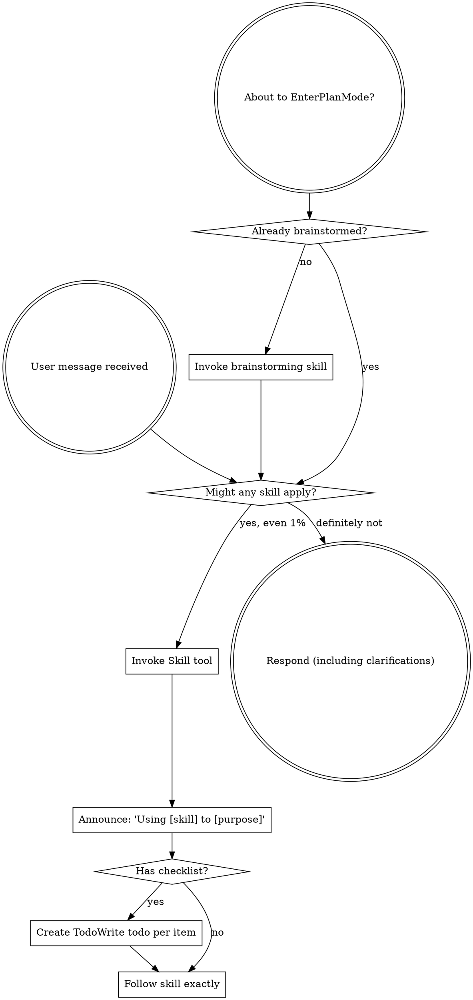

# Boundary Review — ariadne#180 (milestone M3)

| field | value |
|-------|-------|
| issue | 180 — project vocabulary model: schematize project like issue (cue + lifecycle + processes) |
| repo | ariadne |
| issue file | workshop/issues/000180-project-vocabulary-model-schematize-project-like-issue-cue-lifecycle-processes.md |
| boundary | milestone M3 |
| milestone | M3 |
| window | e3efc14aefe354c714a20fcff0f194ccaa213478..HEAD |
| command | sdlc milestone-close --issue 180 --milestone M3 |
| reviewer | codex |
| timestamp | 2026-07-16T13:42:40-07:00 |
| verdict | REWORK |

## Review

Reading additional input from stdin...
OpenAI Codex v0.144.5
--------
workdir: /Users/xianxu/workspace/ariadne
model: gpt-5.6-sol
provider: openai
approval: never
sandbox: workspace-write [workdir, /tmp, $TMPDIR, /tmp] (network access enabled)
reasoning effort: none
reasoning summaries: none
session id: 019f6ca8-c5a4-7ae0-94e5-0896c8fd5c1b
--------
user
# Code review — the one SDLC boundary review

You are conducting a fresh-context code review at a development boundary —
milestone M3 close — in the **ariadne** repository.

- repository: ariadne   (root: /Users/xianxu/workspace/ariadne)
- issue:      ariadne#180 M3   (file: workshop/issues/000180-project-vocabulary-model-schematize-project-like-issue-cue-lifecycle-processes.md)
- window:     Base: e3efc14aefe354c714a20fcff0f194ccaa213478   Head: HEAD

Review the **ariadne** repo and its tracker — the ariadne base-layer repo itself (changes here propagate to dependent repos). Do not assume any
other repository or apply another repo's conventions.

You have no prior session context — that is the anti-collusion property. Verify
behavior against the issue's documented Spec/Plan and the code itself; do NOT
take the implementor's word in commit messages or docs at face value. Tools are
read-only: report findings precisely; the main agent (which has session context)
applies the fixes, commits, and re-runs.

Read the diff against the issue's Spec + Plan, then work the checklist below.
Categorize every finding by severity — not everything is Critical; a nitpick
marked Critical is noise.

  Critical (must fix before crossing the boundary)
    - correctness bugs; crashes / panics on unexpected input
    - behavior drift from stated contracts (for ports of existing code where
      byte-faithfulness was promised, diff against the source)
    - silent error swallowing where the source raised
  Important (fix before the boundary if cheap)
    - API design of newly-introduced internal packages (downstream work will
      consume them; is the surface stable?)
    - missing test coverage that would catch the kind of bug shipped
    - inconsistent error handling across the diff
  Minor (note for future)
    - style nits, naming, comment density; performance only if hot-path

## Review checklist

Code quality
  - Clean separation of concerns; edge cases handled (empty / nil / unexpected).
  - Proper error handling — no silent swallowing where the source raised.
  - No duplicated logic / copy-paste that should be a shared helper.

Testing
  - Tests pin real logic, not mocks reasserting the implementation.
  - The kind of bug this diff could ship is covered.
  - PURE entities tested without IO; INTEGRATION via injected fakes (see below).

Requirements traceability
  - Every Plan checklist item this boundary claims is actually delivered.
  - Implementation matches the Spec; no undeclared scope creep.
  - Breaking changes documented.

Production readiness
  - Migration / backward-compatibility considered where state or formats change.
  - Docs / atlas updated for new surface (see the Docs update gate).

## Core concepts cross-check (if the plan has a Core concepts table)

The plan should list entities in a greppable table — name, kind
(PURE/INTEGRATION), file location, status (new/modified/deleted). For each row:
  - Verify the entity exists at the stated path (grep the diff or filesystem).
  - PURE: tests run without IO (no exec, net, mutable fs). If tests need mocks
    to run, it isn't really PURE — flag Critical and recommend promoting it to
    INTEGRATION.
  - INTEGRATION: injected into pure callers, not invoked directly from business
    logic.
  - "modified" / "deleted": the diff shows the expected change/removal at the
    stated location.
Any contradiction between table and code = Critical finding, plus a plan-revision
recommendation (a "## Revisions" entry so the plan stops claiming what the code
doesn't deliver).

## Docs update gate (atlas + README, per AGENTS.md §8)

The boundary should update user-facing docs for any new surface introduced:

  - **atlas/** — new architectural surface, flow, or terminology. Scan the diff
    for new entity types, subcommands, conventions, file-tree locations. Any
    present without corresponding atlas/ changes in the same range = Important
    finding ("atlas update appears missing for <surface>").
  - **README.md** — new user-facing surface a reader runs or types: subcommands,
    flags, keybindings, config keys, install/usage steps. If the diff adds or
    changes such surface and README.md is not updated in the same range =
    Important finding ("README update appears missing for <surface>"). This is the
    class of gap that used to surface only at the merge-time `specs` judge (#142);
    catch it here, at the earliest gate, before the close verdict is recorded.

## Architecture (the at-review backstop — these matter most long-term)

Work through each of ARCH-DRY, ARCH-PURE, ARCH-PURPOSE explicitly, applying its at-review lens. The
full principle definitions are delivered in the ARCHITECTURE PRINCIPLES block
right after this prompt — for EACH marker, state pass or flag, and cite the
marker (e.g. ARCH-DRY) in any finding. Architecture is where review has the
least training signal and the longest-delayed payoff, so be deliberate here, not
holistic.

## Verdict + output

Begin your response with this fenced verdict block — the machine-read handoff:

```verdict
verdict: <SHIP | FIX-THEN-SHIP | REWORK>
confidence: <high | medium | low>
```

  SHIP           ready; ship it
  FIX-THEN-SHIP  ship after addressing the findings (non-blocking at the gate)
  REWORK         blocking; needs rework before shipping — fix + re-run

The fenced ```` ```verdict ```` block above is the **authoritative machine-read
handoff** — emit it as the first thing in your response. (A prose
`VERDICT: <TOKEN>` first line still satisfies the legacy contract as a fallback,
but the block is what the binary trusts.)

After the verdict block: a 1-paragraph summary — what worked, what blocks SHIP if
it isn't — followed by:
  1. Strengths: 2-5 specific things done well (file:line where useful). Affirm
     validated approaches so the operator knows what's confirmed-good ground.
     Empty acceptable for trivial boundaries.
  2. Critical findings (file:line + fix sketch); empty if none.
  3. Important findings (same format).
  4. Minor findings (terse one-liners).
  5. Test coverage notes.
  6. Architectural notes for upcoming work.
  7. Plan revision recommendations: specific "## Revisions" entries the plan
     needs (empty if the plan still matches the code).


ARCHITECTURE PRINCIPLES — work through each of the 3 entries below explicitly, applying its `at-review` lens; cite the marker (e.g. ARCH-DRY) in any finding.

# Architecture principles (ARCH-*)

Injected architectural taste — the structural decisions whose payoff (or cost)
shows up many turns, often months, down the road. Agents are strong at local
tactics and weak here, so these are checked **at-plan** (when the design is being
made — highest leverage) and **at-review** (backstop, on the diff). Cite the
marker (e.g. `ARCH-DRY`) in plans, `## Log` entries, and review findings.

This file is the single source; it is embedded into the planning, plan-quality,
and code-review prompts. The human narrative lives in AGENTS.md "Core Design
Principles"; this is its machine-delivered companion.

## ARCH-DRY — Don't Repeat Yourself

- **principle:** Reuse before adding. One source of truth per fact/behavior; no
  duplicated logic, copy-pasted blocks, or parallel functions that should be one
  shared helper.
- **at-plan:** Flag a plan that re-implements something the codebase already has,
  or that will obviously duplicate logic across the new files instead of
  extracting a shared helper. Name the existing thing it should reuse.
- **at-review:** Flag duplicated logic / copy-pasted blocks / near-identical
  functions in the diff; point at the consolidation (file:line + the shared
  helper they should become).

## ARCH-PURE — Pure core, thin IO shell

- **principle:** The majority of code is pure functions (deterministic, no side
  effects); a thin "glue" layer at the boundary touches IO/UI/network/clock. Pure
  functions are unit-tested directly; the glue is kept small and injected.
- **at-plan:** Flag a design that buries business logic inside IO/handlers, or
  that will only be testable with heavy mocks (a sign logic isn't separated from
  IO). The plan should name what's pure vs the thin IO seam.
- **at-review:** Flag business logic mixed with IO in the diff; logic that should
  be a pure function injected into a thin caller. If a test needs mocks to run a
  "pure" entity, it isn't pure — recommend extracting the IO to the boundary.

## ARCH-PURPOSE — Serve the issue's actual purpose

- **principle:** Deliver the issue's stated purpose, not the easy subset of it. A
  single-source / "compiled to consumers" change is not done until **every
  consumer derives** from the source — the source is *enforced*, not just
  documentation a surface happens to restate; a hand-maintained restatement of the
  model is a deferred consumer, not a finished one. "Follow-up" is for separable
  extensions, never for the thing that is the point. This is the *opposite axis*
  from Simplicity-First/YAGNI: not "build for an imagined future," but "don't
  **under**-deliver the purpose you already committed to."
- **at-plan:** Flag a plan whose scope is a strict subset of the issue's stated
  goal / Done-when where the part deferred as "follow-up" *is* the purpose (e.g.
  wires one consumer + enforcement but leaves the consumers that motivated the
  issue as documentation that doesn't derive). Ask: does the plan fulfill the
  purpose, or just the cheap win? Name the deferred purpose.
- **at-review:** Does the diff *fulfill* the purpose or settle for the easy win?
  For a single-source change, run the **shadow-sweep** — enumerate the consumers,
  confirm each derives from the source, flag any remaining hand-maintained
  restatement of the model. A "follow-up" that is actually the deferred point of
  the issue is a finding, not a deferral.


OUTPUT CONTRACT (machine-read — do not deviate). LEAD your response with the
fenced ```verdict block shown above — that is the authoritative handoff the binary
reads (its `verdict:` value is one of the listed tokens). Everything after the block
is advisory: a non-blocking verdict WITH findings still PASSES the gate. A bare
`VERDICT: <TOKEN>` line is accepted only as a FALLBACK when the block is absent.

Diff:
diff --git a/atlas/workflow/sdlc-binary.md b/atlas/workflow/sdlc-binary.md
index 347d8b0..ea020ac 100644
--- a/atlas/workflow/sdlc-binary.md
+++ b/atlas/workflow/sdlc-binary.md
@@ -43,6 +43,8 @@ recurs at a stage (not by formalizing the SDLC as a state machine).
 | `issue list`      | (new)                       | List issues (ID/status/title), sorted by ID; `--status` filters; reuses `listIssues` |
 | `issue show`      | (new)                       | Issue frontmatter + section headers, no bodies |
 | `issue validate`  | (new #124)                  | Validate issue file(s) against `#Issue` — frontmatter cue-vet (via `vocabulary validate-instance`) + section presence; multi-target (#133): `<file>...` / `--issue N[,N...]` / `--all` (mutually exclusive). The on-demand surface of the instance-conformance loop |
+| `project new/list/show/validate` | (new #180 M3) | Author and inspect project records. Scaffold sections/status and discovery derive from `#Project`; validation shells to the noun-generic vocabulary validator |
+| `project set-status` | (new #180 M3) | Enforce the project lifecycle and its ordered named guards from `project.cue`; unknown guards fail closed, evidence lands in Log, and `done` remains owned by `project close` |

 **Flat verbs vs the `issue` group (#56).** The flat verbs guard workflow
 *transitions* (close, claim, change-code, pr, merge, …). `sdlc issue *` is the
@@ -189,6 +191,9 @@ cmd/sdlc/
   judge.go             ← scripts/pre-merge-checks.sh
   fetch.go             thin hidden alias → runIssueNew --from-github (#56 M2)
   issue.go             new (#56): `sdlc issue` group — new / set-status / list / show / validate (#124)
+  project.go           new (#180 M3): thin project new/list/show/validate IO shell
+  projectsetstatus.go  project lifecycle legality + named-guard runner; →done
+                       delegates to the M4 close verb
   validategate.go      deterministic instance-conformance gate (#124, generalized
                        by #180 M2): noun table enrolls issue + project; push/merge
                        validate frontmatter on every changed instance, with
@@ -232,7 +237,8 @@ cmd/sdlc/
                        scaffold.go (NextID/Slugify/Render — #56)
     judge/             Category enum, prompt builder, classify, dispatch
     project/           project-file core: line-preserving typed Doc/Task parser +
-                       checkbox/frontmatter/section mutations (#180 M2), alongside
+                       checkbox/frontmatter/section mutations (#180 M2); model-derived
+                       scaffold, pure summaries, and pure named guards (#180 M3), alongside
                        the legacy brain-residency lookup/detail-block helpers (#171
                        will lift residency)
 ```
diff --git a/cmd/sdlc/helptext/project.md b/cmd/sdlc/helptext/project.md
new file mode 100644
index 0000000..5d53d0b
--- /dev/null
+++ b/cmd/sdlc/helptext/project.md
@@ -0,0 +1,39 @@
+`sdlc project` authors and inspects project records. A project is the lifecycle
+one level above an issue: it establishes a product baseline, coordinates a
+cross-repository breakdown, and derives progress from the referenced issues.
+
+SUBCOMMANDS
+
+  new            Create a model-derived project scaffold
+  list           List live projects
+  show           Print one project's baseline and task summary
+  set-status     Move through the guarded lifecycle (except →done)
+  validate       Validate project frontmatter against #Project
+
+PROJECT FILE
+
+Live records reside under `workshop/projects/`; terminal records archive under
+`workshop/history/projects/`. Their four model-derived sections are:
+
+  PRD          the goal, requirements, and acceptance boundary
+  Estimate     the Phase-A baseline and later calibration
+  Breakdown    issue-linked work rows
+  Log          decisions, evidence, forecasts, and retrospectives
+
+A retrospective is a Log entry headed `### <ISO date> — retro`. Transitioning
+to `done` is intentionally unavailable through `set-status`; use
+`sdlc project close`, which owns the retro and fog-factor gates.
+
+STATUSES
+
+{{PROJECT_STATUS_NAMES}}
+
+{{PROJECT_LIFECYCLE}}
+
+Project status is changed through these verbs, never by hand-editing the
+frontmatter. The status set and transition graph above derive from
+`construct/vocabulary/project.cue`.
+
+For depth:
+
+  sdlc project <verb> --help
diff --git a/cmd/sdlc/internal/project/guards.go b/cmd/sdlc/internal/project/guards.go
new file mode 100644
index 0000000..26100f0
--- /dev/null
+++ b/cmd/sdlc/internal/project/guards.go
@@ -0,0 +1,61 @@
+package project
+
+import (
+	"fmt"
+	"regexp"
+	"strings"
+)
+
+type GuardCtx struct {
+	Evidence map[string]string
+	Today    string
+}
+
+type GuardFunc func(d *Doc, ctx GuardCtx) error
+
+var (
+	phaseAEstimateRE = regexp.MustCompile(`(?m)^\*\*phase-a:\*\*\s+(?:\d+(?:\.\d+)?|\.\d+)h\s*$`)
+	retroHeadingRE   = regexp.MustCompile(`(?m)^### \d{4}-\d{2}-\d{2} — retro\b`)
+)
+
+func Guards() map[string]GuardFunc {
+	return map[string]GuardFunc{
+		"prd-present": func(d *Doc, _ GuardCtx) error {
+			body := strings.TrimSpace(d.SectionBody("PRD"))
+			if body == "" || strings.HasPrefix(body, "<") {
+				return fmt.Errorf("PRD must contain substantive prose")
+			}
+			return nil
+		},
+		"phase-a-estimate": func(d *Doc, _ GuardCtx) error {
+			if !phaseAEstimateRE.MatchString(d.SectionBody("Estimate")) {
+				return fmt.Errorf("Estimate must contain **phase-a:** <N>h")
+			}
+			return nil
+		},
+		"baseline-set": func(d *Doc, _ GuardCtx) error {
+			if d.FM("deadline") == "" || d.FM("planned_finish") == "" {
+				return fmt.Errorf("deadline and planned_finish must both be set")
+			}
+			return nil
+		},
+		"reality-check":    evidenceGuard("reality-check"),
+		"issues-cover-prd": evidenceGuard("issues-cover-prd"),
+		"retro-recorded": func(d *Doc, _ GuardCtx) error {
+			if !retroHeadingRE.MatchString(d.SectionBody("Log")) {
+				return fmt.Errorf("Log must contain a dated retro heading")
+			}
+			return nil
+		},
+		"fog-factor-recorded": func(*Doc, GuardCtx) error { return fmt.Errorf("fog factor is recorded by `sdlc project close`") },
+	}
+}
+
+func evidenceGuard(name string) GuardFunc {
+	return func(_ *Doc, ctx GuardCtx) error {
+		if strings.TrimSpace(ctx.Evidence[name]) == "" {
+			return fmt.Errorf("%s evidence is required", name)
+		}
+		return nil
+	}
+}
diff --git a/cmd/sdlc/internal/project/guards_test.go b/cmd/sdlc/internal/project/guards_test.go
new file mode 100644
index 0000000..7e20d1f
--- /dev/null
+++ b/cmd/sdlc/internal/project/guards_test.go
@@ -0,0 +1,61 @@
+package project
+
+import (
+	"strings"
+	"testing"
+)
+
+func guardDoc(t *testing.T, fm, prd, estimate, log string) *Doc {
+	t.Helper()
+	d, err := ParseDoc("---\ntype: project\nname: demo\nstatus: ideation\n" + fm + "---\n## PRD\n" + prd + "\n## Estimate\n" + estimate + "\n## Breakdown\n- [ ]\n## Log\n" + log + "\n")
+	if err != nil {
+		t.Fatal(err)
+	}
+	return d
+}
+
+func TestProjectGuards(t *testing.T) {
+	guards := Guards()
+	for _, name := range []string{"prd-present", "phase-a-estimate", "baseline-set", "reality-check", "issues-cover-prd", "retro-recorded", "fog-factor-recorded"} {
+		if guards[name] == nil {
+			t.Fatalf("guard %q is not registered", name)
+		}
+	}
+	ctx := GuardCtx{Evidence: map[string]string{}, Today: "2026-07-16"}
+	if err := guards["prd-present"](guardDoc(t, "", "\n", "", ""), ctx); err == nil {
+		t.Error("empty PRD passed")
+	}
+	if err := guards["prd-present"](guardDoc(t, "", "\nA real requirement.\n", "", ""), ctx); err != nil {
+		t.Errorf("prose PRD failed: %v", err)
+	}
+	if err := guards["phase-a-estimate"](guardDoc(t, "", "ok", "\n**phase-a:** 3.5h\n", ""), ctx); err != nil {
+		t.Errorf("phase-a failed: %v", err)
+	}
+	if err := guards["phase-a-estimate"](guardDoc(t, "", "ok", "\n**phase-a:** TBD\n", ""), ctx); err == nil {
+		t.Error("non-numeric phase-a passed")
+	}
+	if err := guards["baseline-set"](guardDoc(t, "deadline: 2026-09-01\nplanned_finish: 2026-08-20\n", "ok", "", ""), ctx); err != nil {
+		t.Errorf("baseline failed: %v", err)
+	}
+	if err := guards["baseline-set"](guardDoc(t, "deadline: 2026-09-01\n", "ok", "", ""), ctx); err == nil {
+		t.Error("partial baseline passed")
+	}
+	for _, name := range []string{"reality-check", "issues-cover-prd"} {
+		if err := guards[name](guardDoc(t, "", "ok", "", ""), ctx); err == nil {
+			t.Errorf("%s passed without evidence", name)
+		}
+		with := GuardCtx{Evidence: map[string]string{name: "checked"}}
+		if err := guards[name](guardDoc(t, "", "ok", "", ""), with); err != nil {
+			t.Errorf("%s rejected evidence: %v", name, err)
+		}
+	}
+	if err := guards["retro-recorded"](guardDoc(t, "", "ok", "", "\n### 2026-07-16 — retro\nLearned.\n"), ctx); err != nil {
+		t.Errorf("retro failed: %v", err)
+	}
+	if err := guards["retro-recorded"](guardDoc(t, "", "ok", "", "\n### 2026-07-16\nNot retro.\n"), ctx); err == nil {
+		t.Error("non-retro heading passed")
+	}
+	if err := guards["fog-factor-recorded"](guardDoc(t, "", "ok", "", ""), ctx); err == nil || !strings.Contains(err.Error(), "project close") {
+		t.Errorf("fog guard = %v", err)
+	}
+}
diff --git a/cmd/sdlc/internal/project/scaffold.go b/cmd/sdlc/internal/project/scaffold.go
new file mode 100644
index 0000000..0cbeca8
--- /dev/null
+++ b/cmd/sdlc/internal/project/scaffold.go
@@ -0,0 +1,29 @@
+package project
+
+import (
+	"fmt"
+	"strings"
+
+	"github.com/xianxu/ariadne/pkg/vocab"
+)
+
+// ScaffoldSpec is the pure input to a new project record.
+type ScaffoldSpec struct {
+	Name, Goal, DoneWhen, Today string
+}
+
+// RenderScaffold renders frontmatter plus the model-owned ordered sections.
+func RenderScaffold(s ScaffoldSpec) string {
+	m := vocab.Project()
+	var b strings.Builder
+	b.WriteString("---\n")
+	fmt.Fprintf(&b, "type: project\nname: %s\ngoal: %s\ndone_when: %s\n", s.Name, s.Goal, s.DoneWhen)
+	fmt.Fprintf(&b, "status: %s\ncreated: %s\nupdated: %s\n---\n\n# %s\n", m.InitialStatus(), s.Today, s.Today, s.Name)
+	for _, section := range m.Sections() {
+		fmt.Fprintf(&b, "\n## %s\n", section.Name)
+		if section.Seed != "" {
+			fmt.Fprintf(&b, "\n%s\n", section.Seed)
+		}
+	}
+	return b.String()
+}
diff --git a/cmd/sdlc/internal/project/scaffold_test.go b/cmd/sdlc/internal/project/scaffold_test.go
new file mode 100644
index 0000000..96a5700
--- /dev/null
+++ b/cmd/sdlc/internal/project/scaffold_test.go
@@ -0,0 +1,69 @@
+package project
+
+import (
+	"strings"
+	"testing"
+
+	"github.com/xianxu/ariadne/pkg/vocab"
+)
+
+func TestRenderScaffoldDerivesProjectModel(t *testing.T) {
+	got := RenderScaffold(ScaffoldSpec{
+		Name: "demo", Goal: "Make projects computable.",
+		DoneWhen: "The derived board is trustworthy.", Today: "2026-07-16",
+	})
+	for _, want := range []string{
+		"type: project", "name: demo", "goal: Make projects computable.",
+		"done_when: The derived board is trustworthy.",
+		"status: " + vocab.Project().InitialStatus(),
+		"created: 2026-07-16", "updated: 2026-07-16",
+	} {
+		if !strings.Contains(got, want) {
+			t.Errorf("scaffold missing %q:\n%s", want, got)
+		}
+	}
+	for _, section := range vocab.Project().Sections() {
+		if !strings.Contains(got, "## "+section.Name) {
+			t.Errorf("scaffold missing model section %q", section.Name)
+		}
+		if section.Seed != "" && !strings.Contains(got, section.Seed) {
+			t.Errorf("scaffold missing seed %q", section.Seed)
+		}
+	}
+	d, err := ParseDoc(got)
+	if err != nil {
+		t.Fatal(err)
+	}
+	if d.FM("name") != "demo" {
+		t.Fatalf("parsed name = %q", d.FM("name"))
+	}
+}
+
+func TestSummarizeAndRender(t *testing.T) {
+	d, err := ParseDoc(`---
+type: project
+name: alpha
+status: executing
+deadline: 2026-09-01
+---
+## Breakdown
+- [x] done [ariadne#1]
+- [ ] todo [ariadne#2]
+`)
+	if err != nil {
+		t.Fatal(err)
+	}
+	s := Summarize("workshop/projects/alpha.md", d)
+	if s.Name != "alpha" || s.Done != 1 || s.Total != 2 {
+		t.Fatalf("summary = %+v", s)
+	}
+	if got := RenderListRow(s); got != "alpha  executing  2026-09-01\n" {
+		t.Fatalf("list row = %q", got)
+	}
+	show := RenderShow(s)
+	for _, want := range []string{"workshop/projects/alpha.md", "status: executing", "tasks: 1/2 done"} {
+		if !strings.Contains(show, want) {
+			t.Errorf("show missing %q:\n%s", want, show)
+		}
+	}
+}
diff --git a/cmd/sdlc/internal/project/summary.go b/cmd/sdlc/internal/project/summary.go
new file mode 100644
index 0000000..3ea110d
--- /dev/null
+++ b/cmd/sdlc/internal/project/summary.go
@@ -0,0 +1,44 @@
+package project
+
+import (
+	"fmt"
+	"strings"
+)
+
+// Summary is the pure read model shared by project list/show.
+type Summary struct {
+	Path, Type, Name, Goal, DoneWhen, Status  string
+	Deadline, PlannedFinish, Created, Updated string
+	Done, Total                               int
+}
+
+func Summarize(path string, d *Doc) Summary {
+	s := Summary{Path: path, Type: d.FM("type"), Name: d.FM("name"), Goal: d.FM("goal"), DoneWhen: d.FM("done_when"), Status: d.FM("status"), Deadline: d.FM("deadline"), PlannedFinish: d.FM("planned_finish"), Created: d.FM("created"), Updated: d.FM("updated"), Total: len(d.Tasks)}
+	for _, task := range d.Tasks {
+		if task.State == 'x' {
+			s.Done++
+		}
+	}
+	return s
+}
+
+func RenderListRow(s Summary) string {
+	deadline := s.Deadline
+	if deadline == "" {
+		deadline = "-"
+	}
+	return fmt.Sprintf("%s  %s  %s\n", s.Name, s.Status, deadline)
+}
+
+func RenderShow(s Summary) string {
+	var b strings.Builder
+	fmt.Fprintf(&b, "%s\n---\n", s.Path)
+	fields := []struct{ name, value string }{{"type", s.Type}, {"name", s.Name}, {"goal", s.Goal}, {"done_when", s.DoneWhen}, {"status", s.Status}, {"deadline", s.Deadline}, {"planned_finish", s.PlannedFinish}, {"created", s.Created}, {"updated", s.Updated}}
+	for _, f := range fields {
+		if f.value != "" {
+			fmt.Fprintf(&b, "%s: %s\n", f.name, f.value)
+		}
+	}
+	fmt.Fprintf(&b, "---\ntasks: %d/%d done\n", s.Done, s.Total)
+	return b.String()
+}
diff --git a/cmd/sdlc/main.go b/cmd/sdlc/main.go
index fc7f244..d05c23e 100644
--- a/cmd/sdlc/main.go
+++ b/cmd/sdlc/main.go
@@ -36,10 +36,13 @@ import (
 // placeholder stays hand-written in the helptext `.md`.
 func renderLong(name string) string {
	m := vocab.Issue()
+	p := vocab.Project()
	return strings.NewReplacer(
		"{{LIFECYCLE}}", m.RenderLifecycleHelp(),
		"{{STATUS_NAMES}}", m.StatusNames(" | "),
		"{{STATUS_GLOSS}}", m.StatusGloss(),
+		"{{PROJECT_LIFECYCLE}}", p.RenderLifecycleHelp(),
+		"{{PROJECT_STATUS_NAMES}}", p.StatusNames(" | "),
	).Replace(helptext.MustGet(name))
 }

@@ -91,6 +94,7 @@ func buildRoot() *cobra.Command {
	add(NewStartPlanCmd(), "start-plan", "Enter planning: deliver the architecture principles to design against (#75)")
	add(NewChangeCodeCmd(), "change-code", "Enter implementation after the structural + plan-quality gates")
	add(NewIssueCmd(), "issue", "Create + manage issues (new / set-status / list / show)")
+	add(NewProjectCmd(), "project", "Create + manage projects (new / list / show / set-status / validate)")
	add(NewActualCmd(), "actual", "Compute an issue's focused dev-hours via active-time-v3 (#68)")
	add(NewActiveTimeCmd(), "active-time", "Per-issue active-time attribution table (the v3 engine, standalone)")
	add(NewCloseCmd(), "close", "Close an issue or milestone (ACTUAL + VERIFIED + atlas/project sweep)")
diff --git a/cmd/sdlc/project.go b/cmd/sdlc/project.go
new file mode 100644
index 0000000..25c1b14
--- /dev/null
+++ b/cmd/sdlc/project.go
@@ -0,0 +1,204 @@
+package main
+
+import (
+	"fmt"
+	"io"
+	"os"
+	"path/filepath"
+	"sort"
+	"strings"
+	"time"
+
+	"github.com/spf13/cobra"
+
+	projectdoc "github.com/xianxu/ariadne/cmd/sdlc/internal/project"
+	"github.com/xianxu/ariadne/pkg/vocab"
+)
+
+// NewProjectCmd returns the project-record authoring command group. The M3
+// surface deliberately excludes status/retro/close: those derived and gated
+// workflow verbs land together in M4.
+func NewProjectCmd() *cobra.Command {
+	cmd := &cobra.Command{
+		Use:           "project",
+		Short:         "Create and manage workshop projects",
+		Long:          "Placeholder — replaced by renderLong(\"project\") in main.go.",
+		Args:          cobra.NoArgs,
+		SilenceErrors: true,
+		RunE: func(cmd *cobra.Command, _ []string) error {
+			return cmd.Help()
+		},
+	}
+	cmd.AddCommand(newProjectNewCmd())
+	cmd.AddCommand(newProjectListCmd())
+	cmd.AddCommand(newProjectShowCmd())
+	cmd.AddCommand(newProjectSetStatusCmd())
+	cmd.AddCommand(newProjectValidateCmd())
+	return cmd
+}
+
+type projectNewFlags struct {
+	Slug, Goal, DoneWhen, ProjectsDir string
+}
+type projectListFlags struct{ ProjectsDir string }
+type projectShowFlags struct{ Slug, ProjectsDir string }
+type projectValidateFlags struct {
+	Slug, ProjectsDir string
+	All               bool
+}
+
+var projectTodayFn = func() string { return time.Now().Format("2006-01-02") }
+
+func defaultProjectsDir() string { return envOr("WF_PROJECTS_DIR", vocab.Project().Discovery().Home) }
+
+func newProjectNewCmd() *cobra.Command {
+	f := projectNewFlags{}
+	cmd := markMutatingCommand(&cobra.Command{Use: "new", Short: "Create a project from the model-derived scaffold", Args: cobra.NoArgs, SilenceErrors: true,
+		RunE: func(cmd *cobra.Command, _ []string) error {
+			return runProjectNew(cmd.OutOrStdout(), cmd.ErrOrStderr(), &f)
+		}})
+	cmd.Flags().StringVar(&f.Slug, "slug", "", "project filename/name slug")
+	cmd.Flags().StringVar(&f.Goal, "goal", "", "one-sentence project goal")
+	cmd.Flags().StringVar(&f.DoneWhen, "done-when", "", "falsifiable MVP completion boundary")
+	cmd.Flags().StringVar(&f.ProjectsDir, "projects-dir", defaultProjectsDir(), "directory holding project files")
+	_ = cmd.MarkFlagRequired("slug")
+	_ = cmd.MarkFlagRequired("goal")
+	_ = cmd.MarkFlagRequired("done-when")
+	return cmd
+}
+
+func newProjectListCmd() *cobra.Command {
+	f := projectListFlags{}
+	cmd := &cobra.Command{Use: "list", Short: "List live projects", Args: cobra.NoArgs, SilenceErrors: true,
+		RunE: func(cmd *cobra.Command, _ []string) error {
+			return runProjectList(cmd.OutOrStdout(), cmd.ErrOrStderr(), &f)
+		}}
+	cmd.Flags().StringVar(&f.ProjectsDir, "projects-dir", defaultProjectsDir(), "directory holding project files")
+	return cmd
+}
+
+func newProjectShowCmd() *cobra.Command {
+	f := projectShowFlags{}
+	cmd := &cobra.Command{Use: "show", Short: "Show one project and its task summary", Args: cobra.NoArgs, SilenceErrors: true,
+		RunE: func(cmd *cobra.Command, _ []string) error {
+			return runProjectShow(cmd.OutOrStdout(), cmd.ErrOrStderr(), &f)
+		}}
+	cmd.Flags().StringVar(&f.Slug, "slug", "", "project slug")
+	cmd.Flags().StringVar(&f.ProjectsDir, "projects-dir", defaultProjectsDir(), "directory holding project files")
+	_ = cmd.MarkFlagRequired("slug")
+	return cmd
+}
+
+func newProjectValidateCmd() *cobra.Command {
+	f := projectValidateFlags{}
+	cmd := &cobra.Command{Use: "validate [<file>...]", Short: "Validate project records against #Project", Args: cobra.ArbitraryArgs, SilenceErrors: true,
+		RunE: func(cmd *cobra.Command, args []string) error {
+			return runProjectValidate(cmd.OutOrStdout(), cmd.ErrOrStderr(), &f, args)
+		}}
+	cmd.Flags().StringVar(&f.Slug, "slug", "", "validate one project slug")
+	cmd.Flags().BoolVar(&f.All, "all", false, "validate all live projects")
+	cmd.Flags().StringVar(&f.ProjectsDir, "projects-dir", defaultProjectsDir(), "directory holding project files")
+	return cmd
+}
+
+func runProjectNew(stdout, _ io.Writer, f *projectNewFlags) error {
+	for name, value := range map[string]string{"slug": f.Slug, "goal": f.Goal, "done-when": f.DoneWhen} {
+		if strings.TrimSpace(value) == "" {
+			return fmt.Errorf("--%s is required and must be non-empty", name)
+		}
+	}
+	if filepath.Base(f.Slug) != f.Slug || strings.Contains(f.Slug, ".") {
+		return fmt.Errorf("invalid project slug %q", f.Slug)
+	}
+	dest := filepath.Join(f.ProjectsDir, f.Slug+".md")
+	if _, err := os.Stat(dest); err == nil {
+		return fmt.Errorf("project already exists: %s", dest)
+	} else if !os.IsNotExist(err) {
+		return err
+	}
+	if err := os.MkdirAll(f.ProjectsDir, 0o755); err != nil {
+		return err
+	}
+	body := projectdoc.RenderScaffold(projectdoc.ScaffoldSpec{Name: f.Slug, Goal: f.Goal, DoneWhen: f.DoneWhen, Today: projectTodayFn()})
+	if err := os.WriteFile(dest, []byte(body), 0o644); err != nil {
+		return err
+	}
+	fmt.Fprintln(stdout, dest)
+	return nil
+}
+
+func projectFiles(dir string) ([]string, error) {
+	files, err := filepath.Glob(filepath.Join(dir, vocab.Project().Discovery().Glob))
+	sort.Strings(files)
+	return files, err
+}
+
+func readProject(path string) (*projectdoc.Doc, error) {
+	b, err := os.ReadFile(path)
+	if err != nil {
+		return nil, err
+	}
+	return projectdoc.ParseDoc(string(b))
+}
+
+func runProjectList(stdout, _ io.Writer, f *projectListFlags) error {
+	files, err := projectFiles(f.ProjectsDir)
+	if err != nil {
+		return err
+	}
+	for _, path := range files {
+		d, err := readProject(path)
+		if err != nil {
+			return fmt.Errorf("parse %s: %w", path, err)
+		}
+		fmt.Fprint(stdout, projectdoc.RenderListRow(projectdoc.Summarize(path, d)))
+	}
+	return nil
+}
+
+func runProjectShow(stdout, _ io.Writer, f *projectShowFlags) error {
+	path := filepath.Join(f.ProjectsDir, f.Slug+".md")
+	d, err := readProject(path)
+	if err != nil {
+		return err
+	}
+	fmt.Fprint(stdout, projectdoc.RenderShow(projectdoc.Summarize(path, d)))
+	return nil
+}
+
+func runProjectValidate(stdout, stderr io.Writer, f *projectValidateFlags, args []string) error {
+	if f.All && (f.Slug != "" || len(args) > 0) || f.Slug != "" && len(args) > 0 {
+		return fmt.Errorf("choose one of <file>, --slug, or --all")
+	}
+	files := args
+	if f.Slug != "" {
+		files = []string{filepath.Join(f.ProjectsDir, f.Slug+".md")}
+	}
+	if f.All {
+		var err error
+		files, err = projectFiles(f.ProjectsDir)
+		if err != nil {
+			return err
+		}
+	}
+	if len(files) == 0 {
+		return fmt.Errorf("specify <file>, --slug, or --all")
+	}
+	bad := 0
+	for _, path := range files {
+		out, ok, err := validateFrontmatterFn("project", path)
+		if err != nil {
+			return err
+		}
+		if !ok {
+			bad++
+			fmt.Fprintf(stdout, "%s:\n%s\n", path, out)
+		} else {
+			cok(stderr, path+": conforms")
+		}
+	}
+	if bad > 0 {
+		return fmt.Errorf("%d of %d project file(s) nonconforming", bad, len(files))
+	}
+	return nil
+}
diff --git a/cmd/sdlc/project_cmd_test.go b/cmd/sdlc/project_cmd_test.go
new file mode 100644
index 0000000..c60d2bf
--- /dev/null
+++ b/cmd/sdlc/project_cmd_test.go
@@ -0,0 +1,43 @@
+package main
+
+import (
+	"strings"
+	"testing"
+
+	"github.com/xianxu/ariadne/pkg/vocab"
+)
+
+func TestProjectCommandTreeM3(t *testing.T) {
+	root := buildRoot()
+	project, _, err := root.Find([]string{"project"})
+	if err != nil || project == root {
+		t.Fatalf("project command not registered: %v", err)
+	}
+	for _, name := range []string{"new", "list", "show", "set-status", "validate"} {
+		found, _, findErr := project.Find([]string{name})
+		if findErr != nil || found == project {
+			t.Errorf("project %s not registered: %v", name, findErr)
+		}
+	}
+	for _, deferred := range []string{"status", "retro", "close"} {
+		if found, _, _ := project.Find([]string{deferred}); found != project {
+			t.Errorf("project %s registered before M4", deferred)
+		}
+	}
+}
+
+func TestRenderLongProjectDerivesLifecycle(t *testing.T) {
+	long := renderLong("project")
+	if strings.Contains(long, "{{") {
+		t.Fatalf("project Long has an unsubstituted placeholder:\n%s", long)
+	}
+	m := vocab.Project()
+	for _, status := range m.AllStatuses() {
+		if !strings.Contains(long, status) {
+			t.Errorf("project help missing model status %q", status)
+		}
+		if when := m.When[status]; when != "" && !strings.Contains(long, when) {
+			t.Errorf("project help missing when gloss for %q: %q", status, when)
+		}
+	}
+}
diff --git a/cmd/sdlc/project_crud_test.go b/cmd/sdlc/project_crud_test.go
new file mode 100644
index 0000000..23e8a23
--- /dev/null
+++ b/cmd/sdlc/project_crud_test.go
@@ -0,0 +1,98 @@
+package main
+
+import (
+	"bytes"
+	"os"
+	"os/exec"
+	"path/filepath"
+	"strings"
+	"testing"
+
+	"github.com/spf13/cobra"
+)
+
+func TestRunProjectNewCreatesSelfValidatingScaffold(t *testing.T) {
+	dir := t.TempDir()
+	origToday, origValidate := projectTodayFn, validateFrontmatterFn
+	projectTodayFn = func() string { return "2026-07-16" }
+	var validatedNoun, validatedPath string
+	validateFrontmatterFn = func(noun, path string) (string, bool, error) {
+		validatedNoun, validatedPath = noun, path
+		return "", true, nil
+	}
+	t.Cleanup(func() { projectTodayFn, validateFrontmatterFn = origToday, origValidate })
+
+	f := &projectNewFlags{Slug: "demo", Goal: "Make projects computable.", DoneWhen: "The board is trustworthy.", ProjectsDir: dir}
+	var out, errOut bytes.Buffer
+	if err := runProjectNew(&out, &errOut, f); err != nil {
+		t.Fatal(err)
+	}
+	want := filepath.Join(dir, "demo.md")
+	if strings.TrimSpace(out.String()) != want {
+		t.Fatalf("stdout = %q, want %q", out.String(), want)
+	}
+	if _, err := os.Stat(want); err != nil {
+		t.Fatal(err)
+	}
+	if err := runProjectValidate(&out, &errOut, &projectValidateFlags{}, []string{want}); err != nil {
+		t.Fatal(err)
+	}
+	if validatedNoun != "project" || validatedPath != want {
+		t.Fatalf("validated %q:%q", validatedNoun, validatedPath)
+	}
+	if err := runProjectNew(&out, &errOut, f); err == nil || !strings.Contains(err.Error(), "already exists") {
+		t.Fatalf("second create error = %v", err)
+	}
+}
+
+func TestProjectScaffoldConformsToProjectVocabularyProcess(t *testing.T) {
+	dir := t.TempDir()
+	f := &projectNewFlags{Slug: "demo", Goal: "Make projects computable.", DoneWhen: "The board is trustworthy.", ProjectsDir: dir}
+	if err := runProjectNew(&bytes.Buffer{}, &bytes.Buffer{}, f); err != nil {
+		t.Fatal(err)
+	}
+	cmd := exec.Command("go", "run", "../vocabulary", "validate-instance", "--type", "project", filepath.Join(dir, "demo.md"))
+	if out, err := cmd.CombinedOutput(); err != nil {
+		t.Fatalf("generated scaffold is nonconforming: %v\n%s", err, out)
+	}
+}
+
+func TestProjectNewRequiresGoalAndDoneWhenFlags(t *testing.T) {
+	cmd := newProjectNewCmd()
+	for _, name := range []string{"goal", "done-when"} {
+		flag := cmd.Flags().Lookup(name)
+		if flag == nil || flag.Annotations[cobra.BashCompOneRequiredFlag] == nil {
+			t.Errorf("--%s is not required", name)
+		}
+	}
+}
+
+func TestRunProjectListAndShow(t *testing.T) {
+	dir := t.TempDir()
+	write := func(name, body string) {
+		t.Helper()
+		if err := os.WriteFile(filepath.Join(dir, name+".md"), []byte(body), 0o644); err != nil {
+			t.Fatal(err)
+		}
+	}
+	write("alpha", "---\ntype: project\nname: alpha\nstatus: executing\ndeadline: 2026-09-01\n---\n## Breakdown\n- [x] done [ariadne#1]\n- [ ] todo [ariadne#2]\n")
+	write("beta", "---\ntype: project\nname: beta\nstatus: ideation\n---\n## Breakdown\n")
+	var out, errOut bytes.Buffer
+	if err := runProjectList(&out, &errOut, &projectListFlags{ProjectsDir: dir}); err != nil {
+		t.Fatal(err)
+	}
+	for _, want := range []string{"alpha  executing  2026-09-01", "beta  ideation  -"} {
+		if !strings.Contains(out.String(), want) {
+			t.Errorf("list missing %q:\n%s", want, out.String())
+		}
+	}
+	out.Reset()
+	if err := runProjectShow(&out, &errOut, &projectShowFlags{ProjectsDir: dir, Slug: "alpha"}); err != nil {
+		t.Fatal(err)
+	}
+	for _, want := range []string{"alpha.md", "status: executing", "tasks: 1/2 done"} {
+		if !strings.Contains(out.String(), want) {
+			t.Errorf("show missing %q:\n%s", want, out.String())
+		}
+	}
+}
diff --git a/cmd/sdlc/projectsetstatus.go b/cmd/sdlc/projectsetstatus.go
new file mode 100644
index 0000000..007643f
--- /dev/null
+++ b/cmd/sdlc/projectsetstatus.go
@@ -0,0 +1,116 @@
+package main
+
+import (
+	"fmt"
+	"io"
+	"os"
+	"path/filepath"
+	"strings"
+
+	"github.com/spf13/cobra"
+
+	projectdoc "github.com/xianxu/ariadne/cmd/sdlc/internal/project"
+	"github.com/xianxu/ariadne/pkg/vocab"
+)
+
+type projectSetStatusFlags struct {
+	Slug, To, Reality, Coverage, ProjectsDir string
+	Force                                    bool
+}
+
+var projectGuardsFn = projectdoc.Guards
+
+func newProjectSetStatusCmd() *cobra.Command {
+	f := projectSetStatusFlags{}
+	cmd := markMutatingCommand(&cobra.Command{Use: "set-status", Short: "Move a project through its guarded lifecycle", Args: cobra.NoArgs, SilenceErrors: true,
+		RunE: func(cmd *cobra.Command, _ []string) error {
+			return runProjectSetStatus(cmd.OutOrStdout(), cmd.ErrOrStderr(), &f)
+		}})
+	cmd.Flags().StringVar(&f.Slug, "slug", "", "project slug")
+	cmd.Flags().StringVar(&f.To, "to", "", "target project status")
+	cmd.Flags().StringVar(&f.Reality, "reality", "", "reality-check evidence")
+	cmd.Flags().StringVar(&f.Coverage, "coverage", "", "issues-cover-PRD evidence")
+	cmd.Flags().BoolVar(&f.Force, "force", false, "waive named transition guards (not lifecycle legality)")
+	cmd.Flags().StringVar(&f.ProjectsDir, "projects-dir", defaultProjectsDir(), "directory holding project files")
+	_ = cmd.MarkFlagRequired("slug")
+	_ = cmd.MarkFlagRequired("to")
+	return cmd
+}
+
+func runProjectSetStatus(stdout, _ io.Writer, f *projectSetStatusFlags) error {
+	path := filepath.Join(f.ProjectsDir, f.Slug+".md")
+	ctx := projectdoc.GuardCtx{Today: projectTodayFn(), Evidence: map[string]string{"reality-check": f.Reality, "issues-cover-prd": f.Coverage}}
+	prev, changed, err := applyProjectStatus(path, f.To, f.Force, ctx)
+	if err != nil {
+		return err
+	}
+	if changed {
+		fmt.Fprintf(stdout, "%s: status %s → %s\n", path, prev, f.To)
+	}
+	return nil
+}
+
+func applyProjectStatus(path, to string, force bool, ctx projectdoc.GuardCtx) (prev string, changed bool, err error) {
+	m := vocab.Project()
+	valid := false
+	for _, status := range m.AllStatuses() {
+		if status == to {
+			valid = true
+			break
+		}
+	}
+	if !valid {
+		return "", false, fmt.Errorf("invalid status %q (valid: %s)", to, strings.Join(m.AllStatuses(), ", "))
+	}
+	d, err := readProject(path)
+	if err != nil {
+		return "", false, err
+	}
+	prev = d.FM("status")
+	if prev != to && !m.CanTransition(prev, to) {
+		return prev, false, fmt.Errorf("illegal transition %s → %s; legal from %q: %s", prev, to, prev, strings.Join(m.LegalTransitions(prev), ", "))
+	}
+	if to == "done" {
+		return prev, false, fmt.Errorf("refusing → done; use `sdlc project close`")
+	}
+	if tr := m.TransitionFor(prev, to); tr != nil {
+		guards := projectGuardsFn()
+		for _, name := range tr.Guards {
+			guard, ok := guards[name]
+			if !ok {
+				return prev, false, fmt.Errorf("unknown project guard %q named by the vocabulary", name)
+			}
+			if !force {
+				if err := guard(d, ctx); err != nil {
+					return prev, false, fmt.Errorf("guard %s: %w", name, err)
+				}
+			}
+		}
+		var evidence []string
+		for _, name := range tr.Guards {
+			if value := strings.TrimSpace(ctx.Evidence[name]); value != "" {
+				evidence = append(evidence, fmt.Sprintf("- %s: %s", name, value))
+			}
+		}
+		if len(evidence) > 0 {
+			block := fmt.Sprintf("### %s — transition evidence\n\n%s", ctx.Today, strings.Join(evidence, "\n"))
+			if err := d.AppendToSection("Log", block); err != nil {
+				return prev, false, err
+			}
+		}
+	}
+	d.SetFM("status", to)
+	d.SetFM("updated", ctx.Today)
+	raw, err := os.ReadFile(path)
+	if err != nil {
+		return prev, false, err
+	}
+	next := d.Render()
+	changed = next != string(raw)
+	if changed {
+		if err := os.WriteFile(path, []byte(next), 0o644); err != nil {
+			return prev, false, err
+		}
+	}
+	return prev, changed, nil
+}
diff --git a/cmd/sdlc/projectsetstatus_test.go b/cmd/sdlc/projectsetstatus_test.go
new file mode 100644
index 0000000..64f6ed4
--- /dev/null
+++ b/cmd/sdlc/projectsetstatus_test.go
@@ -0,0 +1,80 @@
+package main
+
+import (
+	"os"
+	"path/filepath"
+	"strings"
+	"testing"
+
+	projectdoc "github.com/xianxu/ariadne/cmd/sdlc/internal/project"
+)
+
+func writeStatusProject(t *testing.T, dir, status, prd, estimate, extraFM string) string {
+	t.Helper()
+	path := filepath.Join(dir, "demo.md")
+	body := "---\ntype: project\nname: demo\ngoal: g\ndone_when: d\nstatus: " + status + "\n" + extraFM + "updated: 2026-07-01\n---\n## PRD\n" + prd + "\n## Estimate\n" + estimate + "\n## Breakdown\n- [ ]\n## Log\n"
+	if err := os.WriteFile(path, []byte(body), 0o644); err != nil {
+		t.Fatal(err)
+	}
+	return path
+}
+
+func TestApplyProjectStatusUsesModelAndGuards(t *testing.T) {
+	dir := t.TempDir()
+	path := writeStatusProject(t, dir, "ideation", "A real PRD.", "", "")
+	prev, changed, err := applyProjectStatus(path, "defined", false, projectdoc.GuardCtx{Today: "2026-07-16"})
+	if err != nil || prev != "ideation" || !changed {
+		t.Fatalf("apply = %q,%v,%v", prev, changed, err)
+	}
+	b, _ := os.ReadFile(path)
+	if !strings.Contains(string(b), "status: defined") || !strings.Contains(string(b), "updated: 2026-07-16") {
+		t.Fatalf("file not updated:\n%s", b)
+	}
+
+	if _, _, err := applyProjectStatus(path, "executing", true, projectdoc.GuardCtx{Today: "2026-07-16"}); err == nil || !strings.Contains(err.Error(), "legal from") {
+		t.Fatalf("force bypassed lifecycle legality: %v", err)
+	}
+	if _, _, err := applyProjectStatus(path, "bogus", true, projectdoc.GuardCtx{}); err == nil || !strings.Contains(err.Error(), "invalid status") {
+		t.Fatalf("unknown status accepted: %v", err)
+	}
+}
+
+func TestApplyProjectStatusForceWaivesNamedGuardsAndDoneRoutesToClose(t *testing.T) {
+	dir := t.TempDir()
+	path := writeStatusProject(t, dir, "ideation", "", "", "")
+	if _, _, err := applyProjectStatus(path, "defined", false, projectdoc.GuardCtx{}); err == nil || !strings.Contains(err.Error(), "prd-present") {
+		t.Fatalf("missing PRD guard = %v", err)
+	}
+	if _, changed, err := applyProjectStatus(path, "defined", true, projectdoc.GuardCtx{Today: "2026-07-16"}); err != nil || !changed {
+		t.Fatalf("force did not waive guard: %v", err)
+	}
+
+	path = writeStatusProject(t, dir, "executing", "ok", "", "deadline: 2026-09-01\nplanned_finish: 2026-08-20\n")
+	if _, _, err := applyProjectStatus(path, "done", true, projectdoc.GuardCtx{}); err == nil || !strings.Contains(err.Error(), "sdlc project close") {
+		t.Fatalf("done did not route to close: %v", err)
+	}
+}
+
+func TestApplyProjectStatusRefusesUnknownModelGuard(t *testing.T) {
+	dir := t.TempDir()
+	path := writeStatusProject(t, dir, "ideation", "ok", "", "")
+	orig := projectGuardsFn
+	projectGuardsFn = func() map[string]projectdoc.GuardFunc { return map[string]projectdoc.GuardFunc{} }
+	t.Cleanup(func() { projectGuardsFn = orig })
+	if _, _, err := applyProjectStatus(path, "defined", false, projectdoc.GuardCtx{}); err == nil || !strings.Contains(err.Error(), "unknown project guard") {
+		t.Fatalf("unknown guard = %v", err)
+	}
+}
+
+func TestApplyProjectStatusAppendsEvidence(t *testing.T) {
+	dir := t.TempDir()
+	path := writeStatusProject(t, dir, "defined", "ok", "\n**phase-a:** 3h\n", "deadline: 2026-09-01\nplanned_finish: 2026-08-20\n")
+	ctx := projectdoc.GuardCtx{Today: "2026-07-16", Evidence: map[string]string{"reality-check": "capacity checked"}}
+	if _, _, err := applyProjectStatus(path, "committed", false, ctx); err != nil {
+		t.Fatal(err)
+	}
+	b, _ := os.ReadFile(path)
+	if !strings.Contains(string(b), "reality-check: capacity checked") {
+		t.Fatalf("evidence not logged:\n%s", b)
+	}
+}
diff --git a/workshop/plans/000180-project-vocabulary-model-plan.md b/workshop/plans/000180-project-vocabulary-model-plan.md
index 9f1d1b00..f151245 100644
--- a/workshop/plans/000180-project-vocabulary-model-plan.md
+++ b/workshop/plans/000180-project-vocabulary-model-plan.md
@@ -771,14 +771,14 @@ func nounGates(issuesDir string) []nounGate {
 - Test: `cmd/sdlc/project_cmd_test.go`; helptext anchors mirror
   `cmd/sdlc/helptext/embed_test.go` conventions

-- [ ] **Step 1: Write failing tests** — cobra tree has `project` with
+- [x] **Step 1: Write failing tests** — cobra tree has `project` with
   subcommands `new,list,show,set-status,validate,status,retro,close`
   (walk the tree like `helptext_render_test.go:71-82` does); rendered Long
   contains the model-derived lifecycle (assert a `when` gloss line surfaces);
   `TestNoCommandLongHasSurvivingPlaceholder` still passes (it auto-covers the
   new placeholders).

-- [ ] **Step 2: Implement** `NewProjectCmd()` mirroring `issue.go:27-52`
+- [x] **Step 2: Implement** `NewProjectCmd()` mirroring `issue.go:27-52`
   (parent `RunE → cmd.Help()`; each subcommand a `newProject<X>Cmd()` builder
   with its own flags struct; mutating ones wrap `markMutatingCommand`).
   `helptext/project.md` documents: the funnel (via placeholder), the gated
@@ -790,9 +790,9 @@ func nounGates(issuesDir string) []nounGate {
   add in M4 (**do the latter**: register only
   `new,list,show,set-status,validate` now; the tree test grows in M4).

-- [ ] **Step 3: Run** `go test ./cmd/sdlc/ -run 'Project|Placeholder|Helptext'` — PASS.
+- [x] **Step 3: Run** `go test ./cmd/sdlc/ -run 'Project|Placeholder|Helptext'` — PASS.

-- [ ] **Step 4: Commit** — `#180 M3: sdlc project — verb family skeleton + model-derived helptext`
+- [x] **Step 4: Commit** — `#180 M3: sdlc project — verb family skeleton + model-derived helptext`

 #### Task M3.2: `project new` / `list` / `show` / `validate`

@@ -800,7 +800,7 @@ func nounGates(issuesDir string) []nounGate {
 - Extend: `cmd/sdlc/project.go`; scaffold render in
   `cmd/sdlc/internal/project/scaffold.go` (+ test)

-- [ ] **Step 1: Write failing tests** —
+- [x] **Step 1: Write failing tests** —
   `new --slug demo --goal "…" --done-when "…"` writes
   `workshop/projects/demo.md` with `type: project`, `name:`, `goal:`,
   `done_when:` (ALL four are `#Project`-required — the scaffold's own file must
@@ -815,12 +815,12 @@ func nounGates(issuesDir string) []nounGate {
   `vocabulary validate-instance --type project <file>` (seam-injected like
   `issue.go:99-124`'s `runIssueValidate` — mirror it).

-- [ ] **Step 2: Implement.** Pure render/summarize helpers live in
+- [x] **Step 2: Implement.** Pure render/summarize helpers live in
   `internal/project`; the command layer only does fs + output.

-- [ ] **Step 3: Run** `go test ./cmd/sdlc/ ./cmd/sdlc/internal/project/` — PASS.
+- [x] **Step 3: Run** `go test ./cmd/sdlc/ ./cmd/sdlc/internal/project/` — PASS.

-- [ ] **Step 4: Commit** — `#180 M3: project new/list/show/validate — scaffold + listing derive from the model`
+- [x] **Step 4: Commit** — `#180 M3: project new/list/show/validate — scaffold + listing derive from the model`

 #### Task M3.3: guard registry + `project set-status`

@@ -831,7 +831,7 @@ func nounGates(issuesDir string) []nounGate {
   the parent + the thin new/list/show/validate builders, mirroring how
   status/close get `projectstatus.go`/`projectclose.go`)

-- [ ] **Step 1: Write failing guard tests** (pure, table-driven):
+- [x] **Step 1: Write failing guard tests** (pure, table-driven):

 ```go
 // GuardCtx carries the injected world: evidence strings from flags, today's date.
@@ -854,9 +854,9 @@ func Guards() map[string]GuardFunc
   never legally need it since →done is refused anyway; registering it keeps the
   unknown-guard check honest).

-- [ ] **Step 2: Implement guards** — pure over `Doc`.
+- [x] **Step 2: Implement guards** — pure over `Doc`.

-- [ ] **Step 3: Write failing set-status tests** — legality from the model
+- [x] **Step 3: Write failing set-status tests** — legality from the model
   (`CanTransition`; refusal message renders `LegalTransitions` like
   `setstatus.go` does for issues — read it first and mirror the UX);
   `--to done` refuses with "use `sdlc project close`"; guards of the matched
@@ -866,14 +866,14 @@ func Guards() map[string]GuardFunc
   `updated:` via `Doc` and commits per the same convention `sdlc issue
   set-status` uses (verify at implementation and mirror).

-- [ ] **Step 4: Implement; run** `go test ./cmd/sdlc/... -run 'Guard|ProjectSetStatus'` — PASS.
+- [x] **Step 4: Implement; run** `go test ./cmd/sdlc/... -run 'Guard|ProjectSetStatus'` — PASS.

-- [ ] **Step 5: Commit** — `#180 M3: project set-status — model-legality + named-guard registry (unknown guard = refusal)`
+- [x] **Step 5: Commit** — `#180 M3: project set-status — model-legality + named-guard registry (unknown guard = refusal)`

 #### Task M3.4: close M3

-- [ ] Full bare suite — PASS. Tick plan rows; log.
-- [ ] `sdlc milestone-close --issue 180 --milestone M3`.
+- [x] Full bare suite — PASS. Tick plan rows; log.
+- [x] `sdlc milestone-close --issue 180 --milestone M3`.

 ### M4 — derived board, retro, calibrated close, Phase-A method


codex
I’m using the repository’s required skill workflow to orient the review, then I’ll inspect the issue/plan, exact diff, vocabulary model, and run focused read-only tests.
exec
/bin/zsh -lc "sed -n '1,240p' construct/adapted/superpowers-using-superpowers/SKILL.md && sdlc --help && sed -n '1,220p' workshop/lessons.md" in /Users/xianxu/workspace/ariadne
 succeeded in 0ms:
---
name: superpowers-using-superpowers
description: Use when starting any conversation - establishes how to find and use skills, requiring Skill tool invocation before ANY response including clarifying questions
---

<SUBAGENT-STOP>
If you were dispatched as a subagent to execute a specific task, skip this skill.
</SUBAGENT-STOP>

<EXTREMELY-IMPORTANT>
If you think there is even a 1% chance a skill might apply to what you are doing, you ABSOLUTELY MUST invoke the skill.

IF A SKILL APPLIES TO YOUR TASK, YOU DO NOT HAVE A CHOICE. YOU MUST USE IT.

This is not negotiable. This is not optional. You cannot rationalize your way out of this.
</EXTREMELY-IMPORTANT>

## Instruction Priority

> **Ariadne note:** AGENTS.md Section 3 governs subagent strategy and overrides skills that mandate subagent-driven-development as the default execution path.

Superpowers skills override default system prompt behavior, but **user instructions always take precedence**:

1. **User's explicit instructions** (CLAUDE.md, GEMINI.md, AGENTS.md, direct requests) — highest priority
2. **Superpowers skills** — override default system behavior where they conflict
3. **Default system prompt** — lowest priority

If CLAUDE.md, GEMINI.md, or AGENTS.md says "don't use TDD" and a skill says "always use TDD," follow the user's instructions. The user is in control.

## How to Access Skills

**In Claude Code:** Use the `Skill` tool. When you invoke a skill, its content is loaded and presented to you—follow it directly. Never use the Read tool on skill files.

**In Gemini CLI:** Skills activate via the `activate_skill` tool. Gemini loads skill metadata at session start and activates the full content on demand.

**In other environments:** Check your platform's documentation for how skills are loaded.

## Platform Adaptation

Skills use Claude Code tool names. Non-CC platforms: see `references/codex-tools.md` (Codex) for tool equivalents. Gemini CLI users get the tool mapping loaded automatically via GEMINI.md.

# Using Skills

## The Rule

**Invoke relevant or requested skills BEFORE any response or action.** Even a 1% chance a skill might apply means that you should invoke the skill to check. If an invoked skill turns out to be wrong for the situation, you don't need to use it.



## Red Flags

These thoughts mean STOP—you're rationalizing:

| Thought | Reality |
|---------|---------|
| "This is just a simple question" | Questions are tasks. Check for skills. |
| "I need more context first" | Skill check comes BEFORE clarifying questions. |
| "Let me explore the codebase first" | Skills tell you HOW to explore. Check first. |
| "I can check git/files quickly" | Files lack conversation context. Check for skills. |
| "Let me gather information first" | Skills tell you HOW to gather information. |
| "This doesn't need a formal skill" | If a skill exists, use it. |
| "I remember this skill" | Skills evolve. Read current version. |
| "This doesn't count as a task" | Action = task. Check for skills. |
| "The skill is overkill" | Simple things become complex. Use it. |
| "I'll just do this one thing first" | Check BEFORE doing anything. |
| "This feels productive" | Undisciplined action wastes time. Skills prevent this. |
| "I know what that means" | Knowing the concept ≠ using the skill. Invoke it. |

## Skill Priority

When multiple skills could apply, use this order:

1. **Process skills first** (brainstorming, debugging) - these determine HOW to approach the task
2. **Implementation skills second** (frontend-design, mcp-builder) - these guide execution

"Let's build X" → brainstorming first, then implementation skills.
"Fix this bug" → debugging first, then domain-specific skills.

## Skill Types

**Rigid** (TDD, debugging): Follow exactly. Don't adapt away discipline.

**Flexible** (patterns): Adapt principles to context.

The skill itself tells you which.

## User Instructions

Instructions say WHAT, not HOW. "Add X" or "Fix Y" doesn't mean skip workflows.
sdlc collects ariadne's SDLC checkpoint guards into one binary. Each subcommand
owns one checkpoint: it requires evidence at the gate, mutates state, logs the
transition, and refuses transitions that lack it. We don't model the SDLC as a
state machine — stages stay prose; we codify the gates between them where drift
recurs. `sdlc` manages the development life cycle; prefer it over `git`/`gh`.

BEFORE WORK
  - `sdlc claim --issue N` — the single start-of-work gesture, a CHEAP LOCK.
    Flips an *open* issue to `working` and publishes the claim to origin/main so
    peer agents see it. No estimate demanded (#113) — claim early, the moment an
    idea crystallizes. `--no-start` suppresses the flip.
  - Do NOT hand-edit an issue's `status:` — let `sdlc claim` or `sdlc issue
    set-status` own that transition (it carries the reopen/`→ done` guards).

ENTER IMPLEMENTATION
  - After plan approval, before editing code, run `sdlc change-code`. It owns the
    branching decision (in-place branch by default; `--worktree=yes` for an
    isolated worktree), the plan-quality check, and the `estimate_hours` gate
    (relocated here from claim, #113). Don't start coding without it.

PUBLISH
  - Publishing goes through a PR: `sdlc pr` → `sdlc merge`. Direct `sdlc push`
    if working directly on main.
  - Publish ONCE at issue close, not per milestone — and do NOT reuse a branch
    name that already has a merged PR. `sdlc merge` refuses (#148) when a branch
    has commits not in main despite a merged PR (a reused name would otherwise
    silently strand the new commits); rename to a fresh branch, `sdlc pr`, retry.

RECOVER
  - After a compaction or session resume, run `sdlc state` to recover where you
    are instead of re-inferring from issue files.

LOCAL REPO TRANSACTION LOCK
  - Mutating verbs take an SDLC-owned repo transaction lock at
    `.git/sdlc.lock` before reading/writing issue state, committing, changing
    branches, or pushing. The lock is local to the Git common dir, so linked
    worktrees of the same repo serialize with each other.
  - Wait messages identify the holder pid and command when metadata is
    available. `close` and `milestone-close` release the lock while the external
    boundary-review subprocess runs, then reacquire before finalization; if HEAD
    or the issue/project file state they prepared changed meanwhile, they refuse
    to finalize and tell you to rerun. `change-code`, `merge`, and `push` can still hold the lock during
    long-running review/ship transactions; wait or retry rather than removing
    the lock while that process is alive.
  - A dead same-host holder is reclaimed automatically; initializing metadata
    is waited through. Other stale/timeout errors tell you how to inspect
    `.git/sdlc.lock`. Remote push/ref races are separate: the local lock
    serializes this checkout, not another machine or clone.

WHEN A VERB ERRORS
  Do NOT route around it with hand-rolled `git`/`gh`. Its errors are next-action
  specs. The fix is one of two things:
    (a) satisfy the precondition it names and re-run the same verb (e.g. `sdlc
        merge` saying "no upstream" → run `sdlc pr` first, then `sdlc merge`); or
    (b) if the error is a genuine gap in `sdlc` itself, fix that edge case in the
        source and re-run. We're still ironing out edge cases.
  Only drop to manual when a verb genuinely cannot express the need — say so.

These gates sit inside a wider prose arc the binary does NOT own: ideation
(parley/pensive) → brainstorm → plan → build → milestone review (`sdlc judge`,
auto-dispatched) → close/ship → postmortem.

CONVENTIONS

  --issue vs --github-issue — `--issue N` always means workshop/issues
  (6-digit ID). `--github-issue N` means a GitHub issue number. Bare `--issue`
  never means a GitHub issue.

  Form vs essence — checkpoint guards (close, milestone-close, push, merge)
  defend against *omission* via required-evidence flags; `sdlc judge` defends
  against *theater* via fresh-context review. Form runs first; judge second.

The verb list + per-verb help (`sdlc <verb> --help`) follow below.

Usage:
  sdlc [flags]
  sdlc [command]

Available Commands:
  claim           Start work: flip an open issue to working + broadcast the claim
  start-plan      Enter planning: deliver the architecture principles to design against (#75)
  change-code     Enter implementation after the structural + plan-quality gates
  issue           Create + manage issues (new / set-status / list / show)
  actual          Compute an issue's focused dev-hours via active-time-v3 (#68)
  active-time     Per-issue active-time attribution table (the v3 engine, standalone)
  close           Close an issue or milestone (ACTUAL + VERIFIED + atlas/project sweep)
  milestone-close Close one milestone + auto-dispatch its review
  pr              Open a pull request from a feature branch
  merge           Merge the PR, archive done issues, clean up
  push            Ship from main (clean tree + pre-merge judges + archive)
  state           Inspect workflow state (branch, working issues, drift)
  resolve         Resolve a symbolic artifact ref (ariadne#11, #15 M4) to its current path(s) — read-only
  open            Resolve a ref and open the primary artifact in $EDITOR
  migrate         Move a markdown artifact to a peer repo, rewriting refs (#179)
  judge           Run an LLM-judge check against the diff (fresh-context)
  arch-principles Print the ARCH-* architecture principles (single source; pull for non-gate work)
  estimate-source Name the shared estimate method + the repo-local calibration source (pull)
  process-manual  Unroll every injection source into a linked process manual (#153)
  propagate-base  Re-weave every recursive dependent of this repo (foundation-first)
  help            Help about any command

Flags:
  -h, --help   help for sdlc

Use "sdlc [command] --help" for more information about a command.
# Lessons Learned

*(Record patterns of what went wrong and rules to prevent repeating them)*

## A prose policy is an integration contract when its test reads the repository; pin semantics and every derived consumer

**Pattern (#167 close review):** The plan labeled `SessionContinuityPolicy` PURE,
but its only regression test read `AGENTS.base.md` and the continuation prototype
from disk. The label contradicted the actual boundary: this was a repository
contract consumed by harness entry files, not an IO-free transformation. The
same test checked only that `"60%"` appeared, so reversing the requirement from
“more than 60%” to “less than 60%” still passed. Generic weave tests proved the
fan-out mechanism in isolation, but the feature test never proved this policy's
source was exported into all three consumers.

**Rule:** Classify an entity by the boundary its behavior test crosses, not by
whether its source happens to be prose. A test that reads live repository files
is INTEGRATION; call something PURE only when its behavior is exercised entirely
from in-memory inputs. For declarative policy contracts, pin the semantic
predicate (direction + boundary + action), not a bag of tokens, and drive the
actual source through its real composition seam to assert every derived consumer.
Prove the guard with a wrong-direction mutant and a broken-export mutant before
trusting green. Scope prose assertions to the owning section so duplicate words
elsewhere cannot mask a deletion. When the source is structured (a manifest,
frontmatter, JSON), parse its semantic records instead of substring-matching raw
text — a commented-out row contains the same bytes but has no behavior. When a
consumer registry already exists, derive an “every consumer” sweep from it rather
than copying today's members into the test; otherwise future consumers silently
escape the contract. Assert the complete scoped contract in each derived consumer,
not just identifying sentinels, when partial propagation would violate Done-when.
For the source itself, enumerate every behavioral predicate in the Spec—including
conditions and ordering—not merely the nouns or actions it mentions. Where the
contract is relational, assert the bound clause or relative positions; separate
presence checks do not prove causality, sequence, or the absence of negation.
(`ARCH-PURE`, `ARCH-PURPOSE`.)

**Origin:** #167 whole-issue close review (REWORK). The remediation moved the
guard from `cmd/datatype` to an end-to-end `cmd/weave` fixture, pinned “more than
60% full” plus the checkpoint boundary, checked the live base-manifest export,
and asserted `CLAUDE.md`, `AGENTS.md`, and `GEMINI.md` all derive the policy.
The follow-up FIX-THEN-SHIP review hardened it further with section scoping and
typed manifest parsing after moved-marker and commented-export mutants exposed
the raw-text false positives.

## A changed surface has shadow docs and execution records, not just the main atlas page

**Pattern (#97 close review):** The implementation updated `atlas/workflow/weave.md`
for topological settings merge, but two other atlas pages still described
settings as only `settings.ariadne.json + settings.local.json`. The code and
primary atlas page were right; the shadow documentation was stale. The same
review found the durable implementation plan still had every detailed checkbox
unchecked even though the issue checklist was complete.

**Rule:** When changing a named surface or convention, run a shadow-doc sweep for
the old phrase and update every live explanatory copy, not just the page you
remember editing. Also update the durable plan's execution state before close:
issue checkboxes, detailed plan checkboxes, and any generated review sidecars
should tell the same story. Grep for the old model terms before committing
(`settings.ariadne.json + settings.local.json`, `MergeSettings{Source}`, etc.),
then rerun `git diff --check`.

**Origin:** #97 close review (FIX-THEN-SHIP). The code review found no behavior
blockers, but caught stale atlas shadows and unchecked durable-plan steps before
the issue crossed the boundary.

## Generated review sidecars must be bounded, or they become the next review's input bug

**Pattern (#166):** `sdlc close` writes a durable review sidecar, and the next close review diffs that sidecar too. Capturing the full raw reviewer transcript, including the prompt and diff, made the sidecar enormous, introduced whitespace-check failures from embedded patches, and eventually made a later review dispatch fail with `argument list too long`. The evidence file became active input to the gate it was supposed to document.

**Rule:** Generated review artifacts must be bounded and normalized before they enter the reviewed diff. Persist the machine-useful facts (verdict, window, findings, verification commands, resolution), not the full prompt/diff transcript. If a sidecar must carry raw output, keep it out of the code-reviewed diff or teach the generator to strip/escape whitespace-sensitive embedded patches. After any generated sidecar write, run `git diff --check` before committing it.

**Origin:** #166 close-review loop. The fix for this issue manually condensed the sidecar after each generated rewrite so `git diff --check` and later boundary-review dispatches stayed usable.

## A deferred cleanup does not run through `os.Exit` — command wrappers must cover hard exits and init races

**Pattern (#132):** A root-level Cobra wrapper acquired `.git/sdlc.lock` and used `defer release()` around the command `RunE`. That looked correct for returned errors, but most `sdlc` guard refusals call `die()`, and `die()` calls `os.Exit(1)`. `os.Exit` skips defers, so routine refusals would leave `.git/sdlc.lock` behind and wedge the next mutating command. The same review found a second liveness race: `mkdir .git/sdlc.lock` succeeds before `meta.json` is written, so a waiter can see the directory without metadata and must treat that as "holder initializing," not as a corrupt lock to remove.

**Rule:** When adding a process-wide wrapper around command bodies, enumerate every exit path, not just returned errors. If any path uses `os.Exit`, register cleanup somewhere that path drains explicitly before exit; a `defer` in the caller is not enough. For filesystem locks created as a directory plus metadata file, make waiters tolerate the mkdir-before-metadata window with a short grace period. Auto-reclaim only facts you can prove safe (same host + missing pid); cross-host or over-age uncertainty should fail with recovery guidance.

**Origin:** #132 boundary review (REWORK). The fix added a die-cleanup registry, idempotent lock release, confirmed-dead same-host reclaim, metadata-initialization polling, and real concurrent `Acquire` coverage.

## A pure helper unit-tested in isolation can be silently un-wired from its caller

**Pattern:** #72 extracted a pure `planPointer(issue) string` and printed it from the thin `runStartPlan` IO seam (`cinfo(stdout, planPointer(issue))`). TDD gave it a colocated unit test (`TestPlanPointer`) pinning the *wording* — skill name, `workshop/plans/` path, the `~/.claude/plans` demotion. All green. But nothing asserted the seam *actually calls* the helper: delete the `cinfo` line, or reorder it, or let a refactor drop it, and `TestPlanPointer` stays green while the feature ships broken. The boundary-review judge (fresh eyes) caught it; the author's suite didn't. I'd verified it *manually* (ran `start-plan`, saw the line) — so the gap was specifically the **automated regression**, not the behavior.

**Rule:** When TDD produces a pure entity consumed by a thin IO/print seam (the ARCH-PURE shape), the unit test on the entity is necessary but **not sufficient** — add one *integration assertion on the seam's output* that the entity's contribution is present (here: extend the existing `runStartPlan(&b, 75)` test with `"superpowers-writing-plans"` + `"workshop/plans/000075-"`). The unit test pins *what the helper says*; the integration assertion pins *that the caller says it*. Without the second, "pure helper exists and is correct" and "pure helper is wired in" are two independent facts and only the first is guarded. Cheap (one line appended to a test that already renders the seam) and it closes exactly the drop/reorder bug class. Distinct from the #44 "IO needs a live run" lesson: this isn't external IO — it's the wiring between a pure function and its single in-process caller, invisible because *both* the unit test and a helper-never-called build are green.

**Origin:** #72, boundary review (FIX-THEN-SHIP → fixed before crossing). The mandatory fresh-context review (binary-dispatched at `sdlc close`) found the wiring gap the author's own green suite hid — a concrete instance of why the review boundary is owned by fresh eyes, not the author (AGENTS.md §3).

## Skill design: enumeration vs. judgment

**Pattern:** A skill's behavior was specified by enumerating cases — a hardcoded list of nouns mapped to outcomes, plus a hardcoded list of "examples that DO/DO NOT trigger." Every new case required editing the skill, and the vocabulary tail (synonyms, unusual phrasings, descriptive statements that incidentally contain trigger nouns) was never reachable by enumeration.

**Rule:** When a skill's behavior is best described as *"use judgment"*, don't make it enumerate — express the principle and let the LLM apply it. The skill should describe *the question being asked* (e.g., "is this a fact, a question, or a request?") and *the discriminator* (e.g., "is the substance already present, or being requested generatively?"), not the surface forms that pass/fail. Concrete examples can serve as priming (a small, illustrative set), but they should not be the matching mechanism.

**Test for whether a list belongs in a skill:** ask *"would the skill's behavior be wrong if this list were missing, or just less ergonomic?"* If wrong → the skill has too much enumeration; the case it covers should be derivable from a principle stated elsewhere in the skill. If less ergonomic → the list is fine as priming, keep it short.

**Origin:** issue #25 (dispatcher: judgment-based triggers, replace enumeration). The `xx-datatype` skill's original noun→type mapping table was the case; it broke the atlas's own claim that "new types are pure data — adding one does not require a skill change."

## "Direct-only" handoffs hide transitivity bugs behind a depth assumption

**Pattern:** `bootstrap.sh` cloned only *direct* peers, then `exec make bootstrap` to let the recursive cloner take over. This silently assumed the handoff target (the Makefile, reached through a symlink chain) needed only the direct peer present. True for 2-deep chains, false for 3-deep — and *nothing in the codebase was 3-deep yet*, so the bug was invisible. The recursive cascade that would have fixed it could never start, because starting it required the very substrate it was meant to fetch.

**Rule:** When step A does "just enough" to hand off to step B, write down the invariant A must establish for B to run, then check it holds at the *deepest* input, not the common one. A "clone the direct peer" shortcut is really "ensure B's entrypoint resolves" — make the code do the actual requirement (clone *transitively* until the entrypoint resolves), not the proxy that happens to coincide with it at depth 2.

**Two corollaries that recurred here:**
- A file that runs *before its own substrate exists* (seed-delivered, zero-substrate) cannot share code via symlink — it must inline. Don't fight this; keep the inline copy and lock it to the canonical implementation with a **drift test** (run both on a fixture, assert equal output). One grammar, two call sites, one test.
- `local a="$1" b="$ROOT/$a/..."` on a **single line** can read `$a` as unbound under `set -u` — split positional captures from derived locals onto separate `local` statements.

**Origin:** issue #45 (bootstrap transitive clone walk). Surfaced while designing #44; the brain→nous→ariadne symlink chain was the case that exposed the depth-2 assumption.

## Integration bugs hide where pure tests can't reach — sandbox/IO needs a live run

**Pattern:** issue #44 (openshell sandbox go.mod sync) had thorough hermetic tests for the *pure* logic (`compute_sync_set` rw/ro classification, peer-walk membership) — all green. Yet the first live `make sandbox-build` exposed **three** bugs none of those tests could see: (1) a self-referential `~/workspace → /sandbox/workspace` symlink because `$HOME` is `/sandbox` in the base image (name == target); (2) an `ssh` call I added *inside* a `while read … done < <(…)` loop consumed the loop's stdin and truncated it to the first peer; (3) mutagen won't create a sync-root's missing *parent* dir, so `/sandbox/workspace/<name>` synced 0 files until `/sandbox/workspace` was pre-`mkdir`ed.

**Rule:** for any feature whose substance is IO against an external process (mutagen, ssh, docker, a container's filesystem/`$HOME`), unit tests of the pure decision logic are necessary but **not sufficient** — you must run it against the real thing once before claiming done (AGENTS.md §5). Split the work so the pure core *is* unit-tested (add a `*_LIB_ONLY` source hook to call internal functions without dispatching), then do one live E2E pass; budget for it to find bugs, because it will. Specific tripwires to remember:
- **Don't assume `$HOME`.** Check it (here it was `/sandbox`, not `/home/sandbox`); a symlink whose name equals its resolved target is always a loop. Guard with a string compare, not `-ef` (the inode test falsely falls through when the target doesn't exist yet).
- **`ssh`/`mutagen`/any stdin-reader inside a `while read` loop eats the loop's input.** Read on a dedicated fd (`done 3< <(…)`, `read … <&3`) and pass `ssh -n`.
- **mutagen creates the sync-root leaf but not missing parents** — pre-`mkdir -p` the parent.

**Origin:** issue #44. The bugs were found in three successive live `make sandbox-build` runs against a real `pair` sandbox; the pure suite (6/6) stayed green throughout — it simply couldn't observe them.

## N parallel walkers over one grammar drift apart silently — make the Nth match the others, with a test

**Pattern:** the `replace => ../<peer>` grammar in `construct/go.mod` is read by four independent walkers (setup.sh `discover_ancestors`, bootstrap-peers.sh, list-peers.sh, bootstrap.sh). The convention is "walk BOTH the root go.mod and `construct/go.mod` per node" (substrate ancestor lives in construct, not root). Three walkers honored it; `discover_ancestors` quietly walked only the root. It "worked" for years because the only failing shape — a depth-2 derivative whose depth-2 ancestor is declared in the depth-1's `construct/go.mod` — didn't exist until brain→nous→ariadne. The depth-1 case was masked by an unrelated fallback (Source-3 `ARIADNE_DIR`). The atlas even *documented* the correct behavior — so the bug was a silent divergence from stated intent, invisible because no input exercised it.

**Rule:** when the same grammar/format is parsed in more than one place, treat them as one logical parser with N call sites — not N parsers. (a) Audit ALL sites when you touch one (`grep` the format string / the path being read); the one you didn't write is the one that drifted. (b) The divergence won't show until an input hits the gap, so add a **fixture-based test that pins the sites together** (here: a hermetic chain asserting depth-2 discovery; for the inline-copy case in #45, a drift test asserting equal output). (c) When the atlas says "all four do X" but one doesn't, that's not documentation rot to fix in prose — it's a latent bug; make the code true.

**Corollary — test seams for apply-style scripts:** a function that's normally followed by a destructive apply (setup.sh mutates the target) isn't testable end-to-end without side effects. Add a narrow env-gated early-exit (`SETUP_DISCOVER_ONLY=1` prints the computed set and exits) so the *decision* is assertable hermetically while the *apply* stays untested-by-that-test. Mirrors #45's `BOOTSTRAP_DRY_RUN`/`BOOTSTRAP_CLONE_ONLY`.

**Origin:** issue #50. Surfaced pushing #49's `clone-data-deps.sh` down to brain — it never arrived because `discover_ancestors` stopped at nous and never read `nous/construct/go.mod` to find ariadne.

## Agent-invoked CLI verbs must run headless and gate on durable state, not local convenience

**Pattern:** `sdlc merge` broke two ways while shipping #56, both invisible to a human at a terminal and only biting the headless/agent path. (1) Its confirmation prompts called `scanner.Scan()` on `os.Stdin` with no tty check — an agent/background invocation has no tty, so the scan *blocked forever* (the observed "stall"). (2) Its "is the branch pushed?" gate keyed off `@{u}` — the *local upstream-tracking config* — which a plain `git push` (no `-u`) never sets, and which a sandbox that blocks `.git/config` writes silently drops. So `merge` refused a branch that was genuinely pushed with an open PR.

**Rule:** A verb an agent invokes must (a) **never block on stdin** — tty-guard every interactive prompt and, when not a tty, fail fast with a next-action (`--yes`, or a sentinel like `change-code`'s `ASK_<TOPIC>`), never a bare blocking read; and (b) **gate on the most durable signal, not a derived local convenience** — `origin/<branch>` (the remote-tracking ref, updated by any push) carries the same truth as `@{u}` (tracking config) but survives the cases where the config is absent. When choosing what a guard reads, ask "what's the *fact* I need, and what's the flakiest proxy for it I might be keying on?"

**Origin:** #56 session, `sdlc merge` fixes. `change-code` already had the tty pattern right (`isTTY` → sentinel); `merge` predated it. Found by the tool hanging in a non-tty agent run, then refusing a pushed branch because the sandbox had eaten its `push -u` config write.

## Matching convention-authored free text: the canonical form is one of many natural ones

**Pattern:** Two matchers in `sdlc` silently failed on natural-but-non-canonical phrasing. (1) The milestone-verdict guard anchored commit subjects on `^#<N> Mx:` — milestone immediately followed by a colon — so the natural `#56 M1 close: …` (milestone + words before the colon) didn't match, and `sdlc close` claimed three reviewed milestones "lacked Review-Verdict trailers" that were right there. (2) The milestone-review verdict parser only read the first non-empty line, so it recorded "unknown" when the LLM judge led with a markdown title (M1) and again when it narrated investigation prose before the verdict (M3) — twice, two different shapes.

**Rule:** When parsing text a human or LLM authors *by convention* (commit subjects, review verdicts, status lines), the documented canonical form is one of many forms real authors produce. Don't anchor on a literal token (`Mx:`); anchor on a boundary (`Mx[: ]`, still rejecting `M10`) and, for the harder cases, add a **high-precision fallback** that survives narration (a confidence-qualified `<VERDICT> (confidence: …)` line works where "verdict on line 1" doesn't). **Test the non-canonical-but-natural variants explicitly** — the canonical form always passes; the bug lives in the phrasings you didn't enumerate. (A strict matcher is a hidden enumeration of *one* accepted form — see the enumeration-vs-judgment lesson above.)

**Origin:** #56 session, `sdlc close` + `sdlc milestone-close`. Both reported a verdict of "unknown"/"missing" for work demonstrably reviewed; the fix was boundary-tolerant matching + a fallback, each pinned with a regression test for the exact failing shape.

## A hand-maintained copy of generated data drifts — render from the source

**Pattern:** `sdlc --help` listed every verb *twice*: a hand-written `SUBCOMMAND` block in `root.md` and cobra's auto-generated `Available Commands`. The hand-list was the drift-prone copy — it still advertised flat `set-status`/`fetch` after #56 made them hidden, and an atlas index still said "11 verbs" when the visible count was 10. The generated list could not drift (it renders from the live registry and auto-omits hidden commands); the hand copy needed a human to remember.

**Rule:** If a tool can render a list/count from its own registry, **don't also hand-maintain a copy** — render from the source (here: `cobra.EnableCommandSorting=false` + workflow-ordered registration gave the auto-list the ordering the hand-list existed to provide). If a curated copy is genuinely required, pin it to the source with a test, or it *will* go stale at the next change. Same family as "N parallel walkers drift," one level up: generated-output vs hand-mirror.

**Tripwire — compile-check builds drop a binary at the repo root.** `go build ./cmd/sdlc/` (run for a quick compile-check) emits `./sdlc` in the cwd, *not* the gitignored `bin/` — and `git add -A` then swept it into a commit. Two fixes: (a) compile-check with `go build -o /dev/null ./cmd/sdlc/` (or `go vet`) so no artifact lands; (b) gitignore build outputs at *every* path they can land (`/sdlc`, not just `bin/`), and scan `git status` for untracked binaries before a broad add.

**Origin:** #56 session, the `sdlc --help` consolidation + the stray-binary amend.

## Iterating files via `ls` in `$()` word-splits — glob directly

**Pattern:** #59's vm-hooks run-parts loop iterated `for name in $(cd "$DIR" && LC_ALL=C ls -1 ./*.sh)`. The unquoted command substitution word-splits on whitespace, so a hook named `15 setup.sh` became two tokens (`15`, `setup.sh`), each `bash`-run as a nonexistent path (rc=127) — the real hook silently never ran, only warned. The documented `NN-` no-space convention masked it, so it shipped and a fresh-eyes review (not the author) caught it.

**Rule:** To iterate files in shell, **glob directly** (`for f in "$DIR"/*.sh`), never `ls`/`find` inside `$()` — a command substitution always word-splits (and globs) its output. Under `set -euo pipefail` on macOS **bash 3.2**, pair the glob with `shopt -s nullglob` so an empty match is a clean no-op (and to dodge the `"${arr[@]}"`-on-empty-array `set -u` abort that bites 3.2 but not 4.4+). For arbitrary filenames, the fully-safe form is a NUL-delimited process-substitution: `while IFS= read -r -d '' f; do …; done < <(LC_ALL=C; shopt -s nullglob; for g in "$DIR"/*.sh; do printf '%s\0' "$g"; done)` — whitespace/newline-proof, order pinned, locale scoped to the subshell. **Test the spaced-filename case explicitly**; the convention-compliant names always pass.

**Origin:** #59 session, post-milestone review of the tart vm-hooks loop. Verified the fix under `/bin/bash 3.2.57` (the actual VM interpreter), not just the host shell — bash 3.2's `set -u`/empty-array and `shopt` behaviors differ from modern bash and from zsh.

## Migrating a peer repo: check its branch/cleanliness first; never `git clean -fd` it

**Pattern:** Rolling out #60 M4 to a derivative (nous), I ran `make refresh` + `git rm construct/go.mod` + commit — but nous was on its own feature branch (`000036-...`) mid-work, so my base-layer commit polluted *its* feature branch. Worse, reverting with `git reset --hard HEAD^ && git clean -fd` removed two empty untracked dirs (`workshop/notes/`, `workshop/vision/`) that weren't my artifacts — `git clean -fd` deletes ALL untracked, not just what I created. (No tracked content was lost; verified + recreated. But it was reckless on a repo I don't own the state of.)

**Rule:** A base-layer change that lands as a *commit in a peer repo* is not a mechanical loop. Before touching peer X: (a) check `git -C X branch --show-current` — if it's not the integration branch (main), STOP; committing base-layer work onto someone's feature branch is wrong. (b) check `git -C X status --porcelain` is empty — never refresh/migrate a dirty peer. (c) To undo your own artifacts, remove them **by name** (`rm construct/deps construct/dev-aliases.sh …`; `git restore <tracked>`), NEVER `git clean -fd` — that's a blunt instrument that eats the operator's untracked files too. (d) A "try it out" verification (does the migration *work*) is separable from the *commit* — you can prove the mechanism in a throwaway/verify pass without committing into the peer at all.

**Corollary — the fleet has heterogeneous git state.** "Refresh + delete + commit ×13" assumes every derivative is clean-on-main; in reality some are mid-feature-work. A cross-repo base-layer migration must survey each repo's branch/cleanliness and skip/defer the ones that aren't ready, rather than assuming a uniform loop.

**Origin:** #60 M4, the nous canary. The migration mechanism itself worked perfectly (construct/deps-only nous: list-peers/bootstrap/sdlc-build all identical to dual-read) — the failure was treating the per-repo *commit* as blind automation.

## A migration's "nothing to migrate" precondition must be checked against the real fleet — with a portable check

**Pattern:** #60 M5 retired the legacy `construct/data-deps` reader on the premise "no repo has a populated data-deps, so nothing to fold." The premise was *false* — `brain` had a live `you-decide` content mount in `construct/data-deps` — and the survey that "confirmed" it was empty used `grep -qvE '^\s*(#|$)'`. **BSD/macOS grep (ERE) doesn't support `\s`** (a GNU extension), so the pattern didn't match comment/blank lines as intended and the check reported a false negative. M5 would have made brain's mount non-reproducible (the tracked symlink survives, but a fresh clone never re-clones the sibling). Caught by fresh-eyes review, not the (green) test suite — the migrated test even *asserted* the legacy file was ignored, green-lighting the regression.

**Rule:** (a) Before retiring/deleting a mechanism, enumerate its *actual live consumers across the fleet* and migrate each — don't assert "nothing uses it" from a single grep; spot-check the repos you expect to use it (here: brain, the whole motivating case for data-deps). (b) **Use POSIX character classes, not GNU `\s`/`\d`, in shell greps** — `[[:space:]]`, `[[:blank:]]` — because the same script runs under BSD grep on macOS and GNU grep on Linux. A `\s` that silently matches nothing turns a safety check into a rubber stamp. (c) A test that asserts the NEW behavior ("legacy file ignored") does not verify the DATA migration happened — keep those separate in your head.

**Origin:** #60 M5. The retirement code was correct; the rollout missed brain's row because the precondition check was both unportable (`\s` under BSD grep) and under-scoped (didn't spot-check the known consumer).

## A guard test must be proven to have teeth — mutation-check it

**Pattern:** #63 added an e2e test that `sdlc merge` refuses *before* the irreversible `gh pr merge` when a pre-merge judge dirties the tree (the #62 M1 9b guard). A test that asserts "merge refused" can pass for the wrong reason — refused at an *earlier* gate, never reached 9b at all — and still look green. To prove the test actually exercises 9b, I temporarily neutered the guard (`redirty \!= "" && false`) and confirmed the test went **red** ("expected merge to refuse"), then restored it. Without that step, the test could have been a rubber stamp that survives the guard's deletion.

**Rule:** When a test exists to defend a specific guard/branch, **mutation-check it once**: disable the guard, confirm the test fails, restore. A test that stays green when the code it guards is removed defends nothing. Cheap to do (one throwaway edit — use `$TMPDIR` for the backup under sandbox, restore immediately), and it's the difference between "the test passes" and "the test would catch the regression." Pair with assertions that pin the *specific* failure (e.g. a 9b-unique message substring + `PRMerge` call-count == 0), so a refusal at the wrong gate can't masquerade as success.

**Corollary — testing a verb that `os.Exit`s or shells out directly.** `runMerge` resisted in-process testing because `die()` → `os.Exit(1)` kills the test and `detectRepo`/`RepoTopLevel` call `exec.Command("git")` directly. The unlock was a trio of minimal `func`→`var` seams (`die`, `detectRepo`, `runPreflightJudgesFn`) — callers unchanged — plus a real throwaway repo (`git init` + local **bare** origin) so switch/pull/archive/branch-delete run for real instead of being mocked. `expectDie` swaps `die` for `panic(&dieSignal)`+recover, preserving halt semantics in-process. Prefer a real temp repo over stubbing a dozen git calls when the cleanup *is* what you're testing. Note: process-global var swaps + `os.Chdir` forbid `t.Parallel()`; the panic-based `die` runs deferred funcs that prod's `os.Exit` would not (keep refusal paths defer-free).

**Origin:** #63 M1 (e2e harness for `runMerge`), milestone-review SHIP. The reusable kit (`expectDie`/`tempRepo`/`swapMergeDeps`) is meant for any future `run*` verb's refusal-path test.

## Dogfooding a tool on its own meta-issue catches what unit tests miss

**Pattern:** #66 fixed `sdlc close`'s `insertLogLine` to file a dated log line under its matching `### <date>` day header. Unit tests (5, exact-string) all passed. But the *first real close* of #66 misfiled the line into the issue's own `## Problem` code-block example — because `insertLogLine` matched the **first** `## Log` / `### <date>` in the body, and #66, being a meta-issue *about the log format*, literally quotes those headers inside a fenced block. The test bodies never reproduced that self-reference, so green tests + a broken close. The fix: anchor on the **last** `## Log` (the real section is conventionally final). Both the old and new code shared the first-match weakness; only running the tool on its own self-referential issue surfaced it.

**Rule:** When a tool parses document *structure* (markdown headers, sections, fences), a document *about* that structure will contain the structure literally in prose/examples — and naive first-match parsing misfires on exactly those meta-documents. (a) **Dogfood structure-parsing tools on a meta-input** that quotes the structure (a unit test with the target header inside a ``` fence earlier in the body is the cheap version). (b) Anchor to the *conventional position* (here: the LAST `## Log`, since the real section is the final one) rather than the first match, or skip fenced code blocks. (c) Green exact-string unit tests prove the cases you imagined; a live dogfood proves the case you didn't. For a tool that mutates its own artifacts (issue files, logs), closing its own issue *is* the integration test — watch where the bytes actually land.

**Origin:** #66, found by dogfooding the fix while closing #66 itself. The self-referential Problem section (a `## Log`/`### <date>` example in a fenced block) is precisely the input the unit tests omitted.

## A tool that returns a silent "0/empty" indistinguishable from a real answer is a footgun

**Pattern:** `active-time-v3.py` computes an issue's actual-hours from session transcripts passed via `--dir`. Run without `--dir` (the easy `--git-repo . --issue N` form), it found no events and **exited 0 with "no events in window"** — a result *identical* to a legitimate "no activity." So across a whole session I (and the operator, who filed #68) ran it the easy way, got 0, concluded "v3 is broken," and recorded ~7 **fabricated** `actual_hours` via judgment — silently corrupting the velocity-calibration loop the gate exists to feed. The algorithm was fine; the inputs were wrong, and nothing said so. The fix: empty `--dir` → **exit 2** ("no transcript source — misinvocation"); commits-but-0-events → **exit 3** ("TELEMETRY UNAVAILABLE, don't read 0 as measured"). The genuinely-empty case still exits 0.

**Rule:** When a measurement/derivation tool can produce a "zero/empty" result for two very different reasons — *(a) genuinely nothing* vs *(b) you fed me the wrong inputs* — it **must distinguish them with distinct exit codes / loud messages**, never collapse both to a silent success. A footgun isn't "it gave the wrong answer"; it's "it gave a wrong answer that looks exactly like a right one." Corollary: if the *correct* invocation is a 6-line command with non-obvious required inputs (here: which `~/.claude/projects/<cwd>` transcript dirs — work scatters across repo + brain + worktree cwds), **prose telling a human to run it will be shortcut or skipped** — lift it into the tool (`sdlc actual` runs v3 with the right dirs auto-selected). Prose is a footgun; a verb is not.

**Origin:** #68. Diagnosed by running v3 *correctly* (with `--dir`) on a known issue — nous#14 came back 7.79h vs 8.2h recorded (~5%), proving the algorithm sound. Dir-selection (brain + the issue's repo, NOT all folders — an unrelated concurrently-edited repo inflated it +4.3h) was the whole bug. M1 added the loud exits; M2 lifted the invocation into `sdlc actual` + close's inline suggestion.

## A contract between a prose producer and a code consumer must live in ONE referenced place, and the consumer gates on a TOKEN, not prose presence

**Pattern:** `sdlc`'s judges (LLM, prose) emit a verdict; the parser (code) gates merges on it. The contract lived only as prose on each side — each prompt hand-wrote the verdict format, and the parser independently grepped for it. They drifted: the parser only checked the *first non-empty line* for `VERDICT: CLEAN`, so a judge that wrote a title or "I've reviewed…" line first dropped to a legacy sentinel-grep that **defaulted to `failure` → blocked the merge** (forcing `--no-judge`, which kills *all* judges). The token said pass; the prose presence said fail; the parser believed the prose. A sibling parser returned `unknown` on a perfectly good review. Two independent parsers + N hand-written prompts = guaranteed drift.

**Rule:** When prose (an LLM/human producer) and code (a consumer) share a result protocol: (a) **one source of truth** — a single contract object the code embeds into the prompt verbatim (`ContractPreamble`) AND parses against, plus a human-readable mirror kept in sync by a **drift test** (assert both directions: every code token in the doc, every doc token in the code). (b) **Gate on the structured token, not prose** — read `VERDICT: <TOKEN>`, map the token to blocking/non-blocking; a non-blocking verdict *with* notes must PASS. Never gate on the presence of words like "findings"/"note". (c) **Scan robustly but guard precisely** — find the token even behind a preamble (don't be brittle), but because judges review *this very parser* and quote the contract in prose (`VERDICT: BLOCK is the generic hard block`), require a trailing precision guard (token followed by `(confidence…)` or EOL) so a quote can't shadow the real verdict — same meta-trap as [[the structure-parser-on-meta-input lesson]].

**Origin:** #70. M1 = robust token scan + the false-positive fix (proved live: a milestone-review that would've been `unknown`/`failure` parsed cleanly). M2 = `ContractPreamble` embedded by all prompts + `construct/judge-output-contract.md` + the bidirectional drift test.

## Inject what the model structurally lacks — and inject it forward (at design), not just backward (at review)


codex
The review is now grounded in the repo contract. I’m checking the implementation against the actual M3 promises—especially the model-derived lifecycle, guard semantics, and whether the new CLI surface is fully documented and regression-tested.
exec
/bin/zsh -lc "git status --short && git diff --stat e3efc14aefe354c714a20fcff0f194ccaa213478..HEAD && sed -n '1,260p' workshop/issues/000180-project-vocabulary-model-schematize-project-like-issue-cue-lifecycle-processes.md && rg -n \"Core concepts|M3 —|Task M3|project set-status|phase-a|baseline-set|reality-check|issues-cover-prd\" workshop/plans/000180-project-vocabulary-model-plan.md construct/vocabulary/project.cue cmd/sdlc -g '*.go' -g '*.md'" in /Users/xianxu/workspace/ariadne
 succeeded in 0ms:
 atlas/workflow/sdlc-binary.md                      |   8 +-
 cmd/sdlc/helptext/project.md                       |  39 ++++
 cmd/sdlc/internal/project/guards.go                |  61 ++++++
 cmd/sdlc/internal/project/guards_test.go           |  61 ++++++
 cmd/sdlc/internal/project/scaffold.go              |  29 +++
 cmd/sdlc/internal/project/scaffold_test.go         |  69 +++++++
 cmd/sdlc/internal/project/summary.go               |  44 +++++
 cmd/sdlc/main.go                                   |   4 +
 cmd/sdlc/project.go                                | 204 +++++++++++++++++++++
 cmd/sdlc/project_cmd_test.go                       |  43 +++++
 cmd/sdlc/project_crud_test.go                      |  98 ++++++++++
 cmd/sdlc/projectsetstatus.go                       | 116 ++++++++++++
 cmd/sdlc/projectsetstatus_test.go                  |  80 ++++++++
 ...e-project-like-issue-cue-lifecycle-processes.md |   1 +
 .../plans/000180-project-vocabulary-model-plan.md  |  30 +--
 15 files changed, 871 insertions(+), 16 deletions(-)
---
id: 000180
status: working
deps: []
github_issue:
created: 2026-07-15
updated: 2026-07-15
estimate_hours: 8.1
started: 2026-07-15T15:12:34-07:00
---

# project vocabulary model: schematize project like issue (cue + lifecycle + processes)

## Problem

`project` is a datatype in prose only (`construct/datatype/project.md`:
frontmatter table, `status: active|paused|done|dropped`, done_when, MVP
scope, single-operator discipline) — it is NOT a vocabulary model.
`construct/vocabulary/` holds issue.cue / pensive.cue / verdict.cue; issue's
status enum + lifecycle are formally modeled and ENFORCED (sdlc reads them
via `pkg/vocab`: set-status transition guards, the compiled done-guard,
discovery dirs feeding resolve). Project has none of that:

- `sdlc close`'s project gate parses project files by convention (task tick
  + detail-block upsert against an unchecked shape);
- no gate validates a project instance's conformance (issues get the
  instance-conformance gate at merge; projects get nothing);
- the status enum exists only as a markdown table nothing reads — a
  hand-maintained restatement, not an enforced source (the exact
  ARCH-PURPOSE gap the issue vocabulary work closed for issues).

This matters more now: #171 lifts project management into the sdlc spine
(project files move into coding repos; the close gate resolves them across
peers; project verbs join sdlc). A lift onto an unschematized noun bakes the
prose-only shape into code.

## Spec

*(Brainstorm converged 2026-07-15, operator + agent. The organizing insight:
the project lifecycle is the issue lifecycle one level up — ideation→
brainstorm, PRD→Spec, project estimation→## Estimate, breakdown→Plan,
execution→implementation, retro→Log, close→measured close. The artifact
answer follows fractally: one file growing sections through gated stages,
binary-owned gates, calibrated estimation, derived views.)*

**Taxonomy** (the three nouns): *issue* = a concrete thing in a single repo;
*pensive* = unstructured musing/realization; *project* = a structured,
TIME-BOUND push for a major change in a product, across dependencies/repos.
A project is not merely a container of issues — it carries a deadline.

**Lifecycle enum (start with this set):**
`ideation → defined → committed → executing → done | dropped` (+ `paused`).
The transitions are the gates:
- **define** (ideation→defined): a PRD exists in the project file. PRD
  authoring is itself tracked as a normal issue; ideation lives in parley
  (linked via `sources:`). Candidate: a fresh-eyes PRD review (plan-quality
  judge's sibling).
- **commit** (defined→committed): the Phase-A estimate exists + the reality
  check passes (fits the roadmap month's capacity, given calibrated velocity
  and competing priorities). Commit SETS THE BASELINE: `deadline:` (the
  time-bound attribute) + planned finish + parallelism intent.
- **breakdown** (committed→executing): PRD converted to issues across repos
  (`deps:` qualified refs). Candidate judge: does the issue set COVER the
  PRD, and does it include the infra/maintenance work PRDs ignore?
- **close** (executing→done|dropped): mandatory PROJECT RETRO entry + the
  fog-factor calibration row (below).

**Time-bound attribute:** frontmatter gains `deadline:` (and the committed
baseline: planned finish, set at commit). Distinguishes project from a mere
issue container; feeds on-track computation.

**Two-phase estimation, one calibration process, different vocabularies:**
- *Phase A (at commit, from the PRD):* a project-level estimate with its OWN
  vocabulary and axes — PRD-level primitives + an explicit uncertainty
  multiplier — because the issue primitive table needs specificity that
  doesn't exist yet. Recorded in the project file's `## Estimate`.
- *Phase B (at breakdown):* the existing per-issue machinery
  (estimate-logic-v3.1), unchanged.
- *Calibration bridge (the fog factor):* at project close, roll up the
  `mvp_scope` issues' measured actuals from the calibration ledger and
  record Phase-A-estimate vs Σ-actuals — a project-level ledger row. Over
  projects this calibrates the PRD-stage multiplier the same way closes
  calibrated issue estimation.

**Kanban: baseline STORED, progression DERIVED, re-forecasts LOGGED** (three
aspects, kept separate — operator decision):
- *Baseline* (stored at commit/breakdown in `## Breakdown`): the
  non-derivable intent — deadline, planned finish, thread assignments,
  sequencing decisions and why. Never overwritten.
- *Progression* (derived, never stored): `sdlc project status` computes the
  board from live issue frontmatter across repos via the resolve machinery —
  dependency frontier (what's unblocked), Σ remaining estimates vs deadline,
  parallel threads as independent dep-subgraphs. A hand-maintained board is
  the drifting-copy lesson waiting to bite.
- *Re-forecasts* (logged): retro entries append "where we are + new
  forecast" to `## Log`; the baseline stays intact so slippage is visible.
- Parallelism ceiling is OPERATOR ATTENTION (~2 concurrent sessions per the
  #117 measurements), not agent count — the constant the estimate unit-note
  said lives "one level up"; this is that level.

**Retro mechanism, not mandate:** `sdlc project retro` verb computes the
on-track summary and prompts the Log entry; the issue-close project gate
(which already touches the project file) nudges when the last retro entry on
an executing project is stale (>1 week); project close REQUIRES a retro
entry (gate, like issue close requires --verified).

**Schema/machinery candidates (as filed, still current):**
- `construct/vocabulary/project.cue` — fields incl. `deadline:`, the
  lifecycle above, transition rules, and a `discovery:` block: home =
  **`workshop/projects/`** (operator, 2026-07-15 — plural, matching
  issues/plans/targets; project files live under workshop/ like every SDLC
  artifact, one dir per repo; cross-repo resolution globs it across peers
  per #171). Settled at design (operator, 2026-07-15): done projects
  ARCHIVE to `workshop/history/projects/` per #181's subfolder layout —
  `workshop/projects/` stays the live portfolio; the datatype prose's
  "file becomes a record" claim is satisfied by the history copy.
- `pkg/vocab` accessor (`vocab.Project()`) mirroring `Issue()`; no consumer
  hardcodes the enum.
- Project verbs on the spine (new/list/show/set-status/status/retro; tick
  semantics at issue close), transition guards, instance conformance (the
  gate class issues get at merge).
- Prose doc derives, not duplicates: `construct/datatype/project.md` cites
  the cue as schema authority (procedure refers, registry defines), drift
  test binding the two.

**Dogfood:** REVERSED at plan approval (operator, 2026-07-16; supersedes the
2026-07-15 deferral): `workshop/projects/project-management-primitive.md`
exists from ideation, hand-authored to the emerging model shape, and is the
live test subject as machinery comes online — M2's conformance gate validates
it, M3's verbs transition it, M4's board/retro/close drive it. #180 itself
stays a single multi-boundary issue (that part of the deferral stands); the
project file tracks the wider lift (#180 + #171, with #182 explicitly out).

Out of scope (own tickets later): `product` and `roadmap` deserve the same
lift; project first — it is the one the sdlc spine touches.

Related: #171 (residency/navigation/close-gate half — consumes this model;
soft ordering: model first or together).

## Estimate

Item→milestone mapping: M1 = typed-data-prototype (project.cue) + two
smaller-go-module (vocab helper extraction; Project() binding) +
cross-cutting-refactor (kind-keyed ArchiveSubdir, 9 non-test + 2 test call
sites). M2 =
greenfield-go-module (Doc/Task parser) + two smaller-go-module (tick reimpl;
validate-gate noun table). M3 = two smaller-go-module (verb skeleton +
helptext; new/list/show/validate) + greenfield-go-module (guard registry +
set-status). M4 = greenfield-go-module ×2 (computeBoard/status; project
close) + smaller-go-module (retro + nudge) + pensive (Phase-A method doc).
M5 = atlas-docs (prose demotion + drift test + atlas). milestone-review
impl=1.0 aggregates the five boundary reviews at 0.2 each.

```estimate
model: estimate-logic-v3.1
familiarity: 1.0
item: typed-data-prototype    design=0.2 impl=0.16
item: smaller-go-module       design=0.1 impl=0.16
item: smaller-go-module       design=0.1 impl=0.2
item: cross-cutting-refactor  design=0.1 impl=0.16
item: greenfield-go-module    design=0.3 impl=0.28
item: smaller-go-module       design=0.1 impl=0.16
item: smaller-go-module       design=0.1 impl=0.16
item: smaller-go-module       design=0.2 impl=0.2
item: smaller-go-module       design=0.2 impl=0.24
item: greenfield-go-module    design=0.3 impl=0.28
item: greenfield-go-module    design=0.4 impl=0.4
item: smaller-go-module       design=0.2 impl=0.2
item: greenfield-go-module    design=0.4 impl=0.4
item: pensive                 design=0.4 impl=0.08
item: atlas-docs              design=0.2 impl=0.2
item: milestone-review        design=0.0 impl=1.0
design-buffer: 0.15
total: 8.1
```

*Produced via `brain/data/life/42shots/velocity/estimate-logic-v3.1.md`
against `baseline-v3.1.md`. Method A only. Design column includes the
already-spent brainstorm/plan sessions (actuals measure from claim); impl
values are v3.1's 40%-scaled v2 table; +15% design buffer (thorough plan
doc).*

## Done when

- `construct/vocabulary/project.cue` models the project noun (fields,
  status enum, lifecycle) and `pkg/vocab` exposes it; no consumer hardcodes
  the enum.
- `sdlc close`'s project-file update parses through typed records rather than
  substring convention (lessons.md #167); #171 owns enabling close-time model
  validation after migrating the grandfathered brain project records.
- A project instance failing conformance is caught by a gate (which gate —
  merge instance-conformance vs close — is a design decision).
- `construct/datatype/project.md` cites the cue as schema authority; a
  drift test binds prose table ↔ model.
- xx-vocabulary skill's claim ("the system's nouns are formally modeled in
  construct/vocabulary/*.cue") becomes true for project.
- The lifecycle funnel (`ideation → defined → committed → executing → done |
  dropped`, + `paused`) and the `deadline:` attribute are in the model, with
  transition gates at define / commit / breakdown / close (close requires a
  retro entry).
- Two-phase estimation is designed: a Phase-A (PRD-level) vocabulary + a
  project-level ledger row at close (Phase-A estimate vs Σ mvp_scope
  actuals — the fog factor).
- Kanban split holds in the tooling: baseline stored, progression derived
  (`sdlc project status` over live cross-repo issue state), re-forecasts
  logged — no hand-maintained board anywhere.

## Plan

- [x] brainstorm: taxonomy, lifecycle funnel, two-phase estimation,
      kanban baseline/derived/logged split, retro mechanism (Spec)
- [ ] design at start-plan: cue shape (esp. cross-repo discovery),
      transition guard mechanics, Phase-A estimate vocabulary, which gate
      owns conformance, verb set — single multi-boundary issue (dogfood
      deferred; #171 consumes the finished model) →
      `workshop/plans/000180-project-vocabulary-model-plan.md`
- [x] M1 — model + binding: project.cue (funnel, baseline guard, discovery,
      scaffold, laws) + vet block, pkg/vocab lifecycle-helper extraction,
      `vocab.Project()`, kind-keyed `ArchiveSubdir` (+projects)
- [x] M2 — typed parsing + conformance: `internal/project.Doc`/`Task`,
      tick mutators re-implemented over Doc (same contract), validate gate
      generalized to a noun table (project instances at push/merge)
- [ ] M3 — verbs: `sdlc project` family (new/list/show/set-status/validate),
      model-derived helptext, named-guard registry (unknown guard = refusal)
- [ ] M4 — derived board + calibrated close: `project status` (computeBoard:
      frontier, Σ remaining, dep-subgraph threads), `project retro` +
      stale-retro nudge in the issue-close gate, `project close` (retro gate,
      fog-factor ledger row, archive to history/projects), Phase-A method doc
      v1 in brain; live-fixture dogfood pass
- [ ] M5 — docs + drift: datatype prose demoted to cite the cue, prose↔model
      drift test (bite-proofed both ways), atlas + xx-vocabulary claim

## Log

### 2026-07-15

Filed from the #171 thread (operator): "is project a datatype? we should
lift it to be properly schematized just like issue and think about
processes around it." Current state verified: datatype prose exists,
vocabulary model does not; sdlc's project gate parses by convention.

### 2026-07-15 — brainstorm converged (operator + agent)

Operator refinements folded into the Spec: (1) two-phase estimation follows
the SAME calibration process with different vocabularies/axes per phase;
(2) kanban has two distinct aspects kept separate — the committed baseline
("parallel threads → 2 weeks") vs live progression + re-forecast — mapped to
stored-baseline / derived-progression / logged-re-forecasts; (3) lifecycle
enum adopted as proposed, PLUS projects are time-bound, not issue
containers → `deadline:` attribute set at commit; (4) project close runs a
mandatory project retro. Organizing insight recorded: the project lifecycle
is the issue lifecycle one level up, so the artifacts follow fractally (one
file growing gated sections; derived views; calibrated loops). Dogfood: the
project-management lift itself becomes the first project file.

### 2026-07-15 — design start: three parked questions settled (operator)

At `sdlc start-plan`, the operator resolved the continuation's open
questions: (1) **dogfood deferred** — model fully first; #180 stays a
single multi-boundary issue, the first real project file comes after the
construct/vocabulary/project.cue:111:	{from: "defined", to: "committed", event: "commit", guards: ["phase-a-estimate", "baseline-set", "reality-check"]},
construct/vocabulary/project.cue:112:	{from: "committed", to: "executing", event: "breakdown", guards: ["issues-cover-prd"]},
workshop/plans/000180-project-vocabulary-model-plan.md:54:   (`internal/project/guards.go`). `sdlc project set-status` resolves the matched
workshop/plans/000180-project-vocabulary-model-plan.md:91:### Core concepts
workshop/plans/000180-project-vocabulary-model-plan.md:306:	{from: "defined", to: "committed", event: "commit", guards: ["phase-a-estimate", "baseline-set", "reality-check"]},
workshop/plans/000180-project-vocabulary-model-plan.md:307:	{from: "committed", to: "executing", event: "breakdown", guards: ["issues-cover-prd"]},
workshop/plans/000180-project-vocabulary-model-plan.md:762:### M3 — the `sdlc project` verb family
workshop/plans/000180-project-vocabulary-model-plan.md:764:#### Task M3.1: command skeleton + helptext
workshop/plans/000180-project-vocabulary-model-plan.md:797:#### Task M3.2: `project new` / `list` / `show` / `validate`
workshop/plans/000180-project-vocabulary-model-plan.md:825:#### Task M3.3: guard registry + `project set-status`
workshop/plans/000180-project-vocabulary-model-plan.md:847:  `phase-a-estimate` requires `**phase-a:** <N>h` in `## Estimate`;
workshop/plans/000180-project-vocabulary-model-plan.md:848:  `baseline-set` requires non-empty `deadline` + `planned_finish` frontmatter;
workshop/plans/000180-project-vocabulary-model-plan.md:849:  `reality-check` / `issues-cover-prd` require non-empty evidence in ctx
workshop/plans/000180-project-vocabulary-model-plan.md:871:- [x] **Step 5: Commit** — `#180 M3: project set-status — model-legality + named-guard registry (unknown guard = refusal)`
workshop/plans/000180-project-vocabulary-model-plan.md:873:#### Task M3.4: close M3
workshop/plans/000180-project-vocabulary-model-plan.md:1010:     "resume first" pointer (`sdlc project set-status --to executing`) — the
workshop/plans/000180-project-vocabulary-model-plan.md:1014:  3. fog factor: reads `**phase-a:** 40h` from `## Estimate`, sums
workshop/plans/000180-project-vocabulary-model-plan.md:1018:     `fog = Σactuals / phase-a` to 2 decimals; `--no-ledger` skips the brain
workshop/plans/000180-project-vocabulary-model-plan.md:1019:     write (e.g. no sibling brain); missing `**phase-a:**` → warn + `fog: n/a`
workshop/plans/000180-project-vocabulary-model-plan.md:1037:| <name> | <phase-a>h | <Σ actuals>h | <fog> | <ISO date> |
workshop/plans/000180-project-vocabulary-model-plan.md:1066:  - **Fog factor:** `phase-a = base × fog`. Default fog **1.5** until the ledger
workshop/plans/000180-project-vocabulary-model-plan.md:1071:    **phase-a:** 36h
workshop/plans/000180-project-vocabulary-model-plan.md:1077:    `| project | phase-a | Σ issue actuals | fog | closed |` to the
workshop/plans/000180-project-vocabulary-model-plan.md:1121:    `sdlc project set-status` / `close`.
cmd/sdlc/milestoneclose_test.go:194:			body:      "## Log\n\n- 2026-05-26: closed M3 — tests pass; live `sdlc state` shows M1-M3\n",
cmd/sdlc/milestoneclose_test.go:197:			want:      "## Log\n\n- 2026-05-26: closed M3 — tests pass; live `sdlc state` shows M1-M3; review verdict: SHIP\n",
cmd/sdlc/milestoneclose_test.go:202:			body:      "- 2026-05-26: closed M2 — older\n- 2026-05-26: closed M3 — newer\n",
cmd/sdlc/milestoneclose_test.go:205:			want:      "- 2026-05-26: closed M2 — older\n- 2026-05-26: closed M3 — newer; review verdict: FIX-THEN-SHIP\n",
cmd/sdlc/milestoneclose_test.go:210:			body:      "- 2026-05-26: closed M3 — tests pass; review verdict: SHIP\n",
cmd/sdlc/milestoneclose_test.go:213:			want:      "- 2026-05-26: closed M3 — tests pass; review verdict: SHIP\n",
cmd/sdlc/projectsetstatus.go:31:	cmd.Flags().StringVar(&f.Reality, "reality", "", "reality-check evidence")
cmd/sdlc/projectsetstatus.go:42:	ctx := projectdoc.GuardCtx{Today: projectTodayFn(), Evidence: map[string]string{"reality-check": f.Reality, "issues-cover-prd": f.Coverage}}
cmd/sdlc/close_test.go:203:			"- [ ] M3 — earlier\n- [ ] M4 — target\n- [ ] M5 — later\n",
cmd/sdlc/close_test.go:204:			"- [ ] M3 — earlier\n- [x] M4 — target\n- [ ] M5 — later\n",
cmd/sdlc/close_test.go:431:- [ ] M3 — unticked, no emphasis
cmd/sdlc/close_test.go:596:- [x] **M3 — third**
cmd/sdlc/projectsetstatus_test.go:71:	path := writeStatusProject(t, dir, "defined", "ok", "\n**phase-a:** 3h\n", "deadline: 2026-09-01\nplanned_finish: 2026-08-20\n")
cmd/sdlc/projectsetstatus_test.go:72:	ctx := projectdoc.GuardCtx{Today: "2026-07-16", Evidence: map[string]string{"reality-check": "capacity checked"}}
cmd/sdlc/projectsetstatus_test.go:77:	if !strings.Contains(string(b), "reality-check: capacity checked") {
cmd/sdlc/internal/issue/plan_test.go:13:- [.] M3 — in progress
cmd/sdlc/internal/project/guards_test.go:19:	for _, name := range []string{"prd-present", "phase-a-estimate", "baseline-set", "reality-check", "issues-cover-prd", "retro-recorded", "fog-factor-recorded"} {
cmd/sdlc/internal/project/guards_test.go:31:	if err := guards["phase-a-estimate"](guardDoc(t, "", "ok", "\n**phase-a:** 3.5h\n", ""), ctx); err != nil {
cmd/sdlc/internal/project/guards_test.go:32:		t.Errorf("phase-a failed: %v", err)
cmd/sdlc/internal/project/guards_test.go:34:	if err := guards["phase-a-estimate"](guardDoc(t, "", "ok", "\n**phase-a:** TBD\n", ""), ctx); err == nil {
cmd/sdlc/internal/project/guards_test.go:35:		t.Error("non-numeric phase-a passed")
cmd/sdlc/internal/project/guards_test.go:37:	if err := guards["baseline-set"](guardDoc(t, "deadline: 2026-09-01\nplanned_finish: 2026-08-20\n", "ok", "", ""), ctx); err != nil {
cmd/sdlc/internal/project/guards_test.go:40:	if err := guards["baseline-set"](guardDoc(t, "deadline: 2026-09-01\n", "ok", "", ""), ctx); err == nil {
cmd/sdlc/internal/project/guards_test.go:43:	for _, name := range []string{"reality-check", "issues-cover-prd"} {
cmd/sdlc/internal/project/guards.go:17:	phaseAEstimateRE = regexp.MustCompile(`(?m)^\*\*phase-a:\*\*\s+(?:\d+(?:\.\d+)?|\.\d+)h\s*$`)
cmd/sdlc/internal/project/guards.go:30:		"phase-a-estimate": func(d *Doc, _ GuardCtx) error {
cmd/sdlc/internal/project/guards.go:32:				return fmt.Errorf("Estimate must contain **phase-a:** <N>h")
cmd/sdlc/internal/project/guards.go:36:		"baseline-set": func(d *Doc, _ GuardCtx) error {
cmd/sdlc/internal/project/guards.go:42:		"reality-check":    evidenceGuard("reality-check"),
cmd/sdlc/internal/project/guards.go:43:		"issues-cover-prd": evidenceGuard("issues-cover-prd"),
cmd/sdlc/internal/judge/judge_test.go:168:		"Core concepts cross-check",
cmd/sdlc/internal/judge/judge_test.go:378:		"Core concepts cross-check",
cmd/sdlc/internal/estimate/parse_test.go:11:// used in the plan's Core concepts and dogfooded on #117 itself. Reused by the
cmd/sdlc/internal/judge/code-review.md:57:## Core concepts cross-check (if the plan has a Core concepts table)

exec
/bin/zsh -lc "sed -n '1,125p' workshop/plans/000180-project-vocabulary-model-plan.md && sed -n '740,885p' workshop/plans/000180-project-vocabulary-model-plan.md && sed -n '1,180p' construct/vocabulary/project.cue && rg -n \"func \\(.*(SetFM|AppendToSection|Render|SectionBody)|func ParseDoc|type Doc\" cmd/sdlc/internal/project && git diff --check e3efc14aefe354c714a20fcff0f194ccaa213478..HEAD && go test ./cmd/sdlc/..." in /Users/xianxu/workspace/ariadne
codex
The focused suite is still running. Static inspection has exposed two edge classes worth proving directly: free-text scaffold values that may break YAML conformance, and slug-based commands that may escape the configured project directory.
exec
/bin/zsh -lc 'tmp=$(mktemp -d /tmp/ariadne-review.XXXXXX)
go run ./cmd/sdlc project new --projects-dir "$tmp" --slug demo --goal '"'Ship: safely' --done-when 'Ready #1'
go run ./cmd/sdlc project validate --projects-dir \""'$tmp" --slug demo
sed -n '"'125,235p' cmd/sdlc/internal/project/doc.go
sed -n '1,180p' cmd/sdlc/setstatus.go
rg -n \"invalid .*slug|filepath.Base\\(.*Slug|Slugify|yaml|Quote\" cmd/sdlc/internal cmd/sdlc -g '*.go'" in /Users/xianxu/workspace/ariadne
 exited 1 in 31568ms:
--- FAIL: TestClose_MilestoneRefusesWithRedirect (0.02s)
    close_test.go:135: refusal should redirect to milestone-close; got: create sdlc repo lock /Users/xianxu/workspace/ariadne/.git/sdlc.lock: mkdir /Users/xianxu/workspace/ariadne/.git/sdlc.lock: operation not permitted
Would update: workshop/issues/000069-x.md
FAIL
FAIL	github.com/xianxu/ariadne/cmd/sdlc	30.036s
ok  	github.com/xianxu/ariadne/cmd/sdlc/helptext	(cached)
ok  	github.com/xianxu/ariadne/cmd/sdlc/internal/activetime	0.865s
ok  	github.com/xianxu/ariadne/cmd/sdlc/internal/estimate	(cached)
ok  	github.com/xianxu/ariadne/cmd/sdlc/internal/gitx	0.697s
ok  	github.com/xianxu/ariadne/cmd/sdlc/internal/issue	(cached)
ok  	github.com/xianxu/ariadne/cmd/sdlc/internal/judge	0.228s
ok  	github.com/xianxu/ariadne/cmd/sdlc/internal/processmanual	(cached)
ok  	github.com/xianxu/ariadne/cmd/sdlc/internal/project	(cached)
ok  	github.com/xianxu/ariadne/cmd/sdlc/internal/repolock	(cached)
ok  	github.com/xianxu/ariadne/cmd/sdlc/internal/transcripts	(cached)
FAIL

 succeeded in 156ms:
Error: 1 of 1 project file(s) nonconforming
/tmp/ariadne-review.lu52C9/demo.md:
vocabulary: read /tmp/ariadne-review.lu52C9/demo.md: open /tmp/ariadne-review.lu52C9/demo.md: no such file or directory

exit status 1
	}
	return marker, width, trimmed[width:], width >= 3
}

// FM returns a trimmed frontmatter field value, or an empty string when absent.
func (d *Doc) FM(field string) string {
	value, _ := issue.GetField(d.fm, field)
	return value
}

// SetFM updates one frontmatter field through the shared issue helper.
func (d *Doc) SetFM(field, value string) {
	d.fm = issue.SetField(d.fm, field, value)
}

// SectionBody returns the source body under a level-two section heading.
func (d *Doc) SectionBody(name string) string {
	span, ok := d.sections[name]
	if !ok {
		return ""
	}
	return strings.Join(d.lines[span.start:span.end], "\n")
}

// AppendToSection adds a block after the section's existing content, separated
// by one blank line, then rebuilds spans and task indexes from the new body.
func (d *Doc) AppendToSection(name, block string) error {
	span, ok := d.sections[name]
	if !ok {
		return fmt.Errorf("section %q not found", name)
	}
	block = strings.Trim(block, "\n")
	if block == "" {
		return nil
	}

	insertAt := span.end
	for insertAt > span.start && d.lines[insertAt-1] == "" {
		insertAt--
	}
	lines := append([]string(nil), d.lines[:insertAt]...)
	if insertAt > span.start {
		lines = append(lines, "")
	}
	lines = append(lines, strings.Split(block, "\n")...)
	lines = append(lines, "")
	lines = append(lines, d.lines[span.end:]...)

	reparsed, err := ParseDoc(issue.Compose(d.fm, strings.Join(lines, "\n")))
	if err != nil {
		return err
	}
	*d = *reparsed
	return nil
}

// SetTaskState rewrites only the selected Breakdown task's checkbox state.
// It returns false for an invalid index or state.
func (d *Doc) SetTaskState(i int, state byte) bool {
	if i < 0 || i >= len(d.Tasks) {
		return false
	}
	if !strings.ContainsRune(" x.-~", rune(state)) {
		return false
	}
	if !d.setTaskStateAtLine(d.Tasks[i].LineIdx, state) {
		return false
	}
	d.Tasks[i].State = state
	return true
}

// setTaskStateAtLine is the explicit compatibility seam for legacy close
// ticking, which historically scans checkbox rows outside Breakdown too.
func (d *Doc) setTaskStateAtLine(lineIdx int, state byte) bool {
	if lineIdx < 0 || lineIdx >= len(d.lines) || !strings.ContainsRune(" x.-~", rune(state)) {
		return false
	}
	line := d.lines[lineIdx]
	if len(line) < 4 {
		return false
	}
	d.lines[lineIdx] = line[:3] + string(state) + line[4:]
	for i := range d.legacyTaskRows {
		if d.legacyTaskRows[i].LineIdx == lineIdx {
			d.legacyTaskRows[i].State = state
		}
	}
	return true
}

// Render reassembles the current frontmatter and line-preserved markdown body.
func (d *Doc) Render() string {
	return issue.Compose(d.fm, strings.Join(d.lines, "\n"))
}
// setstatus.go — `sdlc issue set-status --issue N <status>` subcommand
// (#56 M2: relocated under `issue`; flat `sdlc set-status` kept as a hidden
// deprecated alias built from the same NewSetStatusCmd).
//
// New verb (no Makefile equivalent today). Flips an issue file's
// status: frontmatter field with transition guards that match the
// xx-issues skill's contract:
//
//   - status → done routes to `sdlc close` (refused here so the
//     close-issue contract — ACTUAL + VERIFIED + atlas check — runs)
//   - done → anything-not-done (reopen) requires a fresh Log entry
//     dated today
//
// (#113) → working no longer requires estimate_hours — the estimate gate
// moved to `sdlc change-code`, so claiming early stays cheap.
//
// Each guard is bypassable with --force; the rationale belongs in
// the operator's commit message / log entry.
package main

import (
	"fmt"
	"io"
	"os"
	"path/filepath"
	"regexp"
	"sort"
	"strings"
	"time"

	"github.com/spf13/cobra"

	"github.com/xianxu/ariadne/cmd/sdlc/internal/issue"
	"github.com/xianxu/ariadne/pkg/vocab"
)

// The status SET and CATEGORIES now live in the vocabulary model
// (construct/vocabulary/issue.cue) — read them via vocab.Issue() (#122). The
// specific-state guards below keep literal status names on purpose: they encode
// ONE state's policy (done's close gate, the reopen edge), not category membership.

// setStatusFlags holds the parsed flag values for the set-status subcommand.
type setStatusFlags struct {
	Issue     int
	Status    string // positional arg
	Force     bool
	DryRun    bool
	IssuesDir string
}

// NewSetStatusCmd builds the set-status cobra command. Called twice:
// once under the `issue` group (`sdlc issue set-status`) and once as the
// hidden deprecated flat alias (`sdlc set-status`) — fresh instances, so
// no shared-pointer aliasing. Use is "set-status" with a dash.
func NewSetStatusCmd() *cobra.Command {
	f := setStatusFlags{}
	cmd := markMutatingCommand(&cobra.Command{
		Use:           "set-status <status>",
		Short:         "Flip an issue's status: with transition guards",
		Long:          "Placeholder — replaced by helptext.MustGet(\"set-status\") in main.go.",
		Args:          cobra.ExactArgs(1),
		SilenceErrors: true,
		RunE: func(cmd *cobra.Command, args []string) error {
			f.Status = args[0]
			return runSetStatus(cmd.OutOrStdout(), cmd.ErrOrStderr(), &f)
		},
	})
	cmd.Flags().IntVar(&f.Issue, "issue", 0, "ariadne workshop issue ID (required)")
	cmd.Flags().BoolVar(&f.Force, "force", false, "bypass transition guards")
	cmd.Flags().BoolVar(&f.DryRun, "dry-run", false, "print what would change; do not write")
	cmd.Flags().StringVar(&f.IssuesDir, "issues-dir", envOr("WF_ISSUES_DIR", "workshop/issues"), "directory holding issue files")
	return cmd
}

// runSetStatus is the entry point for the cobra RunE.
func runSetStatus(stdout, stderr io.Writer, f *setStatusFlags) error {
	path, prev, changed, err := applyStatus(f.IssuesDir, f.Issue, f.Status, f.Force, f.DryRun)
	if err != nil {
		die(stderr, err.Error())
	}

	// #122 M4: when --force masked the lifecycle gate on an illegal transition,
	// log the override — the escape hatch is explicit and recorded, not silent.
	if f.Force && prev != "" && prev != f.Status && !vocab.Issue().CanTransition(prev, f.Status) {
		cwarn(stderr, fmt.Sprintf("--force: overriding illegal transition %s → %s (not in the lifecycle)", prev, f.Status))
	}

	// No-op when already at the target status (after guards). applyStatus
	// still bumps `updated:` so commits show intent — match `sdlc close`'s
	// posture of always emitting a `updated:` line.
	if prev == f.Status {
		cwarn(stderr, fmt.Sprintf("status already '%s'; updating timestamp only", f.Status))
	}

	if f.DryRun {
		cinfo(stderr, "dry-run — no files written")
		fmt.Fprintf(stdout, "Would update %s: status %s → %s, updated %s\n",
			filepath.Base(path), valueOr(prev, "(unset)"), f.Status, time.Now().Format("2006-01-02"))
		return nil
	}
	if !changed {
		cok(stderr, fmt.Sprintf("no changes to %s", filepath.Base(path)))
		return nil
	}
	cok(stderr, fmt.Sprintf("%s: status %s → %s", filepath.Base(path),
		valueOr(prev, "(unset)"), f.Status))
	fmt.Fprintln(stdout, path)
	return nil
}

// locateIssueFile resolves issue <id> to its single workshop/issues file,
// erroring on zero or multiple matches. Shared by set-status and claim so
// the NNNNNN-*.md glob convention lives in one place.
func locateIssueFile(issuesDir string, issueID int) (string, error) {
	if issueID <= 0 {
		return "", fmt.Errorf("--issue is required and must be positive (got %d)", issueID)
	}
	id := fmt.Sprintf("%06d", issueID)
	matches, err := filepath.Glob(filepath.Join(issuesDir, id+"-*.md"))
	if err != nil {
		return "", fmt.Errorf("glob: %v", err)
	}
	sort.Strings(matches)
	if len(matches) == 0 {
		return "", fmt.Errorf("no issue file matches %s/%s-*.md", issuesDir, id)
	}
	if len(matches) > 1 {
		return "", fmt.Errorf("multiple issue files match: %v", matches)
	}
	return matches[0], nil
}

// issueStatus returns the current status: value of issue <id> (empty when
// unset). The read-only peek `sdlc claim` uses to gate its auto start-flip
// on the open→working transition only.
func issueStatus(issuesDir string, issueID int) (string, error) {
	path, err := locateIssueFile(issuesDir, issueID)
	if err != nil {
		return "", err
	}
	raw, err := os.ReadFile(path)
	if err != nil {
		return "", fmt.Errorf("read %s: %v", path, err)
	}
	fm, _, err := issue.Parse(string(raw))
	if err != nil {
		return "", fmt.Errorf("parse frontmatter from %s: %v", path, err)
	}
	s, _ := issue.GetField(fm, "status")
	return s, nil
}

// applyStatus locates issue <id>, enforces the transition guards (unless
// force), and rewrites its status: + updated: frontmatter. On dryRun it
// computes the change without writing. Returns the file path, the previous
// status, and whether the content would change.
//
// Extracted from runSetStatus so `sdlc claim` can fold the → working flip
// into its sync (AGENTS.md §0: one command to claim + start work) without
// duplicating the guard logic or the frontmatter rewrite. Returns errors
// rather than die()-ing so callers compose it; runSetStatus translates the
// error back into a top-level die().
// startedClock is the injectable clock for the #116 `started:` stamp. New code
// injects the clock instead of calling time.Now() directly (controllable-time).
// Local-offset RFC3339 matches git's %aI author-date format that windowStart
// compares against lexically; tests override it for determinism.
var startedClock = func() string { return time.Now().Format(time.RFC3339) }

func applyStatus(issuesDir string, issueID int, status string, force, dryRun bool) (path, prev string, changed bool, err error) {
	if !isValidStatus(status) {
		return "", "", false, fmt.Errorf("invalid status %q (valid: %s)", status, strings.Join(vocab.Issue().AllStatuses(), ", "))
	}
	path, err = locateIssueFile(issuesDir, issueID)
	if err != nil {
		return "", "", false, err
	}
	raw, err := os.ReadFile(path)
	if err != nil {
		return path, "", false, fmt.Errorf("read %s: %v", path, err)
	}
cmd/sdlc/issue.go:253:		slug = issue.Slugify(title)
cmd/sdlc/project.go:110:	if filepath.Base(f.Slug) != f.Slug || strings.Contains(f.Slug, ".") {
cmd/sdlc/project.go:111:		return fmt.Errorf("invalid project slug %q", f.Slug)
cmd/sdlc/internal/project/project.go:154:		`(?m)<a id="` + regexp.QuoteMeta(anchor) + `"></a>\n### [^\n]*\n`,
cmd/sdlc/internal/project/project.go:200:	presentRE := regexp.MustCompile(`(?m)^\*\*` + regexp.QuoteMeta(field) + `:\*\*.*$`)
cmd/sdlc/internal/project/project.go:225:			regexp.QuoteMeta(repoName) + `#` + regexp.QuoteMeta(issueID) +
cmd/sdlc/internal/project/project.go:226:			` ` + regexp.QuoteMeta(milestone) + `\]`,
cmd/sdlc/close_test.go:411:	dataPath := filepath.Join(t.TempDir(), "issue.yaml")
cmd/sdlc/close.go:290:		dayRE := regexp.MustCompile(`(?m)^### ` + regexp.QuoteMeta(m[1]) + `([ \t].*)?$`)
cmd/sdlc/close.go:508:		pat := regexp.MustCompile(`(?m)^(- )\[[ .]\]( ` + regexp.QuoteMeta(f.Milestone) + `\b)`)
cmd/sdlc/internal/judge/dispatch.go:234:		parts = append(parts, shellQuote(a))
cmd/sdlc/internal/judge/dispatch.go:239:// shellQuote wraps strings containing whitespace or shell metacharacters
cmd/sdlc/internal/judge/dispatch.go:243:func shellQuote(s string) string {
cmd/sdlc/internal/issue/section.go:15:	re := regexp.MustCompile(`(?ms)^## ` + regexp.QuoteMeta(heading) + `\s*\n(.*?)(?:^## |\z)`)
cmd/sdlc/internal/issue/scaffold.go:56:// Slugify lowercases a title, replaces every non-alphanumeric rune with a
cmd/sdlc/internal/issue/scaffold.go:58:func Slugify(title string) string {
cmd/sdlc/internal/issue/scaffold_test.go:12:func TestSlugify(t *testing.T) {
cmd/sdlc/internal/issue/scaffold_test.go:29:			if got := Slugify(c.in); got != c.want {
cmd/sdlc/internal/issue/scaffold_test.go:30:				t.Errorf("Slugify(%q) = %q, want %q", c.in, got, c.want)
cmd/sdlc/internal/judge/classify.go:163:	re := regexp.MustCompile(`(?im)^[ \t>*_` + "`" + `-]*` + regexp.QuoteMeta(key) + `:[ \t]*([^\s#]+)`)
cmd/sdlc/merge.go:195:// the next field (last field for an `orig -> dest` rename). (Quoted paths with
cmd/sdlc/internal/judge/dispatch.go:234:		parts = append(parts, shellQuote(a))
cmd/sdlc/internal/judge/dispatch.go:239:// shellQuote wraps strings containing whitespace or shell metacharacters
cmd/sdlc/internal/judge/dispatch.go:243:func shellQuote(s string) string {
cmd/sdlc/internal/judge/classify.go:163:	re := regexp.MustCompile(`(?im)^[ \t>*_` + "`" + `-]*` + regexp.QuoteMeta(key) + `:[ \t]*([^\s#]+)`)
cmd/sdlc/internal/issue/frontmatter.go:52:	re, err := regexp.Compile(`(?m)^` + regexp.QuoteMeta(name) + `:[ \t]*(.*)$`)
cmd/sdlc/internal/issue/frontmatter.go:70:	re, err := regexp.Compile(`(?m)^` + regexp.QuoteMeta(name) + `:.*$`)
cmd/sdlc/internal/activetime/util.go:40:		alts[i] = regexp.QuoteMeta(iss)
cmd/sdlc/internal/gitx/window.go:210:	return regexp.MustCompile(`^` + prefix + `#` + regexp.QuoteMeta(issueNum) + `($|[^0-9])`)
cmd/sdlc/internal/activetime/util.go:40:		alts[i] = regexp.QuoteMeta(iss)
cmd/sdlc/internal/gitx/window.go:210:	return regexp.MustCompile(`^` + prefix + `#` + regexp.QuoteMeta(issueNum) + `($|[^0-9])`)
cmd/sdlc/internal/issue/section.go:15:	re := regexp.MustCompile(`(?ms)^## ` + regexp.QuoteMeta(heading) + `\s*\n(.*?)(?:^## |\z)`)
cmd/sdlc/internal/issue/frontmatter.go:52:	re, err := regexp.Compile(`(?m)^` + regexp.QuoteMeta(name) + `:[ \t]*(.*)$`)
cmd/sdlc/internal/issue/frontmatter.go:70:	re, err := regexp.Compile(`(?m)^` + regexp.QuoteMeta(name) + `:.*$`)
cmd/sdlc/internal/issue/scaffold.go:56:// Slugify lowercases a title, replaces every non-alphanumeric rune with a
cmd/sdlc/internal/issue/scaffold.go:58:func Slugify(title string) string {
cmd/sdlc/internal/issue/scaffold_test.go:12:func TestSlugify(t *testing.T) {
cmd/sdlc/internal/issue/scaffold_test.go:29:			if got := Slugify(c.in); got != c.want {
cmd/sdlc/internal/issue/scaffold_test.go:30:				t.Errorf("Slugify(%q) = %q, want %q", c.in, got, c.want)
cmd/sdlc/internal/project/project.go:154:		`(?m)<a id="` + regexp.QuoteMeta(anchor) + `"></a>\n### [^\n]*\n`,
cmd/sdlc/internal/project/project.go:200:	presentRE := regexp.MustCompile(`(?m)^\*\*` + regexp.QuoteMeta(field) + `:\*\*.*$`)
cmd/sdlc/internal/project/project.go:225:			regexp.QuoteMeta(repoName) + `#` + regexp.QuoteMeta(issueID) +
cmd/sdlc/internal/project/project.go:226:			` ` + regexp.QuoteMeta(milestone) + `\]`,

exec
/bin/zsh -lc "go test ./cmd/sdlc ./cmd/sdlc/internal/project -run 'Project|Guard|Placeholder|Helptext' && rg -n \"sdlc project|project new|project set-status|project validate\" README.md atlas construct/datatype/project.md --glob '*.md' && nl -ba cmd/sdlc/internal/project/scaffold.go | sed -n '1,80p' && nl -ba cmd/sdlc/project.go | sed -n '85,205p' && nl -ba cmd/sdlc/projectsetstatus.go | sed -n '35,115p'" in /Users/xianxu/workspace/ariadne
 succeeded in 4417ms:
ok  	github.com/xianxu/ariadne/cmd/sdlc	4.110s
ok  	github.com/xianxu/ariadne/cmd/sdlc/internal/project	0.452s
atlas/workflow/sdlc-binary.md:46:| `project new/list/show/validate` | (new #180 M3) | Author and inspect project records. Scaffold sections/status and discovery derive from `#Project`; validation shells to the noun-generic vocabulary validator |
atlas/workflow/sdlc-binary.md:47:| `project set-status` | (new #180 M3) | Enforce the project lifecycle and its ordered named guards from `project.cue`; unknown guards fail closed, evidence lands in Log, and `done` remains owned by `project close` |
atlas/workflow/sdlc-binary.md:194:  project.go           new (#180 M3): thin project new/list/show/validate IO shell
     1	package project
     2
     3	import (
     4		"fmt"
     5		"strings"
     6
     7		"github.com/xianxu/ariadne/pkg/vocab"
     8	)
     9
    10	// ScaffoldSpec is the pure input to a new project record.
    11	type ScaffoldSpec struct {
    12		Name, Goal, DoneWhen, Today string
    13	}
    14
    15	// RenderScaffold renders frontmatter plus the model-owned ordered sections.
    16	func RenderScaffold(s ScaffoldSpec) string {
    17		m := vocab.Project()
    18		var b strings.Builder
    19		b.WriteString("---\n")
    20		fmt.Fprintf(&b, "type: project\nname: %s\ngoal: %s\ndone_when: %s\n", s.Name, s.Goal, s.DoneWhen)
    21		fmt.Fprintf(&b, "status: %s\ncreated: %s\nupdated: %s\n---\n\n# %s\n", m.InitialStatus(), s.Today, s.Today, s.Name)
    22		for _, section := range m.Sections() {
    23			fmt.Fprintf(&b, "\n## %s\n", section.Name)
    24			if section.Seed != "" {
    25				fmt.Fprintf(&b, "\n%s\n", section.Seed)
    26			}
    27		}
    28		return b.String()
    29	}
    85			}}
    86		cmd.Flags().StringVar(&f.Slug, "slug", "", "project slug")
    87		cmd.Flags().StringVar(&f.ProjectsDir, "projects-dir", defaultProjectsDir(), "directory holding project files")
    88		_ = cmd.MarkFlagRequired("slug")
    89		return cmd
    90	}
    91
    92	func newProjectValidateCmd() *cobra.Command {
    93		f := projectValidateFlags{}
    94		cmd := &cobra.Command{Use: "validate [<file>...]", Short: "Validate project records against #Project", Args: cobra.ArbitraryArgs, SilenceErrors: true,
    95			RunE: func(cmd *cobra.Command, args []string) error {
    96				return runProjectValidate(cmd.OutOrStdout(), cmd.ErrOrStderr(), &f, args)
    97			}}
    98		cmd.Flags().StringVar(&f.Slug, "slug", "", "validate one project slug")
    99		cmd.Flags().BoolVar(&f.All, "all", false, "validate all live projects")
   100		cmd.Flags().StringVar(&f.ProjectsDir, "projects-dir", defaultProjectsDir(), "directory holding project files")
   101		return cmd
   102	}
   103
   104	func runProjectNew(stdout, _ io.Writer, f *projectNewFlags) error {
   105		for name, value := range map[string]string{"slug": f.Slug, "goal": f.Goal, "done-when": f.DoneWhen} {
   106			if strings.TrimSpace(value) == "" {
   107				return fmt.Errorf("--%s is required and must be non-empty", name)
   108			}
   109		}
   110		if filepath.Base(f.Slug) != f.Slug || strings.Contains(f.Slug, ".") {
   111			return fmt.Errorf("invalid project slug %q", f.Slug)
   112		}
   113		dest := filepath.Join(f.ProjectsDir, f.Slug+".md")
   114		if _, err := os.Stat(dest); err == nil {
   115			return fmt.Errorf("project already exists: %s", dest)
   116		} else if !os.IsNotExist(err) {
   117			return err
   118		}
   119		if err := os.MkdirAll(f.ProjectsDir, 0o755); err != nil {
   120			return err
   121		}
   122		body := projectdoc.RenderScaffold(projectdoc.ScaffoldSpec{Name: f.Slug, Goal: f.Goal, DoneWhen: f.DoneWhen, Today: projectTodayFn()})
   123		if err := os.WriteFile(dest, []byte(body), 0o644); err != nil {
   124			return err
   125		}
   126		fmt.Fprintln(stdout, dest)
   127		return nil
   128	}
   129
   130	func projectFiles(dir string) ([]string, error) {
   131		files, err := filepath.Glob(filepath.Join(dir, vocab.Project().Discovery().Glob))
   132		sort.Strings(files)
   133		return files, err
   134	}
   135
   136	func readProject(path string) (*projectdoc.Doc, error) {
   137		b, err := os.ReadFile(path)
   138		if err != nil {
   139			return nil, err
   140		}
   141		return projectdoc.ParseDoc(string(b))
   142	}
   143
   144	func runProjectList(stdout, _ io.Writer, f *projectListFlags) error {
   145		files, err := projectFiles(f.ProjectsDir)
   146		if err != nil {
   147			return err
   148		}
   149		for _, path := range files {
   150			d, err := readProject(path)
   151			if err != nil {
   152				return fmt.Errorf("parse %s: %w", path, err)
   153			}
   154			fmt.Fprint(stdout, projectdoc.RenderListRow(projectdoc.Summarize(path, d)))
   155		}
   156		return nil
   157	}
   158
   159	func runProjectShow(stdout, _ io.Writer, f *projectShowFlags) error {
   160		path := filepath.Join(f.ProjectsDir, f.Slug+".md")
   161		d, err := readProject(path)
   162		if err != nil {
   163			return err
   164		}
   165		fmt.Fprint(stdout, projectdoc.RenderShow(projectdoc.Summarize(path, d)))
   166		return nil
   167	}
   168
   169	func runProjectValidate(stdout, stderr io.Writer, f *projectValidateFlags, args []string) error {
   170		if f.All && (f.Slug != "" || len(args) > 0) || f.Slug != "" && len(args) > 0 {
   171			return fmt.Errorf("choose one of <file>, --slug, or --all")
   172		}
   173		files := args
   174		if f.Slug != "" {
   175			files = []string{filepath.Join(f.ProjectsDir, f.Slug+".md")}
   176		}
   177		if f.All {
   178			var err error
   179			files, err = projectFiles(f.ProjectsDir)
   180			if err != nil {
   181				return err
   182			}
   183		}
   184		if len(files) == 0 {
   185			return fmt.Errorf("specify <file>, --slug, or --all")
   186		}
   187		bad := 0
   188		for _, path := range files {
   189			out, ok, err := validateFrontmatterFn("project", path)
   190			if err != nil {
   191				return err
   192			}
   193			if !ok {
   194				bad++
   195				fmt.Fprintf(stdout, "%s:\n%s\n", path, out)
   196			} else {
   197				cok(stderr, path+": conforms")
   198			}
   199		}
   200		if bad > 0 {
   201			return fmt.Errorf("%d of %d project file(s) nonconforming", bad, len(files))
   202		}
   203		return nil
   204	}
    35		_ = cmd.MarkFlagRequired("slug")
    36		_ = cmd.MarkFlagRequired("to")
    37		return cmd
    38	}
    39
    40	func runProjectSetStatus(stdout, _ io.Writer, f *projectSetStatusFlags) error {
    41		path := filepath.Join(f.ProjectsDir, f.Slug+".md")
    42		ctx := projectdoc.GuardCtx{Today: projectTodayFn(), Evidence: map[string]string{"reality-check": f.Reality, "issues-cover-prd": f.Coverage}}
    43		prev, changed, err := applyProjectStatus(path, f.To, f.Force, ctx)
    44		if err != nil {
    45			return err
    46		}
    47		if changed {
    48			fmt.Fprintf(stdout, "%s: status %s → %s\n", path, prev, f.To)
    49		}
    50		return nil
    51	}
    52
    53	func applyProjectStatus(path, to string, force bool, ctx projectdoc.GuardCtx) (prev string, changed bool, err error) {
    54		m := vocab.Project()
    55		valid := false
    56		for _, status := range m.AllStatuses() {
    57			if status == to {
    58				valid = true
    59				break
    60			}
    61		}
    62		if !valid {
    63			return "", false, fmt.Errorf("invalid status %q (valid: %s)", to, strings.Join(m.AllStatuses(), ", "))
    64		}
    65		d, err := readProject(path)
    66		if err != nil {
    67			return "", false, err
    68		}
    69		prev = d.FM("status")
    70		if prev != to && !m.CanTransition(prev, to) {
    71			return prev, false, fmt.Errorf("illegal transition %s → %s; legal from %q: %s", prev, to, prev, strings.Join(m.LegalTransitions(prev), ", "))
    72		}
    73		if to == "done" {
    74			return prev, false, fmt.Errorf("refusing → done; use `sdlc project close`")
    75		}
    76		if tr := m.TransitionFor(prev, to); tr != nil {
    77			guards := projectGuardsFn()
    78			for _, name := range tr.Guards {
    79				guard, ok := guards[name]
    80				if !ok {
    81					return prev, false, fmt.Errorf("unknown project guard %q named by the vocabulary", name)
    82				}
    83				if !force {
    84					if err := guard(d, ctx); err != nil {
    85						return prev, false, fmt.Errorf("guard %s: %w", name, err)
    86					}
    87				}
    88			}
    89			var evidence []string
    90			for _, name := range tr.Guards {
    91				if value := strings.TrimSpace(ctx.Evidence[name]); value != "" {
    92					evidence = append(evidence, fmt.Sprintf("- %s: %s", name, value))
    93				}
    94			}
    95			if len(evidence) > 0 {
    96				block := fmt.Sprintf("### %s — transition evidence\n\n%s", ctx.Today, strings.Join(evidence, "\n"))
    97				if err := d.AppendToSection("Log", block); err != nil {
    98					return prev, false, err
    99				}
   100			}
   101		}
   102		d.SetFM("status", to)
   103		d.SetFM("updated", ctx.Today)
   104		raw, err := os.ReadFile(path)
   105		if err != nil {
   106			return prev, false, err
   107		}
   108		next := d.Render()
   109		changed = next != string(raw)
   110		if changed {
   111			if err := os.WriteFile(path, []byte(next), 0o644); err != nil {
   112				return prev, false, err
   113			}
   114		}
   115		return prev, changed, nil

codex
```verdict
verdict: REWORK
confidence: high
```

The model-derived command family, lifecycle enforcement, guard ordering, and pure-core separation are solid. Two correctness issues block the boundary: free-text scaffold fields are emitted as unescaped YAML, so valid CLI input can produce corrupt or semantically altered project records; and several slug-based commands permit `../` traversal outside `workshop/projects`. The focused M3 tests pass, but neither bug class is covered.

1. Strengths

- Lifecycle legality, transition lookup, and status enumeration derive from `vocab.Project()` rather than duplicating the model ([projectsetstatus.go:53](/Users/xianxu/workspace/ariadne/cmd/sdlc/projectsetstatus.go:53)).
- Named guards run in model order and unknown model guards fail closed ([projectsetstatus.go:76](/Users/xianxu/workspace/ariadne/cmd/sdlc/projectsetstatus.go:76)).
- Guard implementations are deterministic and IO-free, with direct unit tests. The Guard registry’s PURE classification is accurate.
- Scaffold sections/status and project discovery derive from the vocabulary model.
- The new architectural surface is mapped in `atlas/workflow/sdlc-binary.md`.

2. Critical findings

- [scaffold.go:20](/Users/xianxu/workspace/ariadne/cmd/sdlc/internal/project/scaffold.go:20) — `Name`, `Goal`, and `DoneWhen` are interpolated directly into YAML. Input such as `--goal 'Ship: safely'` produces an invalid mapping; `--done-when 'Ready #1'` silently becomes `Ready` when parsed. This violates the M3 promise that `project new` produces a self-validating record. Render frontmatter through a YAML-safe scalar encoder or shared structured helper, then test colons, `#`, quotes, newlines, booleans, and date-like strings. (`ARCH-PURPOSE`)
- [projectsetstatus.go:40](/Users/xianxu/workspace/ariadne/cmd/sdlc/projectsetstatus.go:40), [project.go:159](/Users/xianxu/workspace/ariadne/cmd/sdlc/project.go:159), [project.go:173](/Users/xianxu/workspace/ariadne/cmd/sdlc/project.go:173) — unlike `project new`, `set-status`, `show`, and `validate --slug` do not validate the slug before joining it to `ProjectsDir`. A slug such as `../history/projects/demo` escapes the live-project directory; `set-status` can rewrite that external record. Extract one shared slug/path resolver and use it for every slug-based operation. Add traversal tests for all callers. (`ARCH-DRY`, `ARCH-PURPOSE`)

3. Important findings

- `README.md` has no update for the new user-facing `sdlc project new/list/show/set-status/validate` command family. The new helptext and atlas entry are useful but do not satisfy the explicit README gate. Add a concise project-workflow usage section.

4. Minor findings

- None.

5. Test coverage notes

- Passed: `go test ./cmd/sdlc ./cmd/sdlc/internal/project -run 'Project|Guard|Placeholder|Helptext'`.
- `git diff --check` passed.
- The full `go test ./cmd/sdlc/...` run was otherwise green but failed `TestClose_MilestoneRefusesWithRedirect` because this read-only review environment cannot create `.git/sdlc.lock`; this is environmental and unrelated to M3.
- Missing regression coverage: YAML-hostile free text and slug traversal across `show`, `validate`, and `set-status`.
- Current scaffold “self-validating” coverage uses only YAML-safe text, so it would not catch the shipped escaping defect.

6. Architectural notes for upcoming work

- `ARCH-DRY`: Flag — slug validation exists in `runProjectNew` but is not shared by the other slug consumers. Consolidate path resolution.
- `ARCH-PURE`: Pass — scaffold, summary, and guards remain pure; filesystem and output operations stay in the command layer.
- `ARCH-PURPOSE`: Flag — the model is correctly enforced for lifecycle behavior, but project creation does not reliably preserve arbitrary user-provided values, and slug commands can operate outside the model’s declared live-project home.
- Before M4 adds more project verbs, make the shared project locator the sole slug-to-path boundary so `status`, `retro`, and `close` inherit the containment rule.

7. Plan revision recommendations

Append a `## Revisions` entry recording:

- A shared project slug/path resolver as an M3 entity used by every slug-based command.
- YAML-safe frontmatter rendering as part of `RenderScaffold`’s contract.
- Regression cases for YAML-hostile scalar values and directory traversal.
- Add `RenderScaffold`/`ScaffoldSpec`, `Summary` renderers, and the shared locator to the Core concepts table with explicit PURE/INTEGRATION kinds.
tokens used
63,920
```verdict
verdict: REWORK
confidence: high
```

The model-derived command family, lifecycle enforcement, guard ordering, and pure-core separation are solid. Two correctness issues block the boundary: free-text scaffold fields are emitted as unescaped YAML, so valid CLI input can produce corrupt or semantically altered project records; and several slug-based commands permit `../` traversal outside `workshop/projects`. The focused M3 tests pass, but neither bug class is covered.

1. Strengths

- Lifecycle legality, transition lookup, and status enumeration derive from `vocab.Project()` rather than duplicating the model ([projectsetstatus.go:53](/Users/xianxu/workspace/ariadne/cmd/sdlc/projectsetstatus.go:53)).
- Named guards run in model order and unknown model guards fail closed ([projectsetstatus.go:76](/Users/xianxu/workspace/ariadne/cmd/sdlc/projectsetstatus.go:76)).
- Guard implementations are deterministic and IO-free, with direct unit tests. The Guard registry’s PURE classification is accurate.
- Scaffold sections/status and project discovery derive from the vocabulary model.
- The new architectural surface is mapped in `atlas/workflow/sdlc-binary.md`.

2. Critical findings

- [scaffold.go:20](/Users/xianxu/workspace/ariadne/cmd/sdlc/internal/project/scaffold.go:20) — `Name`, `Goal`, and `DoneWhen` are interpolated directly into YAML. Input such as `--goal 'Ship: safely'` produces an invalid mapping; `--done-when 'Ready #1'` silently becomes `Ready` when parsed. This violates the M3 promise that `project new` produces a self-validating record. Render frontmatter through a YAML-safe scalar encoder or shared structured helper, then test colons, `#`, quotes, newlines, booleans, and date-like strings. (`ARCH-PURPOSE`)
- [projectsetstatus.go:40](/Users/xianxu/workspace/ariadne/cmd/sdlc/projectsetstatus.go:40), [project.go:159](/Users/xianxu/workspace/ariadne/cmd/sdlc/project.go:159), [project.go:173](/Users/xianxu/workspace/ariadne/cmd/sdlc/project.go:173) — unlike `project new`, `set-status`, `show`, and `validate --slug` do not validate the slug before joining it to `ProjectsDir`. A slug such as `../history/projects/demo` escapes the live-project directory; `set-status` can rewrite that external record. Extract one shared slug/path resolver and use it for every slug-based operation. Add traversal tests for all callers. (`ARCH-DRY`, `ARCH-PURPOSE`)

3. Important findings

- `README.md` has no update for the new user-facing `sdlc project new/list/show/set-status/validate` command family. The new helptext and atlas entry are useful but do not satisfy the explicit README gate. Add a concise project-workflow usage section.

4. Minor findings

- None.

5. Test coverage notes

- Passed: `go test ./cmd/sdlc ./cmd/sdlc/internal/project -run 'Project|Guard|Placeholder|Helptext'`.
- `git diff --check` passed.
- The full `go test ./cmd/sdlc/...` run was otherwise green but failed `TestClose_MilestoneRefusesWithRedirect` because this read-only review environment cannot create `.git/sdlc.lock`; this is environmental and unrelated to M3.
- Missing regression coverage: YAML-hostile free text and slug traversal across `show`, `validate`, and `set-status`.
- Current scaffold “self-validating” coverage uses only YAML-safe text, so it would not catch the shipped escaping defect.

6. Architectural notes for upcoming work

- `ARCH-DRY`: Flag — slug validation exists in `runProjectNew` but is not shared by the other slug consumers. Consolidate path resolution.
- `ARCH-PURE`: Pass — scaffold, summary, and guards remain pure; filesystem and output operations stay in the command layer.
- `ARCH-PURPOSE`: Flag — the model is correctly enforced for lifecycle behavior, but project creation does not reliably preserve arbitrary user-provided values, and slug commands can operate outside the model’s declared live-project home.
- Before M4 adds more project verbs, make the shared project locator the sole slug-to-path boundary so `status`, `retro`, and `close` inherit the containment rule.

7. Plan revision recommendations

Append a `## Revisions` entry recording:

- A shared project slug/path resolver as an M3 entity used by every slug-based command.
- YAML-safe frontmatter rendering as part of `RenderScaffold`’s contract.
- Regression cases for YAML-hostile scalar values and directory traversal.
- Add `RenderScaffold`/`ScaffoldSpec`, `Summary` renderers, and the shared locator to the Core concepts table with explicit PURE/INTEGRATION kinds.
